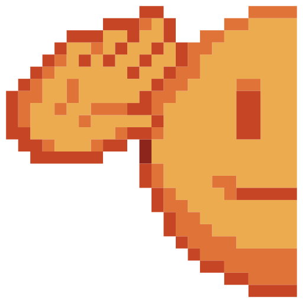

# 🖼️ 素材分類：Emojis

> [🏠 主目錄](../../../../README.md) / [images](../../../README.md) / [iCons](../../README.md) / [Pixel](../README.md) / **Emojis**

本目錄共有 `37` 個檔案

| 🎨 預覽 (點擊放大)  | 📋 檔案詳細資訊與連結 |
| :--- | :--- |
|  | **📂 檔名:** `001-angry.svg` ✨ **格式:** `Vector (SVG)` ⚖️ **大小:** `2.74KB` 📅 **更新:** `2026-03-01`  🚀 **jsDelivr Markdown:** `` 🔗 **直接連結 (Url):** <code>https://cdn.jsdelivr.net/gh/barry028/materials@main/images/iCons/Pixel/Emojis/001-angry.svg</code> 📥 [檢視原始檔](001-angry.svg) |
|  | **📂 檔名:** `002-kissing.svg` ✨ **格式:** `Vector (SVG)` ⚖️ **大小:** `2.68KB` 📅 **更新:** `2026-03-01`  🚀 **jsDelivr Markdown:** `` 🔗 **直接連結 (Url):** <code>https://cdn.jsdelivr.net/gh/barry028/materials@main/images/iCons/Pixel/Emojis/002-kissing.svg</code> 📥 [檢視原始檔](002-kissing.svg) |
|  | **📂 檔名:** `003-crush.svg` ✨ **格式:** `Vector (SVG)` ⚖️ **大小:** `3.62KB` 📅 **更新:** `2026-03-01`  🚀 **jsDelivr Markdown:** `` 🔗 **直接連結 (Url):** <code>https://cdn.jsdelivr.net/gh/barry028/materials@main/images/iCons/Pixel/Emojis/003-crush.svg</code> 📥 [檢視原始檔](003-crush.svg) |
|  | **📂 檔名:** `004-dizzy.svg` ✨ **格式:** `Vector (SVG)` ⚖️ **大小:** `2.55KB` 📅 **更新:** `2026-03-01`  🚀 **jsDelivr Markdown:** `` 🔗 **直接連結 (Url):** <code>https://cdn.jsdelivr.net/gh/barry028/materials@main/images/iCons/Pixel/Emojis/004-dizzy.svg</code> 📥 [檢視原始檔](004-dizzy.svg) |
|  | **📂 檔名:** `005-joy.svg` ✨ **格式:** `Vector (SVG)` ⚖️ **大小:** `2.84KB` 📅 **更新:** `2026-03-01`  🚀 **jsDelivr Markdown:** `` 🔗 **直接連結 (Url):** <code>https://cdn.jsdelivr.net/gh/barry028/materials@main/images/iCons/Pixel/Emojis/005-joy.svg</code> 📥 [檢視原始檔](005-joy.svg) |
|  | **📂 檔名:** `006-shocked.svg` ✨ **格式:** `Vector (SVG)` ⚖️ **大小:** `2.54KB` 📅 **更新:** `2026-03-01`  🚀 **jsDelivr Markdown:** `` 🔗 **直接連結 (Url):** <code>https://cdn.jsdelivr.net/gh/barry028/materials@main/images/iCons/Pixel/Emojis/006-shocked.svg</code> 📥 [檢視原始檔](006-shocked.svg) |
|  | **📂 檔名:** `007-sick.svg` ✨ **格式:** `Vector (SVG)` ⚖️ **大小:** `2.45KB` 📅 **更新:** `2026-03-01`  🚀 **jsDelivr Markdown:** `` 🔗 **直接連結 (Url):** <code>https://cdn.jsdelivr.net/gh/barry028/materials@main/images/iCons/Pixel/Emojis/007-sick.svg</code> 📥 [檢視原始檔](007-sick.svg) |
|  | **📂 檔名:** `008-ghost.svg` ✨ **格式:** `Vector (SVG)` ⚖️ **大小:** `3.16KB` 📅 **更新:** `2026-03-01`  🚀 **jsDelivr Markdown:** `` 🔗 **直接連結 (Url):** <code>https://cdn.jsdelivr.net/gh/barry028/materials@main/images/iCons/Pixel/Emojis/008-ghost.svg</code> 📥 [檢視原始檔](008-ghost.svg) |
|  | **📂 檔名:** `009-grin.svg` ✨ **格式:** `Vector (SVG)` ⚖️ **大小:** `2.31KB` 📅 **更新:** `2026-03-01`  🚀 **jsDelivr Markdown:** `` 🔗 **直接連結 (Url):** <code>https://cdn.jsdelivr.net/gh/barry028/materials@main/images/iCons/Pixel/Emojis/009-grin.svg</code> 📥 [檢視原始檔](009-grin.svg) |
|  | **📂 檔名:** `010-grin-alt.svg` ✨ **格式:** `Vector (SVG)` ⚖️ **大小:** `2.07KB` 📅 **更新:** `2026-03-01`  🚀 **jsDelivr Markdown:** `` 🔗 **直接連結 (Url):** <code>https://cdn.jsdelivr.net/gh/barry028/materials@main/images/iCons/Pixel/Emojis/010-grin-alt.svg</code> 📥 [檢視原始檔](010-grin-alt.svg) |
|  | **📂 檔名:** `011-heart beats.svg` ✨ **格式:** `Vector (SVG)` ⚖️ **大小:** `3.88KB` 📅 **更新:** `2026-03-01`  🚀 **jsDelivr Markdown:** `` 🔗 **直接連結 (Url):** <code>https://cdn.jsdelivr.net/gh/barry028/materials@main/images/iCons/Pixel/Emojis/011-heart%20beats.svg</code> 📥 [檢視原始檔](011-heart%20beats.svg) |
|  | **📂 檔名:** `012-kissing booth.svg` ✨ **格式:** `Vector (SVG)` ⚖️ **大小:** `2.59KB` 📅 **更新:** `2026-03-01`  🚀 **jsDelivr Markdown:** `` 🔗 **直接連結 (Url):** <code>https://cdn.jsdelivr.net/gh/barry028/materials@main/images/iCons/Pixel/Emojis/012-kissing%20booth.svg</code> 📥 [檢視原始檔](012-kissing%20booth.svg) |
|  | **📂 檔名:** `013-lick.svg` ✨ **格式:** `Vector (SVG)` ⚖️ **大小:** `2.62KB` 📅 **更新:** `2026-03-01`  🚀 **jsDelivr Markdown:** `` 🔗 **直接連結 (Url):** <code>https://cdn.jsdelivr.net/gh/barry028/materials@main/images/iCons/Pixel/Emojis/013-lick.svg</code> 📥 [檢視原始檔](013-lick.svg) |
|  | **📂 檔名:** `014-crying.svg` ✨ **格式:** `Vector (SVG)` ⚖️ **大小:** `3.11KB` 📅 **更新:** `2026-03-01`  🚀 **jsDelivr Markdown:** `` 🔗 **直接連結 (Url):** <code>https://cdn.jsdelivr.net/gh/barry028/materials@main/images/iCons/Pixel/Emojis/014-crying.svg</code> 📥 [檢視原始檔](014-crying.svg) |
|  | **📂 檔名:** `015-dollar sign.svg` ✨ **格式:** `Vector (SVG)` ⚖️ **大小:** `2.82KB` 📅 **更新:** `2026-03-01`  🚀 **jsDelivr Markdown:** `` 🔗 **直接連結 (Url):** <code>https://cdn.jsdelivr.net/gh/barry028/materials@main/images/iCons/Pixel/Emojis/015-dollar%20sign.svg</code> 📥 [檢視原始檔](015-dollar%20sign.svg) |
|  | **📂 檔名:** `016-rage.svg` ✨ **格式:** `Vector (SVG)` ⚖️ **大小:** `4.02KB` 📅 **更新:** `2026-03-01`  🚀 **jsDelivr Markdown:** `` 🔗 **直接連結 (Url):** <code>https://cdn.jsdelivr.net/gh/barry028/materials@main/images/iCons/Pixel/Emojis/016-rage.svg</code> 📥 [檢視原始檔](016-rage.svg) |
|  | **📂 檔名:** `017-robot.svg` ✨ **格式:** `Vector (SVG)` ⚖️ **大小:** `3.20KB` 📅 **更新:** `2026-03-01`  🚀 **jsDelivr Markdown:** `` 🔗 **直接連結 (Url):** <code>https://cdn.jsdelivr.net/gh/barry028/materials@main/images/iCons/Pixel/Emojis/017-robot.svg</code> 📥 [檢視原始檔](017-robot.svg) |
|  | **📂 檔名:** `018-rolling eyes.svg` ✨ **格式:** `Vector (SVG)` ⚖️ **大小:** `2.83KB` 📅 **更新:** `2026-03-01`  🚀 **jsDelivr Markdown:** `` 🔗 **直接連結 (Url):** <code>https://cdn.jsdelivr.net/gh/barry028/materials@main/images/iCons/Pixel/Emojis/018-rolling%20eyes.svg</code> 📥 [檢視原始檔](018-rolling%20eyes.svg) |
|  | **📂 檔名:** `019-tears of joy.svg` ✨ **格式:** `Vector (SVG)` ⚖️ **大小:** `3.07KB` 📅 **更新:** `2026-03-01`  🚀 **jsDelivr Markdown:** `` 🔗 **直接連結 (Url):** <code>https://cdn.jsdelivr.net/gh/barry028/materials@main/images/iCons/Pixel/Emojis/019-tears%20of%20joy.svg</code> 📥 [檢視原始檔](019-tears%20of%20joy.svg) |
|  | **📂 檔名:** `020-saluting.svg` ✨ **格式:** `Vector (SVG)` ⚖️ **大小:** `2.57KB` 📅 **更新:** `2026-03-01`  🚀 **jsDelivr Markdown:** `` 🔗 **直接連結 (Url):** <code>https://cdn.jsdelivr.net/gh/barry028/materials@main/images/iCons/Pixel/Emojis/020-saluting.svg</code> 📥 [檢視原始檔](020-saluting.svg) |
|  | **📂 檔名:** `021-scream.svg` ✨ **格式:** `Vector (SVG)` ⚖️ **大小:** `3.35KB` 📅 **更新:** `2026-03-01`  🚀 **jsDelivr Markdown:** `` 🔗 **直接連結 (Url):** <code>https://cdn.jsdelivr.net/gh/barry028/materials@main/images/iCons/Pixel/Emojis/021-scream.svg</code> 📥 [檢視原始檔](021-scream.svg) |
|  | **📂 檔名:** `022-happy.svg` ✨ **格式:** `Vector (SVG)` ⚖️ **大小:** `2.32KB` 📅 **更新:** `2026-03-01`  🚀 **jsDelivr Markdown:** `` 🔗 **直接連結 (Url):** <code>https://cdn.jsdelivr.net/gh/barry028/materials@main/images/iCons/Pixel/Emojis/022-happy.svg</code> 📥 [檢視原始檔](022-happy.svg) |
|  | **📂 檔名:** `023-smile emoticon.svg` ✨ **格式:** `Vector (SVG)` ⚖️ **大小:** `1.99KB` 📅 **更新:** `2026-03-01`  🚀 **jsDelivr Markdown:** `` 🔗 **直接連結 (Url):** <code>https://cdn.jsdelivr.net/gh/barry028/materials@main/images/iCons/Pixel/Emojis/023-smile%20emoticon.svg</code> 📥 [檢視原始檔](023-smile%20emoticon.svg) |
|  | **📂 檔名:** `024-laugh.svg` ✨ **格式:** `Vector (SVG)` ⚖️ **大小:** `2.45KB` 📅 **更新:** `2026-03-01`  🚀 **jsDelivr Markdown:** `` 🔗 **直接連結 (Url):** <code>https://cdn.jsdelivr.net/gh/barry028/materials@main/images/iCons/Pixel/Emojis/024-laugh.svg</code> 📥 [檢視原始檔](024-laugh.svg) |
|  | **📂 檔名:** `025-angel.svg` ✨ **格式:** `Vector (SVG)` ⚖️ **大小:** `2.62KB` 📅 **更新:** `2026-03-01`  🚀 **jsDelivr Markdown:** `` 🔗 **直接連結 (Url):** <code>https://cdn.jsdelivr.net/gh/barry028/materials@main/images/iCons/Pixel/Emojis/025-angel.svg</code> 📥 [檢視原始檔](025-angel.svg) |
|  | **📂 檔名:** `026-suprise.svg` ✨ **格式:** `Vector (SVG)` ⚖️ **大小:** `2.20KB` 📅 **更新:** `2026-03-01`  🚀 **jsDelivr Markdown:** `` 🔗 **直接連結 (Url):** <code>https://cdn.jsdelivr.net/gh/barry028/materials@main/images/iCons/Pixel/Emojis/026-suprise.svg</code> 📥 [檢視原始檔](026-suprise.svg) |
|  | **📂 檔名:** `027-sneezing.svg` ✨ **格式:** `Vector (SVG)` ⚖️ **大小:** `3.68KB` 📅 **更新:** `2026-03-01`  🚀 **jsDelivr Markdown:** `` 🔗 **直接連結 (Url):** <code>https://cdn.jsdelivr.net/gh/barry028/materials@main/images/iCons/Pixel/Emojis/027-sneezing.svg</code> 📥 [檢視原始檔](027-sneezing.svg) |
|  | **📂 檔名:** `028-confused.svg` ✨ **格式:** `Vector (SVG)` ⚖️ **大小:** `2.63KB` 📅 **更新:** `2026-03-01`  🚀 **jsDelivr Markdown:** `` 🔗 **直接連結 (Url):** <code>https://cdn.jsdelivr.net/gh/barry028/materials@main/images/iCons/Pixel/Emojis/028-confused.svg</code> 📥 [檢視原始檔](028-confused.svg) |
|  | **📂 檔名:** `029-starry.svg` ✨ **格式:** `Vector (SVG)` ⚖️ **大小:** `3.93KB` 📅 **更新:** `2026-03-01`  🚀 **jsDelivr Markdown:** `` 🔗 **直接連結 (Url):** <code>https://cdn.jsdelivr.net/gh/barry028/materials@main/images/iCons/Pixel/Emojis/029-starry.svg</code> 📥 [檢視原始檔](029-starry.svg) |
|  | **📂 檔名:** `030-tongue out.svg` ✨ **格式:** `Vector (SVG)` ⚖️ **大小:** `2.20KB` 📅 **更新:** `2026-03-01`  🚀 **jsDelivr Markdown:** `` 🔗 **直接連結 (Url):** <code>https://cdn.jsdelivr.net/gh/barry028/materials@main/images/iCons/Pixel/Emojis/030-tongue%20out.svg</code> 📥 [檢視原始檔](030-tongue%20out.svg) |
|  | **📂 檔名:** `031-awkward.svg` ✨ **格式:** `Vector (SVG)` ⚖️ **大小:** `3.69KB` 📅 **更新:** `2026-03-01`  🚀 **jsDelivr Markdown:** `` 🔗 **直接連結 (Url):** <code>https://cdn.jsdelivr.net/gh/barry028/materials@main/images/iCons/Pixel/Emojis/031-awkward.svg</code> 📥 [檢視原始檔](031-awkward.svg) |
|  | **📂 檔名:** `032-cracking.svg` ✨ **格式:** `Vector (SVG)` ⚖️ **大小:** `3.51KB` 📅 **更新:** `2026-03-01`  🚀 **jsDelivr Markdown:** `` 🔗 **直接連結 (Url):** <code>https://cdn.jsdelivr.net/gh/barry028/materials@main/images/iCons/Pixel/Emojis/032-cracking.svg</code> 📥 [檢視原始檔](032-cracking.svg) |
|  | **📂 檔名:** `033-thinking.svg` ✨ **格式:** `Vector (SVG)` ⚖️ **大小:** `3.05KB` 📅 **更新:** `2026-03-01`  🚀 **jsDelivr Markdown:** `` 🔗 **直接連結 (Url):** <code>https://cdn.jsdelivr.net/gh/barry028/materials@main/images/iCons/Pixel/Emojis/033-thinking.svg</code> 📥 [檢視原始檔](033-thinking.svg) |
|  | **📂 檔名:** `034-tiredness.svg` ✨ **格式:** `Vector (SVG)` ⚖️ **大小:** `3.25KB` 📅 **更新:** `2026-03-01`  🚀 **jsDelivr Markdown:** `` 🔗 **直接連結 (Url):** <code>https://cdn.jsdelivr.net/gh/barry028/materials@main/images/iCons/Pixel/Emojis/034-tiredness.svg</code> 📥 [檢視原始檔](034-tiredness.svg) |
|  | **📂 檔名:** `035-winking face.svg` ✨ **格式:** `Vector (SVG)` ⚖️ **大小:** `2.30KB` 📅 **更新:** `2026-03-01`  🚀 **jsDelivr Markdown:** `` 🔗 **直接連結 (Url):** <code>https://cdn.jsdelivr.net/gh/barry028/materials@main/images/iCons/Pixel/Emojis/035-winking%20face.svg</code> 📥 [檢視原始檔](035-winking%20face.svg) |
|  | **📂 檔名:** `036-woozy.svg` ✨ **格式:** `Vector (SVG)` ⚖️ **大小:** `2.86KB` 📅 **更新:** `2026-03-01`  🚀 **jsDelivr Markdown:** `` 🔗 **直接連結 (Url):** <code>https://cdn.jsdelivr.net/gh/barry028/materials@main/images/iCons/Pixel/Emojis/036-woozy.svg</code> 📥 [檢視原始檔](036-woozy.svg) |
|  | **📂 檔名:** `037-zipped.svg` ✨ **格式:** `Vector (SVG)` ⚖️ **大小:** `3.47KB` 📅 **更新:** `2026-03-01`  🚀 **jsDelivr Markdown:** `` 🔗 **直接連結 (Url):** <code>https://cdn.jsdelivr.net/gh/barry028/materials@main/images/iCons/Pixel/Emojis/037-zipped.svg</code> 📥 [檢視原始檔](037-zipped.svg) |