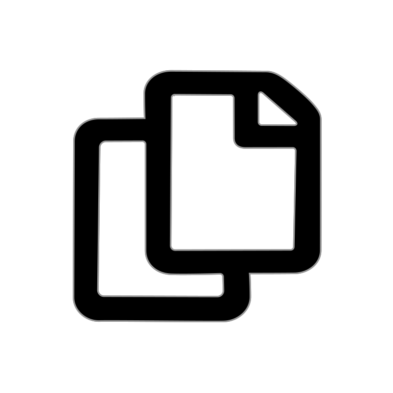
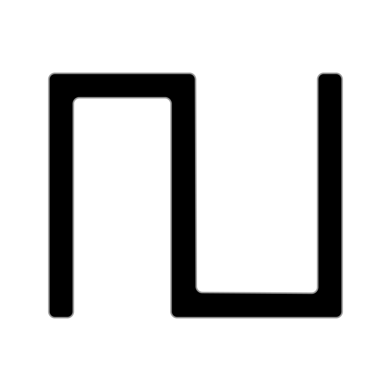

# 🖼️ 素材分類：Fontaudi

> [🏠 主目錄](../../../../README.md) / [images](../../../README.md) / [iCons](../../README.md) / [Pixel](../README.md) / **Fontaudi**

本目錄共有 `52` 個檔案

| 🎨 預覽 (點擊放大)  | 📋 檔案詳細資訊與連結 |
| :--- | :--- |
|  | **📂 檔名:** `arpchord-svgrepo-com.svg` ✨ **格式:** `Vector (SVG)` ⚖️ **大小:** `1.02KB` 📅 **更新:** `2026-03-03`  🚀 **jsDelivr Markdown:** `` 🔗 **直接連結 (Url):** <code>https://cdn.jsdelivr.net/gh/barry028/materials@main/images/iCons/Pixel/Fontaudi/arpchord-svgrepo-com.svg</code> 📥 [檢視原始檔](arpchord-svgrepo-com.svg) |
|  | **📂 檔名:** `arpdown-svgrepo-com.svg` ✨ **格式:** `Vector (SVG)` ⚖️ **大小:** `898.00B` 📅 **更新:** `2026-03-03`  🚀 **jsDelivr Markdown:** `` 🔗 **直接連結 (Url):** <code>https://cdn.jsdelivr.net/gh/barry028/materials@main/images/iCons/Pixel/Fontaudi/arpdown-svgrepo-com.svg</code> 📥 [檢視原始檔](arpdown-svgrepo-com.svg) |
|  | **📂 檔名:** `arpdownandup-svgrepo-com.svg` ✨ **格式:** `Vector (SVG)` ⚖️ **大小:** `1.02KB` 📅 **更新:** `2026-03-03`  🚀 **jsDelivr Markdown:** `` 🔗 **直接連結 (Url):** <code>https://cdn.jsdelivr.net/gh/barry028/materials@main/images/iCons/Pixel/Fontaudi/arpdownandup-svgrepo-com.svg</code> 📥 [檢視原始檔](arpdownandup-svgrepo-com.svg) |
|  | **📂 檔名:** `arpdownup-svgrepo-com.svg` ✨ **格式:** `Vector (SVG)` ⚖️ **大小:** `896.00B` 📅 **更新:** `2026-03-03`  🚀 **jsDelivr Markdown:** `` 🔗 **直接連結 (Url):** <code>https://cdn.jsdelivr.net/gh/barry028/materials@main/images/iCons/Pixel/Fontaudi/arpdownup-svgrepo-com.svg</code> 📥 [檢視原始檔](arpdownup-svgrepo-com.svg) |
|  | **📂 檔名:** `arpplayorder-svgrepo-com.svg` ✨ **格式:** `Vector (SVG)` ⚖️ **大小:** `1.03KB` 📅 **更新:** `2026-03-03`  🚀 **jsDelivr Markdown:** `` 🔗 **直接連結 (Url):** <code>https://cdn.jsdelivr.net/gh/barry028/materials@main/images/iCons/Pixel/Fontaudi/arpplayorder-svgrepo-com.svg</code> 📥 [檢視原始檔](arpplayorder-svgrepo-com.svg) |
|  | **📂 檔名:** `arprandom-svgrepo-com.svg` ✨ **格式:** `Vector (SVG)` ⚖️ **大小:** `902.00B` 📅 **更新:** `2026-03-03`  🚀 **jsDelivr Markdown:** `` 🔗 **直接連結 (Url):** <code>https://cdn.jsdelivr.net/gh/barry028/materials@main/images/iCons/Pixel/Fontaudi/arprandom-svgrepo-com.svg</code> 📥 [檢視原始檔](arprandom-svgrepo-com.svg) |
|  | **📂 檔名:** `arpup-svgrepo-com.svg` ✨ **格式:** `Vector (SVG)` ⚖️ **大小:** `910.00B` 📅 **更新:** `2026-03-03`  🚀 **jsDelivr Markdown:** `` 🔗 **直接連結 (Url):** <code>https://cdn.jsdelivr.net/gh/barry028/materials@main/images/iCons/Pixel/Fontaudi/arpup-svgrepo-com.svg</code> 📥 [檢視原始檔](arpup-svgrepo-com.svg) |
|  | **📂 檔名:** `arpupandown-svgrepo-com.svg` ✨ **格式:** `Vector (SVG)` ⚖️ **大小:** `1.02KB` 📅 **更新:** `2026-03-03`  🚀 **jsDelivr Markdown:** `` 🔗 **直接連結 (Url):** <code>https://cdn.jsdelivr.net/gh/barry028/materials@main/images/iCons/Pixel/Fontaudi/arpupandown-svgrepo-com.svg</code> 📥 [檢視原始檔](arpupandown-svgrepo-com.svg) |
|  | **📂 檔名:** `arpupdown-svgrepo-com.svg` ✨ **格式:** `Vector (SVG)` ⚖️ **大小:** `902.00B` 📅 **更新:** `2026-03-03`  🚀 **jsDelivr Markdown:** `` 🔗 **直接連結 (Url):** <code>https://cdn.jsdelivr.net/gh/barry028/materials@main/images/iCons/Pixel/Fontaudi/arpupdown-svgrepo-com.svg</code> 📥 [檢視原始檔](arpupdown-svgrepo-com.svg) |
|  | **📂 檔名:** `close-svgrepo-com.svg` ✨ **格式:** `Vector (SVG)` ⚖️ **大小:** `873.00B` 📅 **更新:** `2026-03-03`  🚀 **jsDelivr Markdown:** `` 🔗 **直接連結 (Url):** <code>https://cdn.jsdelivr.net/gh/barry028/materials@main/images/iCons/Pixel/Fontaudi/close-svgrepo-com.svg</code> 📥 [檢視原始檔](close-svgrepo-com.svg) |
|  | **📂 檔名:** `copy-svgrepo-com.svg` ✨ **格式:** `Vector (SVG)` ⚖️ **大小:** `2.61KB` 📅 **更新:** `2026-03-03`  🚀 **jsDelivr Markdown:** `` 🔗 **直接連結 (Url):** <code>https://cdn.jsdelivr.net/gh/barry028/materials@main/images/iCons/Pixel/Fontaudi/copy-svgrepo-com.svg</code> 📥 [檢視原始檔](copy-svgrepo-com.svg) |
|  | **📂 檔名:** `cpu-svgrepo-com.svg` ✨ **格式:** `Vector (SVG)` ⚖️ **大小:** `984.00B` 📅 **更新:** `2026-03-03`  🚀 **jsDelivr Markdown:** `` 🔗 **直接連結 (Url):** <code>https://cdn.jsdelivr.net/gh/barry028/materials@main/images/iCons/Pixel/Fontaudi/cpu-svgrepo-com.svg</code> 📥 [檢視原始檔](cpu-svgrepo-com.svg) |
|  | **📂 檔名:** `digital-colon-svgrepo-com.svg` ✨ **格式:** `Vector (SVG)` ⚖️ **大小:** `402.00B` 📅 **更新:** `2026-03-03`  🚀 **jsDelivr Markdown:** `` 🔗 **直接連結 (Url):** <code>https://cdn.jsdelivr.net/gh/barry028/materials@main/images/iCons/Pixel/Fontaudi/digital-colon-svgrepo-com.svg</code> 📥 [檢視原始檔](digital-colon-svgrepo-com.svg) |
|  | **📂 檔名:** `digital0-svgrepo-com.svg` ✨ **格式:** `Vector (SVG)` ⚖️ **大小:** `1.44KB` 📅 **更新:** `2026-03-03`  🚀 **jsDelivr Markdown:** `` 🔗 **直接連結 (Url):** <code>https://cdn.jsdelivr.net/gh/barry028/materials@main/images/iCons/Pixel/Fontaudi/digital0-svgrepo-com.svg</code> 📥 [檢視原始檔](digital0-svgrepo-com.svg) |
|  | **📂 檔名:** `digital1-svgrepo-com.svg` ✨ **格式:** `Vector (SVG)` ⚖️ **大小:** `615.00B` 📅 **更新:** `2026-03-03`  🚀 **jsDelivr Markdown:** `` 🔗 **直接連結 (Url):** <code>https://cdn.jsdelivr.net/gh/barry028/materials@main/images/iCons/Pixel/Fontaudi/digital1-svgrepo-com.svg</code> 📥 [檢視原始檔](digital1-svgrepo-com.svg) |
|  | **📂 檔名:** `digital2-svgrepo-com.svg` ✨ **格式:** `Vector (SVG)` ⚖️ **大小:** `1.27KB` 📅 **更新:** `2026-03-03`  🚀 **jsDelivr Markdown:** `` 🔗 **直接連結 (Url):** <code>https://cdn.jsdelivr.net/gh/barry028/materials@main/images/iCons/Pixel/Fontaudi/digital2-svgrepo-com.svg</code> 📥 [檢視原始檔](digital2-svgrepo-com.svg) |
|  | **📂 檔名:** `digital3-svgrepo-com.svg` ✨ **格式:** `Vector (SVG)` ⚖️ **大小:** `1.27KB` 📅 **更新:** `2026-03-03`  🚀 **jsDelivr Markdown:** `` 🔗 **直接連結 (Url):** <code>https://cdn.jsdelivr.net/gh/barry028/materials@main/images/iCons/Pixel/Fontaudi/digital3-svgrepo-com.svg</code> 📥 [檢視原始檔](digital3-svgrepo-com.svg) |
|  | **📂 檔名:** `digital4-svgrepo-com.svg` ✨ **格式:** `Vector (SVG)` ⚖️ **大小:** `1.11KB` 📅 **更新:** `2026-03-03`  🚀 **jsDelivr Markdown:** `` 🔗 **直接連結 (Url):** <code>https://cdn.jsdelivr.net/gh/barry028/materials@main/images/iCons/Pixel/Fontaudi/digital4-svgrepo-com.svg</code> 📥 [檢視原始檔](digital4-svgrepo-com.svg) |
|  | **📂 檔名:** `digital5-svgrepo-com.svg` ✨ **格式:** `Vector (SVG)` ⚖️ **大小:** `1.25KB` 📅 **更新:** `2026-03-03`  🚀 **jsDelivr Markdown:** `` 🔗 **直接連結 (Url):** <code>https://cdn.jsdelivr.net/gh/barry028/materials@main/images/iCons/Pixel/Fontaudi/digital5-svgrepo-com.svg</code> 📥 [檢視原始檔](digital5-svgrepo-com.svg) |
|  | **📂 檔名:** `digital6-svgrepo-com.svg` ✨ **格式:** `Vector (SVG)` ⚖️ **大小:** `1.49KB` 📅 **更新:** `2026-03-03`  🚀 **jsDelivr Markdown:** `` 🔗 **直接連結 (Url):** <code>https://cdn.jsdelivr.net/gh/barry028/materials@main/images/iCons/Pixel/Fontaudi/digital6-svgrepo-com.svg</code> 📥 [檢視原始檔](digital6-svgrepo-com.svg) |
|  | **📂 檔名:** `digital7-svgrepo-com.svg` ✨ **格式:** `Vector (SVG)` ⚖️ **大小:** `810.00B` 📅 **更新:** `2026-03-03`  🚀 **jsDelivr Markdown:** `` 🔗 **直接連結 (Url):** <code>https://cdn.jsdelivr.net/gh/barry028/materials@main/images/iCons/Pixel/Fontaudi/digital7-svgrepo-com.svg</code> 📥 [檢視原始檔](digital7-svgrepo-com.svg) |
|  | **📂 檔名:** `digital8-svgrepo-com.svg` ✨ **格式:** `Vector (SVG)` ⚖️ **大小:** `1.73KB` 📅 **更新:** `2026-03-03`  🚀 **jsDelivr Markdown:** `` 🔗 **直接連結 (Url):** <code>https://cdn.jsdelivr.net/gh/barry028/materials@main/images/iCons/Pixel/Fontaudi/digital8-svgrepo-com.svg</code> 📥 [檢視原始檔](digital8-svgrepo-com.svg) |
|  | **📂 檔名:** `digital9-svgrepo-com.svg` ✨ **格式:** `Vector (SVG)` ⚖️ **大小:** `1.49KB` 📅 **更新:** `2026-03-03`  🚀 **jsDelivr Markdown:** `` 🔗 **直接連結 (Url):** <code>https://cdn.jsdelivr.net/gh/barry028/materials@main/images/iCons/Pixel/Fontaudi/digital9-svgrepo-com.svg</code> 📥 [檢視原始檔](digital9-svgrepo-com.svg) |
|  | **📂 檔名:** `diskio-svgrepo-com.svg` ✨ **格式:** `Vector (SVG)` ⚖️ **大小:** `871.00B` 📅 **更新:** `2026-03-03`  🚀 **jsDelivr Markdown:** `` 🔗 **直接連結 (Url):** <code>https://cdn.jsdelivr.net/gh/barry028/materials@main/images/iCons/Pixel/Fontaudi/diskio-svgrepo-com.svg</code> 📥 [檢視原始檔](diskio-svgrepo-com.svg) |
|  | **📂 檔名:** `duplicate-svgrepo-com.svg` ✨ **格式:** `Vector (SVG)` ⚖️ **大小:** `984.00B` 📅 **更新:** `2026-03-03`  🚀 **jsDelivr Markdown:** `` 🔗 **直接連結 (Url):** <code>https://cdn.jsdelivr.net/gh/barry028/materials@main/images/iCons/Pixel/Fontaudi/duplicate-svgrepo-com.svg</code> 📥 [檢視原始檔](duplicate-svgrepo-com.svg) |
|  | **📂 檔名:** `eraser-svgrepo-com.svg` ✨ **格式:** `Vector (SVG)` ⚖️ **大小:** `952.00B` 📅 **更新:** `2026-03-03`  🚀 **jsDelivr Markdown:** `` 🔗 **直接連結 (Url):** <code>https://cdn.jsdelivr.net/gh/barry028/materials@main/images/iCons/Pixel/Fontaudi/eraser-svgrepo-com.svg</code> 📥 [檢視原始檔](eraser-svgrepo-com.svg) |
|  | **📂 檔名:** `filter-bandpass-svgrepo-com.svg` ✨ **格式:** `Vector (SVG)` ⚖️ **大小:** `571.00B` 📅 **更新:** `2026-03-03`  🚀 **jsDelivr Markdown:** `` 🔗 **直接連結 (Url):** <code>https://cdn.jsdelivr.net/gh/barry028/materials@main/images/iCons/Pixel/Fontaudi/filter-bandpass-svgrepo-com.svg</code> 📥 [檢視原始檔](filter-bandpass-svgrepo-com.svg) |
|  | **📂 檔名:** `filter-bell-svgrepo-com.svg` ✨ **格式:** `Vector (SVG)` ⚖️ **大小:** `972.00B` 📅 **更新:** `2026-03-03`  🚀 **jsDelivr Markdown:** `` 🔗 **直接連結 (Url):** <code>https://cdn.jsdelivr.net/gh/barry028/materials@main/images/iCons/Pixel/Fontaudi/filter-bell-svgrepo-com.svg</code> 📥 [檢視原始檔](filter-bell-svgrepo-com.svg) |
|  | **📂 檔名:** `filter-highpass-svgrepo-com.svg` ✨ **格式:** `Vector (SVG)` ⚖️ **大小:** `477.00B` 📅 **更新:** `2026-03-03`  🚀 **jsDelivr Markdown:** `` 🔗 **直接連結 (Url):** <code>https://cdn.jsdelivr.net/gh/barry028/materials@main/images/iCons/Pixel/Fontaudi/filter-highpass-svgrepo-com.svg</code> 📥 [檢視原始檔](filter-highpass-svgrepo-com.svg) |
|  | **📂 檔名:** `filter-notch-svgrepo-com.svg` ✨ **格式:** `Vector (SVG)` ⚖️ **大小:** `553.00B` 📅 **更新:** `2026-03-03`  🚀 **jsDelivr Markdown:** `` 🔗 **直接連結 (Url):** <code>https://cdn.jsdelivr.net/gh/barry028/materials@main/images/iCons/Pixel/Fontaudi/filter-notch-svgrepo-com.svg</code> 📥 [檢視原始檔](filter-notch-svgrepo-com.svg) |
|  | **📂 檔名:** `h-expand-svgrepo-com.svg` ✨ **格式:** `Vector (SVG)` ⚖️ **大小:** `597.00B` 📅 **更新:** `2026-03-03`  🚀 **jsDelivr Markdown:** `` 🔗 **直接連結 (Url):** <code>https://cdn.jsdelivr.net/gh/barry028/materials@main/images/iCons/Pixel/Fontaudi/h-expand-svgrepo-com.svg</code> 📥 [檢視原始檔](h-expand-svgrepo-com.svg) |
|  | **📂 檔名:** `keyboard-svgrepo-com.svg` ✨ **格式:** `Vector (SVG)` ⚖️ **大小:** `870.00B` 📅 **更新:** `2026-03-03`  🚀 **jsDelivr Markdown:** `` 🔗 **直接連結 (Url):** <code>https://cdn.jsdelivr.net/gh/barry028/materials@main/images/iCons/Pixel/Fontaudi/keyboard-svgrepo-com.svg</code> 📥 [檢視原始檔](keyboard-svgrepo-com.svg) |
|  | **📂 檔名:** `lock-svgrepo-com.svg` ✨ **格式:** `Vector (SVG)` ⚖️ **大小:** `734.00B` 📅 **更新:** `2026-03-03`  🚀 **jsDelivr Markdown:** `` 🔗 **直接連結 (Url):** <code>https://cdn.jsdelivr.net/gh/barry028/materials@main/images/iCons/Pixel/Fontaudi/lock-svgrepo-com.svg</code> 📥 [檢視原始檔](lock-svgrepo-com.svg) |
|  | **📂 檔名:** `logo-abletonlink-svgrepo-com.svg` ✨ **格式:** `Vector (SVG)` ⚖️ **大小:** `1.95KB` 📅 **更新:** `2026-03-03`  🚀 **jsDelivr Markdown:** `` 🔗 **直接連結 (Url):** <code>https://cdn.jsdelivr.net/gh/barry028/materials@main/images/iCons/Pixel/Fontaudi/logo-abletonlink-svgrepo-com.svg</code> 📥 [檢視原始檔](logo-abletonlink-svgrepo-com.svg) |
|  | **📂 檔名:** `modsquare-svgrepo-com.svg` ✨ **格式:** `Vector (SVG)` ⚖️ **大小:** `580.00B` 📅 **更新:** `2026-03-03`  🚀 **jsDelivr Markdown:** `` 🔗 **直接連結 (Url):** <code>https://cdn.jsdelivr.net/gh/barry028/materials@main/images/iCons/Pixel/Fontaudi/modsquare-svgrepo-com.svg</code> 📥 [檢視原始檔](modsquare-svgrepo-com.svg) |
|  | **📂 檔名:** `open-svgrepo-com.svg` ✨ **格式:** `Vector (SVG)` ⚖️ **大小:** `1.13KB` 📅 **更新:** `2026-03-03`  🚀 **jsDelivr Markdown:** `` 🔗 **直接連結 (Url):** <code>https://cdn.jsdelivr.net/gh/barry028/materials@main/images/iCons/Pixel/Fontaudi/open-svgrepo-com.svg</code> 📥 [檢視原始檔](open-svgrepo-com.svg) |
|  | **📂 檔名:** `paste-svgrepo-com.svg` ✨ **格式:** `Vector (SVG)` ⚖️ **大小:** `1.15KB` 📅 **更新:** `2026-03-03`  🚀 **jsDelivr Markdown:** `` 🔗 **直接連結 (Url):** <code>https://cdn.jsdelivr.net/gh/barry028/materials@main/images/iCons/Pixel/Fontaudi/paste-svgrepo-com.svg</code> 📥 [檢視原始檔](paste-svgrepo-com.svg) |
|  | **📂 檔名:** `pen-svgrepo-com.svg` ✨ **格式:** `Vector (SVG)` ⚖️ **大小:** `355.00B` 📅 **更新:** `2026-03-03`  🚀 **jsDelivr Markdown:** `` 🔗 **直接連結 (Url):** <code>https://cdn.jsdelivr.net/gh/barry028/materials@main/images/iCons/Pixel/Fontaudi/pen-svgrepo-com.svg</code> 📥 [檢視原始檔](pen-svgrepo-com.svg) |
|  | **📂 檔名:** `preset-ab-svgrepo-com.svg` ✨ **格式:** `Vector (SVG)` ⚖️ **大小:** `1.88KB` 📅 **更新:** `2026-03-03`  🚀 **jsDelivr Markdown:** `` 🔗 **直接連結 (Url):** <code>https://cdn.jsdelivr.net/gh/barry028/materials@main/images/iCons/Pixel/Fontaudi/preset-ab-svgrepo-com.svg</code> 📥 [檢視原始檔](preset-ab-svgrepo-com.svg) |
|  | **📂 檔名:** `preset-ba-svgrepo-com.svg` ✨ **格式:** `Vector (SVG)` ⚖️ **大小:** `1.89KB` 📅 **更新:** `2026-03-03`  🚀 **jsDelivr Markdown:** `` 🔗 **直接連結 (Url):** <code>https://cdn.jsdelivr.net/gh/barry028/materials@main/images/iCons/Pixel/Fontaudi/preset-ba-svgrepo-com.svg</code> 📥 [檢視原始檔](preset-ba-svgrepo-com.svg) |
|  | **📂 檔名:** `random-1dice-svgrepo-com.svg` ✨ **格式:** `Vector (SVG)` ⚖️ **大小:** `1.89KB` 📅 **更新:** `2026-03-03`  🚀 **jsDelivr Markdown:** `` 🔗 **直接連結 (Url):** <code>https://cdn.jsdelivr.net/gh/barry028/materials@main/images/iCons/Pixel/Fontaudi/random-1dice-svgrepo-com.svg</code> 📥 [檢視原始檔](random-1dice-svgrepo-com.svg) |
|  | **📂 檔名:** `save-svgrepo-com.svg` ✨ **格式:** `Vector (SVG)` ⚖️ **大小:** `1.29KB` 📅 **更新:** `2026-03-03`  🚀 **jsDelivr Markdown:** `` 🔗 **直接連結 (Url):** <code>https://cdn.jsdelivr.net/gh/barry028/materials@main/images/iCons/Pixel/Fontaudi/save-svgrepo-com.svg</code> 📥 [檢視原始檔](save-svgrepo-com.svg) |
|  | **📂 檔名:** `saveas-svgrepo-com.svg` ✨ **格式:** `Vector (SVG)` ⚖️ **大小:** `1.51KB` 📅 **更新:** `2026-03-03`  🚀 **jsDelivr Markdown:** `` 🔗 **直接連結 (Url):** <code>https://cdn.jsdelivr.net/gh/barry028/materials@main/images/iCons/Pixel/Fontaudi/saveas-svgrepo-com.svg</code> 📥 [檢視原始檔](saveas-svgrepo-com.svg) |
|  | **📂 檔名:** `scissors-svgrepo-com.svg` ✨ **格式:** `Vector (SVG)` ⚖️ **大小:** `1.00KB` 📅 **更新:** `2026-03-03`  🚀 **jsDelivr Markdown:** `` 🔗 **直接連結 (Url):** <code>https://cdn.jsdelivr.net/gh/barry028/materials@main/images/iCons/Pixel/Fontaudi/scissors-svgrepo-com.svg</code> 📥 [檢視原始檔](scissors-svgrepo-com.svg) |
|  | **📂 檔名:** `slider-round-2-svgrepo-com.svg` ✨ **格式:** `Vector (SVG)` ⚖️ **大小:** `1.34KB` 📅 **更新:** `2026-03-03`  🚀 **jsDelivr Markdown:** `` 🔗 **直接連結 (Url):** <code>https://cdn.jsdelivr.net/gh/barry028/materials@main/images/iCons/Pixel/Fontaudi/slider-round-2-svgrepo-com.svg</code> 📥 [檢視原始檔](slider-round-2-svgrepo-com.svg) |
|  | **📂 檔名:** `sliderhandle-2-svgrepo-com.svg` ✨ **格式:** `Vector (SVG)` ⚖️ **大小:** `559.00B` 📅 **更新:** `2026-03-03`  🚀 **jsDelivr Markdown:** `` 🔗 **直接連結 (Url):** <code>https://cdn.jsdelivr.net/gh/barry028/materials@main/images/iCons/Pixel/Fontaudi/sliderhandle-2-svgrepo-com.svg</code> 📥 [檢視原始檔](sliderhandle-2-svgrepo-com.svg) |
|  | **📂 檔名:** `squareswitch-off-svgrepo-com.svg` ✨ **格式:** `Vector (SVG)` ⚖️ **大小:** `971.00B` 📅 **更新:** `2026-03-03`  🚀 **jsDelivr Markdown:** `` 🔗 **直接連結 (Url):** <code>https://cdn.jsdelivr.net/gh/barry028/materials@main/images/iCons/Pixel/Fontaudi/squareswitch-off-svgrepo-com.svg</code> 📥 [檢視原始檔](squareswitch-off-svgrepo-com.svg) |
|  | **📂 檔名:** `squareswitch-on-svgrepo-com.svg` ✨ **格式:** `Vector (SVG)` ⚖️ **大小:** `972.00B` 📅 **更新:** `2026-03-03`  🚀 **jsDelivr Markdown:** `` 🔗 **直接連結 (Url):** <code>https://cdn.jsdelivr.net/gh/barry028/materials@main/images/iCons/Pixel/Fontaudi/squareswitch-on-svgrepo-com.svg</code> 📥 [檢視原始檔](squareswitch-on-svgrepo-com.svg) |
|  | **📂 檔名:** `unlock-svgrepo-com.svg` ✨ **格式:** `Vector (SVG)` ⚖️ **大小:** `749.00B` 📅 **更新:** `2026-03-03`  🚀 **jsDelivr Markdown:** `` 🔗 **直接連結 (Url):** <code>https://cdn.jsdelivr.net/gh/barry028/materials@main/images/iCons/Pixel/Fontaudi/unlock-svgrepo-com.svg</code> 📥 [檢視原始檔](unlock-svgrepo-com.svg) |
|  | **📂 檔名:** `v-expand-svgrepo-com.svg` ✨ **格式:** `Vector (SVG)` ⚖️ **大小:** `606.00B` 📅 **更新:** `2026-03-03`  🚀 **jsDelivr Markdown:** `` 🔗 **直接連結 (Url):** <code>https://cdn.jsdelivr.net/gh/barry028/materials@main/images/iCons/Pixel/Fontaudi/v-expand-svgrepo-com.svg</code> 📥 [檢視原始檔](v-expand-svgrepo-com.svg) |
|  | **📂 檔名:** `vsquareswitch-off-svgrepo-com.svg` ✨ **格式:** `Vector (SVG)` ⚖️ **大小:** `969.00B` 📅 **更新:** `2026-03-03`  🚀 **jsDelivr Markdown:** `` 🔗 **直接連結 (Url):** <code>https://cdn.jsdelivr.net/gh/barry028/materials@main/images/iCons/Pixel/Fontaudi/vsquareswitch-off-svgrepo-com.svg</code> 📥 [檢視原始檔](vsquareswitch-off-svgrepo-com.svg) |
|  | **📂 檔名:** `vsquareswitch-on-svgrepo-com.svg` ✨ **格式:** `Vector (SVG)` ⚖️ **大小:** `972.00B` 📅 **更新:** `2026-03-03`  🚀 **jsDelivr Markdown:** `` 🔗 **直接連結 (Url):** <code>https://cdn.jsdelivr.net/gh/barry028/materials@main/images/iCons/Pixel/Fontaudi/vsquareswitch-on-svgrepo-com.svg</code> 📥 [檢視原始檔](vsquareswitch-on-svgrepo-com.svg) |