# 🖼️ 素材分類：Fruit

> [🏠 主目錄](../../../../README.md) / **Fruit**

本目錄共有 `20` 個檔案

| 🎨 預覽 (點擊放大) | 📋 檔案詳細資訊與連結 |
| :--- | :--- |
|  | **📂 檔名:** `apple-svgrepo-com.svg` ✨ **格式:** `Vector (SVG)` | ⚖️ `3.63KB` 📅 **更新:** `2026-02-27`  🔗 **複製 Markdown 語法:** `` 📥 [檢視原始檔](apple-svgrepo-com.svg) |
|  | **📂 檔名:** `avocado-svgrepo-com.svg` ✨ **格式:** `Vector (SVG)` | ⚖️ `2.54KB` 📅 **更新:** `2026-02-27`  🔗 **複製 Markdown 語法:** `` 📥 [檢視原始檔](avocado-svgrepo-com.svg) |
| <a href="banana-svgrepo-com.svg">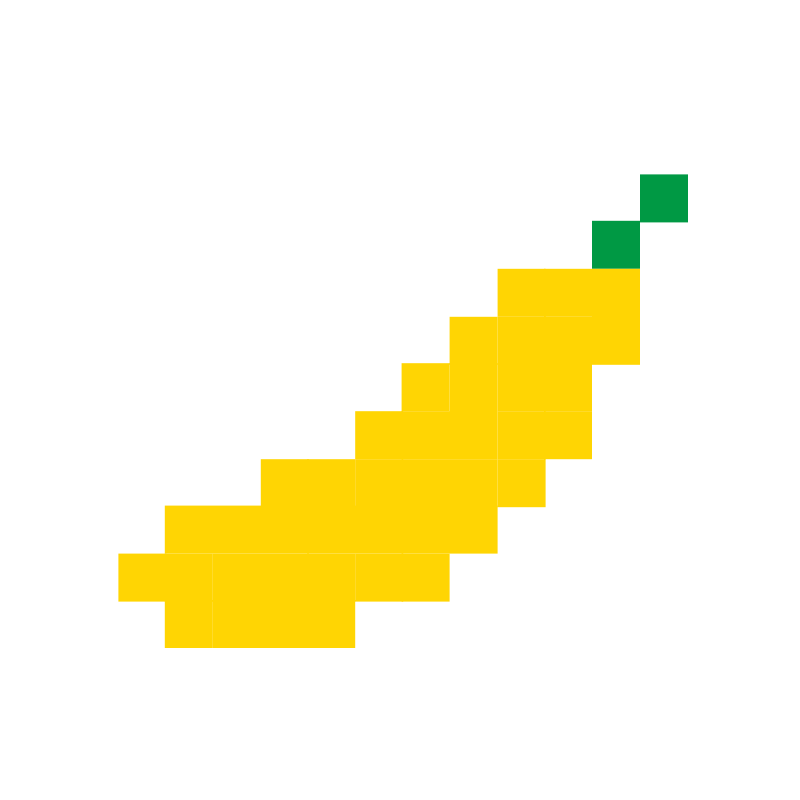</a> | **📂 檔名:** `banana-svgrepo-com.svg` ✨ **格式:** `Vector (SVG)` | ⚖️ `2.01KB` 📅 **更新:** `2026-02-27`  🔗 **複製 Markdown 語法:** `` 📥 [檢視原始檔](banana-svgrepo-com.svg) |
| <a href="cherry-svgrepo-com.svg">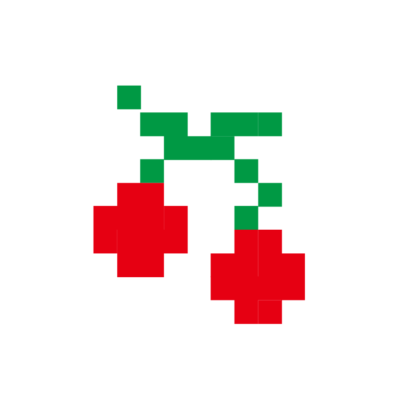</a> | **📂 檔名:** `cherry-svgrepo-com.svg` ✨ **格式:** `Vector (SVG)` | ⚖️ `1.60KB` 📅 **更新:** `2026-02-27`  🔗 **複製 Markdown 語法:** `` 📥 [檢視原始檔](cherry-svgrepo-com.svg) |
|  | **📂 檔名:** `coconut-svgrepo-com.svg` ✨ **格式:** `Vector (SVG)` | ⚖️ `3.64KB` 📅 **更新:** `2026-02-27`  🔗 **複製 Markdown 語法:** `` 📥 [檢視原始檔](coconut-svgrepo-com.svg) |
| <a href="fig-svgrepo-com.svg">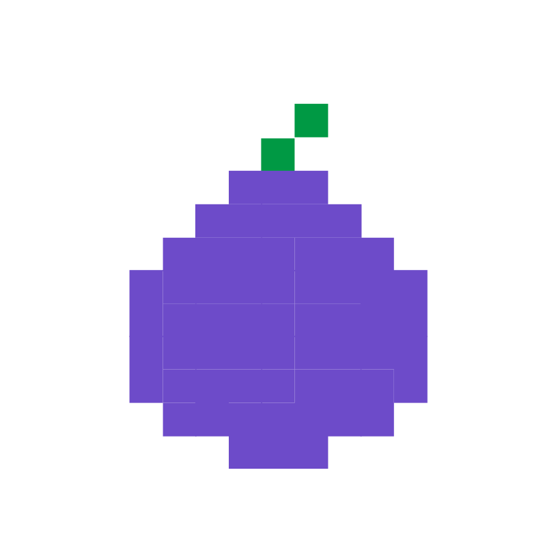</a> | **📂 檔名:** `fig-svgrepo-com.svg` ✨ **格式:** `Vector (SVG)` | ⚖️ `2.83KB` 📅 **更新:** `2026-02-27`  🔗 **複製 Markdown 語法:** `` 📥 [檢視原始檔](fig-svgrepo-com.svg) |
| <a href="grape-svgrepo-com.svg">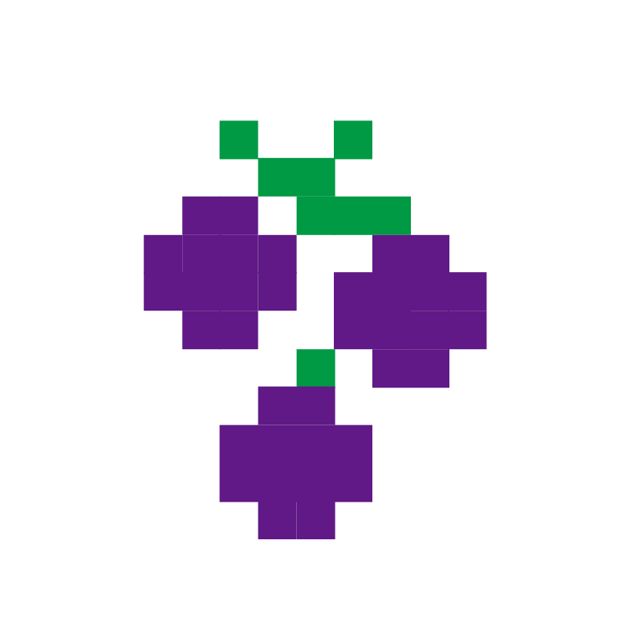</a> | **📂 檔名:** `grape-svgrepo-com.svg` ✨ **格式:** `Vector (SVG)` | ⚖️ `1.99KB` 📅 **更新:** `2026-02-27`  🔗 **複製 Markdown 語法:** `` 📥 [檢視原始檔](grape-svgrepo-com.svg) |
|  | **📂 檔名:** `grapefruit-svgrepo-com.svg` ✨ **格式:** `Vector (SVG)` | ⚖️ `3.45KB` 📅 **更新:** `2026-02-27`  🔗 **複製 Markdown 語法:** `` 📥 [檢視原始檔](grapefruit-svgrepo-com.svg) |
| <a href="guava-svgrepo-com.svg">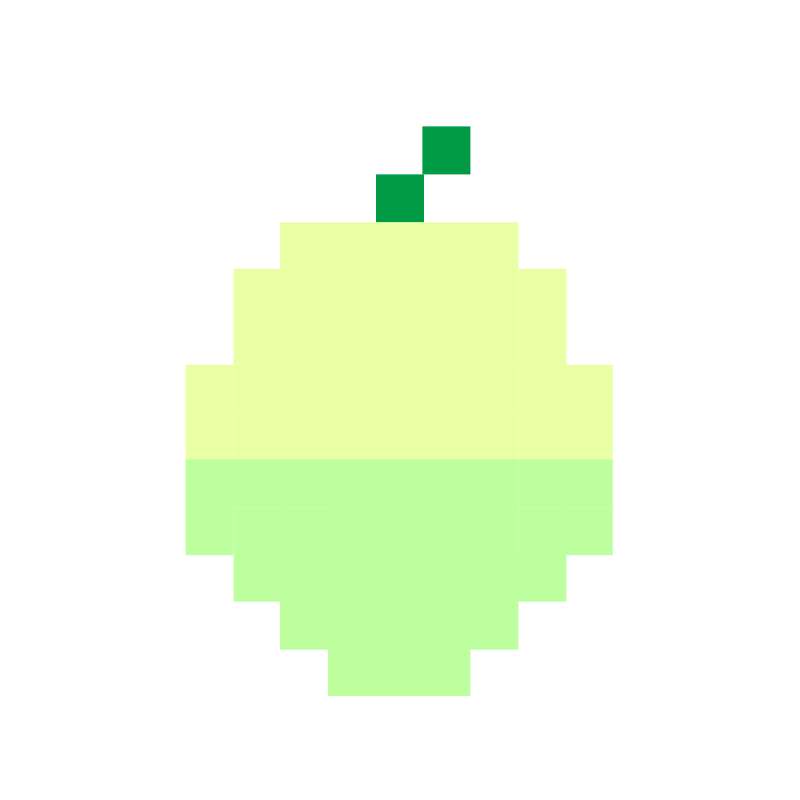</a> | **📂 檔名:** `guava-svgrepo-com.svg` ✨ **格式:** `Vector (SVG)` | ⚖️ `3.17KB` 📅 **更新:** `2026-02-27`  🔗 **複製 Markdown 語法:** `` 📥 [檢視原始檔](guava-svgrepo-com.svg) |
|  | **📂 檔名:** `kiwi-svgrepo-com.svg` ✨ **格式:** `Vector (SVG)` | ⚖️ `3.44KB` 📅 **更新:** `2026-02-27`  🔗 **複製 Markdown 語法:** `` 📥 [檢視原始檔](kiwi-svgrepo-com.svg) |
|  | **📂 檔名:** `lemon-svgrepo-com.svg` ✨ **格式:** `Vector (SVG)` | ⚖️ `3.64KB` 📅 **更新:** `2026-02-27`  🔗 **複製 Markdown 語法:** `` 📥 [檢視原始檔](lemon-svgrepo-com.svg) |
|  | **📂 檔名:** `navel-orange-svgrepo-com.svg` ✨ **格式:** `Vector (SVG)` | ⚖️ `3.39KB` 📅 **更新:** `2026-02-27`  🔗 **複製 Markdown 語法:** `` 📥 [檢視原始檔](navel-orange-svgrepo-com.svg) |
| <a href="ome-svgrepo-com.svg">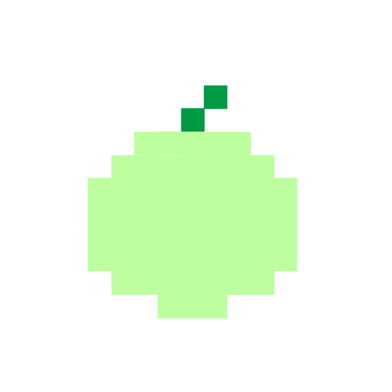</a> | **📂 檔名:** `ome-svgrepo-com.svg` ✨ **格式:** `Vector (SVG)` | ⚖️ `2.62KB` 📅 **更新:** `2026-02-27`  🔗 **複製 Markdown 語法:** `` 📥 [檢視原始檔](ome-svgrepo-com.svg) |
| <a href="pawpaw-svgrepo-com.svg">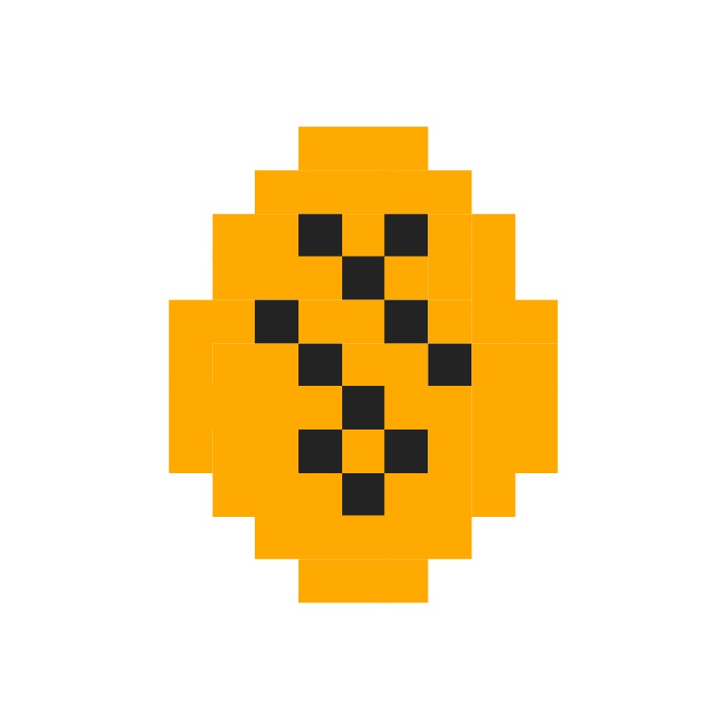</a> | **📂 檔名:** `pawpaw-svgrepo-com.svg` ✨ **格式:** `Vector (SVG)` | ⚖️ `3.42KB` 📅 **更新:** `2026-02-27`  🔗 **複製 Markdown 語法:** `` 📥 [檢視原始檔](pawpaw-svgrepo-com.svg) |
| <a href="pear-svgrepo-com.svg">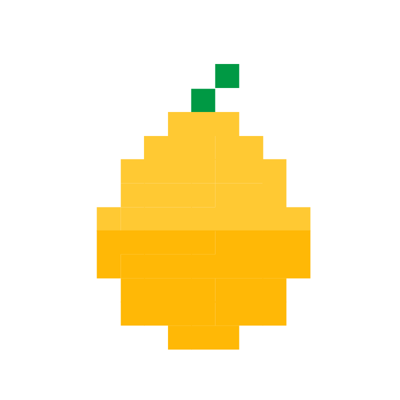</a> | **📂 檔名:** `pear-svgrepo-com.svg` ✨ **格式:** `Vector (SVG)` | ⚖️ `3.12KB` 📅 **更新:** `2026-02-27`  🔗 **複製 Markdown 語法:** `` 📥 [檢視原始檔](pear-svgrepo-com.svg) |
| <a href="pineapple-svgrepo-com.svg">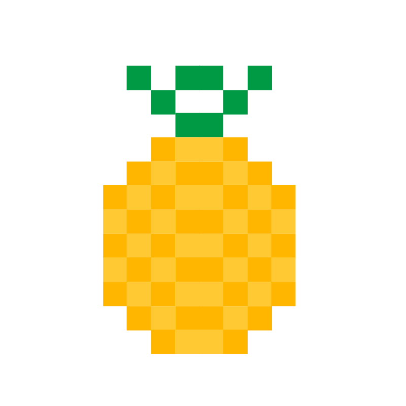</a> | **📂 檔名:** `pineapple-svgrepo-com.svg` ✨ **格式:** `Vector (SVG)` | ⚖️ `3.59KB` 📅 **更新:** `2026-02-27`  🔗 **複製 Markdown 語法:** `` 📥 [檢視原始檔](pineapple-svgrepo-com.svg) |
| <a href="pitaya-svgrepo-com.svg">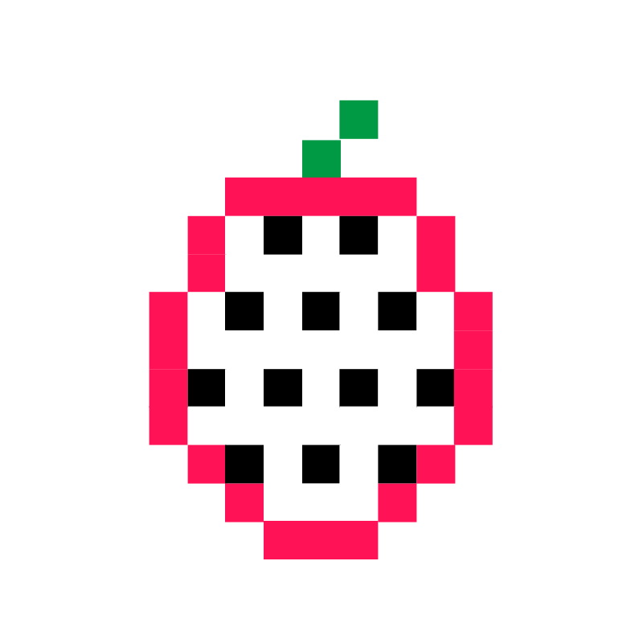</a> | **📂 檔名:** `pitaya-svgrepo-com.svg` ✨ **格式:** `Vector (SVG)` | ⚖️ `3.59KB` 📅 **更新:** `2026-02-27`  🔗 **複製 Markdown 語法:** `` 📥 [檢視原始檔](pitaya-svgrepo-com.svg) |
| <a href="strawberry-svgrepo-com.svg">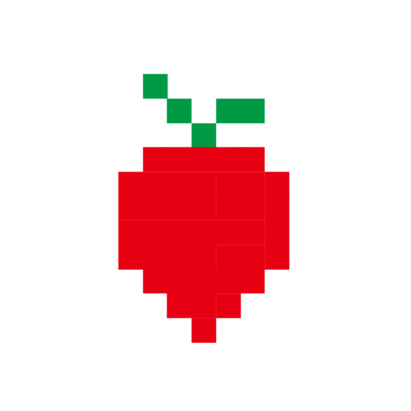</a> | **📂 檔名:** `strawberry-svgrepo-com.svg` ✨ **格式:** `Vector (SVG)` | ⚖️ `2.10KB` 📅 **更新:** `2026-02-27`  🔗 **複製 Markdown 語法:** `` 📥 [檢視原始檔](strawberry-svgrepo-com.svg) |
| <a href="tomato-svgrepo-com.svg">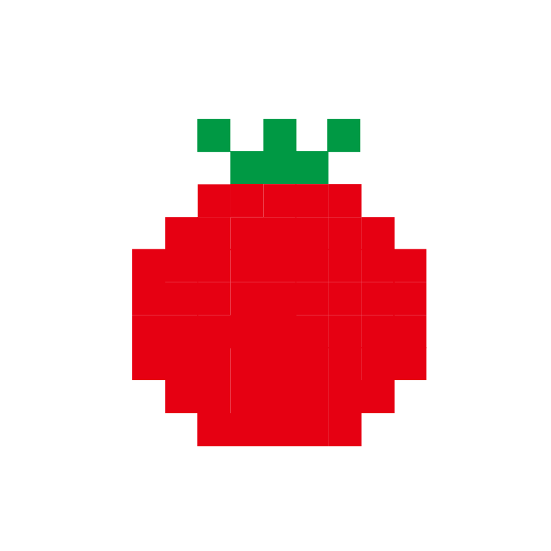</a> | **📂 檔名:** `tomato-svgrepo-com.svg` ✨ **格式:** `Vector (SVG)` | ⚖️ `3.04KB` 📅 **更新:** `2026-02-27`  🔗 **複製 Markdown 語法:** `` 📥 [檢視原始檔](tomato-svgrepo-com.svg) |
|  | **📂 檔名:** `watermelon-svgrepo-com.svg` ✨ **格式:** `Vector (SVG)` | ⚖️ `4.29KB` 📅 **更新:** `2026-02-27`  🔗 **複製 Markdown 語法:** `` 📥 [檢視原始檔](watermelon-svgrepo-com.svg) |