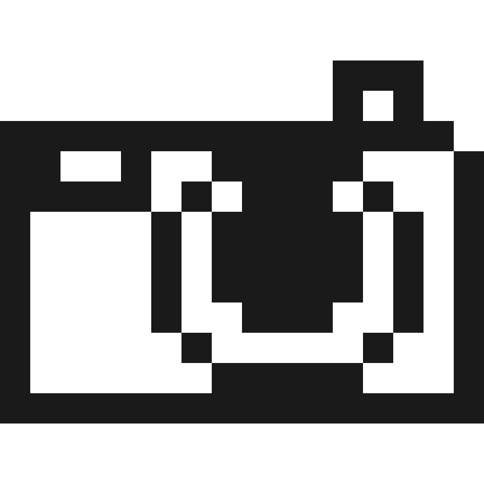
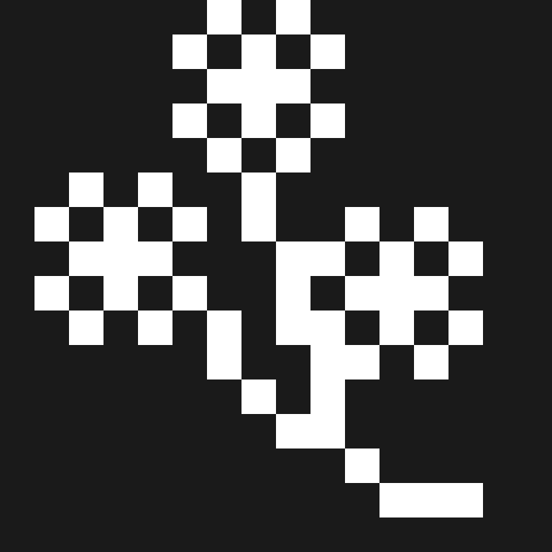
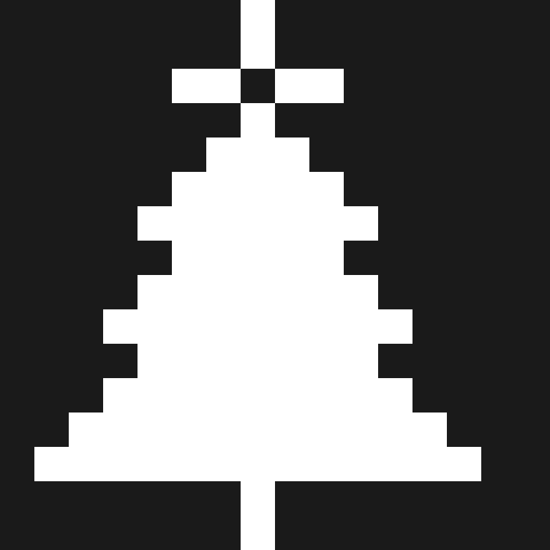
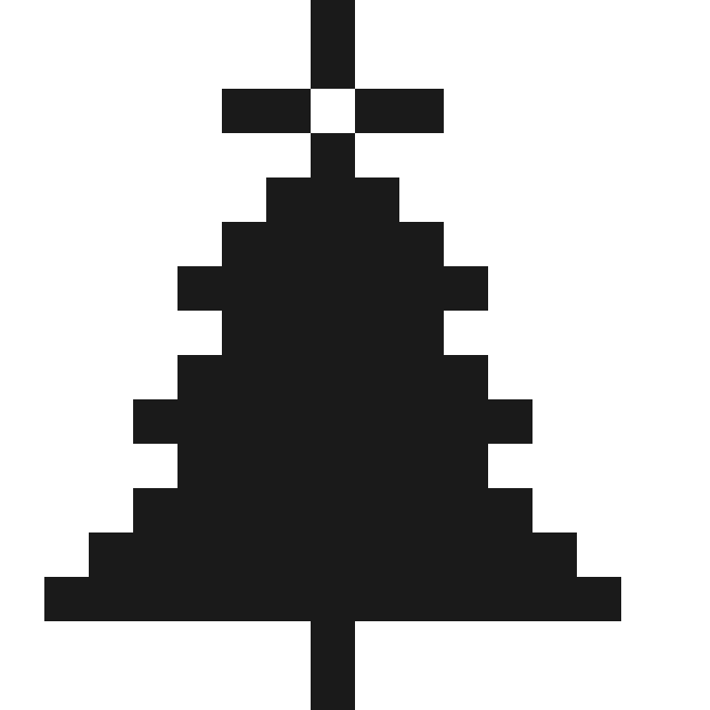
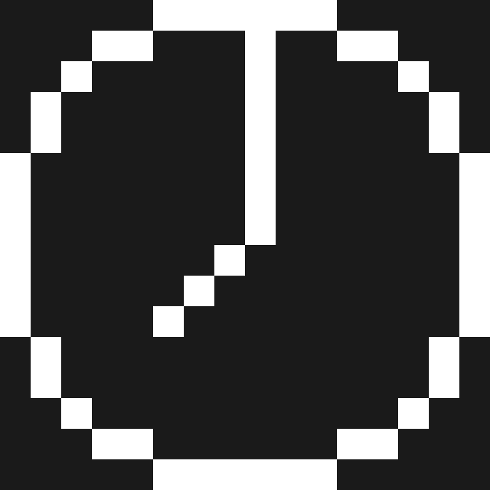
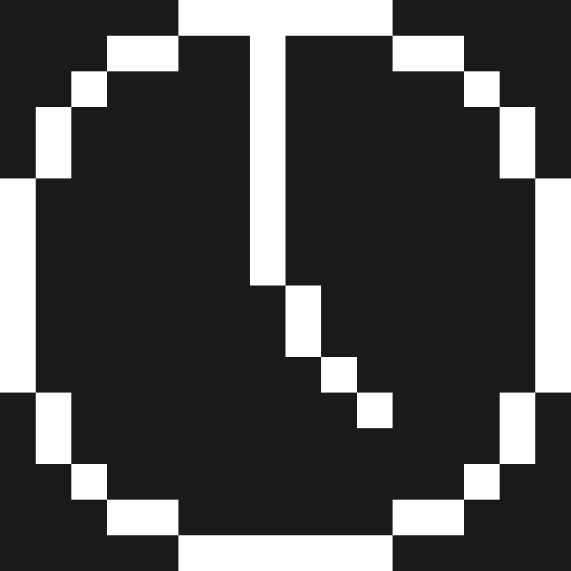
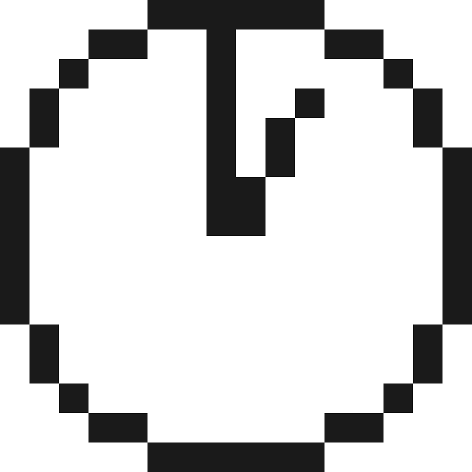
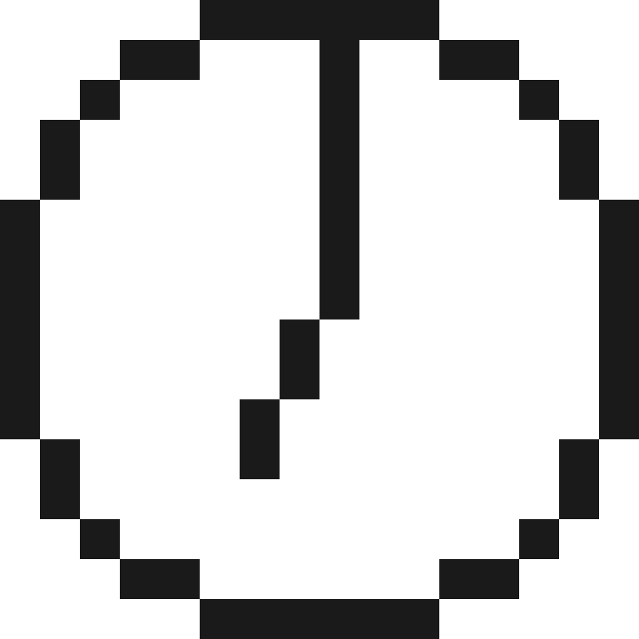
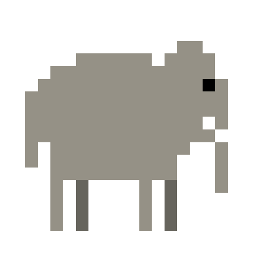

# 🖼️ 素材分類：Games

> [🏠 主目錄](../../../../README.md) / [images](../../../README.md) / [iCons](../../README.md) / [Pixel](../README.md) / **Games**

本目錄共有 `59` 個檔案

| 🎨 預覽 (點擊放大)  | 📋 檔案詳細資訊與連結 |
| :--- | :--- |
|  | **📂 檔名:** `bear-face-dark-svgrepo-com.svg` ✨ **格式:** `Vector (SVG)` ⚖️ **大小:** `4.01KB` 📅 **更新:** `2026-02-28`  🚀 **jsDelivr Markdown:** `` 🔗 **直接連結 (Url):** <code>https://cdn.jsdelivr.net/gh/barry028/materials@main/images/iCons/Pixel/Games/bear-face-dark-svgrepo-com.svg</code> 📥 [檢視原始檔](bear-face-dark-svgrepo-com.svg) |
|  | **📂 檔名:** `bear-face-light-svgrepo-com.svg` ✨ **格式:** `Vector (SVG)` ⚖️ **大小:** `4.01KB` 📅 **更新:** `2026-02-28`  🚀 **jsDelivr Markdown:** `` 🔗 **直接連結 (Url):** <code>https://cdn.jsdelivr.net/gh/barry028/materials@main/images/iCons/Pixel/Games/bear-face-light-svgrepo-com.svg</code> 📥 [檢視原始檔](bear-face-light-svgrepo-com.svg) |
|  | **📂 檔名:** `bee-svgrepo-com.svg` ✨ **格式:** `Vector (SVG)` ⚖️ **大小:** `3.45KB` 📅 **更新:** `2026-02-28`  🚀 **jsDelivr Markdown:** `` 🔗 **直接連結 (Url):** <code>https://cdn.jsdelivr.net/gh/barry028/materials@main/images/iCons/Pixel/Games/bee-svgrepo-com.svg</code> 📥 [檢視原始檔](bee-svgrepo-com.svg) |
|  | **📂 檔名:** `beer-mug-dark-svgrepo-com.svg` ✨ **格式:** `Vector (SVG)` ⚖️ **大小:** `2.17KB` 📅 **更新:** `2026-02-28`  🚀 **jsDelivr Markdown:** `` 🔗 **直接連結 (Url):** <code>https://cdn.jsdelivr.net/gh/barry028/materials@main/images/iCons/Pixel/Games/beer-mug-dark-svgrepo-com.svg</code> 📥 [檢視原始檔](beer-mug-dark-svgrepo-com.svg) |
|  | **📂 檔名:** `beer-mug-light-svgrepo-com.svg` ✨ **格式:** `Vector (SVG)` ⚖️ **大小:** `2.17KB` 📅 **更新:** `2026-02-28`  🚀 **jsDelivr Markdown:** `` 🔗 **直接連結 (Url):** <code>https://cdn.jsdelivr.net/gh/barry028/materials@main/images/iCons/Pixel/Games/beer-mug-light-svgrepo-com.svg</code> 📥 [檢視原始檔](beer-mug-light-svgrepo-com.svg) |
|  | **📂 檔名:** `black-questionmark-light-svgrepo-com.svg` ✨ **格式:** `Vector (SVG)` ⚖️ **大小:** `1.46KB` 📅 **更新:** `2026-02-28`  🚀 **jsDelivr Markdown:** `` 🔗 **直接連結 (Url):** <code>https://cdn.jsdelivr.net/gh/barry028/materials@main/images/iCons/Pixel/Games/black-questionmark-light-svgrepo-com.svg</code> 📥 [檢視原始檔](black-questionmark-light-svgrepo-com.svg) |
|  | **📂 檔名:** `black-sun-with-rays-dark-svgrepo-com.svg` ✨ **格式:** `Vector (SVG)` ⚖️ **大小:** `3.87KB` 📅 **更新:** `2026-02-28`  🚀 **jsDelivr Markdown:** `` 🔗 **直接連結 (Url):** <code>https://cdn.jsdelivr.net/gh/barry028/materials@main/images/iCons/Pixel/Games/black-sun-with-rays-dark-svgrepo-com.svg</code> 📥 [檢視原始檔](black-sun-with-rays-dark-svgrepo-com.svg) |
|  | **📂 檔名:** `black-sun-with-rays-light-svgrepo-com.svg` ✨ **格式:** `Vector (SVG)` ⚖️ **大小:** `3.87KB` 📅 **更新:** `2026-02-28`  🚀 **jsDelivr Markdown:** `` 🔗 **直接連結 (Url):** <code>https://cdn.jsdelivr.net/gh/barry028/materials@main/images/iCons/Pixel/Games/black-sun-with-rays-light-svgrepo-com.svg</code> 📥 [檢視原始檔](black-sun-with-rays-light-svgrepo-com.svg) |
|  | **📂 檔名:** `black-telephone-dark-svgrepo-com.svg` ✨ **格式:** `Vector (SVG)` ⚖️ **大小:** `2.02KB` 📅 **更新:** `2026-02-28`  🚀 **jsDelivr Markdown:** `` 🔗 **直接連結 (Url):** <code>https://cdn.jsdelivr.net/gh/barry028/materials@main/images/iCons/Pixel/Games/black-telephone-dark-svgrepo-com.svg</code> 📥 [檢視原始檔](black-telephone-dark-svgrepo-com.svg) |
|  | **📂 檔名:** `black-telephone-light-svgrepo-com.svg` ✨ **格式:** `Vector (SVG)` ⚖️ **大小:** `2.02KB` 📅 **更新:** `2026-02-28`  🚀 **jsDelivr Markdown:** `` 🔗 **直接連結 (Url):** <code>https://cdn.jsdelivr.net/gh/barry028/materials@main/images/iCons/Pixel/Games/black-telephone-light-svgrepo-com.svg</code> 📥 [檢視原始檔](black-telephone-light-svgrepo-com.svg) |
|  | **📂 檔名:** `boy-dark-svgrepo-com.svg` ✨ **格式:** `Vector (SVG)` ⚖️ **大小:** `1.42KB` 📅 **更新:** `2026-02-28`  🚀 **jsDelivr Markdown:** `` 🔗 **直接連結 (Url):** <code>https://cdn.jsdelivr.net/gh/barry028/materials@main/images/iCons/Pixel/Games/boy-dark-svgrepo-com.svg</code> 📥 [檢視原始檔](boy-dark-svgrepo-com.svg) |
|  | **📂 檔名:** `boy-light-svgrepo-com.svg` ✨ **格式:** `Vector (SVG)` ⚖️ **大小:** `1.42KB` 📅 **更新:** `2026-02-28`  🚀 **jsDelivr Markdown:** `` 🔗 **直接連結 (Url):** <code>https://cdn.jsdelivr.net/gh/barry028/materials@main/images/iCons/Pixel/Games/boy-light-svgrepo-com.svg</code> 📥 [檢視原始檔](boy-light-svgrepo-com.svg) |
|  | **📂 檔名:** `broken-heart-dark-svgrepo-com.svg` ✨ **格式:** `Vector (SVG)` ⚖️ **大小:** `660.00B` 📅 **更新:** `2026-02-28`  🚀 **jsDelivr Markdown:** `` 🔗 **直接連結 (Url):** <code>https://cdn.jsdelivr.net/gh/barry028/materials@main/images/iCons/Pixel/Games/broken-heart-dark-svgrepo-com.svg</code> 📥 [檢視原始檔](broken-heart-dark-svgrepo-com.svg) |
|  | **📂 檔名:** `broken-heart-light-svgrepo-com.svg` ✨ **格式:** `Vector (SVG)` ⚖️ **大小:** `662.00B` 📅 **更新:** `2026-02-28`  🚀 **jsDelivr Markdown:** `` 🔗 **直接連結 (Url):** <code>https://cdn.jsdelivr.net/gh/barry028/materials@main/images/iCons/Pixel/Games/broken-heart-light-svgrepo-com.svg</code> 📥 [檢視原始檔](broken-heart-light-svgrepo-com.svg) |
|  | **📂 檔名:** `camera-dark-svgrepo-com.svg` ✨ **格式:** `Vector (SVG)` ⚖️ **大小:** `2.02KB` 📅 **更新:** `2026-02-28`  🚀 **jsDelivr Markdown:** `` 🔗 **直接連結 (Url):** <code>https://cdn.jsdelivr.net/gh/barry028/materials@main/images/iCons/Pixel/Games/camera-dark-svgrepo-com.svg</code> 📥 [檢視原始檔](camera-dark-svgrepo-com.svg) |
|  | **📂 檔名:** `camera-light-svgrepo-com.svg` ✨ **格式:** `Vector (SVG)` ⚖️ **大小:** `2.02KB` 📅 **更新:** `2026-02-28`  🚀 **jsDelivr Markdown:** `` 🔗 **直接連結 (Url):** <code>https://cdn.jsdelivr.net/gh/barry028/materials@main/images/iCons/Pixel/Games/camera-light-svgrepo-com.svg</code> 📥 [檢視原始檔](camera-light-svgrepo-com.svg) |
|  | **📂 檔名:** `cat-face-dark-svgrepo-com.svg` ✨ **格式:** `Vector (SVG)` ⚖️ **大小:** `3.70KB` 📅 **更新:** `2026-02-28`  🚀 **jsDelivr Markdown:** `` 🔗 **直接連結 (Url):** <code>https://cdn.jsdelivr.net/gh/barry028/materials@main/images/iCons/Pixel/Games/cat-face-dark-svgrepo-com.svg</code> 📥 [檢視原始檔](cat-face-dark-svgrepo-com.svg) |
|  | **📂 檔名:** `cat-face-light-svgrepo-com.svg` ✨ **格式:** `Vector (SVG)` ⚖️ **大小:** `3.70KB` 📅 **更新:** `2026-02-28`  🚀 **jsDelivr Markdown:** `` 🔗 **直接連結 (Url):** <code>https://cdn.jsdelivr.net/gh/barry028/materials@main/images/iCons/Pixel/Games/cat-face-light-svgrepo-com.svg</code> 📥 [檢視原始檔](cat-face-light-svgrepo-com.svg) |
|  | **📂 檔名:** `cherry-blossom-dark-svgrepo-com.svg` ✨ **格式:** `Vector (SVG)` ⚖️ **大小:** `5.01KB` 📅 **更新:** `2026-02-28`  🚀 **jsDelivr Markdown:** `` 🔗 **直接連結 (Url):** <code>https://cdn.jsdelivr.net/gh/barry028/materials@main/images/iCons/Pixel/Games/cherry-blossom-dark-svgrepo-com.svg</code> 📥 [檢視原始檔](cherry-blossom-dark-svgrepo-com.svg) |
|  | **📂 檔名:** `cherry-blossom-light-svgrepo-com.svg` ✨ **格式:** `Vector (SVG)` ⚖️ **大小:** `5.01KB` 📅 **更新:** `2026-02-28`  🚀 **jsDelivr Markdown:** `` 🔗 **直接連結 (Url):** <code>https://cdn.jsdelivr.net/gh/barry028/materials@main/images/iCons/Pixel/Games/cherry-blossom-light-svgrepo-com.svg</code> 📥 [檢視原始檔](cherry-blossom-light-svgrepo-com.svg) |
|  | **📂 檔名:** `chick-svgrepo-com.svg` ✨ **格式:** `Vector (SVG)` ⚖️ **大小:** `32.55KB` 📅 **更新:** `2026-02-28`  🚀 **jsDelivr Markdown:** `` 🔗 **直接連結 (Url):** <code>https://cdn.jsdelivr.net/gh/barry028/materials@main/images/iCons/Pixel/Games/chick-svgrepo-com.svg</code> 📥 [檢視原始檔](chick-svgrepo-com.svg) |
|  | **📂 檔名:** `christmas-tree-dark-svgrepo-com.svg` ✨ **格式:** `Vector (SVG)` ⚖️ **大小:** `1.11KB` 📅 **更新:** `2026-02-28`  🚀 **jsDelivr Markdown:** `` 🔗 **直接連結 (Url):** <code>https://cdn.jsdelivr.net/gh/barry028/materials@main/images/iCons/Pixel/Games/christmas-tree-dark-svgrepo-com.svg</code> 📥 [檢視原始檔](christmas-tree-dark-svgrepo-com.svg) |
|  | **📂 檔名:** `christmas-tree-light-svgrepo-com.svg` ✨ **格式:** `Vector (SVG)` ⚖️ **大小:** `1.11KB` 📅 **更新:** `2026-02-28`  🚀 **jsDelivr Markdown:** `` 🔗 **直接連結 (Url):** <code>https://cdn.jsdelivr.net/gh/barry028/materials@main/images/iCons/Pixel/Games/christmas-tree-light-svgrepo-com.svg</code> 📥 [檢視原始檔](christmas-tree-light-svgrepo-com.svg) |
|  | **📂 檔名:** `church-dark-svgrepo-com.svg` ✨ **格式:** `Vector (SVG)` ⚖️ **大小:** `1.78KB` 📅 **更新:** `2026-02-28`  🚀 **jsDelivr Markdown:** `` 🔗 **直接連結 (Url):** <code>https://cdn.jsdelivr.net/gh/barry028/materials@main/images/iCons/Pixel/Games/church-dark-svgrepo-com.svg</code> 📥 [檢視原始檔](church-dark-svgrepo-com.svg) |
|  | **📂 檔名:** `church-light-svgrepo-com.svg` ✨ **格式:** `Vector (SVG)` ⚖️ **大小:** `1.78KB` 📅 **更新:** `2026-02-28`  🚀 **jsDelivr Markdown:** `` 🔗 **直接連結 (Url):** <code>https://cdn.jsdelivr.net/gh/barry028/materials@main/images/iCons/Pixel/Games/church-light-svgrepo-com.svg</code> 📥 [檢視原始檔](church-light-svgrepo-com.svg) |
|  | **📂 檔名:** `clock-face-eight-oclock-dark-svgrepo-com.svg` ✨ **格式:** `Vector (SVG)` ⚖️ **大小:** `2.72KB` 📅 **更新:** `2026-02-28`  🚀 **jsDelivr Markdown:** `` 🔗 **直接連結 (Url):** <code>https://cdn.jsdelivr.net/gh/barry028/materials@main/images/iCons/Pixel/Games/clock-face-eight-oclock-dark-svgrepo-com.svg</code> 📥 [檢視原始檔](clock-face-eight-oclock-dark-svgrepo-com.svg) |
|  | **📂 檔名:** `clock-face-eleven-oclock-dark-svgrepo-com.svg` ✨ **格式:** `Vector (SVG)` ⚖️ **大小:** `2.62KB` 📅 **更新:** `2026-02-28`  🚀 **jsDelivr Markdown:** `` 🔗 **直接連結 (Url):** <code>https://cdn.jsdelivr.net/gh/barry028/materials@main/images/iCons/Pixel/Games/clock-face-eleven-oclock-dark-svgrepo-com.svg</code> 📥 [檢視原始檔](clock-face-eleven-oclock-dark-svgrepo-com.svg) |
|  | **📂 檔名:** `clock-face-eleven-oclock-light-svgrepo-com.svg` ✨ **格式:** `Vector (SVG)` ⚖️ **大小:** `2.62KB` 📅 **更新:** `2026-02-28`  🚀 **jsDelivr Markdown:** `` 🔗 **直接連結 (Url):** <code>https://cdn.jsdelivr.net/gh/barry028/materials@main/images/iCons/Pixel/Games/clock-face-eleven-oclock-light-svgrepo-com.svg</code> 📥 [檢視原始檔](clock-face-eleven-oclock-light-svgrepo-com.svg) |
|  | **📂 檔名:** `clock-face-five-oclock-dark-svgrepo-com.svg` ✨ **格式:** `Vector (SVG)` ⚖️ **大小:** `2.72KB` 📅 **更新:** `2026-02-28`  🚀 **jsDelivr Markdown:** `` 🔗 **直接連結 (Url):** <code>https://cdn.jsdelivr.net/gh/barry028/materials@main/images/iCons/Pixel/Games/clock-face-five-oclock-dark-svgrepo-com.svg</code> 📥 [檢視原始檔](clock-face-five-oclock-dark-svgrepo-com.svg) |
|  | **📂 檔名:** `clock-face-five-oclock-light-svgrepo-com.svg` ✨ **格式:** `Vector (SVG)` ⚖️ **大小:** `2.72KB` 📅 **更新:** `2026-02-28`  🚀 **jsDelivr Markdown:** `` 🔗 **直接連結 (Url):** <code>https://cdn.jsdelivr.net/gh/barry028/materials@main/images/iCons/Pixel/Games/clock-face-five-oclock-light-svgrepo-com.svg</code> 📥 [檢視原始檔](clock-face-five-oclock-light-svgrepo-com.svg) |
|  | **📂 檔名:** `clock-face-four-oclock-dark-svgrepo-com.svg` ✨ **格式:** `Vector (SVG)` ⚖️ **大小:** `2.55KB` 📅 **更新:** `2026-02-28`  🚀 **jsDelivr Markdown:** `` 🔗 **直接連結 (Url):** <code>https://cdn.jsdelivr.net/gh/barry028/materials@main/images/iCons/Pixel/Games/clock-face-four-oclock-dark-svgrepo-com.svg</code> 📥 [檢視原始檔](clock-face-four-oclock-dark-svgrepo-com.svg) |
|  | **📂 檔名:** `clock-face-four-oclock-light-svgrepo-com.svg` ✨ **格式:** `Vector (SVG)` ⚖️ **大小:** `2.55KB` 📅 **更新:** `2026-02-28`  🚀 **jsDelivr Markdown:** `` 🔗 **直接連結 (Url):** <code>https://cdn.jsdelivr.net/gh/barry028/materials@main/images/iCons/Pixel/Games/clock-face-four-oclock-light-svgrepo-com.svg</code> 📥 [檢視原始檔](clock-face-four-oclock-light-svgrepo-com.svg) |
|  | **📂 檔名:** `clock-face-nine-oclock-dark-svgrepo-com.svg` ✨ **格式:** `Vector (SVG)` ⚖️ **大小:** `2.50KB` 📅 **更新:** `2026-02-28`  🚀 **jsDelivr Markdown:** `` 🔗 **直接連結 (Url):** <code>https://cdn.jsdelivr.net/gh/barry028/materials@main/images/iCons/Pixel/Games/clock-face-nine-oclock-dark-svgrepo-com.svg</code> 📥 [檢視原始檔](clock-face-nine-oclock-dark-svgrepo-com.svg) |
|  | **📂 檔名:** `clock-face-nine-oclock-light-svgrepo-com.svg` ✨ **格式:** `Vector (SVG)` ⚖️ **大小:** `2.50KB` 📅 **更新:** `2026-02-28`  🚀 **jsDelivr Markdown:** `` 🔗 **直接連結 (Url):** <code>https://cdn.jsdelivr.net/gh/barry028/materials@main/images/iCons/Pixel/Games/clock-face-nine-oclock-light-svgrepo-com.svg</code> 📥 [檢視原始檔](clock-face-nine-oclock-light-svgrepo-com.svg) |
|  | **📂 檔名:** `clock-face-one-oclock-dark-svgrepo-com.svg` ✨ **格式:** `Vector (SVG)` ⚖️ **大小:** `2.62KB` 📅 **更新:** `2026-02-28`  🚀 **jsDelivr Markdown:** `` 🔗 **直接連結 (Url):** <code>https://cdn.jsdelivr.net/gh/barry028/materials@main/images/iCons/Pixel/Games/clock-face-one-oclock-dark-svgrepo-com.svg</code> 📥 [檢視原始檔](clock-face-one-oclock-dark-svgrepo-com.svg) |
|  | **📂 檔名:** `clock-face-one-oclock-light-svgrepo-com.svg` ✨ **格式:** `Vector (SVG)` ⚖️ **大小:** `2.62KB` 📅 **更新:** `2026-02-28`  🚀 **jsDelivr Markdown:** `` 🔗 **直接連結 (Url):** <code>https://cdn.jsdelivr.net/gh/barry028/materials@main/images/iCons/Pixel/Games/clock-face-one-oclock-light-svgrepo-com.svg</code> 📥 [檢視原始檔](clock-face-one-oclock-light-svgrepo-com.svg) |
|  | **📂 檔名:** `clock-face-seven-oclock-dark-svgrepo-com.svg` ✨ **格式:** `Vector (SVG)` ⚖️ **大小:** `2.62KB` 📅 **更新:** `2026-02-28`  🚀 **jsDelivr Markdown:** `` 🔗 **直接連結 (Url):** <code>https://cdn.jsdelivr.net/gh/barry028/materials@main/images/iCons/Pixel/Games/clock-face-seven-oclock-dark-svgrepo-com.svg</code> 📥 [檢視原始檔](clock-face-seven-oclock-dark-svgrepo-com.svg) |
|  | **📂 檔名:** `clock-face-seven-oclock-light-svgrepo-com.svg` ✨ **格式:** `Vector (SVG)` ⚖️ **大小:** `2.62KB` 📅 **更新:** `2026-02-28`  🚀 **jsDelivr Markdown:** `` 🔗 **直接連結 (Url):** <code>https://cdn.jsdelivr.net/gh/barry028/materials@main/images/iCons/Pixel/Games/clock-face-seven-oclock-light-svgrepo-com.svg</code> 📥 [檢視原始檔](clock-face-seven-oclock-light-svgrepo-com.svg) |
|  | **📂 檔名:** `clock-face-six-oclock-dark-svgrepo-com.svg` ✨ **格式:** `Vector (SVG)` ⚖️ **大小:** `2.41KB` 📅 **更新:** `2026-02-28`  🚀 **jsDelivr Markdown:** `` 🔗 **直接連結 (Url):** <code>https://cdn.jsdelivr.net/gh/barry028/materials@main/images/iCons/Pixel/Games/clock-face-six-oclock-dark-svgrepo-com.svg</code> 📥 [檢視原始檔](clock-face-six-oclock-dark-svgrepo-com.svg) |
|  | **📂 檔名:** `clock-face-six-oclock-light-svgrepo-com.svg` ✨ **格式:** `Vector (SVG)` ⚖️ **大小:** `2.42KB` 📅 **更新:** `2026-02-28`  🚀 **jsDelivr Markdown:** `` 🔗 **直接連結 (Url):** <code>https://cdn.jsdelivr.net/gh/barry028/materials@main/images/iCons/Pixel/Games/clock-face-six-oclock-light-svgrepo-com.svg</code> 📥 [檢視原始檔](clock-face-six-oclock-light-svgrepo-com.svg) |
|  | **📂 檔名:** `clock-face-ten-oclock-dark-svgrepo-com.svg` ✨ **格式:** `Vector (SVG)` ⚖️ **大小:** `2.62KB` 📅 **更新:** `2026-02-28`  🚀 **jsDelivr Markdown:** `` 🔗 **直接連結 (Url):** <code>https://cdn.jsdelivr.net/gh/barry028/materials@main/images/iCons/Pixel/Games/clock-face-ten-oclock-dark-svgrepo-com.svg</code> 📥 [檢視原始檔](clock-face-ten-oclock-dark-svgrepo-com.svg) |
|  | **📂 檔名:** `clock-face-ten-oclock-light-svgrepo-com.svg` ✨ **格式:** `Vector (SVG)` ⚖️ **大小:** `2.62KB` 📅 **更新:** `2026-02-28`  🚀 **jsDelivr Markdown:** `` 🔗 **直接連結 (Url):** <code>https://cdn.jsdelivr.net/gh/barry028/materials@main/images/iCons/Pixel/Games/clock-face-ten-oclock-light-svgrepo-com.svg</code> 📥 [檢視原始檔](clock-face-ten-oclock-light-svgrepo-com.svg) |
|  | **📂 檔名:** `clock-face-three-oclock-dark-svgrepo-com.svg` ✨ **格式:** `Vector (SVG)` ⚖️ **大小:** `2.41KB` 📅 **更新:** `2026-02-28`  🚀 **jsDelivr Markdown:** `` 🔗 **直接連結 (Url):** <code>https://cdn.jsdelivr.net/gh/barry028/materials@main/images/iCons/Pixel/Games/clock-face-three-oclock-dark-svgrepo-com.svg</code> 📥 [檢視原始檔](clock-face-three-oclock-dark-svgrepo-com.svg) |
|  | **📂 檔名:** `clock-face-three-oclock-light-svgrepo-com.svg` ✨ **格式:** `Vector (SVG)` ⚖️ **大小:** `2.41KB` 📅 **更新:** `2026-02-28`  🚀 **jsDelivr Markdown:** `` 🔗 **直接連結 (Url):** <code>https://cdn.jsdelivr.net/gh/barry028/materials@main/images/iCons/Pixel/Games/clock-face-three-oclock-light-svgrepo-com.svg</code> 📥 [檢視原始檔](clock-face-three-oclock-light-svgrepo-com.svg) |
|  | **📂 檔名:** `clock-face-twelve-oclock-dark-svgrepo-com.svg` ✨ **格式:** `Vector (SVG)` ⚖️ **大小:** `2.41KB` 📅 **更新:** `2026-02-28`  🚀 **jsDelivr Markdown:** `` 🔗 **直接連結 (Url):** <code>https://cdn.jsdelivr.net/gh/barry028/materials@main/images/iCons/Pixel/Games/clock-face-twelve-oclock-dark-svgrepo-com.svg</code> 📥 [檢視原始檔](clock-face-twelve-oclock-dark-svgrepo-com.svg) |
|  | **📂 檔名:** `clock-face-twelve-oclock-light-svgrepo-com.svg` ✨ **格式:** `Vector (SVG)` ⚖️ **大小:** `2.41KB` 📅 **更新:** `2026-02-28`  🚀 **jsDelivr Markdown:** `` 🔗 **直接連結 (Url):** <code>https://cdn.jsdelivr.net/gh/barry028/materials@main/images/iCons/Pixel/Games/clock-face-twelve-oclock-light-svgrepo-com.svg</code> 📥 [檢視原始檔](clock-face-twelve-oclock-light-svgrepo-com.svg) |
|  | **📂 檔名:** `clock-face-two-oclock-dark-svgrepo-com.svg` ✨ **格式:** `Vector (SVG)` ⚖️ **大小:** `2.73KB` 📅 **更新:** `2026-02-28`  🚀 **jsDelivr Markdown:** `` 🔗 **直接連結 (Url):** <code>https://cdn.jsdelivr.net/gh/barry028/materials@main/images/iCons/Pixel/Games/clock-face-two-oclock-dark-svgrepo-com.svg</code> 📥 [檢視原始檔](clock-face-two-oclock-dark-svgrepo-com.svg) |
|  | **📂 檔名:** `clock-face-two-oclock-light-svgrepo-com.svg` ✨ **格式:** `Vector (SVG)` ⚖️ **大小:** `2.73KB` 📅 **更新:** `2026-02-28`  🚀 **jsDelivr Markdown:** `` 🔗 **直接連結 (Url):** <code>https://cdn.jsdelivr.net/gh/barry028/materials@main/images/iCons/Pixel/Games/clock-face-two-oclock-light-svgrepo-com.svg</code> 📥 [檢視原始檔](clock-face-two-oclock-light-svgrepo-com.svg) |
|  | **📂 檔名:** `cloud-dark-svgrepo-com.svg` ✨ **格式:** `Vector (SVG)` ⚖️ **大小:** `2.41KB` 📅 **更新:** `2026-02-28`  🚀 **jsDelivr Markdown:** `` 🔗 **直接連結 (Url):** <code>https://cdn.jsdelivr.net/gh/barry028/materials@main/images/iCons/Pixel/Games/cloud-dark-svgrepo-com.svg</code> 📥 [檢視原始檔](cloud-dark-svgrepo-com.svg) |
|  | **📂 檔名:** `cock-svgrepo-com.svg` ✨ **格式:** `Vector (SVG)` ⚖️ **大小:** `3.32KB` 📅 **更新:** `2026-02-28`  🚀 **jsDelivr Markdown:** `` 🔗 **直接連結 (Url):** <code>https://cdn.jsdelivr.net/gh/barry028/materials@main/images/iCons/Pixel/Games/cock-svgrepo-com.svg</code> 📥 [檢視原始檔](cock-svgrepo-com.svg) |
|  | **📂 檔名:** `dog-svgrepo-com.svg` ✨ **格式:** `Vector (SVG)` ⚖️ **大小:** `1.40KB` 📅 **更新:** `2026-02-28`  🚀 **jsDelivr Markdown:** `` 🔗 **直接連結 (Url):** <code>https://cdn.jsdelivr.net/gh/barry028/materials@main/images/iCons/Pixel/Games/dog-svgrepo-com.svg</code> 📥 [檢視原始檔](dog-svgrepo-com.svg) |
|  | **📂 檔名:** `elephant-svgrepo-com.svg` ✨ **格式:** `Vector (SVG)` ⚖️ **大小:** `1.85KB` 📅 **更新:** `2026-02-28`  🚀 **jsDelivr Markdown:** `` 🔗 **直接連結 (Url):** <code>https://cdn.jsdelivr.net/gh/barry028/materials@main/images/iCons/Pixel/Games/elephant-svgrepo-com.svg</code> 📥 [檢視原始檔](elephant-svgrepo-com.svg) |
|  | **📂 檔名:** `horse-svgrepo-com.svg` ✨ **格式:** `Vector (SVG)` ⚖️ **大小:** `1.19KB` 📅 **更新:** `2026-02-28`  🚀 **jsDelivr Markdown:** `` 🔗 **直接連結 (Url):** <code>https://cdn.jsdelivr.net/gh/barry028/materials@main/images/iCons/Pixel/Games/horse-svgrepo-com.svg</code> 📥 [檢視原始檔](horse-svgrepo-com.svg) |
|  | **📂 檔名:** `lion-svgrepo-com.svg` ✨ **格式:** `Vector (SVG)` ⚖️ **大小:** `2.04KB` 📅 **更新:** `2026-02-28`  🚀 **jsDelivr Markdown:** `` 🔗 **直接連結 (Url):** <code>https://cdn.jsdelivr.net/gh/barry028/materials@main/images/iCons/Pixel/Games/lion-svgrepo-com.svg</code> 📥 [檢視原始檔](lion-svgrepo-com.svg) |
|  | **📂 檔名:** `monkey-svgrepo-com.svg` ✨ **格式:** `Vector (SVG)` ⚖️ **大小:** `1.87KB` 📅 **更新:** `2026-02-28`  🚀 **jsDelivr Markdown:** `` 🔗 **直接連結 (Url):** <code>https://cdn.jsdelivr.net/gh/barry028/materials@main/images/iCons/Pixel/Games/monkey-svgrepo-com.svg</code> 📥 [檢視原始檔](monkey-svgrepo-com.svg) |
|  | **📂 檔名:** `ounce-svgrepo-com.svg` ✨ **格式:** `Vector (SVG)` ⚖️ **大小:** `2.26KB` 📅 **更新:** `2026-02-28`  🚀 **jsDelivr Markdown:** `` 🔗 **直接連結 (Url):** <code>https://cdn.jsdelivr.net/gh/barry028/materials@main/images/iCons/Pixel/Games/ounce-svgrepo-com.svg</code> 📥 [檢視原始檔](ounce-svgrepo-com.svg) |
|  | **📂 檔名:** `rat-svgrepo-com.svg` ✨ **格式:** `Vector (SVG)` ⚖️ **大小:** `1.29KB` 📅 **更新:** `2026-02-28`  🚀 **jsDelivr Markdown:** `` 🔗 **直接連結 (Url):** <code>https://cdn.jsdelivr.net/gh/barry028/materials@main/images/iCons/Pixel/Games/rat-svgrepo-com.svg</code> 📥 [檢視原始檔](rat-svgrepo-com.svg) |
|  | **📂 檔名:** `wolf-svgrepo-com.svg` ✨ **格式:** `Vector (SVG)` ⚖️ **大小:** `1.21KB` 📅 **更新:** `2026-02-28`  🚀 **jsDelivr Markdown:** `` 🔗 **直接連結 (Url):** <code>https://cdn.jsdelivr.net/gh/barry028/materials@main/images/iCons/Pixel/Games/wolf-svgrepo-com.svg</code> 📥 [檢視原始檔](wolf-svgrepo-com.svg) |
|  | **📂 檔名:** `zebra-svgrepo-com.svg` ✨ **格式:** `Vector (SVG)` ⚖️ **大小:** `3.04KB` 📅 **更新:** `2026-02-28`  🚀 **jsDelivr Markdown:** `` 🔗 **直接連結 (Url):** <code>https://cdn.jsdelivr.net/gh/barry028/materials@main/images/iCons/Pixel/Games/zebra-svgrepo-com.svg</code> 📥 [檢視原始檔](zebra-svgrepo-com.svg) |