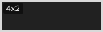
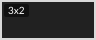
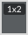
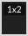
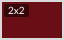
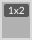
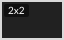
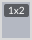
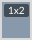
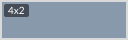

# 🖼️ Nes 素材庫

[⬅️ 返回主目錄](../../README.md)

| 預覽 (點擊放大) | 檔案資訊 |
| :--- | :--- |
|  | **Pixelbrick-1.svg** Vector (SVG) | 3.20KB |
|  | **Pixelbrick-10.svg** Vector (SVG) | 4.87KB |
|  | **Pixelbrick-11.svg** Vector (SVG) | 4.87KB |
|  | **Pixelbrick-12.svg** Vector (SVG) | 3.20KB |
|  | **Pixelbrick-13.svg** Vector (SVG) | 3.20KB |
|  | **Pixelbrick-14.svg** Vector (SVG) | 3.20KB |
|  | **Pixelbrick-15.svg** Vector (SVG) | 3.20KB |
|  | **Pixelbrick-16.svg** Vector (SVG) | 3.20KB |
|  | **Pixelbrick-17.svg** Vector (SVG) | 3.20KB |
|  | **Pixelbrick-18.svg** Vector (SVG) | 3.20KB |
|  | **Pixelbrick-19.svg** Vector (SVG) | 3.20KB |
|  | **Pixelbrick-2.svg** Vector (SVG) | 3.20KB |
|  | **Pixelbrick-20.svg** Vector (SVG) | 4.14KB |
|  | **Pixelbrick-21.svg** Vector (SVG) | 4.14KB |
|  | **Pixelbrick-22.svg** Vector (SVG) | 3.08KB |
|  | **Pixelbrick-23.svg** Vector (SVG) | 3.08KB |
|  | **Pixelbrick-24.svg** Vector (SVG) | 3.08KB |
|  | **Pixelbrick-25.svg** Vector (SVG) | 3.08KB |
|  | **Pixelbrick-26.svg** Vector (SVG) | 4.14KB |
|  | **Pixelbrick-27.svg** Vector (SVG) | 4.87KB |
|  | **Pixelbrick-28.svg** Vector (SVG) | 3.20KB |
|  | **Pixelbrick-29.svg** Vector (SVG) | 3.08KB |
|  | **Pixelbrick-3.svg** Vector (SVG) | 3.20KB |
|  | **Pixelbrick-30.svg** Vector (SVG) | 3.08KB |
|  | **Pixelbrick-31.svg** Vector (SVG) | 3.08KB |
|  | **Pixelbrick-32.svg** Vector (SVG) | 3.08KB |
|  | **Pixelbrick-33.svg** Vector (SVG) | 3.08KB |
|  | **Pixelbrick-34.svg** Vector (SVG) | 4.14KB |
|  | **Pixelbrick-35.svg** Vector (SVG) | 3.08KB |
|  | **Pixelbrick-36.svg** Vector (SVG) | 3.08KB |
|  | **Pixelbrick-37.svg** Vector (SVG) | 3.08KB |
|  | **Pixelbrick-38.svg** Vector (SVG) | 3.08KB |
|  | **Pixelbrick-39.svg** Vector (SVG) | 4.87KB |
|  | **Pixelbrick-4.svg** Vector (SVG) | 3.20KB |
|  | **Pixelbrick-40.svg** Vector (SVG) | 3.20KB |
|  | **Pixelbrick-41.svg** Vector (SVG) | 3.08KB |
|  | **Pixelbrick-42.svg** Vector (SVG) | 4.13KB |
|  | **Pixelbrick-43.svg** Vector (SVG) | 3.08KB |
|  | **Pixelbrick-44.svg** Vector (SVG) | 3.08KB |
|  | **Pixelbrick-45.svg** Vector (SVG) | 3.08KB |
|  | **Pixelbrick-46.svg** Vector (SVG) | 3.08KB |
|  | **Pixelbrick-47.svg** Vector (SVG) | 3.08KB |
|  | **Pixelbrick-48.svg** Vector (SVG) | 3.08KB |
|  | **Pixelbrick-49.svg** Vector (SVG) | 3.20KB |
|  | **Pixelbrick-5.svg** Vector (SVG) | 4.87KB |
|  | **Pixelbrick-50.svg** Vector (SVG) | 3.20KB |
|  | **Pixelbrick-51.svg** Vector (SVG) | 3.20KB |
|  | **Pixelbrick-52.svg** Vector (SVG) | 4.87KB |
|  | **Pixelbrick-53.svg** Vector (SVG) | 3.20KB |
|  | **Pixelbrick-54.svg** Vector (SVG) | 3.20KB |
|  | **Pixelbrick-55.svg** Vector (SVG) | 3.20KB |
|  | **Pixelbrick-56.svg** Vector (SVG) | 4.87KB |
|  | **Pixelbrick-57.svg** Vector (SVG) | 4.87KB |
|  | **Pixelbrick-58.svg** Vector (SVG) | 4.87KB |
|  | **Pixelbrick-59.svg** Vector (SVG) | 4.87KB |
|  | **Pixelbrick-6.svg** Vector (SVG) | 4.13KB |
|  | **Pixelbrick-60.svg** Vector (SVG) | 4.87KB |
|  | **Pixelbrick-61.svg** Vector (SVG) | 3.08KB |
|  | **Pixelbrick-62.svg** Vector (SVG) | 3.08KB |
|  | **Pixelbrick-63.svg** Vector (SVG) | 3.08KB |
|  | **Pixelbrick-64.svg** Vector (SVG) | 3.08KB |
|  | **Pixelbrick-65.svg** Vector (SVG) | 3.08KB |
|  | **Pixelbrick-66.svg** Vector (SVG) | 3.08KB |
|  | **Pixelbrick-67.svg** Vector (SVG) | 3.08KB |
|  | **Pixelbrick-68.svg** Vector (SVG) | 3.08KB |
|  | **Pixelbrick-69.svg** Vector (SVG) | 3.08KB |
|  | **Pixelbrick-7.svg** Vector (SVG) | 3.20KB |
|  | **Pixelbrick-70.svg** Vector (SVG) | 3.08KB |
|  | **Pixelbrick-71.svg** Vector (SVG) | 3.08KB |
|  | **Pixelbrick-72.svg** Vector (SVG) | 3.08KB |
|  | **Pixelbrick-73.svg** Vector (SVG) | 3.08KB |
|  | **Pixelbrick-74.svg** Vector (SVG) | 3.08KB |
|  | **Pixelbrick-75.svg** Vector (SVG) | 3.08KB |
|  | **Pixelbrick-76.svg** Vector (SVG) | 3.08KB |
|  | **Pixelbrick-77.svg** Vector (SVG) | 3.08KB |
|  | **Pixelbrick-78.svg** Vector (SVG) | 3.08KB |
|  | **Pixelbrick-79.svg** Vector (SVG) | 3.08KB |
|  | **Pixelbrick-8.svg** Vector (SVG) | 3.20KB |
|  | **Pixelbrick-80.svg** Vector (SVG) | 3.08KB |
|  | **Pixelbrick-81.svg** Vector (SVG) | 3.08KB |
|  | **Pixelbrick-82.svg** Vector (SVG) | 3.08KB |
|  | **Pixelbrick-83.svg** Vector (SVG) | 3.08KB |
|  | **Pixelbrick-84.svg** Vector (SVG) | 3.08KB |
|  | **Pixelbrick-85.svg** Vector (SVG) | 3.08KB |
|  | **Pixelbrick-86.svg** Vector (SVG) | 3.08KB |
|  | **Pixelbrick-87.svg** Vector (SVG) | 3.08KB |
|  | **Pixelbrick-88.svg** Vector (SVG) | 4.87KB |
|  | **Pixelbrick-9.svg** Vector (SVG) | 4.87KB |
|  | **Pixelbrick.svg** Vector (SVG) | 3.20KB |