# 🖼️ 素材分類：Offices

> [🏠 主目錄](../../../../README.md) / [images](../../../README.md) / [iCons](../../README.md) / [Pixel](../README.md) / **Offices**

本目錄共有 `25` 個檔案

| 🎨 預覽 (點擊放大)  | 📋 檔案詳細資訊與連結 |
| :--- | :--- |
| <a href="accounting-budget-calc-svgrepo-com.svg">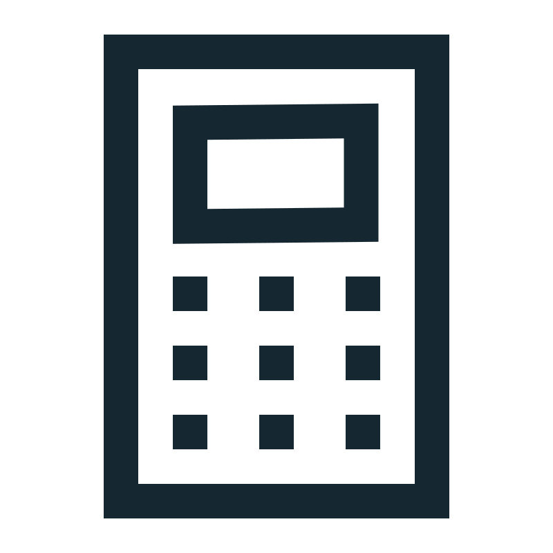</a> | **📂 檔名:** `accounting-budget-calc-svgrepo-com.svg` ✨ **格式:** `Vector (SVG)` ⚖️ **大小:** `1.18KB` 📅 **更新:** `2026-02-27`  🚀 **jsDelivr Markdown:** `` 🔗 **直接連結 (Url):** <code>https://cdn.jsdelivr.net/gh/barry028/materials@main/images/iCons/Pixel/Offices/accounting-budget-calc-svgrepo-com.svg</code> 📥 [檢視原始檔](accounting-budget-calc-svgrepo-com.svg) |
|  | **📂 檔名:** `agenda-calendar-date-svgrepo-com.svg` ✨ **格式:** `Vector (SVG)` ⚖️ **大小:** `1.37KB` 📅 **更新:** `2026-02-27`  🚀 **jsDelivr Markdown:** `` 🔗 **直接連結 (Url):** <code>https://cdn.jsdelivr.net/gh/barry028/materials@main/images/iCons/Pixel/Offices/agenda-calendar-date-svgrepo-com.svg</code> 📥 [檢視原始檔](agenda-calendar-date-svgrepo-com.svg) |
| <a href="agenda-handbook-note-svgrepo-com.svg">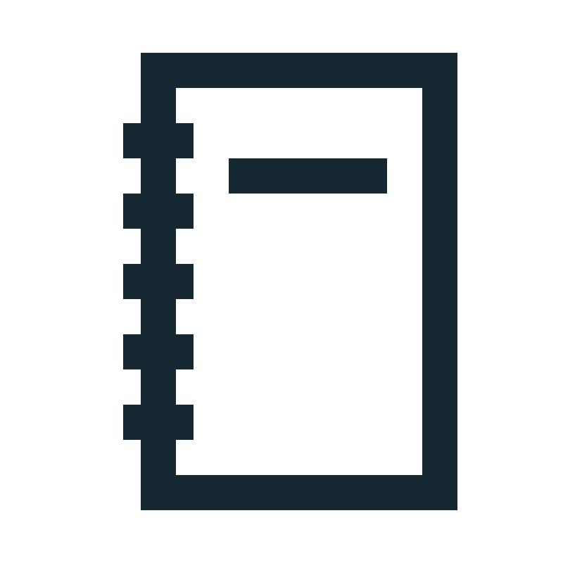</a> | **📂 檔名:** `agenda-handbook-note-svgrepo-com.svg` ✨ **格式:** `Vector (SVG)` ⚖️ **大小:** `874.00B` 📅 **更新:** `2026-02-27`  🚀 **jsDelivr Markdown:** `` 🔗 **直接連結 (Url):** <code>https://cdn.jsdelivr.net/gh/barry028/materials@main/images/iCons/Pixel/Offices/agenda-handbook-note-svgrepo-com.svg</code> 📥 [檢視原始檔](agenda-handbook-note-svgrepo-com.svg) |
| <a href="anchor-office-pen-svgrepo-com.svg">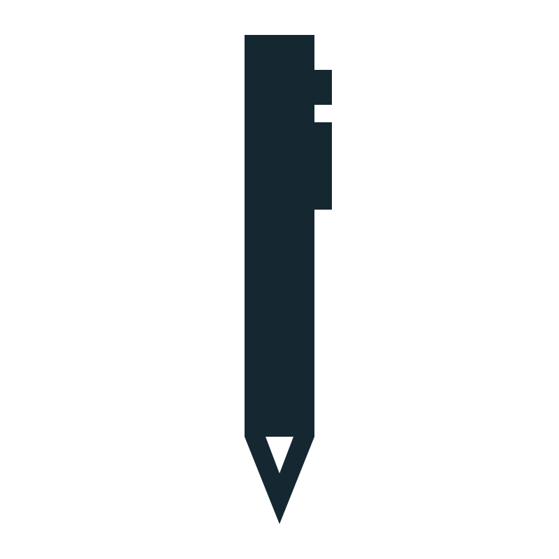</a> | **📂 檔名:** `anchor-office-pen-svgrepo-com.svg` ✨ **格式:** `Vector (SVG)` ⚖️ **大小:** `762.00B` 📅 **更新:** `2026-02-27`  🚀 **jsDelivr Markdown:** `` 🔗 **直接連結 (Url):** <code>https://cdn.jsdelivr.net/gh/barry028/materials@main/images/iCons/Pixel/Offices/anchor-office-pen-svgrepo-com.svg</code> 📥 [檢視原始檔](anchor-office-pen-svgrepo-com.svg) |
| <a href="archive-cabinet-cupboard-svgrepo-com.svg">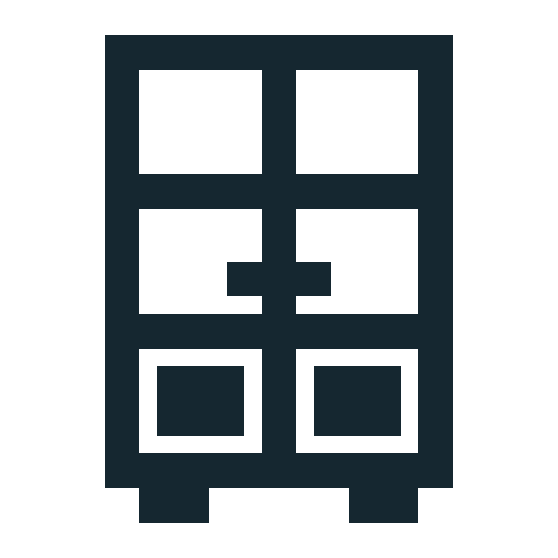</a> | **📂 檔名:** `archive-cabinet-cupboard-svgrepo-com.svg` ✨ **格式:** `Vector (SVG)` ⚖️ **大小:** `1.15KB` 📅 **更新:** `2026-02-27`  🚀 **jsDelivr Markdown:** `` 🔗 **直接連結 (Url):** <code>https://cdn.jsdelivr.net/gh/barry028/materials@main/images/iCons/Pixel/Offices/archive-cabinet-cupboard-svgrepo-com.svg</code> 📥 [檢視原始檔](archive-cabinet-cupboard-svgrepo-com.svg) |
|  | **📂 檔名:** `archive-documents-folders-svgrepo-com.svg` ✨ **格式:** `Vector (SVG)` ⚖️ **大小:** `1017.00B` 📅 **更新:** `2026-02-27`  🚀 **jsDelivr Markdown:** `` 🔗 **直接連結 (Url):** <code>https://cdn.jsdelivr.net/gh/barry028/materials@main/images/iCons/Pixel/Offices/archive-documents-folders-svgrepo-com.svg</code> 📥 [檢視原始檔](archive-documents-folders-svgrepo-com.svg) |
| <a href="badge-card-identity-svgrepo-com.svg">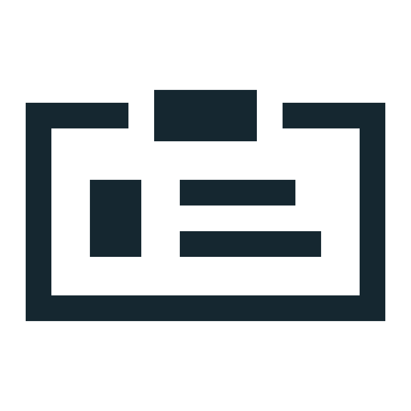</a> | **📂 檔名:** `badge-card-identity-svgrepo-com.svg` ✨ **格式:** `Vector (SVG)` ⚖️ **大小:** `993.00B` 📅 **更新:** `2026-02-27`  🚀 **jsDelivr Markdown:** `` 🔗 **直接連結 (Url):** <code>https://cdn.jsdelivr.net/gh/barry028/materials@main/images/iCons/Pixel/Offices/badge-card-identity-svgrepo-com.svg</code> 📥 [檢視原始檔](badge-card-identity-svgrepo-com.svg) |
|  | **📂 檔名:** `bag-briefcase-business-svgrepo-com.svg` ✨ **格式:** `Vector (SVG)` ⚖️ **大小:** `814.00B` 📅 **更新:** `2026-02-27`  🚀 **jsDelivr Markdown:** `` 🔗 **直接連結 (Url):** <code>https://cdn.jsdelivr.net/gh/barry028/materials@main/images/iCons/Pixel/Offices/bag-briefcase-business-svgrepo-com.svg</code> 📥 [檢視原始檔](bag-briefcase-business-svgrepo-com.svg) |
| <a href="book-office-pages-svgrepo-com.svg">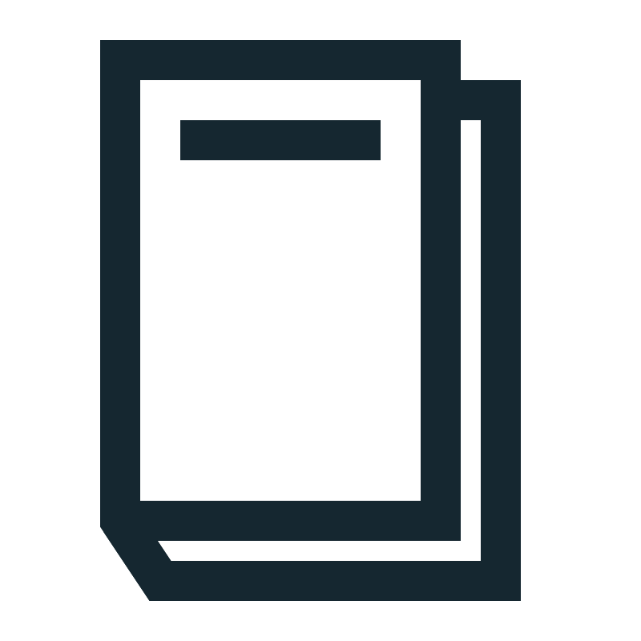</a> | **📂 檔名:** `book-office-pages-svgrepo-com.svg` ✨ **格式:** `Vector (SVG)` ⚖️ **大小:** `693.00B` 📅 **更新:** `2026-02-27`  🚀 **jsDelivr Markdown:** `` 🔗 **直接連結 (Url):** <code>https://cdn.jsdelivr.net/gh/barry028/materials@main/images/iCons/Pixel/Offices/book-office-pages-svgrepo-com.svg</code> 📥 [檢視原始檔](book-office-pages-svgrepo-com.svg) |
| <a href="boss-business-chair-svgrepo-com.svg">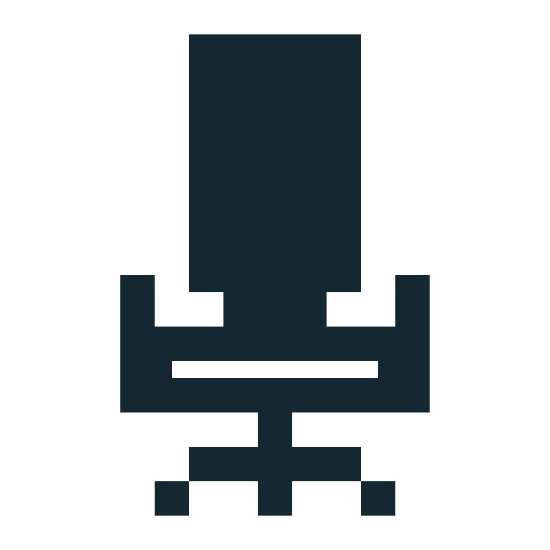</a> | **📂 檔名:** `boss-business-chair-svgrepo-com.svg` ✨ **格式:** `Vector (SVG)` ⚖️ **大小:** `1.00KB` 📅 **更新:** `2026-02-27`  🚀 **jsDelivr Markdown:** `` 🔗 **直接連結 (Url):** <code>https://cdn.jsdelivr.net/gh/barry028/materials@main/images/iCons/Pixel/Offices/boss-business-chair-svgrepo-com.svg</code> 📥 [檢視原始檔](boss-business-chair-svgrepo-com.svg) |
|  | **📂 檔名:** `boss-discussion-interview-svgrepo-com.svg` ✨ **格式:** `Vector (SVG)` ⚖️ **大小:** `1.48KB` 📅 **更新:** `2026-02-27`  🚀 **jsDelivr Markdown:** `` 🔗 **直接連結 (Url):** <code>https://cdn.jsdelivr.net/gh/barry028/materials@main/images/iCons/Pixel/Offices/boss-discussion-interview-svgrepo-com.svg</code> 📥 [檢視原始檔](boss-discussion-interview-svgrepo-com.svg) |
|  | **📂 檔名:** `breakfast-clock-morning-svgrepo-com.svg` ✨ **格式:** `Vector (SVG)` ⚖️ **大小:** `935.00B` 📅 **更新:** `2026-02-27`  🚀 **jsDelivr Markdown:** `` 🔗 **直接連結 (Url):** <code>https://cdn.jsdelivr.net/gh/barry028/materials@main/images/iCons/Pixel/Offices/breakfast-clock-morning-svgrepo-com.svg</code> 📥 [檢視原始檔](breakfast-clock-morning-svgrepo-com.svg) |
|  | **📂 檔名:** `communication-contact-e-mail-svgrepo-com.svg` ✨ **格式:** `Vector (SVG)` ⚖️ **大小:** `638.00B` 📅 **更新:** `2026-02-27`  🚀 **jsDelivr Markdown:** `` 🔗 **直接連結 (Url):** <code>https://cdn.jsdelivr.net/gh/barry028/materials@main/images/iCons/Pixel/Offices/communication-contact-e-mail-svgrepo-com.svg</code> 📥 [檢視原始檔](communication-contact-e-mail-svgrepo-com.svg) |
| <a href="communication-contact-fax-svgrepo-com.svg">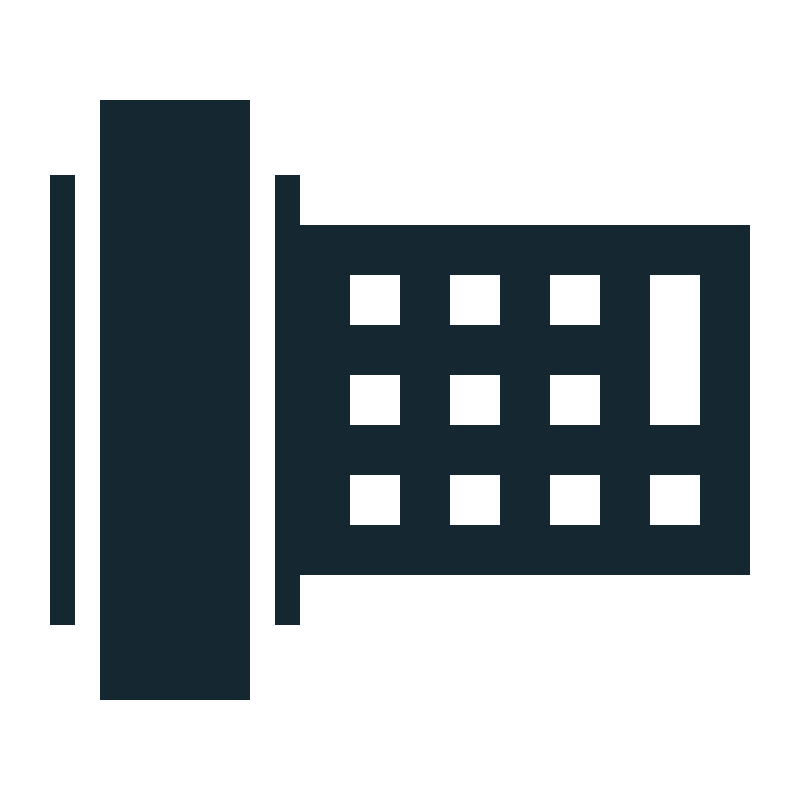</a> | **📂 檔名:** `communication-contact-fax-svgrepo-com.svg` ✨ **格式:** `Vector (SVG)` ⚖️ **大小:** `1.60KB` 📅 **更新:** `2026-02-27`  🚀 **jsDelivr Markdown:** `` 🔗 **直接連結 (Url):** <code>https://cdn.jsdelivr.net/gh/barry028/materials@main/images/iCons/Pixel/Offices/communication-contact-fax-svgrepo-com.svg</code> 📥 [檢視原始檔](communication-contact-fax-svgrepo-com.svg) |
|  | **📂 檔名:** `computer-desktop-office-svgrepo-com.svg` ✨ **格式:** `Vector (SVG)` ⚖️ **大小:** `594.00B` 📅 **更新:** `2026-02-27`  🚀 **jsDelivr Markdown:** `` 🔗 **直接連結 (Url):** <code>https://cdn.jsdelivr.net/gh/barry028/materials@main/images/iCons/Pixel/Offices/computer-desktop-office-svgrepo-com.svg</code> 📥 [檢視原始檔](computer-desktop-office-svgrepo-com.svg) |
| <a href="container-cupboard-drawers-svgrepo-com.svg">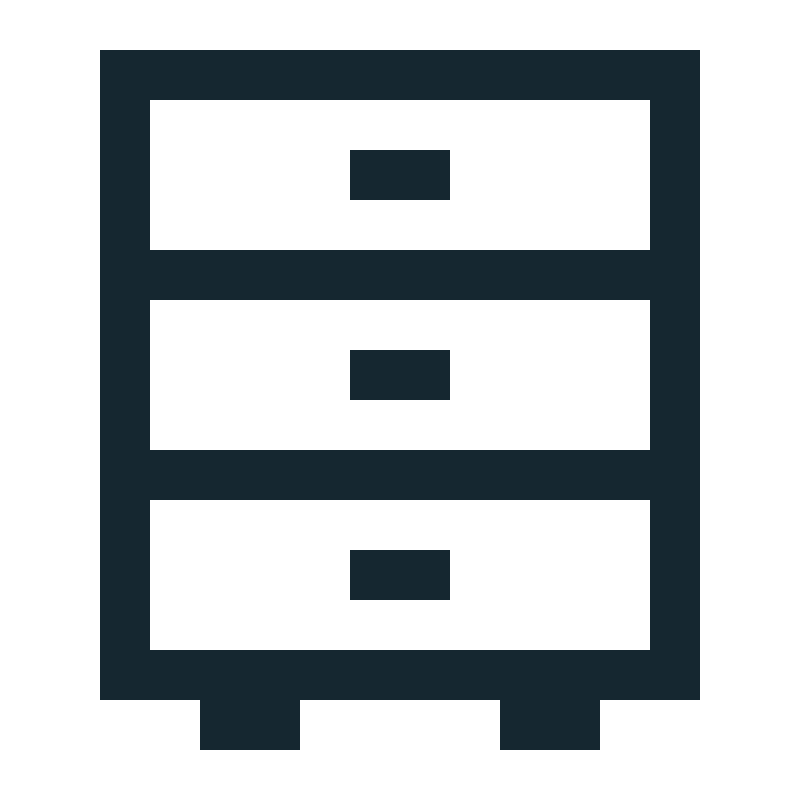</a> | **📂 檔名:** `container-cupboard-drawers-svgrepo-com.svg` ✨ **格式:** `Vector (SVG)` ⚖️ **大小:** `968.00B` 📅 **更新:** `2026-02-27`  🚀 **jsDelivr Markdown:** `` 🔗 **直接連結 (Url):** <code>https://cdn.jsdelivr.net/gh/barry028/materials@main/images/iCons/Pixel/Offices/container-cupboard-drawers-svgrepo-com.svg</code> 📥 [檢視原始檔](container-cupboard-drawers-svgrepo-com.svg) |
|  | **📂 檔名:** `copy-office-paper-svgrepo-com.svg` ✨ **格式:** `Vector (SVG)` ⚖️ **大小:** `999.00B` 📅 **更新:** `2026-02-27`  🚀 **jsDelivr Markdown:** `` 🔗 **直接連結 (Url):** <code>https://cdn.jsdelivr.net/gh/barry028/materials@main/images/iCons/Pixel/Offices/copy-office-paper-svgrepo-com.svg</code> 📥 [檢視原始檔](copy-office-paper-svgrepo-com.svg) |
|  | **📂 檔名:** `delete-garbage-office-svgrepo-com.svg` ✨ **格式:** `Vector (SVG)` ⚖️ **大小:** `805.00B` 📅 **更新:** `2026-02-27`  🚀 **jsDelivr Markdown:** `` 🔗 **直接連結 (Url):** <code>https://cdn.jsdelivr.net/gh/barry028/materials@main/images/iCons/Pixel/Offices/delete-garbage-office-svgrepo-com.svg</code> 📥 [檢視原始檔](delete-garbage-office-svgrepo-com.svg) |
|  | **📂 檔名:** `delete-office-paper-svgrepo-com.svg` ✨ **格式:** `Vector (SVG)` ⚖️ **大小:** `988.00B` 📅 **更新:** `2026-02-27`  🚀 **jsDelivr Markdown:** `` 🔗 **直接連結 (Url):** <code>https://cdn.jsdelivr.net/gh/barry028/materials@main/images/iCons/Pixel/Offices/delete-office-paper-svgrepo-com.svg</code> 📥 [檢視原始檔](delete-office-paper-svgrepo-com.svg) |
| <a href="desktop-hotel-lamp-svgrepo-com.svg">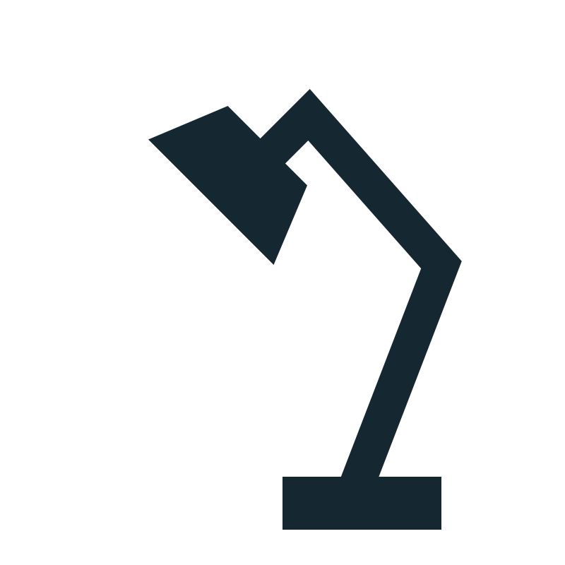</a> | **📂 檔名:** `desktop-hotel-lamp-svgrepo-com.svg` ✨ **格式:** `Vector (SVG)` ⚖️ **大小:** `734.00B` 📅 **更新:** `2026-02-27`  🚀 **jsDelivr Markdown:** `` 🔗 **直接連結 (Url):** <code>https://cdn.jsdelivr.net/gh/barry028/materials@main/images/iCons/Pixel/Offices/desktop-hotel-lamp-svgrepo-com.svg</code> 📥 [檢視原始檔](desktop-hotel-lamp-svgrepo-com.svg) |
|  | **📂 檔名:** `document-file-office-svgrepo-com.svg` ✨ **格式:** `Vector (SVG)` ⚖️ **大小:** `816.00B` 📅 **更新:** `2026-02-27`  🚀 **jsDelivr Markdown:** `` 🔗 **直接連結 (Url):** <code>https://cdn.jsdelivr.net/gh/barry028/materials@main/images/iCons/Pixel/Offices/document-file-office-svgrepo-com.svg</code> 📥 [檢視原始檔](document-file-office-svgrepo-com.svg) |
| <a href="eraser-gum-office-svgrepo-com.svg">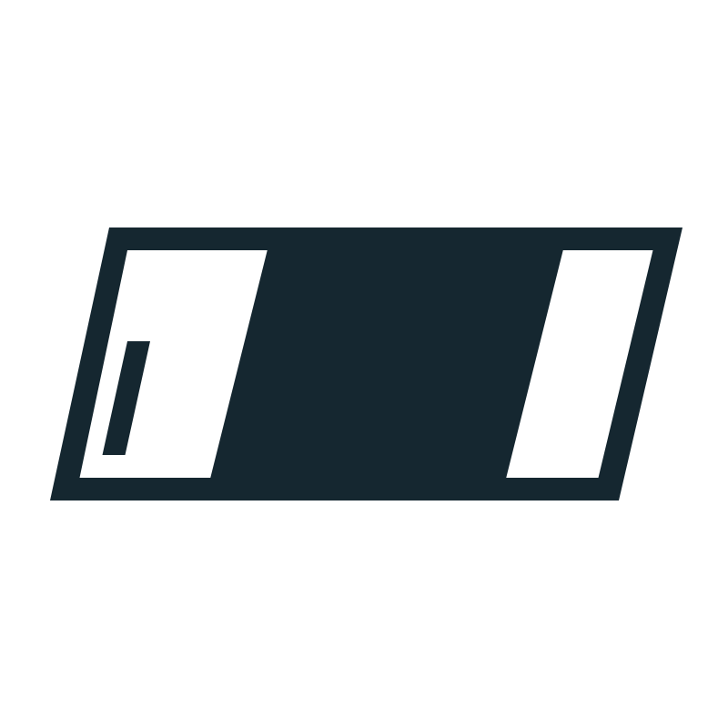</a> | **📂 檔名:** `eraser-gum-office-svgrepo-com.svg` ✨ **格式:** `Vector (SVG)` ⚖️ **大小:** `790.00B` 📅 **更新:** `2026-02-27`  🚀 **jsDelivr Markdown:** `` 🔗 **直接連結 (Url):** <code>https://cdn.jsdelivr.net/gh/barry028/materials@main/images/iCons/Pixel/Offices/eraser-gum-office-svgrepo-com.svg</code> 📥 [檢視原始檔](eraser-gum-office-svgrepo-com.svg) |
| <a href="mark-office-seal-svgrepo-com.svg">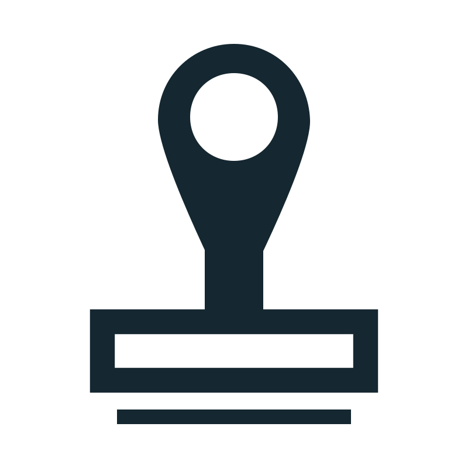</a> | **📂 檔名:** `mark-office-seal-svgrepo-com.svg` ✨ **格式:** `Vector (SVG)` ⚖️ **大小:** `834.00B` 📅 **更新:** `2026-02-27`  🚀 **jsDelivr Markdown:** `` 🔗 **直接連結 (Url):** <code>https://cdn.jsdelivr.net/gh/barry028/materials@main/images/iCons/Pixel/Offices/mark-office-seal-svgrepo-com.svg</code> 📥 [檢視原始檔](mark-office-seal-svgrepo-com.svg) |
| <a href="office-paper-remove-svgrepo-com.svg">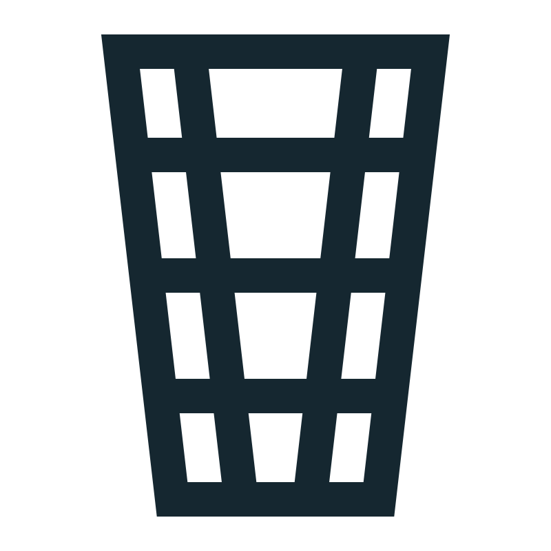</a> | **📂 檔名:** `office-paper-remove-svgrepo-com.svg` ✨ **格式:** `Vector (SVG)` ⚖️ **大小:** `804.00B` 📅 **更新:** `2026-02-27`  🚀 **jsDelivr Markdown:** `` 🔗 **直接連結 (Url):** <code>https://cdn.jsdelivr.net/gh/barry028/materials@main/images/iCons/Pixel/Offices/office-paper-remove-svgrepo-com.svg</code> 📥 [檢視原始檔](office-paper-remove-svgrepo-com.svg) |
| <a href="tea-office-drink-svgrepo-com.svg">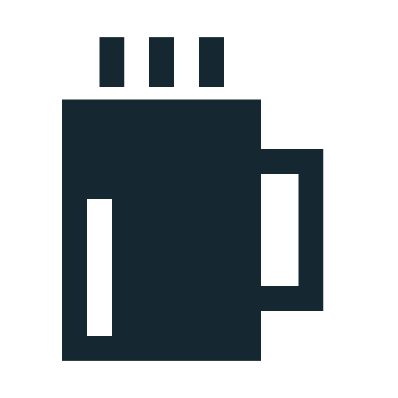</a> | **📂 檔名:** `tea-office-drink-svgrepo-com.svg` ✨ **格式:** `Vector (SVG)` ⚖️ **大小:** `754.00B` 📅 **更新:** `2026-02-27`  🚀 **jsDelivr Markdown:** `` 🔗 **直接連結 (Url):** <code>https://cdn.jsdelivr.net/gh/barry028/materials@main/images/iCons/Pixel/Offices/tea-office-drink-svgrepo-com.svg</code> 📥 [檢視原始檔](tea-office-drink-svgrepo-com.svg) |