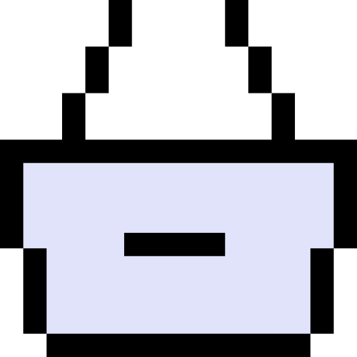
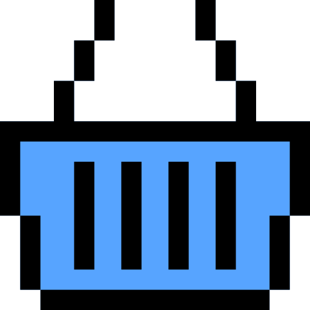
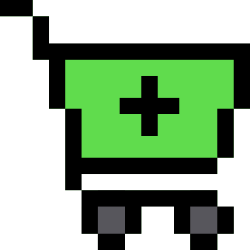
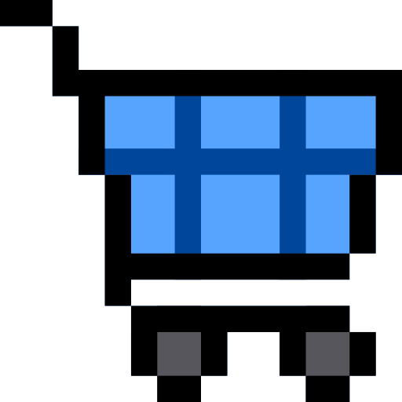
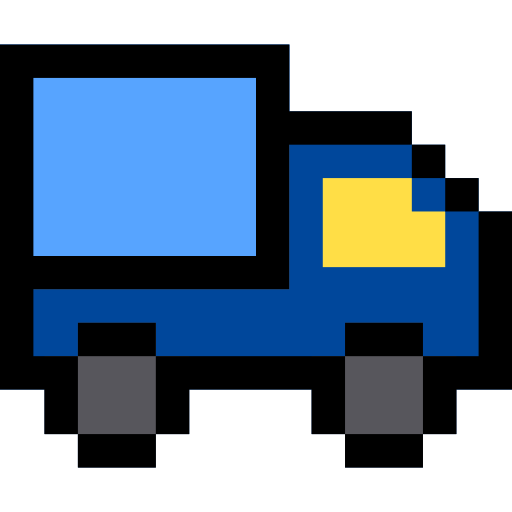
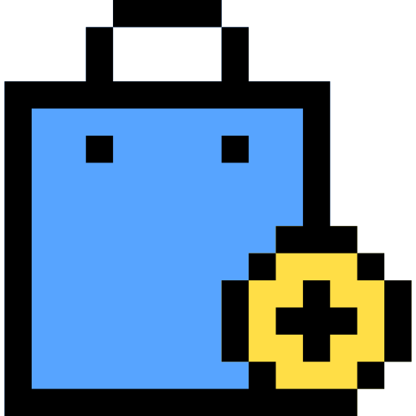
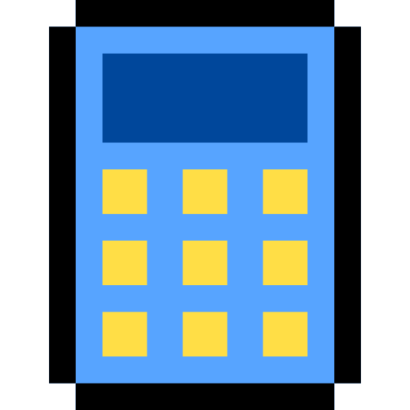
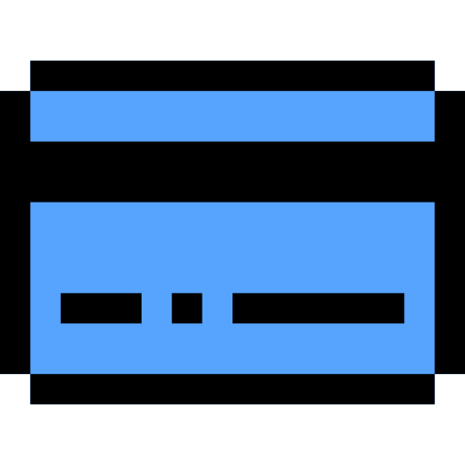

# 🖼️ Linear

[⬅️ 返回主目錄](../../../../../../README.md)

| 預覽 | 資訊 |
| :--- | :--- |
|  | **001-basket-4.svg** |
|  | **002-basket-3.svg** |
|  | **003-basket-2.svg** |
|  | **004-basket-1.svg** |
|  | **005-basket.svg** |
|  | **006-cart-4.svg** |
|  | **007-cart-3.svg** |
|  | **008-cart-2.svg** |
|  | **009-cart-1.svg** |
|  | **010-cart.svg** |
|  | **011-percent.svg** |
|  | **012-help.svg** |
|  | **013-yen.svg** |
|  | **014-euro.svg** |
|  | **015-dollar.svg** |
|  | **016-store.svg** |
|  | **017-gift.svg** |
|  | **018-third.svg** |
|  | **019-second.svg** |
|  | **020-first.svg** |
|  | **021-support.svg** |
|  | **022-chat.svg** |
|  | **023-sale.svg** |
|  | **024-new.svg** |
|  | **025-free.svg** |
|  | **026-delivery.svg** |
|  | **027-box-1.svg** |
|  | **028-ship.svg** |
|  | **029-stock.svg** |
|  | **030-box.svg** |
|  | **031-qr-code.svg** |
|  | **032-barcode-1.svg** |
|  | **033-barcode.svg** |
|  | **034-purchase.svg** |
|  | **035-payment.svg** |
|  | **036-cash.svg** |
|  | **037-guarantee.svg** |
|  | **038-24-hours.svg** |
|  | **039-shirt.svg** |
|  | **040-watch.svg** |
|  | **041-shopping-bag-2.svg** |
|  | **042-shopping-bag-1.svg** |
|  | **043-shopping-bags.svg** |
|  | **044-shopping-bag.svg** |
|  | **045-calculator.svg** |
|  | **046-wallet.svg** |
|  | **047-credit-card.svg** |
|  | **048-bill.svg** |
|  | **049-coupon.svg** |
|  | **050-tag.svg** |