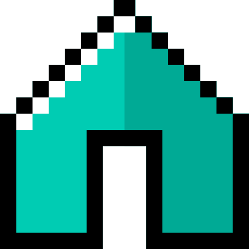
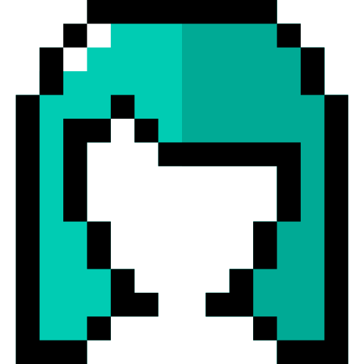

# 🖼️ Linear

[⬅️ 返回主目錄](../../../../../../README.md)

| 預覽 | 資訊 |
| :--- | :--- |
|  | **001-instagram.svg** |
|  | **002-google-plus.svg** |
|  | **003-twitter.svg** |
|  | **004-linkedin.svg** |
|  | **005-facebook.svg** |
|  | **006-www.svg** |
|  | **007-location.svg** |
|  | **008-building.svg** |
|  | **009-home.svg** |
|  | **010-at-sign.svg** |
|  | **011-web.svg** |
|  | **012-mail.svg** |
|  | **013-send.svg** |
|  | **014-write.svg** |
|  | **015-note.svg** |
|  | **016-share.svg** |
|  | **017-chat.svg** |
|  | **018-happy.svg** |
|  | **019-info.svg** |
|  | **020-typing.svg** |
|  | **021-contact-list.svg** |
|  | **022-fax.svg** |
|  | **023-phone.svg** |
|  | **024-24-hours.svg** |
|  | **025-phone-call.svg** |
|  | **026-message.svg** |
|  | **027-mobile-phone.svg** |
|  | **028-notice.svg** |
|  | **029-search.svg** |
|  | **030-profile.svg** |
|  | **031-man-1.svg** |
|  | **032-man.svg** |
|  | **033-woman-1.svg** |
|  | **034-woman.svg** |
|  | **035-video-call.svg** |
|  | **036-delete.svg** |
|  | **037-add.svg** |
|  | **038-group.svg** |
|  | **039-friend.svg** |
|  | **040-contact.svg** |