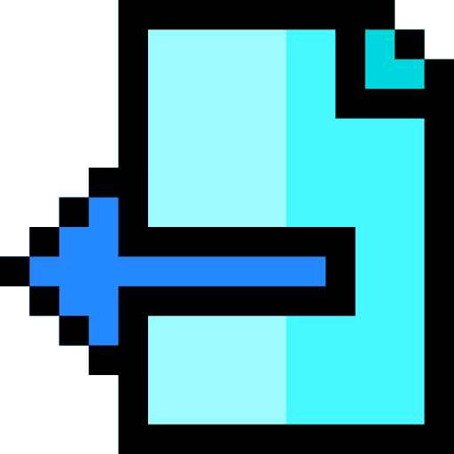
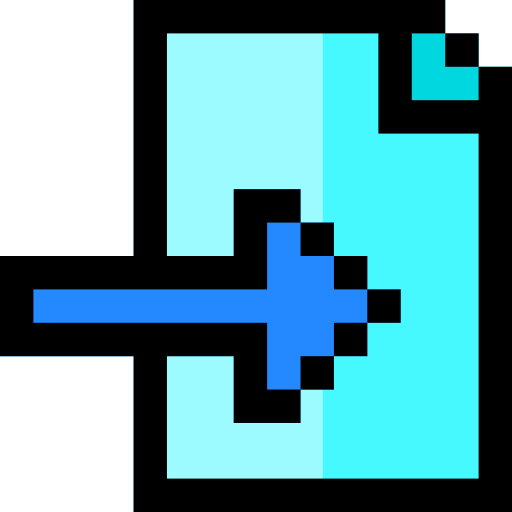
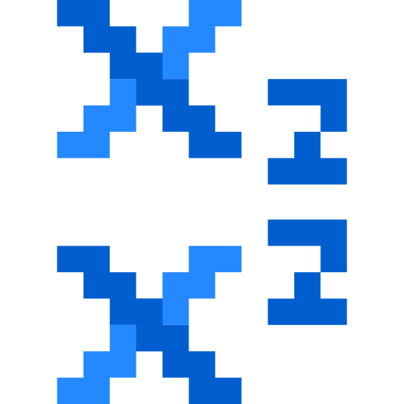

# 🖼️ Linear

[⬅️ 返回主目錄](../../../../../../README.md)

| 預覽 | 資訊 |
| :--- | :--- |
|  | **041-bold.svg** |
|  | **041-center-alignment.svg** |
|  | **041-close.svg** |
|  | **041-columns.svg** |
|  | **041-copy.svg** |
|  | **041-cut.svg** |
|  | **041-document-1.svg** |
|  | **041-document.svg** |
|  | **041-eraser.svg** |
|  | **041-export.svg** |
|  | **041-folder.svg** |
|  | **041-font.svg** |
|  | **041-import.svg** |
|  | **041-indent.svg** |
|  | **041-italic.svg** |
|  | **041-justify-align.svg** |
|  | **041-left-alignment.svg** |
|  | **041-link.svg** |
|  | **041-list-1.svg** |
|  | **041-list.svg** |
|  | **041-outdent.svg** |
|  | **041-paperclip.svg** |
|  | **041-paragraph.svg** |
|  | **041-paste.svg** |
|  | **041-preview.svg** |
|  | **041-printer.svg** |
|  | **041-redo.svg** |
|  | **041-right-alignment.svg** |
|  | **041-save-1.svg** |
|  | **041-save.svg** |
|  | **041-strikethrough.svg** |
|  | **041-subscript.svg** |
|  | **041-superscript.svg** |
|  | **041-table-1.svg** |
|  | **041-table.svg** |
|  | **041-text-height.svg** |
|  | **041-text-width.svg** |
|  | **041-underline.svg** |
|  | **041-undo.svg** |
|  | **041-unlink.svg** |