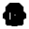

# 🖼️ 素材分類：Pixel iCons Pixtober 2025

> [🏠 主目錄](../../../../README.md) / [images](../../../README.md) / [iCons](../../README.md) / [Pixel](../README.md) / **Pixel iCons Pixtober 2025**

本目錄共有 `31` 個檔案

| 🎨 預覽 (點擊放大)  | 📋 檔案詳細資訊與連結 |
| :--- | :--- |
|  | **📂 檔名:** `Arctic.svg` ✨ **格式:** `Vector (SVG)` ⚖️ **大小:** `1.39KB` 📅 **更新:** `2026-03-04`  🚀 **jsDelivr Markdown:** `` 🔗 **直接連結 (Url):** <code>https://cdn.jsdelivr.net/gh/barry028/materials@main/images/iCons/Pixel/Pixel%20iCons%20Pixtober%202025/Arctic.svg</code> 📥 [檢視原始檔](Arctic.svg) |
|  | **📂 檔名:** `Award.svg` ✨ **格式:** `Vector (SVG)` ⚖️ **大小:** `1.41KB` 📅 **更新:** `2026-03-04`  🚀 **jsDelivr Markdown:** `` 🔗 **直接連結 (Url):** <code>https://cdn.jsdelivr.net/gh/barry028/materials@main/images/iCons/Pixel/Pixel%20iCons%20Pixtober%202025/Award.svg</code> 📥 [檢視原始檔](Award.svg) |
|  | **📂 檔名:** `Blast.svg` ✨ **格式:** `Vector (SVG)` ⚖️ **大小:** `1.35KB` 📅 **更新:** `2026-03-04`  🚀 **jsDelivr Markdown:** `` 🔗 **直接連結 (Url):** <code>https://cdn.jsdelivr.net/gh/barry028/materials@main/images/iCons/Pixel/Pixel%20iCons%20Pixtober%202025/Blast.svg</code> 📥 [檢視原始檔](Blast.svg) |
|  | **📂 檔名:** `Blunder.svg` ✨ **格式:** `Vector (SVG)` ⚖️ **大小:** `5.65KB` 📅 **更新:** `2026-03-04`  🚀 **jsDelivr Markdown:** `` 🔗 **直接連結 (Url):** <code>https://cdn.jsdelivr.net/gh/barry028/materials@main/images/iCons/Pixel/Pixel%20iCons%20Pixtober%202025/Blunder.svg</code> 📥 [檢視原始檔](Blunder.svg) |
|  | **📂 檔名:** `Button.svg` ✨ **格式:** `Vector (SVG)` ⚖️ **大小:** `4.77KB` 📅 **更新:** `2026-03-04`  🚀 **jsDelivr Markdown:** `` 🔗 **直接連結 (Url):** <code>https://cdn.jsdelivr.net/gh/barry028/materials@main/images/iCons/Pixel/Pixel%20iCons%20Pixtober%202025/Button.svg</code> 📥 [檢視原始檔](Button.svg) |
|  | **📂 檔名:** `Crown.svg` ✨ **格式:** `Vector (SVG)` ⚖️ **大小:** `7.20KB` 📅 **更新:** `2026-03-04`  🚀 **jsDelivr Markdown:** `` 🔗 **直接連結 (Url):** <code>https://cdn.jsdelivr.net/gh/barry028/materials@main/images/iCons/Pixel/Pixel%20iCons%20Pixtober%202025/Crown.svg</code> 📥 [檢視原始檔](Crown.svg) |
|  | **📂 檔名:** `Deal.svg` ✨ **格式:** `Vector (SVG)` ⚖️ **大小:** `4.68KB` 📅 **更新:** `2026-03-04`  🚀 **jsDelivr Markdown:** `` 🔗 **直接連結 (Url):** <code>https://cdn.jsdelivr.net/gh/barry028/materials@main/images/iCons/Pixel/Pixel%20iCons%20Pixtober%202025/Deal.svg</code> 📥 [檢視原始檔](Deal.svg) |
|  | **📂 檔名:** `Deer.svg` ✨ **格式:** `Vector (SVG)` ⚖️ **大小:** `1.41KB` 📅 **更新:** `2026-03-04`  🚀 **jsDelivr Markdown:** `` 🔗 **直接連結 (Url):** <code>https://cdn.jsdelivr.net/gh/barry028/materials@main/images/iCons/Pixel/Pixel%20iCons%20Pixtober%202025/Deer.svg</code> 📥 [檢視原始檔](Deer.svg) |
|  | **📂 檔名:** `Drink.svg` ✨ **格式:** `Vector (SVG)` ⚖️ **大小:** `1.30KB` 📅 **更新:** `2026-03-04`  🚀 **jsDelivr Markdown:** `` 🔗 **直接連結 (Url):** <code>https://cdn.jsdelivr.net/gh/barry028/materials@main/images/iCons/Pixel/Pixel%20iCons%20Pixtober%202025/Drink.svg</code> 📥 [檢視原始檔](Drink.svg) |
|  | **📂 檔名:** `Firefly.svg` ✨ **格式:** `Vector (SVG)` ⚖️ **大小:** `5.34KB` 📅 **更新:** `2026-03-04`  🚀 **jsDelivr Markdown:** `` 🔗 **直接連結 (Url):** <code>https://cdn.jsdelivr.net/gh/barry028/materials@main/images/iCons/Pixel/Pixel%20iCons%20Pixtober%202025/Firefly.svg</code> 📥 [檢視原始檔](Firefly.svg) |
|  | **📂 檔名:** `Heavy.svg` ✨ **格式:** `Vector (SVG)` ⚖️ **大小:** `1.22KB` 📅 **更新:** `2026-03-04`  🚀 **jsDelivr Markdown:** `` 🔗 **直接連結 (Url):** <code>https://cdn.jsdelivr.net/gh/barry028/materials@main/images/iCons/Pixel/Pixel%20iCons%20Pixtober%202025/Heavy.svg</code> 📥 [檢視原始檔](Heavy.svg) |
|  | **📂 檔名:** `Inferno.svg` ✨ **格式:** `Vector (SVG)` ⚖️ **大小:** `4.83KB` 📅 **更新:** `2026-03-04`  🚀 **jsDelivr Markdown:** `` 🔗 **直接連結 (Url):** <code>https://cdn.jsdelivr.net/gh/barry028/materials@main/images/iCons/Pixel/Pixel%20iCons%20Pixtober%202025/Inferno.svg</code> 📥 [檢視原始檔](Inferno.svg) |
|  | **📂 檔名:** `Lesson.svg` ✨ **格式:** `Vector (SVG)` ⚖️ **大小:** `5.99KB` 📅 **更新:** `2026-03-04`  🚀 **jsDelivr Markdown:** `` 🔗 **直接連結 (Url):** <code>https://cdn.jsdelivr.net/gh/barry028/materials@main/images/iCons/Pixel/Pixel%20iCons%20Pixtober%202025/Lesson.svg</code> 📥 [檢視原始檔](Lesson.svg) |
|  | **📂 檔名:** `Moustache.svg` ✨ **格式:** `Vector (SVG)` ⚖️ **大小:** `5.25KB` 📅 **更新:** `2026-03-04`  🚀 **jsDelivr Markdown:** `` 🔗 **直接連結 (Url):** <code>https://cdn.jsdelivr.net/gh/barry028/materials@main/images/iCons/Pixel/Pixel%20iCons%20Pixtober%202025/Moustache.svg</code> 📥 [檢視原始檔](Moustache.svg) |
|  | **📂 檔名:** `Murky.svg` ✨ **格式:** `Vector (SVG)` ⚖️ **大小:** `2.00KB` 📅 **更新:** `2026-03-04`  🚀 **jsDelivr Markdown:** `` 🔗 **直接連結 (Url):** <code>https://cdn.jsdelivr.net/gh/barry028/materials@main/images/iCons/Pixel/Pixel%20iCons%20Pixtober%202025/Murky.svg</code> 📥 [檢視原始檔](Murky.svg) |
|  | **📂 檔名:** `Onion.svg` ✨ **格式:** `Vector (SVG)` ⚖️ **大小:** `5.09KB` 📅 **更新:** `2026-03-04`  🚀 **jsDelivr Markdown:** `` 🔗 **直接連結 (Url):** <code>https://cdn.jsdelivr.net/gh/barry028/materials@main/images/iCons/Pixel/Pixel%20iCons%20Pixtober%202025/Onion.svg</code> 📥 [檢視原始檔](Onion.svg) |
|  | **📂 檔名:** `Ornate.svg` ✨ **格式:** `Vector (SVG)` ⚖️ **大小:** `5.57KB` 📅 **更新:** `2026-03-04`  🚀 **jsDelivr Markdown:** `` 🔗 **直接連結 (Url):** <code>https://cdn.jsdelivr.net/gh/barry028/materials@main/images/iCons/Pixel/Pixel%20iCons%20Pixtober%202025/Ornate.svg</code> 📥 [檢視原始檔](Ornate.svg) |
|  | **📂 檔名:** `Pierce.svg` ✨ **格式:** `Vector (SVG)` ⚖️ **大小:** `4.40KB` 📅 **更新:** `2026-03-04`  🚀 **jsDelivr Markdown:** `` 🔗 **直接連結 (Url):** <code>https://cdn.jsdelivr.net/gh/barry028/materials@main/images/iCons/Pixel/Pixel%20iCons%20Pixtober%202025/Pierce.svg</code> 📥 [檢視原始檔](Pierce.svg) |
|  | **📂 檔名:** `Puzzling.svg` ✨ **格式:** `Vector (SVG)` ⚖️ **大小:** `1.25KB` 📅 **更新:** `2026-03-04`  🚀 **jsDelivr Markdown:** `` 🔗 **直接連結 (Url):** <code>https://cdn.jsdelivr.net/gh/barry028/materials@main/images/iCons/Pixel/Pixel%20iCons%20Pixtober%202025/Puzzling.svg</code> 📥 [檢視原始檔](Puzzling.svg) |
|  | **📂 檔名:** `Ragged.svg` ✨ **格式:** `Vector (SVG)` ⚖️ **大小:** `1.25KB` 📅 **更新:** `2026-03-04`  🚀 **jsDelivr Markdown:** `` 🔗 **直接連結 (Url):** <code>https://cdn.jsdelivr.net/gh/barry028/materials@main/images/iCons/Pixel/Pixel%20iCons%20Pixtober%202025/Ragged.svg</code> 📥 [檢視原始檔](Ragged.svg) |
|  | **📂 檔名:** `Reckless.svg` ✨ **格式:** `Vector (SVG)` ⚖️ **大小:** `6.50KB` 📅 **更新:** `2026-03-04`  🚀 **jsDelivr Markdown:** `` 🔗 **直接連結 (Url):** <code>https://cdn.jsdelivr.net/gh/barry028/materials@main/images/iCons/Pixel/Pixel%20iCons%20Pixtober%202025/Reckless.svg</code> 📥 [檢視原始檔](Reckless.svg) |
|  | **📂 檔名:** `Rivals.svg` ✨ **格式:** `Vector (SVG)` ⚖️ **大小:** `1.28KB` 📅 **更新:** `2026-03-04`  🚀 **jsDelivr Markdown:** `` 🔗 **直接連結 (Url):** <code>https://cdn.jsdelivr.net/gh/barry028/materials@main/images/iCons/Pixel/Pixel%20iCons%20Pixtober%202025/Rivals.svg</code> 📥 [檢視原始檔](Rivals.svg) |
|  | **📂 檔名:** `Rowdy.svg` ✨ **格式:** `Vector (SVG)` ⚖️ **大小:** `1.29KB` 📅 **更新:** `2026-03-04`  🚀 **jsDelivr Markdown:** `` 🔗 **直接連結 (Url):** <code>https://cdn.jsdelivr.net/gh/barry028/materials@main/images/iCons/Pixel/Pixel%20iCons%20Pixtober%202025/Rowdy.svg</code> 📥 [檢視原始檔](Rowdy.svg) |
|  | **📂 檔名:** `Shredded.svg` ✨ **格式:** `Vector (SVG)` ⚖️ **大小:** `1.25KB` 📅 **更新:** `2026-03-04`  🚀 **jsDelivr Markdown:** `` 🔗 **直接連結 (Url):** <code>https://cdn.jsdelivr.net/gh/barry028/materials@main/images/iCons/Pixel/Pixel%20iCons%20Pixtober%202025/Shredded.svg</code> 📥 [檢視原始檔](Shredded.svg) |
|  | **📂 檔名:** `Skeletal.svg` ✨ **格式:** `Vector (SVG)` ⚖️ **大小:** `1.33KB` 📅 **更新:** `2026-03-04`  🚀 **jsDelivr Markdown:** `` 🔗 **直接連結 (Url):** <code>https://cdn.jsdelivr.net/gh/barry028/materials@main/images/iCons/Pixel/Pixel%20iCons%20Pixtober%202025/Skeletal.svg</code> 📥 [檢視原始檔](Skeletal.svg) |
|  | **📂 檔名:** `Starfish.svg` ✨ **格式:** `Vector (SVG)` ⚖️ **大小:** `331.00B` 📅 **更新:** `2026-03-04`  🚀 **jsDelivr Markdown:** `` 🔗 **直接連結 (Url):** <code>https://cdn.jsdelivr.net/gh/barry028/materials@main/images/iCons/Pixel/Pixel%20iCons%20Pixtober%202025/Starfish.svg</code> 📥 [檢視原始檔](Starfish.svg) |
|  | **📂 檔名:** `Sting.svg` ✨ **格式:** `Vector (SVG)` ⚖️ **大小:** `7.76KB` 📅 **更新:** `2026-03-04`  🚀 **jsDelivr Markdown:** `` 🔗 **直接連結 (Url):** <code>https://cdn.jsdelivr.net/gh/barry028/materials@main/images/iCons/Pixel/Pixel%20iCons%20Pixtober%202025/Sting.svg</code> 📥 [檢視原始檔](Sting.svg) |
|  | **📂 檔名:** `Sweep.svg` ✨ **格式:** `Vector (SVG)` ⚖️ **大小:** `1.17KB` 📅 **更新:** `2026-03-04`  🚀 **jsDelivr Markdown:** `` 🔗 **直接連結 (Url):** <code>https://cdn.jsdelivr.net/gh/barry028/materials@main/images/iCons/Pixel/Pixel%20iCons%20Pixtober%202025/Sweep.svg</code> 📥 [檢視原始檔](Sweep.svg) |
|  | **📂 檔名:** `Trunk.svg` ✨ **格式:** `Vector (SVG)` ⚖️ **大小:** `1.39KB` 📅 **更新:** `2026-03-04`  🚀 **jsDelivr Markdown:** `` 🔗 **直接連結 (Url):** <code>https://cdn.jsdelivr.net/gh/barry028/materials@main/images/iCons/Pixel/Pixel%20iCons%20Pixtober%202025/Trunk.svg</code> 📥 [檢視原始檔](Trunk.svg) |
|  | **📂 檔名:** `Vacant.svg` ✨ **格式:** `Vector (SVG)` ⚖️ **大小:** `3.49KB` 📅 **更新:** `2026-03-04`  🚀 **jsDelivr Markdown:** `` 🔗 **直接連結 (Url):** <code>https://cdn.jsdelivr.net/gh/barry028/materials@main/images/iCons/Pixel/Pixel%20iCons%20Pixtober%202025/Vacant.svg</code> 📥 [檢視原始檔](Vacant.svg) |
|  | **📂 檔名:** `Weave.svg` ✨ **格式:** `Vector (SVG)` ⚖️ **大小:** `6.45KB` 📅 **更新:** `2026-03-04`  🚀 **jsDelivr Markdown:** `` 🔗 **直接連結 (Url):** <code>https://cdn.jsdelivr.net/gh/barry028/materials@main/images/iCons/Pixel/Pixel%20iCons%20Pixtober%202025/Weave.svg</code> 📥 [檢視原始檔](Weave.svg) |