# 🖼️ 素材分類：Linear

> [🏠 主目錄](../../../../../../README.md) / [images](../../../../../README.md) / [iCons](../../../../README.md) / [Pixel](../../../README.md) / [Pixel iCons Set](../../README.md) / [Commerce](../README.md) / **Linear**

本目錄共有 `50` 個檔案

| 🎨 預覽 (點擊放大)  | 📋 檔案詳細資訊與連結 |
| :--- | :--- |
|  | **📂 檔名:** `001-basket-4.svg` ✨ **格式:** `Vector (SVG)` ⚖️ **大小:** `2.26KB` 📅 **更新:** `2026-03-01`  🚀 **jsDelivr Markdown:** `` 🔗 **直接連結 (Url):** <code>https://cdn.jsdelivr.net/gh/barry028/materials@main/images/iCons/Pixel/Pixel%20iCons%20Set/Commerce/Linear/001-basket-4.svg</code> 📥 [檢視原始檔](001-basket-4.svg) |
| <a href="002-basket-3.svg">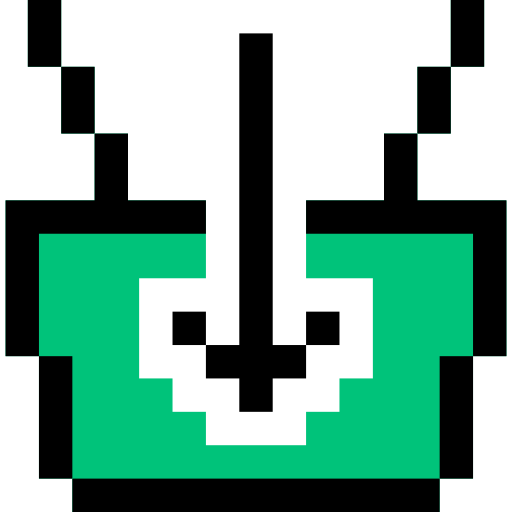</a> | **📂 檔名:** `002-basket-3.svg` ✨ **格式:** `Vector (SVG)` ⚖️ **大小:** `2.45KB` 📅 **更新:** `2026-03-01`  🚀 **jsDelivr Markdown:** `` 🔗 **直接連結 (Url):** <code>https://cdn.jsdelivr.net/gh/barry028/materials@main/images/iCons/Pixel/Pixel%20iCons%20Set/Commerce/Linear/002-basket-3.svg</code> 📥 [檢視原始檔](002-basket-3.svg) |
| <a href="003-basket-2.svg">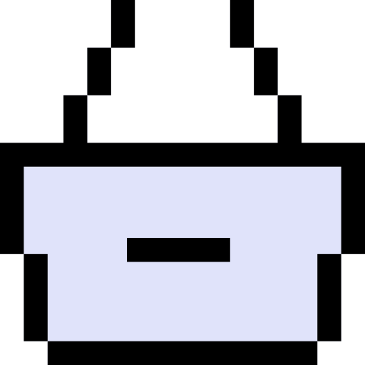</a> | **📂 檔名:** `003-basket-2.svg` ✨ **格式:** `Vector (SVG)` ⚖️ **大小:** `1.71KB` 📅 **更新:** `2026-03-01`  🚀 **jsDelivr Markdown:** `` 🔗 **直接連結 (Url):** <code>https://cdn.jsdelivr.net/gh/barry028/materials@main/images/iCons/Pixel/Pixel%20iCons%20Set/Commerce/Linear/003-basket-2.svg</code> 📥 [檢視原始檔](003-basket-2.svg) |
| <a href="004-basket-1.svg">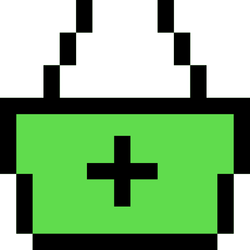</a> | **📂 檔名:** `004-basket-1.svg` ✨ **格式:** `Vector (SVG)` ⚖️ **大小:** `1.85KB` 📅 **更新:** `2026-03-01`  🚀 **jsDelivr Markdown:** `` 🔗 **直接連結 (Url):** <code>https://cdn.jsdelivr.net/gh/barry028/materials@main/images/iCons/Pixel/Pixel%20iCons%20Set/Commerce/Linear/004-basket-1.svg</code> 📥 [檢視原始檔](004-basket-1.svg) |
| <a href="005-basket.svg">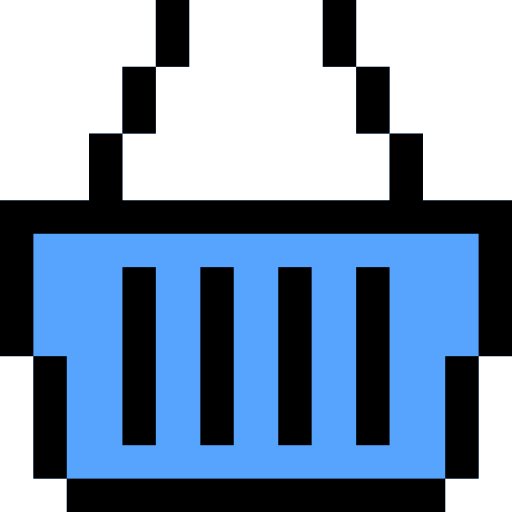</a> | **📂 檔名:** `005-basket.svg` ✨ **格式:** `Vector (SVG)` ⚖️ **大小:** `1.89KB` 📅 **更新:** `2026-03-01`  🚀 **jsDelivr Markdown:** `` 🔗 **直接連結 (Url):** <code>https://cdn.jsdelivr.net/gh/barry028/materials@main/images/iCons/Pixel/Pixel%20iCons%20Set/Commerce/Linear/005-basket.svg</code> 📥 [檢視原始檔](005-basket.svg) |
|  | **📂 檔名:** `006-cart-4.svg` ✨ **格式:** `Vector (SVG)` ⚖️ **大小:** `3.04KB` 📅 **更新:** `2026-03-01`  🚀 **jsDelivr Markdown:** `` 🔗 **直接連結 (Url):** <code>https://cdn.jsdelivr.net/gh/barry028/materials@main/images/iCons/Pixel/Pixel%20iCons%20Set/Commerce/Linear/006-cart-4.svg</code> 📥 [檢視原始檔](006-cart-4.svg) |
| <a href="007-cart-3.svg">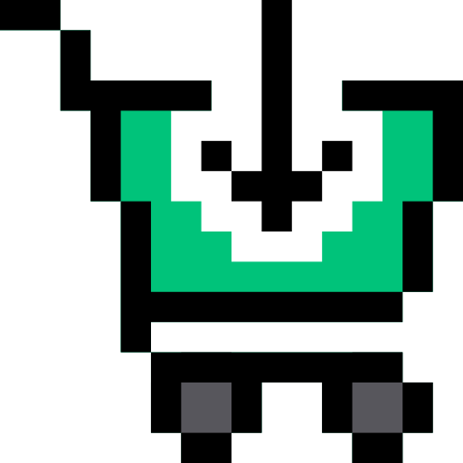</a> | **📂 檔名:** `007-cart-3.svg` ✨ **格式:** `Vector (SVG)` ⚖️ **大小:** `3.16KB` 📅 **更新:** `2026-03-01`  🚀 **jsDelivr Markdown:** `` 🔗 **直接連結 (Url):** <code>https://cdn.jsdelivr.net/gh/barry028/materials@main/images/iCons/Pixel/Pixel%20iCons%20Set/Commerce/Linear/007-cart-3.svg</code> 📥 [檢視原始檔](007-cart-3.svg) |
| <a href="008-cart-2.svg">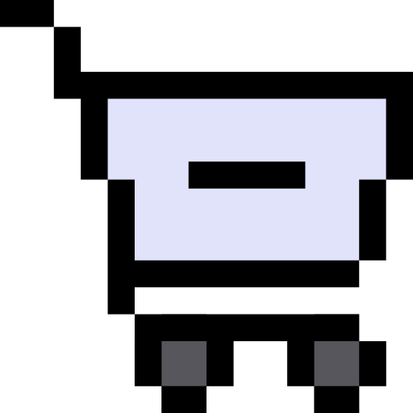</a> | **📂 檔名:** `008-cart-2.svg` ✨ **格式:** `Vector (SVG)` ⚖️ **大小:** `2.60KB` 📅 **更新:** `2026-03-01`  🚀 **jsDelivr Markdown:** `` 🔗 **直接連結 (Url):** <code>https://cdn.jsdelivr.net/gh/barry028/materials@main/images/iCons/Pixel/Pixel%20iCons%20Set/Commerce/Linear/008-cart-2.svg</code> 📥 [檢視原始檔](008-cart-2.svg) |
| <a href="009-cart-1.svg">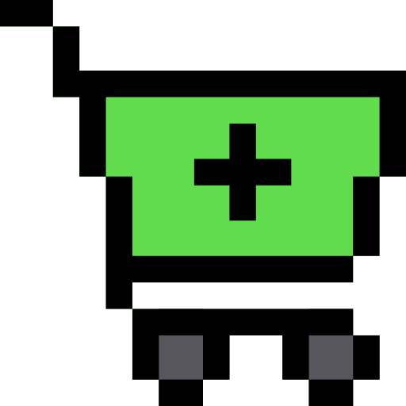</a> | **📂 檔名:** `009-cart-1.svg` ✨ **格式:** `Vector (SVG)` ⚖️ **大小:** `2.75KB` 📅 **更新:** `2026-03-01`  🚀 **jsDelivr Markdown:** `` 🔗 **直接連結 (Url):** <code>https://cdn.jsdelivr.net/gh/barry028/materials@main/images/iCons/Pixel/Pixel%20iCons%20Set/Commerce/Linear/009-cart-1.svg</code> 📥 [檢視原始檔](009-cart-1.svg) |
| <a href="010-cart.svg">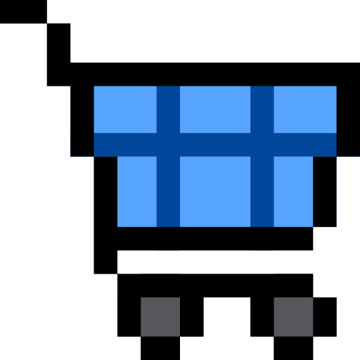</a> | **📂 檔名:** `010-cart.svg` ✨ **格式:** `Vector (SVG)` ⚖️ **大小:** `2.83KB` 📅 **更新:** `2026-03-01`  🚀 **jsDelivr Markdown:** `` 🔗 **直接連結 (Url):** <code>https://cdn.jsdelivr.net/gh/barry028/materials@main/images/iCons/Pixel/Pixel%20iCons%20Set/Commerce/Linear/010-cart.svg</code> 📥 [檢視原始檔](010-cart.svg) |
|  | **📂 檔名:** `011-percent.svg` ✨ **格式:** `Vector (SVG)` ⚖️ **大小:** `3.03KB` 📅 **更新:** `2026-03-01`  🚀 **jsDelivr Markdown:** `` 🔗 **直接連結 (Url):** <code>https://cdn.jsdelivr.net/gh/barry028/materials@main/images/iCons/Pixel/Pixel%20iCons%20Set/Commerce/Linear/011-percent.svg</code> 📥 [檢視原始檔](011-percent.svg) |
|  | **📂 檔名:** `012-help.svg` ✨ **格式:** `Vector (SVG)` ⚖️ **大小:** `2.42KB` 📅 **更新:** `2026-03-01`  🚀 **jsDelivr Markdown:** `` 🔗 **直接連結 (Url):** <code>https://cdn.jsdelivr.net/gh/barry028/materials@main/images/iCons/Pixel/Pixel%20iCons%20Set/Commerce/Linear/012-help.svg</code> 📥 [檢視原始檔](012-help.svg) |
|  | **📂 檔名:** `013-yen.svg` ✨ **格式:** `Vector (SVG)` ⚖️ **大小:** `2.80KB` 📅 **更新:** `2026-03-01`  🚀 **jsDelivr Markdown:** `` 🔗 **直接連結 (Url):** <code>https://cdn.jsdelivr.net/gh/barry028/materials@main/images/iCons/Pixel/Pixel%20iCons%20Set/Commerce/Linear/013-yen.svg</code> 📥 [檢視原始檔](013-yen.svg) |
|  | **📂 檔名:** `014-euro.svg` ✨ **格式:** `Vector (SVG)` ⚖️ **大小:** `2.63KB` 📅 **更新:** `2026-03-01`  🚀 **jsDelivr Markdown:** `` 🔗 **直接連結 (Url):** <code>https://cdn.jsdelivr.net/gh/barry028/materials@main/images/iCons/Pixel/Pixel%20iCons%20Set/Commerce/Linear/014-euro.svg</code> 📥 [檢視原始檔](014-euro.svg) |
|  | **📂 檔名:** `015-dollar.svg` ✨ **格式:** `Vector (SVG)` ⚖️ **大小:** `2.64KB` 📅 **更新:** `2026-03-01`  🚀 **jsDelivr Markdown:** `` 🔗 **直接連結 (Url):** <code>https://cdn.jsdelivr.net/gh/barry028/materials@main/images/iCons/Pixel/Pixel%20iCons%20Set/Commerce/Linear/015-dollar.svg</code> 📥 [檢視原始檔](015-dollar.svg) |
| <a href="016-store.svg">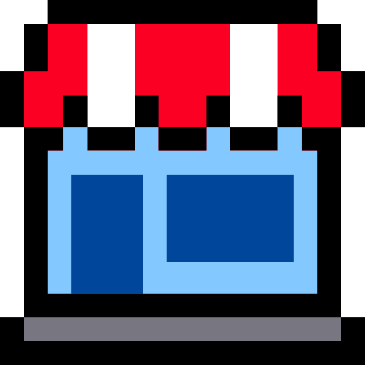</a> | **📂 檔名:** `016-store.svg` ✨ **格式:** `Vector (SVG)` ⚖️ **大小:** `2.70KB` 📅 **更新:** `2026-03-01`  🚀 **jsDelivr Markdown:** `` 🔗 **直接連結 (Url):** <code>https://cdn.jsdelivr.net/gh/barry028/materials@main/images/iCons/Pixel/Pixel%20iCons%20Set/Commerce/Linear/016-store.svg</code> 📥 [檢視原始檔](016-store.svg) |
| <a href="017-gift.svg">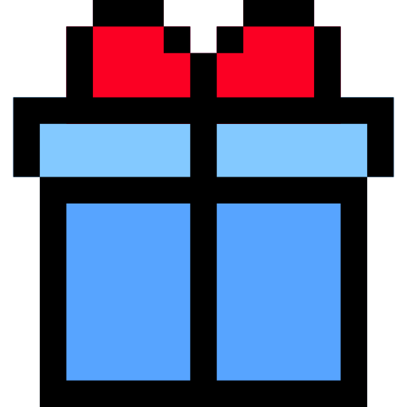</a> | **📂 檔名:** `017-gift.svg` ✨ **格式:** `Vector (SVG)` ⚖️ **大小:** `1.87KB` 📅 **更新:** `2026-03-01`  🚀 **jsDelivr Markdown:** `` 🔗 **直接連結 (Url):** <code>https://cdn.jsdelivr.net/gh/barry028/materials@main/images/iCons/Pixel/Pixel%20iCons%20Set/Commerce/Linear/017-gift.svg</code> 📥 [檢視原始檔](017-gift.svg) |
| <a href="018-third.svg">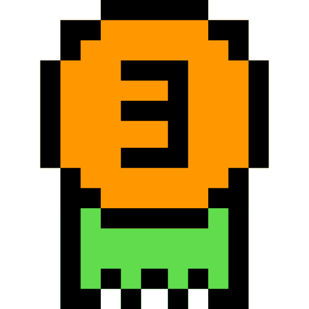</a> | **📂 檔名:** `018-third.svg` ✨ **格式:** `Vector (SVG)` ⚖️ **大小:** `2.61KB` 📅 **更新:** `2026-03-01`  🚀 **jsDelivr Markdown:** `` 🔗 **直接連結 (Url):** <code>https://cdn.jsdelivr.net/gh/barry028/materials@main/images/iCons/Pixel/Pixel%20iCons%20Set/Commerce/Linear/018-third.svg</code> 📥 [檢視原始檔](018-third.svg) |
|  | **📂 檔名:** `019-second.svg` ✨ **格式:** `Vector (SVG)` ⚖️ **大小:** `2.61KB` 📅 **更新:** `2026-03-01`  🚀 **jsDelivr Markdown:** `` 🔗 **直接連結 (Url):** <code>https://cdn.jsdelivr.net/gh/barry028/materials@main/images/iCons/Pixel/Pixel%20iCons%20Set/Commerce/Linear/019-second.svg</code> 📥 [檢視原始檔](019-second.svg) |
|  | **📂 檔名:** `020-first.svg` ✨ **格式:** `Vector (SVG)` ⚖️ **大小:** `2.51KB` 📅 **更新:** `2026-03-01`  🚀 **jsDelivr Markdown:** `` 🔗 **直接連結 (Url):** <code>https://cdn.jsdelivr.net/gh/barry028/materials@main/images/iCons/Pixel/Pixel%20iCons%20Set/Commerce/Linear/020-first.svg</code> 📥 [檢視原始檔](020-first.svg) |
|  | **📂 檔名:** `021-support.svg` ✨ **格式:** `Vector (SVG)` ⚖️ **大小:** `4.91KB` 📅 **更新:** `2026-03-01`  🚀 **jsDelivr Markdown:** `` 🔗 **直接連結 (Url):** <code>https://cdn.jsdelivr.net/gh/barry028/materials@main/images/iCons/Pixel/Pixel%20iCons%20Set/Commerce/Linear/021-support.svg</code> 📥 [檢視原始檔](021-support.svg) |
|  | **📂 檔名:** `022-chat.svg` ✨ **格式:** `Vector (SVG)` ⚖️ **大小:** `1.40KB` 📅 **更新:** `2026-03-01`  🚀 **jsDelivr Markdown:** `` 🔗 **直接連結 (Url):** <code>https://cdn.jsdelivr.net/gh/barry028/materials@main/images/iCons/Pixel/Pixel%20iCons%20Set/Commerce/Linear/022-chat.svg</code> 📥 [檢視原始檔](022-chat.svg) |
|  | **📂 檔名:** `023-sale.svg` ✨ **格式:** `Vector (SVG)` ⚖️ **大小:** `1.36KB` 📅 **更新:** `2026-03-01`  🚀 **jsDelivr Markdown:** `` 🔗 **直接連結 (Url):** <code>https://cdn.jsdelivr.net/gh/barry028/materials@main/images/iCons/Pixel/Pixel%20iCons%20Set/Commerce/Linear/023-sale.svg</code> 📥 [檢視原始檔](023-sale.svg) |
|  | **📂 檔名:** `024-new.svg` ✨ **格式:** `Vector (SVG)` ⚖️ **大小:** `1.36KB` 📅 **更新:** `2026-03-01`  🚀 **jsDelivr Markdown:** `` 🔗 **直接連結 (Url):** <code>https://cdn.jsdelivr.net/gh/barry028/materials@main/images/iCons/Pixel/Pixel%20iCons%20Set/Commerce/Linear/024-new.svg</code> 📥 [檢視原始檔](024-new.svg) |
|  | **📂 檔名:** `025-free.svg` ✨ **格式:** `Vector (SVG)` ⚖️ **大小:** `1.38KB` 📅 **更新:** `2026-03-01`  🚀 **jsDelivr Markdown:** `` 🔗 **直接連結 (Url):** <code>https://cdn.jsdelivr.net/gh/barry028/materials@main/images/iCons/Pixel/Pixel%20iCons%20Set/Commerce/Linear/025-free.svg</code> 📥 [檢視原始檔](025-free.svg) |
| <a href="026-delivery.svg">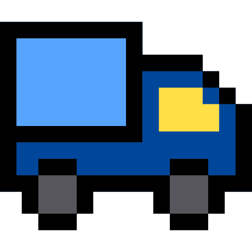</a> | **📂 檔名:** `026-delivery.svg` ✨ **格式:** `Vector (SVG)` ⚖️ **大小:** `2.44KB` 📅 **更新:** `2026-03-01`  🚀 **jsDelivr Markdown:** `` 🔗 **直接連結 (Url):** <code>https://cdn.jsdelivr.net/gh/barry028/materials@main/images/iCons/Pixel/Pixel%20iCons%20Set/Commerce/Linear/026-delivery.svg</code> 📥 [檢視原始檔](026-delivery.svg) |
| <a href="027-box-1.svg">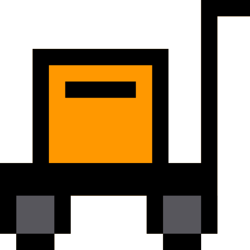</a> | **📂 檔名:** `027-box-1.svg` ✨ **格式:** `Vector (SVG)` ⚖️ **大小:** `1.72KB` 📅 **更新:** `2026-03-01`  🚀 **jsDelivr Markdown:** `` 🔗 **直接連結 (Url):** <code>https://cdn.jsdelivr.net/gh/barry028/materials@main/images/iCons/Pixel/Pixel%20iCons%20Set/Commerce/Linear/027-box-1.svg</code> 📥 [檢視原始檔](027-box-1.svg) |
|  | **📂 檔名:** `028-ship.svg` ✨ **格式:** `Vector (SVG)` ⚖️ **大小:** `954.00B` 📅 **更新:** `2026-03-01`  🚀 **jsDelivr Markdown:** `` 🔗 **直接連結 (Url):** <code>https://cdn.jsdelivr.net/gh/barry028/materials@main/images/iCons/Pixel/Pixel%20iCons%20Set/Commerce/Linear/028-ship.svg</code> 📥 [檢視原始檔](028-ship.svg) |
| <a href="029-stock.svg">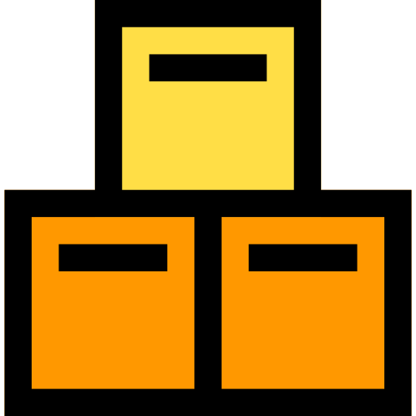</a> | **📂 檔名:** `029-stock.svg` ✨ **格式:** `Vector (SVG)` ⚖️ **大小:** `1.10KB` 📅 **更新:** `2026-03-01`  🚀 **jsDelivr Markdown:** `` 🔗 **直接連結 (Url):** <code>https://cdn.jsdelivr.net/gh/barry028/materials@main/images/iCons/Pixel/Pixel%20iCons%20Set/Commerce/Linear/029-stock.svg</code> 📥 [檢視原始檔](029-stock.svg) |
| <a href="030-box.svg">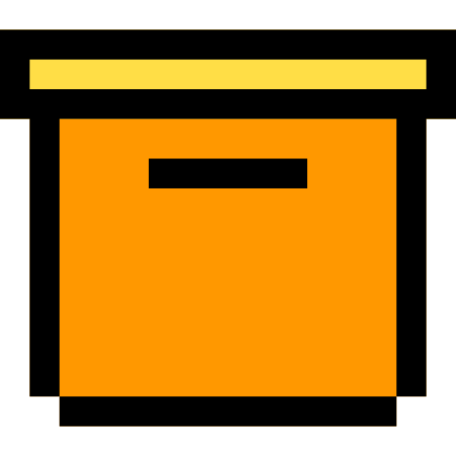</a> | **📂 檔名:** `030-box.svg` ✨ **格式:** `Vector (SVG)` ⚖️ **大小:** `1.03KB` 📅 **更新:** `2026-03-01`  🚀 **jsDelivr Markdown:** `` 🔗 **直接連結 (Url):** <code>https://cdn.jsdelivr.net/gh/barry028/materials@main/images/iCons/Pixel/Pixel%20iCons%20Set/Commerce/Linear/030-box.svg</code> 📥 [檢視原始檔](030-box.svg) |
|  | **📂 檔名:** `031-qr-code.svg` ✨ **格式:** `Vector (SVG)` ⚖️ **大小:** `1.57KB` 📅 **更新:** `2026-03-01`  🚀 **jsDelivr Markdown:** `` 🔗 **直接連結 (Url):** <code>https://cdn.jsdelivr.net/gh/barry028/materials@main/images/iCons/Pixel/Pixel%20iCons%20Set/Commerce/Linear/031-qr-code.svg</code> 📥 [檢視原始檔](031-qr-code.svg) |
| <a href="032-barcode-1.svg">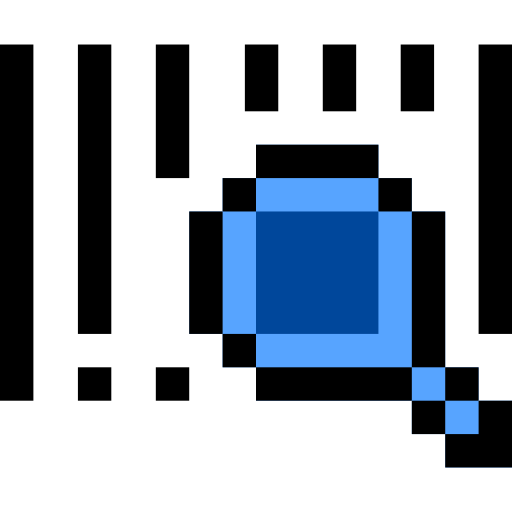</a> | **📂 檔名:** `032-barcode-1.svg` ✨ **格式:** `Vector (SVG)` ⚖️ **大小:** `2.16KB` 📅 **更新:** `2026-03-01`  🚀 **jsDelivr Markdown:** `` 🔗 **直接連結 (Url):** <code>https://cdn.jsdelivr.net/gh/barry028/materials@main/images/iCons/Pixel/Pixel%20iCons%20Set/Commerce/Linear/032-barcode-1.svg</code> 📥 [檢視原始檔](032-barcode-1.svg) |
|  | **📂 檔名:** `033-barcode.svg` ✨ **格式:** `Vector (SVG)` ⚖️ **大小:** `1.21KB` 📅 **更新:** `2026-03-01`  🚀 **jsDelivr Markdown:** `` 🔗 **直接連結 (Url):** <code>https://cdn.jsdelivr.net/gh/barry028/materials@main/images/iCons/Pixel/Pixel%20iCons%20Set/Commerce/Linear/033-barcode.svg</code> 📥 [檢視原始檔](033-barcode.svg) |
| <a href="034-purchase.svg">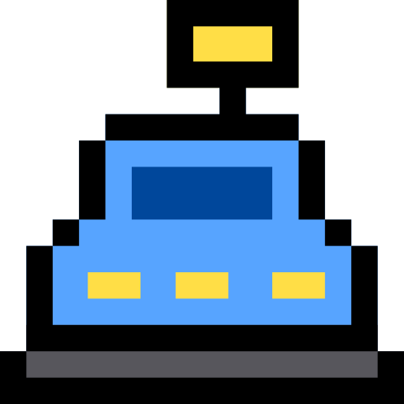</a> | **📂 檔名:** `034-purchase.svg` ✨ **格式:** `Vector (SVG)` ⚖️ **大小:** `2.15KB` 📅 **更新:** `2026-03-01`  🚀 **jsDelivr Markdown:** `` 🔗 **直接連結 (Url):** <code>https://cdn.jsdelivr.net/gh/barry028/materials@main/images/iCons/Pixel/Pixel%20iCons%20Set/Commerce/Linear/034-purchase.svg</code> 📥 [檢視原始檔](034-purchase.svg) |
| <a href="035-payment.svg">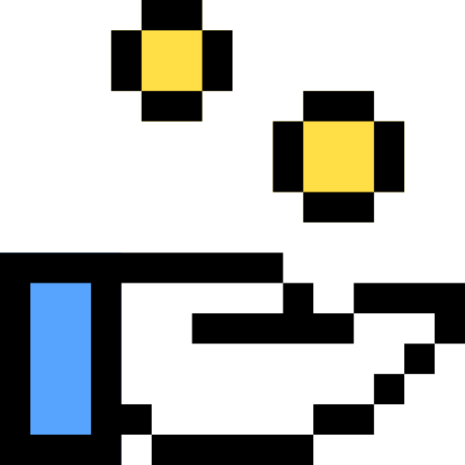</a> | **📂 檔名:** `035-payment.svg` ✨ **格式:** `Vector (SVG)` ⚖️ **大小:** `2.94KB` 📅 **更新:** `2026-03-01`  🚀 **jsDelivr Markdown:** `` 🔗 **直接連結 (Url):** <code>https://cdn.jsdelivr.net/gh/barry028/materials@main/images/iCons/Pixel/Pixel%20iCons%20Set/Commerce/Linear/035-payment.svg</code> 📥 [檢視原始檔](035-payment.svg) |
| <a href="036-cash.svg">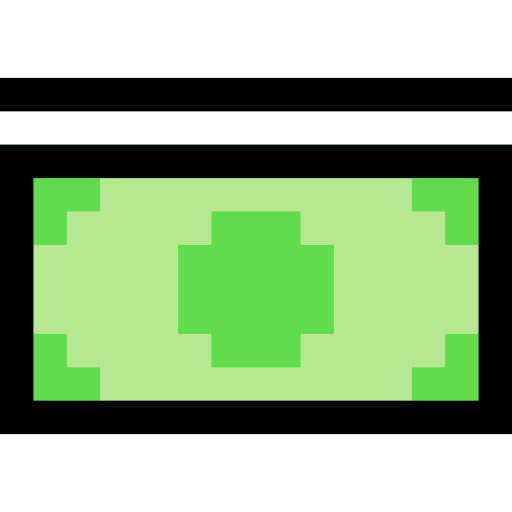</a> | **📂 檔名:** `036-cash.svg` ✨ **格式:** `Vector (SVG)` ⚖️ **大小:** `1.24KB` 📅 **更新:** `2026-03-01`  🚀 **jsDelivr Markdown:** `` 🔗 **直接連結 (Url):** <code>https://cdn.jsdelivr.net/gh/barry028/materials@main/images/iCons/Pixel/Pixel%20iCons%20Set/Commerce/Linear/036-cash.svg</code> 📥 [檢視原始檔](036-cash.svg) |
|  | **📂 檔名:** `037-guarantee.svg` ✨ **格式:** `Vector (SVG)` ⚖️ **大小:** `2.58KB` 📅 **更新:** `2026-03-01`  🚀 **jsDelivr Markdown:** `` 🔗 **直接連結 (Url):** <code>https://cdn.jsdelivr.net/gh/barry028/materials@main/images/iCons/Pixel/Pixel%20iCons%20Set/Commerce/Linear/037-guarantee.svg</code> 📥 [檢視原始檔](037-guarantee.svg) |
|  | **📂 檔名:** `038-24-hours.svg` ✨ **格式:** `Vector (SVG)` ⚖️ **大小:** `1.88KB` 📅 **更新:** `2026-03-01`  🚀 **jsDelivr Markdown:** `` 🔗 **直接連結 (Url):** <code>https://cdn.jsdelivr.net/gh/barry028/materials@main/images/iCons/Pixel/Pixel%20iCons%20Set/Commerce/Linear/038-24-hours.svg</code> 📥 [檢視原始檔](038-24-hours.svg) |
|  | **📂 檔名:** `039-shirt.svg` ✨ **格式:** `Vector (SVG)` ⚖️ **大小:** `1.26KB` 📅 **更新:** `2026-03-01`  🚀 **jsDelivr Markdown:** `` 🔗 **直接連結 (Url):** <code>https://cdn.jsdelivr.net/gh/barry028/materials@main/images/iCons/Pixel/Pixel%20iCons%20Set/Commerce/Linear/039-shirt.svg</code> 📥 [檢視原始檔](039-shirt.svg) |
|  | **📂 檔名:** `040-watch.svg` ✨ **格式:** `Vector (SVG)` ⚖️ **大小:** `1.68KB` 📅 **更新:** `2026-03-01`  🚀 **jsDelivr Markdown:** `` 🔗 **直接連結 (Url):** <code>https://cdn.jsdelivr.net/gh/barry028/materials@main/images/iCons/Pixel/Pixel%20iCons%20Set/Commerce/Linear/040-watch.svg</code> 📥 [檢視原始檔](040-watch.svg) |
| <a href="041-shopping-bag-2.svg">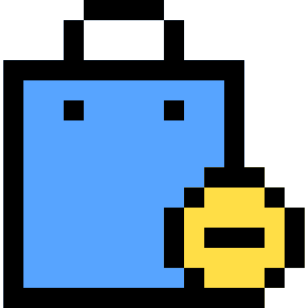</a> | **📂 檔名:** `041-shopping-bag-2.svg` ✨ **格式:** `Vector (SVG)` ⚖️ **大小:** `2.25KB` 📅 **更新:** `2026-03-01`  🚀 **jsDelivr Markdown:** `` 🔗 **直接連結 (Url):** <code>https://cdn.jsdelivr.net/gh/barry028/materials@main/images/iCons/Pixel/Pixel%20iCons%20Set/Commerce/Linear/041-shopping-bag-2.svg</code> 📥 [檢視原始檔](041-shopping-bag-2.svg) |
| <a href="042-shopping-bag-1.svg">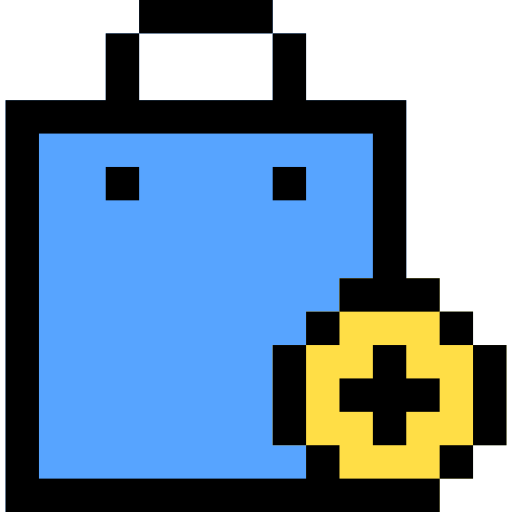</a> | **📂 檔名:** `042-shopping-bag-1.svg` ✨ **格式:** `Vector (SVG)` ⚖️ **大小:** `2.39KB` 📅 **更新:** `2026-03-01`  🚀 **jsDelivr Markdown:** `` 🔗 **直接連結 (Url):** <code>https://cdn.jsdelivr.net/gh/barry028/materials@main/images/iCons/Pixel/Pixel%20iCons%20Set/Commerce/Linear/042-shopping-bag-1.svg</code> 📥 [檢視原始檔](042-shopping-bag-1.svg) |
|  | **📂 檔名:** `043-shopping-bags.svg` ✨ **格式:** `Vector (SVG)` ⚖️ **大小:** `1.38KB` 📅 **更新:** `2026-03-01`  🚀 **jsDelivr Markdown:** `` 🔗 **直接連結 (Url):** <code>https://cdn.jsdelivr.net/gh/barry028/materials@main/images/iCons/Pixel/Pixel%20iCons%20Set/Commerce/Linear/043-shopping-bags.svg</code> 📥 [檢視原始檔](043-shopping-bags.svg) |
| <a href="044-shopping-bag.svg">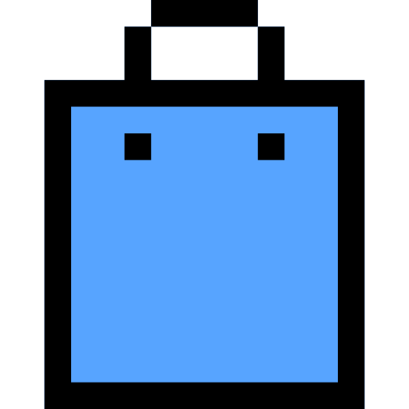</a> | **📂 檔名:** `044-shopping-bag.svg` ✨ **格式:** `Vector (SVG)` ⚖️ **大小:** `1.12KB` 📅 **更新:** `2026-03-01`  🚀 **jsDelivr Markdown:** `` 🔗 **直接連結 (Url):** <code>https://cdn.jsdelivr.net/gh/barry028/materials@main/images/iCons/Pixel/Pixel%20iCons%20Set/Commerce/Linear/044-shopping-bag.svg</code> 📥 [檢視原始檔](044-shopping-bag.svg) |
| <a href="045-calculator.svg">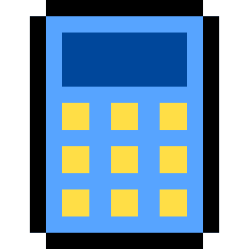</a> | **📂 檔名:** `045-calculator.svg` ✨ **格式:** `Vector (SVG)` ⚖️ **大小:** `1.74KB` 📅 **更新:** `2026-03-01`  🚀 **jsDelivr Markdown:** `` 🔗 **直接連結 (Url):** <code>https://cdn.jsdelivr.net/gh/barry028/materials@main/images/iCons/Pixel/Pixel%20iCons%20Set/Commerce/Linear/045-calculator.svg</code> 📥 [檢視原始檔](045-calculator.svg) |
| <a href="046-wallet.svg">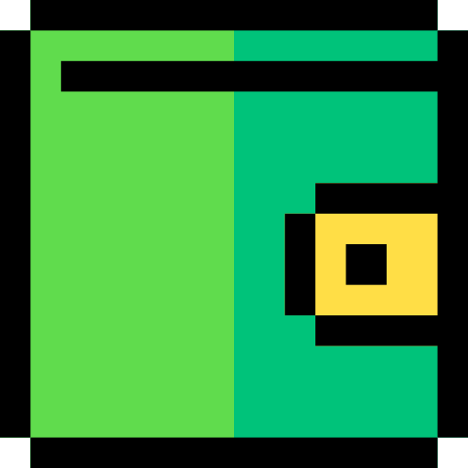</a> | **📂 檔名:** `046-wallet.svg` ✨ **格式:** `Vector (SVG)` ⚖️ **大小:** `1.52KB` 📅 **更新:** `2026-03-01`  🚀 **jsDelivr Markdown:** `` 🔗 **直接連結 (Url):** <code>https://cdn.jsdelivr.net/gh/barry028/materials@main/images/iCons/Pixel/Pixel%20iCons%20Set/Commerce/Linear/046-wallet.svg</code> 📥 [檢視原始檔](046-wallet.svg) |
| <a href="047-credit-card.svg">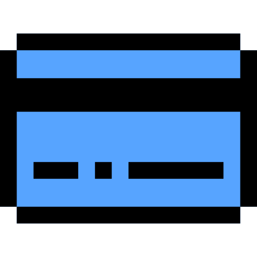</a> | **📂 檔名:** `047-credit-card.svg` ✨ **格式:** `Vector (SVG)` ⚖️ **大小:** `1.18KB` 📅 **更新:** `2026-03-01`  🚀 **jsDelivr Markdown:** `` 🔗 **直接連結 (Url):** <code>https://cdn.jsdelivr.net/gh/barry028/materials@main/images/iCons/Pixel/Pixel%20iCons%20Set/Commerce/Linear/047-credit-card.svg</code> 📥 [檢視原始檔](047-credit-card.svg) |
|  | **📂 檔名:** `048-bill.svg` ✨ **格式:** `Vector (SVG)` ⚖️ **大小:** `1.82KB` 📅 **更新:** `2026-03-01`  🚀 **jsDelivr Markdown:** `` 🔗 **直接連結 (Url):** <code>https://cdn.jsdelivr.net/gh/barry028/materials@main/images/iCons/Pixel/Pixel%20iCons%20Set/Commerce/Linear/048-bill.svg</code> 📥 [檢視原始檔](048-bill.svg) |
| <a href="049-coupon.svg">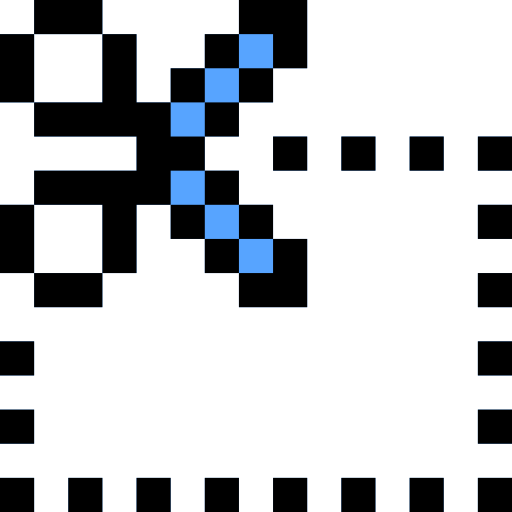</a> | **📂 檔名:** `049-coupon.svg` ✨ **格式:** `Vector (SVG)` ⚖️ **大小:** `5.10KB` 📅 **更新:** `2026-03-01`  🚀 **jsDelivr Markdown:** `` 🔗 **直接連結 (Url):** <code>https://cdn.jsdelivr.net/gh/barry028/materials@main/images/iCons/Pixel/Pixel%20iCons%20Set/Commerce/Linear/049-coupon.svg</code> 📥 [檢視原始檔](049-coupon.svg) |
|  | **📂 檔名:** `050-tag.svg` ✨ **格式:** `Vector (SVG)` ⚖️ **大小:** `2.45KB` 📅 **更新:** `2026-03-01`  🚀 **jsDelivr Markdown:** `` 🔗 **直接連結 (Url):** <code>https://cdn.jsdelivr.net/gh/barry028/materials@main/images/iCons/Pixel/Pixel%20iCons%20Set/Commerce/Linear/050-tag.svg</code> 📥 [檢視原始檔](050-tag.svg) |