# 📂 目錄：Pixel iCons Set

> [🏠 主目錄](../../../../README.md) / [images](../../../README.md) / [iCons](../../README.md) / [Pixel](../README.md) / **Pixel iCons Set**

此目錄目前沒有直接存放圖片，請選擇下方子分類：

### 🗂️ 子分類列表

| 分類名稱 | 封面預覽 | 統計 |
| :--- | :--- | :--- |
| [📁 **Commerce**](Commerce/README.md) | 📁 *(無圖片)* | - |
| [📁 **Contacts**](Contacts/README.md) | 📁 *(無圖片)* | - |
| [📁 **Food**](Food/README.md) | 📁 *(無圖片)* | - |
| [📁 **Interface**](Interface/README.md) | 📁 *(無圖片)* | - |
| [📁 **Text-editor**](Text-editor/README.md) | &nbsp;&nbsp;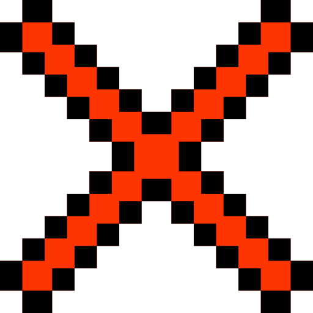&nbsp;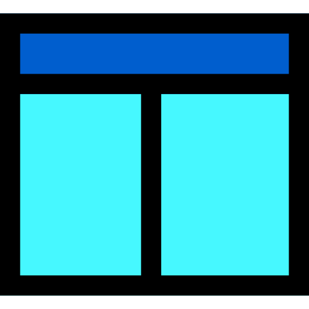&nbsp;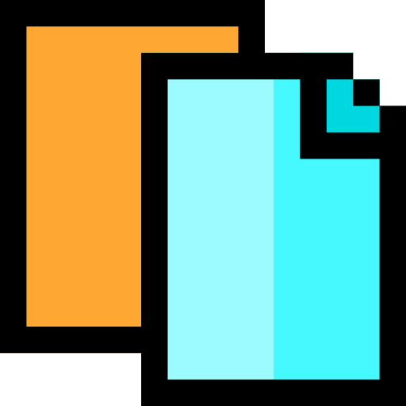&nbsp;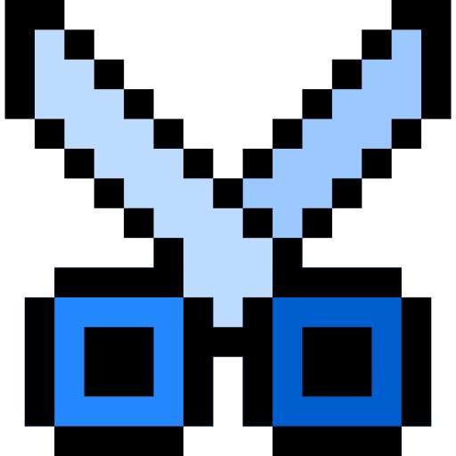&nbsp;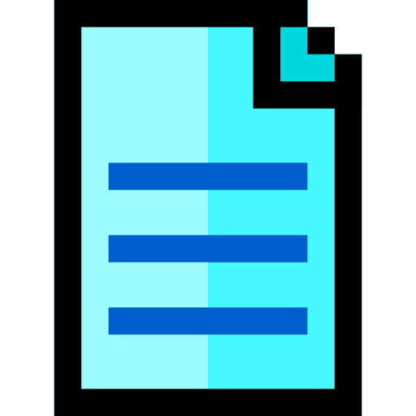&nbsp;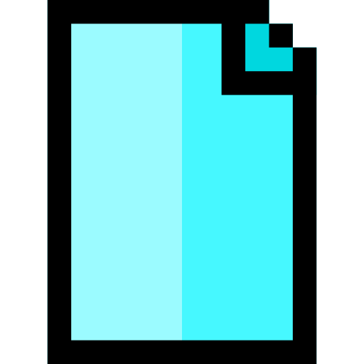&nbsp;&nbsp;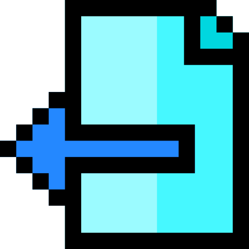&nbsp;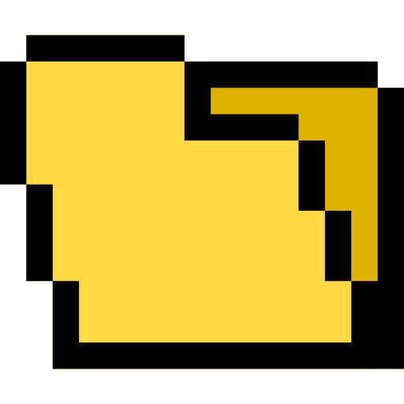&nbsp;&nbsp;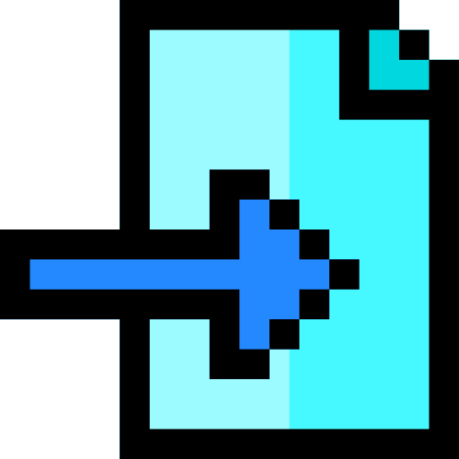&nbsp;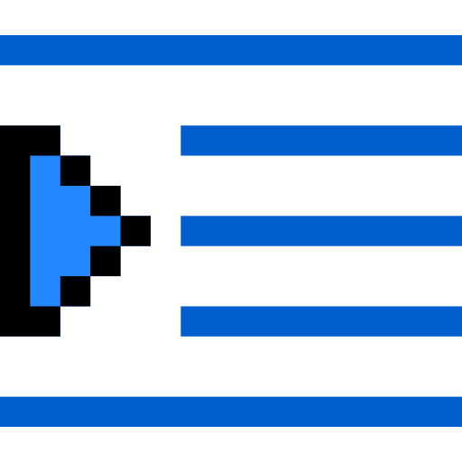&nbsp;&nbsp;&nbsp;&nbsp;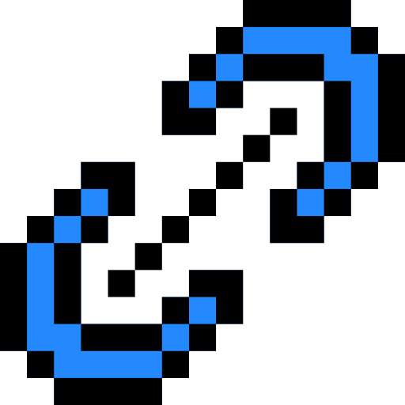&nbsp;&nbsp;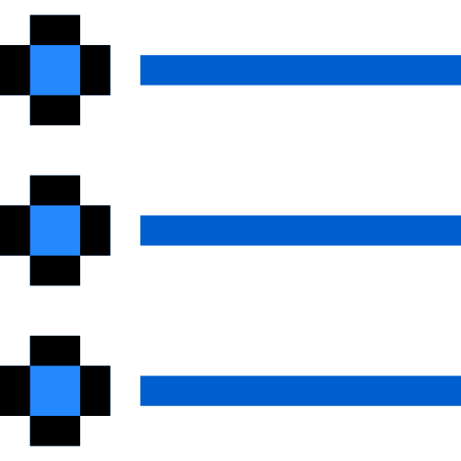 | 共 `113` 張 |
| [📁 **Weather**](Weather/README.md) | 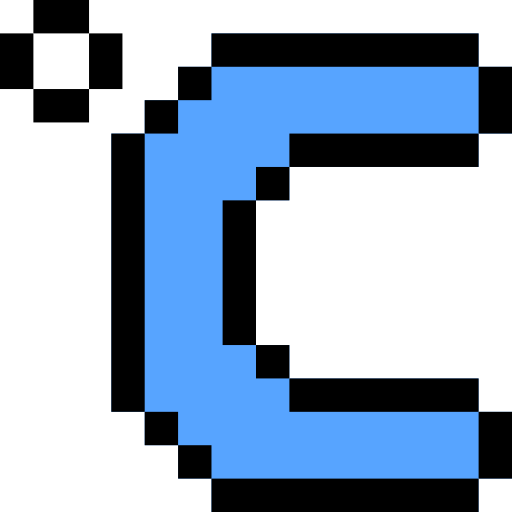&nbsp;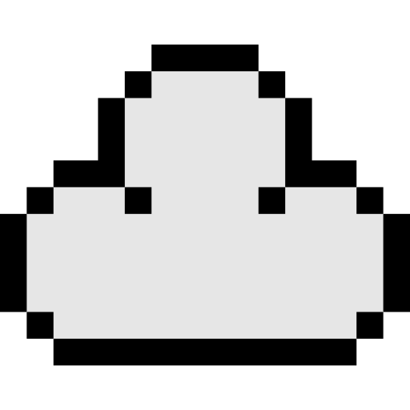&nbsp;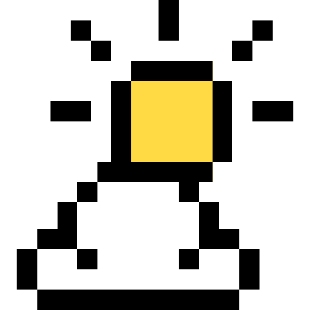&nbsp;&nbsp;&nbsp;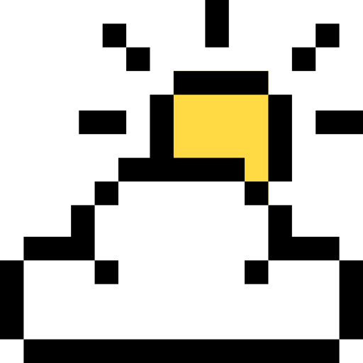&nbsp;&nbsp;&nbsp;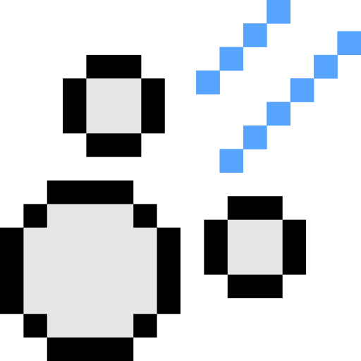&nbsp;&nbsp;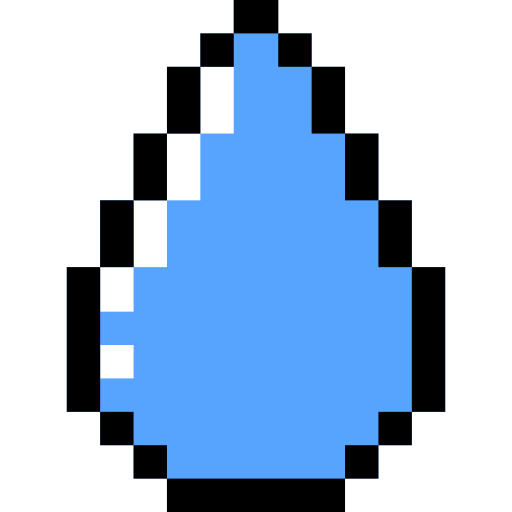&nbsp;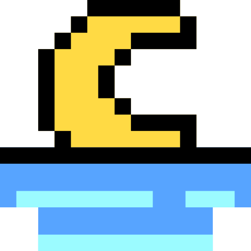&nbsp;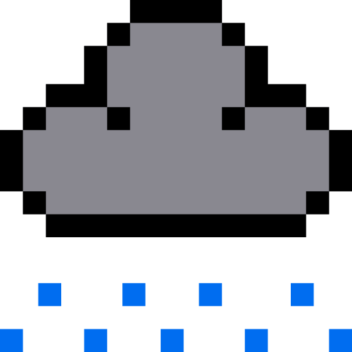&nbsp;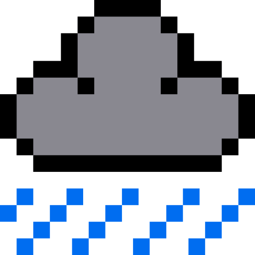&nbsp;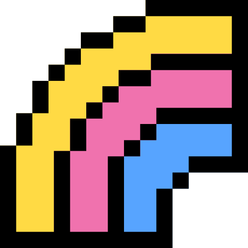&nbsp;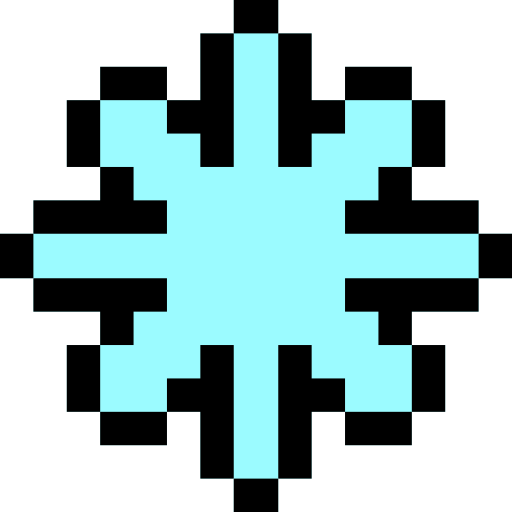&nbsp;&nbsp;&nbsp;&nbsp; | 共 `90` 張 |