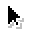
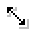
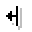
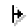
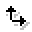
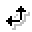
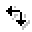
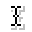

# 🖼️ 素材分類：Cursors

> [🏠 主目錄](../../../../../README.md) / [images](../../../../README.md) / [iCons](../../../README.md) / [Pixel](../../README.md) / [Pixelarticons](../README.md) / **Cursors**

本目錄共有 `51` 個檔案

| 🎨 預覽 (點擊放大)  | 📋 檔案詳細資訊與連結 |
| :--- | :--- |
|  | **📂 檔名:** `col-resize.svg` ✨ **格式:** `Vector (SVG)` ⚖️ **大小:** `1.99KB` 📅 **更新:** `2026-03-04`  🚀 **jsDelivr Markdown:** `` 🔗 **直接連結 (Url):** <code>https://cdn.jsdelivr.net/gh/barry028/materials@main/images/iCons/Pixel/Pixelarticons/Cursors/col-resize.svg</code> 📥 [檢視原始檔](col-resize.svg) |
|  | **📂 檔名:** `copy-dark.svg` ✨ **格式:** `Vector (SVG)` ⚖️ **大小:** `1.10KB` 📅 **更新:** `2026-03-04`  🚀 **jsDelivr Markdown:** `` 🔗 **直接連結 (Url):** <code>https://cdn.jsdelivr.net/gh/barry028/materials@main/images/iCons/Pixel/Pixelarticons/Cursors/copy-dark.svg</code> 📥 [檢視原始檔](copy-dark.svg) |
|  | **📂 檔名:** `copy.svg` ✨ **格式:** `Vector (SVG)` ⚖️ **大小:** `1.10KB` 📅 **更新:** `2026-03-04`  🚀 **jsDelivr Markdown:** `` 🔗 **直接連結 (Url):** <code>https://cdn.jsdelivr.net/gh/barry028/materials@main/images/iCons/Pixel/Pixelarticons/Cursors/copy.svg</code> 📥 [檢視原始檔](copy.svg) |
|  | **📂 檔名:** `crosshair.svg` ✨ **格式:** `Vector (SVG)` ⚖️ **大小:** `2.61KB` 📅 **更新:** `2026-03-04`  🚀 **jsDelivr Markdown:** `` 🔗 **直接連結 (Url):** <code>https://cdn.jsdelivr.net/gh/barry028/materials@main/images/iCons/Pixel/Pixelarticons/Cursors/crosshair.svg</code> 📥 [檢視原始檔](crosshair.svg) |
|  | **📂 檔名:** `default-alt-dark.svg` ✨ **格式:** `Vector (SVG)` ⚖️ **大小:** `533.00B` 📅 **更新:** `2026-03-04`  🚀 **jsDelivr Markdown:** `` 🔗 **直接連結 (Url):** <code>https://cdn.jsdelivr.net/gh/barry028/materials@main/images/iCons/Pixel/Pixelarticons/Cursors/default-alt-dark.svg</code> 📥 [檢視原始檔](default-alt-dark.svg) |
|  | **📂 檔名:** `default-alt.svg` ✨ **格式:** `Vector (SVG)` ⚖️ **大小:** `528.00B` 📅 **更新:** `2026-03-04`  🚀 **jsDelivr Markdown:** `` 🔗 **直接連結 (Url):** <code>https://cdn.jsdelivr.net/gh/barry028/materials@main/images/iCons/Pixel/Pixelarticons/Cursors/default-alt.svg</code> 📥 [檢視原始檔](default-alt.svg) |
|  | **📂 檔名:** `default-dark.svg` ✨ **格式:** `Vector (SVG)` ⚖️ **大小:** `608.00B` 📅 **更新:** `2026-03-04`  🚀 **jsDelivr Markdown:** `` 🔗 **直接連結 (Url):** <code>https://cdn.jsdelivr.net/gh/barry028/materials@main/images/iCons/Pixel/Pixelarticons/Cursors/default-dark.svg</code> 📥 [檢視原始檔](default-dark.svg) |
|  | **📂 檔名:** `default.svg` ✨ **格式:** `Vector (SVG)` ⚖️ **大小:** `741.00B` 📅 **更新:** `2026-03-04`  🚀 **jsDelivr Markdown:** `` 🔗 **直接連結 (Url):** <code>https://cdn.jsdelivr.net/gh/barry028/materials@main/images/iCons/Pixel/Pixelarticons/Cursors/default.svg</code> 📥 [檢視原始檔](default.svg) |
|  | **📂 檔名:** `e-resize.svg` ✨ **格式:** `Vector (SVG)` ⚖️ **大小:** `1.72KB` 📅 **更新:** `2026-03-04`  🚀 **jsDelivr Markdown:** `` 🔗 **直接連結 (Url):** <code>https://cdn.jsdelivr.net/gh/barry028/materials@main/images/iCons/Pixel/Pixelarticons/Cursors/e-resize.svg</code> 📥 [檢視原始檔](e-resize.svg) |
|  | **📂 檔名:** `ew-resize.svg` ✨ **格式:** `Vector (SVG)` ⚖️ **大小:** `2.39KB` 📅 **更新:** `2026-03-04`  🚀 **jsDelivr Markdown:** `` 🔗 **直接連結 (Url):** <code>https://cdn.jsdelivr.net/gh/barry028/materials@main/images/iCons/Pixel/Pixelarticons/Cursors/ew-resize.svg</code> 📥 [檢視原始檔](ew-resize.svg) |
|  | **📂 檔名:** `grab-dark.svg` ✨ **格式:** `Vector (SVG)` ⚖️ **大小:** `906.00B` 📅 **更新:** `2026-03-04`  🚀 **jsDelivr Markdown:** `` 🔗 **直接連結 (Url):** <code>https://cdn.jsdelivr.net/gh/barry028/materials@main/images/iCons/Pixel/Pixelarticons/Cursors/grab-dark.svg</code> 📥 [檢視原始檔](grab-dark.svg) |
|  | **📂 檔名:** `grab.svg` ✨ **格式:** `Vector (SVG)` ⚖️ **大小:** `901.00B` 📅 **更新:** `2026-03-04`  🚀 **jsDelivr Markdown:** `` 🔗 **直接連結 (Url):** <code>https://cdn.jsdelivr.net/gh/barry028/materials@main/images/iCons/Pixel/Pixelarticons/Cursors/grab.svg</code> 📥 [檢視原始檔](grab.svg) |
|  | **📂 檔名:** `grabbing-dark.svg` ✨ **格式:** `Vector (SVG)` ⚖️ **大小:** `769.00B` 📅 **更新:** `2026-03-04`  🚀 **jsDelivr Markdown:** `` 🔗 **直接連結 (Url):** <code>https://cdn.jsdelivr.net/gh/barry028/materials@main/images/iCons/Pixel/Pixelarticons/Cursors/grabbing-dark.svg</code> 📥 [檢視原始檔](grabbing-dark.svg) |
|  | **📂 檔名:** `grabbing.svg` ✨ **格式:** `Vector (SVG)` ⚖️ **大小:** `764.00B` 📅 **更新:** `2026-03-04`  🚀 **jsDelivr Markdown:** `` 🔗 **直接連結 (Url):** <code>https://cdn.jsdelivr.net/gh/barry028/materials@main/images/iCons/Pixel/Pixelarticons/Cursors/grabbing.svg</code> 📥 [檢視原始檔](grabbing.svg) |
|  | **📂 檔名:** `hand-dark.svg` ✨ **格式:** `Vector (SVG)` ⚖️ **大小:** `1.09KB` 📅 **更新:** `2026-03-04`  🚀 **jsDelivr Markdown:** `` 🔗 **直接連結 (Url):** <code>https://cdn.jsdelivr.net/gh/barry028/materials@main/images/iCons/Pixel/Pixelarticons/Cursors/hand-dark.svg</code> 📥 [檢視原始檔](hand-dark.svg) |
|  | **📂 檔名:** `hand.svg` ✨ **格式:** `Vector (SVG)` ⚖️ **大小:** `1.08KB` 📅 **更新:** `2026-03-04`  🚀 **jsDelivr Markdown:** `` 🔗 **直接連結 (Url):** <code>https://cdn.jsdelivr.net/gh/barry028/materials@main/images/iCons/Pixel/Pixelarticons/Cursors/hand.svg</code> 📥 [檢視原始檔](hand.svg) |
|  | **📂 檔名:** `help-dark.svg` ✨ **格式:** `Vector (SVG)` ⚖️ **大小:** `1013.00B` 📅 **更新:** `2026-03-04`  🚀 **jsDelivr Markdown:** `` 🔗 **直接連結 (Url):** <code>https://cdn.jsdelivr.net/gh/barry028/materials@main/images/iCons/Pixel/Pixelarticons/Cursors/help-dark.svg</code> 📥 [檢視原始檔](help-dark.svg) |
|  | **📂 檔名:** `help.svg` ✨ **格式:** `Vector (SVG)` ⚖️ **大小:** `1008.00B` 📅 **更新:** `2026-03-04`  🚀 **jsDelivr Markdown:** `` 🔗 **直接連結 (Url):** <code>https://cdn.jsdelivr.net/gh/barry028/materials@main/images/iCons/Pixel/Pixelarticons/Cursors/help.svg</code> 📥 [檢視原始檔](help.svg) |
|  | **📂 檔名:** `move.svg` ✨ **格式:** `Vector (SVG)` ⚖️ **大小:** `1.91KB` 📅 **更新:** `2026-03-04`  🚀 **jsDelivr Markdown:** `` 🔗 **直接連結 (Url):** <code>https://cdn.jsdelivr.net/gh/barry028/materials@main/images/iCons/Pixel/Pixelarticons/Cursors/move.svg</code> 📥 [檢視原始檔](move.svg) |
|  | **📂 檔名:** `n-resize.svg` ✨ **格式:** `Vector (SVG)` ⚖️ **大小:** `1.67KB` 📅 **更新:** `2026-03-04`  🚀 **jsDelivr Markdown:** `` 🔗 **直接連結 (Url):** <code>https://cdn.jsdelivr.net/gh/barry028/materials@main/images/iCons/Pixel/Pixelarticons/Cursors/n-resize.svg</code> 📥 [檢視原始檔](n-resize.svg) |
|  | **📂 檔名:** `ne-resize.svg` ✨ **格式:** `Vector (SVG)` ⚖️ **大小:** `2.14KB` 📅 **更新:** `2026-03-04`  🚀 **jsDelivr Markdown:** `` 🔗 **直接連結 (Url):** <code>https://cdn.jsdelivr.net/gh/barry028/materials@main/images/iCons/Pixel/Pixelarticons/Cursors/ne-resize.svg</code> 📥 [檢視原始檔](ne-resize.svg) |
|  | **📂 檔名:** `nesw-resize.svg` ✨ **格式:** `Vector (SVG)` ⚖️ **大小:** `1.99KB` 📅 **更新:** `2026-03-04`  🚀 **jsDelivr Markdown:** `` 🔗 **直接連結 (Url):** <code>https://cdn.jsdelivr.net/gh/barry028/materials@main/images/iCons/Pixel/Pixelarticons/Cursors/nesw-resize.svg</code> 📥 [檢視原始檔](nesw-resize.svg) |
|  | **📂 檔名:** `not-allowed-dark.svg` ✨ **格式:** `Vector (SVG)` ⚖️ **大小:** `1.19KB` 📅 **更新:** `2026-03-04`  🚀 **jsDelivr Markdown:** `` 🔗 **直接連結 (Url):** <code>https://cdn.jsdelivr.net/gh/barry028/materials@main/images/iCons/Pixel/Pixelarticons/Cursors/not-allowed-dark.svg</code> 📥 [檢視原始檔](not-allowed-dark.svg) |
|  | **📂 檔名:** `not-allowed.svg` ✨ **格式:** `Vector (SVG)` ⚖️ **大小:** `1.19KB` 📅 **更新:** `2026-03-04`  🚀 **jsDelivr Markdown:** `` 🔗 **直接連結 (Url):** <code>https://cdn.jsdelivr.net/gh/barry028/materials@main/images/iCons/Pixel/Pixelarticons/Cursors/not-allowed.svg</code> 📥 [檢視原始檔](not-allowed.svg) |
|  | **📂 檔名:** `ns-resize.svg` ✨ **格式:** `Vector (SVG)` ⚖️ **大小:** `2.30KB` 📅 **更新:** `2026-03-04`  🚀 **jsDelivr Markdown:** `` 🔗 **直接連結 (Url):** <code>https://cdn.jsdelivr.net/gh/barry028/materials@main/images/iCons/Pixel/Pixelarticons/Cursors/ns-resize.svg</code> 📥 [檢視原始檔](ns-resize.svg) |
|  | **📂 檔名:** `nw-resize.svg` ✨ **格式:** `Vector (SVG)` ⚖️ **大小:** `2.02KB` 📅 **更新:** `2026-03-04`  🚀 **jsDelivr Markdown:** `` 🔗 **直接連結 (Url):** <code>https://cdn.jsdelivr.net/gh/barry028/materials@main/images/iCons/Pixel/Pixelarticons/Cursors/nw-resize.svg</code> 📥 [檢視原始檔](nw-resize.svg) |
|  | **📂 檔名:** `nwse-resize.svg` ✨ **格式:** `Vector (SVG)` ⚖️ **大小:** `2.50KB` 📅 **更新:** `2026-03-04`  🚀 **jsDelivr Markdown:** `` 🔗 **直接連結 (Url):** <code>https://cdn.jsdelivr.net/gh/barry028/materials@main/images/iCons/Pixel/Pixelarticons/Cursors/nwse-resize.svg</code> 📥 [檢視原始檔](nwse-resize.svg) |
|  | **📂 檔名:** `pointer-dark.svg` ✨ **格式:** `Vector (SVG)` ⚖️ **大小:** `1.18KB` 📅 **更新:** `2026-03-04`  🚀 **jsDelivr Markdown:** `` 🔗 **直接連結 (Url):** <code>https://cdn.jsdelivr.net/gh/barry028/materials@main/images/iCons/Pixel/Pixelarticons/Cursors/pointer-dark.svg</code> 📥 [檢視原始檔](pointer-dark.svg) |
|  | **📂 檔名:** `pointer.svg` ✨ **格式:** `Vector (SVG)` ⚖️ **大小:** `1.18KB` 📅 **更新:** `2026-03-04`  🚀 **jsDelivr Markdown:** `` 🔗 **直接連結 (Url):** <code>https://cdn.jsdelivr.net/gh/barry028/materials@main/images/iCons/Pixel/Pixelarticons/Cursors/pointer.svg</code> 📥 [檢視原始檔](pointer.svg) |
|  | **📂 檔名:** `resize-down.svg` ✨ **格式:** `Vector (SVG)` ⚖️ **大小:** `1.68KB` 📅 **更新:** `2026-03-04`  🚀 **jsDelivr Markdown:** `` 🔗 **直接連結 (Url):** <code>https://cdn.jsdelivr.net/gh/barry028/materials@main/images/iCons/Pixel/Pixelarticons/Cursors/resize-down.svg</code> 📥 [檢視原始檔](resize-down.svg) |
|  | **📂 檔名:** `resize-left.svg` ✨ **格式:** `Vector (SVG)` ⚖️ **大小:** `1.38KB` 📅 **更新:** `2026-03-04`  🚀 **jsDelivr Markdown:** `` 🔗 **直接連結 (Url):** <code>https://cdn.jsdelivr.net/gh/barry028/materials@main/images/iCons/Pixel/Pixelarticons/Cursors/resize-left.svg</code> 📥 [檢視原始檔](resize-left.svg) |
|  | **📂 檔名:** `resize-right.svg` ✨ **格式:** `Vector (SVG)` ⚖️ **大小:** `780.00B` 📅 **更新:** `2026-03-04`  🚀 **jsDelivr Markdown:** `` 🔗 **直接連結 (Url):** <code>https://cdn.jsdelivr.net/gh/barry028/materials@main/images/iCons/Pixel/Pixelarticons/Cursors/resize-right.svg</code> 📥 [檢視原始檔](resize-right.svg) |
|  | **📂 檔名:** `resize-up.svg` ✨ **格式:** `Vector (SVG)` ⚖️ **大小:** `1.40KB` 📅 **更新:** `2026-03-04`  🚀 **jsDelivr Markdown:** `` 🔗 **直接連結 (Url):** <code>https://cdn.jsdelivr.net/gh/barry028/materials@main/images/iCons/Pixel/Pixelarticons/Cursors/resize-up.svg</code> 📥 [檢視原始檔](resize-up.svg) |
|  | **📂 檔名:** `rotate-bottom-left.svg` ✨ **格式:** `Vector (SVG)` ⚖️ **大小:** `2.57KB` 📅 **更新:** `2026-03-04`  🚀 **jsDelivr Markdown:** `` 🔗 **直接連結 (Url):** <code>https://cdn.jsdelivr.net/gh/barry028/materials@main/images/iCons/Pixel/Pixelarticons/Cursors/rotate-bottom-left.svg</code> 📥 [檢視原始檔](rotate-bottom-left.svg) |
|  | **📂 檔名:** `rotate-bottom-right.svg` ✨ **格式:** `Vector (SVG)` ⚖️ **大小:** `2.48KB` 📅 **更新:** `2026-03-04`  🚀 **jsDelivr Markdown:** `` 🔗 **直接連結 (Url):** <code>https://cdn.jsdelivr.net/gh/barry028/materials@main/images/iCons/Pixel/Pixelarticons/Cursors/rotate-bottom-right.svg</code> 📥 [檢視原始檔](rotate-bottom-right.svg) |
|  | **📂 檔名:** `rotate-top-left.svg` ✨ **格式:** `Vector (SVG)` ⚖️ **大小:** `1.87KB` 📅 **更新:** `2026-03-04`  🚀 **jsDelivr Markdown:** `` 🔗 **直接連結 (Url):** <code>https://cdn.jsdelivr.net/gh/barry028/materials@main/images/iCons/Pixel/Pixelarticons/Cursors/rotate-top-left.svg</code> 📥 [檢視原始檔](rotate-top-left.svg) |
|  | **📂 檔名:** `rotate-top-right.svg` ✨ **格式:** `Vector (SVG)` ⚖️ **大小:** `2.48KB` 📅 **更新:** `2026-03-04`  🚀 **jsDelivr Markdown:** `` 🔗 **直接連結 (Url):** <code>https://cdn.jsdelivr.net/gh/barry028/materials@main/images/iCons/Pixel/Pixelarticons/Cursors/rotate-top-right.svg</code> 📥 [檢視原始檔](rotate-top-right.svg) |
|  | **📂 檔名:** `row-resize.svg` ✨ **格式:** `Vector (SVG)` ⚖️ **大小:** `3.01KB` 📅 **更新:** `2026-03-04`  🚀 **jsDelivr Markdown:** `` 🔗 **直接連結 (Url):** <code>https://cdn.jsdelivr.net/gh/barry028/materials@main/images/iCons/Pixel/Pixelarticons/Cursors/row-resize.svg</code> 📥 [檢視原始檔](row-resize.svg) |
|  | **📂 檔名:** `s-resize.svg` ✨ **格式:** `Vector (SVG)` ⚖️ **大小:** `1.43KB` 📅 **更新:** `2026-03-04`  🚀 **jsDelivr Markdown:** `` 🔗 **直接連結 (Url):** <code>https://cdn.jsdelivr.net/gh/barry028/materials@main/images/iCons/Pixel/Pixelarticons/Cursors/s-resize.svg</code> 📥 [檢視原始檔](s-resize.svg) |
|  | **📂 檔名:** `screenshot-dark.svg` ✨ **格式:** `Vector (SVG)` ⚖️ **大小:** `924.00B` 📅 **更新:** `2026-03-04`  🚀 **jsDelivr Markdown:** `` 🔗 **直接連結 (Url):** <code>https://cdn.jsdelivr.net/gh/barry028/materials@main/images/iCons/Pixel/Pixelarticons/Cursors/screenshot-dark.svg</code> 📥 [檢視原始檔](screenshot-dark.svg) |
|  | **📂 檔名:** `screenshot.svg` ✨ **格式:** `Vector (SVG)` ⚖️ **大小:** `919.00B` 📅 **更新:** `2026-03-04`  🚀 **jsDelivr Markdown:** `` 🔗 **直接連結 (Url):** <code>https://cdn.jsdelivr.net/gh/barry028/materials@main/images/iCons/Pixel/Pixelarticons/Cursors/screenshot.svg</code> 📥 [檢視原始檔](screenshot.svg) |
|  | **📂 檔名:** `se-resize.svg` ✨ **格式:** `Vector (SVG)` ⚖️ **大小:** `2.02KB` 📅 **更新:** `2026-03-04`  🚀 **jsDelivr Markdown:** `` 🔗 **直接連結 (Url):** <code>https://cdn.jsdelivr.net/gh/barry028/materials@main/images/iCons/Pixel/Pixelarticons/Cursors/se-resize.svg</code> 📥 [檢視原始檔](se-resize.svg) |
|  | **📂 檔名:** `sw-resize.svg` ✨ **格式:** `Vector (SVG)` ⚖️ **大小:** `1.11KB` 📅 **更新:** `2026-03-04`  🚀 **jsDelivr Markdown:** `` 🔗 **直接連結 (Url):** <code>https://cdn.jsdelivr.net/gh/barry028/materials@main/images/iCons/Pixel/Pixelarticons/Cursors/sw-resize.svg</code> 📥 [檢視原始檔](sw-resize.svg) |
|  | **📂 檔名:** `text.svg` ✨ **格式:** `Vector (SVG)` ⚖️ **大小:** `1.04KB` 📅 **更新:** `2026-03-04`  🚀 **jsDelivr Markdown:** `` 🔗 **直接連結 (Url):** <code>https://cdn.jsdelivr.net/gh/barry028/materials@main/images/iCons/Pixel/Pixelarticons/Cursors/text.svg</code> 📥 [檢視原始檔](text.svg) |
|  | **📂 檔名:** `w-resize.svg` ✨ **格式:** `Vector (SVG)` ⚖️ **大小:** `791.00B` 📅 **更新:** `2026-03-04`  🚀 **jsDelivr Markdown:** `` 🔗 **直接連結 (Url):** <code>https://cdn.jsdelivr.net/gh/barry028/materials@main/images/iCons/Pixel/Pixelarticons/Cursors/w-resize.svg</code> 📥 [檢視原始檔](w-resize.svg) |
|  | **📂 檔名:** `wait-dark.svg` ✨ **格式:** `Vector (SVG)` ⚖️ **大小:** `1016.00B` 📅 **更新:** `2026-03-04`  🚀 **jsDelivr Markdown:** `` 🔗 **直接連結 (Url):** <code>https://cdn.jsdelivr.net/gh/barry028/materials@main/images/iCons/Pixel/Pixelarticons/Cursors/wait-dark.svg</code> 📥 [檢視原始檔](wait-dark.svg) |
|  | **📂 檔名:** `wait.svg` ✨ **格式:** `Vector (SVG)` ⚖️ **大小:** `1016.00B` 📅 **更新:** `2026-03-04`  🚀 **jsDelivr Markdown:** `` 🔗 **直接連結 (Url):** <code>https://cdn.jsdelivr.net/gh/barry028/materials@main/images/iCons/Pixel/Pixelarticons/Cursors/wait.svg</code> 📥 [檢視原始檔](wait.svg) |
|  | **📂 檔名:** `zoom-in-dark.svg` ✨ **格式:** `Vector (SVG)` ⚖️ **大小:** `931.00B` 📅 **更新:** `2026-03-04`  🚀 **jsDelivr Markdown:** `` 🔗 **直接連結 (Url):** <code>https://cdn.jsdelivr.net/gh/barry028/materials@main/images/iCons/Pixel/Pixelarticons/Cursors/zoom-in-dark.svg</code> 📥 [檢視原始檔](zoom-in-dark.svg) |
|  | **📂 檔名:** `zoom-in.svg` ✨ **格式:** `Vector (SVG)` ⚖️ **大小:** `926.00B` 📅 **更新:** `2026-03-04`  🚀 **jsDelivr Markdown:** `` 🔗 **直接連結 (Url):** <code>https://cdn.jsdelivr.net/gh/barry028/materials@main/images/iCons/Pixel/Pixelarticons/Cursors/zoom-in.svg</code> 📥 [檢視原始檔](zoom-in.svg) |
|  | **📂 檔名:** `zoom-out-dark.svg` ✨ **格式:** `Vector (SVG)` ⚖️ **大小:** `745.00B` 📅 **更新:** `2026-03-04`  🚀 **jsDelivr Markdown:** `` 🔗 **直接連結 (Url):** <code>https://cdn.jsdelivr.net/gh/barry028/materials@main/images/iCons/Pixel/Pixelarticons/Cursors/zoom-out-dark.svg</code> 📥 [檢視原始檔](zoom-out-dark.svg) |
|  | **📂 檔名:** `zoom-out.svg` ✨ **格式:** `Vector (SVG)` ⚖️ **大小:** `740.00B` 📅 **更新:** `2026-03-04`  🚀 **jsDelivr Markdown:** `` 🔗 **直接連結 (Url):** <code>https://cdn.jsdelivr.net/gh/barry028/materials@main/images/iCons/Pixel/Pixelarticons/Cursors/zoom-out.svg</code> 📥 [檢視原始檔](zoom-out.svg) |