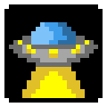
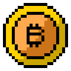
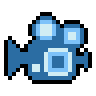

# 🖼️ 素材分類：Pixelated Emoji Pack Emoji

> [🏠 主目錄](../../../../README.md) / [images](../../../README.md) / [iCons](../../README.md) / [Pixel](../README.md) / **Pixelated Emoji Pack Emoji**

本目錄共有 `23` 個檔案

| 🎨 預覽 (點擊放大)  | 📋 檔案詳細資訊與連結 |
| :--- | :--- |
|  | **📂 檔名:** `AI.svg` ✨ **格式:** `Vector (SVG)` ⚖️ **大小:** `3.03KB` 📅 **更新:** `2026-03-03`  🚀 **jsDelivr Markdown:** `` 🔗 **直接連結 (Url):** <code>https://cdn.jsdelivr.net/gh/barry028/materials@main/images/iCons/Pixel/Pixelated%20Emoji%20Pack%20Emoji/AI.svg</code> 📥 [檢視原始檔](AI.svg) |
|  | **📂 檔名:** `Academic Research Paper.svg` ✨ **格式:** `Vector (SVG)` ⚖️ **大小:** `1.91KB` 📅 **更新:** `2026-03-03`  🚀 **jsDelivr Markdown:** `` 🔗 **直接連結 (Url):** <code>https://cdn.jsdelivr.net/gh/barry028/materials@main/images/iCons/Pixel/Pixelated%20Emoji%20Pack%20Emoji/Academic%20Research%20Paper.svg</code> 📥 [檢視原始檔](Academic%20Research%20Paper.svg) |
|  | **📂 檔名:** `Associated Companies.svg` ✨ **格式:** `Vector (SVG)` ⚖️ **大小:** `2.44KB` 📅 **更新:** `2026-03-03`  🚀 **jsDelivr Markdown:** `` 🔗 **直接連結 (Url):** <code>https://cdn.jsdelivr.net/gh/barry028/materials@main/images/iCons/Pixel/Pixelated%20Emoji%20Pack%20Emoji/Associated%20Companies.svg</code> 📥 [檢視原始檔](Associated%20Companies.svg) |
|  | **📂 檔名:** `Coding License.svg` ✨ **格式:** `Vector (SVG)` ⚖️ **大小:** `2.28KB` 📅 **更新:** `2026-03-03`  🚀 **jsDelivr Markdown:** `` 🔗 **直接連結 (Url):** <code>https://cdn.jsdelivr.net/gh/barry028/materials@main/images/iCons/Pixel/Pixelated%20Emoji%20Pack%20Emoji/Coding%20License.svg</code> 📥 [檢視原始檔](Coding%20License.svg) |
|  | **📂 檔名:** `DYOR.svg` ✨ **格式:** `Vector (SVG)` ⚖️ **大小:** `1.59KB` 📅 **更新:** `2026-03-03`  🚀 **jsDelivr Markdown:** `` 🔗 **直接連結 (Url):** <code>https://cdn.jsdelivr.net/gh/barry028/materials@main/images/iCons/Pixel/Pixelated%20Emoji%20Pack%20Emoji/DYOR.svg</code> 📥 [檢視原始檔](DYOR.svg) |
|  | **📂 檔名:** `Fiction.svg` ✨ **格式:** `Vector (SVG)` ⚖️ **大小:** `1.75KB` 📅 **更新:** `2026-03-03`  🚀 **jsDelivr Markdown:** `` 🔗 **直接連結 (Url):** <code>https://cdn.jsdelivr.net/gh/barry028/materials@main/images/iCons/Pixel/Pixelated%20Emoji%20Pack%20Emoji/Fiction.svg</code> 📥 [檢視原始檔](Fiction.svg) |
|  | **📂 檔名:** `HODL.svg` ✨ **格式:** `Vector (SVG)` ⚖️ **大小:** `2.90KB` 📅 **更新:** `2026-03-03`  🚀 **jsDelivr Markdown:** `` 🔗 **直接連結 (Url):** <code>https://cdn.jsdelivr.net/gh/barry028/materials@main/images/iCons/Pixel/Pixelated%20Emoji%20Pack%20Emoji/HODL.svg</code> 📥 [檢視原始檔](HODL.svg) |
|  | **📂 檔名:** `Interview.svg` ✨ **格式:** `Vector (SVG)` ⚖️ **大小:** `1.46KB` 📅 **更新:** `2026-03-03`  🚀 **jsDelivr Markdown:** `` 🔗 **直接連結 (Url):** <code>https://cdn.jsdelivr.net/gh/barry028/materials@main/images/iCons/Pixel/Pixelated%20Emoji%20Pack%20Emoji/Interview.svg</code> 📥 [檢視原始檔](Interview.svg) |
|  | **📂 檔名:** `Laugh - Satire.svg` ✨ **格式:** `Vector (SVG)` ⚖️ **大小:** `4.03KB` 📅 **更新:** `2026-03-03`  🚀 **jsDelivr Markdown:** `` 🔗 **直接連結 (Url):** <code>https://cdn.jsdelivr.net/gh/barry028/materials@main/images/iCons/Pixel/Pixelated%20Emoji%20Pack%20Emoji/Laugh%20-%20Satire.svg</code> 📥 [檢視原始檔](Laugh%20-%20Satire.svg) |
|  | **📂 檔名:** `News.svg` ✨ **格式:** `Vector (SVG)` ⚖️ **大小:** `1.55KB` 📅 **更新:** `2026-03-03`  🚀 **jsDelivr Markdown:** `` 🔗 **直接連結 (Url):** <code>https://cdn.jsdelivr.net/gh/barry028/materials@main/images/iCons/Pixel/Pixelated%20Emoji%20Pack%20Emoji/News.svg</code> 📥 [檢視原始檔](News.svg) |
|  | **📂 檔名:** `On The Ground.svg` ✨ **格式:** `Vector (SVG)` ⚖️ **大小:** `2.54KB` 📅 **更新:** `2026-03-03`  🚀 **jsDelivr Markdown:** `` 🔗 **直接連結 (Url):** <code>https://cdn.jsdelivr.net/gh/barry028/materials@main/images/iCons/Pixel/Pixelated%20Emoji%20Pack%20Emoji/On%20The%20Ground.svg</code> 📥 [檢視原始檔](On%20The%20Ground.svg) |
|  | **📂 檔名:** `Orignal Reporting.svg` ✨ **格式:** `Vector (SVG)` ⚖️ **大小:** `3.10KB` 📅 **更新:** `2026-03-03`  🚀 **jsDelivr Markdown:** `` 🔗 **直接連結 (Url):** <code>https://cdn.jsdelivr.net/gh/barry028/materials@main/images/iCons/Pixel/Pixelated%20Emoji%20Pack%20Emoji/Orignal%20Reporting.svg</code> 📥 [檢視原始檔](Orignal%20Reporting.svg) |
|  | **📂 檔名:** `Podcast.svg` ✨ **格式:** `Vector (SVG)` ⚖️ **大小:** `3.04KB` 📅 **更新:** `2026-03-03`  🚀 **jsDelivr Markdown:** `` 🔗 **直接連結 (Url):** <code>https://cdn.jsdelivr.net/gh/barry028/materials@main/images/iCons/Pixel/Pixelated%20Emoji%20Pack%20Emoji/Podcast.svg</code> 📥 [檢視原始檔](Podcast.svg) |
|  | **📂 檔名:** `Press Release.svg` ✨ **格式:** `Vector (SVG)` ⚖️ **大小:** `2.50KB` 📅 **更新:** `2026-03-03`  🚀 **jsDelivr Markdown:** `` 🔗 **直接連結 (Url):** <code>https://cdn.jsdelivr.net/gh/barry028/materials@main/images/iCons/Pixel/Pixelated%20Emoji%20Pack%20Emoji/Press%20Release.svg</code> 📥 [檢視原始檔](Press%20Release.svg) |
|  | **📂 檔名:** `Product Launch.svg` ✨ **格式:** `Vector (SVG)` ⚖️ **大小:** `2.22KB` 📅 **更新:** `2026-03-03`  🚀 **jsDelivr Markdown:** `` 🔗 **直接連結 (Url):** <code>https://cdn.jsdelivr.net/gh/barry028/materials@main/images/iCons/Pixel/Pixelated%20Emoji%20Pack%20Emoji/Product%20Launch.svg</code> 📥 [檢視原始檔](Product%20Launch.svg) |
|  | **📂 檔名:** `Referral.svg` ✨ **格式:** `Vector (SVG)` ⚖️ **大小:** `1.30KB` 📅 **更新:** `2026-03-03`  🚀 **jsDelivr Markdown:** `` 🔗 **直接連結 (Url):** <code>https://cdn.jsdelivr.net/gh/barry028/materials@main/images/iCons/Pixel/Pixelated%20Emoji%20Pack%20Emoji/Referral.svg</code> 📥 [檢視原始檔](Referral.svg) |
|  | **📂 檔名:** `Review.svg` ✨ **格式:** `Vector (SVG)` ⚖️ **大小:** `2.36KB` 📅 **更新:** `2026-03-03`  🚀 **jsDelivr Markdown:** `` 🔗 **直接連結 (Url):** <code>https://cdn.jsdelivr.net/gh/barry028/materials@main/images/iCons/Pixel/Pixelated%20Emoji%20Pack%20Emoji/Review.svg</code> 📥 [檢視原始檔](Review.svg) |
|  | **📂 檔名:** `Thinking.svg` ✨ **格式:** `Vector (SVG)` ⚖️ **大小:** `3.18KB` 📅 **更新:** `2026-03-03`  🚀 **jsDelivr Markdown:** `` 🔗 **直接連結 (Url):** <code>https://cdn.jsdelivr.net/gh/barry028/materials@main/images/iCons/Pixel/Pixelated%20Emoji%20Pack%20Emoji/Thinking.svg</code> 📥 [檢視原始檔](Thinking.svg) |
|  | **📂 檔名:** `Tutorial Guide.svg` ✨ **格式:** `Vector (SVG)` ⚖️ **大小:** `1.40KB` 📅 **更新:** `2026-03-03`  🚀 **jsDelivr Markdown:** `` 🔗 **直接連結 (Url):** <code>https://cdn.jsdelivr.net/gh/barry028/materials@main/images/iCons/Pixel/Pixelated%20Emoji%20Pack%20Emoji/Tutorial%20Guide.svg</code> 📥 [檢視原始檔](Tutorial%20Guide.svg) |
|  | **📂 檔名:** `Verified Check.svg` ✨ **格式:** `Vector (SVG)` ⚖️ **大小:** `2.88KB` 📅 **更新:** `2026-03-03`  🚀 **jsDelivr Markdown:** `` 🔗 **直接連結 (Url):** <code>https://cdn.jsdelivr.net/gh/barry028/materials@main/images/iCons/Pixel/Pixelated%20Emoji%20Pack%20Emoji/Verified%20Check.svg</code> 📥 [檢視原始檔](Verified%20Check.svg) |
|  | **📂 檔名:** `Vested Interest.svg` ✨ **格式:** `Vector (SVG)` ⚖️ **大小:** `3.86KB` 📅 **更新:** `2026-03-03`  🚀 **jsDelivr Markdown:** `` 🔗 **直接連結 (Url):** <code>https://cdn.jsdelivr.net/gh/barry028/materials@main/images/iCons/Pixel/Pixelated%20Emoji%20Pack%20Emoji/Vested%20Interest.svg</code> 📥 [檢視原始檔](Vested%20Interest.svg) |
|  | **📂 檔名:** `Video.svg` ✨ **格式:** `Vector (SVG)` ⚖️ **大小:** `2.68KB` 📅 **更新:** `2026-03-03`  🚀 **jsDelivr Markdown:** `` 🔗 **直接連結 (Url):** <code>https://cdn.jsdelivr.net/gh/barry028/materials@main/images/iCons/Pixel/Pixelated%20Emoji%20Pack%20Emoji/Video.svg</code> 📥 [檢視原始檔](Video.svg) |
|  | **📂 檔名:** `Web Monetization.svg` ✨ **格式:** `Vector (SVG)` ⚖️ **大小:** `2.42KB` 📅 **更新:** `2026-03-03`  🚀 **jsDelivr Markdown:** `` 🔗 **直接連結 (Url):** <code>https://cdn.jsdelivr.net/gh/barry028/materials@main/images/iCons/Pixel/Pixelated%20Emoji%20Pack%20Emoji/Web%20Monetization.svg</code> 📥 [檢視原始檔](Web%20Monetization.svg) |