# 🖼️ 素材分類：Pixelated Nft Vectors

> [🏠 主目錄](../../../../README.md) / [images](../../../README.md) / [iCons](../../README.md) / [Pixel](../README.md) / **Pixelated Nft Vectors**

本目錄共有 `16` 個檔案

| 🎨 預覽 (點擊放大)  | 📋 檔案詳細資訊與連結 |
| :--- | :--- |
| <a href="bitgem-digital-future-system-security.svg">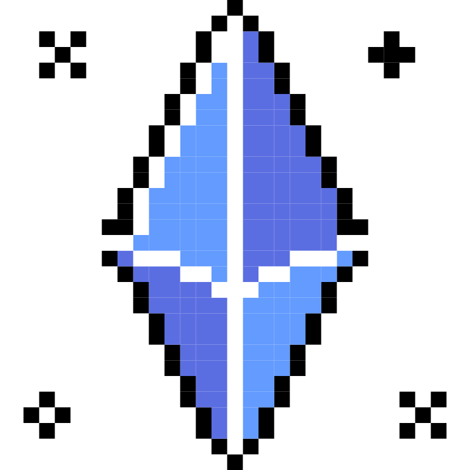</a> | **📂 檔名:** `bitgem-digital-future-system-security.svg` ✨ **格式:** `Vector (SVG)` ⚖️ **大小:** `34.26KB` 📅 **更新:** `2026-03-02`  🚀 **jsDelivr Markdown:** `` 🔗 **直接連結 (Url):** <code>https://cdn.jsdelivr.net/gh/barry028/materials@main/images/iCons/Pixel/Pixelated%20Nft%20Vectors/bitgem-digital-future-system-security.svg</code> 📥 [檢視原始檔](bitgem-digital-future-system-security.svg) |
| <a href="blockchain-digital-future-system-security.svg">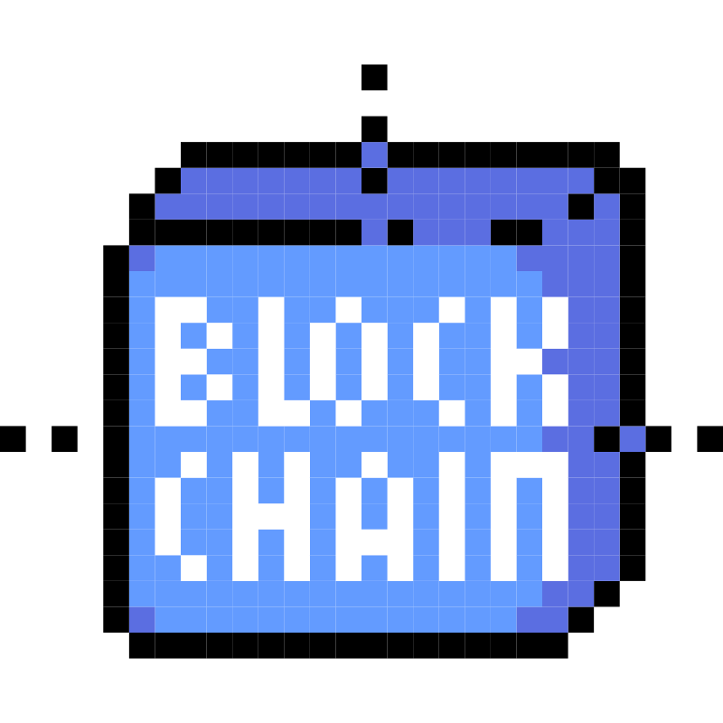</a> | **📂 檔名:** `blockchain-digital-future-system-security.svg` ✨ **格式:** `Vector (SVG)` ⚖️ **大小:** `46.43KB` 📅 **更新:** `2026-03-02`  🚀 **jsDelivr Markdown:** `` 🔗 **直接連結 (Url):** <code>https://cdn.jsdelivr.net/gh/barry028/materials@main/images/iCons/Pixel/Pixelated%20Nft%20Vectors/blockchain-digital-future-system-security.svg</code> 📥 [檢視原始檔](blockchain-digital-future-system-security.svg) |
| <a href="createnft-digital-future-art-crypto.svg">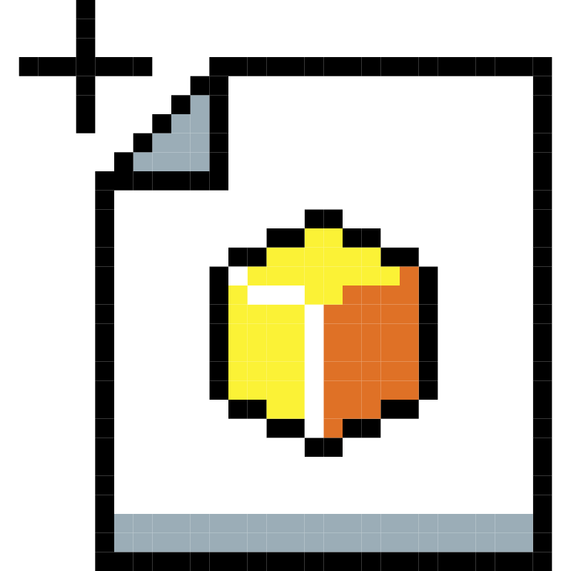</a> | **📂 檔名:** `createnft-digital-future-art-crypto.svg` ✨ **格式:** `Vector (SVG)` ⚖️ **大小:** `67.78KB` 📅 **更新:** `2026-03-02`  🚀 **jsDelivr Markdown:** `` 🔗 **直接連結 (Url):** <code>https://cdn.jsdelivr.net/gh/barry028/materials@main/images/iCons/Pixel/Pixelated%20Nft%20Vectors/createnft-digital-future-art-crypto.svg</code> 📥 [檢視原始檔](createnft-digital-future-art-crypto.svg) |
|  | **📂 檔名:** `cryptocurrency-digital-future-system-security.svg` ✨ **格式:** `Vector (SVG)` ⚖️ **大小:** `28.47KB` 📅 **更新:** `2026-03-02`  🚀 **jsDelivr Markdown:** `` 🔗 **直接連結 (Url):** <code>https://cdn.jsdelivr.net/gh/barry028/materials@main/images/iCons/Pixel/Pixelated%20Nft%20Vectors/cryptocurrency-digital-future-system-security.svg</code> 📥 [檢視原始檔](cryptocurrency-digital-future-system-security.svg) |
| <a href="explorenft-digital-future-system-security.svg">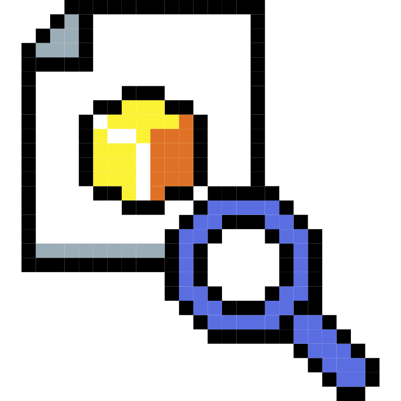</a> | **📂 檔名:** `explorenft-digital-future-system-security.svg` ✨ **格式:** `Vector (SVG)` ⚖️ **大小:** `40.53KB` 📅 **更新:** `2026-03-02`  🚀 **jsDelivr Markdown:** `` 🔗 **直接連結 (Url):** <code>https://cdn.jsdelivr.net/gh/barry028/materials@main/images/iCons/Pixel/Pixelated%20Nft%20Vectors/explorenft-digital-future-system-security.svg</code> 📥 [檢視原始檔](explorenft-digital-future-system-security.svg) |
| <a href="gasfee-digital-future-cost-security.svg">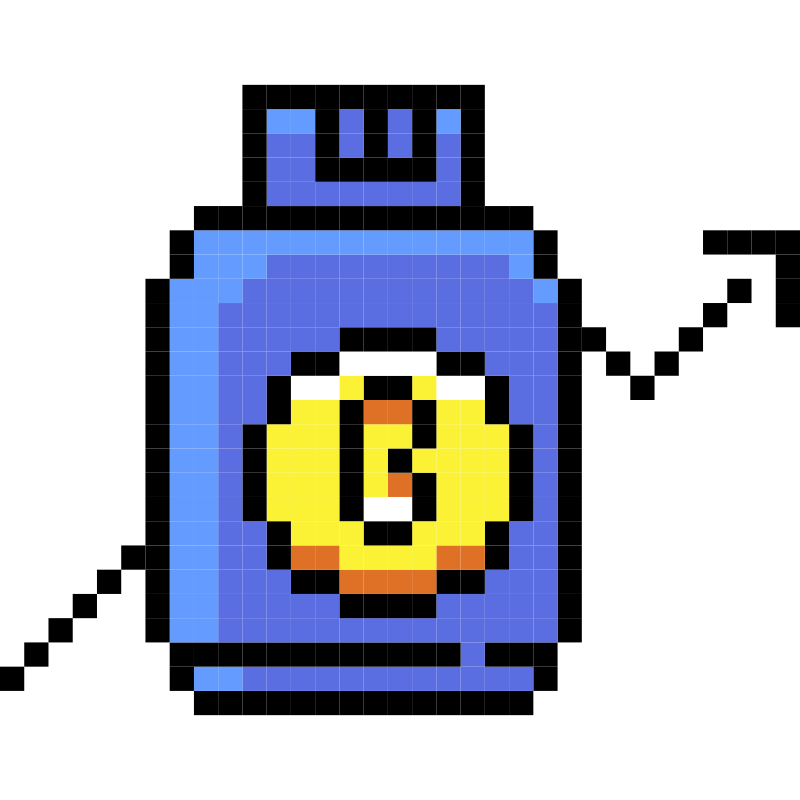</a> | **📂 檔名:** `gasfee-digital-future-cost-security.svg` ✨ **格式:** `Vector (SVG)` ⚖️ **大小:** `45.76KB` 📅 **更新:** `2026-03-02`  🚀 **jsDelivr Markdown:** `` 🔗 **直接連結 (Url):** <code>https://cdn.jsdelivr.net/gh/barry028/materials@main/images/iCons/Pixel/Pixelated%20Nft%20Vectors/gasfee-digital-future-cost-security.svg</code> 📥 [檢視原始檔](gasfee-digital-future-cost-security.svg) |
| <a href="nft-investiment-sign-non-token.svg">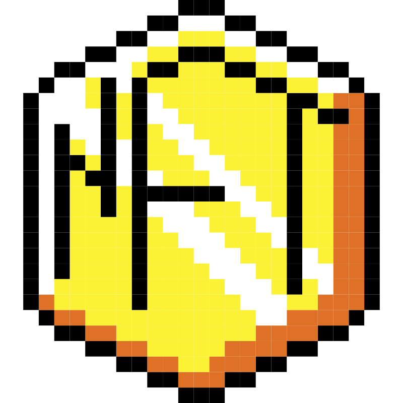</a> | **📂 檔名:** `nft-investiment-sign-non-token.svg` ✨ **格式:** `Vector (SVG)` ⚖️ **大小:** `52.41KB` 📅 **更新:** `2026-03-02`  🚀 **jsDelivr Markdown:** `` 🔗 **直接連結 (Url):** <code>https://cdn.jsdelivr.net/gh/barry028/materials@main/images/iCons/Pixel/Pixelated%20Nft%20Vectors/nft-investiment-sign-non-token.svg</code> 📥 [檢視原始檔](nft-investiment-sign-non-token.svg) |
| <a href="nft-sign.svg">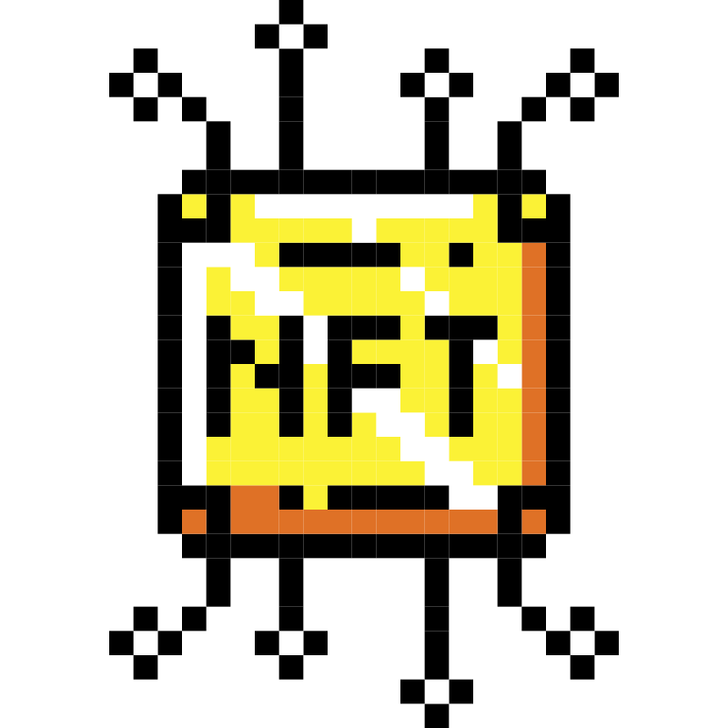</a> | **📂 檔名:** `nft-sign.svg` ✨ **格式:** `Vector (SVG)` ⚖️ **大小:** `19.12KB` 📅 **更新:** `2026-03-02`  🚀 **jsDelivr Markdown:** `` 🔗 **直接連結 (Url):** <code>https://cdn.jsdelivr.net/gh/barry028/materials@main/images/iCons/Pixel/Pixelated%20Nft%20Vectors/nft-sign.svg</code> 📥 [檢視原始檔](nft-sign.svg) |
| <a href="nft-tag.svg">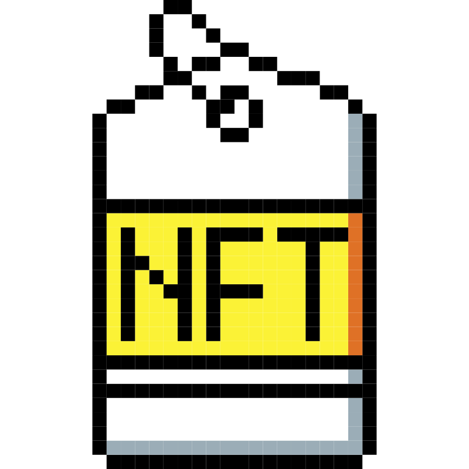</a> | **📂 檔名:** `nft-tag.svg` ✨ **格式:** `Vector (SVG)` ⚖️ **大小:** `31.07KB` 📅 **更新:** `2026-03-02`  🚀 **jsDelivr Markdown:** `` 🔗 **直接連結 (Url):** <code>https://cdn.jsdelivr.net/gh/barry028/materials@main/images/iCons/Pixel/Pixelated%20Nft%20Vectors/nft-tag.svg</code> 📥 [檢視原始檔](nft-tag.svg) |
| <a href="nftbidding-digital-investing-system-security.svg">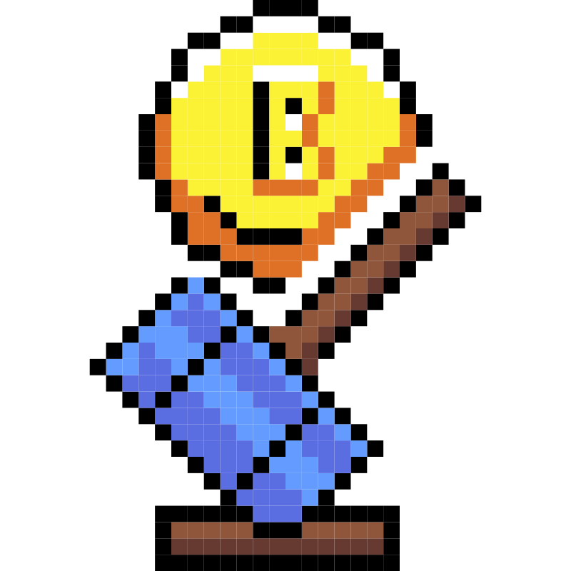</a> | **📂 檔名:** `nftbidding-digital-investing-system-security.svg` ✨ **格式:** `Vector (SVG)` ⚖️ **大小:** `50.74KB` 📅 **更新:** `2026-03-02`  🚀 **jsDelivr Markdown:** `` 🔗 **直接連結 (Url):** <code>https://cdn.jsdelivr.net/gh/barry028/materials@main/images/iCons/Pixel/Pixelated%20Nft%20Vectors/nftbidding-digital-investing-system-security.svg</code> 📥 [檢視原始檔](nftbidding-digital-investing-system-security.svg) |
|  | **📂 檔名:** `nftcollection-digital-future-system-security.svg` ✨ **格式:** `Vector (SVG)` ⚖️ **大小:** `50.37KB` 📅 **更新:** `2026-03-02`  🚀 **jsDelivr Markdown:** `` 🔗 **直接連結 (Url):** <code>https://cdn.jsdelivr.net/gh/barry028/materials@main/images/iCons/Pixel/Pixelated%20Nft%20Vectors/nftcollection-digital-future-system-security.svg</code> 📥 [檢視原始檔](nftcollection-digital-future-system-security.svg) |
| <a href="nftlisting-digital-future-system-security.svg">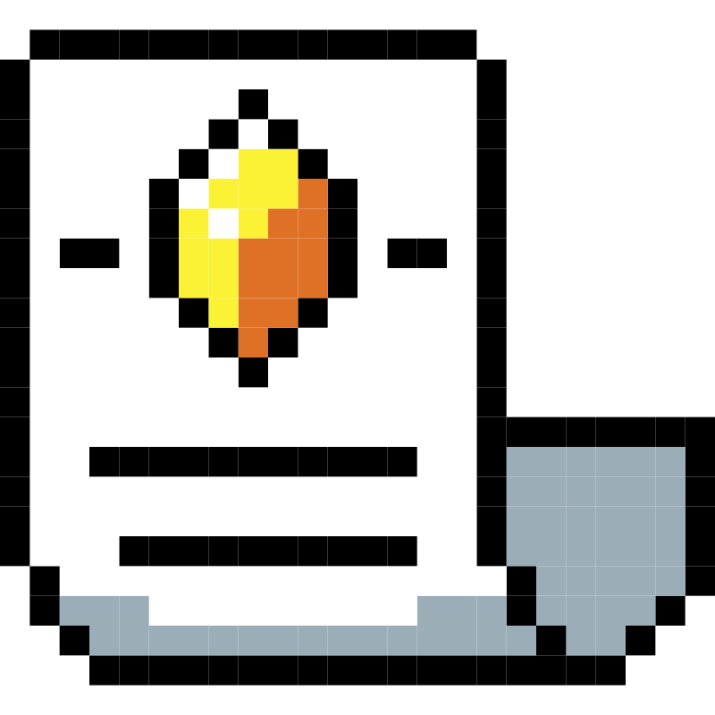</a> | **📂 檔名:** `nftlisting-digital-future-system-security.svg` ✨ **格式:** `Vector (SVG)` ⚖️ **大小:** `44.92KB` 📅 **更新:** `2026-03-02`  🚀 **jsDelivr Markdown:** `` 🔗 **直接連結 (Url):** <code>https://cdn.jsdelivr.net/gh/barry028/materials@main/images/iCons/Pixel/Pixelated%20Nft%20Vectors/nftlisting-digital-future-system-security.svg</code> 📥 [檢視原始檔](nftlisting-digital-future-system-security.svg) |
| <a href="nftmarketplace-digital-marketplace-system-security.svg">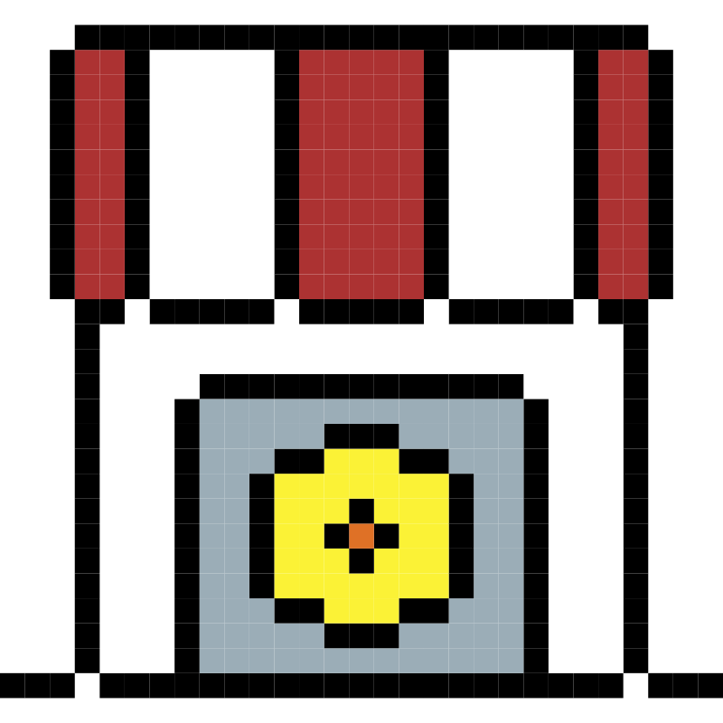</a> | **📂 檔名:** `nftmarketplace-digital-marketplace-system-security.svg` ✨ **格式:** `Vector (SVG)` ⚖️ **大小:** `67.68KB` 📅 **更新:** `2026-03-02`  🚀 **jsDelivr Markdown:** `` 🔗 **直接連結 (Url):** <code>https://cdn.jsdelivr.net/gh/barry028/materials@main/images/iCons/Pixel/Pixelated%20Nft%20Vectors/nftmarketplace-digital-marketplace-system-security.svg</code> 📥 [檢視原始檔](nftmarketplace-digital-marketplace-system-security.svg) |
| <a href="nftrocket-digital-rocket-system-security.svg">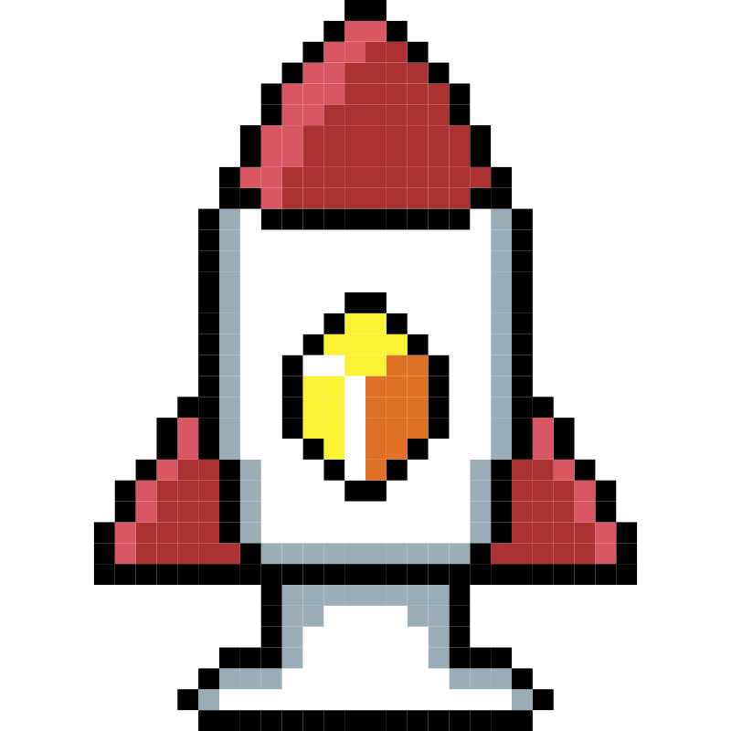</a> | **📂 檔名:** `nftrocket-digital-rocket-system-security.svg` ✨ **格式:** `Vector (SVG)` ⚖️ **大小:** `57.25KB` 📅 **更新:** `2026-03-02`  🚀 **jsDelivr Markdown:** `` 🔗 **直接連結 (Url):** <code>https://cdn.jsdelivr.net/gh/barry028/materials@main/images/iCons/Pixel/Pixelated%20Nft%20Vectors/nftrocket-digital-rocket-system-security.svg</code> 📥 [檢視原始檔](nftrocket-digital-rocket-system-security.svg) |
| <a href="sharkalert-nft-investiment-sign-animal.svg">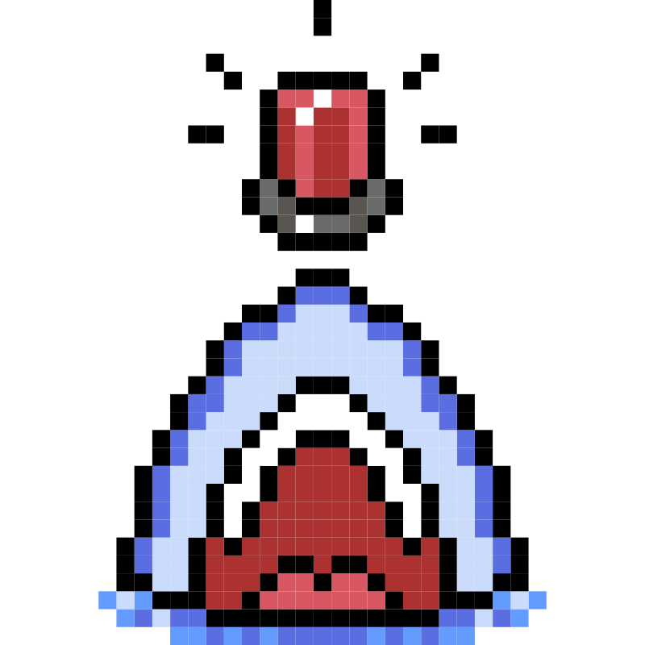</a> | **📂 檔名:** `sharkalert-nft-investiment-sign-animal.svg` ✨ **格式:** `Vector (SVG)` ⚖️ **大小:** `48.12KB` 📅 **更新:** `2026-03-02`  🚀 **jsDelivr Markdown:** `` 🔗 **直接連結 (Url):** <code>https://cdn.jsdelivr.net/gh/barry028/materials@main/images/iCons/Pixel/Pixelated%20Nft%20Vectors/sharkalert-nft-investiment-sign-animal.svg</code> 📥 [檢視原始檔](sharkalert-nft-investiment-sign-animal.svg) |
| <a href="whalealert-nft-investiment-sign-animal.svg">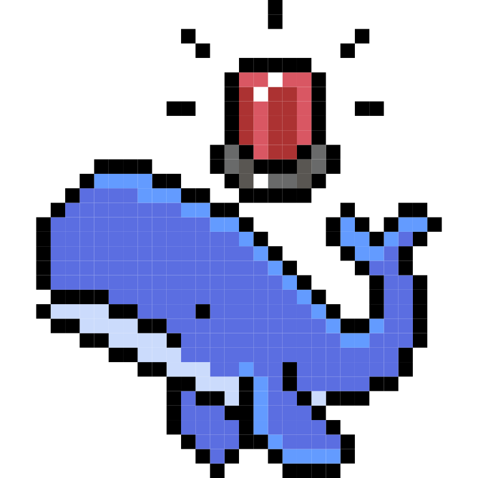</a> | **📂 檔名:** `whalealert-nft-investiment-sign-animal.svg` ✨ **格式:** `Vector (SVG)` ⚖️ **大小:** `48.93KB` 📅 **更新:** `2026-03-02`  🚀 **jsDelivr Markdown:** `` 🔗 **直接連結 (Url):** <code>https://cdn.jsdelivr.net/gh/barry028/materials@main/images/iCons/Pixel/Pixelated%20Nft%20Vectors/whalealert-nft-investiment-sign-animal.svg</code> 📥 [檢視原始檔](whalealert-nft-investiment-sign-animal.svg) |