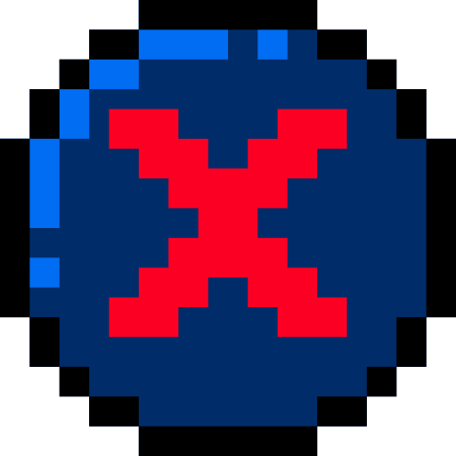
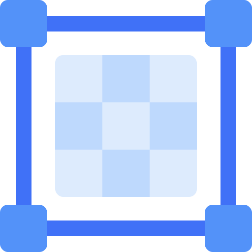
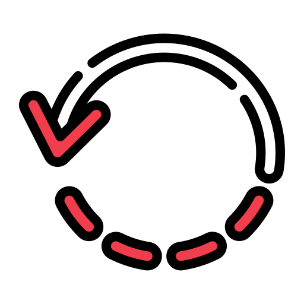
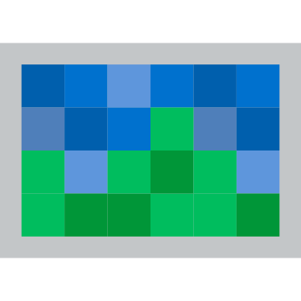
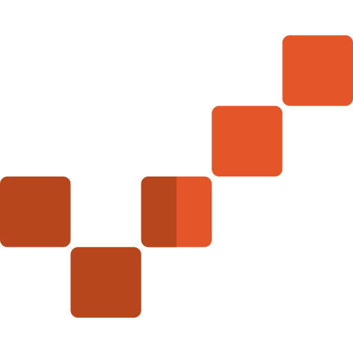

# 🖼️ 素材分類：Plump

> [🏠 主目錄](../../../../README.md) / [images](../../../README.md) / [iCons](../../README.md) / [Pixel](../README.md) / **Plump**

本目錄共有 `20` 個檔案

| 🎨 預覽 (點擊放大) | 📋 檔案詳細資訊與連結 |
| :--- | :--- |
|  | **📂 檔名:** `back.svg` ✨ **格式:** `Vector (SVG)` ⚖️ **大小:** `598.00B` | 📅 **更新:** `2026-02-27`  🚀 **jsDelivr Markdown:** `` 🔗 **直接連結 (Url):** `https://cdn.jsdelivr.net/ghbarry028/materials@main/images/iCons/Pixel/Plump/back.svg` 📥 [檢視原始檔](back.svg) |
|  | **📂 檔名:** `cancel.svg` ✨ **格式:** `Vector (SVG)` ⚖️ **大小:** `3.53KB` | 📅 **更新:** `2026-02-27`  🚀 **jsDelivr Markdown:** `` 🔗 **直接連結 (Url):** `https://cdn.jsdelivr.net/ghbarry028/materials@main/images/iCons/Pixel/Plump/cancel.svg` 📥 [檢視原始檔](cancel.svg) |
|  | **📂 檔名:** `close.svg` ✨ **格式:** `Vector (SVG)` ⚖️ **大小:** `1.95KB` | 📅 **更新:** `2026-02-27`  🚀 **jsDelivr Markdown:** `` 🔗 **直接連結 (Url):** `https://cdn.jsdelivr.net/ghbarry028/materials@main/images/iCons/Pixel/Plump/close.svg` 📥 [檢視原始檔](close.svg) |
|  | **📂 檔名:** `eraser.svg` ✨ **格式:** `Vector (SVG)` ⚖️ **大小:** `1.46KB` | 📅 **更新:** `2026-02-27`  🚀 **jsDelivr Markdown:** `` 🔗 **直接連結 (Url):** `https://cdn.jsdelivr.net/ghbarry028/materials@main/images/iCons/Pixel/Plump/eraser.svg` 📥 [檢視原始檔](eraser.svg) |
|  | **📂 檔名:** `grid-1.svg` ✨ **格式:** `Vector (SVG)` ⚖️ **大小:** `969.00B` | 📅 **更新:** `2026-02-27`  🚀 **jsDelivr Markdown:** `` 🔗 **直接連結 (Url):** `https://cdn.jsdelivr.net/ghbarry028/materials@main/images/iCons/Pixel/Plump/grid-1.svg` 📥 [檢視原始檔](grid-1.svg) |
|  | **📂 檔名:** `grid.svg` ✨ **格式:** `Vector (SVG)` ⚖️ **大小:** `830.00B` | 📅 **更新:** `2026-02-27`  🚀 **jsDelivr Markdown:** `` 🔗 **直接連結 (Url):** `https://cdn.jsdelivr.net/ghbarry028/materials@main/images/iCons/Pixel/Plump/grid.svg` 📥 [檢視原始檔](grid.svg) |
|  | **📂 檔名:** `loading-bar.svg` ✨ **格式:** `Vector (SVG)` ⚖️ **大小:** `5.71KB` | 📅 **更新:** `2026-02-27`  🚀 **jsDelivr Markdown:** `` 🔗 **直接連結 (Url):** `https://cdn.jsdelivr.net/ghbarry028/materials@main/images/iCons/Pixel/Plump/loading-bar.svg` 📥 [檢視原始檔](loading-bar.svg) |
|  | **📂 檔名:** `pixelated.svg` ✨ **格式:** `Vector (SVG)` ⚖️ **大小:** `2.66KB` | 📅 **更新:** `2026-02-27`  🚀 **jsDelivr Markdown:** `` 🔗 **直接連結 (Url):** `https://cdn.jsdelivr.net/ghbarry028/materials@main/images/iCons/Pixel/Plump/pixelated.svg` 📥 [檢視原始檔](pixelated.svg) |
|  | **📂 檔名:** `rotate.svg` ✨ **格式:** `Vector (SVG)` ⚖️ **大小:** `4.74KB` | 📅 **更新:** `2026-02-27`  🚀 **jsDelivr Markdown:** `` 🔗 **直接連結 (Url):** `https://cdn.jsdelivr.net/ghbarry028/materials@main/images/iCons/Pixel/Plump/rotate.svg` 📥 [檢視原始檔](rotate.svg) |
|  | **📂 檔名:** `svg-px-icon-01.svg` ✨ **格式:** `Vector (SVG)` ⚖️ **大小:** `2.52KB` | 📅 **更新:** `2026-02-27`  🚀 **jsDelivr Markdown:** `` 🔗 **直接連結 (Url):** `https://cdn.jsdelivr.net/ghbarry028/materials@main/images/iCons/Pixel/Plump/svg-px-icon-01.svg` 📥 [檢視原始檔](svg-px-icon-01.svg) |
|  | **📂 檔名:** `svg-px-icon-010.svg` ✨ **格式:** `Vector (SVG)` ⚖️ **大小:** `905.00B` | 📅 **更新:** `2026-02-27`  🚀 **jsDelivr Markdown:** `` 🔗 **直接連結 (Url):** `https://cdn.jsdelivr.net/ghbarry028/materials@main/images/iCons/Pixel/Plump/svg-px-icon-010.svg` 📥 [檢視原始檔](svg-px-icon-010.svg) |
|  | **📂 檔名:** `svg-px-icon-02.svg` ✨ **格式:** `Vector (SVG)` ⚖️ **大小:** `339.00B` | 📅 **更新:** `2026-02-27`  🚀 **jsDelivr Markdown:** `` 🔗 **直接連結 (Url):** `https://cdn.jsdelivr.net/ghbarry028/materials@main/images/iCons/Pixel/Plump/svg-px-icon-02.svg` 📥 [檢視原始檔](svg-px-icon-02.svg) |
|  | **📂 檔名:** `svg-px-icon-03.svg` ✨ **格式:** `Vector (SVG)` ⚖️ **大小:** `420.00B` | 📅 **更新:** `2026-02-27`  🚀 **jsDelivr Markdown:** `` 🔗 **直接連結 (Url):** `https://cdn.jsdelivr.net/ghbarry028/materials@main/images/iCons/Pixel/Plump/svg-px-icon-03.svg` 📥 [檢視原始檔](svg-px-icon-03.svg) |
|  | **📂 檔名:** `svg-px-icon-04.svg` ✨ **格式:** `Vector (SVG)` ⚖️ **大小:** `1.28KB` | 📅 **更新:** `2026-02-27`  🚀 **jsDelivr Markdown:** `` 🔗 **直接連結 (Url):** `https://cdn.jsdelivr.net/ghbarry028/materials@main/images/iCons/Pixel/Plump/svg-px-icon-04.svg` 📥 [檢視原始檔](svg-px-icon-04.svg) |
|  | **📂 檔名:** `svg-px-icon-05.svg` ✨ **格式:** `Vector (SVG)` ⚖️ **大小:** `602.00B` | 📅 **更新:** `2026-02-27`  🚀 **jsDelivr Markdown:** `` 🔗 **直接連結 (Url):** `https://cdn.jsdelivr.net/ghbarry028/materials@main/images/iCons/Pixel/Plump/svg-px-icon-05.svg` 📥 [檢視原始檔](svg-px-icon-05.svg) |
|  | **📂 檔名:** `svg-px-icon-06.svg` ✨ **格式:** `Vector (SVG)` ⚖️ **大小:** `869.00B` | 📅 **更新:** `2026-02-27`  🚀 **jsDelivr Markdown:** `` 🔗 **直接連結 (Url):** `https://cdn.jsdelivr.net/ghbarry028/materials@main/images/iCons/Pixel/Plump/svg-px-icon-06.svg` 📥 [檢視原始檔](svg-px-icon-06.svg) |
|  | **📂 檔名:** `svg-px-icon-07.svg` ✨ **格式:** `Vector (SVG)` ⚖️ **大小:** `2.21KB` | 📅 **更新:** `2026-02-27`  🚀 **jsDelivr Markdown:** `` 🔗 **直接連結 (Url):** `https://cdn.jsdelivr.net/ghbarry028/materials@main/images/iCons/Pixel/Plump/svg-px-icon-07.svg` 📥 [檢視原始檔](svg-px-icon-07.svg) |
|  | **📂 檔名:** `svg-px-icon-08.svg` ✨ **格式:** `Vector (SVG)` ⚖️ **大小:** `2.65KB` | 📅 **更新:** `2026-02-27`  🚀 **jsDelivr Markdown:** `` 🔗 **直接連結 (Url):** `https://cdn.jsdelivr.net/ghbarry028/materials@main/images/iCons/Pixel/Plump/svg-px-icon-08.svg` 📥 [檢視原始檔](svg-px-icon-08.svg) |
|  | **📂 檔名:** `svg-px-icon-09.svg` ✨ **格式:** `Vector (SVG)` ⚖️ **大小:** `1.12KB` | 📅 **更新:** `2026-02-27`  🚀 **jsDelivr Markdown:** `` 🔗 **直接連結 (Url):** `https://cdn.jsdelivr.net/ghbarry028/materials@main/images/iCons/Pixel/Plump/svg-px-icon-09.svg` 📥 [檢視原始檔](svg-px-icon-09.svg) |
|  | **📂 檔名:** `transform.svg` ✨ **格式:** `Vector (SVG)` ⚖️ **大小:** `21.56KB` | 📅 **更新:** `2026-02-27`  🚀 **jsDelivr Markdown:** `` 🔗 **直接連結 (Url):** `https://cdn.jsdelivr.net/ghbarry028/materials@main/images/iCons/Pixel/Plump/transform.svg` 📥 [檢視原始檔](transform.svg) |