# 🖼️ 素材分類：Pxl

> [🏠 主目錄](../../../../README.md) / [images](../../../README.md) / [iCons](../../README.md) / [Pixel](../README.md) / **Pxl**

本目錄共有 `44` 個檔案

| 🎨 預覽 (點擊放大)  | 📋 檔案詳細資訊與連結 |
| :--- | :--- |
|  | **📂 檔名:** `Angry.svg` ✨ **格式:** `Vector (SVG)` ⚖️ **大小:** `9.17KB` 📅 **更新:** `2026-02-27`  🚀 **jsDelivr Markdown:** `` 🔗 **直接連結 (Url):** <code>https://cdn.jsdelivr.net/gh/barry028/materials@main/images/iCons/Pixel/Pxl/Angry.svg</code> 📥 [檢視原始檔](Angry.svg) |
|  | **📂 檔名:** `Audio.svg` ✨ **格式:** `Vector (SVG)` ⚖️ **大小:** `8.95KB` 📅 **更新:** `2026-02-27`  🚀 **jsDelivr Markdown:** `` 🔗 **直接連結 (Url):** <code>https://cdn.jsdelivr.net/gh/barry028/materials@main/images/iCons/Pixel/Pxl/Audio.svg</code> 📥 [檢視原始檔](Audio.svg) |
|  | **📂 檔名:** `Balloon.svg` ✨ **格式:** `Vector (SVG)` ⚖️ **大小:** `7.58KB` 📅 **更新:** `2026-02-27`  🚀 **jsDelivr Markdown:** `` 🔗 **直接連結 (Url):** <code>https://cdn.jsdelivr.net/gh/barry028/materials@main/images/iCons/Pixel/Pxl/Balloon.svg</code> 📥 [檢視原始檔](Balloon.svg) |
|  | **📂 檔名:** `Bug.svg` ✨ **格式:** `Vector (SVG)` ⚖️ **大小:** `6.33KB` 📅 **更新:** `2026-02-27`  🚀 **jsDelivr Markdown:** `` 🔗 **直接連結 (Url):** <code>https://cdn.jsdelivr.net/gh/barry028/materials@main/images/iCons/Pixel/Pxl/Bug.svg</code> 📥 [檢視原始檔](Bug.svg) |
|  | **📂 檔名:** `Check.svg` ✨ **格式:** `Vector (SVG)` ⚖️ **大小:** `2.34KB` 📅 **更新:** `2026-02-27`  🚀 **jsDelivr Markdown:** `` 🔗 **直接連結 (Url):** <code>https://cdn.jsdelivr.net/gh/barry028/materials@main/images/iCons/Pixel/Pxl/Check.svg</code> 📥 [檢視原始檔](Check.svg) |
|  | **📂 檔名:** `Clear.svg` ✨ **格式:** `Vector (SVG)` ⚖️ **大小:** `3.04KB` 📅 **更新:** `2026-02-27`  🚀 **jsDelivr Markdown:** `` 🔗 **直接連結 (Url):** <code>https://cdn.jsdelivr.net/gh/barry028/materials@main/images/iCons/Pixel/Pxl/Clear.svg</code> 📥 [檢視原始檔](Clear.svg) |
|  | **📂 檔名:** `Coffee.svg` ✨ **格式:** `Vector (SVG)` ⚖️ **大小:** `9.94KB` 📅 **更新:** `2026-02-27`  🚀 **jsDelivr Markdown:** `` 🔗 **直接連結 (Url):** <code>https://cdn.jsdelivr.net/gh/barry028/materials@main/images/iCons/Pixel/Pxl/Coffee.svg</code> 📥 [檢視原始檔](Coffee.svg) |
|  | **📂 檔名:** `Crazy.svg` ✨ **格式:** `Vector (SVG)` ⚖️ **大小:** `10.98KB` 📅 **更新:** `2026-02-27`  🚀 **jsDelivr Markdown:** `` 🔗 **直接連結 (Url):** <code>https://cdn.jsdelivr.net/gh/barry028/materials@main/images/iCons/Pixel/Pxl/Crazy.svg</code> 📥 [檢視原始檔](Crazy.svg) |
|  | **📂 檔名:** `Cry.svg` ✨ **格式:** `Vector (SVG)` ⚖️ **大小:** `8.50KB` 📅 **更新:** `2026-02-27`  🚀 **jsDelivr Markdown:** `` 🔗 **直接連結 (Url):** <code>https://cdn.jsdelivr.net/gh/barry028/materials@main/images/iCons/Pixel/Pxl/Cry.svg</code> 📥 [檢視原始檔](Cry.svg) |
|  | **📂 檔名:** `Cursor.svg` ✨ **格式:** `Vector (SVG)` ⚖️ **大小:** `10.13KB` 📅 **更新:** `2026-02-27`  🚀 **jsDelivr Markdown:** `` 🔗 **直接連結 (Url):** <code>https://cdn.jsdelivr.net/gh/barry028/materials@main/images/iCons/Pixel/Pxl/Cursor.svg</code> 📥 [檢視原始檔](Cursor.svg) |
|  | **📂 檔名:** `Document.svg` ✨ **格式:** `Vector (SVG)` ⚖️ **大小:** `11.57KB` 📅 **更新:** `2026-02-27`  🚀 **jsDelivr Markdown:** `` 🔗 **直接連結 (Url):** <code>https://cdn.jsdelivr.net/gh/barry028/materials@main/images/iCons/Pixel/Pxl/Document.svg</code> 📥 [檢視原始檔](Document.svg) |
|  | **📂 檔名:** `Dollar.svg` ✨ **格式:** `Vector (SVG)` ⚖️ **大小:** `5.60KB` 📅 **更新:** `2026-02-27`  🚀 **jsDelivr Markdown:** `` 🔗 **直接連結 (Url):** <code>https://cdn.jsdelivr.net/gh/barry028/materials@main/images/iCons/Pixel/Pxl/Dollar.svg</code> 📥 [檢視原始檔](Dollar.svg) |
|  | **📂 檔名:** `Eight.svg` ✨ **格式:** `Vector (SVG)` ⚖️ **大小:** `5.42KB` 📅 **更新:** `2026-02-27`  🚀 **jsDelivr Markdown:** `` 🔗 **直接連結 (Url):** <code>https://cdn.jsdelivr.net/gh/barry028/materials@main/images/iCons/Pixel/Pxl/Eight.svg</code> 📥 [檢視原始檔](Eight.svg) |
|  | **📂 檔名:** `Facebook.svg` ✨ **格式:** `Vector (SVG)` ⚖️ **大小:** `9.40KB` 📅 **更新:** `2026-02-27`  🚀 **jsDelivr Markdown:** `` 🔗 **直接連結 (Url):** <code>https://cdn.jsdelivr.net/gh/barry028/materials@main/images/iCons/Pixel/Pxl/Facebook.svg</code> 📥 [檢視原始檔](Facebook.svg) |
|  | **📂 檔名:** `Five.svg` ✨ **格式:** `Vector (SVG)` ⚖️ **大小:** `4.52KB` 📅 **更新:** `2026-02-27`  🚀 **jsDelivr Markdown:** `` 🔗 **直接連結 (Url):** <code>https://cdn.jsdelivr.net/gh/barry028/materials@main/images/iCons/Pixel/Pxl/Five.svg</code> 📥 [檢視原始檔](Five.svg) |
|  | **📂 檔名:** `Flag.svg` ✨ **格式:** `Vector (SVG)` ⚖️ **大小:** `6.69KB` 📅 **更新:** `2026-02-27`  🚀 **jsDelivr Markdown:** `` 🔗 **直接連結 (Url):** <code>https://cdn.jsdelivr.net/gh/barry028/materials@main/images/iCons/Pixel/Pxl/Flag.svg</code> 📥 [檢視原始檔](Flag.svg) |
|  | **📂 檔名:** `Four.svg` ✨ **格式:** `Vector (SVG)` ⚖️ **大小:** `3.70KB` 📅 **更新:** `2026-02-27`  🚀 **jsDelivr Markdown:** `` 🔗 **直接連結 (Url):** <code>https://cdn.jsdelivr.net/gh/barry028/materials@main/images/iCons/Pixel/Pxl/Four.svg</code> 📥 [檢視原始檔](Four.svg) |
|  | **📂 檔名:** `Happy.svg` ✨ **格式:** `Vector (SVG)` ⚖️ **大小:** `9.22KB` 📅 **更新:** `2026-02-27`  🚀 **jsDelivr Markdown:** `` 🔗 **直接連結 (Url):** <code>https://cdn.jsdelivr.net/gh/barry028/materials@main/images/iCons/Pixel/Pxl/Happy.svg</code> 📥 [檢視原始檔](Happy.svg) |
|  | **📂 檔名:** `Home.svg` ✨ **格式:** `Vector (SVG)` ⚖️ **大小:** `11.44KB` 📅 **更新:** `2026-02-27`  🚀 **jsDelivr Markdown:** `` 🔗 **直接連結 (Url):** <code>https://cdn.jsdelivr.net/gh/barry028/materials@main/images/iCons/Pixel/Pxl/Home.svg</code> 📥 [檢視原始檔](Home.svg) |
|  | **📂 檔名:** `HourGlass.svg` ✨ **格式:** `Vector (SVG)` ⚖️ **大小:** `12.83KB` 📅 **更新:** `2026-02-27`  🚀 **jsDelivr Markdown:** `` 🔗 **直接連結 (Url):** <code>https://cdn.jsdelivr.net/gh/barry028/materials@main/images/iCons/Pixel/Pxl/HourGlass.svg</code> 📥 [檢視原始檔](HourGlass.svg) |
| <a href="Instagram.svg">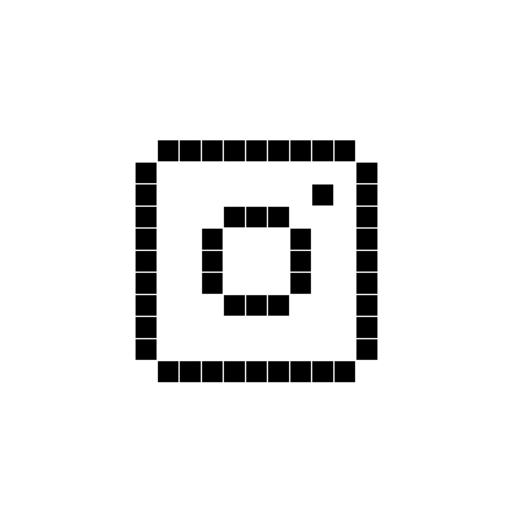</a> | **📂 檔名:** `Instagram.svg` ✨ **格式:** `Vector (SVG)` ⚖️ **大小:** `9.76KB` 📅 **更新:** `2026-02-27`  🚀 **jsDelivr Markdown:** `` 🔗 **直接連結 (Url):** <code>https://cdn.jsdelivr.net/gh/barry028/materials@main/images/iCons/Pixel/Pxl/Instagram.svg</code> 📥 [檢視原始檔](Instagram.svg) |
| <a href="Laugh.svg">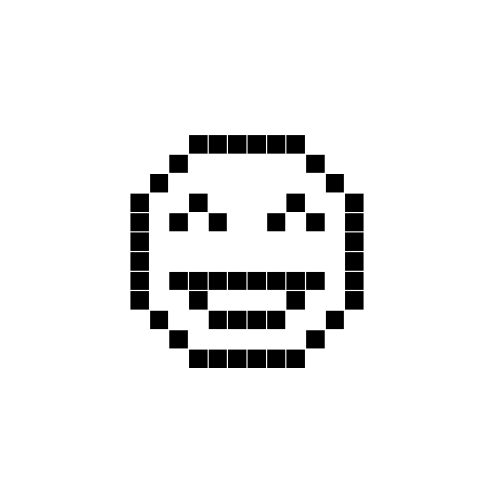</a> | **📂 檔名:** `Laugh.svg` ✨ **格式:** `Vector (SVG)` ⚖️ **大小:** `10.30KB` 📅 **更新:** `2026-02-27`  🚀 **jsDelivr Markdown:** `` 🔗 **直接連結 (Url):** <code>https://cdn.jsdelivr.net/gh/barry028/materials@main/images/iCons/Pixel/Pxl/Laugh.svg</code> 📥 [檢視原始檔](Laugh.svg) |
| <a href="LinkedIn.svg">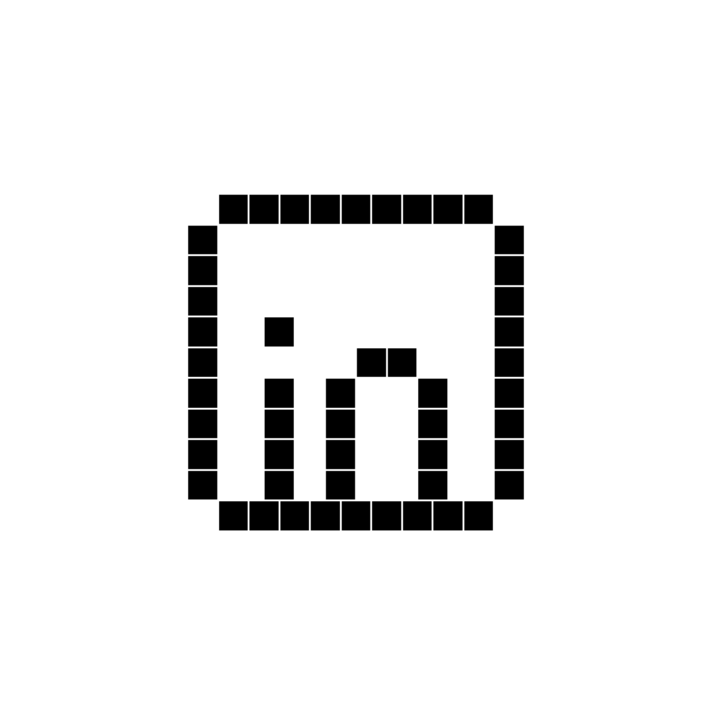</a> | **📂 檔名:** `LinkedIn.svg` ✨ **格式:** `Vector (SVG)` ⚖️ **大小:** `10.12KB` 📅 **更新:** `2026-02-27`  🚀 **jsDelivr Markdown:** `` 🔗 **直接連結 (Url):** <code>https://cdn.jsdelivr.net/gh/barry028/materials@main/images/iCons/Pixel/Pxl/LinkedIn.svg</code> 📥 [檢視原始檔](LinkedIn.svg) |
|  | **📂 檔名:** `Love.svg` ✨ **格式:** `Vector (SVG)` ⚖️ **大小:** `7.23KB` 📅 **更新:** `2026-02-27`  🚀 **jsDelivr Markdown:** `` 🔗 **直接連結 (Url):** <code>https://cdn.jsdelivr.net/gh/barry028/materials@main/images/iCons/Pixel/Pxl/Love.svg</code> 📥 [檢視原始檔](Love.svg) |
| <a href="Nine.svg">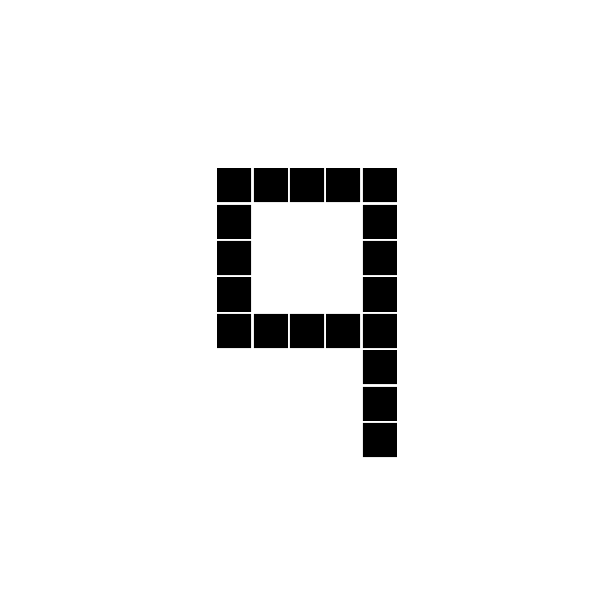</a> | **📂 檔名:** `Nine.svg` ✨ **格式:** `Vector (SVG)` ⚖️ **大小:** `4.34KB` 📅 **更新:** `2026-02-27`  🚀 **jsDelivr Markdown:** `` 🔗 **直接連結 (Url):** <code>https://cdn.jsdelivr.net/gh/barry028/materials@main/images/iCons/Pixel/Pxl/Nine.svg</code> 📥 [檢視原始檔](Nine.svg) |
| <a href="One.svg">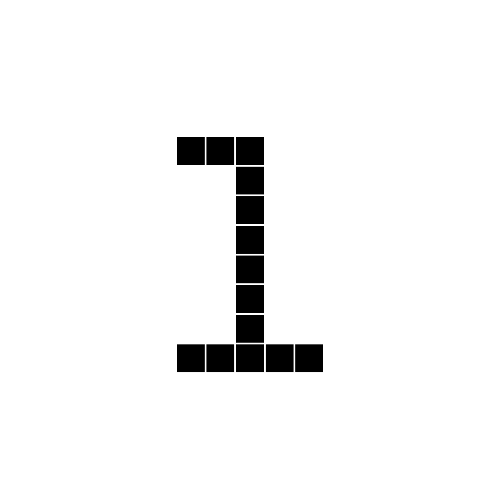</a> | **📂 檔名:** `One.svg` ✨ **格式:** `Vector (SVG)` ⚖️ **大小:** `3.44KB` 📅 **更新:** `2026-02-27`  🚀 **jsDelivr Markdown:** `` 🔗 **直接連結 (Url):** <code>https://cdn.jsdelivr.net/gh/barry028/materials@main/images/iCons/Pixel/Pxl/One.svg</code> 📥 [檢視原始檔](One.svg) |
| <a href="Pointer.svg">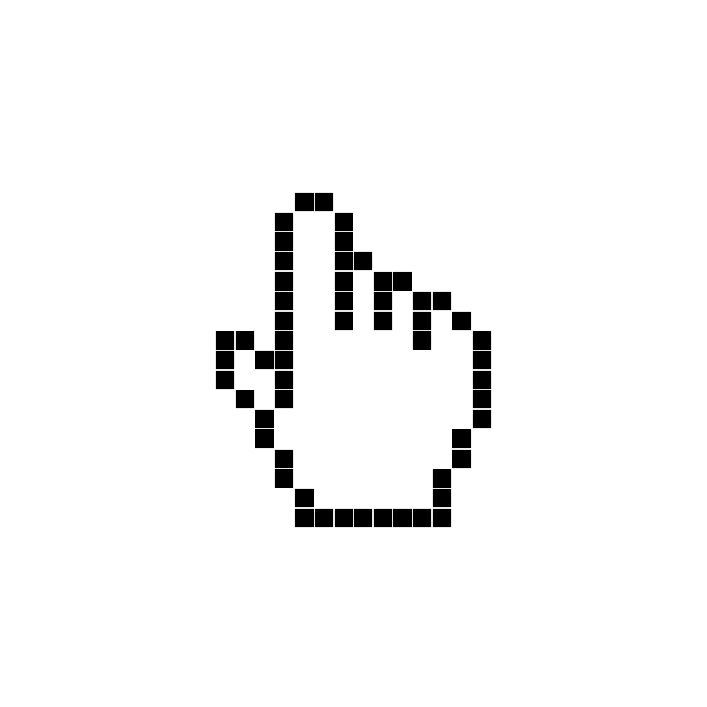</a> | **📂 檔名:** `Pointer.svg` ✨ **格式:** `Vector (SVG)` ⚖️ **大小:** `10.73KB` 📅 **更新:** `2026-02-27`  🚀 **jsDelivr Markdown:** `` 🔗 **直接連結 (Url):** <code>https://cdn.jsdelivr.net/gh/barry028/materials@main/images/iCons/Pixel/Pxl/Pointer.svg</code> 📥 [檢視原始檔](Pointer.svg) |
| <a href="Prompt.svg">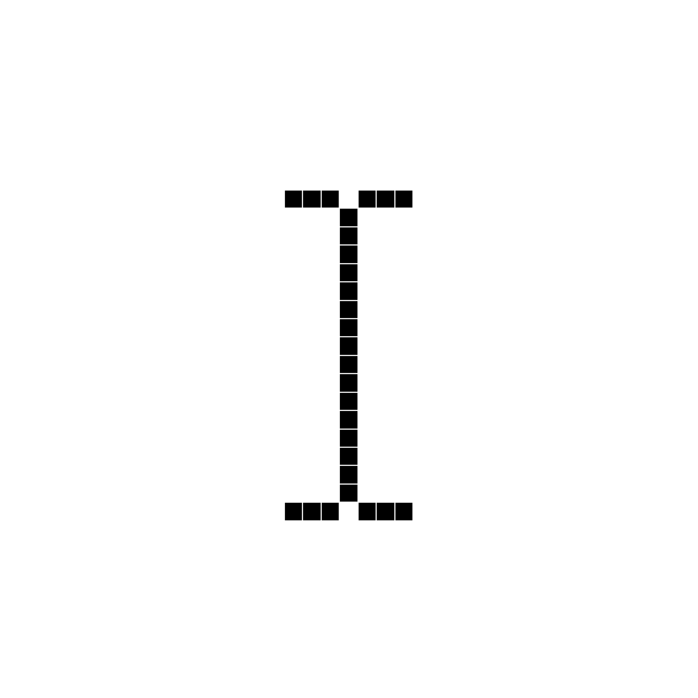</a> | **📂 檔名:** `Prompt.svg` ✨ **格式:** `Vector (SVG)` ⚖️ **大小:** `5.97KB` 📅 **更新:** `2026-02-27`  🚀 **jsDelivr Markdown:** `` 🔗 **直接連結 (Url):** <code>https://cdn.jsdelivr.net/gh/barry028/materials@main/images/iCons/Pixel/Pxl/Prompt.svg</code> 📥 [檢視原始檔](Prompt.svg) |
| <a href="Sad.svg">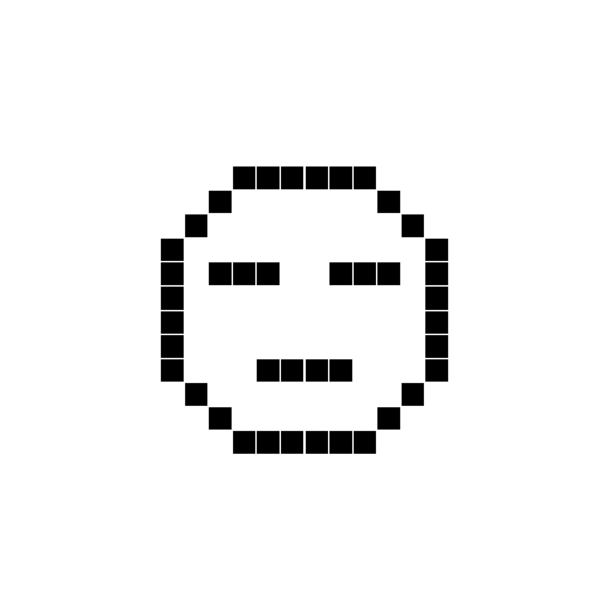</a> | **📂 檔名:** `Sad.svg` ✨ **格式:** `Vector (SVG)` ⚖️ **大小:** `8.50KB` 📅 **更新:** `2026-02-27`  🚀 **jsDelivr Markdown:** `` 🔗 **直接連結 (Url):** <code>https://cdn.jsdelivr.net/gh/barry028/materials@main/images/iCons/Pixel/Pxl/Sad.svg</code> 📥 [檢視原始檔](Sad.svg) |
| <a href="Seven.svg">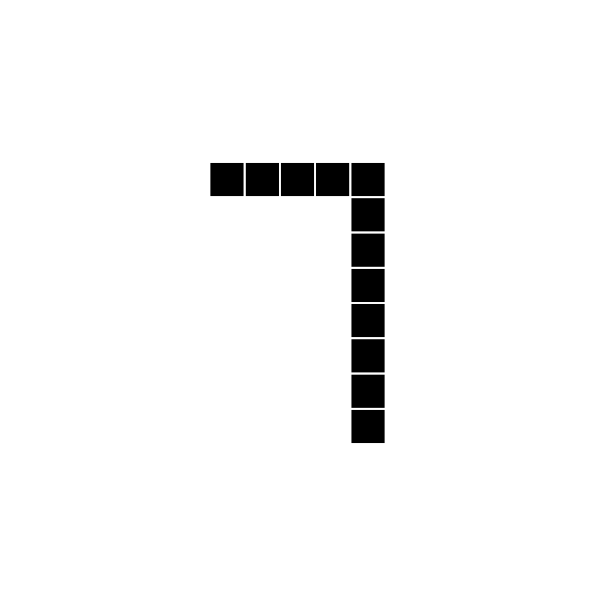</a> | **📂 檔名:** `Seven.svg` ✨ **格式:** `Vector (SVG)` ⚖️ **大小:** `3.08KB` 📅 **更新:** `2026-02-27`  🚀 **jsDelivr Markdown:** `` 🔗 **直接連結 (Url):** <code>https://cdn.jsdelivr.net/gh/barry028/materials@main/images/iCons/Pixel/Pxl/Seven.svg</code> 📥 [檢視原始檔](Seven.svg) |
|  | **📂 檔名:** `Shield.svg` ✨ **格式:** `Vector (SVG)` ⚖️ **大小:** `11.16KB` 📅 **更新:** `2026-02-27`  🚀 **jsDelivr Markdown:** `` 🔗 **直接連結 (Url):** <code>https://cdn.jsdelivr.net/gh/barry028/materials@main/images/iCons/Pixel/Pxl/Shield.svg</code> 📥 [檢視原始檔](Shield.svg) |
| <a href="Shock.svg">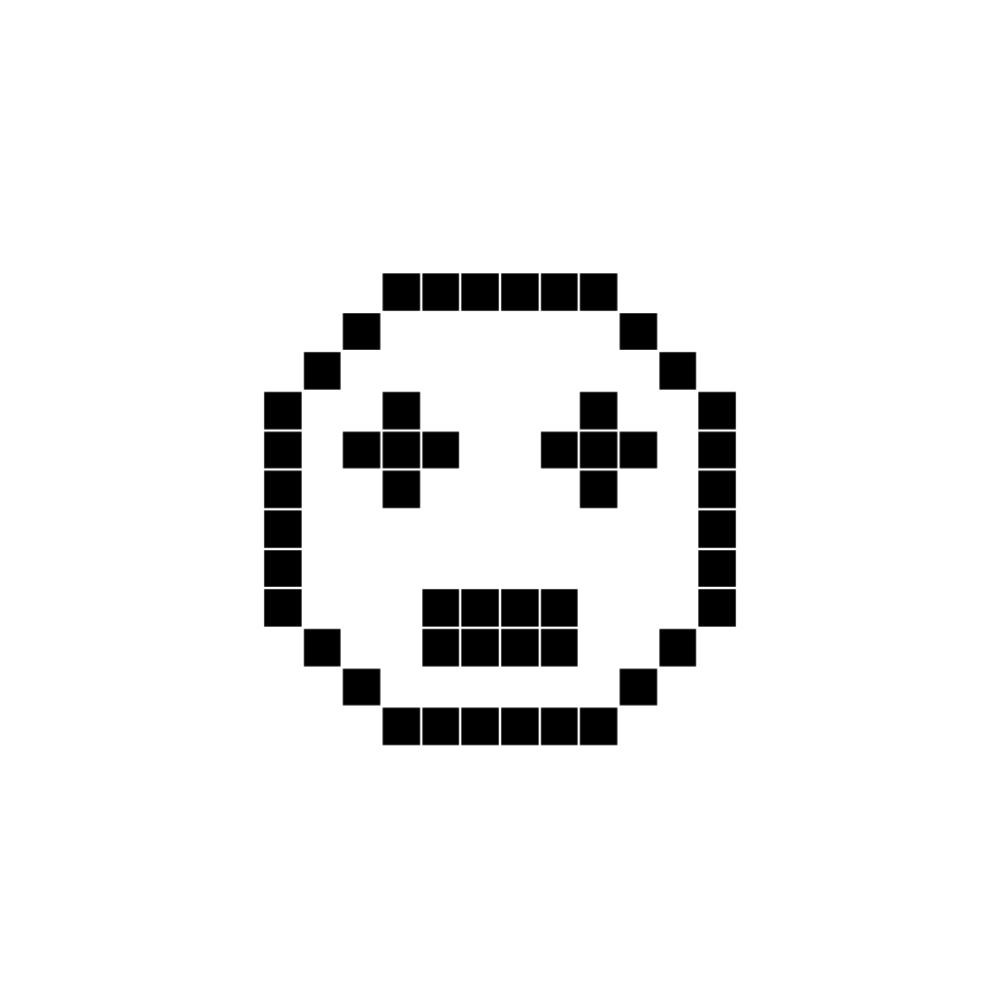</a> | **📂 檔名:** `Shock.svg` ✨ **格式:** `Vector (SVG)` ⚖️ **大小:** `9.94KB` 📅 **更新:** `2026-02-27`  🚀 **jsDelivr Markdown:** `` 🔗 **直接連結 (Url):** <code>https://cdn.jsdelivr.net/gh/barry028/materials@main/images/iCons/Pixel/Pxl/Shock.svg</code> 📥 [檢視原始檔](Shock.svg) |
|  | **📂 檔名:** `Six.svg` ✨ **格式:** `Vector (SVG)` ⚖️ **大小:** `4.88KB` 📅 **更新:** `2026-02-27`  🚀 **jsDelivr Markdown:** `` 🔗 **直接連結 (Url):** <code>https://cdn.jsdelivr.net/gh/barry028/materials@main/images/iCons/Pixel/Pxl/Six.svg</code> 📥 [檢視原始檔](Six.svg) |
| <a href="Smiley.svg">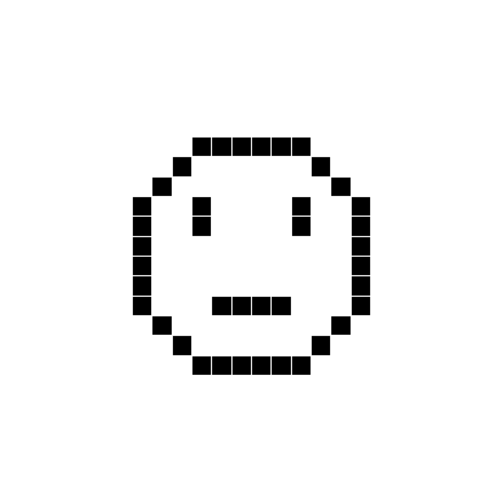</a> | **📂 檔名:** `Smiley.svg` ✨ **格式:** `Vector (SVG)` ⚖️ **大小:** `8.13KB` 📅 **更新:** `2026-02-27`  🚀 **jsDelivr Markdown:** `` 🔗 **直接連結 (Url):** <code>https://cdn.jsdelivr.net/gh/barry028/materials@main/images/iCons/Pixel/Pxl/Smiley.svg</code> 📥 [檢視原始檔](Smiley.svg) |
|  | **📂 檔名:** `Surprise.svg` ✨ **格式:** `Vector (SVG)` ⚖️ **大小:** `10.30KB` 📅 **更新:** `2026-02-27`  🚀 **jsDelivr Markdown:** `` 🔗 **直接連結 (Url):** <code>https://cdn.jsdelivr.net/gh/barry028/materials@main/images/iCons/Pixel/Pxl/Surprise.svg</code> 📥 [檢視原始檔](Surprise.svg) |
| <a href="Tasty.svg">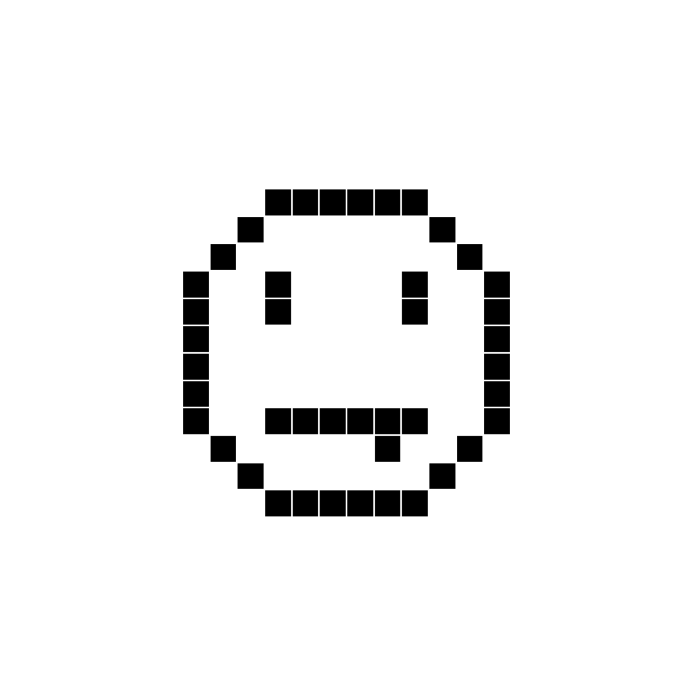</a> | **📂 檔名:** `Tasty.svg` ✨ **格式:** `Vector (SVG)` ⚖️ **大小:** `8.68KB` 📅 **更新:** `2026-02-27`  🚀 **jsDelivr Markdown:** `` 🔗 **直接連結 (Url):** <code>https://cdn.jsdelivr.net/gh/barry028/materials@main/images/iCons/Pixel/Pxl/Tasty.svg</code> 📥 [檢視原始檔](Tasty.svg) |
|  | **📂 檔名:** `Tease.svg` ✨ **格式:** `Vector (SVG)` ⚖️ **大小:** `9.22KB` 📅 **更新:** `2026-02-27`  🚀 **jsDelivr Markdown:** `` 🔗 **直接連結 (Url):** <code>https://cdn.jsdelivr.net/gh/barry028/materials@main/images/iCons/Pixel/Pxl/Tease.svg</code> 📥 [檢視原始檔](Tease.svg) |
| <a href="Three.svg">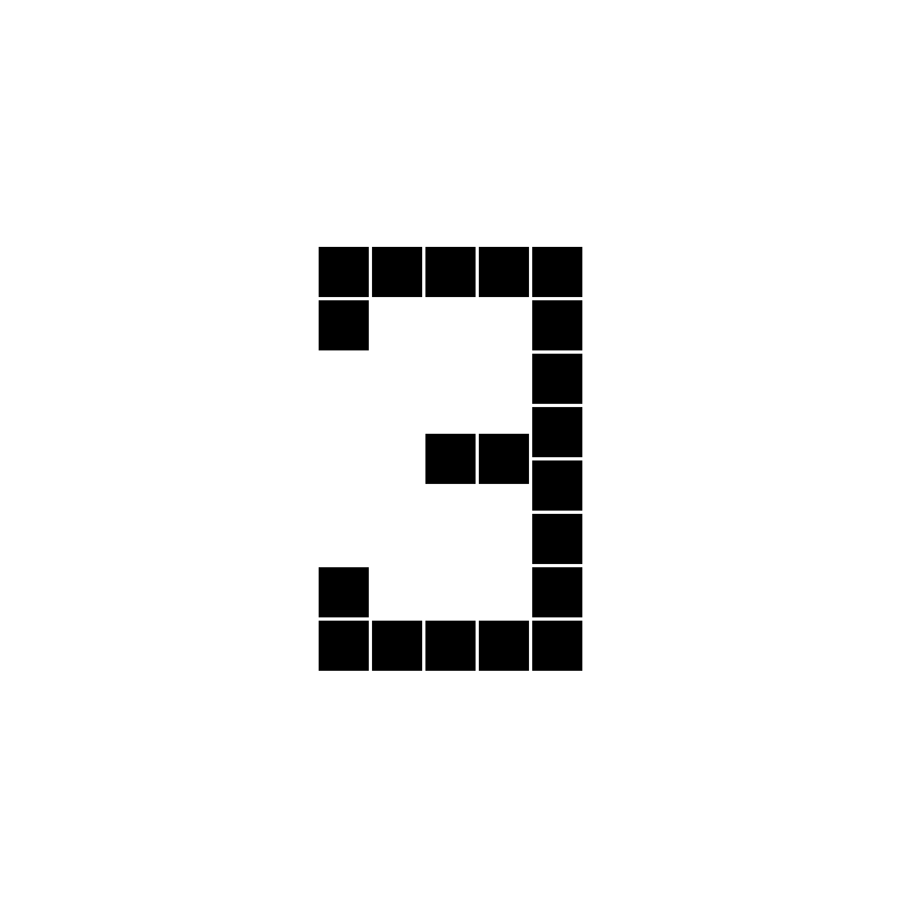</a> | **📂 檔名:** `Three.svg` ✨ **格式:** `Vector (SVG)` ⚖️ **大小:** `4.70KB` 📅 **更新:** `2026-02-27`  🚀 **jsDelivr Markdown:** `` 🔗 **直接連結 (Url):** <code>https://cdn.jsdelivr.net/gh/barry028/materials@main/images/iCons/Pixel/Pxl/Three.svg</code> 📥 [檢視原始檔](Three.svg) |
| <a href="Time.svg">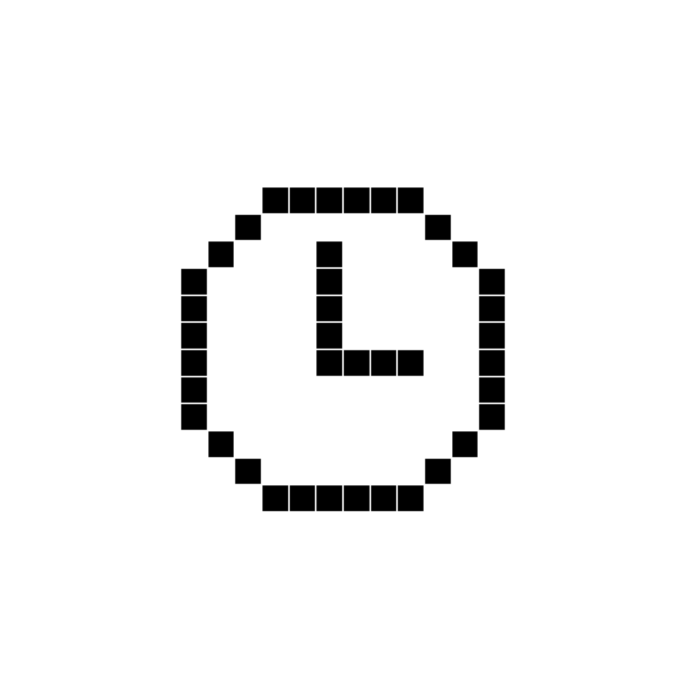</a> | **📂 檔名:** `Time.svg` ✨ **格式:** `Vector (SVG)` ⚖️ **大小:** `8.13KB` 📅 **更新:** `2026-02-27`  🚀 **jsDelivr Markdown:** `` 🔗 **直接連結 (Url):** <code>https://cdn.jsdelivr.net/gh/barry028/materials@main/images/iCons/Pixel/Pxl/Time.svg</code> 📥 [檢視原始檔](Time.svg) |
| <a href="Twitter.svg">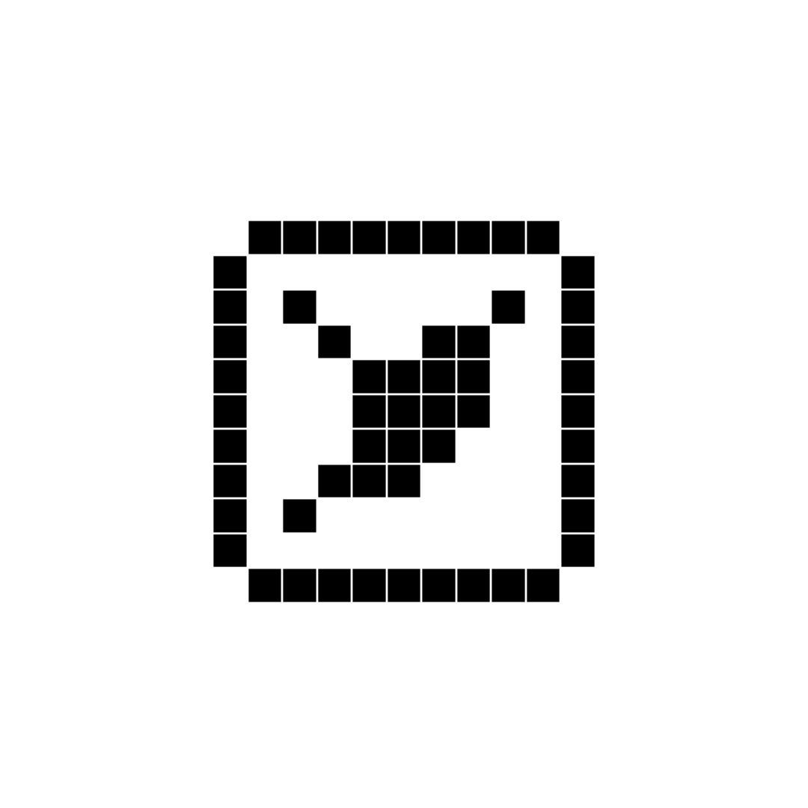</a> | **📂 檔名:** `Twitter.svg` ✨ **格式:** `Vector (SVG)` ⚖️ **大小:** `11.02KB` 📅 **更新:** `2026-02-27`  🚀 **jsDelivr Markdown:** `` 🔗 **直接連結 (Url):** <code>https://cdn.jsdelivr.net/gh/barry028/materials@main/images/iCons/Pixel/Pxl/Twitter.svg</code> 📥 [檢視原始檔](Twitter.svg) |
| <a href="Two.svg">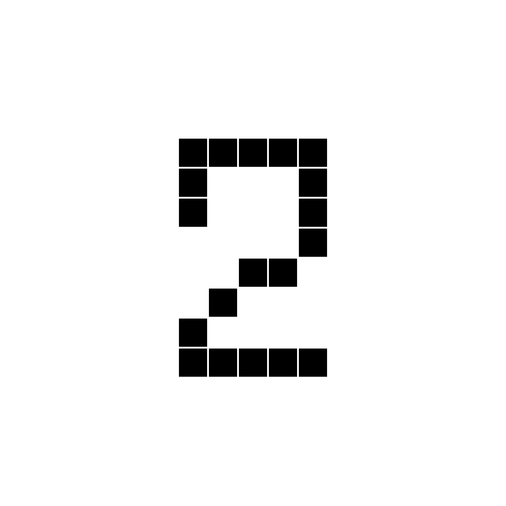</a> | **📂 檔名:** `Two.svg` ✨ **格式:** `Vector (SVG)` ⚖️ **大小:** `4.52KB` 📅 **更新:** `2026-02-27`  🚀 **jsDelivr Markdown:** `` 🔗 **直接連結 (Url):** <code>https://cdn.jsdelivr.net/gh/barry028/materials@main/images/iCons/Pixel/Pxl/Two.svg</code> 📥 [檢視原始檔](Two.svg) |
| <a href="WhatsApp.svg">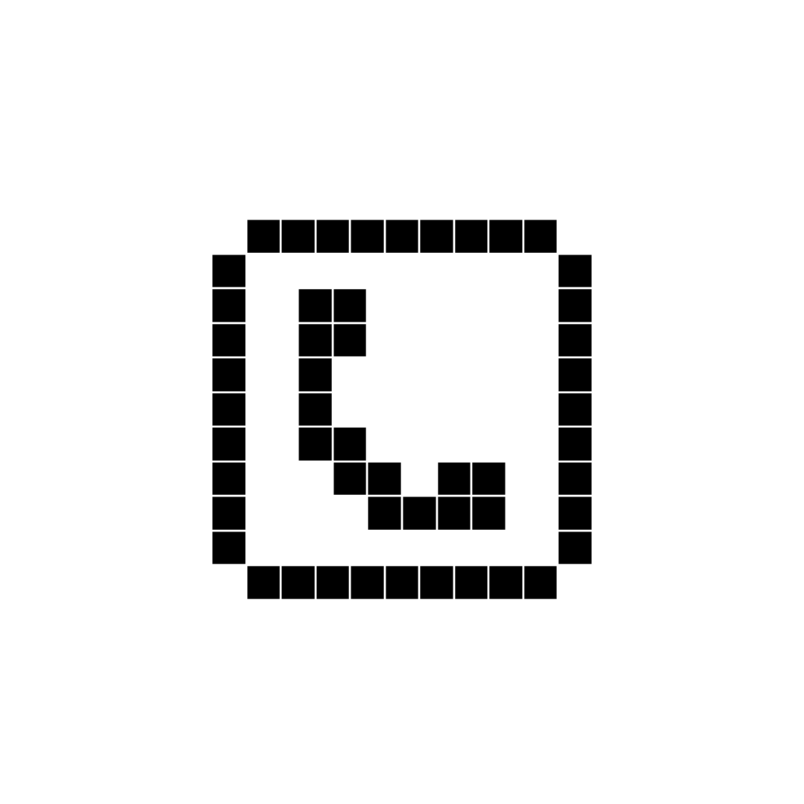</a> | **📂 檔名:** `WhatsApp.svg` ✨ **格式:** `Vector (SVG)` ⚖️ **大小:** `10.30KB` 📅 **更新:** `2026-02-27`  🚀 **jsDelivr Markdown:** `` 🔗 **直接連結 (Url):** <code>https://cdn.jsdelivr.net/gh/barry028/materials@main/images/iCons/Pixel/Pxl/WhatsApp.svg</code> 📥 [檢視原始檔](WhatsApp.svg) |
| <a href="YouTube.svg">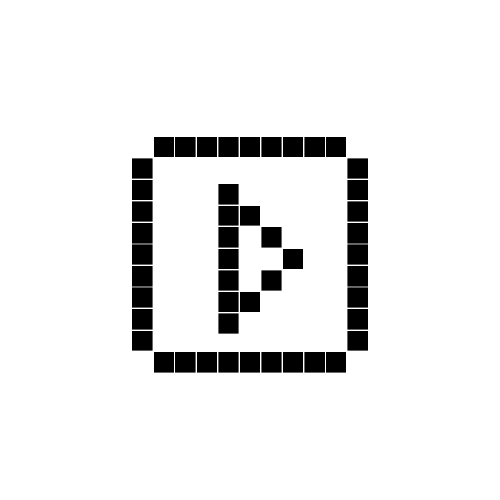</a> | **📂 檔名:** `YouTube.svg` ✨ **格式:** `Vector (SVG)` ⚖️ **大小:** `9.58KB` 📅 **更新:** `2026-02-27`  🚀 **jsDelivr Markdown:** `` 🔗 **直接連結 (Url):** <code>https://cdn.jsdelivr.net/gh/barry028/materials@main/images/iCons/Pixel/Pxl/YouTube.svg</code> 📥 [檢視原始檔](YouTube.svg) |
| <a href="Zero.svg">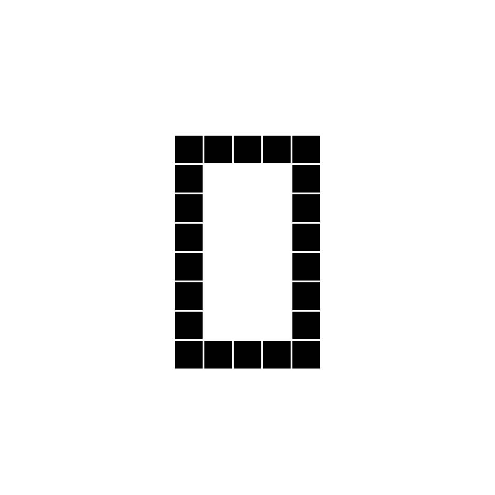</a> | **📂 檔名:** `Zero.svg` ✨ **格式:** `Vector (SVG)` ⚖️ **大小:** `4.88KB` 📅 **更新:** `2026-02-27`  🚀 **jsDelivr Markdown:** `` 🔗 **直接連結 (Url):** <code>https://cdn.jsdelivr.net/gh/barry028/materials@main/images/iCons/Pixel/Pxl/Zero.svg</code> 📥 [檢視原始檔](Zero.svg) |