# 🖼️ 素材分類：Retro Pixel iCons

> [🏠 主目錄](../../../../README.md) / [images](../../../README.md) / [iCons](../../README.md) / [Pixel](../README.md) / **Retro Pixel iCons**

本目錄共有 `180` 個檔案

| 🎨 預覽 (點擊放大)  | 📋 檔案詳細資訊與連結 |
| :--- | :--- |
| <a href="airplane-dark.svg">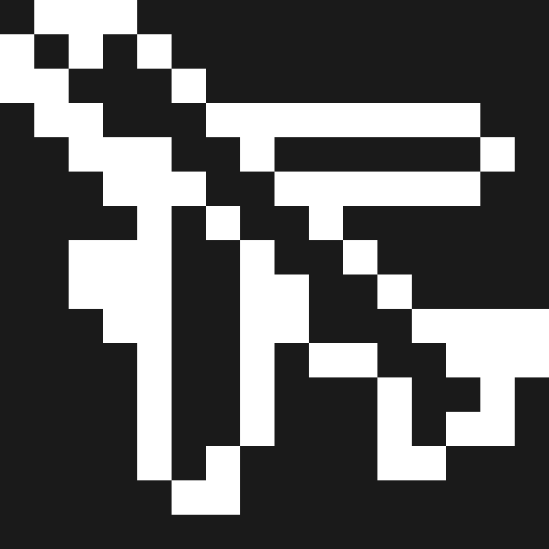</a> | **📂 檔名:** `airplane-dark.svg` ✨ **格式:** `Vector (SVG)` ⚖️ **大小:** `2.66KB` 📅 **更新:** `2026-02-27`  🚀 **jsDelivr Markdown:** `` 🔗 **直接連結 (Url):** <code>https://cdn.jsdelivr.net/gh/barry028/materials@main/images/iCons/Pixel/Retro%20Pixel%20iCons/airplane-dark.svg</code> 📥 [檢視原始檔](airplane-dark.svg) |
|  | **📂 檔名:** `airplane-light.svg` ✨ **格式:** `Vector (SVG)` ⚖️ **大小:** `2.66KB` 📅 **更新:** `2026-02-27`  🚀 **jsDelivr Markdown:** `` 🔗 **直接連結 (Url):** <code>https://cdn.jsdelivr.net/gh/barry028/materials@main/images/iCons/Pixel/Retro%20Pixel%20iCons/airplane-light.svg</code> 📥 [檢視原始檔](airplane-light.svg) |
|  | **📂 檔名:** `angry-face-dark.svg` ✨ **格式:** `Vector (SVG)` ⚖️ **大小:** `3.68KB` 📅 **更新:** `2026-02-27`  🚀 **jsDelivr Markdown:** `` 🔗 **直接連結 (Url):** <code>https://cdn.jsdelivr.net/gh/barry028/materials@main/images/iCons/Pixel/Retro%20Pixel%20iCons/angry-face-dark.svg</code> 📥 [檢視原始檔](angry-face-dark.svg) |
| <a href="angry-face-light.svg">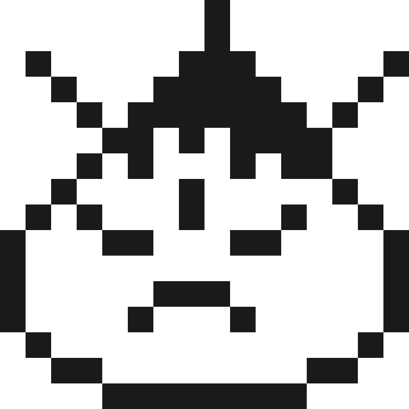</a> | **📂 檔名:** `angry-face-light.svg` ✨ **格式:** `Vector (SVG)` ⚖️ **大小:** `3.68KB` 📅 **更新:** `2026-02-27`  🚀 **jsDelivr Markdown:** `` 🔗 **直接連結 (Url):** <code>https://cdn.jsdelivr.net/gh/barry028/materials@main/images/iCons/Pixel/Retro%20Pixel%20iCons/angry-face-light.svg</code> 📥 [檢視原始檔](angry-face-light.svg) |
|  | **📂 檔名:** `athletic-shoe-dark.svg` ✨ **格式:** `Vector (SVG)` ⚖️ **大小:** `1.05KB` 📅 **更新:** `2026-02-27`  🚀 **jsDelivr Markdown:** `` 🔗 **直接連結 (Url):** <code>https://cdn.jsdelivr.net/gh/barry028/materials@main/images/iCons/Pixel/Retro%20Pixel%20iCons/athletic-shoe-dark.svg</code> 📥 [檢視原始檔](athletic-shoe-dark.svg) |
|  | **📂 檔名:** `athletic-shoe-light.svg` ✨ **格式:** `Vector (SVG)` ⚖️ **大小:** `1.05KB` 📅 **更新:** `2026-02-27`  🚀 **jsDelivr Markdown:** `` 🔗 **直接連結 (Url):** <code>https://cdn.jsdelivr.net/gh/barry028/materials@main/images/iCons/Pixel/Retro%20Pixel%20iCons/athletic-shoe-light.svg</code> 📥 [檢視原始檔](athletic-shoe-light.svg) |
| <a href="automobile-dark.svg">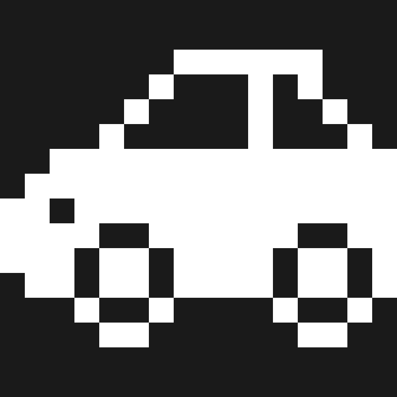</a> | **📂 檔名:** `automobile-dark.svg` ✨ **格式:** `Vector (SVG)` ⚖️ **大小:** `2.85KB` 📅 **更新:** `2026-02-27`  🚀 **jsDelivr Markdown:** `` 🔗 **直接連結 (Url):** <code>https://cdn.jsdelivr.net/gh/barry028/materials@main/images/iCons/Pixel/Retro%20Pixel%20iCons/automobile-dark.svg</code> 📥 [檢視原始檔](automobile-dark.svg) |
|  | **📂 檔名:** `automobile-light.svg` ✨ **格式:** `Vector (SVG)` ⚖️ **大小:** `2.85KB` 📅 **更新:** `2026-02-27`  🚀 **jsDelivr Markdown:** `` 🔗 **直接連結 (Url):** <code>https://cdn.jsdelivr.net/gh/barry028/materials@main/images/iCons/Pixel/Retro%20Pixel%20iCons/automobile-light.svg</code> 📥 [檢視原始檔](automobile-light.svg) |
| <a href="baby-angel-dark.svg">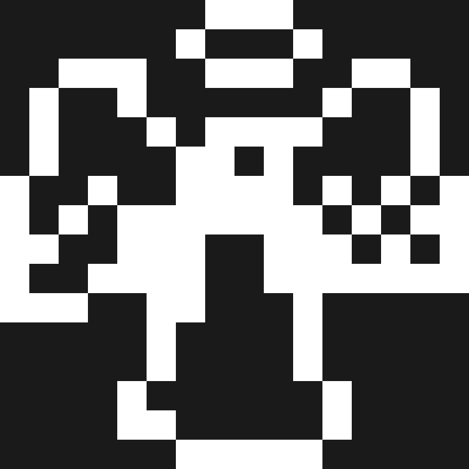</a> | **📂 檔名:** `baby-angel-dark.svg` ✨ **格式:** `Vector (SVG)` ⚖️ **大小:** `3.80KB` 📅 **更新:** `2026-02-27`  🚀 **jsDelivr Markdown:** `` 🔗 **直接連結 (Url):** <code>https://cdn.jsdelivr.net/gh/barry028/materials@main/images/iCons/Pixel/Retro%20Pixel%20iCons/baby-angel-dark.svg</code> 📥 [檢視原始檔](baby-angel-dark.svg) |
|  | **📂 檔名:** `baby-angel-light.svg` ✨ **格式:** `Vector (SVG)` ⚖️ **大小:** `3.80KB` 📅 **更新:** `2026-02-27`  🚀 **jsDelivr Markdown:** `` 🔗 **直接連結 (Url):** <code>https://cdn.jsdelivr.net/gh/barry028/materials@main/images/iCons/Pixel/Retro%20Pixel%20iCons/baby-angel-light.svg</code> 📥 [檢視原始檔](baby-angel-light.svg) |
| <a href="baseball-dark.svg">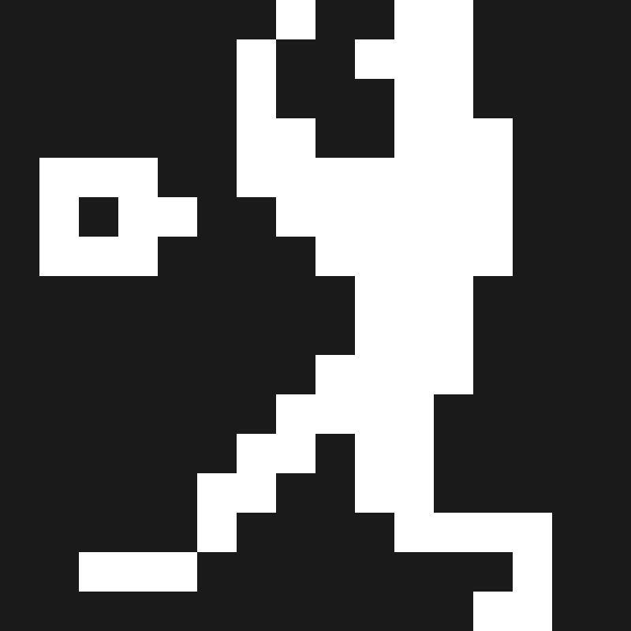</a> | **📂 檔名:** `baseball-dark.svg` ✨ **格式:** `Vector (SVG)` ⚖️ **大小:** `1.20KB` 📅 **更新:** `2026-02-27`  🚀 **jsDelivr Markdown:** `` 🔗 **直接連結 (Url):** <code>https://cdn.jsdelivr.net/gh/barry028/materials@main/images/iCons/Pixel/Retro%20Pixel%20iCons/baseball-dark.svg</code> 📥 [檢視原始檔](baseball-dark.svg) |
|  | **📂 檔名:** `baseball-light.svg` ✨ **格式:** `Vector (SVG)` ⚖️ **大小:** `1.20KB` 📅 **更新:** `2026-02-27`  🚀 **jsDelivr Markdown:** `` 🔗 **直接連結 (Url):** <code>https://cdn.jsdelivr.net/gh/barry028/materials@main/images/iCons/Pixel/Retro%20Pixel%20iCons/baseball-light.svg</code> 📥 [檢視原始檔](baseball-light.svg) |
|  | **📂 檔名:** `bear-face-dark.svg` ✨ **格式:** `Vector (SVG)` ⚖️ **大小:** `4.01KB` 📅 **更新:** `2026-02-27`  🚀 **jsDelivr Markdown:** `` 🔗 **直接連結 (Url):** <code>https://cdn.jsdelivr.net/gh/barry028/materials@main/images/iCons/Pixel/Retro%20Pixel%20iCons/bear-face-dark.svg</code> 📥 [檢視原始檔](bear-face-dark.svg) |
|  | **📂 檔名:** `bear-face-light.svg` ✨ **格式:** `Vector (SVG)` ⚖️ **大小:** `4.01KB` 📅 **更新:** `2026-02-27`  🚀 **jsDelivr Markdown:** `` 🔗 **直接連結 (Url):** <code>https://cdn.jsdelivr.net/gh/barry028/materials@main/images/iCons/Pixel/Retro%20Pixel%20iCons/bear-face-light.svg</code> 📥 [檢視原始檔](bear-face-light.svg) |
|  | **📂 檔名:** `beer-mug-dark.svg` ✨ **格式:** `Vector (SVG)` ⚖️ **大小:** `2.17KB` 📅 **更新:** `2026-02-27`  🚀 **jsDelivr Markdown:** `` 🔗 **直接連結 (Url):** <code>https://cdn.jsdelivr.net/gh/barry028/materials@main/images/iCons/Pixel/Retro%20Pixel%20iCons/beer-mug-dark.svg</code> 📥 [檢視原始檔](beer-mug-dark.svg) |
|  | **📂 檔名:** `beer-mug-light.svg` ✨ **格式:** `Vector (SVG)` ⚖️ **大小:** `2.17KB` 📅 **更新:** `2026-02-27`  🚀 **jsDelivr Markdown:** `` 🔗 **直接連結 (Url):** <code>https://cdn.jsdelivr.net/gh/barry028/materials@main/images/iCons/Pixel/Retro%20Pixel%20iCons/beer-mug-light.svg</code> 📥 [檢視原始檔](beer-mug-light.svg) |
|  | **📂 檔名:** `black-questionmark-dark.svg` ✨ **格式:** `Vector (SVG)` ⚖️ **大小:** `1.45KB` 📅 **更新:** `2026-02-27`  🚀 **jsDelivr Markdown:** `` 🔗 **直接連結 (Url):** <code>https://cdn.jsdelivr.net/gh/barry028/materials@main/images/iCons/Pixel/Retro%20Pixel%20iCons/black-questionmark-dark.svg</code> 📥 [檢視原始檔](black-questionmark-dark.svg) |
|  | **📂 檔名:** `black-questionmark-light.svg` ✨ **格式:** `Vector (SVG)` ⚖️ **大小:** `1.46KB` 📅 **更新:** `2026-02-27`  🚀 **jsDelivr Markdown:** `` 🔗 **直接連結 (Url):** <code>https://cdn.jsdelivr.net/gh/barry028/materials@main/images/iCons/Pixel/Retro%20Pixel%20iCons/black-questionmark-light.svg</code> 📥 [檢視原始檔](black-questionmark-light.svg) |
|  | **📂 檔名:** `black-sun-with-rays-dark.svg` ✨ **格式:** `Vector (SVG)` ⚖️ **大小:** `3.87KB` 📅 **更新:** `2026-02-27`  🚀 **jsDelivr Markdown:** `` 🔗 **直接連結 (Url):** <code>https://cdn.jsdelivr.net/gh/barry028/materials@main/images/iCons/Pixel/Retro%20Pixel%20iCons/black-sun-with-rays-dark.svg</code> 📥 [檢視原始檔](black-sun-with-rays-dark.svg) |
|  | **📂 檔名:** `black-sun-with-rays-light.svg` ✨ **格式:** `Vector (SVG)` ⚖️ **大小:** `3.87KB` 📅 **更新:** `2026-02-27`  🚀 **jsDelivr Markdown:** `` 🔗 **直接連結 (Url):** <code>https://cdn.jsdelivr.net/gh/barry028/materials@main/images/iCons/Pixel/Retro%20Pixel%20iCons/black-sun-with-rays-light.svg</code> 📥 [檢視原始檔](black-sun-with-rays-light.svg) |
|  | **📂 檔名:** `black-telephone-dark.svg` ✨ **格式:** `Vector (SVG)` ⚖️ **大小:** `2.02KB` 📅 **更新:** `2026-02-27`  🚀 **jsDelivr Markdown:** `` 🔗 **直接連結 (Url):** <code>https://cdn.jsdelivr.net/gh/barry028/materials@main/images/iCons/Pixel/Retro%20Pixel%20iCons/black-telephone-dark.svg</code> 📥 [檢視原始檔](black-telephone-dark.svg) |
| <a href="black-telephone-light.svg">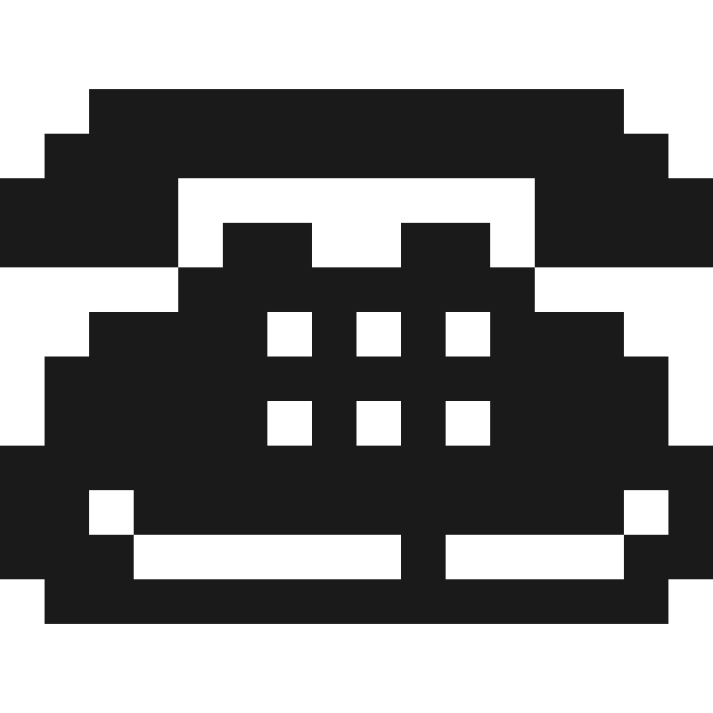</a> | **📂 檔名:** `black-telephone-light.svg` ✨ **格式:** `Vector (SVG)` ⚖️ **大小:** `2.02KB` 📅 **更新:** `2026-02-27`  🚀 **jsDelivr Markdown:** `` 🔗 **直接連結 (Url):** <code>https://cdn.jsdelivr.net/gh/barry028/materials@main/images/iCons/Pixel/Retro%20Pixel%20iCons/black-telephone-light.svg</code> 📥 [檢視原始檔](black-telephone-light.svg) |
|  | **📂 檔名:** `boy-dark.svg` ✨ **格式:** `Vector (SVG)` ⚖️ **大小:** `1.42KB` 📅 **更新:** `2026-02-27`  🚀 **jsDelivr Markdown:** `` 🔗 **直接連結 (Url):** <code>https://cdn.jsdelivr.net/gh/barry028/materials@main/images/iCons/Pixel/Retro%20Pixel%20iCons/boy-dark.svg</code> 📥 [檢視原始檔](boy-dark.svg) |
|  | **📂 檔名:** `boy-light.svg` ✨ **格式:** `Vector (SVG)` ⚖️ **大小:** `1.42KB` 📅 **更新:** `2026-02-27`  🚀 **jsDelivr Markdown:** `` 🔗 **直接連結 (Url):** <code>https://cdn.jsdelivr.net/gh/barry028/materials@main/images/iCons/Pixel/Retro%20Pixel%20iCons/boy-light.svg</code> 📥 [檢視原始檔](boy-light.svg) |
| <a href="broken-heart-dark.svg">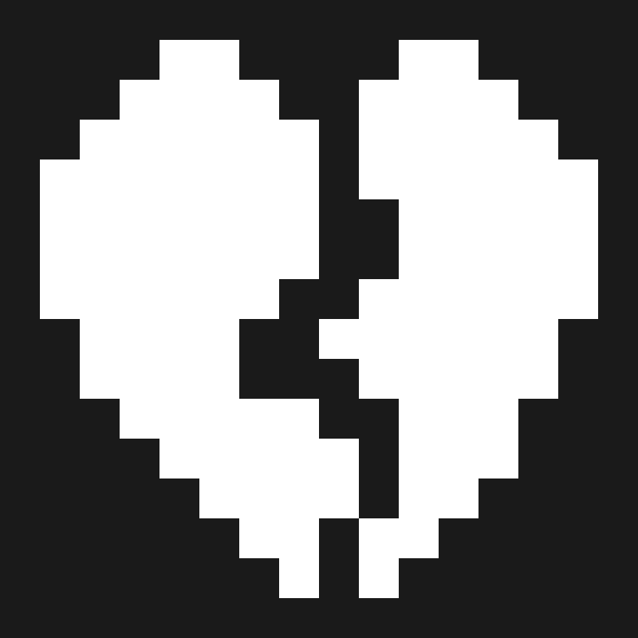</a> | **📂 檔名:** `broken-heart-dark.svg` ✨ **格式:** `Vector (SVG)` ⚖️ **大小:** `660.00B` 📅 **更新:** `2026-02-27`  🚀 **jsDelivr Markdown:** `` 🔗 **直接連結 (Url):** <code>https://cdn.jsdelivr.net/gh/barry028/materials@main/images/iCons/Pixel/Retro%20Pixel%20iCons/broken-heart-dark.svg</code> 📥 [檢視原始檔](broken-heart-dark.svg) |
| <a href="broken-heart-light.svg">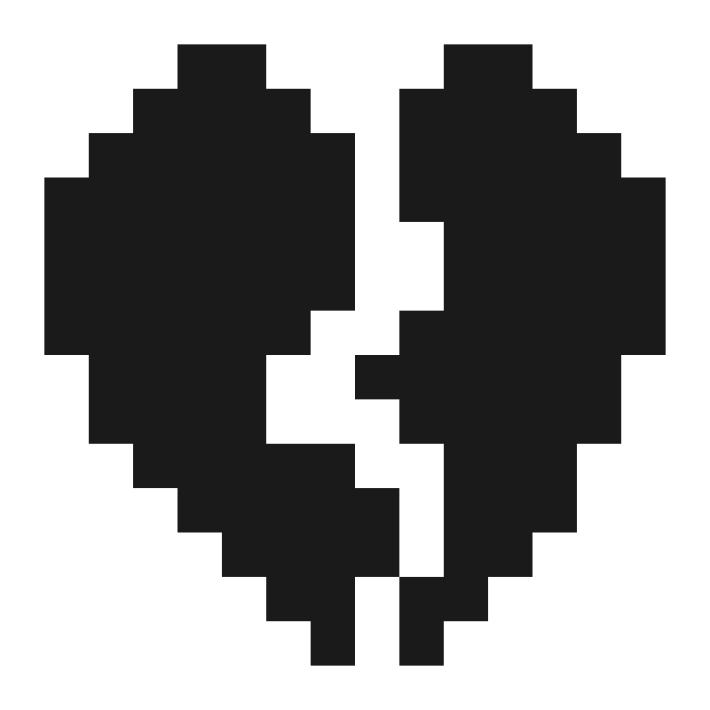</a> | **📂 檔名:** `broken-heart-light.svg` ✨ **格式:** `Vector (SVG)` ⚖️ **大小:** `662.00B` 📅 **更新:** `2026-02-27`  🚀 **jsDelivr Markdown:** `` 🔗 **直接連結 (Url):** <code>https://cdn.jsdelivr.net/gh/barry028/materials@main/images/iCons/Pixel/Retro%20Pixel%20iCons/broken-heart-light.svg</code> 📥 [檢視原始檔](broken-heart-light.svg) |
|  | **📂 檔名:** `camera-dark.svg` ✨ **格式:** `Vector (SVG)` ⚖️ **大小:** `2.02KB` 📅 **更新:** `2026-02-27`  🚀 **jsDelivr Markdown:** `` 🔗 **直接連結 (Url):** <code>https://cdn.jsdelivr.net/gh/barry028/materials@main/images/iCons/Pixel/Retro%20Pixel%20iCons/camera-dark.svg</code> 📥 [檢視原始檔](camera-dark.svg) |
|  | **📂 檔名:** `camera-light.svg` ✨ **格式:** `Vector (SVG)` ⚖️ **大小:** `2.02KB` 📅 **更新:** `2026-02-27`  🚀 **jsDelivr Markdown:** `` 🔗 **直接連結 (Url):** <code>https://cdn.jsdelivr.net/gh/barry028/materials@main/images/iCons/Pixel/Retro%20Pixel%20iCons/camera-light.svg</code> 📥 [檢視原始檔](camera-light.svg) |
|  | **📂 檔名:** `cat-face-dark.svg` ✨ **格式:** `Vector (SVG)` ⚖️ **大小:** `3.70KB` 📅 **更新:** `2026-02-27`  🚀 **jsDelivr Markdown:** `` 🔗 **直接連結 (Url):** <code>https://cdn.jsdelivr.net/gh/barry028/materials@main/images/iCons/Pixel/Retro%20Pixel%20iCons/cat-face-dark.svg</code> 📥 [檢視原始檔](cat-face-dark.svg) |
|  | **📂 檔名:** `cat-face-light.svg` ✨ **格式:** `Vector (SVG)` ⚖️ **大小:** `3.70KB` 📅 **更新:** `2026-02-27`  🚀 **jsDelivr Markdown:** `` 🔗 **直接連結 (Url):** <code>https://cdn.jsdelivr.net/gh/barry028/materials@main/images/iCons/Pixel/Retro%20Pixel%20iCons/cat-face-light.svg</code> 📥 [檢視原始檔](cat-face-light.svg) |
|  | **📂 檔名:** `cherry-blossom-dark.svg` ✨ **格式:** `Vector (SVG)` ⚖️ **大小:** `5.01KB` 📅 **更新:** `2026-02-27`  🚀 **jsDelivr Markdown:** `` 🔗 **直接連結 (Url):** <code>https://cdn.jsdelivr.net/gh/barry028/materials@main/images/iCons/Pixel/Retro%20Pixel%20iCons/cherry-blossom-dark.svg</code> 📥 [檢視原始檔](cherry-blossom-dark.svg) |
| <a href="cherry-blossom-light.svg">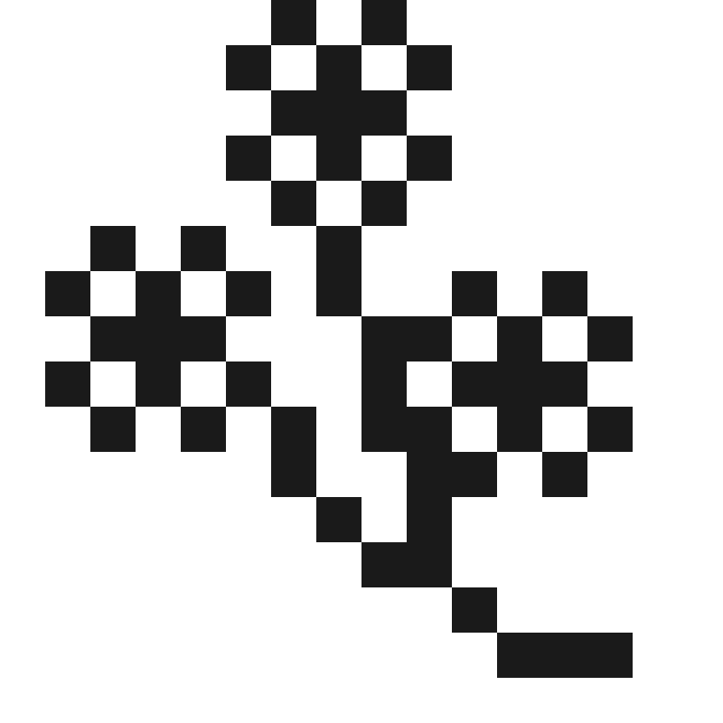</a> | **📂 檔名:** `cherry-blossom-light.svg` ✨ **格式:** `Vector (SVG)` ⚖️ **大小:** `5.01KB` 📅 **更新:** `2026-02-27`  🚀 **jsDelivr Markdown:** `` 🔗 **直接連結 (Url):** <code>https://cdn.jsdelivr.net/gh/barry028/materials@main/images/iCons/Pixel/Retro%20Pixel%20iCons/cherry-blossom-light.svg</code> 📥 [檢視原始檔](cherry-blossom-light.svg) |
|  | **📂 檔名:** `christmas-tree-dark.svg` ✨ **格式:** `Vector (SVG)` ⚖️ **大小:** `1.11KB` 📅 **更新:** `2026-02-27`  🚀 **jsDelivr Markdown:** `` 🔗 **直接連結 (Url):** <code>https://cdn.jsdelivr.net/gh/barry028/materials@main/images/iCons/Pixel/Retro%20Pixel%20iCons/christmas-tree-dark.svg</code> 📥 [檢視原始檔](christmas-tree-dark.svg) |
|  | **📂 檔名:** `christmas-tree-light.svg` ✨ **格式:** `Vector (SVG)` ⚖️ **大小:** `1.11KB` 📅 **更新:** `2026-02-27`  🚀 **jsDelivr Markdown:** `` 🔗 **直接連結 (Url):** <code>https://cdn.jsdelivr.net/gh/barry028/materials@main/images/iCons/Pixel/Retro%20Pixel%20iCons/christmas-tree-light.svg</code> 📥 [檢視原始檔](christmas-tree-light.svg) |
| <a href="church-dark.svg">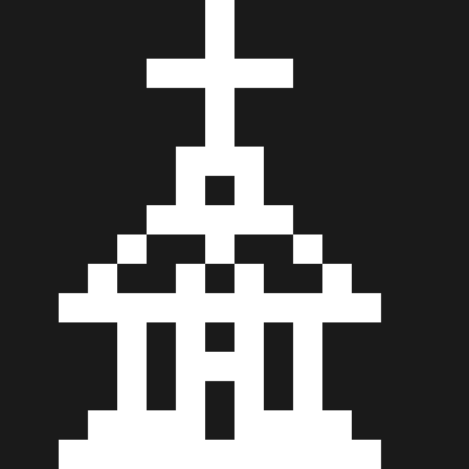</a> | **📂 檔名:** `church-dark.svg` ✨ **格式:** `Vector (SVG)` ⚖️ **大小:** `1.78KB` 📅 **更新:** `2026-02-27`  🚀 **jsDelivr Markdown:** `` 🔗 **直接連結 (Url):** <code>https://cdn.jsdelivr.net/gh/barry028/materials@main/images/iCons/Pixel/Retro%20Pixel%20iCons/church-dark.svg</code> 📥 [檢視原始檔](church-dark.svg) |
|  | **📂 檔名:** `church-light.svg` ✨ **格式:** `Vector (SVG)` ⚖️ **大小:** `1.78KB` 📅 **更新:** `2026-02-27`  🚀 **jsDelivr Markdown:** `` 🔗 **直接連結 (Url):** <code>https://cdn.jsdelivr.net/gh/barry028/materials@main/images/iCons/Pixel/Retro%20Pixel%20iCons/church-light.svg</code> 📥 [檢視原始檔](church-light.svg) |
|  | **📂 檔名:** `clock-face-eight-oclock-dark.svg` ✨ **格式:** `Vector (SVG)` ⚖️ **大小:** `2.72KB` 📅 **更新:** `2026-02-27`  🚀 **jsDelivr Markdown:** `` 🔗 **直接連結 (Url):** <code>https://cdn.jsdelivr.net/gh/barry028/materials@main/images/iCons/Pixel/Retro%20Pixel%20iCons/clock-face-eight-oclock-dark.svg</code> 📥 [檢視原始檔](clock-face-eight-oclock-dark.svg) |
|  | **📂 檔名:** `clock-face-eight-oclock-light.svg` ✨ **格式:** `Vector (SVG)` ⚖️ **大小:** `2.72KB` 📅 **更新:** `2026-02-27`  🚀 **jsDelivr Markdown:** `` 🔗 **直接連結 (Url):** <code>https://cdn.jsdelivr.net/gh/barry028/materials@main/images/iCons/Pixel/Retro%20Pixel%20iCons/clock-face-eight-oclock-light.svg</code> 📥 [檢視原始檔](clock-face-eight-oclock-light.svg) |
|  | **📂 檔名:** `clock-face-eleven-oclock-dark.svg` ✨ **格式:** `Vector (SVG)` ⚖️ **大小:** `2.62KB` 📅 **更新:** `2026-02-27`  🚀 **jsDelivr Markdown:** `` 🔗 **直接連結 (Url):** <code>https://cdn.jsdelivr.net/gh/barry028/materials@main/images/iCons/Pixel/Retro%20Pixel%20iCons/clock-face-eleven-oclock-dark.svg</code> 📥 [檢視原始檔](clock-face-eleven-oclock-dark.svg) |
|  | **📂 檔名:** `clock-face-eleven-oclock-light.svg` ✨ **格式:** `Vector (SVG)` ⚖️ **大小:** `2.62KB` 📅 **更新:** `2026-02-27`  🚀 **jsDelivr Markdown:** `` 🔗 **直接連結 (Url):** <code>https://cdn.jsdelivr.net/gh/barry028/materials@main/images/iCons/Pixel/Retro%20Pixel%20iCons/clock-face-eleven-oclock-light.svg</code> 📥 [檢視原始檔](clock-face-eleven-oclock-light.svg) |
|  | **📂 檔名:** `clock-face-five-oclock-dark.svg` ✨ **格式:** `Vector (SVG)` ⚖️ **大小:** `2.72KB` 📅 **更新:** `2026-02-27`  🚀 **jsDelivr Markdown:** `` 🔗 **直接連結 (Url):** <code>https://cdn.jsdelivr.net/gh/barry028/materials@main/images/iCons/Pixel/Retro%20Pixel%20iCons/clock-face-five-oclock-dark.svg</code> 📥 [檢視原始檔](clock-face-five-oclock-dark.svg) |
|  | **📂 檔名:** `clock-face-five-oclock-light.svg` ✨ **格式:** `Vector (SVG)` ⚖️ **大小:** `2.72KB` 📅 **更新:** `2026-02-27`  🚀 **jsDelivr Markdown:** `` 🔗 **直接連結 (Url):** <code>https://cdn.jsdelivr.net/gh/barry028/materials@main/images/iCons/Pixel/Retro%20Pixel%20iCons/clock-face-five-oclock-light.svg</code> 📥 [檢視原始檔](clock-face-five-oclock-light.svg) |
|  | **📂 檔名:** `clock-face-four-oclock-dark.svg` ✨ **格式:** `Vector (SVG)` ⚖️ **大小:** `2.55KB` 📅 **更新:** `2026-02-27`  🚀 **jsDelivr Markdown:** `` 🔗 **直接連結 (Url):** <code>https://cdn.jsdelivr.net/gh/barry028/materials@main/images/iCons/Pixel/Retro%20Pixel%20iCons/clock-face-four-oclock-dark.svg</code> 📥 [檢視原始檔](clock-face-four-oclock-dark.svg) |
|  | **📂 檔名:** `clock-face-four-oclock-light.svg` ✨ **格式:** `Vector (SVG)` ⚖️ **大小:** `2.55KB` 📅 **更新:** `2026-02-27`  🚀 **jsDelivr Markdown:** `` 🔗 **直接連結 (Url):** <code>https://cdn.jsdelivr.net/gh/barry028/materials@main/images/iCons/Pixel/Retro%20Pixel%20iCons/clock-face-four-oclock-light.svg</code> 📥 [檢視原始檔](clock-face-four-oclock-light.svg) |
|  | **📂 檔名:** `clock-face-nine-oclock-dark.svg` ✨ **格式:** `Vector (SVG)` ⚖️ **大小:** `2.50KB` 📅 **更新:** `2026-02-27`  🚀 **jsDelivr Markdown:** `` 🔗 **直接連結 (Url):** <code>https://cdn.jsdelivr.net/gh/barry028/materials@main/images/iCons/Pixel/Retro%20Pixel%20iCons/clock-face-nine-oclock-dark.svg</code> 📥 [檢視原始檔](clock-face-nine-oclock-dark.svg) |
| <a href="clock-face-nine-oclock-light.svg">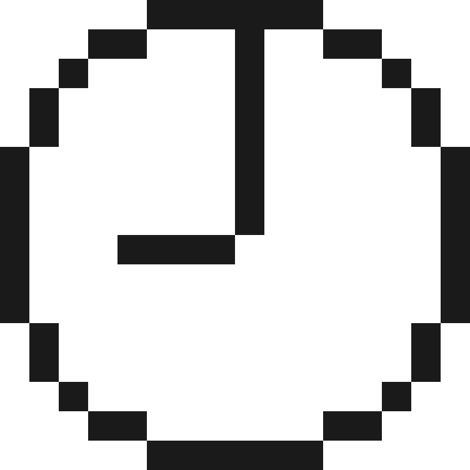</a> | **📂 檔名:** `clock-face-nine-oclock-light.svg` ✨ **格式:** `Vector (SVG)` ⚖️ **大小:** `2.50KB` 📅 **更新:** `2026-02-27`  🚀 **jsDelivr Markdown:** `` 🔗 **直接連結 (Url):** <code>https://cdn.jsdelivr.net/gh/barry028/materials@main/images/iCons/Pixel/Retro%20Pixel%20iCons/clock-face-nine-oclock-light.svg</code> 📥 [檢視原始檔](clock-face-nine-oclock-light.svg) |
| <a href="clock-face-one-oclock-dark.svg">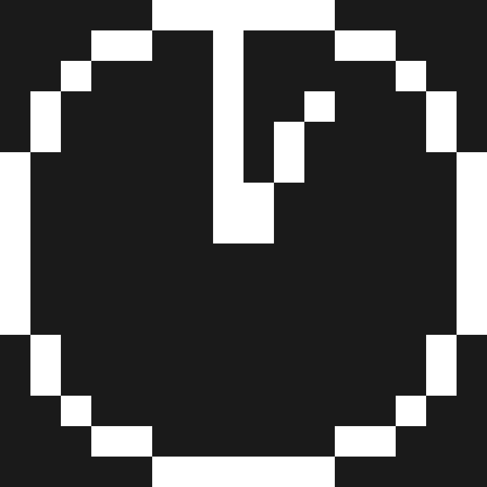</a> | **📂 檔名:** `clock-face-one-oclock-dark.svg` ✨ **格式:** `Vector (SVG)` ⚖️ **大小:** `2.62KB` 📅 **更新:** `2026-02-27`  🚀 **jsDelivr Markdown:** `` 🔗 **直接連結 (Url):** <code>https://cdn.jsdelivr.net/gh/barry028/materials@main/images/iCons/Pixel/Retro%20Pixel%20iCons/clock-face-one-oclock-dark.svg</code> 📥 [檢視原始檔](clock-face-one-oclock-dark.svg) |
|  | **📂 檔名:** `clock-face-one-oclock-light.svg` ✨ **格式:** `Vector (SVG)` ⚖️ **大小:** `2.62KB` 📅 **更新:** `2026-02-27`  🚀 **jsDelivr Markdown:** `` 🔗 **直接連結 (Url):** <code>https://cdn.jsdelivr.net/gh/barry028/materials@main/images/iCons/Pixel/Retro%20Pixel%20iCons/clock-face-one-oclock-light.svg</code> 📥 [檢視原始檔](clock-face-one-oclock-light.svg) |
| <a href="clock-face-seven-oclock-dark.svg">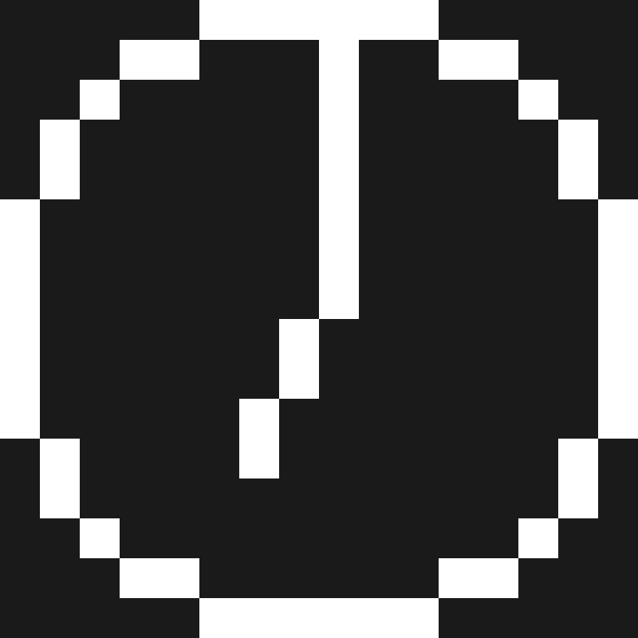</a> | **📂 檔名:** `clock-face-seven-oclock-dark.svg` ✨ **格式:** `Vector (SVG)` ⚖️ **大小:** `2.62KB` 📅 **更新:** `2026-02-27`  🚀 **jsDelivr Markdown:** `` 🔗 **直接連結 (Url):** <code>https://cdn.jsdelivr.net/gh/barry028/materials@main/images/iCons/Pixel/Retro%20Pixel%20iCons/clock-face-seven-oclock-dark.svg</code> 📥 [檢視原始檔](clock-face-seven-oclock-dark.svg) |
|  | **📂 檔名:** `clock-face-seven-oclock-light.svg` ✨ **格式:** `Vector (SVG)` ⚖️ **大小:** `2.62KB` 📅 **更新:** `2026-02-27`  🚀 **jsDelivr Markdown:** `` 🔗 **直接連結 (Url):** <code>https://cdn.jsdelivr.net/gh/barry028/materials@main/images/iCons/Pixel/Retro%20Pixel%20iCons/clock-face-seven-oclock-light.svg</code> 📥 [檢視原始檔](clock-face-seven-oclock-light.svg) |
| <a href="clock-face-six-oclock-dark.svg">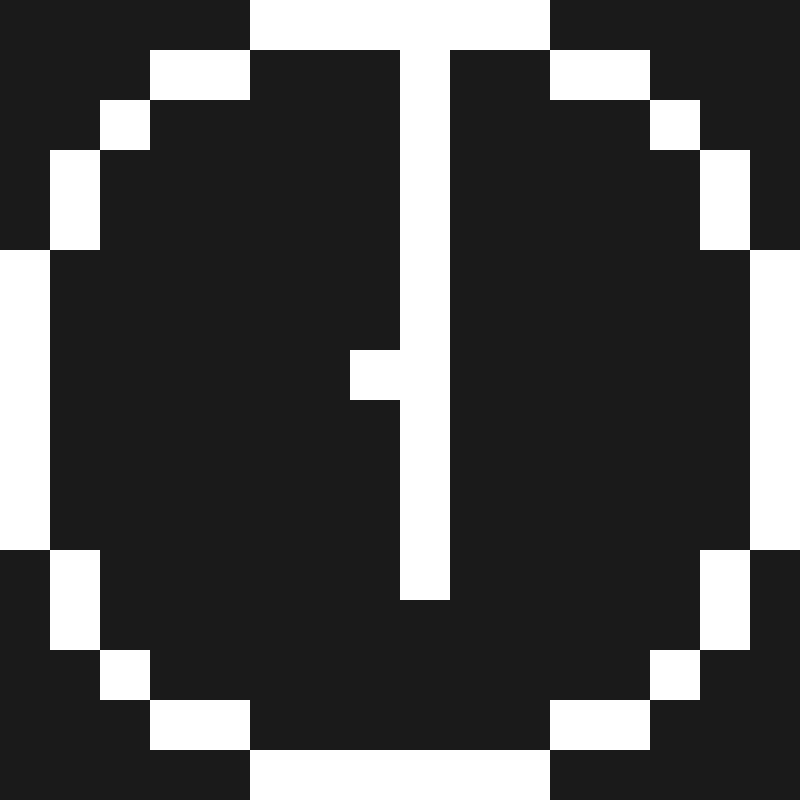</a> | **📂 檔名:** `clock-face-six-oclock-dark.svg` ✨ **格式:** `Vector (SVG)` ⚖️ **大小:** `2.41KB` 📅 **更新:** `2026-02-27`  🚀 **jsDelivr Markdown:** `` 🔗 **直接連結 (Url):** <code>https://cdn.jsdelivr.net/gh/barry028/materials@main/images/iCons/Pixel/Retro%20Pixel%20iCons/clock-face-six-oclock-dark.svg</code> 📥 [檢視原始檔](clock-face-six-oclock-dark.svg) |
|  | **📂 檔名:** `clock-face-six-oclock-light.svg` ✨ **格式:** `Vector (SVG)` ⚖️ **大小:** `2.42KB` 📅 **更新:** `2026-02-27`  🚀 **jsDelivr Markdown:** `` 🔗 **直接連結 (Url):** <code>https://cdn.jsdelivr.net/gh/barry028/materials@main/images/iCons/Pixel/Retro%20Pixel%20iCons/clock-face-six-oclock-light.svg</code> 📥 [檢視原始檔](clock-face-six-oclock-light.svg) |
| <a href="clock-face-ten-oclock-dark.svg">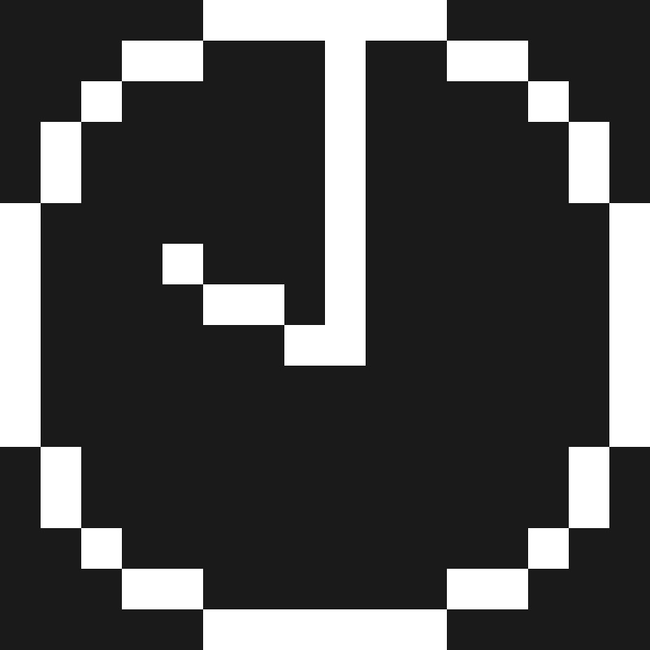</a> | **📂 檔名:** `clock-face-ten-oclock-dark.svg` ✨ **格式:** `Vector (SVG)` ⚖️ **大小:** `2.62KB` 📅 **更新:** `2026-02-27`  🚀 **jsDelivr Markdown:** `` 🔗 **直接連結 (Url):** <code>https://cdn.jsdelivr.net/gh/barry028/materials@main/images/iCons/Pixel/Retro%20Pixel%20iCons/clock-face-ten-oclock-dark.svg</code> 📥 [檢視原始檔](clock-face-ten-oclock-dark.svg) |
| <a href="clock-face-ten-oclock-light.svg">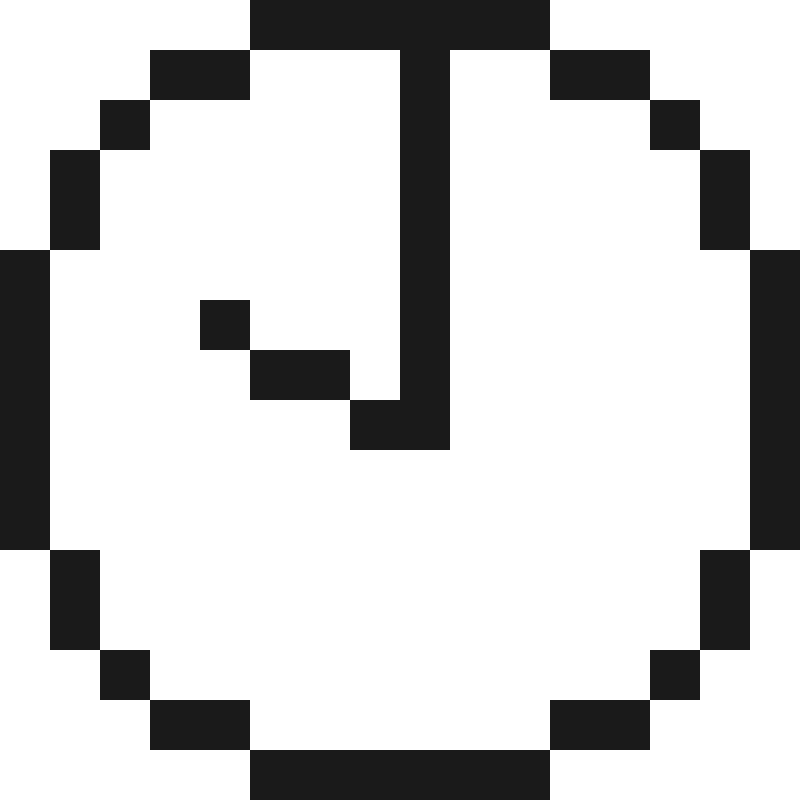</a> | **📂 檔名:** `clock-face-ten-oclock-light.svg` ✨ **格式:** `Vector (SVG)` ⚖️ **大小:** `2.62KB` 📅 **更新:** `2026-02-27`  🚀 **jsDelivr Markdown:** `` 🔗 **直接連結 (Url):** <code>https://cdn.jsdelivr.net/gh/barry028/materials@main/images/iCons/Pixel/Retro%20Pixel%20iCons/clock-face-ten-oclock-light.svg</code> 📥 [檢視原始檔](clock-face-ten-oclock-light.svg) |
|  | **📂 檔名:** `clock-face-three-oclock-dark.svg` ✨ **格式:** `Vector (SVG)` ⚖️ **大小:** `2.41KB` 📅 **更新:** `2026-02-27`  🚀 **jsDelivr Markdown:** `` 🔗 **直接連結 (Url):** <code>https://cdn.jsdelivr.net/gh/barry028/materials@main/images/iCons/Pixel/Retro%20Pixel%20iCons/clock-face-three-oclock-dark.svg</code> 📥 [檢視原始檔](clock-face-three-oclock-dark.svg) |
|  | **📂 檔名:** `clock-face-three-oclock-light.svg` ✨ **格式:** `Vector (SVG)` ⚖️ **大小:** `2.41KB` 📅 **更新:** `2026-02-27`  🚀 **jsDelivr Markdown:** `` 🔗 **直接連結 (Url):** <code>https://cdn.jsdelivr.net/gh/barry028/materials@main/images/iCons/Pixel/Retro%20Pixel%20iCons/clock-face-three-oclock-light.svg</code> 📥 [檢視原始檔](clock-face-three-oclock-light.svg) |
| <a href="clock-face-twelve-oclock-dark.svg">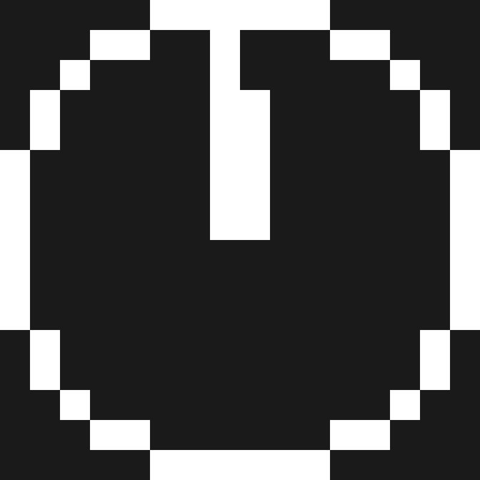</a> | **📂 檔名:** `clock-face-twelve-oclock-dark.svg` ✨ **格式:** `Vector (SVG)` ⚖️ **大小:** `2.41KB` 📅 **更新:** `2026-02-27`  🚀 **jsDelivr Markdown:** `` 🔗 **直接連結 (Url):** <code>https://cdn.jsdelivr.net/gh/barry028/materials@main/images/iCons/Pixel/Retro%20Pixel%20iCons/clock-face-twelve-oclock-dark.svg</code> 📥 [檢視原始檔](clock-face-twelve-oclock-dark.svg) |
| <a href="clock-face-twelve-oclock-light.svg">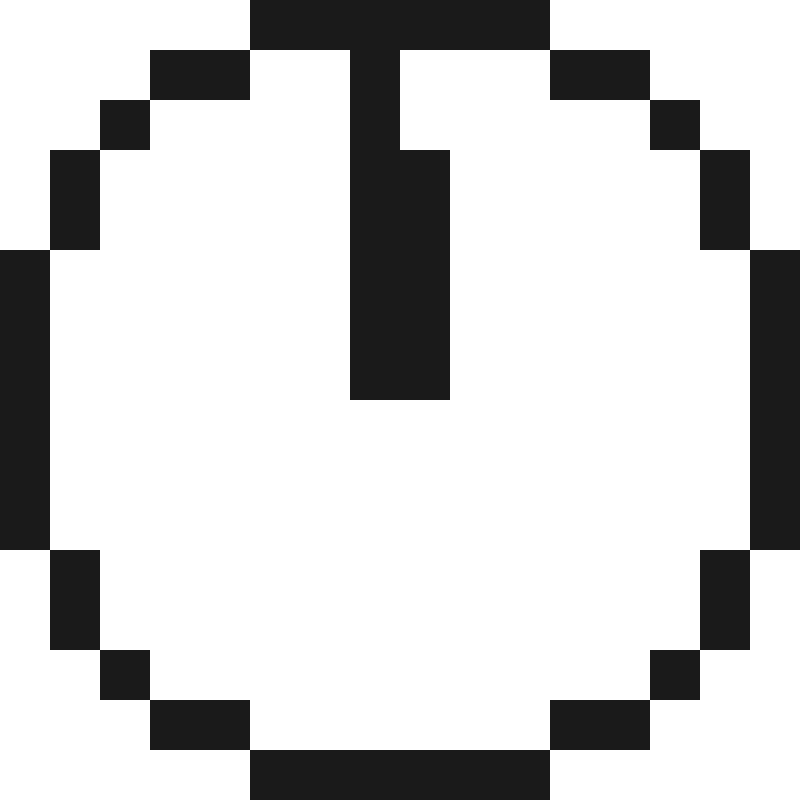</a> | **📂 檔名:** `clock-face-twelve-oclock-light.svg` ✨ **格式:** `Vector (SVG)` ⚖️ **大小:** `2.41KB` 📅 **更新:** `2026-02-27`  🚀 **jsDelivr Markdown:** `` 🔗 **直接連結 (Url):** <code>https://cdn.jsdelivr.net/gh/barry028/materials@main/images/iCons/Pixel/Retro%20Pixel%20iCons/clock-face-twelve-oclock-light.svg</code> 📥 [檢視原始檔](clock-face-twelve-oclock-light.svg) |
| <a href="clock-face-two-oclock-dark.svg">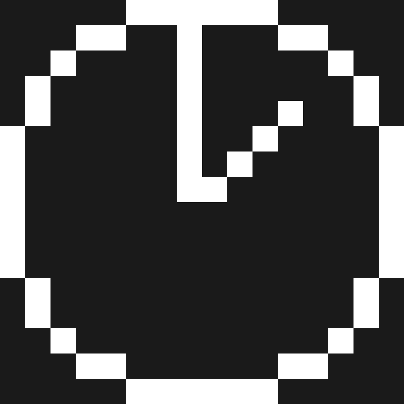</a> | **📂 檔名:** `clock-face-two-oclock-dark.svg` ✨ **格式:** `Vector (SVG)` ⚖️ **大小:** `2.73KB` 📅 **更新:** `2026-02-27`  🚀 **jsDelivr Markdown:** `` 🔗 **直接連結 (Url):** <code>https://cdn.jsdelivr.net/gh/barry028/materials@main/images/iCons/Pixel/Retro%20Pixel%20iCons/clock-face-two-oclock-dark.svg</code> 📥 [檢視原始檔](clock-face-two-oclock-dark.svg) |
| <a href="clock-face-two-oclock-light.svg">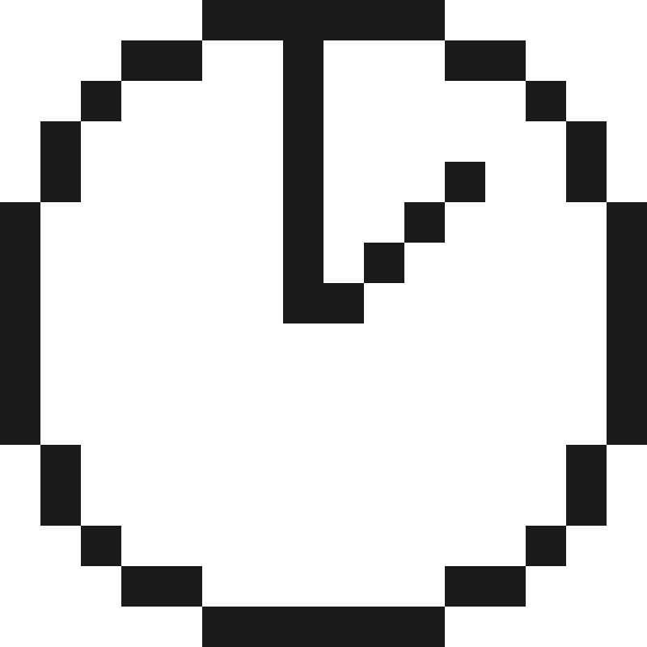</a> | **📂 檔名:** `clock-face-two-oclock-light.svg` ✨ **格式:** `Vector (SVG)` ⚖️ **大小:** `2.73KB` 📅 **更新:** `2026-02-27`  🚀 **jsDelivr Markdown:** `` 🔗 **直接連結 (Url):** <code>https://cdn.jsdelivr.net/gh/barry028/materials@main/images/iCons/Pixel/Retro%20Pixel%20iCons/clock-face-two-oclock-light.svg</code> 📥 [檢視原始檔](clock-face-two-oclock-light.svg) |
|  | **📂 檔名:** `cloud-dark.svg` ✨ **格式:** `Vector (SVG)` ⚖️ **大小:** `2.41KB` 📅 **更新:** `2026-02-27`  🚀 **jsDelivr Markdown:** `` 🔗 **直接連結 (Url):** <code>https://cdn.jsdelivr.net/gh/barry028/materials@main/images/iCons/Pixel/Retro%20Pixel%20iCons/cloud-dark.svg</code> 📥 [檢視原始檔](cloud-dark.svg) |
| <a href="cloud-light.svg">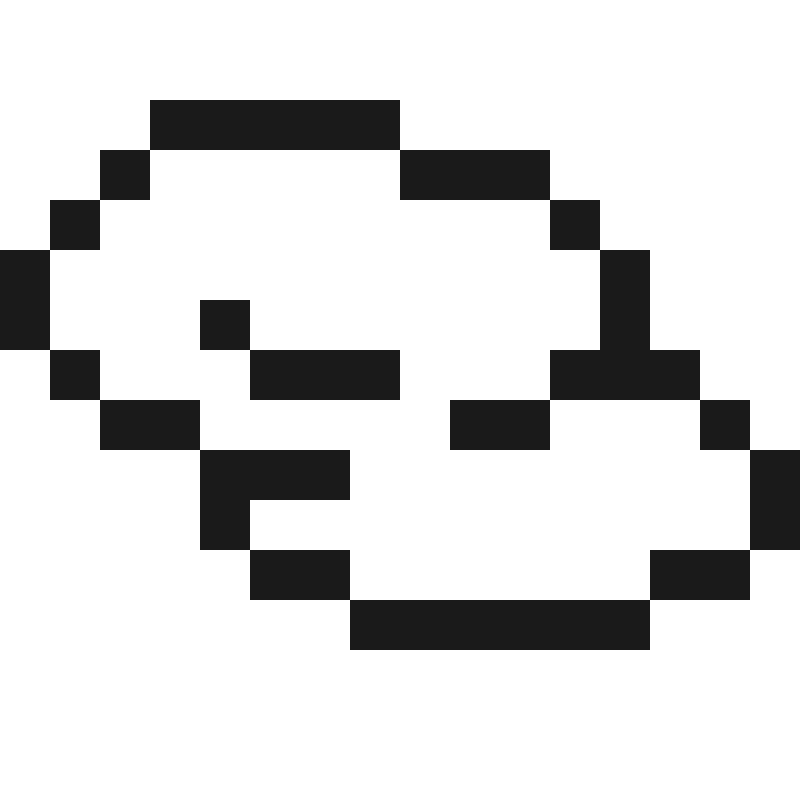</a> | **📂 檔名:** `cloud-light.svg` ✨ **格式:** `Vector (SVG)` ⚖️ **大小:** `2.41KB` 📅 **更新:** `2026-02-27`  🚀 **jsDelivr Markdown:** `` 🔗 **直接連結 (Url):** <code>https://cdn.jsdelivr.net/gh/barry028/materials@main/images/iCons/Pixel/Retro%20Pixel%20iCons/cloud-light.svg</code> 📥 [檢視原始檔](cloud-light.svg) |
|  | **📂 檔名:** `cocktail-glass-dark.svg` ✨ **格式:** `Vector (SVG)` ⚖️ **大小:** `2.25KB` 📅 **更新:** `2026-02-27`  🚀 **jsDelivr Markdown:** `` 🔗 **直接連結 (Url):** <code>https://cdn.jsdelivr.net/gh/barry028/materials@main/images/iCons/Pixel/Retro%20Pixel%20iCons/cocktail-glass-dark.svg</code> 📥 [檢視原始檔](cocktail-glass-dark.svg) |
|  | **📂 檔名:** `cocktail-glass-light.svg` ✨ **格式:** `Vector (SVG)` ⚖️ **大小:** `2.25KB` 📅 **更新:** `2026-02-27`  🚀 **jsDelivr Markdown:** `` 🔗 **直接連結 (Url):** <code>https://cdn.jsdelivr.net/gh/barry028/materials@main/images/iCons/Pixel/Retro%20Pixel%20iCons/cocktail-glass-light.svg</code> 📥 [檢視原始檔](cocktail-glass-light.svg) |
|  | **📂 檔名:** `crescent-moon-dark.svg` ✨ **格式:** `Vector (SVG)` ⚖️ **大小:** `3.14KB` 📅 **更新:** `2026-02-27`  🚀 **jsDelivr Markdown:** `` 🔗 **直接連結 (Url):** <code>https://cdn.jsdelivr.net/gh/barry028/materials@main/images/iCons/Pixel/Retro%20Pixel%20iCons/crescent-moon-dark.svg</code> 📥 [檢視原始檔](crescent-moon-dark.svg) |
|  | **📂 檔名:** `crescent-moon-light.svg` ✨ **格式:** `Vector (SVG)` ⚖️ **大小:** `3.14KB` 📅 **更新:** `2026-02-27`  🚀 **jsDelivr Markdown:** `` 🔗 **直接連結 (Url):** <code>https://cdn.jsdelivr.net/gh/barry028/materials@main/images/iCons/Pixel/Retro%20Pixel%20iCons/crescent-moon-light.svg</code> 📥 [檢視原始檔](crescent-moon-light.svg) |
|  | **📂 檔名:** `disappointed-face-dark.svg` ✨ **格式:** `Vector (SVG)` ⚖️ **大小:** `3.17KB` 📅 **更新:** `2026-02-27`  🚀 **jsDelivr Markdown:** `` 🔗 **直接連結 (Url):** <code>https://cdn.jsdelivr.net/gh/barry028/materials@main/images/iCons/Pixel/Retro%20Pixel%20iCons/disappointed-face-dark.svg</code> 📥 [檢視原始檔](disappointed-face-dark.svg) |
|  | **📂 檔名:** `disappointed-face-light.svg` ✨ **格式:** `Vector (SVG)` ⚖️ **大小:** `3.18KB` 📅 **更新:** `2026-02-27`  🚀 **jsDelivr Markdown:** `` 🔗 **直接連結 (Url):** <code>https://cdn.jsdelivr.net/gh/barry028/materials@main/images/iCons/Pixel/Retro%20Pixel%20iCons/disappointed-face-light.svg</code> 📥 [檢視原始檔](disappointed-face-light.svg) |
|  | **📂 檔名:** `dog-face-dark.svg` ✨ **格式:** `Vector (SVG)` ⚖️ **大小:** `4.36KB` 📅 **更新:** `2026-02-27`  🚀 **jsDelivr Markdown:** `` 🔗 **直接連結 (Url):** <code>https://cdn.jsdelivr.net/gh/barry028/materials@main/images/iCons/Pixel/Retro%20Pixel%20iCons/dog-face-dark.svg</code> 📥 [檢視原始檔](dog-face-dark.svg) |
|  | **📂 檔名:** `dog-face-light.svg` ✨ **格式:** `Vector (SVG)` ⚖️ **大小:** `4.36KB` 📅 **更新:** `2026-02-27`  🚀 **jsDelivr Markdown:** `` 🔗 **直接連結 (Url):** <code>https://cdn.jsdelivr.net/gh/barry028/materials@main/images/iCons/Pixel/Retro%20Pixel%20iCons/dog-face-light.svg</code> 📥 [檢視原始檔](dog-face-light.svg) |
|  | **📂 檔名:** `fax-machine-dark.svg` ✨ **格式:** `Vector (SVG)` ⚖️ **大小:** `3.76KB` 📅 **更新:** `2026-02-27`  🚀 **jsDelivr Markdown:** `` 🔗 **直接連結 (Url):** <code>https://cdn.jsdelivr.net/gh/barry028/materials@main/images/iCons/Pixel/Retro%20Pixel%20iCons/fax-machine-dark.svg</code> 📥 [檢視原始檔](fax-machine-dark.svg) |
|  | **📂 檔名:** `fax-machine-light.svg` ✨ **格式:** `Vector (SVG)` ⚖️ **大小:** `3.76KB` 📅 **更新:** `2026-02-27`  🚀 **jsDelivr Markdown:** `` 🔗 **直接連結 (Url):** <code>https://cdn.jsdelivr.net/gh/barry028/materials@main/images/iCons/Pixel/Retro%20Pixel%20iCons/fax-machine-light.svg</code> 📥 [檢視原始檔](fax-machine-light.svg) |
|  | **📂 檔名:** `fish-dark.svg` ✨ **格式:** `Vector (SVG)` ⚖️ **大小:** `2.33KB` 📅 **更新:** `2026-02-27`  🚀 **jsDelivr Markdown:** `` 🔗 **直接連結 (Url):** <code>https://cdn.jsdelivr.net/gh/barry028/materials@main/images/iCons/Pixel/Retro%20Pixel%20iCons/fish-dark.svg</code> 📥 [檢視原始檔](fish-dark.svg) |
|  | **📂 檔名:** `fish-light.svg` ✨ **格式:** `Vector (SVG)` ⚖️ **大小:** `2.33KB` 📅 **更新:** `2026-02-27`  🚀 **jsDelivr Markdown:** `` 🔗 **直接連結 (Url):** <code>https://cdn.jsdelivr.net/gh/barry028/materials@main/images/iCons/Pixel/Retro%20Pixel%20iCons/fish-light.svg</code> 📥 [檢視原始檔](fish-light.svg) |
|  | **📂 檔名:** `fisted-hand-sign-dark.svg` ✨ **格式:** `Vector (SVG)` ⚖️ **大小:** `3.18KB` 📅 **更新:** `2026-02-27`  🚀 **jsDelivr Markdown:** `` 🔗 **直接連結 (Url):** <code>https://cdn.jsdelivr.net/gh/barry028/materials@main/images/iCons/Pixel/Retro%20Pixel%20iCons/fisted-hand-sign-dark.svg</code> 📥 [檢視原始檔](fisted-hand-sign-dark.svg) |
|  | **📂 檔名:** `fisted-hand-sign-light.svg` ✨ **格式:** `Vector (SVG)` ⚖️ **大小:** `3.18KB` 📅 **更新:** `2026-02-27`  🚀 **jsDelivr Markdown:** `` 🔗 **直接連結 (Url):** <code>https://cdn.jsdelivr.net/gh/barry028/materials@main/images/iCons/Pixel/Retro%20Pixel%20iCons/fisted-hand-sign-light.svg</code> 📥 [檢視原始檔](fisted-hand-sign-light.svg) |
| <a href="flag-in-hole-dark.svg">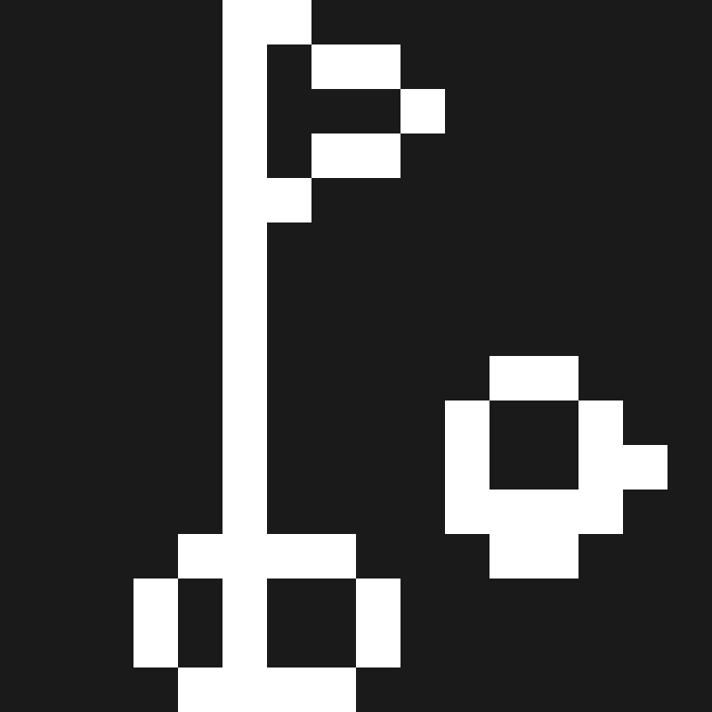</a> | **📂 檔名:** `flag-in-hole-dark.svg` ✨ **格式:** `Vector (SVG)` ⚖️ **大小:** `1.69KB` 📅 **更新:** `2026-02-27`  🚀 **jsDelivr Markdown:** `` 🔗 **直接連結 (Url):** <code>https://cdn.jsdelivr.net/gh/barry028/materials@main/images/iCons/Pixel/Retro%20Pixel%20iCons/flag-in-hole-dark.svg</code> 📥 [檢視原始檔](flag-in-hole-dark.svg) |
|  | **📂 檔名:** `flag-in-hole-light.svg` ✨ **格式:** `Vector (SVG)` ⚖️ **大小:** `1.69KB` 📅 **更新:** `2026-02-27`  🚀 **jsDelivr Markdown:** `` 🔗 **直接連結 (Url):** <code>https://cdn.jsdelivr.net/gh/barry028/materials@main/images/iCons/Pixel/Retro%20Pixel%20iCons/flag-in-hole-light.svg</code> 📥 [檢視原始檔](flag-in-hole-light.svg) |
| <a href="fork-and-knife-dark.svg">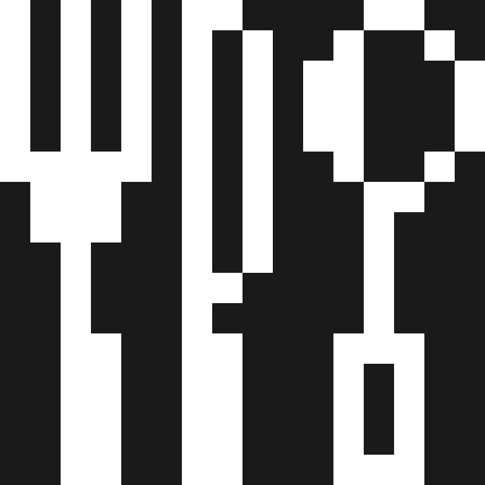</a> | **📂 檔名:** `fork-and-knife-dark.svg` ✨ **格式:** `Vector (SVG)` ⚖️ **大小:** `2.22KB` 📅 **更新:** `2026-02-27`  🚀 **jsDelivr Markdown:** `` 🔗 **直接連結 (Url):** <code>https://cdn.jsdelivr.net/gh/barry028/materials@main/images/iCons/Pixel/Retro%20Pixel%20iCons/fork-and-knife-dark.svg</code> 📥 [檢視原始檔](fork-and-knife-dark.svg) |
|  | **📂 檔名:** `fork-and-knife-light.svg` ✨ **格式:** `Vector (SVG)` ⚖️ **大小:** `2.22KB` 📅 **更新:** `2026-02-27`  🚀 **jsDelivr Markdown:** `` 🔗 **直接連結 (Url):** <code>https://cdn.jsdelivr.net/gh/barry028/materials@main/images/iCons/Pixel/Retro%20Pixel%20iCons/fork-and-knife-light.svg</code> 📥 [檢視原始檔](fork-and-knife-light.svg) |
| <a href="fuel-pump-dark.svg">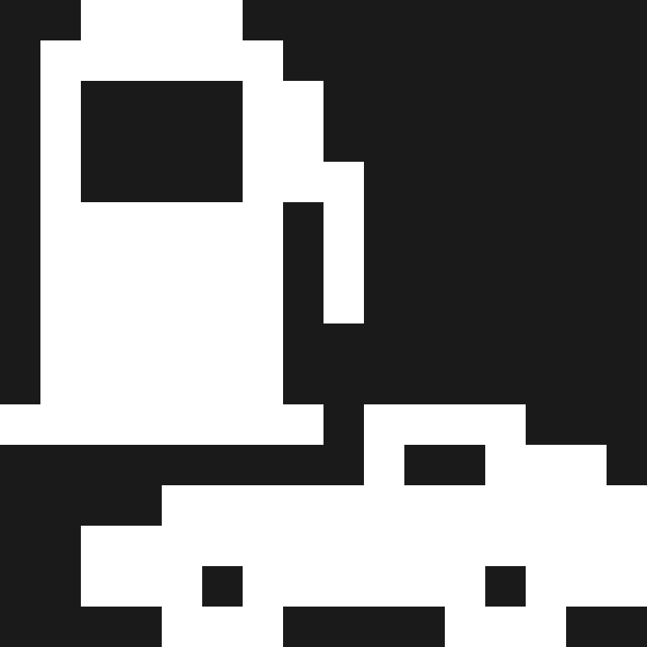</a> | **📂 檔名:** `fuel-pump-dark.svg` ✨ **格式:** `Vector (SVG)` ⚖️ **大小:** `1.27KB` 📅 **更新:** `2026-02-27`  🚀 **jsDelivr Markdown:** `` 🔗 **直接連結 (Url):** <code>https://cdn.jsdelivr.net/gh/barry028/materials@main/images/iCons/Pixel/Retro%20Pixel%20iCons/fuel-pump-dark.svg</code> 📥 [檢視原始檔](fuel-pump-dark.svg) |
|  | **📂 檔名:** `fuel-pump-light.svg` ✨ **格式:** `Vector (SVG)` ⚖️ **大小:** `1.27KB` 📅 **更新:** `2026-02-27`  🚀 **jsDelivr Markdown:** `` 🔗 **直接連結 (Url):** <code>https://cdn.jsdelivr.net/gh/barry028/materials@main/images/iCons/Pixel/Retro%20Pixel%20iCons/fuel-pump-light.svg</code> 📥 [檢視原始檔](fuel-pump-light.svg) |
|  | **📂 檔名:** `gemstone-dark.svg` ✨ **格式:** `Vector (SVG)` ⚖️ **大小:** `3.84KB` 📅 **更新:** `2026-02-27`  🚀 **jsDelivr Markdown:** `` 🔗 **直接連結 (Url):** <code>https://cdn.jsdelivr.net/gh/barry028/materials@main/images/iCons/Pixel/Retro%20Pixel%20iCons/gemstone-dark.svg</code> 📥 [檢視原始檔](gemstone-dark.svg) |
| <a href="gemstone-light.svg">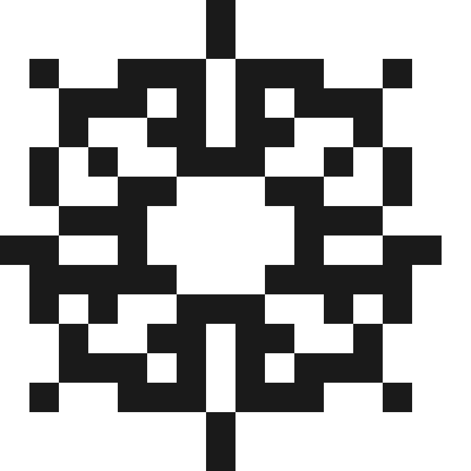</a> | **📂 檔名:** `gemstone-light.svg` ✨ **格式:** `Vector (SVG)` ⚖️ **大小:** `3.84KB` 📅 **更新:** `2026-02-27`  🚀 **jsDelivr Markdown:** `` 🔗 **直接連結 (Url):** <code>https://cdn.jsdelivr.net/gh/barry028/materials@main/images/iCons/Pixel/Retro%20Pixel%20iCons/gemstone-light.svg</code> 📥 [檢視原始檔](gemstone-light.svg) |
|  | **📂 檔名:** `girl-dark.svg` ✨ **格式:** `Vector (SVG)` ⚖️ **大小:** `2.30KB` 📅 **更新:** `2026-02-27`  🚀 **jsDelivr Markdown:** `` 🔗 **直接連結 (Url):** <code>https://cdn.jsdelivr.net/gh/barry028/materials@main/images/iCons/Pixel/Retro%20Pixel%20iCons/girl-dark.svg</code> 📥 [檢視原始檔](girl-dark.svg) |
|  | **📂 檔名:** `girl-light.svg` ✨ **格式:** `Vector (SVG)` ⚖️ **大小:** `2.30KB` 📅 **更新:** `2026-02-27`  🚀 **jsDelivr Markdown:** `` 🔗 **直接連結 (Url):** <code>https://cdn.jsdelivr.net/gh/barry028/materials@main/images/iCons/Pixel/Retro%20Pixel%20iCons/girl-light.svg</code> 📥 [檢視原始檔](girl-light.svg) |
|  | **📂 檔名:** `guitar-dark.svg` ✨ **格式:** `Vector (SVG)` ⚖️ **大小:** `3.26KB` 📅 **更新:** `2026-02-27`  🚀 **jsDelivr Markdown:** `` 🔗 **直接連結 (Url):** <code>https://cdn.jsdelivr.net/gh/barry028/materials@main/images/iCons/Pixel/Retro%20Pixel%20iCons/guitar-dark.svg</code> 📥 [檢視原始檔](guitar-dark.svg) |
|  | **📂 檔名:** `guitar-light.svg` ✨ **格式:** `Vector (SVG)` ⚖️ **大小:** `3.26KB` 📅 **更新:** `2026-02-27`  🚀 **jsDelivr Markdown:** `` 🔗 **直接連結 (Url):** <code>https://cdn.jsdelivr.net/gh/barry028/materials@main/images/iCons/Pixel/Retro%20Pixel%20iCons/guitar-light.svg</code> 📥 [檢視原始檔](guitar-light.svg) |
|  | **📂 檔名:** `heavy-black-heart-dark.svg` ✨ **格式:** `Vector (SVG)` ⚖️ **大小:** `2.21KB` 📅 **更新:** `2026-02-27`  🚀 **jsDelivr Markdown:** `` 🔗 **直接連結 (Url):** <code>https://cdn.jsdelivr.net/gh/barry028/materials@main/images/iCons/Pixel/Retro%20Pixel%20iCons/heavy-black-heart-dark.svg</code> 📥 [檢視原始檔](heavy-black-heart-dark.svg) |
|  | **📂 檔名:** `heavy-black-heart-light.svg` ✨ **格式:** `Vector (SVG)` ⚖️ **大小:** `2.21KB` 📅 **更新:** `2026-02-27`  🚀 **jsDelivr Markdown:** `` 🔗 **直接連結 (Url):** <code>https://cdn.jsdelivr.net/gh/barry028/materials@main/images/iCons/Pixel/Retro%20Pixel%20iCons/heavy-black-heart-light.svg</code> 📥 [檢視原始檔](heavy-black-heart-light.svg) |
| <a href="heavy-exclamation-mark-symbol-dark.svg">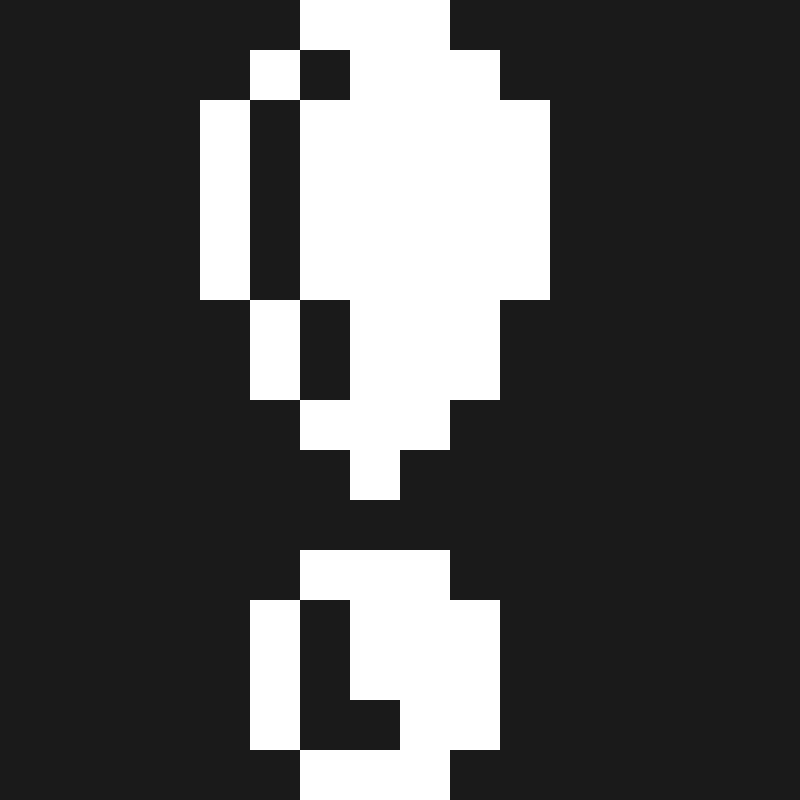</a> | **📂 檔名:** `heavy-exclamation-mark-symbol-dark.svg` ✨ **格式:** `Vector (SVG)` ⚖️ **大小:** `1.46KB` 📅 **更新:** `2026-02-27`  🚀 **jsDelivr Markdown:** `` 🔗 **直接連結 (Url):** <code>https://cdn.jsdelivr.net/gh/barry028/materials@main/images/iCons/Pixel/Retro%20Pixel%20iCons/heavy-exclamation-mark-symbol-dark.svg</code> 📥 [檢視原始檔](heavy-exclamation-mark-symbol-dark.svg) |
|  | **📂 檔名:** `heavy-exclamation-mark-symbol-light.svg` ✨ **格式:** `Vector (SVG)` ⚖️ **大小:** `1.46KB` 📅 **更新:** `2026-02-27`  🚀 **jsDelivr Markdown:** `` 🔗 **直接連結 (Url):** <code>https://cdn.jsdelivr.net/gh/barry028/materials@main/images/iCons/Pixel/Retro%20Pixel%20iCons/heavy-exclamation-mark-symbol-light.svg</code> 📥 [檢視原始檔](heavy-exclamation-mark-symbol-light.svg) |
|  | **📂 檔名:** `high-speed-train-dark.svg` ✨ **格式:** `Vector (SVG)` ⚖️ **大小:** `3.15KB` 📅 **更新:** `2026-02-27`  🚀 **jsDelivr Markdown:** `` 🔗 **直接連結 (Url):** <code>https://cdn.jsdelivr.net/gh/barry028/materials@main/images/iCons/Pixel/Retro%20Pixel%20iCons/high-speed-train-dark.svg</code> 📥 [檢視原始檔](high-speed-train-dark.svg) |
| <a href="high-speed-train-light.svg">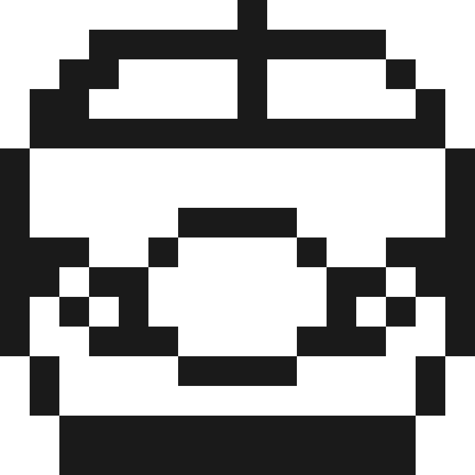</a> | **📂 檔名:** `high-speed-train-light.svg` ✨ **格式:** `Vector (SVG)` ⚖️ **大小:** `3.16KB` 📅 **更新:** `2026-02-27`  🚀 **jsDelivr Markdown:** `` 🔗 **直接連結 (Url):** <code>https://cdn.jsdelivr.net/gh/barry028/materials@main/images/iCons/Pixel/Retro%20Pixel%20iCons/high-speed-train-light.svg</code> 📥 [檢視原始檔](high-speed-train-light.svg) |
|  | **📂 檔名:** `horse-face-dark.svg` ✨ **格式:** `Vector (SVG)` ⚖️ **大小:** `1.67KB` 📅 **更新:** `2026-02-27`  🚀 **jsDelivr Markdown:** `` 🔗 **直接連結 (Url):** <code>https://cdn.jsdelivr.net/gh/barry028/materials@main/images/iCons/Pixel/Retro%20Pixel%20iCons/horse-face-dark.svg</code> 📥 [檢視原始檔](horse-face-dark.svg) |
|  | **📂 檔名:** `horse-face-light.svg` ✨ **格式:** `Vector (SVG)` ⚖️ **大小:** `1.67KB` 📅 **更新:** `2026-02-27`  🚀 **jsDelivr Markdown:** `` 🔗 **直接連結 (Url):** <code>https://cdn.jsdelivr.net/gh/barry028/materials@main/images/iCons/Pixel/Retro%20Pixel%20iCons/horse-face-light.svg</code> 📥 [檢視原始檔](horse-face-light.svg) |
| <a href="hot-beverage-dark.svg">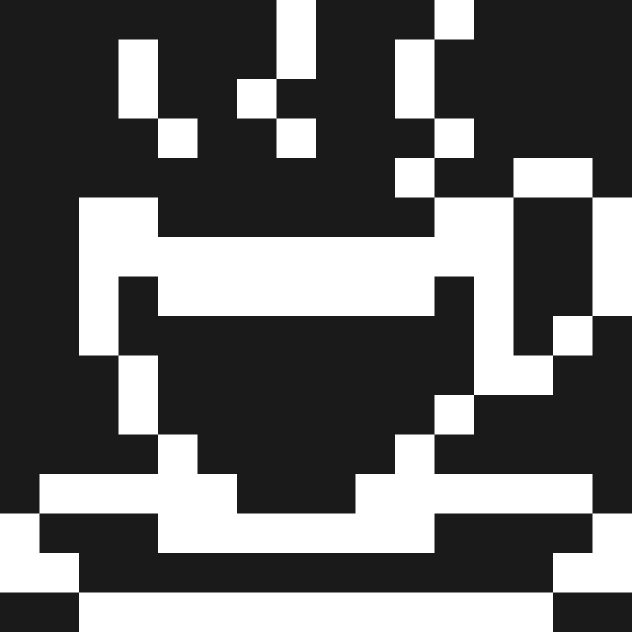</a> | **📂 檔名:** `hot-beverage-dark.svg` ✨ **格式:** `Vector (SVG)` ⚖️ **大小:** `3.07KB` 📅 **更新:** `2026-02-27`  🚀 **jsDelivr Markdown:** `` 🔗 **直接連結 (Url):** <code>https://cdn.jsdelivr.net/gh/barry028/materials@main/images/iCons/Pixel/Retro%20Pixel%20iCons/hot-beverage-dark.svg</code> 📥 [檢視原始檔](hot-beverage-dark.svg) |
| <a href="hot-beverage-light.svg">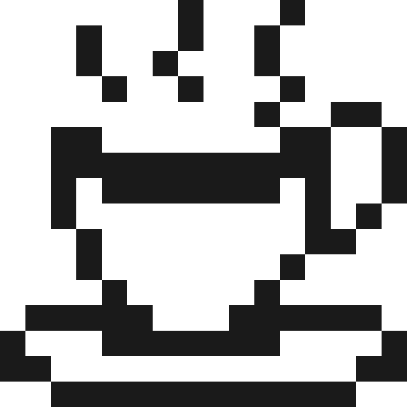</a> | **📂 檔名:** `hot-beverage-light.svg` ✨ **格式:** `Vector (SVG)` ⚖️ **大小:** `3.07KB` 📅 **更新:** `2026-02-27`  🚀 **jsDelivr Markdown:** `` 🔗 **直接連結 (Url):** <code>https://cdn.jsdelivr.net/gh/barry028/materials@main/images/iCons/Pixel/Retro%20Pixel%20iCons/hot-beverage-light.svg</code> 📥 [檢視原始檔](hot-beverage-light.svg) |
| <a href="house-building-dark.svg">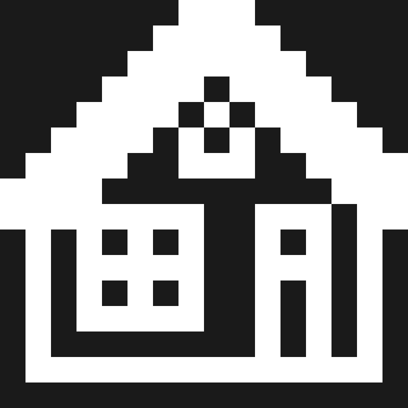</a> | **📂 檔名:** `house-building-dark.svg` ✨ **格式:** `Vector (SVG)` ⚖️ **大小:** `2.12KB` 📅 **更新:** `2026-02-27`  🚀 **jsDelivr Markdown:** `` 🔗 **直接連結 (Url):** <code>https://cdn.jsdelivr.net/gh/barry028/materials@main/images/iCons/Pixel/Retro%20Pixel%20iCons/house-building-dark.svg</code> 📥 [檢視原始檔](house-building-dark.svg) |
|  | **📂 檔名:** `house-building-light.svg` ✨ **格式:** `Vector (SVG)` ⚖️ **大小:** `2.12KB` 📅 **更新:** `2026-02-27`  🚀 **jsDelivr Markdown:** `` 🔗 **直接連結 (Url):** <code>https://cdn.jsdelivr.net/gh/barry028/materials@main/images/iCons/Pixel/Retro%20Pixel%20iCons/house-building-light.svg</code> 📥 [檢視原始檔](house-building-light.svg) |
|  | **📂 檔名:** `key-dark.svg` ✨ **格式:** `Vector (SVG)` ⚖️ **大小:** `682.00B` 📅 **更新:** `2026-02-27`  🚀 **jsDelivr Markdown:** `` 🔗 **直接連結 (Url):** <code>https://cdn.jsdelivr.net/gh/barry028/materials@main/images/iCons/Pixel/Retro%20Pixel%20iCons/key-dark.svg</code> 📥 [檢視原始檔](key-dark.svg) |
|  | **📂 檔名:** `key-light.svg` ✨ **格式:** `Vector (SVG)` ⚖️ **大小:** `684.00B` 📅 **更新:** `2026-02-27`  🚀 **jsDelivr Markdown:** `` 🔗 **直接連結 (Url):** <code>https://cdn.jsdelivr.net/gh/barry028/materials@main/images/iCons/Pixel/Retro%20Pixel%20iCons/key-light.svg</code> 📥 [檢視原始檔](key-light.svg) |
|  | **📂 檔名:** `kiss-mark-dark.svg` ✨ **格式:** `Vector (SVG)` ⚖️ **大小:** `619.00B` 📅 **更新:** `2026-02-27`  🚀 **jsDelivr Markdown:** `` 🔗 **直接連結 (Url):** <code>https://cdn.jsdelivr.net/gh/barry028/materials@main/images/iCons/Pixel/Retro%20Pixel%20iCons/kiss-mark-dark.svg</code> 📥 [檢視原始檔](kiss-mark-dark.svg) |
| <a href="kiss-mark-light.svg">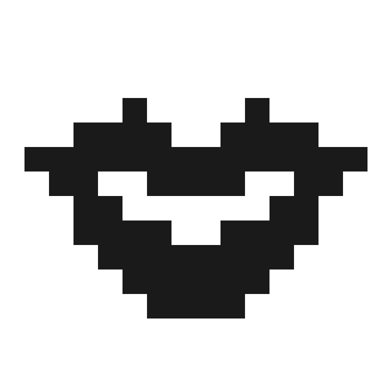</a> | **📂 檔名:** `kiss-mark-light.svg` ✨ **格式:** `Vector (SVG)` ⚖️ **大小:** `621.00B` 📅 **更新:** `2026-02-27`  🚀 **jsDelivr Markdown:** `` 🔗 **直接連結 (Url):** <code>https://cdn.jsdelivr.net/gh/barry028/materials@main/images/iCons/Pixel/Retro%20Pixel%20iCons/kiss-mark-light.svg</code> 📥 [檢視原始檔](kiss-mark-light.svg) |
| <a href="man-dark.svg">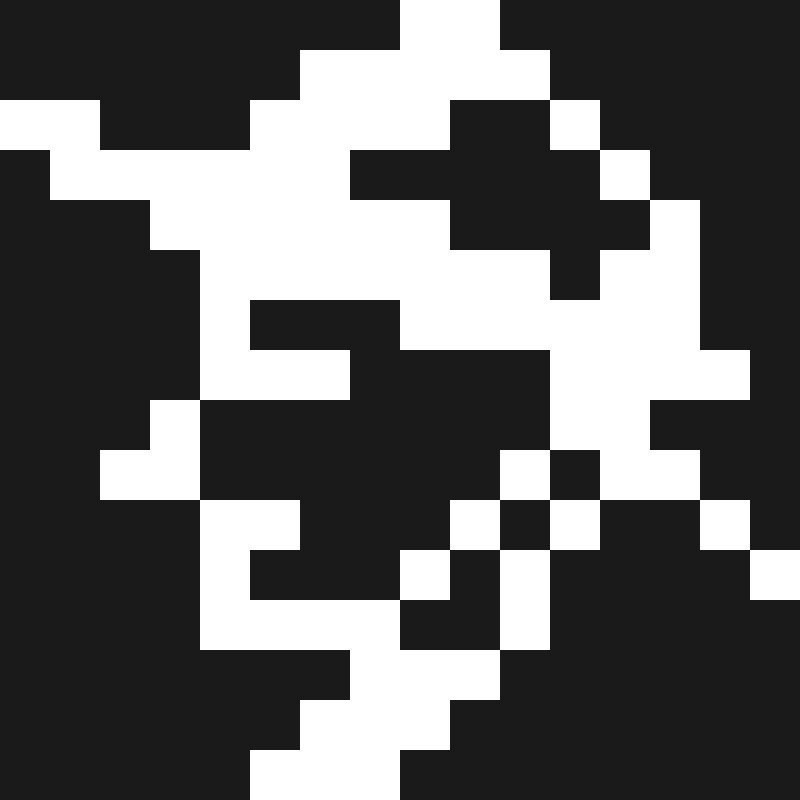</a> | **📂 檔名:** `man-dark.svg` ✨ **格式:** `Vector (SVG)` ⚖️ **大小:** `2.53KB` 📅 **更新:** `2026-02-27`  🚀 **jsDelivr Markdown:** `` 🔗 **直接連結 (Url):** <code>https://cdn.jsdelivr.net/gh/barry028/materials@main/images/iCons/Pixel/Retro%20Pixel%20iCons/man-dark.svg</code> 📥 [檢視原始檔](man-dark.svg) |
| <a href="man-light.svg">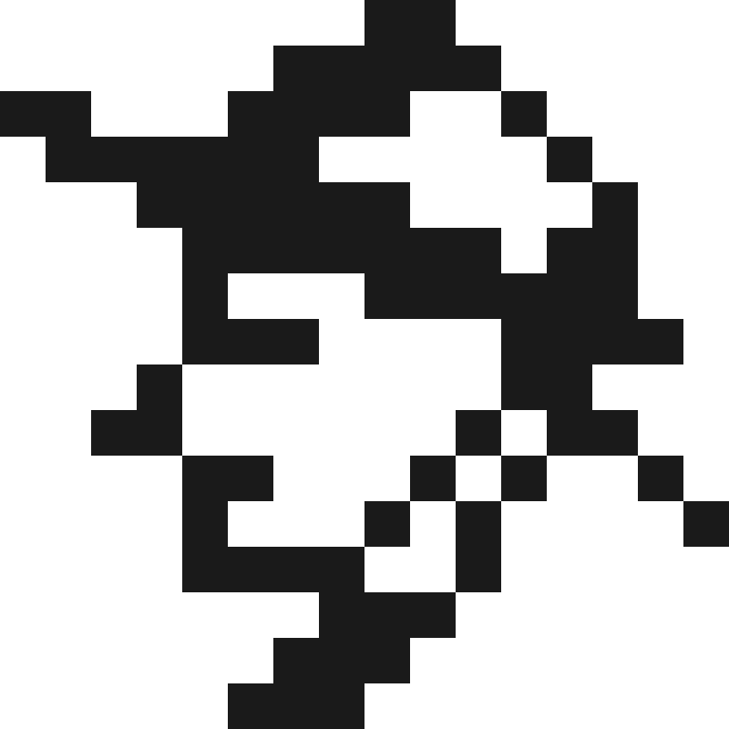</a> | **📂 檔名:** `man-light.svg` ✨ **格式:** `Vector (SVG)` ⚖️ **大小:** `2.54KB` 📅 **更新:** `2026-02-27`  🚀 **jsDelivr Markdown:** `` 🔗 **直接連結 (Url):** <code>https://cdn.jsdelivr.net/gh/barry028/materials@main/images/iCons/Pixel/Retro%20Pixel%20iCons/man-light.svg</code> 📥 [檢視原始檔](man-light.svg) |
|  | **📂 檔名:** `microphone-dark.svg` ✨ **格式:** `Vector (SVG)` ⚖️ **大小:** `3.67KB` 📅 **更新:** `2026-02-27`  🚀 **jsDelivr Markdown:** `` 🔗 **直接連結 (Url):** <code>https://cdn.jsdelivr.net/gh/barry028/materials@main/images/iCons/Pixel/Retro%20Pixel%20iCons/microphone-dark.svg</code> 📥 [檢視原始檔](microphone-dark.svg) |
|  | **📂 檔名:** `microphone-light.svg` ✨ **格式:** `Vector (SVG)` ⚖️ **大小:** `3.67KB` 📅 **更新:** `2026-02-27`  🚀 **jsDelivr Markdown:** `` 🔗 **直接連結 (Url):** <code>https://cdn.jsdelivr.net/gh/barry028/materials@main/images/iCons/Pixel/Retro%20Pixel%20iCons/microphone-light.svg</code> 📥 [檢視原始檔](microphone-light.svg) |
| <a href="mobile-phone-dark.svg">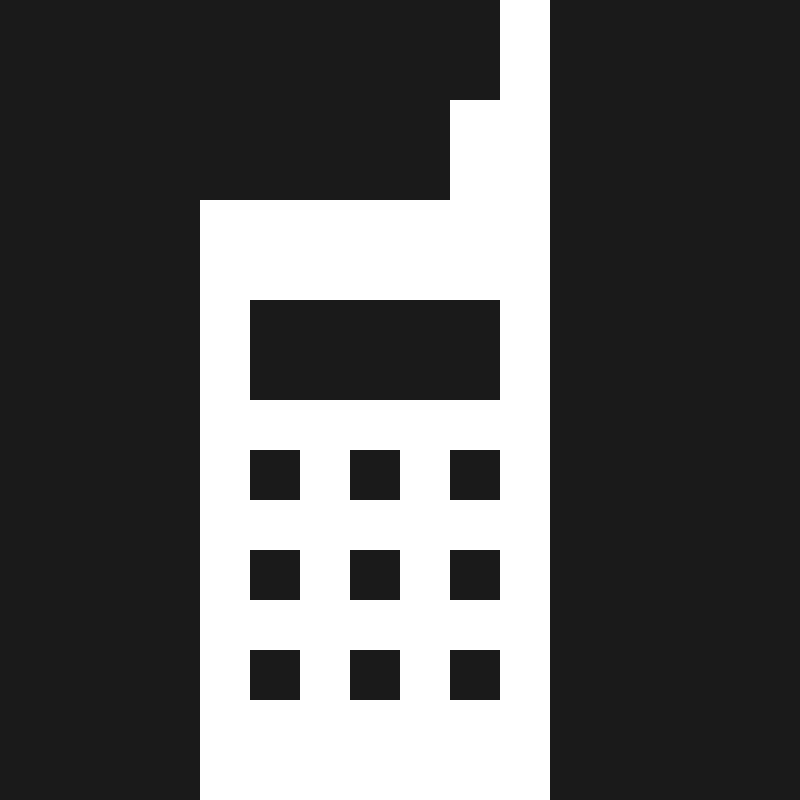</a> | **📂 檔名:** `mobile-phone-dark.svg` ✨ **格式:** `Vector (SVG)` ⚖️ **大小:** `1.50KB` 📅 **更新:** `2026-02-27`  🚀 **jsDelivr Markdown:** `` 🔗 **直接連結 (Url):** <code>https://cdn.jsdelivr.net/gh/barry028/materials@main/images/iCons/Pixel/Retro%20Pixel%20iCons/mobile-phone-dark.svg</code> 📥 [檢視原始檔](mobile-phone-dark.svg) |
| <a href="mobile-phone-light.svg">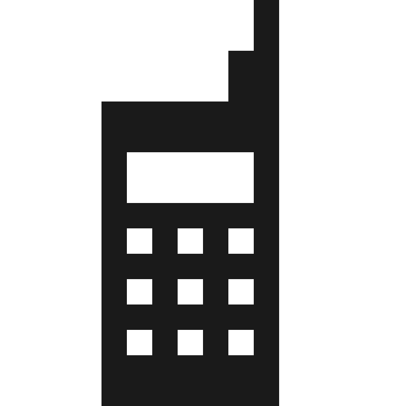</a> | **📂 檔名:** `mobile-phone-light.svg` ✨ **格式:** `Vector (SVG)` ⚖️ **大小:** `1.51KB` 📅 **更新:** `2026-02-27`  🚀 **jsDelivr Markdown:** `` 🔗 **直接連結 (Url):** <code>https://cdn.jsdelivr.net/gh/barry028/materials@main/images/iCons/Pixel/Retro%20Pixel%20iCons/mobile-phone-light.svg</code> 📥 [檢視原始檔](mobile-phone-light.svg) |
|  | **📂 檔名:** `mount-fuji-dark.svg` ✨ **格式:** `Vector (SVG)` ⚖️ **大小:** `3.38KB` 📅 **更新:** `2026-02-27`  🚀 **jsDelivr Markdown:** `` 🔗 **直接連結 (Url):** <code>https://cdn.jsdelivr.net/gh/barry028/materials@main/images/iCons/Pixel/Retro%20Pixel%20iCons/mount-fuji-dark.svg</code> 📥 [檢視原始檔](mount-fuji-dark.svg) |
|  | **📂 檔名:** `mount-fuji-light.svg` ✨ **格式:** `Vector (SVG)` ⚖️ **大小:** `3.38KB` 📅 **更新:** `2026-02-27`  🚀 **jsDelivr Markdown:** `` 🔗 **直接連結 (Url):** <code>https://cdn.jsdelivr.net/gh/barry028/materials@main/images/iCons/Pixel/Retro%20Pixel%20iCons/mount-fuji-light.svg</code> 📥 [檢視原始檔](mount-fuji-light.svg) |
|  | **📂 檔名:** `mouse-face-dark.svg` ✨ **格式:** `Vector (SVG)` ⚖️ **大小:** `3.41KB` 📅 **更新:** `2026-02-27`  🚀 **jsDelivr Markdown:** `` 🔗 **直接連結 (Url):** <code>https://cdn.jsdelivr.net/gh/barry028/materials@main/images/iCons/Pixel/Retro%20Pixel%20iCons/mouse-face-dark.svg</code> 📥 [檢視原始檔](mouse-face-dark.svg) |
|  | **📂 檔名:** `mouse-face-light.svg` ✨ **格式:** `Vector (SVG)` ⚖️ **大小:** `3.41KB` 📅 **更新:** `2026-02-27`  🚀 **jsDelivr Markdown:** `` 🔗 **直接連結 (Url):** <code>https://cdn.jsdelivr.net/gh/barry028/materials@main/images/iCons/Pixel/Retro%20Pixel%20iCons/mouse-face-light.svg</code> 📥 [檢視原始檔](mouse-face-light.svg) |
| <a href="movie-camera-dark.svg">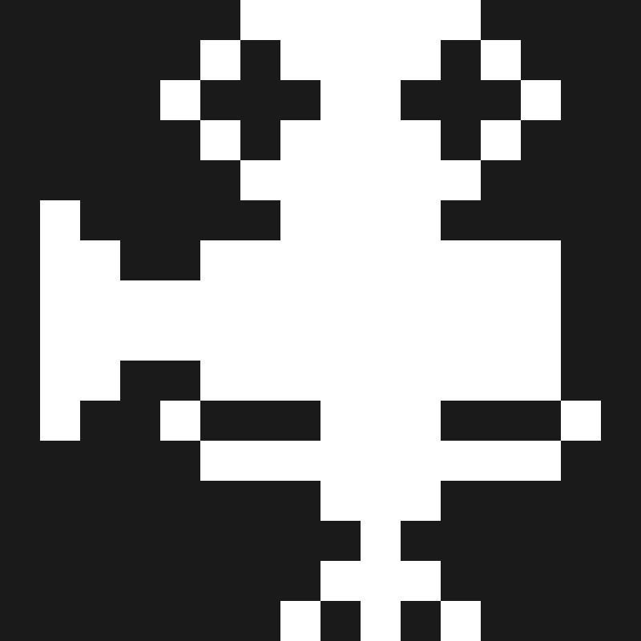</a> | **📂 檔名:** `movie-camera-dark.svg` ✨ **格式:** `Vector (SVG)` ⚖️ **大小:** `2.37KB` 📅 **更新:** `2026-02-27`  🚀 **jsDelivr Markdown:** `` 🔗 **直接連結 (Url):** <code>https://cdn.jsdelivr.net/gh/barry028/materials@main/images/iCons/Pixel/Retro%20Pixel%20iCons/movie-camera-dark.svg</code> 📥 [檢視原始檔](movie-camera-dark.svg) |
| <a href="movie-camera-light.svg">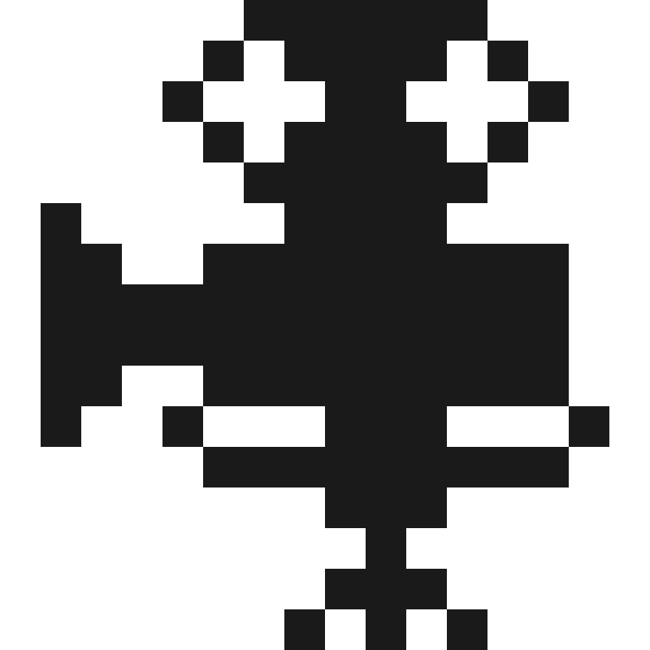</a> | **📂 檔名:** `movie-camera-light.svg` ✨ **格式:** `Vector (SVG)` ⚖️ **大小:** `2.37KB` 📅 **更新:** `2026-02-27`  🚀 **jsDelivr Markdown:** `` 🔗 **直接連結 (Url):** <code>https://cdn.jsdelivr.net/gh/barry028/materials@main/images/iCons/Pixel/Retro%20Pixel%20iCons/movie-camera-light.svg</code> 📥 [檢視原始檔](movie-camera-light.svg) |
|  | **📂 檔名:** `musical-note-dark.svg` ✨ **格式:** `Vector (SVG)` ⚖️ **大小:** `1.37KB` 📅 **更新:** `2026-02-27`  🚀 **jsDelivr Markdown:** `` 🔗 **直接連結 (Url):** <code>https://cdn.jsdelivr.net/gh/barry028/materials@main/images/iCons/Pixel/Retro%20Pixel%20iCons/musical-note-dark.svg</code> 📥 [檢視原始檔](musical-note-dark.svg) |
|  | **📂 檔名:** `musical-note-light.svg` ✨ **格式:** `Vector (SVG)` ⚖️ **大小:** `1.38KB` 📅 **更新:** `2026-02-27`  🚀 **jsDelivr Markdown:** `` 🔗 **直接連結 (Url):** <code>https://cdn.jsdelivr.net/gh/barry028/materials@main/images/iCons/Pixel/Retro%20Pixel%20iCons/musical-note-light.svg</code> 📥 [檢視原始檔](musical-note-light.svg) |
|  | **📂 檔名:** `office-building-dark.svg` ✨ **格式:** `Vector (SVG)` ⚖️ **大小:** `2.29KB` 📅 **更新:** `2026-02-27`  🚀 **jsDelivr Markdown:** `` 🔗 **直接連結 (Url):** <code>https://cdn.jsdelivr.net/gh/barry028/materials@main/images/iCons/Pixel/Retro%20Pixel%20iCons/office-building-dark.svg</code> 📥 [檢視原始檔](office-building-dark.svg) |
| <a href="office-building-light.svg">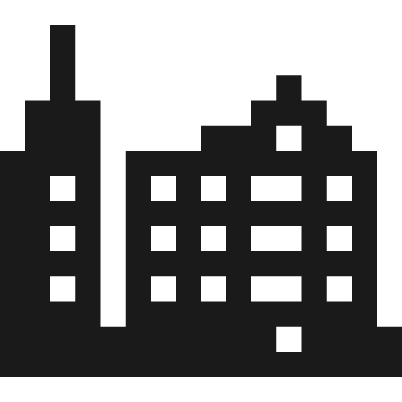</a> | **📂 檔名:** `office-building-light.svg` ✨ **格式:** `Vector (SVG)` ⚖️ **大小:** `2.29KB` 📅 **更新:** `2026-02-27`  🚀 **jsDelivr Markdown:** `` 🔗 **直接連結 (Url):** <code>https://cdn.jsdelivr.net/gh/barry028/materials@main/images/iCons/Pixel/Retro%20Pixel%20iCons/office-building-light.svg</code> 📥 [檢視原始檔](office-building-light.svg) |
| <a href="penguin-dark.svg">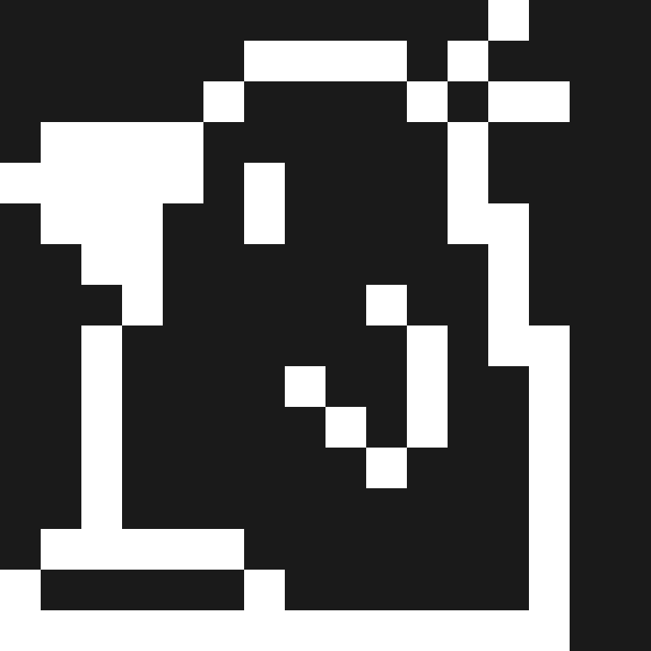</a> | **📂 檔名:** `penguin-dark.svg` ✨ **格式:** `Vector (SVG)` ⚖️ **大小:** `2.42KB` 📅 **更新:** `2026-02-27`  🚀 **jsDelivr Markdown:** `` 🔗 **直接連結 (Url):** <code>https://cdn.jsdelivr.net/gh/barry028/materials@main/images/iCons/Pixel/Retro%20Pixel%20iCons/penguin-dark.svg</code> 📥 [檢視原始檔](penguin-dark.svg) |
| <a href="penguin-light.svg">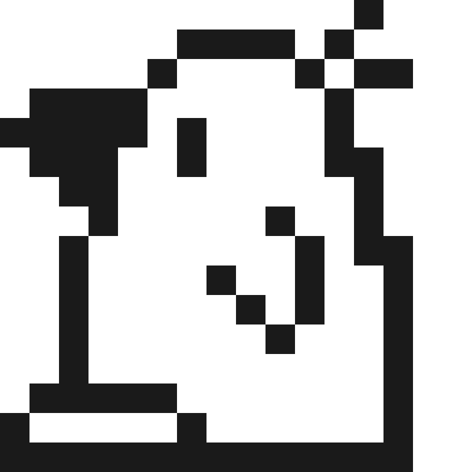</a> | **📂 檔名:** `penguin-light.svg` ✨ **格式:** `Vector (SVG)` ⚖️ **大小:** `2.42KB` 📅 **更新:** `2026-02-27`  🚀 **jsDelivr Markdown:** `` 🔗 **直接連結 (Url):** <code>https://cdn.jsdelivr.net/gh/barry028/materials@main/images/iCons/Pixel/Retro%20Pixel%20iCons/penguin-light.svg</code> 📥 [檢視原始檔](penguin-light.svg) |
|  | **📂 檔名:** `personal-computer-dark.svg` ✨ **格式:** `Vector (SVG)` ⚖️ **大小:** `1.14KB` 📅 **更新:** `2026-02-27`  🚀 **jsDelivr Markdown:** `` 🔗 **直接連結 (Url):** <code>https://cdn.jsdelivr.net/gh/barry028/materials@main/images/iCons/Pixel/Retro%20Pixel%20iCons/personal-computer-dark.svg</code> 📥 [檢視原始檔](personal-computer-dark.svg) |
|  | **📂 檔名:** `personal-computer-light.svg` ✨ **格式:** `Vector (SVG)` ⚖️ **大小:** `1.15KB` 📅 **更新:** `2026-02-27`  🚀 **jsDelivr Markdown:** `` 🔗 **直接連結 (Url):** <code>https://cdn.jsdelivr.net/gh/barry028/materials@main/images/iCons/Pixel/Retro%20Pixel%20iCons/personal-computer-light.svg</code> 📥 [檢視原始檔](personal-computer-light.svg) |
|  | **📂 檔名:** `poo-dark.svg` ✨ **格式:** `Vector (SVG)` ⚖️ **大小:** `2.66KB` 📅 **更新:** `2026-02-27`  🚀 **jsDelivr Markdown:** `` 🔗 **直接連結 (Url):** <code>https://cdn.jsdelivr.net/gh/barry028/materials@main/images/iCons/Pixel/Retro%20Pixel%20iCons/poo-dark.svg</code> 📥 [檢視原始檔](poo-dark.svg) |
| <a href="poo-light.svg">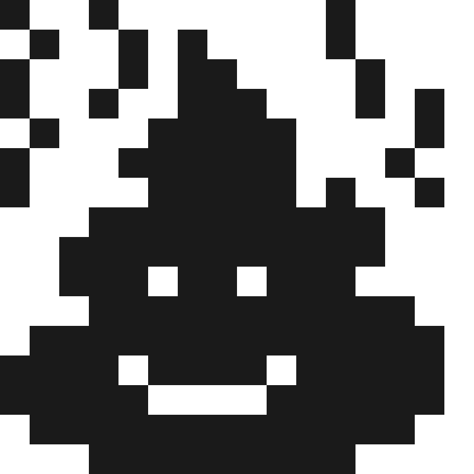</a> | **📂 檔名:** `poo-light.svg` ✨ **格式:** `Vector (SVG)` ⚖️ **大小:** `2.66KB` 📅 **更新:** `2026-02-27`  🚀 **jsDelivr Markdown:** `` 🔗 **直接連結 (Url):** <code>https://cdn.jsdelivr.net/gh/barry028/materials@main/images/iCons/Pixel/Retro%20Pixel%20iCons/poo-light.svg</code> 📥 [檢視原始檔](poo-light.svg) |
|  | **📂 檔名:** `railway-car-dark.svg` ✨ **格式:** `Vector (SVG)` ⚖️ **大小:** `2.69KB` 📅 **更新:** `2026-02-27`  🚀 **jsDelivr Markdown:** `` 🔗 **直接連結 (Url):** <code>https://cdn.jsdelivr.net/gh/barry028/materials@main/images/iCons/Pixel/Retro%20Pixel%20iCons/railway-car-dark.svg</code> 📥 [檢視原始檔](railway-car-dark.svg) |
|  | **📂 檔名:** `railway-car-light.svg` ✨ **格式:** `Vector (SVG)` ⚖️ **大小:** `2.70KB` 📅 **更新:** `2026-02-27`  🚀 **jsDelivr Markdown:** `` 🔗 **直接連結 (Url):** <code>https://cdn.jsdelivr.net/gh/barry028/materials@main/images/iCons/Pixel/Retro%20Pixel%20iCons/railway-car-light.svg</code> 📥 [檢視原始檔](railway-car-light.svg) |
|  | **📂 檔名:** `raised-fist-dark.svg` ✨ **格式:** `Vector (SVG)` ⚖️ **大小:** `2.05KB` 📅 **更新:** `2026-02-27`  🚀 **jsDelivr Markdown:** `` 🔗 **直接連結 (Url):** <code>https://cdn.jsdelivr.net/gh/barry028/materials@main/images/iCons/Pixel/Retro%20Pixel%20iCons/raised-fist-dark.svg</code> 📥 [檢視原始檔](raised-fist-dark.svg) |
|  | **📂 檔名:** `raised-fist-light.svg` ✨ **格式:** `Vector (SVG)` ⚖️ **大小:** `2.06KB` 📅 **更新:** `2026-02-27`  🚀 **jsDelivr Markdown:** `` 🔗 **直接連結 (Url):** <code>https://cdn.jsdelivr.net/gh/barry028/materials@main/images/iCons/Pixel/Retro%20Pixel%20iCons/raised-fist-light.svg</code> 📥 [檢視原始檔](raised-fist-light.svg) |
|  | **📂 檔名:** `raised-hand-dark.svg` ✨ **格式:** `Vector (SVG)` ⚖️ **大小:** `2.87KB` 📅 **更新:** `2026-02-27`  🚀 **jsDelivr Markdown:** `` 🔗 **直接連結 (Url):** <code>https://cdn.jsdelivr.net/gh/barry028/materials@main/images/iCons/Pixel/Retro%20Pixel%20iCons/raised-hand-dark.svg</code> 📥 [檢視原始檔](raised-hand-dark.svg) |
| <a href="raised-hand-light.svg">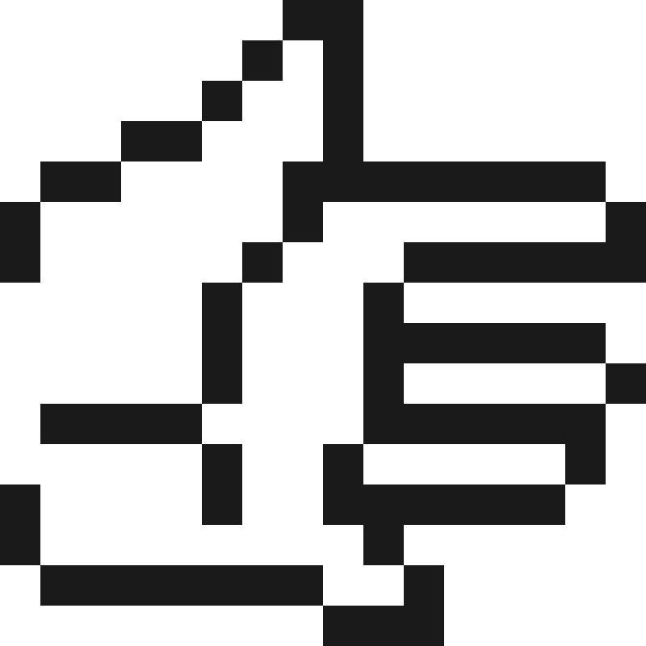</a> | **📂 檔名:** `raised-hand-light.svg` ✨ **格式:** `Vector (SVG)` ⚖️ **大小:** `2.87KB` 📅 **更新:** `2026-02-27`  🚀 **jsDelivr Markdown:** `` 🔗 **直接連結 (Url):** <code>https://cdn.jsdelivr.net/gh/barry028/materials@main/images/iCons/Pixel/Retro%20Pixel%20iCons/raised-hand-light.svg</code> 📥 [檢視原始檔](raised-hand-light.svg) |
|  | **📂 檔名:** `ring-dark.svg` ✨ **格式:** `Vector (SVG)` ⚖️ **大小:** `4.04KB` 📅 **更新:** `2026-02-27`  🚀 **jsDelivr Markdown:** `` 🔗 **直接連結 (Url):** <code>https://cdn.jsdelivr.net/gh/barry028/materials@main/images/iCons/Pixel/Retro%20Pixel%20iCons/ring-dark.svg</code> 📥 [檢視原始檔](ring-dark.svg) |
| <a href="ring-light.svg">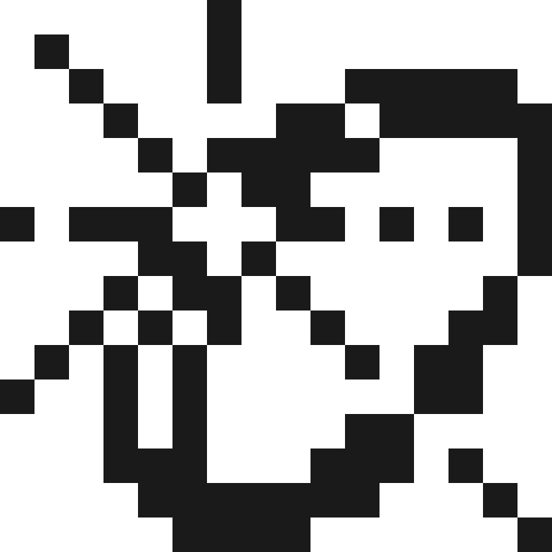</a> | **📂 檔名:** `ring-light.svg` ✨ **格式:** `Vector (SVG)` ⚖️ **大小:** `4.04KB` 📅 **更新:** `2026-02-27`  🚀 **jsDelivr Markdown:** `` 🔗 **直接連結 (Url):** <code>https://cdn.jsdelivr.net/gh/barry028/materials@main/images/iCons/Pixel/Retro%20Pixel%20iCons/ring-light.svg</code> 📥 [檢視原始檔](ring-light.svg) |
| <a href="rose-dark.svg">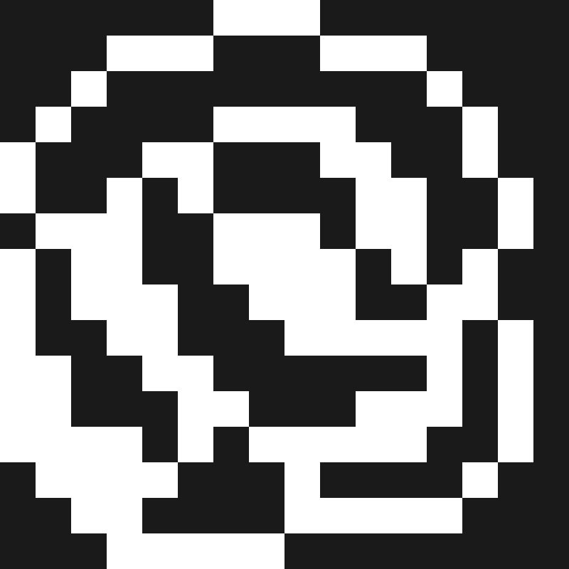</a> | **📂 檔名:** `rose-dark.svg` ✨ **格式:** `Vector (SVG)` ⚖️ **大小:** `3.20KB` 📅 **更新:** `2026-02-27`  🚀 **jsDelivr Markdown:** `` 🔗 **直接連結 (Url):** <code>https://cdn.jsdelivr.net/gh/barry028/materials@main/images/iCons/Pixel/Retro%20Pixel%20iCons/rose-dark.svg</code> 📥 [檢視原始檔](rose-dark.svg) |
| <a href="rose-light.svg">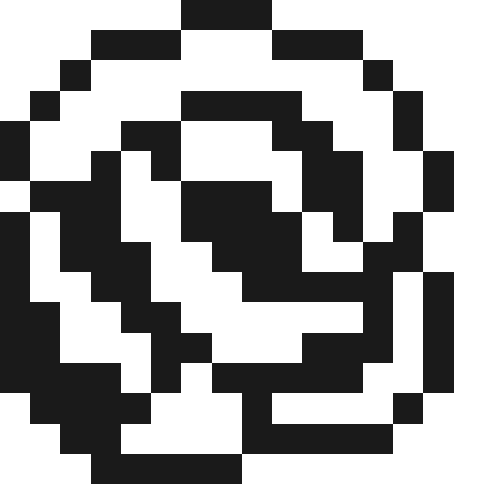</a> | **📂 檔名:** `rose-light.svg` ✨ **格式:** `Vector (SVG)` ⚖️ **大小:** `3.20KB` 📅 **更新:** `2026-02-27`  🚀 **jsDelivr Markdown:** `` 🔗 **直接連結 (Url):** <code>https://cdn.jsdelivr.net/gh/barry028/materials@main/images/iCons/Pixel/Retro%20Pixel%20iCons/rose-light.svg</code> 📥 [檢視原始檔](rose-light.svg) |
| <a href="sail-boat-dark.svg">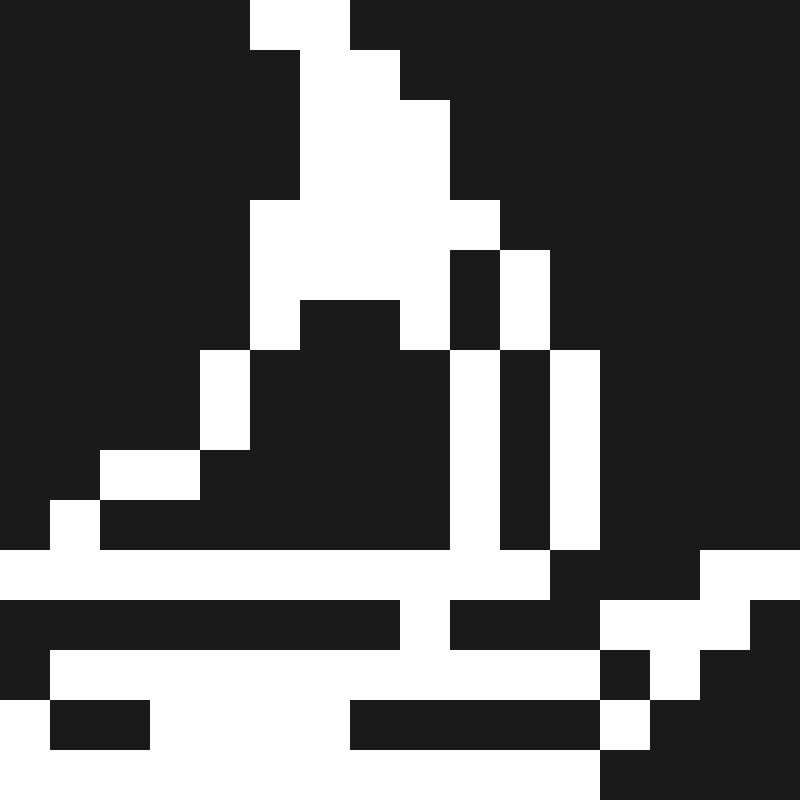</a> | **📂 檔名:** `sail-boat-dark.svg` ✨ **格式:** `Vector (SVG)` ⚖️ **大小:** `2.16KB` 📅 **更新:** `2026-02-27`  🚀 **jsDelivr Markdown:** `` 🔗 **直接連結 (Url):** <code>https://cdn.jsdelivr.net/gh/barry028/materials@main/images/iCons/Pixel/Retro%20Pixel%20iCons/sail-boat-dark.svg</code> 📥 [檢視原始檔](sail-boat-dark.svg) |
|  | **📂 檔名:** `sail-boat-light.svg` ✨ **格式:** `Vector (SVG)` ⚖️ **大小:** `2.16KB` 📅 **更新:** `2026-02-27`  🚀 **jsDelivr Markdown:** `` 🔗 **直接連結 (Url):** <code>https://cdn.jsdelivr.net/gh/barry028/materials@main/images/iCons/Pixel/Retro%20Pixel%20iCons/sail-boat-light.svg</code> 📥 [檢視原始檔](sail-boat-light.svg) |
| <a href="saxophone-dark.svg">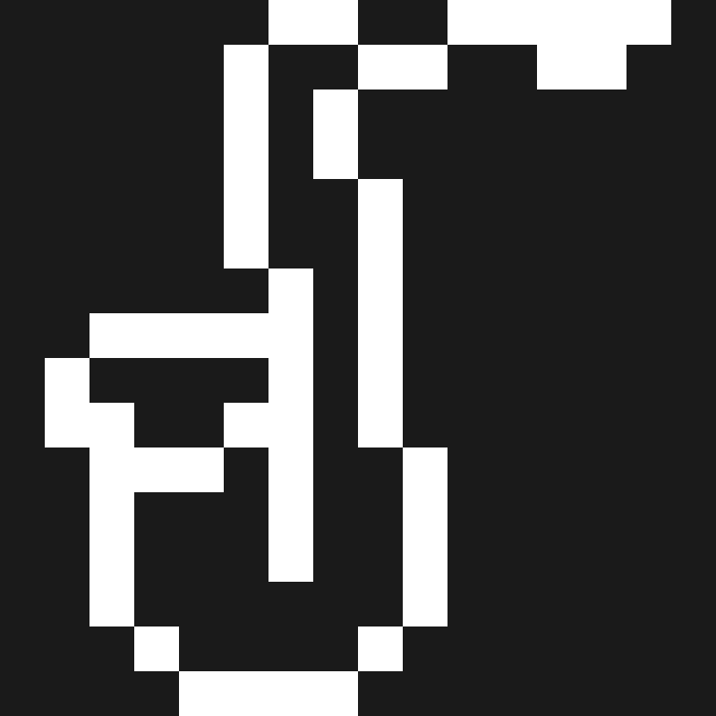</a> | **📂 檔名:** `saxophone-dark.svg` ✨ **格式:** `Vector (SVG)` ⚖️ **大小:** `2.01KB` 📅 **更新:** `2026-02-27`  🚀 **jsDelivr Markdown:** `` 🔗 **直接連結 (Url):** <code>https://cdn.jsdelivr.net/gh/barry028/materials@main/images/iCons/Pixel/Retro%20Pixel%20iCons/saxophone-dark.svg</code> 📥 [檢視原始檔](saxophone-dark.svg) |
|  | **📂 檔名:** `saxophone-light.svg` ✨ **格式:** `Vector (SVG)` ⚖️ **大小:** `2.02KB` 📅 **更新:** `2026-02-27`  🚀 **jsDelivr Markdown:** `` 🔗 **直接連結 (Url):** <code>https://cdn.jsdelivr.net/gh/barry028/materials@main/images/iCons/Pixel/Retro%20Pixel%20iCons/saxophone-light.svg</code> 📥 [檢視原始檔](saxophone-light.svg) |
|  | **📂 檔名:** `short-cake-dark.svg` ✨ **格式:** `Vector (SVG)` ⚖️ **大小:** `3.60KB` 📅 **更新:** `2026-02-27`  🚀 **jsDelivr Markdown:** `` 🔗 **直接連結 (Url):** <code>https://cdn.jsdelivr.net/gh/barry028/materials@main/images/iCons/Pixel/Retro%20Pixel%20iCons/short-cake-dark.svg</code> 📥 [檢視原始檔](short-cake-dark.svg) |
| <a href="short-cake-light.svg">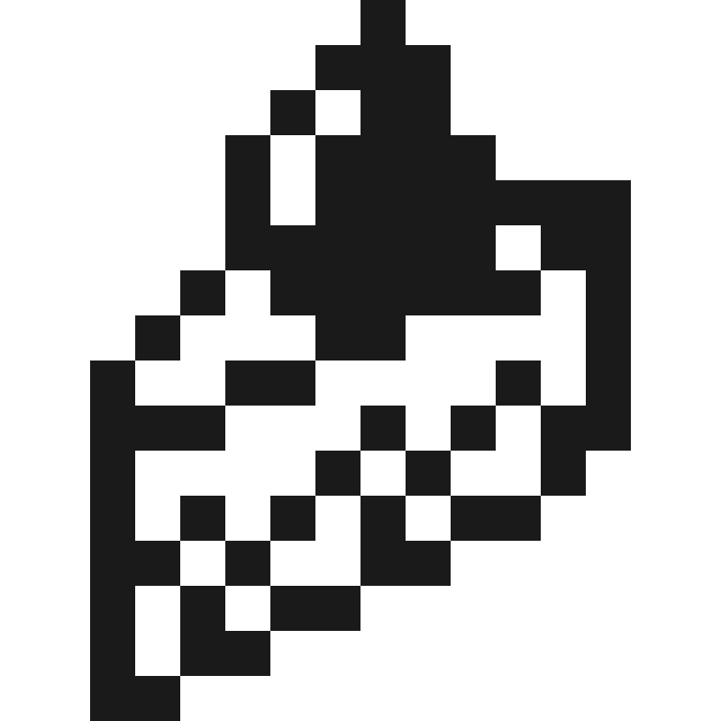</a> | **📂 檔名:** `short-cake-light.svg` ✨ **格式:** `Vector (SVG)` ⚖️ **大小:** `3.60KB` 📅 **更新:** `2026-02-27`  🚀 **jsDelivr Markdown:** `` 🔗 **直接連結 (Url):** <code>https://cdn.jsdelivr.net/gh/barry028/materials@main/images/iCons/Pixel/Retro%20Pixel%20iCons/short-cake-light.svg</code> 📥 [檢視原始檔](short-cake-light.svg) |
|  | **📂 檔名:** `ski-and-ski-boot-dark.svg` ✨ **格式:** `Vector (SVG)` ⚖️ **大小:** `3.11KB` 📅 **更新:** `2026-02-27`  🚀 **jsDelivr Markdown:** `` 🔗 **直接連結 (Url):** <code>https://cdn.jsdelivr.net/gh/barry028/materials@main/images/iCons/Pixel/Retro%20Pixel%20iCons/ski-and-ski-boot-dark.svg</code> 📥 [檢視原始檔](ski-and-ski-boot-dark.svg) |
|  | **📂 檔名:** `ski-and-ski-boot-light.svg` ✨ **格式:** `Vector (SVG)` ⚖️ **大小:** `3.11KB` 📅 **更新:** `2026-02-27`  🚀 **jsDelivr Markdown:** `` 🔗 **直接連結 (Url):** <code>https://cdn.jsdelivr.net/gh/barry028/materials@main/images/iCons/Pixel/Retro%20Pixel%20iCons/ski-and-ski-boot-light.svg</code> 📥 [檢視原始檔](ski-and-ski-boot-light.svg) |
|  | **📂 檔名:** `smiling-face-with-open-mouth-dark.svg` ✨ **格式:** `Vector (SVG)` ⚖️ **大小:** `2.80KB` 📅 **更新:** `2026-02-27`  🚀 **jsDelivr Markdown:** `` 🔗 **直接連結 (Url):** <code>https://cdn.jsdelivr.net/gh/barry028/materials@main/images/iCons/Pixel/Retro%20Pixel%20iCons/smiling-face-with-open-mouth-dark.svg</code> 📥 [檢視原始檔](smiling-face-with-open-mouth-dark.svg) |
|  | **📂 檔名:** `smiling-face-with-open-mouth-light.svg` ✨ **格式:** `Vector (SVG)` ⚖️ **大小:** `2.80KB` 📅 **更新:** `2026-02-27`  🚀 **jsDelivr Markdown:** `` 🔗 **直接連結 (Url):** <code>https://cdn.jsdelivr.net/gh/barry028/materials@main/images/iCons/Pixel/Retro%20Pixel%20iCons/smiling-face-with-open-mouth-light.svg</code> 📥 [檢視原始檔](smiling-face-with-open-mouth-light.svg) |
|  | **📂 檔名:** `smiling-face-with-smiling-eyes-dark.svg` ✨ **格式:** `Vector (SVG)` ⚖️ **大小:** `2.89KB` 📅 **更新:** `2026-02-27`  🚀 **jsDelivr Markdown:** `` 🔗 **直接連結 (Url):** <code>https://cdn.jsdelivr.net/gh/barry028/materials@main/images/iCons/Pixel/Retro%20Pixel%20iCons/smiling-face-with-smiling-eyes-dark.svg</code> 📥 [檢視原始檔](smiling-face-with-smiling-eyes-dark.svg) |
|  | **📂 檔名:** `smiling-face-with-smiling-eyes-light.svg` ✨ **格式:** `Vector (SVG)` ⚖️ **大小:** `2.90KB` 📅 **更新:** `2026-02-27`  🚀 **jsDelivr Markdown:** `` 🔗 **直接連結 (Url):** <code>https://cdn.jsdelivr.net/gh/barry028/materials@main/images/iCons/Pixel/Retro%20Pixel%20iCons/smiling-face-with-smiling-eyes-light.svg</code> 📥 [檢視原始檔](smiling-face-with-smiling-eyes-light.svg) |
| <a href="snowman-dark.svg">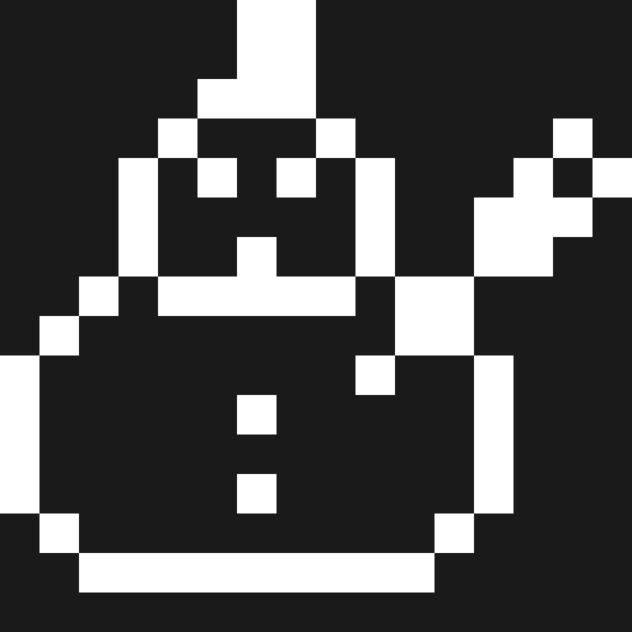</a> | **📂 檔名:** `snowman-dark.svg` ✨ **格式:** `Vector (SVG)` ⚖️ **大小:** `3.11KB` 📅 **更新:** `2026-02-27`  🚀 **jsDelivr Markdown:** `` 🔗 **直接連結 (Url):** <code>https://cdn.jsdelivr.net/gh/barry028/materials@main/images/iCons/Pixel/Retro%20Pixel%20iCons/snowman-dark.svg</code> 📥 [檢視原始檔](snowman-dark.svg) |
|  | **📂 檔名:** `snowman-light.svg` ✨ **格式:** `Vector (SVG)` ⚖️ **大小:** `3.11KB` 📅 **更新:** `2026-02-27`  🚀 **jsDelivr Markdown:** `` 🔗 **直接連結 (Url):** <code>https://cdn.jsdelivr.net/gh/barry028/materials@main/images/iCons/Pixel/Retro%20Pixel%20iCons/snowman-light.svg</code> 📥 [檢視原始檔](snowman-light.svg) |
| <a href="soccerball-dark.svg">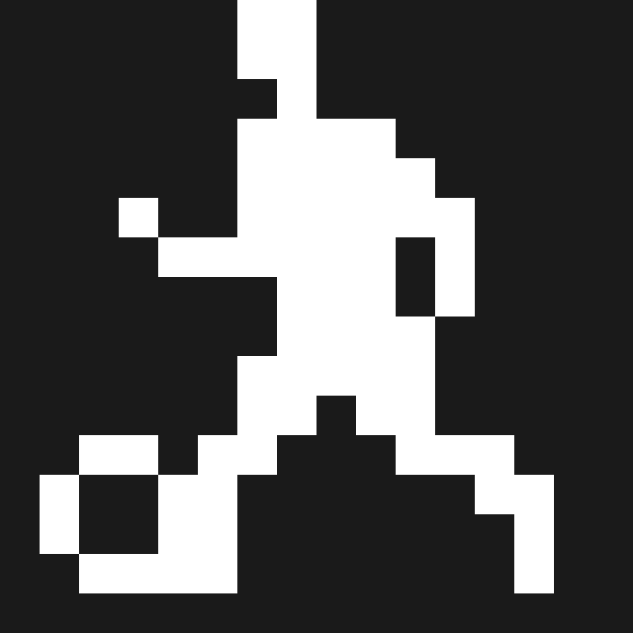</a> | **📂 檔名:** `soccerball-dark.svg` ✨ **格式:** `Vector (SVG)` ⚖️ **大小:** `1.12KB` 📅 **更新:** `2026-02-27`  🚀 **jsDelivr Markdown:** `` 🔗 **直接連結 (Url):** <code>https://cdn.jsdelivr.net/gh/barry028/materials@main/images/iCons/Pixel/Retro%20Pixel%20iCons/soccerball-dark.svg</code> 📥 [檢視原始檔](soccerball-dark.svg) |
|  | **📂 檔名:** `soccerball-light.svg` ✨ **格式:** `Vector (SVG)` ⚖️ **大小:** `1.12KB` 📅 **更新:** `2026-02-27`  🚀 **jsDelivr Markdown:** `` 🔗 **直接連結 (Url):** <code>https://cdn.jsdelivr.net/gh/barry028/materials@main/images/iCons/Pixel/Retro%20Pixel%20iCons/soccerball-light.svg</code> 📥 [檢視原始檔](soccerball-light.svg) |
| <a href="spouting-whale-dark.svg">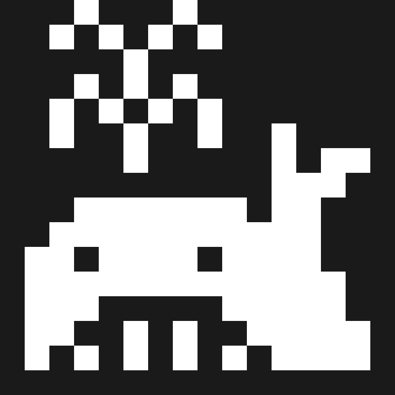</a> | **📂 檔名:** `spouting-whale-dark.svg` ✨ **格式:** `Vector (SVG)` ⚖️ **大小:** `2.71KB` 📅 **更新:** `2026-02-27`  🚀 **jsDelivr Markdown:** `` 🔗 **直接連結 (Url):** <code>https://cdn.jsdelivr.net/gh/barry028/materials@main/images/iCons/Pixel/Retro%20Pixel%20iCons/spouting-whale-dark.svg</code> 📥 [檢視原始檔](spouting-whale-dark.svg) |
| <a href="spouting-whale-light.svg">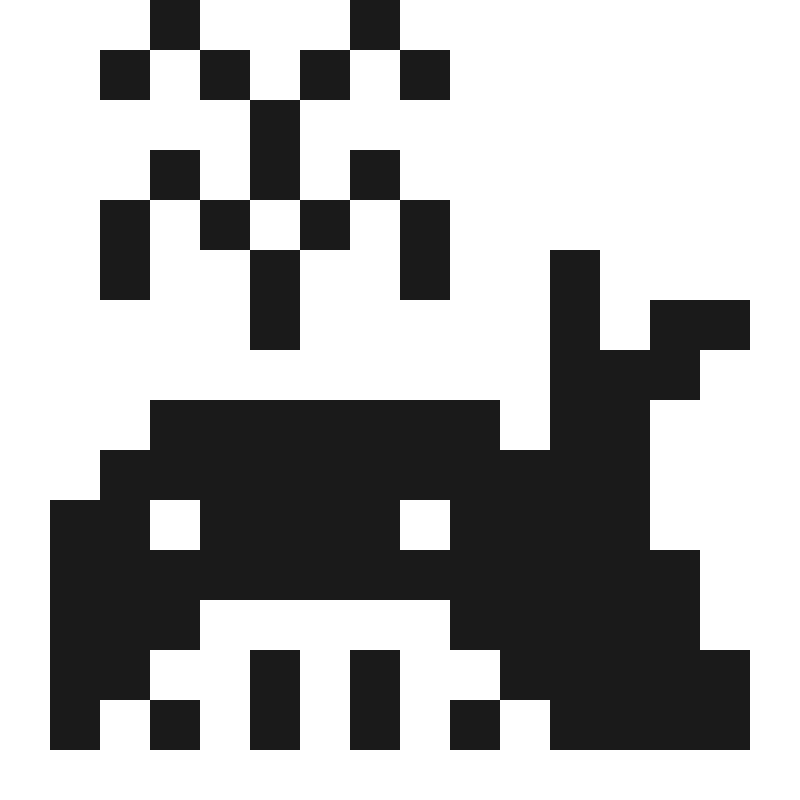</a> | **📂 檔名:** `spouting-whale-light.svg` ✨ **格式:** `Vector (SVG)` ⚖️ **大小:** `2.71KB` 📅 **更新:** `2026-02-27`  🚀 **jsDelivr Markdown:** `` 🔗 **直接連結 (Url):** <code>https://cdn.jsdelivr.net/gh/barry028/materials@main/images/iCons/Pixel/Retro%20Pixel%20iCons/spouting-whale-light.svg</code> 📥 [檢視原始檔](spouting-whale-light.svg) |
|  | **📂 檔名:** `station-dark.svg` ✨ **格式:** `Vector (SVG)` ⚖️ **大小:** `2.87KB` 📅 **更新:** `2026-02-27`  🚀 **jsDelivr Markdown:** `` 🔗 **直接連結 (Url):** <code>https://cdn.jsdelivr.net/gh/barry028/materials@main/images/iCons/Pixel/Retro%20Pixel%20iCons/station-dark.svg</code> 📥 [檢視原始檔](station-dark.svg) |
|  | **📂 檔名:** `station-light.svg` ✨ **格式:** `Vector (SVG)` ⚖️ **大小:** `2.87KB` 📅 **更新:** `2026-02-27`  🚀 **jsDelivr Markdown:** `` 🔗 **直接連結 (Url):** <code>https://cdn.jsdelivr.net/gh/barry028/materials@main/images/iCons/Pixel/Retro%20Pixel%20iCons/station-light.svg</code> 📥 [檢視原始檔](station-light.svg) |
|  | **📂 檔名:** `sunrise-over-mountains-dark.svg` ✨ **格式:** `Vector (SVG)` ⚖️ **大小:** `5.45KB` 📅 **更新:** `2026-02-27`  🚀 **jsDelivr Markdown:** `` 🔗 **直接連結 (Url):** <code>https://cdn.jsdelivr.net/gh/barry028/materials@main/images/iCons/Pixel/Retro%20Pixel%20iCons/sunrise-over-mountains-dark.svg</code> 📥 [檢視原始檔](sunrise-over-mountains-dark.svg) |
|  | **📂 檔名:** `sunrise-over-mountains-light.svg` ✨ **格式:** `Vector (SVG)` ⚖️ **大小:** `5.46KB` 📅 **更新:** `2026-02-27`  🚀 **jsDelivr Markdown:** `` 🔗 **直接連結 (Url):** <code>https://cdn.jsdelivr.net/gh/barry028/materials@main/images/iCons/Pixel/Retro%20Pixel%20iCons/sunrise-over-mountains-light.svg</code> 📥 [檢視原始檔](sunrise-over-mountains-light.svg) |
|  | **📂 檔名:** `surfer-dark.svg` ✨ **格式:** `Vector (SVG)` ⚖️ **大小:** `3.01KB` 📅 **更新:** `2026-02-27`  🚀 **jsDelivr Markdown:** `` 🔗 **直接連結 (Url):** <code>https://cdn.jsdelivr.net/gh/barry028/materials@main/images/iCons/Pixel/Retro%20Pixel%20iCons/surfer-dark.svg</code> 📥 [檢視原始檔](surfer-dark.svg) |
|  | **📂 檔名:** `surfer-light.svg` ✨ **格式:** `Vector (SVG)` ⚖️ **大小:** `3.01KB` 📅 **更新:** `2026-02-27`  🚀 **jsDelivr Markdown:** `` 🔗 **直接連結 (Url):** <code>https://cdn.jsdelivr.net/gh/barry028/materials@main/images/iCons/Pixel/Retro%20Pixel%20iCons/surfer-light.svg</code> 📥 [檢視原始檔](surfer-light.svg) |
|  | **📂 檔名:** `tennis-dark.svg` ✨ **格式:** `Vector (SVG)` ⚖️ **大小:** `5.92KB` 📅 **更新:** `2026-02-27`  🚀 **jsDelivr Markdown:** `` 🔗 **直接連結 (Url):** <code>https://cdn.jsdelivr.net/gh/barry028/materials@main/images/iCons/Pixel/Retro%20Pixel%20iCons/tennis-dark.svg</code> 📥 [檢視原始檔](tennis-dark.svg) |
|  | **📂 檔名:** `tennis-light.svg` ✨ **格式:** `Vector (SVG)` ⚖️ **大小:** `5.92KB` 📅 **更新:** `2026-02-27`  🚀 **jsDelivr Markdown:** `` 🔗 **直接連結 (Url):** <code>https://cdn.jsdelivr.net/gh/barry028/materials@main/images/iCons/Pixel/Retro%20Pixel%20iCons/tennis-light.svg</code> 📥 [檢視原始檔](tennis-light.svg) |
|  | **📂 檔名:** `thumbs-up-sign-dark.svg` ✨ **格式:** `Vector (SVG)` ⚖️ **大小:** `2.26KB` 📅 **更新:** `2026-02-27`  🚀 **jsDelivr Markdown:** `` 🔗 **直接連結 (Url):** <code>https://cdn.jsdelivr.net/gh/barry028/materials@main/images/iCons/Pixel/Retro%20Pixel%20iCons/thumbs-up-sign-dark.svg</code> 📥 [檢視原始檔](thumbs-up-sign-dark.svg) |
|  | **📂 檔名:** `thumbs-up-sign-light.svg` ✨ **格式:** `Vector (SVG)` ⚖️ **大小:** `2.26KB` 📅 **更新:** `2026-02-27`  🚀 **jsDelivr Markdown:** `` 🔗 **直接連結 (Url):** <code>https://cdn.jsdelivr.net/gh/barry028/materials@main/images/iCons/Pixel/Retro%20Pixel%20iCons/thumbs-up-sign-light.svg</code> 📥 [檢視原始檔](thumbs-up-sign-light.svg) |
|  | **📂 檔名:** `tiger-face-dark.svg` ✨ **格式:** `Vector (SVG)` ⚖️ **大小:** `4.25KB` 📅 **更新:** `2026-02-27`  🚀 **jsDelivr Markdown:** `` 🔗 **直接連結 (Url):** <code>https://cdn.jsdelivr.net/gh/barry028/materials@main/images/iCons/Pixel/Retro%20Pixel%20iCons/tiger-face-dark.svg</code> 📥 [檢視原始檔](tiger-face-dark.svg) |
|  | **📂 檔名:** `tiger-face-light.svg` ✨ **格式:** `Vector (SVG)` ⚖️ **大小:** `4.25KB` 📅 **更新:** `2026-02-27`  🚀 **jsDelivr Markdown:** `` 🔗 **直接連結 (Url):** <code>https://cdn.jsdelivr.net/gh/barry028/materials@main/images/iCons/Pixel/Retro%20Pixel%20iCons/tiger-face-light.svg</code> 📥 [檢視原始檔](tiger-face-light.svg) |
| <a href="trident-dark.svg">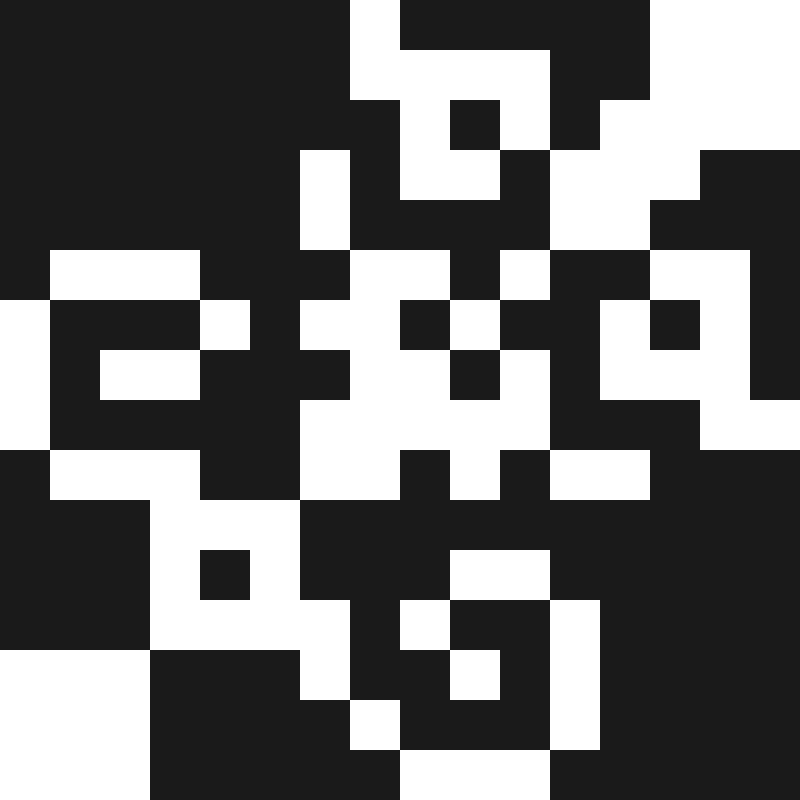</a> | **📂 檔名:** `trident-dark.svg` ✨ **格式:** `Vector (SVG)` ⚖️ **大小:** `3.52KB` 📅 **更新:** `2026-02-27`  🚀 **jsDelivr Markdown:** `` 🔗 **直接連結 (Url):** <code>https://cdn.jsdelivr.net/gh/barry028/materials@main/images/iCons/Pixel/Retro%20Pixel%20iCons/trident-dark.svg</code> 📥 [檢視原始檔](trident-dark.svg) |
| <a href="trident-light.svg">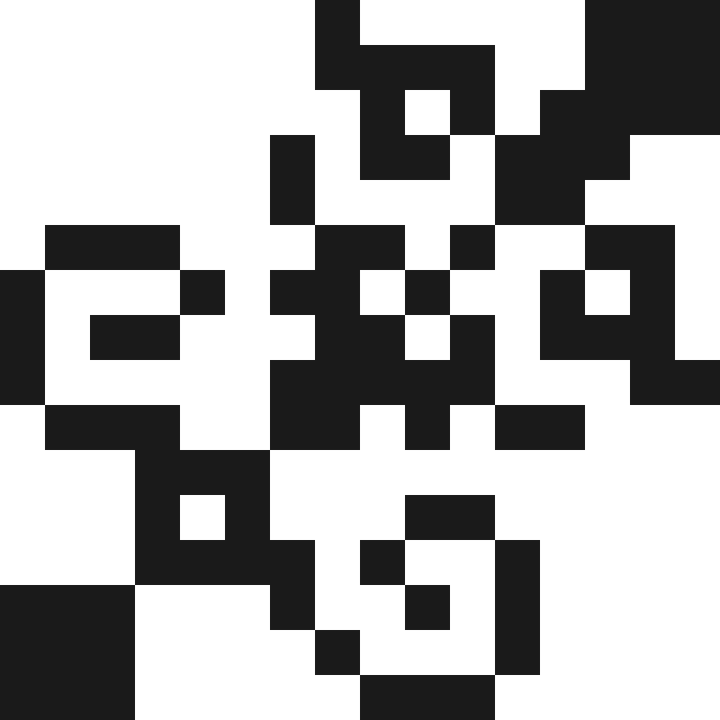</a> | **📂 檔名:** `trident-light.svg` ✨ **格式:** `Vector (SVG)` ⚖️ **大小:** `3.52KB` 📅 **更新:** `2026-02-27`  🚀 **jsDelivr Markdown:** `` 🔗 **直接連結 (Url):** <code>https://cdn.jsdelivr.net/gh/barry028/materials@main/images/iCons/Pixel/Retro%20Pixel%20iCons/trident-light.svg</code> 📥 [檢視原始檔](trident-light.svg) |
|  | **📂 檔名:** `trumpet-dark.svg` ✨ **格式:** `Vector (SVG)` ⚖️ **大小:** `868.00B` 📅 **更新:** `2026-02-27`  🚀 **jsDelivr Markdown:** `` 🔗 **直接連結 (Url):** <code>https://cdn.jsdelivr.net/gh/barry028/materials@main/images/iCons/Pixel/Retro%20Pixel%20iCons/trumpet-dark.svg</code> 📥 [檢視原始檔](trumpet-dark.svg) |
| <a href="trumpet-light.svg">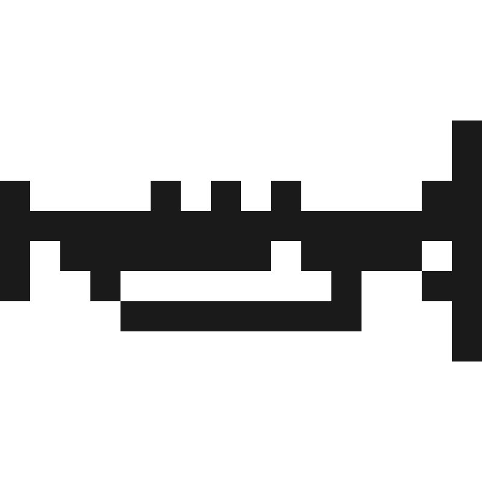</a> | **📂 檔名:** `trumpet-light.svg` ✨ **格式:** `Vector (SVG)` ⚖️ **大小:** `870.00B` 📅 **更新:** `2026-02-27`  🚀 **jsDelivr Markdown:** `` 🔗 **直接連結 (Url):** <code>https://cdn.jsdelivr.net/gh/barry028/materials@main/images/iCons/Pixel/Retro%20Pixel%20iCons/trumpet-light.svg</code> 📥 [檢視原始檔](trumpet-light.svg) |
|  | **📂 檔名:** `tshirt-dark.svg` ✨ **格式:** `Vector (SVG)` ⚖️ **大小:** `2.81KB` 📅 **更新:** `2026-02-27`  🚀 **jsDelivr Markdown:** `` 🔗 **直接連結 (Url):** <code>https://cdn.jsdelivr.net/gh/barry028/materials@main/images/iCons/Pixel/Retro%20Pixel%20iCons/tshirt-dark.svg</code> 📥 [檢視原始檔](tshirt-dark.svg) |
| <a href="tshirt-light.svg">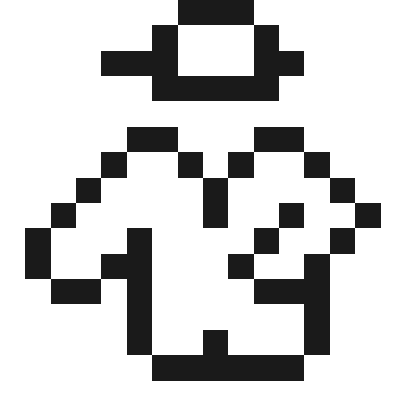</a> | **📂 檔名:** `tshirt-light.svg` ✨ **格式:** `Vector (SVG)` ⚖️ **大小:** `2.81KB` 📅 **更新:** `2026-02-27`  🚀 **jsDelivr Markdown:** `` 🔗 **直接連結 (Url):** <code>https://cdn.jsdelivr.net/gh/barry028/materials@main/images/iCons/Pixel/Retro%20Pixel%20iCons/tshirt-light.svg</code> 📥 [檢視原始檔](tshirt-light.svg) |
| <a href="umbrella-with-rain-drops-dark.svg">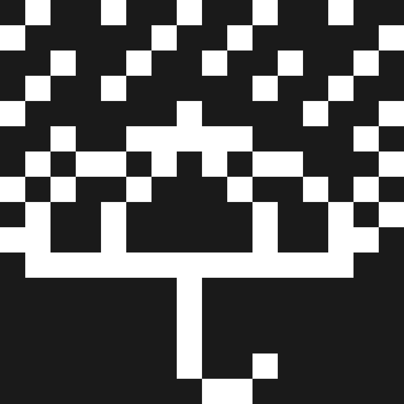</a> | **📂 檔名:** `umbrella-with-rain-drops-dark.svg` ✨ **格式:** `Vector (SVG)` ⚖️ **大小:** `5.69KB` 📅 **更新:** `2026-02-27`  🚀 **jsDelivr Markdown:** `` 🔗 **直接連結 (Url):** <code>https://cdn.jsdelivr.net/gh/barry028/materials@main/images/iCons/Pixel/Retro%20Pixel%20iCons/umbrella-with-rain-drops-dark.svg</code> 📥 [檢視原始檔](umbrella-with-rain-drops-dark.svg) |
|  | **📂 檔名:** `umbrella-with-rain-drops-light.svg` ✨ **格式:** `Vector (SVG)` ⚖️ **大小:** `5.70KB` 📅 **更新:** `2026-02-27`  🚀 **jsDelivr Markdown:** `` 🔗 **直接連結 (Url):** <code>https://cdn.jsdelivr.net/gh/barry028/materials@main/images/iCons/Pixel/Retro%20Pixel%20iCons/umbrella-with-rain-drops-light.svg</code> 📥 [檢視原始檔](umbrella-with-rain-drops-light.svg) |
|  | **📂 檔名:** `victory-hand-dark.svg` ✨ **格式:** `Vector (SVG)` ⚖️ **大小:** `2.12KB` 📅 **更新:** `2026-02-27`  🚀 **jsDelivr Markdown:** `` 🔗 **直接連結 (Url):** <code>https://cdn.jsdelivr.net/gh/barry028/materials@main/images/iCons/Pixel/Retro%20Pixel%20iCons/victory-hand-dark.svg</code> 📥 [檢視原始檔](victory-hand-dark.svg) |
|  | **📂 檔名:** `victory-hand-light.svg` ✨ **格式:** `Vector (SVG)` ⚖️ **大小:** `2.12KB` 📅 **更新:** `2026-02-27`  🚀 **jsDelivr Markdown:** `` 🔗 **直接連結 (Url):** <code>https://cdn.jsdelivr.net/gh/barry028/materials@main/images/iCons/Pixel/Retro%20Pixel%20iCons/victory-hand-light.svg</code> 📥 [檢視原始檔](victory-hand-light.svg) |
| <a href="white-up-pointing-index-dark.svg">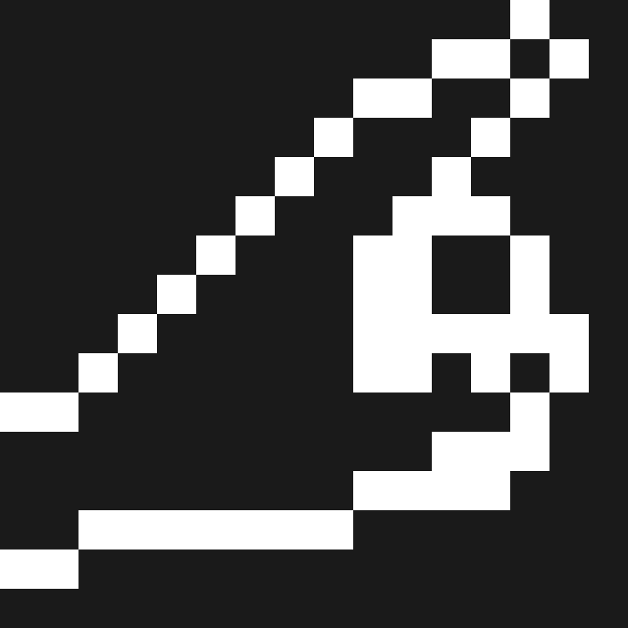</a> | **📂 檔名:** `white-up-pointing-index-dark.svg` ✨ **格式:** `Vector (SVG)` ⚖️ **大小:** `2.79KB` 📅 **更新:** `2026-02-27`  🚀 **jsDelivr Markdown:** `` 🔗 **直接連結 (Url):** <code>https://cdn.jsdelivr.net/gh/barry028/materials@main/images/iCons/Pixel/Retro%20Pixel%20iCons/white-up-pointing-index-dark.svg</code> 📥 [檢視原始檔](white-up-pointing-index-dark.svg) |
| <a href="white-up-pointing-index-light.svg">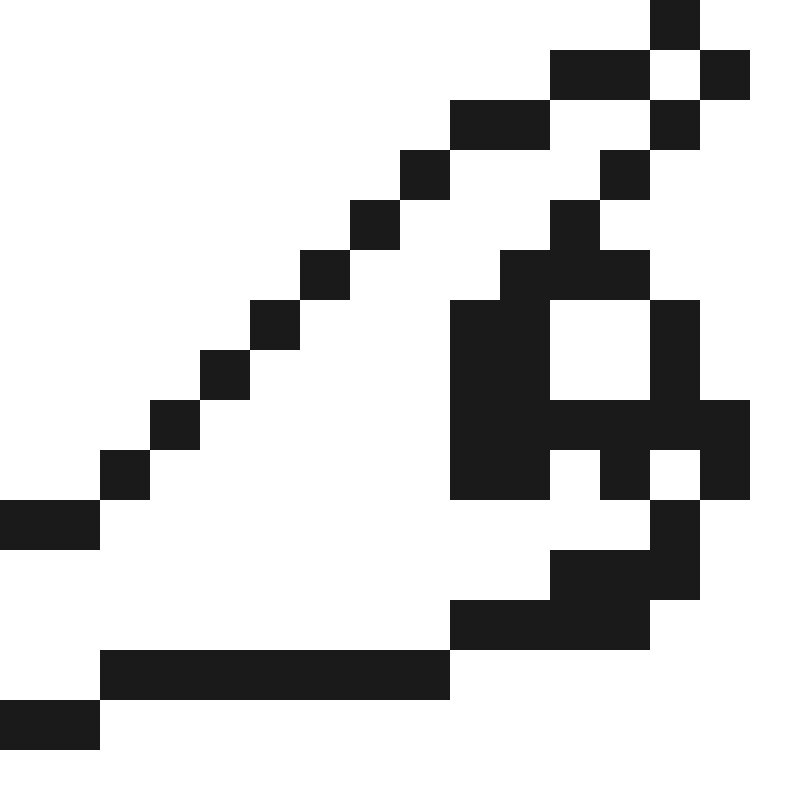</a> | **📂 檔名:** `white-up-pointing-index-light.svg` ✨ **格式:** `Vector (SVG)` ⚖️ **大小:** `2.79KB` 📅 **更新:** `2026-02-27`  🚀 **jsDelivr Markdown:** `` 🔗 **直接連結 (Url):** <code>https://cdn.jsdelivr.net/gh/barry028/materials@main/images/iCons/Pixel/Retro%20Pixel%20iCons/white-up-pointing-index-light.svg</code> 📥 [檢視原始檔](white-up-pointing-index-light.svg) |
|  | **📂 檔名:** `woman-dark.svg` ✨ **格式:** `Vector (SVG)` ⚖️ **大小:** `2.49KB` 📅 **更新:** `2026-02-27`  🚀 **jsDelivr Markdown:** `` 🔗 **直接連結 (Url):** <code>https://cdn.jsdelivr.net/gh/barry028/materials@main/images/iCons/Pixel/Retro%20Pixel%20iCons/woman-dark.svg</code> 📥 [檢視原始檔](woman-dark.svg) |
|  | **📂 檔名:** `woman-light.svg` ✨ **格式:** `Vector (SVG)` ⚖️ **大小:** `2.49KB` 📅 **更新:** `2026-02-27`  🚀 **jsDelivr Markdown:** `` 🔗 **直接連結 (Url):** <code>https://cdn.jsdelivr.net/gh/barry028/materials@main/images/iCons/Pixel/Retro%20Pixel%20iCons/woman-light.svg</code> 📥 [檢視原始檔](woman-light.svg) |