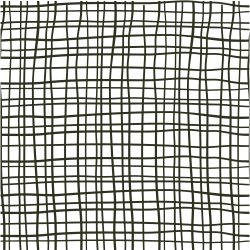
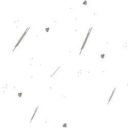
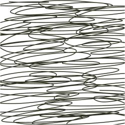
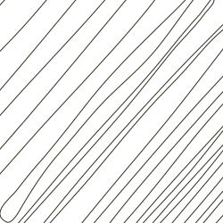
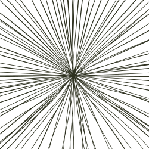

# 🖼️ 素材分類：Textures 

> [🏠 主目錄](../../../../README.md) / [images](../../../README.md) / [iCons](../../README.md) / [Pixel](../README.md) / **Textures **

本目錄共有 `14` 個檔案

| 🎨 預覽 (點擊放大) &nbsp;&nbsp;&nbsp;&nbsp;&nbsp;&nbsp;&nbsp;&nbsp;&nbsp;&nbsp;&nbsp;&nbsp;&nbsp;&nbsp;&nbsp;&nbsp;&nbsp;&nbsp;&nbsp;&nbsp;&nbsp;&nbsp;&nbsp;&nbsp;&nbsp;&nbsp;&nbsp;&nbsp;&nbsp;&nbsp;&nbsp;&nbsp;&nbsp;&nbsp;&nbsp;&nbsp;&nbsp;&nbsp;&nbsp;&nbsp; | 📋 檔案詳細資訊與連結 |
| :--- | :--- |
|  | **📂 檔名:** `texture-check-3.svg` ✨ **格式:** `Vector (SVG)` ⚖️ **大小:** `112.06KB` 📅 **更新:** `2026-02-27`  🚀 **jsDelivr Markdown:** `` 🔗 **直接連結 (Url):** <code>https://cdn.jsdelivr.net/gh/barry028/materials@main/images/iCons/Pixel/Textures%20/texture-check-3.svg</code> 📥 [檢視原始檔](texture-check-3.svg) |
|  | **📂 檔名:** `texture-dot-grain-4.svg` ✨ **格式:** `Vector (SVG)` ⚖️ **大小:** `108.11KB` 📅 **更新:** `2026-02-27`  🚀 **jsDelivr Markdown:** `` 🔗 **直接連結 (Url):** <code>https://cdn.jsdelivr.net/gh/barry028/materials@main/images/iCons/Pixel/Textures%20/texture-dot-grain-4.svg</code> 📥 [檢視原始檔](texture-dot-grain-4.svg) |
|  | **📂 檔名:** `texture-drawing-curly-8.svg` ✨ **格式:** `Vector (SVG)` ⚖️ **大小:** `19.74KB` 📅 **更新:** `2026-02-27`  🚀 **jsDelivr Markdown:** `` 🔗 **直接連結 (Url):** <code>https://cdn.jsdelivr.net/gh/barry028/materials@main/images/iCons/Pixel/Textures%20/texture-drawing-curly-8.svg</code> 📥 [檢視原始檔](texture-drawing-curly-8.svg) |
|  | **📂 檔名:** `texture-dust-10.svg` ✨ **格式:** `Vector (SVG)` ⚖️ **大小:** `14.09KB` 📅 **更新:** `2026-02-27`  🚀 **jsDelivr Markdown:** `` 🔗 **直接連結 (Url):** <code>https://cdn.jsdelivr.net/gh/barry028/materials@main/images/iCons/Pixel/Textures%20/texture-dust-10.svg</code> 📥 [檢視原始檔](texture-dust-10.svg) |
|  | **📂 檔名:** `texture-grid-line-9.svg` ✨ **格式:** `Vector (SVG)` ⚖️ **大小:** `438.00B` 📅 **更新:** `2026-02-27`  🚀 **jsDelivr Markdown:** `` 🔗 **直接連結 (Url):** <code>https://cdn.jsdelivr.net/gh/barry028/materials@main/images/iCons/Pixel/Textures%20/texture-grid-line-9.svg</code> 📥 [檢視原始檔](texture-grid-line-9.svg) |
|  | **📂 檔名:** `texture-pixel-squre-dot-2.svg` ✨ **格式:** `Vector (SVG)` ⚖️ **大小:** `10.29KB` 📅 **更新:** `2026-02-27`  🚀 **jsDelivr Markdown:** `` 🔗 **直接連結 (Url):** <code>https://cdn.jsdelivr.net/gh/barry028/materials@main/images/iCons/Pixel/Textures%20/texture-pixel-squre-dot-2.svg</code> 📥 [檢視原始檔](texture-pixel-squre-dot-2.svg) |
|  | **📂 檔名:** `texture-retro-circle-halftone-11.svg` ✨ **格式:** `Vector (SVG)` ⚖️ **大小:** `38.78KB` 📅 **更新:** `2026-02-27`  🚀 **jsDelivr Markdown:** `` 🔗 **直接連結 (Url):** <code>https://cdn.jsdelivr.net/gh/barry028/materials@main/images/iCons/Pixel/Textures%20/texture-retro-circle-halftone-11.svg</code> 📥 [檢視原始檔](texture-retro-circle-halftone-11.svg) |
|  | **📂 檔名:** `texture-retro-dot-halftone-7.svg` ✨ **格式:** `Vector (SVG)` ⚖️ **大小:** `127.39KB` 📅 **更新:** `2026-02-27`  🚀 **jsDelivr Markdown:** `` 🔗 **直接連結 (Url):** <code>https://cdn.jsdelivr.net/gh/barry028/materials@main/images/iCons/Pixel/Textures%20/texture-retro-dot-halftone-7.svg</code> 📥 [檢視原始檔](texture-retro-dot-halftone-7.svg) |
|  | **📂 檔名:** `texture-retro-dot-pixel-12.svg` ✨ **格式:** `Vector (SVG)` ⚖️ **大小:** `408.76KB` 📅 **更新:** `2026-02-27`  🚀 **jsDelivr Markdown:** `` 🔗 **直接連結 (Url):** <code>https://cdn.jsdelivr.net/gh/barry028/materials@main/images/iCons/Pixel/Textures%20/texture-retro-dot-pixel-12.svg</code> 📥 [檢視原始檔](texture-retro-dot-pixel-12.svg) |
|  | **📂 檔名:** `texture-scratch-1.svg` ✨ **格式:** `Vector (SVG)` ⚖️ **大小:** `28.77KB` 📅 **更新:** `2026-02-27`  🚀 **jsDelivr Markdown:** `` 🔗 **直接連結 (Url):** <code>https://cdn.jsdelivr.net/gh/barry028/materials@main/images/iCons/Pixel/Textures%20/texture-scratch-1.svg</code> 📥 [檢視原始檔](texture-scratch-1.svg) |
|  | **📂 檔名:** `texture-scratch-2-13.svg` ✨ **格式:** `Vector (SVG)` ⚖️ **大小:** `73.16KB` 📅 **更新:** `2026-02-27`  🚀 **jsDelivr Markdown:** `` 🔗 **直接連結 (Url):** <code>https://cdn.jsdelivr.net/gh/barry028/materials@main/images/iCons/Pixel/Textures%20/texture-scratch-2-13.svg</code> 📥 [檢視原始檔](texture-scratch-2-13.svg) |
|  | **📂 檔名:** `texture-scratch-3-1.svg` ✨ **格式:** `Vector (SVG)` ⚖️ **大小:** `11.17KB` 📅 **更新:** `2026-02-27`  🚀 **jsDelivr Markdown:** `` 🔗 **直接連結 (Url):** <code>https://cdn.jsdelivr.net/gh/barry028/materials@main/images/iCons/Pixel/Textures%20/texture-scratch-3-1.svg</code> 📥 [檢視原始檔](texture-scratch-3-1.svg) |
|  | **📂 檔名:** `texture-shine-highlight-5.svg` ✨ **格式:** `Vector (SVG)` ⚖️ **大小:** `53.59KB` 📅 **更新:** `2026-02-27`  🚀 **jsDelivr Markdown:** `` 🔗 **直接連結 (Url):** <code>https://cdn.jsdelivr.net/gh/barry028/materials@main/images/iCons/Pixel/Textures%20/texture-shine-highlight-5.svg</code> 📥 [檢視原始檔](texture-shine-highlight-5.svg) |
|  | **📂 檔名:** `texture-square-6.svg` ✨ **格式:** `Vector (SVG)` ⚖️ **大小:** `28.40KB` 📅 **更新:** `2026-02-27`  🚀 **jsDelivr Markdown:** `` 🔗 **直接連結 (Url):** <code>https://cdn.jsdelivr.net/gh/barry028/materials@main/images/iCons/Pixel/Textures%20/texture-square-6.svg</code> 📥 [檢視原始檔](texture-square-6.svg) |