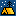

# 🖼️ 素材分類：Travel Edition Pixel iCons

> [🏠 主目錄](../../../../README.md) / [images](../../../README.md) / [iCons](../../README.md) / [Pixel](../README.md) / **Travel Edition Pixel iCons**

本目錄共有 `21` 個檔案

| 🎨 預覽 (點擊放大)  | 📋 檔案詳細資訊與連結 |
| :--- | :--- |
|  | **📂 檔名:** `Airplane.svg` ✨ **格式:** `Vector (SVG)` ⚖️ **大小:** `8.28KB` 📅 **更新:** `2026-02-27`  🚀 **jsDelivr Markdown:** `` 🔗 **直接連結 (Url):** <code>https://cdn.jsdelivr.net/gh/barry028/materials@main/images/iCons/Pixel/Travel%20Edition%20Pixel%20iCons/Airplane.svg</code> 📥 [檢視原始檔](Airplane.svg) |
|  | **📂 檔名:** `Binoculars.svg` ✨ **格式:** `Vector (SVG)` ⚖️ **大小:** `49.73KB` 📅 **更新:** `2026-02-27`  🚀 **jsDelivr Markdown:** `` 🔗 **直接連結 (Url):** <code>https://cdn.jsdelivr.net/gh/barry028/materials@main/images/iCons/Pixel/Travel%20Edition%20Pixel%20iCons/Binoculars.svg</code> 📥 [檢視原始檔](Binoculars.svg) |
|  | **📂 檔名:** `Camera.svg` ✨ **格式:** `Vector (SVG)` ⚖️ **大小:** `11.57KB` 📅 **更新:** `2026-02-27`  🚀 **jsDelivr Markdown:** `` 🔗 **直接連結 (Url):** <code>https://cdn.jsdelivr.net/gh/barry028/materials@main/images/iCons/Pixel/Travel%20Edition%20Pixel%20iCons/Camera.svg</code> 📥 [檢視原始檔](Camera.svg) |
|  | **📂 檔名:** `Camp.svg` ✨ **格式:** `Vector (SVG)` ⚖️ **大小:** `14.83KB` 📅 **更新:** `2026-02-27`  🚀 **jsDelivr Markdown:** `` 🔗 **直接連結 (Url):** <code>https://cdn.jsdelivr.net/gh/barry028/materials@main/images/iCons/Pixel/Travel%20Edition%20Pixel%20iCons/Camp.svg</code> 📥 [檢視原始檔](Camp.svg) |
|  | **📂 檔名:** `Car.svg` ✨ **格式:** `Vector (SVG)` ⚖️ **大小:** `8.03KB` 📅 **更新:** `2026-02-27`  🚀 **jsDelivr Markdown:** `` 🔗 **直接連結 (Url):** <code>https://cdn.jsdelivr.net/gh/barry028/materials@main/images/iCons/Pixel/Travel%20Edition%20Pixel%20iCons/Car.svg</code> 📥 [檢視原始檔](Car.svg) |
|  | **📂 檔名:** `Danger.svg` ✨ **格式:** `Vector (SVG)` ⚖️ **大小:** `17.36KB` 📅 **更新:** `2026-02-27`  🚀 **jsDelivr Markdown:** `` 🔗 **直接連結 (Url):** <code>https://cdn.jsdelivr.net/gh/barry028/materials@main/images/iCons/Pixel/Travel%20Edition%20Pixel%20iCons/Danger.svg</code> 📥 [檢視原始檔](Danger.svg) |
|  | **📂 檔名:** `Drink.svg` ✨ **格式:** `Vector (SVG)` ⚖️ **大小:** `9.33KB` 📅 **更新:** `2026-02-27`  🚀 **jsDelivr Markdown:** `` 🔗 **直接連結 (Url):** <code>https://cdn.jsdelivr.net/gh/barry028/materials@main/images/iCons/Pixel/Travel%20Edition%20Pixel%20iCons/Drink.svg</code> 📥 [檢視原始檔](Drink.svg) |
|  | **📂 檔名:** `Expedition.svg` ✨ **格式:** `Vector (SVG)` ⚖️ **大小:** `7.29KB` 📅 **更新:** `2026-02-27`  🚀 **jsDelivr Markdown:** `` 🔗 **直接連結 (Url):** <code>https://cdn.jsdelivr.net/gh/barry028/materials@main/images/iCons/Pixel/Travel%20Edition%20Pixel%20iCons/Expedition.svg</code> 📥 [檢視原始檔](Expedition.svg) |
|  | **📂 檔名:** `Globe.svg` ✨ **格式:** `Vector (SVG)` ⚖️ **大小:** `8.21KB` 📅 **更新:** `2026-02-27`  🚀 **jsDelivr Markdown:** `` 🔗 **直接連結 (Url):** <code>https://cdn.jsdelivr.net/gh/barry028/materials@main/images/iCons/Pixel/Travel%20Edition%20Pixel%20iCons/Globe.svg</code> 📥 [檢視原始檔](Globe.svg) |
|  | **📂 檔名:** `Horizon.svg` ✨ **格式:** `Vector (SVG)` ⚖️ **大小:** `16.67KB` 📅 **更新:** `2026-02-27`  🚀 **jsDelivr Markdown:** `` 🔗 **直接連結 (Url):** <code>https://cdn.jsdelivr.net/gh/barry028/materials@main/images/iCons/Pixel/Travel%20Edition%20Pixel%20iCons/Horizon.svg</code> 📥 [檢視原始檔](Horizon.svg) |
|  | **📂 檔名:** `Journal.svg` ✨ **格式:** `Vector (SVG)` ⚖️ **大小:** `8.84KB` 📅 **更新:** `2026-02-27`  🚀 **jsDelivr Markdown:** `` 🔗 **直接連結 (Url):** <code>https://cdn.jsdelivr.net/gh/barry028/materials@main/images/iCons/Pixel/Travel%20Edition%20Pixel%20iCons/Journal.svg</code> 📥 [檢視原始檔](Journal.svg) |
|  | **📂 檔名:** `Location.svg` ✨ **格式:** `Vector (SVG)` ⚖️ **大小:** `9.23KB` 📅 **更新:** `2026-02-27`  🚀 **jsDelivr Markdown:** `` 🔗 **直接連結 (Url):** <code>https://cdn.jsdelivr.net/gh/barry028/materials@main/images/iCons/Pixel/Travel%20Edition%20Pixel%20iCons/Location.svg</code> 📥 [檢視原始檔](Location.svg) |
|  | **📂 檔名:** `Mountains.svg` ✨ **格式:** `Vector (SVG)` ⚖️ **大小:** `6.23KB` 📅 **更新:** `2026-02-27`  🚀 **jsDelivr Markdown:** `` 🔗 **直接連結 (Url):** <code>https://cdn.jsdelivr.net/gh/barry028/materials@main/images/iCons/Pixel/Travel%20Edition%20Pixel%20iCons/Mountains.svg</code> 📥 [檢視原始檔](Mountains.svg) |
|  | **📂 檔名:** `Navigator.svg` ✨ **格式:** `Vector (SVG)` ⚖️ **大小:** `10.88KB` 📅 **更新:** `2026-02-27`  🚀 **jsDelivr Markdown:** `` 🔗 **直接連結 (Url):** <code>https://cdn.jsdelivr.net/gh/barry028/materials@main/images/iCons/Pixel/Travel%20Edition%20Pixel%20iCons/Navigator.svg</code> 📥 [檢視原始檔](Navigator.svg) |
|  | **📂 檔名:** `Passport.svg` ✨ **格式:** `Vector (SVG)` ⚖️ **大小:** `9.45KB` 📅 **更新:** `2026-02-27`  🚀 **jsDelivr Markdown:** `` 🔗 **直接連結 (Url):** <code>https://cdn.jsdelivr.net/gh/barry028/materials@main/images/iCons/Pixel/Travel%20Edition%20Pixel%20iCons/Passport.svg</code> 📥 [檢視原始檔](Passport.svg) |
|  | **📂 檔名:** `Road.svg` ✨ **格式:** `Vector (SVG)` ⚖️ **大小:** `14.04KB` 📅 **更新:** `2026-02-27`  🚀 **jsDelivr Markdown:** `` 🔗 **直接連結 (Url):** <code>https://cdn.jsdelivr.net/gh/barry028/materials@main/images/iCons/Pixel/Travel%20Edition%20Pixel%20iCons/Road.svg</code> 📥 [檢視原始檔](Road.svg) |
|  | **📂 檔名:** `Scarecrow.svg` ✨ **格式:** `Vector (SVG)` ⚖️ **大小:** `10.43KB` 📅 **更新:** `2026-02-27`  🚀 **jsDelivr Markdown:** `` 🔗 **直接連結 (Url):** <code>https://cdn.jsdelivr.net/gh/barry028/materials@main/images/iCons/Pixel/Travel%20Edition%20Pixel%20iCons/Scarecrow.svg</code> 📥 [檢視原始檔](Scarecrow.svg) |
|  | **📂 檔名:** `Sun.svg` ✨ **格式:** `Vector (SVG)` ⚖️ **大小:** `4.96KB` 📅 **更新:** `2026-02-27`  🚀 **jsDelivr Markdown:** `` 🔗 **直接連結 (Url):** <code>https://cdn.jsdelivr.net/gh/barry028/materials@main/images/iCons/Pixel/Travel%20Edition%20Pixel%20iCons/Sun.svg</code> 📥 [檢視原始檔](Sun.svg) |
|  | **📂 檔名:** `Sunset.svg` ✨ **格式:** `Vector (SVG)` ⚖️ **大小:** `15.63KB` 📅 **更新:** `2026-02-27`  🚀 **jsDelivr Markdown:** `` 🔗 **直接連結 (Url):** <code>https://cdn.jsdelivr.net/gh/barry028/materials@main/images/iCons/Pixel/Travel%20Edition%20Pixel%20iCons/Sunset.svg</code> 📥 [檢視原始檔](Sunset.svg) |
|  | **📂 檔名:** `Tree.svg` ✨ **格式:** `Vector (SVG)` ⚖️ **大小:** `7.85KB` 📅 **更新:** `2026-02-27`  🚀 **jsDelivr Markdown:** `` 🔗 **直接連結 (Url):** <code>https://cdn.jsdelivr.net/gh/barry028/materials@main/images/iCons/Pixel/Travel%20Edition%20Pixel%20iCons/Tree.svg</code> 📥 [檢視原始檔](Tree.svg) |
|  | **📂 檔名:** `Trek.svg` ✨ **格式:** `Vector (SVG)` ⚖️ **大小:** `14.59KB` 📅 **更新:** `2026-02-27`  🚀 **jsDelivr Markdown:** `` 🔗 **直接連結 (Url):** <code>https://cdn.jsdelivr.net/gh/barry028/materials@main/images/iCons/Pixel/Travel%20Edition%20Pixel%20iCons/Trek.svg</code> 📥 [檢視原始檔](Trek.svg) |