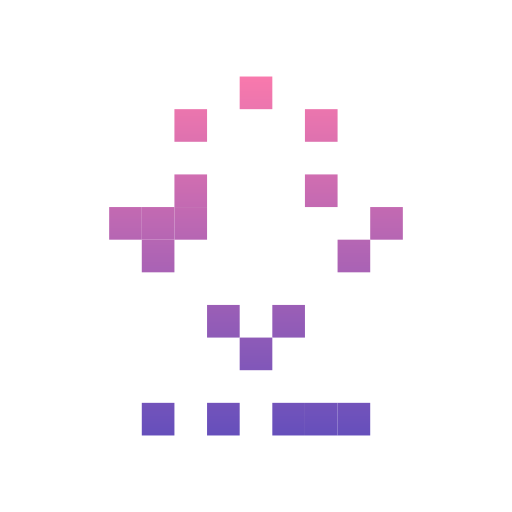
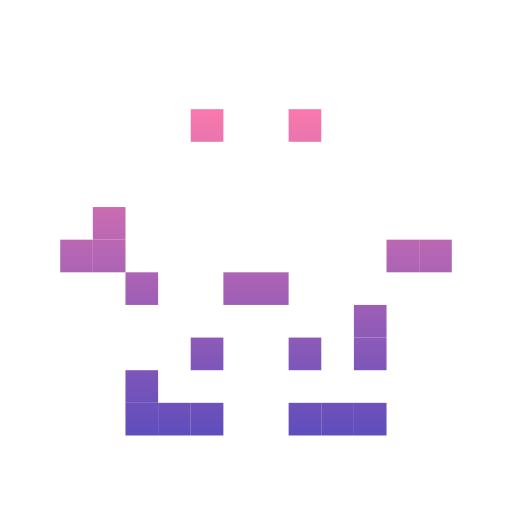
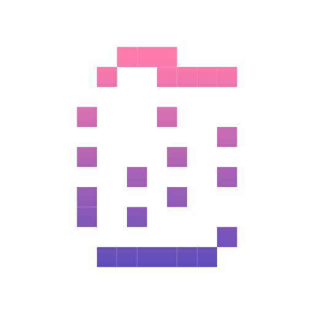
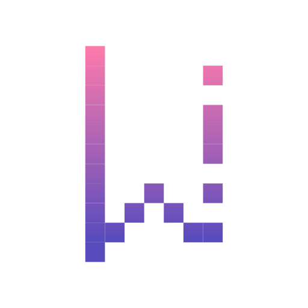
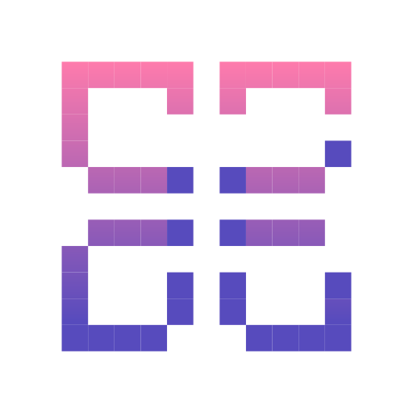
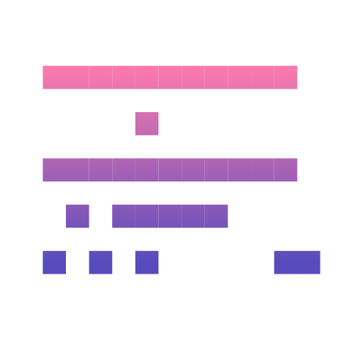

# 🖼️ Userinterface  Gallery

[⬅️ 回到首頁](../../README.md)

| 預覽 | 詳細資訊 |
| :--- | :--- |
|  | **001-folder.svg** VectorxVector | 4.09KB 更新: 2026-02-26 |
|  | **002-upload file.svg** VectorxVector | 4.76KB 更新: 2026-02-26 |
|  | **003-text file.svg** VectorxVector | 5.44KB 更新: 2026-02-26 |
|  | **004-upload button.svg** VectorxVector | 8.13KB 更新: 2026-02-26 |
|  | **005-downloads.svg** VectorxVector | 3.63KB 更新: 2026-02-26 |
|  | **006-download file.svg** VectorxVector | 7.43KB 更新: 2026-02-26 |
|  | **007-downloading.svg** VectorxVector | 6.71KB 更新: 2026-02-26 |
|  | **008-logout.svg** VectorxVector | 9.02KB 更新: 2026-02-26 |
|  | **009-login.svg** VectorxVector | 6.66KB 更新: 2026-02-26 |
|  | **010-warning.svg** VectorxVector | 4.03KB 更新: 2026-02-26 |
|  | **011-question.svg** VectorxVector | 4.29KB 更新: 2026-02-26 |
|  | **012-open folder.svg** VectorxVector | 4.42KB 更新: 2026-02-26 |
|  | **013-delete.svg** VectorxVector | 4.49KB 更新: 2026-02-26 |
|  | **014-add button.svg** VectorxVector | 4.25KB 更新: 2026-02-26 |
|  | **015-linked in.svg** VectorxVector | 11.71KB 更新: 2026-02-26 |
|  | **016-cloud app.svg** VectorxVector | 8.28KB 更新: 2026-02-26 |
|  | **017-cloud database.svg** VectorxVector | 8.28KB 更新: 2026-02-26 |
|  | **018-cloud connection.svg** VectorxVector | 11.18KB 更新: 2026-02-26 |
|  | **019-visible.svg** VectorxVector | 6.72KB 更新: 2026-02-26 |
|  | **020-no view.svg** VectorxVector | 8.12KB 更新: 2026-02-26 |
|  | **021-edit button.svg** VectorxVector | 3.98KB 更新: 2026-02-26 |
|  | **022-search.svg** VectorxVector | 5.02KB 更新: 2026-02-26 |
|  | **023-new folder.svg** VectorxVector | 5.21KB 更新: 2026-02-26 |
|  | **024-home.svg** VectorxVector | 4.46KB 更新: 2026-02-26 |
|  | **025-favorite.svg** VectorxVector | 7.30KB 更新: 2026-02-26 |
|  | **026-shopping bag.svg** VectorxVector | 3.82KB 更新: 2026-02-26 |
|  | **027-profile avatar.svg** VectorxVector | 4.98KB 更新: 2026-02-26 |
|  | **028-delete.svg** VectorxVector | 4.91KB 更新: 2026-02-26 |
|  | **029-lock symbol.svg** VectorxVector | 4.51KB 更新: 2026-02-26 |
|  | **030-like.svg** VectorxVector | 4.22KB 更新: 2026-02-26 |
|  | **031-calendar.svg** VectorxVector | 5.01KB 更新: 2026-02-26 |
|  | **032-event.svg** VectorxVector | 5.33KB 更新: 2026-02-26 |
|  | **033-card.svg** VectorxVector | 14.27KB 更新: 2026-02-26 |
|  | **034-folder type.svg** VectorxVector | 13.88KB 更新: 2026-02-26 |
|  | **035-card payment.svg** VectorxVector | 14.19KB 更新: 2026-02-26 |
|  | **036-bank account.svg** VectorxVector | 4.51KB 更新: 2026-02-26 |
|  | **037-wallet symbol.svg** VectorxVector | 13.31KB 更新: 2026-02-26 |
|  | **038-label.svg** VectorxVector | 6.82KB 更新: 2026-02-26 |
|  | **039-label mark.svg** VectorxVector | 6.63KB 更新: 2026-02-26 |
|  | **040-bookmark.svg** VectorxVector | 3.47KB 更新: 2026-02-26 |
|  | **041-bookmark variant.svg** VectorxVector | 3.52KB 更新: 2026-02-26 |
|  | **042-bookmark variant.svg** VectorxVector | 3.44KB 更新: 2026-02-26 |
|  | **043-power button.svg** VectorxVector | 4.47KB 更新: 2026-02-26 |
|  | **044-dashboard icons.svg** VectorxVector | 13.27KB 更新: 2026-02-26 |
|  | **045-zip file.svg** VectorxVector | 10.30KB 更新: 2026-02-26 |
|  | **046-display.svg** VectorxVector | 13.58KB 更新: 2026-02-26 |
|  | **047-play button.svg** VectorxVector | 4.48KB 更新: 2026-02-26 |
|  | **048-pause button.svg** VectorxVector | 4.54KB 更新: 2026-02-26 |
|  | **049-sound control.svg** VectorxVector | 6.83KB 更新: 2026-02-26 |
|  | **050-sound.svg** VectorxVector | 9.37KB 更新: 2026-02-26 |
|  | **051-no sound.svg** VectorxVector | 12.06KB 更新: 2026-02-26 |
|  | **052-microphone.svg** VectorxVector | 4.89KB 更新: 2026-02-26 |
|  | **053-no microphone.svg** VectorxVector | 8.44KB 更新: 2026-02-26 |
|  | **054-music and multimedia.svg** VectorxVector | 6.24KB 更新: 2026-02-26 |
|  | **055-list-check.svg** VectorxVector | 5.96KB 更新: 2026-02-26 |
|  | **056-duplicate.svg** VectorxVector | 12.79KB 更新: 2026-02-26 |
|  | **057-mail.svg** VectorxVector | 11.13KB 更新: 2026-02-26 |
|  | **058-new message.svg** VectorxVector | 11.10KB 更新: 2026-02-26 |
|  | **059-discard.svg** VectorxVector | 10.80KB 更新: 2026-02-26 |
|  | **060-send message.svg** VectorxVector | 12.79KB 更新: 2026-02-26 |
|  | **061-map marker.svg** VectorxVector | 5.32KB 更新: 2026-02-26 |
|  | **062-calling.svg** VectorxVector | 5.11KB 更新: 2026-02-26 |
|  | **063-call button.svg** VectorxVector | 6.41KB 更新: 2026-02-26 |
|  | **064-chat option.svg** VectorxVector | 9.77KB 更新: 2026-02-26 |
|  | **065-chat bubbles.svg** VectorxVector | 11.41KB 更新: 2026-02-26 |
|  | **066-chat balloon.svg** VectorxVector | 10.44KB 更新: 2026-02-26 |
|  | **067-folder type.svg** VectorxVector | 12.75KB 更新: 2026-02-26 |
|  | **068-list.svg** VectorxVector | 5.65KB 更新: 2026-02-26 |
|  | **069-link.svg** VectorxVector | 8.49KB 更新: 2026-02-26 |
|  | **070-linked in.svg** VectorxVector | 9.09KB 更新: 2026-02-26 |
|  | **071-good signal.svg** VectorxVector | 16.62KB 更新: 2026-02-26 |
|  | **072-signal.svg** VectorxVector | 10.68KB 更新: 2026-02-26 |
|  | **073-low signal.svg** VectorxVector | 5.96KB 更新: 2026-02-26 |
|  | **074-wi fi.svg** VectorxVector | 8.75KB 更新: 2026-02-26 |
|  | **075-high battery.svg** VectorxVector | 11.95KB 更新: 2026-02-26 |
|  | **076-battery level.svg** VectorxVector | 11.08KB 更新: 2026-02-26 |
|  | **077-low battery.svg** VectorxVector | 10.21KB 更新: 2026-02-26 |
|  | **078-notes.svg** VectorxVector | 5.09KB 更新: 2026-02-26 |
|  | **079-charger status.svg** VectorxVector | 10.46KB 更新: 2026-02-26 |
|  | **080-bluetooth.svg** VectorxVector | 8.20KB 更新: 2026-02-26 |
|  | **081-light.svg** VectorxVector | 6.96KB 更新: 2026-02-26 |
|  | **082-dark mode.svg** VectorxVector | 4.48KB 更新: 2026-02-26 |
|  | **083-file.svg** VectorxVector | 4.04KB 更新: 2026-02-26 |