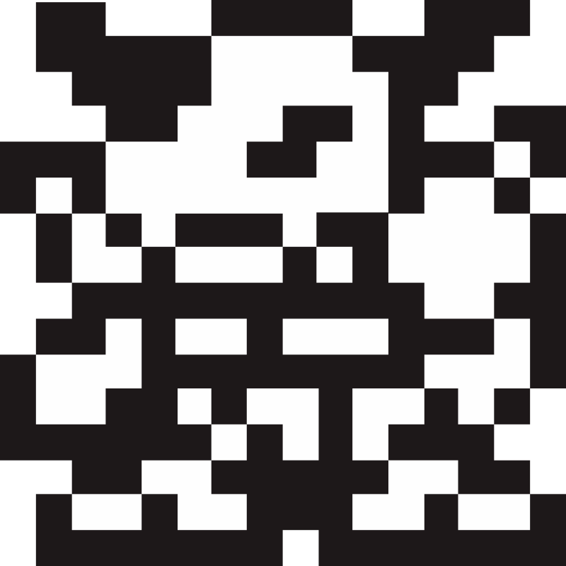
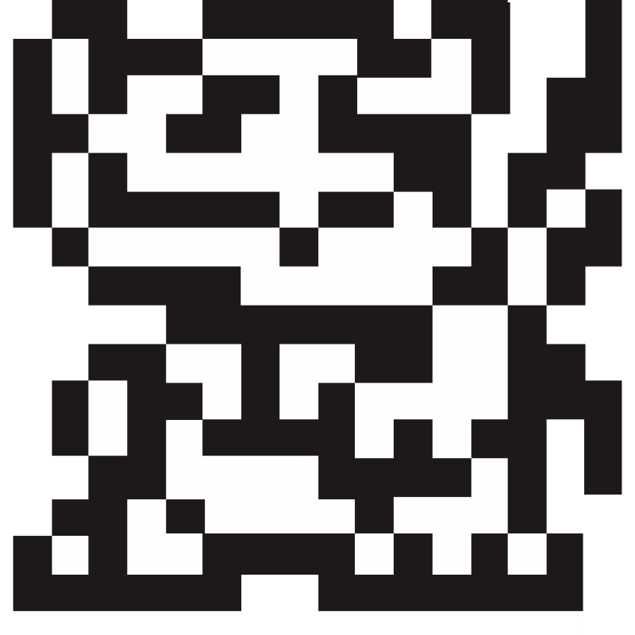
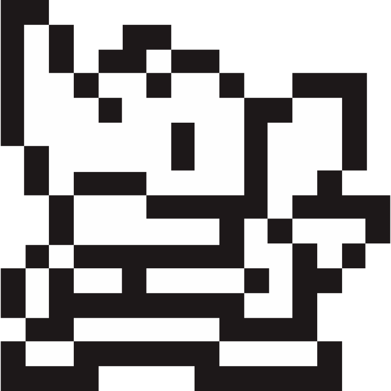
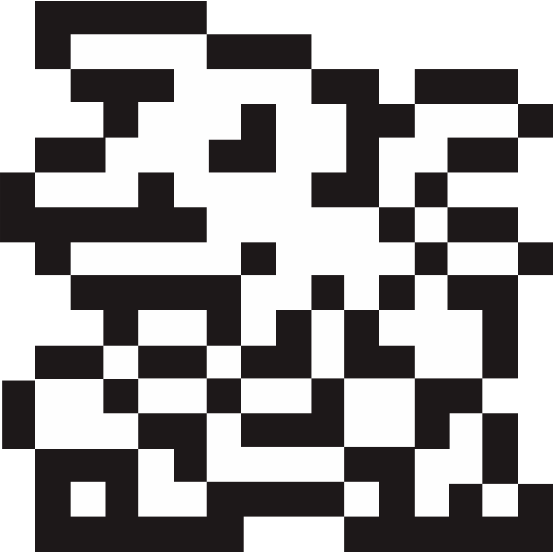
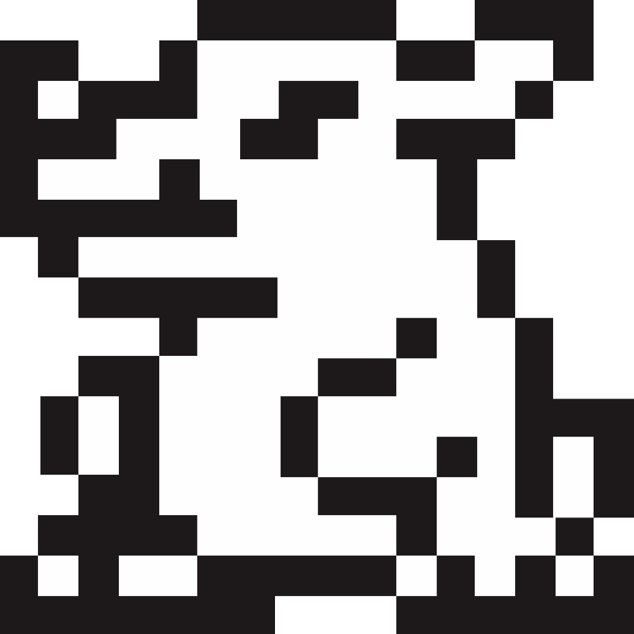

# 🖼️ 素材分類：Virtual Pet 8Bit Vectors

> [🏠 主目錄](../../../../README.md) / [images](../../../README.md) / [iCons](../../README.md) / [Pixel](../README.md) / **Virtual Pet 8Bit Vectors**

本目錄共有 `21` 個檔案

| 🎨 預覽 (點擊放大)  | 📋 檔案詳細資訊與連結 |
| :--- | :--- |
|  | **📂 檔名:** `monster-8bit-pet-1.svg` ✨ **格式:** `Vector (SVG)` ⚖️ **大小:** `2.25KB` 📅 **更新:** `2026-02-28`  🚀 **jsDelivr Markdown:** `` 🔗 **直接連結 (Url):** <code>https://cdn.jsdelivr.net/gh/barry028/materials@main/images/iCons/Pixel/Virtual%20Pet%208Bit%20Vectors/monster-8bit-pet-1.svg</code> 📥 [檢視原始檔](monster-8bit-pet-1.svg) |
|  | **📂 檔名:** `monster-8bit-pet-10.svg` ✨ **格式:** `Vector (SVG)` ⚖️ **大小:** `2.13KB` 📅 **更新:** `2026-02-28`  🚀 **jsDelivr Markdown:** `` 🔗 **直接連結 (Url):** <code>https://cdn.jsdelivr.net/gh/barry028/materials@main/images/iCons/Pixel/Virtual%20Pet%208Bit%20Vectors/monster-8bit-pet-10.svg</code> 📥 [檢視原始檔](monster-8bit-pet-10.svg) |
|  | **📂 檔名:** `monster-8bit-pet-11.svg` ✨ **格式:** `Vector (SVG)` ⚖️ **大小:** `1.84KB` 📅 **更新:** `2026-02-28`  🚀 **jsDelivr Markdown:** `` 🔗 **直接連結 (Url):** <code>https://cdn.jsdelivr.net/gh/barry028/materials@main/images/iCons/Pixel/Virtual%20Pet%208Bit%20Vectors/monster-8bit-pet-11.svg</code> 📥 [檢視原始檔](monster-8bit-pet-11.svg) |
|  | **📂 檔名:** `monster-8bit-pet-12.svg` ✨ **格式:** `Vector (SVG)` ⚖️ **大小:** `2.08KB` 📅 **更新:** `2026-02-28`  🚀 **jsDelivr Markdown:** `` 🔗 **直接連結 (Url):** <code>https://cdn.jsdelivr.net/gh/barry028/materials@main/images/iCons/Pixel/Virtual%20Pet%208Bit%20Vectors/monster-8bit-pet-12.svg</code> 📥 [檢視原始檔](monster-8bit-pet-12.svg) |
|  | **📂 檔名:** `monster-8bit-pet-13.svg` ✨ **格式:** `Vector (SVG)` ⚖️ **大小:** `1.99KB` 📅 **更新:** `2026-02-28`  🚀 **jsDelivr Markdown:** `` 🔗 **直接連結 (Url):** <code>https://cdn.jsdelivr.net/gh/barry028/materials@main/images/iCons/Pixel/Virtual%20Pet%208Bit%20Vectors/monster-8bit-pet-13.svg</code> 📥 [檢視原始檔](monster-8bit-pet-13.svg) |
|  | **📂 檔名:** `monster-8bit-pet-14.svg` ✨ **格式:** `Vector (SVG)` ⚖️ **大小:** `2.13KB` 📅 **更新:** `2026-02-28`  🚀 **jsDelivr Markdown:** `` 🔗 **直接連結 (Url):** <code>https://cdn.jsdelivr.net/gh/barry028/materials@main/images/iCons/Pixel/Virtual%20Pet%208Bit%20Vectors/monster-8bit-pet-14.svg</code> 📥 [檢視原始檔](monster-8bit-pet-14.svg) |
|  | **📂 檔名:** `monster-8bit-pet-15.svg` ✨ **格式:** `Vector (SVG)` ⚖️ **大小:** `2.06KB` 📅 **更新:** `2026-02-28`  🚀 **jsDelivr Markdown:** `` 🔗 **直接連結 (Url):** <code>https://cdn.jsdelivr.net/gh/barry028/materials@main/images/iCons/Pixel/Virtual%20Pet%208Bit%20Vectors/monster-8bit-pet-15.svg</code> 📥 [檢視原始檔](monster-8bit-pet-15.svg) |
|  | **📂 檔名:** `monster-8bit-pet-16.svg` ✨ **格式:** `Vector (SVG)` ⚖️ **大小:** `2.11KB` 📅 **更新:** `2026-02-28`  🚀 **jsDelivr Markdown:** `` 🔗 **直接連結 (Url):** <code>https://cdn.jsdelivr.net/gh/barry028/materials@main/images/iCons/Pixel/Virtual%20Pet%208Bit%20Vectors/monster-8bit-pet-16.svg</code> 📥 [檢視原始檔](monster-8bit-pet-16.svg) |
|  | **📂 檔名:** `monster-8bit-pet-17.svg` ✨ **格式:** `Vector (SVG)` ⚖️ **大小:** `2.43KB` 📅 **更新:** `2026-02-28`  🚀 **jsDelivr Markdown:** `` 🔗 **直接連結 (Url):** <code>https://cdn.jsdelivr.net/gh/barry028/materials@main/images/iCons/Pixel/Virtual%20Pet%208Bit%20Vectors/monster-8bit-pet-17.svg</code> 📥 [檢視原始檔](monster-8bit-pet-17.svg) |
|  | **📂 檔名:** `monster-8bit-pet-18.svg` ✨ **格式:** `Vector (SVG)` ⚖️ **大小:** `1.92KB` 📅 **更新:** `2026-02-28`  🚀 **jsDelivr Markdown:** `` 🔗 **直接連結 (Url):** <code>https://cdn.jsdelivr.net/gh/barry028/materials@main/images/iCons/Pixel/Virtual%20Pet%208Bit%20Vectors/monster-8bit-pet-18.svg</code> 📥 [檢視原始檔](monster-8bit-pet-18.svg) |
|  | **📂 檔名:** `monster-8bit-pet-2.svg` ✨ **格式:** `Vector (SVG)` ⚖️ **大小:** `2.59KB` 📅 **更新:** `2026-02-28`  🚀 **jsDelivr Markdown:** `` 🔗 **直接連結 (Url):** <code>https://cdn.jsdelivr.net/gh/barry028/materials@main/images/iCons/Pixel/Virtual%20Pet%208Bit%20Vectors/monster-8bit-pet-2.svg</code> 📥 [檢視原始檔](monster-8bit-pet-2.svg) |
|  | **📂 檔名:** `monster-8bit-pet-21.svg` ✨ **格式:** `Vector (SVG)` ⚖️ **大小:** `2.32KB` 📅 **更新:** `2026-02-28`  🚀 **jsDelivr Markdown:** `` 🔗 **直接連結 (Url):** <code>https://cdn.jsdelivr.net/gh/barry028/materials@main/images/iCons/Pixel/Virtual%20Pet%208Bit%20Vectors/monster-8bit-pet-21.svg</code> 📥 [檢視原始檔](monster-8bit-pet-21.svg) |
|  | **📂 檔名:** `monster-8bit-pet-22.svg` ✨ **格式:** `Vector (SVG)` ⚖️ **大小:** `2.19KB` 📅 **更新:** `2026-02-28`  🚀 **jsDelivr Markdown:** `` 🔗 **直接連結 (Url):** <code>https://cdn.jsdelivr.net/gh/barry028/materials@main/images/iCons/Pixel/Virtual%20Pet%208Bit%20Vectors/monster-8bit-pet-22.svg</code> 📥 [檢視原始檔](monster-8bit-pet-22.svg) |
|  | **📂 檔名:** `monster-8bit-pet-3.svg` ✨ **格式:** `Vector (SVG)` ⚖️ **大小:** `2.15KB` 📅 **更新:** `2026-02-28`  🚀 **jsDelivr Markdown:** `` 🔗 **直接連結 (Url):** <code>https://cdn.jsdelivr.net/gh/barry028/materials@main/images/iCons/Pixel/Virtual%20Pet%208Bit%20Vectors/monster-8bit-pet-3.svg</code> 📥 [檢視原始檔](monster-8bit-pet-3.svg) |
|  | **📂 檔名:** `monster-8bit-pet-4.svg` ✨ **格式:** `Vector (SVG)` ⚖️ **大小:** `1.37KB` 📅 **更新:** `2026-02-28`  🚀 **jsDelivr Markdown:** `` 🔗 **直接連結 (Url):** <code>https://cdn.jsdelivr.net/gh/barry028/materials@main/images/iCons/Pixel/Virtual%20Pet%208Bit%20Vectors/monster-8bit-pet-4.svg</code> 📥 [檢視原始檔](monster-8bit-pet-4.svg) |
|  | **📂 檔名:** `monster-8bit-pet-5.svg` ✨ **格式:** `Vector (SVG)` ⚖️ **大小:** `2.18KB` 📅 **更新:** `2026-02-28`  🚀 **jsDelivr Markdown:** `` 🔗 **直接連結 (Url):** <code>https://cdn.jsdelivr.net/gh/barry028/materials@main/images/iCons/Pixel/Virtual%20Pet%208Bit%20Vectors/monster-8bit-pet-5.svg</code> 📥 [檢視原始檔](monster-8bit-pet-5.svg) |
|  | **📂 檔名:** `monster-8bit-pet-6.svg` ✨ **格式:** `Vector (SVG)` ⚖️ **大小:** `2.56KB` 📅 **更新:** `2026-02-28`  🚀 **jsDelivr Markdown:** `` 🔗 **直接連結 (Url):** <code>https://cdn.jsdelivr.net/gh/barry028/materials@main/images/iCons/Pixel/Virtual%20Pet%208Bit%20Vectors/monster-8bit-pet-6.svg</code> 📥 [檢視原始檔](monster-8bit-pet-6.svg) |
|  | **📂 檔名:** `monster-8bit-pet-7.svg` ✨ **格式:** `Vector (SVG)` ⚖️ **大小:** `2.07KB` 📅 **更新:** `2026-02-28`  🚀 **jsDelivr Markdown:** `` 🔗 **直接連結 (Url):** <code>https://cdn.jsdelivr.net/gh/barry028/materials@main/images/iCons/Pixel/Virtual%20Pet%208Bit%20Vectors/monster-8bit-pet-7.svg</code> 📥 [檢視原始檔](monster-8bit-pet-7.svg) |
|  | **📂 檔名:** `monster-8bit-pet-8.svg` ✨ **格式:** `Vector (SVG)` ⚖️ **大小:** `2.01KB` 📅 **更新:** `2026-02-28`  🚀 **jsDelivr Markdown:** `` 🔗 **直接連結 (Url):** <code>https://cdn.jsdelivr.net/gh/barry028/materials@main/images/iCons/Pixel/Virtual%20Pet%208Bit%20Vectors/monster-8bit-pet-8.svg</code> 📥 [檢視原始檔](monster-8bit-pet-8.svg) |
|  | **📂 檔名:** `monster-8bit-pet-9.svg` ✨ **格式:** `Vector (SVG)` ⚖️ **大小:** `2.07KB` 📅 **更新:** `2026-02-28`  🚀 **jsDelivr Markdown:** `` 🔗 **直接連結 (Url):** <code>https://cdn.jsdelivr.net/gh/barry028/materials@main/images/iCons/Pixel/Virtual%20Pet%208Bit%20Vectors/monster-8bit-pet-9.svg</code> 📥 [檢視原始檔](monster-8bit-pet-9.svg) |
|  | **📂 檔名:** `monster-8bit-pet.svg` ✨ **格式:** `Vector (SVG)` ⚖️ **大小:** `2.12KB` 📅 **更新:** `2026-02-28`  🚀 **jsDelivr Markdown:** `` 🔗 **直接連結 (Url):** <code>https://cdn.jsdelivr.net/gh/barry028/materials@main/images/iCons/Pixel/Virtual%20Pet%208Bit%20Vectors/monster-8bit-pet.svg</code> 📥 [檢視原始檔](monster-8bit-pet.svg) |