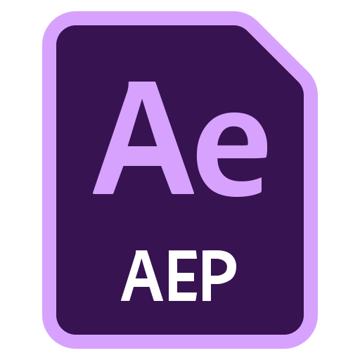
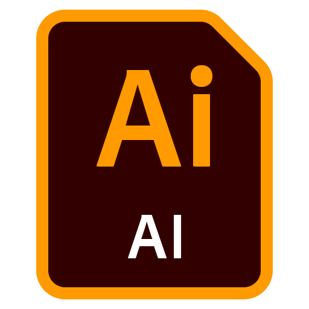

# 📂 目錄：iCons

> [🏠 主目錄](../../README.md) / [images](../README.md) / **iCons**

此目錄目前沒有直接存放圖片，請選擇下方子分類：

### 🗂️ 子分類列表

| 分類名稱 | 封面預覽 | 統計 |
| :--- | :--- | :--- |
| [📠**3D Hand Emojis**](3D%20Hand%20Emojis/README.md) | &nbsp;&nbsp;&nbsp;&nbsp;&nbsp;&nbsp;&nbsp;&nbsp;&nbsp; | 共 `94` 張 |
| [📠**AdobeCreativeSoftwareiiCons**](AdobeCreativeSoftwareiiCons/README.md) | &nbsp;&nbsp;&nbsp;&nbsp;&nbsp;&nbsp;&nbsp;&nbsp;&nbsp; | 共 `27` 張 |
| [📠**Ai Icons Text And Image Generation**](Ai%20Icons%20Text%20And%20Image%20Generation/README.md) | &nbsp;&nbsp;&nbsp;&nbsp;&nbsp;&nbsp;&nbsp;&nbsp;&nbsp; | 共 `82` 張 |
| [📠**Brands**](Brands/README.md) | &nbsp;&nbsp;&nbsp;&nbsp;&nbsp;&nbsp;&nbsp;&nbsp;&nbsp; | 共 `1775` 張 |
| [📠**Browsers**](Browsers/README.md) | &nbsp;&nbsp;&nbsp;&nbsp;&nbsp;&nbsp;&nbsp;&nbsp;&nbsp; | 共 `18` 張 |
| [📠**CRM**](CRM/README.md) | &nbsp;&nbsp;&nbsp;&nbsp;&nbsp;&nbsp;&nbsp;&nbsp;&nbsp; | 共 `185` 張 |
| [📠**CandyiCons**](CandyiCons/README.md) | &nbsp;&nbsp;&nbsp;&nbsp;&nbsp;&nbsp;&nbsp;&nbsp;&nbsp; | 共 `665` 張 |
| [📠**CapitaineCursors**](CapitaineCursors/README.md) | &nbsp;&nbsp;&nbsp;&nbsp;&nbsp;&nbsp;&nbsp;&nbsp;&nbsp; | 共 `112` 張 |
| [📠**Circum**](Circum/README.md) | &nbsp;&nbsp;&nbsp;&nbsp;&nbsp;&nbsp;&nbsp;&nbsp;&nbsp; | 共 `153` 張 |
| [📠**Company **](Company%20/README.md) | &nbsp;&nbsp;&nbsp;&nbsp;&nbsp;&nbsp;&nbsp;&nbsp;&nbsp; | 共 `81` 張 |
| [📠**Coolicons **](Coolicons%20/README.md) | &nbsp;&nbsp;&nbsp;&nbsp;&nbsp;&nbsp;&nbsp;&nbsp;&nbsp; | 共 `440` 張 |
| [📠**Cryptocurrency **](Cryptocurrency%20/README.md) | &nbsp;&nbsp;&nbsp;&nbsp;&nbsp;&nbsp;&nbsp;&nbsp;&nbsp; | 共 `663` 張 |
| [📠**DuoTune**](DuoTune/README.md) | &nbsp;&nbsp;&nbsp;&nbsp;&nbsp;&nbsp;&nbsp;&nbsp;&nbsp; | 共 `285` 張 |
| [📠**Fabulous**](Fabulous/README.md) | &nbsp;&nbsp;&nbsp;&nbsp;&nbsp;&nbsp;&nbsp;&nbsp;&nbsp; | 共 `109` 張 |
| [📠**Files**](Files/README.md) | &nbsp;&nbsp;&nbsp;&nbsp;&nbsp;&nbsp;&nbsp;&nbsp;&nbsp; | 共 `20` 張 |
| [📠**Folders**](Folders/README.md) | &nbsp;&nbsp;&nbsp;&nbsp;&nbsp;&nbsp;&nbsp;&nbsp;&nbsp; | 共 `294` 張 |
| [📠**Gaming**](Gaming/README.md) | &nbsp;&nbsp;&nbsp;&nbsp;&nbsp;&nbsp;&nbsp;&nbsp;&nbsp; | 共 `50` 張 |
| [📠**Glassmorphism **](Glassmorphism%20/README.md) | &nbsp;&nbsp;&nbsp;&nbsp;&nbsp;&nbsp;&nbsp;&nbsp;&nbsp; | 共 `152` 張 |
| [📠**GoogleCloud**](GoogleCloud/README.md) | &nbsp;&nbsp;&nbsp;&nbsp;&nbsp;&nbsp;&nbsp;&nbsp;&nbsp; | 共 `216` 張 |
| [📠**Hicon **](Hicon%20/README.md) | &nbsp;&nbsp;&nbsp;&nbsp;&nbsp;&nbsp;&nbsp;&nbsp;&nbsp; | 共 `2616` 張 |
| [📠**Iconbrew **](Iconbrew%20/README.md) | &nbsp;&nbsp;&nbsp;&nbsp;&nbsp;&nbsp;&nbsp;&nbsp;&nbsp; | 共 `1494` 張 |
| [📠**Iconly **](Iconly%20/README.md) | &nbsp;&nbsp;&nbsp;&nbsp;&nbsp;&nbsp;&nbsp;&nbsp;&nbsp; | 共 `1933` 張 |
| [📠**Iconos Ikon **](Iconos%20Ikon%20/README.md) | &nbsp;&nbsp;&nbsp;&nbsp;&nbsp;&nbsp;&nbsp;&nbsp;&nbsp; | 共 `736` 張 |
| [📠**Icons Vector Pixel **](Icons%20Vector%20Pixel%20/README.md) | &nbsp;&nbsp;&nbsp;&nbsp;&nbsp;&nbsp;&nbsp;&nbsp;&nbsp; | 共 `1325` 張 |
| [📠**Interface Vector **](Interface%20Vector%20/README.md) | &nbsp;&nbsp;&nbsp;&nbsp;&nbsp;&nbsp;&nbsp;&nbsp;&nbsp; | 共 `221` 張 |
| [📠**KritaiCon**](KritaiCon/README.md) | &nbsp;&nbsp;&nbsp;&nbsp;&nbsp;&nbsp;&nbsp;&nbsp;&nbsp; | 共 `283` 張 |
| [📠**Learns**](Learns/README.md) | &nbsp;&nbsp;&nbsp;&nbsp;&nbsp;&nbsp;&nbsp;&nbsp;&nbsp; | 共 `50` 張 |
| [📠**Macos Big Sur **](Macos%20Big%20Sur%20/README.md) | &nbsp;&nbsp;&nbsp;&nbsp;&nbsp;&nbsp;&nbsp;&nbsp;&nbsp; | 共 `70` 張 |
| [📠**Memoji Full **](Memoji%20Full%20/README.md) | &nbsp;&nbsp;&nbsp;&nbsp;&nbsp;&nbsp;&nbsp;&nbsp;&nbsp; | 共 `1651` 張 |
| [📠**Mingcute Icon **](Mingcute%20Icon%20/README.md) | &nbsp;&nbsp;&nbsp;&nbsp;&nbsp;&nbsp;&nbsp;&nbsp;&nbsp; | 共 `1106` 張 |
| [📠**Monstars**](Monstars/README.md) | &nbsp;&nbsp;&nbsp;&nbsp;&nbsp;&nbsp;&nbsp;&nbsp;&nbsp; | 共 `28` 張 |
| [📠**Palse Illustrations**](Palse%20Illustrations/README.md) | &nbsp;&nbsp;&nbsp;&nbsp;&nbsp;&nbsp;&nbsp;&nbsp;&nbsp; | 共 `143` 張 |
| [📠**Payment And Credit Card **](Payment%20And%20Credit%20Card%20/README.md) | &nbsp;&nbsp;&nbsp;&nbsp;&nbsp;&nbsp;&nbsp;&nbsp;&nbsp; | 共 `107` 張 |
| [📠**Pixel**](Pixel/README.md) | &nbsp;&nbsp;&nbsp;&nbsp;&nbsp;&nbsp;&nbsp;&nbsp;&nbsp; | 共 `9723` 張 |
| [📠**Pixelated Emoji Pack Emoji **](Pixelated%20Emoji%20Pack%20Emoji%20/README.md) | &nbsp;&nbsp;&nbsp;&nbsp;&nbsp;&nbsp;&nbsp;&nbsp;&nbsp; | 共 `23` 張 |
| [📠**Pro Emoji Pack**](Pro%20Emoji%20Pack/README.md) | &nbsp;&nbsp;&nbsp;&nbsp;&nbsp;&nbsp;&nbsp;&nbsp;&nbsp; | 共 `141` 張 |
| [📠**Remix **](Remix%20/README.md) | &nbsp;&nbsp;&nbsp;&nbsp;&nbsp;&nbsp;&nbsp;&nbsp;&nbsp; | 共 `2271` 張 |
| [📠**Sitemap Cards**](Sitemap%20Cards/README.md) | &nbsp;&nbsp;&nbsp;&nbsp;&nbsp;&nbsp;&nbsp;&nbsp;&nbsp; | 共 `120` 張 |
| [📠**Sketch**](Sketch/README.md) | &nbsp;&nbsp;&nbsp;&nbsp;&nbsp;&nbsp;&nbsp;&nbsp;&nbsp; | 共 `670` 張 |
| [📠**Socialicious**](Socialicious/README.md) | &nbsp;&nbsp;&nbsp;&nbsp;&nbsp;&nbsp;&nbsp;&nbsp;&nbsp; | 共 `74` 張 |
| [📠**Ui Ux Graphic Design**](Ui%20Ux%20Graphic%20Design/README.md) | &nbsp;&nbsp;&nbsp;&nbsp;&nbsp;&nbsp;&nbsp;&nbsp;&nbsp; | 共 `1026` 張 |
| [📠**Unicons **](Unicons%20/README.md) | &nbsp;&nbsp;&nbsp;&nbsp;&nbsp;&nbsp;&nbsp;&nbsp;&nbsp; | 共 `1896` 張 |
| [📠**WebSkills**](WebSkills/README.md) | &nbsp;&nbsp;&nbsp;&nbsp;&nbsp;&nbsp;&nbsp;&nbsp;&nbsp; | 共 `351` 張 |