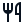

# 🖼️ 素材分類：map

> [🏠 主目錄](../../../../../README.md) / [images](../../../../README.md) / [iCons](../../../README.md) / [Remix](../../README.md) / [line](../README.md) / **map**

本目錄共有 `85` 個檔案

| 🎨 預覽 (點擊放大)  | 📋 檔案詳細資訊與連結 |
| :--- | :--- |
|  | **📂 檔名:** `anchor-line.svg` ✨ **格式:** `Vector (SVG)` ⚖️ **大小:** `1.24KB` 📅 **更新:** `2026-03-01`  🚀 **jsDelivr Markdown:** `` 🔗 **直接連結 (Url):** <code>https://cdn.jsdelivr.net/gh/barry028/materials@main/images/iCons/Remix/line/map/anchor-line.svg</code> 📥 [檢視原始檔](anchor-line.svg) |
|  | **📂 檔名:** `barricade-line.svg` ✨ **格式:** `Vector (SVG)` ⚖️ **大小:** `634.00B` 📅 **更新:** `2026-03-01`  🚀 **jsDelivr Markdown:** `` 🔗 **直接連結 (Url):** <code>https://cdn.jsdelivr.net/gh/barry028/materials@main/images/iCons/Remix/line/map/barricade-line.svg</code> 📥 [檢視原始檔](barricade-line.svg) |
|  | **📂 檔名:** `bike-line.svg` ✨ **格式:** `Vector (SVG)` ⚖️ **大小:** `1.66KB` 📅 **更新:** `2026-03-01`  🚀 **jsDelivr Markdown:** `` 🔗 **直接連結 (Url):** <code>https://cdn.jsdelivr.net/gh/barry028/materials@main/images/iCons/Remix/line/map/bike-line.svg</code> 📥 [檢視原始檔](bike-line.svg) |
|  | **📂 檔名:** `bus-2-line.svg` ✨ **格式:** `Vector (SVG)` ⚖️ **大小:** `1.39KB` 📅 **更新:** `2026-03-01`  🚀 **jsDelivr Markdown:** `` 🔗 **直接連結 (Url):** <code>https://cdn.jsdelivr.net/gh/barry028/materials@main/images/iCons/Remix/line/map/bus-2-line.svg</code> 📥 [檢視原始檔](bus-2-line.svg) |
|  | **📂 檔名:** `bus-line.svg` ✨ **格式:** `Vector (SVG)` ⚖️ **大小:** `847.00B` 📅 **更新:** `2026-03-01`  🚀 **jsDelivr Markdown:** `` 🔗 **直接連結 (Url):** <code>https://cdn.jsdelivr.net/gh/barry028/materials@main/images/iCons/Remix/line/map/bus-line.svg</code> 📥 [檢視原始檔](bus-line.svg) |
|  | **📂 檔名:** `bus-wifi-line.svg` ✨ **格式:** `Vector (SVG)` ⚖️ **大小:** `1.53KB` 📅 **更新:** `2026-03-01`  🚀 **jsDelivr Markdown:** `` 🔗 **直接連結 (Url):** <code>https://cdn.jsdelivr.net/gh/barry028/materials@main/images/iCons/Remix/line/map/bus-wifi-line.svg</code> 📥 [檢視原始檔](bus-wifi-line.svg) |
|  | **📂 檔名:** `car-line.svg` ✨ **格式:** `Vector (SVG)` ⚖️ **大小:** `1.45KB` 📅 **更新:** `2026-03-01`  🚀 **jsDelivr Markdown:** `` 🔗 **直接連結 (Url):** <code>https://cdn.jsdelivr.net/gh/barry028/materials@main/images/iCons/Remix/line/map/car-line.svg</code> 📥 [檢視原始檔](car-line.svg) |
|  | **📂 檔名:** `car-washing-line.svg` ✨ **格式:** `Vector (SVG)` ⚖️ **大小:** `2.67KB` 📅 **更新:** `2026-03-01`  🚀 **jsDelivr Markdown:** `` 🔗 **直接連結 (Url):** <code>https://cdn.jsdelivr.net/gh/barry028/materials@main/images/iCons/Remix/line/map/car-washing-line.svg</code> 📥 [檢視原始檔](car-washing-line.svg) |
|  | **📂 檔名:** `caravan-line.svg` ✨ **格式:** `Vector (SVG)` ⚖️ **大小:** `726.00B` 📅 **更新:** `2026-03-01`  🚀 **jsDelivr Markdown:** `` 🔗 **直接連結 (Url):** <code>https://cdn.jsdelivr.net/gh/barry028/materials@main/images/iCons/Remix/line/map/caravan-line.svg</code> 📥 [檢視原始檔](caravan-line.svg) |
|  | **📂 檔名:** `charging-pile-2-line.svg` ✨ **格式:** `Vector (SVG)` ⚖️ **大小:** `913.00B` 📅 **更新:** `2026-03-01`  🚀 **jsDelivr Markdown:** `` 🔗 **直接連結 (Url):** <code>https://cdn.jsdelivr.net/gh/barry028/materials@main/images/iCons/Remix/line/map/charging-pile-2-line.svg</code> 📥 [檢視原始檔](charging-pile-2-line.svg) |
|  | **📂 檔名:** `charging-pile-line.svg` ✨ **格式:** `Vector (SVG)` ⚖️ **大小:** `1.07KB` 📅 **更新:** `2026-03-01`  🚀 **jsDelivr Markdown:** `` 🔗 **直接連結 (Url):** <code>https://cdn.jsdelivr.net/gh/barry028/materials@main/images/iCons/Remix/line/map/charging-pile-line.svg</code> 📥 [檢視原始檔](charging-pile-line.svg) |
|  | **📂 檔名:** `china-railway-line.svg` ✨ **格式:** `Vector (SVG)` ⚖️ **大小:** `1.14KB` 📅 **更新:** `2026-03-01`  🚀 **jsDelivr Markdown:** `` 🔗 **直接連結 (Url):** <code>https://cdn.jsdelivr.net/gh/barry028/materials@main/images/iCons/Remix/line/map/china-railway-line.svg</code> 📥 [檢視原始檔](china-railway-line.svg) |
|  | **📂 檔名:** `compass-2-line.svg` ✨ **格式:** `Vector (SVG)` ⚖️ **大小:** `654.00B` 📅 **更新:** `2026-03-01`  🚀 **jsDelivr Markdown:** `` 🔗 **直接連結 (Url):** <code>https://cdn.jsdelivr.net/gh/barry028/materials@main/images/iCons/Remix/line/map/compass-2-line.svg</code> 📥 [檢視原始檔](compass-2-line.svg) |
|  | **📂 檔名:** `compass-3-line.svg` ✨ **格式:** `Vector (SVG)` ⚖️ **大小:** `1.00KB` 📅 **更新:** `2026-03-01`  🚀 **jsDelivr Markdown:** `` 🔗 **直接連結 (Url):** <code>https://cdn.jsdelivr.net/gh/barry028/materials@main/images/iCons/Remix/line/map/compass-3-line.svg</code> 📥 [檢視原始檔](compass-3-line.svg) |
|  | **📂 檔名:** `compass-4-line.svg` ✨ **格式:** `Vector (SVG)` ⚖️ **大小:** `807.00B` 📅 **更新:** `2026-03-01`  🚀 **jsDelivr Markdown:** `` 🔗 **直接連結 (Url):** <code>https://cdn.jsdelivr.net/gh/barry028/materials@main/images/iCons/Remix/line/map/compass-4-line.svg</code> 📥 [檢視原始檔](compass-4-line.svg) |
|  | **📂 檔名:** `compass-discover-line.svg` ✨ **格式:** `Vector (SVG)` ⚖️ **大小:** `715.00B` 📅 **更新:** `2026-03-01`  🚀 **jsDelivr Markdown:** `` 🔗 **直接連結 (Url):** <code>https://cdn.jsdelivr.net/gh/barry028/materials@main/images/iCons/Remix/line/map/compass-discover-line.svg</code> 📥 [檢視原始檔](compass-discover-line.svg) |
|  | **📂 檔名:** `compass-line.svg` ✨ **格式:** `Vector (SVG)` ⚖️ **大小:** `725.00B` 📅 **更新:** `2026-03-01`  🚀 **jsDelivr Markdown:** `` 🔗 **直接連結 (Url):** <code>https://cdn.jsdelivr.net/gh/barry028/materials@main/images/iCons/Remix/line/map/compass-line.svg</code> 📥 [檢視原始檔](compass-line.svg) |
|  | **📂 檔名:** `cup-line.svg` ✨ **格式:** `Vector (SVG)` ⚖️ **大小:** `863.00B` 📅 **更新:** `2026-03-01`  🚀 **jsDelivr Markdown:** `` 🔗 **直接連結 (Url):** <code>https://cdn.jsdelivr.net/gh/barry028/materials@main/images/iCons/Remix/line/map/cup-line.svg</code> 📥 [檢視原始檔](cup-line.svg) |
|  | **📂 檔名:** `direction-line.svg` ✨ **格式:** `Vector (SVG)` ⚖️ **大小:** `934.00B` 📅 **更新:** `2026-03-01`  🚀 **jsDelivr Markdown:** `` 🔗 **直接連結 (Url):** <code>https://cdn.jsdelivr.net/gh/barry028/materials@main/images/iCons/Remix/line/map/direction-line.svg</code> 📥 [檢視原始檔](direction-line.svg) |
|  | **📂 檔名:** `e-bike-2-line.svg` ✨ **格式:** `Vector (SVG)` ⚖️ **大小:** `1.27KB` 📅 **更新:** `2026-03-01`  🚀 **jsDelivr Markdown:** `` 🔗 **直接連結 (Url):** <code>https://cdn.jsdelivr.net/gh/barry028/materials@main/images/iCons/Remix/line/map/e-bike-2-line.svg</code> 📥 [檢視原始檔](e-bike-2-line.svg) |
|  | **📂 檔名:** `e-bike-line.svg` ✨ **格式:** `Vector (SVG)` ⚖️ **大小:** `1.93KB` 📅 **更新:** `2026-03-01`  🚀 **jsDelivr Markdown:** `` 🔗 **直接連結 (Url):** <code>https://cdn.jsdelivr.net/gh/barry028/materials@main/images/iCons/Remix/line/map/e-bike-line.svg</code> 📥 [檢視原始檔](e-bike-line.svg) |
|  | **📂 檔名:** `earth-line.svg` ✨ **格式:** `Vector (SVG)` ⚖️ **大小:** `1.66KB` 📅 **更新:** `2026-03-01`  🚀 **jsDelivr Markdown:** `` 🔗 **直接連結 (Url):** <code>https://cdn.jsdelivr.net/gh/barry028/materials@main/images/iCons/Remix/line/map/earth-line.svg</code> 📥 [檢視原始檔](earth-line.svg) |
|  | **📂 檔名:** `flight-land-line.svg` ✨ **格式:** `Vector (SVG)` ⚖️ **大小:** `961.00B` 📅 **更新:** `2026-03-01`  🚀 **jsDelivr Markdown:** `` 🔗 **直接連結 (Url):** <code>https://cdn.jsdelivr.net/gh/barry028/materials@main/images/iCons/Remix/line/map/flight-land-line.svg</code> 📥 [檢視原始檔](flight-land-line.svg) |
|  | **📂 檔名:** `flight-takeoff-line.svg` ✨ **格式:** `Vector (SVG)` ⚖️ **大小:** `791.00B` 📅 **更新:** `2026-03-01`  🚀 **jsDelivr Markdown:** `` 🔗 **直接連結 (Url):** <code>https://cdn.jsdelivr.net/gh/barry028/materials@main/images/iCons/Remix/line/map/flight-takeoff-line.svg</code> 📥 [檢視原始檔](flight-takeoff-line.svg) |
|  | **📂 檔名:** `footprint-line.svg` ✨ **格式:** `Vector (SVG)` ⚖️ **大小:** `1.46KB` 📅 **更新:** `2026-03-01`  🚀 **jsDelivr Markdown:** `` 🔗 **直接連結 (Url):** <code>https://cdn.jsdelivr.net/gh/barry028/materials@main/images/iCons/Remix/line/map/footprint-line.svg</code> 📥 [檢視原始檔](footprint-line.svg) |
|  | **📂 檔名:** `gas-station-line.svg` ✨ **格式:** `Vector (SVG)` ⚖️ **大小:** `1.06KB` 📅 **更新:** `2026-03-01`  🚀 **jsDelivr Markdown:** `` 🔗 **直接連結 (Url):** <code>https://cdn.jsdelivr.net/gh/barry028/materials@main/images/iCons/Remix/line/map/gas-station-line.svg</code> 📥 [檢視原始檔](gas-station-line.svg) |
|  | **📂 檔名:** `globe-line.svg` ✨ **格式:** `Vector (SVG)` ⚖️ **大小:** `1.80KB` 📅 **更新:** `2026-03-01`  🚀 **jsDelivr Markdown:** `` 🔗 **直接連結 (Url):** <code>https://cdn.jsdelivr.net/gh/barry028/materials@main/images/iCons/Remix/line/map/globe-line.svg</code> 📥 [檢視原始檔](globe-line.svg) |
|  | **📂 檔名:** `goblet-line.svg` ✨ **格式:** `Vector (SVG)` ⚖️ **大小:** `387.00B` 📅 **更新:** `2026-03-01`  🚀 **jsDelivr Markdown:** `` 🔗 **直接連結 (Url):** <code>https://cdn.jsdelivr.net/gh/barry028/materials@main/images/iCons/Remix/line/map/goblet-line.svg</code> 📥 [檢視原始檔](goblet-line.svg) |
|  | **📂 檔名:** `guide-line.svg` ✨ **格式:** `Vector (SVG)` ⚖️ **大小:** `1.25KB` 📅 **更新:** `2026-03-01`  🚀 **jsDelivr Markdown:** `` 🔗 **直接連結 (Url):** <code>https://cdn.jsdelivr.net/gh/barry028/materials@main/images/iCons/Remix/line/map/guide-line.svg</code> 📥 [檢視原始檔](guide-line.svg) |
|  | **📂 檔名:** `hotel-bed-line.svg` ✨ **格式:** `Vector (SVG)` ⚖️ **大小:** `1.05KB` 📅 **更新:** `2026-03-01`  🚀 **jsDelivr Markdown:** `` 🔗 **直接連結 (Url):** <code>https://cdn.jsdelivr.net/gh/barry028/materials@main/images/iCons/Remix/line/map/hotel-bed-line.svg</code> 📥 [檢視原始檔](hotel-bed-line.svg) |
|  | **📂 檔名:** `lifebuoy-line.svg` ✨ **格式:** `Vector (SVG)` ⚖️ **大小:** `1.40KB` 📅 **更新:** `2026-03-01`  🚀 **jsDelivr Markdown:** `` 🔗 **直接連結 (Url):** <code>https://cdn.jsdelivr.net/gh/barry028/materials@main/images/iCons/Remix/line/map/lifebuoy-line.svg</code> 📥 [檢視原始檔](lifebuoy-line.svg) |
|  | **📂 檔名:** `luggage-cart-line.svg` ✨ **格式:** `Vector (SVG)` ⚖️ **大小:** `1.09KB` 📅 **更新:** `2026-03-01`  🚀 **jsDelivr Markdown:** `` 🔗 **直接連結 (Url):** <code>https://cdn.jsdelivr.net/gh/barry028/materials@main/images/iCons/Remix/line/map/luggage-cart-line.svg</code> 📥 [檢視原始檔](luggage-cart-line.svg) |
|  | **📂 檔名:** `luggage-deposit-line.svg` ✨ **格式:** `Vector (SVG)` ⚖️ **大小:** `457.00B` 📅 **更新:** `2026-03-01`  🚀 **jsDelivr Markdown:** `` 🔗 **直接連結 (Url):** <code>https://cdn.jsdelivr.net/gh/barry028/materials@main/images/iCons/Remix/line/map/luggage-deposit-line.svg</code> 📥 [檢視原始檔](luggage-deposit-line.svg) |
|  | **📂 檔名:** `map-2-line.svg` ✨ **格式:** `Vector (SVG)` ⚖️ **大小:** `820.00B` 📅 **更新:** `2026-03-01`  🚀 **jsDelivr Markdown:** `` 🔗 **直接連結 (Url):** <code>https://cdn.jsdelivr.net/gh/barry028/materials@main/images/iCons/Remix/line/map/map-2-line.svg</code> 📥 [檢視原始檔](map-2-line.svg) |
|  | **📂 檔名:** `map-line.svg` ✨ **格式:** `Vector (SVG)` ⚖️ **大小:** `796.00B` 📅 **更新:** `2026-03-01`  🚀 **jsDelivr Markdown:** `` 🔗 **直接連結 (Url):** <code>https://cdn.jsdelivr.net/gh/barry028/materials@main/images/iCons/Remix/line/map/map-line.svg</code> 📥 [檢視原始檔](map-line.svg) |
|  | **📂 檔名:** `map-pin-2-line.svg` ✨ **格式:** `Vector (SVG)` ⚖️ **大小:** `1.34KB` 📅 **更新:** `2026-03-01`  🚀 **jsDelivr Markdown:** `` 🔗 **直接連結 (Url):** <code>https://cdn.jsdelivr.net/gh/barry028/materials@main/images/iCons/Remix/line/map/map-pin-2-line.svg</code> 📥 [檢視原始檔](map-pin-2-line.svg) |
|  | **📂 檔名:** `map-pin-3-line.svg` ✨ **格式:** `Vector (SVG)` ⚖️ **大小:** `1.14KB` 📅 **更新:** `2026-03-01`  🚀 **jsDelivr Markdown:** `` 🔗 **直接連結 (Url):** <code>https://cdn.jsdelivr.net/gh/barry028/materials@main/images/iCons/Remix/line/map/map-pin-3-line.svg</code> 📥 [檢視原始檔](map-pin-3-line.svg) |
|  | **📂 檔名:** `map-pin-4-line.svg` ✨ **格式:** `Vector (SVG)` ⚖️ **大小:** `1.04KB` 📅 **更新:** `2026-03-01`  🚀 **jsDelivr Markdown:** `` 🔗 **直接連結 (Url):** <code>https://cdn.jsdelivr.net/gh/barry028/materials@main/images/iCons/Remix/line/map/map-pin-4-line.svg</code> 📥 [檢視原始檔](map-pin-4-line.svg) |
|  | **📂 檔名:** `map-pin-5-line.svg` ✨ **格式:** `Vector (SVG)` ⚖️ **大小:** `1.08KB` 📅 **更新:** `2026-03-01`  🚀 **jsDelivr Markdown:** `` 🔗 **直接連結 (Url):** <code>https://cdn.jsdelivr.net/gh/barry028/materials@main/images/iCons/Remix/line/map/map-pin-5-line.svg</code> 📥 [檢視原始檔](map-pin-5-line.svg) |
|  | **📂 檔名:** `map-pin-add-line.svg` ✨ **格式:** `Vector (SVG)` ⚖️ **大小:** `1.08KB` 📅 **更新:** `2026-03-01`  🚀 **jsDelivr Markdown:** `` 🔗 **直接連結 (Url):** <code>https://cdn.jsdelivr.net/gh/barry028/materials@main/images/iCons/Remix/line/map/map-pin-add-line.svg</code> 📥 [檢視原始檔](map-pin-add-line.svg) |
|  | **📂 檔名:** `map-pin-line.svg` ✨ **格式:** `Vector (SVG)` ⚖️ **大小:** `1.63KB` 📅 **更新:** `2026-03-01`  🚀 **jsDelivr Markdown:** `` 🔗 **直接連結 (Url):** <code>https://cdn.jsdelivr.net/gh/barry028/materials@main/images/iCons/Remix/line/map/map-pin-line.svg</code> 📥 [檢視原始檔](map-pin-line.svg) |
|  | **📂 檔名:** `map-pin-range-line.svg` ✨ **格式:** `Vector (SVG)` ⚖️ **大小:** `1.35KB` 📅 **更新:** `2026-03-01`  🚀 **jsDelivr Markdown:** `` 🔗 **直接連結 (Url):** <code>https://cdn.jsdelivr.net/gh/barry028/materials@main/images/iCons/Remix/line/map/map-pin-range-line.svg</code> 📥 [檢視原始檔](map-pin-range-line.svg) |
|  | **📂 檔名:** `map-pin-time-line.svg` ✨ **格式:** `Vector (SVG)` ⚖️ **大小:** `1.06KB` 📅 **更新:** `2026-03-01`  🚀 **jsDelivr Markdown:** `` 🔗 **直接連結 (Url):** <code>https://cdn.jsdelivr.net/gh/barry028/materials@main/images/iCons/Remix/line/map/map-pin-time-line.svg</code> 📥 [檢視原始檔](map-pin-time-line.svg) |
|  | **📂 檔名:** `map-pin-user-line.svg` ✨ **格式:** `Vector (SVG)` ⚖️ **大小:** `2.01KB` 📅 **更新:** `2026-03-01`  🚀 **jsDelivr Markdown:** `` 🔗 **直接連結 (Url):** <code>https://cdn.jsdelivr.net/gh/barry028/materials@main/images/iCons/Remix/line/map/map-pin-user-line.svg</code> 📥 [檢視原始檔](map-pin-user-line.svg) |
|  | **📂 檔名:** `motorbike-line.svg` ✨ **格式:** `Vector (SVG)` ⚖️ **大小:** `2.06KB` 📅 **更新:** `2026-03-01`  🚀 **jsDelivr Markdown:** `` 🔗 **直接連結 (Url):** <code>https://cdn.jsdelivr.net/gh/barry028/materials@main/images/iCons/Remix/line/map/motorbike-line.svg</code> 📥 [檢視原始檔](motorbike-line.svg) |
|  | **📂 檔名:** `navigation-line.svg` ✨ **格式:** `Vector (SVG)` ⚖️ **大小:** `966.00B` 📅 **更新:** `2026-03-01`  🚀 **jsDelivr Markdown:** `` 🔗 **直接連結 (Url):** <code>https://cdn.jsdelivr.net/gh/barry028/materials@main/images/iCons/Remix/line/map/navigation-line.svg</code> 📥 [檢視原始檔](navigation-line.svg) |
|  | **📂 檔名:** `oil-line.svg` ✨ **格式:** `Vector (SVG)` ⚖️ **大小:** `726.00B` 📅 **更新:** `2026-03-01`  🚀 **jsDelivr Markdown:** `` 🔗 **直接連結 (Url):** <code>https://cdn.jsdelivr.net/gh/barry028/materials@main/images/iCons/Remix/line/map/oil-line.svg</code> 📥 [檢視原始檔](oil-line.svg) |
|  | **📂 檔名:** `parking-box-line.svg` ✨ **格式:** `Vector (SVG)` ⚖️ **大小:** `939.00B` 📅 **更新:** `2026-03-01`  🚀 **jsDelivr Markdown:** `` 🔗 **直接連結 (Url):** <code>https://cdn.jsdelivr.net/gh/barry028/materials@main/images/iCons/Remix/line/map/parking-box-line.svg</code> 📥 [檢視原始檔](parking-box-line.svg) |
|  | **📂 檔名:** `parking-line.svg` ✨ **格式:** `Vector (SVG)` ⚖️ **大小:** `599.00B` 📅 **更新:** `2026-03-01`  🚀 **jsDelivr Markdown:** `` 🔗 **直接連結 (Url):** <code>https://cdn.jsdelivr.net/gh/barry028/materials@main/images/iCons/Remix/line/map/parking-line.svg</code> 📥 [檢視原始檔](parking-line.svg) |
|  | **📂 檔名:** `passport-line.svg` ✨ **格式:** `Vector (SVG)` ⚖️ **大小:** `1.20KB` 📅 **更新:** `2026-03-01`  🚀 **jsDelivr Markdown:** `` 🔗 **直接連結 (Url):** <code>https://cdn.jsdelivr.net/gh/barry028/materials@main/images/iCons/Remix/line/map/passport-line.svg</code> 📥 [檢視原始檔](passport-line.svg) |
|  | **📂 檔名:** `pin-distance-line.svg` ✨ **格式:** `Vector (SVG)` ⚖️ **大小:** `2.53KB` 📅 **更新:** `2026-03-01`  🚀 **jsDelivr Markdown:** `` 🔗 **直接連結 (Url):** <code>https://cdn.jsdelivr.net/gh/barry028/materials@main/images/iCons/Remix/line/map/pin-distance-line.svg</code> 📥 [檢視原始檔](pin-distance-line.svg) |
|  | **📂 檔名:** `plane-line.svg` ✨ **格式:** `Vector (SVG)` ⚖️ **大小:** `530.00B` 📅 **更新:** `2026-03-01`  🚀 **jsDelivr Markdown:** `` 🔗 **直接連結 (Url):** <code>https://cdn.jsdelivr.net/gh/barry028/materials@main/images/iCons/Remix/line/map/plane-line.svg</code> 📥 [檢視原始檔](plane-line.svg) |
|  | **📂 檔名:** `police-car-line.svg` ✨ **格式:** `Vector (SVG)` ⚖️ **大小:** `2.19KB` 📅 **更新:** `2026-03-01`  🚀 **jsDelivr Markdown:** `` 🔗 **直接連結 (Url):** <code>https://cdn.jsdelivr.net/gh/barry028/materials@main/images/iCons/Remix/line/map/police-car-line.svg</code> 📥 [檢視原始檔](police-car-line.svg) |
|  | **📂 檔名:** `pushpin-2-line.svg` ✨ **格式:** `Vector (SVG)` ⚖️ **大小:** `367.00B` 📅 **更新:** `2026-03-01`  🚀 **jsDelivr Markdown:** `` 🔗 **直接連結 (Url):** <code>https://cdn.jsdelivr.net/gh/barry028/materials@main/images/iCons/Remix/line/map/pushpin-2-line.svg</code> 📥 [檢視原始檔](pushpin-2-line.svg) |
|  | **📂 檔名:** `pushpin-line.svg` ✨ **格式:** `Vector (SVG)` ⚖️ **大小:** `630.00B` 📅 **更新:** `2026-03-01`  🚀 **jsDelivr Markdown:** `` 🔗 **直接連結 (Url):** <code>https://cdn.jsdelivr.net/gh/barry028/materials@main/images/iCons/Remix/line/map/pushpin-line.svg</code> 📥 [檢視原始檔](pushpin-line.svg) |
|  | **📂 檔名:** `restaurant-2-line.svg` ✨ **格式:** `Vector (SVG)` ⚖️ **大小:** `871.00B` 📅 **更新:** `2026-03-01`  🚀 **jsDelivr Markdown:** `` 🔗 **直接連結 (Url):** <code>https://cdn.jsdelivr.net/gh/barry028/materials@main/images/iCons/Remix/line/map/restaurant-2-line.svg</code> 📥 [檢視原始檔](restaurant-2-line.svg) |
|  | **📂 檔名:** `restaurant-line.svg` ✨ **格式:** `Vector (SVG)` ⚖️ **大小:** `618.00B` 📅 **更新:** `2026-03-01`  🚀 **jsDelivr Markdown:** `` 🔗 **直接連結 (Url):** <code>https://cdn.jsdelivr.net/gh/barry028/materials@main/images/iCons/Remix/line/map/restaurant-line.svg</code> 📥 [檢視原始檔](restaurant-line.svg) |
|  | **📂 檔名:** `riding-line.svg` ✨ **格式:** `Vector (SVG)` ⚖️ **大小:** `2.68KB` 📅 **更新:** `2026-03-01`  🚀 **jsDelivr Markdown:** `` 🔗 **直接連結 (Url):** <code>https://cdn.jsdelivr.net/gh/barry028/materials@main/images/iCons/Remix/line/map/riding-line.svg</code> 📥 [檢視原始檔](riding-line.svg) |
|  | **📂 檔名:** `road-map-line.svg` ✨ **格式:** `Vector (SVG)` ⚖️ **大小:** `1.54KB` 📅 **更新:** `2026-03-01`  🚀 **jsDelivr Markdown:** `` 🔗 **直接連結 (Url):** <code>https://cdn.jsdelivr.net/gh/barry028/materials@main/images/iCons/Remix/line/map/road-map-line.svg</code> 📥 [檢視原始檔](road-map-line.svg) |
|  | **📂 檔名:** `roadster-line.svg` ✨ **格式:** `Vector (SVG)` ⚖️ **大小:** `2.16KB` 📅 **更新:** `2026-03-01`  🚀 **jsDelivr Markdown:** `` 🔗 **直接連結 (Url):** <code>https://cdn.jsdelivr.net/gh/barry028/materials@main/images/iCons/Remix/line/map/roadster-line.svg</code> 📥 [檢視原始檔](roadster-line.svg) |
|  | **📂 檔名:** `rocket-2-line.svg` ✨ **格式:** `Vector (SVG)` ⚖️ **大小:** `1.01KB` 📅 **更新:** `2026-03-01`  🚀 **jsDelivr Markdown:** `` 🔗 **直接連結 (Url):** <code>https://cdn.jsdelivr.net/gh/barry028/materials@main/images/iCons/Remix/line/map/rocket-2-line.svg</code> 📥 [檢視原始檔](rocket-2-line.svg) |
|  | **📂 檔名:** `rocket-line.svg` ✨ **格式:** `Vector (SVG)` ⚖️ **大小:** `2.09KB` 📅 **更新:** `2026-03-01`  🚀 **jsDelivr Markdown:** `` 🔗 **直接連結 (Url):** <code>https://cdn.jsdelivr.net/gh/barry028/materials@main/images/iCons/Remix/line/map/rocket-line.svg</code> 📥 [檢視原始檔](rocket-line.svg) |
|  | **📂 檔名:** `route-line.svg` ✨ **格式:** `Vector (SVG)` ⚖️ **大小:** `1.55KB` 📅 **更新:** `2026-03-01`  🚀 **jsDelivr Markdown:** `` 🔗 **直接連結 (Url):** <code>https://cdn.jsdelivr.net/gh/barry028/materials@main/images/iCons/Remix/line/map/route-line.svg</code> 📥 [檢視原始檔](route-line.svg) |
|  | **📂 檔名:** `run-line.svg` ✨ **格式:** `Vector (SVG)` ⚖️ **大小:** `1.17KB` 📅 **更新:** `2026-03-01`  🚀 **jsDelivr Markdown:** `` 🔗 **直接連結 (Url):** <code>https://cdn.jsdelivr.net/gh/barry028/materials@main/images/iCons/Remix/line/map/run-line.svg</code> 📥 [檢視原始檔](run-line.svg) |
|  | **📂 檔名:** `sailboat-line.svg` ✨ **格式:** `Vector (SVG)` ⚖️ **大小:** `1.30KB` 📅 **更新:** `2026-03-01`  🚀 **jsDelivr Markdown:** `` 🔗 **直接連結 (Url):** <code>https://cdn.jsdelivr.net/gh/barry028/materials@main/images/iCons/Remix/line/map/sailboat-line.svg</code> 📥 [檢視原始檔](sailboat-line.svg) |
|  | **📂 檔名:** `ship-2-line.svg` ✨ **格式:** `Vector (SVG)` ⚖️ **大小:** `1.31KB` 📅 **更新:** `2026-03-01`  🚀 **jsDelivr Markdown:** `` 🔗 **直接連結 (Url):** <code>https://cdn.jsdelivr.net/gh/barry028/materials@main/images/iCons/Remix/line/map/ship-2-line.svg</code> 📥 [檢視原始檔](ship-2-line.svg) |
|  | **📂 檔名:** `ship-line.svg` ✨ **格式:** `Vector (SVG)` ⚖️ **大小:** `1.13KB` 📅 **更新:** `2026-03-01`  🚀 **jsDelivr Markdown:** `` 🔗 **直接連結 (Url):** <code>https://cdn.jsdelivr.net/gh/barry028/materials@main/images/iCons/Remix/line/map/ship-line.svg</code> 📥 [檢視原始檔](ship-line.svg) |
|  | **📂 檔名:** `signal-tower-line.svg` ✨ **格式:** `Vector (SVG)` ⚖️ **大小:** `1.66KB` 📅 **更新:** `2026-03-01`  🚀 **jsDelivr Markdown:** `` 🔗 **直接連結 (Url):** <code>https://cdn.jsdelivr.net/gh/barry028/materials@main/images/iCons/Remix/line/map/signal-tower-line.svg</code> 📥 [檢視原始檔](signal-tower-line.svg) |
|  | **📂 檔名:** `space-ship-line.svg` ✨ **格式:** `Vector (SVG)` ⚖️ **大小:** `1.84KB` 📅 **更新:** `2026-03-01`  🚀 **jsDelivr Markdown:** `` 🔗 **直接連結 (Url):** <code>https://cdn.jsdelivr.net/gh/barry028/materials@main/images/iCons/Remix/line/map/space-ship-line.svg</code> 📥 [檢視原始檔](space-ship-line.svg) |
|  | **📂 檔名:** `steering-2-line.svg` ✨ **格式:** `Vector (SVG)` ⚖️ **大小:** `1.23KB` 📅 **更新:** `2026-03-01`  🚀 **jsDelivr Markdown:** `` 🔗 **直接連結 (Url):** <code>https://cdn.jsdelivr.net/gh/barry028/materials@main/images/iCons/Remix/line/map/steering-2-line.svg</code> 📥 [檢視原始檔](steering-2-line.svg) |
|  | **📂 檔名:** `steering-line.svg` ✨ **格式:** `Vector (SVG)` ⚖️ **大小:** `1.23KB` 📅 **更新:** `2026-03-01`  🚀 **jsDelivr Markdown:** `` 🔗 **直接連結 (Url):** <code>https://cdn.jsdelivr.net/gh/barry028/materials@main/images/iCons/Remix/line/map/steering-line.svg</code> 📥 [檢視原始檔](steering-line.svg) |
|  | **📂 檔名:** `subway-line.svg` ✨ **格式:** `Vector (SVG)` ⚖️ **大小:** `1.40KB` 📅 **更新:** `2026-03-01`  🚀 **jsDelivr Markdown:** `` 🔗 **直接連結 (Url):** <code>https://cdn.jsdelivr.net/gh/barry028/materials@main/images/iCons/Remix/line/map/subway-line.svg</code> 📥 [檢視原始檔](subway-line.svg) |
|  | **📂 檔名:** `subway-wifi-line.svg` ✨ **格式:** `Vector (SVG)` ⚖️ **大小:** `2.06KB` 📅 **更新:** `2026-03-01`  🚀 **jsDelivr Markdown:** `` 🔗 **直接連結 (Url):** <code>https://cdn.jsdelivr.net/gh/barry028/materials@main/images/iCons/Remix/line/map/subway-wifi-line.svg</code> 📥 [檢視原始檔](subway-wifi-line.svg) |
|  | **📂 檔名:** `suitcase-2-line.svg` ✨ **格式:** `Vector (SVG)` ⚖️ **大小:** `519.00B` 📅 **更新:** `2026-03-01`  🚀 **jsDelivr Markdown:** `` 🔗 **直接連結 (Url):** <code>https://cdn.jsdelivr.net/gh/barry028/materials@main/images/iCons/Remix/line/map/suitcase-2-line.svg</code> 📥 [檢視原始檔](suitcase-2-line.svg) |
|  | **📂 檔名:** `suitcase-3-line.svg` ✨ **格式:** `Vector (SVG)` ⚖️ **大小:** `557.00B` 📅 **更新:** `2026-03-01`  🚀 **jsDelivr Markdown:** `` 🔗 **直接連結 (Url):** <code>https://cdn.jsdelivr.net/gh/barry028/materials@main/images/iCons/Remix/line/map/suitcase-3-line.svg</code> 📥 [檢視原始檔](suitcase-3-line.svg) |
|  | **📂 檔名:** `suitcase-line.svg` ✨ **格式:** `Vector (SVG)` ⚖️ **大小:** `494.00B` 📅 **更新:** `2026-03-01`  🚀 **jsDelivr Markdown:** `` 🔗 **直接連結 (Url):** <code>https://cdn.jsdelivr.net/gh/barry028/materials@main/images/iCons/Remix/line/map/suitcase-line.svg</code> 📥 [檢視原始檔](suitcase-line.svg) |
|  | **📂 檔名:** `takeaway-line.svg` ✨ **格式:** `Vector (SVG)` ⚖️ **大小:** `1.32KB` 📅 **更新:** `2026-03-01`  🚀 **jsDelivr Markdown:** `` 🔗 **直接連結 (Url):** <code>https://cdn.jsdelivr.net/gh/barry028/materials@main/images/iCons/Remix/line/map/takeaway-line.svg</code> 📥 [檢視原始檔](takeaway-line.svg) |
|  | **📂 檔名:** `taxi-line.svg` ✨ **格式:** `Vector (SVG)` ⚖️ **大小:** `1.46KB` 📅 **更新:** `2026-03-01`  🚀 **jsDelivr Markdown:** `` 🔗 **直接連結 (Url):** <code>https://cdn.jsdelivr.net/gh/barry028/materials@main/images/iCons/Remix/line/map/taxi-line.svg</code> 📥 [檢視原始檔](taxi-line.svg) |
|  | **📂 檔名:** `taxi-wifi-line.svg` ✨ **格式:** `Vector (SVG)` ⚖️ **大小:** `2.12KB` 📅 **更新:** `2026-03-01`  🚀 **jsDelivr Markdown:** `` 🔗 **直接連結 (Url):** <code>https://cdn.jsdelivr.net/gh/barry028/materials@main/images/iCons/Remix/line/map/taxi-wifi-line.svg</code> 📥 [檢視原始檔](taxi-wifi-line.svg) |
|  | **📂 檔名:** `traffic-light-line.svg` ✨ **格式:** `Vector (SVG)` ⚖️ **大小:** `1.64KB` 📅 **更新:** `2026-03-01`  🚀 **jsDelivr Markdown:** `` 🔗 **直接連結 (Url):** <code>https://cdn.jsdelivr.net/gh/barry028/materials@main/images/iCons/Remix/line/map/traffic-light-line.svg</code> 📥 [檢視原始檔](traffic-light-line.svg) |
|  | **📂 檔名:** `train-line.svg` ✨ **格式:** `Vector (SVG)` ⚖️ **大小:** `1.08KB` 📅 **更新:** `2026-03-01`  🚀 **jsDelivr Markdown:** `` 🔗 **直接連結 (Url):** <code>https://cdn.jsdelivr.net/gh/barry028/materials@main/images/iCons/Remix/line/map/train-line.svg</code> 📥 [檢視原始檔](train-line.svg) |
|  | **📂 檔名:** `train-wifi-line.svg` ✨ **格式:** `Vector (SVG)` ⚖️ **大小:** `1.88KB` 📅 **更新:** `2026-03-01`  🚀 **jsDelivr Markdown:** `` 🔗 **直接連結 (Url):** <code>https://cdn.jsdelivr.net/gh/barry028/materials@main/images/iCons/Remix/line/map/train-wifi-line.svg</code> 📥 [檢視原始檔](train-wifi-line.svg) |
|  | **📂 檔名:** `treasure-map-line.svg` ✨ **格式:** `Vector (SVG)` ⚖️ **大小:** `1002.00B` 📅 **更新:** `2026-03-01`  🚀 **jsDelivr Markdown:** `` 🔗 **直接連結 (Url):** <code>https://cdn.jsdelivr.net/gh/barry028/materials@main/images/iCons/Remix/line/map/treasure-map-line.svg</code> 📥 [檢視原始檔](treasure-map-line.svg) |
|  | **📂 檔名:** `truck-line.svg` ✨ **格式:** `Vector (SVG)` ⚖️ **大小:** `1.91KB` 📅 **更新:** `2026-03-01`  🚀 **jsDelivr Markdown:** `` 🔗 **直接連結 (Url):** <code>https://cdn.jsdelivr.net/gh/barry028/materials@main/images/iCons/Remix/line/map/truck-line.svg</code> 📥 [檢視原始檔](truck-line.svg) |
|  | **📂 檔名:** `walk-line.svg` ✨ **格式:** `Vector (SVG)` ⚖️ **大小:** `1.32KB` 📅 **更新:** `2026-03-01`  🚀 **jsDelivr Markdown:** `` 🔗 **直接連結 (Url):** <code>https://cdn.jsdelivr.net/gh/barry028/materials@main/images/iCons/Remix/line/map/walk-line.svg</code> 📥 [檢視原始檔](walk-line.svg) |