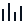

# 🖼️ 素材分類：media

> [🏠 主目錄](../../../../../README.md) / [images](../../../../README.md) / [iCons](../../../README.md) / [Remix](../../README.md) / [line](../README.md) / **media**

本目錄共有 `98` 個檔案

| 🎨 預覽 (點擊放大)  | 📋 檔案詳細資訊與連結 |
| :--- | :--- |
|  | **📂 檔名:** `4k-line.svg` ✨ **格式:** `Vector (SVG)` ⚖️ **大小:** `725.00B` 📅 **更新:** `2026-03-03`  🚀 **jsDelivr Markdown:** `` 🔗 **直接連結 (Url):** <code>https://cdn.jsdelivr.net/gh/barry028/materials@main/images/iCons/Remix/line/media/4k-line.svg</code> 📥 [檢視原始檔](4k-line.svg) |
|  | **📂 檔名:** `album-line.svg` ✨ **格式:** `Vector (SVG)` ⚖️ **大小:** `1.26KB` 📅 **更新:** `2026-03-03`  🚀 **jsDelivr Markdown:** `` 🔗 **直接連結 (Url):** <code>https://cdn.jsdelivr.net/gh/barry028/materials@main/images/iCons/Remix/line/media/album-line.svg</code> 📥 [檢視原始檔](album-line.svg) |
|  | **📂 檔名:** `aspect-ratio-line.svg` ✨ **格式:** `Vector (SVG)` ⚖️ **大小:** `644.00B` 📅 **更新:** `2026-03-03`  🚀 **jsDelivr Markdown:** `` 🔗 **直接連結 (Url):** <code>https://cdn.jsdelivr.net/gh/barry028/materials@main/images/iCons/Remix/line/media/aspect-ratio-line.svg</code> 📥 [檢視原始檔](aspect-ratio-line.svg) |
|  | **📂 檔名:** `broadcast-line.svg` ✨ **格式:** `Vector (SVG)` ⚖️ **大小:** `2.01KB` 📅 **更新:** `2026-03-03`  🚀 **jsDelivr Markdown:** `` 🔗 **直接連結 (Url):** <code>https://cdn.jsdelivr.net/gh/barry028/materials@main/images/iCons/Remix/line/media/broadcast-line.svg</code> 📥 [檢視原始檔](broadcast-line.svg) |
|  | **📂 檔名:** `camera-2-line.svg` ✨ **格式:** `Vector (SVG)` ⚖️ **大小:** `1.20KB` 📅 **更新:** `2026-03-03`  🚀 **jsDelivr Markdown:** `` 🔗 **直接連結 (Url):** <code>https://cdn.jsdelivr.net/gh/barry028/materials@main/images/iCons/Remix/line/media/camera-2-line.svg</code> 📥 [檢視原始檔](camera-2-line.svg) |
|  | **📂 檔名:** `camera-3-line.svg` ✨ **格式:** `Vector (SVG)` ⚖️ **大小:** `1.23KB` 📅 **更新:** `2026-03-03`  🚀 **jsDelivr Markdown:** `` 🔗 **直接連結 (Url):** <code>https://cdn.jsdelivr.net/gh/barry028/materials@main/images/iCons/Remix/line/media/camera-3-line.svg</code> 📥 [檢視原始檔](camera-3-line.svg) |
|  | **📂 檔名:** `camera-lens-fill.svg` ✨ **格式:** `Vector (SVG)` ⚖️ **大小:** `1.02KB` 📅 **更新:** `2026-03-03`  🚀 **jsDelivr Markdown:** `` 🔗 **直接連結 (Url):** <code>https://cdn.jsdelivr.net/gh/barry028/materials@main/images/iCons/Remix/line/media/camera-lens-fill.svg</code> 📥 [檢視原始檔](camera-lens-fill.svg) |
|  | **📂 檔名:** `camera-line.svg` ✨ **格式:** `Vector (SVG)` ⚖️ **大小:** `1.26KB` 📅 **更新:** `2026-03-03`  🚀 **jsDelivr Markdown:** `` 🔗 **直接連結 (Url):** <code>https://cdn.jsdelivr.net/gh/barry028/materials@main/images/iCons/Remix/line/media/camera-line.svg</code> 📥 [檢視原始檔](camera-line.svg) |
|  | **📂 檔名:** `camera-off-line.svg` ✨ **格式:** `Vector (SVG)` ⚖️ **大小:** `1.53KB` 📅 **更新:** `2026-03-03`  🚀 **jsDelivr Markdown:** `` 🔗 **直接連結 (Url):** <code>https://cdn.jsdelivr.net/gh/barry028/materials@main/images/iCons/Remix/line/media/camera-off-line.svg</code> 📥 [檢視原始檔](camera-off-line.svg) |
|  | **📂 檔名:** `camera-switch-line.svg` ✨ **格式:** `Vector (SVG)` ⚖️ **大小:** `1.46KB` 📅 **更新:** `2026-03-03`  🚀 **jsDelivr Markdown:** `` 🔗 **直接連結 (Url):** <code>https://cdn.jsdelivr.net/gh/barry028/materials@main/images/iCons/Remix/line/media/camera-switch-line.svg</code> 📥 [檢視原始檔](camera-switch-line.svg) |
|  | **📂 檔名:** `clapperboard-line.svg` ✨ **格式:** `Vector (SVG)` ⚖️ **大小:** `708.00B` 📅 **更新:** `2026-03-03`  🚀 **jsDelivr Markdown:** `` 🔗 **直接連結 (Url):** <code>https://cdn.jsdelivr.net/gh/barry028/materials@main/images/iCons/Remix/line/media/clapperboard-line.svg</code> 📥 [檢視原始檔](clapperboard-line.svg) |
|  | **📂 檔名:** `closed-captioning-line.svg` ✨ **格式:** `Vector (SVG)` ⚖️ **大小:** `914.00B` 📅 **更新:** `2026-03-03`  🚀 **jsDelivr Markdown:** `` 🔗 **直接連結 (Url):** <code>https://cdn.jsdelivr.net/gh/barry028/materials@main/images/iCons/Remix/line/media/closed-captioning-line.svg</code> 📥 [檢視原始檔](closed-captioning-line.svg) |
|  | **📂 檔名:** `disc-line.svg` ✨ **格式:** `Vector (SVG)` ⚖️ **大小:** `1.13KB` 📅 **更新:** `2026-03-03`  🚀 **jsDelivr Markdown:** `` 🔗 **直接連結 (Url):** <code>https://cdn.jsdelivr.net/gh/barry028/materials@main/images/iCons/Remix/line/media/disc-line.svg</code> 📥 [檢視原始檔](disc-line.svg) |
|  | **📂 檔名:** `dv-line.svg` ✨ **格式:** `Vector (SVG)` ⚖️ **大小:** `2.29KB` 📅 **更新:** `2026-03-03`  🚀 **jsDelivr Markdown:** `` 🔗 **直接連結 (Url):** <code>https://cdn.jsdelivr.net/gh/barry028/materials@main/images/iCons/Remix/line/media/dv-line.svg</code> 📥 [檢視原始檔](dv-line.svg) |
|  | **📂 檔名:** `dvd-line.svg` ✨ **格式:** `Vector (SVG)` ⚖️ **大小:** `706.00B` 📅 **更新:** `2026-03-03`  🚀 **jsDelivr Markdown:** `` 🔗 **直接連結 (Url):** <code>https://cdn.jsdelivr.net/gh/barry028/materials@main/images/iCons/Remix/line/media/dvd-line.svg</code> 📥 [檢視原始檔](dvd-line.svg) |
|  | **📂 檔名:** `eject-line.svg` ✨ **格式:** `Vector (SVG)` ⚖️ **大小:** `1.20KB` 📅 **更新:** `2026-03-03`  🚀 **jsDelivr Markdown:** `` 🔗 **直接連結 (Url):** <code>https://cdn.jsdelivr.net/gh/barry028/materials@main/images/iCons/Remix/line/media/eject-line.svg</code> 📥 [檢視原始檔](eject-line.svg) |
|  | **📂 檔名:** `equalizer-line.svg` ✨ **格式:** `Vector (SVG)` ⚖️ **大小:** `2.36KB` 📅 **更新:** `2026-03-03`  🚀 **jsDelivr Markdown:** `` 🔗 **直接連結 (Url):** <code>https://cdn.jsdelivr.net/gh/barry028/materials@main/images/iCons/Remix/line/media/equalizer-line.svg</code> 📥 [檢視原始檔](equalizer-line.svg) |
|  | **📂 檔名:** `film-line.svg` ✨ **格式:** `Vector (SVG)` ⚖️ **大小:** `735.00B` 📅 **更新:** `2026-03-03`  🚀 **jsDelivr Markdown:** `` 🔗 **直接連結 (Url):** <code>https://cdn.jsdelivr.net/gh/barry028/materials@main/images/iCons/Remix/line/media/film-line.svg</code> 📥 [檢視原始檔](film-line.svg) |
|  | **📂 檔名:** `fullscreen-exit-line.svg` ✨ **格式:** `Vector (SVG)` ⚖️ **大小:** `355.00B` 📅 **更新:** `2026-03-03`  🚀 **jsDelivr Markdown:** `` 🔗 **直接連結 (Url):** <code>https://cdn.jsdelivr.net/gh/barry028/materials@main/images/iCons/Remix/line/media/fullscreen-exit-line.svg</code> 📥 [檢視原始檔](fullscreen-exit-line.svg) |
|  | **📂 檔名:** `fullscreen-line.svg` ✨ **格式:** `Vector (SVG)` ⚖️ **大小:** `362.00B` 📅 **更新:** `2026-03-03`  🚀 **jsDelivr Markdown:** `` 🔗 **直接連結 (Url):** <code>https://cdn.jsdelivr.net/gh/barry028/materials@main/images/iCons/Remix/line/media/fullscreen-line.svg</code> 📥 [檢視原始檔](fullscreen-line.svg) |
|  | **📂 檔名:** `gallery-line.svg` ✨ **格式:** `Vector (SVG)` ⚖️ **大小:** `1.12KB` 📅 **更新:** `2026-03-03`  🚀 **jsDelivr Markdown:** `` 🔗 **直接連結 (Url):** <code>https://cdn.jsdelivr.net/gh/barry028/materials@main/images/iCons/Remix/line/media/gallery-line.svg</code> 📥 [檢視原始檔](gallery-line.svg) |
|  | **📂 檔名:** `gallery-upload-line.svg` ✨ **格式:** `Vector (SVG)` ⚖️ **大小:** `656.00B` 📅 **更新:** `2026-03-03`  🚀 **jsDelivr Markdown:** `` 🔗 **直接連結 (Url):** <code>https://cdn.jsdelivr.net/gh/barry028/materials@main/images/iCons/Remix/line/media/gallery-upload-line.svg</code> 📥 [檢視原始檔](gallery-upload-line.svg) |
|  | **📂 檔名:** `hd-line.svg` ✨ **格式:** `Vector (SVG)` ⚖️ **大小:** `1010.00B` 📅 **更新:** `2026-03-03`  🚀 **jsDelivr Markdown:** `` 🔗 **直接連結 (Url):** <code>https://cdn.jsdelivr.net/gh/barry028/materials@main/images/iCons/Remix/line/media/hd-line.svg</code> 📥 [檢視原始檔](hd-line.svg) |
|  | **📂 檔名:** `headphone-line.svg` ✨ **格式:** `Vector (SVG)` ⚖️ **大小:** `976.00B` 📅 **更新:** `2026-03-03`  🚀 **jsDelivr Markdown:** `` 🔗 **直接連結 (Url):** <code>https://cdn.jsdelivr.net/gh/barry028/materials@main/images/iCons/Remix/line/media/headphone-line.svg</code> 📥 [檢視原始檔](headphone-line.svg) |
|  | **📂 檔名:** `hq-line.svg` ✨ **格式:** `Vector (SVG)` ⚖️ **大小:** `1.00KB` 📅 **更新:** `2026-03-03`  🚀 **jsDelivr Markdown:** `` 🔗 **直接連結 (Url):** <code>https://cdn.jsdelivr.net/gh/barry028/materials@main/images/iCons/Remix/line/media/hq-line.svg</code> 📥 [檢視原始檔](hq-line.svg) |
|  | **📂 檔名:** `image-2-line.svg` ✨ **格式:** `Vector (SVG)` ⚖️ **大小:** `1.01KB` 📅 **更新:** `2026-03-03`  🚀 **jsDelivr Markdown:** `` 🔗 **直接連結 (Url):** <code>https://cdn.jsdelivr.net/gh/barry028/materials@main/images/iCons/Remix/line/media/image-2-line.svg</code> 📥 [檢視原始檔](image-2-line.svg) |
|  | **📂 檔名:** `image-add-line.svg` ✨ **格式:** `Vector (SVG)` ⚖️ **大小:** `897.00B` 📅 **更新:** `2026-03-03`  🚀 **jsDelivr Markdown:** `` 🔗 **直接連結 (Url):** <code>https://cdn.jsdelivr.net/gh/barry028/materials@main/images/iCons/Remix/line/media/image-add-line.svg</code> 📥 [檢視原始檔](image-add-line.svg) |
|  | **📂 檔名:** `image-edit-line.svg` ✨ **格式:** `Vector (SVG)` ⚖️ **大小:** `702.00B` 📅 **更新:** `2026-03-03`  🚀 **jsDelivr Markdown:** `` 🔗 **直接連結 (Url):** <code>https://cdn.jsdelivr.net/gh/barry028/materials@main/images/iCons/Remix/line/media/image-edit-line.svg</code> 📥 [檢視原始檔](image-edit-line.svg) |
|  | **📂 檔名:** `image-line.svg` ✨ **格式:** `Vector (SVG)` ⚖️ **大小:** `983.00B` 📅 **更新:** `2026-03-03`  🚀 **jsDelivr Markdown:** `` 🔗 **直接連結 (Url):** <code>https://cdn.jsdelivr.net/gh/barry028/materials@main/images/iCons/Remix/line/media/image-line.svg</code> 📥 [檢視原始檔](image-line.svg) |
|  | **📂 檔名:** `landscape-line.svg` ✨ **格式:** `Vector (SVG)` ⚖️ **大小:** `711.00B` 📅 **更新:** `2026-03-03`  🚀 **jsDelivr Markdown:** `` 🔗 **直接連結 (Url):** <code>https://cdn.jsdelivr.net/gh/barry028/materials@main/images/iCons/Remix/line/media/landscape-line.svg</code> 📥 [檢視原始檔](landscape-line.svg) |
|  | **📂 檔名:** `live-line.svg` ✨ **格式:** `Vector (SVG)` ⚖️ **大小:** `1.48KB` 📅 **更新:** `2026-03-03`  🚀 **jsDelivr Markdown:** `` 🔗 **直接連結 (Url):** <code>https://cdn.jsdelivr.net/gh/barry028/materials@main/images/iCons/Remix/line/media/live-line.svg</code> 📥 [檢視原始檔](live-line.svg) |
|  | **📂 檔名:** `mic-2-line.svg` ✨ **格式:** `Vector (SVG)` ⚖️ **大小:** `1.36KB` 📅 **更新:** `2026-03-03`  🚀 **jsDelivr Markdown:** `` 🔗 **直接連結 (Url):** <code>https://cdn.jsdelivr.net/gh/barry028/materials@main/images/iCons/Remix/line/media/mic-2-line.svg</code> 📥 [檢視原始檔](mic-2-line.svg) |
|  | **📂 檔名:** `mic-line.svg` ✨ **格式:** `Vector (SVG)` ⚖️ **大小:** `1.45KB` 📅 **更新:** `2026-03-03`  🚀 **jsDelivr Markdown:** `` 🔗 **直接連結 (Url):** <code>https://cdn.jsdelivr.net/gh/barry028/materials@main/images/iCons/Remix/line/media/mic-line.svg</code> 📥 [檢視原始檔](mic-line.svg) |
|  | **📂 檔名:** `mic-off-line.svg` ✨ **格式:** `Vector (SVG)` ⚖️ **大小:** `1.68KB` 📅 **更新:** `2026-03-03`  🚀 **jsDelivr Markdown:** `` 🔗 **直接連結 (Url):** <code>https://cdn.jsdelivr.net/gh/barry028/materials@main/images/iCons/Remix/line/media/mic-off-line.svg</code> 📥 [檢視原始檔](mic-off-line.svg) |
|  | **📂 檔名:** `movie-2-line.svg` ✨ **格式:** `Vector (SVG)` ⚖️ **大小:** `1.95KB` 📅 **更新:** `2026-03-03`  🚀 **jsDelivr Markdown:** `` 🔗 **直接連結 (Url):** <code>https://cdn.jsdelivr.net/gh/barry028/materials@main/images/iCons/Remix/line/media/movie-2-line.svg</code> 📥 [檢視原始檔](movie-2-line.svg) |
|  | **📂 檔名:** `movie-line.svg` ✨ **格式:** `Vector (SVG)` ⚖️ **大小:** `1.18KB` 📅 **更新:** `2026-03-03`  🚀 **jsDelivr Markdown:** `` 🔗 **直接連結 (Url):** <code>https://cdn.jsdelivr.net/gh/barry028/materials@main/images/iCons/Remix/line/media/movie-line.svg</code> 📥 [檢視原始檔](movie-line.svg) |
|  | **📂 檔名:** `music-2-line.svg` ✨ **格式:** `Vector (SVG)` ⚖️ **大小:** `1.68KB` 📅 **更新:** `2026-03-03`  🚀 **jsDelivr Markdown:** `` 🔗 **直接連結 (Url):** <code>https://cdn.jsdelivr.net/gh/barry028/materials@main/images/iCons/Remix/line/media/music-2-line.svg</code> 📥 [檢視原始檔](music-2-line.svg) |
|  | **📂 檔名:** `music-line.svg` ✨ **格式:** `Vector (SVG)` ⚖️ **大小:** `996.00B` 📅 **更新:** `2026-03-03`  🚀 **jsDelivr Markdown:** `` 🔗 **直接連結 (Url):** <code>https://cdn.jsdelivr.net/gh/barry028/materials@main/images/iCons/Remix/line/media/music-line.svg</code> 📥 [檢視原始檔](music-line.svg) |
|  | **📂 檔名:** `mv-line.svg` ✨ **格式:** `Vector (SVG)` ⚖️ **大小:** `999.00B` 📅 **更新:** `2026-03-03`  🚀 **jsDelivr Markdown:** `` 🔗 **直接連結 (Url):** <code>https://cdn.jsdelivr.net/gh/barry028/materials@main/images/iCons/Remix/line/media/mv-line.svg</code> 📥 [檢視原始檔](mv-line.svg) |
|  | **📂 檔名:** `notification-2-line.svg` ✨ **格式:** `Vector (SVG)` ⚖️ **大小:** `586.00B` 📅 **更新:** `2026-03-03`  🚀 **jsDelivr Markdown:** `` 🔗 **直接連結 (Url):** <code>https://cdn.jsdelivr.net/gh/barry028/materials@main/images/iCons/Remix/line/media/notification-2-line.svg</code> 📥 [檢視原始檔](notification-2-line.svg) |
|  | **📂 檔名:** `notification-3-line.svg` ✨ **格式:** `Vector (SVG)` ⚖️ **大小:** `623.00B` 📅 **更新:** `2026-03-03`  🚀 **jsDelivr Markdown:** `` 🔗 **直接連結 (Url):** <code>https://cdn.jsdelivr.net/gh/barry028/materials@main/images/iCons/Remix/line/media/notification-3-line.svg</code> 📥 [檢視原始檔](notification-3-line.svg) |
|  | **📂 檔名:** `notification-4-line.svg` ✨ **格式:** `Vector (SVG)` ⚖️ **大小:** `1.12KB` 📅 **更新:** `2026-03-03`  🚀 **jsDelivr Markdown:** `` 🔗 **直接連結 (Url):** <code>https://cdn.jsdelivr.net/gh/barry028/materials@main/images/iCons/Remix/line/media/notification-4-line.svg</code> 📥 [檢視原始檔](notification-4-line.svg) |
|  | **📂 檔名:** `notification-line.svg` ✨ **格式:** `Vector (SVG)` ⚖️ **大小:** `574.00B` 📅 **更新:** `2026-03-03`  🚀 **jsDelivr Markdown:** `` 🔗 **直接連結 (Url):** <code>https://cdn.jsdelivr.net/gh/barry028/materials@main/images/iCons/Remix/line/media/notification-line.svg</code> 📥 [檢視原始檔](notification-line.svg) |
|  | **📂 檔名:** `notification-off-line.svg` ✨ **格式:** `Vector (SVG)` ⚖️ **大小:** `1.29KB` 📅 **更新:** `2026-03-03`  🚀 **jsDelivr Markdown:** `` 🔗 **直接連結 (Url):** <code>https://cdn.jsdelivr.net/gh/barry028/materials@main/images/iCons/Remix/line/media/notification-off-line.svg</code> 📥 [檢視原始檔](notification-off-line.svg) |
|  | **📂 檔名:** `order-play-line.svg` ✨ **格式:** `Vector (SVG)` ⚖️ **大小:** `729.00B` 📅 **更新:** `2026-03-03`  🚀 **jsDelivr Markdown:** `` 🔗 **直接連結 (Url):** <code>https://cdn.jsdelivr.net/gh/barry028/materials@main/images/iCons/Remix/line/media/order-play-line.svg</code> 📥 [檢視原始檔](order-play-line.svg) |
|  | **📂 檔名:** `pause-circle-line.svg` ✨ **格式:** `Vector (SVG)` ⚖️ **大小:** `709.00B` 📅 **更新:** `2026-03-03`  🚀 **jsDelivr Markdown:** `` 🔗 **直接連結 (Url):** <code>https://cdn.jsdelivr.net/gh/barry028/materials@main/images/iCons/Remix/line/media/pause-circle-line.svg</code> 📥 [檢視原始檔](pause-circle-line.svg) |
|  | **📂 檔名:** `pause-line.svg` ✨ **格式:** `Vector (SVG)` ⚖️ **大小:** `302.00B` 📅 **更新:** `2026-03-03`  🚀 **jsDelivr Markdown:** `` 🔗 **直接連結 (Url):** <code>https://cdn.jsdelivr.net/gh/barry028/materials@main/images/iCons/Remix/line/media/pause-line.svg</code> 📥 [檢視原始檔](pause-line.svg) |
|  | **📂 檔名:** `pause-mini-line.svg` ✨ **格式:** `Vector (SVG)` ⚖️ **大小:** `884.00B` 📅 **更新:** `2026-03-03`  🚀 **jsDelivr Markdown:** `` 🔗 **直接連結 (Url):** <code>https://cdn.jsdelivr.net/gh/barry028/materials@main/images/iCons/Remix/line/media/pause-mini-line.svg</code> 📥 [檢視原始檔](pause-mini-line.svg) |
|  | **📂 檔名:** `phone-camera-line.svg` ✨ **格式:** `Vector (SVG)` ⚖️ **大小:** `1.24KB` 📅 **更新:** `2026-03-03`  🚀 **jsDelivr Markdown:** `` 🔗 **直接連結 (Url):** <code>https://cdn.jsdelivr.net/gh/barry028/materials@main/images/iCons/Remix/line/media/phone-camera-line.svg</code> 📥 [檢視原始檔](phone-camera-line.svg) |
|  | **📂 檔名:** `picture-in-picture-2-line.svg` ✨ **格式:** `Vector (SVG)` ⚖️ **大小:** `940.00B` 📅 **更新:** `2026-03-03`  🚀 **jsDelivr Markdown:** `` 🔗 **直接連結 (Url):** <code>https://cdn.jsdelivr.net/gh/barry028/materials@main/images/iCons/Remix/line/media/picture-in-picture-2-line.svg</code> 📥 [檢視原始檔](picture-in-picture-2-line.svg) |
|  | **📂 檔名:** `picture-in-picture-exit-line.svg` ✨ **格式:** `Vector (SVG)` ⚖️ **大小:** `940.00B` 📅 **更新:** `2026-03-03`  🚀 **jsDelivr Markdown:** `` 🔗 **直接連結 (Url):** <code>https://cdn.jsdelivr.net/gh/barry028/materials@main/images/iCons/Remix/line/media/picture-in-picture-exit-line.svg</code> 📥 [檢視原始檔](picture-in-picture-exit-line.svg) |
|  | **📂 檔名:** `picture-in-picture-line.svg` ✨ **格式:** `Vector (SVG)` ⚖️ **大小:** `867.00B` 📅 **更新:** `2026-03-03`  🚀 **jsDelivr Markdown:** `` 🔗 **直接連結 (Url):** <code>https://cdn.jsdelivr.net/gh/barry028/materials@main/images/iCons/Remix/line/media/picture-in-picture-line.svg</code> 📥 [檢視原始檔](picture-in-picture-line.svg) |
|  | **📂 檔名:** `play-circle-line.svg` ✨ **格式:** `Vector (SVG)` ⚖️ **大小:** `1.25KB` 📅 **更新:** `2026-03-03`  🚀 **jsDelivr Markdown:** `` 🔗 **直接連結 (Url):** <code>https://cdn.jsdelivr.net/gh/barry028/materials@main/images/iCons/Remix/line/media/play-circle-line.svg</code> 📥 [檢視原始檔](play-circle-line.svg) |
|  | **📂 檔名:** `play-line.svg` ✨ **格式:** `Vector (SVG)` ⚖️ **大小:** `913.00B` 📅 **更新:** `2026-03-03`  🚀 **jsDelivr Markdown:** `` 🔗 **直接連結 (Url):** <code>https://cdn.jsdelivr.net/gh/barry028/materials@main/images/iCons/Remix/line/media/play-line.svg</code> 📥 [檢視原始檔](play-line.svg) |
|  | **📂 檔名:** `play-list-2-line.svg` ✨ **格式:** `Vector (SVG)` ⚖️ **大小:** `382.00B` 📅 **更新:** `2026-03-03`  🚀 **jsDelivr Markdown:** `` 🔗 **直接連結 (Url):** <code>https://cdn.jsdelivr.net/gh/barry028/materials@main/images/iCons/Remix/line/media/play-list-2-line.svg</code> 📥 [檢視原始檔](play-list-2-line.svg) |
|  | **📂 檔名:** `play-list-add-line.svg` ✨ **格式:** `Vector (SVG)` ⚖️ **大小:** `362.00B` 📅 **更新:** `2026-03-03`  🚀 **jsDelivr Markdown:** `` 🔗 **直接連結 (Url):** <code>https://cdn.jsdelivr.net/gh/barry028/materials@main/images/iCons/Remix/line/media/play-list-add-line.svg</code> 📥 [檢視原始檔](play-list-add-line.svg) |
|  | **📂 檔名:** `play-list-line.svg` ✨ **格式:** `Vector (SVG)` ⚖️ **大小:** `1.00KB` 📅 **更新:** `2026-03-03`  🚀 **jsDelivr Markdown:** `` 🔗 **直接連結 (Url):** <code>https://cdn.jsdelivr.net/gh/barry028/materials@main/images/iCons/Remix/line/media/play-list-line.svg</code> 📥 [檢視原始檔](play-list-line.svg) |
|  | **📂 檔名:** `play-mini-line.svg` ✨ **格式:** `Vector (SVG)` ⚖️ **大小:** `931.00B` 📅 **更新:** `2026-03-03`  🚀 **jsDelivr Markdown:** `` 🔗 **直接連結 (Url):** <code>https://cdn.jsdelivr.net/gh/barry028/materials@main/images/iCons/Remix/line/media/play-mini-line.svg</code> 📥 [檢視原始檔](play-mini-line.svg) |
|  | **📂 檔名:** `polaroid-2-line.svg` ✨ **格式:** `Vector (SVG)` ⚖️ **大小:** `1.16KB` 📅 **更新:** `2026-03-03`  🚀 **jsDelivr Markdown:** `` 🔗 **直接連結 (Url):** <code>https://cdn.jsdelivr.net/gh/barry028/materials@main/images/iCons/Remix/line/media/polaroid-2-line.svg</code> 📥 [檢視原始檔](polaroid-2-line.svg) |
|  | **📂 檔名:** `polaroid-line.svg` ✨ **格式:** `Vector (SVG)` ⚖️ **大小:** `1.50KB` 📅 **更新:** `2026-03-03`  🚀 **jsDelivr Markdown:** `` 🔗 **直接連結 (Url):** <code>https://cdn.jsdelivr.net/gh/barry028/materials@main/images/iCons/Remix/line/media/polaroid-line.svg</code> 📥 [檢視原始檔](polaroid-line.svg) |
|  | **📂 檔名:** `radio-2-line.svg` ✨ **格式:** `Vector (SVG)` ⚖️ **大小:** `947.00B` 📅 **更新:** `2026-03-03`  🚀 **jsDelivr Markdown:** `` 🔗 **直接連結 (Url):** <code>https://cdn.jsdelivr.net/gh/barry028/materials@main/images/iCons/Remix/line/media/radio-2-line.svg</code> 📥 [檢視原始檔](radio-2-line.svg) |
|  | **📂 檔名:** `radio-line.svg` ✨ **格式:** `Vector (SVG)` ⚖️ **大小:** `942.00B` 📅 **更新:** `2026-03-03`  🚀 **jsDelivr Markdown:** `` 🔗 **直接連結 (Url):** <code>https://cdn.jsdelivr.net/gh/barry028/materials@main/images/iCons/Remix/line/media/radio-line.svg</code> 📥 [檢視原始檔](radio-line.svg) |
|  | **📂 檔名:** `record-circle-line.svg` ✨ **格式:** `Vector (SVG)` ⚖️ **大小:** `982.00B` 📅 **更新:** `2026-03-03`  🚀 **jsDelivr Markdown:** `` 🔗 **直接連結 (Url):** <code>https://cdn.jsdelivr.net/gh/barry028/materials@main/images/iCons/Remix/line/media/record-circle-line.svg</code> 📥 [檢視原始檔](record-circle-line.svg) |
|  | **📂 檔名:** `repeat-2-line.svg` ✨ **格式:** `Vector (SVG)` ⚖️ **大小:** `1.40KB` 📅 **更新:** `2026-03-03`  🚀 **jsDelivr Markdown:** `` 🔗 **直接連結 (Url):** <code>https://cdn.jsdelivr.net/gh/barry028/materials@main/images/iCons/Remix/line/media/repeat-2-line.svg</code> 📥 [檢視原始檔](repeat-2-line.svg) |
|  | **📂 檔名:** `repeat-line.svg` ✨ **格式:** `Vector (SVG)` ⚖️ **大小:** `487.00B` 📅 **更新:** `2026-03-03`  🚀 **jsDelivr Markdown:** `` 🔗 **直接連結 (Url):** <code>https://cdn.jsdelivr.net/gh/barry028/materials@main/images/iCons/Remix/line/media/repeat-line.svg</code> 📥 [檢視原始檔](repeat-line.svg) |
|  | **📂 檔名:** `repeat-one-line.svg` ✨ **格式:** `Vector (SVG)` ⚖️ **大小:** `1.44KB` 📅 **更新:** `2026-03-03`  🚀 **jsDelivr Markdown:** `` 🔗 **直接連結 (Url):** <code>https://cdn.jsdelivr.net/gh/barry028/materials@main/images/iCons/Remix/line/media/repeat-one-line.svg</code> 📥 [檢視原始檔](repeat-one-line.svg) |
|  | **📂 檔名:** `rewind-line.svg` ✨ **格式:** `Vector (SVG)` ⚖️ **大小:** `1.36KB` 📅 **更新:** `2026-03-03`  🚀 **jsDelivr Markdown:** `` 🔗 **直接連結 (Url):** <code>https://cdn.jsdelivr.net/gh/barry028/materials@main/images/iCons/Remix/line/media/rewind-line.svg</code> 📥 [檢視原始檔](rewind-line.svg) |
|  | **📂 檔名:** `rewind-mini-line.svg` ✨ **格式:** `Vector (SVG)` ⚖️ **大小:** `1.47KB` 📅 **更新:** `2026-03-03`  🚀 **jsDelivr Markdown:** `` 🔗 **直接連結 (Url):** <code>https://cdn.jsdelivr.net/gh/barry028/materials@main/images/iCons/Remix/line/media/rewind-mini-line.svg</code> 📥 [檢視原始檔](rewind-mini-line.svg) |
|  | **📂 檔名:** `rhythm-line.svg` ✨ **格式:** `Vector (SVG)` ⚖️ **大小:** `336.00B` 📅 **更新:** `2026-03-03`  🚀 **jsDelivr Markdown:** `` 🔗 **直接連結 (Url):** <code>https://cdn.jsdelivr.net/gh/barry028/materials@main/images/iCons/Remix/line/media/rhythm-line.svg</code> 📥 [檢視原始檔](rhythm-line.svg) |
|  | **📂 檔名:** `shuffle-line.svg` ✨ **格式:** `Vector (SVG)` ⚖️ **大小:** `1.12KB` 📅 **更新:** `2026-03-03`  🚀 **jsDelivr Markdown:** `` 🔗 **直接連結 (Url):** <code>https://cdn.jsdelivr.net/gh/barry028/materials@main/images/iCons/Remix/line/media/shuffle-line.svg</code> 📥 [檢視原始檔](shuffle-line.svg) |
|  | **📂 檔名:** `skip-back-line.svg` ✨ **格式:** `Vector (SVG)` ⚖️ **大小:** `1015.00B` 📅 **更新:** `2026-03-03`  🚀 **jsDelivr Markdown:** `` 🔗 **直接連結 (Url):** <code>https://cdn.jsdelivr.net/gh/barry028/materials@main/images/iCons/Remix/line/media/skip-back-line.svg</code> 📥 [檢視原始檔](skip-back-line.svg) |
|  | **📂 檔名:** `skip-back-mini-line.svg` ✨ **格式:** `Vector (SVG)` ⚖️ **大小:** `1.18KB` 📅 **更新:** `2026-03-03`  🚀 **jsDelivr Markdown:** `` 🔗 **直接連結 (Url):** <code>https://cdn.jsdelivr.net/gh/barry028/materials@main/images/iCons/Remix/line/media/skip-back-mini-line.svg</code> 📥 [檢視原始檔](skip-back-mini-line.svg) |
|  | **📂 檔名:** `skip-forward-line.svg` ✨ **格式:** `Vector (SVG)` ⚖️ **大小:** `1.00KB` 📅 **更新:** `2026-03-03`  🚀 **jsDelivr Markdown:** `` 🔗 **直接連結 (Url):** <code>https://cdn.jsdelivr.net/gh/barry028/materials@main/images/iCons/Remix/line/media/skip-forward-line.svg</code> 📥 [檢視原始檔](skip-forward-line.svg) |
|  | **📂 檔名:** `skip-forward-mini-line.svg` ✨ **格式:** `Vector (SVG)` ⚖️ **大小:** `1.13KB` 📅 **更新:** `2026-03-03`  🚀 **jsDelivr Markdown:** `` 🔗 **直接連結 (Url):** <code>https://cdn.jsdelivr.net/gh/barry028/materials@main/images/iCons/Remix/line/media/skip-forward-mini-line.svg</code> 📥 [檢視原始檔](skip-forward-mini-line.svg) |
|  | **📂 檔名:** `sound-module-line.svg` ✨ **格式:** `Vector (SVG)` ⚖️ **大小:** `405.00B` 📅 **更新:** `2026-03-03`  🚀 **jsDelivr Markdown:** `` 🔗 **直接連結 (Url):** <code>https://cdn.jsdelivr.net/gh/barry028/materials@main/images/iCons/Remix/line/media/sound-module-line.svg</code> 📥 [檢視原始檔](sound-module-line.svg) |
|  | **📂 檔名:** `speaker-2-line.svg` ✨ **格式:** `Vector (SVG)` ⚖️ **大小:** `1.50KB` 📅 **更新:** `2026-03-03`  🚀 **jsDelivr Markdown:** `` 🔗 **直接連結 (Url):** <code>https://cdn.jsdelivr.net/gh/barry028/materials@main/images/iCons/Remix/line/media/speaker-2-line.svg</code> 📥 [檢視原始檔](speaker-2-line.svg) |
|  | **📂 檔名:** `speaker-3-line.svg` ✨ **格式:** `Vector (SVG)` ⚖️ **大小:** `2.66KB` 📅 **更新:** `2026-03-03`  🚀 **jsDelivr Markdown:** `` 🔗 **直接連結 (Url):** <code>https://cdn.jsdelivr.net/gh/barry028/materials@main/images/iCons/Remix/line/media/speaker-3-line.svg</code> 📥 [檢視原始檔](speaker-3-line.svg) |
|  | **📂 檔名:** `speaker-line.svg` ✨ **格式:** `Vector (SVG)` ⚖️ **大小:** `1.70KB` 📅 **更新:** `2026-03-03`  🚀 **jsDelivr Markdown:** `` 🔗 **直接連結 (Url):** <code>https://cdn.jsdelivr.net/gh/barry028/materials@main/images/iCons/Remix/line/media/speaker-line.svg</code> 📥 [檢視原始檔](speaker-line.svg) |
|  | **📂 檔名:** `speed-line.svg` ✨ **格式:** `Vector (SVG)` ⚖️ **大小:** `1.32KB` 📅 **更新:** `2026-03-03`  🚀 **jsDelivr Markdown:** `` 🔗 **直接連結 (Url):** <code>https://cdn.jsdelivr.net/gh/barry028/materials@main/images/iCons/Remix/line/media/speed-line.svg</code> 📥 [檢視原始檔](speed-line.svg) |
|  | **📂 檔名:** `speed-mini-line.svg` ✨ **格式:** `Vector (SVG)` ⚖️ **大小:** `1.50KB` 📅 **更新:** `2026-03-03`  🚀 **jsDelivr Markdown:** `` 🔗 **直接連結 (Url):** <code>https://cdn.jsdelivr.net/gh/barry028/materials@main/images/iCons/Remix/line/media/speed-mini-line.svg</code> 📥 [檢視原始檔](speed-mini-line.svg) |
|  | **📂 檔名:** `stop-circle-line.svg` ✨ **格式:** `Vector (SVG)` ⚖️ **大小:** `692.00B` 📅 **更新:** `2026-03-03`  🚀 **jsDelivr Markdown:** `` 🔗 **直接連結 (Url):** <code>https://cdn.jsdelivr.net/gh/barry028/materials@main/images/iCons/Remix/line/media/stop-circle-line.svg</code> 📥 [檢視原始檔](stop-circle-line.svg) |
|  | **📂 檔名:** `stop-line.svg` ✨ **格式:** `Vector (SVG)` ⚖️ **大小:** `597.00B` 📅 **更新:** `2026-03-03`  🚀 **jsDelivr Markdown:** `` 🔗 **直接連結 (Url):** <code>https://cdn.jsdelivr.net/gh/barry028/materials@main/images/iCons/Remix/line/media/stop-line.svg</code> 📥 [檢視原始檔](stop-line.svg) |
|  | **📂 檔名:** `stop-mini-line.svg` ✨ **格式:** `Vector (SVG)` ⚖️ **大小:** `597.00B` 📅 **更新:** `2026-03-03`  🚀 **jsDelivr Markdown:** `` 🔗 **直接連結 (Url):** <code>https://cdn.jsdelivr.net/gh/barry028/materials@main/images/iCons/Remix/line/media/stop-mini-line.svg</code> 📥 [檢視原始檔](stop-mini-line.svg) |
|  | **📂 檔名:** `surround-sound-line.svg` ✨ **格式:** `Vector (SVG)` ⚖️ **大小:** `1.86KB` 📅 **更新:** `2026-03-03`  🚀 **jsDelivr Markdown:** `` 🔗 **直接連結 (Url):** <code>https://cdn.jsdelivr.net/gh/barry028/materials@main/images/iCons/Remix/line/media/surround-sound-line.svg</code> 📥 [檢視原始檔](surround-sound-line.svg) |
|  | **📂 檔名:** `tape-line.svg` ✨ **格式:** `Vector (SVG)` ⚖️ **大小:** `1.92KB` 📅 **更新:** `2026-03-03`  🚀 **jsDelivr Markdown:** `` 🔗 **直接連結 (Url):** <code>https://cdn.jsdelivr.net/gh/barry028/materials@main/images/iCons/Remix/line/media/tape-line.svg</code> 📥 [檢視原始檔](tape-line.svg) |
|  | **📂 檔名:** `video-add-line.svg` ✨ **格式:** `Vector (SVG)` ⚖️ **大小:** `664.00B` 📅 **更新:** `2026-03-03`  🚀 **jsDelivr Markdown:** `` 🔗 **直接連結 (Url):** <code>https://cdn.jsdelivr.net/gh/barry028/materials@main/images/iCons/Remix/line/media/video-add-line.svg</code> 📥 [檢視原始檔](video-add-line.svg) |
|  | **📂 檔名:** `video-download-line.svg` ✨ **格式:** `Vector (SVG)` ⚖️ **大小:** `644.00B` 📅 **更新:** `2026-03-03`  🚀 **jsDelivr Markdown:** `` 🔗 **直接連結 (Url):** <code>https://cdn.jsdelivr.net/gh/barry028/materials@main/images/iCons/Remix/line/media/video-download-line.svg</code> 📥 [檢視原始檔](video-download-line.svg) |
|  | **📂 檔名:** `video-line.svg` ✨ **格式:** `Vector (SVG)` ⚖️ **大小:** `1.12KB` 📅 **更新:** `2026-03-03`  🚀 **jsDelivr Markdown:** `` 🔗 **直接連結 (Url):** <code>https://cdn.jsdelivr.net/gh/barry028/materials@main/images/iCons/Remix/line/media/video-line.svg</code> 📥 [檢視原始檔](video-line.svg) |
|  | **📂 檔名:** `video-upload-line.svg` ✨ **格式:** `Vector (SVG)` ⚖️ **大小:** `643.00B` 📅 **更新:** `2026-03-03`  🚀 **jsDelivr Markdown:** `` 🔗 **直接連結 (Url):** <code>https://cdn.jsdelivr.net/gh/barry028/materials@main/images/iCons/Remix/line/media/video-upload-line.svg</code> 📥 [檢視原始檔](video-upload-line.svg) |
|  | **📂 檔名:** `vidicon-2-line.svg` ✨ **格式:** `Vector (SVG)` ⚖️ **大小:** `1.05KB` 📅 **更新:** `2026-03-03`  🚀 **jsDelivr Markdown:** `` 🔗 **直接連結 (Url):** <code>https://cdn.jsdelivr.net/gh/barry028/materials@main/images/iCons/Remix/line/media/vidicon-2-line.svg</code> 📥 [檢視原始檔](vidicon-2-line.svg) |
|  | **📂 檔名:** `vidicon-line.svg` ✨ **格式:** `Vector (SVG)` ⚖️ **大小:** `1.03KB` 📅 **更新:** `2026-03-03`  🚀 **jsDelivr Markdown:** `` 🔗 **直接連結 (Url):** <code>https://cdn.jsdelivr.net/gh/barry028/materials@main/images/iCons/Remix/line/media/vidicon-line.svg</code> 📥 [檢視原始檔](vidicon-line.svg) |
|  | **📂 檔名:** `voiceprint-line.svg` ✨ **格式:** `Vector (SVG)` ⚖️ **大小:** `369.00B` 📅 **更新:** `2026-03-03`  🚀 **jsDelivr Markdown:** `` 🔗 **直接連結 (Url):** <code>https://cdn.jsdelivr.net/gh/barry028/materials@main/images/iCons/Remix/line/media/voiceprint-line.svg</code> 📥 [檢視原始檔](voiceprint-line.svg) |
|  | **📂 檔名:** `volume-down-line.svg` ✨ **格式:** `Vector (SVG)` ⚖️ **大小:** `1.18KB` 📅 **更新:** `2026-03-03`  🚀 **jsDelivr Markdown:** `` 🔗 **直接連結 (Url):** <code>https://cdn.jsdelivr.net/gh/barry028/materials@main/images/iCons/Remix/line/media/volume-down-line.svg</code> 📥 [檢視原始檔](volume-down-line.svg) |
|  | **📂 檔名:** `volume-mute-line.svg` ✨ **格式:** `Vector (SVG)` ⚖️ **大小:** `1.05KB` 📅 **更新:** `2026-03-03`  🚀 **jsDelivr Markdown:** `` 🔗 **直接連結 (Url):** <code>https://cdn.jsdelivr.net/gh/barry028/materials@main/images/iCons/Remix/line/media/volume-mute-line.svg</code> 📥 [檢視原始檔](volume-mute-line.svg) |
|  | **📂 檔名:** `volume-off-vibrate-line.svg` ✨ **格式:** `Vector (SVG)` ⚖️ **大小:** `1.37KB` 📅 **更新:** `2026-03-03`  🚀 **jsDelivr Markdown:** `` 🔗 **直接連結 (Url):** <code>https://cdn.jsdelivr.net/gh/barry028/materials@main/images/iCons/Remix/line/media/volume-off-vibrate-line.svg</code> 📥 [檢視原始檔](volume-off-vibrate-line.svg) |
|  | **📂 檔名:** `volume-up-line.svg` ✨ **格式:** `Vector (SVG)` ⚖️ **大小:** `1.51KB` 📅 **更新:** `2026-03-03`  🚀 **jsDelivr Markdown:** `` 🔗 **直接連結 (Url):** <code>https://cdn.jsdelivr.net/gh/barry028/materials@main/images/iCons/Remix/line/media/volume-up-line.svg</code> 📥 [檢視原始檔](volume-up-line.svg) |
|  | **📂 檔名:** `volume-vibrate-line.svg` ✨ **格式:** `Vector (SVG)` ⚖️ **大小:** `1.16KB` 📅 **更新:** `2026-03-03`  🚀 **jsDelivr Markdown:** `` 🔗 **直接連結 (Url):** <code>https://cdn.jsdelivr.net/gh/barry028/materials@main/images/iCons/Remix/line/media/volume-vibrate-line.svg</code> 📥 [檢視原始檔](volume-vibrate-line.svg) |
|  | **📂 檔名:** `webcam-line.svg` ✨ **格式:** `Vector (SVG)` ⚖️ **大小:** `1.68KB` 📅 **更新:** `2026-03-03`  🚀 **jsDelivr Markdown:** `` 🔗 **直接連結 (Url):** <code>https://cdn.jsdelivr.net/gh/barry028/materials@main/images/iCons/Remix/line/media/webcam-line.svg</code> 📥 [檢視原始檔](webcam-line.svg) |