# 🖼️ 素材分類：Scarlab Oval Line iCons

> [🏠 主目錄](../../../README.md) / [images](../../README.md) / [iCons](../README.md) / **Scarlab Oval Line iCons**

本目錄共有 `441` 個檔案

| 🎨 預覽 (點擊放大)  | 📋 檔案詳細資訊與連結 |
| :--- | :--- |
|  | **📂 檔名:** `academic-cap.svg` ✨ **格式:** `Vector (SVG)` ⚖️ **大小:** `1.18KB` 📅 **更新:** `2026-02-27`  🚀 **jsDelivr Markdown:** `` 🔗 **直接連結 (Url):** <code>https://cdn.jsdelivr.net/gh/barry028/materials@main/images/iCons/Scarlab%20Oval%20Line%20iCons/academic-cap.svg</code> 📥 [檢視原始檔](academic-cap.svg) |
|  | **📂 檔名:** `activity.svg` ✨ **格式:** `Vector (SVG)` ⚖️ **大小:** `607.00B` 📅 **更新:** `2026-02-27`  🚀 **jsDelivr Markdown:** `` 🔗 **直接連結 (Url):** <code>https://cdn.jsdelivr.net/gh/barry028/materials@main/images/iCons/Scarlab%20Oval%20Line%20iCons/activity.svg</code> 📥 [檢視原始檔](activity.svg) |
|  | **📂 檔名:** `ad.svg` ✨ **格式:** `Vector (SVG)` ⚖️ **大小:** `941.00B` 📅 **更新:** `2026-02-27`  🚀 **jsDelivr Markdown:** `` 🔗 **直接連結 (Url):** <code>https://cdn.jsdelivr.net/gh/barry028/materials@main/images/iCons/Scarlab%20Oval%20Line%20iCons/ad.svg</code> 📥 [檢視原始檔](ad.svg) |
|  | **📂 檔名:** `adjustments.svg` ✨ **格式:** `Vector (SVG)` ⚖️ **大小:** `1.17KB` 📅 **更新:** `2026-02-27`  🚀 **jsDelivr Markdown:** `` 🔗 **直接連結 (Url):** <code>https://cdn.jsdelivr.net/gh/barry028/materials@main/images/iCons/Scarlab%20Oval%20Line%20iCons/adjustments.svg</code> 📥 [檢視原始檔](adjustments.svg) |
|  | **📂 檔名:** `aerial.svg` ✨ **格式:** `Vector (SVG)` ⚖️ **大小:** `1.10KB` 📅 **更新:** `2026-02-27`  🚀 **jsDelivr Markdown:** `` 🔗 **直接連結 (Url):** <code>https://cdn.jsdelivr.net/gh/barry028/materials@main/images/iCons/Scarlab%20Oval%20Line%20iCons/aerial.svg</code> 📥 [檢視原始檔](aerial.svg) |
|  | **📂 檔名:** `airplay.svg` ✨ **格式:** `Vector (SVG)` ⚖️ **大小:** `953.00B` 📅 **更新:** `2026-02-27`  🚀 **jsDelivr Markdown:** `` 🔗 **直接連結 (Url):** <code>https://cdn.jsdelivr.net/gh/barry028/materials@main/images/iCons/Scarlab%20Oval%20Line%20iCons/airplay.svg</code> 📥 [檢視原始檔](airplay.svg) |
|  | **📂 檔名:** `alarm.svg` ✨ **格式:** `Vector (SVG)` ⚖️ **大小:** `769.00B` 📅 **更新:** `2026-02-27`  🚀 **jsDelivr Markdown:** `` 🔗 **直接連結 (Url):** <code>https://cdn.jsdelivr.net/gh/barry028/materials@main/images/iCons/Scarlab%20Oval%20Line%20iCons/alarm.svg</code> 📥 [檢視原始檔](alarm.svg) |
|  | **📂 檔名:** `alert-alt.svg` ✨ **格式:** `Vector (SVG)` ⚖️ **大小:** `396.00B` 📅 **更新:** `2026-02-27`  🚀 **jsDelivr Markdown:** `` 🔗 **直接連結 (Url):** <code>https://cdn.jsdelivr.net/gh/barry028/materials@main/images/iCons/Scarlab%20Oval%20Line%20iCons/alert-alt.svg</code> 📥 [檢視原始檔](alert-alt.svg) |
|  | **📂 檔名:** `alert-circle.svg` ✨ **格式:** `Vector (SVG)` ⚖️ **大小:** `557.00B` 📅 **更新:** `2026-02-27`  🚀 **jsDelivr Markdown:** `` 🔗 **直接連結 (Url):** <code>https://cdn.jsdelivr.net/gh/barry028/materials@main/images/iCons/Scarlab%20Oval%20Line%20iCons/alert-circle.svg</code> 📥 [檢視原始檔](alert-circle.svg) |
|  | **📂 檔名:** `alert-hexagon.svg` ✨ **格式:** `Vector (SVG)` ⚖️ **大小:** `909.00B` 📅 **更新:** `2026-02-27`  🚀 **jsDelivr Markdown:** `` 🔗 **直接連結 (Url):** <code>https://cdn.jsdelivr.net/gh/barry028/materials@main/images/iCons/Scarlab%20Oval%20Line%20iCons/alert-hexagon.svg</code> 📥 [檢視原始檔](alert-hexagon.svg) |
|  | **📂 檔名:** `alert-square.svg` ✨ **格式:** `Vector (SVG)` ⚖️ **大小:** `552.00B` 📅 **更新:** `2026-02-27`  🚀 **jsDelivr Markdown:** `` 🔗 **直接連結 (Url):** <code>https://cdn.jsdelivr.net/gh/barry028/materials@main/images/iCons/Scarlab%20Oval%20Line%20iCons/alert-square.svg</code> 📥 [檢視原始檔](alert-square.svg) |
|  | **📂 檔名:** `alert-triangle.svg` ✨ **格式:** `Vector (SVG)` ⚖️ **大小:** `665.00B` 📅 **更新:** `2026-02-27`  🚀 **jsDelivr Markdown:** `` 🔗 **直接連結 (Url):** <code>https://cdn.jsdelivr.net/gh/barry028/materials@main/images/iCons/Scarlab%20Oval%20Line%20iCons/alert-triangle.svg</code> 📥 [檢視原始檔](alert-triangle.svg) |
|  | **📂 檔名:** `alert.svg` ✨ **格式:** `Vector (SVG)` ⚖️ **大小:** `396.00B` 📅 **更新:** `2026-02-27`  🚀 **jsDelivr Markdown:** `` 🔗 **直接連結 (Url):** <code>https://cdn.jsdelivr.net/gh/barry028/materials@main/images/iCons/Scarlab%20Oval%20Line%20iCons/alert.svg</code> 📥 [檢視原始檔](alert.svg) |
|  | **📂 檔名:** `align-arrow-down.svg` ✨ **格式:** `Vector (SVG)` ⚖️ **大小:** `609.00B` 📅 **更新:** `2026-02-27`  🚀 **jsDelivr Markdown:** `` 🔗 **直接連結 (Url):** <code>https://cdn.jsdelivr.net/gh/barry028/materials@main/images/iCons/Scarlab%20Oval%20Line%20iCons/align-arrow-down.svg</code> 📥 [檢視原始檔](align-arrow-down.svg) |
|  | **📂 檔名:** `align-arrow-left.svg` ✨ **格式:** `Vector (SVG)` ⚖️ **大小:** `611.00B` 📅 **更新:** `2026-02-27`  🚀 **jsDelivr Markdown:** `` 🔗 **直接連結 (Url):** <code>https://cdn.jsdelivr.net/gh/barry028/materials@main/images/iCons/Scarlab%20Oval%20Line%20iCons/align-arrow-left.svg</code> 📥 [檢視原始檔](align-arrow-left.svg) |
|  | **📂 檔名:** `align-arrow-right.svg` ✨ **格式:** `Vector (SVG)` ⚖️ **大小:** `609.00B` 📅 **更新:** `2026-02-27`  🚀 **jsDelivr Markdown:** `` 🔗 **直接連結 (Url):** <code>https://cdn.jsdelivr.net/gh/barry028/materials@main/images/iCons/Scarlab%20Oval%20Line%20iCons/align-arrow-right.svg</code> 📥 [檢視原始檔](align-arrow-right.svg) |
|  | **📂 檔名:** `align-arrow-up.svg` ✨ **格式:** `Vector (SVG)` ⚖️ **大小:** `611.00B` 📅 **更新:** `2026-02-27`  🚀 **jsDelivr Markdown:** `` 🔗 **直接連結 (Url):** <code>https://cdn.jsdelivr.net/gh/barry028/materials@main/images/iCons/Scarlab%20Oval%20Line%20iCons/align-arrow-up.svg</code> 📥 [檢視原始檔](align-arrow-up.svg) |
|  | **📂 檔名:** `align-bottom.svg` ✨ **格式:** `Vector (SVG)` ⚖️ **大小:** `530.00B` 📅 **更新:** `2026-02-27`  🚀 **jsDelivr Markdown:** `` 🔗 **直接連結 (Url):** <code>https://cdn.jsdelivr.net/gh/barry028/materials@main/images/iCons/Scarlab%20Oval%20Line%20iCons/align-bottom.svg</code> 📥 [檢視原始檔](align-bottom.svg) |
|  | **📂 檔名:** `align-horizontal-center.svg` ✨ **格式:** `Vector (SVG)` ⚖️ **大小:** `634.00B` 📅 **更新:** `2026-02-27`  🚀 **jsDelivr Markdown:** `` 🔗 **直接連結 (Url):** <code>https://cdn.jsdelivr.net/gh/barry028/materials@main/images/iCons/Scarlab%20Oval%20Line%20iCons/align-horizontal-center.svg</code> 📥 [檢視原始檔](align-horizontal-center.svg) |
|  | **📂 檔名:** `align-left.svg` ✨ **格式:** `Vector (SVG)` ⚖️ **大小:** `528.00B` 📅 **更新:** `2026-02-27`  🚀 **jsDelivr Markdown:** `` 🔗 **直接連結 (Url):** <code>https://cdn.jsdelivr.net/gh/barry028/materials@main/images/iCons/Scarlab%20Oval%20Line%20iCons/align-left.svg</code> 📥 [檢視原始檔](align-left.svg) |
|  | **📂 檔名:** `align-right.svg` ✨ **格式:** `Vector (SVG)` ⚖️ **大小:** `530.00B` 📅 **更新:** `2026-02-27`  🚀 **jsDelivr Markdown:** `` 🔗 **直接連結 (Url):** <code>https://cdn.jsdelivr.net/gh/barry028/materials@main/images/iCons/Scarlab%20Oval%20Line%20iCons/align-right.svg</code> 📥 [檢視原始檔](align-right.svg) |
|  | **📂 檔名:** `align-top.svg` ✨ **格式:** `Vector (SVG)` ⚖️ **大小:** `528.00B` 📅 **更新:** `2026-02-27`  🚀 **jsDelivr Markdown:** `` 🔗 **直接連結 (Url):** <code>https://cdn.jsdelivr.net/gh/barry028/materials@main/images/iCons/Scarlab%20Oval%20Line%20iCons/align-top.svg</code> 📥 [檢視原始檔](align-top.svg) |
|  | **📂 檔名:** `align-vertical-center.svg` ✨ **格式:** `Vector (SVG)` ⚖️ **大小:** `634.00B` 📅 **更新:** `2026-02-27`  🚀 **jsDelivr Markdown:** `` 🔗 **直接連結 (Url):** <code>https://cdn.jsdelivr.net/gh/barry028/materials@main/images/iCons/Scarlab%20Oval%20Line%20iCons/align-vertical-center.svg</code> 📥 [檢視原始檔](align-vertical-center.svg) |
|  | **📂 檔名:** `anchor.svg` ✨ **格式:** `Vector (SVG)` ⚖️ **大小:** `756.00B` 📅 **更新:** `2026-02-27`  🚀 **jsDelivr Markdown:** `` 🔗 **直接連結 (Url):** <code>https://cdn.jsdelivr.net/gh/barry028/materials@main/images/iCons/Scarlab%20Oval%20Line%20iCons/anchor.svg</code> 📥 [檢視原始檔](anchor.svg) |
|  | **📂 檔名:** `annotation.svg` ✨ **格式:** `Vector (SVG)` ⚖️ **大小:** `903.00B` 📅 **更新:** `2026-02-27`  🚀 **jsDelivr Markdown:** `` 🔗 **直接連結 (Url):** <code>https://cdn.jsdelivr.net/gh/barry028/materials@main/images/iCons/Scarlab%20Oval%20Line%20iCons/annotation.svg</code> 📥 [檢視原始檔](annotation.svg) |
|  | **📂 檔名:** `aperture.svg` ✨ **格式:** `Vector (SVG)` ⚖️ **大小:** `1008.00B` 📅 **更新:** `2026-02-27`  🚀 **jsDelivr Markdown:** `` 🔗 **直接連結 (Url):** <code>https://cdn.jsdelivr.net/gh/barry028/materials@main/images/iCons/Scarlab%20Oval%20Line%20iCons/aperture.svg</code> 📥 [檢視原始檔](aperture.svg) |
|  | **📂 檔名:** `apps.svg` ✨ **格式:** `Vector (SVG)` ⚖️ **大小:** `2.01KB` 📅 **更新:** `2026-02-27`  🚀 **jsDelivr Markdown:** `` 🔗 **直接連結 (Url):** <code>https://cdn.jsdelivr.net/gh/barry028/materials@main/images/iCons/Scarlab%20Oval%20Line%20iCons/apps.svg</code> 📥 [檢視原始檔](apps.svg) |
|  | **📂 檔名:** `archive.svg` ✨ **格式:** `Vector (SVG)` ⚖️ **大小:** `1.13KB` 📅 **更新:** `2026-02-27`  🚀 **jsDelivr Markdown:** `` 🔗 **直接連結 (Url):** <code>https://cdn.jsdelivr.net/gh/barry028/materials@main/images/iCons/Scarlab%20Oval%20Line%20iCons/archive.svg</code> 📥 [檢視原始檔](archive.svg) |
|  | **📂 檔名:** `arrow-down-alt.svg` ✨ **格式:** `Vector (SVG)` ⚖️ **大小:** `517.00B` 📅 **更新:** `2026-02-27`  🚀 **jsDelivr Markdown:** `` 🔗 **直接連結 (Url):** <code>https://cdn.jsdelivr.net/gh/barry028/materials@main/images/iCons/Scarlab%20Oval%20Line%20iCons/arrow-down-alt.svg</code> 📥 [檢視原始檔](arrow-down-alt.svg) |
|  | **📂 檔名:** `arrow-down-circle.svg` ✨ **格式:** `Vector (SVG)` ⚖️ **大小:** `672.00B` 📅 **更新:** `2026-02-27`  🚀 **jsDelivr Markdown:** `` 🔗 **直接連結 (Url):** <code>https://cdn.jsdelivr.net/gh/barry028/materials@main/images/iCons/Scarlab%20Oval%20Line%20iCons/arrow-down-circle.svg</code> 📥 [檢視原始檔](arrow-down-circle.svg) |
|  | **📂 檔名:** `arrow-down-left-alt.svg` ✨ **格式:** `Vector (SVG)` ⚖️ **大小:** `538.00B` 📅 **更新:** `2026-02-27`  🚀 **jsDelivr Markdown:** `` 🔗 **直接連結 (Url):** <code>https://cdn.jsdelivr.net/gh/barry028/materials@main/images/iCons/Scarlab%20Oval%20Line%20iCons/arrow-down-left-alt.svg</code> 📥 [檢視原始檔](arrow-down-left-alt.svg) |
|  | **📂 檔名:** `arrow-down-left-circle.svg` ✨ **格式:** `Vector (SVG)` ⚖️ **大小:** `639.00B` 📅 **更新:** `2026-02-27`  🚀 **jsDelivr Markdown:** `` 🔗 **直接連結 (Url):** <code>https://cdn.jsdelivr.net/gh/barry028/materials@main/images/iCons/Scarlab%20Oval%20Line%20iCons/arrow-down-left-circle.svg</code> 📥 [檢視原始檔](arrow-down-left-circle.svg) |
|  | **📂 檔名:** `arrow-down-left-square.svg` ✨ **格式:** `Vector (SVG)` ⚖️ **大小:** `634.00B` 📅 **更新:** `2026-02-27`  🚀 **jsDelivr Markdown:** `` 🔗 **直接連結 (Url):** <code>https://cdn.jsdelivr.net/gh/barry028/materials@main/images/iCons/Scarlab%20Oval%20Line%20iCons/arrow-down-left-square.svg</code> 📥 [檢視原始檔](arrow-down-left-square.svg) |
|  | **📂 檔名:** `arrow-down-left.svg` ✨ **格式:** `Vector (SVG)` ⚖️ **大小:** `483.00B` 📅 **更新:** `2026-02-27`  🚀 **jsDelivr Markdown:** `` 🔗 **直接連結 (Url):** <code>https://cdn.jsdelivr.net/gh/barry028/materials@main/images/iCons/Scarlab%20Oval%20Line%20iCons/arrow-down-left.svg</code> 📥 [檢視原始檔](arrow-down-left.svg) |
|  | **📂 檔名:** `arrow-down-right-alt.svg` ✨ **格式:** `Vector (SVG)` ⚖️ **大小:** `570.00B` 📅 **更新:** `2026-02-27`  🚀 **jsDelivr Markdown:** `` 🔗 **直接連結 (Url):** <code>https://cdn.jsdelivr.net/gh/barry028/materials@main/images/iCons/Scarlab%20Oval%20Line%20iCons/arrow-down-right-alt.svg</code> 📥 [檢視原始檔](arrow-down-right-alt.svg) |
|  | **📂 檔名:** `arrow-down-right-circle.svg` ✨ **格式:** `Vector (SVG)` ⚖️ **大小:** `641.00B` 📅 **更新:** `2026-02-27`  🚀 **jsDelivr Markdown:** `` 🔗 **直接連結 (Url):** <code>https://cdn.jsdelivr.net/gh/barry028/materials@main/images/iCons/Scarlab%20Oval%20Line%20iCons/arrow-down-right-circle.svg</code> 📥 [檢視原始檔](arrow-down-right-circle.svg) |
|  | **📂 檔名:** `arrow-down-right-square.svg` ✨ **格式:** `Vector (SVG)` ⚖️ **大小:** `637.00B` 📅 **更新:** `2026-02-27`  🚀 **jsDelivr Markdown:** `` 🔗 **直接連結 (Url):** <code>https://cdn.jsdelivr.net/gh/barry028/materials@main/images/iCons/Scarlab%20Oval%20Line%20iCons/arrow-down-right-square.svg</code> 📥 [檢視原始檔](arrow-down-right-square.svg) |
|  | **📂 檔名:** `arrow-down-right.svg` ✨ **格式:** `Vector (SVG)` ⚖️ **大小:** `487.00B` 📅 **更新:** `2026-02-27`  🚀 **jsDelivr Markdown:** `` 🔗 **直接連結 (Url):** <code>https://cdn.jsdelivr.net/gh/barry028/materials@main/images/iCons/Scarlab%20Oval%20Line%20iCons/arrow-down-right.svg</code> 📥 [檢視原始檔](arrow-down-right.svg) |
|  | **📂 檔名:** `arrow-down-square.svg` ✨ **格式:** `Vector (SVG)` ⚖️ **大小:** `667.00B` 📅 **更新:** `2026-02-27`  🚀 **jsDelivr Markdown:** `` 🔗 **直接連結 (Url):** <code>https://cdn.jsdelivr.net/gh/barry028/materials@main/images/iCons/Scarlab%20Oval%20Line%20iCons/arrow-down-square.svg</code> 📥 [檢視原始檔](arrow-down-square.svg) |
|  | **📂 檔名:** `arrow-down.svg` ✨ **格式:** `Vector (SVG)` ⚖️ **大小:** `511.00B` 📅 **更新:** `2026-02-27`  🚀 **jsDelivr Markdown:** `` 🔗 **直接連結 (Url):** <code>https://cdn.jsdelivr.net/gh/barry028/materials@main/images/iCons/Scarlab%20Oval%20Line%20iCons/arrow-down.svg</code> 📥 [檢視原始檔](arrow-down.svg) |
|  | **📂 檔名:** `arrow-left-alt.svg` ✨ **格式:** `Vector (SVG)` ⚖️ **大小:** `517.00B` 📅 **更新:** `2026-02-27`  🚀 **jsDelivr Markdown:** `` 🔗 **直接連結 (Url):** <code>https://cdn.jsdelivr.net/gh/barry028/materials@main/images/iCons/Scarlab%20Oval%20Line%20iCons/arrow-left-alt.svg</code> 📥 [檢視原始檔](arrow-left-alt.svg) |
|  | **📂 檔名:** `arrow-left-circle.svg` ✨ **格式:** `Vector (SVG)` ⚖️ **大小:** `676.00B` 📅 **更新:** `2026-02-27`  🚀 **jsDelivr Markdown:** `` 🔗 **直接連結 (Url):** <code>https://cdn.jsdelivr.net/gh/barry028/materials@main/images/iCons/Scarlab%20Oval%20Line%20iCons/arrow-left-circle.svg</code> 📥 [檢視原始檔](arrow-left-circle.svg) |
|  | **📂 檔名:** `arrow-left-square.svg` ✨ **格式:** `Vector (SVG)` ⚖️ **大小:** `671.00B` 📅 **更新:** `2026-02-27`  🚀 **jsDelivr Markdown:** `` 🔗 **直接連結 (Url):** <code>https://cdn.jsdelivr.net/gh/barry028/materials@main/images/iCons/Scarlab%20Oval%20Line%20iCons/arrow-left-square.svg</code> 📥 [檢視原始檔](arrow-left-square.svg) |
|  | **📂 檔名:** `arrow-left.svg` ✨ **格式:** `Vector (SVG)` ⚖️ **大小:** `515.00B` 📅 **更新:** `2026-02-27`  🚀 **jsDelivr Markdown:** `` 🔗 **直接連結 (Url):** <code>https://cdn.jsdelivr.net/gh/barry028/materials@main/images/iCons/Scarlab%20Oval%20Line%20iCons/arrow-left.svg</code> 📥 [檢視原始檔](arrow-left.svg) |
| <a href="arrow-ramp-left.svg">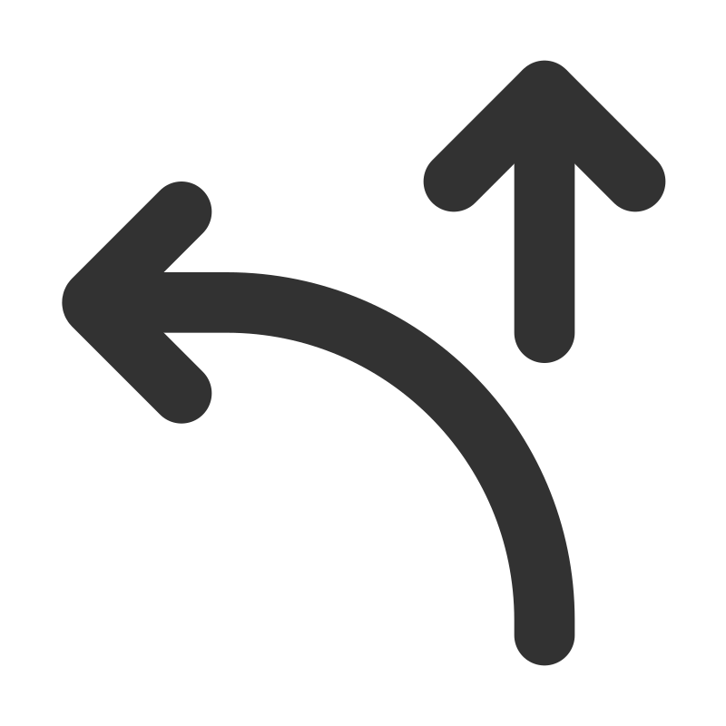</a> | **📂 檔名:** `arrow-ramp-left.svg` ✨ **格式:** `Vector (SVG)` ⚖️ **大小:** `832.00B` 📅 **更新:** `2026-02-27`  🚀 **jsDelivr Markdown:** `` 🔗 **直接連結 (Url):** <code>https://cdn.jsdelivr.net/gh/barry028/materials@main/images/iCons/Scarlab%20Oval%20Line%20iCons/arrow-ramp-left.svg</code> 📥 [檢視原始檔](arrow-ramp-left.svg) |
|  | **📂 檔名:** `arrow-ramp-right.svg` ✨ **格式:** `Vector (SVG)` ⚖️ **大小:** `830.00B` 📅 **更新:** `2026-02-27`  🚀 **jsDelivr Markdown:** `` 🔗 **直接連結 (Url):** <code>https://cdn.jsdelivr.net/gh/barry028/materials@main/images/iCons/Scarlab%20Oval%20Line%20iCons/arrow-ramp-right.svg</code> 📥 [檢視原始檔](arrow-ramp-right.svg) |
|  | **📂 檔名:** `arrow-right-alt.svg` ✨ **格式:** `Vector (SVG)` ⚖️ **大小:** `517.00B` 📅 **更新:** `2026-02-27`  🚀 **jsDelivr Markdown:** `` 🔗 **直接連結 (Url):** <code>https://cdn.jsdelivr.net/gh/barry028/materials@main/images/iCons/Scarlab%20Oval%20Line%20iCons/arrow-right-alt.svg</code> 📥 [檢視原始檔](arrow-right-alt.svg) |
|  | **📂 檔名:** `arrow-right-circle.svg` ✨ **格式:** `Vector (SVG)` ⚖️ **大小:** `672.00B` 📅 **更新:** `2026-02-27`  🚀 **jsDelivr Markdown:** `` 🔗 **直接連結 (Url):** <code>https://cdn.jsdelivr.net/gh/barry028/materials@main/images/iCons/Scarlab%20Oval%20Line%20iCons/arrow-right-circle.svg</code> 📥 [檢視原始檔](arrow-right-circle.svg) |
|  | **📂 檔名:** `arrow-right-square.svg` ✨ **格式:** `Vector (SVG)` ⚖️ **大小:** `667.00B` 📅 **更新:** `2026-02-27`  🚀 **jsDelivr Markdown:** `` 🔗 **直接連結 (Url):** <code>https://cdn.jsdelivr.net/gh/barry028/materials@main/images/iCons/Scarlab%20Oval%20Line%20iCons/arrow-right-square.svg</code> 📥 [檢視原始檔](arrow-right-square.svg) |
|  | **📂 檔名:** `arrow-right.svg` ✨ **格式:** `Vector (SVG)` ⚖️ **大小:** `511.00B` 📅 **更新:** `2026-02-27`  🚀 **jsDelivr Markdown:** `` 🔗 **直接連結 (Url):** <code>https://cdn.jsdelivr.net/gh/barry028/materials@main/images/iCons/Scarlab%20Oval%20Line%20iCons/arrow-right.svg</code> 📥 [檢視原始檔](arrow-right.svg) |
|  | **📂 檔名:** `arrow-up-alt.svg` ✨ **格式:** `Vector (SVG)` ⚖️ **大小:** `515.00B` 📅 **更新:** `2026-02-27`  🚀 **jsDelivr Markdown:** `` 🔗 **直接連結 (Url):** <code>https://cdn.jsdelivr.net/gh/barry028/materials@main/images/iCons/Scarlab%20Oval%20Line%20iCons/arrow-up-alt.svg</code> 📥 [檢視原始檔](arrow-up-alt.svg) |
|  | **📂 檔名:** `arrow-up-circle.svg` ✨ **格式:** `Vector (SVG)` ⚖️ **大小:** `678.00B` 📅 **更新:** `2026-02-27`  🚀 **jsDelivr Markdown:** `` 🔗 **直接連結 (Url):** <code>https://cdn.jsdelivr.net/gh/barry028/materials@main/images/iCons/Scarlab%20Oval%20Line%20iCons/arrow-up-circle.svg</code> 📥 [檢視原始檔](arrow-up-circle.svg) |
|  | **📂 檔名:** `arrow-up-left-alt.svg` ✨ **格式:** `Vector (SVG)` ⚖️ **大小:** `518.00B` 📅 **更新:** `2026-02-27`  🚀 **jsDelivr Markdown:** `` 🔗 **直接連結 (Url):** <code>https://cdn.jsdelivr.net/gh/barry028/materials@main/images/iCons/Scarlab%20Oval%20Line%20iCons/arrow-up-left-alt.svg</code> 📥 [檢視原始檔](arrow-up-left-alt.svg) |
|  | **📂 檔名:** `arrow-up-left-circle.svg` ✨ **格式:** `Vector (SVG)` ⚖️ **大小:** `638.00B` 📅 **更新:** `2026-02-27`  🚀 **jsDelivr Markdown:** `` 🔗 **直接連結 (Url):** <code>https://cdn.jsdelivr.net/gh/barry028/materials@main/images/iCons/Scarlab%20Oval%20Line%20iCons/arrow-up-left-circle.svg</code> 📥 [檢視原始檔](arrow-up-left-circle.svg) |
|  | **📂 檔名:** `arrow-up-left-square.svg` ✨ **格式:** `Vector (SVG)` ⚖️ **大小:** `633.00B` 📅 **更新:** `2026-02-27`  🚀 **jsDelivr Markdown:** `` 🔗 **直接連結 (Url):** <code>https://cdn.jsdelivr.net/gh/barry028/materials@main/images/iCons/Scarlab%20Oval%20Line%20iCons/arrow-up-left-square.svg</code> 📥 [檢視原始檔](arrow-up-left-square.svg) |
|  | **📂 檔名:** `arrow-up-left.svg` ✨ **格式:** `Vector (SVG)` ⚖️ **大小:** `481.00B` 📅 **更新:** `2026-02-27`  🚀 **jsDelivr Markdown:** `` 🔗 **直接連結 (Url):** <code>https://cdn.jsdelivr.net/gh/barry028/materials@main/images/iCons/Scarlab%20Oval%20Line%20iCons/arrow-up-left.svg</code> 📥 [檢視原始檔](arrow-up-left.svg) |
|  | **📂 檔名:** `arrow-up-right-alt.svg` ✨ **格式:** `Vector (SVG)` ⚖️ **大小:** `542.00B` 📅 **更新:** `2026-02-27`  🚀 **jsDelivr Markdown:** `` 🔗 **直接連結 (Url):** <code>https://cdn.jsdelivr.net/gh/barry028/materials@main/images/iCons/Scarlab%20Oval%20Line%20iCons/arrow-up-right-alt.svg</code> 📥 [檢視原始檔](arrow-up-right-alt.svg) |
|  | **📂 檔名:** `arrow-up-right-circle.svg` ✨ **格式:** `Vector (SVG)` ⚖️ **大小:** `640.00B` 📅 **更新:** `2026-02-27`  🚀 **jsDelivr Markdown:** `` 🔗 **直接連結 (Url):** <code>https://cdn.jsdelivr.net/gh/barry028/materials@main/images/iCons/Scarlab%20Oval%20Line%20iCons/arrow-up-right-circle.svg</code> 📥 [檢視原始檔](arrow-up-right-circle.svg) |
|  | **📂 檔名:** `arrow-up-right-square.svg` ✨ **格式:** `Vector (SVG)` ⚖️ **大小:** `636.00B` 📅 **更新:** `2026-02-27`  🚀 **jsDelivr Markdown:** `` 🔗 **直接連結 (Url):** <code>https://cdn.jsdelivr.net/gh/barry028/materials@main/images/iCons/Scarlab%20Oval%20Line%20iCons/arrow-up-right-square.svg</code> 📥 [檢視原始檔](arrow-up-right-square.svg) |
|  | **📂 檔名:** `arrow-up-right.svg` ✨ **格式:** `Vector (SVG)` ⚖️ **大小:** `480.00B` 📅 **更新:** `2026-02-27`  🚀 **jsDelivr Markdown:** `` 🔗 **直接連結 (Url):** <code>https://cdn.jsdelivr.net/gh/barry028/materials@main/images/iCons/Scarlab%20Oval%20Line%20iCons/arrow-up-right.svg</code> 📥 [檢視原始檔](arrow-up-right.svg) |
|  | **📂 檔名:** `arrow-up-square.svg` ✨ **格式:** `Vector (SVG)` ⚖️ **大小:** `673.00B` 📅 **更新:** `2026-02-27`  🚀 **jsDelivr Markdown:** `` 🔗 **直接連結 (Url):** <code>https://cdn.jsdelivr.net/gh/barry028/materials@main/images/iCons/Scarlab%20Oval%20Line%20iCons/arrow-up-square.svg</code> 📥 [檢視原始檔](arrow-up-square.svg) |
|  | **📂 檔名:** `arrow-up.svg` ✨ **格式:** `Vector (SVG)` ⚖️ **大小:** `517.00B` 📅 **更新:** `2026-02-27`  🚀 **jsDelivr Markdown:** `` 🔗 **直接連結 (Url):** <code>https://cdn.jsdelivr.net/gh/barry028/materials@main/images/iCons/Scarlab%20Oval%20Line%20iCons/arrow-up.svg</code> 📥 [檢視原始檔](arrow-up.svg) |
|  | **📂 檔名:** `at-symbol.svg` ✨ **格式:** `Vector (SVG)` ⚖️ **大小:** `601.00B` 📅 **更新:** `2026-02-27`  🚀 **jsDelivr Markdown:** `` 🔗 **直接連結 (Url):** <code>https://cdn.jsdelivr.net/gh/barry028/materials@main/images/iCons/Scarlab%20Oval%20Line%20iCons/at-symbol.svg</code> 📥 [檢視原始檔](at-symbol.svg) |
|  | **📂 檔名:** `atom.svg` ✨ **格式:** `Vector (SVG)` ⚖️ **大小:** `867.00B` 📅 **更新:** `2026-02-27`  🚀 **jsDelivr Markdown:** `` 🔗 **直接連結 (Url):** <code>https://cdn.jsdelivr.net/gh/barry028/materials@main/images/iCons/Scarlab%20Oval%20Line%20iCons/atom.svg</code> 📥 [檢視原始檔](atom.svg) |
|  | **📂 檔名:** `award.svg` ✨ **格式:** `Vector (SVG)` ⚖️ **大小:** `662.00B` 📅 **更新:** `2026-02-27`  🚀 **jsDelivr Markdown:** `` 🔗 **直接連結 (Url):** <code>https://cdn.jsdelivr.net/gh/barry028/materials@main/images/iCons/Scarlab%20Oval%20Line%20iCons/award.svg</code> 📥 [檢視原始檔](award.svg) |
|  | **📂 檔名:** `backspace.svg` ✨ **格式:** `Vector (SVG)` ⚖️ **大小:** `766.00B` 📅 **更新:** `2026-02-27`  🚀 **jsDelivr Markdown:** `` 🔗 **直接連結 (Url):** <code>https://cdn.jsdelivr.net/gh/barry028/materials@main/images/iCons/Scarlab%20Oval%20Line%20iCons/backspace.svg</code> 📥 [檢視原始檔](backspace.svg) |
|  | **📂 檔名:** `bangladeshi-circle.svg` ✨ **格式:** `Vector (SVG)` ⚖️ **大小:** `661.00B` 📅 **更新:** `2026-02-27`  🚀 **jsDelivr Markdown:** `` 🔗 **直接連結 (Url):** <code>https://cdn.jsdelivr.net/gh/barry028/materials@main/images/iCons/Scarlab%20Oval%20Line%20iCons/bangladeshi-circle.svg</code> 📥 [檢視原始檔](bangladeshi-circle.svg) |
|  | **📂 檔名:** `bangladeshi-square.svg` ✨ **格式:** `Vector (SVG)` ⚖️ **大小:** `656.00B` 📅 **更新:** `2026-02-27`  🚀 **jsDelivr Markdown:** `` 🔗 **直接連結 (Url):** <code>https://cdn.jsdelivr.net/gh/barry028/materials@main/images/iCons/Scarlab%20Oval%20Line%20iCons/bangladeshi-square.svg</code> 📥 [檢視原始檔](bangladeshi-square.svg) |
|  | **📂 檔名:** `bangladeshi.svg` ✨ **格式:** `Vector (SVG)` ⚖️ **大小:** `500.00B` 📅 **更新:** `2026-02-27`  🚀 **jsDelivr Markdown:** `` 🔗 **直接連結 (Url):** <code>https://cdn.jsdelivr.net/gh/barry028/materials@main/images/iCons/Scarlab%20Oval%20Line%20iCons/bangladeshi.svg</code> 📥 [檢視原始檔](bangladeshi.svg) |
|  | **📂 檔名:** `barcode.svg` ✨ **格式:** `Vector (SVG)` ⚖️ **大小:** `1007.00B` 📅 **更新:** `2026-02-27`  🚀 **jsDelivr Markdown:** `` 🔗 **直接連結 (Url):** <code>https://cdn.jsdelivr.net/gh/barry028/materials@main/images/iCons/Scarlab%20Oval%20Line%20iCons/barcode.svg</code> 📥 [檢視原始檔](barcode.svg) |
|  | **📂 檔名:** `battery-charging.svg` ✨ **格式:** `Vector (SVG)` ⚖️ **大小:** `942.00B` 📅 **更新:** `2026-02-27`  🚀 **jsDelivr Markdown:** `` 🔗 **直接連結 (Url):** <code>https://cdn.jsdelivr.net/gh/barry028/materials@main/images/iCons/Scarlab%20Oval%20Line%20iCons/battery-charging.svg</code> 📥 [檢視原始檔](battery-charging.svg) |
|  | **📂 檔名:** `battery-full.svg` ✨ **格式:** `Vector (SVG)` ⚖️ **大小:** `1.02KB` 📅 **更新:** `2026-02-27`  🚀 **jsDelivr Markdown:** `` 🔗 **直接連結 (Url):** <code>https://cdn.jsdelivr.net/gh/barry028/materials@main/images/iCons/Scarlab%20Oval%20Line%20iCons/battery-full.svg</code> 📥 [檢視原始檔](battery-full.svg) |
|  | **📂 檔名:** `battery-low.svg` ✨ **格式:** `Vector (SVG)` ⚖️ **大小:** `808.00B` 📅 **更新:** `2026-02-27`  🚀 **jsDelivr Markdown:** `` 🔗 **直接連結 (Url):** <code>https://cdn.jsdelivr.net/gh/barry028/materials@main/images/iCons/Scarlab%20Oval%20Line%20iCons/battery-low.svg</code> 📥 [檢視原始檔](battery-low.svg) |
|  | **📂 檔名:** `battery-medium.svg` ✨ **格式:** `Vector (SVG)` ⚖️ **大小:** `925.00B` 📅 **更新:** `2026-02-27`  🚀 **jsDelivr Markdown:** `` 🔗 **直接連結 (Url):** <code>https://cdn.jsdelivr.net/gh/barry028/materials@main/images/iCons/Scarlab%20Oval%20Line%20iCons/battery-medium.svg</code> 📥 [檢視原始檔](battery-medium.svg) |
|  | **📂 檔名:** `battery.svg` ✨ **格式:** `Vector (SVG)` ⚖️ **大小:** `691.00B` 📅 **更新:** `2026-02-27`  🚀 **jsDelivr Markdown:** `` 🔗 **直接連結 (Url):** <code>https://cdn.jsdelivr.net/gh/barry028/materials@main/images/iCons/Scarlab%20Oval%20Line%20iCons/battery.svg</code> 📥 [檢視原始檔](battery.svg) |
|  | **📂 檔名:** `beaker.svg` ✨ **格式:** `Vector (SVG)` ⚖️ **大小:** `872.00B` 📅 **更新:** `2026-02-27`  🚀 **jsDelivr Markdown:** `` 🔗 **直接連結 (Url):** <code>https://cdn.jsdelivr.net/gh/barry028/materials@main/images/iCons/Scarlab%20Oval%20Line%20iCons/beaker.svg</code> 📥 [檢視原始檔](beaker.svg) |
|  | **📂 檔名:** `bell-off.svg` ✨ **格式:** `Vector (SVG)` ⚖️ **大小:** `968.00B` 📅 **更新:** `2026-02-27`  🚀 **jsDelivr Markdown:** `` 🔗 **直接連結 (Url):** <code>https://cdn.jsdelivr.net/gh/barry028/materials@main/images/iCons/Scarlab%20Oval%20Line%20iCons/bell-off.svg</code> 📥 [檢視原始檔](bell-off.svg) |
|  | **📂 檔名:** `bell-ringing.svg` ✨ **格式:** `Vector (SVG)` ⚖️ **大小:** `970.00B` 📅 **更新:** `2026-02-27`  🚀 **jsDelivr Markdown:** `` 🔗 **直接連結 (Url):** <code>https://cdn.jsdelivr.net/gh/barry028/materials@main/images/iCons/Scarlab%20Oval%20Line%20iCons/bell-ringing.svg</code> 📥 [檢視原始檔](bell-ringing.svg) |
|  | **📂 檔名:** `bell.svg` ✨ **格式:** `Vector (SVG)` ⚖️ **大小:** `740.00B` 📅 **更新:** `2026-02-27`  🚀 **jsDelivr Markdown:** `` 🔗 **直接連結 (Url):** <code>https://cdn.jsdelivr.net/gh/barry028/materials@main/images/iCons/Scarlab%20Oval%20Line%20iCons/bell.svg</code> 📥 [檢視原始檔](bell.svg) |
|  | **📂 檔名:** `beneficiaries.svg` ✨ **格式:** `Vector (SVG)` ⚖️ **大小:** `1.11KB` 📅 **更新:** `2026-02-27`  🚀 **jsDelivr Markdown:** `` 🔗 **直接連結 (Url):** <code>https://cdn.jsdelivr.net/gh/barry028/materials@main/images/iCons/Scarlab%20Oval%20Line%20iCons/beneficiaries.svg</code> 📥 [檢視原始檔](beneficiaries.svg) |
|  | **📂 檔名:** `bitcoin-circle.svg` ✨ **格式:** `Vector (SVG)` ⚖️ **大小:** `969.00B` 📅 **更新:** `2026-02-27`  🚀 **jsDelivr Markdown:** `` 🔗 **直接連結 (Url):** <code>https://cdn.jsdelivr.net/gh/barry028/materials@main/images/iCons/Scarlab%20Oval%20Line%20iCons/bitcoin-circle.svg</code> 📥 [檢視原始檔](bitcoin-circle.svg) |
|  | **📂 檔名:** `bitcoin-square.svg` ✨ **格式:** `Vector (SVG)` ⚖️ **大小:** `964.00B` 📅 **更新:** `2026-02-27`  🚀 **jsDelivr Markdown:** `` 🔗 **直接連結 (Url):** <code>https://cdn.jsdelivr.net/gh/barry028/materials@main/images/iCons/Scarlab%20Oval%20Line%20iCons/bitcoin-square.svg</code> 📥 [檢視原始檔](bitcoin-square.svg) |
|  | **📂 檔名:** `bitcoin.svg` ✨ **格式:** `Vector (SVG)` ⚖️ **大小:** `808.00B` 📅 **更新:** `2026-02-27`  🚀 **jsDelivr Markdown:** `` 🔗 **直接連結 (Url):** <code>https://cdn.jsdelivr.net/gh/barry028/materials@main/images/iCons/Scarlab%20Oval%20Line%20iCons/bitcoin.svg</code> 📥 [檢視原始檔](bitcoin.svg) |
| <a href="blockquote.svg">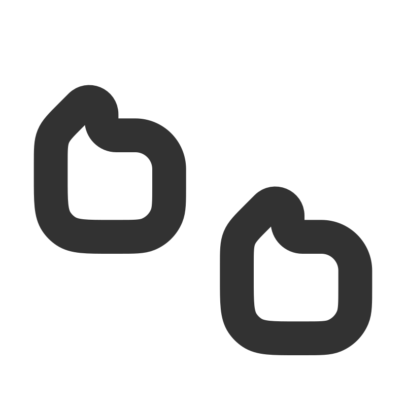</a> | **📂 檔名:** `blockquote.svg` ✨ **格式:** `Vector (SVG)` ⚖️ **大小:** `1.25KB` 📅 **更新:** `2026-02-27`  🚀 **jsDelivr Markdown:** `` 🔗 **直接連結 (Url):** <code>https://cdn.jsdelivr.net/gh/barry028/materials@main/images/iCons/Scarlab%20Oval%20Line%20iCons/blockquote.svg</code> 📥 [檢視原始檔](blockquote.svg) |
|  | **📂 檔名:** `bluetooth.svg` ✨ **格式:** `Vector (SVG)` ⚖️ **大小:** `603.00B` 📅 **更新:** `2026-02-27`  🚀 **jsDelivr Markdown:** `` 🔗 **直接連結 (Url):** <code>https://cdn.jsdelivr.net/gh/barry028/materials@main/images/iCons/Scarlab%20Oval%20Line%20iCons/bluetooth.svg</code> 📥 [檢視原始檔](bluetooth.svg) |
| <a href="blur.svg">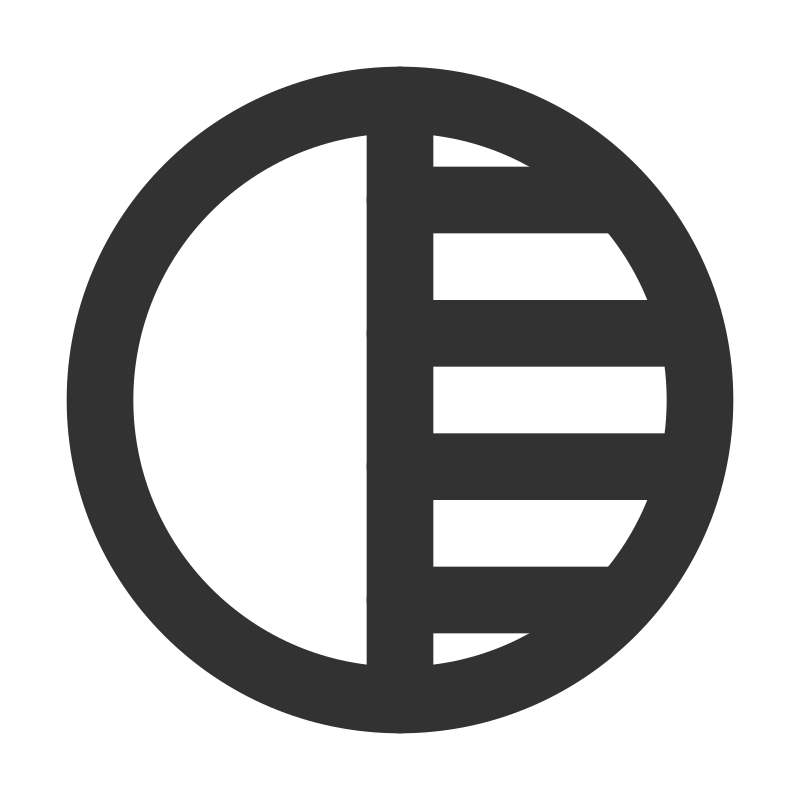</a> | **📂 檔名:** `blur.svg` ✨ **格式:** `Vector (SVG)` ⚖️ **大小:** `916.00B` 📅 **更新:** `2026-02-27`  🚀 **jsDelivr Markdown:** `` 🔗 **直接連結 (Url):** <code>https://cdn.jsdelivr.net/gh/barry028/materials@main/images/iCons/Scarlab%20Oval%20Line%20iCons/blur.svg</code> 📥 [檢視原始檔](blur.svg) |
|  | **📂 檔名:** `bold.svg` ✨ **格式:** `Vector (SVG)` ⚖️ **大小:** `615.00B` 📅 **更新:** `2026-02-27`  🚀 **jsDelivr Markdown:** `` 🔗 **直接連結 (Url):** <code>https://cdn.jsdelivr.net/gh/barry028/materials@main/images/iCons/Scarlab%20Oval%20Line%20iCons/bold.svg</code> 📥 [檢視原始檔](bold.svg) |
|  | **📂 檔名:** `book-open.svg` ✨ **格式:** `Vector (SVG)` ⚖️ **大小:** `1.12KB` 📅 **更新:** `2026-02-27`  🚀 **jsDelivr Markdown:** `` 🔗 **直接連結 (Url):** <code>https://cdn.jsdelivr.net/gh/barry028/materials@main/images/iCons/Scarlab%20Oval%20Line%20iCons/book-open.svg</code> 📥 [檢視原始檔](book-open.svg) |
| <a href="bookmark-alt.svg">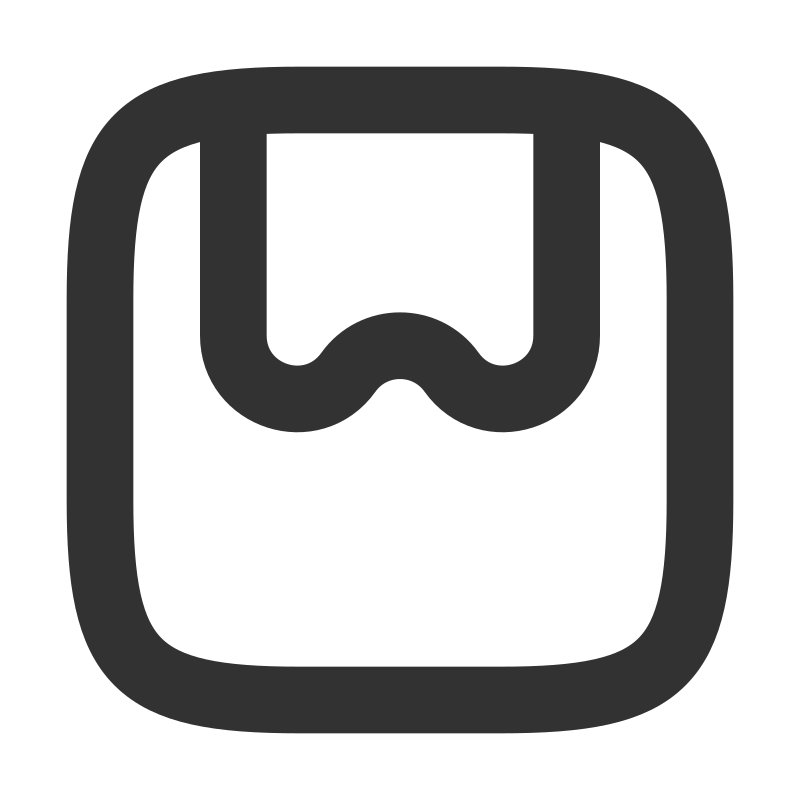</a> | **📂 檔名:** `bookmark-alt.svg` ✨ **格式:** `Vector (SVG)` ⚖️ **大小:** `667.00B` 📅 **更新:** `2026-02-27`  🚀 **jsDelivr Markdown:** `` 🔗 **直接連結 (Url):** <code>https://cdn.jsdelivr.net/gh/barry028/materials@main/images/iCons/Scarlab%20Oval%20Line%20iCons/bookmark-alt.svg</code> 📥 [檢視原始檔](bookmark-alt.svg) |
|  | **📂 檔名:** `bookmark.svg` ✨ **格式:** `Vector (SVG)` ⚖️ **大小:** `531.00B` 📅 **更新:** `2026-02-27`  🚀 **jsDelivr Markdown:** `` 🔗 **直接連結 (Url):** <code>https://cdn.jsdelivr.net/gh/barry028/materials@main/images/iCons/Scarlab%20Oval%20Line%20iCons/bookmark.svg</code> 📥 [檢視原始檔](bookmark.svg) |
|  | **📂 檔名:** `box.svg` ✨ **格式:** `Vector (SVG)` ⚖️ **大小:** `839.00B` 📅 **更新:** `2026-02-27`  🚀 **jsDelivr Markdown:** `` 🔗 **直接連結 (Url):** <code>https://cdn.jsdelivr.net/gh/barry028/materials@main/images/iCons/Scarlab%20Oval%20Line%20iCons/box.svg</code> 📥 [檢視原始檔](box.svg) |
|  | **📂 檔名:** `brackets-curly.svg` ✨ **格式:** `Vector (SVG)` ⚖️ **大小:** `871.00B` 📅 **更新:** `2026-02-27`  🚀 **jsDelivr Markdown:** `` 🔗 **直接連結 (Url):** <code>https://cdn.jsdelivr.net/gh/barry028/materials@main/images/iCons/Scarlab%20Oval%20Line%20iCons/brackets-curly.svg</code> 📥 [檢視原始檔](brackets-curly.svg) |
|  | **📂 檔名:** `brackets-square.svg` ✨ **格式:** `Vector (SVG)` ⚖️ **大小:** `563.00B` 📅 **更新:** `2026-02-27`  🚀 **jsDelivr Markdown:** `` 🔗 **直接連結 (Url):** <code>https://cdn.jsdelivr.net/gh/barry028/materials@main/images/iCons/Scarlab%20Oval%20Line%20iCons/brackets-square.svg</code> 📥 [檢視原始檔](brackets-square.svg) |
|  | **📂 檔名:** `brackets.svg` ✨ **格式:** `Vector (SVG)` ⚖️ **大小:** `528.00B` 📅 **更新:** `2026-02-27`  🚀 **jsDelivr Markdown:** `` 🔗 **直接連結 (Url):** <code>https://cdn.jsdelivr.net/gh/barry028/materials@main/images/iCons/Scarlab%20Oval%20Line%20iCons/brackets.svg</code> 📥 [檢視原始檔](brackets.svg) |
|  | **📂 檔名:** `briefcase-alt.svg` ✨ **格式:** `Vector (SVG)` ⚖️ **大小:** `1.13KB` 📅 **更新:** `2026-02-27`  🚀 **jsDelivr Markdown:** `` 🔗 **直接連結 (Url):** <code>https://cdn.jsdelivr.net/gh/barry028/materials@main/images/iCons/Scarlab%20Oval%20Line%20iCons/briefcase-alt.svg</code> 📥 [檢視原始檔](briefcase-alt.svg) |
|  | **📂 檔名:** `briefcase.svg` ✨ **格式:** `Vector (SVG)` ⚖️ **大小:** `717.00B` 📅 **更新:** `2026-02-27`  🚀 **jsDelivr Markdown:** `` 🔗 **直接連結 (Url):** <code>https://cdn.jsdelivr.net/gh/barry028/materials@main/images/iCons/Scarlab%20Oval%20Line%20iCons/briefcase.svg</code> 📥 [檢視原始檔](briefcase.svg) |
|  | **📂 檔名:** `brightness.svg` ✨ **格式:** `Vector (SVG)` ⚖️ **大小:** `830.00B` 📅 **更新:** `2026-02-27`  🚀 **jsDelivr Markdown:** `` 🔗 **直接連結 (Url):** <code>https://cdn.jsdelivr.net/gh/barry028/materials@main/images/iCons/Scarlab%20Oval%20Line%20iCons/brightness.svg</code> 📥 [檢視原始檔](brightness.svg) |
|  | **📂 檔名:** `browser.svg` ✨ **格式:** `Vector (SVG)` ⚖️ **大小:** `639.00B` 📅 **更新:** `2026-02-27`  🚀 **jsDelivr Markdown:** `` 🔗 **直接連結 (Url):** <code>https://cdn.jsdelivr.net/gh/barry028/materials@main/images/iCons/Scarlab%20Oval%20Line%20iCons/browser.svg</code> 📥 [檢視原始檔](browser.svg) |
|  | **📂 檔名:** `building.svg` ✨ **格式:** `Vector (SVG)` ⚖️ **大小:** `1.16KB` 📅 **更新:** `2026-02-27`  🚀 **jsDelivr Markdown:** `` 🔗 **直接連結 (Url):** <code>https://cdn.jsdelivr.net/gh/barry028/materials@main/images/iCons/Scarlab%20Oval%20Line%20iCons/building.svg</code> 📥 [檢視原始檔](building.svg) |
|  | **📂 檔名:** `bulb-on.svg` ✨ **格式:** `Vector (SVG)` ⚖️ **大小:** `1.22KB` 📅 **更新:** `2026-02-27`  🚀 **jsDelivr Markdown:** `` 🔗 **直接連結 (Url):** <code>https://cdn.jsdelivr.net/gh/barry028/materials@main/images/iCons/Scarlab%20Oval%20Line%20iCons/bulb-on.svg</code> 📥 [檢視原始檔](bulb-on.svg) |
|  | **📂 檔名:** `bulb.svg` ✨ **格式:** `Vector (SVG)` ⚖️ **大小:** `729.00B` 📅 **更新:** `2026-02-27`  🚀 **jsDelivr Markdown:** `` 🔗 **直接連結 (Url):** <code>https://cdn.jsdelivr.net/gh/barry028/materials@main/images/iCons/Scarlab%20Oval%20Line%20iCons/bulb.svg</code> 📥 [檢視原始檔](bulb.svg) |
|  | **📂 檔名:** `cake.svg` ✨ **格式:** `Vector (SVG)` ⚖️ **大小:** `1.47KB` 📅 **更新:** `2026-02-27`  🚀 **jsDelivr Markdown:** `` 🔗 **直接連結 (Url):** <code>https://cdn.jsdelivr.net/gh/barry028/materials@main/images/iCons/Scarlab%20Oval%20Line%20iCons/cake.svg</code> 📥 [檢視原始檔](cake.svg) |
|  | **📂 檔名:** `calculator.svg` ✨ **格式:** `Vector (SVG)` ⚖️ **大小:** `1.49KB` 📅 **更新:** `2026-02-27`  🚀 **jsDelivr Markdown:** `` 🔗 **直接連結 (Url):** <code>https://cdn.jsdelivr.net/gh/barry028/materials@main/images/iCons/Scarlab%20Oval%20Line%20iCons/calculator.svg</code> 📥 [檢視原始檔](calculator.svg) |
|  | **📂 檔名:** `calendar-alt.svg` ✨ **格式:** `Vector (SVG)` ⚖️ **大小:** `677.00B` 📅 **更新:** `2026-02-27`  🚀 **jsDelivr Markdown:** `` 🔗 **直接連結 (Url):** <code>https://cdn.jsdelivr.net/gh/barry028/materials@main/images/iCons/Scarlab%20Oval%20Line%20iCons/calendar-alt.svg</code> 📥 [檢視原始檔](calendar-alt.svg) |
|  | **📂 檔名:** `calendar.svg` ✨ **格式:** `Vector (SVG)` ⚖️ **大小:** `673.00B` 📅 **更新:** `2026-02-27`  🚀 **jsDelivr Markdown:** `` 🔗 **直接連結 (Url):** <code>https://cdn.jsdelivr.net/gh/barry028/materials@main/images/iCons/Scarlab%20Oval%20Line%20iCons/calendar.svg</code> 📥 [檢視原始檔](calendar.svg) |
|  | **📂 檔名:** `camera-off.svg` ✨ **格式:** `Vector (SVG)` ⚖️ **大小:** `1.22KB` 📅 **更新:** `2026-02-27`  🚀 **jsDelivr Markdown:** `` 🔗 **直接連結 (Url):** <code>https://cdn.jsdelivr.net/gh/barry028/materials@main/images/iCons/Scarlab%20Oval%20Line%20iCons/camera-off.svg</code> 📥 [檢視原始檔](camera-off.svg) |
|  | **📂 檔名:** `camera-web.svg` ✨ **格式:** `Vector (SVG)` ⚖️ **大小:** `740.00B` 📅 **更新:** `2026-02-27`  🚀 **jsDelivr Markdown:** `` 🔗 **直接連結 (Url):** <code>https://cdn.jsdelivr.net/gh/barry028/materials@main/images/iCons/Scarlab%20Oval%20Line%20iCons/camera-web.svg</code> 📥 [檢視原始檔](camera-web.svg) |
|  | **📂 檔名:** `camera.svg` ✨ **格式:** `Vector (SVG)` ⚖️ **大小:** `1.36KB` 📅 **更新:** `2026-02-27`  🚀 **jsDelivr Markdown:** `` 🔗 **直接連結 (Url):** <code>https://cdn.jsdelivr.net/gh/barry028/materials@main/images/iCons/Scarlab%20Oval%20Line%20iCons/camera.svg</code> 📥 [檢視原始檔](camera.svg) |
|  | **📂 檔名:** `cash.svg` ✨ **格式:** `Vector (SVG)` ⚖️ **大小:** `1.05KB` 📅 **更新:** `2026-02-27`  🚀 **jsDelivr Markdown:** `` 🔗 **直接連結 (Url):** <code>https://cdn.jsdelivr.net/gh/barry028/materials@main/images/iCons/Scarlab%20Oval%20Line%20iCons/cash.svg</code> 📥 [檢視原始檔](cash.svg) |
|  | **📂 檔名:** `chart-bar-alt-square.svg` ✨ **格式:** `Vector (SVG)` ⚖️ **大小:** `702.00B` 📅 **更新:** `2026-02-27`  🚀 **jsDelivr Markdown:** `` 🔗 **直接連結 (Url):** <code>https://cdn.jsdelivr.net/gh/barry028/materials@main/images/iCons/Scarlab%20Oval%20Line%20iCons/chart-bar-alt-square.svg</code> 📥 [檢視原始檔](chart-bar-alt-square.svg) |
|  | **📂 檔名:** `chart-bar-alt.svg` ✨ **格式:** `Vector (SVG)` ⚖️ **大小:** `546.00B` 📅 **更新:** `2026-02-27`  🚀 **jsDelivr Markdown:** `` 🔗 **直接連結 (Url):** <code>https://cdn.jsdelivr.net/gh/barry028/materials@main/images/iCons/Scarlab%20Oval%20Line%20iCons/chart-bar-alt.svg</code> 📥 [檢視原始檔](chart-bar-alt.svg) |
|  | **📂 檔名:** `chart-bar-square.svg` ✨ **格式:** `Vector (SVG)` ⚖️ **大小:** `703.00B` 📅 **更新:** `2026-02-27`  🚀 **jsDelivr Markdown:** `` 🔗 **直接連結 (Url):** <code>https://cdn.jsdelivr.net/gh/barry028/materials@main/images/iCons/Scarlab%20Oval%20Line%20iCons/chart-bar-square.svg</code> 📥 [檢視原始檔](chart-bar-square.svg) |
|  | **📂 檔名:** `chart-bar.svg` ✨ **格式:** `Vector (SVG)` ⚖️ **大小:** `546.00B` 📅 **更新:** `2026-02-27`  🚀 **jsDelivr Markdown:** `` 🔗 **直接連結 (Url):** <code>https://cdn.jsdelivr.net/gh/barry028/materials@main/images/iCons/Scarlab%20Oval%20Line%20iCons/chart-bar.svg</code> 📥 [檢視原始檔](chart-bar.svg) |
|  | **📂 檔名:** `chart-bubble.svg` ✨ **格式:** `Vector (SVG)` ⚖️ **大小:** `727.00B` 📅 **更新:** `2026-02-27`  🚀 **jsDelivr Markdown:** `` 🔗 **直接連結 (Url):** <code>https://cdn.jsdelivr.net/gh/barry028/materials@main/images/iCons/Scarlab%20Oval%20Line%20iCons/chart-bubble.svg</code> 📥 [檢視原始檔](chart-bubble.svg) |
|  | **📂 檔名:** `chart-pie.svg` ✨ **格式:** `Vector (SVG)` ⚖️ **大小:** `714.00B` 📅 **更新:** `2026-02-27`  🚀 **jsDelivr Markdown:** `` 🔗 **直接連結 (Url):** <code>https://cdn.jsdelivr.net/gh/barry028/materials@main/images/iCons/Scarlab%20Oval%20Line%20iCons/chart-pie.svg</code> 📥 [檢視原始檔](chart-pie.svg) |
|  | **📂 檔名:** `chat.svg` ✨ **格式:** `Vector (SVG)` ⚖️ **大小:** `1017.00B` 📅 **更新:** `2026-02-27`  🚀 **jsDelivr Markdown:** `` 🔗 **直接連結 (Url):** <code>https://cdn.jsdelivr.net/gh/barry028/materials@main/images/iCons/Scarlab%20Oval%20Line%20iCons/chat.svg</code> 📥 [檢視原始檔](chat.svg) |
|  | **📂 檔名:** `check-alt.svg` ✨ **格式:** `Vector (SVG)` ⚖️ **大小:** `412.00B` 📅 **更新:** `2026-02-27`  🚀 **jsDelivr Markdown:** `` 🔗 **直接連結 (Url):** <code>https://cdn.jsdelivr.net/gh/barry028/materials@main/images/iCons/Scarlab%20Oval%20Line%20iCons/check-alt.svg</code> 📥 [檢視原始檔](check-alt.svg) |
|  | **📂 檔名:** `check-badge.svg` ✨ **格式:** `Vector (SVG)` ⚖️ **大小:** `1.51KB` 📅 **更新:** `2026-02-27`  🚀 **jsDelivr Markdown:** `` 🔗 **直接連結 (Url):** <code>https://cdn.jsdelivr.net/gh/barry028/materials@main/images/iCons/Scarlab%20Oval%20Line%20iCons/check-badge.svg</code> 📥 [檢視原始檔](check-badge.svg) |
|  | **📂 檔名:** `check-circle.svg` ✨ **格式:** `Vector (SVG)` ⚖️ **大小:** `572.00B` 📅 **更新:** `2026-02-27`  🚀 **jsDelivr Markdown:** `` 🔗 **直接連結 (Url):** <code>https://cdn.jsdelivr.net/gh/barry028/materials@main/images/iCons/Scarlab%20Oval%20Line%20iCons/check-circle.svg</code> 📥 [檢視原始檔](check-circle.svg) |
|  | **📂 檔名:** `check-square.svg` ✨ **格式:** `Vector (SVG)` ⚖️ **大小:** `567.00B` 📅 **更新:** `2026-02-27`  🚀 **jsDelivr Markdown:** `` 🔗 **直接連結 (Url):** <code>https://cdn.jsdelivr.net/gh/barry028/materials@main/images/iCons/Scarlab%20Oval%20Line%20iCons/check-square.svg</code> 📥 [檢視原始檔](check-square.svg) |
|  | **📂 檔名:** `check.svg` ✨ **格式:** `Vector (SVG)` ⚖️ **大小:** `397.00B` 📅 **更新:** `2026-02-27`  🚀 **jsDelivr Markdown:** `` 🔗 **直接連結 (Url):** <code>https://cdn.jsdelivr.net/gh/barry028/materials@main/images/iCons/Scarlab%20Oval%20Line%20iCons/check.svg</code> 📥 [檢視原始檔](check.svg) |
|  | **📂 檔名:** `chevron-down-alt.svg` ✨ **格式:** `Vector (SVG)` ⚖️ **大小:** `413.00B` 📅 **更新:** `2026-02-27`  🚀 **jsDelivr Markdown:** `` 🔗 **直接連結 (Url):** <code>https://cdn.jsdelivr.net/gh/barry028/materials@main/images/iCons/Scarlab%20Oval%20Line%20iCons/chevron-down-alt.svg</code> 📥 [檢視原始檔](chevron-down-alt.svg) |
|  | **📂 檔名:** `chevron-down-circle.svg` ✨ **格式:** `Vector (SVG)` ⚖️ **大小:** `572.00B` 📅 **更新:** `2026-02-27`  🚀 **jsDelivr Markdown:** `` 🔗 **直接連結 (Url):** <code>https://cdn.jsdelivr.net/gh/barry028/materials@main/images/iCons/Scarlab%20Oval%20Line%20iCons/chevron-down-circle.svg</code> 📥 [檢視原始檔](chevron-down-circle.svg) |
|  | **📂 檔名:** `chevron-down-square.svg` ✨ **格式:** `Vector (SVG)` ⚖️ **大小:** `567.00B` 📅 **更新:** `2026-02-27`  🚀 **jsDelivr Markdown:** `` 🔗 **直接連結 (Url):** <code>https://cdn.jsdelivr.net/gh/barry028/materials@main/images/iCons/Scarlab%20Oval%20Line%20iCons/chevron-down-square.svg</code> 📥 [檢視原始檔](chevron-down-square.svg) |
|  | **📂 檔名:** `chevron-down.svg` ✨ **格式:** `Vector (SVG)` ⚖️ **大小:** `423.00B` 📅 **更新:** `2026-02-27`  🚀 **jsDelivr Markdown:** `` 🔗 **直接連結 (Url):** <code>https://cdn.jsdelivr.net/gh/barry028/materials@main/images/iCons/Scarlab%20Oval%20Line%20iCons/chevron-down.svg</code> 📥 [檢視原始檔](chevron-down.svg) |
|  | **📂 檔名:** `chevron-left-alt.svg` ✨ **格式:** `Vector (SVG)` ⚖️ **大小:** `415.00B` 📅 **更新:** `2026-02-27`  🚀 **jsDelivr Markdown:** `` 🔗 **直接連結 (Url):** <code>https://cdn.jsdelivr.net/gh/barry028/materials@main/images/iCons/Scarlab%20Oval%20Line%20iCons/chevron-left-alt.svg</code> 📥 [檢視原始檔](chevron-left-alt.svg) |
|  | **📂 檔名:** `chevron-left-circle.svg` ✨ **格式:** `Vector (SVG)` ⚖️ **大小:** `576.00B` 📅 **更新:** `2026-02-27`  🚀 **jsDelivr Markdown:** `` 🔗 **直接連結 (Url):** <code>https://cdn.jsdelivr.net/gh/barry028/materials@main/images/iCons/Scarlab%20Oval%20Line%20iCons/chevron-left-circle.svg</code> 📥 [檢視原始檔](chevron-left-circle.svg) |
|  | **📂 檔名:** `chevron-left-square.svg` ✨ **格式:** `Vector (SVG)` ⚖️ **大小:** `571.00B` 📅 **更新:** `2026-02-27`  🚀 **jsDelivr Markdown:** `` 🔗 **直接連結 (Url):** <code>https://cdn.jsdelivr.net/gh/barry028/materials@main/images/iCons/Scarlab%20Oval%20Line%20iCons/chevron-left-square.svg</code> 📥 [檢視原始檔](chevron-left-square.svg) |
|  | **📂 檔名:** `chevron-left.svg` ✨ **格式:** `Vector (SVG)` ⚖️ **大小:** `415.00B` 📅 **更新:** `2026-02-27`  🚀 **jsDelivr Markdown:** `` 🔗 **直接連結 (Url):** <code>https://cdn.jsdelivr.net/gh/barry028/materials@main/images/iCons/Scarlab%20Oval%20Line%20iCons/chevron-left.svg</code> 📥 [檢視原始檔](chevron-left.svg) |
|  | **📂 檔名:** `chevron-right-alt.svg` ✨ **格式:** `Vector (SVG)` ⚖️ **大小:** `413.00B` 📅 **更新:** `2026-02-27`  🚀 **jsDelivr Markdown:** `` 🔗 **直接連結 (Url):** <code>https://cdn.jsdelivr.net/gh/barry028/materials@main/images/iCons/Scarlab%20Oval%20Line%20iCons/chevron-right-alt.svg</code> 📥 [檢視原始檔](chevron-right-alt.svg) |
|  | **📂 檔名:** `chevron-right-circle.svg` ✨ **格式:** `Vector (SVG)` ⚖️ **大小:** `600.00B` 📅 **更新:** `2026-02-27`  🚀 **jsDelivr Markdown:** `` 🔗 **直接連結 (Url):** <code>https://cdn.jsdelivr.net/gh/barry028/materials@main/images/iCons/Scarlab%20Oval%20Line%20iCons/chevron-right-circle.svg</code> 📥 [檢視原始檔](chevron-right-circle.svg) |
|  | **📂 檔名:** `chevron-right-square.svg` ✨ **格式:** `Vector (SVG)` ⚖️ **大小:** `571.00B` 📅 **更新:** `2026-02-27`  🚀 **jsDelivr Markdown:** `` 🔗 **直接連結 (Url):** <code>https://cdn.jsdelivr.net/gh/barry028/materials@main/images/iCons/Scarlab%20Oval%20Line%20iCons/chevron-right-square.svg</code> 📥 [檢視原始檔](chevron-right-square.svg) |
|  | **📂 檔名:** `chevron-right.svg` ✨ **格式:** `Vector (SVG)` ⚖️ **大小:** `415.00B` 📅 **更新:** `2026-02-27`  🚀 **jsDelivr Markdown:** `` 🔗 **直接連結 (Url):** <code>https://cdn.jsdelivr.net/gh/barry028/materials@main/images/iCons/Scarlab%20Oval%20Line%20iCons/chevron-right.svg</code> 📥 [檢視原始檔](chevron-right.svg) |
|  | **📂 檔名:** `chevron-up-alt.svg` ✨ **格式:** `Vector (SVG)` ⚖️ **大小:** `415.00B` 📅 **更新:** `2026-02-27`  🚀 **jsDelivr Markdown:** `` 🔗 **直接連結 (Url):** <code>https://cdn.jsdelivr.net/gh/barry028/materials@main/images/iCons/Scarlab%20Oval%20Line%20iCons/chevron-up-alt.svg</code> 📥 [檢視原始檔](chevron-up-alt.svg) |
|  | **📂 檔名:** `chevron-up-circle.svg` ✨ **格式:** `Vector (SVG)` ⚖️ **大小:** `576.00B` 📅 **更新:** `2026-02-27`  🚀 **jsDelivr Markdown:** `` 🔗 **直接連結 (Url):** <code>https://cdn.jsdelivr.net/gh/barry028/materials@main/images/iCons/Scarlab%20Oval%20Line%20iCons/chevron-up-circle.svg</code> 📥 [檢視原始檔](chevron-up-circle.svg) |
|  | **📂 檔名:** `chevron-up-square.svg` ✨ **格式:** `Vector (SVG)` ⚖️ **大小:** `571.00B` 📅 **更新:** `2026-02-27`  🚀 **jsDelivr Markdown:** `` 🔗 **直接連結 (Url):** <code>https://cdn.jsdelivr.net/gh/barry028/materials@main/images/iCons/Scarlab%20Oval%20Line%20iCons/chevron-up-square.svg</code> 📥 [檢視原始檔](chevron-up-square.svg) |
|  | **📂 檔名:** `chevron-up.svg` ✨ **格式:** `Vector (SVG)` ⚖️ **大小:** `419.00B` 📅 **更新:** `2026-02-27`  🚀 **jsDelivr Markdown:** `` 🔗 **直接連結 (Url):** <code>https://cdn.jsdelivr.net/gh/barry028/materials@main/images/iCons/Scarlab%20Oval%20Line%20iCons/chevron-up.svg</code> 📥 [檢視原始檔](chevron-up.svg) |
|  | **📂 檔名:** `chevrons-down-alt.svg` ✨ **格式:** `Vector (SVG)` ⚖️ **大小:** `615.00B` 📅 **更新:** `2026-02-27`  🚀 **jsDelivr Markdown:** `` 🔗 **直接連結 (Url):** <code>https://cdn.jsdelivr.net/gh/barry028/materials@main/images/iCons/Scarlab%20Oval%20Line%20iCons/chevrons-down-alt.svg</code> 📥 [檢視原始檔](chevrons-down-alt.svg) |
|  | **📂 檔名:** `chevrons-down.svg` ✨ **格式:** `Vector (SVG)` ⚖️ **大小:** `599.00B` 📅 **更新:** `2026-02-27`  🚀 **jsDelivr Markdown:** `` 🔗 **直接連結 (Url):** <code>https://cdn.jsdelivr.net/gh/barry028/materials@main/images/iCons/Scarlab%20Oval%20Line%20iCons/chevrons-down.svg</code> 📥 [檢視原始檔](chevrons-down.svg) |
|  | **📂 檔名:** `chevrons-left-alt.svg` ✨ **格式:** `Vector (SVG)` ⚖️ **大小:** `601.00B` 📅 **更新:** `2026-02-27`  🚀 **jsDelivr Markdown:** `` 🔗 **直接連結 (Url):** <code>https://cdn.jsdelivr.net/gh/barry028/materials@main/images/iCons/Scarlab%20Oval%20Line%20iCons/chevrons-left-alt.svg</code> 📥 [檢視原始檔](chevrons-left-alt.svg) |
|  | **📂 檔名:** `chevrons-left.svg` ✨ **格式:** `Vector (SVG)` ⚖️ **大小:** `601.00B` 📅 **更新:** `2026-02-27`  🚀 **jsDelivr Markdown:** `` 🔗 **直接連結 (Url):** <code>https://cdn.jsdelivr.net/gh/barry028/materials@main/images/iCons/Scarlab%20Oval%20Line%20iCons/chevrons-left.svg</code> 📥 [檢視原始檔](chevrons-left.svg) |
|  | **📂 檔名:** `chevrons-right-alt.svg` ✨ **格式:** `Vector (SVG)` ⚖️ **大小:** `599.00B` 📅 **更新:** `2026-02-27`  🚀 **jsDelivr Markdown:** `` 🔗 **直接連結 (Url):** <code>https://cdn.jsdelivr.net/gh/barry028/materials@main/images/iCons/Scarlab%20Oval%20Line%20iCons/chevrons-right-alt.svg</code> 📥 [檢視原始檔](chevrons-right-alt.svg) |
|  | **📂 檔名:** `chevrons-right.svg` ✨ **格式:** `Vector (SVG)` ⚖️ **大小:** `599.00B` 📅 **更新:** `2026-02-27`  🚀 **jsDelivr Markdown:** `` 🔗 **直接連結 (Url):** <code>https://cdn.jsdelivr.net/gh/barry028/materials@main/images/iCons/Scarlab%20Oval%20Line%20iCons/chevrons-right.svg</code> 📥 [檢視原始檔](chevrons-right.svg) |
|  | **📂 檔名:** `chevrons-up-alt.svg` ✨ **格式:** `Vector (SVG)` ⚖️ **大小:** `609.00B` 📅 **更新:** `2026-02-27`  🚀 **jsDelivr Markdown:** `` 🔗 **直接連結 (Url):** <code>https://cdn.jsdelivr.net/gh/barry028/materials@main/images/iCons/Scarlab%20Oval%20Line%20iCons/chevrons-up-alt.svg</code> 📥 [檢視原始檔](chevrons-up-alt.svg) |
|  | **📂 檔名:** `chevrons-up.svg` ✨ **格式:** `Vector (SVG)` ⚖️ **大小:** `601.00B` 📅 **更新:** `2026-02-27`  🚀 **jsDelivr Markdown:** `` 🔗 **直接連結 (Url):** <code>https://cdn.jsdelivr.net/gh/barry028/materials@main/images/iCons/Scarlab%20Oval%20Line%20iCons/chevrons-up.svg</code> 📥 [檢視原始檔](chevrons-up.svg) |
| <a href="chip.svg">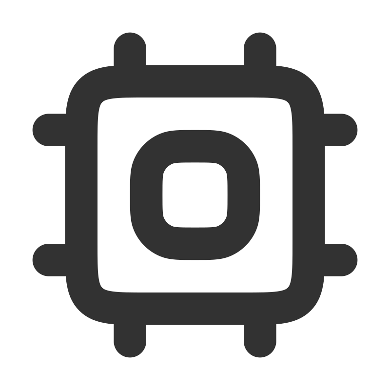</a> | **📂 檔名:** `chip.svg` ✨ **格式:** `Vector (SVG)` ⚖️ **大小:** `1.73KB` 📅 **更新:** `2026-02-27`  🚀 **jsDelivr Markdown:** `` 🔗 **直接連結 (Url):** <code>https://cdn.jsdelivr.net/gh/barry028/materials@main/images/iCons/Scarlab%20Oval%20Line%20iCons/chip.svg</code> 📥 [檢視原始檔](chip.svg) |
|  | **📂 檔名:** `circle.svg` ✨ **格式:** `Vector (SVG)` ⚖️ **大小:** `390.00B` 📅 **更新:** `2026-02-27`  🚀 **jsDelivr Markdown:** `` 🔗 **直接連結 (Url):** <code>https://cdn.jsdelivr.net/gh/barry028/materials@main/images/iCons/Scarlab%20Oval%20Line%20iCons/circle.svg</code> 📥 [檢視原始檔](circle.svg) |
|  | **📂 檔名:** `clipboard-check.svg` ✨ **格式:** `Vector (SVG)` ⚖️ **大小:** `1010.00B` 📅 **更新:** `2026-02-27`  🚀 **jsDelivr Markdown:** `` 🔗 **直接連結 (Url):** <code>https://cdn.jsdelivr.net/gh/barry028/materials@main/images/iCons/Scarlab%20Oval%20Line%20iCons/clipboard-check.svg</code> 📥 [檢視原始檔](clipboard-check.svg) |
|  | **📂 檔名:** `clipboard.svg` ✨ **格式:** `Vector (SVG)` ⚖️ **大小:** `842.00B` 📅 **更新:** `2026-02-27`  🚀 **jsDelivr Markdown:** `` 🔗 **直接連結 (Url):** <code>https://cdn.jsdelivr.net/gh/barry028/materials@main/images/iCons/Scarlab%20Oval%20Line%20iCons/clipboard.svg</code> 📥 [檢視原始檔](clipboard.svg) |
|  | **📂 檔名:** `clock.svg` ✨ **格式:** `Vector (SVG)` ⚖️ **大小:** `561.00B` 📅 **更新:** `2026-02-27`  🚀 **jsDelivr Markdown:** `` 🔗 **直接連結 (Url):** <code>https://cdn.jsdelivr.net/gh/barry028/materials@main/images/iCons/Scarlab%20Oval%20Line%20iCons/clock.svg</code> 📥 [檢視原始檔](clock.svg) |
|  | **📂 檔名:** `cloud-download.svg` ✨ **格式:** `Vector (SVG)` ⚖️ **大小:** `873.00B` 📅 **更新:** `2026-02-27`  🚀 **jsDelivr Markdown:** `` 🔗 **直接連結 (Url):** <code>https://cdn.jsdelivr.net/gh/barry028/materials@main/images/iCons/Scarlab%20Oval%20Line%20iCons/cloud-download.svg</code> 📥 [檢視原始檔](cloud-download.svg) |
|  | **📂 檔名:** `cloud-drizzle.svg` ✨ **格式:** `Vector (SVG)` ⚖️ **大小:** `1.14KB` 📅 **更新:** `2026-02-27`  🚀 **jsDelivr Markdown:** `` 🔗 **直接連結 (Url):** <code>https://cdn.jsdelivr.net/gh/barry028/materials@main/images/iCons/Scarlab%20Oval%20Line%20iCons/cloud-drizzle.svg</code> 📥 [檢視原始檔](cloud-drizzle.svg) |
|  | **📂 檔名:** `cloud-fog.svg` ✨ **格式:** `Vector (SVG)` ⚖️ **大小:** `621.00B` 📅 **更新:** `2026-02-27`  🚀 **jsDelivr Markdown:** `` 🔗 **直接連結 (Url):** <code>https://cdn.jsdelivr.net/gh/barry028/materials@main/images/iCons/Scarlab%20Oval%20Line%20iCons/cloud-fog.svg</code> 📥 [檢視原始檔](cloud-fog.svg) |
|  | **📂 檔名:** `cloud-lightning.svg` ✨ **格式:** `Vector (SVG)` ⚖️ **大小:** `766.00B` 📅 **更新:** `2026-02-27`  🚀 **jsDelivr Markdown:** `` 🔗 **直接連結 (Url):** <code>https://cdn.jsdelivr.net/gh/barry028/materials@main/images/iCons/Scarlab%20Oval%20Line%20iCons/cloud-lightning.svg</code> 📥 [檢視原始檔](cloud-lightning.svg) |
| <a href="cloud-off.svg">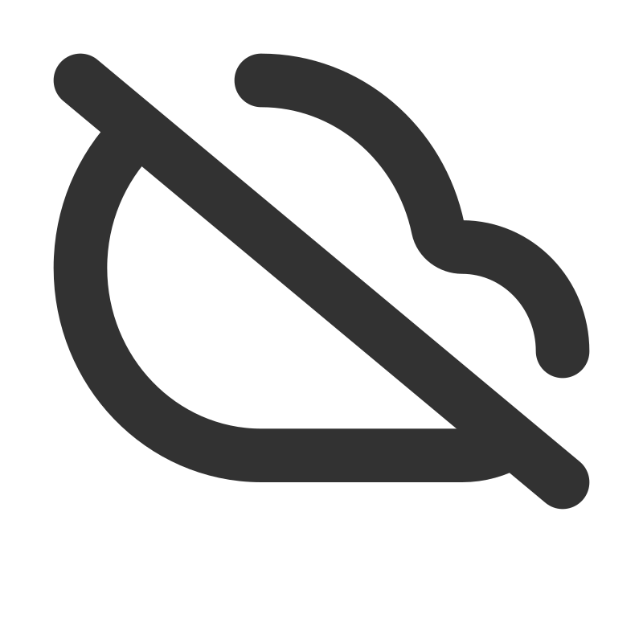</a> | **📂 檔名:** `cloud-off.svg` ✨ **格式:** `Vector (SVG)` ⚖️ **大小:** `733.00B` 📅 **更新:** `2026-02-27`  🚀 **jsDelivr Markdown:** `` 🔗 **直接連結 (Url):** <code>https://cdn.jsdelivr.net/gh/barry028/materials@main/images/iCons/Scarlab%20Oval%20Line%20iCons/cloud-off.svg</code> 📥 [檢視原始檔](cloud-off.svg) |
|  | **📂 檔名:** `cloud-rain.svg` ✨ **格式:** `Vector (SVG)` ⚖️ **大小:** `851.00B` 📅 **更新:** `2026-02-27`  🚀 **jsDelivr Markdown:** `` 🔗 **直接連結 (Url):** <code>https://cdn.jsdelivr.net/gh/barry028/materials@main/images/iCons/Scarlab%20Oval%20Line%20iCons/cloud-rain.svg</code> 📥 [檢視原始檔](cloud-rain.svg) |
|  | **📂 檔名:** `cloud-snow.svg` ✨ **格式:** `Vector (SVG)` ⚖️ **大小:** `1.47KB` 📅 **更新:** `2026-02-27`  🚀 **jsDelivr Markdown:** `` 🔗 **直接連結 (Url):** <code>https://cdn.jsdelivr.net/gh/barry028/materials@main/images/iCons/Scarlab%20Oval%20Line%20iCons/cloud-snow.svg</code> 📥 [檢視原始檔](cloud-snow.svg) |
|  | **📂 檔名:** `cloud-upload.svg` ✨ **格式:** `Vector (SVG)` ⚖️ **大小:** `855.00B` 📅 **更新:** `2026-02-27`  🚀 **jsDelivr Markdown:** `` 🔗 **直接連結 (Url):** <code>https://cdn.jsdelivr.net/gh/barry028/materials@main/images/iCons/Scarlab%20Oval%20Line%20iCons/cloud-upload.svg</code> 📥 [檢視原始檔](cloud-upload.svg) |
|  | **📂 檔名:** `cloud.svg` ✨ **格式:** `Vector (SVG)` ⚖️ **大小:** `518.00B` 📅 **更新:** `2026-02-27`  🚀 **jsDelivr Markdown:** `` 🔗 **直接連結 (Url):** <code>https://cdn.jsdelivr.net/gh/barry028/materials@main/images/iCons/Scarlab%20Oval%20Line%20iCons/cloud.svg</code> 📥 [檢視原始檔](cloud.svg) |
|  | **📂 檔名:** `code-alt.svg` ✨ **格式:** `Vector (SVG)` ⚖️ **大小:** `681.00B` 📅 **更新:** `2026-02-27`  🚀 **jsDelivr Markdown:** `` 🔗 **直接連結 (Url):** <code>https://cdn.jsdelivr.net/gh/barry028/materials@main/images/iCons/Scarlab%20Oval%20Line%20iCons/code-alt.svg</code> 📥 [檢視原始檔](code-alt.svg) |
|  | **📂 檔名:** `code.svg` ✨ **格式:** `Vector (SVG)` ⚖️ **大小:** `599.00B` 📅 **更新:** `2026-02-27`  🚀 **jsDelivr Markdown:** `` 🔗 **直接連結 (Url):** <code>https://cdn.jsdelivr.net/gh/barry028/materials@main/images/iCons/Scarlab%20Oval%20Line%20iCons/code.svg</code> 📥 [檢視原始檔](code.svg) |
|  | **📂 檔名:** `cog.svg` ✨ **格式:** `Vector (SVG)` ⚖️ **大小:** `1.23KB` 📅 **更新:** `2026-02-27`  🚀 **jsDelivr Markdown:** `` 🔗 **直接連結 (Url):** <code>https://cdn.jsdelivr.net/gh/barry028/materials@main/images/iCons/Scarlab%20Oval%20Line%20iCons/cog.svg</code> 📥 [檢視原始檔](cog.svg) |
|  | **📂 檔名:** `col-left.svg` ✨ **格式:** `Vector (SVG)` ⚖️ **大小:** `642.00B` 📅 **更新:** `2026-02-27`  🚀 **jsDelivr Markdown:** `` 🔗 **直接連結 (Url):** <code>https://cdn.jsdelivr.net/gh/barry028/materials@main/images/iCons/Scarlab%20Oval%20Line%20iCons/col-left.svg</code> 📥 [檢視原始檔](col-left.svg) |
|  | **📂 檔名:** `col-right.svg` ✨ **格式:** `Vector (SVG)` ⚖️ **大小:** `642.00B` 📅 **更新:** `2026-02-27`  🚀 **jsDelivr Markdown:** `` 🔗 **直接連結 (Url):** <code>https://cdn.jsdelivr.net/gh/barry028/materials@main/images/iCons/Scarlab%20Oval%20Line%20iCons/col-right.svg</code> 📥 [檢視原始檔](col-right.svg) |
|  | **📂 檔名:** `collection.svg` ✨ **格式:** `Vector (SVG)` ⚖️ **大小:** `784.00B` 📅 **更新:** `2026-02-27`  🚀 **jsDelivr Markdown:** `` 🔗 **直接連結 (Url):** <code>https://cdn.jsdelivr.net/gh/barry028/materials@main/images/iCons/Scarlab%20Oval%20Line%20iCons/collection.svg</code> 📥 [檢視原始檔](collection.svg) |
|  | **📂 檔名:** `color-swatch.svg` ✨ **格式:** `Vector (SVG)` ⚖️ **大小:** `1.23KB` 📅 **更新:** `2026-02-27`  🚀 **jsDelivr Markdown:** `` 🔗 **直接連結 (Url):** <code>https://cdn.jsdelivr.net/gh/barry028/materials@main/images/iCons/Scarlab%20Oval%20Line%20iCons/color-swatch.svg</code> 📥 [檢視原始檔](color-swatch.svg) |
| <a href="cols-row.svg">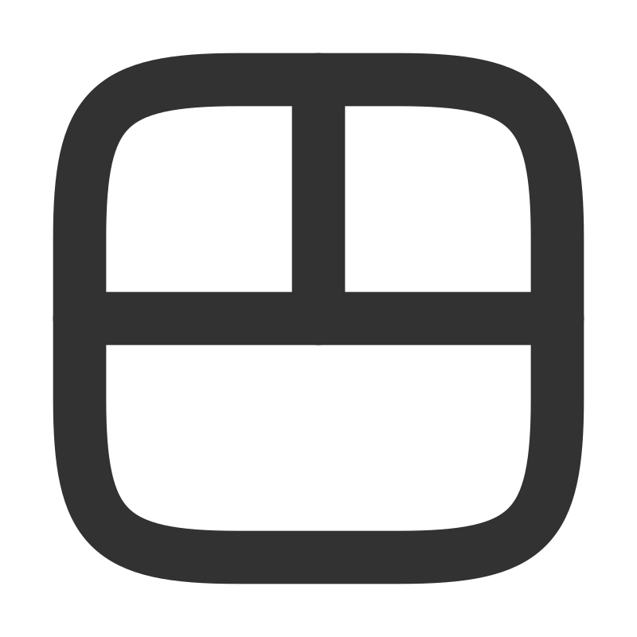</a> | **📂 檔名:** `cols-row.svg` ✨ **格式:** `Vector (SVG)` ⚖️ **大小:** `656.00B` 📅 **更新:** `2026-02-27`  🚀 **jsDelivr Markdown:** `` 🔗 **直接連結 (Url):** <code>https://cdn.jsdelivr.net/gh/barry028/materials@main/images/iCons/Scarlab%20Oval%20Line%20iCons/cols-row.svg</code> 📥 [檢視原始檔](cols-row.svg) |
|  | **📂 檔名:** `cols.svg` ✨ **格式:** `Vector (SVG)` ⚖️ **大小:** `535.00B` 📅 **更新:** `2026-02-27`  🚀 **jsDelivr Markdown:** `` 🔗 **直接連結 (Url):** <code>https://cdn.jsdelivr.net/gh/barry028/materials@main/images/iCons/Scarlab%20Oval%20Line%20iCons/cols.svg</code> 📥 [檢視原始檔](cols.svg) |
|  | **📂 檔名:** `command.svg` ✨ **格式:** `Vector (SVG)` ⚖️ **大小:** `693.00B` 📅 **更新:** `2026-02-27`  🚀 **jsDelivr Markdown:** `` 🔗 **直接連結 (Url):** <code>https://cdn.jsdelivr.net/gh/barry028/materials@main/images/iCons/Scarlab%20Oval%20Line%20iCons/command.svg</code> 📥 [檢視原始檔](command.svg) |
| <a href="cone.svg">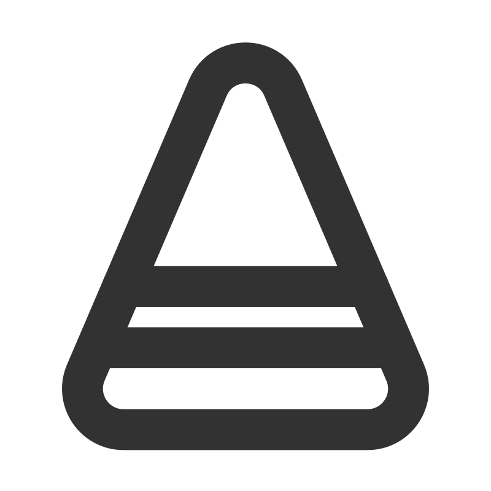</a> | **📂 檔名:** `cone.svg` ✨ **格式:** `Vector (SVG)` ⚖️ **大小:** `744.00B` 📅 **更新:** `2026-02-27`  🚀 **jsDelivr Markdown:** `` 🔗 **直接連結 (Url):** <code>https://cdn.jsdelivr.net/gh/barry028/materials@main/images/iCons/Scarlab%20Oval%20Line%20iCons/cone.svg</code> 📥 [檢視原始檔](cone.svg) |
|  | **📂 檔名:** `contacts-alt.svg` ✨ **格式:** `Vector (SVG)` ⚖️ **大小:** `935.00B` 📅 **更新:** `2026-02-27`  🚀 **jsDelivr Markdown:** `` 🔗 **直接連結 (Url):** <code>https://cdn.jsdelivr.net/gh/barry028/materials@main/images/iCons/Scarlab%20Oval%20Line%20iCons/contacts-alt.svg</code> 📥 [檢視原始檔](contacts-alt.svg) |
|  | **📂 檔名:** `contacts.svg` ✨ **格式:** `Vector (SVG)` ⚖️ **大小:** `1.05KB` 📅 **更新:** `2026-02-27`  🚀 **jsDelivr Markdown:** `` 🔗 **直接連結 (Url):** <code>https://cdn.jsdelivr.net/gh/barry028/materials@main/images/iCons/Scarlab%20Oval%20Line%20iCons/contacts.svg</code> 📥 [檢視原始檔](contacts.svg) |
|  | **📂 檔名:** `contrast.svg` ✨ **格式:** `Vector (SVG)` ⚖️ **大小:** `599.00B` 📅 **更新:** `2026-02-27`  🚀 **jsDelivr Markdown:** `` 🔗 **直接連結 (Url):** <code>https://cdn.jsdelivr.net/gh/barry028/materials@main/images/iCons/Scarlab%20Oval%20Line%20iCons/contrast.svg</code> 📥 [檢視原始檔](contrast.svg) |
|  | **📂 檔名:** `corner-down-left.svg` ✨ **格式:** `Vector (SVG)` ⚖️ **大小:** `588.00B` 📅 **更新:** `2026-02-27`  🚀 **jsDelivr Markdown:** `` 🔗 **直接連結 (Url):** <code>https://cdn.jsdelivr.net/gh/barry028/materials@main/images/iCons/Scarlab%20Oval%20Line%20iCons/corner-down-left.svg</code> 📥 [檢視原始檔](corner-down-left.svg) |
|  | **📂 檔名:** `corner-down-right.svg` ✨ **格式:** `Vector (SVG)` ⚖️ **大小:** `571.00B` 📅 **更新:** `2026-02-27`  🚀 **jsDelivr Markdown:** `` 🔗 **直接連結 (Url):** <code>https://cdn.jsdelivr.net/gh/barry028/materials@main/images/iCons/Scarlab%20Oval%20Line%20iCons/corner-down-right.svg</code> 📥 [檢視原始檔](corner-down-right.svg) |
|  | **📂 檔名:** `corner-left-down.svg` ✨ **格式:** `Vector (SVG)` ⚖️ **大小:** `592.00B` 📅 **更新:** `2026-02-27`  🚀 **jsDelivr Markdown:** `` 🔗 **直接連結 (Url):** <code>https://cdn.jsdelivr.net/gh/barry028/materials@main/images/iCons/Scarlab%20Oval%20Line%20iCons/corner-left-down.svg</code> 📥 [檢視原始檔](corner-left-down.svg) |
|  | **📂 檔名:** `corner-left-up.svg` ✨ **格式:** `Vector (SVG)` ⚖️ **大小:** `591.00B` 📅 **更新:** `2026-02-27`  🚀 **jsDelivr Markdown:** `` 🔗 **直接連結 (Url):** <code>https://cdn.jsdelivr.net/gh/barry028/materials@main/images/iCons/Scarlab%20Oval%20Line%20iCons/corner-left-up.svg</code> 📥 [檢視原始檔](corner-left-up.svg) |
|  | **📂 檔名:** `corner-right-down.svg` ✨ **格式:** `Vector (SVG)` ⚖️ **大小:** `591.00B` 📅 **更新:** `2026-02-27`  🚀 **jsDelivr Markdown:** `` 🔗 **直接連結 (Url):** <code>https://cdn.jsdelivr.net/gh/barry028/materials@main/images/iCons/Scarlab%20Oval%20Line%20iCons/corner-right-down.svg</code> 📥 [檢視原始檔](corner-right-down.svg) |
|  | **📂 檔名:** `corner-right-up.svg` ✨ **格式:** `Vector (SVG)` ⚖️ **大小:** `570.00B` 📅 **更新:** `2026-02-27`  🚀 **jsDelivr Markdown:** `` 🔗 **直接連結 (Url):** <code>https://cdn.jsdelivr.net/gh/barry028/materials@main/images/iCons/Scarlab%20Oval%20Line%20iCons/corner-right-up.svg</code> 📥 [檢視原始檔](corner-right-up.svg) |
|  | **📂 檔名:** `corner-up-left.svg` ✨ **格式:** `Vector (SVG)` ⚖️ **大小:** `589.00B` 📅 **更新:** `2026-02-27`  🚀 **jsDelivr Markdown:** `` 🔗 **直接連結 (Url):** <code>https://cdn.jsdelivr.net/gh/barry028/materials@main/images/iCons/Scarlab%20Oval%20Line%20iCons/corner-up-left.svg</code> 📥 [檢視原始檔](corner-up-left.svg) |
|  | **📂 檔名:** `corner-up-right.svg` ✨ **格式:** `Vector (SVG)` ⚖️ **大小:** `572.00B` 📅 **更新:** `2026-02-27`  🚀 **jsDelivr Markdown:** `` 🔗 **直接連結 (Url):** <code>https://cdn.jsdelivr.net/gh/barry028/materials@main/images/iCons/Scarlab%20Oval%20Line%20iCons/corner-up-right.svg</code> 📥 [檢視原始檔](corner-up-right.svg) |
|  | **📂 檔名:** `credit-card.svg` ✨ **格式:** `Vector (SVG)` ⚖️ **大小:** `821.00B` 📅 **更新:** `2026-02-27`  🚀 **jsDelivr Markdown:** `` 🔗 **直接連結 (Url):** <code>https://cdn.jsdelivr.net/gh/barry028/materials@main/images/iCons/Scarlab%20Oval%20Line%20iCons/credit-card.svg</code> 📥 [檢視原始檔](credit-card.svg) |
|  | **📂 檔名:** `crop.svg` ✨ **格式:** `Vector (SVG)` ⚖️ **大小:** `597.00B` 📅 **更新:** `2026-02-27`  🚀 **jsDelivr Markdown:** `` 🔗 **直接連結 (Url):** <code>https://cdn.jsdelivr.net/gh/barry028/materials@main/images/iCons/Scarlab%20Oval%20Line%20iCons/crop.svg</code> 📥 [檢視原始檔](crop.svg) |
|  | **📂 檔名:** `crown.svg` ✨ **格式:** `Vector (SVG)` ⚖️ **大小:** `819.00B` 📅 **更新:** `2026-02-27`  🚀 **jsDelivr Markdown:** `` 🔗 **直接連結 (Url):** <code>https://cdn.jsdelivr.net/gh/barry028/materials@main/images/iCons/Scarlab%20Oval%20Line%20iCons/crown.svg</code> 📥 [檢視原始檔](crown.svg) |
|  | **📂 檔名:** `cube-transparent.svg` ✨ **格式:** `Vector (SVG)` ⚖️ **大小:** `1.82KB` 📅 **更新:** `2026-02-27`  🚀 **jsDelivr Markdown:** `` 🔗 **直接連結 (Url):** <code>https://cdn.jsdelivr.net/gh/barry028/materials@main/images/iCons/Scarlab%20Oval%20Line%20iCons/cube-transparent.svg</code> 📥 [檢視原始檔](cube-transparent.svg) |
|  | **📂 檔名:** `cursor-alt.svg` ✨ **格式:** `Vector (SVG)` ⚖️ **大小:** `587.00B` 📅 **更新:** `2026-02-27`  🚀 **jsDelivr Markdown:** `` 🔗 **直接連結 (Url):** <code>https://cdn.jsdelivr.net/gh/barry028/materials@main/images/iCons/Scarlab%20Oval%20Line%20iCons/cursor-alt.svg</code> 📥 [檢視原始檔](cursor-alt.svg) |
|  | **📂 檔名:** `cursor-click.svg` ✨ **格式:** `Vector (SVG)` ⚖️ **大小:** `901.00B` 📅 **更新:** `2026-02-27`  🚀 **jsDelivr Markdown:** `` 🔗 **直接連結 (Url):** <code>https://cdn.jsdelivr.net/gh/barry028/materials@main/images/iCons/Scarlab%20Oval%20Line%20iCons/cursor-click.svg</code> 📥 [檢視原始檔](cursor-click.svg) |
|  | **📂 檔名:** `cursor-text.svg` ✨ **格式:** `Vector (SVG)` ⚖️ **大小:** `673.00B` 📅 **更新:** `2026-02-27`  🚀 **jsDelivr Markdown:** `` 🔗 **直接連結 (Url):** <code>https://cdn.jsdelivr.net/gh/barry028/materials@main/images/iCons/Scarlab%20Oval%20Line%20iCons/cursor-text.svg</code> 📥 [檢視原始檔](cursor-text.svg) |
|  | **📂 檔名:** `cursor.svg` ✨ **格式:** `Vector (SVG)` ⚖️ **大小:** `590.00B` 📅 **更新:** `2026-02-27`  🚀 **jsDelivr Markdown:** `` 🔗 **直接連結 (Url):** <code>https://cdn.jsdelivr.net/gh/barry028/materials@main/images/iCons/Scarlab%20Oval%20Line%20iCons/cursor.svg</code> 📥 [檢視原始檔](cursor.svg) |
|  | **📂 檔名:** `dashboard.svg` ✨ **格式:** `Vector (SVG)` ⚖️ **大小:** `640.00B` 📅 **更新:** `2026-02-27`  🚀 **jsDelivr Markdown:** `` 🔗 **直接連結 (Url):** <code>https://cdn.jsdelivr.net/gh/barry028/materials@main/images/iCons/Scarlab%20Oval%20Line%20iCons/dashboard.svg</code> 📥 [檢視原始檔](dashboard.svg) |
|  | **📂 檔名:** `database.svg` ✨ **格式:** `Vector (SVG)` ⚖️ **大小:** `607.00B` 📅 **更新:** `2026-02-27`  🚀 **jsDelivr Markdown:** `` 🔗 **直接連結 (Url):** <code>https://cdn.jsdelivr.net/gh/barry028/materials@main/images/iCons/Scarlab%20Oval%20Line%20iCons/database.svg</code> 📥 [檢視原始檔](database.svg) |
|  | **📂 檔名:** `desktop.svg` ✨ **格式:** `Vector (SVG)` ⚖️ **大小:** `879.00B` 📅 **更新:** `2026-02-27`  🚀 **jsDelivr Markdown:** `` 🔗 **直接連結 (Url):** <code>https://cdn.jsdelivr.net/gh/barry028/materials@main/images/iCons/Scarlab%20Oval%20Line%20iCons/desktop.svg</code> 📥 [檢視原始檔](desktop.svg) |
|  | **📂 檔名:** `diamond.svg` ✨ **格式:** `Vector (SVG)` ⚖️ **大小:** `1.02KB` 📅 **更新:** `2026-02-27`  🚀 **jsDelivr Markdown:** `` 🔗 **直接連結 (Url):** <code>https://cdn.jsdelivr.net/gh/barry028/materials@main/images/iCons/Scarlab%20Oval%20Line%20iCons/diamond.svg</code> 📥 [檢視原始檔](diamond.svg) |
|  | **📂 檔名:** `disk.svg` ✨ **格式:** `Vector (SVG)` ⚖️ **大小:** `763.00B` 📅 **更新:** `2026-02-27`  🚀 **jsDelivr Markdown:** `` 🔗 **直接連結 (Url):** <code>https://cdn.jsdelivr.net/gh/barry028/materials@main/images/iCons/Scarlab%20Oval%20Line%20iCons/disk.svg</code> 📥 [檢視原始檔](disk.svg) |
|  | **📂 檔名:** `divide-circle.svg` ✨ **格式:** `Vector (SVG)` ⚖️ **大小:** `720.00B` 📅 **更新:** `2026-02-27`  🚀 **jsDelivr Markdown:** `` 🔗 **直接連結 (Url):** <code>https://cdn.jsdelivr.net/gh/barry028/materials@main/images/iCons/Scarlab%20Oval%20Line%20iCons/divide-circle.svg</code> 📥 [檢視原始檔](divide-circle.svg) |
| <a href="divide-square.svg">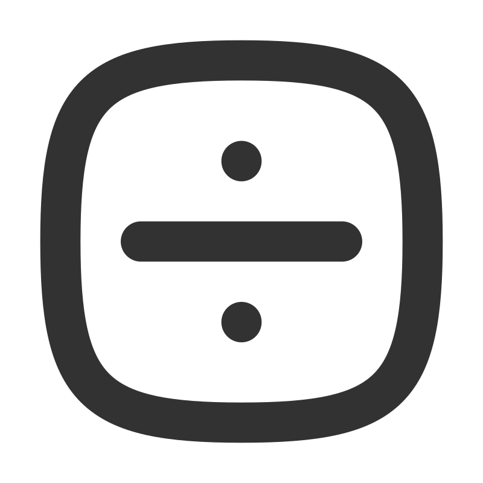</a> | **📂 檔名:** `divide-square.svg` ✨ **格式:** `Vector (SVG)` ⚖️ **大小:** `715.00B` 📅 **更新:** `2026-02-27`  🚀 **jsDelivr Markdown:** `` 🔗 **直接連結 (Url):** <code>https://cdn.jsdelivr.net/gh/barry028/materials@main/images/iCons/Scarlab%20Oval%20Line%20iCons/divide-square.svg</code> 📥 [檢視原始檔](divide-square.svg) |
|  | **📂 檔名:** `divide.svg` ✨ **格式:** `Vector (SVG)` ⚖️ **大小:** `559.00B` 📅 **更新:** `2026-02-27`  🚀 **jsDelivr Markdown:** `` 🔗 **直接連結 (Url):** <code>https://cdn.jsdelivr.net/gh/barry028/materials@main/images/iCons/Scarlab%20Oval%20Line%20iCons/divide.svg</code> 📥 [檢視原始檔](divide.svg) |
|  | **📂 檔名:** `document-add.svg` ✨ **格式:** `Vector (SVG)` ⚖️ **大小:** `928.00B` 📅 **更新:** `2026-02-27`  🚀 **jsDelivr Markdown:** `` 🔗 **直接連結 (Url):** <code>https://cdn.jsdelivr.net/gh/barry028/materials@main/images/iCons/Scarlab%20Oval%20Line%20iCons/document-add.svg</code> 📥 [檢視原始檔](document-add.svg) |
|  | **📂 檔名:** `document-check.svg` ✨ **格式:** `Vector (SVG)` ⚖️ **大小:** `893.00B` 📅 **更新:** `2026-02-27`  🚀 **jsDelivr Markdown:** `` 🔗 **直接連結 (Url):** <code>https://cdn.jsdelivr.net/gh/barry028/materials@main/images/iCons/Scarlab%20Oval%20Line%20iCons/document-check.svg</code> 📥 [檢視原始檔](document-check.svg) |
|  | **📂 檔名:** `document-download.svg` ✨ **格式:** `Vector (SVG)` ⚖️ **大小:** `978.00B` 📅 **更新:** `2026-02-27`  🚀 **jsDelivr Markdown:** `` 🔗 **直接連結 (Url):** <code>https://cdn.jsdelivr.net/gh/barry028/materials@main/images/iCons/Scarlab%20Oval%20Line%20iCons/document-download.svg</code> 📥 [檢視原始檔](document-download.svg) |
|  | **📂 檔名:** `document-duplicate.svg` ✨ **格式:** `Vector (SVG)` ⚖️ **大小:** `987.00B` 📅 **更新:** `2026-02-27`  🚀 **jsDelivr Markdown:** `` 🔗 **直接連結 (Url):** <code>https://cdn.jsdelivr.net/gh/barry028/materials@main/images/iCons/Scarlab%20Oval%20Line%20iCons/document-duplicate.svg</code> 📥 [檢視原始檔](document-duplicate.svg) |
|  | **📂 檔名:** `document-off.svg` ✨ **格式:** `Vector (SVG)` ⚖️ **大小:** `839.00B` 📅 **更新:** `2026-02-27`  🚀 **jsDelivr Markdown:** `` 🔗 **直接連結 (Url):** <code>https://cdn.jsdelivr.net/gh/barry028/materials@main/images/iCons/Scarlab%20Oval%20Line%20iCons/document-off.svg</code> 📥 [檢視原始檔](document-off.svg) |
|  | **📂 檔名:** `document-remove.svg` ✨ **格式:** `Vector (SVG)` ⚖️ **大小:** `821.00B` 📅 **更新:** `2026-02-27`  🚀 **jsDelivr Markdown:** `` 🔗 **直接連結 (Url):** <code>https://cdn.jsdelivr.net/gh/barry028/materials@main/images/iCons/Scarlab%20Oval%20Line%20iCons/document-remove.svg</code> 📥 [檢視原始檔](document-remove.svg) |
|  | **📂 檔名:** `document-report.svg` ✨ **格式:** `Vector (SVG)` ⚖️ **大小:** `1.00KB` 📅 **更新:** `2026-02-27`  🚀 **jsDelivr Markdown:** `` 🔗 **直接連結 (Url):** <code>https://cdn.jsdelivr.net/gh/barry028/materials@main/images/iCons/Scarlab%20Oval%20Line%20iCons/document-report.svg</code> 📥 [檢視原始檔](document-report.svg) |
|  | **📂 檔名:** `document-text.svg` ✨ **格式:** `Vector (SVG)` ⚖️ **大小:** `913.00B` 📅 **更新:** `2026-02-27`  🚀 **jsDelivr Markdown:** `` 🔗 **直接連結 (Url):** <code>https://cdn.jsdelivr.net/gh/barry028/materials@main/images/iCons/Scarlab%20Oval%20Line%20iCons/document-text.svg</code> 📥 [檢視原始檔](document-text.svg) |
| <a href="document-x.svg">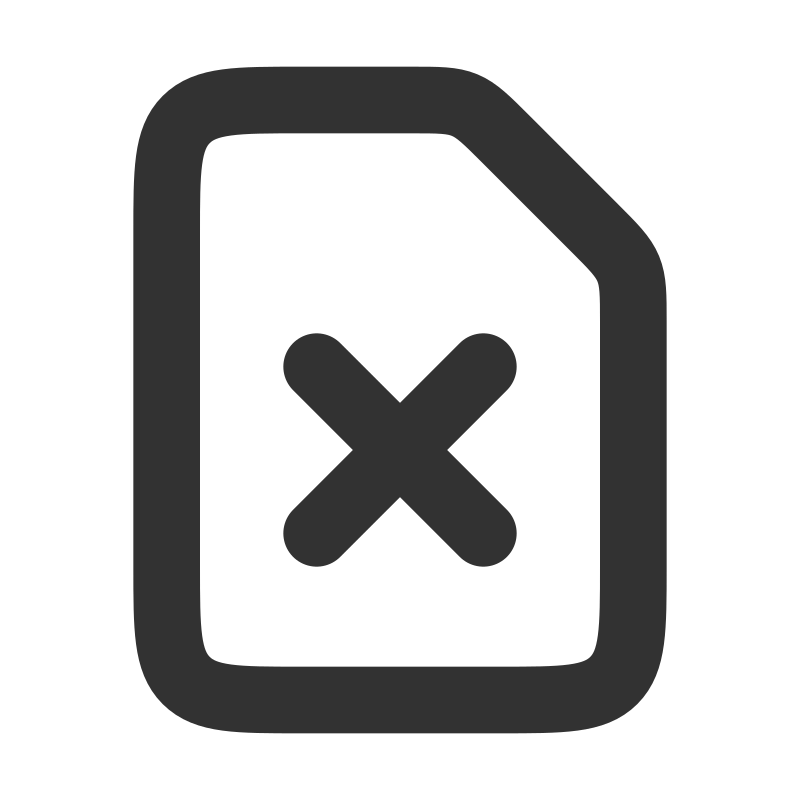</a> | **📂 檔名:** `document-x.svg` ✨ **格式:** `Vector (SVG)` ⚖️ **大小:** `927.00B` 📅 **更新:** `2026-02-27`  🚀 **jsDelivr Markdown:** `` 🔗 **直接連結 (Url):** <code>https://cdn.jsdelivr.net/gh/barry028/materials@main/images/iCons/Scarlab%20Oval%20Line%20iCons/document-x.svg</code> 📥 [檢視原始檔](document-x.svg) |
| <a href="document-zip.svg">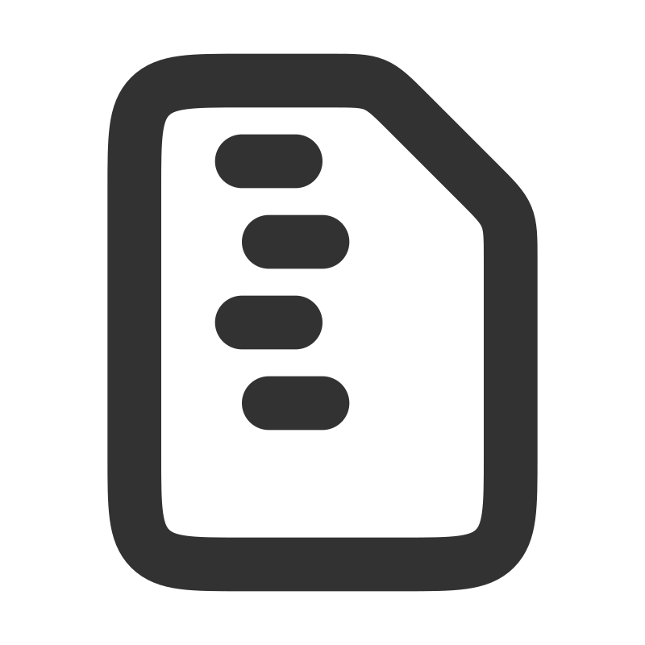</a> | **📂 檔名:** `document-zip.svg` ✨ **格式:** `Vector (SVG)` ⚖️ **大小:** `1.10KB` 📅 **更新:** `2026-02-27`  🚀 **jsDelivr Markdown:** `` 🔗 **直接連結 (Url):** <code>https://cdn.jsdelivr.net/gh/barry028/materials@main/images/iCons/Scarlab%20Oval%20Line%20iCons/document-zip.svg</code> 📥 [檢視原始檔](document-zip.svg) |
|  | **📂 檔名:** `document.svg` ✨ **格式:** `Vector (SVG)` ⚖️ **大小:** `707.00B` 📅 **更新:** `2026-02-27`  🚀 **jsDelivr Markdown:** `` 🔗 **直接連結 (Url):** <code>https://cdn.jsdelivr.net/gh/barry028/materials@main/images/iCons/Scarlab%20Oval%20Line%20iCons/document.svg</code> 📥 [檢視原始檔](document.svg) |
|  | **📂 檔名:** `doge-circle.svg` ✨ **格式:** `Vector (SVG)` ⚖️ **大小:** `684.00B` 📅 **更新:** `2026-02-27`  🚀 **jsDelivr Markdown:** `` 🔗 **直接連結 (Url):** <code>https://cdn.jsdelivr.net/gh/barry028/materials@main/images/iCons/Scarlab%20Oval%20Line%20iCons/doge-circle.svg</code> 📥 [檢視原始檔](doge-circle.svg) |
|  | **📂 檔名:** `doge-square.svg` ✨ **格式:** `Vector (SVG)` ⚖️ **大小:** `679.00B` 📅 **更新:** `2026-02-27`  🚀 **jsDelivr Markdown:** `` 🔗 **直接連結 (Url):** <code>https://cdn.jsdelivr.net/gh/barry028/materials@main/images/iCons/Scarlab%20Oval%20Line%20iCons/doge-square.svg</code> 📥 [檢視原始檔](doge-square.svg) |
|  | **📂 檔名:** `doge.svg` ✨ **格式:** `Vector (SVG)` ⚖️ **大小:** `523.00B` 📅 **更新:** `2026-02-27`  🚀 **jsDelivr Markdown:** `` 🔗 **直接連結 (Url):** <code>https://cdn.jsdelivr.net/gh/barry028/materials@main/images/iCons/Scarlab%20Oval%20Line%20iCons/doge.svg</code> 📥 [檢視原始檔](doge.svg) |
|  | **📂 檔名:** `dollar-circle.svg` ✨ **格式:** `Vector (SVG)` ⚖️ **大小:** `701.00B` 📅 **更新:** `2026-02-27`  🚀 **jsDelivr Markdown:** `` 🔗 **直接連結 (Url):** <code>https://cdn.jsdelivr.net/gh/barry028/materials@main/images/iCons/Scarlab%20Oval%20Line%20iCons/dollar-circle.svg</code> 📥 [檢視原始檔](dollar-circle.svg) |
|  | **📂 檔名:** `dollar-square.svg` ✨ **格式:** `Vector (SVG)` ⚖️ **大小:** `696.00B` 📅 **更新:** `2026-02-27`  🚀 **jsDelivr Markdown:** `` 🔗 **直接連結 (Url):** <code>https://cdn.jsdelivr.net/gh/barry028/materials@main/images/iCons/Scarlab%20Oval%20Line%20iCons/dollar-square.svg</code> 📥 [檢視原始檔](dollar-square.svg) |
|  | **📂 檔名:** `dollar.svg` ✨ **格式:** `Vector (SVG)` ⚖️ **大小:** `540.00B` 📅 **更新:** `2026-02-27`  🚀 **jsDelivr Markdown:** `` 🔗 **直接連結 (Url):** <code>https://cdn.jsdelivr.net/gh/barry028/materials@main/images/iCons/Scarlab%20Oval%20Line%20iCons/dollar.svg</code> 📥 [檢視原始檔](dollar.svg) |
|  | **📂 檔名:** `download.svg` ✨ **格式:** `Vector (SVG)` ⚖️ **大小:** `693.00B` 📅 **更新:** `2026-02-27`  🚀 **jsDelivr Markdown:** `` 🔗 **直接連結 (Url):** <code>https://cdn.jsdelivr.net/gh/barry028/materials@main/images/iCons/Scarlab%20Oval%20Line%20iCons/download.svg</code> 📥 [檢視原始檔](download.svg) |
| <a href="droplet.svg">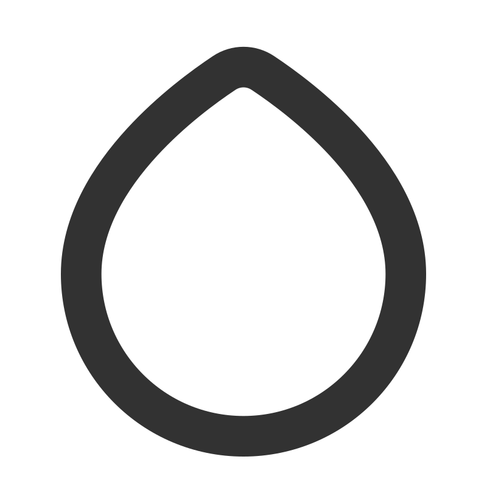</a> | **📂 檔名:** `droplet.svg` ✨ **格式:** `Vector (SVG)` ⚖️ **大小:** `553.00B` 📅 **更新:** `2026-02-27`  🚀 **jsDelivr Markdown:** `` 🔗 **直接連結 (Url):** <code>https://cdn.jsdelivr.net/gh/barry028/materials@main/images/iCons/Scarlab%20Oval%20Line%20iCons/droplet.svg</code> 📥 [檢視原始檔](droplet.svg) |
|  | **📂 檔名:** `duplicate.svg` ✨ **格式:** `Vector (SVG)` ⚖️ **大小:** `574.00B` 📅 **更新:** `2026-02-27`  🚀 **jsDelivr Markdown:** `` 🔗 **直接連結 (Url):** <code>https://cdn.jsdelivr.net/gh/barry028/materials@main/images/iCons/Scarlab%20Oval%20Line%20iCons/duplicate.svg</code> 📥 [檢視原始檔](duplicate.svg) |
|  | **📂 檔名:** `edit.svg` ✨ **格式:** `Vector (SVG)` ⚖️ **大小:** `779.00B` 📅 **更新:** `2026-02-27`  🚀 **jsDelivr Markdown:** `` 🔗 **直接連結 (Url):** <code>https://cdn.jsdelivr.net/gh/barry028/materials@main/images/iCons/Scarlab%20Oval%20Line%20iCons/edit.svg</code> 📥 [檢視原始檔](edit.svg) |
|  | **📂 檔名:** `emoji-happy-square.svg` ✨ **格式:** `Vector (SVG)` ⚖️ **大小:** `706.00B` 📅 **更新:** `2026-02-27`  🚀 **jsDelivr Markdown:** `` 🔗 **直接連結 (Url):** <code>https://cdn.jsdelivr.net/gh/barry028/materials@main/images/iCons/Scarlab%20Oval%20Line%20iCons/emoji-happy-square.svg</code> 📥 [檢視原始檔](emoji-happy-square.svg) |
|  | **📂 檔名:** `emoji-happy.svg` ✨ **格式:** `Vector (SVG)` ⚖️ **大小:** `711.00B` 📅 **更新:** `2026-02-27`  🚀 **jsDelivr Markdown:** `` 🔗 **直接連結 (Url):** <code>https://cdn.jsdelivr.net/gh/barry028/materials@main/images/iCons/Scarlab%20Oval%20Line%20iCons/emoji-happy.svg</code> 📥 [檢視原始檔](emoji-happy.svg) |
|  | **📂 檔名:** `emoji-sad-square.svg` ✨ **格式:** `Vector (SVG)` ⚖️ **大小:** `706.00B` 📅 **更新:** `2026-02-27`  🚀 **jsDelivr Markdown:** `` 🔗 **直接連結 (Url):** <code>https://cdn.jsdelivr.net/gh/barry028/materials@main/images/iCons/Scarlab%20Oval%20Line%20iCons/emoji-sad-square.svg</code> 📥 [檢視原始檔](emoji-sad-square.svg) |
|  | **📂 檔名:** `emoji-sad.svg` ✨ **格式:** `Vector (SVG)` ⚖️ **大小:** `711.00B` 📅 **更新:** `2026-02-27`  🚀 **jsDelivr Markdown:** `` 🔗 **直接連結 (Url):** <code>https://cdn.jsdelivr.net/gh/barry028/materials@main/images/iCons/Scarlab%20Oval%20Line%20iCons/emoji-sad.svg</code> 📥 [檢視原始檔](emoji-sad.svg) |
|  | **📂 檔名:** `equal-alt.svg` ✨ **格式:** `Vector (SVG)` ⚖️ **大小:** `435.00B` 📅 **更新:** `2026-02-27`  🚀 **jsDelivr Markdown:** `` 🔗 **直接連結 (Url):** <code>https://cdn.jsdelivr.net/gh/barry028/materials@main/images/iCons/Scarlab%20Oval%20Line%20iCons/equal-alt.svg</code> 📥 [檢視原始檔](equal-alt.svg) |
|  | **📂 檔名:** `equal-circle.svg` ✨ **格式:** `Vector (SVG)` ⚖️ **大小:** `602.00B` 📅 **更新:** `2026-02-27`  🚀 **jsDelivr Markdown:** `` 🔗 **直接連結 (Url):** <code>https://cdn.jsdelivr.net/gh/barry028/materials@main/images/iCons/Scarlab%20Oval%20Line%20iCons/equal-circle.svg</code> 📥 [檢視原始檔](equal-circle.svg) |
|  | **📂 檔名:** `equal-not-alt.svg` ✨ **格式:** `Vector (SVG)` ⚖️ **大小:** `541.00B` 📅 **更新:** `2026-02-27`  🚀 **jsDelivr Markdown:** `` 🔗 **直接連結 (Url):** <code>https://cdn.jsdelivr.net/gh/barry028/materials@main/images/iCons/Scarlab%20Oval%20Line%20iCons/equal-not-alt.svg</code> 📥 [檢視原始檔](equal-not-alt.svg) |
|  | **📂 檔名:** `equal-not-circle.svg` ✨ **格式:** `Vector (SVG)` ⚖️ **大小:** `708.00B` 📅 **更新:** `2026-02-27`  🚀 **jsDelivr Markdown:** `` 🔗 **直接連結 (Url):** <code>https://cdn.jsdelivr.net/gh/barry028/materials@main/images/iCons/Scarlab%20Oval%20Line%20iCons/equal-not-circle.svg</code> 📥 [檢視原始檔](equal-not-circle.svg) |
|  | **📂 檔名:** `equal-not-square.svg` ✨ **格式:** `Vector (SVG)` ⚖️ **大小:** `703.00B` 📅 **更新:** `2026-02-27`  🚀 **jsDelivr Markdown:** `` 🔗 **直接連結 (Url):** <code>https://cdn.jsdelivr.net/gh/barry028/materials@main/images/iCons/Scarlab%20Oval%20Line%20iCons/equal-not-square.svg</code> 📥 [檢視原始檔](equal-not-square.svg) |
|  | **📂 檔名:** `equal-not.svg` ✨ **格式:** `Vector (SVG)` ⚖️ **大小:** `541.00B` 📅 **更新:** `2026-02-27`  🚀 **jsDelivr Markdown:** `` 🔗 **直接連結 (Url):** <code>https://cdn.jsdelivr.net/gh/barry028/materials@main/images/iCons/Scarlab%20Oval%20Line%20iCons/equal-not.svg</code> 📥 [檢視原始檔](equal-not.svg) |
|  | **📂 檔名:** `equal-square.svg` ✨ **格式:** `Vector (SVG)` ⚖️ **大小:** `597.00B` 📅 **更新:** `2026-02-27`  🚀 **jsDelivr Markdown:** `` 🔗 **直接連結 (Url):** <code>https://cdn.jsdelivr.net/gh/barry028/materials@main/images/iCons/Scarlab%20Oval%20Line%20iCons/equal-square.svg</code> 📥 [檢視原始檔](equal-square.svg) |
| <a href="equal.svg">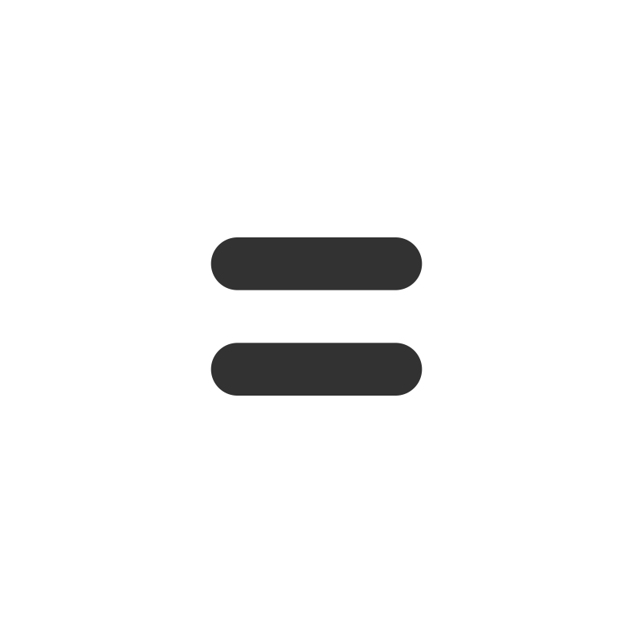</a> | **📂 檔名:** `equal.svg` ✨ **格式:** `Vector (SVG)` ⚖️ **大小:** `435.00B` 📅 **更新:** `2026-02-27`  🚀 **jsDelivr Markdown:** `` 🔗 **直接連結 (Url):** <code>https://cdn.jsdelivr.net/gh/barry028/materials@main/images/iCons/Scarlab%20Oval%20Line%20iCons/equal.svg</code> 📥 [檢視原始檔](equal.svg) |
|  | **📂 檔名:** `euro-circle.svg` ✨ **格式:** `Vector (SVG)` ⚖️ **大小:** `802.00B` 📅 **更新:** `2026-02-27`  🚀 **jsDelivr Markdown:** `` 🔗 **直接連結 (Url):** <code>https://cdn.jsdelivr.net/gh/barry028/materials@main/images/iCons/Scarlab%20Oval%20Line%20iCons/euro-circle.svg</code> 📥 [檢視原始檔](euro-circle.svg) |
|  | **📂 檔名:** `euro-square.svg` ✨ **格式:** `Vector (SVG)` ⚖️ **大小:** `797.00B` 📅 **更新:** `2026-02-27`  🚀 **jsDelivr Markdown:** `` 🔗 **直接連結 (Url):** <code>https://cdn.jsdelivr.net/gh/barry028/materials@main/images/iCons/Scarlab%20Oval%20Line%20iCons/euro-square.svg</code> 📥 [檢視原始檔](euro-square.svg) |
|  | **📂 檔名:** `euro.svg` ✨ **格式:** `Vector (SVG)` ⚖️ **大小:** `641.00B` 📅 **更新:** `2026-02-27`  🚀 **jsDelivr Markdown:** `` 🔗 **直接連結 (Url):** <code>https://cdn.jsdelivr.net/gh/barry028/materials@main/images/iCons/Scarlab%20Oval%20Line%20iCons/euro.svg</code> 📥 [檢視原始檔](euro.svg) |
|  | **📂 檔名:** `exposure.svg` ✨ **格式:** `Vector (SVG)` ⚖️ **大小:** `1.18KB` 📅 **更新:** `2026-02-27`  🚀 **jsDelivr Markdown:** `` 🔗 **直接連結 (Url):** <code>https://cdn.jsdelivr.net/gh/barry028/materials@main/images/iCons/Scarlab%20Oval%20Line%20iCons/exposure.svg</code> 📥 [檢視原始檔](exposure.svg) |
|  | **📂 檔名:** `external-link.svg` ✨ **格式:** `Vector (SVG)` ⚖️ **大小:** `632.00B` 📅 **更新:** `2026-02-27`  🚀 **jsDelivr Markdown:** `` 🔗 **直接連結 (Url):** <code>https://cdn.jsdelivr.net/gh/barry028/materials@main/images/iCons/Scarlab%20Oval%20Line%20iCons/external-link.svg</code> 📥 [檢視原始檔](external-link.svg) |
|  | **📂 檔名:** `eye-off.svg` ✨ **格式:** `Vector (SVG)` ⚖️ **大小:** `1.79KB` 📅 **更新:** `2026-02-27`  🚀 **jsDelivr Markdown:** `` 🔗 **直接連結 (Url):** <code>https://cdn.jsdelivr.net/gh/barry028/materials@main/images/iCons/Scarlab%20Oval%20Line%20iCons/eye-off.svg</code> 📥 [檢視原始檔](eye-off.svg) |
|  | **📂 檔名:** `eye.svg` ✨ **格式:** `Vector (SVG)` ⚖️ **大小:** `821.00B` 📅 **更新:** `2026-02-27`  🚀 **jsDelivr Markdown:** `` 🔗 **直接連結 (Url):** <code>https://cdn.jsdelivr.net/gh/barry028/materials@main/images/iCons/Scarlab%20Oval%20Line%20iCons/eye.svg</code> 📥 [檢視原始檔](eye.svg) |
|  | **📂 檔名:** `face-id-error.svg` ✨ **格式:** `Vector (SVG)` ⚖️ **大小:** `990.00B` 📅 **更新:** `2026-02-27`  🚀 **jsDelivr Markdown:** `` 🔗 **直接連結 (Url):** <code>https://cdn.jsdelivr.net/gh/barry028/materials@main/images/iCons/Scarlab%20Oval%20Line%20iCons/face-id-error.svg</code> 📥 [檢視原始檔](face-id-error.svg) |
|  | **📂 檔名:** `face-id.svg` ✨ **格式:** `Vector (SVG)` ⚖️ **大小:** `990.00B` 📅 **更新:** `2026-02-27`  🚀 **jsDelivr Markdown:** `` 🔗 **直接連結 (Url):** <code>https://cdn.jsdelivr.net/gh/barry028/materials@main/images/iCons/Scarlab%20Oval%20Line%20iCons/face-id.svg</code> 📥 [檢視原始檔](face-id.svg) |
|  | **📂 檔名:** `fast-forward.svg` ✨ **格式:** `Vector (SVG)` ⚖️ **大小:** `775.00B` 📅 **更新:** `2026-02-27`  🚀 **jsDelivr Markdown:** `` 🔗 **直接連結 (Url):** <code>https://cdn.jsdelivr.net/gh/barry028/materials@main/images/iCons/Scarlab%20Oval%20Line%20iCons/fast-forward.svg</code> 📥 [檢視原始檔](fast-forward.svg) |
|  | **📂 檔名:** `feather.svg` ✨ **格式:** `Vector (SVG)` ⚖️ **大小:** `969.00B` 📅 **更新:** `2026-02-27`  🚀 **jsDelivr Markdown:** `` 🔗 **直接連結 (Url):** <code>https://cdn.jsdelivr.net/gh/barry028/materials@main/images/iCons/Scarlab%20Oval%20Line%20iCons/feather.svg</code> 📥 [檢視原始檔](feather.svg) |
| <a href="film.svg">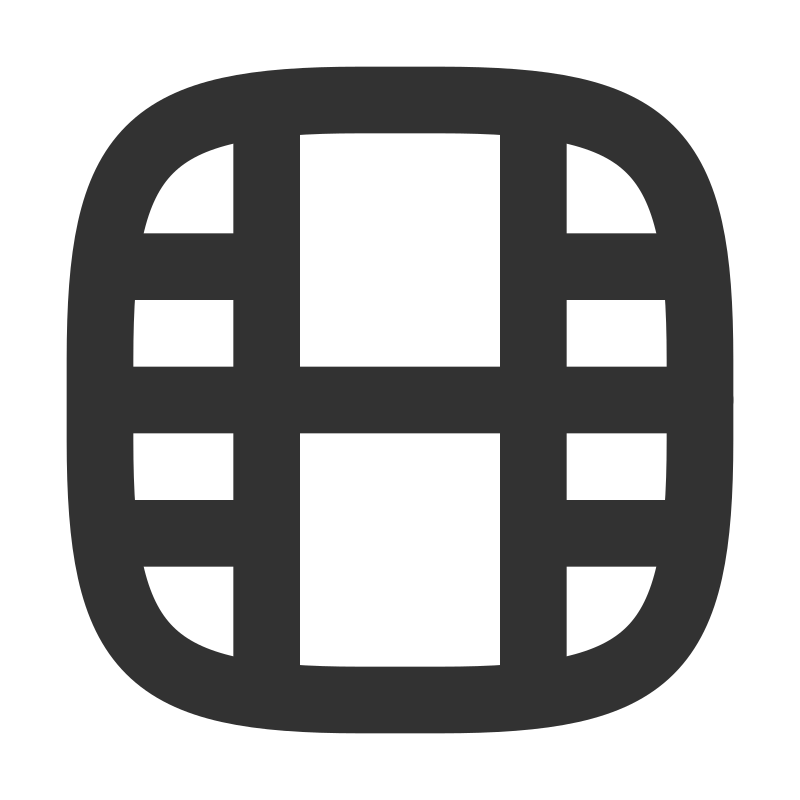</a> | **📂 檔名:** `film.svg` ✨ **格式:** `Vector (SVG)` ⚖️ **大小:** `1.14KB` 📅 **更新:** `2026-02-27`  🚀 **jsDelivr Markdown:** `` 🔗 **直接連結 (Url):** <code>https://cdn.jsdelivr.net/gh/barry028/materials@main/images/iCons/Scarlab%20Oval%20Line%20iCons/film.svg</code> 📥 [檢視原始檔](film.svg) |
|  | **📂 檔名:** `filter.svg` ✨ **格式:** `Vector (SVG)` ⚖️ **大小:** `704.00B` 📅 **更新:** `2026-02-27`  🚀 **jsDelivr Markdown:** `` 🔗 **直接連結 (Url):** <code>https://cdn.jsdelivr.net/gh/barry028/materials@main/images/iCons/Scarlab%20Oval%20Line%20iCons/filter.svg</code> 📥 [檢視原始檔](filter.svg) |
|  | **📂 檔名:** `fingerprint.svg` ✨ **格式:** `Vector (SVG)` ⚖️ **大小:** `1.01KB` 📅 **更新:** `2026-02-27`  🚀 **jsDelivr Markdown:** `` 🔗 **直接連結 (Url):** <code>https://cdn.jsdelivr.net/gh/barry028/materials@main/images/iCons/Scarlab%20Oval%20Line%20iCons/fingerprint.svg</code> 📥 [檢視原始檔](fingerprint.svg) |
|  | **📂 檔名:** `floppy.svg` ✨ **格式:** `Vector (SVG)` ⚖️ **大小:** `1.06KB` 📅 **更新:** `2026-02-27`  🚀 **jsDelivr Markdown:** `` 🔗 **直接連結 (Url):** <code>https://cdn.jsdelivr.net/gh/barry028/materials@main/images/iCons/Scarlab%20Oval%20Line%20iCons/floppy.svg</code> 📥 [檢視原始檔](floppy.svg) |
|  | **📂 檔名:** `folder-add.svg` ✨ **格式:** `Vector (SVG)` ⚖️ **大小:** `821.00B` 📅 **更新:** `2026-02-27`  🚀 **jsDelivr Markdown:** `` 🔗 **直接連結 (Url):** <code>https://cdn.jsdelivr.net/gh/barry028/materials@main/images/iCons/Scarlab%20Oval%20Line%20iCons/folder-add.svg</code> 📥 [檢視原始檔](folder-add.svg) |
|  | **📂 檔名:** `folder-check.svg` ✨ **格式:** `Vector (SVG)` ⚖️ **大小:** `786.00B` 📅 **更新:** `2026-02-27`  🚀 **jsDelivr Markdown:** `` 🔗 **直接連結 (Url):** <code>https://cdn.jsdelivr.net/gh/barry028/materials@main/images/iCons/Scarlab%20Oval%20Line%20iCons/folder-check.svg</code> 📥 [檢視原始檔](folder-check.svg) |
|  | **📂 檔名:** `folder-download.svg` ✨ **格式:** `Vector (SVG)` ⚖️ **大小:** `899.00B` 📅 **更新:** `2026-02-27`  🚀 **jsDelivr Markdown:** `` 🔗 **直接連結 (Url):** <code>https://cdn.jsdelivr.net/gh/barry028/materials@main/images/iCons/Scarlab%20Oval%20Line%20iCons/folder-download.svg</code> 📥 [檢視原始檔](folder-download.svg) |
|  | **📂 檔名:** `folder-off.svg` ✨ **格式:** `Vector (SVG)` ⚖️ **大小:** `859.00B` 📅 **更新:** `2026-02-27`  🚀 **jsDelivr Markdown:** `` 🔗 **直接連結 (Url):** <code>https://cdn.jsdelivr.net/gh/barry028/materials@main/images/iCons/Scarlab%20Oval%20Line%20iCons/folder-off.svg</code> 📥 [檢視原始檔](folder-off.svg) |
|  | **📂 檔名:** `folder-open.svg` ✨ **格式:** `Vector (SVG)` ⚖️ **大小:** `750.00B` 📅 **更新:** `2026-02-27`  🚀 **jsDelivr Markdown:** `` 🔗 **直接連結 (Url):** <code>https://cdn.jsdelivr.net/gh/barry028/materials@main/images/iCons/Scarlab%20Oval%20Line%20iCons/folder-open.svg</code> 📥 [檢視原始檔](folder-open.svg) |
|  | **📂 檔名:** `folder-remove.svg` ✨ **格式:** `Vector (SVG)` ⚖️ **大小:** `714.00B` 📅 **更新:** `2026-02-27`  🚀 **jsDelivr Markdown:** `` 🔗 **直接連結 (Url):** <code>https://cdn.jsdelivr.net/gh/barry028/materials@main/images/iCons/Scarlab%20Oval%20Line%20iCons/folder-remove.svg</code> 📥 [檢視原始檔](folder-remove.svg) |
|  | **📂 檔名:** `folder-x.svg` ✨ **格式:** `Vector (SVG)` ⚖️ **大小:** `814.00B` 📅 **更新:** `2026-02-27`  🚀 **jsDelivr Markdown:** `` 🔗 **直接連結 (Url):** <code>https://cdn.jsdelivr.net/gh/barry028/materials@main/images/iCons/Scarlab%20Oval%20Line%20iCons/folder-x.svg</code> 📥 [檢視原始檔](folder-x.svg) |
|  | **📂 檔名:** `folder.svg` ✨ **格式:** `Vector (SVG)` ⚖️ **大小:** `600.00B` 📅 **更新:** `2026-02-27`  🚀 **jsDelivr Markdown:** `` 🔗 **直接連結 (Url):** <code>https://cdn.jsdelivr.net/gh/barry028/materials@main/images/iCons/Scarlab%20Oval%20Line%20iCons/folder.svg</code> 📥 [檢視原始檔](folder.svg) |
| <a href="formatting-clear.svg">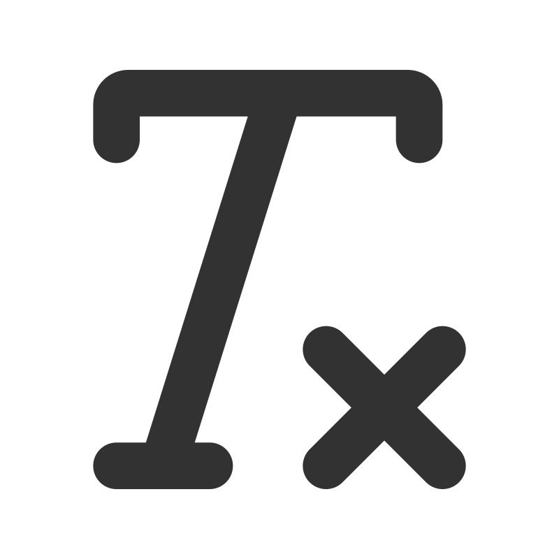</a> | **📂 檔名:** `formatting-clear.svg` ✨ **格式:** `Vector (SVG)` ⚖️ **大小:** `822.00B` 📅 **更新:** `2026-02-27`  🚀 **jsDelivr Markdown:** `` 🔗 **直接連結 (Url):** <code>https://cdn.jsdelivr.net/gh/barry028/materials@main/images/iCons/Scarlab%20Oval%20Line%20iCons/formatting-clear.svg</code> 📥 [檢視原始檔](formatting-clear.svg) |
|  | **📂 檔名:** `formatting.svg` ✨ **格式:** `Vector (SVG)` ⚖️ **大小:** `608.00B` 📅 **更新:** `2026-02-27`  🚀 **jsDelivr Markdown:** `` 🔗 **直接連結 (Url):** <code>https://cdn.jsdelivr.net/gh/barry028/materials@main/images/iCons/Scarlab%20Oval%20Line%20iCons/formatting.svg</code> 📥 [檢視原始檔](formatting.svg) |
|  | **📂 檔名:** `frame.svg` ✨ **格式:** `Vector (SVG)` ⚖️ **大小:** `649.00B` 📅 **更新:** `2026-02-27`  🚀 **jsDelivr Markdown:** `` 🔗 **直接連結 (Url):** <code>https://cdn.jsdelivr.net/gh/barry028/materials@main/images/iCons/Scarlab%20Oval%20Line%20iCons/frame.svg</code> 📥 [檢視原始檔](frame.svg) |
|  | **📂 檔名:** `gamepad.svg` ✨ **格式:** `Vector (SVG)` ⚖️ **大小:** `1.01KB` 📅 **更新:** `2026-02-27`  🚀 **jsDelivr Markdown:** `` 🔗 **直接連結 (Url):** <code>https://cdn.jsdelivr.net/gh/barry028/materials@main/images/iCons/Scarlab%20Oval%20Line%20iCons/gamepad.svg</code> 📥 [檢視原始檔](gamepad.svg) |
|  | **📂 檔名:** `gauge.svg` ✨ **格式:** `Vector (SVG)` ⚖️ **大小:** `764.00B` 📅 **更新:** `2026-02-27`  🚀 **jsDelivr Markdown:** `` 🔗 **直接連結 (Url):** <code>https://cdn.jsdelivr.net/gh/barry028/materials@main/images/iCons/Scarlab%20Oval%20Line%20iCons/gauge.svg</code> 📥 [檢視原始檔](gauge.svg) |
|  | **📂 檔名:** `ghost.svg` ✨ **格式:** `Vector (SVG)` ⚖️ **大小:** `953.00B` 📅 **更新:** `2026-02-27`  🚀 **jsDelivr Markdown:** `` 🔗 **直接連結 (Url):** <code>https://cdn.jsdelivr.net/gh/barry028/materials@main/images/iCons/Scarlab%20Oval%20Line%20iCons/ghost.svg</code> 📥 [檢視原始檔](ghost.svg) |
|  | **📂 檔名:** `gift.svg` ✨ **格式:** `Vector (SVG)` ⚖️ **大小:** `1.60KB` 📅 **更新:** `2026-02-27`  🚀 **jsDelivr Markdown:** `` 🔗 **直接連結 (Url):** <code>https://cdn.jsdelivr.net/gh/barry028/materials@main/images/iCons/Scarlab%20Oval%20Line%20iCons/gift.svg</code> 📥 [檢視原始檔](gift.svg) |
|  | **📂 檔名:** `git-branch.svg` ✨ **格式:** `Vector (SVG)` ⚖️ **大小:** `914.00B` 📅 **更新:** `2026-02-27`  🚀 **jsDelivr Markdown:** `` 🔗 **直接連結 (Url):** <code>https://cdn.jsdelivr.net/gh/barry028/materials@main/images/iCons/Scarlab%20Oval%20Line%20iCons/git-branch.svg</code> 📥 [檢視原始檔](git-branch.svg) |
|  | **📂 檔名:** `git-commit.svg` ✨ **格式:** `Vector (SVG)` ⚖️ **大小:** `601.00B` 📅 **更新:** `2026-02-27`  🚀 **jsDelivr Markdown:** `` 🔗 **直接連結 (Url):** <code>https://cdn.jsdelivr.net/gh/barry028/materials@main/images/iCons/Scarlab%20Oval%20Line%20iCons/git-commit.svg</code> 📥 [檢視原始檔](git-commit.svg) |
|  | **📂 檔名:** `git-diff.svg` ✨ **格式:** `Vector (SVG)` ⚖️ **大小:** `1.13KB` 📅 **更新:** `2026-02-27`  🚀 **jsDelivr Markdown:** `` 🔗 **直接連結 (Url):** <code>https://cdn.jsdelivr.net/gh/barry028/materials@main/images/iCons/Scarlab%20Oval%20Line%20iCons/git-diff.svg</code> 📥 [檢視原始檔](git-diff.svg) |
|  | **📂 檔名:** `git-fork.svg` ✨ **格式:** `Vector (SVG)` ⚖️ **大小:** `966.00B` 📅 **更新:** `2026-02-27`  🚀 **jsDelivr Markdown:** `` 🔗 **直接連結 (Url):** <code>https://cdn.jsdelivr.net/gh/barry028/materials@main/images/iCons/Scarlab%20Oval%20Line%20iCons/git-fork.svg</code> 📥 [檢視原始檔](git-fork.svg) |
|  | **📂 檔名:** `git-merge.svg` ✨ **格式:** `Vector (SVG)` ⚖️ **大小:** `929.00B` 📅 **更新:** `2026-02-27`  🚀 **jsDelivr Markdown:** `` 🔗 **直接連結 (Url):** <code>https://cdn.jsdelivr.net/gh/barry028/materials@main/images/iCons/Scarlab%20Oval%20Line%20iCons/git-merge.svg</code> 📥 [檢視原始檔](git-merge.svg) |
|  | **📂 檔名:** `git-pull-request.svg` ✨ **格式:** `Vector (SVG)` ⚖️ **大小:** `1.08KB` 📅 **更新:** `2026-02-27`  🚀 **jsDelivr Markdown:** `` 🔗 **直接連結 (Url):** <code>https://cdn.jsdelivr.net/gh/barry028/materials@main/images/iCons/Scarlab%20Oval%20Line%20iCons/git-pull-request.svg</code> 📥 [檢視原始檔](git-pull-request.svg) |
|  | **📂 檔名:** `github-circle.svg` ✨ **格式:** `Vector (SVG)` ⚖️ **大小:** `1.92KB` 📅 **更新:** `2026-02-27`  🚀 **jsDelivr Markdown:** `` 🔗 **直接連結 (Url):** <code>https://cdn.jsdelivr.net/gh/barry028/materials@main/images/iCons/Scarlab%20Oval%20Line%20iCons/github-circle.svg</code> 📥 [檢視原始檔](github-circle.svg) |
|  | **📂 檔名:** `github-square.svg` ✨ **格式:** `Vector (SVG)` ⚖️ **大小:** `1.91KB` 📅 **更新:** `2026-02-27`  🚀 **jsDelivr Markdown:** `` 🔗 **直接連結 (Url):** <code>https://cdn.jsdelivr.net/gh/barry028/materials@main/images/iCons/Scarlab%20Oval%20Line%20iCons/github-square.svg</code> 📥 [檢視原始檔](github-square.svg) |
|  | **📂 檔名:** `github.svg` ✨ **格式:** `Vector (SVG)` ⚖️ **大小:** `2.45KB` 📅 **更新:** `2026-02-27`  🚀 **jsDelivr Markdown:** `` 🔗 **直接連結 (Url):** <code>https://cdn.jsdelivr.net/gh/barry028/materials@main/images/iCons/Scarlab%20Oval%20Line%20iCons/github.svg</code> 📥 [檢視原始檔](github.svg) |
|  | **📂 檔名:** `gitlab.svg` ✨ **格式:** `Vector (SVG)` ⚖️ **大小:** `1.13KB` 📅 **更新:** `2026-02-27`  🚀 **jsDelivr Markdown:** `` 🔗 **直接連結 (Url):** <code>https://cdn.jsdelivr.net/gh/barry028/materials@main/images/iCons/Scarlab%20Oval%20Line%20iCons/gitlab.svg</code> 📥 [檢視原始檔](gitlab.svg) |
|  | **📂 檔名:** `globe-alt.svg` ✨ **格式:** `Vector (SVG)` ⚖️ **大小:** `1.07KB` 📅 **更新:** `2026-02-27`  🚀 **jsDelivr Markdown:** `` 🔗 **直接連結 (Url):** <code>https://cdn.jsdelivr.net/gh/barry028/materials@main/images/iCons/Scarlab%20Oval%20Line%20iCons/globe-alt.svg</code> 📥 [檢視原始檔](globe-alt.svg) |
|  | **📂 檔名:** `globe.svg` ✨ **格式:** `Vector (SVG)` ⚖️ **大小:** `792.00B` 📅 **更新:** `2026-02-27`  🚀 **jsDelivr Markdown:** `` 🔗 **直接連結 (Url):** <code>https://cdn.jsdelivr.net/gh/barry028/materials@main/images/iCons/Scarlab%20Oval%20Line%20iCons/globe.svg</code> 📥 [檢視原始檔](globe.svg) |
|  | **📂 檔名:** `goblet.svg` ✨ **格式:** `Vector (SVG)` ⚖️ **大小:** `948.00B` 📅 **更新:** `2026-02-27`  🚀 **jsDelivr Markdown:** `` 🔗 **直接連結 (Url):** <code>https://cdn.jsdelivr.net/gh/barry028/materials@main/images/iCons/Scarlab%20Oval%20Line%20iCons/goblet.svg</code> 📥 [檢視原始檔](goblet.svg) |
|  | **📂 檔名:** `gps.svg` ✨ **格式:** `Vector (SVG)` ⚖️ **大小:** `720.00B` 📅 **更新:** `2026-02-27`  🚀 **jsDelivr Markdown:** `` 🔗 **直接連結 (Url):** <code>https://cdn.jsdelivr.net/gh/barry028/materials@main/images/iCons/Scarlab%20Oval%20Line%20iCons/gps.svg</code> 📥 [檢視原始檔](gps.svg) |
|  | **📂 檔名:** `grid.svg` ✨ **格式:** `Vector (SVG)` ⚖️ **大小:** `641.00B` 📅 **更新:** `2026-02-27`  🚀 **jsDelivr Markdown:** `` 🔗 **直接連結 (Url):** <code>https://cdn.jsdelivr.net/gh/barry028/materials@main/images/iCons/Scarlab%20Oval%20Line%20iCons/grid.svg</code> 📥 [檢視原始檔](grid.svg) |
|  | **📂 檔名:** `hand.svg` ✨ **格式:** `Vector (SVG)` ⚖️ **大小:** `1.51KB` 📅 **更新:** `2026-02-27`  🚀 **jsDelivr Markdown:** `` 🔗 **直接連結 (Url):** <code>https://cdn.jsdelivr.net/gh/barry028/materials@main/images/iCons/Scarlab%20Oval%20Line%20iCons/hand.svg</code> 📥 [檢視原始檔](hand.svg) |
|  | **📂 檔名:** `hash-alt.svg` ✨ **格式:** `Vector (SVG)` ⚖️ **大小:** `650.00B` 📅 **更新:** `2026-02-27`  🚀 **jsDelivr Markdown:** `` 🔗 **直接連結 (Url):** <code>https://cdn.jsdelivr.net/gh/barry028/materials@main/images/iCons/Scarlab%20Oval%20Line%20iCons/hash-alt.svg</code> 📥 [檢視原始檔](hash-alt.svg) |
|  | **📂 檔名:** `hash.svg` ✨ **格式:** `Vector (SVG)` ⚖️ **大小:** `852.00B` 📅 **更新:** `2026-02-27`  🚀 **jsDelivr Markdown:** `` 🔗 **直接連結 (Url):** <code>https://cdn.jsdelivr.net/gh/barry028/materials@main/images/iCons/Scarlab%20Oval%20Line%20iCons/hash.svg</code> 📥 [檢視原始檔](hash.svg) |
|  | **📂 檔名:** `haze.svg` ✨ **格式:** `Vector (SVG)` ⚖️ **大小:** `1.16KB` 📅 **更新:** `2026-02-27`  🚀 **jsDelivr Markdown:** `` 🔗 **直接連結 (Url):** <code>https://cdn.jsdelivr.net/gh/barry028/materials@main/images/iCons/Scarlab%20Oval%20Line%20iCons/haze.svg</code> 📥 [檢視原始檔](haze.svg) |
| <a href="heading.svg">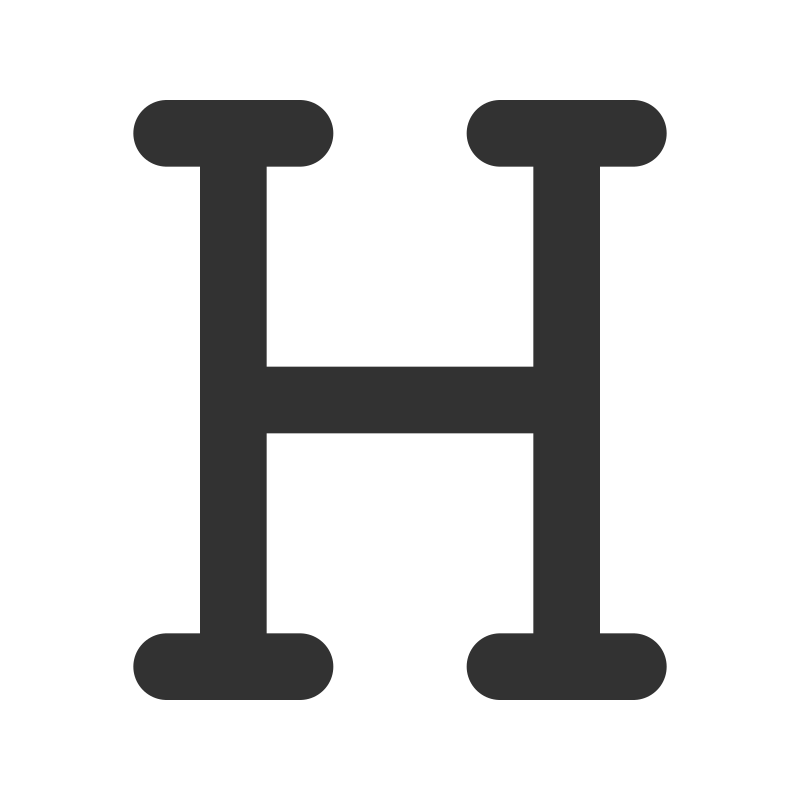</a> | **📂 檔名:** `heading.svg` ✨ **格式:** `Vector (SVG)` ⚖️ **大小:** `951.00B` 📅 **更新:** `2026-02-27`  🚀 **jsDelivr Markdown:** `` 🔗 **直接連結 (Url):** <code>https://cdn.jsdelivr.net/gh/barry028/materials@main/images/iCons/Scarlab%20Oval%20Line%20iCons/heading.svg</code> 📥 [檢視原始檔](heading.svg) |
|  | **📂 檔名:** `heart-broken.svg` ✨ **格式:** `Vector (SVG)` ⚖️ **大小:** `1020.00B` 📅 **更新:** `2026-02-27`  🚀 **jsDelivr Markdown:** `` 🔗 **直接連結 (Url):** <code>https://cdn.jsdelivr.net/gh/barry028/materials@main/images/iCons/Scarlab%20Oval%20Line%20iCons/heart-broken.svg</code> 📥 [檢視原始檔](heart-broken.svg) |
|  | **📂 檔名:** `heart-off.svg` ✨ **格式:** `Vector (SVG)` ⚖️ **大小:** `1.11KB` 📅 **更新:** `2026-02-27`  🚀 **jsDelivr Markdown:** `` 🔗 **直接連結 (Url):** <code>https://cdn.jsdelivr.net/gh/barry028/materials@main/images/iCons/Scarlab%20Oval%20Line%20iCons/heart-off.svg</code> 📥 [檢視原始檔](heart-off.svg) |
|  | **📂 檔名:** `heart.svg` ✨ **格式:** `Vector (SVG)` ⚖️ **大小:** `721.00B` 📅 **更新:** `2026-02-27`  🚀 **jsDelivr Markdown:** `` 🔗 **直接連結 (Url):** <code>https://cdn.jsdelivr.net/gh/barry028/materials@main/images/iCons/Scarlab%20Oval%20Line%20iCons/heart.svg</code> 📥 [檢視原始檔](heart.svg) |
|  | **📂 檔名:** `help-alt.svg` ✨ **格式:** `Vector (SVG)` ⚖️ **大小:** `585.00B` 📅 **更新:** `2026-02-27`  🚀 **jsDelivr Markdown:** `` 🔗 **直接連結 (Url):** <code>https://cdn.jsdelivr.net/gh/barry028/materials@main/images/iCons/Scarlab%20Oval%20Line%20iCons/help-alt.svg</code> 📥 [檢視原始檔](help-alt.svg) |
|  | **📂 檔名:** `help-circle.svg` ✨ **格式:** `Vector (SVG)` ⚖️ **大小:** `748.00B` 📅 **更新:** `2026-02-27`  🚀 **jsDelivr Markdown:** `` 🔗 **直接連結 (Url):** <code>https://cdn.jsdelivr.net/gh/barry028/materials@main/images/iCons/Scarlab%20Oval%20Line%20iCons/help-circle.svg</code> 📥 [檢視原始檔](help-circle.svg) |
|  | **📂 檔名:** `help.svg` ✨ **格式:** `Vector (SVG)` ⚖️ **大小:** `587.00B` 📅 **更新:** `2026-02-27`  🚀 **jsDelivr Markdown:** `` 🔗 **直接連結 (Url):** <code>https://cdn.jsdelivr.net/gh/barry028/materials@main/images/iCons/Scarlab%20Oval%20Line%20iCons/help.svg</code> 📥 [檢視原始檔](help.svg) |
|  | **📂 檔名:** `home-alt.svg` ✨ **格式:** `Vector (SVG)` ⚖️ **大小:** `809.00B` 📅 **更新:** `2026-02-27`  🚀 **jsDelivr Markdown:** `` 🔗 **直接連結 (Url):** <code>https://cdn.jsdelivr.net/gh/barry028/materials@main/images/iCons/Scarlab%20Oval%20Line%20iCons/home-alt.svg</code> 📥 [檢視原始檔](home-alt.svg) |
|  | **📂 檔名:** `home.svg` ✨ **格式:** `Vector (SVG)` ⚖️ **大小:** `946.00B` 📅 **更新:** `2026-02-27`  🚀 **jsDelivr Markdown:** `` 🔗 **直接連結 (Url):** <code>https://cdn.jsdelivr.net/gh/barry028/materials@main/images/iCons/Scarlab%20Oval%20Line%20iCons/home.svg</code> 📥 [檢視原始檔](home.svg) |
|  | **📂 檔名:** `hrivnia-circle.svg` ✨ **格式:** `Vector (SVG)` ⚖️ **大小:** `779.00B` 📅 **更新:** `2026-02-27`  🚀 **jsDelivr Markdown:** `` 🔗 **直接連結 (Url):** <code>https://cdn.jsdelivr.net/gh/barry028/materials@main/images/iCons/Scarlab%20Oval%20Line%20iCons/hrivnia-circle.svg</code> 📥 [檢視原始檔](hrivnia-circle.svg) |
| <a href="hrivnia-square.svg">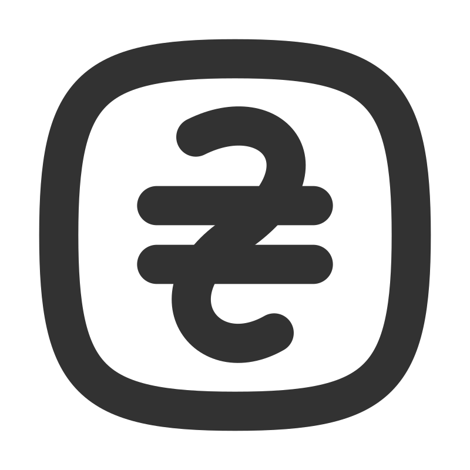</a> | **📂 檔名:** `hrivnia-square.svg` ✨ **格式:** `Vector (SVG)` ⚖️ **大小:** `774.00B` 📅 **更新:** `2026-02-27`  🚀 **jsDelivr Markdown:** `` 🔗 **直接連結 (Url):** <code>https://cdn.jsdelivr.net/gh/barry028/materials@main/images/iCons/Scarlab%20Oval%20Line%20iCons/hrivnia-square.svg</code> 📥 [檢視原始檔](hrivnia-square.svg) |
|  | **📂 檔名:** `hrivnia.svg` ✨ **格式:** `Vector (SVG)` ⚖️ **大小:** `618.00B` 📅 **更新:** `2026-02-27`  🚀 **jsDelivr Markdown:** `` 🔗 **直接連結 (Url):** <code>https://cdn.jsdelivr.net/gh/barry028/materials@main/images/iCons/Scarlab%20Oval%20Line%20iCons/hrivnia.svg</code> 📥 [檢視原始檔](hrivnia.svg) |
|  | **📂 檔名:** `id.svg` ✨ **格式:** `Vector (SVG)` ⚖️ **大小:** `1.04KB` 📅 **更新:** `2026-02-27`  🚀 **jsDelivr Markdown:** `` 🔗 **直接連結 (Url):** <code>https://cdn.jsdelivr.net/gh/barry028/materials@main/images/iCons/Scarlab%20Oval%20Line%20iCons/id.svg</code> 📥 [檢視原始檔](id.svg) |
|  | **📂 檔名:** `identification.svg` ✨ **格式:** `Vector (SVG)` ⚖️ **大小:** `1.16KB` 📅 **更新:** `2026-02-27`  🚀 **jsDelivr Markdown:** `` 🔗 **直接連結 (Url):** <code>https://cdn.jsdelivr.net/gh/barry028/materials@main/images/iCons/Scarlab%20Oval%20Line%20iCons/identification.svg</code> 📥 [檢視原始檔](identification.svg) |
|  | **📂 檔名:** `inbox-full.svg` ✨ **格式:** `Vector (SVG)` ⚖️ **大小:** `1.07KB` 📅 **更新:** `2026-02-27`  🚀 **jsDelivr Markdown:** `` 🔗 **直接連結 (Url):** <code>https://cdn.jsdelivr.net/gh/barry028/materials@main/images/iCons/Scarlab%20Oval%20Line%20iCons/inbox-full.svg</code> 📥 [檢視原始檔](inbox-full.svg) |
|  | **📂 檔名:** `inbox-in.svg` ✨ **格式:** `Vector (SVG)` ⚖️ **大小:** `1.13KB` 📅 **更新:** `2026-02-27`  🚀 **jsDelivr Markdown:** `` 🔗 **直接連結 (Url):** <code>https://cdn.jsdelivr.net/gh/barry028/materials@main/images/iCons/Scarlab%20Oval%20Line%20iCons/inbox-in.svg</code> 📥 [檢視原始檔](inbox-in.svg) |
|  | **📂 檔名:** `inbox-out.svg` ✨ **格式:** `Vector (SVG)` ⚖️ **大小:** `1.15KB` 📅 **更新:** `2026-02-27`  🚀 **jsDelivr Markdown:** `` 🔗 **直接連結 (Url):** <code>https://cdn.jsdelivr.net/gh/barry028/materials@main/images/iCons/Scarlab%20Oval%20Line%20iCons/inbox-out.svg</code> 📥 [檢視原始檔](inbox-out.svg) |
|  | **📂 檔名:** `inbox.svg` ✨ **格式:** `Vector (SVG)` ⚖️ **大小:** `891.00B` 📅 **更新:** `2026-02-27`  🚀 **jsDelivr Markdown:** `` 🔗 **直接連結 (Url):** <code>https://cdn.jsdelivr.net/gh/barry028/materials@main/images/iCons/Scarlab%20Oval%20Line%20iCons/inbox.svg</code> 📥 [檢視原始檔](inbox.svg) |
|  | **📂 檔名:** `italic.svg` ✨ **格式:** `Vector (SVG)` ⚖️ **大小:** `540.00B` 📅 **更新:** `2026-02-27`  🚀 **jsDelivr Markdown:** `` 🔗 **直接連結 (Url):** <code>https://cdn.jsdelivr.net/gh/barry028/materials@main/images/iCons/Scarlab%20Oval%20Line%20iCons/italic.svg</code> 📥 [檢視原始檔](italic.svg) |
|  | **📂 檔名:** `justify-center.svg` ✨ **格式:** `Vector (SVG)` ⚖️ **大小:** `646.00B` 📅 **更新:** `2026-02-27`  🚀 **jsDelivr Markdown:** `` 🔗 **直接連結 (Url):** <code>https://cdn.jsdelivr.net/gh/barry028/materials@main/images/iCons/Scarlab%20Oval%20Line%20iCons/justify-center.svg</code> 📥 [檢視原始檔](justify-center.svg) |
|  | **📂 檔名:** `justify-fill.svg` ✨ **格式:** `Vector (SVG)` ⚖️ **大小:** `646.00B` 📅 **更新:** `2026-02-27`  🚀 **jsDelivr Markdown:** `` 🔗 **直接連結 (Url):** <code>https://cdn.jsdelivr.net/gh/barry028/materials@main/images/iCons/Scarlab%20Oval%20Line%20iCons/justify-fill.svg</code> 📥 [檢視原始檔](justify-fill.svg) |
|  | **📂 檔名:** `justify-left.svg` ✨ **格式:** `Vector (SVG)` ⚖️ **大小:** `646.00B` 📅 **更新:** `2026-02-27`  🚀 **jsDelivr Markdown:** `` 🔗 **直接連結 (Url):** <code>https://cdn.jsdelivr.net/gh/barry028/materials@main/images/iCons/Scarlab%20Oval%20Line%20iCons/justify-left.svg</code> 📥 [檢視原始檔](justify-left.svg) |
|  | **📂 檔名:** `justify-right.svg` ✨ **格式:** `Vector (SVG)` ⚖️ **大小:** `646.00B` 📅 **更新:** `2026-02-27`  🚀 **jsDelivr Markdown:** `` 🔗 **直接連結 (Url):** <code>https://cdn.jsdelivr.net/gh/barry028/materials@main/images/iCons/Scarlab%20Oval%20Line%20iCons/justify-right.svg</code> 📥 [檢視原始檔](justify-right.svg) |
|  | **📂 檔名:** `key.svg` ✨ **格式:** `Vector (SVG)` ⚖️ **大小:** `714.00B` 📅 **更新:** `2026-02-27`  🚀 **jsDelivr Markdown:** `` 🔗 **直接連結 (Url):** <code>https://cdn.jsdelivr.net/gh/barry028/materials@main/images/iCons/Scarlab%20Oval%20Line%20iCons/key.svg</code> 📥 [檢視原始檔](key.svg) |
|  | **📂 檔名:** `keyboard.svg` ✨ **格式:** `Vector (SVG)` ⚖️ **大小:** `1.36KB` 📅 **更新:** `2026-02-27`  🚀 **jsDelivr Markdown:** `` 🔗 **直接連結 (Url):** <code>https://cdn.jsdelivr.net/gh/barry028/materials@main/images/iCons/Scarlab%20Oval%20Line%20iCons/keyboard.svg</code> 📥 [檢視原始檔](keyboard.svg) |
|  | **📂 檔名:** `lamp.svg` ✨ **格式:** `Vector (SVG)` ⚖️ **大小:** `725.00B` 📅 **更新:** `2026-02-27`  🚀 **jsDelivr Markdown:** `` 🔗 **直接連結 (Url):** <code>https://cdn.jsdelivr.net/gh/barry028/materials@main/images/iCons/Scarlab%20Oval%20Line%20iCons/lamp.svg</code> 📥 [檢視原始檔](lamp.svg) |
|  | **📂 檔名:** `laptop.svg` ✨ **格式:** `Vector (SVG)` ⚖️ **大小:** `686.00B` 📅 **更新:** `2026-02-27`  🚀 **jsDelivr Markdown:** `` 🔗 **直接連結 (Url):** <code>https://cdn.jsdelivr.net/gh/barry028/materials@main/images/iCons/Scarlab%20Oval%20Line%20iCons/laptop.svg</code> 📥 [檢視原始檔](laptop.svg) |
|  | **📂 檔名:** `leaf.svg` ✨ **格式:** `Vector (SVG)` ⚖️ **大小:** `668.00B` 📅 **更新:** `2026-02-27`  🚀 **jsDelivr Markdown:** `` 🔗 **直接連結 (Url):** <code>https://cdn.jsdelivr.net/gh/barry028/materials@main/images/iCons/Scarlab%20Oval%20Line%20iCons/leaf.svg</code> 📥 [檢視原始檔](leaf.svg) |
|  | **📂 檔名:** `license.svg` ✨ **格式:** `Vector (SVG)` ⚖️ **大小:** `1.01KB` 📅 **更新:** `2026-02-27`  🚀 **jsDelivr Markdown:** `` 🔗 **直接連結 (Url):** <code>https://cdn.jsdelivr.net/gh/barry028/materials@main/images/iCons/Scarlab%20Oval%20Line%20iCons/license.svg</code> 📥 [檢視原始檔](license.svg) |
|  | **📂 檔名:** `link.svg` ✨ **格式:** `Vector (SVG)` ⚖️ **大小:** `811.00B` 📅 **更新:** `2026-02-27`  🚀 **jsDelivr Markdown:** `` 🔗 **直接連結 (Url):** <code>https://cdn.jsdelivr.net/gh/barry028/materials@main/images/iCons/Scarlab%20Oval%20Line%20iCons/link.svg</code> 📥 [檢視原始檔](link.svg) |
|  | **📂 檔名:** `liras-circle.svg` ✨ **格式:** `Vector (SVG)` ⚖️ **大小:** `852.00B` 📅 **更新:** `2026-02-27`  🚀 **jsDelivr Markdown:** `` 🔗 **直接連結 (Url):** <code>https://cdn.jsdelivr.net/gh/barry028/materials@main/images/iCons/Scarlab%20Oval%20Line%20iCons/liras-circle.svg</code> 📥 [檢視原始檔](liras-circle.svg) |
|  | **📂 檔名:** `liras-square.svg` ✨ **格式:** `Vector (SVG)` ⚖️ **大小:** `847.00B` 📅 **更新:** `2026-02-27`  🚀 **jsDelivr Markdown:** `` 🔗 **直接連結 (Url):** <code>https://cdn.jsdelivr.net/gh/barry028/materials@main/images/iCons/Scarlab%20Oval%20Line%20iCons/liras-square.svg</code> 📥 [檢視原始檔](liras-square.svg) |
|  | **📂 檔名:** `liras.svg` ✨ **格式:** `Vector (SVG)` ⚖️ **大小:** `691.00B` 📅 **更新:** `2026-02-27`  🚀 **jsDelivr Markdown:** `` 🔗 **直接連結 (Url):** <code>https://cdn.jsdelivr.net/gh/barry028/materials@main/images/iCons/Scarlab%20Oval%20Line%20iCons/liras.svg</code> 📥 [檢視原始檔](liras.svg) |
|  | **📂 檔名:** `litecoin-circle.svg` ✨ **格式:** `Vector (SVG)` ⚖️ **大小:** `660.00B` 📅 **更新:** `2026-02-27`  🚀 **jsDelivr Markdown:** `` 🔗 **直接連結 (Url):** <code>https://cdn.jsdelivr.net/gh/barry028/materials@main/images/iCons/Scarlab%20Oval%20Line%20iCons/litecoin-circle.svg</code> 📥 [檢視原始檔](litecoin-circle.svg) |
|  | **📂 檔名:** `litecoin-square.svg` ✨ **格式:** `Vector (SVG)` ⚖️ **大小:** `655.00B` 📅 **更新:** `2026-02-27`  🚀 **jsDelivr Markdown:** `` 🔗 **直接連結 (Url):** <code>https://cdn.jsdelivr.net/gh/barry028/materials@main/images/iCons/Scarlab%20Oval%20Line%20iCons/litecoin-square.svg</code> 📥 [檢視原始檔](litecoin-square.svg) |
|  | **📂 檔名:** `litecoin.svg` ✨ **格式:** `Vector (SVG)` ⚖️ **大小:** `499.00B` 📅 **更新:** `2026-02-27`  🚀 **jsDelivr Markdown:** `` 🔗 **直接連結 (Url):** <code>https://cdn.jsdelivr.net/gh/barry028/materials@main/images/iCons/Scarlab%20Oval%20Line%20iCons/litecoin.svg</code> 📥 [檢視原始檔](litecoin.svg) |
|  | **📂 檔名:** `location.svg` ✨ **格式:** `Vector (SVG)` ⚖️ **大小:** `965.00B` 📅 **更新:** `2026-02-27`  🚀 **jsDelivr Markdown:** `` 🔗 **直接連結 (Url):** <code>https://cdn.jsdelivr.net/gh/barry028/materials@main/images/iCons/Scarlab%20Oval%20Line%20iCons/location.svg</code> 📥 [檢視原始檔](location.svg) |
|  | **📂 檔名:** `lock-open.svg` ✨ **格式:** `Vector (SVG)` ⚖️ **大小:** `944.00B` 📅 **更新:** `2026-02-27`  🚀 **jsDelivr Markdown:** `` 🔗 **直接連結 (Url):** <code>https://cdn.jsdelivr.net/gh/barry028/materials@main/images/iCons/Scarlab%20Oval%20Line%20iCons/lock-open.svg</code> 📥 [檢視原始檔](lock-open.svg) |
|  | **📂 檔名:** `lock.svg` ✨ **格式:** `Vector (SVG)` ⚖️ **大小:** `927.00B` 📅 **更新:** `2026-02-27`  🚀 **jsDelivr Markdown:** `` 🔗 **直接連結 (Url):** <code>https://cdn.jsdelivr.net/gh/barry028/materials@main/images/iCons/Scarlab%20Oval%20Line%20iCons/lock.svg</code> 📥 [檢視原始檔](lock.svg) |
|  | **📂 檔名:** `login.svg` ✨ **格式:** `Vector (SVG)` ⚖️ **大小:** `746.00B` 📅 **更新:** `2026-02-27`  🚀 **jsDelivr Markdown:** `` 🔗 **直接連結 (Url):** <code>https://cdn.jsdelivr.net/gh/barry028/materials@main/images/iCons/Scarlab%20Oval%20Line%20iCons/login.svg</code> 📥 [檢視原始檔](login.svg) |
|  | **📂 檔名:** `logout.svg` ✨ **格式:** `Vector (SVG)` ⚖️ **大小:** `746.00B` 📅 **更新:** `2026-02-27`  🚀 **jsDelivr Markdown:** `` 🔗 **直接連結 (Url):** <code>https://cdn.jsdelivr.net/gh/barry028/materials@main/images/iCons/Scarlab%20Oval%20Line%20iCons/logout.svg</code> 📥 [檢視原始檔](logout.svg) |
|  | **📂 檔名:** `luggage.svg` ✨ **格式:** `Vector (SVG)` ⚖️ **大小:** `1.10KB` 📅 **更新:** `2026-02-27`  🚀 **jsDelivr Markdown:** `` 🔗 **直接連結 (Url):** <code>https://cdn.jsdelivr.net/gh/barry028/materials@main/images/iCons/Scarlab%20Oval%20Line%20iCons/luggage.svg</code> 📥 [檢視原始檔](luggage.svg) |
|  | **📂 檔名:** `mail.svg` ✨ **格式:** `Vector (SVG)` ⚖️ **大小:** `934.00B` 📅 **更新:** `2026-02-27`  🚀 **jsDelivr Markdown:** `` 🔗 **直接連結 (Url):** <code>https://cdn.jsdelivr.net/gh/barry028/materials@main/images/iCons/Scarlab%20Oval%20Line%20iCons/mail.svg</code> 📥 [檢視原始檔](mail.svg) |
|  | **📂 檔名:** `map.svg` ✨ **格式:** `Vector (SVG)` ⚖️ **大小:** `1.39KB` 📅 **更新:** `2026-02-27`  🚀 **jsDelivr Markdown:** `` 🔗 **直接連結 (Url):** <code>https://cdn.jsdelivr.net/gh/barry028/materials@main/images/iCons/Scarlab%20Oval%20Line%20iCons/map.svg</code> 📥 [檢視原始檔](map.svg) |
|  | **📂 檔名:** `mask.svg` ✨ **格式:** `Vector (SVG)` ⚖️ **大小:** `741.00B` 📅 **更新:** `2026-02-27`  🚀 **jsDelivr Markdown:** `` 🔗 **直接連結 (Url):** <code>https://cdn.jsdelivr.net/gh/barry028/materials@main/images/iCons/Scarlab%20Oval%20Line%20iCons/mask.svg</code> 📥 [檢視原始檔](mask.svg) |
|  | **📂 檔名:** `mastercard.svg` ✨ **格式:** `Vector (SVG)` ⚖️ **大小:** `956.00B` 📅 **更新:** `2026-02-27`  🚀 **jsDelivr Markdown:** `` 🔗 **直接連結 (Url):** <code>https://cdn.jsdelivr.net/gh/barry028/materials@main/images/iCons/Scarlab%20Oval%20Line%20iCons/mastercard.svg</code> 📥 [檢視原始檔](mastercard.svg) |
|  | **📂 檔名:** `maximaize-circle.svg` ✨ **格式:** `Vector (SVG)` ⚖️ **大小:** `716.00B` 📅 **更新:** `2026-02-27`  🚀 **jsDelivr Markdown:** `` 🔗 **直接連結 (Url):** <code>https://cdn.jsdelivr.net/gh/barry028/materials@main/images/iCons/Scarlab%20Oval%20Line%20iCons/maximaize-circle.svg</code> 📥 [檢視原始檔](maximaize-circle.svg) |
|  | **📂 檔名:** `maximaize-square.svg` ✨ **格式:** `Vector (SVG)` ⚖️ **大小:** `691.00B` 📅 **更新:** `2026-02-27`  🚀 **jsDelivr Markdown:** `` 🔗 **直接連結 (Url):** <code>https://cdn.jsdelivr.net/gh/barry028/materials@main/images/iCons/Scarlab%20Oval%20Line%20iCons/maximaize-square.svg</code> 📥 [檢視原始檔](maximaize-square.svg) |
|  | **📂 檔名:** `maximaize.svg` ✨ **格式:** `Vector (SVG)` ⚖️ **大小:** `527.00B` 📅 **更新:** `2026-02-27`  🚀 **jsDelivr Markdown:** `` 🔗 **直接連結 (Url):** <code>https://cdn.jsdelivr.net/gh/barry028/materials@main/images/iCons/Scarlab%20Oval%20Line%20iCons/maximaize.svg</code> 📥 [檢視原始檔](maximaize.svg) |
|  | **📂 檔名:** `microphone.svg` ✨ **格式:** `Vector (SVG)` ⚖️ **大小:** `1.14KB` 📅 **更新:** `2026-02-27`  🚀 **jsDelivr Markdown:** `` 🔗 **直接連結 (Url):** <code>https://cdn.jsdelivr.net/gh/barry028/materials@main/images/iCons/Scarlab%20Oval%20Line%20iCons/microphone.svg</code> 📥 [檢視原始檔](microphone.svg) |
|  | **📂 檔名:** `minimaize-circle.svg` ✨ **格式:** `Vector (SVG)` ⚖️ **大小:** `723.00B` 📅 **更新:** `2026-02-27`  🚀 **jsDelivr Markdown:** `` 🔗 **直接連結 (Url):** <code>https://cdn.jsdelivr.net/gh/barry028/materials@main/images/iCons/Scarlab%20Oval%20Line%20iCons/minimaize-circle.svg</code> 📥 [檢視原始檔](minimaize-circle.svg) |
|  | **📂 檔名:** `minimaize-square.svg` ✨ **格式:** `Vector (SVG)` ⚖️ **大小:** `699.00B` 📅 **更新:** `2026-02-27`  🚀 **jsDelivr Markdown:** `` 🔗 **直接連結 (Url):** <code>https://cdn.jsdelivr.net/gh/barry028/materials@main/images/iCons/Scarlab%20Oval%20Line%20iCons/minimaize-square.svg</code> 📥 [檢視原始檔](minimaize-square.svg) |
|  | **📂 檔名:** `minimaize.svg` ✨ **格式:** `Vector (SVG)` ⚖️ **大小:** `543.00B` 📅 **更新:** `2026-02-27`  🚀 **jsDelivr Markdown:** `` 🔗 **直接連結 (Url):** <code>https://cdn.jsdelivr.net/gh/barry028/materials@main/images/iCons/Scarlab%20Oval%20Line%20iCons/minimaize.svg</code> 📥 [檢視原始檔](minimaize.svg) |
|  | **📂 檔名:** `minus-alt.svg` ✨ **格式:** `Vector (SVG)` ⚖️ **大小:** `332.00B` 📅 **更新:** `2026-02-27`  🚀 **jsDelivr Markdown:** `` 🔗 **直接連結 (Url):** <code>https://cdn.jsdelivr.net/gh/barry028/materials@main/images/iCons/Scarlab%20Oval%20Line%20iCons/minus-alt.svg</code> 📥 [檢視原始檔](minus-alt.svg) |
|  | **📂 檔名:** `minus-circle.svg` ✨ **格式:** `Vector (SVG)` ⚖️ **大小:** `493.00B` 📅 **更新:** `2026-02-27`  🚀 **jsDelivr Markdown:** `` 🔗 **直接連結 (Url):** <code>https://cdn.jsdelivr.net/gh/barry028/materials@main/images/iCons/Scarlab%20Oval%20Line%20iCons/minus-circle.svg</code> 📥 [檢視原始檔](minus-circle.svg) |
|  | **📂 檔名:** `minus-square.svg` ✨ **格式:** `Vector (SVG)` ⚖️ **大小:** `488.00B` 📅 **更新:** `2026-02-27`  🚀 **jsDelivr Markdown:** `` 🔗 **直接連結 (Url):** <code>https://cdn.jsdelivr.net/gh/barry028/materials@main/images/iCons/Scarlab%20Oval%20Line%20iCons/minus-square.svg</code> 📥 [檢視原始檔](minus-square.svg) |
|  | **📂 檔名:** `minus.svg` ✨ **格式:** `Vector (SVG)` ⚖️ **大小:** `332.00B` 📅 **更新:** `2026-02-27`  🚀 **jsDelivr Markdown:** `` 🔗 **直接連結 (Url):** <code>https://cdn.jsdelivr.net/gh/barry028/materials@main/images/iCons/Scarlab%20Oval%20Line%20iCons/minus.svg</code> 📥 [檢視原始檔](minus.svg) |
|  | **📂 檔名:** `mobile.svg` ✨ **格式:** `Vector (SVG)` ⚖️ **大小:** `666.00B` 📅 **更新:** `2026-02-27`  🚀 **jsDelivr Markdown:** `` 🔗 **直接連結 (Url):** <code>https://cdn.jsdelivr.net/gh/barry028/materials@main/images/iCons/Scarlab%20Oval%20Line%20iCons/mobile.svg</code> 📥 [檢視原始檔](mobile.svg) |
|  | **📂 檔名:** `monitor.svg` ✨ **格式:** `Vector (SVG)` ⚖️ **大小:** `763.00B` 📅 **更新:** `2026-02-27`  🚀 **jsDelivr Markdown:** `` 🔗 **直接連結 (Url):** <code>https://cdn.jsdelivr.net/gh/barry028/materials@main/images/iCons/Scarlab%20Oval%20Line%20iCons/monitor.svg</code> 📥 [檢視原始檔](monitor.svg) |
|  | **📂 檔名:** `moon.svg` ✨ **格式:** `Vector (SVG)` ⚖️ **大小:** `923.00B` 📅 **更新:** `2026-02-27`  🚀 **jsDelivr Markdown:** `` 🔗 **直接連結 (Url):** <code>https://cdn.jsdelivr.net/gh/barry028/materials@main/images/iCons/Scarlab%20Oval%20Line%20iCons/moon.svg</code> 📥 [檢視原始檔](moon.svg) |
|  | **📂 檔名:** `more-horizontal-circle.svg` ✨ **格式:** `Vector (SVG)` ⚖️ **大小:** `709.00B` 📅 **更新:** `2026-02-27`  🚀 **jsDelivr Markdown:** `` 🔗 **直接連結 (Url):** <code>https://cdn.jsdelivr.net/gh/barry028/materials@main/images/iCons/Scarlab%20Oval%20Line%20iCons/more-horizontal-circle.svg</code> 📥 [檢視原始檔](more-horizontal-circle.svg) |
|  | **📂 檔名:** `more-horizontal-square.svg` ✨ **格式:** `Vector (SVG)` ⚖️ **大小:** `704.00B` 📅 **更新:** `2026-02-27`  🚀 **jsDelivr Markdown:** `` 🔗 **直接連結 (Url):** <code>https://cdn.jsdelivr.net/gh/barry028/materials@main/images/iCons/Scarlab%20Oval%20Line%20iCons/more-horizontal-square.svg</code> 📥 [檢視原始檔](more-horizontal-square.svg) |
|  | **📂 檔名:** `more-horizontal.svg` ✨ **格式:** `Vector (SVG)` ⚖️ **大小:** `548.00B` 📅 **更新:** `2026-02-27`  🚀 **jsDelivr Markdown:** `` 🔗 **直接連結 (Url):** <code>https://cdn.jsdelivr.net/gh/barry028/materials@main/images/iCons/Scarlab%20Oval%20Line%20iCons/more-horizontal.svg</code> 📥 [檢視原始檔](more-horizontal.svg) |
|  | **📂 檔名:** `more-vertical-circle.svg` ✨ **格式:** `Vector (SVG)` ⚖️ **大小:** `763.00B` 📅 **更新:** `2026-02-27`  🚀 **jsDelivr Markdown:** `` 🔗 **直接連結 (Url):** <code>https://cdn.jsdelivr.net/gh/barry028/materials@main/images/iCons/Scarlab%20Oval%20Line%20iCons/more-vertical-circle.svg</code> 📥 [檢視原始檔](more-vertical-circle.svg) |
|  | **📂 檔名:** `more-vertical-square.svg` ✨ **格式:** `Vector (SVG)` ⚖️ **大小:** `758.00B` 📅 **更新:** `2026-02-27`  🚀 **jsDelivr Markdown:** `` 🔗 **直接連結 (Url):** <code>https://cdn.jsdelivr.net/gh/barry028/materials@main/images/iCons/Scarlab%20Oval%20Line%20iCons/more-vertical-square.svg</code> 📥 [檢視原始檔](more-vertical-square.svg) |
|  | **📂 檔名:** `more-vertical.svg` ✨ **格式:** `Vector (SVG)` ⚖️ **大小:** `602.00B` 📅 **更新:** `2026-02-27`  🚀 **jsDelivr Markdown:** `` 🔗 **直接連結 (Url):** <code>https://cdn.jsdelivr.net/gh/barry028/materials@main/images/iCons/Scarlab%20Oval%20Line%20iCons/more-vertical.svg</code> 📥 [檢視原始檔](more-vertical.svg) |
|  | **📂 檔名:** `mosaic.svg` ✨ **格式:** `Vector (SVG)` ⚖️ **大小:** `694.00B` 📅 **更新:** `2026-02-27`  🚀 **jsDelivr Markdown:** `` 🔗 **直接連結 (Url):** <code>https://cdn.jsdelivr.net/gh/barry028/materials@main/images/iCons/Scarlab%20Oval%20Line%20iCons/mosaic.svg</code> 📥 [檢視原始檔](mosaic.svg) |
|  | **📂 檔名:** `mug.svg` ✨ **格式:** `Vector (SVG)` ⚖️ **大小:** `756.00B` 📅 **更新:** `2026-02-27`  🚀 **jsDelivr Markdown:** `` 🔗 **直接連結 (Url):** <code>https://cdn.jsdelivr.net/gh/barry028/materials@main/images/iCons/Scarlab%20Oval%20Line%20iCons/mug.svg</code> 📥 [檢視原始檔](mug.svg) |
|  | **📂 檔名:** `overline.svg` ✨ **格式:** `Vector (SVG)` ⚖️ **大小:** `466.00B` 📅 **更新:** `2026-02-27`  🚀 **jsDelivr Markdown:** `` 🔗 **直接連結 (Url):** <code>https://cdn.jsdelivr.net/gh/barry028/materials@main/images/iCons/Scarlab%20Oval%20Line%20iCons/overline.svg</code> 📥 [檢視原始檔](overline.svg) |
|  | **📂 檔名:** `paperclip.svg` ✨ **格式:** `Vector (SVG)` ⚖️ **大小:** `511.00B` 📅 **更新:** `2026-02-27`  🚀 **jsDelivr Markdown:** `` 🔗 **直接連結 (Url):** <code>https://cdn.jsdelivr.net/gh/barry028/materials@main/images/iCons/Scarlab%20Oval%20Line%20iCons/paperclip.svg</code> 📥 [檢視原始檔](paperclip.svg) |
| <a href="parentheses.svg">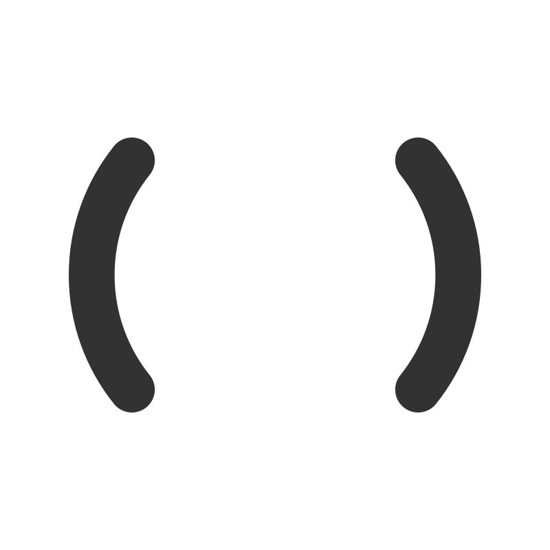</a> | **📂 檔名:** `parentheses.svg` ✨ **格式:** `Vector (SVG)` ⚖️ **大小:** `528.00B` 📅 **更新:** `2026-02-27`  🚀 **jsDelivr Markdown:** `` 🔗 **直接連結 (Url):** <code>https://cdn.jsdelivr.net/gh/barry028/materials@main/images/iCons/Scarlab%20Oval%20Line%20iCons/parentheses.svg</code> 📥 [檢視原始檔](parentheses.svg) |
|  | **📂 檔名:** `pause-alt.svg` ✨ **格式:** `Vector (SVG)` ⚖️ **大小:** `685.00B` 📅 **更新:** `2026-02-27`  🚀 **jsDelivr Markdown:** `` 🔗 **直接連結 (Url):** <code>https://cdn.jsdelivr.net/gh/barry028/materials@main/images/iCons/Scarlab%20Oval%20Line%20iCons/pause-alt.svg</code> 📥 [檢視原始檔](pause-alt.svg) |
|  | **📂 檔名:** `pause-circle.svg` ✨ **格式:** `Vector (SVG)` ⚖️ **大小:** `602.00B` 📅 **更新:** `2026-02-27`  🚀 **jsDelivr Markdown:** `` 🔗 **直接連結 (Url):** <code>https://cdn.jsdelivr.net/gh/barry028/materials@main/images/iCons/Scarlab%20Oval%20Line%20iCons/pause-circle.svg</code> 📥 [檢視原始檔](pause-circle.svg) |
|  | **📂 檔名:** `pause-square.svg` ✨ **格式:** `Vector (SVG)` ⚖️ **大小:** `597.00B` 📅 **更新:** `2026-02-27`  🚀 **jsDelivr Markdown:** `` 🔗 **直接連結 (Url):** <code>https://cdn.jsdelivr.net/gh/barry028/materials@main/images/iCons/Scarlab%20Oval%20Line%20iCons/pause-square.svg</code> 📥 [檢視原始檔](pause-square.svg) |
|  | **📂 檔名:** `paypal.svg` ✨ **格式:** `Vector (SVG)` ⚖️ **大小:** `849.00B` 📅 **更新:** `2026-02-27`  🚀 **jsDelivr Markdown:** `` 🔗 **直接連結 (Url):** <code>https://cdn.jsdelivr.net/gh/barry028/materials@main/images/iCons/Scarlab%20Oval%20Line%20iCons/paypal.svg</code> 📥 [檢視原始檔](paypal.svg) |
|  | **📂 檔名:** `pencil-alt.svg` ✨ **格式:** `Vector (SVG)` ⚖️ **大小:** `805.00B` 📅 **更新:** `2026-02-27`  🚀 **jsDelivr Markdown:** `` 🔗 **直接連結 (Url):** <code>https://cdn.jsdelivr.net/gh/barry028/materials@main/images/iCons/Scarlab%20Oval%20Line%20iCons/pencil-alt.svg</code> 📥 [檢視原始檔](pencil-alt.svg) |
|  | **📂 檔名:** `pencil.svg` ✨ **格式:** `Vector (SVG)` ⚖️ **大小:** `675.00B` 📅 **更新:** `2026-02-27`  🚀 **jsDelivr Markdown:** `` 🔗 **直接連結 (Url):** <code>https://cdn.jsdelivr.net/gh/barry028/materials@main/images/iCons/Scarlab%20Oval%20Line%20iCons/pencil.svg</code> 📥 [檢視原始檔](pencil.svg) |
|  | **📂 檔名:** `percent-circle.svg` ✨ **格式:** `Vector (SVG)` ⚖️ **大小:** `720.00B` 📅 **更新:** `2026-02-27`  🚀 **jsDelivr Markdown:** `` 🔗 **直接連結 (Url):** <code>https://cdn.jsdelivr.net/gh/barry028/materials@main/images/iCons/Scarlab%20Oval%20Line%20iCons/percent-circle.svg</code> 📥 [檢視原始檔](percent-circle.svg) |
|  | **📂 檔名:** `percent-square.svg` ✨ **格式:** `Vector (SVG)` ⚖️ **大小:** `715.00B` 📅 **更新:** `2026-02-27`  🚀 **jsDelivr Markdown:** `` 🔗 **直接連結 (Url):** <code>https://cdn.jsdelivr.net/gh/barry028/materials@main/images/iCons/Scarlab%20Oval%20Line%20iCons/percent-square.svg</code> 📥 [檢視原始檔](percent-square.svg) |
|  | **📂 檔名:** `percent.svg` ✨ **格式:** `Vector (SVG)` ⚖️ **大小:** `559.00B` 📅 **更新:** `2026-02-27`  🚀 **jsDelivr Markdown:** `` 🔗 **直接連結 (Url):** <code>https://cdn.jsdelivr.net/gh/barry028/materials@main/images/iCons/Scarlab%20Oval%20Line%20iCons/percent.svg</code> 📥 [檢視原始檔](percent.svg) |
| <a href="phone-incoming.svg">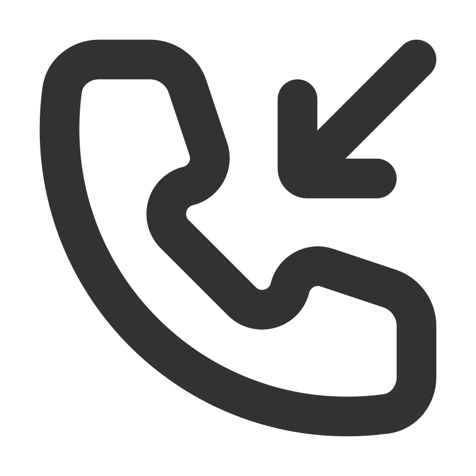</a> | **📂 檔名:** `phone-incoming.svg` ✨ **格式:** `Vector (SVG)` ⚖️ **大小:** `1.04KB` 📅 **更新:** `2026-02-27`  🚀 **jsDelivr Markdown:** `` 🔗 **直接連結 (Url):** <code>https://cdn.jsdelivr.net/gh/barry028/materials@main/images/iCons/Scarlab%20Oval%20Line%20iCons/phone-incoming.svg</code> 📥 [檢視原始檔](phone-incoming.svg) |
|  | **📂 檔名:** `phone-missed-call.svg` ✨ **格式:** `Vector (SVG)` ⚖️ **大小:** `1.00KB` 📅 **更新:** `2026-02-27`  🚀 **jsDelivr Markdown:** `` 🔗 **直接連結 (Url):** <code>https://cdn.jsdelivr.net/gh/barry028/materials@main/images/iCons/Scarlab%20Oval%20Line%20iCons/phone-missed-call.svg</code> 📥 [檢視原始檔](phone-missed-call.svg) |
|  | **📂 檔名:** `phone-outgoing.svg` ✨ **格式:** `Vector (SVG)` ⚖️ **大小:** `1.05KB` 📅 **更新:** `2026-02-27`  🚀 **jsDelivr Markdown:** `` 🔗 **直接連結 (Url):** <code>https://cdn.jsdelivr.net/gh/barry028/materials@main/images/iCons/Scarlab%20Oval%20Line%20iCons/phone-outgoing.svg</code> 📥 [檢視原始檔](phone-outgoing.svg) |
|  | **📂 檔名:** `phone.svg` ✨ **格式:** `Vector (SVG)` ⚖️ **大小:** `817.00B` 📅 **更新:** `2026-02-27`  🚀 **jsDelivr Markdown:** `` 🔗 **直接連結 (Url):** <code>https://cdn.jsdelivr.net/gh/barry028/materials@main/images/iCons/Scarlab%20Oval%20Line%20iCons/phone.svg</code> 📥 [檢視原始檔](phone.svg) |
|  | **📂 檔名:** `photo.svg` ✨ **格式:** `Vector (SVG)` ⚖️ **大小:** `880.00B` 📅 **更新:** `2026-02-27`  🚀 **jsDelivr Markdown:** `` 🔗 **直接連結 (Url):** <code>https://cdn.jsdelivr.net/gh/barry028/materials@main/images/iCons/Scarlab%20Oval%20Line%20iCons/photo.svg</code> 📥 [檢視原始檔](photo.svg) |
|  | **📂 檔名:** `pin.svg` ✨ **格式:** `Vector (SVG)` ⚖️ **大小:** `705.00B` 📅 **更新:** `2026-02-27`  🚀 **jsDelivr Markdown:** `` 🔗 **直接連結 (Url):** <code>https://cdn.jsdelivr.net/gh/barry028/materials@main/images/iCons/Scarlab%20Oval%20Line%20iCons/pin.svg</code> 📥 [檢視原始檔](pin.svg) |
|  | **📂 檔名:** `play-alt.svg` ✨ **格式:** `Vector (SVG)` ⚖️ **大小:** `493.00B` 📅 **更新:** `2026-02-27`  🚀 **jsDelivr Markdown:** `` 🔗 **直接連結 (Url):** <code>https://cdn.jsdelivr.net/gh/barry028/materials@main/images/iCons/Scarlab%20Oval%20Line%20iCons/play-alt.svg</code> 📥 [檢視原始檔](play-alt.svg) |
|  | **📂 檔名:** `play-circle.svg` ✨ **格式:** `Vector (SVG)` ⚖️ **大小:** `676.00B` 📅 **更新:** `2026-02-27`  🚀 **jsDelivr Markdown:** `` 🔗 **直接連結 (Url):** <code>https://cdn.jsdelivr.net/gh/barry028/materials@main/images/iCons/Scarlab%20Oval%20Line%20iCons/play-circle.svg</code> 📥 [檢視原始檔](play-circle.svg) |
|  | **📂 檔名:** `play-square.svg` ✨ **格式:** `Vector (SVG)` ⚖️ **大小:** `671.00B` 📅 **更新:** `2026-02-27`  🚀 **jsDelivr Markdown:** `` 🔗 **直接連結 (Url):** <code>https://cdn.jsdelivr.net/gh/barry028/materials@main/images/iCons/Scarlab%20Oval%20Line%20iCons/play-square.svg</code> 📥 [檢視原始檔](play-square.svg) |
|  | **📂 檔名:** `play.svg` ✨ **格式:** `Vector (SVG)` ⚖️ **大小:** `515.00B` 📅 **更新:** `2026-02-27`  🚀 **jsDelivr Markdown:** `` 🔗 **直接連結 (Url):** <code>https://cdn.jsdelivr.net/gh/barry028/materials@main/images/iCons/Scarlab%20Oval%20Line%20iCons/play.svg</code> 📥 [檢視原始檔](play.svg) |
|  | **📂 檔名:** `plus-alt.svg` ✨ **格式:** `Vector (SVG)` ⚖️ **大小:** `438.00B` 📅 **更新:** `2026-02-27`  🚀 **jsDelivr Markdown:** `` 🔗 **直接連結 (Url):** <code>https://cdn.jsdelivr.net/gh/barry028/materials@main/images/iCons/Scarlab%20Oval%20Line%20iCons/plus-alt.svg</code> 📥 [檢視原始檔](plus-alt.svg) |
|  | **📂 檔名:** `plus-circle.svg` ✨ **格式:** `Vector (SVG)` ⚖️ **大小:** `599.00B` 📅 **更新:** `2026-02-27`  🚀 **jsDelivr Markdown:** `` 🔗 **直接連結 (Url):** <code>https://cdn.jsdelivr.net/gh/barry028/materials@main/images/iCons/Scarlab%20Oval%20Line%20iCons/plus-circle.svg</code> 📥 [檢視原始檔](plus-circle.svg) |
|  | **📂 檔名:** `plus-square.svg` ✨ **格式:** `Vector (SVG)` ⚖️ **大小:** `594.00B` 📅 **更新:** `2026-02-27`  🚀 **jsDelivr Markdown:** `` 🔗 **直接連結 (Url):** <code>https://cdn.jsdelivr.net/gh/barry028/materials@main/images/iCons/Scarlab%20Oval%20Line%20iCons/plus-square.svg</code> 📥 [檢視原始檔](plus-square.svg) |
|  | **📂 檔名:** `plus.svg` ✨ **格式:** `Vector (SVG)` ⚖️ **大小:** `438.00B` 📅 **更新:** `2026-02-27`  🚀 **jsDelivr Markdown:** `` 🔗 **直接連結 (Url):** <code>https://cdn.jsdelivr.net/gh/barry028/materials@main/images/iCons/Scarlab%20Oval%20Line%20iCons/plus.svg</code> 📥 [檢視原始檔](plus.svg) |
|  | **📂 檔名:** `pound-circle.svg` ✨ **格式:** `Vector (SVG)` ⚖️ **大小:** `749.00B` 📅 **更新:** `2026-02-27`  🚀 **jsDelivr Markdown:** `` 🔗 **直接連結 (Url):** <code>https://cdn.jsdelivr.net/gh/barry028/materials@main/images/iCons/Scarlab%20Oval%20Line%20iCons/pound-circle.svg</code> 📥 [檢視原始檔](pound-circle.svg) |
|  | **📂 檔名:** `pound-square.svg` ✨ **格式:** `Vector (SVG)` ⚖️ **大小:** `744.00B` 📅 **更新:** `2026-02-27`  🚀 **jsDelivr Markdown:** `` 🔗 **直接連結 (Url):** <code>https://cdn.jsdelivr.net/gh/barry028/materials@main/images/iCons/Scarlab%20Oval%20Line%20iCons/pound-square.svg</code> 📥 [檢視原始檔](pound-square.svg) |
|  | **📂 檔名:** `pound.svg` ✨ **格式:** `Vector (SVG)` ⚖️ **大小:** `588.00B` 📅 **更新:** `2026-02-27`  🚀 **jsDelivr Markdown:** `` 🔗 **直接連結 (Url):** <code>https://cdn.jsdelivr.net/gh/barry028/materials@main/images/iCons/Scarlab%20Oval%20Line%20iCons/pound.svg</code> 📥 [檢視原始檔](pound.svg) |
|  | **📂 檔名:** `power.svg` ✨ **格式:** `Vector (SVG)` ⚖️ **大小:** `561.00B` 📅 **更新:** `2026-02-27`  🚀 **jsDelivr Markdown:** `` 🔗 **直接連結 (Url):** <code>https://cdn.jsdelivr.net/gh/barry028/materials@main/images/iCons/Scarlab%20Oval%20Line%20iCons/power.svg</code> 📥 [檢視原始檔](power.svg) |
|  | **📂 檔名:** `presentation-chart-bar-alt.svg` ✨ **格式:** `Vector (SVG)` ⚖️ **大小:** `1.04KB` 📅 **更新:** `2026-02-27`  🚀 **jsDelivr Markdown:** `` 🔗 **直接連結 (Url):** <code>https://cdn.jsdelivr.net/gh/barry028/materials@main/images/iCons/Scarlab%20Oval%20Line%20iCons/presentation-chart-bar-alt.svg</code> 📥 [檢視原始檔](presentation-chart-bar-alt.svg) |
|  | **📂 檔名:** `presentation-chart-bar.svg` ✨ **格式:** `Vector (SVG)` ⚖️ **大小:** `1.04KB` 📅 **更新:** `2026-02-27`  🚀 **jsDelivr Markdown:** `` 🔗 **直接連結 (Url):** <code>https://cdn.jsdelivr.net/gh/barry028/materials@main/images/iCons/Scarlab%20Oval%20Line%20iCons/presentation-chart-bar.svg</code> 📥 [檢視原始檔](presentation-chart-bar.svg) |
|  | **📂 檔名:** `presentation-chart-line.svg` ✨ **格式:** `Vector (SVG)` ⚖️ **大小:** `958.00B` 📅 **更新:** `2026-02-27`  🚀 **jsDelivr Markdown:** `` 🔗 **直接連結 (Url):** <code>https://cdn.jsdelivr.net/gh/barry028/materials@main/images/iCons/Scarlab%20Oval%20Line%20iCons/presentation-chart-line.svg</code> 📥 [檢視原始檔](presentation-chart-line.svg) |
|  | **📂 檔名:** `printer.svg` ✨ **格式:** `Vector (SVG)` ⚖️ **大小:** `1.02KB` 📅 **更新:** `2026-02-27`  🚀 **jsDelivr Markdown:** `` 🔗 **直接連結 (Url):** <code>https://cdn.jsdelivr.net/gh/barry028/materials@main/images/iCons/Scarlab%20Oval%20Line%20iCons/printer.svg</code> 📥 [檢視原始檔](printer.svg) |
| <a href="qrcode.svg">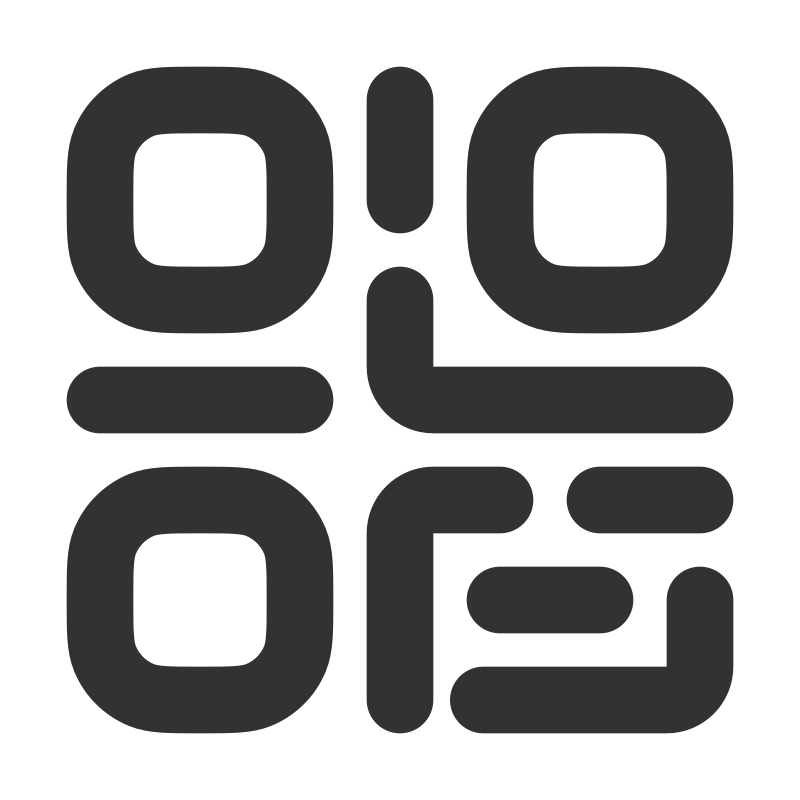</a> | **📂 檔名:** `qrcode.svg` ✨ **格式:** `Vector (SVG)` ⚖️ **大小:** `2.58KB` 📅 **更新:** `2026-02-27`  🚀 **jsDelivr Markdown:** `` 🔗 **直接連結 (Url):** <code>https://cdn.jsdelivr.net/gh/barry028/materials@main/images/iCons/Scarlab%20Oval%20Line%20iCons/qrcode.svg</code> 📥 [檢視原始檔](qrcode.svg) |
|  | **📂 檔名:** `quote.svg` ✨ **格式:** `Vector (SVG)` ⚖️ **大小:** `1.25KB` 📅 **更新:** `2026-02-27`  🚀 **jsDelivr Markdown:** `` 🔗 **直接連結 (Url):** <code>https://cdn.jsdelivr.net/gh/barry028/materials@main/images/iCons/Scarlab%20Oval%20Line%20iCons/quote.svg</code> 📥 [檢視原始檔](quote.svg) |
|  | **📂 檔名:** `refresh.svg` ✨ **格式:** `Vector (SVG)` ⚖️ **大小:** `572.00B` 📅 **更新:** `2026-02-27`  🚀 **jsDelivr Markdown:** `` 🔗 **直接連結 (Url):** <code>https://cdn.jsdelivr.net/gh/barry028/materials@main/images/iCons/Scarlab%20Oval%20Line%20iCons/refresh.svg</code> 📥 [檢視原始檔](refresh.svg) |
|  | **📂 檔名:** `repeat.svg` ✨ **格式:** `Vector (SVG)` ⚖️ **大小:** `797.00B` 📅 **更新:** `2026-02-27`  🚀 **jsDelivr Markdown:** `` 🔗 **直接連結 (Url):** <code>https://cdn.jsdelivr.net/gh/barry028/materials@main/images/iCons/Scarlab%20Oval%20Line%20iCons/repeat.svg</code> 📥 [檢視原始檔](repeat.svg) |
|  | **📂 檔名:** `rewind.svg` ✨ **格式:** `Vector (SVG)` ⚖️ **大小:** `779.00B` 📅 **更新:** `2026-02-27`  🚀 **jsDelivr Markdown:** `` 🔗 **直接連結 (Url):** <code>https://cdn.jsdelivr.net/gh/barry028/materials@main/images/iCons/Scarlab%20Oval%20Line%20iCons/rewind.svg</code> 📥 [檢視原始檔](rewind.svg) |
|  | **📂 檔名:** `row-cols.svg` ✨ **格式:** `Vector (SVG)` ⚖️ **大小:** `655.00B` 📅 **更新:** `2026-02-27`  🚀 **jsDelivr Markdown:** `` 🔗 **直接連結 (Url):** <code>https://cdn.jsdelivr.net/gh/barry028/materials@main/images/iCons/Scarlab%20Oval%20Line%20iCons/row-cols.svg</code> 📥 [檢視原始檔](row-cols.svg) |
|  | **📂 檔名:** `rows.svg` ✨ **格式:** `Vector (SVG)` ⚖️ **大小:** `549.00B` 📅 **更新:** `2026-02-27`  🚀 **jsDelivr Markdown:** `` 🔗 **直接連結 (Url):** <code>https://cdn.jsdelivr.net/gh/barry028/materials@main/images/iCons/Scarlab%20Oval%20Line%20iCons/rows.svg</code> 📥 [檢視原始檔](rows.svg) |
|  | **📂 檔名:** `rss.svg` ✨ **格式:** `Vector (SVG)` ⚖️ **大小:** `693.00B` 📅 **更新:** `2026-02-27`  🚀 **jsDelivr Markdown:** `` 🔗 **直接連結 (Url):** <code>https://cdn.jsdelivr.net/gh/barry028/materials@main/images/iCons/Scarlab%20Oval%20Line%20iCons/rss.svg</code> 📥 [檢視原始檔](rss.svg) |
|  | **📂 檔名:** `ruble-circle.svg` ✨ **格式:** `Vector (SVG)` ⚖️ **大小:** `726.00B` 📅 **更新:** `2026-02-27`  🚀 **jsDelivr Markdown:** `` 🔗 **直接連結 (Url):** <code>https://cdn.jsdelivr.net/gh/barry028/materials@main/images/iCons/Scarlab%20Oval%20Line%20iCons/ruble-circle.svg</code> 📥 [檢視原始檔](ruble-circle.svg) |
|  | **📂 檔名:** `ruble-square.svg` ✨ **格式:** `Vector (SVG)` ⚖️ **大小:** `721.00B` 📅 **更新:** `2026-02-27`  🚀 **jsDelivr Markdown:** `` 🔗 **直接連結 (Url):** <code>https://cdn.jsdelivr.net/gh/barry028/materials@main/images/iCons/Scarlab%20Oval%20Line%20iCons/ruble-square.svg</code> 📥 [檢視原始檔](ruble-square.svg) |
|  | **📂 檔名:** `ruble.svg` ✨ **格式:** `Vector (SVG)` ⚖️ **大小:** `565.00B` 📅 **更新:** `2026-02-27`  🚀 **jsDelivr Markdown:** `` 🔗 **直接連結 (Url):** <code>https://cdn.jsdelivr.net/gh/barry028/materials@main/images/iCons/Scarlab%20Oval%20Line%20iCons/ruble.svg</code> 📥 [檢視原始檔](ruble.svg) |
|  | **📂 檔名:** `rupee-circle.svg` ✨ **格式:** `Vector (SVG)` ⚖️ **大小:** `701.00B` 📅 **更新:** `2026-02-27`  🚀 **jsDelivr Markdown:** `` 🔗 **直接連結 (Url):** <code>https://cdn.jsdelivr.net/gh/barry028/materials@main/images/iCons/Scarlab%20Oval%20Line%20iCons/rupee-circle.svg</code> 📥 [檢視原始檔](rupee-circle.svg) |
|  | **📂 檔名:** `rupee-square.svg` ✨ **格式:** `Vector (SVG)` ⚖️ **大小:** `696.00B` 📅 **更新:** `2026-02-27`  🚀 **jsDelivr Markdown:** `` 🔗 **直接連結 (Url):** <code>https://cdn.jsdelivr.net/gh/barry028/materials@main/images/iCons/Scarlab%20Oval%20Line%20iCons/rupee-square.svg</code> 📥 [檢視原始檔](rupee-square.svg) |
|  | **📂 檔名:** `rupee.svg` ✨ **格式:** `Vector (SVG)` ⚖️ **大小:** `540.00B` 📅 **更新:** `2026-02-27`  🚀 **jsDelivr Markdown:** `` 🔗 **直接連結 (Url):** <code>https://cdn.jsdelivr.net/gh/barry028/materials@main/images/iCons/Scarlab%20Oval%20Line%20iCons/rupee.svg</code> 📥 [檢視原始檔](rupee.svg) |
|  | **📂 檔名:** `scarlab.svg` ✨ **格式:** `Vector (SVG)` ⚖️ **大小:** `1.25KB` 📅 **更新:** `2026-02-27`  🚀 **jsDelivr Markdown:** `` 🔗 **直接連結 (Url):** <code>https://cdn.jsdelivr.net/gh/barry028/materials@main/images/iCons/Scarlab%20Oval%20Line%20iCons/scarlab.svg</code> 📥 [檢視原始檔](scarlab.svg) |
|  | **📂 檔名:** `scissors.svg` ✨ **格式:** `Vector (SVG)` ⚖️ **大小:** `799.00B` 📅 **更新:** `2026-02-27`  🚀 **jsDelivr Markdown:** `` 🔗 **直接連結 (Url):** <code>https://cdn.jsdelivr.net/gh/barry028/materials@main/images/iCons/Scarlab%20Oval%20Line%20iCons/scissors.svg</code> 📥 [檢視原始檔](scissors.svg) |
|  | **📂 檔名:** `search-alt.svg` ✨ **格式:** `Vector (SVG)` ⚖️ **大小:** `497.00B` 📅 **更新:** `2026-02-27`  🚀 **jsDelivr Markdown:** `` 🔗 **直接連結 (Url):** <code>https://cdn.jsdelivr.net/gh/barry028/materials@main/images/iCons/Scarlab%20Oval%20Line%20iCons/search-alt.svg</code> 📥 [檢視原始檔](search-alt.svg) |
|  | **📂 檔名:** `search-circle.svg` ✨ **格式:** `Vector (SVG)` ⚖️ **大小:** `656.00B` 📅 **更新:** `2026-02-27`  🚀 **jsDelivr Markdown:** `` 🔗 **直接連結 (Url):** <code>https://cdn.jsdelivr.net/gh/barry028/materials@main/images/iCons/Scarlab%20Oval%20Line%20iCons/search-circle.svg</code> 📥 [檢視原始檔](search-circle.svg) |
|  | **📂 檔名:** `search-square.svg` ✨ **格式:** `Vector (SVG)` ⚖️ **大小:** `651.00B` 📅 **更新:** `2026-02-27`  🚀 **jsDelivr Markdown:** `` 🔗 **直接連結 (Url):** <code>https://cdn.jsdelivr.net/gh/barry028/materials@main/images/iCons/Scarlab%20Oval%20Line%20iCons/search-square.svg</code> 📥 [檢視原始檔](search-square.svg) |
|  | **📂 檔名:** `search.svg` ✨ **格式:** `Vector (SVG)` ⚖️ **大小:** `493.00B` 📅 **更新:** `2026-02-27`  🚀 **jsDelivr Markdown:** `` 🔗 **直接連結 (Url):** <code>https://cdn.jsdelivr.net/gh/barry028/materials@main/images/iCons/Scarlab%20Oval%20Line%20iCons/search.svg</code> 📥 [檢視原始檔](search.svg) |
|  | **📂 檔名:** `select.svg` ✨ **格式:** `Vector (SVG)` ⚖️ **大小:** `889.00B` 📅 **更新:** `2026-02-27`  🚀 **jsDelivr Markdown:** `` 🔗 **直接連結 (Url):** <code>https://cdn.jsdelivr.net/gh/barry028/materials@main/images/iCons/Scarlab%20Oval%20Line%20iCons/select.svg</code> 📥 [檢視原始檔](select.svg) |
|  | **📂 檔名:** `selector.svg` ✨ **格式:** `Vector (SVG)` ⚖️ **大小:** `593.00B` 📅 **更新:** `2026-02-27`  🚀 **jsDelivr Markdown:** `` 🔗 **直接連結 (Url):** <code>https://cdn.jsdelivr.net/gh/barry028/materials@main/images/iCons/Scarlab%20Oval%20Line%20iCons/selector.svg</code> 📥 [檢視原始檔](selector.svg) |
|  | **📂 檔名:** `share.svg` ✨ **格式:** `Vector (SVG)` ⚖️ **大小:** `950.00B` 📅 **更新:** `2026-02-27`  🚀 **jsDelivr Markdown:** `` 🔗 **直接連結 (Url):** <code>https://cdn.jsdelivr.net/gh/barry028/materials@main/images/iCons/Scarlab%20Oval%20Line%20iCons/share.svg</code> 📥 [檢視原始檔](share.svg) |
|  | **📂 檔名:** `shopping-bag.svg` ✨ **格式:** `Vector (SVG)` ⚖️ **大小:** `860.00B` 📅 **更新:** `2026-02-27`  🚀 **jsDelivr Markdown:** `` 🔗 **直接連結 (Url):** <code>https://cdn.jsdelivr.net/gh/barry028/materials@main/images/iCons/Scarlab%20Oval%20Line%20iCons/shopping-bag.svg</code> 📥 [檢視原始檔](shopping-bag.svg) |
|  | **📂 檔名:** `shopping-cart.svg` ✨ **格式:** `Vector (SVG)` ⚖️ **大小:** `1.15KB` 📅 **更新:** `2026-02-27`  🚀 **jsDelivr Markdown:** `` 🔗 **直接連結 (Url):** <code>https://cdn.jsdelivr.net/gh/barry028/materials@main/images/iCons/Scarlab%20Oval%20Line%20iCons/shopping-cart.svg</code> 📥 [檢視原始檔](shopping-cart.svg) |
|  | **📂 檔名:** `slash.svg` ✨ **格式:** `Vector (SVG)` ⚖️ **大小:** `495.00B` 📅 **更新:** `2026-02-27`  🚀 **jsDelivr Markdown:** `` 🔗 **直接連結 (Url):** <code>https://cdn.jsdelivr.net/gh/barry028/materials@main/images/iCons/Scarlab%20Oval%20Line%20iCons/slash.svg</code> 📥 [檢視原始檔](slash.svg) |
|  | **📂 檔名:** `sparkles.svg` ✨ **格式:** `Vector (SVG)` ⚖️ **大小:** `1.67KB` 📅 **更新:** `2026-02-27`  🚀 **jsDelivr Markdown:** `` 🔗 **直接連結 (Url):** <code>https://cdn.jsdelivr.net/gh/barry028/materials@main/images/iCons/Scarlab%20Oval%20Line%20iCons/sparkles.svg</code> 📥 [檢視原始檔](sparkles.svg) |
|  | **📂 檔名:** `speaker.svg` ✨ **格式:** `Vector (SVG)` ⚖️ **大小:** `828.00B` 📅 **更新:** `2026-02-27`  🚀 **jsDelivr Markdown:** `` 🔗 **直接連結 (Url):** <code>https://cdn.jsdelivr.net/gh/barry028/materials@main/images/iCons/Scarlab%20Oval%20Line%20iCons/speaker.svg</code> 📥 [檢視原始檔](speaker.svg) |
|  | **📂 檔名:** `square.svg` ✨ **格式:** `Vector (SVG)` ⚖️ **大小:** `385.00B` 📅 **更新:** `2026-02-27`  🚀 **jsDelivr Markdown:** `` 🔗 **直接連結 (Url):** <code>https://cdn.jsdelivr.net/gh/barry028/materials@main/images/iCons/Scarlab%20Oval%20Line%20iCons/square.svg</code> 📥 [檢視原始檔](square.svg) |
|  | **📂 檔名:** `star-circle.svg` ✨ **格式:** `Vector (SVG)` ⚖️ **大小:** `1.05KB` 📅 **更新:** `2026-02-27`  🚀 **jsDelivr Markdown:** `` 🔗 **直接連結 (Url):** <code>https://cdn.jsdelivr.net/gh/barry028/materials@main/images/iCons/Scarlab%20Oval%20Line%20iCons/star-circle.svg</code> 📥 [檢視原始檔](star-circle.svg) |
|  | **📂 檔名:** `star-off.svg` ✨ **格式:** `Vector (SVG)` ⚖️ **大小:** `1.08KB` 📅 **更新:** `2026-02-27`  🚀 **jsDelivr Markdown:** `` 🔗 **直接連結 (Url):** <code>https://cdn.jsdelivr.net/gh/barry028/materials@main/images/iCons/Scarlab%20Oval%20Line%20iCons/star-off.svg</code> 📥 [檢視原始檔](star-off.svg) |
|  | **📂 檔名:** `star-square.svg` ✨ **格式:** `Vector (SVG)` ⚖️ **大小:** `1.04KB` 📅 **更新:** `2026-02-27`  🚀 **jsDelivr Markdown:** `` 🔗 **直接連結 (Url):** <code>https://cdn.jsdelivr.net/gh/barry028/materials@main/images/iCons/Scarlab%20Oval%20Line%20iCons/star-square.svg</code> 📥 [檢視原始檔](star-square.svg) |
|  | **📂 檔名:** `star.svg` ✨ **格式:** `Vector (SVG)` ⚖️ **大小:** `966.00B` 📅 **更新:** `2026-02-27`  🚀 **jsDelivr Markdown:** `` 🔗 **直接連結 (Url):** <code>https://cdn.jsdelivr.net/gh/barry028/materials@main/images/iCons/Scarlab%20Oval%20Line%20iCons/star.svg</code> 📥 [檢視原始檔](star.svg) |
|  | **📂 檔名:** `sun.svg` ✨ **格式:** `Vector (SVG)` ⚖️ **大小:** `1.19KB` 📅 **更新:** `2026-02-27`  🚀 **jsDelivr Markdown:** `` 🔗 **直接連結 (Url):** <code>https://cdn.jsdelivr.net/gh/barry028/materials@main/images/iCons/Scarlab%20Oval%20Line%20iCons/sun.svg</code> 📥 [檢視原始檔](sun.svg) |
|  | **📂 檔名:** `support.svg` ✨ **格式:** `Vector (SVG)` ⚖️ **大小:** `891.00B` 📅 **更新:** `2026-02-27`  🚀 **jsDelivr Markdown:** `` 🔗 **直接連結 (Url):** <code>https://cdn.jsdelivr.net/gh/barry028/materials@main/images/iCons/Scarlab%20Oval%20Line%20iCons/support.svg</code> 📥 [檢視原始檔](support.svg) |
|  | **📂 檔名:** `switch-horizontal.svg` ✨ **格式:** `Vector (SVG)` ⚖️ **大小:** `800.00B` 📅 **更新:** `2026-02-27`  🚀 **jsDelivr Markdown:** `` 🔗 **直接連結 (Url):** <code>https://cdn.jsdelivr.net/gh/barry028/materials@main/images/iCons/Scarlab%20Oval%20Line%20iCons/switch-horizontal.svg</code> 📥 [檢視原始檔](switch-horizontal.svg) |
|  | **📂 檔名:** `switch-vertical.svg` ✨ **格式:** `Vector (SVG)` ⚖️ **大小:** `800.00B` 📅 **更新:** `2026-02-27`  🚀 **jsDelivr Markdown:** `` 🔗 **直接連結 (Url):** <code>https://cdn.jsdelivr.net/gh/barry028/materials@main/images/iCons/Scarlab%20Oval%20Line%20iCons/switch-vertical.svg</code> 📥 [檢視原始檔](switch-vertical.svg) |
|  | **📂 檔名:** `tablet.svg` ✨ **格式:** `Vector (SVG)` ⚖️ **大小:** `664.00B` 📅 **更新:** `2026-02-27`  🚀 **jsDelivr Markdown:** `` 🔗 **直接連結 (Url):** <code>https://cdn.jsdelivr.net/gh/barry028/materials@main/images/iCons/Scarlab%20Oval%20Line%20iCons/tablet.svg</code> 📥 [檢視原始檔](tablet.svg) |
|  | **📂 檔名:** `terminal.svg` ✨ **格式:** `Vector (SVG)` ⚖️ **大小:** `826.00B` 📅 **更新:** `2026-02-27`  🚀 **jsDelivr Markdown:** `` 🔗 **直接連結 (Url):** <code>https://cdn.jsdelivr.net/gh/barry028/materials@main/images/iCons/Scarlab%20Oval%20Line%20iCons/terminal.svg</code> 📥 [檢視原始檔](terminal.svg) |
|  | **📂 檔名:** `ticket.svg` ✨ **格式:** `Vector (SVG)` ⚖️ **大小:** `1.01KB` 📅 **更新:** `2026-02-27`  🚀 **jsDelivr Markdown:** `` 🔗 **直接連結 (Url):** <code>https://cdn.jsdelivr.net/gh/barry028/materials@main/images/iCons/Scarlab%20Oval%20Line%20iCons/ticket.svg</code> 📥 [檢視原始檔](ticket.svg) |
|  | **📂 檔名:** `timer.svg` ✨ **格式:** `Vector (SVG)` ⚖️ **大小:** `601.00B` 📅 **更新:** `2026-02-27`  🚀 **jsDelivr Markdown:** `` 🔗 **直接連結 (Url):** <code>https://cdn.jsdelivr.net/gh/barry028/materials@main/images/iCons/Scarlab%20Oval%20Line%20iCons/timer.svg</code> 📥 [檢視原始檔](timer.svg) |
| <a href="underline.svg">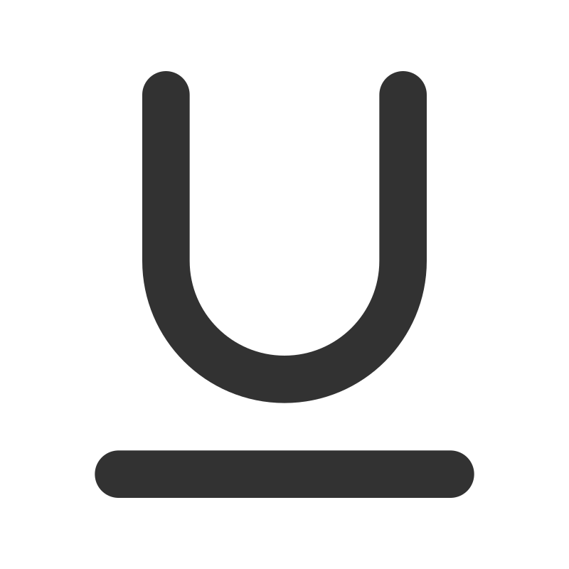</a> | **📂 檔名:** `underline.svg` ✨ **格式:** `Vector (SVG)` ⚖️ **大小:** `467.00B` 📅 **更新:** `2026-02-27`  🚀 **jsDelivr Markdown:** `` 🔗 **直接連結 (Url):** <code>https://cdn.jsdelivr.net/gh/barry028/materials@main/images/iCons/Scarlab%20Oval%20Line%20iCons/underline.svg</code> 📥 [檢視原始檔](underline.svg) |
|  | **📂 檔名:** `upload.svg` ✨ **格式:** `Vector (SVG)` ⚖️ **大小:** `699.00B` 📅 **更新:** `2026-02-27`  🚀 **jsDelivr Markdown:** `` 🔗 **直接連結 (Url):** <code>https://cdn.jsdelivr.net/gh/barry028/materials@main/images/iCons/Scarlab%20Oval%20Line%20iCons/upload.svg</code> 📥 [檢視原始檔](upload.svg) |
|  | **📂 檔名:** `user-add.svg` ✨ **格式:** `Vector (SVG)` ⚖️ **大小:** `732.00B` 📅 **更新:** `2026-02-27`  🚀 **jsDelivr Markdown:** `` 🔗 **直接連結 (Url):** <code>https://cdn.jsdelivr.net/gh/barry028/materials@main/images/iCons/Scarlab%20Oval%20Line%20iCons/user-add.svg</code> 📥 [檢視原始檔](user-add.svg) |
|  | **📂 檔名:** `user-check.svg` ✨ **格式:** `Vector (SVG)` ⚖️ **大小:** `687.00B` 📅 **更新:** `2026-02-27`  🚀 **jsDelivr Markdown:** `` 🔗 **直接連結 (Url):** <code>https://cdn.jsdelivr.net/gh/barry028/materials@main/images/iCons/Scarlab%20Oval%20Line%20iCons/user-check.svg</code> 📥 [檢視原始檔](user-check.svg) |
|  | **📂 檔名:** `user-circle.svg` ✨ **格式:** `Vector (SVG)` ⚖️ **大小:** `711.00B` 📅 **更新:** `2026-02-27`  🚀 **jsDelivr Markdown:** `` 🔗 **直接連結 (Url):** <code>https://cdn.jsdelivr.net/gh/barry028/materials@main/images/iCons/Scarlab%20Oval%20Line%20iCons/user-circle.svg</code> 📥 [檢視原始檔](user-circle.svg) |
|  | **📂 檔名:** `user-minus.svg` ✨ **格式:** `Vector (SVG)` ⚖️ **大小:** `627.00B` 📅 **更新:** `2026-02-27`  🚀 **jsDelivr Markdown:** `` 🔗 **直接連結 (Url):** <code>https://cdn.jsdelivr.net/gh/barry028/materials@main/images/iCons/Scarlab%20Oval%20Line%20iCons/user-minus.svg</code> 📥 [檢視原始檔](user-minus.svg) |
|  | **📂 檔名:** `user-square.svg` ✨ **格式:** `Vector (SVG)` ⚖️ **大小:** `691.00B` 📅 **更新:** `2026-02-27`  🚀 **jsDelivr Markdown:** `` 🔗 **直接連結 (Url):** <code>https://cdn.jsdelivr.net/gh/barry028/materials@main/images/iCons/Scarlab%20Oval%20Line%20iCons/user-square.svg</code> 📥 [檢視原始檔](user-square.svg) |
|  | **📂 檔名:** `user-x.svg` ✨ **格式:** `Vector (SVG)` ⚖️ **大小:** `734.00B` 📅 **更新:** `2026-02-27`  🚀 **jsDelivr Markdown:** `` 🔗 **直接連結 (Url):** <code>https://cdn.jsdelivr.net/gh/barry028/materials@main/images/iCons/Scarlab%20Oval%20Line%20iCons/user-x.svg</code> 📥 [檢視原始檔](user-x.svg) |
|  | **📂 檔名:** `user.svg` ✨ **格式:** `Vector (SVG)` ⚖️ **大小:** `527.00B` 📅 **更新:** `2026-02-27`  🚀 **jsDelivr Markdown:** `` 🔗 **直接連結 (Url):** <code>https://cdn.jsdelivr.net/gh/barry028/materials@main/images/iCons/Scarlab%20Oval%20Line%20iCons/user.svg</code> 📥 [檢視原始檔](user.svg) |
|  | **📂 檔名:** `users.svg` ✨ **格式:** `Vector (SVG)` ⚖️ **大小:** `879.00B` 📅 **更新:** `2026-02-27`  🚀 **jsDelivr Markdown:** `` 🔗 **直接連結 (Url):** <code>https://cdn.jsdelivr.net/gh/barry028/materials@main/images/iCons/Scarlab%20Oval%20Line%20iCons/users.svg</code> 📥 [檢視原始檔](users.svg) |
|  | **📂 檔名:** `watches.svg` ✨ **格式:** `Vector (SVG)` ⚖️ **大小:** `775.00B` 📅 **更新:** `2026-02-27`  🚀 **jsDelivr Markdown:** `` 🔗 **直接連結 (Url):** <code>https://cdn.jsdelivr.net/gh/barry028/materials@main/images/iCons/Scarlab%20Oval%20Line%20iCons/watches.svg</code> 📥 [檢視原始檔](watches.svg) |
|  | **📂 檔名:** `x-alt.svg` ✨ **格式:** `Vector (SVG)` ⚖️ **大小:** `439.00B` 📅 **更新:** `2026-02-27`  🚀 **jsDelivr Markdown:** `` 🔗 **直接連結 (Url):** <code>https://cdn.jsdelivr.net/gh/barry028/materials@main/images/iCons/Scarlab%20Oval%20Line%20iCons/x-alt.svg</code> 📥 [檢視原始檔](x-alt.svg) |
|  | **📂 檔名:** `x-circle.svg` ✨ **格式:** `Vector (SVG)` ⚖️ **大小:** `600.00B` 📅 **更新:** `2026-02-27`  🚀 **jsDelivr Markdown:** `` 🔗 **直接連結 (Url):** <code>https://cdn.jsdelivr.net/gh/barry028/materials@main/images/iCons/Scarlab%20Oval%20Line%20iCons/x-circle.svg</code> 📥 [檢視原始檔](x-circle.svg) |
|  | **📂 檔名:** `x-square.svg` ✨ **格式:** `Vector (SVG)` ⚖️ **大小:** `595.00B` 📅 **更新:** `2026-02-27`  🚀 **jsDelivr Markdown:** `` 🔗 **直接連結 (Url):** <code>https://cdn.jsdelivr.net/gh/barry028/materials@main/images/iCons/Scarlab%20Oval%20Line%20iCons/x-square.svg</code> 📥 [檢視原始檔](x-square.svg) |
|  | **📂 檔名:** `x.svg` ✨ **格式:** `Vector (SVG)` ⚖️ **大小:** `439.00B` 📅 **更新:** `2026-02-27`  🚀 **jsDelivr Markdown:** `` 🔗 **直接連結 (Url):** <code>https://cdn.jsdelivr.net/gh/barry028/materials@main/images/iCons/Scarlab%20Oval%20Line%20iCons/x.svg</code> 📥 [檢視原始檔](x.svg) |
|  | **📂 檔名:** `yen-circle.svg` ✨ **格式:** `Vector (SVG)` ⚖️ **大小:** `886.00B` 📅 **更新:** `2026-02-27`  🚀 **jsDelivr Markdown:** `` 🔗 **直接連結 (Url):** <code>https://cdn.jsdelivr.net/gh/barry028/materials@main/images/iCons/Scarlab%20Oval%20Line%20iCons/yen-circle.svg</code> 📥 [檢視原始檔](yen-circle.svg) |
|  | **📂 檔名:** `yen-square.svg` ✨ **格式:** `Vector (SVG)` ⚖️ **大小:** `881.00B` 📅 **更新:** `2026-02-27`  🚀 **jsDelivr Markdown:** `` 🔗 **直接連結 (Url):** <code>https://cdn.jsdelivr.net/gh/barry028/materials@main/images/iCons/Scarlab%20Oval%20Line%20iCons/yen-square.svg</code> 📥 [檢視原始檔](yen-square.svg) |
|  | **📂 檔名:** `yen.svg` ✨ **格式:** `Vector (SVG)` ⚖️ **大小:** `725.00B` 📅 **更新:** `2026-02-27`  🚀 **jsDelivr Markdown:** `` 🔗 **直接連結 (Url):** <code>https://cdn.jsdelivr.net/gh/barry028/materials@main/images/iCons/Scarlab%20Oval%20Line%20iCons/yen.svg</code> 📥 [檢視原始檔](yen.svg) |
|  | **📂 檔名:** `zap.svg` ✨ **格式:** `Vector (SVG)` ⚖️ **大小:** `695.00B` 📅 **更新:** `2026-02-27`  🚀 **jsDelivr Markdown:** `` 🔗 **直接連結 (Url):** <code>https://cdn.jsdelivr.net/gh/barry028/materials@main/images/iCons/Scarlab%20Oval%20Line%20iCons/zap.svg</code> 📥 [檢視原始檔](zap.svg) |