# 🖼️ 素材分類：Solid

> [🏠 主目錄](../../../../README.md) / [images](../../../README.md) / [iCons](../../README.md) / [Scarlab iCons](../README.md) / **Solid**

本目錄共有 `314` 個檔案

| 🎨 預覽 (點擊放大)  | 📋 檔案詳細資訊與連結 |
| :--- | :--- |
|  | **📂 檔名:** `academic-cap.svg` ✨ **格式:** `Vector (SVG)` ⚖️ **大小:** `1.27KB` 📅 **更新:** `2026-02-28`  🚀 **jsDelivr Markdown:** `` 🔗 **直接連結 (Url):** <code>https://cdn.jsdelivr.net/gh/barry028/materials@main/images/iCons/Scarlab%20iCons/Solid/academic-cap.svg</code> 📥 [檢視原始檔](academic-cap.svg) |
|  | **📂 檔名:** `ad.svg` ✨ **格式:** `Vector (SVG)` ⚖️ **大小:** `1.15KB` 📅 **更新:** `2026-02-28`  🚀 **jsDelivr Markdown:** `` 🔗 **直接連結 (Url):** <code>https://cdn.jsdelivr.net/gh/barry028/materials@main/images/iCons/Scarlab%20iCons/Solid/ad.svg</code> 📥 [檢視原始檔](ad.svg) |
|  | **📂 檔名:** `adjustments.svg` ✨ **格式:** `Vector (SVG)` ⚖️ **大小:** `1.27KB` 📅 **更新:** `2026-02-28`  🚀 **jsDelivr Markdown:** `` 🔗 **直接連結 (Url):** <code>https://cdn.jsdelivr.net/gh/barry028/materials@main/images/iCons/Scarlab%20iCons/Solid/adjustments.svg</code> 📥 [檢視原始檔](adjustments.svg) |
|  | **📂 檔名:** `aerial.svg` ✨ **格式:** `Vector (SVG)` ⚖️ **大小:** `2.14KB` 📅 **更新:** `2026-02-28`  🚀 **jsDelivr Markdown:** `` 🔗 **直接連結 (Url):** <code>https://cdn.jsdelivr.net/gh/barry028/materials@main/images/iCons/Scarlab%20iCons/Solid/aerial.svg</code> 📥 [檢視原始檔](aerial.svg) |
|  | **📂 檔名:** `airplay.svg` ✨ **格式:** `Vector (SVG)` ⚖️ **大小:** `1.46KB` 📅 **更新:** `2026-02-28`  🚀 **jsDelivr Markdown:** `` 🔗 **直接連結 (Url):** <code>https://cdn.jsdelivr.net/gh/barry028/materials@main/images/iCons/Scarlab%20iCons/Solid/airplay.svg</code> 📥 [檢視原始檔](airplay.svg) |
|  | **📂 檔名:** `alarm.svg` ✨ **格式:** `Vector (SVG)` ⚖️ **大小:** `1.25KB` 📅 **更新:** `2026-02-28`  🚀 **jsDelivr Markdown:** `` 🔗 **直接連結 (Url):** <code>https://cdn.jsdelivr.net/gh/barry028/materials@main/images/iCons/Scarlab%20iCons/Solid/alarm.svg</code> 📥 [檢視原始檔](alarm.svg) |
|  | **📂 檔名:** `alert-circle.svg` ✨ **格式:** `Vector (SVG)` ⚖️ **大小:** `730.00B` 📅 **更新:** `2026-02-28`  🚀 **jsDelivr Markdown:** `` 🔗 **直接連結 (Url):** <code>https://cdn.jsdelivr.net/gh/barry028/materials@main/images/iCons/Scarlab%20iCons/Solid/alert-circle.svg</code> 📥 [檢視原始檔](alert-circle.svg) |
|  | **📂 檔名:** `alert-hexagon.svg` ✨ **格式:** `Vector (SVG)` ⚖️ **大小:** `1.02KB` 📅 **更新:** `2026-02-28`  🚀 **jsDelivr Markdown:** `` 🔗 **直接連結 (Url):** <code>https://cdn.jsdelivr.net/gh/barry028/materials@main/images/iCons/Scarlab%20iCons/Solid/alert-hexagon.svg</code> 📥 [檢視原始檔](alert-hexagon.svg) |
|  | **📂 檔名:** `alert-square.svg` ✨ **格式:** `Vector (SVG)` ⚖️ **大小:** `1.26KB` 📅 **更新:** `2026-02-28`  🚀 **jsDelivr Markdown:** `` 🔗 **直接連結 (Url):** <code>https://cdn.jsdelivr.net/gh/barry028/materials@main/images/iCons/Scarlab%20iCons/Solid/alert-square.svg</code> 📥 [檢視原始檔](alert-square.svg) |
|  | **📂 檔名:** `alert-triangle.svg` ✨ **格式:** `Vector (SVG)` ⚖️ **大小:** `806.00B` 📅 **更新:** `2026-02-28`  🚀 **jsDelivr Markdown:** `` 🔗 **直接連結 (Url):** <code>https://cdn.jsdelivr.net/gh/barry028/materials@main/images/iCons/Scarlab%20iCons/Solid/alert-triangle.svg</code> 📥 [檢視原始檔](alert-triangle.svg) |
|  | **📂 檔名:** `align-bottom.svg` ✨ **格式:** `Vector (SVG)` ⚖️ **大小:** `1.24KB` 📅 **更新:** `2026-02-28`  🚀 **jsDelivr Markdown:** `` 🔗 **直接連結 (Url):** <code>https://cdn.jsdelivr.net/gh/barry028/materials@main/images/iCons/Scarlab%20iCons/Solid/align-bottom.svg</code> 📥 [檢視原始檔](align-bottom.svg) |
|  | **📂 檔名:** `align-horizontal-center.svg` ✨ **格式:** `Vector (SVG)` ⚖️ **大小:** `1.42KB` 📅 **更新:** `2026-02-28`  🚀 **jsDelivr Markdown:** `` 🔗 **直接連結 (Url):** <code>https://cdn.jsdelivr.net/gh/barry028/materials@main/images/iCons/Scarlab%20iCons/Solid/align-horizontal-center.svg</code> 📥 [檢視原始檔](align-horizontal-center.svg) |
|  | **📂 檔名:** `align-left.svg` ✨ **格式:** `Vector (SVG)` ⚖️ **大小:** `1.23KB` 📅 **更新:** `2026-02-28`  🚀 **jsDelivr Markdown:** `` 🔗 **直接連結 (Url):** <code>https://cdn.jsdelivr.net/gh/barry028/materials@main/images/iCons/Scarlab%20iCons/Solid/align-left.svg</code> 📥 [檢視原始檔](align-left.svg) |
|  | **📂 檔名:** `align-right.svg` ✨ **格式:** `Vector (SVG)` ⚖️ **大小:** `1.24KB` 📅 **更新:** `2026-02-28`  🚀 **jsDelivr Markdown:** `` 🔗 **直接連結 (Url):** <code>https://cdn.jsdelivr.net/gh/barry028/materials@main/images/iCons/Scarlab%20iCons/Solid/align-right.svg</code> 📥 [檢視原始檔](align-right.svg) |
|  | **📂 檔名:** `align-top.svg` ✨ **格式:** `Vector (SVG)` ⚖️ **大小:** `1.23KB` 📅 **更新:** `2026-02-28`  🚀 **jsDelivr Markdown:** `` 🔗 **直接連結 (Url):** <code>https://cdn.jsdelivr.net/gh/barry028/materials@main/images/iCons/Scarlab%20iCons/Solid/align-top.svg</code> 📥 [檢視原始檔](align-top.svg) |
|  | **📂 檔名:** `align-vertical-center.svg` ✨ **格式:** `Vector (SVG)` ⚖️ **大小:** `1.42KB` 📅 **更新:** `2026-02-28`  🚀 **jsDelivr Markdown:** `` 🔗 **直接連結 (Url):** <code>https://cdn.jsdelivr.net/gh/barry028/materials@main/images/iCons/Scarlab%20iCons/Solid/align-vertical-center.svg</code> 📥 [檢視原始檔](align-vertical-center.svg) |
|  | **📂 檔名:** `anchor.svg` ✨ **格式:** `Vector (SVG)` ⚖️ **大小:** `818.00B` 📅 **更新:** `2026-02-28`  🚀 **jsDelivr Markdown:** `` 🔗 **直接連結 (Url):** <code>https://cdn.jsdelivr.net/gh/barry028/materials@main/images/iCons/Scarlab%20iCons/Solid/anchor.svg</code> 📥 [檢視原始檔](anchor.svg) |
|  | **📂 檔名:** `annotation.svg` ✨ **格式:** `Vector (SVG)` ⚖️ **大小:** `1.46KB` 📅 **更新:** `2026-02-28`  🚀 **jsDelivr Markdown:** `` 🔗 **直接連結 (Url):** <code>https://cdn.jsdelivr.net/gh/barry028/materials@main/images/iCons/Scarlab%20iCons/Solid/annotation.svg</code> 📥 [檢視原始檔](annotation.svg) |
|  | **📂 檔名:** `aperture.svg` ✨ **格式:** `Vector (SVG)` ⚖️ **大小:** `1.03KB` 📅 **更新:** `2026-02-28`  🚀 **jsDelivr Markdown:** `` 🔗 **直接連結 (Url):** <code>https://cdn.jsdelivr.net/gh/barry028/materials@main/images/iCons/Scarlab%20iCons/Solid/aperture.svg</code> 📥 [檢視原始檔](aperture.svg) |
|  | **📂 檔名:** `apps.svg` ✨ **格式:** `Vector (SVG)` ⚖️ **大小:** `3.42KB` 📅 **更新:** `2026-02-28`  🚀 **jsDelivr Markdown:** `` 🔗 **直接連結 (Url):** <code>https://cdn.jsdelivr.net/gh/barry028/materials@main/images/iCons/Scarlab%20iCons/Solid/apps.svg</code> 📥 [檢視原始檔](apps.svg) |
|  | **📂 檔名:** `archive.svg` ✨ **格式:** `Vector (SVG)` ⚖️ **大小:** `1.81KB` 📅 **更新:** `2026-02-28`  🚀 **jsDelivr Markdown:** `` 🔗 **直接連結 (Url):** <code>https://cdn.jsdelivr.net/gh/barry028/materials@main/images/iCons/Scarlab%20iCons/Solid/archive.svg</code> 📥 [檢視原始檔](archive.svg) |
|  | **📂 檔名:** `arrow-down-circle.svg` ✨ **格式:** `Vector (SVG)` ⚖️ **大小:** `946.00B` 📅 **更新:** `2026-02-28`  🚀 **jsDelivr Markdown:** `` 🔗 **直接連結 (Url):** <code>https://cdn.jsdelivr.net/gh/barry028/materials@main/images/iCons/Scarlab%20iCons/Solid/arrow-down-circle.svg</code> 📥 [檢視原始檔](arrow-down-circle.svg) |
|  | **📂 檔名:** `arrow-down-left-circle.svg` ✨ **格式:** `Vector (SVG)` ⚖️ **大小:** `755.00B` 📅 **更新:** `2026-02-28`  🚀 **jsDelivr Markdown:** `` 🔗 **直接連結 (Url):** <code>https://cdn.jsdelivr.net/gh/barry028/materials@main/images/iCons/Scarlab%20iCons/Solid/arrow-down-left-circle.svg</code> 📥 [檢視原始檔](arrow-down-left-circle.svg) |
|  | **📂 檔名:** `arrow-down-left-square.svg` ✨ **格式:** `Vector (SVG)` ⚖️ **大小:** `1.28KB` 📅 **更新:** `2026-02-28`  🚀 **jsDelivr Markdown:** `` 🔗 **直接連結 (Url):** <code>https://cdn.jsdelivr.net/gh/barry028/materials@main/images/iCons/Scarlab%20iCons/Solid/arrow-down-left-square.svg</code> 📥 [檢視原始檔](arrow-down-left-square.svg) |
|  | **📂 檔名:** `arrow-down-right-circle.svg` ✨ **格式:** `Vector (SVG)` ⚖️ **大小:** `756.00B` 📅 **更新:** `2026-02-28`  🚀 **jsDelivr Markdown:** `` 🔗 **直接連結 (Url):** <code>https://cdn.jsdelivr.net/gh/barry028/materials@main/images/iCons/Scarlab%20iCons/Solid/arrow-down-right-circle.svg</code> 📥 [檢視原始檔](arrow-down-right-circle.svg) |
|  | **📂 檔名:** `arrow-down-right-square.svg` ✨ **格式:** `Vector (SVG)` ⚖️ **大小:** `1.28KB` 📅 **更新:** `2026-02-28`  🚀 **jsDelivr Markdown:** `` 🔗 **直接連結 (Url):** <code>https://cdn.jsdelivr.net/gh/barry028/materials@main/images/iCons/Scarlab%20iCons/Solid/arrow-down-right-square.svg</code> 📥 [檢視原始檔](arrow-down-right-square.svg) |
|  | **📂 檔名:** `arrow-down-square.svg` ✨ **格式:** `Vector (SVG)` ⚖️ **大小:** `1.47KB` 📅 **更新:** `2026-02-28`  🚀 **jsDelivr Markdown:** `` 🔗 **直接連結 (Url):** <code>https://cdn.jsdelivr.net/gh/barry028/materials@main/images/iCons/Scarlab%20iCons/Solid/arrow-down-square.svg</code> 📥 [檢視原始檔](arrow-down-square.svg) |
|  | **📂 檔名:** `arrow-left-circle.svg` ✨ **格式:** `Vector (SVG)` ⚖️ **大小:** `962.00B` 📅 **更新:** `2026-02-28`  🚀 **jsDelivr Markdown:** `` 🔗 **直接連結 (Url):** <code>https://cdn.jsdelivr.net/gh/barry028/materials@main/images/iCons/Scarlab%20iCons/Solid/arrow-left-circle.svg</code> 📥 [檢視原始檔](arrow-left-circle.svg) |
|  | **📂 檔名:** `arrow-left-square.svg` ✨ **格式:** `Vector (SVG)` ⚖️ **大小:** `1.49KB` 📅 **更新:** `2026-02-28`  🚀 **jsDelivr Markdown:** `` 🔗 **直接連結 (Url):** <code>https://cdn.jsdelivr.net/gh/barry028/materials@main/images/iCons/Scarlab%20iCons/Solid/arrow-left-square.svg</code> 📥 [檢視原始檔](arrow-left-square.svg) |
|  | **📂 檔名:** `arrow-right-circle.svg` ✨ **格式:** `Vector (SVG)` ⚖️ **大小:** `951.00B` 📅 **更新:** `2026-02-28`  🚀 **jsDelivr Markdown:** `` 🔗 **直接連結 (Url):** <code>https://cdn.jsdelivr.net/gh/barry028/materials@main/images/iCons/Scarlab%20iCons/Solid/arrow-right-circle.svg</code> 📥 [檢視原始檔](arrow-right-circle.svg) |
|  | **📂 檔名:** `arrow-right-square.svg` ✨ **格式:** `Vector (SVG)` ⚖️ **大小:** `1.47KB` 📅 **更新:** `2026-02-28`  🚀 **jsDelivr Markdown:** `` 🔗 **直接連結 (Url):** <code>https://cdn.jsdelivr.net/gh/barry028/materials@main/images/iCons/Scarlab%20iCons/Solid/arrow-right-square.svg</code> 📥 [檢視原始檔](arrow-right-square.svg) |
|  | **📂 檔名:** `arrow-up-circle.svg` ✨ **格式:** `Vector (SVG)` ⚖️ **大小:** `952.00B` 📅 **更新:** `2026-02-28`  🚀 **jsDelivr Markdown:** `` 🔗 **直接連結 (Url):** <code>https://cdn.jsdelivr.net/gh/barry028/materials@main/images/iCons/Scarlab%20iCons/Solid/arrow-up-circle.svg</code> 📥 [檢視原始檔](arrow-up-circle.svg) |
|  | **📂 檔名:** `arrow-up-left-circle.svg` ✨ **格式:** `Vector (SVG)` ⚖️ **大小:** `743.00B` 📅 **更新:** `2026-02-28`  🚀 **jsDelivr Markdown:** `` 🔗 **直接連結 (Url):** <code>https://cdn.jsdelivr.net/gh/barry028/materials@main/images/iCons/Scarlab%20iCons/Solid/arrow-up-left-circle.svg</code> 📥 [檢視原始檔](arrow-up-left-circle.svg) |
|  | **📂 檔名:** `arrow-up-left-square.svg` ✨ **格式:** `Vector (SVG)` ⚖️ **大小:** `1.27KB` 📅 **更新:** `2026-02-28`  🚀 **jsDelivr Markdown:** `` 🔗 **直接連結 (Url):** <code>https://cdn.jsdelivr.net/gh/barry028/materials@main/images/iCons/Scarlab%20iCons/Solid/arrow-up-left-square.svg</code> 📥 [檢視原始檔](arrow-up-left-square.svg) |
|  | **📂 檔名:** `arrow-up-right-circle.svg` ✨ **格式:** `Vector (SVG)` ⚖️ **大小:** `745.00B` 📅 **更新:** `2026-02-28`  🚀 **jsDelivr Markdown:** `` 🔗 **直接連結 (Url):** <code>https://cdn.jsdelivr.net/gh/barry028/materials@main/images/iCons/Scarlab%20iCons/Solid/arrow-up-right-circle.svg</code> 📥 [檢視原始檔](arrow-up-right-circle.svg) |
|  | **📂 檔名:** `arrow-up-right-square.svg` ✨ **格式:** `Vector (SVG)` ⚖️ **大小:** `1.27KB` 📅 **更新:** `2026-02-28`  🚀 **jsDelivr Markdown:** `` 🔗 **直接連結 (Url):** <code>https://cdn.jsdelivr.net/gh/barry028/materials@main/images/iCons/Scarlab%20iCons/Solid/arrow-up-right-square.svg</code> 📥 [檢視原始檔](arrow-up-right-square.svg) |
|  | **📂 檔名:** `arrow-up-square.svg` ✨ **格式:** `Vector (SVG)` ⚖️ **大小:** `1.48KB` 📅 **更新:** `2026-02-28`  🚀 **jsDelivr Markdown:** `` 🔗 **直接連結 (Url):** <code>https://cdn.jsdelivr.net/gh/barry028/materials@main/images/iCons/Scarlab%20iCons/Solid/arrow-up-square.svg</code> 📥 [檢視原始檔](arrow-up-square.svg) |
|  | **📂 檔名:** `atom.svg` ✨ **格式:** `Vector (SVG)` ⚖️ **大小:** `2.46KB` 📅 **更新:** `2026-02-28`  🚀 **jsDelivr Markdown:** `` 🔗 **直接連結 (Url):** <code>https://cdn.jsdelivr.net/gh/barry028/materials@main/images/iCons/Scarlab%20iCons/Solid/atom.svg</code> 📥 [檢視原始檔](atom.svg) |
|  | **📂 檔名:** `award.svg` ✨ **格式:** `Vector (SVG)` ⚖️ **大小:** `779.00B` 📅 **更新:** `2026-02-28`  🚀 **jsDelivr Markdown:** `` 🔗 **直接連結 (Url):** <code>https://cdn.jsdelivr.net/gh/barry028/materials@main/images/iCons/Scarlab%20iCons/Solid/award.svg</code> 📥 [檢視原始檔](award.svg) |
|  | **📂 檔名:** `backspace.svg` ✨ **格式:** `Vector (SVG)` ⚖️ **大小:** `1.37KB` 📅 **更新:** `2026-02-28`  🚀 **jsDelivr Markdown:** `` 🔗 **直接連結 (Url):** <code>https://cdn.jsdelivr.net/gh/barry028/materials@main/images/iCons/Scarlab%20iCons/Solid/backspace.svg</code> 📥 [檢視原始檔](backspace.svg) |
|  | **📂 檔名:** `bangladeshi-circle.svg` ✨ **格式:** `Vector (SVG)` ⚖️ **大小:** `1.14KB` 📅 **更新:** `2026-02-28`  🚀 **jsDelivr Markdown:** `` 🔗 **直接連結 (Url):** <code>https://cdn.jsdelivr.net/gh/barry028/materials@main/images/iCons/Scarlab%20iCons/Solid/bangladeshi-circle.svg</code> 📥 [檢視原始檔](bangladeshi-circle.svg) |
|  | **📂 檔名:** `bangladeshi-square.svg` ✨ **格式:** `Vector (SVG)` ⚖️ **大小:** `1.68KB` 📅 **更新:** `2026-02-28`  🚀 **jsDelivr Markdown:** `` 🔗 **直接連結 (Url):** <code>https://cdn.jsdelivr.net/gh/barry028/materials@main/images/iCons/Scarlab%20iCons/Solid/bangladeshi-square.svg</code> 📥 [檢視原始檔](bangladeshi-square.svg) |
|  | **📂 檔名:** `battery-charging.svg` ✨ **格式:** `Vector (SVG)` ⚖️ **大小:** `2.24KB` 📅 **更新:** `2026-02-28`  🚀 **jsDelivr Markdown:** `` 🔗 **直接連結 (Url):** <code>https://cdn.jsdelivr.net/gh/barry028/materials@main/images/iCons/Scarlab%20iCons/Solid/battery-charging.svg</code> 📥 [檢視原始檔](battery-charging.svg) |
|  | **📂 檔名:** `battery-full.svg` ✨ **格式:** `Vector (SVG)` ⚖️ **大小:** `2.05KB` 📅 **更新:** `2026-02-28`  🚀 **jsDelivr Markdown:** `` 🔗 **直接連結 (Url):** <code>https://cdn.jsdelivr.net/gh/barry028/materials@main/images/iCons/Scarlab%20iCons/Solid/battery-full.svg</code> 📥 [檢視原始檔](battery-full.svg) |
|  | **📂 檔名:** `battery-low.svg` ✨ **格式:** `Vector (SVG)` ⚖️ **大小:** `1.59KB` 📅 **更新:** `2026-02-28`  🚀 **jsDelivr Markdown:** `` 🔗 **直接連結 (Url):** <code>https://cdn.jsdelivr.net/gh/barry028/materials@main/images/iCons/Scarlab%20iCons/Solid/battery-low.svg</code> 📥 [檢視原始檔](battery-low.svg) |
|  | **📂 檔名:** `battery-medium.svg` ✨ **格式:** `Vector (SVG)` ⚖️ **大小:** `1.82KB` 📅 **更新:** `2026-02-28`  🚀 **jsDelivr Markdown:** `` 🔗 **直接連結 (Url):** <code>https://cdn.jsdelivr.net/gh/barry028/materials@main/images/iCons/Scarlab%20iCons/Solid/battery-medium.svg</code> 📥 [檢視原始檔](battery-medium.svg) |
| <a href="battery.svg">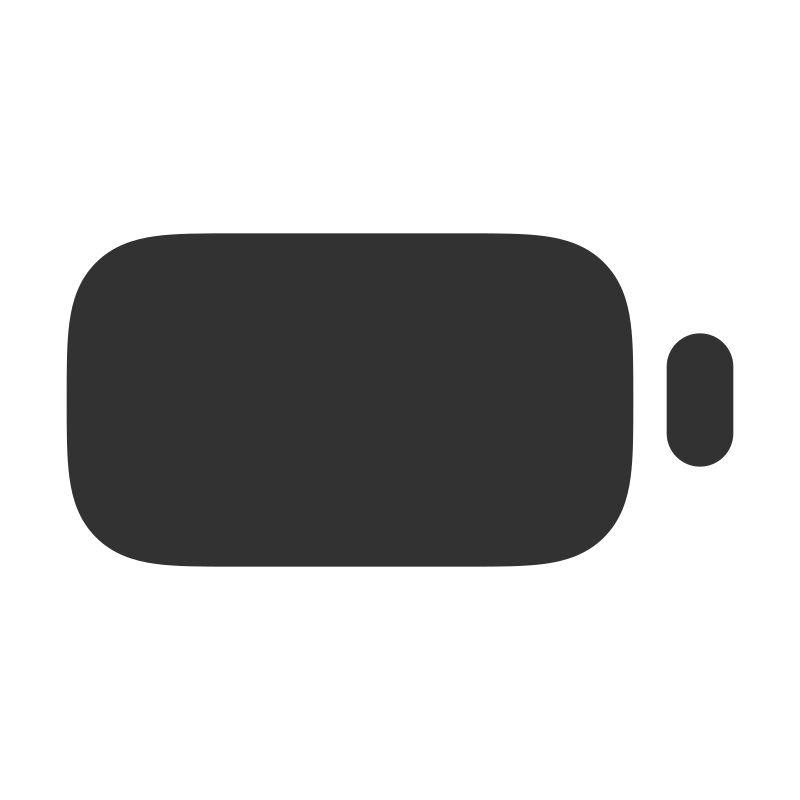</a> | **📂 檔名:** `battery.svg` ✨ **格式:** `Vector (SVG)` ⚖️ **大小:** `1.35KB` 📅 **更新:** `2026-02-28`  🚀 **jsDelivr Markdown:** `` 🔗 **直接連結 (Url):** <code>https://cdn.jsdelivr.net/gh/barry028/materials@main/images/iCons/Scarlab%20iCons/Solid/battery.svg</code> 📥 [檢視原始檔](battery.svg) |
|  | **📂 檔名:** `beaker.svg` ✨ **格式:** `Vector (SVG)` ⚖️ **大小:** `931.00B` 📅 **更新:** `2026-02-28`  🚀 **jsDelivr Markdown:** `` 🔗 **直接連結 (Url):** <code>https://cdn.jsdelivr.net/gh/barry028/materials@main/images/iCons/Scarlab%20iCons/Solid/beaker.svg</code> 📥 [檢視原始檔](beaker.svg) |
|  | **📂 檔名:** `bell-off.svg` ✨ **格式:** `Vector (SVG)` ⚖️ **大小:** `1.49KB` 📅 **更新:** `2026-02-28`  🚀 **jsDelivr Markdown:** `` 🔗 **直接連結 (Url):** <code>https://cdn.jsdelivr.net/gh/barry028/materials@main/images/iCons/Scarlab%20iCons/Solid/bell-off.svg</code> 📥 [檢視原始檔](bell-off.svg) |
|  | **📂 檔名:** `bell-ringing.svg` ✨ **格式:** `Vector (SVG)` ⚖️ **大小:** `1.62KB` 📅 **更新:** `2026-02-28`  🚀 **jsDelivr Markdown:** `` 🔗 **直接連結 (Url):** <code>https://cdn.jsdelivr.net/gh/barry028/materials@main/images/iCons/Scarlab%20iCons/Solid/bell-ringing.svg</code> 📥 [檢視原始檔](bell-ringing.svg) |
|  | **📂 檔名:** `bell.svg` ✨ **格式:** `Vector (SVG)` ⚖️ **大小:** `962.00B` 📅 **更新:** `2026-02-28`  🚀 **jsDelivr Markdown:** `` 🔗 **直接連結 (Url):** <code>https://cdn.jsdelivr.net/gh/barry028/materials@main/images/iCons/Scarlab%20iCons/Solid/bell.svg</code> 📥 [檢視原始檔](bell.svg) |
|  | **📂 檔名:** `beneficiaries.svg` ✨ **格式:** `Vector (SVG)` ⚖️ **大小:** `1.83KB` 📅 **更新:** `2026-02-28`  🚀 **jsDelivr Markdown:** `` 🔗 **直接連結 (Url):** <code>https://cdn.jsdelivr.net/gh/barry028/materials@main/images/iCons/Scarlab%20iCons/Solid/beneficiaries.svg</code> 📥 [檢視原始檔](beneficiaries.svg) |
|  | **📂 檔名:** `bitcoin-circle.svg` ✨ **格式:** `Vector (SVG)` ⚖️ **大小:** `1.59KB` 📅 **更新:** `2026-02-28`  🚀 **jsDelivr Markdown:** `` 🔗 **直接連結 (Url):** <code>https://cdn.jsdelivr.net/gh/barry028/materials@main/images/iCons/Scarlab%20iCons/Solid/bitcoin-circle.svg</code> 📥 [檢視原始檔](bitcoin-circle.svg) |
|  | **📂 檔名:** `bitcoin-square.svg` ✨ **格式:** `Vector (SVG)` ⚖️ **大小:** `2.12KB` 📅 **更新:** `2026-02-28`  🚀 **jsDelivr Markdown:** `` 🔗 **直接連結 (Url):** <code>https://cdn.jsdelivr.net/gh/barry028/materials@main/images/iCons/Scarlab%20iCons/Solid/bitcoin-square.svg</code> 📥 [檢視原始檔](bitcoin-square.svg) |
|  | **📂 檔名:** `blockquote.svg` ✨ **格式:** `Vector (SVG)` ⚖️ **大小:** `1.79KB` 📅 **更新:** `2026-02-28`  🚀 **jsDelivr Markdown:** `` 🔗 **直接連結 (Url):** <code>https://cdn.jsdelivr.net/gh/barry028/materials@main/images/iCons/Scarlab%20iCons/Solid/blockquote.svg</code> 📥 [檢視原始檔](blockquote.svg) |
|  | **📂 檔名:** `blur.svg` ✨ **格式:** `Vector (SVG)` ⚖️ **大小:** `897.00B` 📅 **更新:** `2026-02-28`  🚀 **jsDelivr Markdown:** `` 🔗 **直接連結 (Url):** <code>https://cdn.jsdelivr.net/gh/barry028/materials@main/images/iCons/Scarlab%20iCons/Solid/blur.svg</code> 📥 [檢視原始檔](blur.svg) |
|  | **📂 檔名:** `book-open.svg` ✨ **格式:** `Vector (SVG)` ⚖️ **大小:** `1.59KB` 📅 **更新:** `2026-02-28`  🚀 **jsDelivr Markdown:** `` 🔗 **直接連結 (Url):** <code>https://cdn.jsdelivr.net/gh/barry028/materials@main/images/iCons/Scarlab%20iCons/Solid/book-open.svg</code> 📥 [檢視原始檔](book-open.svg) |
|  | **📂 檔名:** `bookmark-alt.svg` ✨ **格式:** `Vector (SVG)` ⚖️ **大小:** `1.42KB` 📅 **更新:** `2026-02-28`  🚀 **jsDelivr Markdown:** `` 🔗 **直接連結 (Url):** <code>https://cdn.jsdelivr.net/gh/barry028/materials@main/images/iCons/Scarlab%20iCons/Solid/bookmark-alt.svg</code> 📥 [檢視原始檔](bookmark-alt.svg) |
|  | **📂 檔名:** `bookmark.svg` ✨ **格式:** `Vector (SVG)` ⚖️ **大小:** `578.00B` 📅 **更新:** `2026-02-28`  🚀 **jsDelivr Markdown:** `` 🔗 **直接連結 (Url):** <code>https://cdn.jsdelivr.net/gh/barry028/materials@main/images/iCons/Scarlab%20iCons/Solid/bookmark.svg</code> 📥 [檢視原始檔](bookmark.svg) |
|  | **📂 檔名:** `box.svg` ✨ **格式:** `Vector (SVG)` ⚖️ **大小:** `1.03KB` 📅 **更新:** `2026-02-28`  🚀 **jsDelivr Markdown:** `` 🔗 **直接連結 (Url):** <code>https://cdn.jsdelivr.net/gh/barry028/materials@main/images/iCons/Scarlab%20iCons/Solid/box.svg</code> 📥 [檢視原始檔](box.svg) |
|  | **📂 檔名:** `briefcase-alt.svg` ✨ **格式:** `Vector (SVG)` ⚖️ **大小:** `1.80KB` 📅 **更新:** `2026-02-28`  🚀 **jsDelivr Markdown:** `` 🔗 **直接連結 (Url):** <code>https://cdn.jsdelivr.net/gh/barry028/materials@main/images/iCons/Scarlab%20iCons/Solid/briefcase-alt.svg</code> 📥 [檢視原始檔](briefcase-alt.svg) |
|  | **📂 檔名:** `briefcase.svg` ✨ **格式:** `Vector (SVG)` ⚖️ **大小:** `1.44KB` 📅 **更新:** `2026-02-28`  🚀 **jsDelivr Markdown:** `` 🔗 **直接連結 (Url):** <code>https://cdn.jsdelivr.net/gh/barry028/materials@main/images/iCons/Scarlab%20iCons/Solid/briefcase.svg</code> 📥 [檢視原始檔](briefcase.svg) |
|  | **📂 檔名:** `brightness.svg` ✨ **格式:** `Vector (SVG)` ⚖️ **大小:** `1.09KB` 📅 **更新:** `2026-02-28`  🚀 **jsDelivr Markdown:** `` 🔗 **直接連結 (Url):** <code>https://cdn.jsdelivr.net/gh/barry028/materials@main/images/iCons/Scarlab%20iCons/Solid/brightness.svg</code> 📥 [檢視原始檔](brightness.svg) |
| <a href="browser.svg">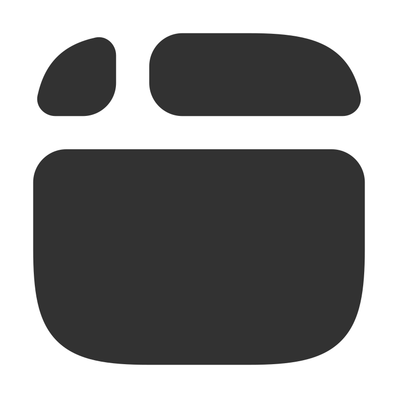</a> | **📂 檔名:** `browser.svg` ✨ **格式:** `Vector (SVG)` ⚖️ **大小:** `1.24KB` 📅 **更新:** `2026-02-28`  🚀 **jsDelivr Markdown:** `` 🔗 **直接連結 (Url):** <code>https://cdn.jsdelivr.net/gh/barry028/materials@main/images/iCons/Scarlab%20iCons/Solid/browser.svg</code> 📥 [檢視原始檔](browser.svg) |
|  | **📂 檔名:** `building.svg` ✨ **格式:** `Vector (SVG)` ⚖️ **大小:** `1.50KB` 📅 **更新:** `2026-02-28`  🚀 **jsDelivr Markdown:** `` 🔗 **直接連結 (Url):** <code>https://cdn.jsdelivr.net/gh/barry028/materials@main/images/iCons/Scarlab%20iCons/Solid/building.svg</code> 📥 [檢視原始檔](building.svg) |
|  | **📂 檔名:** `bulb-on.svg` ✨ **格式:** `Vector (SVG)` ⚖️ **大小:** `1.91KB` 📅 **更新:** `2026-02-28`  🚀 **jsDelivr Markdown:** `` 🔗 **直接連結 (Url):** <code>https://cdn.jsdelivr.net/gh/barry028/materials@main/images/iCons/Scarlab%20iCons/Solid/bulb-on.svg</code> 📥 [檢視原始檔](bulb-on.svg) |
|  | **📂 檔名:** `bulb.svg` ✨ **格式:** `Vector (SVG)` ⚖️ **大小:** `771.00B` 📅 **更新:** `2026-02-28`  🚀 **jsDelivr Markdown:** `` 🔗 **直接連結 (Url):** <code>https://cdn.jsdelivr.net/gh/barry028/materials@main/images/iCons/Scarlab%20iCons/Solid/bulb.svg</code> 📥 [檢視原始檔](bulb.svg) |
|  | **📂 檔名:** `cake.svg` ✨ **格式:** `Vector (SVG)` ⚖️ **大小:** `3.45KB` 📅 **更新:** `2026-02-28`  🚀 **jsDelivr Markdown:** `` 🔗 **直接連結 (Url):** <code>https://cdn.jsdelivr.net/gh/barry028/materials@main/images/iCons/Scarlab%20iCons/Solid/cake.svg</code> 📥 [檢視原始檔](cake.svg) |
|  | **📂 檔名:** `calculator.svg` ✨ **格式:** `Vector (SVG)` ⚖️ **大小:** `2.31KB` 📅 **更新:** `2026-02-28`  🚀 **jsDelivr Markdown:** `` 🔗 **直接連結 (Url):** <code>https://cdn.jsdelivr.net/gh/barry028/materials@main/images/iCons/Scarlab%20iCons/Solid/calculator.svg</code> 📥 [檢視原始檔](calculator.svg) |
|  | **📂 檔名:** `calendar-alt.svg` ✨ **格式:** `Vector (SVG)` ⚖️ **大小:** `1.32KB` 📅 **更新:** `2026-02-28`  🚀 **jsDelivr Markdown:** `` 🔗 **直接連結 (Url):** <code>https://cdn.jsdelivr.net/gh/barry028/materials@main/images/iCons/Scarlab%20iCons/Solid/calendar-alt.svg</code> 📥 [檢視原始檔](calendar-alt.svg) |
|  | **📂 檔名:** `calendar.svg` ✨ **格式:** `Vector (SVG)` ⚖️ **大小:** `1.26KB` 📅 **更新:** `2026-02-28`  🚀 **jsDelivr Markdown:** `` 🔗 **直接連結 (Url):** <code>https://cdn.jsdelivr.net/gh/barry028/materials@main/images/iCons/Scarlab%20iCons/Solid/calendar.svg</code> 📥 [檢視原始檔](calendar.svg) |
|  | **📂 檔名:** `camera-off.svg` ✨ **格式:** `Vector (SVG)` ⚖️ **大小:** `2.81KB` 📅 **更新:** `2026-02-28`  🚀 **jsDelivr Markdown:** `` 🔗 **直接連結 (Url):** <code>https://cdn.jsdelivr.net/gh/barry028/materials@main/images/iCons/Scarlab%20iCons/Solid/camera-off.svg</code> 📥 [檢視原始檔](camera-off.svg) |
|  | **📂 檔名:** `camera-web.svg` ✨ **格式:** `Vector (SVG)` ⚖️ **大小:** `942.00B` 📅 **更新:** `2026-02-28`  🚀 **jsDelivr Markdown:** `` 🔗 **直接連結 (Url):** <code>https://cdn.jsdelivr.net/gh/barry028/materials@main/images/iCons/Scarlab%20iCons/Solid/camera-web.svg</code> 📥 [檢視原始檔](camera-web.svg) |
|  | **📂 檔名:** `camera.svg` ✨ **格式:** `Vector (SVG)` ⚖️ **大小:** `2.34KB` 📅 **更新:** `2026-02-28`  🚀 **jsDelivr Markdown:** `` 🔗 **直接連結 (Url):** <code>https://cdn.jsdelivr.net/gh/barry028/materials@main/images/iCons/Scarlab%20iCons/Solid/camera.svg</code> 📥 [檢視原始檔](camera.svg) |
|  | **📂 檔名:** `cash.svg` ✨ **格式:** `Vector (SVG)` ⚖️ **大小:** `2.22KB` 📅 **更新:** `2026-02-28`  🚀 **jsDelivr Markdown:** `` 🔗 **直接連結 (Url):** <code>https://cdn.jsdelivr.net/gh/barry028/materials@main/images/iCons/Scarlab%20iCons/Solid/cash.svg</code> 📥 [檢視原始檔](cash.svg) |
|  | **📂 檔名:** `chart-bar-alt-square.svg` ✨ **格式:** `Vector (SVG)` ⚖️ **大小:** `1.35KB` 📅 **更新:** `2026-02-28`  🚀 **jsDelivr Markdown:** `` 🔗 **直接連結 (Url):** <code>https://cdn.jsdelivr.net/gh/barry028/materials@main/images/iCons/Scarlab%20iCons/Solid/chart-bar-alt-square.svg</code> 📥 [檢視原始檔](chart-bar-alt-square.svg) |
|  | **📂 檔名:** `chart-bar-square.svg` ✨ **格式:** `Vector (SVG)` ⚖️ **大小:** `1.35KB` 📅 **更新:** `2026-02-28`  🚀 **jsDelivr Markdown:** `` 🔗 **直接連結 (Url):** <code>https://cdn.jsdelivr.net/gh/barry028/materials@main/images/iCons/Scarlab%20iCons/Solid/chart-bar-square.svg</code> 📥 [檢視原始檔](chart-bar-square.svg) |
|  | **📂 檔名:** `chart-bubble.svg` ✨ **格式:** `Vector (SVG)` ⚖️ **大小:** `793.00B` 📅 **更新:** `2026-02-28`  🚀 **jsDelivr Markdown:** `` 🔗 **直接連結 (Url):** <code>https://cdn.jsdelivr.net/gh/barry028/materials@main/images/iCons/Scarlab%20iCons/Solid/chart-bubble.svg</code> 📥 [檢視原始檔](chart-bubble.svg) |
| <a href="chart-pie.svg">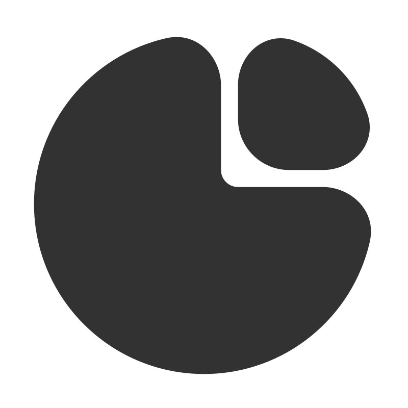</a> | **📂 檔名:** `chart-pie.svg` ✨ **格式:** `Vector (SVG)` ⚖️ **大小:** `979.00B` 📅 **更新:** `2026-02-28`  🚀 **jsDelivr Markdown:** `` 🔗 **直接連結 (Url):** <code>https://cdn.jsdelivr.net/gh/barry028/materials@main/images/iCons/Scarlab%20iCons/Solid/chart-pie.svg</code> 📥 [檢視原始檔](chart-pie.svg) |
|  | **📂 檔名:** `chat.svg` ✨ **格式:** `Vector (SVG)` ⚖️ **大小:** `1.62KB` 📅 **更新:** `2026-02-28`  🚀 **jsDelivr Markdown:** `` 🔗 **直接連結 (Url):** <code>https://cdn.jsdelivr.net/gh/barry028/materials@main/images/iCons/Scarlab%20iCons/Solid/chat.svg</code> 📥 [檢視原始檔](chat.svg) |
|  | **📂 檔名:** `check-badge.svg` ✨ **格式:** `Vector (SVG)` ⚖️ **大小:** `1.65KB` 📅 **更新:** `2026-02-28`  🚀 **jsDelivr Markdown:** `` 🔗 **直接連結 (Url):** <code>https://cdn.jsdelivr.net/gh/barry028/materials@main/images/iCons/Scarlab%20iCons/Solid/check-badge.svg</code> 📥 [檢視原始檔](check-badge.svg) |
|  | **📂 檔名:** `check-circle.svg` ✨ **格式:** `Vector (SVG)` ⚖️ **大小:** `771.00B` 📅 **更新:** `2026-02-28`  🚀 **jsDelivr Markdown:** `` 🔗 **直接連結 (Url):** <code>https://cdn.jsdelivr.net/gh/barry028/materials@main/images/iCons/Scarlab%20iCons/Solid/check-circle.svg</code> 📥 [檢視原始檔](check-circle.svg) |
|  | **📂 檔名:** `check-square.svg` ✨ **格式:** `Vector (SVG)` ⚖️ **大小:** `1.33KB` 📅 **更新:** `2026-02-28`  🚀 **jsDelivr Markdown:** `` 🔗 **直接連結 (Url):** <code>https://cdn.jsdelivr.net/gh/barry028/materials@main/images/iCons/Scarlab%20iCons/Solid/check-square.svg</code> 📥 [檢視原始檔](check-square.svg) |
|  | **📂 檔名:** `chevron-down-circle.svg` ✨ **格式:** `Vector (SVG)` ⚖️ **大小:** `771.00B` 📅 **更新:** `2026-02-28`  🚀 **jsDelivr Markdown:** `` 🔗 **直接連結 (Url):** <code>https://cdn.jsdelivr.net/gh/barry028/materials@main/images/iCons/Scarlab%20iCons/Solid/chevron-down-circle.svg</code> 📥 [檢視原始檔](chevron-down-circle.svg) |
|  | **📂 檔名:** `chevron-down-square.svg` ✨ **格式:** `Vector (SVG)` ⚖️ **大小:** `1.30KB` 📅 **更新:** `2026-02-28`  🚀 **jsDelivr Markdown:** `` 🔗 **直接連結 (Url):** <code>https://cdn.jsdelivr.net/gh/barry028/materials@main/images/iCons/Scarlab%20iCons/Solid/chevron-down-square.svg</code> 📥 [檢視原始檔](chevron-down-square.svg) |
|  | **📂 檔名:** `chevron-left-circle.svg` ✨ **格式:** `Vector (SVG)` ⚖️ **大小:** `768.00B` 📅 **更新:** `2026-02-28`  🚀 **jsDelivr Markdown:** `` 🔗 **直接連結 (Url):** <code>https://cdn.jsdelivr.net/gh/barry028/materials@main/images/iCons/Scarlab%20iCons/Solid/chevron-left-circle.svg</code> 📥 [檢視原始檔](chevron-left-circle.svg) |
|  | **📂 檔名:** `chevron-left-square.svg` ✨ **格式:** `Vector (SVG)` ⚖️ **大小:** `1.30KB` 📅 **更新:** `2026-02-28`  🚀 **jsDelivr Markdown:** `` 🔗 **直接連結 (Url):** <code>https://cdn.jsdelivr.net/gh/barry028/materials@main/images/iCons/Scarlab%20iCons/Solid/chevron-left-square.svg</code> 📥 [檢視原始檔](chevron-left-square.svg) |
|  | **📂 檔名:** `chevron-right-circle.svg` ✨ **格式:** `Vector (SVG)` ⚖️ **大小:** `771.00B` 📅 **更新:** `2026-02-28`  🚀 **jsDelivr Markdown:** `` 🔗 **直接連結 (Url):** <code>https://cdn.jsdelivr.net/gh/barry028/materials@main/images/iCons/Scarlab%20iCons/Solid/chevron-right-circle.svg</code> 📥 [檢視原始檔](chevron-right-circle.svg) |
|  | **📂 檔名:** `chevron-right-square.svg` ✨ **格式:** `Vector (SVG)` ⚖️ **大小:** `1.30KB` 📅 **更新:** `2026-02-28`  🚀 **jsDelivr Markdown:** `` 🔗 **直接連結 (Url):** <code>https://cdn.jsdelivr.net/gh/barry028/materials@main/images/iCons/Scarlab%20iCons/Solid/chevron-right-square.svg</code> 📥 [檢視原始檔](chevron-right-square.svg) |
|  | **📂 檔名:** `chevron-up-circle.svg` ✨ **格式:** `Vector (SVG)` ⚖️ **大小:** `771.00B` 📅 **更新:** `2026-02-28`  🚀 **jsDelivr Markdown:** `` 🔗 **直接連結 (Url):** <code>https://cdn.jsdelivr.net/gh/barry028/materials@main/images/iCons/Scarlab%20iCons/Solid/chevron-up-circle.svg</code> 📥 [檢視原始檔](chevron-up-circle.svg) |
|  | **📂 檔名:** `chevron-up-square.svg` ✨ **格式:** `Vector (SVG)` ⚖️ **大小:** `1.30KB` 📅 **更新:** `2026-02-28`  🚀 **jsDelivr Markdown:** `` 🔗 **直接連結 (Url):** <code>https://cdn.jsdelivr.net/gh/barry028/materials@main/images/iCons/Scarlab%20iCons/Solid/chevron-up-square.svg</code> 📥 [檢視原始檔](chevron-up-square.svg) |
|  | **📂 檔名:** `chip.svg` ✨ **格式:** `Vector (SVG)` ⚖️ **大小:** `3.59KB` 📅 **更新:** `2026-02-28`  🚀 **jsDelivr Markdown:** `` 🔗 **直接連結 (Url):** <code>https://cdn.jsdelivr.net/gh/barry028/materials@main/images/iCons/Scarlab%20iCons/Solid/chip.svg</code> 📥 [檢視原始檔](chip.svg) |
|  | **📂 檔名:** `circle.svg` ✨ **格式:** `Vector (SVG)` ⚖️ **大小:** `455.00B` 📅 **更新:** `2026-02-28`  🚀 **jsDelivr Markdown:** `` 🔗 **直接連結 (Url):** <code>https://cdn.jsdelivr.net/gh/barry028/materials@main/images/iCons/Scarlab%20iCons/Solid/circle.svg</code> 📥 [檢視原始檔](circle.svg) |
|  | **📂 檔名:** `clipboard-check.svg` ✨ **格式:** `Vector (SVG)` ⚖️ **大小:** `1.73KB` 📅 **更新:** `2026-02-28`  🚀 **jsDelivr Markdown:** `` 🔗 **直接連結 (Url):** <code>https://cdn.jsdelivr.net/gh/barry028/materials@main/images/iCons/Scarlab%20iCons/Solid/clipboard-check.svg</code> 📥 [檢視原始檔](clipboard-check.svg) |
| <a href="clipboard.svg">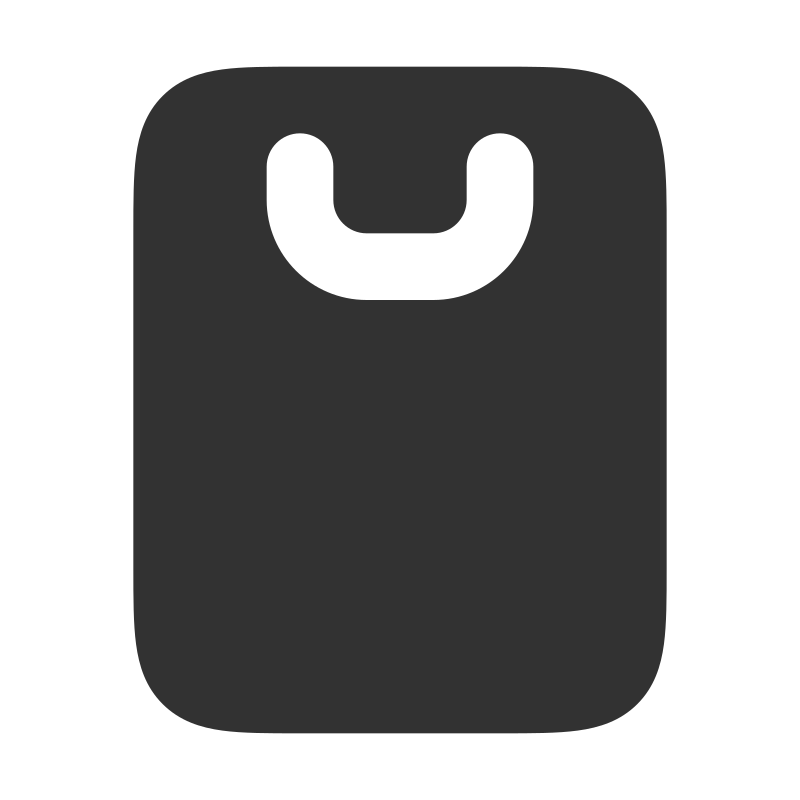</a> | **📂 檔名:** `clipboard.svg` ✨ **格式:** `Vector (SVG)` ⚖️ **大小:** `1.42KB` 📅 **更新:** `2026-02-28`  🚀 **jsDelivr Markdown:** `` 🔗 **直接連結 (Url):** <code>https://cdn.jsdelivr.net/gh/barry028/materials@main/images/iCons/Scarlab%20iCons/Solid/clipboard.svg</code> 📥 [檢視原始檔](clipboard.svg) |
|  | **📂 檔名:** `clock.svg` ✨ **格式:** `Vector (SVG)` ⚖️ **大小:** `714.00B` 📅 **更新:** `2026-02-28`  🚀 **jsDelivr Markdown:** `` 🔗 **直接連結 (Url):** <code>https://cdn.jsdelivr.net/gh/barry028/materials@main/images/iCons/Scarlab%20iCons/Solid/clock.svg</code> 📥 [檢視原始檔](clock.svg) |
|  | **📂 檔名:** `cloud-download.svg` ✨ **格式:** `Vector (SVG)` ⚖️ **大小:** `1.37KB` 📅 **更新:** `2026-02-28`  🚀 **jsDelivr Markdown:** `` 🔗 **直接連結 (Url):** <code>https://cdn.jsdelivr.net/gh/barry028/materials@main/images/iCons/Scarlab%20iCons/Solid/cloud-download.svg</code> 📥 [檢視原始檔](cloud-download.svg) |
|  | **📂 檔名:** `cloud-drizzle.svg` ✨ **格式:** `Vector (SVG)` ⚖️ **大小:** `2.29KB` 📅 **更新:** `2026-02-28`  🚀 **jsDelivr Markdown:** `` 🔗 **直接連結 (Url):** <code>https://cdn.jsdelivr.net/gh/barry028/materials@main/images/iCons/Scarlab%20iCons/Solid/cloud-drizzle.svg</code> 📥 [檢視原始檔](cloud-drizzle.svg) |
|  | **📂 檔名:** `cloud-fog.svg` ✨ **格式:** `Vector (SVG)` ⚖️ **大小:** `659.00B` 📅 **更新:** `2026-02-28`  🚀 **jsDelivr Markdown:** `` 🔗 **直接連結 (Url):** <code>https://cdn.jsdelivr.net/gh/barry028/materials@main/images/iCons/Scarlab%20iCons/Solid/cloud-fog.svg</code> 📥 [檢視原始檔](cloud-fog.svg) |
|  | **📂 檔名:** `cloud-lightning.svg` ✨ **格式:** `Vector (SVG)` ⚖️ **大小:** `1.42KB` 📅 **更新:** `2026-02-28`  🚀 **jsDelivr Markdown:** `` 🔗 **直接連結 (Url):** <code>https://cdn.jsdelivr.net/gh/barry028/materials@main/images/iCons/Scarlab%20iCons/Solid/cloud-lightning.svg</code> 📥 [檢視原始檔](cloud-lightning.svg) |
|  | **📂 檔名:** `cloud-off.svg` ✨ **格式:** `Vector (SVG)` ⚖️ **大小:** `1.16KB` 📅 **更新:** `2026-02-28`  🚀 **jsDelivr Markdown:** `` 🔗 **直接連結 (Url):** <code>https://cdn.jsdelivr.net/gh/barry028/materials@main/images/iCons/Scarlab%20iCons/Solid/cloud-off.svg</code> 📥 [檢視原始檔](cloud-off.svg) |
|  | **📂 檔名:** `cloud-rain.svg` ✨ **格式:** `Vector (SVG)` ⚖️ **大小:** `1.54KB` 📅 **更新:** `2026-02-28`  🚀 **jsDelivr Markdown:** `` 🔗 **直接連結 (Url):** <code>https://cdn.jsdelivr.net/gh/barry028/materials@main/images/iCons/Scarlab%20iCons/Solid/cloud-rain.svg</code> 📥 [檢視原始檔](cloud-rain.svg) |
| <a href="cloud-snow.svg">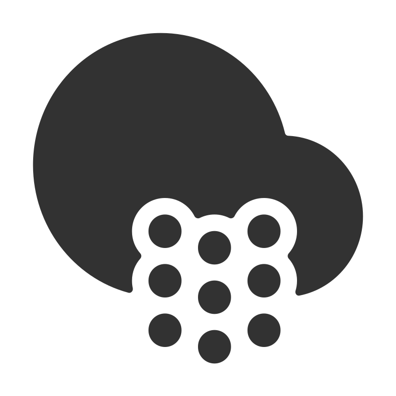</a> | **📂 檔名:** `cloud-snow.svg` ✨ **格式:** `Vector (SVG)` ⚖️ **大小:** `3.07KB` 📅 **更新:** `2026-02-28`  🚀 **jsDelivr Markdown:** `` 🔗 **直接連結 (Url):** <code>https://cdn.jsdelivr.net/gh/barry028/materials@main/images/iCons/Scarlab%20iCons/Solid/cloud-snow.svg</code> 📥 [檢視原始檔](cloud-snow.svg) |
|  | **📂 檔名:** `cloud-upload.svg` ✨ **格式:** `Vector (SVG)` ⚖️ **大小:** `1.46KB` 📅 **更新:** `2026-02-28`  🚀 **jsDelivr Markdown:** `` 🔗 **直接連結 (Url):** <code>https://cdn.jsdelivr.net/gh/barry028/materials@main/images/iCons/Scarlab%20iCons/Solid/cloud-upload.svg</code> 📥 [檢視原始檔](cloud-upload.svg) |
|  | **📂 檔名:** `cloud.svg` ✨ **格式:** `Vector (SVG)` ⚖️ **大小:** `516.00B` 📅 **更新:** `2026-02-28`  🚀 **jsDelivr Markdown:** `` 🔗 **直接連結 (Url):** <code>https://cdn.jsdelivr.net/gh/barry028/materials@main/images/iCons/Scarlab%20iCons/Solid/cloud.svg</code> 📥 [檢視原始檔](cloud.svg) |
|  | **📂 檔名:** `cog.svg` ✨ **格式:** `Vector (SVG)` ⚖️ **大小:** `1.44KB` 📅 **更新:** `2026-02-28`  🚀 **jsDelivr Markdown:** `` 🔗 **直接連結 (Url):** <code>https://cdn.jsdelivr.net/gh/barry028/materials@main/images/iCons/Scarlab%20iCons/Solid/cog.svg</code> 📥 [檢視原始檔](cog.svg) |
|  | **📂 檔名:** `col-left.svg` ✨ **格式:** `Vector (SVG)` ⚖️ **大小:** `1.33KB` 📅 **更新:** `2026-02-28`  🚀 **jsDelivr Markdown:** `` 🔗 **直接連結 (Url):** <code>https://cdn.jsdelivr.net/gh/barry028/materials@main/images/iCons/Scarlab%20iCons/Solid/col-left.svg</code> 📥 [檢視原始檔](col-left.svg) |
|  | **📂 檔名:** `col-right.svg` ✨ **格式:** `Vector (SVG)` ⚖️ **大小:** `1.32KB` 📅 **更新:** `2026-02-28`  🚀 **jsDelivr Markdown:** `` 🔗 **直接連結 (Url):** <code>https://cdn.jsdelivr.net/gh/barry028/materials@main/images/iCons/Scarlab%20iCons/Solid/col-right.svg</code> 📥 [檢視原始檔](col-right.svg) |
|  | **📂 檔名:** `collection.svg` ✨ **格式:** `Vector (SVG)` ⚖️ **大小:** `1.38KB` 📅 **更新:** `2026-02-28`  🚀 **jsDelivr Markdown:** `` 🔗 **直接連結 (Url):** <code>https://cdn.jsdelivr.net/gh/barry028/materials@main/images/iCons/Scarlab%20iCons/Solid/collection.svg</code> 📥 [檢視原始檔](collection.svg) |
|  | **📂 檔名:** `color-swatch.svg` ✨ **格式:** `Vector (SVG)` ⚖️ **大小:** `2.46KB` 📅 **更新:** `2026-02-28`  🚀 **jsDelivr Markdown:** `` 🔗 **直接連結 (Url):** <code>https://cdn.jsdelivr.net/gh/barry028/materials@main/images/iCons/Scarlab%20iCons/Solid/color-swatch.svg</code> 📥 [檢視原始檔](color-swatch.svg) |
|  | **📂 檔名:** `cols-row.svg` ✨ **格式:** `Vector (SVG)` ⚖️ **大小:** `1.34KB` 📅 **更新:** `2026-02-28`  🚀 **jsDelivr Markdown:** `` 🔗 **直接連結 (Url):** <code>https://cdn.jsdelivr.net/gh/barry028/materials@main/images/iCons/Scarlab%20iCons/Solid/cols-row.svg</code> 📥 [檢視原始檔](cols-row.svg) |
| <a href="cols.svg">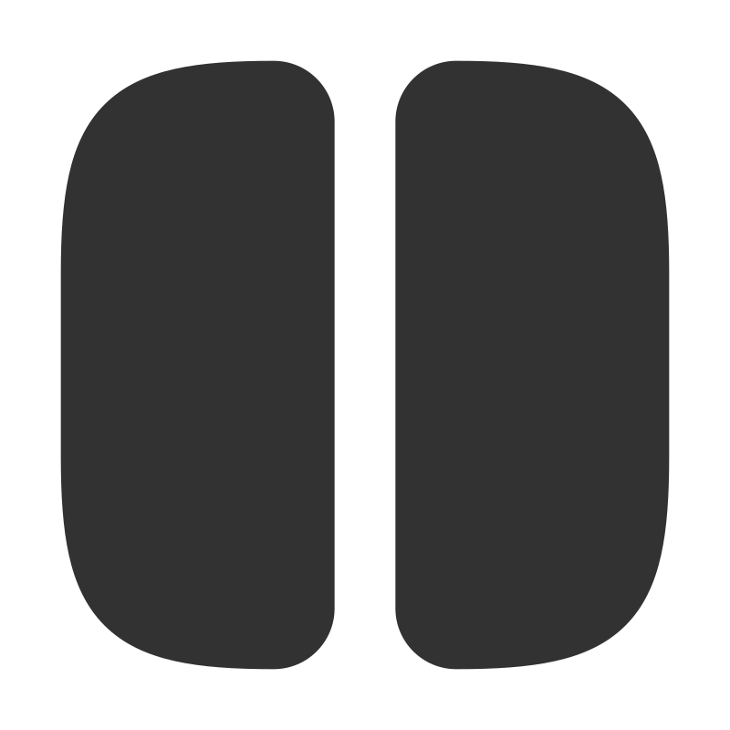</a> | **📂 檔名:** `cols.svg` ✨ **格式:** `Vector (SVG)` ⚖️ **大小:** `1.17KB` 📅 **更新:** `2026-02-28`  🚀 **jsDelivr Markdown:** `` 🔗 **直接連結 (Url):** <code>https://cdn.jsdelivr.net/gh/barry028/materials@main/images/iCons/Scarlab%20iCons/Solid/cols.svg</code> 📥 [檢視原始檔](cols.svg) |
| <a href="cone.svg">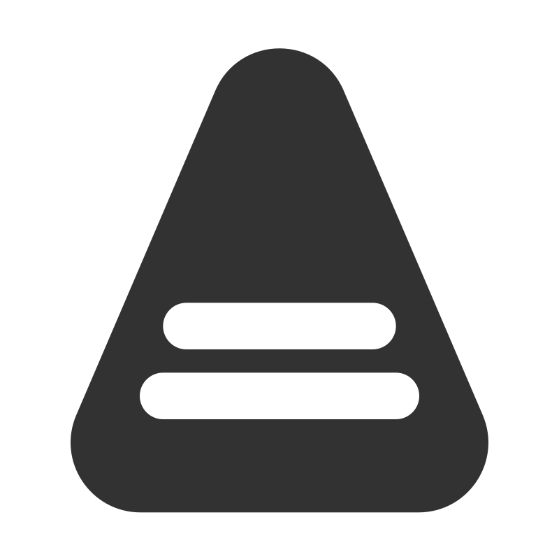</a> | **📂 檔名:** `cone.svg` ✨ **格式:** `Vector (SVG)` ⚖️ **大小:** `765.00B` 📅 **更新:** `2026-02-28`  🚀 **jsDelivr Markdown:** `` 🔗 **直接連結 (Url):** <code>https://cdn.jsdelivr.net/gh/barry028/materials@main/images/iCons/Scarlab%20iCons/Solid/cone.svg</code> 📥 [檢視原始檔](cone.svg) |
|  | **📂 檔名:** `contacts-alt.svg` ✨ **格式:** `Vector (SVG)` ⚖️ **大小:** `1.18KB` 📅 **更新:** `2026-02-28`  🚀 **jsDelivr Markdown:** `` 🔗 **直接連結 (Url):** <code>https://cdn.jsdelivr.net/gh/barry028/materials@main/images/iCons/Scarlab%20iCons/Solid/contacts-alt.svg</code> 📥 [檢視原始檔](contacts-alt.svg) |
|  | **📂 檔名:** `contacts.svg` ✨ **格式:** `Vector (SVG)` ⚖️ **大小:** `1.22KB` 📅 **更新:** `2026-02-28`  🚀 **jsDelivr Markdown:** `` 🔗 **直接連結 (Url):** <code>https://cdn.jsdelivr.net/gh/barry028/materials@main/images/iCons/Scarlab%20iCons/Solid/contacts.svg</code> 📥 [檢視原始檔](contacts.svg) |
|  | **📂 檔名:** `contrast.svg` ✨ **格式:** `Vector (SVG)` ⚖️ **大小:** `1.00KB` 📅 **更新:** `2026-02-28`  🚀 **jsDelivr Markdown:** `` 🔗 **直接連結 (Url):** <code>https://cdn.jsdelivr.net/gh/barry028/materials@main/images/iCons/Scarlab%20iCons/Solid/contrast.svg</code> 📥 [檢視原始檔](contrast.svg) |
|  | **📂 檔名:** `credit-card.svg` ✨ **格式:** `Vector (SVG)` ⚖️ **大小:** `1.39KB` 📅 **更新:** `2026-02-28`  🚀 **jsDelivr Markdown:** `` 🔗 **直接連結 (Url):** <code>https://cdn.jsdelivr.net/gh/barry028/materials@main/images/iCons/Scarlab%20iCons/Solid/credit-card.svg</code> 📥 [檢視原始檔](credit-card.svg) |
|  | **📂 檔名:** `crown.svg` ✨ **格式:** `Vector (SVG)` ⚖️ **大小:** `931.00B` 📅 **更新:** `2026-02-28`  🚀 **jsDelivr Markdown:** `` 🔗 **直接連結 (Url):** <code>https://cdn.jsdelivr.net/gh/barry028/materials@main/images/iCons/Scarlab%20iCons/Solid/crown.svg</code> 📥 [檢視原始檔](crown.svg) |
|  | **📂 檔名:** `cursor-alt.svg` ✨ **格式:** `Vector (SVG)` ⚖️ **大小:** `614.00B` 📅 **更新:** `2026-02-28`  🚀 **jsDelivr Markdown:** `` 🔗 **直接連結 (Url):** <code>https://cdn.jsdelivr.net/gh/barry028/materials@main/images/iCons/Scarlab%20iCons/Solid/cursor-alt.svg</code> 📥 [檢視原始檔](cursor-alt.svg) |
|  | **📂 檔名:** `cursor-click.svg` ✨ **格式:** `Vector (SVG)` ⚖️ **大小:** `876.00B` 📅 **更新:** `2026-02-28`  🚀 **jsDelivr Markdown:** `` 🔗 **直接連結 (Url):** <code>https://cdn.jsdelivr.net/gh/barry028/materials@main/images/iCons/Scarlab%20iCons/Solid/cursor-click.svg</code> 📥 [檢視原始檔](cursor-click.svg) |
|  | **📂 檔名:** `cursor.svg` ✨ **格式:** `Vector (SVG)` ⚖️ **大小:** `615.00B` 📅 **更新:** `2026-02-28`  🚀 **jsDelivr Markdown:** `` 🔗 **直接連結 (Url):** <code>https://cdn.jsdelivr.net/gh/barry028/materials@main/images/iCons/Scarlab%20iCons/Solid/cursor.svg</code> 📥 [檢視原始檔](cursor.svg) |
|  | **📂 檔名:** `dashboard.svg` ✨ **格式:** `Vector (SVG)` ⚖️ **大小:** `1.37KB` 📅 **更新:** `2026-02-28`  🚀 **jsDelivr Markdown:** `` 🔗 **直接連結 (Url):** <code>https://cdn.jsdelivr.net/gh/barry028/materials@main/images/iCons/Scarlab%20iCons/Solid/dashboard.svg</code> 📥 [檢視原始檔](dashboard.svg) |
|  | **📂 檔名:** `database.svg` ✨ **格式:** `Vector (SVG)` ⚖️ **大小:** `1.34KB` 📅 **更新:** `2026-02-28`  🚀 **jsDelivr Markdown:** `` 🔗 **直接連結 (Url):** <code>https://cdn.jsdelivr.net/gh/barry028/materials@main/images/iCons/Scarlab%20iCons/Solid/database.svg</code> 📥 [檢視原始檔](database.svg) |
|  | **📂 檔名:** `desktop.svg` ✨ **格式:** `Vector (SVG)` ⚖️ **大小:** `1.39KB` 📅 **更新:** `2026-02-28`  🚀 **jsDelivr Markdown:** `` 🔗 **直接連結 (Url):** <code>https://cdn.jsdelivr.net/gh/barry028/materials@main/images/iCons/Scarlab%20iCons/Solid/desktop.svg</code> 📥 [檢視原始檔](desktop.svg) |
|  | **📂 檔名:** `diamond.svg` ✨ **格式:** `Vector (SVG)` ⚖️ **大小:** `1.77KB` 📅 **更新:** `2026-02-28`  🚀 **jsDelivr Markdown:** `` 🔗 **直接連結 (Url):** <code>https://cdn.jsdelivr.net/gh/barry028/materials@main/images/iCons/Scarlab%20iCons/Solid/diamond.svg</code> 📥 [檢視原始檔](diamond.svg) |
|  | **📂 檔名:** `disk.svg` ✨ **格式:** `Vector (SVG)` ⚖️ **大小:** `864.00B` 📅 **更新:** `2026-02-28`  🚀 **jsDelivr Markdown:** `` 🔗 **直接連結 (Url):** <code>https://cdn.jsdelivr.net/gh/barry028/materials@main/images/iCons/Scarlab%20iCons/Solid/disk.svg</code> 📥 [檢視原始檔](disk.svg) |
|  | **📂 檔名:** `divide-circle.svg` ✨ **格式:** `Vector (SVG)` ⚖️ **大小:** `849.00B` 📅 **更新:** `2026-02-28`  🚀 **jsDelivr Markdown:** `` 🔗 **直接連結 (Url):** <code>https://cdn.jsdelivr.net/gh/barry028/materials@main/images/iCons/Scarlab%20iCons/Solid/divide-circle.svg</code> 📥 [檢視原始檔](divide-circle.svg) |
| <a href="divide-square.svg">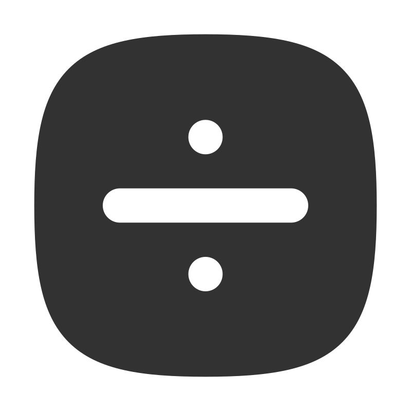</a> | **📂 檔名:** `divide-square.svg` ✨ **格式:** `Vector (SVG)` ⚖️ **大小:** `1.38KB` 📅 **更新:** `2026-02-28`  🚀 **jsDelivr Markdown:** `` 🔗 **直接連結 (Url):** <code>https://cdn.jsdelivr.net/gh/barry028/materials@main/images/iCons/Scarlab%20iCons/Solid/divide-square.svg</code> 📥 [檢視原始檔](divide-square.svg) |
|  | **📂 檔名:** `document-add.svg` ✨ **格式:** `Vector (SVG)` ⚖️ **大小:** `1.57KB` 📅 **更新:** `2026-02-28`  🚀 **jsDelivr Markdown:** `` 🔗 **直接連結 (Url):** <code>https://cdn.jsdelivr.net/gh/barry028/materials@main/images/iCons/Scarlab%20iCons/Solid/document-add.svg</code> 📥 [檢視原始檔](document-add.svg) |
|  | **📂 檔名:** `document-check.svg` ✨ **格式:** `Vector (SVG)` ⚖️ **大小:** `1.58KB` 📅 **更新:** `2026-02-28`  🚀 **jsDelivr Markdown:** `` 🔗 **直接連結 (Url):** <code>https://cdn.jsdelivr.net/gh/barry028/materials@main/images/iCons/Scarlab%20iCons/Solid/document-check.svg</code> 📥 [檢視原始檔](document-check.svg) |
|  | **📂 檔名:** `document-download.svg` ✨ **格式:** `Vector (SVG)` ⚖️ **大小:** `1.64KB` 📅 **更新:** `2026-02-28`  🚀 **jsDelivr Markdown:** `` 🔗 **直接連結 (Url):** <code>https://cdn.jsdelivr.net/gh/barry028/materials@main/images/iCons/Scarlab%20iCons/Solid/document-download.svg</code> 📥 [檢視原始檔](document-download.svg) |
|  | **📂 檔名:** `document-duplicate.svg` ✨ **格式:** `Vector (SVG)` ⚖️ **大小:** `2.13KB` 📅 **更新:** `2026-02-28`  🚀 **jsDelivr Markdown:** `` 🔗 **直接連結 (Url):** <code>https://cdn.jsdelivr.net/gh/barry028/materials@main/images/iCons/Scarlab%20iCons/Solid/document-duplicate.svg</code> 📥 [檢視原始檔](document-duplicate.svg) |
|  | **📂 檔名:** `document-off.svg` ✨ **格式:** `Vector (SVG)` ⚖️ **大小:** `1.62KB` 📅 **更新:** `2026-02-28`  🚀 **jsDelivr Markdown:** `` 🔗 **直接連結 (Url):** <code>https://cdn.jsdelivr.net/gh/barry028/materials@main/images/iCons/Scarlab%20iCons/Solid/document-off.svg</code> 📥 [檢視原始檔](document-off.svg) |
|  | **📂 檔名:** `document-remove.svg` ✨ **格式:** `Vector (SVG)` ⚖️ **大小:** `1.43KB` 📅 **更新:** `2026-02-28`  🚀 **jsDelivr Markdown:** `` 🔗 **直接連結 (Url):** <code>https://cdn.jsdelivr.net/gh/barry028/materials@main/images/iCons/Scarlab%20iCons/Solid/document-remove.svg</code> 📥 [檢視原始檔](document-remove.svg) |
|  | **📂 檔名:** `document-report.svg` ✨ **格式:** `Vector (SVG)` ⚖️ **大小:** `1.64KB` 📅 **更新:** `2026-02-28`  🚀 **jsDelivr Markdown:** `` 🔗 **直接連結 (Url):** <code>https://cdn.jsdelivr.net/gh/barry028/materials@main/images/iCons/Scarlab%20iCons/Solid/document-report.svg</code> 📥 [檢視原始檔](document-report.svg) |
|  | **📂 檔名:** `document-text.svg` ✨ **格式:** `Vector (SVG)` ⚖️ **大小:** `1.50KB` 📅 **更新:** `2026-02-28`  🚀 **jsDelivr Markdown:** `` 🔗 **直接連結 (Url):** <code>https://cdn.jsdelivr.net/gh/barry028/materials@main/images/iCons/Scarlab%20iCons/Solid/document-text.svg</code> 📥 [檢視原始檔](document-text.svg) |
|  | **📂 檔名:** `document-x.svg` ✨ **格式:** `Vector (SVG)` ⚖️ **大小:** `1.77KB` 📅 **更新:** `2026-02-28`  🚀 **jsDelivr Markdown:** `` 🔗 **直接連結 (Url):** <code>https://cdn.jsdelivr.net/gh/barry028/materials@main/images/iCons/Scarlab%20iCons/Solid/document-x.svg</code> 📥 [檢視原始檔](document-x.svg) |
|  | **📂 檔名:** `document-zip.svg` ✨ **格式:** `Vector (SVG)` ⚖️ **大小:** `1.72KB` 📅 **更新:** `2026-02-28`  🚀 **jsDelivr Markdown:** `` 🔗 **直接連結 (Url):** <code>https://cdn.jsdelivr.net/gh/barry028/materials@main/images/iCons/Scarlab%20iCons/Solid/document-zip.svg</code> 📥 [檢視原始檔](document-zip.svg) |
|  | **📂 檔名:** `document.svg` ✨ **格式:** `Vector (SVG)` ⚖️ **大小:** `1.27KB` 📅 **更新:** `2026-02-28`  🚀 **jsDelivr Markdown:** `` 🔗 **直接連結 (Url):** <code>https://cdn.jsdelivr.net/gh/barry028/materials@main/images/iCons/Scarlab%20iCons/Solid/document.svg</code> 📥 [檢視原始檔](document.svg) |
|  | **📂 檔名:** `doge-circle.svg` ✨ **格式:** `Vector (SVG)` ⚖️ **大小:** `1.09KB` 📅 **更新:** `2026-02-28`  🚀 **jsDelivr Markdown:** `` 🔗 **直接連結 (Url):** <code>https://cdn.jsdelivr.net/gh/barry028/materials@main/images/iCons/Scarlab%20iCons/Solid/doge-circle.svg</code> 📥 [檢視原始檔](doge-circle.svg) |
|  | **📂 檔名:** `doge-square.svg` ✨ **格式:** `Vector (SVG)` ⚖️ **大小:** `1.62KB` 📅 **更新:** `2026-02-28`  🚀 **jsDelivr Markdown:** `` 🔗 **直接連結 (Url):** <code>https://cdn.jsdelivr.net/gh/barry028/materials@main/images/iCons/Scarlab%20iCons/Solid/doge-square.svg</code> 📥 [檢視原始檔](doge-square.svg) |
|  | **📂 檔名:** `dollar-circle.svg` ✨ **格式:** `Vector (SVG)` ⚖️ **大小:** `1.83KB` 📅 **更新:** `2026-02-28`  🚀 **jsDelivr Markdown:** `` 🔗 **直接連結 (Url):** <code>https://cdn.jsdelivr.net/gh/barry028/materials@main/images/iCons/Scarlab%20iCons/Solid/dollar-circle.svg</code> 📥 [檢視原始檔](dollar-circle.svg) |
|  | **📂 檔名:** `dollar-square.svg` ✨ **格式:** `Vector (SVG)` ⚖️ **大小:** `2.33KB` 📅 **更新:** `2026-02-28`  🚀 **jsDelivr Markdown:** `` 🔗 **直接連結 (Url):** <code>https://cdn.jsdelivr.net/gh/barry028/materials@main/images/iCons/Scarlab%20iCons/Solid/dollar-square.svg</code> 📥 [檢視原始檔](dollar-square.svg) |
|  | **📂 檔名:** `droplet.svg` ✨ **格式:** `Vector (SVG)` ⚖️ **大小:** `585.00B` 📅 **更新:** `2026-02-28`  🚀 **jsDelivr Markdown:** `` 🔗 **直接連結 (Url):** <code>https://cdn.jsdelivr.net/gh/barry028/materials@main/images/iCons/Scarlab%20iCons/Solid/droplet.svg</code> 📥 [檢視原始檔](droplet.svg) |
|  | **📂 檔名:** `duplicate.svg` ✨ **格式:** `Vector (SVG)` ⚖️ **大小:** `1.63KB` 📅 **更新:** `2026-02-28`  🚀 **jsDelivr Markdown:** `` 🔗 **直接連結 (Url):** <code>https://cdn.jsdelivr.net/gh/barry028/materials@main/images/iCons/Scarlab%20iCons/Solid/duplicate.svg</code> 📥 [檢視原始檔](duplicate.svg) |
|  | **📂 檔名:** `edit.svg` ✨ **格式:** `Vector (SVG)` ⚖️ **大小:** `1.07KB` 📅 **更新:** `2026-02-28`  🚀 **jsDelivr Markdown:** `` 🔗 **直接連結 (Url):** <code>https://cdn.jsdelivr.net/gh/barry028/materials@main/images/iCons/Scarlab%20iCons/Solid/edit.svg</code> 📥 [檢視原始檔](edit.svg) |
|  | **📂 檔名:** `emoji-happy-square.svg` ✨ **格式:** `Vector (SVG)` ⚖️ **大小:** `1.72KB` 📅 **更新:** `2026-02-28`  🚀 **jsDelivr Markdown:** `` 🔗 **直接連結 (Url):** <code>https://cdn.jsdelivr.net/gh/barry028/materials@main/images/iCons/Scarlab%20iCons/Solid/emoji-happy-square.svg</code> 📥 [檢視原始檔](emoji-happy-square.svg) |
|  | **📂 檔名:** `emoji-happy.svg` ✨ **格式:** `Vector (SVG)` ⚖️ **大小:** `1.18KB` 📅 **更新:** `2026-02-28`  🚀 **jsDelivr Markdown:** `` 🔗 **直接連結 (Url):** <code>https://cdn.jsdelivr.net/gh/barry028/materials@main/images/iCons/Scarlab%20iCons/Solid/emoji-happy.svg</code> 📥 [檢視原始檔](emoji-happy.svg) |
|  | **📂 檔名:** `emoji-sad-square.svg` ✨ **格式:** `Vector (SVG)` ⚖️ **大小:** `1.72KB` 📅 **更新:** `2026-02-28`  🚀 **jsDelivr Markdown:** `` 🔗 **直接連結 (Url):** <code>https://cdn.jsdelivr.net/gh/barry028/materials@main/images/iCons/Scarlab%20iCons/Solid/emoji-sad-square.svg</code> 📥 [檢視原始檔](emoji-sad-square.svg) |
|  | **📂 檔名:** `emoji-sad.svg` ✨ **格式:** `Vector (SVG)` ⚖️ **大小:** `1.18KB` 📅 **更新:** `2026-02-28`  🚀 **jsDelivr Markdown:** `` 🔗 **直接連結 (Url):** <code>https://cdn.jsdelivr.net/gh/barry028/materials@main/images/iCons/Scarlab%20iCons/Solid/emoji-sad.svg</code> 📥 [檢視原始檔](emoji-sad.svg) |
|  | **📂 檔名:** `equal-circle.svg` ✨ **格式:** `Vector (SVG)` ⚖️ **大小:** `690.00B` 📅 **更新:** `2026-02-28`  🚀 **jsDelivr Markdown:** `` 🔗 **直接連結 (Url):** <code>https://cdn.jsdelivr.net/gh/barry028/materials@main/images/iCons/Scarlab%20iCons/Solid/equal-circle.svg</code> 📥 [檢視原始檔](equal-circle.svg) |
|  | **📂 檔名:** `equal-not-circle.svg` ✨ **格式:** `Vector (SVG)` ⚖️ **大小:** `937.00B` 📅 **更新:** `2026-02-28`  🚀 **jsDelivr Markdown:** `` 🔗 **直接連結 (Url):** <code>https://cdn.jsdelivr.net/gh/barry028/materials@main/images/iCons/Scarlab%20iCons/Solid/equal-not-circle.svg</code> 📥 [檢視原始檔](equal-not-circle.svg) |
|  | **📂 檔名:** `equal-not-square.svg` ✨ **格式:** `Vector (SVG)` ⚖️ **大小:** `1.45KB` 📅 **更新:** `2026-02-28`  🚀 **jsDelivr Markdown:** `` 🔗 **直接連結 (Url):** <code>https://cdn.jsdelivr.net/gh/barry028/materials@main/images/iCons/Scarlab%20iCons/Solid/equal-not-square.svg</code> 📥 [檢視原始檔](equal-not-square.svg) |
|  | **📂 檔名:** `equal-square.svg` ✨ **格式:** `Vector (SVG)` ⚖️ **大小:** `1.22KB` 📅 **更新:** `2026-02-28`  🚀 **jsDelivr Markdown:** `` 🔗 **直接連結 (Url):** <code>https://cdn.jsdelivr.net/gh/barry028/materials@main/images/iCons/Scarlab%20iCons/Solid/equal-square.svg</code> 📥 [檢視原始檔](equal-square.svg) |
|  | **📂 檔名:** `euro-circle.svg` ✨ **格式:** `Vector (SVG)` ⚖️ **大小:** `1.50KB` 📅 **更新:** `2026-02-28`  🚀 **jsDelivr Markdown:** `` 🔗 **直接連結 (Url):** <code>https://cdn.jsdelivr.net/gh/barry028/materials@main/images/iCons/Scarlab%20iCons/Solid/euro-circle.svg</code> 📥 [檢視原始檔](euro-circle.svg) |
|  | **📂 檔名:** `euro-square.svg` ✨ **格式:** `Vector (SVG)` ⚖️ **大小:** `2.03KB` 📅 **更新:** `2026-02-28`  🚀 **jsDelivr Markdown:** `` 🔗 **直接連結 (Url):** <code>https://cdn.jsdelivr.net/gh/barry028/materials@main/images/iCons/Scarlab%20iCons/Solid/euro-square.svg</code> 📥 [檢視原始檔](euro-square.svg) |
|  | **📂 檔名:** `exposure.svg` ✨ **格式:** `Vector (SVG)` ⚖️ **大小:** `1.87KB` 📅 **更新:** `2026-02-28`  🚀 **jsDelivr Markdown:** `` 🔗 **直接連結 (Url):** <code>https://cdn.jsdelivr.net/gh/barry028/materials@main/images/iCons/Scarlab%20iCons/Solid/exposure.svg</code> 📥 [檢視原始檔](exposure.svg) |
|  | **📂 檔名:** `eye-off.svg` ✨ **格式:** `Vector (SVG)` ⚖️ **大小:** `1.90KB` 📅 **更新:** `2026-02-28`  🚀 **jsDelivr Markdown:** `` 🔗 **直接連結 (Url):** <code>https://cdn.jsdelivr.net/gh/barry028/materials@main/images/iCons/Scarlab%20iCons/Solid/eye-off.svg</code> 📥 [檢視原始檔](eye-off.svg) |
|  | **📂 檔名:** `eye.svg` ✨ **格式:** `Vector (SVG)` ⚖️ **大小:** `1.20KB` 📅 **更新:** `2026-02-28`  🚀 **jsDelivr Markdown:** `` 🔗 **直接連結 (Url):** <code>https://cdn.jsdelivr.net/gh/barry028/materials@main/images/iCons/Scarlab%20iCons/Solid/eye.svg</code> 📥 [檢視原始檔](eye.svg) |
|  | **📂 檔名:** `fast-forward.svg` ✨ **格式:** `Vector (SVG)` ⚖️ **大小:** `731.00B` 📅 **更新:** `2026-02-28`  🚀 **jsDelivr Markdown:** `` 🔗 **直接連結 (Url):** <code>https://cdn.jsdelivr.net/gh/barry028/materials@main/images/iCons/Scarlab%20iCons/Solid/fast-forward.svg</code> 📥 [檢視原始檔](fast-forward.svg) |
|  | **📂 檔名:** `feather.svg` ✨ **格式:** `Vector (SVG)` ⚖️ **大小:** `1.02KB` 📅 **更新:** `2026-02-28`  🚀 **jsDelivr Markdown:** `` 🔗 **直接連結 (Url):** <code>https://cdn.jsdelivr.net/gh/barry028/materials@main/images/iCons/Scarlab%20iCons/Solid/feather.svg</code> 📥 [檢視原始檔](feather.svg) |
|  | **📂 檔名:** `film.svg` ✨ **格式:** `Vector (SVG)` ⚖️ **大小:** `2.12KB` 📅 **更新:** `2026-02-28`  🚀 **jsDelivr Markdown:** `` 🔗 **直接連結 (Url):** <code>https://cdn.jsdelivr.net/gh/barry028/materials@main/images/iCons/Scarlab%20iCons/Solid/film.svg</code> 📥 [檢視原始檔](film.svg) |
|  | **📂 檔名:** `filter.svg` ✨ **格式:** `Vector (SVG)` ⚖️ **大小:** `712.00B` 📅 **更新:** `2026-02-28`  🚀 **jsDelivr Markdown:** `` 🔗 **直接連結 (Url):** <code>https://cdn.jsdelivr.net/gh/barry028/materials@main/images/iCons/Scarlab%20iCons/Solid/filter.svg</code> 📥 [檢視原始檔](filter.svg) |
|  | **📂 檔名:** `floppy.svg` ✨ **格式:** `Vector (SVG)` ⚖️ **大小:** `1.65KB` 📅 **更新:** `2026-02-28`  🚀 **jsDelivr Markdown:** `` 🔗 **直接連結 (Url):** <code>https://cdn.jsdelivr.net/gh/barry028/materials@main/images/iCons/Scarlab%20iCons/Solid/floppy.svg</code> 📥 [檢視原始檔](floppy.svg) |
|  | **📂 檔名:** `folder-add.svg` ✨ **格式:** `Vector (SVG)` ⚖️ **大小:** `1.36KB` 📅 **更新:** `2026-02-28`  🚀 **jsDelivr Markdown:** `` 🔗 **直接連結 (Url):** <code>https://cdn.jsdelivr.net/gh/barry028/materials@main/images/iCons/Scarlab%20iCons/Solid/folder-add.svg</code> 📥 [檢視原始檔](folder-add.svg) |
|  | **📂 檔名:** `folder-check.svg` ✨ **格式:** `Vector (SVG)` ⚖️ **大小:** `1.36KB` 📅 **更新:** `2026-02-28`  🚀 **jsDelivr Markdown:** `` 🔗 **直接連結 (Url):** <code>https://cdn.jsdelivr.net/gh/barry028/materials@main/images/iCons/Scarlab%20iCons/Solid/folder-check.svg</code> 📥 [檢視原始檔](folder-check.svg) |
|  | **📂 檔名:** `folder-download.svg` ✨ **格式:** `Vector (SVG)` ⚖️ **大小:** `1.54KB` 📅 **更新:** `2026-02-28`  🚀 **jsDelivr Markdown:** `` 🔗 **直接連結 (Url):** <code>https://cdn.jsdelivr.net/gh/barry028/materials@main/images/iCons/Scarlab%20iCons/Solid/folder-download.svg</code> 📥 [檢視原始檔](folder-download.svg) |
|  | **📂 檔名:** `folder-off.svg` ✨ **格式:** `Vector (SVG)` ⚖️ **大小:** `1.61KB` 📅 **更新:** `2026-02-28`  🚀 **jsDelivr Markdown:** `` 🔗 **直接連結 (Url):** <code>https://cdn.jsdelivr.net/gh/barry028/materials@main/images/iCons/Scarlab%20iCons/Solid/folder-off.svg</code> 📥 [檢視原始檔](folder-off.svg) |
|  | **📂 檔名:** `folder-open.svg` ✨ **格式:** `Vector (SVG)` ⚖️ **大小:** `1.54KB` 📅 **更新:** `2026-02-28`  🚀 **jsDelivr Markdown:** `` 🔗 **直接連結 (Url):** <code>https://cdn.jsdelivr.net/gh/barry028/materials@main/images/iCons/Scarlab%20iCons/Solid/folder-open.svg</code> 📥 [檢視原始檔](folder-open.svg) |
|  | **📂 檔名:** `folder-remove.svg` ✨ **格式:** `Vector (SVG)` ⚖️ **大小:** `1.22KB` 📅 **更新:** `2026-02-28`  🚀 **jsDelivr Markdown:** `` 🔗 **直接連結 (Url):** <code>https://cdn.jsdelivr.net/gh/barry028/materials@main/images/iCons/Scarlab%20iCons/Solid/folder-remove.svg</code> 📥 [檢視原始檔](folder-remove.svg) |
|  | **📂 檔名:** `folder-x.svg` ✨ **格式:** `Vector (SVG)` ⚖️ **大小:** `1.56KB` 📅 **更新:** `2026-02-28`  🚀 **jsDelivr Markdown:** `` 🔗 **直接連結 (Url):** <code>https://cdn.jsdelivr.net/gh/barry028/materials@main/images/iCons/Scarlab%20iCons/Solid/folder-x.svg</code> 📥 [檢視原始檔](folder-x.svg) |
|  | **📂 檔名:** `folder.svg` ✨ **格式:** `Vector (SVG)` ⚖️ **大小:** `1.05KB` 📅 **更新:** `2026-02-28`  🚀 **jsDelivr Markdown:** `` 🔗 **直接連結 (Url):** <code>https://cdn.jsdelivr.net/gh/barry028/materials@main/images/iCons/Scarlab%20iCons/Solid/folder.svg</code> 📥 [檢視原始檔](folder.svg) |
|  | **📂 檔名:** `gamepad.svg` ✨ **格式:** `Vector (SVG)` ⚖️ **大小:** `1.70KB` 📅 **更新:** `2026-02-28`  🚀 **jsDelivr Markdown:** `` 🔗 **直接連結 (Url):** <code>https://cdn.jsdelivr.net/gh/barry028/materials@main/images/iCons/Scarlab%20iCons/Solid/gamepad.svg</code> 📥 [檢視原始檔](gamepad.svg) |
|  | **📂 檔名:** `gauge.svg` ✨ **格式:** `Vector (SVG)` ⚖️ **大小:** `863.00B` 📅 **更新:** `2026-02-28`  🚀 **jsDelivr Markdown:** `` 🔗 **直接連結 (Url):** <code>https://cdn.jsdelivr.net/gh/barry028/materials@main/images/iCons/Scarlab%20iCons/Solid/gauge.svg</code> 📥 [檢視原始檔](gauge.svg) |
|  | **📂 檔名:** `ghost.svg` ✨ **格式:** `Vector (SVG)` ⚖️ **大小:** `1.27KB` 📅 **更新:** `2026-02-28`  🚀 **jsDelivr Markdown:** `` 🔗 **直接連結 (Url):** <code>https://cdn.jsdelivr.net/gh/barry028/materials@main/images/iCons/Scarlab%20iCons/Solid/ghost.svg</code> 📥 [檢視原始檔](ghost.svg) |
|  | **📂 檔名:** `gift.svg` ✨ **格式:** `Vector (SVG)` ⚖️ **大小:** `2.31KB` 📅 **更新:** `2026-02-28`  🚀 **jsDelivr Markdown:** `` 🔗 **直接連結 (Url):** <code>https://cdn.jsdelivr.net/gh/barry028/materials@main/images/iCons/Scarlab%20iCons/Solid/gift.svg</code> 📥 [檢視原始檔](gift.svg) |
|  | **📂 檔名:** `git-branch.svg` ✨ **格式:** `Vector (SVG)` ⚖️ **大小:** `1018.00B` 📅 **更新:** `2026-02-28`  🚀 **jsDelivr Markdown:** `` 🔗 **直接連結 (Url):** <code>https://cdn.jsdelivr.net/gh/barry028/materials@main/images/iCons/Scarlab%20iCons/Solid/git-branch.svg</code> 📥 [檢視原始檔](git-branch.svg) |
|  | **📂 檔名:** `git-commit.svg` ✨ **格式:** `Vector (SVG)` ⚖️ **大小:** `615.00B` 📅 **更新:** `2026-02-28`  🚀 **jsDelivr Markdown:** `` 🔗 **直接連結 (Url):** <code>https://cdn.jsdelivr.net/gh/barry028/materials@main/images/iCons/Scarlab%20iCons/Solid/git-commit.svg</code> 📥 [檢視原始檔](git-commit.svg) |
|  | **📂 檔名:** `git-diff.svg` ✨ **格式:** `Vector (SVG)` ⚖️ **大小:** `1.99KB` 📅 **更新:** `2026-02-28`  🚀 **jsDelivr Markdown:** `` 🔗 **直接連結 (Url):** <code>https://cdn.jsdelivr.net/gh/barry028/materials@main/images/iCons/Scarlab%20iCons/Solid/git-diff.svg</code> 📥 [檢視原始檔](git-diff.svg) |
|  | **📂 檔名:** `git-fork.svg` ✨ **格式:** `Vector (SVG)` ⚖️ **大小:** `1.07KB` 📅 **更新:** `2026-02-28`  🚀 **jsDelivr Markdown:** `` 🔗 **直接連結 (Url):** <code>https://cdn.jsdelivr.net/gh/barry028/materials@main/images/iCons/Scarlab%20iCons/Solid/git-fork.svg</code> 📥 [檢視原始檔](git-fork.svg) |
|  | **📂 檔名:** `git-merge.svg` ✨ **格式:** `Vector (SVG)` ⚖️ **大小:** `1.00KB` 📅 **更新:** `2026-02-28`  🚀 **jsDelivr Markdown:** `` 🔗 **直接連結 (Url):** <code>https://cdn.jsdelivr.net/gh/barry028/materials@main/images/iCons/Scarlab%20iCons/Solid/git-merge.svg</code> 📥 [檢視原始檔](git-merge.svg) |
|  | **📂 檔名:** `git-pull-request.svg` ✨ **格式:** `Vector (SVG)` ⚖️ **大小:** `1.52KB` 📅 **更新:** `2026-02-28`  🚀 **jsDelivr Markdown:** `` 🔗 **直接連結 (Url):** <code>https://cdn.jsdelivr.net/gh/barry028/materials@main/images/iCons/Scarlab%20iCons/Solid/git-pull-request.svg</code> 📥 [檢視原始檔](git-pull-request.svg) |
|  | **📂 檔名:** `github-circle.svg` ✨ **格式:** `Vector (SVG)` ⚖️ **大小:** `1.91KB` 📅 **更新:** `2026-02-28`  🚀 **jsDelivr Markdown:** `` 🔗 **直接連結 (Url):** <code>https://cdn.jsdelivr.net/gh/barry028/materials@main/images/iCons/Scarlab%20iCons/Solid/github-circle.svg</code> 📥 [檢視原始檔](github-circle.svg) |
|  | **📂 檔名:** `github-square.svg` ✨ **格式:** `Vector (SVG)` ⚖️ **大小:** `2.46KB` 📅 **更新:** `2026-02-28`  🚀 **jsDelivr Markdown:** `` 🔗 **直接連結 (Url):** <code>https://cdn.jsdelivr.net/gh/barry028/materials@main/images/iCons/Scarlab%20iCons/Solid/github-square.svg</code> 📥 [檢視原始檔](github-square.svg) |
|  | **📂 檔名:** `github.svg` ✨ **格式:** `Vector (SVG)` ⚖️ **大小:** `2.91KB` 📅 **更新:** `2026-02-28`  🚀 **jsDelivr Markdown:** `` 🔗 **直接連結 (Url):** <code>https://cdn.jsdelivr.net/gh/barry028/materials@main/images/iCons/Scarlab%20iCons/Solid/github.svg</code> 📥 [檢視原始檔](github.svg) |
|  | **📂 檔名:** `gitlab.svg` ✨ **格式:** `Vector (SVG)` ⚖️ **大小:** `1.36KB` 📅 **更新:** `2026-02-28`  🚀 **jsDelivr Markdown:** `` 🔗 **直接連結 (Url):** <code>https://cdn.jsdelivr.net/gh/barry028/materials@main/images/iCons/Scarlab%20iCons/Solid/gitlab.svg</code> 📥 [檢視原始檔](gitlab.svg) |
|  | **📂 檔名:** `globe-alt.svg` ✨ **格式:** `Vector (SVG)` ⚖️ **大小:** `2.22KB` 📅 **更新:** `2026-02-28`  🚀 **jsDelivr Markdown:** `` 🔗 **直接連結 (Url):** <code>https://cdn.jsdelivr.net/gh/barry028/materials@main/images/iCons/Scarlab%20iCons/Solid/globe-alt.svg</code> 📥 [檢視原始檔](globe-alt.svg) |
|  | **📂 檔名:** `globe.svg` ✨ **格式:** `Vector (SVG)` ⚖️ **大小:** `2.09KB` 📅 **更新:** `2026-02-28`  🚀 **jsDelivr Markdown:** `` 🔗 **直接連結 (Url):** <code>https://cdn.jsdelivr.net/gh/barry028/materials@main/images/iCons/Scarlab%20iCons/Solid/globe.svg</code> 📥 [檢視原始檔](globe.svg) |
|  | **📂 檔名:** `goblet.svg` ✨ **格式:** `Vector (SVG)` ⚖️ **大小:** `1.16KB` 📅 **更新:** `2026-02-28`  🚀 **jsDelivr Markdown:** `` 🔗 **直接連結 (Url):** <code>https://cdn.jsdelivr.net/gh/barry028/materials@main/images/iCons/Scarlab%20iCons/Solid/goblet.svg</code> 📥 [檢視原始檔](goblet.svg) |
|  | **📂 檔名:** `gps.svg` ✨ **格式:** `Vector (SVG)` ⚖️ **大小:** `914.00B` 📅 **更新:** `2026-02-28`  🚀 **jsDelivr Markdown:** `` 🔗 **直接連結 (Url):** <code>https://cdn.jsdelivr.net/gh/barry028/materials@main/images/iCons/Scarlab%20iCons/Solid/gps.svg</code> 📥 [檢視原始檔](gps.svg) |
|  | **📂 檔名:** `grid.svg` ✨ **格式:** `Vector (SVG)` ⚖️ **大小:** `1.51KB` 📅 **更新:** `2026-02-28`  🚀 **jsDelivr Markdown:** `` 🔗 **直接連結 (Url):** <code>https://cdn.jsdelivr.net/gh/barry028/materials@main/images/iCons/Scarlab%20iCons/Solid/grid.svg</code> 📥 [檢視原始檔](grid.svg) |
|  | **📂 檔名:** `heart-broken.svg` ✨ **格式:** `Vector (SVG)` ⚖️ **大小:** `1.13KB` 📅 **更新:** `2026-02-28`  🚀 **jsDelivr Markdown:** `` 🔗 **直接連結 (Url):** <code>https://cdn.jsdelivr.net/gh/barry028/materials@main/images/iCons/Scarlab%20iCons/Solid/heart-broken.svg</code> 📥 [檢視原始檔](heart-broken.svg) |
|  | **📂 檔名:** `heart-off.svg` ✨ **格式:** `Vector (SVG)` ⚖️ **大小:** `1.61KB` 📅 **更新:** `2026-02-28`  🚀 **jsDelivr Markdown:** `` 🔗 **直接連結 (Url):** <code>https://cdn.jsdelivr.net/gh/barry028/materials@main/images/iCons/Scarlab%20iCons/Solid/heart-off.svg</code> 📥 [檢視原始檔](heart-off.svg) |
|  | **📂 檔名:** `heart.svg` ✨ **格式:** `Vector (SVG)` ⚖️ **大小:** `1008.00B` 📅 **更新:** `2026-02-28`  🚀 **jsDelivr Markdown:** `` 🔗 **直接連結 (Url):** <code>https://cdn.jsdelivr.net/gh/barry028/materials@main/images/iCons/Scarlab%20iCons/Solid/heart.svg</code> 📥 [檢視原始檔](heart.svg) |
|  | **📂 檔名:** `help-circle.svg` ✨ **格式:** `Vector (SVG)` ⚖️ **大小:** `949.00B` 📅 **更新:** `2026-02-28`  🚀 **jsDelivr Markdown:** `` 🔗 **直接連結 (Url):** <code>https://cdn.jsdelivr.net/gh/barry028/materials@main/images/iCons/Scarlab%20iCons/Solid/help-circle.svg</code> 📥 [檢視原始檔](help-circle.svg) |
|  | **📂 檔名:** `home-alt.svg` ✨ **格式:** `Vector (SVG)` ⚖️ **大小:** `1.27KB` 📅 **更新:** `2026-02-28`  🚀 **jsDelivr Markdown:** `` 🔗 **直接連結 (Url):** <code>https://cdn.jsdelivr.net/gh/barry028/materials@main/images/iCons/Scarlab%20iCons/Solid/home-alt.svg</code> 📥 [檢視原始檔](home-alt.svg) |
| <a href="home.svg">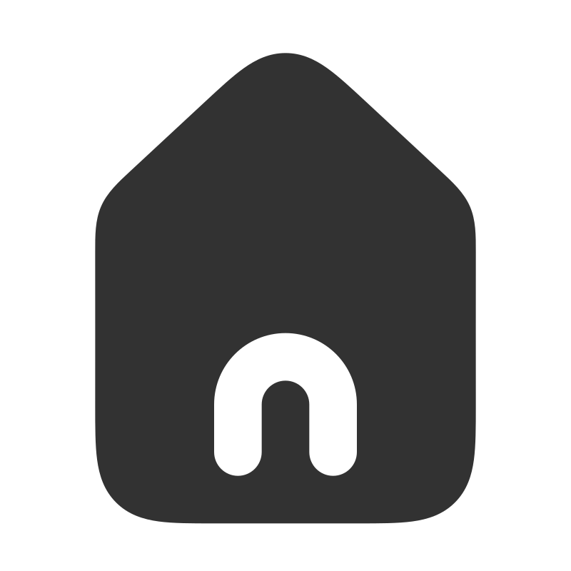</a> | **📂 檔名:** `home.svg` ✨ **格式:** `Vector (SVG)` ⚖️ **大小:** `1.50KB` 📅 **更新:** `2026-02-28`  🚀 **jsDelivr Markdown:** `` 🔗 **直接連結 (Url):** <code>https://cdn.jsdelivr.net/gh/barry028/materials@main/images/iCons/Scarlab%20iCons/Solid/home.svg</code> 📥 [檢視原始檔](home.svg) |
|  | **📂 檔名:** `hrivnia-circle.svg` ✨ **格式:** `Vector (SVG)` ⚖️ **大小:** `1.45KB` 📅 **更新:** `2026-02-28`  🚀 **jsDelivr Markdown:** `` 🔗 **直接連結 (Url):** <code>https://cdn.jsdelivr.net/gh/barry028/materials@main/images/iCons/Scarlab%20iCons/Solid/hrivnia-circle.svg</code> 📥 [檢視原始檔](hrivnia-circle.svg) |
|  | **📂 檔名:** `hrivnia-square.svg` ✨ **格式:** `Vector (SVG)` ⚖️ **大小:** `1.98KB` 📅 **更新:** `2026-02-28`  🚀 **jsDelivr Markdown:** `` 🔗 **直接連結 (Url):** <code>https://cdn.jsdelivr.net/gh/barry028/materials@main/images/iCons/Scarlab%20iCons/Solid/hrivnia-square.svg</code> 📥 [檢視原始檔](hrivnia-square.svg) |
|  | **📂 檔名:** `id.svg` ✨ **格式:** `Vector (SVG)` ⚖️ **大小:** `1.65KB` 📅 **更新:** `2026-02-28`  🚀 **jsDelivr Markdown:** `` 🔗 **直接連結 (Url):** <code>https://cdn.jsdelivr.net/gh/barry028/materials@main/images/iCons/Scarlab%20iCons/Solid/id.svg</code> 📥 [檢視原始檔](id.svg) |
|  | **📂 檔名:** `identification.svg` ✨ **格式:** `Vector (SVG)` ⚖️ **大小:** `1.93KB` 📅 **更新:** `2026-02-28`  🚀 **jsDelivr Markdown:** `` 🔗 **直接連結 (Url):** <code>https://cdn.jsdelivr.net/gh/barry028/materials@main/images/iCons/Scarlab%20iCons/Solid/identification.svg</code> 📥 [檢視原始檔](identification.svg) |
|  | **📂 檔名:** `inbox-full.svg` ✨ **格式:** `Vector (SVG)` ⚖️ **大小:** `1.80KB` 📅 **更新:** `2026-02-28`  🚀 **jsDelivr Markdown:** `` 🔗 **直接連結 (Url):** <code>https://cdn.jsdelivr.net/gh/barry028/materials@main/images/iCons/Scarlab%20iCons/Solid/inbox-full.svg</code> 📥 [檢視原始檔](inbox-full.svg) |
| <a href="inbox-in.svg">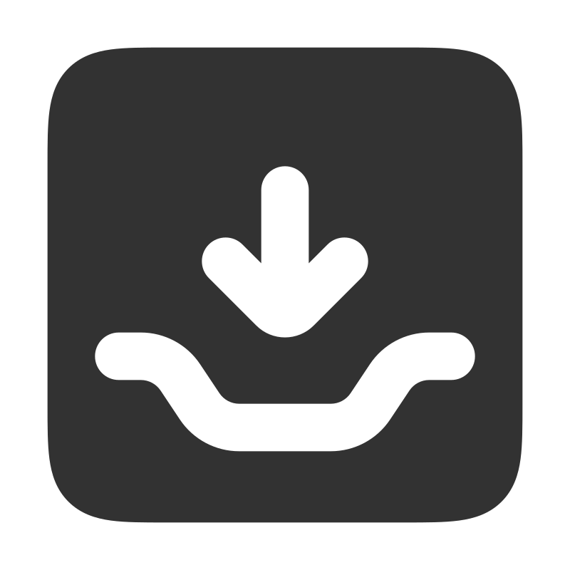</a> | **📂 檔名:** `inbox-in.svg` ✨ **格式:** `Vector (SVG)` ⚖️ **大小:** `1.94KB` 📅 **更新:** `2026-02-28`  🚀 **jsDelivr Markdown:** `` 🔗 **直接連結 (Url):** <code>https://cdn.jsdelivr.net/gh/barry028/materials@main/images/iCons/Scarlab%20iCons/Solid/inbox-in.svg</code> 📥 [檢視原始檔](inbox-in.svg) |
|  | **📂 檔名:** `inbox-out.svg` ✨ **格式:** `Vector (SVG)` ⚖️ **大小:** `1.96KB` 📅 **更新:** `2026-02-28`  🚀 **jsDelivr Markdown:** `` 🔗 **直接連結 (Url):** <code>https://cdn.jsdelivr.net/gh/barry028/materials@main/images/iCons/Scarlab%20iCons/Solid/inbox-out.svg</code> 📥 [檢視原始檔](inbox-out.svg) |
|  | **📂 檔名:** `inbox.svg` ✨ **格式:** `Vector (SVG)` ⚖️ **大小:** `1.58KB` 📅 **更新:** `2026-02-28`  🚀 **jsDelivr Markdown:** `` 🔗 **直接連結 (Url):** <code>https://cdn.jsdelivr.net/gh/barry028/materials@main/images/iCons/Scarlab%20iCons/Solid/inbox.svg</code> 📥 [檢視原始檔](inbox.svg) |
|  | **📂 檔名:** `key.svg` ✨ **格式:** `Vector (SVG)` ⚖️ **大小:** `798.00B` 📅 **更新:** `2026-02-28`  🚀 **jsDelivr Markdown:** `` 🔗 **直接連結 (Url):** <code>https://cdn.jsdelivr.net/gh/barry028/materials@main/images/iCons/Scarlab%20iCons/Solid/key.svg</code> 📥 [檢視原始檔](key.svg) |
|  | **📂 檔名:** `keyboard.svg` ✨ **格式:** `Vector (SVG)` ⚖️ **大小:** `2.06KB` 📅 **更新:** `2026-02-28`  🚀 **jsDelivr Markdown:** `` 🔗 **直接連結 (Url):** <code>https://cdn.jsdelivr.net/gh/barry028/materials@main/images/iCons/Scarlab%20iCons/Solid/keyboard.svg</code> 📥 [檢視原始檔](keyboard.svg) |
|  | **📂 檔名:** `lamp.svg` ✨ **格式:** `Vector (SVG)` ⚖️ **大小:** `606.00B` 📅 **更新:** `2026-02-28`  🚀 **jsDelivr Markdown:** `` 🔗 **直接連結 (Url):** <code>https://cdn.jsdelivr.net/gh/barry028/materials@main/images/iCons/Scarlab%20iCons/Solid/lamp.svg</code> 📥 [檢視原始檔](lamp.svg) |
|  | **📂 檔名:** `laptop.svg` ✨ **格式:** `Vector (SVG)` ⚖️ **大小:** `1.28KB` 📅 **更新:** `2026-02-28`  🚀 **jsDelivr Markdown:** `` 🔗 **直接連結 (Url):** <code>https://cdn.jsdelivr.net/gh/barry028/materials@main/images/iCons/Scarlab%20iCons/Solid/laptop.svg</code> 📥 [檢視原始檔](laptop.svg) |
|  | **📂 檔名:** `leaf.svg` ✨ **格式:** `Vector (SVG)` ⚖️ **大小:** `1.32KB` 📅 **更新:** `2026-02-28`  🚀 **jsDelivr Markdown:** `` 🔗 **直接連結 (Url):** <code>https://cdn.jsdelivr.net/gh/barry028/materials@main/images/iCons/Scarlab%20iCons/Solid/leaf.svg</code> 📥 [檢視原始檔](leaf.svg) |
|  | **📂 檔名:** `license.svg` ✨ **格式:** `Vector (SVG)` ⚖️ **大小:** `1.24KB` 📅 **更新:** `2026-02-28`  🚀 **jsDelivr Markdown:** `` 🔗 **直接連結 (Url):** <code>https://cdn.jsdelivr.net/gh/barry028/materials@main/images/iCons/Scarlab%20iCons/Solid/license.svg</code> 📥 [檢視原始檔](license.svg) |
|  | **📂 檔名:** `liras-circle.svg` ✨ **格式:** `Vector (SVG)` ⚖️ **大小:** `1.41KB` 📅 **更新:** `2026-02-28`  🚀 **jsDelivr Markdown:** `` 🔗 **直接連結 (Url):** <code>https://cdn.jsdelivr.net/gh/barry028/materials@main/images/iCons/Scarlab%20iCons/Solid/liras-circle.svg</code> 📥 [檢視原始檔](liras-circle.svg) |
|  | **📂 檔名:** `liras-square.svg` ✨ **格式:** `Vector (SVG)` ⚖️ **大小:** `1.90KB` 📅 **更新:** `2026-02-28`  🚀 **jsDelivr Markdown:** `` 🔗 **直接連結 (Url):** <code>https://cdn.jsdelivr.net/gh/barry028/materials@main/images/iCons/Scarlab%20iCons/Solid/liras-square.svg</code> 📥 [檢視原始檔](liras-square.svg) |
|  | **📂 檔名:** `litecoin-circle.svg` ✨ **格式:** `Vector (SVG)` ⚖️ **大小:** `1.01KB` 📅 **更新:** `2026-02-28`  🚀 **jsDelivr Markdown:** `` 🔗 **直接連結 (Url):** <code>https://cdn.jsdelivr.net/gh/barry028/materials@main/images/iCons/Scarlab%20iCons/Solid/litecoin-circle.svg</code> 📥 [檢視原始檔](litecoin-circle.svg) |
|  | **📂 檔名:** `litecoin-square.svg` ✨ **格式:** `Vector (SVG)` ⚖️ **大小:** `1.55KB` 📅 **更新:** `2026-02-28`  🚀 **jsDelivr Markdown:** `` 🔗 **直接連結 (Url):** <code>https://cdn.jsdelivr.net/gh/barry028/materials@main/images/iCons/Scarlab%20iCons/Solid/litecoin-square.svg</code> 📥 [檢視原始檔](litecoin-square.svg) |
|  | **📂 檔名:** `location.svg` ✨ **格式:** `Vector (SVG)` ⚖️ **大小:** `965.00B` 📅 **更新:** `2026-02-28`  🚀 **jsDelivr Markdown:** `` 🔗 **直接連結 (Url):** <code>https://cdn.jsdelivr.net/gh/barry028/materials@main/images/iCons/Scarlab%20iCons/Solid/location.svg</code> 📥 [檢視原始檔](location.svg) |
|  | **📂 檔名:** `lock-open.svg` ✨ **格式:** `Vector (SVG)` ⚖️ **大小:** `1.36KB` 📅 **更新:** `2026-02-28`  🚀 **jsDelivr Markdown:** `` 🔗 **直接連結 (Url):** <code>https://cdn.jsdelivr.net/gh/barry028/materials@main/images/iCons/Scarlab%20iCons/Solid/lock-open.svg</code> 📥 [檢視原始檔](lock-open.svg) |
|  | **📂 檔名:** `lock.svg` ✨ **格式:** `Vector (SVG)` ⚖️ **大小:** `1.30KB` 📅 **更新:** `2026-02-28`  🚀 **jsDelivr Markdown:** `` 🔗 **直接連結 (Url):** <code>https://cdn.jsdelivr.net/gh/barry028/materials@main/images/iCons/Scarlab%20iCons/Solid/lock.svg</code> 📥 [檢視原始檔](lock.svg) |
|  | **📂 檔名:** `login.svg` ✨ **格式:** `Vector (SVG)` ⚖️ **大小:** `1.63KB` 📅 **更新:** `2026-02-28`  🚀 **jsDelivr Markdown:** `` 🔗 **直接連結 (Url):** <code>https://cdn.jsdelivr.net/gh/barry028/materials@main/images/iCons/Scarlab%20iCons/Solid/login.svg</code> 📥 [檢視原始檔](login.svg) |
|  | **📂 檔名:** `logout.svg` ✨ **格式:** `Vector (SVG)` ⚖️ **大小:** `1.14KB` 📅 **更新:** `2026-02-28`  🚀 **jsDelivr Markdown:** `` 🔗 **直接連結 (Url):** <code>https://cdn.jsdelivr.net/gh/barry028/materials@main/images/iCons/Scarlab%20iCons/Solid/logout.svg</code> 📥 [檢視原始檔](logout.svg) |
|  | **📂 檔名:** `luggage.svg` ✨ **格式:** `Vector (SVG)` ⚖️ **大小:** `1.50KB` 📅 **更新:** `2026-02-28`  🚀 **jsDelivr Markdown:** `` 🔗 **直接連結 (Url):** <code>https://cdn.jsdelivr.net/gh/barry028/materials@main/images/iCons/Scarlab%20iCons/Solid/luggage.svg</code> 📥 [檢視原始檔](luggage.svg) |
|  | **📂 檔名:** `mail.svg` ✨ **格式:** `Vector (SVG)` ⚖️ **大小:** `1.61KB` 📅 **更新:** `2026-02-28`  🚀 **jsDelivr Markdown:** `` 🔗 **直接連結 (Url):** <code>https://cdn.jsdelivr.net/gh/barry028/materials@main/images/iCons/Scarlab%20iCons/Solid/mail.svg</code> 📥 [檢視原始檔](mail.svg) |
|  | **📂 檔名:** `map.svg` ✨ **格式:** `Vector (SVG)` ⚖️ **大小:** `2.22KB` 📅 **更新:** `2026-02-28`  🚀 **jsDelivr Markdown:** `` 🔗 **直接連結 (Url):** <code>https://cdn.jsdelivr.net/gh/barry028/materials@main/images/iCons/Scarlab%20iCons/Solid/map.svg</code> 📥 [檢視原始檔](map.svg) |
|  | **📂 檔名:** `mask.svg` ✨ **格式:** `Vector (SVG)` ⚖️ **大小:** `1.27KB` 📅 **更新:** `2026-02-28`  🚀 **jsDelivr Markdown:** `` 🔗 **直接連結 (Url):** <code>https://cdn.jsdelivr.net/gh/barry028/materials@main/images/iCons/Scarlab%20iCons/Solid/mask.svg</code> 📥 [檢視原始檔](mask.svg) |
|  | **📂 檔名:** `mastercard.svg` ✨ **格式:** `Vector (SVG)` ⚖️ **大小:** `1.64KB` 📅 **更新:** `2026-02-28`  🚀 **jsDelivr Markdown:** `` 🔗 **直接連結 (Url):** <code>https://cdn.jsdelivr.net/gh/barry028/materials@main/images/iCons/Scarlab%20iCons/Solid/mastercard.svg</code> 📥 [檢視原始檔](mastercard.svg) |
|  | **📂 檔名:** `maximaize-circle.svg` ✨ **格式:** `Vector (SVG)` ⚖️ **大小:** `826.00B` 📅 **更新:** `2026-02-28`  🚀 **jsDelivr Markdown:** `` 🔗 **直接連結 (Url):** <code>https://cdn.jsdelivr.net/gh/barry028/materials@main/images/iCons/Scarlab%20iCons/Solid/maximaize-circle.svg</code> 📥 [檢視原始檔](maximaize-circle.svg) |
|  | **📂 檔名:** `maximaize-square.svg` ✨ **格式:** `Vector (SVG)` ⚖️ **大小:** `1.32KB` 📅 **更新:** `2026-02-28`  🚀 **jsDelivr Markdown:** `` 🔗 **直接連結 (Url):** <code>https://cdn.jsdelivr.net/gh/barry028/materials@main/images/iCons/Scarlab%20iCons/Solid/maximaize-square.svg</code> 📥 [檢視原始檔](maximaize-square.svg) |
|  | **📂 檔名:** `microphone.svg` ✨ **格式:** `Vector (SVG)` ⚖️ **大小:** `1.92KB` 📅 **更新:** `2026-02-28`  🚀 **jsDelivr Markdown:** `` 🔗 **直接連結 (Url):** <code>https://cdn.jsdelivr.net/gh/barry028/materials@main/images/iCons/Scarlab%20iCons/Solid/microphone.svg</code> 📥 [檢視原始檔](microphone.svg) |
|  | **📂 檔名:** `minimaize-circle.svg` ✨ **格式:** `Vector (SVG)` ⚖️ **大小:** `824.00B` 📅 **更新:** `2026-02-28`  🚀 **jsDelivr Markdown:** `` 🔗 **直接連結 (Url):** <code>https://cdn.jsdelivr.net/gh/barry028/materials@main/images/iCons/Scarlab%20iCons/Solid/minimaize-circle.svg</code> 📥 [檢視原始檔](minimaize-circle.svg) |
|  | **📂 檔名:** `minimaize-square.svg` ✨ **格式:** `Vector (SVG)` ⚖️ **大小:** `1.32KB` 📅 **更新:** `2026-02-28`  🚀 **jsDelivr Markdown:** `` 🔗 **直接連結 (Url):** <code>https://cdn.jsdelivr.net/gh/barry028/materials@main/images/iCons/Scarlab%20iCons/Solid/minimaize-square.svg</code> 📥 [檢視原始檔](minimaize-square.svg) |
|  | **📂 檔名:** `minus-circle.svg` ✨ **格式:** `Vector (SVG)` ⚖️ **大小:** `574.00B` 📅 **更新:** `2026-02-28`  🚀 **jsDelivr Markdown:** `` 🔗 **直接連結 (Url):** <code>https://cdn.jsdelivr.net/gh/barry028/materials@main/images/iCons/Scarlab%20iCons/Solid/minus-circle.svg</code> 📥 [檢視原始檔](minus-circle.svg) |
|  | **📂 檔名:** `minus-square.svg` ✨ **格式:** `Vector (SVG)` ⚖️ **大小:** `1.11KB` 📅 **更新:** `2026-02-28`  🚀 **jsDelivr Markdown:** `` 🔗 **直接連結 (Url):** <code>https://cdn.jsdelivr.net/gh/barry028/materials@main/images/iCons/Scarlab%20iCons/Solid/minus-square.svg</code> 📥 [檢視原始檔](minus-square.svg) |
|  | **📂 檔名:** `mobile.svg` ✨ **格式:** `Vector (SVG)` ⚖️ **大小:** `1.29KB` 📅 **更新:** `2026-02-28`  🚀 **jsDelivr Markdown:** `` 🔗 **直接連結 (Url):** <code>https://cdn.jsdelivr.net/gh/barry028/materials@main/images/iCons/Scarlab%20iCons/Solid/mobile.svg</code> 📥 [檢視原始檔](mobile.svg) |
|  | **📂 檔名:** `monitor.svg` ✨ **格式:** `Vector (SVG)` ⚖️ **大小:** `1.22KB` 📅 **更新:** `2026-02-28`  🚀 **jsDelivr Markdown:** `` 🔗 **直接連結 (Url):** <code>https://cdn.jsdelivr.net/gh/barry028/materials@main/images/iCons/Scarlab%20iCons/Solid/monitor.svg</code> 📥 [檢視原始檔](monitor.svg) |
|  | **📂 檔名:** `moon.svg` ✨ **格式:** `Vector (SVG)` ⚖️ **大小:** `909.00B` 📅 **更新:** `2026-02-28`  🚀 **jsDelivr Markdown:** `` 🔗 **直接連結 (Url):** <code>https://cdn.jsdelivr.net/gh/barry028/materials@main/images/iCons/Scarlab%20iCons/Solid/moon.svg</code> 📥 [檢視原始檔](moon.svg) |
|  | **📂 檔名:** `more-horizontal-circle.svg` ✨ **格式:** `Vector (SVG)` ⚖️ **大小:** `864.00B` 📅 **更新:** `2026-02-28`  🚀 **jsDelivr Markdown:** `` 🔗 **直接連結 (Url):** <code>https://cdn.jsdelivr.net/gh/barry028/materials@main/images/iCons/Scarlab%20iCons/Solid/more-horizontal-circle.svg</code> 📥 [檢視原始檔](more-horizontal-circle.svg) |
|  | **📂 檔名:** `more-horizontal-square.svg` ✨ **格式:** `Vector (SVG)` ⚖️ **大小:** `1.39KB` 📅 **更新:** `2026-02-28`  🚀 **jsDelivr Markdown:** `` 🔗 **直接連結 (Url):** <code>https://cdn.jsdelivr.net/gh/barry028/materials@main/images/iCons/Scarlab%20iCons/Solid/more-horizontal-square.svg</code> 📥 [檢視原始檔](more-horizontal-square.svg) |
|  | **📂 檔名:** `more-vertical-circle.svg` ✨ **格式:** `Vector (SVG)` ⚖️ **大小:** `1.06KB` 📅 **更新:** `2026-02-28`  🚀 **jsDelivr Markdown:** `` 🔗 **直接連結 (Url):** <code>https://cdn.jsdelivr.net/gh/barry028/materials@main/images/iCons/Scarlab%20iCons/Solid/more-vertical-circle.svg</code> 📥 [檢視原始檔](more-vertical-circle.svg) |
|  | **📂 檔名:** `more-vertical-square.svg` ✨ **格式:** `Vector (SVG)` ⚖️ **大小:** `1.61KB` 📅 **更新:** `2026-02-28`  🚀 **jsDelivr Markdown:** `` 🔗 **直接連結 (Url):** <code>https://cdn.jsdelivr.net/gh/barry028/materials@main/images/iCons/Scarlab%20iCons/Solid/more-vertical-square.svg</code> 📥 [檢視原始檔](more-vertical-square.svg) |
| <a href="mosaic.svg">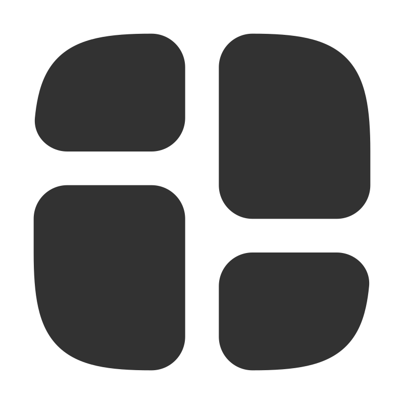</a> | **📂 檔名:** `mosaic.svg` ✨ **格式:** `Vector (SVG)` ⚖️ **大小:** `1.49KB` 📅 **更新:** `2026-02-28`  🚀 **jsDelivr Markdown:** `` 🔗 **直接連結 (Url):** <code>https://cdn.jsdelivr.net/gh/barry028/materials@main/images/iCons/Scarlab%20iCons/Solid/mosaic.svg</code> 📥 [檢視原始檔](mosaic.svg) |
| <a href="mug.svg">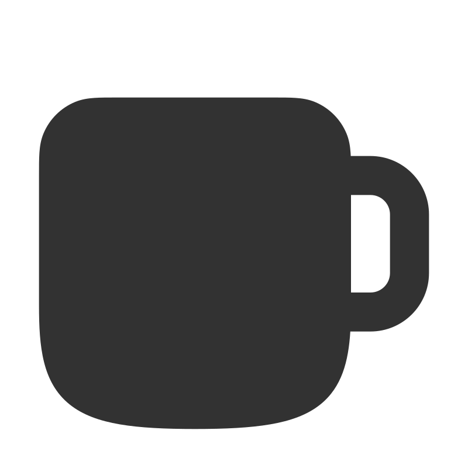</a> | **📂 檔名:** `mug.svg` ✨ **格式:** `Vector (SVG)` ⚖️ **大小:** `1.16KB` 📅 **更新:** `2026-02-28`  🚀 **jsDelivr Markdown:** `` 🔗 **直接連結 (Url):** <code>https://cdn.jsdelivr.net/gh/barry028/materials@main/images/iCons/Scarlab%20iCons/Solid/mug.svg</code> 📥 [檢視原始檔](mug.svg) |
|  | **📂 檔名:** `pause-alt.svg` ✨ **格式:** `Vector (SVG)` ⚖️ **大小:** `675.00B` 📅 **更新:** `2026-02-28`  🚀 **jsDelivr Markdown:** `` 🔗 **直接連結 (Url):** <code>https://cdn.jsdelivr.net/gh/barry028/materials@main/images/iCons/Scarlab%20iCons/Solid/pause-alt.svg</code> 📥 [檢視原始檔](pause-alt.svg) |
|  | **📂 檔名:** `pause-circle.svg` ✨ **格式:** `Vector (SVG)` ⚖️ **大小:** `701.00B` 📅 **更新:** `2026-02-28`  🚀 **jsDelivr Markdown:** `` 🔗 **直接連結 (Url):** <code>https://cdn.jsdelivr.net/gh/barry028/materials@main/images/iCons/Scarlab%20iCons/Solid/pause-circle.svg</code> 📥 [檢視原始檔](pause-circle.svg) |
|  | **📂 檔名:** `pause-square.svg` ✨ **格式:** `Vector (SVG)` ⚖️ **大小:** `1.23KB` 📅 **更新:** `2026-02-28`  🚀 **jsDelivr Markdown:** `` 🔗 **直接連結 (Url):** <code>https://cdn.jsdelivr.net/gh/barry028/materials@main/images/iCons/Scarlab%20iCons/Solid/pause-square.svg</code> 📥 [檢視原始檔](pause-square.svg) |
|  | **📂 檔名:** `paypal.svg` ✨ **格式:** `Vector (SVG)` ⚖️ **大小:** `1.15KB` 📅 **更新:** `2026-02-28`  🚀 **jsDelivr Markdown:** `` 🔗 **直接連結 (Url):** <code>https://cdn.jsdelivr.net/gh/barry028/materials@main/images/iCons/Scarlab%20iCons/Solid/paypal.svg</code> 📥 [檢視原始檔](paypal.svg) |
|  | **📂 檔名:** `pencil-alt.svg` ✨ **格式:** `Vector (SVG)` ⚖️ **大小:** `841.00B` 📅 **更新:** `2026-02-28`  🚀 **jsDelivr Markdown:** `` 🔗 **直接連結 (Url):** <code>https://cdn.jsdelivr.net/gh/barry028/materials@main/images/iCons/Scarlab%20iCons/Solid/pencil-alt.svg</code> 📥 [檢視原始檔](pencil-alt.svg) |
|  | **📂 檔名:** `pencil.svg` ✨ **格式:** `Vector (SVG)` ⚖️ **大小:** `901.00B` 📅 **更新:** `2026-02-28`  🚀 **jsDelivr Markdown:** `` 🔗 **直接連結 (Url):** <code>https://cdn.jsdelivr.net/gh/barry028/materials@main/images/iCons/Scarlab%20iCons/Solid/pencil.svg</code> 📥 [檢視原始檔](pencil.svg) |
| <a href="percent-circle.svg">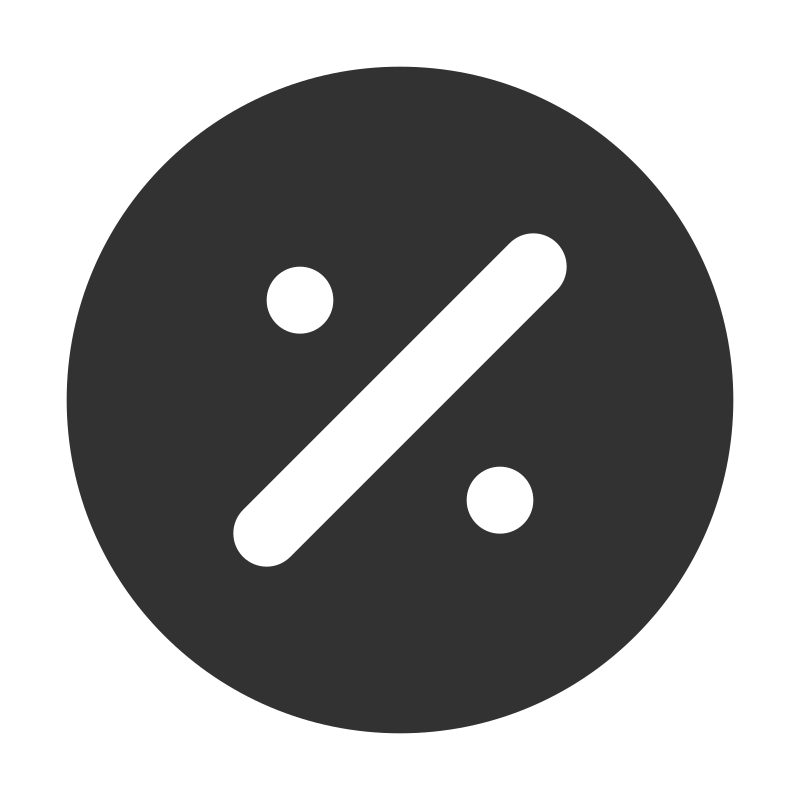</a> | **📂 檔名:** `percent-circle.svg` ✨ **格式:** `Vector (SVG)` ⚖️ **大小:** `1008.00B` 📅 **更新:** `2026-02-28`  🚀 **jsDelivr Markdown:** `` 🔗 **直接連結 (Url):** <code>https://cdn.jsdelivr.net/gh/barry028/materials@main/images/iCons/Scarlab%20iCons/Solid/percent-circle.svg</code> 📥 [檢視原始檔](percent-circle.svg) |
|  | **📂 檔名:** `percent-square.svg` ✨ **格式:** `Vector (SVG)` ⚖️ **大小:** `1.53KB` 📅 **更新:** `2026-02-28`  🚀 **jsDelivr Markdown:** `` 🔗 **直接連結 (Url):** <code>https://cdn.jsdelivr.net/gh/barry028/materials@main/images/iCons/Scarlab%20iCons/Solid/percent-square.svg</code> 📥 [檢視原始檔](percent-square.svg) |
|  | **📂 檔名:** `phone-incoming.svg` ✨ **格式:** `Vector (SVG)` ⚖️ **大小:** `1.16KB` 📅 **更新:** `2026-02-28`  🚀 **jsDelivr Markdown:** `` 🔗 **直接連結 (Url):** <code>https://cdn.jsdelivr.net/gh/barry028/materials@main/images/iCons/Scarlab%20iCons/Solid/phone-incoming.svg</code> 📥 [檢視原始檔](phone-incoming.svg) |
|  | **📂 檔名:** `phone-missed-call.svg` ✨ **格式:** `Vector (SVG)` ⚖️ **大小:** `1.37KB` 📅 **更新:** `2026-02-28`  🚀 **jsDelivr Markdown:** `` 🔗 **直接連結 (Url):** <code>https://cdn.jsdelivr.net/gh/barry028/materials@main/images/iCons/Scarlab%20iCons/Solid/phone-missed-call.svg</code> 📥 [檢視原始檔](phone-missed-call.svg) |
| <a href="phone-outgoing.svg">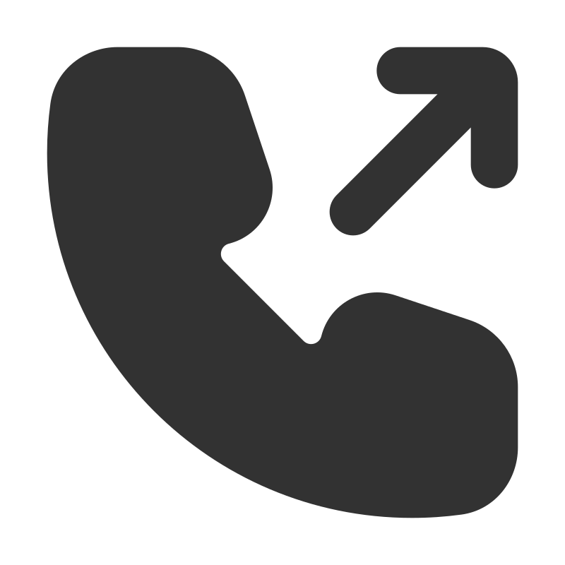</a> | **📂 檔名:** `phone-outgoing.svg` ✨ **格式:** `Vector (SVG)` ⚖️ **大小:** `1.16KB` 📅 **更新:** `2026-02-28`  🚀 **jsDelivr Markdown:** `` 🔗 **直接連結 (Url):** <code>https://cdn.jsdelivr.net/gh/barry028/materials@main/images/iCons/Scarlab%20iCons/Solid/phone-outgoing.svg</code> 📥 [檢視原始檔](phone-outgoing.svg) |
|  | **📂 檔名:** `phone.svg` ✨ **格式:** `Vector (SVG)` ⚖️ **大小:** `870.00B` 📅 **更新:** `2026-02-28`  🚀 **jsDelivr Markdown:** `` 🔗 **直接連結 (Url):** <code>https://cdn.jsdelivr.net/gh/barry028/materials@main/images/iCons/Scarlab%20iCons/Solid/phone.svg</code> 📥 [檢視原始檔](phone.svg) |
|  | **📂 檔名:** `photo.svg` ✨ **格式:** `Vector (SVG)` ⚖️ **大小:** `1.93KB` 📅 **更新:** `2026-02-28`  🚀 **jsDelivr Markdown:** `` 🔗 **直接連結 (Url):** <code>https://cdn.jsdelivr.net/gh/barry028/materials@main/images/iCons/Scarlab%20iCons/Solid/photo.svg</code> 📥 [檢視原始檔](photo.svg) |
|  | **📂 檔名:** `pin.svg` ✨ **格式:** `Vector (SVG)` ⚖️ **大小:** `795.00B` 📅 **更新:** `2026-02-28`  🚀 **jsDelivr Markdown:** `` 🔗 **直接連結 (Url):** <code>https://cdn.jsdelivr.net/gh/barry028/materials@main/images/iCons/Scarlab%20iCons/Solid/pin.svg</code> 📥 [檢視原始檔](pin.svg) |
|  | **📂 檔名:** `play-alt.svg` ✨ **格式:** `Vector (SVG)` ⚖️ **大小:** `519.00B` 📅 **更新:** `2026-02-28`  🚀 **jsDelivr Markdown:** `` 🔗 **直接連結 (Url):** <code>https://cdn.jsdelivr.net/gh/barry028/materials@main/images/iCons/Scarlab%20iCons/Solid/play-alt.svg</code> 📥 [檢視原始檔](play-alt.svg) |
|  | **📂 檔名:** `play-circle.svg` ✨ **格式:** `Vector (SVG)` ⚖️ **大小:** `656.00B` 📅 **更新:** `2026-02-28`  🚀 **jsDelivr Markdown:** `` 🔗 **直接連結 (Url):** <code>https://cdn.jsdelivr.net/gh/barry028/materials@main/images/iCons/Scarlab%20iCons/Solid/play-circle.svg</code> 📥 [檢視原始檔](play-circle.svg) |
|  | **📂 檔名:** `play-square.svg` ✨ **格式:** `Vector (SVG)` ⚖️ **大小:** `1.19KB` 📅 **更新:** `2026-02-28`  🚀 **jsDelivr Markdown:** `` 🔗 **直接連結 (Url):** <code>https://cdn.jsdelivr.net/gh/barry028/materials@main/images/iCons/Scarlab%20iCons/Solid/play-square.svg</code> 📥 [檢視原始檔](play-square.svg) |
|  | **📂 檔名:** `play.svg` ✨ **格式:** `Vector (SVG)` ⚖️ **大小:** `544.00B` 📅 **更新:** `2026-02-28`  🚀 **jsDelivr Markdown:** `` 🔗 **直接連結 (Url):** <code>https://cdn.jsdelivr.net/gh/barry028/materials@main/images/iCons/Scarlab%20iCons/Solid/play.svg</code> 📥 [檢視原始檔](play.svg) |
|  | **📂 檔名:** `plus-circle.svg` ✨ **格式:** `Vector (SVG)` ⚖️ **大小:** `699.00B` 📅 **更新:** `2026-02-28`  🚀 **jsDelivr Markdown:** `` 🔗 **直接連結 (Url):** <code>https://cdn.jsdelivr.net/gh/barry028/materials@main/images/iCons/Scarlab%20iCons/Solid/plus-circle.svg</code> 📥 [檢視原始檔](plus-circle.svg) |
|  | **📂 檔名:** `plus-square.svg` ✨ **格式:** `Vector (SVG)` ⚖️ **大小:** `1.23KB` 📅 **更新:** `2026-02-28`  🚀 **jsDelivr Markdown:** `` 🔗 **直接連結 (Url):** <code>https://cdn.jsdelivr.net/gh/barry028/materials@main/images/iCons/Scarlab%20iCons/Solid/plus-square.svg</code> 📥 [檢視原始檔](plus-square.svg) |
|  | **📂 檔名:** `pound-circle.svg` ✨ **格式:** `Vector (SVG)` ⚖️ **大小:** `1.24KB` 📅 **更新:** `2026-02-28`  🚀 **jsDelivr Markdown:** `` 🔗 **直接連結 (Url):** <code>https://cdn.jsdelivr.net/gh/barry028/materials@main/images/iCons/Scarlab%20iCons/Solid/pound-circle.svg</code> 📥 [檢視原始檔](pound-circle.svg) |
|  | **📂 檔名:** `pound-square.svg` ✨ **格式:** `Vector (SVG)` ⚖️ **大小:** `1.78KB` 📅 **更新:** `2026-02-28`  🚀 **jsDelivr Markdown:** `` 🔗 **直接連結 (Url):** <code>https://cdn.jsdelivr.net/gh/barry028/materials@main/images/iCons/Scarlab%20iCons/Solid/pound-square.svg</code> 📥 [檢視原始檔](pound-square.svg) |
|  | **📂 檔名:** `presentation-chart-bar-alt.svg` ✨ **格式:** `Vector (SVG)` ⚖️ **大小:** `1.69KB` 📅 **更新:** `2026-02-28`  🚀 **jsDelivr Markdown:** `` 🔗 **直接連結 (Url):** <code>https://cdn.jsdelivr.net/gh/barry028/materials@main/images/iCons/Scarlab%20iCons/Solid/presentation-chart-bar-alt.svg</code> 📥 [檢視原始檔](presentation-chart-bar-alt.svg) |
|  | **📂 檔名:** `presentation-chart-bar.svg` ✨ **格式:** `Vector (SVG)` ⚖️ **大小:** `1.70KB` 📅 **更新:** `2026-02-28`  🚀 **jsDelivr Markdown:** `` 🔗 **直接連結 (Url):** <code>https://cdn.jsdelivr.net/gh/barry028/materials@main/images/iCons/Scarlab%20iCons/Solid/presentation-chart-bar.svg</code> 📥 [檢視原始檔](presentation-chart-bar.svg) |
|  | **📂 檔名:** `presentation-chart-line.svg` ✨ **格式:** `Vector (SVG)` ⚖️ **大小:** `1.78KB` 📅 **更新:** `2026-02-28`  🚀 **jsDelivr Markdown:** `` 🔗 **直接連結 (Url):** <code>https://cdn.jsdelivr.net/gh/barry028/materials@main/images/iCons/Scarlab%20iCons/Solid/presentation-chart-line.svg</code> 📥 [檢視原始檔](presentation-chart-line.svg) |
|  | **📂 檔名:** `printer.svg` ✨ **格式:** `Vector (SVG)` ⚖️ **大小:** `2.59KB` 📅 **更新:** `2026-02-28`  🚀 **jsDelivr Markdown:** `` 🔗 **直接連結 (Url):** <code>https://cdn.jsdelivr.net/gh/barry028/materials@main/images/iCons/Scarlab%20iCons/Solid/printer.svg</code> 📥 [檢視原始檔](printer.svg) |
|  | **📂 檔名:** `qrcode.svg` ✨ **格式:** `Vector (SVG)` ⚖️ **大小:** `4.58KB` 📅 **更新:** `2026-02-28`  🚀 **jsDelivr Markdown:** `` 🔗 **直接連結 (Url):** <code>https://cdn.jsdelivr.net/gh/barry028/materials@main/images/iCons/Scarlab%20iCons/Solid/qrcode.svg</code> 📥 [檢視原始檔](qrcode.svg) |
|  | **📂 檔名:** `quote.svg` ✨ **格式:** `Vector (SVG)` ⚖️ **大小:** `1.81KB` 📅 **更新:** `2026-02-28`  🚀 **jsDelivr Markdown:** `` 🔗 **直接連結 (Url):** <code>https://cdn.jsdelivr.net/gh/barry028/materials@main/images/iCons/Scarlab%20iCons/Solid/quote.svg</code> 📥 [檢視原始檔](quote.svg) |
|  | **📂 檔名:** `rewind.svg` ✨ **格式:** `Vector (SVG)` ⚖️ **大小:** `780.00B` 📅 **更新:** `2026-02-28`  🚀 **jsDelivr Markdown:** `` 🔗 **直接連結 (Url):** <code>https://cdn.jsdelivr.net/gh/barry028/materials@main/images/iCons/Scarlab%20iCons/Solid/rewind.svg</code> 📥 [檢視原始檔](rewind.svg) |
| <a href="row-cols.svg">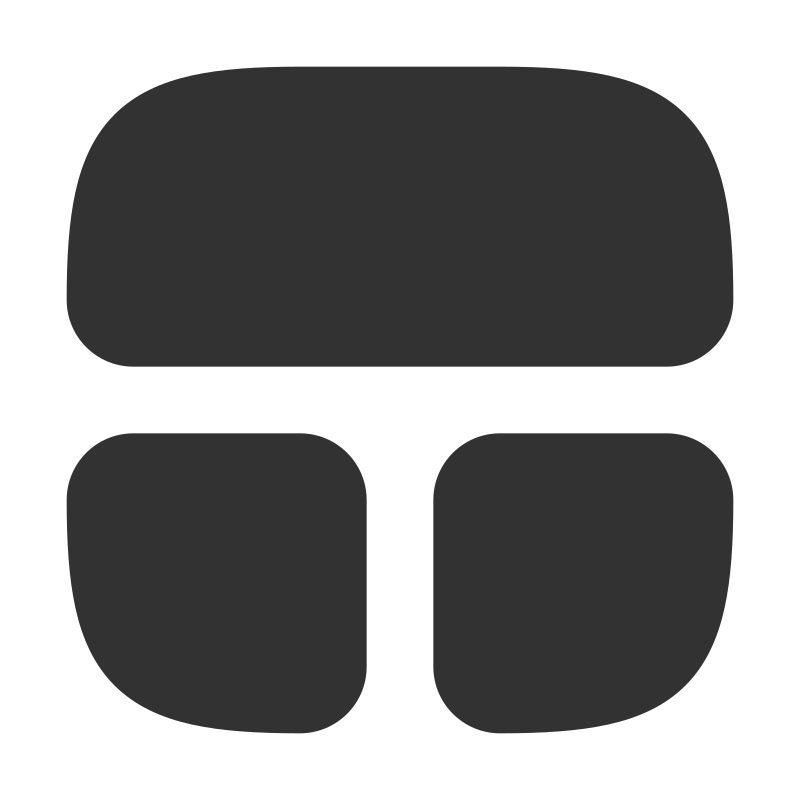</a> | **📂 檔名:** `row-cols.svg` ✨ **格式:** `Vector (SVG)` ⚖️ **大小:** `1.35KB` 📅 **更新:** `2026-02-28`  🚀 **jsDelivr Markdown:** `` 🔗 **直接連結 (Url):** <code>https://cdn.jsdelivr.net/gh/barry028/materials@main/images/iCons/Scarlab%20iCons/Solid/row-cols.svg</code> 📥 [檢視原始檔](row-cols.svg) |
|  | **📂 檔名:** `rows.svg` ✨ **格式:** `Vector (SVG)` ⚖️ **大小:** `1.18KB` 📅 **更新:** `2026-02-28`  🚀 **jsDelivr Markdown:** `` 🔗 **直接連結 (Url):** <code>https://cdn.jsdelivr.net/gh/barry028/materials@main/images/iCons/Scarlab%20iCons/Solid/rows.svg</code> 📥 [檢視原始檔](rows.svg) |
|  | **📂 檔名:** `ruble-circle.svg` ✨ **格式:** `Vector (SVG)` ⚖️ **大小:** `1.12KB` 📅 **更新:** `2026-02-28`  🚀 **jsDelivr Markdown:** `` 🔗 **直接連結 (Url):** <code>https://cdn.jsdelivr.net/gh/barry028/materials@main/images/iCons/Scarlab%20iCons/Solid/ruble-circle.svg</code> 📥 [檢視原始檔](ruble-circle.svg) |
|  | **📂 檔名:** `ruble-square.svg` ✨ **格式:** `Vector (SVG)` ⚖️ **大小:** `1.66KB` 📅 **更新:** `2026-02-28`  🚀 **jsDelivr Markdown:** `` 🔗 **直接連結 (Url):** <code>https://cdn.jsdelivr.net/gh/barry028/materials@main/images/iCons/Scarlab%20iCons/Solid/ruble-square.svg</code> 📥 [檢視原始檔](ruble-square.svg) |
|  | **📂 檔名:** `rupee-circle.svg` ✨ **格式:** `Vector (SVG)` ⚖️ **大小:** `1.21KB` 📅 **更新:** `2026-02-28`  🚀 **jsDelivr Markdown:** `` 🔗 **直接連結 (Url):** <code>https://cdn.jsdelivr.net/gh/barry028/materials@main/images/iCons/Scarlab%20iCons/Solid/rupee-circle.svg</code> 📥 [檢視原始檔](rupee-circle.svg) |
|  | **📂 檔名:** `rupee-square.svg` ✨ **格式:** `Vector (SVG)` ⚖️ **大小:** `1.75KB` 📅 **更新:** `2026-02-28`  🚀 **jsDelivr Markdown:** `` 🔗 **直接連結 (Url):** <code>https://cdn.jsdelivr.net/gh/barry028/materials@main/images/iCons/Scarlab%20iCons/Solid/rupee-square.svg</code> 📥 [檢視原始檔](rupee-square.svg) |
|  | **📂 檔名:** `scarlab.svg` ✨ **格式:** `Vector (SVG)` ⚖️ **大小:** `3.74KB` 📅 **更新:** `2026-02-28`  🚀 **jsDelivr Markdown:** `` 🔗 **直接連結 (Url):** <code>https://cdn.jsdelivr.net/gh/barry028/materials@main/images/iCons/Scarlab%20iCons/Solid/scarlab.svg</code> 📥 [檢視原始檔](scarlab.svg) |
|  | **📂 檔名:** `scissors.svg` ✨ **格式:** `Vector (SVG)` ⚖️ **大小:** `984.00B` 📅 **更新:** `2026-02-28`  🚀 **jsDelivr Markdown:** `` 🔗 **直接連結 (Url):** <code>https://cdn.jsdelivr.net/gh/barry028/materials@main/images/iCons/Scarlab%20iCons/Solid/scissors.svg</code> 📥 [檢視原始檔](scissors.svg) |
|  | **📂 檔名:** `search-alt.svg` ✨ **格式:** `Vector (SVG)` ⚖️ **大小:** `627.00B` 📅 **更新:** `2026-02-28`  🚀 **jsDelivr Markdown:** `` 🔗 **直接連結 (Url):** <code>https://cdn.jsdelivr.net/gh/barry028/materials@main/images/iCons/Scarlab%20iCons/Solid/search-alt.svg</code> 📥 [檢視原始檔](search-alt.svg) |
|  | **📂 檔名:** `search-circle.svg` ✨ **格式:** `Vector (SVG)` ⚖️ **大小:** `869.00B` 📅 **更新:** `2026-02-28`  🚀 **jsDelivr Markdown:** `` 🔗 **直接連結 (Url):** <code>https://cdn.jsdelivr.net/gh/barry028/materials@main/images/iCons/Scarlab%20iCons/Solid/search-circle.svg</code> 📥 [檢視原始檔](search-circle.svg) |
|  | **📂 檔名:** `search-square.svg` ✨ **格式:** `Vector (SVG)` ⚖️ **大小:** `1.39KB` 📅 **更新:** `2026-02-28`  🚀 **jsDelivr Markdown:** `` 🔗 **直接連結 (Url):** <code>https://cdn.jsdelivr.net/gh/barry028/materials@main/images/iCons/Scarlab%20iCons/Solid/search-square.svg</code> 📥 [檢視原始檔](search-square.svg) |
|  | **📂 檔名:** `search.svg` ✨ **格式:** `Vector (SVG)` ⚖️ **大小:** `629.00B` 📅 **更新:** `2026-02-28`  🚀 **jsDelivr Markdown:** `` 🔗 **直接連結 (Url):** <code>https://cdn.jsdelivr.net/gh/barry028/materials@main/images/iCons/Scarlab%20iCons/Solid/search.svg</code> 📥 [檢視原始檔](search.svg) |
|  | **📂 檔名:** `share.svg` ✨ **格式:** `Vector (SVG)` ⚖️ **大小:** `926.00B` 📅 **更新:** `2026-02-28`  🚀 **jsDelivr Markdown:** `` 🔗 **直接連結 (Url):** <code>https://cdn.jsdelivr.net/gh/barry028/materials@main/images/iCons/Scarlab%20iCons/Solid/share.svg</code> 📥 [檢視原始檔](share.svg) |
|  | **📂 檔名:** `shopping-bag.svg` ✨ **格式:** `Vector (SVG)` ⚖️ **大小:** `1.44KB` 📅 **更新:** `2026-02-28`  🚀 **jsDelivr Markdown:** `` 🔗 **直接連結 (Url):** <code>https://cdn.jsdelivr.net/gh/barry028/materials@main/images/iCons/Scarlab%20iCons/Solid/shopping-bag.svg</code> 📥 [檢視原始檔](shopping-bag.svg) |
|  | **📂 檔名:** `shopping-cart.svg` ✨ **格式:** `Vector (SVG)` ⚖️ **大小:** `1.40KB` 📅 **更新:** `2026-02-28`  🚀 **jsDelivr Markdown:** `` 🔗 **直接連結 (Url):** <code>https://cdn.jsdelivr.net/gh/barry028/materials@main/images/iCons/Scarlab%20iCons/Solid/shopping-cart.svg</code> 📥 [檢視原始檔](shopping-cart.svg) |
|  | **📂 檔名:** `slash.svg` ✨ **格式:** `Vector (SVG)` ⚖️ **大小:** `619.00B` 📅 **更新:** `2026-02-28`  🚀 **jsDelivr Markdown:** `` 🔗 **直接連結 (Url):** <code>https://cdn.jsdelivr.net/gh/barry028/materials@main/images/iCons/Scarlab%20iCons/Solid/slash.svg</code> 📥 [檢視原始檔](slash.svg) |
|  | **📂 檔名:** `sparkles.svg` ✨ **格式:** `Vector (SVG)` ⚖️ **大小:** `1.76KB` 📅 **更新:** `2026-02-28`  🚀 **jsDelivr Markdown:** `` 🔗 **直接連結 (Url):** <code>https://cdn.jsdelivr.net/gh/barry028/materials@main/images/iCons/Scarlab%20iCons/Solid/sparkles.svg</code> 📥 [檢視原始檔](sparkles.svg) |
|  | **📂 檔名:** `speaker.svg` ✨ **格式:** `Vector (SVG)` ⚖️ **大小:** `1.43KB` 📅 **更新:** `2026-02-28`  🚀 **jsDelivr Markdown:** `` 🔗 **直接連結 (Url):** <code>https://cdn.jsdelivr.net/gh/barry028/materials@main/images/iCons/Scarlab%20iCons/Solid/speaker.svg</code> 📥 [檢視原始檔](speaker.svg) |
|  | **📂 檔名:** `square.svg` ✨ **格式:** `Vector (SVG)` ⚖️ **大小:** `1014.00B` 📅 **更新:** `2026-02-28`  🚀 **jsDelivr Markdown:** `` 🔗 **直接連結 (Url):** <code>https://cdn.jsdelivr.net/gh/barry028/materials@main/images/iCons/Scarlab%20iCons/Solid/square.svg</code> 📥 [檢視原始檔](square.svg) |
|  | **📂 檔名:** `star-circle.svg` ✨ **格式:** `Vector (SVG)` ⚖️ **大小:** `1.13KB` 📅 **更新:** `2026-02-28`  🚀 **jsDelivr Markdown:** `` 🔗 **直接連結 (Url):** <code>https://cdn.jsdelivr.net/gh/barry028/materials@main/images/iCons/Scarlab%20iCons/Solid/star-circle.svg</code> 📥 [檢視原始檔](star-circle.svg) |
|  | **📂 檔名:** `star-off.svg` ✨ **格式:** `Vector (SVG)` ⚖️ **大小:** `1.47KB` 📅 **更新:** `2026-02-28`  🚀 **jsDelivr Markdown:** `` 🔗 **直接連結 (Url):** <code>https://cdn.jsdelivr.net/gh/barry028/materials@main/images/iCons/Scarlab%20iCons/Solid/star-off.svg</code> 📥 [檢視原始檔](star-off.svg) |
|  | **📂 檔名:** `star-square.svg` ✨ **格式:** `Vector (SVG)` ⚖️ **大小:** `1.68KB` 📅 **更新:** `2026-02-28`  🚀 **jsDelivr Markdown:** `` 🔗 **直接連結 (Url):** <code>https://cdn.jsdelivr.net/gh/barry028/materials@main/images/iCons/Scarlab%20iCons/Solid/star-square.svg</code> 📥 [檢視原始檔](star-square.svg) |
|  | **📂 檔名:** `star.svg` ✨ **格式:** `Vector (SVG)` ⚖️ **大小:** `996.00B` 📅 **更新:** `2026-02-28`  🚀 **jsDelivr Markdown:** `` 🔗 **直接連結 (Url):** <code>https://cdn.jsdelivr.net/gh/barry028/materials@main/images/iCons/Scarlab%20iCons/Solid/star.svg</code> 📥 [檢視原始檔](star.svg) |
|  | **📂 檔名:** `sun.svg` ✨ **格式:** `Vector (SVG)` ⚖️ **大小:** `2.39KB` 📅 **更新:** `2026-02-28`  🚀 **jsDelivr Markdown:** `` 🔗 **直接連結 (Url):** <code>https://cdn.jsdelivr.net/gh/barry028/materials@main/images/iCons/Scarlab%20iCons/Solid/sun.svg</code> 📥 [檢視原始檔](sun.svg) |
|  | **📂 檔名:** `support.svg` ✨ **格式:** `Vector (SVG)` ⚖️ **大小:** `1.43KB` 📅 **更新:** `2026-02-28`  🚀 **jsDelivr Markdown:** `` 🔗 **直接連結 (Url):** <code>https://cdn.jsdelivr.net/gh/barry028/materials@main/images/iCons/Scarlab%20iCons/Solid/support.svg</code> 📥 [檢視原始檔](support.svg) |
|  | **📂 檔名:** `tablet.svg` ✨ **格式:** `Vector (SVG)` ⚖️ **大小:** `1.29KB` 📅 **更新:** `2026-02-28`  🚀 **jsDelivr Markdown:** `` 🔗 **直接連結 (Url):** <code>https://cdn.jsdelivr.net/gh/barry028/materials@main/images/iCons/Scarlab%20iCons/Solid/tablet.svg</code> 📥 [檢視原始檔](tablet.svg) |
|  | **📂 檔名:** `terminal.svg` ✨ **格式:** `Vector (SVG)` ⚖️ **大小:** `1.60KB` 📅 **更新:** `2026-02-28`  🚀 **jsDelivr Markdown:** `` 🔗 **直接連結 (Url):** <code>https://cdn.jsdelivr.net/gh/barry028/materials@main/images/iCons/Scarlab%20iCons/Solid/terminal.svg</code> 📥 [檢視原始檔](terminal.svg) |
|  | **📂 檔名:** `ticket.svg` ✨ **格式:** `Vector (SVG)` ⚖️ **大小:** `1.93KB` 📅 **更新:** `2026-02-28`  🚀 **jsDelivr Markdown:** `` 🔗 **直接連結 (Url):** <code>https://cdn.jsdelivr.net/gh/barry028/materials@main/images/iCons/Scarlab%20iCons/Solid/ticket.svg</code> 📥 [檢視原始檔](ticket.svg) |
|  | **📂 檔名:** `timer.svg` ✨ **格式:** `Vector (SVG)` ⚖️ **大小:** `839.00B` 📅 **更新:** `2026-02-28`  🚀 **jsDelivr Markdown:** `` 🔗 **直接連結 (Url):** <code>https://cdn.jsdelivr.net/gh/barry028/materials@main/images/iCons/Scarlab%20iCons/Solid/timer.svg</code> 📥 [檢視原始檔](timer.svg) |
|  | **📂 檔名:** `user-add.svg` ✨ **格式:** `Vector (SVG)` ⚖️ **大小:** `1.05KB` 📅 **更新:** `2026-02-28`  🚀 **jsDelivr Markdown:** `` 🔗 **直接連結 (Url):** <code>https://cdn.jsdelivr.net/gh/barry028/materials@main/images/iCons/Scarlab%20iCons/Solid/user-add.svg</code> 📥 [檢視原始檔](user-add.svg) |
|  | **📂 檔名:** `user-check.svg` ✨ **格式:** `Vector (SVG)` ⚖️ **大小:** `1.17KB` 📅 **更新:** `2026-02-28`  🚀 **jsDelivr Markdown:** `` 🔗 **直接連結 (Url):** <code>https://cdn.jsdelivr.net/gh/barry028/materials@main/images/iCons/Scarlab%20iCons/Solid/user-check.svg</code> 📥 [檢視原始檔](user-check.svg) |
|  | **📂 檔名:** `user-circle.svg` ✨ **格式:** `Vector (SVG)` ⚖️ **大小:** `978.00B` 📅 **更新:** `2026-02-28`  🚀 **jsDelivr Markdown:** `` 🔗 **直接連結 (Url):** <code>https://cdn.jsdelivr.net/gh/barry028/materials@main/images/iCons/Scarlab%20iCons/Solid/user-circle.svg</code> 📥 [檢視原始檔](user-circle.svg) |
|  | **📂 檔名:** `user-minus.svg` ✨ **格式:** `Vector (SVG)` ⚖️ **大小:** `995.00B` 📅 **更新:** `2026-02-28`  🚀 **jsDelivr Markdown:** `` 🔗 **直接連結 (Url):** <code>https://cdn.jsdelivr.net/gh/barry028/materials@main/images/iCons/Scarlab%20iCons/Solid/user-minus.svg</code> 📥 [檢視原始檔](user-minus.svg) |
|  | **📂 檔名:** `user-square.svg` ✨ **格式:** `Vector (SVG)` ⚖️ **大小:** `1.55KB` 📅 **更新:** `2026-02-28`  🚀 **jsDelivr Markdown:** `` 🔗 **直接連結 (Url):** <code>https://cdn.jsdelivr.net/gh/barry028/materials@main/images/iCons/Scarlab%20iCons/Solid/user-square.svg</code> 📥 [檢視原始檔](user-square.svg) |
|  | **📂 檔名:** `user-x.svg` ✨ **格式:** `Vector (SVG)` ⚖️ **大小:** `1.32KB` 📅 **更新:** `2026-02-28`  🚀 **jsDelivr Markdown:** `` 🔗 **直接連結 (Url):** <code>https://cdn.jsdelivr.net/gh/barry028/materials@main/images/iCons/Scarlab%20iCons/Solid/user-x.svg</code> 📥 [檢視原始檔](user-x.svg) |
|  | **📂 檔名:** `user.svg` ✨ **格式:** `Vector (SVG)` ⚖️ **大小:** `795.00B` 📅 **更新:** `2026-02-28`  🚀 **jsDelivr Markdown:** `` 🔗 **直接連結 (Url):** <code>https://cdn.jsdelivr.net/gh/barry028/materials@main/images/iCons/Scarlab%20iCons/Solid/user.svg</code> 📥 [檢視原始檔](user.svg) |
|  | **📂 檔名:** `users.svg` ✨ **格式:** `Vector (SVG)` ⚖️ **大小:** `1.56KB` 📅 **更新:** `2026-02-28`  🚀 **jsDelivr Markdown:** `` 🔗 **直接連結 (Url):** <code>https://cdn.jsdelivr.net/gh/barry028/materials@main/images/iCons/Scarlab%20iCons/Solid/users.svg</code> 📥 [檢視原始檔](users.svg) |
| <a href="watches.svg">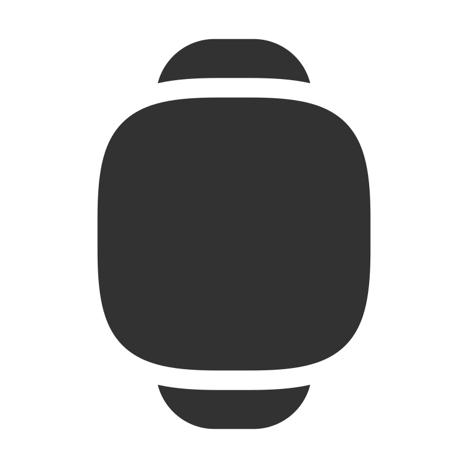</a> | **📂 檔名:** `watches.svg` ✨ **格式:** `Vector (SVG)` ⚖️ **大小:** `1.67KB` 📅 **更新:** `2026-02-28`  🚀 **jsDelivr Markdown:** `` 🔗 **直接連結 (Url):** <code>https://cdn.jsdelivr.net/gh/barry028/materials@main/images/iCons/Scarlab%20iCons/Solid/watches.svg</code> 📥 [檢視原始檔](watches.svg) |
|  | **📂 檔名:** `x-circle.svg` ✨ **格式:** `Vector (SVG)` ⚖️ **大小:** `964.00B` 📅 **更新:** `2026-02-28`  🚀 **jsDelivr Markdown:** `` 🔗 **直接連結 (Url):** <code>https://cdn.jsdelivr.net/gh/barry028/materials@main/images/iCons/Scarlab%20iCons/Solid/x-circle.svg</code> 📥 [檢視原始檔](x-circle.svg) |
|  | **📂 檔名:** `x-square.svg` ✨ **格式:** `Vector (SVG)` ⚖️ **大小:** `1.49KB` 📅 **更新:** `2026-02-28`  🚀 **jsDelivr Markdown:** `` 🔗 **直接連結 (Url):** <code>https://cdn.jsdelivr.net/gh/barry028/materials@main/images/iCons/Scarlab%20iCons/Solid/x-square.svg</code> 📥 [檢視原始檔](x-square.svg) |
|  | **📂 檔名:** `yen-circle.svg` ✨ **格式:** `Vector (SVG)` ⚖️ **大小:** `1.15KB` 📅 **更新:** `2026-02-28`  🚀 **jsDelivr Markdown:** `` 🔗 **直接連結 (Url):** <code>https://cdn.jsdelivr.net/gh/barry028/materials@main/images/iCons/Scarlab%20iCons/Solid/yen-circle.svg</code> 📥 [檢視原始檔](yen-circle.svg) |
|  | **📂 檔名:** `yen-square.svg` ✨ **格式:** `Vector (SVG)` ⚖️ **大小:** `1.68KB` 📅 **更新:** `2026-02-28`  🚀 **jsDelivr Markdown:** `` 🔗 **直接連結 (Url):** <code>https://cdn.jsdelivr.net/gh/barry028/materials@main/images/iCons/Scarlab%20iCons/Solid/yen-square.svg</code> 📥 [檢視原始檔](yen-square.svg) |
|  | **📂 檔名:** `zap (1).svg` ✨ **格式:** `Vector (SVG)` ⚖️ **大小:** `609.00B` 📅 **更新:** `2026-02-28`  🚀 **jsDelivr Markdown:** `` 🔗 **直接連結 (Url):** <code>https://cdn.jsdelivr.net/gh/barry028/materials@main/images/iCons/Scarlab%20iCons/Solid/zap%20%281%29.svg</code> 📥 [檢視原始檔](zap%20%281%29.svg) |
|  | **📂 檔名:** `zap.svg` ✨ **格式:** `Vector (SVG)` ⚖️ **大小:** `609.00B` 📅 **更新:** `2026-02-28`  🚀 **jsDelivr Markdown:** `` 🔗 **直接連結 (Url):** <code>https://cdn.jsdelivr.net/gh/barry028/materials@main/images/iCons/Scarlab%20iCons/Solid/zap.svg</code> 📥 [檢視原始檔](zap.svg) |