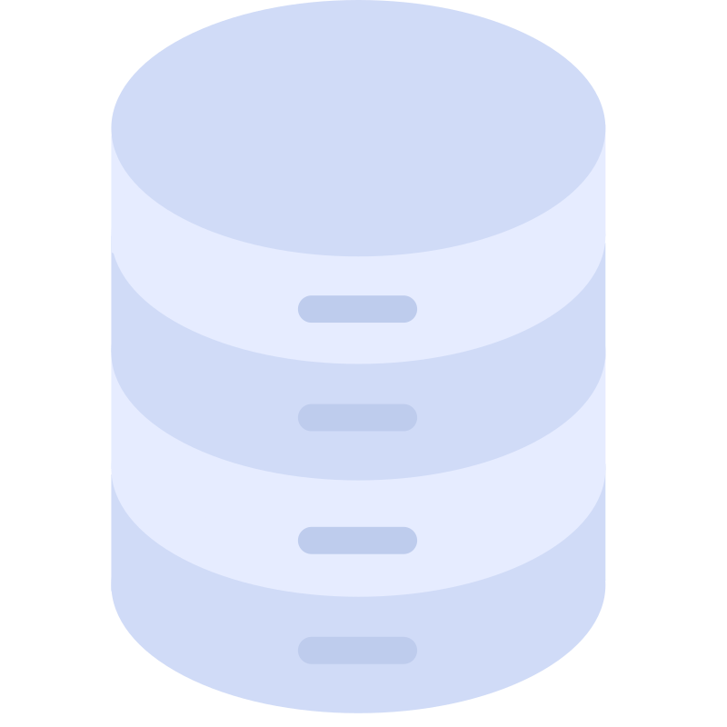
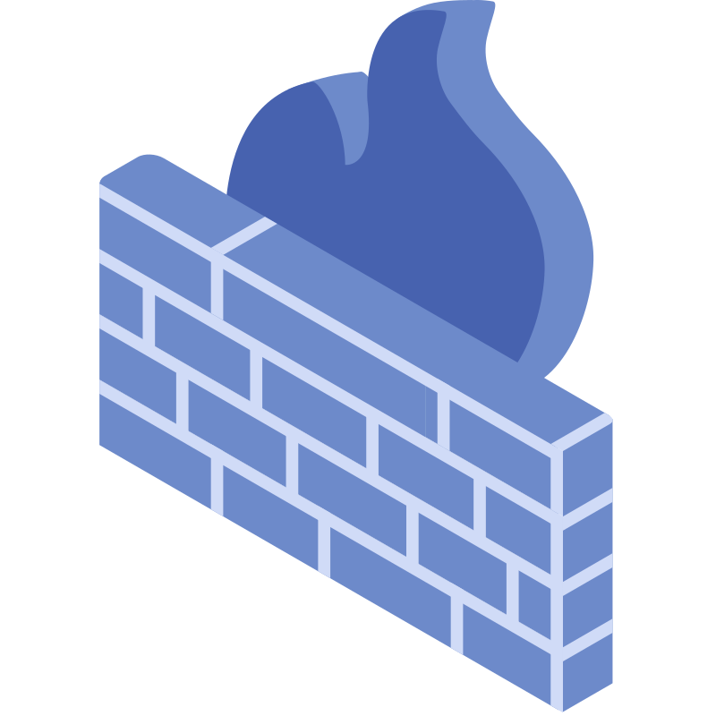
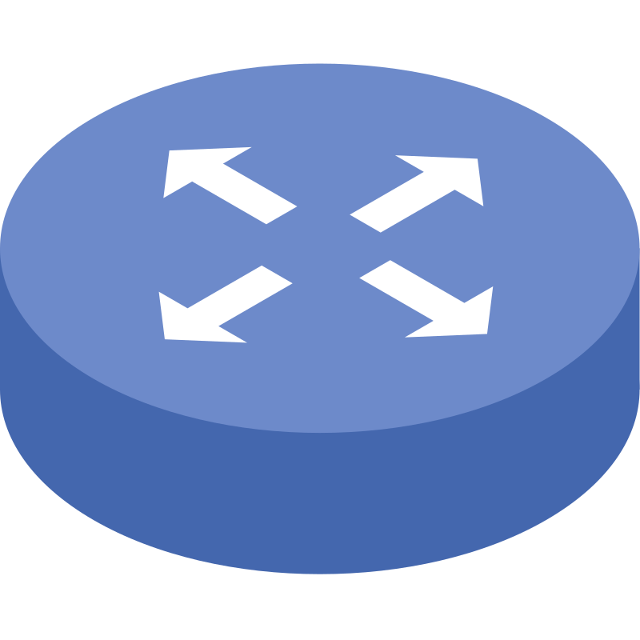
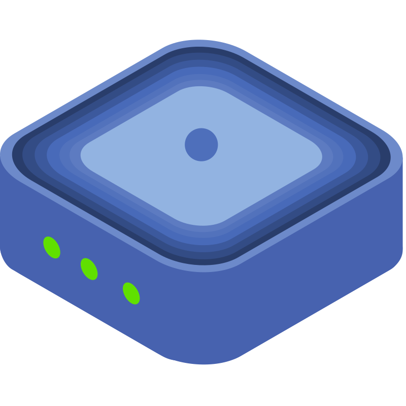

# 🖼️ 素材分類：Servers Isometric iCons

> [🏠 主目錄](../../../README.md) / [images](../../README.md) / [iCons](../README.md) / **Servers Isometric iCons**

本目錄共有 `20` 個檔案

| 🎨 預覽 (點擊放大)  | 📋 檔案詳細資訊與連結 |
| :--- | :--- |
|  | **📂 檔名:** `1u-server.svg` ✨ **格式:** `Vector (SVG)` ⚖️ **大小:** `2.17KB` 📅 **更新:** `2026-03-03`  🚀 **jsDelivr Markdown:** `` 🔗 **直接連結 (Url):** <code>https://cdn.jsdelivr.net/gh/barry028/materials@main/images/iCons/Servers%20Isometric%20iCons/1u-server.svg</code> 📥 [檢視原始檔](1u-server.svg) |
|  | **📂 檔名:** `2u-server.svg` ✨ **格式:** `Vector (SVG)` ⚖️ **大小:** `6.82KB` 📅 **更新:** `2026-03-03`  🚀 **jsDelivr Markdown:** `` 🔗 **直接連結 (Url):** <code>https://cdn.jsdelivr.net/gh/barry028/materials@main/images/iCons/Servers%20Isometric%20iCons/2u-server.svg</code> 📥 [檢視原始檔](2u-server.svg) |
|  | **📂 檔名:** `3u-server.svg` ✨ **格式:** `Vector (SVG)` ⚖️ **大小:** `8.85KB` 📅 **更新:** `2026-03-03`  🚀 **jsDelivr Markdown:** `` 🔗 **直接連結 (Url):** <code>https://cdn.jsdelivr.net/gh/barry028/materials@main/images/iCons/Servers%20Isometric%20iCons/3u-server.svg</code> 📥 [檢視原始檔](3u-server.svg) |
|  | **📂 檔名:** `cloud-database.svg` ✨ **格式:** `Vector (SVG)` ⚖️ **大小:** `5.74KB` 📅 **更新:** `2026-03-03`  🚀 **jsDelivr Markdown:** `` 🔗 **直接連結 (Url):** <code>https://cdn.jsdelivr.net/gh/barry028/materials@main/images/iCons/Servers%20Isometric%20iCons/cloud-database.svg</code> 📥 [檢視原始檔](cloud-database.svg) |
|  | **📂 檔名:** `cloud-download.svg` ✨ **格式:** `Vector (SVG)` ⚖️ **大小:** `8.12KB` 📅 **更新:** `2026-03-03`  🚀 **jsDelivr Markdown:** `` 🔗 **直接連結 (Url):** <code>https://cdn.jsdelivr.net/gh/barry028/materials@main/images/iCons/Servers%20Isometric%20iCons/cloud-download.svg</code> 📥 [檢視原始檔](cloud-download.svg) |
|  | **📂 檔名:** `cloud-server.svg` ✨ **格式:** `Vector (SVG)` ⚖️ **大小:** `10.62KB` 📅 **更新:** `2026-03-03`  🚀 **jsDelivr Markdown:** `` 🔗 **直接連結 (Url):** <code>https://cdn.jsdelivr.net/gh/barry028/materials@main/images/iCons/Servers%20Isometric%20iCons/cloud-server.svg</code> 📥 [檢視原始檔](cloud-server.svg) |
|  | **📂 檔名:** `cloud-server2.svg` ✨ **格式:** `Vector (SVG)` ⚖️ **大小:** `18.39KB` 📅 **更新:** `2026-03-03`  🚀 **jsDelivr Markdown:** `` 🔗 **直接連結 (Url):** <code>https://cdn.jsdelivr.net/gh/barry028/materials@main/images/iCons/Servers%20Isometric%20iCons/cloud-server2.svg</code> 📥 [檢視原始檔](cloud-server2.svg) |
|  | **📂 檔名:** `cloud.svg` ✨ **格式:** `Vector (SVG)` ⚖️ **大小:** `2.98KB` 📅 **更新:** `2026-03-03`  🚀 **jsDelivr Markdown:** `` 🔗 **直接連結 (Url):** <code>https://cdn.jsdelivr.net/gh/barry028/materials@main/images/iCons/Servers%20Isometric%20iCons/cloud.svg</code> 📥 [檢視原始檔](cloud.svg) |
|  | **📂 檔名:** `code.svg` ✨ **格式:** `Vector (SVG)` ⚖️ **大小:** `13.36KB` 📅 **更新:** `2026-03-03`  🚀 **jsDelivr Markdown:** `` 🔗 **直接連結 (Url):** <code>https://cdn.jsdelivr.net/gh/barry028/materials@main/images/iCons/Servers%20Isometric%20iCons/code.svg</code> 📥 [檢視原始檔](code.svg) |
|  | **📂 檔名:** `database.svg` ✨ **格式:** `Vector (SVG)` ⚖️ **大小:** `3.09KB` 📅 **更新:** `2026-03-03`  🚀 **jsDelivr Markdown:** `` 🔗 **直接連結 (Url):** <code>https://cdn.jsdelivr.net/gh/barry028/materials@main/images/iCons/Servers%20Isometric%20iCons/database.svg</code> 📥 [檢視原始檔](database.svg) |
|  | **📂 檔名:** `disk1.svg` ✨ **格式:** `Vector (SVG)` ⚖️ **大小:** `8.39KB` 📅 **更新:** `2026-03-03`  🚀 **jsDelivr Markdown:** `` 🔗 **直接連結 (Url):** <code>https://cdn.jsdelivr.net/gh/barry028/materials@main/images/iCons/Servers%20Isometric%20iCons/disk1.svg</code> 📥 [檢視原始檔](disk1.svg) |
|  | **📂 檔名:** `disk2.svg` ✨ **格式:** `Vector (SVG)` ⚖️ **大小:** `10.08KB` 📅 **更新:** `2026-03-03`  🚀 **jsDelivr Markdown:** `` 🔗 **直接連結 (Url):** <code>https://cdn.jsdelivr.net/gh/barry028/materials@main/images/iCons/Servers%20Isometric%20iCons/disk2.svg</code> 📥 [檢視原始檔](disk2.svg) |
|  | **📂 檔名:** `firewalld2.svg` ✨ **格式:** `Vector (SVG)` ⚖️ **大小:** `5.70KB` 📅 **更新:** `2026-03-03`  🚀 **jsDelivr Markdown:** `` 🔗 **直接連結 (Url):** <code>https://cdn.jsdelivr.net/gh/barry028/materials@main/images/iCons/Servers%20Isometric%20iCons/firewalld2.svg</code> 📥 [檢視原始檔](firewalld2.svg) |
|  | **📂 檔名:** `node.svg` ✨ **格式:** `Vector (SVG)` ⚖️ **大小:** `2.79KB` 📅 **更新:** `2026-03-03`  🚀 **jsDelivr Markdown:** `` 🔗 **直接連結 (Url):** <code>https://cdn.jsdelivr.net/gh/barry028/materials@main/images/iCons/Servers%20Isometric%20iCons/node.svg</code> 📥 [檢視原始檔](node.svg) |
|  | **📂 檔名:** `pc.svg` ✨ **格式:** `Vector (SVG)` ⚖️ **大小:** `3.64KB` 📅 **更新:** `2026-03-03`  🚀 **jsDelivr Markdown:** `` 🔗 **直接連結 (Url):** <code>https://cdn.jsdelivr.net/gh/barry028/materials@main/images/iCons/Servers%20Isometric%20iCons/pc.svg</code> 📥 [檢視原始檔](pc.svg) |
|  | **📂 檔名:** `router.svg` ✨ **格式:** `Vector (SVG)` ⚖️ **大小:** `1.53KB` 📅 **更新:** `2026-03-03`  🚀 **jsDelivr Markdown:** `` 🔗 **直接連結 (Url):** <code>https://cdn.jsdelivr.net/gh/barry028/materials@main/images/iCons/Servers%20Isometric%20iCons/router.svg</code> 📥 [檢視原始檔](router.svg) |
|  | **📂 檔名:** `server.svg` ✨ **格式:** `Vector (SVG)` ⚖️ **大小:** `2.89KB` 📅 **更新:** `2026-03-03`  🚀 **jsDelivr Markdown:** `` 🔗 **直接連結 (Url):** <code>https://cdn.jsdelivr.net/gh/barry028/materials@main/images/iCons/Servers%20Isometric%20iCons/server.svg</code> 📥 [檢視原始檔](server.svg) |
|  | **📂 檔名:** `setting.svg` ✨ **格式:** `Vector (SVG)` ⚖️ **大小:** `4.84KB` 📅 **更新:** `2026-03-03`  🚀 **jsDelivr Markdown:** `` 🔗 **直接連結 (Url):** <code>https://cdn.jsdelivr.net/gh/barry028/materials@main/images/iCons/Servers%20Isometric%20iCons/setting.svg</code> 📥 [檢視原始檔](setting.svg) |
|  | **📂 檔名:** `switch.svg` ✨ **格式:** `Vector (SVG)` ⚖️ **大小:** `1.73KB` 📅 **更新:** `2026-03-03`  🚀 **jsDelivr Markdown:** `` 🔗 **直接連結 (Url):** <code>https://cdn.jsdelivr.net/gh/barry028/materials@main/images/iCons/Servers%20Isometric%20iCons/switch.svg</code> 📥 [檢視原始檔](switch.svg) |
|  | **📂 檔名:** `upload.svg` ✨ **格式:** `Vector (SVG)` ⚖️ **大小:** `8.29KB` 📅 **更新:** `2026-03-03`  🚀 **jsDelivr Markdown:** `` 🔗 **直接連結 (Url):** <code>https://cdn.jsdelivr.net/gh/barry028/materials@main/images/iCons/Servers%20Isometric%20iCons/upload.svg</code> 📥 [檢視原始檔](upload.svg) |