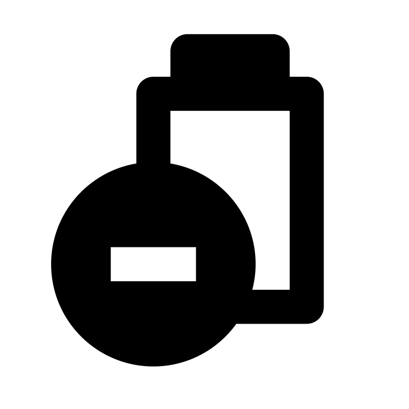

# 🖼️ 素材分類：Fill

> [🏠 主目錄](../../../../README.md) / [images](../../../README.md) / [iCons](../../README.md) / [Shopicon iCons](../README.md) / **Fill**

本目錄共有 `203` 個檔案

| 🎨 預覽 (點擊放大)  | 📋 檔案詳細資訊與連結 |
| :--- | :--- |
|  | **📂 檔名:** `account.svg` ✨ **格式:** `Vector (SVG)` ⚖️ **大小:** `576.00B` 📅 **更新:** `2026-03-03`  🚀 **jsDelivr Markdown:** `` 🔗 **直接連結 (Url):** <code>https://cdn.jsdelivr.net/gh/barry028/materials@main/images/iCons/Shopicon%20iCons/Fill/account.svg</code> 📥 [檢視原始檔](account.svg) |
|  | **📂 檔名:** `adjust.svg` ✨ **格式:** `Vector (SVG)` ⚖️ **大小:** `566.00B` 📅 **更新:** `2026-03-03`  🚀 **jsDelivr Markdown:** `` 🔗 **直接連結 (Url):** <code>https://cdn.jsdelivr.net/gh/barry028/materials@main/images/iCons/Shopicon%20iCons/Fill/adjust.svg</code> 📥 [檢視原始檔](adjust.svg) |
|  | **📂 檔名:** `arrowback.svg` ✨ **格式:** `Vector (SVG)` ⚖️ **大小:** `404.00B` 📅 **更新:** `2026-03-03`  🚀 **jsDelivr Markdown:** `` 🔗 **直接連結 (Url):** <code>https://cdn.jsdelivr.net/gh/barry028/materials@main/images/iCons/Shopicon%20iCons/Fill/arrowback.svg</code> 📥 [檢視原始檔](arrowback.svg) |
|  | **📂 檔名:** `arrowdown.svg` ✨ **格式:** `Vector (SVG)` ⚖️ **大小:** `396.00B` 📅 **更新:** `2026-03-03`  🚀 **jsDelivr Markdown:** `` 🔗 **直接連結 (Url):** <code>https://cdn.jsdelivr.net/gh/barry028/materials@main/images/iCons/Shopicon%20iCons/Fill/arrowdown.svg</code> 📥 [檢視原始檔](arrowdown.svg) |
|  | **📂 檔名:** `arrowforward.svg` ✨ **格式:** `Vector (SVG)` ⚖️ **大小:** `404.00B` 📅 **更新:** `2026-03-03`  🚀 **jsDelivr Markdown:** `` 🔗 **直接連結 (Url):** <code>https://cdn.jsdelivr.net/gh/barry028/materials@main/images/iCons/Shopicon%20iCons/Fill/arrowforward.svg</code> 📥 [檢視原始檔](arrowforward.svg) |
|  | **📂 檔名:** `arrowleft.svg` ✨ **格式:** `Vector (SVG)` ⚖️ **大小:** `347.00B` 📅 **更新:** `2026-03-03`  🚀 **jsDelivr Markdown:** `` 🔗 **直接連結 (Url):** <code>https://cdn.jsdelivr.net/gh/barry028/materials@main/images/iCons/Shopicon%20iCons/Fill/arrowleft.svg</code> 📥 [檢視原始檔](arrowleft.svg) |
|  | **📂 檔名:** `arrowright.svg` ✨ **格式:** `Vector (SVG)` ⚖️ **大小:** `346.00B` 📅 **更新:** `2026-03-03`  🚀 **jsDelivr Markdown:** `` 🔗 **直接連結 (Url):** <code>https://cdn.jsdelivr.net/gh/barry028/materials@main/images/iCons/Shopicon%20iCons/Fill/arrowright.svg</code> 📥 [檢視原始檔](arrowright.svg) |
|  | **📂 檔名:** `arrowup.svg` ✨ **格式:** `Vector (SVG)` ⚖️ **大小:** `396.00B` 📅 **更新:** `2026-03-03`  🚀 **jsDelivr Markdown:** `` 🔗 **直接連結 (Url):** <code>https://cdn.jsdelivr.net/gh/barry028/materials@main/images/iCons/Shopicon%20iCons/Fill/arrowup.svg</code> 📥 [檢視原始檔](arrowup.svg) |
|  | **📂 檔名:** `backtotop.svg` ✨ **格式:** `Vector (SVG)` ⚖️ **大小:** `659.00B` 📅 **更新:** `2026-03-03`  🚀 **jsDelivr Markdown:** `` 🔗 **直接連結 (Url):** <code>https://cdn.jsdelivr.net/gh/barry028/materials@main/images/iCons/Shopicon%20iCons/Fill/backtotop.svg</code> 📥 [檢視原始檔](backtotop.svg) |
|  | **📂 檔名:** `balcony.svg` ✨ **格式:** `Vector (SVG)` ⚖️ **大小:** `618.00B` 📅 **更新:** `2026-03-03`  🚀 **jsDelivr Markdown:** `` 🔗 **直接連結 (Url):** <code>https://cdn.jsdelivr.net/gh/barry028/materials@main/images/iCons/Shopicon%20iCons/Fill/balcony.svg</code> 📥 [檢視原始檔](balcony.svg) |
|  | **📂 檔名:** `bath.svg` ✨ **格式:** `Vector (SVG)` ⚖️ **大小:** `539.00B` 📅 **更新:** `2026-03-03`  🚀 **jsDelivr Markdown:** `` 🔗 **直接連結 (Url):** <code>https://cdn.jsdelivr.net/gh/barry028/materials@main/images/iCons/Shopicon%20iCons/Fill/bath.svg</code> 📥 [檢視原始檔](bath.svg) |
|  | **📂 檔名:** `battery-charge.svg` ✨ **格式:** `Vector (SVG)` ⚖️ **大小:** `744.00B` 📅 **更新:** `2026-03-03`  🚀 **jsDelivr Markdown:** `` 🔗 **直接連結 (Url):** <code>https://cdn.jsdelivr.net/gh/barry028/materials@main/images/iCons/Shopicon%20iCons/Fill/battery-charge.svg</code> 📥 [檢視原始檔](battery-charge.svg) |
|  | **📂 檔名:** `battery-discharge.svg` ✨ **格式:** `Vector (SVG)` ⚖️ **大小:** `725.00B` 📅 **更新:** `2026-03-03`  🚀 **jsDelivr Markdown:** `` 🔗 **直接連結 (Url):** <code>https://cdn.jsdelivr.net/gh/barry028/materials@main/images/iCons/Shopicon%20iCons/Fill/battery-discharge.svg</code> 📥 [檢視原始檔](battery-discharge.svg) |
|  | **📂 檔名:** `battery-empty.svg` ✨ **格式:** `Vector (SVG)` ⚖️ **大小:** `559.00B` 📅 **更新:** `2026-03-03`  🚀 **jsDelivr Markdown:** `` 🔗 **直接連結 (Url):** <code>https://cdn.jsdelivr.net/gh/barry028/materials@main/images/iCons/Shopicon%20iCons/Fill/battery-empty.svg</code> 📥 [檢視原始檔](battery-empty.svg) |
|  | **📂 檔名:** `battery-full.svg` ✨ **格式:** `Vector (SVG)` ⚖️ **大小:** `598.00B` 📅 **更新:** `2026-03-03`  🚀 **jsDelivr Markdown:** `` 🔗 **直接連結 (Url):** <code>https://cdn.jsdelivr.net/gh/barry028/materials@main/images/iCons/Shopicon%20iCons/Fill/battery-full.svg</code> 📥 [檢視原始檔](battery-full.svg) |
|  | **📂 檔名:** `battery-half.svg` ✨ **格式:** `Vector (SVG)` ⚖️ **大小:** `598.00B` 📅 **更新:** `2026-03-03`  🚀 **jsDelivr Markdown:** `` 🔗 **直接連結 (Url):** <code>https://cdn.jsdelivr.net/gh/barry028/materials@main/images/iCons/Shopicon%20iCons/Fill/battery-half.svg</code> 📥 [檢視原始檔](battery-half.svg) |
|  | **📂 檔名:** `battery-quarter.svg` ✨ **格式:** `Vector (SVG)` ⚖️ **大小:** `608.00B` 📅 **更新:** `2026-03-03`  🚀 **jsDelivr Markdown:** `` 🔗 **直接連結 (Url):** <code>https://cdn.jsdelivr.net/gh/barry028/materials@main/images/iCons/Shopicon%20iCons/Fill/battery-quarter.svg</code> 📥 [檢視原始檔](battery-quarter.svg) |
|  | **📂 檔名:** `battery-three-quarters.svg` ✨ **格式:** `Vector (SVG)` ⚖️ **大小:** `598.00B` 📅 **更新:** `2026-03-03`  🚀 **jsDelivr Markdown:** `` 🔗 **直接連結 (Url):** <code>https://cdn.jsdelivr.net/gh/barry028/materials@main/images/iCons/Shopicon%20iCons/Fill/battery-three-quarters.svg</code> 📥 [檢視原始檔](battery-three-quarters.svg) |
|  | **📂 檔名:** `bed.svg` ✨ **格式:** `Vector (SVG)` ⚖️ **大小:** `504.00B` 📅 **更新:** `2026-03-03`  🚀 **jsDelivr Markdown:** `` 🔗 **直接連結 (Url):** <code>https://cdn.jsdelivr.net/gh/barry028/materials@main/images/iCons/Shopicon%20iCons/Fill/bed.svg</code> 📥 [檢視原始檔](bed.svg) |
|  | **📂 檔名:** `bell.svg` ✨ **格式:** `Vector (SVG)` ⚖️ **大小:** `533.00B` 📅 **更新:** `2026-03-03`  🚀 **jsDelivr Markdown:** `` 🔗 **直接連結 (Url):** <code>https://cdn.jsdelivr.net/gh/barry028/materials@main/images/iCons/Shopicon%20iCons/Fill/bell.svg</code> 📥 [檢視原始檔](bell.svg) |
|  | **📂 檔名:** `book1.svg` ✨ **格式:** `Vector (SVG)` ⚖️ **大小:** `427.00B` 📅 **更新:** `2026-03-03`  🚀 **jsDelivr Markdown:** `` 🔗 **直接連結 (Url):** <code>https://cdn.jsdelivr.net/gh/barry028/materials@main/images/iCons/Shopicon%20iCons/Fill/book1.svg</code> 📥 [檢視原始檔](book1.svg) |
|  | **📂 檔名:** `book2.svg` ✨ **格式:** `Vector (SVG)` ⚖️ **大小:** `570.00B` 📅 **更新:** `2026-03-03`  🚀 **jsDelivr Markdown:** `` 🔗 **直接連結 (Url):** <code>https://cdn.jsdelivr.net/gh/barry028/materials@main/images/iCons/Shopicon%20iCons/Fill/book2.svg</code> 📥 [檢視原始檔](book2.svg) |
|  | **📂 檔名:** `bookmark.svg` ✨ **格式:** `Vector (SVG)` ⚖️ **大小:** `355.00B` 📅 **更新:** `2026-03-03`  🚀 **jsDelivr Markdown:** `` 🔗 **直接連結 (Url):** <code>https://cdn.jsdelivr.net/gh/barry028/materials@main/images/iCons/Shopicon%20iCons/Fill/bookmark.svg</code> 📥 [檢視原始檔](bookmark.svg) |
|  | **📂 檔名:** `box.svg` ✨ **格式:** `Vector (SVG)` ⚖️ **大小:** `364.00B` 📅 **更新:** `2026-03-03`  🚀 **jsDelivr Markdown:** `` 🔗 **直接連結 (Url):** <code>https://cdn.jsdelivr.net/gh/barry028/materials@main/images/iCons/Shopicon%20iCons/Fill/box.svg</code> 📥 [檢視原始檔](box.svg) |
|  | **📂 檔名:** `bunny.svg` ✨ **格式:** `Vector (SVG)` ⚖️ **大小:** `1.10KB` 📅 **更新:** `2026-03-03`  🚀 **jsDelivr Markdown:** `` 🔗 **直接連結 (Url):** <code>https://cdn.jsdelivr.net/gh/barry028/materials@main/images/iCons/Shopicon%20iCons/Fill/bunny.svg</code> 📥 [檢視原始檔](bunny.svg) |
|  | **📂 檔名:** `calendar.svg` ✨ **格式:** `Vector (SVG)` ⚖️ **大小:** `656.00B` 📅 **更新:** `2026-03-03`  🚀 **jsDelivr Markdown:** `` 🔗 **直接連結 (Url):** <code>https://cdn.jsdelivr.net/gh/barry028/materials@main/images/iCons/Shopicon%20iCons/Fill/calendar.svg</code> 📥 [檢視原始檔](calendar.svg) |
|  | **📂 檔名:** `camera.svg` ✨ **格式:** `Vector (SVG)` ⚖️ **大小:** `491.00B` 📅 **更新:** `2026-03-03`  🚀 **jsDelivr Markdown:** `` 🔗 **直接連結 (Url):** <code>https://cdn.jsdelivr.net/gh/barry028/materials@main/images/iCons/Shopicon%20iCons/Fill/camera.svg</code> 📥 [檢視原始檔](camera.svg) |
|  | **📂 檔名:** `car1.svg` ✨ **格式:** `Vector (SVG)` ⚖️ **大小:** `1.39KB` 📅 **更新:** `2026-03-03`  🚀 **jsDelivr Markdown:** `` 🔗 **直接連結 (Url):** <code>https://cdn.jsdelivr.net/gh/barry028/materials@main/images/iCons/Shopicon%20iCons/Fill/car1.svg</code> 📥 [檢視原始檔](car1.svg) |
|  | **📂 檔名:** `car2.svg` ✨ **格式:** `Vector (SVG)` ⚖️ **大小:** `933.00B` 📅 **更新:** `2026-03-03`  🚀 **jsDelivr Markdown:** `` 🔗 **直接連結 (Url):** <code>https://cdn.jsdelivr.net/gh/barry028/materials@main/images/iCons/Shopicon%20iCons/Fill/car2.svg</code> 📥 [檢視原始檔](car2.svg) |
|  | **📂 檔名:** `car3.svg` ✨ **格式:** `Vector (SVG)` ⚖️ **大小:** `690.00B` 📅 **更新:** `2026-03-03`  🚀 **jsDelivr Markdown:** `` 🔗 **直接連結 (Url):** <code>https://cdn.jsdelivr.net/gh/barry028/materials@main/images/iCons/Shopicon%20iCons/Fill/car3.svg</code> 📥 [檢視原始檔](car3.svg) |
|  | **📂 檔名:** `cart1.svg` ✨ **格式:** `Vector (SVG)` ⚖️ **大小:** `481.00B` 📅 **更新:** `2026-03-03`  🚀 **jsDelivr Markdown:** `` 🔗 **直接連結 (Url):** <code>https://cdn.jsdelivr.net/gh/barry028/materials@main/images/iCons/Shopicon%20iCons/Fill/cart1.svg</code> 📥 [檢視原始檔](cart1.svg) |
|  | **📂 檔名:** `cart2.svg` ✨ **格式:** `Vector (SVG)` ⚖️ **大小:** `452.00B` 📅 **更新:** `2026-03-03`  🚀 **jsDelivr Markdown:** `` 🔗 **直接連結 (Url):** <code>https://cdn.jsdelivr.net/gh/barry028/materials@main/images/iCons/Shopicon%20iCons/Fill/cart2.svg</code> 📥 [檢視原始檔](cart2.svg) |
|  | **📂 檔名:** `cart3.svg` ✨ **格式:** `Vector (SVG)` ⚖️ **大小:** `513.00B` 📅 **更新:** `2026-03-03`  🚀 **jsDelivr Markdown:** `` 🔗 **直接連結 (Url):** <code>https://cdn.jsdelivr.net/gh/barry028/materials@main/images/iCons/Shopicon%20iCons/Fill/cart3.svg</code> 📥 [檢視原始檔](cart3.svg) |
|  | **📂 檔名:** `cart5.svg` ✨ **格式:** `Vector (SVG)` ⚖️ **大小:** `448.00B` 📅 **更新:** `2026-03-03`  🚀 **jsDelivr Markdown:** `` 🔗 **直接連結 (Url):** <code>https://cdn.jsdelivr.net/gh/barry028/materials@main/images/iCons/Shopicon%20iCons/Fill/cart5.svg</code> 📥 [檢視原始檔](cart5.svg) |
|  | **📂 檔名:** `cart6.svg` ✨ **格式:** `Vector (SVG)` ⚖️ **大小:** `422.00B` 📅 **更新:** `2026-03-03`  🚀 **jsDelivr Markdown:** `` 🔗 **直接連結 (Url):** <code>https://cdn.jsdelivr.net/gh/barry028/materials@main/images/iCons/Shopicon%20iCons/Fill/cart6.svg</code> 📥 [檢視原始檔](cart6.svg) |
|  | **📂 檔名:** `cart7.svg` ✨ **格式:** `Vector (SVG)` ⚖️ **大小:** `377.00B` 📅 **更新:** `2026-03-03`  🚀 **jsDelivr Markdown:** `` 🔗 **直接連結 (Url):** <code>https://cdn.jsdelivr.net/gh/barry028/materials@main/images/iCons/Shopicon%20iCons/Fill/cart7.svg</code> 📥 [檢視原始檔](cart7.svg) |
|  | **📂 檔名:** `center-justified.svg` ✨ **格式:** `Vector (SVG)` ⚖️ **大小:** `480.00B` 📅 **更新:** `2026-03-03`  🚀 **jsDelivr Markdown:** `` 🔗 **直接連結 (Url):** <code>https://cdn.jsdelivr.net/gh/barry028/materials@main/images/iCons/Shopicon%20iCons/Fill/center-justified.svg</code> 📥 [檢視原始檔](center-justified.svg) |
|  | **📂 檔名:** `chat.svg` ✨ **格式:** `Vector (SVG)` ⚖️ **大小:** `440.00B` 📅 **更新:** `2026-03-03`  🚀 **jsDelivr Markdown:** `` 🔗 **直接連結 (Url):** <code>https://cdn.jsdelivr.net/gh/barry028/materials@main/images/iCons/Shopicon%20iCons/Fill/chat.svg</code> 📥 [檢視原始檔](chat.svg) |
|  | **📂 檔名:** `chat2.svg` ✨ **格式:** `Vector (SVG)` ⚖️ **大小:** `608.00B` 📅 **更新:** `2026-03-03`  🚀 **jsDelivr Markdown:** `` 🔗 **直接連結 (Url):** <code>https://cdn.jsdelivr.net/gh/barry028/materials@main/images/iCons/Shopicon%20iCons/Fill/chat2.svg</code> 📥 [檢視原始檔](chat2.svg) |
|  | **📂 檔名:** `checkbox.svg` ✨ **格式:** `Vector (SVG)` ⚖️ **大小:** `492.00B` 📅 **更新:** `2026-03-03`  🚀 **jsDelivr Markdown:** `` 🔗 **直接連結 (Url):** <code>https://cdn.jsdelivr.net/gh/barry028/materials@main/images/iCons/Shopicon%20iCons/Fill/checkbox.svg</code> 📥 [檢視原始檔](checkbox.svg) |
|  | **📂 檔名:** `checklist.svg` ✨ **格式:** `Vector (SVG)` ⚖️ **大小:** `693.00B` 📅 **更新:** `2026-03-03`  🚀 **jsDelivr Markdown:** `` 🔗 **直接連結 (Url):** <code>https://cdn.jsdelivr.net/gh/barry028/materials@main/images/iCons/Shopicon%20iCons/Fill/checklist.svg</code> 📥 [檢視原始檔](checklist.svg) |
|  | **📂 檔名:** `checkmark.svg` ✨ **格式:** `Vector (SVG)` ⚖️ **大小:** `364.00B` 📅 **更新:** `2026-03-03`  🚀 **jsDelivr Markdown:** `` 🔗 **直接連結 (Url):** <code>https://cdn.jsdelivr.net/gh/barry028/materials@main/images/iCons/Shopicon%20iCons/Fill/checkmark.svg</code> 📥 [檢視原始檔](checkmark.svg) |
|  | **📂 檔名:** `christmascart.svg` ✨ **格式:** `Vector (SVG)` ⚖️ **大小:** `1.15KB` 📅 **更新:** `2026-03-03`  🚀 **jsDelivr Markdown:** `` 🔗 **直接連結 (Url):** <code>https://cdn.jsdelivr.net/gh/barry028/materials@main/images/iCons/Shopicon%20iCons/Fill/christmascart.svg</code> 📥 [檢視原始檔](christmascart.svg) |
|  | **📂 檔名:** `christmasdelivery.svg` ✨ **格式:** `Vector (SVG)` ⚖️ **大小:** `1.11KB` 📅 **更新:** `2026-03-03`  🚀 **jsDelivr Markdown:** `` 🔗 **直接連結 (Url):** <code>https://cdn.jsdelivr.net/gh/barry028/materials@main/images/iCons/Shopicon%20iCons/Fill/christmasdelivery.svg</code> 📥 [檢視原始檔](christmasdelivery.svg) |
|  | **📂 檔名:** `christmasornament.svg` ✨ **格式:** `Vector (SVG)` ⚖️ **大小:** `902.00B` 📅 **更新:** `2026-03-03`  🚀 **jsDelivr Markdown:** `` 🔗 **直接連結 (Url):** <code>https://cdn.jsdelivr.net/gh/barry028/materials@main/images/iCons/Shopicon%20iCons/Fill/christmasornament.svg</code> 📥 [檢視原始檔](christmasornament.svg) |
|  | **📂 檔名:** `christmassanta.svg` ✨ **格式:** `Vector (SVG)` ⚖️ **大小:** `946.00B` 📅 **更新:** `2026-03-03`  🚀 **jsDelivr Markdown:** `` 🔗 **直接連結 (Url):** <code>https://cdn.jsdelivr.net/gh/barry028/materials@main/images/iCons/Shopicon%20iCons/Fill/christmassanta.svg</code> 📥 [檢視原始檔](christmassanta.svg) |
|  | **📂 檔名:** `christmasstocking.svg` ✨ **格式:** `Vector (SVG)` ⚖️ **大小:** `675.00B` 📅 **更新:** `2026-03-03`  🚀 **jsDelivr Markdown:** `` 🔗 **直接連結 (Url):** <code>https://cdn.jsdelivr.net/gh/barry028/materials@main/images/iCons/Shopicon%20iCons/Fill/christmasstocking.svg</code> 📥 [檢視原始檔](christmasstocking.svg) |
|  | **📂 檔名:** `circle.svg` ✨ **格式:** `Vector (SVG)` ⚖️ **大小:** `490.00B` 📅 **更新:** `2026-03-03`  🚀 **jsDelivr Markdown:** `` 🔗 **直接連結 (Url):** <code>https://cdn.jsdelivr.net/gh/barry028/materials@main/images/iCons/Shopicon%20iCons/Fill/circle.svg</code> 📥 [檢視原始檔](circle.svg) |
|  | **📂 檔名:** `clock.svg` ✨ **格式:** `Vector (SVG)` ⚖️ **大小:** `394.00B` 📅 **更新:** `2026-03-03`  🚀 **jsDelivr Markdown:** `` 🔗 **直接連結 (Url):** <code>https://cdn.jsdelivr.net/gh/barry028/materials@main/images/iCons/Shopicon%20iCons/Fill/clock.svg</code> 📥 [檢視原始檔](clock.svg) |
|  | **📂 檔名:** `clock1.svg` ✨ **格式:** `Vector (SVG)` ⚖️ **大小:** `648.00B` 📅 **更新:** `2026-03-03`  🚀 **jsDelivr Markdown:** `` 🔗 **直接連結 (Url):** <code>https://cdn.jsdelivr.net/gh/barry028/materials@main/images/iCons/Shopicon%20iCons/Fill/clock1.svg</code> 📥 [檢視原始檔](clock1.svg) |
|  | **📂 檔名:** `close.svg` ✨ **格式:** `Vector (SVG)` ⚖️ **大小:** `423.00B` 📅 **更新:** `2026-03-03`  🚀 **jsDelivr Markdown:** `` 🔗 **直接連結 (Url):** <code>https://cdn.jsdelivr.net/gh/barry028/materials@main/images/iCons/Shopicon%20iCons/Fill/close.svg</code> 📥 [檢視原始檔](close.svg) |
|  | **📂 檔名:** `cloud-lightning.svg` ✨ **格式:** `Vector (SVG)` ⚖️ **大小:** `485.00B` 📅 **更新:** `2026-03-03`  🚀 **jsDelivr Markdown:** `` 🔗 **直接連結 (Url):** <code>https://cdn.jsdelivr.net/gh/barry028/materials@main/images/iCons/Shopicon%20iCons/Fill/cloud-lightning.svg</code> 📥 [檢視原始檔](cloud-lightning.svg) |
|  | **📂 檔名:** `cloud.svg` ✨ **格式:** `Vector (SVG)` ⚖️ **大小:** `918.00B` 📅 **更新:** `2026-03-03`  🚀 **jsDelivr Markdown:** `` 🔗 **直接連結 (Url):** <code>https://cdn.jsdelivr.net/gh/barry028/materials@main/images/iCons/Shopicon%20iCons/Fill/cloud.svg</code> 📥 [檢視原始檔](cloud.svg) |
|  | **📂 檔名:** `cloud1.svg` ✨ **格式:** `Vector (SVG)` ⚖️ **大小:** `409.00B` 📅 **更新:** `2026-03-03`  🚀 **jsDelivr Markdown:** `` 🔗 **直接連結 (Url):** <code>https://cdn.jsdelivr.net/gh/barry028/materials@main/images/iCons/Shopicon%20iCons/Fill/cloud1.svg</code> 📥 [檢視原始檔](cloud1.svg) |
|  | **📂 檔名:** `cloudsun.svg` ✨ **格式:** `Vector (SVG)` ⚖️ **大小:** `861.00B` 📅 **更新:** `2026-03-03`  🚀 **jsDelivr Markdown:** `` 🔗 **直接連結 (Url):** <code>https://cdn.jsdelivr.net/gh/barry028/materials@main/images/iCons/Shopicon%20iCons/Fill/cloudsun.svg</code> 📥 [檢視原始檔](cloudsun.svg) |
|  | **📂 檔名:** `coathanger.svg` ✨ **格式:** `Vector (SVG)` ⚖️ **大小:** `581.00B` 📅 **更新:** `2026-03-03`  🚀 **jsDelivr Markdown:** `` 🔗 **直接連結 (Url):** <code>https://cdn.jsdelivr.net/gh/barry028/materials@main/images/iCons/Shopicon%20iCons/Fill/coathanger.svg</code> 📥 [檢視原始檔](coathanger.svg) |
|  | **📂 檔名:** `coinjar.svg` ✨ **格式:** `Vector (SVG)` ⚖️ **大小:** `1.27KB` 📅 **更新:** `2026-03-03`  🚀 **jsDelivr Markdown:** `` 🔗 **直接連結 (Url):** <code>https://cdn.jsdelivr.net/gh/barry028/materials@main/images/iCons/Shopicon%20iCons/Fill/coinjar.svg</code> 📥 [檢視原始檔](coinjar.svg) |
|  | **📂 檔名:** `cookie.svg` ✨ **格式:** `Vector (SVG)` ⚖️ **大小:** `1.05KB` 📅 **更新:** `2026-03-03`  🚀 **jsDelivr Markdown:** `` 🔗 **直接連結 (Url):** <code>https://cdn.jsdelivr.net/gh/barry028/materials@main/images/iCons/Shopicon%20iCons/Fill/cookie.svg</code> 📥 [檢視原始檔](cookie.svg) |
|  | **📂 檔名:** `copy.svg` ✨ **格式:** `Vector (SVG)` ⚖️ **大小:** `394.00B` 📅 **更新:** `2026-03-03`  🚀 **jsDelivr Markdown:** `` 🔗 **直接連結 (Url):** <code>https://cdn.jsdelivr.net/gh/barry028/materials@main/images/iCons/Shopicon%20iCons/Fill/copy.svg</code> 📥 [檢視原始檔](copy.svg) |
|  | **📂 檔名:** `couch.svg` ✨ **格式:** `Vector (SVG)` ⚖️ **大小:** `674.00B` 📅 **更新:** `2026-03-03`  🚀 **jsDelivr Markdown:** `` 🔗 **直接連結 (Url):** <code>https://cdn.jsdelivr.net/gh/barry028/materials@main/images/iCons/Shopicon%20iCons/Fill/couch.svg</code> 📥 [檢視原始檔](couch.svg) |
|  | **📂 檔名:** `cough1.svg` ✨ **格式:** `Vector (SVG)` ⚖️ **大小:** `1.42KB` 📅 **更新:** `2026-03-03`  🚀 **jsDelivr Markdown:** `` 🔗 **直接連結 (Url):** <code>https://cdn.jsdelivr.net/gh/barry028/materials@main/images/iCons/Shopicon%20iCons/Fill/cough1.svg</code> 📥 [檢視原始檔](cough1.svg) |
|  | **📂 檔名:** `cough2.svg` ✨ **格式:** `Vector (SVG)` ⚖️ **大小:** `1.62KB` 📅 **更新:** `2026-03-03`  🚀 **jsDelivr Markdown:** `` 🔗 **直接連結 (Url):** <code>https://cdn.jsdelivr.net/gh/barry028/materials@main/images/iCons/Shopicon%20iCons/Fill/cough2.svg</code> 📥 [檢視原始檔](cough2.svg) |
|  | **📂 檔名:** `creditcard.svg` ✨ **格式:** `Vector (SVG)` ⚖️ **大小:** `412.00B` 📅 **更新:** `2026-03-03`  🚀 **jsDelivr Markdown:** `` 🔗 **直接連結 (Url):** <code>https://cdn.jsdelivr.net/gh/barry028/materials@main/images/iCons/Shopicon%20iCons/Fill/creditcard.svg</code> 📥 [檢視原始檔](creditcard.svg) |
|  | **📂 檔名:** `cursor.svg` ✨ **格式:** `Vector (SVG)` ⚖️ **大小:** `417.00B` 📅 **更新:** `2026-03-03`  🚀 **jsDelivr Markdown:** `` 🔗 **直接連結 (Url):** <code>https://cdn.jsdelivr.net/gh/barry028/materials@main/images/iCons/Shopicon%20iCons/Fill/cursor.svg</code> 📥 [檢視原始檔](cursor.svg) |
|  | **📂 檔名:** `delivery1.svg` ✨ **格式:** `Vector (SVG)` ⚖️ **大小:** `644.00B` 📅 **更新:** `2026-03-03`  🚀 **jsDelivr Markdown:** `` 🔗 **直接連結 (Url):** <code>https://cdn.jsdelivr.net/gh/barry028/materials@main/images/iCons/Shopicon%20iCons/Fill/delivery1.svg</code> 📥 [檢視原始檔](delivery1.svg) |
|  | **📂 檔名:** `delivery2.svg` ✨ **格式:** `Vector (SVG)` ⚖️ **大小:** `687.00B` 📅 **更新:** `2026-03-03`  🚀 **jsDelivr Markdown:** `` 🔗 **直接連結 (Url):** <code>https://cdn.jsdelivr.net/gh/barry028/materials@main/images/iCons/Shopicon%20iCons/Fill/delivery2.svg</code> 📥 [檢視原始檔](delivery2.svg) |
|  | **📂 檔名:** `diagram.svg` ✨ **格式:** `Vector (SVG)` ⚖️ **大小:** `631.00B` 📅 **更新:** `2026-03-03`  🚀 **jsDelivr Markdown:** `` 🔗 **直接連結 (Url):** <code>https://cdn.jsdelivr.net/gh/barry028/materials@main/images/iCons/Shopicon%20iCons/Fill/diagram.svg</code> 📥 [檢視原始檔](diagram.svg) |
|  | **📂 檔名:** `discount.svg` ✨ **格式:** `Vector (SVG)` ⚖️ **大小:** `750.00B` 📅 **更新:** `2026-03-03`  🚀 **jsDelivr Markdown:** `` 🔗 **直接連結 (Url):** <code>https://cdn.jsdelivr.net/gh/barry028/materials@main/images/iCons/Shopicon%20iCons/Fill/discount.svg</code> 📥 [檢視原始檔](discount.svg) |
|  | **📂 檔名:** `download.svg` ✨ **格式:** `Vector (SVG)` ⚖️ **大小:** `433.00B` 📅 **更新:** `2026-03-03`  🚀 **jsDelivr Markdown:** `` 🔗 **直接連結 (Url):** <code>https://cdn.jsdelivr.net/gh/barry028/materials@main/images/iCons/Shopicon%20iCons/Fill/download.svg</code> 📥 [檢視原始檔](download.svg) |
|  | **📂 檔名:** `eco1.svg` ✨ **格式:** `Vector (SVG)` ⚖️ **大小:** `599.00B` 📅 **更新:** `2026-03-03`  🚀 **jsDelivr Markdown:** `` 🔗 **直接連結 (Url):** <code>https://cdn.jsdelivr.net/gh/barry028/materials@main/images/iCons/Shopicon%20iCons/Fill/eco1.svg</code> 📥 [檢視原始檔](eco1.svg) |
|  | **📂 檔名:** `eco2.svg` ✨ **格式:** `Vector (SVG)` ⚖️ **大小:** `892.00B` 📅 **更新:** `2026-03-03`  🚀 **jsDelivr Markdown:** `` 🔗 **直接連結 (Url):** <code>https://cdn.jsdelivr.net/gh/barry028/materials@main/images/iCons/Shopicon%20iCons/Fill/eco2.svg</code> 📥 [檢視原始檔](eco2.svg) |
|  | **📂 檔名:** `eco3.svg` ✨ **格式:** `Vector (SVG)` ⚖️ **大小:** `1.15KB` 📅 **更新:** `2026-03-03`  🚀 **jsDelivr Markdown:** `` 🔗 **直接連結 (Url):** <code>https://cdn.jsdelivr.net/gh/barry028/materials@main/images/iCons/Shopicon%20iCons/Fill/eco3.svg</code> 📥 [檢視原始檔](eco3.svg) |
|  | **📂 檔名:** `eco4.svg` ✨ **格式:** `Vector (SVG)` ⚖️ **大小:** `997.00B` 📅 **更新:** `2026-03-03`  🚀 **jsDelivr Markdown:** `` 🔗 **直接連結 (Url):** <code>https://cdn.jsdelivr.net/gh/barry028/materials@main/images/iCons/Shopicon%20iCons/Fill/eco4.svg</code> 📥 [檢視原始檔](eco4.svg) |
|  | **📂 檔名:** `edit.svg` ✨ **格式:** `Vector (SVG)` ⚖️ **大小:** `485.00B` 📅 **更新:** `2026-03-03`  🚀 **jsDelivr Markdown:** `` 🔗 **直接連結 (Url):** <code>https://cdn.jsdelivr.net/gh/barry028/materials@main/images/iCons/Shopicon%20iCons/Fill/edit.svg</code> 📥 [檢視原始檔](edit.svg) |
|  | **📂 檔名:** `egg.svg` ✨ **格式:** `Vector (SVG)` ⚖️ **大小:** `595.00B` 📅 **更新:** `2026-03-03`  🚀 **jsDelivr Markdown:** `` 🔗 **直接連結 (Url):** <code>https://cdn.jsdelivr.net/gh/barry028/materials@main/images/iCons/Shopicon%20iCons/Fill/egg.svg</code> 📥 [檢視原始檔](egg.svg) |
|  | **📂 檔名:** `exclamationtriangle.svg` ✨ **格式:** `Vector (SVG)` ⚖️ **大小:** `837.00B` 📅 **更新:** `2026-03-03`  🚀 **jsDelivr Markdown:** `` 🔗 **直接連結 (Url):** <code>https://cdn.jsdelivr.net/gh/barry028/materials@main/images/iCons/Shopicon%20iCons/Fill/exclamationtriangle.svg</code> 📥 [檢視原始檔](exclamationtriangle.svg) |
|  | **📂 檔名:** `facebook.svg` ✨ **格式:** `Vector (SVG)` ⚖️ **大小:** `722.00B` 📅 **更新:** `2026-03-03`  🚀 **jsDelivr Markdown:** `` 🔗 **直接連結 (Url):** <code>https://cdn.jsdelivr.net/gh/barry028/materials@main/images/iCons/Shopicon%20iCons/Fill/facebook.svg</code> 📥 [檢視原始檔](facebook.svg) |
|  | **📂 檔名:** `fast-delivery1.svg` ✨ **格式:** `Vector (SVG)` ⚖️ **大小:** `772.00B` 📅 **更新:** `2026-03-03`  🚀 **jsDelivr Markdown:** `` 🔗 **直接連結 (Url):** <code>https://cdn.jsdelivr.net/gh/barry028/materials@main/images/iCons/Shopicon%20iCons/Fill/fast-delivery1.svg</code> 📥 [檢視原始檔](fast-delivery1.svg) |
|  | **📂 檔名:** `fast-delivery2.svg` ✨ **格式:** `Vector (SVG)` ⚖️ **大小:** `717.00B` 📅 **更新:** `2026-03-03`  🚀 **jsDelivr Markdown:** `` 🔗 **直接連結 (Url):** <code>https://cdn.jsdelivr.net/gh/barry028/materials@main/images/iCons/Shopicon%20iCons/Fill/fast-delivery2.svg</code> 📥 [檢視原始檔](fast-delivery2.svg) |
|  | **📂 檔名:** `figma.svg` ✨ **格式:** `Vector (SVG)` ⚖️ **大小:** `1.02KB` 📅 **更新:** `2026-03-03`  🚀 **jsDelivr Markdown:** `` 🔗 **直接連結 (Url):** <code>https://cdn.jsdelivr.net/gh/barry028/materials@main/images/iCons/Shopicon%20iCons/Fill/figma.svg</code> 📥 [檢視原始檔](figma.svg) |
|  | **📂 檔名:** `flag.svg` ✨ **格式:** `Vector (SVG)` ⚖️ **大小:** `361.00B` 📅 **更新:** `2026-03-03`  🚀 **jsDelivr Markdown:** `` 🔗 **直接連結 (Url):** <code>https://cdn.jsdelivr.net/gh/barry028/materials@main/images/iCons/Shopicon%20iCons/Fill/flag.svg</code> 📥 [檢視原始檔](flag.svg) |
|  | **📂 檔名:** `flower1.svg` ✨ **格式:** `Vector (SVG)` ⚖️ **大小:** `1.78KB` 📅 **更新:** `2026-03-03`  🚀 **jsDelivr Markdown:** `` 🔗 **直接連結 (Url):** <code>https://cdn.jsdelivr.net/gh/barry028/materials@main/images/iCons/Shopicon%20iCons/Fill/flower1.svg</code> 📥 [檢視原始檔](flower1.svg) |
|  | **📂 檔名:** `flower2.svg` ✨ **格式:** `Vector (SVG)` ⚖️ **大小:** `1.15KB` 📅 **更新:** `2026-03-03`  🚀 **jsDelivr Markdown:** `` 🔗 **直接連結 (Url):** <code>https://cdn.jsdelivr.net/gh/barry028/materials@main/images/iCons/Shopicon%20iCons/Fill/flower2.svg</code> 📥 [檢視原始檔](flower2.svg) |
|  | **📂 檔名:** `gift.svg` ✨ **格式:** `Vector (SVG)` ⚖️ **大小:** `895.00B` 📅 **更新:** `2026-03-03`  🚀 **jsDelivr Markdown:** `` 🔗 **直接連結 (Url):** <code>https://cdn.jsdelivr.net/gh/barry028/materials@main/images/iCons/Shopicon%20iCons/Fill/gift.svg</code> 📥 [檢視原始檔](gift.svg) |
|  | **📂 檔名:** `github.svg` ✨ **格式:** `Vector (SVG)` ⚖️ **大小:** `1.35KB` 📅 **更新:** `2026-03-03`  🚀 **jsDelivr Markdown:** `` 🔗 **直接連結 (Url):** <code>https://cdn.jsdelivr.net/gh/barry028/materials@main/images/iCons/Shopicon%20iCons/Fill/github.svg</code> 📥 [檢視原始檔](github.svg) |
|  | **📂 檔名:** `grid.svg` ✨ **格式:** `Vector (SVG)` ⚖️ **大小:** `467.00B` 📅 **更新:** `2026-03-03`  🚀 **jsDelivr Markdown:** `` 🔗 **直接連結 (Url):** <code>https://cdn.jsdelivr.net/gh/barry028/materials@main/images/iCons/Shopicon%20iCons/Fill/grid.svg</code> 📥 [檢視原始檔](grid.svg) |
|  | **📂 檔名:** `grill.svg` ✨ **格式:** `Vector (SVG)` ⚖️ **大小:** `991.00B` 📅 **更新:** `2026-03-03`  🚀 **jsDelivr Markdown:** `` 🔗 **直接連結 (Url):** <code>https://cdn.jsdelivr.net/gh/barry028/materials@main/images/iCons/Shopicon%20iCons/Fill/grill.svg</code> 📥 [檢視原始檔](grill.svg) |
|  | **📂 檔名:** `hangtag.svg` ✨ **格式:** `Vector (SVG)` ⚖️ **大小:** `426.00B` 📅 **更新:** `2026-03-03`  🚀 **jsDelivr Markdown:** `` 🔗 **直接連結 (Url):** <code>https://cdn.jsdelivr.net/gh/barry028/materials@main/images/iCons/Shopicon%20iCons/Fill/hangtag.svg</code> 📥 [檢視原始檔](hangtag.svg) |
|  | **📂 檔名:** `heart.svg` ✨ **格式:** `Vector (SVG)` ⚖️ **大小:** `510.00B` 📅 **更新:** `2026-03-03`  🚀 **jsDelivr Markdown:** `` 🔗 **直接連結 (Url):** <code>https://cdn.jsdelivr.net/gh/barry028/materials@main/images/iCons/Shopicon%20iCons/Fill/heart.svg</code> 📥 [檢視原始檔](heart.svg) |
|  | **📂 檔名:** `heel.svg` ✨ **格式:** `Vector (SVG)` ⚖️ **大小:** `837.00B` 📅 **更新:** `2026-03-03`  🚀 **jsDelivr Markdown:** `` 🔗 **直接連結 (Url):** <code>https://cdn.jsdelivr.net/gh/barry028/materials@main/images/iCons/Shopicon%20iCons/Fill/heel.svg</code> 📥 [檢視原始檔](heel.svg) |
|  | **📂 檔名:** `hide.svg` ✨ **格式:** `Vector (SVG)` ⚖️ **大小:** `937.00B` 📅 **更新:** `2026-03-03`  🚀 **jsDelivr Markdown:** `` 🔗 **直接連結 (Url):** <code>https://cdn.jsdelivr.net/gh/barry028/materials@main/images/iCons/Shopicon%20iCons/Fill/hide.svg</code> 📥 [檢視原始檔](hide.svg) |
|  | **📂 檔名:** `home.svg` ✨ **格式:** `Vector (SVG)` ⚖️ **大小:** `415.00B` 📅 **更新:** `2026-03-03`  🚀 **jsDelivr Markdown:** `` 🔗 **直接連結 (Url):** <code>https://cdn.jsdelivr.net/gh/barry028/materials@main/images/iCons/Shopicon%20iCons/Fill/home.svg</code> 📥 [檢視原始檔](home.svg) |
|  | **📂 檔名:** `hospitalbed.svg` ✨ **格式:** `Vector (SVG)` ⚖️ **大小:** `549.00B` 📅 **更新:** `2026-03-03`  🚀 **jsDelivr Markdown:** `` 🔗 **直接連結 (Url):** <code>https://cdn.jsdelivr.net/gh/barry028/materials@main/images/iCons/Shopicon%20iCons/Fill/hospitalbed.svg</code> 📥 [檢視原始檔](hospitalbed.svg) |
|  | **📂 檔名:** `hourglass.svg` ✨ **格式:** `Vector (SVG)` ⚖️ **大小:** `484.00B` 📅 **更新:** `2026-03-03`  🚀 **jsDelivr Markdown:** `` 🔗 **直接連結 (Url):** <code>https://cdn.jsdelivr.net/gh/barry028/materials@main/images/iCons/Shopicon%20iCons/Fill/hourglass.svg</code> 📥 [檢視原始檔](hourglass.svg) |
|  | **📂 檔名:** `icecream1.svg` ✨ **格式:** `Vector (SVG)` ⚖️ **大小:** `630.00B` 📅 **更新:** `2026-03-03`  🚀 **jsDelivr Markdown:** `` 🔗 **直接連結 (Url):** <code>https://cdn.jsdelivr.net/gh/barry028/materials@main/images/iCons/Shopicon%20iCons/Fill/icecream1.svg</code> 📥 [檢視原始檔](icecream1.svg) |
|  | **📂 檔名:** `icecream2.svg` ✨ **格式:** `Vector (SVG)` ⚖️ **大小:** `564.00B` 📅 **更新:** `2026-03-03`  🚀 **jsDelivr Markdown:** `` 🔗 **直接連結 (Url):** <code>https://cdn.jsdelivr.net/gh/barry028/materials@main/images/iCons/Shopicon%20iCons/Fill/icecream2.svg</code> 📥 [檢視原始檔](icecream2.svg) |
|  | **📂 檔名:** `info.svg` ✨ **格式:** `Vector (SVG)` ⚖️ **大小:** `489.00B` 📅 **更新:** `2026-03-03`  🚀 **jsDelivr Markdown:** `` 🔗 **直接連結 (Url):** <code>https://cdn.jsdelivr.net/gh/barry028/materials@main/images/iCons/Shopicon%20iCons/Fill/info.svg</code> 📥 [檢視原始檔](info.svg) |
|  | **📂 檔名:** `instagram.svg` ✨ **格式:** `Vector (SVG)` ⚖️ **大小:** `683.00B` 📅 **更新:** `2026-03-03`  🚀 **jsDelivr Markdown:** `` 🔗 **直接連結 (Url):** <code>https://cdn.jsdelivr.net/gh/barry028/materials@main/images/iCons/Shopicon%20iCons/Fill/instagram.svg</code> 📥 [檢視原始檔](instagram.svg) |
|  | **📂 檔名:** `laptop.svg` ✨ **格式:** `Vector (SVG)` ⚖️ **大小:** `447.00B` 📅 **更新:** `2026-03-03`  🚀 **jsDelivr Markdown:** `` 🔗 **直接連結 (Url):** <code>https://cdn.jsdelivr.net/gh/barry028/materials@main/images/iCons/Shopicon%20iCons/Fill/laptop.svg</code> 📥 [檢視原始檔](laptop.svg) |
|  | **📂 檔名:** `leftjustified.svg` ✨ **格式:** `Vector (SVG)` ⚖️ **大小:** `478.00B` 📅 **更新:** `2026-03-03`  🚀 **jsDelivr Markdown:** `` 🔗 **直接連結 (Url):** <code>https://cdn.jsdelivr.net/gh/barry028/materials@main/images/iCons/Shopicon%20iCons/Fill/leftjustified.svg</code> 📥 [檢視原始檔](leftjustified.svg) |
|  | **📂 檔名:** `letter.svg` ✨ **格式:** `Vector (SVG)` ⚖️ **大小:** `474.00B` 📅 **更新:** `2026-03-03`  🚀 **jsDelivr Markdown:** `` 🔗 **直接連結 (Url):** <code>https://cdn.jsdelivr.net/gh/barry028/materials@main/images/iCons/Shopicon%20iCons/Fill/letter.svg</code> 📥 [檢視原始檔](letter.svg) |
|  | **📂 檔名:** `lightbulb.svg` ✨ **格式:** `Vector (SVG)` ⚖️ **大小:** `633.00B` 📅 **更新:** `2026-03-03`  🚀 **jsDelivr Markdown:** `` 🔗 **直接連結 (Url):** <code>https://cdn.jsdelivr.net/gh/barry028/materials@main/images/iCons/Shopicon%20iCons/Fill/lightbulb.svg</code> 📥 [檢視原始檔](lightbulb.svg) |
|  | **📂 檔名:** `lightning.svg` ✨ **格式:** `Vector (SVG)` ⚖️ **大小:** `612.00B` 📅 **更新:** `2026-03-03`  🚀 **jsDelivr Markdown:** `` 🔗 **直接連結 (Url):** <code>https://cdn.jsdelivr.net/gh/barry028/materials@main/images/iCons/Shopicon%20iCons/Fill/lightning.svg</code> 📥 [檢視原始檔](lightning.svg) |
|  | **📂 檔名:** `link.svg` ✨ **格式:** `Vector (SVG)` ⚖️ **大小:** `608.00B` 📅 **更新:** `2026-03-03`  🚀 **jsDelivr Markdown:** `` 🔗 **直接連結 (Url):** <code>https://cdn.jsdelivr.net/gh/barry028/materials@main/images/iCons/Shopicon%20iCons/Fill/link.svg</code> 📥 [檢視原始檔](link.svg) |
|  | **📂 檔名:** `linkedin.svg` ✨ **格式:** `Vector (SVG)` ⚖️ **大小:** `718.00B` 📅 **更新:** `2026-03-03`  🚀 **jsDelivr Markdown:** `` 🔗 **直接連結 (Url):** <code>https://cdn.jsdelivr.net/gh/barry028/materials@main/images/iCons/Shopicon%20iCons/Fill/linkedin.svg</code> 📥 [檢視原始檔](linkedin.svg) |
|  | **📂 檔名:** `linkoff.svg` ✨ **格式:** `Vector (SVG)` ⚖️ **大小:** `1.02KB` 📅 **更新:** `2026-03-03`  🚀 **jsDelivr Markdown:** `` 🔗 **直接連結 (Url):** <code>https://cdn.jsdelivr.net/gh/barry028/materials@main/images/iCons/Shopicon%20iCons/Fill/linkoff.svg</code> 📥 [檢視原始檔](linkoff.svg) |
|  | **📂 檔名:** `location.svg` ✨ **格式:** `Vector (SVG)` ⚖️ **大小:** `477.00B` 📅 **更新:** `2026-03-03`  🚀 **jsDelivr Markdown:** `` 🔗 **直接連結 (Url):** <code>https://cdn.jsdelivr.net/gh/barry028/materials@main/images/iCons/Shopicon%20iCons/Fill/location.svg</code> 📥 [檢視原始檔](location.svg) |
|  | **📂 檔名:** `lock.svg` ✨ **格式:** `Vector (SVG)` ⚖️ **大小:** `568.00B` 📅 **更新:** `2026-03-03`  🚀 **jsDelivr Markdown:** `` 🔗 **直接連結 (Url):** <code>https://cdn.jsdelivr.net/gh/barry028/materials@main/images/iCons/Shopicon%20iCons/Fill/lock.svg</code> 📥 [檢視原始檔](lock.svg) |
|  | **📂 檔名:** `mask.svg` ✨ **格式:** `Vector (SVG)` ⚖️ **大小:** `908.00B` 📅 **更新:** `2026-03-03`  🚀 **jsDelivr Markdown:** `` 🔗 **直接連結 (Url):** <code>https://cdn.jsdelivr.net/gh/barry028/materials@main/images/iCons/Shopicon%20iCons/Fill/mask.svg</code> 📥 [檢視原始檔](mask.svg) |
|  | **📂 檔名:** `mask2.svg` ✨ **格式:** `Vector (SVG)` ⚖️ **大小:** `868.00B` 📅 **更新:** `2026-03-03`  🚀 **jsDelivr Markdown:** `` 🔗 **直接連結 (Url):** <code>https://cdn.jsdelivr.net/gh/barry028/materials@main/images/iCons/Shopicon%20iCons/Fill/mask2.svg</code> 📥 [檢視原始檔](mask2.svg) |
|  | **📂 檔名:** `mask3.svg` ✨ **格式:** `Vector (SVG)` ⚖️ **大小:** `707.00B` 📅 **更新:** `2026-03-03`  🚀 **jsDelivr Markdown:** `` 🔗 **直接連結 (Url):** <code>https://cdn.jsdelivr.net/gh/barry028/materials@main/images/iCons/Shopicon%20iCons/Fill/mask3.svg</code> 📥 [檢視原始檔](mask3.svg) |
|  | **📂 檔名:** `matrix.svg` ✨ **格式:** `Vector (SVG)` ⚖️ **大小:** `700.00B` 📅 **更新:** `2026-03-03`  🚀 **jsDelivr Markdown:** `` 🔗 **直接連結 (Url):** <code>https://cdn.jsdelivr.net/gh/barry028/materials@main/images/iCons/Shopicon%20iCons/Fill/matrix.svg</code> 📥 [檢視原始檔](matrix.svg) |
|  | **📂 檔名:** `megaphone.svg` ✨ **格式:** `Vector (SVG)` ⚖️ **大小:** `419.00B` 📅 **更新:** `2026-03-03`  🚀 **jsDelivr Markdown:** `` 🔗 **直接連結 (Url):** <code>https://cdn.jsdelivr.net/gh/barry028/materials@main/images/iCons/Shopicon%20iCons/Fill/megaphone.svg</code> 📥 [檢視原始檔](megaphone.svg) |
|  | **📂 檔名:** `melon.svg` ✨ **格式:** `Vector (SVG)` ⚖️ **大小:** `634.00B` 📅 **更新:** `2026-03-03`  🚀 **jsDelivr Markdown:** `` 🔗 **直接連結 (Url):** <code>https://cdn.jsdelivr.net/gh/barry028/materials@main/images/iCons/Shopicon%20iCons/Fill/melon.svg</code> 📥 [檢視原始檔](melon.svg) |
|  | **📂 檔名:** `mic.svg` ✨ **格式:** `Vector (SVG)` ⚖️ **大小:** `572.00B` 📅 **更新:** `2026-03-03`  🚀 **jsDelivr Markdown:** `` 🔗 **直接連結 (Url):** <code>https://cdn.jsdelivr.net/gh/barry028/materials@main/images/iCons/Shopicon%20iCons/Fill/mic.svg</code> 📥 [檢視原始檔](mic.svg) |
|  | **📂 檔名:** `money.svg` ✨ **格式:** `Vector (SVG)` ⚖️ **大小:** `863.00B` 📅 **更新:** `2026-03-03`  🚀 **jsDelivr Markdown:** `` 🔗 **直接連結 (Url):** <code>https://cdn.jsdelivr.net/gh/barry028/materials@main/images/iCons/Shopicon%20iCons/Fill/money.svg</code> 📥 [檢視原始檔](money.svg) |
|  | **📂 檔名:** `moonfull.svg` ✨ **格式:** `Vector (SVG)` ⚖️ **大小:** `560.00B` 📅 **更新:** `2026-03-03`  🚀 **jsDelivr Markdown:** `` 🔗 **直接連結 (Url):** <code>https://cdn.jsdelivr.net/gh/barry028/materials@main/images/iCons/Shopicon%20iCons/Fill/moonfull.svg</code> 📥 [檢視原始檔](moonfull.svg) |
|  | **📂 檔名:** `moonhalf.svg` ✨ **格式:** `Vector (SVG)` ⚖️ **大小:** `443.00B` 📅 **更新:** `2026-03-03`  🚀 **jsDelivr Markdown:** `` 🔗 **直接連結 (Url):** <code>https://cdn.jsdelivr.net/gh/barry028/materials@main/images/iCons/Shopicon%20iCons/Fill/moonhalf.svg</code> 📥 [檢視原始檔](moonhalf.svg) |
|  | **📂 檔名:** `moonstars.svg` ✨ **格式:** `Vector (SVG)` ⚖️ **大小:** `769.00B` 📅 **更新:** `2026-03-03`  🚀 **jsDelivr Markdown:** `` 🔗 **直接連結 (Url):** <code>https://cdn.jsdelivr.net/gh/barry028/materials@main/images/iCons/Shopicon%20iCons/Fill/moonstars.svg</code> 📥 [檢視原始檔](moonstars.svg) |
|  | **📂 檔名:** `mute.svg` ✨ **格式:** `Vector (SVG)` ⚖️ **大小:** `481.00B` 📅 **更新:** `2026-03-03`  🚀 **jsDelivr Markdown:** `` 🔗 **直接連結 (Url):** <code>https://cdn.jsdelivr.net/gh/barry028/materials@main/images/iCons/Shopicon%20iCons/Fill/mute.svg</code> 📥 [檢視原始檔](mute.svg) |
|  | **📂 檔名:** `newtab.svg` ✨ **格式:** `Vector (SVG)` ⚖️ **大小:** `453.00B` 📅 **更新:** `2026-03-03`  🚀 **jsDelivr Markdown:** `` 🔗 **直接連結 (Url):** <code>https://cdn.jsdelivr.net/gh/barry028/materials@main/images/iCons/Shopicon%20iCons/Fill/newtab.svg</code> 📥 [檢視原始檔](newtab.svg) |
|  | **📂 檔名:** `nopicture.svg` ✨ **格式:** `Vector (SVG)` ⚖️ **大小:** `708.00B` 📅 **更新:** `2026-03-03`  🚀 **jsDelivr Markdown:** `` 🔗 **直接連結 (Url):** <code>https://cdn.jsdelivr.net/gh/barry028/materials@main/images/iCons/Shopicon%20iCons/Fill/nopicture.svg</code> 📥 [檢視原始檔](nopicture.svg) |
|  | **📂 檔名:** `note.svg` ✨ **格式:** `Vector (SVG)` ⚖️ **大小:** `556.00B` 📅 **更新:** `2026-03-03`  🚀 **jsDelivr Markdown:** `` 🔗 **直接連結 (Url):** <code>https://cdn.jsdelivr.net/gh/barry028/materials@main/images/iCons/Shopicon%20iCons/Fill/note.svg</code> 📥 [檢視原始檔](note.svg) |
|  | **📂 檔名:** `options.svg` ✨ **格式:** `Vector (SVG)` ⚖️ **大小:** `385.00B` 📅 **更新:** `2026-03-03`  🚀 **jsDelivr Markdown:** `` 🔗 **直接連結 (Url):** <code>https://cdn.jsdelivr.net/gh/barry028/materials@main/images/iCons/Shopicon%20iCons/Fill/options.svg</code> 📥 [檢視原始檔](options.svg) |
|  | **📂 檔名:** `package1.svg` ✨ **格式:** `Vector (SVG)` ⚖️ **大小:** `468.00B` 📅 **更新:** `2026-03-03`  🚀 **jsDelivr Markdown:** `` 🔗 **直接連結 (Url):** <code>https://cdn.jsdelivr.net/gh/barry028/materials@main/images/iCons/Shopicon%20iCons/Fill/package1.svg</code> 📥 [檢視原始檔](package1.svg) |
|  | **📂 檔名:** `package2.svg` ✨ **格式:** `Vector (SVG)` ⚖️ **大小:** `436.00B` 📅 **更新:** `2026-03-03`  🚀 **jsDelivr Markdown:** `` 🔗 **直接連結 (Url):** <code>https://cdn.jsdelivr.net/gh/barry028/materials@main/images/iCons/Shopicon%20iCons/Fill/package2.svg</code> 📥 [檢視原始檔](package2.svg) |
|  | **📂 檔名:** `palmtree.svg` ✨ **格式:** `Vector (SVG)` ⚖️ **大小:** `2.22KB` 📅 **更新:** `2026-03-03`  🚀 **jsDelivr Markdown:** `` 🔗 **直接連結 (Url):** <code>https://cdn.jsdelivr.net/gh/barry028/materials@main/images/iCons/Shopicon%20iCons/Fill/palmtree.svg</code> 📥 [檢視原始檔](palmtree.svg) |
|  | **📂 檔名:** `partner.svg` ✨ **格式:** `Vector (SVG)` ⚖️ **大小:** `807.00B` 📅 **更新:** `2026-03-03`  🚀 **jsDelivr Markdown:** `` 🔗 **直接連結 (Url):** <code>https://cdn.jsdelivr.net/gh/barry028/materials@main/images/iCons/Shopicon%20iCons/Fill/partner.svg</code> 📥 [檢視原始檔](partner.svg) |
|  | **📂 檔名:** `payment.svg` ✨ **格式:** `Vector (SVG)` ⚖️ **大小:** `838.00B` 📅 **更新:** `2026-03-03`  🚀 **jsDelivr Markdown:** `` 🔗 **直接連結 (Url):** <code>https://cdn.jsdelivr.net/gh/barry028/materials@main/images/iCons/Shopicon%20iCons/Fill/payment.svg</code> 📥 [檢視原始檔](payment.svg) |
|  | **📂 檔名:** `phone.svg` ✨ **格式:** `Vector (SVG)` ⚖️ **大小:** `455.00B` 📅 **更新:** `2026-03-03`  🚀 **jsDelivr Markdown:** `` 🔗 **直接連結 (Url):** <code>https://cdn.jsdelivr.net/gh/barry028/materials@main/images/iCons/Shopicon%20iCons/Fill/phone.svg</code> 📥 [檢視原始檔](phone.svg) |
|  | **📂 檔名:** `pin.svg` ✨ **格式:** `Vector (SVG)` ⚖️ **大小:** `471.00B` 📅 **更新:** `2026-03-03`  🚀 **jsDelivr Markdown:** `` 🔗 **直接連結 (Url):** <code>https://cdn.jsdelivr.net/gh/barry028/materials@main/images/iCons/Shopicon%20iCons/Fill/pin.svg</code> 📥 [檢視原始檔](pin.svg) |
|  | **📂 檔名:** `pineapple.svg` ✨ **格式:** `Vector (SVG)` ⚖️ **大小:** `1.89KB` 📅 **更新:** `2026-03-03`  🚀 **jsDelivr Markdown:** `` 🔗 **直接連結 (Url):** <code>https://cdn.jsdelivr.net/gh/barry028/materials@main/images/iCons/Shopicon%20iCons/Fill/pineapple.svg</code> 📥 [檢視原始檔](pineapple.svg) |
|  | **📂 檔名:** `pinterest.svg` ✨ **格式:** `Vector (SVG)` ⚖️ **大小:** `1.06KB` 📅 **更新:** `2026-03-03`  🚀 **jsDelivr Markdown:** `` 🔗 **直接連結 (Url):** <code>https://cdn.jsdelivr.net/gh/barry028/materials@main/images/iCons/Shopicon%20iCons/Fill/pinterest.svg</code> 📥 [檢視原始檔](pinterest.svg) |
|  | **📂 檔名:** `pizza.svg` ✨ **格式:** `Vector (SVG)` ⚖️ **大小:** `1002.00B` 📅 **更新:** `2026-03-03`  🚀 **jsDelivr Markdown:** `` 🔗 **直接連結 (Url):** <code>https://cdn.jsdelivr.net/gh/barry028/materials@main/images/iCons/Shopicon%20iCons/Fill/pizza.svg</code> 📥 [檢視原始檔](pizza.svg) |
|  | **📂 檔名:** `polygon.svg` ✨ **格式:** `Vector (SVG)` ⚖️ **大小:** `650.00B` 📅 **更新:** `2026-03-03`  🚀 **jsDelivr Markdown:** `` 🔗 **直接連結 (Url):** <code>https://cdn.jsdelivr.net/gh/barry028/materials@main/images/iCons/Shopicon%20iCons/Fill/polygon.svg</code> 📥 [檢視原始檔](polygon.svg) |
|  | **📂 檔名:** `present.svg` ✨ **格式:** `Vector (SVG)` ⚖️ **大小:** `809.00B` 📅 **更新:** `2026-03-03`  🚀 **jsDelivr Markdown:** `` 🔗 **直接連結 (Url):** <code>https://cdn.jsdelivr.net/gh/barry028/materials@main/images/iCons/Shopicon%20iCons/Fill/present.svg</code> 📥 [檢視原始檔](present.svg) |
|  | **📂 檔名:** `print.svg` ✨ **格式:** `Vector (SVG)` ⚖️ **大小:** `547.00B` 📅 **更新:** `2026-03-03`  🚀 **jsDelivr Markdown:** `` 🔗 **直接連結 (Url):** <code>https://cdn.jsdelivr.net/gh/barry028/materials@main/images/iCons/Shopicon%20iCons/Fill/print.svg</code> 📥 [檢視原始檔](print.svg) |
|  | **📂 檔名:** `quality.svg` ✨ **格式:** `Vector (SVG)` ⚖️ **大小:** `585.00B` 📅 **更新:** `2026-03-03`  🚀 **jsDelivr Markdown:** `` 🔗 **直接連結 (Url):** <code>https://cdn.jsdelivr.net/gh/barry028/materials@main/images/iCons/Shopicon%20iCons/Fill/quality.svg</code> 📥 [檢視原始檔](quality.svg) |
|  | **📂 檔名:** `question.svg` ✨ **格式:** `Vector (SVG)` ⚖️ **大小:** `699.00B` 📅 **更新:** `2026-03-03`  🚀 **jsDelivr Markdown:** `` 🔗 **直接連結 (Url):** <code>https://cdn.jsdelivr.net/gh/barry028/materials@main/images/iCons/Shopicon%20iCons/Fill/question.svg</code> 📥 [檢視原始檔](question.svg) |
|  | **📂 檔名:** `receivepackage.svg` ✨ **格式:** `Vector (SVG)` ⚖️ **大小:** `842.00B` 📅 **更新:** `2026-03-03`  🚀 **jsDelivr Markdown:** `` 🔗 **直接連結 (Url):** <code>https://cdn.jsdelivr.net/gh/barry028/materials@main/images/iCons/Shopicon%20iCons/Fill/receivepackage.svg</code> 📥 [檢視原始檔](receivepackage.svg) |
|  | **📂 檔名:** `receivepayment.svg` ✨ **格式:** `Vector (SVG)` ⚖️ **大小:** `1.00KB` 📅 **更新:** `2026-03-03`  🚀 **jsDelivr Markdown:** `` 🔗 **直接連結 (Url):** <code>https://cdn.jsdelivr.net/gh/barry028/materials@main/images/iCons/Shopicon%20iCons/Fill/receivepayment.svg</code> 📥 [檢視原始檔](receivepayment.svg) |
|  | **📂 檔名:** `redo.svg` ✨ **格式:** `Vector (SVG)` ⚖️ **大小:** `500.00B` 📅 **更新:** `2026-03-03`  🚀 **jsDelivr Markdown:** `` 🔗 **直接連結 (Url):** <code>https://cdn.jsdelivr.net/gh/barry028/materials@main/images/iCons/Shopicon%20iCons/Fill/redo.svg</code> 📥 [檢視原始檔](redo.svg) |
|  | **📂 檔名:** `refresh.svg` ✨ **格式:** `Vector (SVG)` ⚖️ **大小:** `1.13KB` 📅 **更新:** `2026-03-03`  🚀 **jsDelivr Markdown:** `` 🔗 **直接連結 (Url):** <code>https://cdn.jsdelivr.net/gh/barry028/materials@main/images/iCons/Shopicon%20iCons/Fill/refresh.svg</code> 📥 [檢視原始檔](refresh.svg) |
|  | **📂 檔名:** `refreshment.svg` ✨ **格式:** `Vector (SVG)` ⚖️ **大小:** `378.00B` 📅 **更新:** `2026-03-03`  🚀 **jsDelivr Markdown:** `` 🔗 **直接連結 (Url):** <code>https://cdn.jsdelivr.net/gh/barry028/materials@main/images/iCons/Shopicon%20iCons/Fill/refreshment.svg</code> 📥 [檢視原始檔](refreshment.svg) |
|  | **📂 檔名:** `relax.svg` ✨ **格式:** `Vector (SVG)` ⚖️ **大小:** `1.14KB` 📅 **更新:** `2026-03-03`  🚀 **jsDelivr Markdown:** `` 🔗 **直接連結 (Url):** <code>https://cdn.jsdelivr.net/gh/barry028/materials@main/images/iCons/Shopicon%20iCons/Fill/relax.svg</code> 📥 [檢視原始檔](relax.svg) |
|  | **📂 檔名:** `return.svg` ✨ **格式:** `Vector (SVG)` ⚖️ **大小:** `441.00B` 📅 **更新:** `2026-03-03`  🚀 **jsDelivr Markdown:** `` 🔗 **直接連結 (Url):** <code>https://cdn.jsdelivr.net/gh/barry028/materials@main/images/iCons/Shopicon%20iCons/Fill/return.svg</code> 📥 [檢視原始檔](return.svg) |
|  | **📂 檔名:** `rightjustified.svg` ✨ **格式:** `Vector (SVG)` ⚖️ **大小:** `464.00B` 📅 **更新:** `2026-03-03`  🚀 **jsDelivr Markdown:** `` 🔗 **直接連結 (Url):** <code>https://cdn.jsdelivr.net/gh/barry028/materials@main/images/iCons/Shopicon%20iCons/Fill/rightjustified.svg</code> 📥 [檢視原始檔](rightjustified.svg) |
|  | **📂 檔名:** `robot.svg` ✨ **格式:** `Vector (SVG)` ⚖️ **大小:** `740.00B` 📅 **更新:** `2026-03-03`  🚀 **jsDelivr Markdown:** `` 🔗 **直接連結 (Url):** <code>https://cdn.jsdelivr.net/gh/barry028/materials@main/images/iCons/Shopicon%20iCons/Fill/robot.svg</code> 📥 [檢視原始檔](robot.svg) |
|  | **📂 檔名:** `rollerblades.svg` ✨ **格式:** `Vector (SVG)` ⚖️ **大小:** `1.06KB` 📅 **更新:** `2026-03-03`  🚀 **jsDelivr Markdown:** `` 🔗 **直接連結 (Url):** <code>https://cdn.jsdelivr.net/gh/barry028/materials@main/images/iCons/Shopicon%20iCons/Fill/rollerblades.svg</code> 📥 [檢視原始檔](rollerblades.svg) |
|  | **📂 檔名:** `ruler.svg` ✨ **格式:** `Vector (SVG)` ⚖️ **大小:** `412.00B` 📅 **更新:** `2026-03-03`  🚀 **jsDelivr Markdown:** `` 🔗 **直接連結 (Url):** <code>https://cdn.jsdelivr.net/gh/barry028/materials@main/images/iCons/Shopicon%20iCons/Fill/ruler.svg</code> 📥 [檢視原始檔](ruler.svg) |
|  | **📂 檔名:** `sanitizer.svg` ✨ **格式:** `Vector (SVG)` ⚖️ **大小:** `970.00B` 📅 **更新:** `2026-03-03`  🚀 **jsDelivr Markdown:** `` 🔗 **直接連結 (Url):** <code>https://cdn.jsdelivr.net/gh/barry028/materials@main/images/iCons/Shopicon%20iCons/Fill/sanitizer.svg</code> 📥 [檢視原始檔](sanitizer.svg) |
|  | **📂 檔名:** `search.svg` ✨ **格式:** `Vector (SVG)` ⚖️ **大小:** `562.00B` 📅 **更新:** `2026-03-03`  🚀 **jsDelivr Markdown:** `` 🔗 **直接連結 (Url):** <code>https://cdn.jsdelivr.net/gh/barry028/materials@main/images/iCons/Shopicon%20iCons/Fill/search.svg</code> 📥 [檢視原始檔](search.svg) |
|  | **📂 檔名:** `sendit.svg` ✨ **格式:** `Vector (SVG)` ⚖️ **大小:** `360.00B` 📅 **更新:** `2026-03-03`  🚀 **jsDelivr Markdown:** `` 🔗 **直接連結 (Url):** <code>https://cdn.jsdelivr.net/gh/barry028/materials@main/images/iCons/Shopicon%20iCons/Fill/sendit.svg</code> 📥 [檢視原始檔](sendit.svg) |
|  | **📂 檔名:** `settings.svg` ✨ **格式:** `Vector (SVG)` ⚖️ **大小:** `1.21KB` 📅 **更新:** `2026-03-03`  🚀 **jsDelivr Markdown:** `` 🔗 **直接連結 (Url):** <code>https://cdn.jsdelivr.net/gh/barry028/materials@main/images/iCons/Shopicon%20iCons/Fill/settings.svg</code> 📥 [檢視原始檔](settings.svg) |
|  | **📂 檔名:** `share.svg` ✨ **格式:** `Vector (SVG)` ⚖️ **大小:** `721.00B` 📅 **更新:** `2026-03-03`  🚀 **jsDelivr Markdown:** `` 🔗 **直接連結 (Url):** <code>https://cdn.jsdelivr.net/gh/barry028/materials@main/images/iCons/Shopicon%20iCons/Fill/share.svg</code> 📥 [檢視原始檔](share.svg) |
|  | **📂 檔名:** `shield.svg` ✨ **格式:** `Vector (SVG)` ⚖️ **大小:** `407.00B` 📅 **更新:** `2026-03-03`  🚀 **jsDelivr Markdown:** `` 🔗 **直接連結 (Url):** <code>https://cdn.jsdelivr.net/gh/barry028/materials@main/images/iCons/Shopicon%20iCons/Fill/shield.svg</code> 📥 [檢視原始檔](shield.svg) |
|  | **📂 檔名:** `show.svg` ✨ **格式:** `Vector (SVG)` ⚖️ **大小:** `464.00B` 📅 **更新:** `2026-03-03`  🚀 **jsDelivr Markdown:** `` 🔗 **直接連結 (Url):** <code>https://cdn.jsdelivr.net/gh/barry028/materials@main/images/iCons/Shopicon%20iCons/Fill/show.svg</code> 📥 [檢視原始檔](show.svg) |
|  | **📂 檔名:** `smileynegative.svg` ✨ **格式:** `Vector (SVG)` ⚖️ **大小:** `902.00B` 📅 **更新:** `2026-03-03`  🚀 **jsDelivr Markdown:** `` 🔗 **直接連結 (Url):** <code>https://cdn.jsdelivr.net/gh/barry028/materials@main/images/iCons/Shopicon%20iCons/Fill/smileynegative.svg</code> 📥 [檢視原始檔](smileynegative.svg) |
|  | **📂 檔名:** `smileyneutral.svg` ✨ **格式:** `Vector (SVG)` ⚖️ **大小:** `573.00B` 📅 **更新:** `2026-03-03`  🚀 **jsDelivr Markdown:** `` 🔗 **直接連結 (Url):** <code>https://cdn.jsdelivr.net/gh/barry028/materials@main/images/iCons/Shopicon%20iCons/Fill/smileyneutral.svg</code> 📥 [檢視原始檔](smileyneutral.svg) |
|  | **📂 檔名:** `smileypositive.svg` ✨ **格式:** `Vector (SVG)` ⚖️ **大小:** `661.00B` 📅 **更新:** `2026-03-03`  🚀 **jsDelivr Markdown:** `` 🔗 **直接連結 (Url):** <code>https://cdn.jsdelivr.net/gh/barry028/materials@main/images/iCons/Shopicon%20iCons/Fill/smileypositive.svg</code> 📥 [檢視原始檔](smileypositive.svg) |
|  | **📂 檔名:** `snorkel.svg` ✨ **格式:** `Vector (SVG)` ⚖️ **大小:** `785.00B` 📅 **更新:** `2026-03-03`  🚀 **jsDelivr Markdown:** `` 🔗 **直接連結 (Url):** <code>https://cdn.jsdelivr.net/gh/barry028/materials@main/images/iCons/Shopicon%20iCons/Fill/snorkel.svg</code> 📥 [檢視原始檔](snorkel.svg) |
|  | **📂 檔名:** `soap.svg` ✨ **格式:** `Vector (SVG)` ⚖️ **大小:** `687.00B` 📅 **更新:** `2026-03-03`  🚀 **jsDelivr Markdown:** `` 🔗 **直接連結 (Url):** <code>https://cdn.jsdelivr.net/gh/barry028/materials@main/images/iCons/Shopicon%20iCons/Fill/soap.svg</code> 📥 [檢視原始檔](soap.svg) |
|  | **📂 檔名:** `socialdistancing2.svg` ✨ **格式:** `Vector (SVG)` ⚖️ **大小:** `906.00B` 📅 **更新:** `2026-03-03`  🚀 **jsDelivr Markdown:** `` 🔗 **直接連結 (Url):** <code>https://cdn.jsdelivr.net/gh/barry028/materials@main/images/iCons/Shopicon%20iCons/Fill/socialdistancing2.svg</code> 📥 [檢視原始檔](socialdistancing2.svg) |
|  | **📂 檔名:** `square.svg` ✨ **格式:** `Vector (SVG)` ⚖️ **大小:** `523.00B` 📅 **更新:** `2026-03-03`  🚀 **jsDelivr Markdown:** `` 🔗 **直接連結 (Url):** <code>https://cdn.jsdelivr.net/gh/barry028/materials@main/images/iCons/Shopicon%20iCons/Fill/square.svg</code> 📥 [檢視原始檔](square.svg) |
|  | **📂 檔名:** `star.svg` ✨ **格式:** `Vector (SVG)` ⚖️ **大小:** `407.00B` 📅 **更新:** `2026-03-03`  🚀 **jsDelivr Markdown:** `` 🔗 **直接連結 (Url):** <code>https://cdn.jsdelivr.net/gh/barry028/materials@main/images/iCons/Shopicon%20iCons/Fill/star.svg</code> 📥 [檢視原始檔](star.svg) |
|  | **📂 檔名:** `stars.svg` ✨ **格式:** `Vector (SVG)` ⚖️ **大小:** `760.00B` 📅 **更新:** `2026-03-03`  🚀 **jsDelivr Markdown:** `` 🔗 **直接連結 (Url):** <code>https://cdn.jsdelivr.net/gh/barry028/materials@main/images/iCons/Shopicon%20iCons/Fill/stars.svg</code> 📥 [檢視原始檔](stars.svg) |
|  | **📂 檔名:** `stay-at-home.svg` ✨ **格式:** `Vector (SVG)` ⚖️ **大小:** `453.00B` 📅 **更新:** `2026-03-03`  🚀 **jsDelivr Markdown:** `` 🔗 **直接連結 (Url):** <code>https://cdn.jsdelivr.net/gh/barry028/materials@main/images/iCons/Shopicon%20iCons/Fill/stay-at-home.svg</code> 📥 [檢視原始檔](stay-at-home.svg) |
|  | **📂 檔名:** `stopthevirus.svg` ✨ **格式:** `Vector (SVG)` ⚖️ **大小:** `2.11KB` 📅 **更新:** `2026-03-03`  🚀 **jsDelivr Markdown:** `` 🔗 **直接連結 (Url):** <code>https://cdn.jsdelivr.net/gh/barry028/materials@main/images/iCons/Shopicon%20iCons/Fill/stopthevirus.svg</code> 📥 [檢視原始檔](stopthevirus.svg) |
|  | **📂 檔名:** `store.svg` ✨ **格式:** `Vector (SVG)` ⚖️ **大小:** `735.00B` 📅 **更新:** `2026-03-03`  🚀 **jsDelivr Markdown:** `` 🔗 **直接連結 (Url):** <code>https://cdn.jsdelivr.net/gh/barry028/materials@main/images/iCons/Shopicon%20iCons/Fill/store.svg</code> 📥 [檢視原始檔](store.svg) |
|  | **📂 檔名:** `storm.svg` ✨ **格式:** `Vector (SVG)` ⚖️ **大小:** `525.00B` 📅 **更新:** `2026-03-03`  🚀 **jsDelivr Markdown:** `` 🔗 **直接連結 (Url):** <code>https://cdn.jsdelivr.net/gh/barry028/materials@main/images/iCons/Shopicon%20iCons/Fill/storm.svg</code> 📥 [檢視原始檔](storm.svg) |
|  | **📂 檔名:** `stove.svg` ✨ **格式:** `Vector (SVG)` ⚖️ **大小:** `764.00B` 📅 **更新:** `2026-03-03`  🚀 **jsDelivr Markdown:** `` 🔗 **直接連結 (Url):** <code>https://cdn.jsdelivr.net/gh/barry028/materials@main/images/iCons/Shopicon%20iCons/Fill/stove.svg</code> 📥 [檢視原始檔](stove.svg) |
|  | **📂 檔名:** `sun.svg` ✨ **格式:** `Vector (SVG)` ⚖️ **大小:** `1.37KB` 📅 **更新:** `2026-03-03`  🚀 **jsDelivr Markdown:** `` 🔗 **直接連結 (Url):** <code>https://cdn.jsdelivr.net/gh/barry028/materials@main/images/iCons/Shopicon%20iCons/Fill/sun.svg</code> 📥 [檢視原始檔](sun.svg) |
|  | **📂 檔名:** `sunglasses.svg` ✨ **格式:** `Vector (SVG)` ⚖️ **大小:** `1.20KB` 📅 **更新:** `2026-03-03`  🚀 **jsDelivr Markdown:** `` 🔗 **直接連結 (Url):** <code>https://cdn.jsdelivr.net/gh/barry028/materials@main/images/iCons/Shopicon%20iCons/Fill/sunglasses.svg</code> 📥 [檢視原始檔](sunglasses.svg) |
|  | **📂 檔名:** `sunset.svg` ✨ **格式:** `Vector (SVG)` ⚖️ **大小:** `1.12KB` 📅 **更新:** `2026-03-03`  🚀 **jsDelivr Markdown:** `` 🔗 **直接連結 (Url):** <code>https://cdn.jsdelivr.net/gh/barry028/materials@main/images/iCons/Shopicon%20iCons/Fill/sunset.svg</code> 📥 [檢視原始檔](sunset.svg) |
|  | **📂 檔名:** `temperature1.svg` ✨ **格式:** `Vector (SVG)` ⚖️ **大小:** `586.00B` 📅 **更新:** `2026-03-03`  🚀 **jsDelivr Markdown:** `` 🔗 **直接連結 (Url):** <code>https://cdn.jsdelivr.net/gh/barry028/materials@main/images/iCons/Shopicon%20iCons/Fill/temperature1.svg</code> 📥 [檢視原始檔](temperature1.svg) |
|  | **📂 檔名:** `temperaturelow.svg` ✨ **格式:** `Vector (SVG)` ⚖️ **大小:** `801.00B` 📅 **更新:** `2026-03-03`  🚀 **jsDelivr Markdown:** `` 🔗 **直接連結 (Url):** <code>https://cdn.jsdelivr.net/gh/barry028/materials@main/images/iCons/Shopicon%20iCons/Fill/temperaturelow.svg</code> 📥 [檢視原始檔](temperaturelow.svg) |
|  | **📂 檔名:** `testtube.svg` ✨ **格式:** `Vector (SVG)` ⚖️ **大小:** `1.05KB` 📅 **更新:** `2026-03-03`  🚀 **jsDelivr Markdown:** `` 🔗 **直接連結 (Url):** <code>https://cdn.jsdelivr.net/gh/barry028/materials@main/images/iCons/Shopicon%20iCons/Fill/testtube.svg</code> 📥 [檢視原始檔](testtube.svg) |
|  | **📂 檔名:** `threedotshorizontal.svg` ✨ **格式:** `Vector (SVG)` ⚖️ **大小:** `385.00B` 📅 **更新:** `2026-03-03`  🚀 **jsDelivr Markdown:** `` 🔗 **直接連結 (Url):** <code>https://cdn.jsdelivr.net/gh/barry028/materials@main/images/iCons/Shopicon%20iCons/Fill/threedotshorizontal.svg</code> 📥 [檢視原始檔](threedotshorizontal.svg) |
|  | **📂 檔名:** `thumbsup.svg` ✨ **格式:** `Vector (SVG)` ⚖️ **大小:** `648.00B` 📅 **更新:** `2026-03-03`  🚀 **jsDelivr Markdown:** `` 🔗 **直接連結 (Url):** <code>https://cdn.jsdelivr.net/gh/barry028/materials@main/images/iCons/Shopicon%20iCons/Fill/thumbsup.svg</code> 📥 [檢視原始檔](thumbsup.svg) |
|  | **📂 檔名:** `toiletpaper.svg` ✨ **格式:** `Vector (SVG)` ⚖️ **大小:** `680.00B` 📅 **更新:** `2026-03-03`  🚀 **jsDelivr Markdown:** `` 🔗 **直接連結 (Url):** <code>https://cdn.jsdelivr.net/gh/barry028/materials@main/images/iCons/Shopicon%20iCons/Fill/toiletpaper.svg</code> 📥 [檢視原始檔](toiletpaper.svg) |
|  | **📂 檔名:** `trash.svg` ✨ **格式:** `Vector (SVG)` ⚖️ **大小:** `472.00B` 📅 **更新:** `2026-03-03`  🚀 **jsDelivr Markdown:** `` 🔗 **直接連結 (Url):** <code>https://cdn.jsdelivr.net/gh/barry028/materials@main/images/iCons/Shopicon%20iCons/Fill/trash.svg</code> 📥 [檢視原始檔](trash.svg) |
|  | **📂 檔名:** `tshirt.svg` ✨ **格式:** `Vector (SVG)` ⚖️ **大小:** `543.00B` 📅 **更新:** `2026-03-03`  🚀 **jsDelivr Markdown:** `` 🔗 **直接連結 (Url):** <code>https://cdn.jsdelivr.net/gh/barry028/materials@main/images/iCons/Shopicon%20iCons/Fill/tshirt.svg</code> 📥 [檢視原始檔](tshirt.svg) |
|  | **📂 檔名:** `twitter.svg` ✨ **格式:** `Vector (SVG)` ⚖️ **大小:** `894.00B` 📅 **更新:** `2026-03-03`  🚀 **jsDelivr Markdown:** `` 🔗 **直接連結 (Url):** <code>https://cdn.jsdelivr.net/gh/barry028/materials@main/images/iCons/Shopicon%20iCons/Fill/twitter.svg</code> 📥 [檢視原始檔](twitter.svg) |
|  | **📂 檔名:** `umbrella.svg` ✨ **格式:** `Vector (SVG)` ⚖️ **大小:** `524.00B` 📅 **更新:** `2026-03-03`  🚀 **jsDelivr Markdown:** `` 🔗 **直接連結 (Url):** <code>https://cdn.jsdelivr.net/gh/barry028/materials@main/images/iCons/Shopicon%20iCons/Fill/umbrella.svg</code> 📥 [檢視原始檔](umbrella.svg) |
|  | **📂 檔名:** `undo.svg` ✨ **格式:** `Vector (SVG)` ⚖️ **大小:** `495.00B` 📅 **更新:** `2026-03-03`  🚀 **jsDelivr Markdown:** `` 🔗 **直接連結 (Url):** <code>https://cdn.jsdelivr.net/gh/barry028/materials@main/images/iCons/Shopicon%20iCons/Fill/undo.svg</code> 📥 [檢視原始檔](undo.svg) |
|  | **📂 檔名:** `upload.svg` ✨ **格式:** `Vector (SVG)` ⚖️ **大小:** `434.00B` 📅 **更新:** `2026-03-03`  🚀 **jsDelivr Markdown:** `` 🔗 **直接連結 (Url):** <code>https://cdn.jsdelivr.net/gh/barry028/materials@main/images/iCons/Shopicon%20iCons/Fill/upload.svg</code> 📥 [檢視原始檔](upload.svg) |
|  | **📂 檔名:** `videocamera.svg` ✨ **格式:** `Vector (SVG)` ⚖️ **大小:** `845.00B` 📅 **更新:** `2026-03-03`  🚀 **jsDelivr Markdown:** `` 🔗 **直接連結 (Url):** <code>https://cdn.jsdelivr.net/gh/barry028/materials@main/images/iCons/Shopicon%20iCons/Fill/videocamera.svg</code> 📥 [檢視原始檔](videocamera.svg) |
|  | **📂 檔名:** `virus.svg` ✨ **格式:** `Vector (SVG)` ⚖️ **大小:** `1.18KB` 📅 **更新:** `2026-03-03`  🚀 **jsDelivr Markdown:** `` 🔗 **直接連結 (Url):** <code>https://cdn.jsdelivr.net/gh/barry028/materials@main/images/iCons/Shopicon%20iCons/Fill/virus.svg</code> 📥 [檢視原始檔](virus.svg) |
|  | **📂 檔名:** `volumedown.svg` ✨ **格式:** `Vector (SVG)` ⚖️ **大小:** `503.00B` 📅 **更新:** `2026-03-03`  🚀 **jsDelivr Markdown:** `` 🔗 **直接連結 (Url):** <code>https://cdn.jsdelivr.net/gh/barry028/materials@main/images/iCons/Shopicon%20iCons/Fill/volumedown.svg</code> 📥 [檢視原始檔](volumedown.svg) |
|  | **📂 檔名:** `volumemute.svg` ✨ **格式:** `Vector (SVG)` ⚖️ **大小:** `377.00B` 📅 **更新:** `2026-03-03`  🚀 **jsDelivr Markdown:** `` 🔗 **直接連結 (Url):** <code>https://cdn.jsdelivr.net/gh/barry028/materials@main/images/iCons/Shopicon%20iCons/Fill/volumemute.svg</code> 📥 [檢視原始檔](volumemute.svg) |
|  | **📂 檔名:** `volumeup.svg` ✨ **格式:** `Vector (SVG)` ⚖️ **大小:** `621.00B` 📅 **更新:** `2026-03-03`  🚀 **jsDelivr Markdown:** `` 🔗 **直接連結 (Url):** <code>https://cdn.jsdelivr.net/gh/barry028/materials@main/images/iCons/Shopicon%20iCons/Fill/volumeup.svg</code> 📥 [檢視原始檔](volumeup.svg) |
|  | **📂 檔名:** `voucher.svg` ✨ **格式:** `Vector (SVG)` ⚖️ **大小:** `829.00B` 📅 **更新:** `2026-03-03`  🚀 **jsDelivr Markdown:** `` 🔗 **直接連結 (Url):** <code>https://cdn.jsdelivr.net/gh/barry028/materials@main/images/iCons/Shopicon%20iCons/Fill/voucher.svg</code> 📥 [檢視原始檔](voucher.svg) |
|  | **📂 檔名:** `wallet.svg` ✨ **格式:** `Vector (SVG)` ⚖️ **大小:** `507.00B` 📅 **更新:** `2026-03-03`  🚀 **jsDelivr Markdown:** `` 🔗 **直接連結 (Url):** <code>https://cdn.jsdelivr.net/gh/barry028/materials@main/images/iCons/Shopicon%20iCons/Fill/wallet.svg</code> 📥 [檢視原始檔](wallet.svg) |
|  | **📂 檔名:** `warning.svg` ✨ **格式:** `Vector (SVG)` ⚖️ **大小:** `489.00B` 📅 **更新:** `2026-03-03`  🚀 **jsDelivr Markdown:** `` 🔗 **直接連結 (Url):** <code>https://cdn.jsdelivr.net/gh/barry028/materials@main/images/iCons/Shopicon%20iCons/Fill/warning.svg</code> 📥 [檢視原始檔](warning.svg) |
|  | **📂 檔名:** `washhands1.svg` ✨ **格式:** `Vector (SVG)` ⚖️ **大小:** `1.14KB` 📅 **更新:** `2026-03-03`  🚀 **jsDelivr Markdown:** `` 🔗 **直接連結 (Url):** <code>https://cdn.jsdelivr.net/gh/barry028/materials@main/images/iCons/Shopicon%20iCons/Fill/washhands1.svg</code> 📥 [檢視原始檔](washhands1.svg) |
|  | **📂 檔名:** `washhands2.svg` ✨ **格式:** `Vector (SVG)` ⚖️ **大小:** `973.00B` 📅 **更新:** `2026-03-03`  🚀 **jsDelivr Markdown:** `` 🔗 **直接連結 (Url):** <code>https://cdn.jsdelivr.net/gh/barry028/materials@main/images/iCons/Shopicon%20iCons/Fill/washhands2.svg</code> 📥 [檢視原始檔](washhands2.svg) |
|  | **📂 檔名:** `wine.svg` ✨ **格式:** `Vector (SVG)` ⚖️ **大小:** `665.00B` 📅 **更新:** `2026-03-03`  🚀 **jsDelivr Markdown:** `` 🔗 **直接連結 (Url):** <code>https://cdn.jsdelivr.net/gh/barry028/materials@main/images/iCons/Shopicon%20iCons/Fill/wine.svg</code> 📥 [檢視原始檔](wine.svg) |
|  | **📂 檔名:** `world.svg` ✨ **格式:** `Vector (SVG)` ⚖️ **大小:** `876.00B` 📅 **更新:** `2026-03-03`  🚀 **jsDelivr Markdown:** `` 🔗 **直接連結 (Url):** <code>https://cdn.jsdelivr.net/gh/barry028/materials@main/images/iCons/Shopicon%20iCons/Fill/world.svg</code> 📥 [檢視原始檔](world.svg) |
|  | **📂 檔名:** `youtube.svg` ✨ **格式:** `Vector (SVG)` ⚖️ **大小:** `1.02KB` 📅 **更新:** `2026-03-03`  🚀 **jsDelivr Markdown:** `` 🔗 **直接連結 (Url):** <code>https://cdn.jsdelivr.net/gh/barry028/materials@main/images/iCons/Shopicon%20iCons/Fill/youtube.svg</code> 📥 [檢視原始檔](youtube.svg) |
|  | **📂 檔名:** `zoomin1.svg` ✨ **格式:** `Vector (SVG)` ⚖️ **大小:** `810.00B` 📅 **更新:** `2026-03-03`  🚀 **jsDelivr Markdown:** `` 🔗 **直接連結 (Url):** <code>https://cdn.jsdelivr.net/gh/barry028/materials@main/images/iCons/Shopicon%20iCons/Fill/zoomin1.svg</code> 📥 [檢視原始檔](zoomin1.svg) |
|  | **📂 檔名:** `zoomin2.svg` ✨ **格式:** `Vector (SVG)` ⚖️ **大小:** `544.00B` 📅 **更新:** `2026-03-03`  🚀 **jsDelivr Markdown:** `` 🔗 **直接連結 (Url):** <code>https://cdn.jsdelivr.net/gh/barry028/materials@main/images/iCons/Shopicon%20iCons/Fill/zoomin2.svg</code> 📥 [檢視原始檔](zoomin2.svg) |
|  | **📂 檔名:** `zoomout1.svg` ✨ **格式:** `Vector (SVG)` ⚖️ **大小:** `696.00B` 📅 **更新:** `2026-03-03`  🚀 **jsDelivr Markdown:** `` 🔗 **直接連結 (Url):** <code>https://cdn.jsdelivr.net/gh/barry028/materials@main/images/iCons/Shopicon%20iCons/Fill/zoomout1.svg</code> 📥 [檢視原始檔](zoomout1.svg) |
|  | **📂 檔名:** `zoomout2.svg` ✨ **格式:** `Vector (SVG)` ⚖️ **大小:** `544.00B` 📅 **更新:** `2026-03-03`  🚀 **jsDelivr Markdown:** `` 🔗 **直接連結 (Url):** <code>https://cdn.jsdelivr.net/gh/barry028/materials@main/images/iCons/Shopicon%20iCons/Fill/zoomout2.svg</code> 📥 [檢視原始檔](zoomout2.svg) |