# 🖼️ 素材分類：Simple Line Action iCons

> [🏠 主目錄](../../../README.md) / [images](../../README.md) / [iCons](../README.md) / **Simple Line Action iCons**

本目錄共有 `301` 個檔案

| 🎨 預覽 (點擊放大)  | 📋 檔案詳細資訊與連結 |
| :--- | :--- |
| <a href="accommodate.svg">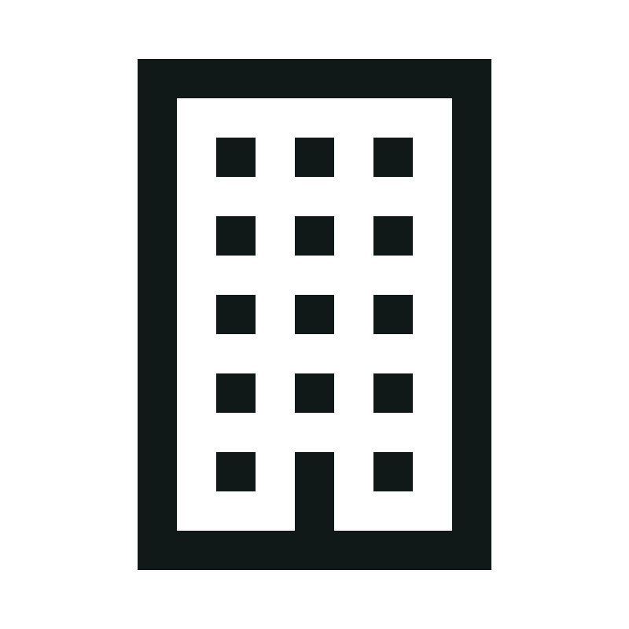</a> | **📂 檔名:** `accommodate.svg` ✨ **格式:** `Vector (SVG)` ⚖️ **大小:** `747.00B` 📅 **更新:** `2026-02-27`  🚀 **jsDelivr Markdown:** `` 🔗 **直接連結 (Url):** <code>https://cdn.jsdelivr.net/gh/barry028/materials@main/images/iCons/Simple%20Line%20Action%20iCons/accommodate.svg</code> 📥 [檢視原始檔](accommodate.svg) |
|  | **📂 檔名:** `adapt.svg` ✨ **格式:** `Vector (SVG)` ⚖️ **大小:** `576.00B` 📅 **更新:** `2026-02-27`  🚀 **jsDelivr Markdown:** `` 🔗 **直接連結 (Url):** <code>https://cdn.jsdelivr.net/gh/barry028/materials@main/images/iCons/Simple%20Line%20Action%20iCons/adapt.svg</code> 📥 [檢視原始檔](adapt.svg) |
|  | **📂 檔名:** `add.svg` ✨ **格式:** `Vector (SVG)` ⚖️ **大小:** `476.00B` 📅 **更新:** `2026-02-27`  🚀 **jsDelivr Markdown:** `` 🔗 **直接連結 (Url):** <code>https://cdn.jsdelivr.net/gh/barry028/materials@main/images/iCons/Simple%20Line%20Action%20iCons/add.svg</code> 📥 [檢視原始檔](add.svg) |
|  | **📂 檔名:** `adjust.svg` ✨ **格式:** `Vector (SVG)` ⚖️ **大小:** `604.00B` 📅 **更新:** `2026-02-27`  🚀 **jsDelivr Markdown:** `` 🔗 **直接連結 (Url):** <code>https://cdn.jsdelivr.net/gh/barry028/materials@main/images/iCons/Simple%20Line%20Action%20iCons/adjust.svg</code> 📥 [檢視原始檔](adjust.svg) |
|  | **📂 檔名:** `agitate.svg` ✨ **格式:** `Vector (SVG)` ⚖️ **大小:** `804.00B` 📅 **更新:** `2026-02-27`  🚀 **jsDelivr Markdown:** `` 🔗 **直接連結 (Url):** <code>https://cdn.jsdelivr.net/gh/barry028/materials@main/images/iCons/Simple%20Line%20Action%20iCons/agitate.svg</code> 📥 [檢視原始檔](agitate.svg) |
|  | **📂 檔名:** `agree.svg` ✨ **格式:** `Vector (SVG)` ⚖️ **大小:** `732.00B` 📅 **更新:** `2026-02-27`  🚀 **jsDelivr Markdown:** `` 🔗 **直接連結 (Url):** <code>https://cdn.jsdelivr.net/gh/barry028/materials@main/images/iCons/Simple%20Line%20Action%20iCons/agree.svg</code> 📥 [檢視原始檔](agree.svg) |
|  | **📂 檔名:** `aid.svg` ✨ **格式:** `Vector (SVG)` ⚖️ **大小:** `786.00B` 📅 **更新:** `2026-02-27`  🚀 **jsDelivr Markdown:** `` 🔗 **直接連結 (Url):** <code>https://cdn.jsdelivr.net/gh/barry028/materials@main/images/iCons/Simple%20Line%20Action%20iCons/aid.svg</code> 📥 [檢視原始檔](aid.svg) |
|  | **📂 檔名:** `alarm.svg` ✨ **格式:** `Vector (SVG)` ⚖️ **大小:** `978.00B` 📅 **更新:** `2026-02-27`  🚀 **jsDelivr Markdown:** `` 🔗 **直接連結 (Url):** <code>https://cdn.jsdelivr.net/gh/barry028/materials@main/images/iCons/Simple%20Line%20Action%20iCons/alarm.svg</code> 📥 [檢視原始檔](alarm.svg) |
|  | **📂 檔名:** `alert.svg` ✨ **格式:** `Vector (SVG)` ⚖️ **大小:** `798.00B` 📅 **更新:** `2026-02-27`  🚀 **jsDelivr Markdown:** `` 🔗 **直接連結 (Url):** <code>https://cdn.jsdelivr.net/gh/barry028/materials@main/images/iCons/Simple%20Line%20Action%20iCons/alert.svg</code> 📥 [檢視原始檔](alert.svg) |
|  | **📂 檔名:** `amaze.svg` ✨ **格式:** `Vector (SVG)` ⚖️ **大小:** `975.00B` 📅 **更新:** `2026-02-27`  🚀 **jsDelivr Markdown:** `` 🔗 **直接連結 (Url):** <code>https://cdn.jsdelivr.net/gh/barry028/materials@main/images/iCons/Simple%20Line%20Action%20iCons/amaze.svg</code> 📥 [檢視原始檔](amaze.svg) |
|  | **📂 檔名:** `amplify.svg` ✨ **格式:** `Vector (SVG)` ⚖️ **大小:** `944.00B` 📅 **更新:** `2026-02-27`  🚀 **jsDelivr Markdown:** `` 🔗 **直接連結 (Url):** <code>https://cdn.jsdelivr.net/gh/barry028/materials@main/images/iCons/Simple%20Line%20Action%20iCons/amplify.svg</code> 📥 [檢視原始檔](amplify.svg) |
|  | **📂 檔名:** `analyze.svg` ✨ **格式:** `Vector (SVG)` ⚖️ **大小:** `673.00B` 📅 **更新:** `2026-02-27`  🚀 **jsDelivr Markdown:** `` 🔗 **直接連結 (Url):** <code>https://cdn.jsdelivr.net/gh/barry028/materials@main/images/iCons/Simple%20Line%20Action%20iCons/analyze.svg</code> 📥 [檢視原始檔](analyze.svg) |
|  | **📂 檔名:** `announce.svg` ✨ **格式:** `Vector (SVG)` ⚖️ **大小:** `664.00B` 📅 **更新:** `2026-02-27`  🚀 **jsDelivr Markdown:** `` 🔗 **直接連結 (Url):** <code>https://cdn.jsdelivr.net/gh/barry028/materials@main/images/iCons/Simple%20Line%20Action%20iCons/announce.svg</code> 📥 [檢視原始檔](announce.svg) |
|  | **📂 檔名:** `arrest.svg` ✨ **格式:** `Vector (SVG)` ⚖️ **大小:** `1.02KB` 📅 **更新:** `2026-02-27`  🚀 **jsDelivr Markdown:** `` 🔗 **直接連結 (Url):** <code>https://cdn.jsdelivr.net/gh/barry028/materials@main/images/iCons/Simple%20Line%20Action%20iCons/arrest.svg</code> 📥 [檢視原始檔](arrest.svg) |
|  | **📂 檔名:** `ascend.svg` ✨ **格式:** `Vector (SVG)` ⚖️ **大小:** `572.00B` 📅 **更新:** `2026-02-27`  🚀 **jsDelivr Markdown:** `` 🔗 **直接連結 (Url):** <code>https://cdn.jsdelivr.net/gh/barry028/materials@main/images/iCons/Simple%20Line%20Action%20iCons/ascend.svg</code> 📥 [檢視原始檔](ascend.svg) |
|  | **📂 檔名:** `ask.svg` ✨ **格式:** `Vector (SVG)` ⚖️ **大小:** `682.00B` 📅 **更新:** `2026-02-27`  🚀 **jsDelivr Markdown:** `` 🔗 **直接連結 (Url):** <code>https://cdn.jsdelivr.net/gh/barry028/materials@main/images/iCons/Simple%20Line%20Action%20iCons/ask.svg</code> 📥 [檢視原始檔](ask.svg) |
|  | **📂 檔名:** `assist.svg` ✨ **格式:** `Vector (SVG)` ⚖️ **大小:** `1.11KB` 📅 **更新:** `2026-02-27`  🚀 **jsDelivr Markdown:** `` 🔗 **直接連結 (Url):** <code>https://cdn.jsdelivr.net/gh/barry028/materials@main/images/iCons/Simple%20Line%20Action%20iCons/assist.svg</code> 📥 [檢視原始檔](assist.svg) |
|  | **📂 檔名:** `attract.svg` ✨ **格式:** `Vector (SVG)` ⚖️ **大小:** `670.00B` 📅 **更新:** `2026-02-27`  🚀 **jsDelivr Markdown:** `` 🔗 **直接連結 (Url):** <code>https://cdn.jsdelivr.net/gh/barry028/materials@main/images/iCons/Simple%20Line%20Action%20iCons/attract.svg</code> 📥 [檢視原始檔](attract.svg) |
|  | **📂 檔名:** `augment.svg` ✨ **格式:** `Vector (SVG)` ⚖️ **大小:** `704.00B` 📅 **更新:** `2026-02-27`  🚀 **jsDelivr Markdown:** `` 🔗 **直接連結 (Url):** <code>https://cdn.jsdelivr.net/gh/barry028/materials@main/images/iCons/Simple%20Line%20Action%20iCons/augment.svg</code> 📥 [檢視原始檔](augment.svg) |
|  | **📂 檔名:** `bake.svg` ✨ **格式:** `Vector (SVG)` ⚖️ **大小:** `781.00B` 📅 **更新:** `2026-02-27`  🚀 **jsDelivr Markdown:** `` 🔗 **直接連結 (Url):** <code>https://cdn.jsdelivr.net/gh/barry028/materials@main/images/iCons/Simple%20Line%20Action%20iCons/bake.svg</code> 📥 [檢視原始檔](bake.svg) |
| <a href="balance.svg">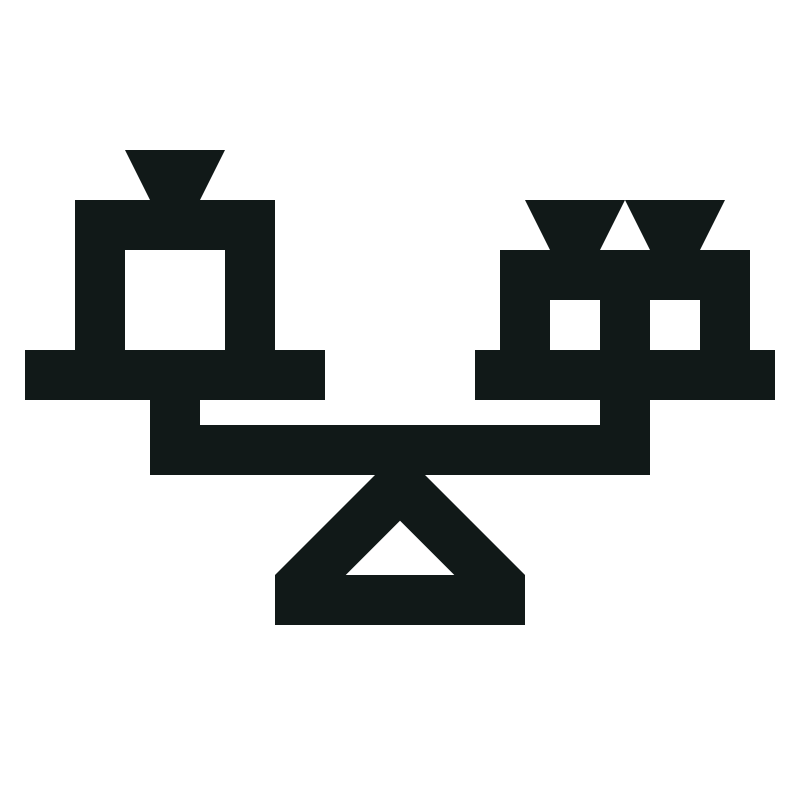</a> | **📂 檔名:** `balance.svg` ✨ **格式:** `Vector (SVG)` ⚖️ **大小:** `659.00B` 📅 **更新:** `2026-02-27`  🚀 **jsDelivr Markdown:** `` 🔗 **直接連結 (Url):** <code>https://cdn.jsdelivr.net/gh/barry028/materials@main/images/iCons/Simple%20Line%20Action%20iCons/balance.svg</code> 📥 [檢視原始檔](balance.svg) |
|  | **📂 檔名:** `battle.svg` ✨ **格式:** `Vector (SVG)` ⚖️ **大小:** `608.00B` 📅 **更新:** `2026-02-27`  🚀 **jsDelivr Markdown:** `` 🔗 **直接連結 (Url):** <code>https://cdn.jsdelivr.net/gh/barry028/materials@main/images/iCons/Simple%20Line%20Action%20iCons/battle.svg</code> 📥 [檢視原始檔](battle.svg) |
|  | **📂 檔名:** `be.svg` ✨ **格式:** `Vector (SVG)` ⚖️ **大小:** `1.90KB` 📅 **更新:** `2026-02-27`  🚀 **jsDelivr Markdown:** `` 🔗 **直接連結 (Url):** <code>https://cdn.jsdelivr.net/gh/barry028/materials@main/images/iCons/Simple%20Line%20Action%20iCons/be.svg</code> 📥 [檢視原始檔](be.svg) |
|  | **📂 檔名:** `believe.svg` ✨ **格式:** `Vector (SVG)` ⚖️ **大小:** `1.30KB` 📅 **更新:** `2026-02-27`  🚀 **jsDelivr Markdown:** `` 🔗 **直接連結 (Url):** <code>https://cdn.jsdelivr.net/gh/barry028/materials@main/images/iCons/Simple%20Line%20Action%20iCons/believe.svg</code> 📥 [檢視原始檔](believe.svg) |
|  | **📂 檔名:** `birth.svg` ✨ **格式:** `Vector (SVG)` ⚖️ **大小:** `857.00B` 📅 **更新:** `2026-02-27`  🚀 **jsDelivr Markdown:** `` 🔗 **直接連結 (Url):** <code>https://cdn.jsdelivr.net/gh/barry028/materials@main/images/iCons/Simple%20Line%20Action%20iCons/birth.svg</code> 📥 [檢視原始檔](birth.svg) |
|  | **📂 檔名:** `blaze.svg` ✨ **格式:** `Vector (SVG)` ⚖️ **大小:** `893.00B` 📅 **更新:** `2026-02-27`  🚀 **jsDelivr Markdown:** `` 🔗 **直接連結 (Url):** <code>https://cdn.jsdelivr.net/gh/barry028/materials@main/images/iCons/Simple%20Line%20Action%20iCons/blaze.svg</code> 📥 [檢視原始檔](blaze.svg) |
| <a href="blend.svg">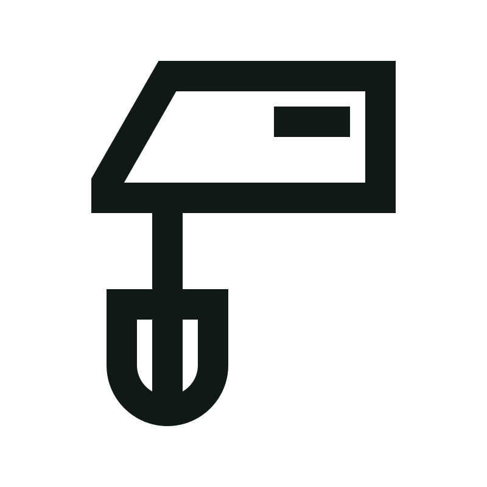</a> | **📂 檔名:** `blend.svg` ✨ **格式:** `Vector (SVG)` ⚖️ **大小:** `657.00B` 📅 **更新:** `2026-02-27`  🚀 **jsDelivr Markdown:** `` 🔗 **直接連結 (Url):** <code>https://cdn.jsdelivr.net/gh/barry028/materials@main/images/iCons/Simple%20Line%20Action%20iCons/blend.svg</code> 📥 [檢視原始檔](blend.svg) |
| <a href="bloom.svg">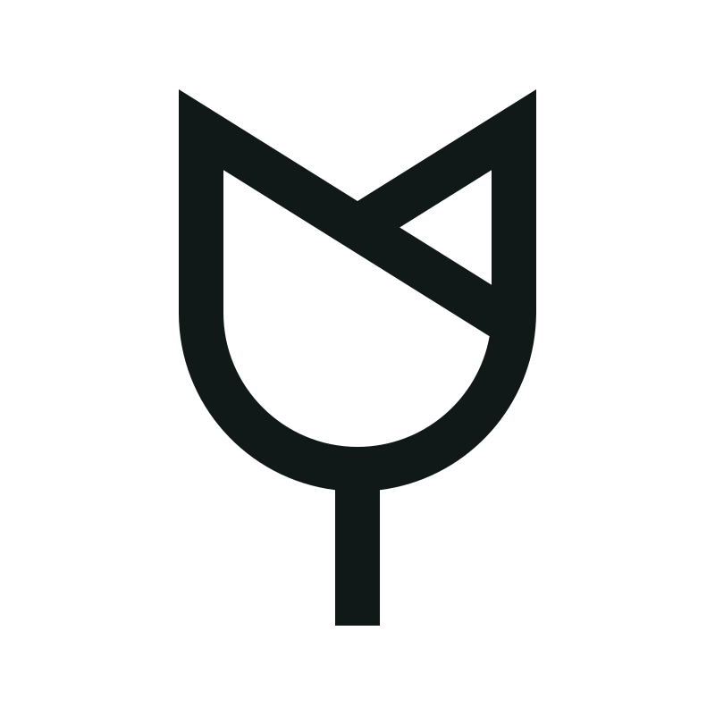</a> | **📂 檔名:** `bloom.svg` ✨ **格式:** `Vector (SVG)` ⚖️ **大小:** `686.00B` 📅 **更新:** `2026-02-27`  🚀 **jsDelivr Markdown:** `` 🔗 **直接連結 (Url):** <code>https://cdn.jsdelivr.net/gh/barry028/materials@main/images/iCons/Simple%20Line%20Action%20iCons/bloom.svg</code> 📥 [檢視原始檔](bloom.svg) |
|  | **📂 檔名:** `blow.svg` ✨ **格式:** `Vector (SVG)` ⚖️ **大小:** `695.00B` 📅 **更新:** `2026-02-27`  🚀 **jsDelivr Markdown:** `` 🔗 **直接連結 (Url):** <code>https://cdn.jsdelivr.net/gh/barry028/materials@main/images/iCons/Simple%20Line%20Action%20iCons/blow.svg</code> 📥 [檢視原始檔](blow.svg) |
|  | **📂 檔名:** `bookmark.svg` ✨ **格式:** `Vector (SVG)` ⚖️ **大小:** `502.00B` 📅 **更新:** `2026-02-27`  🚀 **jsDelivr Markdown:** `` 🔗 **直接連結 (Url):** <code>https://cdn.jsdelivr.net/gh/barry028/materials@main/images/iCons/Simple%20Line%20Action%20iCons/bookmark.svg</code> 📥 [檢視原始檔](bookmark.svg) |
|  | **📂 檔名:** `bootleg.svg` ✨ **格式:** `Vector (SVG)` ⚖️ **大小:** `818.00B` 📅 **更新:** `2026-02-27`  🚀 **jsDelivr Markdown:** `` 🔗 **直接連結 (Url):** <code>https://cdn.jsdelivr.net/gh/barry028/materials@main/images/iCons/Simple%20Line%20Action%20iCons/bootleg.svg</code> 📥 [檢視原始檔](bootleg.svg) |
|  | **📂 檔名:** `bounce.svg` ✨ **格式:** `Vector (SVG)` ⚖️ **大小:** `1.25KB` 📅 **更新:** `2026-02-27`  🚀 **jsDelivr Markdown:** `` 🔗 **直接連結 (Url):** <code>https://cdn.jsdelivr.net/gh/barry028/materials@main/images/iCons/Simple%20Line%20Action%20iCons/bounce.svg</code> 📥 [檢視原始檔](bounce.svg) |
|  | **📂 檔名:** `break.svg` ✨ **格式:** `Vector (SVG)` ⚖️ **大小:** `733.00B` 📅 **更新:** `2026-02-27`  🚀 **jsDelivr Markdown:** `` 🔗 **直接連結 (Url):** <code>https://cdn.jsdelivr.net/gh/barry028/materials@main/images/iCons/Simple%20Line%20Action%20iCons/break.svg</code> 📥 [檢視原始檔](break.svg) |
|  | **📂 檔名:** `brew.svg` ✨ **格式:** `Vector (SVG)` ⚖️ **大小:** `1.29KB` 📅 **更新:** `2026-02-27`  🚀 **jsDelivr Markdown:** `` 🔗 **直接連結 (Url):** <code>https://cdn.jsdelivr.net/gh/barry028/materials@main/images/iCons/Simple%20Line%20Action%20iCons/brew.svg</code> 📥 [檢視原始檔](brew.svg) |
|  | **📂 檔名:** `broadcast.svg` ✨ **格式:** `Vector (SVG)` ⚖️ **大小:** `786.00B` 📅 **更新:** `2026-02-27`  🚀 **jsDelivr Markdown:** `` 🔗 **直接連結 (Url):** <code>https://cdn.jsdelivr.net/gh/barry028/materials@main/images/iCons/Simple%20Line%20Action%20iCons/broadcast.svg</code> 📥 [檢視原始檔](broadcast.svg) |
|  | **📂 檔名:** `browse.svg` ✨ **格式:** `Vector (SVG)` ⚖️ **大小:** `575.00B` 📅 **更新:** `2026-02-27`  🚀 **jsDelivr Markdown:** `` 🔗 **直接連結 (Url):** <code>https://cdn.jsdelivr.net/gh/barry028/materials@main/images/iCons/Simple%20Line%20Action%20iCons/browse.svg</code> 📥 [檢視原始檔](browse.svg) |
|  | **📂 檔名:** `build.svg` ✨ **格式:** `Vector (SVG)` ⚖️ **大小:** `602.00B` 📅 **更新:** `2026-02-27`  🚀 **jsDelivr Markdown:** `` 🔗 **直接連結 (Url):** <code>https://cdn.jsdelivr.net/gh/barry028/materials@main/images/iCons/Simple%20Line%20Action%20iCons/build.svg</code> 📥 [檢視原始檔](build.svg) |
|  | **📂 檔名:** `burn.svg` ✨ **格式:** `Vector (SVG)` ⚖️ **大小:** `979.00B` 📅 **更新:** `2026-02-27`  🚀 **jsDelivr Markdown:** `` 🔗 **直接連結 (Url):** <code>https://cdn.jsdelivr.net/gh/barry028/materials@main/images/iCons/Simple%20Line%20Action%20iCons/burn.svg</code> 📥 [檢視原始檔](burn.svg) |
|  | **📂 檔名:** `bury.svg` ✨ **格式:** `Vector (SVG)` ⚖️ **大小:** `624.00B` 📅 **更新:** `2026-02-27`  🚀 **jsDelivr Markdown:** `` 🔗 **直接連結 (Url):** <code>https://cdn.jsdelivr.net/gh/barry028/materials@main/images/iCons/Simple%20Line%20Action%20iCons/bury.svg</code> 📥 [檢視原始檔](bury.svg) |
|  | **📂 檔名:** `buy.svg` ✨ **格式:** `Vector (SVG)` ⚖️ **大小:** `749.00B` 📅 **更新:** `2026-02-27`  🚀 **jsDelivr Markdown:** `` 🔗 **直接連結 (Url):** <code>https://cdn.jsdelivr.net/gh/barry028/materials@main/images/iCons/Simple%20Line%20Action%20iCons/buy.svg</code> 📥 [檢視原始檔](buy.svg) |
|  | **📂 檔名:** `caffeinate.svg` ✨ **格式:** `Vector (SVG)` ⚖️ **大小:** `724.00B` 📅 **更新:** `2026-02-27`  🚀 **jsDelivr Markdown:** `` 🔗 **直接連結 (Url):** <code>https://cdn.jsdelivr.net/gh/barry028/materials@main/images/iCons/Simple%20Line%20Action%20iCons/caffeinate.svg</code> 📥 [檢視原始檔](caffeinate.svg) |
|  | **📂 檔名:** `calculate.svg` ✨ **格式:** `Vector (SVG)` ⚖️ **大小:** `663.00B` 📅 **更新:** `2026-02-27`  🚀 **jsDelivr Markdown:** `` 🔗 **直接連結 (Url):** <code>https://cdn.jsdelivr.net/gh/barry028/materials@main/images/iCons/Simple%20Line%20Action%20iCons/calculate.svg</code> 📥 [檢視原始檔](calculate.svg) |
|  | **📂 檔名:** `calibrate.svg` ✨ **格式:** `Vector (SVG)` ⚖️ **大小:** `1.28KB` 📅 **更新:** `2026-02-27`  🚀 **jsDelivr Markdown:** `` 🔗 **直接連結 (Url):** <code>https://cdn.jsdelivr.net/gh/barry028/materials@main/images/iCons/Simple%20Line%20Action%20iCons/calibrate.svg</code> 📥 [檢視原始檔](calibrate.svg) |
|  | **📂 檔名:** `call.svg` ✨ **格式:** `Vector (SVG)` ⚖️ **大小:** `1.48KB` 📅 **更新:** `2026-02-27`  🚀 **jsDelivr Markdown:** `` 🔗 **直接連結 (Url):** <code>https://cdn.jsdelivr.net/gh/barry028/materials@main/images/iCons/Simple%20Line%20Action%20iCons/call.svg</code> 📥 [檢視原始檔](call.svg) |
|  | **📂 檔名:** `carry.svg` ✨ **格式:** `Vector (SVG)` ⚖️ **大小:** `1.04KB` 📅 **更新:** `2026-02-27`  🚀 **jsDelivr Markdown:** `` 🔗 **直接連結 (Url):** <code>https://cdn.jsdelivr.net/gh/barry028/materials@main/images/iCons/Simple%20Line%20Action%20iCons/carry.svg</code> 📥 [檢視原始檔](carry.svg) |
|  | **📂 檔名:** `carve.svg` ✨ **格式:** `Vector (SVG)` ⚖️ **大小:** `1.28KB` 📅 **更新:** `2026-02-27`  🚀 **jsDelivr Markdown:** `` 🔗 **直接連結 (Url):** <code>https://cdn.jsdelivr.net/gh/barry028/materials@main/images/iCons/Simple%20Line%20Action%20iCons/carve.svg</code> 📥 [檢視原始檔](carve.svg) |
| <a href="cast.svg">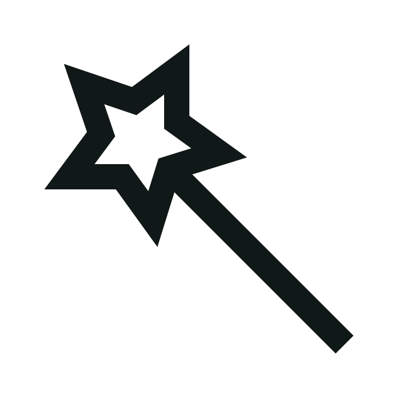</a> | **📂 檔名:** `cast.svg` ✨ **格式:** `Vector (SVG)` ⚖️ **大小:** `714.00B` 📅 **更新:** `2026-02-27`  🚀 **jsDelivr Markdown:** `` 🔗 **直接連結 (Url):** <code>https://cdn.jsdelivr.net/gh/barry028/materials@main/images/iCons/Simple%20Line%20Action%20iCons/cast.svg</code> 📥 [檢視原始檔](cast.svg) |
| <a href="catch.svg">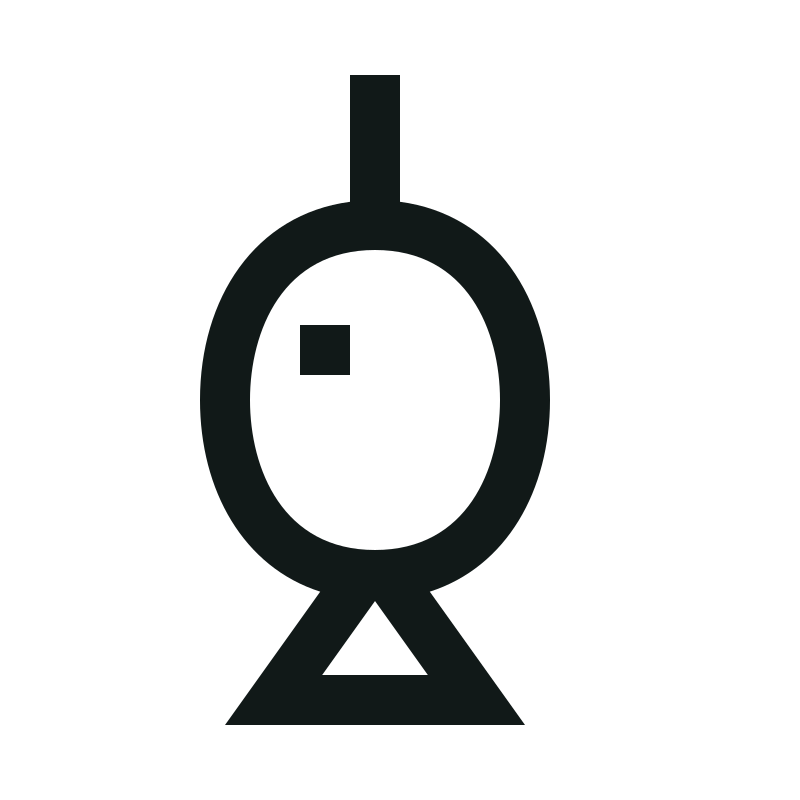</a> | **📂 檔名:** `catch.svg` ✨ **格式:** `Vector (SVG)` ⚖️ **大小:** `733.00B` 📅 **更新:** `2026-02-27`  🚀 **jsDelivr Markdown:** `` 🔗 **直接連結 (Url):** <code>https://cdn.jsdelivr.net/gh/barry028/materials@main/images/iCons/Simple%20Line%20Action%20iCons/catch.svg</code> 📥 [檢視原始檔](catch.svg) |
|  | **📂 檔名:** `cease.svg` ✨ **格式:** `Vector (SVG)` ⚖️ **大小:** `791.00B` 📅 **更新:** `2026-02-27`  🚀 **jsDelivr Markdown:** `` 🔗 **直接連結 (Url):** <code>https://cdn.jsdelivr.net/gh/barry028/materials@main/images/iCons/Simple%20Line%20Action%20iCons/cease.svg</code> 📥 [檢視原始檔](cease.svg) |
|  | **📂 檔名:** `celebrate.svg` ✨ **格式:** `Vector (SVG)` ⚖️ **大小:** `982.00B` 📅 **更新:** `2026-02-27`  🚀 **jsDelivr Markdown:** `` 🔗 **直接連結 (Url):** <code>https://cdn.jsdelivr.net/gh/barry028/materials@main/images/iCons/Simple%20Line%20Action%20iCons/celebrate.svg</code> 📥 [檢視原始檔](celebrate.svg) |
|  | **📂 檔名:** `challenge.svg` ✨ **格式:** `Vector (SVG)` ⚖️ **大小:** `524.00B` 📅 **更新:** `2026-02-27`  🚀 **jsDelivr Markdown:** `` 🔗 **直接連結 (Url):** <code>https://cdn.jsdelivr.net/gh/barry028/materials@main/images/iCons/Simple%20Line%20Action%20iCons/challenge.svg</code> 📥 [檢視原始檔](challenge.svg) |
|  | **📂 檔名:** `charge.svg` ✨ **格式:** `Vector (SVG)` ⚖️ **大小:** `579.00B` 📅 **更新:** `2026-02-27`  🚀 **jsDelivr Markdown:** `` 🔗 **直接連結 (Url):** <code>https://cdn.jsdelivr.net/gh/barry028/materials@main/images/iCons/Simple%20Line%20Action%20iCons/charge.svg</code> 📥 [檢視原始檔](charge.svg) |
|  | **📂 檔名:** `charm.svg` ✨ **格式:** `Vector (SVG)` ⚖️ **大小:** `1.34KB` 📅 **更新:** `2026-02-27`  🚀 **jsDelivr Markdown:** `` 🔗 **直接連結 (Url):** <code>https://cdn.jsdelivr.net/gh/barry028/materials@main/images/iCons/Simple%20Line%20Action%20iCons/charm.svg</code> 📥 [檢視原始檔](charm.svg) |
|  | **📂 檔名:** `chart.svg` ✨ **格式:** `Vector (SVG)` ⚖️ **大小:** `570.00B` 📅 **更新:** `2026-02-27`  🚀 **jsDelivr Markdown:** `` 🔗 **直接連結 (Url):** <code>https://cdn.jsdelivr.net/gh/barry028/materials@main/images/iCons/Simple%20Line%20Action%20iCons/chart.svg</code> 📥 [檢視原始檔](chart.svg) |
|  | **📂 檔名:** `chat.svg` ✨ **格式:** `Vector (SVG)` ⚖️ **大小:** `557.00B` 📅 **更新:** `2026-02-27`  🚀 **jsDelivr Markdown:** `` 🔗 **直接連結 (Url):** <code>https://cdn.jsdelivr.net/gh/barry028/materials@main/images/iCons/Simple%20Line%20Action%20iCons/chat.svg</code> 📥 [檢視原始檔](chat.svg) |
|  | **📂 檔名:** `choose.svg` ✨ **格式:** `Vector (SVG)` ⚖️ **大小:** `1.69KB` 📅 **更新:** `2026-02-27`  🚀 **jsDelivr Markdown:** `` 🔗 **直接連結 (Url):** <code>https://cdn.jsdelivr.net/gh/barry028/materials@main/images/iCons/Simple%20Line%20Action%20iCons/choose.svg</code> 📥 [檢視原始檔](choose.svg) |
|  | **📂 檔名:** `chop.svg` ✨ **格式:** `Vector (SVG)` ⚖️ **大小:** `594.00B` 📅 **更新:** `2026-02-27`  🚀 **jsDelivr Markdown:** `` 🔗 **直接連結 (Url):** <code>https://cdn.jsdelivr.net/gh/barry028/materials@main/images/iCons/Simple%20Line%20Action%20iCons/chop.svg</code> 📥 [檢視原始檔](chop.svg) |
|  | **📂 檔名:** `clean.svg` ✨ **格式:** `Vector (SVG)` ⚖️ **大小:** `783.00B` 📅 **更新:** `2026-02-27`  🚀 **jsDelivr Markdown:** `` 🔗 **直接連結 (Url):** <code>https://cdn.jsdelivr.net/gh/barry028/materials@main/images/iCons/Simple%20Line%20Action%20iCons/clean.svg</code> 📥 [檢視原始檔](clean.svg) |
|  | **📂 檔名:** `cleanse.svg` ✨ **格式:** `Vector (SVG)` ⚖️ **大小:** `627.00B` 📅 **更新:** `2026-02-27`  🚀 **jsDelivr Markdown:** `` 🔗 **直接連結 (Url):** <code>https://cdn.jsdelivr.net/gh/barry028/materials@main/images/iCons/Simple%20Line%20Action%20iCons/cleanse.svg</code> 📥 [檢視原始檔](cleanse.svg) |
|  | **📂 檔名:** `climb.svg` ✨ **格式:** `Vector (SVG)` ⚖️ **大小:** `529.00B` 📅 **更新:** `2026-02-27`  🚀 **jsDelivr Markdown:** `` 🔗 **直接連結 (Url):** <code>https://cdn.jsdelivr.net/gh/barry028/materials@main/images/iCons/Simple%20Line%20Action%20iCons/climb.svg</code> 📥 [檢視原始檔](climb.svg) |
|  | **📂 檔名:** `clip.svg` ✨ **格式:** `Vector (SVG)` ⚖️ **大小:** `1022.00B` 📅 **更新:** `2026-02-27`  🚀 **jsDelivr Markdown:** `` 🔗 **直接連結 (Url):** <code>https://cdn.jsdelivr.net/gh/barry028/materials@main/images/iCons/Simple%20Line%20Action%20iCons/clip.svg</code> 📥 [檢視原始檔](clip.svg) |
|  | **📂 檔名:** `close.svg` ✨ **格式:** `Vector (SVG)` ⚖️ **大小:** `656.00B` 📅 **更新:** `2026-02-27`  🚀 **jsDelivr Markdown:** `` 🔗 **直接連結 (Url):** <code>https://cdn.jsdelivr.net/gh/barry028/materials@main/images/iCons/Simple%20Line%20Action%20iCons/close.svg</code> 📥 [檢視原始檔](close.svg) |
|  | **📂 檔名:** `code.svg` ✨ **格式:** `Vector (SVG)` ⚖️ **大小:** `574.00B` 📅 **更新:** `2026-02-27`  🚀 **jsDelivr Markdown:** `` 🔗 **直接連結 (Url):** <code>https://cdn.jsdelivr.net/gh/barry028/materials@main/images/iCons/Simple%20Line%20Action%20iCons/code.svg</code> 📥 [檢視原始檔](code.svg) |
|  | **📂 檔名:** `collect.svg` ✨ **格式:** `Vector (SVG)` ⚖️ **大小:** `827.00B` 📅 **更新:** `2026-02-27`  🚀 **jsDelivr Markdown:** `` 🔗 **直接連結 (Url):** <code>https://cdn.jsdelivr.net/gh/barry028/materials@main/images/iCons/Simple%20Line%20Action%20iCons/collect.svg</code> 📥 [檢視原始檔](collect.svg) |
|  | **📂 檔名:** `commit.svg` ✨ **格式:** `Vector (SVG)` ⚖️ **大小:** `731.00B` 📅 **更新:** `2026-02-27`  🚀 **jsDelivr Markdown:** `` 🔗 **直接連結 (Url):** <code>https://cdn.jsdelivr.net/gh/barry028/materials@main/images/iCons/Simple%20Line%20Action%20iCons/commit.svg</code> 📥 [檢視原始檔](commit.svg) |
| <a href="connect.svg">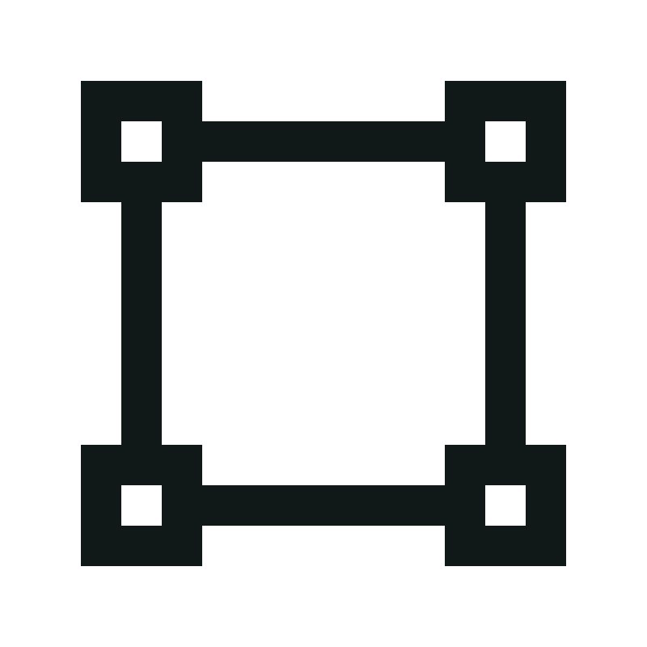</a> | **📂 檔名:** `connect.svg` ✨ **格式:** `Vector (SVG)` ⚖️ **大小:** `603.00B` 📅 **更新:** `2026-02-27`  🚀 **jsDelivr Markdown:** `` 🔗 **直接連結 (Url):** <code>https://cdn.jsdelivr.net/gh/barry028/materials@main/images/iCons/Simple%20Line%20Action%20iCons/connect.svg</code> 📥 [檢視原始檔](connect.svg) |
|  | **📂 檔名:** `contact.svg` ✨ **格式:** `Vector (SVG)` ⚖️ **大小:** `1.23KB` 📅 **更新:** `2026-02-27`  🚀 **jsDelivr Markdown:** `` 🔗 **直接連結 (Url):** <code>https://cdn.jsdelivr.net/gh/barry028/materials@main/images/iCons/Simple%20Line%20Action%20iCons/contact.svg</code> 📥 [檢視原始檔](contact.svg) |
|  | **📂 檔名:** `contain.svg` ✨ **格式:** `Vector (SVG)` ⚖️ **大小:** `724.00B` 📅 **更新:** `2026-02-27`  🚀 **jsDelivr Markdown:** `` 🔗 **直接連結 (Url):** <code>https://cdn.jsdelivr.net/gh/barry028/materials@main/images/iCons/Simple%20Line%20Action%20iCons/contain.svg</code> 📥 [檢視原始檔](contain.svg) |
|  | **📂 檔名:** `control.svg` ✨ **格式:** `Vector (SVG)` ⚖️ **大小:** `654.00B` 📅 **更新:** `2026-02-27`  🚀 **jsDelivr Markdown:** `` 🔗 **直接連結 (Url):** <code>https://cdn.jsdelivr.net/gh/barry028/materials@main/images/iCons/Simple%20Line%20Action%20iCons/control.svg</code> 📥 [檢視原始檔](control.svg) |
|  | **📂 檔名:** `cook.svg` ✨ **格式:** `Vector (SVG)` ⚖️ **大小:** `887.00B` 📅 **更新:** `2026-02-27`  🚀 **jsDelivr Markdown:** `` 🔗 **直接連結 (Url):** <code>https://cdn.jsdelivr.net/gh/barry028/materials@main/images/iCons/Simple%20Line%20Action%20iCons/cook.svg</code> 📥 [檢視原始檔](cook.svg) |
|  | **📂 檔名:** `cool.svg` ✨ **格式:** `Vector (SVG)` ⚖️ **大小:** `766.00B` 📅 **更新:** `2026-02-27`  🚀 **jsDelivr Markdown:** `` 🔗 **直接連結 (Url):** <code>https://cdn.jsdelivr.net/gh/barry028/materials@main/images/iCons/Simple%20Line%20Action%20iCons/cool.svg</code> 📥 [檢視原始檔](cool.svg) |
|  | **📂 檔名:** `copy.svg` ✨ **格式:** `Vector (SVG)` ⚖️ **大小:** `551.00B` 📅 **更新:** `2026-02-27`  🚀 **jsDelivr Markdown:** `` 🔗 **直接連結 (Url):** <code>https://cdn.jsdelivr.net/gh/barry028/materials@main/images/iCons/Simple%20Line%20Action%20iCons/copy.svg</code> 📥 [檢視原始檔](copy.svg) |
| <a href="crave.svg">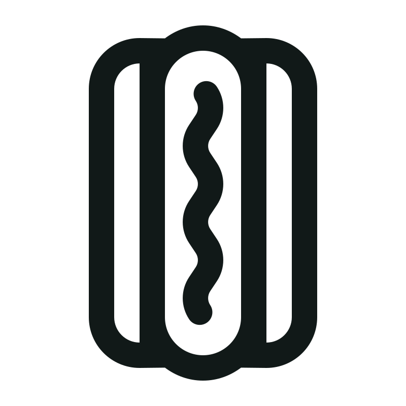</a> | **📂 檔名:** `crave.svg` ✨ **格式:** `Vector (SVG)` ⚖️ **大小:** `1.56KB` 📅 **更新:** `2026-02-27`  🚀 **jsDelivr Markdown:** `` 🔗 **直接連結 (Url):** <code>https://cdn.jsdelivr.net/gh/barry028/materials@main/images/iCons/Simple%20Line%20Action%20iCons/crave.svg</code> 📥 [檢視原始檔](crave.svg) |
|  | **📂 檔名:** `create.svg` ✨ **格式:** `Vector (SVG)` ⚖️ **大小:** `514.00B` 📅 **更新:** `2026-02-27`  🚀 **jsDelivr Markdown:** `` 🔗 **直接連結 (Url):** <code>https://cdn.jsdelivr.net/gh/barry028/materials@main/images/iCons/Simple%20Line%20Action%20iCons/create.svg</code> 📥 [檢視原始檔](create.svg) |
|  | **📂 檔名:** `creep.svg` ✨ **格式:** `Vector (SVG)` ⚖️ **大小:** `1.45KB` 📅 **更新:** `2026-02-27`  🚀 **jsDelivr Markdown:** `` 🔗 **直接連結 (Url):** <code>https://cdn.jsdelivr.net/gh/barry028/materials@main/images/iCons/Simple%20Line%20Action%20iCons/creep.svg</code> 📥 [檢視原始檔](creep.svg) |
|  | **📂 檔名:** `crop.svg` ✨ **格式:** `Vector (SVG)` ⚖️ **大小:** `561.00B` 📅 **更新:** `2026-02-27`  🚀 **jsDelivr Markdown:** `` 🔗 **直接連結 (Url):** <code>https://cdn.jsdelivr.net/gh/barry028/materials@main/images/iCons/Simple%20Line%20Action%20iCons/crop.svg</code> 📥 [檢視原始檔](crop.svg) |
|  | **📂 檔名:** `cry.svg` ✨ **格式:** `Vector (SVG)` ⚖️ **大小:** `685.00B` 📅 **更新:** `2026-02-27`  🚀 **jsDelivr Markdown:** `` 🔗 **直接連結 (Url):** <code>https://cdn.jsdelivr.net/gh/barry028/materials@main/images/iCons/Simple%20Line%20Action%20iCons/cry.svg</code> 📥 [檢視原始檔](cry.svg) |
|  | **📂 檔名:** `curdle.svg` ✨ **格式:** `Vector (SVG)` ⚖️ **大小:** `876.00B` 📅 **更新:** `2026-02-27`  🚀 **jsDelivr Markdown:** `` 🔗 **直接連結 (Url):** <code>https://cdn.jsdelivr.net/gh/barry028/materials@main/images/iCons/Simple%20Line%20Action%20iCons/curdle.svg</code> 📥 [檢視原始檔](curdle.svg) |
|  | **📂 檔名:** `cut.svg` ✨ **格式:** `Vector (SVG)` ⚖️ **大小:** `1.44KB` 📅 **更新:** `2026-02-27`  🚀 **jsDelivr Markdown:** `` 🔗 **直接連結 (Url):** <code>https://cdn.jsdelivr.net/gh/barry028/materials@main/images/iCons/Simple%20Line%20Action%20iCons/cut.svg</code> 📥 [檢視原始檔](cut.svg) |
| <a href="dance.svg">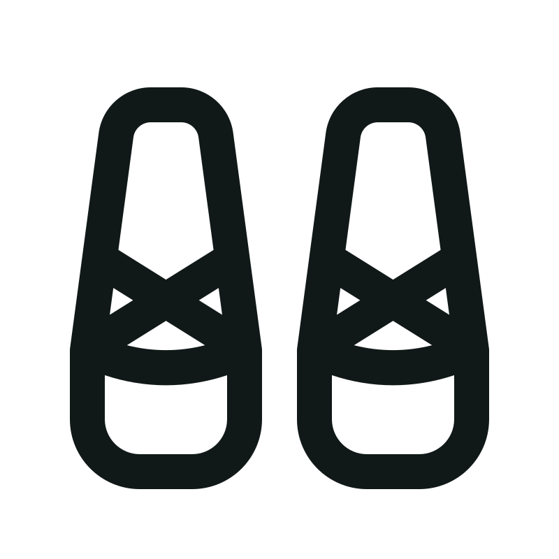</a> | **📂 檔名:** `dance.svg` ✨ **格式:** `Vector (SVG)` ⚖️ **大小:** `1.59KB` 📅 **更新:** `2026-02-27`  🚀 **jsDelivr Markdown:** `` 🔗 **直接連結 (Url):** <code>https://cdn.jsdelivr.net/gh/barry028/materials@main/images/iCons/Simple%20Line%20Action%20iCons/dance.svg</code> 📥 [檢視原始檔](dance.svg) |
|  | **📂 檔名:** `dazzle.svg` ✨ **格式:** `Vector (SVG)` ⚖️ **大小:** `736.00B` 📅 **更新:** `2026-02-27`  🚀 **jsDelivr Markdown:** `` 🔗 **直接連結 (Url):** <code>https://cdn.jsdelivr.net/gh/barry028/materials@main/images/iCons/Simple%20Line%20Action%20iCons/dazzle.svg</code> 📥 [檢視原始檔](dazzle.svg) |
|  | **📂 檔名:** `decide.svg` ✨ **格式:** `Vector (SVG)` ⚖️ **大小:** `579.00B` 📅 **更新:** `2026-02-27`  🚀 **jsDelivr Markdown:** `` 🔗 **直接連結 (Url):** <code>https://cdn.jsdelivr.net/gh/barry028/materials@main/images/iCons/Simple%20Line%20Action%20iCons/decide.svg</code> 📥 [檢視原始檔](decide.svg) |
|  | **📂 檔名:** `defend.svg` ✨ **格式:** `Vector (SVG)` ⚖️ **大小:** `712.00B` 📅 **更新:** `2026-02-27`  🚀 **jsDelivr Markdown:** `` 🔗 **直接連結 (Url):** <code>https://cdn.jsdelivr.net/gh/barry028/materials@main/images/iCons/Simple%20Line%20Action%20iCons/defend.svg</code> 📥 [檢視原始檔](defend.svg) |
|  | **📂 檔名:** `deliver.svg` ✨ **格式:** `Vector (SVG)` ⚖️ **大小:** `581.00B` 📅 **更新:** `2026-02-27`  🚀 **jsDelivr Markdown:** `` 🔗 **直接連結 (Url):** <code>https://cdn.jsdelivr.net/gh/barry028/materials@main/images/iCons/Simple%20Line%20Action%20iCons/deliver.svg</code> 📥 [檢視原始檔](deliver.svg) |
|  | **📂 檔名:** `design.svg` ✨ **格式:** `Vector (SVG)` ⚖️ **大小:** `756.00B` 📅 **更新:** `2026-02-27`  🚀 **jsDelivr Markdown:** `` 🔗 **直接連結 (Url):** <code>https://cdn.jsdelivr.net/gh/barry028/materials@main/images/iCons/Simple%20Line%20Action%20iCons/design.svg</code> 📥 [檢視原始檔](design.svg) |
|  | **📂 檔名:** `destroy.svg` ✨ **格式:** `Vector (SVG)` ⚖️ **大小:** `1.04KB` 📅 **更新:** `2026-02-27`  🚀 **jsDelivr Markdown:** `` 🔗 **直接連結 (Url):** <code>https://cdn.jsdelivr.net/gh/barry028/materials@main/images/iCons/Simple%20Line%20Action%20iCons/destroy.svg</code> 📥 [檢視原始檔](destroy.svg) |
|  | **📂 檔名:** `develop.svg` ✨ **格式:** `Vector (SVG)` ⚖️ **大小:** `589.00B` 📅 **更新:** `2026-02-27`  🚀 **jsDelivr Markdown:** `` 🔗 **直接連結 (Url):** <code>https://cdn.jsdelivr.net/gh/barry028/materials@main/images/iCons/Simple%20Line%20Action%20iCons/develop.svg</code> 📥 [檢視原始檔](develop.svg) |
|  | **📂 檔名:** `die.svg` ✨ **格式:** `Vector (SVG)` ⚖️ **大小:** `945.00B` 📅 **更新:** `2026-02-27`  🚀 **jsDelivr Markdown:** `` 🔗 **直接連結 (Url):** <code>https://cdn.jsdelivr.net/gh/barry028/materials@main/images/iCons/Simple%20Line%20Action%20iCons/die.svg</code> 📥 [檢視原始檔](die.svg) |
|  | **📂 檔名:** `disappear.svg` ✨ **格式:** `Vector (SVG)` ⚖️ **大小:** `1.02KB` 📅 **更新:** `2026-02-27`  🚀 **jsDelivr Markdown:** `` 🔗 **直接連結 (Url):** <code>https://cdn.jsdelivr.net/gh/barry028/materials@main/images/iCons/Simple%20Line%20Action%20iCons/disappear.svg</code> 📥 [檢視原始檔](disappear.svg) |
|  | **📂 檔名:** `discard.svg` ✨ **格式:** `Vector (SVG)` ⚖️ **大小:** `624.00B` 📅 **更新:** `2026-02-27`  🚀 **jsDelivr Markdown:** `` 🔗 **直接連結 (Url):** <code>https://cdn.jsdelivr.net/gh/barry028/materials@main/images/iCons/Simple%20Line%20Action%20iCons/discard.svg</code> 📥 [檢視原始檔](discard.svg) |
|  | **📂 檔名:** `discover.svg` ✨ **格式:** `Vector (SVG)` ⚖️ **大小:** `663.00B` 📅 **更新:** `2026-02-27`  🚀 **jsDelivr Markdown:** `` 🔗 **直接連結 (Url):** <code>https://cdn.jsdelivr.net/gh/barry028/materials@main/images/iCons/Simple%20Line%20Action%20iCons/discover.svg</code> 📥 [檢視原始檔](discover.svg) |
|  | **📂 檔名:** `disguise.svg` ✨ **格式:** `Vector (SVG)` ⚖️ **大小:** `1.16KB` 📅 **更新:** `2026-02-27`  🚀 **jsDelivr Markdown:** `` 🔗 **直接連結 (Url):** <code>https://cdn.jsdelivr.net/gh/barry028/materials@main/images/iCons/Simple%20Line%20Action%20iCons/disguise.svg</code> 📥 [檢視原始檔](disguise.svg) |
| <a href="divide.svg">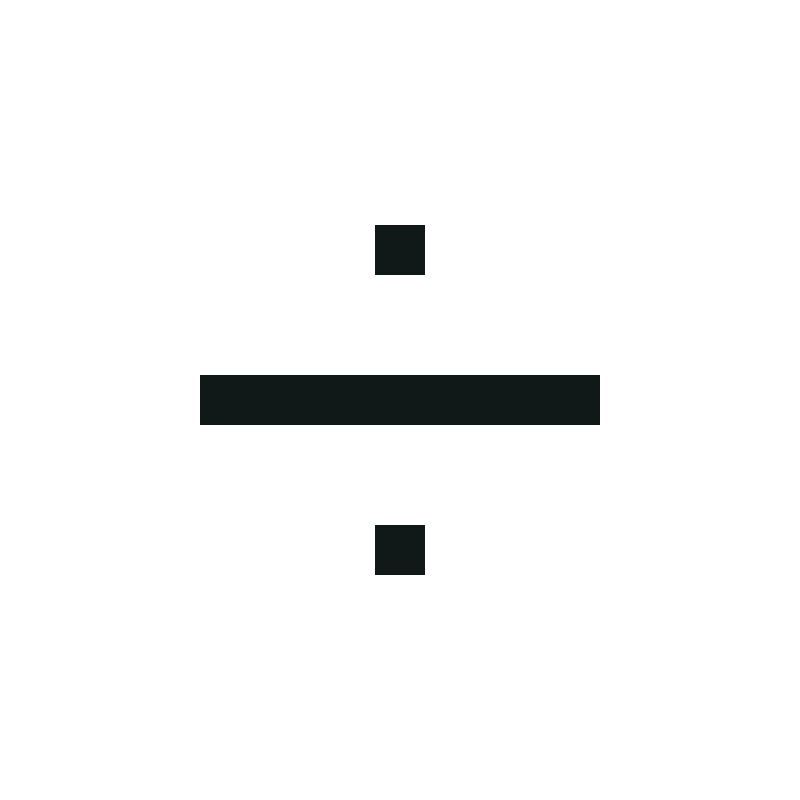</a> | **📂 檔名:** `divide.svg` ✨ **格式:** `Vector (SVG)` ⚖️ **大小:** `492.00B` 📅 **更新:** `2026-02-27`  🚀 **jsDelivr Markdown:** `` 🔗 **直接連結 (Url):** <code>https://cdn.jsdelivr.net/gh/barry028/materials@main/images/iCons/Simple%20Line%20Action%20iCons/divide.svg</code> 📥 [檢視原始檔](divide.svg) |
|  | **📂 檔名:** `download.svg` ✨ **格式:** `Vector (SVG)` ⚖️ **大小:** `597.00B` 📅 **更新:** `2026-02-27`  🚀 **jsDelivr Markdown:** `` 🔗 **直接連結 (Url):** <code>https://cdn.jsdelivr.net/gh/barry028/materials@main/images/iCons/Simple%20Line%20Action%20iCons/download.svg</code> 📥 [檢視原始檔](download.svg) |
|  | **📂 檔名:** `draw.svg` ✨ **格式:** `Vector (SVG)` ⚖️ **大小:** `918.00B` 📅 **更新:** `2026-02-27`  🚀 **jsDelivr Markdown:** `` 🔗 **直接連結 (Url):** <code>https://cdn.jsdelivr.net/gh/barry028/materials@main/images/iCons/Simple%20Line%20Action%20iCons/draw.svg</code> 📥 [檢視原始檔](draw.svg) |
|  | **📂 檔名:** `drill.svg` ✨ **格式:** `Vector (SVG)` ⚖️ **大小:** `640.00B` 📅 **更新:** `2026-02-27`  🚀 **jsDelivr Markdown:** `` 🔗 **直接連結 (Url):** <code>https://cdn.jsdelivr.net/gh/barry028/materials@main/images/iCons/Simple%20Line%20Action%20iCons/drill.svg</code> 📥 [檢視原始檔](drill.svg) |
|  | **📂 檔名:** `drink.svg` ✨ **格式:** `Vector (SVG)` ⚖️ **大小:** `572.00B` 📅 **更新:** `2026-02-27`  🚀 **jsDelivr Markdown:** `` 🔗 **直接連結 (Url):** <code>https://cdn.jsdelivr.net/gh/barry028/materials@main/images/iCons/Simple%20Line%20Action%20iCons/drink.svg</code> 📥 [檢視原始檔](drink.svg) |
|  | **📂 檔名:** `drive.svg` ✨ **格式:** `Vector (SVG)` ⚖️ **大小:** `1.14KB` 📅 **更新:** `2026-02-27`  🚀 **jsDelivr Markdown:** `` 🔗 **直接連結 (Url):** <code>https://cdn.jsdelivr.net/gh/barry028/materials@main/images/iCons/Simple%20Line%20Action%20iCons/drive.svg</code> 📥 [檢視原始檔](drive.svg) |
| <a href="drop.svg">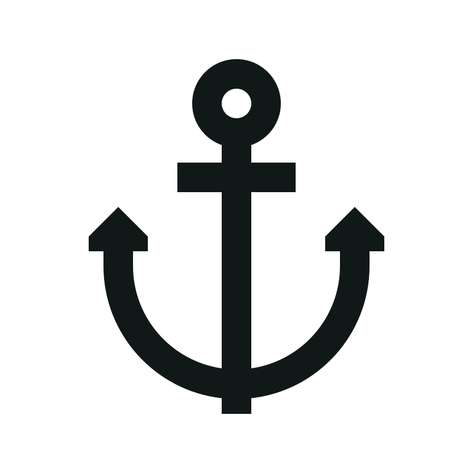</a> | **📂 檔名:** `drop.svg` ✨ **格式:** `Vector (SVG)` ⚖️ **大小:** `814.00B` 📅 **更新:** `2026-02-27`  🚀 **jsDelivr Markdown:** `` 🔗 **直接連結 (Url):** <code>https://cdn.jsdelivr.net/gh/barry028/materials@main/images/iCons/Simple%20Line%20Action%20iCons/drop.svg</code> 📥 [檢視原始檔](drop.svg) |
|  | **📂 檔名:** `drum.svg` ✨ **格式:** `Vector (SVG)` ⚖️ **大小:** `1.09KB` 📅 **更新:** `2026-02-27`  🚀 **jsDelivr Markdown:** `` 🔗 **直接連結 (Url):** <code>https://cdn.jsdelivr.net/gh/barry028/materials@main/images/iCons/Simple%20Line%20Action%20iCons/drum.svg</code> 📥 [檢視原始檔](drum.svg) |
|  | **📂 檔名:** `eat.svg` ✨ **格式:** `Vector (SVG)` ⚖️ **大小:** `1.03KB` 📅 **更新:** `2026-02-27`  🚀 **jsDelivr Markdown:** `` 🔗 **直接連結 (Url):** <code>https://cdn.jsdelivr.net/gh/barry028/materials@main/images/iCons/Simple%20Line%20Action%20iCons/eat.svg</code> 📥 [檢視原始檔](eat.svg) |
|  | **📂 檔名:** `edit.svg` ✨ **格式:** `Vector (SVG)` ⚖️ **大小:** `855.00B` 📅 **更新:** `2026-02-27`  🚀 **jsDelivr Markdown:** `` 🔗 **直接連結 (Url):** <code>https://cdn.jsdelivr.net/gh/barry028/materials@main/images/iCons/Simple%20Line%20Action%20iCons/edit.svg</code> 📥 [檢視原始檔](edit.svg) |
|  | **📂 檔名:** `enhance.svg` ✨ **格式:** `Vector (SVG)` ⚖️ **大小:** `1.02KB` 📅 **更新:** `2026-02-27`  🚀 **jsDelivr Markdown:** `` 🔗 **直接連結 (Url):** <code>https://cdn.jsdelivr.net/gh/barry028/materials@main/images/iCons/Simple%20Line%20Action%20iCons/enhance.svg</code> 📥 [檢視原始檔](enhance.svg) |
|  | **📂 檔名:** `enlarge.svg` ✨ **格式:** `Vector (SVG)` ⚖️ **大小:** `769.00B` 📅 **更新:** `2026-02-27`  🚀 **jsDelivr Markdown:** `` 🔗 **直接連結 (Url):** <code>https://cdn.jsdelivr.net/gh/barry028/materials@main/images/iCons/Simple%20Line%20Action%20iCons/enlarge.svg</code> 📥 [檢視原始檔](enlarge.svg) |
|  | **📂 檔名:** `enter.svg` ✨ **格式:** `Vector (SVG)` ⚖️ **大小:** `867.00B` 📅 **更新:** `2026-02-27`  🚀 **jsDelivr Markdown:** `` 🔗 **直接連結 (Url):** <code>https://cdn.jsdelivr.net/gh/barry028/materials@main/images/iCons/Simple%20Line%20Action%20iCons/enter.svg</code> 📥 [檢視原始檔](enter.svg) |
|  | **📂 檔名:** `equal.svg` ✨ **格式:** `Vector (SVG)` ⚖️ **大小:** `475.00B` 📅 **更新:** `2026-02-27`  🚀 **jsDelivr Markdown:** `` 🔗 **直接連結 (Url):** <code>https://cdn.jsdelivr.net/gh/barry028/materials@main/images/iCons/Simple%20Line%20Action%20iCons/equal.svg</code> 📥 [檢視原始檔](equal.svg) |
|  | **📂 檔名:** `erase.svg` ✨ **格式:** `Vector (SVG)` ⚖️ **大小:** `628.00B` 📅 **更新:** `2026-02-27`  🚀 **jsDelivr Markdown:** `` 🔗 **直接連結 (Url):** <code>https://cdn.jsdelivr.net/gh/barry028/materials@main/images/iCons/Simple%20Line%20Action%20iCons/erase.svg</code> 📥 [檢視原始檔](erase.svg) |
| <a href="examine.svg">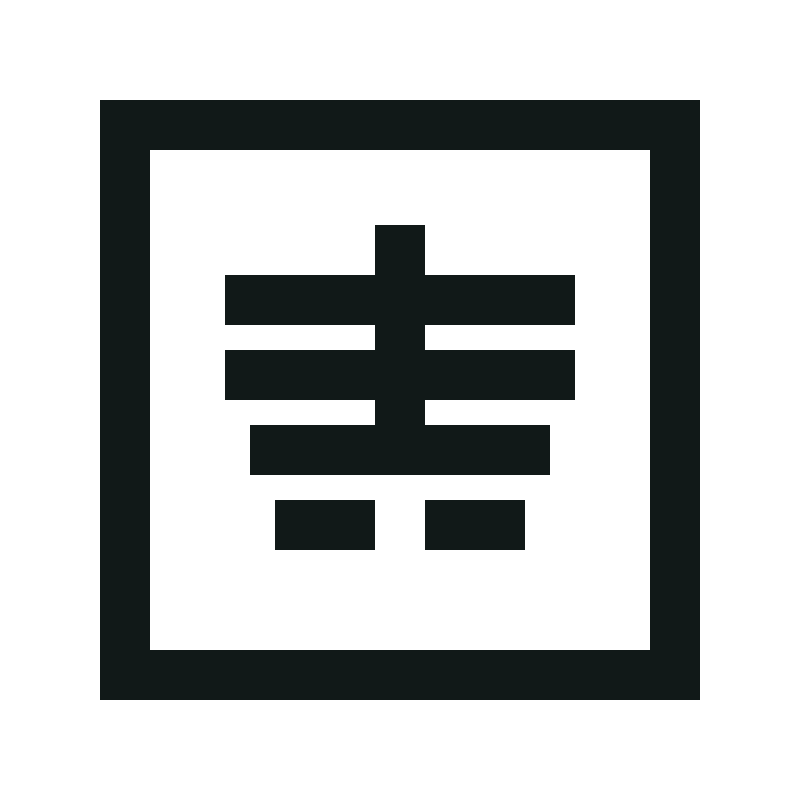</a> | **📂 檔名:** `examine.svg` ✨ **格式:** `Vector (SVG)` ⚖️ **大小:** `576.00B` 📅 **更新:** `2026-02-27`  🚀 **jsDelivr Markdown:** `` 🔗 **直接連結 (Url):** <code>https://cdn.jsdelivr.net/gh/barry028/materials@main/images/iCons/Simple%20Line%20Action%20iCons/examine.svg</code> 📥 [檢視原始檔](examine.svg) |
|  | **📂 檔名:** `experiment.svg` ✨ **格式:** `Vector (SVG)` ⚖️ **大小:** `587.00B` 📅 **更新:** `2026-02-27`  🚀 **jsDelivr Markdown:** `` 🔗 **直接連結 (Url):** <code>https://cdn.jsdelivr.net/gh/barry028/materials@main/images/iCons/Simple%20Line%20Action%20iCons/experiment.svg</code> 📥 [檢視原始檔](experiment.svg) |
|  | **📂 檔名:** `explore.svg` ✨ **格式:** `Vector (SVG)` ⚖️ **大小:** `993.00B` 📅 **更新:** `2026-02-27`  🚀 **jsDelivr Markdown:** `` 🔗 **直接連結 (Url):** <code>https://cdn.jsdelivr.net/gh/barry028/materials@main/images/iCons/Simple%20Line%20Action%20iCons/explore.svg</code> 📥 [檢視原始檔](explore.svg) |
| <a href="extrude.svg">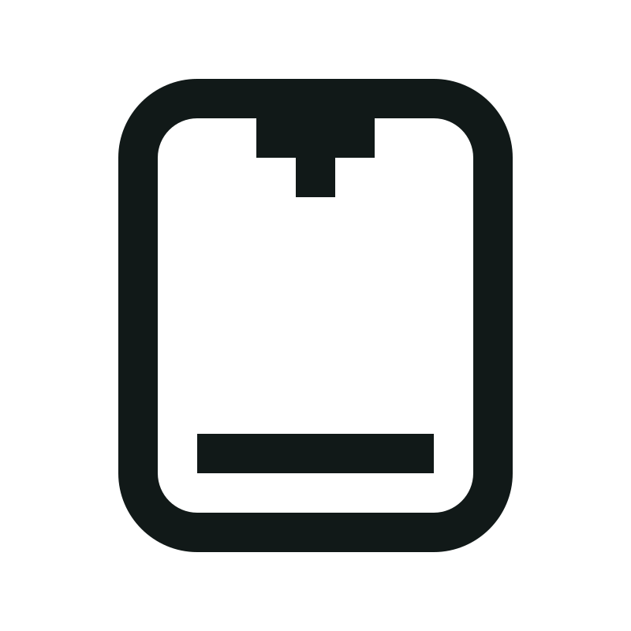</a> | **📂 檔名:** `extrude.svg` ✨ **格式:** `Vector (SVG)` ⚖️ **大小:** `664.00B` 📅 **更新:** `2026-02-27`  🚀 **jsDelivr Markdown:** `` 🔗 **直接連結 (Url):** <code>https://cdn.jsdelivr.net/gh/barry028/materials@main/images/iCons/Simple%20Line%20Action%20iCons/extrude.svg</code> 📥 [檢視原始檔](extrude.svg) |
| <a href="father.svg">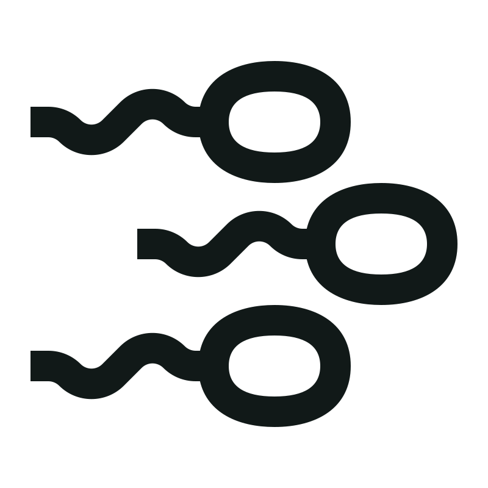</a> | **📂 檔名:** `father.svg` ✨ **格式:** `Vector (SVG)` ⚖️ **大小:** `1.95KB` 📅 **更新:** `2026-02-27`  🚀 **jsDelivr Markdown:** `` 🔗 **直接連結 (Url):** <code>https://cdn.jsdelivr.net/gh/barry028/materials@main/images/iCons/Simple%20Line%20Action%20iCons/father.svg</code> 📥 [檢視原始檔](father.svg) |
|  | **📂 檔名:** `feed.svg` ✨ **格式:** `Vector (SVG)` ⚖️ **大小:** `1.04KB` 📅 **更新:** `2026-02-27`  🚀 **jsDelivr Markdown:** `` 🔗 **直接連結 (Url):** <code>https://cdn.jsdelivr.net/gh/barry028/materials@main/images/iCons/Simple%20Line%20Action%20iCons/feed.svg</code> 📥 [檢視原始檔](feed.svg) |
|  | **📂 檔名:** `fight.svg` ✨ **格式:** `Vector (SVG)` ⚖️ **大小:** `1008.00B` 📅 **更新:** `2026-02-27`  🚀 **jsDelivr Markdown:** `` 🔗 **直接連結 (Url):** <code>https://cdn.jsdelivr.net/gh/barry028/materials@main/images/iCons/Simple%20Line%20Action%20iCons/fight.svg</code> 📥 [檢視原始檔](fight.svg) |
|  | **📂 檔名:** `fill.svg` ✨ **格式:** `Vector (SVG)` ⚖️ **大小:** `686.00B` 📅 **更新:** `2026-02-27`  🚀 **jsDelivr Markdown:** `` 🔗 **直接連結 (Url):** <code>https://cdn.jsdelivr.net/gh/barry028/materials@main/images/iCons/Simple%20Line%20Action%20iCons/fill.svg</code> 📥 [檢視原始檔](fill.svg) |
|  | **📂 檔名:** `film.svg` ✨ **格式:** `Vector (SVG)` ⚖️ **大小:** `717.00B` 📅 **更新:** `2026-02-27`  🚀 **jsDelivr Markdown:** `` 🔗 **直接連結 (Url):** <code>https://cdn.jsdelivr.net/gh/barry028/materials@main/images/iCons/Simple%20Line%20Action%20iCons/film.svg</code> 📥 [檢視原始檔](film.svg) |
|  | **📂 檔名:** `filter.svg` ✨ **格式:** `Vector (SVG)` ⚖️ **大小:** `562.00B` 📅 **更新:** `2026-02-27`  🚀 **jsDelivr Markdown:** `` 🔗 **直接連結 (Url):** <code>https://cdn.jsdelivr.net/gh/barry028/materials@main/images/iCons/Simple%20Line%20Action%20iCons/filter.svg</code> 📥 [檢視原始檔](filter.svg) |
| <a href="find.svg">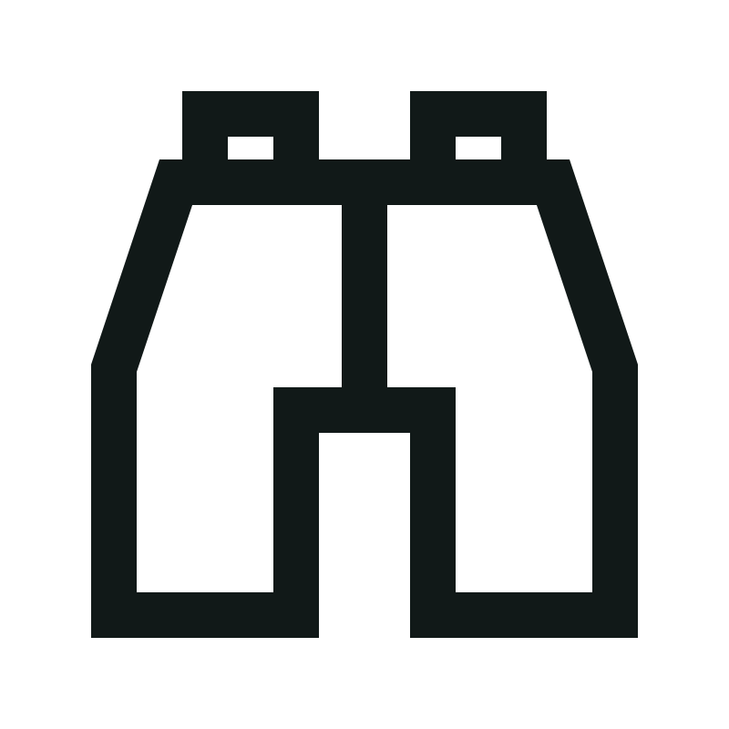</a> | **📂 檔名:** `find.svg` ✨ **格式:** `Vector (SVG)` ⚖️ **大小:** `604.00B` 📅 **更新:** `2026-02-27`  🚀 **jsDelivr Markdown:** `` 🔗 **直接連結 (Url):** <code>https://cdn.jsdelivr.net/gh/barry028/materials@main/images/iCons/Simple%20Line%20Action%20iCons/find.svg</code> 📥 [檢視原始檔](find.svg) |
|  | **📂 檔名:** `finish.svg` ✨ **格式:** `Vector (SVG)` ⚖️ **大小:** `557.00B` 📅 **更新:** `2026-02-27`  🚀 **jsDelivr Markdown:** `` 🔗 **直接連結 (Url):** <code>https://cdn.jsdelivr.net/gh/barry028/materials@main/images/iCons/Simple%20Line%20Action%20iCons/finish.svg</code> 📥 [檢視原始檔](finish.svg) |
|  | **📂 檔名:** `fix.svg` ✨ **格式:** `Vector (SVG)` ⚖️ **大小:** `812.00B` 📅 **更新:** `2026-02-27`  🚀 **jsDelivr Markdown:** `` 🔗 **直接連結 (Url):** <code>https://cdn.jsdelivr.net/gh/barry028/materials@main/images/iCons/Simple%20Line%20Action%20iCons/fix.svg</code> 📥 [檢視原始檔](fix.svg) |
|  | **📂 檔名:** `flag.svg` ✨ **格式:** `Vector (SVG)` ⚖️ **大小:** `609.00B` 📅 **更新:** `2026-02-27`  🚀 **jsDelivr Markdown:** `` 🔗 **直接連結 (Url):** <code>https://cdn.jsdelivr.net/gh/barry028/materials@main/images/iCons/Simple%20Line%20Action%20iCons/flag.svg</code> 📥 [檢視原始檔](flag.svg) |
|  | **📂 檔名:** `float.svg` ✨ **格式:** `Vector (SVG)` ⚖️ **大小:** `1.35KB` 📅 **更新:** `2026-02-27`  🚀 **jsDelivr Markdown:** `` 🔗 **直接連結 (Url):** <code>https://cdn.jsdelivr.net/gh/barry028/materials@main/images/iCons/Simple%20Line%20Action%20iCons/float.svg</code> 📥 [檢視原始檔](float.svg) |
| <a href="flow.svg">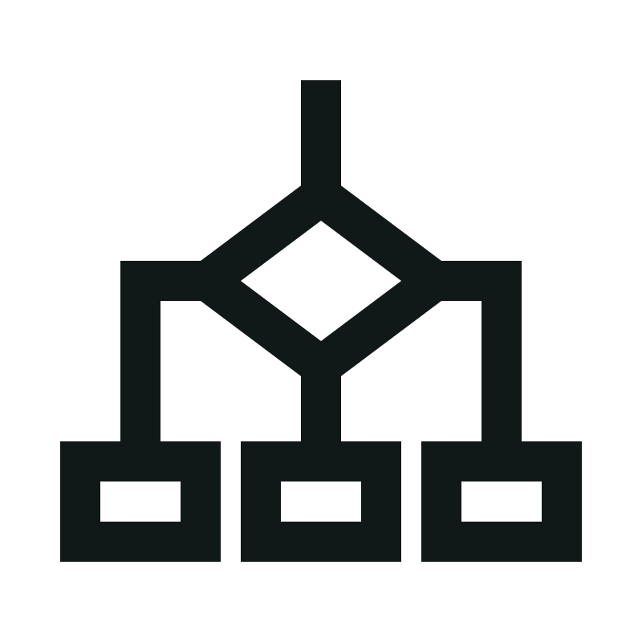</a> | **📂 檔名:** `flow.svg` ✨ **格式:** `Vector (SVG)` ⚖️ **大小:** `634.00B` 📅 **更新:** `2026-02-27`  🚀 **jsDelivr Markdown:** `` 🔗 **直接連結 (Url):** <code>https://cdn.jsdelivr.net/gh/barry028/materials@main/images/iCons/Simple%20Line%20Action%20iCons/flow.svg</code> 📥 [檢視原始檔](flow.svg) |
|  | **📂 檔名:** `fly.svg` ✨ **格式:** `Vector (SVG)` ⚖️ **大小:** `748.00B` 📅 **更新:** `2026-02-27`  🚀 **jsDelivr Markdown:** `` 🔗 **直接連結 (Url):** <code>https://cdn.jsdelivr.net/gh/barry028/materials@main/images/iCons/Simple%20Line%20Action%20iCons/fly.svg</code> 📥 [檢視原始檔](fly.svg) |
|  | **📂 檔名:** `focus.svg` ✨ **格式:** `Vector (SVG)` ⚖️ **大小:** `872.00B` 📅 **更新:** `2026-02-27`  🚀 **jsDelivr Markdown:** `` 🔗 **直接連結 (Url):** <code>https://cdn.jsdelivr.net/gh/barry028/materials@main/images/iCons/Simple%20Line%20Action%20iCons/focus.svg</code> 📥 [檢視原始檔](focus.svg) |
| <a href="fold.svg">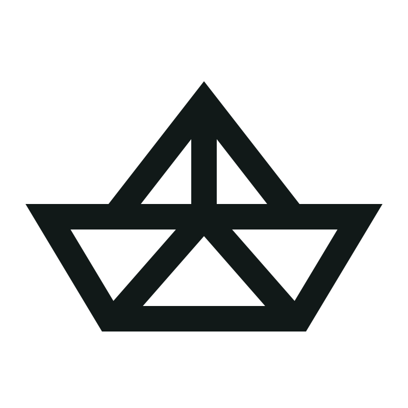</a> | **📂 檔名:** `fold.svg` ✨ **格式:** `Vector (SVG)` ⚖️ **大小:** `685.00B` 📅 **更新:** `2026-02-27`  🚀 **jsDelivr Markdown:** `` 🔗 **直接連結 (Url):** <code>https://cdn.jsdelivr.net/gh/barry028/materials@main/images/iCons/Simple%20Line%20Action%20iCons/fold.svg</code> 📥 [檢視原始檔](fold.svg) |
|  | **📂 檔名:** `forbid.svg` ✨ **格式:** `Vector (SVG)` ⚖️ **大小:** `734.00B` 📅 **更新:** `2026-02-27`  🚀 **jsDelivr Markdown:** `` 🔗 **直接連結 (Url):** <code>https://cdn.jsdelivr.net/gh/barry028/materials@main/images/iCons/Simple%20Line%20Action%20iCons/forbid.svg</code> 📥 [檢視原始檔](forbid.svg) |
| <a href="forebode.svg">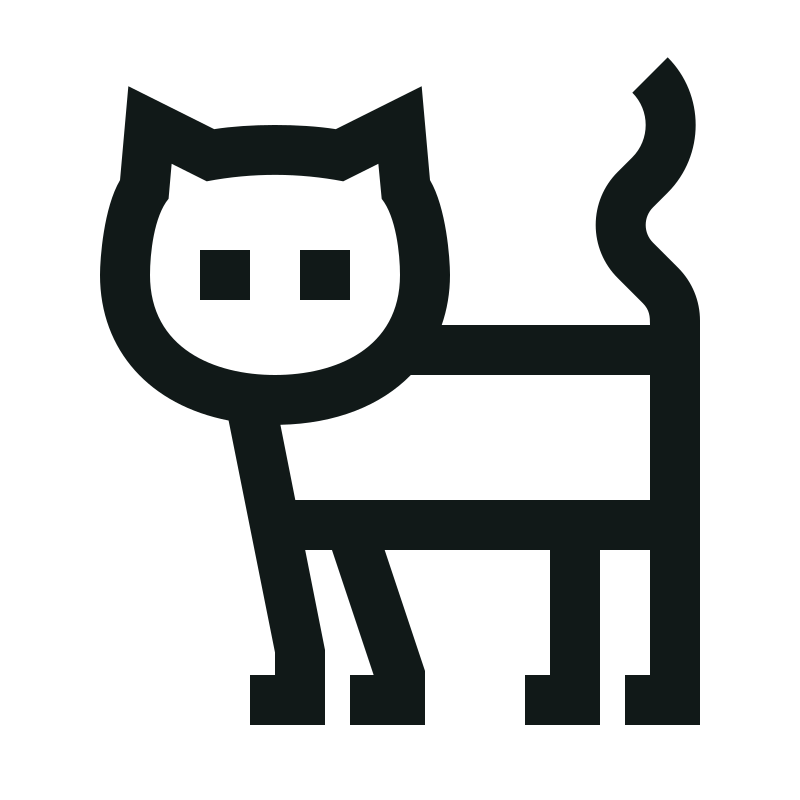</a> | **📂 檔名:** `forebode.svg` ✨ **格式:** `Vector (SVG)` ⚖️ **大小:** `1.34KB` 📅 **更新:** `2026-02-27`  🚀 **jsDelivr Markdown:** `` 🔗 **直接連結 (Url):** <code>https://cdn.jsdelivr.net/gh/barry028/materials@main/images/iCons/Simple%20Line%20Action%20iCons/forebode.svg</code> 📥 [檢視原始檔](forebode.svg) |
|  | **📂 檔名:** `fork.svg` ✨ **格式:** `Vector (SVG)` ⚖️ **大小:** `643.00B` 📅 **更新:** `2026-02-27`  🚀 **jsDelivr Markdown:** `` 🔗 **直接連結 (Url):** <code>https://cdn.jsdelivr.net/gh/barry028/materials@main/images/iCons/Simple%20Line%20Action%20iCons/fork.svg</code> 📥 [檢視原始檔](fork.svg) |
|  | **📂 檔名:** `format.svg` ✨ **格式:** `Vector (SVG)` ⚖️ **大小:** `550.00B` 📅 **更新:** `2026-02-27`  🚀 **jsDelivr Markdown:** `` 🔗 **直接連結 (Url):** <code>https://cdn.jsdelivr.net/gh/barry028/materials@main/images/iCons/Simple%20Line%20Action%20iCons/format.svg</code> 📥 [檢視原始檔](format.svg) |
|  | **📂 檔名:** `game.svg` ✨ **格式:** `Vector (SVG)` ⚖️ **大小:** `1.15KB` 📅 **更新:** `2026-02-27`  🚀 **jsDelivr Markdown:** `` 🔗 **直接連結 (Url):** <code>https://cdn.jsdelivr.net/gh/barry028/materials@main/images/iCons/Simple%20Line%20Action%20iCons/game.svg</code> 📥 [檢視原始檔](game.svg) |
|  | **📂 檔名:** `give.svg` ✨ **格式:** `Vector (SVG)` ⚖️ **大小:** `1.13KB` 📅 **更新:** `2026-02-27`  🚀 **jsDelivr Markdown:** `` 🔗 **直接連結 (Url):** <code>https://cdn.jsdelivr.net/gh/barry028/materials@main/images/iCons/Simple%20Line%20Action%20iCons/give.svg</code> 📥 [檢視原始檔](give.svg) |
|  | **📂 檔名:** `glance.svg` ✨ **格式:** `Vector (SVG)` ⚖️ **大小:** `846.00B` 📅 **更新:** `2026-02-27`  🚀 **jsDelivr Markdown:** `` 🔗 **直接連結 (Url):** <code>https://cdn.jsdelivr.net/gh/barry028/materials@main/images/iCons/Simple%20Line%20Action%20iCons/glance.svg</code> 📥 [檢視原始檔](glance.svg) |
|  | **📂 檔名:** `go.svg` ✨ **格式:** `Vector (SVG)` ⚖️ **大小:** `545.00B` 📅 **更新:** `2026-02-27`  🚀 **jsDelivr Markdown:** `` 🔗 **直接連結 (Url):** <code>https://cdn.jsdelivr.net/gh/barry028/materials@main/images/iCons/Simple%20Line%20Action%20iCons/go.svg</code> 📥 [檢視原始檔](go.svg) |
|  | **📂 檔名:** `grill.svg` ✨ **格式:** `Vector (SVG)` ⚖️ **大小:** `869.00B` 📅 **更新:** `2026-02-27`  🚀 **jsDelivr Markdown:** `` 🔗 **直接連結 (Url):** <code>https://cdn.jsdelivr.net/gh/barry028/materials@main/images/iCons/Simple%20Line%20Action%20iCons/grill.svg</code> 📥 [檢視原始檔](grill.svg) |
|  | **📂 檔名:** `groom.svg` ✨ **格式:** `Vector (SVG)` ⚖️ **大小:** `1.06KB` 📅 **更新:** `2026-02-27`  🚀 **jsDelivr Markdown:** `` 🔗 **直接連結 (Url):** <code>https://cdn.jsdelivr.net/gh/barry028/materials@main/images/iCons/Simple%20Line%20Action%20iCons/groom.svg</code> 📥 [檢視原始檔](groom.svg) |
| <a href="grow.svg">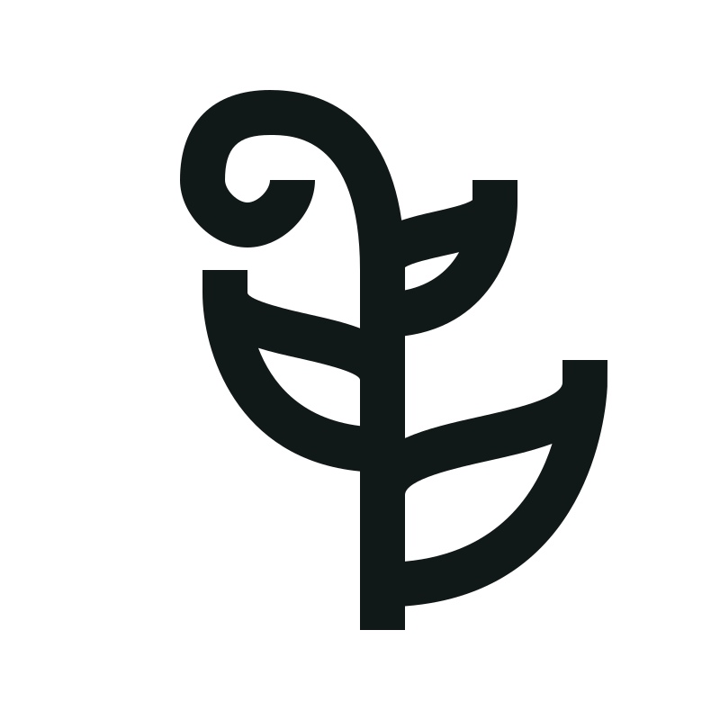</a> | **📂 檔名:** `grow.svg` ✨ **格式:** `Vector (SVG)` ⚖️ **大小:** `1.33KB` 📅 **更新:** `2026-02-27`  🚀 **jsDelivr Markdown:** `` 🔗 **直接連結 (Url):** <code>https://cdn.jsdelivr.net/gh/barry028/materials@main/images/iCons/Simple%20Line%20Action%20iCons/grow.svg</code> 📥 [檢視原始檔](grow.svg) |
| <a href="guide.svg">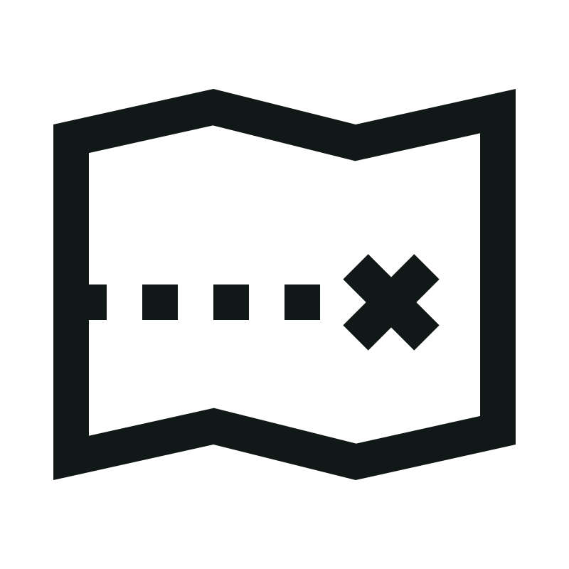</a> | **📂 檔名:** `guide.svg` ✨ **格式:** `Vector (SVG)` ⚖️ **大小:** `779.00B` 📅 **更新:** `2026-02-27`  🚀 **jsDelivr Markdown:** `` 🔗 **直接連結 (Url):** <code>https://cdn.jsdelivr.net/gh/barry028/materials@main/images/iCons/Simple%20Line%20Action%20iCons/guide.svg</code> 📥 [檢視原始檔](guide.svg) |
|  | **📂 檔名:** `hallucinate.svg` ✨ **格式:** `Vector (SVG)` ⚖️ **大小:** `1.86KB` 📅 **更新:** `2026-02-27`  🚀 **jsDelivr Markdown:** `` 🔗 **直接連結 (Url):** <code>https://cdn.jsdelivr.net/gh/barry028/materials@main/images/iCons/Simple%20Line%20Action%20iCons/hallucinate.svg</code> 📥 [檢視原始檔](hallucinate.svg) |
| <a href="halt.svg">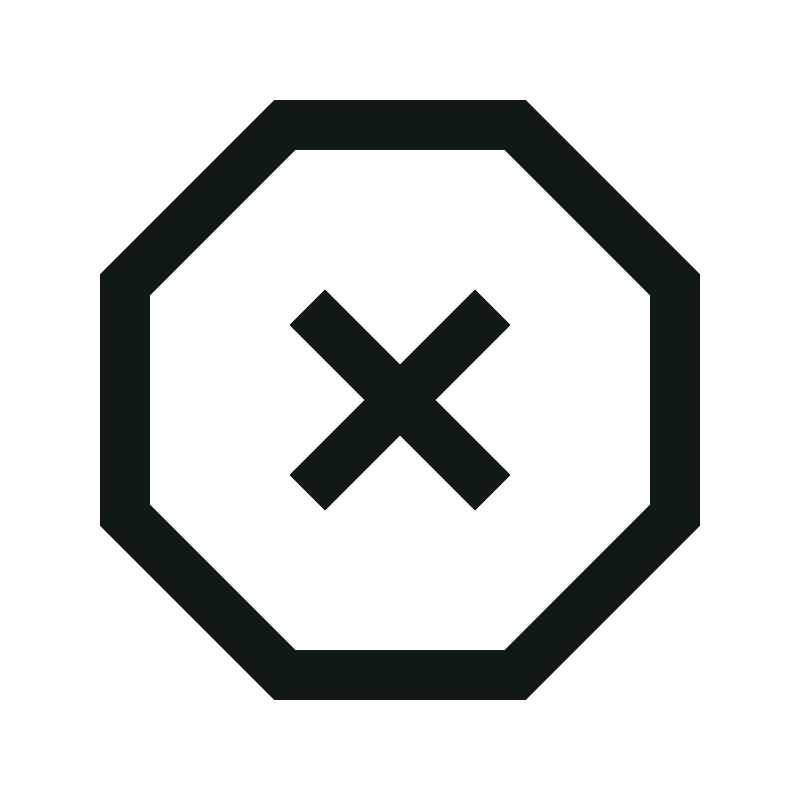</a> | **📂 檔名:** `halt.svg` ✨ **格式:** `Vector (SVG)` ⚖️ **大小:** `1.02KB` 📅 **更新:** `2026-02-27`  🚀 **jsDelivr Markdown:** `` 🔗 **直接連結 (Url):** <code>https://cdn.jsdelivr.net/gh/barry028/materials@main/images/iCons/Simple%20Line%20Action%20iCons/halt.svg</code> 📥 [檢視原始檔](halt.svg) |
|  | **📂 檔名:** `hang.svg` ✨ **格式:** `Vector (SVG)` ⚖️ **大小:** `741.00B` 📅 **更新:** `2026-02-27`  🚀 **jsDelivr Markdown:** `` 🔗 **直接連結 (Url):** <code>https://cdn.jsdelivr.net/gh/barry028/materials@main/images/iCons/Simple%20Line%20Action%20iCons/hang.svg</code> 📥 [檢視原始檔](hang.svg) |
|  | **📂 檔名:** `harvest.svg` ✨ **格式:** `Vector (SVG)` ⚖️ **大小:** `1.49KB` 📅 **更新:** `2026-02-27`  🚀 **jsDelivr Markdown:** `` 🔗 **直接連結 (Url):** <code>https://cdn.jsdelivr.net/gh/barry028/materials@main/images/iCons/Simple%20Line%20Action%20iCons/harvest.svg</code> 📥 [檢視原始檔](harvest.svg) |
|  | **📂 檔名:** `haunt.svg` ✨ **格式:** `Vector (SVG)` ⚖️ **大小:** `651.00B` 📅 **更新:** `2026-02-27`  🚀 **jsDelivr Markdown:** `` 🔗 **直接連結 (Url):** <code>https://cdn.jsdelivr.net/gh/barry028/materials@main/images/iCons/Simple%20Line%20Action%20iCons/haunt.svg</code> 📥 [檢視原始檔](haunt.svg) |
|  | **📂 檔名:** `heal.svg` ✨ **格式:** `Vector (SVG)` ⚖️ **大小:** `842.00B` 📅 **更新:** `2026-02-27`  🚀 **jsDelivr Markdown:** `` 🔗 **直接連結 (Url):** <code>https://cdn.jsdelivr.net/gh/barry028/materials@main/images/iCons/Simple%20Line%20Action%20iCons/heal.svg</code> 📥 [檢視原始檔](heal.svg) |
|  | **📂 檔名:** `hear.svg` ✨ **格式:** `Vector (SVG)` ⚖️ **大小:** `1.07KB` 📅 **更新:** `2026-02-27`  🚀 **jsDelivr Markdown:** `` 🔗 **直接連結 (Url):** <code>https://cdn.jsdelivr.net/gh/barry028/materials@main/images/iCons/Simple%20Line%20Action%20iCons/hear.svg</code> 📥 [檢視原始檔](hear.svg) |
|  | **📂 檔名:** `hide.svg` ✨ **格式:** `Vector (SVG)` ⚖️ **大小:** `621.00B` 📅 **更新:** `2026-02-27`  🚀 **jsDelivr Markdown:** `` 🔗 **直接連結 (Url):** <code>https://cdn.jsdelivr.net/gh/barry028/materials@main/images/iCons/Simple%20Line%20Action%20iCons/hide.svg</code> 📥 [檢視原始檔](hide.svg) |
|  | **📂 檔名:** `hold.svg` ✨ **格式:** `Vector (SVG)` ⚖️ **大小:** `972.00B` 📅 **更新:** `2026-02-27`  🚀 **jsDelivr Markdown:** `` 🔗 **直接連結 (Url):** <code>https://cdn.jsdelivr.net/gh/barry028/materials@main/images/iCons/Simple%20Line%20Action%20iCons/hold.svg</code> 📥 [檢視原始檔](hold.svg) |
|  | **📂 檔名:** `home.svg` ✨ **格式:** `Vector (SVG)` ⚖️ **大小:** `549.00B` 📅 **更新:** `2026-02-27`  🚀 **jsDelivr Markdown:** `` 🔗 **直接連結 (Url):** <code>https://cdn.jsdelivr.net/gh/barry028/materials@main/images/iCons/Simple%20Line%20Action%20iCons/home.svg</code> 📥 [檢視原始檔](home.svg) |
|  | **📂 檔名:** `identify.svg` ✨ **格式:** `Vector (SVG)` ⚖️ **大小:** `575.00B` 📅 **更新:** `2026-02-27`  🚀 **jsDelivr Markdown:** `` 🔗 **直接連結 (Url):** <code>https://cdn.jsdelivr.net/gh/barry028/materials@main/images/iCons/Simple%20Line%20Action%20iCons/identify.svg</code> 📥 [檢視原始檔](identify.svg) |
|  | **📂 檔名:** `imagine.svg` ✨ **格式:** `Vector (SVG)` ⚖️ **大小:** `1.67KB` 📅 **更新:** `2026-02-27`  🚀 **jsDelivr Markdown:** `` 🔗 **直接連結 (Url):** <code>https://cdn.jsdelivr.net/gh/barry028/materials@main/images/iCons/Simple%20Line%20Action%20iCons/imagine.svg</code> 📥 [檢視原始檔](imagine.svg) |
|  | **📂 檔名:** `influence.svg` ✨ **格式:** `Vector (SVG)` ⚖️ **大小:** `824.00B` 📅 **更新:** `2026-02-27`  🚀 **jsDelivr Markdown:** `` 🔗 **直接連結 (Url):** <code>https://cdn.jsdelivr.net/gh/barry028/materials@main/images/iCons/Simple%20Line%20Action%20iCons/influence.svg</code> 📥 [檢視原始檔](influence.svg) |
|  | **📂 檔名:** `inject.svg` ✨ **格式:** `Vector (SVG)` ⚖️ **大小:** `932.00B` 📅 **更新:** `2026-02-27`  🚀 **jsDelivr Markdown:** `` 🔗 **直接連結 (Url):** <code>https://cdn.jsdelivr.net/gh/barry028/materials@main/images/iCons/Simple%20Line%20Action%20iCons/inject.svg</code> 📥 [檢視原始檔](inject.svg) |
|  | **📂 檔名:** `invade.svg` ✨ **格式:** `Vector (SVG)` ⚖️ **大小:** `802.00B` 📅 **更新:** `2026-02-27`  🚀 **jsDelivr Markdown:** `` 🔗 **直接連結 (Url):** <code>https://cdn.jsdelivr.net/gh/barry028/materials@main/images/iCons/Simple%20Line%20Action%20iCons/invade.svg</code> 📥 [檢視原始檔](invade.svg) |
|  | **📂 檔名:** `iron.svg` ✨ **格式:** `Vector (SVG)` ⚖️ **大小:** `661.00B` 📅 **更新:** `2026-02-27`  🚀 **jsDelivr Markdown:** `` 🔗 **直接連結 (Url):** <code>https://cdn.jsdelivr.net/gh/barry028/materials@main/images/iCons/Simple%20Line%20Action%20iCons/iron.svg</code> 📥 [檢視原始檔](iron.svg) |
|  | **📂 檔名:** `jam.svg` ✨ **格式:** `Vector (SVG)` ⚖️ **大小:** `794.00B` 📅 **更新:** `2026-02-27`  🚀 **jsDelivr Markdown:** `` 🔗 **直接連結 (Url):** <code>https://cdn.jsdelivr.net/gh/barry028/materials@main/images/iCons/Simple%20Line%20Action%20iCons/jam.svg</code> 📥 [檢視原始檔](jam.svg) |
| <a href="join.svg">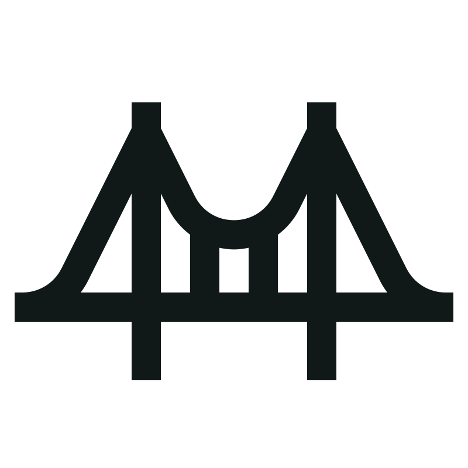</a> | **📂 檔名:** `join.svg` ✨ **格式:** `Vector (SVG)` ⚖️ **大小:** `1013.00B` 📅 **更新:** `2026-02-27`  🚀 **jsDelivr Markdown:** `` 🔗 **直接連結 (Url):** <code>https://cdn.jsdelivr.net/gh/barry028/materials@main/images/iCons/Simple%20Line%20Action%20iCons/join.svg</code> 📥 [檢視原始檔](join.svg) |
|  | **📂 檔名:** `judge.svg` ✨ **格式:** `Vector (SVG)` ⚖️ **大小:** `572.00B` 📅 **更新:** `2026-02-27`  🚀 **jsDelivr Markdown:** `` 🔗 **直接連結 (Url):** <code>https://cdn.jsdelivr.net/gh/barry028/materials@main/images/iCons/Simple%20Line%20Action%20iCons/judge.svg</code> 📥 [檢視原始檔](judge.svg) |
| <a href="keep.svg">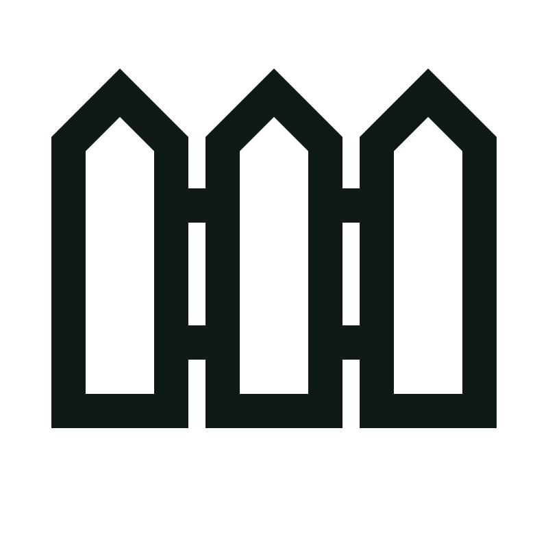</a> | **📂 檔名:** `keep.svg` ✨ **格式:** `Vector (SVG)` ⚖️ **大小:** `634.00B` 📅 **更新:** `2026-02-27`  🚀 **jsDelivr Markdown:** `` 🔗 **直接連結 (Url):** <code>https://cdn.jsdelivr.net/gh/barry028/materials@main/images/iCons/Simple%20Line%20Action%20iCons/keep.svg</code> 📥 [檢視原始檔](keep.svg) |
|  | **📂 檔名:** `kick.svg` ✨ **格式:** `Vector (SVG)` ⚖️ **大小:** `899.00B` 📅 **更新:** `2026-02-27`  🚀 **jsDelivr Markdown:** `` 🔗 **直接連結 (Url):** <code>https://cdn.jsdelivr.net/gh/barry028/materials@main/images/iCons/Simple%20Line%20Action%20iCons/kick.svg</code> 📥 [檢視原始檔](kick.svg) |
| <a href="kill.svg">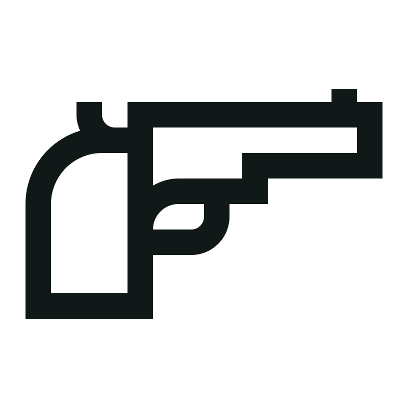</a> | **📂 檔名:** `kill.svg` ✨ **格式:** `Vector (SVG)` ⚖️ **大小:** `744.00B` 📅 **更新:** `2026-02-27`  🚀 **jsDelivr Markdown:** `` 🔗 **直接連結 (Url):** <code>https://cdn.jsdelivr.net/gh/barry028/materials@main/images/iCons/Simple%20Line%20Action%20iCons/kill.svg</code> 📥 [檢視原始檔](kill.svg) |
|  | **📂 檔名:** `kiss.svg` ✨ **格式:** `Vector (SVG)` ⚖️ **大小:** `1.17KB` 📅 **更新:** `2026-02-27`  🚀 **jsDelivr Markdown:** `` 🔗 **直接連結 (Url):** <code>https://cdn.jsdelivr.net/gh/barry028/materials@main/images/iCons/Simple%20Line%20Action%20iCons/kiss.svg</code> 📥 [檢視原始檔](kiss.svg) |
|  | **📂 檔名:** `launch.svg` ✨ **格式:** `Vector (SVG)` ⚖️ **大小:** `1.85KB` 📅 **更新:** `2026-02-27`  🚀 **jsDelivr Markdown:** `` 🔗 **直接連結 (Url):** <code>https://cdn.jsdelivr.net/gh/barry028/materials@main/images/iCons/Simple%20Line%20Action%20iCons/launch.svg</code> 📥 [檢視原始檔](launch.svg) |
|  | **📂 檔名:** `lick.svg` ✨ **格式:** `Vector (SVG)` ⚖️ **大小:** `1019.00B` 📅 **更新:** `2026-02-27`  🚀 **jsDelivr Markdown:** `` 🔗 **直接連結 (Url):** <code>https://cdn.jsdelivr.net/gh/barry028/materials@main/images/iCons/Simple%20Line%20Action%20iCons/lick.svg</code> 📥 [檢視原始檔](lick.svg) |
|  | **📂 檔名:** `lift.svg` ✨ **格式:** `Vector (SVG)` ⚖️ **大小:** `587.00B` 📅 **更新:** `2026-02-27`  🚀 **jsDelivr Markdown:** `` 🔗 **直接連結 (Url):** <code>https://cdn.jsdelivr.net/gh/barry028/materials@main/images/iCons/Simple%20Line%20Action%20iCons/lift.svg</code> 📥 [檢視原始檔](lift.svg) |
|  | **📂 檔名:** `light.svg` ✨ **格式:** `Vector (SVG)` ⚖️ **大小:** `1.27KB` 📅 **更新:** `2026-02-27`  🚀 **jsDelivr Markdown:** `` 🔗 **直接連結 (Url):** <code>https://cdn.jsdelivr.net/gh/barry028/materials@main/images/iCons/Simple%20Line%20Action%20iCons/light.svg</code> 📥 [檢視原始檔](light.svg) |
|  | **📂 檔名:** `like.svg` ✨ **格式:** `Vector (SVG)` ⚖️ **大小:** `917.00B` 📅 **更新:** `2026-02-27`  🚀 **jsDelivr Markdown:** `` 🔗 **直接連結 (Url):** <code>https://cdn.jsdelivr.net/gh/barry028/materials@main/images/iCons/Simple%20Line%20Action%20iCons/like.svg</code> 📥 [檢視原始檔](like.svg) |
|  | **📂 檔名:** `link.svg` ✨ **格式:** `Vector (SVG)` ⚖️ **大小:** `1.43KB` 📅 **更新:** `2026-02-27`  🚀 **jsDelivr Markdown:** `` 🔗 **直接連結 (Url):** <code>https://cdn.jsdelivr.net/gh/barry028/materials@main/images/iCons/Simple%20Line%20Action%20iCons/link.svg</code> 📥 [檢視原始檔](link.svg) |
|  | **📂 檔名:** `live.svg` ✨ **格式:** `Vector (SVG)` ⚖️ **大小:** `1.29KB` 📅 **更新:** `2026-02-27`  🚀 **jsDelivr Markdown:** `` 🔗 **直接連結 (Url):** <code>https://cdn.jsdelivr.net/gh/barry028/materials@main/images/iCons/Simple%20Line%20Action%20iCons/live.svg</code> 📥 [檢視原始檔](live.svg) |
|  | **📂 檔名:** `load.svg` ✨ **格式:** `Vector (SVG)` ⚖️ **大小:** `1.07KB` 📅 **更新:** `2026-02-27`  🚀 **jsDelivr Markdown:** `` 🔗 **直接連結 (Url):** <code>https://cdn.jsdelivr.net/gh/barry028/materials@main/images/iCons/Simple%20Line%20Action%20iCons/load.svg</code> 📥 [檢視原始檔](load.svg) |
|  | **📂 檔名:** `locate.svg` ✨ **格式:** `Vector (SVG)` ⚖️ **大小:** `772.00B` 📅 **更新:** `2026-02-27`  🚀 **jsDelivr Markdown:** `` 🔗 **直接連結 (Url):** <code>https://cdn.jsdelivr.net/gh/barry028/materials@main/images/iCons/Simple%20Line%20Action%20iCons/locate.svg</code> 📥 [檢視原始檔](locate.svg) |
|  | **📂 檔名:** `lock.svg` ✨ **格式:** `Vector (SVG)` ⚖️ **大小:** `715.00B` 📅 **更新:** `2026-02-27`  🚀 **jsDelivr Markdown:** `` 🔗 **直接連結 (Url):** <code>https://cdn.jsdelivr.net/gh/barry028/materials@main/images/iCons/Simple%20Line%20Action%20iCons/lock.svg</code> 📥 [檢視原始檔](lock.svg) |
|  | **📂 檔名:** `manufacture.svg` ✨ **格式:** `Vector (SVG)` ⚖️ **大小:** `599.00B` 📅 **更新:** `2026-02-27`  🚀 **jsDelivr Markdown:** `` 🔗 **直接連結 (Url):** <code>https://cdn.jsdelivr.net/gh/barry028/materials@main/images/iCons/Simple%20Line%20Action%20iCons/manufacture.svg</code> 📥 [檢視原始檔](manufacture.svg) |
|  | **📂 檔名:** `mark.svg` ✨ **格式:** `Vector (SVG)` ⚖️ **大小:** `721.00B` 📅 **更新:** `2026-02-27`  🚀 **jsDelivr Markdown:** `` 🔗 **直接連結 (Url):** <code>https://cdn.jsdelivr.net/gh/barry028/materials@main/images/iCons/Simple%20Line%20Action%20iCons/mark.svg</code> 📥 [檢視原始檔](mark.svg) |
|  | **📂 檔名:** `measure.svg` ✨ **格式:** `Vector (SVG)` ⚖️ **大小:** `796.00B` 📅 **更新:** `2026-02-27`  🚀 **jsDelivr Markdown:** `` 🔗 **直接連結 (Url):** <code>https://cdn.jsdelivr.net/gh/barry028/materials@main/images/iCons/Simple%20Line%20Action%20iCons/measure.svg</code> 📥 [檢視原始檔](measure.svg) |
|  | **📂 檔名:** `medicate.svg` ✨ **格式:** `Vector (SVG)` ⚖️ **大小:** `1.21KB` 📅 **更新:** `2026-02-27`  🚀 **jsDelivr Markdown:** `` 🔗 **直接連結 (Url):** <code>https://cdn.jsdelivr.net/gh/barry028/materials@main/images/iCons/Simple%20Line%20Action%20iCons/medicate.svg</code> 📥 [檢視原始檔](medicate.svg) |
|  | **📂 檔名:** `melt.svg` ✨ **格式:** `Vector (SVG)` ⚖️ **大小:** `1.05KB` 📅 **更新:** `2026-02-27`  🚀 **jsDelivr Markdown:** `` 🔗 **直接連結 (Url):** <code>https://cdn.jsdelivr.net/gh/barry028/materials@main/images/iCons/Simple%20Line%20Action%20iCons/melt.svg</code> 📥 [檢視原始檔](melt.svg) |
| <a href="merge.svg">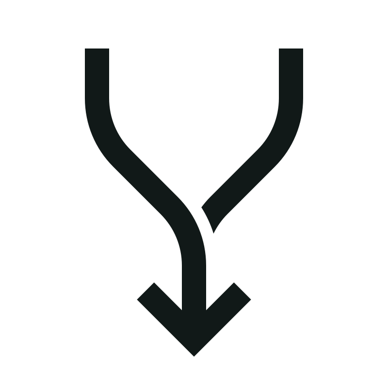</a> | **📂 檔名:** `merge.svg` ✨ **格式:** `Vector (SVG)` ⚖️ **大小:** `936.00B` 📅 **更新:** `2026-02-27`  🚀 **jsDelivr Markdown:** `` 🔗 **直接連結 (Url):** <code>https://cdn.jsdelivr.net/gh/barry028/materials@main/images/iCons/Simple%20Line%20Action%20iCons/merge.svg</code> 📥 [檢視原始檔](merge.svg) |
|  | **📂 檔名:** `mill.svg` ✨ **格式:** `Vector (SVG)` ⚖️ **大小:** `773.00B` 📅 **更新:** `2026-02-27`  🚀 **jsDelivr Markdown:** `` 🔗 **直接連結 (Url):** <code>https://cdn.jsdelivr.net/gh/barry028/materials@main/images/iCons/Simple%20Line%20Action%20iCons/mill.svg</code> 📥 [檢視原始檔](mill.svg) |
| <a href="move.svg">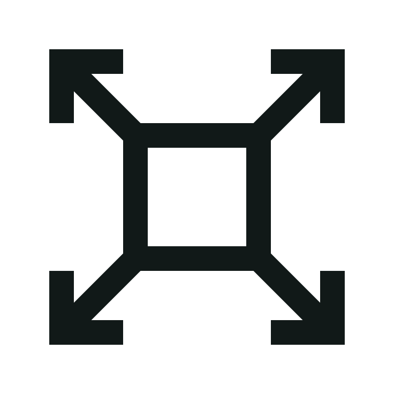</a> | **📂 檔名:** `move.svg` ✨ **格式:** `Vector (SVG)` ⚖️ **大小:** `604.00B` 📅 **更新:** `2026-02-27`  🚀 **jsDelivr Markdown:** `` 🔗 **直接連結 (Url):** <code>https://cdn.jsdelivr.net/gh/barry028/materials@main/images/iCons/Simple%20Line%20Action%20iCons/move.svg</code> 📥 [檢視原始檔](move.svg) |
|  | **📂 檔名:** `multiply.svg` ✨ **格式:** `Vector (SVG)` ⚖️ **大小:** `585.00B` 📅 **更新:** `2026-02-27`  🚀 **jsDelivr Markdown:** `` 🔗 **直接連結 (Url):** <code>https://cdn.jsdelivr.net/gh/barry028/materials@main/images/iCons/Simple%20Line%20Action%20iCons/multiply.svg</code> 📥 [檢視原始檔](multiply.svg) |
|  | **📂 檔名:** `mute.svg` ✨ **格式:** `Vector (SVG)` ⚖️ **大小:** `637.00B` 📅 **更新:** `2026-02-27`  🚀 **jsDelivr Markdown:** `` 🔗 **直接連結 (Url):** <code>https://cdn.jsdelivr.net/gh/barry028/materials@main/images/iCons/Simple%20Line%20Action%20iCons/mute.svg</code> 📥 [檢視原始檔](mute.svg) |
|  | **📂 檔名:** `navigate.svg` ✨ **格式:** `Vector (SVG)` ⚖️ **大小:** `1.21KB` 📅 **更新:** `2026-02-27`  🚀 **jsDelivr Markdown:** `` 🔗 **直接連結 (Url):** <code>https://cdn.jsdelivr.net/gh/barry028/materials@main/images/iCons/Simple%20Line%20Action%20iCons/navigate.svg</code> 📥 [檢視原始檔](navigate.svg) |
|  | **📂 檔名:** `open.svg` ✨ **格式:** `Vector (SVG)` ⚖️ **大小:** `715.00B` 📅 **更新:** `2026-02-27`  🚀 **jsDelivr Markdown:** `` 🔗 **直接連結 (Url):** <code>https://cdn.jsdelivr.net/gh/barry028/materials@main/images/iCons/Simple%20Line%20Action%20iCons/open.svg</code> 📥 [檢視原始檔](open.svg) |
|  | **📂 檔名:** `pack.svg` ✨ **格式:** `Vector (SVG)` ⚖️ **大小:** `791.00B` 📅 **更新:** `2026-02-27`  🚀 **jsDelivr Markdown:** `` 🔗 **直接連結 (Url):** <code>https://cdn.jsdelivr.net/gh/barry028/materials@main/images/iCons/Simple%20Line%20Action%20iCons/pack.svg</code> 📥 [檢視原始檔](pack.svg) |
| <a href="paint.svg">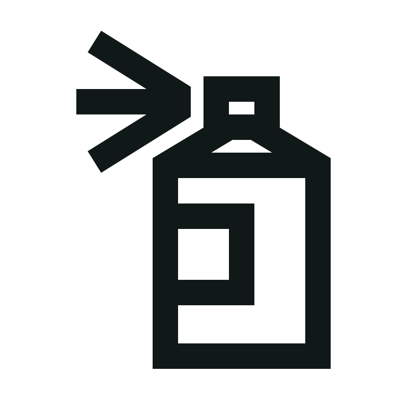</a> | **📂 檔名:** `paint.svg` ✨ **格式:** `Vector (SVG)` ⚖️ **大小:** `699.00B` 📅 **更新:** `2026-02-27`  🚀 **jsDelivr Markdown:** `` 🔗 **直接連結 (Url):** <code>https://cdn.jsdelivr.net/gh/barry028/materials@main/images/iCons/Simple%20Line%20Action%20iCons/paint.svg</code> 📥 [檢視原始檔](paint.svg) |
|  | **📂 檔名:** `park.svg` ✨ **格式:** `Vector (SVG)` ⚖️ **大小:** `873.00B` 📅 **更新:** `2026-02-27`  🚀 **jsDelivr Markdown:** `` 🔗 **直接連結 (Url):** <code>https://cdn.jsdelivr.net/gh/barry028/materials@main/images/iCons/Simple%20Line%20Action%20iCons/park.svg</code> 📥 [檢視原始檔](park.svg) |
|  | **📂 檔名:** `paste.svg` ✨ **格式:** `Vector (SVG)` ⚖️ **大小:** `1.12KB` 📅 **更新:** `2026-02-27`  🚀 **jsDelivr Markdown:** `` 🔗 **直接連結 (Url):** <code>https://cdn.jsdelivr.net/gh/barry028/materials@main/images/iCons/Simple%20Line%20Action%20iCons/paste.svg</code> 📥 [檢視原始檔](paste.svg) |
|  | **📂 檔名:** `pause.svg` ✨ **格式:** `Vector (SVG)` ⚖️ **大小:** `505.00B` 📅 **更新:** `2026-02-27`  🚀 **jsDelivr Markdown:** `` 🔗 **直接連結 (Url):** <code>https://cdn.jsdelivr.net/gh/barry028/materials@main/images/iCons/Simple%20Line%20Action%20iCons/pause.svg</code> 📥 [檢視原始檔](pause.svg) |
|  | **📂 檔名:** `pay.svg` ✨ **格式:** `Vector (SVG)` ⚖️ **大小:** `680.00B` 📅 **更新:** `2026-02-27`  🚀 **jsDelivr Markdown:** `` 🔗 **直接連結 (Url):** <code>https://cdn.jsdelivr.net/gh/barry028/materials@main/images/iCons/Simple%20Line%20Action%20iCons/pay.svg</code> 📥 [檢視原始檔](pay.svg) |
|  | **📂 檔名:** `perform.svg` ✨ **格式:** `Vector (SVG)` ⚖️ **大小:** `573.00B` 📅 **更新:** `2026-02-27`  🚀 **jsDelivr Markdown:** `` 🔗 **直接連結 (Url):** <code>https://cdn.jsdelivr.net/gh/barry028/materials@main/images/iCons/Simple%20Line%20Action%20iCons/perform.svg</code> 📥 [檢視原始檔](perform.svg) |
|  | **📂 檔名:** `photograph.svg` ✨ **格式:** `Vector (SVG)` ⚖️ **大小:** `736.00B` 📅 **更新:** `2026-02-27`  🚀 **jsDelivr Markdown:** `` 🔗 **直接連結 (Url):** <code>https://cdn.jsdelivr.net/gh/barry028/materials@main/images/iCons/Simple%20Line%20Action%20iCons/photograph.svg</code> 📥 [檢視原始檔](photograph.svg) |
|  | **📂 檔名:** `pick.svg` ✨ **格式:** `Vector (SVG)` ⚖️ **大小:** `935.00B` 📅 **更新:** `2026-02-27`  🚀 **jsDelivr Markdown:** `` 🔗 **直接連結 (Url):** <code>https://cdn.jsdelivr.net/gh/barry028/materials@main/images/iCons/Simple%20Line%20Action%20iCons/pick.svg</code> 📥 [檢視原始檔](pick.svg) |
|  | **📂 檔名:** `pin.svg` ✨ **格式:** `Vector (SVG)` ⚖️ **大小:** `661.00B` 📅 **更新:** `2026-02-27`  🚀 **jsDelivr Markdown:** `` 🔗 **直接連結 (Url):** <code>https://cdn.jsdelivr.net/gh/barry028/materials@main/images/iCons/Simple%20Line%20Action%20iCons/pin.svg</code> 📥 [檢視原始檔](pin.svg) |
|  | **📂 檔名:** `pitch.svg` ✨ **格式:** `Vector (SVG)` ⚖️ **大小:** `789.00B` 📅 **更新:** `2026-02-27`  🚀 **jsDelivr Markdown:** `` 🔗 **直接連結 (Url):** <code>https://cdn.jsdelivr.net/gh/barry028/materials@main/images/iCons/Simple%20Line%20Action%20iCons/pitch.svg</code> 📥 [檢視原始檔](pitch.svg) |
|  | **📂 檔名:** `plan.svg` ✨ **格式:** `Vector (SVG)` ⚖️ **大小:** `637.00B` 📅 **更新:** `2026-02-27`  🚀 **jsDelivr Markdown:** `` 🔗 **直接連結 (Url):** <code>https://cdn.jsdelivr.net/gh/barry028/materials@main/images/iCons/Simple%20Line%20Action%20iCons/plan.svg</code> 📥 [檢視原始檔](plan.svg) |
|  | **📂 檔名:** `plant.svg` ✨ **格式:** `Vector (SVG)` ⚖️ **大小:** `994.00B` 📅 **更新:** `2026-02-27`  🚀 **jsDelivr Markdown:** `` 🔗 **直接連結 (Url):** <code>https://cdn.jsdelivr.net/gh/barry028/materials@main/images/iCons/Simple%20Line%20Action%20iCons/plant.svg</code> 📥 [檢視原始檔](plant.svg) |
|  | **📂 檔名:** `play.svg` ✨ **格式:** `Vector (SVG)` ⚖️ **大小:** `493.00B` 📅 **更新:** `2026-02-27`  🚀 **jsDelivr Markdown:** `` 🔗 **直接連結 (Url):** <code>https://cdn.jsdelivr.net/gh/barry028/materials@main/images/iCons/Simple%20Line%20Action%20iCons/play.svg</code> 📥 [檢視原始檔](play.svg) |
| <a href="plot.svg">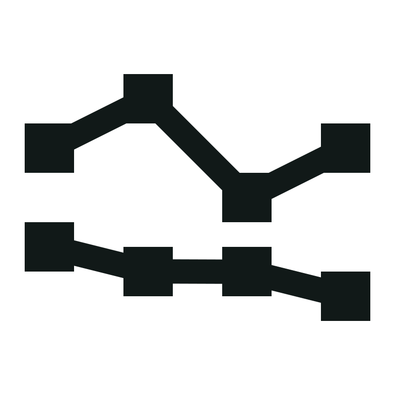</a> | **📂 檔名:** `plot.svg` ✨ **格式:** `Vector (SVG)` ⚖️ **大小:** `722.00B` 📅 **更新:** `2026-02-27`  🚀 **jsDelivr Markdown:** `` 🔗 **直接連結 (Url):** <code>https://cdn.jsdelivr.net/gh/barry028/materials@main/images/iCons/Simple%20Line%20Action%20iCons/plot.svg</code> 📥 [檢視原始檔](plot.svg) |
|  | **📂 檔名:** `point.svg` ✨ **格式:** `Vector (SVG)` ⚖️ **大小:** `817.00B` 📅 **更新:** `2026-02-27`  🚀 **jsDelivr Markdown:** `` 🔗 **直接連結 (Url):** <code>https://cdn.jsdelivr.net/gh/barry028/materials@main/images/iCons/Simple%20Line%20Action%20iCons/point.svg</code> 📥 [檢視原始檔](point.svg) |
|  | **📂 檔名:** `poison.svg` ✨ **格式:** `Vector (SVG)` ⚖️ **大小:** `860.00B` 📅 **更新:** `2026-02-27`  🚀 **jsDelivr Markdown:** `` 🔗 **直接連結 (Url):** <code>https://cdn.jsdelivr.net/gh/barry028/materials@main/images/iCons/Simple%20Line%20Action%20iCons/poison.svg</code> 📥 [檢視原始檔](poison.svg) |
|  | **📂 檔名:** `present.svg` ✨ **格式:** `Vector (SVG)` ⚖️ **大小:** `594.00B` 📅 **更新:** `2026-02-27`  🚀 **jsDelivr Markdown:** `` 🔗 **直接連結 (Url):** <code>https://cdn.jsdelivr.net/gh/barry028/materials@main/images/iCons/Simple%20Line%20Action%20iCons/present.svg</code> 📥 [檢視原始檔](present.svg) |
|  | **📂 檔名:** `press.svg` ✨ **格式:** `Vector (SVG)` ⚖️ **大小:** `999.00B` 📅 **更新:** `2026-02-27`  🚀 **jsDelivr Markdown:** `` 🔗 **直接連結 (Url):** <code>https://cdn.jsdelivr.net/gh/barry028/materials@main/images/iCons/Simple%20Line%20Action%20iCons/press.svg</code> 📥 [檢視原始檔](press.svg) |
|  | **📂 檔名:** `pretend.svg` ✨ **格式:** `Vector (SVG)` ⚖️ **大小:** `1.27KB` 📅 **更新:** `2026-02-27`  🚀 **jsDelivr Markdown:** `` 🔗 **直接連結 (Url):** <code>https://cdn.jsdelivr.net/gh/barry028/materials@main/images/iCons/Simple%20Line%20Action%20iCons/pretend.svg</code> 📥 [檢視原始檔](pretend.svg) |
|  | **📂 檔名:** `primp.svg` ✨ **格式:** `Vector (SVG)` ⚖️ **大小:** `685.00B` 📅 **更新:** `2026-02-27`  🚀 **jsDelivr Markdown:** `` 🔗 **直接連結 (Url):** <code>https://cdn.jsdelivr.net/gh/barry028/materials@main/images/iCons/Simple%20Line%20Action%20iCons/primp.svg</code> 📥 [檢視原始檔](primp.svg) |
|  | **📂 檔名:** `print.svg` ✨ **格式:** `Vector (SVG)` ⚖️ **大小:** `614.00B` 📅 **更新:** `2026-02-27`  🚀 **jsDelivr Markdown:** `` 🔗 **直接連結 (Url):** <code>https://cdn.jsdelivr.net/gh/barry028/materials@main/images/iCons/Simple%20Line%20Action%20iCons/print.svg</code> 📥 [檢視原始檔](print.svg) |
|  | **📂 檔名:** `protect.svg` ✨ **格式:** `Vector (SVG)` ⚖️ **大小:** `807.00B` 📅 **更新:** `2026-02-27`  🚀 **jsDelivr Markdown:** `` 🔗 **直接連結 (Url):** <code>https://cdn.jsdelivr.net/gh/barry028/materials@main/images/iCons/Simple%20Line%20Action%20iCons/protect.svg</code> 📥 [檢視原始檔](protect.svg) |
|  | **📂 檔名:** `pucker.svg` ✨ **格式:** `Vector (SVG)` ⚖️ **大小:** `1.16KB` 📅 **更新:** `2026-02-27`  🚀 **jsDelivr Markdown:** `` 🔗 **直接連結 (Url):** <code>https://cdn.jsdelivr.net/gh/barry028/materials@main/images/iCons/Simple%20Line%20Action%20iCons/pucker.svg</code> 📥 [檢視原始檔](pucker.svg) |
|  | **📂 檔名:** `push.svg` ✨ **格式:** `Vector (SVG)` ⚖️ **大小:** `1020.00B` 📅 **更新:** `2026-02-27`  🚀 **jsDelivr Markdown:** `` 🔗 **直接連結 (Url):** <code>https://cdn.jsdelivr.net/gh/barry028/materials@main/images/iCons/Simple%20Line%20Action%20iCons/push.svg</code> 📥 [檢視原始檔](push.svg) |
| <a href="rain.svg">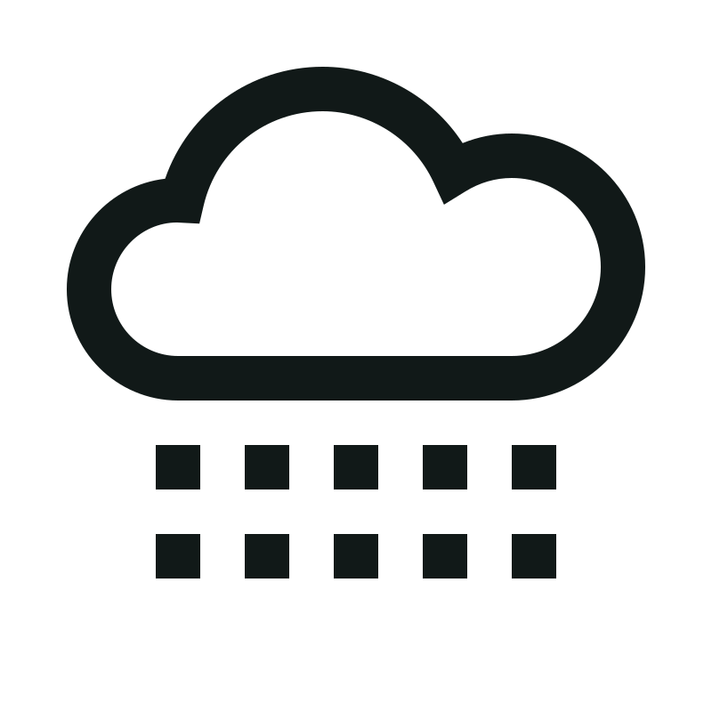</a> | **📂 檔名:** `rain.svg` ✨ **格式:** `Vector (SVG)` ⚖️ **大小:** `1.01KB` 📅 **更新:** `2026-02-27`  🚀 **jsDelivr Markdown:** `` 🔗 **直接連結 (Url):** <code>https://cdn.jsdelivr.net/gh/barry028/materials@main/images/iCons/Simple%20Line%20Action%20iCons/rain.svg</code> 📥 [檢視原始檔](rain.svg) |
|  | **📂 檔名:** `read.svg` ✨ **格式:** `Vector (SVG)` ⚖️ **大小:** `900.00B` 📅 **更新:** `2026-02-27`  🚀 **jsDelivr Markdown:** `` 🔗 **直接連結 (Url):** <code>https://cdn.jsdelivr.net/gh/barry028/materials@main/images/iCons/Simple%20Line%20Action%20iCons/read.svg</code> 📥 [檢視原始檔](read.svg) |
|  | **📂 檔名:** `record.svg` ✨ **格式:** `Vector (SVG)` ⚖️ **大小:** `571.00B` 📅 **更新:** `2026-02-27`  🚀 **jsDelivr Markdown:** `` 🔗 **直接連結 (Url):** <code>https://cdn.jsdelivr.net/gh/barry028/materials@main/images/iCons/Simple%20Line%20Action%20iCons/record.svg</code> 📥 [檢視原始檔](record.svg) |
| <a href="redo.svg">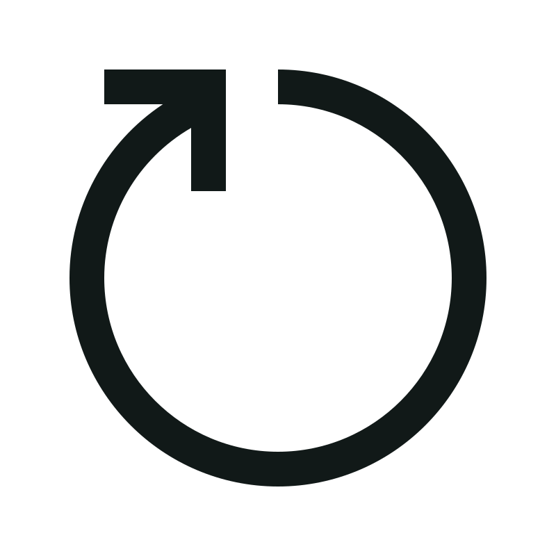</a> | **📂 檔名:** `redo.svg` ✨ **格式:** `Vector (SVG)` ⚖️ **大小:** `626.00B` 📅 **更新:** `2026-02-27`  🚀 **jsDelivr Markdown:** `` 🔗 **直接連結 (Url):** <code>https://cdn.jsdelivr.net/gh/barry028/materials@main/images/iCons/Simple%20Line%20Action%20iCons/redo.svg</code> 📥 [檢視原始檔](redo.svg) |
|  | **📂 檔名:** `reheat.svg` ✨ **格式:** `Vector (SVG)` ⚖️ **大小:** `571.00B` 📅 **更新:** `2026-02-27`  🚀 **jsDelivr Markdown:** `` 🔗 **直接連結 (Url):** <code>https://cdn.jsdelivr.net/gh/barry028/materials@main/images/iCons/Simple%20Line%20Action%20iCons/reheat.svg</code> 📥 [檢視原始檔](reheat.svg) |
| <a href="remind.svg">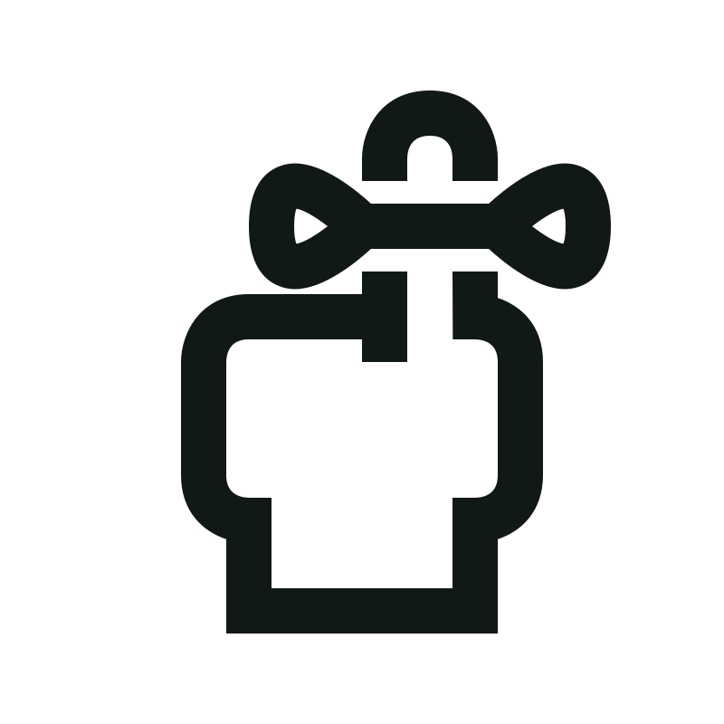</a> | **📂 檔名:** `remind.svg` ✨ **格式:** `Vector (SVG)` ⚖️ **大小:** `1.37KB` 📅 **更新:** `2026-02-27`  🚀 **jsDelivr Markdown:** `` 🔗 **直接連結 (Url):** <code>https://cdn.jsdelivr.net/gh/barry028/materials@main/images/iCons/Simple%20Line%20Action%20iCons/remind.svg</code> 📥 [檢視原始檔](remind.svg) |
|  | **📂 檔名:** `repeat.svg` ✨ **格式:** `Vector (SVG)` ⚖️ **大小:** `790.00B` 📅 **更新:** `2026-02-27`  🚀 **jsDelivr Markdown:** `` 🔗 **直接連結 (Url):** <code>https://cdn.jsdelivr.net/gh/barry028/materials@main/images/iCons/Simple%20Line%20Action%20iCons/repeat.svg</code> 📥 [檢視原始檔](repeat.svg) |
|  | **📂 檔名:** `report.svg` ✨ **格式:** `Vector (SVG)` ⚖️ **大小:** `677.00B` 📅 **更新:** `2026-02-27`  🚀 **jsDelivr Markdown:** `` 🔗 **直接連結 (Url):** <code>https://cdn.jsdelivr.net/gh/barry028/materials@main/images/iCons/Simple%20Line%20Action%20iCons/report.svg</code> 📥 [檢視原始檔](report.svg) |
|  | **📂 檔名:** `resurrect.svg` ✨ **格式:** `Vector (SVG)` ⚖️ **大小:** `1.33KB` 📅 **更新:** `2026-02-27`  🚀 **jsDelivr Markdown:** `` 🔗 **直接連結 (Url):** <code>https://cdn.jsdelivr.net/gh/barry028/materials@main/images/iCons/Simple%20Line%20Action%20iCons/resurrect.svg</code> 📥 [檢視原始檔](resurrect.svg) |
|  | **📂 檔名:** `rewind.svg` ✨ **格式:** `Vector (SVG)` ⚖️ **大小:** `549.00B` 📅 **更新:** `2026-02-27`  🚀 **jsDelivr Markdown:** `` 🔗 **直接連結 (Url):** <code>https://cdn.jsdelivr.net/gh/barry028/materials@main/images/iCons/Simple%20Line%20Action%20iCons/rewind.svg</code> 📥 [檢視原始檔](rewind.svg) |
|  | **📂 檔名:** `ride.svg` ✨ **格式:** `Vector (SVG)` ⚖️ **大小:** `1.05KB` 📅 **更新:** `2026-02-27`  🚀 **jsDelivr Markdown:** `` 🔗 **直接連結 (Url):** <code>https://cdn.jsdelivr.net/gh/barry028/materials@main/images/iCons/Simple%20Line%20Action%20iCons/ride.svg</code> 📥 [檢視原始檔](ride.svg) |
|  | **📂 檔名:** `ring.svg` ✨ **格式:** `Vector (SVG)` ⚖️ **大小:** `707.00B` 📅 **更新:** `2026-02-27`  🚀 **jsDelivr Markdown:** `` 🔗 **直接連結 (Url):** <code>https://cdn.jsdelivr.net/gh/barry028/materials@main/images/iCons/Simple%20Line%20Action%20iCons/ring.svg</code> 📥 [檢視原始檔](ring.svg) |
|  | **📂 檔名:** `rise.svg` ✨ **格式:** `Vector (SVG)` ⚖️ **大小:** `888.00B` 📅 **更新:** `2026-02-27`  🚀 **jsDelivr Markdown:** `` 🔗 **直接連結 (Url):** <code>https://cdn.jsdelivr.net/gh/barry028/materials@main/images/iCons/Simple%20Line%20Action%20iCons/rise.svg</code> 📥 [檢視原始檔](rise.svg) |
|  | **📂 檔名:** `rock.svg` ✨ **格式:** `Vector (SVG)` ⚖️ **大小:** `748.00B` 📅 **更新:** `2026-02-27`  🚀 **jsDelivr Markdown:** `` 🔗 **直接連結 (Url):** <code>https://cdn.jsdelivr.net/gh/barry028/materials@main/images/iCons/Simple%20Line%20Action%20iCons/rock.svg</code> 📥 [檢視原始檔](rock.svg) |
|  | **📂 檔名:** `roll.svg` ✨ **格式:** `Vector (SVG)` ⚖️ **大小:** `823.00B` 📅 **更新:** `2026-02-27`  🚀 **jsDelivr Markdown:** `` 🔗 **直接連結 (Url):** <code>https://cdn.jsdelivr.net/gh/barry028/materials@main/images/iCons/Simple%20Line%20Action%20iCons/roll.svg</code> 📥 [檢視原始檔](roll.svg) |
|  | **📂 檔名:** `rule.svg` ✨ **格式:** `Vector (SVG)` ⚖️ **大小:** `612.00B` 📅 **更新:** `2026-02-27`  🚀 **jsDelivr Markdown:** `` 🔗 **直接連結 (Url):** <code>https://cdn.jsdelivr.net/gh/barry028/materials@main/images/iCons/Simple%20Line%20Action%20iCons/rule.svg</code> 📥 [檢視原始檔](rule.svg) |
| <a href="run.svg">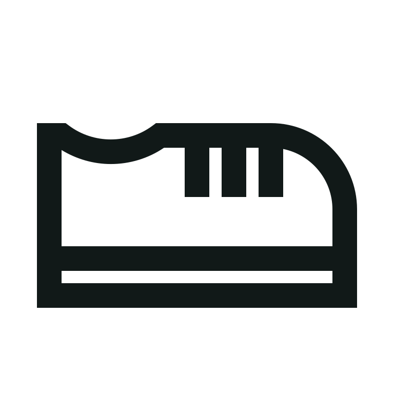</a> | **📂 檔名:** `run.svg` ✨ **格式:** `Vector (SVG)` ⚖️ **大小:** `703.00B` 📅 **更新:** `2026-02-27`  🚀 **jsDelivr Markdown:** `` 🔗 **直接連結 (Url):** <code>https://cdn.jsdelivr.net/gh/barry028/materials@main/images/iCons/Simple%20Line%20Action%20iCons/run.svg</code> 📥 [檢視原始檔](run.svg) |
|  | **📂 檔名:** `save.svg` ✨ **格式:** `Vector (SVG)` ⚖️ **大小:** `514.00B` 📅 **更新:** `2026-02-27`  🚀 **jsDelivr Markdown:** `` 🔗 **直接連結 (Url):** <code>https://cdn.jsdelivr.net/gh/barry028/materials@main/images/iCons/Simple%20Line%20Action%20iCons/save.svg</code> 📥 [檢視原始檔](save.svg) |
|  | **📂 檔名:** `schedule.svg` ✨ **格式:** `Vector (SVG)` ⚖️ **大小:** `612.00B` 📅 **更新:** `2026-02-27`  🚀 **jsDelivr Markdown:** `` 🔗 **直接連結 (Url):** <code>https://cdn.jsdelivr.net/gh/barry028/materials@main/images/iCons/Simple%20Line%20Action%20iCons/schedule.svg</code> 📥 [檢視原始檔](schedule.svg) |
|  | **📂 檔名:** `screw.svg` ✨ **格式:** `Vector (SVG)` ⚖️ **大小:** `606.00B` 📅 **更新:** `2026-02-27`  🚀 **jsDelivr Markdown:** `` 🔗 **直接連結 (Url):** <code>https://cdn.jsdelivr.net/gh/barry028/materials@main/images/iCons/Simple%20Line%20Action%20iCons/screw.svg</code> 📥 [檢視原始檔](screw.svg) |
|  | **📂 檔名:** `scroll.svg` ✨ **格式:** `Vector (SVG)` ⚖️ **大小:** `833.00B` 📅 **更新:** `2026-02-27`  🚀 **jsDelivr Markdown:** `` 🔗 **直接連結 (Url):** <code>https://cdn.jsdelivr.net/gh/barry028/materials@main/images/iCons/Simple%20Line%20Action%20iCons/scroll.svg</code> 📥 [檢視原始檔](scroll.svg) |
|  | **📂 檔名:** `search.svg` ✨ **格式:** `Vector (SVG)` ⚖️ **大小:** `739.00B` 📅 **更新:** `2026-02-27`  🚀 **jsDelivr Markdown:** `` 🔗 **直接連結 (Url):** <code>https://cdn.jsdelivr.net/gh/barry028/materials@main/images/iCons/Simple%20Line%20Action%20iCons/search.svg</code> 📥 [檢視原始檔](search.svg) |
|  | **📂 檔名:** `see.svg` ✨ **格式:** `Vector (SVG)` ⚖️ **大小:** `1.25KB` 📅 **更新:** `2026-02-27`  🚀 **jsDelivr Markdown:** `` 🔗 **直接連結 (Url):** <code>https://cdn.jsdelivr.net/gh/barry028/materials@main/images/iCons/Simple%20Line%20Action%20iCons/see.svg</code> 📥 [檢視原始檔](see.svg) |
|  | **📂 檔名:** `select.svg` ✨ **格式:** `Vector (SVG)` ⚖️ **大小:** `1005.00B` 📅 **更新:** `2026-02-27`  🚀 **jsDelivr Markdown:** `` 🔗 **直接連結 (Url):** <code>https://cdn.jsdelivr.net/gh/barry028/materials@main/images/iCons/Simple%20Line%20Action%20iCons/select.svg</code> 📥 [檢視原始檔](select.svg) |
|  | **📂 檔名:** `sell.svg` ✨ **格式:** `Vector (SVG)` ⚖️ **大小:** `743.00B` 📅 **更新:** `2026-02-27`  🚀 **jsDelivr Markdown:** `` 🔗 **直接連結 (Url):** <code>https://cdn.jsdelivr.net/gh/barry028/materials@main/images/iCons/Simple%20Line%20Action%20iCons/sell.svg</code> 📥 [檢視原始檔](sell.svg) |
|  | **📂 檔名:** `send.svg` ✨ **格式:** `Vector (SVG)` ⚖️ **大小:** `676.00B` 📅 **更新:** `2026-02-27`  🚀 **jsDelivr Markdown:** `` 🔗 **直接連結 (Url):** <code>https://cdn.jsdelivr.net/gh/barry028/materials@main/images/iCons/Simple%20Line%20Action%20iCons/send.svg</code> 📥 [檢視原始檔](send.svg) |
|  | **📂 檔名:** `separate.svg` ✨ **格式:** `Vector (SVG)` ⚖️ **大小:** `1.03KB` 📅 **更新:** `2026-02-27`  🚀 **jsDelivr Markdown:** `` 🔗 **直接連結 (Url):** <code>https://cdn.jsdelivr.net/gh/barry028/materials@main/images/iCons/Simple%20Line%20Action%20iCons/separate.svg</code> 📥 [檢視原始檔](separate.svg) |
|  | **📂 檔名:** `sew.svg` ✨ **格式:** `Vector (SVG)` ⚖️ **大小:** `971.00B` 📅 **更新:** `2026-02-27`  🚀 **jsDelivr Markdown:** `` 🔗 **直接連結 (Url):** <code>https://cdn.jsdelivr.net/gh/barry028/materials@main/images/iCons/Simple%20Line%20Action%20iCons/sew.svg</code> 📥 [檢視原始檔](sew.svg) |
|  | **📂 檔名:** `shade.svg` ✨ **格式:** `Vector (SVG)` ⚖️ **大小:** `1.31KB` 📅 **更新:** `2026-02-27`  🚀 **jsDelivr Markdown:** `` 🔗 **直接連結 (Url):** <code>https://cdn.jsdelivr.net/gh/barry028/materials@main/images/iCons/Simple%20Line%20Action%20iCons/shade.svg</code> 📥 [檢視原始檔](shade.svg) |
|  | **📂 檔名:** `shake.svg` ✨ **格式:** `Vector (SVG)` ⚖️ **大小:** `703.00B` 📅 **更新:** `2026-02-27`  🚀 **jsDelivr Markdown:** `` 🔗 **直接連結 (Url):** <code>https://cdn.jsdelivr.net/gh/barry028/materials@main/images/iCons/Simple%20Line%20Action%20iCons/shake.svg</code> 📥 [檢視原始檔](shake.svg) |
|  | **📂 檔名:** `share.svg` ✨ **格式:** `Vector (SVG)` ⚖️ **大小:** `591.00B` 📅 **更新:** `2026-02-27`  🚀 **jsDelivr Markdown:** `` 🔗 **直接連結 (Url):** <code>https://cdn.jsdelivr.net/gh/barry028/materials@main/images/iCons/Simple%20Line%20Action%20iCons/share.svg</code> 📥 [檢視原始檔](share.svg) |
|  | **📂 檔名:** `shine.svg` ✨ **格式:** `Vector (SVG)` ⚖️ **大小:** `911.00B` 📅 **更新:** `2026-02-27`  🚀 **jsDelivr Markdown:** `` 🔗 **直接連結 (Url):** <code>https://cdn.jsdelivr.net/gh/barry028/materials@main/images/iCons/Simple%20Line%20Action%20iCons/shine.svg</code> 📥 [檢視原始檔](shine.svg) |
| <a href="shop.svg">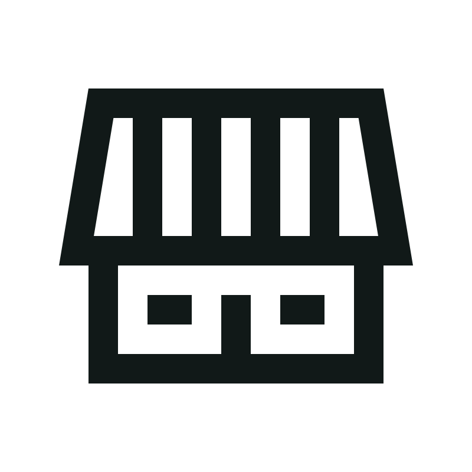</a> | **📂 檔名:** `shop.svg` ✨ **格式:** `Vector (SVG)` ⚖️ **大小:** `653.00B` 📅 **更新:** `2026-02-27`  🚀 **jsDelivr Markdown:** `` 🔗 **直接連結 (Url):** <code>https://cdn.jsdelivr.net/gh/barry028/materials@main/images/iCons/Simple%20Line%20Action%20iCons/shop.svg</code> 📥 [檢視原始檔](shop.svg) |
|  | **📂 檔名:** `shower.svg` ✨ **格式:** `Vector (SVG)` ⚖️ **大小:** `806.00B` 📅 **更新:** `2026-02-27`  🚀 **jsDelivr Markdown:** `` 🔗 **直接連結 (Url):** <code>https://cdn.jsdelivr.net/gh/barry028/materials@main/images/iCons/Simple%20Line%20Action%20iCons/shower.svg</code> 📥 [檢視原始檔](shower.svg) |
|  | **📂 檔名:** `shuffle.svg` ✨ **格式:** `Vector (SVG)` ⚖️ **大小:** `983.00B` 📅 **更新:** `2026-02-27`  🚀 **jsDelivr Markdown:** `` 🔗 **直接連結 (Url):** <code>https://cdn.jsdelivr.net/gh/barry028/materials@main/images/iCons/Simple%20Line%20Action%20iCons/shuffle.svg</code> 📥 [檢視原始檔](shuffle.svg) |
|  | **📂 檔名:** `sing.svg` ✨ **格式:** `Vector (SVG)` ⚖️ **大小:** `1.55KB` 📅 **更新:** `2026-02-27`  🚀 **jsDelivr Markdown:** `` 🔗 **直接連結 (Url):** <code>https://cdn.jsdelivr.net/gh/barry028/materials@main/images/iCons/Simple%20Line%20Action%20iCons/sing.svg</code> 📥 [檢視原始檔](sing.svg) |
|  | **📂 檔名:** `sit.svg` ✨ **格式:** `Vector (SVG)` ⚖️ **大小:** `823.00B` 📅 **更新:** `2026-02-27`  🚀 **jsDelivr Markdown:** `` 🔗 **直接連結 (Url):** <code>https://cdn.jsdelivr.net/gh/barry028/materials@main/images/iCons/Simple%20Line%20Action%20iCons/sit.svg</code> 📥 [檢視原始檔](sit.svg) |
|  | **📂 檔名:** `skip.svg` ✨ **格式:** `Vector (SVG)` ⚖️ **大小:** `549.00B` 📅 **更新:** `2026-02-27`  🚀 **jsDelivr Markdown:** `` 🔗 **直接連結 (Url):** <code>https://cdn.jsdelivr.net/gh/barry028/materials@main/images/iCons/Simple%20Line%20Action%20iCons/skip.svg</code> 📥 [檢視原始檔](skip.svg) |
|  | **📂 檔名:** `sleep.svg` ✨ **格式:** `Vector (SVG)` ⚖️ **大小:** `1.11KB` 📅 **更新:** `2026-02-27`  🚀 **jsDelivr Markdown:** `` 🔗 **直接連結 (Url):** <code>https://cdn.jsdelivr.net/gh/barry028/materials@main/images/iCons/Simple%20Line%20Action%20iCons/sleep.svg</code> 📥 [檢視原始檔](sleep.svg) |
|  | **📂 檔名:** `slice.svg` ✨ **格式:** `Vector (SVG)` ⚖️ **大小:** `609.00B` 📅 **更新:** `2026-02-27`  🚀 **jsDelivr Markdown:** `` 🔗 **直接連結 (Url):** <code>https://cdn.jsdelivr.net/gh/barry028/materials@main/images/iCons/Simple%20Line%20Action%20iCons/slice.svg</code> 📥 [檢視原始檔](slice.svg) |
| <a href="slide.svg">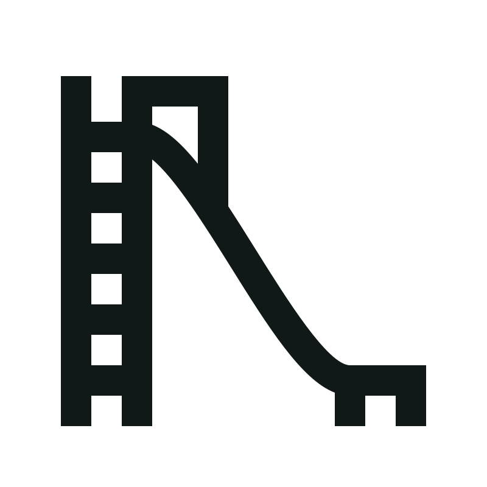</a> | **📂 檔名:** `slide.svg` ✨ **格式:** `Vector (SVG)` ⚖️ **大小:** `765.00B` 📅 **更新:** `2026-02-27`  🚀 **jsDelivr Markdown:** `` 🔗 **直接連結 (Url):** <code>https://cdn.jsdelivr.net/gh/barry028/materials@main/images/iCons/Simple%20Line%20Action%20iCons/slide.svg</code> 📥 [檢視原始檔](slide.svg) |
|  | **📂 檔名:** `smell.svg` ✨ **格式:** `Vector (SVG)` ⚖️ **大小:** `1.42KB` 📅 **更新:** `2026-02-27`  🚀 **jsDelivr Markdown:** `` 🔗 **直接連結 (Url):** <code>https://cdn.jsdelivr.net/gh/barry028/materials@main/images/iCons/Simple%20Line%20Action%20iCons/smell.svg</code> 📥 [檢視原始檔](smell.svg) |
|  | **📂 檔名:** `smoke.svg` ✨ **格式:** `Vector (SVG)` ⚖️ **大小:** `2.38KB` 📅 **更新:** `2026-02-27`  🚀 **jsDelivr Markdown:** `` 🔗 **直接連結 (Url):** <code>https://cdn.jsdelivr.net/gh/barry028/materials@main/images/iCons/Simple%20Line%20Action%20iCons/smoke.svg</code> 📥 [檢視原始檔](smoke.svg) |
|  | **📂 檔名:** `smuggle.svg` ✨ **格式:** `Vector (SVG)` ⚖️ **大小:** `666.00B` 📅 **更新:** `2026-02-27`  🚀 **jsDelivr Markdown:** `` 🔗 **直接連結 (Url):** <code>https://cdn.jsdelivr.net/gh/barry028/materials@main/images/iCons/Simple%20Line%20Action%20iCons/smuggle.svg</code> 📥 [檢視原始檔](smuggle.svg) |
|  | **📂 檔名:** `snow.svg` ✨ **格式:** `Vector (SVG)` ⚖️ **大小:** `1.29KB` 📅 **更新:** `2026-02-27`  🚀 **jsDelivr Markdown:** `` 🔗 **直接連結 (Url):** <code>https://cdn.jsdelivr.net/gh/barry028/materials@main/images/iCons/Simple%20Line%20Action%20iCons/snow.svg</code> 📥 [檢視原始檔](snow.svg) |
|  | **📂 檔名:** `solve.svg` ✨ **格式:** `Vector (SVG)` ⚖️ **大小:** `1.48KB` 📅 **更新:** `2026-02-27`  🚀 **jsDelivr Markdown:** `` 🔗 **直接連結 (Url):** <code>https://cdn.jsdelivr.net/gh/barry028/materials@main/images/iCons/Simple%20Line%20Action%20iCons/solve.svg</code> 📥 [檢視原始檔](solve.svg) |
|  | **📂 檔名:** `sound.svg` ✨ **格式:** `Vector (SVG)` ⚖️ **大小:** `749.00B` 📅 **更新:** `2026-02-27`  🚀 **jsDelivr Markdown:** `` 🔗 **直接連結 (Url):** <code>https://cdn.jsdelivr.net/gh/barry028/materials@main/images/iCons/Simple%20Line%20Action%20iCons/sound.svg</code> 📥 [檢視原始檔](sound.svg) |
|  | **📂 檔名:** `sparkle.svg` ✨ **格式:** `Vector (SVG)` ⚖️ **大小:** `814.00B` 📅 **更新:** `2026-02-27`  🚀 **jsDelivr Markdown:** `` 🔗 **直接連結 (Url):** <code>https://cdn.jsdelivr.net/gh/barry028/materials@main/images/iCons/Simple%20Line%20Action%20iCons/sparkle.svg</code> 📥 [檢視原始檔](sparkle.svg) |
|  | **📂 檔名:** `speak.svg` ✨ **格式:** `Vector (SVG)` ⚖️ **大小:** `564.00B` 📅 **更新:** `2026-02-27`  🚀 **jsDelivr Markdown:** `` 🔗 **直接連結 (Url):** <code>https://cdn.jsdelivr.net/gh/barry028/materials@main/images/iCons/Simple%20Line%20Action%20iCons/speak.svg</code> 📥 [檢視原始檔](speak.svg) |
|  | **📂 檔名:** `spin.svg` ✨ **格式:** `Vector (SVG)` ⚖️ **大小:** `1.32KB` 📅 **更新:** `2026-02-27`  🚀 **jsDelivr Markdown:** `` 🔗 **直接連結 (Url):** <code>https://cdn.jsdelivr.net/gh/barry028/materials@main/images/iCons/Simple%20Line%20Action%20iCons/spin.svg</code> 📥 [檢視原始檔](spin.svg) |
| <a href="spy.svg">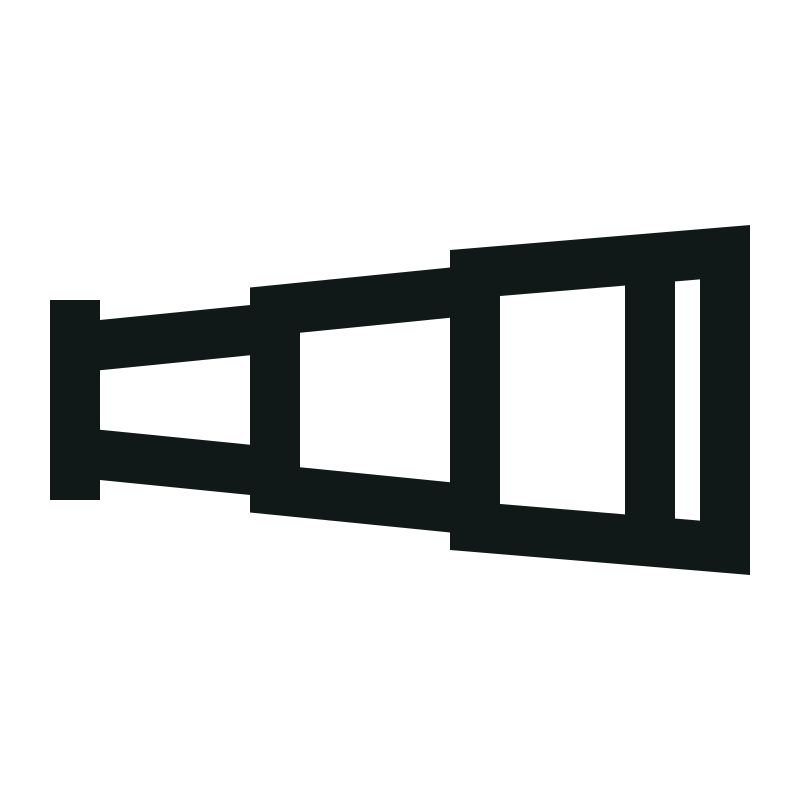</a> | **📂 檔名:** `spy.svg` ✨ **格式:** `Vector (SVG)` ⚖️ **大小:** `676.00B` 📅 **更新:** `2026-02-27`  🚀 **jsDelivr Markdown:** `` 🔗 **直接連結 (Url):** <code>https://cdn.jsdelivr.net/gh/barry028/materials@main/images/iCons/Simple%20Line%20Action%20iCons/spy.svg</code> 📥 [檢視原始檔](spy.svg) |
|  | **📂 檔名:** `stack.svg` ✨ **格式:** `Vector (SVG)` ⚖️ **大小:** `540.00B` 📅 **更新:** `2026-02-27`  🚀 **jsDelivr Markdown:** `` 🔗 **直接連結 (Url):** <code>https://cdn.jsdelivr.net/gh/barry028/materials@main/images/iCons/Simple%20Line%20Action%20iCons/stack.svg</code> 📥 [檢視原始檔](stack.svg) |
|  | **📂 檔名:** `stamp.svg` ✨ **格式:** `Vector (SVG)` ⚖️ **大小:** `877.00B` 📅 **更新:** `2026-02-27`  🚀 **jsDelivr Markdown:** `` 🔗 **直接連結 (Url):** <code>https://cdn.jsdelivr.net/gh/barry028/materials@main/images/iCons/Simple%20Line%20Action%20iCons/stamp.svg</code> 📥 [檢視原始檔](stamp.svg) |
|  | **📂 檔名:** `steam.svg` ✨ **格式:** `Vector (SVG)` ⚖️ **大小:** `1.28KB` 📅 **更新:** `2026-02-27`  🚀 **jsDelivr Markdown:** `` 🔗 **直接連結 (Url):** <code>https://cdn.jsdelivr.net/gh/barry028/materials@main/images/iCons/Simple%20Line%20Action%20iCons/steam.svg</code> 📥 [檢視原始檔](steam.svg) |
|  | **📂 檔名:** `stomp.svg` ✨ **格式:** `Vector (SVG)` ⚖️ **大小:** `701.00B` 📅 **更新:** `2026-02-27`  🚀 **jsDelivr Markdown:** `` 🔗 **直接連結 (Url):** <code>https://cdn.jsdelivr.net/gh/barry028/materials@main/images/iCons/Simple%20Line%20Action%20iCons/stomp.svg</code> 📥 [檢視原始檔](stomp.svg) |
|  | **📂 檔名:** `stop.svg` ✨ **格式:** `Vector (SVG)` ⚖️ **大小:** `473.00B` 📅 **更新:** `2026-02-27`  🚀 **jsDelivr Markdown:** `` 🔗 **直接連結 (Url):** <code>https://cdn.jsdelivr.net/gh/barry028/materials@main/images/iCons/Simple%20Line%20Action%20iCons/stop.svg</code> 📥 [檢視原始檔](stop.svg) |
|  | **📂 檔名:** `strum.svg` ✨ **格式:** `Vector (SVG)` ⚖️ **大小:** `1.10KB` 📅 **更新:** `2026-02-27`  🚀 **jsDelivr Markdown:** `` 🔗 **直接連結 (Url):** <code>https://cdn.jsdelivr.net/gh/barry028/materials@main/images/iCons/Simple%20Line%20Action%20iCons/strum.svg</code> 📥 [檢視原始檔](strum.svg) |
|  | **📂 檔名:** `study.svg` ✨ **格式:** `Vector (SVG)` ⚖️ **大小:** `566.00B` 📅 **更新:** `2026-02-27`  🚀 **jsDelivr Markdown:** `` 🔗 **直接連結 (Url):** <code>https://cdn.jsdelivr.net/gh/barry028/materials@main/images/iCons/Simple%20Line%20Action%20iCons/study.svg</code> 📥 [檢視原始檔](study.svg) |
|  | **📂 檔名:** `submerge.svg` ✨ **格式:** `Vector (SVG)` ⚖️ **大小:** `1.10KB` 📅 **更新:** `2026-02-27`  🚀 **jsDelivr Markdown:** `` 🔗 **直接連結 (Url):** <code>https://cdn.jsdelivr.net/gh/barry028/materials@main/images/iCons/Simple%20Line%20Action%20iCons/submerge.svg</code> 📥 [檢視原始檔](submerge.svg) |
|  | **📂 檔名:** `subtract.svg` ✨ **格式:** `Vector (SVG)` ⚖️ **大小:** `470.00B` 📅 **更新:** `2026-02-27`  🚀 **jsDelivr Markdown:** `` 🔗 **直接連結 (Url):** <code>https://cdn.jsdelivr.net/gh/barry028/materials@main/images/iCons/Simple%20Line%20Action%20iCons/subtract.svg</code> 📥 [檢視原始檔](subtract.svg) |
|  | **📂 檔名:** `succeed.svg` ✨ **格式:** `Vector (SVG)` ⚖️ **大小:** `911.00B` 📅 **更新:** `2026-02-27`  🚀 **jsDelivr Markdown:** `` 🔗 **直接連結 (Url):** <code>https://cdn.jsdelivr.net/gh/barry028/materials@main/images/iCons/Simple%20Line%20Action%20iCons/succeed.svg</code> 📥 [檢視原始檔](succeed.svg) |
|  | **📂 檔名:** `sweep.svg` ✨ **格式:** `Vector (SVG)` ⚖️ **大小:** `589.00B` 📅 **更新:** `2026-02-27`  🚀 **jsDelivr Markdown:** `` 🔗 **直接連結 (Url):** <code>https://cdn.jsdelivr.net/gh/barry028/materials@main/images/iCons/Simple%20Line%20Action%20iCons/sweep.svg</code> 📥 [檢視原始檔](sweep.svg) |
|  | **📂 檔名:** `swim.svg` ✨ **格式:** `Vector (SVG)` ⚖️ **大小:** `1.05KB` 📅 **更新:** `2026-02-27`  🚀 **jsDelivr Markdown:** `` 🔗 **直接連結 (Url):** <code>https://cdn.jsdelivr.net/gh/barry028/materials@main/images/iCons/Simple%20Line%20Action%20iCons/swim.svg</code> 📥 [檢視原始檔](swim.svg) |
| <a href="sync.svg">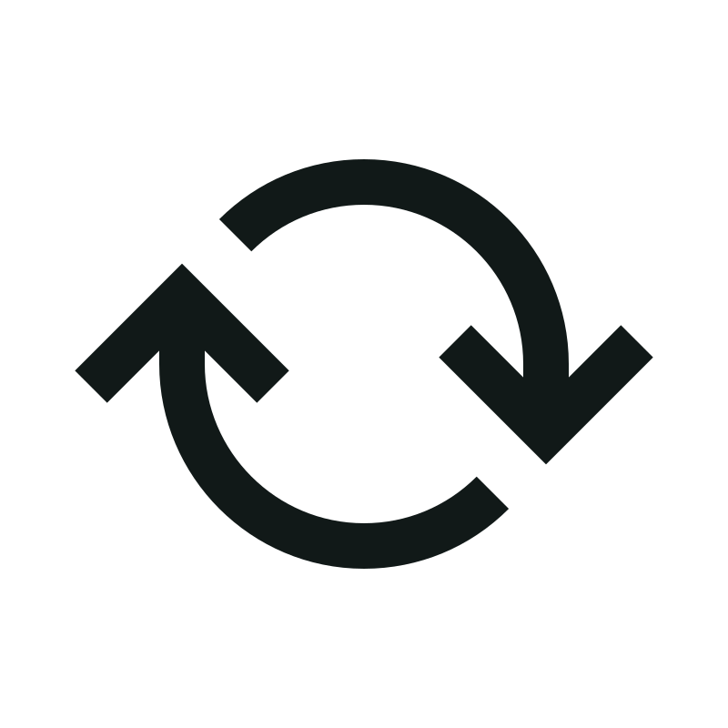</a> | **📂 檔名:** `sync.svg` ✨ **格式:** `Vector (SVG)` ⚖️ **大小:** `867.00B` 📅 **更新:** `2026-02-27`  🚀 **jsDelivr Markdown:** `` 🔗 **直接連結 (Url):** <code>https://cdn.jsdelivr.net/gh/barry028/materials@main/images/iCons/Simple%20Line%20Action%20iCons/sync.svg</code> 📥 [檢視原始檔](sync.svg) |
|  | **📂 檔名:** `tag.svg` ✨ **格式:** `Vector (SVG)` ⚖️ **大小:** `783.00B` 📅 **更新:** `2026-02-27`  🚀 **jsDelivr Markdown:** `` 🔗 **直接連結 (Url):** <code>https://cdn.jsdelivr.net/gh/barry028/materials@main/images/iCons/Simple%20Line%20Action%20iCons/tag.svg</code> 📥 [檢視原始檔](tag.svg) |
|  | **📂 檔名:** `target.svg` ✨ **格式:** `Vector (SVG)` ⚖️ **大小:** `807.00B` 📅 **更新:** `2026-02-27`  🚀 **jsDelivr Markdown:** `` 🔗 **直接連結 (Url):** <code>https://cdn.jsdelivr.net/gh/barry028/materials@main/images/iCons/Simple%20Line%20Action%20iCons/target.svg</code> 📥 [檢視原始檔](target.svg) |
| <a href="teach.svg">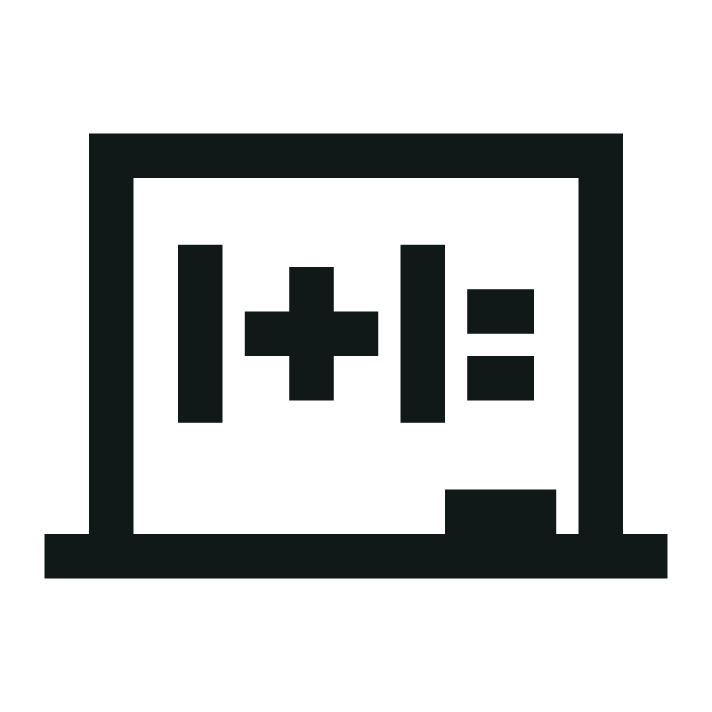</a> | **📂 檔名:** `teach.svg` ✨ **格式:** `Vector (SVG)` ⚖️ **大小:** `608.00B` 📅 **更新:** `2026-02-27`  🚀 **jsDelivr Markdown:** `` 🔗 **直接連結 (Url):** <code>https://cdn.jsdelivr.net/gh/barry028/materials@main/images/iCons/Simple%20Line%20Action%20iCons/teach.svg</code> 📥 [檢視原始檔](teach.svg) |
|  | **📂 檔名:** `think.svg` ✨ **格式:** `Vector (SVG)` ⚖️ **大小:** `904.00B` 📅 **更新:** `2026-02-27`  🚀 **jsDelivr Markdown:** `` 🔗 **直接連結 (Url):** <code>https://cdn.jsdelivr.net/gh/barry028/materials@main/images/iCons/Simple%20Line%20Action%20iCons/think.svg</code> 📥 [檢視原始檔](think.svg) |
|  | **📂 檔名:** `thunder.svg` ✨ **格式:** `Vector (SVG)` ⚖️ **大小:** `980.00B` 📅 **更新:** `2026-02-27`  🚀 **jsDelivr Markdown:** `` 🔗 **直接連結 (Url):** <code>https://cdn.jsdelivr.net/gh/barry028/materials@main/images/iCons/Simple%20Line%20Action%20iCons/thunder.svg</code> 📥 [檢視原始檔](thunder.svg) |
|  | **📂 檔名:** `tie.svg` ✨ **格式:** `Vector (SVG)` ⚖️ **大小:** `845.00B` 📅 **更新:** `2026-02-27`  🚀 **jsDelivr Markdown:** `` 🔗 **直接連結 (Url):** <code>https://cdn.jsdelivr.net/gh/barry028/materials@main/images/iCons/Simple%20Line%20Action%20iCons/tie.svg</code> 📥 [檢視原始檔](tie.svg) |
|  | **📂 檔名:** `toast.svg` ✨ **格式:** `Vector (SVG)` ⚖️ **大小:** `1.35KB` 📅 **更新:** `2026-02-27`  🚀 **jsDelivr Markdown:** `` 🔗 **直接連結 (Url):** <code>https://cdn.jsdelivr.net/gh/barry028/materials@main/images/iCons/Simple%20Line%20Action%20iCons/toast.svg</code> 📥 [檢視原始檔](toast.svg) |
|  | **📂 檔名:** `tower.svg` ✨ **格式:** `Vector (SVG)` ⚖️ **大小:** `662.00B` 📅 **更新:** `2026-02-27`  🚀 **jsDelivr Markdown:** `` 🔗 **直接連結 (Url):** <code>https://cdn.jsdelivr.net/gh/barry028/materials@main/images/iCons/Simple%20Line%20Action%20iCons/tower.svg</code> 📥 [檢視原始檔](tower.svg) |
|  | **📂 檔名:** `transport.svg` ✨ **格式:** `Vector (SVG)` ⚖️ **大小:** `1022.00B` 📅 **更新:** `2026-02-27`  🚀 **jsDelivr Markdown:** `` 🔗 **直接連結 (Url):** <code>https://cdn.jsdelivr.net/gh/barry028/materials@main/images/iCons/Simple%20Line%20Action%20iCons/transport.svg</code> 📥 [檢視原始檔](transport.svg) |
|  | **📂 檔名:** `trash.svg` ✨ **格式:** `Vector (SVG)` ⚖️ **大小:** `680.00B` 📅 **更新:** `2026-02-27`  🚀 **jsDelivr Markdown:** `` 🔗 **直接連結 (Url):** <code>https://cdn.jsdelivr.net/gh/barry028/materials@main/images/iCons/Simple%20Line%20Action%20iCons/trash.svg</code> 📥 [檢視原始檔](trash.svg) |
|  | **📂 檔名:** `travel.svg` ✨ **格式:** `Vector (SVG)` ⚖️ **大小:** `573.00B` 📅 **更新:** `2026-02-27`  🚀 **jsDelivr Markdown:** `` 🔗 **直接連結 (Url):** <code>https://cdn.jsdelivr.net/gh/barry028/materials@main/images/iCons/Simple%20Line%20Action%20iCons/travel.svg</code> 📥 [檢視原始檔](travel.svg) |
|  | **📂 檔名:** `treat.svg` ✨ **格式:** `Vector (SVG)` ⚖️ **大小:** `1.32KB` 📅 **更新:** `2026-02-27`  🚀 **jsDelivr Markdown:** `` 🔗 **直接連結 (Url):** <code>https://cdn.jsdelivr.net/gh/barry028/materials@main/images/iCons/Simple%20Line%20Action%20iCons/treat.svg</code> 📥 [檢視原始檔](treat.svg) |
|  | **📂 檔名:** `trend.svg` ✨ **格式:** `Vector (SVG)` ⚖️ **大小:** `552.00B` 📅 **更新:** `2026-02-27`  🚀 **jsDelivr Markdown:** `` 🔗 **直接連結 (Url):** <code>https://cdn.jsdelivr.net/gh/barry028/materials@main/images/iCons/Simple%20Line%20Action%20iCons/trend.svg</code> 📥 [檢視原始檔](trend.svg) |
|  | **📂 檔名:** `turn.svg` ✨ **格式:** `Vector (SVG)` ⚖️ **大小:** `1.73KB` 📅 **更新:** `2026-02-27`  🚀 **jsDelivr Markdown:** `` 🔗 **直接連結 (Url):** <code>https://cdn.jsdelivr.net/gh/barry028/materials@main/images/iCons/Simple%20Line%20Action%20iCons/turn.svg</code> 📥 [檢視原始檔](turn.svg) |
|  | **📂 檔名:** `type.svg` ✨ **格式:** `Vector (SVG)` ⚖️ **大小:** `742.00B` 📅 **更新:** `2026-02-27`  🚀 **jsDelivr Markdown:** `` 🔗 **直接連結 (Url):** <code>https://cdn.jsdelivr.net/gh/barry028/materials@main/images/iCons/Simple%20Line%20Action%20iCons/type.svg</code> 📥 [檢視原始檔](type.svg) |
| <a href="undo.svg">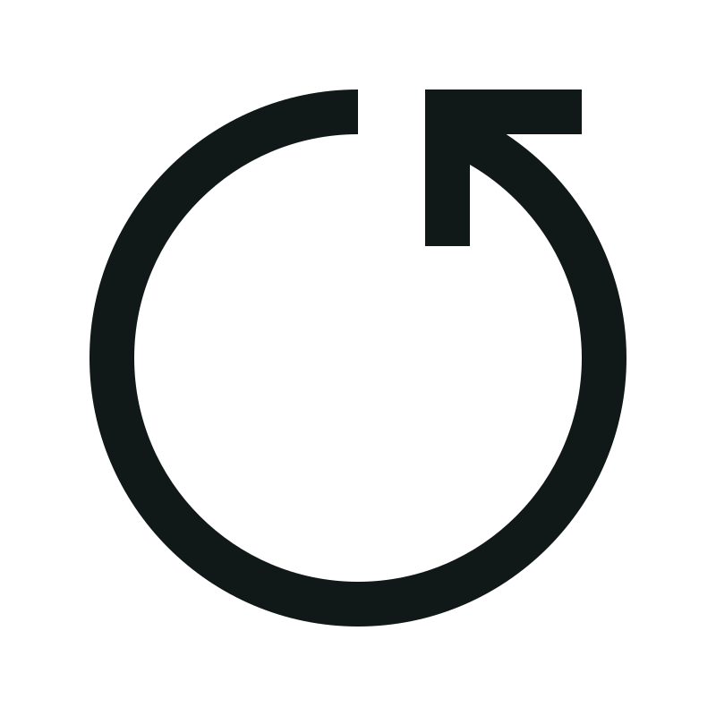</a> | **📂 檔名:** `undo.svg` ✨ **格式:** `Vector (SVG)` ⚖️ **大小:** `629.00B` 📅 **更新:** `2026-02-27`  🚀 **jsDelivr Markdown:** `` 🔗 **直接連結 (Url):** <code>https://cdn.jsdelivr.net/gh/barry028/materials@main/images/iCons/Simple%20Line%20Action%20iCons/undo.svg</code> 📥 [檢視原始檔](undo.svg) |
|  | **📂 檔名:** `unlock.svg` ✨ **格式:** `Vector (SVG)` ⚖️ **大小:** `692.00B` 📅 **更新:** `2026-02-27`  🚀 **jsDelivr Markdown:** `` 🔗 **直接連結 (Url):** <code>https://cdn.jsdelivr.net/gh/barry028/materials@main/images/iCons/Simple%20Line%20Action%20iCons/unlock.svg</code> 📥 [檢視原始檔](unlock.svg) |
|  | **📂 檔名:** `upload.svg` ✨ **格式:** `Vector (SVG)` ⚖️ **大小:** `968.00B` 📅 **更新:** `2026-02-27`  🚀 **jsDelivr Markdown:** `` 🔗 **直接連結 (Url):** <code>https://cdn.jsdelivr.net/gh/barry028/materials@main/images/iCons/Simple%20Line%20Action%20iCons/upload.svg</code> 📥 [檢視原始檔](upload.svg) |
|  | **📂 檔名:** `use.svg` ✨ **格式:** `Vector (SVG)` ⚖️ **大小:** `855.00B` 📅 **更新:** `2026-02-27`  🚀 **jsDelivr Markdown:** `` 🔗 **直接連結 (Url):** <code>https://cdn.jsdelivr.net/gh/barry028/materials@main/images/iCons/Simple%20Line%20Action%20iCons/use.svg</code> 📥 [檢視原始檔](use.svg) |
|  | **📂 檔名:** `wait.svg` ✨ **格式:** `Vector (SVG)` ⚖️ **大小:** `729.00B` 📅 **更新:** `2026-02-27`  🚀 **jsDelivr Markdown:** `` 🔗 **直接連結 (Url):** <code>https://cdn.jsdelivr.net/gh/barry028/materials@main/images/iCons/Simple%20Line%20Action%20iCons/wait.svg</code> 📥 [檢視原始檔](wait.svg) |
|  | **📂 檔名:** `wash.svg` ✨ **格式:** `Vector (SVG)` ⚖️ **大小:** `732.00B` 📅 **更新:** `2026-02-27`  🚀 **jsDelivr Markdown:** `` 🔗 **直接連結 (Url):** <code>https://cdn.jsdelivr.net/gh/barry028/materials@main/images/iCons/Simple%20Line%20Action%20iCons/wash.svg</code> 📥 [檢視原始檔](wash.svg) |
|  | **📂 檔名:** `watch.svg` ✨ **格式:** `Vector (SVG)` ⚖️ **大小:** `653.00B` 📅 **更新:** `2026-02-27`  🚀 **jsDelivr Markdown:** `` 🔗 **直接連結 (Url):** <code>https://cdn.jsdelivr.net/gh/barry028/materials@main/images/iCons/Simple%20Line%20Action%20iCons/watch.svg</code> 📥 [檢視原始檔](watch.svg) |
|  | **📂 檔名:** `wear.svg` ✨ **格式:** `Vector (SVG)` ⚖️ **大小:** `672.00B` 📅 **更新:** `2026-02-27`  🚀 **jsDelivr Markdown:** `` 🔗 **直接連結 (Url):** <code>https://cdn.jsdelivr.net/gh/barry028/materials@main/images/iCons/Simple%20Line%20Action%20iCons/wear.svg</code> 📥 [檢視原始檔](wear.svg) |
| <a href="weigh.svg">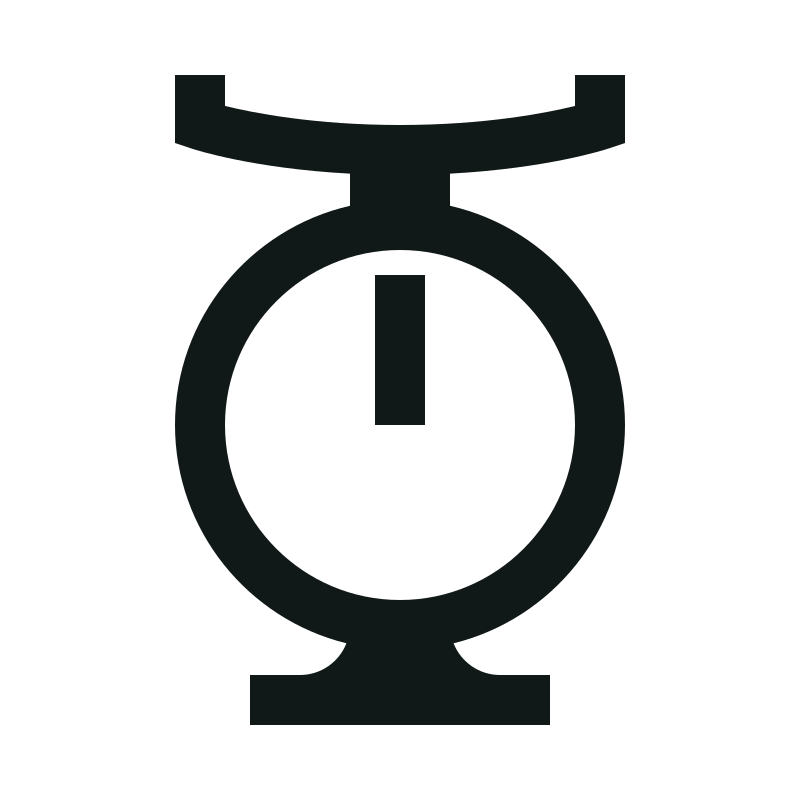</a> | **📂 檔名:** `weigh.svg` ✨ **格式:** `Vector (SVG)` ⚖️ **大小:** `909.00B` 📅 **更新:** `2026-02-27`  🚀 **jsDelivr Markdown:** `` 🔗 **直接連結 (Url):** <code>https://cdn.jsdelivr.net/gh/barry028/materials@main/images/iCons/Simple%20Line%20Action%20iCons/weigh.svg</code> 📥 [檢視原始檔](weigh.svg) |
|  | **📂 檔名:** `win.svg` ✨ **格式:** `Vector (SVG)` ⚖️ **大小:** `950.00B` 📅 **更新:** `2026-02-27`  🚀 **jsDelivr Markdown:** `` 🔗 **直接連結 (Url):** <code>https://cdn.jsdelivr.net/gh/barry028/materials@main/images/iCons/Simple%20Line%20Action%20iCons/win.svg</code> 📥 [檢視原始檔](win.svg) |
|  | **📂 檔名:** `work.svg` ✨ **格式:** `Vector (SVG)` ⚖️ **大小:** `550.00B` 📅 **更新:** `2026-02-27`  🚀 **jsDelivr Markdown:** `` 🔗 **直接連結 (Url):** <code>https://cdn.jsdelivr.net/gh/barry028/materials@main/images/iCons/Simple%20Line%20Action%20iCons/work.svg</code> 📥 [檢視原始檔](work.svg) |
|  | **📂 檔名:** `worship.svg` ✨ **格式:** `Vector (SVG)` ⚖️ **大小:** `639.00B` 📅 **更新:** `2026-02-27`  🚀 **jsDelivr Markdown:** `` 🔗 **直接連結 (Url):** <code>https://cdn.jsdelivr.net/gh/barry028/materials@main/images/iCons/Simple%20Line%20Action%20iCons/worship.svg</code> 📥 [檢視原始檔](worship.svg) |
|  | **📂 檔名:** `write.svg` ✨ **格式:** `Vector (SVG)` ⚖️ **大小:** `708.00B` 📅 **更新:** `2026-02-27`  🚀 **jsDelivr Markdown:** `` 🔗 **直接連結 (Url):** <code>https://cdn.jsdelivr.net/gh/barry028/materials@main/images/iCons/Simple%20Line%20Action%20iCons/write.svg</code> 📥 [檢視原始檔](write.svg) |
|  | **📂 檔名:** `yell.svg` ✨ **格式:** `Vector (SVG)` ⚖️ **大小:** `655.00B` 📅 **更新:** `2026-02-27`  🚀 **jsDelivr Markdown:** `` 🔗 **直接連結 (Url):** <code>https://cdn.jsdelivr.net/gh/barry028/materials@main/images/iCons/Simple%20Line%20Action%20iCons/yell.svg</code> 📥 [檢視原始檔](yell.svg) |