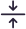
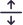
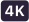
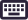
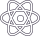
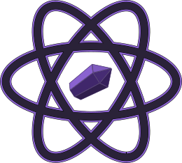

# 🖼️ 素材分類：simple

> [🏠 主目錄](../../../../README.md) / [images](../../../README.md) / [iCons](../../README.md) / [Sketch](../README.md) / **simple**

本目錄共有 `472` 個檔案

| 🎨 預覽 (點擊放大) | 📋 檔案詳細資訊與連結 |
| :--- | :--- |
|  | **📂 檔名:** `activity.svg` ✨ **格式:** `Vector (SVG)` ⚖️ **大小:** `1.07KB` | 📅 **更新:** `2026-02-27`  🚀 **jsDelivr Markdown:** `` 🔗 **直接連結 (Url):** `https://cdn.jsdelivr.net/ghbarry028/materials@main/images/iCons/Sketch/simple/activity.svg` 📥 [檢視原始檔](activity.svg) |
|  | **📂 檔名:** `adjust.svg` ✨ **格式:** `Vector (SVG)` ⚖️ **大小:** `616.00B` | 📅 **更新:** `2026-02-27`  🚀 **jsDelivr Markdown:** `` 🔗 **直接連結 (Url):** `https://cdn.jsdelivr.net/ghbarry028/materials@main/images/iCons/Sketch/simple/adjust.svg` 📥 [檢視原始檔](adjust.svg) |
|  | **📂 檔名:** `adobe-xd.svg` ✨ **格式:** `Vector (SVG)` ⚖️ **大小:** `2.23KB` | 📅 **更新:** `2026-02-27`  🚀 **jsDelivr Markdown:** `` 🔗 **直接連結 (Url):** `https://cdn.jsdelivr.net/ghbarry028/materials@main/images/iCons/Sketch/simple/adobe-xd.svg` 📥 [檢視原始檔](adobe-xd.svg) |
|  | **📂 檔名:** `aeroplane.svg` ✨ **格式:** `Vector (SVG)` ⚖️ **大小:** `299.00B` | 📅 **更新:** `2026-02-27`  🚀 **jsDelivr Markdown:** `` 🔗 **直接連結 (Url):** `https://cdn.jsdelivr.net/ghbarry028/materials@main/images/iCons/Sketch/simple/aeroplane.svg` 📥 [檢視原始檔](aeroplane.svg) |
|  | **📂 檔名:** `alarm-fill.svg` ✨ **格式:** `Vector (SVG)` ⚖️ **大小:** `2.93KB` | 📅 **更新:** `2026-02-27`  🚀 **jsDelivr Markdown:** `` 🔗 **直接連結 (Url):** `https://cdn.jsdelivr.net/ghbarry028/materials@main/images/iCons/Sketch/simple/alarm-fill.svg` 📥 [檢視原始檔](alarm-fill.svg) |
|  | **📂 檔名:** `alarm.svg` ✨ **格式:** `Vector (SVG)` ⚖️ **大小:** `2.97KB` | 📅 **更新:** `2026-02-27`  🚀 **jsDelivr Markdown:** `` 🔗 **直接連結 (Url):** `https://cdn.jsdelivr.net/ghbarry028/materials@main/images/iCons/Sketch/simple/alarm.svg` 📥 [檢視原始檔](alarm.svg) |
|  | **📂 檔名:** `align-center.svg` ✨ **格式:** `Vector (SVG)` ⚖️ **大小:** `865.00B` | 📅 **更新:** `2026-02-27`  🚀 **jsDelivr Markdown:** `` 🔗 **直接連結 (Url):** `https://cdn.jsdelivr.net/ghbarry028/materials@main/images/iCons/Sketch/simple/align-center.svg` 📥 [檢視原始檔](align-center.svg) |
|  | **📂 檔名:** `align-horizontal-left.svg` ✨ **格式:** `Vector (SVG)` ⚖️ **大小:** `546.00B` | 📅 **更新:** `2026-02-27`  🚀 **jsDelivr Markdown:** `` 🔗 **直接連結 (Url):** `https://cdn.jsdelivr.net/ghbarry028/materials@main/images/iCons/Sketch/simple/align-horizontal-left.svg` 📥 [檢視原始檔](align-horizontal-left.svg) |
|  | **📂 檔名:** `align-horizontal-right.svg` ✨ **格式:** `Vector (SVG)` ⚖️ **大小:** `543.00B` | 📅 **更新:** `2026-02-27`  🚀 **jsDelivr Markdown:** `` 🔗 **直接連結 (Url):** `https://cdn.jsdelivr.net/ghbarry028/materials@main/images/iCons/Sketch/simple/align-horizontal-right.svg` 📥 [檢視原始檔](align-horizontal-right.svg) |
|  | **📂 檔名:** `align-justify.svg` ✨ **格式:** `Vector (SVG)` ⚖️ **大小:** `869.00B` | 📅 **更新:** `2026-02-27`  🚀 **jsDelivr Markdown:** `` 🔗 **直接連結 (Url):** `https://cdn.jsdelivr.net/ghbarry028/materials@main/images/iCons/Sketch/simple/align-justify.svg` 📥 [檢視原始檔](align-justify.svg) |
|  | **📂 檔名:** `align-left.svg` ✨ **格式:** `Vector (SVG)` ⚖️ **大小:** `513.00B` | 📅 **更新:** `2026-02-27`  🚀 **jsDelivr Markdown:** `` 🔗 **直接連結 (Url):** `https://cdn.jsdelivr.net/ghbarry028/materials@main/images/iCons/Sketch/simple/align-left.svg` 📥 [檢視原始檔](align-left.svg) |
|  | **📂 檔名:** `align-right.svg` ✨ **格式:** `Vector (SVG)` ⚖️ **大小:** `527.00B` | 📅 **更新:** `2026-02-27`  🚀 **jsDelivr Markdown:** `` 🔗 **直接連結 (Url):** `https://cdn.jsdelivr.net/ghbarry028/materials@main/images/iCons/Sketch/simple/align-right.svg` 📥 [檢視原始檔](align-right.svg) |
|  | **📂 檔名:** `align-vertical-bottom.svg` ✨ **格式:** `Vector (SVG)` ⚖️ **大小:** `529.00B` | 📅 **更新:** `2026-02-27`  🚀 **jsDelivr Markdown:** `` 🔗 **直接連結 (Url):** `https://cdn.jsdelivr.net/ghbarry028/materials@main/images/iCons/Sketch/simple/align-vertical-bottom.svg` 📥 [檢視原始檔](align-vertical-bottom.svg) |
|  | **📂 檔名:** `align-vertical-center.svg` ✨ **格式:** `Vector (SVG)` ⚖️ **大小:** `785.00B` | 📅 **更新:** `2026-02-27`  🚀 **jsDelivr Markdown:** `` 🔗 **直接連結 (Url):** `https://cdn.jsdelivr.net/ghbarry028/materials@main/images/iCons/Sketch/simple/align-vertical-center.svg` 📥 [檢視原始檔](align-vertical-center.svg) |
|  | **📂 檔名:** `align-vertical-top.svg` ✨ **格式:** `Vector (SVG)` ⚖️ **大小:** `536.00B` | 📅 **更新:** `2026-02-27`  🚀 **jsDelivr Markdown:** `` 🔗 **直接連結 (Url):** `https://cdn.jsdelivr.net/ghbarry028/materials@main/images/iCons/Sketch/simple/align-vertical-top.svg` 📥 [檢視原始檔](align-vertical-top.svg) |
|  | **📂 檔名:** `alternate-email.svg` ✨ **格式:** `Vector (SVG)` ⚖️ **大小:** `683.00B` | 📅 **更新:** `2026-02-27`  🚀 **jsDelivr Markdown:** `` 🔗 **直接連結 (Url):** `https://cdn.jsdelivr.net/ghbarry028/materials@main/images/iCons/Sketch/simple/alternate-email.svg` 📥 [檢視原始檔](alternate-email.svg) |
|  | **📂 檔名:** `app-indicator.svg` ✨ **格式:** `Vector (SVG)` ⚖️ **大小:** `1.57KB` | 📅 **更新:** `2026-02-27`  🚀 **jsDelivr Markdown:** `` 🔗 **直接連結 (Url):** `https://cdn.jsdelivr.net/ghbarry028/materials@main/images/iCons/Sketch/simple/app-indicator.svg` 📥 [檢視原始檔](app-indicator.svg) |
|  | **📂 檔名:** `app-store.svg` ✨ **格式:** `Vector (SVG)` ⚖️ **大小:** `1.58KB` | 📅 **更新:** `2026-02-27`  🚀 **jsDelivr Markdown:** `` 🔗 **直接連結 (Url):** `https://cdn.jsdelivr.net/ghbarry028/materials@main/images/iCons/Sketch/simple/app-store.svg` 📥 [檢視原始檔](app-store.svg) |
|  | **📂 檔名:** `apple.svg` ✨ **格式:** `Vector (SVG)` ⚖️ **大小:** `1.01KB` | 📅 **更新:** `2026-02-27`  🚀 **jsDelivr Markdown:** `` 🔗 **直接連結 (Url):** `https://cdn.jsdelivr.net/ghbarry028/materials@main/images/iCons/Sketch/simple/apple.svg` 📥 [檢視原始檔](apple.svg) |
|  | **📂 檔名:** `archive.svg` ✨ **格式:** `Vector (SVG)` ⚖️ **大小:** `1011.00B` | 📅 **更新:** `2026-02-27`  🚀 **jsDelivr Markdown:** `` 🔗 **直接連結 (Url):** `https://cdn.jsdelivr.net/ghbarry028/materials@main/images/iCons/Sketch/simple/archive.svg` 📥 [檢視原始檔](archive.svg) |
|  | **📂 檔名:** `arrow-angle-contract.svg` ✨ **格式:** `Vector (SVG)` ⚖️ **大小:** `1.62KB` | 📅 **更新:** `2026-02-27`  🚀 **jsDelivr Markdown:** `` 🔗 **直接連結 (Url):** `https://cdn.jsdelivr.net/ghbarry028/materials@main/images/iCons/Sketch/simple/arrow-angle-contract.svg` 📥 [檢視原始檔](arrow-angle-contract.svg) |
|  | **📂 檔名:** `arrow-angle-expand.svg` ✨ **格式:** `Vector (SVG)` ⚖️ **大小:** `1.63KB` | 📅 **更新:** `2026-02-27`  🚀 **jsDelivr Markdown:** `` 🔗 **直接連結 (Url):** `https://cdn.jsdelivr.net/ghbarry028/materials@main/images/iCons/Sketch/simple/arrow-angle-expand.svg` 📥 [檢視原始檔](arrow-angle-expand.svg) |
|  | **📂 檔名:** `arrow-anticlockwise.svg` ✨ **格式:** `Vector (SVG)` ⚖️ **大小:** `1.75KB` | 📅 **更新:** `2026-02-27`  🚀 **jsDelivr Markdown:** `` 🔗 **直接連結 (Url):** `https://cdn.jsdelivr.net/ghbarry028/materials@main/images/iCons/Sketch/simple/arrow-anticlockwise.svg` 📥 [檢視原始檔](arrow-anticlockwise.svg) |
|  | **📂 檔名:** `arrow-clockwise.svg` ✨ **格式:** `Vector (SVG)` ⚖️ **大小:** `1.60KB` | 📅 **更新:** `2026-02-27`  🚀 **jsDelivr Markdown:** `` 🔗 **直接連結 (Url):** `https://cdn.jsdelivr.net/ghbarry028/materials@main/images/iCons/Sketch/simple/arrow-clockwise.svg` 📥 [檢視原始檔](arrow-clockwise.svg) |
|  | **📂 檔名:** `arrow-collapse.svg` ✨ **格式:** `Vector (SVG)` ⚖️ **大小:** `2.28KB` | 📅 **更新:** `2026-02-27`  🚀 **jsDelivr Markdown:** `` 🔗 **直接連結 (Url):** `https://cdn.jsdelivr.net/ghbarry028/materials@main/images/iCons/Sketch/simple/arrow-collapse.svg` 📥 [檢視原始檔](arrow-collapse.svg) |
|  | **📂 檔名:** `arrow-down-up.svg` ✨ **格式:** `Vector (SVG)` ⚖️ **大小:** `1.87KB` | 📅 **更新:** `2026-02-27`  🚀 **jsDelivr Markdown:** `` 🔗 **直接連結 (Url):** `https://cdn.jsdelivr.net/ghbarry028/materials@main/images/iCons/Sketch/simple/arrow-down-up.svg` 📥 [檢視原始檔](arrow-down-up.svg) |
|  | **📂 檔名:** `arrow-down.svg` ✨ **格式:** `Vector (SVG)` ⚖️ **大小:** `438.00B` | 📅 **更新:** `2026-02-27`  🚀 **jsDelivr Markdown:** `` 🔗 **直接連結 (Url):** `https://cdn.jsdelivr.net/ghbarry028/materials@main/images/iCons/Sketch/simple/arrow-down.svg` 📥 [檢視原始檔](arrow-down.svg) |
|  | **📂 檔名:** `arrow-expand.svg` ✨ **格式:** `Vector (SVG)` ⚖️ **大小:** `2.55KB` | 📅 **更新:** `2026-02-27`  🚀 **jsDelivr Markdown:** `` 🔗 **直接連結 (Url):** `https://cdn.jsdelivr.net/ghbarry028/materials@main/images/iCons/Sketch/simple/arrow-expand.svg` 📥 [檢視原始檔](arrow-expand.svg) |
|  | **📂 檔名:** `arrow-fullscreen.svg` ✨ **格式:** `Vector (SVG)` ⚖️ **大小:** `3.02KB` | 📅 **更新:** `2026-02-27`  🚀 **jsDelivr Markdown:** `` 🔗 **直接連結 (Url):** `https://cdn.jsdelivr.net/ghbarry028/materials@main/images/iCons/Sketch/simple/arrow-fullscreen.svg` 📥 [檢視原始檔](arrow-fullscreen.svg) |
|  | **📂 檔名:** `arrow-left-right.svg` ✨ **格式:** `Vector (SVG)` ⚖️ **大小:** `2.06KB` | 📅 **更新:** `2026-02-27`  🚀 **jsDelivr Markdown:** `` 🔗 **直接連結 (Url):** `https://cdn.jsdelivr.net/ghbarry028/materials@main/images/iCons/Sketch/simple/arrow-left-right.svg` 📥 [檢視原始檔](arrow-left-right.svg) |
|  | **📂 檔名:** `arrow-left.svg` ✨ **格式:** `Vector (SVG)` ⚖️ **大小:** `434.00B` | 📅 **更新:** `2026-02-27`  🚀 **jsDelivr Markdown:** `` 🔗 **直接連結 (Url):** `https://cdn.jsdelivr.net/ghbarry028/materials@main/images/iCons/Sketch/simple/arrow-left.svg` 📥 [檢視原始檔](arrow-left.svg) |
|  | **📂 檔名:** `arrow-repeat.svg` ✨ **格式:** `Vector (SVG)` ⚖️ **大小:** `2.87KB` | 📅 **更新:** `2026-02-27`  🚀 **jsDelivr Markdown:** `` 🔗 **直接連結 (Url):** `https://cdn.jsdelivr.net/ghbarry028/materials@main/images/iCons/Sketch/simple/arrow-repeat.svg` 📥 [檢視原始檔](arrow-repeat.svg) |
|  | **📂 檔名:** `arrow-right.svg` ✨ **格式:** `Vector (SVG)` ⚖️ **大小:** `433.00B` | 📅 **更新:** `2026-02-27`  🚀 **jsDelivr Markdown:** `` 🔗 **直接連結 (Url):** `https://cdn.jsdelivr.net/ghbarry028/materials@main/images/iCons/Sketch/simple/arrow-right.svg` 📥 [檢視原始檔](arrow-right.svg) |
|  | **📂 檔名:** `arrow-to-down-circle.svg` ✨ **格式:** `Vector (SVG)` ⚖️ **大小:** `975.00B` | 📅 **更新:** `2026-02-27`  🚀 **jsDelivr Markdown:** `` 🔗 **直接連結 (Url):** `https://cdn.jsdelivr.net/ghbarry028/materials@main/images/iCons/Sketch/simple/arrow-to-down-circle.svg` 📥 [檢視原始檔](arrow-to-down-circle.svg) |
|  | **📂 檔名:** `arrow-to-down.svg` ✨ **格式:** `Vector (SVG)` ⚖️ **大小:** `638.00B` | 📅 **更新:** `2026-02-27`  🚀 **jsDelivr Markdown:** `` 🔗 **直接連結 (Url):** `https://cdn.jsdelivr.net/ghbarry028/materials@main/images/iCons/Sketch/simple/arrow-to-down.svg` 📥 [檢視原始檔](arrow-to-down.svg) |
|  | **📂 檔名:** `arrow-to-left-circle.svg` ✨ **格式:** `Vector (SVG)` ⚖️ **大小:** `961.00B` | 📅 **更新:** `2026-02-27`  🚀 **jsDelivr Markdown:** `` 🔗 **直接連結 (Url):** `https://cdn.jsdelivr.net/ghbarry028/materials@main/images/iCons/Sketch/simple/arrow-to-left-circle.svg` 📥 [檢視原始檔](arrow-to-left-circle.svg) |
|  | **📂 檔名:** `arrow-to-left.svg` ✨ **格式:** `Vector (SVG)` ⚖️ **大小:** `622.00B` | 📅 **更新:** `2026-02-27`  🚀 **jsDelivr Markdown:** `` 🔗 **直接連結 (Url):** `https://cdn.jsdelivr.net/ghbarry028/materials@main/images/iCons/Sketch/simple/arrow-to-left.svg` 📥 [檢視原始檔](arrow-to-left.svg) |
|  | **📂 檔名:** `arrow-to-right-circle.svg` ✨ **格式:** `Vector (SVG)` ⚖️ **大小:** `914.00B` | 📅 **更新:** `2026-02-27`  🚀 **jsDelivr Markdown:** `` 🔗 **直接連結 (Url):** `https://cdn.jsdelivr.net/ghbarry028/materials@main/images/iCons/Sketch/simple/arrow-to-right-circle.svg` 📥 [檢視原始檔](arrow-to-right-circle.svg) |
|  | **📂 檔名:** `arrow-to-right.svg` ✨ **格式:** `Vector (SVG)` ⚖️ **大小:** `599.00B` | 📅 **更新:** `2026-02-27`  🚀 **jsDelivr Markdown:** `` 🔗 **直接連結 (Url):** `https://cdn.jsdelivr.net/ghbarry028/materials@main/images/iCons/Sketch/simple/arrow-to-right.svg` 📥 [檢視原始檔](arrow-to-right.svg) |
|  | **📂 檔名:** `arrow-to-up-circle.svg` ✨ **格式:** `Vector (SVG)` ⚖️ **大小:** `961.00B` | 📅 **更新:** `2026-02-27`  🚀 **jsDelivr Markdown:** `` 🔗 **直接連結 (Url):** `https://cdn.jsdelivr.net/ghbarry028/materials@main/images/iCons/Sketch/simple/arrow-to-up-circle.svg` 📥 [檢視原始檔](arrow-to-up-circle.svg) |
|  | **📂 檔名:** `arrow-to-up.svg` ✨ **格式:** `Vector (SVG)` ⚖️ **大小:** `571.00B` | 📅 **更新:** `2026-02-27`  🚀 **jsDelivr Markdown:** `` 🔗 **直接連結 (Url):** `https://cdn.jsdelivr.net/ghbarry028/materials@main/images/iCons/Sketch/simple/arrow-to-up.svg` 📥 [檢視原始檔](arrow-to-up.svg) |
|  | **📂 檔名:** `arrow-up.svg` ✨ **格式:** `Vector (SVG)` ⚖️ **大小:** `429.00B` | 📅 **更新:** `2026-02-27`  🚀 **jsDelivr Markdown:** `` 🔗 **直接連結 (Url):** `https://cdn.jsdelivr.net/ghbarry028/materials@main/images/iCons/Sketch/simple/arrow-up.svg` 📥 [檢視原始檔](arrow-up.svg) |
|  | **📂 檔名:** `arrows-move.svg` ✨ **格式:** `Vector (SVG)` ⚖️ **大小:** `4.19KB` | 📅 **更新:** `2026-02-27`  🚀 **jsDelivr Markdown:** `` 🔗 **直接連結 (Url):** `https://cdn.jsdelivr.net/ghbarry028/materials@main/images/iCons/Sketch/simple/arrows-move.svg` 📥 [檢視原始檔](arrows-move.svg) |
|  | **📂 檔名:** `aspect-ratio.svg` ✨ **格式:** `Vector (SVG)` ⚖️ **大小:** `1.46KB` | 📅 **更新:** `2026-02-27`  🚀 **jsDelivr Markdown:** `` 🔗 **直接連結 (Url):** `https://cdn.jsdelivr.net/ghbarry028/materials@main/images/iCons/Sketch/simple/aspect-ratio.svg` 📥 [檢視原始檔](aspect-ratio.svg) |
|  | **📂 檔名:** `attachment.svg` ✨ **格式:** `Vector (SVG)` ⚖️ **大小:** `687.00B` | 📅 **更新:** `2026-02-27`  🚀 **jsDelivr Markdown:** `` 🔗 **直接連結 (Url):** `https://cdn.jsdelivr.net/ghbarry028/materials@main/images/iCons/Sketch/simple/attachment.svg` 📥 [檢視原始檔](attachment.svg) |
|  | **📂 檔名:** `award-fill.svg` ✨ **格式:** `Vector (SVG)` ⚖️ **大小:** `651.00B` | 📅 **更新:** `2026-02-27`  🚀 **jsDelivr Markdown:** `` 🔗 **直接連結 (Url):** `https://cdn.jsdelivr.net/ghbarry028/materials@main/images/iCons/Sketch/simple/award-fill.svg` 📥 [檢視原始檔](award-fill.svg) |
|  | **📂 檔名:** `award.svg` ✨ **格式:** `Vector (SVG)` ⚖️ **大小:** `1.32KB` | 📅 **更新:** `2026-02-27`  🚀 **jsDelivr Markdown:** `` 🔗 **直接連結 (Url):** `https://cdn.jsdelivr.net/ghbarry028/materials@main/images/iCons/Sketch/simple/award.svg` 📥 [檢視原始檔](award.svg) |
|  | **📂 檔名:** `backspace-fill.svg` ✨ **格式:** `Vector (SVG)` ⚖️ **大小:** `2.06KB` | 📅 **更新:** `2026-02-27`  🚀 **jsDelivr Markdown:** `` 🔗 **直接連結 (Url):** `https://cdn.jsdelivr.net/ghbarry028/materials@main/images/iCons/Sketch/simple/backspace-fill.svg` 📥 [檢視原始檔](backspace-fill.svg) |
|  | **📂 檔名:** `backspace-reverse-fill.svg` ✨ **格式:** `Vector (SVG)` ⚖️ **大小:** `1.92KB` | 📅 **更新:** `2026-02-27`  🚀 **jsDelivr Markdown:** `` 🔗 **直接連結 (Url):** `https://cdn.jsdelivr.net/ghbarry028/materials@main/images/iCons/Sketch/simple/backspace-reverse-fill.svg` 📥 [檢視原始檔](backspace-reverse-fill.svg) |
|  | **📂 檔名:** `backspace-reverse.svg` ✨ **格式:** `Vector (SVG)` ⚖️ **大小:** `2.37KB` | 📅 **更新:** `2026-02-27`  🚀 **jsDelivr Markdown:** `` 🔗 **直接連結 (Url):** `https://cdn.jsdelivr.net/ghbarry028/materials@main/images/iCons/Sketch/simple/backspace-reverse.svg` 📥 [檢視原始檔](backspace-reverse.svg) |
|  | **📂 檔名:** `backspace.svg` ✨ **格式:** `Vector (SVG)` ⚖️ **大小:** `2.23KB` | 📅 **更新:** `2026-02-27`  🚀 **jsDelivr Markdown:** `` 🔗 **直接連結 (Url):** `https://cdn.jsdelivr.net/ghbarry028/materials@main/images/iCons/Sketch/simple/backspace.svg` 📥 [檢視原始檔](backspace.svg) |
|  | **📂 檔名:** `backward-circle.svg` ✨ **格式:** `Vector (SVG)` ⚖️ **大小:** `532.00B` | 📅 **更新:** `2026-02-27`  🚀 **jsDelivr Markdown:** `` 🔗 **直接連結 (Url):** `https://cdn.jsdelivr.net/ghbarry028/materials@main/images/iCons/Sketch/simple/backward-circle.svg` 📥 [檢視原始檔](backward-circle.svg) |
|  | **📂 檔名:** `badge-4k-fill.svg` ✨ **格式:** `Vector (SVG)` ⚖️ **大小:** `1.02KB` | 📅 **更新:** `2026-02-27`  🚀 **jsDelivr Markdown:** `` 🔗 **直接連結 (Url):** `https://cdn.jsdelivr.net/ghbarry028/materials@main/images/iCons/Sketch/simple/badge-4k-fill.svg` 📥 [檢視原始檔](badge-4k-fill.svg) |
|  | **📂 檔名:** `badge-4k.svg` ✨ **格式:** `Vector (SVG)` ⚖️ **大小:** `1.45KB` | 📅 **更新:** `2026-02-27`  🚀 **jsDelivr Markdown:** `` 🔗 **直接連結 (Url):** `https://cdn.jsdelivr.net/ghbarry028/materials@main/images/iCons/Sketch/simple/badge-4k.svg` 📥 [檢視原始檔](badge-4k.svg) |
|  | **📂 檔名:** `badge-8k-fill.svg` ✨ **格式:** `Vector (SVG)` ⚖️ **大小:** `1.47KB` | 📅 **更新:** `2026-02-27`  🚀 **jsDelivr Markdown:** `` 🔗 **直接連結 (Url):** `https://cdn.jsdelivr.net/ghbarry028/materials@main/images/iCons/Sketch/simple/badge-8k-fill.svg` 📥 [檢視原始檔](badge-8k-fill.svg) |
|  | **📂 檔名:** `badge-8k.svg` ✨ **格式:** `Vector (SVG)` ⚖️ **大小:** `1.98KB` | 📅 **更新:** `2026-02-27`  🚀 **jsDelivr Markdown:** `` 🔗 **直接連結 (Url):** `https://cdn.jsdelivr.net/ghbarry028/materials@main/images/iCons/Sketch/simple/badge-8k.svg` 📥 [檢視原始檔](badge-8k.svg) |
|  | **📂 檔名:** `badge-cc-fill.svg` ✨ **格式:** `Vector (SVG)` ⚖️ **大小:** `1.34KB` | 📅 **更新:** `2026-02-27`  🚀 **jsDelivr Markdown:** `` 🔗 **直接連結 (Url):** `https://cdn.jsdelivr.net/ghbarry028/materials@main/images/iCons/Sketch/simple/badge-cc-fill.svg` 📥 [檢視原始檔](badge-cc-fill.svg) |
|  | **📂 檔名:** `badge-cc.svg` ✨ **格式:** `Vector (SVG)` ⚖️ **大小:** `1.74KB` | 📅 **更新:** `2026-02-27`  🚀 **jsDelivr Markdown:** `` 🔗 **直接連結 (Url):** `https://cdn.jsdelivr.net/ghbarry028/materials@main/images/iCons/Sketch/simple/badge-cc.svg` 📥 [檢視原始檔](badge-cc.svg) |
|  | **📂 檔名:** `badge-hd-fill.svg` ✨ **格式:** `Vector (SVG)` ⚖️ **大小:** `927.00B` | 📅 **更新:** `2026-02-27`  🚀 **jsDelivr Markdown:** `` 🔗 **直接連結 (Url):** `https://cdn.jsdelivr.net/ghbarry028/materials@main/images/iCons/Sketch/simple/badge-hd-fill.svg` 📥 [檢視原始檔](badge-hd-fill.svg) |
|  | **📂 檔名:** `badge-hd.svg` ✨ **格式:** `Vector (SVG)` ⚖️ **大小:** `1.28KB` | 📅 **更新:** `2026-02-27`  🚀 **jsDelivr Markdown:** `` 🔗 **直接連結 (Url):** `https://cdn.jsdelivr.net/ghbarry028/materials@main/images/iCons/Sketch/simple/badge-hd.svg` 📥 [檢視原始檔](badge-hd.svg) |
|  | **📂 檔名:** `badge-tm-fill.svg` ✨ **格式:** `Vector (SVG)` ⚖️ **大小:** `777.00B` | 📅 **更新:** `2026-02-27`  🚀 **jsDelivr Markdown:** `` 🔗 **直接連結 (Url):** `https://cdn.jsdelivr.net/ghbarry028/materials@main/images/iCons/Sketch/simple/badge-tm-fill.svg` 📥 [檢視原始檔](badge-tm-fill.svg) |
|  | **📂 檔名:** `badge-tm.svg` ✨ **格式:** `Vector (SVG)` ⚖️ **大小:** `1.18KB` | 📅 **更新:** `2026-02-27`  🚀 **jsDelivr Markdown:** `` 🔗 **直接連結 (Url):** `https://cdn.jsdelivr.net/ghbarry028/materials@main/images/iCons/Sketch/simple/badge-tm.svg` 📥 [檢視原始檔](badge-tm.svg) |
|  | **📂 檔名:** `bag-check-fill.svg` ✨ **格式:** `Vector (SVG)` ⚖️ **大小:** `1.66KB` | 📅 **更新:** `2026-02-27`  🚀 **jsDelivr Markdown:** `` 🔗 **直接連結 (Url):** `https://cdn.jsdelivr.net/ghbarry028/materials@main/images/iCons/Sketch/simple/bag-check-fill.svg` 📥 [檢視原始檔](bag-check-fill.svg) |
|  | **📂 檔名:** `bag-check.svg` ✨ **格式:** `Vector (SVG)` ⚖️ **大小:** `2.03KB` | 📅 **更新:** `2026-02-27`  🚀 **jsDelivr Markdown:** `` 🔗 **直接連結 (Url):** `https://cdn.jsdelivr.net/ghbarry028/materials@main/images/iCons/Sketch/simple/bag-check.svg` 📥 [檢視原始檔](bag-check.svg) |
|  | **📂 檔名:** `bag-dash-fill.svg` ✨ **格式:** `Vector (SVG)` ⚖️ **大小:** `1.17KB` | 📅 **更新:** `2026-02-27`  🚀 **jsDelivr Markdown:** `` 🔗 **直接連結 (Url):** `https://cdn.jsdelivr.net/ghbarry028/materials@main/images/iCons/Sketch/simple/bag-dash-fill.svg` 📥 [檢視原始檔](bag-dash-fill.svg) |
|  | **📂 檔名:** `bag-dash.svg` ✨ **格式:** `Vector (SVG)` ⚖️ **大小:** `1.47KB` | 📅 **更新:** `2026-02-27`  🚀 **jsDelivr Markdown:** `` 🔗 **直接連結 (Url):** `https://cdn.jsdelivr.net/ghbarry028/materials@main/images/iCons/Sketch/simple/bag-dash.svg` 📥 [檢視原始檔](bag-dash.svg) |
|  | **📂 檔名:** `bag-fill.svg` ✨ **格式:** `Vector (SVG)` ⚖️ **大小:** `746.00B` | 📅 **更新:** `2026-02-27`  🚀 **jsDelivr Markdown:** `` 🔗 **直接連結 (Url):** `https://cdn.jsdelivr.net/ghbarry028/materials@main/images/iCons/Sketch/simple/bag-fill.svg` 📥 [檢視原始檔](bag-fill.svg) |
|  | **📂 檔名:** `bag-heart-fill.svg` ✨ **格式:** `Vector (SVG)` ⚖️ **大小:** `860.00B` | 📅 **更新:** `2026-02-27`  🚀 **jsDelivr Markdown:** `` 🔗 **直接連結 (Url):** `https://cdn.jsdelivr.net/ghbarry028/materials@main/images/iCons/Sketch/simple/bag-heart-fill.svg` 📥 [檢視原始檔](bag-heart-fill.svg) |
|  | **📂 檔名:** `bag-heart.svg` ✨ **格式:** `Vector (SVG)` ⚖️ **大小:** `1.10KB` | 📅 **更新:** `2026-02-27`  🚀 **jsDelivr Markdown:** `` 🔗 **直接連結 (Url):** `https://cdn.jsdelivr.net/ghbarry028/materials@main/images/iCons/Sketch/simple/bag-heart.svg` 📥 [檢視原始檔](bag-heart.svg) |
|  | **📂 檔名:** `bag-plus-fill.svg` ✨ **格式:** `Vector (SVG)` ⚖️ **大小:** `1.55KB` | 📅 **更新:** `2026-02-27`  🚀 **jsDelivr Markdown:** `` 🔗 **直接連結 (Url):** `https://cdn.jsdelivr.net/ghbarry028/materials@main/images/iCons/Sketch/simple/bag-plus-fill.svg` 📥 [檢視原始檔](bag-plus-fill.svg) |
|  | **📂 檔名:** `bag-plus.svg` ✨ **格式:** `Vector (SVG)` ⚖️ **大小:** `1.78KB` | 📅 **更新:** `2026-02-27`  🚀 **jsDelivr Markdown:** `` 🔗 **直接連結 (Url):** `https://cdn.jsdelivr.net/ghbarry028/materials@main/images/iCons/Sketch/simple/bag-plus.svg` 📥 [檢視原始檔](bag-plus.svg) |
|  | **📂 檔名:** `bag-x-fill.svg` ✨ **格式:** `Vector (SVG)` ⚖️ **大小:** `1.91KB` | 📅 **更新:** `2026-02-27`  🚀 **jsDelivr Markdown:** `` 🔗 **直接連結 (Url):** `https://cdn.jsdelivr.net/ghbarry028/materials@main/images/iCons/Sketch/simple/bag-x-fill.svg` 📥 [檢視原始檔](bag-x-fill.svg) |
|  | **📂 檔名:** `bag-x.svg` ✨ **格式:** `Vector (SVG)` ⚖️ **大小:** `2.15KB` | 📅 **更新:** `2026-02-27`  🚀 **jsDelivr Markdown:** `` 🔗 **直接連結 (Url):** `https://cdn.jsdelivr.net/ghbarry028/materials@main/images/iCons/Sketch/simple/bag-x.svg` 📥 [檢視原始檔](bag-x.svg) |
|  | **📂 檔名:** `bag.svg` ✨ **格式:** `Vector (SVG)` ⚖️ **大小:** `1.03KB` | 📅 **更新:** `2026-02-27`  🚀 **jsDelivr Markdown:** `` 🔗 **直接連結 (Url):** `https://cdn.jsdelivr.net/ghbarry028/materials@main/images/iCons/Sketch/simple/bag.svg` 📥 [檢視原始檔](bag.svg) |
|  | **📂 檔名:** `balloon-1-fill.svg` ✨ **格式:** `Vector (SVG)` ⚖️ **大小:** `1.54KB` | 📅 **更新:** `2026-02-27`  🚀 **jsDelivr Markdown:** `` 🔗 **直接連結 (Url):** `https://cdn.jsdelivr.net/ghbarry028/materials@main/images/iCons/Sketch/simple/balloon-1-fill.svg` 📥 [檢視原始檔](balloon-1-fill.svg) |
|  | **📂 檔名:** `balloon-1.svg` ✨ **格式:** `Vector (SVG)` ⚖️ **大小:** `2.15KB` | 📅 **更新:** `2026-02-27`  🚀 **jsDelivr Markdown:** `` 🔗 **直接連結 (Url):** `https://cdn.jsdelivr.net/ghbarry028/materials@main/images/iCons/Sketch/simple/balloon-1.svg` 📥 [檢視原始檔](balloon-1.svg) |
|  | **📂 檔名:** `balloon-fill.svg` ✨ **格式:** `Vector (SVG)` ⚖️ **大小:** `1.92KB` | 📅 **更新:** `2026-02-27`  🚀 **jsDelivr Markdown:** `` 🔗 **直接連結 (Url):** `https://cdn.jsdelivr.net/ghbarry028/materials@main/images/iCons/Sketch/simple/balloon-fill.svg` 📥 [檢視原始檔](balloon-fill.svg) |
|  | **📂 檔名:** `balloon-heart-1-fill.svg` ✨ **格式:** `Vector (SVG)` ⚖️ **大小:** `1.35KB` | 📅 **更新:** `2026-02-27`  🚀 **jsDelivr Markdown:** `` 🔗 **直接連結 (Url):** `https://cdn.jsdelivr.net/ghbarry028/materials@main/images/iCons/Sketch/simple/balloon-heart-1-fill.svg` 📥 [檢視原始檔](balloon-heart-1-fill.svg) |
|  | **📂 檔名:** `balloon-heart-1.svg` ✨ **格式:** `Vector (SVG)` ⚖️ **大小:** `2.28KB` | 📅 **更新:** `2026-02-27`  🚀 **jsDelivr Markdown:** `` 🔗 **直接連結 (Url):** `https://cdn.jsdelivr.net/ghbarry028/materials@main/images/iCons/Sketch/simple/balloon-heart-1.svg` 📥 [檢視原始檔](balloon-heart-1.svg) |
|  | **📂 檔名:** `balloon-heart-fill.svg` ✨ **格式:** `Vector (SVG)` ⚖️ **大小:** `1.60KB` | 📅 **更新:** `2026-02-27`  🚀 **jsDelivr Markdown:** `` 🔗 **直接連結 (Url):** `https://cdn.jsdelivr.net/ghbarry028/materials@main/images/iCons/Sketch/simple/balloon-heart-fill.svg` 📥 [檢視原始檔](balloon-heart-fill.svg) |
|  | **📂 檔名:** `balloon-heart.svg` ✨ **格式:** `Vector (SVG)` ⚖️ **大小:** `2.51KB` | 📅 **更新:** `2026-02-27`  🚀 **jsDelivr Markdown:** `` 🔗 **直接連結 (Url):** `https://cdn.jsdelivr.net/ghbarry028/materials@main/images/iCons/Sketch/simple/balloon-heart.svg` 📥 [檢視原始檔](balloon-heart.svg) |
|  | **📂 檔名:** `balloon.svg` ✨ **格式:** `Vector (SVG)` ⚖️ **大小:** `2.54KB` | 📅 **更新:** `2026-02-27`  🚀 **jsDelivr Markdown:** `` 🔗 **直接連結 (Url):** `https://cdn.jsdelivr.net/ghbarry028/materials@main/images/iCons/Sketch/simple/balloon.svg` 📥 [檢視原始檔](balloon.svg) |
|  | **📂 檔名:** `bandaid-fill.svg` ✨ **格式:** `Vector (SVG)` ⚖️ **大小:** `5.82KB` | 📅 **更新:** `2026-02-27`  🚀 **jsDelivr Markdown:** `` 🔗 **直接連結 (Url):** `https://cdn.jsdelivr.net/ghbarry028/materials@main/images/iCons/Sketch/simple/bandaid-fill.svg` 📥 [檢視原始檔](bandaid-fill.svg) |
|  | **📂 檔名:** `bandaid.svg` ✨ **格式:** `Vector (SVG)` ⚖️ **大小:** `6.40KB` | 📅 **更新:** `2026-02-27`  🚀 **jsDelivr Markdown:** `` 🔗 **直接連結 (Url):** `https://cdn.jsdelivr.net/ghbarry028/materials@main/images/iCons/Sketch/simple/bandaid.svg` 📥 [檢視原始檔](bandaid.svg) |
|  | **📂 檔名:** `bank.svg` ✨ **格式:** `Vector (SVG)` ⚖️ **大小:** `2.02KB` | 📅 **更新:** `2026-02-27`  🚀 **jsDelivr Markdown:** `` 🔗 **直接連結 (Url):** `https://cdn.jsdelivr.net/ghbarry028/materials@main/images/iCons/Sketch/simple/bank.svg` 📥 [檢視原始檔](bank.svg) |
|  | **📂 檔名:** `basket-1-fill.svg` ✨ **格式:** `Vector (SVG)` ⚖️ **大小:** `1.73KB` | 📅 **更新:** `2026-02-27`  🚀 **jsDelivr Markdown:** `` 🔗 **直接連結 (Url):** `https://cdn.jsdelivr.net/ghbarry028/materials@main/images/iCons/Sketch/simple/basket-1-fill.svg` 📥 [檢視原始檔](basket-1-fill.svg) |
|  | **📂 檔名:** `basket-1.svg` ✨ **格式:** `Vector (SVG)` ⚖️ **大小:** `1.52KB` | 📅 **更新:** `2026-02-27`  🚀 **jsDelivr Markdown:** `` 🔗 **直接連結 (Url):** `https://cdn.jsdelivr.net/ghbarry028/materials@main/images/iCons/Sketch/simple/basket-1.svg` 📥 [檢視原始檔](basket-1.svg) |
|  | **📂 檔名:** `basket-fill.svg` ✨ **格式:** `Vector (SVG)` ⚖️ **大小:** `3.28KB` | 📅 **更新:** `2026-02-27`  🚀 **jsDelivr Markdown:** `` 🔗 **直接連結 (Url):** `https://cdn.jsdelivr.net/ghbarry028/materials@main/images/iCons/Sketch/simple/basket-fill.svg` 📥 [檢視原始檔](basket-fill.svg) |
|  | **📂 檔名:** `basket.svg` ✨ **格式:** `Vector (SVG)` ⚖️ **大小:** `3.73KB` | 📅 **更新:** `2026-02-27`  🚀 **jsDelivr Markdown:** `` 🔗 **直接連結 (Url):** `https://cdn.jsdelivr.net/ghbarry028/materials@main/images/iCons/Sketch/simple/basket.svg` 📥 [檢視原始檔](basket.svg) |
|  | **📂 檔名:** `basketball.svg` ✨ **格式:** `Vector (SVG)` ⚖️ **大小:** `1001.00B` | 📅 **更新:** `2026-02-27`  🚀 **jsDelivr Markdown:** `` 🔗 **直接連結 (Url):** `https://cdn.jsdelivr.net/ghbarry028/materials@main/images/iCons/Sketch/simple/basketball.svg` 📥 [檢視原始檔](basketball.svg) |
|  | **📂 檔名:** `bathtub.svg` ✨ **格式:** `Vector (SVG)` ⚖️ **大小:** `944.00B` | 📅 **更新:** `2026-02-27`  🚀 **jsDelivr Markdown:** `` 🔗 **直接連結 (Url):** `https://cdn.jsdelivr.net/ghbarry028/materials@main/images/iCons/Sketch/simple/bathtub.svg` 📥 [檢視原始檔](bathtub.svg) |
|  | **📂 檔名:** `battery-charging.svg` ✨ **格式:** `Vector (SVG)` ⚖️ **大小:** `2.17KB` | 📅 **更新:** `2026-02-27`  🚀 **jsDelivr Markdown:** `` 🔗 **直接連結 (Url):** `https://cdn.jsdelivr.net/ghbarry028/materials@main/images/iCons/Sketch/simple/battery-charging.svg` 📥 [檢視原始檔](battery-charging.svg) |
|  | **📂 檔名:** `battery-full.svg` ✨ **格式:** `Vector (SVG)` ⚖️ **大小:** `1.05KB` | 📅 **更新:** `2026-02-27`  🚀 **jsDelivr Markdown:** `` 🔗 **直接連結 (Url):** `https://cdn.jsdelivr.net/ghbarry028/materials@main/images/iCons/Sketch/simple/battery-full.svg` 📥 [檢視原始檔](battery-full.svg) |
|  | **📂 檔名:** `battery-half.svg` ✨ **格式:** `Vector (SVG)` ⚖️ **大小:** `1.00KB` | 📅 **更新:** `2026-02-27`  🚀 **jsDelivr Markdown:** `` 🔗 **直接連結 (Url):** `https://cdn.jsdelivr.net/ghbarry028/materials@main/images/iCons/Sketch/simple/battery-half.svg` 📥 [檢視原始檔](battery-half.svg) |
|  | **📂 檔名:** `battery.svg` ✨ **格式:** `Vector (SVG)` ⚖️ **大小:** `915.00B` | 📅 **更新:** `2026-02-27`  🚀 **jsDelivr Markdown:** `` 🔗 **直接連結 (Url):** `https://cdn.jsdelivr.net/ghbarry028/materials@main/images/iCons/Sketch/simple/battery.svg` 📥 [檢視原始檔](battery.svg) |
|  | **📂 檔名:** `beach-access.svg` ✨ **格式:** `Vector (SVG)` ⚖️ **大小:** `905.00B` | 📅 **更新:** `2026-02-27`  🚀 **jsDelivr Markdown:** `` 🔗 **直接連結 (Url):** `https://cdn.jsdelivr.net/ghbarry028/materials@main/images/iCons/Sketch/simple/beach-access.svg` 📥 [檢視原始檔](beach-access.svg) |
|  | **📂 檔名:** `behance.svg` ✨ **格式:** `Vector (SVG)` ⚖️ **大小:** `2.65KB` | 📅 **更新:** `2026-02-27`  🚀 **jsDelivr Markdown:** `` 🔗 **直接連結 (Url):** `https://cdn.jsdelivr.net/ghbarry028/materials@main/images/iCons/Sketch/simple/behance.svg` 📥 [檢視原始檔](behance.svg) |
|  | **📂 檔名:** `bell.svg` ✨ **格式:** `Vector (SVG)` ⚖️ **大小:** `461.00B` | 📅 **更新:** `2026-02-27`  🚀 **jsDelivr Markdown:** `` 🔗 **直接連結 (Url):** `https://cdn.jsdelivr.net/ghbarry028/materials@main/images/iCons/Sketch/simple/bell.svg` 📥 [檢視原始檔](bell.svg) |
|  | **📂 檔名:** `bicycle.svg` ✨ **格式:** `Vector (SVG)` ⚖️ **大小:** `3.41KB` | 📅 **更新:** `2026-02-27`  🚀 **jsDelivr Markdown:** `` 🔗 **直接連結 (Url):** `https://cdn.jsdelivr.net/ghbarry028/materials@main/images/iCons/Sketch/simple/bicycle.svg` 📥 [檢視原始檔](bicycle.svg) |
|  | **📂 檔名:** `bin-fill.svg` ✨ **格式:** `Vector (SVG)` ⚖️ **大小:** `2.83KB` | 📅 **更新:** `2026-02-27`  🚀 **jsDelivr Markdown:** `` 🔗 **直接連結 (Url):** `https://cdn.jsdelivr.net/ghbarry028/materials@main/images/iCons/Sketch/simple/bin-fill.svg` 📥 [檢視原始檔](bin-fill.svg) |
|  | **📂 檔名:** `bin.svg` ✨ **格式:** `Vector (SVG)` ⚖️ **大小:** `905.00B` | 📅 **更新:** `2026-02-27`  🚀 **jsDelivr Markdown:** `` 🔗 **直接連結 (Url):** `https://cdn.jsdelivr.net/ghbarry028/materials@main/images/iCons/Sketch/simple/bin.svg` 📥 [檢視原始檔](bin.svg) |
|  | **📂 檔名:** `binoculars-fill.svg` ✨ **格式:** `Vector (SVG)` ⚖️ **大小:** `1.46KB` | 📅 **更新:** `2026-02-27`  🚀 **jsDelivr Markdown:** `` 🔗 **直接連結 (Url):** `https://cdn.jsdelivr.net/ghbarry028/materials@main/images/iCons/Sketch/simple/binoculars-fill.svg` 📥 [檢視原始檔](binoculars-fill.svg) |
|  | **📂 檔名:** `binoculars.svg` ✨ **格式:** `Vector (SVG)` ⚖️ **大小:** `2.72KB` | 📅 **更新:** `2026-02-27`  🚀 **jsDelivr Markdown:** `` 🔗 **直接連結 (Url):** `https://cdn.jsdelivr.net/ghbarry028/materials@main/images/iCons/Sketch/simple/binoculars.svg` 📥 [檢視原始檔](binoculars.svg) |
|  | **📂 檔名:** `black-lives-matter.svg` ✨ **格式:** `Vector (SVG)` ⚖️ **大小:** `2.04KB` | 📅 **更新:** `2026-02-27`  🚀 **jsDelivr Markdown:** `` 🔗 **直接連結 (Url):** `https://cdn.jsdelivr.net/ghbarry028/materials@main/images/iCons/Sketch/simple/black-lives-matter.svg` 📥 [檢視原始檔](black-lives-matter.svg) |
|  | **📂 檔名:** `blockquote-left.svg` ✨ **格式:** `Vector (SVG)` ⚖️ **大小:** `3.05KB` | 📅 **更新:** `2026-02-27`  🚀 **jsDelivr Markdown:** `` 🔗 **直接連結 (Url):** `https://cdn.jsdelivr.net/ghbarry028/materials@main/images/iCons/Sketch/simple/blockquote-left.svg` 📥 [檢視原始檔](blockquote-left.svg) |
|  | **📂 檔名:** `blockquote-right.svg` ✨ **格式:** `Vector (SVG)` ⚖️ **大小:** `3.03KB` | 📅 **更新:** `2026-02-27`  🚀 **jsDelivr Markdown:** `` 🔗 **直接連結 (Url):** `https://cdn.jsdelivr.net/ghbarry028/materials@main/images/iCons/Sketch/simple/blockquote-right.svg` 📥 [檢視原始檔](blockquote-right.svg) |
|  | **📂 檔名:** `bluetooth-1-fill.svg` ✨ **格式:** `Vector (SVG)` ⚖️ **大小:** `703.00B` | 📅 **更新:** `2026-02-27`  🚀 **jsDelivr Markdown:** `` 🔗 **直接連結 (Url):** `https://cdn.jsdelivr.net/ghbarry028/materials@main/images/iCons/Sketch/simple/bluetooth-1-fill.svg` 📥 [檢視原始檔](bluetooth-1-fill.svg) |
|  | **📂 檔名:** `bluetooth-1.svg` ✨ **格式:** `Vector (SVG)` ⚖️ **大小:** `1.56KB` | 📅 **更新:** `2026-02-27`  🚀 **jsDelivr Markdown:** `` 🔗 **直接連結 (Url):** `https://cdn.jsdelivr.net/ghbarry028/materials@main/images/iCons/Sketch/simple/bluetooth-1.svg` 📥 [檢視原始檔](bluetooth-1.svg) |
|  | **📂 檔名:** `bluetooth-fill.svg` ✨ **格式:** `Vector (SVG)` ⚖️ **大小:** `950.00B` | 📅 **更新:** `2026-02-27`  🚀 **jsDelivr Markdown:** `` 🔗 **直接連結 (Url):** `https://cdn.jsdelivr.net/ghbarry028/materials@main/images/iCons/Sketch/simple/bluetooth-fill.svg` 📥 [檢視原始檔](bluetooth-fill.svg) |
|  | **📂 檔名:** `bluetooth.svg` ✨ **格式:** `Vector (SVG)` ⚖️ **大小:** `1.13KB` | 📅 **更新:** `2026-02-27`  🚀 **jsDelivr Markdown:** `` 🔗 **直接連結 (Url):** `https://cdn.jsdelivr.net/ghbarry028/materials@main/images/iCons/Sketch/simple/bluetooth.svg` 📥 [檢視原始檔](bluetooth.svg) |
|  | **📂 檔名:** `bold.svg` ✨ **格式:** `Vector (SVG)` ⚖️ **大小:** `1.42KB` | 📅 **更新:** `2026-02-27`  🚀 **jsDelivr Markdown:** `` 🔗 **直接連結 (Url):** `https://cdn.jsdelivr.net/ghbarry028/materials@main/images/iCons/Sketch/simple/bold.svg` 📥 [檢視原始檔](bold.svg) |
|  | **📂 檔名:** `bookmark-fill.svg` ✨ **格式:** `Vector (SVG)` ⚖️ **大小:** `272.00B` | 📅 **更新:** `2026-02-27`  🚀 **jsDelivr Markdown:** `` 🔗 **直接連結 (Url):** `https://cdn.jsdelivr.net/ghbarry028/materials@main/images/iCons/Sketch/simple/bookmark-fill.svg` 📥 [檢視原始檔](bookmark-fill.svg) |
|  | **📂 檔名:** `bookmark.svg` ✨ **格式:** `Vector (SVG)` ⚖️ **大小:** `257.00B` | 📅 **更新:** `2026-02-27`  🚀 **jsDelivr Markdown:** `` 🔗 **直接連結 (Url):** `https://cdn.jsdelivr.net/ghbarry028/materials@main/images/iCons/Sketch/simple/bookmark.svg` 📥 [檢視原始檔](bookmark.svg) |
|  | **📂 檔名:** `bounding-box-circles.svg` ✨ **格式:** `Vector (SVG)` ⚖️ **大小:** `3.51KB` | 📅 **更新:** `2026-02-27`  🚀 **jsDelivr Markdown:** `` 🔗 **直接連結 (Url):** `https://cdn.jsdelivr.net/ghbarry028/materials@main/images/iCons/Sketch/simple/bounding-box-circles.svg` 📥 [檢視原始檔](bounding-box-circles.svg) |
|  | **📂 檔名:** `bounding-box.svg` ✨ **格式:** `Vector (SVG)` ⚖️ **大小:** `568.00B` | 📅 **更新:** `2026-02-27`  🚀 **jsDelivr Markdown:** `` 🔗 **直接連結 (Url):** `https://cdn.jsdelivr.net/ghbarry028/materials@main/images/iCons/Sketch/simple/bounding-box.svg` 📥 [檢視原始檔](bounding-box.svg) |
|  | **📂 檔名:** `box-fill.svg` ✨ **格式:** `Vector (SVG)` ⚖️ **大小:** `599.00B` | 📅 **更新:** `2026-02-27`  🚀 **jsDelivr Markdown:** `` 🔗 **直接連結 (Url):** `https://cdn.jsdelivr.net/ghbarry028/materials@main/images/iCons/Sketch/simple/box-fill.svg` 📥 [檢視原始檔](box-fill.svg) |
|  | **📂 檔名:** `box.svg` ✨ **格式:** `Vector (SVG)` ⚖️ **大小:** `617.00B` | 📅 **更新:** `2026-02-27`  🚀 **jsDelivr Markdown:** `` 🔗 **直接連結 (Url):** `https://cdn.jsdelivr.net/ghbarry028/materials@main/images/iCons/Sketch/simple/box.svg` 📥 [檢視原始檔](box.svg) |
|  | **📂 檔名:** `braces-asterisk.svg` ✨ **格式:** `Vector (SVG)` ⚖️ **大小:** `1.35KB` | 📅 **更新:** `2026-02-27`  🚀 **jsDelivr Markdown:** `` 🔗 **直接連結 (Url):** `https://cdn.jsdelivr.net/ghbarry028/materials@main/images/iCons/Sketch/simple/braces-asterisk.svg` 📥 [檢視原始檔](braces-asterisk.svg) |
|  | **📂 檔名:** `braces.svg` ✨ **格式:** `Vector (SVG)` ⚖️ **大小:** `1005.00B` | 📅 **更新:** `2026-02-27`  🚀 **jsDelivr Markdown:** `` 🔗 **直接連結 (Url):** `https://cdn.jsdelivr.net/ghbarry028/materials@main/images/iCons/Sketch/simple/braces.svg` 📥 [檢視原始檔](braces.svg) |
|  | **📂 檔名:** `brightness.svg` ✨ **格式:** `Vector (SVG)` ⚖️ **大小:** `679.00B` | 📅 **更新:** `2026-02-27`  🚀 **jsDelivr Markdown:** `` 🔗 **直接連結 (Url):** `https://cdn.jsdelivr.net/ghbarry028/materials@main/images/iCons/Sketch/simple/brightness.svg` 📥 [檢視原始檔](brightness.svg) |
|  | **📂 檔名:** `broadcast.svg` ✨ **格式:** `Vector (SVG)` ⚖️ **大小:** `3.81KB` | 📅 **更新:** `2026-02-27`  🚀 **jsDelivr Markdown:** `` 🔗 **直接連結 (Url):** `https://cdn.jsdelivr.net/ghbarry028/materials@main/images/iCons/Sketch/simple/broadcast.svg` 📥 [檢視原始檔](broadcast.svg) |
|  | **📂 檔名:** `browser.svg` ✨ **格式:** `Vector (SVG)` ⚖️ **大小:** `501.00B` | 📅 **更新:** `2026-02-27`  🚀 **jsDelivr Markdown:** `` 🔗 **直接連結 (Url):** `https://cdn.jsdelivr.net/ghbarry028/materials@main/images/iCons/Sketch/simple/browser.svg` 📥 [檢視原始檔](browser.svg) |
|  | **📂 檔名:** `brush.svg` ✨ **格式:** `Vector (SVG)` ⚖️ **大小:** `774.00B` | 📅 **更新:** `2026-02-27`  🚀 **jsDelivr Markdown:** `` 🔗 **直接連結 (Url):** `https://cdn.jsdelivr.net/ghbarry028/materials@main/images/iCons/Sketch/simple/brush.svg` 📥 [檢視原始檔](brush.svg) |
|  | **📂 檔名:** `bucket-fill.svg` ✨ **格式:** `Vector (SVG)` ⚖️ **大小:** `1014.00B` | 📅 **更新:** `2026-02-27`  🚀 **jsDelivr Markdown:** `` 🔗 **直接連結 (Url):** `https://cdn.jsdelivr.net/ghbarry028/materials@main/images/iCons/Sketch/simple/bucket-fill.svg` 📥 [檢視原始檔](bucket-fill.svg) |
|  | **📂 檔名:** `bucket.svg` ✨ **格式:** `Vector (SVG)` ⚖️ **大小:** `1.20KB` | 📅 **更新:** `2026-02-27`  🚀 **jsDelivr Markdown:** `` 🔗 **直接連結 (Url):** `https://cdn.jsdelivr.net/ghbarry028/materials@main/images/iCons/Sketch/simple/bucket.svg` 📥 [檢視原始檔](bucket.svg) |
|  | **📂 檔名:** `bulb.svg` ✨ **格式:** `Vector (SVG)` ⚖️ **大小:** `891.00B` | 📅 **更新:** `2026-02-27`  🚀 **jsDelivr Markdown:** `` 🔗 **直接連結 (Url):** `https://cdn.jsdelivr.net/ghbarry028/materials@main/images/iCons/Sketch/simple/bulb.svg` 📥 [檢視原始檔](bulb.svg) |
|  | **📂 檔名:** `calculator-fill.svg` ✨ **格式:** `Vector (SVG)` ⚖️ **大小:** `4.08KB` | 📅 **更新:** `2026-02-27`  🚀 **jsDelivr Markdown:** `` 🔗 **直接連結 (Url):** `https://cdn.jsdelivr.net/ghbarry028/materials@main/images/iCons/Sketch/simple/calculator-fill.svg` 📥 [檢視原始檔](calculator-fill.svg) |
|  | **📂 檔名:** `calculator.svg` ✨ **格式:** `Vector (SVG)` ⚖️ **大小:** `4.53KB` | 📅 **更新:** `2026-02-27`  🚀 **jsDelivr Markdown:** `` 🔗 **直接連結 (Url):** `https://cdn.jsdelivr.net/ghbarry028/materials@main/images/iCons/Sketch/simple/calculator.svg` 📥 [檢視原始檔](calculator.svg) |
|  | **📂 檔名:** `calendar-calendar.svg` ✨ **格式:** `Vector (SVG)` ⚖️ **大小:** `407.00B` | 📅 **更新:** `2026-02-27`  🚀 **jsDelivr Markdown:** `` 🔗 **直接連結 (Url):** `https://cdn.jsdelivr.net/ghbarry028/materials@main/images/iCons/Sketch/simple/calendar-calendar.svg` 📥 [檢視原始檔](calendar-calendar.svg) |
|  | **📂 檔名:** `calendar-check.svg` ✨ **格式:** `Vector (SVG)` ⚖️ **大小:** `393.00B` | 📅 **更新:** `2026-02-27`  🚀 **jsDelivr Markdown:** `` 🔗 **直接連結 (Url):** `https://cdn.jsdelivr.net/ghbarry028/materials@main/images/iCons/Sketch/simple/calendar-check.svg` 📥 [檢視原始檔](calendar-check.svg) |
|  | **📂 檔名:** `calendar-edit.svg` ✨ **格式:** `Vector (SVG)` ⚖️ **大小:** `421.00B` | 📅 **更新:** `2026-02-27`  🚀 **jsDelivr Markdown:** `` 🔗 **直接連結 (Url):** `https://cdn.jsdelivr.net/ghbarry028/materials@main/images/iCons/Sketch/simple/calendar-edit.svg` 📥 [檢視原始檔](calendar-edit.svg) |
|  | **📂 檔名:** `calendar-event.svg` ✨ **格式:** `Vector (SVG)` ⚖️ **大小:** `319.00B` | 📅 **更新:** `2026-02-27`  🚀 **jsDelivr Markdown:** `` 🔗 **直接連結 (Url):** `https://cdn.jsdelivr.net/ghbarry028/materials@main/images/iCons/Sketch/simple/calendar-event.svg` 📥 [檢視原始檔](calendar-event.svg) |
|  | **📂 檔名:** `calendar-minus.svg` ✨ **格式:** `Vector (SVG)` ⚖️ **大小:** `319.00B` | 📅 **更新:** `2026-02-27`  🚀 **jsDelivr Markdown:** `` 🔗 **直接連結 (Url):** `https://cdn.jsdelivr.net/ghbarry028/materials@main/images/iCons/Sketch/simple/calendar-minus.svg` 📥 [檢視原始檔](calendar-minus.svg) |
|  | **📂 檔名:** `calendar-plus.svg` ✨ **格式:** `Vector (SVG)` ⚖️ **大小:** `343.00B` | 📅 **更新:** `2026-02-27`  🚀 **jsDelivr Markdown:** `` 🔗 **直接連結 (Url):** `https://cdn.jsdelivr.net/ghbarry028/materials@main/images/iCons/Sketch/simple/calendar-plus.svg` 📥 [檢視原始檔](calendar-plus.svg) |
|  | **📂 檔名:** `calendar-week.svg` ✨ **格式:** `Vector (SVG)` ⚖️ **大小:** `319.00B` | 📅 **更新:** `2026-02-27`  🚀 **jsDelivr Markdown:** `` 🔗 **直接連結 (Url):** `https://cdn.jsdelivr.net/ghbarry028/materials@main/images/iCons/Sketch/simple/calendar-week.svg` 📥 [檢視原始檔](calendar-week.svg) |
|  | **📂 檔名:** `calendar-x.svg` ✨ **格式:** `Vector (SVG)` ⚖️ **大小:** `469.00B` | 📅 **更新:** `2026-02-27`  🚀 **jsDelivr Markdown:** `` 🔗 **直接連結 (Url):** `https://cdn.jsdelivr.net/ghbarry028/materials@main/images/iCons/Sketch/simple/calendar-x.svg` 📥 [檢視原始檔](calendar-x.svg) |
|  | **📂 檔名:** `calendar.svg` ✨ **格式:** `Vector (SVG)` ⚖️ **大小:** `409.00B` | 📅 **更新:** `2026-02-27`  🚀 **jsDelivr Markdown:** `` 🔗 **直接連結 (Url):** `https://cdn.jsdelivr.net/ghbarry028/materials@main/images/iCons/Sketch/simple/calendar.svg` 📥 [檢視原始檔](calendar.svg) |
|  | **📂 檔名:** `call-add.svg` ✨ **格式:** `Vector (SVG)` ⚖️ **大小:** `956.00B` | 📅 **更新:** `2026-02-27`  🚀 **jsDelivr Markdown:** `` 🔗 **直接連結 (Url):** `https://cdn.jsdelivr.net/ghbarry028/materials@main/images/iCons/Sketch/simple/call-add.svg` 📥 [檢視原始檔](call-add.svg) |
|  | **📂 檔名:** `call-end.svg` ✨ **格式:** `Vector (SVG)` ⚖️ **大小:** `1.06KB` | 📅 **更新:** `2026-02-27`  🚀 **jsDelivr Markdown:** `` 🔗 **直接連結 (Url):** `https://cdn.jsdelivr.net/ghbarry028/materials@main/images/iCons/Sketch/simple/call-end.svg` 📥 [檢視原始檔](call-end.svg) |
|  | **📂 檔名:** `camera-fill.svg` ✨ **格式:** `Vector (SVG)` ⚖️ **大小:** `1.54KB` | 📅 **更新:** `2026-02-27`  🚀 **jsDelivr Markdown:** `` 🔗 **直接連結 (Url):** `https://cdn.jsdelivr.net/ghbarry028/materials@main/images/iCons/Sketch/simple/camera-fill.svg` 📥 [檢視原始檔](camera-fill.svg) |
|  | **📂 檔名:** `camera-reel-fill.svg` ✨ **格式:** `Vector (SVG)` ⚖️ **大小:** `1.34KB` | 📅 **更新:** `2026-02-27`  🚀 **jsDelivr Markdown:** `` 🔗 **直接連結 (Url):** `https://cdn.jsdelivr.net/ghbarry028/materials@main/images/iCons/Sketch/simple/camera-reel-fill.svg` 📥 [檢視原始檔](camera-reel-fill.svg) |
|  | **📂 檔名:** `camera-reel.svg` ✨ **格式:** `Vector (SVG)` ⚖️ **大小:** `1.38KB` | 📅 **更新:** `2026-02-27`  🚀 **jsDelivr Markdown:** `` 🔗 **直接連結 (Url):** `https://cdn.jsdelivr.net/ghbarry028/materials@main/images/iCons/Sketch/simple/camera-reel.svg` 📥 [檢視原始檔](camera-reel.svg) |
|  | **📂 檔名:** `camera-video-fill.svg` ✨ **格式:** `Vector (SVG)` ⚖️ **大小:** `780.00B` | 📅 **更新:** `2026-02-27`  🚀 **jsDelivr Markdown:** `` 🔗 **直接連結 (Url):** `https://cdn.jsdelivr.net/ghbarry028/materials@main/images/iCons/Sketch/simple/camera-video-fill.svg` 📥 [檢視原始檔](camera-video-fill.svg) |
|  | **📂 檔名:** `camera-video-off-fill.svg` ✨ **格式:** `Vector (SVG)` ⚖️ **大小:** `908.00B` | 📅 **更新:** `2026-02-27`  🚀 **jsDelivr Markdown:** `` 🔗 **直接連結 (Url):** `https://cdn.jsdelivr.net/ghbarry028/materials@main/images/iCons/Sketch/simple/camera-video-off-fill.svg` 📥 [檢視原始檔](camera-video-off-fill.svg) |
|  | **📂 檔名:** `camera-video-off.svg` ✨ **格式:** `Vector (SVG)` ⚖️ **大小:** `1.17KB` | 📅 **更新:** `2026-02-27`  🚀 **jsDelivr Markdown:** `` 🔗 **直接連結 (Url):** `https://cdn.jsdelivr.net/ghbarry028/materials@main/images/iCons/Sketch/simple/camera-video-off.svg` 📥 [檢視原始檔](camera-video-off.svg) |
|  | **📂 檔名:** `caps-lock-1.svg` ✨ **格式:** `Vector (SVG)` ⚖️ **大小:** `871.00B` | 📅 **更新:** `2026-02-27`  🚀 **jsDelivr Markdown:** `` 🔗 **直接連結 (Url):** `https://cdn.jsdelivr.net/ghbarry028/materials@main/images/iCons/Sketch/simple/caps-lock-1.svg` 📥 [檢視原始檔](caps-lock-1.svg) |
|  | **📂 檔名:** `caps-lock.svg` ✨ **格式:** `Vector (SVG)` ⚖️ **大小:** `1.15KB` | 📅 **更新:** `2026-02-27`  🚀 **jsDelivr Markdown:** `` 🔗 **直接連結 (Url):** `https://cdn.jsdelivr.net/ghbarry028/materials@main/images/iCons/Sketch/simple/caps-lock.svg` 📥 [檢視原始檔](caps-lock.svg) |
|  | **📂 檔名:** `cast-connected.svg` ✨ **格式:** `Vector (SVG)` ⚖️ **大小:** `680.00B` | 📅 **更新:** `2026-02-27`  🚀 **jsDelivr Markdown:** `` 🔗 **直接連結 (Url):** `https://cdn.jsdelivr.net/ghbarry028/materials@main/images/iCons/Sketch/simple/cast-connected.svg` 📥 [檢視原始檔](cast-connected.svg) |
|  | **📂 檔名:** `cast.svg` ✨ **格式:** `Vector (SVG)` ⚖️ **大小:** `632.00B` | 📅 **更新:** `2026-02-27`  🚀 **jsDelivr Markdown:** `` 🔗 **直接連結 (Url):** `https://cdn.jsdelivr.net/ghbarry028/materials@main/images/iCons/Sketch/simple/cast.svg` 📥 [檢視原始檔](cast.svg) |
|  | **📂 檔名:** `category-fill.svg` ✨ **格式:** `Vector (SVG)` ⚖️ **大小:** `360.00B` | 📅 **更新:** `2026-02-27`  🚀 **jsDelivr Markdown:** `` 🔗 **直接連結 (Url):** `https://cdn.jsdelivr.net/ghbarry028/materials@main/images/iCons/Sketch/simple/category-fill.svg` 📥 [檢視原始檔](category-fill.svg) |
|  | **📂 檔名:** `category.svg` ✨ **格式:** `Vector (SVG)` ⚖️ **大小:** `893.00B` | 📅 **更新:** `2026-02-27`  🚀 **jsDelivr Markdown:** `` 🔗 **直接連結 (Url):** `https://cdn.jsdelivr.net/ghbarry028/materials@main/images/iCons/Sketch/simple/category.svg` 📥 [檢視原始檔](category.svg) |
|  | **📂 檔名:** `chat.svg` ✨ **格式:** `Vector (SVG)` ⚖️ **大小:** `827.00B` | 📅 **更新:** `2026-02-27`  🚀 **jsDelivr Markdown:** `` 🔗 **直接連結 (Url):** `https://cdn.jsdelivr.net/ghbarry028/materials@main/images/iCons/Sketch/simple/chat.svg` 📥 [檢視原始檔](chat.svg) |
|  | **📂 檔名:** `check-box-outline-blank.svg` ✨ **格式:** `Vector (SVG)` ⚖️ **大小:** `321.00B` | 📅 **更新:** `2026-02-27`  🚀 **jsDelivr Markdown:** `` 🔗 **直接連結 (Url):** `https://cdn.jsdelivr.net/ghbarry028/materials@main/images/iCons/Sketch/simple/check-box-outline-blank.svg` 📥 [檢視原始檔](check-box-outline-blank.svg) |
|  | **📂 檔名:** `check-box.svg` ✨ **格式:** `Vector (SVG)` ⚖️ **大小:** `431.00B` | 📅 **更新:** `2026-02-27`  🚀 **jsDelivr Markdown:** `` 🔗 **直接連結 (Url):** `https://cdn.jsdelivr.net/ghbarry028/materials@main/images/iCons/Sketch/simple/check-box.svg` 📥 [檢視原始檔](check-box.svg) |
|  | **📂 檔名:** `child-friendly.svg` ✨ **格式:** `Vector (SVG)` ⚖️ **大小:** `1.20KB` | 📅 **更新:** `2026-02-27`  🚀 **jsDelivr Markdown:** `` 🔗 **直接連結 (Url):** `https://cdn.jsdelivr.net/ghbarry028/materials@main/images/iCons/Sketch/simple/child-friendly.svg` 📥 [檢視原始檔](child-friendly.svg) |
|  | **📂 檔名:** `clipboard-fill.svg` ✨ **格式:** `Vector (SVG)` ⚖️ **大小:** `1.33KB` | 📅 **更新:** `2026-02-27`  🚀 **jsDelivr Markdown:** `` 🔗 **直接連結 (Url):** `https://cdn.jsdelivr.net/ghbarry028/materials@main/images/iCons/Sketch/simple/clipboard-fill.svg` 📥 [檢視原始檔](clipboard-fill.svg) |
|  | **📂 檔名:** `clipboard.svg` ✨ **格式:** `Vector (SVG)` ⚖️ **大小:** `1.39KB` | 📅 **更新:** `2026-02-27`  🚀 **jsDelivr Markdown:** `` 🔗 **直接連結 (Url):** `https://cdn.jsdelivr.net/ghbarry028/materials@main/images/iCons/Sketch/simple/clipboard.svg` 📥 [檢視原始檔](clipboard.svg) |
|  | **📂 檔名:** `clock-1.svg` ✨ **格式:** `Vector (SVG)` ⚖️ **大小:** `1.25KB` | 📅 **更新:** `2026-02-27`  🚀 **jsDelivr Markdown:** `` 🔗 **直接連結 (Url):** `https://cdn.jsdelivr.net/ghbarry028/materials@main/images/iCons/Sketch/simple/clock-1.svg` 📥 [檢視原始檔](clock-1.svg) |
|  | **📂 檔名:** `clock.svg` ✨ **格式:** `Vector (SVG)` ⚖️ **大小:** `1.25KB` | 📅 **更新:** `2026-02-27`  🚀 **jsDelivr Markdown:** `` 🔗 **直接連結 (Url):** `https://cdn.jsdelivr.net/ghbarry028/materials@main/images/iCons/Sketch/simple/clock.svg` 📥 [檢視原始檔](clock.svg) |
|  | **📂 檔名:** `cloud-drizzle-fill.svg` ✨ **格式:** `Vector (SVG)` ⚖️ **大小:** `2.37KB` | 📅 **更新:** `2026-02-27`  🚀 **jsDelivr Markdown:** `` 🔗 **直接連結 (Url):** `https://cdn.jsdelivr.net/ghbarry028/materials@main/images/iCons/Sketch/simple/cloud-drizzle-fill.svg` 📥 [檢視原始檔](cloud-drizzle-fill.svg) |
|  | **📂 檔名:** `cloud-drizzle.svg` ✨ **格式:** `Vector (SVG)` ⚖️ **大小:** `3.15KB` | 📅 **更新:** `2026-02-27`  🚀 **jsDelivr Markdown:** `` 🔗 **直接連結 (Url):** `https://cdn.jsdelivr.net/ghbarry028/materials@main/images/iCons/Sketch/simple/cloud-drizzle.svg` 📥 [檢視原始檔](cloud-drizzle.svg) |
|  | **📂 檔名:** `cloud-upload-fill.svg` ✨ **格式:** `Vector (SVG)` ⚖️ **大小:** `1.03KB` | 📅 **更新:** `2026-02-27`  🚀 **jsDelivr Markdown:** `` 🔗 **直接連結 (Url):** `https://cdn.jsdelivr.net/ghbarry028/materials@main/images/iCons/Sketch/simple/cloud-upload-fill.svg` 📥 [檢視原始檔](cloud-upload-fill.svg) |
|  | **📂 檔名:** `cloud-upload.svg` ✨ **格式:** `Vector (SVG)` ⚖️ **大小:** `1.55KB` | 📅 **更新:** `2026-02-27`  🚀 **jsDelivr Markdown:** `` 🔗 **直接連結 (Url):** `https://cdn.jsdelivr.net/ghbarry028/materials@main/images/iCons/Sketch/simple/cloud-upload.svg` 📥 [檢視原始檔](cloud-upload.svg) |
|  | **📂 檔名:** `code-alt.svg` ✨ **格式:** `Vector (SVG)` ⚖️ **大小:** `1.56KB` | 📅 **更新:** `2026-02-27`  🚀 **jsDelivr Markdown:** `` 🔗 **直接連結 (Url):** `https://cdn.jsdelivr.net/ghbarry028/materials@main/images/iCons/Sketch/simple/code-alt.svg` 📥 [檢視原始檔](code-alt.svg) |
|  | **📂 檔名:** `coffee.svg` ✨ **格式:** `Vector (SVG)` ⚖️ **大小:** `743.00B` | 📅 **更新:** `2026-02-27`  🚀 **jsDelivr Markdown:** `` 🔗 **直接連結 (Url):** `https://cdn.jsdelivr.net/ghbarry028/materials@main/images/iCons/Sketch/simple/coffee.svg` 📥 [檢視原始檔](coffee.svg) |
|  | **📂 檔名:** `color-palette.svg` ✨ **格式:** `Vector (SVG)` ⚖️ **大小:** `1.65KB` | 📅 **更新:** `2026-02-27`  🚀 **jsDelivr Markdown:** `` 🔗 **直接連結 (Url):** `https://cdn.jsdelivr.net/ghbarry028/materials@main/images/iCons/Sketch/simple/color-palette.svg` 📥 [檢視原始檔](color-palette.svg) |
|  | **📂 檔名:** `colorize.svg` ✨ **格式:** `Vector (SVG)` ⚖️ **大小:** `556.00B` | 📅 **更新:** `2026-02-27`  🚀 **jsDelivr Markdown:** `` 🔗 **直接連結 (Url):** `https://cdn.jsdelivr.net/ghbarry028/materials@main/images/iCons/Sketch/simple/colorize.svg` 📥 [檢視原始檔](colorize.svg) |
|  | **📂 檔名:** `compass-1.svg` ✨ **格式:** `Vector (SVG)` ⚖️ **大小:** `368.00B` | 📅 **更新:** `2026-02-27`  🚀 **jsDelivr Markdown:** `` 🔗 **直接連結 (Url):** `https://cdn.jsdelivr.net/ghbarry028/materials@main/images/iCons/Sketch/simple/compass-1.svg` 📥 [檢視原始檔](compass-1.svg) |
|  | **📂 檔名:** `compass-2.svg` ✨ **格式:** `Vector (SVG)` ⚖️ **大小:** `205.00B` | 📅 **更新:** `2026-02-27`  🚀 **jsDelivr Markdown:** `` 🔗 **直接連結 (Url):** `https://cdn.jsdelivr.net/ghbarry028/materials@main/images/iCons/Sketch/simple/compass-2.svg` 📥 [檢視原始檔](compass-2.svg) |
|  | **📂 檔名:** `contact-book-fill.svg` ✨ **格式:** `Vector (SVG)` ⚖️ **大小:** `569.00B` | 📅 **更新:** `2026-02-27`  🚀 **jsDelivr Markdown:** `` 🔗 **直接連結 (Url):** `https://cdn.jsdelivr.net/ghbarry028/materials@main/images/iCons/Sketch/simple/contact-book-fill.svg` 📥 [檢視原始檔](contact-book-fill.svg) |
|  | **📂 檔名:** `contact-book.svg` ✨ **格式:** `Vector (SVG)` ⚖️ **大小:** `560.00B` | 📅 **更新:** `2026-02-27`  🚀 **jsDelivr Markdown:** `` 🔗 **直接連結 (Url):** `https://cdn.jsdelivr.net/ghbarry028/materials@main/images/iCons/Sketch/simple/contact-book.svg` 📥 [檢視原始檔](contact-book.svg) |
|  | **📂 檔名:** `contact-line.svg` ✨ **格式:** `Vector (SVG)` ⚖️ **大小:** `973.00B` | 📅 **更新:** `2026-02-27`  🚀 **jsDelivr Markdown:** `` 🔗 **直接連結 (Url):** `https://cdn.jsdelivr.net/ghbarry028/materials@main/images/iCons/Sketch/simple/contact-line.svg` 📥 [檢視原始檔](contact-line.svg) |
|  | **📂 檔名:** `coolicons.svg` ✨ **格式:** `Vector (SVG)` ⚖️ **大小:** `997.00B` | 📅 **更新:** `2026-02-27`  🚀 **jsDelivr Markdown:** `` 🔗 **直接連結 (Url):** `https://cdn.jsdelivr.net/ghbarry028/materials@main/images/iCons/Sketch/simple/coolicons.svg` 📥 [檢視原始檔](coolicons.svg) |
|  | **📂 檔名:** `css3.svg` ✨ **格式:** `Vector (SVG)` ⚖️ **大小:** `469.00B` | 📅 **更新:** `2026-02-27`  🚀 **jsDelivr Markdown:** `` 🔗 **直接連結 (Url):** `https://cdn.jsdelivr.net/ghbarry028/materials@main/images/iCons/Sketch/simple/css3.svg` 📥 [檢視原始檔](css3.svg) |
|  | **📂 檔名:** `cup-fill.svg` ✨ **格式:** `Vector (SVG)` ⚖️ **大小:** `716.00B` | 📅 **更新:** `2026-02-27`  🚀 **jsDelivr Markdown:** `` 🔗 **直接連結 (Url):** `https://cdn.jsdelivr.net/ghbarry028/materials@main/images/iCons/Sketch/simple/cup-fill.svg` 📥 [檢視原始檔](cup-fill.svg) |
|  | **📂 檔名:** `cup.svg` ✨ **格式:** `Vector (SVG)` ⚖️ **大小:** `1.69KB` | 📅 **更新:** `2026-02-27`  🚀 **jsDelivr Markdown:** `` 🔗 **直接連結 (Url):** `https://cdn.jsdelivr.net/ghbarry028/materials@main/images/iCons/Sketch/simple/cup.svg` 📥 [檢視原始檔](cup.svg) |
|  | **📂 檔名:** `cupcake.svg` ✨ **格式:** `Vector (SVG)` ⚖️ **大小:** `1.41KB` | 📅 **更新:** `2026-02-27`  🚀 **jsDelivr Markdown:** `` 🔗 **直接連結 (Url):** `https://cdn.jsdelivr.net/ghbarry028/materials@main/images/iCons/Sketch/simple/cupcake.svg` 📥 [檢視原始檔](cupcake.svg) |
|  | **📂 檔名:** `currency-dollar.svg` ✨ **格式:** `Vector (SVG)` ⚖️ **大小:** `904.00B` | 📅 **更新:** `2026-02-27`  🚀 **jsDelivr Markdown:** `` 🔗 **直接連結 (Url):** `https://cdn.jsdelivr.net/ghbarry028/materials@main/images/iCons/Sketch/simple/currency-dollar.svg` 📥 [檢視原始檔](currency-dollar.svg) |
|  | **📂 檔名:** `currency-euro.svg` ✨ **格式:** `Vector (SVG)` ⚖️ **大小:** `668.00B` | 📅 **更新:** `2026-02-27`  🚀 **jsDelivr Markdown:** `` 🔗 **直接連結 (Url):** `https://cdn.jsdelivr.net/ghbarry028/materials@main/images/iCons/Sketch/simple/currency-euro.svg` 📥 [檢視原始檔](currency-euro.svg) |
|  | **📂 檔名:** `currency-rupee.svg` ✨ **格式:** `Vector (SVG)` ⚖️ **大小:** `1.03KB` | 📅 **更新:** `2026-02-27`  🚀 **jsDelivr Markdown:** `` 🔗 **直接連結 (Url):** `https://cdn.jsdelivr.net/ghbarry028/materials@main/images/iCons/Sketch/simple/currency-rupee.svg` 📥 [檢視原始檔](currency-rupee.svg) |
|  | **📂 檔名:** `currency-yen.svg` ✨ **格式:** `Vector (SVG)` ⚖️ **大小:** `358.00B` | 📅 **更新:** `2026-02-27`  🚀 **jsDelivr Markdown:** `` 🔗 **直接連結 (Url):** `https://cdn.jsdelivr.net/ghbarry028/materials@main/images/iCons/Sketch/simple/currency-yen.svg` 📥 [檢視原始檔](currency-yen.svg) |
|  | **📂 檔名:** `cursor-text.svg` ✨ **格式:** `Vector (SVG)` ⚖️ **大小:** `2.05KB` | 📅 **更新:** `2026-02-27`  🚀 **jsDelivr Markdown:** `` 🔗 **直接連結 (Url):** `https://cdn.jsdelivr.net/ghbarry028/materials@main/images/iCons/Sketch/simple/cursor-text.svg` 📥 [檢視原始檔](cursor-text.svg) |
|  | **📂 檔名:** `dashboard-fill.svg` ✨ **格式:** `Vector (SVG)` ⚖️ **大小:** `169.00B` | 📅 **更新:** `2026-02-27`  🚀 **jsDelivr Markdown:** `` 🔗 **直接連結 (Url):** `https://cdn.jsdelivr.net/ghbarry028/materials@main/images/iCons/Sketch/simple/dashboard-fill.svg` 📥 [檢視原始檔](dashboard-fill.svg) |
|  | **📂 檔名:** `dashboard.svg` ✨ **格式:** `Vector (SVG)` ⚖️ **大小:** `330.00B` | 📅 **更新:** `2026-02-27`  🚀 **jsDelivr Markdown:** `` 🔗 **直接連結 (Url):** `https://cdn.jsdelivr.net/ghbarry028/materials@main/images/iCons/Sketch/simple/dashboard.svg` 📥 [檢視原始檔](dashboard.svg) |
|  | **📂 檔名:** `degree360.svg` ✨ **格式:** `Vector (SVG)` ⚖️ **大小:** `498.00B` | 📅 **更新:** `2026-02-27`  🚀 **jsDelivr Markdown:** `` 🔗 **直接連結 (Url):** `https://cdn.jsdelivr.net/ghbarry028/materials@main/images/iCons/Sketch/simple/degree360.svg` 📥 [檢視原始檔](degree360.svg) |
|  | **📂 檔名:** `desktop-access-disabled.svg` ✨ **格式:** `Vector (SVG)` ⚖️ **大小:** `564.00B` | 📅 **更新:** `2026-02-27`  🚀 **jsDelivr Markdown:** `` 🔗 **直接連結 (Url):** `https://cdn.jsdelivr.net/ghbarry028/materials@main/images/iCons/Sketch/simple/desktop-access-disabled.svg` 📥 [檢視原始檔](desktop-access-disabled.svg) |
|  | **📂 檔名:** `device-hub.svg` ✨ **格式:** `Vector (SVG)` ⚖️ **大小:** `413.00B` | 📅 **更新:** `2026-02-27`  🚀 **jsDelivr Markdown:** `` 🔗 **直接連結 (Url):** `https://cdn.jsdelivr.net/ghbarry028/materials@main/images/iCons/Sketch/simple/device-hub.svg` 📥 [檢視原始檔](device-hub.svg) |
|  | **📂 檔名:** `devices.svg` ✨ **格式:** `Vector (SVG)` ⚖️ **大小:** `375.00B` | 📅 **更新:** `2026-02-27`  🚀 **jsDelivr Markdown:** `` 🔗 **直接連結 (Url):** `https://cdn.jsdelivr.net/ghbarry028/materials@main/images/iCons/Sketch/simple/devices.svg` 📥 [檢視原始檔](devices.svg) |
|  | **📂 檔名:** `direction-run.svg` ✨ **格式:** `Vector (SVG)` ⚖️ **大小:** `725.00B` | 📅 **更新:** `2026-02-27`  🚀 **jsDelivr Markdown:** `` 🔗 **直接連結 (Url):** `https://cdn.jsdelivr.net/ghbarry028/materials@main/images/iCons/Sketch/simple/direction-run.svg` 📥 [檢視原始檔](direction-run.svg) |
|  | **📂 檔名:** `direction-subway.svg` ✨ **格式:** `Vector (SVG)` ⚖️ **大小:** `1.11KB` | 📅 **更新:** `2026-02-27`  🚀 **jsDelivr Markdown:** `` 🔗 **直接連結 (Url):** `https://cdn.jsdelivr.net/ghbarry028/materials@main/images/iCons/Sketch/simple/direction-subway.svg` 📥 [檢視原始檔](direction-subway.svg) |
|  | **📂 檔名:** `direction-walk.svg` ✨ **格式:** `Vector (SVG)` ⚖️ **大小:** `599.00B` | 📅 **更新:** `2026-02-27`  🚀 **jsDelivr Markdown:** `` 🔗 **直接連結 (Url):** `https://cdn.jsdelivr.net/ghbarry028/materials@main/images/iCons/Sketch/simple/direction-walk.svg` 📥 [檢視原始檔](direction-walk.svg) |
|  | **📂 檔名:** `direction_car.svg` ✨ **格式:** `Vector (SVG)` ⚖️ **大小:** `908.00B` | 📅 **更新:** `2026-02-27`  🚀 **jsDelivr Markdown:** `` 🔗 **直接連結 (Url):** `https://cdn.jsdelivr.net/ghbarry028/materials@main/images/iCons/Sketch/simple/direction_car.svg` 📥 [檢視原始檔](direction_car.svg) |
|  | **📂 檔名:** `directions-bike.svg` ✨ **格式:** `Vector (SVG)` ⚖️ **大小:** `1.26KB` | 📅 **更新:** `2026-02-27`  🚀 **jsDelivr Markdown:** `` 🔗 **直接連結 (Url):** `https://cdn.jsdelivr.net/ghbarry028/materials@main/images/iCons/Sketch/simple/directions-bike.svg` 📥 [檢視原始檔](directions-bike.svg) |
|  | **📂 檔名:** `directions-no-transfer.svg` ✨ **格式:** `Vector (SVG)` ⚖️ **大小:** `1.09KB` | 📅 **更新:** `2026-02-27`  🚀 **jsDelivr Markdown:** `` 🔗 **直接連結 (Url):** `https://cdn.jsdelivr.net/ghbarry028/materials@main/images/iCons/Sketch/simple/directions-no-transfer.svg` 📥 [檢視原始檔](directions-no-transfer.svg) |
|  | **📂 檔名:** `discord.svg` ✨ **格式:** `Vector (SVG)` ⚖️ **大小:** `2.11KB` | 📅 **更新:** `2026-02-27`  🚀 **jsDelivr Markdown:** `` 🔗 **直接連結 (Url):** `https://cdn.jsdelivr.net/ghbarry028/materials@main/images/iCons/Sketch/simple/discord.svg` 📥 [檢視原始檔](discord.svg) |
|  | **📂 檔名:** `divide.svg` ✨ **格式:** `Vector (SVG)` ⚖️ **大小:** `778.00B` | 📅 **更新:** `2026-02-27`  🚀 **jsDelivr Markdown:** `` 🔗 **直接連結 (Url):** `https://cdn.jsdelivr.net/ghbarry028/materials@main/images/iCons/Sketch/simple/divide.svg` 📥 [檢視原始檔](divide.svg) |
|  | **📂 檔名:** `document-duplicate.svg` ✨ **格式:** `Vector (SVG)` ⚖️ **大小:** `1.03KB` | 📅 **更新:** `2026-02-27`  🚀 **jsDelivr Markdown:** `` 🔗 **直接連結 (Url):** `https://cdn.jsdelivr.net/ghbarry028/materials@main/images/iCons/Sketch/simple/document-duplicate.svg` 📥 [檢視原始檔](document-duplicate.svg) |
|  | **📂 檔名:** `dollar-coin.svg` ✨ **格式:** `Vector (SVG)` ⚖️ **大小:** `2.04KB` | 📅 **更新:** `2026-02-27`  🚀 **jsDelivr Markdown:** `` 🔗 **直接連結 (Url):** `https://cdn.jsdelivr.net/ghbarry028/materials@main/images/iCons/Sketch/simple/dollar-coin.svg` 📥 [檢視原始檔](dollar-coin.svg) |
|  | **📂 檔名:** `dots-horizontal-rounded.svg` ✨ **格式:** `Vector (SVG)` ⚖️ **大小:** `308.00B` | 📅 **更新:** `2026-02-27`  🚀 **jsDelivr Markdown:** `` 🔗 **直接連結 (Url):** `https://cdn.jsdelivr.net/ghbarry028/materials@main/images/iCons/Sketch/simple/dots-horizontal-rounded.svg` 📥 [檢視原始檔](dots-horizontal-rounded.svg) |
|  | **📂 檔名:** `dots-horizontal.svg` ✨ **格式:** `Vector (SVG)` ⚖️ **大小:** `142.00B` | 📅 **更新:** `2026-02-27`  🚀 **jsDelivr Markdown:** `` 🔗 **直接連結 (Url):** `https://cdn.jsdelivr.net/ghbarry028/materials@main/images/iCons/Sketch/simple/dots-horizontal.svg` 📥 [檢視原始檔](dots-horizontal.svg) |
|  | **📂 檔名:** `dots-vertical-rounded.svg` ✨ **格式:** `Vector (SVG)` ⚖️ **大小:** `222.00B` | 📅 **更新:** `2026-02-27`  🚀 **jsDelivr Markdown:** `` 🔗 **直接連結 (Url):** `https://cdn.jsdelivr.net/ghbarry028/materials@main/images/iCons/Sketch/simple/dots-vertical-rounded.svg` 📥 [檢視原始檔](dots-vertical-rounded.svg) |
|  | **📂 檔名:** `dots-vertical.svg` ✨ **格式:** `Vector (SVG)` ⚖️ **大小:** `142.00B` | 📅 **更新:** `2026-02-27`  🚀 **jsDelivr Markdown:** `` 🔗 **直接連結 (Url):** `https://cdn.jsdelivr.net/ghbarry028/materials@main/images/iCons/Sketch/simple/dots-vertical.svg` 📥 [檢視原始檔](dots-vertical.svg) |
|  | **📂 檔名:** `dribbble.svg` ✨ **格式:** `Vector (SVG)` ⚖️ **大小:** `1.35KB` | 📅 **更新:** `2026-02-27`  🚀 **jsDelivr Markdown:** `` 🔗 **直接連結 (Url):** `https://cdn.jsdelivr.net/ghbarry028/materials@main/images/iCons/Sketch/simple/dribbble.svg` 📥 [檢視原始檔](dribbble.svg) |
|  | **📂 檔名:** `drive.svg` ✨ **格式:** `Vector (SVG)` ⚖️ **大小:** `309.00B` | 📅 **更新:** `2026-02-27`  🚀 **jsDelivr Markdown:** `` 🔗 **直接連結 (Url):** `https://cdn.jsdelivr.net/ghbarry028/materials@main/images/iCons/Sketch/simple/drive.svg` 📥 [檢視原始檔](drive.svg) |
|  | **📂 檔名:** `drop-fill.svg` ✨ **格式:** `Vector (SVG)` ⚖️ **大小:** `533.00B` | 📅 **更新:** `2026-02-27`  🚀 **jsDelivr Markdown:** `` 🔗 **直接連結 (Url):** `https://cdn.jsdelivr.net/ghbarry028/materials@main/images/iCons/Sketch/simple/drop-fill.svg` 📥 [檢視原始檔](drop-fill.svg) |
|  | **📂 檔名:** `drop.svg` ✨ **格式:** `Vector (SVG)` ⚖️ **大小:** `1.27KB` | 📅 **更新:** `2026-02-27`  🚀 **jsDelivr Markdown:** `` 🔗 **直接連結 (Url):** `https://cdn.jsdelivr.net/ghbarry028/materials@main/images/iCons/Sketch/simple/drop.svg` 📥 [檢視原始檔](drop.svg) |
|  | **📂 檔名:** `dropbox.svg` ✨ **格式:** `Vector (SVG)` ⚖️ **大小:** `392.00B` | 📅 **更新:** `2026-02-27`  🚀 **jsDelivr Markdown:** `` 🔗 **直接連結 (Url):** `https://cdn.jsdelivr.net/ghbarry028/materials@main/images/iCons/Sketch/simple/dropbox.svg` 📥 [檢視原始檔](dropbox.svg) |
|  | **📂 檔名:** `dry.svg` ✨ **格式:** `Vector (SVG)` ⚖️ **大小:** `1.40KB` | 📅 **更新:** `2026-02-27`  🚀 **jsDelivr Markdown:** `` 🔗 **直接連結 (Url):** `https://cdn.jsdelivr.net/ghbarry028/materials@main/images/iCons/Sketch/simple/dry.svg` 📥 [檢視原始檔](dry.svg) |
|  | **📂 檔名:** `duo.svg` ✨ **格式:** `Vector (SVG)` ⚖️ **大小:** `425.00B` | 📅 **更新:** `2026-02-27`  🚀 **jsDelivr Markdown:** `` 🔗 **直接連結 (Url):** `https://cdn.jsdelivr.net/ghbarry028/materials@main/images/iCons/Sketch/simple/duo.svg` 📥 [檢視原始檔](duo.svg) |
|  | **📂 檔名:** `edit-1.svg` ✨ **格式:** `Vector (SVG)` ⚖️ **大小:** `469.00B` | 📅 **更新:** `2026-02-27`  🚀 **jsDelivr Markdown:** `` 🔗 **直接連結 (Url):** `https://cdn.jsdelivr.net/ghbarry028/materials@main/images/iCons/Sketch/simple/edit-1.svg` 📥 [檢視原始檔](edit-1.svg) |
|  | **📂 檔名:** `edit.svg` ✨ **格式:** `Vector (SVG)` ⚖️ **大小:** `419.00B` | 📅 **更新:** `2026-02-27`  🚀 **jsDelivr Markdown:** `` 🔗 **直接連結 (Url):** `https://cdn.jsdelivr.net/ghbarry028/materials@main/images/iCons/Sketch/simple/edit.svg` 📥 [檢視原始檔](edit.svg) |
|  | **📂 檔名:** `eject-fill.svg` ✨ **格式:** `Vector (SVG)` ⚖️ **大小:** `452.00B` | 📅 **更新:** `2026-02-27`  🚀 **jsDelivr Markdown:** `` 🔗 **直接連結 (Url):** `https://cdn.jsdelivr.net/ghbarry028/materials@main/images/iCons/Sketch/simple/eject-fill.svg` 📥 [檢視原始檔](eject-fill.svg) |
|  | **📂 檔名:** `eject.svg` ✨ **格式:** `Vector (SVG)` ⚖️ **大小:** `437.00B` | 📅 **更新:** `2026-02-27`  🚀 **jsDelivr Markdown:** `` 🔗 **直接連結 (Url):** `https://cdn.jsdelivr.net/ghbarry028/materials@main/images/iCons/Sketch/simple/eject.svg` 📥 [檢視原始檔](eject.svg) |
|  | **📂 檔名:** `elevator.svg` ✨ **格式:** `Vector (SVG)` ⚖️ **大小:** `812.00B` | 📅 **更新:** `2026-02-27`  🚀 **jsDelivr Markdown:** `` 🔗 **直接連結 (Url):** `https://cdn.jsdelivr.net/ghbarry028/materials@main/images/iCons/Sketch/simple/elevator.svg` 📥 [檢視原始檔](elevator.svg) |
|  | **📂 檔名:** `encircled-divide.svg` ✨ **格式:** `Vector (SVG)` ⚖️ **大小:** `1.80KB` | 📅 **更新:** `2026-02-27`  🚀 **jsDelivr Markdown:** `` 🔗 **直接連結 (Url):** `https://cdn.jsdelivr.net/ghbarry028/materials@main/images/iCons/Sketch/simple/encircled-divide.svg` 📥 [檢視原始檔](encircled-divide.svg) |
|  | **📂 檔名:** `encircled-minus.svg` ✨ **格式:** `Vector (SVG)` ⚖️ **大小:** `1.70KB` | 📅 **更新:** `2026-02-27`  🚀 **jsDelivr Markdown:** `` 🔗 **直接連結 (Url):** `https://cdn.jsdelivr.net/ghbarry028/materials@main/images/iCons/Sketch/simple/encircled-minus.svg` 📥 [檢視原始檔](encircled-minus.svg) |
|  | **📂 檔名:** `encircled-multiply.svg` ✨ **格式:** `Vector (SVG)` ⚖️ **大小:** `2.37KB` | 📅 **更新:** `2026-02-27`  🚀 **jsDelivr Markdown:** `` 🔗 **直接連結 (Url):** `https://cdn.jsdelivr.net/ghbarry028/materials@main/images/iCons/Sketch/simple/encircled-multiply.svg` 📥 [檢視原始檔](encircled-multiply.svg) |
|  | **📂 檔名:** `encircled-plus.svg` ✨ **格式:** `Vector (SVG)` ⚖️ **大小:** `2.26KB` | 📅 **更新:** `2026-02-27`  🚀 **jsDelivr Markdown:** `` 🔗 **直接連結 (Url):** `https://cdn.jsdelivr.net/ghbarry028/materials@main/images/iCons/Sketch/simple/encircled-plus.svg` 📥 [檢視原始檔](encircled-plus.svg) |
|  | **📂 檔名:** `escalator-warning.svg` ✨ **格式:** `Vector (SVG)` ⚖️ **大小:** `619.00B` | 📅 **更新:** `2026-02-27`  🚀 **jsDelivr Markdown:** `` 🔗 **直接連結 (Url):** `https://cdn.jsdelivr.net/ghbarry028/materials@main/images/iCons/Sketch/simple/escalator-warning.svg` 📥 [檢視原始檔](escalator-warning.svg) |
|  | **📂 檔名:** `escalator.svg` ✨ **格式:** `Vector (SVG)` ⚖️ **大小:** `583.00B` | 📅 **更新:** `2026-02-27`  🚀 **jsDelivr Markdown:** `` 🔗 **直接連結 (Url):** `https://cdn.jsdelivr.net/ghbarry028/materials@main/images/iCons/Sketch/simple/escalator.svg` 📥 [檢視原始檔](escalator.svg) |
|  | **📂 檔名:** `euro-coin.svg` ✨ **格式:** `Vector (SVG)` ⚖️ **大小:** `2.33KB` | 📅 **更新:** `2026-02-27`  🚀 **jsDelivr Markdown:** `` 🔗 **直接連結 (Url):** `https://cdn.jsdelivr.net/ghbarry028/materials@main/images/iCons/Sketch/simple/euro-coin.svg` 📥 [檢視原始檔](euro-coin.svg) |
|  | **📂 檔名:** `external-link.svg` ✨ **格式:** `Vector (SVG)` ⚖️ **大小:** `1.05KB` | 📅 **更新:** `2026-02-27`  🚀 **jsDelivr Markdown:** `` 🔗 **直接連結 (Url):** `https://cdn.jsdelivr.net/ghbarry028/materials@main/images/iCons/Sketch/simple/external-link.svg` 📥 [檢視原始檔](external-link.svg) |
|  | **📂 檔名:** `facebook.svg` ✨ **格式:** `Vector (SVG)` ⚖️ **大小:** `659.00B` | 📅 **更新:** `2026-02-27`  🚀 **jsDelivr Markdown:** `` 🔗 **直接連結 (Url):** `https://cdn.jsdelivr.net/ghbarry028/materials@main/images/iCons/Sketch/simple/facebook.svg` 📥 [檢視原始檔](facebook.svg) |
|  | **📂 檔名:** `family-restroom.svg` ✨ **格式:** `Vector (SVG)` ⚖️ **大小:** `1.03KB` | 📅 **更新:** `2026-02-27`  🚀 **jsDelivr Markdown:** `` 🔗 **直接連結 (Url):** `https://cdn.jsdelivr.net/ghbarry028/materials@main/images/iCons/Sketch/simple/family-restroom.svg` 📥 [檢視原始檔](family-restroom.svg) |
|  | **📂 檔名:** `fence.svg` ✨ **格式:** `Vector (SVG)` ⚖️ **大小:** `565.00B` | 📅 **更新:** `2026-02-27`  🚀 **jsDelivr Markdown:** `` 🔗 **直接連結 (Url):** `https://cdn.jsdelivr.net/ghbarry028/materials@main/images/iCons/Sketch/simple/fence.svg` 📥 [檢視原始檔](fence.svg) |
|  | **📂 檔名:** `figma.svg` ✨ **格式:** `Vector (SVG)` ⚖️ **大小:** `1.59KB` | 📅 **更新:** `2026-02-27`  🚀 **jsDelivr Markdown:** `` 🔗 **直接連結 (Url):** `https://cdn.jsdelivr.net/ghbarry028/materials@main/images/iCons/Sketch/simple/figma.svg` 📥 [檢視原始檔](figma.svg) |
|  | **📂 檔名:** `file-pdf.svg` ✨ **格式:** `Vector (SVG)` ⚖️ **大小:** `3.37KB` | 📅 **更新:** `2026-02-27`  🚀 **jsDelivr Markdown:** `` 🔗 **直接連結 (Url):** `https://cdn.jsdelivr.net/ghbarry028/materials@main/images/iCons/Sketch/simple/file-pdf.svg` 📥 [檢視原始檔](file-pdf.svg) |
|  | **📂 檔名:** `file.svg` ✨ **格式:** `Vector (SVG)` ⚖️ **大小:** `860.00B` | 📅 **更新:** `2026-02-27`  🚀 **jsDelivr Markdown:** `` 🔗 **直接連結 (Url):** `https://cdn.jsdelivr.net/ghbarry028/materials@main/images/iCons/Sketch/simple/file.svg` 📥 [檢視原始檔](file.svg) |
|  | **📂 檔名:** `filetype-css.svg` ✨ **格式:** `Vector (SVG)` ⚖️ **大小:** `5.81KB` | 📅 **更新:** `2026-02-27`  🚀 **jsDelivr Markdown:** `` 🔗 **直接連結 (Url):** `https://cdn.jsdelivr.net/ghbarry028/materials@main/images/iCons/Sketch/simple/filetype-css.svg` 📥 [檢視原始檔](filetype-css.svg) |
|  | **📂 檔名:** `filetype-csv.svg` ✨ **格式:** `Vector (SVG)` ⚖️ **大小:** `4.16KB` | 📅 **更新:** `2026-02-27`  🚀 **jsDelivr Markdown:** `` 🔗 **直接連結 (Url):** `https://cdn.jsdelivr.net/ghbarry028/materials@main/images/iCons/Sketch/simple/filetype-csv.svg` 📥 [檢視原始檔](filetype-csv.svg) |
|  | **📂 檔名:** `filetype-doc.svg` ✨ **格式:** `Vector (SVG)` ⚖️ **大小:** `3.91KB` | 📅 **更新:** `2026-02-27`  🚀 **jsDelivr Markdown:** `` 🔗 **直接連結 (Url):** `https://cdn.jsdelivr.net/ghbarry028/materials@main/images/iCons/Sketch/simple/filetype-doc.svg` 📥 [檢視原始檔](filetype-doc.svg) |
|  | **📂 檔名:** `filetype-docx.svg` ✨ **格式:** `Vector (SVG)` ⚖️ **大小:** `3.86KB` | 📅 **更新:** `2026-02-27`  🚀 **jsDelivr Markdown:** `` 🔗 **直接連結 (Url):** `https://cdn.jsdelivr.net/ghbarry028/materials@main/images/iCons/Sketch/simple/filetype-docx.svg` 📥 [檢視原始檔](filetype-docx.svg) |
|  | **📂 檔名:** `filetype-exe.svg` ✨ **格式:** `Vector (SVG)` ⚖️ **大小:** `1.48KB` | 📅 **更新:** `2026-02-27`  🚀 **jsDelivr Markdown:** `` 🔗 **直接連結 (Url):** `https://cdn.jsdelivr.net/ghbarry028/materials@main/images/iCons/Sketch/simple/filetype-exe.svg` 📥 [檢視原始檔](filetype-exe.svg) |
|  | **📂 檔名:** `filetype-jsx.svg` ✨ **格式:** `Vector (SVG)` ⚖️ **大小:** `3.60KB` | 📅 **更新:** `2026-02-27`  🚀 **jsDelivr Markdown:** `` 🔗 **直接連結 (Url):** `https://cdn.jsdelivr.net/ghbarry028/materials@main/images/iCons/Sketch/simple/filetype-jsx.svg` 📥 [檢視原始檔](filetype-jsx.svg) |
|  | **📂 檔名:** `filetype-mp4.svg` ✨ **格式:** `Vector (SVG)` ⚖️ **大小:** `1.79KB` | 📅 **更新:** `2026-02-27`  🚀 **jsDelivr Markdown:** `` 🔗 **直接連結 (Url):** `https://cdn.jsdelivr.net/ghbarry028/materials@main/images/iCons/Sketch/simple/filetype-mp4.svg` 📥 [檢視原始檔](filetype-mp4.svg) |
|  | **📂 檔名:** `filetype-ppt.svg` ✨ **格式:** `Vector (SVG)` ⚖️ **大小:** `1.94KB` | 📅 **更新:** `2026-02-27`  🚀 **jsDelivr Markdown:** `` 🔗 **直接連結 (Url):** `https://cdn.jsdelivr.net/ghbarry028/materials@main/images/iCons/Sketch/simple/filetype-ppt.svg` 📥 [檢視原始檔](filetype-ppt.svg) |
|  | **📂 檔名:** `filetype-pptx.svg` ✨ **格式:** `Vector (SVG)` ⚖️ **大小:** `2.02KB` | 📅 **更新:** `2026-02-27`  🚀 **jsDelivr Markdown:** `` 🔗 **直接連結 (Url):** `https://cdn.jsdelivr.net/ghbarry028/materials@main/images/iCons/Sketch/simple/filetype-pptx.svg` 📥 [檢視原始檔](filetype-pptx.svg) |
|  | **📂 檔名:** `filetype-py.svg` ✨ **格式:** `Vector (SVG)` ⚖️ **大小:** `1.51KB` | 📅 **更新:** `2026-02-27`  🚀 **jsDelivr Markdown:** `` 🔗 **直接連結 (Url):** `https://cdn.jsdelivr.net/ghbarry028/materials@main/images/iCons/Sketch/simple/filetype-py.svg` 📥 [檢視原始檔](filetype-py.svg) |
|  | **📂 檔名:** `filter-center-focus.svg` ✨ **格式:** `Vector (SVG)` ⚖️ **大小:** `535.00B` | 📅 **更新:** `2026-02-27`  🚀 **jsDelivr Markdown:** `` 🔗 **直接連結 (Url):** `https://cdn.jsdelivr.net/ghbarry028/materials@main/images/iCons/Sketch/simple/filter-center-focus.svg` 📥 [檢視原始檔](filter-center-focus.svg) |
|  | **📂 檔名:** `filter-fill.svg` ✨ **格式:** `Vector (SVG)` ⚖️ **大小:** `300.00B` | 📅 **更新:** `2026-02-27`  🚀 **jsDelivr Markdown:** `` 🔗 **直接連結 (Url):** `https://cdn.jsdelivr.net/ghbarry028/materials@main/images/iCons/Sketch/simple/filter-fill.svg` 📥 [檢視原始檔](filter-fill.svg) |
|  | **📂 檔名:** `filter.svg` ✨ **格式:** `Vector (SVG)` ⚖️ **大小:** `285.00B` | 📅 **更新:** `2026-02-27`  🚀 **jsDelivr Markdown:** `` 🔗 **直接連結 (Url):** `https://cdn.jsdelivr.net/ghbarry028/materials@main/images/iCons/Sketch/simple/filter.svg` 📥 [檢視原始檔](filter.svg) |
|  | **📂 檔名:** `filtype-pdf.svg` ✨ **格式:** `Vector (SVG)` ⚖️ **大小:** `2.18KB` | 📅 **更新:** `2026-02-27`  🚀 **jsDelivr Markdown:** `` 🔗 **直接連結 (Url):** `https://cdn.jsdelivr.net/ghbarry028/materials@main/images/iCons/Sketch/simple/filtype-pdf.svg` 📥 [檢視原始檔](filtype-pdf.svg) |
|  | **📂 檔名:** `fire-extinguisher.svg` ✨ **格式:** `Vector (SVG)` ⚖️ **大小:** `873.00B` | 📅 **更新:** `2026-02-27`  🚀 **jsDelivr Markdown:** `` 🔗 **直接連結 (Url):** `https://cdn.jsdelivr.net/ghbarry028/materials@main/images/iCons/Sketch/simple/fire-extinguisher.svg` 📥 [檢視原始檔](fire-extinguisher.svg) |
|  | **📂 檔名:** `flag-fill.svg` ✨ **格式:** `Vector (SVG)` ⚖️ **大小:** `290.00B` | 📅 **更新:** `2026-02-27`  🚀 **jsDelivr Markdown:** `` 🔗 **直接連結 (Url):** `https://cdn.jsdelivr.net/ghbarry028/materials@main/images/iCons/Sketch/simple/flag-fill.svg` 📥 [檢視原始檔](flag-fill.svg) |
|  | **📂 檔名:** `flag.svg` ✨ **格式:** `Vector (SVG)` ⚖️ **大小:** `327.00B` | 📅 **更新:** `2026-02-27`  🚀 **jsDelivr Markdown:** `` 🔗 **直接連結 (Url):** `https://cdn.jsdelivr.net/ghbarry028/materials@main/images/iCons/Sketch/simple/flag.svg` 📥 [檢視原始檔](flag.svg) |
|  | **📂 檔名:** `flight-land.svg` ✨ **格式:** `Vector (SVG)` ⚖️ **大小:** `408.00B` | 📅 **更新:** `2026-02-27`  🚀 **jsDelivr Markdown:** `` 🔗 **直接連結 (Url):** `https://cdn.jsdelivr.net/ghbarry028/materials@main/images/iCons/Sketch/simple/flight-land.svg` 📥 [檢視原始檔](flight-land.svg) |
|  | **📂 檔名:** `flight-take-off.svg` ✨ **格式:** `Vector (SVG)` ⚖️ **大小:** `412.00B` | 📅 **更新:** `2026-02-27`  🚀 **jsDelivr Markdown:** `` 🔗 **直接連結 (Url):** `https://cdn.jsdelivr.net/ghbarry028/materials@main/images/iCons/Sketch/simple/flight-take-off.svg` 📥 [檢視原始檔](flight-take-off.svg) |
|  | **📂 檔名:** `football.svg` ✨ **格式:** `Vector (SVG)` ⚖️ **大小:** `939.00B` | 📅 **更新:** `2026-02-27`  🚀 **jsDelivr Markdown:** `` 🔗 **直接連結 (Url):** `https://cdn.jsdelivr.net/ghbarry028/materials@main/images/iCons/Sketch/simple/football.svg` 📥 [檢視原始檔](football.svg) |
|  | **📂 檔名:** `forward-circle.svg` ✨ **格式:** `Vector (SVG)` ⚖️ **大小:** `502.00B` | 📅 **更新:** `2026-02-27`  🚀 **jsDelivr Markdown:** `` 🔗 **直接連結 (Url):** `https://cdn.jsdelivr.net/ghbarry028/materials@main/images/iCons/Sketch/simple/forward-circle.svg` 📥 [檢視原始檔](forward-circle.svg) |
|  | **📂 檔名:** `fuel-station.svg` ✨ **格式:** `Vector (SVG)` ⚖️ **大小:** `937.00B` | 📅 **更新:** `2026-02-27`  🚀 **jsDelivr Markdown:** `` 🔗 **直接連結 (Url):** `https://cdn.jsdelivr.net/ghbarry028/materials@main/images/iCons/Sketch/simple/fuel-station.svg` 📥 [檢視原始檔](fuel-station.svg) |
|  | **📂 檔名:** `gamepad.svg` ✨ **格式:** `Vector (SVG)` ⚖️ **大小:** `471.00B` | 📅 **更新:** `2026-02-27`  🚀 **jsDelivr Markdown:** `` 🔗 **直接連結 (Url):** `https://cdn.jsdelivr.net/ghbarry028/materials@main/images/iCons/Sketch/simple/gamepad.svg` 📥 [檢視原始檔](gamepad.svg) |
|  | **📂 檔名:** `gem.svg` ✨ **格式:** `Vector (SVG)` ⚖️ **大小:** `978.00B` | 📅 **更新:** `2026-02-27`  🚀 **jsDelivr Markdown:** `` 🔗 **直接連結 (Url):** `https://cdn.jsdelivr.net/ghbarry028/materials@main/images/iCons/Sketch/simple/gem.svg` 📥 [檢視原始檔](gem.svg) |
|  | **📂 檔名:** `gift.svg` ✨ **格式:** `Vector (SVG)` ⚖️ **大小:** `1.33KB` | 📅 **更新:** `2026-02-27`  🚀 **jsDelivr Markdown:** `` 🔗 **直接連結 (Url):** `https://cdn.jsdelivr.net/ghbarry028/materials@main/images/iCons/Sketch/simple/gift.svg` 📥 [檢視原始檔](gift.svg) |
|  | **📂 檔名:** `git.svg` ✨ **格式:** `Vector (SVG)` ⚖️ **大小:** `1.57KB` | 📅 **更新:** `2026-02-27`  🚀 **jsDelivr Markdown:** `` 🔗 **直接連結 (Url):** `https://cdn.jsdelivr.net/ghbarry028/materials@main/images/iCons/Sketch/simple/git.svg` 📥 [檢視原始檔](git.svg) |
|  | **📂 檔名:** `github.svg` ✨ **格式:** `Vector (SVG)` ⚖️ **大小:** `936.00B` | 📅 **更新:** `2026-02-27`  🚀 **jsDelivr Markdown:** `` 🔗 **直接連結 (Url):** `https://cdn.jsdelivr.net/ghbarry028/materials@main/images/iCons/Sketch/simple/github.svg` 📥 [檢視原始檔](github.svg) |
|  | **📂 檔名:** `global-network.svg` ✨ **格式:** `Vector (SVG)` ⚖️ **大小:** `1.54KB` | 📅 **更新:** `2026-02-27`  🚀 **jsDelivr Markdown:** `` 🔗 **直接連結 (Url):** `https://cdn.jsdelivr.net/ghbarry028/materials@main/images/iCons/Sketch/simple/global-network.svg` 📥 [檢視原始檔](global-network.svg) |
|  | **📂 檔名:** `google.svg` ✨ **格式:** `Vector (SVG)` ⚖️ **大小:** `609.00B` | 📅 **更新:** `2026-02-27`  🚀 **jsDelivr Markdown:** `` 🔗 **直接連結 (Url):** `https://cdn.jsdelivr.net/ghbarry028/materials@main/images/iCons/Sketch/simple/google.svg` 📥 [檢視原始檔](google.svg) |
|  | **📂 檔名:** `happy-face.svg` ✨ **格式:** `Vector (SVG)` ⚖️ **大小:** `914.00B` | 📅 **更新:** `2026-02-27`  🚀 **jsDelivr Markdown:** `` 🔗 **直接連結 (Url):** `https://cdn.jsdelivr.net/ghbarry028/materials@main/images/iCons/Sketch/simple/happy-face.svg` 📥 [檢視原始檔](happy-face.svg) |
|  | **📂 檔名:** `headset-1.svg` ✨ **格式:** `Vector (SVG)` ⚖️ **大小:** `1.80KB` | 📅 **更新:** `2026-02-27`  🚀 **jsDelivr Markdown:** `` 🔗 **直接連結 (Url):** `https://cdn.jsdelivr.net/ghbarry028/materials@main/images/iCons/Sketch/simple/headset-1.svg` 📥 [檢視原始檔](headset-1.svg) |
|  | **📂 檔名:** `headset-fill.svg` ✨ **格式:** `Vector (SVG)` ⚖️ **大小:** `628.00B` | 📅 **更新:** `2026-02-27`  🚀 **jsDelivr Markdown:** `` 🔗 **直接連結 (Url):** `https://cdn.jsdelivr.net/ghbarry028/materials@main/images/iCons/Sketch/simple/headset-fill.svg` 📥 [檢視原始檔](headset-fill.svg) |
|  | **📂 檔名:** `headset.svg` ✨ **格式:** `Vector (SVG)` ⚖️ **大小:** `1.78KB` | 📅 **更新:** `2026-02-27`  🚀 **jsDelivr Markdown:** `` 🔗 **直接連結 (Url):** `https://cdn.jsdelivr.net/ghbarry028/materials@main/images/iCons/Sketch/simple/headset.svg` 📥 [檢視原始檔](headset.svg) |
|  | **📂 檔名:** `heart-1.svg` ✨ **格式:** `Vector (SVG)` ⚖️ **大小:** `397.00B` | 📅 **更新:** `2026-02-27`  🚀 **jsDelivr Markdown:** `` 🔗 **直接連結 (Url):** `https://cdn.jsdelivr.net/ghbarry028/materials@main/images/iCons/Sketch/simple/heart-1.svg` 📥 [檢視原始檔](heart-1.svg) |
|  | **📂 檔名:** `heart-empty-1.svg` ✨ **格式:** `Vector (SVG)` ⚖️ **大小:** `1.16KB` | 📅 **更新:** `2026-02-27`  🚀 **jsDelivr Markdown:** `` 🔗 **直接連結 (Url):** `https://cdn.jsdelivr.net/ghbarry028/materials@main/images/iCons/Sketch/simple/heart-empty-1.svg` 📥 [檢視原始檔](heart-empty-1.svg) |
|  | **📂 檔名:** `heart-empty.svg` ✨ **格式:** `Vector (SVG)` ⚖️ **大小:** `968.00B` | 📅 **更新:** `2026-02-27`  🚀 **jsDelivr Markdown:** `` 🔗 **直接連結 (Url):** `https://cdn.jsdelivr.net/ghbarry028/materials@main/images/iCons/Sketch/simple/heart-empty.svg` 📥 [檢視原始檔](heart-empty.svg) |
|  | **📂 檔名:** `heart-fill.svg` ✨ **格式:** `Vector (SVG)` ⚖️ **大小:** `394.00B` | 📅 **更新:** `2026-02-27`  🚀 **jsDelivr Markdown:** `` 🔗 **直接連結 (Url):** `https://cdn.jsdelivr.net/ghbarry028/materials@main/images/iCons/Sketch/simple/heart-fill.svg` 📥 [檢視原始檔](heart-fill.svg) |
|  | **📂 檔名:** `heart.svg` ✨ **格式:** `Vector (SVG)` ⚖️ **大小:** `501.00B` | 📅 **更新:** `2026-02-27`  🚀 **jsDelivr Markdown:** `` 🔗 **直接連結 (Url):** `https://cdn.jsdelivr.net/ghbarry028/materials@main/images/iCons/Sketch/simple/heart.svg` 📥 [檢視原始檔](heart.svg) |
|  | **📂 檔名:** `helmet.svg` ✨ **格式:** `Vector (SVG)` ⚖️ **大小:** `1.00KB` | 📅 **更新:** `2026-02-27`  🚀 **jsDelivr Markdown:** `` 🔗 **直接連結 (Url):** `https://cdn.jsdelivr.net/ghbarry028/materials@main/images/iCons/Sketch/simple/helmet.svg` 📥 [檢視原始檔](helmet.svg) |
|  | **📂 檔名:** `home-fill.svg` ✨ **格式:** `Vector (SVG)` ⚖️ **大小:** `278.00B` | 📅 **更新:** `2026-02-27`  🚀 **jsDelivr Markdown:** `` 🔗 **直接連結 (Url):** `https://cdn.jsdelivr.net/ghbarry028/materials@main/images/iCons/Sketch/simple/home-fill.svg` 📥 [檢視原始檔](home-fill.svg) |
|  | **📂 檔名:** `home-work.svg` ✨ **格式:** `Vector (SVG)` ⚖️ **大小:** `583.00B` | 📅 **更新:** `2026-02-27`  🚀 **jsDelivr Markdown:** `` 🔗 **直接連結 (Url):** `https://cdn.jsdelivr.net/ghbarry028/materials@main/images/iCons/Sketch/simple/home-work.svg` 📥 [檢視原始檔](home-work.svg) |
|  | **📂 檔名:** `hourglass-bottom.svg` ✨ **格式:** `Vector (SVG)` ⚖️ **大小:** `1.31KB` | 📅 **更新:** `2026-02-27`  🚀 **jsDelivr Markdown:** `` 🔗 **直接連結 (Url):** `https://cdn.jsdelivr.net/ghbarry028/materials@main/images/iCons/Sketch/simple/hourglass-bottom.svg` 📥 [檢視原始檔](hourglass-bottom.svg) |
|  | **📂 檔名:** `hourglass-split.svg` ✨ **格式:** `Vector (SVG)` ⚖️ **大小:** `1.39KB` | 📅 **更新:** `2026-02-27`  🚀 **jsDelivr Markdown:** `` 🔗 **直接連結 (Url):** `https://cdn.jsdelivr.net/ghbarry028/materials@main/images/iCons/Sketch/simple/hourglass-split.svg` 📥 [檢視原始檔](hourglass-split.svg) |
|  | **📂 檔名:** `html5.svg` ✨ **格式:** `Vector (SVG)` ⚖️ **大小:** `438.00B` | 📅 **更新:** `2026-02-27`  🚀 **jsDelivr Markdown:** `` 🔗 **直接連結 (Url):** `https://cdn.jsdelivr.net/ghbarry028/materials@main/images/iCons/Sketch/simple/html5.svg` 📥 [檢視原始檔](html5.svg) |
|  | **📂 檔名:** `image-fill.svg` ✨ **格式:** `Vector (SVG)` ⚖️ **大小:** `398.00B` | 📅 **更新:** `2026-02-27`  🚀 **jsDelivr Markdown:** `` 🔗 **直接連結 (Url):** `https://cdn.jsdelivr.net/ghbarry028/materials@main/images/iCons/Sketch/simple/image-fill.svg` 📥 [檢視原始檔](image-fill.svg) |
|  | **📂 檔名:** `image.svg` ✨ **格式:** `Vector (SVG)` ⚖️ **大小:** `1.34KB` | 📅 **更新:** `2026-02-27`  🚀 **jsDelivr Markdown:** `` 🔗 **直接連結 (Url):** `https://cdn.jsdelivr.net/ghbarry028/materials@main/images/iCons/Sketch/simple/image.svg` 📥 [檢視原始檔](image.svg) |
|  | **📂 檔名:** `images.svg` ✨ **格式:** `Vector (SVG)` ⚖️ **大小:** `1.19KB` | 📅 **更新:** `2026-02-27`  🚀 **jsDelivr Markdown:** `` 🔗 **直接連結 (Url):** `https://cdn.jsdelivr.net/ghbarry028/materials@main/images/iCons/Sketch/simple/images.svg` 📥 [檢視原始檔](images.svg) |
|  | **📂 檔名:** `infinity.svg` ✨ **格式:** `Vector (SVG)` ⚖️ **大小:** `1.55KB` | 📅 **更新:** `2026-02-27`  🚀 **jsDelivr Markdown:** `` 🔗 **直接連結 (Url):** `https://cdn.jsdelivr.net/ghbarry028/materials@main/images/iCons/Sketch/simple/infinity.svg` 📥 [檢視原始檔](infinity.svg) |
|  | **📂 檔名:** `info-fill.svg` ✨ **格式:** `Vector (SVG)` ⚖️ **大小:** `541.00B` | 📅 **更新:** `2026-02-27`  🚀 **jsDelivr Markdown:** `` 🔗 **直接連結 (Url):** `https://cdn.jsdelivr.net/ghbarry028/materials@main/images/iCons/Sketch/simple/info-fill.svg` 📥 [檢視原始檔](info-fill.svg) |
|  | **📂 檔名:** `info.svg` ✨ **格式:** `Vector (SVG)` ⚖️ **大小:** `1.04KB` | 📅 **更新:** `2026-02-27`  🚀 **jsDelivr Markdown:** `` 🔗 **直接連結 (Url):** `https://cdn.jsdelivr.net/ghbarry028/materials@main/images/iCons/Sketch/simple/info.svg` 📥 [檢視原始檔](info.svg) |
|  | **📂 檔名:** `instagram.svg` ✨ **格式:** `Vector (SVG)` ⚖️ **大小:** `2.55KB` | 📅 **更新:** `2026-02-27`  🚀 **jsDelivr Markdown:** `` 🔗 **直接連結 (Url):** `https://cdn.jsdelivr.net/ghbarry028/materials@main/images/iCons/Sketch/simple/instagram.svg` 📥 [檢視原始檔](instagram.svg) |
|  | **📂 檔名:** `invert-colors-off.svg` ✨ **格式:** `Vector (SVG)` ⚖️ **大小:** `643.00B` | 📅 **更新:** `2026-02-27`  🚀 **jsDelivr Markdown:** `` 🔗 **直接連結 (Url):** `https://cdn.jsdelivr.net/ghbarry028/materials@main/images/iCons/Sketch/simple/invert-colors-off.svg` 📥 [檢視原始檔](invert-colors-off.svg) |
|  | **📂 檔名:** `invision.svg` ✨ **格式:** `Vector (SVG)` ⚖️ **大小:** `1.88KB` | 📅 **更新:** `2026-02-27`  🚀 **jsDelivr Markdown:** `` 🔗 **直接連結 (Url):** `https://cdn.jsdelivr.net/ghbarry028/materials@main/images/iCons/Sketch/simple/invision.svg` 📥 [檢視原始檔](invision.svg) |
|  | **📂 檔名:** `ios-add-circle.svg` ✨ **格式:** `Vector (SVG)` ⚖️ **大小:** `871.00B` | 📅 **更新:** `2026-02-27`  🚀 **jsDelivr Markdown:** `` 🔗 **直接連結 (Url):** `https://cdn.jsdelivr.net/ghbarry028/materials@main/images/iCons/Sketch/simple/ios-add-circle.svg` 📥 [檢視原始檔](ios-add-circle.svg) |
|  | **📂 檔名:** `ios-arrow-down-circle-fill.svg` ✨ **格式:** `Vector (SVG)` ⚖️ **大小:** `637.00B` | 📅 **更新:** `2026-02-27`  🚀 **jsDelivr Markdown:** `` 🔗 **直接連結 (Url):** `https://cdn.jsdelivr.net/ghbarry028/materials@main/images/iCons/Sketch/simple/ios-arrow-down-circle-fill.svg` 📥 [檢視原始檔](ios-arrow-down-circle-fill.svg) |
|  | **📂 檔名:** `ios-arrow-down-circle.svg` ✨ **格式:** `Vector (SVG)` ⚖️ **大小:** `1.02KB` | 📅 **更新:** `2026-02-27`  🚀 **jsDelivr Markdown:** `` 🔗 **直接連結 (Url):** `https://cdn.jsdelivr.net/ghbarry028/materials@main/images/iCons/Sketch/simple/ios-arrow-down-circle.svg` 📥 [檢視原始檔](ios-arrow-down-circle.svg) |
|  | **📂 檔名:** `ios-arrow-left-circle-fill.svg` ✨ **格式:** `Vector (SVG)` ⚖️ **大小:** `604.00B` | 📅 **更新:** `2026-02-27`  🚀 **jsDelivr Markdown:** `` 🔗 **直接連結 (Url):** `https://cdn.jsdelivr.net/ghbarry028/materials@main/images/iCons/Sketch/simple/ios-arrow-left-circle-fill.svg` 📥 [檢視原始檔](ios-arrow-left-circle-fill.svg) |
|  | **📂 檔名:** `ios-arrow-left-circle.svg` ✨ **格式:** `Vector (SVG)` ⚖️ **大小:** `1009.00B` | 📅 **更新:** `2026-02-27`  🚀 **jsDelivr Markdown:** `` 🔗 **直接連結 (Url):** `https://cdn.jsdelivr.net/ghbarry028/materials@main/images/iCons/Sketch/simple/ios-arrow-left-circle.svg` 📥 [檢視原始檔](ios-arrow-left-circle.svg) |
|  | **📂 檔名:** `ios-arrow-right-circle-fill.svg` ✨ **格式:** `Vector (SVG)` ⚖️ **大小:** `637.00B` | 📅 **更新:** `2026-02-27`  🚀 **jsDelivr Markdown:** `` 🔗 **直接連結 (Url):** `https://cdn.jsdelivr.net/ghbarry028/materials@main/images/iCons/Sketch/simple/ios-arrow-right-circle-fill.svg` 📥 [檢視原始檔](ios-arrow-right-circle-fill.svg) |
|  | **📂 檔名:** `ios-arrow-right-circle.svg` ✨ **格式:** `Vector (SVG)` ⚖️ **大小:** `1.05KB` | 📅 **更新:** `2026-02-27`  🚀 **jsDelivr Markdown:** `` 🔗 **直接連結 (Url):** `https://cdn.jsdelivr.net/ghbarry028/materials@main/images/iCons/Sketch/simple/ios-arrow-right-circle.svg` 📥 [檢視原始檔](ios-arrow-right-circle.svg) |
|  | **📂 檔名:** `ios-arrow-up-circle-fill.svg` ✨ **格式:** `Vector (SVG)` ⚖️ **大小:** `670.00B` | 📅 **更新:** `2026-02-27`  🚀 **jsDelivr Markdown:** `` 🔗 **直接連結 (Url):** `https://cdn.jsdelivr.net/ghbarry028/materials@main/images/iCons/Sketch/simple/ios-arrow-up-circle-fill.svg` 📥 [檢視原始檔](ios-arrow-up-circle-fill.svg) |
|  | **📂 檔名:** `ios-arrow-up-circle.svg` ✨ **格式:** `Vector (SVG)` ⚖️ **大小:** `1.02KB` | 📅 **更新:** `2026-02-27`  🚀 **jsDelivr Markdown:** `` 🔗 **直接連結 (Url):** `https://cdn.jsdelivr.net/ghbarry028/materials@main/images/iCons/Sketch/simple/ios-arrow-up-circle.svg` 📥 [檢視原始檔](ios-arrow-up-circle.svg) |
|  | **📂 檔名:** `ios-close-circle.svg` ✨ **格式:** `Vector (SVG)` ⚖️ **大小:** `845.00B` | 📅 **更新:** `2026-02-27`  🚀 **jsDelivr Markdown:** `` 🔗 **直接連結 (Url):** `https://cdn.jsdelivr.net/ghbarry028/materials@main/images/iCons/Sketch/simple/ios-close-circle.svg` 📥 [檢視原始檔](ios-close-circle.svg) |
|  | **📂 檔名:** `ios-remove-circle.svg` ✨ **格式:** `Vector (SVG)` ⚖️ **大小:** `458.00B` | 📅 **更新:** `2026-02-27`  🚀 **jsDelivr Markdown:** `` 🔗 **直接連結 (Url):** `https://cdn.jsdelivr.net/ghbarry028/materials@main/images/iCons/Sketch/simple/ios-remove-circle.svg` 📥 [檢視原始檔](ios-remove-circle.svg) |
|  | **📂 檔名:** `iso-fill.svg` ✨ **格式:** `Vector (SVG)` ⚖️ **大小:** `448.00B` | 📅 **更新:** `2026-02-27`  🚀 **jsDelivr Markdown:** `` 🔗 **直接連結 (Url):** `https://cdn.jsdelivr.net/ghbarry028/materials@main/images/iCons/Sketch/simple/iso-fill.svg` 📥 [檢視原始檔](iso-fill.svg) |
|  | **📂 檔名:** `iso.svg` ✨ **格式:** `Vector (SVG)` ⚖️ **大小:** `533.00B` | 📅 **更新:** `2026-02-27`  🚀 **jsDelivr Markdown:** `` 🔗 **直接連結 (Url):** `https://cdn.jsdelivr.net/ghbarry028/materials@main/images/iCons/Sketch/simple/iso.svg` 📥 [檢視原始檔](iso.svg) |
|  | **📂 檔名:** `italic.svg` ✨ **格式:** `Vector (SVG)` ⚖️ **大小:** `770.00B` | 📅 **更新:** `2026-02-27`  🚀 **jsDelivr Markdown:** `` 🔗 **直接連結 (Url):** `https://cdn.jsdelivr.net/ghbarry028/materials@main/images/iCons/Sketch/simple/italic.svg` 📥 [檢視原始檔](italic.svg) |
|  | **📂 檔名:** `javascript.svg` ✨ **格式:** `Vector (SVG)` ⚖️ **大小:** `1.98KB` | 📅 **更新:** `2026-02-27`  🚀 **jsDelivr Markdown:** `` 🔗 **直接連結 (Url):** `https://cdn.jsdelivr.net/ghbarry028/materials@main/images/iCons/Sketch/simple/javascript.svg` 📥 [檢視原始檔](javascript.svg) |
|  | **📂 檔名:** `kanban-1.svg` ✨ **格式:** `Vector (SVG)` ⚖️ **大小:** `1.65KB` | 📅 **更新:** `2026-02-27`  🚀 **jsDelivr Markdown:** `` 🔗 **直接連結 (Url):** `https://cdn.jsdelivr.net/ghbarry028/materials@main/images/iCons/Sketch/simple/kanban-1.svg` 📥 [檢視原始檔](kanban-1.svg) |
|  | **📂 檔名:** `kanban-fill.svg` ✨ **格式:** `Vector (SVG)` ⚖️ **大小:** `1.32KB` | 📅 **更新:** `2026-02-27`  🚀 **jsDelivr Markdown:** `` 🔗 **直接連結 (Url):** `https://cdn.jsdelivr.net/ghbarry028/materials@main/images/iCons/Sketch/simple/kanban-fill.svg` 📥 [檢視原始檔](kanban-fill.svg) |
|  | **📂 檔名:** `kanban.svg` ✨ **格式:** `Vector (SVG)` ⚖️ **大小:** `1.34KB` | 📅 **更新:** `2026-02-27`  🚀 **jsDelivr Markdown:** `` 🔗 **直接連結 (Url):** `https://cdn.jsdelivr.net/ghbarry028/materials@main/images/iCons/Sketch/simple/kanban.svg` 📥 [檢視原始檔](kanban.svg) |
|  | **📂 檔名:** `key.svg` ✨ **格式:** `Vector (SVG)` ⚖️ **大小:** `583.00B` | 📅 **更新:** `2026-02-27`  🚀 **jsDelivr Markdown:** `` 🔗 **直接連結 (Url):** `https://cdn.jsdelivr.net/ghbarry028/materials@main/images/iCons/Sketch/simple/key.svg` 📥 [檢視原始檔](key.svg) |
|  | **📂 檔名:** `keyboard-hide.svg` ✨ **格式:** `Vector (SVG)` ⚖️ **大小:** `603.00B` | 📅 **更新:** `2026-02-27`  🚀 **jsDelivr Markdown:** `` 🔗 **直接連結 (Url):** `https://cdn.jsdelivr.net/ghbarry028/materials@main/images/iCons/Sketch/simple/keyboard-hide.svg` 📥 [檢視原始檔](keyboard-hide.svg) |
|  | **📂 檔名:** `keyboard.svg` ✨ **格式:** `Vector (SVG)` ⚖️ **大小:** `575.00B` | 📅 **更新:** `2026-02-27`  🚀 **jsDelivr Markdown:** `` 🔗 **直接連結 (Url):** `https://cdn.jsdelivr.net/ghbarry028/materials@main/images/iCons/Sketch/simple/keyboard.svg` 📥 [檢視原始檔](keyboard.svg) |
|  | **📂 檔名:** `laptop.svg` ✨ **格式:** `Vector (SVG)` ⚖️ **大小:** `278.00B` | 📅 **更新:** `2026-02-27`  🚀 **jsDelivr Markdown:** `` 🔗 **直接連結 (Url):** `https://cdn.jsdelivr.net/ghbarry028/materials@main/images/iCons/Sketch/simple/laptop.svg` 📥 [檢視原始檔](laptop.svg) |
|  | **📂 檔名:** `letter-spacing.svg` ✨ **格式:** `Vector (SVG)` ⚖️ **大小:** `960.00B` | 📅 **更新:** `2026-02-27`  🚀 **jsDelivr Markdown:** `` 🔗 **直接連結 (Url):** `https://cdn.jsdelivr.net/ghbarry028/materials@main/images/iCons/Sketch/simple/letter-spacing.svg` 📥 [檢視原始檔](letter-spacing.svg) |
|  | **📂 檔名:** `line-height.svg` ✨ **格式:** `Vector (SVG)` ⚖️ **大小:** `825.00B` | 📅 **更新:** `2026-02-27`  🚀 **jsDelivr Markdown:** `` 🔗 **直接連結 (Url):** `https://cdn.jsdelivr.net/ghbarry028/materials@main/images/iCons/Sketch/simple/line-height.svg` 📥 [檢視原始檔](line-height.svg) |
|  | **📂 檔名:** `linkedIn.svg` ✨ **格式:** `Vector (SVG)` ⚖️ **大小:** `546.00B` | 📅 **更新:** `2026-02-27`  🚀 **jsDelivr Markdown:** `` 🔗 **直接連結 (Url):** `https://cdn.jsdelivr.net/ghbarry028/materials@main/images/iCons/Sketch/simple/linkedIn.svg` 📥 [檢視原始檔](linkedIn.svg) |
|  | **📂 檔名:** `linkpath.svg` ✨ **格式:** `Vector (SVG)` ⚖️ **大小:** `959.00B` | 📅 **更新:** `2026-02-27`  🚀 **jsDelivr Markdown:** `` 🔗 **直接連結 (Url):** `https://cdn.jsdelivr.net/ghbarry028/materials@main/images/iCons/Sketch/simple/linkpath.svg` 📥 [檢視原始檔](linkpath.svg) |
|  | **📂 檔名:** `list-li.svg` ✨ **格式:** `Vector (SVG)` ⚖️ **大小:** `2.46KB` | 📅 **更新:** `2026-02-27`  🚀 **jsDelivr Markdown:** `` 🔗 **直接連結 (Url):** `https://cdn.jsdelivr.net/ghbarry028/materials@main/images/iCons/Sketch/simple/list-li.svg` 📥 [檢視原始檔](list-li.svg) |
|  | **📂 檔名:** `list-ui.svg` ✨ **格式:** `Vector (SVG)` ⚖️ **大小:** `334.00B` | 📅 **更新:** `2026-02-27`  🚀 **jsDelivr Markdown:** `` 🔗 **直接連結 (Url):** `https://cdn.jsdelivr.net/ghbarry028/materials@main/images/iCons/Sketch/simple/list-ui.svg` 📥 [檢視原始檔](list-ui.svg) |
|  | **📂 檔名:** `local-taxi.svg` ✨ **格式:** `Vector (SVG)` ⚖️ **大小:** `1.03KB` | 📅 **更新:** `2026-02-27`  🚀 **jsDelivr Markdown:** `` 🔗 **直接連結 (Url):** `https://cdn.jsdelivr.net/ghbarry028/materials@main/images/iCons/Sketch/simple/local-taxi.svg` 📥 [檢視原始檔](local-taxi.svg) |
|  | **📂 檔名:** `location-marker-fill.svg` ✨ **格式:** `Vector (SVG)` ⚖️ **大小:** `646.00B` | 📅 **更新:** `2026-02-27`  🚀 **jsDelivr Markdown:** `` 🔗 **直接連結 (Url):** `https://cdn.jsdelivr.net/ghbarry028/materials@main/images/iCons/Sketch/simple/location-marker-fill.svg` 📥 [檢視原始檔](location-marker-fill.svg) |
|  | **📂 檔名:** `location-marker.svg` ✨ **格式:** `Vector (SVG)` ⚖️ **大小:** `1.11KB` | 📅 **更新:** `2026-02-27`  🚀 **jsDelivr Markdown:** `` 🔗 **直接連結 (Url):** `https://cdn.jsdelivr.net/ghbarry028/materials@main/images/iCons/Sketch/simple/location-marker.svg` 📥 [檢視原始檔](location-marker.svg) |
|  | **📂 檔名:** `location.svg` ✨ **格式:** `Vector (SVG)` ⚖️ **大小:** `1.35KB` | 📅 **更新:** `2026-02-27`  🚀 **jsDelivr Markdown:** `` 🔗 **直接連結 (Url):** `https://cdn.jsdelivr.net/ghbarry028/materials@main/images/iCons/Sketch/simple/location.svg` 📥 [檢視原始檔](location.svg) |
|  | **📂 檔名:** `lock-fill.svg` ✨ **格式:** `Vector (SVG)` ⚖️ **大小:** `498.00B` | 📅 **更新:** `2026-02-27`  🚀 **jsDelivr Markdown:** `` 🔗 **直接連結 (Url):** `https://cdn.jsdelivr.net/ghbarry028/materials@main/images/iCons/Sketch/simple/lock-fill.svg` 📥 [檢視原始檔](lock-fill.svg) |
|  | **📂 檔名:** `loop.svg` ✨ **格式:** `Vector (SVG)` ⚖️ **大小:** `549.00B` | 📅 **更新:** `2026-02-27`  🚀 **jsDelivr Markdown:** `` 🔗 **直接連結 (Url):** `https://cdn.jsdelivr.net/ghbarry028/materials@main/images/iCons/Sketch/simple/loop.svg` 📥 [檢視原始檔](loop.svg) |
|  | **📂 檔名:** `maginifying-glass-2.svg` ✨ **格式:** `Vector (SVG)` ⚖️ **大小:** `867.00B` | 📅 **更新:** `2026-02-27`  🚀 **jsDelivr Markdown:** `` 🔗 **直接連結 (Url):** `https://cdn.jsdelivr.net/ghbarry028/materials@main/images/iCons/Sketch/simple/maginifying-glass-2.svg` 📥 [檢視原始檔](maginifying-glass-2.svg) |
|  | **📂 檔名:** `magnifying-glass-1.svg` ✨ **格式:** `Vector (SVG)` ⚖️ **大小:** `841.00B` | 📅 **更新:** `2026-02-27`  🚀 **jsDelivr Markdown:** `` 🔗 **直接連結 (Url):** `https://cdn.jsdelivr.net/ghbarry028/materials@main/images/iCons/Sketch/simple/magnifying-glass-1.svg` 📥 [檢視原始檔](magnifying-glass-1.svg) |
|  | **📂 檔名:** `map.svg` ✨ **格式:** `Vector (SVG)` ⚖️ **大小:** `1.47KB` | 📅 **更新:** `2026-02-27`  🚀 **jsDelivr Markdown:** `` 🔗 **直接連結 (Url):** `https://cdn.jsdelivr.net/ghbarry028/materials@main/images/iCons/Sketch/simple/map.svg` 📥 [檢視原始檔](map.svg) |
|  | **📂 檔名:** `megaphone-fill.svg` ✨ **格式:** `Vector (SVG)` ⚖️ **大小:** `1.15KB` | 📅 **更新:** `2026-02-27`  🚀 **jsDelivr Markdown:** `` 🔗 **直接連結 (Url):** `https://cdn.jsdelivr.net/ghbarry028/materials@main/images/iCons/Sketch/simple/megaphone-fill.svg` 📥 [檢視原始檔](megaphone-fill.svg) |
|  | **📂 檔名:** `megaphone.svg` ✨ **格式:** `Vector (SVG)` ⚖️ **大小:** `1.72KB` | 📅 **更新:** `2026-02-27`  🚀 **jsDelivr Markdown:** `` 🔗 **直接連結 (Url):** `https://cdn.jsdelivr.net/ghbarry028/materials@main/images/iCons/Sketch/simple/megaphone.svg` 📥 [檢視原始檔](megaphone.svg) |
|  | **📂 檔名:** `message.svg` ✨ **格式:** `Vector (SVG)` ⚖️ **大小:** `2.07KB` | 📅 **更新:** `2026-02-27`  🚀 **jsDelivr Markdown:** `` 🔗 **直接連結 (Url):** `https://cdn.jsdelivr.net/ghbarry028/materials@main/images/iCons/Sketch/simple/message.svg` 📥 [檢視原始檔](message.svg) |
|  | **📂 檔名:** `messenger.svg` ✨ **格式:** `Vector (SVG)` ⚖️ **大小:** `483.00B` | 📅 **更新:** `2026-02-27`  🚀 **jsDelivr Markdown:** `` 🔗 **直接連結 (Url):** `https://cdn.jsdelivr.net/ghbarry028/materials@main/images/iCons/Sketch/simple/messenger.svg` 📥 [檢視原始檔](messenger.svg) |
|  | **📂 檔名:** `mic-color.svg` ✨ **格式:** `Vector (SVG)` ⚖️ **大小:** `566.00B` | 📅 **更新:** `2026-02-27`  🚀 **jsDelivr Markdown:** `` 🔗 **直接連結 (Url):** `https://cdn.jsdelivr.net/ghbarry028/materials@main/images/iCons/Sketch/simple/mic-color.svg` 📥 [檢視原始檔](mic-color.svg) |
|  | **📂 檔名:** `mic-off.svg` ✨ **格式:** `Vector (SVG)` ⚖️ **大小:** `885.00B` | 📅 **更新:** `2026-02-27`  🚀 **jsDelivr Markdown:** `` 🔗 **直接連結 (Url):** `https://cdn.jsdelivr.net/ghbarry028/materials@main/images/iCons/Sketch/simple/mic-off.svg` 📥 [檢視原始檔](mic-off.svg) |
|  | **📂 檔名:** `mic.svg` ✨ **格式:** `Vector (SVG)` ⚖️ **大小:** `732.00B` | 📅 **更新:** `2026-02-27`  🚀 **jsDelivr Markdown:** `` 🔗 **直接連結 (Url):** `https://cdn.jsdelivr.net/ghbarry028/materials@main/images/iCons/Sketch/simple/mic.svg` 📥 [檢視原始檔](mic.svg) |
|  | **📂 檔名:** `microsot.svg` ✨ **格式:** `Vector (SVG)` ⚖️ **大小:** `637.00B` | 📅 **更新:** `2026-02-27`  🚀 **jsDelivr Markdown:** `` 🔗 **直接連結 (Url):** `https://cdn.jsdelivr.net/ghbarry028/materials@main/images/iCons/Sketch/simple/microsot.svg` 📥 [檢視原始檔](microsot.svg) |
|  | **📂 檔名:** `minus.svg` ✨ **格式:** `Vector (SVG)` ⚖️ **大小:** `257.00B` | 📅 **更新:** `2026-02-27`  🚀 **jsDelivr Markdown:** `` 🔗 **直接連結 (Url):** `https://cdn.jsdelivr.net/ghbarry028/materials@main/images/iCons/Sketch/simple/minus.svg` 📥 [檢視原始檔](minus.svg) |
|  | **📂 檔名:** `mobile.svg` ✨ **格式:** `Vector (SVG)` ⚖️ **大小:** `340.00B` | 📅 **更新:** `2026-02-27`  🚀 **jsDelivr Markdown:** `` 🔗 **直接連結 (Url):** `https://cdn.jsdelivr.net/ghbarry028/materials@main/images/iCons/Sketch/simple/mobile.svg` 📥 [檢視原始檔](mobile.svg) |
|  | **📂 檔名:** `mobile_alt.svg` ✨ **格式:** `Vector (SVG)` ⚖️ **大小:** `455.00B` | 📅 **更新:** `2026-02-27`  🚀 **jsDelivr Markdown:** `` 🔗 **直接連結 (Url):** `https://cdn.jsdelivr.net/ghbarry028/materials@main/images/iCons/Sketch/simple/mobile_alt.svg` 📥 [檢視原始檔](mobile_alt.svg) |
|  | **📂 檔名:** `monitor.svg` ✨ **格式:** `Vector (SVG)` ⚖️ **大小:** `289.00B` | 📅 **更新:** `2026-02-27`  🚀 **jsDelivr Markdown:** `` 🔗 **直接連結 (Url):** `https://cdn.jsdelivr.net/ghbarry028/materials@main/images/iCons/Sketch/simple/monitor.svg` 📥 [檢視原始檔](monitor.svg) |
|  | **📂 檔名:** `moon-fill.svg` ✨ **格式:** `Vector (SVG)` ⚖️ **大小:** `680.00B` | 📅 **更新:** `2026-02-27`  🚀 **jsDelivr Markdown:** `` 🔗 **直接連結 (Url):** `https://cdn.jsdelivr.net/ghbarry028/materials@main/images/iCons/Sketch/simple/moon-fill.svg` 📥 [檢視原始檔](moon-fill.svg) |
|  | **📂 檔名:** `moon.svg` ✨ **格式:** `Vector (SVG)` ⚖️ **大小:** `1.00KB` | 📅 **更新:** `2026-02-27`  🚀 **jsDelivr Markdown:** `` 🔗 **直接連結 (Url):** `https://cdn.jsdelivr.net/ghbarry028/materials@main/images/iCons/Sketch/simple/moon.svg` 📥 [檢視原始檔](moon.svg) |
|  | **📂 檔名:** `moped.svg` ✨ **格式:** `Vector (SVG)` ⚖️ **大小:** `804.00B` | 📅 **更新:** `2026-02-27`  🚀 **jsDelivr Markdown:** `` 🔗 **直接連結 (Url):** `https://cdn.jsdelivr.net/ghbarry028/materials@main/images/iCons/Sketch/simple/moped.svg` 📥 [檢視原始檔](moped.svg) |
|  | **📂 檔名:** `multiply.svg` ✨ **格式:** `Vector (SVG)` ⚖️ **大小:** `678.00B` | 📅 **更新:** `2026-02-27`  🚀 **jsDelivr Markdown:** `` 🔗 **直接連結 (Url):** `https://cdn.jsdelivr.net/ghbarry028/materials@main/images/iCons/Sketch/simple/multiply.svg` 📥 [檢視原始檔](multiply.svg) |
|  | **📂 檔名:** `my-location.svg` ✨ **格式:** `Vector (SVG)` ⚖️ **大小:** `762.00B` | 📅 **更新:** `2026-02-27`  🚀 **jsDelivr Markdown:** `` 🔗 **直接連結 (Url):** `https://cdn.jsdelivr.net/ghbarry028/materials@main/images/iCons/Sketch/simple/my-location.svg` 📥 [檢視原始檔](my-location.svg) |
|  | **📂 檔名:** `no-meals.svg` ✨ **格式:** `Vector (SVG)` ⚖️ **大小:** `632.00B` | 📅 **更新:** `2026-02-27`  🚀 **jsDelivr Markdown:** `` 🔗 **直接連結 (Url):** `https://cdn.jsdelivr.net/ghbarry028/materials@main/images/iCons/Sketch/simple/no-meals.svg` 📥 [檢視原始檔](no-meals.svg) |
|  | **📂 檔名:** `notification-fill.svg` ✨ **格式:** `Vector (SVG)` ⚖️ **大小:** `1.79KB` | 📅 **更新:** `2026-02-27`  🚀 **jsDelivr Markdown:** `` 🔗 **直接連結 (Url):** `https://cdn.jsdelivr.net/ghbarry028/materials@main/images/iCons/Sketch/simple/notification-fill.svg` 📥 [檢視原始檔](notification-fill.svg) |
|  | **📂 檔名:** `notification-silent-fill.svg` ✨ **格式:** `Vector (SVG)` ⚖️ **大小:** `1.67KB` | 📅 **更新:** `2026-02-27`  🚀 **jsDelivr Markdown:** `` 🔗 **直接連結 (Url):** `https://cdn.jsdelivr.net/ghbarry028/materials@main/images/iCons/Sketch/simple/notification-silent-fill.svg` 📥 [檢視原始檔](notification-silent-fill.svg) |
|  | **📂 檔名:** `notification-silent.svg` ✨ **格式:** `Vector (SVG)` ⚖️ **大小:** `2.13KB` | 📅 **更新:** `2026-02-27`  🚀 **jsDelivr Markdown:** `` 🔗 **直接連結 (Url):** `https://cdn.jsdelivr.net/ghbarry028/materials@main/images/iCons/Sketch/simple/notification-silent.svg` 📥 [檢視原始檔](notification-silent.svg) |
|  | **📂 檔名:** `notification.svg` ✨ **格式:** `Vector (SVG)` ⚖️ **大小:** `4.25KB` | 📅 **更新:** `2026-02-27`  🚀 **jsDelivr Markdown:** `` 🔗 **直接連結 (Url):** `https://cdn.jsdelivr.net/ghbarry028/materials@main/images/iCons/Sketch/simple/notification.svg` 📥 [檢視原始檔](notification.svg) |
|  | **📂 檔名:** `pallets.svg` ✨ **格式:** `Vector (SVG)` ⚖️ **大小:** `2.09KB` | 📅 **更新:** `2026-02-27`  🚀 **jsDelivr Markdown:** `` 🔗 **直接連結 (Url):** `https://cdn.jsdelivr.net/ghbarry028/materials@main/images/iCons/Sketch/simple/pallets.svg` 📥 [檢視原始檔](pallets.svg) |
|  | **📂 檔名:** `pause-circle.svg` ✨ **格式:** `Vector (SVG)` ⚖️ **大小:** `903.00B` | 📅 **更新:** `2026-02-27`  🚀 **jsDelivr Markdown:** `` 🔗 **直接連結 (Url):** `https://cdn.jsdelivr.net/ghbarry028/materials@main/images/iCons/Sketch/simple/pause-circle.svg` 📥 [檢視原始檔](pause-circle.svg) |
|  | **📂 檔名:** `pause.svg` ✨ **格式:** `Vector (SVG)` ⚖️ **大小:** `1.02KB` | 📅 **更新:** `2026-02-27`  🚀 **jsDelivr Markdown:** `` 🔗 **直接連結 (Url):** `https://cdn.jsdelivr.net/ghbarry028/materials@main/images/iCons/Sketch/simple/pause.svg` 📥 [檢視原始檔](pause.svg) |
|  | **📂 檔名:** `paypal.svg` ✨ **格式:** `Vector (SVG)` ⚖️ **大小:** `2.19KB` | 📅 **更新:** `2026-02-27`  🚀 **jsDelivr Markdown:** `` 🔗 **直接連結 (Url):** `https://cdn.jsdelivr.net/ghbarry028/materials@main/images/iCons/Sketch/simple/paypal.svg` 📥 [檢視原始檔](paypal.svg) |
|  | **📂 檔名:** `people-fill.svg` ✨ **格式:** `Vector (SVG)` ⚖️ **大小:** `1.10KB` | 📅 **更新:** `2026-02-27`  🚀 **jsDelivr Markdown:** `` 🔗 **直接連結 (Url):** `https://cdn.jsdelivr.net/ghbarry028/materials@main/images/iCons/Sketch/simple/people-fill.svg` 📥 [檢視原始檔](people-fill.svg) |
|  | **📂 檔名:** `people.svg` ✨ **格式:** `Vector (SVG)` ⚖️ **大小:** `1.37KB` | 📅 **更新:** `2026-02-27`  🚀 **jsDelivr Markdown:** `` 🔗 **直接連結 (Url):** `https://cdn.jsdelivr.net/ghbarry028/materials@main/images/iCons/Sketch/simple/people.svg` 📥 [檢視原始檔](people.svg) |
|  | **📂 檔名:** `phone-disabled.svg` ✨ **格式:** `Vector (SVG)` ⚖️ **大小:** `1020.00B` | 📅 **更新:** `2026-02-27`  🚀 **jsDelivr Markdown:** `` 🔗 **直接連結 (Url):** `https://cdn.jsdelivr.net/ghbarry028/materials@main/images/iCons/Sketch/simple/phone-disabled.svg` 📥 [檢視原始檔](phone-disabled.svg) |
|  | **📂 檔名:** `phone-enabled.svg` ✨ **格式:** `Vector (SVG)` ⚖️ **大小:** `812.00B` | 📅 **更新:** `2026-02-27`  🚀 **jsDelivr Markdown:** `` 🔗 **直接連結 (Url):** `https://cdn.jsdelivr.net/ghbarry028/materials@main/images/iCons/Sketch/simple/phone-enabled.svg` 📥 [檢視原始檔](phone-enabled.svg) |
|  | **📂 檔名:** `phone.svg` ✨ **格式:** `Vector (SVG)` ⚖️ **大小:** `810.00B` | 📅 **更新:** `2026-02-27`  🚀 **jsDelivr Markdown:** `` 🔗 **直接連結 (Url):** `https://cdn.jsdelivr.net/ghbarry028/materials@main/images/iCons/Sketch/simple/phone.svg` 📥 [檢視原始檔](phone.svg) |
|  | **📂 檔名:** `photo-size-select-large.svg` ✨ **格式:** `Vector (SVG)` ⚖️ **大小:** `763.00B` | 📅 **更新:** `2026-02-27`  🚀 **jsDelivr Markdown:** `` 🔗 **直接連結 (Url):** `https://cdn.jsdelivr.net/ghbarry028/materials@main/images/iCons/Sketch/simple/photo-size-select-large.svg` 📥 [檢視原始檔](photo-size-select-large.svg) |
|  | **📂 檔名:** `photo-size-select-small.svg` ✨ **格式:** `Vector (SVG)` ⚖️ **大小:** `760.00B` | 📅 **更新:** `2026-02-27`  🚀 **jsDelivr Markdown:** `` 🔗 **直接連結 (Url):** `https://cdn.jsdelivr.net/ghbarry028/materials@main/images/iCons/Sketch/simple/photo-size-select-small.svg` 📥 [檢視原始檔](photo-size-select-small.svg) |
|  | **📂 檔名:** `pie-chart.svg` ✨ **格式:** `Vector (SVG)` ⚖️ **大小:** `997.00B` | 📅 **更新:** `2026-02-27`  🚀 **jsDelivr Markdown:** `` 🔗 **直接連結 (Url):** `https://cdn.jsdelivr.net/ghbarry028/materials@main/images/iCons/Sketch/simple/pie-chart.svg` 📥 [檢視原始檔](pie-chart.svg) |
|  | **📂 檔名:** `play-circle.svg` ✨ **格式:** `Vector (SVG)` ⚖️ **大小:** `852.00B` | 📅 **更新:** `2026-02-27`  🚀 **jsDelivr Markdown:** `` 🔗 **直接連結 (Url):** `https://cdn.jsdelivr.net/ghbarry028/materials@main/images/iCons/Sketch/simple/play-circle.svg` 📥 [檢視原始檔](play-circle.svg) |
|  | **📂 檔名:** `play.svg` ✨ **格式:** `Vector (SVG)` ⚖️ **大小:** `672.00B` | 📅 **更新:** `2026-02-27`  🚀 **jsDelivr Markdown:** `` 🔗 **直接連結 (Url):** `https://cdn.jsdelivr.net/ghbarry028/materials@main/images/iCons/Sketch/simple/play.svg` 📥 [檢視原始檔](play.svg) |
|  | **📂 檔名:** `play_store.svg` ✨ **格式:** `Vector (SVG)` ⚖️ **大小:** `777.00B` | 📅 **更新:** `2026-02-27`  🚀 **jsDelivr Markdown:** `` 🔗 **直接連結 (Url):** `https://cdn.jsdelivr.net/ghbarry028/materials@main/images/iCons/Sketch/simple/play_store.svg` 📥 [檢視原始檔](play_store.svg) |
|  | **📂 檔名:** `plus-one.svg` ✨ **格式:** `Vector (SVG)` ⚖️ **大小:** `241.00B` | 📅 **更新:** `2026-02-27`  🚀 **jsDelivr Markdown:** `` 🔗 **直接連結 (Url):** `https://cdn.jsdelivr.net/ghbarry028/materials@main/images/iCons/Sketch/simple/plus-one.svg` 📥 [檢視原始檔](plus-one.svg) |
|  | **📂 檔名:** `plus.svg` ✨ **格式:** `Vector (SVG)` ⚖️ **大小:** `404.00B` | 📅 **更新:** `2026-02-27`  🚀 **jsDelivr Markdown:** `` 🔗 **直接連結 (Url):** `https://cdn.jsdelivr.net/ghbarry028/materials@main/images/iCons/Sketch/simple/plus.svg` 📥 [檢視原始檔](plus.svg) |
|  | **📂 檔名:** `printer-fill.svg` ✨ **格式:** `Vector (SVG)` ⚖️ **大小:** `1.35KB` | 📅 **更新:** `2026-02-27`  🚀 **jsDelivr Markdown:** `` 🔗 **直接連結 (Url):** `https://cdn.jsdelivr.net/ghbarry028/materials@main/images/iCons/Sketch/simple/printer-fill.svg` 📥 [檢視原始檔](printer-fill.svg) |
|  | **📂 檔名:** `printer.svg` ✨ **格式:** `Vector (SVG)` ⚖️ **大小:** `2.01KB` | 📅 **更新:** `2026-02-27`  🚀 **jsDelivr Markdown:** `` 🔗 **直接連結 (Url):** `https://cdn.jsdelivr.net/ghbarry028/materials@main/images/iCons/Sketch/simple/printer.svg` 📥 [檢視原始檔](printer.svg) |
|  | **📂 檔名:** `psychology.svg` ✨ **格式:** `Vector (SVG)` ⚖️ **大小:** `1.91KB` | 📅 **更新:** `2026-02-27`  🚀 **jsDelivr Markdown:** `` 🔗 **直接連結 (Url):** `https://cdn.jsdelivr.net/ghbarry028/materials@main/images/iCons/Sketch/simple/psychology.svg` 📥 [檢視原始檔](psychology.svg) |
|  | **📂 檔名:** `qr-code-scanner.svg` ✨ **格式:** `Vector (SVG)` ⚖️ **大小:** `1.05KB` | 📅 **更新:** `2026-02-27`  🚀 **jsDelivr Markdown:** `` 🔗 **直接連結 (Url):** `https://cdn.jsdelivr.net/ghbarry028/materials@main/images/iCons/Sketch/simple/qr-code-scanner.svg` 📥 [檢視原始檔](qr-code-scanner.svg) |
|  | **📂 檔名:** `qr-code.svg` ✨ **格式:** `Vector (SVG)` ⚖️ **大小:** `910.00B` | 📅 **更新:** `2026-02-27`  🚀 **jsDelivr Markdown:** `` 🔗 **直接連結 (Url):** `https://cdn.jsdelivr.net/ghbarry028/materials@main/images/iCons/Sketch/simple/qr-code.svg` 📥 [檢視原始檔](qr-code.svg) |
|  | **📂 檔名:** `radio-button-checked.svg` ✨ **格式:** `Vector (SVG)` ⚖️ **大小:** `491.00B` | 📅 **更新:** `2026-02-27`  🚀 **jsDelivr Markdown:** `` 🔗 **直接連結 (Url):** `https://cdn.jsdelivr.net/ghbarry028/materials@main/images/iCons/Sketch/simple/radio-button-checked.svg` 📥 [檢視原始檔](radio-button-checked.svg) |
|  | **📂 檔名:** `radio-button-unchecked.svg` ✨ **格式:** `Vector (SVG)` ⚖️ **大小:** `358.00B` | 📅 **更新:** `2026-02-27`  🚀 **jsDelivr Markdown:** `` 🔗 **直接連結 (Url):** `https://cdn.jsdelivr.net/ghbarry028/materials@main/images/iCons/Sketch/simple/radio-button-unchecked.svg` 📥 [檢視原始檔](radio-button-unchecked.svg) |
|  | **📂 檔名:** `react-fill.svg` ✨ **格式:** `Vector (SVG)` ⚖️ **大小:** `3.41KB` | 📅 **更新:** `2026-02-27`  🚀 **jsDelivr Markdown:** `` 🔗 **直接連結 (Url):** `https://cdn.jsdelivr.net/ghbarry028/materials@main/images/iCons/Sketch/simple/react-fill.svg` 📥 [檢視原始檔](react-fill.svg) |
|  | **📂 檔名:** `react-icon.svg` ✨ **格式:** `Vector (SVG)` ⚖️ **大小:** `8.26KB` | 📅 **更新:** `2026-02-27`  🚀 **jsDelivr Markdown:** `` 🔗 **直接連結 (Url):** `https://cdn.jsdelivr.net/ghbarry028/materials@main/images/iCons/Sketch/simple/react-icon.svg` 📥 [檢視原始檔](react-icon.svg) |
|  | **📂 檔名:** `receipt-long.svg` ✨ **格式:** `Vector (SVG)` ⚖️ **大小:** `817.00B` | 📅 **更新:** `2026-02-27`  🚀 **jsDelivr Markdown:** `` 🔗 **直接連結 (Url):** `https://cdn.jsdelivr.net/ghbarry028/materials@main/images/iCons/Sketch/simple/receipt-long.svg` 📥 [檢視原始檔](receipt-long.svg) |
|  | **📂 檔名:** `recycle.svg` ✨ **格式:** `Vector (SVG)` ⚖️ **大小:** `3.22KB` | 📅 **更新:** `2026-02-27`  🚀 **jsDelivr Markdown:** `` 🔗 **直接連結 (Url):** `https://cdn.jsdelivr.net/ghbarry028/materials@main/images/iCons/Sketch/simple/recycle.svg` 📥 [檢視原始檔](recycle.svg) |
|  | **📂 檔名:** `reddit.svg` ✨ **格式:** `Vector (SVG)` ⚖️ **大小:** `2.25KB` | 📅 **更新:** `2026-02-27`  🚀 **jsDelivr Markdown:** `` 🔗 **直接連結 (Url):** `https://cdn.jsdelivr.net/ghbarry028/materials@main/images/iCons/Sketch/simple/reddit.svg` 📥 [檢視原始檔](reddit.svg) |
|  | **📂 檔名:** `restaurant-menu.svg` ✨ **格式:** `Vector (SVG)` ⚖️ **大小:** `564.00B` | 📅 **更新:** `2026-02-27`  🚀 **jsDelivr Markdown:** `` 🔗 **直接連結 (Url):** `https://cdn.jsdelivr.net/ghbarry028/materials@main/images/iCons/Sketch/simple/restaurant-menu.svg` 📥 [檢視原始檔](restaurant-menu.svg) |
|  | **📂 檔名:** `restaurant.svg` ✨ **格式:** `Vector (SVG)` ⚖️ **大小:** `312.00B` | 📅 **更新:** `2026-02-27`  🚀 **jsDelivr Markdown:** `` 🔗 **直接連結 (Url):** `https://cdn.jsdelivr.net/ghbarry028/materials@main/images/iCons/Sketch/simple/restaurant.svg` 📥 [檢視原始檔](restaurant.svg) |
|  | **📂 檔名:** `router.svg` ✨ **格式:** `Vector (SVG)` ⚖️ **大小:** `971.00B` | 📅 **更新:** `2026-02-27`  🚀 **jsDelivr Markdown:** `` 🔗 **直接連結 (Url):** `https://cdn.jsdelivr.net/ghbarry028/materials@main/images/iCons/Sketch/simple/router.svg` 📥 [檢視原始檔](router.svg) |
|  | **📂 檔名:** `rugby.svg` ✨ **格式:** `Vector (SVG)` ⚖️ **大小:** `1.07KB` | 📅 **更新:** `2026-02-27`  🚀 **jsDelivr Markdown:** `` 🔗 **直接連結 (Url):** `https://cdn.jsdelivr.net/ghbarry028/materials@main/images/iCons/Sketch/simple/rugby.svg` 📥 [檢視原始檔](rugby.svg) |
|  | **📂 檔名:** `rupee-coin.svg` ✨ **格式:** `Vector (SVG)` ⚖️ **大小:** `2.07KB` | 📅 **更新:** `2026-02-27`  🚀 **jsDelivr Markdown:** `` 🔗 **直接連結 (Url):** `https://cdn.jsdelivr.net/ghbarry028/materials@main/images/iCons/Sketch/simple/rupee-coin.svg` 📥 [檢視原始檔](rupee-coin.svg) |
|  | **📂 檔名:** `sad-face.svg` ✨ **格式:** `Vector (SVG)` ⚖️ **大小:** `1.92KB` | 📅 **更新:** `2026-02-27`  🚀 **jsDelivr Markdown:** `` 🔗 **直接連結 (Url):** `https://cdn.jsdelivr.net/ghbarry028/materials@main/images/iCons/Sketch/simple/sad-face.svg` 📥 [檢視原始檔](sad-face.svg) |
|  | **📂 檔名:** `sand-clock.svg` ✨ **格式:** `Vector (SVG)` ⚖️ **大小:** `1.19KB` | 📅 **更新:** `2026-02-27`  🚀 **jsDelivr Markdown:** `` 🔗 **直接連結 (Url):** `https://cdn.jsdelivr.net/ghbarry028/materials@main/images/iCons/Sketch/simple/sand-clock.svg` 📥 [檢視原始檔](sand-clock.svg) |
|  | **📂 檔名:** `save-alt.svg` ✨ **格式:** `Vector (SVG)` ⚖️ **大小:** `1.39KB` | 📅 **更新:** `2026-02-27`  🚀 **jsDelivr Markdown:** `` 🔗 **直接連結 (Url):** `https://cdn.jsdelivr.net/ghbarry028/materials@main/images/iCons/Sketch/simple/save-alt.svg` 📥 [檢視原始檔](save-alt.svg) |
|  | **📂 檔名:** `scissors.svg` ✨ **格式:** `Vector (SVG)` ⚖️ **大小:** `1.46KB` | 📅 **更新:** `2026-02-27`  🚀 **jsDelivr Markdown:** `` 🔗 **直接連結 (Url):** `https://cdn.jsdelivr.net/ghbarry028/materials@main/images/iCons/Sketch/simple/scissors.svg` 📥 [檢視原始檔](scissors.svg) |
|  | **📂 檔名:** `search.svg` ✨ **格式:** `Vector (SVG)` ⚖️ **大小:** `1.18KB` | 📅 **更新:** `2026-02-27`  🚀 **jsDelivr Markdown:** `` 🔗 **直接連結 (Url):** `https://cdn.jsdelivr.net/ghbarry028/materials@main/images/iCons/Sketch/simple/search.svg` 📥 [檢視原始檔](search.svg) |
|  | **📂 檔名:** `security.svg` ✨ **格式:** `Vector (SVG)` ⚖️ **大小:** `343.00B` | 📅 **更新:** `2026-02-27`  🚀 **jsDelivr Markdown:** `` 🔗 **直接連結 (Url):** `https://cdn.jsdelivr.net/ghbarry028/materials@main/images/iCons/Sketch/simple/security.svg` 📥 [檢視原始檔](security.svg) |
|  | **📂 檔名:** `sent.svg` ✨ **格式:** `Vector (SVG)` ⚖️ **大小:** `320.00B` | 📅 **更新:** `2026-02-27`  🚀 **jsDelivr Markdown:** `` 🔗 **直接連結 (Url):** `https://cdn.jsdelivr.net/ghbarry028/materials@main/images/iCons/Sketch/simple/sent.svg` 📥 [檢視原始檔](sent.svg) |
|  | **📂 檔名:** `settings-fill.svg` ✨ **格式:** `Vector (SVG)` ⚖️ **大小:** `2.04KB` | 📅 **更新:** `2026-02-27`  🚀 **jsDelivr Markdown:** `` 🔗 **直接連結 (Url):** `https://cdn.jsdelivr.net/ghbarry028/materials@main/images/iCons/Sketch/simple/settings-fill.svg` 📥 [檢視原始檔](settings-fill.svg) |
|  | **📂 檔名:** `settings.svg` ✨ **格式:** `Vector (SVG)` ⚖️ **大小:** `7.44KB` | 📅 **更新:** `2026-02-27`  🚀 **jsDelivr Markdown:** `` 🔗 **直接連結 (Url):** `https://cdn.jsdelivr.net/ghbarry028/materials@main/images/iCons/Sketch/simple/settings.svg` 📥 [檢視原始檔](settings.svg) |
|  | **📂 檔名:** `share.svg` ✨ **格式:** `Vector (SVG)` ⚖️ **大小:** `918.00B` | 📅 **更新:** `2026-02-27`  🚀 **jsDelivr Markdown:** `` 🔗 **直接連結 (Url):** `https://cdn.jsdelivr.net/ghbarry028/materials@main/images/iCons/Sketch/simple/share.svg` 📥 [檢視原始檔](share.svg) |
|  | **📂 檔名:** `shield-check.svg` ✨ **格式:** `Vector (SVG)` ⚖️ **大小:** `735.00B` | 📅 **更新:** `2026-02-27`  🚀 **jsDelivr Markdown:** `` 🔗 **直接連結 (Url):** `https://cdn.jsdelivr.net/ghbarry028/materials@main/images/iCons/Sketch/simple/shield-check.svg` 📥 [檢視原始檔](shield-check.svg) |
|  | **📂 檔名:** `shield-exclamation.svg` ✨ **格式:** `Vector (SVG)` ⚖️ **大小:** `792.00B` | 📅 **更新:** `2026-02-27`  🚀 **jsDelivr Markdown:** `` 🔗 **直接連結 (Url):** `https://cdn.jsdelivr.net/ghbarry028/materials@main/images/iCons/Sketch/simple/shield-exclamation.svg` 📥 [檢視原始檔](shield-exclamation.svg) |
|  | **📂 檔名:** `shipping.svg` ✨ **格式:** `Vector (SVG)` ⚖️ **大小:** `1.01KB` | 📅 **更新:** `2026-02-27`  🚀 **jsDelivr Markdown:** `` 🔗 **直接連結 (Url):** `https://cdn.jsdelivr.net/ghbarry028/materials@main/images/iCons/Sketch/simple/shipping.svg` 📥 [檢視原始檔](shipping.svg) |
|  | **📂 檔名:** `shopping-bag.svg` ✨ **格式:** `Vector (SVG)` ⚖️ **大小:** `676.00B` | 📅 **更新:** `2026-02-27`  🚀 **jsDelivr Markdown:** `` 🔗 **直接連結 (Url):** `https://cdn.jsdelivr.net/ghbarry028/materials@main/images/iCons/Sketch/simple/shopping-bag.svg` 📥 [檢視原始檔](shopping-bag.svg) |
|  | **📂 檔名:** `shopping-cart-1.svg` ✨ **格式:** `Vector (SVG)` ⚖️ **大小:** `1.14KB` | 📅 **更新:** `2026-02-27`  🚀 **jsDelivr Markdown:** `` 🔗 **直接連結 (Url):** `https://cdn.jsdelivr.net/ghbarry028/materials@main/images/iCons/Sketch/simple/shopping-cart-1.svg` 📥 [檢視原始檔](shopping-cart-1.svg) |
|  | **📂 檔名:** `shopping-cart.svg` ✨ **格式:** `Vector (SVG)` ⚖️ **大小:** `1.34KB` | 📅 **更新:** `2026-02-27`  🚀 **jsDelivr Markdown:** `` 🔗 **直接連結 (Url):** `https://cdn.jsdelivr.net/ghbarry028/materials@main/images/iCons/Sketch/simple/shopping-cart.svg` 📥 [檢視原始檔](shopping-cart.svg) |
|  | **📂 檔名:** `signal-cellular-4-bar.svg` ✨ **格式:** `Vector (SVG)` ⚖️ **大小:** `180.00B` | 📅 **更新:** `2026-02-27`  🚀 **jsDelivr Markdown:** `` 🔗 **直接連結 (Url):** `https://cdn.jsdelivr.net/ghbarry028/materials@main/images/iCons/Sketch/simple/signal-cellular-4-bar.svg` 📥 [檢視原始檔](signal-cellular-4-bar.svg) |
|  | **📂 檔名:** `signal-cellular-alt.svg` ✨ **格式:** `Vector (SVG)` ⚖️ **大小:** `268.00B` | 📅 **更新:** `2026-02-27`  🚀 **jsDelivr Markdown:** `` 🔗 **直接連結 (Url):** `https://cdn.jsdelivr.net/ghbarry028/materials@main/images/iCons/Sketch/simple/signal-cellular-alt.svg` 📥 [檢視原始檔](signal-cellular-alt.svg) |
|  | **📂 檔名:** `signal-cellular-connected-no-internet-4-bar.svg` ✨ **格式:** `Vector (SVG)` ⚖️ **大小:** `279.00B` | 📅 **更新:** `2026-02-27`  🚀 **jsDelivr Markdown:** `` 🔗 **直接連結 (Url):** `https://cdn.jsdelivr.net/ghbarry028/materials@main/images/iCons/Sketch/simple/signal-cellular-connected-no-internet-4-bar.svg` 📥 [檢視原始檔](signal-cellular-connected-no-internet-4-bar.svg) |
|  | **📂 檔名:** `signal-cellular-null.svg` ✨ **格式:** `Vector (SVG)` ⚖️ **大小:** `229.00B` | 📅 **更新:** `2026-02-27`  🚀 **jsDelivr Markdown:** `` 🔗 **直接連結 (Url):** `https://cdn.jsdelivr.net/ghbarry028/materials@main/images/iCons/Sketch/simple/signal-cellular-null.svg` 📥 [檢視原始檔](signal-cellular-null.svg) |
|  | **📂 檔名:** `signal-cellular-off.svg` ✨ **格式:** `Vector (SVG)` ⚖️ **大小:** `286.00B` | 📅 **更新:** `2026-02-27`  🚀 **jsDelivr Markdown:** `` 🔗 **直接連結 (Url):** `https://cdn.jsdelivr.net/ghbarry028/materials@main/images/iCons/Sketch/simple/signal-cellular-off.svg` 📥 [檢視原始檔](signal-cellular-off.svg) |
|  | **📂 檔名:** `signal-wifi-4-bar-lock.svg` ✨ **格式:** `Vector (SVG)` ⚖️ **大小:** `753.00B` | 📅 **更新:** `2026-02-27`  🚀 **jsDelivr Markdown:** `` 🔗 **直接連結 (Url):** `https://cdn.jsdelivr.net/ghbarry028/materials@main/images/iCons/Sketch/simple/signal-wifi-4-bar-lock.svg` 📥 [檢視原始檔](signal-wifi-4-bar-lock.svg) |
|  | **📂 檔名:** `signal-wifi-4-bar.svg` ✨ **格式:** `Vector (SVG)` ⚖️ **大小:** `261.00B` | 📅 **更新:** `2026-02-27`  🚀 **jsDelivr Markdown:** `` 🔗 **直接連結 (Url):** `https://cdn.jsdelivr.net/ghbarry028/materials@main/images/iCons/Sketch/simple/signal-wifi-4-bar.svg` 📥 [檢視原始檔](signal-wifi-4-bar.svg) |
|  | **📂 檔名:** `signal-wifi-off.svg` ✨ **格式:** `Vector (SVG)` ⚖️ **大小:** `383.00B` | 📅 **更新:** `2026-02-27`  🚀 **jsDelivr Markdown:** `` 🔗 **直接連結 (Url):** `https://cdn.jsdelivr.net/ghbarry028/materials@main/images/iCons/Sketch/simple/signal-wifi-off.svg` 📥 [檢視原始檔](signal-wifi-off.svg) |
|  | **📂 檔名:** `sketch-icons.svg` ✨ **格式:** `Vector (SVG)` ⚖️ **大小:** `20.57KB` | 📅 **更新:** `2026-02-27`  🚀 **jsDelivr Markdown:** `` 🔗 **直接連結 (Url):** `https://cdn.jsdelivr.net/ghbarry028/materials@main/images/iCons/Sketch/simple/sketch-icons.svg` 📥 [檢視原始檔](sketch-icons.svg) |
|  | **📂 檔名:** `sketch.svg` ✨ **格式:** `Vector (SVG)` ⚖️ **大小:** `1.45KB` | 📅 **更新:** `2026-02-27`  🚀 **jsDelivr Markdown:** `` 🔗 **直接連結 (Url):** `https://cdn.jsdelivr.net/ghbarry028/materials@main/images/iCons/Sketch/simple/sketch.svg` 📥 [檢視原始檔](sketch.svg) |
|  | **📂 檔名:** `slack.svg` ✨ **格式:** `Vector (SVG)` ⚖️ **大小:** `1.82KB` | 📅 **更新:** `2026-02-27`  🚀 **jsDelivr Markdown:** `` 🔗 **直接連結 (Url):** `https://cdn.jsdelivr.net/ghbarry028/materials@main/images/iCons/Sketch/simple/slack.svg` 📥 [檢視原始檔](slack.svg) |
|  | **📂 檔名:** `slash-circle.svg` ✨ **格式:** `Vector (SVG)` ⚖️ **大小:** `1.50KB` | 📅 **更新:** `2026-02-27`  🚀 **jsDelivr Markdown:** `` 🔗 **直接連結 (Url):** `https://cdn.jsdelivr.net/ghbarry028/materials@main/images/iCons/Sketch/simple/slash-circle.svg` 📥 [檢視原始檔](slash-circle.svg) |
|  | **📂 檔名:** `sms.svg` ✨ **格式:** `Vector (SVG)` ⚖️ **大小:** `366.00B` | 📅 **更新:** `2026-02-27`  🚀 **jsDelivr Markdown:** `` 🔗 **直接連結 (Url):** `https://cdn.jsdelivr.net/ghbarry028/materials@main/images/iCons/Sketch/simple/sms.svg` 📥 [檢視原始檔](sms.svg) |
|  | **📂 檔名:** `snapchat.svg` ✨ **格式:** `Vector (SVG)` ⚖️ **大小:** `2.34KB` | 📅 **更新:** `2026-02-27`  🚀 **jsDelivr Markdown:** `` 🔗 **直接連結 (Url):** `https://cdn.jsdelivr.net/ghbarry028/materials@main/images/iCons/Sketch/simple/snapchat.svg` 📥 [檢視原始檔](snapchat.svg) |
|  | **📂 檔名:** `snow.svg` ✨ **格式:** `Vector (SVG)` ⚖️ **大小:** `526.00B` | 📅 **更新:** `2026-02-27`  🚀 **jsDelivr Markdown:** `` 🔗 **直接連結 (Url):** `https://cdn.jsdelivr.net/ghbarry028/materials@main/images/iCons/Sketch/simple/snow.svg` 📥 [檢視原始檔](snow.svg) |
|  | **📂 檔名:** `sos-help-fill.svg` ✨ **格式:** `Vector (SVG)` ⚖️ **大小:** `2.71KB` | 📅 **更新:** `2026-02-27`  🚀 **jsDelivr Markdown:** `` 🔗 **直接連結 (Url):** `https://cdn.jsdelivr.net/ghbarry028/materials@main/images/iCons/Sketch/simple/sos-help-fill.svg` 📥 [檢視原始檔](sos-help-fill.svg) |
|  | **📂 檔名:** `sos-help.svg` ✨ **格式:** `Vector (SVG)` ⚖️ **大小:** `2.61KB` | 📅 **更新:** `2026-02-27`  🚀 **jsDelivr Markdown:** `` 🔗 **直接連結 (Url):** `https://cdn.jsdelivr.net/ghbarry028/materials@main/images/iCons/Sketch/simple/sos-help.svg` 📥 [檢視原始檔](sos-help.svg) |
|  | **📂 檔名:** `spa.svg` ✨ **格式:** `Vector (SVG)` ⚖️ **大小:** `1.38KB` | 📅 **更新:** `2026-02-27`  🚀 **jsDelivr Markdown:** `` 🔗 **直接連結 (Url):** `https://cdn.jsdelivr.net/ghbarry028/materials@main/images/iCons/Sketch/simple/spa.svg` 📥 [檢視原始檔](spa.svg) |
|  | **📂 檔名:** `sports-bar.svg` ✨ **格式:** `Vector (SVG)` ⚖️ **大小:** `1.17KB` | 📅 **更新:** `2026-02-27`  🚀 **jsDelivr Markdown:** `` 🔗 **直接連結 (Url):** `https://cdn.jsdelivr.net/ghbarry028/materials@main/images/iCons/Sketch/simple/sports-bar.svg` 📥 [檢視原始檔](sports-bar.svg) |
|  | **📂 檔名:** `sports.svg` ✨ **格式:** `Vector (SVG)` ⚖️ **大小:** `909.00B` | 📅 **更新:** `2026-02-27`  🚀 **jsDelivr Markdown:** `` 🔗 **直接連結 (Url):** `https://cdn.jsdelivr.net/ghbarry028/materials@main/images/iCons/Sketch/simple/sports.svg` 📥 [檢視原始檔](sports.svg) |
|  | **📂 檔名:** `spotify.svg` ✨ **格式:** `Vector (SVG)` ⚖️ **大小:** `1.96KB` | 📅 **更新:** `2026-02-27`  🚀 **jsDelivr Markdown:** `` 🔗 **直接連結 (Url):** `https://cdn.jsdelivr.net/ghbarry028/materials@main/images/iCons/Sketch/simple/spotify.svg` 📥 [檢視原始檔](spotify.svg) |
|  | **📂 檔名:** `stack_overflow.svg` ✨ **格式:** `Vector (SVG)` ⚖️ **大小:** `637.00B` | 📅 **更新:** `2026-02-27`  🚀 **jsDelivr Markdown:** `` 🔗 **直接連結 (Url):** `https://cdn.jsdelivr.net/ghbarry028/materials@main/images/iCons/Sketch/simple/stack_overflow.svg` 📥 [檢視原始檔](stack_overflow.svg) |
|  | **📂 檔名:** `star-half.svg` ✨ **格式:** `Vector (SVG)` ⚖️ **大小:** `340.00B` | 📅 **更新:** `2026-02-27`  🚀 **jsDelivr Markdown:** `` 🔗 **直接連結 (Url):** `https://cdn.jsdelivr.net/ghbarry028/materials@main/images/iCons/Sketch/simple/star-half.svg` 📥 [檢視原始檔](star-half.svg) |
|  | **📂 檔名:** `star.svg` ✨ **格式:** `Vector (SVG)` ⚖️ **大小:** `254.00B` | 📅 **更新:** `2026-02-27`  🚀 **jsDelivr Markdown:** `` 🔗 **直接連結 (Url):** `https://cdn.jsdelivr.net/ghbarry028/materials@main/images/iCons/Sketch/simple/star.svg` 📥 [檢視原始檔](star.svg) |
|  | **📂 檔名:** `sticky-fill.svg` ✨ **格式:** `Vector (SVG)` ⚖️ **大小:** `747.00B` | 📅 **更新:** `2026-02-27`  🚀 **jsDelivr Markdown:** `` 🔗 **直接連結 (Url):** `https://cdn.jsdelivr.net/ghbarry028/materials@main/images/iCons/Sketch/simple/sticky-fill.svg` 📥 [檢視原始檔](sticky-fill.svg) |
|  | **📂 檔名:** `sticky.svg` ✨ **格式:** `Vector (SVG)` ⚖️ **大小:** `764.00B` | 📅 **更新:** `2026-02-27`  🚀 **jsDelivr Markdown:** `` 🔗 **直接連結 (Url):** `https://cdn.jsdelivr.net/ghbarry028/materials@main/images/iCons/Sketch/simple/sticky.svg` 📥 [檢視原始檔](sticky.svg) |
|  | **📂 檔名:** `store.svg` ✨ **格式:** `Vector (SVG)` ⚖️ **大小:** `1.74KB` | 📅 **更新:** `2026-02-27`  🚀 **jsDelivr Markdown:** `` 🔗 **直接連結 (Url):** `https://cdn.jsdelivr.net/ghbarry028/materials@main/images/iCons/Sketch/simple/store.svg` 📥 [檢視原始檔](store.svg) |
|  | **📂 檔名:** `suitcase.svg` ✨ **格式:** `Vector (SVG)` ⚖️ **大小:** `878.00B` | 📅 **更新:** `2026-02-27`  🚀 **jsDelivr Markdown:** `` 🔗 **直接連結 (Url):** `https://cdn.jsdelivr.net/ghbarry028/materials@main/images/iCons/Sketch/simple/suitcase.svg` 📥 [檢視原始檔](suitcase.svg) |
|  | **📂 檔名:** `sun-fill.svg` ✨ **格式:** `Vector (SVG)` ⚖️ **大小:** `3.01KB` | 📅 **更新:** `2026-02-27`  🚀 **jsDelivr Markdown:** `` 🔗 **直接連結 (Url):** `https://cdn.jsdelivr.net/ghbarry028/materials@main/images/iCons/Sketch/simple/sun-fill.svg` 📥 [檢視原始檔](sun-fill.svg) |
|  | **📂 檔名:** `sun.svg` ✨ **格式:** `Vector (SVG)` ⚖️ **大小:** `3.31KB` | 📅 **更新:** `2026-02-27`  🚀 **jsDelivr Markdown:** `` 🔗 **直接連結 (Url):** `https://cdn.jsdelivr.net/ghbarry028/materials@main/images/iCons/Sketch/simple/sun.svg` 📥 [檢視原始檔](sun.svg) |
|  | **📂 檔名:** `tablet.svg` ✨ **格式:** `Vector (SVG)` ⚖️ **大小:** `386.00B` | 📅 **更新:** `2026-02-27`  🚀 **jsDelivr Markdown:** `` 🔗 **直接連結 (Url):** `https://cdn.jsdelivr.net/ghbarry028/materials@main/images/iCons/Sketch/simple/tablet.svg` 📥 [檢視原始檔](tablet.svg) |
|  | **📂 檔名:** `tag-alt-2.svg` ✨ **格式:** `Vector (SVG)` ⚖️ **大小:** `166.00B` | 📅 **更新:** `2026-02-27`  🚀 **jsDelivr Markdown:** `` 🔗 **直接連結 (Url):** `https://cdn.jsdelivr.net/ghbarry028/materials@main/images/iCons/Sketch/simple/tag-alt-2.svg` 📥 [檢視原始檔](tag-alt-2.svg) |
|  | **📂 檔名:** `tag-alt.svg` ✨ **格式:** `Vector (SVG)` ⚖️ **大小:** `370.00B` | 📅 **更新:** `2026-02-27`  🚀 **jsDelivr Markdown:** `` 🔗 **直接連結 (Url):** `https://cdn.jsdelivr.net/ghbarry028/materials@main/images/iCons/Sketch/simple/tag-alt.svg` 📥 [檢視原始檔](tag-alt.svg) |
|  | **📂 檔名:** `task-fill.svg` ✨ **格式:** `Vector (SVG)` ⚖️ **大小:** `926.00B` | 📅 **更新:** `2026-02-27`  🚀 **jsDelivr Markdown:** `` 🔗 **直接連結 (Url):** `https://cdn.jsdelivr.net/ghbarry028/materials@main/images/iCons/Sketch/simple/task-fill.svg` 📥 [檢視原始檔](task-fill.svg) |
|  | **📂 檔名:** `task.svg` ✨ **格式:** `Vector (SVG)` ⚖️ **大小:** `950.00B` | 📅 **更新:** `2026-02-27`  🚀 **jsDelivr Markdown:** `` 🔗 **直接連結 (Url):** `https://cdn.jsdelivr.net/ghbarry028/materials@main/images/iCons/Sketch/simple/task.svg` 📥 [檢視原始檔](task.svg) |
|  | **📂 檔名:** `tennis-bat.svg` ✨ **格式:** `Vector (SVG)` ⚖️ **大小:** `836.00B` | 📅 **更新:** `2026-02-27`  🚀 **jsDelivr Markdown:** `` 🔗 **直接連結 (Url):** `https://cdn.jsdelivr.net/ghbarry028/materials@main/images/iCons/Sketch/simple/tennis-bat.svg` 📥 [檢視原始檔](tennis-bat.svg) |
|  | **📂 檔名:** `tennis.svg` ✨ **格式:** `Vector (SVG)` ⚖️ **大小:** `2.00KB` | 📅 **更新:** `2026-02-27`  🚀 **jsDelivr Markdown:** `` 🔗 **直接連結 (Url):** `https://cdn.jsdelivr.net/ghbarry028/materials@main/images/iCons/Sketch/simple/tennis.svg` 📥 [檢視原始檔](tennis.svg) |
|  | **📂 檔名:** `terminal.svg` ✨ **格式:** `Vector (SVG)` ⚖️ **大小:** `1.07KB` | 📅 **更新:** `2026-02-27`  🚀 **jsDelivr Markdown:** `` 🔗 **直接連結 (Url):** `https://cdn.jsdelivr.net/ghbarry028/materials@main/images/iCons/Sketch/simple/terminal.svg` 📥 [檢視原始檔](terminal.svg) |
|  | **📂 檔名:** `text.svg` ✨ **格式:** `Vector (SVG)` ⚖️ **大小:** `956.00B` | 📅 **更新:** `2026-02-27`  🚀 **jsDelivr Markdown:** `` 🔗 **直接連結 (Url):** `https://cdn.jsdelivr.net/ghbarry028/materials@main/images/iCons/Sketch/simple/text.svg` 📥 [檢視原始檔](text.svg) |
|  | **📂 檔名:** `thumbs-down-fill.svg` ✨ **格式:** `Vector (SVG)` ⚖️ **大小:** `1.12KB` | 📅 **更新:** `2026-02-27`  🚀 **jsDelivr Markdown:** `` 🔗 **直接連結 (Url):** `https://cdn.jsdelivr.net/ghbarry028/materials@main/images/iCons/Sketch/simple/thumbs-down-fill.svg` 📥 [檢視原始檔](thumbs-down-fill.svg) |
|  | **📂 檔名:** `thumbs-down.svg` ✨ **格式:** `Vector (SVG)` ⚖️ **大小:** `1.36KB` | 📅 **更新:** `2026-02-27`  🚀 **jsDelivr Markdown:** `` 🔗 **直接連結 (Url):** `https://cdn.jsdelivr.net/ghbarry028/materials@main/images/iCons/Sketch/simple/thumbs-down.svg` 📥 [檢視原始檔](thumbs-down.svg) |
|  | **📂 檔名:** `thumbs-up-fill.svg` ✨ **格式:** `Vector (SVG)` ⚖️ **大小:** `1.05KB` | 📅 **更新:** `2026-02-27`  🚀 **jsDelivr Markdown:** `` 🔗 **直接連結 (Url):** `https://cdn.jsdelivr.net/ghbarry028/materials@main/images/iCons/Sketch/simple/thumbs-up-fill.svg` 📥 [檢視原始檔](thumbs-up-fill.svg) |
|  | **📂 檔名:** `thumbs-up.svg` ✨ **格式:** `Vector (SVG)` ⚖️ **大小:** `1.29KB` | 📅 **更新:** `2026-02-27`  🚀 **jsDelivr Markdown:** `` 🔗 **直接連結 (Url):** `https://cdn.jsdelivr.net/ghbarry028/materials@main/images/iCons/Sketch/simple/thumbs-up.svg` 📥 [檢視原始檔](thumbs-up.svg) |
|  | **📂 檔名:** `timer-10.svg` ✨ **格式:** `Vector (SVG)` ⚖️ **大小:** `3.86KB` | 📅 **更新:** `2026-02-27`  🚀 **jsDelivr Markdown:** `` 🔗 **直接連結 (Url):** `https://cdn.jsdelivr.net/ghbarry028/materials@main/images/iCons/Sketch/simple/timer-10.svg` 📥 [檢視原始檔](timer-10.svg) |
|  | **📂 檔名:** `timer-3.svg` ✨ **格式:** `Vector (SVG)` ⚖️ **大小:** `3.98KB` | 📅 **更新:** `2026-02-27`  🚀 **jsDelivr Markdown:** `` 🔗 **直接連結 (Url):** `https://cdn.jsdelivr.net/ghbarry028/materials@main/images/iCons/Sketch/simple/timer-3.svg` 📥 [檢視原始檔](timer-3.svg) |
|  | **📂 檔名:** `timer.svg` ✨ **格式:** `Vector (SVG)` ⚖️ **大小:** `728.00B` | 📅 **更新:** `2026-02-27`  🚀 **jsDelivr Markdown:** `` 🔗 **直接連結 (Url):** `https://cdn.jsdelivr.net/ghbarry028/materials@main/images/iCons/Sketch/simple/timer.svg` 📥 [檢視原始檔](timer.svg) |
|  | **📂 檔名:** `toggle-off.svg` ✨ **格式:** `Vector (SVG)` ⚖️ **大小:** `733.00B` | 📅 **更新:** `2026-02-27`  🚀 **jsDelivr Markdown:** `` 🔗 **直接連結 (Url):** `https://cdn.jsdelivr.net/ghbarry028/materials@main/images/iCons/Sketch/simple/toggle-off.svg` 📥 [檢視原始檔](toggle-off.svg) |
|  | **📂 檔名:** `toggle-on.svg` ✨ **格式:** `Vector (SVG)` ⚖️ **大小:** `733.00B` | 📅 **更新:** `2026-02-27`  🚀 **jsDelivr Markdown:** `` 🔗 **直接連結 (Url):** `https://cdn.jsdelivr.net/ghbarry028/materials@main/images/iCons/Sketch/simple/toggle-on.svg` 📥 [檢視原始檔](toggle-on.svg) |
|  | **📂 檔名:** `toys.svg` ✨ **格式:** `Vector (SVG)` ⚖️ **大小:** `901.00B` | 📅 **更新:** `2026-02-27`  🚀 **jsDelivr Markdown:** `` 🔗 **直接連結 (Url):** `https://cdn.jsdelivr.net/ghbarry028/materials@main/images/iCons/Sketch/simple/toys.svg` 📥 [檢視原始檔](toys.svg) |
|  | **📂 檔名:** `translate.svg` ✨ **格式:** `Vector (SVG)` ⚖️ **大小:** `1.75KB` | 📅 **更新:** `2026-02-27`  🚀 **jsDelivr Markdown:** `` 🔗 **直接連結 (Url):** `https://cdn.jsdelivr.net/ghbarry028/materials@main/images/iCons/Sketch/simple/translate.svg` 📥 [檢視原始檔](translate.svg) |
|  | **📂 檔名:** `trello.svg` ✨ **格式:** `Vector (SVG)` ⚖️ **大小:** `737.00B` | 📅 **更新:** `2026-02-27`  🚀 **jsDelivr Markdown:** `` 🔗 **直接連結 (Url):** `https://cdn.jsdelivr.net/ghbarry028/materials@main/images/iCons/Sketch/simple/trello.svg` 📥 [檢視原始檔](trello.svg) |
|  | **📂 檔名:** `trophy-fill.svg` ✨ **格式:** `Vector (SVG)` ⚖️ **大小:** `1.88KB` | 📅 **更新:** `2026-02-27`  🚀 **jsDelivr Markdown:** `` 🔗 **直接連結 (Url):** `https://cdn.jsdelivr.net/ghbarry028/materials@main/images/iCons/Sketch/simple/trophy-fill.svg` 📥 [檢視原始檔](trophy-fill.svg) |
|  | **📂 檔名:** `trophy.svg` ✨ **格式:** `Vector (SVG)` ⚖️ **大小:** `2.52KB` | 📅 **更新:** `2026-02-27`  🚀 **jsDelivr Markdown:** `` 🔗 **直接連結 (Url):** `https://cdn.jsdelivr.net/ghbarry028/materials@main/images/iCons/Sketch/simple/trophy.svg` 📥 [檢視原始檔](trophy.svg) |
|  | **📂 檔名:** `tune.svg` ✨ **格式:** `Vector (SVG)` ⚖️ **大小:** `405.00B` | 📅 **更新:** `2026-02-27`  🚀 **jsDelivr Markdown:** `` 🔗 **直接連結 (Url):** `https://cdn.jsdelivr.net/ghbarry028/materials@main/images/iCons/Sketch/simple/tune.svg` 📥 [檢視原始檔](tune.svg) |
|  | **📂 檔名:** `twitch.svg` ✨ **格式:** `Vector (SVG)` ⚖️ **大小:** `437.00B` | 📅 **更新:** `2026-02-27`  🚀 **jsDelivr Markdown:** `` 🔗 **直接連結 (Url):** `https://cdn.jsdelivr.net/ghbarry028/materials@main/images/iCons/Sketch/simple/twitch.svg` 📥 [檢視原始檔](twitch.svg) |
|  | **📂 檔名:** `twitter.svg` ✨ **格式:** `Vector (SVG)` ⚖️ **大小:** `1.00KB` | 📅 **更新:** `2026-02-27`  🚀 **jsDelivr Markdown:** `` 🔗 **直接連結 (Url):** `https://cdn.jsdelivr.net/ghbarry028/materials@main/images/iCons/Sketch/simple/twitter.svg` 📥 [檢視原始檔](twitter.svg) |
|  | **📂 檔名:** `u-magnet-fill.svg` ✨ **格式:** `Vector (SVG)` ⚖️ **大小:** `741.00B` | 📅 **更新:** `2026-02-27`  🚀 **jsDelivr Markdown:** `` 🔗 **直接連結 (Url):** `https://cdn.jsdelivr.net/ghbarry028/materials@main/images/iCons/Sketch/simple/u-magnet-fill.svg` 📥 [檢視原始檔](u-magnet-fill.svg) |
|  | **📂 檔名:** `u-magnet.svg` ✨ **格式:** `Vector (SVG)` ⚖️ **大小:** `1.12KB` | 📅 **更新:** `2026-02-27`  🚀 **jsDelivr Markdown:** `` 🔗 **直接連結 (Url):** `https://cdn.jsdelivr.net/ghbarry028/materials@main/images/iCons/Sketch/simple/u-magnet.svg` 📥 [檢視原始檔](u-magnet.svg) |
|  | **📂 檔名:** `ubuntu-fill.svg` ✨ **格式:** `Vector (SVG)` ⚖️ **大小:** `1.78KB` | 📅 **更新:** `2026-02-27`  🚀 **jsDelivr Markdown:** `` 🔗 **直接連結 (Url):** `https://cdn.jsdelivr.net/ghbarry028/materials@main/images/iCons/Sketch/simple/ubuntu-fill.svg` 📥 [檢視原始檔](ubuntu-fill.svg) |
|  | **📂 檔名:** `ubuntu.svg` ✨ **格式:** `Vector (SVG)` ⚖️ **大小:** `2.09KB` | 📅 **更新:** `2026-02-27`  🚀 **jsDelivr Markdown:** `` 🔗 **直接連結 (Url):** `https://cdn.jsdelivr.net/ghbarry028/materials@main/images/iCons/Sketch/simple/ubuntu.svg` 📥 [檢視原始檔](ubuntu.svg) |
|  | **📂 檔名:** `underline.svg` ✨ **格式:** `Vector (SVG)` ⚖️ **大小:** `775.00B` | 📅 **更新:** `2026-02-27`  🚀 **jsDelivr Markdown:** `` 🔗 **直接連結 (Url):** `https://cdn.jsdelivr.net/ghbarry028/materials@main/images/iCons/Sketch/simple/underline.svg` 📥 [檢視原始檔](underline.svg) |
|  | **📂 檔名:** `unlock-fill.svg` ✨ **格式:** `Vector (SVG)` ⚖️ **大小:** `498.00B` | 📅 **更新:** `2026-02-27`  🚀 **jsDelivr Markdown:** `` 🔗 **直接連結 (Url):** `https://cdn.jsdelivr.net/ghbarry028/materials@main/images/iCons/Sketch/simple/unlock-fill.svg` 📥 [檢視原始檔](unlock-fill.svg) |
|  | **📂 檔名:** `unsplash.svg` ✨ **格式:** `Vector (SVG)` ⚖️ **大小:** `221.00B` | 📅 **更新:** `2026-02-27`  🚀 **jsDelivr Markdown:** `` 🔗 **直接連結 (Url):** `https://cdn.jsdelivr.net/ghbarry028/materials@main/images/iCons/Sketch/simple/unsplash.svg` 📥 [檢視原始檔](unsplash.svg) |
|  | **📂 檔名:** `user-1.svg` ✨ **格式:** `Vector (SVG)` ⚖️ **大小:** `1.37KB` | 📅 **更新:** `2026-02-27`  🚀 **jsDelivr Markdown:** `` 🔗 **直接連結 (Url):** `https://cdn.jsdelivr.net/ghbarry028/materials@main/images/iCons/Sketch/simple/user-1.svg` 📥 [檢視原始檔](user-1.svg) |
|  | **📂 檔名:** `user-fill.svg` ✨ **格式:** `Vector (SVG)` ⚖️ **大小:** `346.00B` | 📅 **更新:** `2026-02-27`  🚀 **jsDelivr Markdown:** `` 🔗 **直接連結 (Url):** `https://cdn.jsdelivr.net/ghbarry028/materials@main/images/iCons/Sketch/simple/user-fill.svg` 📥 [檢視原始檔](user-fill.svg) |
|  | **📂 檔名:** `user-profile-fill.svg` ✨ **格式:** `Vector (SVG)` ⚖️ **大小:** `815.00B` | 📅 **更新:** `2026-02-27`  🚀 **jsDelivr Markdown:** `` 🔗 **直接連結 (Url):** `https://cdn.jsdelivr.net/ghbarry028/materials@main/images/iCons/Sketch/simple/user-profile-fill.svg` 📥 [檢視原始檔](user-profile-fill.svg) |
|  | **📂 檔名:** `user-profile.svg` ✨ **格式:** `Vector (SVG)` ⚖️ **大小:** `1.54KB` | 📅 **更新:** `2026-02-27`  🚀 **jsDelivr Markdown:** `` 🔗 **直接連結 (Url):** `https://cdn.jsdelivr.net/ghbarry028/materials@main/images/iCons/Sketch/simple/user-profile.svg` 📥 [檢視原始檔](user-profile.svg) |
|  | **📂 檔名:** `view-list.svg` ✨ **格式:** `Vector (SVG)` ⚖️ **大小:** `235.00B` | 📅 **更新:** `2026-02-27`  🚀 **jsDelivr Markdown:** `` 🔗 **直接連結 (Url):** `https://cdn.jsdelivr.net/ghbarry028/materials@main/images/iCons/Sketch/simple/view-list.svg` 📥 [檢視原始檔](view-list.svg) |
|  | **📂 檔名:** `volleyball.svg` ✨ **格式:** `Vector (SVG)` ⚖️ **大小:** `737.00B` | 📅 **更新:** `2026-02-27`  🚀 **jsDelivr Markdown:** `` 🔗 **直接連結 (Url):** `https://cdn.jsdelivr.net/ghbarry028/materials@main/images/iCons/Sketch/simple/volleyball.svg` 📥 [檢視原始檔](volleyball.svg) |
|  | **📂 檔名:** `volume-off.svg` ✨ **格式:** `Vector (SVG)` ⚖️ **大小:** `1.09KB` | 📅 **更新:** `2026-02-27`  🚀 **jsDelivr Markdown:** `` 🔗 **直接連結 (Url):** `https://cdn.jsdelivr.net/ghbarry028/materials@main/images/iCons/Sketch/simple/volume-off.svg` 📥 [檢視原始檔](volume-off.svg) |
|  | **📂 檔名:** `volume-up.svg` ✨ **格式:** `Vector (SVG)` ⚖️ **大小:** `1.40KB` | 📅 **更新:** `2026-02-27`  🚀 **jsDelivr Markdown:** `` 🔗 **直接連結 (Url):** `https://cdn.jsdelivr.net/ghbarry028/materials@main/images/iCons/Sketch/simple/volume-up.svg` 📥 [檢視原始檔](volume-up.svg) |
|  | **📂 檔名:** `vpn-key.svg` ✨ **格式:** `Vector (SVG)` ⚖️ **大小:** `958.00B` | 📅 **更新:** `2026-02-27`  🚀 **jsDelivr Markdown:** `` 🔗 **直接連結 (Url):** `https://cdn.jsdelivr.net/ghbarry028/materials@main/images/iCons/Sketch/simple/vpn-key.svg` 📥 [檢視原始檔](vpn-key.svg) |
|  | **📂 檔名:** `warning-fill.svg` ✨ **格式:** `Vector (SVG)` ⚖️ **大小:** `1.31KB` | 📅 **更新:** `2026-02-27`  🚀 **jsDelivr Markdown:** `` 🔗 **直接連結 (Url):** `https://cdn.jsdelivr.net/ghbarry028/materials@main/images/iCons/Sketch/simple/warning-fill.svg` 📥 [檢視原始檔](warning-fill.svg) |
|  | **📂 檔名:** `warning.svg` ✨ **格式:** `Vector (SVG)` ⚖️ **大小:** `2.22KB` | 📅 **更新:** `2026-02-27`  🚀 **jsDelivr Markdown:** `` 🔗 **直接連結 (Url):** `https://cdn.jsdelivr.net/ghbarry028/materials@main/images/iCons/Sketch/simple/warning.svg` 📥 [檢視原始檔](warning.svg) |
|  | **📂 檔名:** `wb-auto.svg` ✨ **格式:** `Vector (SVG)` ⚖️ **大小:** `992.00B` | 📅 **更新:** `2026-02-27`  🚀 **jsDelivr Markdown:** `` 🔗 **直接連結 (Url):** `https://cdn.jsdelivr.net/ghbarry028/materials@main/images/iCons/Sketch/simple/wb-auto.svg` 📥 [檢視原始檔](wb-auto.svg) |
|  | **📂 檔名:** `wb-incandescent.svg` ✨ **格式:** `Vector (SVG)` ⚖️ **大小:** `875.00B` | 📅 **更新:** `2026-02-27`  🚀 **jsDelivr Markdown:** `` 🔗 **直接連結 (Url):** `https://cdn.jsdelivr.net/ghbarry028/materials@main/images/iCons/Sketch/simple/wb-incandescent.svg` 📥 [檢視原始檔](wb-incandescent.svg) |
|  | **📂 檔名:** `wifi-lock.svg` ✨ **格式:** `Vector (SVG)` ⚖️ **大小:** `770.00B` | 📅 **更新:** `2026-02-27`  🚀 **jsDelivr Markdown:** `` 🔗 **直接連結 (Url):** `https://cdn.jsdelivr.net/ghbarry028/materials@main/images/iCons/Sketch/simple/wifi-lock.svg` 📥 [檢視原始檔](wifi-lock.svg) |
|  | **📂 檔名:** `wifi-tethering.svg` ✨ **格式:** `Vector (SVG)` ⚖️ **大小:** `1015.00B` | 📅 **更新:** `2026-02-27`  🚀 **jsDelivr Markdown:** `` 🔗 **直接連結 (Url):** `https://cdn.jsdelivr.net/ghbarry028/materials@main/images/iCons/Sketch/simple/wifi-tethering.svg` 📥 [檢視原始檔](wifi-tethering.svg) |
|  | **📂 檔名:** `yen-coin.svg` ✨ **格式:** `Vector (SVG)` ⚖️ **大小:** `1.99KB` | 📅 **更新:** `2026-02-27`  🚀 **jsDelivr Markdown:** `` 🔗 **直接連結 (Url):** `https://cdn.jsdelivr.net/ghbarry028/materials@main/images/iCons/Sketch/simple/yen-coin.svg` 📥 [檢視原始檔](yen-coin.svg) |
|  | **📂 檔名:** `youtube.svg` ✨ **格式:** `Vector (SVG)` ⚖️ **大小:** `694.00B` | 📅 **更新:** `2026-02-27`  🚀 **jsDelivr Markdown:** `` 🔗 **直接連結 (Url):** `https://cdn.jsdelivr.net/ghbarry028/materials@main/images/iCons/Sketch/simple/youtube.svg` 📥 [檢視原始檔](youtube.svg) |
|  | **📂 檔名:** `zoom-in.svg` ✨ **格式:** `Vector (SVG)` ⚖️ **大小:** `1.87KB` | 📅 **更新:** `2026-02-27`  🚀 **jsDelivr Markdown:** `` 🔗 **直接連結 (Url):** `https://cdn.jsdelivr.net/ghbarry028/materials@main/images/iCons/Sketch/simple/zoom-in.svg` 📥 [檢視原始檔](zoom-in.svg) |
|  | **📂 檔名:** `zoom-out.svg` ✨ **格式:** `Vector (SVG)` ⚖️ **大小:** `1.57KB` | 📅 **更新:** `2026-02-27`  🚀 **jsDelivr Markdown:** `` 🔗 **直接連結 (Url):** `https://cdn.jsdelivr.net/ghbarry028/materials@main/images/iCons/Sketch/simple/zoom-out.svg` 📥 [檢視原始檔](zoom-out.svg) |