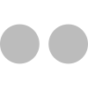

# 🖼️ 素材分類：Socialicious

> [🏠 主目錄](../../../README.md) / [images](../../README.md) / [iCons](../README.md) / **Socialicious**

本目錄共有 `74` 個檔案

| 🎨 預覽 (點擊放大)  | 📋 檔案詳細資訊與連結 |
| :--- | :--- |
|  | **📂 檔名:** `icon_aboutme-sign.svg` ✨ **格式:** `Vector (SVG)` ⚖️ **大小:** `2.31KB` 📅 **更新:** `2026-02-27`  🚀 **jsDelivr Markdown:** `` 🔗 **直接連結 (Url):** <code>https://cdn.jsdelivr.net/gh/barry028/materials@main/images/iCons/Socialicious/icon_aboutme-sign.svg</code> 📥 [檢視原始檔](icon_aboutme-sign.svg) |
|  | **📂 檔名:** `icon_aboutme.svg` ✨ **格式:** `Vector (SVG)` ⚖️ **大小:** `2.13KB` 📅 **更新:** `2026-02-27`  🚀 **jsDelivr Markdown:** `` 🔗 **直接連結 (Url):** <code>https://cdn.jsdelivr.net/gh/barry028/materials@main/images/iCons/Socialicious/icon_aboutme.svg</code> 📥 [檢視原始檔](icon_aboutme.svg) |
|  | **📂 檔名:** `icon_angellist-sign.svg` ✨ **格式:** `Vector (SVG)` ⚖️ **大小:** `3.19KB` 📅 **更新:** `2026-02-27`  🚀 **jsDelivr Markdown:** `` 🔗 **直接連結 (Url):** <code>https://cdn.jsdelivr.net/gh/barry028/materials@main/images/iCons/Socialicious/icon_angellist-sign.svg</code> 📥 [檢視原始檔](icon_angellist-sign.svg) |
|  | **📂 檔名:** `icon_angellist.svg` ✨ **格式:** `Vector (SVG)` ⚖️ **大小:** `3.06KB` 📅 **更新:** `2026-02-27`  🚀 **jsDelivr Markdown:** `` 🔗 **直接連結 (Url):** <code>https://cdn.jsdelivr.net/gh/barry028/materials@main/images/iCons/Socialicious/icon_angellist.svg</code> 📥 [檢視原始檔](icon_angellist.svg) |
|  | **📂 檔名:** `icon_bebo-sign.svg` ✨ **格式:** `Vector (SVG)` ⚖️ **大小:** `2.26KB` 📅 **更新:** `2026-02-27`  🚀 **jsDelivr Markdown:** `` 🔗 **直接連結 (Url):** <code>https://cdn.jsdelivr.net/gh/barry028/materials@main/images/iCons/Socialicious/icon_bebo-sign.svg</code> 📥 [檢視原始檔](icon_bebo-sign.svg) |
|  | **📂 檔名:** `icon_bebo.svg` ✨ **格式:** `Vector (SVG)` ⚖️ **大小:** `2.05KB` 📅 **更新:** `2026-02-27`  🚀 **jsDelivr Markdown:** `` 🔗 **直接連結 (Url):** <code>https://cdn.jsdelivr.net/gh/barry028/materials@main/images/iCons/Socialicious/icon_bebo.svg</code> 📥 [檢視原始檔](icon_bebo.svg) |
|  | **📂 檔名:** `icon_behance-sign.svg` ✨ **格式:** `Vector (SVG)` ⚖️ **大小:** `2.38KB` 📅 **更新:** `2026-02-27`  🚀 **jsDelivr Markdown:** `` 🔗 **直接連結 (Url):** <code>https://cdn.jsdelivr.net/gh/barry028/materials@main/images/iCons/Socialicious/icon_behance-sign.svg</code> 📥 [檢視原始檔](icon_behance-sign.svg) |
|  | **📂 檔名:** `icon_behance.svg` ✨ **格式:** `Vector (SVG)` ⚖️ **大小:** `2.23KB` 📅 **更新:** `2026-02-27`  🚀 **jsDelivr Markdown:** `` 🔗 **直接連結 (Url):** <code>https://cdn.jsdelivr.net/gh/barry028/materials@main/images/iCons/Socialicious/icon_behance.svg</code> 📥 [檢視原始檔](icon_behance.svg) |
|  | **📂 檔名:** `icon_bread-sign.svg` ✨ **格式:** `Vector (SVG)` ⚖️ **大小:** `2.26KB` 📅 **更新:** `2026-02-27`  🚀 **jsDelivr Markdown:** `` 🔗 **直接連結 (Url):** <code>https://cdn.jsdelivr.net/gh/barry028/materials@main/images/iCons/Socialicious/icon_bread-sign.svg</code> 📥 [檢視原始檔](icon_bread-sign.svg) |
|  | **📂 檔名:** `icon_bread.svg` ✨ **格式:** `Vector (SVG)` ⚖️ **大小:** `2.14KB` 📅 **更新:** `2026-02-27`  🚀 **jsDelivr Markdown:** `` 🔗 **直接連結 (Url):** <code>https://cdn.jsdelivr.net/gh/barry028/materials@main/images/iCons/Socialicious/icon_bread.svg</code> 📥 [檢視原始檔](icon_bread.svg) |
|  | **📂 檔名:** `icon_digg-sign.svg` ✨ **格式:** `Vector (SVG)` ⚖️ **大小:** `2.65KB` 📅 **更新:** `2026-02-27`  🚀 **jsDelivr Markdown:** `` 🔗 **直接連結 (Url):** <code>https://cdn.jsdelivr.net/gh/barry028/materials@main/images/iCons/Socialicious/icon_digg-sign.svg</code> 📥 [檢視原始檔](icon_digg-sign.svg) |
|  | **📂 檔名:** `icon_digg.svg` ✨ **格式:** `Vector (SVG)` ⚖️ **大小:** `2.47KB` 📅 **更新:** `2026-02-27`  🚀 **jsDelivr Markdown:** `` 🔗 **直接連結 (Url):** <code>https://cdn.jsdelivr.net/gh/barry028/materials@main/images/iCons/Socialicious/icon_digg.svg</code> 📥 [檢視原始檔](icon_digg.svg) |
|  | **📂 檔名:** `icon_disqus-sign.svg` ✨ **格式:** `Vector (SVG)` ⚖️ **大小:** `2.08KB` 📅 **更新:** `2026-02-27`  🚀 **jsDelivr Markdown:** `` 🔗 **直接連結 (Url):** <code>https://cdn.jsdelivr.net/gh/barry028/materials@main/images/iCons/Socialicious/icon_disqus-sign.svg</code> 📥 [檢視原始檔](icon_disqus-sign.svg) |
|  | **📂 檔名:** `icon_disqus.svg` ✨ **格式:** `Vector (SVG)` ⚖️ **大小:** `1.97KB` 📅 **更新:** `2026-02-27`  🚀 **jsDelivr Markdown:** `` 🔗 **直接連結 (Url):** <code>https://cdn.jsdelivr.net/gh/barry028/materials@main/images/iCons/Socialicious/icon_disqus.svg</code> 📥 [檢視原始檔](icon_disqus.svg) |
|  | **📂 檔名:** `icon_dribbble-sign.svg` ✨ **格式:** `Vector (SVG)` ⚖️ **大小:** `3.85KB` 📅 **更新:** `2026-02-27`  🚀 **jsDelivr Markdown:** `` 🔗 **直接連結 (Url):** <code>https://cdn.jsdelivr.net/gh/barry028/materials@main/images/iCons/Socialicious/icon_dribbble-sign.svg</code> 📥 [檢視原始檔](icon_dribbble-sign.svg) |
|  | **📂 檔名:** `icon_dribbble.svg` ✨ **格式:** `Vector (SVG)` ⚖️ **大小:** `3.60KB` 📅 **更新:** `2026-02-27`  🚀 **jsDelivr Markdown:** `` 🔗 **直接連結 (Url):** <code>https://cdn.jsdelivr.net/gh/barry028/materials@main/images/iCons/Socialicious/icon_dribbble.svg</code> 📥 [檢視原始檔](icon_dribbble.svg) |
|  | **📂 檔名:** `icon_dropbox-sign.svg` ✨ **格式:** `Vector (SVG)` ⚖️ **大小:** `2.01KB` 📅 **更新:** `2026-02-27`  🚀 **jsDelivr Markdown:** `` 🔗 **直接連結 (Url):** <code>https://cdn.jsdelivr.net/gh/barry028/materials@main/images/iCons/Socialicious/icon_dropbox-sign.svg</code> 📥 [檢視原始檔](icon_dropbox-sign.svg) |
|  | **📂 檔名:** `icon_dropbox.svg` ✨ **格式:** `Vector (SVG)` ⚖️ **大小:** `1.93KB` 📅 **更新:** `2026-02-27`  🚀 **jsDelivr Markdown:** `` 🔗 **直接連結 (Url):** <code>https://cdn.jsdelivr.net/gh/barry028/materials@main/images/iCons/Socialicious/icon_dropbox.svg</code> 📥 [檢視原始檔](icon_dropbox.svg) |
|  | **📂 檔名:** `icon_facebook-sign.svg` ✨ **格式:** `Vector (SVG)` ⚖️ **大小:** `1.93KB` 📅 **更新:** `2026-02-27`  🚀 **jsDelivr Markdown:** `` 🔗 **直接連結 (Url):** <code>https://cdn.jsdelivr.net/gh/barry028/materials@main/images/iCons/Socialicious/icon_facebook-sign.svg</code> 📥 [檢視原始檔](icon_facebook-sign.svg) |
|  | **📂 檔名:** `icon_facebook.svg` ✨ **格式:** `Vector (SVG)` ⚖️ **大小:** `1.82KB` 📅 **更新:** `2026-02-27`  🚀 **jsDelivr Markdown:** `` 🔗 **直接連結 (Url):** <code>https://cdn.jsdelivr.net/gh/barry028/materials@main/images/iCons/Socialicious/icon_facebook.svg</code> 📥 [檢視原始檔](icon_facebook.svg) |
|  | **📂 檔名:** `icon_flickr-sign.svg` ✨ **格式:** `Vector (SVG)` ⚖️ **大小:** `1.97KB` 📅 **更新:** `2026-02-27`  🚀 **jsDelivr Markdown:** `` 🔗 **直接連結 (Url):** <code>https://cdn.jsdelivr.net/gh/barry028/materials@main/images/iCons/Socialicious/icon_flickr-sign.svg</code> 📥 [檢視原始檔](icon_flickr-sign.svg) |
|  | **📂 檔名:** `icon_flickr.svg` ✨ **格式:** `Vector (SVG)` ⚖️ **大小:** `1.70KB` 📅 **更新:** `2026-02-27`  🚀 **jsDelivr Markdown:** `` 🔗 **直接連結 (Url):** <code>https://cdn.jsdelivr.net/gh/barry028/materials@main/images/iCons/Socialicious/icon_flickr.svg</code> 📥 [檢視原始檔](icon_flickr.svg) |
|  | **📂 檔名:** `icon_foursquare-sign.svg` ✨ **格式:** `Vector (SVG)` ⚖️ **大小:** `2.40KB` 📅 **更新:** `2026-02-27`  🚀 **jsDelivr Markdown:** `` 🔗 **直接連結 (Url):** <code>https://cdn.jsdelivr.net/gh/barry028/materials@main/images/iCons/Socialicious/icon_foursquare-sign.svg</code> 📥 [檢視原始檔](icon_foursquare-sign.svg) |
|  | **📂 檔名:** `icon_foursquare.svg` ✨ **格式:** `Vector (SVG)` ⚖️ **大小:** `2.28KB` 📅 **更新:** `2026-02-27`  🚀 **jsDelivr Markdown:** `` 🔗 **直接連結 (Url):** <code>https://cdn.jsdelivr.net/gh/barry028/materials@main/images/iCons/Socialicious/icon_foursquare.svg</code> 📥 [檢視原始檔](icon_foursquare.svg) |
|  | **📂 檔名:** `icon_github-sign.svg` ✨ **格式:** `Vector (SVG)` ⚖️ **大小:** `3.07KB` 📅 **更新:** `2026-02-27`  🚀 **jsDelivr Markdown:** `` 🔗 **直接連結 (Url):** <code>https://cdn.jsdelivr.net/gh/barry028/materials@main/images/iCons/Socialicious/icon_github-sign.svg</code> 📥 [檢視原始檔](icon_github-sign.svg) |
|  | **📂 檔名:** `icon_github.svg` ✨ **格式:** `Vector (SVG)` ⚖️ **大小:** `2.21KB` 📅 **更新:** `2026-02-27`  🚀 **jsDelivr Markdown:** `` 🔗 **直接連結 (Url):** <code>https://cdn.jsdelivr.net/gh/barry028/materials@main/images/iCons/Socialicious/icon_github.svg</code> 📥 [檢視原始檔](icon_github.svg) |
|  | **📂 檔名:** `icon_goodreads-sign.svg` ✨ **格式:** `Vector (SVG)` ⚖️ **大小:** `2.86KB` 📅 **更新:** `2026-02-27`  🚀 **jsDelivr Markdown:** `` 🔗 **直接連結 (Url):** <code>https://cdn.jsdelivr.net/gh/barry028/materials@main/images/iCons/Socialicious/icon_goodreads-sign.svg</code> 📥 [檢視原始檔](icon_goodreads-sign.svg) |
|  | **📂 檔名:** `icon_goodreads.svg` ✨ **格式:** `Vector (SVG)` ⚖️ **大小:** `2.73KB` 📅 **更新:** `2026-02-27`  🚀 **jsDelivr Markdown:** `` 🔗 **直接連結 (Url):** <code>https://cdn.jsdelivr.net/gh/barry028/materials@main/images/iCons/Socialicious/icon_goodreads.svg</code> 📥 [檢視原始檔](icon_goodreads.svg) |
|  | **📂 檔名:** `icon_googleplus-sign.svg` ✨ **格式:** `Vector (SVG)` ⚖️ **大小:** `2.57KB` 📅 **更新:** `2026-02-27`  🚀 **jsDelivr Markdown:** `` 🔗 **直接連結 (Url):** <code>https://cdn.jsdelivr.net/gh/barry028/materials@main/images/iCons/Socialicious/icon_googleplus-sign.svg</code> 📥 [檢視原始檔](icon_googleplus-sign.svg) |
|  | **📂 檔名:** `icon_googleplus.svg` ✨ **格式:** `Vector (SVG)` ⚖️ **大小:** `2.48KB` 📅 **更新:** `2026-02-27`  🚀 **jsDelivr Markdown:** `` 🔗 **直接連結 (Url):** <code>https://cdn.jsdelivr.net/gh/barry028/materials@main/images/iCons/Socialicious/icon_googleplus.svg</code> 📥 [檢視原始檔](icon_googleplus.svg) |
|  | **📂 檔名:** `icon_instagram-sign.svg` ✨ **格式:** `Vector (SVG)` ⚖️ **大小:** `2.25KB` 📅 **更新:** `2026-02-27`  🚀 **jsDelivr Markdown:** `` 🔗 **直接連結 (Url):** <code>https://cdn.jsdelivr.net/gh/barry028/materials@main/images/iCons/Socialicious/icon_instagram-sign.svg</code> 📥 [檢視原始檔](icon_instagram-sign.svg) |
|  | **📂 檔名:** `icon_instagram.svg` ✨ **格式:** `Vector (SVG)` ⚖️ **大小:** `2.16KB` 📅 **更新:** `2026-02-27`  🚀 **jsDelivr Markdown:** `` 🔗 **直接連結 (Url):** <code>https://cdn.jsdelivr.net/gh/barry028/materials@main/images/iCons/Socialicious/icon_instagram.svg</code> 📥 [檢視原始檔](icon_instagram.svg) |
|  | **📂 檔名:** `icon_klout-sign.svg` ✨ **格式:** `Vector (SVG)` ⚖️ **大小:** `2.08KB` 📅 **更新:** `2026-02-27`  🚀 **jsDelivr Markdown:** `` 🔗 **直接連結 (Url):** <code>https://cdn.jsdelivr.net/gh/barry028/materials@main/images/iCons/Socialicious/icon_klout-sign.svg</code> 📥 [檢視原始檔](icon_klout-sign.svg) |
|  | **📂 檔名:** `icon_klout.svg` ✨ **格式:** `Vector (SVG)` ⚖️ **大小:** `1.81KB` 📅 **更新:** `2026-02-27`  🚀 **jsDelivr Markdown:** `` 🔗 **直接連結 (Url):** <code>https://cdn.jsdelivr.net/gh/barry028/materials@main/images/iCons/Socialicious/icon_klout.svg</code> 📥 [檢視原始檔](icon_klout.svg) |
|  | **📂 檔名:** `icon_lastfm-sign.svg` ✨ **格式:** `Vector (SVG)` ⚖️ **大小:** `2.26KB` 📅 **更新:** `2026-02-27`  🚀 **jsDelivr Markdown:** `` 🔗 **直接連結 (Url):** <code>https://cdn.jsdelivr.net/gh/barry028/materials@main/images/iCons/Socialicious/icon_lastfm-sign.svg</code> 📥 [檢視原始檔](icon_lastfm-sign.svg) |
|  | **📂 檔名:** `icon_lastfm.svg` ✨ **格式:** `Vector (SVG)` ⚖️ **大小:** `2.19KB` 📅 **更新:** `2026-02-27`  🚀 **jsDelivr Markdown:** `` 🔗 **直接連結 (Url):** <code>https://cdn.jsdelivr.net/gh/barry028/materials@main/images/iCons/Socialicious/icon_lastfm.svg</code> 📥 [檢視原始檔](icon_lastfm.svg) |
|  | **📂 檔名:** `icon_linkedin-sign.svg` ✨ **格式:** `Vector (SVG)` ⚖️ **大小:** `2.59KB` 📅 **更新:** `2026-02-27`  🚀 **jsDelivr Markdown:** `` 🔗 **直接連結 (Url):** <code>https://cdn.jsdelivr.net/gh/barry028/materials@main/images/iCons/Socialicious/icon_linkedin-sign.svg</code> 📥 [檢視原始檔](icon_linkedin-sign.svg) |
|  | **📂 檔名:** `icon_linkedin.svg` ✨ **格式:** `Vector (SVG)` ⚖️ **大小:** `2.01KB` 📅 **更新:** `2026-02-27`  🚀 **jsDelivr Markdown:** `` 🔗 **直接連結 (Url):** <code>https://cdn.jsdelivr.net/gh/barry028/materials@main/images/iCons/Socialicious/icon_linkedin.svg</code> 📥 [檢視原始檔](icon_linkedin.svg) |
|  | **📂 檔名:** `icon_medium-sign.svg` ✨ **格式:** `Vector (SVG)` ⚖️ **大小:** `1.95KB` 📅 **更新:** `2026-02-27`  🚀 **jsDelivr Markdown:** `` 🔗 **直接連結 (Url):** <code>https://cdn.jsdelivr.net/gh/barry028/materials@main/images/iCons/Socialicious/icon_medium-sign.svg</code> 📥 [檢視原始檔](icon_medium-sign.svg) |
|  | **📂 檔名:** `icon_medium.svg` ✨ **格式:** `Vector (SVG)` ⚖️ **大小:** `1.84KB` 📅 **更新:** `2026-02-27`  🚀 **jsDelivr Markdown:** `` 🔗 **直接連結 (Url):** <code>https://cdn.jsdelivr.net/gh/barry028/materials@main/images/iCons/Socialicious/icon_medium.svg</code> 📥 [檢視原始檔](icon_medium.svg) |
|  | **📂 檔名:** `icon_meetup-sign.svg` ✨ **格式:** `Vector (SVG)` ⚖️ **大小:** `2.43KB` 📅 **更新:** `2026-02-27`  🚀 **jsDelivr Markdown:** `` 🔗 **直接連結 (Url):** <code>https://cdn.jsdelivr.net/gh/barry028/materials@main/images/iCons/Socialicious/icon_meetup-sign.svg</code> 📥 [檢視原始檔](icon_meetup-sign.svg) |
|  | **📂 檔名:** `icon_meetup.svg` ✨ **格式:** `Vector (SVG)` ⚖️ **大小:** `2.30KB` 📅 **更新:** `2026-02-27`  🚀 **jsDelivr Markdown:** `` 🔗 **直接連結 (Url):** <code>https://cdn.jsdelivr.net/gh/barry028/materials@main/images/iCons/Socialicious/icon_meetup.svg</code> 📥 [檢視原始檔](icon_meetup.svg) |
|  | **📂 檔名:** `icon_pinterest-sign.svg` ✨ **格式:** `Vector (SVG)` ⚖️ **大小:** `2.26KB` 📅 **更新:** `2026-02-27`  🚀 **jsDelivr Markdown:** `` 🔗 **直接連結 (Url):** <code>https://cdn.jsdelivr.net/gh/barry028/materials@main/images/iCons/Socialicious/icon_pinterest-sign.svg</code> 📥 [檢視原始檔](icon_pinterest-sign.svg) |
|  | **📂 檔名:** `icon_pinterest.svg` ✨ **格式:** `Vector (SVG)` ⚖️ **大小:** `2.16KB` 📅 **更新:** `2026-02-27`  🚀 **jsDelivr Markdown:** `` 🔗 **直接連結 (Url):** <code>https://cdn.jsdelivr.net/gh/barry028/materials@main/images/iCons/Socialicious/icon_pinterest.svg</code> 📥 [檢視原始檔](icon_pinterest.svg) |
|  | **📂 檔名:** `icon_pocket-sign.svg` ✨ **格式:** `Vector (SVG)` ⚖️ **大小:** `2.08KB` 📅 **更新:** `2026-02-27`  🚀 **jsDelivr Markdown:** `` 🔗 **直接連結 (Url):** <code>https://cdn.jsdelivr.net/gh/barry028/materials@main/images/iCons/Socialicious/icon_pocket-sign.svg</code> 📥 [檢視原始檔](icon_pocket-sign.svg) |
|  | **📂 檔名:** `icon_pocket.svg` ✨ **格式:** `Vector (SVG)` ⚖️ **大小:** `1.90KB` 📅 **更新:** `2026-02-27`  🚀 **jsDelivr Markdown:** `` 🔗 **直接連結 (Url):** <code>https://cdn.jsdelivr.net/gh/barry028/materials@main/images/iCons/Socialicious/icon_pocket.svg</code> 📥 [檢視原始檔](icon_pocket.svg) |
|  | **📂 檔名:** `icon_quora-sign.svg` ✨ **格式:** `Vector (SVG)` ⚖️ **大小:** `2.18KB` 📅 **更新:** `2026-02-27`  🚀 **jsDelivr Markdown:** `` 🔗 **直接連結 (Url):** <code>https://cdn.jsdelivr.net/gh/barry028/materials@main/images/iCons/Socialicious/icon_quora-sign.svg</code> 📥 [檢視原始檔](icon_quora-sign.svg) |
|  | **📂 檔名:** `icon_quora.svg` ✨ **格式:** `Vector (SVG)` ⚖️ **大小:** `2.02KB` 📅 **更新:** `2026-02-27`  🚀 **jsDelivr Markdown:** `` 🔗 **直接連結 (Url):** <code>https://cdn.jsdelivr.net/gh/barry028/materials@main/images/iCons/Socialicious/icon_quora.svg</code> 📥 [檢視原始檔](icon_quora.svg) |
|  | **📂 檔名:** `icon_reddit-sign.svg` ✨ **格式:** `Vector (SVG)` ⚖️ **大小:** `3.08KB` 📅 **更新:** `2026-02-27`  🚀 **jsDelivr Markdown:** `` 🔗 **直接連結 (Url):** <code>https://cdn.jsdelivr.net/gh/barry028/materials@main/images/iCons/Socialicious/icon_reddit-sign.svg</code> 📥 [檢視原始檔](icon_reddit-sign.svg) |
|  | **📂 檔名:** `icon_reddit.svg` ✨ **格式:** `Vector (SVG)` ⚖️ **大小:** `2.98KB` 📅 **更新:** `2026-02-27`  🚀 **jsDelivr Markdown:** `` 🔗 **直接連結 (Url):** <code>https://cdn.jsdelivr.net/gh/barry028/materials@main/images/iCons/Socialicious/icon_reddit.svg</code> 📥 [檢視原始檔](icon_reddit.svg) |
|  | **📂 檔名:** `icon_soundcloud-sign.svg` ✨ **格式:** `Vector (SVG)` ⚖️ **大小:** `3.95KB` 📅 **更新:** `2026-02-27`  🚀 **jsDelivr Markdown:** `` 🔗 **直接連結 (Url):** <code>https://cdn.jsdelivr.net/gh/barry028/materials@main/images/iCons/Socialicious/icon_soundcloud-sign.svg</code> 📥 [檢視原始檔](icon_soundcloud-sign.svg) |
|  | **📂 檔名:** `icon_soundcloud.svg` ✨ **格式:** `Vector (SVG)` ⚖️ **大小:** `3.73KB` 📅 **更新:** `2026-02-27`  🚀 **jsDelivr Markdown:** `` 🔗 **直接連結 (Url):** <code>https://cdn.jsdelivr.net/gh/barry028/materials@main/images/iCons/Socialicious/icon_soundcloud.svg</code> 📥 [檢視原始檔](icon_soundcloud.svg) |
|  | **📂 檔名:** `icon_spotify-sign.svg` ✨ **格式:** `Vector (SVG)` ⚖️ **大小:** `2.42KB` 📅 **更新:** `2026-02-27`  🚀 **jsDelivr Markdown:** `` 🔗 **直接連結 (Url):** <code>https://cdn.jsdelivr.net/gh/barry028/materials@main/images/iCons/Socialicious/icon_spotify-sign.svg</code> 📥 [檢視原始檔](icon_spotify-sign.svg) |
|  | **📂 檔名:** `icon_spotify.svg` ✨ **格式:** `Vector (SVG)` ⚖️ **大小:** `2.20KB` 📅 **更新:** `2026-02-27`  🚀 **jsDelivr Markdown:** `` 🔗 **直接連結 (Url):** <code>https://cdn.jsdelivr.net/gh/barry028/materials@main/images/iCons/Socialicious/icon_spotify.svg</code> 📥 [檢視原始檔](icon_spotify.svg) |
|  | **📂 檔名:** `icon_stumbleupon-sign.svg` ✨ **格式:** `Vector (SVG)` ⚖️ **大小:** `2.14KB` 📅 **更新:** `2026-02-27`  🚀 **jsDelivr Markdown:** `` 🔗 **直接連結 (Url):** <code>https://cdn.jsdelivr.net/gh/barry028/materials@main/images/iCons/Socialicious/icon_stumbleupon-sign.svg</code> 📥 [檢視原始檔](icon_stumbleupon-sign.svg) |
|  | **📂 檔名:** `icon_stumbleupon.svg` ✨ **格式:** `Vector (SVG)` ⚖️ **大小:** `2.02KB` 📅 **更新:** `2026-02-27`  🚀 **jsDelivr Markdown:** `` 🔗 **直接連結 (Url):** <code>https://cdn.jsdelivr.net/gh/barry028/materials@main/images/iCons/Socialicious/icon_stumbleupon.svg</code> 📥 [檢視原始檔](icon_stumbleupon.svg) |
|  | **📂 檔名:** `icon_techendo-sign.svg` ✨ **格式:** `Vector (SVG)` ⚖️ **大小:** `1.78KB` 📅 **更新:** `2026-02-27`  🚀 **jsDelivr Markdown:** `` 🔗 **直接連結 (Url):** <code>https://cdn.jsdelivr.net/gh/barry028/materials@main/images/iCons/Socialicious/icon_techendo-sign.svg</code> 📥 [檢視原始檔](icon_techendo-sign.svg) |
|  | **📂 檔名:** `icon_techendo.svg` ✨ **格式:** `Vector (SVG)` ⚖️ **大小:** `1.67KB` 📅 **更新:** `2026-02-27`  🚀 **jsDelivr Markdown:** `` 🔗 **直接連結 (Url):** <code>https://cdn.jsdelivr.net/gh/barry028/materials@main/images/iCons/Socialicious/icon_techendo.svg</code> 📥 [檢視原始檔](icon_techendo.svg) |
|  | **📂 檔名:** `icon_tumblr-sign.svg` ✨ **格式:** `Vector (SVG)` ⚖️ **大小:** `2.07KB` 📅 **更新:** `2026-02-27`  🚀 **jsDelivr Markdown:** `` 🔗 **直接連結 (Url):** <code>https://cdn.jsdelivr.net/gh/barry028/materials@main/images/iCons/Socialicious/icon_tumblr-sign.svg</code> 📥 [檢視原始檔](icon_tumblr-sign.svg) |
|  | **📂 檔名:** `icon_tumblr.svg` ✨ **格式:** `Vector (SVG)` ⚖️ **大小:** `1.99KB` 📅 **更新:** `2026-02-27`  🚀 **jsDelivr Markdown:** `` 🔗 **直接連結 (Url):** <code>https://cdn.jsdelivr.net/gh/barry028/materials@main/images/iCons/Socialicious/icon_tumblr.svg</code> 📥 [檢視原始檔](icon_tumblr.svg) |
|  | **📂 檔名:** `icon_twitter-sign.svg` ✨ **格式:** `Vector (SVG)` ⚖️ **大小:** `2.25KB` 📅 **更新:** `2026-02-27`  🚀 **jsDelivr Markdown:** `` 🔗 **直接連結 (Url):** <code>https://cdn.jsdelivr.net/gh/barry028/materials@main/images/iCons/Socialicious/icon_twitter-sign.svg</code> 📥 [檢視原始檔](icon_twitter-sign.svg) |
|  | **📂 檔名:** `icon_twitter.svg` ✨ **格式:** `Vector (SVG)` ⚖️ **大小:** `2.14KB` 📅 **更新:** `2026-02-27`  🚀 **jsDelivr Markdown:** `` 🔗 **直接連結 (Url):** <code>https://cdn.jsdelivr.net/gh/barry028/materials@main/images/iCons/Socialicious/icon_twitter.svg</code> 📥 [檢視原始檔](icon_twitter.svg) |
|  | **📂 檔名:** `icon_vevo-sign.svg` ✨ **格式:** `Vector (SVG)` ⚖️ **大小:** `1.79KB` 📅 **更新:** `2026-02-27`  🚀 **jsDelivr Markdown:** `` 🔗 **直接連結 (Url):** <code>https://cdn.jsdelivr.net/gh/barry028/materials@main/images/iCons/Socialicious/icon_vevo-sign.svg</code> 📥 [檢視原始檔](icon_vevo-sign.svg) |
|  | **📂 檔名:** `icon_vevo.svg` ✨ **格式:** `Vector (SVG)` ⚖️ **大小:** `1.69KB` 📅 **更新:** `2026-02-27`  🚀 **jsDelivr Markdown:** `` 🔗 **直接連結 (Url):** <code>https://cdn.jsdelivr.net/gh/barry028/materials@main/images/iCons/Socialicious/icon_vevo.svg</code> 📥 [檢視原始檔](icon_vevo.svg) |
|  | **📂 檔名:** `icon_vimeo-sign.svg` ✨ **格式:** `Vector (SVG)` ⚖️ **大小:** `2.16KB` 📅 **更新:** `2026-02-27`  🚀 **jsDelivr Markdown:** `` 🔗 **直接連結 (Url):** <code>https://cdn.jsdelivr.net/gh/barry028/materials@main/images/iCons/Socialicious/icon_vimeo-sign.svg</code> 📥 [檢視原始檔](icon_vimeo-sign.svg) |
|  | **📂 檔名:** `icon_vimeo.svg` ✨ **格式:** `Vector (SVG)` ⚖️ **大小:** `2.06KB` 📅 **更新:** `2026-02-27`  🚀 **jsDelivr Markdown:** `` 🔗 **直接連結 (Url):** <code>https://cdn.jsdelivr.net/gh/barry028/materials@main/images/iCons/Socialicious/icon_vimeo.svg</code> 📥 [檢視原始檔](icon_vimeo.svg) |
|  | **📂 檔名:** `icon_wordpress-sign.svg` ✨ **格式:** `Vector (SVG)` ⚖️ **大小:** `2.72KB` 📅 **更新:** `2026-02-27`  🚀 **jsDelivr Markdown:** `` 🔗 **直接連結 (Url):** <code>https://cdn.jsdelivr.net/gh/barry028/materials@main/images/iCons/Socialicious/icon_wordpress-sign.svg</code> 📥 [檢視原始檔](icon_wordpress-sign.svg) |
|  | **📂 檔名:** `icon_wordpress.svg` ✨ **格式:** `Vector (SVG)` ⚖️ **大小:** `2.70KB` 📅 **更新:** `2026-02-27`  🚀 **jsDelivr Markdown:** `` 🔗 **直接連結 (Url):** <code>https://cdn.jsdelivr.net/gh/barry028/materials@main/images/iCons/Socialicious/icon_wordpress.svg</code> 📥 [檢視原始檔](icon_wordpress.svg) |
|  | **📂 檔名:** `icon_yahoo-sign.svg` ✨ **格式:** `Vector (SVG)` ⚖️ **大小:** `6.66KB` 📅 **更新:** `2026-02-27`  🚀 **jsDelivr Markdown:** `` 🔗 **直接連結 (Url):** <code>https://cdn.jsdelivr.net/gh/barry028/materials@main/images/iCons/Socialicious/icon_yahoo-sign.svg</code> 📥 [檢視原始檔](icon_yahoo-sign.svg) |
|  | **📂 檔名:** `icon_yahoo.svg` ✨ **格式:** `Vector (SVG)` ⚖️ **大小:** `6.76KB` 📅 **更新:** `2026-02-27`  🚀 **jsDelivr Markdown:** `` 🔗 **直接連結 (Url):** <code>https://cdn.jsdelivr.net/gh/barry028/materials@main/images/iCons/Socialicious/icon_yahoo.svg</code> 📥 [檢視原始檔](icon_yahoo.svg) |
|  | **📂 檔名:** `icon_yelp-sign.svg` ✨ **格式:** `Vector (SVG)` ⚖️ **大小:** `2.60KB` 📅 **更新:** `2026-02-27`  🚀 **jsDelivr Markdown:** `` 🔗 **直接連結 (Url):** <code>https://cdn.jsdelivr.net/gh/barry028/materials@main/images/iCons/Socialicious/icon_yelp-sign.svg</code> 📥 [檢視原始檔](icon_yelp-sign.svg) |
|  | **📂 檔名:** `icon_yelp.svg` ✨ **格式:** `Vector (SVG)` ⚖️ **大小:** `2.63KB` 📅 **更新:** `2026-02-27`  🚀 **jsDelivr Markdown:** `` 🔗 **直接連結 (Url):** <code>https://cdn.jsdelivr.net/gh/barry028/materials@main/images/iCons/Socialicious/icon_yelp.svg</code> 📥 [檢視原始檔](icon_yelp.svg) |
|  | **📂 檔名:** `icon_youtube-sign.svg` ✨ **格式:** `Vector (SVG)` ⚖️ **大小:** `3.80KB` 📅 **更新:** `2026-02-27`  🚀 **jsDelivr Markdown:** `` 🔗 **直接連結 (Url):** <code>https://cdn.jsdelivr.net/gh/barry028/materials@main/images/iCons/Socialicious/icon_youtube-sign.svg</code> 📥 [檢視原始檔](icon_youtube-sign.svg) |
|  | **📂 檔名:** `icon_youtube.svg` ✨ **格式:** `Vector (SVG)` ⚖️ **大小:** `3.55KB` 📅 **更新:** `2026-02-27`  🚀 **jsDelivr Markdown:** `` 🔗 **直接連結 (Url):** <code>https://cdn.jsdelivr.net/gh/barry028/materials@main/images/iCons/Socialicious/icon_youtube.svg</code> 📥 [檢視原始檔](icon_youtube.svg) |