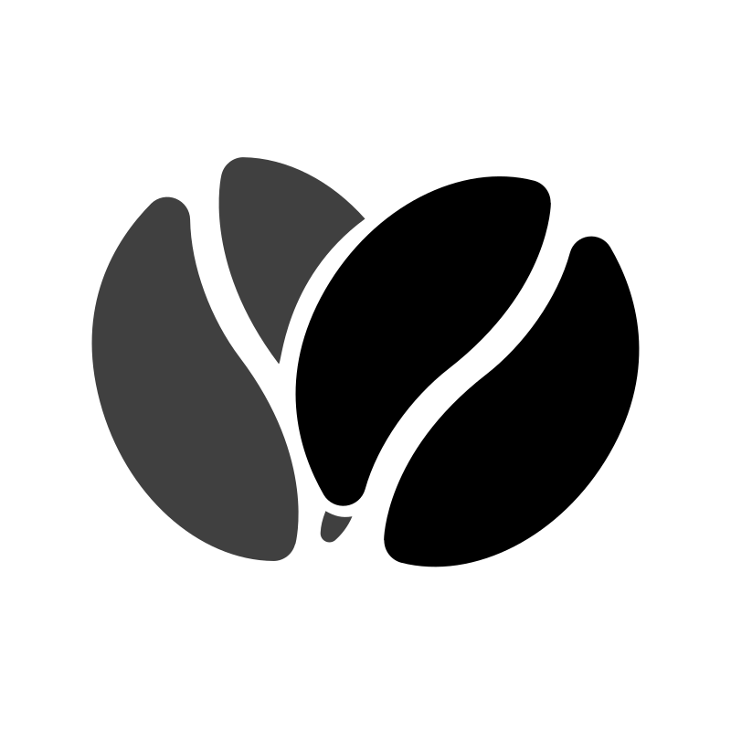
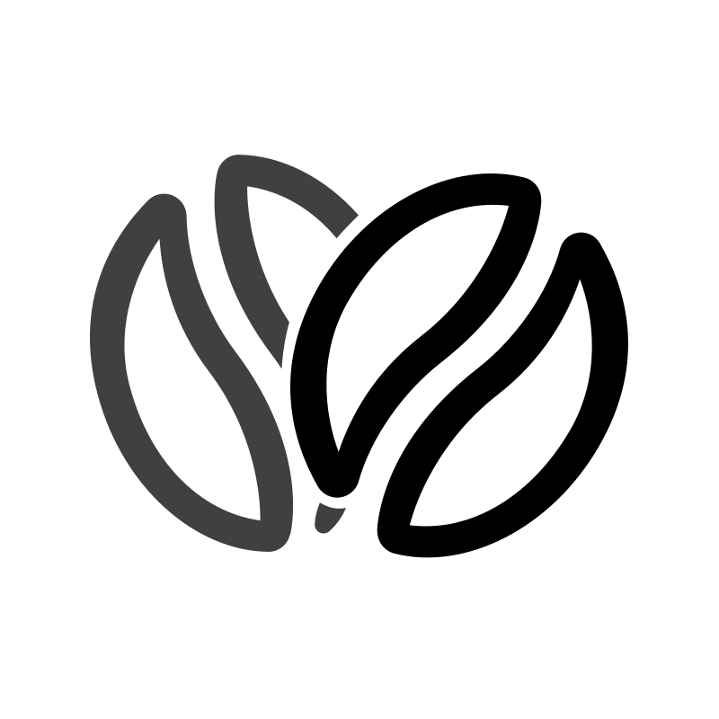
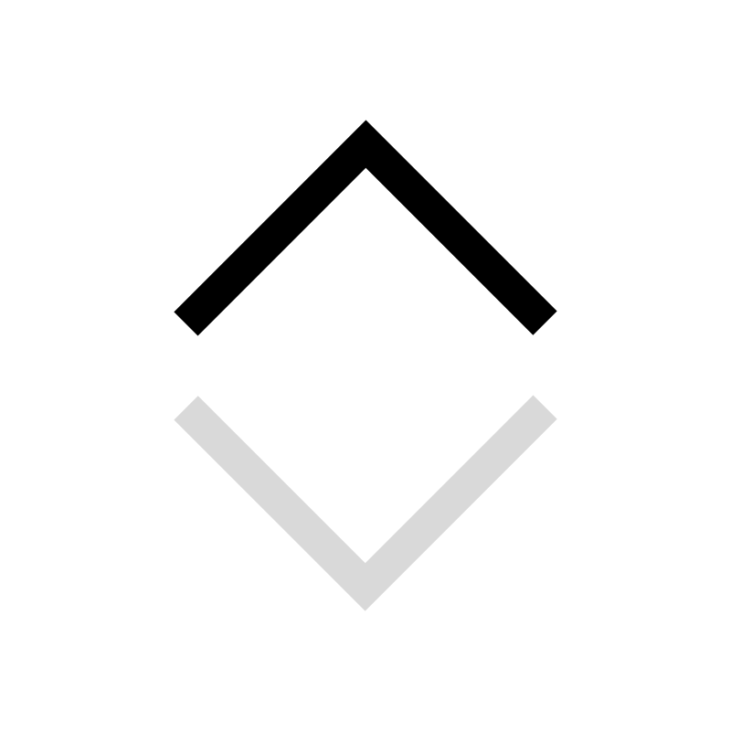
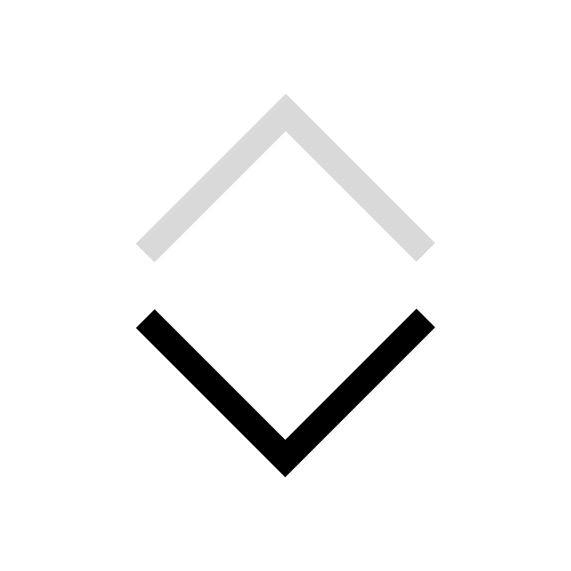
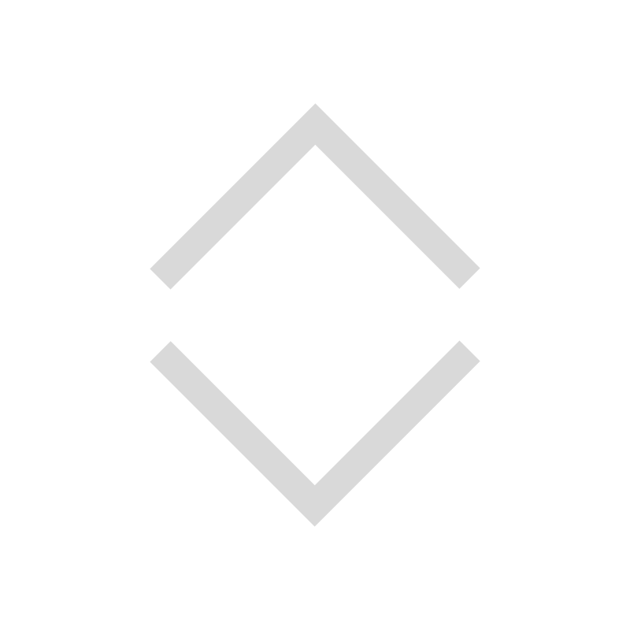
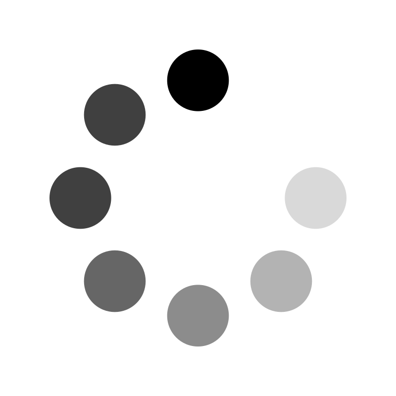
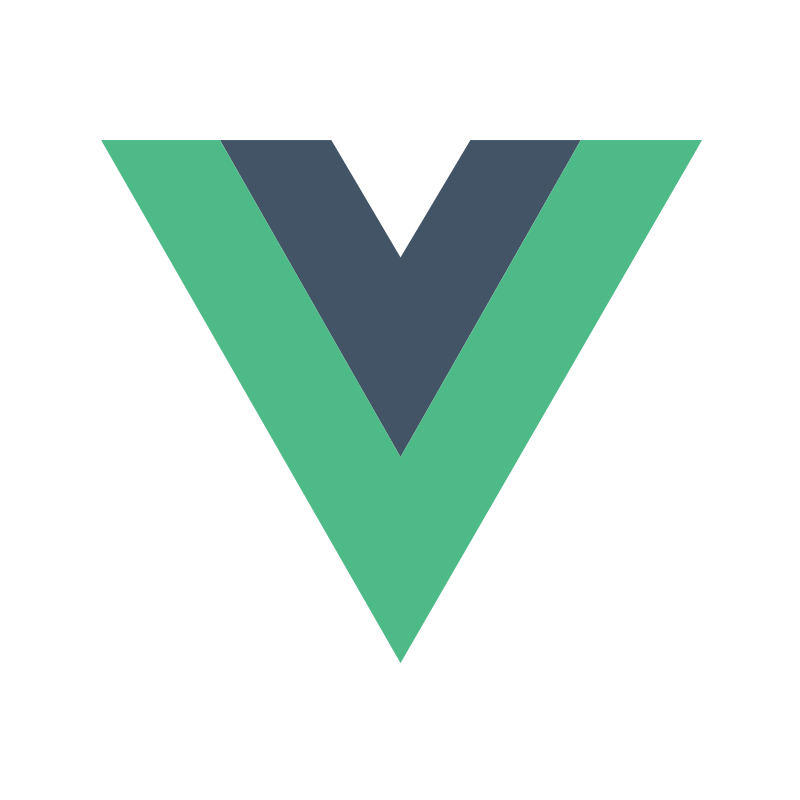

# 🖼️ 素材分類：Toe Basic Line Interface iCons

> [🏠 主目錄](../../../README.md) / [images](../../README.md) / [iCons](../README.md) / **Toe Basic Line Interface iCons**

本目錄共有 `120` 個檔案

| 🎨 預覽 (點擊放大)  | 📋 檔案詳細資訊與連結 |
| :--- | :--- |
|  | **📂 檔名:** `anchor-down-arrow-caret.svg` ✨ **格式:** `Vector (SVG)` ⚖️ **大小:** `2.25KB` 📅 **更新:** `2026-03-02`  🚀 **jsDelivr Markdown:** `` 🔗 **直接連結 (Url):** <code>https://cdn.jsdelivr.net/gh/barry028/materials@main/images/iCons/Toe%20Basic%20Line%20Interface%20iCons/anchor-down-arrow-caret.svg</code> 📥 [檢視原始檔](anchor-down-arrow-caret.svg) |
|  | **📂 檔名:** `anchor-left-arrow-caret.svg` ✨ **格式:** `Vector (SVG)` ⚖️ **大小:** `2.25KB` 📅 **更新:** `2026-03-02`  🚀 **jsDelivr Markdown:** `` 🔗 **直接連結 (Url):** <code>https://cdn.jsdelivr.net/gh/barry028/materials@main/images/iCons/Toe%20Basic%20Line%20Interface%20iCons/anchor-left-arrow-caret.svg</code> 📥 [檢視原始檔](anchor-left-arrow-caret.svg) |
|  | **📂 檔名:** `anchor-right-arrow-caret.svg` ✨ **格式:** `Vector (SVG)` ⚖️ **大小:** `2.25KB` 📅 **更新:** `2026-03-02`  🚀 **jsDelivr Markdown:** `` 🔗 **直接連結 (Url):** <code>https://cdn.jsdelivr.net/gh/barry028/materials@main/images/iCons/Toe%20Basic%20Line%20Interface%20iCons/anchor-right-arrow-caret.svg</code> 📥 [檢視原始檔](anchor-right-arrow-caret.svg) |
|  | **📂 檔名:** `anchor-up-arrow-caret.svg` ✨ **格式:** `Vector (SVG)` ⚖️ **大小:** `2.41KB` 📅 **更新:** `2026-03-02`  🚀 **jsDelivr Markdown:** `` 🔗 **直接連結 (Url):** <code>https://cdn.jsdelivr.net/gh/barry028/materials@main/images/iCons/Toe%20Basic%20Line%20Interface%20iCons/anchor-up-arrow-caret.svg</code> 📥 [檢視原始檔](anchor-up-arrow-caret.svg) |
|  | **📂 檔名:** `arrow-down-arrow-indicator-chevron-anchor-point.svg` ✨ **格式:** `Vector (SVG)` ⚖️ **大小:** `2.28KB` 📅 **更新:** `2026-03-02`  🚀 **jsDelivr Markdown:** `` 🔗 **直接連結 (Url):** <code>https://cdn.jsdelivr.net/gh/barry028/materials@main/images/iCons/Toe%20Basic%20Line%20Interface%20iCons/arrow-down-arrow-indicator-chevron-anchor-point.svg</code> 📥 [檢視原始檔](arrow-down-arrow-indicator-chevron-anchor-point.svg) |
|  | **📂 檔名:** `arrow-left-arrow-indicator-chevron-anchor-point.svg` ✨ **格式:** `Vector (SVG)` ⚖️ **大小:** `2.73KB` 📅 **更新:** `2026-03-02`  🚀 **jsDelivr Markdown:** `` 🔗 **直接連結 (Url):** <code>https://cdn.jsdelivr.net/gh/barry028/materials@main/images/iCons/Toe%20Basic%20Line%20Interface%20iCons/arrow-left-arrow-indicator-chevron-anchor-point.svg</code> 📥 [檢視原始檔](arrow-left-arrow-indicator-chevron-anchor-point.svg) |
|  | **📂 檔名:** `arrow-right-arrow-indicator-chevron-anchor-point.svg` ✨ **格式:** `Vector (SVG)` ⚖️ **大小:** `2.28KB` 📅 **更新:** `2026-03-02`  🚀 **jsDelivr Markdown:** `` 🔗 **直接連結 (Url):** <code>https://cdn.jsdelivr.net/gh/barry028/materials@main/images/iCons/Toe%20Basic%20Line%20Interface%20iCons/arrow-right-arrow-indicator-chevron-anchor-point.svg</code> 📥 [檢視原始檔](arrow-right-arrow-indicator-chevron-anchor-point.svg) |
|  | **📂 檔名:** `arrow-up-arrow-indicator-chevron-anchor-point.svg` ✨ **格式:** `Vector (SVG)` ⚖️ **大小:** `2.57KB` 📅 **更新:** `2026-03-02`  🚀 **jsDelivr Markdown:** `` 🔗 **直接連結 (Url):** <code>https://cdn.jsdelivr.net/gh/barry028/materials@main/images/iCons/Toe%20Basic%20Line%20Interface%20iCons/arrow-up-arrow-indicator-chevron-anchor-point.svg</code> 📥 [檢視原始檔](arrow-up-arrow-indicator-chevron-anchor-point.svg) |
|  | **📂 檔名:** `at-mention-user-email-aroba.svg` ✨ **格式:** `Vector (SVG)` ⚖️ **大小:** `3.80KB` 📅 **更新:** `2026-03-02`  🚀 **jsDelivr Markdown:** `` 🔗 **直接連結 (Url):** <code>https://cdn.jsdelivr.net/gh/barry028/materials@main/images/iCons/Toe%20Basic%20Line%20Interface%20iCons/at-mention-user-email-aroba.svg</code> 📥 [檢視原始檔](at-mention-user-email-aroba.svg) |
|  | **📂 檔名:** `backslash.svg` ✨ **格式:** `Vector (SVG)` ⚖️ **大小:** `2.19KB` 📅 **更新:** `2026-03-02`  🚀 **jsDelivr Markdown:** `` 🔗 **直接連結 (Url):** <code>https://cdn.jsdelivr.net/gh/barry028/materials@main/images/iCons/Toe%20Basic%20Line%20Interface%20iCons/backslash.svg</code> 📥 [檢視原始檔](backslash.svg) |
|  | **📂 檔名:** `bold-strong-bold-format-editor-tool-toolbar.svg` ✨ **格式:** `Vector (SVG)` ⚖️ **大小:** `2.22KB` 📅 **更新:** `2026-03-02`  🚀 **jsDelivr Markdown:** `` 🔗 **直接連結 (Url):** <code>https://cdn.jsdelivr.net/gh/barry028/materials@main/images/iCons/Toe%20Basic%20Line%20Interface%20iCons/bold-strong-bold-format-editor-tool-toolbar.svg</code> 📥 [檢視原始檔](bold-strong-bold-format-editor-tool-toolbar.svg) |
|  | **📂 檔名:** `bookmark-filled-save-star-favourite-priority-important.svg` ✨ **格式:** `Vector (SVG)` ⚖️ **大小:** `2.21KB` 📅 **更新:** `2026-03-02`  🚀 **jsDelivr Markdown:** `` 🔗 **直接連結 (Url):** <code>https://cdn.jsdelivr.net/gh/barry028/materials@main/images/iCons/Toe%20Basic%20Line%20Interface%20iCons/bookmark-filled-save-star-favourite-priority-important.svg</code> 📥 [檢視原始檔](bookmark-filled-save-star-favourite-priority-important.svg) |
|  | **📂 檔名:** `bookmark-save-star-favourite-priority-important-flag.svg` ✨ **格式:** `Vector (SVG)` ⚖️ **大小:** `2.30KB` 📅 **更新:** `2026-03-02`  🚀 **jsDelivr Markdown:** `` 🔗 **直接連結 (Url):** <code>https://cdn.jsdelivr.net/gh/barry028/materials@main/images/iCons/Toe%20Basic%20Line%20Interface%20iCons/bookmark-save-star-favourite-priority-important-flag.svg</code> 📥 [檢視原始檔](bookmark-save-star-favourite-priority-important-flag.svg) |
|  | **📂 檔名:** `brackets-code-block-codeblock-script-coding-editor.svg` ✨ **格式:** `Vector (SVG)` ⚖️ **大小:** `3.04KB` 📅 **更新:** `2026-03-02`  🚀 **jsDelivr Markdown:** `` 🔗 **直接連結 (Url):** <code>https://cdn.jsdelivr.net/gh/barry028/materials@main/images/iCons/Toe%20Basic%20Line%20Interface%20iCons/brackets-code-block-codeblock-script-coding-editor.svg</code> 📥 [檢視原始檔](brackets-code-block-codeblock-script-coding-editor.svg) |
|  | **📂 檔名:** `circle-checked-circle-radio-check-filled-confirm.svg` ✨ **格式:** `Vector (SVG)` ⚖️ **大小:** `3.83KB` 📅 **更新:** `2026-03-02`  🚀 **jsDelivr Markdown:** `` 🔗 **直接連結 (Url):** <code>https://cdn.jsdelivr.net/gh/barry028/materials@main/images/iCons/Toe%20Basic%20Line%20Interface%20iCons/circle-checked-circle-radio-check-filled-confirm.svg</code> 📥 [檢視原始檔](circle-checked-circle-radio-check-filled-confirm.svg) |
|  | **📂 檔名:** `circle-empty-geometry-container-round.svg` ✨ **格式:** `Vector (SVG)` ⚖️ **大小:** `2.69KB` 📅 **更新:** `2026-03-02`  🚀 **jsDelivr Markdown:** `` 🔗 **直接連結 (Url):** <code>https://cdn.jsdelivr.net/gh/barry028/materials@main/images/iCons/Toe%20Basic%20Line%20Interface%20iCons/circle-empty-geometry-container-round.svg</code> 📥 [檢視原始檔](circle-empty-geometry-container-round.svg) |
|  | **📂 檔名:** `circle-filled-circle-radio-filled-round-bullet.svg` ✨ **格式:** `Vector (SVG)` ⚖️ **大小:** `3.57KB` 📅 **更新:** `2026-03-02`  🚀 **jsDelivr Markdown:** `` 🔗 **直接連結 (Url):** <code>https://cdn.jsdelivr.net/gh/barry028/materials@main/images/iCons/Toe%20Basic%20Line%20Interface%20iCons/circle-filled-circle-radio-filled-round-bullet.svg</code> 📥 [檢視原始檔](circle-filled-circle-radio-filled-round-bullet.svg) |
|  | **📂 檔名:** `circle-selected-circle-radio-filled-form.svg` ✨ **格式:** `Vector (SVG)` ⚖️ **大小:** `4.40KB` 📅 **更新:** `2026-03-02`  🚀 **jsDelivr Markdown:** `` 🔗 **直接連結 (Url):** <code>https://cdn.jsdelivr.net/gh/barry028/materials@main/images/iCons/Toe%20Basic%20Line%20Interface%20iCons/circle-selected-circle-radio-filled-form.svg</code> 📥 [檢視原始檔](circle-selected-circle-radio-filled-form.svg) |
|  | **📂 檔名:** `clipboard-copy-memory-editor-copy-paste.svg` ✨ **格式:** `Vector (SVG)` ⚖️ **大小:** `6.21KB` 📅 **更新:** `2026-03-02`  🚀 **jsDelivr Markdown:** `` 🔗 **直接連結 (Url):** <code>https://cdn.jsdelivr.net/gh/barry028/materials@main/images/iCons/Toe%20Basic%20Line%20Interface%20iCons/clipboard-copy-memory-editor-copy-paste.svg</code> 📥 [檢視原始檔](clipboard-copy-memory-editor-copy-paste.svg) |
|  | **📂 檔名:** `clipboard-memory-copy-paste-editor.svg` ✨ **格式:** `Vector (SVG)` ⚖️ **大小:** `5.80KB` 📅 **更新:** `2026-03-02`  🚀 **jsDelivr Markdown:** `` 🔗 **直接連結 (Url):** <code>https://cdn.jsdelivr.net/gh/barry028/materials@main/images/iCons/Toe%20Basic%20Line%20Interface%20iCons/clipboard-memory-copy-paste-editor.svg</code> 📥 [檢視原始檔](clipboard-memory-copy-paste-editor.svg) |
|  | **📂 檔名:** `clipboard-paste-memory-editor-copy-paste.svg` ✨ **格式:** `Vector (SVG)` ⚖️ **大小:** `5.92KB` 📅 **更新:** `2026-03-02`  🚀 **jsDelivr Markdown:** `` 🔗 **直接連結 (Url):** <code>https://cdn.jsdelivr.net/gh/barry028/materials@main/images/iCons/Toe%20Basic%20Line%20Interface%20iCons/clipboard-paste-memory-editor-copy-paste.svg</code> 📥 [檢視原始檔](clipboard-paste-memory-editor-copy-paste.svg) |
|  | **📂 檔名:** `clock-time-watch-date.svg` ✨ **格式:** `Vector (SVG)` ⚖️ **大小:** `2.79KB` 📅 **更新:** `2026-03-02`  🚀 **jsDelivr Markdown:** `` 🔗 **直接連結 (Url):** <code>https://cdn.jsdelivr.net/gh/barry028/materials@main/images/iCons/Toe%20Basic%20Line%20Interface%20iCons/clock-time-watch-date.svg</code> 📥 [檢視原始檔](clock-time-watch-date.svg) |
|  | **📂 檔名:** `cloud-download-internet-data-network-sync.svg` ✨ **格式:** `Vector (SVG)` ⚖️ **大小:** `3.44KB` 📅 **更新:** `2026-03-02`  🚀 **jsDelivr Markdown:** `` 🔗 **直接連結 (Url):** <code>https://cdn.jsdelivr.net/gh/barry028/materials@main/images/iCons/Toe%20Basic%20Line%20Interface%20iCons/cloud-download-internet-data-network-sync.svg</code> 📥 [檢視原始檔](cloud-download-internet-data-network-sync.svg) |
|  | **📂 檔名:** `cloud-error-internet-data-network-sync-reject.svg` ✨ **格式:** `Vector (SVG)` ⚖️ **大小:** `3.51KB` 📅 **更新:** `2026-03-02`  🚀 **jsDelivr Markdown:** `` 🔗 **直接連結 (Url):** <code>https://cdn.jsdelivr.net/gh/barry028/materials@main/images/iCons/Toe%20Basic%20Line%20Interface%20iCons/cloud-error-internet-data-network-sync-reject.svg</code> 📥 [檢視原始檔](cloud-error-internet-data-network-sync-reject.svg) |
|  | **📂 檔名:** `cloud-internet-data-network-sync.svg` ✨ **格式:** `Vector (SVG)` ⚖️ **大小:** `2.92KB` 📅 **更新:** `2026-03-02`  🚀 **jsDelivr Markdown:** `` 🔗 **直接連結 (Url):** <code>https://cdn.jsdelivr.net/gh/barry028/materials@main/images/iCons/Toe%20Basic%20Line%20Interface%20iCons/cloud-internet-data-network-sync.svg</code> 📥 [檢視原始檔](cloud-internet-data-network-sync.svg) |
|  | **📂 檔名:** `cloud-upload-internet-data-network-sync.svg` ✨ **格式:** `Vector (SVG)` ⚖️ **大小:** `3.48KB` 📅 **更新:** `2026-03-02`  🚀 **jsDelivr Markdown:** `` 🔗 **直接連結 (Url):** <code>https://cdn.jsdelivr.net/gh/barry028/materials@main/images/iCons/Toe%20Basic%20Line%20Interface%20iCons/cloud-upload-internet-data-network-sync.svg</code> 📥 [檢視原始檔](cloud-upload-internet-data-network-sync.svg) |
|  | **📂 檔名:** `code-code-tags-html-inline-editor.svg` ✨ **格式:** `Vector (SVG)` ⚖️ **大小:** `2.34KB` 📅 **更新:** `2026-03-02`  🚀 **jsDelivr Markdown:** `` 🔗 **直接連結 (Url):** <code>https://cdn.jsdelivr.net/gh/barry028/materials@main/images/iCons/Toe%20Basic%20Line%20Interface%20iCons/code-code-tags-html-inline-editor.svg</code> 📥 [檢視原始檔](code-code-tags-html-inline-editor.svg) |
|  | **📂 檔名:** `codeblock-code-editor-highlight-programming.svg` ✨ **格式:** `Vector (SVG)` ⚖️ **大小:** `2.45KB` 📅 **更新:** `2026-03-02`  🚀 **jsDelivr Markdown:** `` 🔗 **直接連結 (Url):** <code>https://cdn.jsdelivr.net/gh/barry028/materials@main/images/iCons/Toe%20Basic%20Line%20Interface%20iCons/codeblock-code-editor-highlight-programming.svg</code> 📥 [檢視原始檔](codeblock-code-editor-highlight-programming.svg) |
|  | **📂 檔名:** `coffee-bean-filled-roast-brew.svg` ✨ **格式:** `Vector (SVG)` ⚖️ **大小:** `4.47KB` 📅 **更新:** `2026-03-02`  🚀 **jsDelivr Markdown:** `` 🔗 **直接連結 (Url):** <code>https://cdn.jsdelivr.net/gh/barry028/materials@main/images/iCons/Toe%20Basic%20Line%20Interface%20iCons/coffee-bean-filled-roast-brew.svg</code> 📥 [檢視原始檔](coffee-bean-filled-roast-brew.svg) |
|  | **📂 檔名:** `coffee-bean-roast-brew.svg` ✨ **格式:** `Vector (SVG)` ⚖️ **大小:** `4.86KB` 📅 **更新:** `2026-03-02`  🚀 **jsDelivr Markdown:** `` 🔗 **直接連結 (Url):** <code>https://cdn.jsdelivr.net/gh/barry028/materials@main/images/iCons/Toe%20Basic%20Line%20Interface%20iCons/coffee-bean-roast-brew.svg</code> 📥 [檢視原始檔](coffee-bean-roast-brew.svg) |
|  | **📂 檔名:** `coffee-beans-filled-roast-brew.svg` ✨ **格式:** `Vector (SVG)` ⚖️ **大小:** `5.47KB` 📅 **更新:** `2026-03-02`  🚀 **jsDelivr Markdown:** `` 🔗 **直接連結 (Url):** <code>https://cdn.jsdelivr.net/gh/barry028/materials@main/images/iCons/Toe%20Basic%20Line%20Interface%20iCons/coffee-beans-filled-roast-brew.svg</code> 📥 [檢視原始檔](coffee-beans-filled-roast-brew.svg) |
|  | **📂 檔名:** `coffee-beans-roast-brew.svg` ✨ **格式:** `Vector (SVG)` ⚖️ **大小:** `6.26KB` 📅 **更新:** `2026-03-02`  🚀 **jsDelivr Markdown:** `` 🔗 **直接連結 (Url):** <code>https://cdn.jsdelivr.net/gh/barry028/materials@main/images/iCons/Toe%20Basic%20Line%20Interface%20iCons/coffee-beans-roast-brew.svg</code> 📥 [檢視原始檔](coffee-beans-roast-brew.svg) |
|  | **📂 檔名:** `cog-setting-gear.svg` ✨ **格式:** `Vector (SVG)` ⚖️ **大小:** `4.70KB` 📅 **更新:** `2026-03-02`  🚀 **jsDelivr Markdown:** `` 🔗 **直接連結 (Url):** <code>https://cdn.jsdelivr.net/gh/barry028/materials@main/images/iCons/Toe%20Basic%20Line%20Interface%20iCons/cog-setting-gear.svg</code> 📥 [檢視原始檔](cog-setting-gear.svg) |
|  | **📂 檔名:** `connection-2-flash-connection-electric.svg` ✨ **格式:** `Vector (SVG)` ⚖️ **大小:** `2.21KB` 📅 **更新:** `2026-03-02`  🚀 **jsDelivr Markdown:** `` 🔗 **直接連結 (Url):** <code>https://cdn.jsdelivr.net/gh/barry028/materials@main/images/iCons/Toe%20Basic%20Line%20Interface%20iCons/connection-2-flash-connection-electric.svg</code> 📥 [檢視原始檔](connection-2-flash-connection-electric.svg) |
|  | **📂 檔名:** `connection-online-connected-ightning-power.svg` ✨ **格式:** `Vector (SVG)` ⚖️ **大小:** `2.35KB` 📅 **更新:** `2026-03-02`  🚀 **jsDelivr Markdown:** `` 🔗 **直接連結 (Url):** <code>https://cdn.jsdelivr.net/gh/barry028/materials@main/images/iCons/Toe%20Basic%20Line%20Interface%20iCons/connection-online-connected-ightning-power.svg</code> 📥 [檢視原始檔](connection-online-connected-ightning-power.svg) |
|  | **📂 檔名:** `copy-clipboard-memory-editor-copy-paste-document.svg` ✨ **格式:** `Vector (SVG)` ⚖️ **大小:** `5.73KB` 📅 **更新:** `2026-03-02`  🚀 **jsDelivr Markdown:** `` 🔗 **直接連結 (Url):** <code>https://cdn.jsdelivr.net/gh/barry028/materials@main/images/iCons/Toe%20Basic%20Line%20Interface%20iCons/copy-clipboard-memory-editor-copy-paste-document.svg</code> 📥 [檢視原始檔](copy-clipboard-memory-editor-copy-paste-document.svg) |
|  | **📂 檔名:** `deny-cancel-reject-block-blocked.svg` ✨ **格式:** `Vector (SVG)` ⚖️ **大小:** `2.53KB` 📅 **更新:** `2026-03-02`  🚀 **jsDelivr Markdown:** `` 🔗 **直接連結 (Url):** <code>https://cdn.jsdelivr.net/gh/barry028/materials@main/images/iCons/Toe%20Basic%20Line%20Interface%20iCons/deny-cancel-reject-block-blocked.svg</code> 📥 [檢視原始檔](deny-cancel-reject-block-blocked.svg) |
|  | **📂 檔名:** `download-export-down-arrow-save-file.svg` ✨ **格式:** `Vector (SVG)` ⚖️ **大小:** `2.25KB` 📅 **更新:** `2026-03-02`  🚀 **jsDelivr Markdown:** `` 🔗 **直接連結 (Url):** <code>https://cdn.jsdelivr.net/gh/barry028/materials@main/images/iCons/Toe%20Basic%20Line%20Interface%20iCons/download-export-down-arrow-save-file.svg</code> 📥 [檢視原始檔](download-export-down-arrow-save-file.svg) |
|  | **📂 檔名:** `duck-rubber-debugging-dev-coding.svg` ✨ **格式:** `Vector (SVG)` ⚖️ **大小:** `2.60KB` 📅 **更新:** `2026-03-02`  🚀 **jsDelivr Markdown:** `` 🔗 **直接連結 (Url):** <code>https://cdn.jsdelivr.net/gh/barry028/materials@main/images/iCons/Toe%20Basic%20Line%20Interface%20iCons/duck-rubber-debugging-dev-coding.svg</code> 📥 [檢視原始檔](duck-rubber-debugging-dev-coding.svg) |
|  | **📂 檔名:** `error-circle-fail-failure-disallowed-x-cross-bad.svg` ✨ **格式:** `Vector (SVG)` ⚖️ **大小:** `2.86KB` 📅 **更新:** `2026-03-02`  🚀 **jsDelivr Markdown:** `` 🔗 **直接連結 (Url):** <code>https://cdn.jsdelivr.net/gh/barry028/materials@main/images/iCons/Toe%20Basic%20Line%20Interface%20iCons/error-circle-fail-failure-disallowed-x-cross-bad.svg</code> 📥 [檢視原始檔](error-circle-fail-failure-disallowed-x-cross-bad.svg) |
|  | **📂 檔名:** `exclamation-mark-sign-alert-warning-important.svg` ✨ **格式:** `Vector (SVG)` ⚖️ **大小:** `2.51KB` 📅 **更新:** `2026-03-02`  🚀 **jsDelivr Markdown:** `` 🔗 **直接連結 (Url):** <code>https://cdn.jsdelivr.net/gh/barry028/materials@main/images/iCons/Toe%20Basic%20Line%20Interface%20iCons/exclamation-mark-sign-alert-warning-important.svg</code> 📥 [檢視原始檔](exclamation-mark-sign-alert-warning-important.svg) |
|  | **📂 檔名:** `eye-slash-visibility-visible-hide-hidden-show-watch.svg` ✨ **格式:** `Vector (SVG)` ⚖️ **大小:** `3.34KB` 📅 **更新:** `2026-03-02`  🚀 **jsDelivr Markdown:** `` 🔗 **直接連結 (Url):** <code>https://cdn.jsdelivr.net/gh/barry028/materials@main/images/iCons/Toe%20Basic%20Line%20Interface%20iCons/eye-slash-visibility-visible-hide-hidden-show-watch.svg</code> 📥 [檢視原始檔](eye-slash-visibility-visible-hide-hidden-show-watch.svg) |
|  | **📂 檔名:** `eye-visibility-visible-hide-hidden-show-watch.svg` ✨ **格式:** `Vector (SVG)` ⚖️ **大小:** `3.20KB` 📅 **更新:** `2026-03-02`  🚀 **jsDelivr Markdown:** `` 🔗 **直接連結 (Url):** <code>https://cdn.jsdelivr.net/gh/barry028/materials@main/images/iCons/Toe%20Basic%20Line%20Interface%20iCons/eye-visibility-visible-hide-hidden-show-watch.svg</code> 📥 [檢視原始檔](eye-visibility-visible-hide-hidden-show-watch.svg) |
|  | **📂 檔名:** `file-restore-trash-recover-save-back.svg` ✨ **格式:** `Vector (SVG)` ⚖️ **大小:** `2.94KB` 📅 **更新:** `2026-03-02`  🚀 **jsDelivr Markdown:** `` 🔗 **直接連結 (Url):** <code>https://cdn.jsdelivr.net/gh/barry028/materials@main/images/iCons/Toe%20Basic%20Line%20Interface%20iCons/file-restore-trash-recover-save-back.svg</code> 📥 [檢視原始檔](file-restore-trash-recover-save-back.svg) |
|  | **📂 檔名:** `github-repo-git-octocat.svg` ✨ **格式:** `Vector (SVG)` ⚖️ **大小:** `3.05KB` 📅 **更新:** `2026-03-02`  🚀 **jsDelivr Markdown:** `` 🔗 **直接連結 (Url):** <code>https://cdn.jsdelivr.net/gh/barry028/materials@main/images/iCons/Toe%20Basic%20Line%20Interface%20iCons/github-repo-git-octocat.svg</code> 📥 [檢視原始檔](github-repo-git-octocat.svg) |
|  | **📂 檔名:** `h1-header-heading-header-1-format-editor.svg` ✨ **格式:** `Vector (SVG)` ⚖️ **大小:** `2.33KB` 📅 **更新:** `2026-03-02`  🚀 **jsDelivr Markdown:** `` 🔗 **直接連結 (Url):** <code>https://cdn.jsdelivr.net/gh/barry028/materials@main/images/iCons/Toe%20Basic%20Line%20Interface%20iCons/h1-header-heading-header-1-format-editor.svg</code> 📥 [檢視原始檔](h1-header-heading-header-1-format-editor.svg) |
|  | **📂 檔名:** `h2-header-heading-header-2-format-editor.svg` ✨ **格式:** `Vector (SVG)` ⚖️ **大小:** `2.33KB` 📅 **更新:** `2026-03-02`  🚀 **jsDelivr Markdown:** `` 🔗 **直接連結 (Url):** <code>https://cdn.jsdelivr.net/gh/barry028/materials@main/images/iCons/Toe%20Basic%20Line%20Interface%20iCons/h2-header-heading-header-2-format-editor.svg</code> 📥 [檢視原始檔](h2-header-heading-header-2-format-editor.svg) |
|  | **📂 檔名:** `h3-header-heading-header-3-format-editor.svg` ✨ **格式:** `Vector (SVG)` ⚖️ **大小:** `2.33KB` 📅 **更新:** `2026-03-02`  🚀 **jsDelivr Markdown:** `` 🔗 **直接連結 (Url):** <code>https://cdn.jsdelivr.net/gh/barry028/materials@main/images/iCons/Toe%20Basic%20Line%20Interface%20iCons/h3-header-heading-header-3-format-editor.svg</code> 📥 [檢視原始檔](h3-header-heading-header-3-format-editor.svg) |
|  | **📂 檔名:** `half-circle-spinner-circle-c.svg` ✨ **格式:** `Vector (SVG)` ⚖️ **大小:** `2.32KB` 📅 **更新:** `2026-03-02`  🚀 **jsDelivr Markdown:** `` 🔗 **直接連結 (Url):** <code>https://cdn.jsdelivr.net/gh/barry028/materials@main/images/iCons/Toe%20Basic%20Line%20Interface%20iCons/half-circle-spinner-circle-c.svg</code> 📥 [檢視原始檔](half-circle-spinner-circle-c.svg) |
|  | **📂 檔名:** `hamburger-2-menu-mobile.svg` ✨ **格式:** `Vector (SVG)` ⚖️ **大小:** `4.07KB` 📅 **更新:** `2026-03-02`  🚀 **jsDelivr Markdown:** `` 🔗 **直接連結 (Url):** <code>https://cdn.jsdelivr.net/gh/barry028/materials@main/images/iCons/Toe%20Basic%20Line%20Interface%20iCons/hamburger-2-menu-mobile.svg</code> 📥 [檢視原始檔](hamburger-2-menu-mobile.svg) |
|  | **📂 檔名:** `hamburger-menu-mobile.svg` ✨ **格式:** `Vector (SVG)` ⚖️ **大小:** `4.07KB` 📅 **更新:** `2026-03-02`  🚀 **jsDelivr Markdown:** `` 🔗 **直接連結 (Url):** <code>https://cdn.jsdelivr.net/gh/barry028/materials@main/images/iCons/Toe%20Basic%20Line%20Interface%20iCons/hamburger-menu-mobile.svg</code> 📥 [檢視原始檔](hamburger-menu-mobile.svg) |
|  | **📂 檔名:** `hammer-head-tool-fix-setting.svg` ✨ **格式:** `Vector (SVG)` ⚖️ **大小:** `2.62KB` 📅 **更新:** `2026-03-02`  🚀 **jsDelivr Markdown:** `` 🔗 **直接連結 (Url):** <code>https://cdn.jsdelivr.net/gh/barry028/materials@main/images/iCons/Toe%20Basic%20Line%20Interface%20iCons/hammer-head-tool-fix-setting.svg</code> 📥 [檢視原始檔](hammer-head-tool-fix-setting.svg) |
|  | **📂 檔名:** `hammer-tool-settings-fix-repair.svg` ✨ **格式:** `Vector (SVG)` ⚖️ **大小:** `2.58KB` 📅 **更新:** `2026-03-02`  🚀 **jsDelivr Markdown:** `` 🔗 **直接連結 (Url):** <code>https://cdn.jsdelivr.net/gh/barry028/materials@main/images/iCons/Toe%20Basic%20Line%20Interface%20iCons/hammer-tool-settings-fix-repair.svg</code> 📥 [檢視原始檔](hammer-tool-settings-fix-repair.svg) |
|  | **📂 檔名:** `hashtag-mention-channel-hash-topic-trend.svg` ✨ **格式:** `Vector (SVG)` ⚖️ **大小:** `2.51KB` 📅 **更新:** `2026-03-02`  🚀 **jsDelivr Markdown:** `` 🔗 **直接連結 (Url):** <code>https://cdn.jsdelivr.net/gh/barry028/materials@main/images/iCons/Toe%20Basic%20Line%20Interface%20iCons/hashtag-mention-channel-hash-topic-trend.svg</code> 📥 [檢視原始檔](hashtag-mention-channel-hash-topic-trend.svg) |
|  | **📂 檔名:** `heart-bookmark-rating-save-fav-outline.svg` ✨ **格式:** `Vector (SVG)` ⚖️ **大小:** `2.91KB` 📅 **更新:** `2026-03-02`  🚀 **jsDelivr Markdown:** `` 🔗 **直接連結 (Url):** <code>https://cdn.jsdelivr.net/gh/barry028/materials@main/images/iCons/Toe%20Basic%20Line%20Interface%20iCons/heart-bookmark-rating-save-fav-outline.svg</code> 📥 [檢視原始檔](heart-bookmark-rating-save-fav-outline.svg) |
|  | **📂 檔名:** `heart-filled-bookmark-rating-save-fav-fill.svg` ✨ **格式:** `Vector (SVG)` ⚖️ **大小:** `2.50KB` 📅 **更新:** `2026-03-02`  🚀 **jsDelivr Markdown:** `` 🔗 **直接連結 (Url):** <code>https://cdn.jsdelivr.net/gh/barry028/materials@main/images/iCons/Toe%20Basic%20Line%20Interface%20iCons/heart-filled-bookmark-rating-save-fav-fill.svg</code> 📥 [檢視原始檔](heart-filled-bookmark-rating-save-fav-fill.svg) |
|  | **📂 檔名:** `highlighter-head-2-marker-sharpie.svg` ✨ **格式:** `Vector (SVG)` ⚖️ **大小:** `2.73KB` 📅 **更新:** `2026-03-02`  🚀 **jsDelivr Markdown:** `` 🔗 **直接連結 (Url):** <code>https://cdn.jsdelivr.net/gh/barry028/materials@main/images/iCons/Toe%20Basic%20Line%20Interface%20iCons/highlighter-head-2-marker-sharpie.svg</code> 📥 [檢視原始檔](highlighter-head-2-marker-sharpie.svg) |
|  | **📂 檔名:** `highlighter-head-marker-sharpie-tip.svg` ✨ **格式:** `Vector (SVG)` ⚖️ **大小:** `2.39KB` 📅 **更新:** `2026-03-02`  🚀 **jsDelivr Markdown:** `` 🔗 **直接連結 (Url):** <code>https://cdn.jsdelivr.net/gh/barry028/materials@main/images/iCons/Toe%20Basic%20Line%20Interface%20iCons/highlighter-head-marker-sharpie-tip.svg</code> 📥 [檢視原始檔](highlighter-head-marker-sharpie-tip.svg) |
|  | **📂 檔名:** `highlighter-marker-sharpie.svg` ✨ **格式:** `Vector (SVG)` ⚖️ **大小:** `2.43KB` 📅 **更新:** `2026-03-02`  🚀 **jsDelivr Markdown:** `` 🔗 **直接連結 (Url):** <code>https://cdn.jsdelivr.net/gh/barry028/materials@main/images/iCons/Toe%20Basic%20Line%20Interface%20iCons/highlighter-marker-sharpie.svg</code> 📥 [檢視原始檔](highlighter-marker-sharpie.svg) |
|  | **📂 檔名:** `hr-horizontal-rule-ruler.svg` ✨ **格式:** `Vector (SVG)` ⚖️ **大小:** `2.36KB` 📅 **更新:** `2026-03-02`  🚀 **jsDelivr Markdown:** `` 🔗 **直接連結 (Url):** <code>https://cdn.jsdelivr.net/gh/barry028/materials@main/images/iCons/Toe%20Basic%20Line%20Interface%20iCons/hr-horizontal-rule-ruler.svg</code> 📥 [檢視原始檔](hr-horizontal-rule-ruler.svg) |
|  | **📂 檔名:** `info-circle-information.svg` ✨ **格式:** `Vector (SVG)` ⚖️ **大小:** `3.08KB` 📅 **更新:** `2026-03-02`  🚀 **jsDelivr Markdown:** `` 🔗 **直接連結 (Url):** <code>https://cdn.jsdelivr.net/gh/barry028/materials@main/images/iCons/Toe%20Basic%20Line%20Interface%20iCons/info-circle-information.svg</code> 📥 [檢視原始檔](info-circle-information.svg) |
|  | **📂 檔名:** `italic-italic-em-emphasis-format-editor-tool-toolbar.svg` ✨ **格式:** `Vector (SVG)` ⚖️ **大小:** `2.23KB` 📅 **更新:** `2026-03-02`  🚀 **jsDelivr Markdown:** `` 🔗 **直接連結 (Url):** <code>https://cdn.jsdelivr.net/gh/barry028/materials@main/images/iCons/Toe%20Basic%20Line%20Interface%20iCons/italic-italic-em-emphasis-format-editor-tool-toolbar.svg</code> 📥 [檢視原始檔](italic-italic-em-emphasis-format-editor-tool-toolbar.svg) |
|  | **📂 檔名:** `link-anchor-chain.svg` ✨ **格式:** `Vector (SVG)` ⚖️ **大小:** `3.22KB` 📅 **更新:** `2026-03-02`  🚀 **jsDelivr Markdown:** `` 🔗 **直接連結 (Url):** <code>https://cdn.jsdelivr.net/gh/barry028/materials@main/images/iCons/Toe%20Basic%20Line%20Interface%20iCons/link-anchor-chain.svg</code> 📥 [檢視原始檔](link-anchor-chain.svg) |
|  | **📂 檔名:** `link-external-new-window-open.svg` ✨ **格式:** `Vector (SVG)` ⚖️ **大小:** `2.55KB` 📅 **更新:** `2026-03-02`  🚀 **jsDelivr Markdown:** `` 🔗 **直接連結 (Url):** <code>https://cdn.jsdelivr.net/gh/barry028/materials@main/images/iCons/Toe%20Basic%20Line%20Interface%20iCons/link-external-new-window-open.svg</code> 📥 [檢視原始檔](link-external-new-window-open.svg) |
|  | **📂 檔名:** `list-ol-list-ol-ordered-numbered-number-editor.svg` ✨ **格式:** `Vector (SVG)` ⚖️ **大小:** `2.72KB` 📅 **更新:** `2026-03-02`  🚀 **jsDelivr Markdown:** `` 🔗 **直接連結 (Url):** <code>https://cdn.jsdelivr.net/gh/barry028/materials@main/images/iCons/Toe%20Basic%20Line%20Interface%20iCons/list-ol-list-ol-ordered-numbered-number-editor.svg</code> 📥 [檢視原始檔](list-ol-list-ol-ordered-numbered-number-editor.svg) |
|  | **📂 檔名:** `list-task-list-task-tasklist-checklist-check-editor.svg` ✨ **格式:** `Vector (SVG)` ⚖️ **大小:** `3.01KB` 📅 **更新:** `2026-03-02`  🚀 **jsDelivr Markdown:** `` 🔗 **直接連結 (Url):** <code>https://cdn.jsdelivr.net/gh/barry028/materials@main/images/iCons/Toe%20Basic%20Line%20Interface%20iCons/list-task-list-task-tasklist-checklist-check-editor.svg</code> 📥 [檢視原始檔](list-task-list-task-tasklist-checklist-check-editor.svg) |
|  | **📂 檔名:** `list-ul-list-ul-unordered-bullet-editor.svg` ✨ **格式:** `Vector (SVG)` ⚖️ **大小:** `2.93KB` 📅 **更新:** `2026-03-02`  🚀 **jsDelivr Markdown:** `` 🔗 **直接連結 (Url):** <code>https://cdn.jsdelivr.net/gh/barry028/materials@main/images/iCons/Toe%20Basic%20Line%20Interface%20iCons/list-ul-list-ul-unordered-bullet-editor.svg</code> 📥 [檢視原始檔](list-ul-list-ul-unordered-bullet-editor.svg) |
|  | **📂 檔名:** `lock-close-safe-close-locked.svg` ✨ **格式:** `Vector (SVG)` ⚖️ **大小:** `3.05KB` 📅 **更新:** `2026-03-02`  🚀 **jsDelivr Markdown:** `` 🔗 **直接連結 (Url):** <code>https://cdn.jsdelivr.net/gh/barry028/materials@main/images/iCons/Toe%20Basic%20Line%20Interface%20iCons/lock-close-safe-close-locked.svg</code> 📥 [檢視原始檔](lock-close-safe-close-locked.svg) |
|  | **📂 檔名:** `lock-open-unsafe-open-unlock-unlocked.svg` ✨ **格式:** `Vector (SVG)` ⚖️ **大小:** `3.13KB` 📅 **更新:** `2026-03-02`  🚀 **jsDelivr Markdown:** `` 🔗 **直接連結 (Url):** <code>https://cdn.jsdelivr.net/gh/barry028/materials@main/images/iCons/Toe%20Basic%20Line%20Interface%20iCons/lock-open-unsafe-open-unlock-unlocked.svg</code> 📥 [檢視原始檔](lock-open-unsafe-open-unlock-unlocked.svg) |
|  | **📂 檔名:** `menu-horizontal-menu-dots-more.svg` ✨ **格式:** `Vector (SVG)` ⚖️ **大小:** `2.61KB` 📅 **更新:** `2026-03-02`  🚀 **jsDelivr Markdown:** `` 🔗 **直接連結 (Url):** <code>https://cdn.jsdelivr.net/gh/barry028/materials@main/images/iCons/Toe%20Basic%20Line%20Interface%20iCons/menu-horizontal-menu-dots-more.svg</code> 📥 [檢視原始檔](menu-horizontal-menu-dots-more.svg) |
|  | **📂 檔名:** `menu-vertical-menu-dots-more.svg` ✨ **格式:** `Vector (SVG)` ⚖️ **大小:** `2.23KB` 📅 **更新:** `2026-03-02`  🚀 **jsDelivr Markdown:** `` 🔗 **直接連結 (Url):** <code>https://cdn.jsdelivr.net/gh/barry028/materials@main/images/iCons/Toe%20Basic%20Line%20Interface%20iCons/menu-vertical-menu-dots-more.svg</code> 📥 [檢視原始檔](menu-vertical-menu-dots-more.svg) |
|  | **📂 檔名:** `minus-circle-subtract-remove-line.svg` ✨ **格式:** `Vector (SVG)` ⚖️ **大小:** `2.76KB` 📅 **更新:** `2026-03-02`  🚀 **jsDelivr Markdown:** `` 🔗 **直接連結 (Url):** <code>https://cdn.jsdelivr.net/gh/barry028/materials@main/images/iCons/Toe%20Basic%20Line%20Interface%20iCons/minus-circle-subtract-remove-line.svg</code> 📥 [檢視原始檔](minus-circle-subtract-remove-line.svg) |
|  | **📂 檔名:** `minus-remove-subtract-delete.svg` ✨ **格式:** `Vector (SVG)` ⚖️ **大小:** `2.17KB` 📅 **更新:** `2026-03-02`  🚀 **jsDelivr Markdown:** `` 🔗 **直接連結 (Url):** <code>https://cdn.jsdelivr.net/gh/barry028/materials@main/images/iCons/Toe%20Basic%20Line%20Interface%20iCons/minus-remove-subtract-delete.svg</code> 📥 [檢視原始檔](minus-remove-subtract-delete.svg) |
|  | **📂 檔名:** `moon-night-dark.svg` ✨ **格式:** `Vector (SVG)` ⚖️ **大小:** `4.10KB` 📅 **更新:** `2026-03-02`  🚀 **jsDelivr Markdown:** `` 🔗 **直接連結 (Url):** <code>https://cdn.jsdelivr.net/gh/barry028/materials@main/images/iCons/Toe%20Basic%20Line%20Interface%20iCons/moon-night-dark.svg</code> 📥 [檢視原始檔](moon-night-dark.svg) |
|  | **📂 檔名:** `paper-shredder-destroy-delete-remove-paper-machine.svg` ✨ **格式:** `Vector (SVG)` ⚖️ **大小:** `2.86KB` 📅 **更新:** `2026-03-02`  🚀 **jsDelivr Markdown:** `` 🔗 **直接連結 (Url):** <code>https://cdn.jsdelivr.net/gh/barry028/materials@main/images/iCons/Toe%20Basic%20Line%20Interface%20iCons/paper-shredder-destroy-delete-remove-paper-machine.svg</code> 📥 [檢視原始檔](paper-shredder-destroy-delete-remove-paper-machine.svg) |
|  | **📂 檔名:** `pen-write-note-compose.svg` ✨ **格式:** `Vector (SVG)` ⚖️ **大小:** `2.80KB` 📅 **更新:** `2026-03-02`  🚀 **jsDelivr Markdown:** `` 🔗 **直接連結 (Url):** <code>https://cdn.jsdelivr.net/gh/barry028/materials@main/images/iCons/Toe%20Basic%20Line%20Interface%20iCons/pen-write-note-compose.svg</code> 📥 [檢視原始檔](pen-write-note-compose.svg) |
|  | **📂 檔名:** `pencil-edit-create-compose-write-new.svg` ✨ **格式:** `Vector (SVG)` ⚖️ **大小:** `2.95KB` 📅 **更新:** `2026-03-02`  🚀 **jsDelivr Markdown:** `` 🔗 **直接連結 (Url):** <code>https://cdn.jsdelivr.net/gh/barry028/materials@main/images/iCons/Toe%20Basic%20Line%20Interface%20iCons/pencil-edit-create-compose-write-new.svg</code> 📥 [檢視原始檔](pencil-edit-create-compose-write-new.svg) |
|  | **📂 檔名:** `pin-2-map-rotated-save-favorite-point.svg` ✨ **格式:** `Vector (SVG)` ⚖️ **大小:** `3.10KB` 📅 **更新:** `2026-03-02`  🚀 **jsDelivr Markdown:** `` 🔗 **直接連結 (Url):** <code>https://cdn.jsdelivr.net/gh/barry028/materials@main/images/iCons/Toe%20Basic%20Line%20Interface%20iCons/pin-2-map-rotated-save-favorite-point.svg</code> 📥 [檢視原始檔](pin-2-map-rotated-save-favorite-point.svg) |
|  | **📂 檔名:** `pin-map-save-favorite-point.svg` ✨ **格式:** `Vector (SVG)` ⚖️ **大小:** `3.03KB` 📅 **更新:** `2026-03-02`  🚀 **jsDelivr Markdown:** `` 🔗 **直接連結 (Url):** <code>https://cdn.jsdelivr.net/gh/barry028/materials@main/images/iCons/Toe%20Basic%20Line%20Interface%20iCons/pin-map-save-favorite-point.svg</code> 📥 [檢視原始檔](pin-map-save-favorite-point.svg) |
|  | **📂 檔名:** `plus-add-create-new-cross.svg` ✨ **格式:** `Vector (SVG)` ⚖️ **大小:** `2.25KB` 📅 **更新:** `2026-03-02`  🚀 **jsDelivr Markdown:** `` 🔗 **直接連結 (Url):** <code>https://cdn.jsdelivr.net/gh/barry028/materials@main/images/iCons/Toe%20Basic%20Line%20Interface%20iCons/plus-add-create-new-cross.svg</code> 📥 [檢視原始檔](plus-add-create-new-cross.svg) |
|  | **📂 檔名:** `plus-circle-add-new-create-cross.svg` ✨ **格式:** `Vector (SVG)` ⚖️ **大小:** `2.84KB` 📅 **更新:** `2026-03-02`  🚀 **jsDelivr Markdown:** `` 🔗 **直接連結 (Url):** <code>https://cdn.jsdelivr.net/gh/barry028/materials@main/images/iCons/Toe%20Basic%20Line%20Interface%20iCons/plus-circle-add-new-create-cross.svg</code> 📥 [檢視原始檔](plus-circle-add-new-create-cross.svg) |
|  | **📂 檔名:** `power-switch-turn-on.svg` ✨ **格式:** `Vector (SVG)` ⚖️ **大小:** `2.57KB` 📅 **更新:** `2026-03-02`  🚀 **jsDelivr Markdown:** `` 🔗 **直接連結 (Url):** <code>https://cdn.jsdelivr.net/gh/barry028/materials@main/images/iCons/Toe%20Basic%20Line%20Interface%20iCons/power-switch-turn-on.svg</code> 📥 [檢視原始檔](power-switch-turn-on.svg) |
|  | **📂 檔名:** `printer-print-paper-machine.svg` ✨ **格式:** `Vector (SVG)` ⚖️ **大小:** `3.12KB` 📅 **更新:** `2026-03-02`  🚀 **jsDelivr Markdown:** `` 🔗 **直接連結 (Url):** <code>https://cdn.jsdelivr.net/gh/barry028/materials@main/images/iCons/Toe%20Basic%20Line%20Interface%20iCons/printer-print-paper-machine.svg</code> 📥 [檢視原始檔](printer-print-paper-machine.svg) |
|  | **📂 檔名:** `question-help-ask-mark-sign.svg` ✨ **格式:** `Vector (SVG)` ⚖️ **大小:** `2.98KB` 📅 **更新:** `2026-03-02`  🚀 **jsDelivr Markdown:** `` 🔗 **直接連結 (Url):** <code>https://cdn.jsdelivr.net/gh/barry028/materials@main/images/iCons/Toe%20Basic%20Line%20Interface%20iCons/question-help-ask-mark-sign.svg</code> 📥 [檢視原始檔](question-help-ask-mark-sign.svg) |
|  | **📂 檔名:** `quote-close-editor.svg` ✨ **格式:** `Vector (SVG)` ⚖️ **大小:** `2.64KB` 📅 **更新:** `2026-03-02`  🚀 **jsDelivr Markdown:** `` 🔗 **直接連結 (Url):** <code>https://cdn.jsdelivr.net/gh/barry028/materials@main/images/iCons/Toe%20Basic%20Line%20Interface%20iCons/quote-close-editor.svg</code> 📥 [檢視原始檔](quote-close-editor.svg) |
|  | **📂 檔名:** `quote-open-editor.svg` ✨ **格式:** `Vector (SVG)` ⚖️ **大小:** `2.63KB` 📅 **更新:** `2026-03-02`  🚀 **jsDelivr Markdown:** `` 🔗 **直接連結 (Url):** <code>https://cdn.jsdelivr.net/gh/barry028/materials@main/images/iCons/Toe%20Basic%20Line%20Interface%20iCons/quote-open-editor.svg</code> 📥 [檢視原始檔](quote-open-editor.svg) |
|  | **📂 檔名:** `react-javascript-js-framework-facebook.svg` ✨ **格式:** `Vector (SVG)` ⚖️ **大小:** `5.09KB` 📅 **更新:** `2026-03-02`  🚀 **jsDelivr Markdown:** `` 🔗 **直接連結 (Url):** <code>https://cdn.jsdelivr.net/gh/barry028/materials@main/images/iCons/Toe%20Basic%20Line%20Interface%20iCons/react-javascript-js-framework-facebook.svg</code> 📥 [檢視原始檔](react-javascript-js-framework-facebook.svg) |
|  | **📂 檔名:** `refresh-ccw-reload-sync-ccw-arrow-turn.svg` ✨ **格式:** `Vector (SVG)` ⚖️ **大小:** `2.57KB` 📅 **更新:** `2026-03-02`  🚀 **jsDelivr Markdown:** `` 🔗 **直接連結 (Url):** <code>https://cdn.jsdelivr.net/gh/barry028/materials@main/images/iCons/Toe%20Basic%20Line%20Interface%20iCons/refresh-ccw-reload-sync-ccw-arrow-turn.svg</code> 📥 [檢視原始檔](refresh-ccw-reload-sync-ccw-arrow-turn.svg) |
|  | **📂 檔名:** `refresh-reload-sync-cw-arrow-turn.svg` ✨ **格式:** `Vector (SVG)` ⚖️ **大小:** `2.58KB` 📅 **更新:** `2026-03-02`  🚀 **jsDelivr Markdown:** `` 🔗 **直接連結 (Url):** <code>https://cdn.jsdelivr.net/gh/barry028/materials@main/images/iCons/Toe%20Basic%20Line%20Interface%20iCons/refresh-reload-sync-cw-arrow-turn.svg</code> 📥 [檢視原始檔](refresh-reload-sync-cw-arrow-turn.svg) |
|  | **📂 檔名:** `search-magnify-magnifier-glass.svg` ✨ **格式:** `Vector (SVG)` ⚖️ **大小:** `2.92KB` 📅 **更新:** `2026-03-02`  🚀 **jsDelivr Markdown:** `` 🔗 **直接連結 (Url):** <code>https://cdn.jsdelivr.net/gh/barry028/materials@main/images/iCons/Toe%20Basic%20Line%20Interface%20iCons/search-magnify-magnifier-glass.svg</code> 📥 [檢視原始檔](search-magnify-magnifier-glass.svg) |
|  | **📂 檔名:** `sidebar-2-layout-toggle-nav-navbar.svg` ✨ **格式:** `Vector (SVG)` ⚖️ **大小:** `2.79KB` 📅 **更新:** `2026-03-02`  🚀 **jsDelivr Markdown:** `` 🔗 **直接連結 (Url):** <code>https://cdn.jsdelivr.net/gh/barry028/materials@main/images/iCons/Toe%20Basic%20Line%20Interface%20iCons/sidebar-2-layout-toggle-nav-navbar.svg</code> 📥 [檢視原始檔](sidebar-2-layout-toggle-nav-navbar.svg) |
|  | **📂 檔名:** `sidebar-collapse-layout-toggle-nav-navbar.svg` ✨ **格式:** `Vector (SVG)` ⚖️ **大小:** `2.66KB` 📅 **更新:** `2026-03-02`  🚀 **jsDelivr Markdown:** `` 🔗 **直接連結 (Url):** <code>https://cdn.jsdelivr.net/gh/barry028/materials@main/images/iCons/Toe%20Basic%20Line%20Interface%20iCons/sidebar-collapse-layout-toggle-nav-navbar.svg</code> 📥 [檢視原始檔](sidebar-collapse-layout-toggle-nav-navbar.svg) |
|  | **📂 檔名:** `sidebar-expand-layout-toggle-nav-navbar.svg` ✨ **格式:** `Vector (SVG)` ⚖️ **大小:** `2.66KB` 📅 **更新:** `2026-03-02`  🚀 **jsDelivr Markdown:** `` 🔗 **直接連結 (Url):** <code>https://cdn.jsdelivr.net/gh/barry028/materials@main/images/iCons/Toe%20Basic%20Line%20Interface%20iCons/sidebar-expand-layout-toggle-nav-navbar.svg</code> 📥 [檢視原始檔](sidebar-expand-layout-toggle-nav-navbar.svg) |
|  | **📂 檔名:** `sidebar-toggle-nav-side-aside.svg` ✨ **格式:** `Vector (SVG)` ⚖️ **大小:** `2.53KB` 📅 **更新:** `2026-03-02`  🚀 **jsDelivr Markdown:** `` 🔗 **直接連結 (Url):** <code>https://cdn.jsdelivr.net/gh/barry028/materials@main/images/iCons/Toe%20Basic%20Line%20Interface%20iCons/sidebar-toggle-nav-side-aside.svg</code> 📥 [檢視原始檔](sidebar-toggle-nav-side-aside.svg) |
|  | **📂 檔名:** `sort-asc-sortable-anchor-table-order-desc-asc.svg` ✨ **格式:** `Vector (SVG)` ⚖️ **大小:** `4.01KB` 📅 **更新:** `2026-03-02`  🚀 **jsDelivr Markdown:** `` 🔗 **直接連結 (Url):** <code>https://cdn.jsdelivr.net/gh/barry028/materials@main/images/iCons/Toe%20Basic%20Line%20Interface%20iCons/sort-asc-sortable-anchor-table-order-desc-asc.svg</code> 📥 [檢視原始檔](sort-asc-sortable-anchor-table-order-desc-asc.svg) |
|  | **📂 檔名:** `sort-desc-sortable-anchor-table-order-desc-asc.svg` ✨ **格式:** `Vector (SVG)` ⚖️ **大小:** `4.01KB` 📅 **更新:** `2026-03-02`  🚀 **jsDelivr Markdown:** `` 🔗 **直接連結 (Url):** <code>https://cdn.jsdelivr.net/gh/barry028/materials@main/images/iCons/Toe%20Basic%20Line%20Interface%20iCons/sort-desc-sortable-anchor-table-order-desc-asc.svg</code> 📥 [檢視原始檔](sort-desc-sortable-anchor-table-order-desc-asc.svg) |
|  | **📂 檔名:** `sort-disabled-sortable-anchor-table-order-desc-asc.svg` ✨ **格式:** `Vector (SVG)` ⚖️ **大小:** `4.03KB` 📅 **更新:** `2026-03-02`  🚀 **jsDelivr Markdown:** `` 🔗 **直接連結 (Url):** <code>https://cdn.jsdelivr.net/gh/barry028/materials@main/images/iCons/Toe%20Basic%20Line%20Interface%20iCons/sort-disabled-sortable-anchor-table-order-desc-asc.svg</code> 📥 [檢視原始檔](sort-disabled-sortable-anchor-table-order-desc-asc.svg) |
|  | **📂 檔名:** `sort-sortable-anchor-table-order-desc-asc.svg` ✨ **格式:** `Vector (SVG)` ⚖️ **大小:** `3.95KB` 📅 **更新:** `2026-03-02`  🚀 **jsDelivr Markdown:** `` 🔗 **直接連結 (Url):** <code>https://cdn.jsdelivr.net/gh/barry028/materials@main/images/iCons/Toe%20Basic%20Line%20Interface%20iCons/sort-sortable-anchor-table-order-desc-asc.svg</code> 📥 [檢視原始檔](sort-sortable-anchor-table-order-desc-asc.svg) |
|  | **📂 檔名:** `spinner-loading-dots.svg` ✨ **格式:** `Vector (SVG)` ⚖️ **大小:** `3.11KB` 📅 **更新:** `2026-03-02`  🚀 **jsDelivr Markdown:** `` 🔗 **直接連結 (Url):** <code>https://cdn.jsdelivr.net/gh/barry028/materials@main/images/iCons/Toe%20Basic%20Line%20Interface%20iCons/spinner-loading-dots.svg</code> 📥 [檢視原始檔](spinner-loading-dots.svg) |
|  | **📂 檔名:** `square-box-empty-rect-wrapper-round-shape.svg` ✨ **格式:** `Vector (SVG)` ⚖️ **大小:** `2.49KB` 📅 **更新:** `2026-03-02`  🚀 **jsDelivr Markdown:** `` 🔗 **直接連結 (Url):** <code>https://cdn.jsdelivr.net/gh/barry028/materials@main/images/iCons/Toe%20Basic%20Line%20Interface%20iCons/square-box-empty-rect-wrapper-round-shape.svg</code> 📥 [檢視原始檔](square-box-empty-rect-wrapper-round-shape.svg) |
|  | **📂 檔名:** `star-filled-rate-rating-bookmark-favourite-save-priority-important.svg` ✨ **格式:** `Vector (SVG)` ⚖️ **大小:** `2.27KB` 📅 **更新:** `2026-03-02`  🚀 **jsDelivr Markdown:** `` 🔗 **直接連結 (Url):** <code>https://cdn.jsdelivr.net/gh/barry028/materials@main/images/iCons/Toe%20Basic%20Line%20Interface%20iCons/star-filled-rate-rating-bookmark-favourite-save-priority-important.svg</code> 📥 [檢視原始檔](star-filled-rate-rating-bookmark-favourite-save-priority-important.svg) |
|  | **📂 檔名:** `star-half-rate-rating-outline.svg` ✨ **格式:** `Vector (SVG)` ⚖️ **大小:** `3.86KB` 📅 **更新:** `2026-03-02`  🚀 **jsDelivr Markdown:** `` 🔗 **直接連結 (Url):** <code>https://cdn.jsdelivr.net/gh/barry028/materials@main/images/iCons/Toe%20Basic%20Line%20Interface%20iCons/star-half-rate-rating-outline.svg</code> 📥 [檢視原始檔](star-half-rate-rating-outline.svg) |
|  | **📂 檔名:** `star-rate-rating-outline.svg` ✨ **格式:** `Vector (SVG)` ⚖️ **大小:** `2.48KB` 📅 **更新:** `2026-03-02`  🚀 **jsDelivr Markdown:** `` 🔗 **直接連結 (Url):** <code>https://cdn.jsdelivr.net/gh/barry028/materials@main/images/iCons/Toe%20Basic%20Line%20Interface%20iCons/star-rate-rating-outline.svg</code> 📥 [檢視原始檔](star-rate-rating-outline.svg) |
|  | **📂 檔名:** `strike-strike-strikethrough-format-editor-tool-toolbar.svg` ✨ **格式:** `Vector (SVG)` ⚖️ **大小:** `3.28KB` 📅 **更新:** `2026-03-02`  🚀 **jsDelivr Markdown:** `` 🔗 **直接連結 (Url):** <code>https://cdn.jsdelivr.net/gh/barry028/materials@main/images/iCons/Toe%20Basic%20Line%20Interface%20iCons/strike-strike-strikethrough-format-editor-tool-toolbar.svg</code> 📥 [檢視原始檔](strike-strike-strikethrough-format-editor-tool-toolbar.svg) |
|  | **📂 檔名:** `success-check-win-done-mark-good.svg` ✨ **格式:** `Vector (SVG)` ⚖️ **大小:** `2.27KB` 📅 **更新:** `2026-03-02`  🚀 **jsDelivr Markdown:** `` 🔗 **直接連結 (Url):** <code>https://cdn.jsdelivr.net/gh/barry028/materials@main/images/iCons/Toe%20Basic%20Line%20Interface%20iCons/success-check-win-done-mark-good.svg</code> 📥 [檢視原始檔](success-check-win-done-mark-good.svg) |
|  | **📂 檔名:** `sun-day-light-bright.svg` ✨ **格式:** `Vector (SVG)` ⚖️ **大小:** `5.89KB` 📅 **更新:** `2026-03-02`  🚀 **jsDelivr Markdown:** `` 🔗 **直接連結 (Url):** <code>https://cdn.jsdelivr.net/gh/barry028/materials@main/images/iCons/Toe%20Basic%20Line%20Interface%20iCons/sun-day-light-bright.svg</code> 📥 [檢視原始檔](sun-day-light-bright.svg) |
|  | **📂 檔名:** `tags-category-categories-labels.svg` ✨ **格式:** `Vector (SVG)` ⚖️ **大小:** `3.74KB` 📅 **更新:** `2026-03-02`  🚀 **jsDelivr Markdown:** `` 🔗 **直接連結 (Url):** <code>https://cdn.jsdelivr.net/gh/barry028/materials@main/images/iCons/Toe%20Basic%20Line%20Interface%20iCons/tags-category-categories-labels.svg</code> 📥 [檢視原始檔](tags-category-categories-labels.svg) |
|  | **📂 檔名:** `times-close-error-fail-failure-failed-x-cross-bad.svg` ✨ **格式:** `Vector (SVG)` ⚖️ **大小:** `2.47KB` 📅 **更新:** `2026-03-02`  🚀 **jsDelivr Markdown:** `` 🔗 **直接連結 (Url):** <code>https://cdn.jsdelivr.net/gh/barry028/materials@main/images/iCons/Toe%20Basic%20Line%20Interface%20iCons/times-close-error-fail-failure-failed-x-cross-bad.svg</code> 📥 [檢視原始檔](times-close-error-fail-failure-failed-x-cross-bad.svg) |
|  | **📂 檔名:** `toe-logo-circle-brand.svg` ✨ **格式:** `Vector (SVG)` ⚖️ **大小:** `3.71KB` 📅 **更新:** `2026-03-02`  🚀 **jsDelivr Markdown:** `` 🔗 **直接連結 (Url):** <code>https://cdn.jsdelivr.net/gh/barry028/materials@main/images/iCons/Toe%20Basic%20Line%20Interface%20iCons/toe-logo-circle-brand.svg</code> 📥 [檢視原始檔](toe-logo-circle-brand.svg) |
|  | **📂 檔名:** `toggle-off-switch.svg` ✨ **格式:** `Vector (SVG)` ⚖️ **大小:** `2.68KB` 📅 **更新:** `2026-03-02`  🚀 **jsDelivr Markdown:** `` 🔗 **直接連結 (Url):** <code>https://cdn.jsdelivr.net/gh/barry028/materials@main/images/iCons/Toe%20Basic%20Line%20Interface%20iCons/toggle-off-switch.svg</code> 📥 [檢視原始檔](toggle-off-switch.svg) |
|  | **📂 檔名:** `toggle-on-switch.svg` ✨ **格式:** `Vector (SVG)` ⚖️ **大小:** `2.53KB` 📅 **更新:** `2026-03-02`  🚀 **jsDelivr Markdown:** `` 🔗 **直接連結 (Url):** <code>https://cdn.jsdelivr.net/gh/barry028/materials@main/images/iCons/Toe%20Basic%20Line%20Interface%20iCons/toggle-on-switch.svg</code> 📥 [檢視原始檔](toggle-on-switch.svg) |
|  | **📂 檔名:** `trash-delete-remove-clean.svg` ✨ **格式:** `Vector (SVG)` ⚖️ **大小:** `3.04KB` 📅 **更新:** `2026-03-02`  🚀 **jsDelivr Markdown:** `` 🔗 **直接連結 (Url):** <code>https://cdn.jsdelivr.net/gh/barry028/materials@main/images/iCons/Toe%20Basic%20Line%20Interface%20iCons/trash-delete-remove-clean.svg</code> 📥 [檢視原始檔](trash-delete-remove-clean.svg) |
|  | **📂 檔名:** `triangle-shape-container-empty-wrapper-point.svg` ✨ **格式:** `Vector (SVG)` ⚖️ **大小:** `2.68KB` 📅 **更新:** `2026-03-02`  🚀 **jsDelivr Markdown:** `` 🔗 **直接連結 (Url):** <code>https://cdn.jsdelivr.net/gh/barry028/materials@main/images/iCons/Toe%20Basic%20Line%20Interface%20iCons/triangle-shape-container-empty-wrapper-point.svg</code> 📥 [檢視原始檔](triangle-shape-container-empty-wrapper-point.svg) |
|  | **📂 檔名:** `underline-underline-format-editor-tool-toolbar.svg` ✨ **格式:** `Vector (SVG)` ⚖️ **大小:** `2.35KB` 📅 **更新:** `2026-03-02`  🚀 **jsDelivr Markdown:** `` 🔗 **直接連結 (Url):** <code>https://cdn.jsdelivr.net/gh/barry028/materials@main/images/iCons/Toe%20Basic%20Line%20Interface%20iCons/underline-underline-format-editor-tool-toolbar.svg</code> 📥 [檢視原始檔](underline-underline-format-editor-tool-toolbar.svg) |
|  | **📂 檔名:** `unlink-anchor-broken-chain.svg` ✨ **格式:** `Vector (SVG)` ⚖️ **大小:** `3.25KB` 📅 **更新:** `2026-03-02`  🚀 **jsDelivr Markdown:** `` 🔗 **直接連結 (Url):** <code>https://cdn.jsdelivr.net/gh/barry028/materials@main/images/iCons/Toe%20Basic%20Line%20Interface%20iCons/unlink-anchor-broken-chain.svg</code> 📥 [檢視原始檔](unlink-anchor-broken-chain.svg) |
|  | **📂 檔名:** `user-profile-account-person.svg` ✨ **格式:** `Vector (SVG)` ⚖️ **大小:** `4.20KB` 📅 **更新:** `2026-03-02`  🚀 **jsDelivr Markdown:** `` 🔗 **直接連結 (Url):** <code>https://cdn.jsdelivr.net/gh/barry028/materials@main/images/iCons/Toe%20Basic%20Line%20Interface%20iCons/user-profile-account-person.svg</code> 📥 [檢視原始檔](user-profile-account-person.svg) |
|  | **📂 檔名:** `vue-vuejs-javascript-js-framework.svg` ✨ **格式:** `Vector (SVG)` ⚖️ **大小:** `2.33KB` 📅 **更新:** `2026-03-02`  🚀 **jsDelivr Markdown:** `` 🔗 **直接連結 (Url):** <code>https://cdn.jsdelivr.net/gh/barry028/materials@main/images/iCons/Toe%20Basic%20Line%20Interface%20iCons/vue-vuejs-javascript-js-framework.svg</code> 📥 [檢視原始檔](vue-vuejs-javascript-js-framework.svg) |
|  | **📂 檔名:** `warning-triangle.svg` ✨ **格式:** `Vector (SVG)` ⚖️ **大小:** `3.06KB` 📅 **更新:** `2026-03-02`  🚀 **jsDelivr Markdown:** `` 🔗 **直接連結 (Url):** <code>https://cdn.jsdelivr.net/gh/barry028/materials@main/images/iCons/Toe%20Basic%20Line%20Interface%20iCons/warning-triangle.svg</code> 📥 [檢視原始檔](warning-triangle.svg) |
|  | **📂 檔名:** `wrench-head-tool-fix-setting.svg` ✨ **格式:** `Vector (SVG)` ⚖️ **大小:** `2.49KB` 📅 **更新:** `2026-03-02`  🚀 **jsDelivr Markdown:** `` 🔗 **直接連結 (Url):** <code>https://cdn.jsdelivr.net/gh/barry028/materials@main/images/iCons/Toe%20Basic%20Line%20Interface%20iCons/wrench-head-tool-fix-setting.svg</code> 📥 [檢視原始檔](wrench-head-tool-fix-setting.svg) |
|  | **📂 檔名:** `wrench-tool-toolbar-settings-fix.svg` ✨ **格式:** `Vector (SVG)` ⚖️ **大小:** `3.19KB` 📅 **更新:** `2026-03-02`  🚀 **jsDelivr Markdown:** `` 🔗 **直接連結 (Url):** <code>https://cdn.jsdelivr.net/gh/barry028/materials@main/images/iCons/Toe%20Basic%20Line%20Interface%20iCons/wrench-tool-toolbar-settings-fix.svg</code> 📥 [檢視原始檔](wrench-tool-toolbar-settings-fix.svg) |