# 🖼️ 素材分類：Ui Ux Graphic Design

> [🏠 主目錄](../../../README.md) / [images](../../README.md) / [iCons](../README.md) / **Ui Ux Graphic Design**

本目錄共有 `1026` 個檔案

| 🎨 預覽 (點擊放大)  | 📋 檔案詳細資訊與連結 |
| :--- | :--- |
|  | **📂 檔名:** `Bookmark-10.svg` ✨ **格式:** `Vector (SVG)` ⚖️ **大小:** `0.00B` 📅 **更新:** `2026-03-03`  🚀 **jsDelivr Markdown:** `` 🔗 **直接連結 (Url):** <code>https://cdn.jsdelivr.net/gh/barry028/materials@main/images/iCons/Ui%20Ux%20Graphic%20Design/Bookmark-10.svg</code> 📥 [檢視原始檔](Bookmark-10.svg) |
|  | **📂 檔名:** `Bookmark-11.svg` ✨ **格式:** `Vector (SVG)` ⚖️ **大小:** `0.00B` 📅 **更新:** `2026-03-03`  🚀 **jsDelivr Markdown:** `` 🔗 **直接連結 (Url):** <code>https://cdn.jsdelivr.net/gh/barry028/materials@main/images/iCons/Ui%20Ux%20Graphic%20Design/Bookmark-11.svg</code> 📥 [檢視原始檔](Bookmark-11.svg) |
|  | **📂 檔名:** `Bookmark-12.svg` ✨ **格式:** `Vector (SVG)` ⚖️ **大小:** `0.00B` 📅 **更新:** `2026-03-03`  🚀 **jsDelivr Markdown:** `` 🔗 **直接連結 (Url):** <code>https://cdn.jsdelivr.net/gh/barry028/materials@main/images/iCons/Ui%20Ux%20Graphic%20Design/Bookmark-12.svg</code> 📥 [檢視原始檔](Bookmark-12.svg) |
|  | **📂 檔名:** `Bookmark-13.svg` ✨ **格式:** `Vector (SVG)` ⚖️ **大小:** `0.00B` 📅 **更新:** `2026-03-03`  🚀 **jsDelivr Markdown:** `` 🔗 **直接連結 (Url):** <code>https://cdn.jsdelivr.net/gh/barry028/materials@main/images/iCons/Ui%20Ux%20Graphic%20Design/Bookmark-13.svg</code> 📥 [檢視原始檔](Bookmark-13.svg) |
|  | **📂 檔名:** `Bookmark-14.svg` ✨ **格式:** `Vector (SVG)` ⚖️ **大小:** `453.00B` 📅 **更新:** `2026-03-03`  🚀 **jsDelivr Markdown:** `` 🔗 **直接連結 (Url):** <code>https://cdn.jsdelivr.net/gh/barry028/materials@main/images/iCons/Ui%20Ux%20Graphic%20Design/Bookmark-14.svg</code> 📥 [檢視原始檔](Bookmark-14.svg) |
|  | **📂 檔名:** `Bookmark-21.svg` ✨ **格式:** `Vector (SVG)` ⚖️ **大小:** `456.00B` 📅 **更新:** `2026-03-03`  🚀 **jsDelivr Markdown:** `` 🔗 **直接連結 (Url):** <code>https://cdn.jsdelivr.net/gh/barry028/materials@main/images/iCons/Ui%20Ux%20Graphic%20Design/Bookmark-21.svg</code> 📥 [檢視原始檔](Bookmark-21.svg) |
|  | **📂 檔名:** `Bookmark-4.svg` ✨ **格式:** `Vector (SVG)` ⚖️ **大小:** `454.00B` 📅 **更新:** `2026-03-03`  🚀 **jsDelivr Markdown:** `` 🔗 **直接連結 (Url):** <code>https://cdn.jsdelivr.net/gh/barry028/materials@main/images/iCons/Ui%20Ux%20Graphic%20Design/Bookmark-4.svg</code> 📥 [檢視原始檔](Bookmark-4.svg) |
|  | **📂 檔名:** `Bookmark-5.svg` ✨ **格式:** `Vector (SVG)` ⚖️ **大小:** `0.00B` 📅 **更新:** `2026-03-03`  🚀 **jsDelivr Markdown:** `` 🔗 **直接連結 (Url):** <code>https://cdn.jsdelivr.net/gh/barry028/materials@main/images/iCons/Ui%20Ux%20Graphic%20Design/Bookmark-5.svg</code> 📥 [檢視原始檔](Bookmark-5.svg) |
|  | **📂 檔名:** `Bookmark-6.svg` ✨ **格式:** `Vector (SVG)` ⚖️ **大小:** `0.00B` 📅 **更新:** `2026-03-03`  🚀 **jsDelivr Markdown:** `` 🔗 **直接連結 (Url):** <code>https://cdn.jsdelivr.net/gh/barry028/materials@main/images/iCons/Ui%20Ux%20Graphic%20Design/Bookmark-6.svg</code> 📥 [檢視原始檔](Bookmark-6.svg) |
|  | **📂 檔名:** `Bookmark-7.svg` ✨ **格式:** `Vector (SVG)` ⚖️ **大小:** `0.00B` 📅 **更新:** `2026-03-03`  🚀 **jsDelivr Markdown:** `` 🔗 **直接連結 (Url):** <code>https://cdn.jsdelivr.net/gh/barry028/materials@main/images/iCons/Ui%20Ux%20Graphic%20Design/Bookmark-7.svg</code> 📥 [檢視原始檔](Bookmark-7.svg) |
|  | **📂 檔名:** `Bookmark-8.svg` ✨ **格式:** `Vector (SVG)` ⚖️ **大小:** `0.00B` 📅 **更新:** `2026-03-03`  🚀 **jsDelivr Markdown:** `` 🔗 **直接連結 (Url):** <code>https://cdn.jsdelivr.net/gh/barry028/materials@main/images/iCons/Ui%20Ux%20Graphic%20Design/Bookmark-8.svg</code> 📥 [檢視原始檔](Bookmark-8.svg) |
|  | **📂 檔名:** `Bookmark-9.svg` ✨ **格式:** `Vector (SVG)` ⚖️ **大小:** `0.00B` 📅 **更新:** `2026-03-03`  🚀 **jsDelivr Markdown:** `` 🔗 **直接連結 (Url):** <code>https://cdn.jsdelivr.net/gh/barry028/materials@main/images/iCons/Ui%20Ux%20Graphic%20Design/Bookmark-9.svg</code> 📥 [檢視原始檔](Bookmark-9.svg) |
|  | **📂 檔名:** `Bookmark.svg` ✨ **格式:** `Vector (SVG)` ⚖️ **大小:** `451.00B` 📅 **更新:** `2026-03-03`  🚀 **jsDelivr Markdown:** `` 🔗 **直接連結 (Url):** <code>https://cdn.jsdelivr.net/gh/barry028/materials@main/images/iCons/Ui%20Ux%20Graphic%20Design/Bookmark.svg</code> 📥 [檢視原始檔](Bookmark.svg) |
|  | **📂 檔名:** `Figma-logo 3.svg` ✨ **格式:** `Vector (SVG)` ⚖️ **大小:** `1.15KB` 📅 **更新:** `2026-03-03`  🚀 **jsDelivr Markdown:** `` 🔗 **直接連結 (Url):** <code>https://cdn.jsdelivr.net/gh/barry028/materials@main/images/iCons/Ui%20Ux%20Graphic%20Design/Figma-logo%203.svg</code> 📥 [檢視原始檔](Figma-logo%203.svg) |
|  | **📂 檔名:** `Interface Search.svg` ✨ **格式:** `Vector (SVG)` ⚖️ **大小:** `540.00B` 📅 **更新:** `2026-03-03`  🚀 **jsDelivr Markdown:** `` 🔗 **直接連結 (Url):** <code>https://cdn.jsdelivr.net/gh/barry028/materials@main/images/iCons/Ui%20Ux%20Graphic%20Design/Interface%20Search.svg</code> 📥 [檢視原始檔](Interface%20Search.svg) |
|  | **📂 檔名:** `Label-1.svg` ✨ **格式:** `Vector (SVG)` ⚖️ **大小:** `5.08KB` 📅 **更新:** `2026-03-03`  🚀 **jsDelivr Markdown:** `` 🔗 **直接連結 (Url):** <code>https://cdn.jsdelivr.net/gh/barry028/materials@main/images/iCons/Ui%20Ux%20Graphic%20Design/Label-1.svg</code> 📥 [檢視原始檔](Label-1.svg) |
|  | **📂 檔名:** `Label-2.svg` ✨ **格式:** `Vector (SVG)` ⚖️ **大小:** `5.57KB` 📅 **更新:** `2026-03-03`  🚀 **jsDelivr Markdown:** `` 🔗 **直接連結 (Url):** <code>https://cdn.jsdelivr.net/gh/barry028/materials@main/images/iCons/Ui%20Ux%20Graphic%20Design/Label-2.svg</code> 📥 [檢視原始檔](Label-2.svg) |
|  | **📂 檔名:** `Label-3.svg` ✨ **格式:** `Vector (SVG)` ⚖️ **大小:** `7.71KB` 📅 **更新:** `2026-03-03`  🚀 **jsDelivr Markdown:** `` 🔗 **直接連結 (Url):** <code>https://cdn.jsdelivr.net/gh/barry028/materials@main/images/iCons/Ui%20Ux%20Graphic%20Design/Label-3.svg</code> 📥 [檢視原始檔](Label-3.svg) |
|  | **📂 檔名:** `Label-4.svg` ✨ **格式:** `Vector (SVG)` ⚖️ **大小:** `0.00B` 📅 **更新:** `2026-03-03`  🚀 **jsDelivr Markdown:** `` 🔗 **直接連結 (Url):** <code>https://cdn.jsdelivr.net/gh/barry028/materials@main/images/iCons/Ui%20Ux%20Graphic%20Design/Label-4.svg</code> 📥 [檢視原始檔](Label-4.svg) |
|  | **📂 檔名:** `Label.svg` ✨ **格式:** `Vector (SVG)` ⚖️ **大小:** `3.76KB` 📅 **更新:** `2026-03-03`  🚀 **jsDelivr Markdown:** `` 🔗 **直接連結 (Url):** <code>https://cdn.jsdelivr.net/gh/barry028/materials@main/images/iCons/Ui%20Ux%20Graphic%20Design/Label.svg</code> 📥 [檢視原始檔](Label.svg) |
|  | **📂 檔名:** `Logo - Clickable.svg` ✨ **格式:** `Vector (SVG)` ⚖️ **大小:** `6.55KB` 📅 **更新:** `2026-03-03`  🚀 **jsDelivr Markdown:** `` 🔗 **直接連結 (Url):** <code>https://cdn.jsdelivr.net/gh/barry028/materials@main/images/iCons/Ui%20Ux%20Graphic%20Design/Logo%20-%20Clickable.svg</code> 📥 [檢視原始檔](Logo%20-%20Clickable.svg) |
|  | **📂 檔名:** `Selection-10.svg` ✨ **格式:** `Vector (SVG)` ⚖️ **大小:** `0.00B` 📅 **更新:** `2026-03-03`  🚀 **jsDelivr Markdown:** `` 🔗 **直接連結 (Url):** <code>https://cdn.jsdelivr.net/gh/barry028/materials@main/images/iCons/Ui%20Ux%20Graphic%20Design/Selection-10.svg</code> 📥 [檢視原始檔](Selection-10.svg) |
|  | **📂 檔名:** `Selection-11.svg` ✨ **格式:** `Vector (SVG)` ⚖️ **大小:** `0.00B` 📅 **更新:** `2026-03-03`  🚀 **jsDelivr Markdown:** `` 🔗 **直接連結 (Url):** <code>https://cdn.jsdelivr.net/gh/barry028/materials@main/images/iCons/Ui%20Ux%20Graphic%20Design/Selection-11.svg</code> 📥 [檢視原始檔](Selection-11.svg) |
|  | **📂 檔名:** `Selection-12.svg` ✨ **格式:** `Vector (SVG)` ⚖️ **大小:** `0.00B` 📅 **更新:** `2026-03-03`  🚀 **jsDelivr Markdown:** `` 🔗 **直接連結 (Url):** <code>https://cdn.jsdelivr.net/gh/barry028/materials@main/images/iCons/Ui%20Ux%20Graphic%20Design/Selection-12.svg</code> 📥 [檢視原始檔](Selection-12.svg) |
|  | **📂 檔名:** `Selection-13.svg` ✨ **格式:** `Vector (SVG)` ⚖️ **大小:** `0.00B` 📅 **更新:** `2026-03-03`  🚀 **jsDelivr Markdown:** `` 🔗 **直接連結 (Url):** <code>https://cdn.jsdelivr.net/gh/barry028/materials@main/images/iCons/Ui%20Ux%20Graphic%20Design/Selection-13.svg</code> 📥 [檢視原始檔](Selection-13.svg) |
|  | **📂 檔名:** `Selection-14.svg` ✨ **格式:** `Vector (SVG)` ⚖️ **大小:** `0.00B` 📅 **更新:** `2026-03-03`  🚀 **jsDelivr Markdown:** `` 🔗 **直接連結 (Url):** <code>https://cdn.jsdelivr.net/gh/barry028/materials@main/images/iCons/Ui%20Ux%20Graphic%20Design/Selection-14.svg</code> 📥 [檢視原始檔](Selection-14.svg) |
|  | **📂 檔名:** `Selection.svg` ✨ **格式:** `Vector (SVG)` ⚖️ **大小:** `185.00B` 📅 **更新:** `2026-03-03`  🚀 **jsDelivr Markdown:** `` 🔗 **直接連結 (Url):** <code>https://cdn.jsdelivr.net/gh/barry028/materials@main/images/iCons/Ui%20Ux%20Graphic%20Design/Selection.svg</code> 📥 [檢視原始檔](Selection.svg) |
| <a href="ab-testing-monitors--Streamline-Ultimate.svg">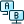</a> | **📂 檔名:** `ab-testing-monitors--Streamline-Ultimate.svg` ✨ **格式:** `Vector (SVG)` ⚖️ **大小:** `4.13KB` 📅 **更新:** `2026-03-03`  🚀 **jsDelivr Markdown:** `` 🔗 **直接連結 (Url):** <code>https://cdn.jsdelivr.net/gh/barry028/materials@main/images/iCons/Ui%20Ux%20Graphic%20Design/ab-testing-monitors--Streamline-Ultimate.svg</code> 📥 [檢視原始檔](ab-testing-monitors--Streamline-Ultimate.svg) |
| <a href="accounting-abacus--Streamline-Ultimate.svg">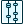</a> | **📂 檔名:** `accounting-abacus--Streamline-Ultimate.svg` ✨ **格式:** `Vector (SVG)` ⚖️ **大小:** `4.16KB` 📅 **更新:** `2026-03-03`  🚀 **jsDelivr Markdown:** `` 🔗 **直接連結 (Url):** <code>https://cdn.jsdelivr.net/gh/barry028/materials@main/images/iCons/Ui%20Ux%20Graphic%20Design/accounting-abacus--Streamline-Ultimate.svg</code> 📥 [檢視原始檔](accounting-abacus--Streamline-Ultimate.svg) |
|  | **📂 檔名:** `accounting-bill--Streamline-Ultimate.svg` ✨ **格式:** `Vector (SVG)` ⚖️ **大小:** `4.29KB` 📅 **更新:** `2026-03-03`  🚀 **jsDelivr Markdown:** `` 🔗 **直接連結 (Url):** <code>https://cdn.jsdelivr.net/gh/barry028/materials@main/images/iCons/Ui%20Ux%20Graphic%20Design/accounting-bill--Streamline-Ultimate.svg</code> 📥 [檢視原始檔](accounting-bill--Streamline-Ultimate.svg) |
|  | **📂 檔名:** `accounting-bill-stack--Streamline-Ultimate.svg` ✨ **格式:** `Vector (SVG)` ⚖️ **大小:** `2.66KB` 📅 **更新:** `2026-03-03`  🚀 **jsDelivr Markdown:** `` 🔗 **直接連結 (Url):** <code>https://cdn.jsdelivr.net/gh/barry028/materials@main/images/iCons/Ui%20Ux%20Graphic%20Design/accounting-bill-stack--Streamline-Ultimate.svg</code> 📥 [檢視原始檔](accounting-bill-stack--Streamline-Ultimate.svg) |
|  | **📂 檔名:** `accounting-bill-stack-1--Streamline-Ultimate.svg` ✨ **格式:** `Vector (SVG)` ⚖️ **大小:** `1.60KB` 📅 **更新:** `2026-03-03`  🚀 **jsDelivr Markdown:** `` 🔗 **直接連結 (Url):** <code>https://cdn.jsdelivr.net/gh/barry028/materials@main/images/iCons/Ui%20Ux%20Graphic%20Design/accounting-bill-stack-1--Streamline-Ultimate.svg</code> 📥 [檢視原始檔](accounting-bill-stack-1--Streamline-Ultimate.svg) |
|  | **📂 檔名:** `accounting-bills--Streamline-Ultimate.svg` ✨ **格式:** `Vector (SVG)` ⚖️ **大小:** `2.81KB` 📅 **更新:** `2026-03-03`  🚀 **jsDelivr Markdown:** `` 🔗 **直接連結 (Url):** <code>https://cdn.jsdelivr.net/gh/barry028/materials@main/images/iCons/Ui%20Ux%20Graphic%20Design/accounting-bills--Streamline-Ultimate.svg</code> 📥 [檢視原始檔](accounting-bills--Streamline-Ultimate.svg) |
|  | **📂 檔名:** `accounting-calculator--Streamline-Ultimate.svg` ✨ **格式:** `Vector (SVG)` ⚖️ **大小:** `5.30KB` 📅 **更新:** `2026-03-03`  🚀 **jsDelivr Markdown:** `` 🔗 **直接連結 (Url):** <code>https://cdn.jsdelivr.net/gh/barry028/materials@main/images/iCons/Ui%20Ux%20Graphic%20Design/accounting-calculator--Streamline-Ultimate.svg</code> 📥 [檢視原始檔](accounting-calculator--Streamline-Ultimate.svg) |
|  | **📂 檔名:** `accounting-calculator-1--Streamline-Ultimate.svg` ✨ **格式:** `Vector (SVG)` ⚖️ **大小:** `2.79KB` 📅 **更新:** `2026-03-03`  🚀 **jsDelivr Markdown:** `` 🔗 **直接連結 (Url):** <code>https://cdn.jsdelivr.net/gh/barry028/materials@main/images/iCons/Ui%20Ux%20Graphic%20Design/accounting-calculator-1--Streamline-Ultimate.svg</code> 📥 [檢視原始檔](accounting-calculator-1--Streamline-Ultimate.svg) |
|  | **📂 檔名:** `accounting-coins-stack--Streamline-Ultimate.svg` ✨ **格式:** `Vector (SVG)` ⚖️ **大小:** `4.69KB` 📅 **更新:** `2026-03-03`  🚀 **jsDelivr Markdown:** `` 🔗 **直接連結 (Url):** <code>https://cdn.jsdelivr.net/gh/barry028/materials@main/images/iCons/Ui%20Ux%20Graphic%20Design/accounting-coins-stack--Streamline-Ultimate.svg</code> 📥 [檢視原始檔](accounting-coins-stack--Streamline-Ultimate.svg) |
|  | **📂 檔名:** `accounting-document--Streamline-Ultimate.svg` ✨ **格式:** `Vector (SVG)` ⚖️ **大小:** `2.67KB` 📅 **更新:** `2026-03-03`  🚀 **jsDelivr Markdown:** `` 🔗 **直接連結 (Url):** <code>https://cdn.jsdelivr.net/gh/barry028/materials@main/images/iCons/Ui%20Ux%20Graphic%20Design/accounting-document--Streamline-Ultimate.svg</code> 📥 [檢視原始檔](accounting-document--Streamline-Ultimate.svg) |
|  | **📂 檔名:** `accounting-invoice-hand--Streamline-Ultimate.svg` ✨ **格式:** `Vector (SVG)` ⚖️ **大小:** `3.78KB` 📅 **更新:** `2026-03-03`  🚀 **jsDelivr Markdown:** `` 🔗 **直接連結 (Url):** <code>https://cdn.jsdelivr.net/gh/barry028/materials@main/images/iCons/Ui%20Ux%20Graphic%20Design/accounting-invoice-hand--Streamline-Ultimate.svg</code> 📥 [檢視原始檔](accounting-invoice-hand--Streamline-Ultimate.svg) |
|  | **📂 檔名:** `accounting-invoice-mail--Streamline-Ultimate.svg` ✨ **格式:** `Vector (SVG)` ⚖️ **大小:** `2.95KB` 📅 **更新:** `2026-03-03`  🚀 **jsDelivr Markdown:** `` 🔗 **直接連結 (Url):** <code>https://cdn.jsdelivr.net/gh/barry028/materials@main/images/iCons/Ui%20Ux%20Graphic%20Design/accounting-invoice-mail--Streamline-Ultimate.svg</code> 📥 [檢視原始檔](accounting-invoice-mail--Streamline-Ultimate.svg) |
|  | **📂 檔名:** `accounting-withdraw--Streamline-Ultimate.svg` ✨ **格式:** `Vector (SVG)` ⚖️ **大小:** `3.54KB` 📅 **更新:** `2026-03-03`  🚀 **jsDelivr Markdown:** `` 🔗 **直接連結 (Url):** <code>https://cdn.jsdelivr.net/gh/barry028/materials@main/images/iCons/Ui%20Ux%20Graphic%20Design/accounting-withdraw--Streamline-Ultimate.svg</code> 📥 [檢視原始檔](accounting-withdraw--Streamline-Ultimate.svg) |
|  | **📂 檔名:** `add-circle--Streamline-Ultimate.svg` ✨ **格式:** `Vector (SVG)` ⚖️ **大小:** `1.72KB` 📅 **更新:** `2026-03-03`  🚀 **jsDelivr Markdown:** `` 🔗 **直接連結 (Url):** <code>https://cdn.jsdelivr.net/gh/barry028/materials@main/images/iCons/Ui%20Ux%20Graphic%20Design/add-circle--Streamline-Ultimate.svg</code> 📥 [檢視原始檔](add-circle--Streamline-Ultimate.svg) |
|  | **📂 檔名:** `ads-window--Streamline-Ultimate.svg` ✨ **格式:** `Vector (SVG)` ⚖️ **大小:** `2.44KB` 📅 **更新:** `2026-03-03`  🚀 **jsDelivr Markdown:** `` 🔗 **直接連結 (Url):** <code>https://cdn.jsdelivr.net/gh/barry028/materials@main/images/iCons/Ui%20Ux%20Graphic%20Design/ads-window--Streamline-Ultimate.svg</code> 📥 [檢視原始檔](ads-window--Streamline-Ultimate.svg) |
|  | **📂 檔名:** `advertising-megaphone--Streamline-Ultimate.svg` ✨ **格式:** `Vector (SVG)` ⚖️ **大小:** `4.17KB` 📅 **更新:** `2026-03-03`  🚀 **jsDelivr Markdown:** `` 🔗 **直接連結 (Url):** <code>https://cdn.jsdelivr.net/gh/barry028/materials@main/images/iCons/Ui%20Ux%20Graphic%20Design/advertising-megaphone--Streamline-Ultimate.svg</code> 📥 [檢視原始檔](advertising-megaphone--Streamline-Ultimate.svg) |
|  | **📂 檔名:** `alarm-bell--Streamline-Ultimate.svg` ✨ **格式:** `Vector (SVG)` ⚖️ **大小:** `2.01KB` 📅 **更新:** `2026-03-03`  🚀 **jsDelivr Markdown:** `` 🔗 **直接連結 (Url):** <code>https://cdn.jsdelivr.net/gh/barry028/materials@main/images/iCons/Ui%20Ux%20Graphic%20Design/alarm-bell--Streamline-Ultimate.svg</code> 📥 [檢視原始檔](alarm-bell--Streamline-Ultimate.svg) |
|  | **📂 檔名:** `alarm-bell-sleep-1--Streamline-Ultimate.svg` ✨ **格式:** `Vector (SVG)` ⚖️ **大小:** `1.97KB` 📅 **更新:** `2026-03-03`  🚀 **jsDelivr Markdown:** `` 🔗 **直接連結 (Url):** <code>https://cdn.jsdelivr.net/gh/barry028/materials@main/images/iCons/Ui%20Ux%20Graphic%20Design/alarm-bell-sleep-1--Streamline-Ultimate.svg</code> 📥 [檢視原始檔](alarm-bell-sleep-1--Streamline-Ultimate.svg) |
|  | **📂 檔名:** `alarm-clock-1--Streamline-Ultimate.svg` ✨ **格式:** `Vector (SVG)` ⚖️ **大小:** `3.33KB` 📅 **更新:** `2026-03-03`  🚀 **jsDelivr Markdown:** `` 🔗 **直接連結 (Url):** <code>https://cdn.jsdelivr.net/gh/barry028/materials@main/images/iCons/Ui%20Ux%20Graphic%20Design/alarm-clock-1--Streamline-Ultimate.svg</code> 📥 [檢視原始檔](alarm-clock-1--Streamline-Ultimate.svg) |
|  | **📂 檔名:** `alert-diamond--Streamline-Ultimate.svg` ✨ **格式:** `Vector (SVG)` ⚖️ **大小:** `2.31KB` 📅 **更新:** `2026-03-03`  🚀 **jsDelivr Markdown:** `` 🔗 **直接連結 (Url):** <code>https://cdn.jsdelivr.net/gh/barry028/materials@main/images/iCons/Ui%20Ux%20Graphic%20Design/alert-diamond--Streamline-Ultimate.svg</code> 📥 [檢視原始檔](alert-diamond--Streamline-Ultimate.svg) |
|  | **📂 檔名:** `alert-user--Streamline-Ultimate.svg` ✨ **格式:** `Vector (SVG)` ⚖️ **大小:** `3.41KB` 📅 **更新:** `2026-03-03`  🚀 **jsDelivr Markdown:** `` 🔗 **直接連結 (Url):** <code>https://cdn.jsdelivr.net/gh/barry028/materials@main/images/iCons/Ui%20Ux%20Graphic%20Design/alert-user--Streamline-Ultimate.svg</code> 📥 [檢視原始檔](alert-user--Streamline-Ultimate.svg) |
|  | **📂 檔名:** `align-center--Streamline-Ultimate.svg` ✨ **格式:** `Vector (SVG)` ⚖️ **大小:** `1.78KB` 📅 **更新:** `2026-03-03`  🚀 **jsDelivr Markdown:** `` 🔗 **直接連結 (Url):** <code>https://cdn.jsdelivr.net/gh/barry028/materials@main/images/iCons/Ui%20Ux%20Graphic%20Design/align-center--Streamline-Ultimate.svg</code> 📥 [檢視原始檔](align-center--Streamline-Ultimate.svg) |
|  | **📂 檔名:** `allowances-no-bicycles--Streamline-Ultimate.svg` ✨ **格式:** `Vector (SVG)` ⚖️ **大小:** `3.04KB` 📅 **更新:** `2026-03-03`  🚀 **jsDelivr Markdown:** `` 🔗 **直接連結 (Url):** <code>https://cdn.jsdelivr.net/gh/barry028/materials@main/images/iCons/Ui%20Ux%20Graphic%20Design/allowances-no-bicycles--Streamline-Ultimate.svg</code> 📥 [檢視原始檔](allowances-no-bicycles--Streamline-Ultimate.svg) |
|  | **📂 檔名:** `allowances-no-food--Streamline-Ultimate.svg` ✨ **格式:** `Vector (SVG)` ⚖️ **大小:** `3.20KB` 📅 **更新:** `2026-03-03`  🚀 **jsDelivr Markdown:** `` 🔗 **直接連結 (Url):** <code>https://cdn.jsdelivr.net/gh/barry028/materials@main/images/iCons/Ui%20Ux%20Graphic%20Design/allowances-no-food--Streamline-Ultimate.svg</code> 📥 [檢視原始檔](allowances-no-food--Streamline-Ultimate.svg) |
|  | **📂 檔名:** `allowances-no-food-1--Streamline-Ultimate.svg` ✨ **格式:** `Vector (SVG)` ⚖️ **大小:** `2.49KB` 📅 **更新:** `2026-03-03`  🚀 **jsDelivr Markdown:** `` 🔗 **直接連結 (Url):** <code>https://cdn.jsdelivr.net/gh/barry028/materials@main/images/iCons/Ui%20Ux%20Graphic%20Design/allowances-no-food-1--Streamline-Ultimate.svg</code> 📥 [檢視原始檔](allowances-no-food-1--Streamline-Ultimate.svg) |
|  | **📂 檔名:** `allowances-no-photos--Streamline-Ultimate.svg` ✨ **格式:** `Vector (SVG)` ⚖️ **大小:** `2.78KB` 📅 **更新:** `2026-03-03`  🚀 **jsDelivr Markdown:** `` 🔗 **直接連結 (Url):** <code>https://cdn.jsdelivr.net/gh/barry028/materials@main/images/iCons/Ui%20Ux%20Graphic%20Design/allowances-no-photos--Streamline-Ultimate.svg</code> 📥 [檢視原始檔](allowances-no-photos--Streamline-Ultimate.svg) |
|  | **📂 檔名:** `allowances-no-sitting--Streamline-Ultimate.svg` ✨ **格式:** `Vector (SVG)` ⚖️ **大小:** `4.89KB` 📅 **更新:** `2026-03-03`  🚀 **jsDelivr Markdown:** `` 🔗 **直接連結 (Url):** <code>https://cdn.jsdelivr.net/gh/barry028/materials@main/images/iCons/Ui%20Ux%20Graphic%20Design/allowances-no-sitting--Streamline-Ultimate.svg</code> 📥 [檢視原始檔](allowances-no-sitting--Streamline-Ultimate.svg) |
|  | **📂 檔名:** `allowances-no-smoking--Streamline-Ultimate.svg` ✨ **格式:** `Vector (SVG)` ⚖️ **大小:** `2.19KB` 📅 **更新:** `2026-03-03`  🚀 **jsDelivr Markdown:** `` 🔗 **直接連結 (Url):** <code>https://cdn.jsdelivr.net/gh/barry028/materials@main/images/iCons/Ui%20Ux%20Graphic%20Design/allowances-no-smoking--Streamline-Ultimate.svg</code> 📥 [檢視原始檔](allowances-no-smoking--Streamline-Ultimate.svg) |
|  | **📂 檔名:** `allowances-silence--Streamline-Ultimate.svg` ✨ **格式:** `Vector (SVG)` ⚖️ **大小:** `4.23KB` 📅 **更新:** `2026-03-03`  🚀 **jsDelivr Markdown:** `` 🔗 **直接連結 (Url):** <code>https://cdn.jsdelivr.net/gh/barry028/materials@main/images/iCons/Ui%20Ux%20Graphic%20Design/allowances-silence--Streamline-Ultimate.svg</code> 📥 [檢視原始檔](allowances-silence--Streamline-Ultimate.svg) |
|  | **📂 檔名:** `allowances-smoking--Streamline-Ultimate.svg` ✨ **格式:** `Vector (SVG)` ⚖️ **大小:** `1.64KB` 📅 **更新:** `2026-03-03`  🚀 **jsDelivr Markdown:** `` 🔗 **直接連結 (Url):** <code>https://cdn.jsdelivr.net/gh/barry028/materials@main/images/iCons/Ui%20Ux%20Graphic%20Design/allowances-smoking--Streamline-Ultimate.svg</code> 📥 [檢視原始檔](allowances-smoking--Streamline-Ultimate.svg) |
|  | **📂 檔名:** `amusement-park-castle--Streamline-Ultimate.svg` ✨ **格式:** `Vector (SVG)` ⚖️ **大小:** `5.88KB` 📅 **更新:** `2026-03-03`  🚀 **jsDelivr Markdown:** `` 🔗 **直接連結 (Url):** <code>https://cdn.jsdelivr.net/gh/barry028/materials@main/images/iCons/Ui%20Ux%20Graphic%20Design/amusement-park-castle--Streamline-Ultimate.svg</code> 📥 [檢視原始檔](amusement-park-castle--Streamline-Ultimate.svg) |
|  | **📂 檔名:** `amusement-park-ferris-wheel--Streamline-Ultimate.svg` ✨ **格式:** `Vector (SVG)` ⚖️ **大小:** `5.77KB` 📅 **更新:** `2026-03-03`  🚀 **jsDelivr Markdown:** `` 🔗 **直接連結 (Url):** <code>https://cdn.jsdelivr.net/gh/barry028/materials@main/images/iCons/Ui%20Ux%20Graphic%20Design/amusement-park-ferris-wheel--Streamline-Ultimate.svg</code> 📥 [檢視原始檔](amusement-park-ferris-wheel--Streamline-Ultimate.svg) |
| <a href="amusement-park-strength-meter--Streamline-Ultimate.svg">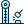</a> | **📂 檔名:** `amusement-park-strength-meter--Streamline-Ultimate.svg` ✨ **格式:** `Vector (SVG)` ⚖️ **大小:** `3.68KB` 📅 **更新:** `2026-03-03`  🚀 **jsDelivr Markdown:** `` 🔗 **直接連結 (Url):** <code>https://cdn.jsdelivr.net/gh/barry028/materials@main/images/iCons/Ui%20Ux%20Graphic%20Design/amusement-park-strength-meter--Streamline-Ultimate.svg</code> 📥 [檢視原始檔](amusement-park-strength-meter--Streamline-Ultimate.svg) |
|  | **📂 檔名:** `analytics-bars-3d--Streamline-Ultimate.svg` ✨ **格式:** `Vector (SVG)` ⚖️ **大小:** `3.04KB` 📅 **更新:** `2026-03-03`  🚀 **jsDelivr Markdown:** `` 🔗 **直接連結 (Url):** <code>https://cdn.jsdelivr.net/gh/barry028/materials@main/images/iCons/Ui%20Ux%20Graphic%20Design/analytics-bars-3d--Streamline-Ultimate.svg</code> 📥 [檢視原始檔](analytics-bars-3d--Streamline-Ultimate.svg) |
|  | **📂 檔名:** `analytics-bars-horizontal--Streamline-Ultimate.svg` ✨ **格式:** `Vector (SVG)` ⚖️ **大小:** `2.51KB` 📅 **更新:** `2026-03-03`  🚀 **jsDelivr Markdown:** `` 🔗 **直接連結 (Url):** <code>https://cdn.jsdelivr.net/gh/barry028/materials@main/images/iCons/Ui%20Ux%20Graphic%20Design/analytics-bars-horizontal--Streamline-Ultimate.svg</code> 📥 [檢視原始檔](analytics-bars-horizontal--Streamline-Ultimate.svg) |
|  | **📂 檔名:** `analytics-graph--Streamline-Ultimate.svg` ✨ **格式:** `Vector (SVG)` ⚖️ **大小:** `4.15KB` 📅 **更新:** `2026-03-03`  🚀 **jsDelivr Markdown:** `` 🔗 **直接連結 (Url):** <code>https://cdn.jsdelivr.net/gh/barry028/materials@main/images/iCons/Ui%20Ux%20Graphic%20Design/analytics-graph--Streamline-Ultimate.svg</code> 📥 [檢視原始檔](analytics-graph--Streamline-Ultimate.svg) |
|  | **📂 檔名:** `analytics-graph-bar--Streamline-Ultimate.svg` ✨ **格式:** `Vector (SVG)` ⚖️ **大小:** `9.37KB` 📅 **更新:** `2026-03-03`  🚀 **jsDelivr Markdown:** `` 🔗 **直接連結 (Url):** <code>https://cdn.jsdelivr.net/gh/barry028/materials@main/images/iCons/Ui%20Ux%20Graphic%20Design/analytics-graph-bar--Streamline-Ultimate.svg</code> 📥 [檢視原始檔](analytics-graph-bar--Streamline-Ultimate.svg) |
|  | **📂 檔名:** `analytics-graph-lines--Streamline-Ultimate.svg` ✨ **格式:** `Vector (SVG)` ⚖️ **大小:** `3.36KB` 📅 **更新:** `2026-03-03`  🚀 **jsDelivr Markdown:** `` 🔗 **直接連結 (Url):** <code>https://cdn.jsdelivr.net/gh/barry028/materials@main/images/iCons/Ui%20Ux%20Graphic%20Design/analytics-graph-lines--Streamline-Ultimate.svg</code> 📥 [檢視原始檔](analytics-graph-lines--Streamline-Ultimate.svg) |
|  | **📂 檔名:** `analytics-mountain--Streamline-Ultimate.svg` ✨ **格式:** `Vector (SVG)` ⚖️ **大小:** `2.03KB` 📅 **更新:** `2026-03-03`  🚀 **jsDelivr Markdown:** `` 🔗 **直接連結 (Url):** <code>https://cdn.jsdelivr.net/gh/barry028/materials@main/images/iCons/Ui%20Ux%20Graphic%20Design/analytics-mountain--Streamline-Ultimate.svg</code> 📥 [檢視原始檔](analytics-mountain--Streamline-Ultimate.svg) |
|  | **📂 檔名:** `analytics-net--Streamline-Ultimate.svg` ✨ **格式:** `Vector (SVG)` ⚖️ **大小:** `1.80KB` 📅 **更新:** `2026-03-03`  🚀 **jsDelivr Markdown:** `` 🔗 **直接連結 (Url):** <code>https://cdn.jsdelivr.net/gh/barry028/materials@main/images/iCons/Ui%20Ux%20Graphic%20Design/analytics-net--Streamline-Ultimate.svg</code> 📥 [檢視原始檔](analytics-net--Streamline-Ultimate.svg) |
|  | **📂 檔名:** `analytics-pie-2--Streamline-Ultimate.svg` ✨ **格式:** `Vector (SVG)` ⚖️ **大小:** `2.54KB` 📅 **更新:** `2026-03-03`  🚀 **jsDelivr Markdown:** `` 🔗 **直接連結 (Url):** <code>https://cdn.jsdelivr.net/gh/barry028/materials@main/images/iCons/Ui%20Ux%20Graphic%20Design/analytics-pie-2--Streamline-Ultimate.svg</code> 📥 [檢視原始檔](analytics-pie-2--Streamline-Ultimate.svg) |
|  | **📂 檔名:** `android-1--Streamline-Ultimate.svg` ✨ **格式:** `Vector (SVG)` ⚖️ **大小:** `4.05KB` 📅 **更新:** `2026-03-03`  🚀 **jsDelivr Markdown:** `` 🔗 **直接連結 (Url):** <code>https://cdn.jsdelivr.net/gh/barry028/materials@main/images/iCons/Ui%20Ux%20Graphic%20Design/android-1--Streamline-Ultimate.svg</code> 📥 [檢視原始檔](android-1--Streamline-Ultimate.svg) |
|  | **📂 檔名:** `android-settings--Streamline-Ultimate.svg` ✨ **格式:** `Vector (SVG)` ⚖️ **大小:** `10.75KB` 📅 **更新:** `2026-03-03`  🚀 **jsDelivr Markdown:** `` 🔗 **直接連結 (Url):** <code>https://cdn.jsdelivr.net/gh/barry028/materials@main/images/iCons/Ui%20Ux%20Graphic%20Design/android-settings--Streamline-Ultimate.svg</code> 📥 [檢視原始檔](android-settings--Streamline-Ultimate.svg) |
|  | **📂 檔名:** `answer-machine-paper--Streamline-Ultimate.svg` ✨ **格式:** `Vector (SVG)` ⚖️ **大小:** `8.44KB` 📅 **更新:** `2026-03-03`  🚀 **jsDelivr Markdown:** `` 🔗 **直接連結 (Url):** <code>https://cdn.jsdelivr.net/gh/barry028/materials@main/images/iCons/Ui%20Ux%20Graphic%20Design/answer-machine-paper--Streamline-Ultimate.svg</code> 📥 [檢視原始檔](answer-machine-paper--Streamline-Ultimate.svg) |
|  | **📂 檔名:** `app-window-download--Streamline-Ultimate.svg` ✨ **格式:** `Vector (SVG)` ⚖️ **大小:** `3.02KB` 📅 **更新:** `2026-03-03`  🚀 **jsDelivr Markdown:** `` 🔗 **直接連結 (Url):** <code>https://cdn.jsdelivr.net/gh/barry028/materials@main/images/iCons/Ui%20Ux%20Graphic%20Design/app-window-download--Streamline-Ultimate.svg</code> 📥 [檢視原始檔](app-window-download--Streamline-Ultimate.svg) |
|  | **📂 檔名:** `app-window-edit--Streamline-Ultimate.svg` ✨ **格式:** `Vector (SVG)` ⚖️ **大小:** `3.76KB` 📅 **更新:** `2026-03-03`  🚀 **jsDelivr Markdown:** `` 🔗 **直接連結 (Url):** <code>https://cdn.jsdelivr.net/gh/barry028/materials@main/images/iCons/Ui%20Ux%20Graphic%20Design/app-window-edit--Streamline-Ultimate.svg</code> 📥 [檢視原始檔](app-window-edit--Streamline-Ultimate.svg) |
|  | **📂 檔名:** `app-window-graph--Streamline-Ultimate.svg` ✨ **格式:** `Vector (SVG)` ⚖️ **大小:** `3.71KB` 📅 **更新:** `2026-03-03`  🚀 **jsDelivr Markdown:** `` 🔗 **直接連結 (Url):** <code>https://cdn.jsdelivr.net/gh/barry028/materials@main/images/iCons/Ui%20Ux%20Graphic%20Design/app-window-graph--Streamline-Ultimate.svg</code> 📥 [檢視原始檔](app-window-graph--Streamline-Ultimate.svg) |
|  | **📂 檔名:** `app-window-multiple--Streamline-Ultimate.svg` ✨ **格式:** `Vector (SVG)` ⚖️ **大小:** `3.47KB` 📅 **更新:** `2026-03-03`  🚀 **jsDelivr Markdown:** `` 🔗 **直接連結 (Url):** <code>https://cdn.jsdelivr.net/gh/barry028/materials@main/images/iCons/Ui%20Ux%20Graphic%20Design/app-window-multiple--Streamline-Ultimate.svg</code> 📥 [檢視原始檔](app-window-multiple--Streamline-Ultimate.svg) |
|  | **📂 檔名:** `app-window-pie-chart--Streamline-Ultimate.svg` ✨ **格式:** `Vector (SVG)` ⚖️ **大小:** `4.19KB` 📅 **更新:** `2026-03-03`  🚀 **jsDelivr Markdown:** `` 🔗 **直接連結 (Url):** <code>https://cdn.jsdelivr.net/gh/barry028/materials@main/images/iCons/Ui%20Ux%20Graphic%20Design/app-window-pie-chart--Streamline-Ultimate.svg</code> 📥 [檢視原始檔](app-window-pie-chart--Streamline-Ultimate.svg) |
|  | **📂 檔名:** `app-window-rss--Streamline-Ultimate.svg` ✨ **格式:** `Vector (SVG)` ⚖️ **大小:** `3.47KB` 📅 **更新:** `2026-03-03`  🚀 **jsDelivr Markdown:** `` 🔗 **直接連結 (Url):** <code>https://cdn.jsdelivr.net/gh/barry028/materials@main/images/iCons/Ui%20Ux%20Graphic%20Design/app-window-rss--Streamline-Ultimate.svg</code> 📥 [檢視原始檔](app-window-rss--Streamline-Ultimate.svg) |
|  | **📂 檔名:** `app-window-search--Streamline-Ultimate.svg` ✨ **格式:** `Vector (SVG)` ⚖️ **大小:** `3.67KB` 📅 **更新:** `2026-03-03`  🚀 **jsDelivr Markdown:** `` 🔗 **直接連結 (Url):** <code>https://cdn.jsdelivr.net/gh/barry028/materials@main/images/iCons/Ui%20Ux%20Graphic%20Design/app-window-search--Streamline-Ultimate.svg</code> 📥 [檢視原始檔](app-window-search--Streamline-Ultimate.svg) |
|  | **📂 檔名:** `app-window-star--Streamline-Ultimate.svg` ✨ **格式:** `Vector (SVG)` ⚖️ **大小:** `5.21KB` 📅 **更新:** `2026-03-03`  🚀 **jsDelivr Markdown:** `` 🔗 **直接連結 (Url):** <code>https://cdn.jsdelivr.net/gh/barry028/materials@main/images/iCons/Ui%20Ux%20Graphic%20Design/app-window-star--Streamline-Ultimate.svg</code> 📥 [檢視原始檔](app-window-star--Streamline-Ultimate.svg) |
|  | **📂 檔名:** `app-window-text--Streamline-Ultimate.svg` ✨ **格式:** `Vector (SVG)` ⚖️ **大小:** `3.11KB` 📅 **更新:** `2026-03-03`  🚀 **jsDelivr Markdown:** `` 🔗 **直接連結 (Url):** <code>https://cdn.jsdelivr.net/gh/barry028/materials@main/images/iCons/Ui%20Ux%20Graphic%20Design/app-window-text--Streamline-Ultimate.svg</code> 📥 [檢視原始檔](app-window-text--Streamline-Ultimate.svg) |
|  | **📂 檔名:** `app-window-upload--Streamline-Ultimate.svg` ✨ **格式:** `Vector (SVG)` ⚖️ **大小:** `3.02KB` 📅 **更新:** `2026-03-03`  🚀 **jsDelivr Markdown:** `` 🔗 **直接連結 (Url):** <code>https://cdn.jsdelivr.net/gh/barry028/materials@main/images/iCons/Ui%20Ux%20Graphic%20Design/app-window-upload--Streamline-Ultimate.svg</code> 📥 [檢視原始檔](app-window-upload--Streamline-Ultimate.svg) |
|  | **📂 檔名:** `app-window-warning--Streamline-Ultimate.svg` ✨ **格式:** `Vector (SVG)` ⚖️ **大小:** `5.10KB` 📅 **更新:** `2026-03-03`  🚀 **jsDelivr Markdown:** `` 🔗 **直接連結 (Url):** <code>https://cdn.jsdelivr.net/gh/barry028/materials@main/images/iCons/Ui%20Ux%20Graphic%20Design/app-window-warning--Streamline-Ultimate.svg</code> 📥 [檢視原始檔](app-window-warning--Streamline-Ultimate.svg) |
|  | **📂 檔名:** `archive--Streamline-Ultimate.svg` ✨ **格式:** `Vector (SVG)` ⚖️ **大小:** `2.09KB` 📅 **更新:** `2026-03-03`  🚀 **jsDelivr Markdown:** `` 🔗 **直接連結 (Url):** <code>https://cdn.jsdelivr.net/gh/barry028/materials@main/images/iCons/Ui%20Ux%20Graphic%20Design/archive--Streamline-Ultimate.svg</code> 📥 [檢視原始檔](archive--Streamline-Ultimate.svg) |
|  | **📂 檔名:** `arrange-letter--Streamline-Ultimate.svg` ✨ **格式:** `Vector (SVG)` ⚖️ **大小:** `1.44KB` 📅 **更新:** `2026-03-03`  🚀 **jsDelivr Markdown:** `` 🔗 **直接連結 (Url):** <code>https://cdn.jsdelivr.net/gh/barry028/materials@main/images/iCons/Ui%20Ux%20Graphic%20Design/arrange-letter--Streamline-Ultimate.svg</code> 📥 [檢視原始檔](arrange-letter--Streamline-Ultimate.svg) |
|  | **📂 檔名:** `artboard-image--Streamline-Ultimate.svg` ✨ **格式:** `Vector (SVG)` ⚖️ **大小:** `4.39KB` 📅 **更新:** `2026-03-03`  🚀 **jsDelivr Markdown:** `` 🔗 **直接連結 (Url):** <code>https://cdn.jsdelivr.net/gh/barry028/materials@main/images/iCons/Ui%20Ux%20Graphic%20Design/artboard-image--Streamline-Ultimate.svg</code> 📥 [檢視原始檔](artboard-image--Streamline-Ultimate.svg) |
|  | **📂 檔名:** `attachment--Streamline-Ultimate.svg` ✨ **格式:** `Vector (SVG)` ⚖️ **大小:** `1.67KB` 📅 **更新:** `2026-03-03`  🚀 **jsDelivr Markdown:** `` 🔗 **直接連結 (Url):** <code>https://cdn.jsdelivr.net/gh/barry028/materials@main/images/iCons/Ui%20Ux%20Graphic%20Design/attachment--Streamline-Ultimate.svg</code> 📥 [檢視原始檔](attachment--Streamline-Ultimate.svg) |
|  | **📂 檔名:** `barcode-search--Streamline-Ultimate.svg` ✨ **格式:** `Vector (SVG)` ⚖️ **大小:** `3.53KB` 📅 **更新:** `2026-03-03`  🚀 **jsDelivr Markdown:** `` 🔗 **直接連結 (Url):** <code>https://cdn.jsdelivr.net/gh/barry028/materials@main/images/iCons/Ui%20Ux%20Graphic%20Design/barcode-search--Streamline-Ultimate.svg</code> 📥 [檢視原始檔](barcode-search--Streamline-Ultimate.svg) |
|  | **📂 檔名:** `battery-charge--Streamline-Ultimate.svg` ✨ **格式:** `Vector (SVG)` ⚖️ **大小:** `1.79KB` 📅 **更新:** `2026-03-03`  🚀 **jsDelivr Markdown:** `` 🔗 **直接連結 (Url):** <code>https://cdn.jsdelivr.net/gh/barry028/materials@main/images/iCons/Ui%20Ux%20Graphic%20Design/battery-charge--Streamline-Ultimate.svg</code> 📥 [檢視原始檔](battery-charge--Streamline-Ultimate.svg) |
|  | **📂 檔名:** `bin--Streamline-Ultimate.svg` ✨ **格式:** `Vector (SVG)` ⚖️ **大小:** `1.38KB` 📅 **更新:** `2026-03-03`  🚀 **jsDelivr Markdown:** `` 🔗 **直接連結 (Url):** <code>https://cdn.jsdelivr.net/gh/barry028/materials@main/images/iCons/Ui%20Ux%20Graphic%20Design/bin--Streamline-Ultimate.svg</code> 📥 [檢視原始檔](bin--Streamline-Ultimate.svg) |
|  | **📂 檔名:** `bin-paper-2--Streamline-Ultimate.svg` ✨ **格式:** `Vector (SVG)` ⚖️ **大小:** `2.60KB` 📅 **更新:** `2026-03-03`  🚀 **jsDelivr Markdown:** `` 🔗 **直接連結 (Url):** <code>https://cdn.jsdelivr.net/gh/barry028/materials@main/images/iCons/Ui%20Ux%20Graphic%20Design/bin-paper-2--Streamline-Ultimate.svg</code> 📥 [檢視原始檔](bin-paper-2--Streamline-Ultimate.svg) |
|  | **📂 檔名:** `binocular--Streamline-Ultimate.svg` ✨ **格式:** `Vector (SVG)` ⚖️ **大小:** `3.70KB` 📅 **更新:** `2026-03-03`  🚀 **jsDelivr Markdown:** `` 🔗 **直接連結 (Url):** <code>https://cdn.jsdelivr.net/gh/barry028/materials@main/images/iCons/Ui%20Ux%20Graphic%20Design/binocular--Streamline-Ultimate.svg</code> 📥 [檢視原始檔](binocular--Streamline-Ultimate.svg) |
|  | **📂 檔名:** `bluetooth--Streamline-Ultimate.svg` ✨ **格式:** `Vector (SVG)` ⚖️ **大小:** `1.39KB` 📅 **更新:** `2026-03-03`  🚀 **jsDelivr Markdown:** `` 🔗 **直接連結 (Url):** <code>https://cdn.jsdelivr.net/gh/barry028/materials@main/images/iCons/Ui%20Ux%20Graphic%20Design/bluetooth--Streamline-Ultimate.svg</code> 📥 [檢視原始檔](bluetooth--Streamline-Ultimate.svg) |
|  | **📂 檔名:** `bluetooth-on--Streamline-Ultimate.svg` ✨ **格式:** `Vector (SVG)` ⚖️ **大小:** `2.67KB` 📅 **更新:** `2026-03-03`  🚀 **jsDelivr Markdown:** `` 🔗 **直接連結 (Url):** <code>https://cdn.jsdelivr.net/gh/barry028/materials@main/images/iCons/Ui%20Ux%20Graphic%20Design/bluetooth-on--Streamline-Ultimate.svg</code> 📥 [檢視原始檔](bluetooth-on--Streamline-Ultimate.svg) |
|  | **📂 檔名:** `bluetooth-transfer-1--Streamline-Ultimate.svg` ✨ **格式:** `Vector (SVG)` ⚖️ **大小:** `2.34KB` 📅 **更新:** `2026-03-03`  🚀 **jsDelivr Markdown:** `` 🔗 **直接連結 (Url):** <code>https://cdn.jsdelivr.net/gh/barry028/materials@main/images/iCons/Ui%20Ux%20Graphic%20Design/bluetooth-transfer-1--Streamline-Ultimate.svg</code> 📥 [檢視原始檔](bluetooth-transfer-1--Streamline-Ultimate.svg) |
|  | **📂 檔名:** `board-game-deuce--Streamline-Ultimate.svg` ✨ **格式:** `Vector (SVG)` ⚖️ **大小:** `6.38KB` 📅 **更新:** `2026-03-03`  🚀 **jsDelivr Markdown:** `` 🔗 **直接連結 (Url):** <code>https://cdn.jsdelivr.net/gh/barry028/materials@main/images/iCons/Ui%20Ux%20Graphic%20Design/board-game-deuce--Streamline-Ultimate.svg</code> 📥 [檢視原始檔](board-game-deuce--Streamline-Ultimate.svg) |
|  | **📂 檔名:** `board-game-dice-2--Streamline-Ultimate.svg` ✨ **格式:** `Vector (SVG)` ⚖️ **大小:** `7.63KB` 📅 **更新:** `2026-03-03`  🚀 **jsDelivr Markdown:** `` 🔗 **直接連結 (Url):** <code>https://cdn.jsdelivr.net/gh/barry028/materials@main/images/iCons/Ui%20Ux%20Graphic%20Design/board-game-dice-2--Streamline-Ultimate.svg</code> 📥 [檢視原始檔](board-game-dice-2--Streamline-Ultimate.svg) |
|  | **📂 檔名:** `board-game-geometry--Streamline-Ultimate.svg` ✨ **格式:** `Vector (SVG)` ⚖️ **大小:** `1.62KB` 📅 **更新:** `2026-03-03`  🚀 **jsDelivr Markdown:** `` 🔗 **直接連結 (Url):** <code>https://cdn.jsdelivr.net/gh/barry028/materials@main/images/iCons/Ui%20Ux%20Graphic%20Design/board-game-geometry--Streamline-Ultimate.svg</code> 📥 [檢視原始檔](board-game-geometry--Streamline-Ultimate.svg) |
|  | **📂 檔名:** `board-game-ludo--Streamline-Ultimate.svg` ✨ **格式:** `Vector (SVG)` ⚖️ **大小:** `5.99KB` 📅 **更新:** `2026-03-03`  🚀 **jsDelivr Markdown:** `` 🔗 **直接連結 (Url):** <code>https://cdn.jsdelivr.net/gh/barry028/materials@main/images/iCons/Ui%20Ux%20Graphic%20Design/board-game-ludo--Streamline-Ultimate.svg</code> 📥 [檢視原始檔](board-game-ludo--Streamline-Ultimate.svg) |
|  | **📂 檔名:** `book-address-1--Streamline-Ultimate.svg` ✨ **格式:** `Vector (SVG)` ⚖️ **大小:** `3.28KB` 📅 **更新:** `2026-03-03`  🚀 **jsDelivr Markdown:** `` 🔗 **直接連結 (Url):** <code>https://cdn.jsdelivr.net/gh/barry028/materials@main/images/iCons/Ui%20Ux%20Graphic%20Design/book-address-1--Streamline-Ultimate.svg</code> 📥 [檢視原始檔](book-address-1--Streamline-Ultimate.svg) |
|  | **📂 檔名:** `book-close--Streamline-Ultimate.svg` ✨ **格式:** `Vector (SVG)` ⚖️ **大小:** `1.11KB` 📅 **更新:** `2026-03-03`  🚀 **jsDelivr Markdown:** `` 🔗 **直接連結 (Url):** <code>https://cdn.jsdelivr.net/gh/barry028/materials@main/images/iCons/Ui%20Ux%20Graphic%20Design/book-close--Streamline-Ultimate.svg</code> 📥 [檢視原始檔](book-close--Streamline-Ultimate.svg) |
|  | **📂 檔名:** `book-close-bookmark-1--Streamline-Ultimate.svg` ✨ **格式:** `Vector (SVG)` ⚖️ **大小:** `2.79KB` 📅 **更新:** `2026-03-03`  🚀 **jsDelivr Markdown:** `` 🔗 **直接連結 (Url):** <code>https://cdn.jsdelivr.net/gh/barry028/materials@main/images/iCons/Ui%20Ux%20Graphic%20Design/book-close-bookmark-1--Streamline-Ultimate.svg</code> 📥 [檢視原始檔](book-close-bookmark-1--Streamline-Ultimate.svg) |
| <a href="book-library-shelf-1--Streamline-Ultimate.svg">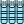</a> | **📂 檔名:** `book-library-shelf-1--Streamline-Ultimate.svg` ✨ **格式:** `Vector (SVG)` ⚖️ **大小:** `6.25KB` 📅 **更新:** `2026-03-03`  🚀 **jsDelivr Markdown:** `` 🔗 **直接連結 (Url):** <code>https://cdn.jsdelivr.net/gh/barry028/materials@main/images/iCons/Ui%20Ux%20Graphic%20Design/book-library-shelf-1--Streamline-Ultimate.svg</code> 📥 [檢視原始檔](book-library-shelf-1--Streamline-Ultimate.svg) |
|  | **📂 檔名:** `book-open-1--Streamline-Ultimate.svg` ✨ **格式:** `Vector (SVG)` ⚖️ **大小:** `3.05KB` 📅 **更新:** `2026-03-03`  🚀 **jsDelivr Markdown:** `` 🔗 **直接連結 (Url):** <code>https://cdn.jsdelivr.net/gh/barry028/materials@main/images/iCons/Ui%20Ux%20Graphic%20Design/book-open-1--Streamline-Ultimate.svg</code> 📥 [檢視原始檔](book-open-1--Streamline-Ultimate.svg) |
|  | **📂 檔名:** `book-open-bookmark--Streamline-Ultimate.svg` ✨ **格式:** `Vector (SVG)` ⚖️ **大小:** `4.01KB` 📅 **更新:** `2026-03-03`  🚀 **jsDelivr Markdown:** `` 🔗 **直接連結 (Url):** <code>https://cdn.jsdelivr.net/gh/barry028/materials@main/images/iCons/Ui%20Ux%20Graphic%20Design/book-open-bookmark--Streamline-Ultimate.svg</code> 📥 [檢視原始檔](book-open-bookmark--Streamline-Ultimate.svg) |
|  | **📂 檔名:** `book-star-1--Streamline-Ultimate.svg` ✨ **格式:** `Vector (SVG)` ⚖️ **大小:** `4.34KB` 📅 **更新:** `2026-03-03`  🚀 **jsDelivr Markdown:** `` 🔗 **直接連結 (Url):** <code>https://cdn.jsdelivr.net/gh/barry028/materials@main/images/iCons/Ui%20Ux%20Graphic%20Design/book-star-1--Streamline-Ultimate.svg</code> 📥 [檢視原始檔](book-star-1--Streamline-Ultimate.svg) |
|  | **📂 檔名:** `bookmarks--Streamline-Ultimate.svg` ✨ **格式:** `Vector (SVG)` ⚖️ **大小:** `1.58KB` 📅 **更新:** `2026-03-03`  🚀 **jsDelivr Markdown:** `` 🔗 **直接連結 (Url):** <code>https://cdn.jsdelivr.net/gh/barry028/materials@main/images/iCons/Ui%20Ux%20Graphic%20Design/bookmarks--Streamline-Ultimate.svg</code> 📥 [檢視原始檔](bookmarks--Streamline-Ultimate.svg) |
|  | **📂 檔名:** `bookmarks-2--Streamline-Ultimate.svg` ✨ **格式:** `Vector (SVG)` ⚖️ **大小:** `1.38KB` 📅 **更新:** `2026-03-03`  🚀 **jsDelivr Markdown:** `` 🔗 **直接連結 (Url):** <code>https://cdn.jsdelivr.net/gh/barry028/materials@main/images/iCons/Ui%20Ux%20Graphic%20Design/bookmarks-2--Streamline-Ultimate.svg</code> 📥 [檢視原始檔](bookmarks-2--Streamline-Ultimate.svg) |
|  | **📂 檔名:** `briefcase--Streamline-Ultimate.svg` ✨ **格式:** `Vector (SVG)` ⚖️ **大小:** `1.75KB` 📅 **更新:** `2026-03-03`  🚀 **jsDelivr Markdown:** `` 🔗 **直接連結 (Url):** <code>https://cdn.jsdelivr.net/gh/barry028/materials@main/images/iCons/Ui%20Ux%20Graphic%20Design/briefcase--Streamline-Ultimate.svg</code> 📥 [檢視原始檔](briefcase--Streamline-Ultimate.svg) |
|  | **📂 檔名:** `browser-com--Streamline-Ultimate.svg` ✨ **格式:** `Vector (SVG)` ⚖️ **大小:** `3.70KB` 📅 **更新:** `2026-03-03`  🚀 **jsDelivr Markdown:** `` 🔗 **直接連結 (Url):** <code>https://cdn.jsdelivr.net/gh/barry028/materials@main/images/iCons/Ui%20Ux%20Graphic%20Design/browser-com--Streamline-Ultimate.svg</code> 📥 [檢視原始檔](browser-com--Streamline-Ultimate.svg) |
|  | **📂 檔名:** `browser-page-account--Streamline-Ultimate.svg` ✨ **格式:** `Vector (SVG)` ⚖️ **大小:** `4.88KB` 📅 **更新:** `2026-03-03`  🚀 **jsDelivr Markdown:** `` 🔗 **直接連結 (Url):** <code>https://cdn.jsdelivr.net/gh/barry028/materials@main/images/iCons/Ui%20Ux%20Graphic%20Design/browser-page-account--Streamline-Ultimate.svg</code> 📥 [檢視原始檔](browser-page-account--Streamline-Ultimate.svg) |
|  | **📂 檔名:** `browser-page-mail--Streamline-Ultimate.svg` ✨ **格式:** `Vector (SVG)` ⚖️ **大小:** `3.17KB` 📅 **更新:** `2026-03-03`  🚀 **jsDelivr Markdown:** `` 🔗 **直接連結 (Url):** <code>https://cdn.jsdelivr.net/gh/barry028/materials@main/images/iCons/Ui%20Ux%20Graphic%20Design/browser-page-mail--Streamline-Ultimate.svg</code> 📥 [檢視原始檔](browser-page-mail--Streamline-Ultimate.svg) |
|  | **📂 檔名:** `browser-page-media--Streamline-Ultimate.svg` ✨ **格式:** `Vector (SVG)` ⚖️ **大小:** `4.20KB` 📅 **更新:** `2026-03-03`  🚀 **jsDelivr Markdown:** `` 🔗 **直接連結 (Url):** <code>https://cdn.jsdelivr.net/gh/barry028/materials@main/images/iCons/Ui%20Ux%20Graphic%20Design/browser-page-media--Streamline-Ultimate.svg</code> 📥 [檢視原始檔](browser-page-media--Streamline-Ultimate.svg) |
|  | **📂 檔名:** `browser-page-text-2--Streamline-Ultimate.svg` ✨ **格式:** `Vector (SVG)` ⚖️ **大小:** `3.94KB` 📅 **更新:** `2026-03-03`  🚀 **jsDelivr Markdown:** `` 🔗 **直接連結 (Url):** <code>https://cdn.jsdelivr.net/gh/barry028/materials@main/images/iCons/Ui%20Ux%20Graphic%20Design/browser-page-text-2--Streamline-Ultimate.svg</code> 📥 [檢視原始檔](browser-page-text-2--Streamline-Ultimate.svg) |
|  | **📂 檔名:** `building-2--Streamline-Ultimate.svg` ✨ **格式:** `Vector (SVG)` ⚖️ **大小:** `1.89KB` 📅 **更新:** `2026-03-03`  🚀 **jsDelivr Markdown:** `` 🔗 **直接連結 (Url):** <code>https://cdn.jsdelivr.net/gh/barry028/materials@main/images/iCons/Ui%20Ux%20Graphic%20Design/building-2--Streamline-Ultimate.svg</code> 📥 [檢視原始檔](building-2--Streamline-Ultimate.svg) |
|  | **📂 檔名:** `building-modern--Streamline-Ultimate.svg` ✨ **格式:** `Vector (SVG)` ⚖️ **大小:** `2.61KB` 📅 **更新:** `2026-03-03`  🚀 **jsDelivr Markdown:** `` 🔗 **直接連結 (Url):** <code>https://cdn.jsdelivr.net/gh/barry028/materials@main/images/iCons/Ui%20Ux%20Graphic%20Design/building-modern--Streamline-Ultimate.svg</code> 📥 [檢視原始檔](building-modern--Streamline-Ultimate.svg) |
|  | **📂 檔名:** `bulb-1--Streamline-Ultimate.svg` ✨ **格式:** `Vector (SVG)` ⚖️ **大小:** `3.29KB` 📅 **更新:** `2026-03-03`  🚀 **jsDelivr Markdown:** `` 🔗 **直接連結 (Url):** <code>https://cdn.jsdelivr.net/gh/barry028/materials@main/images/iCons/Ui%20Ux%20Graphic%20Design/bulb-1--Streamline-Ultimate.svg</code> 📥 [檢視原始檔](bulb-1--Streamline-Ultimate.svg) |
|  | **📂 檔名:** `business-climb-top--Streamline-Ultimate.svg` ✨ **格式:** `Vector (SVG)` ⚖️ **大小:** `4.04KB` 📅 **更新:** `2026-03-03`  🚀 **jsDelivr Markdown:** `` 🔗 **直接連結 (Url):** <code>https://cdn.jsdelivr.net/gh/barry028/materials@main/images/iCons/Ui%20Ux%20Graphic%20Design/business-climb-top--Streamline-Ultimate.svg</code> 📥 [檢視原始檔](business-climb-top--Streamline-Ultimate.svg) |
|  | **📂 檔名:** `business-contract-approve--Streamline-Ultimate.svg` ✨ **格式:** `Vector (SVG)` ⚖️ **大小:** `4.29KB` 📅 **更新:** `2026-03-03`  🚀 **jsDelivr Markdown:** `` 🔗 **直接連結 (Url):** <code>https://cdn.jsdelivr.net/gh/barry028/materials@main/images/iCons/Ui%20Ux%20Graphic%20Design/business-contract-approve--Streamline-Ultimate.svg</code> 📥 [檢視原始檔](business-contract-approve--Streamline-Ultimate.svg) |
|  | **📂 檔名:** `business-contract-handshake-sign--Streamline-Ultimate.svg` ✨ **格式:** `Vector (SVG)` ⚖️ **大小:** `3.47KB` 📅 **更新:** `2026-03-03`  🚀 **jsDelivr Markdown:** `` 🔗 **直接連結 (Url):** <code>https://cdn.jsdelivr.net/gh/barry028/materials@main/images/iCons/Ui%20Ux%20Graphic%20Design/business-contract-handshake-sign--Streamline-Ultimate.svg</code> 📥 [檢視原始檔](business-contract-handshake-sign--Streamline-Ultimate.svg) |
|  | **📂 檔名:** `business-crossroad--Streamline-Ultimate.svg` ✨ **格式:** `Vector (SVG)` ⚖️ **大小:** `3.17KB` 📅 **更新:** `2026-03-03`  🚀 **jsDelivr Markdown:** `` 🔗 **直接連結 (Url):** <code>https://cdn.jsdelivr.net/gh/barry028/materials@main/images/iCons/Ui%20Ux%20Graphic%20Design/business-crossroad--Streamline-Ultimate.svg</code> 📥 [檢視原始檔](business-crossroad--Streamline-Ultimate.svg) |
|  | **📂 檔名:** `business-deal-cash-2--Streamline-Ultimate.svg` ✨ **格式:** `Vector (SVG)` ⚖️ **大小:** `2.72KB` 📅 **更新:** `2026-03-03`  🚀 **jsDelivr Markdown:** `` 🔗 **直接連結 (Url):** <code>https://cdn.jsdelivr.net/gh/barry028/materials@main/images/iCons/Ui%20Ux%20Graphic%20Design/business-deal-cash-2--Streamline-Ultimate.svg</code> 📥 [檢視原始檔](business-deal-cash-2--Streamline-Ultimate.svg) |
|  | **📂 檔名:** `business-deal-handshake-circle--Streamline-Ultimate.svg` ✨ **格式:** `Vector (SVG)` ⚖️ **大小:** `4.85KB` 📅 **更新:** `2026-03-03`  🚀 **jsDelivr Markdown:** `` 🔗 **直接連結 (Url):** <code>https://cdn.jsdelivr.net/gh/barry028/materials@main/images/iCons/Ui%20Ux%20Graphic%20Design/business-deal-handshake-circle--Streamline-Ultimate.svg</code> 📥 [檢視原始檔](business-deal-handshake-circle--Streamline-Ultimate.svg) |
|  | **📂 檔名:** `business-lucky-cat--Streamline-Ultimate.svg` ✨ **格式:** `Vector (SVG)` ⚖️ **大小:** `6.59KB` 📅 **更新:** `2026-03-03`  🚀 **jsDelivr Markdown:** `` 🔗 **直接連結 (Url):** <code>https://cdn.jsdelivr.net/gh/barry028/materials@main/images/iCons/Ui%20Ux%20Graphic%20Design/business-lucky-cat--Streamline-Ultimate.svg</code> 📥 [檢視原始檔](business-lucky-cat--Streamline-Ultimate.svg) |
|  | **📂 檔名:** `business-message-bottle--Streamline-Ultimate.svg` ✨ **格式:** `Vector (SVG)` ⚖️ **大小:** `5.07KB` 📅 **更新:** `2026-03-03`  🚀 **jsDelivr Markdown:** `` 🔗 **直接連結 (Url):** <code>https://cdn.jsdelivr.net/gh/barry028/materials@main/images/iCons/Ui%20Ux%20Graphic%20Design/business-message-bottle--Streamline-Ultimate.svg</code> 📥 [檢視原始檔](business-message-bottle--Streamline-Ultimate.svg) |
|  | **📂 檔名:** `business-paper-boat--Streamline-Ultimate.svg` ✨ **格式:** `Vector (SVG)` ⚖️ **大小:** `1.26KB` 📅 **更新:** `2026-03-03`  🚀 **jsDelivr Markdown:** `` 🔗 **直接連結 (Url):** <code>https://cdn.jsdelivr.net/gh/barry028/materials@main/images/iCons/Ui%20Ux%20Graphic%20Design/business-paper-boat--Streamline-Ultimate.svg</code> 📥 [檢視原始檔](business-paper-boat--Streamline-Ultimate.svg) |
|  | **📂 檔名:** `business-shark--Streamline-Ultimate.svg` ✨ **格式:** `Vector (SVG)` ⚖️ **大小:** `2.43KB` 📅 **更新:** `2026-03-03`  🚀 **jsDelivr Markdown:** `` 🔗 **直接連結 (Url):** <code>https://cdn.jsdelivr.net/gh/barry028/materials@main/images/iCons/Ui%20Ux%20Graphic%20Design/business-shark--Streamline-Ultimate.svg</code> 📥 [檢視原始檔](business-shark--Streamline-Ultimate.svg) |
|  | **📂 檔名:** `business-team-goal--Streamline-Ultimate.svg` ✨ **格式:** `Vector (SVG)` ⚖️ **大小:** `4.14KB` 📅 **更新:** `2026-03-03`  🚀 **jsDelivr Markdown:** `` 🔗 **直接連結 (Url):** <code>https://cdn.jsdelivr.net/gh/barry028/materials@main/images/iCons/Ui%20Ux%20Graphic%20Design/business-team-goal--Streamline-Ultimate.svg</code> 📥 [檢視原始檔](business-team-goal--Streamline-Ultimate.svg) |
|  | **📂 檔名:** `business-trip-plane--Streamline-Ultimate.svg` ✨ **格式:** `Vector (SVG)` ⚖️ **大小:** `3.99KB` 📅 **更新:** `2026-03-03`  🚀 **jsDelivr Markdown:** `` 🔗 **直接連結 (Url):** <code>https://cdn.jsdelivr.net/gh/barry028/materials@main/images/iCons/Ui%20Ux%20Graphic%20Design/business-trip-plane--Streamline-Ultimate.svg</code> 📥 [檢視原始檔](business-trip-plane--Streamline-Ultimate.svg) |
|  | **📂 檔名:** `button-loop-arrow--Streamline-Ultimate.svg` ✨ **格式:** `Vector (SVG)` ⚖️ **大小:** `1.35KB` 📅 **更新:** `2026-03-03`  🚀 **jsDelivr Markdown:** `` 🔗 **直接連結 (Url):** <code>https://cdn.jsdelivr.net/gh/barry028/materials@main/images/iCons/Ui%20Ux%20Graphic%20Design/button-loop-arrow--Streamline-Ultimate.svg</code> 📥 [檢視原始檔](button-loop-arrow--Streamline-Ultimate.svg) |
|  | **📂 檔名:** `button-shuffle--Streamline-Ultimate.svg` ✨ **格式:** `Vector (SVG)` ⚖️ **大小:** `998.00B` 📅 **更新:** `2026-03-03`  🚀 **jsDelivr Markdown:** `` 🔗 **直接連結 (Url):** <code>https://cdn.jsdelivr.net/gh/barry028/materials@main/images/iCons/Ui%20Ux%20Graphic%20Design/button-shuffle--Streamline-Ultimate.svg</code> 📥 [檢視原始檔](button-shuffle--Streamline-Ultimate.svg) |
|  | **📂 檔名:** `calculator-app--Streamline-Ultimate.svg` ✨ **格式:** `Vector (SVG)` ⚖️ **大小:** `2.44KB` 📅 **更新:** `2026-03-03`  🚀 **jsDelivr Markdown:** `` 🔗 **直接連結 (Url):** <code>https://cdn.jsdelivr.net/gh/barry028/materials@main/images/iCons/Ui%20Ux%20Graphic%20Design/calculator-app--Streamline-Ultimate.svg</code> 📥 [檢視原始檔](calculator-app--Streamline-Ultimate.svg) |
|  | **📂 檔名:** `calendar-1--Streamline-Ultimate.svg` ✨ **格式:** `Vector (SVG)` ⚖️ **大小:** `2.86KB` 📅 **更新:** `2026-03-03`  🚀 **jsDelivr Markdown:** `` 🔗 **直接連結 (Url):** <code>https://cdn.jsdelivr.net/gh/barry028/materials@main/images/iCons/Ui%20Ux%20Graphic%20Design/calendar-1--Streamline-Ultimate.svg</code> 📥 [檢視原始檔](calendar-1--Streamline-Ultimate.svg) |
|  | **📂 檔名:** `calendar-date--Streamline-Ultimate.svg` ✨ **格式:** `Vector (SVG)` ⚖️ **大小:** `2.15KB` 📅 **更新:** `2026-03-03`  🚀 **jsDelivr Markdown:** `` 🔗 **直接連結 (Url):** <code>https://cdn.jsdelivr.net/gh/barry028/materials@main/images/iCons/Ui%20Ux%20Graphic%20Design/calendar-date--Streamline-Ultimate.svg</code> 📥 [檢視原始檔](calendar-date--Streamline-Ultimate.svg) |
|  | **📂 檔名:** `calendar-favorite-1--Streamline-Ultimate.svg` ✨ **格式:** `Vector (SVG)` ⚖️ **大小:** `4.30KB` 📅 **更新:** `2026-03-03`  🚀 **jsDelivr Markdown:** `` 🔗 **直接連結 (Url):** <code>https://cdn.jsdelivr.net/gh/barry028/materials@main/images/iCons/Ui%20Ux%20Graphic%20Design/calendar-favorite-1--Streamline-Ultimate.svg</code> 📥 [檢視原始檔](calendar-favorite-1--Streamline-Ultimate.svg) |
|  | **📂 檔名:** `camera-1--Streamline-Ultimate.svg` ✨ **格式:** `Vector (SVG)` ⚖️ **大小:** `4.34KB` 📅 **更新:** `2026-03-03`  🚀 **jsDelivr Markdown:** `` 🔗 **直接連結 (Url):** <code>https://cdn.jsdelivr.net/gh/barry028/materials@main/images/iCons/Ui%20Ux%20Graphic%20Design/camera-1--Streamline-Ultimate.svg</code> 📥 [檢視原始檔](camera-1--Streamline-Ultimate.svg) |
|  | **📂 檔名:** `camera-double--Streamline-Ultimate.svg` ✨ **格式:** `Vector (SVG)` ⚖️ **大小:** `5.57KB` 📅 **更新:** `2026-03-03`  🚀 **jsDelivr Markdown:** `` 🔗 **直接連結 (Url):** <code>https://cdn.jsdelivr.net/gh/barry028/materials@main/images/iCons/Ui%20Ux%20Graphic%20Design/camera-double--Streamline-Ultimate.svg</code> 📥 [檢視原始檔](camera-double--Streamline-Ultimate.svg) |
|  | **📂 檔名:** `camera-retro--Streamline-Ultimate.svg` ✨ **格式:** `Vector (SVG)` ⚖️ **大小:** `3.82KB` 📅 **更新:** `2026-03-03`  🚀 **jsDelivr Markdown:** `` 🔗 **直接連結 (Url):** <code>https://cdn.jsdelivr.net/gh/barry028/materials@main/images/iCons/Ui%20Ux%20Graphic%20Design/camera-retro--Streamline-Ultimate.svg</code> 📥 [檢視原始檔](camera-retro--Streamline-Ultimate.svg) |
|  | **📂 檔名:** `camera-settings-flip-1--Streamline-Ultimate.svg` ✨ **格式:** `Vector (SVG)` ⚖️ **大小:** `3.96KB` 📅 **更新:** `2026-03-03`  🚀 **jsDelivr Markdown:** `` 🔗 **直接連結 (Url):** <code>https://cdn.jsdelivr.net/gh/barry028/materials@main/images/iCons/Ui%20Ux%20Graphic%20Design/camera-settings-flip-1--Streamline-Ultimate.svg</code> 📥 [檢視原始檔](camera-settings-flip-1--Streamline-Ultimate.svg) |
|  | **📂 檔名:** `camera-settings-frame--Streamline-Ultimate.svg` ✨ **格式:** `Vector (SVG)` ⚖️ **大小:** `5.94KB` 📅 **更新:** `2026-03-03`  🚀 **jsDelivr Markdown:** `` 🔗 **直接連結 (Url):** <code>https://cdn.jsdelivr.net/gh/barry028/materials@main/images/iCons/Ui%20Ux%20Graphic%20Design/camera-settings-frame--Streamline-Ultimate.svg</code> 📥 [檢視原始檔](camera-settings-frame--Streamline-Ultimate.svg) |
|  | **📂 檔名:** `camera-tripod--Streamline-Ultimate.svg` ✨ **格式:** `Vector (SVG)` ⚖️ **大小:** `3.14KB` 📅 **更新:** `2026-03-03`  🚀 **jsDelivr Markdown:** `` 🔗 **直接連結 (Url):** <code>https://cdn.jsdelivr.net/gh/barry028/materials@main/images/iCons/Ui%20Ux%20Graphic%20Design/camera-tripod--Streamline-Ultimate.svg</code> 📥 [檢視原始檔](camera-tripod--Streamline-Ultimate.svg) |
|  | **📂 檔名:** `card-game-card-spade--Streamline-Ultimate.svg` ✨ **格式:** `Vector (SVG)` ⚖️ **大小:** `1.55KB` 📅 **更新:** `2026-03-03`  🚀 **jsDelivr Markdown:** `` 🔗 **直接連結 (Url):** <code>https://cdn.jsdelivr.net/gh/barry028/materials@main/images/iCons/Ui%20Ux%20Graphic%20Design/card-game-card-spade--Streamline-Ultimate.svg</code> 📥 [檢視原始檔](card-game-card-spade--Streamline-Ultimate.svg) |
|  | **📂 檔名:** `card-game-cards--Streamline-Ultimate.svg` ✨ **格式:** `Vector (SVG)` ⚖️ **大小:** `5.39KB` 📅 **更新:** `2026-03-03`  🚀 **jsDelivr Markdown:** `` 🔗 **直接連結 (Url):** <code>https://cdn.jsdelivr.net/gh/barry028/materials@main/images/iCons/Ui%20Ux%20Graphic%20Design/card-game-cards--Streamline-Ultimate.svg</code> 📥 [檢視原始檔](card-game-cards--Streamline-Ultimate.svg) |
|  | **📂 檔名:** `card-game-heart--Streamline-Ultimate.svg` ✨ **格式:** `Vector (SVG)` ⚖️ **大小:** `1.33KB` 📅 **更新:** `2026-03-03`  🚀 **jsDelivr Markdown:** `` 🔗 **直接連結 (Url):** <code>https://cdn.jsdelivr.net/gh/barry028/materials@main/images/iCons/Ui%20Ux%20Graphic%20Design/card-game-heart--Streamline-Ultimate.svg</code> 📥 [檢視原始檔](card-game-heart--Streamline-Ultimate.svg) |
|  | **📂 檔名:** `cash-briefcase--Streamline-Ultimate.svg` ✨ **格式:** `Vector (SVG)` ⚖️ **大小:** `1.82KB` 📅 **更新:** `2026-03-03`  🚀 **jsDelivr Markdown:** `` 🔗 **直接連結 (Url):** <code>https://cdn.jsdelivr.net/gh/barry028/materials@main/images/iCons/Ui%20Ux%20Graphic%20Design/cash-briefcase--Streamline-Ultimate.svg</code> 📥 [檢視原始檔](cash-briefcase--Streamline-Ultimate.svg) |
|  | **📂 檔名:** `cash-bulb--Streamline-Ultimate.svg` ✨ **格式:** `Vector (SVG)` ⚖️ **大小:** `2.78KB` 📅 **更新:** `2026-03-03`  🚀 **jsDelivr Markdown:** `` 🔗 **直接連結 (Url):** <code>https://cdn.jsdelivr.net/gh/barry028/materials@main/images/iCons/Ui%20Ux%20Graphic%20Design/cash-bulb--Streamline-Ultimate.svg</code> 📥 [檢視原始檔](cash-bulb--Streamline-Ultimate.svg) |
|  | **📂 檔名:** `cash-eye--Streamline-Ultimate.svg` ✨ **格式:** `Vector (SVG)` ⚖️ **大小:** `2.55KB` 📅 **更新:** `2026-03-03`  🚀 **jsDelivr Markdown:** `` 🔗 **直接連結 (Url):** <code>https://cdn.jsdelivr.net/gh/barry028/materials@main/images/iCons/Ui%20Ux%20Graphic%20Design/cash-eye--Streamline-Ultimate.svg</code> 📥 [檢視原始檔](cash-eye--Streamline-Ultimate.svg) |
|  | **📂 檔名:** `cash-payment-bag-1--Streamline-Ultimate.svg` ✨ **格式:** `Vector (SVG)` ⚖️ **大小:** `3.58KB` 📅 **更新:** `2026-03-03`  🚀 **jsDelivr Markdown:** `` 🔗 **直接連結 (Url):** <code>https://cdn.jsdelivr.net/gh/barry028/materials@main/images/iCons/Ui%20Ux%20Graphic%20Design/cash-payment-bag-1--Streamline-Ultimate.svg</code> 📥 [檢視原始檔](cash-payment-bag-1--Streamline-Ultimate.svg) |
|  | **📂 檔名:** `cash-payment-bill-1--Streamline-Ultimate.svg` ✨ **格式:** `Vector (SVG)` ⚖️ **大小:** `3.48KB` 📅 **更新:** `2026-03-03`  🚀 **jsDelivr Markdown:** `` 🔗 **直接連結 (Url):** <code>https://cdn.jsdelivr.net/gh/barry028/materials@main/images/iCons/Ui%20Ux%20Graphic%20Design/cash-payment-bill-1--Streamline-Ultimate.svg</code> 📥 [檢視原始檔](cash-payment-bill-1--Streamline-Ultimate.svg) |
|  | **📂 檔名:** `cash-payment-bill-4--Streamline-Ultimate.svg` ✨ **格式:** `Vector (SVG)` ⚖️ **大小:** `2.87KB` 📅 **更新:** `2026-03-03`  🚀 **jsDelivr Markdown:** `` 🔗 **直接連結 (Url):** <code>https://cdn.jsdelivr.net/gh/barry028/materials@main/images/iCons/Ui%20Ux%20Graphic%20Design/cash-payment-bill-4--Streamline-Ultimate.svg</code> 📥 [檢視原始檔](cash-payment-bill-4--Streamline-Ultimate.svg) |
|  | **📂 檔名:** `cash-payment-bills--Streamline-Ultimate.svg` ✨ **格式:** `Vector (SVG)` ⚖️ **大小:** `4.40KB` 📅 **更新:** `2026-03-03`  🚀 **jsDelivr Markdown:** `` 🔗 **直接連結 (Url):** <code>https://cdn.jsdelivr.net/gh/barry028/materials@main/images/iCons/Ui%20Ux%20Graphic%20Design/cash-payment-bills--Streamline-Ultimate.svg</code> 📥 [檢視原始檔](cash-payment-bills--Streamline-Ultimate.svg) |
|  | **📂 檔名:** `cash-payment-coin--Streamline-Ultimate.svg` ✨ **格式:** `Vector (SVG)` ⚖️ **大小:** `3.52KB` 📅 **更新:** `2026-03-03`  🚀 **jsDelivr Markdown:** `` 🔗 **直接連結 (Url):** <code>https://cdn.jsdelivr.net/gh/barry028/materials@main/images/iCons/Ui%20Ux%20Graphic%20Design/cash-payment-coin--Streamline-Ultimate.svg</code> 📥 [檢視原始檔](cash-payment-coin--Streamline-Ultimate.svg) |
|  | **📂 檔名:** `cash-payment-person--Streamline-Ultimate.svg` ✨ **格式:** `Vector (SVG)` ⚖️ **大小:** `5.93KB` 📅 **更新:** `2026-03-03`  🚀 **jsDelivr Markdown:** `` 🔗 **直接連結 (Url):** <code>https://cdn.jsdelivr.net/gh/barry028/materials@main/images/iCons/Ui%20Ux%20Graphic%20Design/cash-payment-person--Streamline-Ultimate.svg</code> 📥 [檢視原始檔](cash-payment-person--Streamline-Ultimate.svg) |
|  | **📂 檔名:** `cash-payment-sign-1--Streamline-Ultimate.svg` ✨ **格式:** `Vector (SVG)` ⚖️ **大小:** `2.92KB` 📅 **更新:** `2026-03-03`  🚀 **jsDelivr Markdown:** `` 🔗 **直接連結 (Url):** <code>https://cdn.jsdelivr.net/gh/barry028/materials@main/images/iCons/Ui%20Ux%20Graphic%20Design/cash-payment-sign-1--Streamline-Ultimate.svg</code> 📥 [檢視原始檔](cash-payment-sign-1--Streamline-Ultimate.svg) |
|  | **📂 檔名:** `cash-pin--Streamline-Ultimate.svg` ✨ **格式:** `Vector (SVG)` ⚖️ **大小:** `2.22KB` 📅 **更新:** `2026-03-03`  🚀 **jsDelivr Markdown:** `` 🔗 **直接連結 (Url):** <code>https://cdn.jsdelivr.net/gh/barry028/materials@main/images/iCons/Ui%20Ux%20Graphic%20Design/cash-pin--Streamline-Ultimate.svg</code> 📥 [檢視原始檔](cash-pin--Streamline-Ultimate.svg) |
|  | **📂 檔名:** `cash-shield--Streamline-Ultimate.svg` ✨ **格式:** `Vector (SVG)` ⚖️ **大小:** `2.39KB` 📅 **更新:** `2026-03-03`  🚀 **jsDelivr Markdown:** `` 🔗 **直接連結 (Url):** <code>https://cdn.jsdelivr.net/gh/barry028/materials@main/images/iCons/Ui%20Ux%20Graphic%20Design/cash-shield--Streamline-Ultimate.svg</code> 📥 [檢視原始檔](cash-shield--Streamline-Ultimate.svg) |
|  | **📂 檔名:** `cash-target--Streamline-Ultimate.svg` ✨ **格式:** `Vector (SVG)` ⚖️ **大小:** `1.94KB` 📅 **更新:** `2026-03-03`  🚀 **jsDelivr Markdown:** `` 🔗 **直接連結 (Url):** <code>https://cdn.jsdelivr.net/gh/barry028/materials@main/images/iCons/Ui%20Ux%20Graphic%20Design/cash-target--Streamline-Ultimate.svg</code> 📥 [檢視原始檔](cash-target--Streamline-Ultimate.svg) |
|  | **📂 檔名:** `cash-toggles--Streamline-Ultimate.svg` ✨ **格式:** `Vector (SVG)` ⚖️ **大小:** `11.36KB` 📅 **更新:** `2026-03-03`  🚀 **jsDelivr Markdown:** `` 🔗 **直接連結 (Url):** <code>https://cdn.jsdelivr.net/gh/barry028/materials@main/images/iCons/Ui%20Ux%20Graphic%20Design/cash-toggles--Streamline-Ultimate.svg</code> 📥 [檢視原始檔](cash-toggles--Streamline-Ultimate.svg) |
|  | **📂 檔名:** `cash-user-message--Streamline-Ultimate.svg` ✨ **格式:** `Vector (SVG)` ⚖️ **大小:** `4.05KB` 📅 **更新:** `2026-03-03`  🚀 **jsDelivr Markdown:** `` 🔗 **直接連結 (Url):** <code>https://cdn.jsdelivr.net/gh/barry028/materials@main/images/iCons/Ui%20Ux%20Graphic%20Design/cash-user-message--Streamline-Ultimate.svg</code> 📥 [檢視原始檔](cash-user-message--Streamline-Ultimate.svg) |
|  | **📂 檔名:** `casino-777-slot-machine--Streamline-Ultimate.svg` ✨ **格式:** `Vector (SVG)` ⚖️ **大小:** `3.14KB` 📅 **更新:** `2026-03-03`  🚀 **jsDelivr Markdown:** `` 🔗 **直接連結 (Url):** <code>https://cdn.jsdelivr.net/gh/barry028/materials@main/images/iCons/Ui%20Ux%20Graphic%20Design/casino-777-slot-machine--Streamline-Ultimate.svg</code> 📥 [檢視原始檔](casino-777-slot-machine--Streamline-Ultimate.svg) |
|  | **📂 檔名:** `casino-chip-5--Streamline-Ultimate.svg` ✨ **格式:** `Vector (SVG)` ⚖️ **大小:** `9.78KB` 📅 **更新:** `2026-03-03`  🚀 **jsDelivr Markdown:** `` 🔗 **直接連結 (Url):** <code>https://cdn.jsdelivr.net/gh/barry028/materials@main/images/iCons/Ui%20Ux%20Graphic%20Design/casino-chip-5--Streamline-Ultimate.svg</code> 📥 [檢視原始檔](casino-chip-5--Streamline-Ultimate.svg) |
|  | **📂 檔名:** `cd-album-note--Streamline-Ultimate.svg` ✨ **格式:** `Vector (SVG)` ⚖️ **大小:** `2.34KB` 📅 **更新:** `2026-03-03`  🚀 **jsDelivr Markdown:** `` 🔗 **直接連結 (Url):** <code>https://cdn.jsdelivr.net/gh/barry028/materials@main/images/iCons/Ui%20Ux%20Graphic%20Design/cd-album-note--Streamline-Ultimate.svg</code> 📥 [檢視原始檔](cd-album-note--Streamline-Ultimate.svg) |
|  | **📂 檔名:** `cd-broken--Streamline-Ultimate.svg` ✨ **格式:** `Vector (SVG)` ⚖️ **大小:** `2.46KB` 📅 **更新:** `2026-03-03`  🚀 **jsDelivr Markdown:** `` 🔗 **直接連結 (Url):** <code>https://cdn.jsdelivr.net/gh/barry028/materials@main/images/iCons/Ui%20Ux%20Graphic%20Design/cd-broken--Streamline-Ultimate.svg</code> 📥 [檢視原始檔](cd-broken--Streamline-Ultimate.svg) |
|  | **📂 檔名:** `cd-burn--Streamline-Ultimate.svg` ✨ **格式:** `Vector (SVG)` ⚖️ **大小:** `4.66KB` 📅 **更新:** `2026-03-03`  🚀 **jsDelivr Markdown:** `` 🔗 **直接連結 (Url):** <code>https://cdn.jsdelivr.net/gh/barry028/materials@main/images/iCons/Ui%20Ux%20Graphic%20Design/cd-burn--Streamline-Ultimate.svg</code> 📥 [檢視原始檔](cd-burn--Streamline-Ultimate.svg) |
|  | **📂 檔名:** `cd-partition--Streamline-Ultimate.svg` ✨ **格式:** `Vector (SVG)` ⚖️ **大小:** `3.69KB` 📅 **更新:** `2026-03-03`  🚀 **jsDelivr Markdown:** `` 🔗 **直接連結 (Url):** <code>https://cdn.jsdelivr.net/gh/barry028/materials@main/images/iCons/Ui%20Ux%20Graphic%20Design/cd-partition--Streamline-Ultimate.svg</code> 📥 [檢視原始檔](cd-partition--Streamline-Ultimate.svg) |
|  | **📂 檔名:** `cd-playing--Streamline-Ultimate.svg` ✨ **格式:** `Vector (SVG)` ⚖️ **大小:** `4.98KB` 📅 **更新:** `2026-03-03`  🚀 **jsDelivr Markdown:** `` 🔗 **直接連結 (Url):** <code>https://cdn.jsdelivr.net/gh/barry028/materials@main/images/iCons/Ui%20Ux%20Graphic%20Design/cd-playing--Streamline-Ultimate.svg</code> 📥 [檢視原始檔](cd-playing--Streamline-Ultimate.svg) |
| <a href="cell-border-none--Streamline-Ultimate.svg">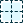</a> | **📂 檔名:** `cell-border-none--Streamline-Ultimate.svg` ✨ **格式:** `Vector (SVG)` ⚖️ **大小:** `3.12KB` 📅 **更新:** `2026-03-03`  🚀 **jsDelivr Markdown:** `` 🔗 **直接連結 (Url):** <code>https://cdn.jsdelivr.net/gh/barry028/materials@main/images/iCons/Ui%20Ux%20Graphic%20Design/cell-border-none--Streamline-Ultimate.svg</code> 📥 [檢視原始檔](cell-border-none--Streamline-Ultimate.svg) |
|  | **📂 檔名:** `cellular-network-3g--Streamline-Ultimate.svg` ✨ **格式:** `Vector (SVG)` ⚖️ **大小:** `1.76KB` 📅 **更新:** `2026-03-03`  🚀 **jsDelivr Markdown:** `` 🔗 **直接連結 (Url):** <code>https://cdn.jsdelivr.net/gh/barry028/materials@main/images/iCons/Ui%20Ux%20Graphic%20Design/cellular-network-3g--Streamline-Ultimate.svg</code> 📥 [檢視原始檔](cellular-network-3g--Streamline-Ultimate.svg) |
| <a href="cellular-network-4g--Streamline-Ultimate.svg">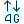</a> | **📂 檔名:** `cellular-network-4g--Streamline-Ultimate.svg` ✨ **格式:** `Vector (SVG)` ⚖️ **大小:** `1.43KB` 📅 **更新:** `2026-03-03`  🚀 **jsDelivr Markdown:** `` 🔗 **直接連結 (Url):** <code>https://cdn.jsdelivr.net/gh/barry028/materials@main/images/iCons/Ui%20Ux%20Graphic%20Design/cellular-network-4g--Streamline-Ultimate.svg</code> 📥 [檢視原始檔](cellular-network-4g--Streamline-Ultimate.svg) |
|  | **📂 檔名:** `cellular-network-wifi-3g--Streamline-Ultimate.svg` ✨ **格式:** `Vector (SVG)` ⚖️ **大小:** `2.21KB` 📅 **更新:** `2026-03-03`  🚀 **jsDelivr Markdown:** `` 🔗 **直接連結 (Url):** <code>https://cdn.jsdelivr.net/gh/barry028/materials@main/images/iCons/Ui%20Ux%20Graphic%20Design/cellular-network-wifi-3g--Streamline-Ultimate.svg</code> 📥 [檢視原始檔](cellular-network-wifi-3g--Streamline-Ultimate.svg) |
|  | **📂 檔名:** `cellular-network-wifi-4g--Streamline-Ultimate.svg` ✨ **格式:** `Vector (SVG)` ⚖️ **大小:** `1.87KB` 📅 **更新:** `2026-03-03`  🚀 **jsDelivr Markdown:** `` 🔗 **直接連結 (Url):** <code>https://cdn.jsdelivr.net/gh/barry028/materials@main/images/iCons/Ui%20Ux%20Graphic%20Design/cellular-network-wifi-4g--Streamline-Ultimate.svg</code> 📥 [檢視原始檔](cellular-network-wifi-4g--Streamline-Ultimate.svg) |
|  | **📂 檔名:** `cellular-network-wifi-5g--Streamline-Ultimate.svg` ✨ **格式:** `Vector (SVG)` ⚖️ **大小:** `2.04KB` 📅 **更新:** `2026-03-03`  🚀 **jsDelivr Markdown:** `` 🔗 **直接連結 (Url):** <code>https://cdn.jsdelivr.net/gh/barry028/materials@main/images/iCons/Ui%20Ux%20Graphic%20Design/cellular-network-wifi-5g--Streamline-Ultimate.svg</code> 📥 [檢視原始檔](cellular-network-wifi-5g--Streamline-Ultimate.svg) |
|  | **📂 檔名:** `charging-battery-almost-full--Streamline-Ultimate.svg` ✨ **格式:** `Vector (SVG)` ⚖️ **大小:** `2.15KB` 📅 **更新:** `2026-03-03`  🚀 **jsDelivr Markdown:** `` 🔗 **直接連結 (Url):** <code>https://cdn.jsdelivr.net/gh/barry028/materials@main/images/iCons/Ui%20Ux%20Graphic%20Design/charging-battery-almost-full--Streamline-Ultimate.svg</code> 📥 [檢視原始檔](charging-battery-almost-full--Streamline-Ultimate.svg) |
|  | **📂 檔名:** `charging-battery-cable-1--Streamline-Ultimate.svg` ✨ **格式:** `Vector (SVG)` ⚖️ **大小:** `2.71KB` 📅 **更新:** `2026-03-03`  🚀 **jsDelivr Markdown:** `` 🔗 **直接連結 (Url):** <code>https://cdn.jsdelivr.net/gh/barry028/materials@main/images/iCons/Ui%20Ux%20Graphic%20Design/charging-battery-cable-1--Streamline-Ultimate.svg</code> 📥 [檢視原始檔](charging-battery-cable-1--Streamline-Ultimate.svg) |
|  | **📂 檔名:** `charging-battery-eco--Streamline-Ultimate.svg` ✨ **格式:** `Vector (SVG)` ⚖️ **大小:** `2.17KB` 📅 **更新:** `2026-03-03`  🚀 **jsDelivr Markdown:** `` 🔗 **直接連結 (Url):** <code>https://cdn.jsdelivr.net/gh/barry028/materials@main/images/iCons/Ui%20Ux%20Graphic%20Design/charging-battery-eco--Streamline-Ultimate.svg</code> 📥 [檢視原始檔](charging-battery-eco--Streamline-Ultimate.svg) |
|  | **📂 檔名:** `charging-battery-empty--Streamline-Ultimate.svg` ✨ **格式:** `Vector (SVG)` ⚖️ **大小:** `1.68KB` 📅 **更新:** `2026-03-03`  🚀 **jsDelivr Markdown:** `` 🔗 **直接連結 (Url):** <code>https://cdn.jsdelivr.net/gh/barry028/materials@main/images/iCons/Ui%20Ux%20Graphic%20Design/charging-battery-empty--Streamline-Ultimate.svg</code> 📥 [檢視原始檔](charging-battery-empty--Streamline-Ultimate.svg) |
|  | **📂 檔名:** `charging-battery-empty-1--Streamline-Ultimate.svg` ✨ **格式:** `Vector (SVG)` ⚖️ **大小:** `1.27KB` 📅 **更新:** `2026-03-03`  🚀 **jsDelivr Markdown:** `` 🔗 **直接連結 (Url):** <code>https://cdn.jsdelivr.net/gh/barry028/materials@main/images/iCons/Ui%20Ux%20Graphic%20Design/charging-battery-empty-1--Streamline-Ultimate.svg</code> 📥 [檢視原始檔](charging-battery-empty-1--Streamline-Ultimate.svg) |
|  | **📂 檔名:** `charging-battery-low-2--Streamline-Ultimate.svg` ✨ **格式:** `Vector (SVG)` ⚖️ **大小:** `1.71KB` 📅 **更新:** `2026-03-03`  🚀 **jsDelivr Markdown:** `` 🔗 **直接連結 (Url):** <code>https://cdn.jsdelivr.net/gh/barry028/materials@main/images/iCons/Ui%20Ux%20Graphic%20Design/charging-battery-low-2--Streamline-Ultimate.svg</code> 📥 [檢視原始檔](charging-battery-low-2--Streamline-Ultimate.svg) |
|  | **📂 檔名:** `charging-battery-low-3--Streamline-Ultimate.svg` ✨ **格式:** `Vector (SVG)` ⚖️ **大小:** `2.03KB` 📅 **更新:** `2026-03-03`  🚀 **jsDelivr Markdown:** `` 🔗 **直接連結 (Url):** <code>https://cdn.jsdelivr.net/gh/barry028/materials@main/images/iCons/Ui%20Ux%20Graphic%20Design/charging-battery-low-3--Streamline-Ultimate.svg</code> 📥 [檢視原始檔](charging-battery-low-3--Streamline-Ultimate.svg) |
|  | **📂 檔名:** `charging-cable--Streamline-Ultimate.svg` ✨ **格式:** `Vector (SVG)` ⚖️ **大小:** `2.43KB` 📅 **更新:** `2026-03-03`  🚀 **jsDelivr Markdown:** `` 🔗 **直接連結 (Url):** <code>https://cdn.jsdelivr.net/gh/barry028/materials@main/images/iCons/Ui%20Ux%20Graphic%20Design/charging-cable--Streamline-Ultimate.svg</code> 📥 [檢視原始檔](charging-cable--Streamline-Ultimate.svg) |
|  | **📂 檔名:** `charging-flash-sync--Streamline-Ultimate.svg` ✨ **格式:** `Vector (SVG)` ⚖️ **大小:** `2.06KB` 📅 **更新:** `2026-03-03`  🚀 **jsDelivr Markdown:** `` 🔗 **直接連結 (Url):** <code>https://cdn.jsdelivr.net/gh/barry028/materials@main/images/iCons/Ui%20Ux%20Graphic%20Design/charging-flash-sync--Streamline-Ultimate.svg</code> 📥 [檢視原始檔](charging-flash-sync--Streamline-Ultimate.svg) |
|  | **📂 檔名:** `charging-flash-wifi--Streamline-Ultimate.svg` ✨ **格式:** `Vector (SVG)` ⚖️ **大小:** `1.22KB` 📅 **更新:** `2026-03-03`  🚀 **jsDelivr Markdown:** `` 🔗 **直接連結 (Url):** <code>https://cdn.jsdelivr.net/gh/barry028/materials@main/images/iCons/Ui%20Ux%20Graphic%20Design/charging-flash-wifi--Streamline-Ultimate.svg</code> 📥 [檢視原始檔](charging-flash-wifi--Streamline-Ultimate.svg) |
|  | **📂 檔名:** `charging-light-idea--Streamline-Ultimate.svg` ✨ **格式:** `Vector (SVG)` ⚖️ **大小:** `9.55KB` 📅 **更新:** `2026-03-03`  🚀 **jsDelivr Markdown:** `` 🔗 **直接連結 (Url):** <code>https://cdn.jsdelivr.net/gh/barry028/materials@main/images/iCons/Ui%20Ux%20Graphic%20Design/charging-light-idea--Streamline-Ultimate.svg</code> 📥 [檢視原始檔](charging-light-idea--Streamline-Ultimate.svg) |
|  | **📂 檔名:** `check-button--Streamline-Ultimate.svg` ✨ **格式:** `Vector (SVG)` ⚖️ **大小:** `891.00B` 📅 **更新:** `2026-03-03`  🚀 **jsDelivr Markdown:** `` 🔗 **直接連結 (Url):** <code>https://cdn.jsdelivr.net/gh/barry028/materials@main/images/iCons/Ui%20Ux%20Graphic%20Design/check-button--Streamline-Ultimate.svg</code> 📥 [檢視原始檔](check-button--Streamline-Ultimate.svg) |
|  | **📂 檔名:** `check-double--Streamline-Ultimate.svg` ✨ **格式:** `Vector (SVG)` ⚖️ **大小:** `2.94KB` 📅 **更新:** `2026-03-03`  🚀 **jsDelivr Markdown:** `` 🔗 **直接連結 (Url):** <code>https://cdn.jsdelivr.net/gh/barry028/materials@main/images/iCons/Ui%20Ux%20Graphic%20Design/check-double--Streamline-Ultimate.svg</code> 📥 [檢視原始檔](check-double--Streamline-Ultimate.svg) |
|  | **📂 檔名:** `check-payment-sign--Streamline-Ultimate.svg` ✨ **格式:** `Vector (SVG)` ⚖️ **大小:** `4.60KB` 📅 **更新:** `2026-03-03`  🚀 **jsDelivr Markdown:** `` 🔗 **直接連結 (Url):** <code>https://cdn.jsdelivr.net/gh/barry028/materials@main/images/iCons/Ui%20Ux%20Graphic%20Design/check-payment-sign--Streamline-Ultimate.svg</code> 📥 [檢視原始檔](check-payment-sign--Streamline-Ultimate.svg) |
|  | **📂 檔名:** `chess-knight--Streamline-Ultimate.svg` ✨ **格式:** `Vector (SVG)` ⚖️ **大小:** `2.67KB` 📅 **更新:** `2026-03-03`  🚀 **jsDelivr Markdown:** `` 🔗 **直接連結 (Url):** <code>https://cdn.jsdelivr.net/gh/barry028/materials@main/images/iCons/Ui%20Ux%20Graphic%20Design/chess-knight--Streamline-Ultimate.svg</code> 📥 [檢視原始檔](chess-knight--Streamline-Ultimate.svg) |
|  | **📂 檔名:** `chess-pawn--Streamline-Ultimate.svg` ✨ **格式:** `Vector (SVG)` ⚖️ **大小:** `4.15KB` 📅 **更新:** `2026-03-03`  🚀 **jsDelivr Markdown:** `` 🔗 **直接連結 (Url):** <code>https://cdn.jsdelivr.net/gh/barry028/materials@main/images/iCons/Ui%20Ux%20Graphic%20Design/chess-pawn--Streamline-Ultimate.svg</code> 📥 [檢視原始檔](chess-pawn--Streamline-Ultimate.svg) |
|  | **📂 檔名:** `chess-rook--Streamline-Ultimate.svg` ✨ **格式:** `Vector (SVG)` ⚖️ **大小:** `3.13KB` 📅 **更新:** `2026-03-03`  🚀 **jsDelivr Markdown:** `` 🔗 **直接連結 (Url):** <code>https://cdn.jsdelivr.net/gh/barry028/materials@main/images/iCons/Ui%20Ux%20Graphic%20Design/chess-rook--Streamline-Ultimate.svg</code> 📥 [檢視原始檔](chess-rook--Streamline-Ultimate.svg) |
|  | **📂 檔名:** `circus-clown-1--Streamline-Ultimate.svg` ✨ **格式:** `Vector (SVG)` ⚖️ **大小:** `7.40KB` 📅 **更新:** `2026-03-03`  🚀 **jsDelivr Markdown:** `` 🔗 **直接連結 (Url):** <code>https://cdn.jsdelivr.net/gh/barry028/materials@main/images/iCons/Ui%20Ux%20Graphic%20Design/circus-clown-1--Streamline-Ultimate.svg</code> 📥 [檢視原始檔](circus-clown-1--Streamline-Ultimate.svg) |
|  | **📂 檔名:** `circus-tent--Streamline-Ultimate.svg` ✨ **格式:** `Vector (SVG)` ⚖️ **大小:** `2.73KB` 📅 **更新:** `2026-03-03`  🚀 **jsDelivr Markdown:** `` 🔗 **直接連結 (Url):** <code>https://cdn.jsdelivr.net/gh/barry028/materials@main/images/iCons/Ui%20Ux%20Graphic%20Design/circus-tent--Streamline-Ultimate.svg</code> 📥 [檢視原始檔](circus-tent--Streamline-Ultimate.svg) |
|  | **📂 檔名:** `cleaning-broom--Streamline-Ultimate.svg` ✨ **格式:** `Vector (SVG)` ⚖️ **大小:** `5.99KB` 📅 **更新:** `2026-03-03`  🚀 **jsDelivr Markdown:** `` 🔗 **直接連結 (Url):** <code>https://cdn.jsdelivr.net/gh/barry028/materials@main/images/iCons/Ui%20Ux%20Graphic%20Design/cleaning-broom--Streamline-Ultimate.svg</code> 📥 [檢視原始檔](cleaning-broom--Streamline-Ultimate.svg) |
|  | **📂 檔名:** `cleaning-sign--Streamline-Ultimate.svg` ✨ **格式:** `Vector (SVG)` ⚖️ **大小:** `4.34KB` 📅 **更新:** `2026-03-03`  🚀 **jsDelivr Markdown:** `` 🔗 **直接連結 (Url):** <code>https://cdn.jsdelivr.net/gh/barry028/materials@main/images/iCons/Ui%20Ux%20Graphic%20Design/cleaning-sign--Streamline-Ultimate.svg</code> 📥 [檢視原始檔](cleaning-sign--Streamline-Ultimate.svg) |
|  | **📂 檔名:** `cloud-data-transfer--Streamline-Ultimate.svg` ✨ **格式:** `Vector (SVG)` ⚖️ **大小:** `2.22KB` 📅 **更新:** `2026-03-03`  🚀 **jsDelivr Markdown:** `` 🔗 **直接連結 (Url):** <code>https://cdn.jsdelivr.net/gh/barry028/materials@main/images/iCons/Ui%20Ux%20Graphic%20Design/cloud-data-transfer--Streamline-Ultimate.svg</code> 📥 [檢視原始檔](cloud-data-transfer--Streamline-Ultimate.svg) |
|  | **📂 檔名:** `cloud-loading--Streamline-Ultimate.svg` ✨ **格式:** `Vector (SVG)` ⚖️ **大小:** `3.26KB` 📅 **更新:** `2026-03-03`  🚀 **jsDelivr Markdown:** `` 🔗 **直接連結 (Url):** <code>https://cdn.jsdelivr.net/gh/barry028/materials@main/images/iCons/Ui%20Ux%20Graphic%20Design/cloud-loading--Streamline-Ultimate.svg</code> 📥 [檢視原始檔](cloud-loading--Streamline-Ultimate.svg) |
|  | **📂 檔名:** `cloud-sync--Streamline-Ultimate.svg` ✨ **格式:** `Vector (SVG)` ⚖️ **大小:** `2.94KB` 📅 **更新:** `2026-03-03`  🚀 **jsDelivr Markdown:** `` 🔗 **直接連結 (Url):** <code>https://cdn.jsdelivr.net/gh/barry028/materials@main/images/iCons/Ui%20Ux%20Graphic%20Design/cloud-sync--Streamline-Ultimate.svg</code> 📥 [檢視原始檔](cloud-sync--Streamline-Ultimate.svg) |
|  | **📂 檔名:** `cloud-wifi--Streamline-Ultimate.svg` ✨ **格式:** `Vector (SVG)` ⚖️ **大小:** `2.31KB` 📅 **更新:** `2026-03-03`  🚀 **jsDelivr Markdown:** `` 🔗 **直接連結 (Url):** <code>https://cdn.jsdelivr.net/gh/barry028/materials@main/images/iCons/Ui%20Ux%20Graphic%20Design/cloud-wifi--Streamline-Ultimate.svg</code> 📥 [檢視原始檔](cloud-wifi--Streamline-Ultimate.svg) |
|  | **📂 檔名:** `code-write-1--Streamline-Ultimate.svg` ✨ **格式:** `Vector (SVG)` ⚖️ **大小:** `3.07KB` 📅 **更新:** `2026-03-03`  🚀 **jsDelivr Markdown:** `` 🔗 **直接連結 (Url):** <code>https://cdn.jsdelivr.net/gh/barry028/materials@main/images/iCons/Ui%20Ux%20Graphic%20Design/code-write-1--Streamline-Ultimate.svg</code> 📥 [檢視原始檔](code-write-1--Streamline-Ultimate.svg) |
|  | **📂 檔名:** `cog--Streamline-Ultimate.svg` ✨ **格式:** `Vector (SVG)` ⚖️ **大小:** `6.50KB` 📅 **更新:** `2026-03-03`  🚀 **jsDelivr Markdown:** `` 🔗 **直接連結 (Url):** <code>https://cdn.jsdelivr.net/gh/barry028/materials@main/images/iCons/Ui%20Ux%20Graphic%20Design/cog--Streamline-Ultimate.svg</code> 📥 [檢視原始檔](cog--Streamline-Ultimate.svg) |
|  | **📂 檔名:** `coin-purse--Streamline-Ultimate.svg` ✨ **格式:** `Vector (SVG)` ⚖️ **大小:** `3.39KB` 📅 **更新:** `2026-03-03`  🚀 **jsDelivr Markdown:** `` 🔗 **直接連結 (Url):** <code>https://cdn.jsdelivr.net/gh/barry028/materials@main/images/iCons/Ui%20Ux%20Graphic%20Design/coin-purse--Streamline-Ultimate.svg</code> 📥 [檢視原始檔](coin-purse--Streamline-Ultimate.svg) |
|  | **📂 檔名:** `coin-purse-1--Streamline-Ultimate.svg` ✨ **格式:** `Vector (SVG)` ⚖️ **大小:** `3.33KB` 📅 **更新:** `2026-03-03`  🚀 **jsDelivr Markdown:** `` 🔗 **直接連結 (Url):** <code>https://cdn.jsdelivr.net/gh/barry028/materials@main/images/iCons/Ui%20Ux%20Graphic%20Design/coin-purse-1--Streamline-Ultimate.svg</code> 📥 [檢視原始檔](coin-purse-1--Streamline-Ultimate.svg) |
|  | **📂 檔名:** `color-brush--Streamline-Ultimate.svg` ✨ **格式:** `Vector (SVG)` ⚖️ **大小:** `4.67KB` 📅 **更新:** `2026-03-03`  🚀 **jsDelivr Markdown:** `` 🔗 **直接連結 (Url):** <code>https://cdn.jsdelivr.net/gh/barry028/materials@main/images/iCons/Ui%20Ux%20Graphic%20Design/color-brush--Streamline-Ultimate.svg</code> 📥 [檢視原始檔](color-brush--Streamline-Ultimate.svg) |
|  | **📂 檔名:** `color-brush-2--Streamline-Ultimate.svg` ✨ **格式:** `Vector (SVG)` ⚖️ **大小:** `2.80KB` 📅 **更新:** `2026-03-03`  🚀 **jsDelivr Markdown:** `` 🔗 **直接連結 (Url):** <code>https://cdn.jsdelivr.net/gh/barry028/materials@main/images/iCons/Ui%20Ux%20Graphic%20Design/color-brush-2--Streamline-Ultimate.svg</code> 📥 [檢視原始檔](color-brush-2--Streamline-Ultimate.svg) |
|  | **📂 檔名:** `color-bucket--Streamline-Ultimate.svg` ✨ **格式:** `Vector (SVG)` ⚖️ **大小:** `2.46KB` 📅 **更新:** `2026-03-03`  🚀 **jsDelivr Markdown:** `` 🔗 **直接連結 (Url):** <code>https://cdn.jsdelivr.net/gh/barry028/materials@main/images/iCons/Ui%20Ux%20Graphic%20Design/color-bucket--Streamline-Ultimate.svg</code> 📥 [檢視原始檔](color-bucket--Streamline-Ultimate.svg) |
|  | **📂 檔名:** `color-drop-pick--Streamline-Ultimate.svg` ✨ **格式:** `Vector (SVG)` ⚖️ **大小:** `1.33KB` 📅 **更新:** `2026-03-03`  🚀 **jsDelivr Markdown:** `` 🔗 **直接連結 (Url):** <code>https://cdn.jsdelivr.net/gh/barry028/materials@main/images/iCons/Ui%20Ux%20Graphic%20Design/color-drop-pick--Streamline-Ultimate.svg</code> 📥 [檢視原始檔](color-drop-pick--Streamline-Ultimate.svg) |
|  | **📂 檔名:** `color-painting-palette--Streamline-Ultimate.svg` ✨ **格式:** `Vector (SVG)` ⚖️ **大小:** `7.06KB` 📅 **更新:** `2026-03-03`  🚀 **jsDelivr Markdown:** `` 🔗 **直接連結 (Url):** <code>https://cdn.jsdelivr.net/gh/barry028/materials@main/images/iCons/Ui%20Ux%20Graphic%20Design/color-painting-palette--Streamline-Ultimate.svg</code> 📥 [檢視原始檔](color-painting-palette--Streamline-Ultimate.svg) |
|  | **📂 檔名:** `color-palette--Streamline-Ultimate.svg` ✨ **格式:** `Vector (SVG)` ⚖️ **大小:** `5.79KB` 📅 **更新:** `2026-03-03`  🚀 **jsDelivr Markdown:** `` 🔗 **直接連結 (Url):** <code>https://cdn.jsdelivr.net/gh/barry028/materials@main/images/iCons/Ui%20Ux%20Graphic%20Design/color-palette--Streamline-Ultimate.svg</code> 📥 [檢視原始檔](color-palette--Streamline-Ultimate.svg) |
|  | **📂 檔名:** `color-palette-2--Streamline-Ultimate.svg` ✨ **格式:** `Vector (SVG)` ⚖️ **大小:** `4.21KB` 📅 **更新:** `2026-03-03`  🚀 **jsDelivr Markdown:** `` 🔗 **直接連結 (Url):** <code>https://cdn.jsdelivr.net/gh/barry028/materials@main/images/iCons/Ui%20Ux%20Graphic%20Design/color-palette-2--Streamline-Ultimate.svg</code> 📥 [檢視原始檔](color-palette-2--Streamline-Ultimate.svg) |
|  | **📂 檔名:** `color-palette-sample--Streamline-Ultimate.svg` ✨ **格式:** `Vector (SVG)` ⚖️ **大小:** `5.73KB` 📅 **更新:** `2026-03-03`  🚀 **jsDelivr Markdown:** `` 🔗 **直接連結 (Url):** <code>https://cdn.jsdelivr.net/gh/barry028/materials@main/images/iCons/Ui%20Ux%20Graphic%20Design/color-palette-sample--Streamline-Ultimate.svg</code> 📥 [檢視原始檔](color-palette-sample--Streamline-Ultimate.svg) |
|  | **📂 檔名:** `color-picker--Streamline-Ultimate.svg` ✨ **格式:** `Vector (SVG)` ⚖️ **大小:** `2.22KB` 📅 **更新:** `2026-03-03`  🚀 **jsDelivr Markdown:** `` 🔗 **直接連結 (Url):** <code>https://cdn.jsdelivr.net/gh/barry028/materials@main/images/iCons/Ui%20Ux%20Graphic%20Design/color-picker--Streamline-Ultimate.svg</code> 📥 [檢視原始檔](color-picker--Streamline-Ultimate.svg) |
|  | **📂 檔名:** `color-picker-2--Streamline-Ultimate.svg` ✨ **格式:** `Vector (SVG)` ⚖️ **大小:** `3.40KB` 📅 **更新:** `2026-03-03`  🚀 **jsDelivr Markdown:** `` 🔗 **直接連結 (Url):** <code>https://cdn.jsdelivr.net/gh/barry028/materials@main/images/iCons/Ui%20Ux%20Graphic%20Design/color-picker-2--Streamline-Ultimate.svg</code> 📥 [檢視原始檔](color-picker-2--Streamline-Ultimate.svg) |
| <a href="color-spray--Streamline-Ultimate.svg">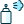</a> | **📂 檔名:** `color-spray--Streamline-Ultimate.svg` ✨ **格式:** `Vector (SVG)` ⚖️ **大小:** `3.59KB` 📅 **更新:** `2026-03-03`  🚀 **jsDelivr Markdown:** `` 🔗 **直接連結 (Url):** <code>https://cdn.jsdelivr.net/gh/barry028/materials@main/images/iCons/Ui%20Ux%20Graphic%20Design/color-spray--Streamline-Ultimate.svg</code> 📥 [檢視原始檔](color-spray--Streamline-Ultimate.svg) |
|  | **📂 檔名:** `color-triangle--Streamline-Ultimate.svg` ✨ **格式:** `Vector (SVG)` ⚖️ **大小:** `5.23KB` 📅 **更新:** `2026-03-03`  🚀 **jsDelivr Markdown:** `` 🔗 **直接連結 (Url):** <code>https://cdn.jsdelivr.net/gh/barry028/materials@main/images/iCons/Ui%20Ux%20Graphic%20Design/color-triangle--Streamline-Ultimate.svg</code> 📥 [檢視原始檔](color-triangle--Streamline-Ultimate.svg) |
|  | **📂 檔名:** `color-tube-painting--Streamline-Ultimate.svg` ✨ **格式:** `Vector (SVG)` ⚖️ **大小:** `4.39KB` 📅 **更新:** `2026-03-03`  🚀 **jsDelivr Markdown:** `` 🔗 **直接連結 (Url):** <code>https://cdn.jsdelivr.net/gh/barry028/materials@main/images/iCons/Ui%20Ux%20Graphic%20Design/color-tube-painting--Streamline-Ultimate.svg</code> 📥 [檢視原始檔](color-tube-painting--Streamline-Ultimate.svg) |
|  | **📂 檔名:** `composition-hand-frame--Streamline-Ultimate.svg` ✨ **格式:** `Vector (SVG)` ⚖️ **大小:** `3.58KB` 📅 **更新:** `2026-03-03`  🚀 **jsDelivr Markdown:** `` 🔗 **直接連結 (Url):** <code>https://cdn.jsdelivr.net/gh/barry028/materials@main/images/iCons/Ui%20Ux%20Graphic%20Design/composition-hand-frame--Streamline-Ultimate.svg</code> 📥 [檢視原始檔](composition-hand-frame--Streamline-Ultimate.svg) |
|  | **📂 檔名:** `computer-bug-1--Streamline-Ultimate.svg` ✨ **格式:** `Vector (SVG)` ⚖️ **大小:** `4.08KB` 📅 **更新:** `2026-03-03`  🚀 **jsDelivr Markdown:** `` 🔗 **直接連結 (Url):** <code>https://cdn.jsdelivr.net/gh/barry028/materials@main/images/iCons/Ui%20Ux%20Graphic%20Design/computer-bug-1--Streamline-Ultimate.svg</code> 📥 [檢視原始檔](computer-bug-1--Streamline-Ultimate.svg) |
|  | **📂 檔名:** `computer-bug-search--Streamline-Ultimate.svg` ✨ **格式:** `Vector (SVG)` ⚖️ **大小:** `3.76KB` 📅 **更新:** `2026-03-03`  🚀 **jsDelivr Markdown:** `` 🔗 **直接連結 (Url):** <code>https://cdn.jsdelivr.net/gh/barry028/materials@main/images/iCons/Ui%20Ux%20Graphic%20Design/computer-bug-search--Streamline-Ultimate.svg</code> 📥 [檢視原始檔](computer-bug-search--Streamline-Ultimate.svg) |
|  | **📂 檔名:** `computer-chip--Streamline-Ultimate.svg` ✨ **格式:** `Vector (SVG)` ⚖️ **大小:** `2.54KB` 📅 **更新:** `2026-03-03`  🚀 **jsDelivr Markdown:** `` 🔗 **直接連結 (Url):** <code>https://cdn.jsdelivr.net/gh/barry028/materials@main/images/iCons/Ui%20Ux%20Graphic%20Design/computer-chip--Streamline-Ultimate.svg</code> 📥 [檢視原始檔](computer-chip--Streamline-Ultimate.svg) |
|  | **📂 檔名:** `computer-chip-32--Streamline-Ultimate.svg` ✨ **格式:** `Vector (SVG)` ⚖️ **大小:** `2.46KB` 📅 **更新:** `2026-03-03`  🚀 **jsDelivr Markdown:** `` 🔗 **直接連結 (Url):** <code>https://cdn.jsdelivr.net/gh/barry028/materials@main/images/iCons/Ui%20Ux%20Graphic%20Design/computer-chip-32--Streamline-Ultimate.svg</code> 📥 [檢視原始檔](computer-chip-32--Streamline-Ultimate.svg) |
|  | **📂 檔名:** `computer-chip-64--Streamline-Ultimate.svg` ✨ **格式:** `Vector (SVG)` ⚖️ **大小:** `2.51KB` 📅 **更新:** `2026-03-03`  🚀 **jsDelivr Markdown:** `` 🔗 **直接連結 (Url):** <code>https://cdn.jsdelivr.net/gh/barry028/materials@main/images/iCons/Ui%20Ux%20Graphic%20Design/computer-chip-64--Streamline-Ultimate.svg</code> 📥 [檢視原始檔](computer-chip-64--Streamline-Ultimate.svg) |
|  | **📂 檔名:** `computer-chip-core--Streamline-Ultimate.svg` ✨ **格式:** `Vector (SVG)` ⚖️ **大小:** `2.02KB` 📅 **更新:** `2026-03-03`  🚀 **jsDelivr Markdown:** `` 🔗 **直接連結 (Url):** <code>https://cdn.jsdelivr.net/gh/barry028/materials@main/images/iCons/Ui%20Ux%20Graphic%20Design/computer-chip-core--Streamline-Ultimate.svg</code> 📥 [檢視原始檔](computer-chip-core--Streamline-Ultimate.svg) |
|  | **📂 檔名:** `computer-chip-fire--Streamline-Ultimate.svg` ✨ **格式:** `Vector (SVG)` ⚖️ **大小:** `2.83KB` 📅 **更新:** `2026-03-03`  🚀 **jsDelivr Markdown:** `` 🔗 **直接連結 (Url):** <code>https://cdn.jsdelivr.net/gh/barry028/materials@main/images/iCons/Ui%20Ux%20Graphic%20Design/computer-chip-fire--Streamline-Ultimate.svg</code> 📥 [檢視原始檔](computer-chip-fire--Streamline-Ultimate.svg) |
|  | **📂 檔名:** `computer-ram-1--Streamline-Ultimate.svg` ✨ **格式:** `Vector (SVG)` ⚖️ **大小:** `2.18KB` 📅 **更新:** `2026-03-03`  🚀 **jsDelivr Markdown:** `` 🔗 **直接連結 (Url):** <code>https://cdn.jsdelivr.net/gh/barry028/materials@main/images/iCons/Ui%20Ux%20Graphic%20Design/computer-ram-1--Streamline-Ultimate.svg</code> 📥 [檢視原始檔](computer-ram-1--Streamline-Ultimate.svg) |
|  | **📂 檔名:** `concert-sing--Streamline-Ultimate.svg` ✨ **格式:** `Vector (SVG)` ⚖️ **大小:** `5.24KB` 📅 **更新:** `2026-03-03`  🚀 **jsDelivr Markdown:** `` 🔗 **直接連結 (Url):** <code>https://cdn.jsdelivr.net/gh/barry028/materials@main/images/iCons/Ui%20Ux%20Graphic%20Design/concert-sing--Streamline-Ultimate.svg</code> 📥 [檢視原始檔](concert-sing--Streamline-Ultimate.svg) |
|  | **📂 檔名:** `connect-device-cancel--Streamline-Ultimate.svg` ✨ **格式:** `Vector (SVG)` ⚖️ **大小:** `3.43KB` 📅 **更新:** `2026-03-03`  🚀 **jsDelivr Markdown:** `` 🔗 **直接連結 (Url):** <code>https://cdn.jsdelivr.net/gh/barry028/materials@main/images/iCons/Ui%20Ux%20Graphic%20Design/connect-device-cancel--Streamline-Ultimate.svg</code> 📥 [檢視原始檔](connect-device-cancel--Streamline-Ultimate.svg) |
|  | **📂 檔名:** `connect-device-exchange--Streamline-Ultimate.svg` ✨ **格式:** `Vector (SVG)` ⚖️ **大小:** `3.53KB` 📅 **更新:** `2026-03-03`  🚀 **jsDelivr Markdown:** `` 🔗 **直接連結 (Url):** <code>https://cdn.jsdelivr.net/gh/barry028/materials@main/images/iCons/Ui%20Ux%20Graphic%20Design/connect-device-exchange--Streamline-Ultimate.svg</code> 📥 [檢視原始檔](connect-device-exchange--Streamline-Ultimate.svg) |
|  | **📂 檔名:** `connector--Streamline-Ultimate.svg` ✨ **格式:** `Vector (SVG)` ⚖️ **大小:** `2.54KB` 📅 **更新:** `2026-03-03`  🚀 **jsDelivr Markdown:** `` 🔗 **直接連結 (Url):** <code>https://cdn.jsdelivr.net/gh/barry028/materials@main/images/iCons/Ui%20Ux%20Graphic%20Design/connector--Streamline-Ultimate.svg</code> 📥 [檢視原始檔](connector--Streamline-Ultimate.svg) |
|  | **📂 檔名:** `contactless-payment--Streamline-Ultimate.svg` ✨ **格式:** `Vector (SVG)` ⚖️ **大小:** `3.89KB` 📅 **更新:** `2026-03-03`  🚀 **jsDelivr Markdown:** `` 🔗 **直接連結 (Url):** <code>https://cdn.jsdelivr.net/gh/barry028/materials@main/images/iCons/Ui%20Ux%20Graphic%20Design/contactless-payment--Streamline-Ultimate.svg</code> 📥 [檢視原始檔](contactless-payment--Streamline-Ultimate.svg) |
|  | **📂 檔名:** `content-brush-pen--Streamline-Ultimate.svg` ✨ **格式:** `Vector (SVG)` ⚖️ **大小:** `2.09KB` 📅 **更新:** `2026-03-03`  🚀 **jsDelivr Markdown:** `` 🔗 **直接連結 (Url):** <code>https://cdn.jsdelivr.net/gh/barry028/materials@main/images/iCons/Ui%20Ux%20Graphic%20Design/content-brush-pen--Streamline-Ultimate.svg</code> 📥 [檢視原始檔](content-brush-pen--Streamline-Ultimate.svg) |
|  | **📂 檔名:** `content-notebook-pencil--Streamline-Ultimate.svg` ✨ **格式:** `Vector (SVG)` ⚖️ **大小:** `2.58KB` 📅 **更新:** `2026-03-03`  🚀 **jsDelivr Markdown:** `` 🔗 **直接連結 (Url):** <code>https://cdn.jsdelivr.net/gh/barry028/materials@main/images/iCons/Ui%20Ux%20Graphic%20Design/content-notebook-pencil--Streamline-Ultimate.svg</code> 📥 [檢視原始檔](content-notebook-pencil--Streamline-Ultimate.svg) |
|  | **📂 檔名:** `content-pen-5--Streamline-Ultimate.svg` ✨ **格式:** `Vector (SVG)` ⚖️ **大小:** `2.12KB` 📅 **更新:** `2026-03-03`  🚀 **jsDelivr Markdown:** `` 🔗 **直接連結 (Url):** <code>https://cdn.jsdelivr.net/gh/barry028/materials@main/images/iCons/Ui%20Ux%20Graphic%20Design/content-pen-5--Streamline-Ultimate.svg</code> 📥 [檢視原始檔](content-pen-5--Streamline-Ultimate.svg) |
|  | **📂 檔名:** `content-pencil-quill--Streamline-Ultimate.svg` ✨ **格式:** `Vector (SVG)` ⚖️ **大小:** `3.11KB` 📅 **更新:** `2026-03-03`  🚀 **jsDelivr Markdown:** `` 🔗 **直接連結 (Url):** <code>https://cdn.jsdelivr.net/gh/barry028/materials@main/images/iCons/Ui%20Ux%20Graphic%20Design/content-pencil-quill--Streamline-Ultimate.svg</code> 📥 [檢視原始檔](content-pencil-quill--Streamline-Ultimate.svg) |
|  | **📂 檔名:** `content-quill-pen--Streamline-Ultimate.svg` ✨ **格式:** `Vector (SVG)` ⚖️ **大小:** `2.98KB` 📅 **更新:** `2026-03-03`  🚀 **jsDelivr Markdown:** `` 🔗 **直接連結 (Url):** <code>https://cdn.jsdelivr.net/gh/barry028/materials@main/images/iCons/Ui%20Ux%20Graphic%20Design/content-quill-pen--Streamline-Ultimate.svg</code> 📥 [檢視原始檔](content-quill-pen--Streamline-Ultimate.svg) |
|  | **📂 檔名:** `content-typing-machine--Streamline-Ultimate.svg` ✨ **格式:** `Vector (SVG)` ⚖️ **大小:** `8.53KB` 📅 **更新:** `2026-03-03`  🚀 **jsDelivr Markdown:** `` 🔗 **直接連結 (Url):** <code>https://cdn.jsdelivr.net/gh/barry028/materials@main/images/iCons/Ui%20Ux%20Graphic%20Design/content-typing-machine--Streamline-Ultimate.svg</code> 📥 [檢視原始檔](content-typing-machine--Streamline-Ultimate.svg) |
|  | **📂 檔名:** `controls-next--Streamline-Ultimate.svg` ✨ **格式:** `Vector (SVG)` ⚖️ **大小:** `2.49KB` 📅 **更新:** `2026-03-03`  🚀 **jsDelivr Markdown:** `` 🔗 **直接連結 (Url):** <code>https://cdn.jsdelivr.net/gh/barry028/materials@main/images/iCons/Ui%20Ux%20Graphic%20Design/controls-next--Streamline-Ultimate.svg</code> 📥 [檢視原始檔](controls-next--Streamline-Ultimate.svg) |
|  | **📂 檔名:** `conversation-chat--Streamline-Ultimate.svg` ✨ **格式:** `Vector (SVG)` ⚖️ **大小:** `2.37KB` 📅 **更新:** `2026-03-03`  🚀 **jsDelivr Markdown:** `` 🔗 **直接連結 (Url):** <code>https://cdn.jsdelivr.net/gh/barry028/materials@main/images/iCons/Ui%20Ux%20Graphic%20Design/conversation-chat--Streamline-Ultimate.svg</code> 📥 [檢視原始檔](conversation-chat--Streamline-Ultimate.svg) |
|  | **📂 檔名:** `copy-paste--Streamline-Ultimate.svg` ✨ **格式:** `Vector (SVG)` ⚖️ **大小:** `3.33KB` 📅 **更新:** `2026-03-03`  🚀 **jsDelivr Markdown:** `` 🔗 **直接連結 (Url):** <code>https://cdn.jsdelivr.net/gh/barry028/materials@main/images/iCons/Ui%20Ux%20Graphic%20Design/copy-paste--Streamline-Ultimate.svg</code> 📥 [檢視原始檔](copy-paste--Streamline-Ultimate.svg) |
|  | **📂 檔名:** `coupon-cut--Streamline-Ultimate.svg` ✨ **格式:** `Vector (SVG)` ⚖️ **大小:** `2.78KB` 📅 **更新:** `2026-03-03`  🚀 **jsDelivr Markdown:** `` 🔗 **直接連結 (Url):** <code>https://cdn.jsdelivr.net/gh/barry028/materials@main/images/iCons/Ui%20Ux%20Graphic%20Design/coupon-cut--Streamline-Ultimate.svg</code> 📥 [檢視原始檔](coupon-cut--Streamline-Ultimate.svg) |
|  | **📂 檔名:** `credit-card--Streamline-Ultimate.svg` ✨ **格式:** `Vector (SVG)` ⚖️ **大小:** `3.73KB` 📅 **更新:** `2026-03-03`  🚀 **jsDelivr Markdown:** `` 🔗 **直接連結 (Url):** <code>https://cdn.jsdelivr.net/gh/barry028/materials@main/images/iCons/Ui%20Ux%20Graphic%20Design/credit-card--Streamline-Ultimate.svg</code> 📥 [檢視原始檔](credit-card--Streamline-Ultimate.svg) |
|  | **📂 檔名:** `credit-card-1--Streamline-Ultimate.svg` ✨ **格式:** `Vector (SVG)` ⚖️ **大小:** `1.49KB` 📅 **更新:** `2026-03-03`  🚀 **jsDelivr Markdown:** `` 🔗 **直接連結 (Url):** <code>https://cdn.jsdelivr.net/gh/barry028/materials@main/images/iCons/Ui%20Ux%20Graphic%20Design/credit-card-1--Streamline-Ultimate.svg</code> 📥 [檢視原始檔](credit-card-1--Streamline-Ultimate.svg) |
|  | **📂 檔名:** `credit-card-amex--Streamline-Ultimate.svg` ✨ **格式:** `Vector (SVG)` ⚖️ **大小:** `2.07KB` 📅 **更新:** `2026-03-03`  🚀 **jsDelivr Markdown:** `` 🔗 **直接連結 (Url):** <code>https://cdn.jsdelivr.net/gh/barry028/materials@main/images/iCons/Ui%20Ux%20Graphic%20Design/credit-card-amex--Streamline-Ultimate.svg</code> 📥 [檢視原始檔](credit-card-amex--Streamline-Ultimate.svg) |
|  | **📂 檔名:** `credit-card-give--Streamline-Ultimate.svg` ✨ **格式:** `Vector (SVG)` ⚖️ **大小:** `3.96KB` 📅 **更新:** `2026-03-03`  🚀 **jsDelivr Markdown:** `` 🔗 **直接連結 (Url):** <code>https://cdn.jsdelivr.net/gh/barry028/materials@main/images/iCons/Ui%20Ux%20Graphic%20Design/credit-card-give--Streamline-Ultimate.svg</code> 📥 [檢視原始檔](credit-card-give--Streamline-Ultimate.svg) |
|  | **📂 檔名:** `credit-card-mastercard--Streamline-Ultimate.svg` ✨ **格式:** `Vector (SVG)` ⚖️ **大小:** `13.56KB` 📅 **更新:** `2026-03-03`  🚀 **jsDelivr Markdown:** `` 🔗 **直接連結 (Url):** <code>https://cdn.jsdelivr.net/gh/barry028/materials@main/images/iCons/Ui%20Ux%20Graphic%20Design/credit-card-mastercard--Streamline-Ultimate.svg</code> 📥 [檢視原始檔](credit-card-mastercard--Streamline-Ultimate.svg) |
|  | **📂 檔名:** `credit-card-payment--Streamline-Ultimate.svg` ✨ **格式:** `Vector (SVG)` ⚖️ **大小:** `5.86KB` 📅 **更新:** `2026-03-03`  🚀 **jsDelivr Markdown:** `` 🔗 **直接連結 (Url):** <code>https://cdn.jsdelivr.net/gh/barry028/materials@main/images/iCons/Ui%20Ux%20Graphic%20Design/credit-card-payment--Streamline-Ultimate.svg</code> 📥 [檢視原始檔](credit-card-payment--Streamline-Ultimate.svg) |
|  | **📂 檔名:** `credit-card-smartphone-exchange--Streamline-Ultimate.svg` ✨ **格式:** `Vector (SVG)` ⚖️ **大小:** `3.58KB` 📅 **更新:** `2026-03-03`  🚀 **jsDelivr Markdown:** `` 🔗 **直接連結 (Url):** <code>https://cdn.jsdelivr.net/gh/barry028/materials@main/images/iCons/Ui%20Ux%20Graphic%20Design/credit-card-smartphone-exchange--Streamline-Ultimate.svg</code> 📥 [檢視原始檔](credit-card-smartphone-exchange--Streamline-Ultimate.svg) |
|  | **📂 檔名:** `credit-card-sync--Streamline-Ultimate.svg` ✨ **格式:** `Vector (SVG)` ⚖️ **大小:** `2.81KB` 📅 **更新:** `2026-03-03`  🚀 **jsDelivr Markdown:** `` 🔗 **直接連結 (Url):** <code>https://cdn.jsdelivr.net/gh/barry028/materials@main/images/iCons/Ui%20Ux%20Graphic%20Design/credit-card-sync--Streamline-Ultimate.svg</code> 📥 [檢視原始檔](credit-card-sync--Streamline-Ultimate.svg) |
|  | **📂 檔名:** `credit-card-visa--Streamline-Ultimate.svg` ✨ **格式:** `Vector (SVG)` ⚖️ **大小:** `2.17KB` 📅 **更新:** `2026-03-03`  🚀 **jsDelivr Markdown:** `` 🔗 **直接連結 (Url):** <code>https://cdn.jsdelivr.net/gh/barry028/materials@main/images/iCons/Ui%20Ux%20Graphic%20Design/credit-card-visa--Streamline-Ultimate.svg</code> 📥 [檢視原始檔](credit-card-visa--Streamline-Ultimate.svg) |
|  | **📂 檔名:** `crypto-currency-bitcoin-browser--Streamline-Ultimate.svg` ✨ **格式:** `Vector (SVG)` ⚖️ **大小:** `3.66KB` 📅 **更新:** `2026-03-03`  🚀 **jsDelivr Markdown:** `` 🔗 **直接連結 (Url):** <code>https://cdn.jsdelivr.net/gh/barry028/materials@main/images/iCons/Ui%20Ux%20Graphic%20Design/crypto-currency-bitcoin-browser--Streamline-Ultimate.svg</code> 📥 [檢視原始檔](crypto-currency-bitcoin-browser--Streamline-Ultimate.svg) |
|  | **📂 檔名:** `crypto-currency-bitcoin-chip--Streamline-Ultimate.svg` ✨ **格式:** `Vector (SVG)` ⚖️ **大小:** `3.03KB` 📅 **更新:** `2026-03-03`  🚀 **jsDelivr Markdown:** `` 🔗 **直接連結 (Url):** <code>https://cdn.jsdelivr.net/gh/barry028/materials@main/images/iCons/Ui%20Ux%20Graphic%20Design/crypto-currency-bitcoin-chip--Streamline-Ultimate.svg</code> 📥 [檢視原始檔](crypto-currency-bitcoin-chip--Streamline-Ultimate.svg) |
|  | **📂 檔名:** `crypto-currency-bitcoin-cloud--Streamline-Ultimate.svg` ✨ **格式:** `Vector (SVG)` ⚖️ **大小:** `3.41KB` 📅 **更新:** `2026-03-03`  🚀 **jsDelivr Markdown:** `` 🔗 **直接連結 (Url):** <code>https://cdn.jsdelivr.net/gh/barry028/materials@main/images/iCons/Ui%20Ux%20Graphic%20Design/crypto-currency-bitcoin-cloud--Streamline-Ultimate.svg</code> 📥 [檢視原始檔](crypto-currency-bitcoin-cloud--Streamline-Ultimate.svg) |
|  | **📂 檔名:** `crypto-currency-bitcoin-code--Streamline-Ultimate.svg` ✨ **格式:** `Vector (SVG)` ⚖️ **大小:** `5.85KB` 📅 **更新:** `2026-03-03`  🚀 **jsDelivr Markdown:** `` 🔗 **直接連結 (Url):** <code>https://cdn.jsdelivr.net/gh/barry028/materials@main/images/iCons/Ui%20Ux%20Graphic%20Design/crypto-currency-bitcoin-code--Streamline-Ultimate.svg</code> 📥 [檢視原始檔](crypto-currency-bitcoin-code--Streamline-Ultimate.svg) |
| <a href="crypto-currency-bitcoin-dollar-equal--Streamline-Ultimate.svg">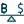</a> | **📂 檔名:** `crypto-currency-bitcoin-dollar-equal--Streamline-Ultimate.svg` ✨ **格式:** `Vector (SVG)` ⚖️ **大小:** `3.12KB` 📅 **更新:** `2026-03-03`  🚀 **jsDelivr Markdown:** `` 🔗 **直接連結 (Url):** <code>https://cdn.jsdelivr.net/gh/barry028/materials@main/images/iCons/Ui%20Ux%20Graphic%20Design/crypto-currency-bitcoin-dollar-equal--Streamline-Ultimate.svg</code> 📥 [檢視原始檔](crypto-currency-bitcoin-dollar-equal--Streamline-Ultimate.svg) |
|  | **📂 檔名:** `crypto-currency-bitcoin-dollar-exchange--Streamline-Ultimate-1.svg` ✨ **格式:** `Vector (SVG)` ⚖️ **大小:** `5.14KB` 📅 **更新:** `2026-03-03`  🚀 **jsDelivr Markdown:** `` 🔗 **直接連結 (Url):** <code>https://cdn.jsdelivr.net/gh/barry028/materials@main/images/iCons/Ui%20Ux%20Graphic%20Design/crypto-currency-bitcoin-dollar-exchange--Streamline-Ultimate-1.svg</code> 📥 [檢視原始檔](crypto-currency-bitcoin-dollar-exchange--Streamline-Ultimate-1.svg) |
|  | **📂 檔名:** `crypto-currency-bitcoin-dollar-exchange--Streamline-Ultimate.svg` ✨ **格式:** `Vector (SVG)` ⚖️ **大小:** `5.19KB` 📅 **更新:** `2026-03-03`  🚀 **jsDelivr Markdown:** `` 🔗 **直接連結 (Url):** <code>https://cdn.jsdelivr.net/gh/barry028/materials@main/images/iCons/Ui%20Ux%20Graphic%20Design/crypto-currency-bitcoin-dollar-exchange--Streamline-Ultimate.svg</code> 📥 [檢視原始檔](crypto-currency-bitcoin-dollar-exchange--Streamline-Ultimate.svg) |
|  | **📂 檔名:** `crypto-currency-bitcoin-exhcange--Streamline-Ultimate.svg` ✨ **格式:** `Vector (SVG)` ⚖️ **大小:** `4.34KB` 📅 **更新:** `2026-03-03`  🚀 **jsDelivr Markdown:** `` 🔗 **直接連結 (Url):** <code>https://cdn.jsdelivr.net/gh/barry028/materials@main/images/iCons/Ui%20Ux%20Graphic%20Design/crypto-currency-bitcoin-exhcange--Streamline-Ultimate.svg</code> 📥 [檢視原始檔](crypto-currency-bitcoin-exhcange--Streamline-Ultimate.svg) |
|  | **📂 檔名:** `crypto-currency-bitcoin-give--Streamline-Ultimate.svg` ✨ **格式:** `Vector (SVG)` ⚖️ **大小:** `3.36KB` 📅 **更新:** `2026-03-03`  🚀 **jsDelivr Markdown:** `` 🔗 **直接連結 (Url):** <code>https://cdn.jsdelivr.net/gh/barry028/materials@main/images/iCons/Ui%20Ux%20Graphic%20Design/crypto-currency-bitcoin-give--Streamline-Ultimate.svg</code> 📥 [檢視原始檔](crypto-currency-bitcoin-give--Streamline-Ultimate.svg) |
|  | **📂 檔名:** `crypto-currency-bitcoin-laptop--Streamline-Ultimate.svg` ✨ **格式:** `Vector (SVG)` ⚖️ **大小:** `2.25KB` 📅 **更新:** `2026-03-03`  🚀 **jsDelivr Markdown:** `` 🔗 **直接連結 (Url):** <code>https://cdn.jsdelivr.net/gh/barry028/materials@main/images/iCons/Ui%20Ux%20Graphic%20Design/crypto-currency-bitcoin-laptop--Streamline-Ultimate.svg</code> 📥 [檢視原始檔](crypto-currency-bitcoin-laptop--Streamline-Ultimate.svg) |
|  | **📂 檔名:** `crypto-currency-bitcoin-mining--Streamline-Ultimate.svg` ✨ **格式:** `Vector (SVG)` ⚖️ **大小:** `3.67KB` 📅 **更新:** `2026-03-03`  🚀 **jsDelivr Markdown:** `` 🔗 **直接連結 (Url):** <code>https://cdn.jsdelivr.net/gh/barry028/materials@main/images/iCons/Ui%20Ux%20Graphic%20Design/crypto-currency-bitcoin-mining--Streamline-Ultimate.svg</code> 📥 [檢視原始檔](crypto-currency-bitcoin-mining--Streamline-Ultimate.svg) |
|  | **📂 檔名:** `crypto-currency-bitcoin-monitor-mining-1--Streamline-Ultimate.svg` ✨ **格式:** `Vector (SVG)` ⚖️ **大小:** `5.16KB` 📅 **更新:** `2026-03-03`  🚀 **jsDelivr Markdown:** `` 🔗 **直接連結 (Url):** <code>https://cdn.jsdelivr.net/gh/barry028/materials@main/images/iCons/Ui%20Ux%20Graphic%20Design/crypto-currency-bitcoin-monitor-mining-1--Streamline-Ultimate.svg</code> 📥 [檢視原始檔](crypto-currency-bitcoin-monitor-mining-1--Streamline-Ultimate.svg) |
|  | **📂 檔名:** `crypto-currency-bitcoin-smartphone--Streamline-Ultimate.svg` ✨ **格式:** `Vector (SVG)` ⚖️ **大小:** `2.89KB` 📅 **更新:** `2026-03-03`  🚀 **jsDelivr Markdown:** `` 🔗 **直接連結 (Url):** <code>https://cdn.jsdelivr.net/gh/barry028/materials@main/images/iCons/Ui%20Ux%20Graphic%20Design/crypto-currency-bitcoin-smartphone--Streamline-Ultimate.svg</code> 📥 [檢視原始檔](crypto-currency-bitcoin-smartphone--Streamline-Ultimate.svg) |
|  | **📂 檔名:** `crypto-currency-bitcoin-wallet-open--Streamline-Ultimate.svg` ✨ **格式:** `Vector (SVG)` ⚖️ **大小:** `3.94KB` 📅 **更新:** `2026-03-03`  🚀 **jsDelivr Markdown:** `` 🔗 **直接連結 (Url):** <code>https://cdn.jsdelivr.net/gh/barry028/materials@main/images/iCons/Ui%20Ux%20Graphic%20Design/crypto-currency-bitcoin-wallet-open--Streamline-Ultimate.svg</code> 📥 [檢視原始檔](crypto-currency-bitcoin-wallet-open--Streamline-Ultimate.svg) |
|  | **📂 檔名:** `crypto-currency-litecoin--Streamline-Ultimate.svg` ✨ **格式:** `Vector (SVG)` ⚖️ **大小:** `1.87KB` 📅 **更新:** `2026-03-03`  🚀 **jsDelivr Markdown:** `` 🔗 **直接連結 (Url):** <code>https://cdn.jsdelivr.net/gh/barry028/materials@main/images/iCons/Ui%20Ux%20Graphic%20Design/crypto-currency-litecoin--Streamline-Ultimate.svg</code> 📥 [檢視原始檔](crypto-currency-litecoin--Streamline-Ultimate.svg) |
|  | **📂 檔名:** `crypto-currency-namecoin--Streamline-Ultimate.svg` ✨ **格式:** `Vector (SVG)` ⚖️ **大小:** `1.89KB` 📅 **更新:** `2026-03-03`  🚀 **jsDelivr Markdown:** `` 🔗 **直接連結 (Url):** <code>https://cdn.jsdelivr.net/gh/barry028/materials@main/images/iCons/Ui%20Ux%20Graphic%20Design/crypto-currency-namecoin--Streamline-Ultimate.svg</code> 📥 [檢視原始檔](crypto-currency-namecoin--Streamline-Ultimate.svg) |
|  | **📂 檔名:** `crypto-currency-ripple--Streamline-Ultimate.svg` ✨ **格式:** `Vector (SVG)` ⚖️ **大小:** `3.27KB` 📅 **更新:** `2026-03-03`  🚀 **jsDelivr Markdown:** `` 🔗 **直接連結 (Url):** <code>https://cdn.jsdelivr.net/gh/barry028/materials@main/images/iCons/Ui%20Ux%20Graphic%20Design/crypto-currency-ripple--Streamline-Ultimate.svg</code> 📥 [檢視原始檔](crypto-currency-ripple--Streamline-Ultimate.svg) |
|  | **📂 檔名:** `currency-dollar-circle--Streamline-Ultimate.svg` ✨ **格式:** `Vector (SVG)` ⚖️ **大小:** `2.21KB` 📅 **更新:** `2026-03-03`  🚀 **jsDelivr Markdown:** `` 🔗 **直接連結 (Url):** <code>https://cdn.jsdelivr.net/gh/barry028/materials@main/images/iCons/Ui%20Ux%20Graphic%20Design/currency-dollar-circle--Streamline-Ultimate.svg</code> 📥 [檢視原始檔](currency-dollar-circle--Streamline-Ultimate.svg) |
|  | **📂 檔名:** `currency-dollar-decrease--Streamline-Ultimate.svg` ✨ **格式:** `Vector (SVG)` ⚖️ **大小:** `3.12KB` 📅 **更新:** `2026-03-03`  🚀 **jsDelivr Markdown:** `` 🔗 **直接連結 (Url):** <code>https://cdn.jsdelivr.net/gh/barry028/materials@main/images/iCons/Ui%20Ux%20Graphic%20Design/currency-dollar-decrease--Streamline-Ultimate.svg</code> 📥 [檢視原始檔](currency-dollar-decrease--Streamline-Ultimate.svg) |
|  | **📂 檔名:** `currency-dollar-international--Streamline-Ultimate.svg` ✨ **格式:** `Vector (SVG)` ⚖️ **大小:** `2.27KB` 📅 **更新:** `2026-03-03`  🚀 **jsDelivr Markdown:** `` 🔗 **直接連結 (Url):** <code>https://cdn.jsdelivr.net/gh/barry028/materials@main/images/iCons/Ui%20Ux%20Graphic%20Design/currency-dollar-international--Streamline-Ultimate.svg</code> 📥 [檢視原始檔](currency-dollar-international--Streamline-Ultimate.svg) |
|  | **📂 檔名:** `currency-euro-bubble--Streamline-Ultimate.svg` ✨ **格式:** `Vector (SVG)` ⚖️ **大小:** `4.74KB` 📅 **更新:** `2026-03-03`  🚀 **jsDelivr Markdown:** `` 🔗 **直接連結 (Url):** <code>https://cdn.jsdelivr.net/gh/barry028/materials@main/images/iCons/Ui%20Ux%20Graphic%20Design/currency-euro-bubble--Streamline-Ultimate.svg</code> 📥 [檢視原始檔](currency-euro-bubble--Streamline-Ultimate.svg) |
|  | **📂 檔名:** `currency-euro-dollar-exchange--Streamline-Ultimate.svg` ✨ **格式:** `Vector (SVG)` ⚖️ **大小:** `4.81KB` 📅 **更新:** `2026-03-03`  🚀 **jsDelivr Markdown:** `` 🔗 **直接連結 (Url):** <code>https://cdn.jsdelivr.net/gh/barry028/materials@main/images/iCons/Ui%20Ux%20Graphic%20Design/currency-euro-dollar-exchange--Streamline-Ultimate.svg</code> 📥 [檢視原始檔](currency-euro-dollar-exchange--Streamline-Ultimate.svg) |
|  | **📂 檔名:** `currency-pound-bill--Streamline-Ultimate.svg` ✨ **格式:** `Vector (SVG)` ⚖️ **大小:** `2.49KB` 📅 **更新:** `2026-03-03`  🚀 **jsDelivr Markdown:** `` 🔗 **直接連結 (Url):** <code>https://cdn.jsdelivr.net/gh/barry028/materials@main/images/iCons/Ui%20Ux%20Graphic%20Design/currency-pound-bill--Streamline-Ultimate.svg</code> 📥 [檢視原始檔](currency-pound-bill--Streamline-Ultimate.svg) |
|  | **📂 檔名:** `currency-pound-international--Streamline-Ultimate.svg` ✨ **格式:** `Vector (SVG)` ⚖️ **大小:** `1.79KB` 📅 **更新:** `2026-03-03`  🚀 **jsDelivr Markdown:** `` 🔗 **直接連結 (Url):** <code>https://cdn.jsdelivr.net/gh/barry028/materials@main/images/iCons/Ui%20Ux%20Graphic%20Design/currency-pound-international--Streamline-Ultimate.svg</code> 📥 [檢視原始檔](currency-pound-international--Streamline-Ultimate.svg) |
|  | **📂 檔名:** `currency-yuan-bill--Streamline-Ultimate.svg` ✨ **格式:** `Vector (SVG)` ⚖️ **大小:** `2.48KB` 📅 **更新:** `2026-03-03`  🚀 **jsDelivr Markdown:** `` 🔗 **直接連結 (Url):** <code>https://cdn.jsdelivr.net/gh/barry028/materials@main/images/iCons/Ui%20Ux%20Graphic%20Design/currency-yuan-bill--Streamline-Ultimate.svg</code> 📥 [檢視原始檔](currency-yuan-bill--Streamline-Ultimate.svg) |
|  | **📂 檔名:** `currency-yuan-international--Streamline-Ultimate.svg` ✨ **格式:** `Vector (SVG)` ⚖️ **大小:** `1.78KB` 📅 **更新:** `2026-03-03`  🚀 **jsDelivr Markdown:** `` 🔗 **直接連結 (Url):** <code>https://cdn.jsdelivr.net/gh/barry028/materials@main/images/iCons/Ui%20Ux%20Graphic%20Design/currency-yuan-international--Streamline-Ultimate.svg</code> 📥 [檢視原始檔](currency-yuan-international--Streamline-Ultimate.svg) |
|  | **📂 檔名:** `cursor-1--Streamline-Ultimate.svg` ✨ **格式:** `Vector (SVG)` ⚖️ **大小:** `2.04KB` 📅 **更新:** `2026-03-03`  🚀 **jsDelivr Markdown:** `` 🔗 **直接連結 (Url):** <code>https://cdn.jsdelivr.net/gh/barry028/materials@main/images/iCons/Ui%20Ux%20Graphic%20Design/cursor-1--Streamline-Ultimate.svg</code> 📥 [檢視原始檔](cursor-1--Streamline-Ultimate.svg) |
|  | **📂 檔名:** `cursor-double-click-3--Streamline-Ultimate.svg` ✨ **格式:** `Vector (SVG)` ⚖️ **大小:** `4.03KB` 📅 **更新:** `2026-03-03`  🚀 **jsDelivr Markdown:** `` 🔗 **直接連結 (Url):** <code>https://cdn.jsdelivr.net/gh/barry028/materials@main/images/iCons/Ui%20Ux%20Graphic%20Design/cursor-double-click-3--Streamline-Ultimate.svg</code> 📥 [檢視原始檔](cursor-double-click-3--Streamline-Ultimate.svg) |
|  | **📂 檔名:** `cursor-hand-2--Streamline-Ultimate.svg` ✨ **格式:** `Vector (SVG)` ⚖️ **大小:** `3.69KB` 📅 **更新:** `2026-03-03`  🚀 **jsDelivr Markdown:** `` 🔗 **直接連結 (Url):** <code>https://cdn.jsdelivr.net/gh/barry028/materials@main/images/iCons/Ui%20Ux%20Graphic%20Design/cursor-hand-2--Streamline-Ultimate.svg</code> 📥 [檢視原始檔](cursor-hand-2--Streamline-Ultimate.svg) |
|  | **📂 檔名:** `cursor-select--Streamline-Ultimate.svg` ✨ **格式:** `Vector (SVG)` ⚖️ **大小:** `3.33KB` 📅 **更新:** `2026-03-03`  🚀 **jsDelivr Markdown:** `` 🔗 **直接連結 (Url):** <code>https://cdn.jsdelivr.net/gh/barry028/materials@main/images/iCons/Ui%20Ux%20Graphic%20Design/cursor-select--Streamline-Ultimate.svg</code> 📥 [檢視原始檔](cursor-select--Streamline-Ultimate.svg) |
|  | **📂 檔名:** `cursor-target-2--Streamline-Ultimate.svg` ✨ **格式:** `Vector (SVG)` ⚖️ **大小:** `1.65KB` 📅 **更新:** `2026-03-03`  🚀 **jsDelivr Markdown:** `` 🔗 **直接連結 (Url):** <code>https://cdn.jsdelivr.net/gh/barry028/materials@main/images/iCons/Ui%20Ux%20Graphic%20Design/cursor-target-2--Streamline-Ultimate.svg</code> 📥 [檢視原始檔](cursor-target-2--Streamline-Ultimate.svg) |
|  | **📂 檔名:** `data-file-bars-edit--Streamline-Ultimate.svg` ✨ **格式:** `Vector (SVG)` ⚖️ **大小:** `2.63KB` 📅 **更新:** `2026-03-03`  🚀 **jsDelivr Markdown:** `` 🔗 **直接連結 (Url):** <code>https://cdn.jsdelivr.net/gh/barry028/materials@main/images/iCons/Ui%20Ux%20Graphic%20Design/data-file-bars-edit--Streamline-Ultimate.svg</code> 📥 [檢視原始檔](data-file-bars-edit--Streamline-Ultimate.svg) |
|  | **📂 檔名:** `data-file-bars-star--Streamline-Ultimate.svg` ✨ **格式:** `Vector (SVG)` ⚖️ **大小:** `4.56KB` 📅 **更新:** `2026-03-03`  🚀 **jsDelivr Markdown:** `` 🔗 **直接連結 (Url):** <code>https://cdn.jsdelivr.net/gh/barry028/materials@main/images/iCons/Ui%20Ux%20Graphic%20Design/data-file-bars-star--Streamline-Ultimate.svg</code> 📥 [檢視原始檔](data-file-bars-star--Streamline-Ultimate.svg) |
|  | **📂 檔名:** `data-file-graph--Streamline-Ultimate.svg` ✨ **格式:** `Vector (SVG)` ⚖️ **大小:** `1.54KB` 📅 **更新:** `2026-03-03`  🚀 **jsDelivr Markdown:** `` 🔗 **直接連結 (Url):** <code>https://cdn.jsdelivr.net/gh/barry028/materials@main/images/iCons/Ui%20Ux%20Graphic%20Design/data-file-graph--Streamline-Ultimate.svg</code> 📥 [檢視原始檔](data-file-graph--Streamline-Ultimate.svg) |
|  | **📂 檔名:** `data-transfer--Streamline-Ultimate.svg` ✨ **格式:** `Vector (SVG)` ⚖️ **大小:** `3.38KB` 📅 **更新:** `2026-03-03`  🚀 **jsDelivr Markdown:** `` 🔗 **直接連結 (Url):** <code>https://cdn.jsdelivr.net/gh/barry028/materials@main/images/iCons/Ui%20Ux%20Graphic%20Design/data-transfer--Streamline-Ultimate.svg</code> 📥 [檢視原始檔](data-transfer--Streamline-Ultimate.svg) |
|  | **📂 檔名:** `data-transfer-diagonal-1--Streamline-Ultimate.svg` ✨ **格式:** `Vector (SVG)` ⚖️ **大小:** `828.00B` 📅 **更新:** `2026-03-03`  🚀 **jsDelivr Markdown:** `` 🔗 **直接連結 (Url):** <code>https://cdn.jsdelivr.net/gh/barry028/materials@main/images/iCons/Ui%20Ux%20Graphic%20Design/data-transfer-diagonal-1--Streamline-Ultimate.svg</code> 📥 [檢視原始檔](data-transfer-diagonal-1--Streamline-Ultimate.svg) |
|  | **📂 檔名:** `data-transfer-square-diagonal--Streamline-Ultimate.svg` ✨ **格式:** `Vector (SVG)` ⚖️ **大小:** `1.20KB` 📅 **更新:** `2026-03-03`  🚀 **jsDelivr Markdown:** `` 🔗 **直接連結 (Url):** <code>https://cdn.jsdelivr.net/gh/barry028/materials@main/images/iCons/Ui%20Ux%20Graphic%20Design/data-transfer-square-diagonal--Streamline-Ultimate.svg</code> 📥 [檢視原始檔](data-transfer-square-diagonal--Streamline-Ultimate.svg) |
|  | **📂 檔名:** `data-transfer-three-back-forth-back--Streamline-Ultimate.svg` ✨ **格式:** `Vector (SVG)` ⚖️ **大小:** `1.12KB` 📅 **更新:** `2026-03-03`  🚀 **jsDelivr Markdown:** `` 🔗 **直接連結 (Url):** <code>https://cdn.jsdelivr.net/gh/barry028/materials@main/images/iCons/Ui%20Ux%20Graphic%20Design/data-transfer-three-back-forth-back--Streamline-Ultimate.svg</code> 📥 [檢視原始檔](data-transfer-three-back-forth-back--Streamline-Ultimate.svg) |
|  | **📂 檔名:** `database-bug--Streamline-Ultimate.svg` ✨ **格式:** `Vector (SVG)` ⚖️ **大小:** `4.15KB` 📅 **更新:** `2026-03-03`  🚀 **jsDelivr Markdown:** `` 🔗 **直接連結 (Url):** <code>https://cdn.jsdelivr.net/gh/barry028/materials@main/images/iCons/Ui%20Ux%20Graphic%20Design/database-bug--Streamline-Ultimate.svg</code> 📥 [檢視原始檔](database-bug--Streamline-Ultimate.svg) |
|  | **📂 檔名:** `database-check--Streamline-Ultimate.svg` ✨ **格式:** `Vector (SVG)` ⚖️ **大小:** `3.85KB` 📅 **更新:** `2026-03-03`  🚀 **jsDelivr Markdown:** `` 🔗 **直接連結 (Url):** <code>https://cdn.jsdelivr.net/gh/barry028/materials@main/images/iCons/Ui%20Ux%20Graphic%20Design/database-check--Streamline-Ultimate.svg</code> 📥 [檢視原始檔](database-check--Streamline-Ultimate.svg) |
|  | **📂 檔名:** `database-edit--Streamline-Ultimate.svg` ✨ **格式:** `Vector (SVG)` ⚖️ **大小:** `2.98KB` 📅 **更新:** `2026-03-03`  🚀 **jsDelivr Markdown:** `` 🔗 **直接連結 (Url):** <code>https://cdn.jsdelivr.net/gh/barry028/materials@main/images/iCons/Ui%20Ux%20Graphic%20Design/database-edit--Streamline-Ultimate.svg</code> 📥 [檢視原始檔](database-edit--Streamline-Ultimate.svg) |
|  | **📂 檔名:** `database-flash--Streamline-Ultimate.svg` ✨ **格式:** `Vector (SVG)` ⚖️ **大小:** `2.06KB` 📅 **更新:** `2026-03-03`  🚀 **jsDelivr Markdown:** `` 🔗 **直接連結 (Url):** <code>https://cdn.jsdelivr.net/gh/barry028/materials@main/images/iCons/Ui%20Ux%20Graphic%20Design/database-flash--Streamline-Ultimate.svg</code> 📥 [檢視原始檔](database-flash--Streamline-Ultimate.svg) |
|  | **📂 檔名:** `database-hierarchy--Streamline-Ultimate.svg` ✨ **格式:** `Vector (SVG)` ⚖️ **大小:** `4.29KB` 📅 **更新:** `2026-03-03`  🚀 **jsDelivr Markdown:** `` 🔗 **直接連結 (Url):** <code>https://cdn.jsdelivr.net/gh/barry028/materials@main/images/iCons/Ui%20Ux%20Graphic%20Design/database-hierarchy--Streamline-Ultimate.svg</code> 📥 [檢視原始檔](database-hierarchy--Streamline-Ultimate.svg) |
|  | **📂 檔名:** `database-share--Streamline-Ultimate.svg` ✨ **格式:** `Vector (SVG)` ⚖️ **大小:** `3.87KB` 📅 **更新:** `2026-03-03`  🚀 **jsDelivr Markdown:** `` 🔗 **直接連結 (Url):** <code>https://cdn.jsdelivr.net/gh/barry028/materials@main/images/iCons/Ui%20Ux%20Graphic%20Design/database-share--Streamline-Ultimate.svg</code> 📥 [檢視原始檔](database-share--Streamline-Ultimate.svg) |
|  | **📂 檔名:** `database-share-1--Streamline-Ultimate.svg` ✨ **格式:** `Vector (SVG)` ⚖️ **大小:** `3.17KB` 📅 **更新:** `2026-03-03`  🚀 **jsDelivr Markdown:** `` 🔗 **直接連結 (Url):** <code>https://cdn.jsdelivr.net/gh/barry028/materials@main/images/iCons/Ui%20Ux%20Graphic%20Design/database-share-1--Streamline-Ultimate.svg</code> 📥 [檢視原始檔](database-share-1--Streamline-Ultimate.svg) |
|  | **📂 檔名:** `database-sync--Streamline-Ultimate.svg` ✨ **格式:** `Vector (SVG)` ⚖️ **大小:** `3.71KB` 📅 **更新:** `2026-03-03`  🚀 **jsDelivr Markdown:** `` 🔗 **直接連結 (Url):** <code>https://cdn.jsdelivr.net/gh/barry028/materials@main/images/iCons/Ui%20Ux%20Graphic%20Design/database-sync--Streamline-Ultimate.svg</code> 📥 [檢視原始檔](database-sync--Streamline-Ultimate.svg) |
|  | **📂 檔名:** `delete--Streamline-Ultimate.svg` ✨ **格式:** `Vector (SVG)` ⚖️ **大小:** `1.47KB` 📅 **更新:** `2026-03-03`  🚀 **jsDelivr Markdown:** `` 🔗 **直接連結 (Url):** <code>https://cdn.jsdelivr.net/gh/barry028/materials@main/images/iCons/Ui%20Ux%20Graphic%20Design/delete--Streamline-Ultimate.svg</code> 📥 [檢視原始檔](delete--Streamline-Ultimate.svg) |
|  | **📂 檔名:** `design-draw--Streamline-Ultimate.svg` ✨ **格式:** `Vector (SVG)` ⚖️ **大小:** `5.69KB` 📅 **更新:** `2026-03-03`  🚀 **jsDelivr Markdown:** `` 🔗 **直接連結 (Url):** <code>https://cdn.jsdelivr.net/gh/barry028/materials@main/images/iCons/Ui%20Ux%20Graphic%20Design/design-draw--Streamline-Ultimate.svg</code> 📥 [檢視原始檔](design-draw--Streamline-Ultimate.svg) |
|  | **📂 檔名:** `design-drawing-board--Streamline-Ultimate.svg` ✨ **格式:** `Vector (SVG)` ⚖️ **大小:** `2.65KB` 📅 **更新:** `2026-03-03`  🚀 **jsDelivr Markdown:** `` 🔗 **直接連結 (Url):** <code>https://cdn.jsdelivr.net/gh/barry028/materials@main/images/iCons/Ui%20Ux%20Graphic%20Design/design-drawing-board--Streamline-Ultimate.svg</code> 📥 [檢視原始檔](design-drawing-board--Streamline-Ultimate.svg) |
|  | **📂 檔名:** `design-monitor-pencil--Streamline-Ultimate.svg` ✨ **格式:** `Vector (SVG)` ⚖️ **大小:** `3.42KB` 📅 **更新:** `2026-03-03`  🚀 **jsDelivr Markdown:** `` 🔗 **直接連結 (Url):** <code>https://cdn.jsdelivr.net/gh/barry028/materials@main/images/iCons/Ui%20Ux%20Graphic%20Design/design-monitor-pencil--Streamline-Ultimate.svg</code> 📥 [檢視原始檔](design-monitor-pencil--Streamline-Ultimate.svg) |
|  | **📂 檔名:** `design-tool-compass--Streamline-Ultimate.svg` ✨ **格式:** `Vector (SVG)` ⚖️ **大小:** `3.80KB` 📅 **更新:** `2026-03-03`  🚀 **jsDelivr Markdown:** `` 🔗 **直接連結 (Url):** <code>https://cdn.jsdelivr.net/gh/barry028/materials@main/images/iCons/Ui%20Ux%20Graphic%20Design/design-tool-compass--Streamline-Ultimate.svg</code> 📥 [檢視原始檔](design-tool-compass--Streamline-Ultimate.svg) |
|  | **📂 檔名:** `design-tool-fibonacci--Streamline-Ultimate.svg` ✨ **格式:** `Vector (SVG)` ⚖️ **大小:** `1.75KB` 📅 **更新:** `2026-03-03`  🚀 **jsDelivr Markdown:** `` 🔗 **直接連結 (Url):** <code>https://cdn.jsdelivr.net/gh/barry028/materials@main/images/iCons/Ui%20Ux%20Graphic%20Design/design-tool-fibonacci--Streamline-Ultimate.svg</code> 📥 [檢視原始檔](design-tool-fibonacci--Streamline-Ultimate.svg) |
|  | **📂 檔名:** `design-tool-ink--Streamline-Ultimate.svg` ✨ **格式:** `Vector (SVG)` ⚖️ **大小:** `2.93KB` 📅 **更新:** `2026-03-03`  🚀 **jsDelivr Markdown:** `` 🔗 **直接連結 (Url):** <code>https://cdn.jsdelivr.net/gh/barry028/materials@main/images/iCons/Ui%20Ux%20Graphic%20Design/design-tool-ink--Streamline-Ultimate.svg</code> 📥 [檢視原始檔](design-tool-ink--Streamline-Ultimate.svg) |
|  | **📂 檔名:** `design-tool-magic-wand--Streamline-Ultimate.svg` ✨ **格式:** `Vector (SVG)` ⚖️ **大小:** `2.67KB` 📅 **更新:** `2026-03-03`  🚀 **jsDelivr Markdown:** `` 🔗 **直接連結 (Url):** <code>https://cdn.jsdelivr.net/gh/barry028/materials@main/images/iCons/Ui%20Ux%20Graphic%20Design/design-tool-magic-wand--Streamline-Ultimate.svg</code> 📥 [檢視原始檔](design-tool-magic-wand--Streamline-Ultimate.svg) |
|  | **📂 檔名:** `design-tool-magnet--Streamline-Ultimate.svg` ✨ **格式:** `Vector (SVG)` ⚖️ **大小:** `3.43KB` 📅 **更新:** `2026-03-03`  🚀 **jsDelivr Markdown:** `` 🔗 **直接連結 (Url):** <code>https://cdn.jsdelivr.net/gh/barry028/materials@main/images/iCons/Ui%20Ux%20Graphic%20Design/design-tool-magnet--Streamline-Ultimate.svg</code> 📥 [檢視原始檔](design-tool-magnet--Streamline-Ultimate.svg) |
|  | **📂 檔名:** `design-tool-pen--Streamline-Ultimate.svg` ✨ **格式:** `Vector (SVG)` ⚖️ **大小:** `2.83KB` 📅 **更新:** `2026-03-03`  🚀 **jsDelivr Markdown:** `` 🔗 **直接連結 (Url):** <code>https://cdn.jsdelivr.net/gh/barry028/materials@main/images/iCons/Ui%20Ux%20Graphic%20Design/design-tool-pen--Streamline-Ultimate.svg</code> 📥 [檢視原始檔](design-tool-pen--Streamline-Ultimate.svg) |
|  | **📂 檔名:** `design-tool-pen-station--Streamline-Ultimate.svg` ✨ **格式:** `Vector (SVG)` ⚖️ **大小:** `3.52KB` 📅 **更新:** `2026-03-03`  🚀 **jsDelivr Markdown:** `` 🔗 **直接連結 (Url):** <code>https://cdn.jsdelivr.net/gh/barry028/materials@main/images/iCons/Ui%20Ux%20Graphic%20Design/design-tool-pen-station--Streamline-Ultimate.svg</code> 📥 [檢視原始檔](design-tool-pen-station--Streamline-Ultimate.svg) |
|  | **📂 檔名:** `design-tool-quill-1--Streamline-Ultimate.svg` ✨ **格式:** `Vector (SVG)` ⚖️ **大小:** `2.50KB` 📅 **更新:** `2026-03-03`  🚀 **jsDelivr Markdown:** `` 🔗 **直接連結 (Url):** <code>https://cdn.jsdelivr.net/gh/barry028/materials@main/images/iCons/Ui%20Ux%20Graphic%20Design/design-tool-quill-1--Streamline-Ultimate.svg</code> 📥 [檢視原始檔](design-tool-quill-1--Streamline-Ultimate.svg) |
|  | **📂 檔名:** `design-tool-stamp-1--Streamline-Ultimate.svg` ✨ **格式:** `Vector (SVG)` ⚖️ **大小:** `2.54KB` 📅 **更新:** `2026-03-03`  🚀 **jsDelivr Markdown:** `` 🔗 **直接連結 (Url):** <code>https://cdn.jsdelivr.net/gh/barry028/materials@main/images/iCons/Ui%20Ux%20Graphic%20Design/design-tool-stamp-1--Streamline-Ultimate.svg</code> 📥 [檢視原始檔](design-tool-stamp-1--Streamline-Ultimate.svg) |
|  | **📂 檔名:** `desktop-computer-pc--Streamline-Ultimate.svg` ✨ **格式:** `Vector (SVG)` ⚖️ **大小:** `2.25KB` 📅 **更新:** `2026-03-03`  🚀 **jsDelivr Markdown:** `` 🔗 **直接連結 (Url):** <code>https://cdn.jsdelivr.net/gh/barry028/materials@main/images/iCons/Ui%20Ux%20Graphic%20Design/desktop-computer-pc--Streamline-Ultimate.svg</code> 📥 [檢視原始檔](desktop-computer-pc--Streamline-Ultimate.svg) |
|  | **📂 檔名:** `desktop-monitor-lock-2--Streamline-Ultimate.svg` ✨ **格式:** `Vector (SVG)` ⚖️ **大小:** `2.37KB` 📅 **更新:** `2026-03-03`  🚀 **jsDelivr Markdown:** `` 🔗 **直接連結 (Url):** <code>https://cdn.jsdelivr.net/gh/barry028/materials@main/images/iCons/Ui%20Ux%20Graphic%20Design/desktop-monitor-lock-2--Streamline-Ultimate.svg</code> 📥 [檢視原始檔](desktop-monitor-lock-2--Streamline-Ultimate.svg) |
|  | **📂 檔名:** `desktop-monitor-smiley-1--Streamline-Ultimate.svg` ✨ **格式:** `Vector (SVG)` ⚖️ **大小:** `1.44KB` 📅 **更新:** `2026-03-03`  🚀 **jsDelivr Markdown:** `` 🔗 **直接連結 (Url):** <code>https://cdn.jsdelivr.net/gh/barry028/materials@main/images/iCons/Ui%20Ux%20Graphic%20Design/desktop-monitor-smiley-1--Streamline-Ultimate.svg</code> 📥 [檢視原始檔](desktop-monitor-smiley-1--Streamline-Ultimate.svg) |
|  | **📂 檔名:** `dial-pad--Streamline-Ultimate.svg` ✨ **格式:** `Vector (SVG)` ⚖️ **大小:** `9.55KB` 📅 **更新:** `2026-03-03`  🚀 **jsDelivr Markdown:** `` 🔗 **直接連結 (Url):** <code>https://cdn.jsdelivr.net/gh/barry028/materials@main/images/iCons/Ui%20Ux%20Graphic%20Design/dial-pad--Streamline-Ultimate.svg</code> 📥 [檢視原始檔](dial-pad--Streamline-Ultimate.svg) |
|  | **📂 檔名:** `diamond--Streamline-Ultimate.svg` ✨ **格式:** `Vector (SVG)` ⚖️ **大小:** `2.44KB` 📅 **更新:** `2026-03-03`  🚀 **jsDelivr Markdown:** `` 🔗 **直接連結 (Url):** <code>https://cdn.jsdelivr.net/gh/barry028/materials@main/images/iCons/Ui%20Ux%20Graphic%20Design/diamond--Streamline-Ultimate.svg</code> 📥 [檢視原始檔](diamond--Streamline-Ultimate.svg) |
| <a href="diamond-give--Streamline-Ultimate.svg">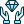</a> | **📂 檔名:** `diamond-give--Streamline-Ultimate.svg` ✨ **格式:** `Vector (SVG)` ⚖️ **大小:** `3.79KB` 📅 **更新:** `2026-03-03`  🚀 **jsDelivr Markdown:** `` 🔗 **直接連結 (Url):** <code>https://cdn.jsdelivr.net/gh/barry028/materials@main/images/iCons/Ui%20Ux%20Graphic%20Design/diamond-give--Streamline-Ultimate.svg</code> 📥 [檢視原始檔](diamond-give--Streamline-Ultimate.svg) |
|  | **📂 檔名:** `diamond-ring--Streamline-Ultimate.svg` ✨ **格式:** `Vector (SVG)` ⚖️ **大小:** `5.00KB` 📅 **更新:** `2026-03-03`  🚀 **jsDelivr Markdown:** `` 🔗 **直接連結 (Url):** <code>https://cdn.jsdelivr.net/gh/barry028/materials@main/images/iCons/Ui%20Ux%20Graphic%20Design/diamond-ring--Streamline-Ultimate.svg</code> 📥 [檢視原始檔](diamond-ring--Streamline-Ultimate.svg) |
|  | **📂 檔名:** `direction-button-2--Streamline-Ultimate.svg` ✨ **格式:** `Vector (SVG)` ⚖️ **大小:** `7.23KB` 📅 **更新:** `2026-03-03`  🚀 **jsDelivr Markdown:** `` 🔗 **直接連結 (Url):** <code>https://cdn.jsdelivr.net/gh/barry028/materials@main/images/iCons/Ui%20Ux%20Graphic%20Design/direction-button-2--Streamline-Ultimate.svg</code> 📥 [檢視原始檔](direction-button-2--Streamline-Ultimate.svg) |
|  | **📂 檔名:** `disability-ad--Streamline-Ultimate.svg` ✨ **格式:** `Vector (SVG)` ⚖️ **大小:** `3.80KB` 📅 **更新:** `2026-03-03`  🚀 **jsDelivr Markdown:** `` 🔗 **直接連結 (Url):** <code>https://cdn.jsdelivr.net/gh/barry028/materials@main/images/iCons/Ui%20Ux%20Graphic%20Design/disability-ad--Streamline-Ultimate.svg</code> 📥 [檢視原始檔](disability-ad--Streamline-Ultimate.svg) |
|  | **📂 檔名:** `disability-blind-read-book-2--Streamline-Ultimate.svg` ✨ **格式:** `Vector (SVG)` ⚖️ **大小:** `2.38KB` 📅 **更新:** `2026-03-03`  🚀 **jsDelivr Markdown:** `` 🔗 **直接連結 (Url):** <code>https://cdn.jsdelivr.net/gh/barry028/materials@main/images/iCons/Ui%20Ux%20Graphic%20Design/disability-blind-read-book-2--Streamline-Ultimate.svg</code> 📥 [檢視原始檔](disability-blind-read-book-2--Streamline-Ultimate.svg) |
|  | **📂 檔名:** `disability-blind-read-finger--Streamline-Ultimate.svg` ✨ **格式:** `Vector (SVG)` ⚖️ **大小:** `7.91KB` 📅 **更新:** `2026-03-03`  🚀 **jsDelivr Markdown:** `` 🔗 **直接連結 (Url):** <code>https://cdn.jsdelivr.net/gh/barry028/materials@main/images/iCons/Ui%20Ux%20Graphic%20Design/disability-blind-read-finger--Streamline-Ultimate.svg</code> 📥 [檢視原始檔](disability-blind-read-finger--Streamline-Ultimate.svg) |
|  | **📂 檔名:** `disability-cc--Streamline-Ultimate.svg` ✨ **格式:** `Vector (SVG)` ⚖️ **大小:** `5.90KB` 📅 **更新:** `2026-03-03`  🚀 **jsDelivr Markdown:** `` 🔗 **直接連結 (Url):** <code>https://cdn.jsdelivr.net/gh/barry028/materials@main/images/iCons/Ui%20Ux%20Graphic%20Design/disability-cc--Streamline-Ultimate.svg</code> 📥 [檢視原始檔](disability-cc--Streamline-Ultimate.svg) |
|  | **📂 檔名:** `disability-hearing--Streamline-Ultimate.svg` ✨ **格式:** `Vector (SVG)` ⚖️ **大小:** `2.62KB` 📅 **更新:** `2026-03-03`  🚀 **jsDelivr Markdown:** `` 🔗 **直接連結 (Url):** <code>https://cdn.jsdelivr.net/gh/barry028/materials@main/images/iCons/Ui%20Ux%20Graphic%20Design/disability-hearing--Streamline-Ultimate.svg</code> 📥 [檢視原始檔](disability-hearing--Streamline-Ultimate.svg) |
|  | **📂 檔名:** `disability-hearing-aid--Streamline-Ultimate.svg` ✨ **格式:** `Vector (SVG)` ⚖️ **大小:** `4.31KB` 📅 **更新:** `2026-03-03`  🚀 **jsDelivr Markdown:** `` 🔗 **直接連結 (Url):** <code>https://cdn.jsdelivr.net/gh/barry028/materials@main/images/iCons/Ui%20Ux%20Graphic%20Design/disability-hearing-aid--Streamline-Ultimate.svg</code> 📥 [檢視原始檔](disability-hearing-aid--Streamline-Ultimate.svg) |
|  | **📂 檔名:** `disability-microphone--Streamline-Ultimate.svg` ✨ **格式:** `Vector (SVG)` ⚖️ **大小:** `3.72KB` 📅 **更新:** `2026-03-03`  🚀 **jsDelivr Markdown:** `` 🔗 **直接連結 (Url):** <code>https://cdn.jsdelivr.net/gh/barry028/materials@main/images/iCons/Ui%20Ux%20Graphic%20Design/disability-microphone--Streamline-Ultimate.svg</code> 📥 [檢視原始檔](disability-microphone--Streamline-Ultimate.svg) |
|  | **📂 檔名:** `disability-sit-cane--Streamline-Ultimate.svg` ✨ **格式:** `Vector (SVG)` ⚖️ **大小:** `1.92KB` 📅 **更新:** `2026-03-03`  🚀 **jsDelivr Markdown:** `` 🔗 **直接連結 (Url):** <code>https://cdn.jsdelivr.net/gh/barry028/materials@main/images/iCons/Ui%20Ux%20Graphic%20Design/disability-sit-cane--Streamline-Ultimate.svg</code> 📥 [檢視原始檔](disability-sit-cane--Streamline-Ultimate.svg) |
| <a href="disability-sit-pregnancy--Streamline-Ultimate.svg">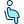</a> | **📂 檔名:** `disability-sit-pregnancy--Streamline-Ultimate.svg` ✨ **格式:** `Vector (SVG)` ⚖️ **大小:** `1.84KB` 📅 **更新:** `2026-03-03`  🚀 **jsDelivr Markdown:** `` 🔗 **直接連結 (Url):** <code>https://cdn.jsdelivr.net/gh/barry028/materials@main/images/iCons/Ui%20Ux%20Graphic%20Design/disability-sit-pregnancy--Streamline-Ultimate.svg</code> 📥 [檢視原始檔](disability-sit-pregnancy--Streamline-Ultimate.svg) |
|  | **📂 檔名:** `disability-wheelchair--Streamline-Ultimate.svg` ✨ **格式:** `Vector (SVG)` ⚖️ **大小:** `2.57KB` 📅 **更新:** `2026-03-03`  🚀 **jsDelivr Markdown:** `` 🔗 **直接連結 (Url):** <code>https://cdn.jsdelivr.net/gh/barry028/materials@main/images/iCons/Ui%20Ux%20Graphic%20Design/disability-wheelchair--Streamline-Ultimate.svg</code> 📥 [檢視原始檔](disability-wheelchair--Streamline-Ultimate.svg) |
|  | **📂 檔名:** `disability-wheelchair-1--Streamline-Ultimate.svg` ✨ **格式:** `Vector (SVG)` ⚖️ **大小:** `2.09KB` 📅 **更新:** `2026-03-03`  🚀 **jsDelivr Markdown:** `` 🔗 **直接連結 (Url):** <code>https://cdn.jsdelivr.net/gh/barry028/materials@main/images/iCons/Ui%20Ux%20Graphic%20Design/disability-wheelchair-1--Streamline-Ultimate.svg</code> 📥 [檢視原始檔](disability-wheelchair-1--Streamline-Ultimate.svg) |
|  | **📂 檔名:** `discount-1--Streamline-Ultimate.svg` ✨ **格式:** `Vector (SVG)` ⚖️ **大小:** `3.77KB` 📅 **更新:** `2026-03-03`  🚀 **jsDelivr Markdown:** `` 🔗 **直接連結 (Url):** <code>https://cdn.jsdelivr.net/gh/barry028/materials@main/images/iCons/Ui%20Ux%20Graphic%20Design/discount-1--Streamline-Ultimate.svg</code> 📥 [檢視原始檔](discount-1--Streamline-Ultimate.svg) |
|  | **📂 檔名:** `discount-arrow--Streamline-Ultimate.svg` ✨ **格式:** `Vector (SVG)` ⚖️ **大小:** `3.86KB` 📅 **更新:** `2026-03-03`  🚀 **jsDelivr Markdown:** `` 🔗 **直接連結 (Url):** <code>https://cdn.jsdelivr.net/gh/barry028/materials@main/images/iCons/Ui%20Ux%20Graphic%20Design/discount-arrow--Streamline-Ultimate.svg</code> 📥 [檢視原始檔](discount-arrow--Streamline-Ultimate.svg) |
|  | **📂 檔名:** `discount-bubble--Streamline-Ultimate.svg` ✨ **格式:** `Vector (SVG)` ⚖️ **大小:** `5.35KB` 📅 **更新:** `2026-03-03`  🚀 **jsDelivr Markdown:** `` 🔗 **直接連結 (Url):** <code>https://cdn.jsdelivr.net/gh/barry028/materials@main/images/iCons/Ui%20Ux%20Graphic%20Design/discount-bubble--Streamline-Ultimate.svg</code> 📥 [檢視原始檔](discount-bubble--Streamline-Ultimate.svg) |
|  | **📂 檔名:** `discount-circle--Streamline-Ultimate.svg` ✨ **格式:** `Vector (SVG)` ⚖️ **大小:** `3.21KB` 📅 **更新:** `2026-03-03`  🚀 **jsDelivr Markdown:** `` 🔗 **直接連結 (Url):** <code>https://cdn.jsdelivr.net/gh/barry028/materials@main/images/iCons/Ui%20Ux%20Graphic%20Design/discount-circle--Streamline-Ultimate.svg</code> 📥 [檢視原始檔](discount-circle--Streamline-Ultimate.svg) |
|  | **📂 檔名:** `discount-coupon--Streamline-Ultimate.svg` ✨ **格式:** `Vector (SVG)` ⚖️ **大小:** `2.80KB` 📅 **更新:** `2026-03-03`  🚀 **jsDelivr Markdown:** `` 🔗 **直接連結 (Url):** <code>https://cdn.jsdelivr.net/gh/barry028/materials@main/images/iCons/Ui%20Ux%20Graphic%20Design/discount-coupon--Streamline-Ultimate.svg</code> 📥 [檢視原始檔](discount-coupon--Streamline-Ultimate.svg) |
|  | **📂 檔名:** `discount-star-premium--Streamline-Ultimate.svg` ✨ **格式:** `Vector (SVG)` ⚖️ **大小:** `6.07KB` 📅 **更新:** `2026-03-03`  🚀 **jsDelivr Markdown:** `` 🔗 **直接連結 (Url):** <code>https://cdn.jsdelivr.net/gh/barry028/materials@main/images/iCons/Ui%20Ux%20Graphic%20Design/discount-star-premium--Streamline-Ultimate.svg</code> 📥 [檢視原始檔](discount-star-premium--Streamline-Ultimate.svg) |
|  | **📂 檔名:** `dislike--Streamline-Ultimate.svg` ✨ **格式:** `Vector (SVG)` ⚖️ **大小:** `1006.00B` 📅 **更新:** `2026-03-03`  🚀 **jsDelivr Markdown:** `` 🔗 **直接連結 (Url):** <code>https://cdn.jsdelivr.net/gh/barry028/materials@main/images/iCons/Ui%20Ux%20Graphic%20Design/dislike--Streamline-Ultimate.svg</code> 📥 [檢視原始檔](dislike--Streamline-Ultimate.svg) |
|  | **📂 檔名:** `dog-allowed--Streamline-Ultimate.svg` ✨ **格式:** `Vector (SVG)` ⚖️ **大小:** `3.91KB` 📅 **更新:** `2026-03-03`  🚀 **jsDelivr Markdown:** `` 🔗 **直接連結 (Url):** <code>https://cdn.jsdelivr.net/gh/barry028/materials@main/images/iCons/Ui%20Ux%20Graphic%20Design/dog-allowed--Streamline-Ultimate.svg</code> 📥 [檢視原始檔](dog-allowed--Streamline-Ultimate.svg) |
|  | **📂 檔名:** `dog-forbidden--Streamline-Ultimate.svg` ✨ **格式:** `Vector (SVG)` ⚖️ **大小:** `4.08KB` 📅 **更新:** `2026-03-03`  🚀 **jsDelivr Markdown:** `` 🔗 **直接連結 (Url):** <code>https://cdn.jsdelivr.net/gh/barry028/materials@main/images/iCons/Ui%20Ux%20Graphic%20Design/dog-forbidden--Streamline-Ultimate.svg</code> 📥 [檢視原始檔](dog-forbidden--Streamline-Ultimate.svg) |
|  | **📂 檔名:** `download-square-3--Streamline-Ultimate.svg` ✨ **格式:** `Vector (SVG)` ⚖️ **大小:** `1.91KB` 📅 **更新:** `2026-03-03`  🚀 **jsDelivr Markdown:** `` 🔗 **直接連結 (Url):** <code>https://cdn.jsdelivr.net/gh/barry028/materials@main/images/iCons/Ui%20Ux%20Graphic%20Design/download-square-3--Streamline-Ultimate.svg</code> 📥 [檢視原始檔](download-square-3--Streamline-Ultimate.svg) |
|  | **📂 檔名:** `download-thick-bottom--Streamline-Ultimate.svg` ✨ **格式:** `Vector (SVG)` ⚖️ **大小:** `2.18KB` 📅 **更新:** `2026-03-03`  🚀 **jsDelivr Markdown:** `` 🔗 **直接連結 (Url):** <code>https://cdn.jsdelivr.net/gh/barry028/materials@main/images/iCons/Ui%20Ux%20Graphic%20Design/download-thick-bottom--Streamline-Ultimate.svg</code> 📥 [檢視原始檔](download-thick-bottom--Streamline-Ultimate.svg) |
|  | **📂 檔名:** `drawer-download--Streamline-Ultimate.svg` ✨ **格式:** `Vector (SVG)` ⚖️ **大小:** `2.10KB` 📅 **更新:** `2026-03-03`  🚀 **jsDelivr Markdown:** `` 🔗 **直接連結 (Url):** <code>https://cdn.jsdelivr.net/gh/barry028/materials@main/images/iCons/Ui%20Ux%20Graphic%20Design/drawer-download--Streamline-Ultimate.svg</code> 📥 [檢視原始檔](drawer-download--Streamline-Ultimate.svg) |
|  | **📂 檔名:** `drawer-file--Streamline-Ultimate.svg` ✨ **格式:** `Vector (SVG)` ⚖️ **大小:** `2.60KB` 📅 **更新:** `2026-03-03`  🚀 **jsDelivr Markdown:** `` 🔗 **直接連結 (Url):** <code>https://cdn.jsdelivr.net/gh/barry028/materials@main/images/iCons/Ui%20Ux%20Graphic%20Design/drawer-file--Streamline-Ultimate.svg</code> 📥 [檢視原始檔](drawer-file--Streamline-Ultimate.svg) |
|  | **📂 檔名:** `drawer-image--Streamline-Ultimate.svg` ✨ **格式:** `Vector (SVG)` ⚖️ **大小:** `3.72KB` 📅 **更新:** `2026-03-03`  🚀 **jsDelivr Markdown:** `` 🔗 **直接連結 (Url):** <code>https://cdn.jsdelivr.net/gh/barry028/materials@main/images/iCons/Ui%20Ux%20Graphic%20Design/drawer-image--Streamline-Ultimate.svg</code> 📥 [檢視原始檔](drawer-image--Streamline-Ultimate.svg) |
|  | **📂 檔名:** `drawer-send--Streamline-Ultimate.svg` ✨ **格式:** `Vector (SVG)` ⚖️ **大小:** `2.30KB` 📅 **更新:** `2026-03-03`  🚀 **jsDelivr Markdown:** `` 🔗 **直接連結 (Url):** <code>https://cdn.jsdelivr.net/gh/barry028/materials@main/images/iCons/Ui%20Ux%20Graphic%20Design/drawer-send--Streamline-Ultimate.svg</code> 📥 [檢視原始檔](drawer-send--Streamline-Ultimate.svg) |
|  | **📂 檔名:** `e-commerce-add-basket-cloud--Streamline-Ultimate.svg` ✨ **格式:** `Vector (SVG)` ⚖️ **大小:** `4.38KB` 📅 **更新:** `2026-03-03`  🚀 **jsDelivr Markdown:** `` 🔗 **直接連結 (Url):** <code>https://cdn.jsdelivr.net/gh/barry028/materials@main/images/iCons/Ui%20Ux%20Graphic%20Design/e-commerce-add-basket-cloud--Streamline-Ultimate.svg</code> 📥 [檢視原始檔](e-commerce-add-basket-cloud--Streamline-Ultimate.svg) |
|  | **📂 檔名:** `e-commerce-apparel-laptop--Streamline-Ultimate.svg` ✨ **格式:** `Vector (SVG)` ⚖️ **大小:** `4.14KB` 📅 **更新:** `2026-03-03`  🚀 **jsDelivr Markdown:** `` 🔗 **直接連結 (Url):** <code>https://cdn.jsdelivr.net/gh/barry028/materials@main/images/iCons/Ui%20Ux%20Graphic%20Design/e-commerce-apparel-laptop--Streamline-Ultimate.svg</code> 📥 [檢視原始檔](e-commerce-apparel-laptop--Streamline-Ultimate.svg) |
|  | **📂 檔名:** `e-commerce-basket-monitor--Streamline-Ultimate.svg` ✨ **格式:** `Vector (SVG)` ⚖️ **大小:** `1.67KB` 📅 **更新:** `2026-03-03`  🚀 **jsDelivr Markdown:** `` 🔗 **直接連結 (Url):** <code>https://cdn.jsdelivr.net/gh/barry028/materials@main/images/iCons/Ui%20Ux%20Graphic%20Design/e-commerce-basket-monitor--Streamline-Ultimate.svg</code> 📥 [檢視原始檔](e-commerce-basket-monitor--Streamline-Ultimate.svg) |
|  | **📂 檔名:** `e-commerce-cart-vr--Streamline-Ultimate.svg` ✨ **格式:** `Vector (SVG)` ⚖️ **大小:** `5.53KB` 📅 **更新:** `2026-03-03`  🚀 **jsDelivr Markdown:** `` 🔗 **直接連結 (Url):** <code>https://cdn.jsdelivr.net/gh/barry028/materials@main/images/iCons/Ui%20Ux%20Graphic%20Design/e-commerce-cart-vr--Streamline-Ultimate.svg</code> 📥 [檢視原始檔](e-commerce-cart-vr--Streamline-Ultimate.svg) |
|  | **📂 檔名:** `e-commerce-shop--Streamline-Ultimate.svg` ✨ **格式:** `Vector (SVG)` ⚖️ **大小:** `3.49KB` 📅 **更新:** `2026-03-03`  🚀 **jsDelivr Markdown:** `` 🔗 **直接連結 (Url):** <code>https://cdn.jsdelivr.net/gh/barry028/materials@main/images/iCons/Ui%20Ux%20Graphic%20Design/e-commerce-shop--Streamline-Ultimate.svg</code> 📥 [檢視原始檔](e-commerce-shop--Streamline-Ultimate.svg) |
|  | **📂 檔名:** `e-commerce-touch-buy--Streamline-Ultimate.svg` ✨ **格式:** `Vector (SVG)` ⚖️ **大小:** `2.14KB` 📅 **更新:** `2026-03-03`  🚀 **jsDelivr Markdown:** `` 🔗 **直接連結 (Url):** <code>https://cdn.jsdelivr.net/gh/barry028/materials@main/images/iCons/Ui%20Ux%20Graphic%20Design/e-commerce-touch-buy--Streamline-Ultimate.svg</code> 📥 [檢視原始檔](e-commerce-touch-buy--Streamline-Ultimate.svg) |
|  | **📂 檔名:** `earpods--Streamline-Ultimate.svg` ✨ **格式:** `Vector (SVG)` ⚖️ **大小:** `5.24KB` 📅 **更新:** `2026-03-03`  🚀 **jsDelivr Markdown:** `` 🔗 **直接連結 (Url):** <code>https://cdn.jsdelivr.net/gh/barry028/materials@main/images/iCons/Ui%20Ux%20Graphic%20Design/earpods--Streamline-Ultimate.svg</code> 📥 [檢視原始檔](earpods--Streamline-Ultimate.svg) |
|  | **📂 檔名:** `electronics-led-light--Streamline-Ultimate.svg` ✨ **格式:** `Vector (SVG)` ⚖️ **大小:** `1.19KB` 📅 **更新:** `2026-03-03`  🚀 **jsDelivr Markdown:** `` 🔗 **直接連結 (Url):** <code>https://cdn.jsdelivr.net/gh/barry028/materials@main/images/iCons/Ui%20Ux%20Graphic%20Design/electronics-led-light--Streamline-Ultimate.svg</code> 📥 [檢視原始檔](electronics-led-light--Streamline-Ultimate.svg) |
|  | **📂 檔名:** `electronics-switch--Streamline-Ultimate.svg` ✨ **格式:** `Vector (SVG)` ⚖️ **大小:** `2.90KB` 📅 **更新:** `2026-03-03`  🚀 **jsDelivr Markdown:** `` 🔗 **直接連結 (Url):** <code>https://cdn.jsdelivr.net/gh/barry028/materials@main/images/iCons/Ui%20Ux%20Graphic%20Design/electronics-switch--Streamline-Ultimate.svg</code> 📥 [檢視原始檔](electronics-switch--Streamline-Ultimate.svg) |
|  | **📂 檔名:** `electronics-vacuum-tube--Streamline-Ultimate.svg` ✨ **格式:** `Vector (SVG)` ⚖️ **大小:** `2.88KB` 📅 **更新:** `2026-03-03`  🚀 **jsDelivr Markdown:** `` 🔗 **直接連結 (Url):** <code>https://cdn.jsdelivr.net/gh/barry028/materials@main/images/iCons/Ui%20Ux%20Graphic%20Design/electronics-vacuum-tube--Streamline-Ultimate.svg</code> 📥 [檢視原始檔](electronics-vacuum-tube--Streamline-Ultimate.svg) |
|  | **📂 檔名:** `email-action-add--Streamline-Ultimate.svg` ✨ **格式:** `Vector (SVG)` ⚖️ **大小:** `2.55KB` 📅 **更新:** `2026-03-03`  🚀 **jsDelivr Markdown:** `` 🔗 **直接連結 (Url):** <code>https://cdn.jsdelivr.net/gh/barry028/materials@main/images/iCons/Ui%20Ux%20Graphic%20Design/email-action-add--Streamline-Ultimate.svg</code> 📥 [檢視原始檔](email-action-add--Streamline-Ultimate.svg) |
|  | **📂 檔名:** `email-action-check--Streamline-Ultimate.svg` ✨ **格式:** `Vector (SVG)` ⚖️ **大小:** `2.95KB` 📅 **更新:** `2026-03-03`  🚀 **jsDelivr Markdown:** `` 🔗 **直接連結 (Url):** <code>https://cdn.jsdelivr.net/gh/barry028/materials@main/images/iCons/Ui%20Ux%20Graphic%20Design/email-action-check--Streamline-Ultimate.svg</code> 📥 [檢視原始檔](email-action-check--Streamline-Ultimate.svg) |
|  | **📂 檔名:** `email-action-download--Streamline-Ultimate.svg` ✨ **格式:** `Vector (SVG)` ⚖️ **大小:** `954.00B` 📅 **更新:** `2026-03-03`  🚀 **jsDelivr Markdown:** `` 🔗 **直接連結 (Url):** <code>https://cdn.jsdelivr.net/gh/barry028/materials@main/images/iCons/Ui%20Ux%20Graphic%20Design/email-action-download--Streamline-Ultimate.svg</code> 📥 [檢視原始檔](email-action-download--Streamline-Ultimate.svg) |
|  | **📂 檔名:** `email-action-remove--Streamline-Ultimate.svg` ✨ **格式:** `Vector (SVG)` ⚖️ **大小:** `2.57KB` 📅 **更新:** `2026-03-03`  🚀 **jsDelivr Markdown:** `` 🔗 **直接連結 (Url):** <code>https://cdn.jsdelivr.net/gh/barry028/materials@main/images/iCons/Ui%20Ux%20Graphic%20Design/email-action-remove--Streamline-Ultimate.svg</code> 📥 [檢視原始檔](email-action-remove--Streamline-Ultimate.svg) |
|  | **📂 檔名:** `email-action-reply-all-1--Streamline-Ultimate.svg` ✨ **格式:** `Vector (SVG)` ⚖️ **大小:** `1.84KB` 📅 **更新:** `2026-03-03`  🚀 **jsDelivr Markdown:** `` 🔗 **直接連結 (Url):** <code>https://cdn.jsdelivr.net/gh/barry028/materials@main/images/iCons/Ui%20Ux%20Graphic%20Design/email-action-reply-all-1--Streamline-Ultimate.svg</code> 📥 [檢視原始檔](email-action-reply-all-1--Streamline-Ultimate.svg) |
|  | **📂 檔名:** `email-action-search-1--Streamline-Ultimate.svg` ✨ **格式:** `Vector (SVG)` ⚖️ **大小:** `2.20KB` 📅 **更新:** `2026-03-03`  🚀 **jsDelivr Markdown:** `` 🔗 **直接連結 (Url):** <code>https://cdn.jsdelivr.net/gh/barry028/materials@main/images/iCons/Ui%20Ux%20Graphic%20Design/email-action-search-1--Streamline-Ultimate.svg</code> 📥 [檢視原始檔](email-action-search-1--Streamline-Ultimate.svg) |
|  | **📂 檔名:** `email-action-settings--Streamline-Ultimate.svg` ✨ **格式:** `Vector (SVG)` ⚖️ **大小:** `7.17KB` 📅 **更新:** `2026-03-03`  🚀 **jsDelivr Markdown:** `` 🔗 **直接連結 (Url):** <code>https://cdn.jsdelivr.net/gh/barry028/materials@main/images/iCons/Ui%20Ux%20Graphic%20Design/email-action-settings--Streamline-Ultimate.svg</code> 📥 [檢視原始檔](email-action-settings--Streamline-Ultimate.svg) |
|  | **📂 檔名:** `email-action-sync--Streamline-Ultimate.svg` ✨ **格式:** `Vector (SVG)` ⚖️ **大小:** `1.77KB` 📅 **更新:** `2026-03-03`  🚀 **jsDelivr Markdown:** `` 🔗 **直接連結 (Url):** <code>https://cdn.jsdelivr.net/gh/barry028/materials@main/images/iCons/Ui%20Ux%20Graphic%20Design/email-action-sync--Streamline-Ultimate.svg</code> 📥 [檢視原始檔](email-action-sync--Streamline-Ultimate.svg) |
|  | **📂 檔名:** `envelope--Streamline-Ultimate.svg` ✨ **格式:** `Vector (SVG)` ⚖️ **大小:** `920.00B` 📅 **更新:** `2026-03-03`  🚀 **jsDelivr Markdown:** `` 🔗 **直接連結 (Url):** <code>https://cdn.jsdelivr.net/gh/barry028/materials@main/images/iCons/Ui%20Ux%20Graphic%20Design/envelope--Streamline-Ultimate.svg</code> 📥 [檢視原始檔](envelope--Streamline-Ultimate.svg) |
|  | **📂 檔名:** `envelope-letter--Streamline-Ultimate.svg` ✨ **格式:** `Vector (SVG)` ⚖️ **大小:** `1.05KB` 📅 **更新:** `2026-03-03`  🚀 **jsDelivr Markdown:** `` 🔗 **直接連結 (Url):** <code>https://cdn.jsdelivr.net/gh/barry028/materials@main/images/iCons/Ui%20Ux%20Graphic%20Design/envelope-letter--Streamline-Ultimate.svg</code> 📥 [檢視原始檔](envelope-letter--Streamline-Ultimate.svg) |
|  | **📂 檔名:** `envelope-postcard--Streamline-Ultimate.svg` ✨ **格式:** `Vector (SVG)` ⚖️ **大小:** `1.47KB` 📅 **更新:** `2026-03-03`  🚀 **jsDelivr Markdown:** `` 🔗 **直接連結 (Url):** <code>https://cdn.jsdelivr.net/gh/barry028/materials@main/images/iCons/Ui%20Ux%20Graphic%20Design/envelope-postcard--Streamline-Ultimate.svg</code> 📥 [檢視原始檔](envelope-postcard--Streamline-Ultimate.svg) |
|  | **📂 檔名:** `equalizer-stereo-play--Streamline-Ultimate.svg` ✨ **格式:** `Vector (SVG)` ⚖️ **大小:** `8.81KB` 📅 **更新:** `2026-03-03`  🚀 **jsDelivr Markdown:** `` 🔗 **直接連結 (Url):** <code>https://cdn.jsdelivr.net/gh/barry028/materials@main/images/iCons/Ui%20Ux%20Graphic%20Design/equalizer-stereo-play--Streamline-Ultimate.svg</code> 📥 [檢視原始檔](equalizer-stereo-play--Streamline-Ultimate.svg) |
|  | **📂 檔名:** `escalator-ascend-person--Streamline-Ultimate.svg` ✨ **格式:** `Vector (SVG)` ⚖️ **大小:** `3.02KB` 📅 **更新:** `2026-03-03`  🚀 **jsDelivr Markdown:** `` 🔗 **直接連結 (Url):** <code>https://cdn.jsdelivr.net/gh/barry028/materials@main/images/iCons/Ui%20Ux%20Graphic%20Design/escalator-ascend-person--Streamline-Ultimate.svg</code> 📥 [檢視原始檔](escalator-ascend-person--Streamline-Ultimate.svg) |
|  | **📂 檔名:** `escalator-descend--Streamline-Ultimate.svg` ✨ **格式:** `Vector (SVG)` ⚖️ **大小:** `2.46KB` 📅 **更新:** `2026-03-03`  🚀 **jsDelivr Markdown:** `` 🔗 **直接連結 (Url):** <code>https://cdn.jsdelivr.net/gh/barry028/materials@main/images/iCons/Ui%20Ux%20Graphic%20Design/escalator-descend--Streamline-Ultimate.svg</code> 📥 [檢視原始檔](escalator-descend--Streamline-Ultimate.svg) |
|  | **📂 檔名:** `exit-1--Streamline-Ultimate.svg` ✨ **格式:** `Vector (SVG)` ⚖️ **大小:** `2.90KB` 📅 **更新:** `2026-03-03`  🚀 **jsDelivr Markdown:** `` 🔗 **直接連結 (Url):** <code>https://cdn.jsdelivr.net/gh/barry028/materials@main/images/iCons/Ui%20Ux%20Graphic%20Design/exit-1--Streamline-Ultimate.svg</code> 📥 [檢視原始檔](exit-1--Streamline-Ultimate.svg) |
|  | **📂 檔名:** `expand-1--Streamline-Ultimate.svg` ✨ **格式:** `Vector (SVG)` ⚖️ **大小:** `1.39KB` 📅 **更新:** `2026-03-03`  🚀 **jsDelivr Markdown:** `` 🔗 **直接連結 (Url):** <code>https://cdn.jsdelivr.net/gh/barry028/materials@main/images/iCons/Ui%20Ux%20Graphic%20Design/expand-1--Streamline-Ultimate.svg</code> 📥 [檢視原始檔](expand-1--Streamline-Ultimate.svg) |
|  | **📂 檔名:** `expand-6--Streamline-Ultimate.svg` ✨ **格式:** `Vector (SVG)` ⚖️ **大小:** `1.06KB` 📅 **更新:** `2026-03-03`  🚀 **jsDelivr Markdown:** `` 🔗 **直接連結 (Url):** <code>https://cdn.jsdelivr.net/gh/barry028/materials@main/images/iCons/Ui%20Ux%20Graphic%20Design/expand-6--Streamline-Ultimate.svg</code> 📥 [檢視原始檔](expand-6--Streamline-Ultimate.svg) |
|  | **📂 檔名:** `face-id--Streamline-Ultimate.svg` ✨ **格式:** `Vector (SVG)` ⚖️ **大小:** `1.80KB` 📅 **更新:** `2026-03-03`  🚀 **jsDelivr Markdown:** `` 🔗 **直接連結 (Url):** <code>https://cdn.jsdelivr.net/gh/barry028/materials@main/images/iCons/Ui%20Ux%20Graphic%20Design/face-id--Streamline-Ultimate.svg</code> 📥 [檢視原始檔](face-id--Streamline-Ultimate.svg) |
|  | **📂 檔名:** `face-id-1--Streamline-Ultimate.svg` ✨ **格式:** `Vector (SVG)` ⚖️ **大小:** `2.81KB` 📅 **更新:** `2026-03-03`  🚀 **jsDelivr Markdown:** `` 🔗 **直接連結 (Url):** <code>https://cdn.jsdelivr.net/gh/barry028/materials@main/images/iCons/Ui%20Ux%20Graphic%20Design/face-id-1--Streamline-Ultimate.svg</code> 📥 [檢視原始檔](face-id-1--Streamline-Ultimate.svg) |
|  | **📂 檔名:** `face-id-4--Streamline-Ultimate.svg` ✨ **格式:** `Vector (SVG)` ⚖️ **大小:** `2.73KB` 📅 **更新:** `2026-03-03`  🚀 **jsDelivr Markdown:** `` 🔗 **直接連結 (Url):** <code>https://cdn.jsdelivr.net/gh/barry028/materials@main/images/iCons/Ui%20Ux%20Graphic%20Design/face-id-4--Streamline-Ultimate.svg</code> 📥 [檢視原始檔](face-id-4--Streamline-Ultimate.svg) |
|  | **📂 檔名:** `face-id-smartphone--Streamline-Ultimate.svg` ✨ **格式:** `Vector (SVG)` ⚖️ **大小:** `1.50KB` 📅 **更新:** `2026-03-03`  🚀 **jsDelivr Markdown:** `` 🔗 **直接連結 (Url):** <code>https://cdn.jsdelivr.net/gh/barry028/materials@main/images/iCons/Ui%20Ux%20Graphic%20Design/face-id-smartphone--Streamline-Ultimate.svg</code> 📥 [檢視原始檔](face-id-smartphone--Streamline-Ultimate.svg) |
|  | **📂 檔名:** `family-baby-change-diaper--Streamline-Ultimate.svg` ✨ **格式:** `Vector (SVG)` ⚖️ **大小:** `3.91KB` 📅 **更新:** `2026-03-03`  🚀 **jsDelivr Markdown:** `` 🔗 **直接連結 (Url):** <code>https://cdn.jsdelivr.net/gh/barry028/materials@main/images/iCons/Ui%20Ux%20Graphic%20Design/family-baby-change-diaper--Streamline-Ultimate.svg</code> 📥 [檢視原始檔](family-baby-change-diaper--Streamline-Ultimate.svg) |
|  | **📂 檔名:** `family-child-play-ball-warning--Streamline-Ultimate.svg` ✨ **格式:** `Vector (SVG)` ⚖️ **大小:** `3.42KB` 📅 **更新:** `2026-03-03`  🚀 **jsDelivr Markdown:** `` 🔗 **直接連結 (Url):** <code>https://cdn.jsdelivr.net/gh/barry028/materials@main/images/iCons/Ui%20Ux%20Graphic%20Design/family-child-play-ball-warning--Streamline-Ultimate.svg</code> 📥 [檢視原始檔](family-child-play-ball-warning--Streamline-Ultimate.svg) |
|  | **📂 檔名:** `famous-character-pokemon--Streamline-Ultimate.svg` ✨ **格式:** `Vector (SVG)` ⚖️ **大小:** `2.71KB` 📅 **更新:** `2026-03-03`  🚀 **jsDelivr Markdown:** `` 🔗 **直接連結 (Url):** <code>https://cdn.jsdelivr.net/gh/barry028/materials@main/images/iCons/Ui%20Ux%20Graphic%20Design/famous-character-pokemon--Streamline-Ultimate.svg</code> 📥 [檢視原始檔](famous-character-pokemon--Streamline-Ultimate.svg) |
|  | **📂 檔名:** `file-app-1--Streamline-Ultimate.svg` ✨ **格式:** `Vector (SVG)` ⚖️ **大小:** `3.04KB` 📅 **更新:** `2026-03-03`  🚀 **jsDelivr Markdown:** `` 🔗 **直接連結 (Url):** <code>https://cdn.jsdelivr.net/gh/barry028/materials@main/images/iCons/Ui%20Ux%20Graphic%20Design/file-app-1--Streamline-Ultimate.svg</code> 📥 [檢視原始檔](file-app-1--Streamline-Ultimate.svg) |
|  | **📂 檔名:** `file-c-plus-plus-1--Streamline-Ultimate.svg` ✨ **格式:** `Vector (SVG)` ⚖️ **大小:** `2.60KB` 📅 **更新:** `2026-03-03`  🚀 **jsDelivr Markdown:** `` 🔗 **直接連結 (Url):** <code>https://cdn.jsdelivr.net/gh/barry028/materials@main/images/iCons/Ui%20Ux%20Graphic%20Design/file-c-plus-plus-1--Streamline-Ultimate.svg</code> 📥 [檢視原始檔](file-c-plus-plus-1--Streamline-Ultimate.svg) |
|  | **📂 檔名:** `file-code-2--Streamline-Ultimate.svg` ✨ **格式:** `Vector (SVG)` ⚖️ **大小:** `1.48KB` 📅 **更新:** `2026-03-03`  🚀 **jsDelivr Markdown:** `` 🔗 **直接連結 (Url):** <code>https://cdn.jsdelivr.net/gh/barry028/materials@main/images/iCons/Ui%20Ux%20Graphic%20Design/file-code-2--Streamline-Ultimate.svg</code> 📥 [檢視原始檔](file-code-2--Streamline-Ultimate.svg) |
|  | **📂 檔名:** `file-code-cash--Streamline-Ultimate.svg` ✨ **格式:** `Vector (SVG)` ⚖️ **大小:** `4.28KB` 📅 **更新:** `2026-03-03`  🚀 **jsDelivr Markdown:** `` 🔗 **直接連結 (Url):** <code>https://cdn.jsdelivr.net/gh/barry028/materials@main/images/iCons/Ui%20Ux%20Graphic%20Design/file-code-cash--Streamline-Ultimate.svg</code> 📥 [檢視原始檔](file-code-cash--Streamline-Ultimate.svg) |
|  | **📂 檔名:** `file-code-download--Streamline-Ultimate.svg` ✨ **格式:** `Vector (SVG)` ⚖️ **大小:** `3.86KB` 📅 **更新:** `2026-03-03`  🚀 **jsDelivr Markdown:** `` 🔗 **直接連結 (Url):** <code>https://cdn.jsdelivr.net/gh/barry028/materials@main/images/iCons/Ui%20Ux%20Graphic%20Design/file-code-download--Streamline-Ultimate.svg</code> 📥 [檢視原始檔](file-code-download--Streamline-Ultimate.svg) |
|  | **📂 檔名:** `file-code-question--Streamline-Ultimate.svg` ✨ **格式:** `Vector (SVG)` ⚖️ **大小:** `4.59KB` 📅 **更新:** `2026-03-03`  🚀 **jsDelivr Markdown:** `` 🔗 **直接連結 (Url):** <code>https://cdn.jsdelivr.net/gh/barry028/materials@main/images/iCons/Ui%20Ux%20Graphic%20Design/file-code-question--Streamline-Ultimate.svg</code> 📥 [檢視原始檔](file-code-question--Streamline-Ultimate.svg) |
|  | **📂 檔名:** `file-code-refresh--Streamline-Ultimate.svg` ✨ **格式:** `Vector (SVG)` ⚖️ **大小:** `3.77KB` 📅 **更新:** `2026-03-03`  🚀 **jsDelivr Markdown:** `` 🔗 **直接連結 (Url):** <code>https://cdn.jsdelivr.net/gh/barry028/materials@main/images/iCons/Ui%20Ux%20Graphic%20Design/file-code-refresh--Streamline-Ultimate.svg</code> 📥 [檢視原始檔](file-code-refresh--Streamline-Ultimate.svg) |
|  | **📂 檔名:** `file-code-share--Streamline-Ultimate.svg` ✨ **格式:** `Vector (SVG)` ⚖️ **大小:** `4.00KB` 📅 **更新:** `2026-03-03`  🚀 **jsDelivr Markdown:** `` 🔗 **直接連結 (Url):** <code>https://cdn.jsdelivr.net/gh/barry028/materials@main/images/iCons/Ui%20Ux%20Graphic%20Design/file-code-share--Streamline-Ultimate.svg</code> 📥 [檢視原始檔](file-code-share--Streamline-Ultimate.svg) |
|  | **📂 檔名:** `file-code-sync--Streamline-Ultimate.svg` ✨ **格式:** `Vector (SVG)` ⚖️ **大小:** `3.70KB` 📅 **更新:** `2026-03-03`  🚀 **jsDelivr Markdown:** `` 🔗 **直接連結 (Url):** <code>https://cdn.jsdelivr.net/gh/barry028/materials@main/images/iCons/Ui%20Ux%20Graphic%20Design/file-code-sync--Streamline-Ultimate.svg</code> 📥 [檢視原始檔](file-code-sync--Streamline-Ultimate.svg) |
|  | **📂 檔名:** `file-code-warning--Streamline-Ultimate.svg` ✨ **格式:** `Vector (SVG)` ⚖️ **大小:** `4.75KB` 📅 **更新:** `2026-03-03`  🚀 **jsDelivr Markdown:** `` 🔗 **直接連結 (Url):** <code>https://cdn.jsdelivr.net/gh/barry028/materials@main/images/iCons/Ui%20Ux%20Graphic%20Design/file-code-warning--Streamline-Ultimate.svg</code> 📥 [檢視原始檔](file-code-warning--Streamline-Ultimate.svg) |
|  | **📂 檔名:** `file-css--Streamline-Ultimate.svg` ✨ **格式:** `Vector (SVG)` ⚖️ **大小:** `3.10KB` 📅 **更新:** `2026-03-03`  🚀 **jsDelivr Markdown:** `` 🔗 **直接連結 (Url):** <code>https://cdn.jsdelivr.net/gh/barry028/materials@main/images/iCons/Ui%20Ux%20Graphic%20Design/file-css--Streamline-Ultimate.svg</code> 📥 [檢視原始檔](file-css--Streamline-Ultimate.svg) |
|  | **📂 檔名:** `file-csv--Streamline-Ultimate.svg` ✨ **格式:** `Vector (SVG)` ⚖️ **大小:** `2.79KB` 📅 **更新:** `2026-03-03`  🚀 **jsDelivr Markdown:** `` 🔗 **直接連結 (Url):** <code>https://cdn.jsdelivr.net/gh/barry028/materials@main/images/iCons/Ui%20Ux%20Graphic%20Design/file-csv--Streamline-Ultimate.svg</code> 📥 [檢視原始檔](file-csv--Streamline-Ultimate.svg) |
|  | **📂 檔名:** `file-database--Streamline-Ultimate.svg` ✨ **格式:** `Vector (SVG)` ⚖️ **大小:** `2.01KB` 📅 **更新:** `2026-03-03`  🚀 **jsDelivr Markdown:** `` 🔗 **直接連結 (Url):** <code>https://cdn.jsdelivr.net/gh/barry028/materials@main/images/iCons/Ui%20Ux%20Graphic%20Design/file-database--Streamline-Ultimate.svg</code> 📥 [檢視原始檔](file-database--Streamline-Ultimate.svg) |
|  | **📂 檔名:** `file-dmg-1--Streamline-Ultimate.svg` ✨ **格式:** `Vector (SVG)` ⚖️ **大小:** `2.78KB` 📅 **更新:** `2026-03-03`  🚀 **jsDelivr Markdown:** `` 🔗 **直接連結 (Url):** <code>https://cdn.jsdelivr.net/gh/barry028/materials@main/images/iCons/Ui%20Ux%20Graphic%20Design/file-dmg-1--Streamline-Ultimate.svg</code> 📥 [檢視原始檔](file-dmg-1--Streamline-Ultimate.svg) |
|  | **📂 檔名:** `file-java-1--Streamline-Ultimate.svg` ✨ **格式:** `Vector (SVG)` ⚖️ **大小:** `2.97KB` 📅 **更新:** `2026-03-03`  🚀 **jsDelivr Markdown:** `` 🔗 **直接連結 (Url):** <code>https://cdn.jsdelivr.net/gh/barry028/materials@main/images/iCons/Ui%20Ux%20Graphic%20Design/file-java-1--Streamline-Ultimate.svg</code> 📥 [檢視原始檔](file-java-1--Streamline-Ultimate.svg) |
|  | **📂 檔名:** `file-sql--Streamline-Ultimate.svg` ✨ **格式:** `Vector (SVG)` ⚖️ **大小:** `3.07KB` 📅 **更新:** `2026-03-03`  🚀 **jsDelivr Markdown:** `` 🔗 **直接連結 (Url):** <code>https://cdn.jsdelivr.net/gh/barry028/materials@main/images/iCons/Ui%20Ux%20Graphic%20Design/file-sql--Streamline-Ultimate.svg</code> 📥 [檢視原始檔](file-sql--Streamline-Ultimate.svg) |
|  | **📂 檔名:** `file-xml-1--Streamline-Ultimate.svg` ✨ **格式:** `Vector (SVG)` ⚖️ **大小:** `2.47KB` 📅 **更新:** `2026-03-03`  🚀 **jsDelivr Markdown:** `` 🔗 **直接連結 (Url):** <code>https://cdn.jsdelivr.net/gh/barry028/materials@main/images/iCons/Ui%20Ux%20Graphic%20Design/file-xml-1--Streamline-Ultimate.svg</code> 📥 [檢視原始檔](file-xml-1--Streamline-Ultimate.svg) |
|  | **📂 檔名:** `filter-1--Streamline-Ultimate.svg` ✨ **格式:** `Vector (SVG)` ⚖️ **大小:** `2.03KB` 📅 **更新:** `2026-03-03`  🚀 **jsDelivr Markdown:** `` 🔗 **直接連結 (Url):** <code>https://cdn.jsdelivr.net/gh/barry028/materials@main/images/iCons/Ui%20Ux%20Graphic%20Design/filter-1--Streamline-Ultimate.svg</code> 📥 [檢視原始檔](filter-1--Streamline-Ultimate.svg) |
|  | **📂 檔名:** `firewall--Streamline-Ultimate.svg` ✨ **格式:** `Vector (SVG)` ⚖️ **大小:** `4.68KB` 📅 **更新:** `2026-03-03`  🚀 **jsDelivr Markdown:** `` 🔗 **直接連結 (Url):** <code>https://cdn.jsdelivr.net/gh/barry028/materials@main/images/iCons/Ui%20Ux%20Graphic%20Design/firewall--Streamline-Ultimate.svg</code> 📥 [檢視原始檔](firewall--Streamline-Ultimate.svg) |
|  | **📂 檔名:** `fireworks--Streamline-Ultimate.svg` ✨ **格式:** `Vector (SVG)` ⚖️ **大小:** `6.29KB` 📅 **更新:** `2026-03-03`  🚀 **jsDelivr Markdown:** `` 🔗 **直接連結 (Url):** <code>https://cdn.jsdelivr.net/gh/barry028/materials@main/images/iCons/Ui%20Ux%20Graphic%20Design/fireworks--Streamline-Ultimate.svg</code> 📥 [檢視原始檔](fireworks--Streamline-Ultimate.svg) |
|  | **📂 檔名:** `fireworks-rocket--Streamline-Ultimate.svg` ✨ **格式:** `Vector (SVG)` ⚖️ **大小:** `2.98KB` 📅 **更新:** `2026-03-03`  🚀 **jsDelivr Markdown:** `` 🔗 **直接連結 (Url):** <code>https://cdn.jsdelivr.net/gh/barry028/materials@main/images/iCons/Ui%20Ux%20Graphic%20Design/fireworks-rocket--Streamline-Ultimate.svg</code> 📥 [檢視原始檔](fireworks-rocket--Streamline-Ultimate.svg) |
|  | **📂 檔名:** `flash--Streamline-Ultimate.svg` ✨ **格式:** `Vector (SVG)` ⚖️ **大小:** `567.00B` 📅 **更新:** `2026-03-03`  🚀 **jsDelivr Markdown:** `` 🔗 **直接連結 (Url):** <code>https://cdn.jsdelivr.net/gh/barry028/materials@main/images/iCons/Ui%20Ux%20Graphic%20Design/flash--Streamline-Ultimate.svg</code> 📥 [檢視原始檔](flash--Streamline-Ultimate.svg) |
|  | **📂 檔名:** `flash-drive--Streamline-Ultimate.svg` ✨ **格式:** `Vector (SVG)` ⚖️ **大小:** `2.11KB` 📅 **更新:** `2026-03-03`  🚀 **jsDelivr Markdown:** `` 🔗 **直接連結 (Url):** <code>https://cdn.jsdelivr.net/gh/barry028/materials@main/images/iCons/Ui%20Ux%20Graphic%20Design/flash-drive--Streamline-Ultimate.svg</code> 📥 [檢視原始檔](flash-drive--Streamline-Ultimate.svg) |
|  | **📂 檔名:** `flip-right--Streamline-Ultimate.svg` ✨ **格式:** `Vector (SVG)` ⚖️ **大小:** `2.58KB` 📅 **更新:** `2026-03-03`  🚀 **jsDelivr Markdown:** `` 🔗 **直接連結 (Url):** <code>https://cdn.jsdelivr.net/gh/barry028/materials@main/images/iCons/Ui%20Ux%20Graphic%20Design/flip-right--Streamline-Ultimate.svg</code> 📥 [檢視原始檔](flip-right--Streamline-Ultimate.svg) |
|  | **📂 檔名:** `floppy-disk--Streamline-Ultimate.svg` ✨ **格式:** `Vector (SVG)` ⚖️ **大小:** `2.52KB` 📅 **更新:** `2026-03-03`  🚀 **jsDelivr Markdown:** `` 🔗 **直接連結 (Url):** <code>https://cdn.jsdelivr.net/gh/barry028/materials@main/images/iCons/Ui%20Ux%20Graphic%20Design/floppy-disk--Streamline-Ultimate.svg</code> 📥 [檢視原始檔](floppy-disk--Streamline-Ultimate.svg) |
|  | **📂 檔名:** `floppy-disk-3--Streamline-Ultimate.svg` ✨ **格式:** `Vector (SVG)` ⚖️ **大小:** `5.02KB` 📅 **更新:** `2026-03-03`  🚀 **jsDelivr Markdown:** `` 🔗 **直接連結 (Url):** <code>https://cdn.jsdelivr.net/gh/barry028/materials@main/images/iCons/Ui%20Ux%20Graphic%20Design/floppy-disk-3--Streamline-Ultimate.svg</code> 📥 [檢視原始檔](floppy-disk-3--Streamline-Ultimate.svg) |
|  | **📂 檔名:** `focus-auto-1--Streamline-Ultimate.svg` ✨ **格式:** `Vector (SVG)` ⚖️ **大小:** `1.29KB` 📅 **更新:** `2026-03-03`  🚀 **jsDelivr Markdown:** `` 🔗 **直接連結 (Url):** <code>https://cdn.jsdelivr.net/gh/barry028/materials@main/images/iCons/Ui%20Ux%20Graphic%20Design/focus-auto-1--Streamline-Ultimate.svg</code> 📥 [檢視原始檔](focus-auto-1--Streamline-Ultimate.svg) |
|  | **📂 檔名:** `focus-cross--Streamline-Ultimate.svg` ✨ **格式:** `Vector (SVG)` ⚖️ **大小:** `3.34KB` 📅 **更新:** `2026-03-03`  🚀 **jsDelivr Markdown:** `` 🔗 **直接連結 (Url):** <code>https://cdn.jsdelivr.net/gh/barry028/materials@main/images/iCons/Ui%20Ux%20Graphic%20Design/focus-cross--Streamline-Ultimate.svg</code> 📥 [檢視原始檔](focus-cross--Streamline-Ultimate.svg) |
|  | **📂 檔名:** `focus-flower--Streamline-Ultimate.svg` ✨ **格式:** `Vector (SVG)` ⚖️ **大小:** `2.75KB` 📅 **更新:** `2026-03-03`  🚀 **jsDelivr Markdown:** `` 🔗 **直接連結 (Url):** <code>https://cdn.jsdelivr.net/gh/barry028/materials@main/images/iCons/Ui%20Ux%20Graphic%20Design/focus-flower--Streamline-Ultimate.svg</code> 📥 [檢視原始檔](focus-flower--Streamline-Ultimate.svg) |
|  | **📂 檔名:** `focus-frame--Streamline-Ultimate.svg` ✨ **格式:** `Vector (SVG)` ⚖️ **大小:** `759.00B` 📅 **更新:** `2026-03-03`  🚀 **jsDelivr Markdown:** `` 🔗 **直接連結 (Url):** <code>https://cdn.jsdelivr.net/gh/barry028/materials@main/images/iCons/Ui%20Ux%20Graphic%20Design/focus-frame--Streamline-Ultimate.svg</code> 📥 [檢視原始檔](focus-frame--Streamline-Ultimate.svg) |
|  | **📂 檔名:** `focus-frame-target--Streamline-Ultimate.svg` ✨ **格式:** `Vector (SVG)` ⚖️ **大小:** `2.20KB` 📅 **更新:** `2026-03-03`  🚀 **jsDelivr Markdown:** `` 🔗 **直接連結 (Url):** <code>https://cdn.jsdelivr.net/gh/barry028/materials@main/images/iCons/Ui%20Ux%20Graphic%20Design/focus-frame-target--Streamline-Ultimate.svg</code> 📥 [檢視原始檔](focus-frame-target--Streamline-Ultimate.svg) |
|  | **📂 檔名:** `focus-m--Streamline-Ultimate.svg` ✨ **格式:** `Vector (SVG)` ⚖️ **大小:** `1.06KB` 📅 **更新:** `2026-03-03`  🚀 **jsDelivr Markdown:** `` 🔗 **直接連結 (Url):** <code>https://cdn.jsdelivr.net/gh/barry028/materials@main/images/iCons/Ui%20Ux%20Graphic%20Design/focus-m--Streamline-Ultimate.svg</code> 📥 [檢視原始檔](focus-m--Streamline-Ultimate.svg) |
|  | **📂 檔名:** `font-size--Streamline-Ultimate.svg` ✨ **格式:** `Vector (SVG)` ⚖️ **大小:** `1.48KB` 📅 **更新:** `2026-03-03`  🚀 **jsDelivr Markdown:** `` 🔗 **直接連結 (Url):** <code>https://cdn.jsdelivr.net/gh/barry028/materials@main/images/iCons/Ui%20Ux%20Graphic%20Design/font-size--Streamline-Ultimate.svg</code> 📥 [檢視原始檔](font-size--Streamline-Ultimate.svg) |
|  | **📂 檔名:** `forbidden-phone-off-1--Streamline-Ultimate.svg` ✨ **格式:** `Vector (SVG)` ⚖️ **大小:** `2.06KB` 📅 **更新:** `2026-03-03`  🚀 **jsDelivr Markdown:** `` 🔗 **直接連結 (Url):** <code>https://cdn.jsdelivr.net/gh/barry028/materials@main/images/iCons/Ui%20Ux%20Graphic%20Design/forbidden-phone-off-1--Streamline-Ultimate.svg</code> 📥 [檢視原始檔](forbidden-phone-off-1--Streamline-Ultimate.svg) |
|  | **📂 檔名:** `force-touch-double-tap--Streamline-Ultimate.svg` ✨ **格式:** `Vector (SVG)` ⚖️ **大小:** `6.12KB` 📅 **更新:** `2026-03-03`  🚀 **jsDelivr Markdown:** `` 🔗 **直接連結 (Url):** <code>https://cdn.jsdelivr.net/gh/barry028/materials@main/images/iCons/Ui%20Ux%20Graphic%20Design/force-touch-double-tap--Streamline-Ultimate.svg</code> 📥 [檢視原始檔](force-touch-double-tap--Streamline-Ultimate.svg) |
|  | **📂 檔名:** `garbage-throw--Streamline-Ultimate.svg` ✨ **格式:** `Vector (SVG)` ⚖️ **大小:** `4.32KB` 📅 **更新:** `2026-03-03`  🚀 **jsDelivr Markdown:** `` 🔗 **直接連結 (Url):** <code>https://cdn.jsdelivr.net/gh/barry028/materials@main/images/iCons/Ui%20Ux%20Graphic%20Design/garbage-throw--Streamline-Ultimate.svg</code> 📥 [檢視原始檔](garbage-throw--Streamline-Ultimate.svg) |
|  | **📂 檔名:** `gauge-dashboard-1--Streamline-Ultimate.svg` ✨ **格式:** `Vector (SVG)` ⚖️ **大小:** `3.32KB` 📅 **更新:** `2026-03-03`  🚀 **jsDelivr Markdown:** `` 🔗 **直接連結 (Url):** <code>https://cdn.jsdelivr.net/gh/barry028/materials@main/images/iCons/Ui%20Ux%20Graphic%20Design/gauge-dashboard-1--Streamline-Ultimate.svg</code> 📥 [檢視原始檔](gauge-dashboard-1--Streamline-Ultimate.svg) |
|  | **📂 檔名:** `gesture-double-tap--Streamline-Ultimate.svg` ✨ **格式:** `Vector (SVG)` ⚖️ **大小:** `2.25KB` 📅 **更新:** `2026-03-03`  🚀 **jsDelivr Markdown:** `` 🔗 **直接連結 (Url):** <code>https://cdn.jsdelivr.net/gh/barry028/materials@main/images/iCons/Ui%20Ux%20Graphic%20Design/gesture-double-tap--Streamline-Ultimate.svg</code> 📥 [檢視原始檔](gesture-double-tap--Streamline-Ultimate.svg) |
|  | **📂 檔名:** `gesture-tap-horizontal-expand--Streamline-Ultimate.svg` ✨ **格式:** `Vector (SVG)` ⚖️ **大小:** `2.01KB` 📅 **更新:** `2026-03-03`  🚀 **jsDelivr Markdown:** `` 🔗 **直接連結 (Url):** <code>https://cdn.jsdelivr.net/gh/barry028/materials@main/images/iCons/Ui%20Ux%20Graphic%20Design/gesture-tap-horizontal-expand--Streamline-Ultimate.svg</code> 📥 [檢視原始檔](gesture-tap-horizontal-expand--Streamline-Ultimate.svg) |
|  | **📂 檔名:** `gesture-tap-swipe-down-1--Streamline-Ultimate.svg` ✨ **格式:** `Vector (SVG)` ⚖️ **大小:** `1.68KB` 📅 **更新:** `2026-03-03`  🚀 **jsDelivr Markdown:** `` 🔗 **直接連結 (Url):** <code>https://cdn.jsdelivr.net/gh/barry028/materials@main/images/iCons/Ui%20Ux%20Graphic%20Design/gesture-tap-swipe-down-1--Streamline-Ultimate.svg</code> 📥 [檢視原始檔](gesture-tap-swipe-down-1--Streamline-Ultimate.svg) |
|  | **📂 檔名:** `gesture-tap-swipe-right-1--Streamline-Ultimate.svg` ✨ **格式:** `Vector (SVG)` ⚖️ **大小:** `1.83KB` 📅 **更新:** `2026-03-03`  🚀 **jsDelivr Markdown:** `` 🔗 **直接連結 (Url):** <code>https://cdn.jsdelivr.net/gh/barry028/materials@main/images/iCons/Ui%20Ux%20Graphic%20Design/gesture-tap-swipe-right-1--Streamline-Ultimate.svg</code> 📥 [檢視原始檔](gesture-tap-swipe-right-1--Streamline-Ultimate.svg) |
|  | **📂 檔名:** `global-business-man-user--Streamline-Ultimate.svg` ✨ **格式:** `Vector (SVG)` ⚖️ **大小:** `3.48KB` 📅 **更新:** `2026-03-03`  🚀 **jsDelivr Markdown:** `` 🔗 **直接連結 (Url):** <code>https://cdn.jsdelivr.net/gh/barry028/materials@main/images/iCons/Ui%20Ux%20Graphic%20Design/global-business-man-user--Streamline-Ultimate.svg</code> 📥 [檢視原始檔](global-business-man-user--Streamline-Ultimate.svg) |
|  | **📂 檔名:** `gold-bars--Streamline-Ultimate.svg` ✨ **格式:** `Vector (SVG)` ⚖️ **大小:** `6.05KB` 📅 **更新:** `2026-03-03`  🚀 **jsDelivr Markdown:** `` 🔗 **直接連結 (Url):** <code>https://cdn.jsdelivr.net/gh/barry028/materials@main/images/iCons/Ui%20Ux%20Graphic%20Design/gold-bars--Streamline-Ultimate.svg</code> 📥 [檢視原始檔](gold-bars--Streamline-Ultimate.svg) |
|  | **📂 檔名:** `graph-stats-descend--Streamline-Ultimate.svg` ✨ **格式:** `Vector (SVG)` ⚖️ **大小:** `875.00B` 📅 **更新:** `2026-03-03`  🚀 **jsDelivr Markdown:** `` 🔗 **直接連結 (Url):** <code>https://cdn.jsdelivr.net/gh/barry028/materials@main/images/iCons/Ui%20Ux%20Graphic%20Design/graph-stats-descend--Streamline-Ultimate.svg</code> 📥 [檢視原始檔](graph-stats-descend--Streamline-Ultimate.svg) |
|  | **📂 檔名:** `graph-stats-square--Streamline-Ultimate.svg` ✨ **格式:** `Vector (SVG)` ⚖️ **大小:** `1.77KB` 📅 **更新:** `2026-03-03`  🚀 **jsDelivr Markdown:** `` 🔗 **直接連結 (Url):** <code>https://cdn.jsdelivr.net/gh/barry028/materials@main/images/iCons/Ui%20Ux%20Graphic%20Design/graph-stats-square--Streamline-Ultimate.svg</code> 📥 [檢視原始檔](graph-stats-square--Streamline-Ultimate.svg) |
|  | **📂 檔名:** `graphic-tablet-draw--Streamline-Ultimate.svg` ✨ **格式:** `Vector (SVG)` ⚖️ **大小:** `3.78KB` 📅 **更新:** `2026-03-03`  🚀 **jsDelivr Markdown:** `` 🔗 **直接連結 (Url):** <code>https://cdn.jsdelivr.net/gh/barry028/materials@main/images/iCons/Ui%20Ux%20Graphic%20Design/graphic-tablet-draw--Streamline-Ultimate.svg</code> 📥 [檢視原始檔](graphic-tablet-draw--Streamline-Ultimate.svg) |
|  | **📂 檔名:** `grid-dot--Streamline-Ultimate.svg` ✨ **格式:** `Vector (SVG)` ⚖️ **大小:** `24.62KB` 📅 **更新:** `2026-03-03`  🚀 **jsDelivr Markdown:** `` 🔗 **直接連結 (Url):** <code>https://cdn.jsdelivr.net/gh/barry028/materials@main/images/iCons/Ui%20Ux%20Graphic%20Design/grid-dot--Streamline-Ultimate.svg</code> 📥 [檢視原始檔](grid-dot--Streamline-Ultimate.svg) |
| <a href="grid-guides--Streamline-Ultimate.svg">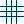</a> | **📂 檔名:** `grid-guides--Streamline-Ultimate.svg` ✨ **格式:** `Vector (SVG)` ⚖️ **大小:** `898.00B` 📅 **更新:** `2026-03-03`  🚀 **jsDelivr Markdown:** `` 🔗 **直接連結 (Url):** <code>https://cdn.jsdelivr.net/gh/barry028/materials@main/images/iCons/Ui%20Ux%20Graphic%20Design/grid-guides--Streamline-Ultimate.svg</code> 📥 [檢視原始檔](grid-guides--Streamline-Ultimate.svg) |
|  | **📂 檔名:** `grid-ruler--Streamline-Ultimate.svg` ✨ **格式:** `Vector (SVG)` ⚖️ **大小:** `2.89KB` 📅 **更新:** `2026-03-03`  🚀 **jsDelivr Markdown:** `` 🔗 **直接連結 (Url):** <code>https://cdn.jsdelivr.net/gh/barry028/materials@main/images/iCons/Ui%20Ux%20Graphic%20Design/grid-ruler--Streamline-Ultimate.svg</code> 📥 [檢視原始檔](grid-ruler--Streamline-Ultimate.svg) |
|  | **📂 檔名:** `hammer--Streamline-Ultimate.svg` ✨ **格式:** `Vector (SVG)` ⚖️ **大小:** `1.36KB` 📅 **更新:** `2026-03-03`  🚀 **jsDelivr Markdown:** `` 🔗 **直接連結 (Url):** <code>https://cdn.jsdelivr.net/gh/barry028/materials@main/images/iCons/Ui%20Ux%20Graphic%20Design/hammer--Streamline-Ultimate.svg</code> 📥 [檢視原始檔](hammer--Streamline-Ultimate.svg) |
|  | **📂 檔名:** `hard-drive--Streamline-Ultimate.svg` ✨ **格式:** `Vector (SVG)` ⚖️ **大小:** `2.23KB` 📅 **更新:** `2026-03-03`  🚀 **jsDelivr Markdown:** `` 🔗 **直接連結 (Url):** <code>https://cdn.jsdelivr.net/gh/barry028/materials@main/images/iCons/Ui%20Ux%20Graphic%20Design/hard-drive--Streamline-Ultimate.svg</code> 📥 [檢視原始檔](hard-drive--Streamline-Ultimate.svg) |
|  | **📂 檔名:** `harddrive-upload--Streamline-Ultimate.svg` ✨ **格式:** `Vector (SVG)` ⚖️ **大小:** `1.79KB` 📅 **更新:** `2026-03-03`  🚀 **jsDelivr Markdown:** `` 🔗 **直接連結 (Url):** <code>https://cdn.jsdelivr.net/gh/barry028/materials@main/images/iCons/Ui%20Ux%20Graphic%20Design/harddrive-upload--Streamline-Ultimate.svg</code> 📥 [檢視原始檔](harddrive-upload--Streamline-Ultimate.svg) |
|  | **📂 檔名:** `harddrive-upload-1--Streamline-Ultimate.svg` ✨ **格式:** `Vector (SVG)` ⚖️ **大小:** `2.87KB` 📅 **更新:** `2026-03-03`  🚀 **jsDelivr Markdown:** `` 🔗 **直接連結 (Url):** <code>https://cdn.jsdelivr.net/gh/barry028/materials@main/images/iCons/Ui%20Ux%20Graphic%20Design/harddrive-upload-1--Streamline-Ultimate.svg</code> 📥 [檢視原始檔](harddrive-upload-1--Streamline-Ultimate.svg) |
|  | **📂 檔名:** `headphones-customer-support-human--Streamline-Ultimate.svg` ✨ **格式:** `Vector (SVG)` ⚖️ **大小:** `5.37KB` 📅 **更新:** `2026-03-03`  🚀 **jsDelivr Markdown:** `` 🔗 **直接連結 (Url):** <code>https://cdn.jsdelivr.net/gh/barry028/materials@main/images/iCons/Ui%20Ux%20Graphic%20Design/headphones-customer-support-human--Streamline-Ultimate.svg</code> 📥 [檢視原始檔](headphones-customer-support-human--Streamline-Ultimate.svg) |
|  | **📂 檔名:** `headphones-human--Streamline-Ultimate.svg` ✨ **格式:** `Vector (SVG)` ⚖️ **大小:** `4.77KB` 📅 **更新:** `2026-03-03`  🚀 **jsDelivr Markdown:** `` 🔗 **直接連結 (Url):** <code>https://cdn.jsdelivr.net/gh/barry028/materials@main/images/iCons/Ui%20Ux%20Graphic%20Design/headphones-human--Streamline-Ultimate.svg</code> 📥 [檢視原始檔](headphones-human--Streamline-Ultimate.svg) |
|  | **📂 檔名:** `headphones-person--Streamline-Ultimate.svg` ✨ **格式:** `Vector (SVG)` ⚖️ **大小:** `4.53KB` 📅 **更新:** `2026-03-03`  🚀 **jsDelivr Markdown:** `` 🔗 **直接連結 (Url):** <code>https://cdn.jsdelivr.net/gh/barry028/materials@main/images/iCons/Ui%20Ux%20Graphic%20Design/headphones-person--Streamline-Ultimate.svg</code> 📥 [檢視原始檔](headphones-person--Streamline-Ultimate.svg) |
|  | **📂 檔名:** `headphones-wave--Streamline-Ultimate.svg` ✨ **格式:** `Vector (SVG)` ⚖️ **大小:** `3.29KB` 📅 **更新:** `2026-03-03`  🚀 **jsDelivr Markdown:** `` 🔗 **直接連結 (Url):** <code>https://cdn.jsdelivr.net/gh/barry028/materials@main/images/iCons/Ui%20Ux%20Graphic%20Design/headphones-wave--Streamline-Ultimate.svg</code> 📥 [檢視原始檔](headphones-wave--Streamline-Ultimate.svg) |
|  | **📂 檔名:** `help-wheel--Streamline-Ultimate.svg` ✨ **格式:** `Vector (SVG)` ⚖️ **大小:** `3.32KB` 📅 **更新:** `2026-03-03`  🚀 **jsDelivr Markdown:** `` 🔗 **直接連結 (Url):** <code>https://cdn.jsdelivr.net/gh/barry028/materials@main/images/iCons/Ui%20Ux%20Graphic%20Design/help-wheel--Streamline-Ultimate.svg</code> 📥 [檢視原始檔](help-wheel--Streamline-Ultimate.svg) |
|  | **📂 檔名:** `hierarchy--Streamline-Ultimate.svg` ✨ **格式:** `Vector (SVG)` ⚖️ **大小:** `1.99KB` 📅 **更新:** `2026-03-03`  🚀 **jsDelivr Markdown:** `` 🔗 **直接連結 (Url):** <code>https://cdn.jsdelivr.net/gh/barry028/materials@main/images/iCons/Ui%20Ux%20Graphic%20Design/hierarchy--Streamline-Ultimate.svg</code> 📥 [檢視原始檔](hierarchy--Streamline-Ultimate.svg) |
|  | **📂 檔名:** `hierarchy-1--Streamline-Ultimate.svg` ✨ **格式:** `Vector (SVG)` ⚖️ **大小:** `4.36KB` 📅 **更新:** `2026-03-03`  🚀 **jsDelivr Markdown:** `` 🔗 **直接連結 (Url):** <code>https://cdn.jsdelivr.net/gh/barry028/materials@main/images/iCons/Ui%20Ux%20Graphic%20Design/hierarchy-1--Streamline-Ultimate.svg</code> 📥 [檢視原始檔](hierarchy-1--Streamline-Ultimate.svg) |
|  | **📂 檔名:** `hierarchy-2--Streamline-Ultimate.svg` ✨ **格式:** `Vector (SVG)` ⚖️ **大小:** `2.57KB` 📅 **更新:** `2026-03-03`  🚀 **jsDelivr Markdown:** `` 🔗 **直接連結 (Url):** <code>https://cdn.jsdelivr.net/gh/barry028/materials@main/images/iCons/Ui%20Ux%20Graphic%20Design/hierarchy-2--Streamline-Ultimate.svg</code> 📥 [檢視原始檔](hierarchy-2--Streamline-Ultimate.svg) |
|  | **📂 檔名:** `hierarchy-6--Streamline-Ultimate.svg` ✨ **格式:** `Vector (SVG)` ⚖️ **大小:** `2.83KB` 📅 **更新:** `2026-03-03`  🚀 **jsDelivr Markdown:** `` 🔗 **直接連結 (Url):** <code>https://cdn.jsdelivr.net/gh/barry028/materials@main/images/iCons/Ui%20Ux%20Graphic%20Design/hierarchy-6--Streamline-Ultimate.svg</code> 📥 [檢視原始檔](hierarchy-6--Streamline-Ultimate.svg) |
|  | **📂 檔名:** `hierarchy-9--Streamline-Ultimate.svg` ✨ **格式:** `Vector (SVG)` ⚖️ **大小:** `5.36KB` 📅 **更新:** `2026-03-03`  🚀 **jsDelivr Markdown:** `` 🔗 **直接連結 (Url):** <code>https://cdn.jsdelivr.net/gh/barry028/materials@main/images/iCons/Ui%20Ux%20Graphic%20Design/hierarchy-9--Streamline-Ultimate.svg</code> 📥 [檢視原始檔](hierarchy-9--Streamline-Ultimate.svg) |
|  | **📂 檔名:** `hourglass-1--Streamline-Ultimate.svg` ✨ **格式:** `Vector (SVG)` ⚖️ **大小:** `1.29KB` 📅 **更新:** `2026-03-03`  🚀 **jsDelivr Markdown:** `` 🔗 **直接連結 (Url):** <code>https://cdn.jsdelivr.net/gh/barry028/materials@main/images/iCons/Ui%20Ux%20Graphic%20Design/hourglass-1--Streamline-Ultimate.svg</code> 📥 [檢視原始檔](hourglass-1--Streamline-Ultimate.svg) |
|  | **📂 檔名:** `house--Streamline-Ultimate.svg` ✨ **格式:** `Vector (SVG)` ⚖️ **大小:** `1.83KB` 📅 **更新:** `2026-03-03`  🚀 **jsDelivr Markdown:** `` 🔗 **直接連結 (Url):** <code>https://cdn.jsdelivr.net/gh/barry028/materials@main/images/iCons/Ui%20Ux%20Graphic%20Design/house--Streamline-Ultimate.svg</code> 📥 [檢視原始檔](house--Streamline-Ultimate.svg) |
|  | **📂 檔名:** `house-3--Streamline-Ultimate.svg` ✨ **格式:** `Vector (SVG)` ⚖️ **大小:** `2.61KB` 📅 **更新:** `2026-03-03`  🚀 **jsDelivr Markdown:** `` 🔗 **直接連結 (Url):** <code>https://cdn.jsdelivr.net/gh/barry028/materials@main/images/iCons/Ui%20Ux%20Graphic%20Design/house-3--Streamline-Ultimate.svg</code> 📥 [檢視原始檔](house-3--Streamline-Ultimate.svg) |
|  | **📂 檔名:** `house-chimney-2--Streamline-Ultimate.svg` ✨ **格式:** `Vector (SVG)` ⚖️ **大小:** `1.87KB` 📅 **更新:** `2026-03-03`  🚀 **jsDelivr Markdown:** `` 🔗 **直接連結 (Url):** <code>https://cdn.jsdelivr.net/gh/barry028/materials@main/images/iCons/Ui%20Ux%20Graphic%20Design/house-chimney-2--Streamline-Ultimate.svg</code> 📥 [檢視原始檔](house-chimney-2--Streamline-Ultimate.svg) |
|  | **📂 檔名:** `house-signal--Streamline-Ultimate.svg` ✨ **格式:** `Vector (SVG)` ⚖️ **大小:** `2.04KB` 📅 **更新:** `2026-03-03`  🚀 **jsDelivr Markdown:** `` 🔗 **直接連結 (Url):** <code>https://cdn.jsdelivr.net/gh/barry028/materials@main/images/iCons/Ui%20Ux%20Graphic%20Design/house-signal--Streamline-Ultimate.svg</code> 📥 [檢視原始檔](house-signal--Streamline-Ultimate.svg) |
|  | **📂 檔名:** `human-resources-businessman-clock--Streamline-Ultimate.svg` ✨ **格式:** `Vector (SVG)` ⚖️ **大小:** `3.10KB` 📅 **更新:** `2026-03-03`  🚀 **jsDelivr Markdown:** `` 🔗 **直接連結 (Url):** <code>https://cdn.jsdelivr.net/gh/barry028/materials@main/images/iCons/Ui%20Ux%20Graphic%20Design/human-resources-businessman-clock--Streamline-Ultimate.svg</code> 📥 [檢視原始檔](human-resources-businessman-clock--Streamline-Ultimate.svg) |
|  | **📂 檔名:** `human-resources-employee--Streamline-Ultimate.svg` ✨ **格式:** `Vector (SVG)` ⚖️ **大小:** `8.76KB` 📅 **更新:** `2026-03-03`  🚀 **jsDelivr Markdown:** `` 🔗 **直接連結 (Url):** <code>https://cdn.jsdelivr.net/gh/barry028/materials@main/images/iCons/Ui%20Ux%20Graphic%20Design/human-resources-employee--Streamline-Ultimate.svg</code> 📥 [檢視原始檔](human-resources-employee--Streamline-Ultimate.svg) |
|  | **📂 檔名:** `human-resources-employee-previous-1--Streamline-Ultimate.svg` ✨ **格式:** `Vector (SVG)` ⚖️ **大小:** `2.56KB` 📅 **更新:** `2026-03-03`  🚀 **jsDelivr Markdown:** `` 🔗 **直接連結 (Url):** <code>https://cdn.jsdelivr.net/gh/barry028/materials@main/images/iCons/Ui%20Ux%20Graphic%20Design/human-resources-employee-previous-1--Streamline-Ultimate.svg</code> 📥 [檢視原始檔](human-resources-employee-previous-1--Streamline-Ultimate.svg) |
|  | **📂 檔名:** `human-resources-hierarchy-1--Streamline-Ultimate.svg` ✨ **格式:** `Vector (SVG)` ⚖️ **大小:** `3.01KB` 📅 **更新:** `2026-03-03`  🚀 **jsDelivr Markdown:** `` 🔗 **直接連結 (Url):** <code>https://cdn.jsdelivr.net/gh/barry028/materials@main/images/iCons/Ui%20Ux%20Graphic%20Design/human-resources-hierarchy-1--Streamline-Ultimate.svg</code> 📥 [檢視原始檔](human-resources-hierarchy-1--Streamline-Ultimate.svg) |
|  | **📂 檔名:** `human-resources-network--Streamline-Ultimate.svg` ✨ **格式:** `Vector (SVG)` ⚖️ **大小:** `3.89KB` 📅 **更新:** `2026-03-03`  🚀 **jsDelivr Markdown:** `` 🔗 **直接連結 (Url):** <code>https://cdn.jsdelivr.net/gh/barry028/materials@main/images/iCons/Ui%20Ux%20Graphic%20Design/human-resources-network--Streamline-Ultimate.svg</code> 📥 [檢視原始檔](human-resources-network--Streamline-Ultimate.svg) |
|  | **📂 檔名:** `human-resources-offer-employee--Streamline-Ultimate.svg` ✨ **格式:** `Vector (SVG)` ⚖️ **大小:** `2.27KB` 📅 **更新:** `2026-03-03`  🚀 **jsDelivr Markdown:** `` 🔗 **直接連結 (Url):** <code>https://cdn.jsdelivr.net/gh/barry028/materials@main/images/iCons/Ui%20Ux%20Graphic%20Design/human-resources-offer-employee--Streamline-Ultimate.svg</code> 📥 [檢視原始檔](human-resources-offer-employee--Streamline-Ultimate.svg) |
|  | **📂 檔名:** `human-resources-rating-woman--Streamline-Ultimate.svg` ✨ **格式:** `Vector (SVG)` ⚖️ **大小:** `9.13KB` 📅 **更新:** `2026-03-03`  🚀 **jsDelivr Markdown:** `` 🔗 **直接連結 (Url):** <code>https://cdn.jsdelivr.net/gh/barry028/materials@main/images/iCons/Ui%20Ux%20Graphic%20Design/human-resources-rating-woman--Streamline-Ultimate.svg</code> 📥 [檢視原始檔](human-resources-rating-woman--Streamline-Ultimate.svg) |
|  | **📂 檔名:** `human-resources-workflow--Streamline-Ultimate.svg` ✨ **格式:** `Vector (SVG)` ⚖️ **大小:** `5.61KB` 📅 **更新:** `2026-03-03`  🚀 **jsDelivr Markdown:** `` 🔗 **直接連結 (Url):** <code>https://cdn.jsdelivr.net/gh/barry028/materials@main/images/iCons/Ui%20Ux%20Graphic%20Design/human-resources-workflow--Streamline-Ultimate.svg</code> 📥 [檢視原始檔](human-resources-workflow--Streamline-Ultimate.svg) |
|  | **📂 檔名:** `idea-settings-1--Streamline-Ultimate.svg` ✨ **格式:** `Vector (SVG)` ⚖️ **大小:** `7.00KB` 📅 **更新:** `2026-03-03`  🚀 **jsDelivr Markdown:** `` 🔗 **直接連結 (Url):** <code>https://cdn.jsdelivr.net/gh/barry028/materials@main/images/iCons/Ui%20Ux%20Graphic%20Design/idea-settings-1--Streamline-Ultimate.svg</code> 📥 [檢視原始檔](idea-settings-1--Streamline-Ultimate.svg) |
|  | **📂 檔名:** `idea-strategy--Streamline-Ultimate.svg` ✨ **格式:** `Vector (SVG)` ⚖️ **大小:** `4.17KB` 📅 **更新:** `2026-03-03`  🚀 **jsDelivr Markdown:** `` 🔗 **直接連結 (Url):** <code>https://cdn.jsdelivr.net/gh/barry028/materials@main/images/iCons/Ui%20Ux%20Graphic%20Design/idea-strategy--Streamline-Ultimate.svg</code> 📥 [檢視原始檔](idea-strategy--Streamline-Ultimate.svg) |
|  | **📂 檔名:** `indent-left--Streamline-Ultimate.svg` ✨ **格式:** `Vector (SVG)` ⚖️ **大小:** `1.32KB` 📅 **更新:** `2026-03-03`  🚀 **jsDelivr Markdown:** `` 🔗 **直接連結 (Url):** <code>https://cdn.jsdelivr.net/gh/barry028/materials@main/images/iCons/Ui%20Ux%20Graphic%20Design/indent-left--Streamline-Ultimate.svg</code> 📥 [檢視原始檔](indent-left--Streamline-Ultimate.svg) |
|  | **📂 檔名:** `information-circle--Streamline-Ultimate.svg` ✨ **格式:** `Vector (SVG)` ⚖️ **大小:** `2.33KB` 📅 **更新:** `2026-03-03`  🚀 **jsDelivr Markdown:** `` 🔗 **直接連結 (Url):** <code>https://cdn.jsdelivr.net/gh/barry028/materials@main/images/iCons/Ui%20Ux%20Graphic%20Design/information-circle--Streamline-Ultimate.svg</code> 📥 [檢視原始檔](information-circle--Streamline-Ultimate.svg) |
|  | **📂 檔名:** `information-desk-customer--Streamline-Ultimate.svg` ✨ **格式:** `Vector (SVG)` ⚖️ **大小:** `3.06KB` 📅 **更新:** `2026-03-03`  🚀 **jsDelivr Markdown:** `` 🔗 **直接連結 (Url):** <code>https://cdn.jsdelivr.net/gh/barry028/materials@main/images/iCons/Ui%20Ux%20Graphic%20Design/information-desk-customer--Streamline-Ultimate.svg</code> 📥 [檢視原始檔](information-desk-customer--Streamline-Ultimate.svg) |
|  | **📂 檔名:** `information-desk-hi--Streamline-Ultimate.svg` ✨ **格式:** `Vector (SVG)` ⚖️ **大小:** `4.44KB` 📅 **更新:** `2026-03-03`  🚀 **jsDelivr Markdown:** `` 🔗 **直接連結 (Url):** <code>https://cdn.jsdelivr.net/gh/barry028/materials@main/images/iCons/Ui%20Ux%20Graphic%20Design/information-desk-hi--Streamline-Ultimate.svg</code> 📥 [檢視原始檔](information-desk-hi--Streamline-Ultimate.svg) |
|  | **📂 檔名:** `information-desk-question-help--Streamline-Ultimate.svg` ✨ **格式:** `Vector (SVG)` ⚖️ **大小:** `3.87KB` 📅 **更新:** `2026-03-03`  🚀 **jsDelivr Markdown:** `` 🔗 **直接連結 (Url):** <code>https://cdn.jsdelivr.net/gh/barry028/materials@main/images/iCons/Ui%20Ux%20Graphic%20Design/information-desk-question-help--Streamline-Ultimate.svg</code> 📥 [檢視原始檔](information-desk-question-help--Streamline-Ultimate.svg) |
|  | **📂 檔名:** `instrument-contrabass--Streamline-Ultimate.svg` ✨ **格式:** `Vector (SVG)` ⚖️ **大小:** `3.96KB` 📅 **更新:** `2026-03-03`  🚀 **jsDelivr Markdown:** `` 🔗 **直接連結 (Url):** <code>https://cdn.jsdelivr.net/gh/barry028/materials@main/images/iCons/Ui%20Ux%20Graphic%20Design/instrument-contrabass--Streamline-Ultimate.svg</code> 📥 [檢視原始檔](instrument-contrabass--Streamline-Ultimate.svg) |
|  | **📂 檔名:** `instrument-piano-keys--Streamline-Ultimate.svg` ✨ **格式:** `Vector (SVG)` ⚖️ **大小:** `2.61KB` 📅 **更新:** `2026-03-03`  🚀 **jsDelivr Markdown:** `` 🔗 **直接連結 (Url):** <code>https://cdn.jsdelivr.net/gh/barry028/materials@main/images/iCons/Ui%20Ux%20Graphic%20Design/instrument-piano-keys--Streamline-Ultimate.svg</code> 📥 [檢視原始檔](instrument-piano-keys--Streamline-Ultimate.svg) |
|  | **📂 檔名:** `instrument-saxophone--Streamline-Ultimate.svg` ✨ **格式:** `Vector (SVG)` ⚖️ **大小:** `3.11KB` 📅 **更新:** `2026-03-03`  🚀 **jsDelivr Markdown:** `` 🔗 **直接連結 (Url):** <code>https://cdn.jsdelivr.net/gh/barry028/materials@main/images/iCons/Ui%20Ux%20Graphic%20Design/instrument-saxophone--Streamline-Ultimate.svg</code> 📥 [檢視原始檔](instrument-saxophone--Streamline-Ultimate.svg) |
|  | **📂 檔名:** `invitation--Streamline-Ultimate.svg` ✨ **格式:** `Vector (SVG)` ⚖️ **大小:** `2.55KB` 📅 **更新:** `2026-03-03`  🚀 **jsDelivr Markdown:** `` 🔗 **直接連結 (Url):** <code>https://cdn.jsdelivr.net/gh/barry028/materials@main/images/iCons/Ui%20Ux%20Graphic%20Design/invitation--Streamline-Ultimate.svg</code> 📥 [檢視原始檔](invitation--Streamline-Ultimate.svg) |
|  | **📂 檔名:** `iris-scan-smartphone--Streamline-Ultimate.svg` ✨ **格式:** `Vector (SVG)` ⚖️ **大小:** `2.68KB` 📅 **更新:** `2026-03-03`  🚀 **jsDelivr Markdown:** `` 🔗 **直接連結 (Url):** <code>https://cdn.jsdelivr.net/gh/barry028/materials@main/images/iCons/Ui%20Ux%20Graphic%20Design/iris-scan-smartphone--Streamline-Ultimate.svg</code> 📥 [檢視原始檔](iris-scan-smartphone--Streamline-Ultimate.svg) |
|  | **📂 檔名:** `job-choose-cadidate-1--Streamline-Ultimate.svg` ✨ **格式:** `Vector (SVG)` ⚖️ **大小:** `4.50KB` 📅 **更新:** `2026-03-03`  🚀 **jsDelivr Markdown:** `` 🔗 **直接連結 (Url):** <code>https://cdn.jsdelivr.net/gh/barry028/materials@main/images/iCons/Ui%20Ux%20Graphic%20Design/job-choose-cadidate-1--Streamline-Ultimate.svg</code> 📥 [檢視原始檔](job-choose-cadidate-1--Streamline-Ultimate.svg) |
|  | **📂 檔名:** `job-seach-profile--Streamline-Ultimate.svg` ✨ **格式:** `Vector (SVG)` ⚖️ **大小:** `3.71KB` 📅 **更新:** `2026-03-03`  🚀 **jsDelivr Markdown:** `` 🔗 **直接連結 (Url):** <code>https://cdn.jsdelivr.net/gh/barry028/materials@main/images/iCons/Ui%20Ux%20Graphic%20Design/job-seach-profile--Streamline-Ultimate.svg</code> 📥 [檢視原始檔](job-seach-profile--Streamline-Ultimate.svg) |
|  | **📂 檔名:** `job-seach-team-man--Streamline-Ultimate.svg` ✨ **格式:** `Vector (SVG)` ⚖️ **大小:** `4.10KB` 📅 **更新:** `2026-03-03`  🚀 **jsDelivr Markdown:** `` 🔗 **直接連結 (Url):** <code>https://cdn.jsdelivr.net/gh/barry028/materials@main/images/iCons/Ui%20Ux%20Graphic%20Design/job-seach-team-man--Streamline-Ultimate.svg</code> 📥 [檢視原始檔](job-seach-team-man--Streamline-Ultimate.svg) |
|  | **📂 檔名:** `job-search--Streamline-Ultimate.svg` ✨ **格式:** `Vector (SVG)` ⚖️ **大小:** `3.23KB` 📅 **更新:** `2026-03-03`  🚀 **jsDelivr Markdown:** `` 🔗 **直接連結 (Url):** <code>https://cdn.jsdelivr.net/gh/barry028/materials@main/images/iCons/Ui%20Ux%20Graphic%20Design/job-search--Streamline-Ultimate.svg</code> 📥 [檢視原始檔](job-search--Streamline-Ultimate.svg) |
|  | **📂 檔名:** `keyboard--Streamline-Ultimate.svg` ✨ **格式:** `Vector (SVG)` ⚖️ **大小:** `2.71KB` 📅 **更新:** `2026-03-03`  🚀 **jsDelivr Markdown:** `` 🔗 **直接連結 (Url):** <code>https://cdn.jsdelivr.net/gh/barry028/materials@main/images/iCons/Ui%20Ux%20Graphic%20Design/keyboard--Streamline-Ultimate.svg</code> 📥 [檢視原始檔](keyboard--Streamline-Ultimate.svg) |
|  | **📂 檔名:** `keyboard-arrow-return--Streamline-Ultimate.svg` ✨ **格式:** `Vector (SVG)` ⚖️ **大小:** `795.00B` 📅 **更新:** `2026-03-03`  🚀 **jsDelivr Markdown:** `` 🔗 **直接連結 (Url):** <code>https://cdn.jsdelivr.net/gh/barry028/materials@main/images/iCons/Ui%20Ux%20Graphic%20Design/keyboard-arrow-return--Streamline-Ultimate.svg</code> 📥 [檢視原始檔](keyboard-arrow-return--Streamline-Ultimate.svg) |
|  | **📂 檔名:** `keyboard-asterisk-2--Streamline-Ultimate.svg` ✨ **格式:** `Vector (SVG)` ⚖️ **大小:** `3.61KB` 📅 **更新:** `2026-03-03`  🚀 **jsDelivr Markdown:** `` 🔗 **直接連結 (Url):** <code>https://cdn.jsdelivr.net/gh/barry028/materials@main/images/iCons/Ui%20Ux%20Graphic%20Design/keyboard-asterisk-2--Streamline-Ultimate.svg</code> 📥 [檢視原始檔](keyboard-asterisk-2--Streamline-Ultimate.svg) |
|  | **📂 檔名:** `keyboard-gaming--Streamline-Ultimate.svg` ✨ **格式:** `Vector (SVG)` ⚖️ **大小:** `3.20KB` 📅 **更新:** `2026-03-03`  🚀 **jsDelivr Markdown:** `` 🔗 **直接連結 (Url):** <code>https://cdn.jsdelivr.net/gh/barry028/materials@main/images/iCons/Ui%20Ux%20Graphic%20Design/keyboard-gaming--Streamline-Ultimate.svg</code> 📥 [檢視原始檔](keyboard-gaming--Streamline-Ultimate.svg) |
|  | **📂 檔名:** `keyboard-usb--Streamline-Ultimate.svg` ✨ **格式:** `Vector (SVG)` ⚖️ **大小:** `2.54KB` 📅 **更新:** `2026-03-03`  🚀 **jsDelivr Markdown:** `` 🔗 **直接連結 (Url):** <code>https://cdn.jsdelivr.net/gh/barry028/materials@main/images/iCons/Ui%20Ux%20Graphic%20Design/keyboard-usb--Streamline-Ultimate.svg</code> 📥 [檢視原始檔](keyboard-usb--Streamline-Ultimate.svg) |
|  | **📂 檔名:** `keyboard-wireless-1--Streamline-Ultimate.svg` ✨ **格式:** `Vector (SVG)` ⚖️ **大小:** `2.48KB` 📅 **更新:** `2026-03-03`  🚀 **jsDelivr Markdown:** `` 🔗 **直接連結 (Url):** <code>https://cdn.jsdelivr.net/gh/barry028/materials@main/images/iCons/Ui%20Ux%20Graphic%20Design/keyboard-wireless-1--Streamline-Ultimate.svg</code> 📥 [檢視原始檔](keyboard-wireless-1--Streamline-Ultimate.svg) |
|  | **📂 檔名:** `kindle-1--Streamline-Ultimate.svg` ✨ **格式:** `Vector (SVG)` ⚖️ **大小:** `1.28KB` 📅 **更新:** `2026-03-03`  🚀 **jsDelivr Markdown:** `` 🔗 **直接連結 (Url):** <code>https://cdn.jsdelivr.net/gh/barry028/materials@main/images/iCons/Ui%20Ux%20Graphic%20Design/kindle-1--Streamline-Ultimate.svg</code> 📥 [檢視原始檔](kindle-1--Streamline-Ultimate.svg) |
|  | **📂 檔名:** `laptop--Streamline-Ultimate.svg` ✨ **格式:** `Vector (SVG)` ⚖️ **大小:** `1.77KB` 📅 **更新:** `2026-03-03`  🚀 **jsDelivr Markdown:** `` 🔗 **直接連結 (Url):** <code>https://cdn.jsdelivr.net/gh/barry028/materials@main/images/iCons/Ui%20Ux%20Graphic%20Design/laptop--Streamline-Ultimate.svg</code> 📥 [檢視原始檔](laptop--Streamline-Ultimate.svg) |
|  | **📂 檔名:** `laptop-1--Streamline-Ultimate.svg` ✨ **格式:** `Vector (SVG)` ⚖️ **大小:** `1.21KB` 📅 **更新:** `2026-03-03`  🚀 **jsDelivr Markdown:** `` 🔗 **直接連結 (Url):** <code>https://cdn.jsdelivr.net/gh/barry028/materials@main/images/iCons/Ui%20Ux%20Graphic%20Design/laptop-1--Streamline-Ultimate.svg</code> 📥 [檢視原始檔](laptop-1--Streamline-Ultimate.svg) |
|  | **📂 檔名:** `laptop-flash--Streamline-Ultimate.svg` ✨ **格式:** `Vector (SVG)` ⚖️ **大小:** `1.79KB` 📅 **更新:** `2026-03-03`  🚀 **jsDelivr Markdown:** `` 🔗 **直接連結 (Url):** <code>https://cdn.jsdelivr.net/gh/barry028/materials@main/images/iCons/Ui%20Ux%20Graphic%20Design/laptop-flash--Streamline-Ultimate.svg</code> 📥 [檢視原始檔](laptop-flash--Streamline-Ultimate.svg) |
|  | **📂 檔名:** `laptop-help-message--Streamline-Ultimate.svg` ✨ **格式:** `Vector (SVG)` ⚖️ **大小:** `3.20KB` 📅 **更新:** `2026-03-03`  🚀 **jsDelivr Markdown:** `` 🔗 **直接連結 (Url):** <code>https://cdn.jsdelivr.net/gh/barry028/materials@main/images/iCons/Ui%20Ux%20Graphic%20Design/laptop-help-message--Streamline-Ultimate.svg</code> 📥 [檢視原始檔](laptop-help-message--Streamline-Ultimate.svg) |
|  | **📂 檔名:** `laptop-launch--Streamline-Ultimate.svg` ✨ **格式:** `Vector (SVG)` ⚖️ **大小:** `5.20KB` 📅 **更新:** `2026-03-03`  🚀 **jsDelivr Markdown:** `` 🔗 **直接連結 (Url):** <code>https://cdn.jsdelivr.net/gh/barry028/materials@main/images/iCons/Ui%20Ux%20Graphic%20Design/laptop-launch--Streamline-Ultimate.svg</code> 📥 [檢視原始檔](laptop-launch--Streamline-Ultimate.svg) |
|  | **📂 檔名:** `laptop-settings--Streamline-Ultimate.svg` ✨ **格式:** `Vector (SVG)` ⚖️ **大小:** `7.14KB` 📅 **更新:** `2026-03-03`  🚀 **jsDelivr Markdown:** `` 🔗 **直接連結 (Url):** <code>https://cdn.jsdelivr.net/gh/barry028/materials@main/images/iCons/Ui%20Ux%20Graphic%20Design/laptop-settings--Streamline-Ultimate.svg</code> 📥 [檢視原始檔](laptop-settings--Streamline-Ultimate.svg) |
|  | **📂 檔名:** `laptop-smiley-1--Streamline-Ultimate.svg` ✨ **格式:** `Vector (SVG)` ⚖️ **大小:** `1.54KB` 📅 **更新:** `2026-03-03`  🚀 **jsDelivr Markdown:** `` 🔗 **直接連結 (Url):** <code>https://cdn.jsdelivr.net/gh/barry028/materials@main/images/iCons/Ui%20Ux%20Graphic%20Design/laptop-smiley-1--Streamline-Ultimate.svg</code> 📥 [檢視原始檔](laptop-smiley-1--Streamline-Ultimate.svg) |
|  | **📂 檔名:** `laptop-sync--Streamline-Ultimate.svg` ✨ **格式:** `Vector (SVG)` ⚖️ **大小:** `2.69KB` 📅 **更新:** `2026-03-03`  🚀 **jsDelivr Markdown:** `` 🔗 **直接連結 (Url):** <code>https://cdn.jsdelivr.net/gh/barry028/materials@main/images/iCons/Ui%20Ux%20Graphic%20Design/laptop-sync--Streamline-Ultimate.svg</code> 📥 [檢視原始檔](laptop-sync--Streamline-Ultimate.svg) |
|  | **📂 檔名:** `laptop-upload--Streamline-Ultimate.svg` ✨ **格式:** `Vector (SVG)` ⚖️ **大小:** `1.86KB` 📅 **更新:** `2026-03-03`  🚀 **jsDelivr Markdown:** `` 🔗 **直接連結 (Url):** <code>https://cdn.jsdelivr.net/gh/barry028/materials@main/images/iCons/Ui%20Ux%20Graphic%20Design/laptop-upload--Streamline-Ultimate.svg</code> 📥 [檢視原始檔](laptop-upload--Streamline-Ultimate.svg) |
|  | **📂 檔名:** `laptop-user--Streamline-Ultimate.svg` ✨ **格式:** `Vector (SVG)` ⚖️ **大小:** `1.73KB` 📅 **更新:** `2026-03-03`  🚀 **jsDelivr Markdown:** `` 🔗 **直接連結 (Url):** <code>https://cdn.jsdelivr.net/gh/barry028/materials@main/images/iCons/Ui%20Ux%20Graphic%20Design/laptop-user--Streamline-Ultimate.svg</code> 📥 [檢視原始檔](laptop-user--Streamline-Ultimate.svg) |
|  | **📂 檔名:** `launch-go--Streamline-Ultimate.svg` ✨ **格式:** `Vector (SVG)` ⚖️ **大小:** `2.31KB` 📅 **更新:** `2026-03-03`  🚀 **jsDelivr Markdown:** `` 🔗 **直接連結 (Url):** <code>https://cdn.jsdelivr.net/gh/barry028/materials@main/images/iCons/Ui%20Ux%20Graphic%20Design/launch-go--Streamline-Ultimate.svg</code> 📥 [檢視原始檔](launch-go--Streamline-Ultimate.svg) |
|  | **📂 檔名:** `laundry-hand-wash--Streamline-Ultimate.svg` ✨ **格式:** `Vector (SVG)` ⚖️ **大小:** `5.37KB` 📅 **更新:** `2026-03-03`  🚀 **jsDelivr Markdown:** `` 🔗 **直接連結 (Url):** <code>https://cdn.jsdelivr.net/gh/barry028/materials@main/images/iCons/Ui%20Ux%20Graphic%20Design/laundry-hand-wash--Streamline-Ultimate.svg</code> 📥 [檢視原始檔](laundry-hand-wash--Streamline-Ultimate.svg) |
|  | **📂 檔名:** `laundry-machine-1--Streamline-Ultimate.svg` ✨ **格式:** `Vector (SVG)` ⚖️ **大小:** `4.50KB` 📅 **更新:** `2026-03-03`  🚀 **jsDelivr Markdown:** `` 🔗 **直接連結 (Url):** <code>https://cdn.jsdelivr.net/gh/barry028/materials@main/images/iCons/Ui%20Ux%20Graphic%20Design/laundry-machine-1--Streamline-Ultimate.svg</code> 📥 [檢視原始檔](laundry-machine-1--Streamline-Ultimate.svg) |
|  | **📂 檔名:** `laundry-retro-iron--Streamline-Ultimate.svg` ✨ **格式:** `Vector (SVG)` ⚖️ **大小:** `2.46KB` 📅 **更新:** `2026-03-03`  🚀 **jsDelivr Markdown:** `` 🔗 **直接連結 (Url):** <code>https://cdn.jsdelivr.net/gh/barry028/materials@main/images/iCons/Ui%20Ux%20Graphic%20Design/laundry-retro-iron--Streamline-Ultimate.svg</code> 📥 [檢視原始檔](laundry-retro-iron--Streamline-Ultimate.svg) |
|  | **📂 檔名:** `layers--Streamline-Ultimate.svg` ✨ **格式:** `Vector (SVG)` ⚖️ **大小:** `2.22KB` 📅 **更新:** `2026-03-03`  🚀 **jsDelivr Markdown:** `` 🔗 **直接連結 (Url):** <code>https://cdn.jsdelivr.net/gh/barry028/materials@main/images/iCons/Ui%20Ux%20Graphic%20Design/layers--Streamline-Ultimate.svg</code> 📥 [檢視原始檔](layers--Streamline-Ultimate.svg) |
|  | **📂 檔名:** `layout-corners-dashboard-1--Streamline-Ultimate.svg` ✨ **格式:** `Vector (SVG)` ⚖️ **大小:** `5.02KB` 📅 **更新:** `2026-03-03`  🚀 **jsDelivr Markdown:** `` 🔗 **直接連結 (Url):** <code>https://cdn.jsdelivr.net/gh/barry028/materials@main/images/iCons/Ui%20Ux%20Graphic%20Design/layout-corners-dashboard-1--Streamline-Ultimate.svg</code> 📥 [檢視原始檔](layout-corners-dashboard-1--Streamline-Ultimate.svg) |
|  | **📂 檔名:** `layout-dashboard--Streamline-Ultimate.svg` ✨ **格式:** `Vector (SVG)` ⚖️ **大小:** `2.62KB` 📅 **更新:** `2026-03-03`  🚀 **jsDelivr Markdown:** `` 🔗 **直接連結 (Url):** <code>https://cdn.jsdelivr.net/gh/barry028/materials@main/images/iCons/Ui%20Ux%20Graphic%20Design/layout-dashboard--Streamline-Ultimate.svg</code> 📥 [檢視原始檔](layout-dashboard--Streamline-Ultimate.svg) |
|  | **📂 檔名:** `legal-certificate--Streamline-Ultimate.svg` ✨ **格式:** `Vector (SVG)` ⚖️ **大小:** `7.89KB` 📅 **更新:** `2026-03-03`  🚀 **jsDelivr Markdown:** `` 🔗 **直接連結 (Url):** <code>https://cdn.jsdelivr.net/gh/barry028/materials@main/images/iCons/Ui%20Ux%20Graphic%20Design/legal-certificate--Streamline-Ultimate.svg</code> 📥 [檢視原始檔](legal-certificate--Streamline-Ultimate.svg) |
|  | **📂 檔名:** `lens-horizontal--Streamline-Ultimate.svg` ✨ **格式:** `Vector (SVG)` ⚖️ **大小:** `2.97KB` 📅 **更新:** `2026-03-03`  🚀 **jsDelivr Markdown:** `` 🔗 **直接連結 (Url):** <code>https://cdn.jsdelivr.net/gh/barry028/materials@main/images/iCons/Ui%20Ux%20Graphic%20Design/lens-horizontal--Streamline-Ultimate.svg</code> 📥 [檢視原始檔](lens-horizontal--Streamline-Ultimate.svg) |
|  | **📂 檔名:** `lens-shutter-1--Streamline-Ultimate.svg` ✨ **格式:** `Vector (SVG)` ⚖️ **大小:** `3.83KB` 📅 **更新:** `2026-03-03`  🚀 **jsDelivr Markdown:** `` 🔗 **直接連結 (Url):** <code>https://cdn.jsdelivr.net/gh/barry028/materials@main/images/iCons/Ui%20Ux%20Graphic%20Design/lens-shutter-1--Streamline-Ultimate.svg</code> 📥 [檢視原始檔](lens-shutter-1--Streamline-Ultimate.svg) |
|  | **📂 檔名:** `lift--Streamline-Ultimate.svg` ✨ **格式:** `Vector (SVG)` ⚖️ **大小:** `1.98KB` 📅 **更新:** `2026-03-03`  🚀 **jsDelivr Markdown:** `` 🔗 **直接連結 (Url):** <code>https://cdn.jsdelivr.net/gh/barry028/materials@main/images/iCons/Ui%20Ux%20Graphic%20Design/lift--Streamline-Ultimate.svg</code> 📥 [檢視原始檔](lift--Streamline-Ultimate.svg) |
|  | **📂 檔名:** `lift-three-people--Streamline-Ultimate.svg` ✨ **格式:** `Vector (SVG)` ⚖️ **大小:** `3.35KB` 📅 **更新:** `2026-03-03`  🚀 **jsDelivr Markdown:** `` 🔗 **直接連結 (Url):** <code>https://cdn.jsdelivr.net/gh/barry028/materials@main/images/iCons/Ui%20Ux%20Graphic%20Design/lift-three-people--Streamline-Ultimate.svg</code> 📥 [檢視原始檔](lift-three-people--Streamline-Ultimate.svg) |
|  | **📂 檔名:** `light-mode-bright-dark--Streamline-Ultimate.svg` ✨ **格式:** `Vector (SVG)` ⚖️ **大小:** `2.23KB` 📅 **更新:** `2026-03-03`  🚀 **jsDelivr Markdown:** `` 🔗 **直接連結 (Url):** <code>https://cdn.jsdelivr.net/gh/barry028/materials@main/images/iCons/Ui%20Ux%20Graphic%20Design/light-mode-bright-dark--Streamline-Ultimate.svg</code> 📥 [檢視原始檔](light-mode-bright-dark--Streamline-Ultimate.svg) |
|  | **📂 檔名:** `light-mode-bright-dark-1--Streamline-Ultimate.svg` ✨ **格式:** `Vector (SVG)` ⚖️ **大小:** `3.19KB` 📅 **更新:** `2026-03-03`  🚀 **jsDelivr Markdown:** `` 🔗 **直接連結 (Url):** <code>https://cdn.jsdelivr.net/gh/barry028/materials@main/images/iCons/Ui%20Ux%20Graphic%20Design/light-mode-bright-dark-1--Streamline-Ultimate.svg</code> 📥 [檢視原始檔](light-mode-bright-dark-1--Streamline-Ultimate.svg) |
|  | **📂 檔名:** `light-mode-dark-light--Streamline-Ultimate.svg` ✨ **格式:** `Vector (SVG)` ⚖️ **大小:** `3.41KB` 📅 **更新:** `2026-03-03`  🚀 **jsDelivr Markdown:** `` 🔗 **直接連結 (Url):** <code>https://cdn.jsdelivr.net/gh/barry028/materials@main/images/iCons/Ui%20Ux%20Graphic%20Design/light-mode-dark-light--Streamline-Ultimate.svg</code> 📥 [檢視原始檔](light-mode-dark-light--Streamline-Ultimate.svg) |
|  | **📂 檔名:** `light-mode-exposure-1--Streamline-Ultimate.svg` ✨ **格式:** `Vector (SVG)` ⚖️ **大小:** `1.98KB` 📅 **更新:** `2026-03-03`  🚀 **jsDelivr Markdown:** `` 🔗 **直接連結 (Url):** <code>https://cdn.jsdelivr.net/gh/barry028/materials@main/images/iCons/Ui%20Ux%20Graphic%20Design/light-mode-exposure-1--Streamline-Ultimate.svg</code> 📥 [檢視原始檔](light-mode-exposure-1--Streamline-Ultimate.svg) |
|  | **📂 檔名:** `light-mode-flash-off--Streamline-Ultimate.svg` ✨ **格式:** `Vector (SVG)` ⚖️ **大小:** `3.57KB` 📅 **更新:** `2026-03-03`  🚀 **jsDelivr Markdown:** `` 🔗 **直接連結 (Url):** <code>https://cdn.jsdelivr.net/gh/barry028/materials@main/images/iCons/Ui%20Ux%20Graphic%20Design/light-mode-flash-off--Streamline-Ultimate.svg</code> 📥 [檢視原始檔](light-mode-flash-off--Streamline-Ultimate.svg) |
|  | **📂 檔名:** `light-mode-flash-on--Streamline-Ultimate.svg` ✨ **格式:** `Vector (SVG)` ⚖️ **大小:** `3.36KB` 📅 **更新:** `2026-03-03`  🚀 **jsDelivr Markdown:** `` 🔗 **直接連結 (Url):** <code>https://cdn.jsdelivr.net/gh/barry028/materials@main/images/iCons/Ui%20Ux%20Graphic%20Design/light-mode-flash-on--Streamline-Ultimate.svg</code> 📥 [檢視原始檔](light-mode-flash-on--Streamline-Ultimate.svg) |
|  | **📂 檔名:** `light-mode-hdr--Streamline-Ultimate.svg` ✨ **格式:** `Vector (SVG)` ⚖️ **大小:** `1.70KB` 📅 **更新:** `2026-03-03`  🚀 **jsDelivr Markdown:** `` 🔗 **直接連結 (Url):** <code>https://cdn.jsdelivr.net/gh/barry028/materials@main/images/iCons/Ui%20Ux%20Graphic%20Design/light-mode-hdr--Streamline-Ultimate.svg</code> 📥 [檢視原始檔](light-mode-hdr--Streamline-Ultimate.svg) |
|  | **📂 檔名:** `link-broken--Streamline-Ultimate.svg` ✨ **格式:** `Vector (SVG)` ⚖️ **大小:** `2.79KB` 📅 **更新:** `2026-03-03`  🚀 **jsDelivr Markdown:** `` 🔗 **直接連結 (Url):** <code>https://cdn.jsdelivr.net/gh/barry028/materials@main/images/iCons/Ui%20Ux%20Graphic%20Design/link-broken--Streamline-Ultimate.svg</code> 📥 [檢視原始檔](link-broken--Streamline-Ultimate.svg) |
|  | **📂 檔名:** `list-edit--Streamline-Ultimate.svg` ✨ **格式:** `Vector (SVG)` ⚖️ **大小:** `2.68KB` 📅 **更新:** `2026-03-03`  🚀 **jsDelivr Markdown:** `` 🔗 **直接連結 (Url):** <code>https://cdn.jsdelivr.net/gh/barry028/materials@main/images/iCons/Ui%20Ux%20Graphic%20Design/list-edit--Streamline-Ultimate.svg</code> 📥 [檢視原始檔](list-edit--Streamline-Ultimate.svg) |
|  | **📂 檔名:** `lock--Streamline-Ultimate.svg` ✨ **格式:** `Vector (SVG)` ⚖️ **大小:** `2.82KB` 📅 **更新:** `2026-03-03`  🚀 **jsDelivr Markdown:** `` 🔗 **直接連結 (Url):** <code>https://cdn.jsdelivr.net/gh/barry028/materials@main/images/iCons/Ui%20Ux%20Graphic%20Design/lock--Streamline-Ultimate.svg</code> 📥 [檢視原始檔](lock--Streamline-Ultimate.svg) |
|  | **📂 檔名:** `lock-2--Streamline-Ultimate.svg` ✨ **格式:** `Vector (SVG)` ⚖️ **大小:** `1.90KB` 📅 **更新:** `2026-03-03`  🚀 **jsDelivr Markdown:** `` 🔗 **直接連結 (Url):** <code>https://cdn.jsdelivr.net/gh/barry028/materials@main/images/iCons/Ui%20Ux%20Graphic%20Design/lock-2--Streamline-Ultimate.svg</code> 📥 [檢視原始檔](lock-2--Streamline-Ultimate.svg) |
|  | **📂 檔名:** `lock-circle-1--Streamline-Ultimate.svg` ✨ **格式:** `Vector (SVG)` ⚖️ **大小:** `3.88KB` 📅 **更新:** `2026-03-03`  🚀 **jsDelivr Markdown:** `` 🔗 **直接連結 (Url):** <code>https://cdn.jsdelivr.net/gh/barry028/materials@main/images/iCons/Ui%20Ux%20Graphic%20Design/lock-circle-1--Streamline-Ultimate.svg</code> 📥 [檢視原始檔](lock-circle-1--Streamline-Ultimate.svg) |
|  | **📂 檔名:** `lock-hierarchy--Streamline-Ultimate.svg` ✨ **格式:** `Vector (SVG)` ⚖️ **大小:** `3.74KB` 📅 **更新:** `2026-03-03`  🚀 **jsDelivr Markdown:** `` 🔗 **直接連結 (Url):** <code>https://cdn.jsdelivr.net/gh/barry028/materials@main/images/iCons/Ui%20Ux%20Graphic%20Design/lock-hierarchy--Streamline-Ultimate.svg</code> 📥 [檢視原始檔](lock-hierarchy--Streamline-Ultimate.svg) |
|  | **📂 檔名:** `lock-unlock-4--Streamline-Ultimate.svg` ✨ **格式:** `Vector (SVG)` ⚖️ **大小:** `1.97KB` 📅 **更新:** `2026-03-03`  🚀 **jsDelivr Markdown:** `` 🔗 **直接連結 (Url):** <code>https://cdn.jsdelivr.net/gh/barry028/materials@main/images/iCons/Ui%20Ux%20Graphic%20Design/lock-unlock-4--Streamline-Ultimate.svg</code> 📥 [檢視原始檔](lock-unlock-4--Streamline-Ultimate.svg) |
|  | **📂 檔名:** `locker-room-hanger--Streamline-Ultimate.svg` ✨ **格式:** `Vector (SVG)` ⚖️ **大小:** `1.62KB` 📅 **更新:** `2026-03-03`  🚀 **jsDelivr Markdown:** `` 🔗 **直接連結 (Url):** <code>https://cdn.jsdelivr.net/gh/barry028/materials@main/images/iCons/Ui%20Ux%20Graphic%20Design/locker-room-hanger--Streamline-Ultimate.svg</code> 📥 [檢視原始檔](locker-room-hanger--Streamline-Ultimate.svg) |
|  | **📂 檔名:** `locker-room-hanger-woman--Streamline-Ultimate.svg` ✨ **格式:** `Vector (SVG)` ⚖️ **大小:** `4.30KB` 📅 **更新:** `2026-03-03`  🚀 **jsDelivr Markdown:** `` 🔗 **直接連結 (Url):** <code>https://cdn.jsdelivr.net/gh/barry028/materials@main/images/iCons/Ui%20Ux%20Graphic%20Design/locker-room-hanger-woman--Streamline-Ultimate.svg</code> 📥 [檢視原始檔](locker-room-hanger-woman--Streamline-Ultimate.svg) |
|  | **📂 檔名:** `locker-room-suitcase-key--Streamline-Ultimate.svg` ✨ **格式:** `Vector (SVG)` ⚖️ **大小:** `2.31KB` 📅 **更新:** `2026-03-03`  🚀 **jsDelivr Markdown:** `` 🔗 **直接連結 (Url):** <code>https://cdn.jsdelivr.net/gh/barry028/materials@main/images/iCons/Ui%20Ux%20Graphic%20Design/locker-room-suitcase-key--Streamline-Ultimate.svg</code> 📥 [檢視原始檔](locker-room-suitcase-key--Streamline-Ultimate.svg) |
|  | **📂 檔名:** `locker-room-suitcase-umbrella--Streamline-Ultimate.svg` ✨ **格式:** `Vector (SVG)` ⚖️ **大小:** `4.66KB` 📅 **更新:** `2026-03-03`  🚀 **jsDelivr Markdown:** `` 🔗 **直接連結 (Url):** <code>https://cdn.jsdelivr.net/gh/barry028/materials@main/images/iCons/Ui%20Ux%20Graphic%20Design/locker-room-suitcase-umbrella--Streamline-Ultimate.svg</code> 📥 [檢視原始檔](locker-room-suitcase-umbrella--Streamline-Ultimate.svg) |
|  | **📂 檔名:** `locker-room-wash-hands--Streamline-Ultimate.svg` ✨ **格式:** `Vector (SVG)` ⚖️ **大小:** `8.45KB` 📅 **更新:** `2026-03-03`  🚀 **jsDelivr Markdown:** `` 🔗 **直接連結 (Url):** <code>https://cdn.jsdelivr.net/gh/barry028/materials@main/images/iCons/Ui%20Ux%20Graphic%20Design/locker-room-wash-hands--Streamline-Ultimate.svg</code> 📥 [檢視原始檔](locker-room-wash-hands--Streamline-Ultimate.svg) |
|  | **📂 檔名:** `login--Streamline-Ultimate.svg` ✨ **格式:** `Vector (SVG)` ⚖️ **大小:** `1.23KB` 📅 **更新:** `2026-03-03`  🚀 **jsDelivr Markdown:** `` 🔗 **直接連結 (Url):** <code>https://cdn.jsdelivr.net/gh/barry028/materials@main/images/iCons/Ui%20Ux%20Graphic%20Design/login--Streamline-Ultimate.svg</code> 📥 [檢視原始檔](login--Streamline-Ultimate.svg) |
|  | **📂 檔名:** `login-1--Streamline-Ultimate.svg` ✨ **格式:** `Vector (SVG)` ⚖️ **大小:** `1.01KB` 📅 **更新:** `2026-03-03`  🚀 **jsDelivr Markdown:** `` 🔗 **直接連結 (Url):** <code>https://cdn.jsdelivr.net/gh/barry028/materials@main/images/iCons/Ui%20Ux%20Graphic%20Design/login-1--Streamline-Ultimate.svg</code> 📥 [檢視原始檔](login-1--Streamline-Ultimate.svg) |
|  | **📂 檔名:** `login-2--Streamline-Ultimate.svg` ✨ **格式:** `Vector (SVG)` ⚖️ **大小:** `2.32KB` 📅 **更新:** `2026-03-03`  🚀 **jsDelivr Markdown:** `` 🔗 **直接連結 (Url):** <code>https://cdn.jsdelivr.net/gh/barry028/materials@main/images/iCons/Ui%20Ux%20Graphic%20Design/login-2--Streamline-Ultimate.svg</code> 📥 [檢視原始檔](login-2--Streamline-Ultimate.svg) |
|  | **📂 檔名:** `login-key-1--Streamline-Ultimate.svg` ✨ **格式:** `Vector (SVG)` ⚖️ **大小:** `3.53KB` 📅 **更新:** `2026-03-03`  🚀 **jsDelivr Markdown:** `` 🔗 **直接連結 (Url):** <code>https://cdn.jsdelivr.net/gh/barry028/materials@main/images/iCons/Ui%20Ux%20Graphic%20Design/login-key-1--Streamline-Ultimate.svg</code> 📥 [檢視原始檔](login-key-1--Streamline-Ultimate.svg) |
|  | **📂 檔名:** `login-keys--Streamline-Ultimate.svg` ✨ **格式:** `Vector (SVG)` ⚖️ **大小:** `3.90KB` 📅 **更新:** `2026-03-03`  🚀 **jsDelivr Markdown:** `` 🔗 **直接連結 (Url):** <code>https://cdn.jsdelivr.net/gh/barry028/materials@main/images/iCons/Ui%20Ux%20Graphic%20Design/login-keys--Streamline-Ultimate.svg</code> 📥 [檢視原始檔](login-keys--Streamline-Ultimate.svg) |
|  | **📂 檔名:** `mailbox-in--Streamline-Ultimate.svg` ✨ **格式:** `Vector (SVG)` ⚖️ **大小:** `2.37KB` 📅 **更新:** `2026-03-03`  🚀 **jsDelivr Markdown:** `` 🔗 **直接連結 (Url):** <code>https://cdn.jsdelivr.net/gh/barry028/materials@main/images/iCons/Ui%20Ux%20Graphic%20Design/mailbox-in--Streamline-Ultimate.svg</code> 📥 [檢視原始檔](mailbox-in--Streamline-Ultimate.svg) |
|  | **📂 檔名:** `mailbox-post-1--Streamline-Ultimate.svg` ✨ **格式:** `Vector (SVG)` ⚖️ **大小:** `1.77KB` 📅 **更新:** `2026-03-03`  🚀 **jsDelivr Markdown:** `` 🔗 **直接連結 (Url):** <code>https://cdn.jsdelivr.net/gh/barry028/materials@main/images/iCons/Ui%20Ux%20Graphic%20Design/mailbox-post-1--Streamline-Ultimate.svg</code> 📥 [檢視原始檔](mailbox-post-1--Streamline-Ultimate.svg) |
|  | **📂 檔名:** `mask-diamond--Streamline-Ultimate.svg` ✨ **格式:** `Vector (SVG)` ⚖️ **大小:** `2.54KB` 📅 **更新:** `2026-03-03`  🚀 **jsDelivr Markdown:** `` 🔗 **直接連結 (Url):** <code>https://cdn.jsdelivr.net/gh/barry028/materials@main/images/iCons/Ui%20Ux%20Graphic%20Design/mask-diamond--Streamline-Ultimate.svg</code> 📥 [檢視原始檔](mask-diamond--Streamline-Ultimate.svg) |
|  | **📂 檔名:** `maze-strategy-1--Streamline-Ultimate.svg` ✨ **格式:** `Vector (SVG)` ⚖️ **大小:** `1.92KB` 📅 **更新:** `2026-03-03`  🚀 **jsDelivr Markdown:** `` 🔗 **直接連結 (Url):** <code>https://cdn.jsdelivr.net/gh/barry028/materials@main/images/iCons/Ui%20Ux%20Graphic%20Design/maze-strategy-1--Streamline-Ultimate.svg</code> 📥 [檢視原始檔](maze-strategy-1--Streamline-Ultimate.svg) |
|  | **📂 檔名:** `meeting-laptop--Streamline-Ultimate.svg` ✨ **格式:** `Vector (SVG)` ⚖️ **大小:** `3.70KB` 📅 **更新:** `2026-03-03`  🚀 **jsDelivr Markdown:** `` 🔗 **直接連結 (Url):** <code>https://cdn.jsdelivr.net/gh/barry028/materials@main/images/iCons/Ui%20Ux%20Graphic%20Design/meeting-laptop--Streamline-Ultimate.svg</code> 📥 [檢視原始檔](meeting-laptop--Streamline-Ultimate.svg) |
|  | **📂 檔名:** `meeting-remote--Streamline-Ultimate.svg` ✨ **格式:** `Vector (SVG)` ⚖️ **大小:** `7.85KB` 📅 **更新:** `2026-03-03`  🚀 **jsDelivr Markdown:** `` 🔗 **直接連結 (Url):** <code>https://cdn.jsdelivr.net/gh/barry028/materials@main/images/iCons/Ui%20Ux%20Graphic%20Design/meeting-remote--Streamline-Ultimate.svg</code> 📥 [檢視原始檔](meeting-remote--Streamline-Ultimate.svg) |
|  | **📂 檔名:** `meeting-smartphone-hold-1--Streamline-Ultimate.svg` ✨ **格式:** `Vector (SVG)` ⚖️ **大小:** `3.79KB` 📅 **更新:** `2026-03-03`  🚀 **jsDelivr Markdown:** `` 🔗 **直接連結 (Url):** <code>https://cdn.jsdelivr.net/gh/barry028/materials@main/images/iCons/Ui%20Ux%20Graphic%20Design/meeting-smartphone-hold-1--Streamline-Ultimate.svg</code> 📥 [檢視原始檔](meeting-smartphone-hold-1--Streamline-Ultimate.svg) |
|  | **📂 檔名:** `meeting-team-monitor-woman--Streamline-Ultimate.svg` ✨ **格式:** `Vector (SVG)` ⚖️ **大小:** `4.69KB` 📅 **更新:** `2026-03-03`  🚀 **jsDelivr Markdown:** `` 🔗 **直接連結 (Url):** <code>https://cdn.jsdelivr.net/gh/barry028/materials@main/images/iCons/Ui%20Ux%20Graphic%20Design/meeting-team-monitor-woman--Streamline-Ultimate.svg</code> 📥 [檢視原始檔](meeting-team-monitor-woman--Streamline-Ultimate.svg) |
|  | **📂 檔名:** `megaphone-1--Streamline-Ultimate.svg` ✨ **格式:** `Vector (SVG)` ⚖️ **大小:** `859.00B` 📅 **更新:** `2026-03-03`  🚀 **jsDelivr Markdown:** `` 🔗 **直接連結 (Url):** <code>https://cdn.jsdelivr.net/gh/barry028/materials@main/images/iCons/Ui%20Ux%20Graphic%20Design/megaphone-1--Streamline-Ultimate.svg</code> 📥 [檢視原始檔](megaphone-1--Streamline-Ultimate.svg) |
|  | **📂 檔名:** `messages-bubble--Streamline-Ultimate.svg` ✨ **格式:** `Vector (SVG)` ⚖️ **大小:** `1.07KB` 📅 **更新:** `2026-03-03`  🚀 **jsDelivr Markdown:** `` 🔗 **直接連結 (Url):** <code>https://cdn.jsdelivr.net/gh/barry028/materials@main/images/iCons/Ui%20Ux%20Graphic%20Design/messages-bubble--Streamline-Ultimate.svg</code> 📥 [檢視原始檔](messages-bubble--Streamline-Ultimate.svg) |
|  | **📂 檔名:** `messages-bubble-double--Streamline-Ultimate.svg` ✨ **格式:** `Vector (SVG)` ⚖️ **大小:** `1.95KB` 📅 **更新:** `2026-03-03`  🚀 **jsDelivr Markdown:** `` 🔗 **直接連結 (Url):** <code>https://cdn.jsdelivr.net/gh/barry028/materials@main/images/iCons/Ui%20Ux%20Graphic%20Design/messages-bubble-double--Streamline-Ultimate.svg</code> 📥 [檢視原始檔](messages-bubble-double--Streamline-Ultimate.svg) |
|  | **📂 檔名:** `messages-bubble-smile--Streamline-Ultimate.svg` ✨ **格式:** `Vector (SVG)` ⚖️ **大小:** `1.80KB` 📅 **更新:** `2026-03-03`  🚀 **jsDelivr Markdown:** `` 🔗 **直接連結 (Url):** <code>https://cdn.jsdelivr.net/gh/barry028/materials@main/images/iCons/Ui%20Ux%20Graphic%20Design/messages-bubble-smile--Streamline-Ultimate.svg</code> 📥 [檢視原始檔](messages-bubble-smile--Streamline-Ultimate.svg) |
|  | **📂 檔名:** `messages-bubble-square-add--Streamline-Ultimate.svg` ✨ **格式:** `Vector (SVG)` ⚖️ **大小:** `2.42KB` 📅 **更新:** `2026-03-03`  🚀 **jsDelivr Markdown:** `` 🔗 **直接連結 (Url):** <code>https://cdn.jsdelivr.net/gh/barry028/materials@main/images/iCons/Ui%20Ux%20Graphic%20Design/messages-bubble-square-add--Streamline-Ultimate.svg</code> 📥 [檢視原始檔](messages-bubble-square-add--Streamline-Ultimate.svg) |
|  | **📂 檔名:** `messages-bubble-square-forward--Streamline-Ultimate.svg` ✨ **格式:** `Vector (SVG)` ⚖️ **大小:** `1.62KB` 📅 **更新:** `2026-03-03`  🚀 **jsDelivr Markdown:** `` 🔗 **直接連結 (Url):** <code>https://cdn.jsdelivr.net/gh/barry028/materials@main/images/iCons/Ui%20Ux%20Graphic%20Design/messages-bubble-square-forward--Streamline-Ultimate.svg</code> 📥 [檢視原始檔](messages-bubble-square-forward--Streamline-Ultimate.svg) |
|  | **📂 檔名:** `messages-bubble-square-heart-1--Streamline-Ultimate.svg` ✨ **格式:** `Vector (SVG)` ⚖️ **大小:** `3.27KB` 📅 **更新:** `2026-03-03`  🚀 **jsDelivr Markdown:** `` 🔗 **直接連結 (Url):** <code>https://cdn.jsdelivr.net/gh/barry028/materials@main/images/iCons/Ui%20Ux%20Graphic%20Design/messages-bubble-square-heart-1--Streamline-Ultimate.svg</code> 📥 [檢視原始檔](messages-bubble-square-heart-1--Streamline-Ultimate.svg) |
|  | **📂 檔名:** `messages-bubble-square-menu--Streamline-Ultimate.svg` ✨ **格式:** `Vector (SVG)` ⚖️ **大小:** `1.45KB` 📅 **更新:** `2026-03-03`  🚀 **jsDelivr Markdown:** `` 🔗 **直接連結 (Url):** <code>https://cdn.jsdelivr.net/gh/barry028/materials@main/images/iCons/Ui%20Ux%20Graphic%20Design/messages-bubble-square-menu--Streamline-Ultimate.svg</code> 📥 [檢視原始檔](messages-bubble-square-menu--Streamline-Ultimate.svg) |
|  | **📂 檔名:** `messages-bubble-square-sync--Streamline-Ultimate.svg` ✨ **格式:** `Vector (SVG)` ⚖️ **大小:** `2.42KB` 📅 **更新:** `2026-03-03`  🚀 **jsDelivr Markdown:** `` 🔗 **直接連結 (Url):** <code>https://cdn.jsdelivr.net/gh/barry028/materials@main/images/iCons/Ui%20Ux%20Graphic%20Design/messages-bubble-square-sync--Streamline-Ultimate.svg</code> 📥 [檢視原始檔](messages-bubble-square-sync--Streamline-Ultimate.svg) |
|  | **📂 檔名:** `messages-bubble-square-text--Streamline-Ultimate.svg` ✨ **格式:** `Vector (SVG)` ⚖️ **大小:** `1.27KB` 📅 **更新:** `2026-03-03`  🚀 **jsDelivr Markdown:** `` 🔗 **直接連結 (Url):** <code>https://cdn.jsdelivr.net/gh/barry028/materials@main/images/iCons/Ui%20Ux%20Graphic%20Design/messages-bubble-square-text--Streamline-Ultimate.svg</code> 📥 [檢視原始檔](messages-bubble-square-text--Streamline-Ultimate.svg) |
|  | **📂 檔名:** `messages-bubble-square-upload--Streamline-Ultimate.svg` ✨ **格式:** `Vector (SVG)` ⚖️ **大小:** `2.53KB` 📅 **更新:** `2026-03-03`  🚀 **jsDelivr Markdown:** `` 🔗 **直接連結 (Url):** <code>https://cdn.jsdelivr.net/gh/barry028/materials@main/images/iCons/Ui%20Ux%20Graphic%20Design/messages-bubble-square-upload--Streamline-Ultimate.svg</code> 📥 [檢視原始檔](messages-bubble-square-upload--Streamline-Ultimate.svg) |
|  | **📂 檔名:** `messages-bubble-square-warning-triangle--Streamline-Ultimate.svg` ✨ **格式:** `Vector (SVG)` ⚖️ **大小:** `3.48KB` 📅 **更新:** `2026-03-03`  🚀 **jsDelivr Markdown:** `` 🔗 **直接連結 (Url):** <code>https://cdn.jsdelivr.net/gh/barry028/materials@main/images/iCons/Ui%20Ux%20Graphic%20Design/messages-bubble-square-warning-triangle--Streamline-Ultimate.svg</code> 📥 [檢視原始檔](messages-bubble-square-warning-triangle--Streamline-Ultimate.svg) |
|  | **📂 檔名:** `messages-bubble-text-1--Streamline-Ultimate.svg` ✨ **格式:** `Vector (SVG)` ⚖️ **大小:** `1.33KB` 📅 **更新:** `2026-03-03`  🚀 **jsDelivr Markdown:** `` 🔗 **直接連結 (Url):** <code>https://cdn.jsdelivr.net/gh/barry028/materials@main/images/iCons/Ui%20Ux%20Graphic%20Design/messages-bubble-text-1--Streamline-Ultimate.svg</code> 📥 [檢視原始檔](messages-bubble-text-1--Streamline-Ultimate.svg) |
|  | **📂 檔名:** `messages-bubble-warning--Streamline-Ultimate.svg` ✨ **格式:** `Vector (SVG)` ⚖️ **大小:** `1.69KB` 📅 **更新:** `2026-03-03`  🚀 **jsDelivr Markdown:** `` 🔗 **直接連結 (Url):** <code>https://cdn.jsdelivr.net/gh/barry028/materials@main/images/iCons/Ui%20Ux%20Graphic%20Design/messages-bubble-warning--Streamline-Ultimate.svg</code> 📥 [檢視原始檔](messages-bubble-warning--Streamline-Ultimate.svg) |
|  | **📂 檔名:** `messages-bubble-window-hi--Streamline-Ultimate.svg` ✨ **格式:** `Vector (SVG)` ⚖️ **大小:** `2.94KB` 📅 **更新:** `2026-03-03`  🚀 **jsDelivr Markdown:** `` 🔗 **直接連結 (Url):** <code>https://cdn.jsdelivr.net/gh/barry028/materials@main/images/iCons/Ui%20Ux%20Graphic%20Design/messages-bubble-window-hi--Streamline-Ultimate.svg</code> 📥 [檢視原始檔](messages-bubble-window-hi--Streamline-Ultimate.svg) |
|  | **📂 檔名:** `messages-people-person-bubble-square-1--Streamline-Ultimate.svg` ✨ **格式:** `Vector (SVG)` ⚖️ **大小:** `3.79KB` 📅 **更新:** `2026-03-03`  🚀 **jsDelivr Markdown:** `` 🔗 **直接連結 (Url):** <code>https://cdn.jsdelivr.net/gh/barry028/materials@main/images/iCons/Ui%20Ux%20Graphic%20Design/messages-people-person-bubble-square-1--Streamline-Ultimate.svg</code> 📥 [檢視原始檔](messages-people-person-bubble-square-1--Streamline-Ultimate.svg) |
|  | **📂 檔名:** `messages-people-user-bubble-square--Streamline-Ultimate.svg` ✨ **格式:** `Vector (SVG)` ⚖️ **大小:** `2.57KB` 📅 **更新:** `2026-03-03`  🚀 **jsDelivr Markdown:** `` 🔗 **直接連結 (Url):** <code>https://cdn.jsdelivr.net/gh/barry028/materials@main/images/iCons/Ui%20Ux%20Graphic%20Design/messages-people-user-bubble-square--Streamline-Ultimate.svg</code> 📥 [檢視原始檔](messages-people-user-bubble-square--Streamline-Ultimate.svg) |
|  | **📂 檔名:** `microchip-board--Streamline-Ultimate.svg` ✨ **格式:** `Vector (SVG)` ⚖️ **大小:** `6.10KB` 📅 **更新:** `2026-03-03`  🚀 **jsDelivr Markdown:** `` 🔗 **直接連結 (Url):** <code>https://cdn.jsdelivr.net/gh/barry028/materials@main/images/iCons/Ui%20Ux%20Graphic%20Design/microchip-board--Streamline-Ultimate.svg</code> 📥 [檢視原始檔](microchip-board--Streamline-Ultimate.svg) |
|  | **📂 檔名:** `microphone--Streamline-Ultimate.svg` ✨ **格式:** `Vector (SVG)` ⚖️ **大小:** `1.54KB` 📅 **更新:** `2026-03-03`  🚀 **jsDelivr Markdown:** `` 🔗 **直接連結 (Url):** <code>https://cdn.jsdelivr.net/gh/barry028/materials@main/images/iCons/Ui%20Ux%20Graphic%20Design/microphone--Streamline-Ultimate.svg</code> 📥 [檢視原始檔](microphone--Streamline-Ultimate.svg) |
|  | **📂 檔名:** `microphone-off--Streamline-Ultimate.svg` ✨ **格式:** `Vector (SVG)` ⚖️ **大小:** `2.37KB` 📅 **更新:** `2026-03-03`  🚀 **jsDelivr Markdown:** `` 🔗 **直接連結 (Url):** <code>https://cdn.jsdelivr.net/gh/barry028/materials@main/images/iCons/Ui%20Ux%20Graphic%20Design/microphone-off--Streamline-Ultimate.svg</code> 📥 [檢視原始檔](microphone-off--Streamline-Ultimate.svg) |
|  | **📂 檔名:** `microphone-podcast-2--Streamline-Ultimate.svg` ✨ **格式:** `Vector (SVG)` ⚖️ **大小:** `2.45KB` 📅 **更新:** `2026-03-03`  🚀 **jsDelivr Markdown:** `` 🔗 **直接連結 (Url):** <code>https://cdn.jsdelivr.net/gh/barry028/materials@main/images/iCons/Ui%20Ux%20Graphic%20Design/microphone-podcast-2--Streamline-Ultimate.svg</code> 📥 [檢視原始檔](microphone-podcast-2--Streamline-Ultimate.svg) |
|  | **📂 檔名:** `microphone-podcast-person--Streamline-Ultimate.svg` ✨ **格式:** `Vector (SVG)` ⚖️ **大小:** `5.99KB` 📅 **更新:** `2026-03-03`  🚀 **jsDelivr Markdown:** `` 🔗 **直接連結 (Url):** <code>https://cdn.jsdelivr.net/gh/barry028/materials@main/images/iCons/Ui%20Ux%20Graphic%20Design/microphone-podcast-person--Streamline-Ultimate.svg</code> 📥 [檢視原始檔](microphone-podcast-person--Streamline-Ultimate.svg) |
|  | **📂 檔名:** `mobile-phone-blackberry-2--Streamline-Ultimate.svg` ✨ **格式:** `Vector (SVG)` ⚖️ **大小:** `5.88KB` 📅 **更新:** `2026-03-03`  🚀 **jsDelivr Markdown:** `` 🔗 **直接連結 (Url):** <code>https://cdn.jsdelivr.net/gh/barry028/materials@main/images/iCons/Ui%20Ux%20Graphic%20Design/mobile-phone-blackberry-2--Streamline-Ultimate.svg</code> 📥 [檢視原始檔](mobile-phone-blackberry-2--Streamline-Ultimate.svg) |
|  | **📂 檔名:** `mobile-qr-code--Streamline-Ultimate.svg` ✨ **格式:** `Vector (SVG)` ⚖️ **大小:** `2.10KB` 📅 **更新:** `2026-03-03`  🚀 **jsDelivr Markdown:** `` 🔗 **直接連結 (Url):** <code>https://cdn.jsdelivr.net/gh/barry028/materials@main/images/iCons/Ui%20Ux%20Graphic%20Design/mobile-qr-code--Streamline-Ultimate.svg</code> 📥 [檢視原始檔](mobile-qr-code--Streamline-Ultimate.svg) |
|  | **📂 檔名:** `mobile-shopping-bag--Streamline-Ultimate.svg` ✨ **格式:** `Vector (SVG)` ⚖️ **大小:** `4.18KB` 📅 **更新:** `2026-03-03`  🚀 **jsDelivr Markdown:** `` 🔗 **直接連結 (Url):** <code>https://cdn.jsdelivr.net/gh/barry028/materials@main/images/iCons/Ui%20Ux%20Graphic%20Design/mobile-shopping-bag--Streamline-Ultimate.svg</code> 📥 [檢視原始檔](mobile-shopping-bag--Streamline-Ultimate.svg) |
|  | **📂 檔名:** `mobile-shopping-cart-exchange--Streamline-Ultimate.svg` ✨ **格式:** `Vector (SVG)` ⚖️ **大小:** `3.33KB` 📅 **更新:** `2026-03-03`  🚀 **jsDelivr Markdown:** `` 🔗 **直接連結 (Url):** <code>https://cdn.jsdelivr.net/gh/barry028/materials@main/images/iCons/Ui%20Ux%20Graphic%20Design/mobile-shopping-cart-exchange--Streamline-Ultimate.svg</code> 📥 [檢視原始檔](mobile-shopping-cart-exchange--Streamline-Ultimate.svg) |
|  | **📂 檔名:** `modern-tv-4k--Streamline-Ultimate.svg` ✨ **格式:** `Vector (SVG)` ⚖️ **大小:** `1.20KB` 📅 **更新:** `2026-03-03`  🚀 **jsDelivr Markdown:** `` 🔗 **直接連結 (Url):** <code>https://cdn.jsdelivr.net/gh/barry028/materials@main/images/iCons/Ui%20Ux%20Graphic%20Design/modern-tv-4k--Streamline-Ultimate.svg</code> 📥 [檢視原始檔](modern-tv-4k--Streamline-Ultimate.svg) |
|  | **📂 檔名:** `modern-tv-hd--Streamline-Ultimate.svg` ✨ **格式:** `Vector (SVG)` ⚖️ **大小:** `1.35KB` 📅 **更新:** `2026-03-03`  🚀 **jsDelivr Markdown:** `` 🔗 **直接連結 (Url):** <code>https://cdn.jsdelivr.net/gh/barry028/materials@main/images/iCons/Ui%20Ux%20Graphic%20Design/modern-tv-hd--Streamline-Ultimate.svg</code> 📥 [檢視原始檔](modern-tv-hd--Streamline-Ultimate.svg) |
|  | **📂 檔名:** `module-four--Streamline-Ultimate.svg` ✨ **格式:** `Vector (SVG)` ⚖️ **大小:** `3.70KB` 📅 **更新:** `2026-03-03`  🚀 **jsDelivr Markdown:** `` 🔗 **直接連結 (Url):** <code>https://cdn.jsdelivr.net/gh/barry028/materials@main/images/iCons/Ui%20Ux%20Graphic%20Design/module-four--Streamline-Ultimate.svg</code> 📥 [檢視原始檔](module-four--Streamline-Ultimate.svg) |
|  | **📂 檔名:** `module-hands-puzzle--Streamline-Ultimate.svg` ✨ **格式:** `Vector (SVG)` ⚖️ **大小:** `9.02KB` 📅 **更新:** `2026-03-03`  🚀 **jsDelivr Markdown:** `` 🔗 **直接連結 (Url):** <code>https://cdn.jsdelivr.net/gh/barry028/materials@main/images/iCons/Ui%20Ux%20Graphic%20Design/module-hands-puzzle--Streamline-Ultimate.svg</code> 📥 [檢視原始檔](module-hands-puzzle--Streamline-Ultimate.svg) |
|  | **📂 檔名:** `module-puzzle--Streamline-Ultimate.svg` ✨ **格式:** `Vector (SVG)` ⚖️ **大小:** `9.22KB` 📅 **更新:** `2026-03-03`  🚀 **jsDelivr Markdown:** `` 🔗 **直接連結 (Url):** <code>https://cdn.jsdelivr.net/gh/barry028/materials@main/images/iCons/Ui%20Ux%20Graphic%20Design/module-puzzle--Streamline-Ultimate.svg</code> 📥 [檢視原始檔](module-puzzle--Streamline-Ultimate.svg) |
|  | **📂 檔名:** `module-three-1--Streamline-Ultimate.svg` ✨ **格式:** `Vector (SVG)` ⚖️ **大小:** `3.84KB` 📅 **更新:** `2026-03-03`  🚀 **jsDelivr Markdown:** `` 🔗 **直接連結 (Url):** <code>https://cdn.jsdelivr.net/gh/barry028/materials@main/images/iCons/Ui%20Ux%20Graphic%20Design/module-three-1--Streamline-Ultimate.svg</code> 📥 [檢視原始檔](module-three-1--Streamline-Ultimate.svg) |
|  | **📂 檔名:** `monetization-bill-magnet--Streamline-Ultimate.svg` ✨ **格式:** `Vector (SVG)` ⚖️ **大小:** `3.00KB` 📅 **更新:** `2026-03-03`  🚀 **jsDelivr Markdown:** `` 🔗 **直接連結 (Url):** <code>https://cdn.jsdelivr.net/gh/barry028/materials@main/images/iCons/Ui%20Ux%20Graphic%20Design/monetization-bill-magnet--Streamline-Ultimate.svg</code> 📥 [檢視原始檔](monetization-bill-magnet--Streamline-Ultimate.svg) |
|  | **📂 檔名:** `monetization-mouse--Streamline-Ultimate.svg` ✨ **格式:** `Vector (SVG)` ⚖️ **大小:** `4.00KB` 📅 **更新:** `2026-03-03`  🚀 **jsDelivr Markdown:** `` 🔗 **直接連結 (Url):** <code>https://cdn.jsdelivr.net/gh/barry028/materials@main/images/iCons/Ui%20Ux%20Graphic%20Design/monetization-mouse--Streamline-Ultimate.svg</code> 📥 [檢視原始檔](monetization-mouse--Streamline-Ultimate.svg) |
|  | **📂 檔名:** `monetization-tablet--Streamline-Ultimate.svg` ✨ **格式:** `Vector (SVG)` ⚖️ **大小:** `3.32KB` 📅 **更新:** `2026-03-03`  🚀 **jsDelivr Markdown:** `` 🔗 **直接連結 (Url):** <code>https://cdn.jsdelivr.net/gh/barry028/materials@main/images/iCons/Ui%20Ux%20Graphic%20Design/monetization-tablet--Streamline-Ultimate.svg</code> 📥 [檢視原始檔](monetization-tablet--Streamline-Ultimate.svg) |
|  | **📂 檔名:** `monetization-team--Streamline-Ultimate.svg` ✨ **格式:** `Vector (SVG)` ⚖️ **大小:** `3.31KB` 📅 **更新:** `2026-03-03`  🚀 **jsDelivr Markdown:** `` 🔗 **直接連結 (Url):** <code>https://cdn.jsdelivr.net/gh/barry028/materials@main/images/iCons/Ui%20Ux%20Graphic%20Design/monetization-team--Streamline-Ultimate.svg</code> 📥 [檢視原始檔](monetization-team--Streamline-Ultimate.svg) |
|  | **📂 檔名:** `monetization-touch-coin--Streamline-Ultimate.svg` ✨ **格式:** `Vector (SVG)` ⚖️ **大小:** `3.35KB` 📅 **更新:** `2026-03-03`  🚀 **jsDelivr Markdown:** `` 🔗 **直接連結 (Url):** <code>https://cdn.jsdelivr.net/gh/barry028/materials@main/images/iCons/Ui%20Ux%20Graphic%20Design/monetization-touch-coin--Streamline-Ultimate.svg</code> 📥 [檢視原始檔](monetization-touch-coin--Streamline-Ultimate.svg) |
|  | **📂 檔名:** `money-bag-euro--Streamline-Ultimate.svg` ✨ **格式:** `Vector (SVG)` ⚖️ **大小:** `2.63KB` 📅 **更新:** `2026-03-03`  🚀 **jsDelivr Markdown:** `` 🔗 **直接連結 (Url):** <code>https://cdn.jsdelivr.net/gh/barry028/materials@main/images/iCons/Ui%20Ux%20Graphic%20Design/money-bag-euro--Streamline-Ultimate.svg</code> 📥 [檢視原始檔](money-bag-euro--Streamline-Ultimate.svg) |
|  | **📂 檔名:** `money-bags--Streamline-Ultimate.svg` ✨ **格式:** `Vector (SVG)` ⚖️ **大小:** `7.47KB` 📅 **更新:** `2026-03-03`  🚀 **jsDelivr Markdown:** `` 🔗 **直接連結 (Url):** <code>https://cdn.jsdelivr.net/gh/barry028/materials@main/images/iCons/Ui%20Ux%20Graphic%20Design/money-bags--Streamline-Ultimate.svg</code> 📥 [檢視原始檔](money-bags--Streamline-Ultimate.svg) |
|  | **📂 檔名:** `money-wallet-1--Streamline-Ultimate.svg` ✨ **格式:** `Vector (SVG)` ⚖️ **大小:** `4.50KB` 📅 **更新:** `2026-03-03`  🚀 **jsDelivr Markdown:** `` 🔗 **直接連結 (Url):** <code>https://cdn.jsdelivr.net/gh/barry028/materials@main/images/iCons/Ui%20Ux%20Graphic%20Design/money-wallet-1--Streamline-Ultimate.svg</code> 📥 [檢視原始檔](money-wallet-1--Streamline-Ultimate.svg) |
|  | **📂 檔名:** `monitor--Streamline-Ultimate.svg` ✨ **格式:** `Vector (SVG)` ⚖️ **大小:** `1.25KB` 📅 **更新:** `2026-03-03`  🚀 **jsDelivr Markdown:** `` 🔗 **直接連結 (Url):** <code>https://cdn.jsdelivr.net/gh/barry028/materials@main/images/iCons/Ui%20Ux%20Graphic%20Design/monitor--Streamline-Ultimate.svg</code> 📥 [檢視原始檔](monitor--Streamline-Ultimate.svg) |
|  | **📂 檔名:** `monitor-antenna--Streamline-Ultimate.svg` ✨ **格式:** `Vector (SVG)` ⚖️ **大小:** `3.14KB` 📅 **更新:** `2026-03-03`  🚀 **jsDelivr Markdown:** `` 🔗 **直接連結 (Url):** <code>https://cdn.jsdelivr.net/gh/barry028/materials@main/images/iCons/Ui%20Ux%20Graphic%20Design/monitor-antenna--Streamline-Ultimate.svg</code> 📥 [檢視原始檔](monitor-antenna--Streamline-Ultimate.svg) |
|  | **📂 檔名:** `monitor-approve--Streamline-Ultimate.svg` ✨ **格式:** `Vector (SVG)` ⚖️ **大小:** `3.03KB` 📅 **更新:** `2026-03-03`  🚀 **jsDelivr Markdown:** `` 🔗 **直接連結 (Url):** <code>https://cdn.jsdelivr.net/gh/barry028/materials@main/images/iCons/Ui%20Ux%20Graphic%20Design/monitor-approve--Streamline-Ultimate.svg</code> 📥 [檢視原始檔](monitor-approve--Streamline-Ultimate.svg) |
|  | **📂 檔名:** `monitor-bug--Streamline-Ultimate.svg` ✨ **格式:** `Vector (SVG)` ⚖️ **大小:** `3.39KB` 📅 **更新:** `2026-03-03`  🚀 **jsDelivr Markdown:** `` 🔗 **直接連結 (Url):** <code>https://cdn.jsdelivr.net/gh/barry028/materials@main/images/iCons/Ui%20Ux%20Graphic%20Design/monitor-bug--Streamline-Ultimate.svg</code> 📥 [檢視原始檔](monitor-bug--Streamline-Ultimate.svg) |
|  | **📂 檔名:** `monitor-camera--Streamline-Ultimate.svg` ✨ **格式:** `Vector (SVG)` ⚖️ **大小:** `1.58KB` 📅 **更新:** `2026-03-03`  🚀 **jsDelivr Markdown:** `` 🔗 **直接連結 (Url):** <code>https://cdn.jsdelivr.net/gh/barry028/materials@main/images/iCons/Ui%20Ux%20Graphic%20Design/monitor-camera--Streamline-Ultimate.svg</code> 📥 [檢視原始檔](monitor-camera--Streamline-Ultimate.svg) |
|  | **📂 檔名:** `monitor-clock--Streamline-Ultimate.svg` ✨ **格式:** `Vector (SVG)` ⚖️ **大小:** `2.82KB` 📅 **更新:** `2026-03-03`  🚀 **jsDelivr Markdown:** `` 🔗 **直接連結 (Url):** <code>https://cdn.jsdelivr.net/gh/barry028/materials@main/images/iCons/Ui%20Ux%20Graphic%20Design/monitor-clock--Streamline-Ultimate.svg</code> 📥 [檢視原始檔](monitor-clock--Streamline-Ultimate.svg) |
|  | **📂 檔名:** `monitor-download--Streamline-Ultimate.svg` ✨ **格式:** `Vector (SVG)` ⚖️ **大小:** `1.47KB` 📅 **更新:** `2026-03-03`  🚀 **jsDelivr Markdown:** `` 🔗 **直接連結 (Url):** <code>https://cdn.jsdelivr.net/gh/barry028/materials@main/images/iCons/Ui%20Ux%20Graphic%20Design/monitor-download--Streamline-Ultimate.svg</code> 📥 [檢視原始檔](monitor-download--Streamline-Ultimate.svg) |
|  | **📂 檔名:** `monitor-movie--Streamline-Ultimate.svg` ✨ **格式:** `Vector (SVG)` ⚖️ **大小:** `2.38KB` 📅 **更新:** `2026-03-03`  🚀 **jsDelivr Markdown:** `` 🔗 **直接連結 (Url):** <code>https://cdn.jsdelivr.net/gh/barry028/materials@main/images/iCons/Ui%20Ux%20Graphic%20Design/monitor-movie--Streamline-Ultimate.svg</code> 📥 [檢視原始檔](monitor-movie--Streamline-Ultimate.svg) |
|  | **📂 檔名:** `monitor-network--Streamline-Ultimate.svg` ✨ **格式:** `Vector (SVG)` ⚖️ **大小:** `3.68KB` 📅 **更新:** `2026-03-03`  🚀 **jsDelivr Markdown:** `` 🔗 **直接連結 (Url):** <code>https://cdn.jsdelivr.net/gh/barry028/materials@main/images/iCons/Ui%20Ux%20Graphic%20Design/monitor-network--Streamline-Ultimate.svg</code> 📥 [檢視原始檔](monitor-network--Streamline-Ultimate.svg) |
|  | **📂 檔名:** `monitor-page--Streamline-Ultimate.svg` ✨ **格式:** `Vector (SVG)` ⚖️ **大小:** `4.70KB` 📅 **更新:** `2026-03-03`  🚀 **jsDelivr Markdown:** `` 🔗 **直接連結 (Url):** <code>https://cdn.jsdelivr.net/gh/barry028/materials@main/images/iCons/Ui%20Ux%20Graphic%20Design/monitor-page--Streamline-Ultimate.svg</code> 📥 [檢視原始檔](monitor-page--Streamline-Ultimate.svg) |
|  | **📂 檔名:** `monitor-shopping-cart--Streamline-Ultimate.svg` ✨ **格式:** `Vector (SVG)` ⚖️ **大小:** `3.07KB` 📅 **更新:** `2026-03-03`  🚀 **jsDelivr Markdown:** `` 🔗 **直接連結 (Url):** <code>https://cdn.jsdelivr.net/gh/barry028/materials@main/images/iCons/Ui%20Ux%20Graphic%20Design/monitor-shopping-cart--Streamline-Ultimate.svg</code> 📥 [檢視原始檔](monitor-shopping-cart--Streamline-Ultimate.svg) |
|  | **📂 檔名:** `monitor-transfer--Streamline-Ultimate.svg` ✨ **格式:** `Vector (SVG)` ⚖️ **大小:** `2.73KB` 📅 **更新:** `2026-03-03`  🚀 **jsDelivr Markdown:** `` 🔗 **直接連結 (Url):** <code>https://cdn.jsdelivr.net/gh/barry028/materials@main/images/iCons/Ui%20Ux%20Graphic%20Design/monitor-transfer--Streamline-Ultimate.svg</code> 📥 [檢視原始檔](monitor-transfer--Streamline-Ultimate.svg) |
|  | **📂 檔名:** `monitor-users--Streamline-Ultimate.svg` ✨ **格式:** `Vector (SVG)` ⚖️ **大小:** `2.77KB` 📅 **更新:** `2026-03-03`  🚀 **jsDelivr Markdown:** `` 🔗 **直接連結 (Url):** <code>https://cdn.jsdelivr.net/gh/barry028/materials@main/images/iCons/Ui%20Ux%20Graphic%20Design/monitor-users--Streamline-Ultimate.svg</code> 📥 [檢視原始檔](monitor-users--Streamline-Ultimate.svg) |
|  | **📂 檔名:** `monitor-warning--Streamline-Ultimate.svg` ✨ **格式:** `Vector (SVG)` ⚖️ **大小:** `3.94KB` 📅 **更新:** `2026-03-03`  🚀 **jsDelivr Markdown:** `` 🔗 **直接連結 (Url):** <code>https://cdn.jsdelivr.net/gh/barry028/materials@main/images/iCons/Ui%20Ux%20Graphic%20Design/monitor-warning--Streamline-Ultimate.svg</code> 📥 [檢視原始檔](monitor-warning--Streamline-Ultimate.svg) |
|  | **📂 檔名:** `mouse-remote--Streamline-Ultimate.svg` ✨ **格式:** `Vector (SVG)` ⚖️ **大小:** `2.08KB` 📅 **更新:** `2026-03-03`  🚀 **jsDelivr Markdown:** `` 🔗 **直接連結 (Url):** <code>https://cdn.jsdelivr.net/gh/barry028/materials@main/images/iCons/Ui%20Ux%20Graphic%20Design/mouse-remote--Streamline-Ultimate.svg</code> 📥 [檢視原始檔](mouse-remote--Streamline-Ultimate.svg) |
|  | **📂 檔名:** `mouse-smart--Streamline-Ultimate.svg` ✨ **格式:** `Vector (SVG)` ⚖️ **大小:** `1.29KB` 📅 **更新:** `2026-03-03`  🚀 **jsDelivr Markdown:** `` 🔗 **直接連結 (Url):** <code>https://cdn.jsdelivr.net/gh/barry028/materials@main/images/iCons/Ui%20Ux%20Graphic%20Design/mouse-smart--Streamline-Ultimate.svg</code> 📥 [檢視原始檔](mouse-smart--Streamline-Ultimate.svg) |
|  | **📂 檔名:** `movie-cinema-watch-1--Streamline-Ultimate.svg` ✨ **格式:** `Vector (SVG)` ⚖️ **大小:** `5.07KB` 📅 **更新:** `2026-03-03`  🚀 **jsDelivr Markdown:** `` 🔗 **直接連結 (Url):** <code>https://cdn.jsdelivr.net/gh/barry028/materials@main/images/iCons/Ui%20Ux%20Graphic%20Design/movie-cinema-watch-1--Streamline-Ultimate.svg</code> 📥 [檢視原始檔](movie-cinema-watch-1--Streamline-Ultimate.svg) |
|  | **📂 檔名:** `moving-walkway-people--Streamline-Ultimate.svg` ✨ **格式:** `Vector (SVG)` ⚖️ **大小:** `2.46KB` 📅 **更新:** `2026-03-03`  🚀 **jsDelivr Markdown:** `` 🔗 **直接連結 (Url):** <code>https://cdn.jsdelivr.net/gh/barry028/materials@main/images/iCons/Ui%20Ux%20Graphic%20Design/moving-walkway-people--Streamline-Ultimate.svg</code> 📥 [檢視原始檔](moving-walkway-people--Streamline-Ultimate.svg) |
|  | **📂 檔名:** `music-ear--Streamline-Ultimate.svg` ✨ **格式:** `Vector (SVG)` ⚖️ **大小:** `2.70KB` 📅 **更新:** `2026-03-03`  🚀 **jsDelivr Markdown:** `` 🔗 **直接連結 (Url):** <code>https://cdn.jsdelivr.net/gh/barry028/materials@main/images/iCons/Ui%20Ux%20Graphic%20Design/music-ear--Streamline-Ultimate.svg</code> 📥 [檢視原始檔](music-ear--Streamline-Ultimate.svg) |
|  | **📂 檔名:** `music-genre-burn--Streamline-Ultimate.svg` ✨ **格式:** `Vector (SVG)` ⚖️ **大小:** `4.83KB` 📅 **更新:** `2026-03-03`  🚀 **jsDelivr Markdown:** `` 🔗 **直接連結 (Url):** <code>https://cdn.jsdelivr.net/gh/barry028/materials@main/images/iCons/Ui%20Ux%20Graphic%20Design/music-genre-burn--Streamline-Ultimate.svg</code> 📥 [檢視原始檔](music-genre-burn--Streamline-Ultimate.svg) |
|  | **📂 檔名:** `music-genre-stars--Streamline-Ultimate.svg` ✨ **格式:** `Vector (SVG)` ⚖️ **大小:** `5.02KB` 📅 **更新:** `2026-03-03`  🚀 **jsDelivr Markdown:** `` 🔗 **直接連結 (Url):** <code>https://cdn.jsdelivr.net/gh/barry028/materials@main/images/iCons/Ui%20Ux%20Graphic%20Design/music-genre-stars--Streamline-Ultimate.svg</code> 📥 [檢視原始檔](music-genre-stars--Streamline-Ultimate.svg) |
|  | **📂 檔名:** `music-note-1--Streamline-Ultimate.svg` ✨ **格式:** `Vector (SVG)` ⚖️ **大小:** `1.23KB` 📅 **更新:** `2026-03-03`  🚀 **jsDelivr Markdown:** `` 🔗 **直接連結 (Url):** <code>https://cdn.jsdelivr.net/gh/barry028/materials@main/images/iCons/Ui%20Ux%20Graphic%20Design/music-note-1--Streamline-Ultimate.svg</code> 📥 [檢視原始檔](music-note-1--Streamline-Ultimate.svg) |
|  | **📂 檔名:** `music-note-2--Streamline-Ultimate.svg` ✨ **格式:** `Vector (SVG)` ⚖️ **大小:** `2.89KB` 📅 **更新:** `2026-03-03`  🚀 **jsDelivr Markdown:** `` 🔗 **直接連結 (Url):** <code>https://cdn.jsdelivr.net/gh/barry028/materials@main/images/iCons/Ui%20Ux%20Graphic%20Design/music-note-2--Streamline-Ultimate.svg</code> 📥 [檢視原始檔](music-note-2--Streamline-Ultimate.svg) |
|  | **📂 檔名:** `music-player-2--Streamline-Ultimate.svg` ✨ **格式:** `Vector (SVG)` ⚖️ **大小:** `2.47KB` 📅 **更新:** `2026-03-03`  🚀 **jsDelivr Markdown:** `` 🔗 **直接連結 (Url):** <code>https://cdn.jsdelivr.net/gh/barry028/materials@main/images/iCons/Ui%20Ux%20Graphic%20Design/music-player-2--Streamline-Ultimate.svg</code> 📥 [檢視原始檔](music-player-2--Streamline-Ultimate.svg) |
|  | **📂 檔名:** `music-sound--Streamline-Ultimate.svg` ✨ **格式:** `Vector (SVG)` ⚖️ **大小:** `1.41KB` 📅 **更新:** `2026-03-03`  🚀 **jsDelivr Markdown:** `` 🔗 **直接連結 (Url):** <code>https://cdn.jsdelivr.net/gh/barry028/materials@main/images/iCons/Ui%20Ux%20Graphic%20Design/music-sound--Streamline-Ultimate.svg</code> 📥 [檢視原始檔](music-sound--Streamline-Ultimate.svg) |
|  | **📂 檔名:** `navigation-down--Streamline-Ultimate.svg` ✨ **格式:** `Vector (SVG)` ⚖️ **大小:** `2.72KB` 📅 **更新:** `2026-03-03`  🚀 **jsDelivr Markdown:** `` 🔗 **直接連結 (Url):** <code>https://cdn.jsdelivr.net/gh/barry028/materials@main/images/iCons/Ui%20Ux%20Graphic%20Design/navigation-down--Streamline-Ultimate.svg</code> 📥 [檢視原始檔](navigation-down--Streamline-Ultimate.svg) |
|  | **📂 檔名:** `navigation-menu--Streamline-Ultimate.svg` ✨ **格式:** `Vector (SVG)` ⚖️ **大小:** `1.04KB` 📅 **更新:** `2026-03-03`  🚀 **jsDelivr Markdown:** `` 🔗 **直接連結 (Url):** <code>https://cdn.jsdelivr.net/gh/barry028/materials@main/images/iCons/Ui%20Ux%20Graphic%20Design/navigation-menu--Streamline-Ultimate.svg</code> 📥 [檢視原始檔](navigation-menu--Streamline-Ultimate.svg) |
|  | **📂 檔名:** `navigation-right--Streamline-Ultimate.svg` ✨ **格式:** `Vector (SVG)` ⚖️ **大小:** `1.73KB` 📅 **更新:** `2026-03-03`  🚀 **jsDelivr Markdown:** `` 🔗 **直接連結 (Url):** <code>https://cdn.jsdelivr.net/gh/barry028/materials@main/images/iCons/Ui%20Ux%20Graphic%20Design/navigation-right--Streamline-Ultimate.svg</code> 📥 [檢視原始檔](navigation-right--Streamline-Ultimate.svg) |
|  | **📂 檔名:** `network--Streamline-Ultimate.svg` ✨ **格式:** `Vector (SVG)` ⚖️ **大小:** `5.33KB` 📅 **更新:** `2026-03-03`  🚀 **jsDelivr Markdown:** `` 🔗 **直接連結 (Url):** <code>https://cdn.jsdelivr.net/gh/barry028/materials@main/images/iCons/Ui%20Ux%20Graphic%20Design/network--Streamline-Ultimate.svg</code> 📥 [檢視原始檔](network--Streamline-Ultimate.svg) |
|  | **📂 檔名:** `network-1--Streamline-Ultimate.svg` ✨ **格式:** `Vector (SVG)` ⚖️ **大小:** `2.60KB` 📅 **更新:** `2026-03-03`  🚀 **jsDelivr Markdown:** `` 🔗 **直接連結 (Url):** <code>https://cdn.jsdelivr.net/gh/barry028/materials@main/images/iCons/Ui%20Ux%20Graphic%20Design/network-1--Streamline-Ultimate.svg</code> 📥 [檢視原始檔](network-1--Streamline-Ultimate.svg) |
|  | **📂 檔名:** `network-arrow-sync--Streamline-Ultimate.svg` ✨ **格式:** `Vector (SVG)` ⚖️ **大小:** `3.41KB` 📅 **更新:** `2026-03-03`  🚀 **jsDelivr Markdown:** `` 🔗 **直接連結 (Url):** <code>https://cdn.jsdelivr.net/gh/barry028/materials@main/images/iCons/Ui%20Ux%20Graphic%20Design/network-arrow-sync--Streamline-Ultimate.svg</code> 📥 [檢視原始檔](network-arrow-sync--Streamline-Ultimate.svg) |
|  | **📂 檔名:** `network-disable--Streamline-Ultimate.svg` ✨ **格式:** `Vector (SVG)` ⚖️ **大小:** `3.86KB` 📅 **更新:** `2026-03-03`  🚀 **jsDelivr Markdown:** `` 🔗 **直接連結 (Url):** <code>https://cdn.jsdelivr.net/gh/barry028/materials@main/images/iCons/Ui%20Ux%20Graphic%20Design/network-disable--Streamline-Ultimate.svg</code> 📥 [檢視原始檔](network-disable--Streamline-Ultimate.svg) |
|  | **📂 檔名:** `network-live--Streamline-Ultimate.svg` ✨ **格式:** `Vector (SVG)` ⚖️ **大小:** `3.45KB` 📅 **更新:** `2026-03-03`  🚀 **jsDelivr Markdown:** `` 🔗 **直接連結 (Url):** <code>https://cdn.jsdelivr.net/gh/barry028/materials@main/images/iCons/Ui%20Ux%20Graphic%20Design/network-live--Streamline-Ultimate.svg</code> 📥 [檢視原始檔](network-live--Streamline-Ultimate.svg) |
|  | **📂 檔名:** `network-phone--Streamline-Ultimate.svg` ✨ **格式:** `Vector (SVG)` ⚖️ **大小:** `2.82KB` 📅 **更新:** `2026-03-03`  🚀 **jsDelivr Markdown:** `` 🔗 **直接連結 (Url):** <code>https://cdn.jsdelivr.net/gh/barry028/materials@main/images/iCons/Ui%20Ux%20Graphic%20Design/network-phone--Streamline-Ultimate.svg</code> 📥 [檢視原始檔](network-phone--Streamline-Ultimate.svg) |
|  | **📂 檔名:** `network-share--Streamline-Ultimate.svg` ✨ **格式:** `Vector (SVG)` ⚖️ **大小:** `4.12KB` 📅 **更新:** `2026-03-03`  🚀 **jsDelivr Markdown:** `` 🔗 **直接連結 (Url):** <code>https://cdn.jsdelivr.net/gh/barry028/materials@main/images/iCons/Ui%20Ux%20Graphic%20Design/network-share--Streamline-Ultimate.svg</code> 📥 [檢視原始檔](network-share--Streamline-Ultimate.svg) |
|  | **📂 檔名:** `network-signal--Streamline-Ultimate.svg` ✨ **格式:** `Vector (SVG)` ⚖️ **大小:** `3.53KB` 📅 **更新:** `2026-03-03`  🚀 **jsDelivr Markdown:** `` 🔗 **直接連結 (Url):** <code>https://cdn.jsdelivr.net/gh/barry028/materials@main/images/iCons/Ui%20Ux%20Graphic%20Design/network-signal--Streamline-Ultimate.svg</code> 📥 [檢視原始檔](network-signal--Streamline-Ultimate.svg) |
|  | **📂 檔名:** `network-star--Streamline-Ultimate.svg` ✨ **格式:** `Vector (SVG)` ⚖️ **大小:** `5.41KB` 📅 **更新:** `2026-03-03`  🚀 **jsDelivr Markdown:** `` 🔗 **直接連結 (Url):** <code>https://cdn.jsdelivr.net/gh/barry028/materials@main/images/iCons/Ui%20Ux%20Graphic%20Design/network-star--Streamline-Ultimate.svg</code> 📥 [檢視原始檔](network-star--Streamline-Ultimate.svg) |
|  | **📂 檔名:** `network-sync--Streamline-Ultimate.svg` ✨ **格式:** `Vector (SVG)` ⚖️ **大小:** `4.10KB` 📅 **更新:** `2026-03-03`  🚀 **jsDelivr Markdown:** `` 🔗 **直接連結 (Url):** <code>https://cdn.jsdelivr.net/gh/barry028/materials@main/images/iCons/Ui%20Ux%20Graphic%20Design/network-sync--Streamline-Ultimate.svg</code> 📥 [檢視原始檔](network-sync--Streamline-Ultimate.svg) |
|  | **📂 檔名:** `network-users--Streamline-Ultimate.svg` ✨ **格式:** `Vector (SVG)` ⚖️ **大小:** `4.64KB` 📅 **更新:** `2026-03-03`  🚀 **jsDelivr Markdown:** `` 🔗 **直接連結 (Url):** <code>https://cdn.jsdelivr.net/gh/barry028/materials@main/images/iCons/Ui%20Ux%20Graphic%20Design/network-users--Streamline-Ultimate.svg</code> 📥 [檢視原始檔](network-users--Streamline-Ultimate.svg) |
|  | **📂 檔名:** `network-warning--Streamline-Ultimate.svg` ✨ **格式:** `Vector (SVG)` ⚖️ **大小:** `4.89KB` 📅 **更新:** `2026-03-03`  🚀 **jsDelivr Markdown:** `` 🔗 **直接連結 (Url):** <code>https://cdn.jsdelivr.net/gh/barry028/materials@main/images/iCons/Ui%20Ux%20Graphic%20Design/network-warning--Streamline-Ultimate.svg</code> 📥 [檢視原始檔](network-warning--Streamline-Ultimate.svg) |
|  | **📂 檔名:** `newspaper-fold--Streamline-Ultimate.svg` ✨ **格式:** `Vector (SVG)` ⚖️ **大小:** `2.57KB` 📅 **更新:** `2026-03-03`  🚀 **jsDelivr Markdown:** `` 🔗 **直接連結 (Url):** <code>https://cdn.jsdelivr.net/gh/barry028/materials@main/images/iCons/Ui%20Ux%20Graphic%20Design/newspaper-fold--Streamline-Ultimate.svg</code> 📥 [檢視原始檔](newspaper-fold--Streamline-Ultimate.svg) |
|  | **📂 檔名:** `newspaper-read-woman--Streamline-Ultimate.svg` ✨ **格式:** `Vector (SVG)` ⚖️ **大小:** `4.92KB` 📅 **更新:** `2026-03-03`  🚀 **jsDelivr Markdown:** `` 🔗 **直接連結 (Url):** <code>https://cdn.jsdelivr.net/gh/barry028/materials@main/images/iCons/Ui%20Ux%20Graphic%20Design/newspaper-read-woman--Streamline-Ultimate.svg</code> 📥 [檢視原始檔](newspaper-read-woman--Streamline-Ultimate.svg) |
|  | **📂 檔名:** `night-club-disco-ball--Streamline-Ultimate.svg` ✨ **格式:** `Vector (SVG)` ⚖️ **大小:** `3.10KB` 📅 **更新:** `2026-03-03`  🚀 **jsDelivr Markdown:** `` 🔗 **直接連結 (Url):** <code>https://cdn.jsdelivr.net/gh/barry028/materials@main/images/iCons/Ui%20Ux%20Graphic%20Design/night-club-disco-ball--Streamline-Ultimate.svg</code> 📥 [檢視原始檔](night-club-disco-ball--Streamline-Ultimate.svg) |
|  | **📂 檔名:** `notes-book-text--Streamline-Ultimate.svg` ✨ **格式:** `Vector (SVG)` ⚖️ **大小:** `1.31KB` 📅 **更新:** `2026-03-03`  🚀 **jsDelivr Markdown:** `` 🔗 **直接連結 (Url):** <code>https://cdn.jsdelivr.net/gh/barry028/materials@main/images/iCons/Ui%20Ux%20Graphic%20Design/notes-book-text--Streamline-Ultimate.svg</code> 📥 [檢視原始檔](notes-book-text--Streamline-Ultimate.svg) |
|  | **📂 檔名:** `notes-diary--Streamline-Ultimate.svg` ✨ **格式:** `Vector (SVG)` ⚖️ **大小:** `1.74KB` 📅 **更新:** `2026-03-03`  🚀 **jsDelivr Markdown:** `` 🔗 **直接連結 (Url):** <code>https://cdn.jsdelivr.net/gh/barry028/materials@main/images/iCons/Ui%20Ux%20Graphic%20Design/notes-diary--Streamline-Ultimate.svg</code> 📥 [檢視原始檔](notes-diary--Streamline-Ultimate.svg) |
|  | **📂 檔名:** `notes-share--Streamline-Ultimate.svg` ✨ **格式:** `Vector (SVG)` ⚖️ **大小:** `2.74KB` 📅 **更新:** `2026-03-03`  🚀 **jsDelivr Markdown:** `` 🔗 **直接連結 (Url):** <code>https://cdn.jsdelivr.net/gh/barry028/materials@main/images/iCons/Ui%20Ux%20Graphic%20Design/notes-share--Streamline-Ultimate.svg</code> 📥 [檢視原始檔](notes-share--Streamline-Ultimate.svg) |
|  | **📂 檔名:** `office-business-card--Streamline-Ultimate.svg` ✨ **格式:** `Vector (SVG)` ⚖️ **大小:** `1.81KB` 📅 **更新:** `2026-03-03`  🚀 **jsDelivr Markdown:** `` 🔗 **直接連結 (Url):** <code>https://cdn.jsdelivr.net/gh/barry028/materials@main/images/iCons/Ui%20Ux%20Graphic%20Design/office-business-card--Streamline-Ultimate.svg</code> 📥 [檢視原始檔](office-business-card--Streamline-Ultimate.svg) |
|  | **📂 檔名:** `office-chair--Streamline-Ultimate.svg` ✨ **格式:** `Vector (SVG)` ⚖️ **大小:** `4.96KB` 📅 **更新:** `2026-03-03`  🚀 **jsDelivr Markdown:** `` 🔗 **直接連結 (Url):** <code>https://cdn.jsdelivr.net/gh/barry028/materials@main/images/iCons/Ui%20Ux%20Graphic%20Design/office-chair--Streamline-Ultimate.svg</code> 📥 [檢視原始檔](office-chair--Streamline-Ultimate.svg) |
|  | **📂 檔名:** `office-clipper--Streamline-Ultimate.svg` ✨ **格式:** `Vector (SVG)` ⚖️ **大小:** `3.68KB` 📅 **更新:** `2026-03-03`  🚀 **jsDelivr Markdown:** `` 🔗 **直接連結 (Url):** <code>https://cdn.jsdelivr.net/gh/barry028/materials@main/images/iCons/Ui%20Ux%20Graphic%20Design/office-clipper--Streamline-Ultimate.svg</code> 📥 [檢視原始檔](office-clipper--Streamline-Ultimate.svg) |
|  | **📂 檔名:** `office-desk-1--Streamline-Ultimate.svg` ✨ **格式:** `Vector (SVG)` ⚖️ **大小:** `4.69KB` 📅 **更新:** `2026-03-03`  🚀 **jsDelivr Markdown:** `` 🔗 **直接連結 (Url):** <code>https://cdn.jsdelivr.net/gh/barry028/materials@main/images/iCons/Ui%20Ux%20Graphic%20Design/office-desk-1--Streamline-Ultimate.svg</code> 📥 [檢視原始檔](office-desk-1--Streamline-Ultimate.svg) |
|  | **📂 檔名:** `office-drawing-board--Streamline-Ultimate.svg` ✨ **格式:** `Vector (SVG)` ⚖️ **大小:** `3.76KB` 📅 **更新:** `2026-03-03`  🚀 **jsDelivr Markdown:** `` 🔗 **直接連結 (Url):** <code>https://cdn.jsdelivr.net/gh/barry028/materials@main/images/iCons/Ui%20Ux%20Graphic%20Design/office-drawing-board--Streamline-Ultimate.svg</code> 📥 [檢視原始檔](office-drawing-board--Streamline-Ultimate.svg) |
|  | **📂 檔名:** `office-file-hierarchy--Streamline-Ultimate.svg` ✨ **格式:** `Vector (SVG)` ⚖️ **大小:** `2.69KB` 📅 **更新:** `2026-03-03`  🚀 **jsDelivr Markdown:** `` 🔗 **直接連結 (Url):** <code>https://cdn.jsdelivr.net/gh/barry028/materials@main/images/iCons/Ui%20Ux%20Graphic%20Design/office-file-hierarchy--Streamline-Ultimate.svg</code> 📥 [檢視原始檔](office-file-hierarchy--Streamline-Ultimate.svg) |
|  | **📂 檔名:** `office-file-sheet--Streamline-Ultimate.svg` ✨ **格式:** `Vector (SVG)` ⚖️ **大小:** `1.78KB` 📅 **更新:** `2026-03-03`  🚀 **jsDelivr Markdown:** `` 🔗 **直接連結 (Url):** <code>https://cdn.jsdelivr.net/gh/barry028/materials@main/images/iCons/Ui%20Ux%20Graphic%20Design/office-file-sheet--Streamline-Ultimate.svg</code> 📥 [檢視原始檔](office-file-sheet--Streamline-Ultimate.svg) |
|  | **📂 檔名:** `office-file-text--Streamline-Ultimate.svg` ✨ **格式:** `Vector (SVG)` ⚖️ **大小:** `1.99KB` 📅 **更新:** `2026-03-03`  🚀 **jsDelivr Markdown:** `` 🔗 **直接連結 (Url):** <code>https://cdn.jsdelivr.net/gh/barry028/materials@main/images/iCons/Ui%20Ux%20Graphic%20Design/office-file-text--Streamline-Ultimate.svg</code> 📥 [檢視原始檔](office-file-text--Streamline-Ultimate.svg) |
|  | **📂 檔名:** `office-file-text-graph--Streamline-Ultimate.svg` ✨ **格式:** `Vector (SVG)` ⚖️ **大小:** `2.38KB` 📅 **更新:** `2026-03-03`  🚀 **jsDelivr Markdown:** `` 🔗 **直接連結 (Url):** <code>https://cdn.jsdelivr.net/gh/barry028/materials@main/images/iCons/Ui%20Ux%20Graphic%20Design/office-file-text-graph--Streamline-Ultimate.svg</code> 📥 [檢視原始檔](office-file-text-graph--Streamline-Ultimate.svg) |
|  | **📂 檔名:** `office-hole-puncher--Streamline-Ultimate.svg` ✨ **格式:** `Vector (SVG)` ⚖️ **大小:** `4.21KB` 📅 **更新:** `2026-03-03`  🚀 **jsDelivr Markdown:** `` 🔗 **直接連結 (Url):** <code>https://cdn.jsdelivr.net/gh/barry028/materials@main/images/iCons/Ui%20Ux%20Graphic%20Design/office-hole-puncher--Streamline-Ultimate.svg</code> 📥 [檢視原始檔](office-hole-puncher--Streamline-Ultimate.svg) |
|  | **📂 檔名:** `office-lamp--Streamline-Ultimate.svg` ✨ **格式:** `Vector (SVG)` ⚖️ **大小:** `5.49KB` 📅 **更新:** `2026-03-03`  🚀 **jsDelivr Markdown:** `` 🔗 **直接連結 (Url):** <code>https://cdn.jsdelivr.net/gh/barry028/materials@main/images/iCons/Ui%20Ux%20Graphic%20Design/office-lamp--Streamline-Ultimate.svg</code> 📥 [檢視原始檔](office-lamp--Streamline-Ultimate.svg) |
|  | **📂 檔名:** `office-outdoors--Streamline-Ultimate.svg` ✨ **格式:** `Vector (SVG)` ⚖️ **大小:** `4.72KB` 📅 **更新:** `2026-03-03`  🚀 **jsDelivr Markdown:** `` 🔗 **直接連結 (Url):** <code>https://cdn.jsdelivr.net/gh/barry028/materials@main/images/iCons/Ui%20Ux%20Graphic%20Design/office-outdoors--Streamline-Ultimate.svg</code> 📥 [檢視原始檔](office-outdoors--Streamline-Ultimate.svg) |
|  | **📂 檔名:** `office-shelf--Streamline-Ultimate.svg` ✨ **格式:** `Vector (SVG)` ⚖️ **大小:** `8.61KB` 📅 **更新:** `2026-03-03`  🚀 **jsDelivr Markdown:** `` 🔗 **直接連結 (Url):** <code>https://cdn.jsdelivr.net/gh/barry028/materials@main/images/iCons/Ui%20Ux%20Graphic%20Design/office-shelf--Streamline-Ultimate.svg</code> 📥 [檢視原始檔](office-shelf--Streamline-Ultimate.svg) |
|  | **📂 檔名:** `office-shelf-corner--Streamline-Ultimate.svg` ✨ **格式:** `Vector (SVG)` ⚖️ **大小:** `2.48KB` 📅 **更新:** `2026-03-03`  🚀 **jsDelivr Markdown:** `` 🔗 **直接連結 (Url):** <code>https://cdn.jsdelivr.net/gh/barry028/materials@main/images/iCons/Ui%20Ux%20Graphic%20Design/office-shelf-corner--Streamline-Ultimate.svg</code> 📥 [檢視原始檔](office-shelf-corner--Streamline-Ultimate.svg) |
|  | **📂 檔名:** `office-shredder-1--Streamline-Ultimate.svg` ✨ **格式:** `Vector (SVG)` ⚖️ **大小:** `3.31KB` 📅 **更新:** `2026-03-03`  🚀 **jsDelivr Markdown:** `` 🔗 **直接連結 (Url):** <code>https://cdn.jsdelivr.net/gh/barry028/materials@main/images/iCons/Ui%20Ux%20Graphic%20Design/office-shredder-1--Streamline-Ultimate.svg</code> 📥 [檢視原始檔](office-shredder-1--Streamline-Ultimate.svg) |
|  | **📂 檔名:** `office-stamp-document--Streamline-Ultimate.svg` ✨ **格式:** `Vector (SVG)` ⚖️ **大小:** `2.77KB` 📅 **更新:** `2026-03-03`  🚀 **jsDelivr Markdown:** `` 🔗 **直接連結 (Url):** <code>https://cdn.jsdelivr.net/gh/barry028/materials@main/images/iCons/Ui%20Ux%20Graphic%20Design/office-stamp-document--Streamline-Ultimate.svg</code> 📥 [檢視原始檔](office-stamp-document--Streamline-Ultimate.svg) |
|  | **📂 檔名:** `office-tape-2--Streamline-Ultimate.svg` ✨ **格式:** `Vector (SVG)` ⚖️ **大小:** `3.06KB` 📅 **更新:** `2026-03-03`  🚀 **jsDelivr Markdown:** `` 🔗 **直接連結 (Url):** <code>https://cdn.jsdelivr.net/gh/barry028/materials@main/images/iCons/Ui%20Ux%20Graphic%20Design/office-tape-2--Streamline-Ultimate.svg</code> 📥 [檢視原始檔](office-tape-2--Streamline-Ultimate.svg) |
|  | **📂 檔名:** `office-work-wireless--Streamline-Ultimate.svg` ✨ **格式:** `Vector (SVG)` ⚖️ **大小:** `3.37KB` 📅 **更新:** `2026-03-03`  🚀 **jsDelivr Markdown:** `` 🔗 **直接連結 (Url):** <code>https://cdn.jsdelivr.net/gh/barry028/materials@main/images/iCons/Ui%20Ux%20Graphic%20Design/office-work-wireless--Streamline-Ultimate.svg</code> 📥 [檢視原始檔](office-work-wireless--Streamline-Ultimate.svg) |
|  | **📂 檔名:** `optimization-graph--Streamline-Ultimate.svg` ✨ **格式:** `Vector (SVG)` ⚖️ **大小:** `5.11KB` 📅 **更新:** `2026-03-03`  🚀 **jsDelivr Markdown:** `` 🔗 **直接連結 (Url):** <code>https://cdn.jsdelivr.net/gh/barry028/materials@main/images/iCons/Ui%20Ux%20Graphic%20Design/optimization-graph--Streamline-Ultimate.svg</code> 📥 [檢視原始檔](optimization-graph--Streamline-Ultimate.svg) |
|  | **📂 檔名:** `optimization-timer-1--Streamline-Ultimate.svg` ✨ **格式:** `Vector (SVG)` ⚖️ **大小:** `5.42KB` 📅 **更新:** `2026-03-03`  🚀 **jsDelivr Markdown:** `` 🔗 **直接連結 (Url):** <code>https://cdn.jsdelivr.net/gh/barry028/materials@main/images/iCons/Ui%20Ux%20Graphic%20Design/optimization-timer-1--Streamline-Ultimate.svg</code> 📥 [檢視原始檔](optimization-timer-1--Streamline-Ultimate.svg) |
|  | **📂 檔名:** `paginate-filter-picture--Streamline-Ultimate.svg` ✨ **格式:** `Vector (SVG)` ⚖️ **大小:** `3.40KB` 📅 **更新:** `2026-03-03`  🚀 **jsDelivr Markdown:** `` 🔗 **直接連結 (Url):** <code>https://cdn.jsdelivr.net/gh/barry028/materials@main/images/iCons/Ui%20Ux%20Graphic%20Design/paginate-filter-picture--Streamline-Ultimate.svg</code> 📥 [檢視原始檔](paginate-filter-picture--Streamline-Ultimate.svg) |
|  | **📂 檔名:** `paginate-filter-text--Streamline-Ultimate.svg` ✨ **格式:** `Vector (SVG)` ⚖️ **大小:** `2.36KB` 📅 **更新:** `2026-03-03`  🚀 **jsDelivr Markdown:** `` 🔗 **直接連結 (Url):** <code>https://cdn.jsdelivr.net/gh/barry028/materials@main/images/iCons/Ui%20Ux%20Graphic%20Design/paginate-filter-text--Streamline-Ultimate.svg</code> 📥 [檢視原始檔](paginate-filter-text--Streamline-Ultimate.svg) |
|  | **📂 檔名:** `paper-write--Streamline-Ultimate.svg` ✨ **格式:** `Vector (SVG)` ⚖️ **大小:** `3.51KB` 📅 **更新:** `2026-03-03`  🚀 **jsDelivr Markdown:** `` 🔗 **直接連結 (Url):** <code>https://cdn.jsdelivr.net/gh/barry028/materials@main/images/iCons/Ui%20Ux%20Graphic%20Design/paper-write--Streamline-Ultimate.svg</code> 📥 [檢視原始檔](paper-write--Streamline-Ultimate.svg) |
|  | **📂 檔名:** `paragraph--Streamline-Ultimate.svg` ✨ **格式:** `Vector (SVG)` ⚖️ **大小:** `1.00KB` 📅 **更新:** `2026-03-03`  🚀 **jsDelivr Markdown:** `` 🔗 **直接連結 (Url):** <code>https://cdn.jsdelivr.net/gh/barry028/materials@main/images/iCons/Ui%20Ux%20Graphic%20Design/paragraph--Streamline-Ultimate.svg</code> 📥 [檢視原始檔](paragraph--Streamline-Ultimate.svg) |
|  | **📂 檔名:** `paragraph-bullets--Streamline-Ultimate.svg` ✨ **格式:** `Vector (SVG)` ⚖️ **大小:** `1.98KB` 📅 **更新:** `2026-03-03`  🚀 **jsDelivr Markdown:** `` 🔗 **直接連結 (Url):** <code>https://cdn.jsdelivr.net/gh/barry028/materials@main/images/iCons/Ui%20Ux%20Graphic%20Design/paragraph-bullets--Streamline-Ultimate.svg</code> 📥 [檢視原始檔](paragraph-bullets--Streamline-Ultimate.svg) |
|  | **📂 檔名:** `paragraph-center-align--Streamline-Ultimate.svg` ✨ **格式:** `Vector (SVG)` ⚖️ **大小:** `1.02KB` 📅 **更新:** `2026-03-03`  🚀 **jsDelivr Markdown:** `` 🔗 **直接連結 (Url):** <code>https://cdn.jsdelivr.net/gh/barry028/materials@main/images/iCons/Ui%20Ux%20Graphic%20Design/paragraph-center-align--Streamline-Ultimate.svg</code> 📥 [檢視原始檔](paragraph-center-align--Streamline-Ultimate.svg) |
|  | **📂 檔名:** `paragraph-image-right--Streamline-Ultimate.svg` ✨ **格式:** `Vector (SVG)` ⚖️ **大小:** `1.52KB` 📅 **更新:** `2026-03-03`  🚀 **jsDelivr Markdown:** `` 🔗 **直接連結 (Url):** <code>https://cdn.jsdelivr.net/gh/barry028/materials@main/images/iCons/Ui%20Ux%20Graphic%20Design/paragraph-image-right--Streamline-Ultimate.svg</code> 📥 [檢視原始檔](paragraph-image-right--Streamline-Ultimate.svg) |
|  | **📂 檔名:** `party-balloon--Streamline-Ultimate.svg` ✨ **格式:** `Vector (SVG)` ⚖️ **大小:** `2.09KB` 📅 **更新:** `2026-03-03`  🚀 **jsDelivr Markdown:** `` 🔗 **直接連結 (Url):** <code>https://cdn.jsdelivr.net/gh/barry028/materials@main/images/iCons/Ui%20Ux%20Graphic%20Design/party-balloon--Streamline-Ultimate.svg</code> 📥 [檢視原始檔](party-balloon--Streamline-Ultimate.svg) |
|  | **📂 檔名:** `party-confetti--Streamline-Ultimate.svg` ✨ **格式:** `Vector (SVG)` ⚖️ **大小:** `6.35KB` 📅 **更新:** `2026-03-03`  🚀 **jsDelivr Markdown:** `` 🔗 **直接連結 (Url):** <code>https://cdn.jsdelivr.net/gh/barry028/materials@main/images/iCons/Ui%20Ux%20Graphic%20Design/party-confetti--Streamline-Ultimate.svg</code> 📥 [檢視原始檔](party-confetti--Streamline-Ultimate.svg) |
|  | **📂 檔名:** `party-decoration--Streamline-Ultimate.svg` ✨ **格式:** `Vector (SVG)` ⚖️ **大小:** `4.92KB` 📅 **更新:** `2026-03-03`  🚀 **jsDelivr Markdown:** `` 🔗 **直接連結 (Url):** <code>https://cdn.jsdelivr.net/gh/barry028/materials@main/images/iCons/Ui%20Ux%20Graphic%20Design/party-decoration--Streamline-Ultimate.svg</code> 📥 [檢視原始檔](party-decoration--Streamline-Ultimate.svg) |
|  | **📂 檔名:** `party-mask--Streamline-Ultimate.svg` ✨ **格式:** `Vector (SVG)` ⚖️ **大小:** `3.35KB` 📅 **更新:** `2026-03-03`  🚀 **jsDelivr Markdown:** `` 🔗 **直接連結 (Url):** <code>https://cdn.jsdelivr.net/gh/barry028/materials@main/images/iCons/Ui%20Ux%20Graphic%20Design/party-mask--Streamline-Ultimate.svg</code> 📥 [檢視原始檔](party-mask--Streamline-Ultimate.svg) |
|  | **📂 檔名:** `password-desktop-approved--Streamline-Ultimate.svg` ✨ **格式:** `Vector (SVG)` ⚖️ **大小:** `2.53KB` 📅 **更新:** `2026-03-03`  🚀 **jsDelivr Markdown:** `` 🔗 **直接連結 (Url):** <code>https://cdn.jsdelivr.net/gh/barry028/materials@main/images/iCons/Ui%20Ux%20Graphic%20Design/password-desktop-approved--Streamline-Ultimate.svg</code> 📥 [檢視原始檔](password-desktop-approved--Streamline-Ultimate.svg) |
|  | **📂 檔名:** `pathfinder-exclude--Streamline-Ultimate.svg` ✨ **格式:** `Vector (SVG)` ⚖️ **大小:** `2.67KB` 📅 **更新:** `2026-03-03`  🚀 **jsDelivr Markdown:** `` 🔗 **直接連結 (Url):** <code>https://cdn.jsdelivr.net/gh/barry028/materials@main/images/iCons/Ui%20Ux%20Graphic%20Design/pathfinder-exclude--Streamline-Ultimate.svg</code> 📥 [檢視原始檔](pathfinder-exclude--Streamline-Ultimate.svg) |
|  | **📂 檔名:** `pen-write-1--Streamline-Ultimate.svg` ✨ **格式:** `Vector (SVG)` ⚖️ **大小:** `2.67KB` 📅 **更新:** `2026-03-03`  🚀 **jsDelivr Markdown:** `` 🔗 **直接連結 (Url):** <code>https://cdn.jsdelivr.net/gh/barry028/materials@main/images/iCons/Ui%20Ux%20Graphic%20Design/pen-write-1--Streamline-Ultimate.svg</code> 📥 [檢視原始檔](pen-write-1--Streamline-Ultimate.svg) |
|  | **📂 檔名:** `pencil-circle--Streamline-Ultimate.svg` ✨ **格式:** `Vector (SVG)` ⚖️ **大小:** `1.96KB` 📅 **更新:** `2026-03-03`  🚀 **jsDelivr Markdown:** `` 🔗 **直接連結 (Url):** <code>https://cdn.jsdelivr.net/gh/barry028/materials@main/images/iCons/Ui%20Ux%20Graphic%20Design/pencil-circle--Streamline-Ultimate.svg</code> 📥 [檢視原始檔](pencil-circle--Streamline-Ultimate.svg) |
|  | **📂 檔名:** `pencil-write-2--Streamline-Ultimate.svg` ✨ **格式:** `Vector (SVG)` ⚖️ **大小:** `2.50KB` 📅 **更新:** `2026-03-03`  🚀 **jsDelivr Markdown:** `` 🔗 **直接連結 (Url):** <code>https://cdn.jsdelivr.net/gh/barry028/materials@main/images/iCons/Ui%20Ux%20Graphic%20Design/pencil-write-2--Streamline-Ultimate.svg</code> 📥 [檢視原始檔](pencil-write-2--Streamline-Ultimate.svg) |
|  | **📂 檔名:** `performance-decrease-1--Streamline-Ultimate.svg` ✨ **格式:** `Vector (SVG)` ⚖️ **大小:** `4.02KB` 📅 **更新:** `2026-03-03`  🚀 **jsDelivr Markdown:** `` 🔗 **直接連結 (Url):** <code>https://cdn.jsdelivr.net/gh/barry028/materials@main/images/iCons/Ui%20Ux%20Graphic%20Design/performance-decrease-1--Streamline-Ultimate.svg</code> 📥 [檢視原始檔](performance-decrease-1--Streamline-Ultimate.svg) |
|  | **📂 檔名:** `performance-money-increase--Streamline-Ultimate.svg` ✨ **格式:** `Vector (SVG)` ⚖️ **大小:** `9.21KB` 📅 **更新:** `2026-03-03`  🚀 **jsDelivr Markdown:** `` 🔗 **直接連結 (Url):** <code>https://cdn.jsdelivr.net/gh/barry028/materials@main/images/iCons/Ui%20Ux%20Graphic%20Design/performance-money-increase--Streamline-Ultimate.svg</code> 📥 [檢視原始檔](performance-money-increase--Streamline-Ultimate.svg) |
|  | **📂 檔名:** `perspective-grid--Streamline-Ultimate.svg` ✨ **格式:** `Vector (SVG)` ⚖️ **大小:** `4.67KB` 📅 **更新:** `2026-03-03`  🚀 **jsDelivr Markdown:** `` 🔗 **直接連結 (Url):** <code>https://cdn.jsdelivr.net/gh/barry028/materials@main/images/iCons/Ui%20Ux%20Graphic%20Design/perspective-grid--Streamline-Ultimate.svg</code> 📥 [檢視原始檔](perspective-grid--Streamline-Ultimate.svg) |
|  | **📂 檔名:** `phone-action-add-user--Streamline-Ultimate.svg` ✨ **格式:** `Vector (SVG)` ⚖️ **大小:** `2.97KB` 📅 **更新:** `2026-03-03`  🚀 **jsDelivr Markdown:** `` 🔗 **直接連結 (Url):** <code>https://cdn.jsdelivr.net/gh/barry028/materials@main/images/iCons/Ui%20Ux%20Graphic%20Design/phone-action-add-user--Streamline-Ultimate.svg</code> 📥 [檢視原始檔](phone-action-add-user--Streamline-Ultimate.svg) |
|  | **📂 檔名:** `phone-action-email--Streamline-Ultimate.svg` ✨ **格式:** `Vector (SVG)` ⚖️ **大小:** `2.69KB` 📅 **更新:** `2026-03-03`  🚀 **jsDelivr Markdown:** `` 🔗 **直接連結 (Url):** <code>https://cdn.jsdelivr.net/gh/barry028/materials@main/images/iCons/Ui%20Ux%20Graphic%20Design/phone-action-email--Streamline-Ultimate.svg</code> 📥 [檢視原始檔](phone-action-email--Streamline-Ultimate.svg) |
|  | **📂 檔名:** `phone-action-music--Streamline-Ultimate.svg` ✨ **格式:** `Vector (SVG)` ⚖️ **大小:** `3.44KB` 📅 **更新:** `2026-03-03`  🚀 **jsDelivr Markdown:** `` 🔗 **直接連結 (Url):** <code>https://cdn.jsdelivr.net/gh/barry028/materials@main/images/iCons/Ui%20Ux%20Graphic%20Design/phone-action-music--Streamline-Ultimate.svg</code> 📥 [檢視原始檔](phone-action-music--Streamline-Ultimate.svg) |
|  | **📂 檔名:** `phone-action-search--Streamline-Ultimate.svg` ✨ **格式:** `Vector (SVG)` ⚖️ **大小:** `3.37KB` 📅 **更新:** `2026-03-03`  🚀 **jsDelivr Markdown:** `` 🔗 **直接連結 (Url):** <code>https://cdn.jsdelivr.net/gh/barry028/materials@main/images/iCons/Ui%20Ux%20Graphic%20Design/phone-action-search--Streamline-Ultimate.svg</code> 📥 [檢視原始檔](phone-action-search--Streamline-Ultimate.svg) |
|  | **📂 檔名:** `phone-action-sync--Streamline-Ultimate.svg` ✨ **格式:** `Vector (SVG)` ⚖️ **大小:** `2.93KB` 📅 **更新:** `2026-03-03`  🚀 **jsDelivr Markdown:** `` 🔗 **直接連結 (Url):** <code>https://cdn.jsdelivr.net/gh/barry028/materials@main/images/iCons/Ui%20Ux%20Graphic%20Design/phone-action-sync--Streamline-Ultimate.svg</code> 📥 [檢視原始檔](phone-action-sync--Streamline-Ultimate.svg) |
|  | **📂 檔名:** `phone-action-warning--Streamline-Ultimate.svg` ✨ **格式:** `Vector (SVG)` ⚖️ **大小:** `2.17KB` 📅 **更新:** `2026-03-03`  🚀 **jsDelivr Markdown:** `` 🔗 **直接連結 (Url):** <code>https://cdn.jsdelivr.net/gh/barry028/materials@main/images/iCons/Ui%20Ux%20Graphic%20Design/phone-action-warning--Streamline-Ultimate.svg</code> 📥 [檢視原始檔](phone-action-warning--Streamline-Ultimate.svg) |
|  | **📂 檔名:** `phone-actions-bluetooth-1--Streamline-Ultimate.svg` ✨ **格式:** `Vector (SVG)` ⚖️ **大小:** `2.77KB` 📅 **更新:** `2026-03-03`  🚀 **jsDelivr Markdown:** `` 🔗 **直接連結 (Url):** <code>https://cdn.jsdelivr.net/gh/barry028/materials@main/images/iCons/Ui%20Ux%20Graphic%20Design/phone-actions-bluetooth-1--Streamline-Ultimate.svg</code> 📥 [檢視原始檔](phone-actions-bluetooth-1--Streamline-Ultimate.svg) |
|  | **📂 檔名:** `phone-actions-call--Streamline-Ultimate.svg` ✨ **格式:** `Vector (SVG)` ⚖️ **大小:** `3.21KB` 📅 **更新:** `2026-03-03`  🚀 **jsDelivr Markdown:** `` 🔗 **直接連結 (Url):** <code>https://cdn.jsdelivr.net/gh/barry028/materials@main/images/iCons/Ui%20Ux%20Graphic%20Design/phone-actions-call--Streamline-Ultimate.svg</code> 📥 [檢視原始檔](phone-actions-call--Streamline-Ultimate.svg) |
|  | **📂 檔名:** `phone-actions-clock-1--Streamline-Ultimate.svg` ✨ **格式:** `Vector (SVG)` ⚖️ **大小:** `3.74KB` 📅 **更新:** `2026-03-03`  🚀 **jsDelivr Markdown:** `` 🔗 **直接連結 (Url):** <code>https://cdn.jsdelivr.net/gh/barry028/materials@main/images/iCons/Ui%20Ux%20Graphic%20Design/phone-actions-clock-1--Streamline-Ultimate.svg</code> 📥 [檢視原始檔](phone-actions-clock-1--Streamline-Ultimate.svg) |
|  | **📂 檔名:** `phone-actions-menu--Streamline-Ultimate.svg` ✨ **格式:** `Vector (SVG)` ⚖️ **大小:** `3.45KB` 📅 **更新:** `2026-03-03`  🚀 **jsDelivr Markdown:** `` 🔗 **直接連結 (Url):** <code>https://cdn.jsdelivr.net/gh/barry028/materials@main/images/iCons/Ui%20Ux%20Graphic%20Design/phone-actions-menu--Streamline-Ultimate.svg</code> 📥 [檢視原始檔](phone-actions-menu--Streamline-Ultimate.svg) |
|  | **📂 檔名:** `phone-actions-off--Streamline-Ultimate.svg` ✨ **格式:** `Vector (SVG)` ⚖️ **大小:** `2.89KB` 📅 **更新:** `2026-03-03`  🚀 **jsDelivr Markdown:** `` 🔗 **直接連結 (Url):** <code>https://cdn.jsdelivr.net/gh/barry028/materials@main/images/iCons/Ui%20Ux%20Graphic%20Design/phone-actions-off--Streamline-Ultimate.svg</code> 📥 [檢視原始檔](phone-actions-off--Streamline-Ultimate.svg) |
|  | **📂 檔名:** `phone-actions-pause--Streamline-Ultimate.svg` ✨ **格式:** `Vector (SVG)` ⚖️ **大小:** `3.18KB` 📅 **更新:** `2026-03-03`  🚀 **jsDelivr Markdown:** `` 🔗 **直接連結 (Url):** <code>https://cdn.jsdelivr.net/gh/barry028/materials@main/images/iCons/Ui%20Ux%20Graphic%20Design/phone-actions-pause--Streamline-Ultimate.svg</code> 📥 [檢視原始檔](phone-actions-pause--Streamline-Ultimate.svg) |
|  | **📂 檔名:** `phone-actions-receive--Streamline-Ultimate.svg` ✨ **格式:** `Vector (SVG)` ⚖️ **大小:** `3.21KB` 📅 **更新:** `2026-03-03`  🚀 **jsDelivr Markdown:** `` 🔗 **直接連結 (Url):** <code>https://cdn.jsdelivr.net/gh/barry028/materials@main/images/iCons/Ui%20Ux%20Graphic%20Design/phone-actions-receive--Streamline-Ultimate.svg</code> 📥 [檢視原始檔](phone-actions-receive--Streamline-Ultimate.svg) |
|  | **📂 檔名:** `phone-actions-refresh-1--Streamline-Ultimate.svg` ✨ **格式:** `Vector (SVG)` ⚖️ **大小:** `3.56KB` 📅 **更新:** `2026-03-03`  🚀 **jsDelivr Markdown:** `` 🔗 **直接連結 (Url):** <code>https://cdn.jsdelivr.net/gh/barry028/materials@main/images/iCons/Ui%20Ux%20Graphic%20Design/phone-actions-refresh-1--Streamline-Ultimate.svg</code> 📥 [檢視原始檔](phone-actions-refresh-1--Streamline-Ultimate.svg) |
|  | **📂 檔名:** `phone-actions-split-1--Streamline-Ultimate.svg` ✨ **格式:** `Vector (SVG)` ⚖️ **大小:** `3.44KB` 📅 **更新:** `2026-03-03`  🚀 **jsDelivr Markdown:** `` 🔗 **直接連結 (Url):** <code>https://cdn.jsdelivr.net/gh/barry028/materials@main/images/iCons/Ui%20Ux%20Graphic%20Design/phone-actions-split-1--Streamline-Ultimate.svg</code> 📥 [檢視原始檔](phone-actions-split-1--Streamline-Ultimate.svg) |
|  | **📂 檔名:** `phone-actions-voice-mail--Streamline-Ultimate.svg` ✨ **格式:** `Vector (SVG)` ⚖️ **大小:** `2.51KB` 📅 **更新:** `2026-03-03`  🚀 **jsDelivr Markdown:** `` 🔗 **直接連結 (Url):** <code>https://cdn.jsdelivr.net/gh/barry028/materials@main/images/iCons/Ui%20Ux%20Graphic%20Design/phone-actions-voice-mail--Streamline-Ultimate.svg</code> 📥 [檢視原始檔](phone-actions-voice-mail--Streamline-Ultimate.svg) |
|  | **📂 檔名:** `phone-actions-wait-1--Streamline-Ultimate.svg` ✨ **格式:** `Vector (SVG)` ⚖️ **大小:** `4.97KB` 📅 **更新:** `2026-03-03`  🚀 **jsDelivr Markdown:** `` 🔗 **直接連結 (Url):** <code>https://cdn.jsdelivr.net/gh/barry028/materials@main/images/iCons/Ui%20Ux%20Graphic%20Design/phone-actions-wait-1--Streamline-Ultimate.svg</code> 📥 [檢視原始檔](phone-actions-wait-1--Streamline-Ultimate.svg) |
|  | **📂 檔名:** `phone-book--Streamline-Ultimate.svg` ✨ **格式:** `Vector (SVG)` ⚖️ **大小:** `3.96KB` 📅 **更新:** `2026-03-03`  🚀 **jsDelivr Markdown:** `` 🔗 **直接連結 (Url):** <code>https://cdn.jsdelivr.net/gh/barry028/materials@main/images/iCons/Ui%20Ux%20Graphic%20Design/phone-book--Streamline-Ultimate.svg</code> 📥 [檢視原始檔](phone-book--Streamline-Ultimate.svg) |
|  | **📂 檔名:** `phone-broken-1--Streamline-Ultimate.svg` ✨ **格式:** `Vector (SVG)` ⚖️ **大小:** `2.93KB` 📅 **更新:** `2026-03-03`  🚀 **jsDelivr Markdown:** `` 🔗 **直接連結 (Url):** <code>https://cdn.jsdelivr.net/gh/barry028/materials@main/images/iCons/Ui%20Ux%20Graphic%20Design/phone-broken-1--Streamline-Ultimate.svg</code> 📥 [檢視原始檔](phone-broken-1--Streamline-Ultimate.svg) |
|  | **📂 檔名:** `phone-charger--Streamline-Ultimate.svg` ✨ **格式:** `Vector (SVG)` ⚖️ **大小:** `2.47KB` 📅 **更新:** `2026-03-03`  🚀 **jsDelivr Markdown:** `` 🔗 **直接連結 (Url):** <code>https://cdn.jsdelivr.net/gh/barry028/materials@main/images/iCons/Ui%20Ux%20Graphic%20Design/phone-charger--Streamline-Ultimate.svg</code> 📥 [檢視原始檔](phone-charger--Streamline-Ultimate.svg) |
|  | **📂 檔名:** `phone-dial--Streamline-Ultimate.svg` ✨ **格式:** `Vector (SVG)` ⚖️ **大小:** `9.64KB` 📅 **更新:** `2026-03-03`  🚀 **jsDelivr Markdown:** `` 🔗 **直接連結 (Url):** <code>https://cdn.jsdelivr.net/gh/barry028/materials@main/images/iCons/Ui%20Ux%20Graphic%20Design/phone-dial--Streamline-Ultimate.svg</code> 📥 [檢視原始檔](phone-dial--Streamline-Ultimate.svg) |
|  | **📂 檔名:** `phone-expand--Streamline-Ultimate.svg` ✨ **格式:** `Vector (SVG)` ⚖️ **大小:** `2.34KB` 📅 **更新:** `2026-03-03`  🚀 **jsDelivr Markdown:** `` 🔗 **直接連結 (Url):** <code>https://cdn.jsdelivr.net/gh/barry028/materials@main/images/iCons/Ui%20Ux%20Graphic%20Design/phone-expand--Streamline-Ultimate.svg</code> 📥 [檢視原始檔](phone-expand--Streamline-Ultimate.svg) |
|  | **📂 檔名:** `phone-hand-hold--Streamline-Ultimate.svg` ✨ **格式:** `Vector (SVG)` ⚖️ **大小:** `7.38KB` 📅 **更新:** `2026-03-03`  🚀 **jsDelivr Markdown:** `` 🔗 **直接連結 (Url):** <code>https://cdn.jsdelivr.net/gh/barry028/materials@main/images/iCons/Ui%20Ux%20Graphic%20Design/phone-hand-hold--Streamline-Ultimate.svg</code> 📥 [檢視原始檔](phone-hand-hold--Streamline-Ultimate.svg) |
|  | **📂 檔名:** `phone-incoming-call--Streamline-Ultimate.svg` ✨ **格式:** `Vector (SVG)` ⚖️ **大小:** `2.26KB` 📅 **更新:** `2026-03-03`  🚀 **jsDelivr Markdown:** `` 🔗 **直接連結 (Url):** <code>https://cdn.jsdelivr.net/gh/barry028/materials@main/images/iCons/Ui%20Ux%20Graphic%20Design/phone-incoming-call--Streamline-Ultimate.svg</code> 📥 [檢視原始檔](phone-incoming-call--Streamline-Ultimate.svg) |
|  | **📂 檔名:** `phone-lock-left--Streamline-Ultimate.svg` ✨ **格式:** `Vector (SVG)` ⚖️ **大小:** `3.54KB` 📅 **更新:** `2026-03-03`  🚀 **jsDelivr Markdown:** `` 🔗 **直接連結 (Url):** <code>https://cdn.jsdelivr.net/gh/barry028/materials@main/images/iCons/Ui%20Ux%20Graphic%20Design/phone-lock-left--Streamline-Ultimate.svg</code> 📥 [檢視原始檔](phone-lock-left--Streamline-Ultimate.svg) |
|  | **📂 檔名:** `phone-monitor-exchange--Streamline-Ultimate.svg` ✨ **格式:** `Vector (SVG)` ⚖️ **大小:** `3.50KB` 📅 **更新:** `2026-03-03`  🚀 **jsDelivr Markdown:** `` 🔗 **直接連結 (Url):** <code>https://cdn.jsdelivr.net/gh/barry028/materials@main/images/iCons/Ui%20Ux%20Graphic%20Design/phone-monitor-exchange--Streamline-Ultimate.svg</code> 📥 [檢視原始檔](phone-monitor-exchange--Streamline-Ultimate.svg) |
|  | **📂 檔名:** `phone-retro-1--Streamline-Ultimate.svg` ✨ **格式:** `Vector (SVG)` ⚖️ **大小:** `5.37KB` 📅 **更新:** `2026-03-03`  🚀 **jsDelivr Markdown:** `` 🔗 **直接連結 (Url):** <code>https://cdn.jsdelivr.net/gh/barry028/materials@main/images/iCons/Ui%20Ux%20Graphic%20Design/phone-retro-1--Streamline-Ultimate.svg</code> 📥 [檢視原始檔](phone-retro-1--Streamline-Ultimate.svg) |
|  | **📂 檔名:** `phone-rotate-2--Streamline-Ultimate.svg` ✨ **格式:** `Vector (SVG)` ⚖️ **大小:** `2.03KB` 📅 **更新:** `2026-03-03`  🚀 **jsDelivr Markdown:** `` 🔗 **直接連結 (Url):** <code>https://cdn.jsdelivr.net/gh/barry028/materials@main/images/iCons/Ui%20Ux%20Graphic%20Design/phone-rotate-2--Streamline-Ultimate.svg</code> 📥 [檢視原始檔](phone-rotate-2--Streamline-Ultimate.svg) |
|  | **📂 檔名:** `phone-scroll--Streamline-Ultimate.svg` ✨ **格式:** `Vector (SVG)` ⚖️ **大小:** `3.17KB` 📅 **更新:** `2026-03-03`  🚀 **jsDelivr Markdown:** `` 🔗 **直接連結 (Url):** <code>https://cdn.jsdelivr.net/gh/barry028/materials@main/images/iCons/Ui%20Ux%20Graphic%20Design/phone-scroll--Streamline-Ultimate.svg</code> 📥 [檢視原始檔](phone-scroll--Streamline-Ultimate.svg) |
|  | **📂 檔名:** `phone-selfie-front-1--Streamline-Ultimate.svg` ✨ **格式:** `Vector (SVG)` ⚖️ **大小:** `3.41KB` 📅 **更新:** `2026-03-03`  🚀 **jsDelivr Markdown:** `` 🔗 **直接連結 (Url):** <code>https://cdn.jsdelivr.net/gh/barry028/materials@main/images/iCons/Ui%20Ux%20Graphic%20Design/phone-selfie-front-1--Streamline-Ultimate.svg</code> 📥 [檢視原始檔](phone-selfie-front-1--Streamline-Ultimate.svg) |
|  | **📂 檔名:** `phone-type--Streamline-Ultimate.svg` ✨ **格式:** `Vector (SVG)` ⚖️ **大小:** `4.23KB` 📅 **更新:** `2026-03-03`  🚀 **jsDelivr Markdown:** `` 🔗 **直接連結 (Url):** <code>https://cdn.jsdelivr.net/gh/barry028/materials@main/images/iCons/Ui%20Ux%20Graphic%20Design/phone-type--Streamline-Ultimate.svg</code> 📥 [檢視原始檔](phone-type--Streamline-Ultimate.svg) |
|  | **📂 檔名:** `phone-vibrate--Streamline-Ultimate.svg` ✨ **格式:** `Vector (SVG)` ⚖️ **大小:** `1.96KB` 📅 **更新:** `2026-03-03`  🚀 **jsDelivr Markdown:** `` 🔗 **直接連結 (Url):** <code>https://cdn.jsdelivr.net/gh/barry028/materials@main/images/iCons/Ui%20Ux%20Graphic%20Design/phone-vibrate--Streamline-Ultimate.svg</code> 📥 [檢視原始檔](phone-vibrate--Streamline-Ultimate.svg) |
|  | **📂 檔名:** `phonebook-1--Streamline-Ultimate.svg` ✨ **格式:** `Vector (SVG)` ⚖️ **大小:** `2.97KB` 📅 **更新:** `2026-03-03`  🚀 **jsDelivr Markdown:** `` 🔗 **直接連結 (Url):** <code>https://cdn.jsdelivr.net/gh/barry028/materials@main/images/iCons/Ui%20Ux%20Graphic%20Design/phonebook-1--Streamline-Ultimate.svg</code> 📥 [檢視原始檔](phonebook-1--Streamline-Ultimate.svg) |
|  | **📂 檔名:** `photo-frame-hang-1--Streamline-Ultimate.svg` ✨ **格式:** `Vector (SVG)` ⚖️ **大小:** `3.40KB` 📅 **更新:** `2026-03-03`  🚀 **jsDelivr Markdown:** `` 🔗 **直接連結 (Url):** <code>https://cdn.jsdelivr.net/gh/barry028/materials@main/images/iCons/Ui%20Ux%20Graphic%20Design/photo-frame-hang-1--Streamline-Ultimate.svg</code> 📥 [檢視原始檔](photo-frame-hang-1--Streamline-Ultimate.svg) |
|  | **📂 檔名:** `photography-equipment-film-print--Streamline-Ultimate.svg` ✨ **格式:** `Vector (SVG)` ⚖️ **大小:** `3.29KB` 📅 **更新:** `2026-03-03`  🚀 **jsDelivr Markdown:** `` 🔗 **直接連結 (Url):** <code>https://cdn.jsdelivr.net/gh/barry028/materials@main/images/iCons/Ui%20Ux%20Graphic%20Design/photography-equipment-film-print--Streamline-Ultimate.svg</code> 📥 [檢視原始檔](photography-equipment-film-print--Streamline-Ultimate.svg) |
|  | **📂 檔名:** `photography-equipment-flash-light--Streamline-Ultimate.svg` ✨ **格式:** `Vector (SVG)` ⚖️ **大小:** `2.71KB` 📅 **更新:** `2026-03-03`  🚀 **jsDelivr Markdown:** `` 🔗 **直接連結 (Url):** <code>https://cdn.jsdelivr.net/gh/barry028/materials@main/images/iCons/Ui%20Ux%20Graphic%20Design/photography-equipment-flash-light--Streamline-Ultimate.svg</code> 📥 [檢視原始檔](photography-equipment-flash-light--Streamline-Ultimate.svg) |
|  | **📂 檔名:** `photography-equipment-light-2--Streamline-Ultimate.svg` ✨ **格式:** `Vector (SVG)` ⚖️ **大小:** `4.83KB` 📅 **更新:** `2026-03-03`  🚀 **jsDelivr Markdown:** `` 🔗 **直接連結 (Url):** <code>https://cdn.jsdelivr.net/gh/barry028/materials@main/images/iCons/Ui%20Ux%20Graphic%20Design/photography-equipment-light-2--Streamline-Ultimate.svg</code> 📥 [檢視原始檔](photography-equipment-light-2--Streamline-Ultimate.svg) |
|  | **📂 檔名:** `photography-equipment-retro-film--Streamline-Ultimate.svg` ✨ **格式:** `Vector (SVG)` ⚖️ **大小:** `2.61KB` 📅 **更新:** `2026-03-03`  🚀 **jsDelivr Markdown:** `` 🔗 **直接連結 (Url):** <code>https://cdn.jsdelivr.net/gh/barry028/materials@main/images/iCons/Ui%20Ux%20Graphic%20Design/photography-equipment-retro-film--Streamline-Ultimate.svg</code> 📥 [檢視原始檔](photography-equipment-retro-film--Streamline-Ultimate.svg) |
|  | **📂 檔名:** `picture-flower-1--Streamline-Ultimate.svg` ✨ **格式:** `Vector (SVG)` ⚖️ **大小:** `4.38KB` 📅 **更新:** `2026-03-03`  🚀 **jsDelivr Markdown:** `` 🔗 **直接連結 (Url):** <code>https://cdn.jsdelivr.net/gh/barry028/materials@main/images/iCons/Ui%20Ux%20Graphic%20Design/picture-flower-1--Streamline-Ultimate.svg</code> 📥 [檢視原始檔](picture-flower-1--Streamline-Ultimate.svg) |
|  | **📂 檔名:** `picture-polaroid-human--Streamline-Ultimate.svg` ✨ **格式:** `Vector (SVG)` ⚖️ **大小:** `3.96KB` 📅 **更新:** `2026-03-03`  🚀 **jsDelivr Markdown:** `` 🔗 **直接連結 (Url):** <code>https://cdn.jsdelivr.net/gh/barry028/materials@main/images/iCons/Ui%20Ux%20Graphic%20Design/picture-polaroid-human--Streamline-Ultimate.svg</code> 📥 [檢視原始檔](picture-polaroid-human--Streamline-Ultimate.svg) |
|  | **📂 檔名:** `picture-polaroid-landscape--Streamline-Ultimate.svg` ✨ **格式:** `Vector (SVG)` ⚖️ **大小:** `4.65KB` 📅 **更新:** `2026-03-03`  🚀 **jsDelivr Markdown:** `` 🔗 **直接連結 (Url):** <code>https://cdn.jsdelivr.net/gh/barry028/materials@main/images/iCons/Ui%20Ux%20Graphic%20Design/picture-polaroid-landscape--Streamline-Ultimate.svg</code> 📥 [檢視原始檔](picture-polaroid-landscape--Streamline-Ultimate.svg) |
|  | **📂 檔名:** `picture-sun--Streamline-Ultimate.svg` ✨ **格式:** `Vector (SVG)` ⚖️ **大小:** `4.58KB` 📅 **更新:** `2026-03-03`  🚀 **jsDelivr Markdown:** `` 🔗 **直接連結 (Url):** <code>https://cdn.jsdelivr.net/gh/barry028/materials@main/images/iCons/Ui%20Ux%20Graphic%20Design/picture-sun--Streamline-Ultimate.svg</code> 📥 [檢視原始檔](picture-sun--Streamline-Ultimate.svg) |
|  | **📂 檔名:** `pin--Streamline-Ultimate.svg` ✨ **格式:** `Vector (SVG)` ⚖️ **大小:** `4.11KB` 📅 **更新:** `2026-03-03`  🚀 **jsDelivr Markdown:** `` 🔗 **直接連結 (Url):** <code>https://cdn.jsdelivr.net/gh/barry028/materials@main/images/iCons/Ui%20Ux%20Graphic%20Design/pin--Streamline-Ultimate.svg</code> 📥 [檢視原始檔](pin--Streamline-Ultimate.svg) |
|  | **📂 檔名:** `pin-2--Streamline-Ultimate.svg` ✨ **格式:** `Vector (SVG)` ⚖️ **大小:** `1.67KB` 📅 **更新:** `2026-03-03`  🚀 **jsDelivr Markdown:** `` 🔗 **直接連結 (Url):** <code>https://cdn.jsdelivr.net/gh/barry028/materials@main/images/iCons/Ui%20Ux%20Graphic%20Design/pin-2--Streamline-Ultimate.svg</code> 📥 [檢視原始檔](pin-2--Streamline-Ultimate.svg) |
|  | **📂 檔名:** `playlist--Streamline-Ultimate.svg` ✨ **格式:** `Vector (SVG)` ⚖️ **大小:** `3.40KB` 📅 **更新:** `2026-03-03`  🚀 **jsDelivr Markdown:** `` 🔗 **直接連結 (Url):** <code>https://cdn.jsdelivr.net/gh/barry028/materials@main/images/iCons/Ui%20Ux%20Graphic%20Design/playlist--Streamline-Ultimate.svg</code> 📥 [檢視原始檔](playlist--Streamline-Ultimate.svg) |
|  | **📂 檔名:** `playlist-album--Streamline-Ultimate.svg` ✨ **格式:** `Vector (SVG)` ⚖️ **大小:** `3.10KB` 📅 **更新:** `2026-03-03`  🚀 **jsDelivr Markdown:** `` 🔗 **直接連結 (Url):** <code>https://cdn.jsdelivr.net/gh/barry028/materials@main/images/iCons/Ui%20Ux%20Graphic%20Design/playlist-album--Streamline-Ultimate.svg</code> 📥 [檢視原始檔](playlist-album--Streamline-Ultimate.svg) |
|  | **📂 檔名:** `playlist-heart--Streamline-Ultimate.svg` ✨ **格式:** `Vector (SVG)` ⚖️ **大小:** `4.84KB` 📅 **更新:** `2026-03-03`  🚀 **jsDelivr Markdown:** `` 🔗 **直接連結 (Url):** <code>https://cdn.jsdelivr.net/gh/barry028/materials@main/images/iCons/Ui%20Ux%20Graphic%20Design/playlist-heart--Streamline-Ultimate.svg</code> 📥 [檢視原始檔](playlist-heart--Streamline-Ultimate.svg) |
|  | **📂 檔名:** `playlist-songs--Streamline-Ultimate.svg` ✨ **格式:** `Vector (SVG)` ⚖️ **大小:** `6.00KB` 📅 **更新:** `2026-03-03`  🚀 **jsDelivr Markdown:** `` 🔗 **直接連結 (Url):** <code>https://cdn.jsdelivr.net/gh/barry028/materials@main/images/iCons/Ui%20Ux%20Graphic%20Design/playlist-songs--Streamline-Ultimate.svg</code> 📥 [檢視原始檔](playlist-songs--Streamline-Ultimate.svg) |
|  | **📂 檔名:** `power-button--Streamline-Ultimate.svg` ✨ **格式:** `Vector (SVG)` ⚖️ **大小:** `1010.00B` 📅 **更新:** `2026-03-03`  🚀 **jsDelivr Markdown:** `` 🔗 **直接連結 (Url):** <code>https://cdn.jsdelivr.net/gh/barry028/materials@main/images/iCons/Ui%20Ux%20Graphic%20Design/power-button--Streamline-Ultimate.svg</code> 📥 [檢視原始檔](power-button--Streamline-Ultimate.svg) |
|  | **📂 檔名:** `presentation--Streamline-Ultimate.svg` ✨ **格式:** `Vector (SVG)` ⚖️ **大小:** `5.37KB` 📅 **更新:** `2026-03-03`  🚀 **jsDelivr Markdown:** `` 🔗 **直接連結 (Url):** <code>https://cdn.jsdelivr.net/gh/barry028/materials@main/images/iCons/Ui%20Ux%20Graphic%20Design/presentation--Streamline-Ultimate.svg</code> 📥 [檢視原始檔](presentation--Streamline-Ultimate.svg) |
|  | **📂 檔名:** `presentation-analytics--Streamline-Ultimate.svg` ✨ **格式:** `Vector (SVG)` ⚖️ **大小:** `2.87KB` 📅 **更新:** `2026-03-03`  🚀 **jsDelivr Markdown:** `` 🔗 **直接連結 (Url):** <code>https://cdn.jsdelivr.net/gh/barry028/materials@main/images/iCons/Ui%20Ux%20Graphic%20Design/presentation-analytics--Streamline-Ultimate.svg</code> 📥 [檢視原始檔](presentation-analytics--Streamline-Ultimate.svg) |
| <a href="presentation-audience--Streamline-Ultimate.svg">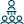</a> | **📂 檔名:** `presentation-audience--Streamline-Ultimate.svg` ✨ **格式:** `Vector (SVG)` ⚖️ **大小:** `5.17KB` 📅 **更新:** `2026-03-03`  🚀 **jsDelivr Markdown:** `` 🔗 **直接連結 (Url):** <code>https://cdn.jsdelivr.net/gh/barry028/materials@main/images/iCons/Ui%20Ux%20Graphic%20Design/presentation-audience--Streamline-Ultimate.svg</code> 📥 [檢視原始檔](presentation-audience--Streamline-Ultimate.svg) |
|  | **📂 檔名:** `presentation-board--Streamline-Ultimate.svg` ✨ **格式:** `Vector (SVG)` ⚖️ **大小:** `1.35KB` 📅 **更新:** `2026-03-03`  🚀 **jsDelivr Markdown:** `` 🔗 **直接連結 (Url):** <code>https://cdn.jsdelivr.net/gh/barry028/materials@main/images/iCons/Ui%20Ux%20Graphic%20Design/presentation-board--Streamline-Ultimate.svg</code> 📥 [檢視原始檔](presentation-board--Streamline-Ultimate.svg) |
|  | **📂 檔名:** `presentation-board-graph--Streamline-Ultimate.svg` ✨ **格式:** `Vector (SVG)` ⚖️ **大小:** `2.53KB` 📅 **更新:** `2026-03-03`  🚀 **jsDelivr Markdown:** `` 🔗 **直接連結 (Url):** <code>https://cdn.jsdelivr.net/gh/barry028/materials@main/images/iCons/Ui%20Ux%20Graphic%20Design/presentation-board-graph--Streamline-Ultimate.svg</code> 📥 [檢視原始檔](presentation-board-graph--Streamline-Ultimate.svg) |
|  | **📂 檔名:** `presentation-microphone-1--Streamline-Ultimate.svg` ✨ **格式:** `Vector (SVG)` ⚖️ **大小:** `4.16KB` 📅 **更新:** `2026-03-03`  🚀 **jsDelivr Markdown:** `` 🔗 **直接連結 (Url):** <code>https://cdn.jsdelivr.net/gh/barry028/materials@main/images/iCons/Ui%20Ux%20Graphic%20Design/presentation-microphone-1--Streamline-Ultimate.svg</code> 📥 [檢視原始檔](presentation-microphone-1--Streamline-Ultimate.svg) |
|  | **📂 檔名:** `presentation-projector--Streamline-Ultimate.svg` ✨ **格式:** `Vector (SVG)` ⚖️ **大小:** `3.27KB` 📅 **更新:** `2026-03-03`  🚀 **jsDelivr Markdown:** `` 🔗 **直接連結 (Url):** <code>https://cdn.jsdelivr.net/gh/barry028/materials@main/images/iCons/Ui%20Ux%20Graphic%20Design/presentation-projector--Streamline-Ultimate.svg</code> 📥 [檢視原始檔](presentation-projector--Streamline-Ultimate.svg) |
|  | **📂 檔名:** `presentation-projector-1--Streamline-Ultimate.svg` ✨ **格式:** `Vector (SVG)` ⚖️ **大小:** `3.22KB` 📅 **更新:** `2026-03-03`  🚀 **jsDelivr Markdown:** `` 🔗 **直接連結 (Url):** <code>https://cdn.jsdelivr.net/gh/barry028/materials@main/images/iCons/Ui%20Ux%20Graphic%20Design/presentation-projector-1--Streamline-Ultimate.svg</code> 📥 [檢視原始檔](presentation-projector-1--Streamline-Ultimate.svg) |
|  | **📂 檔名:** `presentation-projector-screen-budget-analytics--Streamline-Ultimate.svg` ✨ **格式:** `Vector (SVG)` ⚖️ **大小:** `2.84KB` 📅 **更新:** `2026-03-03`  🚀 **jsDelivr Markdown:** `` 🔗 **直接連結 (Url):** <code>https://cdn.jsdelivr.net/gh/barry028/materials@main/images/iCons/Ui%20Ux%20Graphic%20Design/presentation-projector-screen-budget-analytics--Streamline-Ultimate.svg</code> 📥 [檢視原始檔](presentation-projector-screen-budget-analytics--Streamline-Ultimate.svg) |
|  | **📂 檔名:** `presentation-screen--Streamline-Ultimate.svg` ✨ **格式:** `Vector (SVG)` ⚖️ **大小:** `5.52KB` 📅 **更新:** `2026-03-03`  🚀 **jsDelivr Markdown:** `` 🔗 **直接連結 (Url):** <code>https://cdn.jsdelivr.net/gh/barry028/materials@main/images/iCons/Ui%20Ux%20Graphic%20Design/presentation-screen--Streamline-Ultimate.svg</code> 📥 [檢視原始檔](presentation-screen--Streamline-Ultimate.svg) |
|  | **📂 檔名:** `presentation-speaker--Streamline-Ultimate.svg` ✨ **格式:** `Vector (SVG)` ⚖️ **大小:** `3.12KB` 📅 **更新:** `2026-03-03`  🚀 **jsDelivr Markdown:** `` 🔗 **直接連結 (Url):** <code>https://cdn.jsdelivr.net/gh/barry028/materials@main/images/iCons/Ui%20Ux%20Graphic%20Design/presentation-speaker--Streamline-Ultimate.svg</code> 📥 [檢視原始檔](presentation-speaker--Streamline-Ultimate.svg) |
|  | **📂 檔名:** `print-picture--Streamline-Ultimate.svg` ✨ **格式:** `Vector (SVG)` ⚖️ **大小:** `3.94KB` 📅 **更新:** `2026-03-03`  🚀 **jsDelivr Markdown:** `` 🔗 **直接連結 (Url):** <code>https://cdn.jsdelivr.net/gh/barry028/materials@main/images/iCons/Ui%20Ux%20Graphic%20Design/print-picture--Streamline-Ultimate.svg</code> 📥 [檢視原始檔](print-picture--Streamline-Ultimate.svg) |
|  | **📂 檔名:** `print-text--Streamline-Ultimate.svg` ✨ **格式:** `Vector (SVG)` ⚖️ **大小:** `3.42KB` 📅 **更新:** `2026-03-03`  🚀 **jsDelivr Markdown:** `` 🔗 **直接連結 (Url):** <code>https://cdn.jsdelivr.net/gh/barry028/materials@main/images/iCons/Ui%20Ux%20Graphic%20Design/print-text--Streamline-Ultimate.svg</code> 📥 [檢視原始檔](print-text--Streamline-Ultimate.svg) |
|  | **📂 檔名:** `products-gift-tag--Streamline-Ultimate.svg` ✨ **格式:** `Vector (SVG)` ⚖️ **大小:** `3.04KB` 📅 **更新:** `2026-03-03`  🚀 **jsDelivr Markdown:** `` 🔗 **直接連結 (Url):** <code>https://cdn.jsdelivr.net/gh/barry028/materials@main/images/iCons/Ui%20Ux%20Graphic%20Design/products-gift-tag--Streamline-Ultimate.svg</code> 📥 [檢視原始檔](products-gift-tag--Streamline-Ultimate.svg) |
|  | **📂 檔名:** `products-purse--Streamline-Ultimate.svg` ✨ **格式:** `Vector (SVG)` ⚖️ **大小:** `2.39KB` 📅 **更新:** `2026-03-03`  🚀 **jsDelivr Markdown:** `` 🔗 **直接連結 (Url):** <code>https://cdn.jsdelivr.net/gh/barry028/materials@main/images/iCons/Ui%20Ux%20Graphic%20Design/products-purse--Streamline-Ultimate.svg</code> 📥 [檢視原始檔](products-purse--Streamline-Ultimate.svg) |
|  | **📂 檔名:** `products-purse-1--Streamline-Ultimate.svg` ✨ **格式:** `Vector (SVG)` ⚖️ **大小:** `3.64KB` 📅 **更新:** `2026-03-03`  🚀 **jsDelivr Markdown:** `` 🔗 **直接連結 (Url):** <code>https://cdn.jsdelivr.net/gh/barry028/materials@main/images/iCons/Ui%20Ux%20Graphic%20Design/products-purse-1--Streamline-Ultimate.svg</code> 📥 [檢視原始檔](products-purse-1--Streamline-Ultimate.svg) |
|  | **📂 檔名:** `products-shopping-bags--Streamline-Ultimate.svg` ✨ **格式:** `Vector (SVG)` ⚖️ **大小:** `2.61KB` 📅 **更新:** `2026-03-03`  🚀 **jsDelivr Markdown:** `` 🔗 **直接連結 (Url):** <code>https://cdn.jsdelivr.net/gh/barry028/materials@main/images/iCons/Ui%20Ux%20Graphic%20Design/products-shopping-bags--Streamline-Ultimate.svg</code> 📥 [檢視原始檔](products-shopping-bags--Streamline-Ultimate.svg) |
|  | **📂 檔名:** `programming-book--Streamline-Ultimate.svg` ✨ **格式:** `Vector (SVG)` ⚖️ **大小:** `2.11KB` 📅 **更新:** `2026-03-03`  🚀 **jsDelivr Markdown:** `` 🔗 **直接連結 (Url):** <code>https://cdn.jsdelivr.net/gh/barry028/materials@main/images/iCons/Ui%20Ux%20Graphic%20Design/programming-book--Streamline-Ultimate.svg</code> 📥 [檢視原始檔](programming-book--Streamline-Ultimate.svg) |
|  | **📂 檔名:** `programming-browser--Streamline-Ultimate.svg` ✨ **格式:** `Vector (SVG)` ⚖️ **大小:** `2.73KB` 📅 **更新:** `2026-03-03`  🚀 **jsDelivr Markdown:** `` 🔗 **直接連結 (Url):** <code>https://cdn.jsdelivr.net/gh/barry028/materials@main/images/iCons/Ui%20Ux%20Graphic%20Design/programming-browser--Streamline-Ultimate.svg</code> 📥 [檢視原始檔](programming-browser--Streamline-Ultimate.svg) |
|  | **📂 檔名:** `programming-flag--Streamline-Ultimate.svg` ✨ **格式:** `Vector (SVG)` ⚖️ **大小:** `3.03KB` 📅 **更新:** `2026-03-03`  🚀 **jsDelivr Markdown:** `` 🔗 **直接連結 (Url):** <code>https://cdn.jsdelivr.net/gh/barry028/materials@main/images/iCons/Ui%20Ux%20Graphic%20Design/programming-flag--Streamline-Ultimate.svg</code> 📥 [檢視原始檔](programming-flag--Streamline-Ultimate.svg) |
|  | **📂 檔名:** `programming-hold-code-2--Streamline-Ultimate.svg` ✨ **格式:** `Vector (SVG)` ⚖️ **大小:** `3.40KB` 📅 **更新:** `2026-03-03`  🚀 **jsDelivr Markdown:** `` 🔗 **直接連結 (Url):** <code>https://cdn.jsdelivr.net/gh/barry028/materials@main/images/iCons/Ui%20Ux%20Graphic%20Design/programming-hold-code-2--Streamline-Ultimate.svg</code> 📥 [檢視原始檔](programming-hold-code-2--Streamline-Ultimate.svg) |
|  | **📂 檔名:** `programming-hold-laptop--Streamline-Ultimate.svg` ✨ **格式:** `Vector (SVG)` ⚖️ **大小:** `2.28KB` 📅 **更新:** `2026-03-03`  🚀 **jsDelivr Markdown:** `` 🔗 **直接連結 (Url):** <code>https://cdn.jsdelivr.net/gh/barry028/materials@main/images/iCons/Ui%20Ux%20Graphic%20Design/programming-hold-laptop--Streamline-Ultimate.svg</code> 📥 [檢視原始檔](programming-hold-laptop--Streamline-Ultimate.svg) |
|  | **📂 檔名:** `programming-keyboard-type--Streamline-Ultimate.svg` ✨ **格式:** `Vector (SVG)` ⚖️ **大小:** `9.78KB` 📅 **更新:** `2026-03-03`  🚀 **jsDelivr Markdown:** `` 🔗 **直接連結 (Url):** <code>https://cdn.jsdelivr.net/gh/barry028/materials@main/images/iCons/Ui%20Ux%20Graphic%20Design/programming-keyboard-type--Streamline-Ultimate.svg</code> 📥 [檢視原始檔](programming-keyboard-type--Streamline-Ultimate.svg) |
|  | **📂 檔名:** `programming-language-css--Streamline-Ultimate.svg` ✨ **格式:** `Vector (SVG)` ⚖️ **大小:** `3.32KB` 📅 **更新:** `2026-03-03`  🚀 **jsDelivr Markdown:** `` 🔗 **直接連結 (Url):** <code>https://cdn.jsdelivr.net/gh/barry028/materials@main/images/iCons/Ui%20Ux%20Graphic%20Design/programming-language-css--Streamline-Ultimate.svg</code> 📥 [檢視原始檔](programming-language-css--Streamline-Ultimate.svg) |
|  | **📂 檔名:** `programming-language-css-3--Streamline-Ultimate.svg` ✨ **格式:** `Vector (SVG)` ⚖️ **大小:** `3.08KB` 📅 **更新:** `2026-03-03`  🚀 **jsDelivr Markdown:** `` 🔗 **直接連結 (Url):** <code>https://cdn.jsdelivr.net/gh/barry028/materials@main/images/iCons/Ui%20Ux%20Graphic%20Design/programming-language-css-3--Streamline-Ultimate.svg</code> 📥 [檢視原始檔](programming-language-css-3--Streamline-Ultimate.svg) |
|  | **📂 檔名:** `programming-language-hash--Streamline-Ultimate.svg` ✨ **格式:** `Vector (SVG)` ⚖️ **大小:** `2.81KB` 📅 **更新:** `2026-03-03`  🚀 **jsDelivr Markdown:** `` 🔗 **直接連結 (Url):** <code>https://cdn.jsdelivr.net/gh/barry028/materials@main/images/iCons/Ui%20Ux%20Graphic%20Design/programming-language-hash--Streamline-Ultimate.svg</code> 📥 [檢視原始檔](programming-language-hash--Streamline-Ultimate.svg) |
|  | **📂 檔名:** `programming-language-html--Streamline-Ultimate.svg` ✨ **格式:** `Vector (SVG)` ⚖️ **大小:** `3.23KB` 📅 **更新:** `2026-03-03`  🚀 **jsDelivr Markdown:** `` 🔗 **直接連結 (Url):** <code>https://cdn.jsdelivr.net/gh/barry028/materials@main/images/iCons/Ui%20Ux%20Graphic%20Design/programming-language-html--Streamline-Ultimate.svg</code> 📥 [檢視原始檔](programming-language-html--Streamline-Ultimate.svg) |
|  | **📂 檔名:** `programming-language-html-5--Streamline-Ultimate.svg` ✨ **格式:** `Vector (SVG)` ⚖️ **大小:** `3.00KB` 📅 **更新:** `2026-03-03`  🚀 **jsDelivr Markdown:** `` 🔗 **直接連結 (Url):** <code>https://cdn.jsdelivr.net/gh/barry028/materials@main/images/iCons/Ui%20Ux%20Graphic%20Design/programming-language-html-5--Streamline-Ultimate.svg</code> 📥 [檢視原始檔](programming-language-html-5--Streamline-Ultimate.svg) |
|  | **📂 檔名:** `programming-language-monitor-css--Streamline-Ultimate.svg` ✨ **格式:** `Vector (SVG)` ⚖️ **大小:** `1.83KB` 📅 **更新:** `2026-03-03`  🚀 **jsDelivr Markdown:** `` 🔗 **直接連結 (Url):** <code>https://cdn.jsdelivr.net/gh/barry028/materials@main/images/iCons/Ui%20Ux%20Graphic%20Design/programming-language-monitor-css--Streamline-Ultimate.svg</code> 📥 [檢視原始檔](programming-language-monitor-css--Streamline-Ultimate.svg) |
|  | **📂 檔名:** `programming-laptop-type--Streamline-Ultimate.svg` ✨ **格式:** `Vector (SVG)` ⚖️ **大小:** `7.85KB` 📅 **更新:** `2026-03-03`  🚀 **jsDelivr Markdown:** `` 🔗 **直接連結 (Url):** <code>https://cdn.jsdelivr.net/gh/barry028/materials@main/images/iCons/Ui%20Ux%20Graphic%20Design/programming-laptop-type--Streamline-Ultimate.svg</code> 📥 [檢視原始檔](programming-laptop-type--Streamline-Ultimate.svg) |
|  | **📂 檔名:** `programming-monitor--Streamline-Ultimate.svg` ✨ **格式:** `Vector (SVG)` ⚖️ **大小:** `4.17KB` 📅 **更新:** `2026-03-03`  🚀 **jsDelivr Markdown:** `` 🔗 **直接連結 (Url):** <code>https://cdn.jsdelivr.net/gh/barry028/materials@main/images/iCons/Ui%20Ux%20Graphic%20Design/programming-monitor--Streamline-Ultimate.svg</code> 📥 [檢視原始檔](programming-monitor--Streamline-Ultimate.svg) |
|  | **📂 檔名:** `programming-search--Streamline-Ultimate.svg` ✨ **格式:** `Vector (SVG)` ⚖️ **大小:** `1.69KB` 📅 **更新:** `2026-03-03`  🚀 **jsDelivr Markdown:** `` 🔗 **直接連結 (Url):** <code>https://cdn.jsdelivr.net/gh/barry028/materials@main/images/iCons/Ui%20Ux%20Graphic%20Design/programming-search--Streamline-Ultimate.svg</code> 📥 [檢視原始檔](programming-search--Streamline-Ultimate.svg) |
|  | **📂 檔名:** `programming-team-chat-3--Streamline-Ultimate.svg` ✨ **格式:** `Vector (SVG)` ⚖️ **大小:** `4.27KB` 📅 **更新:** `2026-03-03`  🚀 **jsDelivr Markdown:** `` 🔗 **直接連結 (Url):** <code>https://cdn.jsdelivr.net/gh/barry028/materials@main/images/iCons/Ui%20Ux%20Graphic%20Design/programming-team-chat-3--Streamline-Ultimate.svg</code> 📥 [檢視原始檔](programming-team-chat-3--Streamline-Ultimate.svg) |
|  | **📂 檔名:** `programming-user--Streamline-Ultimate.svg` ✨ **格式:** `Vector (SVG)` ⚖️ **大小:** `2.12KB` 📅 **更新:** `2026-03-03`  🚀 **jsDelivr Markdown:** `` 🔗 **直接連結 (Url):** <code>https://cdn.jsdelivr.net/gh/barry028/materials@main/images/iCons/Ui%20Ux%20Graphic%20Design/programming-user--Streamline-Ultimate.svg</code> 📥 [檢視原始檔](programming-user--Streamline-Ultimate.svg) |
|  | **📂 檔名:** `programming-user-chat-2--Streamline-Ultimate.svg` ✨ **格式:** `Vector (SVG)` ⚖️ **大小:** `3.16KB` 📅 **更新:** `2026-03-03`  🚀 **jsDelivr Markdown:** `` 🔗 **直接連結 (Url):** <code>https://cdn.jsdelivr.net/gh/barry028/materials@main/images/iCons/Ui%20Ux%20Graphic%20Design/programming-user-chat-2--Streamline-Ultimate.svg</code> 📥 [檢視原始檔](programming-user-chat-2--Streamline-Ultimate.svg) |
| <a href="programming-user-head--Streamline-Ultimate.svg">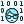</a> | **📂 檔名:** `programming-user-head--Streamline-Ultimate.svg` ✨ **格式:** `Vector (SVG)` ⚖️ **大小:** `5.02KB` 📅 **更新:** `2026-03-03`  🚀 **jsDelivr Markdown:** `` 🔗 **直接連結 (Url):** <code>https://cdn.jsdelivr.net/gh/barry028/materials@main/images/iCons/Ui%20Ux%20Graphic%20Design/programming-user-head--Streamline-Ultimate.svg</code> 📥 [檢視原始檔](programming-user-head--Streamline-Ultimate.svg) |
|  | **📂 檔名:** `qr-code--Streamline-Ultimate.svg` ✨ **格式:** `Vector (SVG)` ⚖️ **大小:** `2.84KB` 📅 **更新:** `2026-03-03`  🚀 **jsDelivr Markdown:** `` 🔗 **直接連結 (Url):** <code>https://cdn.jsdelivr.net/gh/barry028/materials@main/images/iCons/Ui%20Ux%20Graphic%20Design/qr-code--Streamline-Ultimate.svg</code> 📥 [檢視原始檔](qr-code--Streamline-Ultimate.svg) |
|  | **📂 檔名:** `qr-code-scan--Streamline-Ultimate.svg` ✨ **格式:** `Vector (SVG)` ⚖️ **大小:** `2.12KB` 📅 **更新:** `2026-03-03`  🚀 **jsDelivr Markdown:** `` 🔗 **直接連結 (Url):** <code>https://cdn.jsdelivr.net/gh/barry028/materials@main/images/iCons/Ui%20Ux%20Graphic%20Design/qr-code-scan--Streamline-Ultimate.svg</code> 📥 [檢視原始檔](qr-code-scan--Streamline-Ultimate.svg) |
|  | **📂 檔名:** `question-help-message--Streamline-Ultimate.svg` ✨ **格式:** `Vector (SVG)` ⚖️ **大小:** `2.80KB` 📅 **更新:** `2026-03-03`  🚀 **jsDelivr Markdown:** `` 🔗 **直接連結 (Url):** <code>https://cdn.jsdelivr.net/gh/barry028/materials@main/images/iCons/Ui%20Ux%20Graphic%20Design/question-help-message--Streamline-Ultimate.svg</code> 📥 [檢視原始檔](question-help-message--Streamline-Ultimate.svg) |
|  | **📂 檔名:** `quill-circle--Streamline-Ultimate.svg` ✨ **格式:** `Vector (SVG)` ⚖️ **大小:** `2.33KB` 📅 **更新:** `2026-03-03`  🚀 **jsDelivr Markdown:** `` 🔗 **直接連結 (Url):** <code>https://cdn.jsdelivr.net/gh/barry028/materials@main/images/iCons/Ui%20Ux%20Graphic%20Design/quill-circle--Streamline-Ultimate.svg</code> 📥 [檢視原始檔](quill-circle--Streamline-Ultimate.svg) |
|  | **📂 檔名:** `radio-antenna-handle--Streamline-Ultimate.svg` ✨ **格式:** `Vector (SVG)` ⚖️ **大小:** `6.03KB` 📅 **更新:** `2026-03-03`  🚀 **jsDelivr Markdown:** `` 🔗 **直接連結 (Url):** <code>https://cdn.jsdelivr.net/gh/barry028/materials@main/images/iCons/Ui%20Ux%20Graphic%20Design/radio-antenna-handle--Streamline-Ultimate.svg</code> 📥 [檢視原始檔](radio-antenna-handle--Streamline-Ultimate.svg) |
|  | **📂 檔名:** `radio-stereo-1--Streamline-Ultimate.svg` ✨ **格式:** `Vector (SVG)` ⚖️ **大小:** `7.16KB` 📅 **更新:** `2026-03-03`  🚀 **jsDelivr Markdown:** `` 🔗 **直接連結 (Url):** <code>https://cdn.jsdelivr.net/gh/barry028/materials@main/images/iCons/Ui%20Ux%20Graphic%20Design/radio-stereo-1--Streamline-Ultimate.svg</code> 📥 [檢視原始檔](radio-stereo-1--Streamline-Ultimate.svg) |
|  | **📂 檔名:** `radioactive--Streamline-Ultimate.svg` ✨ **格式:** `Vector (SVG)` ⚖️ **大小:** `5.01KB` 📅 **更新:** `2026-03-03`  🚀 **jsDelivr Markdown:** `` 🔗 **直接連結 (Url):** <code>https://cdn.jsdelivr.net/gh/barry028/materials@main/images/iCons/Ui%20Ux%20Graphic%20Design/radioactive--Streamline-Ultimate.svg</code> 📥 [檢視原始檔](radioactive--Streamline-Ultimate.svg) |
|  | **📂 檔名:** `read-email-at-1--Streamline-Ultimate.svg` ✨ **格式:** `Vector (SVG)` ⚖️ **大小:** `2.62KB` 📅 **更新:** `2026-03-03`  🚀 **jsDelivr Markdown:** `` 🔗 **直接連結 (Url):** <code>https://cdn.jsdelivr.net/gh/barry028/materials@main/images/iCons/Ui%20Ux%20Graphic%20Design/read-email-at-1--Streamline-Ultimate.svg</code> 📥 [檢視原始檔](read-email-at-1--Streamline-Ultimate.svg) |
|  | **📂 檔名:** `read-email-circle--Streamline-Ultimate.svg` ✨ **格式:** `Vector (SVG)` ⚖️ **大小:** `3.17KB` 📅 **更新:** `2026-03-03`  🚀 **jsDelivr Markdown:** `` 🔗 **直接連結 (Url):** <code>https://cdn.jsdelivr.net/gh/barry028/materials@main/images/iCons/Ui%20Ux%20Graphic%20Design/read-email-circle--Streamline-Ultimate.svg</code> 📥 [檢視原始檔](read-email-circle--Streamline-Ultimate.svg) |
|  | **📂 檔名:** `read-email-laptop--Streamline-Ultimate.svg` ✨ **格式:** `Vector (SVG)` ⚖️ **大小:** `3.30KB` 📅 **更新:** `2026-03-03`  🚀 **jsDelivr Markdown:** `` 🔗 **直接連結 (Url):** <code>https://cdn.jsdelivr.net/gh/barry028/materials@main/images/iCons/Ui%20Ux%20Graphic%20Design/read-email-laptop--Streamline-Ultimate.svg</code> 📥 [檢視原始檔](read-email-laptop--Streamline-Ultimate.svg) |
|  | **📂 檔名:** `read-email-monitor--Streamline-Ultimate.svg` ✨ **格式:** `Vector (SVG)` ⚖️ **大小:** `2.41KB` 📅 **更新:** `2026-03-03`  🚀 **jsDelivr Markdown:** `` 🔗 **直接連結 (Url):** <code>https://cdn.jsdelivr.net/gh/barry028/materials@main/images/iCons/Ui%20Ux%20Graphic%20Design/read-email-monitor--Streamline-Ultimate.svg</code> 📥 [檢視原始檔](read-email-monitor--Streamline-Ultimate.svg) |
|  | **📂 檔名:** `read-email-target--Streamline-Ultimate.svg` ✨ **格式:** `Vector (SVG)` ⚖️ **大小:** `2.85KB` 📅 **更新:** `2026-03-03`  🚀 **jsDelivr Markdown:** `` 🔗 **直接連結 (Url):** <code>https://cdn.jsdelivr.net/gh/barry028/materials@main/images/iCons/Ui%20Ux%20Graphic%20Design/read-email-target--Streamline-Ultimate.svg</code> 📥 [檢視原始檔](read-email-target--Streamline-Ultimate.svg) |
|  | **📂 檔名:** `receipt-1--Streamline-Ultimate.svg` ✨ **格式:** `Vector (SVG)` ⚖️ **大小:** `2.19KB` 📅 **更新:** `2026-03-03`  🚀 **jsDelivr Markdown:** `` 🔗 **直接連結 (Url):** <code>https://cdn.jsdelivr.net/gh/barry028/materials@main/images/iCons/Ui%20Ux%20Graphic%20Design/receipt-1--Streamline-Ultimate.svg</code> 📥 [檢視原始檔](receipt-1--Streamline-Ultimate.svg) |
|  | **📂 檔名:** `receipt-dollar--Streamline-Ultimate.svg` ✨ **格式:** `Vector (SVG)` ⚖️ **大小:** `6.59KB` 📅 **更新:** `2026-03-03`  🚀 **jsDelivr Markdown:** `` 🔗 **直接連結 (Url):** <code>https://cdn.jsdelivr.net/gh/barry028/materials@main/images/iCons/Ui%20Ux%20Graphic%20Design/receipt-dollar--Streamline-Ultimate.svg</code> 📥 [檢視原始檔](receipt-dollar--Streamline-Ultimate.svg) |
|  | **📂 檔名:** `receipt-register-1--Streamline-Ultimate.svg` ✨ **格式:** `Vector (SVG)` ⚖️ **大小:** `3.89KB` 📅 **更新:** `2026-03-03`  🚀 **jsDelivr Markdown:** `` 🔗 **直接連結 (Url):** <code>https://cdn.jsdelivr.net/gh/barry028/materials@main/images/iCons/Ui%20Ux%20Graphic%20Design/receipt-register-1--Streamline-Ultimate.svg</code> 📥 [檢視原始檔](receipt-register-1--Streamline-Ultimate.svg) |
|  | **📂 檔名:** `receipt-register-print--Streamline-Ultimate.svg` ✨ **格式:** `Vector (SVG)` ⚖️ **大小:** `5.19KB` 📅 **更新:** `2026-03-03`  🚀 **jsDelivr Markdown:** `` 🔗 **直接連結 (Url):** <code>https://cdn.jsdelivr.net/gh/barry028/materials@main/images/iCons/Ui%20Ux%20Graphic%20Design/receipt-register-print--Streamline-Ultimate.svg</code> 📥 [檢視原始檔](receipt-register-print--Streamline-Ultimate.svg) |
|  | **📂 檔名:** `remove-circle--Streamline-Ultimate.svg` ✨ **格式:** `Vector (SVG)` ⚖️ **大小:** `2.19KB` 📅 **更新:** `2026-03-03`  🚀 **jsDelivr Markdown:** `` 🔗 **直接連結 (Url):** <code>https://cdn.jsdelivr.net/gh/barry028/materials@main/images/iCons/Ui%20Ux%20Graphic%20Design/remove-circle--Streamline-Ultimate.svg</code> 📥 [檢視原始檔](remove-circle--Streamline-Ultimate.svg) |
|  | **📂 檔名:** `resize-expand-1--Streamline-Ultimate.svg` ✨ **格式:** `Vector (SVG)` ⚖️ **大小:** `2.56KB` 📅 **更新:** `2026-03-03`  🚀 **jsDelivr Markdown:** `` 🔗 **直接連結 (Url):** <code>https://cdn.jsdelivr.net/gh/barry028/materials@main/images/iCons/Ui%20Ux%20Graphic%20Design/resize-expand-1--Streamline-Ultimate.svg</code> 📥 [檢視原始檔](resize-expand-1--Streamline-Ultimate.svg) |
|  | **📂 檔名:** `responsive-design-1--Streamline-Ultimate.svg` ✨ **格式:** `Vector (SVG)` ⚖️ **大小:** `2.57KB` 📅 **更新:** `2026-03-03`  🚀 **jsDelivr Markdown:** `` 🔗 **直接連結 (Url):** <code>https://cdn.jsdelivr.net/gh/barry028/materials@main/images/iCons/Ui%20Ux%20Graphic%20Design/responsive-design-1--Streamline-Ultimate.svg</code> 📥 [檢視原始檔](responsive-design-1--Streamline-Ultimate.svg) |
|  | **📂 檔名:** `responsive-design-image--Streamline-Ultimate.svg` ✨ **格式:** `Vector (SVG)` ⚖️ **大小:** `4.34KB` 📅 **更新:** `2026-03-03`  🚀 **jsDelivr Markdown:** `` 🔗 **直接連結 (Url):** <code>https://cdn.jsdelivr.net/gh/barry028/materials@main/images/iCons/Ui%20Ux%20Graphic%20Design/responsive-design-image--Streamline-Ultimate.svg</code> 📥 [檢視原始檔](responsive-design-image--Streamline-Ultimate.svg) |
|  | **📂 檔名:** `responsive-design-laptop--Streamline-Ultimate.svg` ✨ **格式:** `Vector (SVG)` ⚖️ **大小:** `3.36KB` 📅 **更新:** `2026-03-03`  🚀 **jsDelivr Markdown:** `` 🔗 **直接連結 (Url):** <code>https://cdn.jsdelivr.net/gh/barry028/materials@main/images/iCons/Ui%20Ux%20Graphic%20Design/responsive-design-laptop--Streamline-Ultimate.svg</code> 📥 [檢視原始檔](responsive-design-laptop--Streamline-Ultimate.svg) |
|  | **📂 檔名:** `responsive-design-phone--Streamline-Ultimate.svg` ✨ **格式:** `Vector (SVG)` ⚖️ **大小:** `2.01KB` 📅 **更新:** `2026-03-03`  🚀 **jsDelivr Markdown:** `` 🔗 **直接連結 (Url):** <code>https://cdn.jsdelivr.net/gh/barry028/materials@main/images/iCons/Ui%20Ux%20Graphic%20Design/responsive-design-phone--Streamline-Ultimate.svg</code> 📥 [檢視原始檔](responsive-design-phone--Streamline-Ultimate.svg) |
|  | **📂 檔名:** `retouch-magic-wand--Streamline-Ultimate.svg` ✨ **格式:** `Vector (SVG)` ⚖️ **大小:** `3.81KB` 📅 **更新:** `2026-03-03`  🚀 **jsDelivr Markdown:** `` 🔗 **直接連結 (Url):** <code>https://cdn.jsdelivr.net/gh/barry028/materials@main/images/iCons/Ui%20Ux%20Graphic%20Design/retouch-magic-wand--Streamline-Ultimate.svg</code> 📥 [檢視原始檔](retouch-magic-wand--Streamline-Ultimate.svg) |
|  | **📂 檔名:** `retouch-patch--Streamline-Ultimate.svg` ✨ **格式:** `Vector (SVG)` ⚖️ **大小:** `1.70KB` 📅 **更新:** `2026-03-03`  🚀 **jsDelivr Markdown:** `` 🔗 **直接連結 (Url):** <code>https://cdn.jsdelivr.net/gh/barry028/materials@main/images/iCons/Ui%20Ux%20Graphic%20Design/retouch-patch--Streamline-Ultimate.svg</code> 📥 [檢視原始檔](retouch-patch--Streamline-Ultimate.svg) |
|  | **📂 檔名:** `retouch-select--Streamline-Ultimate.svg` ✨ **格式:** `Vector (SVG)` ⚖️ **大小:** `3.30KB` 📅 **更新:** `2026-03-03`  🚀 **jsDelivr Markdown:** `` 🔗 **直接連結 (Url):** <code>https://cdn.jsdelivr.net/gh/barry028/materials@main/images/iCons/Ui%20Ux%20Graphic%20Design/retouch-select--Streamline-Ultimate.svg</code> 📥 [檢視原始檔](retouch-select--Streamline-Ultimate.svg) |
|  | **📂 檔名:** `retouch-smile--Streamline-Ultimate.svg` ✨ **格式:** `Vector (SVG)` ⚖️ **大小:** `4.46KB` 📅 **更新:** `2026-03-03`  🚀 **jsDelivr Markdown:** `` 🔗 **直接連結 (Url):** <code>https://cdn.jsdelivr.net/gh/barry028/materials@main/images/iCons/Ui%20Ux%20Graphic%20Design/retouch-smile--Streamline-Ultimate.svg</code> 📥 [檢視原始檔](retouch-smile--Streamline-Ultimate.svg) |
|  | **📂 檔名:** `retouch-sticker--Streamline-Ultimate.svg` ✨ **格式:** `Vector (SVG)` ⚖️ **大小:** `2.83KB` 📅 **更新:** `2026-03-03`  🚀 **jsDelivr Markdown:** `` 🔗 **直接連結 (Url):** <code>https://cdn.jsdelivr.net/gh/barry028/materials@main/images/iCons/Ui%20Ux%20Graphic%20Design/retouch-sticker--Streamline-Ultimate.svg</code> 📥 [檢視原始檔](retouch-sticker--Streamline-Ultimate.svg) |
|  | **📂 檔名:** `rotate-angle--Streamline-Ultimate.svg` ✨ **格式:** `Vector (SVG)` ⚖️ **大小:** `1.71KB` 📅 **更新:** `2026-03-03`  🚀 **jsDelivr Markdown:** `` 🔗 **直接連結 (Url):** <code>https://cdn.jsdelivr.net/gh/barry028/materials@main/images/iCons/Ui%20Ux%20Graphic%20Design/rotate-angle--Streamline-Ultimate.svg</code> 📥 [檢視原始檔](rotate-angle--Streamline-Ultimate.svg) |
|  | **📂 檔名:** `rotate-forward--Streamline-Ultimate.svg` ✨ **格式:** `Vector (SVG)` ⚖️ **大小:** `2.18KB` 📅 **更新:** `2026-03-03`  🚀 **jsDelivr Markdown:** `` 🔗 **直接連結 (Url):** <code>https://cdn.jsdelivr.net/gh/barry028/materials@main/images/iCons/Ui%20Ux%20Graphic%20Design/rotate-forward--Streamline-Ultimate.svg</code> 📥 [檢視原始檔](rotate-forward--Streamline-Ultimate.svg) |
|  | **📂 檔名:** `router-signal--Streamline-Ultimate.svg` ✨ **格式:** `Vector (SVG)` ⚖️ **大小:** `4.61KB` 📅 **更新:** `2026-03-03`  🚀 **jsDelivr Markdown:** `` 🔗 **直接連結 (Url):** <code>https://cdn.jsdelivr.net/gh/barry028/materials@main/images/iCons/Ui%20Ux%20Graphic%20Design/router-signal--Streamline-Ultimate.svg</code> 📥 [檢視原始檔](router-signal--Streamline-Ultimate.svg) |
|  | **📂 檔名:** `router-signal-double--Streamline-Ultimate.svg` ✨ **格式:** `Vector (SVG)` ⚖️ **大小:** `3.84KB` 📅 **更新:** `2026-03-03`  🚀 **jsDelivr Markdown:** `` 🔗 **直接連結 (Url):** <code>https://cdn.jsdelivr.net/gh/barry028/materials@main/images/iCons/Ui%20Ux%20Graphic%20Design/router-signal-double--Streamline-Ultimate.svg</code> 📥 [檢視原始檔](router-signal-double--Streamline-Ultimate.svg) |
|  | **📂 檔名:** `rss-feed-square--Streamline-Ultimate.svg` ✨ **格式:** `Vector (SVG)` ⚖️ **大小:** `2.54KB` 📅 **更新:** `2026-03-03`  🚀 **jsDelivr Markdown:** `` 🔗 **直接連結 (Url):** <code>https://cdn.jsdelivr.net/gh/barry028/materials@main/images/iCons/Ui%20Ux%20Graphic%20Design/rss-feed-square--Streamline-Ultimate.svg</code> 📥 [檢視原始檔](rss-feed-square--Streamline-Ultimate.svg) |
|  | **📂 檔名:** `ruler-triangle--Streamline-Ultimate.svg` ✨ **格式:** `Vector (SVG)` ⚖️ **大小:** `2.02KB` 📅 **更新:** `2026-03-03`  🚀 **jsDelivr Markdown:** `` 🔗 **直接連結 (Url):** <code>https://cdn.jsdelivr.net/gh/barry028/materials@main/images/iCons/Ui%20Ux%20Graphic%20Design/ruler-triangle--Streamline-Ultimate.svg</code> 📥 [檢視原始檔](ruler-triangle--Streamline-Ultimate.svg) |
|  | **📂 檔名:** `safety-911--Streamline-Ultimate.svg` ✨ **格式:** `Vector (SVG)` ⚖️ **大小:** `3.37KB` 📅 **更新:** `2026-03-03`  🚀 **jsDelivr Markdown:** `` 🔗 **直接連結 (Url):** <code>https://cdn.jsdelivr.net/gh/barry028/materials@main/images/iCons/Ui%20Ux%20Graphic%20Design/safety-911--Streamline-Ultimate.svg</code> 📥 [檢視原始檔](safety-911--Streamline-Ultimate.svg) |
|  | **📂 檔名:** `safety-call-firefighters--Streamline-Ultimate.svg` ✨ **格式:** `Vector (SVG)` ⚖️ **大小:** `4.49KB` 📅 **更新:** `2026-03-03`  🚀 **jsDelivr Markdown:** `` 🔗 **直接連結 (Url):** <code>https://cdn.jsdelivr.net/gh/barry028/materials@main/images/iCons/Ui%20Ux%20Graphic%20Design/safety-call-firefighters--Streamline-Ultimate.svg</code> 📥 [檢視原始檔](safety-call-firefighters--Streamline-Ultimate.svg) |
|  | **📂 檔名:** `safety-call-firefighters-2--Streamline-Ultimate.svg` ✨ **格式:** `Vector (SVG)` ⚖️ **大小:** `3.10KB` 📅 **更新:** `2026-03-03`  🚀 **jsDelivr Markdown:** `` 🔗 **直接連結 (Url):** <code>https://cdn.jsdelivr.net/gh/barry028/materials@main/images/iCons/Ui%20Ux%20Graphic%20Design/safety-call-firefighters-2--Streamline-Ultimate.svg</code> 📥 [檢視原始檔](safety-call-firefighters-2--Streamline-Ultimate.svg) |
|  | **📂 檔名:** `safety-danger-mudslide--Streamline-Ultimate.svg` ✨ **格式:** `Vector (SVG)` ⚖️ **大小:** `6.15KB` 📅 **更新:** `2026-03-03`  🚀 **jsDelivr Markdown:** `` 🔗 **直接連結 (Url):** <code>https://cdn.jsdelivr.net/gh/barry028/materials@main/images/iCons/Ui%20Ux%20Graphic%20Design/safety-danger-mudslide--Streamline-Ultimate.svg</code> 📥 [檢視原始檔](safety-danger-mudslide--Streamline-Ultimate.svg) |
|  | **📂 檔名:** `safety-drown-hand--Streamline-Ultimate.svg` ✨ **格式:** `Vector (SVG)` ⚖️ **大小:** `5.17KB` 📅 **更新:** `2026-03-03`  🚀 **jsDelivr Markdown:** `` 🔗 **直接連結 (Url):** <code>https://cdn.jsdelivr.net/gh/barry028/materials@main/images/iCons/Ui%20Ux%20Graphic%20Design/safety-drown-hand--Streamline-Ultimate.svg</code> 📥 [檢視原始檔](safety-drown-hand--Streamline-Ultimate.svg) |
|  | **📂 檔名:** `safety-exit-left--Streamline-Ultimate.svg` ✨ **格式:** `Vector (SVG)` ⚖️ **大小:** `2.65KB` 📅 **更新:** `2026-03-03`  🚀 **jsDelivr Markdown:** `` 🔗 **直接連結 (Url):** <code>https://cdn.jsdelivr.net/gh/barry028/materials@main/images/iCons/Ui%20Ux%20Graphic%20Design/safety-exit-left--Streamline-Ultimate.svg</code> 📥 [檢視原始檔](safety-exit-left--Streamline-Ultimate.svg) |
|  | **📂 檔名:** `safety-fire-exit-1--Streamline-Ultimate.svg` ✨ **格式:** `Vector (SVG)` ⚖️ **大小:** `5.70KB` 📅 **更新:** `2026-03-03`  🚀 **jsDelivr Markdown:** `` 🔗 **直接連結 (Url):** <code>https://cdn.jsdelivr.net/gh/barry028/materials@main/images/iCons/Ui%20Ux%20Graphic%20Design/safety-fire-exit-1--Streamline-Ultimate.svg</code> 📥 [檢視原始檔](safety-fire-exit-1--Streamline-Ultimate.svg) |
|  | **📂 檔名:** `safety-fire-extinguisher--Streamline-Ultimate.svg` ✨ **格式:** `Vector (SVG)` ⚖️ **大小:** `3.36KB` 📅 **更新:** `2026-03-03`  🚀 **jsDelivr Markdown:** `` 🔗 **直接連結 (Url):** <code>https://cdn.jsdelivr.net/gh/barry028/materials@main/images/iCons/Ui%20Ux%20Graphic%20Design/safety-fire-extinguisher--Streamline-Ultimate.svg</code> 📥 [檢視原始檔](safety-fire-extinguisher--Streamline-Ultimate.svg) |
|  | **📂 檔名:** `safety-fire-right--Streamline-Ultimate.svg` ✨ **格式:** `Vector (SVG)` ⚖️ **大小:** `4.56KB` 📅 **更新:** `2026-03-03`  🚀 **jsDelivr Markdown:** `` 🔗 **直接連結 (Url):** <code>https://cdn.jsdelivr.net/gh/barry028/materials@main/images/iCons/Ui%20Ux%20Graphic%20Design/safety-fire-right--Streamline-Ultimate.svg</code> 📥 [檢視原始檔](safety-fire-right--Streamline-Ultimate.svg) |
|  | **📂 檔名:** `safety-fire-shield--Streamline-Ultimate.svg` ✨ **格式:** `Vector (SVG)` ⚖️ **大小:** `2.69KB` 📅 **更新:** `2026-03-03`  🚀 **jsDelivr Markdown:** `` 🔗 **直接連結 (Url):** <code>https://cdn.jsdelivr.net/gh/barry028/materials@main/images/iCons/Ui%20Ux%20Graphic%20Design/safety-fire-shield--Streamline-Ultimate.svg</code> 📥 [檢視原始檔](safety-fire-shield--Streamline-Ultimate.svg) |
|  | **📂 檔名:** `safety-float--Streamline-Ultimate.svg` ✨ **格式:** `Vector (SVG)` ⚖️ **大小:** `4.79KB` 📅 **更新:** `2026-03-03`  🚀 **jsDelivr Markdown:** `` 🔗 **直接連結 (Url):** <code>https://cdn.jsdelivr.net/gh/barry028/materials@main/images/iCons/Ui%20Ux%20Graphic%20Design/safety-float--Streamline-Ultimate.svg</code> 📥 [檢視原始檔](safety-float--Streamline-Ultimate.svg) |
|  | **📂 檔名:** `safety-slippery--Streamline-Ultimate.svg` ✨ **格式:** `Vector (SVG)` ⚖️ **大小:** `2.41KB` 📅 **更新:** `2026-03-03`  🚀 **jsDelivr Markdown:** `` 🔗 **直接連結 (Url):** <code>https://cdn.jsdelivr.net/gh/barry028/materials@main/images/iCons/Ui%20Ux%20Graphic%20Design/safety-slippery--Streamline-Ultimate.svg</code> 📥 [檢視原始檔](safety-slippery--Streamline-Ultimate.svg) |
|  | **📂 檔名:** `safety-warning-electricity--Streamline-Ultimate.svg` ✨ **格式:** `Vector (SVG)` ⚖️ **大小:** `2.32KB` 📅 **更新:** `2026-03-03`  🚀 **jsDelivr Markdown:** `` 🔗 **直接連結 (Url):** <code>https://cdn.jsdelivr.net/gh/barry028/materials@main/images/iCons/Ui%20Ux%20Graphic%20Design/safety-warning-electricity--Streamline-Ultimate.svg</code> 📥 [檢視原始檔](safety-warning-electricity--Streamline-Ultimate.svg) |
|  | **📂 檔名:** `safety-warning-heat--Streamline-Ultimate.svg` ✨ **格式:** `Vector (SVG)` ⚖️ **大小:** `2.33KB` 📅 **更新:** `2026-03-03`  🚀 **jsDelivr Markdown:** `` 🔗 **直接連結 (Url):** <code>https://cdn.jsdelivr.net/gh/barry028/materials@main/images/iCons/Ui%20Ux%20Graphic%20Design/safety-warning-heat--Streamline-Ultimate.svg</code> 📥 [檢視原始檔](safety-warning-heat--Streamline-Ultimate.svg) |
|  | **📂 檔名:** `safety-warning-radioactive--Streamline-Ultimate.svg` ✨ **格式:** `Vector (SVG)` ⚖️ **大小:** `3.75KB` 📅 **更新:** `2026-03-03`  🚀 **jsDelivr Markdown:** `` 🔗 **直接連結 (Url):** <code>https://cdn.jsdelivr.net/gh/barry028/materials@main/images/iCons/Ui%20Ux%20Graphic%20Design/safety-warning-radioactive--Streamline-Ultimate.svg</code> 📥 [檢視原始檔](safety-warning-radioactive--Streamline-Ultimate.svg) |
|  | **📂 檔名:** `satellite--Streamline-Ultimate.svg` ✨ **格式:** `Vector (SVG)` ⚖️ **大小:** `4.53KB` 📅 **更新:** `2026-03-03`  🚀 **jsDelivr Markdown:** `` 🔗 **直接連結 (Url):** <code>https://cdn.jsdelivr.net/gh/barry028/materials@main/images/iCons/Ui%20Ux%20Graphic%20Design/satellite--Streamline-Ultimate.svg</code> 📥 [檢視原始檔](satellite--Streamline-Ultimate.svg) |
|  | **📂 檔名:** `saving-bag-increase--Streamline-Ultimate.svg` ✨ **格式:** `Vector (SVG)` ⚖️ **大小:** `6.24KB` 📅 **更新:** `2026-03-03`  🚀 **jsDelivr Markdown:** `` 🔗 **直接連結 (Url):** <code>https://cdn.jsdelivr.net/gh/barry028/materials@main/images/iCons/Ui%20Ux%20Graphic%20Design/saving-bag-increase--Streamline-Ultimate.svg</code> 📥 [檢視原始檔](saving-bag-increase--Streamline-Ultimate.svg) |
|  | **📂 檔名:** `saving-bank-1--Streamline-Ultimate.svg` ✨ **格式:** `Vector (SVG)` ⚖️ **大小:** `2.74KB` 📅 **更新:** `2026-03-03`  🚀 **jsDelivr Markdown:** `` 🔗 **直接連結 (Url):** <code>https://cdn.jsdelivr.net/gh/barry028/materials@main/images/iCons/Ui%20Ux%20Graphic%20Design/saving-bank-1--Streamline-Ultimate.svg</code> 📥 [檢視原始檔](saving-bank-1--Streamline-Ultimate.svg) |
|  | **📂 檔名:** `saving-bank-drawer--Streamline-Ultimate.svg` ✨ **格式:** `Vector (SVG)` ⚖️ **大小:** `5.55KB` 📅 **更新:** `2026-03-03`  🚀 **jsDelivr Markdown:** `` 🔗 **直接連結 (Url):** <code>https://cdn.jsdelivr.net/gh/barry028/materials@main/images/iCons/Ui%20Ux%20Graphic%20Design/saving-bank-drawer--Streamline-Ultimate.svg</code> 📥 [檢視原始檔](saving-bank-drawer--Streamline-Ultimate.svg) |
|  | **📂 檔名:** `saving-bear--Streamline-Ultimate.svg` ✨ **格式:** `Vector (SVG)` ⚖️ **大小:** `5.34KB` 📅 **更新:** `2026-03-03`  🚀 **jsDelivr Markdown:** `` 🔗 **直接連結 (Url):** <code>https://cdn.jsdelivr.net/gh/barry028/materials@main/images/iCons/Ui%20Ux%20Graphic%20Design/saving-bear--Streamline-Ultimate.svg</code> 📥 [檢視原始檔](saving-bear--Streamline-Ultimate.svg) |
|  | **📂 檔名:** `saving-bull--Streamline-Ultimate.svg` ✨ **格式:** `Vector (SVG)` ⚖️ **大小:** `5.69KB` 📅 **更新:** `2026-03-03`  🚀 **jsDelivr Markdown:** `` 🔗 **直接連結 (Url):** <code>https://cdn.jsdelivr.net/gh/barry028/materials@main/images/iCons/Ui%20Ux%20Graphic%20Design/saving-bull--Streamline-Ultimate.svg</code> 📥 [檢視原始檔](saving-bull--Streamline-Ultimate.svg) |
|  | **📂 檔名:** `saving-money-flower--Streamline-Ultimate-1.svg` ✨ **格式:** `Vector (SVG)` ⚖️ **大小:** `3.07KB` 📅 **更新:** `2026-03-03`  🚀 **jsDelivr Markdown:** `` 🔗 **直接連結 (Url):** <code>https://cdn.jsdelivr.net/gh/barry028/materials@main/images/iCons/Ui%20Ux%20Graphic%20Design/saving-money-flower--Streamline-Ultimate-1.svg</code> 📥 [檢視原始檔](saving-money-flower--Streamline-Ultimate-1.svg) |
|  | **📂 檔名:** `saving-money-flower--Streamline-Ultimate.svg` ✨ **格式:** `Vector (SVG)` ⚖️ **大小:** `3.10KB` 📅 **更新:** `2026-03-03`  🚀 **jsDelivr Markdown:** `` 🔗 **直接連結 (Url):** <code>https://cdn.jsdelivr.net/gh/barry028/materials@main/images/iCons/Ui%20Ux%20Graphic%20Design/saving-money-flower--Streamline-Ultimate.svg</code> 📥 [檢視原始檔](saving-money-flower--Streamline-Ultimate.svg) |
|  | **📂 檔名:** `saving-piggy-bank--Streamline-Ultimate.svg` ✨ **格式:** `Vector (SVG)` ⚖️ **大小:** `3.38KB` 📅 **更新:** `2026-03-03`  🚀 **jsDelivr Markdown:** `` 🔗 **直接連結 (Url):** <code>https://cdn.jsdelivr.net/gh/barry028/materials@main/images/iCons/Ui%20Ux%20Graphic%20Design/saving-piggy-bank--Streamline-Ultimate.svg</code> 📥 [檢視原始檔](saving-piggy-bank--Streamline-Ultimate.svg) |
|  | **📂 檔名:** `saving-piggy-coins--Streamline-Ultimate-1.svg` ✨ **格式:** `Vector (SVG)` ⚖️ **大小:** `6.39KB` 📅 **更新:** `2026-03-03`  🚀 **jsDelivr Markdown:** `` 🔗 **直接連結 (Url):** <code>https://cdn.jsdelivr.net/gh/barry028/materials@main/images/iCons/Ui%20Ux%20Graphic%20Design/saving-piggy-coins--Streamline-Ultimate-1.svg</code> 📥 [檢視原始檔](saving-piggy-coins--Streamline-Ultimate-1.svg) |
|  | **📂 檔名:** `saving-piggy-coins--Streamline-Ultimate.svg` ✨ **格式:** `Vector (SVG)` ⚖️ **大小:** `6.54KB` 📅 **更新:** `2026-03-03`  🚀 **jsDelivr Markdown:** `` 🔗 **直接連結 (Url):** <code>https://cdn.jsdelivr.net/gh/barry028/materials@main/images/iCons/Ui%20Ux%20Graphic%20Design/saving-piggy-coins--Streamline-Ultimate.svg</code> 📥 [檢視原始檔](saving-piggy-coins--Streamline-Ultimate.svg) |
|  | **📂 檔名:** `saving-piggy-dollars--Streamline-Ultimate.svg` ✨ **格式:** `Vector (SVG)` ⚖️ **大小:** `7.69KB` 📅 **更新:** `2026-03-03`  🚀 **jsDelivr Markdown:** `` 🔗 **直接連結 (Url):** <code>https://cdn.jsdelivr.net/gh/barry028/materials@main/images/iCons/Ui%20Ux%20Graphic%20Design/saving-piggy-dollars--Streamline-Ultimate.svg</code> 📥 [檢視原始檔](saving-piggy-dollars--Streamline-Ultimate.svg) |
|  | **📂 檔名:** `saving-safe--Streamline-Ultimate.svg` ✨ **格式:** `Vector (SVG)` ⚖️ **大小:** `4.03KB` 📅 **更新:** `2026-03-03`  🚀 **jsDelivr Markdown:** `` 🔗 **直接連結 (Url):** <code>https://cdn.jsdelivr.net/gh/barry028/materials@main/images/iCons/Ui%20Ux%20Graphic%20Design/saving-safe--Streamline-Ultimate.svg</code> 📥 [檢視原始檔](saving-safe--Streamline-Ultimate.svg) |
|  | **📂 檔名:** `saving-safe-1--Streamline-Ultimate.svg` ✨ **格式:** `Vector (SVG)` ⚖️ **大小:** `5.04KB` 📅 **更新:** `2026-03-03`  🚀 **jsDelivr Markdown:** `` 🔗 **直接連結 (Url):** <code>https://cdn.jsdelivr.net/gh/barry028/materials@main/images/iCons/Ui%20Ux%20Graphic%20Design/saving-safe-1--Streamline-Ultimate.svg</code> 📥 [檢視原始檔](saving-safe-1--Streamline-Ultimate.svg) |
|  | **📂 檔名:** `saving-wallet-international--Streamline-Ultimate.svg` ✨ **格式:** `Vector (SVG)` ⚖️ **大小:** `4.50KB` 📅 **更新:** `2026-03-03`  🚀 **jsDelivr Markdown:** `` 🔗 **直接連結 (Url):** <code>https://cdn.jsdelivr.net/gh/barry028/materials@main/images/iCons/Ui%20Ux%20Graphic%20Design/saving-wallet-international--Streamline-Ultimate.svg</code> 📥 [檢視原始檔](saving-wallet-international--Streamline-Ultimate.svg) |
|  | **📂 檔名:** `scissors-2--Streamline-Ultimate.svg` ✨ **格式:** `Vector (SVG)` ⚖️ **大小:** `3.11KB` 📅 **更新:** `2026-03-03`  🚀 **jsDelivr Markdown:** `` 🔗 **直接連結 (Url):** <code>https://cdn.jsdelivr.net/gh/barry028/materials@main/images/iCons/Ui%20Ux%20Graphic%20Design/scissors-2--Streamline-Ultimate.svg</code> 📥 [檢視原始檔](scissors-2--Streamline-Ultimate.svg) |
|  | **📂 檔名:** `screen-curved--Streamline-Ultimate.svg` ✨ **格式:** `Vector (SVG)` ⚖️ **大小:** `887.00B` 📅 **更新:** `2026-03-03`  🚀 **jsDelivr Markdown:** `` 🔗 **直接連結 (Url):** <code>https://cdn.jsdelivr.net/gh/barry028/materials@main/images/iCons/Ui%20Ux%20Graphic%20Design/screen-curved--Streamline-Ultimate.svg</code> 📥 [檢視原始檔](screen-curved--Streamline-Ultimate.svg) |
|  | **📂 檔名:** `sd-card--Streamline-Ultimate.svg` ✨ **格式:** `Vector (SVG)` ⚖️ **大小:** `1.67KB` 📅 **更新:** `2026-03-03`  🚀 **jsDelivr Markdown:** `` 🔗 **直接連結 (Url):** <code>https://cdn.jsdelivr.net/gh/barry028/materials@main/images/iCons/Ui%20Ux%20Graphic%20Design/sd-card--Streamline-Ultimate.svg</code> 📥 [檢視原始檔](sd-card--Streamline-Ultimate.svg) |
|  | **📂 檔名:** `sd-card-question--Streamline-Ultimate.svg` ✨ **格式:** `Vector (SVG)` ⚖️ **大小:** `4.11KB` 📅 **更新:** `2026-03-03`  🚀 **jsDelivr Markdown:** `` 🔗 **直接連結 (Url):** <code>https://cdn.jsdelivr.net/gh/barry028/materials@main/images/iCons/Ui%20Ux%20Graphic%20Design/sd-card-question--Streamline-Ultimate.svg</code> 📥 [檢視原始檔](sd-card-question--Streamline-Ultimate.svg) |
|  | **📂 檔名:** `sd-card-warning--Streamline-Ultimate.svg` ✨ **格式:** `Vector (SVG)` ⚖️ **大小:** `3.86KB` 📅 **更新:** `2026-03-03`  🚀 **jsDelivr Markdown:** `` 🔗 **直接連結 (Url):** <code>https://cdn.jsdelivr.net/gh/barry028/materials@main/images/iCons/Ui%20Ux%20Graphic%20Design/sd-card-warning--Streamline-Ultimate.svg</code> 📥 [檢視原始檔](sd-card-warning--Streamline-Ultimate.svg) |
|  | **📂 檔名:** `search-1--Streamline-Ultimate.svg` ✨ **格式:** `Vector (SVG)` ⚖️ **大小:** `1.35KB` 📅 **更新:** `2026-03-03`  🚀 **jsDelivr Markdown:** `` 🔗 **直接連結 (Url):** <code>https://cdn.jsdelivr.net/gh/barry028/materials@main/images/iCons/Ui%20Ux%20Graphic%20Design/search-1--Streamline-Ultimate.svg</code> 📥 [檢視原始檔](search-1--Streamline-Ultimate.svg) |
|  | **📂 檔名:** `search-circle--Streamline-Ultimate.svg` ✨ **格式:** `Vector (SVG)` ⚖️ **大小:** `3.06KB` 📅 **更新:** `2026-03-03`  🚀 **jsDelivr Markdown:** `` 🔗 **直接連結 (Url):** <code>https://cdn.jsdelivr.net/gh/barry028/materials@main/images/iCons/Ui%20Ux%20Graphic%20Design/search-circle--Streamline-Ultimate.svg</code> 📥 [檢視原始檔](search-circle--Streamline-Ultimate.svg) |
|  | **📂 檔名:** `seat-vip--Streamline-Ultimate.svg` ✨ **格式:** `Vector (SVG)` ⚖️ **大小:** `3.21KB` 📅 **更新:** `2026-03-03`  🚀 **jsDelivr Markdown:** `` 🔗 **直接連結 (Url):** <code>https://cdn.jsdelivr.net/gh/barry028/materials@main/images/iCons/Ui%20Ux%20Graphic%20Design/seat-vip--Streamline-Ultimate.svg</code> 📥 [檢視原始檔](seat-vip--Streamline-Ultimate.svg) |
|  | **📂 檔名:** `security-remote-lock--Streamline-Ultimate.svg` ✨ **格式:** `Vector (SVG)` ⚖️ **大小:** `1.93KB` 📅 **更新:** `2026-03-03`  🚀 **jsDelivr Markdown:** `` 🔗 **直接連結 (Url):** <code>https://cdn.jsdelivr.net/gh/barry028/materials@main/images/iCons/Ui%20Ux%20Graphic%20Design/security-remote-lock--Streamline-Ultimate.svg</code> 📥 [檢視原始檔](security-remote-lock--Streamline-Ultimate.svg) |
|  | **📂 檔名:** `security-remote-unlock--Streamline-Ultimate.svg` ✨ **格式:** `Vector (SVG)` ⚖️ **大小:** `1.72KB` 📅 **更新:** `2026-03-03`  🚀 **jsDelivr Markdown:** `` 🔗 **直接連結 (Url):** <code>https://cdn.jsdelivr.net/gh/barry028/materials@main/images/iCons/Ui%20Ux%20Graphic%20Design/security-remote-unlock--Streamline-Ultimate.svg</code> 📥 [檢視原始檔](security-remote-unlock--Streamline-Ultimate.svg) |
|  | **📂 檔名:** `self-payment--Streamline-Ultimate.svg` ✨ **格式:** `Vector (SVG)` ⚖️ **大小:** `3.15KB` 📅 **更新:** `2026-03-03`  🚀 **jsDelivr Markdown:** `` 🔗 **直接連結 (Url):** <code>https://cdn.jsdelivr.net/gh/barry028/materials@main/images/iCons/Ui%20Ux%20Graphic%20Design/self-payment--Streamline-Ultimate.svg</code> 📥 [檢視原始檔](self-payment--Streamline-Ultimate.svg) |
|  | **📂 檔名:** `self-payment-touch--Streamline-Ultimate.svg` ✨ **格式:** `Vector (SVG)` ⚖️ **大小:** `4.61KB` 📅 **更新:** `2026-03-03`  🚀 **jsDelivr Markdown:** `` 🔗 **直接連結 (Url):** <code>https://cdn.jsdelivr.net/gh/barry028/materials@main/images/iCons/Ui%20Ux%20Graphic%20Design/self-payment-touch--Streamline-Ultimate.svg</code> 📥 [檢視原始檔](self-payment-touch--Streamline-Ultimate.svg) |
|  | **📂 檔名:** `send-email--Streamline-Ultimate.svg` ✨ **格式:** `Vector (SVG)` ⚖️ **大小:** `1.58KB` 📅 **更新:** `2026-03-03`  🚀 **jsDelivr Markdown:** `` 🔗 **直接連結 (Url):** <code>https://cdn.jsdelivr.net/gh/barry028/materials@main/images/iCons/Ui%20Ux%20Graphic%20Design/send-email--Streamline-Ultimate.svg</code> 📥 [檢視原始檔](send-email--Streamline-Ultimate.svg) |
|  | **📂 檔名:** `send-email-3--Streamline-Ultimate.svg` ✨ **格式:** `Vector (SVG)` ⚖️ **大小:** `531.00B` 📅 **更新:** `2026-03-03`  🚀 **jsDelivr Markdown:** `` 🔗 **直接連結 (Url):** <code>https://cdn.jsdelivr.net/gh/barry028/materials@main/images/iCons/Ui%20Ux%20Graphic%20Design/send-email-3--Streamline-Ultimate.svg</code> 📥 [檢視原始檔](send-email-3--Streamline-Ultimate.svg) |
|  | **📂 檔名:** `send-email-fly--Streamline-Ultimate.svg` ✨ **格式:** `Vector (SVG)` ⚖️ **大小:** `3.74KB` 📅 **更新:** `2026-03-03`  🚀 **jsDelivr Markdown:** `` 🔗 **直接連結 (Url):** <code>https://cdn.jsdelivr.net/gh/barry028/materials@main/images/iCons/Ui%20Ux%20Graphic%20Design/send-email-fly--Streamline-Ultimate.svg</code> 📥 [檢視原始檔](send-email-fly--Streamline-Ultimate.svg) |
|  | **📂 檔名:** `seo-search-graph-first-place--Streamline-Ultimate.svg` ✨ **格式:** `Vector (SVG)` ⚖️ **大小:** `3.92KB` 📅 **更新:** `2026-03-03`  🚀 **jsDelivr Markdown:** `` 🔗 **直接連結 (Url):** <code>https://cdn.jsdelivr.net/gh/barry028/materials@main/images/iCons/Ui%20Ux%20Graphic%20Design/seo-search-graph-first-place--Streamline-Ultimate.svg</code> 📥 [檢視原始檔](seo-search-graph-first-place--Streamline-Ultimate.svg) |
|  | **📂 檔名:** `seo-search-reward--Streamline-Ultimate.svg` ✨ **格式:** `Vector (SVG)` ⚖️ **大小:** `3.83KB` 📅 **更新:** `2026-03-03`  🚀 **jsDelivr Markdown:** `` 🔗 **直接連結 (Url):** <code>https://cdn.jsdelivr.net/gh/barry028/materials@main/images/iCons/Ui%20Ux%20Graphic%20Design/seo-search-reward--Streamline-Ultimate.svg</code> 📥 [檢視原始檔](seo-search-reward--Streamline-Ultimate.svg) |
|  | **📂 檔名:** `server-2--Streamline-Ultimate.svg` ✨ **格式:** `Vector (SVG)` ⚖️ **大小:** `7.35KB` 📅 **更新:** `2026-03-03`  🚀 **jsDelivr Markdown:** `` 🔗 **直接連結 (Url):** <code>https://cdn.jsdelivr.net/gh/barry028/materials@main/images/iCons/Ui%20Ux%20Graphic%20Design/server-2--Streamline-Ultimate.svg</code> 📥 [檢視原始檔](server-2--Streamline-Ultimate.svg) |
|  | **📂 檔名:** `server-check-1--Streamline-Ultimate.svg` ✨ **格式:** `Vector (SVG)` ⚖️ **大小:** `8.88KB` 📅 **更新:** `2026-03-03`  🚀 **jsDelivr Markdown:** `` 🔗 **直接連結 (Url):** <code>https://cdn.jsdelivr.net/gh/barry028/materials@main/images/iCons/Ui%20Ux%20Graphic%20Design/server-check-1--Streamline-Ultimate.svg</code> 📥 [檢視原始檔](server-check-1--Streamline-Ultimate.svg) |
|  | **📂 檔名:** `server-share-1--Streamline-Ultimate.svg` ✨ **格式:** `Vector (SVG)` ⚖️ **大小:** `9.07KB` 📅 **更新:** `2026-03-03`  🚀 **jsDelivr Markdown:** `` 🔗 **直接連結 (Url):** <code>https://cdn.jsdelivr.net/gh/barry028/materials@main/images/iCons/Ui%20Ux%20Graphic%20Design/server-share-1--Streamline-Ultimate.svg</code> 📥 [檢視原始檔](server-share-1--Streamline-Ultimate.svg) |
|  | **📂 檔名:** `server-sync--Streamline-Ultimate.svg` ✨ **格式:** `Vector (SVG)` ⚖️ **大小:** `8.01KB` 📅 **更新:** `2026-03-03`  🚀 **jsDelivr Markdown:** `` 🔗 **直接連結 (Url):** <code>https://cdn.jsdelivr.net/gh/barry028/materials@main/images/iCons/Ui%20Ux%20Graphic%20Design/server-sync--Streamline-Ultimate.svg</code> 📥 [檢視原始檔](server-sync--Streamline-Ultimate.svg) |
|  | **📂 檔名:** `server-warning-500--Streamline-Ultimate.svg` ✨ **格式:** `Vector (SVG)` ⚖️ **大小:** `3.46KB` 📅 **更新:** `2026-03-03`  🚀 **jsDelivr Markdown:** `` 🔗 **直接連結 (Url):** <code>https://cdn.jsdelivr.net/gh/barry028/materials@main/images/iCons/Ui%20Ux%20Graphic%20Design/server-warning-500--Streamline-Ultimate.svg</code> 📥 [檢視原始檔](server-warning-500--Streamline-Ultimate.svg) |
|  | **📂 檔名:** `settings-horizontal--Streamline-Ultimate.svg` ✨ **格式:** `Vector (SVG)` ⚖️ **大小:** `4.39KB` 📅 **更新:** `2026-03-03`  🚀 **jsDelivr Markdown:** `` 🔗 **直接連結 (Url):** <code>https://cdn.jsdelivr.net/gh/barry028/materials@main/images/iCons/Ui%20Ux%20Graphic%20Design/settings-horizontal--Streamline-Ultimate.svg</code> 📥 [檢視原始檔](settings-horizontal--Streamline-Ultimate.svg) |
|  | **📂 檔名:** `settings-off--Streamline-Ultimate.svg` ✨ **格式:** `Vector (SVG)` ⚖️ **大小:** `1.22KB` 📅 **更新:** `2026-03-03`  🚀 **jsDelivr Markdown:** `` 🔗 **直接連結 (Url):** <code>https://cdn.jsdelivr.net/gh/barry028/materials@main/images/iCons/Ui%20Ux%20Graphic%20Design/settings-off--Streamline-Ultimate.svg</code> 📥 [檢視原始檔](settings-off--Streamline-Ultimate.svg) |
|  | **📂 檔名:** `settings-slider-desktop-vertical--Streamline-Ultimate.svg` ✨ **格式:** `Vector (SVG)` ⚖️ **大小:** `3.33KB` 📅 **更新:** `2026-03-03`  🚀 **jsDelivr Markdown:** `` 🔗 **直接連結 (Url):** <code>https://cdn.jsdelivr.net/gh/barry028/materials@main/images/iCons/Ui%20Ux%20Graphic%20Design/settings-slider-desktop-vertical--Streamline-Ultimate.svg</code> 📥 [檢視原始檔](settings-slider-desktop-vertical--Streamline-Ultimate.svg) |
|  | **📂 檔名:** `settings-toggle-horizontal--Streamline-Ultimate.svg` ✨ **格式:** `Vector (SVG)` ⚖️ **大小:** `4.56KB` 📅 **更新:** `2026-03-03`  🚀 **jsDelivr Markdown:** `` 🔗 **直接連結 (Url):** <code>https://cdn.jsdelivr.net/gh/barry028/materials@main/images/iCons/Ui%20Ux%20Graphic%20Design/settings-toggle-horizontal--Streamline-Ultimate.svg</code> 📥 [檢視原始檔](settings-toggle-horizontal--Streamline-Ultimate.svg) |
|  | **📂 檔名:** `shape-cube--Streamline-Ultimate.svg` ✨ **格式:** `Vector (SVG)` ⚖️ **大小:** `1.29KB` 📅 **更新:** `2026-03-03`  🚀 **jsDelivr Markdown:** `` 🔗 **直接連結 (Url):** <code>https://cdn.jsdelivr.net/gh/barry028/materials@main/images/iCons/Ui%20Ux%20Graphic%20Design/shape-cube--Streamline-Ultimate.svg</code> 📥 [檢視原始檔](shape-cube--Streamline-Ultimate.svg) |
|  | **📂 檔名:** `shape-cylinder--Streamline-Ultimate.svg` ✨ **格式:** `Vector (SVG)` ⚖️ **大小:** `1.97KB` 📅 **更新:** `2026-03-03`  🚀 **jsDelivr Markdown:** `` 🔗 **直接連結 (Url):** <code>https://cdn.jsdelivr.net/gh/barry028/materials@main/images/iCons/Ui%20Ux%20Graphic%20Design/shape-cylinder--Streamline-Ultimate.svg</code> 📥 [檢視原始檔](shape-cylinder--Streamline-Ultimate.svg) |
|  | **📂 檔名:** `shape-peg-top--Streamline-Ultimate.svg` ✨ **格式:** `Vector (SVG)` ⚖️ **大小:** `2.48KB` 📅 **更新:** `2026-03-03`  🚀 **jsDelivr Markdown:** `` 🔗 **直接連結 (Url):** <code>https://cdn.jsdelivr.net/gh/barry028/materials@main/images/iCons/Ui%20Ux%20Graphic%20Design/shape-peg-top--Streamline-Ultimate.svg</code> 📥 [檢視原始檔](shape-peg-top--Streamline-Ultimate.svg) |
|  | **📂 檔名:** `shape-triangle-circle--Streamline-Ultimate.svg` ✨ **格式:** `Vector (SVG)` ⚖️ **大小:** `2.35KB` 📅 **更新:** `2026-03-03`  🚀 **jsDelivr Markdown:** `` 🔗 **直接連結 (Url):** <code>https://cdn.jsdelivr.net/gh/barry028/materials@main/images/iCons/Ui%20Ux%20Graphic%20Design/shape-triangle-circle--Streamline-Ultimate.svg</code> 📥 [檢視原始檔](shape-triangle-circle--Streamline-Ultimate.svg) |
|  | **📂 檔名:** `share--Streamline-Ultimate.svg` ✨ **格式:** `Vector (SVG)` ⚖️ **大小:** `4.50KB` 📅 **更新:** `2026-03-03`  🚀 **jsDelivr Markdown:** `` 🔗 **直接連結 (Url):** <code>https://cdn.jsdelivr.net/gh/barry028/materials@main/images/iCons/Ui%20Ux%20Graphic%20Design/share--Streamline-Ultimate.svg</code> 📥 [檢視原始檔](share--Streamline-Ultimate.svg) |
|  | **📂 檔名:** `share-1--Streamline-Ultimate.svg` ✨ **格式:** `Vector (SVG)` ⚖️ **大小:** `1.04KB` 📅 **更新:** `2026-03-03`  🚀 **jsDelivr Markdown:** `` 🔗 **直接連結 (Url):** <code>https://cdn.jsdelivr.net/gh/barry028/materials@main/images/iCons/Ui%20Ux%20Graphic%20Design/share-1--Streamline-Ultimate.svg</code> 📥 [檢視原始檔](share-1--Streamline-Ultimate.svg) |
|  | **📂 檔名:** `share-2--Streamline-Ultimate.svg` ✨ **格式:** `Vector (SVG)` ⚖️ **大小:** `1.26KB` 📅 **更新:** `2026-03-03`  🚀 **jsDelivr Markdown:** `` 🔗 **直接連結 (Url):** <code>https://cdn.jsdelivr.net/gh/barry028/materials@main/images/iCons/Ui%20Ux%20Graphic%20Design/share-2--Streamline-Ultimate.svg</code> 📥 [檢視原始檔](share-2--Streamline-Ultimate.svg) |
|  | **📂 檔名:** `shield-bug--Streamline-Ultimate.svg` ✨ **格式:** `Vector (SVG)` ⚖️ **大小:** `7.14KB` 📅 **更新:** `2026-03-03`  🚀 **jsDelivr Markdown:** `` 🔗 **直接連結 (Url):** <code>https://cdn.jsdelivr.net/gh/barry028/materials@main/images/iCons/Ui%20Ux%20Graphic%20Design/shield-bug--Streamline-Ultimate.svg</code> 📥 [檢視原始檔](shield-bug--Streamline-Ultimate.svg) |
|  | **📂 檔名:** `shield-globe--Streamline-Ultimate.svg` ✨ **格式:** `Vector (SVG)` ⚖️ **大小:** `3.88KB` 📅 **更新:** `2026-03-03`  🚀 **jsDelivr Markdown:** `` 🔗 **直接連結 (Url):** <code>https://cdn.jsdelivr.net/gh/barry028/materials@main/images/iCons/Ui%20Ux%20Graphic%20Design/shield-globe--Streamline-Ultimate.svg</code> 📥 [檢視原始檔](shield-globe--Streamline-Ultimate.svg) |
|  | **📂 檔名:** `shield-settings--Streamline-Ultimate.svg` ✨ **格式:** `Vector (SVG)` ⚖️ **大小:** `6.99KB` 📅 **更新:** `2026-03-03`  🚀 **jsDelivr Markdown:** `` 🔗 **直接連結 (Url):** <code>https://cdn.jsdelivr.net/gh/barry028/materials@main/images/iCons/Ui%20Ux%20Graphic%20Design/shield-settings--Streamline-Ultimate.svg</code> 📥 [檢視原始檔](shield-settings--Streamline-Ultimate.svg) |
|  | **📂 檔名:** `shop--Streamline-Ultimate.svg` ✨ **格式:** `Vector (SVG)` ⚖️ **大小:** `4.33KB` 📅 **更新:** `2026-03-03`  🚀 **jsDelivr Markdown:** `` 🔗 **直接連結 (Url):** <code>https://cdn.jsdelivr.net/gh/barry028/materials@main/images/iCons/Ui%20Ux%20Graphic%20Design/shop--Streamline-Ultimate.svg</code> 📥 [檢視原始檔](shop--Streamline-Ultimate.svg) |
|  | **📂 檔名:** `shop-1--Streamline-Ultimate.svg` ✨ **格式:** `Vector (SVG)` ⚖️ **大小:** `4.39KB` 📅 **更新:** `2026-03-03`  🚀 **jsDelivr Markdown:** `` 🔗 **直接連結 (Url):** <code>https://cdn.jsdelivr.net/gh/barry028/materials@main/images/iCons/Ui%20Ux%20Graphic%20Design/shop-1--Streamline-Ultimate.svg</code> 📥 [檢視原始檔](shop-1--Streamline-Ultimate.svg) |
|  | **📂 檔名:** `shop-barista--Streamline-Ultimate.svg` ✨ **格式:** `Vector (SVG)` ⚖️ **大小:** `4.78KB` 📅 **更新:** `2026-03-03`  🚀 **jsDelivr Markdown:** `` 🔗 **直接連結 (Url):** <code>https://cdn.jsdelivr.net/gh/barry028/materials@main/images/iCons/Ui%20Ux%20Graphic%20Design/shop-barista--Streamline-Ultimate.svg</code> 📥 [檢視原始檔](shop-barista--Streamline-Ultimate.svg) |
|  | **📂 檔名:** `shop-open--Streamline-Ultimate.svg` ✨ **格式:** `Vector (SVG)` ⚖️ **大小:** `5.73KB` 📅 **更新:** `2026-03-03`  🚀 **jsDelivr Markdown:** `` 🔗 **直接連結 (Url):** <code>https://cdn.jsdelivr.net/gh/barry028/materials@main/images/iCons/Ui%20Ux%20Graphic%20Design/shop-open--Streamline-Ultimate.svg</code> 📥 [檢視原始檔](shop-open--Streamline-Ultimate.svg) |
|  | **📂 檔名:** `shop-sign--Streamline-Ultimate.svg` ✨ **格式:** `Vector (SVG)` ⚖️ **大小:** `1.70KB` 📅 **更新:** `2026-03-03`  🚀 **jsDelivr Markdown:** `` 🔗 **直接連結 (Url):** <code>https://cdn.jsdelivr.net/gh/barry028/materials@main/images/iCons/Ui%20Ux%20Graphic%20Design/shop-sign--Streamline-Ultimate.svg</code> 📥 [檢視原始檔](shop-sign--Streamline-Ultimate.svg) |
|  | **📂 檔名:** `shop-sign-bag--Streamline-Ultimate.svg` ✨ **格式:** `Vector (SVG)` ⚖️ **大小:** `3.57KB` 📅 **更新:** `2026-03-03`  🚀 **jsDelivr Markdown:** `` 🔗 **直接連結 (Url):** <code>https://cdn.jsdelivr.net/gh/barry028/materials@main/images/iCons/Ui%20Ux%20Graphic%20Design/shop-sign-bag--Streamline-Ultimate.svg</code> 📥 [檢視原始檔](shop-sign-bag--Streamline-Ultimate.svg) |
|  | **📂 檔名:** `shop-street-sign--Streamline-Ultimate.svg` ✨ **格式:** `Vector (SVG)` ⚖️ **大小:** `3.34KB` 📅 **更新:** `2026-03-03`  🚀 **jsDelivr Markdown:** `` 🔗 **直接連結 (Url):** <code>https://cdn.jsdelivr.net/gh/barry028/materials@main/images/iCons/Ui%20Ux%20Graphic%20Design/shop-street-sign--Streamline-Ultimate.svg</code> 📥 [檢視原始檔](shop-street-sign--Streamline-Ultimate.svg) |
|  | **📂 檔名:** `shopping-bag-download--Streamline-Ultimate.svg` ✨ **格式:** `Vector (SVG)` ⚖️ **大小:** `3.17KB` 📅 **更新:** `2026-03-03`  🚀 **jsDelivr Markdown:** `` 🔗 **直接連結 (Url):** <code>https://cdn.jsdelivr.net/gh/barry028/materials@main/images/iCons/Ui%20Ux%20Graphic%20Design/shopping-bag-download--Streamline-Ultimate.svg</code> 📥 [檢視原始檔](shopping-bag-download--Streamline-Ultimate.svg) |
|  | **📂 檔名:** `shopping-bag-fire--Streamline-Ultimate.svg` ✨ **格式:** `Vector (SVG)` ⚖️ **大小:** `4.27KB` 📅 **更新:** `2026-03-03`  🚀 **jsDelivr Markdown:** `` 🔗 **直接連結 (Url):** <code>https://cdn.jsdelivr.net/gh/barry028/materials@main/images/iCons/Ui%20Ux%20Graphic%20Design/shopping-bag-fire--Streamline-Ultimate.svg</code> 📥 [檢視原始檔](shopping-bag-fire--Streamline-Ultimate.svg) |
|  | **📂 檔名:** `shopping-bag-heart--Streamline-Ultimate.svg` ✨ **格式:** `Vector (SVG)` ⚖️ **大小:** `3.14KB` 📅 **更新:** `2026-03-03`  🚀 **jsDelivr Markdown:** `` 🔗 **直接連結 (Url):** <code>https://cdn.jsdelivr.net/gh/barry028/materials@main/images/iCons/Ui%20Ux%20Graphic%20Design/shopping-bag-heart--Streamline-Ultimate.svg</code> 📥 [檢視原始檔](shopping-bag-heart--Streamline-Ultimate.svg) |
|  | **📂 檔名:** `shopping-bag-purse-barcode--Streamline-Ultimate.svg` ✨ **格式:** `Vector (SVG)` ⚖️ **大小:** `3.69KB` 📅 **更新:** `2026-03-03`  🚀 **jsDelivr Markdown:** `` 🔗 **直接連結 (Url):** <code>https://cdn.jsdelivr.net/gh/barry028/materials@main/images/iCons/Ui%20Ux%20Graphic%20Design/shopping-bag-purse-barcode--Streamline-Ultimate.svg</code> 📥 [檢視原始檔](shopping-bag-purse-barcode--Streamline-Ultimate.svg) |
|  | **📂 檔名:** `shopping-bag-side--Streamline-Ultimate.svg` ✨ **格式:** `Vector (SVG)` ⚖️ **大小:** `1.42KB` 📅 **更新:** `2026-03-03`  🚀 **jsDelivr Markdown:** `` 🔗 **直接連結 (Url):** <code>https://cdn.jsdelivr.net/gh/barry028/materials@main/images/iCons/Ui%20Ux%20Graphic%20Design/shopping-bag-side--Streamline-Ultimate.svg</code> 📥 [檢視原始檔](shopping-bag-side--Streamline-Ultimate.svg) |
|  | **📂 檔名:** `shopping-bag-tag-1--Streamline-Ultimate.svg` ✨ **格式:** `Vector (SVG)` ⚖️ **大小:** `2.27KB` 📅 **更新:** `2026-03-03`  🚀 **jsDelivr Markdown:** `` 🔗 **直接連結 (Url):** <code>https://cdn.jsdelivr.net/gh/barry028/materials@main/images/iCons/Ui%20Ux%20Graphic%20Design/shopping-bag-tag-1--Streamline-Ultimate.svg</code> 📥 [檢視原始檔](shopping-bag-tag-1--Streamline-Ultimate.svg) |
|  | **📂 檔名:** `shopping-bag-woman--Streamline-Ultimate.svg` ✨ **格式:** `Vector (SVG)` ⚖️ **大小:** `5.16KB` 📅 **更新:** `2026-03-03`  🚀 **jsDelivr Markdown:** `` 🔗 **直接連結 (Url):** <code>https://cdn.jsdelivr.net/gh/barry028/materials@main/images/iCons/Ui%20Ux%20Graphic%20Design/shopping-bag-woman--Streamline-Ultimate.svg</code> 📥 [檢視原始檔](shopping-bag-woman--Streamline-Ultimate.svg) |
|  | **📂 檔名:** `shopping-basket-1--Streamline-Ultimate.svg` ✨ **格式:** `Vector (SVG)` ⚖️ **大小:** `1.47KB` 📅 **更新:** `2026-03-03`  🚀 **jsDelivr Markdown:** `` 🔗 **直接連結 (Url):** <code>https://cdn.jsdelivr.net/gh/barry028/materials@main/images/iCons/Ui%20Ux%20Graphic%20Design/shopping-basket-1--Streamline-Ultimate.svg</code> 📥 [檢視原始檔](shopping-basket-1--Streamline-Ultimate.svg) |
|  | **📂 檔名:** `shopping-basket-arrow-in--Streamline-Ultimate.svg` ✨ **格式:** `Vector (SVG)` ⚖️ **大小:** `2.49KB` 📅 **更新:** `2026-03-03`  🚀 **jsDelivr Markdown:** `` 🔗 **直接連結 (Url):** <code>https://cdn.jsdelivr.net/gh/barry028/materials@main/images/iCons/Ui%20Ux%20Graphic%20Design/shopping-basket-arrow-in--Streamline-Ultimate.svg</code> 📥 [檢視原始檔](shopping-basket-arrow-in--Streamline-Ultimate.svg) |
|  | **📂 檔名:** `shopping-basket-arrow-out--Streamline-Ultimate.svg` ✨ **格式:** `Vector (SVG)` ⚖️ **大小:** `2.49KB` 📅 **更新:** `2026-03-03`  🚀 **jsDelivr Markdown:** `` 🔗 **直接連結 (Url):** <code>https://cdn.jsdelivr.net/gh/barry028/materials@main/images/iCons/Ui%20Ux%20Graphic%20Design/shopping-basket-arrow-out--Streamline-Ultimate.svg</code> 📥 [檢視原始檔](shopping-basket-arrow-out--Streamline-Ultimate.svg) |
|  | **📂 檔名:** `shopping-basket-cash--Streamline-Ultimate.svg` ✨ **格式:** `Vector (SVG)` ⚖️ **大小:** `3.10KB` 📅 **更新:** `2026-03-03`  🚀 **jsDelivr Markdown:** `` 🔗 **直接連結 (Url):** <code>https://cdn.jsdelivr.net/gh/barry028/materials@main/images/iCons/Ui%20Ux%20Graphic%20Design/shopping-basket-cash--Streamline-Ultimate.svg</code> 📥 [檢視原始檔](shopping-basket-cash--Streamline-Ultimate.svg) |
|  | **📂 檔名:** `shopping-basket-check--Streamline-Ultimate.svg` ✨ **格式:** `Vector (SVG)` ⚖️ **大小:** `3.49KB` 📅 **更新:** `2026-03-03`  🚀 **jsDelivr Markdown:** `` 🔗 **直接連結 (Url):** <code>https://cdn.jsdelivr.net/gh/barry028/materials@main/images/iCons/Ui%20Ux%20Graphic%20Design/shopping-basket-check--Streamline-Ultimate.svg</code> 📥 [檢視原始檔](shopping-basket-check--Streamline-Ultimate.svg) |
|  | **📂 檔名:** `shopping-basket-rating--Streamline-Ultimate.svg` ✨ **格式:** `Vector (SVG)` ⚖️ **大小:** `9.00KB` 📅 **更新:** `2026-03-03`  🚀 **jsDelivr Markdown:** `` 🔗 **直接連結 (Url):** <code>https://cdn.jsdelivr.net/gh/barry028/materials@main/images/iCons/Ui%20Ux%20Graphic%20Design/shopping-basket-rating--Streamline-Ultimate.svg</code> 📥 [檢視原始檔](shopping-basket-rating--Streamline-Ultimate.svg) |
|  | **📂 檔名:** `shopping-basket-smile-1--Streamline-Ultimate.svg` ✨ **格式:** `Vector (SVG)` ⚖️ **大小:** `3.12KB` 📅 **更新:** `2026-03-03`  🚀 **jsDelivr Markdown:** `` 🔗 **直接連結 (Url):** <code>https://cdn.jsdelivr.net/gh/barry028/materials@main/images/iCons/Ui%20Ux%20Graphic%20Design/shopping-basket-smile-1--Streamline-Ultimate.svg</code> 📥 [檢視原始檔](shopping-basket-smile-1--Streamline-Ultimate.svg) |
|  | **📂 檔名:** `shopping-basket-star--Streamline-Ultimate.svg` ✨ **格式:** `Vector (SVG)` ⚖️ **大小:** `4.16KB` 📅 **更新:** `2026-03-03`  🚀 **jsDelivr Markdown:** `` 🔗 **直接連結 (Url):** <code>https://cdn.jsdelivr.net/gh/barry028/materials@main/images/iCons/Ui%20Ux%20Graphic%20Design/shopping-basket-star--Streamline-Ultimate.svg</code> 📥 [檢視原始檔](shopping-basket-star--Streamline-Ultimate.svg) |
|  | **📂 檔名:** `shopping-basket-sync--Streamline-Ultimate.svg` ✨ **格式:** `Vector (SVG)` ⚖️ **大小:** `3.24KB` 📅 **更新:** `2026-03-03`  🚀 **jsDelivr Markdown:** `` 🔗 **直接連結 (Url):** <code>https://cdn.jsdelivr.net/gh/barry028/materials@main/images/iCons/Ui%20Ux%20Graphic%20Design/shopping-basket-sync--Streamline-Ultimate.svg</code> 📥 [檢視原始檔](shopping-basket-sync--Streamline-Ultimate.svg) |
|  | **📂 檔名:** `shopping-cart-1--Streamline-Ultimate.svg` ✨ **格式:** `Vector (SVG)` ⚖️ **大小:** `3.00KB` 📅 **更新:** `2026-03-03`  🚀 **jsDelivr Markdown:** `` 🔗 **直接連結 (Url):** <code>https://cdn.jsdelivr.net/gh/barry028/materials@main/images/iCons/Ui%20Ux%20Graphic%20Design/shopping-cart-1--Streamline-Ultimate.svg</code> 📥 [檢視原始檔](shopping-cart-1--Streamline-Ultimate.svg) |
| <a href="shopping-cart-download--Streamline-Ultimate.svg">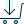</a> | **📂 檔名:** `shopping-cart-download--Streamline-Ultimate.svg` ✨ **格式:** `Vector (SVG)` ⚖️ **大小:** `1.62KB` 📅 **更新:** `2026-03-03`  🚀 **jsDelivr Markdown:** `` 🔗 **直接連結 (Url):** <code>https://cdn.jsdelivr.net/gh/barry028/materials@main/images/iCons/Ui%20Ux%20Graphic%20Design/shopping-cart-download--Streamline-Ultimate.svg</code> 📥 [檢視原始檔](shopping-cart-download--Streamline-Ultimate.svg) |
| <a href="shopping-cart-empty--Streamline-Ultimate.svg">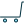</a> | **📂 檔名:** `shopping-cart-empty--Streamline-Ultimate.svg` ✨ **格式:** `Vector (SVG)` ⚖️ **大小:** `1.20KB` 📅 **更新:** `2026-03-03`  🚀 **jsDelivr Markdown:** `` 🔗 **直接連結 (Url):** <code>https://cdn.jsdelivr.net/gh/barry028/materials@main/images/iCons/Ui%20Ux%20Graphic%20Design/shopping-cart-empty--Streamline-Ultimate.svg</code> 📥 [檢視原始檔](shopping-cart-empty--Streamline-Ultimate.svg) |
|  | **📂 檔名:** `shopping-cart-full--Streamline-Ultimate.svg` ✨ **格式:** `Vector (SVG)` ⚖️ **大小:** `3.84KB` 📅 **更新:** `2026-03-03`  🚀 **jsDelivr Markdown:** `` 🔗 **直接連結 (Url):** <code>https://cdn.jsdelivr.net/gh/barry028/materials@main/images/iCons/Ui%20Ux%20Graphic%20Design/shopping-cart-full--Streamline-Ultimate.svg</code> 📥 [檢視原始檔](shopping-cart-full--Streamline-Ultimate.svg) |
|  | **📂 檔名:** `shopping-cart-man--Streamline-Ultimate.svg` ✨ **格式:** `Vector (SVG)` ⚖️ **大小:** `2.95KB` 📅 **更新:** `2026-03-03`  🚀 **jsDelivr Markdown:** `` 🔗 **直接連結 (Url):** <code>https://cdn.jsdelivr.net/gh/barry028/materials@main/images/iCons/Ui%20Ux%20Graphic%20Design/shopping-cart-man--Streamline-Ultimate.svg</code> 📥 [檢視原始檔](shopping-cart-man--Streamline-Ultimate.svg) |
|  | **📂 檔名:** `shopping-cart-man-message--Streamline-Ultimate.svg` ✨ **格式:** `Vector (SVG)` ⚖️ **大小:** `4.98KB` 📅 **更新:** `2026-03-03`  🚀 **jsDelivr Markdown:** `` 🔗 **直接連結 (Url):** <code>https://cdn.jsdelivr.net/gh/barry028/materials@main/images/iCons/Ui%20Ux%20Graphic%20Design/shopping-cart-man-message--Streamline-Ultimate.svg</code> 📥 [檢視原始檔](shopping-cart-man-message--Streamline-Ultimate.svg) |
|  | **📂 檔名:** `shopping-cart-seach--Streamline-Ultimate.svg` ✨ **格式:** `Vector (SVG)` ⚖️ **大小:** `3.02KB` 📅 **更新:** `2026-03-03`  🚀 **jsDelivr Markdown:** `` 🔗 **直接連結 (Url):** <code>https://cdn.jsdelivr.net/gh/barry028/materials@main/images/iCons/Ui%20Ux%20Graphic%20Design/shopping-cart-seach--Streamline-Ultimate.svg</code> 📥 [檢視原始檔](shopping-cart-seach--Streamline-Ultimate.svg) |
|  | **📂 檔名:** `shopping-cart-upload--Streamline-Ultimate.svg` ✨ **格式:** `Vector (SVG)` ⚖️ **大小:** `1.63KB` 📅 **更新:** `2026-03-03`  🚀 **jsDelivr Markdown:** `` 🔗 **直接連結 (Url):** <code>https://cdn.jsdelivr.net/gh/barry028/materials@main/images/iCons/Ui%20Ux%20Graphic%20Design/shopping-cart-upload--Streamline-Ultimate.svg</code> 📥 [檢視原始檔](shopping-cart-upload--Streamline-Ultimate.svg) |
|  | **📂 檔名:** `show-hat-magician-1--Streamline-Ultimate.svg` ✨ **格式:** `Vector (SVG)` ⚖️ **大小:** `3.26KB` 📅 **更新:** `2026-03-03`  🚀 **jsDelivr Markdown:** `` 🔗 **直接連結 (Url):** <code>https://cdn.jsdelivr.net/gh/barry028/materials@main/images/iCons/Ui%20Ux%20Graphic%20Design/show-hat-magician-1--Streamline-Ultimate.svg</code> 📥 [檢視原始檔](show-hat-magician-1--Streamline-Ultimate.svg) |
|  | **📂 檔名:** `show-theater--Streamline-Ultimate.svg` ✨ **格式:** `Vector (SVG)` ⚖️ **大小:** `2.74KB` 📅 **更新:** `2026-03-03`  🚀 **jsDelivr Markdown:** `` 🔗 **直接連結 (Url):** <code>https://cdn.jsdelivr.net/gh/barry028/materials@main/images/iCons/Ui%20Ux%20Graphic%20Design/show-theater--Streamline-Ultimate.svg</code> 📥 [檢視原始檔](show-theater--Streamline-Ultimate.svg) |
|  | **📂 檔名:** `show-theater-mask-happy--Streamline-Ultimate.svg` ✨ **格式:** `Vector (SVG)` ⚖️ **大小:** `2.22KB` 📅 **更新:** `2026-03-03`  🚀 **jsDelivr Markdown:** `` 🔗 **直接連結 (Url):** <code>https://cdn.jsdelivr.net/gh/barry028/materials@main/images/iCons/Ui%20Ux%20Graphic%20Design/show-theater-mask-happy--Streamline-Ultimate.svg</code> 📥 [檢視原始檔](show-theater-mask-happy--Streamline-Ultimate.svg) |
|  | **📂 檔名:** `shrink-4--Streamline-Ultimate.svg` ✨ **格式:** `Vector (SVG)` ⚖️ **大小:** `1.99KB` 📅 **更新:** `2026-03-03`  🚀 **jsDelivr Markdown:** `` 🔗 **直接連結 (Url):** <code>https://cdn.jsdelivr.net/gh/barry028/materials@main/images/iCons/Ui%20Ux%20Graphic%20Design/shrink-4--Streamline-Ultimate.svg</code> 📥 [檢視原始檔](shrink-4--Streamline-Ultimate.svg) |
|  | **📂 檔名:** `sigma--Streamline-Ultimate.svg` ✨ **格式:** `Vector (SVG)` ⚖️ **大小:** `1.09KB` 📅 **更新:** `2026-03-03`  🚀 **jsDelivr Markdown:** `` 🔗 **直接連結 (Url):** <code>https://cdn.jsdelivr.net/gh/barry028/materials@main/images/iCons/Ui%20Ux%20Graphic%20Design/sigma--Streamline-Ultimate.svg</code> 📥 [檢視原始檔](sigma--Streamline-Ultimate.svg) |
|  | **📂 檔名:** `signal-full--Streamline-Ultimate.svg` ✨ **格式:** `Vector (SVG)` ⚖️ **大小:** `1.67KB` 📅 **更新:** `2026-03-03`  🚀 **jsDelivr Markdown:** `` 🔗 **直接連結 (Url):** <code>https://cdn.jsdelivr.net/gh/barry028/materials@main/images/iCons/Ui%20Ux%20Graphic%20Design/signal-full--Streamline-Ultimate.svg</code> 📥 [檢視原始檔](signal-full--Streamline-Ultimate.svg) |
|  | **📂 檔名:** `sim-card-1--Streamline-Ultimate.svg` ✨ **格式:** `Vector (SVG)` ⚖️ **大小:** `2.54KB` 📅 **更新:** `2026-03-03`  🚀 **jsDelivr Markdown:** `` 🔗 **直接連結 (Url):** <code>https://cdn.jsdelivr.net/gh/barry028/materials@main/images/iCons/Ui%20Ux%20Graphic%20Design/sim-card-1--Streamline-Ultimate.svg</code> 📥 [檢視原始檔](sim-card-1--Streamline-Ultimate.svg) |
|  | **📂 檔名:** `skull-1--Streamline-Ultimate.svg` ✨ **格式:** `Vector (SVG)` ⚖️ **大小:** `3.47KB` 📅 **更新:** `2026-03-03`  🚀 **jsDelivr Markdown:** `` 🔗 **直接連結 (Url):** <code>https://cdn.jsdelivr.net/gh/barry028/materials@main/images/iCons/Ui%20Ux%20Graphic%20Design/skull-1--Streamline-Ultimate.svg</code> 📥 [檢視原始檔](skull-1--Streamline-Ultimate.svg) |
|  | **📂 檔名:** `smart-watch-circle--Streamline-Ultimate.svg` ✨ **格式:** `Vector (SVG)` ⚖️ **大小:** `1.44KB` 📅 **更新:** `2026-03-03`  🚀 **jsDelivr Markdown:** `` 🔗 **直接連結 (Url):** <code>https://cdn.jsdelivr.net/gh/barry028/materials@main/images/iCons/Ui%20Ux%20Graphic%20Design/smart-watch-circle--Streamline-Ultimate.svg</code> 📥 [檢視原始檔](smart-watch-circle--Streamline-Ultimate.svg) |
|  | **📂 檔名:** `smart-watch-circle-flash--Streamline-Ultimate.svg` ✨ **格式:** `Vector (SVG)` ⚖️ **大小:** `1.94KB` 📅 **更新:** `2026-03-03`  🚀 **jsDelivr Markdown:** `` 🔗 **直接連結 (Url):** <code>https://cdn.jsdelivr.net/gh/barry028/materials@main/images/iCons/Ui%20Ux%20Graphic%20Design/smart-watch-circle-flash--Streamline-Ultimate.svg</code> 📥 [檢視原始檔](smart-watch-circle-flash--Streamline-Ultimate.svg) |
|  | **📂 檔名:** `smart-watch-square-cash--Streamline-Ultimate.svg` ✨ **格式:** `Vector (SVG)` ⚖️ **大小:** `1.67KB` 📅 **更新:** `2026-03-03`  🚀 **jsDelivr Markdown:** `` 🔗 **直接連結 (Url):** <code>https://cdn.jsdelivr.net/gh/barry028/materials@main/images/iCons/Ui%20Ux%20Graphic%20Design/smart-watch-square-cash--Streamline-Ultimate.svg</code> 📥 [檢視原始檔](smart-watch-square-cash--Streamline-Ultimate.svg) |
|  | **📂 檔名:** `smart-watch-square-data--Streamline-Ultimate.svg` ✨ **格式:** `Vector (SVG)` ⚖️ **大小:** `1.40KB` 📅 **更新:** `2026-03-03`  🚀 **jsDelivr Markdown:** `` 🔗 **直接連結 (Url):** <code>https://cdn.jsdelivr.net/gh/barry028/materials@main/images/iCons/Ui%20Ux%20Graphic%20Design/smart-watch-square-data--Streamline-Ultimate.svg</code> 📥 [檢視原始檔](smart-watch-square-data--Streamline-Ultimate.svg) |
|  | **📂 檔名:** `smart-watch-square-graph--Streamline-Ultimate.svg` ✨ **格式:** `Vector (SVG)` ⚖️ **大小:** `1.38KB` 📅 **更新:** `2026-03-03`  🚀 **jsDelivr Markdown:** `` 🔗 **直接連結 (Url):** <code>https://cdn.jsdelivr.net/gh/barry028/materials@main/images/iCons/Ui%20Ux%20Graphic%20Design/smart-watch-square-graph--Streamline-Ultimate.svg</code> 📥 [檢視原始檔](smart-watch-square-graph--Streamline-Ultimate.svg) |
|  | **📂 檔名:** `smart-watch-square-graph-line--Streamline-Ultimate.svg` ✨ **格式:** `Vector (SVG)` ⚖️ **大小:** `1.72KB` 📅 **更新:** `2026-03-03`  🚀 **jsDelivr Markdown:** `` 🔗 **直接連結 (Url):** <code>https://cdn.jsdelivr.net/gh/barry028/materials@main/images/iCons/Ui%20Ux%20Graphic%20Design/smart-watch-square-graph-line--Streamline-Ultimate.svg</code> 📥 [檢視原始檔](smart-watch-square-graph-line--Streamline-Ultimate.svg) |
|  | **📂 檔名:** `smart-watch-square-heart--Streamline-Ultimate.svg` ✨ **格式:** `Vector (SVG)` ⚖️ **大小:** `3.00KB` 📅 **更新:** `2026-03-03`  🚀 **jsDelivr Markdown:** `` 🔗 **直接連結 (Url):** <code>https://cdn.jsdelivr.net/gh/barry028/materials@main/images/iCons/Ui%20Ux%20Graphic%20Design/smart-watch-square-heart--Streamline-Ultimate.svg</code> 📥 [檢視原始檔](smart-watch-square-heart--Streamline-Ultimate.svg) |
|  | **📂 檔名:** `smart-watch-square-missed-call--Streamline-Ultimate.svg` ✨ **格式:** `Vector (SVG)` ⚖️ **大小:** `2.37KB` 📅 **更新:** `2026-03-03`  🚀 **jsDelivr Markdown:** `` 🔗 **直接連結 (Url):** <code>https://cdn.jsdelivr.net/gh/barry028/materials@main/images/iCons/Ui%20Ux%20Graphic%20Design/smart-watch-square-missed-call--Streamline-Ultimate.svg</code> 📥 [檢視原始檔](smart-watch-square-missed-call--Streamline-Ultimate.svg) |
|  | **📂 檔名:** `smart-watch-square-power--Streamline-Ultimate.svg` ✨ **格式:** `Vector (SVG)` ⚖️ **大小:** `1.57KB` 📅 **更新:** `2026-03-03`  🚀 **jsDelivr Markdown:** `` 🔗 **直接連結 (Url):** <code>https://cdn.jsdelivr.net/gh/barry028/materials@main/images/iCons/Ui%20Ux%20Graphic%20Design/smart-watch-square-power--Streamline-Ultimate.svg</code> 📥 [檢視原始檔](smart-watch-square-power--Streamline-Ultimate.svg) |
|  | **📂 檔名:** `smart-watch-square-settings--Streamline-Ultimate.svg` ✨ **格式:** `Vector (SVG)` ⚖️ **大小:** `7.86KB` 📅 **更新:** `2026-03-03`  🚀 **jsDelivr Markdown:** `` 🔗 **直接連結 (Url):** <code>https://cdn.jsdelivr.net/gh/barry028/materials@main/images/iCons/Ui%20Ux%20Graphic%20Design/smart-watch-square-settings--Streamline-Ultimate.svg</code> 📥 [檢視原始檔](smart-watch-square-settings--Streamline-Ultimate.svg) |
|  | **📂 檔名:** `smart-watch-wrist--Streamline-Ultimate.svg` ✨ **格式:** `Vector (SVG)` ⚖️ **大小:** `3.18KB` 📅 **更新:** `2026-03-03`  🚀 **jsDelivr Markdown:** `` 🔗 **直接連結 (Url):** <code>https://cdn.jsdelivr.net/gh/barry028/materials@main/images/iCons/Ui%20Ux%20Graphic%20Design/smart-watch-wrist--Streamline-Ultimate.svg</code> 📥 [檢視原始檔](smart-watch-wrist--Streamline-Ultimate.svg) |
|  | **📂 檔名:** `smartphone-pay-dollar-1--Streamline-Ultimate.svg` ✨ **格式:** `Vector (SVG)` ⚖️ **大小:** `3.67KB` 📅 **更新:** `2026-03-03`  🚀 **jsDelivr Markdown:** `` 🔗 **直接連結 (Url):** <code>https://cdn.jsdelivr.net/gh/barry028/materials@main/images/iCons/Ui%20Ux%20Graphic%20Design/smartphone-pay-dollar-1--Streamline-Ultimate.svg</code> 📥 [檢視原始檔](smartphone-pay-dollar-1--Streamline-Ultimate.svg) |
|  | **📂 檔名:** `smartwatch-shopping-baske--Streamline-Ultimate.svg` ✨ **格式:** `Vector (SVG)` ⚖️ **大小:** `1.44KB` 📅 **更新:** `2026-03-03`  🚀 **jsDelivr Markdown:** `` 🔗 **直接連結 (Url):** <code>https://cdn.jsdelivr.net/gh/barry028/materials@main/images/iCons/Ui%20Ux%20Graphic%20Design/smartwatch-shopping-baske--Streamline-Ultimate.svg</code> 📥 [檢視原始檔](smartwatch-shopping-baske--Streamline-Ultimate.svg) |
|  | **📂 檔名:** `smiley-crazy-tongue--Streamline-Ultimate.svg` ✨ **格式:** `Vector (SVG)` ⚖️ **大小:** `4.05KB` 📅 **更新:** `2026-03-03`  🚀 **jsDelivr Markdown:** `` 🔗 **直接連結 (Url):** <code>https://cdn.jsdelivr.net/gh/barry028/materials@main/images/iCons/Ui%20Ux%20Graphic%20Design/smiley-crazy-tongue--Streamline-Ultimate.svg</code> 📥 [檢視原始檔](smiley-crazy-tongue--Streamline-Ultimate.svg) |
|  | **📂 檔名:** `smiley-happy--Streamline-Ultimate.svg` ✨ **格式:** `Vector (SVG)` ⚖️ **大小:** `3.86KB` 📅 **更新:** `2026-03-03`  🚀 **jsDelivr Markdown:** `` 🔗 **直接連結 (Url):** <code>https://cdn.jsdelivr.net/gh/barry028/materials@main/images/iCons/Ui%20Ux%20Graphic%20Design/smiley-happy--Streamline-Ultimate.svg</code> 📥 [檢視原始檔](smiley-happy--Streamline-Ultimate.svg) |
|  | **📂 檔名:** `smiley-rich--Streamline-Ultimate.svg` ✨ **格式:** `Vector (SVG)` ⚖️ **大小:** `3.70KB` 📅 **更新:** `2026-03-03`  🚀 **jsDelivr Markdown:** `` 🔗 **直接連結 (Url):** <code>https://cdn.jsdelivr.net/gh/barry028/materials@main/images/iCons/Ui%20Ux%20Graphic%20Design/smiley-rich--Streamline-Ultimate.svg</code> 📥 [檢視原始檔](smiley-rich--Streamline-Ultimate.svg) |
|  | **📂 檔名:** `smiley-sad-1--Streamline-Ultimate.svg` ✨ **格式:** `Vector (SVG)` ⚖️ **大小:** `3.43KB` 📅 **更新:** `2026-03-03`  🚀 **jsDelivr Markdown:** `` 🔗 **直接連結 (Url):** <code>https://cdn.jsdelivr.net/gh/barry028/materials@main/images/iCons/Ui%20Ux%20Graphic%20Design/smiley-sad-1--Streamline-Ultimate.svg</code> 📥 [檢視原始檔](smiley-sad-1--Streamline-Ultimate.svg) |
|  | **📂 檔名:** `smiley-sad-crying--Streamline-Ultimate.svg` ✨ **格式:** `Vector (SVG)` ⚖️ **大小:** `3.73KB` 📅 **更新:** `2026-03-03`  🚀 **jsDelivr Markdown:** `` 🔗 **直接連結 (Url):** <code>https://cdn.jsdelivr.net/gh/barry028/materials@main/images/iCons/Ui%20Ux%20Graphic%20Design/smiley-sad-crying--Streamline-Ultimate.svg</code> 📥 [檢視原始檔](smiley-sad-crying--Streamline-Ultimate.svg) |
|  | **📂 檔名:** `smiley-sick--Streamline-Ultimate.svg` ✨ **格式:** `Vector (SVG)` ⚖️ **大小:** `3.94KB` 📅 **更新:** `2026-03-03`  🚀 **jsDelivr Markdown:** `` 🔗 **直接連結 (Url):** <code>https://cdn.jsdelivr.net/gh/barry028/materials@main/images/iCons/Ui%20Ux%20Graphic%20Design/smiley-sick--Streamline-Ultimate.svg</code> 📥 [檢視原始檔](smiley-sick--Streamline-Ultimate.svg) |
|  | **📂 檔名:** `smiley-spoilt--Streamline-Ultimate.svg` ✨ **格式:** `Vector (SVG)` ⚖️ **大小:** `4.26KB` 📅 **更新:** `2026-03-03`  🚀 **jsDelivr Markdown:** `` 🔗 **直接連結 (Url):** <code>https://cdn.jsdelivr.net/gh/barry028/materials@main/images/iCons/Ui%20Ux%20Graphic%20Design/smiley-spoilt--Streamline-Ultimate.svg</code> 📥 [檢視原始檔](smiley-spoilt--Streamline-Ultimate.svg) |
|  | **📂 檔名:** `smiley-unhappy-1--Streamline-Ultimate.svg` ✨ **格式:** `Vector (SVG)` ⚖️ **大小:** `3.37KB` 📅 **更新:** `2026-03-03`  🚀 **jsDelivr Markdown:** `` 🔗 **直接連結 (Url):** <code>https://cdn.jsdelivr.net/gh/barry028/materials@main/images/iCons/Ui%20Ux%20Graphic%20Design/smiley-unhappy-1--Streamline-Ultimate.svg</code> 📥 [檢視原始檔](smiley-unhappy-1--Streamline-Ultimate.svg) |
|  | **📂 檔名:** `speaker--Streamline-Ultimate.svg` ✨ **格式:** `Vector (SVG)` ⚖️ **大小:** `6.21KB` 📅 **更新:** `2026-03-03`  🚀 **jsDelivr Markdown:** `` 🔗 **直接連結 (Url):** <code>https://cdn.jsdelivr.net/gh/barry028/materials@main/images/iCons/Ui%20Ux%20Graphic%20Design/speaker--Streamline-Ultimate.svg</code> 📥 [檢視原始檔](speaker--Streamline-Ultimate.svg) |
|  | **📂 檔名:** `speakers-1--Streamline-Ultimate.svg` ✨ **格式:** `Vector (SVG)` ⚖️ **大小:** `3.46KB` 📅 **更新:** `2026-03-03`  🚀 **jsDelivr Markdown:** `` 🔗 **直接連結 (Url):** <code>https://cdn.jsdelivr.net/gh/barry028/materials@main/images/iCons/Ui%20Ux%20Graphic%20Design/speakers-1--Streamline-Ultimate.svg</code> 📥 [檢視原始檔](speakers-1--Streamline-Ultimate.svg) |
|  | **📂 檔名:** `squeeze-sides--Streamline-Ultimate.svg` ✨ **格式:** `Vector (SVG)` ⚖️ **大小:** `7.11KB` 📅 **更新:** `2026-03-03`  🚀 **jsDelivr Markdown:** `` 🔗 **直接連結 (Url):** <code>https://cdn.jsdelivr.net/gh/barry028/materials@main/images/iCons/Ui%20Ux%20Graphic%20Design/squeeze-sides--Streamline-Ultimate.svg</code> 📥 [檢視原始檔](squeeze-sides--Streamline-Ultimate.svg) |
|  | **📂 檔名:** `stairs-ascend--Streamline-Ultimate.svg` ✨ **格式:** `Vector (SVG)` ⚖️ **大小:** `1.84KB` 📅 **更新:** `2026-03-03`  🚀 **jsDelivr Markdown:** `` 🔗 **直接連結 (Url):** <code>https://cdn.jsdelivr.net/gh/barry028/materials@main/images/iCons/Ui%20Ux%20Graphic%20Design/stairs-ascend--Streamline-Ultimate.svg</code> 📥 [檢視原始檔](stairs-ascend--Streamline-Ultimate.svg) |
|  | **📂 檔名:** `stairs-person-ascend-1--Streamline-Ultimate.svg` ✨ **格式:** `Vector (SVG)` ⚖️ **大小:** `4.20KB` 📅 **更新:** `2026-03-03`  🚀 **jsDelivr Markdown:** `` 🔗 **直接連結 (Url):** <code>https://cdn.jsdelivr.net/gh/barry028/materials@main/images/iCons/Ui%20Ux%20Graphic%20Design/stairs-person-ascend-1--Streamline-Ultimate.svg</code> 📥 [檢視原始檔](stairs-person-ascend-1--Streamline-Ultimate.svg) |
|  | **📂 檔名:** `startup-launch--Streamline-Ultimate.svg` ✨ **格式:** `Vector (SVG)` ⚖️ **大小:** `6.22KB` 📅 **更新:** `2026-03-03`  🚀 **jsDelivr Markdown:** `` 🔗 **直接連結 (Url):** <code>https://cdn.jsdelivr.net/gh/barry028/materials@main/images/iCons/Ui%20Ux%20Graphic%20Design/startup-launch--Streamline-Ultimate.svg</code> 📥 [檢視原始檔](startup-launch--Streamline-Ultimate.svg) |
|  | **📂 檔名:** `startup-launch-1--Streamline-Ultimate.svg` ✨ **格式:** `Vector (SVG)` ⚖️ **大小:** `4.83KB` 📅 **更新:** `2026-03-03`  🚀 **jsDelivr Markdown:** `` 🔗 **直接連結 (Url):** <code>https://cdn.jsdelivr.net/gh/barry028/materials@main/images/iCons/Ui%20Ux%20Graphic%20Design/startup-launch-1--Streamline-Ultimate.svg</code> 📥 [檢視原始檔](startup-launch-1--Streamline-Ultimate.svg) |
|  | **📂 檔名:** `stop-sign--Streamline-Ultimate.svg` ✨ **格式:** `Vector (SVG)` ⚖️ **大小:** `3.35KB` 📅 **更新:** `2026-03-03`  🚀 **jsDelivr Markdown:** `` 🔗 **直接連結 (Url):** <code>https://cdn.jsdelivr.net/gh/barry028/materials@main/images/iCons/Ui%20Ux%20Graphic%20Design/stop-sign--Streamline-Ultimate.svg</code> 📥 [檢視原始檔](stop-sign--Streamline-Ultimate.svg) |
|  | **📂 檔名:** `strategy-split--Streamline-Ultimate.svg` ✨ **格式:** `Vector (SVG)` ⚖️ **大小:** `3.26KB` 📅 **更新:** `2026-03-03`  🚀 **jsDelivr Markdown:** `` 🔗 **直接連結 (Url):** <code>https://cdn.jsdelivr.net/gh/barry028/materials@main/images/iCons/Ui%20Ux%20Graphic%20Design/strategy-split--Streamline-Ultimate.svg</code> 📥 [檢視原始檔](strategy-split--Streamline-Ultimate.svg) |
|  | **📂 檔名:** `style-three-pin-factory--Streamline-Ultimate.svg` ✨ **格式:** `Vector (SVG)` ⚖️ **大小:** `2.21KB` 📅 **更新:** `2026-03-03`  🚀 **jsDelivr Markdown:** `` 🔗 **直接連結 (Url):** <code>https://cdn.jsdelivr.net/gh/barry028/materials@main/images/iCons/Ui%20Ux%20Graphic%20Design/style-three-pin-factory--Streamline-Ultimate.svg</code> 📥 [檢視原始檔](style-three-pin-factory--Streamline-Ultimate.svg) |
|  | **📂 檔名:** `swimming-pool-person--Streamline-Ultimate.svg` ✨ **格式:** `Vector (SVG)` ⚖️ **大小:** `4.20KB` 📅 **更新:** `2026-03-03`  🚀 **jsDelivr Markdown:** `` 🔗 **直接連結 (Url):** <code>https://cdn.jsdelivr.net/gh/barry028/materials@main/images/iCons/Ui%20Ux%20Graphic%20Design/swimming-pool-person--Streamline-Ultimate.svg</code> 📥 [檢視原始檔](swimming-pool-person--Streamline-Ultimate.svg) |
|  | **📂 檔名:** `synchronize-arrows-1--Streamline-Ultimate.svg` ✨ **格式:** `Vector (SVG)` ⚖️ **大小:** `1.33KB` 📅 **更新:** `2026-03-03`  🚀 **jsDelivr Markdown:** `` 🔗 **直接連結 (Url):** <code>https://cdn.jsdelivr.net/gh/barry028/materials@main/images/iCons/Ui%20Ux%20Graphic%20Design/synchronize-arrows-1--Streamline-Ultimate.svg</code> 📥 [檢視原始檔](synchronize-arrows-1--Streamline-Ultimate.svg) |
|  | **📂 檔名:** `synchronize-arrows-lock--Streamline-Ultimate.svg` ✨ **格式:** `Vector (SVG)` ⚖️ **大小:** `2.60KB` 📅 **更新:** `2026-03-03`  🚀 **jsDelivr Markdown:** `` 🔗 **直接連結 (Url):** <code>https://cdn.jsdelivr.net/gh/barry028/materials@main/images/iCons/Ui%20Ux%20Graphic%20Design/synchronize-arrows-lock--Streamline-Ultimate.svg</code> 📥 [檢視原始檔](synchronize-arrows-lock--Streamline-Ultimate.svg) |
|  | **📂 檔名:** `synchronize-arrows-square-1--Streamline-Ultimate.svg` ✨ **格式:** `Vector (SVG)` ⚖️ **大小:** `844.00B` 📅 **更新:** `2026-03-03`  🚀 **jsDelivr Markdown:** `` 🔗 **直接連結 (Url):** <code>https://cdn.jsdelivr.net/gh/barry028/materials@main/images/iCons/Ui%20Ux%20Graphic%20Design/synchronize-arrows-square-1--Streamline-Ultimate.svg</code> 📥 [檢視原始檔](synchronize-arrows-square-1--Streamline-Ultimate.svg) |
|  | **📂 檔名:** `synchronize-arrows-triangle--Streamline-Ultimate.svg` ✨ **格式:** `Vector (SVG)` ⚖️ **大小:** `1.96KB` 📅 **更新:** `2026-03-03`  🚀 **jsDelivr Markdown:** `` 🔗 **直接連結 (Url):** <code>https://cdn.jsdelivr.net/gh/barry028/materials@main/images/iCons/Ui%20Ux%20Graphic%20Design/synchronize-arrows-triangle--Streamline-Ultimate.svg</code> 📥 [檢視原始檔](synchronize-arrows-triangle--Streamline-Ultimate.svg) |
|  | **📂 檔名:** `tablet--Streamline-Ultimate.svg` ✨ **格式:** `Vector (SVG)` ⚖️ **大小:** `2.48KB` 📅 **更新:** `2026-03-03`  🚀 **jsDelivr Markdown:** `` 🔗 **直接連結 (Url):** <code>https://cdn.jsdelivr.net/gh/barry028/materials@main/images/iCons/Ui%20Ux%20Graphic%20Design/tablet--Streamline-Ultimate.svg</code> 📥 [檢視原始檔](tablet--Streamline-Ultimate.svg) |
|  | **📂 檔名:** `tablet-touch-1--Streamline-Ultimate.svg` ✨ **格式:** `Vector (SVG)` ⚖️ **大小:** `3.66KB` 📅 **更新:** `2026-03-03`  🚀 **jsDelivr Markdown:** `` 🔗 **直接連結 (Url):** <code>https://cdn.jsdelivr.net/gh/barry028/materials@main/images/iCons/Ui%20Ux%20Graphic%20Design/tablet-touch-1--Streamline-Ultimate.svg</code> 📥 [檢視原始檔](tablet-touch-1--Streamline-Ultimate.svg) |
|  | **📂 檔名:** `tag-dollar--Streamline-Ultimate.svg` ✨ **格式:** `Vector (SVG)` ⚖️ **大小:** `4.14KB` 📅 **更新:** `2026-03-03`  🚀 **jsDelivr Markdown:** `` 🔗 **直接連結 (Url):** <code>https://cdn.jsdelivr.net/gh/barry028/materials@main/images/iCons/Ui%20Ux%20Graphic%20Design/tag-dollar--Streamline-Ultimate.svg</code> 📥 [檢視原始檔](tag-dollar--Streamline-Ultimate.svg) |
|  | **📂 檔名:** `tag-euro--Streamline-Ultimate.svg` ✨ **格式:** `Vector (SVG)` ⚖️ **大小:** `4.06KB` 📅 **更新:** `2026-03-03`  🚀 **jsDelivr Markdown:** `` 🔗 **直接連結 (Url):** <code>https://cdn.jsdelivr.net/gh/barry028/materials@main/images/iCons/Ui%20Ux%20Graphic%20Design/tag-euro--Streamline-Ultimate.svg</code> 📥 [檢視原始檔](tag-euro--Streamline-Ultimate.svg) |
|  | **📂 檔名:** `tag-hot-price--Streamline-Ultimate.svg` ✨ **格式:** `Vector (SVG)` ⚖️ **大小:** `3.07KB` 📅 **更新:** `2026-03-03`  🚀 **jsDelivr Markdown:** `` 🔗 **直接連結 (Url):** <code>https://cdn.jsdelivr.net/gh/barry028/materials@main/images/iCons/Ui%20Ux%20Graphic%20Design/tag-hot-price--Streamline-Ultimate.svg</code> 📥 [檢視原始檔](tag-hot-price--Streamline-Ultimate.svg) |
|  | **📂 檔名:** `tags-double--Streamline-Ultimate.svg` ✨ **格式:** `Vector (SVG)` ⚖️ **大小:** `3.94KB` 📅 **更新:** `2026-03-03`  🚀 **jsDelivr Markdown:** `` 🔗 **直接連結 (Url):** <code>https://cdn.jsdelivr.net/gh/barry028/materials@main/images/iCons/Ui%20Ux%20Graphic%20Design/tags-double--Streamline-Ultimate.svg</code> 📥 [檢視原始檔](tags-double--Streamline-Ultimate.svg) |
|  | **📂 檔名:** `taking-pictures-square--Streamline-Ultimate.svg` ✨ **格式:** `Vector (SVG)` ⚖️ **大小:** `4.64KB` 📅 **更新:** `2026-03-03`  🚀 **jsDelivr Markdown:** `` 🔗 **直接連結 (Url):** <code>https://cdn.jsdelivr.net/gh/barry028/materials@main/images/iCons/Ui%20Ux%20Graphic%20Design/taking-pictures-square--Streamline-Ultimate.svg</code> 📥 [檢視原始檔](taking-pictures-square--Streamline-Ultimate.svg) |
|  | **📂 檔名:** `target-center--Streamline-Ultimate.svg` ✨ **格式:** `Vector (SVG)` ⚖️ **大小:** `2.63KB` 📅 **更新:** `2026-03-03`  🚀 **jsDelivr Markdown:** `` 🔗 **直接連結 (Url):** <code>https://cdn.jsdelivr.net/gh/barry028/materials@main/images/iCons/Ui%20Ux%20Graphic%20Design/target-center--Streamline-Ultimate.svg</code> 📥 [檢視原始檔](target-center--Streamline-Ultimate.svg) |
|  | **📂 檔名:** `target-center-monitor--Streamline-Ultimate.svg` ✨ **格式:** `Vector (SVG)` ⚖️ **大小:** `2.40KB` 📅 **更新:** `2026-03-03`  🚀 **jsDelivr Markdown:** `` 🔗 **直接連結 (Url):** <code>https://cdn.jsdelivr.net/gh/barry028/materials@main/images/iCons/Ui%20Ux%20Graphic%20Design/target-center-monitor--Streamline-Ultimate.svg</code> 📥 [檢視原始檔](target-center-monitor--Streamline-Ultimate.svg) |
|  | **📂 檔名:** `target-correct--Streamline-Ultimate.svg` ✨ **格式:** `Vector (SVG)` ⚖️ **大小:** `4.62KB` 📅 **更新:** `2026-03-03`  🚀 **jsDelivr Markdown:** `` 🔗 **直接連結 (Url):** <code>https://cdn.jsdelivr.net/gh/barry028/materials@main/images/iCons/Ui%20Ux%20Graphic%20Design/target-correct--Streamline-Ultimate.svg</code> 📥 [檢視原始檔](target-correct--Streamline-Ultimate.svg) |
|  | **📂 檔名:** `task-finger-show--Streamline-Ultimate.svg` ✨ **格式:** `Vector (SVG)` ⚖️ **大小:** `4.90KB` 📅 **更新:** `2026-03-03`  🚀 **jsDelivr Markdown:** `` 🔗 **直接連結 (Url):** <code>https://cdn.jsdelivr.net/gh/barry028/materials@main/images/iCons/Ui%20Ux%20Graphic%20Design/task-finger-show--Streamline-Ultimate.svg</code> 📥 [檢視原始檔](task-finger-show--Streamline-Ultimate.svg) |
|  | **📂 檔名:** `task-list-cash--Streamline-Ultimate.svg` ✨ **格式:** `Vector (SVG)` ⚖️ **大小:** `3.85KB` 📅 **更新:** `2026-03-03`  🚀 **jsDelivr Markdown:** `` 🔗 **直接連結 (Url):** <code>https://cdn.jsdelivr.net/gh/barry028/materials@main/images/iCons/Ui%20Ux%20Graphic%20Design/task-list-cash--Streamline-Ultimate.svg</code> 📥 [檢視原始檔](task-list-cash--Streamline-Ultimate.svg) |
|  | **📂 檔名:** `task-list-clock--Streamline-Ultimate.svg` ✨ **格式:** `Vector (SVG)` ⚖️ **大小:** `3.29KB` 📅 **更新:** `2026-03-03`  🚀 **jsDelivr Markdown:** `` 🔗 **直接連結 (Url):** <code>https://cdn.jsdelivr.net/gh/barry028/materials@main/images/iCons/Ui%20Ux%20Graphic%20Design/task-list-clock--Streamline-Ultimate.svg</code> 📥 [檢視原始檔](task-list-clock--Streamline-Ultimate.svg) |
|  | **📂 檔名:** `task-list-pin-1--Streamline-Ultimate.svg` ✨ **格式:** `Vector (SVG)` ⚖️ **大小:** `2.43KB` 📅 **更新:** `2026-03-03`  🚀 **jsDelivr Markdown:** `` 🔗 **直接連結 (Url):** <code>https://cdn.jsdelivr.net/gh/barry028/materials@main/images/iCons/Ui%20Ux%20Graphic%20Design/task-list-pin-1--Streamline-Ultimate.svg</code> 📥 [檢視原始檔](task-list-pin-1--Streamline-Ultimate.svg) |
|  | **📂 檔名:** `task-list-text--Streamline-Ultimate.svg` ✨ **格式:** `Vector (SVG)` ⚖️ **大小:** `2.29KB` 📅 **更新:** `2026-03-03`  🚀 **jsDelivr Markdown:** `` 🔗 **直接連結 (Url):** <code>https://cdn.jsdelivr.net/gh/barry028/materials@main/images/iCons/Ui%20Ux%20Graphic%20Design/task-list-text--Streamline-Ultimate.svg</code> 📥 [檢視原始檔](task-list-text--Streamline-Ultimate.svg) |
|  | **📂 檔名:** `task-list-upload--Streamline-Ultimate.svg` ✨ **格式:** `Vector (SVG)` ⚖️ **大小:** `1.46KB` 📅 **更新:** `2026-03-03`  🚀 **jsDelivr Markdown:** `` 🔗 **直接連結 (Url):** <code>https://cdn.jsdelivr.net/gh/barry028/materials@main/images/iCons/Ui%20Ux%20Graphic%20Design/task-list-upload--Streamline-Ultimate.svg</code> 📥 [檢視原始檔](task-list-upload--Streamline-Ultimate.svg) |
|  | **📂 檔名:** `team-exchange-chat--Streamline-Ultimate.svg` ✨ **格式:** `Vector (SVG)` ⚖️ **大小:** `5.64KB` 📅 **更新:** `2026-03-03`  🚀 **jsDelivr Markdown:** `` 🔗 **直接連結 (Url):** <code>https://cdn.jsdelivr.net/gh/barry028/materials@main/images/iCons/Ui%20Ux%20Graphic%20Design/team-exchange-chat--Streamline-Ultimate.svg</code> 📥 [檢視原始檔](team-exchange-chat--Streamline-Ultimate.svg) |
|  | **📂 檔名:** `team-idea--Streamline-Ultimate.svg` ✨ **格式:** `Vector (SVG)` ⚖️ **大小:** `4.58KB` 📅 **更新:** `2026-03-03`  🚀 **jsDelivr Markdown:** `` 🔗 **直接連結 (Url):** <code>https://cdn.jsdelivr.net/gh/barry028/materials@main/images/iCons/Ui%20Ux%20Graphic%20Design/team-idea--Streamline-Ultimate.svg</code> 📥 [檢視原始檔](team-idea--Streamline-Ultimate.svg) |
|  | **📂 檔名:** `team-meeting--Streamline-Ultimate.svg` ✨ **格式:** `Vector (SVG)` ⚖️ **大小:** `3.63KB` 📅 **更新:** `2026-03-03`  🚀 **jsDelivr Markdown:** `` 🔗 **直接連結 (Url):** <code>https://cdn.jsdelivr.net/gh/barry028/materials@main/images/iCons/Ui%20Ux%20Graphic%20Design/team-meeting--Streamline-Ultimate.svg</code> 📥 [檢視原始檔](team-meeting--Streamline-Ultimate.svg) |
|  | **📂 檔名:** `text-format-1--Streamline-Ultimate.svg` ✨ **格式:** `Vector (SVG)` ⚖️ **大小:** `2.13KB` 📅 **更新:** `2026-03-03`  🚀 **jsDelivr Markdown:** `` 🔗 **直接連結 (Url):** <code>https://cdn.jsdelivr.net/gh/barry028/materials@main/images/iCons/Ui%20Ux%20Graphic%20Design/text-format-1--Streamline-Ultimate.svg</code> 📥 [檢視原始檔](text-format-1--Streamline-Ultimate.svg) |
|  | **📂 檔名:** `text-underline--Streamline-Ultimate.svg` ✨ **格式:** `Vector (SVG)` ⚖️ **大小:** `1.09KB` 📅 **更新:** `2026-03-03`  🚀 **jsDelivr Markdown:** `` 🔗 **直接連結 (Url):** <code>https://cdn.jsdelivr.net/gh/barry028/materials@main/images/iCons/Ui%20Ux%20Graphic%20Design/text-underline--Streamline-Ultimate.svg</code> 📥 [檢視原始檔](text-underline--Streamline-Ultimate.svg) |
|  | **📂 檔名:** `ticket-1--Streamline-Ultimate.svg` ✨ **格式:** `Vector (SVG)` ⚖️ **大小:** `3.42KB` 📅 **更新:** `2026-03-03`  🚀 **jsDelivr Markdown:** `` 🔗 **直接連結 (Url):** <code>https://cdn.jsdelivr.net/gh/barry028/materials@main/images/iCons/Ui%20Ux%20Graphic%20Design/ticket-1--Streamline-Ultimate.svg</code> 📥 [檢視原始檔](ticket-1--Streamline-Ultimate.svg) |
|  | **📂 檔名:** `time-clock-circle-2--Streamline-Ultimate.svg` ✨ **格式:** `Vector (SVG)` ⚖️ **大小:** `2.27KB` 📅 **更新:** `2026-03-03`  🚀 **jsDelivr Markdown:** `` 🔗 **直接連結 (Url):** <code>https://cdn.jsdelivr.net/gh/barry028/materials@main/images/iCons/Ui%20Ux%20Graphic%20Design/time-clock-circle-2--Streamline-Ultimate.svg</code> 📥 [檢視原始檔](time-clock-circle-2--Streamline-Ultimate.svg) |
|  | **📂 檔名:** `time-clock-hand--Streamline-Ultimate.svg` ✨ **格式:** `Vector (SVG)` ⚖️ **大小:** `2.66KB` 📅 **更新:** `2026-03-03`  🚀 **jsDelivr Markdown:** `` 🔗 **直接連結 (Url):** <code>https://cdn.jsdelivr.net/gh/barry028/materials@main/images/iCons/Ui%20Ux%20Graphic%20Design/time-clock-hand--Streamline-Ultimate.svg</code> 📥 [檢視原始檔](time-clock-hand--Streamline-Ultimate.svg) |
|  | **📂 檔名:** `time-clock-nine--Streamline-Ultimate.svg` ✨ **格式:** `Vector (SVG)` ⚖️ **大小:** `1.48KB` 📅 **更新:** `2026-03-03`  🚀 **jsDelivr Markdown:** `` 🔗 **直接連結 (Url):** <code>https://cdn.jsdelivr.net/gh/barry028/materials@main/images/iCons/Ui%20Ux%20Graphic%20Design/time-clock-nine--Streamline-Ultimate.svg</code> 📥 [檢視原始檔](time-clock-nine--Streamline-Ultimate.svg) |
|  | **📂 檔名:** `timer--Streamline-Ultimate.svg` ✨ **格式:** `Vector (SVG)` ⚖️ **大小:** `2.20KB` 📅 **更新:** `2026-03-03`  🚀 **jsDelivr Markdown:** `` 🔗 **直接連結 (Url):** <code>https://cdn.jsdelivr.net/gh/barry028/materials@main/images/iCons/Ui%20Ux%20Graphic%20Design/timer--Streamline-Ultimate.svg</code> 📥 [檢視原始檔](timer--Streamline-Ultimate.svg) |
|  | **📂 檔名:** `toilet-seat--Streamline-Ultimate.svg` ✨ **格式:** `Vector (SVG)` ⚖️ **大小:** `2.88KB` 📅 **更新:** `2026-03-03`  🚀 **jsDelivr Markdown:** `` 🔗 **直接連結 (Url):** <code>https://cdn.jsdelivr.net/gh/barry028/materials@main/images/iCons/Ui%20Ux%20Graphic%20Design/toilet-seat--Streamline-Ultimate.svg</code> 📥 [檢視原始檔](toilet-seat--Streamline-Ultimate.svg) |
| <a href="toilet-sign-2--Streamline-Ultimate.svg">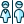</a> | **📂 檔名:** `toilet-sign-2--Streamline-Ultimate.svg` ✨ **格式:** `Vector (SVG)` ⚖️ **大小:** `3.53KB` 📅 **更新:** `2026-03-03`  🚀 **jsDelivr Markdown:** `` 🔗 **直接連結 (Url):** <code>https://cdn.jsdelivr.net/gh/barry028/materials@main/images/iCons/Ui%20Ux%20Graphic%20Design/toilet-sign-2--Streamline-Ultimate.svg</code> 📥 [檢視原始檔](toilet-sign-2--Streamline-Ultimate.svg) |
|  | **📂 檔名:** `tool-box--Streamline-Ultimate.svg` ✨ **格式:** `Vector (SVG)` ⚖️ **大小:** `1.34KB` 📅 **更新:** `2026-03-03`  🚀 **jsDelivr Markdown:** `` 🔗 **直接連結 (Url):** <code>https://cdn.jsdelivr.net/gh/barry028/materials@main/images/iCons/Ui%20Ux%20Graphic%20Design/tool-box--Streamline-Ultimate.svg</code> 📥 [檢視原始檔](tool-box--Streamline-Ultimate.svg) |
|  | **📂 檔名:** `touch-id--Streamline-Ultimate.svg` ✨ **格式:** `Vector (SVG)` ⚖️ **大小:** `1.72KB` 📅 **更新:** `2026-03-03`  🚀 **jsDelivr Markdown:** `` 🔗 **直接連結 (Url):** <code>https://cdn.jsdelivr.net/gh/barry028/materials@main/images/iCons/Ui%20Ux%20Graphic%20Design/touch-id--Streamline-Ultimate.svg</code> 📥 [檢視原始檔](touch-id--Streamline-Ultimate.svg) |
| <a href="touch-id-2--Streamline-Ultimate.svg">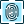</a> | **📂 檔名:** `touch-id-2--Streamline-Ultimate.svg` ✨ **格式:** `Vector (SVG)` ⚖️ **大小:** `3.62KB` 📅 **更新:** `2026-03-03`  🚀 **jsDelivr Markdown:** `` 🔗 **直接連結 (Url):** <code>https://cdn.jsdelivr.net/gh/barry028/materials@main/images/iCons/Ui%20Ux%20Graphic%20Design/touch-id-2--Streamline-Ultimate.svg</code> 📥 [檢視原始檔](touch-id-2--Streamline-Ultimate.svg) |
|  | **📂 檔名:** `touch-id-approved--Streamline-Ultimate.svg` ✨ **格式:** `Vector (SVG)` ⚖️ **大小:** `3.95KB` 📅 **更新:** `2026-03-03`  🚀 **jsDelivr Markdown:** `` 🔗 **直接連結 (Url):** <code>https://cdn.jsdelivr.net/gh/barry028/materials@main/images/iCons/Ui%20Ux%20Graphic%20Design/touch-id-approved--Streamline-Ultimate.svg</code> 📥 [檢視原始檔](touch-id-approved--Streamline-Ultimate.svg) |
|  | **📂 檔名:** `transform-left--Streamline-Ultimate.svg` ✨ **格式:** `Vector (SVG)` ⚖️ **大小:** `1.60KB` 📅 **更新:** `2026-03-03`  🚀 **jsDelivr Markdown:** `` 🔗 **直接連結 (Url):** <code>https://cdn.jsdelivr.net/gh/barry028/materials@main/images/iCons/Ui%20Ux%20Graphic%20Design/transform-left--Streamline-Ultimate.svg</code> 📥 [檢視原始檔](transform-left--Streamline-Ultimate.svg) |
|  | **📂 檔名:** `transform-shrink--Streamline-Ultimate.svg` ✨ **格式:** `Vector (SVG)` ⚖️ **大小:** `2.84KB` 📅 **更新:** `2026-03-03`  🚀 **jsDelivr Markdown:** `` 🔗 **直接連結 (Url):** <code>https://cdn.jsdelivr.net/gh/barry028/materials@main/images/iCons/Ui%20Ux%20Graphic%20Design/transform-shrink--Streamline-Ultimate.svg</code> 📥 [檢視原始檔](transform-shrink--Streamline-Ultimate.svg) |
|  | **📂 檔名:** `translate--Streamline-Ultimate.svg` ✨ **格式:** `Vector (SVG)` ⚖️ **大小:** `3.09KB` 📅 **更新:** `2026-03-03`  🚀 **jsDelivr Markdown:** `` 🔗 **直接連結 (Url):** <code>https://cdn.jsdelivr.net/gh/barry028/materials@main/images/iCons/Ui%20Ux%20Graphic%20Design/translate--Streamline-Ultimate.svg</code> 📥 [檢視原始檔](translate--Streamline-Ultimate.svg) |
|  | **📂 檔名:** `treasure-chest-open--Streamline-Ultimate.svg` ✨ **格式:** `Vector (SVG)` ⚖️ **大小:** `2.82KB` 📅 **更新:** `2026-03-03`  🚀 **jsDelivr Markdown:** `` 🔗 **直接連結 (Url):** <code>https://cdn.jsdelivr.net/gh/barry028/materials@main/images/iCons/Ui%20Ux%20Graphic%20Design/treasure-chest-open--Streamline-Ultimate.svg</code> 📥 [檢視原始檔](treasure-chest-open--Streamline-Ultimate.svg) |
|  | **📂 檔名:** `ui-browser-slider--Streamline-Ultimate.svg` ✨ **格式:** `Vector (SVG)` ⚖️ **大小:** `2.64KB` 📅 **更新:** `2026-03-03`  🚀 **jsDelivr Markdown:** `` 🔗 **直接連結 (Url):** <code>https://cdn.jsdelivr.net/gh/barry028/materials@main/images/iCons/Ui%20Ux%20Graphic%20Design/ui-browser-slider--Streamline-Ultimate.svg</code> 📥 [檢視原始檔](ui-browser-slider--Streamline-Ultimate.svg) |
|  | **📂 檔名:** `ui-page-slider--Streamline-Ultimate.svg` ✨ **格式:** `Vector (SVG)` ⚖️ **大小:** `2.52KB` 📅 **更新:** `2026-03-03`  🚀 **jsDelivr Markdown:** `` 🔗 **直接連結 (Url):** <code>https://cdn.jsdelivr.net/gh/barry028/materials@main/images/iCons/Ui%20Ux%20Graphic%20Design/ui-page-slider--Streamline-Ultimate.svg</code> 📥 [檢視原始檔](ui-page-slider--Streamline-Ultimate.svg) |
|  | **📂 檔名:** `ui-webpage-check--Streamline-Ultimate.svg` ✨ **格式:** `Vector (SVG)` ⚖️ **大小:** `3.02KB` 📅 **更新:** `2026-03-03`  🚀 **jsDelivr Markdown:** `` 🔗 **直接連結 (Url):** <code>https://cdn.jsdelivr.net/gh/barry028/materials@main/images/iCons/Ui%20Ux%20Graphic%20Design/ui-webpage-check--Streamline-Ultimate.svg</code> 📥 [檢視原始檔](ui-webpage-check--Streamline-Ultimate.svg) |
|  | **📂 檔名:** `ui-webpage-play-1--Streamline-Ultimate.svg` ✨ **格式:** `Vector (SVG)` ⚖️ **大小:** `3.28KB` 📅 **更新:** `2026-03-03`  🚀 **jsDelivr Markdown:** `` 🔗 **直接連結 (Url):** <code>https://cdn.jsdelivr.net/gh/barry028/materials@main/images/iCons/Ui%20Ux%20Graphic%20Design/ui-webpage-play-1--Streamline-Ultimate.svg</code> 📥 [檢視原始檔](ui-webpage-play-1--Streamline-Ultimate.svg) |
|  | **📂 檔名:** `upload-square-3--Streamline-Ultimate.svg` ✨ **格式:** `Vector (SVG)` ⚖️ **大小:** `1.91KB` 📅 **更新:** `2026-03-03`  🚀 **jsDelivr Markdown:** `` 🔗 **直接連結 (Url):** <code>https://cdn.jsdelivr.net/gh/barry028/materials@main/images/iCons/Ui%20Ux%20Graphic%20Design/upload-square-3--Streamline-Ultimate.svg</code> 📥 [檢視原始檔](upload-square-3--Streamline-Ultimate.svg) |
|  | **📂 檔名:** `usb-cable-1--Streamline-Ultimate.svg` ✨ **格式:** `Vector (SVG)` ⚖️ **大小:** `1.56KB` 📅 **更新:** `2026-03-03`  🚀 **jsDelivr Markdown:** `` 🔗 **直接連結 (Url):** <code>https://cdn.jsdelivr.net/gh/barry028/materials@main/images/iCons/Ui%20Ux%20Graphic%20Design/usb-cable-1--Streamline-Ultimate.svg</code> 📥 [檢視原始檔](usb-cable-1--Streamline-Ultimate.svg) |
|  | **📂 檔名:** `usb-port--Streamline-Ultimate.svg` ✨ **格式:** `Vector (SVG)` ⚖️ **大小:** `5.68KB` 📅 **更新:** `2026-03-03`  🚀 **jsDelivr Markdown:** `` 🔗 **直接連結 (Url):** <code>https://cdn.jsdelivr.net/gh/barry028/materials@main/images/iCons/Ui%20Ux%20Graphic%20Design/usb-port--Streamline-Ultimate.svg</code> 📥 [檢視原始檔](usb-port--Streamline-Ultimate.svg) |
|  | **📂 檔名:** `usb-port-1--Streamline-Ultimate.svg` ✨ **格式:** `Vector (SVG)` ⚖️ **大小:** `2.18KB` 📅 **更新:** `2026-03-03`  🚀 **jsDelivr Markdown:** `` 🔗 **直接連結 (Url):** <code>https://cdn.jsdelivr.net/gh/barry028/materials@main/images/iCons/Ui%20Ux%20Graphic%20Design/usb-port-1--Streamline-Ultimate.svg</code> 📥 [檢視原始檔](usb-port-1--Streamline-Ultimate.svg) |
|  | **📂 檔名:** `user-cash-scale--Streamline-Ultimate.svg` ✨ **格式:** `Vector (SVG)` ⚖️ **大小:** `3.88KB` 📅 **更新:** `2026-03-03`  🚀 **jsDelivr Markdown:** `` 🔗 **直接連結 (Url):** <code>https://cdn.jsdelivr.net/gh/barry028/materials@main/images/iCons/Ui%20Ux%20Graphic%20Design/user-cash-scale--Streamline-Ultimate.svg</code> 📥 [檢視原始檔](user-cash-scale--Streamline-Ultimate.svg) |
|  | **📂 檔名:** `user-live--Streamline-Ultimate.svg` ✨ **格式:** `Vector (SVG)` ⚖️ **大小:** `3.13KB` 📅 **更新:** `2026-03-03`  🚀 **jsDelivr Markdown:** `` 🔗 **直接連結 (Url):** <code>https://cdn.jsdelivr.net/gh/barry028/materials@main/images/iCons/Ui%20Ux%20Graphic%20Design/user-live--Streamline-Ultimate.svg</code> 📥 [檢視原始檔](user-live--Streamline-Ultimate.svg) |
|  | **📂 檔名:** `user-man-stress--Streamline-Ultimate.svg` ✨ **格式:** `Vector (SVG)` ⚖️ **大小:** `2.18KB` 📅 **更新:** `2026-03-03`  🚀 **jsDelivr Markdown:** `` 🔗 **直接連結 (Url):** <code>https://cdn.jsdelivr.net/gh/barry028/materials@main/images/iCons/Ui%20Ux%20Graphic%20Design/user-man-stress--Streamline-Ultimate.svg</code> 📥 [檢視原始檔](user-man-stress--Streamline-Ultimate.svg) |
|  | **📂 檔名:** `user-network--Streamline-Ultimate.svg` ✨ **格式:** `Vector (SVG)` ⚖️ **大小:** `10.15KB` 📅 **更新:** `2026-03-03`  🚀 **jsDelivr Markdown:** `` 🔗 **直接連結 (Url):** <code>https://cdn.jsdelivr.net/gh/barry028/materials@main/images/iCons/Ui%20Ux%20Graphic%20Design/user-network--Streamline-Ultimate.svg</code> 📥 [檢視原始檔](user-network--Streamline-Ultimate.svg) |
|  | **📂 檔名:** `user-question--Streamline-Ultimate.svg` ✨ **格式:** `Vector (SVG)` ⚖️ **大小:** `3.35KB` 📅 **更新:** `2026-03-03`  🚀 **jsDelivr Markdown:** `` 🔗 **直接連結 (Url):** <code>https://cdn.jsdelivr.net/gh/barry028/materials@main/images/iCons/Ui%20Ux%20Graphic%20Design/user-question--Streamline-Ultimate.svg</code> 📥 [檢視原始檔](user-question--Streamline-Ultimate.svg) |
|  | **📂 檔名:** `user-signal-1--Streamline-Ultimate.svg` ✨ **格式:** `Vector (SVG)` ⚖️ **大小:** `2.27KB` 📅 **更新:** `2026-03-03`  🚀 **jsDelivr Markdown:** `` 🔗 **直接連結 (Url):** <code>https://cdn.jsdelivr.net/gh/barry028/materials@main/images/iCons/Ui%20Ux%20Graphic%20Design/user-signal-1--Streamline-Ultimate.svg</code> 📥 [檢視原始檔](user-signal-1--Streamline-Ultimate.svg) |
|  | **📂 檔名:** `vectors-add-anchor--Streamline-Ultimate.svg` ✨ **格式:** `Vector (SVG)` ⚖️ **大小:** `4.71KB` 📅 **更新:** `2026-03-03`  🚀 **jsDelivr Markdown:** `` 🔗 **直接連結 (Url):** <code>https://cdn.jsdelivr.net/gh/barry028/materials@main/images/iCons/Ui%20Ux%20Graphic%20Design/vectors-add-anchor--Streamline-Ultimate.svg</code> 📥 [檢視原始檔](vectors-add-anchor--Streamline-Ultimate.svg) |
|  | **📂 檔名:** `vectors-anchor-rectangle--Streamline-Ultimate.svg` ✨ **格式:** `Vector (SVG)` ⚖️ **大小:** `3.81KB` 📅 **更新:** `2026-03-03`  🚀 **jsDelivr Markdown:** `` 🔗 **直接連結 (Url):** <code>https://cdn.jsdelivr.net/gh/barry028/materials@main/images/iCons/Ui%20Ux%20Graphic%20Design/vectors-anchor-rectangle--Streamline-Ultimate.svg</code> 📥 [檢視原始檔](vectors-anchor-rectangle--Streamline-Ultimate.svg) |
|  | **📂 檔名:** `vectors-path-flat--Streamline-Ultimate.svg` ✨ **格式:** `Vector (SVG)` ⚖️ **大小:** `5.28KB` 📅 **更新:** `2026-03-03`  🚀 **jsDelivr Markdown:** `` 🔗 **直接連結 (Url):** <code>https://cdn.jsdelivr.net/gh/barry028/materials@main/images/iCons/Ui%20Ux%20Graphic%20Design/vectors-path-flat--Streamline-Ultimate.svg</code> 📥 [檢視原始檔](vectors-path-flat--Streamline-Ultimate.svg) |
|  | **📂 檔名:** `vectors-pen-1--Streamline-Ultimate.svg` ✨ **格式:** `Vector (SVG)` ⚖️ **大小:** `3.25KB` 📅 **更新:** `2026-03-03`  🚀 **jsDelivr Markdown:** `` 🔗 **直接連結 (Url):** <code>https://cdn.jsdelivr.net/gh/barry028/materials@main/images/iCons/Ui%20Ux%20Graphic%20Design/vectors-pen-1--Streamline-Ultimate.svg</code> 📥 [檢視原始檔](vectors-pen-1--Streamline-Ultimate.svg) |
|  | **📂 檔名:** `vectors-pen-add-1--Streamline-Ultimate.svg` ✨ **格式:** `Vector (SVG)` ⚖️ **大小:** `2.18KB` 📅 **更新:** `2026-03-03`  🚀 **jsDelivr Markdown:** `` 🔗 **直接連結 (Url):** <code>https://cdn.jsdelivr.net/gh/barry028/materials@main/images/iCons/Ui%20Ux%20Graphic%20Design/vectors-pen-add-1--Streamline-Ultimate.svg</code> 📥 [檢視原始檔](vectors-pen-add-1--Streamline-Ultimate.svg) |
|  | **📂 檔名:** `vectors-pen-draw--Streamline-Ultimate.svg` ✨ **格式:** `Vector (SVG)` ⚖️ **大小:** `1.98KB` 📅 **更新:** `2026-03-03`  🚀 **jsDelivr Markdown:** `` 🔗 **直接連結 (Url):** <code>https://cdn.jsdelivr.net/gh/barry028/materials@main/images/iCons/Ui%20Ux%20Graphic%20Design/vectors-pen-draw--Streamline-Ultimate.svg</code> 📥 [檢視原始檔](vectors-pen-draw--Streamline-Ultimate.svg) |
|  | **📂 檔名:** `video-game-360-vr--Streamline-Ultimate.svg` ✨ **格式:** `Vector (SVG)` ⚖️ **大小:** `5.84KB` 📅 **更新:** `2026-03-03`  🚀 **jsDelivr Markdown:** `` 🔗 **直接連結 (Url):** <code>https://cdn.jsdelivr.net/gh/barry028/materials@main/images/iCons/Ui%20Ux%20Graphic%20Design/video-game-360-vr--Streamline-Ultimate.svg</code> 📥 [檢視原始檔](video-game-360-vr--Streamline-Ultimate.svg) |
|  | **📂 檔名:** `video-game-boo--Streamline-Ultimate.svg` ✨ **格式:** `Vector (SVG)` ⚖️ **大小:** `5.77KB` 📅 **更新:** `2026-03-03`  🚀 **jsDelivr Markdown:** `` 🔗 **直接連結 (Url):** <code>https://cdn.jsdelivr.net/gh/barry028/materials@main/images/iCons/Ui%20Ux%20Graphic%20Design/video-game-boo--Streamline-Ultimate.svg</code> 📥 [檢視原始檔](video-game-boo--Streamline-Ultimate.svg) |
|  | **📂 檔名:** `video-game-breakout--Streamline-Ultimate.svg` ✨ **格式:** `Vector (SVG)` ⚖️ **大小:** `3.38KB` 📅 **更新:** `2026-03-03`  🚀 **jsDelivr Markdown:** `` 🔗 **直接連結 (Url):** <code>https://cdn.jsdelivr.net/gh/barry028/materials@main/images/iCons/Ui%20Ux%20Graphic%20Design/video-game-breakout--Streamline-Ultimate.svg</code> 📥 [檢視原始檔](video-game-breakout--Streamline-Ultimate.svg) |
|  | **📂 檔名:** `video-game-control-directions--Streamline-Ultimate.svg` ✨ **格式:** `Vector (SVG)` ⚖️ **大小:** `5.98KB` 📅 **更新:** `2026-03-03`  🚀 **jsDelivr Markdown:** `` 🔗 **直接連結 (Url):** <code>https://cdn.jsdelivr.net/gh/barry028/materials@main/images/iCons/Ui%20Ux%20Graphic%20Design/video-game-control-directions--Streamline-Ultimate.svg</code> 📥 [檢視原始檔](video-game-control-directions--Streamline-Ultimate.svg) |
|  | **📂 檔名:** `video-game-control-gear--Streamline-Ultimate.svg` ✨ **格式:** `Vector (SVG)` ⚖️ **大小:** `4.02KB` 📅 **更新:** `2026-03-03`  🚀 **jsDelivr Markdown:** `` 🔗 **直接連結 (Url):** <code>https://cdn.jsdelivr.net/gh/barry028/materials@main/images/iCons/Ui%20Ux%20Graphic%20Design/video-game-control-gear--Streamline-Ultimate.svg</code> 📥 [檢視原始檔](video-game-control-gear--Streamline-Ultimate.svg) |
|  | **📂 檔名:** `video-game-controller--Streamline-Ultimate.svg` ✨ **格式:** `Vector (SVG)` ⚖️ **大小:** `6.44KB` 📅 **更新:** `2026-03-03`  🚀 **jsDelivr Markdown:** `` 🔗 **直接連結 (Url):** <code>https://cdn.jsdelivr.net/gh/barry028/materials@main/images/iCons/Ui%20Ux%20Graphic%20Design/video-game-controller--Streamline-Ultimate.svg</code> 📥 [檢視原始檔](video-game-controller--Streamline-Ultimate.svg) |
|  | **📂 檔名:** `video-game-controller-team--Streamline-Ultimate.svg` ✨ **格式:** `Vector (SVG)` ⚖️ **大小:** `7.22KB` 📅 **更新:** `2026-03-03`  🚀 **jsDelivr Markdown:** `` 🔗 **直接連結 (Url):** <code>https://cdn.jsdelivr.net/gh/barry028/materials@main/images/iCons/Ui%20Ux%20Graphic%20Design/video-game-controller-team--Streamline-Ultimate.svg</code> 📥 [檢視原始檔](video-game-controller-team--Streamline-Ultimate.svg) |
|  | **📂 檔名:** `video-game-controller-wifi--Streamline-Ultimate.svg` ✨ **格式:** `Vector (SVG)` ⚖️ **大小:** `7.01KB` 📅 **更新:** `2026-03-03`  🚀 **jsDelivr Markdown:** `` 🔗 **直接連結 (Url):** <code>https://cdn.jsdelivr.net/gh/barry028/materials@main/images/iCons/Ui%20Ux%20Graphic%20Design/video-game-controller-wifi--Streamline-Ultimate.svg</code> 📥 [檢視原始檔](video-game-controller-wifi--Streamline-Ultimate.svg) |
|  | **📂 檔名:** `video-game-gamasutra-1--Streamline-Ultimate.svg` ✨ **格式:** `Vector (SVG)` ⚖️ **大小:** `4.60KB` 📅 **更新:** `2026-03-03`  🚀 **jsDelivr Markdown:** `` 🔗 **直接連結 (Url):** <code>https://cdn.jsdelivr.net/gh/barry028/materials@main/images/iCons/Ui%20Ux%20Graphic%20Design/video-game-gamasutra-1--Streamline-Ultimate.svg</code> 📥 [檢視原始檔](video-game-gamasutra-1--Streamline-Ultimate.svg) |
|  | **📂 檔名:** `video-game-hatchi--Streamline-Ultimate.svg` ✨ **格式:** `Vector (SVG)` ⚖️ **大小:** `3.25KB` 📅 **更新:** `2026-03-03`  🚀 **jsDelivr Markdown:** `` 🔗 **直接連結 (Url):** <code>https://cdn.jsdelivr.net/gh/barry028/materials@main/images/iCons/Ui%20Ux%20Graphic%20Design/video-game-hatchi--Streamline-Ultimate.svg</code> 📥 [檢視原始檔](video-game-hatchi--Streamline-Ultimate.svg) |
|  | **📂 檔名:** `video-game-mario-flower-1--Streamline-Ultimate.svg` ✨ **格式:** `Vector (SVG)` ⚖️ **大小:** `3.35KB` 📅 **更新:** `2026-03-03`  🚀 **jsDelivr Markdown:** `` 🔗 **直接連結 (Url):** <code>https://cdn.jsdelivr.net/gh/barry028/materials@main/images/iCons/Ui%20Ux%20Graphic%20Design/video-game-mario-flower-1--Streamline-Ultimate.svg</code> 📥 [檢視原始檔](video-game-mario-flower-1--Streamline-Ultimate.svg) |
|  | **📂 檔名:** `video-game-nintendo--Streamline-Ultimate.svg` ✨ **格式:** `Vector (SVG)` ⚖️ **大小:** `3.97KB` 📅 **更新:** `2026-03-03`  🚀 **jsDelivr Markdown:** `` 🔗 **直接連結 (Url):** <code>https://cdn.jsdelivr.net/gh/barry028/materials@main/images/iCons/Ui%20Ux%20Graphic%20Design/video-game-nintendo--Streamline-Ultimate.svg</code> 📥 [檢視原始檔](video-game-nintendo--Streamline-Ultimate.svg) |
|  | **📂 檔名:** `video-game-nintendo-1--Streamline-Ultimate.svg` ✨ **格式:** `Vector (SVG)` ⚖️ **大小:** `5.31KB` 📅 **更新:** `2026-03-03`  🚀 **jsDelivr Markdown:** `` 🔗 **直接連結 (Url):** <code>https://cdn.jsdelivr.net/gh/barry028/materials@main/images/iCons/Ui%20Ux%20Graphic%20Design/video-game-nintendo-1--Streamline-Ultimate.svg</code> 📥 [檢視原始檔](video-game-nintendo-1--Streamline-Ultimate.svg) |
|  | **📂 檔名:** `video-game-pacman--Streamline-Ultimate.svg` ✨ **格式:** `Vector (SVG)` ⚖️ **大小:** `3.15KB` 📅 **更新:** `2026-03-03`  🚀 **jsDelivr Markdown:** `` 🔗 **直接連結 (Url):** <code>https://cdn.jsdelivr.net/gh/barry028/materials@main/images/iCons/Ui%20Ux%20Graphic%20Design/video-game-pacman--Streamline-Ultimate.svg</code> 📥 [檢視原始檔](video-game-pacman--Streamline-Ultimate.svg) |
|  | **📂 檔名:** `video-game-sword--Streamline-Ultimate.svg` ✨ **格式:** `Vector (SVG)` ⚖️ **大小:** `2.73KB` 📅 **更新:** `2026-03-03`  🚀 **jsDelivr Markdown:** `` 🔗 **直接連結 (Url):** <code>https://cdn.jsdelivr.net/gh/barry028/materials@main/images/iCons/Ui%20Ux%20Graphic%20Design/video-game-sword--Streamline-Ultimate.svg</code> 📥 [檢視原始檔](video-game-sword--Streamline-Ultimate.svg) |
|  | **📂 檔名:** `video-game-tetris--Streamline-Ultimate.svg` ✨ **格式:** `Vector (SVG)` ⚖️ **大小:** `4.14KB` 📅 **更新:** `2026-03-03`  🚀 **jsDelivr Markdown:** `` 🔗 **直接連結 (Url):** <code>https://cdn.jsdelivr.net/gh/barry028/materials@main/images/iCons/Ui%20Ux%20Graphic%20Design/video-game-tetris--Streamline-Ultimate.svg</code> 📥 [檢視原始檔](video-game-tetris--Streamline-Ultimate.svg) |
|  | **📂 檔名:** `view-1--Streamline-Ultimate.svg` ✨ **格式:** `Vector (SVG)` ⚖️ **大小:** `3.03KB` 📅 **更新:** `2026-03-03`  🚀 **jsDelivr Markdown:** `` 🔗 **直接連結 (Url):** <code>https://cdn.jsdelivr.net/gh/barry028/materials@main/images/iCons/Ui%20Ux%20Graphic%20Design/view-1--Streamline-Ultimate.svg</code> 📥 [檢視原始檔](view-1--Streamline-Ultimate.svg) |
|  | **📂 檔名:** `view-off--Streamline-Ultimate.svg` ✨ **格式:** `Vector (SVG)` ⚖️ **大小:** `1.85KB` 📅 **更新:** `2026-03-03`  🚀 **jsDelivr Markdown:** `` 🔗 **直接連結 (Url):** <code>https://cdn.jsdelivr.net/gh/barry028/materials@main/images/iCons/Ui%20Ux%20Graphic%20Design/view-off--Streamline-Ultimate.svg</code> 📥 [檢視原始檔](view-off--Streamline-Ultimate.svg) |
|  | **📂 檔名:** `vintage-camera-polaroid--Streamline-Ultimate.svg` ✨ **格式:** `Vector (SVG)` ⚖️ **大小:** `5.20KB` 📅 **更新:** `2026-03-03`  🚀 **jsDelivr Markdown:** `` 🔗 **直接連結 (Url):** <code>https://cdn.jsdelivr.net/gh/barry028/materials@main/images/iCons/Ui%20Ux%20Graphic%20Design/vintage-camera-polaroid--Streamline-Ultimate.svg</code> 📥 [檢視原始檔](vintage-camera-polaroid--Streamline-Ultimate.svg) |
|  | **📂 檔名:** `vinyl-record--Streamline-Ultimate.svg` ✨ **格式:** `Vector (SVG)` ⚖️ **大小:** `4.37KB` 📅 **更新:** `2026-03-03`  🚀 **jsDelivr Markdown:** `` 🔗 **直接連結 (Url):** <code>https://cdn.jsdelivr.net/gh/barry028/materials@main/images/iCons/Ui%20Ux%20Graphic%20Design/vinyl-record--Streamline-Ultimate.svg</code> 📥 [檢視原始檔](vinyl-record--Streamline-Ultimate.svg) |
|  | **📂 檔名:** `vinyl-record-player--Streamline-Ultimate.svg` ✨ **格式:** `Vector (SVG)` ⚖️ **大小:** `5.92KB` 📅 **更新:** `2026-03-03`  🚀 **jsDelivr Markdown:** `` 🔗 **直接連結 (Url):** <code>https://cdn.jsdelivr.net/gh/barry028/materials@main/images/iCons/Ui%20Ux%20Graphic%20Design/vinyl-record-player--Streamline-Ultimate.svg</code> 📥 [檢視原始檔](vinyl-record-player--Streamline-Ultimate.svg) |
|  | **📂 檔名:** `voice-id--Streamline-Ultimate.svg` ✨ **格式:** `Vector (SVG)` ⚖️ **大小:** `1.69KB` 📅 **更新:** `2026-03-03`  🚀 **jsDelivr Markdown:** `` 🔗 **直接連結 (Url):** <code>https://cdn.jsdelivr.net/gh/barry028/materials@main/images/iCons/Ui%20Ux%20Graphic%20Design/voice-id--Streamline-Ultimate.svg</code> 📥 [檢視原始檔](voice-id--Streamline-Ultimate.svg) |
|  | **📂 檔名:** `voice-id-smartphone--Streamline-Ultimate.svg` ✨ **格式:** `Vector (SVG)` ⚖️ **大小:** `1.88KB` 📅 **更新:** `2026-03-03`  🚀 **jsDelivr Markdown:** `` 🔗 **直接連結 (Url):** <code>https://cdn.jsdelivr.net/gh/barry028/materials@main/images/iCons/Ui%20Ux%20Graphic%20Design/voice-id-smartphone--Streamline-Ultimate.svg</code> 📥 [檢視原始檔](voice-id-smartphone--Streamline-Ultimate.svg) |
|  | **📂 檔名:** `voice-mail--Streamline-Ultimate.svg` ✨ **格式:** `Vector (SVG)` ⚖️ **大小:** `2.22KB` 📅 **更新:** `2026-03-03`  🚀 **jsDelivr Markdown:** `` 🔗 **直接連結 (Url):** <code>https://cdn.jsdelivr.net/gh/barry028/materials@main/images/iCons/Ui%20Ux%20Graphic%20Design/voice-mail--Streamline-Ultimate.svg</code> 📥 [檢視原始檔](voice-mail--Streamline-Ultimate.svg) |
|  | **📂 檔名:** `volume-control-down-3--Streamline-Ultimate.svg` ✨ **格式:** `Vector (SVG)` ⚖️ **大小:** `3.98KB` 📅 **更新:** `2026-03-03`  🚀 **jsDelivr Markdown:** `` 🔗 **直接連結 (Url):** <code>https://cdn.jsdelivr.net/gh/barry028/materials@main/images/iCons/Ui%20Ux%20Graphic%20Design/volume-control-down-3--Streamline-Ultimate.svg</code> 📥 [檢視原始檔](volume-control-down-3--Streamline-Ultimate.svg) |
|  | **📂 檔名:** `volume-control-medium--Streamline-Ultimate.svg` ✨ **格式:** `Vector (SVG)` ⚖️ **大小:** `2.18KB` 📅 **更新:** `2026-03-03`  🚀 **jsDelivr Markdown:** `` 🔗 **直接連結 (Url):** <code>https://cdn.jsdelivr.net/gh/barry028/materials@main/images/iCons/Ui%20Ux%20Graphic%20Design/volume-control-medium--Streamline-Ultimate.svg</code> 📥 [檢視原始檔](volume-control-medium--Streamline-Ultimate.svg) |
|  | **📂 檔名:** `volume-control-off--Streamline-Ultimate.svg` ✨ **格式:** `Vector (SVG)` ⚖️ **大小:** `2.24KB` 📅 **更新:** `2026-03-03`  🚀 **jsDelivr Markdown:** `` 🔗 **直接連結 (Url):** <code>https://cdn.jsdelivr.net/gh/barry028/materials@main/images/iCons/Ui%20Ux%20Graphic%20Design/volume-control-off--Streamline-Ultimate.svg</code> 📥 [檢視原始檔](volume-control-off--Streamline-Ultimate.svg) |
|  | **📂 檔名:** `volume-control-remove--Streamline-Ultimate.svg` ✨ **格式:** `Vector (SVG)` ⚖️ **大小:** `4.04KB` 📅 **更新:** `2026-03-03`  🚀 **jsDelivr Markdown:** `` 🔗 **直接連結 (Url):** <code>https://cdn.jsdelivr.net/gh/barry028/materials@main/images/iCons/Ui%20Ux%20Graphic%20Design/volume-control-remove--Streamline-Ultimate.svg</code> 📥 [檢視原始檔](volume-control-remove--Streamline-Ultimate.svg) |
|  | **📂 檔名:** `volume-control-settings-1--Streamline-Ultimate.svg` ✨ **格式:** `Vector (SVG)` ⚖️ **大小:** `7.84KB` 📅 **更新:** `2026-03-03`  🚀 **jsDelivr Markdown:** `` 🔗 **直接連結 (Url):** <code>https://cdn.jsdelivr.net/gh/barry028/materials@main/images/iCons/Ui%20Ux%20Graphic%20Design/volume-control-settings-1--Streamline-Ultimate.svg</code> 📥 [檢視原始檔](volume-control-settings-1--Streamline-Ultimate.svg) |
|  | **📂 檔名:** `volume-control-up-2--Streamline-Ultimate.svg` ✨ **格式:** `Vector (SVG)` ⚖️ **大小:** `4.02KB` 📅 **更新:** `2026-03-03`  🚀 **jsDelivr Markdown:** `` 🔗 **直接連結 (Url):** <code>https://cdn.jsdelivr.net/gh/barry028/materials@main/images/iCons/Ui%20Ux%20Graphic%20Design/volume-control-up-2--Streamline-Ultimate.svg</code> 📥 [檢視原始檔](volume-control-up-2--Streamline-Ultimate.svg) |
|  | **📂 檔名:** `volume-control-warning-1--Streamline-Ultimate.svg` ✨ **格式:** `Vector (SVG)` ⚖️ **大小:** `4.83KB` 📅 **更新:** `2026-03-03`  🚀 **jsDelivr Markdown:** `` 🔗 **直接連結 (Url):** <code>https://cdn.jsdelivr.net/gh/barry028/materials@main/images/iCons/Ui%20Ux%20Graphic%20Design/volume-control-warning-1--Streamline-Ultimate.svg</code> 📥 [檢視原始檔](volume-control-warning-1--Streamline-Ultimate.svg) |
|  | **📂 檔名:** `volume-up--Streamline-Ultimate.svg` ✨ **格式:** `Vector (SVG)` ⚖️ **大小:** `2.52KB` 📅 **更新:** `2026-03-03`  🚀 **jsDelivr Markdown:** `` 🔗 **直接連結 (Url):** <code>https://cdn.jsdelivr.net/gh/barry028/materials@main/images/iCons/Ui%20Ux%20Graphic%20Design/volume-up--Streamline-Ultimate.svg</code> 📥 [檢視原始檔](volume-up--Streamline-Ultimate.svg) |
|  | **📂 檔名:** `waiting-room-clock--Streamline-Ultimate.svg` ✨ **格式:** `Vector (SVG)` ⚖️ **大小:** `3.86KB` 📅 **更新:** `2026-03-03`  🚀 **jsDelivr Markdown:** `` 🔗 **直接連結 (Url):** <code>https://cdn.jsdelivr.net/gh/barry028/materials@main/images/iCons/Ui%20Ux%20Graphic%20Design/waiting-room-clock--Streamline-Ultimate.svg</code> 📥 [檢視原始檔](waiting-room-clock--Streamline-Ultimate.svg) |
|  | **📂 檔名:** `waiting-room-read--Streamline-Ultimate.svg` ✨ **格式:** `Vector (SVG)` ⚖️ **大小:** `4.99KB` 📅 **更新:** `2026-03-03`  🚀 **jsDelivr Markdown:** `` 🔗 **直接連結 (Url):** <code>https://cdn.jsdelivr.net/gh/barry028/materials@main/images/iCons/Ui%20Ux%20Graphic%20Design/waiting-room-read--Streamline-Ultimate.svg</code> 📥 [檢視原始檔](waiting-room-read--Streamline-Ultimate.svg) |
|  | **📂 檔名:** `walking--Streamline-Ultimate.svg` ✨ **格式:** `Vector (SVG)` ⚖️ **大小:** `2.63KB` 📅 **更新:** `2026-03-03`  🚀 **jsDelivr Markdown:** `` 🔗 **直接連結 (Url):** <code>https://cdn.jsdelivr.net/gh/barry028/materials@main/images/iCons/Ui%20Ux%20Graphic%20Design/walking--Streamline-Ultimate.svg</code> 📥 [檢視原始檔](walking--Streamline-Ultimate.svg) |
|  | **📂 檔名:** `walking-forbidden--Streamline-Ultimate.svg` ✨ **格式:** `Vector (SVG)` ⚖️ **大小:** `6.19KB` 📅 **更新:** `2026-03-03`  🚀 **jsDelivr Markdown:** `` 🔗 **直接連結 (Url):** <code>https://cdn.jsdelivr.net/gh/barry028/materials@main/images/iCons/Ui%20Ux%20Graphic%20Design/walking-forbidden--Streamline-Ultimate.svg</code> 📥 [檢視原始檔](walking-forbidden--Streamline-Ultimate.svg) |
|  | **📂 檔名:** `walkman-cassette--Streamline-Ultimate.svg` ✨ **格式:** `Vector (SVG)` ⚖️ **大小:** `4.43KB` 📅 **更新:** `2026-03-03`  🚀 **jsDelivr Markdown:** `` 🔗 **直接連結 (Url):** <code>https://cdn.jsdelivr.net/gh/barry028/materials@main/images/iCons/Ui%20Ux%20Graphic%20Design/walkman-cassette--Streamline-Ultimate.svg</code> 📥 [檢視原始檔](walkman-cassette--Streamline-Ultimate.svg) |
|  | **📂 檔名:** `walkman-cassette-1--Streamline-Ultimate.svg` ✨ **格式:** `Vector (SVG)` ⚖️ **大小:** `3.90KB` 📅 **更新:** `2026-03-03`  🚀 **jsDelivr Markdown:** `` 🔗 **直接連結 (Url):** <code>https://cdn.jsdelivr.net/gh/barry028/materials@main/images/iCons/Ui%20Ux%20Graphic%20Design/walkman-cassette-1--Streamline-Ultimate.svg</code> 📥 [檢視原始檔](walkman-cassette-1--Streamline-Ultimate.svg) |
|  | **📂 檔名:** `wall-socket--Streamline-Ultimate.svg` ✨ **格式:** `Vector (SVG)` ⚖️ **大小:** `2.63KB` 📅 **更新:** `2026-03-03`  🚀 **jsDelivr Markdown:** `` 🔗 **直接連結 (Url):** <code>https://cdn.jsdelivr.net/gh/barry028/materials@main/images/iCons/Ui%20Ux%20Graphic%20Design/wall-socket--Streamline-Ultimate.svg</code> 📥 [檢視原始檔](wall-socket--Streamline-Ultimate.svg) |
|  | **📂 檔名:** `water-dam--Streamline-Ultimate.svg` ✨ **格式:** `Vector (SVG)` ⚖️ **大小:** `4.81KB` 📅 **更新:** `2026-03-03`  🚀 **jsDelivr Markdown:** `` 🔗 **直接連結 (Url):** <code>https://cdn.jsdelivr.net/gh/barry028/materials@main/images/iCons/Ui%20Ux%20Graphic%20Design/water-dam--Streamline-Ultimate.svg</code> 📥 [檢視原始檔](water-dam--Streamline-Ultimate.svg) |
|  | **📂 檔名:** `water-fountain-drink--Streamline-Ultimate.svg` ✨ **格式:** `Vector (SVG)` ⚖️ **大小:** `2.71KB` 📅 **更新:** `2026-03-03`  🚀 **jsDelivr Markdown:** `` 🔗 **直接連結 (Url):** <code>https://cdn.jsdelivr.net/gh/barry028/materials@main/images/iCons/Ui%20Ux%20Graphic%20Design/water-fountain-drink--Streamline-Ultimate.svg</code> 📥 [檢視原始檔](water-fountain-drink--Streamline-Ultimate.svg) |
| <a href="water-fountain-fill--Streamline-Ultimate.svg">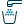</a> | **📂 檔名:** `water-fountain-fill--Streamline-Ultimate.svg` ✨ **格式:** `Vector (SVG)` ⚖️ **大小:** `5.99KB` 📅 **更新:** `2026-03-03`  🚀 **jsDelivr Markdown:** `` 🔗 **直接連結 (Url):** <code>https://cdn.jsdelivr.net/gh/barry028/materials@main/images/iCons/Ui%20Ux%20Graphic%20Design/water-fountain-fill--Streamline-Ultimate.svg</code> 📥 [檢視原始檔](water-fountain-fill--Streamline-Ultimate.svg) |
|  | **📂 檔名:** `webcam-2--Streamline-Ultimate.svg` ✨ **格式:** `Vector (SVG)` ⚖️ **大小:** `4.32KB` 📅 **更新:** `2026-03-03`  🚀 **jsDelivr Markdown:** `` 🔗 **直接連結 (Url):** <code>https://cdn.jsdelivr.net/gh/barry028/materials@main/images/iCons/Ui%20Ux%20Graphic%20Design/webcam-2--Streamline-Ultimate.svg</code> 📥 [檢視原始檔](webcam-2--Streamline-Ultimate.svg) |
|  | **📂 檔名:** `website-build--Streamline-Ultimate.svg` ✨ **格式:** `Vector (SVG)` ⚖️ **大小:** `3.41KB` 📅 **更新:** `2026-03-03`  🚀 **jsDelivr Markdown:** `` 🔗 **直接連結 (Url):** <code>https://cdn.jsdelivr.net/gh/barry028/materials@main/images/iCons/Ui%20Ux%20Graphic%20Design/website-build--Streamline-Ultimate.svg</code> 📥 [檢視原始檔](website-build--Streamline-Ultimate.svg) |
|  | **📂 檔名:** `wifi--Streamline-Ultimate.svg` ✨ **格式:** `Vector (SVG)` ⚖️ **大小:** `2.11KB` 📅 **更新:** `2026-03-03`  🚀 **jsDelivr Markdown:** `` 🔗 **直接連結 (Url):** <code>https://cdn.jsdelivr.net/gh/barry028/materials@main/images/iCons/Ui%20Ux%20Graphic%20Design/wifi--Streamline-Ultimate.svg</code> 📥 [檢視原始檔](wifi--Streamline-Ultimate.svg) |
|  | **📂 檔名:** `wifi-laptop-1--Streamline-Ultimate.svg` ✨ **格式:** `Vector (SVG)` ⚖️ **大小:** `2.42KB` 📅 **更新:** `2026-03-03`  🚀 **jsDelivr Markdown:** `` 🔗 **直接連結 (Url):** <code>https://cdn.jsdelivr.net/gh/barry028/materials@main/images/iCons/Ui%20Ux%20Graphic%20Design/wifi-laptop-1--Streamline-Ultimate.svg</code> 📥 [檢視原始檔](wifi-laptop-1--Streamline-Ultimate.svg) |
|  | **📂 檔名:** `wifi-lock--Streamline-Ultimate.svg` ✨ **格式:** `Vector (SVG)` ⚖️ **大小:** `4.01KB` 📅 **更新:** `2026-03-03`  🚀 **jsDelivr Markdown:** `` 🔗 **直接連結 (Url):** <code>https://cdn.jsdelivr.net/gh/barry028/materials@main/images/iCons/Ui%20Ux%20Graphic%20Design/wifi-lock--Streamline-Ultimate.svg</code> 📥 [檢視原始檔](wifi-lock--Streamline-Ultimate.svg) |
|  | **📂 檔名:** `wifi-monitor-1--Streamline-Ultimate.svg` ✨ **格式:** `Vector (SVG)` ⚖️ **大小:** `2.23KB` 📅 **更新:** `2026-03-03`  🚀 **jsDelivr Markdown:** `` 🔗 **直接連結 (Url):** <code>https://cdn.jsdelivr.net/gh/barry028/materials@main/images/iCons/Ui%20Ux%20Graphic%20Design/wifi-monitor-1--Streamline-Ultimate.svg</code> 📥 [檢視原始檔](wifi-monitor-1--Streamline-Ultimate.svg) |
|  | **📂 檔名:** `wifi-off--Streamline-Ultimate.svg` ✨ **格式:** `Vector (SVG)` ⚖️ **大小:** `1.94KB` 📅 **更新:** `2026-03-03`  🚀 **jsDelivr Markdown:** `` 🔗 **直接連結 (Url):** <code>https://cdn.jsdelivr.net/gh/barry028/materials@main/images/iCons/Ui%20Ux%20Graphic%20Design/wifi-off--Streamline-Ultimate.svg</code> 📥 [檢視原始檔](wifi-off--Streamline-Ultimate.svg) |
|  | **📂 檔名:** `wifi-signal-1--Streamline-Ultimate.svg` ✨ **格式:** `Vector (SVG)` ⚖️ **大小:** `2.68KB` 📅 **更新:** `2026-03-03`  🚀 **jsDelivr Markdown:** `` 🔗 **直接連結 (Url):** <code>https://cdn.jsdelivr.net/gh/barry028/materials@main/images/iCons/Ui%20Ux%20Graphic%20Design/wifi-signal-1--Streamline-Ultimate.svg</code> 📥 [檢視原始檔](wifi-signal-1--Streamline-Ultimate.svg) |
|  | **📂 檔名:** `wifi-signal-2--Streamline-Ultimate.svg` ✨ **格式:** `Vector (SVG)` ⚖️ **大小:** `2.83KB` 📅 **更新:** `2026-03-03`  🚀 **jsDelivr Markdown:** `` 🔗 **直接連結 (Url):** <code>https://cdn.jsdelivr.net/gh/barry028/materials@main/images/iCons/Ui%20Ux%20Graphic%20Design/wifi-signal-2--Streamline-Ultimate.svg</code> 📥 [檢視原始檔](wifi-signal-2--Streamline-Ultimate.svg) |
|  | **📂 檔名:** `wifi-signal-4--Streamline-Ultimate.svg` ✨ **格式:** `Vector (SVG)` ⚖️ **大小:** `2.00KB` 📅 **更新:** `2026-03-03`  🚀 **jsDelivr Markdown:** `` 🔗 **直接連結 (Url):** <code>https://cdn.jsdelivr.net/gh/barry028/materials@main/images/iCons/Ui%20Ux%20Graphic%20Design/wifi-signal-4--Streamline-Ultimate.svg</code> 📥 [檢視原始檔](wifi-signal-4--Streamline-Ultimate.svg) |
|  | **📂 檔名:** `wifi-transfer--Streamline-Ultimate.svg` ✨ **格式:** `Vector (SVG)` ⚖️ **大小:** `3.45KB` 📅 **更新:** `2026-03-03`  🚀 **jsDelivr Markdown:** `` 🔗 **直接連結 (Url):** <code>https://cdn.jsdelivr.net/gh/barry028/materials@main/images/iCons/Ui%20Ux%20Graphic%20Design/wifi-transfer--Streamline-Ultimate.svg</code> 📥 [檢視原始檔](wifi-transfer--Streamline-Ultimate.svg) |
|  | **📂 檔名:** `wifi-warning--Streamline-Ultimate.svg` ✨ **格式:** `Vector (SVG)` ⚖️ **大小:** `4.56KB` 📅 **更新:** `2026-03-03`  🚀 **jsDelivr Markdown:** `` 🔗 **直接連結 (Url):** <code>https://cdn.jsdelivr.net/gh/barry028/materials@main/images/iCons/Ui%20Ux%20Graphic%20Design/wifi-warning--Streamline-Ultimate.svg</code> 📥 [檢視原始檔](wifi-warning--Streamline-Ultimate.svg) |
|  | **📂 檔名:** `wireless-payment-credit-card--Streamline-Ultimate.svg` ✨ **格式:** `Vector (SVG)` ⚖️ **大小:** `2.60KB` 📅 **更新:** `2026-03-03`  🚀 **jsDelivr Markdown:** `` 🔗 **直接連結 (Url):** <code>https://cdn.jsdelivr.net/gh/barry028/materials@main/images/iCons/Ui%20Ux%20Graphic%20Design/wireless-payment-credit-card--Streamline-Ultimate.svg</code> 📥 [檢視原始檔](wireless-payment-credit-card--Streamline-Ultimate.svg) |
|  | **📂 檔名:** `wireless-payment-smartphone-1--Streamline-Ultimate.svg` ✨ **格式:** `Vector (SVG)` ⚖️ **大小:** `4.67KB` 📅 **更新:** `2026-03-03`  🚀 **jsDelivr Markdown:** `` 🔗 **直接連結 (Url):** <code>https://cdn.jsdelivr.net/gh/barry028/materials@main/images/iCons/Ui%20Ux%20Graphic%20Design/wireless-payment-smartphone-1--Streamline-Ultimate.svg</code> 📥 [檢視原始檔](wireless-payment-smartphone-1--Streamline-Ultimate.svg) |
|  | **📂 檔名:** `wrench-1--Streamline-Ultimate.svg` ✨ **格式:** `Vector (SVG)` ⚖️ **大小:** `2.54KB` 📅 **更新:** `2026-03-03`  🚀 **jsDelivr Markdown:** `` 🔗 **直接連結 (Url):** <code>https://cdn.jsdelivr.net/gh/barry028/materials@main/images/iCons/Ui%20Ux%20Graphic%20Design/wrench-1--Streamline-Ultimate.svg</code> 📥 [檢視原始檔](wrench-1--Streamline-Ultimate.svg) |
|  | **📂 檔名:** `wrench-double--Streamline-Ultimate.svg` ✨ **格式:** `Vector (SVG)` ⚖️ **大小:** `4.85KB` 📅 **更新:** `2026-03-03`  🚀 **jsDelivr Markdown:** `` 🔗 **直接連結 (Url):** <code>https://cdn.jsdelivr.net/gh/barry028/materials@main/images/iCons/Ui%20Ux%20Graphic%20Design/wrench-double--Streamline-Ultimate.svg</code> 📥 [檢視原始檔](wrench-double--Streamline-Ultimate.svg) |
|  | **📂 檔名:** `zoom-in-page--Streamline-Ultimate.svg` ✨ **格式:** `Vector (SVG)` ⚖️ **大小:** `2.90KB` 📅 **更新:** `2026-03-03`  🚀 **jsDelivr Markdown:** `` 🔗 **直接連結 (Url):** <code>https://cdn.jsdelivr.net/gh/barry028/materials@main/images/iCons/Ui%20Ux%20Graphic%20Design/zoom-in-page--Streamline-Ultimate.svg</code> 📥 [檢視原始檔](zoom-in-page--Streamline-Ultimate.svg) |
|  | **📂 檔名:** `zoom-out-1--Streamline-Ultimate.svg` ✨ **格式:** `Vector (SVG)` ⚖️ **大小:** `1.49KB` 📅 **更新:** `2026-03-03`  🚀 **jsDelivr Markdown:** `` 🔗 **直接連結 (Url):** <code>https://cdn.jsdelivr.net/gh/barry028/materials@main/images/iCons/Ui%20Ux%20Graphic%20Design/zoom-out-1--Streamline-Ultimate.svg</code> 📥 [檢視原始檔](zoom-out-1--Streamline-Ultimate.svg) |