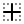
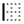
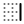

# 🖼️ Unicons 

[⬅️ 返回主目錄](../../../README.md)

| 預覽 | 資訊 |
| :--- | :--- |
|  | **0-plus.svg** |
|  | **10-plus.svg** |
|  | **12-plus.svg** |
|  | **13-plus.svg** |
|  | **16-plus.svg** |
|  | **17-plus.svg** |
|  | **18-plus.svg** |
|  | **21-plus.svg** |
|  | **3-plus.svg** |
|  | **500px-1.svg** |
|  | **500px.svg** |
|  | **6-plus.svg** |
|  | **abacus.svg** |
|  | **accessible-icon-alt.svg** |
|  | **adjust-alt.svg** |
|  | **adjust-circle.svg** |
|  | **adjust-half.svg** |
|  | **adjust.svg** |
|  | **adobe-1.svg** |
|  | **adobe-alt-1.svg** |
|  | **adobe-alt-2.svg** |
|  | **adobe-alt.svg** |
|  | **adobe.svg** |
|  | **airplay-1.svg** |
|  | **airplay-2.svg** |
|  | **airplay-3.svg** |
|  | **airplay.svg** |
|  | **align-1.svg** |
|  | **align-alt-1.svg** |
|  | **align-alt-2.svg** |
|  | **align-alt-3.svg** |
|  | **align-alt.svg** |
|  | **align-center-1.svg** |
|  | **align-center-2.svg** |
|  | **align-center-3.svg** |
|  | **align-center-alt-1.svg** |
|  | **align-center-alt.svg** |
|  | **align-center-h.svg** |
|  | **align-center-justify-1.svg** |
|  | **align-center-justify-2.svg** |
|  | **align-center-justify-3.svg** |
|  | **align-center-justify.svg** |
|  | **align-center-v.svg** |
|  | **align-center.svg** |
|  | **align-justify-1.svg** |
|  | **align-justify-2.svg** |
|  | **align-justify.svg** |
|  | **align-left-1.svg** |
|  | **align-left-2.svg** |
|  | **align-left-3.svg** |
|  | **align-left-justify-1.svg** |
|  | **align-left-justify-2.svg** |
|  | **align-left-justify-3.svg** |
|  | **align-left-justify.svg** |
|  | **align-left.svg** |
|  | **align-letter-right-1.svg** |
|  | **align-letter-right-2.svg** |
|  | **align-letter-right-3.svg** |
|  | **align-letter-right.svg** |
|  | **align-right-1.svg** |
|  | **align-right-2.svg** |
|  | **align-right-3.svg** |
|  | **align-right-justify-1.svg** |
|  | **align-right-justify-2.svg** |
|  | **align-right-justify-3.svg** |
|  | **align-right-justify.svg** |
|  | **align-right.svg** |
|  | **align.svg** |
|  | **amazon.svg** |
|  | **ambulance.svg** |
|  | **analysis-1.svg** |
|  | **analysis-2.svg** |
|  | **analysis.svg** |
|  | **analytics-1.svg** |
|  | **analytics-2.svg** |
|  | **analytics.svg** |
|  | **anchor-1.svg** |
|  | **anchor-2.svg** |
|  | **anchor-3.svg** |
|  | **anchor.svg** |
|  | **android-1.svg** |
|  | **android-alt-1.svg** |
|  | **android-alt-2.svg** |
|  | **android-alt.svg** |
|  | **android-phone-slash.svg** |
|  | **android.svg** |
|  | **angle-double-down-1.svg** |
|  | **angle-double-down-2.svg** |
|  | **angle-double-down-3.svg** |
|  | **angle-double-down.svg** |
|  | **angle-double-left-1.svg** |
|  | **angle-double-left-2.svg** |
|  | **angle-double-left-3.svg** |
|  | **angle-double-left.svg** |
|  | **angle-double-right-1.svg** |
|  | **angle-double-right-2.svg** |
|  | **angle-double-right-3.svg** |
|  | **angle-double-right.svg** |
|  | **angle-double-up-1.svg** |
|  | **angle-double-up-2.svg** |
|  | **angle-double-up.svg** |
|  | **angle-down-1.svg** |
|  | **angle-down-2.svg** |
|  | **angle-down.svg** |
|  | **angle-left-1.svg** |
|  | **angle-left-2.svg** |
|  | **angle-left-b.svg** |
|  | **angle-left.svg** |
|  | **angle-right-1.svg** |
|  | **angle-right-2.svg** |
|  | **angle-right-b-1.svg** |
|  | **angle-right-b-2.svg** |
|  | **angle-right-b.svg** |
|  | **angle-right.svg** |
|  | **angle-up-1.svg** |
|  | **angle-up-2.svg** |
|  | **angle-up-3.svg** |
|  | **angle-up.svg** |
|  | **angry.svg** |
|  | **ankh-1.svg** |
|  | **ankh.svg** |
|  | **annoyed-alt.svg** |
|  | **annoyed.svg** |
|  | **apple-1.svg** |
|  | **apple-alt-1.svg** |
|  | **apple-alt-2.svg** |
|  | **apple-alt.svg** |
|  | **apple.svg** |
|  | **apps-1.svg** |
|  | **apps-2.svg** |
|  | **apps.svg** |
|  | **archive-alt.svg** |
|  | **archive.svg** |
|  | **archway.svg** |
|  | **arrow-break.svg** |
|  | **arrow-circle-down-1.svg** |
|  | **arrow-circle-down-2.svg** |
|  | **arrow-circle-down-3.svg** |
|  | **arrow-circle-down.svg** |
|  | **arrow-circle-left-1.svg** |
|  | **arrow-circle-left-2.svg** |
|  | **arrow-circle-left-3.svg** |
|  | **arrow-circle-left.svg** |
|  | **arrow-circle-right-1.svg** |
|  | **arrow-circle-right-2.svg** |
|  | **arrow-circle-right-3.svg** |
|  | **arrow-circle-right.svg** |
|  | **arrow-circle-up-1.svg** |
|  | **arrow-circle-up-2.svg** |
|  | **arrow-circle-up-3.svg** |
|  | **arrow-circle-up.svg** |
|  | **arrow-compress-h.svg** |
|  | **arrow-down-left-1.svg** |
|  | **arrow-down-left-2.svg** |
|  | **arrow-down-left-3.svg** |
|  | **arrow-down-left.svg** |
|  | **arrow-down-right-1.svg** |
|  | **arrow-down-right-2.svg** |
|  | **arrow-down-right-3.svg** |
|  | **arrow-down-right.svg** |
|  | **arrow-down.svg** |
|  | **arrow-from-right.svg** |
|  | **arrow-from-top.svg** |
|  | **arrow-growth.svg** |
|  | **arrow-left.svg** |
|  | **arrow-random.svg** |
|  | **arrow-resize-diagonal.svg** |
|  | **arrow-right.svg** |
|  | **arrow-to-bottom.svg** |
|  | **arrow-to-right.svg** |
|  | **arrow-up-left-1.svg** |
|  | **arrow-up-left-2.svg** |
|  | **arrow-up-left-3.svg** |
|  | **arrow-up-left.svg** |
|  | **arrow-up-right-1.svg** |
|  | **arrow-up-right-2.svg** |
|  | **arrow-up-right-3.svg** |
|  | **arrow-up-right.svg** |
|  | **arrow-up.svg** |
|  | **arrow.svg** |
|  | **arrows-h-alt.svg** |
|  | **arrows-h.svg** |
|  | **arrows-left-down.svg** |
|  | **arrows-maximize.svg** |
|  | **arrows-merge.svg** |
|  | **arrows-resize-h.svg** |
|  | **arrows-resize-v.svg** |
|  | **arrows-resize.svg** |
|  | **arrows-right-down.svg** |
|  | **arrows-shrink-h.svg** |
|  | **arrows-shrink-v.svg** |
|  | **arrows-up-right.svg** |
|  | **arrows-v-alt.svg** |
|  | **arrows-v.svg** |
|  | **assistive-listening-systems.svg** |
|  | **asterisk.svg** |
|  | **at-1.svg** |
|  | **at-2.svg** |
|  | **at-3.svg** |
|  | **at.svg** |
|  | **atom.svg** |
|  | **auto-flash.svg** |
|  | **award-alt.svg** |
|  | **award.svg** |
|  | **baby-carriage.svg** |
|  | **backpack.svg** |
|  | **backspace.svg** |
|  | **backward.svg** |
|  | **bag-1.svg** |
|  | **bag-2.svg** |
|  | **bag-3.svg** |
|  | **bag-alt.svg** |
|  | **bag-slash.svg** |
|  | **bag.svg** |
|  | **balance-scale.svg** |
|  | **ban.svg** |
|  | **band-aid.svg** |
|  | **bars-1.svg** |
|  | **bars-2.svg** |
|  | **bars.svg** |
|  | **baseball-ball.svg** |
|  | **basketball-hoop.svg** |
|  | **basketball.svg** |
|  | **bath.svg** |
|  | **battery-bolt-1.svg** |
|  | **battery-bolt-2.svg** |
|  | **battery-bolt-3.svg** |
|  | **battery-bolt.svg** |
|  | **battery-empty-1.svg** |
|  | **battery-empty-2.svg** |
|  | **battery-empty-3.svg** |
|  | **battery-empty.svg** |
|  | **bed-double.svg** |
|  | **bed.svg** |
|  | **behance-1.svg** |
|  | **behance-alt-1.svg** |
|  | **behance-alt-2.svg** |
|  | **behance-alt.svg** |
|  | **behance.svg** |
|  | **bell-school.svg** |
|  | **bell-slash.svg** |
|  | **bell.svg** |
|  | **bill.svg** |
|  | **bing-1.svg** |
|  | **bing.svg** |
|  | **bitcoin-1.svg** |
|  | **bitcoin-alt-1.svg** |
|  | **bitcoin-alt-2.svg** |
|  | **bitcoin-alt.svg** |
|  | **bitcoin-circle.svg** |
|  | **bitcoin-sign.svg** |
|  | **bitcoin.svg** |
|  | **black-berry.svg** |
|  | **blackberry.svg** |
|  | **blogger-1.svg** |
|  | **blogger-alt-1.svg** |
|  | **blogger-alt-2.svg** |
|  | **blogger-alt.svg** |
|  | **blogger.svg** |
|  | **bluetooth-b.svg** |
|  | **bold.svg** |
|  | **bolt-alt.svg** |
|  | **bolt-slash.svg** |
|  | **bolt.svg** |
|  | **book-alt.svg** |
|  | **book-medical.svg** |
|  | **book-open.svg** |
|  | **book-reader.svg** |
|  | **book.svg** |
|  | **bookmark-1.svg** |
|  | **bookmark-2.svg** |
|  | **bookmark-3.svg** |
|  | **bookmark-full.svg** |
|  | **bookmark.svg** |
|  | **books.svg** |
|  | **boombox.svg** |
|  | **border-alt-1.svg** |
|  | **border-alt-2.svg** |
|  | **border-alt-3.svg** |
|  | **border-alt.svg** |
|  | **border-bottom-1.svg** |
|  | **border-bottom-2.svg** |
|  | **border-bottom-3.svg** |
|  | **border-bottom.svg** |
|  | **border-clear-1.svg** |
|  | **border-clear-2.svg** |
|  | **border-clear-3.svg** |
|  | **border-clear.svg** |
|  | **border-horizontal-1.svg** |
|  | **border-horizontal-2.svg** |
|  | **border-horizontal-3.svg** |
|  | **border-horizontal.svg** |
|  | **border-inner-1.svg** |
|  | **border-inner-2.svg** |
|  | **border-inner-3.svg** |
|  | **border-inner.svg** |
|  | **border-left-1.svg** |
|  | **border-left-2.svg** |
|  | **border-left-3.svg** |
|  | **border-left.svg** |
|  | **border-out-1.svg** |
|  | **border-out-2.svg** |
|  | **border-out-3.svg** |
|  | **border-out.svg** |
|  | **border-right-1.svg** |
|  | **border-right-2.svg** |
|  | **border-right.svg** |
|  | **border-top-1.svg** |
|  | **border-top-2.svg** |
|  | **border-top-3.svg** |
|  | **border-top.svg** |
|  | **border-vertical-1.svg** |
|  | **border-vertical-2.svg** |
|  | **border-vertical-3.svg** |
|  | **border-vertical.svg** |
|  | **bowling-ball.svg** |
|  | **box-1.svg** |
|  | **box.svg** |
|  | **brackets-curly.svg** |
|  | **brain.svg** |
|  | **briefcase-1.svg** |
|  | **briefcase-2.svg** |
|  | **briefcase-alt.svg** |
|  | **briefcase.svg** |
|  | **bright.svg** |
|  | **brightness-empty.svg** |
|  | **brightness-half.svg** |
|  | **brightness-low.svg** |
|  | **brightness-minus.svg** |
|  | **brightness-plus.svg** |
|  | **brightness.svg** |
|  | **bring-bottom.svg** |
|  | **bring-front.svg** |
|  | **browser.svg** |
|  | **brush-alt.svg** |
|  | **bug.svg** |
|  | **building.svg** |
|  | **bullseye.svg** |
|  | **bus-alt.svg** |
|  | **bus-school.svg** |
|  | **bus.svg** |
|  | **calculator-alt.svg** |
|  | **calculator.svg** |
|  | **calendar-alt.svg** |
|  | **calendar-slash.svg** |
|  | **calender-1.svg** |
|  | **calender-2.svg** |
|  | **calender-3.svg** |
|  | **calender.svg** |
|  | **calling.svg** |
|  | **camera-change.svg** |
|  | **camera-plus.svg** |
|  | **camera-slash.svg** |
|  | **camera.svg** |
|  | **cancel.svg** |
|  | **capsule.svg** |
|  | **capture.svg** |
|  | **car-sideview.svg** |
|  | **car-slash.svg** |
|  | **car-wash.svg** |
|  | **car.svg** |
|  | **card-atm.svg** |
|  | **caret-right.svg** |
|  | **cell.svg** |
|  | **celsius.svg** |
|  | **channel-add.svg** |
|  | **channel.svg** |
|  | **chart-1.svg** |
|  | **chart-2.svg** |
|  | **chart-bar-alt.svg** |
|  | **chart-bar.svg** |
|  | **chart-down.svg** |
|  | **chart-growth-1.svg** |
|  | **chart-growth-alt.svg** |
|  | **chart-growth.svg** |
|  | **chart-line.svg** |
|  | **chart-pie-1.svg** |
|  | **chart-pie-2.svg** |
|  | **chart-pie-3.svg** |
|  | **chart-pie-alt.svg** |
|  | **chart-pie.svg** |
|  | **chart.svg** |
|  | **chat-bubble-user.svg** |
|  | **chat-info.svg** |
|  | **chat.svg** |
|  | **check-1.svg** |
|  | **check-2.svg** |
|  | **check-3.svg** |
|  | **check-circle-1.svg** |
|  | **check-circle-2.svg** |
|  | **check-circle-3.svg** |
|  | **check-circle.svg** |
|  | **check-square-1.svg** |
|  | **check-square-2.svg** |
|  | **check-square-3.svg** |
|  | **check-square.svg** |
|  | **check.svg** |
|  | **circle-1.svg** |
|  | **circle-layer-1.svg** |
|  | **circle-layer-2.svg** |
|  | **circle-layer-3.svg** |
|  | **circle-layer.svg** |
|  | **circle.svg** |
|  | **circuit-1.svg** |
|  | **circuit.svg** |
|  | **clapper-board.svg** |
|  | **clinic-medical-1.svg** |
|  | **clinic-medical-2.svg** |
|  | **clinic-medical-3.svg** |
|  | **clinic-medical.svg** |
|  | **clipboard-alt.svg** |
|  | **clipboard-blank.svg** |
|  | **clipboard-notes.svg** |
|  | **clipboard.svg** |
|  | **clock-1.svg** |
|  | **clock-2.svg** |
|  | **clock-3.svg** |
|  | **clock-eight-1.svg** |
|  | **clock-eight-2.svg** |
|  | **clock-eight-3.svg** |
|  | **clock-eight.svg** |
|  | **clock-five-1.svg** |
|  | **clock-five-2.svg** |
|  | **clock-five-3.svg** |
|  | **clock-five.svg** |
|  | **clock-nine-1.svg** |
|  | **clock-nine-2.svg** |
|  | **clock-nine-3.svg** |
|  | **clock-nine.svg** |
|  | **clock-seven-1.svg** |
|  | **clock-seven-2.svg** |
|  | **clock-seven-3.svg** |
|  | **clock-seven.svg** |
|  | **clock-ten-1.svg** |
|  | **clock-ten-2.svg** |
|  | **clock-ten-3.svg** |
|  | **clock-ten.svg** |
|  | **clock-three-1.svg** |
|  | **clock-three-2.svg** |
|  | **clock-three-3.svg** |
|  | **clock-three.svg** |
|  | **clock-two-1.svg** |
|  | **clock-two-2.svg** |
|  | **clock-two-3.svg** |
|  | **clock-two.svg** |
|  | **clock.svg** |
|  | **closed-captioning-slash.svg** |
|  | **closed-captioning.svg** |
|  | **cloud-block.svg** |
|  | **cloud-bookmark.svg** |
|  | **cloud-check.svg** |
|  | **cloud-computing.svg** |
|  | **cloud-data-connection.svg** |
|  | **cloud-database-tree.svg** |
|  | **cloud-download.svg** |
|  | **cloud-drizzle.svg** |
|  | **cloud-exclamation.svg** |
|  | **cloud-hail.svg** |
|  | **cloud-heart.svg** |
|  | **cloud-info.svg** |
|  | **cloud-lock.svg** |
|  | **cloud-meatball.svg** |
|  | **cloud-moon-hail.svg** |
|  | **cloud-moon-meatball.svg** |
|  | **cloud-moon-rain.svg** |
|  | **cloud-moon-showers.svg** |
|  | **cloud-moon.svg** |
|  | **cloud-question.svg** |
|  | **cloud-rain-sun.svg** |
|  | **cloud-rain.svg** |
|  | **cloud-redo.svg** |
|  | **cloud-share.svg** |
|  | **cloud-shield.svg** |
|  | **cloud-showers-alt.svg** |
|  | **cloud-showers-heavy.svg** |
|  | **cloud-showers.svg** |
|  | **cloud-slash.svg** |
|  | **cloud-sun-hail.svg** |
|  | **cloud-sun-meatball.svg** |
|  | **cloud-sun-rain-alt.svg** |
|  | **cloud-sun-rain.svg** |
|  | **cloud-sun-tear.svg** |
|  | **cloud-sun.svg** |
|  | **cloud-times.svg** |
|  | **cloud-unlock.svg** |
|  | **cloud-upload.svg** |
|  | **cloud-wifi.svg** |
|  | **cloud-wind.svg** |
|  | **cloud.svg** |
|  | **clouds.svg** |
|  | **club.svg** |
|  | **code-branch.svg** |
|  | **coffee.svg** |
|  | **cog.svg** |
|  | **coins.svg** |
|  | **columns-1.svg** |
|  | **columns-2.svg** |
|  | **columns-3.svg** |
|  | **columns.svg** |
|  | **comment-1.svg** |
|  | **comment-add.svg** |
|  | **comment-alt-1.svg** |
|  | **comment-alt-block.svg** |
|  | **comment-alt-chart-lines.svg** |
|  | **comment-alt-check.svg** |
|  | **comment-alt-dots-1.svg** |
|  | **comment-alt-dots.svg** |
|  | **comment-alt-download.svg** |
|  | **comment-alt-edit.svg** |
|  | **comment-alt-exclamation.svg** |
|  | **comment-alt-heart.svg** |
|  | **comment-alt-image.svg** |
|  | **comment-alt-info.svg** |
|  | **comment-alt-lines.svg** |
|  | **comment-alt-lock.svg** |
|  | **comment-alt-medical.svg** |
|  | **comment-alt-message-1.svg** |
|  | **comment-alt-message.svg** |
|  | **comment-alt-notes.svg** |
|  | **comment-alt-plus-1.svg** |
|  | **comment-alt-plus.svg** |
|  | **comment-alt-question.svg** |
|  | **comment-alt-redo.svg** |
|  | **comment-alt-search.svg** |
|  | **comment-alt-share.svg** |
|  | **comment-alt-shield.svg** |
|  | **comment-alt-slash.svg** |
|  | **comment-alt-upload.svg** |
|  | **comment-alt-verify.svg** |
|  | **comment-alt.svg** |
|  | **comment-block.svg** |
|  | **comment-chart-line.svg** |
|  | **comment-check.svg** |
|  | **comment-dots-1.svg** |
|  | **comment-dots-2.svg** |
|  | **comment-dots-3.svg** |
|  | **comment-dots.svg** |
|  | **comment-download.svg** |
|  | **comment-edit.svg** |
|  | **comment-exclamation.svg** |
|  | **comment-heart.svg** |
|  | **comment-image.svg** |
|  | **comment-info-alt.svg** |
|  | **comment-info.svg** |
|  | **comment-lines.svg** |
|  | **comment-lock.svg** |
|  | **comment-medical.svg** |
|  | **comment-message-1.svg** |
|  | **comment-message.svg** |
|  | **comment-notes.svg** |
|  | **comment-plus-1.svg** |
|  | **comment-plus.svg** |
|  | **comment-question.svg** |
|  | **comment-redo.svg** |
|  | **comment-search.svg** |
|  | **comment-share.svg** |
|  | **comment-shield.svg** |
|  | **comment-slash.svg** |
|  | **comment-upload.svg** |
|  | **comment-verify.svg** |
|  | **comment.svg** |
|  | **comments-alt.svg** |
|  | **comments.svg** |
|  | **compact-disc.svg** |
|  | **comparison.svg** |
|  | **compass.svg** |
|  | **compress-1.svg** |
|  | **compress-2.svg** |
|  | **compress-3.svg** |
|  | **compress-alt-left.svg** |
|  | **compress-alt.svg** |
|  | **compress-arrows.svg** |
|  | **compress-lines.svg** |
|  | **compress-point.svg** |
|  | **compress-v.svg** |
|  | **compress.svg** |
|  | **confused.svg** |
|  | **constructor.svg** |
|  | **copy-alt.svg** |
|  | **copy-landscape.svg** |
|  | **copy.svg** |
|  | **copyright.svg** |
|  | **corner-down-left-1.svg** |
|  | **corner-down-left-2.svg** |
|  | **corner-down-left-3.svg** |
|  | **corner-down-left.svg** |
|  | **corner-down-right-1.svg** |
|  | **corner-down-right-2.svg** |
|  | **corner-down-right-3.svg** |
|  | **corner-down-right-alt.svg** |
|  | **corner-down-right.svg** |
|  | **corner-left-down-1.svg** |
|  | **corner-left-down-2.svg** |
|  | **corner-left-down-3.svg** |
|  | **corner-left-down.svg** |
|  | **corner-right-down-1.svg** |
|  | **corner-right-down-2.svg** |
|  | **corner-right-down-3.svg** |
|  | **corner-right-down.svg** |
|  | **corner-up-left-1.svg** |
|  | **corner-up-left-2.svg** |
|  | **corner-up-left-3.svg** |
|  | **corner-up-left-alt.svg** |
|  | **corner-up-left.svg** |
|  | **corner-up-right-1.svg** |
|  | **corner-up-right-2.svg** |
|  | **corner-up-right-3.svg** |
|  | **corner-up-right-alt.svg** |
|  | **corner-up-right.svg** |
|  | **coronavirus-1.svg** |
|  | **coronavirus-2.svg** |
|  | **coronavirus.svg** |
|  | **covid-19.svg** |
|  | **create-dashboard-1.svg** |
|  | **create-dashboard.svg** |
|  | **creative-commons-pd.svg** |
|  | **credit-card-search.svg** |
|  | **credit-card.svg** |
|  | **crockery.svg** |
|  | **crop-alt-rotate-left.svg** |
|  | **crop-alt-rotate-right.svg** |
|  | **crop-alt.svg** |
|  | **crosshair-alt.svg** |
|  | **crosshair.svg** |
|  | **crosshairs.svg** |
|  | **css3-simple-1.svg** |
|  | **css3-simple.svg** |
|  | **css3.svg** |
|  | **cube-1.svg** |
|  | **cube.svg** |
|  | **dashboard.svg** |
|  | **data-sharing.svg** |
|  | **database-alt.svg** |
|  | **database.svg** |
|  | **desert.svg** |
|  | **desktop-alt-slash-1.svg** |
|  | **desktop-alt-slash.svg** |
|  | **desktop-alt.svg** |
|  | **desktop-cloud-alt.svg** |
|  | **desktop-slash.svg** |
|  | **desktop.svg** |
|  | **dialpad-1.svg** |
|  | **dialpad-2.svg** |
|  | **dialpad-3.svg** |
|  | **dialpad-alt-1.svg** |
|  | **dialpad-alt.svg** |
|  | **dialpad.svg** |
|  | **diamond.svg** |
|  | **diary-alt.svg** |
|  | **diary.svg** |
|  | **dice-five.svg** |
|  | **dice-four.svg** |
|  | **dice-one.svg** |
|  | **dice-six.svg** |
|  | **dice-three.svg** |
|  | **dice-two.svg** |
|  | **direction-1.svg** |
|  | **direction-2.svg** |
|  | **direction-3.svg** |
|  | **direction.svg** |
|  | **directions.svg** |
|  | **discord-1.svg** |
|  | **discord.svg** |
|  | **dizzy-meh.svg** |
|  | **dna.svg** |
|  | **docker-1.svg** |
|  | **docker.svg** |
|  | **document-info.svg** |
|  | **document-layout-center-1.svg** |
|  | **document-layout-center-2.svg** |
|  | **document-layout-center-3.svg** |
|  | **document-layout-center.svg** |
|  | **document-layout-left-1.svg** |
|  | **document-layout-left-2.svg** |
|  | **document-layout-left-3.svg** |
|  | **document-layout-left.svg** |
|  | **document-layout-right-1.svg** |
|  | **document-layout-right-2.svg** |
|  | **document-layout-right-3.svg** |
|  | **document-layout-right.svg** |
|  | **dollar-alt.svg** |
|  | **dollar-sign.svg** |
|  | **download-alt-1.svg** |
|  | **download-alt-2.svg** |
|  | **download-alt-3.svg** |
|  | **download-alt.svg** |
|  | **draggabledots.svg** |
|  | **dribbble-1.svg** |
|  | **dribbble.svg** |
|  | **drill.svg** |
|  | **dropbox-1.svg** |
|  | **dropbox-2.svg** |
|  | **dropbox.svg** |
|  | **dumbbell.svg** |
|  | **ear.svg** |
|  | **edit-alt.svg** |
|  | **edit.svg** |
|  | **elipsis-double-v-alt.svg** |
|  | **ellipsis-h-1.svg** |
|  | **ellipsis-h-2.svg** |
|  | **ellipsis-h-3.svg** |
|  | **ellipsis-h.svg** |
|  | **ellipsis-v-1.svg** |
|  | **ellipsis-v-2.svg** |
|  | **ellipsis-v-3.svg** |
|  | **ellipsis-v.svg** |
|  | **emoji.svg** |
|  | **english-to-chinese.svg** |
|  | **enter.svg** |
|  | **entry.svg** |
|  | **envelope-add.svg** |
|  | **envelope-alt.svg** |
|  | **envelope-block.svg** |
|  | **envelope-bookmark.svg** |
|  | **envelope-check.svg** |
|  | **envelope-download-alt.svg** |
|  | **envelope-download.svg** |
|  | **envelope-edit.svg** |
|  | **envelope-exclamation.svg** |
|  | **envelope-heart.svg** |
|  | **envelope-info.svg** |
|  | **envelope-lock.svg** |
|  | **envelope-minus.svg** |
|  | **envelope-open.svg** |
|  | **envelope-question.svg** |
|  | **envelope-receive.svg** |
|  | **envelope-redo.svg** |
|  | **envelope-search.svg** |
|  | **envelope-send.svg** |
|  | **envelope-share.svg** |
|  | **envelope-shield.svg** |
|  | **envelope-star.svg** |
|  | **envelope-times.svg** |
|  | **envelope-upload-alt.svg** |
|  | **envelope-upload.svg** |
|  | **envelope.svg** |
|  | **envelopes.svg** |
|  | **equal-circle.svg** |
|  | **euro-circle.svg** |
|  | **euro.svg** |
|  | **exchange-alt.svg** |
|  | **exchange.svg** |
|  | **exclamation-circle-1.svg** |
|  | **exclamation-circle-2.svg** |
|  | **exclamation-circle-3.svg** |
|  | **exclamation-circle.svg** |
|  | **exclamation-octagon-1.svg** |
|  | **exclamation-octagon-2.svg** |
|  | **exclamation-octagon-3.svg** |
|  | **exclamation-octagon.svg** |
|  | **exclamation-triangle-1.svg** |
|  | **exclamation-triangle-2.svg** |
|  | **exclamation-triangle-3.svg** |
|  | **exclamation-triangle.svg** |
|  | **exclamation.svg** |
|  | **exclude.svg** |
|  | **exit-1.svg** |
|  | **expand-alt.svg** |
|  | **expand-arrows-alt.svg** |
|  | **expand-arrows.svg** |
|  | **expand-from-corner.svg** |
|  | **expand-left.svg** |
|  | **expand-right.svg** |
|  | **export.svg** |
|  | **exposure-alt.svg** |
|  | **exposure-increase.svg** |
|  | **external-link-alt.svg** |
|  | **eye-slash.svg** |
|  | **eye.svg** |
|  | **facebook-1.svg** |
|  | **facebook-f-1.svg** |
|  | **facebook-f-2.svg** |
|  | **facebook-f.svg** |
|  | **facebook-messenger-1.svg** |
|  | **facebook-messenger-alt-1.svg** |
|  | **facebook-messenger-alt-2.svg** |
|  | **facebook-messenger-alt.svg** |
|  | **facebook-messenger.svg** |
|  | **facebook.svg** |
|  | **fahrenheit.svg** |
|  | **fast-mail-alt.svg** |
|  | **fast-mail.svg** |
|  | **favorite-1.svg** |
|  | **favorite-3.svg** |
|  | **favorite.svg** |
|  | **feedback.svg** |
|  | **fidget-spinner.svg** |
|  | **file-alt.svg** |
|  | **file-blank.svg** |
|  | **file-block-alt.svg** |
|  | **file-bookmark-alt.svg** |
|  | **file-check-alt.svg** |
|  | **file-check.svg** |
|  | **file-contract-dollar.svg** |
|  | **file-contract.svg** |
|  | **file-copy-alt.svg** |
|  | **file-download-alt.svg** |
|  | **file-download.svg** |
|  | **file-edit-alt.svg** |
|  | **file-exclamation-alt.svg** |
|  | **file-exclamation.svg** |
|  | **file-export.svg** |
|  | **file-graph.svg** |
|  | **file-heart.svg** |
|  | **file-import.svg** |
|  | **file-info-alt.svg** |
|  | **file-landscape-alt.svg** |
|  | **file-landscape.svg** |
|  | **file-lanscape-slash.svg** |
|  | **file-lock-alt.svg** |
|  | **file-medical-alt.svg** |
|  | **file-medical.svg** |
|  | **file-minus-alt.svg** |
|  | **file-minus.svg** |
|  | **file-network.svg** |
|  | **file-plus-alt.svg** |
|  | **file-plus.svg** |
|  | **file-question-alt.svg** |
|  | **file-question.svg** |
|  | **file-redo-alt.svg** |
|  | **file-search-alt.svg** |
|  | **file-share-alt.svg** |
|  | **file-shield-alt.svg** |
|  | **file-slash.svg** |
|  | **file-times-alt.svg** |
|  | **file-times.svg** |
|  | **file-upload-alt.svg** |
|  | **file-upload.svg** |
|  | **file.svg** |
|  | **files-landscapes-alt.svg** |
|  | **files-landscapes.svg** |
|  | **film.svg** |
|  | **filter-slash.svg** |
|  | **filter.svg** |
|  | **fire.svg** |
|  | **flask-potion.svg** |
|  | **flask.svg** |
|  | **flip-h-1.svg** |
|  | **flip-h-2.svg** |
|  | **flip-h-3.svg** |
|  | **flip-h-alt-1.svg** |
|  | **flip-h-alt-2.svg** |
|  | **flip-h-alt-3.svg** |
|  | **flip-h-alt.svg** |
|  | **flip-h.svg** |
|  | **flip-v-1.svg** |
|  | **flip-v-2.svg** |
|  | **flip-v-3.svg** |
|  | **flip-v-alt-1.svg** |
|  | **flip-v-alt-2.svg** |
|  | **flip-v-alt-3.svg** |
|  | **flip-v-alt.svg** |
|  | **flip-v.svg** |
|  | **flower.svg** |
|  | **focus-add.svg** |
|  | **focus-target.svg** |
|  | **focus.svg** |
|  | **folder-check.svg** |
|  | **folder-download.svg** |
|  | **folder-exclamation.svg** |
|  | **folder-heart.svg** |
|  | **folder-info.svg** |
|  | **folder-lock.svg** |
|  | **folder-minus.svg** |
|  | **folder-network.svg** |
|  | **folder-open.svg** |
|  | **folder-plus.svg** |
|  | **folder-question.svg** |
|  | **folder-slash.svg** |
|  | **folder-times.svg** |
|  | **folder-upload.svg** |
|  | **folder.svg** |
|  | **font.svg** |
|  | **football-american.svg** |
|  | **football-ball.svg** |
|  | **football.svg** |
|  | **forecastcloud-moon-tear.svg** |
|  | **forwaded-call.svg** |
|  | **forward.svg** |
|  | **frown.svg** |
|  | **game-structure.svg** |
|  | **gift.svg** |
|  | **github-1.svg** |
|  | **github-alt-1.svg** |
|  | **github-alt-2.svg** |
|  | **github-alt.svg** |
|  | **github.svg** |
|  | **gitlab-1.svg** |
|  | **gitlab-alt.svg** |
|  | **gitlab.svg** |
|  | **glass-martini-alt-slash.svg** |
|  | **glass-martini-alt.svg** |
|  | **glass-martini.svg** |
|  | **glass-tea.svg** |
|  | **glass.svg** |
|  | **globe.svg** |
|  | **gold-1.svg** |
|  | **gold.svg** |
|  | **golf-ball.svg** |
|  | **google-1.svg** |
|  | **google-2.svg** |
|  | **google-drive-1.svg** |
|  | **google-drive-alt-1.svg** |
|  | **google-drive-alt-2.svg** |
|  | **google-drive-alt.svg** |
|  | **google-drive.svg** |
|  | **google-hangouts-1.svg** |
|  | **google-hangouts-alt-1.svg** |
|  | **google-hangouts-alt-2.svg** |
|  | **google-hangouts-alt.svg** |
|  | **google-hangouts.svg** |
|  | **google-play-1.svg** |
|  | **google-play-2.svg** |
|  | **google-play.svg** |
|  | **google.svg** |
|  | **graduation-cap.svg** |
|  | **graph-bar-1.svg** |
|  | **graph-bar-2.svg** |
|  | **graph-bar.svg** |
|  | **grid-1.svg** |
|  | **grid-2.svg** |
|  | **grid-3.svg** |
|  | **grid.svg** |
|  | **grids-1.svg** |
|  | **grids-2.svg** |
|  | **grids-3.svg** |
|  | **grids.svg** |
|  | **grin-tongue-wink-alt.svg** |
|  | **grin-tongue-wink.svg** |
|  | **grin.svg** |
|  | **grip-horizontal-line-1.svg** |
|  | **grip-horizontal-line-2.svg** |
|  | **grip-horizontal-line-3.svg** |
|  | **grip-horizontal-line.svg** |
|  | **hard-hat.svg** |
|  | **hdd.svg** |
|  | **head-side-1.svg** |
|  | **head-side-2.svg** |
|  | **head-side-3.svg** |
|  | **head-side-cough-1.svg** |
|  | **head-side-cough-2.svg** |
|  | **head-side-cough-3.svg** |
|  | **head-side-cough.svg** |
|  | **head-side-mask-1.svg** |
|  | **head-side-mask-2.svg** |
|  | **head-side-mask-3.svg** |
|  | **head-side-mask.svg** |
|  | **head-side.svg** |
|  | **headphone-slash.svg** |
|  | **headphones-alt.svg** |
|  | **headphones.svg** |
|  | **heart-alt.svg** |
|  | **heart-break.svg** |
|  | **heart-medical.svg** |
|  | **heart-rate.svg** |
|  | **heart-sign.svg** |
|  | **heart.svg** |
|  | **heartbeat.svg** |
|  | **hindi-to-chinese.svg** |
|  | **hipchat-1.svg** |
|  | **hipchat.svg** |
|  | **history-1.svg** |
|  | **history-2.svg** |
|  | **history-3.svg** |
|  | **history-alt-1.svg** |
|  | **history-alt-2.svg** |
|  | **history-alt-3.svg** |
|  | **history-alt.svg** |
|  | **history.svg** |
|  | **home-alt.svg** |
|  | **home.svg** |
|  | **horizontal-align-center.svg** |
|  | **horizontal-align-left-1.svg** |
|  | **horizontal-align-left-2.svg** |
|  | **horizontal-align-left-3.svg** |
|  | **horizontal-align-left.svg** |
|  | **horizontal-align-right.svg** |
|  | **horizontal-distribution-center.svg** |
|  | **horizontal-distribution-left.svg** |
|  | **horizontal-distribution-right.svg** |
|  | **hospital-1.svg** |
|  | **hospital-2.svg** |
|  | **hospital-3.svg** |
|  | **hospital-square-sign-1.svg** |
|  | **hospital-square-sign-2.svg** |
|  | **hospital-square-sign-3.svg** |
|  | **hospital-square-sign.svg** |
|  | **hospital-symbol-1.svg** |
|  | **hospital-symbol-2.svg** |
|  | **hospital-symbol-3.svg** |
|  | **hospital-symbol.svg** |
|  | **hospital.svg** |
|  | **hourglass.svg** |
|  | **house-user-1.svg** |
|  | **house-user-2.svg** |
|  | **house-user-3.svg** |
|  | **house-user.svg** |
|  | **html3-1.svg** |
|  | **html3-alt-1.svg** |
|  | **html3-alt-2.svg** |
|  | **html3-alt.svg** |
|  | **html3.svg** |
|  | **html5-1.svg** |
|  | **html5-alt-1.svg** |
|  | **html5-alt.svg** |
|  | **html5.svg** |
|  | **hunting.svg** |
|  | **icons.svg** |
|  | **illustration.svg** |
|  | **image-alt-slash.svg** |
|  | **image-block.svg** |
|  | **image-broken.svg** |
|  | **image-check.svg** |
|  | **image-download.svg** |
|  | **image-edit.svg** |
|  | **image-lock.svg** |
|  | **image-minus.svg** |
|  | **image-plus.svg** |
|  | **image-question.svg** |
|  | **image-redo.svg** |
|  | **image-resize-landscape.svg** |
|  | **image-resize-square.svg** |
|  | **image-search.svg** |
|  | **image-share.svg** |
|  | **image-shield.svg** |
|  | **image-slash.svg** |
|  | **image-times.svg** |
|  | **image-upload.svg** |
|  | **image-v-1.svg** |
|  | **image-v-2.svg** |
|  | **image-v-3.svg** |
|  | **image-v.svg** |
|  | **image.svg** |
|  | **images.svg** |
|  | **import.svg** |
|  | **inbox.svg** |
|  | **incoming-call.svg** |
|  | **info-circle.svg** |
|  | **info.svg** |
|  | **instagram-1.svg** |
|  | **instagram-alt-1.svg** |
|  | **instagram-alt.svg** |
|  | **instagram.svg** |
|  | **intercom-1.svg** |
|  | **intercom-alt-1.svg** |
|  | **intercom-alt-2.svg** |
|  | **intercom-alt.svg** |
|  | **intercom.svg** |
|  | **invoice.svg** |
|  | **italic.svg** |
|  | **jackhammer.svg** |
|  | **java-script-1.svg** |
|  | **java-script.svg** |
|  | **kayak.svg** |
|  | **key-skeleton-1.svg** |
|  | **key-skeleton-2.svg** |
|  | **key-skeleton-3.svg** |
|  | **key-skeleton-alt-1.svg** |
|  | **key-skeleton-alt-2.svg** |
|  | **key-skeleton-alt-3.svg** |
|  | **key-skeleton-alt.svg** |
|  | **key-skeleton.svg** |
|  | **keyboard-alt.svg** |
|  | **keyboard-hide.svg** |
|  | **keyboard-show.svg** |
|  | **keyboard.svg** |
|  | **keyhole-circle-1.svg** |
|  | **keyhole-circle-2.svg** |
|  | **keyhole-circle.svg** |
|  | **keyhole-square-1.svg** |
|  | **keyhole-square-2.svg** |
|  | **keyhole-square-full-1.svg** |
|  | **keyhole-square-full-2.svg** |
|  | **keyhole-square-full.svg** |
|  | **keyhole-square.svg** |
|  | **kid.svg** |
|  | **label-alt.svg** |
|  | **label.svg** |
|  | **lamp.svg** |
|  | **language.svg** |
|  | **laptop-1.svg** |
|  | **laptop-cloud.svg** |
|  | **laptop-connection.svg** |
|  | **laptop.svg** |
|  | **laughing.svg** |
|  | **layer-group-1.svg** |
|  | **layer-group-2.svg** |
|  | **layer-group-3.svg** |
|  | **layer-group-slash.svg** |
|  | **layer-group.svg** |
|  | **layers-alt-1.svg** |
|  | **layers-alt-2.svg** |
|  | **layers-alt-3.svg** |
|  | **layers-alt.svg** |
|  | **layers-slash.svg** |
|  | **layers.svg** |
|  | **left-arrow-from-left.svg** |
|  | **left-arrow-to-left.svg** |
|  | **left-indent-1.svg** |
|  | **left-indent-2.svg** |
|  | **left-indent-3.svg** |
|  | **left-indent-alt-1.svg** |
|  | **left-indent-alt-2.svg** |
|  | **left-indent-alt-3.svg** |
|  | **left-indent-alt.svg** |
|  | **left-indent.svg** |
|  | **left-to-right-text-direction.svg** |
|  | **letter-chinese-a.svg** |
|  | **letter-english-a.svg** |
|  | **letter-hindi-a.svg** |
|  | **letter-japanese-a.svg** |
|  | **life-ring.svg** |
|  | **lightbulb-alt.svg** |
|  | **lightbulb.svg** |
|  | **line-1.svg** |
|  | **line-alt.svg** |
|  | **line-spacing-1.svg** |
|  | **line-spacing-2.svg** |
|  | **line-spacing-3.svg** |
|  | **line-spacing.svg** |
|  | **line.svg** |
|  | **link-add.svg** |
|  | **link-alt.svg** |
|  | **link-broken-1.svg** |
|  | **link-broken.svg** |
|  | **link-h-1.svg** |
|  | **link-h-2.svg** |
|  | **link-h-3.svg** |
|  | **link-h.svg** |
|  | **link.svg** |
|  | **linkedin-1.svg** |
|  | **linkedin-alt-1.svg** |
|  | **linkedin-alt-2.svg** |
|  | **linkedin-alt.svg** |
|  | **linkedin.svg** |
|  | **linux-1.svg** |
|  | **linux.svg** |
|  | **lira-sign.svg** |
|  | **list-ol-alt.svg** |
|  | **list-ol.svg** |
|  | **list-ui-alt-1.svg** |
|  | **list-ui-alt-2.svg** |
|  | **list-ui-alt-3.svg** |
|  | **list-ui-alt.svg** |
|  | **list-ul-1.svg** |
|  | **list-ul-2.svg** |
|  | **list-ul-3.svg** |
|  | **list-ul.svg** |
|  | **location-arrow-alt.svg** |
|  | **location-arrow.svg** |
|  | **location-pin-alt.svg** |
|  | **location-point.svg** |
|  | **lock-1.svg** |
|  | **lock-2.svg** |
|  | **lock-access-1.svg** |
|  | **lock-access-2.svg** |
|  | **lock-access.svg** |
|  | **lock-alt-1.svg** |
|  | **lock-alt-2.svg** |
|  | **lock-alt.svg** |
|  | **lock-open-alt-1.svg** |
|  | **lock-open-alt-2.svg** |
|  | **lock-open-alt.svg** |
|  | **lock-slash.svg** |
|  | **lock.svg** |
|  | **lottiefiles-1.svg** |
|  | **lottiefiles-alt.svg** |
|  | **lottiefiles.svg** |
|  | **luggage-cart.svg** |
|  | **mailbox-alt.svg** |
|  | **mailbox.svg** |
|  | **map-marker-alt.svg** |
|  | **map-marker-edit.svg** |
|  | **map-marker-info.svg** |
|  | **map-marker-minus.svg** |
|  | **map-marker-plus.svg** |
|  | **map-marker-question.svg** |
|  | **map-marker-shield.svg** |
|  | **map-marker-slash.svg** |
|  | **map-marker.svg** |
|  | **map-pin-alt.svg** |
|  | **map-pin.svg** |
|  | **map.svg** |
|  | **mars.svg** |
|  | **master-card-1.svg** |
|  | **master-card-2.svg** |
|  | **master-card.svg** |
|  | **maximize-left.svg** |
|  | **medal.svg** |
|  | **medical-drip.svg** |
|  | **medical-square-full.svg** |
|  | **medical-square.svg** |
|  | **medium-m-1.svg** |
|  | **medium-m.svg** |
|  | **medkit.svg** |
|  | **meeting-board.svg** |
|  | **megaphone.svg** |
|  | **meh-alt.svg** |
|  | **meh-closed-eye.svg** |
|  | **meh.svg** |
|  | **message.svg** |
|  | **metro.svg** |
|  | **microphone-slash.svg** |
|  | **microphone.svg** |
|  | **microscope-1.svg** |
|  | **microscope-2.svg** |
|  | **microscope-3.svg** |
|  | **microscope.svg** |
|  | **microsoft-1.svg** |
|  | **microsoft.svg** |
|  | **minus-circle.svg** |
|  | **minus-path.svg** |
|  | **minus-square-full-1.svg** |
|  | **minus-square-full-2.svg** |
|  | **minus-square-full-3.svg** |
|  | **minus-square-full.svg** |
|  | **minus-square.svg** |
|  | **minus.svg** |
|  | **missed-call.svg** |
|  | **mobile-android-alt.svg** |
|  | **mobile-android.svg** |
|  | **mobile-vibrate.svg** |
|  | **modem-1.svg** |
|  | **modem.svg** |
|  | **money-bill-slash.svg** |
|  | **money-bill-stack.svg** |
|  | **money-bill.svg** |
|  | **money-insert.svg** |
|  | **money-stack.svg** |
|  | **money-withdraw.svg** |
|  | **money-withdrawal.svg** |
|  | **moneybag-alt.svg** |
|  | **moneybag.svg** |
|  | **monitor-heart-rate.svg** |
|  | **monitor.svg** |
|  | **moon-eclipse.svg** |
|  | **moon.svg** |
|  | **moonset.svg** |
|  | **mountains-sun.svg** |
|  | **mountains.svg** |
|  | **mouse-alt-2-1.svg** |
|  | **mouse-alt-2.svg** |
|  | **mouse-alt.svg** |
|  | **mouse.svg** |
|  | **multiply-1.svg** |
|  | **multiply-2.svg** |
|  | **multiply-3.svg** |
|  | **multiply.svg** |
|  | **music-note.svg** |
|  | **music-tune-slash.svg** |
|  | **music.svg** |
|  | **n-a.svg** |
|  | **navigator.svg** |
|  | **nerd.svg** |
|  | **newspaper.svg** |
|  | **ninja.svg** |
|  | **no-entry.svg** |
|  | **notebooks.svg** |
|  | **notes.svg** |
|  | **object-group-1.svg** |
|  | **object-group-2.svg** |
|  | **object-group-3.svg** |
|  | **object-group.svg** |
|  | **object-ungroup-1.svg** |
|  | **object-ungroup-2.svg** |
|  | **object-ungroup-3.svg** |
|  | **object-ungroup.svg** |
|  | **octagon.svg** |
|  | **okta-1.svg** |
|  | **okta.svg** |
|  | **opera-alt-1.svg** |
|  | **opera-alt-2.svg** |
|  | **opera-alt.svg** |
|  | **opera.svg** |
|  | **outgoing-call.svg** |
|  | **package.svg** |
|  | **padlock-1.svg** |
|  | **padlock-2.svg** |
|  | **padlock.svg** |
|  | **pagelines-1.svg** |
|  | **pagelines.svg** |
|  | **pagerduty-1.svg** |
|  | **pagerduty.svg** |
|  | **paint-tool.svg** |
|  | **palette.svg** |
|  | **panel-add.svg** |
|  | **panorama-h-alt.svg** |
|  | **panorama-h.svg** |
|  | **panorama-v.svg** |
|  | **paperclip-1.svg** |
|  | **paperclip-2.svg** |
|  | **paperclip-3.svg** |
|  | **paperclip.svg** |
|  | **paragraph-1.svg** |
|  | **paragraph-2.svg** |
|  | **paragraph-3.svg** |
|  | **paragraph.svg** |
|  | **parcel.svg** |
|  | **parking-circle.svg** |
|  | **parking-square.svg** |
|  | **pathfinder-unite.svg** |
|  | **pathfinder.svg** |
|  | **pause-circle.svg** |
|  | **pause.svg** |
|  | **paypal-1.svg** |
|  | **paypal-2.svg** |
|  | **paypal.svg** |
|  | **pen.svg** |
|  | **pentagon-1.svg** |
|  | **pentagon-2.svg** |
|  | **pentagon-3.svg** |
|  | **pentagon.svg** |
|  | **percentage.svg** |
|  | **phone-alt.svg** |
|  | **phone-pause.svg** |
|  | **phone-slash.svg** |
|  | **phone-times.svg** |
|  | **phone-volume.svg** |
|  | **phone.svg** |
|  | **picture.svg** |
|  | **pizza-slice.svg** |
|  | **plane-arrival.svg** |
|  | **plane-departure.svg** |
|  | **plane-fly.svg** |
|  | **plane.svg** |
|  | **play-circle.svg** |
|  | **play.svg** |
|  | **plug.svg** |
|  | **plus-circle.svg** |
|  | **plus-square-1.svg** |
|  | **plus-square.svg** |
|  | **plus.svg** |
|  | **podium.svg** |
|  | **polygon-1.svg** |
|  | **polygon-2.svg** |
|  | **polygon-3.svg** |
|  | **polygon.svg** |
|  | **post-stamp.svg** |
|  | **postcard.svg** |
|  | **pound-circle.svg** |
|  | **pound.svg** |
|  | **power.svg** |
|  | **prescription-bottle.svg** |
|  | **presentation-check.svg** |
|  | **presentation-edit.svg** |
|  | **presentation-line.svg** |
|  | **presentation-lines-alt.svg** |
|  | **presentation-minus.svg** |
|  | **presentation-play.svg** |
|  | **presentation-plus.svg** |
|  | **presentation-times.svg** |
|  | **presentation.svg** |
|  | **previous-1.svg** |
|  | **previous-2.svg** |
|  | **previous-3.svg** |
|  | **previous.svg** |
|  | **pricetag-alt.svg** |
|  | **print-1.svg** |
|  | **print-slash.svg** |
|  | **print.svg** |
|  | **process-1.svg** |
|  | **process-2.svg** |
|  | **process-3.svg** |
|  | **process.svg** |
|  | **processor.svg** |
|  | **programming-language.svg** |
|  | **pump-1.svg** |
|  | **pump.svg** |
|  | **puzzle-piece.svg** |
|  | **qrcode-scan.svg** |
|  | **question-circle-1.svg** |
|  | **question-circle.svg** |
|  | **question.svg** |
|  | **rainbow.svg** |
|  | **raindrops-alt.svg** |
|  | **raindrops.svg** |
|  | **react-1.svg** |
|  | **react.svg** |
|  | **receipt-alt.svg** |
|  | **receipt.svg** |
|  | **record-audio-1.svg** |
|  | **record-audio-2.svg** |
|  | **record-audio-3.svg** |
|  | **record-audio.svg** |
|  | **reddit-alien-alt-1.svg** |
|  | **reddit-alien-alt-2.svg** |
|  | **reddit-alien-alt.svg** |
|  | **redo-1.svg** |
|  | **redo-2.svg** |
|  | **redo-3.svg** |
|  | **redo.svg** |
|  | **refresh-1.svg** |
|  | **refresh-2.svg** |
|  | **refresh-3.svg** |
|  | **refresh.svg** |
|  | **registered.svg** |
|  | **repeat-1.svg** |
|  | **repeat-2.svg** |
|  | **repeat-3.svg** |
|  | **repeat.svg** |
|  | **restaurant.svg** |
|  | **right-indent-1.svg** |
|  | **right-indent-alt-1.svg** |
|  | **right-indent-alt-2.svg** |
|  | **right-indent-alt-3.svg** |
|  | **right-indent-alt.svg** |
|  | **right-indent.svg** |
|  | **right-to-left-text-direction.svg** |
|  | **robot.svg** |
|  | **rocket-1.svg** |
|  | **rocket-2.svg** |
|  | **rocket-3.svg** |
|  | **rocket.svg** |
|  | **rope-way.svg** |
|  | **rotate-360.svg** |
|  | **rss-alt.svg** |
|  | **rss-interface.svg** |
|  | **rss.svg** |
|  | **ruler-1.svg** |
|  | **ruler-2.svg** |
|  | **ruler-3.svg** |
|  | **ruler-combined-1.svg** |
|  | **ruler-combined-2.svg** |
|  | **ruler-combined-3.svg** |
|  | **ruler-combined.svg** |
|  | **ruler.svg** |
|  | **rupee-sign.svg** |
|  | **sad-cry.svg** |
|  | **sad-crying.svg** |
|  | **sad-dizzy.svg** |
|  | **sad-squint.svg** |
|  | **sad.svg** |
|  | **sanitizer-1.svg** |
|  | **sanitizer-2.svg** |
|  | **sanitizer-3.svg** |
|  | **sanitizer-alt-1.svg** |
|  | **sanitizer-alt-2.svg** |
|  | **sanitizer-alt-3.svg** |
|  | **sanitizer-alt.svg** |
|  | **sanitizer.svg** |
|  | **save.svg** |
|  | **scaling-left.svg** |
|  | **scaling-right.svg** |
|  | **scenery-1.svg** |
|  | **scenery-2.svg** |
|  | **scenery-3.svg** |
|  | **scenery.svg** |
|  | **schedule-1.svg** |
|  | **schedule-2.svg** |
|  | **schedule.svg** |
|  | **screw.svg** |
|  | **scroll-h.svg** |
|  | **scroll.svg** |
|  | **search-alt.svg** |
|  | **search-minus.svg** |
|  | **search-plus.svg** |
|  | **search.svg** |
|  | **selfie.svg** |
|  | **server-alt.svg** |
|  | **server-connection.svg** |
|  | **server-network-alt.svg** |
|  | **server-network.svg** |
|  | **server.svg** |
|  | **servers.svg** |
|  | **servicemark.svg** |
|  | **setting.svg** |
|  | **share-alt.svg** |
|  | **share.svg** |
|  | **shield-1.svg** |
|  | **shield-check-1.svg** |
|  | **shield-check.svg** |
|  | **shield-exclamation-1.svg** |
|  | **shield-exclamation.svg** |
|  | **shield-plus-1.svg** |
|  | **shield-plus-2.svg** |
|  | **shield-plus-3.svg** |
|  | **shield-plus.svg** |
|  | **shield-question-1.svg** |
|  | **shield-question.svg** |
|  | **shield-slash-1.svg** |
|  | **shield-slash.svg** |
|  | **shield.svg** |
|  | **ship.svg** |
|  | **shop.svg** |
|  | **shopping-bag.svg** |
|  | **shopping-basket.svg** |
|  | **shopping-cart-alt.svg** |
|  | **shopping-cart.svg** |
|  | **shovel.svg** |
|  | **shrink.svg** |
|  | **shuffle.svg** |
|  | **shutter-alt.svg** |
|  | **shutter.svg** |
|  | **sick.svg** |
|  | **sigma.svg** |
|  | **sign-alt.svg** |
|  | **sign-in-alt-1.svg** |
|  | **sign-in-alt.svg** |
|  | **sign-in.svg** |
|  | **sign-left.svg** |
|  | **sign-out-alt-1.svg** |
|  | **sign-out-alt.svg** |
|  | **sign-right.svg** |
|  | **signal-alt-1.svg** |
|  | **signal-alt-2.svg** |
|  | **signal-alt-3-1.svg** |
|  | **signal-alt-3-2.svg** |
|  | **signal-alt-3-3.svg** |
|  | **signal-alt-3.svg** |
|  | **signal-alt-31.svg** |
|  | **signal-alt.svg** |
|  | **signal.svg** |
|  | **signin-1.svg** |
|  | **signin.svg** |
|  | **signout-1.svg** |
|  | **signout-2.svg** |
|  | **signout-3.svg** |
|  | **signout.svg** |
|  | **silence.svg** |
|  | **silent-squint.svg** |
|  | **sim-card-1.svg** |
|  | **sim-card.svg** |
|  | **sitemap.svg** |
|  | **skip-forward-alt.svg** |
|  | **skip-forward-circle.svg** |
|  | **skip-forward.svg** |
|  | **skype-1.svg** |
|  | **skype-alt-1.svg** |
|  | **skype-alt-2.svg** |
|  | **skype-alt.svg** |
|  | **skype.svg** |
|  | **slack-1.svg** |
|  | **slack-alt-1.svg** |
|  | **slack-alt-2.svg** |
|  | **slack-alt.svg** |
|  | **slack.svg** |
|  | **slider-h-range.svg** |
|  | **slider-h.svg** |
|  | **sliders-v-alt.svg** |
|  | **sliders-v.svg** |
|  | **smile-beam.svg** |
|  | **smile-dizzy.svg** |
|  | **smile-squint-wink-alt.svg** |
|  | **smile-squint-wink.svg** |
|  | **smile-wink-alt.svg** |
|  | **smile-wink.svg** |
|  | **smile.svg** |
|  | **snapchat-alt-1.svg** |
|  | **snapchat-alt-2.svg** |
|  | **snapchat-alt.svg** |
|  | **snapchat-ghost-1.svg** |
|  | **snapchat-ghost.svg** |
|  | **snapchat-square-1.svg** |
|  | **snapchat-square.svg** |
|  | **snow-flake.svg** |
|  | **snowflake-alt.svg** |
|  | **snowflake.svg** |
|  | **social-distancing-1.svg** |
|  | **social-distancing-2.svg** |
|  | **social-distancing-3.svg** |
|  | **social-distancing.svg** |
|  | **sort-amount-down.svg** |
|  | **sort-amount-up.svg** |
|  | **sort.svg** |
|  | **sorting-1.svg** |
|  | **sorting-2.svg** |
|  | **sorting.svg** |
|  | **space-key-1.svg** |
|  | **space-key-2.svg** |
|  | **space-key-3.svg** |
|  | **space-key.svg** |
|  | **spade.svg** |
|  | **sperms.svg** |
|  | **spin.svg** |
|  | **spinner-alt.svg** |
|  | **spinner.svg** |
|  | **square-full-1.svg** |
|  | **square-full-2.svg** |
|  | **square-full-3.svg** |
|  | **square-shape-1.svg** |
|  | **square-shape.svg** |
|  | **square.svg** |
|  | **squint.svg** |
|  | **squre-shape.svg** |
|  | **star-1.svg** |
|  | **star-2.svg** |
|  | **star-3.svg** |
|  | **star-half-alt-1.svg** |
|  | **star-half-alt-2.svg** |
|  | **star-half-alt-3.svg** |
|  | **star-half-alt.svg** |
|  | **star.svg** |
|  | **step-backward-alt.svg** |
|  | **step-backward-circle.svg** |
|  | **step-backward.svg** |
|  | **step-forward-1.svg** |
|  | **step-forward-2.svg** |
|  | **step-forward-3.svg** |
|  | **step-forward.svg** |
|  | **stethoscope-1.svg** |
|  | **stethoscope-2.svg** |
|  | **stethoscope-3.svg** |
|  | **stethoscope-alt-1.svg** |
|  | **stethoscope-alt-2.svg** |
|  | **stethoscope-alt-3.svg** |
|  | **stethoscope-alt.svg** |
|  | **stethoscope.svg** |
|  | **stop-circle.svg** |
|  | **stopwatch-1.svg** |
|  | **stopwatch-2.svg** |
|  | **stopwatch-slash.svg** |
|  | **stopwatch.svg** |
|  | **store-alt.svg** |
|  | **store-slash-1.svg** |
|  | **store-slash-2.svg** |
|  | **store-slash-3.svg** |
|  | **store-slash.svg** |
|  | **store.svg** |
|  | **streering.svg** |
|  | **stretcher.svg** |
|  | **subject-1.svg** |
|  | **subject-2.svg** |
|  | **subject-3.svg** |
|  | **subject.svg** |
|  | **subway-alt.svg** |
|  | **subway.svg** |
|  | **suitcase-alt.svg** |
|  | **suitcase.svg** |
|  | **sun.svg** |
|  | **sunset.svg** |
|  | **surprise.svg** |
|  | **swatchbook.svg** |
|  | **swiggy-1.svg** |
|  | **swiggy.svg** |
|  | **swimmer.svg** |
|  | **sync-exclamation-1.svg** |
|  | **sync-exclamation-2.svg** |
|  | **sync-exclamation-3.svg** |
|  | **sync-exclamation.svg** |
|  | **sync-slash-1.svg** |
|  | **sync-slash-2.svg** |
|  | **sync-slash-3.svg** |
|  | **sync-slash.svg** |
|  | **sync.svg** |
|  | **syringe.svg** |
|  | **table-1.svg** |
|  | **table-2.svg** |
|  | **table-3.svg** |
|  | **table-tennis.svg** |
|  | **table.svg** |
|  | **tablet.svg** |
|  | **tablets.svg** |
|  | **tachometer-fast-alt.svg** |
|  | **tachometer-fast.svg** |
|  | **tag-alt.svg** |
|  | **tag.svg** |
|  | **tape.svg** |
|  | **taxi.svg** |
|  | **tear.svg** |
|  | **telegram-1.svg** |
|  | **telegram-alt-1.svg** |
|  | **telegram-alt-2.svg** |
|  | **telegram-alt.svg** |
|  | **telegram.svg** |
|  | **telescope.svg** |
|  | **temperature-empty.svg** |
|  | **temperature-half.svg** |
|  | **temperature-minus.svg** |
|  | **temperature-plus.svg** |
|  | **temperature-quarter.svg** |
|  | **temperature-three-quarter.svg** |
|  | **temperature.svg** |
|  | **tennis-ball.svg** |
|  | **text-fields.svg** |
|  | **text-size.svg** |
|  | **text-strike-through.svg** |
|  | **text.svg** |
|  | **th-1.svg** |
|  | **th-large-1.svg** |
|  | **th-large-2.svg** |
|  | **th-large-3.svg** |
|  | **th-large.svg** |
|  | **th-slash.svg** |
|  | **th.svg** |
|  | **thermometer.svg** |
|  | **thumbs-down.svg** |
|  | **thumbs-up.svg** |
|  | **thunderstorm-moon.svg** |
|  | **thunderstorm-sun.svg** |
|  | **thunderstorm.svg** |
|  | **ticket.svg** |
|  | **times-circle-1.svg** |
|  | **times-circle-2.svg** |
|  | **times-circle-3.svg** |
|  | **times-circle.svg** |
|  | **times-square.svg** |
|  | **times.svg** |
|  | **toggle-off-1.svg** |
|  | **toggle-off-2.svg** |
|  | **toggle-off-3.svg** |
|  | **toggle-off.svg** |
|  | **toggle-on-1.svg** |
|  | **toggle-on-2.svg** |
|  | **toggle-on-3.svg** |
|  | **toggle-on.svg** |
|  | **toilet-paper-1.svg** |
|  | **toilet-paper-2.svg** |
|  | **toilet-paper-3.svg** |
|  | **toilet-paper.svg** |
|  | **top-arrow-from-top.svg** |
|  | **top-arrow-to-top.svg** |
|  | **tornado.svg** |
|  | **trademark-circle.svg** |
|  | **trademark.svg** |
|  | **traffic-barrier.svg** |
|  | **traffic-light-1.svg** |
|  | **traffic-light.svg** |
|  | **transaction.svg** |
|  | **trash-alt.svg** |
|  | **trash.svg** |
|  | **trees.svg** |
|  | **triangle-1.svg** |
|  | **triangle-2.svg** |
|  | **triangle-3.svg** |
|  | **triangle.svg** |
|  | **trophy.svg** |
|  | **trowel.svg** |
|  | **truck-loading.svg** |
|  | **truck.svg** |
|  | **tumblr-1.svg** |
|  | **tumblr-alt-1.svg** |
|  | **tumblr-alt-2.svg** |
|  | **tumblr-alt.svg** |
|  | **tumblr-square-1.svg** |
|  | **tumblr-square.svg** |
|  | **tumblr.svg** |
|  | **tv-retro-slash.svg** |
|  | **tv-retro.svg** |
|  | **twitter-1.svg** |
|  | **twitter-alt-1.svg** |
|  | **twitter-alt-2.svg** |
|  | **twitter-alt.svg** |
|  | **twitter.svg** |
|  | **umbrella-1.svg** |
|  | **umbrella.svg** |
|  | **unamused.svg** |
|  | **underline.svg** |
|  | **university.svg** |
|  | **unlock-1.svg** |
|  | **unlock-2.svg** |
|  | **unlock-alt-1.svg** |
|  | **unlock-alt-2.svg** |
|  | **unlock-alt.svg** |
|  | **unlock.svg** |
|  | **upload-alt-1.svg** |
|  | **upload-alt-2.svg** |
|  | **upload-alt-3.svg** |
|  | **upload-alt.svg** |
|  | **upload.svg** |
|  | **usd-circle.svg** |
|  | **usd-square.svg** |
|  | **user-arrows-1.svg** |
|  | **user-arrows-2.svg** |
|  | **user-arrows-3.svg** |
|  | **user-arrows.svg** |
|  | **user-check.svg** |
|  | **user-circle.svg** |
|  | **user-exclamation.svg** |
|  | **user-location.svg** |
|  | **user-md-1.svg** |
|  | **user-md-2.svg** |
|  | **user-md.svg** |
|  | **user-minus.svg** |
|  | **user-nurse-1.svg** |
|  | **user-nurse-2.svg** |
|  | **user-nurse.svg** |
|  | **user-plus.svg** |
|  | **user-square.svg** |
|  | **user-times.svg** |
|  | **user.svg** |
|  | **users-alt.svg** |
|  | **utensils-alt.svg** |
|  | **utensils.svg** |
|  | **vector-square-1.svg** |
|  | **vector-square-2.svg** |
|  | **vector-square-3.svg** |
|  | **vector-square-alt-1.svg** |
|  | **vector-square-alt-2.svg** |
|  | **vector-square-alt-3.svg** |
|  | **vector-square-alt.svg** |
|  | **vector-square.svg** |
|  | **venus.svg** |
|  | **vertical-align-bottom.svg** |
|  | **vertical-align-center.svg** |
|  | **vertical-align-top.svg** |
|  | **vertical-distribute-bottom.svg** |
|  | **vertical-distribution-center.svg** |
|  | **vertical-distribution-top.svg** |
|  | **video-question.svg** |
|  | **video-slash.svg** |
|  | **video.svg** |
|  | **virus-slash-1.svg** |
|  | **virus-slash-2.svg** |
|  | **virus-slash.svg** |
|  | **visual-studio-1.svg** |
|  | **visual-studio.svg** |
|  | **vk-1.svg** |
|  | **vk-alt-1.svg** |
|  | **vk-alt-2.svg** |
|  | **vk-alt.svg** |
|  | **vk.svg** |
|  | **voicemail-rectangle.svg** |
|  | **voicemail.svg** |
|  | **volleyball.svg** |
|  | **volume-down.svg** |
|  | **volume-mute.svg** |
|  | **volume-off.svg** |
|  | **volume-up.svg** |
|  | **volume.svg** |
|  | **vuejs-1.svg** |
|  | **vuejs-alt-1.svg** |
|  | **vuejs-alt-2.svg** |
|  | **vuejs-alt.svg** |
|  | **vuejs.svg** |
|  | **wall.svg** |
|  | **wallet-1.svg** |
|  | **wallet.svg** |
|  | **watch-alt.svg** |
|  | **watch.svg** |
|  | **water-drop-slash.svg** |
|  | **water-glass.svg** |
|  | **water.svg** |
|  | **web-grid-1.svg** |
|  | **web-grid-2.svg** |
|  | **web-grid-3.svg** |
|  | **web-grid-alt-1.svg** |
|  | **web-grid-alt-2.svg** |
|  | **web-grid-alt-3.svg** |
|  | **web-grid-alt.svg** |
|  | **web-grid.svg** |
|  | **web-section-1.svg** |
|  | **web-section-2.svg** |
|  | **web-section-3.svg** |
|  | **web-section-alt-1.svg** |
|  | **web-section-alt-2.svg** |
|  | **web-section-alt-3.svg** |
|  | **web-section-alt.svg** |
|  | **web-section.svg** |
|  | **webcam.svg** |
|  | **weight.svg** |
|  | **whatsapp-1.svg** |
|  | **whatsapp-alt.svg** |
|  | **whatsapp.svg** |
|  | **wheel-barrow.svg** |
|  | **wheelchair-alt.svg** |
|  | **wheelchair.svg** |
|  | **wifi-router.svg** |
|  | **wifi-slash.svg** |
|  | **wifi.svg** |
|  | **wind-moon.svg** |
|  | **wind-sun.svg** |
|  | **wind.svg** |
|  | **window-grid-1.svg** |
|  | **window-grid-2.svg** |
|  | **window-grid-3.svg** |
|  | **window-grid.svg** |
|  | **window-maximize-1.svg** |
|  | **window-maximize-2.svg** |
|  | **window-maximize-3.svg** |
|  | **window-maximize.svg** |
|  | **window-section-1.svg** |
|  | **window-section-2.svg** |
|  | **window-section-3.svg** |
|  | **window-section.svg** |
|  | **window.svg** |
|  | **windows-1.svg** |
|  | **windows.svg** |
|  | **windsock.svg** |
|  | **windy.svg** |
|  | **wordpress-1.svg** |
|  | **wordpress-simple-1.svg** |
|  | **wordpress-simple.svg** |
|  | **wordpress.svg** |
|  | **wrap-text-1.svg** |
|  | **wrap-text-2.svg** |
|  | **wrap-text-3.svg** |
|  | **wrap-text.svg** |
|  | **wrench.svg** |
|  | **x-add.svg** |
|  | **x.svg** |
|  | **yen-circle.svg** |
|  | **yen.svg** |
|  | **yin-yang.svg** |
|  | **youtube-1.svg** |
|  | **youtube-2.svg** |
|  | **youtube.svg** |