# 🖼️ 素材分類：Unicons

> [🏠 主目錄](../../../README.md) / [images](../../README.md) / [iCons](../README.md) / **Unicons**

本目錄共有 `1896` 個檔案

| 🎨 預覽 (點擊放大)  | 📋 檔案詳細資訊與連結 |
| :--- | :--- |
|  | **📂 檔名:** `0-plus.svg` ✨ **格式:** `Vector (SVG)` ⚖️ **大小:** `2.72KB` 📅 **更新:** `2026-03-03`  🚀 **jsDelivr Markdown:** `` 🔗 **直接連結 (Url):** <code>https://cdn.jsdelivr.net/gh/barry028/materials@main/images/iCons/Unicons/0-plus.svg</code> 📥 [檢視原始檔](0-plus.svg) |
|  | **📂 檔名:** `10-plus.svg` ✨ **格式:** `Vector (SVG)` ⚖️ **大小:** `2.97KB` 📅 **更新:** `2026-03-03`  🚀 **jsDelivr Markdown:** `` 🔗 **直接連結 (Url):** <code>https://cdn.jsdelivr.net/gh/barry028/materials@main/images/iCons/Unicons/10-plus.svg</code> 📥 [檢視原始檔](10-plus.svg) |
|  | **📂 檔名:** `12-plus.svg` ✨ **格式:** `Vector (SVG)` ⚖️ **大小:** `3.34KB` 📅 **更新:** `2026-03-03`  🚀 **jsDelivr Markdown:** `` 🔗 **直接連結 (Url):** <code>https://cdn.jsdelivr.net/gh/barry028/materials@main/images/iCons/Unicons/12-plus.svg</code> 📥 [檢視原始檔](12-plus.svg) |
|  | **📂 檔名:** `13-plus.svg` ✨ **格式:** `Vector (SVG)` ⚖️ **大小:** `3.65KB` 📅 **更新:** `2026-03-03`  🚀 **jsDelivr Markdown:** `` 🔗 **直接連結 (Url):** <code>https://cdn.jsdelivr.net/gh/barry028/materials@main/images/iCons/Unicons/13-plus.svg</code> 📥 [檢視原始檔](13-plus.svg) |
|  | **📂 檔名:** `16-plus.svg` ✨ **格式:** `Vector (SVG)` ⚖️ **大小:** `3.28KB` 📅 **更新:** `2026-03-03`  🚀 **jsDelivr Markdown:** `` 🔗 **直接連結 (Url):** <code>https://cdn.jsdelivr.net/gh/barry028/materials@main/images/iCons/Unicons/16-plus.svg</code> 📥 [檢視原始檔](16-plus.svg) |
|  | **📂 檔名:** `17-plus.svg` ✨ **格式:** `Vector (SVG)` ⚖️ **大小:** `3.04KB` 📅 **更新:** `2026-03-03`  🚀 **jsDelivr Markdown:** `` 🔗 **直接連結 (Url):** <code>https://cdn.jsdelivr.net/gh/barry028/materials@main/images/iCons/Unicons/17-plus.svg</code> 📥 [檢視原始檔](17-plus.svg) |
|  | **📂 檔名:** `18-plus.svg` ✨ **格式:** `Vector (SVG)` ⚖️ **大小:** `3.45KB` 📅 **更新:** `2026-03-03`  🚀 **jsDelivr Markdown:** `` 🔗 **直接連結 (Url):** <code>https://cdn.jsdelivr.net/gh/barry028/materials@main/images/iCons/Unicons/18-plus.svg</code> 📥 [檢視原始檔](18-plus.svg) |
|  | **📂 檔名:** `21-plus.svg` ✨ **格式:** `Vector (SVG)` ⚖️ **大小:** `3.34KB` 📅 **更新:** `2026-03-03`  🚀 **jsDelivr Markdown:** `` 🔗 **直接連結 (Url):** <code>https://cdn.jsdelivr.net/gh/barry028/materials@main/images/iCons/Unicons/21-plus.svg</code> 📥 [檢視原始檔](21-plus.svg) |
|  | **📂 檔名:** `3-plus.svg` ✨ **格式:** `Vector (SVG)` ⚖️ **大小:** `3.41KB` 📅 **更新:** `2026-03-03`  🚀 **jsDelivr Markdown:** `` 🔗 **直接連結 (Url):** <code>https://cdn.jsdelivr.net/gh/barry028/materials@main/images/iCons/Unicons/3-plus.svg</code> 📥 [檢視原始檔](3-plus.svg) |
|  | **📂 檔名:** `500px-1.svg` ✨ **格式:** `Vector (SVG)` ⚖️ **大小:** `5.67KB` 📅 **更新:** `2026-03-03`  🚀 **jsDelivr Markdown:** `` 🔗 **直接連結 (Url):** <code>https://cdn.jsdelivr.net/gh/barry028/materials@main/images/iCons/Unicons/500px-1.svg</code> 📥 [檢視原始檔](500px-1.svg) |
|  | **📂 檔名:** `500px.svg` ✨ **格式:** `Vector (SVG)` ⚖️ **大小:** `5.19KB` 📅 **更新:** `2026-03-03`  🚀 **jsDelivr Markdown:** `` 🔗 **直接連結 (Url):** <code>https://cdn.jsdelivr.net/gh/barry028/materials@main/images/iCons/Unicons/500px.svg</code> 📥 [檢視原始檔](500px.svg) |
|  | **📂 檔名:** `6-plus.svg` ✨ **格式:** `Vector (SVG)` ⚖️ **大小:** `3.05KB` 📅 **更新:** `2026-03-03`  🚀 **jsDelivr Markdown:** `` 🔗 **直接連結 (Url):** <code>https://cdn.jsdelivr.net/gh/barry028/materials@main/images/iCons/Unicons/6-plus.svg</code> 📥 [檢視原始檔](6-plus.svg) |
|  | **📂 檔名:** `abacus.svg` ✨ **格式:** `Vector (SVG)` ⚖️ **大小:** `2.60KB` 📅 **更新:** `2026-03-03`  🚀 **jsDelivr Markdown:** `` 🔗 **直接連結 (Url):** <code>https://cdn.jsdelivr.net/gh/barry028/materials@main/images/iCons/Unicons/abacus.svg</code> 📥 [檢視原始檔](abacus.svg) |
|  | **📂 檔名:** `accessible-icon-alt.svg` ✨ **格式:** `Vector (SVG)` ⚖️ **大小:** `1.59KB` 📅 **更新:** `2026-03-03`  🚀 **jsDelivr Markdown:** `` 🔗 **直接連結 (Url):** <code>https://cdn.jsdelivr.net/gh/barry028/materials@main/images/iCons/Unicons/accessible-icon-alt.svg</code> 📥 [檢視原始檔](accessible-icon-alt.svg) |
|  | **📂 檔名:** `adjust-alt.svg` ✨ **格式:** `Vector (SVG)` ⚖️ **大小:** `901.00B` 📅 **更新:** `2026-03-03`  🚀 **jsDelivr Markdown:** `` 🔗 **直接連結 (Url):** <code>https://cdn.jsdelivr.net/gh/barry028/materials@main/images/iCons/Unicons/adjust-alt.svg</code> 📥 [檢視原始檔](adjust-alt.svg) |
|  | **📂 檔名:** `adjust-circle.svg` ✨ **格式:** `Vector (SVG)` ⚖️ **大小:** `2.31KB` 📅 **更新:** `2026-03-03`  🚀 **jsDelivr Markdown:** `` 🔗 **直接連結 (Url):** <code>https://cdn.jsdelivr.net/gh/barry028/materials@main/images/iCons/Unicons/adjust-circle.svg</code> 📥 [檢視原始檔](adjust-circle.svg) |
|  | **📂 檔名:** `adjust-half.svg` ✨ **格式:** `Vector (SVG)` ⚖️ **大小:** `1.26KB` 📅 **更新:** `2026-03-03`  🚀 **jsDelivr Markdown:** `` 🔗 **直接連結 (Url):** <code>https://cdn.jsdelivr.net/gh/barry028/materials@main/images/iCons/Unicons/adjust-half.svg</code> 📥 [檢視原始檔](adjust-half.svg) |
|  | **📂 檔名:** `adjust.svg` ✨ **格式:** `Vector (SVG)` ⚖️ **大小:** `1.02KB` 📅 **更新:** `2026-03-03`  🚀 **jsDelivr Markdown:** `` 🔗 **直接連結 (Url):** <code>https://cdn.jsdelivr.net/gh/barry028/materials@main/images/iCons/Unicons/adjust.svg</code> 📥 [檢視原始檔](adjust.svg) |
|  | **📂 檔名:** `adobe-1.svg` ✨ **格式:** `Vector (SVG)` ⚖️ **大小:** `2.19KB` 📅 **更新:** `2026-03-03`  🚀 **jsDelivr Markdown:** `` 🔗 **直接連結 (Url):** <code>https://cdn.jsdelivr.net/gh/barry028/materials@main/images/iCons/Unicons/adobe-1.svg</code> 📥 [檢視原始檔](adobe-1.svg) |
|  | **📂 檔名:** `adobe-alt-1.svg` ✨ **格式:** `Vector (SVG)` ⚖️ **大小:** `296.00B` 📅 **更新:** `2026-03-03`  🚀 **jsDelivr Markdown:** `` 🔗 **直接連結 (Url):** <code>https://cdn.jsdelivr.net/gh/barry028/materials@main/images/iCons/Unicons/adobe-alt-1.svg</code> 📥 [檢視原始檔](adobe-alt-1.svg) |
|  | **📂 檔名:** `adobe-alt-2.svg` ✨ **格式:** `Vector (SVG)` ⚖️ **大小:** `1.26KB` 📅 **更新:** `2026-03-03`  🚀 **jsDelivr Markdown:** `` 🔗 **直接連結 (Url):** <code>https://cdn.jsdelivr.net/gh/barry028/materials@main/images/iCons/Unicons/adobe-alt-2.svg</code> 📥 [檢視原始檔](adobe-alt-2.svg) |
|  | **📂 檔名:** `adobe-alt.svg` ✨ **格式:** `Vector (SVG)` ⚖️ **大小:** `2.37KB` 📅 **更新:** `2026-03-03`  🚀 **jsDelivr Markdown:** `` 🔗 **直接連結 (Url):** <code>https://cdn.jsdelivr.net/gh/barry028/materials@main/images/iCons/Unicons/adobe-alt.svg</code> 📥 [檢視原始檔](adobe-alt.svg) |
|  | **📂 檔名:** `adobe.svg` ✨ **格式:** `Vector (SVG)` ⚖️ **大小:** `226.00B` 📅 **更新:** `2026-03-03`  🚀 **jsDelivr Markdown:** `` 🔗 **直接連結 (Url):** <code>https://cdn.jsdelivr.net/gh/barry028/materials@main/images/iCons/Unicons/adobe.svg</code> 📥 [檢視原始檔](adobe.svg) |
|  | **📂 檔名:** `airplay-1.svg` ✨ **格式:** `Vector (SVG)` ⚖️ **大小:** `870.00B` 📅 **更新:** `2026-03-03`  🚀 **jsDelivr Markdown:** `` 🔗 **直接連結 (Url):** <code>https://cdn.jsdelivr.net/gh/barry028/materials@main/images/iCons/Unicons/airplay-1.svg</code> 📥 [檢視原始檔](airplay-1.svg) |
|  | **📂 檔名:** `airplay-2.svg` ✨ **格式:** `Vector (SVG)` ⚖️ **大小:** `603.00B` 📅 **更新:** `2026-03-03`  🚀 **jsDelivr Markdown:** `` 🔗 **直接連結 (Url):** <code>https://cdn.jsdelivr.net/gh/barry028/materials@main/images/iCons/Unicons/airplay-2.svg</code> 📥 [檢視原始檔](airplay-2.svg) |
|  | **📂 檔名:** `airplay-3.svg` ✨ **格式:** `Vector (SVG)` ⚖️ **大小:** `1.24KB` 📅 **更新:** `2026-03-03`  🚀 **jsDelivr Markdown:** `` 🔗 **直接連結 (Url):** <code>https://cdn.jsdelivr.net/gh/barry028/materials@main/images/iCons/Unicons/airplay-3.svg</code> 📥 [檢視原始檔](airplay-3.svg) |
|  | **📂 檔名:** `airplay.svg` ✨ **格式:** `Vector (SVG)` ⚖️ **大小:** `1.64KB` 📅 **更新:** `2026-03-03`  🚀 **jsDelivr Markdown:** `` 🔗 **直接連結 (Url):** <code>https://cdn.jsdelivr.net/gh/barry028/materials@main/images/iCons/Unicons/airplay.svg</code> 📥 [檢視原始檔](airplay.svg) |
|  | **📂 檔名:** `align-1.svg` ✨ **格式:** `Vector (SVG)` ⚖️ **大小:** `1.98KB` 📅 **更新:** `2026-03-03`  🚀 **jsDelivr Markdown:** `` 🔗 **直接連結 (Url):** <code>https://cdn.jsdelivr.net/gh/barry028/materials@main/images/iCons/Unicons/align-1.svg</code> 📥 [檢視原始檔](align-1.svg) |
|  | **📂 檔名:** `align-alt-1.svg` ✨ **格式:** `Vector (SVG)` ⚖️ **大小:** `3.16KB` 📅 **更新:** `2026-03-03`  🚀 **jsDelivr Markdown:** `` 🔗 **直接連結 (Url):** <code>https://cdn.jsdelivr.net/gh/barry028/materials@main/images/iCons/Unicons/align-alt-1.svg</code> 📥 [檢視原始檔](align-alt-1.svg) |
|  | **📂 檔名:** `align-alt-2.svg` ✨ **格式:** `Vector (SVG)` ⚖️ **大小:** `1.03KB` 📅 **更新:** `2026-03-03`  🚀 **jsDelivr Markdown:** `` 🔗 **直接連結 (Url):** <code>https://cdn.jsdelivr.net/gh/barry028/materials@main/images/iCons/Unicons/align-alt-2.svg</code> 📥 [檢視原始檔](align-alt-2.svg) |
|  | **📂 檔名:** `align-alt-3.svg` ✨ **格式:** `Vector (SVG)` ⚖️ **大小:** `1.42KB` 📅 **更新:** `2026-03-03`  🚀 **jsDelivr Markdown:** `` 🔗 **直接連結 (Url):** <code>https://cdn.jsdelivr.net/gh/barry028/materials@main/images/iCons/Unicons/align-alt-3.svg</code> 📥 [檢視原始檔](align-alt-3.svg) |
|  | **📂 檔名:** `align-alt.svg` ✨ **格式:** `Vector (SVG)` ⚖️ **大小:** `3.16KB` 📅 **更新:** `2026-03-03`  🚀 **jsDelivr Markdown:** `` 🔗 **直接連結 (Url):** <code>https://cdn.jsdelivr.net/gh/barry028/materials@main/images/iCons/Unicons/align-alt.svg</code> 📥 [檢視原始檔](align-alt.svg) |
|  | **📂 檔名:** `align-center-1.svg` ✨ **格式:** `Vector (SVG)` ⚖️ **大小:** `1.33KB` 📅 **更新:** `2026-03-03`  🚀 **jsDelivr Markdown:** `` 🔗 **直接連結 (Url):** <code>https://cdn.jsdelivr.net/gh/barry028/materials@main/images/iCons/Unicons/align-center-1.svg</code> 📥 [檢視原始檔](align-center-1.svg) |
|  | **📂 檔名:** `align-center-2.svg` ✨ **格式:** `Vector (SVG)` ⚖️ **大小:** `484.00B` 📅 **更新:** `2026-03-03`  🚀 **jsDelivr Markdown:** `` 🔗 **直接連結 (Url):** <code>https://cdn.jsdelivr.net/gh/barry028/materials@main/images/iCons/Unicons/align-center-2.svg</code> 📥 [檢視原始檔](align-center-2.svg) |
|  | **📂 檔名:** `align-center-3.svg` ✨ **格式:** `Vector (SVG)` ⚖️ **大小:** `654.00B` 📅 **更新:** `2026-03-03`  🚀 **jsDelivr Markdown:** `` 🔗 **直接連結 (Url):** <code>https://cdn.jsdelivr.net/gh/barry028/materials@main/images/iCons/Unicons/align-center-3.svg</code> 📥 [檢視原始檔](align-center-3.svg) |
|  | **📂 檔名:** `align-center-alt-1.svg` ✨ **格式:** `Vector (SVG)` ⚖️ **大小:** `521.00B` 📅 **更新:** `2026-03-03`  🚀 **jsDelivr Markdown:** `` 🔗 **直接連結 (Url):** <code>https://cdn.jsdelivr.net/gh/barry028/materials@main/images/iCons/Unicons/align-center-alt-1.svg</code> 📥 [檢視原始檔](align-center-alt-1.svg) |
|  | **📂 檔名:** `align-center-alt.svg` ✨ **格式:** `Vector (SVG)` ⚖️ **大小:** `1.03KB` 📅 **更新:** `2026-03-03`  🚀 **jsDelivr Markdown:** `` 🔗 **直接連結 (Url):** <code>https://cdn.jsdelivr.net/gh/barry028/materials@main/images/iCons/Unicons/align-center-alt.svg</code> 📥 [檢視原始檔](align-center-alt.svg) |
|  | **📂 檔名:** `align-center-h.svg` ✨ **格式:** `Vector (SVG)` ⚖️ **大小:** `2.20KB` 📅 **更新:** `2026-03-03`  🚀 **jsDelivr Markdown:** `` 🔗 **直接連結 (Url):** <code>https://cdn.jsdelivr.net/gh/barry028/materials@main/images/iCons/Unicons/align-center-h.svg</code> 📥 [檢視原始檔](align-center-h.svg) |
|  | **📂 檔名:** `align-center-justify-1.svg` ✨ **格式:** `Vector (SVG)` ⚖️ **大小:** `1.63KB` 📅 **更新:** `2026-03-03`  🚀 **jsDelivr Markdown:** `` 🔗 **直接連結 (Url):** <code>https://cdn.jsdelivr.net/gh/barry028/materials@main/images/iCons/Unicons/align-center-justify-1.svg</code> 📥 [檢視原始檔](align-center-justify-1.svg) |
|  | **📂 檔名:** `align-center-justify-2.svg` ✨ **格式:** `Vector (SVG)` ⚖️ **大小:** `572.00B` 📅 **更新:** `2026-03-03`  🚀 **jsDelivr Markdown:** `` 🔗 **直接連結 (Url):** <code>https://cdn.jsdelivr.net/gh/barry028/materials@main/images/iCons/Unicons/align-center-justify-2.svg</code> 📥 [檢視原始檔](align-center-justify-2.svg) |
|  | **📂 檔名:** `align-center-justify-3.svg` ✨ **格式:** `Vector (SVG)` ⚖️ **大小:** `780.00B` 📅 **更新:** `2026-03-03`  🚀 **jsDelivr Markdown:** `` 🔗 **直接連結 (Url):** <code>https://cdn.jsdelivr.net/gh/barry028/materials@main/images/iCons/Unicons/align-center-justify-3.svg</code> 📥 [檢視原始檔](align-center-justify-3.svg) |
|  | **📂 檔名:** `align-center-justify.svg` ✨ **格式:** `Vector (SVG)` ⚖️ **大小:** `1.63KB` 📅 **更新:** `2026-03-03`  🚀 **jsDelivr Markdown:** `` 🔗 **直接連結 (Url):** <code>https://cdn.jsdelivr.net/gh/barry028/materials@main/images/iCons/Unicons/align-center-justify.svg</code> 📥 [檢視原始檔](align-center-justify.svg) |
|  | **📂 檔名:** `align-center-v.svg` ✨ **格式:** `Vector (SVG)` ⚖️ **大小:** `2.18KB` 📅 **更新:** `2026-03-03`  🚀 **jsDelivr Markdown:** `` 🔗 **直接連結 (Url):** <code>https://cdn.jsdelivr.net/gh/barry028/materials@main/images/iCons/Unicons/align-center-v.svg</code> 📥 [檢視原始檔](align-center-v.svg) |
|  | **📂 檔名:** `align-center.svg` ✨ **格式:** `Vector (SVG)` ⚖️ **大小:** `1.33KB` 📅 **更新:** `2026-03-03`  🚀 **jsDelivr Markdown:** `` 🔗 **直接連結 (Url):** <code>https://cdn.jsdelivr.net/gh/barry028/materials@main/images/iCons/Unicons/align-center.svg</code> 📥 [檢視原始檔](align-center.svg) |
|  | **📂 檔名:** `align-justify-1.svg` ✨ **格式:** `Vector (SVG)` ⚖️ **大小:** `1.33KB` 📅 **更新:** `2026-03-03`  🚀 **jsDelivr Markdown:** `` 🔗 **直接連結 (Url):** <code>https://cdn.jsdelivr.net/gh/barry028/materials@main/images/iCons/Unicons/align-justify-1.svg</code> 📥 [檢視原始檔](align-justify-1.svg) |
|  | **📂 檔名:** `align-justify-2.svg` ✨ **格式:** `Vector (SVG)` ⚖️ **大小:** `485.00B` 📅 **更新:** `2026-03-03`  🚀 **jsDelivr Markdown:** `` 🔗 **直接連結 (Url):** <code>https://cdn.jsdelivr.net/gh/barry028/materials@main/images/iCons/Unicons/align-justify-2.svg</code> 📥 [檢視原始檔](align-justify-2.svg) |
|  | **📂 檔名:** `align-justify.svg` ✨ **格式:** `Vector (SVG)` ⚖️ **大小:** `1.33KB` 📅 **更新:** `2026-03-03`  🚀 **jsDelivr Markdown:** `` 🔗 **直接連結 (Url):** <code>https://cdn.jsdelivr.net/gh/barry028/materials@main/images/iCons/Unicons/align-justify.svg</code> 📥 [檢視原始檔](align-justify.svg) |
|  | **📂 檔名:** `align-left-1.svg` ✨ **格式:** `Vector (SVG)` ⚖️ **大小:** `1.33KB` 📅 **更新:** `2026-03-03`  🚀 **jsDelivr Markdown:** `` 🔗 **直接連結 (Url):** <code>https://cdn.jsdelivr.net/gh/barry028/materials@main/images/iCons/Unicons/align-left-1.svg</code> 📥 [檢視原始檔](align-left-1.svg) |
|  | **📂 檔名:** `align-left-2.svg` ✨ **格式:** `Vector (SVG)` ⚖️ **大小:** `485.00B` 📅 **更新:** `2026-03-03`  🚀 **jsDelivr Markdown:** `` 🔗 **直接連結 (Url):** <code>https://cdn.jsdelivr.net/gh/barry028/materials@main/images/iCons/Unicons/align-left-2.svg</code> 📥 [檢視原始檔](align-left-2.svg) |
|  | **📂 檔名:** `align-left-3.svg` ✨ **格式:** `Vector (SVG)` ⚖️ **大小:** `654.00B` 📅 **更新:** `2026-03-03`  🚀 **jsDelivr Markdown:** `` 🔗 **直接連結 (Url):** <code>https://cdn.jsdelivr.net/gh/barry028/materials@main/images/iCons/Unicons/align-left-3.svg</code> 📥 [檢視原始檔](align-left-3.svg) |
|  | **📂 檔名:** `align-left-justify-1.svg` ✨ **格式:** `Vector (SVG)` ⚖️ **大小:** `1.63KB` 📅 **更新:** `2026-03-03`  🚀 **jsDelivr Markdown:** `` 🔗 **直接連結 (Url):** <code>https://cdn.jsdelivr.net/gh/barry028/materials@main/images/iCons/Unicons/align-left-justify-1.svg</code> 📥 [檢視原始檔](align-left-justify-1.svg) |
|  | **📂 檔名:** `align-left-justify-2.svg` ✨ **格式:** `Vector (SVG)` ⚖️ **大小:** `572.00B` 📅 **更新:** `2026-03-03`  🚀 **jsDelivr Markdown:** `` 🔗 **直接連結 (Url):** <code>https://cdn.jsdelivr.net/gh/barry028/materials@main/images/iCons/Unicons/align-left-justify-2.svg</code> 📥 [檢視原始檔](align-left-justify-2.svg) |
|  | **📂 檔名:** `align-left-justify-3.svg` ✨ **格式:** `Vector (SVG)` ⚖️ **大小:** `780.00B` 📅 **更新:** `2026-03-03`  🚀 **jsDelivr Markdown:** `` 🔗 **直接連結 (Url):** <code>https://cdn.jsdelivr.net/gh/barry028/materials@main/images/iCons/Unicons/align-left-justify-3.svg</code> 📥 [檢視原始檔](align-left-justify-3.svg) |
|  | **📂 檔名:** `align-left-justify.svg` ✨ **格式:** `Vector (SVG)` ⚖️ **大小:** `1.63KB` 📅 **更新:** `2026-03-03`  🚀 **jsDelivr Markdown:** `` 🔗 **直接連結 (Url):** <code>https://cdn.jsdelivr.net/gh/barry028/materials@main/images/iCons/Unicons/align-left-justify.svg</code> 📥 [檢視原始檔](align-left-justify.svg) |
|  | **📂 檔名:** `align-left.svg` ✨ **格式:** `Vector (SVG)` ⚖️ **大小:** `1.33KB` 📅 **更新:** `2026-03-03`  🚀 **jsDelivr Markdown:** `` 🔗 **直接連結 (Url):** <code>https://cdn.jsdelivr.net/gh/barry028/materials@main/images/iCons/Unicons/align-left.svg</code> 📥 [檢視原始檔](align-left.svg) |
|  | **📂 檔名:** `align-letter-right-1.svg` ✨ **格式:** `Vector (SVG)` ⚖️ **大小:** `1.64KB` 📅 **更新:** `2026-03-03`  🚀 **jsDelivr Markdown:** `` 🔗 **直接連結 (Url):** <code>https://cdn.jsdelivr.net/gh/barry028/materials@main/images/iCons/Unicons/align-letter-right-1.svg</code> 📥 [檢視原始檔](align-letter-right-1.svg) |
|  | **📂 檔名:** `align-letter-right-2.svg` ✨ **格式:** `Vector (SVG)` ⚖️ **大小:** `582.00B` 📅 **更新:** `2026-03-03`  🚀 **jsDelivr Markdown:** `` 🔗 **直接連結 (Url):** <code>https://cdn.jsdelivr.net/gh/barry028/materials@main/images/iCons/Unicons/align-letter-right-2.svg</code> 📥 [檢視原始檔](align-letter-right-2.svg) |
|  | **📂 檔名:** `align-letter-right-3.svg` ✨ **格式:** `Vector (SVG)` ⚖️ **大小:** `785.00B` 📅 **更新:** `2026-03-03`  🚀 **jsDelivr Markdown:** `` 🔗 **直接連結 (Url):** <code>https://cdn.jsdelivr.net/gh/barry028/materials@main/images/iCons/Unicons/align-letter-right-3.svg</code> 📥 [檢視原始檔](align-letter-right-3.svg) |
|  | **📂 檔名:** `align-letter-right.svg` ✨ **格式:** `Vector (SVG)` ⚖️ **大小:** `1.64KB` 📅 **更新:** `2026-03-03`  🚀 **jsDelivr Markdown:** `` 🔗 **直接連結 (Url):** <code>https://cdn.jsdelivr.net/gh/barry028/materials@main/images/iCons/Unicons/align-letter-right.svg</code> 📥 [檢視原始檔](align-letter-right.svg) |
|  | **📂 檔名:** `align-right-1.svg` ✨ **格式:** `Vector (SVG)` ⚖️ **大小:** `1.33KB` 📅 **更新:** `2026-03-03`  🚀 **jsDelivr Markdown:** `` 🔗 **直接連結 (Url):** <code>https://cdn.jsdelivr.net/gh/barry028/materials@main/images/iCons/Unicons/align-right-1.svg</code> 📥 [檢視原始檔](align-right-1.svg) |
|  | **📂 檔名:** `align-right-2.svg` ✨ **格式:** `Vector (SVG)` ⚖️ **大小:** `485.00B` 📅 **更新:** `2026-03-03`  🚀 **jsDelivr Markdown:** `` 🔗 **直接連結 (Url):** <code>https://cdn.jsdelivr.net/gh/barry028/materials@main/images/iCons/Unicons/align-right-2.svg</code> 📥 [檢視原始檔](align-right-2.svg) |
|  | **📂 檔名:** `align-right-3.svg` ✨ **格式:** `Vector (SVG)` ⚖️ **大小:** `655.00B` 📅 **更新:** `2026-03-03`  🚀 **jsDelivr Markdown:** `` 🔗 **直接連結 (Url):** <code>https://cdn.jsdelivr.net/gh/barry028/materials@main/images/iCons/Unicons/align-right-3.svg</code> 📥 [檢視原始檔](align-right-3.svg) |
|  | **📂 檔名:** `align-right-justify-1.svg` ✨ **格式:** `Vector (SVG)` ⚖️ **大小:** `1.64KB` 📅 **更新:** `2026-03-03`  🚀 **jsDelivr Markdown:** `` 🔗 **直接連結 (Url):** <code>https://cdn.jsdelivr.net/gh/barry028/materials@main/images/iCons/Unicons/align-right-justify-1.svg</code> 📥 [檢視原始檔](align-right-justify-1.svg) |
|  | **📂 檔名:** `align-right-justify-2.svg` ✨ **格式:** `Vector (SVG)` ⚖️ **大小:** `579.00B` 📅 **更新:** `2026-03-03`  🚀 **jsDelivr Markdown:** `` 🔗 **直接連結 (Url):** <code>https://cdn.jsdelivr.net/gh/barry028/materials@main/images/iCons/Unicons/align-right-justify-2.svg</code> 📥 [檢視原始檔](align-right-justify-2.svg) |
|  | **📂 檔名:** `align-right-justify-3.svg` ✨ **格式:** `Vector (SVG)` ⚖️ **大小:** `785.00B` 📅 **更新:** `2026-03-03`  🚀 **jsDelivr Markdown:** `` 🔗 **直接連結 (Url):** <code>https://cdn.jsdelivr.net/gh/barry028/materials@main/images/iCons/Unicons/align-right-justify-3.svg</code> 📥 [檢視原始檔](align-right-justify-3.svg) |
|  | **📂 檔名:** `align-right-justify.svg` ✨ **格式:** `Vector (SVG)` ⚖️ **大小:** `1.64KB` 📅 **更新:** `2026-03-03`  🚀 **jsDelivr Markdown:** `` 🔗 **直接連結 (Url):** <code>https://cdn.jsdelivr.net/gh/barry028/materials@main/images/iCons/Unicons/align-right-justify.svg</code> 📥 [檢視原始檔](align-right-justify.svg) |
|  | **📂 檔名:** `align-right.svg` ✨ **格式:** `Vector (SVG)` ⚖️ **大小:** `1.33KB` 📅 **更新:** `2026-03-03`  🚀 **jsDelivr Markdown:** `` 🔗 **直接連結 (Url):** <code>https://cdn.jsdelivr.net/gh/barry028/materials@main/images/iCons/Unicons/align-right.svg</code> 📥 [檢視原始檔](align-right.svg) |
|  | **📂 檔名:** `align.svg` ✨ **格式:** `Vector (SVG)` ⚖️ **大小:** `2.23KB` 📅 **更新:** `2026-03-03`  🚀 **jsDelivr Markdown:** `` 🔗 **直接連結 (Url):** <code>https://cdn.jsdelivr.net/gh/barry028/materials@main/images/iCons/Unicons/align.svg</code> 📥 [檢視原始檔](align.svg) |
|  | **📂 檔名:** `amazon.svg` ✨ **格式:** `Vector (SVG)` ⚖️ **大小:** `4.01KB` 📅 **更新:** `2026-03-03`  🚀 **jsDelivr Markdown:** `` 🔗 **直接連結 (Url):** <code>https://cdn.jsdelivr.net/gh/barry028/materials@main/images/iCons/Unicons/amazon.svg</code> 📥 [檢視原始檔](amazon.svg) |
|  | **📂 檔名:** `ambulance.svg` ✨ **格式:** `Vector (SVG)` ⚖️ **大小:** `3.00KB` 📅 **更新:** `2026-03-03`  🚀 **jsDelivr Markdown:** `` 🔗 **直接連結 (Url):** <code>https://cdn.jsdelivr.net/gh/barry028/materials@main/images/iCons/Unicons/ambulance.svg</code> 📥 [檢視原始檔](ambulance.svg) |
|  | **📂 檔名:** `analysis-1.svg` ✨ **格式:** `Vector (SVG)` ⚖️ **大小:** `1.60KB` 📅 **更新:** `2026-03-03`  🚀 **jsDelivr Markdown:** `` 🔗 **直接連結 (Url):** <code>https://cdn.jsdelivr.net/gh/barry028/materials@main/images/iCons/Unicons/analysis-1.svg</code> 📥 [檢視原始檔](analysis-1.svg) |
|  | **📂 檔名:** `analysis-2.svg` ✨ **格式:** `Vector (SVG)` ⚖️ **大小:** `459.00B` 📅 **更新:** `2026-03-03`  🚀 **jsDelivr Markdown:** `` 🔗 **直接連結 (Url):** <code>https://cdn.jsdelivr.net/gh/barry028/materials@main/images/iCons/Unicons/analysis-2.svg</code> 📥 [檢視原始檔](analysis-2.svg) |
|  | **📂 檔名:** `analysis.svg` ✨ **格式:** `Vector (SVG)` ⚖️ **大小:** `1.30KB` 📅 **更新:** `2026-03-03`  🚀 **jsDelivr Markdown:** `` 🔗 **直接連結 (Url):** <code>https://cdn.jsdelivr.net/gh/barry028/materials@main/images/iCons/Unicons/analysis.svg</code> 📥 [檢視原始檔](analysis.svg) |
|  | **📂 檔名:** `analytics-1.svg` ✨ **格式:** `Vector (SVG)` ⚖️ **大小:** `2.07KB` 📅 **更新:** `2026-03-03`  🚀 **jsDelivr Markdown:** `` 🔗 **直接連結 (Url):** <code>https://cdn.jsdelivr.net/gh/barry028/materials@main/images/iCons/Unicons/analytics-1.svg</code> 📥 [檢視原始檔](analytics-1.svg) |
|  | **📂 檔名:** `analytics-2.svg` ✨ **格式:** `Vector (SVG)` ⚖️ **大小:** `499.00B` 📅 **更新:** `2026-03-03`  🚀 **jsDelivr Markdown:** `` 🔗 **直接連結 (Url):** <code>https://cdn.jsdelivr.net/gh/barry028/materials@main/images/iCons/Unicons/analytics-2.svg</code> 📥 [檢視原始檔](analytics-2.svg) |
|  | **📂 檔名:** `analytics.svg` ✨ **格式:** `Vector (SVG)` ⚖️ **大小:** `1.34KB` 📅 **更新:** `2026-03-03`  🚀 **jsDelivr Markdown:** `` 🔗 **直接連結 (Url):** <code>https://cdn.jsdelivr.net/gh/barry028/materials@main/images/iCons/Unicons/analytics.svg</code> 📥 [檢視原始檔](analytics.svg) |
|  | **📂 檔名:** `anchor-1.svg` ✨ **格式:** `Vector (SVG)` ⚖️ **大小:** `3.05KB` 📅 **更新:** `2026-03-03`  🚀 **jsDelivr Markdown:** `` 🔗 **直接連結 (Url):** <code>https://cdn.jsdelivr.net/gh/barry028/materials@main/images/iCons/Unicons/anchor-1.svg</code> 📥 [檢視原始檔](anchor-1.svg) |
|  | **📂 檔名:** `anchor-2.svg` ✨ **格式:** `Vector (SVG)` ⚖️ **大小:** `630.00B` 📅 **更新:** `2026-03-03`  🚀 **jsDelivr Markdown:** `` 🔗 **直接連結 (Url):** <code>https://cdn.jsdelivr.net/gh/barry028/materials@main/images/iCons/Unicons/anchor-2.svg</code> 📥 [檢視原始檔](anchor-2.svg) |
|  | **📂 檔名:** `anchor-3.svg` ✨ **格式:** `Vector (SVG)` ⚖️ **大小:** `1.02KB` 📅 **更新:** `2026-03-03`  🚀 **jsDelivr Markdown:** `` 🔗 **直接連結 (Url):** <code>https://cdn.jsdelivr.net/gh/barry028/materials@main/images/iCons/Unicons/anchor-3.svg</code> 📥 [檢視原始檔](anchor-3.svg) |
|  | **📂 檔名:** `anchor.svg` ✨ **格式:** `Vector (SVG)` ⚖️ **大小:** `2.00KB` 📅 **更新:** `2026-03-03`  🚀 **jsDelivr Markdown:** `` 🔗 **直接連結 (Url):** <code>https://cdn.jsdelivr.net/gh/barry028/materials@main/images/iCons/Unicons/anchor.svg</code> 📥 [檢視原始檔](anchor.svg) |
|  | **📂 檔名:** `android-1.svg` ✨ **格式:** `Vector (SVG)` ⚖️ **大小:** `3.57KB` 📅 **更新:** `2026-03-03`  🚀 **jsDelivr Markdown:** `` 🔗 **直接連結 (Url):** <code>https://cdn.jsdelivr.net/gh/barry028/materials@main/images/iCons/Unicons/android-1.svg</code> 📥 [檢視原始檔](android-1.svg) |
|  | **📂 檔名:** `android-alt-1.svg` ✨ **格式:** `Vector (SVG)` ⚖️ **大小:** `823.00B` 📅 **更新:** `2026-03-03`  🚀 **jsDelivr Markdown:** `` 🔗 **直接連結 (Url):** <code>https://cdn.jsdelivr.net/gh/barry028/materials@main/images/iCons/Unicons/android-alt-1.svg</code> 📥 [檢視原始檔](android-alt-1.svg) |
|  | **📂 檔名:** `android-alt-2.svg` ✨ **格式:** `Vector (SVG)` ⚖️ **大小:** `1.14KB` 📅 **更新:** `2026-03-03`  🚀 **jsDelivr Markdown:** `` 🔗 **直接連結 (Url):** <code>https://cdn.jsdelivr.net/gh/barry028/materials@main/images/iCons/Unicons/android-alt-2.svg</code> 📥 [檢視原始檔](android-alt-2.svg) |
|  | **📂 檔名:** `android-alt.svg` ✨ **格式:** `Vector (SVG)` ⚖️ **大小:** `3.45KB` 📅 **更新:** `2026-03-03`  🚀 **jsDelivr Markdown:** `` 🔗 **直接連結 (Url):** <code>https://cdn.jsdelivr.net/gh/barry028/materials@main/images/iCons/Unicons/android-alt.svg</code> 📥 [檢視原始檔](android-alt.svg) |
|  | **📂 檔名:** `android-phone-slash.svg` ✨ **格式:** `Vector (SVG)` ⚖️ **大小:** `2.37KB` 📅 **更新:** `2026-03-03`  🚀 **jsDelivr Markdown:** `` 🔗 **直接連結 (Url):** <code>https://cdn.jsdelivr.net/gh/barry028/materials@main/images/iCons/Unicons/android-phone-slash.svg</code> 📥 [檢視原始檔](android-phone-slash.svg) |
|  | **📂 檔名:** `android.svg` ✨ **格式:** `Vector (SVG)` ⚖️ **大小:** `4.10KB` 📅 **更新:** `2026-03-03`  🚀 **jsDelivr Markdown:** `` 🔗 **直接連結 (Url):** <code>https://cdn.jsdelivr.net/gh/barry028/materials@main/images/iCons/Unicons/android.svg</code> 📥 [檢視原始檔](android.svg) |
|  | **📂 檔名:** `angle-double-down-1.svg` ✨ **格式:** `Vector (SVG)` ⚖️ **大小:** `1.37KB` 📅 **更新:** `2026-03-03`  🚀 **jsDelivr Markdown:** `` 🔗 **直接連結 (Url):** <code>https://cdn.jsdelivr.net/gh/barry028/materials@main/images/iCons/Unicons/angle-double-down-1.svg</code> 📥 [檢視原始檔](angle-double-down-1.svg) |
|  | **📂 檔名:** `angle-double-down-2.svg` ✨ **格式:** `Vector (SVG)` ⚖️ **大小:** `548.00B` 📅 **更新:** `2026-03-03`  🚀 **jsDelivr Markdown:** `` 🔗 **直接連結 (Url):** <code>https://cdn.jsdelivr.net/gh/barry028/materials@main/images/iCons/Unicons/angle-double-down-2.svg</code> 📥 [檢視原始檔](angle-double-down-2.svg) |
|  | **📂 檔名:** `angle-double-down-3.svg` ✨ **格式:** `Vector (SVG)` ⚖️ **大小:** `851.00B` 📅 **更新:** `2026-03-03`  🚀 **jsDelivr Markdown:** `` 🔗 **直接連結 (Url):** <code>https://cdn.jsdelivr.net/gh/barry028/materials@main/images/iCons/Unicons/angle-double-down-3.svg</code> 📥 [檢視原始檔](angle-double-down-3.svg) |
|  | **📂 檔名:** `angle-double-down.svg` ✨ **格式:** `Vector (SVG)` ⚖️ **大小:** `1.48KB` 📅 **更新:** `2026-03-03`  🚀 **jsDelivr Markdown:** `` 🔗 **直接連結 (Url):** <code>https://cdn.jsdelivr.net/gh/barry028/materials@main/images/iCons/Unicons/angle-double-down.svg</code> 📥 [檢視原始檔](angle-double-down.svg) |
|  | **📂 檔名:** `angle-double-left-1.svg` ✨ **格式:** `Vector (SVG)` ⚖️ **大小:** `1.48KB` 📅 **更新:** `2026-03-03`  🚀 **jsDelivr Markdown:** `` 🔗 **直接連結 (Url):** <code>https://cdn.jsdelivr.net/gh/barry028/materials@main/images/iCons/Unicons/angle-double-left-1.svg</code> 📥 [檢視原始檔](angle-double-left-1.svg) |
|  | **📂 檔名:** `angle-double-left-2.svg` ✨ **格式:** `Vector (SVG)` ⚖️ **大小:** `563.00B` 📅 **更新:** `2026-03-03`  🚀 **jsDelivr Markdown:** `` 🔗 **直接連結 (Url):** <code>https://cdn.jsdelivr.net/gh/barry028/materials@main/images/iCons/Unicons/angle-double-left-2.svg</code> 📥 [檢視原始檔](angle-double-left-2.svg) |
|  | **📂 檔名:** `angle-double-left-3.svg` ✨ **格式:** `Vector (SVG)` ⚖️ **大小:** `915.00B` 📅 **更新:** `2026-03-03`  🚀 **jsDelivr Markdown:** `` 🔗 **直接連結 (Url):** <code>https://cdn.jsdelivr.net/gh/barry028/materials@main/images/iCons/Unicons/angle-double-left-3.svg</code> 📥 [檢視原始檔](angle-double-left-3.svg) |
|  | **📂 檔名:** `angle-double-left.svg` ✨ **格式:** `Vector (SVG)` ⚖️ **大小:** `1.85KB` 📅 **更新:** `2026-03-03`  🚀 **jsDelivr Markdown:** `` 🔗 **直接連結 (Url):** <code>https://cdn.jsdelivr.net/gh/barry028/materials@main/images/iCons/Unicons/angle-double-left.svg</code> 📥 [檢視原始檔](angle-double-left.svg) |
|  | **📂 檔名:** `angle-double-right-1.svg` ✨ **格式:** `Vector (SVG)` ⚖️ **大小:** `1.49KB` 📅 **更新:** `2026-03-03`  🚀 **jsDelivr Markdown:** `` 🔗 **直接連結 (Url):** <code>https://cdn.jsdelivr.net/gh/barry028/materials@main/images/iCons/Unicons/angle-double-right-1.svg</code> 📥 [檢視原始檔](angle-double-right-1.svg) |
|  | **📂 檔名:** `angle-double-right-2.svg` ✨ **格式:** `Vector (SVG)` ⚖️ **大小:** `601.00B` 📅 **更新:** `2026-03-03`  🚀 **jsDelivr Markdown:** `` 🔗 **直接連結 (Url):** <code>https://cdn.jsdelivr.net/gh/barry028/materials@main/images/iCons/Unicons/angle-double-right-2.svg</code> 📥 [檢視原始檔](angle-double-right-2.svg) |
|  | **📂 檔名:** `angle-double-right-3.svg` ✨ **格式:** `Vector (SVG)` ⚖️ **大小:** `928.00B` 📅 **更新:** `2026-03-03`  🚀 **jsDelivr Markdown:** `` 🔗 **直接連結 (Url):** <code>https://cdn.jsdelivr.net/gh/barry028/materials@main/images/iCons/Unicons/angle-double-right-3.svg</code> 📥 [檢視原始檔](angle-double-right-3.svg) |
|  | **📂 檔名:** `angle-double-right.svg` ✨ **格式:** `Vector (SVG)` ⚖️ **大小:** `1.69KB` 📅 **更新:** `2026-03-03`  🚀 **jsDelivr Markdown:** `` 🔗 **直接連結 (Url):** <code>https://cdn.jsdelivr.net/gh/barry028/materials@main/images/iCons/Unicons/angle-double-right.svg</code> 📥 [檢視原始檔](angle-double-right.svg) |
|  | **📂 檔名:** `angle-double-up-1.svg` ✨ **格式:** `Vector (SVG)` ⚖️ **大小:** `1.54KB` 📅 **更新:** `2026-03-03`  🚀 **jsDelivr Markdown:** `` 🔗 **直接連結 (Url):** <code>https://cdn.jsdelivr.net/gh/barry028/materials@main/images/iCons/Unicons/angle-double-up-1.svg</code> 📥 [檢視原始檔](angle-double-up-1.svg) |
|  | **📂 檔名:** `angle-double-up-2.svg` ✨ **格式:** `Vector (SVG)` ⚖️ **大小:** `563.00B` 📅 **更新:** `2026-03-03`  🚀 **jsDelivr Markdown:** `` 🔗 **直接連結 (Url):** <code>https://cdn.jsdelivr.net/gh/barry028/materials@main/images/iCons/Unicons/angle-double-up-2.svg</code> 📥 [檢視原始檔](angle-double-up-2.svg) |
|  | **📂 檔名:** `angle-double-up.svg` ✨ **格式:** `Vector (SVG)` ⚖️ **大小:** `1.65KB` 📅 **更新:** `2026-03-03`  🚀 **jsDelivr Markdown:** `` 🔗 **直接連結 (Url):** <code>https://cdn.jsdelivr.net/gh/barry028/materials@main/images/iCons/Unicons/angle-double-up.svg</code> 📥 [檢視原始檔](angle-double-up.svg) |
|  | **📂 檔名:** `angle-down-1.svg` ✨ **格式:** `Vector (SVG)` ⚖️ **大小:** `767.00B` 📅 **更新:** `2026-03-03`  🚀 **jsDelivr Markdown:** `` 🔗 **直接連結 (Url):** <code>https://cdn.jsdelivr.net/gh/barry028/materials@main/images/iCons/Unicons/angle-down-1.svg</code> 📥 [檢視原始檔](angle-down-1.svg) |
|  | **📂 檔名:** `angle-down-2.svg` ✨ **格式:** `Vector (SVG)` ⚖️ **大小:** `362.00B` 📅 **更新:** `2026-03-03`  🚀 **jsDelivr Markdown:** `` 🔗 **直接連結 (Url):** <code>https://cdn.jsdelivr.net/gh/barry028/materials@main/images/iCons/Unicons/angle-down-2.svg</code> 📥 [檢視原始檔](angle-down-2.svg) |
|  | **📂 檔名:** `angle-down.svg` ✨ **格式:** `Vector (SVG)` ⚖️ **大小:** `941.00B` 📅 **更新:** `2026-03-03`  🚀 **jsDelivr Markdown:** `` 🔗 **直接連結 (Url):** <code>https://cdn.jsdelivr.net/gh/barry028/materials@main/images/iCons/Unicons/angle-down.svg</code> 📥 [檢視原始檔](angle-down.svg) |
|  | **📂 檔名:** `angle-left-1.svg` ✨ **格式:** `Vector (SVG)` ⚖️ **大小:** `868.00B` 📅 **更新:** `2026-03-03`  🚀 **jsDelivr Markdown:** `` 🔗 **直接連結 (Url):** <code>https://cdn.jsdelivr.net/gh/barry028/materials@main/images/iCons/Unicons/angle-left-1.svg</code> 📥 [檢視原始檔](angle-left-1.svg) |
|  | **📂 檔名:** `angle-left-2.svg` ✨ **格式:** `Vector (SVG)` ⚖️ **大小:** `414.00B` 📅 **更新:** `2026-03-03`  🚀 **jsDelivr Markdown:** `` 🔗 **直接連結 (Url):** <code>https://cdn.jsdelivr.net/gh/barry028/materials@main/images/iCons/Unicons/angle-left-2.svg</code> 📥 [檢視原始檔](angle-left-2.svg) |
|  | **📂 檔名:** `angle-left-b.svg` ✨ **格式:** `Vector (SVG)` ⚖️ **大小:** `386.00B` 📅 **更新:** `2026-03-03`  🚀 **jsDelivr Markdown:** `` 🔗 **直接連結 (Url):** <code>https://cdn.jsdelivr.net/gh/barry028/materials@main/images/iCons/Unicons/angle-left-b.svg</code> 📥 [檢視原始檔](angle-left-b.svg) |
|  | **📂 檔名:** `angle-left.svg` ✨ **格式:** `Vector (SVG)` ⚖️ **大小:** `929.00B` 📅 **更新:** `2026-03-03`  🚀 **jsDelivr Markdown:** `` 🔗 **直接連結 (Url):** <code>https://cdn.jsdelivr.net/gh/barry028/materials@main/images/iCons/Unicons/angle-left.svg</code> 📥 [檢視原始檔](angle-left.svg) |
|  | **📂 檔名:** `angle-right-1.svg` ✨ **格式:** `Vector (SVG)` ⚖️ **大小:** `856.00B` 📅 **更新:** `2026-03-03`  🚀 **jsDelivr Markdown:** `` 🔗 **直接連結 (Url):** <code>https://cdn.jsdelivr.net/gh/barry028/materials@main/images/iCons/Unicons/angle-right-1.svg</code> 📥 [檢視原始檔](angle-right-1.svg) |
|  | **📂 檔名:** `angle-right-2.svg` ✨ **格式:** `Vector (SVG)` ⚖️ **大小:** `407.00B` 📅 **更新:** `2026-03-03`  🚀 **jsDelivr Markdown:** `` 🔗 **直接連結 (Url):** <code>https://cdn.jsdelivr.net/gh/barry028/materials@main/images/iCons/Unicons/angle-right-2.svg</code> 📥 [檢視原始檔](angle-right-2.svg) |
|  | **📂 檔名:** `angle-right-b-1.svg` ✨ **格式:** `Vector (SVG)` ⚖️ **大小:** `864.00B` 📅 **更新:** `2026-03-03`  🚀 **jsDelivr Markdown:** `` 🔗 **直接連結 (Url):** <code>https://cdn.jsdelivr.net/gh/barry028/materials@main/images/iCons/Unicons/angle-right-b-1.svg</code> 📥 [檢視原始檔](angle-right-b-1.svg) |
|  | **📂 檔名:** `angle-right-b-2.svg` ✨ **格式:** `Vector (SVG)` ⚖️ **大小:** `398.00B` 📅 **更新:** `2026-03-03`  🚀 **jsDelivr Markdown:** `` 🔗 **直接連結 (Url):** <code>https://cdn.jsdelivr.net/gh/barry028/materials@main/images/iCons/Unicons/angle-right-b-2.svg</code> 📥 [檢視原始檔](angle-right-b-2.svg) |
|  | **📂 檔名:** `angle-right-b.svg` ✨ **格式:** `Vector (SVG)` ⚖️ **大小:** `947.00B` 📅 **更新:** `2026-03-03`  🚀 **jsDelivr Markdown:** `` 🔗 **直接連結 (Url):** <code>https://cdn.jsdelivr.net/gh/barry028/materials@main/images/iCons/Unicons/angle-right-b.svg</code> 📥 [檢視原始檔](angle-right-b.svg) |
|  | **📂 檔名:** `angle-right.svg` ✨ **格式:** `Vector (SVG)` ⚖️ **大小:** `908.00B` 📅 **更新:** `2026-03-03`  🚀 **jsDelivr Markdown:** `` 🔗 **直接連結 (Url):** <code>https://cdn.jsdelivr.net/gh/barry028/materials@main/images/iCons/Unicons/angle-right.svg</code> 📥 [檢視原始檔](angle-right.svg) |
|  | **📂 檔名:** `angle-up-1.svg` ✨ **格式:** `Vector (SVG)` ⚖️ **大小:** `883.00B` 📅 **更新:** `2026-03-03`  🚀 **jsDelivr Markdown:** `` 🔗 **直接連結 (Url):** <code>https://cdn.jsdelivr.net/gh/barry028/materials@main/images/iCons/Unicons/angle-up-1.svg</code> 📥 [檢視原始檔](angle-up-1.svg) |
|  | **📂 檔名:** `angle-up-2.svg` ✨ **格式:** `Vector (SVG)` ⚖️ **大小:** `371.00B` 📅 **更新:** `2026-03-03`  🚀 **jsDelivr Markdown:** `` 🔗 **直接連結 (Url):** <code>https://cdn.jsdelivr.net/gh/barry028/materials@main/images/iCons/Unicons/angle-up-2.svg</code> 📥 [檢視原始檔](angle-up-2.svg) |
|  | **📂 檔名:** `angle-up-3.svg` ✨ **格式:** `Vector (SVG)` ⚖️ **大小:** `538.00B` 📅 **更新:** `2026-03-03`  🚀 **jsDelivr Markdown:** `` 🔗 **直接連結 (Url):** <code>https://cdn.jsdelivr.net/gh/barry028/materials@main/images/iCons/Unicons/angle-up-3.svg</code> 📥 [檢視原始檔](angle-up-3.svg) |
|  | **📂 檔名:** `angle-up.svg` ✨ **格式:** `Vector (SVG)` ⚖️ **大小:** `989.00B` 📅 **更新:** `2026-03-03`  🚀 **jsDelivr Markdown:** `` 🔗 **直接連結 (Url):** <code>https://cdn.jsdelivr.net/gh/barry028/materials@main/images/iCons/Unicons/angle-up.svg</code> 📥 [檢視原始檔](angle-up.svg) |
|  | **📂 檔名:** `angry.svg` ✨ **格式:** `Vector (SVG)` ⚖️ **大小:** `2.78KB` 📅 **更新:** `2026-03-03`  🚀 **jsDelivr Markdown:** `` 🔗 **直接連結 (Url):** <code>https://cdn.jsdelivr.net/gh/barry028/materials@main/images/iCons/Unicons/angry.svg</code> 📥 [檢視原始檔](angry.svg) |
|  | **📂 檔名:** `ankh-1.svg` ✨ **格式:** `Vector (SVG)` ⚖️ **大小:** `704.00B` 📅 **更新:** `2026-03-03`  🚀 **jsDelivr Markdown:** `` 🔗 **直接連結 (Url):** <code>https://cdn.jsdelivr.net/gh/barry028/materials@main/images/iCons/Unicons/ankh-1.svg</code> 📥 [檢視原始檔](ankh-1.svg) |
|  | **📂 檔名:** `ankh.svg` ✨ **格式:** `Vector (SVG)` ⚖️ **大小:** `1.01KB` 📅 **更新:** `2026-03-03`  🚀 **jsDelivr Markdown:** `` 🔗 **直接連結 (Url):** <code>https://cdn.jsdelivr.net/gh/barry028/materials@main/images/iCons/Unicons/ankh.svg</code> 📥 [檢視原始檔](ankh.svg) |
|  | **📂 檔名:** `annoyed-alt.svg` ✨ **格式:** `Vector (SVG)` ⚖️ **大小:** `3.33KB` 📅 **更新:** `2026-03-03`  🚀 **jsDelivr Markdown:** `` 🔗 **直接連結 (Url):** <code>https://cdn.jsdelivr.net/gh/barry028/materials@main/images/iCons/Unicons/annoyed-alt.svg</code> 📥 [檢視原始檔](annoyed-alt.svg) |
|  | **📂 檔名:** `annoyed.svg` ✨ **格式:** `Vector (SVG)` ⚖️ **大小:** `2.47KB` 📅 **更新:** `2026-03-03`  🚀 **jsDelivr Markdown:** `` 🔗 **直接連結 (Url):** <code>https://cdn.jsdelivr.net/gh/barry028/materials@main/images/iCons/Unicons/annoyed.svg</code> 📥 [檢視原始檔](annoyed.svg) |
|  | **📂 檔名:** `apple-1.svg` ✨ **格式:** `Vector (SVG)` ⚖️ **大小:** `1.17KB` 📅 **更新:** `2026-03-03`  🚀 **jsDelivr Markdown:** `` 🔗 **直接連結 (Url):** <code>https://cdn.jsdelivr.net/gh/barry028/materials@main/images/iCons/Unicons/apple-1.svg</code> 📥 [檢視原始檔](apple-1.svg) |
|  | **📂 檔名:** `apple-alt-1.svg` ✨ **格式:** `Vector (SVG)` ⚖️ **大小:** `1.13KB` 📅 **更新:** `2026-03-03`  🚀 **jsDelivr Markdown:** `` 🔗 **直接連結 (Url):** <code>https://cdn.jsdelivr.net/gh/barry028/materials@main/images/iCons/Unicons/apple-alt-1.svg</code> 📥 [檢視原始檔](apple-alt-1.svg) |
|  | **📂 檔名:** `apple-alt-2.svg` ✨ **格式:** `Vector (SVG)` ⚖️ **大小:** `2.32KB` 📅 **更新:** `2026-03-03`  🚀 **jsDelivr Markdown:** `` 🔗 **直接連結 (Url):** <code>https://cdn.jsdelivr.net/gh/barry028/materials@main/images/iCons/Unicons/apple-alt-2.svg</code> 📥 [檢視原始檔](apple-alt-2.svg) |
|  | **📂 檔名:** `apple-alt.svg` ✨ **格式:** `Vector (SVG)` ⚖️ **大小:** `2.81KB` 📅 **更新:** `2026-03-03`  🚀 **jsDelivr Markdown:** `` 🔗 **直接連結 (Url):** <code>https://cdn.jsdelivr.net/gh/barry028/materials@main/images/iCons/Unicons/apple-alt.svg</code> 📥 [檢視原始檔](apple-alt.svg) |
|  | **📂 檔名:** `apple.svg` ✨ **格式:** `Vector (SVG)` ⚖️ **大小:** `1.08KB` 📅 **更新:** `2026-03-03`  🚀 **jsDelivr Markdown:** `` 🔗 **直接連結 (Url):** <code>https://cdn.jsdelivr.net/gh/barry028/materials@main/images/iCons/Unicons/apple.svg</code> 📥 [檢視原始檔](apple.svg) |
|  | **📂 檔名:** `apps-1.svg` ✨ **格式:** `Vector (SVG)` ⚖️ **大小:** `715.00B` 📅 **更新:** `2026-03-03`  🚀 **jsDelivr Markdown:** `` 🔗 **直接連結 (Url):** <code>https://cdn.jsdelivr.net/gh/barry028/materials@main/images/iCons/Unicons/apps-1.svg</code> 📥 [檢視原始檔](apps-1.svg) |
|  | **📂 檔名:** `apps-2.svg` ✨ **格式:** `Vector (SVG)` ⚖️ **大小:** `527.00B` 📅 **更新:** `2026-03-03`  🚀 **jsDelivr Markdown:** `` 🔗 **直接連結 (Url):** <code>https://cdn.jsdelivr.net/gh/barry028/materials@main/images/iCons/Unicons/apps-2.svg</code> 📥 [檢視原始檔](apps-2.svg) |
|  | **📂 檔名:** `apps.svg` ✨ **格式:** `Vector (SVG)` ⚖️ **大小:** `1.43KB` 📅 **更新:** `2026-03-03`  🚀 **jsDelivr Markdown:** `` 🔗 **直接連結 (Url):** <code>https://cdn.jsdelivr.net/gh/barry028/materials@main/images/iCons/Unicons/apps.svg</code> 📥 [檢視原始檔](apps.svg) |
|  | **📂 檔名:** `archive-alt.svg` ✨ **格式:** `Vector (SVG)` ⚖️ **大小:** `1.49KB` 📅 **更新:** `2026-03-03`  🚀 **jsDelivr Markdown:** `` 🔗 **直接連結 (Url):** <code>https://cdn.jsdelivr.net/gh/barry028/materials@main/images/iCons/Unicons/archive-alt.svg</code> 📥 [檢視原始檔](archive-alt.svg) |
|  | **📂 檔名:** `archive.svg` ✨ **格式:** `Vector (SVG)` ⚖️ **大小:** `1.21KB` 📅 **更新:** `2026-03-03`  🚀 **jsDelivr Markdown:** `` 🔗 **直接連結 (Url):** <code>https://cdn.jsdelivr.net/gh/barry028/materials@main/images/iCons/Unicons/archive.svg</code> 📥 [檢視原始檔](archive.svg) |
|  | **📂 檔名:** `archway.svg` ✨ **格式:** `Vector (SVG)` ⚖️ **大小:** `1.37KB` 📅 **更新:** `2026-03-03`  🚀 **jsDelivr Markdown:** `` 🔗 **直接連結 (Url):** <code>https://cdn.jsdelivr.net/gh/barry028/materials@main/images/iCons/Unicons/archway.svg</code> 📥 [檢視原始檔](archway.svg) |
|  | **📂 檔名:** `arrow-break.svg` ✨ **格式:** `Vector (SVG)` ⚖️ **大小:** `2.25KB` 📅 **更新:** `2026-03-03`  🚀 **jsDelivr Markdown:** `` 🔗 **直接連結 (Url):** <code>https://cdn.jsdelivr.net/gh/barry028/materials@main/images/iCons/Unicons/arrow-break.svg</code> 📥 [檢視原始檔](arrow-break.svg) |
|  | **📂 檔名:** `arrow-circle-down-1.svg` ✨ **格式:** `Vector (SVG)` ⚖️ **大小:** `2.15KB` 📅 **更新:** `2026-03-03`  🚀 **jsDelivr Markdown:** `` 🔗 **直接連結 (Url):** <code>https://cdn.jsdelivr.net/gh/barry028/materials@main/images/iCons/Unicons/arrow-circle-down-1.svg</code> 📥 [檢視原始檔](arrow-circle-down-1.svg) |
|  | **📂 檔名:** `arrow-circle-down-2.svg` ✨ **格式:** `Vector (SVG)` ⚖️ **大小:** `506.00B` 📅 **更新:** `2026-03-03`  🚀 **jsDelivr Markdown:** `` 🔗 **直接連結 (Url):** <code>https://cdn.jsdelivr.net/gh/barry028/materials@main/images/iCons/Unicons/arrow-circle-down-2.svg</code> 📥 [檢視原始檔](arrow-circle-down-2.svg) |
|  | **📂 檔名:** `arrow-circle-down-3.svg` ✨ **格式:** `Vector (SVG)` ⚖️ **大小:** `945.00B` 📅 **更新:** `2026-03-03`  🚀 **jsDelivr Markdown:** `` 🔗 **直接連結 (Url):** <code>https://cdn.jsdelivr.net/gh/barry028/materials@main/images/iCons/Unicons/arrow-circle-down-3.svg</code> 📥 [檢視原始檔](arrow-circle-down-3.svg) |
|  | **📂 檔名:** `arrow-circle-down.svg` ✨ **格式:** `Vector (SVG)` ⚖️ **大小:** `1.87KB` 📅 **更新:** `2026-03-03`  🚀 **jsDelivr Markdown:** `` 🔗 **直接連結 (Url):** <code>https://cdn.jsdelivr.net/gh/barry028/materials@main/images/iCons/Unicons/arrow-circle-down.svg</code> 📥 [檢視原始檔](arrow-circle-down.svg) |
|  | **📂 檔名:** `arrow-circle-left-1.svg` ✨ **格式:** `Vector (SVG)` ⚖️ **大小:** `2.15KB` 📅 **更新:** `2026-03-03`  🚀 **jsDelivr Markdown:** `` 🔗 **直接連結 (Url):** <code>https://cdn.jsdelivr.net/gh/barry028/materials@main/images/iCons/Unicons/arrow-circle-left-1.svg</code> 📥 [檢視原始檔](arrow-circle-left-1.svg) |
|  | **📂 檔名:** `arrow-circle-left-2.svg` ✨ **格式:** `Vector (SVG)` ⚖️ **大小:** `449.00B` 📅 **更新:** `2026-03-03`  🚀 **jsDelivr Markdown:** `` 🔗 **直接連結 (Url):** <code>https://cdn.jsdelivr.net/gh/barry028/materials@main/images/iCons/Unicons/arrow-circle-left-2.svg</code> 📥 [檢視原始檔](arrow-circle-left-2.svg) |
|  | **📂 檔名:** `arrow-circle-left-3.svg` ✨ **格式:** `Vector (SVG)` ⚖️ **大小:** `969.00B` 📅 **更新:** `2026-03-03`  🚀 **jsDelivr Markdown:** `` 🔗 **直接連結 (Url):** <code>https://cdn.jsdelivr.net/gh/barry028/materials@main/images/iCons/Unicons/arrow-circle-left-3.svg</code> 📥 [檢視原始檔](arrow-circle-left-3.svg) |
|  | **📂 檔名:** `arrow-circle-left.svg` ✨ **格式:** `Vector (SVG)` ⚖️ **大小:** `1.88KB` 📅 **更新:** `2026-03-03`  🚀 **jsDelivr Markdown:** `` 🔗 **直接連結 (Url):** <code>https://cdn.jsdelivr.net/gh/barry028/materials@main/images/iCons/Unicons/arrow-circle-left.svg</code> 📥 [檢視原始檔](arrow-circle-left.svg) |
|  | **📂 檔名:** `arrow-circle-right-1.svg` ✨ **格式:** `Vector (SVG)` ⚖️ **大小:** `2.11KB` 📅 **更新:** `2026-03-03`  🚀 **jsDelivr Markdown:** `` 🔗 **直接連結 (Url):** <code>https://cdn.jsdelivr.net/gh/barry028/materials@main/images/iCons/Unicons/arrow-circle-right-1.svg</code> 📥 [檢視原始檔](arrow-circle-right-1.svg) |
|  | **📂 檔名:** `arrow-circle-right-2.svg` ✨ **格式:** `Vector (SVG)` ⚖️ **大小:** `450.00B` 📅 **更新:** `2026-03-03`  🚀 **jsDelivr Markdown:** `` 🔗 **直接連結 (Url):** <code>https://cdn.jsdelivr.net/gh/barry028/materials@main/images/iCons/Unicons/arrow-circle-right-2.svg</code> 📥 [檢視原始檔](arrow-circle-right-2.svg) |
|  | **📂 檔名:** `arrow-circle-right-3.svg` ✨ **格式:** `Vector (SVG)` ⚖️ **大小:** `1013.00B` 📅 **更新:** `2026-03-03`  🚀 **jsDelivr Markdown:** `` 🔗 **直接連結 (Url):** <code>https://cdn.jsdelivr.net/gh/barry028/materials@main/images/iCons/Unicons/arrow-circle-right-3.svg</code> 📥 [檢視原始檔](arrow-circle-right-3.svg) |
|  | **📂 檔名:** `arrow-circle-right.svg` ✨ **格式:** `Vector (SVG)` ⚖️ **大小:** `1.82KB` 📅 **更新:** `2026-03-03`  🚀 **jsDelivr Markdown:** `` 🔗 **直接連結 (Url):** <code>https://cdn.jsdelivr.net/gh/barry028/materials@main/images/iCons/Unicons/arrow-circle-right.svg</code> 📥 [檢視原始檔](arrow-circle-right.svg) |
|  | **📂 檔名:** `arrow-circle-up-1.svg` ✨ **格式:** `Vector (SVG)` ⚖️ **大小:** `2.14KB` 📅 **更新:** `2026-03-03`  🚀 **jsDelivr Markdown:** `` 🔗 **直接連結 (Url):** <code>https://cdn.jsdelivr.net/gh/barry028/materials@main/images/iCons/Unicons/arrow-circle-up-1.svg</code> 📥 [檢視原始檔](arrow-circle-up-1.svg) |
|  | **📂 檔名:** `arrow-circle-up-2.svg` ✨ **格式:** `Vector (SVG)` ⚖️ **大小:** `453.00B` 📅 **更新:** `2026-03-03`  🚀 **jsDelivr Markdown:** `` 🔗 **直接連結 (Url):** <code>https://cdn.jsdelivr.net/gh/barry028/materials@main/images/iCons/Unicons/arrow-circle-up-2.svg</code> 📥 [檢視原始檔](arrow-circle-up-2.svg) |
|  | **📂 檔名:** `arrow-circle-up-3.svg` ✨ **格式:** `Vector (SVG)` ⚖️ **大小:** `1.02KB` 📅 **更新:** `2026-03-03`  🚀 **jsDelivr Markdown:** `` 🔗 **直接連結 (Url):** <code>https://cdn.jsdelivr.net/gh/barry028/materials@main/images/iCons/Unicons/arrow-circle-up-3.svg</code> 📥 [檢視原始檔](arrow-circle-up-3.svg) |
|  | **📂 檔名:** `arrow-circle-up.svg` ✨ **格式:** `Vector (SVG)` ⚖️ **大小:** `1.93KB` 📅 **更新:** `2026-03-03`  🚀 **jsDelivr Markdown:** `` 🔗 **直接連結 (Url):** <code>https://cdn.jsdelivr.net/gh/barry028/materials@main/images/iCons/Unicons/arrow-circle-up.svg</code> 📥 [檢視原始檔](arrow-circle-up.svg) |
|  | **📂 檔名:** `arrow-compress-h.svg` ✨ **格式:** `Vector (SVG)` ⚖️ **大小:** `2.45KB` 📅 **更新:** `2026-03-03`  🚀 **jsDelivr Markdown:** `` 🔗 **直接連結 (Url):** <code>https://cdn.jsdelivr.net/gh/barry028/materials@main/images/iCons/Unicons/arrow-compress-h.svg</code> 📥 [檢視原始檔](arrow-compress-h.svg) |
|  | **📂 檔名:** `arrow-down-left-1.svg` ✨ **格式:** `Vector (SVG)` ⚖️ **大小:** `1.01KB` 📅 **更新:** `2026-03-03`  🚀 **jsDelivr Markdown:** `` 🔗 **直接連結 (Url):** <code>https://cdn.jsdelivr.net/gh/barry028/materials@main/images/iCons/Unicons/arrow-down-left-1.svg</code> 📥 [檢視原始檔](arrow-down-left-1.svg) |
|  | **📂 檔名:** `arrow-down-left-2.svg` ✨ **格式:** `Vector (SVG)` ⚖️ **大小:** `363.00B` 📅 **更新:** `2026-03-03`  🚀 **jsDelivr Markdown:** `` 🔗 **直接連結 (Url):** <code>https://cdn.jsdelivr.net/gh/barry028/materials@main/images/iCons/Unicons/arrow-down-left-2.svg</code> 📥 [檢視原始檔](arrow-down-left-2.svg) |
|  | **📂 檔名:** `arrow-down-left-3.svg` ✨ **格式:** `Vector (SVG)` ⚖️ **大小:** `531.00B` 📅 **更新:** `2026-03-03`  🚀 **jsDelivr Markdown:** `` 🔗 **直接連結 (Url):** <code>https://cdn.jsdelivr.net/gh/barry028/materials@main/images/iCons/Unicons/arrow-down-left-3.svg</code> 📥 [檢視原始檔](arrow-down-left-3.svg) |
|  | **📂 檔名:** `arrow-down-left.svg` ✨ **格式:** `Vector (SVG)` ⚖️ **大小:** `751.00B` 📅 **更新:** `2026-03-03`  🚀 **jsDelivr Markdown:** `` 🔗 **直接連結 (Url):** <code>https://cdn.jsdelivr.net/gh/barry028/materials@main/images/iCons/Unicons/arrow-down-left.svg</code> 📥 [檢視原始檔](arrow-down-left.svg) |
|  | **📂 檔名:** `arrow-down-right-1.svg` ✨ **格式:** `Vector (SVG)` ⚖️ **大小:** `1.02KB` 📅 **更新:** `2026-03-03`  🚀 **jsDelivr Markdown:** `` 🔗 **直接連結 (Url):** <code>https://cdn.jsdelivr.net/gh/barry028/materials@main/images/iCons/Unicons/arrow-down-right-1.svg</code> 📥 [檢視原始檔](arrow-down-right-1.svg) |
|  | **📂 檔名:** `arrow-down-right-2.svg` ✨ **格式:** `Vector (SVG)` ⚖️ **大小:** `309.00B` 📅 **更新:** `2026-03-03`  🚀 **jsDelivr Markdown:** `` 🔗 **直接連結 (Url):** <code>https://cdn.jsdelivr.net/gh/barry028/materials@main/images/iCons/Unicons/arrow-down-right-2.svg</code> 📥 [檢視原始檔](arrow-down-right-2.svg) |
|  | **📂 檔名:** `arrow-down-right-3.svg` ✨ **格式:** `Vector (SVG)` ⚖️ **大小:** `563.00B` 📅 **更新:** `2026-03-03`  🚀 **jsDelivr Markdown:** `` 🔗 **直接連結 (Url):** <code>https://cdn.jsdelivr.net/gh/barry028/materials@main/images/iCons/Unicons/arrow-down-right-3.svg</code> 📥 [檢視原始檔](arrow-down-right-3.svg) |
|  | **📂 檔名:** `arrow-down-right.svg` ✨ **格式:** `Vector (SVG)` ⚖️ **大小:** `833.00B` 📅 **更新:** `2026-03-03`  🚀 **jsDelivr Markdown:** `` 🔗 **直接連結 (Url):** <code>https://cdn.jsdelivr.net/gh/barry028/materials@main/images/iCons/Unicons/arrow-down-right.svg</code> 📥 [檢視原始檔](arrow-down-right.svg) |
|  | **📂 檔名:** `arrow-down.svg` ✨ **格式:** `Vector (SVG)` ⚖️ **大小:** `1.08KB` 📅 **更新:** `2026-03-03`  🚀 **jsDelivr Markdown:** `` 🔗 **直接連結 (Url):** <code>https://cdn.jsdelivr.net/gh/barry028/materials@main/images/iCons/Unicons/arrow-down.svg</code> 📥 [檢視原始檔](arrow-down.svg) |
|  | **📂 檔名:** `arrow-from-right.svg` ✨ **格式:** `Vector (SVG)` ⚖️ **大小:** `1.31KB` 📅 **更新:** `2026-03-03`  🚀 **jsDelivr Markdown:** `` 🔗 **直接連結 (Url):** <code>https://cdn.jsdelivr.net/gh/barry028/materials@main/images/iCons/Unicons/arrow-from-right.svg</code> 📥 [檢視原始檔](arrow-from-right.svg) |
|  | **📂 檔名:** `arrow-from-top.svg` ✨ **格式:** `Vector (SVG)` ⚖️ **大小:** `1.18KB` 📅 **更新:** `2026-03-03`  🚀 **jsDelivr Markdown:** `` 🔗 **直接連結 (Url):** <code>https://cdn.jsdelivr.net/gh/barry028/materials@main/images/iCons/Unicons/arrow-from-top.svg</code> 📥 [檢視原始檔](arrow-from-top.svg) |
|  | **📂 檔名:** `arrow-growth.svg` ✨ **格式:** `Vector (SVG)` ⚖️ **大小:** `1.32KB` 📅 **更新:** `2026-03-03`  🚀 **jsDelivr Markdown:** `` 🔗 **直接連結 (Url):** <code>https://cdn.jsdelivr.net/gh/barry028/materials@main/images/iCons/Unicons/arrow-growth.svg</code> 📥 [檢視原始檔](arrow-growth.svg) |
|  | **📂 檔名:** `arrow-left.svg` ✨ **格式:** `Vector (SVG)` ⚖️ **大小:** `1004.00B` 📅 **更新:** `2026-03-03`  🚀 **jsDelivr Markdown:** `` 🔗 **直接連結 (Url):** <code>https://cdn.jsdelivr.net/gh/barry028/materials@main/images/iCons/Unicons/arrow-left.svg</code> 📥 [檢視原始檔](arrow-left.svg) |
|  | **📂 檔名:** `arrow-random.svg` ✨ **格式:** `Vector (SVG)` ⚖️ **大小:** `1.90KB` 📅 **更新:** `2026-03-03`  🚀 **jsDelivr Markdown:** `` 🔗 **直接連結 (Url):** <code>https://cdn.jsdelivr.net/gh/barry028/materials@main/images/iCons/Unicons/arrow-random.svg</code> 📥 [檢視原始檔](arrow-random.svg) |
|  | **📂 檔名:** `arrow-resize-diagonal.svg` ✨ **格式:** `Vector (SVG)` ⚖️ **大小:** `1.00KB` 📅 **更新:** `2026-03-03`  🚀 **jsDelivr Markdown:** `` 🔗 **直接連結 (Url):** <code>https://cdn.jsdelivr.net/gh/barry028/materials@main/images/iCons/Unicons/arrow-resize-diagonal.svg</code> 📥 [檢視原始檔](arrow-resize-diagonal.svg) |
|  | **📂 檔名:** `arrow-right.svg` ✨ **格式:** `Vector (SVG)` ⚖️ **大小:** `1.06KB` 📅 **更新:** `2026-03-03`  🚀 **jsDelivr Markdown:** `` 🔗 **直接連結 (Url):** <code>https://cdn.jsdelivr.net/gh/barry028/materials@main/images/iCons/Unicons/arrow-right.svg</code> 📥 [檢視原始檔](arrow-right.svg) |
|  | **📂 檔名:** `arrow-to-bottom.svg` ✨ **格式:** `Vector (SVG)` ⚖️ **大小:** `1.33KB` 📅 **更新:** `2026-03-03`  🚀 **jsDelivr Markdown:** `` 🔗 **直接連結 (Url):** <code>https://cdn.jsdelivr.net/gh/barry028/materials@main/images/iCons/Unicons/arrow-to-bottom.svg</code> 📥 [檢視原始檔](arrow-to-bottom.svg) |
|  | **📂 檔名:** `arrow-to-right.svg` ✨ **格式:** `Vector (SVG)` ⚖️ **大小:** `1.46KB` 📅 **更新:** `2026-03-03`  🚀 **jsDelivr Markdown:** `` 🔗 **直接連結 (Url):** <code>https://cdn.jsdelivr.net/gh/barry028/materials@main/images/iCons/Unicons/arrow-to-right.svg</code> 📥 [檢視原始檔](arrow-to-right.svg) |
|  | **📂 檔名:** `arrow-up-left-1.svg` ✨ **格式:** `Vector (SVG)` ⚖️ **大小:** `1.01KB` 📅 **更新:** `2026-03-03`  🚀 **jsDelivr Markdown:** `` 🔗 **直接連結 (Url):** <code>https://cdn.jsdelivr.net/gh/barry028/materials@main/images/iCons/Unicons/arrow-up-left-1.svg</code> 📥 [檢視原始檔](arrow-up-left-1.svg) |
|  | **📂 檔名:** `arrow-up-left-2.svg` ✨ **格式:** `Vector (SVG)` ⚖️ **大小:** `316.00B` 📅 **更新:** `2026-03-03`  🚀 **jsDelivr Markdown:** `` 🔗 **直接連結 (Url):** <code>https://cdn.jsdelivr.net/gh/barry028/materials@main/images/iCons/Unicons/arrow-up-left-2.svg</code> 📥 [檢視原始檔](arrow-up-left-2.svg) |
|  | **📂 檔名:** `arrow-up-left-3.svg` ✨ **格式:** `Vector (SVG)` ⚖️ **大小:** `637.00B` 📅 **更新:** `2026-03-03`  🚀 **jsDelivr Markdown:** `` 🔗 **直接連結 (Url):** <code>https://cdn.jsdelivr.net/gh/barry028/materials@main/images/iCons/Unicons/arrow-up-left-3.svg</code> 📥 [檢視原始檔](arrow-up-left-3.svg) |
|  | **📂 檔名:** `arrow-up-left.svg` ✨ **格式:** `Vector (SVG)` ⚖️ **大小:** `943.00B` 📅 **更新:** `2026-03-03`  🚀 **jsDelivr Markdown:** `` 🔗 **直接連結 (Url):** <code>https://cdn.jsdelivr.net/gh/barry028/materials@main/images/iCons/Unicons/arrow-up-left.svg</code> 📥 [檢視原始檔](arrow-up-left.svg) |
|  | **📂 檔名:** `arrow-up-right-1.svg` ✨ **格式:** `Vector (SVG)` ⚖️ **大小:** `1.01KB` 📅 **更新:** `2026-03-03`  🚀 **jsDelivr Markdown:** `` 🔗 **直接連結 (Url):** <code>https://cdn.jsdelivr.net/gh/barry028/materials@main/images/iCons/Unicons/arrow-up-right-1.svg</code> 📥 [檢視原始檔](arrow-up-right-1.svg) |
|  | **📂 檔名:** `arrow-up-right-2.svg` ✨ **格式:** `Vector (SVG)` ⚖️ **大小:** `312.00B` 📅 **更新:** `2026-03-03`  🚀 **jsDelivr Markdown:** `` 🔗 **直接連結 (Url):** <code>https://cdn.jsdelivr.net/gh/barry028/materials@main/images/iCons/Unicons/arrow-up-right-2.svg</code> 📥 [檢視原始檔](arrow-up-right-2.svg) |
|  | **📂 檔名:** `arrow-up-right-3.svg` ✨ **格式:** `Vector (SVG)` ⚖️ **大小:** `568.00B` 📅 **更新:** `2026-03-03`  🚀 **jsDelivr Markdown:** `` 🔗 **直接連結 (Url):** <code>https://cdn.jsdelivr.net/gh/barry028/materials@main/images/iCons/Unicons/arrow-up-right-3.svg</code> 📥 [檢視原始檔](arrow-up-right-3.svg) |
|  | **📂 檔名:** `arrow-up-right.svg` ✨ **格式:** `Vector (SVG)` ⚖️ **大小:** `1.00KB` 📅 **更新:** `2026-03-03`  🚀 **jsDelivr Markdown:** `` 🔗 **直接連結 (Url):** <code>https://cdn.jsdelivr.net/gh/barry028/materials@main/images/iCons/Unicons/arrow-up-right.svg</code> 📥 [檢視原始檔](arrow-up-right.svg) |
|  | **📂 檔名:** `arrow-up.svg` ✨ **格式:** `Vector (SVG)` ⚖️ **大小:** `1.10KB` 📅 **更新:** `2026-03-03`  🚀 **jsDelivr Markdown:** `` 🔗 **直接連結 (Url):** <code>https://cdn.jsdelivr.net/gh/barry028/materials@main/images/iCons/Unicons/arrow-up.svg</code> 📥 [檢視原始檔](arrow-up.svg) |
|  | **📂 檔名:** `arrow.svg` ✨ **格式:** `Vector (SVG)` ⚖️ **大小:** `1.95KB` 📅 **更新:** `2026-03-03`  🚀 **jsDelivr Markdown:** `` 🔗 **直接連結 (Url):** <code>https://cdn.jsdelivr.net/gh/barry028/materials@main/images/iCons/Unicons/arrow.svg</code> 📥 [檢視原始檔](arrow.svg) |
|  | **📂 檔名:** `arrows-h-alt.svg` ✨ **格式:** `Vector (SVG)` ⚖️ **大小:** `1.87KB` 📅 **更新:** `2026-03-03`  🚀 **jsDelivr Markdown:** `` 🔗 **直接連結 (Url):** <code>https://cdn.jsdelivr.net/gh/barry028/materials@main/images/iCons/Unicons/arrows-h-alt.svg</code> 📥 [檢視原始檔](arrows-h-alt.svg) |
|  | **📂 檔名:** `arrows-h.svg` ✨ **格式:** `Vector (SVG)` ⚖️ **大小:** `1.78KB` 📅 **更新:** `2026-03-03`  🚀 **jsDelivr Markdown:** `` 🔗 **直接連結 (Url):** <code>https://cdn.jsdelivr.net/gh/barry028/materials@main/images/iCons/Unicons/arrows-h.svg</code> 📥 [檢視原始檔](arrows-h.svg) |
|  | **📂 檔名:** `arrows-left-down.svg` ✨ **格式:** `Vector (SVG)` ⚖️ **大小:** `2.12KB` 📅 **更新:** `2026-03-03`  🚀 **jsDelivr Markdown:** `` 🔗 **直接連結 (Url):** <code>https://cdn.jsdelivr.net/gh/barry028/materials@main/images/iCons/Unicons/arrows-left-down.svg</code> 📥 [檢視原始檔](arrows-left-down.svg) |
|  | **📂 檔名:** `arrows-maximize.svg` ✨ **格式:** `Vector (SVG)` ⚖️ **大小:** `1022.00B` 📅 **更新:** `2026-03-03`  🚀 **jsDelivr Markdown:** `` 🔗 **直接連結 (Url):** <code>https://cdn.jsdelivr.net/gh/barry028/materials@main/images/iCons/Unicons/arrows-maximize.svg</code> 📥 [檢視原始檔](arrows-maximize.svg) |
|  | **📂 檔名:** `arrows-merge.svg` ✨ **格式:** `Vector (SVG)` ⚖️ **大小:** `2.35KB` 📅 **更新:** `2026-03-03`  🚀 **jsDelivr Markdown:** `` 🔗 **直接連結 (Url):** <code>https://cdn.jsdelivr.net/gh/barry028/materials@main/images/iCons/Unicons/arrows-merge.svg</code> 📥 [檢視原始檔](arrows-merge.svg) |
|  | **📂 檔名:** `arrows-resize-h.svg` ✨ **格式:** `Vector (SVG)` ⚖️ **大小:** `2.28KB` 📅 **更新:** `2026-03-03`  🚀 **jsDelivr Markdown:** `` 🔗 **直接連結 (Url):** <code>https://cdn.jsdelivr.net/gh/barry028/materials@main/images/iCons/Unicons/arrows-resize-h.svg</code> 📥 [檢視原始檔](arrows-resize-h.svg) |
|  | **📂 檔名:** `arrows-resize-v.svg` ✨ **格式:** `Vector (SVG)` ⚖️ **大小:** `1.92KB` 📅 **更新:** `2026-03-03`  🚀 **jsDelivr Markdown:** `` 🔗 **直接連結 (Url):** <code>https://cdn.jsdelivr.net/gh/barry028/materials@main/images/iCons/Unicons/arrows-resize-v.svg</code> 📥 [檢視原始檔](arrows-resize-v.svg) |
|  | **📂 檔名:** `arrows-resize.svg` ✨ **格式:** `Vector (SVG)` ⚖️ **大小:** `1.87KB` 📅 **更新:** `2026-03-03`  🚀 **jsDelivr Markdown:** `` 🔗 **直接連結 (Url):** <code>https://cdn.jsdelivr.net/gh/barry028/materials@main/images/iCons/Unicons/arrows-resize.svg</code> 📥 [檢視原始檔](arrows-resize.svg) |
|  | **📂 檔名:** `arrows-right-down.svg` ✨ **格式:** `Vector (SVG)` ⚖️ **大小:** `1.66KB` 📅 **更新:** `2026-03-03`  🚀 **jsDelivr Markdown:** `` 🔗 **直接連結 (Url):** <code>https://cdn.jsdelivr.net/gh/barry028/materials@main/images/iCons/Unicons/arrows-right-down.svg</code> 📥 [檢視原始檔](arrows-right-down.svg) |
|  | **📂 檔名:** `arrows-shrink-h.svg` ✨ **格式:** `Vector (SVG)` ⚖️ **大小:** `2.12KB` 📅 **更新:** `2026-03-03`  🚀 **jsDelivr Markdown:** `` 🔗 **直接連結 (Url):** <code>https://cdn.jsdelivr.net/gh/barry028/materials@main/images/iCons/Unicons/arrows-shrink-h.svg</code> 📥 [檢視原始檔](arrows-shrink-h.svg) |
|  | **📂 檔名:** `arrows-shrink-v.svg` ✨ **格式:** `Vector (SVG)` ⚖️ **大小:** `1.99KB` 📅 **更新:** `2026-03-03`  🚀 **jsDelivr Markdown:** `` 🔗 **直接連結 (Url):** <code>https://cdn.jsdelivr.net/gh/barry028/materials@main/images/iCons/Unicons/arrows-shrink-v.svg</code> 📥 [檢視原始檔](arrows-shrink-v.svg) |
|  | **📂 檔名:** `arrows-up-right.svg` ✨ **格式:** `Vector (SVG)` ⚖️ **大小:** `1.90KB` 📅 **更新:** `2026-03-03`  🚀 **jsDelivr Markdown:** `` 🔗 **直接連結 (Url):** <code>https://cdn.jsdelivr.net/gh/barry028/materials@main/images/iCons/Unicons/arrows-up-right.svg</code> 📥 [檢視原始檔](arrows-up-right.svg) |
|  | **📂 檔名:** `arrows-v-alt.svg` ✨ **格式:** `Vector (SVG)` ⚖️ **大小:** `2.06KB` 📅 **更新:** `2026-03-03`  🚀 **jsDelivr Markdown:** `` 🔗 **直接連結 (Url):** <code>https://cdn.jsdelivr.net/gh/barry028/materials@main/images/iCons/Unicons/arrows-v-alt.svg</code> 📥 [檢視原始檔](arrows-v-alt.svg) |
|  | **📂 檔名:** `arrows-v.svg` ✨ **格式:** `Vector (SVG)` ⚖️ **大小:** `1.65KB` 📅 **更新:** `2026-03-03`  🚀 **jsDelivr Markdown:** `` 🔗 **直接連結 (Url):** <code>https://cdn.jsdelivr.net/gh/barry028/materials@main/images/iCons/Unicons/arrows-v.svg</code> 📥 [檢視原始檔](arrows-v.svg) |
|  | **📂 檔名:** `assistive-listening-systems.svg` ✨ **格式:** `Vector (SVG)` ⚖️ **大小:** `3.72KB` 📅 **更新:** `2026-03-03`  🚀 **jsDelivr Markdown:** `` 🔗 **直接連結 (Url):** <code>https://cdn.jsdelivr.net/gh/barry028/materials@main/images/iCons/Unicons/assistive-listening-systems.svg</code> 📥 [檢視原始檔](assistive-listening-systems.svg) |
|  | **📂 檔名:** `asterisk.svg` ✨ **格式:** `Vector (SVG)` ⚖️ **大小:** `1.30KB` 📅 **更新:** `2026-03-03`  🚀 **jsDelivr Markdown:** `` 🔗 **直接連結 (Url):** <code>https://cdn.jsdelivr.net/gh/barry028/materials@main/images/iCons/Unicons/asterisk.svg</code> 📥 [檢視原始檔](asterisk.svg) |
|  | **📂 檔名:** `at-1.svg` ✨ **格式:** `Vector (SVG)` ⚖️ **大小:** `2.66KB` 📅 **更新:** `2026-03-03`  🚀 **jsDelivr Markdown:** `` 🔗 **直接連結 (Url):** <code>https://cdn.jsdelivr.net/gh/barry028/materials@main/images/iCons/Unicons/at-1.svg</code> 📥 [檢視原始檔](at-1.svg) |
|  | **📂 檔名:** `at-2.svg` ✨ **格式:** `Vector (SVG)` ⚖️ **大小:** `745.00B` 📅 **更新:** `2026-03-03`  🚀 **jsDelivr Markdown:** `` 🔗 **直接連結 (Url):** <code>https://cdn.jsdelivr.net/gh/barry028/materials@main/images/iCons/Unicons/at-2.svg</code> 📥 [檢視原始檔](at-2.svg) |
|  | **📂 檔名:** `at-3.svg` ✨ **格式:** `Vector (SVG)` ⚖️ **大小:** `1.36KB` 📅 **更新:** `2026-03-03`  🚀 **jsDelivr Markdown:** `` 🔗 **直接連結 (Url):** <code>https://cdn.jsdelivr.net/gh/barry028/materials@main/images/iCons/Unicons/at-3.svg</code> 📥 [檢視原始檔](at-3.svg) |
|  | **📂 檔名:** `at.svg` ✨ **格式:** `Vector (SVG)` ⚖️ **大小:** `2.74KB` 📅 **更新:** `2026-03-03`  🚀 **jsDelivr Markdown:** `` 🔗 **直接連結 (Url):** <code>https://cdn.jsdelivr.net/gh/barry028/materials@main/images/iCons/Unicons/at.svg</code> 📥 [檢視原始檔](at.svg) |
|  | **📂 檔名:** `atom.svg` ✨ **格式:** `Vector (SVG)` ⚖️ **大小:** `2.45KB` 📅 **更新:** `2026-03-03`  🚀 **jsDelivr Markdown:** `` 🔗 **直接連結 (Url):** <code>https://cdn.jsdelivr.net/gh/barry028/materials@main/images/iCons/Unicons/atom.svg</code> 📥 [檢視原始檔](atom.svg) |
|  | **📂 檔名:** `auto-flash.svg` ✨ **格式:** `Vector (SVG)` ⚖️ **大小:** `2.12KB` 📅 **更新:** `2026-03-03`  🚀 **jsDelivr Markdown:** `` 🔗 **直接連結 (Url):** <code>https://cdn.jsdelivr.net/gh/barry028/materials@main/images/iCons/Unicons/auto-flash.svg</code> 📥 [檢視原始檔](auto-flash.svg) |
|  | **📂 檔名:** `award-alt.svg` ✨ **格式:** `Vector (SVG)` ⚖️ **大小:** `1.66KB` 📅 **更新:** `2026-03-03`  🚀 **jsDelivr Markdown:** `` 🔗 **直接連結 (Url):** <code>https://cdn.jsdelivr.net/gh/barry028/materials@main/images/iCons/Unicons/award-alt.svg</code> 📥 [檢視原始檔](award-alt.svg) |
|  | **📂 檔名:** `award.svg` ✨ **格式:** `Vector (SVG)` ⚖️ **大小:** `2.01KB` 📅 **更新:** `2026-03-03`  🚀 **jsDelivr Markdown:** `` 🔗 **直接連結 (Url):** <code>https://cdn.jsdelivr.net/gh/barry028/materials@main/images/iCons/Unicons/award.svg</code> 📥 [檢視原始檔](award.svg) |
|  | **📂 檔名:** `baby-carriage.svg` ✨ **格式:** `Vector (SVG)` ⚖️ **大小:** `2.93KB` 📅 **更新:** `2026-03-03`  🚀 **jsDelivr Markdown:** `` 🔗 **直接連結 (Url):** <code>https://cdn.jsdelivr.net/gh/barry028/materials@main/images/iCons/Unicons/baby-carriage.svg</code> 📥 [檢視原始檔](baby-carriage.svg) |
|  | **📂 檔名:** `backpack.svg` ✨ **格式:** `Vector (SVG)` ⚖️ **大小:** `2.27KB` 📅 **更新:** `2026-03-03`  🚀 **jsDelivr Markdown:** `` 🔗 **直接連結 (Url):** <code>https://cdn.jsdelivr.net/gh/barry028/materials@main/images/iCons/Unicons/backpack.svg</code> 📥 [檢視原始檔](backpack.svg) |
|  | **📂 檔名:** `backspace.svg` ✨ **格式:** `Vector (SVG)` ⚖️ **大小:** `2.28KB` 📅 **更新:** `2026-03-03`  🚀 **jsDelivr Markdown:** `` 🔗 **直接連結 (Url):** <code>https://cdn.jsdelivr.net/gh/barry028/materials@main/images/iCons/Unicons/backspace.svg</code> 📥 [檢視原始檔](backspace.svg) |
|  | **📂 檔名:** `backward.svg` ✨ **格式:** `Vector (SVG)` ⚖️ **大小:** `2.09KB` 📅 **更新:** `2026-03-03`  🚀 **jsDelivr Markdown:** `` 🔗 **直接連結 (Url):** <code>https://cdn.jsdelivr.net/gh/barry028/materials@main/images/iCons/Unicons/backward.svg</code> 📥 [檢視原始檔](backward.svg) |
|  | **📂 檔名:** `bag-1.svg` ✨ **格式:** `Vector (SVG)` ⚖️ **大小:** `480.00B` 📅 **更新:** `2026-03-03`  🚀 **jsDelivr Markdown:** `` 🔗 **直接連結 (Url):** <code>https://cdn.jsdelivr.net/gh/barry028/materials@main/images/iCons/Unicons/bag-1.svg</code> 📥 [檢視原始檔](bag-1.svg) |
|  | **📂 檔名:** `bag-2.svg` ✨ **格式:** `Vector (SVG)` ⚖️ **大小:** `403.00B` 📅 **更新:** `2026-03-03`  🚀 **jsDelivr Markdown:** `` 🔗 **直接連結 (Url):** <code>https://cdn.jsdelivr.net/gh/barry028/materials@main/images/iCons/Unicons/bag-2.svg</code> 📥 [檢視原始檔](bag-2.svg) |
|  | **📂 檔名:** `bag-3.svg` ✨ **格式:** `Vector (SVG)` ⚖️ **大小:** `920.00B` 📅 **更新:** `2026-03-03`  🚀 **jsDelivr Markdown:** `` 🔗 **直接連結 (Url):** <code>https://cdn.jsdelivr.net/gh/barry028/materials@main/images/iCons/Unicons/bag-3.svg</code> 📥 [檢視原始檔](bag-3.svg) |
|  | **📂 檔名:** `bag-alt.svg` ✨ **格式:** `Vector (SVG)` ⚖️ **大小:** `1.29KB` 📅 **更新:** `2026-03-03`  🚀 **jsDelivr Markdown:** `` 🔗 **直接連結 (Url):** <code>https://cdn.jsdelivr.net/gh/barry028/materials@main/images/iCons/Unicons/bag-alt.svg</code> 📥 [檢視原始檔](bag-alt.svg) |
|  | **📂 檔名:** `bag-slash.svg` ✨ **格式:** `Vector (SVG)` ⚖️ **大小:** `2.42KB` 📅 **更新:** `2026-03-03`  🚀 **jsDelivr Markdown:** `` 🔗 **直接連結 (Url):** <code>https://cdn.jsdelivr.net/gh/barry028/materials@main/images/iCons/Unicons/bag-slash.svg</code> 📥 [檢視原始檔](bag-slash.svg) |
|  | **📂 檔名:** `bag.svg` ✨ **格式:** `Vector (SVG)` ⚖️ **大小:** `1.04KB` 📅 **更新:** `2026-03-03`  🚀 **jsDelivr Markdown:** `` 🔗 **直接連結 (Url):** <code>https://cdn.jsdelivr.net/gh/barry028/materials@main/images/iCons/Unicons/bag.svg</code> 📥 [檢視原始檔](bag.svg) |
|  | **📂 檔名:** `balance-scale.svg` ✨ **格式:** `Vector (SVG)` ⚖️ **大小:** `3.44KB` 📅 **更新:** `2026-03-03`  🚀 **jsDelivr Markdown:** `` 🔗 **直接連結 (Url):** <code>https://cdn.jsdelivr.net/gh/barry028/materials@main/images/iCons/Unicons/balance-scale.svg</code> 📥 [檢視原始檔](balance-scale.svg) |
|  | **📂 檔名:** `ban.svg` ✨ **格式:** `Vector (SVG)` ⚖️ **大小:** `1004.00B` 📅 **更新:** `2026-03-03`  🚀 **jsDelivr Markdown:** `` 🔗 **直接連結 (Url):** <code>https://cdn.jsdelivr.net/gh/barry028/materials@main/images/iCons/Unicons/ban.svg</code> 📥 [檢視原始檔](ban.svg) |
|  | **📂 檔名:** `band-aid.svg` ✨ **格式:** `Vector (SVG)` ⚖️ **大小:** `3.90KB` 📅 **更新:** `2026-03-03`  🚀 **jsDelivr Markdown:** `` 🔗 **直接連結 (Url):** <code>https://cdn.jsdelivr.net/gh/barry028/materials@main/images/iCons/Unicons/band-aid.svg</code> 📥 [檢視原始檔](band-aid.svg) |
|  | **📂 檔名:** `bars-1.svg` ✨ **格式:** `Vector (SVG)` ⚖️ **大小:** `1.03KB` 📅 **更新:** `2026-03-03`  🚀 **jsDelivr Markdown:** `` 🔗 **直接連結 (Url):** <code>https://cdn.jsdelivr.net/gh/barry028/materials@main/images/iCons/Unicons/bars-1.svg</code> 📥 [檢視原始檔](bars-1.svg) |
|  | **📂 檔名:** `bars-2.svg` ✨ **格式:** `Vector (SVG)` ⚖️ **大小:** `397.00B` 📅 **更新:** `2026-03-03`  🚀 **jsDelivr Markdown:** `` 🔗 **直接連結 (Url):** <code>https://cdn.jsdelivr.net/gh/barry028/materials@main/images/iCons/Unicons/bars-2.svg</code> 📥 [檢視原始檔](bars-2.svg) |
|  | **📂 檔名:** `bars.svg` ✨ **格式:** `Vector (SVG)` ⚖️ **大小:** `1.03KB` 📅 **更新:** `2026-03-03`  🚀 **jsDelivr Markdown:** `` 🔗 **直接連結 (Url):** <code>https://cdn.jsdelivr.net/gh/barry028/materials@main/images/iCons/Unicons/bars.svg</code> 📥 [檢視原始檔](bars.svg) |
|  | **📂 檔名:** `baseball-ball.svg` ✨ **格式:** `Vector (SVG)` ⚖️ **大小:** `4.63KB` 📅 **更新:** `2026-03-03`  🚀 **jsDelivr Markdown:** `` 🔗 **直接連結 (Url):** <code>https://cdn.jsdelivr.net/gh/barry028/materials@main/images/iCons/Unicons/baseball-ball.svg</code> 📥 [檢視原始檔](baseball-ball.svg) |
|  | **📂 檔名:** `basketball-hoop.svg` ✨ **格式:** `Vector (SVG)` ⚖️ **大小:** `2.16KB` 📅 **更新:** `2026-03-03`  🚀 **jsDelivr Markdown:** `` 🔗 **直接連結 (Url):** <code>https://cdn.jsdelivr.net/gh/barry028/materials@main/images/iCons/Unicons/basketball-hoop.svg</code> 📥 [檢視原始檔](basketball-hoop.svg) |
|  | **📂 檔名:** `basketball.svg` ✨ **格式:** `Vector (SVG)` ⚖️ **大小:** `1.81KB` 📅 **更新:** `2026-03-03`  🚀 **jsDelivr Markdown:** `` 🔗 **直接連結 (Url):** <code>https://cdn.jsdelivr.net/gh/barry028/materials@main/images/iCons/Unicons/basketball.svg</code> 📥 [檢視原始檔](basketball.svg) |
|  | **📂 檔名:** `bath.svg` ✨ **格式:** `Vector (SVG)` ⚖️ **大小:** `2.27KB` 📅 **更新:** `2026-03-03`  🚀 **jsDelivr Markdown:** `` 🔗 **直接連結 (Url):** <code>https://cdn.jsdelivr.net/gh/barry028/materials@main/images/iCons/Unicons/bath.svg</code> 📥 [檢視原始檔](bath.svg) |
|  | **📂 檔名:** `battery-bolt-1.svg` ✨ **格式:** `Vector (SVG)` ⚖️ **大小:** `3.00KB` 📅 **更新:** `2026-03-03`  🚀 **jsDelivr Markdown:** `` 🔗 **直接連結 (Url):** <code>https://cdn.jsdelivr.net/gh/barry028/materials@main/images/iCons/Unicons/battery-bolt-1.svg</code> 📥 [檢視原始檔](battery-bolt-1.svg) |
|  | **📂 檔名:** `battery-bolt-2.svg` ✨ **格式:** `Vector (SVG)` ⚖️ **大小:** `935.00B` 📅 **更新:** `2026-03-03`  🚀 **jsDelivr Markdown:** `` 🔗 **直接連結 (Url):** <code>https://cdn.jsdelivr.net/gh/barry028/materials@main/images/iCons/Unicons/battery-bolt-2.svg</code> 📥 [檢視原始檔](battery-bolt-2.svg) |
|  | **📂 檔名:** `battery-bolt-3.svg` ✨ **格式:** `Vector (SVG)` ⚖️ **大小:** `2.45KB` 📅 **更新:** `2026-03-03`  🚀 **jsDelivr Markdown:** `` 🔗 **直接連結 (Url):** <code>https://cdn.jsdelivr.net/gh/barry028/materials@main/images/iCons/Unicons/battery-bolt-3.svg</code> 📥 [檢視原始檔](battery-bolt-3.svg) |
|  | **📂 檔名:** `battery-bolt.svg` ✨ **格式:** `Vector (SVG)` ⚖️ **大小:** `2.55KB` 📅 **更新:** `2026-03-03`  🚀 **jsDelivr Markdown:** `` 🔗 **直接連結 (Url):** <code>https://cdn.jsdelivr.net/gh/barry028/materials@main/images/iCons/Unicons/battery-bolt.svg</code> 📥 [檢視原始檔](battery-bolt.svg) |
|  | **📂 檔名:** `battery-empty-1.svg` ✨ **格式:** `Vector (SVG)` ⚖️ **大小:** `979.00B` 📅 **更新:** `2026-03-03`  🚀 **jsDelivr Markdown:** `` 🔗 **直接連結 (Url):** <code>https://cdn.jsdelivr.net/gh/barry028/materials@main/images/iCons/Unicons/battery-empty-1.svg</code> 📥 [檢視原始檔](battery-empty-1.svg) |
|  | **📂 檔名:** `battery-empty-2.svg` ✨ **格式:** `Vector (SVG)` ⚖️ **大小:** `322.00B` 📅 **更新:** `2026-03-03`  🚀 **jsDelivr Markdown:** `` 🔗 **直接連結 (Url):** <code>https://cdn.jsdelivr.net/gh/barry028/materials@main/images/iCons/Unicons/battery-empty-2.svg</code> 📥 [檢視原始檔](battery-empty-2.svg) |
|  | **📂 檔名:** `battery-empty-3.svg` ✨ **格式:** `Vector (SVG)` ⚖️ **大小:** `662.00B` 📅 **更新:** `2026-03-03`  🚀 **jsDelivr Markdown:** `` 🔗 **直接連結 (Url):** <code>https://cdn.jsdelivr.net/gh/barry028/materials@main/images/iCons/Unicons/battery-empty-3.svg</code> 📥 [檢視原始檔](battery-empty-3.svg) |
|  | **📂 檔名:** `battery-empty.svg` ✨ **格式:** `Vector (SVG)` ⚖️ **大小:** `775.00B` 📅 **更新:** `2026-03-03`  🚀 **jsDelivr Markdown:** `` 🔗 **直接連結 (Url):** <code>https://cdn.jsdelivr.net/gh/barry028/materials@main/images/iCons/Unicons/battery-empty.svg</code> 📥 [檢視原始檔](battery-empty.svg) |
|  | **📂 檔名:** `bed-double.svg` ✨ **格式:** `Vector (SVG)` ⚖️ **大小:** `1.65KB` 📅 **更新:** `2026-03-03`  🚀 **jsDelivr Markdown:** `` 🔗 **直接連結 (Url):** <code>https://cdn.jsdelivr.net/gh/barry028/materials@main/images/iCons/Unicons/bed-double.svg</code> 📥 [檢視原始檔](bed-double.svg) |
|  | **📂 檔名:** `bed.svg` ✨ **格式:** `Vector (SVG)` ⚖️ **大小:** `1.75KB` 📅 **更新:** `2026-03-03`  🚀 **jsDelivr Markdown:** `` 🔗 **直接連結 (Url):** <code>https://cdn.jsdelivr.net/gh/barry028/materials@main/images/iCons/Unicons/bed.svg</code> 📥 [檢視原始檔](bed.svg) |
|  | **📂 檔名:** `behance-1.svg` ✨ **格式:** `Vector (SVG)` ⚖️ **大小:** `2.87KB` 📅 **更新:** `2026-03-03`  🚀 **jsDelivr Markdown:** `` 🔗 **直接連結 (Url):** <code>https://cdn.jsdelivr.net/gh/barry028/materials@main/images/iCons/Unicons/behance-1.svg</code> 📥 [檢視原始檔](behance-1.svg) |
|  | **📂 檔名:** `behance-alt-1.svg` ✨ **格式:** `Vector (SVG)` ⚖️ **大小:** `3.11KB` 📅 **更新:** `2026-03-03`  🚀 **jsDelivr Markdown:** `` 🔗 **直接連結 (Url):** <code>https://cdn.jsdelivr.net/gh/barry028/materials@main/images/iCons/Unicons/behance-alt-1.svg</code> 📥 [檢視原始檔](behance-alt-1.svg) |
|  | **📂 檔名:** `behance-alt-2.svg` ✨ **格式:** `Vector (SVG)` ⚖️ **大小:** `1.32KB` 📅 **更新:** `2026-03-03`  🚀 **jsDelivr Markdown:** `` 🔗 **直接連結 (Url):** <code>https://cdn.jsdelivr.net/gh/barry028/materials@main/images/iCons/Unicons/behance-alt-2.svg</code> 📥 [檢視原始檔](behance-alt-2.svg) |
|  | **📂 檔名:** `behance-alt.svg` ✨ **格式:** `Vector (SVG)` ⚖️ **大小:** `3.30KB` 📅 **更新:** `2026-03-03`  🚀 **jsDelivr Markdown:** `` 🔗 **直接連結 (Url):** <code>https://cdn.jsdelivr.net/gh/barry028/materials@main/images/iCons/Unicons/behance-alt.svg</code> 📥 [檢視原始檔](behance-alt.svg) |
|  | **📂 檔名:** `behance.svg` ✨ **格式:** `Vector (SVG)` ⚖️ **大小:** `2.52KB` 📅 **更新:** `2026-03-03`  🚀 **jsDelivr Markdown:** `` 🔗 **直接連結 (Url):** <code>https://cdn.jsdelivr.net/gh/barry028/materials@main/images/iCons/Unicons/behance.svg</code> 📥 [檢視原始檔](behance.svg) |
|  | **📂 檔名:** `bell-school.svg` ✨ **格式:** `Vector (SVG)` ⚖️ **大小:** `3.03KB` 📅 **更新:** `2026-03-03`  🚀 **jsDelivr Markdown:** `` 🔗 **直接連結 (Url):** <code>https://cdn.jsdelivr.net/gh/barry028/materials@main/images/iCons/Unicons/bell-school.svg</code> 📥 [檢視原始檔](bell-school.svg) |
|  | **📂 檔名:** `bell-slash.svg` ✨ **格式:** `Vector (SVG)` ⚖️ **大小:** `2.30KB` 📅 **更新:** `2026-03-03`  🚀 **jsDelivr Markdown:** `` 🔗 **直接連結 (Url):** <code>https://cdn.jsdelivr.net/gh/barry028/materials@main/images/iCons/Unicons/bell-slash.svg</code> 📥 [檢視原始檔](bell-slash.svg) |
|  | **📂 檔名:** `bell.svg` ✨ **格式:** `Vector (SVG)` ⚖️ **大小:** `1.46KB` 📅 **更新:** `2026-03-03`  🚀 **jsDelivr Markdown:** `` 🔗 **直接連結 (Url):** <code>https://cdn.jsdelivr.net/gh/barry028/materials@main/images/iCons/Unicons/bell.svg</code> 📥 [檢視原始檔](bell.svg) |
|  | **📂 檔名:** `bill.svg` ✨ **格式:** `Vector (SVG)` ⚖️ **大小:** `2.86KB` 📅 **更新:** `2026-03-03`  🚀 **jsDelivr Markdown:** `` 🔗 **直接連結 (Url):** <code>https://cdn.jsdelivr.net/gh/barry028/materials@main/images/iCons/Unicons/bill.svg</code> 📥 [檢視原始檔](bill.svg) |
|  | **📂 檔名:** `bing-1.svg` ✨ **格式:** `Vector (SVG)` ⚖️ **大小:** `312.00B` 📅 **更新:** `2026-03-03`  🚀 **jsDelivr Markdown:** `` 🔗 **直接連結 (Url):** <code>https://cdn.jsdelivr.net/gh/barry028/materials@main/images/iCons/Unicons/bing-1.svg</code> 📥 [檢視原始檔](bing-1.svg) |
|  | **📂 檔名:** `bing.svg` ✨ **格式:** `Vector (SVG)` ⚖️ **大小:** `206.00B` 📅 **更新:** `2026-03-03`  🚀 **jsDelivr Markdown:** `` 🔗 **直接連結 (Url):** <code>https://cdn.jsdelivr.net/gh/barry028/materials@main/images/iCons/Unicons/bing.svg</code> 📥 [檢視原始檔](bing.svg) |
|  | **📂 檔名:** `bitcoin-1.svg` ✨ **格式:** `Vector (SVG)` ⚖️ **大小:** `2.67KB` 📅 **更新:** `2026-03-03`  🚀 **jsDelivr Markdown:** `` 🔗 **直接連結 (Url):** <code>https://cdn.jsdelivr.net/gh/barry028/materials@main/images/iCons/Unicons/bitcoin-1.svg</code> 📥 [檢視原始檔](bitcoin-1.svg) |
|  | **📂 檔名:** `bitcoin-alt-1.svg` ✨ **格式:** `Vector (SVG)` ⚖️ **大小:** `1.75KB` 📅 **更新:** `2026-03-03`  🚀 **jsDelivr Markdown:** `` 🔗 **直接連結 (Url):** <code>https://cdn.jsdelivr.net/gh/barry028/materials@main/images/iCons/Unicons/bitcoin-alt-1.svg</code> 📥 [檢視原始檔](bitcoin-alt-1.svg) |
|  | **📂 檔名:** `bitcoin-alt-2.svg` ✨ **格式:** `Vector (SVG)` ⚖️ **大小:** `882.00B` 📅 **更新:** `2026-03-03`  🚀 **jsDelivr Markdown:** `` 🔗 **直接連結 (Url):** <code>https://cdn.jsdelivr.net/gh/barry028/materials@main/images/iCons/Unicons/bitcoin-alt-2.svg</code> 📥 [檢視原始檔](bitcoin-alt-2.svg) |
|  | **📂 檔名:** `bitcoin-alt.svg` ✨ **格式:** `Vector (SVG)` ⚖️ **大小:** `2.17KB` 📅 **更新:** `2026-03-03`  🚀 **jsDelivr Markdown:** `` 🔗 **直接連結 (Url):** <code>https://cdn.jsdelivr.net/gh/barry028/materials@main/images/iCons/Unicons/bitcoin-alt.svg</code> 📥 [檢視原始檔](bitcoin-alt.svg) |
|  | **📂 檔名:** `bitcoin-circle.svg` ✨ **格式:** `Vector (SVG)` ⚖️ **大小:** `2.43KB` 📅 **更新:** `2026-03-03`  🚀 **jsDelivr Markdown:** `` 🔗 **直接連結 (Url):** <code>https://cdn.jsdelivr.net/gh/barry028/materials@main/images/iCons/Unicons/bitcoin-circle.svg</code> 📥 [檢視原始檔](bitcoin-circle.svg) |
|  | **📂 檔名:** `bitcoin-sign.svg` ✨ **格式:** `Vector (SVG)` ⚖️ **大小:** `1.69KB` 📅 **更新:** `2026-03-03`  🚀 **jsDelivr Markdown:** `` 🔗 **直接連結 (Url):** <code>https://cdn.jsdelivr.net/gh/barry028/materials@main/images/iCons/Unicons/bitcoin-sign.svg</code> 📥 [檢視原始檔](bitcoin-sign.svg) |
|  | **📂 檔名:** `bitcoin.svg` ✨ **格式:** `Vector (SVG)` ⚖️ **大小:** `2.10KB` 📅 **更新:** `2026-03-03`  🚀 **jsDelivr Markdown:** `` 🔗 **直接連結 (Url):** <code>https://cdn.jsdelivr.net/gh/barry028/materials@main/images/iCons/Unicons/bitcoin.svg</code> 📥 [檢視原始檔](bitcoin.svg) |
|  | **📂 檔名:** `black-berry.svg` ✨ **格式:** `Vector (SVG)` ⚖️ **大小:** `1.33KB` 📅 **更新:** `2026-03-03`  🚀 **jsDelivr Markdown:** `` 🔗 **直接連結 (Url):** <code>https://cdn.jsdelivr.net/gh/barry028/materials@main/images/iCons/Unicons/black-berry.svg</code> 📥 [檢視原始檔](black-berry.svg) |
|  | **📂 檔名:** `blackberry.svg` ✨ **格式:** `Vector (SVG)` ⚖️ **大小:** `2.21KB` 📅 **更新:** `2026-03-03`  🚀 **jsDelivr Markdown:** `` 🔗 **直接連結 (Url):** <code>https://cdn.jsdelivr.net/gh/barry028/materials@main/images/iCons/Unicons/blackberry.svg</code> 📥 [檢視原始檔](blackberry.svg) |
|  | **📂 檔名:** `blogger-1.svg` ✨ **格式:** `Vector (SVG)` ⚖️ **大小:** `2.26KB` 📅 **更新:** `2026-03-03`  🚀 **jsDelivr Markdown:** `` 🔗 **直接連結 (Url):** <code>https://cdn.jsdelivr.net/gh/barry028/materials@main/images/iCons/Unicons/blogger-1.svg</code> 📥 [檢視原始檔](blogger-1.svg) |
|  | **📂 檔名:** `blogger-alt-1.svg` ✨ **格式:** `Vector (SVG)` ⚖️ **大小:** `791.00B` 📅 **更新:** `2026-03-03`  🚀 **jsDelivr Markdown:** `` 🔗 **直接連結 (Url):** <code>https://cdn.jsdelivr.net/gh/barry028/materials@main/images/iCons/Unicons/blogger-alt-1.svg</code> 📥 [檢視原始檔](blogger-alt-1.svg) |
|  | **📂 檔名:** `blogger-alt-2.svg` ✨ **格式:** `Vector (SVG)` ⚖️ **大小:** `1.22KB` 📅 **更新:** `2026-03-03`  🚀 **jsDelivr Markdown:** `` 🔗 **直接連結 (Url):** <code>https://cdn.jsdelivr.net/gh/barry028/materials@main/images/iCons/Unicons/blogger-alt-2.svg</code> 📥 [檢視原始檔](blogger-alt-2.svg) |
|  | **📂 檔名:** `blogger-alt.svg` ✨ **格式:** `Vector (SVG)` ⚖️ **大小:** `2.95KB` 📅 **更新:** `2026-03-03`  🚀 **jsDelivr Markdown:** `` 🔗 **直接連結 (Url):** <code>https://cdn.jsdelivr.net/gh/barry028/materials@main/images/iCons/Unicons/blogger-alt.svg</code> 📥 [檢視原始檔](blogger-alt.svg) |
|  | **📂 檔名:** `blogger.svg` ✨ **格式:** `Vector (SVG)` ⚖️ **大小:** `2.35KB` 📅 **更新:** `2026-03-03`  🚀 **jsDelivr Markdown:** `` 🔗 **直接連結 (Url):** <code>https://cdn.jsdelivr.net/gh/barry028/materials@main/images/iCons/Unicons/blogger.svg</code> 📥 [檢視原始檔](blogger.svg) |
|  | **📂 檔名:** `bluetooth-b.svg` ✨ **格式:** `Vector (SVG)` ⚖️ **大小:** `1.87KB` 📅 **更新:** `2026-03-03`  🚀 **jsDelivr Markdown:** `` 🔗 **直接連結 (Url):** <code>https://cdn.jsdelivr.net/gh/barry028/materials@main/images/iCons/Unicons/bluetooth-b.svg</code> 📥 [檢視原始檔](bluetooth-b.svg) |
|  | **📂 檔名:** `bold.svg` ✨ **格式:** `Vector (SVG)` ⚖️ **大小:** `1.06KB` 📅 **更新:** `2026-03-03`  🚀 **jsDelivr Markdown:** `` 🔗 **直接連結 (Url):** <code>https://cdn.jsdelivr.net/gh/barry028/materials@main/images/iCons/Unicons/bold.svg</code> 📥 [檢視原始檔](bold.svg) |
|  | **📂 檔名:** `bolt-alt.svg` ✨ **格式:** `Vector (SVG)` ⚖️ **大小:** `1.14KB` 📅 **更新:** `2026-03-03`  🚀 **jsDelivr Markdown:** `` 🔗 **直接連結 (Url):** <code>https://cdn.jsdelivr.net/gh/barry028/materials@main/images/iCons/Unicons/bolt-alt.svg</code> 📥 [檢視原始檔](bolt-alt.svg) |
|  | **📂 檔名:** `bolt-slash.svg` ✨ **格式:** `Vector (SVG)` ⚖️ **大小:** `2.40KB` 📅 **更新:** `2026-03-03`  🚀 **jsDelivr Markdown:** `` 🔗 **直接連結 (Url):** <code>https://cdn.jsdelivr.net/gh/barry028/materials@main/images/iCons/Unicons/bolt-slash.svg</code> 📥 [檢視原始檔](bolt-slash.svg) |
|  | **📂 檔名:** `bolt.svg` ✨ **格式:** `Vector (SVG)` ⚖️ **大小:** `1.45KB` 📅 **更新:** `2026-03-03`  🚀 **jsDelivr Markdown:** `` 🔗 **直接連結 (Url):** <code>https://cdn.jsdelivr.net/gh/barry028/materials@main/images/iCons/Unicons/bolt.svg</code> 📥 [檢視原始檔](bolt.svg) |
|  | **📂 檔名:** `book-alt.svg` ✨ **格式:** `Vector (SVG)` ⚖️ **大小:** `1.01KB` 📅 **更新:** `2026-03-03`  🚀 **jsDelivr Markdown:** `` 🔗 **直接連結 (Url):** <code>https://cdn.jsdelivr.net/gh/barry028/materials@main/images/iCons/Unicons/book-alt.svg</code> 📥 [檢視原始檔](book-alt.svg) |
|  | **📂 檔名:** `book-medical.svg` ✨ **格式:** `Vector (SVG)` ⚖️ **大小:** `1.79KB` 📅 **更新:** `2026-03-03`  🚀 **jsDelivr Markdown:** `` 🔗 **直接連結 (Url):** <code>https://cdn.jsdelivr.net/gh/barry028/materials@main/images/iCons/Unicons/book-medical.svg</code> 📥 [檢視原始檔](book-medical.svg) |
|  | **📂 檔名:** `book-open.svg` ✨ **格式:** `Vector (SVG)` ⚖️ **大小:** `2.47KB` 📅 **更新:** `2026-03-03`  🚀 **jsDelivr Markdown:** `` 🔗 **直接連結 (Url):** <code>https://cdn.jsdelivr.net/gh/barry028/materials@main/images/iCons/Unicons/book-open.svg</code> 📥 [檢視原始檔](book-open.svg) |
|  | **📂 檔名:** `book-reader.svg` ✨ **格式:** `Vector (SVG)` ⚖️ **大小:** `2.35KB` 📅 **更新:** `2026-03-03`  🚀 **jsDelivr Markdown:** `` 🔗 **直接連結 (Url):** <code>https://cdn.jsdelivr.net/gh/barry028/materials@main/images/iCons/Unicons/book-reader.svg</code> 📥 [檢視原始檔](book-reader.svg) |
|  | **📂 檔名:** `book.svg` ✨ **格式:** `Vector (SVG)` ⚖️ **大小:** `938.00B` 📅 **更新:** `2026-03-03`  🚀 **jsDelivr Markdown:** `` 🔗 **直接連結 (Url):** <code>https://cdn.jsdelivr.net/gh/barry028/materials@main/images/iCons/Unicons/book.svg</code> 📥 [檢視原始檔](book.svg) |
|  | **📂 檔名:** `bookmark-1.svg` ✨ **格式:** `Vector (SVG)` ⚖️ **大小:** `640.00B` 📅 **更新:** `2026-03-03`  🚀 **jsDelivr Markdown:** `` 🔗 **直接連結 (Url):** <code>https://cdn.jsdelivr.net/gh/barry028/materials@main/images/iCons/Unicons/bookmark-1.svg</code> 📥 [檢視原始檔](bookmark-1.svg) |
|  | **📂 檔名:** `bookmark-2.svg` ✨ **格式:** `Vector (SVG)` ⚖️ **大小:** `285.00B` 📅 **更新:** `2026-03-03`  🚀 **jsDelivr Markdown:** `` 🔗 **直接連結 (Url):** <code>https://cdn.jsdelivr.net/gh/barry028/materials@main/images/iCons/Unicons/bookmark-2.svg</code> 📥 [檢視原始檔](bookmark-2.svg) |
|  | **📂 檔名:** `bookmark-3.svg` ✨ **格式:** `Vector (SVG)` ⚖️ **大小:** `611.00B` 📅 **更新:** `2026-03-03`  🚀 **jsDelivr Markdown:** `` 🔗 **直接連結 (Url):** <code>https://cdn.jsdelivr.net/gh/barry028/materials@main/images/iCons/Unicons/bookmark-3.svg</code> 📥 [檢視原始檔](bookmark-3.svg) |
|  | **📂 檔名:** `bookmark-full.svg` ✨ **格式:** `Vector (SVG)` ⚖️ **大小:** `834.00B` 📅 **更新:** `2026-03-03`  🚀 **jsDelivr Markdown:** `` 🔗 **直接連結 (Url):** <code>https://cdn.jsdelivr.net/gh/barry028/materials@main/images/iCons/Unicons/bookmark-full.svg</code> 📥 [檢視原始檔](bookmark-full.svg) |
|  | **📂 檔名:** `bookmark.svg` ✨ **格式:** `Vector (SVG)` ⚖️ **大小:** `957.00B` 📅 **更新:** `2026-03-03`  🚀 **jsDelivr Markdown:** `` 🔗 **直接連結 (Url):** <code>https://cdn.jsdelivr.net/gh/barry028/materials@main/images/iCons/Unicons/bookmark.svg</code> 📥 [檢視原始檔](bookmark.svg) |
|  | **📂 檔名:** `books.svg` ✨ **格式:** `Vector (SVG)` ⚖️ **大小:** `1.33KB` 📅 **更新:** `2026-03-03`  🚀 **jsDelivr Markdown:** `` 🔗 **直接連結 (Url):** <code>https://cdn.jsdelivr.net/gh/barry028/materials@main/images/iCons/Unicons/books.svg</code> 📥 [檢視原始檔](books.svg) |
|  | **📂 檔名:** `boombox.svg` ✨ **格式:** `Vector (SVG)` ⚖️ **大小:** `2.18KB` 📅 **更新:** `2026-03-03`  🚀 **jsDelivr Markdown:** `` 🔗 **直接連結 (Url):** <code>https://cdn.jsdelivr.net/gh/barry028/materials@main/images/iCons/Unicons/boombox.svg</code> 📥 [檢視原始檔](boombox.svg) |
| <a href="border-alt-1.svg">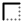</a> | **📂 檔名:** `border-alt-1.svg` ✨ **格式:** `Vector (SVG)` ⚖️ **大小:** `2.08KB` 📅 **更新:** `2026-03-03`  🚀 **jsDelivr Markdown:** `` 🔗 **直接連結 (Url):** <code>https://cdn.jsdelivr.net/gh/barry028/materials@main/images/iCons/Unicons/border-alt-1.svg</code> 📥 [檢視原始檔](border-alt-1.svg) |
|  | **📂 檔名:** `border-alt-2.svg` ✨ **格式:** `Vector (SVG)` ⚖️ **大小:** `1.15KB` 📅 **更新:** `2026-03-03`  🚀 **jsDelivr Markdown:** `` 🔗 **直接連結 (Url):** <code>https://cdn.jsdelivr.net/gh/barry028/materials@main/images/iCons/Unicons/border-alt-2.svg</code> 📥 [檢視原始檔](border-alt-2.svg) |
|  | **📂 檔名:** `border-alt-3.svg` ✨ **格式:** `Vector (SVG)` ⚖️ **大小:** `3.60KB` 📅 **更新:** `2026-03-03`  🚀 **jsDelivr Markdown:** `` 🔗 **直接連結 (Url):** <code>https://cdn.jsdelivr.net/gh/barry028/materials@main/images/iCons/Unicons/border-alt-3.svg</code> 📥 [檢視原始檔](border-alt-3.svg) |
|  | **📂 檔名:** `border-alt.svg` ✨ **格式:** `Vector (SVG)` ⚖️ **大小:** `3.66KB` 📅 **更新:** `2026-03-03`  🚀 **jsDelivr Markdown:** `` 🔗 **直接連結 (Url):** <code>https://cdn.jsdelivr.net/gh/barry028/materials@main/images/iCons/Unicons/border-alt.svg</code> 📥 [檢視原始檔](border-alt.svg) |
| <a href="border-bottom-1.svg">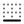</a> | **📂 檔名:** `border-bottom-1.svg` ✨ **格式:** `Vector (SVG)` ⚖️ **大小:** `2.90KB` 📅 **更新:** `2026-03-03`  🚀 **jsDelivr Markdown:** `` 🔗 **直接連結 (Url):** <code>https://cdn.jsdelivr.net/gh/barry028/materials@main/images/iCons/Unicons/border-bottom-1.svg</code> 📥 [檢視原始檔](border-bottom-1.svg) |
|  | **📂 檔名:** `border-bottom-2.svg` ✨ **格式:** `Vector (SVG)` ⚖️ **大小:** `1.82KB` 📅 **更新:** `2026-03-03`  🚀 **jsDelivr Markdown:** `` 🔗 **直接連結 (Url):** <code>https://cdn.jsdelivr.net/gh/barry028/materials@main/images/iCons/Unicons/border-bottom-2.svg</code> 📥 [檢視原始檔](border-bottom-2.svg) |
|  | **📂 檔名:** `border-bottom-3.svg` ✨ **格式:** `Vector (SVG)` ⚖️ **大小:** `4.52KB` 📅 **更新:** `2026-03-03`  🚀 **jsDelivr Markdown:** `` 🔗 **直接連結 (Url):** <code>https://cdn.jsdelivr.net/gh/barry028/materials@main/images/iCons/Unicons/border-bottom-3.svg</code> 📥 [檢視原始檔](border-bottom-3.svg) |
|  | **📂 檔名:** `border-bottom.svg` ✨ **格式:** `Vector (SVG)` ⚖️ **大小:** `7.40KB` 📅 **更新:** `2026-03-03`  🚀 **jsDelivr Markdown:** `` 🔗 **直接連結 (Url):** <code>https://cdn.jsdelivr.net/gh/barry028/materials@main/images/iCons/Unicons/border-bottom.svg</code> 📥 [檢視原始檔](border-bottom.svg) |
| <a href="border-clear-1.svg">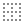</a> | **📂 檔名:** `border-clear-1.svg` ✨ **格式:** `Vector (SVG)` ⚖️ **大小:** `2.97KB` 📅 **更新:** `2026-03-03`  🚀 **jsDelivr Markdown:** `` 🔗 **直接連結 (Url):** <code>https://cdn.jsdelivr.net/gh/barry028/materials@main/images/iCons/Unicons/border-clear-1.svg</code> 📥 [檢視原始檔](border-clear-1.svg) |
|  | **📂 檔名:** `border-clear-2.svg` ✨ **格式:** `Vector (SVG)` ⚖️ **大小:** `1.87KB` 📅 **更新:** `2026-03-03`  🚀 **jsDelivr Markdown:** `` 🔗 **直接連結 (Url):** <code>https://cdn.jsdelivr.net/gh/barry028/materials@main/images/iCons/Unicons/border-clear-2.svg</code> 📥 [檢視原始檔](border-clear-2.svg) |
|  | **📂 檔名:** `border-clear-3.svg` ✨ **格式:** `Vector (SVG)` ⚖️ **大小:** `5.75KB` 📅 **更新:** `2026-03-03`  🚀 **jsDelivr Markdown:** `` 🔗 **直接連結 (Url):** <code>https://cdn.jsdelivr.net/gh/barry028/materials@main/images/iCons/Unicons/border-clear-3.svg</code> 📥 [檢視原始檔](border-clear-3.svg) |
|  | **📂 檔名:** `border-clear.svg` ✨ **格式:** `Vector (SVG)` ⚖️ **大小:** `9.05KB` 📅 **更新:** `2026-03-03`  🚀 **jsDelivr Markdown:** `` 🔗 **直接連結 (Url):** <code>https://cdn.jsdelivr.net/gh/barry028/materials@main/images/iCons/Unicons/border-clear.svg</code> 📥 [檢視原始檔](border-clear.svg) |
| <a href="border-horizontal-1.svg">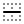</a> | **📂 檔名:** `border-horizontal-1.svg` ✨ **格式:** `Vector (SVG)` ⚖️ **大小:** `2.60KB` 📅 **更新:** `2026-03-03`  🚀 **jsDelivr Markdown:** `` 🔗 **直接連結 (Url):** <code>https://cdn.jsdelivr.net/gh/barry028/materials@main/images/iCons/Unicons/border-horizontal-1.svg</code> 📥 [檢視原始檔](border-horizontal-1.svg) |
|  | **📂 檔名:** `border-horizontal-2.svg` ✨ **格式:** `Vector (SVG)` ⚖️ **大小:** `1.52KB` 📅 **更新:** `2026-03-03`  🚀 **jsDelivr Markdown:** `` 🔗 **直接連結 (Url):** <code>https://cdn.jsdelivr.net/gh/barry028/materials@main/images/iCons/Unicons/border-horizontal-2.svg</code> 📥 [檢視原始檔](border-horizontal-2.svg) |
|  | **📂 檔名:** `border-horizontal-3.svg` ✨ **格式:** `Vector (SVG)` ⚖️ **大小:** `4.77KB` 📅 **更新:** `2026-03-03`  🚀 **jsDelivr Markdown:** `` 🔗 **直接連結 (Url):** <code>https://cdn.jsdelivr.net/gh/barry028/materials@main/images/iCons/Unicons/border-horizontal-3.svg</code> 📥 [檢視原始檔](border-horizontal-3.svg) |
|  | **📂 檔名:** `border-horizontal.svg` ✨ **格式:** `Vector (SVG)` ⚖️ **大小:** `7.23KB` 📅 **更新:** `2026-03-03`  🚀 **jsDelivr Markdown:** `` 🔗 **直接連結 (Url):** <code>https://cdn.jsdelivr.net/gh/barry028/materials@main/images/iCons/Unicons/border-horizontal.svg</code> 📥 [檢視原始檔](border-horizontal.svg) |
| <a href="border-inner-1.svg">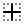</a> | **📂 檔名:** `border-inner-1.svg` ✨ **格式:** `Vector (SVG)` ⚖️ **大小:** `3.23KB` 📅 **更新:** `2026-03-03`  🚀 **jsDelivr Markdown:** `` 🔗 **直接連結 (Url):** <code>https://cdn.jsdelivr.net/gh/barry028/materials@main/images/iCons/Unicons/border-inner-1.svg</code> 📥 [檢視原始檔](border-inner-1.svg) |
|  | **📂 檔名:** `border-inner-2.svg` ✨ **格式:** `Vector (SVG)` ⚖️ **大小:** `1.28KB` 📅 **更新:** `2026-03-03`  🚀 **jsDelivr Markdown:** `` 🔗 **直接連結 (Url):** <code>https://cdn.jsdelivr.net/gh/barry028/materials@main/images/iCons/Unicons/border-inner-2.svg</code> 📥 [檢視原始檔](border-inner-2.svg) |
|  | **📂 檔名:** `border-inner-3.svg` ✨ **格式:** `Vector (SVG)` ⚖️ **大小:** `3.80KB` 📅 **更新:** `2026-03-03`  🚀 **jsDelivr Markdown:** `` 🔗 **直接連結 (Url):** <code>https://cdn.jsdelivr.net/gh/barry028/materials@main/images/iCons/Unicons/border-inner-3.svg</code> 📥 [檢視原始檔](border-inner-3.svg) |
|  | **📂 檔名:** `border-inner.svg` ✨ **格式:** `Vector (SVG)` ⚖️ **大小:** `5.84KB` 📅 **更新:** `2026-03-03`  🚀 **jsDelivr Markdown:** `` 🔗 **直接連結 (Url):** <code>https://cdn.jsdelivr.net/gh/barry028/materials@main/images/iCons/Unicons/border-inner.svg</code> 📥 [檢視原始檔](border-inner.svg) |
| <a href="border-left-1.svg">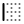</a> | **📂 檔名:** `border-left-1.svg` ✨ **格式:** `Vector (SVG)` ⚖️ **大小:** `3.13KB` 📅 **更新:** `2026-03-03`  🚀 **jsDelivr Markdown:** `` 🔗 **直接連結 (Url):** <code>https://cdn.jsdelivr.net/gh/barry028/materials@main/images/iCons/Unicons/border-left-1.svg</code> 📥 [檢視原始檔](border-left-1.svg) |
|  | **📂 檔名:** `border-left-2.svg` ✨ **格式:** `Vector (SVG)` ⚖️ **大小:** `1.87KB` 📅 **更新:** `2026-03-03`  🚀 **jsDelivr Markdown:** `` 🔗 **直接連結 (Url):** <code>https://cdn.jsdelivr.net/gh/barry028/materials@main/images/iCons/Unicons/border-left-2.svg</code> 📥 [檢視原始檔](border-left-2.svg) |
|  | **📂 檔名:** `border-left-3.svg` ✨ **格式:** `Vector (SVG)` ⚖️ **大小:** `4.71KB` 📅 **更新:** `2026-03-03`  🚀 **jsDelivr Markdown:** `` 🔗 **直接連結 (Url):** <code>https://cdn.jsdelivr.net/gh/barry028/materials@main/images/iCons/Unicons/border-left-3.svg</code> 📥 [檢視原始檔](border-left-3.svg) |
|  | **📂 檔名:** `border-left.svg` ✨ **格式:** `Vector (SVG)` ⚖️ **大小:** `7.39KB` 📅 **更新:** `2026-03-03`  🚀 **jsDelivr Markdown:** `` 🔗 **直接連結 (Url):** <code>https://cdn.jsdelivr.net/gh/barry028/materials@main/images/iCons/Unicons/border-left.svg</code> 📥 [檢視原始檔](border-left.svg) |
|  | **📂 檔名:** `border-out-1.svg` ✨ **格式:** `Vector (SVG)` ⚖️ **大小:** `1.55KB` 📅 **更新:** `2026-03-03`  🚀 **jsDelivr Markdown:** `` 🔗 **直接連結 (Url):** <code>https://cdn.jsdelivr.net/gh/barry028/materials@main/images/iCons/Unicons/border-out-1.svg</code> 📥 [檢視原始檔](border-out-1.svg) |
|  | **📂 檔名:** `border-out-2.svg` ✨ **格式:** `Vector (SVG)` ⚖️ **大小:** `687.00B` 📅 **更新:** `2026-03-03`  🚀 **jsDelivr Markdown:** `` 🔗 **直接連結 (Url):** <code>https://cdn.jsdelivr.net/gh/barry028/materials@main/images/iCons/Unicons/border-out-2.svg</code> 📥 [檢視原始檔](border-out-2.svg) |
|  | **📂 檔名:** `border-out-3.svg` ✨ **格式:** `Vector (SVG)` ⚖️ **大小:** `1.77KB` 📅 **更新:** `2026-03-03`  🚀 **jsDelivr Markdown:** `` 🔗 **直接連結 (Url):** <code>https://cdn.jsdelivr.net/gh/barry028/materials@main/images/iCons/Unicons/border-out-3.svg</code> 📥 [檢視原始檔](border-out-3.svg) |
|  | **📂 檔名:** `border-out.svg` ✨ **格式:** `Vector (SVG)` ⚖️ **大小:** `2.57KB` 📅 **更新:** `2026-03-03`  🚀 **jsDelivr Markdown:** `` 🔗 **直接連結 (Url):** <code>https://cdn.jsdelivr.net/gh/barry028/materials@main/images/iCons/Unicons/border-out.svg</code> 📥 [檢視原始檔](border-out.svg) |
| <a href="border-right-1.svg">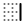</a> | **📂 檔名:** `border-right-1.svg` ✨ **格式:** `Vector (SVG)` ⚖️ **大小:** `3.08KB` 📅 **更新:** `2026-03-03`  🚀 **jsDelivr Markdown:** `` 🔗 **直接連結 (Url):** <code>https://cdn.jsdelivr.net/gh/barry028/materials@main/images/iCons/Unicons/border-right-1.svg</code> 📥 [檢視原始檔](border-right-1.svg) |
|  | **📂 檔名:** `border-right-2.svg` ✨ **格式:** `Vector (SVG)` ⚖️ **大小:** `1.82KB` 📅 **更新:** `2026-03-03`  🚀 **jsDelivr Markdown:** `` 🔗 **直接連結 (Url):** <code>https://cdn.jsdelivr.net/gh/barry028/materials@main/images/iCons/Unicons/border-right-2.svg</code> 📥 [檢視原始檔](border-right-2.svg) |
|  | **📂 檔名:** `border-right.svg` ✨ **格式:** `Vector (SVG)` ⚖️ **大小:** `7.40KB` 📅 **更新:** `2026-03-03`  🚀 **jsDelivr Markdown:** `` 🔗 **直接連結 (Url):** <code>https://cdn.jsdelivr.net/gh/barry028/materials@main/images/iCons/Unicons/border-right.svg</code> 📥 [檢視原始檔](border-right.svg) |
| <a href="border-top-1.svg">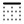</a> | **📂 檔名:** `border-top-1.svg` ✨ **格式:** `Vector (SVG)` ⚖️ **大小:** `2.94KB` 📅 **更新:** `2026-03-03`  🚀 **jsDelivr Markdown:** `` 🔗 **直接連結 (Url):** <code>https://cdn.jsdelivr.net/gh/barry028/materials@main/images/iCons/Unicons/border-top-1.svg</code> 📥 [檢視原始檔](border-top-1.svg) |
|  | **📂 檔名:** `border-top-2.svg` ✨ **格式:** `Vector (SVG)` ⚖️ **大小:** `1.87KB` 📅 **更新:** `2026-03-03`  🚀 **jsDelivr Markdown:** `` 🔗 **直接連結 (Url):** <code>https://cdn.jsdelivr.net/gh/barry028/materials@main/images/iCons/Unicons/border-top-2.svg</code> 📥 [檢視原始檔](border-top-2.svg) |
|  | **📂 檔名:** `border-top-3.svg` ✨ **格式:** `Vector (SVG)` ⚖️ **大小:** `4.58KB` 📅 **更新:** `2026-03-03`  🚀 **jsDelivr Markdown:** `` 🔗 **直接連結 (Url):** <code>https://cdn.jsdelivr.net/gh/barry028/materials@main/images/iCons/Unicons/border-top-3.svg</code> 📥 [檢視原始檔](border-top-3.svg) |
|  | **📂 檔名:** `border-top.svg` ✨ **格式:** `Vector (SVG)` ⚖️ **大小:** `7.39KB` 📅 **更新:** `2026-03-03`  🚀 **jsDelivr Markdown:** `` 🔗 **直接連結 (Url):** <code>https://cdn.jsdelivr.net/gh/barry028/materials@main/images/iCons/Unicons/border-top.svg</code> 📥 [檢視原始檔](border-top.svg) |
| <a href="border-vertical-1.svg">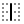</a> | **📂 檔名:** `border-vertical-1.svg` ✨ **格式:** `Vector (SVG)` ⚖️ **大小:** `2.79KB` 📅 **更新:** `2026-03-03`  🚀 **jsDelivr Markdown:** `` 🔗 **直接連結 (Url):** <code>https://cdn.jsdelivr.net/gh/barry028/materials@main/images/iCons/Unicons/border-vertical-1.svg</code> 📥 [檢視原始檔](border-vertical-1.svg) |
|  | **📂 檔名:** `border-vertical-2.svg` ✨ **格式:** `Vector (SVG)` ⚖️ **大小:** `1.52KB` 📅 **更新:** `2026-03-03`  🚀 **jsDelivr Markdown:** `` 🔗 **直接連結 (Url):** <code>https://cdn.jsdelivr.net/gh/barry028/materials@main/images/iCons/Unicons/border-vertical-2.svg</code> 📥 [檢視原始檔](border-vertical-2.svg) |
|  | **📂 檔名:** `border-vertical-3.svg` ✨ **格式:** `Vector (SVG)` ⚖️ **大小:** `4.79KB` 📅 **更新:** `2026-03-03`  🚀 **jsDelivr Markdown:** `` 🔗 **直接連結 (Url):** <code>https://cdn.jsdelivr.net/gh/barry028/materials@main/images/iCons/Unicons/border-vertical-3.svg</code> 📥 [檢視原始檔](border-vertical-3.svg) |
|  | **📂 檔名:** `border-vertical.svg` ✨ **格式:** `Vector (SVG)` ⚖️ **大小:** `7.23KB` 📅 **更新:** `2026-03-03`  🚀 **jsDelivr Markdown:** `` 🔗 **直接連結 (Url):** <code>https://cdn.jsdelivr.net/gh/barry028/materials@main/images/iCons/Unicons/border-vertical.svg</code> 📥 [檢視原始檔](border-vertical.svg) |
|  | **📂 檔名:** `bowling-ball.svg` ✨ **格式:** `Vector (SVG)` ⚖️ **大小:** `2.53KB` 📅 **更新:** `2026-03-03`  🚀 **jsDelivr Markdown:** `` 🔗 **直接連結 (Url):** <code>https://cdn.jsdelivr.net/gh/barry028/materials@main/images/iCons/Unicons/bowling-ball.svg</code> 📥 [檢視原始檔](bowling-ball.svg) |
|  | **📂 檔名:** `box-1.svg` ✨ **格式:** `Vector (SVG)` ⚖️ **大小:** `703.00B` 📅 **更新:** `2026-03-03`  🚀 **jsDelivr Markdown:** `` 🔗 **直接連結 (Url):** <code>https://cdn.jsdelivr.net/gh/barry028/materials@main/images/iCons/Unicons/box-1.svg</code> 📥 [檢視原始檔](box-1.svg) |
|  | **📂 檔名:** `box.svg` ✨ **格式:** `Vector (SVG)` ⚖️ **大小:** `1.29KB` 📅 **更新:** `2026-03-03`  🚀 **jsDelivr Markdown:** `` 🔗 **直接連結 (Url):** <code>https://cdn.jsdelivr.net/gh/barry028/materials@main/images/iCons/Unicons/box.svg</code> 📥 [檢視原始檔](box.svg) |
|  | **📂 檔名:** `brackets-curly.svg` ✨ **格式:** `Vector (SVG)` ⚖️ **大小:** `2.23KB` 📅 **更新:** `2026-03-03`  🚀 **jsDelivr Markdown:** `` 🔗 **直接連結 (Url):** <code>https://cdn.jsdelivr.net/gh/barry028/materials@main/images/iCons/Unicons/brackets-curly.svg</code> 📥 [檢視原始檔](brackets-curly.svg) |
|  | **📂 檔名:** `brain.svg` ✨ **格式:** `Vector (SVG)` ⚖️ **大小:** `7.33KB` 📅 **更新:** `2026-03-03`  🚀 **jsDelivr Markdown:** `` 🔗 **直接連結 (Url):** <code>https://cdn.jsdelivr.net/gh/barry028/materials@main/images/iCons/Unicons/brain.svg</code> 📥 [檢視原始檔](brain.svg) |
|  | **📂 檔名:** `briefcase-1.svg` ✨ **格式:** `Vector (SVG)` ⚖️ **大小:** `1.20KB` 📅 **更新:** `2026-03-03`  🚀 **jsDelivr Markdown:** `` 🔗 **直接連結 (Url):** <code>https://cdn.jsdelivr.net/gh/barry028/materials@main/images/iCons/Unicons/briefcase-1.svg</code> 📥 [檢視原始檔](briefcase-1.svg) |
|  | **📂 檔名:** `briefcase-2.svg` ✨ **格式:** `Vector (SVG)` ⚖️ **大小:** `532.00B` 📅 **更新:** `2026-03-03`  🚀 **jsDelivr Markdown:** `` 🔗 **直接連結 (Url):** <code>https://cdn.jsdelivr.net/gh/barry028/materials@main/images/iCons/Unicons/briefcase-2.svg</code> 📥 [檢視原始檔](briefcase-2.svg) |
|  | **📂 檔名:** `briefcase-alt.svg` ✨ **格式:** `Vector (SVG)` ⚖️ **大小:** `2.08KB` 📅 **更新:** `2026-03-03`  🚀 **jsDelivr Markdown:** `` 🔗 **直接連結 (Url):** <code>https://cdn.jsdelivr.net/gh/barry028/materials@main/images/iCons/Unicons/briefcase-alt.svg</code> 📥 [檢視原始檔](briefcase-alt.svg) |
|  | **📂 檔名:** `briefcase.svg` ✨ **格式:** `Vector (SVG)` ⚖️ **大小:** `1.86KB` 📅 **更新:** `2026-03-03`  🚀 **jsDelivr Markdown:** `` 🔗 **直接連結 (Url):** <code>https://cdn.jsdelivr.net/gh/barry028/materials@main/images/iCons/Unicons/briefcase.svg</code> 📥 [檢視原始檔](briefcase.svg) |
|  | **📂 檔名:** `bright.svg` ✨ **格式:** `Vector (SVG)` ⚖️ **大小:** `3.17KB` 📅 **更新:** `2026-03-03`  🚀 **jsDelivr Markdown:** `` 🔗 **直接連結 (Url):** <code>https://cdn.jsdelivr.net/gh/barry028/materials@main/images/iCons/Unicons/bright.svg</code> 📥 [檢視原始檔](bright.svg) |
|  | **📂 檔名:** `brightness-empty.svg` ✨ **格式:** `Vector (SVG)` ⚖️ **大小:** `2.14KB` 📅 **更新:** `2026-03-03`  🚀 **jsDelivr Markdown:** `` 🔗 **直接連結 (Url):** <code>https://cdn.jsdelivr.net/gh/barry028/materials@main/images/iCons/Unicons/brightness-empty.svg</code> 📥 [檢視原始檔](brightness-empty.svg) |
|  | **📂 檔名:** `brightness-half.svg` ✨ **格式:** `Vector (SVG)` ⚖️ **大小:** `2.74KB` 📅 **更新:** `2026-03-03`  🚀 **jsDelivr Markdown:** `` 🔗 **直接連結 (Url):** <code>https://cdn.jsdelivr.net/gh/barry028/materials@main/images/iCons/Unicons/brightness-half.svg</code> 📥 [檢視原始檔](brightness-half.svg) |
|  | **📂 檔名:** `brightness-low.svg` ✨ **格式:** `Vector (SVG)` ⚖️ **大小:** `4.55KB` 📅 **更新:** `2026-03-03`  🚀 **jsDelivr Markdown:** `` 🔗 **直接連結 (Url):** <code>https://cdn.jsdelivr.net/gh/barry028/materials@main/images/iCons/Unicons/brightness-low.svg</code> 📥 [檢視原始檔](brightness-low.svg) |
|  | **📂 檔名:** `brightness-minus.svg` ✨ **格式:** `Vector (SVG)` ⚖️ **大小:** `2.62KB` 📅 **更新:** `2026-03-03`  🚀 **jsDelivr Markdown:** `` 🔗 **直接連結 (Url):** <code>https://cdn.jsdelivr.net/gh/barry028/materials@main/images/iCons/Unicons/brightness-minus.svg</code> 📥 [檢視原始檔](brightness-minus.svg) |
|  | **📂 檔名:** `brightness-plus.svg` ✨ **格式:** `Vector (SVG)` ⚖️ **大小:** `2.98KB` 📅 **更新:** `2026-03-03`  🚀 **jsDelivr Markdown:** `` 🔗 **直接連結 (Url):** <code>https://cdn.jsdelivr.net/gh/barry028/materials@main/images/iCons/Unicons/brightness-plus.svg</code> 📥 [檢視原始檔](brightness-plus.svg) |
|  | **📂 檔名:** `brightness.svg` ✨ **格式:** `Vector (SVG)` ⚖️ **大小:** `4.12KB` 📅 **更新:** `2026-03-03`  🚀 **jsDelivr Markdown:** `` 🔗 **直接連結 (Url):** <code>https://cdn.jsdelivr.net/gh/barry028/materials@main/images/iCons/Unicons/brightness.svg</code> 📥 [檢視原始檔](brightness.svg) |
|  | **📂 檔名:** `bring-bottom.svg` ✨ **格式:** `Vector (SVG)` ⚖️ **大小:** `1.82KB` 📅 **更新:** `2026-03-03`  🚀 **jsDelivr Markdown:** `` 🔗 **直接連結 (Url):** <code>https://cdn.jsdelivr.net/gh/barry028/materials@main/images/iCons/Unicons/bring-bottom.svg</code> 📥 [檢視原始檔](bring-bottom.svg) |
|  | **📂 檔名:** `bring-front.svg` ✨ **格式:** `Vector (SVG)` ⚖️ **大小:** `1.74KB` 📅 **更新:** `2026-03-03`  🚀 **jsDelivr Markdown:** `` 🔗 **直接連結 (Url):** <code>https://cdn.jsdelivr.net/gh/barry028/materials@main/images/iCons/Unicons/bring-front.svg</code> 📥 [檢視原始檔](bring-front.svg) |
|  | **📂 檔名:** `browser.svg` ✨ **格式:** `Vector (SVG)` ⚖️ **大小:** `1.20KB` 📅 **更新:** `2026-03-03`  🚀 **jsDelivr Markdown:** `` 🔗 **直接連結 (Url):** <code>https://cdn.jsdelivr.net/gh/barry028/materials@main/images/iCons/Unicons/browser.svg</code> 📥 [檢視原始檔](browser.svg) |
|  | **📂 檔名:** `brush-alt.svg` ✨ **格式:** `Vector (SVG)` ⚖️ **大小:** `1.96KB` 📅 **更新:** `2026-03-03`  🚀 **jsDelivr Markdown:** `` 🔗 **直接連結 (Url):** <code>https://cdn.jsdelivr.net/gh/barry028/materials@main/images/iCons/Unicons/brush-alt.svg</code> 📥 [檢視原始檔](brush-alt.svg) |
|  | **📂 檔名:** `bug.svg` ✨ **格式:** `Vector (SVG)` ⚖️ **大小:** `2.82KB` 📅 **更新:** `2026-03-03`  🚀 **jsDelivr Markdown:** `` 🔗 **直接連結 (Url):** <code>https://cdn.jsdelivr.net/gh/barry028/materials@main/images/iCons/Unicons/bug.svg</code> 📥 [檢視原始檔](bug.svg) |
|  | **📂 檔名:** `building.svg` ✨ **格式:** `Vector (SVG)` ⚖️ **大小:** `1.99KB` 📅 **更新:** `2026-03-03`  🚀 **jsDelivr Markdown:** `` 🔗 **直接連結 (Url):** <code>https://cdn.jsdelivr.net/gh/barry028/materials@main/images/iCons/Unicons/building.svg</code> 📥 [檢視原始檔](building.svg) |
|  | **📂 檔名:** `bullseye.svg` ✨ **格式:** `Vector (SVG)` ⚖️ **大小:** `2.69KB` 📅 **更新:** `2026-03-03`  🚀 **jsDelivr Markdown:** `` 🔗 **直接連結 (Url):** <code>https://cdn.jsdelivr.net/gh/barry028/materials@main/images/iCons/Unicons/bullseye.svg</code> 📥 [檢視原始檔](bullseye.svg) |
|  | **📂 檔名:** `bus-alt.svg` ✨ **格式:** `Vector (SVG)` ⚖️ **大小:** `2.58KB` 📅 **更新:** `2026-03-03`  🚀 **jsDelivr Markdown:** `` 🔗 **直接連結 (Url):** <code>https://cdn.jsdelivr.net/gh/barry028/materials@main/images/iCons/Unicons/bus-alt.svg</code> 📥 [檢視原始檔](bus-alt.svg) |
|  | **📂 檔名:** `bus-school.svg` ✨ **格式:** `Vector (SVG)` ⚖️ **大小:** `2.45KB` 📅 **更新:** `2026-03-03`  🚀 **jsDelivr Markdown:** `` 🔗 **直接連結 (Url):** <code>https://cdn.jsdelivr.net/gh/barry028/materials@main/images/iCons/Unicons/bus-school.svg</code> 📥 [檢視原始檔](bus-school.svg) |
|  | **📂 檔名:** `bus.svg` ✨ **格式:** `Vector (SVG)` ⚖️ **大小:** `2.61KB` 📅 **更新:** `2026-03-03`  🚀 **jsDelivr Markdown:** `` 🔗 **直接連結 (Url):** <code>https://cdn.jsdelivr.net/gh/barry028/materials@main/images/iCons/Unicons/bus.svg</code> 📥 [檢視原始檔](bus.svg) |
|  | **📂 檔名:** `calculator-alt.svg` ✨ **格式:** `Vector (SVG)` ⚖️ **大小:** `3.23KB` 📅 **更新:** `2026-03-03`  🚀 **jsDelivr Markdown:** `` 🔗 **直接連結 (Url):** <code>https://cdn.jsdelivr.net/gh/barry028/materials@main/images/iCons/Unicons/calculator-alt.svg</code> 📥 [檢視原始檔](calculator-alt.svg) |
|  | **📂 檔名:** `calculator.svg` ✨ **格式:** `Vector (SVG)` ⚖️ **大小:** `4.74KB` 📅 **更新:** `2026-03-03`  🚀 **jsDelivr Markdown:** `` 🔗 **直接連結 (Url):** <code>https://cdn.jsdelivr.net/gh/barry028/materials@main/images/iCons/Unicons/calculator.svg</code> 📥 [檢視原始檔](calculator.svg) |
|  | **📂 檔名:** `calendar-alt.svg` ✨ **格式:** `Vector (SVG)` ⚖️ **大小:** `3.90KB` 📅 **更新:** `2026-03-03`  🚀 **jsDelivr Markdown:** `` 🔗 **直接連結 (Url):** <code>https://cdn.jsdelivr.net/gh/barry028/materials@main/images/iCons/Unicons/calendar-alt.svg</code> 📥 [檢視原始檔](calendar-alt.svg) |
|  | **📂 檔名:** `calendar-slash.svg` ✨ **格式:** `Vector (SVG)` ⚖️ **大小:** `2.27KB` 📅 **更新:** `2026-03-03`  🚀 **jsDelivr Markdown:** `` 🔗 **直接連結 (Url):** <code>https://cdn.jsdelivr.net/gh/barry028/materials@main/images/iCons/Unicons/calendar-slash.svg</code> 📥 [檢視原始檔](calendar-slash.svg) |
|  | **📂 檔名:** `calender-1.svg` ✨ **格式:** `Vector (SVG)` ⚖️ **大小:** `681.00B` 📅 **更新:** `2026-03-03`  🚀 **jsDelivr Markdown:** `` 🔗 **直接連結 (Url):** <code>https://cdn.jsdelivr.net/gh/barry028/materials@main/images/iCons/Unicons/calender-1.svg</code> 📥 [檢視原始檔](calender-1.svg) |
|  | **📂 檔名:** `calender-2.svg` ✨ **格式:** `Vector (SVG)` ⚖️ **大小:** `320.00B` 📅 **更新:** `2026-03-03`  🚀 **jsDelivr Markdown:** `` 🔗 **直接連結 (Url):** <code>https://cdn.jsdelivr.net/gh/barry028/materials@main/images/iCons/Unicons/calender-2.svg</code> 📥 [檢視原始檔](calender-2.svg) |
|  | **📂 檔名:** `calender-3.svg` ✨ **格式:** `Vector (SVG)` ⚖️ **大小:** `986.00B` 📅 **更新:** `2026-03-03`  🚀 **jsDelivr Markdown:** `` 🔗 **直接連結 (Url):** <code>https://cdn.jsdelivr.net/gh/barry028/materials@main/images/iCons/Unicons/calender-3.svg</code> 📥 [檢視原始檔](calender-3.svg) |
|  | **📂 檔名:** `calender.svg` ✨ **格式:** `Vector (SVG)` ⚖️ **大小:** `1.35KB` 📅 **更新:** `2026-03-03`  🚀 **jsDelivr Markdown:** `` 🔗 **直接連結 (Url):** <code>https://cdn.jsdelivr.net/gh/barry028/materials@main/images/iCons/Unicons/calender.svg</code> 📥 [檢視原始檔](calender.svg) |
|  | **📂 檔名:** `calling.svg` ✨ **格式:** `Vector (SVG)` ⚖️ **大小:** `3.84KB` 📅 **更新:** `2026-03-03`  🚀 **jsDelivr Markdown:** `` 🔗 **直接連結 (Url):** <code>https://cdn.jsdelivr.net/gh/barry028/materials@main/images/iCons/Unicons/calling.svg</code> 📥 [檢視原始檔](calling.svg) |
|  | **📂 檔名:** `camera-change.svg` ✨ **格式:** `Vector (SVG)` ⚖️ **大小:** `3.70KB` 📅 **更新:** `2026-03-03`  🚀 **jsDelivr Markdown:** `` 🔗 **直接連結 (Url):** <code>https://cdn.jsdelivr.net/gh/barry028/materials@main/images/iCons/Unicons/camera-change.svg</code> 📥 [檢視原始檔](camera-change.svg) |
|  | **📂 檔名:** `camera-plus.svg` ✨ **格式:** `Vector (SVG)` ⚖️ **大小:** `2.85KB` 📅 **更新:** `2026-03-03`  🚀 **jsDelivr Markdown:** `` 🔗 **直接連結 (Url):** <code>https://cdn.jsdelivr.net/gh/barry028/materials@main/images/iCons/Unicons/camera-plus.svg</code> 📥 [檢視原始檔](camera-plus.svg) |
|  | **📂 檔名:** `camera-slash.svg` ✨ **格式:** `Vector (SVG)` ⚖️ **大小:** `2.25KB` 📅 **更新:** `2026-03-03`  🚀 **jsDelivr Markdown:** `` 🔗 **直接連結 (Url):** <code>https://cdn.jsdelivr.net/gh/barry028/materials@main/images/iCons/Unicons/camera-slash.svg</code> 📥 [檢視原始檔](camera-slash.svg) |
|  | **📂 檔名:** `camera.svg` ✨ **格式:** `Vector (SVG)` ⚖️ **大小:** `2.41KB` 📅 **更新:** `2026-03-03`  🚀 **jsDelivr Markdown:** `` 🔗 **直接連結 (Url):** <code>https://cdn.jsdelivr.net/gh/barry028/materials@main/images/iCons/Unicons/camera.svg</code> 📥 [檢視原始檔](camera.svg) |
|  | **📂 檔名:** `cancel.svg` ✨ **格式:** `Vector (SVG)` ⚖️ **大小:** `2.08KB` 📅 **更新:** `2026-03-03`  🚀 **jsDelivr Markdown:** `` 🔗 **直接連結 (Url):** <code>https://cdn.jsdelivr.net/gh/barry028/materials@main/images/iCons/Unicons/cancel.svg</code> 📥 [檢視原始檔](cancel.svg) |
|  | **📂 檔名:** `capsule.svg` ✨ **格式:** `Vector (SVG)` ⚖️ **大小:** `1.19KB` 📅 **更新:** `2026-03-03`  🚀 **jsDelivr Markdown:** `` 🔗 **直接連結 (Url):** <code>https://cdn.jsdelivr.net/gh/barry028/materials@main/images/iCons/Unicons/capsule.svg</code> 📥 [檢視原始檔](capsule.svg) |
|  | **📂 檔名:** `capture.svg` ✨ **格式:** `Vector (SVG)` ⚖️ **大小:** `2.79KB` 📅 **更新:** `2026-03-03`  🚀 **jsDelivr Markdown:** `` 🔗 **直接連結 (Url):** <code>https://cdn.jsdelivr.net/gh/barry028/materials@main/images/iCons/Unicons/capture.svg</code> 📥 [檢視原始檔](capture.svg) |
|  | **📂 檔名:** `car-sideview.svg` ✨ **格式:** `Vector (SVG)` ⚖️ **大小:** `2.68KB` 📅 **更新:** `2026-03-03`  🚀 **jsDelivr Markdown:** `` 🔗 **直接連結 (Url):** <code>https://cdn.jsdelivr.net/gh/barry028/materials@main/images/iCons/Unicons/car-sideview.svg</code> 📥 [檢視原始檔](car-sideview.svg) |
|  | **📂 檔名:** `car-slash.svg` ✨ **格式:** `Vector (SVG)` ⚖️ **大小:** `2.94KB` 📅 **更新:** `2026-03-03`  🚀 **jsDelivr Markdown:** `` 🔗 **直接連結 (Url):** <code>https://cdn.jsdelivr.net/gh/barry028/materials@main/images/iCons/Unicons/car-slash.svg</code> 📥 [檢視原始檔](car-slash.svg) |
|  | **📂 檔名:** `car-wash.svg` ✨ **格式:** `Vector (SVG)` ⚖️ **大小:** `4.98KB` 📅 **更新:** `2026-03-03`  🚀 **jsDelivr Markdown:** `` 🔗 **直接連結 (Url):** <code>https://cdn.jsdelivr.net/gh/barry028/materials@main/images/iCons/Unicons/car-wash.svg</code> 📥 [檢視原始檔](car-wash.svg) |
|  | **📂 檔名:** `car.svg` ✨ **格式:** `Vector (SVG)` ⚖️ **大小:** `2.94KB` 📅 **更新:** `2026-03-03`  🚀 **jsDelivr Markdown:** `` 🔗 **直接連結 (Url):** <code>https://cdn.jsdelivr.net/gh/barry028/materials@main/images/iCons/Unicons/car.svg</code> 📥 [檢視原始檔](car.svg) |
|  | **📂 檔名:** `card-atm.svg` ✨ **格式:** `Vector (SVG)` ⚖️ **大小:** `2.28KB` 📅 **更新:** `2026-03-03`  🚀 **jsDelivr Markdown:** `` 🔗 **直接連結 (Url):** <code>https://cdn.jsdelivr.net/gh/barry028/materials@main/images/iCons/Unicons/card-atm.svg</code> 📥 [檢視原始檔](card-atm.svg) |
|  | **📂 檔名:** `caret-right.svg` ✨ **格式:** `Vector (SVG)` ⚖️ **大小:** `764.00B` 📅 **更新:** `2026-03-03`  🚀 **jsDelivr Markdown:** `` 🔗 **直接連結 (Url):** <code>https://cdn.jsdelivr.net/gh/barry028/materials@main/images/iCons/Unicons/caret-right.svg</code> 📥 [檢視原始檔](caret-right.svg) |
|  | **📂 檔名:** `cell.svg` ✨ **格式:** `Vector (SVG)` ⚖️ **大小:** `1.22KB` 📅 **更新:** `2026-03-03`  🚀 **jsDelivr Markdown:** `` 🔗 **直接連結 (Url):** <code>https://cdn.jsdelivr.net/gh/barry028/materials@main/images/iCons/Unicons/cell.svg</code> 📥 [檢視原始檔](cell.svg) |
|  | **📂 檔名:** `celsius.svg` ✨ **格式:** `Vector (SVG)` ⚖️ **大小:** `1.58KB` 📅 **更新:** `2026-03-03`  🚀 **jsDelivr Markdown:** `` 🔗 **直接連結 (Url):** <code>https://cdn.jsdelivr.net/gh/barry028/materials@main/images/iCons/Unicons/celsius.svg</code> 📥 [檢視原始檔](celsius.svg) |
|  | **📂 檔名:** `channel-add.svg` ✨ **格式:** `Vector (SVG)` ⚖️ **大小:** `4.01KB` 📅 **更新:** `2026-03-03`  🚀 **jsDelivr Markdown:** `` 🔗 **直接連結 (Url):** <code>https://cdn.jsdelivr.net/gh/barry028/materials@main/images/iCons/Unicons/channel-add.svg</code> 📥 [檢視原始檔](channel-add.svg) |
|  | **📂 檔名:** `channel.svg` ✨ **格式:** `Vector (SVG)` ⚖️ **大小:** `3.41KB` 📅 **更新:** `2026-03-03`  🚀 **jsDelivr Markdown:** `` 🔗 **直接連結 (Url):** <code>https://cdn.jsdelivr.net/gh/barry028/materials@main/images/iCons/Unicons/channel.svg</code> 📥 [檢視原始檔](channel.svg) |
|  | **📂 檔名:** `chart-1.svg` ✨ **格式:** `Vector (SVG)` ⚖️ **大小:** `2.83KB` 📅 **更新:** `2026-03-03`  🚀 **jsDelivr Markdown:** `` 🔗 **直接連結 (Url):** <code>https://cdn.jsdelivr.net/gh/barry028/materials@main/images/iCons/Unicons/chart-1.svg</code> 📥 [檢視原始檔](chart-1.svg) |
|  | **📂 檔名:** `chart-2.svg` ✨ **格式:** `Vector (SVG)` ⚖️ **大小:** `504.00B` 📅 **更新:** `2026-03-03`  🚀 **jsDelivr Markdown:** `` 🔗 **直接連結 (Url):** <code>https://cdn.jsdelivr.net/gh/barry028/materials@main/images/iCons/Unicons/chart-2.svg</code> 📥 [檢視原始檔](chart-2.svg) |
|  | **📂 檔名:** `chart-bar-alt.svg` ✨ **格式:** `Vector (SVG)` ⚖️ **大小:** `1.12KB` 📅 **更新:** `2026-03-03`  🚀 **jsDelivr Markdown:** `` 🔗 **直接連結 (Url):** <code>https://cdn.jsdelivr.net/gh/barry028/materials@main/images/iCons/Unicons/chart-bar-alt.svg</code> 📥 [檢視原始檔](chart-bar-alt.svg) |
|  | **📂 檔名:** `chart-bar.svg` ✨ **格式:** `Vector (SVG)` ⚖️ **大小:** `1.12KB` 📅 **更新:** `2026-03-03`  🚀 **jsDelivr Markdown:** `` 🔗 **直接連結 (Url):** <code>https://cdn.jsdelivr.net/gh/barry028/materials@main/images/iCons/Unicons/chart-bar.svg</code> 📥 [檢視原始檔](chart-bar.svg) |
|  | **📂 檔名:** `chart-down.svg` ✨ **格式:** `Vector (SVG)` ⚖️ **大小:** `1.34KB` 📅 **更新:** `2026-03-03`  🚀 **jsDelivr Markdown:** `` 🔗 **直接連結 (Url):** <code>https://cdn.jsdelivr.net/gh/barry028/materials@main/images/iCons/Unicons/chart-down.svg</code> 📥 [檢視原始檔](chart-down.svg) |
|  | **📂 檔名:** `chart-growth-1.svg` ✨ **格式:** `Vector (SVG)` ⚖️ **大小:** `575.00B` 📅 **更新:** `2026-03-03`  🚀 **jsDelivr Markdown:** `` 🔗 **直接連結 (Url):** <code>https://cdn.jsdelivr.net/gh/barry028/materials@main/images/iCons/Unicons/chart-growth-1.svg</code> 📥 [檢視原始檔](chart-growth-1.svg) |
|  | **📂 檔名:** `chart-growth-alt.svg` ✨ **格式:** `Vector (SVG)` ⚖️ **大小:** `1.12KB` 📅 **更新:** `2026-03-03`  🚀 **jsDelivr Markdown:** `` 🔗 **直接連結 (Url):** <code>https://cdn.jsdelivr.net/gh/barry028/materials@main/images/iCons/Unicons/chart-growth-alt.svg</code> 📥 [檢視原始檔](chart-growth-alt.svg) |
|  | **📂 檔名:** `chart-growth.svg` ✨ **格式:** `Vector (SVG)` ⚖️ **大小:** `1.12KB` 📅 **更新:** `2026-03-03`  🚀 **jsDelivr Markdown:** `` 🔗 **直接連結 (Url):** <code>https://cdn.jsdelivr.net/gh/barry028/materials@main/images/iCons/Unicons/chart-growth.svg</code> 📥 [檢視原始檔](chart-growth.svg) |
|  | **📂 檔名:** `chart-line.svg` ✨ **格式:** `Vector (SVG)` ⚖️ **大小:** `1.63KB` 📅 **更新:** `2026-03-03`  🚀 **jsDelivr Markdown:** `` 🔗 **直接連結 (Url):** <code>https://cdn.jsdelivr.net/gh/barry028/materials@main/images/iCons/Unicons/chart-line.svg</code> 📥 [檢視原始檔](chart-line.svg) |
|  | **📂 檔名:** `chart-pie-1.svg` ✨ **格式:** `Vector (SVG)` ⚖️ **大小:** `480.00B` 📅 **更新:** `2026-03-03`  🚀 **jsDelivr Markdown:** `` 🔗 **直接連結 (Url):** <code>https://cdn.jsdelivr.net/gh/barry028/materials@main/images/iCons/Unicons/chart-pie-1.svg</code> 📥 [檢視原始檔](chart-pie-1.svg) |
|  | **📂 檔名:** `chart-pie-2.svg` ✨ **格式:** `Vector (SVG)` ⚖️ **大小:** `292.00B` 📅 **更新:** `2026-03-03`  🚀 **jsDelivr Markdown:** `` 🔗 **直接連結 (Url):** <code>https://cdn.jsdelivr.net/gh/barry028/materials@main/images/iCons/Unicons/chart-pie-2.svg</code> 📥 [檢視原始檔](chart-pie-2.svg) |
|  | **📂 檔名:** `chart-pie-3.svg` ✨ **格式:** `Vector (SVG)` ⚖️ **大小:** `566.00B` 📅 **更新:** `2026-03-03`  🚀 **jsDelivr Markdown:** `` 🔗 **直接連結 (Url):** <code>https://cdn.jsdelivr.net/gh/barry028/materials@main/images/iCons/Unicons/chart-pie-3.svg</code> 📥 [檢視原始檔](chart-pie-3.svg) |
|  | **📂 檔名:** `chart-pie-alt.svg` ✨ **格式:** `Vector (SVG)` ⚖️ **大小:** `469.00B` 📅 **更新:** `2026-03-03`  🚀 **jsDelivr Markdown:** `` 🔗 **直接連結 (Url):** <code>https://cdn.jsdelivr.net/gh/barry028/materials@main/images/iCons/Unicons/chart-pie-alt.svg</code> 📥 [檢視原始檔](chart-pie-alt.svg) |
|  | **📂 檔名:** `chart-pie.svg` ✨ **格式:** `Vector (SVG)` ⚖️ **大小:** `1.21KB` 📅 **更新:** `2026-03-03`  🚀 **jsDelivr Markdown:** `` 🔗 **直接連結 (Url):** <code>https://cdn.jsdelivr.net/gh/barry028/materials@main/images/iCons/Unicons/chart-pie.svg</code> 📥 [檢視原始檔](chart-pie.svg) |
|  | **📂 檔名:** `chart.svg` ✨ **格式:** `Vector (SVG)` ⚖️ **大小:** `1.65KB` 📅 **更新:** `2026-03-03`  🚀 **jsDelivr Markdown:** `` 🔗 **直接連結 (Url):** <code>https://cdn.jsdelivr.net/gh/barry028/materials@main/images/iCons/Unicons/chart.svg</code> 📥 [檢視原始檔](chart.svg) |
|  | **📂 檔名:** `chat-bubble-user.svg` ✨ **格式:** `Vector (SVG)` ⚖️ **大小:** `2.58KB` 📅 **更新:** `2026-03-03`  🚀 **jsDelivr Markdown:** `` 🔗 **直接連結 (Url):** <code>https://cdn.jsdelivr.net/gh/barry028/materials@main/images/iCons/Unicons/chat-bubble-user.svg</code> 📥 [檢視原始檔](chat-bubble-user.svg) |
|  | **📂 檔名:** `chat-info.svg` ✨ **格式:** `Vector (SVG)` ⚖️ **大小:** `2.54KB` 📅 **更新:** `2026-03-03`  🚀 **jsDelivr Markdown:** `` 🔗 **直接連結 (Url):** <code>https://cdn.jsdelivr.net/gh/barry028/materials@main/images/iCons/Unicons/chat-info.svg</code> 📥 [檢視原始檔](chat-info.svg) |
|  | **📂 檔名:** `chat.svg` ✨ **格式:** `Vector (SVG)` ⚖️ **大小:** `1.03KB` 📅 **更新:** `2026-03-03`  🚀 **jsDelivr Markdown:** `` 🔗 **直接連結 (Url):** <code>https://cdn.jsdelivr.net/gh/barry028/materials@main/images/iCons/Unicons/chat.svg</code> 📥 [檢視原始檔](chat.svg) |
|  | **📂 檔名:** `check-1.svg` ✨ **格式:** `Vector (SVG)` ⚖️ **大小:** `965.00B` 📅 **更新:** `2026-03-03`  🚀 **jsDelivr Markdown:** `` 🔗 **直接連結 (Url):** <code>https://cdn.jsdelivr.net/gh/barry028/materials@main/images/iCons/Unicons/check-1.svg</code> 📥 [檢視原始檔](check-1.svg) |
|  | **📂 檔名:** `check-2.svg` ✨ **格式:** `Vector (SVG)` ⚖️ **大小:** `364.00B` 📅 **更新:** `2026-03-03`  🚀 **jsDelivr Markdown:** `` 🔗 **直接連結 (Url):** <code>https://cdn.jsdelivr.net/gh/barry028/materials@main/images/iCons/Unicons/check-2.svg</code> 📥 [檢視原始檔](check-2.svg) |
|  | **📂 檔名:** `check-3.svg` ✨ **格式:** `Vector (SVG)` ⚖️ **大小:** `494.00B` 📅 **更新:** `2026-03-03`  🚀 **jsDelivr Markdown:** `` 🔗 **直接連結 (Url):** <code>https://cdn.jsdelivr.net/gh/barry028/materials@main/images/iCons/Unicons/check-3.svg</code> 📥 [檢視原始檔](check-3.svg) |
|  | **📂 檔名:** `check-circle-1.svg` ✨ **格式:** `Vector (SVG)` ⚖️ **大小:** `1.87KB` 📅 **更新:** `2026-03-03`  🚀 **jsDelivr Markdown:** `` 🔗 **直接連結 (Url):** <code>https://cdn.jsdelivr.net/gh/barry028/materials@main/images/iCons/Unicons/check-circle-1.svg</code> 📥 [檢視原始檔](check-circle-1.svg) |
|  | **📂 檔名:** `check-circle-2.svg` ✨ **格式:** `Vector (SVG)` ⚖️ **大小:** `395.00B` 📅 **更新:** `2026-03-03`  🚀 **jsDelivr Markdown:** `` 🔗 **直接連結 (Url):** <code>https://cdn.jsdelivr.net/gh/barry028/materials@main/images/iCons/Unicons/check-circle-2.svg</code> 📥 [檢視原始檔](check-circle-2.svg) |
|  | **📂 檔名:** `check-circle-3.svg` ✨ **格式:** `Vector (SVG)` ⚖️ **大小:** `830.00B` 📅 **更新:** `2026-03-03`  🚀 **jsDelivr Markdown:** `` 🔗 **直接連結 (Url):** <code>https://cdn.jsdelivr.net/gh/barry028/materials@main/images/iCons/Unicons/check-circle-3.svg</code> 📥 [檢視原始檔](check-circle-3.svg) |
|  | **📂 檔名:** `check-circle.svg` ✨ **格式:** `Vector (SVG)` ⚖️ **大小:** `1.90KB` 📅 **更新:** `2026-03-03`  🚀 **jsDelivr Markdown:** `` 🔗 **直接連結 (Url):** <code>https://cdn.jsdelivr.net/gh/barry028/materials@main/images/iCons/Unicons/check-circle.svg</code> 📥 [檢視原始檔](check-circle.svg) |
|  | **📂 檔名:** `check-square-1.svg` ✨ **格式:** `Vector (SVG)` ⚖️ **大小:** `1.71KB` 📅 **更新:** `2026-03-03`  🚀 **jsDelivr Markdown:** `` 🔗 **直接連結 (Url):** <code>https://cdn.jsdelivr.net/gh/barry028/materials@main/images/iCons/Unicons/check-square-1.svg</code> 📥 [檢視原始檔](check-square-1.svg) |
|  | **📂 檔名:** `check-square-2.svg` ✨ **格式:** `Vector (SVG)` ⚖️ **大小:** `403.00B` 📅 **更新:** `2026-03-03`  🚀 **jsDelivr Markdown:** `` 🔗 **直接連結 (Url):** <code>https://cdn.jsdelivr.net/gh/barry028/materials@main/images/iCons/Unicons/check-square-2.svg</code> 📥 [檢視原始檔](check-square-2.svg) |
|  | **📂 檔名:** `check-square-3.svg` ✨ **格式:** `Vector (SVG)` ⚖️ **大小:** `815.00B` 📅 **更新:** `2026-03-03`  🚀 **jsDelivr Markdown:** `` 🔗 **直接連結 (Url):** <code>https://cdn.jsdelivr.net/gh/barry028/materials@main/images/iCons/Unicons/check-square-3.svg</code> 📥 [檢視原始檔](check-square-3.svg) |
|  | **📂 檔名:** `check-square.svg` ✨ **格式:** `Vector (SVG)` ⚖️ **大小:** `1.01KB` 📅 **更新:** `2026-03-03`  🚀 **jsDelivr Markdown:** `` 🔗 **直接連結 (Url):** <code>https://cdn.jsdelivr.net/gh/barry028/materials@main/images/iCons/Unicons/check-square.svg</code> 📥 [檢視原始檔](check-square.svg) |
|  | **📂 檔名:** `check.svg` ✨ **格式:** `Vector (SVG)` ⚖️ **大小:** `1.12KB` 📅 **更新:** `2026-03-03`  🚀 **jsDelivr Markdown:** `` 🔗 **直接連結 (Url):** <code>https://cdn.jsdelivr.net/gh/barry028/materials@main/images/iCons/Unicons/check.svg</code> 📥 [檢視原始檔](check.svg) |
|  | **📂 檔名:** `circle-1.svg` ✨ **格式:** `Vector (SVG)` ⚖️ **大小:** `242.00B` 📅 **更新:** `2026-03-03`  🚀 **jsDelivr Markdown:** `` 🔗 **直接連結 (Url):** <code>https://cdn.jsdelivr.net/gh/barry028/materials@main/images/iCons/Unicons/circle-1.svg</code> 📥 [檢視原始檔](circle-1.svg) |
|  | **📂 檔名:** `circle-layer-1.svg` ✨ **格式:** `Vector (SVG)` ⚖️ **大小:** `766.00B` 📅 **更新:** `2026-03-03`  🚀 **jsDelivr Markdown:** `` 🔗 **直接連結 (Url):** <code>https://cdn.jsdelivr.net/gh/barry028/materials@main/images/iCons/Unicons/circle-layer-1.svg</code> 📥 [檢視原始檔](circle-layer-1.svg) |
|  | **📂 檔名:** `circle-layer-2.svg` ✨ **格式:** `Vector (SVG)` ⚖️ **大小:** `484.00B` 📅 **更新:** `2026-03-03`  🚀 **jsDelivr Markdown:** `` 🔗 **直接連結 (Url):** <code>https://cdn.jsdelivr.net/gh/barry028/materials@main/images/iCons/Unicons/circle-layer-2.svg</code> 📥 [檢視原始檔](circle-layer-2.svg) |
|  | **📂 檔名:** `circle-layer-3.svg` ✨ **格式:** `Vector (SVG)` ⚖️ **大小:** `1.19KB` 📅 **更新:** `2026-03-03`  🚀 **jsDelivr Markdown:** `` 🔗 **直接連結 (Url):** <code>https://cdn.jsdelivr.net/gh/barry028/materials@main/images/iCons/Unicons/circle-layer-3.svg</code> 📥 [檢視原始檔](circle-layer-3.svg) |
|  | **📂 檔名:** `circle-layer.svg` ✨ **格式:** `Vector (SVG)` ⚖️ **大小:** `3.14KB` 📅 **更新:** `2026-03-03`  🚀 **jsDelivr Markdown:** `` 🔗 **直接連結 (Url):** <code>https://cdn.jsdelivr.net/gh/barry028/materials@main/images/iCons/Unicons/circle-layer.svg</code> 📥 [檢視原始檔](circle-layer.svg) |
|  | **📂 檔名:** `circle.svg` ✨ **格式:** `Vector (SVG)` ⚖️ **大小:** `1.08KB` 📅 **更新:** `2026-03-03`  🚀 **jsDelivr Markdown:** `` 🔗 **直接連結 (Url):** <code>https://cdn.jsdelivr.net/gh/barry028/materials@main/images/iCons/Unicons/circle.svg</code> 📥 [檢視原始檔](circle.svg) |
|  | **📂 檔名:** `circuit-1.svg` ✨ **格式:** `Vector (SVG)` ⚖️ **大小:** `2.53KB` 📅 **更新:** `2026-03-03`  🚀 **jsDelivr Markdown:** `` 🔗 **直接連結 (Url):** <code>https://cdn.jsdelivr.net/gh/barry028/materials@main/images/iCons/Unicons/circuit-1.svg</code> 📥 [檢視原始檔](circuit-1.svg) |
|  | **📂 檔名:** `circuit.svg` ✨ **格式:** `Vector (SVG)` ⚖️ **大小:** `4.31KB` 📅 **更新:** `2026-03-03`  🚀 **jsDelivr Markdown:** `` 🔗 **直接連結 (Url):** <code>https://cdn.jsdelivr.net/gh/barry028/materials@main/images/iCons/Unicons/circuit.svg</code> 📥 [檢視原始檔](circuit.svg) |
|  | **📂 檔名:** `clapper-board.svg` ✨ **格式:** `Vector (SVG)` ⚖️ **大小:** `837.00B` 📅 **更新:** `2026-03-03`  🚀 **jsDelivr Markdown:** `` 🔗 **直接連結 (Url):** <code>https://cdn.jsdelivr.net/gh/barry028/materials@main/images/iCons/Unicons/clapper-board.svg</code> 📥 [檢視原始檔](clapper-board.svg) |
|  | **📂 檔名:** `clinic-medical-1.svg` ✨ **格式:** `Vector (SVG)` ⚖️ **大小:** `2.37KB` 📅 **更新:** `2026-03-03`  🚀 **jsDelivr Markdown:** `` 🔗 **直接連結 (Url):** <code>https://cdn.jsdelivr.net/gh/barry028/materials@main/images/iCons/Unicons/clinic-medical-1.svg</code> 📥 [檢視原始檔](clinic-medical-1.svg) |
|  | **📂 檔名:** `clinic-medical-2.svg` ✨ **格式:** `Vector (SVG)` ⚖️ **大小:** `662.00B` 📅 **更新:** `2026-03-03`  🚀 **jsDelivr Markdown:** `` 🔗 **直接連結 (Url):** <code>https://cdn.jsdelivr.net/gh/barry028/materials@main/images/iCons/Unicons/clinic-medical-2.svg</code> 📥 [檢視原始檔](clinic-medical-2.svg) |
|  | **📂 檔名:** `clinic-medical-3.svg` ✨ **格式:** `Vector (SVG)` ⚖️ **大小:** `909.00B` 📅 **更新:** `2026-03-03`  🚀 **jsDelivr Markdown:** `` 🔗 **直接連結 (Url):** <code>https://cdn.jsdelivr.net/gh/barry028/materials@main/images/iCons/Unicons/clinic-medical-3.svg</code> 📥 [檢視原始檔](clinic-medical-3.svg) |
|  | **📂 檔名:** `clinic-medical.svg` ✨ **格式:** `Vector (SVG)` ⚖️ **大小:** `1.89KB` 📅 **更新:** `2026-03-03`  🚀 **jsDelivr Markdown:** `` 🔗 **直接連結 (Url):** <code>https://cdn.jsdelivr.net/gh/barry028/materials@main/images/iCons/Unicons/clinic-medical.svg</code> 📥 [檢視原始檔](clinic-medical.svg) |
|  | **📂 檔名:** `clipboard-alt.svg` ✨ **格式:** `Vector (SVG)` ⚖️ **大小:** `1.83KB` 📅 **更新:** `2026-03-03`  🚀 **jsDelivr Markdown:** `` 🔗 **直接連結 (Url):** <code>https://cdn.jsdelivr.net/gh/barry028/materials@main/images/iCons/Unicons/clipboard-alt.svg</code> 📥 [檢視原始檔](clipboard-alt.svg) |
|  | **📂 檔名:** `clipboard-blank.svg` ✨ **格式:** `Vector (SVG)` ⚖️ **大小:** `1.05KB` 📅 **更新:** `2026-03-03`  🚀 **jsDelivr Markdown:** `` 🔗 **直接連結 (Url):** <code>https://cdn.jsdelivr.net/gh/barry028/materials@main/images/iCons/Unicons/clipboard-blank.svg</code> 📥 [檢視原始檔](clipboard-blank.svg) |
|  | **📂 檔名:** `clipboard-notes.svg` ✨ **格式:** `Vector (SVG)` ⚖️ **大小:** `1.83KB` 📅 **更新:** `2026-03-03`  🚀 **jsDelivr Markdown:** `` 🔗 **直接連結 (Url):** <code>https://cdn.jsdelivr.net/gh/barry028/materials@main/images/iCons/Unicons/clipboard-notes.svg</code> 📥 [檢視原始檔](clipboard-notes.svg) |
|  | **📂 檔名:** `clipboard.svg` ✨ **格式:** `Vector (SVG)` ⚖️ **大小:** `1.22KB` 📅 **更新:** `2026-03-03`  🚀 **jsDelivr Markdown:** `` 🔗 **直接連結 (Url):** <code>https://cdn.jsdelivr.net/gh/barry028/materials@main/images/iCons/Unicons/clipboard.svg</code> 📥 [檢視原始檔](clipboard.svg) |
|  | **📂 檔名:** `clock-1.svg` ✨ **格式:** `Vector (SVG)` ⚖️ **大小:** `1.73KB` 📅 **更新:** `2026-03-03`  🚀 **jsDelivr Markdown:** `` 🔗 **直接連結 (Url):** <code>https://cdn.jsdelivr.net/gh/barry028/materials@main/images/iCons/Unicons/clock-1.svg</code> 📥 [檢視原始檔](clock-1.svg) |
|  | **📂 檔名:** `clock-2.svg` ✨ **格式:** `Vector (SVG)` ⚖️ **大小:** `369.00B` 📅 **更新:** `2026-03-03`  🚀 **jsDelivr Markdown:** `` 🔗 **直接連結 (Url):** <code>https://cdn.jsdelivr.net/gh/barry028/materials@main/images/iCons/Unicons/clock-2.svg</code> 📥 [檢視原始檔](clock-2.svg) |
|  | **📂 檔名:** `clock-3.svg` ✨ **格式:** `Vector (SVG)` ⚖️ **大小:** `672.00B` 📅 **更新:** `2026-03-03`  🚀 **jsDelivr Markdown:** `` 🔗 **直接連結 (Url):** <code>https://cdn.jsdelivr.net/gh/barry028/materials@main/images/iCons/Unicons/clock-3.svg</code> 📥 [檢視原始檔](clock-3.svg) |
|  | **📂 檔名:** `clock-eight-1.svg` ✨ **格式:** `Vector (SVG)` ⚖️ **大小:** `1.79KB` 📅 **更新:** `2026-03-03`  🚀 **jsDelivr Markdown:** `` 🔗 **直接連結 (Url):** <code>https://cdn.jsdelivr.net/gh/barry028/materials@main/images/iCons/Unicons/clock-eight-1.svg</code> 📥 [檢視原始檔](clock-eight-1.svg) |
|  | **📂 檔名:** `clock-eight-2.svg` ✨ **格式:** `Vector (SVG)` ⚖️ **大小:** `360.00B` 📅 **更新:** `2026-03-03`  🚀 **jsDelivr Markdown:** `` 🔗 **直接連結 (Url):** <code>https://cdn.jsdelivr.net/gh/barry028/materials@main/images/iCons/Unicons/clock-eight-2.svg</code> 📥 [檢視原始檔](clock-eight-2.svg) |
|  | **📂 檔名:** `clock-eight-3.svg` ✨ **格式:** `Vector (SVG)` ⚖️ **大小:** `688.00B` 📅 **更新:** `2026-03-03`  🚀 **jsDelivr Markdown:** `` 🔗 **直接連結 (Url):** <code>https://cdn.jsdelivr.net/gh/barry028/materials@main/images/iCons/Unicons/clock-eight-3.svg</code> 📥 [檢視原始檔](clock-eight-3.svg) |
|  | **📂 檔名:** `clock-eight.svg` ✨ **格式:** `Vector (SVG)` ⚖️ **大小:** `1.84KB` 📅 **更新:** `2026-03-03`  🚀 **jsDelivr Markdown:** `` 🔗 **直接連結 (Url):** <code>https://cdn.jsdelivr.net/gh/barry028/materials@main/images/iCons/Unicons/clock-eight.svg</code> 📥 [檢視原始檔](clock-eight.svg) |
|  | **📂 檔名:** `clock-five-1.svg` ✨ **格式:** `Vector (SVG)` ⚖️ **大小:** `1.43KB` 📅 **更新:** `2026-03-03`  🚀 **jsDelivr Markdown:** `` 🔗 **直接連結 (Url):** <code>https://cdn.jsdelivr.net/gh/barry028/materials@main/images/iCons/Unicons/clock-five-1.svg</code> 📥 [檢視原始檔](clock-five-1.svg) |
|  | **📂 檔名:** `clock-five-2.svg` ✨ **格式:** `Vector (SVG)` ⚖️ **大小:** `365.00B` 📅 **更新:** `2026-03-03`  🚀 **jsDelivr Markdown:** `` 🔗 **直接連結 (Url):** <code>https://cdn.jsdelivr.net/gh/barry028/materials@main/images/iCons/Unicons/clock-five-2.svg</code> 📥 [檢視原始檔](clock-five-2.svg) |
|  | **📂 檔名:** `clock-five-3.svg` ✨ **格式:** `Vector (SVG)` ⚖️ **大小:** `719.00B` 📅 **更新:** `2026-03-03`  🚀 **jsDelivr Markdown:** `` 🔗 **直接連結 (Url):** <code>https://cdn.jsdelivr.net/gh/barry028/materials@main/images/iCons/Unicons/clock-five-3.svg</code> 📥 [檢視原始檔](clock-five-3.svg) |
|  | **📂 檔名:** `clock-five.svg` ✨ **格式:** `Vector (SVG)` ⚖️ **大小:** `1.42KB` 📅 **更新:** `2026-03-03`  🚀 **jsDelivr Markdown:** `` 🔗 **直接連結 (Url):** <code>https://cdn.jsdelivr.net/gh/barry028/materials@main/images/iCons/Unicons/clock-five.svg</code> 📥 [檢視原始檔](clock-five.svg) |
|  | **📂 檔名:** `clock-nine-1.svg` ✨ **格式:** `Vector (SVG)` ⚖️ **大小:** `1.80KB` 📅 **更新:** `2026-03-03`  🚀 **jsDelivr Markdown:** `` 🔗 **直接連結 (Url):** <code>https://cdn.jsdelivr.net/gh/barry028/materials@main/images/iCons/Unicons/clock-nine-1.svg</code> 📥 [檢視原始檔](clock-nine-1.svg) |
|  | **📂 檔名:** `clock-nine-2.svg` ✨ **格式:** `Vector (SVG)` ⚖️ **大小:** `328.00B` 📅 **更新:** `2026-03-03`  🚀 **jsDelivr Markdown:** `` 🔗 **直接連結 (Url):** <code>https://cdn.jsdelivr.net/gh/barry028/materials@main/images/iCons/Unicons/clock-nine-2.svg</code> 📥 [檢視原始檔](clock-nine-2.svg) |
|  | **📂 檔名:** `clock-nine-3.svg` ✨ **格式:** `Vector (SVG)` ⚖️ **大小:** `595.00B` 📅 **更新:** `2026-03-03`  🚀 **jsDelivr Markdown:** `` 🔗 **直接連結 (Url):** <code>https://cdn.jsdelivr.net/gh/barry028/materials@main/images/iCons/Unicons/clock-nine-3.svg</code> 📥 [檢視原始檔](clock-nine-3.svg) |
|  | **📂 檔名:** `clock-nine.svg` ✨ **格式:** `Vector (SVG)` ⚖️ **大小:** `1.67KB` 📅 **更新:** `2026-03-03`  🚀 **jsDelivr Markdown:** `` 🔗 **直接連結 (Url):** <code>https://cdn.jsdelivr.net/gh/barry028/materials@main/images/iCons/Unicons/clock-nine.svg</code> 📥 [檢視原始檔](clock-nine.svg) |
|  | **📂 檔名:** `clock-seven-1.svg` ✨ **格式:** `Vector (SVG)` ⚖️ **大小:** `1.53KB` 📅 **更新:** `2026-03-03`  🚀 **jsDelivr Markdown:** `` 🔗 **直接連結 (Url):** <code>https://cdn.jsdelivr.net/gh/barry028/materials@main/images/iCons/Unicons/clock-seven-1.svg</code> 📥 [檢視原始檔](clock-seven-1.svg) |
|  | **📂 檔名:** `clock-seven-2.svg` ✨ **格式:** `Vector (SVG)` ⚖️ **大小:** `364.00B` 📅 **更新:** `2026-03-03`  🚀 **jsDelivr Markdown:** `` 🔗 **直接連結 (Url):** <code>https://cdn.jsdelivr.net/gh/barry028/materials@main/images/iCons/Unicons/clock-seven-2.svg</code> 📥 [檢視原始檔](clock-seven-2.svg) |
|  | **📂 檔名:** `clock-seven-3.svg` ✨ **格式:** `Vector (SVG)` ⚖️ **大小:** `716.00B` 📅 **更新:** `2026-03-03`  🚀 **jsDelivr Markdown:** `` 🔗 **直接連結 (Url):** <code>https://cdn.jsdelivr.net/gh/barry028/materials@main/images/iCons/Unicons/clock-seven-3.svg</code> 📥 [檢視原始檔](clock-seven-3.svg) |
|  | **📂 檔名:** `clock-seven.svg` ✨ **格式:** `Vector (SVG)` ⚖️ **大小:** `1.61KB` 📅 **更新:** `2026-03-03`  🚀 **jsDelivr Markdown:** `` 🔗 **直接連結 (Url):** <code>https://cdn.jsdelivr.net/gh/barry028/materials@main/images/iCons/Unicons/clock-seven.svg</code> 📥 [檢視原始檔](clock-seven.svg) |
|  | **📂 檔名:** `clock-ten-1.svg` ✨ **格式:** `Vector (SVG)` ⚖️ **大小:** `832.00B` 📅 **更新:** `2026-03-03`  🚀 **jsDelivr Markdown:** `` 🔗 **直接連結 (Url):** <code>https://cdn.jsdelivr.net/gh/barry028/materials@main/images/iCons/Unicons/clock-ten-1.svg</code> 📥 [檢視原始檔](clock-ten-1.svg) |
|  | **📂 檔名:** `clock-ten-2.svg` ✨ **格式:** `Vector (SVG)` ⚖️ **大小:** `377.00B` 📅 **更新:** `2026-03-03`  🚀 **jsDelivr Markdown:** `` 🔗 **直接連結 (Url):** <code>https://cdn.jsdelivr.net/gh/barry028/materials@main/images/iCons/Unicons/clock-ten-2.svg</code> 📥 [檢視原始檔](clock-ten-2.svg) |
|  | **📂 檔名:** `clock-ten-3.svg` ✨ **格式:** `Vector (SVG)` ⚖️ **大小:** `656.00B` 📅 **更新:** `2026-03-03`  🚀 **jsDelivr Markdown:** `` 🔗 **直接連結 (Url):** <code>https://cdn.jsdelivr.net/gh/barry028/materials@main/images/iCons/Unicons/clock-ten-3.svg</code> 📥 [檢視原始檔](clock-ten-3.svg) |
|  | **📂 檔名:** `clock-ten.svg` ✨ **格式:** `Vector (SVG)` ⚖️ **大小:** `1.74KB` 📅 **更新:** `2026-03-03`  🚀 **jsDelivr Markdown:** `` 🔗 **直接連結 (Url):** <code>https://cdn.jsdelivr.net/gh/barry028/materials@main/images/iCons/Unicons/clock-ten.svg</code> 📥 [檢視原始檔](clock-ten.svg) |
|  | **📂 檔名:** `clock-three-1.svg` ✨ **格式:** `Vector (SVG)` ⚖️ **大小:** `1.76KB` 📅 **更新:** `2026-03-03`  🚀 **jsDelivr Markdown:** `` 🔗 **直接連結 (Url):** <code>https://cdn.jsdelivr.net/gh/barry028/materials@main/images/iCons/Unicons/clock-three-1.svg</code> 📥 [檢視原始檔](clock-three-1.svg) |
|  | **📂 檔名:** `clock-three-2.svg` ✨ **格式:** `Vector (SVG)` ⚖️ **大小:** `335.00B` 📅 **更新:** `2026-03-03`  🚀 **jsDelivr Markdown:** `` 🔗 **直接連結 (Url):** <code>https://cdn.jsdelivr.net/gh/barry028/materials@main/images/iCons/Unicons/clock-three-2.svg</code> 📥 [檢視原始檔](clock-three-2.svg) |
|  | **📂 檔名:** `clock-three-3.svg` ✨ **格式:** `Vector (SVG)` ⚖️ **大小:** `605.00B` 📅 **更新:** `2026-03-03`  🚀 **jsDelivr Markdown:** `` 🔗 **直接連結 (Url):** <code>https://cdn.jsdelivr.net/gh/barry028/materials@main/images/iCons/Unicons/clock-three-3.svg</code> 📥 [檢視原始檔](clock-three-3.svg) |
|  | **📂 檔名:** `clock-three.svg` ✨ **格式:** `Vector (SVG)` ⚖️ **大小:** `1.39KB` 📅 **更新:** `2026-03-03`  🚀 **jsDelivr Markdown:** `` 🔗 **直接連結 (Url):** <code>https://cdn.jsdelivr.net/gh/barry028/materials@main/images/iCons/Unicons/clock-three.svg</code> 📥 [檢視原始檔](clock-three.svg) |
|  | **📂 檔名:** `clock-two-1.svg` ✨ **格式:** `Vector (SVG)` ⚖️ **大小:** `832.00B` 📅 **更新:** `2026-03-03`  🚀 **jsDelivr Markdown:** `` 🔗 **直接連結 (Url):** <code>https://cdn.jsdelivr.net/gh/barry028/materials@main/images/iCons/Unicons/clock-two-1.svg</code> 📥 [檢視原始檔](clock-two-1.svg) |
|  | **📂 檔名:** `clock-two-2.svg` ✨ **格式:** `Vector (SVG)` ⚖️ **大小:** `394.00B` 📅 **更新:** `2026-03-03`  🚀 **jsDelivr Markdown:** `` 🔗 **直接連結 (Url):** <code>https://cdn.jsdelivr.net/gh/barry028/materials@main/images/iCons/Unicons/clock-two-2.svg</code> 📥 [檢視原始檔](clock-two-2.svg) |
|  | **📂 檔名:** `clock-two-3.svg` ✨ **格式:** `Vector (SVG)` ⚖️ **大小:** `665.00B` 📅 **更新:** `2026-03-03`  🚀 **jsDelivr Markdown:** `` 🔗 **直接連結 (Url):** <code>https://cdn.jsdelivr.net/gh/barry028/materials@main/images/iCons/Unicons/clock-two-3.svg</code> 📥 [檢視原始檔](clock-two-3.svg) |
|  | **📂 檔名:** `clock-two.svg` ✨ **格式:** `Vector (SVG)` ⚖️ **大小:** `1.72KB` 📅 **更新:** `2026-03-03`  🚀 **jsDelivr Markdown:** `` 🔗 **直接連結 (Url):** <code>https://cdn.jsdelivr.net/gh/barry028/materials@main/images/iCons/Unicons/clock-two.svg</code> 📥 [檢視原始檔](clock-two.svg) |
|  | **📂 檔名:** `clock.svg` ✨ **格式:** `Vector (SVG)` ⚖️ **大小:** `1.65KB` 📅 **更新:** `2026-03-03`  🚀 **jsDelivr Markdown:** `` 🔗 **直接連結 (Url):** <code>https://cdn.jsdelivr.net/gh/barry028/materials@main/images/iCons/Unicons/clock.svg</code> 📥 [檢視原始檔](clock.svg) |
|  | **📂 檔名:** `closed-captioning-slash.svg` ✨ **格式:** `Vector (SVG)` ⚖️ **大小:** `3.38KB` 📅 **更新:** `2026-03-03`  🚀 **jsDelivr Markdown:** `` 🔗 **直接連結 (Url):** <code>https://cdn.jsdelivr.net/gh/barry028/materials@main/images/iCons/Unicons/closed-captioning-slash.svg</code> 📥 [檢視原始檔](closed-captioning-slash.svg) |
|  | **📂 檔名:** `closed-captioning.svg` ✨ **格式:** `Vector (SVG)` ⚖️ **大小:** `3.81KB` 📅 **更新:** `2026-03-03`  🚀 **jsDelivr Markdown:** `` 🔗 **直接連結 (Url):** <code>https://cdn.jsdelivr.net/gh/barry028/materials@main/images/iCons/Unicons/closed-captioning.svg</code> 📥 [檢視原始檔](closed-captioning.svg) |
|  | **📂 檔名:** `cloud-block.svg` ✨ **格式:** `Vector (SVG)` ⚖️ **大小:** `2.65KB` 📅 **更新:** `2026-03-03`  🚀 **jsDelivr Markdown:** `` 🔗 **直接連結 (Url):** <code>https://cdn.jsdelivr.net/gh/barry028/materials@main/images/iCons/Unicons/cloud-block.svg</code> 📥 [檢視原始檔](cloud-block.svg) |
|  | **📂 檔名:** `cloud-bookmark.svg` ✨ **格式:** `Vector (SVG)` ⚖️ **大小:** `2.40KB` 📅 **更新:** `2026-03-03`  🚀 **jsDelivr Markdown:** `` 🔗 **直接連結 (Url):** <code>https://cdn.jsdelivr.net/gh/barry028/materials@main/images/iCons/Unicons/cloud-bookmark.svg</code> 📥 [檢視原始檔](cloud-bookmark.svg) |
|  | **📂 檔名:** `cloud-check.svg` ✨ **格式:** `Vector (SVG)` ⚖️ **大小:** `2.78KB` 📅 **更新:** `2026-03-03`  🚀 **jsDelivr Markdown:** `` 🔗 **直接連結 (Url):** <code>https://cdn.jsdelivr.net/gh/barry028/materials@main/images/iCons/Unicons/cloud-check.svg</code> 📥 [檢視原始檔](cloud-check.svg) |
|  | **📂 檔名:** `cloud-computing.svg` ✨ **格式:** `Vector (SVG)` ⚖️ **大小:** `2.22KB` 📅 **更新:** `2026-03-03`  🚀 **jsDelivr Markdown:** `` 🔗 **直接連結 (Url):** <code>https://cdn.jsdelivr.net/gh/barry028/materials@main/images/iCons/Unicons/cloud-computing.svg</code> 📥 [檢視原始檔](cloud-computing.svg) |
|  | **📂 檔名:** `cloud-data-connection.svg` ✨ **格式:** `Vector (SVG)` ⚖️ **大小:** `2.52KB` 📅 **更新:** `2026-03-03`  🚀 **jsDelivr Markdown:** `` 🔗 **直接連結 (Url):** <code>https://cdn.jsdelivr.net/gh/barry028/materials@main/images/iCons/Unicons/cloud-data-connection.svg</code> 📥 [檢視原始檔](cloud-data-connection.svg) |
|  | **📂 檔名:** `cloud-database-tree.svg` ✨ **格式:** `Vector (SVG)` ⚖️ **大小:** `2.16KB` 📅 **更新:** `2026-03-03`  🚀 **jsDelivr Markdown:** `` 🔗 **直接連結 (Url):** <code>https://cdn.jsdelivr.net/gh/barry028/materials@main/images/iCons/Unicons/cloud-database-tree.svg</code> 📥 [檢視原始檔](cloud-database-tree.svg) |
|  | **📂 檔名:** `cloud-download.svg` ✨ **格式:** `Vector (SVG)` ⚖️ **大小:** `2.85KB` 📅 **更新:** `2026-03-03`  🚀 **jsDelivr Markdown:** `` 🔗 **直接連結 (Url):** <code>https://cdn.jsdelivr.net/gh/barry028/materials@main/images/iCons/Unicons/cloud-download.svg</code> 📥 [檢視原始檔](cloud-download.svg) |
|  | **📂 檔名:** `cloud-drizzle.svg` ✨ **格式:** `Vector (SVG)` ⚖️ **大小:** `4.17KB` 📅 **更新:** `2026-03-03`  🚀 **jsDelivr Markdown:** `` 🔗 **直接連結 (Url):** <code>https://cdn.jsdelivr.net/gh/barry028/materials@main/images/iCons/Unicons/cloud-drizzle.svg</code> 📥 [檢視原始檔](cloud-drizzle.svg) |
|  | **📂 檔名:** `cloud-exclamation.svg` ✨ **格式:** `Vector (SVG)` ⚖️ **大小:** `2.63KB` 📅 **更新:** `2026-03-03`  🚀 **jsDelivr Markdown:** `` 🔗 **直接連結 (Url):** <code>https://cdn.jsdelivr.net/gh/barry028/materials@main/images/iCons/Unicons/cloud-exclamation.svg</code> 📥 [檢視原始檔](cloud-exclamation.svg) |
|  | **📂 檔名:** `cloud-hail.svg` ✨ **格式:** `Vector (SVG)` ⚖️ **大小:** `5.85KB` 📅 **更新:** `2026-03-03`  🚀 **jsDelivr Markdown:** `` 🔗 **直接連結 (Url):** <code>https://cdn.jsdelivr.net/gh/barry028/materials@main/images/iCons/Unicons/cloud-hail.svg</code> 📥 [檢視原始檔](cloud-hail.svg) |
|  | **📂 檔名:** `cloud-heart.svg` ✨ **格式:** `Vector (SVG)` ⚖️ **大小:** `3.09KB` 📅 **更新:** `2026-03-03`  🚀 **jsDelivr Markdown:** `` 🔗 **直接連結 (Url):** <code>https://cdn.jsdelivr.net/gh/barry028/materials@main/images/iCons/Unicons/cloud-heart.svg</code> 📥 [檢視原始檔](cloud-heart.svg) |
|  | **📂 檔名:** `cloud-info.svg` ✨ **格式:** `Vector (SVG)` ⚖️ **大小:** `2.56KB` 📅 **更新:** `2026-03-03`  🚀 **jsDelivr Markdown:** `` 🔗 **直接連結 (Url):** <code>https://cdn.jsdelivr.net/gh/barry028/materials@main/images/iCons/Unicons/cloud-info.svg</code> 📥 [檢視原始檔](cloud-info.svg) |
|  | **📂 檔名:** `cloud-lock.svg` ✨ **格式:** `Vector (SVG)` ⚖️ **大小:** `2.87KB` 📅 **更新:** `2026-03-03`  🚀 **jsDelivr Markdown:** `` 🔗 **直接連結 (Url):** <code>https://cdn.jsdelivr.net/gh/barry028/materials@main/images/iCons/Unicons/cloud-lock.svg</code> 📥 [檢視原始檔](cloud-lock.svg) |
|  | **📂 檔名:** `cloud-meatball.svg` ✨ **格式:** `Vector (SVG)` ⚖️ **大小:** `3.24KB` 📅 **更新:** `2026-03-03`  🚀 **jsDelivr Markdown:** `` 🔗 **直接連結 (Url):** <code>https://cdn.jsdelivr.net/gh/barry028/materials@main/images/iCons/Unicons/cloud-meatball.svg</code> 📥 [檢視原始檔](cloud-meatball.svg) |
|  | **📂 檔名:** `cloud-moon-hail.svg` ✨ **格式:** `Vector (SVG)` ⚖️ **大小:** `5.40KB` 📅 **更新:** `2026-03-03`  🚀 **jsDelivr Markdown:** `` 🔗 **直接連結 (Url):** <code>https://cdn.jsdelivr.net/gh/barry028/materials@main/images/iCons/Unicons/cloud-moon-hail.svg</code> 📥 [檢視原始檔](cloud-moon-hail.svg) |
|  | **📂 檔名:** `cloud-moon-meatball.svg` ✨ **格式:** `Vector (SVG)` ⚖️ **大小:** `4.68KB` 📅 **更新:** `2026-03-03`  🚀 **jsDelivr Markdown:** `` 🔗 **直接連結 (Url):** <code>https://cdn.jsdelivr.net/gh/barry028/materials@main/images/iCons/Unicons/cloud-moon-meatball.svg</code> 📥 [檢視原始檔](cloud-moon-meatball.svg) |
|  | **📂 檔名:** `cloud-moon-rain.svg` ✨ **格式:** `Vector (SVG)` ⚖️ **大小:** `4.39KB` 📅 **更新:** `2026-03-03`  🚀 **jsDelivr Markdown:** `` 🔗 **直接連結 (Url):** <code>https://cdn.jsdelivr.net/gh/barry028/materials@main/images/iCons/Unicons/cloud-moon-rain.svg</code> 📥 [檢視原始檔](cloud-moon-rain.svg) |
|  | **📂 檔名:** `cloud-moon-showers.svg` ✨ **格式:** `Vector (SVG)` ⚖️ **大小:** `3.72KB` 📅 **更新:** `2026-03-03`  🚀 **jsDelivr Markdown:** `` 🔗 **直接連結 (Url):** <code>https://cdn.jsdelivr.net/gh/barry028/materials@main/images/iCons/Unicons/cloud-moon-showers.svg</code> 📥 [檢視原始檔](cloud-moon-showers.svg) |
|  | **📂 檔名:** `cloud-moon.svg` ✨ **格式:** `Vector (SVG)` ⚖️ **大小:** `2.70KB` 📅 **更新:** `2026-03-03`  🚀 **jsDelivr Markdown:** `` 🔗 **直接連結 (Url):** <code>https://cdn.jsdelivr.net/gh/barry028/materials@main/images/iCons/Unicons/cloud-moon.svg</code> 📥 [檢視原始檔](cloud-moon.svg) |
|  | **📂 檔名:** `cloud-question.svg` ✨ **格式:** `Vector (SVG)` ⚖️ **大小:** `3.39KB` 📅 **更新:** `2026-03-03`  🚀 **jsDelivr Markdown:** `` 🔗 **直接連結 (Url):** <code>https://cdn.jsdelivr.net/gh/barry028/materials@main/images/iCons/Unicons/cloud-question.svg</code> 📥 [檢視原始檔](cloud-question.svg) |
|  | **📂 檔名:** `cloud-rain-sun.svg` ✨ **格式:** `Vector (SVG)` ⚖️ **大小:** `4.02KB` 📅 **更新:** `2026-03-03`  🚀 **jsDelivr Markdown:** `` 🔗 **直接連結 (Url):** <code>https://cdn.jsdelivr.net/gh/barry028/materials@main/images/iCons/Unicons/cloud-rain-sun.svg</code> 📥 [檢視原始檔](cloud-rain-sun.svg) |
|  | **📂 檔名:** `cloud-rain.svg` ✨ **格式:** `Vector (SVG)` ⚖️ **大小:** `2.53KB` 📅 **更新:** `2026-03-03`  🚀 **jsDelivr Markdown:** `` 🔗 **直接連結 (Url):** <code>https://cdn.jsdelivr.net/gh/barry028/materials@main/images/iCons/Unicons/cloud-rain.svg</code> 📥 [檢視原始檔](cloud-rain.svg) |
|  | **📂 檔名:** `cloud-redo.svg` ✨ **格式:** `Vector (SVG)` ⚖️ **大小:** `3.38KB` 📅 **更新:** `2026-03-03`  🚀 **jsDelivr Markdown:** `` 🔗 **直接連結 (Url):** <code>https://cdn.jsdelivr.net/gh/barry028/materials@main/images/iCons/Unicons/cloud-redo.svg</code> 📥 [檢視原始檔](cloud-redo.svg) |
|  | **📂 檔名:** `cloud-share.svg` ✨ **格式:** `Vector (SVG)` ⚖️ **大小:** `2.87KB` 📅 **更新:** `2026-03-03`  🚀 **jsDelivr Markdown:** `` 🔗 **直接連結 (Url):** <code>https://cdn.jsdelivr.net/gh/barry028/materials@main/images/iCons/Unicons/cloud-share.svg</code> 📥 [檢視原始檔](cloud-share.svg) |
|  | **📂 檔名:** `cloud-shield.svg` ✨ **格式:** `Vector (SVG)` ⚖️ **大小:** `3.00KB` 📅 **更新:** `2026-03-03`  🚀 **jsDelivr Markdown:** `` 🔗 **直接連結 (Url):** <code>https://cdn.jsdelivr.net/gh/barry028/materials@main/images/iCons/Unicons/cloud-shield.svg</code> 📥 [檢視原始檔](cloud-shield.svg) |
|  | **📂 檔名:** `cloud-showers-alt.svg` ✨ **格式:** `Vector (SVG)` ⚖️ **大小:** `2.87KB` 📅 **更新:** `2026-03-03`  🚀 **jsDelivr Markdown:** `` 🔗 **直接連結 (Url):** <code>https://cdn.jsdelivr.net/gh/barry028/materials@main/images/iCons/Unicons/cloud-showers-alt.svg</code> 📥 [檢視原始檔](cloud-showers-alt.svg) |
|  | **📂 檔名:** `cloud-showers-heavy.svg` ✨ **格式:** `Vector (SVG)` ⚖️ **大小:** `4.66KB` 📅 **更新:** `2026-03-03`  🚀 **jsDelivr Markdown:** `` 🔗 **直接連結 (Url):** <code>https://cdn.jsdelivr.net/gh/barry028/materials@main/images/iCons/Unicons/cloud-showers-heavy.svg</code> 📥 [檢視原始檔](cloud-showers-heavy.svg) |
|  | **📂 檔名:** `cloud-showers.svg` ✨ **格式:** `Vector (SVG)` ⚖️ **大小:** `3.84KB` 📅 **更新:** `2026-03-03`  🚀 **jsDelivr Markdown:** `` 🔗 **直接連結 (Url):** <code>https://cdn.jsdelivr.net/gh/barry028/materials@main/images/iCons/Unicons/cloud-showers.svg</code> 📥 [檢視原始檔](cloud-showers.svg) |
|  | **📂 檔名:** `cloud-slash.svg` ✨ **格式:** `Vector (SVG)` ⚖️ **大小:** `2.49KB` 📅 **更新:** `2026-03-03`  🚀 **jsDelivr Markdown:** `` 🔗 **直接連結 (Url):** <code>https://cdn.jsdelivr.net/gh/barry028/materials@main/images/iCons/Unicons/cloud-slash.svg</code> 📥 [檢視原始檔](cloud-slash.svg) |
|  | **📂 檔名:** `cloud-sun-hail.svg` ✨ **格式:** `Vector (SVG)` ⚖️ **大小:** `5.70KB` 📅 **更新:** `2026-03-03`  🚀 **jsDelivr Markdown:** `` 🔗 **直接連結 (Url):** <code>https://cdn.jsdelivr.net/gh/barry028/materials@main/images/iCons/Unicons/cloud-sun-hail.svg</code> 📥 [檢視原始檔](cloud-sun-hail.svg) |
|  | **📂 檔名:** `cloud-sun-meatball.svg` ✨ **格式:** `Vector (SVG)` ⚖️ **大小:** `5.06KB` 📅 **更新:** `2026-03-03`  🚀 **jsDelivr Markdown:** `` 🔗 **直接連結 (Url):** <code>https://cdn.jsdelivr.net/gh/barry028/materials@main/images/iCons/Unicons/cloud-sun-meatball.svg</code> 📥 [檢視原始檔](cloud-sun-meatball.svg) |
|  | **📂 檔名:** `cloud-sun-rain-alt.svg` ✨ **格式:** `Vector (SVG)` ⚖️ **大小:** `4.70KB` 📅 **更新:** `2026-03-03`  🚀 **jsDelivr Markdown:** `` 🔗 **直接連結 (Url):** <code>https://cdn.jsdelivr.net/gh/barry028/materials@main/images/iCons/Unicons/cloud-sun-rain-alt.svg</code> 📥 [檢視原始檔](cloud-sun-rain-alt.svg) |
|  | **📂 檔名:** `cloud-sun-rain.svg` ✨ **格式:** `Vector (SVG)` ⚖️ **大小:** `5.28KB` 📅 **更新:** `2026-03-03`  🚀 **jsDelivr Markdown:** `` 🔗 **直接連結 (Url):** <code>https://cdn.jsdelivr.net/gh/barry028/materials@main/images/iCons/Unicons/cloud-sun-rain.svg</code> 📥 [檢視原始檔](cloud-sun-rain.svg) |
|  | **📂 檔名:** `cloud-sun-tear.svg` ✨ **格式:** `Vector (SVG)` ⚖️ **大小:** `3.76KB` 📅 **更新:** `2026-03-03`  🚀 **jsDelivr Markdown:** `` 🔗 **直接連結 (Url):** <code>https://cdn.jsdelivr.net/gh/barry028/materials@main/images/iCons/Unicons/cloud-sun-tear.svg</code> 📥 [檢視原始檔](cloud-sun-tear.svg) |
|  | **📂 檔名:** `cloud-sun.svg` ✨ **格式:** `Vector (SVG)` ⚖️ **大小:** `2.78KB` 📅 **更新:** `2026-03-03`  🚀 **jsDelivr Markdown:** `` 🔗 **直接連結 (Url):** <code>https://cdn.jsdelivr.net/gh/barry028/materials@main/images/iCons/Unicons/cloud-sun.svg</code> 📥 [檢視原始檔](cloud-sun.svg) |
|  | **📂 檔名:** `cloud-times.svg` ✨ **格式:** `Vector (SVG)` ⚖️ **大小:** `3.06KB` 📅 **更新:** `2026-03-03`  🚀 **jsDelivr Markdown:** `` 🔗 **直接連結 (Url):** <code>https://cdn.jsdelivr.net/gh/barry028/materials@main/images/iCons/Unicons/cloud-times.svg</code> 📥 [檢視原始檔](cloud-times.svg) |
|  | **📂 檔名:** `cloud-unlock.svg` ✨ **格式:** `Vector (SVG)` ⚖️ **大小:** `3.07KB` 📅 **更新:** `2026-03-03`  🚀 **jsDelivr Markdown:** `` 🔗 **直接連結 (Url):** <code>https://cdn.jsdelivr.net/gh/barry028/materials@main/images/iCons/Unicons/cloud-unlock.svg</code> 📥 [檢視原始檔](cloud-unlock.svg) |
|  | **📂 檔名:** `cloud-upload.svg` ✨ **格式:** `Vector (SVG)` ⚖️ **大小:** `2.60KB` 📅 **更新:** `2026-03-03`  🚀 **jsDelivr Markdown:** `` 🔗 **直接連結 (Url):** <code>https://cdn.jsdelivr.net/gh/barry028/materials@main/images/iCons/Unicons/cloud-upload.svg</code> 📥 [檢視原始檔](cloud-upload.svg) |
|  | **📂 檔名:** `cloud-wifi.svg` ✨ **格式:** `Vector (SVG)` ⚖️ **大小:** `4.11KB` 📅 **更新:** `2026-03-03`  🚀 **jsDelivr Markdown:** `` 🔗 **直接連結 (Url):** <code>https://cdn.jsdelivr.net/gh/barry028/materials@main/images/iCons/Unicons/cloud-wifi.svg</code> 📥 [檢視原始檔](cloud-wifi.svg) |
|  | **📂 檔名:** `cloud-wind.svg` ✨ **格式:** `Vector (SVG)` ⚖️ **大小:** `3.77KB` 📅 **更新:** `2026-03-03`  🚀 **jsDelivr Markdown:** `` 🔗 **直接連結 (Url):** <code>https://cdn.jsdelivr.net/gh/barry028/materials@main/images/iCons/Unicons/cloud-wind.svg</code> 📥 [檢視原始檔](cloud-wind.svg) |
|  | **📂 檔名:** `cloud.svg` ✨ **格式:** `Vector (SVG)` ⚖️ **大小:** `1.40KB` 📅 **更新:** `2026-03-03`  🚀 **jsDelivr Markdown:** `` 🔗 **直接連結 (Url):** <code>https://cdn.jsdelivr.net/gh/barry028/materials@main/images/iCons/Unicons/cloud.svg</code> 📥 [檢視原始檔](cloud.svg) |
|  | **📂 檔名:** `clouds.svg` ✨ **格式:** `Vector (SVG)` ⚖️ **大小:** `2.35KB` 📅 **更新:** `2026-03-03`  🚀 **jsDelivr Markdown:** `` 🔗 **直接連結 (Url):** <code>https://cdn.jsdelivr.net/gh/barry028/materials@main/images/iCons/Unicons/clouds.svg</code> 📥 [檢視原始檔](clouds.svg) |
|  | **📂 檔名:** `club.svg` ✨ **格式:** `Vector (SVG)` ⚖️ **大小:** `3.05KB` 📅 **更新:** `2026-03-03`  🚀 **jsDelivr Markdown:** `` 🔗 **直接連結 (Url):** <code>https://cdn.jsdelivr.net/gh/barry028/materials@main/images/iCons/Unicons/club.svg</code> 📥 [檢視原始檔](club.svg) |
|  | **📂 檔名:** `code-branch.svg` ✨ **格式:** `Vector (SVG)` ⚖️ **大小:** `2.98KB` 📅 **更新:** `2026-03-03`  🚀 **jsDelivr Markdown:** `` 🔗 **直接連結 (Url):** <code>https://cdn.jsdelivr.net/gh/barry028/materials@main/images/iCons/Unicons/code-branch.svg</code> 📥 [檢視原始檔](code-branch.svg) |
|  | **📂 檔名:** `coffee.svg` ✨ **格式:** `Vector (SVG)` ⚖️ **大小:** `1.21KB` 📅 **更新:** `2026-03-03`  🚀 **jsDelivr Markdown:** `` 🔗 **直接連結 (Url):** <code>https://cdn.jsdelivr.net/gh/barry028/materials@main/images/iCons/Unicons/coffee.svg</code> 📥 [檢視原始檔](coffee.svg) |
|  | **📂 檔名:** `cog.svg` ✨ **格式:** `Vector (SVG)` ⚖️ **大小:** `4.26KB` 📅 **更新:** `2026-03-03`  🚀 **jsDelivr Markdown:** `` 🔗 **直接連結 (Url):** <code>https://cdn.jsdelivr.net/gh/barry028/materials@main/images/iCons/Unicons/cog.svg</code> 📥 [檢視原始檔](cog.svg) |
|  | **📂 檔名:** `coins.svg` ✨ **格式:** `Vector (SVG)` ⚖️ **大小:** `3.19KB` 📅 **更新:** `2026-03-03`  🚀 **jsDelivr Markdown:** `` 🔗 **直接連結 (Url):** <code>https://cdn.jsdelivr.net/gh/barry028/materials@main/images/iCons/Unicons/coins.svg</code> 📥 [檢視原始檔](coins.svg) |
|  | **📂 檔名:** `columns-1.svg` ✨ **格式:** `Vector (SVG)` ⚖️ **大小:** `338.00B` 📅 **更新:** `2026-03-03`  🚀 **jsDelivr Markdown:** `` 🔗 **直接連結 (Url):** <code>https://cdn.jsdelivr.net/gh/barry028/materials@main/images/iCons/Unicons/columns-1.svg</code> 📥 [檢視原始檔](columns-1.svg) |
|  | **📂 檔名:** `columns-2.svg` ✨ **格式:** `Vector (SVG)` ⚖️ **大小:** `237.00B` 📅 **更新:** `2026-03-03`  🚀 **jsDelivr Markdown:** `` 🔗 **直接連結 (Url):** <code>https://cdn.jsdelivr.net/gh/barry028/materials@main/images/iCons/Unicons/columns-2.svg</code> 📥 [檢視原始檔](columns-2.svg) |
|  | **📂 檔名:** `columns-3.svg` ✨ **格式:** `Vector (SVG)` ⚖️ **大小:** `472.00B` 📅 **更新:** `2026-03-03`  🚀 **jsDelivr Markdown:** `` 🔗 **直接連結 (Url):** <code>https://cdn.jsdelivr.net/gh/barry028/materials@main/images/iCons/Unicons/columns-3.svg</code> 📥 [檢視原始檔](columns-3.svg) |
|  | **📂 檔名:** `columns.svg` ✨ **格式:** `Vector (SVG)` ⚖️ **大小:** `476.00B` 📅 **更新:** `2026-03-03`  🚀 **jsDelivr Markdown:** `` 🔗 **直接連結 (Url):** <code>https://cdn.jsdelivr.net/gh/barry028/materials@main/images/iCons/Unicons/columns.svg</code> 📥 [檢視原始檔](columns.svg) |
|  | **📂 檔名:** `comment-1.svg` ✨ **格式:** `Vector (SVG)` ⚖️ **大小:** `713.00B` 📅 **更新:** `2026-03-03`  🚀 **jsDelivr Markdown:** `` 🔗 **直接連結 (Url):** <code>https://cdn.jsdelivr.net/gh/barry028/materials@main/images/iCons/Unicons/comment-1.svg</code> 📥 [檢視原始檔](comment-1.svg) |
|  | **📂 檔名:** `comment-add.svg` ✨ **格式:** `Vector (SVG)` ⚖️ **大小:** `1.55KB` 📅 **更新:** `2026-03-03`  🚀 **jsDelivr Markdown:** `` 🔗 **直接連結 (Url):** <code>https://cdn.jsdelivr.net/gh/barry028/materials@main/images/iCons/Unicons/comment-add.svg</code> 📥 [檢視原始檔](comment-add.svg) |
|  | **📂 檔名:** `comment-alt-1.svg` ✨ **格式:** `Vector (SVG)` ⚖️ **大小:** `577.00B` 📅 **更新:** `2026-03-03`  🚀 **jsDelivr Markdown:** `` 🔗 **直接連結 (Url):** <code>https://cdn.jsdelivr.net/gh/barry028/materials@main/images/iCons/Unicons/comment-alt-1.svg</code> 📥 [檢視原始檔](comment-alt-1.svg) |
|  | **📂 檔名:** `comment-alt-block.svg` ✨ **格式:** `Vector (SVG)` ⚖️ **大小:** `2.02KB` 📅 **更新:** `2026-03-03`  🚀 **jsDelivr Markdown:** `` 🔗 **直接連結 (Url):** <code>https://cdn.jsdelivr.net/gh/barry028/materials@main/images/iCons/Unicons/comment-alt-block.svg</code> 📥 [檢視原始檔](comment-alt-block.svg) |
|  | **📂 檔名:** `comment-alt-chart-lines.svg` ✨ **格式:** `Vector (SVG)` ⚖️ **大小:** `1.82KB` 📅 **更新:** `2026-03-03`  🚀 **jsDelivr Markdown:** `` 🔗 **直接連結 (Url):** <code>https://cdn.jsdelivr.net/gh/barry028/materials@main/images/iCons/Unicons/comment-alt-chart-lines.svg</code> 📥 [檢視原始檔](comment-alt-chart-lines.svg) |
|  | **📂 檔名:** `comment-alt-check.svg` ✨ **格式:** `Vector (SVG)` ⚖️ **大小:** `2.08KB` 📅 **更新:** `2026-03-03`  🚀 **jsDelivr Markdown:** `` 🔗 **直接連結 (Url):** <code>https://cdn.jsdelivr.net/gh/barry028/materials@main/images/iCons/Unicons/comment-alt-check.svg</code> 📥 [檢視原始檔](comment-alt-check.svg) |
|  | **📂 檔名:** `comment-alt-dots-1.svg` ✨ **格式:** `Vector (SVG)` ⚖️ **大小:** `2.27KB` 📅 **更新:** `2026-03-03`  🚀 **jsDelivr Markdown:** `` 🔗 **直接連結 (Url):** <code>https://cdn.jsdelivr.net/gh/barry028/materials@main/images/iCons/Unicons/comment-alt-dots-1.svg</code> 📥 [檢視原始檔](comment-alt-dots-1.svg) |
|  | **📂 檔名:** `comment-alt-dots.svg` ✨ **格式:** `Vector (SVG)` ⚖️ **大小:** `2.18KB` 📅 **更新:** `2026-03-03`  🚀 **jsDelivr Markdown:** `` 🔗 **直接連結 (Url):** <code>https://cdn.jsdelivr.net/gh/barry028/materials@main/images/iCons/Unicons/comment-alt-dots.svg</code> 📥 [檢視原始檔](comment-alt-dots.svg) |
|  | **📂 檔名:** `comment-alt-download.svg` ✨ **格式:** `Vector (SVG)` ⚖️ **大小:** `2.12KB` 📅 **更新:** `2026-03-03`  🚀 **jsDelivr Markdown:** `` 🔗 **直接連結 (Url):** <code>https://cdn.jsdelivr.net/gh/barry028/materials@main/images/iCons/Unicons/comment-alt-download.svg</code> 📥 [檢視原始檔](comment-alt-download.svg) |
|  | **📂 檔名:** `comment-alt-edit.svg` ✨ **格式:** `Vector (SVG)` ⚖️ **大小:** `1.93KB` 📅 **更新:** `2026-03-03`  🚀 **jsDelivr Markdown:** `` 🔗 **直接連結 (Url):** <code>https://cdn.jsdelivr.net/gh/barry028/materials@main/images/iCons/Unicons/comment-alt-edit.svg</code> 📥 [檢視原始檔](comment-alt-edit.svg) |
|  | **📂 檔名:** `comment-alt-exclamation.svg` ✨ **格式:** `Vector (SVG)` ⚖️ **大小:** `1.64KB` 📅 **更新:** `2026-03-03`  🚀 **jsDelivr Markdown:** `` 🔗 **直接連結 (Url):** <code>https://cdn.jsdelivr.net/gh/barry028/materials@main/images/iCons/Unicons/comment-alt-exclamation.svg</code> 📥 [檢視原始檔](comment-alt-exclamation.svg) |
|  | **📂 檔名:** `comment-alt-heart.svg` ✨ **格式:** `Vector (SVG)` ⚖️ **大小:** `2.17KB` 📅 **更新:** `2026-03-03`  🚀 **jsDelivr Markdown:** `` 🔗 **直接連結 (Url):** <code>https://cdn.jsdelivr.net/gh/barry028/materials@main/images/iCons/Unicons/comment-alt-heart.svg</code> 📥 [檢視原始檔](comment-alt-heart.svg) |
|  | **📂 檔名:** `comment-alt-image.svg` ✨ **格式:** `Vector (SVG)` ⚖️ **大小:** `1.36KB` 📅 **更新:** `2026-03-03`  🚀 **jsDelivr Markdown:** `` 🔗 **直接連結 (Url):** <code>https://cdn.jsdelivr.net/gh/barry028/materials@main/images/iCons/Unicons/comment-alt-image.svg</code> 📥 [檢視原始檔](comment-alt-image.svg) |
|  | **📂 檔名:** `comment-alt-info.svg` ✨ **格式:** `Vector (SVG)` ⚖️ **大小:** `2.13KB` 📅 **更新:** `2026-03-03`  🚀 **jsDelivr Markdown:** `` 🔗 **直接連結 (Url):** <code>https://cdn.jsdelivr.net/gh/barry028/materials@main/images/iCons/Unicons/comment-alt-info.svg</code> 📥 [檢視原始檔](comment-alt-info.svg) |
|  | **📂 檔名:** `comment-alt-lines.svg` ✨ **格式:** `Vector (SVG)` ⚖️ **大小:** `1.51KB` 📅 **更新:** `2026-03-03`  🚀 **jsDelivr Markdown:** `` 🔗 **直接連結 (Url):** <code>https://cdn.jsdelivr.net/gh/barry028/materials@main/images/iCons/Unicons/comment-alt-lines.svg</code> 📥 [檢視原始檔](comment-alt-lines.svg) |
|  | **📂 檔名:** `comment-alt-lock.svg` ✨ **格式:** `Vector (SVG)` ⚖️ **大小:** `1.89KB` 📅 **更新:** `2026-03-03`  🚀 **jsDelivr Markdown:** `` 🔗 **直接連結 (Url):** <code>https://cdn.jsdelivr.net/gh/barry028/materials@main/images/iCons/Unicons/comment-alt-lock.svg</code> 📥 [檢視原始檔](comment-alt-lock.svg) |
|  | **📂 檔名:** `comment-alt-medical.svg` ✨ **格式:** `Vector (SVG)` ⚖️ **大小:** `1.52KB` 📅 **更新:** `2026-03-03`  🚀 **jsDelivr Markdown:** `` 🔗 **直接連結 (Url):** <code>https://cdn.jsdelivr.net/gh/barry028/materials@main/images/iCons/Unicons/comment-alt-medical.svg</code> 📥 [檢視原始檔](comment-alt-medical.svg) |
|  | **📂 檔名:** `comment-alt-message-1.svg` ✨ **格式:** `Vector (SVG)` ⚖️ **大小:** `1.81KB` 📅 **更新:** `2026-03-03`  🚀 **jsDelivr Markdown:** `` 🔗 **直接連結 (Url):** <code>https://cdn.jsdelivr.net/gh/barry028/materials@main/images/iCons/Unicons/comment-alt-message-1.svg</code> 📥 [檢視原始檔](comment-alt-message-1.svg) |
|  | **📂 檔名:** `comment-alt-message.svg` ✨ **格式:** `Vector (SVG)` ⚖️ **大小:** `1.51KB` 📅 **更新:** `2026-03-03`  🚀 **jsDelivr Markdown:** `` 🔗 **直接連結 (Url):** <code>https://cdn.jsdelivr.net/gh/barry028/materials@main/images/iCons/Unicons/comment-alt-message.svg</code> 📥 [檢視原始檔](comment-alt-message.svg) |
|  | **📂 檔名:** `comment-alt-notes.svg` ✨ **格式:** `Vector (SVG)` ⚖️ **大小:** `2.37KB` 📅 **更新:** `2026-03-03`  🚀 **jsDelivr Markdown:** `` 🔗 **直接連結 (Url):** <code>https://cdn.jsdelivr.net/gh/barry028/materials@main/images/iCons/Unicons/comment-alt-notes.svg</code> 📥 [檢視原始檔](comment-alt-notes.svg) |
|  | **📂 檔名:** `comment-alt-plus-1.svg` ✨ **格式:** `Vector (SVG)` ⚖️ **大小:** `1.82KB` 📅 **更新:** `2026-03-03`  🚀 **jsDelivr Markdown:** `` 🔗 **直接連結 (Url):** <code>https://cdn.jsdelivr.net/gh/barry028/materials@main/images/iCons/Unicons/comment-alt-plus-1.svg</code> 📥 [檢視原始檔](comment-alt-plus-1.svg) |
|  | **📂 檔名:** `comment-alt-plus.svg` ✨ **格式:** `Vector (SVG)` ⚖️ **大小:** `1.52KB` 📅 **更新:** `2026-03-03`  🚀 **jsDelivr Markdown:** `` 🔗 **直接連結 (Url):** <code>https://cdn.jsdelivr.net/gh/barry028/materials@main/images/iCons/Unicons/comment-alt-plus.svg</code> 📥 [檢視原始檔](comment-alt-plus.svg) |
|  | **📂 檔名:** `comment-alt-question.svg` ✨ **格式:** `Vector (SVG)` ⚖️ **大小:** `2.62KB` 📅 **更新:** `2026-03-03`  🚀 **jsDelivr Markdown:** `` 🔗 **直接連結 (Url):** <code>https://cdn.jsdelivr.net/gh/barry028/materials@main/images/iCons/Unicons/comment-alt-question.svg</code> 📥 [檢視原始檔](comment-alt-question.svg) |
|  | **📂 檔名:** `comment-alt-redo.svg` ✨ **格式:** `Vector (SVG)` ⚖️ **大小:** `2.74KB` 📅 **更新:** `2026-03-03`  🚀 **jsDelivr Markdown:** `` 🔗 **直接連結 (Url):** <code>https://cdn.jsdelivr.net/gh/barry028/materials@main/images/iCons/Unicons/comment-alt-redo.svg</code> 📥 [檢視原始檔](comment-alt-redo.svg) |
|  | **📂 檔名:** `comment-alt-search.svg` ✨ **格式:** `Vector (SVG)` ⚖️ **大小:** `2.39KB` 📅 **更新:** `2026-03-03`  🚀 **jsDelivr Markdown:** `` 🔗 **直接連結 (Url):** <code>https://cdn.jsdelivr.net/gh/barry028/materials@main/images/iCons/Unicons/comment-alt-search.svg</code> 📥 [檢視原始檔](comment-alt-search.svg) |
|  | **📂 檔名:** `comment-alt-share.svg` ✨ **格式:** `Vector (SVG)` ⚖️ **大小:** `2.27KB` 📅 **更新:** `2026-03-03`  🚀 **jsDelivr Markdown:** `` 🔗 **直接連結 (Url):** <code>https://cdn.jsdelivr.net/gh/barry028/materials@main/images/iCons/Unicons/comment-alt-share.svg</code> 📥 [檢視原始檔](comment-alt-share.svg) |
|  | **📂 檔名:** `comment-alt-shield.svg` ✨ **格式:** `Vector (SVG)` ⚖️ **大小:** `2.70KB` 📅 **更新:** `2026-03-03`  🚀 **jsDelivr Markdown:** `` 🔗 **直接連結 (Url):** <code>https://cdn.jsdelivr.net/gh/barry028/materials@main/images/iCons/Unicons/comment-alt-shield.svg</code> 📥 [檢視原始檔](comment-alt-shield.svg) |
|  | **📂 檔名:** `comment-alt-slash.svg` ✨ **格式:** `Vector (SVG)` ⚖️ **大小:** `1.82KB` 📅 **更新:** `2026-03-03`  🚀 **jsDelivr Markdown:** `` 🔗 **直接連結 (Url):** <code>https://cdn.jsdelivr.net/gh/barry028/materials@main/images/iCons/Unicons/comment-alt-slash.svg</code> 📥 [檢視原始檔](comment-alt-slash.svg) |
|  | **📂 檔名:** `comment-alt-upload.svg` ✨ **格式:** `Vector (SVG)` ⚖️ **大小:** `2.04KB` 📅 **更新:** `2026-03-03`  🚀 **jsDelivr Markdown:** `` 🔗 **直接連結 (Url):** <code>https://cdn.jsdelivr.net/gh/barry028/materials@main/images/iCons/Unicons/comment-alt-upload.svg</code> 📥 [檢視原始檔](comment-alt-upload.svg) |
|  | **📂 檔名:** `comment-alt-verify.svg` ✨ **格式:** `Vector (SVG)` ⚖️ **大小:** `1.71KB` 📅 **更新:** `2026-03-03`  🚀 **jsDelivr Markdown:** `` 🔗 **直接連結 (Url):** <code>https://cdn.jsdelivr.net/gh/barry028/materials@main/images/iCons/Unicons/comment-alt-verify.svg</code> 📥 [檢視原始檔](comment-alt-verify.svg) |
|  | **📂 檔名:** `comment-alt.svg` ✨ **格式:** `Vector (SVG)` ⚖️ **大小:** `932.00B` 📅 **更新:** `2026-03-03`  🚀 **jsDelivr Markdown:** `` 🔗 **直接連結 (Url):** <code>https://cdn.jsdelivr.net/gh/barry028/materials@main/images/iCons/Unicons/comment-alt.svg</code> 📥 [檢視原始檔](comment-alt.svg) |
|  | **📂 檔名:** `comment-block.svg` ✨ **格式:** `Vector (SVG)` ⚖️ **大小:** `2.52KB` 📅 **更新:** `2026-03-03`  🚀 **jsDelivr Markdown:** `` 🔗 **直接連結 (Url):** <code>https://cdn.jsdelivr.net/gh/barry028/materials@main/images/iCons/Unicons/comment-block.svg</code> 📥 [檢視原始檔](comment-block.svg) |
|  | **📂 檔名:** `comment-chart-line.svg` ✨ **格式:** `Vector (SVG)` ⚖️ **大小:** `2.13KB` 📅 **更新:** `2026-03-03`  🚀 **jsDelivr Markdown:** `` 🔗 **直接連結 (Url):** <code>https://cdn.jsdelivr.net/gh/barry028/materials@main/images/iCons/Unicons/comment-chart-line.svg</code> 📥 [檢視原始檔](comment-chart-line.svg) |
|  | **📂 檔名:** `comment-check.svg` ✨ **格式:** `Vector (SVG)` ⚖️ **大小:** `2.63KB` 📅 **更新:** `2026-03-03`  🚀 **jsDelivr Markdown:** `` 🔗 **直接連結 (Url):** <code>https://cdn.jsdelivr.net/gh/barry028/materials@main/images/iCons/Unicons/comment-check.svg</code> 📥 [檢視原始檔](comment-check.svg) |
|  | **📂 檔名:** `comment-dots-1.svg` ✨ **格式:** `Vector (SVG)` ⚖️ **大小:** `2.34KB` 📅 **更新:** `2026-03-03`  🚀 **jsDelivr Markdown:** `` 🔗 **直接連結 (Url):** <code>https://cdn.jsdelivr.net/gh/barry028/materials@main/images/iCons/Unicons/comment-dots-1.svg</code> 📥 [檢視原始檔](comment-dots-1.svg) |
|  | **📂 檔名:** `comment-dots-2.svg` ✨ **格式:** `Vector (SVG)` ⚖️ **大小:** `550.00B` 📅 **更新:** `2026-03-03`  🚀 **jsDelivr Markdown:** `` 🔗 **直接連結 (Url):** <code>https://cdn.jsdelivr.net/gh/barry028/materials@main/images/iCons/Unicons/comment-dots-2.svg</code> 📥 [檢視原始檔](comment-dots-2.svg) |
|  | **📂 檔名:** `comment-dots-3.svg` ✨ **格式:** `Vector (SVG)` ⚖️ **大小:** `1.28KB` 📅 **更新:** `2026-03-03`  🚀 **jsDelivr Markdown:** `` 🔗 **直接連結 (Url):** <code>https://cdn.jsdelivr.net/gh/barry028/materials@main/images/iCons/Unicons/comment-dots-3.svg</code> 📥 [檢視原始檔](comment-dots-3.svg) |
|  | **📂 檔名:** `comment-dots.svg` ✨ **格式:** `Vector (SVG)` ⚖️ **大小:** `2.47KB` 📅 **更新:** `2026-03-03`  🚀 **jsDelivr Markdown:** `` 🔗 **直接連結 (Url):** <code>https://cdn.jsdelivr.net/gh/barry028/materials@main/images/iCons/Unicons/comment-dots.svg</code> 📥 [檢視原始檔](comment-dots.svg) |
|  | **📂 檔名:** `comment-download.svg` ✨ **格式:** `Vector (SVG)` ⚖️ **大小:** `2.65KB` 📅 **更新:** `2026-03-03`  🚀 **jsDelivr Markdown:** `` 🔗 **直接連結 (Url):** <code>https://cdn.jsdelivr.net/gh/barry028/materials@main/images/iCons/Unicons/comment-download.svg</code> 📥 [檢視原始檔](comment-download.svg) |
|  | **📂 檔名:** `comment-edit.svg` ✨ **格式:** `Vector (SVG)` ⚖️ **大小:** `2.08KB` 📅 **更新:** `2026-03-03`  🚀 **jsDelivr Markdown:** `` 🔗 **直接連結 (Url):** <code>https://cdn.jsdelivr.net/gh/barry028/materials@main/images/iCons/Unicons/comment-edit.svg</code> 📥 [檢視原始檔](comment-edit.svg) |
|  | **📂 檔名:** `comment-exclamation.svg` ✨ **格式:** `Vector (SVG)` ⚖️ **大小:** `1.90KB` 📅 **更新:** `2026-03-03`  🚀 **jsDelivr Markdown:** `` 🔗 **直接連結 (Url):** <code>https://cdn.jsdelivr.net/gh/barry028/materials@main/images/iCons/Unicons/comment-exclamation.svg</code> 📥 [檢視原始檔](comment-exclamation.svg) |
|  | **📂 檔名:** `comment-heart.svg` ✨ **格式:** `Vector (SVG)` ⚖️ **大小:** `2.40KB` 📅 **更新:** `2026-03-03`  🚀 **jsDelivr Markdown:** `` 🔗 **直接連結 (Url):** <code>https://cdn.jsdelivr.net/gh/barry028/materials@main/images/iCons/Unicons/comment-heart.svg</code> 📥 [檢視原始檔](comment-heart.svg) |
|  | **📂 檔名:** `comment-image.svg` ✨ **格式:** `Vector (SVG)` ⚖️ **大小:** `1.79KB` 📅 **更新:** `2026-03-03`  🚀 **jsDelivr Markdown:** `` 🔗 **直接連結 (Url):** <code>https://cdn.jsdelivr.net/gh/barry028/materials@main/images/iCons/Unicons/comment-image.svg</code> 📥 [檢視原始檔](comment-image.svg) |
|  | **📂 檔名:** `comment-info-alt.svg` ✨ **格式:** `Vector (SVG)` ⚖️ **大小:** `1.64KB` 📅 **更新:** `2026-03-03`  🚀 **jsDelivr Markdown:** `` 🔗 **直接連結 (Url):** <code>https://cdn.jsdelivr.net/gh/barry028/materials@main/images/iCons/Unicons/comment-info-alt.svg</code> 📥 [檢視原始檔](comment-info-alt.svg) |
|  | **📂 檔名:** `comment-info.svg` ✨ **格式:** `Vector (SVG)` ⚖️ **大小:** `1.90KB` 📅 **更新:** `2026-03-03`  🚀 **jsDelivr Markdown:** `` 🔗 **直接連結 (Url):** <code>https://cdn.jsdelivr.net/gh/barry028/materials@main/images/iCons/Unicons/comment-info.svg</code> 📥 [檢視原始檔](comment-info.svg) |
|  | **📂 檔名:** `comment-lines.svg` ✨ **格式:** `Vector (SVG)` ⚖️ **大小:** `1.79KB` 📅 **更新:** `2026-03-03`  🚀 **jsDelivr Markdown:** `` 🔗 **直接連結 (Url):** <code>https://cdn.jsdelivr.net/gh/barry028/materials@main/images/iCons/Unicons/comment-lines.svg</code> 📥 [檢視原始檔](comment-lines.svg) |
|  | **📂 檔名:** `comment-lock.svg` ✨ **格式:** `Vector (SVG)` ⚖️ **大小:** `2.69KB` 📅 **更新:** `2026-03-03`  🚀 **jsDelivr Markdown:** `` 🔗 **直接連結 (Url):** <code>https://cdn.jsdelivr.net/gh/barry028/materials@main/images/iCons/Unicons/comment-lock.svg</code> 📥 [檢視原始檔](comment-lock.svg) |
|  | **📂 檔名:** `comment-medical.svg` ✨ **格式:** `Vector (SVG)` ⚖️ **大小:** `1.77KB` 📅 **更新:** `2026-03-03`  🚀 **jsDelivr Markdown:** `` 🔗 **直接連結 (Url):** <code>https://cdn.jsdelivr.net/gh/barry028/materials@main/images/iCons/Unicons/comment-medical.svg</code> 📥 [檢視原始檔](comment-medical.svg) |
|  | **📂 檔名:** `comment-message-1.svg` ✨ **格式:** `Vector (SVG)` ⚖️ **大小:** `2.50KB` 📅 **更新:** `2026-03-03`  🚀 **jsDelivr Markdown:** `` 🔗 **直接連結 (Url):** <code>https://cdn.jsdelivr.net/gh/barry028/materials@main/images/iCons/Unicons/comment-message-1.svg</code> 📥 [檢視原始檔](comment-message-1.svg) |
|  | **📂 檔名:** `comment-message.svg` ✨ **格式:** `Vector (SVG)` ⚖️ **大小:** `2.12KB` 📅 **更新:** `2026-03-03`  🚀 **jsDelivr Markdown:** `` 🔗 **直接連結 (Url):** <code>https://cdn.jsdelivr.net/gh/barry028/materials@main/images/iCons/Unicons/comment-message.svg</code> 📥 [檢視原始檔](comment-message.svg) |
|  | **📂 檔名:** `comment-notes.svg` ✨ **格式:** `Vector (SVG)` ⚖️ **大小:** `2.71KB` 📅 **更新:** `2026-03-03`  🚀 **jsDelivr Markdown:** `` 🔗 **直接連結 (Url):** <code>https://cdn.jsdelivr.net/gh/barry028/materials@main/images/iCons/Unicons/comment-notes.svg</code> 📥 [檢視原始檔](comment-notes.svg) |
|  | **📂 檔名:** `comment-plus-1.svg` ✨ **格式:** `Vector (SVG)` ⚖️ **大小:** `1.90KB` 📅 **更新:** `2026-03-03`  🚀 **jsDelivr Markdown:** `` 🔗 **直接連結 (Url):** <code>https://cdn.jsdelivr.net/gh/barry028/materials@main/images/iCons/Unicons/comment-plus-1.svg</code> 📥 [檢視原始檔](comment-plus-1.svg) |
|  | **📂 檔名:** `comment-plus.svg` ✨ **格式:** `Vector (SVG)` ⚖️ **大小:** `1.76KB` 📅 **更新:** `2026-03-03`  🚀 **jsDelivr Markdown:** `` 🔗 **直接連結 (Url):** <code>https://cdn.jsdelivr.net/gh/barry028/materials@main/images/iCons/Unicons/comment-plus.svg</code> 📥 [檢視原始檔](comment-plus.svg) |
|  | **📂 檔名:** `comment-question.svg` ✨ **格式:** `Vector (SVG)` ⚖️ **大小:** `2.92KB` 📅 **更新:** `2026-03-03`  🚀 **jsDelivr Markdown:** `` 🔗 **直接連結 (Url):** <code>https://cdn.jsdelivr.net/gh/barry028/materials@main/images/iCons/Unicons/comment-question.svg</code> 📥 [檢視原始檔](comment-question.svg) |
|  | **📂 檔名:** `comment-redo.svg` ✨ **格式:** `Vector (SVG)` ⚖️ **大小:** `3.29KB` 📅 **更新:** `2026-03-03`  🚀 **jsDelivr Markdown:** `` 🔗 **直接連結 (Url):** <code>https://cdn.jsdelivr.net/gh/barry028/materials@main/images/iCons/Unicons/comment-redo.svg</code> 📥 [檢視原始檔](comment-redo.svg) |
|  | **📂 檔名:** `comment-search.svg` ✨ **格式:** `Vector (SVG)` ⚖️ **大小:** `2.90KB` 📅 **更新:** `2026-03-03`  🚀 **jsDelivr Markdown:** `` 🔗 **直接連結 (Url):** <code>https://cdn.jsdelivr.net/gh/barry028/materials@main/images/iCons/Unicons/comment-search.svg</code> 📥 [檢視原始檔](comment-search.svg) |
|  | **📂 檔名:** `comment-share.svg` ✨ **格式:** `Vector (SVG)` ⚖️ **大小:** `2.40KB` 📅 **更新:** `2026-03-03`  🚀 **jsDelivr Markdown:** `` 🔗 **直接連結 (Url):** <code>https://cdn.jsdelivr.net/gh/barry028/materials@main/images/iCons/Unicons/comment-share.svg</code> 📥 [檢視原始檔](comment-share.svg) |
|  | **📂 檔名:** `comment-shield.svg` ✨ **格式:** `Vector (SVG)` ⚖️ **大小:** `2.71KB` 📅 **更新:** `2026-03-03`  🚀 **jsDelivr Markdown:** `` 🔗 **直接連結 (Url):** <code>https://cdn.jsdelivr.net/gh/barry028/materials@main/images/iCons/Unicons/comment-shield.svg</code> 📥 [檢視原始檔](comment-shield.svg) |
|  | **📂 檔名:** `comment-slash.svg` ✨ **格式:** `Vector (SVG)` ⚖️ **大小:** `2.04KB` 📅 **更新:** `2026-03-03`  🚀 **jsDelivr Markdown:** `` 🔗 **直接連結 (Url):** <code>https://cdn.jsdelivr.net/gh/barry028/materials@main/images/iCons/Unicons/comment-slash.svg</code> 📥 [檢視原始檔](comment-slash.svg) |
|  | **📂 檔名:** `comment-upload.svg` ✨ **格式:** `Vector (SVG)` ⚖️ **大小:** `2.41KB` 📅 **更新:** `2026-03-03`  🚀 **jsDelivr Markdown:** `` 🔗 **直接連結 (Url):** <code>https://cdn.jsdelivr.net/gh/barry028/materials@main/images/iCons/Unicons/comment-upload.svg</code> 📥 [檢視原始檔](comment-upload.svg) |
|  | **📂 檔名:** `comment-verify.svg` ✨ **格式:** `Vector (SVG)` ⚖️ **大小:** `1.94KB` 📅 **更新:** `2026-03-03`  🚀 **jsDelivr Markdown:** `` 🔗 **直接連結 (Url):** <code>https://cdn.jsdelivr.net/gh/barry028/materials@main/images/iCons/Unicons/comment-verify.svg</code> 📥 [檢視原始檔](comment-verify.svg) |
|  | **📂 檔名:** `comment.svg` ✨ **格式:** `Vector (SVG)` ⚖️ **大小:** `1.12KB` 📅 **更新:** `2026-03-03`  🚀 **jsDelivr Markdown:** `` 🔗 **直接連結 (Url):** <code>https://cdn.jsdelivr.net/gh/barry028/materials@main/images/iCons/Unicons/comment.svg</code> 📥 [檢視原始檔](comment.svg) |
|  | **📂 檔名:** `comments-alt.svg` ✨ **格式:** `Vector (SVG)` ⚖️ **大小:** `1.58KB` 📅 **更新:** `2026-03-03`  🚀 **jsDelivr Markdown:** `` 🔗 **直接連結 (Url):** <code>https://cdn.jsdelivr.net/gh/barry028/materials@main/images/iCons/Unicons/comments-alt.svg</code> 📥 [檢視原始檔](comments-alt.svg) |
|  | **📂 檔名:** `comments.svg` ✨ **格式:** `Vector (SVG)` ⚖️ **大小:** `2.41KB` 📅 **更新:** `2026-03-03`  🚀 **jsDelivr Markdown:** `` 🔗 **直接連結 (Url):** <code>https://cdn.jsdelivr.net/gh/barry028/materials@main/images/iCons/Unicons/comments.svg</code> 📥 [檢視原始檔](comments.svg) |
|  | **📂 檔名:** `compact-disc.svg` ✨ **格式:** `Vector (SVG)` ⚖️ **大小:** `1.93KB` 📅 **更新:** `2026-03-03`  🚀 **jsDelivr Markdown:** `` 🔗 **直接連結 (Url):** <code>https://cdn.jsdelivr.net/gh/barry028/materials@main/images/iCons/Unicons/compact-disc.svg</code> 📥 [檢視原始檔](compact-disc.svg) |
|  | **📂 檔名:** `comparison.svg` ✨ **格式:** `Vector (SVG)` ⚖️ **大小:** `1.52KB` 📅 **更新:** `2026-03-03`  🚀 **jsDelivr Markdown:** `` 🔗 **直接連結 (Url):** <code>https://cdn.jsdelivr.net/gh/barry028/materials@main/images/iCons/Unicons/comparison.svg</code> 📥 [檢視原始檔](comparison.svg) |
|  | **📂 檔名:** `compass.svg` ✨ **格式:** `Vector (SVG)` ⚖️ **大小:** `2.15KB` 📅 **更新:** `2026-03-03`  🚀 **jsDelivr Markdown:** `` 🔗 **直接連結 (Url):** <code>https://cdn.jsdelivr.net/gh/barry028/materials@main/images/iCons/Unicons/compass.svg</code> 📥 [檢視原始檔](compass.svg) |
|  | **📂 檔名:** `compress-1.svg` ✨ **格式:** `Vector (SVG)` ⚖️ **大小:** `2.39KB` 📅 **更新:** `2026-03-03`  🚀 **jsDelivr Markdown:** `` 🔗 **直接連結 (Url):** <code>https://cdn.jsdelivr.net/gh/barry028/materials@main/images/iCons/Unicons/compress-1.svg</code> 📥 [檢視原始檔](compress-1.svg) |
|  | **📂 檔名:** `compress-2.svg` ✨ **格式:** `Vector (SVG)` ⚖️ **大小:** `573.00B` 📅 **更新:** `2026-03-03`  🚀 **jsDelivr Markdown:** `` 🔗 **直接連結 (Url):** <code>https://cdn.jsdelivr.net/gh/barry028/materials@main/images/iCons/Unicons/compress-2.svg</code> 📥 [檢視原始檔](compress-2.svg) |
|  | **📂 檔名:** `compress-3.svg` ✨ **格式:** `Vector (SVG)` ⚖️ **大小:** `896.00B` 📅 **更新:** `2026-03-03`  🚀 **jsDelivr Markdown:** `` 🔗 **直接連結 (Url):** <code>https://cdn.jsdelivr.net/gh/barry028/materials@main/images/iCons/Unicons/compress-3.svg</code> 📥 [檢視原始檔](compress-3.svg) |
|  | **📂 檔名:** `compress-alt-left.svg` ✨ **格式:** `Vector (SVG)` ⚖️ **大小:** `1.95KB` 📅 **更新:** `2026-03-03`  🚀 **jsDelivr Markdown:** `` 🔗 **直接連結 (Url):** <code>https://cdn.jsdelivr.net/gh/barry028/materials@main/images/iCons/Unicons/compress-alt-left.svg</code> 📥 [檢視原始檔](compress-alt-left.svg) |
|  | **📂 檔名:** `compress-alt.svg` ✨ **格式:** `Vector (SVG)` ⚖️ **大小:** `2.04KB` 📅 **更新:** `2026-03-03`  🚀 **jsDelivr Markdown:** `` 🔗 **直接連結 (Url):** <code>https://cdn.jsdelivr.net/gh/barry028/materials@main/images/iCons/Unicons/compress-alt.svg</code> 📥 [檢視原始檔](compress-alt.svg) |
|  | **📂 檔名:** `compress-arrows.svg` ✨ **格式:** `Vector (SVG)` ⚖️ **大小:** `3.38KB` 📅 **更新:** `2026-03-03`  🚀 **jsDelivr Markdown:** `` 🔗 **直接連結 (Url):** <code>https://cdn.jsdelivr.net/gh/barry028/materials@main/images/iCons/Unicons/compress-arrows.svg</code> 📥 [檢視原始檔](compress-arrows.svg) |
|  | **📂 檔名:** `compress-lines.svg` ✨ **格式:** `Vector (SVG)` ⚖️ **大小:** `2.40KB` 📅 **更新:** `2026-03-03`  🚀 **jsDelivr Markdown:** `` 🔗 **直接連結 (Url):** <code>https://cdn.jsdelivr.net/gh/barry028/materials@main/images/iCons/Unicons/compress-lines.svg</code> 📥 [檢視原始檔](compress-lines.svg) |
|  | **📂 檔名:** `compress-point.svg` ✨ **格式:** `Vector (SVG)` ⚖️ **大小:** `2.27KB` 📅 **更新:** `2026-03-03`  🚀 **jsDelivr Markdown:** `` 🔗 **直接連結 (Url):** <code>https://cdn.jsdelivr.net/gh/barry028/materials@main/images/iCons/Unicons/compress-point.svg</code> 📥 [檢視原始檔](compress-point.svg) |
|  | **📂 檔名:** `compress-v.svg` ✨ **格式:** `Vector (SVG)` ⚖️ **大小:** `2.08KB` 📅 **更新:** `2026-03-03`  🚀 **jsDelivr Markdown:** `` 🔗 **直接連結 (Url):** <code>https://cdn.jsdelivr.net/gh/barry028/materials@main/images/iCons/Unicons/compress-v.svg</code> 📥 [檢視原始檔](compress-v.svg) |
|  | **📂 檔名:** `compress.svg` ✨ **格式:** `Vector (SVG)` ⚖️ **大小:** `1.63KB` 📅 **更新:** `2026-03-03`  🚀 **jsDelivr Markdown:** `` 🔗 **直接連結 (Url):** <code>https://cdn.jsdelivr.net/gh/barry028/materials@main/images/iCons/Unicons/compress.svg</code> 📥 [檢視原始檔](compress.svg) |
|  | **📂 檔名:** `confused.svg` ✨ **格式:** `Vector (SVG)` ⚖️ **大小:** `2.54KB` 📅 **更新:** `2026-03-03`  🚀 **jsDelivr Markdown:** `` 🔗 **直接連結 (Url):** <code>https://cdn.jsdelivr.net/gh/barry028/materials@main/images/iCons/Unicons/confused.svg</code> 📥 [檢視原始檔](confused.svg) |
|  | **📂 檔名:** `constructor.svg` ✨ **格式:** `Vector (SVG)` ⚖️ **大小:** `2.65KB` 📅 **更新:** `2026-03-03`  🚀 **jsDelivr Markdown:** `` 🔗 **直接連結 (Url):** <code>https://cdn.jsdelivr.net/gh/barry028/materials@main/images/iCons/Unicons/constructor.svg</code> 📥 [檢視原始檔](constructor.svg) |
|  | **📂 檔名:** `copy-alt.svg` ✨ **格式:** `Vector (SVG)` ⚖️ **大小:** `1.40KB` 📅 **更新:** `2026-03-03`  🚀 **jsDelivr Markdown:** `` 🔗 **直接連結 (Url):** <code>https://cdn.jsdelivr.net/gh/barry028/materials@main/images/iCons/Unicons/copy-alt.svg</code> 📥 [檢視原始檔](copy-alt.svg) |
|  | **📂 檔名:** `copy-landscape.svg` ✨ **格式:** `Vector (SVG)` ⚖️ **大小:** `1.44KB` 📅 **更新:** `2026-03-03`  🚀 **jsDelivr Markdown:** `` 🔗 **直接連結 (Url):** <code>https://cdn.jsdelivr.net/gh/barry028/materials@main/images/iCons/Unicons/copy-landscape.svg</code> 📥 [檢視原始檔](copy-landscape.svg) |
|  | **📂 檔名:** `copy.svg` ✨ **格式:** `Vector (SVG)` ⚖️ **大小:** `1.48KB` 📅 **更新:** `2026-03-03`  🚀 **jsDelivr Markdown:** `` 🔗 **直接連結 (Url):** <code>https://cdn.jsdelivr.net/gh/barry028/materials@main/images/iCons/Unicons/copy.svg</code> 📥 [檢視原始檔](copy.svg) |
|  | **📂 檔名:** `copyright.svg` ✨ **格式:** `Vector (SVG)` ⚖️ **大小:** `1.98KB` 📅 **更新:** `2026-03-03`  🚀 **jsDelivr Markdown:** `` 🔗 **直接連結 (Url):** <code>https://cdn.jsdelivr.net/gh/barry028/materials@main/images/iCons/Unicons/copyright.svg</code> 📥 [檢視原始檔](copyright.svg) |
|  | **📂 檔名:** `corner-down-left-1.svg` ✨ **格式:** `Vector (SVG)` ⚖️ **大小:** `1.44KB` 📅 **更新:** `2026-03-03`  🚀 **jsDelivr Markdown:** `` 🔗 **直接連結 (Url):** <code>https://cdn.jsdelivr.net/gh/barry028/materials@main/images/iCons/Unicons/corner-down-left-1.svg</code> 📥 [檢視原始檔](corner-down-left-1.svg) |
|  | **📂 檔名:** `corner-down-left-2.svg` ✨ **格式:** `Vector (SVG)` ⚖️ **大小:** `502.00B` 📅 **更新:** `2026-03-03`  🚀 **jsDelivr Markdown:** `` 🔗 **直接連結 (Url):** <code>https://cdn.jsdelivr.net/gh/barry028/materials@main/images/iCons/Unicons/corner-down-left-2.svg</code> 📥 [檢視原始檔](corner-down-left-2.svg) |
|  | **📂 檔名:** `corner-down-left-3.svg` ✨ **格式:** `Vector (SVG)` ⚖️ **大小:** `804.00B` 📅 **更新:** `2026-03-03`  🚀 **jsDelivr Markdown:** `` 🔗 **直接連結 (Url):** <code>https://cdn.jsdelivr.net/gh/barry028/materials@main/images/iCons/Unicons/corner-down-left-3.svg</code> 📥 [檢視原始檔](corner-down-left-3.svg) |
|  | **📂 檔名:** `corner-down-left.svg` ✨ **格式:** `Vector (SVG)` ⚖️ **大小:** `1.33KB` 📅 **更新:** `2026-03-03`  🚀 **jsDelivr Markdown:** `` 🔗 **直接連結 (Url):** <code>https://cdn.jsdelivr.net/gh/barry028/materials@main/images/iCons/Unicons/corner-down-left.svg</code> 📥 [檢視原始檔](corner-down-left.svg) |
|  | **📂 檔名:** `corner-down-right-1.svg` ✨ **格式:** `Vector (SVG)` ⚖️ **大小:** `1.62KB` 📅 **更新:** `2026-03-03`  🚀 **jsDelivr Markdown:** `` 🔗 **直接連結 (Url):** <code>https://cdn.jsdelivr.net/gh/barry028/materials@main/images/iCons/Unicons/corner-down-right-1.svg</code> 📥 [檢視原始檔](corner-down-right-1.svg) |
|  | **📂 檔名:** `corner-down-right-2.svg` ✨ **格式:** `Vector (SVG)` ⚖️ **大小:** `502.00B` 📅 **更新:** `2026-03-03`  🚀 **jsDelivr Markdown:** `` 🔗 **直接連結 (Url):** <code>https://cdn.jsdelivr.net/gh/barry028/materials@main/images/iCons/Unicons/corner-down-right-2.svg</code> 📥 [檢視原始檔](corner-down-right-2.svg) |
|  | **📂 檔名:** `corner-down-right-3.svg` ✨ **格式:** `Vector (SVG)` ⚖️ **大小:** `800.00B` 📅 **更新:** `2026-03-03`  🚀 **jsDelivr Markdown:** `` 🔗 **直接連結 (Url):** <code>https://cdn.jsdelivr.net/gh/barry028/materials@main/images/iCons/Unicons/corner-down-right-3.svg</code> 📥 [檢視原始檔](corner-down-right-3.svg) |
|  | **📂 檔名:** `corner-down-right-alt.svg` ✨ **格式:** `Vector (SVG)` ⚖️ **大小:** `1.12KB` 📅 **更新:** `2026-03-03`  🚀 **jsDelivr Markdown:** `` 🔗 **直接連結 (Url):** <code>https://cdn.jsdelivr.net/gh/barry028/materials@main/images/iCons/Unicons/corner-down-right-alt.svg</code> 📥 [檢視原始檔](corner-down-right-alt.svg) |
|  | **📂 檔名:** `corner-down-right.svg` ✨ **格式:** `Vector (SVG)` ⚖️ **大小:** `1.15KB` 📅 **更新:** `2026-03-03`  🚀 **jsDelivr Markdown:** `` 🔗 **直接連結 (Url):** <code>https://cdn.jsdelivr.net/gh/barry028/materials@main/images/iCons/Unicons/corner-down-right.svg</code> 📥 [檢視原始檔](corner-down-right.svg) |
|  | **📂 檔名:** `corner-left-down-1.svg` ✨ **格式:** `Vector (SVG)` ⚖️ **大小:** `1.07KB` 📅 **更新:** `2026-03-03`  🚀 **jsDelivr Markdown:** `` 🔗 **直接連結 (Url):** <code>https://cdn.jsdelivr.net/gh/barry028/materials@main/images/iCons/Unicons/corner-left-down-1.svg</code> 📥 [檢視原始檔](corner-left-down-1.svg) |
|  | **📂 檔名:** `corner-left-down-2.svg` ✨ **格式:** `Vector (SVG)` ⚖️ **大小:** `502.00B` 📅 **更新:** `2026-03-03`  🚀 **jsDelivr Markdown:** `` 🔗 **直接連結 (Url):** <code>https://cdn.jsdelivr.net/gh/barry028/materials@main/images/iCons/Unicons/corner-left-down-2.svg</code> 📥 [檢視原始檔](corner-left-down-2.svg) |
|  | **📂 檔名:** `corner-left-down-3.svg` ✨ **格式:** `Vector (SVG)` ⚖️ **大小:** `820.00B` 📅 **更新:** `2026-03-03`  🚀 **jsDelivr Markdown:** `` 🔗 **直接連結 (Url):** <code>https://cdn.jsdelivr.net/gh/barry028/materials@main/images/iCons/Unicons/corner-left-down-3.svg</code> 📥 [檢視原始檔](corner-left-down-3.svg) |
|  | **📂 檔名:** `corner-left-down.svg` ✨ **格式:** `Vector (SVG)` ⚖️ **大小:** `1.24KB` 📅 **更新:** `2026-03-03`  🚀 **jsDelivr Markdown:** `` 🔗 **直接連結 (Url):** <code>https://cdn.jsdelivr.net/gh/barry028/materials@main/images/iCons/Unicons/corner-left-down.svg</code> 📥 [檢視原始檔](corner-left-down.svg) |
|  | **📂 檔名:** `corner-right-down-1.svg` ✨ **格式:** `Vector (SVG)` ⚖️ **大小:** `1.21KB` 📅 **更新:** `2026-03-03`  🚀 **jsDelivr Markdown:** `` 🔗 **直接連結 (Url):** <code>https://cdn.jsdelivr.net/gh/barry028/materials@main/images/iCons/Unicons/corner-right-down-1.svg</code> 📥 [檢視原始檔](corner-right-down-1.svg) |
|  | **📂 檔名:** `corner-right-down-2.svg` ✨ **格式:** `Vector (SVG)` ⚖️ **大小:** `514.00B` 📅 **更新:** `2026-03-03`  🚀 **jsDelivr Markdown:** `` 🔗 **直接連結 (Url):** <code>https://cdn.jsdelivr.net/gh/barry028/materials@main/images/iCons/Unicons/corner-right-down-2.svg</code> 📥 [檢視原始檔](corner-right-down-2.svg) |
|  | **📂 檔名:** `corner-right-down-3.svg` ✨ **格式:** `Vector (SVG)` ⚖️ **大小:** `814.00B` 📅 **更新:** `2026-03-03`  🚀 **jsDelivr Markdown:** `` 🔗 **直接連結 (Url):** <code>https://cdn.jsdelivr.net/gh/barry028/materials@main/images/iCons/Unicons/corner-right-down-3.svg</code> 📥 [檢視原始檔](corner-right-down-3.svg) |
|  | **📂 檔名:** `corner-right-down.svg` ✨ **格式:** `Vector (SVG)` ⚖️ **大小:** `1.16KB` 📅 **更新:** `2026-03-03`  🚀 **jsDelivr Markdown:** `` 🔗 **直接連結 (Url):** <code>https://cdn.jsdelivr.net/gh/barry028/materials@main/images/iCons/Unicons/corner-right-down.svg</code> 📥 [檢視原始檔](corner-right-down.svg) |
|  | **📂 檔名:** `corner-up-left-1.svg` ✨ **格式:** `Vector (SVG)` ⚖️ **大小:** `1.04KB` 📅 **更新:** `2026-03-03`  🚀 **jsDelivr Markdown:** `` 🔗 **直接連結 (Url):** <code>https://cdn.jsdelivr.net/gh/barry028/materials@main/images/iCons/Unicons/corner-up-left-1.svg</code> 📥 [檢視原始檔](corner-up-left-1.svg) |
|  | **📂 檔名:** `corner-up-left-2.svg` ✨ **格式:** `Vector (SVG)` ⚖️ **大小:** `494.00B` 📅 **更新:** `2026-03-03`  🚀 **jsDelivr Markdown:** `` 🔗 **直接連結 (Url):** <code>https://cdn.jsdelivr.net/gh/barry028/materials@main/images/iCons/Unicons/corner-up-left-2.svg</code> 📥 [檢視原始檔](corner-up-left-2.svg) |
|  | **📂 檔名:** `corner-up-left-3.svg` ✨ **格式:** `Vector (SVG)` ⚖️ **大小:** `754.00B` 📅 **更新:** `2026-03-03`  🚀 **jsDelivr Markdown:** `` 🔗 **直接連結 (Url):** <code>https://cdn.jsdelivr.net/gh/barry028/materials@main/images/iCons/Unicons/corner-up-left-3.svg</code> 📥 [檢視原始檔](corner-up-left-3.svg) |
|  | **📂 檔名:** `corner-up-left-alt.svg` ✨ **格式:** `Vector (SVG)` ⚖️ **大小:** `1.25KB` 📅 **更新:** `2026-03-03`  🚀 **jsDelivr Markdown:** `` 🔗 **直接連結 (Url):** <code>https://cdn.jsdelivr.net/gh/barry028/materials@main/images/iCons/Unicons/corner-up-left-alt.svg</code> 📥 [檢視原始檔](corner-up-left-alt.svg) |
|  | **📂 檔名:** `corner-up-left.svg` ✨ **格式:** `Vector (SVG)` ⚖️ **大小:** `1.33KB` 📅 **更新:** `2026-03-03`  🚀 **jsDelivr Markdown:** `` 🔗 **直接連結 (Url):** <code>https://cdn.jsdelivr.net/gh/barry028/materials@main/images/iCons/Unicons/corner-up-left.svg</code> 📥 [檢視原始檔](corner-up-left.svg) |
|  | **📂 檔名:** `corner-up-right-1.svg` ✨ **格式:** `Vector (SVG)` ⚖️ **大小:** `1.28KB` 📅 **更新:** `2026-03-03`  🚀 **jsDelivr Markdown:** `` 🔗 **直接連結 (Url):** <code>https://cdn.jsdelivr.net/gh/barry028/materials@main/images/iCons/Unicons/corner-up-right-1.svg</code> 📥 [檢視原始檔](corner-up-right-1.svg) |
|  | **📂 檔名:** `corner-up-right-2.svg` ✨ **格式:** `Vector (SVG)` ⚖️ **大小:** `507.00B` 📅 **更新:** `2026-03-03`  🚀 **jsDelivr Markdown:** `` 🔗 **直接連結 (Url):** <code>https://cdn.jsdelivr.net/gh/barry028/materials@main/images/iCons/Unicons/corner-up-right-2.svg</code> 📥 [檢視原始檔](corner-up-right-2.svg) |
|  | **📂 檔名:** `corner-up-right-3.svg` ✨ **格式:** `Vector (SVG)` ⚖️ **大小:** `791.00B` 📅 **更新:** `2026-03-03`  🚀 **jsDelivr Markdown:** `` 🔗 **直接連結 (Url):** <code>https://cdn.jsdelivr.net/gh/barry028/materials@main/images/iCons/Unicons/corner-up-right-3.svg</code> 📥 [檢視原始檔](corner-up-right-3.svg) |
|  | **📂 檔名:** `corner-up-right-alt.svg` ✨ **格式:** `Vector (SVG)` ⚖️ **大小:** `1.31KB` 📅 **更新:** `2026-03-03`  🚀 **jsDelivr Markdown:** `` 🔗 **直接連結 (Url):** <code>https://cdn.jsdelivr.net/gh/barry028/materials@main/images/iCons/Unicons/corner-up-right-alt.svg</code> 📥 [檢視原始檔](corner-up-right-alt.svg) |
|  | **📂 檔名:** `corner-up-right.svg` ✨ **格式:** `Vector (SVG)` ⚖️ **大小:** `1.24KB` 📅 **更新:** `2026-03-03`  🚀 **jsDelivr Markdown:** `` 🔗 **直接連結 (Url):** <code>https://cdn.jsdelivr.net/gh/barry028/materials@main/images/iCons/Unicons/corner-up-right.svg</code> 📥 [檢視原始檔](corner-up-right.svg) |
|  | **📂 檔名:** `coronavirus-1.svg` ✨ **格式:** `Vector (SVG)` ⚖️ **大小:** `6.40KB` 📅 **更新:** `2026-03-03`  🚀 **jsDelivr Markdown:** `` 🔗 **直接連結 (Url):** <code>https://cdn.jsdelivr.net/gh/barry028/materials@main/images/iCons/Unicons/coronavirus-1.svg</code> 📥 [檢視原始檔](coronavirus-1.svg) |
|  | **📂 檔名:** `coronavirus-2.svg` ✨ **格式:** `Vector (SVG)` ⚖️ **大小:** `1.14KB` 📅 **更新:** `2026-03-03`  🚀 **jsDelivr Markdown:** `` 🔗 **直接連結 (Url):** <code>https://cdn.jsdelivr.net/gh/barry028/materials@main/images/iCons/Unicons/coronavirus-2.svg</code> 📥 [檢視原始檔](coronavirus-2.svg) |
|  | **📂 檔名:** `coronavirus.svg` ✨ **格式:** `Vector (SVG)` ⚖️ **大小:** `4.97KB` 📅 **更新:** `2026-03-03`  🚀 **jsDelivr Markdown:** `` 🔗 **直接連結 (Url):** <code>https://cdn.jsdelivr.net/gh/barry028/materials@main/images/iCons/Unicons/coronavirus.svg</code> 📥 [檢視原始檔](coronavirus.svg) |
|  | **📂 檔名:** `covid-19.svg` ✨ **格式:** `Vector (SVG)` ⚖️ **大小:** `2.17KB` 📅 **更新:** `2026-03-03`  🚀 **jsDelivr Markdown:** `` 🔗 **直接連結 (Url):** <code>https://cdn.jsdelivr.net/gh/barry028/materials@main/images/iCons/Unicons/covid-19.svg</code> 📥 [檢視原始檔](covid-19.svg) |
|  | **📂 檔名:** `create-dashboard-1.svg` ✨ **格式:** `Vector (SVG)` ⚖️ **大小:** `786.00B` 📅 **更新:** `2026-03-03`  🚀 **jsDelivr Markdown:** `` 🔗 **直接連結 (Url):** <code>https://cdn.jsdelivr.net/gh/barry028/materials@main/images/iCons/Unicons/create-dashboard-1.svg</code> 📥 [檢視原始檔](create-dashboard-1.svg) |
|  | **📂 檔名:** `create-dashboard.svg` ✨ **格式:** `Vector (SVG)` ⚖️ **大小:** `1.72KB` 📅 **更新:** `2026-03-03`  🚀 **jsDelivr Markdown:** `` 🔗 **直接連結 (Url):** <code>https://cdn.jsdelivr.net/gh/barry028/materials@main/images/iCons/Unicons/create-dashboard.svg</code> 📥 [檢視原始檔](create-dashboard.svg) |
|  | **📂 檔名:** `creative-commons-pd.svg` ✨ **格式:** `Vector (SVG)` ⚖️ **大小:** `1.83KB` 📅 **更新:** `2026-03-03`  🚀 **jsDelivr Markdown:** `` 🔗 **直接連結 (Url):** <code>https://cdn.jsdelivr.net/gh/barry028/materials@main/images/iCons/Unicons/creative-commons-pd.svg</code> 📥 [檢視原始檔](creative-commons-pd.svg) |
|  | **📂 檔名:** `credit-card-search.svg` ✨ **格式:** `Vector (SVG)` ⚖️ **大小:** `2.41KB` 📅 **更新:** `2026-03-03`  🚀 **jsDelivr Markdown:** `` 🔗 **直接連結 (Url):** <code>https://cdn.jsdelivr.net/gh/barry028/materials@main/images/iCons/Unicons/credit-card-search.svg</code> 📥 [檢視原始檔](credit-card-search.svg) |
|  | **📂 檔名:** `credit-card.svg` ✨ **格式:** `Vector (SVG)` ⚖️ **大小:** `1.06KB` 📅 **更新:** `2026-03-03`  🚀 **jsDelivr Markdown:** `` 🔗 **直接連結 (Url):** <code>https://cdn.jsdelivr.net/gh/barry028/materials@main/images/iCons/Unicons/credit-card.svg</code> 📥 [檢視原始檔](credit-card.svg) |
|  | **📂 檔名:** `crockery.svg` ✨ **格式:** `Vector (SVG)` ⚖️ **大小:** `1.53KB` 📅 **更新:** `2026-03-03`  🚀 **jsDelivr Markdown:** `` 🔗 **直接連結 (Url):** <code>https://cdn.jsdelivr.net/gh/barry028/materials@main/images/iCons/Unicons/crockery.svg</code> 📥 [檢視原始檔](crockery.svg) |
|  | **📂 檔名:** `crop-alt-rotate-left.svg` ✨ **格式:** `Vector (SVG)` ⚖️ **大小:** `2.14KB` 📅 **更新:** `2026-03-03`  🚀 **jsDelivr Markdown:** `` 🔗 **直接連結 (Url):** <code>https://cdn.jsdelivr.net/gh/barry028/materials@main/images/iCons/Unicons/crop-alt-rotate-left.svg</code> 📥 [檢視原始檔](crop-alt-rotate-left.svg) |
|  | **📂 檔名:** `crop-alt-rotate-right.svg` ✨ **格式:** `Vector (SVG)` ⚖️ **大小:** `2.34KB` 📅 **更新:** `2026-03-03`  🚀 **jsDelivr Markdown:** `` 🔗 **直接連結 (Url):** <code>https://cdn.jsdelivr.net/gh/barry028/materials@main/images/iCons/Unicons/crop-alt-rotate-right.svg</code> 📥 [檢視原始檔](crop-alt-rotate-right.svg) |
|  | **📂 檔名:** `crop-alt.svg` ✨ **格式:** `Vector (SVG)` ⚖️ **大小:** `923.00B` 📅 **更新:** `2026-03-03`  🚀 **jsDelivr Markdown:** `` 🔗 **直接連結 (Url):** <code>https://cdn.jsdelivr.net/gh/barry028/materials@main/images/iCons/Unicons/crop-alt.svg</code> 📥 [檢視原始檔](crop-alt.svg) |
|  | **📂 檔名:** `crosshair-alt.svg` ✨ **格式:** `Vector (SVG)` ⚖️ **大小:** `2.03KB` 📅 **更新:** `2026-03-03`  🚀 **jsDelivr Markdown:** `` 🔗 **直接連結 (Url):** <code>https://cdn.jsdelivr.net/gh/barry028/materials@main/images/iCons/Unicons/crosshair-alt.svg</code> 📥 [檢視原始檔](crosshair-alt.svg) |
|  | **📂 檔名:** `crosshair.svg` ✨ **格式:** `Vector (SVG)` ⚖️ **大小:** `2.47KB` 📅 **更新:** `2026-03-03`  🚀 **jsDelivr Markdown:** `` 🔗 **直接連結 (Url):** <code>https://cdn.jsdelivr.net/gh/barry028/materials@main/images/iCons/Unicons/crosshair.svg</code> 📥 [檢視原始檔](crosshair.svg) |
|  | **📂 檔名:** `crosshairs.svg` ✨ **格式:** `Vector (SVG)` ⚖️ **大小:** `2.37KB` 📅 **更新:** `2026-03-03`  🚀 **jsDelivr Markdown:** `` 🔗 **直接連結 (Url):** <code>https://cdn.jsdelivr.net/gh/barry028/materials@main/images/iCons/Unicons/crosshairs.svg</code> 📥 [檢視原始檔](crosshairs.svg) |
|  | **📂 檔名:** `css3-simple-1.svg` ✨ **格式:** `Vector (SVG)` ⚖️ **大小:** `1.24KB` 📅 **更新:** `2026-03-03`  🚀 **jsDelivr Markdown:** `` 🔗 **直接連結 (Url):** <code>https://cdn.jsdelivr.net/gh/barry028/materials@main/images/iCons/Unicons/css3-simple-1.svg</code> 📥 [檢視原始檔](css3-simple-1.svg) |
|  | **📂 檔名:** `css3-simple.svg` ✨ **格式:** `Vector (SVG)` ⚖️ **大小:** `1.22KB` 📅 **更新:** `2026-03-03`  🚀 **jsDelivr Markdown:** `` 🔗 **直接連結 (Url):** <code>https://cdn.jsdelivr.net/gh/barry028/materials@main/images/iCons/Unicons/css3-simple.svg</code> 📥 [檢視原始檔](css3-simple.svg) |
|  | **📂 檔名:** `css3.svg` ✨ **格式:** `Vector (SVG)` ⚖️ **大小:** `347.00B` 📅 **更新:** `2026-03-03`  🚀 **jsDelivr Markdown:** `` 🔗 **直接連結 (Url):** <code>https://cdn.jsdelivr.net/gh/barry028/materials@main/images/iCons/Unicons/css3.svg</code> 📥 [檢視原始檔](css3.svg) |
|  | **📂 檔名:** `cube-1.svg` ✨ **格式:** `Vector (SVG)` ⚖️ **大小:** `319.00B` 📅 **更新:** `2026-03-03`  🚀 **jsDelivr Markdown:** `` 🔗 **直接連結 (Url):** <code>https://cdn.jsdelivr.net/gh/barry028/materials@main/images/iCons/Unicons/cube-1.svg</code> 📥 [檢視原始檔](cube-1.svg) |
|  | **📂 檔名:** `cube.svg` ✨ **格式:** `Vector (SVG)` ⚖️ **大小:** `1.27KB` 📅 **更新:** `2026-03-03`  🚀 **jsDelivr Markdown:** `` 🔗 **直接連結 (Url):** <code>https://cdn.jsdelivr.net/gh/barry028/materials@main/images/iCons/Unicons/cube.svg</code> 📥 [檢視原始檔](cube.svg) |
|  | **📂 檔名:** `dashboard.svg` ✨ **格式:** `Vector (SVG)` ⚖️ **大小:** `3.31KB` 📅 **更新:** `2026-03-03`  🚀 **jsDelivr Markdown:** `` 🔗 **直接連結 (Url):** <code>https://cdn.jsdelivr.net/gh/barry028/materials@main/images/iCons/Unicons/dashboard.svg</code> 📥 [檢視原始檔](dashboard.svg) |
|  | **📂 檔名:** `data-sharing.svg` ✨ **格式:** `Vector (SVG)` ⚖️ **大小:** `3.62KB` 📅 **更新:** `2026-03-03`  🚀 **jsDelivr Markdown:** `` 🔗 **直接連結 (Url):** <code>https://cdn.jsdelivr.net/gh/barry028/materials@main/images/iCons/Unicons/data-sharing.svg</code> 📥 [檢視原始檔](data-sharing.svg) |
|  | **📂 檔名:** `database-alt.svg` ✨ **格式:** `Vector (SVG)` ⚖️ **大小:** `2.05KB` 📅 **更新:** `2026-03-03`  🚀 **jsDelivr Markdown:** `` 🔗 **直接連結 (Url):** <code>https://cdn.jsdelivr.net/gh/barry028/materials@main/images/iCons/Unicons/database-alt.svg</code> 📥 [檢視原始檔](database-alt.svg) |
|  | **📂 檔名:** `database.svg` ✨ **格式:** `Vector (SVG)` ⚖️ **大小:** `1.43KB` 📅 **更新:** `2026-03-03`  🚀 **jsDelivr Markdown:** `` 🔗 **直接連結 (Url):** <code>https://cdn.jsdelivr.net/gh/barry028/materials@main/images/iCons/Unicons/database.svg</code> 📥 [檢視原始檔](database.svg) |
|  | **📂 檔名:** `desert.svg` ✨ **格式:** `Vector (SVG)` ⚖️ **大小:** `2.12KB` 📅 **更新:** `2026-03-03`  🚀 **jsDelivr Markdown:** `` 🔗 **直接連結 (Url):** <code>https://cdn.jsdelivr.net/gh/barry028/materials@main/images/iCons/Unicons/desert.svg</code> 📥 [檢視原始檔](desert.svg) |
|  | **📂 檔名:** `desktop-alt-slash-1.svg` ✨ **格式:** `Vector (SVG)` ⚖️ **大小:** `1.45KB` 📅 **更新:** `2026-03-03`  🚀 **jsDelivr Markdown:** `` 🔗 **直接連結 (Url):** <code>https://cdn.jsdelivr.net/gh/barry028/materials@main/images/iCons/Unicons/desktop-alt-slash-1.svg</code> 📥 [檢視原始檔](desktop-alt-slash-1.svg) |
|  | **📂 檔名:** `desktop-alt-slash.svg` ✨ **格式:** `Vector (SVG)` ⚖️ **大小:** `2.51KB` 📅 **更新:** `2026-03-03`  🚀 **jsDelivr Markdown:** `` 🔗 **直接連結 (Url):** <code>https://cdn.jsdelivr.net/gh/barry028/materials@main/images/iCons/Unicons/desktop-alt-slash.svg</code> 📥 [檢視原始檔](desktop-alt-slash.svg) |
|  | **📂 檔名:** `desktop-alt.svg` ✨ **格式:** `Vector (SVG)` ⚖️ **大小:** `1.08KB` 📅 **更新:** `2026-03-03`  🚀 **jsDelivr Markdown:** `` 🔗 **直接連結 (Url):** <code>https://cdn.jsdelivr.net/gh/barry028/materials@main/images/iCons/Unicons/desktop-alt.svg</code> 📥 [檢視原始檔](desktop-alt.svg) |
|  | **📂 檔名:** `desktop-cloud-alt.svg` ✨ **格式:** `Vector (SVG)` ⚖️ **大小:** `2.34KB` 📅 **更新:** `2026-03-03`  🚀 **jsDelivr Markdown:** `` 🔗 **直接連結 (Url):** <code>https://cdn.jsdelivr.net/gh/barry028/materials@main/images/iCons/Unicons/desktop-cloud-alt.svg</code> 📥 [檢視原始檔](desktop-cloud-alt.svg) |
|  | **📂 檔名:** `desktop-slash.svg` ✨ **格式:** `Vector (SVG)` ⚖️ **大小:** `2.39KB` 📅 **更新:** `2026-03-03`  🚀 **jsDelivr Markdown:** `` 🔗 **直接連結 (Url):** <code>https://cdn.jsdelivr.net/gh/barry028/materials@main/images/iCons/Unicons/desktop-slash.svg</code> 📥 [檢視原始檔](desktop-slash.svg) |
|  | **📂 檔名:** `desktop.svg` ✨ **格式:** `Vector (SVG)` ⚖️ **大小:** `1.05KB` 📅 **更新:** `2026-03-03`  🚀 **jsDelivr Markdown:** `` 🔗 **直接連結 (Url):** <code>https://cdn.jsdelivr.net/gh/barry028/materials@main/images/iCons/Unicons/desktop.svg</code> 📥 [檢視原始檔](desktop.svg) |
|  | **📂 檔名:** `dialpad-1.svg` ✨ **格式:** `Vector (SVG)` ⚖️ **大小:** `1.47KB` 📅 **更新:** `2026-03-03`  🚀 **jsDelivr Markdown:** `` 🔗 **直接連結 (Url):** <code>https://cdn.jsdelivr.net/gh/barry028/materials@main/images/iCons/Unicons/dialpad-1.svg</code> 📥 [檢視原始檔](dialpad-1.svg) |
|  | **📂 檔名:** `dialpad-2.svg` ✨ **格式:** `Vector (SVG)` ⚖️ **大小:** `1.44KB` 📅 **更新:** `2026-03-03`  🚀 **jsDelivr Markdown:** `` 🔗 **直接連結 (Url):** <code>https://cdn.jsdelivr.net/gh/barry028/materials@main/images/iCons/Unicons/dialpad-2.svg</code> 📥 [檢視原始檔](dialpad-2.svg) |
|  | **📂 檔名:** `dialpad-3.svg` ✨ **格式:** `Vector (SVG)` ⚖️ **大小:** `1.58KB` 📅 **更新:** `2026-03-03`  🚀 **jsDelivr Markdown:** `` 🔗 **直接連結 (Url):** <code>https://cdn.jsdelivr.net/gh/barry028/materials@main/images/iCons/Unicons/dialpad-3.svg</code> 📥 [檢視原始檔](dialpad-3.svg) |
|  | **📂 檔名:** `dialpad-alt-1.svg` ✨ **格式:** `Vector (SVG)` ⚖️ **大小:** `2.17KB` 📅 **更新:** `2026-03-03`  🚀 **jsDelivr Markdown:** `` 🔗 **直接連結 (Url):** <code>https://cdn.jsdelivr.net/gh/barry028/materials@main/images/iCons/Unicons/dialpad-alt-1.svg</code> 📥 [檢視原始檔](dialpad-alt-1.svg) |
|  | **📂 檔名:** `dialpad-alt.svg` ✨ **格式:** `Vector (SVG)` ⚖️ **大小:** `6.38KB` 📅 **更新:** `2026-03-03`  🚀 **jsDelivr Markdown:** `` 🔗 **直接連結 (Url):** <code>https://cdn.jsdelivr.net/gh/barry028/materials@main/images/iCons/Unicons/dialpad-alt.svg</code> 📥 [檢視原始檔](dialpad-alt.svg) |
|  | **📂 檔名:** `dialpad.svg` ✨ **格式:** `Vector (SVG)` ⚖️ **大小:** `2.91KB` 📅 **更新:** `2026-03-03`  🚀 **jsDelivr Markdown:** `` 🔗 **直接連結 (Url):** <code>https://cdn.jsdelivr.net/gh/barry028/materials@main/images/iCons/Unicons/dialpad.svg</code> 📥 [檢視原始檔](dialpad.svg) |
|  | **📂 檔名:** `diamond.svg` ✨ **格式:** `Vector (SVG)` ⚖️ **大小:** `1.15KB` 📅 **更新:** `2026-03-03`  🚀 **jsDelivr Markdown:** `` 🔗 **直接連結 (Url):** <code>https://cdn.jsdelivr.net/gh/barry028/materials@main/images/iCons/Unicons/diamond.svg</code> 📥 [檢視原始檔](diamond.svg) |
|  | **📂 檔名:** `diary-alt.svg` ✨ **格式:** `Vector (SVG)` ⚖️ **大小:** `624.00B` 📅 **更新:** `2026-03-03`  🚀 **jsDelivr Markdown:** `` 🔗 **直接連結 (Url):** <code>https://cdn.jsdelivr.net/gh/barry028/materials@main/images/iCons/Unicons/diary-alt.svg</code> 📥 [檢視原始檔](diary-alt.svg) |
|  | **📂 檔名:** `diary.svg` ✨ **格式:** `Vector (SVG)` ⚖️ **大小:** `782.00B` 📅 **更新:** `2026-03-03`  🚀 **jsDelivr Markdown:** `` 🔗 **直接連結 (Url):** <code>https://cdn.jsdelivr.net/gh/barry028/materials@main/images/iCons/Unicons/diary.svg</code> 📥 [檢視原始檔](diary.svg) |
|  | **📂 檔名:** `dice-five.svg` ✨ **格式:** `Vector (SVG)` ⚖️ **大小:** `2.86KB` 📅 **更新:** `2026-03-03`  🚀 **jsDelivr Markdown:** `` 🔗 **直接連結 (Url):** <code>https://cdn.jsdelivr.net/gh/barry028/materials@main/images/iCons/Unicons/dice-five.svg</code> 📥 [檢視原始檔](dice-five.svg) |
|  | **📂 檔名:** `dice-four.svg` ✨ **格式:** `Vector (SVG)` ⚖️ **大小:** `2.44KB` 📅 **更新:** `2026-03-03`  🚀 **jsDelivr Markdown:** `` 🔗 **直接連結 (Url):** <code>https://cdn.jsdelivr.net/gh/barry028/materials@main/images/iCons/Unicons/dice-four.svg</code> 📥 [檢視原始檔](dice-four.svg) |
|  | **📂 檔名:** `dice-one.svg` ✨ **格式:** `Vector (SVG)` ⚖️ **大小:** `1.16KB` 📅 **更新:** `2026-03-03`  🚀 **jsDelivr Markdown:** `` 🔗 **直接連結 (Url):** <code>https://cdn.jsdelivr.net/gh/barry028/materials@main/images/iCons/Unicons/dice-one.svg</code> 📥 [檢視原始檔](dice-one.svg) |
|  | **📂 檔名:** `dice-six.svg` ✨ **格式:** `Vector (SVG)` ⚖️ **大小:** `3.29KB` 📅 **更新:** `2026-03-03`  🚀 **jsDelivr Markdown:** `` 🔗 **直接連結 (Url):** <code>https://cdn.jsdelivr.net/gh/barry028/materials@main/images/iCons/Unicons/dice-six.svg</code> 📥 [檢視原始檔](dice-six.svg) |
|  | **📂 檔名:** `dice-three.svg` ✨ **格式:** `Vector (SVG)` ⚖️ **大小:** `2.01KB` 📅 **更新:** `2026-03-03`  🚀 **jsDelivr Markdown:** `` 🔗 **直接連結 (Url):** <code>https://cdn.jsdelivr.net/gh/barry028/materials@main/images/iCons/Unicons/dice-three.svg</code> 📥 [檢視原始檔](dice-three.svg) |
|  | **📂 檔名:** `dice-two.svg` ✨ **格式:** `Vector (SVG)` ⚖️ **大小:** `1.59KB` 📅 **更新:** `2026-03-03`  🚀 **jsDelivr Markdown:** `` 🔗 **直接連結 (Url):** <code>https://cdn.jsdelivr.net/gh/barry028/materials@main/images/iCons/Unicons/dice-two.svg</code> 📥 [檢視原始檔](dice-two.svg) |
|  | **📂 檔名:** `direction-1.svg` ✨ **格式:** `Vector (SVG)` ⚖️ **大小:** `1.45KB` 📅 **更新:** `2026-03-03`  🚀 **jsDelivr Markdown:** `` 🔗 **直接連結 (Url):** <code>https://cdn.jsdelivr.net/gh/barry028/materials@main/images/iCons/Unicons/direction-1.svg</code> 📥 [檢視原始檔](direction-1.svg) |
|  | **📂 檔名:** `direction-2.svg` ✨ **格式:** `Vector (SVG)` ⚖️ **大小:** `557.00B` 📅 **更新:** `2026-03-03`  🚀 **jsDelivr Markdown:** `` 🔗 **直接連結 (Url):** <code>https://cdn.jsdelivr.net/gh/barry028/materials@main/images/iCons/Unicons/direction-2.svg</code> 📥 [檢視原始檔](direction-2.svg) |
|  | **📂 檔名:** `direction-3.svg` ✨ **格式:** `Vector (SVG)` ⚖️ **大小:** `896.00B` 📅 **更新:** `2026-03-03`  🚀 **jsDelivr Markdown:** `` 🔗 **直接連結 (Url):** <code>https://cdn.jsdelivr.net/gh/barry028/materials@main/images/iCons/Unicons/direction-3.svg</code> 📥 [檢視原始檔](direction-3.svg) |
|  | **📂 檔名:** `direction.svg` ✨ **格式:** `Vector (SVG)` ⚖️ **大小:** `1.76KB` 📅 **更新:** `2026-03-03`  🚀 **jsDelivr Markdown:** `` 🔗 **直接連結 (Url):** <code>https://cdn.jsdelivr.net/gh/barry028/materials@main/images/iCons/Unicons/direction.svg</code> 📥 [檢視原始檔](direction.svg) |
|  | **📂 檔名:** `directions.svg` ✨ **格式:** `Vector (SVG)` ⚖️ **大小:** `2.33KB` 📅 **更新:** `2026-03-03`  🚀 **jsDelivr Markdown:** `` 🔗 **直接連結 (Url):** <code>https://cdn.jsdelivr.net/gh/barry028/materials@main/images/iCons/Unicons/directions.svg</code> 📥 [檢視原始檔](directions.svg) |
|  | **📂 檔名:** `discord-1.svg` ✨ **格式:** `Vector (SVG)` ⚖️ **大小:** `5.35KB` 📅 **更新:** `2026-03-03`  🚀 **jsDelivr Markdown:** `` 🔗 **直接連結 (Url):** <code>https://cdn.jsdelivr.net/gh/barry028/materials@main/images/iCons/Unicons/discord-1.svg</code> 📥 [檢視原始檔](discord-1.svg) |
|  | **📂 檔名:** `discord.svg` ✨ **格式:** `Vector (SVG)` ⚖️ **大小:** `3.07KB` 📅 **更新:** `2026-03-03`  🚀 **jsDelivr Markdown:** `` 🔗 **直接連結 (Url):** <code>https://cdn.jsdelivr.net/gh/barry028/materials@main/images/iCons/Unicons/discord.svg</code> 📥 [檢視原始檔](discord.svg) |
|  | **📂 檔名:** `dizzy-meh.svg` ✨ **格式:** `Vector (SVG)` ⚖️ **大小:** `3.80KB` 📅 **更新:** `2026-03-03`  🚀 **jsDelivr Markdown:** `` 🔗 **直接連結 (Url):** <code>https://cdn.jsdelivr.net/gh/barry028/materials@main/images/iCons/Unicons/dizzy-meh.svg</code> 📥 [檢視原始檔](dizzy-meh.svg) |
|  | **📂 檔名:** `dna.svg` ✨ **格式:** `Vector (SVG)` ⚖️ **大小:** `2.16KB` 📅 **更新:** `2026-03-03`  🚀 **jsDelivr Markdown:** `` 🔗 **直接連結 (Url):** <code>https://cdn.jsdelivr.net/gh/barry028/materials@main/images/iCons/Unicons/dna.svg</code> 📥 [檢視原始檔](dna.svg) |
|  | **📂 檔名:** `docker-1.svg` ✨ **格式:** `Vector (SVG)` ⚖️ **大小:** `7.26KB` 📅 **更新:** `2026-03-03`  🚀 **jsDelivr Markdown:** `` 🔗 **直接連結 (Url):** <code>https://cdn.jsdelivr.net/gh/barry028/materials@main/images/iCons/Unicons/docker-1.svg</code> 📥 [檢視原始檔](docker-1.svg) |
|  | **📂 檔名:** `docker.svg` ✨ **格式:** `Vector (SVG)` ⚖️ **大小:** `2.29KB` 📅 **更新:** `2026-03-03`  🚀 **jsDelivr Markdown:** `` 🔗 **直接連結 (Url):** <code>https://cdn.jsdelivr.net/gh/barry028/materials@main/images/iCons/Unicons/docker.svg</code> 📥 [檢視原始檔](docker.svg) |
|  | **📂 檔名:** `document-info.svg` ✨ **格式:** `Vector (SVG)` ⚖️ **大小:** `1.92KB` 📅 **更新:** `2026-03-03`  🚀 **jsDelivr Markdown:** `` 🔗 **直接連結 (Url):** <code>https://cdn.jsdelivr.net/gh/barry028/materials@main/images/iCons/Unicons/document-info.svg</code> 📥 [檢視原始檔](document-info.svg) |
|  | **📂 檔名:** `document-layout-center-1.svg` ✨ **格式:** `Vector (SVG)` ⚖️ **大小:** `2.11KB` 📅 **更新:** `2026-03-03`  🚀 **jsDelivr Markdown:** `` 🔗 **直接連結 (Url):** <code>https://cdn.jsdelivr.net/gh/barry028/materials@main/images/iCons/Unicons/document-layout-center-1.svg</code> 📥 [檢視原始檔](document-layout-center-1.svg) |
|  | **📂 檔名:** `document-layout-center-2.svg` ✨ **格式:** `Vector (SVG)` ⚖️ **大小:** `757.00B` 📅 **更新:** `2026-03-03`  🚀 **jsDelivr Markdown:** `` 🔗 **直接連結 (Url):** <code>https://cdn.jsdelivr.net/gh/barry028/materials@main/images/iCons/Unicons/document-layout-center-2.svg</code> 📥 [檢視原始檔](document-layout-center-2.svg) |
|  | **📂 檔名:** `document-layout-center-3.svg` ✨ **格式:** `Vector (SVG)` ⚖️ **大小:** `1.09KB` 📅 **更新:** `2026-03-03`  🚀 **jsDelivr Markdown:** `` 🔗 **直接連結 (Url):** <code>https://cdn.jsdelivr.net/gh/barry028/materials@main/images/iCons/Unicons/document-layout-center-3.svg</code> 📥 [檢視原始檔](document-layout-center-3.svg) |
|  | **📂 檔名:** `document-layout-center.svg` ✨ **格式:** `Vector (SVG)` ⚖️ **大小:** `2.26KB` 📅 **更新:** `2026-03-03`  🚀 **jsDelivr Markdown:** `` 🔗 **直接連結 (Url):** <code>https://cdn.jsdelivr.net/gh/barry028/materials@main/images/iCons/Unicons/document-layout-center.svg</code> 📥 [檢視原始檔](document-layout-center.svg) |
|  | **📂 檔名:** `document-layout-left-1.svg` ✨ **格式:** `Vector (SVG)` ⚖️ **大小:** `1.51KB` 📅 **更新:** `2026-03-03`  🚀 **jsDelivr Markdown:** `` 🔗 **直接連結 (Url):** <code>https://cdn.jsdelivr.net/gh/barry028/materials@main/images/iCons/Unicons/document-layout-left-1.svg</code> 📥 [檢視原始檔](document-layout-left-1.svg) |
|  | **📂 檔名:** `document-layout-left-2.svg` ✨ **格式:** `Vector (SVG)` ⚖️ **大小:** `594.00B` 📅 **更新:** `2026-03-03`  🚀 **jsDelivr Markdown:** `` 🔗 **直接連結 (Url):** <code>https://cdn.jsdelivr.net/gh/barry028/materials@main/images/iCons/Unicons/document-layout-left-2.svg</code> 📥 [檢視原始檔](document-layout-left-2.svg) |
|  | **📂 檔名:** `document-layout-left-3.svg` ✨ **格式:** `Vector (SVG)` ⚖️ **大小:** `979.00B` 📅 **更新:** `2026-03-03`  🚀 **jsDelivr Markdown:** `` 🔗 **直接連結 (Url):** <code>https://cdn.jsdelivr.net/gh/barry028/materials@main/images/iCons/Unicons/document-layout-left-3.svg</code> 📥 [檢視原始檔](document-layout-left-3.svg) |
|  | **📂 檔名:** `document-layout-left.svg` ✨ **格式:** `Vector (SVG)` ⚖️ **大小:** `1.66KB` 📅 **更新:** `2026-03-03`  🚀 **jsDelivr Markdown:** `` 🔗 **直接連結 (Url):** <code>https://cdn.jsdelivr.net/gh/barry028/materials@main/images/iCons/Unicons/document-layout-left.svg</code> 📥 [檢視原始檔](document-layout-left.svg) |
|  | **📂 檔名:** `document-layout-right-1.svg` ✨ **格式:** `Vector (SVG)` ⚖️ **大小:** `1.51KB` 📅 **更新:** `2026-03-03`  🚀 **jsDelivr Markdown:** `` 🔗 **直接連結 (Url):** <code>https://cdn.jsdelivr.net/gh/barry028/materials@main/images/iCons/Unicons/document-layout-right-1.svg</code> 📥 [檢視原始檔](document-layout-right-1.svg) |
|  | **📂 檔名:** `document-layout-right-2.svg` ✨ **格式:** `Vector (SVG)` ⚖️ **大小:** `589.00B` 📅 **更新:** `2026-03-03`  🚀 **jsDelivr Markdown:** `` 🔗 **直接連結 (Url):** <code>https://cdn.jsdelivr.net/gh/barry028/materials@main/images/iCons/Unicons/document-layout-right-2.svg</code> 📥 [檢視原始檔](document-layout-right-2.svg) |
|  | **📂 檔名:** `document-layout-right-3.svg` ✨ **格式:** `Vector (SVG)` ⚖️ **大小:** `981.00B` 📅 **更新:** `2026-03-03`  🚀 **jsDelivr Markdown:** `` 🔗 **直接連結 (Url):** <code>https://cdn.jsdelivr.net/gh/barry028/materials@main/images/iCons/Unicons/document-layout-right-3.svg</code> 📥 [檢視原始檔](document-layout-right-3.svg) |
|  | **📂 檔名:** `document-layout-right.svg` ✨ **格式:** `Vector (SVG)` ⚖️ **大小:** `1.66KB` 📅 **更新:** `2026-03-03`  🚀 **jsDelivr Markdown:** `` 🔗 **直接連結 (Url):** <code>https://cdn.jsdelivr.net/gh/barry028/materials@main/images/iCons/Unicons/document-layout-right.svg</code> 📥 [檢視原始檔](document-layout-right.svg) |
|  | **📂 檔名:** `dollar-alt.svg` ✨ **格式:** `Vector (SVG)` ⚖️ **大小:** `1.66KB` 📅 **更新:** `2026-03-03`  🚀 **jsDelivr Markdown:** `` 🔗 **直接連結 (Url):** <code>https://cdn.jsdelivr.net/gh/barry028/materials@main/images/iCons/Unicons/dollar-alt.svg</code> 📥 [檢視原始檔](dollar-alt.svg) |
|  | **📂 檔名:** `dollar-sign.svg` ✨ **格式:** `Vector (SVG)` ⚖️ **大小:** `1.62KB` 📅 **更新:** `2026-03-03`  🚀 **jsDelivr Markdown:** `` 🔗 **直接連結 (Url):** <code>https://cdn.jsdelivr.net/gh/barry028/materials@main/images/iCons/Unicons/dollar-sign.svg</code> 📥 [檢視原始檔](dollar-sign.svg) |
|  | **📂 檔名:** `download-alt-1.svg` ✨ **格式:** `Vector (SVG)` ⚖️ **大小:** `2.04KB` 📅 **更新:** `2026-03-03`  🚀 **jsDelivr Markdown:** `` 🔗 **直接連結 (Url):** <code>https://cdn.jsdelivr.net/gh/barry028/materials@main/images/iCons/Unicons/download-alt-1.svg</code> 📥 [檢視原始檔](download-alt-1.svg) |
|  | **📂 檔名:** `download-alt-2.svg` ✨ **格式:** `Vector (SVG)` ⚖️ **大小:** `658.00B` 📅 **更新:** `2026-03-03`  🚀 **jsDelivr Markdown:** `` 🔗 **直接連結 (Url):** <code>https://cdn.jsdelivr.net/gh/barry028/materials@main/images/iCons/Unicons/download-alt-2.svg</code> 📥 [檢視原始檔](download-alt-2.svg) |
|  | **📂 檔名:** `download-alt-3.svg` ✨ **格式:** `Vector (SVG)` ⚖️ **大小:** `989.00B` 📅 **更新:** `2026-03-03`  🚀 **jsDelivr Markdown:** `` 🔗 **直接連結 (Url):** <code>https://cdn.jsdelivr.net/gh/barry028/materials@main/images/iCons/Unicons/download-alt-3.svg</code> 📥 [檢視原始檔](download-alt-3.svg) |
|  | **📂 檔名:** `download-alt.svg` ✨ **格式:** `Vector (SVG)` ⚖️ **大小:** `1.93KB` 📅 **更新:** `2026-03-03`  🚀 **jsDelivr Markdown:** `` 🔗 **直接連結 (Url):** <code>https://cdn.jsdelivr.net/gh/barry028/materials@main/images/iCons/Unicons/download-alt.svg</code> 📥 [檢視原始檔](download-alt.svg) |
|  | **📂 檔名:** `draggabledots.svg` ✨ **格式:** `Vector (SVG)` ⚖️ **大小:** `2.77KB` 📅 **更新:** `2026-03-03`  🚀 **jsDelivr Markdown:** `` 🔗 **直接連結 (Url):** <code>https://cdn.jsdelivr.net/gh/barry028/materials@main/images/iCons/Unicons/draggabledots.svg</code> 📥 [檢視原始檔](draggabledots.svg) |
|  | **📂 檔名:** `dribbble-1.svg` ✨ **格式:** `Vector (SVG)` ⚖️ **大小:** `2.28KB` 📅 **更新:** `2026-03-03`  🚀 **jsDelivr Markdown:** `` 🔗 **直接連結 (Url):** <code>https://cdn.jsdelivr.net/gh/barry028/materials@main/images/iCons/Unicons/dribbble-1.svg</code> 📥 [檢視原始檔](dribbble-1.svg) |
|  | **📂 檔名:** `dribbble.svg` ✨ **格式:** `Vector (SVG)` ⚖️ **大小:** `1.90KB` 📅 **更新:** `2026-03-03`  🚀 **jsDelivr Markdown:** `` 🔗 **直接連結 (Url):** <code>https://cdn.jsdelivr.net/gh/barry028/materials@main/images/iCons/Unicons/dribbble.svg</code> 📥 [檢視原始檔](dribbble.svg) |
|  | **📂 檔名:** `drill.svg` ✨ **格式:** `Vector (SVG)` ⚖️ **大小:** `1.23KB` 📅 **更新:** `2026-03-03`  🚀 **jsDelivr Markdown:** `` 🔗 **直接連結 (Url):** <code>https://cdn.jsdelivr.net/gh/barry028/materials@main/images/iCons/Unicons/drill.svg</code> 📥 [檢視原始檔](drill.svg) |
|  | **📂 檔名:** `dropbox-1.svg` ✨ **格式:** `Vector (SVG)` ⚖️ **大小:** `612.00B` 📅 **更新:** `2026-03-03`  🚀 **jsDelivr Markdown:** `` 🔗 **直接連結 (Url):** <code>https://cdn.jsdelivr.net/gh/barry028/materials@main/images/iCons/Unicons/dropbox-1.svg</code> 📥 [檢視原始檔](dropbox-1.svg) |
|  | **📂 檔名:** `dropbox-2.svg` ✨ **格式:** `Vector (SVG)` ⚖️ **大小:** `1.44KB` 📅 **更新:** `2026-03-03`  🚀 **jsDelivr Markdown:** `` 🔗 **直接連結 (Url):** <code>https://cdn.jsdelivr.net/gh/barry028/materials@main/images/iCons/Unicons/dropbox-2.svg</code> 📥 [檢視原始檔](dropbox-2.svg) |
|  | **📂 檔名:** `dropbox.svg` ✨ **格式:** `Vector (SVG)` ⚖️ **大小:** `2.05KB` 📅 **更新:** `2026-03-03`  🚀 **jsDelivr Markdown:** `` 🔗 **直接連結 (Url):** <code>https://cdn.jsdelivr.net/gh/barry028/materials@main/images/iCons/Unicons/dropbox.svg</code> 📥 [檢視原始檔](dropbox.svg) |
|  | **📂 檔名:** `dumbbell.svg` ✨ **格式:** `Vector (SVG)` ⚖️ **大小:** `2.79KB` 📅 **更新:** `2026-03-03`  🚀 **jsDelivr Markdown:** `` 🔗 **直接連結 (Url):** <code>https://cdn.jsdelivr.net/gh/barry028/materials@main/images/iCons/Unicons/dumbbell.svg</code> 📥 [檢視原始檔](dumbbell.svg) |
|  | **📂 檔名:** `ear.svg` ✨ **格式:** `Vector (SVG)` ⚖️ **大小:** `3.34KB` 📅 **更新:** `2026-03-03`  🚀 **jsDelivr Markdown:** `` 🔗 **直接連結 (Url):** <code>https://cdn.jsdelivr.net/gh/barry028/materials@main/images/iCons/Unicons/ear.svg</code> 📥 [檢視原始檔](ear.svg) |
|  | **📂 檔名:** `edit-alt.svg` ✨ **格式:** `Vector (SVG)` ⚖️ **大小:** `1.32KB` 📅 **更新:** `2026-03-03`  🚀 **jsDelivr Markdown:** `` 🔗 **直接連結 (Url):** <code>https://cdn.jsdelivr.net/gh/barry028/materials@main/images/iCons/Unicons/edit-alt.svg</code> 📥 [檢視原始檔](edit-alt.svg) |
|  | **📂 檔名:** `edit.svg` ✨ **格式:** `Vector (SVG)` ⚖️ **大小:** `1.85KB` 📅 **更新:** `2026-03-03`  🚀 **jsDelivr Markdown:** `` 🔗 **直接連結 (Url):** <code>https://cdn.jsdelivr.net/gh/barry028/materials@main/images/iCons/Unicons/edit.svg</code> 📥 [檢視原始檔](edit.svg) |
|  | **📂 檔名:** `elipsis-double-v-alt.svg` ✨ **格式:** `Vector (SVG)` ⚖️ **大小:** `751.00B` 📅 **更新:** `2026-03-03`  🚀 **jsDelivr Markdown:** `` 🔗 **直接連結 (Url):** <code>https://cdn.jsdelivr.net/gh/barry028/materials@main/images/iCons/Unicons/elipsis-double-v-alt.svg</code> 📥 [檢視原始檔](elipsis-double-v-alt.svg) |
|  | **📂 檔名:** `ellipsis-h-1.svg` ✨ **格式:** `Vector (SVG)` ⚖️ **大小:** `529.00B` 📅 **更新:** `2026-03-03`  🚀 **jsDelivr Markdown:** `` 🔗 **直接連結 (Url):** <code>https://cdn.jsdelivr.net/gh/barry028/materials@main/images/iCons/Unicons/ellipsis-h-1.svg</code> 📥 [檢視原始檔](ellipsis-h-1.svg) |
|  | **📂 檔名:** `ellipsis-h-2.svg` ✨ **格式:** `Vector (SVG)` ⚖️ **大小:** `401.00B` 📅 **更新:** `2026-03-03`  🚀 **jsDelivr Markdown:** `` 🔗 **直接連結 (Url):** <code>https://cdn.jsdelivr.net/gh/barry028/materials@main/images/iCons/Unicons/ellipsis-h-2.svg</code> 📥 [檢視原始檔](ellipsis-h-2.svg) |
|  | **📂 檔名:** `ellipsis-h-3.svg` ✨ **格式:** `Vector (SVG)` ⚖️ **大小:** `879.00B` 📅 **更新:** `2026-03-03`  🚀 **jsDelivr Markdown:** `` 🔗 **直接連結 (Url):** <code>https://cdn.jsdelivr.net/gh/barry028/materials@main/images/iCons/Unicons/ellipsis-h-3.svg</code> 📥 [檢視原始檔](ellipsis-h-3.svg) |
|  | **📂 檔名:** `ellipsis-h.svg` ✨ **格式:** `Vector (SVG)` ⚖️ **大小:** `1.42KB` 📅 **更新:** `2026-03-03`  🚀 **jsDelivr Markdown:** `` 🔗 **直接連結 (Url):** <code>https://cdn.jsdelivr.net/gh/barry028/materials@main/images/iCons/Unicons/ellipsis-h.svg</code> 📥 [檢視原始檔](ellipsis-h.svg) |
|  | **📂 檔名:** `ellipsis-v-1.svg` ✨ **格式:** `Vector (SVG)` ⚖️ **大小:** `529.00B` 📅 **更新:** `2026-03-03`  🚀 **jsDelivr Markdown:** `` 🔗 **直接連結 (Url):** <code>https://cdn.jsdelivr.net/gh/barry028/materials@main/images/iCons/Unicons/ellipsis-v-1.svg</code> 📥 [檢視原始檔](ellipsis-v-1.svg) |
|  | **📂 檔名:** `ellipsis-v-2.svg` ✨ **格式:** `Vector (SVG)` ⚖️ **大小:** `401.00B` 📅 **更新:** `2026-03-03`  🚀 **jsDelivr Markdown:** `` 🔗 **直接連結 (Url):** <code>https://cdn.jsdelivr.net/gh/barry028/materials@main/images/iCons/Unicons/ellipsis-v-2.svg</code> 📥 [檢視原始檔](ellipsis-v-2.svg) |
|  | **📂 檔名:** `ellipsis-v-3.svg` ✨ **格式:** `Vector (SVG)` ⚖️ **大小:** `879.00B` 📅 **更新:** `2026-03-03`  🚀 **jsDelivr Markdown:** `` 🔗 **直接連結 (Url):** <code>https://cdn.jsdelivr.net/gh/barry028/materials@main/images/iCons/Unicons/ellipsis-v-3.svg</code> 📥 [檢視原始檔](ellipsis-v-3.svg) |
|  | **📂 檔名:** `ellipsis-v.svg` ✨ **格式:** `Vector (SVG)` ⚖️ **大小:** `1.42KB` 📅 **更新:** `2026-03-03`  🚀 **jsDelivr Markdown:** `` 🔗 **直接連結 (Url):** <code>https://cdn.jsdelivr.net/gh/barry028/materials@main/images/iCons/Unicons/ellipsis-v.svg</code> 📥 [檢視原始檔](ellipsis-v.svg) |
|  | **📂 檔名:** `emoji.svg` ✨ **格式:** `Vector (SVG)` ⚖️ **大小:** `3.21KB` 📅 **更新:** `2026-03-03`  🚀 **jsDelivr Markdown:** `` 🔗 **直接連結 (Url):** <code>https://cdn.jsdelivr.net/gh/barry028/materials@main/images/iCons/Unicons/emoji.svg</code> 📥 [檢視原始檔](emoji.svg) |
|  | **📂 檔名:** `english-to-chinese.svg` ✨ **格式:** `Vector (SVG)` ⚖️ **大小:** `3.82KB` 📅 **更新:** `2026-03-03`  🚀 **jsDelivr Markdown:** `` 🔗 **直接連結 (Url):** <code>https://cdn.jsdelivr.net/gh/barry028/materials@main/images/iCons/Unicons/english-to-chinese.svg</code> 📥 [檢視原始檔](english-to-chinese.svg) |
|  | **📂 檔名:** `enter.svg` ✨ **格式:** `Vector (SVG)` ⚖️ **大小:** `1.15KB` 📅 **更新:** `2026-03-03`  🚀 **jsDelivr Markdown:** `` 🔗 **直接連結 (Url):** <code>https://cdn.jsdelivr.net/gh/barry028/materials@main/images/iCons/Unicons/enter.svg</code> 📥 [檢視原始檔](enter.svg) |
|  | **📂 檔名:** `entry.svg` ✨ **格式:** `Vector (SVG)` ⚖️ **大小:** `1.91KB` 📅 **更新:** `2026-03-03`  🚀 **jsDelivr Markdown:** `` 🔗 **直接連結 (Url):** <code>https://cdn.jsdelivr.net/gh/barry028/materials@main/images/iCons/Unicons/entry.svg</code> 📥 [檢視原始檔](entry.svg) |
|  | **📂 檔名:** `envelope-add.svg` ✨ **格式:** `Vector (SVG)` ⚖️ **大小:** `1.80KB` 📅 **更新:** `2026-03-03`  🚀 **jsDelivr Markdown:** `` 🔗 **直接連結 (Url):** <code>https://cdn.jsdelivr.net/gh/barry028/materials@main/images/iCons/Unicons/envelope-add.svg</code> 📥 [檢視原始檔](envelope-add.svg) |
|  | **📂 檔名:** `envelope-alt.svg` ✨ **格式:** `Vector (SVG)` ⚖️ **大小:** `880.00B` 📅 **更新:** `2026-03-03`  🚀 **jsDelivr Markdown:** `` 🔗 **直接連結 (Url):** <code>https://cdn.jsdelivr.net/gh/barry028/materials@main/images/iCons/Unicons/envelope-alt.svg</code> 📥 [檢視原始檔](envelope-alt.svg) |
|  | **📂 檔名:** `envelope-block.svg` ✨ **格式:** `Vector (SVG)` ⚖️ **大小:** `2.34KB` 📅 **更新:** `2026-03-03`  🚀 **jsDelivr Markdown:** `` 🔗 **直接連結 (Url):** <code>https://cdn.jsdelivr.net/gh/barry028/materials@main/images/iCons/Unicons/envelope-block.svg</code> 📥 [檢視原始檔](envelope-block.svg) |
|  | **📂 檔名:** `envelope-bookmark.svg` ✨ **格式:** `Vector (SVG)` ⚖️ **大小:** `2.16KB` 📅 **更新:** `2026-03-03`  🚀 **jsDelivr Markdown:** `` 🔗 **直接連結 (Url):** <code>https://cdn.jsdelivr.net/gh/barry028/materials@main/images/iCons/Unicons/envelope-bookmark.svg</code> 📥 [檢視原始檔](envelope-bookmark.svg) |
|  | **📂 檔名:** `envelope-check.svg` ✨ **格式:** `Vector (SVG)` ⚖️ **大小:** `2.02KB` 📅 **更新:** `2026-03-03`  🚀 **jsDelivr Markdown:** `` 🔗 **直接連結 (Url):** <code>https://cdn.jsdelivr.net/gh/barry028/materials@main/images/iCons/Unicons/envelope-check.svg</code> 📥 [檢視原始檔](envelope-check.svg) |
|  | **📂 檔名:** `envelope-download-alt.svg` ✨ **格式:** `Vector (SVG)` ⚖️ **大小:** `1.88KB` 📅 **更新:** `2026-03-03`  🚀 **jsDelivr Markdown:** `` 🔗 **直接連結 (Url):** <code>https://cdn.jsdelivr.net/gh/barry028/materials@main/images/iCons/Unicons/envelope-download-alt.svg</code> 📥 [檢視原始檔](envelope-download-alt.svg) |
|  | **📂 檔名:** `envelope-download.svg` ✨ **格式:** `Vector (SVG)` ⚖️ **大小:** `2.23KB` 📅 **更新:** `2026-03-03`  🚀 **jsDelivr Markdown:** `` 🔗 **直接連結 (Url):** <code>https://cdn.jsdelivr.net/gh/barry028/materials@main/images/iCons/Unicons/envelope-download.svg</code> 📥 [檢視原始檔](envelope-download.svg) |
|  | **📂 檔名:** `envelope-edit.svg` ✨ **格式:** `Vector (SVG)` ⚖️ **大小:** `2.22KB` 📅 **更新:** `2026-03-03`  🚀 **jsDelivr Markdown:** `` 🔗 **直接連結 (Url):** <code>https://cdn.jsdelivr.net/gh/barry028/materials@main/images/iCons/Unicons/envelope-edit.svg</code> 📥 [檢視原始檔](envelope-edit.svg) |
|  | **📂 檔名:** `envelope-exclamation.svg` ✨ **格式:** `Vector (SVG)` ⚖️ **大小:** `2.45KB` 📅 **更新:** `2026-03-03`  🚀 **jsDelivr Markdown:** `` 🔗 **直接連結 (Url):** <code>https://cdn.jsdelivr.net/gh/barry028/materials@main/images/iCons/Unicons/envelope-exclamation.svg</code> 📥 [檢視原始檔](envelope-exclamation.svg) |
|  | **📂 檔名:** `envelope-heart.svg` ✨ **格式:** `Vector (SVG)` ⚖️ **大小:** `2.60KB` 📅 **更新:** `2026-03-03`  🚀 **jsDelivr Markdown:** `` 🔗 **直接連結 (Url):** <code>https://cdn.jsdelivr.net/gh/barry028/materials@main/images/iCons/Unicons/envelope-heart.svg</code> 📥 [檢視原始檔](envelope-heart.svg) |
|  | **📂 檔名:** `envelope-info.svg` ✨ **格式:** `Vector (SVG)` ⚖️ **大小:** `2.42KB` 📅 **更新:** `2026-03-03`  🚀 **jsDelivr Markdown:** `` 🔗 **直接連結 (Url):** <code>https://cdn.jsdelivr.net/gh/barry028/materials@main/images/iCons/Unicons/envelope-info.svg</code> 📥 [檢視原始檔](envelope-info.svg) |
|  | **📂 檔名:** `envelope-lock.svg` ✨ **格式:** `Vector (SVG)` ⚖️ **大小:** `2.47KB` 📅 **更新:** `2026-03-03`  🚀 **jsDelivr Markdown:** `` 🔗 **直接連結 (Url):** <code>https://cdn.jsdelivr.net/gh/barry028/materials@main/images/iCons/Unicons/envelope-lock.svg</code> 📥 [檢視原始檔](envelope-lock.svg) |
|  | **📂 檔名:** `envelope-minus.svg` ✨ **格式:** `Vector (SVG)` ⚖️ **大小:** `1.57KB` 📅 **更新:** `2026-03-03`  🚀 **jsDelivr Markdown:** `` 🔗 **直接連結 (Url):** <code>https://cdn.jsdelivr.net/gh/barry028/materials@main/images/iCons/Unicons/envelope-minus.svg</code> 📥 [檢視原始檔](envelope-minus.svg) |
|  | **📂 檔名:** `envelope-open.svg` ✨ **格式:** `Vector (SVG)` ⚖️ **大小:** `1.63KB` 📅 **更新:** `2026-03-03`  🚀 **jsDelivr Markdown:** `` 🔗 **直接連結 (Url):** <code>https://cdn.jsdelivr.net/gh/barry028/materials@main/images/iCons/Unicons/envelope-open.svg</code> 📥 [檢視原始檔](envelope-open.svg) |
|  | **📂 檔名:** `envelope-question.svg` ✨ **格式:** `Vector (SVG)` ⚖️ **大小:** `3.10KB` 📅 **更新:** `2026-03-03`  🚀 **jsDelivr Markdown:** `` 🔗 **直接連結 (Url):** <code>https://cdn.jsdelivr.net/gh/barry028/materials@main/images/iCons/Unicons/envelope-question.svg</code> 📥 [檢視原始檔](envelope-question.svg) |
|  | **📂 檔名:** `envelope-receive.svg` ✨ **格式:** `Vector (SVG)` ⚖️ **大小:** `2.07KB` 📅 **更新:** `2026-03-03`  🚀 **jsDelivr Markdown:** `` 🔗 **直接連結 (Url):** <code>https://cdn.jsdelivr.net/gh/barry028/materials@main/images/iCons/Unicons/envelope-receive.svg</code> 📥 [檢視原始檔](envelope-receive.svg) |
|  | **📂 檔名:** `envelope-redo.svg` ✨ **格式:** `Vector (SVG)` ⚖️ **大小:** `2.87KB` 📅 **更新:** `2026-03-03`  🚀 **jsDelivr Markdown:** `` 🔗 **直接連結 (Url):** <code>https://cdn.jsdelivr.net/gh/barry028/materials@main/images/iCons/Unicons/envelope-redo.svg</code> 📥 [檢視原始檔](envelope-redo.svg) |
|  | **📂 檔名:** `envelope-search.svg` ✨ **格式:** `Vector (SVG)` ⚖️ **大小:** `2.68KB` 📅 **更新:** `2026-03-03`  🚀 **jsDelivr Markdown:** `` 🔗 **直接連結 (Url):** <code>https://cdn.jsdelivr.net/gh/barry028/materials@main/images/iCons/Unicons/envelope-search.svg</code> 📥 [檢視原始檔](envelope-search.svg) |
|  | **📂 檔名:** `envelope-send.svg` ✨ **格式:** `Vector (SVG)` ⚖️ **大小:** `1.87KB` 📅 **更新:** `2026-03-03`  🚀 **jsDelivr Markdown:** `` 🔗 **直接連結 (Url):** <code>https://cdn.jsdelivr.net/gh/barry028/materials@main/images/iCons/Unicons/envelope-send.svg</code> 📥 [檢視原始檔](envelope-send.svg) |
|  | **📂 檔名:** `envelope-share.svg` ✨ **格式:** `Vector (SVG)` ⚖️ **大小:** `2.44KB` 📅 **更新:** `2026-03-03`  🚀 **jsDelivr Markdown:** `` 🔗 **直接連結 (Url):** <code>https://cdn.jsdelivr.net/gh/barry028/materials@main/images/iCons/Unicons/envelope-share.svg</code> 📥 [檢視原始檔](envelope-share.svg) |
|  | **📂 檔名:** `envelope-shield.svg` ✨ **格式:** `Vector (SVG)` ⚖️ **大小:** `2.47KB` 📅 **更新:** `2026-03-03`  🚀 **jsDelivr Markdown:** `` 🔗 **直接連結 (Url):** <code>https://cdn.jsdelivr.net/gh/barry028/materials@main/images/iCons/Unicons/envelope-shield.svg</code> 📥 [檢視原始檔](envelope-shield.svg) |
|  | **📂 檔名:** `envelope-star.svg` ✨ **格式:** `Vector (SVG)` ⚖️ **大小:** `3.06KB` 📅 **更新:** `2026-03-03`  🚀 **jsDelivr Markdown:** `` 🔗 **直接連結 (Url):** <code>https://cdn.jsdelivr.net/gh/barry028/materials@main/images/iCons/Unicons/envelope-star.svg</code> 📥 [檢視原始檔](envelope-star.svg) |
|  | **📂 檔名:** `envelope-times.svg` ✨ **格式:** `Vector (SVG)` ⚖️ **大小:** `2.58KB` 📅 **更新:** `2026-03-03`  🚀 **jsDelivr Markdown:** `` 🔗 **直接連結 (Url):** <code>https://cdn.jsdelivr.net/gh/barry028/materials@main/images/iCons/Unicons/envelope-times.svg</code> 📥 [檢視原始檔](envelope-times.svg) |
|  | **📂 檔名:** `envelope-upload-alt.svg` ✨ **格式:** `Vector (SVG)` ⚖️ **大小:** `1.96KB` 📅 **更新:** `2026-03-03`  🚀 **jsDelivr Markdown:** `` 🔗 **直接連結 (Url):** <code>https://cdn.jsdelivr.net/gh/barry028/materials@main/images/iCons/Unicons/envelope-upload-alt.svg</code> 📥 [檢視原始檔](envelope-upload-alt.svg) |
|  | **📂 檔名:** `envelope-upload.svg` ✨ **格式:** `Vector (SVG)` ⚖️ **大小:** `2.29KB` 📅 **更新:** `2026-03-03`  🚀 **jsDelivr Markdown:** `` 🔗 **直接連結 (Url):** <code>https://cdn.jsdelivr.net/gh/barry028/materials@main/images/iCons/Unicons/envelope-upload.svg</code> 📥 [檢視原始檔](envelope-upload.svg) |
|  | **📂 檔名:** `envelope.svg` ✨ **格式:** `Vector (SVG)` ⚖️ **大小:** `925.00B` 📅 **更新:** `2026-03-03`  🚀 **jsDelivr Markdown:** `` 🔗 **直接連結 (Url):** <code>https://cdn.jsdelivr.net/gh/barry028/materials@main/images/iCons/Unicons/envelope.svg</code> 📥 [檢視原始檔](envelope.svg) |
|  | **📂 檔名:** `envelopes.svg` ✨ **格式:** `Vector (SVG)` ⚖️ **大小:** `1.55KB` 📅 **更新:** `2026-03-03`  🚀 **jsDelivr Markdown:** `` 🔗 **直接連結 (Url):** <code>https://cdn.jsdelivr.net/gh/barry028/materials@main/images/iCons/Unicons/envelopes.svg</code> 📥 [檢視原始檔](envelopes.svg) |
|  | **📂 檔名:** `equal-circle.svg` ✨ **格式:** `Vector (SVG)` ⚖️ **大小:** `1.68KB` 📅 **更新:** `2026-03-03`  🚀 **jsDelivr Markdown:** `` 🔗 **直接連結 (Url):** <code>https://cdn.jsdelivr.net/gh/barry028/materials@main/images/iCons/Unicons/equal-circle.svg</code> 📥 [檢視原始檔](equal-circle.svg) |
|  | **📂 檔名:** `euro-circle.svg` ✨ **格式:** `Vector (SVG)` ⚖️ **大小:** `3.09KB` 📅 **更新:** `2026-03-03`  🚀 **jsDelivr Markdown:** `` 🔗 **直接連結 (Url):** <code>https://cdn.jsdelivr.net/gh/barry028/materials@main/images/iCons/Unicons/euro-circle.svg</code> 📥 [檢視原始檔](euro-circle.svg) |
|  | **📂 檔名:** `euro.svg` ✨ **格式:** `Vector (SVG)` ⚖️ **大小:** `1.84KB` 📅 **更新:** `2026-03-03`  🚀 **jsDelivr Markdown:** `` 🔗 **直接連結 (Url):** <code>https://cdn.jsdelivr.net/gh/barry028/materials@main/images/iCons/Unicons/euro.svg</code> 📥 [檢視原始檔](euro.svg) |
|  | **📂 檔名:** `exchange-alt.svg` ✨ **格式:** `Vector (SVG)` ⚖️ **大小:** `1.55KB` 📅 **更新:** `2026-03-03`  🚀 **jsDelivr Markdown:** `` 🔗 **直接連結 (Url):** <code>https://cdn.jsdelivr.net/gh/barry028/materials@main/images/iCons/Unicons/exchange-alt.svg</code> 📥 [檢視原始檔](exchange-alt.svg) |
|  | **📂 檔名:** `exchange.svg` ✨ **格式:** `Vector (SVG)` ⚖️ **大小:** `1.50KB` 📅 **更新:** `2026-03-03`  🚀 **jsDelivr Markdown:** `` 🔗 **直接連結 (Url):** <code>https://cdn.jsdelivr.net/gh/barry028/materials@main/images/iCons/Unicons/exchange.svg</code> 📥 [檢視原始檔](exchange.svg) |
|  | **📂 檔名:** `exclamation-circle-1.svg` ✨ **格式:** `Vector (SVG)` ⚖️ **大小:** `727.00B` 📅 **更新:** `2026-03-03`  🚀 **jsDelivr Markdown:** `` 🔗 **直接連結 (Url):** <code>https://cdn.jsdelivr.net/gh/barry028/materials@main/images/iCons/Unicons/exclamation-circle-1.svg</code> 📥 [檢視原始檔](exclamation-circle-1.svg) |
|  | **📂 檔名:** `exclamation-circle-2.svg` ✨ **格式:** `Vector (SVG)` ⚖️ **大小:** `402.00B` 📅 **更新:** `2026-03-03`  🚀 **jsDelivr Markdown:** `` 🔗 **直接連結 (Url):** <code>https://cdn.jsdelivr.net/gh/barry028/materials@main/images/iCons/Unicons/exclamation-circle-2.svg</code> 📥 [檢視原始檔](exclamation-circle-2.svg) |
|  | **📂 檔名:** `exclamation-circle-3.svg` ✨ **格式:** `Vector (SVG)` ⚖️ **大小:** `711.00B` 📅 **更新:** `2026-03-03`  🚀 **jsDelivr Markdown:** `` 🔗 **直接連結 (Url):** <code>https://cdn.jsdelivr.net/gh/barry028/materials@main/images/iCons/Unicons/exclamation-circle-3.svg</code> 📥 [檢視原始檔](exclamation-circle-3.svg) |
|  | **📂 檔名:** `exclamation-circle.svg` ✨ **格式:** `Vector (SVG)` ⚖️ **大小:** `1.77KB` 📅 **更新:** `2026-03-03`  🚀 **jsDelivr Markdown:** `` 🔗 **直接連結 (Url):** <code>https://cdn.jsdelivr.net/gh/barry028/materials@main/images/iCons/Unicons/exclamation-circle.svg</code> 📥 [檢視原始檔](exclamation-circle.svg) |
|  | **📂 檔名:** `exclamation-octagon-1.svg` ✨ **格式:** `Vector (SVG)` ⚖️ **大小:** `1.02KB` 📅 **更新:** `2026-03-03`  🚀 **jsDelivr Markdown:** `` 🔗 **直接連結 (Url):** <code>https://cdn.jsdelivr.net/gh/barry028/materials@main/images/iCons/Unicons/exclamation-octagon-1.svg</code> 📥 [檢視原始檔](exclamation-octagon-1.svg) |
|  | **📂 檔名:** `exclamation-octagon-2.svg` ✨ **格式:** `Vector (SVG)` ⚖️ **大小:** `564.00B` 📅 **更新:** `2026-03-03`  🚀 **jsDelivr Markdown:** `` 🔗 **直接連結 (Url):** <code>https://cdn.jsdelivr.net/gh/barry028/materials@main/images/iCons/Unicons/exclamation-octagon-2.svg</code> 📥 [檢視原始檔](exclamation-octagon-2.svg) |
|  | **📂 檔名:** `exclamation-octagon-3.svg` ✨ **格式:** `Vector (SVG)` ⚖️ **大小:** `978.00B` 📅 **更新:** `2026-03-03`  🚀 **jsDelivr Markdown:** `` 🔗 **直接連結 (Url):** <code>https://cdn.jsdelivr.net/gh/barry028/materials@main/images/iCons/Unicons/exclamation-octagon-3.svg</code> 📥 [檢視原始檔](exclamation-octagon-3.svg) |
|  | **📂 檔名:** `exclamation-octagon.svg` ✨ **格式:** `Vector (SVG)` ⚖️ **大小:** `1.32KB` 📅 **更新:** `2026-03-03`  🚀 **jsDelivr Markdown:** `` 🔗 **直接連結 (Url):** <code>https://cdn.jsdelivr.net/gh/barry028/materials@main/images/iCons/Unicons/exclamation-octagon.svg</code> 📥 [檢視原始檔](exclamation-octagon.svg) |
|  | **📂 檔名:** `exclamation-triangle-1.svg` ✨ **格式:** `Vector (SVG)` ⚖️ **大小:** `1.19KB` 📅 **更新:** `2026-03-03`  🚀 **jsDelivr Markdown:** `` 🔗 **直接連結 (Url):** <code>https://cdn.jsdelivr.net/gh/barry028/materials@main/images/iCons/Unicons/exclamation-triangle-1.svg</code> 📥 [檢視原始檔](exclamation-triangle-1.svg) |
|  | **📂 檔名:** `exclamation-triangle-2.svg` ✨ **格式:** `Vector (SVG)` ⚖️ **大小:** `605.00B` 📅 **更新:** `2026-03-03`  🚀 **jsDelivr Markdown:** `` 🔗 **直接連結 (Url):** <code>https://cdn.jsdelivr.net/gh/barry028/materials@main/images/iCons/Unicons/exclamation-triangle-2.svg</code> 📥 [檢視原始檔](exclamation-triangle-2.svg) |
|  | **📂 檔名:** `exclamation-triangle-3.svg` ✨ **格式:** `Vector (SVG)` ⚖️ **大小:** `1.19KB` 📅 **更新:** `2026-03-03`  🚀 **jsDelivr Markdown:** `` 🔗 **直接連結 (Url):** <code>https://cdn.jsdelivr.net/gh/barry028/materials@main/images/iCons/Unicons/exclamation-triangle-3.svg</code> 📥 [檢視原始檔](exclamation-triangle-3.svg) |
|  | **📂 檔名:** `exclamation-triangle.svg` ✨ **格式:** `Vector (SVG)` ⚖️ **大小:** `2.07KB` 📅 **更新:** `2026-03-03`  🚀 **jsDelivr Markdown:** `` 🔗 **直接連結 (Url):** <code>https://cdn.jsdelivr.net/gh/barry028/materials@main/images/iCons/Unicons/exclamation-triangle.svg</code> 📥 [檢視原始檔](exclamation-triangle.svg) |
|  | **📂 檔名:** `exclamation.svg` ✨ **格式:** `Vector (SVG)` ⚖️ **大小:** `891.00B` 📅 **更新:** `2026-03-03`  🚀 **jsDelivr Markdown:** `` 🔗 **直接連結 (Url):** <code>https://cdn.jsdelivr.net/gh/barry028/materials@main/images/iCons/Unicons/exclamation.svg</code> 📥 [檢視原始檔](exclamation.svg) |
|  | **📂 檔名:** `exclude.svg` ✨ **格式:** `Vector (SVG)` ⚖️ **大小:** `2.32KB` 📅 **更新:** `2026-03-03`  🚀 **jsDelivr Markdown:** `` 🔗 **直接連結 (Url):** <code>https://cdn.jsdelivr.net/gh/barry028/materials@main/images/iCons/Unicons/exclude.svg</code> 📥 [檢視原始檔](exclude.svg) |
|  | **📂 檔名:** `exit-1.svg` ✨ **格式:** `Vector (SVG)` ⚖️ **大小:** `1.92KB` 📅 **更新:** `2026-03-03`  🚀 **jsDelivr Markdown:** `` 🔗 **直接連結 (Url):** <code>https://cdn.jsdelivr.net/gh/barry028/materials@main/images/iCons/Unicons/exit-1.svg</code> 📥 [檢視原始檔](exit-1.svg) |
|  | **📂 檔名:** `expand-alt.svg` ✨ **格式:** `Vector (SVG)` ⚖️ **大小:** `1.56KB` 📅 **更新:** `2026-03-03`  🚀 **jsDelivr Markdown:** `` 🔗 **直接連結 (Url):** <code>https://cdn.jsdelivr.net/gh/barry028/materials@main/images/iCons/Unicons/expand-alt.svg</code> 📥 [檢視原始檔](expand-alt.svg) |
|  | **📂 檔名:** `expand-arrows-alt.svg` ✨ **格式:** `Vector (SVG)` ⚖️ **大小:** `2.97KB` 📅 **更新:** `2026-03-03`  🚀 **jsDelivr Markdown:** `` 🔗 **直接連結 (Url):** <code>https://cdn.jsdelivr.net/gh/barry028/materials@main/images/iCons/Unicons/expand-arrows-alt.svg</code> 📥 [檢視原始檔](expand-arrows-alt.svg) |
|  | **📂 檔名:** `expand-arrows.svg` ✨ **格式:** `Vector (SVG)` ⚖️ **大小:** `1.89KB` 📅 **更新:** `2026-03-03`  🚀 **jsDelivr Markdown:** `` 🔗 **直接連結 (Url):** <code>https://cdn.jsdelivr.net/gh/barry028/materials@main/images/iCons/Unicons/expand-arrows.svg</code> 📥 [檢視原始檔](expand-arrows.svg) |
|  | **📂 檔名:** `expand-from-corner.svg` ✨ **格式:** `Vector (SVG)` ⚖️ **大小:** `1.26KB` 📅 **更新:** `2026-03-03`  🚀 **jsDelivr Markdown:** `` 🔗 **直接連結 (Url):** <code>https://cdn.jsdelivr.net/gh/barry028/materials@main/images/iCons/Unicons/expand-from-corner.svg</code> 📥 [檢視原始檔](expand-from-corner.svg) |
|  | **📂 檔名:** `expand-left.svg` ✨ **格式:** `Vector (SVG)` ⚖️ **大小:** `2.29KB` 📅 **更新:** `2026-03-03`  🚀 **jsDelivr Markdown:** `` 🔗 **直接連結 (Url):** <code>https://cdn.jsdelivr.net/gh/barry028/materials@main/images/iCons/Unicons/expand-left.svg</code> 📥 [檢視原始檔](expand-left.svg) |
|  | **📂 檔名:** `expand-right.svg` ✨ **格式:** `Vector (SVG)` ⚖️ **大小:** `781.00B` 📅 **更新:** `2026-03-03`  🚀 **jsDelivr Markdown:** `` 🔗 **直接連結 (Url):** <code>https://cdn.jsdelivr.net/gh/barry028/materials@main/images/iCons/Unicons/expand-right.svg</code> 📥 [檢視原始檔](expand-right.svg) |
|  | **📂 檔名:** `export.svg` ✨ **格式:** `Vector (SVG)` ⚖️ **大小:** `1.92KB` 📅 **更新:** `2026-03-03`  🚀 **jsDelivr Markdown:** `` 🔗 **直接連結 (Url):** <code>https://cdn.jsdelivr.net/gh/barry028/materials@main/images/iCons/Unicons/export.svg</code> 📥 [檢視原始檔](export.svg) |
|  | **📂 檔名:** `exposure-alt.svg` ✨ **格式:** `Vector (SVG)` ⚖️ **大小:** `1.54KB` 📅 **更新:** `2026-03-03`  🚀 **jsDelivr Markdown:** `` 🔗 **直接連結 (Url):** <code>https://cdn.jsdelivr.net/gh/barry028/materials@main/images/iCons/Unicons/exposure-alt.svg</code> 📥 [檢視原始檔](exposure-alt.svg) |
|  | **📂 檔名:** `exposure-increase.svg` ✨ **格式:** `Vector (SVG)` ⚖️ **大小:** `1.53KB` 📅 **更新:** `2026-03-03`  🚀 **jsDelivr Markdown:** `` 🔗 **直接連結 (Url):** <code>https://cdn.jsdelivr.net/gh/barry028/materials@main/images/iCons/Unicons/exposure-increase.svg</code> 📥 [檢視原始檔](exposure-increase.svg) |
|  | **📂 檔名:** `external-link-alt.svg` ✨ **格式:** `Vector (SVG)` ⚖️ **大小:** `1.71KB` 📅 **更新:** `2026-03-03`  🚀 **jsDelivr Markdown:** `` 🔗 **直接連結 (Url):** <code>https://cdn.jsdelivr.net/gh/barry028/materials@main/images/iCons/Unicons/external-link-alt.svg</code> 📥 [檢視原始檔](external-link-alt.svg) |
|  | **📂 檔名:** `eye-slash.svg` ✨ **格式:** `Vector (SVG)` ⚖️ **大小:** `2.52KB` 📅 **更新:** `2026-03-03`  🚀 **jsDelivr Markdown:** `` 🔗 **直接連結 (Url):** <code>https://cdn.jsdelivr.net/gh/barry028/materials@main/images/iCons/Unicons/eye-slash.svg</code> 📥 [檢視原始檔](eye-slash.svg) |
|  | **📂 檔名:** `eye.svg` ✨ **格式:** `Vector (SVG)` ⚖️ **大小:** `1.41KB` 📅 **更新:** `2026-03-03`  🚀 **jsDelivr Markdown:** `` 🔗 **直接連結 (Url):** <code>https://cdn.jsdelivr.net/gh/barry028/materials@main/images/iCons/Unicons/eye.svg</code> 📥 [檢視原始檔](eye.svg) |
|  | **📂 檔名:** `facebook-1.svg` ✨ **格式:** `Vector (SVG)` ⚖️ **大小:** `999.00B` 📅 **更新:** `2026-03-03`  🚀 **jsDelivr Markdown:** `` 🔗 **直接連結 (Url):** <code>https://cdn.jsdelivr.net/gh/barry028/materials@main/images/iCons/Unicons/facebook-1.svg</code> 📥 [檢視原始檔](facebook-1.svg) |
|  | **📂 檔名:** `facebook-f-1.svg` ✨ **格式:** `Vector (SVG)` ⚖️ **大小:** `409.00B` 📅 **更新:** `2026-03-03`  🚀 **jsDelivr Markdown:** `` 🔗 **直接連結 (Url):** <code>https://cdn.jsdelivr.net/gh/barry028/materials@main/images/iCons/Unicons/facebook-f-1.svg</code> 📥 [檢視原始檔](facebook-f-1.svg) |
|  | **📂 檔名:** `facebook-f-2.svg` ✨ **格式:** `Vector (SVG)` ⚖️ **大小:** `1.24KB` 📅 **更新:** `2026-03-03`  🚀 **jsDelivr Markdown:** `` 🔗 **直接連結 (Url):** <code>https://cdn.jsdelivr.net/gh/barry028/materials@main/images/iCons/Unicons/facebook-f-2.svg</code> 📥 [檢視原始檔](facebook-f-2.svg) |
|  | **📂 檔名:** `facebook-f.svg` ✨ **格式:** `Vector (SVG)` ⚖️ **大小:** `368.00B` 📅 **更新:** `2026-03-03`  🚀 **jsDelivr Markdown:** `` 🔗 **直接連結 (Url):** <code>https://cdn.jsdelivr.net/gh/barry028/materials@main/images/iCons/Unicons/facebook-f.svg</code> 📥 [檢視原始檔](facebook-f.svg) |
|  | **📂 檔名:** `facebook-messenger-1.svg` ✨ **格式:** `Vector (SVG)` ⚖️ **大小:** `1.84KB` 📅 **更新:** `2026-03-03`  🚀 **jsDelivr Markdown:** `` 🔗 **直接連結 (Url):** <code>https://cdn.jsdelivr.net/gh/barry028/materials@main/images/iCons/Unicons/facebook-messenger-1.svg</code> 📥 [檢視原始檔](facebook-messenger-1.svg) |
|  | **📂 檔名:** `facebook-messenger-alt-1.svg` ✨ **格式:** `Vector (SVG)` ⚖️ **大小:** `2.16KB` 📅 **更新:** `2026-03-03`  🚀 **jsDelivr Markdown:** `` 🔗 **直接連結 (Url):** <code>https://cdn.jsdelivr.net/gh/barry028/materials@main/images/iCons/Unicons/facebook-messenger-alt-1.svg</code> 📥 [檢視原始檔](facebook-messenger-alt-1.svg) |
|  | **📂 檔名:** `facebook-messenger-alt-2.svg` ✨ **格式:** `Vector (SVG)` ⚖️ **大小:** `1.41KB` 📅 **更新:** `2026-03-03`  🚀 **jsDelivr Markdown:** `` 🔗 **直接連結 (Url):** <code>https://cdn.jsdelivr.net/gh/barry028/materials@main/images/iCons/Unicons/facebook-messenger-alt-2.svg</code> 📥 [檢視原始檔](facebook-messenger-alt-2.svg) |
|  | **📂 檔名:** `facebook-messenger-alt.svg` ✨ **格式:** `Vector (SVG)` ⚖️ **大小:** `2.93KB` 📅 **更新:** `2026-03-03`  🚀 **jsDelivr Markdown:** `` 🔗 **直接連結 (Url):** <code>https://cdn.jsdelivr.net/gh/barry028/materials@main/images/iCons/Unicons/facebook-messenger-alt.svg</code> 📥 [檢視原始檔](facebook-messenger-alt.svg) |
|  | **📂 檔名:** `facebook-messenger.svg` ✨ **格式:** `Vector (SVG)` ⚖️ **大小:** `1.91KB` 📅 **更新:** `2026-03-03`  🚀 **jsDelivr Markdown:** `` 🔗 **直接連結 (Url):** <code>https://cdn.jsdelivr.net/gh/barry028/materials@main/images/iCons/Unicons/facebook-messenger.svg</code> 📥 [檢視原始檔](facebook-messenger.svg) |
|  | **📂 檔名:** `facebook.svg` ✨ **格式:** `Vector (SVG)` ⚖️ **大小:** `1.04KB` 📅 **更新:** `2026-03-03`  🚀 **jsDelivr Markdown:** `` 🔗 **直接連結 (Url):** <code>https://cdn.jsdelivr.net/gh/barry028/materials@main/images/iCons/Unicons/facebook.svg</code> 📥 [檢視原始檔](facebook.svg) |
|  | **📂 檔名:** `fahrenheit.svg` ✨ **格式:** `Vector (SVG)` ⚖️ **大小:** `1.65KB` 📅 **更新:** `2026-03-03`  🚀 **jsDelivr Markdown:** `` 🔗 **直接連結 (Url):** <code>https://cdn.jsdelivr.net/gh/barry028/materials@main/images/iCons/Unicons/fahrenheit.svg</code> 📥 [檢視原始檔](fahrenheit.svg) |
|  | **📂 檔名:** `fast-mail-alt.svg` ✨ **格式:** `Vector (SVG)` ⚖️ **大小:** `1.96KB` 📅 **更新:** `2026-03-03`  🚀 **jsDelivr Markdown:** `` 🔗 **直接連結 (Url):** <code>https://cdn.jsdelivr.net/gh/barry028/materials@main/images/iCons/Unicons/fast-mail-alt.svg</code> 📥 [檢視原始檔](fast-mail-alt.svg) |
|  | **📂 檔名:** `fast-mail.svg` ✨ **格式:** `Vector (SVG)` ⚖️ **大小:** `2.10KB` 📅 **更新:** `2026-03-03`  🚀 **jsDelivr Markdown:** `` 🔗 **直接連結 (Url):** <code>https://cdn.jsdelivr.net/gh/barry028/materials@main/images/iCons/Unicons/fast-mail.svg</code> 📥 [檢視原始檔](fast-mail.svg) |
|  | **📂 檔名:** `favorite-1.svg` ✨ **格式:** `Vector (SVG)` ⚖️ **大小:** `1.26KB` 📅 **更新:** `2026-03-03`  🚀 **jsDelivr Markdown:** `` 🔗 **直接連結 (Url):** <code>https://cdn.jsdelivr.net/gh/barry028/materials@main/images/iCons/Unicons/favorite-1.svg</code> 📥 [檢視原始檔](favorite-1.svg) |
|  | **📂 檔名:** `favorite-3.svg` ✨ **格式:** `Vector (SVG)` ⚖️ **大小:** `1.20KB` 📅 **更新:** `2026-03-03`  🚀 **jsDelivr Markdown:** `` 🔗 **直接連結 (Url):** <code>https://cdn.jsdelivr.net/gh/barry028/materials@main/images/iCons/Unicons/favorite-3.svg</code> 📥 [檢視原始檔](favorite-3.svg) |
|  | **📂 檔名:** `favorite.svg` ✨ **格式:** `Vector (SVG)` ⚖️ **大小:** `1.78KB` 📅 **更新:** `2026-03-03`  🚀 **jsDelivr Markdown:** `` 🔗 **直接連結 (Url):** <code>https://cdn.jsdelivr.net/gh/barry028/materials@main/images/iCons/Unicons/favorite.svg</code> 📥 [檢視原始檔](favorite.svg) |
|  | **📂 檔名:** `feedback.svg` ✨ **格式:** `Vector (SVG)` ⚖️ **大小:** `2.80KB` 📅 **更新:** `2026-03-03`  🚀 **jsDelivr Markdown:** `` 🔗 **直接連結 (Url):** <code>https://cdn.jsdelivr.net/gh/barry028/materials@main/images/iCons/Unicons/feedback.svg</code> 📥 [檢視原始檔](feedback.svg) |
|  | **📂 檔名:** `fidget-spinner.svg` ✨ **格式:** `Vector (SVG)` ⚖️ **大小:** `4.71KB` 📅 **更新:** `2026-03-03`  🚀 **jsDelivr Markdown:** `` 🔗 **直接連結 (Url):** <code>https://cdn.jsdelivr.net/gh/barry028/materials@main/images/iCons/Unicons/fidget-spinner.svg</code> 📥 [檢視原始檔](fidget-spinner.svg) |
|  | **📂 檔名:** `file-alt.svg` ✨ **格式:** `Vector (SVG)` ⚖️ **大小:** `1.92KB` 📅 **更新:** `2026-03-03`  🚀 **jsDelivr Markdown:** `` 🔗 **直接連結 (Url):** <code>https://cdn.jsdelivr.net/gh/barry028/materials@main/images/iCons/Unicons/file-alt.svg</code> 📥 [檢視原始檔](file-alt.svg) |
|  | **📂 檔名:** `file-blank.svg` ✨ **格式:** `Vector (SVG)` ⚖️ **大小:** `996.00B` 📅 **更新:** `2026-03-03`  🚀 **jsDelivr Markdown:** `` 🔗 **直接連結 (Url):** <code>https://cdn.jsdelivr.net/gh/barry028/materials@main/images/iCons/Unicons/file-blank.svg</code> 📥 [檢視原始檔](file-blank.svg) |
|  | **📂 檔名:** `file-block-alt.svg` ✨ **格式:** `Vector (SVG)` ⚖️ **大小:** `2.84KB` 📅 **更新:** `2026-03-03`  🚀 **jsDelivr Markdown:** `` 🔗 **直接連結 (Url):** <code>https://cdn.jsdelivr.net/gh/barry028/materials@main/images/iCons/Unicons/file-block-alt.svg</code> 📥 [檢視原始檔](file-block-alt.svg) |
|  | **📂 檔名:** `file-bookmark-alt.svg` ✨ **格式:** `Vector (SVG)` ⚖️ **大小:** `2.73KB` 📅 **更新:** `2026-03-03`  🚀 **jsDelivr Markdown:** `` 🔗 **直接連結 (Url):** <code>https://cdn.jsdelivr.net/gh/barry028/materials@main/images/iCons/Unicons/file-bookmark-alt.svg</code> 📥 [檢視原始檔](file-bookmark-alt.svg) |
|  | **📂 檔名:** `file-check-alt.svg` ✨ **格式:** `Vector (SVG)` ⚖️ **大小:** `3.12KB` 📅 **更新:** `2026-03-03`  🚀 **jsDelivr Markdown:** `` 🔗 **直接連結 (Url):** <code>https://cdn.jsdelivr.net/gh/barry028/materials@main/images/iCons/Unicons/file-check-alt.svg</code> 📥 [檢視原始檔](file-check-alt.svg) |
|  | **📂 檔名:** `file-check.svg` ✨ **格式:** `Vector (SVG)` ⚖️ **大小:** `1.57KB` 📅 **更新:** `2026-03-03`  🚀 **jsDelivr Markdown:** `` 🔗 **直接連結 (Url):** <code>https://cdn.jsdelivr.net/gh/barry028/materials@main/images/iCons/Unicons/file-check.svg</code> 📥 [檢視原始檔](file-check.svg) |
|  | **📂 檔名:** `file-contract-dollar.svg` ✨ **格式:** `Vector (SVG)` ⚖️ **大小:** `2.68KB` 📅 **更新:** `2026-03-03`  🚀 **jsDelivr Markdown:** `` 🔗 **直接連結 (Url):** <code>https://cdn.jsdelivr.net/gh/barry028/materials@main/images/iCons/Unicons/file-contract-dollar.svg</code> 📥 [檢視原始檔](file-contract-dollar.svg) |
|  | **📂 檔名:** `file-contract.svg` ✨ **格式:** `Vector (SVG)` ⚖️ **大小:** `1.46KB` 📅 **更新:** `2026-03-03`  🚀 **jsDelivr Markdown:** `` 🔗 **直接連結 (Url):** <code>https://cdn.jsdelivr.net/gh/barry028/materials@main/images/iCons/Unicons/file-contract.svg</code> 📥 [檢視原始檔](file-contract.svg) |
|  | **📂 檔名:** `file-copy-alt.svg` ✨ **格式:** `Vector (SVG)` ⚖️ **大小:** `1.89KB` 📅 **更新:** `2026-03-03`  🚀 **jsDelivr Markdown:** `` 🔗 **直接連結 (Url):** <code>https://cdn.jsdelivr.net/gh/barry028/materials@main/images/iCons/Unicons/file-copy-alt.svg</code> 📥 [檢視原始檔](file-copy-alt.svg) |
|  | **📂 檔名:** `file-download-alt.svg` ✨ **格式:** `Vector (SVG)` ⚖️ **大小:** `2.95KB` 📅 **更新:** `2026-03-03`  🚀 **jsDelivr Markdown:** `` 🔗 **直接連結 (Url):** <code>https://cdn.jsdelivr.net/gh/barry028/materials@main/images/iCons/Unicons/file-download-alt.svg</code> 📥 [檢視原始檔](file-download-alt.svg) |
|  | **📂 檔名:** `file-download.svg` ✨ **格式:** `Vector (SVG)` ⚖️ **大小:** `1.69KB` 📅 **更新:** `2026-03-03`  🚀 **jsDelivr Markdown:** `` 🔗 **直接連結 (Url):** <code>https://cdn.jsdelivr.net/gh/barry028/materials@main/images/iCons/Unicons/file-download.svg</code> 📥 [檢視原始檔](file-download.svg) |
|  | **📂 檔名:** `file-edit-alt.svg` ✨ **格式:** `Vector (SVG)` ⚖️ **大小:** `2.73KB` 📅 **更新:** `2026-03-03`  🚀 **jsDelivr Markdown:** `` 🔗 **直接連結 (Url):** <code>https://cdn.jsdelivr.net/gh/barry028/materials@main/images/iCons/Unicons/file-edit-alt.svg</code> 📥 [檢視原始檔](file-edit-alt.svg) |
|  | **📂 檔名:** `file-exclamation-alt.svg` ✨ **格式:** `Vector (SVG)` ⚖️ **大小:** `3.05KB` 📅 **更新:** `2026-03-03`  🚀 **jsDelivr Markdown:** `` 🔗 **直接連結 (Url):** <code>https://cdn.jsdelivr.net/gh/barry028/materials@main/images/iCons/Unicons/file-exclamation-alt.svg</code> 📥 [檢視原始檔](file-exclamation-alt.svg) |
|  | **📂 檔名:** `file-exclamation.svg` ✨ **格式:** `Vector (SVG)` ⚖️ **大小:** `2.05KB` 📅 **更新:** `2026-03-03`  🚀 **jsDelivr Markdown:** `` 🔗 **直接連結 (Url):** <code>https://cdn.jsdelivr.net/gh/barry028/materials@main/images/iCons/Unicons/file-exclamation.svg</code> 📥 [檢視原始檔](file-exclamation.svg) |
|  | **📂 檔名:** `file-export.svg` ✨ **格式:** `Vector (SVG)` ⚖️ **大小:** `1.86KB` 📅 **更新:** `2026-03-03`  🚀 **jsDelivr Markdown:** `` 🔗 **直接連結 (Url):** <code>https://cdn.jsdelivr.net/gh/barry028/materials@main/images/iCons/Unicons/file-export.svg</code> 📥 [檢視原始檔](file-export.svg) |
|  | **📂 檔名:** `file-graph.svg` ✨ **格式:** `Vector (SVG)` ⚖️ **大小:** `2.56KB` 📅 **更新:** `2026-03-03`  🚀 **jsDelivr Markdown:** `` 🔗 **直接連結 (Url):** <code>https://cdn.jsdelivr.net/gh/barry028/materials@main/images/iCons/Unicons/file-graph.svg</code> 📥 [檢視原始檔](file-graph.svg) |
|  | **📂 檔名:** `file-heart.svg` ✨ **格式:** `Vector (SVG)` ⚖️ **大小:** `2.08KB` 📅 **更新:** `2026-03-03`  🚀 **jsDelivr Markdown:** `` 🔗 **直接連結 (Url):** <code>https://cdn.jsdelivr.net/gh/barry028/materials@main/images/iCons/Unicons/file-heart.svg</code> 📥 [檢視原始檔](file-heart.svg) |
|  | **📂 檔名:** `file-import.svg` ✨ **格式:** `Vector (SVG)` ⚖️ **大小:** `1.97KB` 📅 **更新:** `2026-03-03`  🚀 **jsDelivr Markdown:** `` 🔗 **直接連結 (Url):** <code>https://cdn.jsdelivr.net/gh/barry028/materials@main/images/iCons/Unicons/file-import.svg</code> 📥 [檢視原始檔](file-import.svg) |
|  | **📂 檔名:** `file-info-alt.svg` ✨ **格式:** `Vector (SVG)` ⚖️ **大小:** `2.98KB` 📅 **更新:** `2026-03-03`  🚀 **jsDelivr Markdown:** `` 🔗 **直接連結 (Url):** <code>https://cdn.jsdelivr.net/gh/barry028/materials@main/images/iCons/Unicons/file-info-alt.svg</code> 📥 [檢視原始檔](file-info-alt.svg) |
|  | **📂 檔名:** `file-landscape-alt.svg` ✨ **格式:** `Vector (SVG)` ⚖️ **大小:** `1.59KB` 📅 **更新:** `2026-03-03`  🚀 **jsDelivr Markdown:** `` 🔗 **直接連結 (Url):** <code>https://cdn.jsdelivr.net/gh/barry028/materials@main/images/iCons/Unicons/file-landscape-alt.svg</code> 📥 [檢視原始檔](file-landscape-alt.svg) |
|  | **📂 檔名:** `file-landscape.svg` ✨ **格式:** `Vector (SVG)` ⚖️ **大小:** `1004.00B` 📅 **更新:** `2026-03-03`  🚀 **jsDelivr Markdown:** `` 🔗 **直接連結 (Url):** <code>https://cdn.jsdelivr.net/gh/barry028/materials@main/images/iCons/Unicons/file-landscape.svg</code> 📥 [檢視原始檔](file-landscape.svg) |
|  | **📂 檔名:** `file-lanscape-slash.svg` ✨ **格式:** `Vector (SVG)` ⚖️ **大小:** `2.21KB` 📅 **更新:** `2026-03-03`  🚀 **jsDelivr Markdown:** `` 🔗 **直接連結 (Url):** <code>https://cdn.jsdelivr.net/gh/barry028/materials@main/images/iCons/Unicons/file-lanscape-slash.svg</code> 📥 [檢視原始檔](file-lanscape-slash.svg) |
|  | **📂 檔名:** `file-lock-alt.svg` ✨ **格式:** `Vector (SVG)` ⚖️ **大小:** `2.90KB` 📅 **更新:** `2026-03-03`  🚀 **jsDelivr Markdown:** `` 🔗 **直接連結 (Url):** <code>https://cdn.jsdelivr.net/gh/barry028/materials@main/images/iCons/Unicons/file-lock-alt.svg</code> 📥 [檢視原始檔](file-lock-alt.svg) |
|  | **📂 檔名:** `file-medical-alt.svg` ✨ **格式:** `Vector (SVG)` ⚖️ **大小:** `2.20KB` 📅 **更新:** `2026-03-03`  🚀 **jsDelivr Markdown:** `` 🔗 **直接連結 (Url):** <code>https://cdn.jsdelivr.net/gh/barry028/materials@main/images/iCons/Unicons/file-medical-alt.svg</code> 📥 [檢視原始檔](file-medical-alt.svg) |
|  | **📂 檔名:** `file-medical.svg` ✨ **格式:** `Vector (SVG)` ⚖️ **大小:** `1.59KB` 📅 **更新:** `2026-03-03`  🚀 **jsDelivr Markdown:** `` 🔗 **直接連結 (Url):** <code>https://cdn.jsdelivr.net/gh/barry028/materials@main/images/iCons/Unicons/file-medical.svg</code> 📥 [檢視原始檔](file-medical.svg) |
|  | **📂 檔名:** `file-minus-alt.svg` ✨ **格式:** `Vector (SVG)` ⚖️ **大小:** `2.36KB` 📅 **更新:** `2026-03-03`  🚀 **jsDelivr Markdown:** `` 🔗 **直接連結 (Url):** <code>https://cdn.jsdelivr.net/gh/barry028/materials@main/images/iCons/Unicons/file-minus-alt.svg</code> 📥 [檢視原始檔](file-minus-alt.svg) |
|  | **📂 檔名:** `file-minus.svg` ✨ **格式:** `Vector (SVG)` ⚖️ **大小:** `1.28KB` 📅 **更新:** `2026-03-03`  🚀 **jsDelivr Markdown:** `` 🔗 **直接連結 (Url):** <code>https://cdn.jsdelivr.net/gh/barry028/materials@main/images/iCons/Unicons/file-minus.svg</code> 📥 [檢視原始檔](file-minus.svg) |
|  | **📂 檔名:** `file-network.svg` ✨ **格式:** `Vector (SVG)` ⚖️ **大小:** `2.10KB` 📅 **更新:** `2026-03-03`  🚀 **jsDelivr Markdown:** `` 🔗 **直接連結 (Url):** <code>https://cdn.jsdelivr.net/gh/barry028/materials@main/images/iCons/Unicons/file-network.svg</code> 📥 [檢視原始檔](file-network.svg) |
|  | **📂 檔名:** `file-plus-alt.svg` ✨ **格式:** `Vector (SVG)` ⚖️ **大小:** `2.68KB` 📅 **更新:** `2026-03-03`  🚀 **jsDelivr Markdown:** `` 🔗 **直接連結 (Url):** <code>https://cdn.jsdelivr.net/gh/barry028/materials@main/images/iCons/Unicons/file-plus-alt.svg</code> 📥 [檢視原始檔](file-plus-alt.svg) |
|  | **📂 檔名:** `file-plus.svg` ✨ **格式:** `Vector (SVG)` ⚖️ **大小:** `1.63KB` 📅 **更新:** `2026-03-03`  🚀 **jsDelivr Markdown:** `` 🔗 **直接連結 (Url):** <code>https://cdn.jsdelivr.net/gh/barry028/materials@main/images/iCons/Unicons/file-plus.svg</code> 📥 [檢視原始檔](file-plus.svg) |
|  | **📂 檔名:** `file-question-alt.svg` ✨ **格式:** `Vector (SVG)` ⚖️ **大小:** `4.04KB` 📅 **更新:** `2026-03-03`  🚀 **jsDelivr Markdown:** `` 🔗 **直接連結 (Url):** <code>https://cdn.jsdelivr.net/gh/barry028/materials@main/images/iCons/Unicons/file-question-alt.svg</code> 📥 [檢視原始檔](file-question-alt.svg) |
|  | **📂 檔名:** `file-question.svg` ✨ **格式:** `Vector (SVG)` ⚖️ **大小:** `2.54KB` 📅 **更新:** `2026-03-03`  🚀 **jsDelivr Markdown:** `` 🔗 **直接連結 (Url):** <code>https://cdn.jsdelivr.net/gh/barry028/materials@main/images/iCons/Unicons/file-question.svg</code> 📥 [檢視原始檔](file-question.svg) |
|  | **📂 檔名:** `file-redo-alt.svg` ✨ **格式:** `Vector (SVG)` ⚖️ **大小:** `3.43KB` 📅 **更新:** `2026-03-03`  🚀 **jsDelivr Markdown:** `` 🔗 **直接連結 (Url):** <code>https://cdn.jsdelivr.net/gh/barry028/materials@main/images/iCons/Unicons/file-redo-alt.svg</code> 📥 [檢視原始檔](file-redo-alt.svg) |
|  | **📂 檔名:** `file-search-alt.svg` ✨ **格式:** `Vector (SVG)` ⚖️ **大小:** `3.37KB` 📅 **更新:** `2026-03-03`  🚀 **jsDelivr Markdown:** `` 🔗 **直接連結 (Url):** <code>https://cdn.jsdelivr.net/gh/barry028/materials@main/images/iCons/Unicons/file-search-alt.svg</code> 📥 [檢視原始檔](file-search-alt.svg) |
|  | **📂 檔名:** `file-share-alt.svg` ✨ **格式:** `Vector (SVG)` ⚖️ **大小:** `3.68KB` 📅 **更新:** `2026-03-03`  🚀 **jsDelivr Markdown:** `` 🔗 **直接連結 (Url):** <code>https://cdn.jsdelivr.net/gh/barry028/materials@main/images/iCons/Unicons/file-share-alt.svg</code> 📥 [檢視原始檔](file-share-alt.svg) |
|  | **📂 檔名:** `file-shield-alt.svg` ✨ **格式:** `Vector (SVG)` ⚖️ **大小:** `3.40KB` 📅 **更新:** `2026-03-03`  🚀 **jsDelivr Markdown:** `` 🔗 **直接連結 (Url):** <code>https://cdn.jsdelivr.net/gh/barry028/materials@main/images/iCons/Unicons/file-shield-alt.svg</code> 📥 [檢視原始檔](file-shield-alt.svg) |
|  | **📂 檔名:** `file-slash.svg` ✨ **格式:** `Vector (SVG)` ⚖️ **大小:** `1.89KB` 📅 **更新:** `2026-03-03`  🚀 **jsDelivr Markdown:** `` 🔗 **直接連結 (Url):** <code>https://cdn.jsdelivr.net/gh/barry028/materials@main/images/iCons/Unicons/file-slash.svg</code> 📥 [檢視原始檔](file-slash.svg) |
|  | **📂 檔名:** `file-times-alt.svg` ✨ **格式:** `Vector (SVG)` ⚖️ **大小:** `3.18KB` 📅 **更新:** `2026-03-03`  🚀 **jsDelivr Markdown:** `` 🔗 **直接連結 (Url):** <code>https://cdn.jsdelivr.net/gh/barry028/materials@main/images/iCons/Unicons/file-times-alt.svg</code> 📥 [檢視原始檔](file-times-alt.svg) |
|  | **📂 檔名:** `file-times.svg` ✨ **格式:** `Vector (SVG)` ⚖️ **大小:** `2.28KB` 📅 **更新:** `2026-03-03`  🚀 **jsDelivr Markdown:** `` 🔗 **直接連結 (Url):** <code>https://cdn.jsdelivr.net/gh/barry028/materials@main/images/iCons/Unicons/file-times.svg</code> 📥 [檢視原始檔](file-times.svg) |
|  | **📂 檔名:** `file-upload-alt.svg` ✨ **格式:** `Vector (SVG)` ⚖️ **大小:** `2.91KB` 📅 **更新:** `2026-03-03`  🚀 **jsDelivr Markdown:** `` 🔗 **直接連結 (Url):** <code>https://cdn.jsdelivr.net/gh/barry028/materials@main/images/iCons/Unicons/file-upload-alt.svg</code> 📥 [檢視原始檔](file-upload-alt.svg) |
|  | **📂 檔名:** `file-upload.svg` ✨ **格式:** `Vector (SVG)` ⚖️ **大小:** `1.82KB` 📅 **更新:** `2026-03-03`  🚀 **jsDelivr Markdown:** `` 🔗 **直接連結 (Url):** <code>https://cdn.jsdelivr.net/gh/barry028/materials@main/images/iCons/Unicons/file-upload.svg</code> 📥 [檢視原始檔](file-upload.svg) |
|  | **📂 檔名:** `file.svg` ✨ **格式:** `Vector (SVG)` ⚖️ **大小:** `890.00B` 📅 **更新:** `2026-03-03`  🚀 **jsDelivr Markdown:** `` 🔗 **直接連結 (Url):** <code>https://cdn.jsdelivr.net/gh/barry028/materials@main/images/iCons/Unicons/file.svg</code> 📥 [檢視原始檔](file.svg) |
|  | **📂 檔名:** `files-landscapes-alt.svg` ✨ **格式:** `Vector (SVG)` ⚖️ **大小:** `2.08KB` 📅 **更新:** `2026-03-03`  🚀 **jsDelivr Markdown:** `` 🔗 **直接連結 (Url):** <code>https://cdn.jsdelivr.net/gh/barry028/materials@main/images/iCons/Unicons/files-landscapes-alt.svg</code> 📥 [檢視原始檔](files-landscapes-alt.svg) |
|  | **📂 檔名:** `files-landscapes.svg` ✨ **格式:** `Vector (SVG)` ⚖️ **大小:** `1.44KB` 📅 **更新:** `2026-03-03`  🚀 **jsDelivr Markdown:** `` 🔗 **直接連結 (Url):** <code>https://cdn.jsdelivr.net/gh/barry028/materials@main/images/iCons/Unicons/files-landscapes.svg</code> 📥 [檢視原始檔](files-landscapes.svg) |
|  | **📂 檔名:** `film.svg` ✨ **格式:** `Vector (SVG)` ⚖️ **大小:** `1.47KB` 📅 **更新:** `2026-03-03`  🚀 **jsDelivr Markdown:** `` 🔗 **直接連結 (Url):** <code>https://cdn.jsdelivr.net/gh/barry028/materials@main/images/iCons/Unicons/film.svg</code> 📥 [檢視原始檔](film.svg) |
|  | **📂 檔名:** `filter-slash.svg` ✨ **格式:** `Vector (SVG)` ⚖️ **大小:** `3.02KB` 📅 **更新:** `2026-03-03`  🚀 **jsDelivr Markdown:** `` 🔗 **直接連結 (Url):** <code>https://cdn.jsdelivr.net/gh/barry028/materials@main/images/iCons/Unicons/filter-slash.svg</code> 📥 [檢視原始檔](filter-slash.svg) |
|  | **📂 檔名:** `filter.svg` ✨ **格式:** `Vector (SVG)` ⚖️ **大小:** `1.13KB` 📅 **更新:** `2026-03-03`  🚀 **jsDelivr Markdown:** `` 🔗 **直接連結 (Url):** <code>https://cdn.jsdelivr.net/gh/barry028/materials@main/images/iCons/Unicons/filter.svg</code> 📥 [檢視原始檔](filter.svg) |
|  | **📂 檔名:** `fire.svg` ✨ **格式:** `Vector (SVG)` ⚖️ **大小:** `3.02KB` 📅 **更新:** `2026-03-03`  🚀 **jsDelivr Markdown:** `` 🔗 **直接連結 (Url):** <code>https://cdn.jsdelivr.net/gh/barry028/materials@main/images/iCons/Unicons/fire.svg</code> 📥 [檢視原始檔](fire.svg) |
|  | **📂 檔名:** `flask-potion.svg` ✨ **格式:** `Vector (SVG)` ⚖️ **大小:** `2.43KB` 📅 **更新:** `2026-03-03`  🚀 **jsDelivr Markdown:** `` 🔗 **直接連結 (Url):** <code>https://cdn.jsdelivr.net/gh/barry028/materials@main/images/iCons/Unicons/flask-potion.svg</code> 📥 [檢視原始檔](flask-potion.svg) |
|  | **📂 檔名:** `flask.svg` ✨ **格式:** `Vector (SVG)` ⚖️ **大小:** `2.24KB` 📅 **更新:** `2026-03-03`  🚀 **jsDelivr Markdown:** `` 🔗 **直接連結 (Url):** <code>https://cdn.jsdelivr.net/gh/barry028/materials@main/images/iCons/Unicons/flask.svg</code> 📥 [檢視原始檔](flask.svg) |
|  | **📂 檔名:** `flip-h-1.svg` ✨ **格式:** `Vector (SVG)` ⚖️ **大小:** `4.80KB` 📅 **更新:** `2026-03-03`  🚀 **jsDelivr Markdown:** `` 🔗 **直接連結 (Url):** <code>https://cdn.jsdelivr.net/gh/barry028/materials@main/images/iCons/Unicons/flip-h-1.svg</code> 📥 [檢視原始檔](flip-h-1.svg) |
|  | **📂 檔名:** `flip-h-2.svg` ✨ **格式:** `Vector (SVG)` ⚖️ **大小:** `1.39KB` 📅 **更新:** `2026-03-03`  🚀 **jsDelivr Markdown:** `` 🔗 **直接連結 (Url):** <code>https://cdn.jsdelivr.net/gh/barry028/materials@main/images/iCons/Unicons/flip-h-2.svg</code> 📥 [檢視原始檔](flip-h-2.svg) |
|  | **📂 檔名:** `flip-h-3.svg` ✨ **格式:** `Vector (SVG)` ⚖️ **大小:** `2.36KB` 📅 **更新:** `2026-03-03`  🚀 **jsDelivr Markdown:** `` 🔗 **直接連結 (Url):** <code>https://cdn.jsdelivr.net/gh/barry028/materials@main/images/iCons/Unicons/flip-h-3.svg</code> 📥 [檢視原始檔](flip-h-3.svg) |
| <a href="flip-h-alt-1.svg">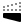</a> | **📂 檔名:** `flip-h-alt-1.svg` ✨ **格式:** `Vector (SVG)` ⚖️ **大小:** `6.83KB` 📅 **更新:** `2026-03-03`  🚀 **jsDelivr Markdown:** `` 🔗 **直接連結 (Url):** <code>https://cdn.jsdelivr.net/gh/barry028/materials@main/images/iCons/Unicons/flip-h-alt-1.svg</code> 📥 [檢視原始檔](flip-h-alt-1.svg) |
|  | **📂 檔名:** `flip-h-alt-2.svg` ✨ **格式:** `Vector (SVG)` ⚖️ **大小:** `1.55KB` 📅 **更新:** `2026-03-03`  🚀 **jsDelivr Markdown:** `` 🔗 **直接連結 (Url):** <code>https://cdn.jsdelivr.net/gh/barry028/materials@main/images/iCons/Unicons/flip-h-alt-2.svg</code> 📥 [檢視原始檔](flip-h-alt-2.svg) |
|  | **📂 檔名:** `flip-h-alt-3.svg` ✨ **格式:** `Vector (SVG)` ⚖️ **大小:** `2.98KB` 📅 **更新:** `2026-03-03`  🚀 **jsDelivr Markdown:** `` 🔗 **直接連結 (Url):** <code>https://cdn.jsdelivr.net/gh/barry028/materials@main/images/iCons/Unicons/flip-h-alt-3.svg</code> 📥 [檢視原始檔](flip-h-alt-3.svg) |
|  | **📂 檔名:** `flip-h-alt.svg` ✨ **格式:** `Vector (SVG)` ⚖️ **大小:** `3.77KB` 📅 **更新:** `2026-03-03`  🚀 **jsDelivr Markdown:** `` 🔗 **直接連結 (Url):** <code>https://cdn.jsdelivr.net/gh/barry028/materials@main/images/iCons/Unicons/flip-h-alt.svg</code> 📥 [檢視原始檔](flip-h-alt.svg) |
|  | **📂 檔名:** `flip-h.svg` ✨ **格式:** `Vector (SVG)` ⚖️ **大小:** `3.23KB` 📅 **更新:** `2026-03-03`  🚀 **jsDelivr Markdown:** `` 🔗 **直接連結 (Url):** <code>https://cdn.jsdelivr.net/gh/barry028/materials@main/images/iCons/Unicons/flip-h.svg</code> 📥 [檢視原始檔](flip-h.svg) |
| <a href="flip-v-1.svg">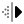</a> | **📂 檔名:** `flip-v-1.svg` ✨ **格式:** `Vector (SVG)` ⚖️ **大小:** `4.97KB` 📅 **更新:** `2026-03-03`  🚀 **jsDelivr Markdown:** `` 🔗 **直接連結 (Url):** <code>https://cdn.jsdelivr.net/gh/barry028/materials@main/images/iCons/Unicons/flip-v-1.svg</code> 📥 [檢視原始檔](flip-v-1.svg) |
|  | **📂 檔名:** `flip-v-2.svg` ✨ **格式:** `Vector (SVG)` ⚖️ **大小:** `1.43KB` 📅 **更新:** `2026-03-03`  🚀 **jsDelivr Markdown:** `` 🔗 **直接連結 (Url):** <code>https://cdn.jsdelivr.net/gh/barry028/materials@main/images/iCons/Unicons/flip-v-2.svg</code> 📥 [檢視原始檔](flip-v-2.svg) |
|  | **📂 檔名:** `flip-v-3.svg` ✨ **格式:** `Vector (SVG)` ⚖️ **大小:** `2.74KB` 📅 **更新:** `2026-03-03`  🚀 **jsDelivr Markdown:** `` 🔗 **直接連結 (Url):** <code>https://cdn.jsdelivr.net/gh/barry028/materials@main/images/iCons/Unicons/flip-v-3.svg</code> 📥 [檢視原始檔](flip-v-3.svg) |
| <a href="flip-v-alt-1.svg">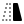</a> | **📂 檔名:** `flip-v-alt-1.svg` ✨ **格式:** `Vector (SVG)` ⚖️ **大小:** `6.36KB` 📅 **更新:** `2026-03-03`  🚀 **jsDelivr Markdown:** `` 🔗 **直接連結 (Url):** <code>https://cdn.jsdelivr.net/gh/barry028/materials@main/images/iCons/Unicons/flip-v-alt-1.svg</code> 📥 [檢視原始檔](flip-v-alt-1.svg) |
|  | **📂 檔名:** `flip-v-alt-2.svg` ✨ **格式:** `Vector (SVG)` ⚖️ **大小:** `1.16KB` 📅 **更新:** `2026-03-03`  🚀 **jsDelivr Markdown:** `` 🔗 **直接連結 (Url):** <code>https://cdn.jsdelivr.net/gh/barry028/materials@main/images/iCons/Unicons/flip-v-alt-2.svg</code> 📥 [檢視原始檔](flip-v-alt-2.svg) |
|  | **📂 檔名:** `flip-v-alt-3.svg` ✨ **格式:** `Vector (SVG)` ⚖️ **大小:** `3.17KB` 📅 **更新:** `2026-03-03`  🚀 **jsDelivr Markdown:** `` 🔗 **直接連結 (Url):** <code>https://cdn.jsdelivr.net/gh/barry028/materials@main/images/iCons/Unicons/flip-v-alt-3.svg</code> 📥 [檢視原始檔](flip-v-alt-3.svg) |
|  | **📂 檔名:** `flip-v-alt.svg` ✨ **格式:** `Vector (SVG)` ⚖️ **大小:** `3.78KB` 📅 **更新:** `2026-03-03`  🚀 **jsDelivr Markdown:** `` 🔗 **直接連結 (Url):** <code>https://cdn.jsdelivr.net/gh/barry028/materials@main/images/iCons/Unicons/flip-v-alt.svg</code> 📥 [檢視原始檔](flip-v-alt.svg) |
|  | **📂 檔名:** `flip-v.svg` ✨ **格式:** `Vector (SVG)` ⚖️ **大小:** `3.29KB` 📅 **更新:** `2026-03-03`  🚀 **jsDelivr Markdown:** `` 🔗 **直接連結 (Url):** <code>https://cdn.jsdelivr.net/gh/barry028/materials@main/images/iCons/Unicons/flip-v.svg</code> 📥 [檢視原始檔](flip-v.svg) |
|  | **📂 檔名:** `flower.svg` ✨ **格式:** `Vector (SVG)` ⚖️ **大小:** `3.85KB` 📅 **更新:** `2026-03-03`  🚀 **jsDelivr Markdown:** `` 🔗 **直接連結 (Url):** <code>https://cdn.jsdelivr.net/gh/barry028/materials@main/images/iCons/Unicons/flower.svg</code> 📥 [檢視原始檔](flower.svg) |
|  | **📂 檔名:** `focus-add.svg` ✨ **格式:** `Vector (SVG)` ⚖️ **大小:** `2.54KB` 📅 **更新:** `2026-03-03`  🚀 **jsDelivr Markdown:** `` 🔗 **直接連結 (Url):** <code>https://cdn.jsdelivr.net/gh/barry028/materials@main/images/iCons/Unicons/focus-add.svg</code> 📥 [檢視原始檔](focus-add.svg) |
|  | **📂 檔名:** `focus-target.svg` ✨ **格式:** `Vector (SVG)` ⚖️ **大小:** `3.33KB` 📅 **更新:** `2026-03-03`  🚀 **jsDelivr Markdown:** `` 🔗 **直接連結 (Url):** <code>https://cdn.jsdelivr.net/gh/barry028/materials@main/images/iCons/Unicons/focus-target.svg</code> 📥 [檢視原始檔](focus-target.svg) |
|  | **📂 檔名:** `focus.svg` ✨ **格式:** `Vector (SVG)` ⚖️ **大小:** `1.63KB` 📅 **更新:** `2026-03-03`  🚀 **jsDelivr Markdown:** `` 🔗 **直接連結 (Url):** <code>https://cdn.jsdelivr.net/gh/barry028/materials@main/images/iCons/Unicons/focus.svg</code> 📥 [檢視原始檔](focus.svg) |
|  | **📂 檔名:** `folder-check.svg` ✨ **格式:** `Vector (SVG)` ⚖️ **大小:** `1.69KB` 📅 **更新:** `2026-03-03`  🚀 **jsDelivr Markdown:** `` 🔗 **直接連結 (Url):** <code>https://cdn.jsdelivr.net/gh/barry028/materials@main/images/iCons/Unicons/folder-check.svg</code> 📥 [檢視原始檔](folder-check.svg) |
|  | **📂 檔名:** `folder-download.svg` ✨ **格式:** `Vector (SVG)` ⚖️ **大小:** `1.86KB` 📅 **更新:** `2026-03-03`  🚀 **jsDelivr Markdown:** `` 🔗 **直接連結 (Url):** <code>https://cdn.jsdelivr.net/gh/barry028/materials@main/images/iCons/Unicons/folder-download.svg</code> 📥 [檢視原始檔](folder-download.svg) |
|  | **📂 檔名:** `folder-exclamation.svg` ✨ **格式:** `Vector (SVG)` ⚖️ **大小:** `2.22KB` 📅 **更新:** `2026-03-03`  🚀 **jsDelivr Markdown:** `` 🔗 **直接連結 (Url):** <code>https://cdn.jsdelivr.net/gh/barry028/materials@main/images/iCons/Unicons/folder-exclamation.svg</code> 📥 [檢視原始檔](folder-exclamation.svg) |
|  | **📂 檔名:** `folder-heart.svg` ✨ **格式:** `Vector (SVG)` ⚖️ **大小:** `2.25KB` 📅 **更新:** `2026-03-03`  🚀 **jsDelivr Markdown:** `` 🔗 **直接連結 (Url):** <code>https://cdn.jsdelivr.net/gh/barry028/materials@main/images/iCons/Unicons/folder-heart.svg</code> 📥 [檢視原始檔](folder-heart.svg) |
|  | **📂 檔名:** `folder-info.svg` ✨ **格式:** `Vector (SVG)` ⚖️ **大小:** `1.98KB` 📅 **更新:** `2026-03-03`  🚀 **jsDelivr Markdown:** `` 🔗 **直接連結 (Url):** <code>https://cdn.jsdelivr.net/gh/barry028/materials@main/images/iCons/Unicons/folder-info.svg</code> 📥 [檢視原始檔](folder-info.svg) |
|  | **📂 檔名:** `folder-lock.svg` ✨ **格式:** `Vector (SVG)` ⚖️ **大小:** `2.22KB` 📅 **更新:** `2026-03-03`  🚀 **jsDelivr Markdown:** `` 🔗 **直接連結 (Url):** <code>https://cdn.jsdelivr.net/gh/barry028/materials@main/images/iCons/Unicons/folder-lock.svg</code> 📥 [檢視原始檔](folder-lock.svg) |
|  | **📂 檔名:** `folder-minus.svg` ✨ **格式:** `Vector (SVG)` ⚖️ **大小:** `1.45KB` 📅 **更新:** `2026-03-03`  🚀 **jsDelivr Markdown:** `` 🔗 **直接連結 (Url):** <code>https://cdn.jsdelivr.net/gh/barry028/materials@main/images/iCons/Unicons/folder-minus.svg</code> 📥 [檢視原始檔](folder-minus.svg) |
|  | **📂 檔名:** `folder-network.svg` ✨ **格式:** `Vector (SVG)` ⚖️ **大小:** `2.47KB` 📅 **更新:** `2026-03-03`  🚀 **jsDelivr Markdown:** `` 🔗 **直接連結 (Url):** <code>https://cdn.jsdelivr.net/gh/barry028/materials@main/images/iCons/Unicons/folder-network.svg</code> 📥 [檢視原始檔](folder-network.svg) |
|  | **📂 檔名:** `folder-open.svg` ✨ **格式:** `Vector (SVG)` ⚖️ **大小:** `1.58KB` 📅 **更新:** `2026-03-03`  🚀 **jsDelivr Markdown:** `` 🔗 **直接連結 (Url):** <code>https://cdn.jsdelivr.net/gh/barry028/materials@main/images/iCons/Unicons/folder-open.svg</code> 📥 [檢視原始檔](folder-open.svg) |
|  | **📂 檔名:** `folder-plus.svg` ✨ **格式:** `Vector (SVG)` ⚖️ **大小:** `1.79KB` 📅 **更新:** `2026-03-03`  🚀 **jsDelivr Markdown:** `` 🔗 **直接連結 (Url):** <code>https://cdn.jsdelivr.net/gh/barry028/materials@main/images/iCons/Unicons/folder-plus.svg</code> 📥 [檢視原始檔](folder-plus.svg) |
|  | **📂 檔名:** `folder-question.svg` ✨ **格式:** `Vector (SVG)` ⚖️ **大小:** `2.76KB` 📅 **更新:** `2026-03-03`  🚀 **jsDelivr Markdown:** `` 🔗 **直接連結 (Url):** <code>https://cdn.jsdelivr.net/gh/barry028/materials@main/images/iCons/Unicons/folder-question.svg</code> 📥 [檢視原始檔](folder-question.svg) |
|  | **📂 檔名:** `folder-slash.svg` ✨ **格式:** `Vector (SVG)` ⚖️ **大小:** `2.25KB` 📅 **更新:** `2026-03-03`  🚀 **jsDelivr Markdown:** `` 🔗 **直接連結 (Url):** <code>https://cdn.jsdelivr.net/gh/barry028/materials@main/images/iCons/Unicons/folder-slash.svg</code> 📥 [檢視原始檔](folder-slash.svg) |
|  | **📂 檔名:** `folder-times.svg` ✨ **格式:** `Vector (SVG)` ⚖️ **大小:** `2.44KB` 📅 **更新:** `2026-03-03`  🚀 **jsDelivr Markdown:** `` 🔗 **直接連結 (Url):** <code>https://cdn.jsdelivr.net/gh/barry028/materials@main/images/iCons/Unicons/folder-times.svg</code> 📥 [檢視原始檔](folder-times.svg) |
|  | **📂 檔名:** `folder-upload.svg` ✨ **格式:** `Vector (SVG)` ⚖️ **大小:** `1.99KB` 📅 **更新:** `2026-03-03`  🚀 **jsDelivr Markdown:** `` 🔗 **直接連結 (Url):** <code>https://cdn.jsdelivr.net/gh/barry028/materials@main/images/iCons/Unicons/folder-upload.svg</code> 📥 [檢視原始檔](folder-upload.svg) |
|  | **📂 檔名:** `folder.svg` ✨ **格式:** `Vector (SVG)` ⚖️ **大小:** `1.12KB` 📅 **更新:** `2026-03-03`  🚀 **jsDelivr Markdown:** `` 🔗 **直接連結 (Url):** <code>https://cdn.jsdelivr.net/gh/barry028/materials@main/images/iCons/Unicons/folder.svg</code> 📥 [檢視原始檔](folder.svg) |
|  | **📂 檔名:** `font.svg` ✨ **格式:** `Vector (SVG)` ⚖️ **大小:** `975.00B` 📅 **更新:** `2026-03-03`  🚀 **jsDelivr Markdown:** `` 🔗 **直接連結 (Url):** <code>https://cdn.jsdelivr.net/gh/barry028/materials@main/images/iCons/Unicons/font.svg</code> 📥 [檢視原始檔](font.svg) |
|  | **📂 檔名:** `football-american.svg` ✨ **格式:** `Vector (SVG)` ⚖️ **大小:** `3.07KB` 📅 **更新:** `2026-03-03`  🚀 **jsDelivr Markdown:** `` 🔗 **直接連結 (Url):** <code>https://cdn.jsdelivr.net/gh/barry028/materials@main/images/iCons/Unicons/football-american.svg</code> 📥 [檢視原始檔](football-american.svg) |
|  | **📂 檔名:** `football-ball.svg` ✨ **格式:** `Vector (SVG)` ⚖️ **大小:** `2.58KB` 📅 **更新:** `2026-03-03`  🚀 **jsDelivr Markdown:** `` 🔗 **直接連結 (Url):** <code>https://cdn.jsdelivr.net/gh/barry028/materials@main/images/iCons/Unicons/football-ball.svg</code> 📥 [檢視原始檔](football-ball.svg) |
|  | **📂 檔名:** `football.svg` ✨ **格式:** `Vector (SVG)` ⚖️ **大小:** `1.86KB` 📅 **更新:** `2026-03-03`  🚀 **jsDelivr Markdown:** `` 🔗 **直接連結 (Url):** <code>https://cdn.jsdelivr.net/gh/barry028/materials@main/images/iCons/Unicons/football.svg</code> 📥 [檢視原始檔](football.svg) |
|  | **📂 檔名:** `forecastcloud-moon-tear.svg` ✨ **格式:** `Vector (SVG)` ⚖️ **大小:** `3.54KB` 📅 **更新:** `2026-03-03`  🚀 **jsDelivr Markdown:** `` 🔗 **直接連結 (Url):** <code>https://cdn.jsdelivr.net/gh/barry028/materials@main/images/iCons/Unicons/forecastcloud-moon-tear.svg</code> 📥 [檢視原始檔](forecastcloud-moon-tear.svg) |
|  | **📂 檔名:** `forwaded-call.svg` ✨ **格式:** `Vector (SVG)` ⚖️ **大小:** `3.20KB` 📅 **更新:** `2026-03-03`  🚀 **jsDelivr Markdown:** `` 🔗 **直接連結 (Url):** <code>https://cdn.jsdelivr.net/gh/barry028/materials@main/images/iCons/Unicons/forwaded-call.svg</code> 📥 [檢視原始檔](forwaded-call.svg) |
|  | **📂 檔名:** `forward.svg` ✨ **格式:** `Vector (SVG)` ⚖️ **大小:** `2.12KB` 📅 **更新:** `2026-03-03`  🚀 **jsDelivr Markdown:** `` 🔗 **直接連結 (Url):** <code>https://cdn.jsdelivr.net/gh/barry028/materials@main/images/iCons/Unicons/forward.svg</code> 📥 [檢視原始檔](forward.svg) |
|  | **📂 檔名:** `frown.svg` ✨ **格式:** `Vector (SVG)` ⚖️ **大小:** `2.64KB` 📅 **更新:** `2026-03-03`  🚀 **jsDelivr Markdown:** `` 🔗 **直接連結 (Url):** <code>https://cdn.jsdelivr.net/gh/barry028/materials@main/images/iCons/Unicons/frown.svg</code> 📥 [檢視原始檔](frown.svg) |
|  | **📂 檔名:** `game-structure.svg` ✨ **格式:** `Vector (SVG)` ⚖️ **大小:** `2.84KB` 📅 **更新:** `2026-03-03`  🚀 **jsDelivr Markdown:** `` 🔗 **直接連結 (Url):** <code>https://cdn.jsdelivr.net/gh/barry028/materials@main/images/iCons/Unicons/game-structure.svg</code> 📥 [檢視原始檔](game-structure.svg) |
|  | **📂 檔名:** `gift.svg` ✨ **格式:** `Vector (SVG)` ⚖️ **大小:** `2.21KB` 📅 **更新:** `2026-03-03`  🚀 **jsDelivr Markdown:** `` 🔗 **直接連結 (Url):** <code>https://cdn.jsdelivr.net/gh/barry028/materials@main/images/iCons/Unicons/gift.svg</code> 📥 [檢視原始檔](gift.svg) |
|  | **📂 檔名:** `github-1.svg` ✨ **格式:** `Vector (SVG)` ⚖️ **大小:** `2.38KB` 📅 **更新:** `2026-03-03`  🚀 **jsDelivr Markdown:** `` 🔗 **直接連結 (Url):** <code>https://cdn.jsdelivr.net/gh/barry028/materials@main/images/iCons/Unicons/github-1.svg</code> 📥 [檢視原始檔](github-1.svg) |
|  | **📂 檔名:** `github-alt-1.svg` ✨ **格式:** `Vector (SVG)` ⚖️ **大小:** `2.20KB` 📅 **更新:** `2026-03-03`  🚀 **jsDelivr Markdown:** `` 🔗 **直接連結 (Url):** <code>https://cdn.jsdelivr.net/gh/barry028/materials@main/images/iCons/Unicons/github-alt-1.svg</code> 📥 [檢視原始檔](github-alt-1.svg) |
|  | **📂 檔名:** `github-alt-2.svg` ✨ **格式:** `Vector (SVG)` ⚖️ **大小:** `3.27KB` 📅 **更新:** `2026-03-03`  🚀 **jsDelivr Markdown:** `` 🔗 **直接連結 (Url):** <code>https://cdn.jsdelivr.net/gh/barry028/materials@main/images/iCons/Unicons/github-alt-2.svg</code> 📥 [檢視原始檔](github-alt-2.svg) |
|  | **📂 檔名:** `github-alt.svg` ✨ **格式:** `Vector (SVG)` ⚖️ **大小:** `4.15KB` 📅 **更新:** `2026-03-03`  🚀 **jsDelivr Markdown:** `` 🔗 **直接連結 (Url):** <code>https://cdn.jsdelivr.net/gh/barry028/materials@main/images/iCons/Unicons/github-alt.svg</code> 📥 [檢視原始檔](github-alt.svg) |
|  | **📂 檔名:** `github.svg` ✨ **格式:** `Vector (SVG)` ⚖️ **大小:** `1.64KB` 📅 **更新:** `2026-03-03`  🚀 **jsDelivr Markdown:** `` 🔗 **直接連結 (Url):** <code>https://cdn.jsdelivr.net/gh/barry028/materials@main/images/iCons/Unicons/github.svg</code> 📥 [檢視原始檔](github.svg) |
|  | **📂 檔名:** `gitlab-1.svg` ✨ **格式:** `Vector (SVG)` ⚖️ **大小:** `3.08KB` 📅 **更新:** `2026-03-03`  🚀 **jsDelivr Markdown:** `` 🔗 **直接連結 (Url):** <code>https://cdn.jsdelivr.net/gh/barry028/materials@main/images/iCons/Unicons/gitlab-1.svg</code> 📥 [檢視原始檔](gitlab-1.svg) |
|  | **📂 檔名:** `gitlab-alt.svg` ✨ **格式:** `Vector (SVG)` ⚖️ **大小:** `1.21KB` 📅 **更新:** `2026-03-03`  🚀 **jsDelivr Markdown:** `` 🔗 **直接連結 (Url):** <code>https://cdn.jsdelivr.net/gh/barry028/materials@main/images/iCons/Unicons/gitlab-alt.svg</code> 📥 [檢視原始檔](gitlab-alt.svg) |
|  | **📂 檔名:** `gitlab.svg` ✨ **格式:** `Vector (SVG)` ⚖️ **大小:** `3.00KB` 📅 **更新:** `2026-03-03`  🚀 **jsDelivr Markdown:** `` 🔗 **直接連結 (Url):** <code>https://cdn.jsdelivr.net/gh/barry028/materials@main/images/iCons/Unicons/gitlab.svg</code> 📥 [檢視原始檔](gitlab.svg) |
|  | **📂 檔名:** `glass-martini-alt-slash.svg` ✨ **格式:** `Vector (SVG)` ⚖️ **大小:** `2.19KB` 📅 **更新:** `2026-03-03`  🚀 **jsDelivr Markdown:** `` 🔗 **直接連結 (Url):** <code>https://cdn.jsdelivr.net/gh/barry028/materials@main/images/iCons/Unicons/glass-martini-alt-slash.svg</code> 📥 [檢視原始檔](glass-martini-alt-slash.svg) |
|  | **📂 檔名:** `glass-martini-alt.svg` ✨ **格式:** `Vector (SVG)` ⚖️ **大小:** `962.00B` 📅 **更新:** `2026-03-03`  🚀 **jsDelivr Markdown:** `` 🔗 **直接連結 (Url):** <code>https://cdn.jsdelivr.net/gh/barry028/materials@main/images/iCons/Unicons/glass-martini-alt.svg</code> 📥 [檢視原始檔](glass-martini-alt.svg) |
|  | **📂 檔名:** `glass-martini.svg` ✨ **格式:** `Vector (SVG)` ⚖️ **大小:** `1.26KB` 📅 **更新:** `2026-03-03`  🚀 **jsDelivr Markdown:** `` 🔗 **直接連結 (Url):** <code>https://cdn.jsdelivr.net/gh/barry028/materials@main/images/iCons/Unicons/glass-martini.svg</code> 📥 [檢視原始檔](glass-martini.svg) |
|  | **📂 檔名:** `glass-tea.svg` ✨ **格式:** `Vector (SVG)` ⚖️ **大小:** `2.09KB` 📅 **更新:** `2026-03-03`  🚀 **jsDelivr Markdown:** `` 🔗 **直接連結 (Url):** <code>https://cdn.jsdelivr.net/gh/barry028/materials@main/images/iCons/Unicons/glass-tea.svg</code> 📥 [檢視原始檔](glass-tea.svg) |
|  | **📂 檔名:** `glass.svg` ✨ **格式:** `Vector (SVG)` ⚖️ **大小:** `1.00KB` 📅 **更新:** `2026-03-03`  🚀 **jsDelivr Markdown:** `` 🔗 **直接連結 (Url):** <code>https://cdn.jsdelivr.net/gh/barry028/materials@main/images/iCons/Unicons/glass.svg</code> 📥 [檢視原始檔](glass.svg) |
|  | **📂 檔名:** `globe.svg` ✨ **格式:** `Vector (SVG)` ⚖️ **大小:** `1.93KB` 📅 **更新:** `2026-03-03`  🚀 **jsDelivr Markdown:** `` 🔗 **直接連結 (Url):** <code>https://cdn.jsdelivr.net/gh/barry028/materials@main/images/iCons/Unicons/globe.svg</code> 📥 [檢視原始檔](globe.svg) |
|  | **📂 檔名:** `gold-1.svg` ✨ **格式:** `Vector (SVG)` ⚖️ **大小:** `626.00B` 📅 **更新:** `2026-03-03`  🚀 **jsDelivr Markdown:** `` 🔗 **直接連結 (Url):** <code>https://cdn.jsdelivr.net/gh/barry028/materials@main/images/iCons/Unicons/gold-1.svg</code> 📥 [檢視原始檔](gold-1.svg) |
|  | **📂 檔名:** `gold.svg` ✨ **格式:** `Vector (SVG)` ⚖️ **大小:** `2.07KB` 📅 **更新:** `2026-03-03`  🚀 **jsDelivr Markdown:** `` 🔗 **直接連結 (Url):** <code>https://cdn.jsdelivr.net/gh/barry028/materials@main/images/iCons/Unicons/gold.svg</code> 📥 [檢視原始檔](gold.svg) |
|  | **📂 檔名:** `golf-ball.svg` ✨ **格式:** `Vector (SVG)` ⚖️ **大小:** `2.35KB` 📅 **更新:** `2026-03-03`  🚀 **jsDelivr Markdown:** `` 🔗 **直接連結 (Url):** <code>https://cdn.jsdelivr.net/gh/barry028/materials@main/images/iCons/Unicons/golf-ball.svg</code> 📥 [檢視原始檔](golf-ball.svg) |
|  | **📂 檔名:** `google-1.svg` ✨ **格式:** `Vector (SVG)` ⚖️ **大小:** `1.10KB` 📅 **更新:** `2026-03-03`  🚀 **jsDelivr Markdown:** `` 🔗 **直接連結 (Url):** <code>https://cdn.jsdelivr.net/gh/barry028/materials@main/images/iCons/Unicons/google-1.svg</code> 📥 [檢視原始檔](google-1.svg) |
|  | **📂 檔名:** `google-2.svg` ✨ **格式:** `Vector (SVG)` ⚖️ **大小:** `2.14KB` 📅 **更新:** `2026-03-03`  🚀 **jsDelivr Markdown:** `` 🔗 **直接連結 (Url):** <code>https://cdn.jsdelivr.net/gh/barry028/materials@main/images/iCons/Unicons/google-2.svg</code> 📥 [檢視原始檔](google-2.svg) |
|  | **📂 檔名:** `google-drive-1.svg` ✨ **格式:** `Vector (SVG)` ⚖️ **大小:** `367.00B` 📅 **更新:** `2026-03-03`  🚀 **jsDelivr Markdown:** `` 🔗 **直接連結 (Url):** <code>https://cdn.jsdelivr.net/gh/barry028/materials@main/images/iCons/Unicons/google-drive-1.svg</code> 📥 [檢視原始檔](google-drive-1.svg) |
|  | **📂 檔名:** `google-drive-alt-1.svg` ✨ **格式:** `Vector (SVG)` ⚖️ **大小:** `355.00B` 📅 **更新:** `2026-03-03`  🚀 **jsDelivr Markdown:** `` 🔗 **直接連結 (Url):** <code>https://cdn.jsdelivr.net/gh/barry028/materials@main/images/iCons/Unicons/google-drive-alt-1.svg</code> 📥 [檢視原始檔](google-drive-alt-1.svg) |
|  | **📂 檔名:** `google-drive-alt-2.svg` ✨ **格式:** `Vector (SVG)` ⚖️ **大小:** `1.20KB` 📅 **更新:** `2026-03-03`  🚀 **jsDelivr Markdown:** `` 🔗 **直接連結 (Url):** <code>https://cdn.jsdelivr.net/gh/barry028/materials@main/images/iCons/Unicons/google-drive-alt-2.svg</code> 📥 [檢視原始檔](google-drive-alt-2.svg) |
|  | **📂 檔名:** `google-drive-alt.svg` ✨ **格式:** `Vector (SVG)` ⚖️ **大小:** `1.31KB` 📅 **更新:** `2026-03-03`  🚀 **jsDelivr Markdown:** `` 🔗 **直接連結 (Url):** <code>https://cdn.jsdelivr.net/gh/barry028/materials@main/images/iCons/Unicons/google-drive-alt.svg</code> 📥 [檢視原始檔](google-drive-alt.svg) |
|  | **📂 檔名:** `google-drive.svg` ✨ **格式:** `Vector (SVG)` ⚖️ **大小:** `335.00B` 📅 **更新:** `2026-03-03`  🚀 **jsDelivr Markdown:** `` 🔗 **直接連結 (Url):** <code>https://cdn.jsdelivr.net/gh/barry028/materials@main/images/iCons/Unicons/google-drive.svg</code> 📥 [檢視原始檔](google-drive.svg) |
|  | **📂 檔名:** `google-hangouts-1.svg` ✨ **格式:** `Vector (SVG)` ⚖️ **大小:** `5.60KB` 📅 **更新:** `2026-03-03`  🚀 **jsDelivr Markdown:** `` 🔗 **直接連結 (Url):** <code>https://cdn.jsdelivr.net/gh/barry028/materials@main/images/iCons/Unicons/google-hangouts-1.svg</code> 📥 [檢視原始檔](google-hangouts-1.svg) |
|  | **📂 檔名:** `google-hangouts-alt-1.svg` ✨ **格式:** `Vector (SVG)` ⚖️ **大小:** `2.67KB` 📅 **更新:** `2026-03-03`  🚀 **jsDelivr Markdown:** `` 🔗 **直接連結 (Url):** <code>https://cdn.jsdelivr.net/gh/barry028/materials@main/images/iCons/Unicons/google-hangouts-alt-1.svg</code> 📥 [檢視原始檔](google-hangouts-alt-1.svg) |
|  | **📂 檔名:** `google-hangouts-alt-2.svg` ✨ **格式:** `Vector (SVG)` ⚖️ **大小:** `1.92KB` 📅 **更新:** `2026-03-03`  🚀 **jsDelivr Markdown:** `` 🔗 **直接連結 (Url):** <code>https://cdn.jsdelivr.net/gh/barry028/materials@main/images/iCons/Unicons/google-hangouts-alt-2.svg</code> 📥 [檢視原始檔](google-hangouts-alt-2.svg) |
|  | **📂 檔名:** `google-hangouts-alt.svg` ✨ **格式:** `Vector (SVG)` ⚖️ **大小:** `3.02KB` 📅 **更新:** `2026-03-03`  🚀 **jsDelivr Markdown:** `` 🔗 **直接連結 (Url):** <code>https://cdn.jsdelivr.net/gh/barry028/materials@main/images/iCons/Unicons/google-hangouts-alt.svg</code> 📥 [檢視原始檔](google-hangouts-alt.svg) |
|  | **📂 檔名:** `google-hangouts.svg` ✨ **格式:** `Vector (SVG)` ⚖️ **大小:** `4.18KB` 📅 **更新:** `2026-03-03`  🚀 **jsDelivr Markdown:** `` 🔗 **直接連結 (Url):** <code>https://cdn.jsdelivr.net/gh/barry028/materials@main/images/iCons/Unicons/google-hangouts.svg</code> 📥 [檢視原始檔](google-hangouts.svg) |
|  | **📂 檔名:** `google-play-1.svg` ✨ **格式:** `Vector (SVG)` ⚖️ **大小:** `1.30KB` 📅 **更新:** `2026-03-03`  🚀 **jsDelivr Markdown:** `` 🔗 **直接連結 (Url):** <code>https://cdn.jsdelivr.net/gh/barry028/materials@main/images/iCons/Unicons/google-play-1.svg</code> 📥 [檢視原始檔](google-play-1.svg) |
|  | **📂 檔名:** `google-play-2.svg` ✨ **格式:** `Vector (SVG)` ⚖️ **大小:** `673.00B` 📅 **更新:** `2026-03-03`  🚀 **jsDelivr Markdown:** `` 🔗 **直接連結 (Url):** <code>https://cdn.jsdelivr.net/gh/barry028/materials@main/images/iCons/Unicons/google-play-2.svg</code> 📥 [檢視原始檔](google-play-2.svg) |
|  | **📂 檔名:** `google-play.svg` ✨ **格式:** `Vector (SVG)` ⚖️ **大小:** `1.36KB` 📅 **更新:** `2026-03-03`  🚀 **jsDelivr Markdown:** `` 🔗 **直接連結 (Url):** <code>https://cdn.jsdelivr.net/gh/barry028/materials@main/images/iCons/Unicons/google-play.svg</code> 📥 [檢視原始檔](google-play.svg) |
|  | **📂 檔名:** `google.svg` ✨ **格式:** `Vector (SVG)` ⚖️ **大小:** `3.13KB` 📅 **更新:** `2026-03-03`  🚀 **jsDelivr Markdown:** `` 🔗 **直接連結 (Url):** <code>https://cdn.jsdelivr.net/gh/barry028/materials@main/images/iCons/Unicons/google.svg</code> 📥 [檢視原始檔](google.svg) |
|  | **📂 檔名:** `graduation-cap.svg` ✨ **格式:** `Vector (SVG)` ⚖️ **大小:** `1.38KB` 📅 **更新:** `2026-03-03`  🚀 **jsDelivr Markdown:** `` 🔗 **直接連結 (Url):** <code>https://cdn.jsdelivr.net/gh/barry028/materials@main/images/iCons/Unicons/graduation-cap.svg</code> 📥 [檢視原始檔](graduation-cap.svg) |
|  | **📂 檔名:** `graph-bar-1.svg` ✨ **格式:** `Vector (SVG)` ⚖️ **大小:** `2.25KB` 📅 **更新:** `2026-03-03`  🚀 **jsDelivr Markdown:** `` 🔗 **直接連結 (Url):** <code>https://cdn.jsdelivr.net/gh/barry028/materials@main/images/iCons/Unicons/graph-bar-1.svg</code> 📥 [檢視原始檔](graph-bar-1.svg) |
|  | **📂 檔名:** `graph-bar-2.svg` ✨ **格式:** `Vector (SVG)` ⚖️ **大小:** `416.00B` 📅 **更新:** `2026-03-03`  🚀 **jsDelivr Markdown:** `` 🔗 **直接連結 (Url):** <code>https://cdn.jsdelivr.net/gh/barry028/materials@main/images/iCons/Unicons/graph-bar-2.svg</code> 📥 [檢視原始檔](graph-bar-2.svg) |
|  | **📂 檔名:** `graph-bar.svg` ✨ **格式:** `Vector (SVG)` ⚖️ **大小:** `1.10KB` 📅 **更新:** `2026-03-03`  🚀 **jsDelivr Markdown:** `` 🔗 **直接連結 (Url):** <code>https://cdn.jsdelivr.net/gh/barry028/materials@main/images/iCons/Unicons/graph-bar.svg</code> 📥 [檢視原始檔](graph-bar.svg) |
|  | **📂 檔名:** `grid-1.svg` ✨ **格式:** `Vector (SVG)` ⚖️ **大小:** `506.00B` 📅 **更新:** `2026-03-03`  🚀 **jsDelivr Markdown:** `` 🔗 **直接連結 (Url):** <code>https://cdn.jsdelivr.net/gh/barry028/materials@main/images/iCons/Unicons/grid-1.svg</code> 📥 [檢視原始檔](grid-1.svg) |
|  | **📂 檔名:** `grid-2.svg` ✨ **格式:** `Vector (SVG)` ⚖️ **大小:** `290.00B` 📅 **更新:** `2026-03-03`  🚀 **jsDelivr Markdown:** `` 🔗 **直接連結 (Url):** <code>https://cdn.jsdelivr.net/gh/barry028/materials@main/images/iCons/Unicons/grid-2.svg</code> 📥 [檢視原始檔](grid-2.svg) |
|  | **📂 檔名:** `grid-3.svg` ✨ **格式:** `Vector (SVG)` ⚖️ **大小:** `550.00B` 📅 **更新:** `2026-03-03`  🚀 **jsDelivr Markdown:** `` 🔗 **直接連結 (Url):** <code>https://cdn.jsdelivr.net/gh/barry028/materials@main/images/iCons/Unicons/grid-3.svg</code> 📥 [檢視原始檔](grid-3.svg) |
|  | **📂 檔名:** `grid.svg` ✨ **格式:** `Vector (SVG)` ⚖️ **大小:** `530.00B` 📅 **更新:** `2026-03-03`  🚀 **jsDelivr Markdown:** `` 🔗 **直接連結 (Url):** <code>https://cdn.jsdelivr.net/gh/barry028/materials@main/images/iCons/Unicons/grid.svg</code> 📥 [檢視原始檔](grid.svg) |
|  | **📂 檔名:** `grids-1.svg` ✨ **格式:** `Vector (SVG)` ⚖️ **大小:** `1014.00B` 📅 **更新:** `2026-03-03`  🚀 **jsDelivr Markdown:** `` 🔗 **直接連結 (Url):** <code>https://cdn.jsdelivr.net/gh/barry028/materials@main/images/iCons/Unicons/grids-1.svg</code> 📥 [檢視原始檔](grids-1.svg) |
|  | **📂 檔名:** `grids-2.svg` ✨ **格式:** `Vector (SVG)` ⚖️ **大小:** `274.00B` 📅 **更新:** `2026-03-03`  🚀 **jsDelivr Markdown:** `` 🔗 **直接連結 (Url):** <code>https://cdn.jsdelivr.net/gh/barry028/materials@main/images/iCons/Unicons/grids-2.svg</code> 📥 [檢視原始檔](grids-2.svg) |
|  | **📂 檔名:** `grids-3.svg` ✨ **格式:** `Vector (SVG)` ⚖️ **大小:** `493.00B` 📅 **更新:** `2026-03-03`  🚀 **jsDelivr Markdown:** `` 🔗 **直接連結 (Url):** <code>https://cdn.jsdelivr.net/gh/barry028/materials@main/images/iCons/Unicons/grids-3.svg</code> 📥 [檢視原始檔](grids-3.svg) |
|  | **📂 檔名:** `grids.svg` ✨ **格式:** `Vector (SVG)` ⚖️ **大小:** `492.00B` 📅 **更新:** `2026-03-03`  🚀 **jsDelivr Markdown:** `` 🔗 **直接連結 (Url):** <code>https://cdn.jsdelivr.net/gh/barry028/materials@main/images/iCons/Unicons/grids.svg</code> 📥 [檢視原始檔](grids.svg) |
|  | **📂 檔名:** `grin-tongue-wink-alt.svg` ✨ **格式:** `Vector (SVG)` ⚖️ **大小:** `2.92KB` 📅 **更新:** `2026-03-03`  🚀 **jsDelivr Markdown:** `` 🔗 **直接連結 (Url):** <code>https://cdn.jsdelivr.net/gh/barry028/materials@main/images/iCons/Unicons/grin-tongue-wink-alt.svg</code> 📥 [檢視原始檔](grin-tongue-wink-alt.svg) |
|  | **📂 檔名:** `grin-tongue-wink.svg` ✨ **格式:** `Vector (SVG)` ⚖️ **大小:** `2.74KB` 📅 **更新:** `2026-03-03`  🚀 **jsDelivr Markdown:** `` 🔗 **直接連結 (Url):** <code>https://cdn.jsdelivr.net/gh/barry028/materials@main/images/iCons/Unicons/grin-tongue-wink.svg</code> 📥 [檢視原始檔](grin-tongue-wink.svg) |
|  | **📂 檔名:** `grin.svg` ✨ **格式:** `Vector (SVG)` ⚖️ **大小:** `2.41KB` 📅 **更新:** `2026-03-03`  🚀 **jsDelivr Markdown:** `` 🔗 **直接連結 (Url):** <code>https://cdn.jsdelivr.net/gh/barry028/materials@main/images/iCons/Unicons/grin.svg</code> 📥 [檢視原始檔](grin.svg) |
|  | **📂 檔名:** `grip-horizontal-line-1.svg` ✨ **格式:** `Vector (SVG)` ⚖️ **大小:** `750.00B` 📅 **更新:** `2026-03-03`  🚀 **jsDelivr Markdown:** `` 🔗 **直接連結 (Url):** <code>https://cdn.jsdelivr.net/gh/barry028/materials@main/images/iCons/Unicons/grip-horizontal-line-1.svg</code> 📥 [檢視原始檔](grip-horizontal-line-1.svg) |
|  | **📂 檔名:** `grip-horizontal-line-2.svg` ✨ **格式:** `Vector (SVG)` ⚖️ **大小:** `311.00B` 📅 **更新:** `2026-03-03`  🚀 **jsDelivr Markdown:** `` 🔗 **直接連結 (Url):** <code>https://cdn.jsdelivr.net/gh/barry028/materials@main/images/iCons/Unicons/grip-horizontal-line-2.svg</code> 📥 [檢視原始檔](grip-horizontal-line-2.svg) |
|  | **📂 檔名:** `grip-horizontal-line-3.svg` ✨ **格式:** `Vector (SVG)` ⚖️ **大小:** `396.00B` 📅 **更新:** `2026-03-03`  🚀 **jsDelivr Markdown:** `` 🔗 **直接連結 (Url):** <code>https://cdn.jsdelivr.net/gh/barry028/materials@main/images/iCons/Unicons/grip-horizontal-line-3.svg</code> 📥 [檢視原始檔](grip-horizontal-line-3.svg) |
|  | **📂 檔名:** `grip-horizontal-line.svg` ✨ **格式:** `Vector (SVG)` ⚖️ **大小:** `749.00B` 📅 **更新:** `2026-03-03`  🚀 **jsDelivr Markdown:** `` 🔗 **直接連結 (Url):** <code>https://cdn.jsdelivr.net/gh/barry028/materials@main/images/iCons/Unicons/grip-horizontal-line.svg</code> 📥 [檢視原始檔](grip-horizontal-line.svg) |
|  | **📂 檔名:** `hard-hat.svg` ✨ **格式:** `Vector (SVG)` ⚖️ **大小:** `2.22KB` 📅 **更新:** `2026-03-03`  🚀 **jsDelivr Markdown:** `` 🔗 **直接連結 (Url):** <code>https://cdn.jsdelivr.net/gh/barry028/materials@main/images/iCons/Unicons/hard-hat.svg</code> 📥 [檢視原始檔](hard-hat.svg) |
|  | **📂 檔名:** `hdd.svg` ✨ **格式:** `Vector (SVG)` ⚖️ **大小:** `1.73KB` 📅 **更新:** `2026-03-03`  🚀 **jsDelivr Markdown:** `` 🔗 **直接連結 (Url):** <code>https://cdn.jsdelivr.net/gh/barry028/materials@main/images/iCons/Unicons/hdd.svg</code> 📥 [檢視原始檔](hdd.svg) |
|  | **📂 檔名:** `head-side-1.svg` ✨ **格式:** `Vector (SVG)` ⚖️ **大小:** `1.18KB` 📅 **更新:** `2026-03-03`  🚀 **jsDelivr Markdown:** `` 🔗 **直接連結 (Url):** <code>https://cdn.jsdelivr.net/gh/barry028/materials@main/images/iCons/Unicons/head-side-1.svg</code> 📥 [檢視原始檔](head-side-1.svg) |
|  | **📂 檔名:** `head-side-2.svg` ✨ **格式:** `Vector (SVG)` ⚖️ **大小:** `646.00B` 📅 **更新:** `2026-03-03`  🚀 **jsDelivr Markdown:** `` 🔗 **直接連結 (Url):** <code>https://cdn.jsdelivr.net/gh/barry028/materials@main/images/iCons/Unicons/head-side-2.svg</code> 📥 [檢視原始檔](head-side-2.svg) |
|  | **📂 檔名:** `head-side-3.svg` ✨ **格式:** `Vector (SVG)` ⚖️ **大小:** `758.00B` 📅 **更新:** `2026-03-03`  🚀 **jsDelivr Markdown:** `` 🔗 **直接連結 (Url):** <code>https://cdn.jsdelivr.net/gh/barry028/materials@main/images/iCons/Unicons/head-side-3.svg</code> 📥 [檢視原始檔](head-side-3.svg) |
|  | **📂 檔名:** `head-side-cough-1.svg` ✨ **格式:** `Vector (SVG)` ⚖️ **大小:** `1.62KB` 📅 **更新:** `2026-03-03`  🚀 **jsDelivr Markdown:** `` 🔗 **直接連結 (Url):** <code>https://cdn.jsdelivr.net/gh/barry028/materials@main/images/iCons/Unicons/head-side-cough-1.svg</code> 📥 [檢視原始檔](head-side-cough-1.svg) |
|  | **📂 檔名:** `head-side-cough-2.svg` ✨ **格式:** `Vector (SVG)` ⚖️ **大小:** `779.00B` 📅 **更新:** `2026-03-03`  🚀 **jsDelivr Markdown:** `` 🔗 **直接連結 (Url):** <code>https://cdn.jsdelivr.net/gh/barry028/materials@main/images/iCons/Unicons/head-side-cough-2.svg</code> 📥 [檢視原始檔](head-side-cough-2.svg) |
|  | **📂 檔名:** `head-side-cough-3.svg` ✨ **格式:** `Vector (SVG)` ⚖️ **大小:** `1.32KB` 📅 **更新:** `2026-03-03`  🚀 **jsDelivr Markdown:** `` 🔗 **直接連結 (Url):** <code>https://cdn.jsdelivr.net/gh/barry028/materials@main/images/iCons/Unicons/head-side-cough-3.svg</code> 📥 [檢視原始檔](head-side-cough-3.svg) |
|  | **📂 檔名:** `head-side-cough.svg` ✨ **格式:** `Vector (SVG)` ⚖️ **大小:** `3.89KB` 📅 **更新:** `2026-03-03`  🚀 **jsDelivr Markdown:** `` 🔗 **直接連結 (Url):** <code>https://cdn.jsdelivr.net/gh/barry028/materials@main/images/iCons/Unicons/head-side-cough.svg</code> 📥 [檢視原始檔](head-side-cough.svg) |
|  | **📂 檔名:** `head-side-mask-1.svg` ✨ **格式:** `Vector (SVG)` ⚖️ **大小:** `2.03KB` 📅 **更新:** `2026-03-03`  🚀 **jsDelivr Markdown:** `` 🔗 **直接連結 (Url):** <code>https://cdn.jsdelivr.net/gh/barry028/materials@main/images/iCons/Unicons/head-side-mask-1.svg</code> 📥 [檢視原始檔](head-side-mask-1.svg) |
|  | **📂 檔名:** `head-side-mask-2.svg` ✨ **格式:** `Vector (SVG)` ⚖️ **大小:** `900.00B` 📅 **更新:** `2026-03-03`  🚀 **jsDelivr Markdown:** `` 🔗 **直接連結 (Url):** <code>https://cdn.jsdelivr.net/gh/barry028/materials@main/images/iCons/Unicons/head-side-mask-2.svg</code> 📥 [檢視原始檔](head-side-mask-2.svg) |
|  | **📂 檔名:** `head-side-mask-3.svg` ✨ **格式:** `Vector (SVG)` ⚖️ **大小:** `770.00B` 📅 **更新:** `2026-03-03`  🚀 **jsDelivr Markdown:** `` 🔗 **直接連結 (Url):** <code>https://cdn.jsdelivr.net/gh/barry028/materials@main/images/iCons/Unicons/head-side-mask-3.svg</code> 📥 [檢視原始檔](head-side-mask-3.svg) |
|  | **📂 檔名:** `head-side-mask.svg` ✨ **格式:** `Vector (SVG)` ⚖️ **大小:** `2.03KB` 📅 **更新:** `2026-03-03`  🚀 **jsDelivr Markdown:** `` 🔗 **直接連結 (Url):** <code>https://cdn.jsdelivr.net/gh/barry028/materials@main/images/iCons/Unicons/head-side-mask.svg</code> 📥 [檢視原始檔](head-side-mask.svg) |
|  | **📂 檔名:** `head-side.svg` ✨ **格式:** `Vector (SVG)` ⚖️ **大小:** `2.03KB` 📅 **更新:** `2026-03-03`  🚀 **jsDelivr Markdown:** `` 🔗 **直接連結 (Url):** <code>https://cdn.jsdelivr.net/gh/barry028/materials@main/images/iCons/Unicons/head-side.svg</code> 📥 [檢視原始檔](head-side.svg) |
|  | **📂 檔名:** `headphone-slash.svg` ✨ **格式:** `Vector (SVG)` ⚖️ **大小:** `2.18KB` 📅 **更新:** `2026-03-03`  🚀 **jsDelivr Markdown:** `` 🔗 **直接連結 (Url):** <code>https://cdn.jsdelivr.net/gh/barry028/materials@main/images/iCons/Unicons/headphone-slash.svg</code> 📥 [檢視原始檔](headphone-slash.svg) |
|  | **📂 檔名:** `headphones-alt.svg` ✨ **格式:** `Vector (SVG)` ⚖️ **大小:** `1.39KB` 📅 **更新:** `2026-03-03`  🚀 **jsDelivr Markdown:** `` 🔗 **直接連結 (Url):** <code>https://cdn.jsdelivr.net/gh/barry028/materials@main/images/iCons/Unicons/headphones-alt.svg</code> 📥 [檢視原始檔](headphones-alt.svg) |
|  | **📂 檔名:** `headphones.svg` ✨ **格式:** `Vector (SVG)` ⚖️ **大小:** `1.25KB` 📅 **更新:** `2026-03-03`  🚀 **jsDelivr Markdown:** `` 🔗 **直接連結 (Url):** <code>https://cdn.jsdelivr.net/gh/barry028/materials@main/images/iCons/Unicons/headphones.svg</code> 📥 [檢視原始檔](headphones.svg) |
|  | **📂 檔名:** `heart-alt.svg` ✨ **格式:** `Vector (SVG)` ⚖️ **大小:** `1.44KB` 📅 **更新:** `2026-03-03`  🚀 **jsDelivr Markdown:** `` 🔗 **直接連結 (Url):** <code>https://cdn.jsdelivr.net/gh/barry028/materials@main/images/iCons/Unicons/heart-alt.svg</code> 📥 [檢視原始檔](heart-alt.svg) |
|  | **📂 檔名:** `heart-break.svg` ✨ **格式:** `Vector (SVG)` ⚖️ **大小:** `1.97KB` 📅 **更新:** `2026-03-03`  🚀 **jsDelivr Markdown:** `` 🔗 **直接連結 (Url):** <code>https://cdn.jsdelivr.net/gh/barry028/materials@main/images/iCons/Unicons/heart-break.svg</code> 📥 [檢視原始檔](heart-break.svg) |
|  | **📂 檔名:** `heart-medical.svg` ✨ **格式:** `Vector (SVG)` ⚖️ **大小:** `2.12KB` 📅 **更新:** `2026-03-03`  🚀 **jsDelivr Markdown:** `` 🔗 **直接連結 (Url):** <code>https://cdn.jsdelivr.net/gh/barry028/materials@main/images/iCons/Unicons/heart-medical.svg</code> 📥 [檢視原始檔](heart-medical.svg) |
|  | **📂 檔名:** `heart-rate.svg` ✨ **格式:** `Vector (SVG)` ⚖️ **大小:** `1.20KB` 📅 **更新:** `2026-03-03`  🚀 **jsDelivr Markdown:** `` 🔗 **直接連結 (Url):** <code>https://cdn.jsdelivr.net/gh/barry028/materials@main/images/iCons/Unicons/heart-rate.svg</code> 📥 [檢視原始檔](heart-rate.svg) |
|  | **📂 檔名:** `heart-sign.svg` ✨ **格式:** `Vector (SVG)` ⚖️ **大小:** `1.47KB` 📅 **更新:** `2026-03-03`  🚀 **jsDelivr Markdown:** `` 🔗 **直接連結 (Url):** <code>https://cdn.jsdelivr.net/gh/barry028/materials@main/images/iCons/Unicons/heart-sign.svg</code> 📥 [檢視原始檔](heart-sign.svg) |
|  | **📂 檔名:** `heart.svg` ✨ **格式:** `Vector (SVG)` ⚖️ **大小:** `1.39KB` 📅 **更新:** `2026-03-03`  🚀 **jsDelivr Markdown:** `` 🔗 **直接連結 (Url):** <code>https://cdn.jsdelivr.net/gh/barry028/materials@main/images/iCons/Unicons/heart.svg</code> 📥 [檢視原始檔](heart.svg) |
|  | **📂 檔名:** `heartbeat.svg` ✨ **格式:** `Vector (SVG)` ⚖️ **大小:** `2.74KB` 📅 **更新:** `2026-03-03`  🚀 **jsDelivr Markdown:** `` 🔗 **直接連結 (Url):** <code>https://cdn.jsdelivr.net/gh/barry028/materials@main/images/iCons/Unicons/heartbeat.svg</code> 📥 [檢視原始檔](heartbeat.svg) |
|  | **📂 檔名:** `hindi-to-chinese.svg` ✨ **格式:** `Vector (SVG)` ⚖️ **大小:** `5.74KB` 📅 **更新:** `2026-03-03`  🚀 **jsDelivr Markdown:** `` 🔗 **直接連結 (Url):** <code>https://cdn.jsdelivr.net/gh/barry028/materials@main/images/iCons/Unicons/hindi-to-chinese.svg</code> 📥 [檢視原始檔](hindi-to-chinese.svg) |
|  | **📂 檔名:** `hipchat-1.svg` ✨ **格式:** `Vector (SVG)` ⚖️ **大小:** `3.08KB` 📅 **更新:** `2026-03-03`  🚀 **jsDelivr Markdown:** `` 🔗 **直接連結 (Url):** <code>https://cdn.jsdelivr.net/gh/barry028/materials@main/images/iCons/Unicons/hipchat-1.svg</code> 📥 [檢視原始檔](hipchat-1.svg) |
|  | **📂 檔名:** `hipchat.svg` ✨ **格式:** `Vector (SVG)` ⚖️ **大小:** `1.40KB` 📅 **更新:** `2026-03-03`  🚀 **jsDelivr Markdown:** `` 🔗 **直接連結 (Url):** <code>https://cdn.jsdelivr.net/gh/barry028/materials@main/images/iCons/Unicons/hipchat.svg</code> 📥 [檢視原始檔](hipchat.svg) |
|  | **📂 檔名:** `history-1.svg` ✨ **格式:** `Vector (SVG)` ⚖️ **大小:** `3.45KB` 📅 **更新:** `2026-03-03`  🚀 **jsDelivr Markdown:** `` 🔗 **直接連結 (Url):** <code>https://cdn.jsdelivr.net/gh/barry028/materials@main/images/iCons/Unicons/history-1.svg</code> 📥 [檢視原始檔](history-1.svg) |
|  | **📂 檔名:** `history-2.svg` ✨ **格式:** `Vector (SVG)` ⚖️ **大小:** `599.00B` 📅 **更新:** `2026-03-03`  🚀 **jsDelivr Markdown:** `` 🔗 **直接連結 (Url):** <code>https://cdn.jsdelivr.net/gh/barry028/materials@main/images/iCons/Unicons/history-2.svg</code> 📥 [檢視原始檔](history-2.svg) |
|  | **📂 檔名:** `history-3.svg` ✨ **格式:** `Vector (SVG)` ⚖️ **大小:** `1.22KB` 📅 **更新:** `2026-03-03`  🚀 **jsDelivr Markdown:** `` 🔗 **直接連結 (Url):** <code>https://cdn.jsdelivr.net/gh/barry028/materials@main/images/iCons/Unicons/history-3.svg</code> 📥 [檢視原始檔](history-3.svg) |
|  | **📂 檔名:** `history-alt-1.svg` ✨ **格式:** `Vector (SVG)` ⚖️ **大小:** `3.16KB` 📅 **更新:** `2026-03-03`  🚀 **jsDelivr Markdown:** `` 🔗 **直接連結 (Url):** <code>https://cdn.jsdelivr.net/gh/barry028/materials@main/images/iCons/Unicons/history-alt-1.svg</code> 📥 [檢視原始檔](history-alt-1.svg) |
|  | **📂 檔名:** `history-alt-2.svg` ✨ **格式:** `Vector (SVG)` ⚖️ **大小:** `794.00B` 📅 **更新:** `2026-03-03`  🚀 **jsDelivr Markdown:** `` 🔗 **直接連結 (Url):** <code>https://cdn.jsdelivr.net/gh/barry028/materials@main/images/iCons/Unicons/history-alt-2.svg</code> 📥 [檢視原始檔](history-alt-2.svg) |
|  | **📂 檔名:** `history-alt-3.svg` ✨ **格式:** `Vector (SVG)` ⚖️ **大小:** `920.00B` 📅 **更新:** `2026-03-03`  🚀 **jsDelivr Markdown:** `` 🔗 **直接連結 (Url):** <code>https://cdn.jsdelivr.net/gh/barry028/materials@main/images/iCons/Unicons/history-alt-3.svg</code> 📥 [檢視原始檔](history-alt-3.svg) |
|  | **📂 檔名:** `history-alt.svg` ✨ **格式:** `Vector (SVG)` ⚖️ **大小:** `1.76KB` 📅 **更新:** `2026-03-03`  🚀 **jsDelivr Markdown:** `` 🔗 **直接連結 (Url):** <code>https://cdn.jsdelivr.net/gh/barry028/materials@main/images/iCons/Unicons/history-alt.svg</code> 📥 [檢視原始檔](history-alt.svg) |
|  | **📂 檔名:** `history.svg` ✨ **格式:** `Vector (SVG)` ⚖️ **大小:** `1.82KB` 📅 **更新:** `2026-03-03`  🚀 **jsDelivr Markdown:** `` 🔗 **直接連結 (Url):** <code>https://cdn.jsdelivr.net/gh/barry028/materials@main/images/iCons/Unicons/history.svg</code> 📥 [檢視原始檔](history.svg) |
|  | **📂 檔名:** `home-alt.svg` ✨ **格式:** `Vector (SVG)` ⚖️ **大小:** `1.42KB` 📅 **更新:** `2026-03-03`  🚀 **jsDelivr Markdown:** `` 🔗 **直接連結 (Url):** <code>https://cdn.jsdelivr.net/gh/barry028/materials@main/images/iCons/Unicons/home-alt.svg</code> 📥 [檢視原始檔](home-alt.svg) |
|  | **📂 檔名:** `home.svg` ✨ **格式:** `Vector (SVG)` ⚖️ **大小:** `1.13KB` 📅 **更新:** `2026-03-03`  🚀 **jsDelivr Markdown:** `` 🔗 **直接連結 (Url):** <code>https://cdn.jsdelivr.net/gh/barry028/materials@main/images/iCons/Unicons/home.svg</code> 📥 [檢視原始檔](home.svg) |
|  | **📂 檔名:** `horizontal-align-center.svg` ✨ **格式:** `Vector (SVG)` ⚖️ **大小:** `952.00B` 📅 **更新:** `2026-03-03`  🚀 **jsDelivr Markdown:** `` 🔗 **直接連結 (Url):** <code>https://cdn.jsdelivr.net/gh/barry028/materials@main/images/iCons/Unicons/horizontal-align-center.svg</code> 📥 [檢視原始檔](horizontal-align-center.svg) |
|  | **📂 檔名:** `horizontal-align-left-1.svg` ✨ **格式:** `Vector (SVG)` ⚖️ **大小:** `497.00B` 📅 **更新:** `2026-03-03`  🚀 **jsDelivr Markdown:** `` 🔗 **直接連結 (Url):** <code>https://cdn.jsdelivr.net/gh/barry028/materials@main/images/iCons/Unicons/horizontal-align-left-1.svg</code> 📥 [檢視原始檔](horizontal-align-left-1.svg) |
|  | **📂 檔名:** `horizontal-align-left-2.svg` ✨ **格式:** `Vector (SVG)` ⚖️ **大小:** `307.00B` 📅 **更新:** `2026-03-03`  🚀 **jsDelivr Markdown:** `` 🔗 **直接連結 (Url):** <code>https://cdn.jsdelivr.net/gh/barry028/materials@main/images/iCons/Unicons/horizontal-align-left-2.svg</code> 📥 [檢視原始檔](horizontal-align-left-2.svg) |
|  | **📂 檔名:** `horizontal-align-left-3.svg` ✨ **格式:** `Vector (SVG)` ⚖️ **大小:** `650.00B` 📅 **更新:** `2026-03-03`  🚀 **jsDelivr Markdown:** `` 🔗 **直接連結 (Url):** <code>https://cdn.jsdelivr.net/gh/barry028/materials@main/images/iCons/Unicons/horizontal-align-left-3.svg</code> 📥 [檢視原始檔](horizontal-align-left-3.svg) |
|  | **📂 檔名:** `horizontal-align-left.svg` ✨ **格式:** `Vector (SVG)` ⚖️ **大小:** `708.00B` 📅 **更新:** `2026-03-03`  🚀 **jsDelivr Markdown:** `` 🔗 **直接連結 (Url):** <code>https://cdn.jsdelivr.net/gh/barry028/materials@main/images/iCons/Unicons/horizontal-align-left.svg</code> 📥 [檢視原始檔](horizontal-align-left.svg) |
|  | **📂 檔名:** `horizontal-align-right.svg` ✨ **格式:** `Vector (SVG)` ⚖️ **大小:** `711.00B` 📅 **更新:** `2026-03-03`  🚀 **jsDelivr Markdown:** `` 🔗 **直接連結 (Url):** <code>https://cdn.jsdelivr.net/gh/barry028/materials@main/images/iCons/Unicons/horizontal-align-right.svg</code> 📥 [檢視原始檔](horizontal-align-right.svg) |
|  | **📂 檔名:** `horizontal-distribution-center.svg` ✨ **格式:** `Vector (SVG)` ⚖️ **大小:** `1.38KB` 📅 **更新:** `2026-03-03`  🚀 **jsDelivr Markdown:** `` 🔗 **直接連結 (Url):** <code>https://cdn.jsdelivr.net/gh/barry028/materials@main/images/iCons/Unicons/horizontal-distribution-center.svg</code> 📥 [檢視原始檔](horizontal-distribution-center.svg) |
|  | **📂 檔名:** `horizontal-distribution-left.svg` ✨ **格式:** `Vector (SVG)` ⚖️ **大小:** `1.07KB` 📅 **更新:** `2026-03-03`  🚀 **jsDelivr Markdown:** `` 🔗 **直接連結 (Url):** <code>https://cdn.jsdelivr.net/gh/barry028/materials@main/images/iCons/Unicons/horizontal-distribution-left.svg</code> 📥 [檢視原始檔](horizontal-distribution-left.svg) |
|  | **📂 檔名:** `horizontal-distribution-right.svg` ✨ **格式:** `Vector (SVG)` ⚖️ **大小:** `1.07KB` 📅 **更新:** `2026-03-03`  🚀 **jsDelivr Markdown:** `` 🔗 **直接連結 (Url):** <code>https://cdn.jsdelivr.net/gh/barry028/materials@main/images/iCons/Unicons/horizontal-distribution-right.svg</code> 📥 [檢視原始檔](horizontal-distribution-right.svg) |
|  | **📂 檔名:** `hospital-1.svg` ✨ **格式:** `Vector (SVG)` ⚖️ **大小:** `6.71KB` 📅 **更新:** `2026-03-03`  🚀 **jsDelivr Markdown:** `` 🔗 **直接連結 (Url):** <code>https://cdn.jsdelivr.net/gh/barry028/materials@main/images/iCons/Unicons/hospital-1.svg</code> 📥 [檢視原始檔](hospital-1.svg) |
|  | **📂 檔名:** `hospital-2.svg` ✨ **格式:** `Vector (SVG)` ⚖️ **大小:** `1.34KB` 📅 **更新:** `2026-03-03`  🚀 **jsDelivr Markdown:** `` 🔗 **直接連結 (Url):** <code>https://cdn.jsdelivr.net/gh/barry028/materials@main/images/iCons/Unicons/hospital-2.svg</code> 📥 [檢視原始檔](hospital-2.svg) |
|  | **📂 檔名:** `hospital-3.svg` ✨ **格式:** `Vector (SVG)` ⚖️ **大小:** `1.22KB` 📅 **更新:** `2026-03-03`  🚀 **jsDelivr Markdown:** `` 🔗 **直接連結 (Url):** <code>https://cdn.jsdelivr.net/gh/barry028/materials@main/images/iCons/Unicons/hospital-3.svg</code> 📥 [檢視原始檔](hospital-3.svg) |
|  | **📂 檔名:** `hospital-square-sign-1.svg` ✨ **格式:** `Vector (SVG)` ⚖️ **大小:** `1.91KB` 📅 **更新:** `2026-03-03`  🚀 **jsDelivr Markdown:** `` 🔗 **直接連結 (Url):** <code>https://cdn.jsdelivr.net/gh/barry028/materials@main/images/iCons/Unicons/hospital-square-sign-1.svg</code> 📥 [檢視原始檔](hospital-square-sign-1.svg) |
|  | **📂 檔名:** `hospital-square-sign-2.svg` ✨ **格式:** `Vector (SVG)` ⚖️ **大小:** `405.00B` 📅 **更新:** `2026-03-03`  🚀 **jsDelivr Markdown:** `` 🔗 **直接連結 (Url):** <code>https://cdn.jsdelivr.net/gh/barry028/materials@main/images/iCons/Unicons/hospital-square-sign-2.svg</code> 📥 [檢視原始檔](hospital-square-sign-2.svg) |
|  | **📂 檔名:** `hospital-square-sign-3.svg` ✨ **格式:** `Vector (SVG)` ⚖️ **大小:** `559.00B` 📅 **更新:** `2026-03-03`  🚀 **jsDelivr Markdown:** `` 🔗 **直接連結 (Url):** <code>https://cdn.jsdelivr.net/gh/barry028/materials@main/images/iCons/Unicons/hospital-square-sign-3.svg</code> 📥 [檢視原始檔](hospital-square-sign-3.svg) |
|  | **📂 檔名:** `hospital-square-sign.svg` ✨ **格式:** `Vector (SVG)` ⚖️ **大小:** `1.62KB` 📅 **更新:** `2026-03-03`  🚀 **jsDelivr Markdown:** `` 🔗 **直接連結 (Url):** <code>https://cdn.jsdelivr.net/gh/barry028/materials@main/images/iCons/Unicons/hospital-square-sign.svg</code> 📥 [檢視原始檔](hospital-square-sign.svg) |
|  | **📂 檔名:** `hospital-symbol-1.svg` ✨ **格式:** `Vector (SVG)` ⚖️ **大小:** `2.00KB` 📅 **更新:** `2026-03-03`  🚀 **jsDelivr Markdown:** `` 🔗 **直接連結 (Url):** <code>https://cdn.jsdelivr.net/gh/barry028/materials@main/images/iCons/Unicons/hospital-symbol-1.svg</code> 📥 [檢視原始檔](hospital-symbol-1.svg) |
|  | **📂 檔名:** `hospital-symbol-2.svg` ✨ **格式:** `Vector (SVG)` ⚖️ **大小:** `397.00B` 📅 **更新:** `2026-03-03`  🚀 **jsDelivr Markdown:** `` 🔗 **直接連結 (Url):** <code>https://cdn.jsdelivr.net/gh/barry028/materials@main/images/iCons/Unicons/hospital-symbol-2.svg</code> 📥 [檢視原始檔](hospital-symbol-2.svg) |
|  | **📂 檔名:** `hospital-symbol-3.svg` ✨ **格式:** `Vector (SVG)` ⚖️ **大小:** `519.00B` 📅 **更新:** `2026-03-03`  🚀 **jsDelivr Markdown:** `` 🔗 **直接連結 (Url):** <code>https://cdn.jsdelivr.net/gh/barry028/materials@main/images/iCons/Unicons/hospital-symbol-3.svg</code> 📥 [檢視原始檔](hospital-symbol-3.svg) |
|  | **📂 檔名:** `hospital-symbol.svg` ✨ **格式:** `Vector (SVG)` ⚖️ **大小:** `1.80KB` 📅 **更新:** `2026-03-03`  🚀 **jsDelivr Markdown:** `` 🔗 **直接連結 (Url):** <code>https://cdn.jsdelivr.net/gh/barry028/materials@main/images/iCons/Unicons/hospital-symbol.svg</code> 📥 [檢視原始檔](hospital-symbol.svg) |
|  | **📂 檔名:** `hospital.svg` ✨ **格式:** `Vector (SVG)` ⚖️ **大小:** `4.34KB` 📅 **更新:** `2026-03-03`  🚀 **jsDelivr Markdown:** `` 🔗 **直接連結 (Url):** <code>https://cdn.jsdelivr.net/gh/barry028/materials@main/images/iCons/Unicons/hospital.svg</code> 📥 [檢視原始檔](hospital.svg) |
|  | **📂 檔名:** `hourglass.svg` ✨ **格式:** `Vector (SVG)` ⚖️ **大小:** `2.38KB` 📅 **更新:** `2026-03-03`  🚀 **jsDelivr Markdown:** `` 🔗 **直接連結 (Url):** <code>https://cdn.jsdelivr.net/gh/barry028/materials@main/images/iCons/Unicons/hourglass.svg</code> 📥 [檢視原始檔](hourglass.svg) |
|  | **📂 檔名:** `house-user-1.svg` ✨ **格式:** `Vector (SVG)` ⚖️ **大小:** `3.08KB` 📅 **更新:** `2026-03-03`  🚀 **jsDelivr Markdown:** `` 🔗 **直接連結 (Url):** <code>https://cdn.jsdelivr.net/gh/barry028/materials@main/images/iCons/Unicons/house-user-1.svg</code> 📥 [檢視原始檔](house-user-1.svg) |
|  | **📂 檔名:** `house-user-2.svg` ✨ **格式:** `Vector (SVG)` ⚖️ **大小:** `712.00B` 📅 **更新:** `2026-03-03`  🚀 **jsDelivr Markdown:** `` 🔗 **直接連結 (Url):** <code>https://cdn.jsdelivr.net/gh/barry028/materials@main/images/iCons/Unicons/house-user-2.svg</code> 📥 [檢視原始檔](house-user-2.svg) |
|  | **📂 檔名:** `house-user-3.svg` ✨ **格式:** `Vector (SVG)` ⚖️ **大小:** `1.05KB` 📅 **更新:** `2026-03-03`  🚀 **jsDelivr Markdown:** `` 🔗 **直接連結 (Url):** <code>https://cdn.jsdelivr.net/gh/barry028/materials@main/images/iCons/Unicons/house-user-3.svg</code> 📥 [檢視原始檔](house-user-3.svg) |
|  | **📂 檔名:** `house-user.svg` ✨ **格式:** `Vector (SVG)` ⚖️ **大小:** `2.31KB` 📅 **更新:** `2026-03-03`  🚀 **jsDelivr Markdown:** `` 🔗 **直接連結 (Url):** <code>https://cdn.jsdelivr.net/gh/barry028/materials@main/images/iCons/Unicons/house-user.svg</code> 📥 [檢視原始檔](house-user.svg) |
|  | **📂 檔名:** `html3-1.svg` ✨ **格式:** `Vector (SVG)` ⚖️ **大小:** `1003.00B` 📅 **更新:** `2026-03-03`  🚀 **jsDelivr Markdown:** `` 🔗 **直接連結 (Url):** <code>https://cdn.jsdelivr.net/gh/barry028/materials@main/images/iCons/Unicons/html3-1.svg</code> 📥 [檢視原始檔](html3-1.svg) |
|  | **📂 檔名:** `html3-alt-1.svg` ✨ **格式:** `Vector (SVG)` ⚖️ **大小:** `1.98KB` 📅 **更新:** `2026-03-03`  🚀 **jsDelivr Markdown:** `` 🔗 **直接連結 (Url):** <code>https://cdn.jsdelivr.net/gh/barry028/materials@main/images/iCons/Unicons/html3-alt-1.svg</code> 📥 [檢視原始檔](html3-alt-1.svg) |
|  | **📂 檔名:** `html3-alt-2.svg` ✨ **格式:** `Vector (SVG)` ⚖️ **大小:** `1.37KB` 📅 **更新:** `2026-03-03`  🚀 **jsDelivr Markdown:** `` 🔗 **直接連結 (Url):** <code>https://cdn.jsdelivr.net/gh/barry028/materials@main/images/iCons/Unicons/html3-alt-2.svg</code> 📥 [檢視原始檔](html3-alt-2.svg) |
|  | **📂 檔名:** `html3-alt.svg` ✨ **格式:** `Vector (SVG)` ⚖️ **大小:** `2.30KB` 📅 **更新:** `2026-03-03`  🚀 **jsDelivr Markdown:** `` 🔗 **直接連結 (Url):** <code>https://cdn.jsdelivr.net/gh/barry028/materials@main/images/iCons/Unicons/html3-alt.svg</code> 📥 [檢視原始檔](html3-alt.svg) |
|  | **📂 檔名:** `html3.svg` ✨ **格式:** `Vector (SVG)` ⚖️ **大小:** `604.00B` 📅 **更新:** `2026-03-03`  🚀 **jsDelivr Markdown:** `` 🔗 **直接連結 (Url):** <code>https://cdn.jsdelivr.net/gh/barry028/materials@main/images/iCons/Unicons/html3.svg</code> 📥 [檢視原始檔](html3.svg) |
|  | **📂 檔名:** `html5-1.svg` ✨ **格式:** `Vector (SVG)` ⚖️ **大小:** `775.00B` 📅 **更新:** `2026-03-03`  🚀 **jsDelivr Markdown:** `` 🔗 **直接連結 (Url):** <code>https://cdn.jsdelivr.net/gh/barry028/materials@main/images/iCons/Unicons/html5-1.svg</code> 📥 [檢視原始檔](html5-1.svg) |
|  | **📂 檔名:** `html5-alt-1.svg` ✨ **格式:** `Vector (SVG)` ⚖️ **大小:** `2.15KB` 📅 **更新:** `2026-03-03`  🚀 **jsDelivr Markdown:** `` 🔗 **直接連結 (Url):** <code>https://cdn.jsdelivr.net/gh/barry028/materials@main/images/iCons/Unicons/html5-alt-1.svg</code> 📥 [檢視原始檔](html5-alt-1.svg) |
|  | **📂 檔名:** `html5-alt.svg` ✨ **格式:** `Vector (SVG)` ⚖️ **大小:** `2.20KB` 📅 **更新:** `2026-03-03`  🚀 **jsDelivr Markdown:** `` 🔗 **直接連結 (Url):** <code>https://cdn.jsdelivr.net/gh/barry028/materials@main/images/iCons/Unicons/html5-alt.svg</code> 📥 [檢視原始檔](html5-alt.svg) |
|  | **📂 檔名:** `html5.svg` ✨ **格式:** `Vector (SVG)` ⚖️ **大小:** `471.00B` 📅 **更新:** `2026-03-03`  🚀 **jsDelivr Markdown:** `` 🔗 **直接連結 (Url):** <code>https://cdn.jsdelivr.net/gh/barry028/materials@main/images/iCons/Unicons/html5.svg</code> 📥 [檢視原始檔](html5.svg) |
|  | **📂 檔名:** `hunting.svg` ✨ **格式:** `Vector (SVG)` ⚖️ **大小:** `2.37KB` 📅 **更新:** `2026-03-03`  🚀 **jsDelivr Markdown:** `` 🔗 **直接連結 (Url):** <code>https://cdn.jsdelivr.net/gh/barry028/materials@main/images/iCons/Unicons/hunting.svg</code> 📥 [檢視原始檔](hunting.svg) |
|  | **📂 檔名:** `icons.svg` ✨ **格式:** `Vector (SVG)` ⚖️ **大小:** `922.00B` 📅 **更新:** `2026-03-03`  🚀 **jsDelivr Markdown:** `` 🔗 **直接連結 (Url):** <code>https://cdn.jsdelivr.net/gh/barry028/materials@main/images/iCons/Unicons/icons.svg</code> 📥 [檢視原始檔](icons.svg) |
|  | **📂 檔名:** `illustration.svg` ✨ **格式:** `Vector (SVG)` ⚖️ **大小:** `1.18KB` 📅 **更新:** `2026-03-03`  🚀 **jsDelivr Markdown:** `` 🔗 **直接連結 (Url):** <code>https://cdn.jsdelivr.net/gh/barry028/materials@main/images/iCons/Unicons/illustration.svg</code> 📥 [檢視原始檔](illustration.svg) |
|  | **📂 檔名:** `image-alt-slash.svg` ✨ **格式:** `Vector (SVG)` ⚖️ **大小:** `2.57KB` 📅 **更新:** `2026-03-03`  🚀 **jsDelivr Markdown:** `` 🔗 **直接連結 (Url):** <code>https://cdn.jsdelivr.net/gh/barry028/materials@main/images/iCons/Unicons/image-alt-slash.svg</code> 📥 [檢視原始檔](image-alt-slash.svg) |
|  | **📂 檔名:** `image-block.svg` ✨ **格式:** `Vector (SVG)` ⚖️ **大小:** `2.43KB` 📅 **更新:** `2026-03-03`  🚀 **jsDelivr Markdown:** `` 🔗 **直接連結 (Url):** <code>https://cdn.jsdelivr.net/gh/barry028/materials@main/images/iCons/Unicons/image-block.svg</code> 📥 [檢視原始檔](image-block.svg) |
|  | **📂 檔名:** `image-broken.svg` ✨ **格式:** `Vector (SVG)` ⚖️ **大小:** `3.42KB` 📅 **更新:** `2026-03-03`  🚀 **jsDelivr Markdown:** `` 🔗 **直接連結 (Url):** <code>https://cdn.jsdelivr.net/gh/barry028/materials@main/images/iCons/Unicons/image-broken.svg</code> 📥 [檢視原始檔](image-broken.svg) |
|  | **📂 檔名:** `image-check.svg` ✨ **格式:** `Vector (SVG)` ⚖️ **大小:** `2.09KB` 📅 **更新:** `2026-03-03`  🚀 **jsDelivr Markdown:** `` 🔗 **直接連結 (Url):** <code>https://cdn.jsdelivr.net/gh/barry028/materials@main/images/iCons/Unicons/image-check.svg</code> 📥 [檢視原始檔](image-check.svg) |
|  | **📂 檔名:** `image-download.svg` ✨ **格式:** `Vector (SVG)` ⚖️ **大小:** `2.29KB` 📅 **更新:** `2026-03-03`  🚀 **jsDelivr Markdown:** `` 🔗 **直接連結 (Url):** <code>https://cdn.jsdelivr.net/gh/barry028/materials@main/images/iCons/Unicons/image-download.svg</code> 📥 [檢視原始檔](image-download.svg) |
|  | **📂 檔名:** `image-edit.svg` ✨ **格式:** `Vector (SVG)` ⚖️ **大小:** `2.20KB` 📅 **更新:** `2026-03-03`  🚀 **jsDelivr Markdown:** `` 🔗 **直接連結 (Url):** <code>https://cdn.jsdelivr.net/gh/barry028/materials@main/images/iCons/Unicons/image-edit.svg</code> 📥 [檢視原始檔](image-edit.svg) |
|  | **📂 檔名:** `image-lock.svg` ✨ **格式:** `Vector (SVG)` ⚖️ **大小:** `2.02KB` 📅 **更新:** `2026-03-03`  🚀 **jsDelivr Markdown:** `` 🔗 **直接連結 (Url):** <code>https://cdn.jsdelivr.net/gh/barry028/materials@main/images/iCons/Unicons/image-lock.svg</code> 📥 [檢視原始檔](image-lock.svg) |
|  | **📂 檔名:** `image-minus.svg` ✨ **格式:** `Vector (SVG)` ⚖️ **大小:** `1.83KB` 📅 **更新:** `2026-03-03`  🚀 **jsDelivr Markdown:** `` 🔗 **直接連結 (Url):** <code>https://cdn.jsdelivr.net/gh/barry028/materials@main/images/iCons/Unicons/image-minus.svg</code> 📥 [檢視原始檔](image-minus.svg) |
|  | **📂 檔名:** `image-plus.svg` ✨ **格式:** `Vector (SVG)` ⚖️ **大小:** `2.18KB` 📅 **更新:** `2026-03-03`  🚀 **jsDelivr Markdown:** `` 🔗 **直接連結 (Url):** <code>https://cdn.jsdelivr.net/gh/barry028/materials@main/images/iCons/Unicons/image-plus.svg</code> 📥 [檢視原始檔](image-plus.svg) |
|  | **📂 檔名:** `image-question.svg` ✨ **格式:** `Vector (SVG)` ⚖️ **大小:** `2.91KB` 📅 **更新:** `2026-03-03`  🚀 **jsDelivr Markdown:** `` 🔗 **直接連結 (Url):** <code>https://cdn.jsdelivr.net/gh/barry028/materials@main/images/iCons/Unicons/image-question.svg</code> 📥 [檢視原始檔](image-question.svg) |
|  | **📂 檔名:** `image-redo.svg` ✨ **格式:** `Vector (SVG)` ⚖️ **大小:** `2.93KB` 📅 **更新:** `2026-03-03`  🚀 **jsDelivr Markdown:** `` 🔗 **直接連結 (Url):** <code>https://cdn.jsdelivr.net/gh/barry028/materials@main/images/iCons/Unicons/image-redo.svg</code> 📥 [檢視原始檔](image-redo.svg) |
|  | **📂 檔名:** `image-resize-landscape.svg` ✨ **格式:** `Vector (SVG)` ⚖️ **大小:** `5.65KB` 📅 **更新:** `2026-03-03`  🚀 **jsDelivr Markdown:** `` 🔗 **直接連結 (Url):** <code>https://cdn.jsdelivr.net/gh/barry028/materials@main/images/iCons/Unicons/image-resize-landscape.svg</code> 📥 [檢視原始檔](image-resize-landscape.svg) |
|  | **📂 檔名:** `image-resize-square.svg` ✨ **格式:** `Vector (SVG)` ⚖️ **大小:** `5.27KB` 📅 **更新:** `2026-03-03`  🚀 **jsDelivr Markdown:** `` 🔗 **直接連結 (Url):** <code>https://cdn.jsdelivr.net/gh/barry028/materials@main/images/iCons/Unicons/image-resize-square.svg</code> 📥 [檢視原始檔](image-resize-square.svg) |
|  | **📂 檔名:** `image-search.svg` ✨ **格式:** `Vector (SVG)` ⚖️ **大小:** `2.76KB` 📅 **更新:** `2026-03-03`  🚀 **jsDelivr Markdown:** `` 🔗 **直接連結 (Url):** <code>https://cdn.jsdelivr.net/gh/barry028/materials@main/images/iCons/Unicons/image-search.svg</code> 📥 [檢視原始檔](image-search.svg) |
|  | **📂 檔名:** `image-share.svg` ✨ **格式:** `Vector (SVG)` ⚖️ **大小:** `2.64KB` 📅 **更新:** `2026-03-03`  🚀 **jsDelivr Markdown:** `` 🔗 **直接連結 (Url):** <code>https://cdn.jsdelivr.net/gh/barry028/materials@main/images/iCons/Unicons/image-share.svg</code> 📥 [檢視原始檔](image-share.svg) |
|  | **📂 檔名:** `image-shield.svg` ✨ **格式:** `Vector (SVG)` ⚖️ **大小:** `2.91KB` 📅 **更新:** `2026-03-03`  🚀 **jsDelivr Markdown:** `` 🔗 **直接連結 (Url):** <code>https://cdn.jsdelivr.net/gh/barry028/materials@main/images/iCons/Unicons/image-shield.svg</code> 📥 [檢視原始檔](image-shield.svg) |
|  | **📂 檔名:** `image-slash.svg` ✨ **格式:** `Vector (SVG)` ⚖️ **大小:** `2.63KB` 📅 **更新:** `2026-03-03`  🚀 **jsDelivr Markdown:** `` 🔗 **直接連結 (Url):** <code>https://cdn.jsdelivr.net/gh/barry028/materials@main/images/iCons/Unicons/image-slash.svg</code> 📥 [檢視原始檔](image-slash.svg) |
|  | **📂 檔名:** `image-times.svg` ✨ **格式:** `Vector (SVG)` ⚖️ **大小:** `2.78KB` 📅 **更新:** `2026-03-03`  🚀 **jsDelivr Markdown:** `` 🔗 **直接連結 (Url):** <code>https://cdn.jsdelivr.net/gh/barry028/materials@main/images/iCons/Unicons/image-times.svg</code> 📥 [檢視原始檔](image-times.svg) |
|  | **📂 檔名:** `image-upload.svg` ✨ **格式:** `Vector (SVG)` ⚖️ **大小:** `2.53KB` 📅 **更新:** `2026-03-03`  🚀 **jsDelivr Markdown:** `` 🔗 **直接連結 (Url):** <code>https://cdn.jsdelivr.net/gh/barry028/materials@main/images/iCons/Unicons/image-upload.svg</code> 📥 [檢視原始檔](image-upload.svg) |
|  | **📂 檔名:** `image-v-1.svg` ✨ **格式:** `Vector (SVG)` ⚖️ **大小:** `740.00B` 📅 **更新:** `2026-03-03`  🚀 **jsDelivr Markdown:** `` 🔗 **直接連結 (Url):** <code>https://cdn.jsdelivr.net/gh/barry028/materials@main/images/iCons/Unicons/image-v-1.svg</code> 📥 [檢視原始檔](image-v-1.svg) |
|  | **📂 檔名:** `image-v-2.svg` ✨ **格式:** `Vector (SVG)` ⚖️ **大小:** `353.00B` 📅 **更新:** `2026-03-03`  🚀 **jsDelivr Markdown:** `` 🔗 **直接連結 (Url):** <code>https://cdn.jsdelivr.net/gh/barry028/materials@main/images/iCons/Unicons/image-v-2.svg</code> 📥 [檢視原始檔](image-v-2.svg) |
|  | **📂 檔名:** `image-v-3.svg` ✨ **格式:** `Vector (SVG)` ⚖️ **大小:** `899.00B` 📅 **更新:** `2026-03-03`  🚀 **jsDelivr Markdown:** `` 🔗 **直接連結 (Url):** <code>https://cdn.jsdelivr.net/gh/barry028/materials@main/images/iCons/Unicons/image-v-3.svg</code> 📥 [檢視原始檔](image-v-3.svg) |
|  | **📂 檔名:** `image-v.svg` ✨ **格式:** `Vector (SVG)` ⚖️ **大小:** `1.73KB` 📅 **更新:** `2026-03-03`  🚀 **jsDelivr Markdown:** `` 🔗 **直接連結 (Url):** <code>https://cdn.jsdelivr.net/gh/barry028/materials@main/images/iCons/Unicons/image-v.svg</code> 📥 [檢視原始檔](image-v.svg) |
|  | **📂 檔名:** `image.svg` ✨ **格式:** `Vector (SVG)` ⚖️ **大小:** `1.19KB` 📅 **更新:** `2026-03-03`  🚀 **jsDelivr Markdown:** `` 🔗 **直接連結 (Url):** <code>https://cdn.jsdelivr.net/gh/barry028/materials@main/images/iCons/Unicons/image.svg</code> 📥 [檢視原始檔](image.svg) |
|  | **📂 檔名:** `images.svg` ✨ **格式:** `Vector (SVG)` ⚖️ **大小:** `1.79KB` 📅 **更新:** `2026-03-03`  🚀 **jsDelivr Markdown:** `` 🔗 **直接連結 (Url):** <code>https://cdn.jsdelivr.net/gh/barry028/materials@main/images/iCons/Unicons/images.svg</code> 📥 [檢視原始檔](images.svg) |
|  | **📂 檔名:** `import.svg` ✨ **格式:** `Vector (SVG)` ⚖️ **大小:** `1.63KB` 📅 **更新:** `2026-03-03`  🚀 **jsDelivr Markdown:** `` 🔗 **直接連結 (Url):** <code>https://cdn.jsdelivr.net/gh/barry028/materials@main/images/iCons/Unicons/import.svg</code> 📥 [檢視原始檔](import.svg) |
|  | **📂 檔名:** `inbox.svg` ✨ **格式:** `Vector (SVG)` ⚖️ **大小:** `1.37KB` 📅 **更新:** `2026-03-03`  🚀 **jsDelivr Markdown:** `` 🔗 **直接連結 (Url):** <code>https://cdn.jsdelivr.net/gh/barry028/materials@main/images/iCons/Unicons/inbox.svg</code> 📥 [檢視原始檔](inbox.svg) |
|  | **📂 檔名:** `incoming-call.svg` ✨ **格式:** `Vector (SVG)` ⚖️ **大小:** `3.45KB` 📅 **更新:** `2026-03-03`  🚀 **jsDelivr Markdown:** `` 🔗 **直接連結 (Url):** <code>https://cdn.jsdelivr.net/gh/barry028/materials@main/images/iCons/Unicons/incoming-call.svg</code> 📥 [檢視原始檔](incoming-call.svg) |
|  | **📂 檔名:** `info-circle.svg` ✨ **格式:** `Vector (SVG)` ⚖️ **大小:** `1.78KB` 📅 **更新:** `2026-03-03`  🚀 **jsDelivr Markdown:** `` 🔗 **直接連結 (Url):** <code>https://cdn.jsdelivr.net/gh/barry028/materials@main/images/iCons/Unicons/info-circle.svg</code> 📥 [檢視原始檔](info-circle.svg) |
|  | **📂 檔名:** `info.svg` ✨ **格式:** `Vector (SVG)` ⚖️ **大小:** `892.00B` 📅 **更新:** `2026-03-03`  🚀 **jsDelivr Markdown:** `` 🔗 **直接連結 (Url):** <code>https://cdn.jsdelivr.net/gh/barry028/materials@main/images/iCons/Unicons/info.svg</code> 📥 [檢視原始檔](info.svg) |
|  | **📂 檔名:** `instagram-1.svg` ✨ **格式:** `Vector (SVG)` ⚖️ **大小:** `3.92KB` 📅 **更新:** `2026-03-03`  🚀 **jsDelivr Markdown:** `` 🔗 **直接連結 (Url):** <code>https://cdn.jsdelivr.net/gh/barry028/materials@main/images/iCons/Unicons/instagram-1.svg</code> 📥 [檢視原始檔](instagram-1.svg) |
|  | **📂 檔名:** `instagram-alt-1.svg` ✨ **格式:** `Vector (SVG)` ⚖️ **大小:** `4.89KB` 📅 **更新:** `2026-03-03`  🚀 **jsDelivr Markdown:** `` 🔗 **直接連結 (Url):** <code>https://cdn.jsdelivr.net/gh/barry028/materials@main/images/iCons/Unicons/instagram-alt-1.svg</code> 📥 [檢視原始檔](instagram-alt-1.svg) |
|  | **📂 檔名:** `instagram-alt.svg` ✨ **格式:** `Vector (SVG)` ⚖️ **大小:** `4.23KB` 📅 **更新:** `2026-03-03`  🚀 **jsDelivr Markdown:** `` 🔗 **直接連結 (Url):** <code>https://cdn.jsdelivr.net/gh/barry028/materials@main/images/iCons/Unicons/instagram-alt.svg</code> 📥 [檢視原始檔](instagram-alt.svg) |
|  | **📂 檔名:** `instagram.svg` ✨ **格式:** `Vector (SVG)` ⚖️ **大小:** `3.41KB` 📅 **更新:** `2026-03-03`  🚀 **jsDelivr Markdown:** `` 🔗 **直接連結 (Url):** <code>https://cdn.jsdelivr.net/gh/barry028/materials@main/images/iCons/Unicons/instagram.svg</code> 📥 [檢視原始檔](instagram.svg) |
|  | **📂 檔名:** `intercom-1.svg` ✨ **格式:** `Vector (SVG)` ⚖️ **大小:** `3.22KB` 📅 **更新:** `2026-03-03`  🚀 **jsDelivr Markdown:** `` 🔗 **直接連結 (Url):** <code>https://cdn.jsdelivr.net/gh/barry028/materials@main/images/iCons/Unicons/intercom-1.svg</code> 📥 [檢視原始檔](intercom-1.svg) |
|  | **📂 檔名:** `intercom-alt-1.svg` ✨ **格式:** `Vector (SVG)` ⚖️ **大小:** `3.07KB` 📅 **更新:** `2026-03-03`  🚀 **jsDelivr Markdown:** `` 🔗 **直接連結 (Url):** <code>https://cdn.jsdelivr.net/gh/barry028/materials@main/images/iCons/Unicons/intercom-alt-1.svg</code> 📥 [檢視原始檔](intercom-alt-1.svg) |
|  | **📂 檔名:** `intercom-alt-2.svg` ✨ **格式:** `Vector (SVG)` ⚖️ **大小:** `1.47KB` 📅 **更新:** `2026-03-03`  🚀 **jsDelivr Markdown:** `` 🔗 **直接連結 (Url):** <code>https://cdn.jsdelivr.net/gh/barry028/materials@main/images/iCons/Unicons/intercom-alt-2.svg</code> 📥 [檢視原始檔](intercom-alt-2.svg) |
|  | **📂 檔名:** `intercom-alt.svg` ✨ **格式:** `Vector (SVG)` ⚖️ **大小:** `4.09KB` 📅 **更新:** `2026-03-03`  🚀 **jsDelivr Markdown:** `` 🔗 **直接連結 (Url):** <code>https://cdn.jsdelivr.net/gh/barry028/materials@main/images/iCons/Unicons/intercom-alt.svg</code> 📥 [檢視原始檔](intercom-alt.svg) |
|  | **📂 檔名:** `intercom.svg` ✨ **格式:** `Vector (SVG)` ⚖️ **大小:** `2.98KB` 📅 **更新:** `2026-03-03`  🚀 **jsDelivr Markdown:** `` 🔗 **直接連結 (Url):** <code>https://cdn.jsdelivr.net/gh/barry028/materials@main/images/iCons/Unicons/intercom.svg</code> 📥 [檢視原始檔](intercom.svg) |
|  | **📂 檔名:** `invoice.svg` ✨ **格式:** `Vector (SVG)` ⚖️ **大小:** `2.65KB` 📅 **更新:** `2026-03-03`  🚀 **jsDelivr Markdown:** `` 🔗 **直接連結 (Url):** <code>https://cdn.jsdelivr.net/gh/barry028/materials@main/images/iCons/Unicons/invoice.svg</code> 📥 [檢視原始檔](invoice.svg) |
|  | **📂 檔名:** `italic.svg` ✨ **格式:** `Vector (SVG)` ⚖️ **大小:** `770.00B` 📅 **更新:** `2026-03-03`  🚀 **jsDelivr Markdown:** `` 🔗 **直接連結 (Url):** <code>https://cdn.jsdelivr.net/gh/barry028/materials@main/images/iCons/Unicons/italic.svg</code> 📥 [檢視原始檔](italic.svg) |
|  | **📂 檔名:** `jackhammer.svg` ✨ **格式:** `Vector (SVG)` ⚖️ **大小:** `4.02KB` 📅 **更新:** `2026-03-03`  🚀 **jsDelivr Markdown:** `` 🔗 **直接連結 (Url):** <code>https://cdn.jsdelivr.net/gh/barry028/materials@main/images/iCons/Unicons/jackhammer.svg</code> 📥 [檢視原始檔](jackhammer.svg) |
|  | **📂 檔名:** `java-script-1.svg` ✨ **格式:** `Vector (SVG)` ⚖️ **大小:** `5.01KB` 📅 **更新:** `2026-03-03`  🚀 **jsDelivr Markdown:** `` 🔗 **直接連結 (Url):** <code>https://cdn.jsdelivr.net/gh/barry028/materials@main/images/iCons/Unicons/java-script-1.svg</code> 📥 [檢視原始檔](java-script-1.svg) |
|  | **📂 檔名:** `java-script.svg` ✨ **格式:** `Vector (SVG)` ⚖️ **大小:** `4.98KB` 📅 **更新:** `2026-03-03`  🚀 **jsDelivr Markdown:** `` 🔗 **直接連結 (Url):** <code>https://cdn.jsdelivr.net/gh/barry028/materials@main/images/iCons/Unicons/java-script.svg</code> 📥 [檢視原始檔](java-script.svg) |
|  | **📂 檔名:** `kayak.svg` ✨ **格式:** `Vector (SVG)` ⚖️ **大小:** `3.52KB` 📅 **更新:** `2026-03-03`  🚀 **jsDelivr Markdown:** `` 🔗 **直接連結 (Url):** <code>https://cdn.jsdelivr.net/gh/barry028/materials@main/images/iCons/Unicons/kayak.svg</code> 📥 [檢視原始檔](kayak.svg) |
|  | **📂 檔名:** `key-skeleton-1.svg` ✨ **格式:** `Vector (SVG)` ⚖️ **大小:** `1.03KB` 📅 **更新:** `2026-03-03`  🚀 **jsDelivr Markdown:** `` 🔗 **直接連結 (Url):** <code>https://cdn.jsdelivr.net/gh/barry028/materials@main/images/iCons/Unicons/key-skeleton-1.svg</code> 📥 [檢視原始檔](key-skeleton-1.svg) |
|  | **📂 檔名:** `key-skeleton-2.svg` ✨ **格式:** `Vector (SVG)` ⚖️ **大小:** `559.00B` 📅 **更新:** `2026-03-03`  🚀 **jsDelivr Markdown:** `` 🔗 **直接連結 (Url):** <code>https://cdn.jsdelivr.net/gh/barry028/materials@main/images/iCons/Unicons/key-skeleton-2.svg</code> 📥 [檢視原始檔](key-skeleton-2.svg) |
|  | **📂 檔名:** `key-skeleton-3.svg` ✨ **格式:** `Vector (SVG)` ⚖️ **大小:** `1.03KB` 📅 **更新:** `2026-03-03`  🚀 **jsDelivr Markdown:** `` 🔗 **直接連結 (Url):** <code>https://cdn.jsdelivr.net/gh/barry028/materials@main/images/iCons/Unicons/key-skeleton-3.svg</code> 📥 [檢視原始檔](key-skeleton-3.svg) |
|  | **📂 檔名:** `key-skeleton-alt-1.svg` ✨ **格式:** `Vector (SVG)` ⚖️ **大小:** `1.02KB` 📅 **更新:** `2026-03-03`  🚀 **jsDelivr Markdown:** `` 🔗 **直接連結 (Url):** <code>https://cdn.jsdelivr.net/gh/barry028/materials@main/images/iCons/Unicons/key-skeleton-alt-1.svg</code> 📥 [檢視原始檔](key-skeleton-alt-1.svg) |
|  | **📂 檔名:** `key-skeleton-alt-2.svg` ✨ **格式:** `Vector (SVG)` ⚖️ **大小:** `563.00B` 📅 **更新:** `2026-03-03`  🚀 **jsDelivr Markdown:** `` 🔗 **直接連結 (Url):** <code>https://cdn.jsdelivr.net/gh/barry028/materials@main/images/iCons/Unicons/key-skeleton-alt-2.svg</code> 📥 [檢視原始檔](key-skeleton-alt-2.svg) |
|  | **📂 檔名:** `key-skeleton-alt-3.svg` ✨ **格式:** `Vector (SVG)` ⚖️ **大小:** `1.05KB` 📅 **更新:** `2026-03-03`  🚀 **jsDelivr Markdown:** `` 🔗 **直接連結 (Url):** <code>https://cdn.jsdelivr.net/gh/barry028/materials@main/images/iCons/Unicons/key-skeleton-alt-3.svg</code> 📥 [檢視原始檔](key-skeleton-alt-3.svg) |
|  | **📂 檔名:** `key-skeleton-alt.svg` ✨ **格式:** `Vector (SVG)` ⚖️ **大小:** `2.00KB` 📅 **更新:** `2026-03-03`  🚀 **jsDelivr Markdown:** `` 🔗 **直接連結 (Url):** <code>https://cdn.jsdelivr.net/gh/barry028/materials@main/images/iCons/Unicons/key-skeleton-alt.svg</code> 📥 [檢視原始檔](key-skeleton-alt.svg) |
|  | **📂 檔名:** `key-skeleton.svg` ✨ **格式:** `Vector (SVG)` ⚖️ **大小:** `2.03KB` 📅 **更新:** `2026-03-03`  🚀 **jsDelivr Markdown:** `` 🔗 **直接連結 (Url):** <code>https://cdn.jsdelivr.net/gh/barry028/materials@main/images/iCons/Unicons/key-skeleton.svg</code> 📥 [檢視原始檔](key-skeleton.svg) |
|  | **📂 檔名:** `keyboard-alt.svg` ✨ **格式:** `Vector (SVG)` ⚖️ **大小:** `4.33KB` 📅 **更新:** `2026-03-03`  🚀 **jsDelivr Markdown:** `` 🔗 **直接連結 (Url):** <code>https://cdn.jsdelivr.net/gh/barry028/materials@main/images/iCons/Unicons/keyboard-alt.svg</code> 📥 [檢視原始檔](keyboard-alt.svg) |
|  | **📂 檔名:** `keyboard-hide.svg` ✨ **格式:** `Vector (SVG)` ⚖️ **大小:** `5.37KB` 📅 **更新:** `2026-03-03`  🚀 **jsDelivr Markdown:** `` 🔗 **直接連結 (Url):** <code>https://cdn.jsdelivr.net/gh/barry028/materials@main/images/iCons/Unicons/keyboard-hide.svg</code> 📥 [檢視原始檔](keyboard-hide.svg) |
|  | **📂 檔名:** `keyboard-show.svg` ✨ **格式:** `Vector (SVG)` ⚖️ **大小:** `5.48KB` 📅 **更新:** `2026-03-03`  🚀 **jsDelivr Markdown:** `` 🔗 **直接連結 (Url):** <code>https://cdn.jsdelivr.net/gh/barry028/materials@main/images/iCons/Unicons/keyboard-show.svg</code> 📥 [檢視原始檔](keyboard-show.svg) |
|  | **📂 檔名:** `keyboard.svg` ✨ **格式:** `Vector (SVG)` ⚖️ **大小:** `3.54KB` 📅 **更新:** `2026-03-03`  🚀 **jsDelivr Markdown:** `` 🔗 **直接連結 (Url):** <code>https://cdn.jsdelivr.net/gh/barry028/materials@main/images/iCons/Unicons/keyboard.svg</code> 📥 [檢視原始檔](keyboard.svg) |
|  | **📂 檔名:** `keyhole-circle-1.svg` ✨ **格式:** `Vector (SVG)` ⚖️ **大小:** `1.83KB` 📅 **更新:** `2026-03-03`  🚀 **jsDelivr Markdown:** `` 🔗 **直接連結 (Url):** <code>https://cdn.jsdelivr.net/gh/barry028/materials@main/images/iCons/Unicons/keyhole-circle-1.svg</code> 📥 [檢視原始檔](keyhole-circle-1.svg) |
|  | **📂 檔名:** `keyhole-circle-2.svg` ✨ **格式:** `Vector (SVG)` ⚖️ **大小:** `371.00B` 📅 **更新:** `2026-03-03`  🚀 **jsDelivr Markdown:** `` 🔗 **直接連結 (Url):** <code>https://cdn.jsdelivr.net/gh/barry028/materials@main/images/iCons/Unicons/keyhole-circle-2.svg</code> 📥 [檢視原始檔](keyhole-circle-2.svg) |
|  | **📂 檔名:** `keyhole-circle.svg` ✨ **格式:** `Vector (SVG)` ⚖️ **大小:** `1.56KB` 📅 **更新:** `2026-03-03`  🚀 **jsDelivr Markdown:** `` 🔗 **直接連結 (Url):** <code>https://cdn.jsdelivr.net/gh/barry028/materials@main/images/iCons/Unicons/keyhole-circle.svg</code> 📥 [檢視原始檔](keyhole-circle.svg) |
|  | **📂 檔名:** `keyhole-square-1.svg` ✨ **格式:** `Vector (SVG)` ⚖️ **大小:** `1.66KB` 📅 **更新:** `2026-03-03`  🚀 **jsDelivr Markdown:** `` 🔗 **直接連結 (Url):** <code>https://cdn.jsdelivr.net/gh/barry028/materials@main/images/iCons/Unicons/keyhole-square-1.svg</code> 📥 [檢視原始檔](keyhole-square-1.svg) |
|  | **📂 檔名:** `keyhole-square-2.svg` ✨ **格式:** `Vector (SVG)` ⚖️ **大小:** `379.00B` 📅 **更新:** `2026-03-03`  🚀 **jsDelivr Markdown:** `` 🔗 **直接連結 (Url):** <code>https://cdn.jsdelivr.net/gh/barry028/materials@main/images/iCons/Unicons/keyhole-square-2.svg</code> 📥 [檢視原始檔](keyhole-square-2.svg) |
|  | **📂 檔名:** `keyhole-square-full-1.svg` ✨ **格式:** `Vector (SVG)` ⚖️ **大小:** `2.02KB` 📅 **更新:** `2026-03-03`  🚀 **jsDelivr Markdown:** `` 🔗 **直接連結 (Url):** <code>https://cdn.jsdelivr.net/gh/barry028/materials@main/images/iCons/Unicons/keyhole-square-full-1.svg</code> 📥 [檢視原始檔](keyhole-square-full-1.svg) |
|  | **📂 檔名:** `keyhole-square-full-2.svg` ✨ **格式:** `Vector (SVG)` ⚖️ **大小:** `379.00B` 📅 **更新:** `2026-03-03`  🚀 **jsDelivr Markdown:** `` 🔗 **直接連結 (Url):** <code>https://cdn.jsdelivr.net/gh/barry028/materials@main/images/iCons/Unicons/keyhole-square-full-2.svg</code> 📥 [檢視原始檔](keyhole-square-full-2.svg) |
|  | **📂 檔名:** `keyhole-square-full.svg` ✨ **格式:** `Vector (SVG)` ⚖️ **大小:** `951.00B` 📅 **更新:** `2026-03-03`  🚀 **jsDelivr Markdown:** `` 🔗 **直接連結 (Url):** <code>https://cdn.jsdelivr.net/gh/barry028/materials@main/images/iCons/Unicons/keyhole-square-full.svg</code> 📥 [檢視原始檔](keyhole-square-full.svg) |
|  | **📂 檔名:** `keyhole-square.svg` ✨ **格式:** `Vector (SVG)` ⚖️ **大小:** `1.21KB` 📅 **更新:** `2026-03-03`  🚀 **jsDelivr Markdown:** `` 🔗 **直接連結 (Url):** <code>https://cdn.jsdelivr.net/gh/barry028/materials@main/images/iCons/Unicons/keyhole-square.svg</code> 📥 [檢視原始檔](keyhole-square.svg) |
|  | **📂 檔名:** `kid.svg` ✨ **格式:** `Vector (SVG)` ⚖️ **大小:** `3.11KB` 📅 **更新:** `2026-03-03`  🚀 **jsDelivr Markdown:** `` 🔗 **直接連結 (Url):** <code>https://cdn.jsdelivr.net/gh/barry028/materials@main/images/iCons/Unicons/kid.svg</code> 📥 [檢視原始檔](kid.svg) |
|  | **📂 檔名:** `label-alt.svg` ✨ **格式:** `Vector (SVG)` ⚖️ **大小:** `1.30KB` 📅 **更新:** `2026-03-03`  🚀 **jsDelivr Markdown:** `` 🔗 **直接連結 (Url):** <code>https://cdn.jsdelivr.net/gh/barry028/materials@main/images/iCons/Unicons/label-alt.svg</code> 📥 [檢視原始檔](label-alt.svg) |
|  | **📂 檔名:** `label.svg` ✨ **格式:** `Vector (SVG)` ⚖️ **大小:** `896.00B` 📅 **更新:** `2026-03-03`  🚀 **jsDelivr Markdown:** `` 🔗 **直接連結 (Url):** <code>https://cdn.jsdelivr.net/gh/barry028/materials@main/images/iCons/Unicons/label.svg</code> 📥 [檢視原始檔](label.svg) |
|  | **📂 檔名:** `lamp.svg` ✨ **格式:** `Vector (SVG)` ⚖️ **大小:** `1.72KB` 📅 **更新:** `2026-03-03`  🚀 **jsDelivr Markdown:** `` 🔗 **直接連結 (Url):** <code>https://cdn.jsdelivr.net/gh/barry028/materials@main/images/iCons/Unicons/lamp.svg</code> 📥 [檢視原始檔](lamp.svg) |
|  | **📂 檔名:** `language.svg` ✨ **格式:** `Vector (SVG)` ⚖️ **大小:** `4.61KB` 📅 **更新:** `2026-03-03`  🚀 **jsDelivr Markdown:** `` 🔗 **直接連結 (Url):** <code>https://cdn.jsdelivr.net/gh/barry028/materials@main/images/iCons/Unicons/language.svg</code> 📥 [檢視原始檔](language.svg) |
|  | **📂 檔名:** `laptop-1.svg` ✨ **格式:** `Vector (SVG)` ⚖️ **大小:** `560.00B` 📅 **更新:** `2026-03-03`  🚀 **jsDelivr Markdown:** `` 🔗 **直接連結 (Url):** <code>https://cdn.jsdelivr.net/gh/barry028/materials@main/images/iCons/Unicons/laptop-1.svg</code> 📥 [檢視原始檔](laptop-1.svg) |
|  | **📂 檔名:** `laptop-cloud.svg` ✨ **格式:** `Vector (SVG)` ⚖️ **大小:** `2.35KB` 📅 **更新:** `2026-03-03`  🚀 **jsDelivr Markdown:** `` 🔗 **直接連結 (Url):** <code>https://cdn.jsdelivr.net/gh/barry028/materials@main/images/iCons/Unicons/laptop-cloud.svg</code> 📥 [檢視原始檔](laptop-cloud.svg) |
|  | **📂 檔名:** `laptop-connection.svg` ✨ **格式:** `Vector (SVG)` ⚖️ **大小:** `1.83KB` 📅 **更新:** `2026-03-03`  🚀 **jsDelivr Markdown:** `` 🔗 **直接連結 (Url):** <code>https://cdn.jsdelivr.net/gh/barry028/materials@main/images/iCons/Unicons/laptop-connection.svg</code> 📥 [檢視原始檔](laptop-connection.svg) |
|  | **📂 檔名:** `laptop.svg` ✨ **格式:** `Vector (SVG)` ⚖️ **大小:** `932.00B` 📅 **更新:** `2026-03-03`  🚀 **jsDelivr Markdown:** `` 🔗 **直接連結 (Url):** <code>https://cdn.jsdelivr.net/gh/barry028/materials@main/images/iCons/Unicons/laptop.svg</code> 📥 [檢視原始檔](laptop.svg) |
|  | **📂 檔名:** `laughing.svg` ✨ **格式:** `Vector (SVG)` ⚖️ **大小:** `3.34KB` 📅 **更新:** `2026-03-03`  🚀 **jsDelivr Markdown:** `` 🔗 **直接連結 (Url):** <code>https://cdn.jsdelivr.net/gh/barry028/materials@main/images/iCons/Unicons/laughing.svg</code> 📥 [檢視原始檔](laughing.svg) |
|  | **📂 檔名:** `layer-group-1.svg` ✨ **格式:** `Vector (SVG)` ⚖️ **大小:** `1.36KB` 📅 **更新:** `2026-03-03`  🚀 **jsDelivr Markdown:** `` 🔗 **直接連結 (Url):** <code>https://cdn.jsdelivr.net/gh/barry028/materials@main/images/iCons/Unicons/layer-group-1.svg</code> 📥 [檢視原始檔](layer-group-1.svg) |
|  | **📂 檔名:** `layer-group-2.svg` ✨ **格式:** `Vector (SVG)` ⚖️ **大小:** `917.00B` 📅 **更新:** `2026-03-03`  🚀 **jsDelivr Markdown:** `` 🔗 **直接連結 (Url):** <code>https://cdn.jsdelivr.net/gh/barry028/materials@main/images/iCons/Unicons/layer-group-2.svg</code> 📥 [檢視原始檔](layer-group-2.svg) |
|  | **📂 檔名:** `layer-group-3.svg` ✨ **格式:** `Vector (SVG)` ⚖️ **大小:** `1.30KB` 📅 **更新:** `2026-03-03`  🚀 **jsDelivr Markdown:** `` 🔗 **直接連結 (Url):** <code>https://cdn.jsdelivr.net/gh/barry028/materials@main/images/iCons/Unicons/layer-group-3.svg</code> 📥 [檢視原始檔](layer-group-3.svg) |
|  | **📂 檔名:** `layer-group-slash.svg` ✨ **格式:** `Vector (SVG)` ⚖️ **大小:** `3.76KB` 📅 **更新:** `2026-03-03`  🚀 **jsDelivr Markdown:** `` 🔗 **直接連結 (Url):** <code>https://cdn.jsdelivr.net/gh/barry028/materials@main/images/iCons/Unicons/layer-group-slash.svg</code> 📥 [檢視原始檔](layer-group-slash.svg) |
|  | **📂 檔名:** `layer-group.svg` ✨ **格式:** `Vector (SVG)` ⚖️ **大小:** `2.20KB` 📅 **更新:** `2026-03-03`  🚀 **jsDelivr Markdown:** `` 🔗 **直接連結 (Url):** <code>https://cdn.jsdelivr.net/gh/barry028/materials@main/images/iCons/Unicons/layer-group.svg</code> 📥 [檢視原始檔](layer-group.svg) |
|  | **📂 檔名:** `layers-alt-1.svg` ✨ **格式:** `Vector (SVG)` ⚖️ **大小:** `898.00B` 📅 **更新:** `2026-03-03`  🚀 **jsDelivr Markdown:** `` 🔗 **直接連結 (Url):** <code>https://cdn.jsdelivr.net/gh/barry028/materials@main/images/iCons/Unicons/layers-alt-1.svg</code> 📥 [檢視原始檔](layers-alt-1.svg) |
|  | **📂 檔名:** `layers-alt-2.svg` ✨ **格式:** `Vector (SVG)` ⚖️ **大小:** `451.00B` 📅 **更新:** `2026-03-03`  🚀 **jsDelivr Markdown:** `` 🔗 **直接連結 (Url):** <code>https://cdn.jsdelivr.net/gh/barry028/materials@main/images/iCons/Unicons/layers-alt-2.svg</code> 📥 [檢視原始檔](layers-alt-2.svg) |
|  | **📂 檔名:** `layers-alt-3.svg` ✨ **格式:** `Vector (SVG)` ⚖️ **大小:** `989.00B` 📅 **更新:** `2026-03-03`  🚀 **jsDelivr Markdown:** `` 🔗 **直接連結 (Url):** <code>https://cdn.jsdelivr.net/gh/barry028/materials@main/images/iCons/Unicons/layers-alt-3.svg</code> 📥 [檢視原始檔](layers-alt-3.svg) |
|  | **📂 檔名:** `layers-alt.svg` ✨ **格式:** `Vector (SVG)` ⚖️ **大小:** `974.00B` 📅 **更新:** `2026-03-03`  🚀 **jsDelivr Markdown:** `` 🔗 **直接連結 (Url):** <code>https://cdn.jsdelivr.net/gh/barry028/materials@main/images/iCons/Unicons/layers-alt.svg</code> 📥 [檢視原始檔](layers-alt.svg) |
|  | **📂 檔名:** `layers-slash.svg` ✨ **格式:** `Vector (SVG)` ⚖️ **大小:** `2.77KB` 📅 **更新:** `2026-03-03`  🚀 **jsDelivr Markdown:** `` 🔗 **直接連結 (Url):** <code>https://cdn.jsdelivr.net/gh/barry028/materials@main/images/iCons/Unicons/layers-slash.svg</code> 📥 [檢視原始檔](layers-slash.svg) |
|  | **📂 檔名:** `layers.svg` ✨ **格式:** `Vector (SVG)` ⚖️ **大小:** `1.73KB` 📅 **更新:** `2026-03-03`  🚀 **jsDelivr Markdown:** `` 🔗 **直接連結 (Url):** <code>https://cdn.jsdelivr.net/gh/barry028/materials@main/images/iCons/Unicons/layers.svg</code> 📥 [檢視原始檔](layers.svg) |
|  | **📂 檔名:** `left-arrow-from-left.svg` ✨ **格式:** `Vector (SVG)` ⚖️ **大小:** `1.50KB` 📅 **更新:** `2026-03-03`  🚀 **jsDelivr Markdown:** `` 🔗 **直接連結 (Url):** <code>https://cdn.jsdelivr.net/gh/barry028/materials@main/images/iCons/Unicons/left-arrow-from-left.svg</code> 📥 [檢視原始檔](left-arrow-from-left.svg) |
|  | **📂 檔名:** `left-arrow-to-left.svg` ✨ **格式:** `Vector (SVG)` ⚖️ **大小:** `1.45KB` 📅 **更新:** `2026-03-03`  🚀 **jsDelivr Markdown:** `` 🔗 **直接連結 (Url):** <code>https://cdn.jsdelivr.net/gh/barry028/materials@main/images/iCons/Unicons/left-arrow-to-left.svg</code> 📥 [檢視原始檔](left-arrow-to-left.svg) |
|  | **📂 檔名:** `left-indent-1.svg` ✨ **格式:** `Vector (SVG)` ⚖️ **大小:** `1.98KB` 📅 **更新:** `2026-03-03`  🚀 **jsDelivr Markdown:** `` 🔗 **直接連結 (Url):** <code>https://cdn.jsdelivr.net/gh/barry028/materials@main/images/iCons/Unicons/left-indent-1.svg</code> 📥 [檢視原始檔](left-indent-1.svg) |
|  | **📂 檔名:** `left-indent-2.svg` ✨ **格式:** `Vector (SVG)` ⚖️ **大小:** `714.00B` 📅 **更新:** `2026-03-03`  🚀 **jsDelivr Markdown:** `` 🔗 **直接連結 (Url):** <code>https://cdn.jsdelivr.net/gh/barry028/materials@main/images/iCons/Unicons/left-indent-2.svg</code> 📥 [檢視原始檔](left-indent-2.svg) |
|  | **📂 檔名:** `left-indent-3.svg` ✨ **格式:** `Vector (SVG)` ⚖️ **大小:** `1.07KB` 📅 **更新:** `2026-03-03`  🚀 **jsDelivr Markdown:** `` 🔗 **直接連結 (Url):** <code>https://cdn.jsdelivr.net/gh/barry028/materials@main/images/iCons/Unicons/left-indent-3.svg</code> 📥 [檢視原始檔](left-indent-3.svg) |
|  | **📂 檔名:** `left-indent-alt-1.svg` ✨ **格式:** `Vector (SVG)` ⚖️ **大小:** `2.52KB` 📅 **更新:** `2026-03-03`  🚀 **jsDelivr Markdown:** `` 🔗 **直接連結 (Url):** <code>https://cdn.jsdelivr.net/gh/barry028/materials@main/images/iCons/Unicons/left-indent-alt-1.svg</code> 📥 [檢視原始檔](left-indent-alt-1.svg) |
|  | **📂 檔名:** `left-indent-alt-2.svg` ✨ **格式:** `Vector (SVG)` ⚖️ **大小:** `969.00B` 📅 **更新:** `2026-03-03`  🚀 **jsDelivr Markdown:** `` 🔗 **直接連結 (Url):** <code>https://cdn.jsdelivr.net/gh/barry028/materials@main/images/iCons/Unicons/left-indent-alt-2.svg</code> 📥 [檢視原始檔](left-indent-alt-2.svg) |
|  | **📂 檔名:** `left-indent-alt-3.svg` ✨ **格式:** `Vector (SVG)` ⚖️ **大小:** `1.28KB` 📅 **更新:** `2026-03-03`  🚀 **jsDelivr Markdown:** `` 🔗 **直接連結 (Url):** <code>https://cdn.jsdelivr.net/gh/barry028/materials@main/images/iCons/Unicons/left-indent-alt-3.svg</code> 📥 [檢視原始檔](left-indent-alt-3.svg) |
|  | **📂 檔名:** `left-indent-alt.svg` ✨ **格式:** `Vector (SVG)` ⚖️ **大小:** `2.59KB` 📅 **更新:** `2026-03-03`  🚀 **jsDelivr Markdown:** `` 🔗 **直接連結 (Url):** <code>https://cdn.jsdelivr.net/gh/barry028/materials@main/images/iCons/Unicons/left-indent-alt.svg</code> 📥 [檢視原始檔](left-indent-alt.svg) |
|  | **📂 檔名:** `left-indent.svg` ✨ **格式:** `Vector (SVG)` ⚖️ **大小:** `2.23KB` 📅 **更新:** `2026-03-03`  🚀 **jsDelivr Markdown:** `` 🔗 **直接連結 (Url):** <code>https://cdn.jsdelivr.net/gh/barry028/materials@main/images/iCons/Unicons/left-indent.svg</code> 📥 [檢視原始檔](left-indent.svg) |
|  | **📂 檔名:** `left-to-right-text-direction.svg` ✨ **格式:** `Vector (SVG)` ⚖️ **大小:** `1.79KB` 📅 **更新:** `2026-03-03`  🚀 **jsDelivr Markdown:** `` 🔗 **直接連結 (Url):** <code>https://cdn.jsdelivr.net/gh/barry028/materials@main/images/iCons/Unicons/left-to-right-text-direction.svg</code> 📥 [檢視原始檔](left-to-right-text-direction.svg) |
|  | **📂 檔名:** `letter-chinese-a.svg` ✨ **格式:** `Vector (SVG)` ⚖️ **大小:** `1.54KB` 📅 **更新:** `2026-03-03`  🚀 **jsDelivr Markdown:** `` 🔗 **直接連結 (Url):** <code>https://cdn.jsdelivr.net/gh/barry028/materials@main/images/iCons/Unicons/letter-chinese-a.svg</code> 📥 [檢視原始檔](letter-chinese-a.svg) |
|  | **📂 檔名:** `letter-english-a.svg` ✨ **格式:** `Vector (SVG)` ⚖️ **大小:** `1007.00B` 📅 **更新:** `2026-03-03`  🚀 **jsDelivr Markdown:** `` 🔗 **直接連結 (Url):** <code>https://cdn.jsdelivr.net/gh/barry028/materials@main/images/iCons/Unicons/letter-english-a.svg</code> 📥 [檢視原始檔](letter-english-a.svg) |
|  | **📂 檔名:** `letter-hindi-a.svg` ✨ **格式:** `Vector (SVG)` ⚖️ **大小:** `2.54KB` 📅 **更新:** `2026-03-03`  🚀 **jsDelivr Markdown:** `` 🔗 **直接連結 (Url):** <code>https://cdn.jsdelivr.net/gh/barry028/materials@main/images/iCons/Unicons/letter-hindi-a.svg</code> 📥 [檢視原始檔](letter-hindi-a.svg) |
|  | **📂 檔名:** `letter-japanese-a.svg` ✨ **格式:** `Vector (SVG)` ⚖️ **大小:** `4.23KB` 📅 **更新:** `2026-03-03`  🚀 **jsDelivr Markdown:** `` 🔗 **直接連結 (Url):** <code>https://cdn.jsdelivr.net/gh/barry028/materials@main/images/iCons/Unicons/letter-japanese-a.svg</code> 📥 [檢視原始檔](letter-japanese-a.svg) |
|  | **📂 檔名:** `life-ring.svg` ✨ **格式:** `Vector (SVG)` ⚖️ **大小:** `4.38KB` 📅 **更新:** `2026-03-03`  🚀 **jsDelivr Markdown:** `` 🔗 **直接連結 (Url):** <code>https://cdn.jsdelivr.net/gh/barry028/materials@main/images/iCons/Unicons/life-ring.svg</code> 📥 [檢視原始檔](life-ring.svg) |
|  | **📂 檔名:** `lightbulb-alt.svg` ✨ **格式:** `Vector (SVG)` ⚖️ **大小:** `1.68KB` 📅 **更新:** `2026-03-03`  🚀 **jsDelivr Markdown:** `` 🔗 **直接連結 (Url):** <code>https://cdn.jsdelivr.net/gh/barry028/materials@main/images/iCons/Unicons/lightbulb-alt.svg</code> 📥 [檢視原始檔](lightbulb-alt.svg) |
|  | **📂 檔名:** `lightbulb.svg` ✨ **格式:** `Vector (SVG)` ⚖️ **大小:** `1.76KB` 📅 **更新:** `2026-03-03`  🚀 **jsDelivr Markdown:** `` 🔗 **直接連結 (Url):** <code>https://cdn.jsdelivr.net/gh/barry028/materials@main/images/iCons/Unicons/lightbulb.svg</code> 📥 [檢視原始檔](lightbulb.svg) |
|  | **📂 檔名:** `line-1.svg` ✨ **格式:** `Vector (SVG)` ⚖️ **大小:** `3.03KB` 📅 **更新:** `2026-03-03`  🚀 **jsDelivr Markdown:** `` 🔗 **直接連結 (Url):** <code>https://cdn.jsdelivr.net/gh/barry028/materials@main/images/iCons/Unicons/line-1.svg</code> 📥 [檢視原始檔](line-1.svg) |
|  | **📂 檔名:** `line-alt.svg` ✨ **格式:** `Vector (SVG)` ⚖️ **大小:** `938.00B` 📅 **更新:** `2026-03-03`  🚀 **jsDelivr Markdown:** `` 🔗 **直接連結 (Url):** <code>https://cdn.jsdelivr.net/gh/barry028/materials@main/images/iCons/Unicons/line-alt.svg</code> 📥 [檢視原始檔](line-alt.svg) |
|  | **📂 檔名:** `line-spacing-1.svg` ✨ **格式:** `Vector (SVG)` ⚖️ **大小:** `3.38KB` 📅 **更新:** `2026-03-03`  🚀 **jsDelivr Markdown:** `` 🔗 **直接連結 (Url):** <code>https://cdn.jsdelivr.net/gh/barry028/materials@main/images/iCons/Unicons/line-spacing-1.svg</code> 📥 [檢視原始檔](line-spacing-1.svg) |
|  | **📂 檔名:** `line-spacing-2.svg` ✨ **格式:** `Vector (SVG)` ⚖️ **大小:** `1.07KB` 📅 **更新:** `2026-03-03`  🚀 **jsDelivr Markdown:** `` 🔗 **直接連結 (Url):** <code>https://cdn.jsdelivr.net/gh/barry028/materials@main/images/iCons/Unicons/line-spacing-2.svg</code> 📥 [檢視原始檔](line-spacing-2.svg) |
|  | **📂 檔名:** `line-spacing-3.svg` ✨ **格式:** `Vector (SVG)` ⚖️ **大小:** `1.45KB` 📅 **更新:** `2026-03-03`  🚀 **jsDelivr Markdown:** `` 🔗 **直接連結 (Url):** <code>https://cdn.jsdelivr.net/gh/barry028/materials@main/images/iCons/Unicons/line-spacing-3.svg</code> 📥 [檢視原始檔](line-spacing-3.svg) |
|  | **📂 檔名:** `line-spacing.svg` ✨ **格式:** `Vector (SVG)` ⚖️ **大小:** `2.71KB` 📅 **更新:** `2026-03-03`  🚀 **jsDelivr Markdown:** `` 🔗 **直接連結 (Url):** <code>https://cdn.jsdelivr.net/gh/barry028/materials@main/images/iCons/Unicons/line-spacing.svg</code> 📥 [檢視原始檔](line-spacing.svg) |
|  | **📂 檔名:** `line.svg` ✨ **格式:** `Vector (SVG)` ⚖️ **大小:** `3.98KB` 📅 **更新:** `2026-03-03`  🚀 **jsDelivr Markdown:** `` 🔗 **直接連結 (Url):** <code>https://cdn.jsdelivr.net/gh/barry028/materials@main/images/iCons/Unicons/line.svg</code> 📥 [檢視原始檔](line.svg) |
|  | **📂 檔名:** `link-add.svg` ✨ **格式:** `Vector (SVG)` ⚖️ **大小:** `3.79KB` 📅 **更新:** `2026-03-03`  🚀 **jsDelivr Markdown:** `` 🔗 **直接連結 (Url):** <code>https://cdn.jsdelivr.net/gh/barry028/materials@main/images/iCons/Unicons/link-add.svg</code> 📥 [檢視原始檔](link-add.svg) |
|  | **📂 檔名:** `link-alt.svg` ✨ **格式:** `Vector (SVG)` ⚖️ **大小:** `2.87KB` 📅 **更新:** `2026-03-03`  🚀 **jsDelivr Markdown:** `` 🔗 **直接連結 (Url):** <code>https://cdn.jsdelivr.net/gh/barry028/materials@main/images/iCons/Unicons/link-alt.svg</code> 📥 [檢視原始檔](link-alt.svg) |
|  | **📂 檔名:** `link-broken-1.svg` ✨ **格式:** `Vector (SVG)` ⚖️ **大小:** `2.89KB` 📅 **更新:** `2026-03-03`  🚀 **jsDelivr Markdown:** `` 🔗 **直接連結 (Url):** <code>https://cdn.jsdelivr.net/gh/barry028/materials@main/images/iCons/Unicons/link-broken-1.svg</code> 📥 [檢視原始檔](link-broken-1.svg) |
|  | **📂 檔名:** `link-broken.svg` ✨ **格式:** `Vector (SVG)` ⚖️ **大小:** `6.10KB` 📅 **更新:** `2026-03-03`  🚀 **jsDelivr Markdown:** `` 🔗 **直接連結 (Url):** <code>https://cdn.jsdelivr.net/gh/barry028/materials@main/images/iCons/Unicons/link-broken.svg</code> 📥 [檢視原始檔](link-broken.svg) |
|  | **📂 檔名:** `link-h-1.svg` ✨ **格式:** `Vector (SVG)` ⚖️ **大小:** `1.66KB` 📅 **更新:** `2026-03-03`  🚀 **jsDelivr Markdown:** `` 🔗 **直接連結 (Url):** <code>https://cdn.jsdelivr.net/gh/barry028/materials@main/images/iCons/Unicons/link-h-1.svg</code> 📥 [檢視原始檔](link-h-1.svg) |
|  | **📂 檔名:** `link-h-2.svg` ✨ **格式:** `Vector (SVG)` ⚖️ **大小:** `577.00B` 📅 **更新:** `2026-03-03`  🚀 **jsDelivr Markdown:** `` 🔗 **直接連結 (Url):** <code>https://cdn.jsdelivr.net/gh/barry028/materials@main/images/iCons/Unicons/link-h-2.svg</code> 📥 [檢視原始檔](link-h-2.svg) |
|  | **📂 檔名:** `link-h-3.svg` ✨ **格式:** `Vector (SVG)` ⚖️ **大小:** `755.00B` 📅 **更新:** `2026-03-03`  🚀 **jsDelivr Markdown:** `` 🔗 **直接連結 (Url):** <code>https://cdn.jsdelivr.net/gh/barry028/materials@main/images/iCons/Unicons/link-h-3.svg</code> 📥 [檢視原始檔](link-h-3.svg) |
|  | **📂 檔名:** `link-h.svg` ✨ **格式:** `Vector (SVG)` ⚖️ **大小:** `1.63KB` 📅 **更新:** `2026-03-03`  🚀 **jsDelivr Markdown:** `` 🔗 **直接連結 (Url):** <code>https://cdn.jsdelivr.net/gh/barry028/materials@main/images/iCons/Unicons/link-h.svg</code> 📥 [檢視原始檔](link-h.svg) |
|  | **📂 檔名:** `link.svg` ✨ **格式:** `Vector (SVG)` ⚖️ **大小:** `2.22KB` 📅 **更新:** `2026-03-03`  🚀 **jsDelivr Markdown:** `` 🔗 **直接連結 (Url):** <code>https://cdn.jsdelivr.net/gh/barry028/materials@main/images/iCons/Unicons/link.svg</code> 📥 [檢視原始檔](link.svg) |
|  | **📂 檔名:** `linkedin-1.svg` ✨ **格式:** `Vector (SVG)` ⚖️ **大小:** `1.80KB` 📅 **更新:** `2026-03-03`  🚀 **jsDelivr Markdown:** `` 🔗 **直接連結 (Url):** <code>https://cdn.jsdelivr.net/gh/barry028/materials@main/images/iCons/Unicons/linkedin-1.svg</code> 📥 [檢視原始檔](linkedin-1.svg) |
|  | **📂 檔名:** `linkedin-alt-1.svg` ✨ **格式:** `Vector (SVG)` ⚖️ **大小:** `1.47KB` 📅 **更新:** `2026-03-03`  🚀 **jsDelivr Markdown:** `` 🔗 **直接連結 (Url):** <code>https://cdn.jsdelivr.net/gh/barry028/materials@main/images/iCons/Unicons/linkedin-alt-1.svg</code> 📥 [檢視原始檔](linkedin-alt-1.svg) |
|  | **📂 檔名:** `linkedin-alt-2.svg` ✨ **格式:** `Vector (SVG)` ⚖️ **大小:** `2.25KB` 📅 **更新:** `2026-03-03`  🚀 **jsDelivr Markdown:** `` 🔗 **直接連結 (Url):** <code>https://cdn.jsdelivr.net/gh/barry028/materials@main/images/iCons/Unicons/linkedin-alt-2.svg</code> 📥 [檢視原始檔](linkedin-alt-2.svg) |
|  | **📂 檔名:** `linkedin-alt.svg` ✨ **格式:** `Vector (SVG)` ⚖️ **大小:** `4.15KB` 📅 **更新:** `2026-03-03`  🚀 **jsDelivr Markdown:** `` 🔗 **直接連結 (Url):** <code>https://cdn.jsdelivr.net/gh/barry028/materials@main/images/iCons/Unicons/linkedin-alt.svg</code> 📥 [檢視原始檔](linkedin-alt.svg) |
|  | **📂 檔名:** `linkedin.svg` ✨ **格式:** `Vector (SVG)` ⚖️ **大小:** `1.89KB` 📅 **更新:** `2026-03-03`  🚀 **jsDelivr Markdown:** `` 🔗 **直接連結 (Url):** <code>https://cdn.jsdelivr.net/gh/barry028/materials@main/images/iCons/Unicons/linkedin.svg</code> 📥 [檢視原始檔](linkedin.svg) |
| <a href="linux-1.svg">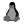</a> | **📂 檔名:** `linux-1.svg` ✨ **格式:** `Vector (SVG)` ⚖️ **大小:** `6.88KB` 📅 **更新:** `2026-03-03`  🚀 **jsDelivr Markdown:** `` 🔗 **直接連結 (Url):** <code>https://cdn.jsdelivr.net/gh/barry028/materials@main/images/iCons/Unicons/linux-1.svg</code> 📥 [檢視原始檔](linux-1.svg) |
|  | **📂 檔名:** `linux.svg` ✨ **格式:** `Vector (SVG)` ⚖️ **大小:** `4.78KB` 📅 **更新:** `2026-03-03`  🚀 **jsDelivr Markdown:** `` 🔗 **直接連結 (Url):** <code>https://cdn.jsdelivr.net/gh/barry028/materials@main/images/iCons/Unicons/linux.svg</code> 📥 [檢視原始檔](linux.svg) |
|  | **📂 檔名:** `lira-sign.svg` ✨ **格式:** `Vector (SVG)` ⚖️ **大小:** `2.09KB` 📅 **更新:** `2026-03-03`  🚀 **jsDelivr Markdown:** `` 🔗 **直接連結 (Url):** <code>https://cdn.jsdelivr.net/gh/barry028/materials@main/images/iCons/Unicons/lira-sign.svg</code> 📥 [檢視原始檔](lira-sign.svg) |
|  | **📂 檔名:** `list-ol-alt.svg` ✨ **格式:** `Vector (SVG)` ⚖️ **大小:** `1008.00B` 📅 **更新:** `2026-03-03`  🚀 **jsDelivr Markdown:** `` 🔗 **直接連結 (Url):** <code>https://cdn.jsdelivr.net/gh/barry028/materials@main/images/iCons/Unicons/list-ol-alt.svg</code> 📥 [檢視原始檔](list-ol-alt.svg) |
|  | **📂 檔名:** `list-ol.svg` ✨ **格式:** `Vector (SVG)` ⚖️ **大小:** `812.00B` 📅 **更新:** `2026-03-03`  🚀 **jsDelivr Markdown:** `` 🔗 **直接連結 (Url):** <code>https://cdn.jsdelivr.net/gh/barry028/materials@main/images/iCons/Unicons/list-ol.svg</code> 📥 [檢視原始檔](list-ol.svg) |
|  | **📂 檔名:** `list-ui-alt-1.svg` ✨ **格式:** `Vector (SVG)` ⚖️ **大小:** `1.56KB` 📅 **更新:** `2026-03-03`  🚀 **jsDelivr Markdown:** `` 🔗 **直接連結 (Url):** <code>https://cdn.jsdelivr.net/gh/barry028/materials@main/images/iCons/Unicons/list-ui-alt-1.svg</code> 📥 [檢視原始檔](list-ui-alt-1.svg) |
|  | **📂 檔名:** `list-ui-alt-2.svg` ✨ **格式:** `Vector (SVG)` ⚖️ **大小:** `777.00B` 📅 **更新:** `2026-03-03`  🚀 **jsDelivr Markdown:** `` 🔗 **直接連結 (Url):** <code>https://cdn.jsdelivr.net/gh/barry028/materials@main/images/iCons/Unicons/list-ui-alt-2.svg</code> 📥 [檢視原始檔](list-ui-alt-2.svg) |
|  | **📂 檔名:** `list-ui-alt-3.svg` ✨ **格式:** `Vector (SVG)` ⚖️ **大小:** `1.29KB` 📅 **更新:** `2026-03-03`  🚀 **jsDelivr Markdown:** `` 🔗 **直接連結 (Url):** <code>https://cdn.jsdelivr.net/gh/barry028/materials@main/images/iCons/Unicons/list-ui-alt-3.svg</code> 📥 [檢視原始檔](list-ui-alt-3.svg) |
|  | **📂 檔名:** `list-ui-alt.svg` ✨ **格式:** `Vector (SVG)` ⚖️ **大小:** `2.41KB` 📅 **更新:** `2026-03-03`  🚀 **jsDelivr Markdown:** `` 🔗 **直接連結 (Url):** <code>https://cdn.jsdelivr.net/gh/barry028/materials@main/images/iCons/Unicons/list-ui-alt.svg</code> 📥 [檢視原始檔](list-ui-alt.svg) |
|  | **📂 檔名:** `list-ul-1.svg` ✨ **格式:** `Vector (SVG)` ⚖️ **大小:** `3.17KB` 📅 **更新:** `2026-03-03`  🚀 **jsDelivr Markdown:** `` 🔗 **直接連結 (Url):** <code>https://cdn.jsdelivr.net/gh/barry028/materials@main/images/iCons/Unicons/list-ul-1.svg</code> 📥 [檢視原始檔](list-ul-1.svg) |
|  | **📂 檔名:** `list-ul-2.svg` ✨ **格式:** `Vector (SVG)` ⚖️ **大小:** `1.96KB` 📅 **更新:** `2026-03-03`  🚀 **jsDelivr Markdown:** `` 🔗 **直接連結 (Url):** <code>https://cdn.jsdelivr.net/gh/barry028/materials@main/images/iCons/Unicons/list-ul-2.svg</code> 📥 [檢視原始檔](list-ul-2.svg) |
|  | **📂 檔名:** `list-ul-3.svg` ✨ **格式:** `Vector (SVG)` ⚖️ **大小:** `872.00B` 📅 **更新:** `2026-03-03`  🚀 **jsDelivr Markdown:** `` 🔗 **直接連結 (Url):** <code>https://cdn.jsdelivr.net/gh/barry028/materials@main/images/iCons/Unicons/list-ul-3.svg</code> 📥 [檢視原始檔](list-ul-3.svg) |
|  | **📂 檔名:** `list-ul.svg` ✨ **格式:** `Vector (SVG)` ⚖️ **大小:** `3.02KB` 📅 **更新:** `2026-03-03`  🚀 **jsDelivr Markdown:** `` 🔗 **直接連結 (Url):** <code>https://cdn.jsdelivr.net/gh/barry028/materials@main/images/iCons/Unicons/list-ul.svg</code> 📥 [檢視原始檔](list-ul.svg) |
|  | **📂 檔名:** `location-arrow-alt.svg` ✨ **格式:** `Vector (SVG)` ⚖️ **大小:** `1.56KB` 📅 **更新:** `2026-03-03`  🚀 **jsDelivr Markdown:** `` 🔗 **直接連結 (Url):** <code>https://cdn.jsdelivr.net/gh/barry028/materials@main/images/iCons/Unicons/location-arrow-alt.svg</code> 📥 [檢視原始檔](location-arrow-alt.svg) |
|  | **📂 檔名:** `location-arrow.svg` ✨ **格式:** `Vector (SVG)` ⚖️ **大小:** `1.51KB` 📅 **更新:** `2026-03-03`  🚀 **jsDelivr Markdown:** `` 🔗 **直接連結 (Url):** <code>https://cdn.jsdelivr.net/gh/barry028/materials@main/images/iCons/Unicons/location-arrow.svg</code> 📥 [檢視原始檔](location-arrow.svg) |
|  | **📂 檔名:** `location-pin-alt.svg` ✨ **格式:** `Vector (SVG)` ⚖️ **大小:** `1.99KB` 📅 **更新:** `2026-03-03`  🚀 **jsDelivr Markdown:** `` 🔗 **直接連結 (Url):** <code>https://cdn.jsdelivr.net/gh/barry028/materials@main/images/iCons/Unicons/location-pin-alt.svg</code> 📥 [檢視原始檔](location-pin-alt.svg) |
|  | **📂 檔名:** `location-point.svg` ✨ **格式:** `Vector (SVG)` ⚖️ **大小:** `2.07KB` 📅 **更新:** `2026-03-03`  🚀 **jsDelivr Markdown:** `` 🔗 **直接連結 (Url):** <code>https://cdn.jsdelivr.net/gh/barry028/materials@main/images/iCons/Unicons/location-point.svg</code> 📥 [檢視原始檔](location-point.svg) |
|  | **📂 檔名:** `lock-1.svg` ✨ **格式:** `Vector (SVG)` ⚖️ **大小:** `937.00B` 📅 **更新:** `2026-03-03`  🚀 **jsDelivr Markdown:** `` 🔗 **直接連結 (Url):** <code>https://cdn.jsdelivr.net/gh/barry028/materials@main/images/iCons/Unicons/lock-1.svg</code> 📥 [檢視原始檔](lock-1.svg) |
|  | **📂 檔名:** `lock-2.svg` ✨ **格式:** `Vector (SVG)` ⚖️ **大小:** `310.00B` 📅 **更新:** `2026-03-03`  🚀 **jsDelivr Markdown:** `` 🔗 **直接連結 (Url):** <code>https://cdn.jsdelivr.net/gh/barry028/materials@main/images/iCons/Unicons/lock-2.svg</code> 📥 [檢視原始檔](lock-2.svg) |
|  | **📂 檔名:** `lock-access-1.svg` ✨ **格式:** `Vector (SVG)` ⚖️ **大小:** `810.00B` 📅 **更新:** `2026-03-03`  🚀 **jsDelivr Markdown:** `` 🔗 **直接連結 (Url):** <code>https://cdn.jsdelivr.net/gh/barry028/materials@main/images/iCons/Unicons/lock-access-1.svg</code> 📥 [檢視原始檔](lock-access-1.svg) |
|  | **📂 檔名:** `lock-access-2.svg` ✨ **格式:** `Vector (SVG)` ⚖️ **大小:** `777.00B` 📅 **更新:** `2026-03-03`  🚀 **jsDelivr Markdown:** `` 🔗 **直接連結 (Url):** <code>https://cdn.jsdelivr.net/gh/barry028/materials@main/images/iCons/Unicons/lock-access-2.svg</code> 📥 [檢視原始檔](lock-access-2.svg) |
|  | **📂 檔名:** `lock-access.svg` ✨ **格式:** `Vector (SVG)` ⚖️ **大小:** `2.28KB` 📅 **更新:** `2026-03-03`  🚀 **jsDelivr Markdown:** `` 🔗 **直接連結 (Url):** <code>https://cdn.jsdelivr.net/gh/barry028/materials@main/images/iCons/Unicons/lock-access.svg</code> 📥 [檢視原始檔](lock-access.svg) |
|  | **📂 檔名:** `lock-alt-1.svg` ✨ **格式:** `Vector (SVG)` ⚖️ **大小:** `820.00B` 📅 **更新:** `2026-03-03`  🚀 **jsDelivr Markdown:** `` 🔗 **直接連結 (Url):** <code>https://cdn.jsdelivr.net/gh/barry028/materials@main/images/iCons/Unicons/lock-alt-1.svg</code> 📥 [檢視原始檔](lock-alt-1.svg) |
|  | **📂 檔名:** `lock-alt-2.svg` ✨ **格式:** `Vector (SVG)` ⚖️ **大小:** `411.00B` 📅 **更新:** `2026-03-03`  🚀 **jsDelivr Markdown:** `` 🔗 **直接連結 (Url):** <code>https://cdn.jsdelivr.net/gh/barry028/materials@main/images/iCons/Unicons/lock-alt-2.svg</code> 📥 [檢視原始檔](lock-alt-2.svg) |
|  | **📂 檔名:** `lock-alt.svg` ✨ **格式:** `Vector (SVG)` ⚖️ **大小:** `1.35KB` 📅 **更新:** `2026-03-03`  🚀 **jsDelivr Markdown:** `` 🔗 **直接連結 (Url):** <code>https://cdn.jsdelivr.net/gh/barry028/materials@main/images/iCons/Unicons/lock-alt.svg</code> 📥 [檢視原始檔](lock-alt.svg) |
|  | **📂 檔名:** `lock-open-alt-1.svg` ✨ **格式:** `Vector (SVG)` ⚖️ **大小:** `1.42KB` 📅 **更新:** `2026-03-03`  🚀 **jsDelivr Markdown:** `` 🔗 **直接連結 (Url):** <code>https://cdn.jsdelivr.net/gh/barry028/materials@main/images/iCons/Unicons/lock-open-alt-1.svg</code> 📥 [檢視原始檔](lock-open-alt-1.svg) |
|  | **📂 檔名:** `lock-open-alt-2.svg` ✨ **格式:** `Vector (SVG)` ⚖️ **大小:** `572.00B` 📅 **更新:** `2026-03-03`  🚀 **jsDelivr Markdown:** `` 🔗 **直接連結 (Url):** <code>https://cdn.jsdelivr.net/gh/barry028/materials@main/images/iCons/Unicons/lock-open-alt-2.svg</code> 📥 [檢視原始檔](lock-open-alt-2.svg) |
|  | **📂 檔名:** `lock-open-alt.svg` ✨ **格式:** `Vector (SVG)` ⚖️ **大小:** `2.24KB` 📅 **更新:** `2026-03-03`  🚀 **jsDelivr Markdown:** `` 🔗 **直接連結 (Url):** <code>https://cdn.jsdelivr.net/gh/barry028/materials@main/images/iCons/Unicons/lock-open-alt.svg</code> 📥 [檢視原始檔](lock-open-alt.svg) |
|  | **📂 檔名:** `lock-slash.svg` ✨ **格式:** `Vector (SVG)` ⚖️ **大小:** `2.90KB` 📅 **更新:** `2026-03-03`  🚀 **jsDelivr Markdown:** `` 🔗 **直接連結 (Url):** <code>https://cdn.jsdelivr.net/gh/barry028/materials@main/images/iCons/Unicons/lock-slash.svg</code> 📥 [檢視原始檔](lock-slash.svg) |
|  | **📂 檔名:** `lock.svg` ✨ **格式:** `Vector (SVG)` ⚖️ **大小:** `1.04KB` 📅 **更新:** `2026-03-03`  🚀 **jsDelivr Markdown:** `` 🔗 **直接連結 (Url):** <code>https://cdn.jsdelivr.net/gh/barry028/materials@main/images/iCons/Unicons/lock.svg</code> 📥 [檢視原始檔](lock.svg) |
|  | **📂 檔名:** `lottiefiles-1.svg` ✨ **格式:** `Vector (SVG)` ⚖️ **大小:** `1.38KB` 📅 **更新:** `2026-03-03`  🚀 **jsDelivr Markdown:** `` 🔗 **直接連結 (Url):** <code>https://cdn.jsdelivr.net/gh/barry028/materials@main/images/iCons/Unicons/lottiefiles-1.svg</code> 📥 [檢視原始檔](lottiefiles-1.svg) |
|  | **📂 檔名:** `lottiefiles-alt.svg` ✨ **格式:** `Vector (SVG)` ⚖️ **大小:** `933.00B` 📅 **更新:** `2026-03-03`  🚀 **jsDelivr Markdown:** `` 🔗 **直接連結 (Url):** <code>https://cdn.jsdelivr.net/gh/barry028/materials@main/images/iCons/Unicons/lottiefiles-alt.svg</code> 📥 [檢視原始檔](lottiefiles-alt.svg) |
|  | **📂 檔名:** `lottiefiles.svg` ✨ **格式:** `Vector (SVG)` ⚖️ **大小:** `492.00B` 📅 **更新:** `2026-03-03`  🚀 **jsDelivr Markdown:** `` 🔗 **直接連結 (Url):** <code>https://cdn.jsdelivr.net/gh/barry028/materials@main/images/iCons/Unicons/lottiefiles.svg</code> 📥 [檢視原始檔](lottiefiles.svg) |
|  | **📂 檔名:** `luggage-cart.svg` ✨ **格式:** `Vector (SVG)` ⚖️ **大小:** `1.58KB` 📅 **更新:** `2026-03-03`  🚀 **jsDelivr Markdown:** `` 🔗 **直接連結 (Url):** <code>https://cdn.jsdelivr.net/gh/barry028/materials@main/images/iCons/Unicons/luggage-cart.svg</code> 📥 [檢視原始檔](luggage-cart.svg) |
|  | **📂 檔名:** `mailbox-alt.svg` ✨ **格式:** `Vector (SVG)` ⚖️ **大小:** `1.62KB` 📅 **更新:** `2026-03-03`  🚀 **jsDelivr Markdown:** `` 🔗 **直接連結 (Url):** <code>https://cdn.jsdelivr.net/gh/barry028/materials@main/images/iCons/Unicons/mailbox-alt.svg</code> 📥 [檢視原始檔](mailbox-alt.svg) |
|  | **📂 檔名:** `mailbox.svg` ✨ **格式:** `Vector (SVG)` ⚖️ **大小:** `1.41KB` 📅 **更新:** `2026-03-03`  🚀 **jsDelivr Markdown:** `` 🔗 **直接連結 (Url):** <code>https://cdn.jsdelivr.net/gh/barry028/materials@main/images/iCons/Unicons/mailbox.svg</code> 📥 [檢視原始檔](mailbox.svg) |
|  | **📂 檔名:** `map-marker-alt.svg` ✨ **格式:** `Vector (SVG)` ⚖️ **大小:** `2.18KB` 📅 **更新:** `2026-03-03`  🚀 **jsDelivr Markdown:** `` 🔗 **直接連結 (Url):** <code>https://cdn.jsdelivr.net/gh/barry028/materials@main/images/iCons/Unicons/map-marker-alt.svg</code> 📥 [檢視原始檔](map-marker-alt.svg) |
|  | **📂 檔名:** `map-marker-edit.svg` ✨ **格式:** `Vector (SVG)` ⚖️ **大小:** `1.94KB` 📅 **更新:** `2026-03-03`  🚀 **jsDelivr Markdown:** `` 🔗 **直接連結 (Url):** <code>https://cdn.jsdelivr.net/gh/barry028/materials@main/images/iCons/Unicons/map-marker-edit.svg</code> 📥 [檢視原始檔](map-marker-edit.svg) |
|  | **📂 檔名:** `map-marker-info.svg` ✨ **格式:** `Vector (SVG)` ⚖️ **大小:** `2.37KB` 📅 **更新:** `2026-03-03`  🚀 **jsDelivr Markdown:** `` 🔗 **直接連結 (Url):** <code>https://cdn.jsdelivr.net/gh/barry028/materials@main/images/iCons/Unicons/map-marker-info.svg</code> 📥 [檢視原始檔](map-marker-info.svg) |
|  | **📂 檔名:** `map-marker-minus.svg` ✨ **格式:** `Vector (SVG)` ⚖️ **大小:** `1.66KB` 📅 **更新:** `2026-03-03`  🚀 **jsDelivr Markdown:** `` 🔗 **直接連結 (Url):** <code>https://cdn.jsdelivr.net/gh/barry028/materials@main/images/iCons/Unicons/map-marker-minus.svg</code> 📥 [檢視原始檔](map-marker-minus.svg) |
|  | **📂 檔名:** `map-marker-plus.svg` ✨ **格式:** `Vector (SVG)` ⚖️ **大小:** `2.03KB` 📅 **更新:** `2026-03-03`  🚀 **jsDelivr Markdown:** `` 🔗 **直接連結 (Url):** <code>https://cdn.jsdelivr.net/gh/barry028/materials@main/images/iCons/Unicons/map-marker-plus.svg</code> 📥 [檢視原始檔](map-marker-plus.svg) |
|  | **📂 檔名:** `map-marker-question.svg` ✨ **格式:** `Vector (SVG)` ⚖️ **大小:** `2.91KB` 📅 **更新:** `2026-03-03`  🚀 **jsDelivr Markdown:** `` 🔗 **直接連結 (Url):** <code>https://cdn.jsdelivr.net/gh/barry028/materials@main/images/iCons/Unicons/map-marker-question.svg</code> 📥 [檢視原始檔](map-marker-question.svg) |
|  | **📂 檔名:** `map-marker-shield.svg` ✨ **格式:** `Vector (SVG)` ⚖️ **大小:** `2.55KB` 📅 **更新:** `2026-03-03`  🚀 **jsDelivr Markdown:** `` 🔗 **直接連結 (Url):** <code>https://cdn.jsdelivr.net/gh/barry028/materials@main/images/iCons/Unicons/map-marker-shield.svg</code> 📥 [檢視原始檔](map-marker-shield.svg) |
|  | **📂 檔名:** `map-marker-slash.svg` ✨ **格式:** `Vector (SVG)` ⚖️ **大小:** `2.47KB` 📅 **更新:** `2026-03-03`  🚀 **jsDelivr Markdown:** `` 🔗 **直接連結 (Url):** <code>https://cdn.jsdelivr.net/gh/barry028/materials@main/images/iCons/Unicons/map-marker-slash.svg</code> 📥 [檢視原始檔](map-marker-slash.svg) |
|  | **📂 檔名:** `map-marker.svg` ✨ **格式:** `Vector (SVG)` ⚖️ **大小:** `1.48KB` 📅 **更新:** `2026-03-03`  🚀 **jsDelivr Markdown:** `` 🔗 **直接連結 (Url):** <code>https://cdn.jsdelivr.net/gh/barry028/materials@main/images/iCons/Unicons/map-marker.svg</code> 📥 [檢視原始檔](map-marker.svg) |
|  | **📂 檔名:** `map-pin-alt.svg` ✨ **格式:** `Vector (SVG)` ⚖️ **大小:** `2.04KB` 📅 **更新:** `2026-03-03`  🚀 **jsDelivr Markdown:** `` 🔗 **直接連結 (Url):** <code>https://cdn.jsdelivr.net/gh/barry028/materials@main/images/iCons/Unicons/map-pin-alt.svg</code> 📥 [檢視原始檔](map-pin-alt.svg) |
|  | **📂 檔名:** `map-pin.svg` ✨ **格式:** `Vector (SVG)` ⚖️ **大小:** `1.87KB` 📅 **更新:** `2026-03-03`  🚀 **jsDelivr Markdown:** `` 🔗 **直接連結 (Url):** <code>https://cdn.jsdelivr.net/gh/barry028/materials@main/images/iCons/Unicons/map-pin.svg</code> 📥 [檢視原始檔](map-pin.svg) |
|  | **📂 檔名:** `map.svg` ✨ **格式:** `Vector (SVG)` ⚖️ **大小:** `1.02KB` 📅 **更新:** `2026-03-03`  🚀 **jsDelivr Markdown:** `` 🔗 **直接連結 (Url):** <code>https://cdn.jsdelivr.net/gh/barry028/materials@main/images/iCons/Unicons/map.svg</code> 📥 [檢視原始檔](map.svg) |
|  | **📂 檔名:** `mars.svg` ✨ **格式:** `Vector (SVG)` ⚖️ **大小:** `1.43KB` 📅 **更新:** `2026-03-03`  🚀 **jsDelivr Markdown:** `` 🔗 **直接連結 (Url):** <code>https://cdn.jsdelivr.net/gh/barry028/materials@main/images/iCons/Unicons/mars.svg</code> 📥 [檢視原始檔](mars.svg) |
|  | **📂 檔名:** `master-card-1.svg` ✨ **格式:** `Vector (SVG)` ⚖️ **大小:** `585.00B` 📅 **更新:** `2026-03-03`  🚀 **jsDelivr Markdown:** `` 🔗 **直接連結 (Url):** <code>https://cdn.jsdelivr.net/gh/barry028/materials@main/images/iCons/Unicons/master-card-1.svg</code> 📥 [檢視原始檔](master-card-1.svg) |
|  | **📂 檔名:** `master-card-2.svg` ✨ **格式:** `Vector (SVG)` ⚖️ **大小:** `1.30KB` 📅 **更新:** `2026-03-03`  🚀 **jsDelivr Markdown:** `` 🔗 **直接連結 (Url):** <code>https://cdn.jsdelivr.net/gh/barry028/materials@main/images/iCons/Unicons/master-card-2.svg</code> 📥 [檢視原始檔](master-card-2.svg) |
|  | **📂 檔名:** `master-card.svg` ✨ **格式:** `Vector (SVG)` ⚖️ **大小:** `2.11KB` 📅 **更新:** `2026-03-03`  🚀 **jsDelivr Markdown:** `` 🔗 **直接連結 (Url):** <code>https://cdn.jsdelivr.net/gh/barry028/materials@main/images/iCons/Unicons/master-card.svg</code> 📥 [檢視原始檔](master-card.svg) |
|  | **📂 檔名:** `maximize-left.svg` ✨ **格式:** `Vector (SVG)` ⚖️ **大小:** `1.55KB` 📅 **更新:** `2026-03-03`  🚀 **jsDelivr Markdown:** `` 🔗 **直接連結 (Url):** <code>https://cdn.jsdelivr.net/gh/barry028/materials@main/images/iCons/Unicons/maximize-left.svg</code> 📥 [檢視原始檔](maximize-left.svg) |
|  | **📂 檔名:** `medal.svg` ✨ **格式:** `Vector (SVG)` ⚖️ **大小:** `1.90KB` 📅 **更新:** `2026-03-03`  🚀 **jsDelivr Markdown:** `` 🔗 **直接連結 (Url):** <code>https://cdn.jsdelivr.net/gh/barry028/materials@main/images/iCons/Unicons/medal.svg</code> 📥 [檢視原始檔](medal.svg) |
|  | **📂 檔名:** `medical-drip.svg` ✨ **格式:** `Vector (SVG)` ⚖️ **大小:** `2.09KB` 📅 **更新:** `2026-03-03`  🚀 **jsDelivr Markdown:** `` 🔗 **直接連結 (Url):** <code>https://cdn.jsdelivr.net/gh/barry028/materials@main/images/iCons/Unicons/medical-drip.svg</code> 📥 [檢視原始檔](medical-drip.svg) |
|  | **📂 檔名:** `medical-square-full.svg` ✨ **格式:** `Vector (SVG)` ⚖️ **大小:** `1.51KB` 📅 **更新:** `2026-03-03`  🚀 **jsDelivr Markdown:** `` 🔗 **直接連結 (Url):** <code>https://cdn.jsdelivr.net/gh/barry028/materials@main/images/iCons/Unicons/medical-square-full.svg</code> 📥 [檢視原始檔](medical-square-full.svg) |
|  | **📂 檔名:** `medical-square.svg` ✨ **格式:** `Vector (SVG)` ⚖️ **大小:** `1.69KB` 📅 **更新:** `2026-03-03`  🚀 **jsDelivr Markdown:** `` 🔗 **直接連結 (Url):** <code>https://cdn.jsdelivr.net/gh/barry028/materials@main/images/iCons/Unicons/medical-square.svg</code> 📥 [檢視原始檔](medical-square.svg) |
|  | **📂 檔名:** `medium-m-1.svg` ✨ **格式:** `Vector (SVG)` ⚖️ **大小:** `733.00B` 📅 **更新:** `2026-03-03`  🚀 **jsDelivr Markdown:** `` 🔗 **直接連結 (Url):** <code>https://cdn.jsdelivr.net/gh/barry028/materials@main/images/iCons/Unicons/medium-m-1.svg</code> 📥 [檢視原始檔](medium-m-1.svg) |
|  | **📂 檔名:** `medium-m.svg` ✨ **格式:** `Vector (SVG)` ⚖️ **大小:** `735.00B` 📅 **更新:** `2026-03-03`  🚀 **jsDelivr Markdown:** `` 🔗 **直接連結 (Url):** <code>https://cdn.jsdelivr.net/gh/barry028/materials@main/images/iCons/Unicons/medium-m.svg</code> 📥 [檢視原始檔](medium-m.svg) |
|  | **📂 檔名:** `medkit.svg` ✨ **格式:** `Vector (SVG)` ⚖️ **大小:** `1.68KB` 📅 **更新:** `2026-03-03`  🚀 **jsDelivr Markdown:** `` 🔗 **直接連結 (Url):** <code>https://cdn.jsdelivr.net/gh/barry028/materials@main/images/iCons/Unicons/medkit.svg</code> 📥 [檢視原始檔](medkit.svg) |
|  | **📂 檔名:** `meeting-board.svg` ✨ **格式:** `Vector (SVG)` ⚖️ **大小:** `2.25KB` 📅 **更新:** `2026-03-03`  🚀 **jsDelivr Markdown:** `` 🔗 **直接連結 (Url):** <code>https://cdn.jsdelivr.net/gh/barry028/materials@main/images/iCons/Unicons/meeting-board.svg</code> 📥 [檢視原始檔](meeting-board.svg) |
|  | **📂 檔名:** `megaphone.svg` ✨ **格式:** `Vector (SVG)` ⚖️ **大小:** `1.85KB` 📅 **更新:** `2026-03-03`  🚀 **jsDelivr Markdown:** `` 🔗 **直接連結 (Url):** <code>https://cdn.jsdelivr.net/gh/barry028/materials@main/images/iCons/Unicons/megaphone.svg</code> 📥 [檢視原始檔](megaphone.svg) |
|  | **📂 檔名:** `meh-alt.svg` ✨ **格式:** `Vector (SVG)` ⚖️ **大小:** `1.99KB` 📅 **更新:** `2026-03-03`  🚀 **jsDelivr Markdown:** `` 🔗 **直接連結 (Url):** <code>https://cdn.jsdelivr.net/gh/barry028/materials@main/images/iCons/Unicons/meh-alt.svg</code> 📥 [檢視原始檔](meh-alt.svg) |
|  | **📂 檔名:** `meh-closed-eye.svg` ✨ **格式:** `Vector (SVG)` ⚖️ **大小:** `2.83KB` 📅 **更新:** `2026-03-03`  🚀 **jsDelivr Markdown:** `` 🔗 **直接連結 (Url):** <code>https://cdn.jsdelivr.net/gh/barry028/materials@main/images/iCons/Unicons/meh-closed-eye.svg</code> 📥 [檢視原始檔](meh-closed-eye.svg) |
|  | **📂 檔名:** `meh.svg` ✨ **格式:** `Vector (SVG)` ⚖️ **大小:** `2.23KB` 📅 **更新:** `2026-03-03`  🚀 **jsDelivr Markdown:** `` 🔗 **直接連結 (Url):** <code>https://cdn.jsdelivr.net/gh/barry028/materials@main/images/iCons/Unicons/meh.svg</code> 📥 [檢視原始檔](meh.svg) |
|  | **📂 檔名:** `message.svg` ✨ **格式:** `Vector (SVG)` ⚖️ **大小:** `1.77KB` 📅 **更新:** `2026-03-03`  🚀 **jsDelivr Markdown:** `` 🔗 **直接連結 (Url):** <code>https://cdn.jsdelivr.net/gh/barry028/materials@main/images/iCons/Unicons/message.svg</code> 📥 [檢視原始檔](message.svg) |
|  | **📂 檔名:** `metro.svg` ✨ **格式:** `Vector (SVG)` ⚖️ **大小:** `3.30KB` 📅 **更新:** `2026-03-03`  🚀 **jsDelivr Markdown:** `` 🔗 **直接連結 (Url):** <code>https://cdn.jsdelivr.net/gh/barry028/materials@main/images/iCons/Unicons/metro.svg</code> 📥 [檢視原始檔](metro.svg) |
|  | **📂 檔名:** `microphone-slash.svg` ✨ **格式:** `Vector (SVG)` ⚖️ **大小:** `3.31KB` 📅 **更新:** `2026-03-03`  🚀 **jsDelivr Markdown:** `` 🔗 **直接連結 (Url):** <code>https://cdn.jsdelivr.net/gh/barry028/materials@main/images/iCons/Unicons/microphone-slash.svg</code> 📥 [檢視原始檔](microphone-slash.svg) |
|  | **📂 檔名:** `microphone.svg` ✨ **格式:** `Vector (SVG)` ⚖️ **大小:** `1.65KB` 📅 **更新:** `2026-03-03`  🚀 **jsDelivr Markdown:** `` 🔗 **直接連結 (Url):** <code>https://cdn.jsdelivr.net/gh/barry028/materials@main/images/iCons/Unicons/microphone.svg</code> 📥 [檢視原始檔](microphone.svg) |
|  | **📂 檔名:** `microscope-1.svg` ✨ **格式:** `Vector (SVG)` ⚖️ **大小:** `3.11KB` 📅 **更新:** `2026-03-03`  🚀 **jsDelivr Markdown:** `` 🔗 **直接連結 (Url):** <code>https://cdn.jsdelivr.net/gh/barry028/materials@main/images/iCons/Unicons/microscope-1.svg</code> 📥 [檢視原始檔](microscope-1.svg) |
|  | **📂 檔名:** `microscope-2.svg` ✨ **格式:** `Vector (SVG)` ⚖️ **大小:** `1002.00B` 📅 **更新:** `2026-03-03`  🚀 **jsDelivr Markdown:** `` 🔗 **直接連結 (Url):** <code>https://cdn.jsdelivr.net/gh/barry028/materials@main/images/iCons/Unicons/microscope-2.svg</code> 📥 [檢視原始檔](microscope-2.svg) |
|  | **📂 檔名:** `microscope-3.svg` ✨ **格式:** `Vector (SVG)` ⚖️ **大小:** `1.22KB` 📅 **更新:** `2026-03-03`  🚀 **jsDelivr Markdown:** `` 🔗 **直接連結 (Url):** <code>https://cdn.jsdelivr.net/gh/barry028/materials@main/images/iCons/Unicons/microscope-3.svg</code> 📥 [檢視原始檔](microscope-3.svg) |
|  | **📂 檔名:** `microscope.svg` ✨ **格式:** `Vector (SVG)` ⚖️ **大小:** `3.38KB` 📅 **更新:** `2026-03-03`  🚀 **jsDelivr Markdown:** `` 🔗 **直接連結 (Url):** <code>https://cdn.jsdelivr.net/gh/barry028/materials@main/images/iCons/Unicons/microscope.svg</code> 📥 [檢視原始檔](microscope.svg) |
|  | **📂 檔名:** `microsoft-1.svg` ✨ **格式:** `Vector (SVG)` ⚖️ **大小:** `347.00B` 📅 **更新:** `2026-03-03`  🚀 **jsDelivr Markdown:** `` 🔗 **直接連結 (Url):** <code>https://cdn.jsdelivr.net/gh/barry028/materials@main/images/iCons/Unicons/microsoft-1.svg</code> 📥 [檢視原始檔](microsoft-1.svg) |
|  | **📂 檔名:** `microsoft.svg` ✨ **格式:** `Vector (SVG)` ⚖️ **大小:** `220.00B` 📅 **更新:** `2026-03-03`  🚀 **jsDelivr Markdown:** `` 🔗 **直接連結 (Url):** <code>https://cdn.jsdelivr.net/gh/barry028/materials@main/images/iCons/Unicons/microsoft.svg</code> 📥 [檢視原始檔](microsoft.svg) |
|  | **📂 檔名:** `minus-circle.svg` ✨ **格式:** `Vector (SVG)` ⚖️ **大小:** `1.38KB` 📅 **更新:** `2026-03-03`  🚀 **jsDelivr Markdown:** `` 🔗 **直接連結 (Url):** <code>https://cdn.jsdelivr.net/gh/barry028/materials@main/images/iCons/Unicons/minus-circle.svg</code> 📥 [檢視原始檔](minus-circle.svg) |
|  | **📂 檔名:** `minus-path.svg` ✨ **格式:** `Vector (SVG)` ⚖️ **大小:** `2.67KB` 📅 **更新:** `2026-03-03`  🚀 **jsDelivr Markdown:** `` 🔗 **直接連結 (Url):** <code>https://cdn.jsdelivr.net/gh/barry028/materials@main/images/iCons/Unicons/minus-path.svg</code> 📥 [檢視原始檔](minus-path.svg) |
|  | **📂 檔名:** `minus-square-full-1.svg` ✨ **格式:** `Vector (SVG)` ⚖️ **大小:** `1.45KB` 📅 **更新:** `2026-03-03`  🚀 **jsDelivr Markdown:** `` 🔗 **直接連結 (Url):** <code>https://cdn.jsdelivr.net/gh/barry028/materials@main/images/iCons/Unicons/minus-square-full-1.svg</code> 📥 [檢視原始檔](minus-square-full-1.svg) |
|  | **📂 檔名:** `minus-square-full-2.svg` ✨ **格式:** `Vector (SVG)` ⚖️ **大小:** `315.00B` 📅 **更新:** `2026-03-03`  🚀 **jsDelivr Markdown:** `` 🔗 **直接連結 (Url):** <code>https://cdn.jsdelivr.net/gh/barry028/materials@main/images/iCons/Unicons/minus-square-full-2.svg</code> 📥 [檢視原始檔](minus-square-full-2.svg) |
|  | **📂 檔名:** `minus-square-full-3.svg` ✨ **格式:** `Vector (SVG)` ⚖️ **大小:** `479.00B` 📅 **更新:** `2026-03-03`  🚀 **jsDelivr Markdown:** `` 🔗 **直接連結 (Url):** <code>https://cdn.jsdelivr.net/gh/barry028/materials@main/images/iCons/Unicons/minus-square-full-3.svg</code> 📥 [檢視原始檔](minus-square-full-3.svg) |
|  | **📂 檔名:** `minus-square-full.svg` ✨ **格式:** `Vector (SVG)` ⚖️ **大小:** `769.00B` 📅 **更新:** `2026-03-03`  🚀 **jsDelivr Markdown:** `` 🔗 **直接連結 (Url):** <code>https://cdn.jsdelivr.net/gh/barry028/materials@main/images/iCons/Unicons/minus-square-full.svg</code> 📥 [檢視原始檔](minus-square-full.svg) |
|  | **📂 檔名:** `minus-square.svg` ✨ **格式:** `Vector (SVG)` ⚖️ **大小:** `1.04KB` 📅 **更新:** `2026-03-03`  🚀 **jsDelivr Markdown:** `` 🔗 **直接連結 (Url):** <code>https://cdn.jsdelivr.net/gh/barry028/materials@main/images/iCons/Unicons/minus-square.svg</code> 📥 [檢視原始檔](minus-square.svg) |
|  | **📂 檔名:** `minus.svg` ✨ **格式:** `Vector (SVG)` ⚖️ **大小:** `441.00B` 📅 **更新:** `2026-03-03`  🚀 **jsDelivr Markdown:** `` 🔗 **直接連結 (Url):** <code>https://cdn.jsdelivr.net/gh/barry028/materials@main/images/iCons/Unicons/minus.svg</code> 📥 [檢視原始檔](minus.svg) |
|  | **📂 檔名:** `missed-call.svg` ✨ **格式:** `Vector (SVG)` ⚖️ **大小:** `3.51KB` 📅 **更新:** `2026-03-03`  🚀 **jsDelivr Markdown:** `` 🔗 **直接連結 (Url):** <code>https://cdn.jsdelivr.net/gh/barry028/materials@main/images/iCons/Unicons/missed-call.svg</code> 📥 [檢視原始檔](missed-call.svg) |
|  | **📂 檔名:** `mobile-android-alt.svg` ✨ **格式:** `Vector (SVG)` ⚖️ **大小:** `772.00B` 📅 **更新:** `2026-03-03`  🚀 **jsDelivr Markdown:** `` 🔗 **直接連結 (Url):** <code>https://cdn.jsdelivr.net/gh/barry028/materials@main/images/iCons/Unicons/mobile-android-alt.svg</code> 📥 [檢視原始檔](mobile-android-alt.svg) |
|  | **📂 檔名:** `mobile-android.svg` ✨ **格式:** `Vector (SVG)` ⚖️ **大小:** `1.29KB` 📅 **更新:** `2026-03-03`  🚀 **jsDelivr Markdown:** `` 🔗 **直接連結 (Url):** <code>https://cdn.jsdelivr.net/gh/barry028/materials@main/images/iCons/Unicons/mobile-android.svg</code> 📥 [檢視原始檔](mobile-android.svg) |
|  | **📂 檔名:** `mobile-vibrate.svg` ✨ **格式:** `Vector (SVG)` ⚖️ **大小:** `3.08KB` 📅 **更新:** `2026-03-03`  🚀 **jsDelivr Markdown:** `` 🔗 **直接連結 (Url):** <code>https://cdn.jsdelivr.net/gh/barry028/materials@main/images/iCons/Unicons/mobile-vibrate.svg</code> 📥 [檢視原始檔](mobile-vibrate.svg) |
|  | **📂 檔名:** `modem-1.svg` ✨ **格式:** `Vector (SVG)` ⚖️ **大小:** `1.12KB` 📅 **更新:** `2026-03-03`  🚀 **jsDelivr Markdown:** `` 🔗 **直接連結 (Url):** <code>https://cdn.jsdelivr.net/gh/barry028/materials@main/images/iCons/Unicons/modem-1.svg</code> 📥 [檢視原始檔](modem-1.svg) |
|  | **📂 檔名:** `modem.svg` ✨ **格式:** `Vector (SVG)` ⚖️ **大小:** `1.55KB` 📅 **更新:** `2026-03-03`  🚀 **jsDelivr Markdown:** `` 🔗 **直接連結 (Url):** <code>https://cdn.jsdelivr.net/gh/barry028/materials@main/images/iCons/Unicons/modem.svg</code> 📥 [檢視原始檔](modem.svg) |
|  | **📂 檔名:** `money-bill-slash.svg` ✨ **格式:** `Vector (SVG)` ⚖️ **大小:** `3.03KB` 📅 **更新:** `2026-03-03`  🚀 **jsDelivr Markdown:** `` 🔗 **直接連結 (Url):** <code>https://cdn.jsdelivr.net/gh/barry028/materials@main/images/iCons/Unicons/money-bill-slash.svg</code> 📥 [檢視原始檔](money-bill-slash.svg) |
|  | **📂 檔名:** `money-bill-stack.svg` ✨ **格式:** `Vector (SVG)` ⚖️ **大小:** `2.16KB` 📅 **更新:** `2026-03-03`  🚀 **jsDelivr Markdown:** `` 🔗 **直接連結 (Url):** <code>https://cdn.jsdelivr.net/gh/barry028/materials@main/images/iCons/Unicons/money-bill-stack.svg</code> 📥 [檢視原始檔](money-bill-stack.svg) |
|  | **📂 檔名:** `money-bill.svg` ✨ **格式:** `Vector (SVG)` ⚖️ **大小:** `2.44KB` 📅 **更新:** `2026-03-03`  🚀 **jsDelivr Markdown:** `` 🔗 **直接連結 (Url):** <code>https://cdn.jsdelivr.net/gh/barry028/materials@main/images/iCons/Unicons/money-bill.svg</code> 📥 [檢視原始檔](money-bill.svg) |
|  | **📂 檔名:** `money-insert.svg` ✨ **格式:** `Vector (SVG)` ⚖️ **大小:** `3.86KB` 📅 **更新:** `2026-03-03`  🚀 **jsDelivr Markdown:** `` 🔗 **直接連結 (Url):** <code>https://cdn.jsdelivr.net/gh/barry028/materials@main/images/iCons/Unicons/money-insert.svg</code> 📥 [檢視原始檔](money-insert.svg) |
|  | **📂 檔名:** `money-stack.svg` ✨ **格式:** `Vector (SVG)` ⚖️ **大小:** `3.05KB` 📅 **更新:** `2026-03-03`  🚀 **jsDelivr Markdown:** `` 🔗 **直接連結 (Url):** <code>https://cdn.jsdelivr.net/gh/barry028/materials@main/images/iCons/Unicons/money-stack.svg</code> 📥 [檢視原始檔](money-stack.svg) |
|  | **📂 檔名:** `money-withdraw.svg` ✨ **格式:** `Vector (SVG)` ⚖️ **大小:** `3.42KB` 📅 **更新:** `2026-03-03`  🚀 **jsDelivr Markdown:** `` 🔗 **直接連結 (Url):** <code>https://cdn.jsdelivr.net/gh/barry028/materials@main/images/iCons/Unicons/money-withdraw.svg</code> 📥 [檢視原始檔](money-withdraw.svg) |
|  | **📂 檔名:** `money-withdrawal.svg` ✨ **格式:** `Vector (SVG)` ⚖️ **大小:** `1.95KB` 📅 **更新:** `2026-03-03`  🚀 **jsDelivr Markdown:** `` 🔗 **直接連結 (Url):** <code>https://cdn.jsdelivr.net/gh/barry028/materials@main/images/iCons/Unicons/money-withdrawal.svg</code> 📥 [檢視原始檔](money-withdrawal.svg) |
|  | **📂 檔名:** `moneybag-alt.svg` ✨ **格式:** `Vector (SVG)` ⚖️ **大小:** `2.54KB` 📅 **更新:** `2026-03-03`  🚀 **jsDelivr Markdown:** `` 🔗 **直接連結 (Url):** <code>https://cdn.jsdelivr.net/gh/barry028/materials@main/images/iCons/Unicons/moneybag-alt.svg</code> 📥 [檢視原始檔](moneybag-alt.svg) |
|  | **📂 檔名:** `moneybag.svg` ✨ **格式:** `Vector (SVG)` ⚖️ **大小:** `2.54KB` 📅 **更新:** `2026-03-03`  🚀 **jsDelivr Markdown:** `` 🔗 **直接連結 (Url):** <code>https://cdn.jsdelivr.net/gh/barry028/materials@main/images/iCons/Unicons/moneybag.svg</code> 📥 [檢視原始檔](moneybag.svg) |
|  | **📂 檔名:** `monitor-heart-rate.svg` ✨ **格式:** `Vector (SVG)` ⚖️ **大小:** `2.82KB` 📅 **更新:** `2026-03-03`  🚀 **jsDelivr Markdown:** `` 🔗 **直接連結 (Url):** <code>https://cdn.jsdelivr.net/gh/barry028/materials@main/images/iCons/Unicons/monitor-heart-rate.svg</code> 📥 [檢視原始檔](monitor-heart-rate.svg) |
|  | **📂 檔名:** `monitor.svg` ✨ **格式:** `Vector (SVG)` ⚖️ **大小:** `1.13KB` 📅 **更新:** `2026-03-03`  🚀 **jsDelivr Markdown:** `` 🔗 **直接連結 (Url):** <code>https://cdn.jsdelivr.net/gh/barry028/materials@main/images/iCons/Unicons/monitor.svg</code> 📥 [檢視原始檔](monitor.svg) |
|  | **📂 檔名:** `moon-eclipse.svg` ✨ **格式:** `Vector (SVG)` ⚖️ **大小:** `1.32KB` 📅 **更新:** `2026-03-03`  🚀 **jsDelivr Markdown:** `` 🔗 **直接連結 (Url):** <code>https://cdn.jsdelivr.net/gh/barry028/materials@main/images/iCons/Unicons/moon-eclipse.svg</code> 📥 [檢視原始檔](moon-eclipse.svg) |
|  | **📂 檔名:** `moon.svg` ✨ **格式:** `Vector (SVG)` ⚖️ **大小:** `1.49KB` 📅 **更新:** `2026-03-03`  🚀 **jsDelivr Markdown:** `` 🔗 **直接連結 (Url):** <code>https://cdn.jsdelivr.net/gh/barry028/materials@main/images/iCons/Unicons/moon.svg</code> 📥 [檢視原始檔](moon.svg) |
|  | **📂 檔名:** `moonset.svg` ✨ **格式:** `Vector (SVG)` ⚖️ **大小:** `2.27KB` 📅 **更新:** `2026-03-03`  🚀 **jsDelivr Markdown:** `` 🔗 **直接連結 (Url):** <code>https://cdn.jsdelivr.net/gh/barry028/materials@main/images/iCons/Unicons/moonset.svg</code> 📥 [檢視原始檔](moonset.svg) |
|  | **📂 檔名:** `mountains-sun.svg` ✨ **格式:** `Vector (SVG)` ⚖️ **大小:** `1.87KB` 📅 **更新:** `2026-03-03`  🚀 **jsDelivr Markdown:** `` 🔗 **直接連結 (Url):** <code>https://cdn.jsdelivr.net/gh/barry028/materials@main/images/iCons/Unicons/mountains-sun.svg</code> 📥 [檢視原始檔](mountains-sun.svg) |
|  | **📂 檔名:** `mountains.svg` ✨ **格式:** `Vector (SVG)` ⚖️ **大小:** `1.01KB` 📅 **更新:** `2026-03-03`  🚀 **jsDelivr Markdown:** `` 🔗 **直接連結 (Url):** <code>https://cdn.jsdelivr.net/gh/barry028/materials@main/images/iCons/Unicons/mountains.svg</code> 📥 [檢視原始檔](mountains.svg) |
|  | **📂 檔名:** `mouse-alt-2-1.svg` ✨ **格式:** `Vector (SVG)` ⚖️ **大小:** `595.00B` 📅 **更新:** `2026-03-03`  🚀 **jsDelivr Markdown:** `` 🔗 **直接連結 (Url):** <code>https://cdn.jsdelivr.net/gh/barry028/materials@main/images/iCons/Unicons/mouse-alt-2-1.svg</code> 📥 [檢視原始檔](mouse-alt-2-1.svg) |
|  | **📂 檔名:** `mouse-alt-2.svg` ✨ **格式:** `Vector (SVG)` ⚖️ **大小:** `919.00B` 📅 **更新:** `2026-03-03`  🚀 **jsDelivr Markdown:** `` 🔗 **直接連結 (Url):** <code>https://cdn.jsdelivr.net/gh/barry028/materials@main/images/iCons/Unicons/mouse-alt-2.svg</code> 📥 [檢視原始檔](mouse-alt-2.svg) |
|  | **📂 檔名:** `mouse-alt.svg` ✨ **格式:** `Vector (SVG)` ⚖️ **大小:** `1.02KB` 📅 **更新:** `2026-03-03`  🚀 **jsDelivr Markdown:** `` 🔗 **直接連結 (Url):** <code>https://cdn.jsdelivr.net/gh/barry028/materials@main/images/iCons/Unicons/mouse-alt.svg</code> 📥 [檢視原始檔](mouse-alt.svg) |
|  | **📂 檔名:** `mouse.svg` ✨ **格式:** `Vector (SVG)` ⚖️ **大小:** `793.00B` 📅 **更新:** `2026-03-03`  🚀 **jsDelivr Markdown:** `` 🔗 **直接連結 (Url):** <code>https://cdn.jsdelivr.net/gh/barry028/materials@main/images/iCons/Unicons/mouse.svg</code> 📥 [檢視原始檔](mouse.svg) |
|  | **📂 檔名:** `multiply-1.svg` ✨ **格式:** `Vector (SVG)` ⚖️ **大小:** `1.12KB` 📅 **更新:** `2026-03-03`  🚀 **jsDelivr Markdown:** `` 🔗 **直接連結 (Url):** <code>https://cdn.jsdelivr.net/gh/barry028/materials@main/images/iCons/Unicons/multiply-1.svg</code> 📥 [檢視原始檔](multiply-1.svg) |
|  | **📂 檔名:** `multiply-2.svg` ✨ **格式:** `Vector (SVG)` ⚖️ **大小:** `455.00B` 📅 **更新:** `2026-03-03`  🚀 **jsDelivr Markdown:** `` 🔗 **直接連結 (Url):** <code>https://cdn.jsdelivr.net/gh/barry028/materials@main/images/iCons/Unicons/multiply-2.svg</code> 📥 [檢視原始檔](multiply-2.svg) |
|  | **📂 檔名:** `multiply-3.svg` ✨ **格式:** `Vector (SVG)` ⚖️ **大小:** `719.00B` 📅 **更新:** `2026-03-03`  🚀 **jsDelivr Markdown:** `` 🔗 **直接連結 (Url):** <code>https://cdn.jsdelivr.net/gh/barry028/materials@main/images/iCons/Unicons/multiply-3.svg</code> 📥 [檢視原始檔](multiply-3.svg) |
|  | **📂 檔名:** `multiply.svg` ✨ **格式:** `Vector (SVG)` ⚖️ **大小:** `1.38KB` 📅 **更新:** `2026-03-03`  🚀 **jsDelivr Markdown:** `` 🔗 **直接連結 (Url):** <code>https://cdn.jsdelivr.net/gh/barry028/materials@main/images/iCons/Unicons/multiply.svg</code> 📥 [檢視原始檔](multiply.svg) |
|  | **📂 檔名:** `music-note.svg` ✨ **格式:** `Vector (SVG)` ⚖️ **大小:** `1.59KB` 📅 **更新:** `2026-03-03`  🚀 **jsDelivr Markdown:** `` 🔗 **直接連結 (Url):** <code>https://cdn.jsdelivr.net/gh/barry028/materials@main/images/iCons/Unicons/music-note.svg</code> 📥 [檢視原始檔](music-note.svg) |
|  | **📂 檔名:** `music-tune-slash.svg` ✨ **格式:** `Vector (SVG)` ⚖️ **大小:** `2.54KB` 📅 **更新:** `2026-03-03`  🚀 **jsDelivr Markdown:** `` 🔗 **直接連結 (Url):** <code>https://cdn.jsdelivr.net/gh/barry028/materials@main/images/iCons/Unicons/music-tune-slash.svg</code> 📥 [檢視原始檔](music-tune-slash.svg) |
|  | **📂 檔名:** `music.svg` ✨ **格式:** `Vector (SVG)` ⚖️ **大小:** `2.22KB` 📅 **更新:** `2026-03-03`  🚀 **jsDelivr Markdown:** `` 🔗 **直接連結 (Url):** <code>https://cdn.jsdelivr.net/gh/barry028/materials@main/images/iCons/Unicons/music.svg</code> 📥 [檢視原始檔](music.svg) |
|  | **📂 檔名:** `n-a.svg` ✨ **格式:** `Vector (SVG)` ⚖️ **大小:** `1.76KB` 📅 **更新:** `2026-03-03`  🚀 **jsDelivr Markdown:** `` 🔗 **直接連結 (Url):** <code>https://cdn.jsdelivr.net/gh/barry028/materials@main/images/iCons/Unicons/n-a.svg</code> 📥 [檢視原始檔](n-a.svg) |
|  | **📂 檔名:** `navigator.svg` ✨ **格式:** `Vector (SVG)` ⚖️ **大小:** `1.29KB` 📅 **更新:** `2026-03-03`  🚀 **jsDelivr Markdown:** `` 🔗 **直接連結 (Url):** <code>https://cdn.jsdelivr.net/gh/barry028/materials@main/images/iCons/Unicons/navigator.svg</code> 📥 [檢視原始檔](navigator.svg) |
|  | **📂 檔名:** `nerd.svg` ✨ **格式:** `Vector (SVG)` ⚖️ **大小:** `3.68KB` 📅 **更新:** `2026-03-03`  🚀 **jsDelivr Markdown:** `` 🔗 **直接連結 (Url):** <code>https://cdn.jsdelivr.net/gh/barry028/materials@main/images/iCons/Unicons/nerd.svg</code> 📥 [檢視原始檔](nerd.svg) |
|  | **📂 檔名:** `newspaper.svg` ✨ **格式:** `Vector (SVG)` ⚖️ **大小:** `2.33KB` 📅 **更新:** `2026-03-03`  🚀 **jsDelivr Markdown:** `` 🔗 **直接連結 (Url):** <code>https://cdn.jsdelivr.net/gh/barry028/materials@main/images/iCons/Unicons/newspaper.svg</code> 📥 [檢視原始檔](newspaper.svg) |
|  | **📂 檔名:** `ninja.svg` ✨ **格式:** `Vector (SVG)` ⚖️ **大小:** `2.70KB` 📅 **更新:** `2026-03-03`  🚀 **jsDelivr Markdown:** `` 🔗 **直接連結 (Url):** <code>https://cdn.jsdelivr.net/gh/barry028/materials@main/images/iCons/Unicons/ninja.svg</code> 📥 [檢視原始檔](ninja.svg) |
|  | **📂 檔名:** `no-entry.svg` ✨ **格式:** `Vector (SVG)` ⚖️ **大小:** `925.00B` 📅 **更新:** `2026-03-03`  🚀 **jsDelivr Markdown:** `` 🔗 **直接連結 (Url):** <code>https://cdn.jsdelivr.net/gh/barry028/materials@main/images/iCons/Unicons/no-entry.svg</code> 📥 [檢視原始檔](no-entry.svg) |
|  | **📂 檔名:** `notebooks.svg` ✨ **格式:** `Vector (SVG)` ⚖️ **大小:** `1.68KB` 📅 **更新:** `2026-03-03`  🚀 **jsDelivr Markdown:** `` 🔗 **直接連結 (Url):** <code>https://cdn.jsdelivr.net/gh/barry028/materials@main/images/iCons/Unicons/notebooks.svg</code> 📥 [檢視原始檔](notebooks.svg) |
|  | **📂 檔名:** `notes.svg` ✨ **格式:** `Vector (SVG)` ⚖️ **大小:** `2.10KB` 📅 **更新:** `2026-03-03`  🚀 **jsDelivr Markdown:** `` 🔗 **直接連結 (Url):** <code>https://cdn.jsdelivr.net/gh/barry028/materials@main/images/iCons/Unicons/notes.svg</code> 📥 [檢視原始檔](notes.svg) |
|  | **📂 檔名:** `object-group-1.svg` ✨ **格式:** `Vector (SVG)` ⚖️ **大小:** `1.39KB` 📅 **更新:** `2026-03-03`  🚀 **jsDelivr Markdown:** `` 🔗 **直接連結 (Url):** <code>https://cdn.jsdelivr.net/gh/barry028/materials@main/images/iCons/Unicons/object-group-1.svg</code> 📥 [檢視原始檔](object-group-1.svg) |
|  | **📂 檔名:** `object-group-2.svg` ✨ **格式:** `Vector (SVG)` ⚖️ **大小:** `734.00B` 📅 **更新:** `2026-03-03`  🚀 **jsDelivr Markdown:** `` 🔗 **直接連結 (Url):** <code>https://cdn.jsdelivr.net/gh/barry028/materials@main/images/iCons/Unicons/object-group-2.svg</code> 📥 [檢視原始檔](object-group-2.svg) |
|  | **📂 檔名:** `object-group-3.svg` ✨ **格式:** `Vector (SVG)` ⚖️ **大小:** `2.18KB` 📅 **更新:** `2026-03-03`  🚀 **jsDelivr Markdown:** `` 🔗 **直接連結 (Url):** <code>https://cdn.jsdelivr.net/gh/barry028/materials@main/images/iCons/Unicons/object-group-3.svg</code> 📥 [檢視原始檔](object-group-3.svg) |
|  | **📂 檔名:** `object-group.svg` ✨ **格式:** `Vector (SVG)` ⚖️ **大小:** `2.55KB` 📅 **更新:** `2026-03-03`  🚀 **jsDelivr Markdown:** `` 🔗 **直接連結 (Url):** <code>https://cdn.jsdelivr.net/gh/barry028/materials@main/images/iCons/Unicons/object-group.svg</code> 📥 [檢視原始檔](object-group.svg) |
| <a href="object-ungroup-1.svg">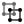</a> | **📂 檔名:** `object-ungroup-1.svg` ✨ **格式:** `Vector (SVG)` ⚖️ **大小:** `2.23KB` 📅 **更新:** `2026-03-03`  🚀 **jsDelivr Markdown:** `` 🔗 **直接連結 (Url):** <code>https://cdn.jsdelivr.net/gh/barry028/materials@main/images/iCons/Unicons/object-ungroup-1.svg</code> 📥 [檢視原始檔](object-ungroup-1.svg) |
|  | **📂 檔名:** `object-ungroup-2.svg` ✨ **格式:** `Vector (SVG)` ⚖️ **大小:** `992.00B` 📅 **更新:** `2026-03-03`  🚀 **jsDelivr Markdown:** `` 🔗 **直接連結 (Url):** <code>https://cdn.jsdelivr.net/gh/barry028/materials@main/images/iCons/Unicons/object-ungroup-2.svg</code> 📥 [檢視原始檔](object-ungroup-2.svg) |
|  | **📂 檔名:** `object-ungroup-3.svg` ✨ **格式:** `Vector (SVG)` ⚖️ **大小:** `2.68KB` 📅 **更新:** `2026-03-03`  🚀 **jsDelivr Markdown:** `` 🔗 **直接連結 (Url):** <code>https://cdn.jsdelivr.net/gh/barry028/materials@main/images/iCons/Unicons/object-ungroup-3.svg</code> 📥 [檢視原始檔](object-ungroup-3.svg) |
|  | **📂 檔名:** `object-ungroup.svg` ✨ **格式:** `Vector (SVG)` ⚖️ **大小:** `3.49KB` 📅 **更新:** `2026-03-03`  🚀 **jsDelivr Markdown:** `` 🔗 **直接連結 (Url):** <code>https://cdn.jsdelivr.net/gh/barry028/materials@main/images/iCons/Unicons/object-ungroup.svg</code> 📥 [檢視原始檔](object-ungroup.svg) |
|  | **📂 檔名:** `octagon.svg` ✨ **格式:** `Vector (SVG)` ⚖️ **大小:** `601.00B` 📅 **更新:** `2026-03-03`  🚀 **jsDelivr Markdown:** `` 🔗 **直接連結 (Url):** <code>https://cdn.jsdelivr.net/gh/barry028/materials@main/images/iCons/Unicons/octagon.svg</code> 📥 [檢視原始檔](octagon.svg) |
|  | **📂 檔名:** `okta-1.svg` ✨ **格式:** `Vector (SVG)` ⚖️ **大小:** `1.15KB` 📅 **更新:** `2026-03-03`  🚀 **jsDelivr Markdown:** `` 🔗 **直接連結 (Url):** <code>https://cdn.jsdelivr.net/gh/barry028/materials@main/images/iCons/Unicons/okta-1.svg</code> 📥 [檢視原始檔](okta-1.svg) |
|  | **📂 檔名:** `okta.svg` ✨ **格式:** `Vector (SVG)` ⚖️ **大小:** `298.00B` 📅 **更新:** `2026-03-03`  🚀 **jsDelivr Markdown:** `` 🔗 **直接連結 (Url):** <code>https://cdn.jsdelivr.net/gh/barry028/materials@main/images/iCons/Unicons/okta.svg</code> 📥 [檢視原始檔](okta.svg) |
|  | **📂 檔名:** `opera-alt-1.svg` ✨ **格式:** `Vector (SVG)` ⚖️ **大小:** `474.00B` 📅 **更新:** `2026-03-03`  🚀 **jsDelivr Markdown:** `` 🔗 **直接連結 (Url):** <code>https://cdn.jsdelivr.net/gh/barry028/materials@main/images/iCons/Unicons/opera-alt-1.svg</code> 📥 [檢視原始檔](opera-alt-1.svg) |
|  | **📂 檔名:** `opera-alt-2.svg` ✨ **格式:** `Vector (SVG)` ⚖️ **大小:** `770.00B` 📅 **更新:** `2026-03-03`  🚀 **jsDelivr Markdown:** `` 🔗 **直接連結 (Url):** <code>https://cdn.jsdelivr.net/gh/barry028/materials@main/images/iCons/Unicons/opera-alt-2.svg</code> 📥 [檢視原始檔](opera-alt-2.svg) |
|  | **📂 檔名:** `opera-alt.svg` ✨ **格式:** `Vector (SVG)` ⚖️ **大小:** `973.00B` 📅 **更新:** `2026-03-03`  🚀 **jsDelivr Markdown:** `` 🔗 **直接連結 (Url):** <code>https://cdn.jsdelivr.net/gh/barry028/materials@main/images/iCons/Unicons/opera-alt.svg</code> 📥 [檢視原始檔](opera-alt.svg) |
|  | **📂 檔名:** `opera.svg` ✨ **格式:** `Vector (SVG)` ⚖️ **大小:** `514.00B` 📅 **更新:** `2026-03-03`  🚀 **jsDelivr Markdown:** `` 🔗 **直接連結 (Url):** <code>https://cdn.jsdelivr.net/gh/barry028/materials@main/images/iCons/Unicons/opera.svg</code> 📥 [檢視原始檔](opera.svg) |
|  | **📂 檔名:** `outgoing-call.svg` ✨ **格式:** `Vector (SVG)` ⚖️ **大小:** `3.23KB` 📅 **更新:** `2026-03-03`  🚀 **jsDelivr Markdown:** `` 🔗 **直接連結 (Url):** <code>https://cdn.jsdelivr.net/gh/barry028/materials@main/images/iCons/Unicons/outgoing-call.svg</code> 📥 [檢視原始檔](outgoing-call.svg) |
|  | **📂 檔名:** `package.svg` ✨ **格式:** `Vector (SVG)` ⚖️ **大小:** `1.23KB` 📅 **更新:** `2026-03-03`  🚀 **jsDelivr Markdown:** `` 🔗 **直接連結 (Url):** <code>https://cdn.jsdelivr.net/gh/barry028/materials@main/images/iCons/Unicons/package.svg</code> 📥 [檢視原始檔](package.svg) |
|  | **📂 檔名:** `padlock-1.svg` ✨ **格式:** `Vector (SVG)` ⚖️ **大小:** `687.00B` 📅 **更新:** `2026-03-03`  🚀 **jsDelivr Markdown:** `` 🔗 **直接連結 (Url):** <code>https://cdn.jsdelivr.net/gh/barry028/materials@main/images/iCons/Unicons/padlock-1.svg</code> 📥 [檢視原始檔](padlock-1.svg) |
|  | **📂 檔名:** `padlock-2.svg` ✨ **格式:** `Vector (SVG)` ⚖️ **大小:** `467.00B` 📅 **更新:** `2026-03-03`  🚀 **jsDelivr Markdown:** `` 🔗 **直接連結 (Url):** <code>https://cdn.jsdelivr.net/gh/barry028/materials@main/images/iCons/Unicons/padlock-2.svg</code> 📥 [檢視原始檔](padlock-2.svg) |
|  | **📂 檔名:** `padlock.svg` ✨ **格式:** `Vector (SVG)` ⚖️ **大小:** `1.56KB` 📅 **更新:** `2026-03-03`  🚀 **jsDelivr Markdown:** `` 🔗 **直接連結 (Url):** <code>https://cdn.jsdelivr.net/gh/barry028/materials@main/images/iCons/Unicons/padlock.svg</code> 📥 [檢視原始檔](padlock.svg) |
|  | **📂 檔名:** `pagelines-1.svg` ✨ **格式:** `Vector (SVG)` ⚖️ **大小:** `1.56KB` 📅 **更新:** `2026-03-03`  🚀 **jsDelivr Markdown:** `` 🔗 **直接連結 (Url):** <code>https://cdn.jsdelivr.net/gh/barry028/materials@main/images/iCons/Unicons/pagelines-1.svg</code> 📥 [檢視原始檔](pagelines-1.svg) |
|  | **📂 檔名:** `pagelines.svg` ✨ **格式:** `Vector (SVG)` ⚖️ **大小:** `1.55KB` 📅 **更新:** `2026-03-03`  🚀 **jsDelivr Markdown:** `` 🔗 **直接連結 (Url):** <code>https://cdn.jsdelivr.net/gh/barry028/materials@main/images/iCons/Unicons/pagelines.svg</code> 📥 [檢視原始檔](pagelines.svg) |
|  | **📂 檔名:** `pagerduty-1.svg` ✨ **格式:** `Vector (SVG)` ⚖️ **大小:** `633.00B` 📅 **更新:** `2026-03-03`  🚀 **jsDelivr Markdown:** `` 🔗 **直接連結 (Url):** <code>https://cdn.jsdelivr.net/gh/barry028/materials@main/images/iCons/Unicons/pagerduty-1.svg</code> 📥 [檢視原始檔](pagerduty-1.svg) |
|  | **📂 檔名:** `pagerduty.svg` ✨ **格式:** `Vector (SVG)` ⚖️ **大小:** `341.00B` 📅 **更新:** `2026-03-03`  🚀 **jsDelivr Markdown:** `` 🔗 **直接連結 (Url):** <code>https://cdn.jsdelivr.net/gh/barry028/materials@main/images/iCons/Unicons/pagerduty.svg</code> 📥 [檢視原始檔](pagerduty.svg) |
|  | **📂 檔名:** `paint-tool.svg` ✨ **格式:** `Vector (SVG)` ⚖️ **大小:** `1.50KB` 📅 **更新:** `2026-03-03`  🚀 **jsDelivr Markdown:** `` 🔗 **直接連結 (Url):** <code>https://cdn.jsdelivr.net/gh/barry028/materials@main/images/iCons/Unicons/paint-tool.svg</code> 📥 [檢視原始檔](paint-tool.svg) |
|  | **📂 檔名:** `palette.svg` ✨ **格式:** `Vector (SVG)` ⚖️ **大小:** `5.69KB` 📅 **更新:** `2026-03-03`  🚀 **jsDelivr Markdown:** `` 🔗 **直接連結 (Url):** <code>https://cdn.jsdelivr.net/gh/barry028/materials@main/images/iCons/Unicons/palette.svg</code> 📥 [檢視原始檔](palette.svg) |
|  | **📂 檔名:** `panel-add.svg` ✨ **格式:** `Vector (SVG)` ⚖️ **大小:** `1.24KB` 📅 **更新:** `2026-03-03`  🚀 **jsDelivr Markdown:** `` 🔗 **直接連結 (Url):** <code>https://cdn.jsdelivr.net/gh/barry028/materials@main/images/iCons/Unicons/panel-add.svg</code> 📥 [檢視原始檔](panel-add.svg) |
|  | **📂 檔名:** `panorama-h-alt.svg` ✨ **格式:** `Vector (SVG)` ⚖️ **大小:** `969.00B` 📅 **更新:** `2026-03-03`  🚀 **jsDelivr Markdown:** `` 🔗 **直接連結 (Url):** <code>https://cdn.jsdelivr.net/gh/barry028/materials@main/images/iCons/Unicons/panorama-h-alt.svg</code> 📥 [檢視原始檔](panorama-h-alt.svg) |
|  | **📂 檔名:** `panorama-h.svg` ✨ **格式:** `Vector (SVG)` ⚖️ **大小:** `1.25KB` 📅 **更新:** `2026-03-03`  🚀 **jsDelivr Markdown:** `` 🔗 **直接連結 (Url):** <code>https://cdn.jsdelivr.net/gh/barry028/materials@main/images/iCons/Unicons/panorama-h.svg</code> 📥 [檢視原始檔](panorama-h.svg) |
|  | **📂 檔名:** `panorama-v.svg` ✨ **格式:** `Vector (SVG)` ⚖️ **大小:** `1.27KB` 📅 **更新:** `2026-03-03`  🚀 **jsDelivr Markdown:** `` 🔗 **直接連結 (Url):** <code>https://cdn.jsdelivr.net/gh/barry028/materials@main/images/iCons/Unicons/panorama-v.svg</code> 📥 [檢視原始檔](panorama-v.svg) |
|  | **📂 檔名:** `paperclip-1.svg` ✨ **格式:** `Vector (SVG)` ⚖️ **大小:** `2.47KB` 📅 **更新:** `2026-03-03`  🚀 **jsDelivr Markdown:** `` 🔗 **直接連結 (Url):** <code>https://cdn.jsdelivr.net/gh/barry028/materials@main/images/iCons/Unicons/paperclip-1.svg</code> 📥 [檢視原始檔](paperclip-1.svg) |
|  | **📂 檔名:** `paperclip-2.svg` ✨ **格式:** `Vector (SVG)` ⚖️ **大小:** `939.00B` 📅 **更新:** `2026-03-03`  🚀 **jsDelivr Markdown:** `` 🔗 **直接連結 (Url):** <code>https://cdn.jsdelivr.net/gh/barry028/materials@main/images/iCons/Unicons/paperclip-2.svg</code> 📥 [檢視原始檔](paperclip-2.svg) |
|  | **📂 檔名:** `paperclip-3.svg` ✨ **格式:** `Vector (SVG)` ⚖️ **大小:** `1.19KB` 📅 **更新:** `2026-03-03`  🚀 **jsDelivr Markdown:** `` 🔗 **直接連結 (Url):** <code>https://cdn.jsdelivr.net/gh/barry028/materials@main/images/iCons/Unicons/paperclip-3.svg</code> 📥 [檢視原始檔](paperclip-3.svg) |
|  | **📂 檔名:** `paperclip.svg` ✨ **格式:** `Vector (SVG)` ⚖️ **大小:** `2.18KB` 📅 **更新:** `2026-03-03`  🚀 **jsDelivr Markdown:** `` 🔗 **直接連結 (Url):** <code>https://cdn.jsdelivr.net/gh/barry028/materials@main/images/iCons/Unicons/paperclip.svg</code> 📥 [檢視原始檔](paperclip.svg) |
|  | **📂 檔名:** `paragraph-1.svg` ✨ **格式:** `Vector (SVG)` ⚖️ **大小:** `784.00B` 📅 **更新:** `2026-03-03`  🚀 **jsDelivr Markdown:** `` 🔗 **直接連結 (Url):** <code>https://cdn.jsdelivr.net/gh/barry028/materials@main/images/iCons/Unicons/paragraph-1.svg</code> 📥 [檢視原始檔](paragraph-1.svg) |
|  | **📂 檔名:** `paragraph-2.svg` ✨ **格式:** `Vector (SVG)` ⚖️ **大小:** `345.00B` 📅 **更新:** `2026-03-03`  🚀 **jsDelivr Markdown:** `` 🔗 **直接連結 (Url):** <code>https://cdn.jsdelivr.net/gh/barry028/materials@main/images/iCons/Unicons/paragraph-2.svg</code> 📥 [檢視原始檔](paragraph-2.svg) |
|  | **📂 檔名:** `paragraph-3.svg` ✨ **格式:** `Vector (SVG)` ⚖️ **大小:** `391.00B` 📅 **更新:** `2026-03-03`  🚀 **jsDelivr Markdown:** `` 🔗 **直接連結 (Url):** <code>https://cdn.jsdelivr.net/gh/barry028/materials@main/images/iCons/Unicons/paragraph-3.svg</code> 📥 [檢視原始檔](paragraph-3.svg) |
|  | **📂 檔名:** `paragraph.svg` ✨ **格式:** `Vector (SVG)` ⚖️ **大小:** `783.00B` 📅 **更新:** `2026-03-03`  🚀 **jsDelivr Markdown:** `` 🔗 **直接連結 (Url):** <code>https://cdn.jsdelivr.net/gh/barry028/materials@main/images/iCons/Unicons/paragraph.svg</code> 📥 [檢視原始檔](paragraph.svg) |
|  | **📂 檔名:** `parcel.svg` ✨ **格式:** `Vector (SVG)` ⚖️ **大小:** `1.76KB` 📅 **更新:** `2026-03-03`  🚀 **jsDelivr Markdown:** `` 🔗 **直接連結 (Url):** <code>https://cdn.jsdelivr.net/gh/barry028/materials@main/images/iCons/Unicons/parcel.svg</code> 📥 [檢視原始檔](parcel.svg) |
|  | **📂 檔名:** `parking-circle.svg` ✨ **格式:** `Vector (SVG)` ⚖️ **大小:** `1.63KB` 📅 **更新:** `2026-03-03`  🚀 **jsDelivr Markdown:** `` 🔗 **直接連結 (Url):** <code>https://cdn.jsdelivr.net/gh/barry028/materials@main/images/iCons/Unicons/parking-circle.svg</code> 📥 [檢視原始檔](parking-circle.svg) |
|  | **📂 檔名:** `parking-square.svg` ✨ **格式:** `Vector (SVG)` ⚖️ **大小:** `1.28KB` 📅 **更新:** `2026-03-03`  🚀 **jsDelivr Markdown:** `` 🔗 **直接連結 (Url):** <code>https://cdn.jsdelivr.net/gh/barry028/materials@main/images/iCons/Unicons/parking-square.svg</code> 📥 [檢視原始檔](parking-square.svg) |
|  | **📂 檔名:** `pathfinder-unite.svg` ✨ **格式:** `Vector (SVG)` ⚖️ **大小:** `849.00B` 📅 **更新:** `2026-03-03`  🚀 **jsDelivr Markdown:** `` 🔗 **直接連結 (Url):** <code>https://cdn.jsdelivr.net/gh/barry028/materials@main/images/iCons/Unicons/pathfinder-unite.svg</code> 📥 [檢視原始檔](pathfinder-unite.svg) |
|  | **📂 檔名:** `pathfinder.svg` ✨ **格式:** `Vector (SVG)` ⚖️ **大小:** `4.84KB` 📅 **更新:** `2026-03-03`  🚀 **jsDelivr Markdown:** `` 🔗 **直接連結 (Url):** <code>https://cdn.jsdelivr.net/gh/barry028/materials@main/images/iCons/Unicons/pathfinder.svg</code> 📥 [檢視原始檔](pathfinder.svg) |
|  | **📂 檔名:** `pause-circle.svg` ✨ **格式:** `Vector (SVG)` ⚖️ **大小:** `1.68KB` 📅 **更新:** `2026-03-03`  🚀 **jsDelivr Markdown:** `` 🔗 **直接連結 (Url):** <code>https://cdn.jsdelivr.net/gh/barry028/materials@main/images/iCons/Unicons/pause-circle.svg</code> 📥 [檢視原始檔](pause-circle.svg) |
|  | **📂 檔名:** `pause.svg` ✨ **格式:** `Vector (SVG)` ⚖️ **大小:** `1.33KB` 📅 **更新:** `2026-03-03`  🚀 **jsDelivr Markdown:** `` 🔗 **直接連結 (Url):** <code>https://cdn.jsdelivr.net/gh/barry028/materials@main/images/iCons/Unicons/pause.svg</code> 📥 [檢視原始檔](pause.svg) |
|  | **📂 檔名:** `paypal-1.svg` ✨ **格式:** `Vector (SVG)` ⚖️ **大小:** `1.24KB` 📅 **更新:** `2026-03-03`  🚀 **jsDelivr Markdown:** `` 🔗 **直接連結 (Url):** <code>https://cdn.jsdelivr.net/gh/barry028/materials@main/images/iCons/Unicons/paypal-1.svg</code> 📥 [檢視原始檔](paypal-1.svg) |
|  | **📂 檔名:** `paypal-2.svg` ✨ **格式:** `Vector (SVG)` ⚖️ **大小:** `1.67KB` 📅 **更新:** `2026-03-03`  🚀 **jsDelivr Markdown:** `` 🔗 **直接連結 (Url):** <code>https://cdn.jsdelivr.net/gh/barry028/materials@main/images/iCons/Unicons/paypal-2.svg</code> 📥 [檢視原始檔](paypal-2.svg) |
|  | **📂 檔名:** `paypal.svg` ✨ **格式:** `Vector (SVG)` ⚖️ **大小:** `2.56KB` 📅 **更新:** `2026-03-03`  🚀 **jsDelivr Markdown:** `` 🔗 **直接連結 (Url):** <code>https://cdn.jsdelivr.net/gh/barry028/materials@main/images/iCons/Unicons/paypal.svg</code> 📥 [檢視原始檔](paypal.svg) |
|  | **📂 檔名:** `pen.svg` ✨ **格式:** `Vector (SVG)` ⚖️ **大小:** `1.03KB` 📅 **更新:** `2026-03-03`  🚀 **jsDelivr Markdown:** `` 🔗 **直接連結 (Url):** <code>https://cdn.jsdelivr.net/gh/barry028/materials@main/images/iCons/Unicons/pen.svg</code> 📥 [檢視原始檔](pen.svg) |
|  | **📂 檔名:** `pentagon-1.svg` ✨ **格式:** `Vector (SVG)` ⚖️ **大小:** `688.00B` 📅 **更新:** `2026-03-03`  🚀 **jsDelivr Markdown:** `` 🔗 **直接連結 (Url):** <code>https://cdn.jsdelivr.net/gh/barry028/materials@main/images/iCons/Unicons/pentagon-1.svg</code> 📥 [檢視原始檔](pentagon-1.svg) |
|  | **📂 檔名:** `pentagon-2.svg` ✨ **格式:** `Vector (SVG)` ⚖️ **大小:** `431.00B` 📅 **更新:** `2026-03-03`  🚀 **jsDelivr Markdown:** `` 🔗 **直接連結 (Url):** <code>https://cdn.jsdelivr.net/gh/barry028/materials@main/images/iCons/Unicons/pentagon-2.svg</code> 📥 [檢視原始檔](pentagon-2.svg) |
|  | **📂 檔名:** `pentagon-3.svg` ✨ **格式:** `Vector (SVG)` ⚖️ **大小:** `540.00B` 📅 **更新:** `2026-03-03`  🚀 **jsDelivr Markdown:** `` 🔗 **直接連結 (Url):** <code>https://cdn.jsdelivr.net/gh/barry028/materials@main/images/iCons/Unicons/pentagon-3.svg</code> 📥 [檢視原始檔](pentagon-3.svg) |
|  | **📂 檔名:** `pentagon.svg` ✨ **格式:** `Vector (SVG)` ⚖️ **大小:** `739.00B` 📅 **更新:** `2026-03-03`  🚀 **jsDelivr Markdown:** `` 🔗 **直接連結 (Url):** <code>https://cdn.jsdelivr.net/gh/barry028/materials@main/images/iCons/Unicons/pentagon.svg</code> 📥 [檢視原始檔](pentagon.svg) |
|  | **📂 檔名:** `percentage.svg` ✨ **格式:** `Vector (SVG)` ⚖️ **大小:** `2.81KB` 📅 **更新:** `2026-03-03`  🚀 **jsDelivr Markdown:** `` 🔗 **直接連結 (Url):** <code>https://cdn.jsdelivr.net/gh/barry028/materials@main/images/iCons/Unicons/percentage.svg</code> 📥 [檢視原始檔](percentage.svg) |
|  | **📂 檔名:** `phone-alt.svg` ✨ **格式:** `Vector (SVG)` ⚖️ **大小:** `2.48KB` 📅 **更新:** `2026-03-03`  🚀 **jsDelivr Markdown:** `` 🔗 **直接連結 (Url):** <code>https://cdn.jsdelivr.net/gh/barry028/materials@main/images/iCons/Unicons/phone-alt.svg</code> 📥 [檢視原始檔](phone-alt.svg) |
|  | **📂 檔名:** `phone-pause.svg` ✨ **格式:** `Vector (SVG)` ⚖️ **大小:** `3.20KB` 📅 **更新:** `2026-03-03`  🚀 **jsDelivr Markdown:** `` 🔗 **直接連結 (Url):** <code>https://cdn.jsdelivr.net/gh/barry028/materials@main/images/iCons/Unicons/phone-pause.svg</code> 📥 [檢視原始檔](phone-pause.svg) |
|  | **📂 檔名:** `phone-slash.svg` ✨ **格式:** `Vector (SVG)` ⚖️ **大小:** `3.96KB` 📅 **更新:** `2026-03-03`  🚀 **jsDelivr Markdown:** `` 🔗 **直接連結 (Url):** <code>https://cdn.jsdelivr.net/gh/barry028/materials@main/images/iCons/Unicons/phone-slash.svg</code> 📥 [檢視原始檔](phone-slash.svg) |
|  | **📂 檔名:** `phone-times.svg` ✨ **格式:** `Vector (SVG)` ⚖️ **大小:** `3.48KB` 📅 **更新:** `2026-03-03`  🚀 **jsDelivr Markdown:** `` 🔗 **直接連結 (Url):** <code>https://cdn.jsdelivr.net/gh/barry028/materials@main/images/iCons/Unicons/phone-times.svg</code> 📥 [檢視原始檔](phone-times.svg) |
|  | **📂 檔名:** `phone-volume.svg` ✨ **格式:** `Vector (SVG)` ⚖️ **大小:** `3.29KB` 📅 **更新:** `2026-03-03`  🚀 **jsDelivr Markdown:** `` 🔗 **直接連結 (Url):** <code>https://cdn.jsdelivr.net/gh/barry028/materials@main/images/iCons/Unicons/phone-volume.svg</code> 📥 [檢視原始檔](phone-volume.svg) |
|  | **📂 檔名:** `phone.svg` ✨ **格式:** `Vector (SVG)` ⚖️ **大小:** `2.47KB` 📅 **更新:** `2026-03-03`  🚀 **jsDelivr Markdown:** `` 🔗 **直接連結 (Url):** <code>https://cdn.jsdelivr.net/gh/barry028/materials@main/images/iCons/Unicons/phone.svg</code> 📥 [檢視原始檔](phone.svg) |
|  | **📂 檔名:** `picture.svg` ✨ **格式:** `Vector (SVG)` ⚖️ **大小:** `2.49KB` 📅 **更新:** `2026-03-03`  🚀 **jsDelivr Markdown:** `` 🔗 **直接連結 (Url):** <code>https://cdn.jsdelivr.net/gh/barry028/materials@main/images/iCons/Unicons/picture.svg</code> 📥 [檢視原始檔](picture.svg) |
|  | **📂 檔名:** `pizza-slice.svg` ✨ **格式:** `Vector (SVG)` ⚖️ **大小:** `2.98KB` 📅 **更新:** `2026-03-03`  🚀 **jsDelivr Markdown:** `` 🔗 **直接連結 (Url):** <code>https://cdn.jsdelivr.net/gh/barry028/materials@main/images/iCons/Unicons/pizza-slice.svg</code> 📥 [檢視原始檔](pizza-slice.svg) |
|  | **📂 檔名:** `plane-arrival.svg` ✨ **格式:** `Vector (SVG)` ⚖️ **大小:** `1.71KB` 📅 **更新:** `2026-03-03`  🚀 **jsDelivr Markdown:** `` 🔗 **直接連結 (Url):** <code>https://cdn.jsdelivr.net/gh/barry028/materials@main/images/iCons/Unicons/plane-arrival.svg</code> 📥 [檢視原始檔](plane-arrival.svg) |
|  | **📂 檔名:** `plane-departure.svg` ✨ **格式:** `Vector (SVG)` ⚖️ **大小:** `2.80KB` 📅 **更新:** `2026-03-03`  🚀 **jsDelivr Markdown:** `` 🔗 **直接連結 (Url):** <code>https://cdn.jsdelivr.net/gh/barry028/materials@main/images/iCons/Unicons/plane-departure.svg</code> 📥 [檢視原始檔](plane-departure.svg) |
|  | **📂 檔名:** `plane-fly.svg` ✨ **格式:** `Vector (SVG)` ⚖️ **大小:** `1.77KB` 📅 **更新:** `2026-03-03`  🚀 **jsDelivr Markdown:** `` 🔗 **直接連結 (Url):** <code>https://cdn.jsdelivr.net/gh/barry028/materials@main/images/iCons/Unicons/plane-fly.svg</code> 📥 [檢視原始檔](plane-fly.svg) |
|  | **📂 檔名:** `plane.svg` ✨ **格式:** `Vector (SVG)` ⚖️ **大小:** `2.52KB` 📅 **更新:** `2026-03-03`  🚀 **jsDelivr Markdown:** `` 🔗 **直接連結 (Url):** <code>https://cdn.jsdelivr.net/gh/barry028/materials@main/images/iCons/Unicons/plane.svg</code> 📥 [檢視原始檔](plane.svg) |
|  | **📂 檔名:** `play-circle.svg` ✨ **格式:** `Vector (SVG)` ⚖️ **大小:** `1.66KB` 📅 **更新:** `2026-03-03`  🚀 **jsDelivr Markdown:** `` 🔗 **直接連結 (Url):** <code>https://cdn.jsdelivr.net/gh/barry028/materials@main/images/iCons/Unicons/play-circle.svg</code> 📥 [檢視原始檔](play-circle.svg) |
|  | **📂 檔名:** `play.svg` ✨ **格式:** `Vector (SVG)` ⚖️ **大小:** `1.30KB` 📅 **更新:** `2026-03-03`  🚀 **jsDelivr Markdown:** `` 🔗 **直接連結 (Url):** <code>https://cdn.jsdelivr.net/gh/barry028/materials@main/images/iCons/Unicons/play.svg</code> 📥 [檢視原始檔](play.svg) |
|  | **📂 檔名:** `plug.svg` ✨ **格式:** `Vector (SVG)` ⚖️ **大小:** `1.59KB` 📅 **更新:** `2026-03-03`  🚀 **jsDelivr Markdown:** `` 🔗 **直接連結 (Url):** <code>https://cdn.jsdelivr.net/gh/barry028/materials@main/images/iCons/Unicons/plug.svg</code> 📥 [檢視原始檔](plug.svg) |
|  | **📂 檔名:** `plus-circle.svg` ✨ **格式:** `Vector (SVG)` ⚖️ **大小:** `1.69KB` 📅 **更新:** `2026-03-03`  🚀 **jsDelivr Markdown:** `` 🔗 **直接連結 (Url):** <code>https://cdn.jsdelivr.net/gh/barry028/materials@main/images/iCons/Unicons/plus-circle.svg</code> 📥 [檢視原始檔](plus-circle.svg) |
|  | **📂 檔名:** `plus-square-1.svg` ✨ **格式:** `Vector (SVG)` ⚖️ **大小:** `2.07KB` 📅 **更新:** `2026-03-03`  🚀 **jsDelivr Markdown:** `` 🔗 **直接連結 (Url):** <code>https://cdn.jsdelivr.net/gh/barry028/materials@main/images/iCons/Unicons/plus-square-1.svg</code> 📥 [檢視原始檔](plus-square-1.svg) |
|  | **📂 檔名:** `plus-square.svg` ✨ **格式:** `Vector (SVG)` ⚖️ **大小:** `1.06KB` 📅 **更新:** `2026-03-03`  🚀 **jsDelivr Markdown:** `` 🔗 **直接連結 (Url):** <code>https://cdn.jsdelivr.net/gh/barry028/materials@main/images/iCons/Unicons/plus-square.svg</code> 📥 [檢視原始檔](plus-square.svg) |
|  | **📂 檔名:** `plus.svg` ✨ **格式:** `Vector (SVG)` ⚖️ **大小:** `758.00B` 📅 **更新:** `2026-03-03`  🚀 **jsDelivr Markdown:** `` 🔗 **直接連結 (Url):** <code>https://cdn.jsdelivr.net/gh/barry028/materials@main/images/iCons/Unicons/plus.svg</code> 📥 [檢視原始檔](plus.svg) |
|  | **📂 檔名:** `podium.svg` ✨ **格式:** `Vector (SVG)` ⚖️ **大小:** `1.85KB` 📅 **更新:** `2026-03-03`  🚀 **jsDelivr Markdown:** `` 🔗 **直接連結 (Url):** <code>https://cdn.jsdelivr.net/gh/barry028/materials@main/images/iCons/Unicons/podium.svg</code> 📥 [檢視原始檔](podium.svg) |
|  | **📂 檔名:** `polygon-1.svg` ✨ **格式:** `Vector (SVG)` ⚖️ **大小:** `755.00B` 📅 **更新:** `2026-03-03`  🚀 **jsDelivr Markdown:** `` 🔗 **直接連結 (Url):** <code>https://cdn.jsdelivr.net/gh/barry028/materials@main/images/iCons/Unicons/polygon-1.svg</code> 📥 [檢視原始檔](polygon-1.svg) |
|  | **📂 檔名:** `polygon-2.svg` ✨ **格式:** `Vector (SVG)` ⚖️ **大小:** `423.00B` 📅 **更新:** `2026-03-03`  🚀 **jsDelivr Markdown:** `` 🔗 **直接連結 (Url):** <code>https://cdn.jsdelivr.net/gh/barry028/materials@main/images/iCons/Unicons/polygon-2.svg</code> 📥 [檢視原始檔](polygon-2.svg) |
|  | **📂 檔名:** `polygon-3.svg` ✨ **格式:** `Vector (SVG)` ⚖️ **大小:** `592.00B` 📅 **更新:** `2026-03-03`  🚀 **jsDelivr Markdown:** `` 🔗 **直接連結 (Url):** <code>https://cdn.jsdelivr.net/gh/barry028/materials@main/images/iCons/Unicons/polygon-3.svg</code> 📥 [檢視原始檔](polygon-3.svg) |
|  | **📂 檔名:** `polygon.svg` ✨ **格式:** `Vector (SVG)` ⚖️ **大小:** `848.00B` 📅 **更新:** `2026-03-03`  🚀 **jsDelivr Markdown:** `` 🔗 **直接連結 (Url):** <code>https://cdn.jsdelivr.net/gh/barry028/materials@main/images/iCons/Unicons/polygon.svg</code> 📥 [檢視原始檔](polygon.svg) |
|  | **📂 檔名:** `post-stamp.svg` ✨ **格式:** `Vector (SVG)` ⚖️ **大小:** `9.06KB` 📅 **更新:** `2026-03-03`  🚀 **jsDelivr Markdown:** `` 🔗 **直接連結 (Url):** <code>https://cdn.jsdelivr.net/gh/barry028/materials@main/images/iCons/Unicons/post-stamp.svg</code> 📥 [檢視原始檔](post-stamp.svg) |
|  | **📂 檔名:** `postcard.svg` ✨ **格式:** `Vector (SVG)` ⚖️ **大小:** `1.37KB` 📅 **更新:** `2026-03-03`  🚀 **jsDelivr Markdown:** `` 🔗 **直接連結 (Url):** <code>https://cdn.jsdelivr.net/gh/barry028/materials@main/images/iCons/Unicons/postcard.svg</code> 📥 [檢視原始檔](postcard.svg) |
|  | **📂 檔名:** `pound-circle.svg` ✨ **格式:** `Vector (SVG)` ⚖️ **大小:** `2.24KB` 📅 **更新:** `2026-03-03`  🚀 **jsDelivr Markdown:** `` 🔗 **直接連結 (Url):** <code>https://cdn.jsdelivr.net/gh/barry028/materials@main/images/iCons/Unicons/pound-circle.svg</code> 📥 [檢視原始檔](pound-circle.svg) |
|  | **📂 檔名:** `pound.svg` ✨ **格式:** `Vector (SVG)` ⚖️ **大小:** `1.60KB` 📅 **更新:** `2026-03-03`  🚀 **jsDelivr Markdown:** `` 🔗 **直接連結 (Url):** <code>https://cdn.jsdelivr.net/gh/barry028/materials@main/images/iCons/Unicons/pound.svg</code> 📥 [檢視原始檔](pound.svg) |
|  | **📂 檔名:** `power.svg` ✨ **格式:** `Vector (SVG)` ⚖️ **大小:** `2.50KB` 📅 **更新:** `2026-03-03`  🚀 **jsDelivr Markdown:** `` 🔗 **直接連結 (Url):** <code>https://cdn.jsdelivr.net/gh/barry028/materials@main/images/iCons/Unicons/power.svg</code> 📥 [檢視原始檔](power.svg) |
|  | **📂 檔名:** `prescription-bottle.svg` ✨ **格式:** `Vector (SVG)` ⚖️ **大小:** `952.00B` 📅 **更新:** `2026-03-03`  🚀 **jsDelivr Markdown:** `` 🔗 **直接連結 (Url):** <code>https://cdn.jsdelivr.net/gh/barry028/materials@main/images/iCons/Unicons/prescription-bottle.svg</code> 📥 [檢視原始檔](prescription-bottle.svg) |
|  | **📂 檔名:** `presentation-check.svg` ✨ **格式:** `Vector (SVG)` ⚖️ **大小:** `2.12KB` 📅 **更新:** `2026-03-03`  🚀 **jsDelivr Markdown:** `` 🔗 **直接連結 (Url):** <code>https://cdn.jsdelivr.net/gh/barry028/materials@main/images/iCons/Unicons/presentation-check.svg</code> 📥 [檢視原始檔](presentation-check.svg) |
|  | **📂 檔名:** `presentation-edit.svg` ✨ **格式:** `Vector (SVG)` ⚖️ **大小:** `1.87KB` 📅 **更新:** `2026-03-03`  🚀 **jsDelivr Markdown:** `` 🔗 **直接連結 (Url):** <code>https://cdn.jsdelivr.net/gh/barry028/materials@main/images/iCons/Unicons/presentation-edit.svg</code> 📥 [檢視原始檔](presentation-edit.svg) |
|  | **📂 檔名:** `presentation-line.svg` ✨ **格式:** `Vector (SVG)` ⚖️ **大小:** `2.06KB` 📅 **更新:** `2026-03-03`  🚀 **jsDelivr Markdown:** `` 🔗 **直接連結 (Url):** <code>https://cdn.jsdelivr.net/gh/barry028/materials@main/images/iCons/Unicons/presentation-line.svg</code> 📥 [檢視原始檔](presentation-line.svg) |
|  | **📂 檔名:** `presentation-lines-alt.svg` ✨ **格式:** `Vector (SVG)` ⚖️ **大小:** `2.40KB` 📅 **更新:** `2026-03-03`  🚀 **jsDelivr Markdown:** `` 🔗 **直接連結 (Url):** <code>https://cdn.jsdelivr.net/gh/barry028/materials@main/images/iCons/Unicons/presentation-lines-alt.svg</code> 📥 [檢視原始檔](presentation-lines-alt.svg) |
|  | **📂 檔名:** `presentation-minus.svg` ✨ **格式:** `Vector (SVG)` ⚖️ **大小:** `1.69KB` 📅 **更新:** `2026-03-03`  🚀 **jsDelivr Markdown:** `` 🔗 **直接連結 (Url):** <code>https://cdn.jsdelivr.net/gh/barry028/materials@main/images/iCons/Unicons/presentation-minus.svg</code> 📥 [檢視原始檔](presentation-minus.svg) |
|  | **📂 檔名:** `presentation-play.svg` ✨ **格式:** `Vector (SVG)` ⚖️ **大小:** `1.99KB` 📅 **更新:** `2026-03-03`  🚀 **jsDelivr Markdown:** `` 🔗 **直接連結 (Url):** <code>https://cdn.jsdelivr.net/gh/barry028/materials@main/images/iCons/Unicons/presentation-play.svg</code> 📥 [檢視原始檔](presentation-play.svg) |
|  | **📂 檔名:** `presentation-plus.svg` ✨ **格式:** `Vector (SVG)` ⚖️ **大小:** `2.00KB` 📅 **更新:** `2026-03-03`  🚀 **jsDelivr Markdown:** `` 🔗 **直接連結 (Url):** <code>https://cdn.jsdelivr.net/gh/barry028/materials@main/images/iCons/Unicons/presentation-plus.svg</code> 📥 [檢視原始檔](presentation-plus.svg) |
|  | **📂 檔名:** `presentation-times.svg` ✨ **格式:** `Vector (SVG)` ⚖️ **大小:** `2.49KB` 📅 **更新:** `2026-03-03`  🚀 **jsDelivr Markdown:** `` 🔗 **直接連結 (Url):** <code>https://cdn.jsdelivr.net/gh/barry028/materials@main/images/iCons/Unicons/presentation-times.svg</code> 📥 [檢視原始檔](presentation-times.svg) |
|  | **📂 檔名:** `presentation.svg` ✨ **格式:** `Vector (SVG)` ⚖️ **大小:** `1.39KB` 📅 **更新:** `2026-03-03`  🚀 **jsDelivr Markdown:** `` 🔗 **直接連結 (Url):** <code>https://cdn.jsdelivr.net/gh/barry028/materials@main/images/iCons/Unicons/presentation.svg</code> 📥 [檢視原始檔](presentation.svg) |
|  | **📂 檔名:** `previous-1.svg` ✨ **格式:** `Vector (SVG)` ⚖️ **大小:** `1.09KB` 📅 **更新:** `2026-03-03`  🚀 **jsDelivr Markdown:** `` 🔗 **直接連結 (Url):** <code>https://cdn.jsdelivr.net/gh/barry028/materials@main/images/iCons/Unicons/previous-1.svg</code> 📥 [檢視原始檔](previous-1.svg) |
|  | **📂 檔名:** `previous-2.svg` ✨ **格式:** `Vector (SVG)` ⚖️ **大小:** `423.00B` 📅 **更新:** `2026-03-03`  🚀 **jsDelivr Markdown:** `` 🔗 **直接連結 (Url):** <code>https://cdn.jsdelivr.net/gh/barry028/materials@main/images/iCons/Unicons/previous-2.svg</code> 📥 [檢視原始檔](previous-2.svg) |
|  | **📂 檔名:** `previous-3.svg` ✨ **格式:** `Vector (SVG)` ⚖️ **大小:** `682.00B` 📅 **更新:** `2026-03-03`  🚀 **jsDelivr Markdown:** `` 🔗 **直接連結 (Url):** <code>https://cdn.jsdelivr.net/gh/barry028/materials@main/images/iCons/Unicons/previous-3.svg</code> 📥 [檢視原始檔](previous-3.svg) |
|  | **📂 檔名:** `previous.svg` ✨ **格式:** `Vector (SVG)` ⚖️ **大小:** `1.46KB` 📅 **更新:** `2026-03-03`  🚀 **jsDelivr Markdown:** `` 🔗 **直接連結 (Url):** <code>https://cdn.jsdelivr.net/gh/barry028/materials@main/images/iCons/Unicons/previous.svg</code> 📥 [檢視原始檔](previous.svg) |
|  | **📂 檔名:** `pricetag-alt.svg` ✨ **格式:** `Vector (SVG)` ⚖️ **大小:** `1.34KB` 📅 **更新:** `2026-03-03`  🚀 **jsDelivr Markdown:** `` 🔗 **直接連結 (Url):** <code>https://cdn.jsdelivr.net/gh/barry028/materials@main/images/iCons/Unicons/pricetag-alt.svg</code> 📥 [檢視原始檔](pricetag-alt.svg) |
|  | **📂 檔名:** `print-1.svg` ✨ **格式:** `Vector (SVG)` ⚖️ **大小:** `1.23KB` 📅 **更新:** `2026-03-03`  🚀 **jsDelivr Markdown:** `` 🔗 **直接連結 (Url):** <code>https://cdn.jsdelivr.net/gh/barry028/materials@main/images/iCons/Unicons/print-1.svg</code> 📥 [檢視原始檔](print-1.svg) |
|  | **📂 檔名:** `print-slash.svg` ✨ **格式:** `Vector (SVG)` ⚖️ **大小:** `3.26KB` 📅 **更新:** `2026-03-03`  🚀 **jsDelivr Markdown:** `` 🔗 **直接連結 (Url):** <code>https://cdn.jsdelivr.net/gh/barry028/materials@main/images/iCons/Unicons/print-slash.svg</code> 📥 [檢視原始檔](print-slash.svg) |
|  | **📂 檔名:** `print.svg` ✨ **格式:** `Vector (SVG)` ⚖️ **大小:** `1.66KB` 📅 **更新:** `2026-03-03`  🚀 **jsDelivr Markdown:** `` 🔗 **直接連結 (Url):** <code>https://cdn.jsdelivr.net/gh/barry028/materials@main/images/iCons/Unicons/print.svg</code> 📥 [檢視原始檔](print.svg) |
|  | **📂 檔名:** `process-1.svg` ✨ **格式:** `Vector (SVG)` ⚖️ **大小:** `3.11KB` 📅 **更新:** `2026-03-03`  🚀 **jsDelivr Markdown:** `` 🔗 **直接連結 (Url):** <code>https://cdn.jsdelivr.net/gh/barry028/materials@main/images/iCons/Unicons/process-1.svg</code> 📥 [檢視原始檔](process-1.svg) |
|  | **📂 檔名:** `process-2.svg` ✨ **格式:** `Vector (SVG)` ⚖️ **大小:** `1.50KB` 📅 **更新:** `2026-03-03`  🚀 **jsDelivr Markdown:** `` 🔗 **直接連結 (Url):** <code>https://cdn.jsdelivr.net/gh/barry028/materials@main/images/iCons/Unicons/process-2.svg</code> 📥 [檢視原始檔](process-2.svg) |
|  | **📂 檔名:** `process-3.svg` ✨ **格式:** `Vector (SVG)` ⚖️ **大小:** `2.27KB` 📅 **更新:** `2026-03-03`  🚀 **jsDelivr Markdown:** `` 🔗 **直接連結 (Url):** <code>https://cdn.jsdelivr.net/gh/barry028/materials@main/images/iCons/Unicons/process-3.svg</code> 📥 [檢視原始檔](process-3.svg) |
|  | **📂 檔名:** `process.svg` ✨ **格式:** `Vector (SVG)` ⚖️ **大小:** `5.29KB` 📅 **更新:** `2026-03-03`  🚀 **jsDelivr Markdown:** `` 🔗 **直接連結 (Url):** <code>https://cdn.jsdelivr.net/gh/barry028/materials@main/images/iCons/Unicons/process.svg</code> 📥 [檢視原始檔](process.svg) |
|  | **📂 檔名:** `processor.svg` ✨ **格式:** `Vector (SVG)` ⚖️ **大小:** `2.94KB` 📅 **更新:** `2026-03-03`  🚀 **jsDelivr Markdown:** `` 🔗 **直接連結 (Url):** <code>https://cdn.jsdelivr.net/gh/barry028/materials@main/images/iCons/Unicons/processor.svg</code> 📥 [檢視原始檔](processor.svg) |
|  | **📂 檔名:** `programming-language.svg` ✨ **格式:** `Vector (SVG)` ⚖️ **大小:** `244.00B` 📅 **更新:** `2026-03-03`  🚀 **jsDelivr Markdown:** `` 🔗 **直接連結 (Url):** <code>https://cdn.jsdelivr.net/gh/barry028/materials@main/images/iCons/Unicons/programming-language.svg</code> 📥 [檢視原始檔](programming-language.svg) |
|  | **📂 檔名:** `pump-1.svg` ✨ **格式:** `Vector (SVG)` ⚖️ **大小:** `1.07KB` 📅 **更新:** `2026-03-03`  🚀 **jsDelivr Markdown:** `` 🔗 **直接連結 (Url):** <code>https://cdn.jsdelivr.net/gh/barry028/materials@main/images/iCons/Unicons/pump-1.svg</code> 📥 [檢視原始檔](pump-1.svg) |
|  | **📂 檔名:** `pump.svg` ✨ **格式:** `Vector (SVG)` ⚖️ **大小:** `2.01KB` 📅 **更新:** `2026-03-03`  🚀 **jsDelivr Markdown:** `` 🔗 **直接連結 (Url):** <code>https://cdn.jsdelivr.net/gh/barry028/materials@main/images/iCons/Unicons/pump.svg</code> 📥 [檢視原始檔](pump.svg) |
|  | **📂 檔名:** `puzzle-piece.svg` ✨ **格式:** `Vector (SVG)` ⚖️ **大小:** `2.64KB` 📅 **更新:** `2026-03-03`  🚀 **jsDelivr Markdown:** `` 🔗 **直接連結 (Url):** <code>https://cdn.jsdelivr.net/gh/barry028/materials@main/images/iCons/Unicons/puzzle-piece.svg</code> 📥 [檢視原始檔](puzzle-piece.svg) |
|  | **📂 檔名:** `qrcode-scan.svg` ✨ **格式:** `Vector (SVG)` ⚖️ **大小:** `4.09KB` 📅 **更新:** `2026-03-03`  🚀 **jsDelivr Markdown:** `` 🔗 **直接連結 (Url):** <code>https://cdn.jsdelivr.net/gh/barry028/materials@main/images/iCons/Unicons/qrcode-scan.svg</code> 📥 [檢視原始檔](qrcode-scan.svg) |
|  | **📂 檔名:** `question-circle-1.svg` ✨ **格式:** `Vector (SVG)` ⚖️ **大小:** `1.16KB` 📅 **更新:** `2026-03-03`  🚀 **jsDelivr Markdown:** `` 🔗 **直接連結 (Url):** <code>https://cdn.jsdelivr.net/gh/barry028/materials@main/images/iCons/Unicons/question-circle-1.svg</code> 📥 [檢視原始檔](question-circle-1.svg) |
|  | **📂 檔名:** `question-circle.svg` ✨ **格式:** `Vector (SVG)` ⚖️ **大小:** `2.96KB` 📅 **更新:** `2026-03-03`  🚀 **jsDelivr Markdown:** `` 🔗 **直接連結 (Url):** <code>https://cdn.jsdelivr.net/gh/barry028/materials@main/images/iCons/Unicons/question-circle.svg</code> 📥 [檢視原始檔](question-circle.svg) |
|  | **📂 檔名:** `question.svg` ✨ **格式:** `Vector (SVG)` ⚖️ **大小:** `1.90KB` 📅 **更新:** `2026-03-03`  🚀 **jsDelivr Markdown:** `` 🔗 **直接連結 (Url):** <code>https://cdn.jsdelivr.net/gh/barry028/materials@main/images/iCons/Unicons/question.svg</code> 📥 [檢視原始檔](question.svg) |
|  | **📂 檔名:** `rainbow.svg` ✨ **格式:** `Vector (SVG)` ⚖️ **大小:** `1.45KB` 📅 **更新:** `2026-03-03`  🚀 **jsDelivr Markdown:** `` 🔗 **直接連結 (Url):** <code>https://cdn.jsdelivr.net/gh/barry028/materials@main/images/iCons/Unicons/rainbow.svg</code> 📥 [檢視原始檔](rainbow.svg) |
|  | **📂 檔名:** `raindrops-alt.svg` ✨ **格式:** `Vector (SVG)` ⚖️ **大小:** `2.12KB` 📅 **更新:** `2026-03-03`  🚀 **jsDelivr Markdown:** `` 🔗 **直接連結 (Url):** <code>https://cdn.jsdelivr.net/gh/barry028/materials@main/images/iCons/Unicons/raindrops-alt.svg</code> 📥 [檢視原始檔](raindrops-alt.svg) |
|  | **📂 檔名:** `raindrops.svg` ✨ **格式:** `Vector (SVG)` ⚖️ **大小:** `2.15KB` 📅 **更新:** `2026-03-03`  🚀 **jsDelivr Markdown:** `` 🔗 **直接連結 (Url):** <code>https://cdn.jsdelivr.net/gh/barry028/materials@main/images/iCons/Unicons/raindrops.svg</code> 📥 [檢視原始檔](raindrops.svg) |
|  | **📂 檔名:** `react-1.svg` ✨ **格式:** `Vector (SVG)` ⚖️ **大小:** `5.59KB` 📅 **更新:** `2026-03-03`  🚀 **jsDelivr Markdown:** `` 🔗 **直接連結 (Url):** <code>https://cdn.jsdelivr.net/gh/barry028/materials@main/images/iCons/Unicons/react-1.svg</code> 📥 [檢視原始檔](react-1.svg) |
|  | **📂 檔名:** `react.svg` ✨ **格式:** `Vector (SVG)` ⚖️ **大小:** `5.57KB` 📅 **更新:** `2026-03-03`  🚀 **jsDelivr Markdown:** `` 🔗 **直接連結 (Url):** <code>https://cdn.jsdelivr.net/gh/barry028/materials@main/images/iCons/Unicons/react.svg</code> 📥 [檢視原始檔](react.svg) |
|  | **📂 檔名:** `receipt-alt.svg` ✨ **格式:** `Vector (SVG)` ⚖️ **大小:** `2.02KB` 📅 **更新:** `2026-03-03`  🚀 **jsDelivr Markdown:** `` 🔗 **直接連結 (Url):** <code>https://cdn.jsdelivr.net/gh/barry028/materials@main/images/iCons/Unicons/receipt-alt.svg</code> 📥 [檢視原始檔](receipt-alt.svg) |
|  | **📂 檔名:** `receipt.svg` ✨ **格式:** `Vector (SVG)` ⚖️ **大小:** `3.91KB` 📅 **更新:** `2026-03-03`  🚀 **jsDelivr Markdown:** `` 🔗 **直接連結 (Url):** <code>https://cdn.jsdelivr.net/gh/barry028/materials@main/images/iCons/Unicons/receipt.svg</code> 📥 [檢視原始檔](receipt.svg) |
|  | **📂 檔名:** `record-audio-1.svg` ✨ **格式:** `Vector (SVG)` ⚖️ **大小:** `1.14KB` 📅 **更新:** `2026-03-03`  🚀 **jsDelivr Markdown:** `` 🔗 **直接連結 (Url):** <code>https://cdn.jsdelivr.net/gh/barry028/materials@main/images/iCons/Unicons/record-audio-1.svg</code> 📥 [檢視原始檔](record-audio-1.svg) |
|  | **📂 檔名:** `record-audio-2.svg` ✨ **格式:** `Vector (SVG)` ⚖️ **大小:** `298.00B` 📅 **更新:** `2026-03-03`  🚀 **jsDelivr Markdown:** `` 🔗 **直接連結 (Url):** <code>https://cdn.jsdelivr.net/gh/barry028/materials@main/images/iCons/Unicons/record-audio-2.svg</code> 📥 [檢視原始檔](record-audio-2.svg) |
|  | **📂 檔名:** `record-audio-3.svg` ✨ **格式:** `Vector (SVG)` ⚖️ **大小:** `621.00B` 📅 **更新:** `2026-03-03`  🚀 **jsDelivr Markdown:** `` 🔗 **直接連結 (Url):** <code>https://cdn.jsdelivr.net/gh/barry028/materials@main/images/iCons/Unicons/record-audio-3.svg</code> 📥 [檢視原始檔](record-audio-3.svg) |
|  | **📂 檔名:** `record-audio.svg` ✨ **格式:** `Vector (SVG)` ⚖️ **大小:** `1.94KB` 📅 **更新:** `2026-03-03`  🚀 **jsDelivr Markdown:** `` 🔗 **直接連結 (Url):** <code>https://cdn.jsdelivr.net/gh/barry028/materials@main/images/iCons/Unicons/record-audio.svg</code> 📥 [檢視原始檔](record-audio.svg) |
|  | **📂 檔名:** `reddit-alien-alt-1.svg` ✨ **格式:** `Vector (SVG)` ⚖️ **大小:** `2.26KB` 📅 **更新:** `2026-03-03`  🚀 **jsDelivr Markdown:** `` 🔗 **直接連結 (Url):** <code>https://cdn.jsdelivr.net/gh/barry028/materials@main/images/iCons/Unicons/reddit-alien-alt-1.svg</code> 📥 [檢視原始檔](reddit-alien-alt-1.svg) |
|  | **📂 檔名:** `reddit-alien-alt-2.svg` ✨ **格式:** `Vector (SVG)` ⚖️ **大小:** `3.42KB` 📅 **更新:** `2026-03-03`  🚀 **jsDelivr Markdown:** `` 🔗 **直接連結 (Url):** <code>https://cdn.jsdelivr.net/gh/barry028/materials@main/images/iCons/Unicons/reddit-alien-alt-2.svg</code> 📥 [檢視原始檔](reddit-alien-alt-2.svg) |
|  | **📂 檔名:** `reddit-alien-alt.svg` ✨ **格式:** `Vector (SVG)` ⚖️ **大小:** `4.48KB` 📅 **更新:** `2026-03-03`  🚀 **jsDelivr Markdown:** `` 🔗 **直接連結 (Url):** <code>https://cdn.jsdelivr.net/gh/barry028/materials@main/images/iCons/Unicons/reddit-alien-alt.svg</code> 📥 [檢視原始檔](reddit-alien-alt.svg) |
|  | **📂 檔名:** `redo-1.svg` ✨ **格式:** `Vector (SVG)` ⚖️ **大小:** `1.83KB` 📅 **更新:** `2026-03-03`  🚀 **jsDelivr Markdown:** `` 🔗 **直接連結 (Url):** <code>https://cdn.jsdelivr.net/gh/barry028/materials@main/images/iCons/Unicons/redo-1.svg</code> 📥 [檢視原始檔](redo-1.svg) |
|  | **📂 檔名:** `redo-2.svg` ✨ **格式:** `Vector (SVG)` ⚖️ **大小:** `501.00B` 📅 **更新:** `2026-03-03`  🚀 **jsDelivr Markdown:** `` 🔗 **直接連結 (Url):** <code>https://cdn.jsdelivr.net/gh/barry028/materials@main/images/iCons/Unicons/redo-2.svg</code> 📥 [檢視原始檔](redo-2.svg) |
|  | **📂 檔名:** `redo-3.svg` ✨ **格式:** `Vector (SVG)` ⚖️ **大小:** `914.00B` 📅 **更新:** `2026-03-03`  🚀 **jsDelivr Markdown:** `` 🔗 **直接連結 (Url):** <code>https://cdn.jsdelivr.net/gh/barry028/materials@main/images/iCons/Unicons/redo-3.svg</code> 📥 [檢視原始檔](redo-3.svg) |
|  | **📂 檔名:** `redo.svg` ✨ **格式:** `Vector (SVG)` ⚖️ **大小:** `1.43KB` 📅 **更新:** `2026-03-03`  🚀 **jsDelivr Markdown:** `` 🔗 **直接連結 (Url):** <code>https://cdn.jsdelivr.net/gh/barry028/materials@main/images/iCons/Unicons/redo.svg</code> 📥 [檢視原始檔](redo.svg) |
|  | **📂 檔名:** `refresh-1.svg` ✨ **格式:** `Vector (SVG)` ⚖️ **大小:** `2.34KB` 📅 **更新:** `2026-03-03`  🚀 **jsDelivr Markdown:** `` 🔗 **直接連結 (Url):** <code>https://cdn.jsdelivr.net/gh/barry028/materials@main/images/iCons/Unicons/refresh-1.svg</code> 📥 [檢視原始檔](refresh-1.svg) |
|  | **📂 檔名:** `refresh-2.svg` ✨ **格式:** `Vector (SVG)` ⚖️ **大小:** `779.00B` 📅 **更新:** `2026-03-03`  🚀 **jsDelivr Markdown:** `` 🔗 **直接連結 (Url):** <code>https://cdn.jsdelivr.net/gh/barry028/materials@main/images/iCons/Unicons/refresh-2.svg</code> 📥 [檢視原始檔](refresh-2.svg) |
|  | **📂 檔名:** `refresh-3.svg` ✨ **格式:** `Vector (SVG)` ⚖️ **大小:** `1.61KB` 📅 **更新:** `2026-03-03`  🚀 **jsDelivr Markdown:** `` 🔗 **直接連結 (Url):** <code>https://cdn.jsdelivr.net/gh/barry028/materials@main/images/iCons/Unicons/refresh-3.svg</code> 📥 [檢視原始檔](refresh-3.svg) |
|  | **📂 檔名:** `refresh.svg` ✨ **格式:** `Vector (SVG)` ⚖️ **大小:** `2.88KB` 📅 **更新:** `2026-03-03`  🚀 **jsDelivr Markdown:** `` 🔗 **直接連結 (Url):** <code>https://cdn.jsdelivr.net/gh/barry028/materials@main/images/iCons/Unicons/refresh.svg</code> 📥 [檢視原始檔](refresh.svg) |
|  | **📂 檔名:** `registered.svg` ✨ **格式:** `Vector (SVG)` ⚖️ **大小:** `1.91KB` 📅 **更新:** `2026-03-03`  🚀 **jsDelivr Markdown:** `` 🔗 **直接連結 (Url):** <code>https://cdn.jsdelivr.net/gh/barry028/materials@main/images/iCons/Unicons/registered.svg</code> 📥 [檢視原始檔](registered.svg) |
|  | **📂 檔名:** `repeat-1.svg` ✨ **格式:** `Vector (SVG)` ⚖️ **大小:** `1.48KB` 📅 **更新:** `2026-03-03`  🚀 **jsDelivr Markdown:** `` 🔗 **直接連結 (Url):** <code>https://cdn.jsdelivr.net/gh/barry028/materials@main/images/iCons/Unicons/repeat-1.svg</code> 📥 [檢視原始檔](repeat-1.svg) |
|  | **📂 檔名:** `repeat-2.svg` ✨ **格式:** `Vector (SVG)` ⚖️ **大小:** `776.00B` 📅 **更新:** `2026-03-03`  🚀 **jsDelivr Markdown:** `` 🔗 **直接連結 (Url):** <code>https://cdn.jsdelivr.net/gh/barry028/materials@main/images/iCons/Unicons/repeat-2.svg</code> 📥 [檢視原始檔](repeat-2.svg) |
|  | **📂 檔名:** `repeat-3.svg` ✨ **格式:** `Vector (SVG)` ⚖️ **大小:** `1.26KB` 📅 **更新:** `2026-03-03`  🚀 **jsDelivr Markdown:** `` 🔗 **直接連結 (Url):** <code>https://cdn.jsdelivr.net/gh/barry028/materials@main/images/iCons/Unicons/repeat-3.svg</code> 📥 [檢視原始檔](repeat-3.svg) |
|  | **📂 檔名:** `repeat.svg` ✨ **格式:** `Vector (SVG)` ⚖️ **大小:** `2.26KB` 📅 **更新:** `2026-03-03`  🚀 **jsDelivr Markdown:** `` 🔗 **直接連結 (Url):** <code>https://cdn.jsdelivr.net/gh/barry028/materials@main/images/iCons/Unicons/repeat.svg</code> 📥 [檢視原始檔](repeat.svg) |
|  | **📂 檔名:** `restaurant.svg` ✨ **格式:** `Vector (SVG)` ⚖️ **大小:** `3.32KB` 📅 **更新:** `2026-03-03`  🚀 **jsDelivr Markdown:** `` 🔗 **直接連結 (Url):** <code>https://cdn.jsdelivr.net/gh/barry028/materials@main/images/iCons/Unicons/restaurant.svg</code> 📥 [檢視原始檔](restaurant.svg) |
|  | **📂 檔名:** `right-indent-1.svg` ✨ **格式:** `Vector (SVG)` ⚖️ **大小:** `1.07KB` 📅 **更新:** `2026-03-03`  🚀 **jsDelivr Markdown:** `` 🔗 **直接連結 (Url):** <code>https://cdn.jsdelivr.net/gh/barry028/materials@main/images/iCons/Unicons/right-indent-1.svg</code> 📥 [檢視原始檔](right-indent-1.svg) |
|  | **📂 檔名:** `right-indent-alt-1.svg` ✨ **格式:** `Vector (SVG)` ⚖️ **大小:** `2.52KB` 📅 **更新:** `2026-03-03`  🚀 **jsDelivr Markdown:** `` 🔗 **直接連結 (Url):** <code>https://cdn.jsdelivr.net/gh/barry028/materials@main/images/iCons/Unicons/right-indent-alt-1.svg</code> 📥 [檢視原始檔](right-indent-alt-1.svg) |
|  | **📂 檔名:** `right-indent-alt-2.svg` ✨ **格式:** `Vector (SVG)` ⚖️ **大小:** `970.00B` 📅 **更新:** `2026-03-03`  🚀 **jsDelivr Markdown:** `` 🔗 **直接連結 (Url):** <code>https://cdn.jsdelivr.net/gh/barry028/materials@main/images/iCons/Unicons/right-indent-alt-2.svg</code> 📥 [檢視原始檔](right-indent-alt-2.svg) |
|  | **📂 檔名:** `right-indent-alt-3.svg` ✨ **格式:** `Vector (SVG)` ⚖️ **大小:** `1.45KB` 📅 **更新:** `2026-03-03`  🚀 **jsDelivr Markdown:** `` 🔗 **直接連結 (Url):** <code>https://cdn.jsdelivr.net/gh/barry028/materials@main/images/iCons/Unicons/right-indent-alt-3.svg</code> 📥 [檢視原始檔](right-indent-alt-3.svg) |
|  | **📂 檔名:** `right-indent-alt.svg` ✨ **格式:** `Vector (SVG)` ⚖️ **大小:** `2.70KB` 📅 **更新:** `2026-03-03`  🚀 **jsDelivr Markdown:** `` 🔗 **直接連結 (Url):** <code>https://cdn.jsdelivr.net/gh/barry028/materials@main/images/iCons/Unicons/right-indent-alt.svg</code> 📥 [檢視原始檔](right-indent-alt.svg) |
|  | **📂 檔名:** `right-indent.svg` ✨ **格式:** `Vector (SVG)` ⚖️ **大小:** `707.00B` 📅 **更新:** `2026-03-03`  🚀 **jsDelivr Markdown:** `` 🔗 **直接連結 (Url):** <code>https://cdn.jsdelivr.net/gh/barry028/materials@main/images/iCons/Unicons/right-indent.svg</code> 📥 [檢視原始檔](right-indent.svg) |
|  | **📂 檔名:** `right-to-left-text-direction.svg` ✨ **格式:** `Vector (SVG)` ⚖️ **大小:** `1.86KB` 📅 **更新:** `2026-03-03`  🚀 **jsDelivr Markdown:** `` 🔗 **直接連結 (Url):** <code>https://cdn.jsdelivr.net/gh/barry028/materials@main/images/iCons/Unicons/right-to-left-text-direction.svg</code> 📥 [檢視原始檔](right-to-left-text-direction.svg) |
|  | **📂 檔名:** `robot.svg` ✨ **格式:** `Vector (SVG)` ⚖️ **大小:** `2.76KB` 📅 **更新:** `2026-03-03`  🚀 **jsDelivr Markdown:** `` 🔗 **直接連結 (Url):** <code>https://cdn.jsdelivr.net/gh/barry028/materials@main/images/iCons/Unicons/robot.svg</code> 📥 [檢視原始檔](robot.svg) |
|  | **📂 檔名:** `rocket-1.svg` ✨ **格式:** `Vector (SVG)` ⚖️ **大小:** `2.57KB` 📅 **更新:** `2026-03-03`  🚀 **jsDelivr Markdown:** `` 🔗 **直接連結 (Url):** <code>https://cdn.jsdelivr.net/gh/barry028/materials@main/images/iCons/Unicons/rocket-1.svg</code> 📥 [檢視原始檔](rocket-1.svg) |
|  | **📂 檔名:** `rocket-2.svg` ✨ **格式:** `Vector (SVG)` ⚖️ **大小:** `1.05KB` 📅 **更新:** `2026-03-03`  🚀 **jsDelivr Markdown:** `` 🔗 **直接連結 (Url):** <code>https://cdn.jsdelivr.net/gh/barry028/materials@main/images/iCons/Unicons/rocket-2.svg</code> 📥 [檢視原始檔](rocket-2.svg) |
|  | **📂 檔名:** `rocket-3.svg` ✨ **格式:** `Vector (SVG)` ⚖️ **大小:** `1.29KB` 📅 **更新:** `2026-03-03`  🚀 **jsDelivr Markdown:** `` 🔗 **直接連結 (Url):** <code>https://cdn.jsdelivr.net/gh/barry028/materials@main/images/iCons/Unicons/rocket-3.svg</code> 📥 [檢視原始檔](rocket-3.svg) |
|  | **📂 檔名:** `rocket.svg` ✨ **格式:** `Vector (SVG)` ⚖️ **大小:** `2.86KB` 📅 **更新:** `2026-03-03`  🚀 **jsDelivr Markdown:** `` 🔗 **直接連結 (Url):** <code>https://cdn.jsdelivr.net/gh/barry028/materials@main/images/iCons/Unicons/rocket.svg</code> 📥 [檢視原始檔](rocket.svg) |
|  | **📂 檔名:** `rope-way.svg` ✨ **格式:** `Vector (SVG)` ⚖️ **大小:** `1.30KB` 📅 **更新:** `2026-03-03`  🚀 **jsDelivr Markdown:** `` 🔗 **直接連結 (Url):** <code>https://cdn.jsdelivr.net/gh/barry028/materials@main/images/iCons/Unicons/rope-way.svg</code> 📥 [檢視原始檔](rope-way.svg) |
|  | **📂 檔名:** `rotate-360.svg` ✨ **格式:** `Vector (SVG)` ⚖️ **大小:** `1.35KB` 📅 **更新:** `2026-03-03`  🚀 **jsDelivr Markdown:** `` 🔗 **直接連結 (Url):** <code>https://cdn.jsdelivr.net/gh/barry028/materials@main/images/iCons/Unicons/rotate-360.svg</code> 📥 [檢視原始檔](rotate-360.svg) |
|  | **📂 檔名:** `rss-alt.svg` ✨ **格式:** `Vector (SVG)` ⚖️ **大小:** `2.25KB` 📅 **更新:** `2026-03-03`  🚀 **jsDelivr Markdown:** `` 🔗 **直接連結 (Url):** <code>https://cdn.jsdelivr.net/gh/barry028/materials@main/images/iCons/Unicons/rss-alt.svg</code> 📥 [檢視原始檔](rss-alt.svg) |
|  | **📂 檔名:** `rss-interface.svg` ✨ **格式:** `Vector (SVG)` ⚖️ **大小:** `2.30KB` 📅 **更新:** `2026-03-03`  🚀 **jsDelivr Markdown:** `` 🔗 **直接連結 (Url):** <code>https://cdn.jsdelivr.net/gh/barry028/materials@main/images/iCons/Unicons/rss-interface.svg</code> 📥 [檢視原始檔](rss-interface.svg) |
|  | **📂 檔名:** `rss.svg` ✨ **格式:** `Vector (SVG)` ⚖️ **大小:** `2.50KB` 📅 **更新:** `2026-03-03`  🚀 **jsDelivr Markdown:** `` 🔗 **直接連結 (Url):** <code>https://cdn.jsdelivr.net/gh/barry028/materials@main/images/iCons/Unicons/rss.svg</code> 📥 [檢視原始檔](rss.svg) |
|  | **📂 檔名:** `ruler-1.svg` ✨ **格式:** `Vector (SVG)` ⚖️ **大小:** `3.16KB` 📅 **更新:** `2026-03-03`  🚀 **jsDelivr Markdown:** `` 🔗 **直接連結 (Url):** <code>https://cdn.jsdelivr.net/gh/barry028/materials@main/images/iCons/Unicons/ruler-1.svg</code> 📥 [檢視原始檔](ruler-1.svg) |
|  | **📂 檔名:** `ruler-2.svg` ✨ **格式:** `Vector (SVG)` ⚖️ **大小:** `856.00B` 📅 **更新:** `2026-03-03`  🚀 **jsDelivr Markdown:** `` 🔗 **直接連結 (Url):** <code>https://cdn.jsdelivr.net/gh/barry028/materials@main/images/iCons/Unicons/ruler-2.svg</code> 📥 [檢視原始檔](ruler-2.svg) |
|  | **📂 檔名:** `ruler-3.svg` ✨ **格式:** `Vector (SVG)` ⚖️ **大小:** `1.88KB` 📅 **更新:** `2026-03-03`  🚀 **jsDelivr Markdown:** `` 🔗 **直接連結 (Url):** <code>https://cdn.jsdelivr.net/gh/barry028/materials@main/images/iCons/Unicons/ruler-3.svg</code> 📥 [檢視原始檔](ruler-3.svg) |
|  | **📂 檔名:** `ruler-combined-1.svg` ✨ **格式:** `Vector (SVG)` ⚖️ **大小:** `3.06KB` 📅 **更新:** `2026-03-03`  🚀 **jsDelivr Markdown:** `` 🔗 **直接連結 (Url):** <code>https://cdn.jsdelivr.net/gh/barry028/materials@main/images/iCons/Unicons/ruler-combined-1.svg</code> 📥 [檢視原始檔](ruler-combined-1.svg) |
|  | **📂 檔名:** `ruler-combined-2.svg` ✨ **格式:** `Vector (SVG)` ⚖️ **大小:** `505.00B` 📅 **更新:** `2026-03-03`  🚀 **jsDelivr Markdown:** `` 🔗 **直接連結 (Url):** <code>https://cdn.jsdelivr.net/gh/barry028/materials@main/images/iCons/Unicons/ruler-combined-2.svg</code> 📥 [檢視原始檔](ruler-combined-2.svg) |
|  | **📂 檔名:** `ruler-combined-3.svg` ✨ **格式:** `Vector (SVG)` ⚖️ **大小:** `791.00B` 📅 **更新:** `2026-03-03`  🚀 **jsDelivr Markdown:** `` 🔗 **直接連結 (Url):** <code>https://cdn.jsdelivr.net/gh/barry028/materials@main/images/iCons/Unicons/ruler-combined-3.svg</code> 📥 [檢視原始檔](ruler-combined-3.svg) |
|  | **📂 檔名:** `ruler-combined.svg` ✨ **格式:** `Vector (SVG)` ⚖️ **大小:** `1.43KB` 📅 **更新:** `2026-03-03`  🚀 **jsDelivr Markdown:** `` 🔗 **直接連結 (Url):** <code>https://cdn.jsdelivr.net/gh/barry028/materials@main/images/iCons/Unicons/ruler-combined.svg</code> 📥 [檢視原始檔](ruler-combined.svg) |
|  | **📂 檔名:** `ruler.svg` ✨ **格式:** `Vector (SVG)` ⚖️ **大小:** `1.74KB` 📅 **更新:** `2026-03-03`  🚀 **jsDelivr Markdown:** `` 🔗 **直接連結 (Url):** <code>https://cdn.jsdelivr.net/gh/barry028/materials@main/images/iCons/Unicons/ruler.svg</code> 📥 [檢視原始檔](ruler.svg) |
|  | **📂 檔名:** `rupee-sign.svg` ✨ **格式:** `Vector (SVG)` ⚖️ **大小:** `1.78KB` 📅 **更新:** `2026-03-03`  🚀 **jsDelivr Markdown:** `` 🔗 **直接連結 (Url):** <code>https://cdn.jsdelivr.net/gh/barry028/materials@main/images/iCons/Unicons/rupee-sign.svg</code> 📥 [檢視原始檔](rupee-sign.svg) |
|  | **📂 檔名:** `sad-cry.svg` ✨ **格式:** `Vector (SVG)` ⚖️ **大小:** `1.61KB` 📅 **更新:** `2026-03-03`  🚀 **jsDelivr Markdown:** `` 🔗 **直接連結 (Url):** <code>https://cdn.jsdelivr.net/gh/barry028/materials@main/images/iCons/Unicons/sad-cry.svg</code> 📥 [檢視原始檔](sad-cry.svg) |
|  | **📂 檔名:** `sad-crying.svg` ✨ **格式:** `Vector (SVG)` ⚖️ **大小:** `1.73KB` 📅 **更新:** `2026-03-03`  🚀 **jsDelivr Markdown:** `` 🔗 **直接連結 (Url):** <code>https://cdn.jsdelivr.net/gh/barry028/materials@main/images/iCons/Unicons/sad-crying.svg</code> 📥 [檢視原始檔](sad-crying.svg) |
|  | **📂 檔名:** `sad-dizzy.svg` ✨ **格式:** `Vector (SVG)` ⚖️ **大小:** `4.23KB` 📅 **更新:** `2026-03-03`  🚀 **jsDelivr Markdown:** `` 🔗 **直接連結 (Url):** <code>https://cdn.jsdelivr.net/gh/barry028/materials@main/images/iCons/Unicons/sad-dizzy.svg</code> 📥 [檢視原始檔](sad-dizzy.svg) |
|  | **📂 檔名:** `sad-squint.svg` ✨ **格式:** `Vector (SVG)` ⚖️ **大小:** `3.47KB` 📅 **更新:** `2026-03-03`  🚀 **jsDelivr Markdown:** `` 🔗 **直接連結 (Url):** <code>https://cdn.jsdelivr.net/gh/barry028/materials@main/images/iCons/Unicons/sad-squint.svg</code> 📥 [檢視原始檔](sad-squint.svg) |
|  | **📂 檔名:** `sad.svg` ✨ **格式:** `Vector (SVG)` ⚖️ **大小:** `3.19KB` 📅 **更新:** `2026-03-03`  🚀 **jsDelivr Markdown:** `` 🔗 **直接連結 (Url):** <code>https://cdn.jsdelivr.net/gh/barry028/materials@main/images/iCons/Unicons/sad.svg</code> 📥 [檢視原始檔](sad.svg) |
|  | **📂 檔名:** `sanitizer-1.svg` ✨ **格式:** `Vector (SVG)` ⚖️ **大小:** `2.47KB` 📅 **更新:** `2026-03-03`  🚀 **jsDelivr Markdown:** `` 🔗 **直接連結 (Url):** <code>https://cdn.jsdelivr.net/gh/barry028/materials@main/images/iCons/Unicons/sanitizer-1.svg</code> 📥 [檢視原始檔](sanitizer-1.svg) |
|  | **📂 檔名:** `sanitizer-2.svg` ✨ **格式:** `Vector (SVG)` ⚖️ **大小:** `519.00B` 📅 **更新:** `2026-03-03`  🚀 **jsDelivr Markdown:** `` 🔗 **直接連結 (Url):** <code>https://cdn.jsdelivr.net/gh/barry028/materials@main/images/iCons/Unicons/sanitizer-2.svg</code> 📥 [檢視原始檔](sanitizer-2.svg) |
|  | **📂 檔名:** `sanitizer-3.svg` ✨ **格式:** `Vector (SVG)` ⚖️ **大小:** `748.00B` 📅 **更新:** `2026-03-03`  🚀 **jsDelivr Markdown:** `` 🔗 **直接連結 (Url):** <code>https://cdn.jsdelivr.net/gh/barry028/materials@main/images/iCons/Unicons/sanitizer-3.svg</code> 📥 [檢視原始檔](sanitizer-3.svg) |
|  | **📂 檔名:** `sanitizer-alt-1.svg` ✨ **格式:** `Vector (SVG)` ⚖️ **大小:** `1.89KB` 📅 **更新:** `2026-03-03`  🚀 **jsDelivr Markdown:** `` 🔗 **直接連結 (Url):** <code>https://cdn.jsdelivr.net/gh/barry028/materials@main/images/iCons/Unicons/sanitizer-alt-1.svg</code> 📥 [檢視原始檔](sanitizer-alt-1.svg) |
|  | **📂 檔名:** `sanitizer-alt-2.svg` ✨ **格式:** `Vector (SVG)` ⚖️ **大小:** `798.00B` 📅 **更新:** `2026-03-03`  🚀 **jsDelivr Markdown:** `` 🔗 **直接連結 (Url):** <code>https://cdn.jsdelivr.net/gh/barry028/materials@main/images/iCons/Unicons/sanitizer-alt-2.svg</code> 📥 [檢視原始檔](sanitizer-alt-2.svg) |
|  | **📂 檔名:** `sanitizer-alt-3.svg` ✨ **格式:** `Vector (SVG)` ⚖️ **大小:** `1.01KB` 📅 **更新:** `2026-03-03`  🚀 **jsDelivr Markdown:** `` 🔗 **直接連結 (Url):** <code>https://cdn.jsdelivr.net/gh/barry028/materials@main/images/iCons/Unicons/sanitizer-alt-3.svg</code> 📥 [檢視原始檔](sanitizer-alt-3.svg) |
|  | **📂 檔名:** `sanitizer-alt.svg` ✨ **格式:** `Vector (SVG)` ⚖️ **大小:** `1.95KB` 📅 **更新:** `2026-03-03`  🚀 **jsDelivr Markdown:** `` 🔗 **直接連結 (Url):** <code>https://cdn.jsdelivr.net/gh/barry028/materials@main/images/iCons/Unicons/sanitizer-alt.svg</code> 📥 [檢視原始檔](sanitizer-alt.svg) |
|  | **📂 檔名:** `sanitizer.svg` ✨ **格式:** `Vector (SVG)` ⚖️ **大小:** `2.52KB` 📅 **更新:** `2026-03-03`  🚀 **jsDelivr Markdown:** `` 🔗 **直接連結 (Url):** <code>https://cdn.jsdelivr.net/gh/barry028/materials@main/images/iCons/Unicons/sanitizer.svg</code> 📥 [檢視原始檔](sanitizer.svg) |
|  | **📂 檔名:** `save.svg` ✨ **格式:** `Vector (SVG)` ⚖️ **大小:** `1.27KB` 📅 **更新:** `2026-03-03`  🚀 **jsDelivr Markdown:** `` 🔗 **直接連結 (Url):** <code>https://cdn.jsdelivr.net/gh/barry028/materials@main/images/iCons/Unicons/save.svg</code> 📥 [檢視原始檔](save.svg) |
|  | **📂 檔名:** `scaling-left.svg` ✨ **格式:** `Vector (SVG)` ⚖️ **大小:** `1.57KB` 📅 **更新:** `2026-03-03`  🚀 **jsDelivr Markdown:** `` 🔗 **直接連結 (Url):** <code>https://cdn.jsdelivr.net/gh/barry028/materials@main/images/iCons/Unicons/scaling-left.svg</code> 📥 [檢視原始檔](scaling-left.svg) |
|  | **📂 檔名:** `scaling-right.svg` ✨ **格式:** `Vector (SVG)` ⚖️ **大小:** `1.57KB` 📅 **更新:** `2026-03-03`  🚀 **jsDelivr Markdown:** `` 🔗 **直接連結 (Url):** <code>https://cdn.jsdelivr.net/gh/barry028/materials@main/images/iCons/Unicons/scaling-right.svg</code> 📥 [檢視原始檔](scaling-right.svg) |
|  | **📂 檔名:** `scenery-1.svg` ✨ **格式:** `Vector (SVG)` ⚖️ **大小:** `1.02KB` 📅 **更新:** `2026-03-03`  🚀 **jsDelivr Markdown:** `` 🔗 **直接連結 (Url):** <code>https://cdn.jsdelivr.net/gh/barry028/materials@main/images/iCons/Unicons/scenery-1.svg</code> 📥 [檢視原始檔](scenery-1.svg) |
|  | **📂 檔名:** `scenery-2.svg` ✨ **格式:** `Vector (SVG)` ⚖️ **大小:** `445.00B` 📅 **更新:** `2026-03-03`  🚀 **jsDelivr Markdown:** `` 🔗 **直接連結 (Url):** <code>https://cdn.jsdelivr.net/gh/barry028/materials@main/images/iCons/Unicons/scenery-2.svg</code> 📥 [檢視原始檔](scenery-2.svg) |
|  | **📂 檔名:** `scenery-3.svg` ✨ **格式:** `Vector (SVG)` ⚖️ **大小:** `1.67KB` 📅 **更新:** `2026-03-03`  🚀 **jsDelivr Markdown:** `` 🔗 **直接連結 (Url):** <code>https://cdn.jsdelivr.net/gh/barry028/materials@main/images/iCons/Unicons/scenery-3.svg</code> 📥 [檢視原始檔](scenery-3.svg) |
|  | **📂 檔名:** `scenery.svg` ✨ **格式:** `Vector (SVG)` ⚖️ **大小:** `2.16KB` 📅 **更新:** `2026-03-03`  🚀 **jsDelivr Markdown:** `` 🔗 **直接連結 (Url):** <code>https://cdn.jsdelivr.net/gh/barry028/materials@main/images/iCons/Unicons/scenery.svg</code> 📥 [檢視原始檔](scenery.svg) |
|  | **📂 檔名:** `schedule-1.svg` ✨ **格式:** `Vector (SVG)` ⚖️ **大小:** `2.85KB` 📅 **更新:** `2026-03-03`  🚀 **jsDelivr Markdown:** `` 🔗 **直接連結 (Url):** <code>https://cdn.jsdelivr.net/gh/barry028/materials@main/images/iCons/Unicons/schedule-1.svg</code> 📥 [檢視原始檔](schedule-1.svg) |
|  | **📂 檔名:** `schedule-2.svg` ✨ **格式:** `Vector (SVG)` ⚖️ **大小:** `864.00B` 📅 **更新:** `2026-03-03`  🚀 **jsDelivr Markdown:** `` 🔗 **直接連結 (Url):** <code>https://cdn.jsdelivr.net/gh/barry028/materials@main/images/iCons/Unicons/schedule-2.svg</code> 📥 [檢視原始檔](schedule-2.svg) |
|  | **📂 檔名:** `schedule.svg` ✨ **格式:** `Vector (SVG)` ⚖️ **大小:** `3.60KB` 📅 **更新:** `2026-03-03`  🚀 **jsDelivr Markdown:** `` 🔗 **直接連結 (Url):** <code>https://cdn.jsdelivr.net/gh/barry028/materials@main/images/iCons/Unicons/schedule.svg</code> 📥 [檢視原始檔](schedule.svg) |
|  | **📂 檔名:** `screw.svg` ✨ **格式:** `Vector (SVG)` ⚖️ **大小:** `2.68KB` 📅 **更新:** `2026-03-03`  🚀 **jsDelivr Markdown:** `` 🔗 **直接連結 (Url):** <code>https://cdn.jsdelivr.net/gh/barry028/materials@main/images/iCons/Unicons/screw.svg</code> 📥 [檢視原始檔](screw.svg) |
|  | **📂 檔名:** `scroll-h.svg` ✨ **格式:** `Vector (SVG)` ⚖️ **大小:** `1.77KB` 📅 **更新:** `2026-03-03`  🚀 **jsDelivr Markdown:** `` 🔗 **直接連結 (Url):** <code>https://cdn.jsdelivr.net/gh/barry028/materials@main/images/iCons/Unicons/scroll-h.svg</code> 📥 [檢視原始檔](scroll-h.svg) |
|  | **📂 檔名:** `scroll.svg` ✨ **格式:** `Vector (SVG)` ⚖️ **大小:** `1.58KB` 📅 **更新:** `2026-03-03`  🚀 **jsDelivr Markdown:** `` 🔗 **直接連結 (Url):** <code>https://cdn.jsdelivr.net/gh/barry028/materials@main/images/iCons/Unicons/scroll.svg</code> 📥 [檢視原始檔](scroll.svg) |
|  | **📂 檔名:** `search-alt.svg` ✨ **格式:** `Vector (SVG)` ⚖️ **大小:** `2.35KB` 📅 **更新:** `2026-03-03`  🚀 **jsDelivr Markdown:** `` 🔗 **直接連結 (Url):** <code>https://cdn.jsdelivr.net/gh/barry028/materials@main/images/iCons/Unicons/search-alt.svg</code> 📥 [檢視原始檔](search-alt.svg) |
|  | **📂 檔名:** `search-minus.svg` ✨ **格式:** `Vector (SVG)` ⚖️ **大小:** `1.63KB` 📅 **更新:** `2026-03-03`  🚀 **jsDelivr Markdown:** `` 🔗 **直接連結 (Url):** <code>https://cdn.jsdelivr.net/gh/barry028/materials@main/images/iCons/Unicons/search-minus.svg</code> 📥 [檢視原始檔](search-minus.svg) |
|  | **📂 檔名:** `search-plus.svg` ✨ **格式:** `Vector (SVG)` ⚖️ **大小:** `1.99KB` 📅 **更新:** `2026-03-03`  🚀 **jsDelivr Markdown:** `` 🔗 **直接連結 (Url):** <code>https://cdn.jsdelivr.net/gh/barry028/materials@main/images/iCons/Unicons/search-plus.svg</code> 📥 [檢視原始檔](search-plus.svg) |
|  | **📂 檔名:** `search.svg` ✨ **格式:** `Vector (SVG)` ⚖️ **大小:** `1.26KB` 📅 **更新:** `2026-03-03`  🚀 **jsDelivr Markdown:** `` 🔗 **直接連結 (Url):** <code>https://cdn.jsdelivr.net/gh/barry028/materials@main/images/iCons/Unicons/search.svg</code> 📥 [檢視原始檔](search.svg) |
|  | **📂 檔名:** `selfie.svg` ✨ **格式:** `Vector (SVG)` ⚖️ **大小:** `2.18KB` 📅 **更新:** `2026-03-03`  🚀 **jsDelivr Markdown:** `` 🔗 **直接連結 (Url):** <code>https://cdn.jsdelivr.net/gh/barry028/materials@main/images/iCons/Unicons/selfie.svg</code> 📥 [檢視原始檔](selfie.svg) |
|  | **📂 檔名:** `server-alt.svg` ✨ **格式:** `Vector (SVG)` ⚖️ **大小:** `2.94KB` 📅 **更新:** `2026-03-03`  🚀 **jsDelivr Markdown:** `` 🔗 **直接連結 (Url):** <code>https://cdn.jsdelivr.net/gh/barry028/materials@main/images/iCons/Unicons/server-alt.svg</code> 📥 [檢視原始檔](server-alt.svg) |
|  | **📂 檔名:** `server-connection.svg` ✨ **格式:** `Vector (SVG)` ⚖️ **大小:** `3.21KB` 📅 **更新:** `2026-03-03`  🚀 **jsDelivr Markdown:** `` 🔗 **直接連結 (Url):** <code>https://cdn.jsdelivr.net/gh/barry028/materials@main/images/iCons/Unicons/server-connection.svg</code> 📥 [檢視原始檔](server-connection.svg) |
|  | **📂 檔名:** `server-network-alt.svg` ✨ **格式:** `Vector (SVG)` ⚖️ **大小:** `3.73KB` 📅 **更新:** `2026-03-03`  🚀 **jsDelivr Markdown:** `` 🔗 **直接連結 (Url):** <code>https://cdn.jsdelivr.net/gh/barry028/materials@main/images/iCons/Unicons/server-network-alt.svg</code> 📥 [檢視原始檔](server-network-alt.svg) |
|  | **📂 檔名:** `server-network.svg` ✨ **格式:** `Vector (SVG)` ⚖️ **大小:** `3.13KB` 📅 **更新:** `2026-03-03`  🚀 **jsDelivr Markdown:** `` 🔗 **直接連結 (Url):** <code>https://cdn.jsdelivr.net/gh/barry028/materials@main/images/iCons/Unicons/server-network.svg</code> 📥 [檢視原始檔](server-network.svg) |
|  | **📂 檔名:** `server.svg` ✨ **格式:** `Vector (SVG)` ⚖️ **大小:** `5.11KB` 📅 **更新:** `2026-03-03`  🚀 **jsDelivr Markdown:** `` 🔗 **直接連結 (Url):** <code>https://cdn.jsdelivr.net/gh/barry028/materials@main/images/iCons/Unicons/server.svg</code> 📥 [檢視原始檔](server.svg) |
|  | **📂 檔名:** `servers.svg` ✨ **格式:** `Vector (SVG)` ⚖️ **大小:** `4.93KB` 📅 **更新:** `2026-03-03`  🚀 **jsDelivr Markdown:** `` 🔗 **直接連結 (Url):** <code>https://cdn.jsdelivr.net/gh/barry028/materials@main/images/iCons/Unicons/servers.svg</code> 📥 [檢視原始檔](servers.svg) |
|  | **📂 檔名:** `servicemark.svg` ✨ **格式:** `Vector (SVG)` ⚖️ **大小:** `1.96KB` 📅 **更新:** `2026-03-03`  🚀 **jsDelivr Markdown:** `` 🔗 **直接連結 (Url):** <code>https://cdn.jsdelivr.net/gh/barry028/materials@main/images/iCons/Unicons/servicemark.svg</code> 📥 [檢視原始檔](servicemark.svg) |
|  | **📂 檔名:** `setting.svg` ✨ **格式:** `Vector (SVG)` ⚖️ **大小:** `3.75KB` 📅 **更新:** `2026-03-03`  🚀 **jsDelivr Markdown:** `` 🔗 **直接連結 (Url):** <code>https://cdn.jsdelivr.net/gh/barry028/materials@main/images/iCons/Unicons/setting.svg</code> 📥 [檢視原始檔](setting.svg) |
|  | **📂 檔名:** `share-alt.svg` ✨ **格式:** `Vector (SVG)` ⚖️ **大小:** `2.91KB` 📅 **更新:** `2026-03-03`  🚀 **jsDelivr Markdown:** `` 🔗 **直接連結 (Url):** <code>https://cdn.jsdelivr.net/gh/barry028/materials@main/images/iCons/Unicons/share-alt.svg</code> 📥 [檢視原始檔](share-alt.svg) |
|  | **📂 檔名:** `share.svg` ✨ **格式:** `Vector (SVG)` ⚖️ **大小:** `1.71KB` 📅 **更新:** `2026-03-03`  🚀 **jsDelivr Markdown:** `` 🔗 **直接連結 (Url):** <code>https://cdn.jsdelivr.net/gh/barry028/materials@main/images/iCons/Unicons/share.svg</code> 📥 [檢視原始檔](share.svg) |
|  | **📂 檔名:** `shield-1.svg` ✨ **格式:** `Vector (SVG)` ⚖️ **大小:** `915.00B` 📅 **更新:** `2026-03-03`  🚀 **jsDelivr Markdown:** `` 🔗 **直接連結 (Url):** <code>https://cdn.jsdelivr.net/gh/barry028/materials@main/images/iCons/Unicons/shield-1.svg</code> 📥 [檢視原始檔](shield-1.svg) |
|  | **📂 檔名:** `shield-check-1.svg` ✨ **格式:** `Vector (SVG)` ⚖️ **大小:** `1.25KB` 📅 **更新:** `2026-03-03`  🚀 **jsDelivr Markdown:** `` 🔗 **直接連結 (Url):** <code>https://cdn.jsdelivr.net/gh/barry028/materials@main/images/iCons/Unicons/shield-check-1.svg</code> 📥 [檢視原始檔](shield-check-1.svg) |
|  | **📂 檔名:** `shield-check.svg` ✨ **格式:** `Vector (SVG)` ⚖️ **大小:** `2.03KB` 📅 **更新:** `2026-03-03`  🚀 **jsDelivr Markdown:** `` 🔗 **直接連結 (Url):** <code>https://cdn.jsdelivr.net/gh/barry028/materials@main/images/iCons/Unicons/shield-check.svg</code> 📥 [檢視原始檔](shield-check.svg) |
|  | **📂 檔名:** `shield-exclamation-1.svg` ✨ **格式:** `Vector (SVG)` ⚖️ **大小:** `1.29KB` 📅 **更新:** `2026-03-03`  🚀 **jsDelivr Markdown:** `` 🔗 **直接連結 (Url):** <code>https://cdn.jsdelivr.net/gh/barry028/materials@main/images/iCons/Unicons/shield-exclamation-1.svg</code> 📥 [檢視原始檔](shield-exclamation-1.svg) |
|  | **📂 檔名:** `shield-exclamation.svg` ✨ **格式:** `Vector (SVG)` ⚖️ **大小:** `2.54KB` 📅 **更新:** `2026-03-03`  🚀 **jsDelivr Markdown:** `` 🔗 **直接連結 (Url):** <code>https://cdn.jsdelivr.net/gh/barry028/materials@main/images/iCons/Unicons/shield-exclamation.svg</code> 📥 [檢視原始檔](shield-exclamation.svg) |
|  | **📂 檔名:** `shield-plus-1.svg` ✨ **格式:** `Vector (SVG)` ⚖️ **大小:** `2.31KB` 📅 **更新:** `2026-03-03`  🚀 **jsDelivr Markdown:** `` 🔗 **直接連結 (Url):** <code>https://cdn.jsdelivr.net/gh/barry028/materials@main/images/iCons/Unicons/shield-plus-1.svg</code> 📥 [檢視原始檔](shield-plus-1.svg) |
|  | **📂 檔名:** `shield-plus-2.svg` ✨ **格式:** `Vector (SVG)` ⚖️ **大小:** `734.00B` 📅 **更新:** `2026-03-03`  🚀 **jsDelivr Markdown:** `` 🔗 **直接連結 (Url):** <code>https://cdn.jsdelivr.net/gh/barry028/materials@main/images/iCons/Unicons/shield-plus-2.svg</code> 📥 [檢視原始檔](shield-plus-2.svg) |
|  | **📂 檔名:** `shield-plus-3.svg` ✨ **格式:** `Vector (SVG)` ⚖️ **大小:** `942.00B` 📅 **更新:** `2026-03-03`  🚀 **jsDelivr Markdown:** `` 🔗 **直接連結 (Url):** <code>https://cdn.jsdelivr.net/gh/barry028/materials@main/images/iCons/Unicons/shield-plus-3.svg</code> 📥 [檢視原始檔](shield-plus-3.svg) |
|  | **📂 檔名:** `shield-plus.svg` ✨ **格式:** `Vector (SVG)` ⚖️ **大小:** `1.98KB` 📅 **更新:** `2026-03-03`  🚀 **jsDelivr Markdown:** `` 🔗 **直接連結 (Url):** <code>https://cdn.jsdelivr.net/gh/barry028/materials@main/images/iCons/Unicons/shield-plus.svg</code> 📥 [檢視原始檔](shield-plus.svg) |
|  | **📂 檔名:** `shield-question-1.svg` ✨ **格式:** `Vector (SVG)` ⚖️ **大小:** `1.67KB` 📅 **更新:** `2026-03-03`  🚀 **jsDelivr Markdown:** `` 🔗 **直接連結 (Url):** <code>https://cdn.jsdelivr.net/gh/barry028/materials@main/images/iCons/Unicons/shield-question-1.svg</code> 📥 [檢視原始檔](shield-question-1.svg) |
|  | **📂 檔名:** `shield-question.svg` ✨ **格式:** `Vector (SVG)` ⚖️ **大小:** `2.90KB` 📅 **更新:** `2026-03-03`  🚀 **jsDelivr Markdown:** `` 🔗 **直接連結 (Url):** <code>https://cdn.jsdelivr.net/gh/barry028/materials@main/images/iCons/Unicons/shield-question.svg</code> 📥 [檢視原始檔](shield-question.svg) |
|  | **📂 檔名:** `shield-slash-1.svg` ✨ **格式:** `Vector (SVG)` ⚖️ **大小:** `1.54KB` 📅 **更新:** `2026-03-03`  🚀 **jsDelivr Markdown:** `` 🔗 **直接連結 (Url):** <code>https://cdn.jsdelivr.net/gh/barry028/materials@main/images/iCons/Unicons/shield-slash-1.svg</code> 📥 [檢視原始檔](shield-slash-1.svg) |
|  | **📂 檔名:** `shield-slash.svg` ✨ **格式:** `Vector (SVG)` ⚖️ **大小:** `2.51KB` 📅 **更新:** `2026-03-03`  🚀 **jsDelivr Markdown:** `` 🔗 **直接連結 (Url):** <code>https://cdn.jsdelivr.net/gh/barry028/materials@main/images/iCons/Unicons/shield-slash.svg</code> 📥 [檢視原始檔](shield-slash.svg) |
|  | **📂 檔名:** `shield.svg` ✨ **格式:** `Vector (SVG)` ⚖️ **大小:** `1.41KB` 📅 **更新:** `2026-03-03`  🚀 **jsDelivr Markdown:** `` 🔗 **直接連結 (Url):** <code>https://cdn.jsdelivr.net/gh/barry028/materials@main/images/iCons/Unicons/shield.svg</code> 📥 [檢視原始檔](shield.svg) |
|  | **📂 檔名:** `ship.svg` ✨ **格式:** `Vector (SVG)` ⚖️ **大小:** `3.35KB` 📅 **更新:** `2026-03-03`  🚀 **jsDelivr Markdown:** `` 🔗 **直接連結 (Url):** <code>https://cdn.jsdelivr.net/gh/barry028/materials@main/images/iCons/Unicons/ship.svg</code> 📥 [檢視原始檔](ship.svg) |
|  | **📂 檔名:** `shop.svg` ✨ **格式:** `Vector (SVG)` ⚖️ **大小:** `2.36KB` 📅 **更新:** `2026-03-03`  🚀 **jsDelivr Markdown:** `` 🔗 **直接連結 (Url):** <code>https://cdn.jsdelivr.net/gh/barry028/materials@main/images/iCons/Unicons/shop.svg</code> 📥 [檢視原始檔](shop.svg) |
|  | **📂 檔名:** `shopping-bag.svg` ✨ **格式:** `Vector (SVG)` ⚖️ **大小:** `1.21KB` 📅 **更新:** `2026-03-03`  🚀 **jsDelivr Markdown:** `` 🔗 **直接連結 (Url):** <code>https://cdn.jsdelivr.net/gh/barry028/materials@main/images/iCons/Unicons/shopping-bag.svg</code> 📥 [檢視原始檔](shopping-bag.svg) |
|  | **📂 檔名:** `shopping-basket.svg` ✨ **格式:** `Vector (SVG)` ⚖️ **大小:** `2.70KB` 📅 **更新:** `2026-03-03`  🚀 **jsDelivr Markdown:** `` 🔗 **直接連結 (Url):** <code>https://cdn.jsdelivr.net/gh/barry028/materials@main/images/iCons/Unicons/shopping-basket.svg</code> 📥 [檢視原始檔](shopping-basket.svg) |
|  | **📂 檔名:** `shopping-cart-alt.svg` ✨ **格式:** `Vector (SVG)` ⚖️ **大小:** `2.72KB` 📅 **更新:** `2026-03-03`  🚀 **jsDelivr Markdown:** `` 🔗 **直接連結 (Url):** <code>https://cdn.jsdelivr.net/gh/barry028/materials@main/images/iCons/Unicons/shopping-cart-alt.svg</code> 📥 [檢視原始檔](shopping-cart-alt.svg) |
|  | **📂 檔名:** `shopping-cart.svg` ✨ **格式:** `Vector (SVG)` ⚖️ **大小:** `2.29KB` 📅 **更新:** `2026-03-03`  🚀 **jsDelivr Markdown:** `` 🔗 **直接連結 (Url):** <code>https://cdn.jsdelivr.net/gh/barry028/materials@main/images/iCons/Unicons/shopping-cart.svg</code> 📥 [檢視原始檔](shopping-cart.svg) |
|  | **📂 檔名:** `shovel.svg` ✨ **格式:** `Vector (SVG)` ⚖️ **大小:** `2.44KB` 📅 **更新:** `2026-03-03`  🚀 **jsDelivr Markdown:** `` 🔗 **直接連結 (Url):** <code>https://cdn.jsdelivr.net/gh/barry028/materials@main/images/iCons/Unicons/shovel.svg</code> 📥 [檢視原始檔](shovel.svg) |
|  | **📂 檔名:** `shrink.svg` ✨ **格式:** `Vector (SVG)` ⚖️ **大小:** `2.17KB` 📅 **更新:** `2026-03-03`  🚀 **jsDelivr Markdown:** `` 🔗 **直接連結 (Url):** <code>https://cdn.jsdelivr.net/gh/barry028/materials@main/images/iCons/Unicons/shrink.svg</code> 📥 [檢視原始檔](shrink.svg) |
|  | **📂 檔名:** `shuffle.svg` ✨ **格式:** `Vector (SVG)` ⚖️ **大小:** `2.18KB` 📅 **更新:** `2026-03-03`  🚀 **jsDelivr Markdown:** `` 🔗 **直接連結 (Url):** <code>https://cdn.jsdelivr.net/gh/barry028/materials@main/images/iCons/Unicons/shuffle.svg</code> 📥 [檢視原始檔](shuffle.svg) |
|  | **📂 檔名:** `shutter-alt.svg` ✨ **格式:** `Vector (SVG)` ⚖️ **大小:** `2.21KB` 📅 **更新:** `2026-03-03`  🚀 **jsDelivr Markdown:** `` 🔗 **直接連結 (Url):** <code>https://cdn.jsdelivr.net/gh/barry028/materials@main/images/iCons/Unicons/shutter-alt.svg</code> 📥 [檢視原始檔](shutter-alt.svg) |
|  | **📂 檔名:** `shutter.svg` ✨ **格式:** `Vector (SVG)` ⚖️ **大小:** `1.64KB` 📅 **更新:** `2026-03-03`  🚀 **jsDelivr Markdown:** `` 🔗 **直接連結 (Url):** <code>https://cdn.jsdelivr.net/gh/barry028/materials@main/images/iCons/Unicons/shutter.svg</code> 📥 [檢視原始檔](shutter.svg) |
|  | **📂 檔名:** `sick.svg` ✨ **格式:** `Vector (SVG)` ⚖️ **大小:** `3.01KB` 📅 **更新:** `2026-03-03`  🚀 **jsDelivr Markdown:** `` 🔗 **直接連結 (Url):** <code>https://cdn.jsdelivr.net/gh/barry028/materials@main/images/iCons/Unicons/sick.svg</code> 📥 [檢視原始檔](sick.svg) |
|  | **📂 檔名:** `sigma.svg` ✨ **格式:** `Vector (SVG)` ⚖️ **大小:** `1.02KB` 📅 **更新:** `2026-03-03`  🚀 **jsDelivr Markdown:** `` 🔗 **直接連結 (Url):** <code>https://cdn.jsdelivr.net/gh/barry028/materials@main/images/iCons/Unicons/sigma.svg</code> 📥 [檢視原始檔](sigma.svg) |
|  | **📂 檔名:** `sign-alt.svg` ✨ **格式:** `Vector (SVG)` ⚖️ **大小:** `1.29KB` 📅 **更新:** `2026-03-03`  🚀 **jsDelivr Markdown:** `` 🔗 **直接連結 (Url):** <code>https://cdn.jsdelivr.net/gh/barry028/materials@main/images/iCons/Unicons/sign-alt.svg</code> 📥 [檢視原始檔](sign-alt.svg) |
|  | **📂 檔名:** `sign-in-alt-1.svg` ✨ **格式:** `Vector (SVG)` ⚖️ **大小:** `1.76KB` 📅 **更新:** `2026-03-03`  🚀 **jsDelivr Markdown:** `` 🔗 **直接連結 (Url):** <code>https://cdn.jsdelivr.net/gh/barry028/materials@main/images/iCons/Unicons/sign-in-alt-1.svg</code> 📥 [檢視原始檔](sign-in-alt-1.svg) |
|  | **📂 檔名:** `sign-in-alt.svg` ✨ **格式:** `Vector (SVG)` ⚖️ **大小:** `2.54KB` 📅 **更新:** `2026-03-03`  🚀 **jsDelivr Markdown:** `` 🔗 **直接連結 (Url):** <code>https://cdn.jsdelivr.net/gh/barry028/materials@main/images/iCons/Unicons/sign-in-alt.svg</code> 📥 [檢視原始檔](sign-in-alt.svg) |
|  | **📂 檔名:** `sign-in.svg` ✨ **格式:** `Vector (SVG)` ⚖️ **大小:** `1.91KB` 📅 **更新:** `2026-03-03`  🚀 **jsDelivr Markdown:** `` 🔗 **直接連結 (Url):** <code>https://cdn.jsdelivr.net/gh/barry028/materials@main/images/iCons/Unicons/sign-in.svg</code> 📥 [檢視原始檔](sign-in.svg) |
|  | **📂 檔名:** `sign-left.svg` ✨ **格式:** `Vector (SVG)` ⚖️ **大小:** `1.11KB` 📅 **更新:** `2026-03-03`  🚀 **jsDelivr Markdown:** `` 🔗 **直接連結 (Url):** <code>https://cdn.jsdelivr.net/gh/barry028/materials@main/images/iCons/Unicons/sign-left.svg</code> 📥 [檢視原始檔](sign-left.svg) |
|  | **📂 檔名:** `sign-out-alt-1.svg` ✨ **格式:** `Vector (SVG)` ⚖️ **大小:** `2.08KB` 📅 **更新:** `2026-03-03`  🚀 **jsDelivr Markdown:** `` 🔗 **直接連結 (Url):** <code>https://cdn.jsdelivr.net/gh/barry028/materials@main/images/iCons/Unicons/sign-out-alt-1.svg</code> 📥 [檢視原始檔](sign-out-alt-1.svg) |
|  | **📂 檔名:** `sign-out-alt.svg` ✨ **格式:** `Vector (SVG)` ⚖️ **大小:** `2.49KB` 📅 **更新:** `2026-03-03`  🚀 **jsDelivr Markdown:** `` 🔗 **直接連結 (Url):** <code>https://cdn.jsdelivr.net/gh/barry028/materials@main/images/iCons/Unicons/sign-out-alt.svg</code> 📥 [檢視原始檔](sign-out-alt.svg) |
|  | **📂 檔名:** `sign-right.svg` ✨ **格式:** `Vector (SVG)` ⚖️ **大小:** `1.05KB` 📅 **更新:** `2026-03-03`  🚀 **jsDelivr Markdown:** `` 🔗 **直接連結 (Url):** <code>https://cdn.jsdelivr.net/gh/barry028/materials@main/images/iCons/Unicons/sign-right.svg</code> 📥 [檢視原始檔](sign-right.svg) |
|  | **📂 檔名:** `signal-alt-1.svg` ✨ **格式:** `Vector (SVG)` ⚖️ **大小:** `2.07KB` 📅 **更新:** `2026-03-03`  🚀 **jsDelivr Markdown:** `` 🔗 **直接連結 (Url):** <code>https://cdn.jsdelivr.net/gh/barry028/materials@main/images/iCons/Unicons/signal-alt-1.svg</code> 📥 [檢視原始檔](signal-alt-1.svg) |
|  | **📂 檔名:** `signal-alt-2.svg` ✨ **格式:** `Vector (SVG)` ⚖️ **大小:** `501.00B` 📅 **更新:** `2026-03-03`  🚀 **jsDelivr Markdown:** `` 🔗 **直接連結 (Url):** <code>https://cdn.jsdelivr.net/gh/barry028/materials@main/images/iCons/Unicons/signal-alt-2.svg</code> 📥 [檢視原始檔](signal-alt-2.svg) |
|  | **📂 檔名:** `signal-alt-3-1.svg` ✨ **格式:** `Vector (SVG)` ⚖️ **大小:** `2.25KB` 📅 **更新:** `2026-03-03`  🚀 **jsDelivr Markdown:** `` 🔗 **直接連結 (Url):** <code>https://cdn.jsdelivr.net/gh/barry028/materials@main/images/iCons/Unicons/signal-alt-3-1.svg</code> 📥 [檢視原始檔](signal-alt-3-1.svg) |
|  | **📂 檔名:** `signal-alt-3-2.svg` ✨ **格式:** `Vector (SVG)` ⚖️ **大小:** `416.00B` 📅 **更新:** `2026-03-03`  🚀 **jsDelivr Markdown:** `` 🔗 **直接連結 (Url):** <code>https://cdn.jsdelivr.net/gh/barry028/materials@main/images/iCons/Unicons/signal-alt-3-2.svg</code> 📥 [檢視原始檔](signal-alt-3-2.svg) |
|  | **📂 檔名:** `signal-alt-3-3.svg` ✨ **格式:** `Vector (SVG)` ⚖️ **大小:** `762.00B` 📅 **更新:** `2026-03-03`  🚀 **jsDelivr Markdown:** `` 🔗 **直接連結 (Url):** <code>https://cdn.jsdelivr.net/gh/barry028/materials@main/images/iCons/Unicons/signal-alt-3-3.svg</code> 📥 [檢視原始檔](signal-alt-3-3.svg) |
|  | **📂 檔名:** `signal-alt-3.svg` ✨ **格式:** `Vector (SVG)` ⚖️ **大小:** `1.10KB` 📅 **更新:** `2026-03-03`  🚀 **jsDelivr Markdown:** `` 🔗 **直接連結 (Url):** <code>https://cdn.jsdelivr.net/gh/barry028/materials@main/images/iCons/Unicons/signal-alt-3.svg</code> 📥 [檢視原始檔](signal-alt-3.svg) |
|  | **📂 檔名:** `signal-alt-31.svg` ✨ **格式:** `Vector (SVG)` ⚖️ **大小:** `781.00B` 📅 **更新:** `2026-03-03`  🚀 **jsDelivr Markdown:** `` 🔗 **直接連結 (Url):** <code>https://cdn.jsdelivr.net/gh/barry028/materials@main/images/iCons/Unicons/signal-alt-31.svg</code> 📥 [檢視原始檔](signal-alt-31.svg) |
|  | **📂 檔名:** `signal-alt.svg` ✨ **格式:** `Vector (SVG)` ⚖️ **大小:** `1.34KB` 📅 **更新:** `2026-03-03`  🚀 **jsDelivr Markdown:** `` 🔗 **直接連結 (Url):** <code>https://cdn.jsdelivr.net/gh/barry028/materials@main/images/iCons/Unicons/signal-alt.svg</code> 📥 [檢視原始檔](signal-alt.svg) |
|  | **📂 檔名:** `signal.svg` ✨ **格式:** `Vector (SVG)` ⚖️ **大小:** `1.34KB` 📅 **更新:** `2026-03-03`  🚀 **jsDelivr Markdown:** `` 🔗 **直接連結 (Url):** <code>https://cdn.jsdelivr.net/gh/barry028/materials@main/images/iCons/Unicons/signal.svg</code> 📥 [檢視原始檔](signal.svg) |
|  | **📂 檔名:** `signin-1.svg` ✨ **格式:** `Vector (SVG)` ⚖️ **大小:** `2.04KB` 📅 **更新:** `2026-03-03`  🚀 **jsDelivr Markdown:** `` 🔗 **直接連結 (Url):** <code>https://cdn.jsdelivr.net/gh/barry028/materials@main/images/iCons/Unicons/signin-1.svg</code> 📥 [檢視原始檔](signin-1.svg) |
|  | **📂 檔名:** `signin.svg` ✨ **格式:** `Vector (SVG)` ⚖️ **大小:** `2.06KB` 📅 **更新:** `2026-03-03`  🚀 **jsDelivr Markdown:** `` 🔗 **直接連結 (Url):** <code>https://cdn.jsdelivr.net/gh/barry028/materials@main/images/iCons/Unicons/signin.svg</code> 📥 [檢視原始檔](signin.svg) |
|  | **📂 檔名:** `signout-1.svg` ✨ **格式:** `Vector (SVG)` ⚖️ **大小:** `1.89KB` 📅 **更新:** `2026-03-03`  🚀 **jsDelivr Markdown:** `` 🔗 **直接連結 (Url):** <code>https://cdn.jsdelivr.net/gh/barry028/materials@main/images/iCons/Unicons/signout-1.svg</code> 📥 [檢視原始檔](signout-1.svg) |
|  | **📂 檔名:** `signout-2.svg` ✨ **格式:** `Vector (SVG)` ⚖️ **大小:** `408.00B` 📅 **更新:** `2026-03-03`  🚀 **jsDelivr Markdown:** `` 🔗 **直接連結 (Url):** <code>https://cdn.jsdelivr.net/gh/barry028/materials@main/images/iCons/Unicons/signout-2.svg</code> 📥 [檢視原始檔](signout-2.svg) |
|  | **📂 檔名:** `signout-3.svg` ✨ **格式:** `Vector (SVG)` ⚖️ **大小:** `1.04KB` 📅 **更新:** `2026-03-03`  🚀 **jsDelivr Markdown:** `` 🔗 **直接連結 (Url):** <code>https://cdn.jsdelivr.net/gh/barry028/materials@main/images/iCons/Unicons/signout-3.svg</code> 📥 [檢視原始檔](signout-3.svg) |
|  | **📂 檔名:** `signout.svg` ✨ **格式:** `Vector (SVG)` ⚖️ **大小:** `2.04KB` 📅 **更新:** `2026-03-03`  🚀 **jsDelivr Markdown:** `` 🔗 **直接連結 (Url):** <code>https://cdn.jsdelivr.net/gh/barry028/materials@main/images/iCons/Unicons/signout.svg</code> 📥 [檢視原始檔](signout.svg) |
|  | **📂 檔名:** `silence.svg` ✨ **格式:** `Vector (SVG)` ⚖️ **大小:** `3.12KB` 📅 **更新:** `2026-03-03`  🚀 **jsDelivr Markdown:** `` 🔗 **直接連結 (Url):** <code>https://cdn.jsdelivr.net/gh/barry028/materials@main/images/iCons/Unicons/silence.svg</code> 📥 [檢視原始檔](silence.svg) |
|  | **📂 檔名:** `silent-squint.svg` ✨ **格式:** `Vector (SVG)` ⚖️ **大小:** `3.96KB` 📅 **更新:** `2026-03-03`  🚀 **jsDelivr Markdown:** `` 🔗 **直接連結 (Url):** <code>https://cdn.jsdelivr.net/gh/barry028/materials@main/images/iCons/Unicons/silent-squint.svg</code> 📥 [檢視原始檔](silent-squint.svg) |
|  | **📂 檔名:** `sim-card-1.svg` ✨ **格式:** `Vector (SVG)` ⚖️ **大小:** `755.00B` 📅 **更新:** `2026-03-03`  🚀 **jsDelivr Markdown:** `` 🔗 **直接連結 (Url):** <code>https://cdn.jsdelivr.net/gh/barry028/materials@main/images/iCons/Unicons/sim-card-1.svg</code> 📥 [檢視原始檔](sim-card-1.svg) |
|  | **📂 檔名:** `sim-card.svg` ✨ **格式:** `Vector (SVG)` ⚖️ **大小:** `1.01KB` 📅 **更新:** `2026-03-03`  🚀 **jsDelivr Markdown:** `` 🔗 **直接連結 (Url):** <code>https://cdn.jsdelivr.net/gh/barry028/materials@main/images/iCons/Unicons/sim-card.svg</code> 📥 [檢視原始檔](sim-card.svg) |
|  | **📂 檔名:** `sitemap.svg` ✨ **格式:** `Vector (SVG)` ⚖️ **大小:** `1.26KB` 📅 **更新:** `2026-03-03`  🚀 **jsDelivr Markdown:** `` 🔗 **直接連結 (Url):** <code>https://cdn.jsdelivr.net/gh/barry028/materials@main/images/iCons/Unicons/sitemap.svg</code> 📥 [檢視原始檔](sitemap.svg) |
|  | **📂 檔名:** `skip-forward-alt.svg` ✨ **格式:** `Vector (SVG)` ⚖️ **大小:** `1.83KB` 📅 **更新:** `2026-03-03`  🚀 **jsDelivr Markdown:** `` 🔗 **直接連結 (Url):** <code>https://cdn.jsdelivr.net/gh/barry028/materials@main/images/iCons/Unicons/skip-forward-alt.svg</code> 📥 [檢視原始檔](skip-forward-alt.svg) |
|  | **📂 檔名:** `skip-forward-circle.svg` ✨ **格式:** `Vector (SVG)` ⚖️ **大小:** `1.82KB` 📅 **更新:** `2026-03-03`  🚀 **jsDelivr Markdown:** `` 🔗 **直接連結 (Url):** <code>https://cdn.jsdelivr.net/gh/barry028/materials@main/images/iCons/Unicons/skip-forward-circle.svg</code> 📥 [檢視原始檔](skip-forward-circle.svg) |
|  | **📂 檔名:** `skip-forward.svg` ✨ **格式:** `Vector (SVG)` ⚖️ **大小:** `1.70KB` 📅 **更新:** `2026-03-03`  🚀 **jsDelivr Markdown:** `` 🔗 **直接連結 (Url):** <code>https://cdn.jsdelivr.net/gh/barry028/materials@main/images/iCons/Unicons/skip-forward.svg</code> 📥 [檢視原始檔](skip-forward.svg) |
|  | **📂 檔名:** `skype-1.svg` ✨ **格式:** `Vector (SVG)` ⚖️ **大小:** `4.92KB` 📅 **更新:** `2026-03-03`  🚀 **jsDelivr Markdown:** `` 🔗 **直接連結 (Url):** <code>https://cdn.jsdelivr.net/gh/barry028/materials@main/images/iCons/Unicons/skype-1.svg</code> 📥 [檢視原始檔](skype-1.svg) |
|  | **📂 檔名:** `skype-alt-1.svg` ✨ **格式:** `Vector (SVG)` ⚖️ **大小:** `3.35KB` 📅 **更新:** `2026-03-03`  🚀 **jsDelivr Markdown:** `` 🔗 **直接連結 (Url):** <code>https://cdn.jsdelivr.net/gh/barry028/materials@main/images/iCons/Unicons/skype-alt-1.svg</code> 📥 [檢視原始檔](skype-alt-1.svg) |
|  | **📂 檔名:** `skype-alt-2.svg` ✨ **格式:** `Vector (SVG)` ⚖️ **大小:** `3.44KB` 📅 **更新:** `2026-03-03`  🚀 **jsDelivr Markdown:** `` 🔗 **直接連結 (Url):** <code>https://cdn.jsdelivr.net/gh/barry028/materials@main/images/iCons/Unicons/skype-alt-2.svg</code> 📥 [檢視原始檔](skype-alt-2.svg) |
|  | **📂 檔名:** `skype-alt.svg` ✨ **格式:** `Vector (SVG)` ⚖️ **大小:** `4.52KB` 📅 **更新:** `2026-03-03`  🚀 **jsDelivr Markdown:** `` 🔗 **直接連結 (Url):** <code>https://cdn.jsdelivr.net/gh/barry028/materials@main/images/iCons/Unicons/skype-alt.svg</code> 📥 [檢視原始檔](skype-alt.svg) |
|  | **📂 檔名:** `skype.svg` ✨ **格式:** `Vector (SVG)` ⚖️ **大小:** `3.48KB` 📅 **更新:** `2026-03-03`  🚀 **jsDelivr Markdown:** `` 🔗 **直接連結 (Url):** <code>https://cdn.jsdelivr.net/gh/barry028/materials@main/images/iCons/Unicons/skype.svg</code> 📥 [檢視原始檔](skype.svg) |
|  | **📂 檔名:** `slack-1.svg` ✨ **格式:** `Vector (SVG)` ⚖️ **大小:** `3.89KB` 📅 **更新:** `2026-03-03`  🚀 **jsDelivr Markdown:** `` 🔗 **直接連結 (Url):** <code>https://cdn.jsdelivr.net/gh/barry028/materials@main/images/iCons/Unicons/slack-1.svg</code> 📥 [檢視原始檔](slack-1.svg) |
|  | **📂 檔名:** `slack-alt-1.svg` ✨ **格式:** `Vector (SVG)` ⚖️ **大小:** `2.71KB` 📅 **更新:** `2026-03-03`  🚀 **jsDelivr Markdown:** `` 🔗 **直接連結 (Url):** <code>https://cdn.jsdelivr.net/gh/barry028/materials@main/images/iCons/Unicons/slack-alt-1.svg</code> 📥 [檢視原始檔](slack-alt-1.svg) |
|  | **📂 檔名:** `slack-alt-2.svg` ✨ **格式:** `Vector (SVG)` ⚖️ **大小:** `1.69KB` 📅 **更新:** `2026-03-03`  🚀 **jsDelivr Markdown:** `` 🔗 **直接連結 (Url):** <code>https://cdn.jsdelivr.net/gh/barry028/materials@main/images/iCons/Unicons/slack-alt-2.svg</code> 📥 [檢視原始檔](slack-alt-2.svg) |
|  | **📂 檔名:** `slack-alt.svg` ✨ **格式:** `Vector (SVG)` ⚖️ **大小:** `4.60KB` 📅 **更新:** `2026-03-03`  🚀 **jsDelivr Markdown:** `` 🔗 **直接連結 (Url):** <code>https://cdn.jsdelivr.net/gh/barry028/materials@main/images/iCons/Unicons/slack-alt.svg</code> 📥 [檢視原始檔](slack-alt.svg) |
|  | **📂 檔名:** `slack.svg` ✨ **格式:** `Vector (SVG)` ⚖️ **大小:** `2.85KB` 📅 **更新:** `2026-03-03`  🚀 **jsDelivr Markdown:** `` 🔗 **直接連結 (Url):** <code>https://cdn.jsdelivr.net/gh/barry028/materials@main/images/iCons/Unicons/slack.svg</code> 📥 [檢視原始檔](slack.svg) |
|  | **📂 檔名:** `slider-h-range.svg` ✨ **格式:** `Vector (SVG)` ⚖️ **大小:** `2.01KB` 📅 **更新:** `2026-03-03`  🚀 **jsDelivr Markdown:** `` 🔗 **直接連結 (Url):** <code>https://cdn.jsdelivr.net/gh/barry028/materials@main/images/iCons/Unicons/slider-h-range.svg</code> 📥 [檢視原始檔](slider-h-range.svg) |
|  | **📂 檔名:** `slider-h.svg` ✨ **格式:** `Vector (SVG)` ⚖️ **大小:** `1.22KB` 📅 **更新:** `2026-03-03`  🚀 **jsDelivr Markdown:** `` 🔗 **直接連結 (Url):** <code>https://cdn.jsdelivr.net/gh/barry028/materials@main/images/iCons/Unicons/slider-h.svg</code> 📥 [檢視原始檔](slider-h.svg) |
|  | **📂 檔名:** `sliders-v-alt.svg` ✨ **格式:** `Vector (SVG)` ⚖️ **大小:** `3.48KB` 📅 **更新:** `2026-03-03`  🚀 **jsDelivr Markdown:** `` 🔗 **直接連結 (Url):** <code>https://cdn.jsdelivr.net/gh/barry028/materials@main/images/iCons/Unicons/sliders-v-alt.svg</code> 📥 [檢視原始檔](sliders-v-alt.svg) |
|  | **📂 檔名:** `sliders-v.svg` ✨ **格式:** `Vector (SVG)` ⚖️ **大小:** `2.40KB` 📅 **更新:** `2026-03-03`  🚀 **jsDelivr Markdown:** `` 🔗 **直接連結 (Url):** <code>https://cdn.jsdelivr.net/gh/barry028/materials@main/images/iCons/Unicons/sliders-v.svg</code> 📥 [檢視原始檔](sliders-v.svg) |
|  | **📂 檔名:** `smile-beam.svg` ✨ **格式:** `Vector (SVG)` ⚖️ **大小:** `3.10KB` 📅 **更新:** `2026-03-03`  🚀 **jsDelivr Markdown:** `` 🔗 **直接連結 (Url):** <code>https://cdn.jsdelivr.net/gh/barry028/materials@main/images/iCons/Unicons/smile-beam.svg</code> 📥 [檢視原始檔](smile-beam.svg) |
|  | **📂 檔名:** `smile-dizzy.svg` ✨ **格式:** `Vector (SVG)` ⚖️ **大小:** `4.08KB` 📅 **更新:** `2026-03-03`  🚀 **jsDelivr Markdown:** `` 🔗 **直接連結 (Url):** <code>https://cdn.jsdelivr.net/gh/barry028/materials@main/images/iCons/Unicons/smile-dizzy.svg</code> 📥 [檢視原始檔](smile-dizzy.svg) |
|  | **📂 檔名:** `smile-squint-wink-alt.svg` ✨ **格式:** `Vector (SVG)` ⚖️ **大小:** `3.03KB` 📅 **更新:** `2026-03-03`  🚀 **jsDelivr Markdown:** `` 🔗 **直接連結 (Url):** <code>https://cdn.jsdelivr.net/gh/barry028/materials@main/images/iCons/Unicons/smile-squint-wink-alt.svg</code> 📥 [檢視原始檔](smile-squint-wink-alt.svg) |
|  | **📂 檔名:** `smile-squint-wink.svg` ✨ **格式:** `Vector (SVG)` ⚖️ **大小:** `3.01KB` 📅 **更新:** `2026-03-03`  🚀 **jsDelivr Markdown:** `` 🔗 **直接連結 (Url):** <code>https://cdn.jsdelivr.net/gh/barry028/materials@main/images/iCons/Unicons/smile-squint-wink.svg</code> 📥 [檢視原始檔](smile-squint-wink.svg) |
|  | **📂 檔名:** `smile-wink-alt.svg` ✨ **格式:** `Vector (SVG)` ⚖️ **大小:** `2.71KB` 📅 **更新:** `2026-03-03`  🚀 **jsDelivr Markdown:** `` 🔗 **直接連結 (Url):** <code>https://cdn.jsdelivr.net/gh/barry028/materials@main/images/iCons/Unicons/smile-wink-alt.svg</code> 📥 [檢視原始檔](smile-wink-alt.svg) |
|  | **📂 檔名:** `smile-wink.svg` ✨ **格式:** `Vector (SVG)` ⚖️ **大小:** `2.41KB` 📅 **更新:** `2026-03-03`  🚀 **jsDelivr Markdown:** `` 🔗 **直接連結 (Url):** <code>https://cdn.jsdelivr.net/gh/barry028/materials@main/images/iCons/Unicons/smile-wink.svg</code> 📥 [檢視原始檔](smile-wink.svg) |
|  | **📂 檔名:** `smile.svg` ✨ **格式:** `Vector (SVG)` ⚖️ **大小:** `2.51KB` 📅 **更新:** `2026-03-03`  🚀 **jsDelivr Markdown:** `` 🔗 **直接連結 (Url):** <code>https://cdn.jsdelivr.net/gh/barry028/materials@main/images/iCons/Unicons/smile.svg</code> 📥 [檢視原始檔](smile.svg) |
|  | **📂 檔名:** `snapchat-alt-1.svg` ✨ **格式:** `Vector (SVG)` ⚖️ **大小:** `3.09KB` 📅 **更新:** `2026-03-03`  🚀 **jsDelivr Markdown:** `` 🔗 **直接連結 (Url):** <code>https://cdn.jsdelivr.net/gh/barry028/materials@main/images/iCons/Unicons/snapchat-alt-1.svg</code> 📥 [檢視原始檔](snapchat-alt-1.svg) |
|  | **📂 檔名:** `snapchat-alt-2.svg` ✨ **格式:** `Vector (SVG)` ⚖️ **大小:** `2.82KB` 📅 **更新:** `2026-03-03`  🚀 **jsDelivr Markdown:** `` 🔗 **直接連結 (Url):** <code>https://cdn.jsdelivr.net/gh/barry028/materials@main/images/iCons/Unicons/snapchat-alt-2.svg</code> 📥 [檢視原始檔](snapchat-alt-2.svg) |
|  | **📂 檔名:** `snapchat-alt.svg` ✨ **格式:** `Vector (SVG)` ⚖️ **大小:** `4.31KB` 📅 **更新:** `2026-03-03`  🚀 **jsDelivr Markdown:** `` 🔗 **直接連結 (Url):** <code>https://cdn.jsdelivr.net/gh/barry028/materials@main/images/iCons/Unicons/snapchat-alt.svg</code> 📥 [檢視原始檔](snapchat-alt.svg) |
|  | **📂 檔名:** `snapchat-ghost-1.svg` ✨ **格式:** `Vector (SVG)` ⚖️ **大小:** `3.03KB` 📅 **更新:** `2026-03-03`  🚀 **jsDelivr Markdown:** `` 🔗 **直接連結 (Url):** <code>https://cdn.jsdelivr.net/gh/barry028/materials@main/images/iCons/Unicons/snapchat-ghost-1.svg</code> 📥 [檢視原始檔](snapchat-ghost-1.svg) |
|  | **📂 檔名:** `snapchat-ghost.svg` ✨ **格式:** `Vector (SVG)` ⚖️ **大小:** `3.03KB` 📅 **更新:** `2026-03-03`  🚀 **jsDelivr Markdown:** `` 🔗 **直接連結 (Url):** <code>https://cdn.jsdelivr.net/gh/barry028/materials@main/images/iCons/Unicons/snapchat-ghost.svg</code> 📥 [檢視原始檔](snapchat-ghost.svg) |
|  | **📂 檔名:** `snapchat-square-1.svg` ✨ **格式:** `Vector (SVG)` ⚖️ **大小:** `5.15KB` 📅 **更新:** `2026-03-03`  🚀 **jsDelivr Markdown:** `` 🔗 **直接連結 (Url):** <code>https://cdn.jsdelivr.net/gh/barry028/materials@main/images/iCons/Unicons/snapchat-square-1.svg</code> 📥 [檢視原始檔](snapchat-square-1.svg) |
|  | **📂 檔名:** `snapchat-square.svg` ✨ **格式:** `Vector (SVG)` ⚖️ **大小:** `4.13KB` 📅 **更新:** `2026-03-03`  🚀 **jsDelivr Markdown:** `` 🔗 **直接連結 (Url):** <code>https://cdn.jsdelivr.net/gh/barry028/materials@main/images/iCons/Unicons/snapchat-square.svg</code> 📥 [檢視原始檔](snapchat-square.svg) |
|  | **📂 檔名:** `snow-flake.svg` ✨ **格式:** `Vector (SVG)` ⚖️ **大小:** `4.59KB` 📅 **更新:** `2026-03-03`  🚀 **jsDelivr Markdown:** `` 🔗 **直接連結 (Url):** <code>https://cdn.jsdelivr.net/gh/barry028/materials@main/images/iCons/Unicons/snow-flake.svg</code> 📥 [檢視原始檔](snow-flake.svg) |
|  | **📂 檔名:** `snowflake-alt.svg` ✨ **格式:** `Vector (SVG)` ⚖️ **大小:** `6.45KB` 📅 **更新:** `2026-03-03`  🚀 **jsDelivr Markdown:** `` 🔗 **直接連結 (Url):** <code>https://cdn.jsdelivr.net/gh/barry028/materials@main/images/iCons/Unicons/snowflake-alt.svg</code> 📥 [檢視原始檔](snowflake-alt.svg) |
|  | **📂 檔名:** `snowflake.svg` ✨ **格式:** `Vector (SVG)` ⚖️ **大小:** `5.65KB` 📅 **更新:** `2026-03-03`  🚀 **jsDelivr Markdown:** `` 🔗 **直接連結 (Url):** <code>https://cdn.jsdelivr.net/gh/barry028/materials@main/images/iCons/Unicons/snowflake.svg</code> 📥 [檢視原始檔](snowflake.svg) |
|  | **📂 檔名:** `social-distancing-1.svg` ✨ **格式:** `Vector (SVG)` ⚖️ **大小:** `3.90KB` 📅 **更新:** `2026-03-03`  🚀 **jsDelivr Markdown:** `` 🔗 **直接連結 (Url):** <code>https://cdn.jsdelivr.net/gh/barry028/materials@main/images/iCons/Unicons/social-distancing-1.svg</code> 📥 [檢視原始檔](social-distancing-1.svg) |
|  | **📂 檔名:** `social-distancing-2.svg` ✨ **格式:** `Vector (SVG)` ⚖️ **大小:** `1.77KB` 📅 **更新:** `2026-03-03`  🚀 **jsDelivr Markdown:** `` 🔗 **直接連結 (Url):** <code>https://cdn.jsdelivr.net/gh/barry028/materials@main/images/iCons/Unicons/social-distancing-2.svg</code> 📥 [檢視原始檔](social-distancing-2.svg) |
|  | **📂 檔名:** `social-distancing-3.svg` ✨ **格式:** `Vector (SVG)` ⚖️ **大小:** `1.62KB` 📅 **更新:** `2026-03-03`  🚀 **jsDelivr Markdown:** `` 🔗 **直接連結 (Url):** <code>https://cdn.jsdelivr.net/gh/barry028/materials@main/images/iCons/Unicons/social-distancing-3.svg</code> 📥 [檢視原始檔](social-distancing-3.svg) |
|  | **📂 檔名:** `social-distancing.svg` ✨ **格式:** `Vector (SVG)` ⚖️ **大小:** `4.32KB` 📅 **更新:** `2026-03-03`  🚀 **jsDelivr Markdown:** `` 🔗 **直接連結 (Url):** <code>https://cdn.jsdelivr.net/gh/barry028/materials@main/images/iCons/Unicons/social-distancing.svg</code> 📥 [檢視原始檔](social-distancing.svg) |
|  | **📂 檔名:** `sort-amount-down.svg` ✨ **格式:** `Vector (SVG)` ⚖️ **大小:** `2.16KB` 📅 **更新:** `2026-03-03`  🚀 **jsDelivr Markdown:** `` 🔗 **直接連結 (Url):** <code>https://cdn.jsdelivr.net/gh/barry028/materials@main/images/iCons/Unicons/sort-amount-down.svg</code> 📥 [檢視原始檔](sort-amount-down.svg) |
|  | **📂 檔名:** `sort-amount-up.svg` ✨ **格式:** `Vector (SVG)` ⚖️ **大小:** `2.10KB` 📅 **更新:** `2026-03-03`  🚀 **jsDelivr Markdown:** `` 🔗 **直接連結 (Url):** <code>https://cdn.jsdelivr.net/gh/barry028/materials@main/images/iCons/Unicons/sort-amount-up.svg</code> 📥 [檢視原始檔](sort-amount-up.svg) |
|  | **📂 檔名:** `sort.svg` ✨ **格式:** `Vector (SVG)` ⚖️ **大小:** `1.77KB` 📅 **更新:** `2026-03-03`  🚀 **jsDelivr Markdown:** `` 🔗 **直接連結 (Url):** <code>https://cdn.jsdelivr.net/gh/barry028/materials@main/images/iCons/Unicons/sort.svg</code> 📥 [檢視原始檔](sort.svg) |
|  | **📂 檔名:** `sorting-1.svg` ✨ **格式:** `Vector (SVG)` ⚖️ **大小:** `1.44KB` 📅 **更新:** `2026-03-03`  🚀 **jsDelivr Markdown:** `` 🔗 **直接連結 (Url):** <code>https://cdn.jsdelivr.net/gh/barry028/materials@main/images/iCons/Unicons/sorting-1.svg</code> 📥 [檢視原始檔](sorting-1.svg) |
|  | **📂 檔名:** `sorting-2.svg` ✨ **格式:** `Vector (SVG)` ⚖️ **大小:** `554.00B` 📅 **更新:** `2026-03-03`  🚀 **jsDelivr Markdown:** `` 🔗 **直接連結 (Url):** <code>https://cdn.jsdelivr.net/gh/barry028/materials@main/images/iCons/Unicons/sorting-2.svg</code> 📥 [檢視原始檔](sorting-2.svg) |
|  | **📂 檔名:** `sorting.svg` ✨ **格式:** `Vector (SVG)` ⚖️ **大小:** `1.58KB` 📅 **更新:** `2026-03-03`  🚀 **jsDelivr Markdown:** `` 🔗 **直接連結 (Url):** <code>https://cdn.jsdelivr.net/gh/barry028/materials@main/images/iCons/Unicons/sorting.svg</code> 📥 [檢視原始檔](sorting.svg) |
|  | **📂 檔名:** `space-key-1.svg` ✨ **格式:** `Vector (SVG)` ⚖️ **大小:** `786.00B` 📅 **更新:** `2026-03-03`  🚀 **jsDelivr Markdown:** `` 🔗 **直接連結 (Url):** <code>https://cdn.jsdelivr.net/gh/barry028/materials@main/images/iCons/Unicons/space-key-1.svg</code> 📥 [檢視原始檔](space-key-1.svg) |
|  | **📂 檔名:** `space-key-2.svg` ✨ **格式:** `Vector (SVG)` ⚖️ **大小:** `265.00B` 📅 **更新:** `2026-03-03`  🚀 **jsDelivr Markdown:** `` 🔗 **直接連結 (Url):** <code>https://cdn.jsdelivr.net/gh/barry028/materials@main/images/iCons/Unicons/space-key-2.svg</code> 📥 [檢視原始檔](space-key-2.svg) |
|  | **📂 檔名:** `space-key-3.svg` ✨ **格式:** `Vector (SVG)` ⚖️ **大小:** `407.00B` 📅 **更新:** `2026-03-03`  🚀 **jsDelivr Markdown:** `` 🔗 **直接連結 (Url):** <code>https://cdn.jsdelivr.net/gh/barry028/materials@main/images/iCons/Unicons/space-key-3.svg</code> 📥 [檢視原始檔](space-key-3.svg) |
|  | **📂 檔名:** `space-key.svg` ✨ **格式:** `Vector (SVG)` ⚖️ **大小:** `596.00B` 📅 **更新:** `2026-03-03`  🚀 **jsDelivr Markdown:** `` 🔗 **直接連結 (Url):** <code>https://cdn.jsdelivr.net/gh/barry028/materials@main/images/iCons/Unicons/space-key.svg</code> 📥 [檢視原始檔](space-key.svg) |
|  | **📂 檔名:** `spade.svg` ✨ **格式:** `Vector (SVG)` ⚖️ **大小:** `2.58KB` 📅 **更新:** `2026-03-03`  🚀 **jsDelivr Markdown:** `` 🔗 **直接連結 (Url):** <code>https://cdn.jsdelivr.net/gh/barry028/materials@main/images/iCons/Unicons/spade.svg</code> 📥 [檢視原始檔](spade.svg) |
|  | **📂 檔名:** `sperms.svg` ✨ **格式:** `Vector (SVG)` ⚖️ **大小:** `4.67KB` 📅 **更新:** `2026-03-03`  🚀 **jsDelivr Markdown:** `` 🔗 **直接連結 (Url):** <code>https://cdn.jsdelivr.net/gh/barry028/materials@main/images/iCons/Unicons/sperms.svg</code> 📥 [檢視原始檔](sperms.svg) |
|  | **📂 檔名:** `spin.svg` ✨ **格式:** `Vector (SVG)` ⚖️ **大小:** `1.73KB` 📅 **更新:** `2026-03-03`  🚀 **jsDelivr Markdown:** `` 🔗 **直接連結 (Url):** <code>https://cdn.jsdelivr.net/gh/barry028/materials@main/images/iCons/Unicons/spin.svg</code> 📥 [檢視原始檔](spin.svg) |
|  | **📂 檔名:** `spinner-alt.svg` ✨ **格式:** `Vector (SVG)` ⚖️ **大小:** `5.50KB` 📅 **更新:** `2026-03-03`  🚀 **jsDelivr Markdown:** `` 🔗 **直接連結 (Url):** <code>https://cdn.jsdelivr.net/gh/barry028/materials@main/images/iCons/Unicons/spinner-alt.svg</code> 📥 [檢視原始檔](spinner-alt.svg) |
|  | **📂 檔名:** `spinner.svg` ✨ **格式:** `Vector (SVG)` ⚖️ **大小:** `1.25KB` 📅 **更新:** `2026-03-03`  🚀 **jsDelivr Markdown:** `` 🔗 **直接連結 (Url):** <code>https://cdn.jsdelivr.net/gh/barry028/materials@main/images/iCons/Unicons/spinner.svg</code> 📥 [檢視原始檔](spinner.svg) |
|  | **📂 檔名:** `square-full-1.svg` ✨ **格式:** `Vector (SVG)` ⚖️ **大小:** `854.00B` 📅 **更新:** `2026-03-03`  🚀 **jsDelivr Markdown:** `` 🔗 **直接連結 (Url):** <code>https://cdn.jsdelivr.net/gh/barry028/materials@main/images/iCons/Unicons/square-full-1.svg</code> 📥 [檢視原始檔](square-full-1.svg) |
|  | **📂 檔名:** `square-full-2.svg` ✨ **格式:** `Vector (SVG)` ⚖️ **大小:** `238.00B` 📅 **更新:** `2026-03-03`  🚀 **jsDelivr Markdown:** `` 🔗 **直接連結 (Url):** <code>https://cdn.jsdelivr.net/gh/barry028/materials@main/images/iCons/Unicons/square-full-2.svg</code> 📥 [檢視原始檔](square-full-2.svg) |
|  | **📂 檔名:** `square-full-3.svg` ✨ **格式:** `Vector (SVG)` ⚖️ **大小:** `336.00B` 📅 **更新:** `2026-03-03`  🚀 **jsDelivr Markdown:** `` 🔗 **直接連結 (Url):** <code>https://cdn.jsdelivr.net/gh/barry028/materials@main/images/iCons/Unicons/square-full-3.svg</code> 📥 [檢視原始檔](square-full-3.svg) |
|  | **📂 檔名:** `square-shape-1.svg` ✨ **格式:** `Vector (SVG)` ⚖️ **大小:** `249.00B` 📅 **更新:** `2026-03-03`  🚀 **jsDelivr Markdown:** `` 🔗 **直接連結 (Url):** <code>https://cdn.jsdelivr.net/gh/barry028/materials@main/images/iCons/Unicons/square-shape-1.svg</code> 📥 [檢視原始檔](square-shape-1.svg) |
|  | **📂 檔名:** `square-shape.svg` ✨ **格式:** `Vector (SVG)` ⚖️ **大小:** `754.00B` 📅 **更新:** `2026-03-03`  🚀 **jsDelivr Markdown:** `` 🔗 **直接連結 (Url):** <code>https://cdn.jsdelivr.net/gh/barry028/materials@main/images/iCons/Unicons/square-shape.svg</code> 📥 [檢視原始檔](square-shape.svg) |
|  | **📂 檔名:** `square.svg` ✨ **格式:** `Vector (SVG)` ⚖️ **大小:** `458.00B` 📅 **更新:** `2026-03-03`  🚀 **jsDelivr Markdown:** `` 🔗 **直接連結 (Url):** <code>https://cdn.jsdelivr.net/gh/barry028/materials@main/images/iCons/Unicons/square.svg</code> 📥 [檢視原始檔](square.svg) |
|  | **📂 檔名:** `squint.svg` ✨ **格式:** `Vector (SVG)` ⚖️ **大小:** `3.05KB` 📅 **更新:** `2026-03-03`  🚀 **jsDelivr Markdown:** `` 🔗 **直接連結 (Url):** <code>https://cdn.jsdelivr.net/gh/barry028/materials@main/images/iCons/Unicons/squint.svg</code> 📥 [檢視原始檔](squint.svg) |
|  | **📂 檔名:** `squre-shape.svg` ✨ **格式:** `Vector (SVG)` ⚖️ **大小:** `249.00B` 📅 **更新:** `2026-03-03`  🚀 **jsDelivr Markdown:** `` 🔗 **直接連結 (Url):** <code>https://cdn.jsdelivr.net/gh/barry028/materials@main/images/iCons/Unicons/squre-shape.svg</code> 📥 [檢視原始檔](squre-shape.svg) |
|  | **📂 檔名:** `star-1.svg` ✨ **格式:** `Vector (SVG)` ⚖️ **大小:** `1.28KB` 📅 **更新:** `2026-03-03`  🚀 **jsDelivr Markdown:** `` 🔗 **直接連結 (Url):** <code>https://cdn.jsdelivr.net/gh/barry028/materials@main/images/iCons/Unicons/star-1.svg</code> 📥 [檢視原始檔](star-1.svg) |
|  | **📂 檔名:** `star-2.svg` ✨ **格式:** `Vector (SVG)` ⚖️ **大小:** `513.00B` 📅 **更新:** `2026-03-03`  🚀 **jsDelivr Markdown:** `` 🔗 **直接連結 (Url):** <code>https://cdn.jsdelivr.net/gh/barry028/materials@main/images/iCons/Unicons/star-2.svg</code> 📥 [檢視原始檔](star-2.svg) |
|  | **📂 檔名:** `star-3.svg` ✨ **格式:** `Vector (SVG)` ⚖️ **大小:** `1.24KB` 📅 **更新:** `2026-03-03`  🚀 **jsDelivr Markdown:** `` 🔗 **直接連結 (Url):** <code>https://cdn.jsdelivr.net/gh/barry028/materials@main/images/iCons/Unicons/star-3.svg</code> 📥 [檢視原始檔](star-3.svg) |
|  | **📂 檔名:** `star-half-alt-1.svg` ✨ **格式:** `Vector (SVG)` ⚖️ **大小:** `836.00B` 📅 **更新:** `2026-03-03`  🚀 **jsDelivr Markdown:** `` 🔗 **直接連結 (Url):** <code>https://cdn.jsdelivr.net/gh/barry028/materials@main/images/iCons/Unicons/star-half-alt-1.svg</code> 📥 [檢視原始檔](star-half-alt-1.svg) |
|  | **📂 檔名:** `star-half-alt-2.svg` ✨ **格式:** `Vector (SVG)` ⚖️ **大小:** `662.00B` 📅 **更新:** `2026-03-03`  🚀 **jsDelivr Markdown:** `` 🔗 **直接連結 (Url):** <code>https://cdn.jsdelivr.net/gh/barry028/materials@main/images/iCons/Unicons/star-half-alt-2.svg</code> 📥 [檢視原始檔](star-half-alt-2.svg) |
|  | **📂 檔名:** `star-half-alt-3.svg` ✨ **格式:** `Vector (SVG)` ⚖️ **大小:** `1.19KB` 📅 **更新:** `2026-03-03`  🚀 **jsDelivr Markdown:** `` 🔗 **直接連結 (Url):** <code>https://cdn.jsdelivr.net/gh/barry028/materials@main/images/iCons/Unicons/star-half-alt-3.svg</code> 📥 [檢視原始檔](star-half-alt-3.svg) |
|  | **📂 檔名:** `star-half-alt.svg` ✨ **格式:** `Vector (SVG)` ⚖️ **大小:** `1.72KB` 📅 **更新:** `2026-03-03`  🚀 **jsDelivr Markdown:** `` 🔗 **直接連結 (Url):** <code>https://cdn.jsdelivr.net/gh/barry028/materials@main/images/iCons/Unicons/star-half-alt.svg</code> 📥 [檢視原始檔](star-half-alt.svg) |
|  | **📂 檔名:** `star.svg` ✨ **格式:** `Vector (SVG)` ⚖️ **大小:** `1.79KB` 📅 **更新:** `2026-03-03`  🚀 **jsDelivr Markdown:** `` 🔗 **直接連結 (Url):** <code>https://cdn.jsdelivr.net/gh/barry028/materials@main/images/iCons/Unicons/star.svg</code> 📥 [檢視原始檔](star.svg) |
|  | **📂 檔名:** `step-backward-alt.svg` ✨ **格式:** `Vector (SVG)` ⚖️ **大小:** `1.85KB` 📅 **更新:** `2026-03-03`  🚀 **jsDelivr Markdown:** `` 🔗 **直接連結 (Url):** <code>https://cdn.jsdelivr.net/gh/barry028/materials@main/images/iCons/Unicons/step-backward-alt.svg</code> 📥 [檢視原始檔](step-backward-alt.svg) |
|  | **📂 檔名:** `step-backward-circle.svg` ✨ **格式:** `Vector (SVG)` ⚖️ **大小:** `1.80KB` 📅 **更新:** `2026-03-03`  🚀 **jsDelivr Markdown:** `` 🔗 **直接連結 (Url):** <code>https://cdn.jsdelivr.net/gh/barry028/materials@main/images/iCons/Unicons/step-backward-circle.svg</code> 📥 [檢視原始檔](step-backward-circle.svg) |
|  | **📂 檔名:** `step-backward.svg` ✨ **格式:** `Vector (SVG)` ⚖️ **大小:** `1.81KB` 📅 **更新:** `2026-03-03`  🚀 **jsDelivr Markdown:** `` 🔗 **直接連結 (Url):** <code>https://cdn.jsdelivr.net/gh/barry028/materials@main/images/iCons/Unicons/step-backward.svg</code> 📥 [檢視原始檔](step-backward.svg) |
|  | **📂 檔名:** `step-forward-1.svg` ✨ **格式:** `Vector (SVG)` ⚖️ **大小:** `1.11KB` 📅 **更新:** `2026-03-03`  🚀 **jsDelivr Markdown:** `` 🔗 **直接連結 (Url):** <code>https://cdn.jsdelivr.net/gh/barry028/materials@main/images/iCons/Unicons/step-forward-1.svg</code> 📥 [檢視原始檔](step-forward-1.svg) |
|  | **📂 檔名:** `step-forward-2.svg` ✨ **格式:** `Vector (SVG)` ⚖️ **大小:** `409.00B` 📅 **更新:** `2026-03-03`  🚀 **jsDelivr Markdown:** `` 🔗 **直接連結 (Url):** <code>https://cdn.jsdelivr.net/gh/barry028/materials@main/images/iCons/Unicons/step-forward-2.svg</code> 📥 [檢視原始檔](step-forward-2.svg) |
|  | **📂 檔名:** `step-forward-3.svg` ✨ **格式:** `Vector (SVG)` ⚖️ **大小:** `684.00B` 📅 **更新:** `2026-03-03`  🚀 **jsDelivr Markdown:** `` 🔗 **直接連結 (Url):** <code>https://cdn.jsdelivr.net/gh/barry028/materials@main/images/iCons/Unicons/step-forward-3.svg</code> 📥 [檢視原始檔](step-forward-3.svg) |
|  | **📂 檔名:** `step-forward.svg` ✨ **格式:** `Vector (SVG)` ⚖️ **大小:** `1.54KB` 📅 **更新:** `2026-03-03`  🚀 **jsDelivr Markdown:** `` 🔗 **直接連結 (Url):** <code>https://cdn.jsdelivr.net/gh/barry028/materials@main/images/iCons/Unicons/step-forward.svg</code> 📥 [檢視原始檔](step-forward.svg) |
|  | **📂 檔名:** `stethoscope-1.svg` ✨ **格式:** `Vector (SVG)` ⚖️ **大小:** `1.81KB` 📅 **更新:** `2026-03-03`  🚀 **jsDelivr Markdown:** `` 🔗 **直接連結 (Url):** <code>https://cdn.jsdelivr.net/gh/barry028/materials@main/images/iCons/Unicons/stethoscope-1.svg</code> 📥 [檢視原始檔](stethoscope-1.svg) |
|  | **📂 檔名:** `stethoscope-2.svg` ✨ **格式:** `Vector (SVG)` ⚖️ **大小:** `545.00B` 📅 **更新:** `2026-03-03`  🚀 **jsDelivr Markdown:** `` 🔗 **直接連結 (Url):** <code>https://cdn.jsdelivr.net/gh/barry028/materials@main/images/iCons/Unicons/stethoscope-2.svg</code> 📥 [檢視原始檔](stethoscope-2.svg) |
|  | **📂 檔名:** `stethoscope-3.svg` ✨ **格式:** `Vector (SVG)` ⚖️ **大小:** `670.00B` 📅 **更新:** `2026-03-03`  🚀 **jsDelivr Markdown:** `` 🔗 **直接連結 (Url):** <code>https://cdn.jsdelivr.net/gh/barry028/materials@main/images/iCons/Unicons/stethoscope-3.svg</code> 📥 [檢視原始檔](stethoscope-3.svg) |
|  | **📂 檔名:** `stethoscope-alt-1.svg` ✨ **格式:** `Vector (SVG)` ⚖️ **大小:** `2.14KB` 📅 **更新:** `2026-03-03`  🚀 **jsDelivr Markdown:** `` 🔗 **直接連結 (Url):** <code>https://cdn.jsdelivr.net/gh/barry028/materials@main/images/iCons/Unicons/stethoscope-alt-1.svg</code> 📥 [檢視原始檔](stethoscope-alt-1.svg) |
|  | **📂 檔名:** `stethoscope-alt-2.svg` ✨ **格式:** `Vector (SVG)` ⚖️ **大小:** `581.00B` 📅 **更新:** `2026-03-03`  🚀 **jsDelivr Markdown:** `` 🔗 **直接連結 (Url):** <code>https://cdn.jsdelivr.net/gh/barry028/materials@main/images/iCons/Unicons/stethoscope-alt-2.svg</code> 📥 [檢視原始檔](stethoscope-alt-2.svg) |
|  | **📂 檔名:** `stethoscope-alt-3.svg` ✨ **格式:** `Vector (SVG)` ⚖️ **大小:** `716.00B` 📅 **更新:** `2026-03-03`  🚀 **jsDelivr Markdown:** `` 🔗 **直接連結 (Url):** <code>https://cdn.jsdelivr.net/gh/barry028/materials@main/images/iCons/Unicons/stethoscope-alt-3.svg</code> 📥 [檢視原始檔](stethoscope-alt-3.svg) |
|  | **📂 檔名:** `stethoscope-alt.svg` ✨ **格式:** `Vector (SVG)` ⚖️ **大小:** `2.19KB` 📅 **更新:** `2026-03-03`  🚀 **jsDelivr Markdown:** `` 🔗 **直接連結 (Url):** <code>https://cdn.jsdelivr.net/gh/barry028/materials@main/images/iCons/Unicons/stethoscope-alt.svg</code> 📥 [檢視原始檔](stethoscope-alt.svg) |
|  | **📂 檔名:** `stethoscope.svg` ✨ **格式:** `Vector (SVG)` ⚖️ **大小:** `2.00KB` 📅 **更新:** `2026-03-03`  🚀 **jsDelivr Markdown:** `` 🔗 **直接連結 (Url):** <code>https://cdn.jsdelivr.net/gh/barry028/materials@main/images/iCons/Unicons/stethoscope.svg</code> 📥 [檢視原始檔](stethoscope.svg) |
|  | **📂 檔名:** `stop-circle.svg` ✨ **格式:** `Vector (SVG)` ⚖️ **大小:** `1.40KB` 📅 **更新:** `2026-03-03`  🚀 **jsDelivr Markdown:** `` 🔗 **直接連結 (Url):** <code>https://cdn.jsdelivr.net/gh/barry028/materials@main/images/iCons/Unicons/stop-circle.svg</code> 📥 [檢視原始檔](stop-circle.svg) |
|  | **📂 檔名:** `stopwatch-1.svg` ✨ **格式:** `Vector (SVG)` ⚖️ **大小:** `910.00B` 📅 **更新:** `2026-03-03`  🚀 **jsDelivr Markdown:** `` 🔗 **直接連結 (Url):** <code>https://cdn.jsdelivr.net/gh/barry028/materials@main/images/iCons/Unicons/stopwatch-1.svg</code> 📥 [檢視原始檔](stopwatch-1.svg) |
|  | **📂 檔名:** `stopwatch-2.svg` ✨ **格式:** `Vector (SVG)` ⚖️ **大小:** `1.30KB` 📅 **更新:** `2026-03-03`  🚀 **jsDelivr Markdown:** `` 🔗 **直接連結 (Url):** <code>https://cdn.jsdelivr.net/gh/barry028/materials@main/images/iCons/Unicons/stopwatch-2.svg</code> 📥 [檢視原始檔](stopwatch-2.svg) |
|  | **📂 檔名:** `stopwatch-slash.svg` ✨ **格式:** `Vector (SVG)` ⚖️ **大小:** `3.19KB` 📅 **更新:** `2026-03-03`  🚀 **jsDelivr Markdown:** `` 🔗 **直接連結 (Url):** <code>https://cdn.jsdelivr.net/gh/barry028/materials@main/images/iCons/Unicons/stopwatch-slash.svg</code> 📥 [檢視原始檔](stopwatch-slash.svg) |
|  | **📂 檔名:** `stopwatch.svg` ✨ **格式:** `Vector (SVG)` ⚖️ **大小:** `2.33KB` 📅 **更新:** `2026-03-03`  🚀 **jsDelivr Markdown:** `` 🔗 **直接連結 (Url):** <code>https://cdn.jsdelivr.net/gh/barry028/materials@main/images/iCons/Unicons/stopwatch.svg</code> 📥 [檢視原始檔](stopwatch.svg) |
|  | **📂 檔名:** `store-alt.svg` ✨ **格式:** `Vector (SVG)` ⚖️ **大小:** `2.02KB` 📅 **更新:** `2026-03-03`  🚀 **jsDelivr Markdown:** `` 🔗 **直接連結 (Url):** <code>https://cdn.jsdelivr.net/gh/barry028/materials@main/images/iCons/Unicons/store-alt.svg</code> 📥 [檢視原始檔](store-alt.svg) |
|  | **📂 檔名:** `store-slash-1.svg` ✨ **格式:** `Vector (SVG)` ⚖️ **大小:** `2.28KB` 📅 **更新:** `2026-03-03`  🚀 **jsDelivr Markdown:** `` 🔗 **直接連結 (Url):** <code>https://cdn.jsdelivr.net/gh/barry028/materials@main/images/iCons/Unicons/store-slash-1.svg</code> 📥 [檢視原始檔](store-slash-1.svg) |
|  | **📂 檔名:** `store-slash-2.svg` ✨ **格式:** `Vector (SVG)` ⚖️ **大小:** `691.00B` 📅 **更新:** `2026-03-03`  🚀 **jsDelivr Markdown:** `` 🔗 **直接連結 (Url):** <code>https://cdn.jsdelivr.net/gh/barry028/materials@main/images/iCons/Unicons/store-slash-2.svg</code> 📥 [檢視原始檔](store-slash-2.svg) |
|  | **📂 檔名:** `store-slash-3.svg` ✨ **格式:** `Vector (SVG)` ⚖️ **大小:** `1.83KB` 📅 **更新:** `2026-03-03`  🚀 **jsDelivr Markdown:** `` 🔗 **直接連結 (Url):** <code>https://cdn.jsdelivr.net/gh/barry028/materials@main/images/iCons/Unicons/store-slash-3.svg</code> 📥 [檢視原始檔](store-slash-3.svg) |
|  | **📂 檔名:** `store-slash.svg` ✨ **格式:** `Vector (SVG)` ⚖️ **大小:** `3.23KB` 📅 **更新:** `2026-03-03`  🚀 **jsDelivr Markdown:** `` 🔗 **直接連結 (Url):** <code>https://cdn.jsdelivr.net/gh/barry028/materials@main/images/iCons/Unicons/store-slash.svg</code> 📥 [檢視原始檔](store-slash.svg) |
|  | **📂 檔名:** `store.svg` ✨ **格式:** `Vector (SVG)` ⚖️ **大小:** `2.36KB` 📅 **更新:** `2026-03-03`  🚀 **jsDelivr Markdown:** `` 🔗 **直接連結 (Url):** <code>https://cdn.jsdelivr.net/gh/barry028/materials@main/images/iCons/Unicons/store.svg</code> 📥 [檢視原始檔](store.svg) |
|  | **📂 檔名:** `streering.svg` ✨ **格式:** `Vector (SVG)` ⚖️ **大小:** `574.00B` 📅 **更新:** `2026-03-03`  🚀 **jsDelivr Markdown:** `` 🔗 **直接連結 (Url):** <code>https://cdn.jsdelivr.net/gh/barry028/materials@main/images/iCons/Unicons/streering.svg</code> 📥 [檢視原始檔](streering.svg) |
|  | **📂 檔名:** `stretcher.svg` ✨ **格式:** `Vector (SVG)` ⚖️ **大小:** `2.78KB` 📅 **更新:** `2026-03-03`  🚀 **jsDelivr Markdown:** `` 🔗 **直接連結 (Url):** <code>https://cdn.jsdelivr.net/gh/barry028/materials@main/images/iCons/Unicons/stretcher.svg</code> 📥 [檢視原始檔](stretcher.svg) |
|  | **📂 檔名:** `subject-1.svg` ✨ **格式:** `Vector (SVG)` ⚖️ **大小:** `1.03KB` 📅 **更新:** `2026-03-03`  🚀 **jsDelivr Markdown:** `` 🔗 **直接連結 (Url):** <code>https://cdn.jsdelivr.net/gh/barry028/materials@main/images/iCons/Unicons/subject-1.svg</code> 📥 [檢視原始檔](subject-1.svg) |
|  | **📂 檔名:** `subject-2.svg` ✨ **格式:** `Vector (SVG)` ⚖️ **大小:** `397.00B` 📅 **更新:** `2026-03-03`  🚀 **jsDelivr Markdown:** `` 🔗 **直接連結 (Url):** <code>https://cdn.jsdelivr.net/gh/barry028/materials@main/images/iCons/Unicons/subject-2.svg</code> 📥 [檢視原始檔](subject-2.svg) |
|  | **📂 檔名:** `subject-3.svg` ✨ **格式:** `Vector (SVG)` ⚖️ **大小:** `521.00B` 📅 **更新:** `2026-03-03`  🚀 **jsDelivr Markdown:** `` 🔗 **直接連結 (Url):** <code>https://cdn.jsdelivr.net/gh/barry028/materials@main/images/iCons/Unicons/subject-3.svg</code> 📥 [檢視原始檔](subject-3.svg) |
|  | **📂 檔名:** `subject.svg` ✨ **格式:** `Vector (SVG)` ⚖️ **大小:** `1.03KB` 📅 **更新:** `2026-03-03`  🚀 **jsDelivr Markdown:** `` 🔗 **直接連結 (Url):** <code>https://cdn.jsdelivr.net/gh/barry028/materials@main/images/iCons/Unicons/subject.svg</code> 📥 [檢視原始檔](subject.svg) |
|  | **📂 檔名:** `subway-alt.svg` ✨ **格式:** `Vector (SVG)` ⚖️ **大小:** `2.78KB` 📅 **更新:** `2026-03-03`  🚀 **jsDelivr Markdown:** `` 🔗 **直接連結 (Url):** <code>https://cdn.jsdelivr.net/gh/barry028/materials@main/images/iCons/Unicons/subway-alt.svg</code> 📥 [檢視原始檔](subway-alt.svg) |
|  | **📂 檔名:** `subway.svg` ✨ **格式:** `Vector (SVG)` ⚖️ **大小:** `2.98KB` 📅 **更新:** `2026-03-03`  🚀 **jsDelivr Markdown:** `` 🔗 **直接連結 (Url):** <code>https://cdn.jsdelivr.net/gh/barry028/materials@main/images/iCons/Unicons/subway.svg</code> 📥 [檢視原始檔](subway.svg) |
|  | **📂 檔名:** `suitcase-alt.svg` ✨ **格式:** `Vector (SVG)` ⚖️ **大小:** `1.23KB` 📅 **更新:** `2026-03-03`  🚀 **jsDelivr Markdown:** `` 🔗 **直接連結 (Url):** <code>https://cdn.jsdelivr.net/gh/barry028/materials@main/images/iCons/Unicons/suitcase-alt.svg</code> 📥 [檢視原始檔](suitcase-alt.svg) |
|  | **📂 檔名:** `suitcase.svg` ✨ **格式:** `Vector (SVG)` ⚖️ **大小:** `1.48KB` 📅 **更新:** `2026-03-03`  🚀 **jsDelivr Markdown:** `` 🔗 **直接連結 (Url):** <code>https://cdn.jsdelivr.net/gh/barry028/materials@main/images/iCons/Unicons/suitcase.svg</code> 📥 [檢視原始檔](suitcase.svg) |
|  | **📂 檔名:** `sun.svg` ✨ **格式:** `Vector (SVG)` ⚖️ **大小:** `3.99KB` 📅 **更新:** `2026-03-03`  🚀 **jsDelivr Markdown:** `` 🔗 **直接連結 (Url):** <code>https://cdn.jsdelivr.net/gh/barry028/materials@main/images/iCons/Unicons/sun.svg</code> 📥 [檢視原始檔](sun.svg) |
|  | **📂 檔名:** `sunset.svg` ✨ **格式:** `Vector (SVG)` ⚖️ **大小:** `3.42KB` 📅 **更新:** `2026-03-03`  🚀 **jsDelivr Markdown:** `` 🔗 **直接連結 (Url):** <code>https://cdn.jsdelivr.net/gh/barry028/materials@main/images/iCons/Unicons/sunset.svg</code> 📥 [檢視原始檔](sunset.svg) |
|  | **📂 檔名:** `surprise.svg` ✨ **格式:** `Vector (SVG)` ⚖️ **大小:** `2.64KB` 📅 **更新:** `2026-03-03`  🚀 **jsDelivr Markdown:** `` 🔗 **直接連結 (Url):** <code>https://cdn.jsdelivr.net/gh/barry028/materials@main/images/iCons/Unicons/surprise.svg</code> 📥 [檢視原始檔](surprise.svg) |
|  | **📂 檔名:** `swatchbook.svg` ✨ **格式:** `Vector (SVG)` ⚖️ **大小:** `1.90KB` 📅 **更新:** `2026-03-03`  🚀 **jsDelivr Markdown:** `` 🔗 **直接連結 (Url):** <code>https://cdn.jsdelivr.net/gh/barry028/materials@main/images/iCons/Unicons/swatchbook.svg</code> 📥 [檢視原始檔](swatchbook.svg) |
|  | **📂 檔名:** `swiggy-1.svg` ✨ **格式:** `Vector (SVG)` ⚖️ **大小:** `2.23KB` 📅 **更新:** `2026-03-03`  🚀 **jsDelivr Markdown:** `` 🔗 **直接連結 (Url):** <code>https://cdn.jsdelivr.net/gh/barry028/materials@main/images/iCons/Unicons/swiggy-1.svg</code> 📥 [檢視原始檔](swiggy-1.svg) |
|  | **📂 檔名:** `swiggy.svg` ✨ **格式:** `Vector (SVG)` ⚖️ **大小:** `2.22KB` 📅 **更新:** `2026-03-03`  🚀 **jsDelivr Markdown:** `` 🔗 **直接連結 (Url):** <code>https://cdn.jsdelivr.net/gh/barry028/materials@main/images/iCons/Unicons/swiggy.svg</code> 📥 [檢視原始檔](swiggy.svg) |
|  | **📂 檔名:** `swimmer.svg` ✨ **格式:** `Vector (SVG)` ⚖️ **大小:** `5.06KB` 📅 **更新:** `2026-03-03`  🚀 **jsDelivr Markdown:** `` 🔗 **直接連結 (Url):** <code>https://cdn.jsdelivr.net/gh/barry028/materials@main/images/iCons/Unicons/swimmer.svg</code> 📥 [檢視原始檔](swimmer.svg) |
|  | **📂 檔名:** `sync-exclamation-1.svg` ✨ **格式:** `Vector (SVG)` ⚖️ **大小:** `3.24KB` 📅 **更新:** `2026-03-03`  🚀 **jsDelivr Markdown:** `` 🔗 **直接連結 (Url):** <code>https://cdn.jsdelivr.net/gh/barry028/materials@main/images/iCons/Unicons/sync-exclamation-1.svg</code> 📥 [檢視原始檔](sync-exclamation-1.svg) |
|  | **📂 檔名:** `sync-exclamation-2.svg` ✨ **格式:** `Vector (SVG)` ⚖️ **大小:** `993.00B` 📅 **更新:** `2026-03-03`  🚀 **jsDelivr Markdown:** `` 🔗 **直接連結 (Url):** <code>https://cdn.jsdelivr.net/gh/barry028/materials@main/images/iCons/Unicons/sync-exclamation-2.svg</code> 📥 [檢視原始檔](sync-exclamation-2.svg) |
|  | **📂 檔名:** `sync-exclamation-3.svg` ✨ **格式:** `Vector (SVG)` ⚖️ **大小:** `1.69KB` 📅 **更新:** `2026-03-03`  🚀 **jsDelivr Markdown:** `` 🔗 **直接連結 (Url):** <code>https://cdn.jsdelivr.net/gh/barry028/materials@main/images/iCons/Unicons/sync-exclamation-3.svg</code> 📥 [檢視原始檔](sync-exclamation-3.svg) |
|  | **📂 檔名:** `sync-exclamation.svg` ✨ **格式:** `Vector (SVG)` ⚖️ **大小:** `2.82KB` 📅 **更新:** `2026-03-03`  🚀 **jsDelivr Markdown:** `` 🔗 **直接連結 (Url):** <code>https://cdn.jsdelivr.net/gh/barry028/materials@main/images/iCons/Unicons/sync-exclamation.svg</code> 📥 [檢視原始檔](sync-exclamation.svg) |
|  | **📂 檔名:** `sync-slash-1.svg` ✨ **格式:** `Vector (SVG)` ⚖️ **大小:** `837.00B` 📅 **更新:** `2026-03-03`  🚀 **jsDelivr Markdown:** `` 🔗 **直接連結 (Url):** <code>https://cdn.jsdelivr.net/gh/barry028/materials@main/images/iCons/Unicons/sync-slash-1.svg</code> 📥 [檢視原始檔](sync-slash-1.svg) |
|  | **📂 檔名:** `sync-slash-2.svg` ✨ **格式:** `Vector (SVG)` ⚖️ **大小:** `1006.00B` 📅 **更新:** `2026-03-03`  🚀 **jsDelivr Markdown:** `` 🔗 **直接連結 (Url):** <code>https://cdn.jsdelivr.net/gh/barry028/materials@main/images/iCons/Unicons/sync-slash-2.svg</code> 📥 [檢視原始檔](sync-slash-2.svg) |
|  | **📂 檔名:** `sync-slash-3.svg` ✨ **格式:** `Vector (SVG)` ⚖️ **大小:** `2.20KB` 📅 **更新:** `2026-03-03`  🚀 **jsDelivr Markdown:** `` 🔗 **直接連結 (Url):** <code>https://cdn.jsdelivr.net/gh/barry028/materials@main/images/iCons/Unicons/sync-slash-3.svg</code> 📥 [檢視原始檔](sync-slash-3.svg) |
|  | **📂 檔名:** `sync-slash.svg` ✨ **格式:** `Vector (SVG)` ⚖️ **大小:** `2.96KB` 📅 **更新:** `2026-03-03`  🚀 **jsDelivr Markdown:** `` 🔗 **直接連結 (Url):** <code>https://cdn.jsdelivr.net/gh/barry028/materials@main/images/iCons/Unicons/sync-slash.svg</code> 📥 [檢視原始檔](sync-slash.svg) |
|  | **📂 檔名:** `sync.svg` ✨ **格式:** `Vector (SVG)` ⚖️ **大小:** `2.02KB` 📅 **更新:** `2026-03-03`  🚀 **jsDelivr Markdown:** `` 🔗 **直接連結 (Url):** <code>https://cdn.jsdelivr.net/gh/barry028/materials@main/images/iCons/Unicons/sync.svg</code> 📥 [檢視原始檔](sync.svg) |
|  | **📂 檔名:** `syringe.svg` ✨ **格式:** `Vector (SVG)` ⚖️ **大小:** `2.74KB` 📅 **更新:** `2026-03-03`  🚀 **jsDelivr Markdown:** `` 🔗 **直接連結 (Url):** <code>https://cdn.jsdelivr.net/gh/barry028/materials@main/images/iCons/Unicons/syringe.svg</code> 📥 [檢視原始檔](syringe.svg) |
|  | **📂 檔名:** `table-1.svg` ✨ **格式:** `Vector (SVG)` ⚖️ **大小:** `2.46KB` 📅 **更新:** `2026-03-03`  🚀 **jsDelivr Markdown:** `` 🔗 **直接連結 (Url):** <code>https://cdn.jsdelivr.net/gh/barry028/materials@main/images/iCons/Unicons/table-1.svg</code> 📥 [檢視原始檔](table-1.svg) |
|  | **📂 檔名:** `table-2.svg` ✨ **格式:** `Vector (SVG)` ⚖️ **大小:** `374.00B` 📅 **更新:** `2026-03-03`  🚀 **jsDelivr Markdown:** `` 🔗 **直接連結 (Url):** <code>https://cdn.jsdelivr.net/gh/barry028/materials@main/images/iCons/Unicons/table-2.svg</code> 📥 [檢視原始檔](table-2.svg) |
|  | **📂 檔名:** `table-3.svg` ✨ **格式:** `Vector (SVG)` ⚖️ **大小:** `538.00B` 📅 **更新:** `2026-03-03`  🚀 **jsDelivr Markdown:** `` 🔗 **直接連結 (Url):** <code>https://cdn.jsdelivr.net/gh/barry028/materials@main/images/iCons/Unicons/table-3.svg</code> 📥 [檢視原始檔](table-3.svg) |
|  | **📂 檔名:** `table-tennis.svg` ✨ **格式:** `Vector (SVG)` ⚖️ **大小:** `3.06KB` 📅 **更新:** `2026-03-03`  🚀 **jsDelivr Markdown:** `` 🔗 **直接連結 (Url):** <code>https://cdn.jsdelivr.net/gh/barry028/materials@main/images/iCons/Unicons/table-tennis.svg</code> 📥 [檢視原始檔](table-tennis.svg) |
|  | **📂 檔名:** `table.svg` ✨ **格式:** `Vector (SVG)` ⚖️ **大小:** `594.00B` 📅 **更新:** `2026-03-03`  🚀 **jsDelivr Markdown:** `` 🔗 **直接連結 (Url):** <code>https://cdn.jsdelivr.net/gh/barry028/materials@main/images/iCons/Unicons/table.svg</code> 📥 [檢視原始檔](table.svg) |
|  | **📂 檔名:** `tablet.svg` ✨ **格式:** `Vector (SVG)` ⚖️ **大小:** `1.28KB` 📅 **更新:** `2026-03-03`  🚀 **jsDelivr Markdown:** `` 🔗 **直接連結 (Url):** <code>https://cdn.jsdelivr.net/gh/barry028/materials@main/images/iCons/Unicons/tablet.svg</code> 📥 [檢視原始檔](tablet.svg) |
|  | **📂 檔名:** `tablets.svg` ✨ **格式:** `Vector (SVG)` ⚖️ **大小:** `2.06KB` 📅 **更新:** `2026-03-03`  🚀 **jsDelivr Markdown:** `` 🔗 **直接連結 (Url):** <code>https://cdn.jsdelivr.net/gh/barry028/materials@main/images/iCons/Unicons/tablets.svg</code> 📥 [檢視原始檔](tablets.svg) |
|  | **📂 檔名:** `tachometer-fast-alt.svg` ✨ **格式:** `Vector (SVG)` ⚖️ **大小:** `2.43KB` 📅 **更新:** `2026-03-03`  🚀 **jsDelivr Markdown:** `` 🔗 **直接連結 (Url):** <code>https://cdn.jsdelivr.net/gh/barry028/materials@main/images/iCons/Unicons/tachometer-fast-alt.svg</code> 📥 [檢視原始檔](tachometer-fast-alt.svg) |
|  | **📂 檔名:** `tachometer-fast.svg` ✨ **格式:** `Vector (SVG)` ⚖️ **大小:** `2.16KB` 📅 **更新:** `2026-03-03`  🚀 **jsDelivr Markdown:** `` 🔗 **直接連結 (Url):** <code>https://cdn.jsdelivr.net/gh/barry028/materials@main/images/iCons/Unicons/tachometer-fast.svg</code> 📥 [檢視原始檔](tachometer-fast.svg) |
|  | **📂 檔名:** `tag-alt.svg` ✨ **格式:** `Vector (SVG)` ⚖️ **大小:** `1.39KB` 📅 **更新:** `2026-03-03`  🚀 **jsDelivr Markdown:** `` 🔗 **直接連結 (Url):** <code>https://cdn.jsdelivr.net/gh/barry028/materials@main/images/iCons/Unicons/tag-alt.svg</code> 📥 [檢視原始檔](tag-alt.svg) |
|  | **📂 檔名:** `tag.svg` ✨ **格式:** `Vector (SVG)` ⚖️ **大小:** `935.00B` 📅 **更新:** `2026-03-03`  🚀 **jsDelivr Markdown:** `` 🔗 **直接連結 (Url):** <code>https://cdn.jsdelivr.net/gh/barry028/materials@main/images/iCons/Unicons/tag.svg</code> 📥 [檢視原始檔](tag.svg) |
|  | **📂 檔名:** `tape.svg` ✨ **格式:** `Vector (SVG)` ⚖️ **大小:** `2.09KB` 📅 **更新:** `2026-03-03`  🚀 **jsDelivr Markdown:** `` 🔗 **直接連結 (Url):** <code>https://cdn.jsdelivr.net/gh/barry028/materials@main/images/iCons/Unicons/tape.svg</code> 📥 [檢視原始檔](tape.svg) |
|  | **📂 檔名:** `taxi.svg` ✨ **格式:** `Vector (SVG)` ⚖️ **大小:** `2.99KB` 📅 **更新:** `2026-03-03`  🚀 **jsDelivr Markdown:** `` 🔗 **直接連結 (Url):** <code>https://cdn.jsdelivr.net/gh/barry028/materials@main/images/iCons/Unicons/taxi.svg</code> 📥 [檢視原始檔](taxi.svg) |
|  | **📂 檔名:** `tear.svg` ✨ **格式:** `Vector (SVG)` ⚖️ **大小:** `736.00B` 📅 **更新:** `2026-03-03`  🚀 **jsDelivr Markdown:** `` 🔗 **直接連結 (Url):** <code>https://cdn.jsdelivr.net/gh/barry028/materials@main/images/iCons/Unicons/tear.svg</code> 📥 [檢視原始檔](tear.svg) |
|  | **📂 檔名:** `telegram-1.svg` ✨ **格式:** `Vector (SVG)` ⚖️ **大小:** `1.43KB` 📅 **更新:** `2026-03-03`  🚀 **jsDelivr Markdown:** `` 🔗 **直接連結 (Url):** <code>https://cdn.jsdelivr.net/gh/barry028/materials@main/images/iCons/Unicons/telegram-1.svg</code> 📥 [檢視原始檔](telegram-1.svg) |
|  | **📂 檔名:** `telegram-alt-1.svg` ✨ **格式:** `Vector (SVG)` ⚖️ **大小:** `1.54KB` 📅 **更新:** `2026-03-03`  🚀 **jsDelivr Markdown:** `` 🔗 **直接連結 (Url):** <code>https://cdn.jsdelivr.net/gh/barry028/materials@main/images/iCons/Unicons/telegram-alt-1.svg</code> 📥 [檢視原始檔](telegram-alt-1.svg) |
|  | **📂 檔名:** `telegram-alt-2.svg` ✨ **格式:** `Vector (SVG)` ⚖️ **大小:** `1.69KB` 📅 **更新:** `2026-03-03`  🚀 **jsDelivr Markdown:** `` 🔗 **直接連結 (Url):** <code>https://cdn.jsdelivr.net/gh/barry028/materials@main/images/iCons/Unicons/telegram-alt-2.svg</code> 📥 [檢視原始檔](telegram-alt-2.svg) |
|  | **📂 檔名:** `telegram-alt.svg` ✨ **格式:** `Vector (SVG)` ⚖️ **大小:** `1.82KB` 📅 **更新:** `2026-03-03`  🚀 **jsDelivr Markdown:** `` 🔗 **直接連結 (Url):** <code>https://cdn.jsdelivr.net/gh/barry028/materials@main/images/iCons/Unicons/telegram-alt.svg</code> 📥 [檢視原始檔](telegram-alt.svg) |
|  | **📂 檔名:** `telegram.svg` ✨ **格式:** `Vector (SVG)` ⚖️ **大小:** `1.38KB` 📅 **更新:** `2026-03-03`  🚀 **jsDelivr Markdown:** `` 🔗 **直接連結 (Url):** <code>https://cdn.jsdelivr.net/gh/barry028/materials@main/images/iCons/Unicons/telegram.svg</code> 📥 [檢視原始檔](telegram.svg) |
|  | **📂 檔名:** `telescope.svg` ✨ **格式:** `Vector (SVG)` ⚖️ **大小:** `2.97KB` 📅 **更新:** `2026-03-03`  🚀 **jsDelivr Markdown:** `` 🔗 **直接連結 (Url):** <code>https://cdn.jsdelivr.net/gh/barry028/materials@main/images/iCons/Unicons/telescope.svg</code> 📥 [檢視原始檔](telescope.svg) |
|  | **📂 檔名:** `temperature-empty.svg` ✨ **格式:** `Vector (SVG)` ⚖️ **大小:** `1.85KB` 📅 **更新:** `2026-03-03`  🚀 **jsDelivr Markdown:** `` 🔗 **直接連結 (Url):** <code>https://cdn.jsdelivr.net/gh/barry028/materials@main/images/iCons/Unicons/temperature-empty.svg</code> 📥 [檢視原始檔](temperature-empty.svg) |
|  | **📂 檔名:** `temperature-half.svg` ✨ **格式:** `Vector (SVG)` ⚖️ **大小:** `1.91KB` 📅 **更新:** `2026-03-03`  🚀 **jsDelivr Markdown:** `` 🔗 **直接連結 (Url):** <code>https://cdn.jsdelivr.net/gh/barry028/materials@main/images/iCons/Unicons/temperature-half.svg</code> 📥 [檢視原始檔](temperature-half.svg) |
|  | **📂 檔名:** `temperature-minus.svg` ✨ **格式:** `Vector (SVG)` ⚖️ **大小:** `2.29KB` 📅 **更新:** `2026-03-03`  🚀 **jsDelivr Markdown:** `` 🔗 **直接連結 (Url):** <code>https://cdn.jsdelivr.net/gh/barry028/materials@main/images/iCons/Unicons/temperature-minus.svg</code> 📥 [檢視原始檔](temperature-minus.svg) |
|  | **📂 檔名:** `temperature-plus.svg` ✨ **格式:** `Vector (SVG)` ⚖️ **大小:** `2.69KB` 📅 **更新:** `2026-03-03`  🚀 **jsDelivr Markdown:** `` 🔗 **直接連結 (Url):** <code>https://cdn.jsdelivr.net/gh/barry028/materials@main/images/iCons/Unicons/temperature-plus.svg</code> 📥 [檢視原始檔](temperature-plus.svg) |
|  | **📂 檔名:** `temperature-quarter.svg` ✨ **格式:** `Vector (SVG)` ⚖️ **大小:** `1.91KB` 📅 **更新:** `2026-03-03`  🚀 **jsDelivr Markdown:** `` 🔗 **直接連結 (Url):** <code>https://cdn.jsdelivr.net/gh/barry028/materials@main/images/iCons/Unicons/temperature-quarter.svg</code> 📥 [檢視原始檔](temperature-quarter.svg) |
|  | **📂 檔名:** `temperature-three-quarter.svg` ✨ **格式:** `Vector (SVG)` ⚖️ **大小:** `1.91KB` 📅 **更新:** `2026-03-03`  🚀 **jsDelivr Markdown:** `` 🔗 **直接連結 (Url):** <code>https://cdn.jsdelivr.net/gh/barry028/materials@main/images/iCons/Unicons/temperature-three-quarter.svg</code> 📥 [檢視原始檔](temperature-three-quarter.svg) |
|  | **📂 檔名:** `temperature.svg` ✨ **格式:** `Vector (SVG)` ⚖️ **大小:** `2.00KB` 📅 **更新:** `2026-03-03`  🚀 **jsDelivr Markdown:** `` 🔗 **直接連結 (Url):** <code>https://cdn.jsdelivr.net/gh/barry028/materials@main/images/iCons/Unicons/temperature.svg</code> 📥 [檢視原始檔](temperature.svg) |
|  | **📂 檔名:** `tennis-ball.svg` ✨ **格式:** `Vector (SVG)` ⚖️ **大小:** `1.76KB` 📅 **更新:** `2026-03-03`  🚀 **jsDelivr Markdown:** `` 🔗 **直接連結 (Url):** <code>https://cdn.jsdelivr.net/gh/barry028/materials@main/images/iCons/Unicons/tennis-ball.svg</code> 📥 [檢視原始檔](tennis-ball.svg) |
|  | **📂 檔名:** `text-fields.svg` ✨ **格式:** `Vector (SVG)` ⚖️ **大小:** `1.04KB` 📅 **更新:** `2026-03-03`  🚀 **jsDelivr Markdown:** `` 🔗 **直接連結 (Url):** <code>https://cdn.jsdelivr.net/gh/barry028/materials@main/images/iCons/Unicons/text-fields.svg</code> 📥 [檢視原始檔](text-fields.svg) |
|  | **📂 檔名:** `text-size.svg` ✨ **格式:** `Vector (SVG)` ⚖️ **大小:** `1.03KB` 📅 **更新:** `2026-03-03`  🚀 **jsDelivr Markdown:** `` 🔗 **直接連結 (Url):** <code>https://cdn.jsdelivr.net/gh/barry028/materials@main/images/iCons/Unicons/text-size.svg</code> 📥 [檢視原始檔](text-size.svg) |
|  | **📂 檔名:** `text-strike-through.svg` ✨ **格式:** `Vector (SVG)` ⚖️ **大小:** `1.04KB` 📅 **更新:** `2026-03-03`  🚀 **jsDelivr Markdown:** `` 🔗 **直接連結 (Url):** <code>https://cdn.jsdelivr.net/gh/barry028/materials@main/images/iCons/Unicons/text-strike-through.svg</code> 📥 [檢視原始檔](text-strike-through.svg) |
|  | **📂 檔名:** `text.svg` ✨ **格式:** `Vector (SVG)` ⚖️ **大小:** `592.00B` 📅 **更新:** `2026-03-03`  🚀 **jsDelivr Markdown:** `` 🔗 **直接連結 (Url):** <code>https://cdn.jsdelivr.net/gh/barry028/materials@main/images/iCons/Unicons/text.svg</code> 📥 [檢視原始檔](text.svg) |
|  | **📂 檔名:** `th-1.svg` ✨ **格式:** `Vector (SVG)` ⚖️ **大小:** `527.00B` 📅 **更新:** `2026-03-03`  🚀 **jsDelivr Markdown:** `` 🔗 **直接連結 (Url):** <code>https://cdn.jsdelivr.net/gh/barry028/materials@main/images/iCons/Unicons/th-1.svg</code> 📥 [檢視原始檔](th-1.svg) |
|  | **📂 檔名:** `th-large-1.svg` ✨ **格式:** `Vector (SVG)` ⚖️ **大小:** `909.00B` 📅 **更新:** `2026-03-03`  🚀 **jsDelivr Markdown:** `` 🔗 **直接連結 (Url):** <code>https://cdn.jsdelivr.net/gh/barry028/materials@main/images/iCons/Unicons/th-large-1.svg</code> 📥 [檢視原始檔](th-large-1.svg) |
|  | **📂 檔名:** `th-large-2.svg` ✨ **格式:** `Vector (SVG)` ⚖️ **大小:** `291.00B` 📅 **更新:** `2026-03-03`  🚀 **jsDelivr Markdown:** `` 🔗 **直接連結 (Url):** <code>https://cdn.jsdelivr.net/gh/barry028/materials@main/images/iCons/Unicons/th-large-2.svg</code> 📥 [檢視原始檔](th-large-2.svg) |
|  | **📂 檔名:** `th-large-3.svg` ✨ **格式:** `Vector (SVG)` ⚖️ **大小:** `498.00B` 📅 **更新:** `2026-03-03`  🚀 **jsDelivr Markdown:** `` 🔗 **直接連結 (Url):** <code>https://cdn.jsdelivr.net/gh/barry028/materials@main/images/iCons/Unicons/th-large-3.svg</code> 📥 [檢視原始檔](th-large-3.svg) |
|  | **📂 檔名:** `th-large.svg` ✨ **格式:** `Vector (SVG)` ⚖️ **大小:** `513.00B` 📅 **更新:** `2026-03-03`  🚀 **jsDelivr Markdown:** `` 🔗 **直接連結 (Url):** <code>https://cdn.jsdelivr.net/gh/barry028/materials@main/images/iCons/Unicons/th-large.svg</code> 📥 [檢視原始檔](th-large.svg) |
|  | **📂 檔名:** `th-slash.svg` ✨ **格式:** `Vector (SVG)` ⚖️ **大小:** `2.01KB` 📅 **更新:** `2026-03-03`  🚀 **jsDelivr Markdown:** `` 🔗 **直接連結 (Url):** <code>https://cdn.jsdelivr.net/gh/barry028/materials@main/images/iCons/Unicons/th-slash.svg</code> 📥 [檢視原始檔](th-slash.svg) |
|  | **📂 檔名:** `th.svg` ✨ **格式:** `Vector (SVG)` ⚖️ **大小:** `513.00B` 📅 **更新:** `2026-03-03`  🚀 **jsDelivr Markdown:** `` 🔗 **直接連結 (Url):** <code>https://cdn.jsdelivr.net/gh/barry028/materials@main/images/iCons/Unicons/th.svg</code> 📥 [檢視原始檔](th.svg) |
|  | **📂 檔名:** `thermometer.svg` ✨ **格式:** `Vector (SVG)` ⚖️ **大小:** `1.91KB` 📅 **更新:** `2026-03-03`  🚀 **jsDelivr Markdown:** `` 🔗 **直接連結 (Url):** <code>https://cdn.jsdelivr.net/gh/barry028/materials@main/images/iCons/Unicons/thermometer.svg</code> 📥 [檢視原始檔](thermometer.svg) |
|  | **📂 檔名:** `thumbs-down.svg` ✨ **格式:** `Vector (SVG)` ⚖️ **大小:** `1.72KB` 📅 **更新:** `2026-03-03`  🚀 **jsDelivr Markdown:** `` 🔗 **直接連結 (Url):** <code>https://cdn.jsdelivr.net/gh/barry028/materials@main/images/iCons/Unicons/thumbs-down.svg</code> 📥 [檢視原始檔](thumbs-down.svg) |
|  | **📂 檔名:** `thumbs-up.svg` ✨ **格式:** `Vector (SVG)` ⚖️ **大小:** `1.71KB` 📅 **更新:** `2026-03-03`  🚀 **jsDelivr Markdown:** `` 🔗 **直接連結 (Url):** <code>https://cdn.jsdelivr.net/gh/barry028/materials@main/images/iCons/Unicons/thumbs-up.svg</code> 📥 [檢視原始檔](thumbs-up.svg) |
|  | **📂 檔名:** `thunderstorm-moon.svg` ✨ **格式:** `Vector (SVG)` ⚖️ **大小:** `4.11KB` 📅 **更新:** `2026-03-03`  🚀 **jsDelivr Markdown:** `` 🔗 **直接連結 (Url):** <code>https://cdn.jsdelivr.net/gh/barry028/materials@main/images/iCons/Unicons/thunderstorm-moon.svg</code> 📥 [檢視原始檔](thunderstorm-moon.svg) |
|  | **📂 檔名:** `thunderstorm-sun.svg` ✨ **格式:** `Vector (SVG)` ⚖️ **大小:** `4.56KB` 📅 **更新:** `2026-03-03`  🚀 **jsDelivr Markdown:** `` 🔗 **直接連結 (Url):** <code>https://cdn.jsdelivr.net/gh/barry028/materials@main/images/iCons/Unicons/thunderstorm-sun.svg</code> 📥 [檢視原始檔](thunderstorm-sun.svg) |
|  | **📂 檔名:** `thunderstorm.svg` ✨ **格式:** `Vector (SVG)` ⚖️ **大小:** `2.77KB` 📅 **更新:** `2026-03-03`  🚀 **jsDelivr Markdown:** `` 🔗 **直接連結 (Url):** <code>https://cdn.jsdelivr.net/gh/barry028/materials@main/images/iCons/Unicons/thunderstorm.svg</code> 📥 [檢視原始檔](thunderstorm.svg) |
|  | **📂 檔名:** `ticket.svg` ✨ **格式:** `Vector (SVG)` ⚖️ **大小:** `2.00KB` 📅 **更新:** `2026-03-03`  🚀 **jsDelivr Markdown:** `` 🔗 **直接連結 (Url):** <code>https://cdn.jsdelivr.net/gh/barry028/materials@main/images/iCons/Unicons/ticket.svg</code> 📥 [檢視原始檔](ticket.svg) |
|  | **📂 檔名:** `times-circle-1.svg` ✨ **格式:** `Vector (SVG)` ⚖️ **大小:** `2.44KB` 📅 **更新:** `2026-03-03`  🚀 **jsDelivr Markdown:** `` 🔗 **直接連結 (Url):** <code>https://cdn.jsdelivr.net/gh/barry028/materials@main/images/iCons/Unicons/times-circle-1.svg</code> 📥 [檢視原始檔](times-circle-1.svg) |
|  | **📂 檔名:** `times-circle-2.svg` ✨ **格式:** `Vector (SVG)` ⚖️ **大小:** `508.00B` 📅 **更新:** `2026-03-03`  🚀 **jsDelivr Markdown:** `` 🔗 **直接連結 (Url):** <code>https://cdn.jsdelivr.net/gh/barry028/materials@main/images/iCons/Unicons/times-circle-2.svg</code> 📥 [檢視原始檔](times-circle-2.svg) |
|  | **📂 檔名:** `times-circle-3.svg` ✨ **格式:** `Vector (SVG)` ⚖️ **大小:** `1.21KB` 📅 **更新:** `2026-03-03`  🚀 **jsDelivr Markdown:** `` 🔗 **直接連結 (Url):** <code>https://cdn.jsdelivr.net/gh/barry028/materials@main/images/iCons/Unicons/times-circle-3.svg</code> 📥 [檢視原始檔](times-circle-3.svg) |
|  | **📂 檔名:** `times-circle.svg` ✨ **格式:** `Vector (SVG)` ⚖️ **大小:** `2.75KB` 📅 **更新:** `2026-03-03`  🚀 **jsDelivr Markdown:** `` 🔗 **直接連結 (Url):** <code>https://cdn.jsdelivr.net/gh/barry028/materials@main/images/iCons/Unicons/times-circle.svg</code> 📥 [檢視原始檔](times-circle.svg) |
|  | **📂 檔名:** `times-square.svg` ✨ **格式:** `Vector (SVG)` ⚖️ **大小:** `2.02KB` 📅 **更新:** `2026-03-03`  🚀 **jsDelivr Markdown:** `` 🔗 **直接連結 (Url):** <code>https://cdn.jsdelivr.net/gh/barry028/materials@main/images/iCons/Unicons/times-square.svg</code> 📥 [檢視原始檔](times-square.svg) |
|  | **📂 檔名:** `times.svg` ✨ **格式:** `Vector (SVG)` ⚖️ **大小:** `1.38KB` 📅 **更新:** `2026-03-03`  🚀 **jsDelivr Markdown:** `` 🔗 **直接連結 (Url):** <code>https://cdn.jsdelivr.net/gh/barry028/materials@main/images/iCons/Unicons/times.svg</code> 📥 [檢視原始檔](times.svg) |
|  | **📂 檔名:** `toggle-off-1.svg` ✨ **格式:** `Vector (SVG)` ⚖️ **大小:** `428.00B` 📅 **更新:** `2026-03-03`  🚀 **jsDelivr Markdown:** `` 🔗 **直接連結 (Url):** <code>https://cdn.jsdelivr.net/gh/barry028/materials@main/images/iCons/Unicons/toggle-off-1.svg</code> 📥 [檢視原始檔](toggle-off-1.svg) |
|  | **📂 檔名:** `toggle-off-2.svg` ✨ **格式:** `Vector (SVG)` ⚖️ **大小:** `335.00B` 📅 **更新:** `2026-03-03`  🚀 **jsDelivr Markdown:** `` 🔗 **直接連結 (Url):** <code>https://cdn.jsdelivr.net/gh/barry028/materials@main/images/iCons/Unicons/toggle-off-2.svg</code> 📥 [檢視原始檔](toggle-off-2.svg) |
|  | **📂 檔名:** `toggle-off-3.svg` ✨ **格式:** `Vector (SVG)` ⚖️ **大小:** `686.00B` 📅 **更新:** `2026-03-03`  🚀 **jsDelivr Markdown:** `` 🔗 **直接連結 (Url):** <code>https://cdn.jsdelivr.net/gh/barry028/materials@main/images/iCons/Unicons/toggle-off-3.svg</code> 📥 [檢視原始檔](toggle-off-3.svg) |
|  | **📂 檔名:** `toggle-off.svg` ✨ **格式:** `Vector (SVG)` ⚖️ **大小:** `1.60KB` 📅 **更新:** `2026-03-03`  🚀 **jsDelivr Markdown:** `` 🔗 **直接連結 (Url):** <code>https://cdn.jsdelivr.net/gh/barry028/materials@main/images/iCons/Unicons/toggle-off.svg</code> 📥 [檢視原始檔](toggle-off.svg) |
|  | **📂 檔名:** `toggle-on-1.svg` ✨ **格式:** `Vector (SVG)` ⚖️ **大小:** `569.00B` 📅 **更新:** `2026-03-03`  🚀 **jsDelivr Markdown:** `` 🔗 **直接連結 (Url):** <code>https://cdn.jsdelivr.net/gh/barry028/materials@main/images/iCons/Unicons/toggle-on-1.svg</code> 📥 [檢視原始檔](toggle-on-1.svg) |
|  | **📂 檔名:** `toggle-on-2.svg` ✨ **格式:** `Vector (SVG)` ⚖️ **大小:** `345.00B` 📅 **更新:** `2026-03-03`  🚀 **jsDelivr Markdown:** `` 🔗 **直接連結 (Url):** <code>https://cdn.jsdelivr.net/gh/barry028/materials@main/images/iCons/Unicons/toggle-on-2.svg</code> 📥 [檢視原始檔](toggle-on-2.svg) |
|  | **📂 檔名:** `toggle-on-3.svg` ✨ **格式:** `Vector (SVG)` ⚖️ **大小:** `700.00B` 📅 **更新:** `2026-03-03`  🚀 **jsDelivr Markdown:** `` 🔗 **直接連結 (Url):** <code>https://cdn.jsdelivr.net/gh/barry028/materials@main/images/iCons/Unicons/toggle-on-3.svg</code> 📥 [檢視原始檔](toggle-on-3.svg) |
|  | **📂 檔名:** `toggle-on.svg` ✨ **格式:** `Vector (SVG)` ⚖️ **大小:** `1.61KB` 📅 **更新:** `2026-03-03`  🚀 **jsDelivr Markdown:** `` 🔗 **直接連結 (Url):** <code>https://cdn.jsdelivr.net/gh/barry028/materials@main/images/iCons/Unicons/toggle-on.svg</code> 📥 [檢視原始檔](toggle-on.svg) |
|  | **📂 檔名:** `toilet-paper-1.svg` ✨ **格式:** `Vector (SVG)` ⚖️ **大小:** `1.29KB` 📅 **更新:** `2026-03-03`  🚀 **jsDelivr Markdown:** `` 🔗 **直接連結 (Url):** <code>https://cdn.jsdelivr.net/gh/barry028/materials@main/images/iCons/Unicons/toilet-paper-1.svg</code> 📥 [檢視原始檔](toilet-paper-1.svg) |
|  | **📂 檔名:** `toilet-paper-2.svg` ✨ **格式:** `Vector (SVG)` ⚖️ **大小:** `625.00B` 📅 **更新:** `2026-03-03`  🚀 **jsDelivr Markdown:** `` 🔗 **直接連結 (Url):** <code>https://cdn.jsdelivr.net/gh/barry028/materials@main/images/iCons/Unicons/toilet-paper-2.svg</code> 📥 [檢視原始檔](toilet-paper-2.svg) |
|  | **📂 檔名:** `toilet-paper-3.svg` ✨ **格式:** `Vector (SVG)` ⚖️ **大小:** `814.00B` 📅 **更新:** `2026-03-03`  🚀 **jsDelivr Markdown:** `` 🔗 **直接連結 (Url):** <code>https://cdn.jsdelivr.net/gh/barry028/materials@main/images/iCons/Unicons/toilet-paper-3.svg</code> 📥 [檢視原始檔](toilet-paper-3.svg) |
|  | **📂 檔名:** `toilet-paper.svg` ✨ **格式:** `Vector (SVG)` ⚖️ **大小:** `1.49KB` 📅 **更新:** `2026-03-03`  🚀 **jsDelivr Markdown:** `` 🔗 **直接連結 (Url):** <code>https://cdn.jsdelivr.net/gh/barry028/materials@main/images/iCons/Unicons/toilet-paper.svg</code> 📥 [檢視原始檔](toilet-paper.svg) |
|  | **📂 檔名:** `top-arrow-from-top.svg` ✨ **格式:** `Vector (SVG)` ⚖️ **大小:** `1.56KB` 📅 **更新:** `2026-03-03`  🚀 **jsDelivr Markdown:** `` 🔗 **直接連結 (Url):** <code>https://cdn.jsdelivr.net/gh/barry028/materials@main/images/iCons/Unicons/top-arrow-from-top.svg</code> 📥 [檢視原始檔](top-arrow-from-top.svg) |
|  | **📂 檔名:** `top-arrow-to-top.svg` ✨ **格式:** `Vector (SVG)` ⚖️ **大小:** `1.46KB` 📅 **更新:** `2026-03-03`  🚀 **jsDelivr Markdown:** `` 🔗 **直接連結 (Url):** <code>https://cdn.jsdelivr.net/gh/barry028/materials@main/images/iCons/Unicons/top-arrow-to-top.svg</code> 📥 [檢視原始檔](top-arrow-to-top.svg) |
|  | **📂 檔名:** `tornado.svg` ✨ **格式:** `Vector (SVG)` ⚖️ **大小:** `1.93KB` 📅 **更新:** `2026-03-03`  🚀 **jsDelivr Markdown:** `` 🔗 **直接連結 (Url):** <code>https://cdn.jsdelivr.net/gh/barry028/materials@main/images/iCons/Unicons/tornado.svg</code> 📥 [檢視原始檔](tornado.svg) |
|  | **📂 檔名:** `trademark-circle.svg` ✨ **格式:** `Vector (SVG)` ⚖️ **大小:** `2.42KB` 📅 **更新:** `2026-03-03`  🚀 **jsDelivr Markdown:** `` 🔗 **直接連結 (Url):** <code>https://cdn.jsdelivr.net/gh/barry028/materials@main/images/iCons/Unicons/trademark-circle.svg</code> 📥 [檢視原始檔](trademark-circle.svg) |
|  | **📂 檔名:** `trademark.svg` ✨ **格式:** `Vector (SVG)` ⚖️ **大小:** `1.49KB` 📅 **更新:** `2026-03-03`  🚀 **jsDelivr Markdown:** `` 🔗 **直接連結 (Url):** <code>https://cdn.jsdelivr.net/gh/barry028/materials@main/images/iCons/Unicons/trademark.svg</code> 📥 [檢視原始檔](trademark.svg) |
|  | **📂 檔名:** `traffic-barrier.svg` ✨ **格式:** `Vector (SVG)` ⚖️ **大小:** `1.16KB` 📅 **更新:** `2026-03-03`  🚀 **jsDelivr Markdown:** `` 🔗 **直接連結 (Url):** <code>https://cdn.jsdelivr.net/gh/barry028/materials@main/images/iCons/Unicons/traffic-barrier.svg</code> 📥 [檢視原始檔](traffic-barrier.svg) |
|  | **📂 檔名:** `traffic-light-1.svg` ✨ **格式:** `Vector (SVG)` ⚖️ **大小:** `2.36KB` 📅 **更新:** `2026-03-03`  🚀 **jsDelivr Markdown:** `` 🔗 **直接連結 (Url):** <code>https://cdn.jsdelivr.net/gh/barry028/materials@main/images/iCons/Unicons/traffic-light-1.svg</code> 📥 [檢視原始檔](traffic-light-1.svg) |
|  | **📂 檔名:** `traffic-light.svg` ✨ **格式:** `Vector (SVG)` ⚖️ **大小:** `3.55KB` 📅 **更新:** `2026-03-03`  🚀 **jsDelivr Markdown:** `` 🔗 **直接連結 (Url):** <code>https://cdn.jsdelivr.net/gh/barry028/materials@main/images/iCons/Unicons/traffic-light.svg</code> 📥 [檢視原始檔](traffic-light.svg) |
|  | **📂 檔名:** `transaction.svg` ✨ **格式:** `Vector (SVG)` ⚖️ **大小:** `2.71KB` 📅 **更新:** `2026-03-03`  🚀 **jsDelivr Markdown:** `` 🔗 **直接連結 (Url):** <code>https://cdn.jsdelivr.net/gh/barry028/materials@main/images/iCons/Unicons/transaction.svg</code> 📥 [檢視原始檔](transaction.svg) |
|  | **📂 檔名:** `trash-alt.svg` ✨ **格式:** `Vector (SVG)` ⚖️ **大小:** `1.67KB` 📅 **更新:** `2026-03-03`  🚀 **jsDelivr Markdown:** `` 🔗 **直接連結 (Url):** <code>https://cdn.jsdelivr.net/gh/barry028/materials@main/images/iCons/Unicons/trash-alt.svg</code> 📥 [檢視原始檔](trash-alt.svg) |
|  | **📂 檔名:** `trash.svg` ✨ **格式:** `Vector (SVG)` ⚖️ **大小:** `1.05KB` 📅 **更新:** `2026-03-03`  🚀 **jsDelivr Markdown:** `` 🔗 **直接連結 (Url):** <code>https://cdn.jsdelivr.net/gh/barry028/materials@main/images/iCons/Unicons/trash.svg</code> 📥 [檢視原始檔](trash.svg) |
|  | **📂 檔名:** `trees.svg` ✨ **格式:** `Vector (SVG)` ⚖️ **大小:** `2.39KB` 📅 **更新:** `2026-03-03`  🚀 **jsDelivr Markdown:** `` 🔗 **直接連結 (Url):** <code>https://cdn.jsdelivr.net/gh/barry028/materials@main/images/iCons/Unicons/trees.svg</code> 📥 [檢視原始檔](trees.svg) |
|  | **📂 檔名:** `triangle-1.svg` ✨ **格式:** `Vector (SVG)` ⚖️ **大小:** `741.00B` 📅 **更新:** `2026-03-03`  🚀 **jsDelivr Markdown:** `` 🔗 **直接連結 (Url):** <code>https://cdn.jsdelivr.net/gh/barry028/materials@main/images/iCons/Unicons/triangle-1.svg</code> 📥 [檢視原始檔](triangle-1.svg) |
|  | **📂 檔名:** `triangle-2.svg` ✨ **格式:** `Vector (SVG)` ⚖️ **大小:** `345.00B` 📅 **更新:** `2026-03-03`  🚀 **jsDelivr Markdown:** `` 🔗 **直接連結 (Url):** <code>https://cdn.jsdelivr.net/gh/barry028/materials@main/images/iCons/Unicons/triangle-2.svg</code> 📥 [檢視原始檔](triangle-2.svg) |
|  | **📂 檔名:** `triangle-3.svg` ✨ **格式:** `Vector (SVG)` ⚖️ **大小:** `522.00B` 📅 **更新:** `2026-03-03`  🚀 **jsDelivr Markdown:** `` 🔗 **直接連結 (Url):** <code>https://cdn.jsdelivr.net/gh/barry028/materials@main/images/iCons/Unicons/triangle-3.svg</code> 📥 [檢視原始檔](triangle-3.svg) |
|  | **📂 檔名:** `triangle.svg` ✨ **格式:** `Vector (SVG)` ⚖️ **大小:** `818.00B` 📅 **更新:** `2026-03-03`  🚀 **jsDelivr Markdown:** `` 🔗 **直接連結 (Url):** <code>https://cdn.jsdelivr.net/gh/barry028/materials@main/images/iCons/Unicons/triangle.svg</code> 📥 [檢視原始檔](triangle.svg) |
|  | **📂 檔名:** `trophy.svg` ✨ **格式:** `Vector (SVG)` ⚖️ **大小:** `1.56KB` 📅 **更新:** `2026-03-03`  🚀 **jsDelivr Markdown:** `` 🔗 **直接連結 (Url):** <code>https://cdn.jsdelivr.net/gh/barry028/materials@main/images/iCons/Unicons/trophy.svg</code> 📥 [檢視原始檔](trophy.svg) |
|  | **📂 檔名:** `trowel.svg` ✨ **格式:** `Vector (SVG)` ⚖️ **大小:** `2.79KB` 📅 **更新:** `2026-03-03`  🚀 **jsDelivr Markdown:** `` 🔗 **直接連結 (Url):** <code>https://cdn.jsdelivr.net/gh/barry028/materials@main/images/iCons/Unicons/trowel.svg</code> 📥 [檢視原始檔](trowel.svg) |
|  | **📂 檔名:** `truck-loading.svg` ✨ **格式:** `Vector (SVG)` ⚖️ **大小:** `2.86KB` 📅 **更新:** `2026-03-03`  🚀 **jsDelivr Markdown:** `` 🔗 **直接連結 (Url):** <code>https://cdn.jsdelivr.net/gh/barry028/materials@main/images/iCons/Unicons/truck-loading.svg</code> 📥 [檢視原始檔](truck-loading.svg) |
|  | **📂 檔名:** `truck.svg` ✨ **格式:** `Vector (SVG)` ⚖️ **大小:** `2.39KB` 📅 **更新:** `2026-03-03`  🚀 **jsDelivr Markdown:** `` 🔗 **直接連結 (Url):** <code>https://cdn.jsdelivr.net/gh/barry028/materials@main/images/iCons/Unicons/truck.svg</code> 📥 [檢視原始檔](truck.svg) |
|  | **📂 檔名:** `tumblr-1.svg` ✨ **格式:** `Vector (SVG)` ⚖️ **大小:** `748.00B` 📅 **更新:** `2026-03-03`  🚀 **jsDelivr Markdown:** `` 🔗 **直接連結 (Url):** <code>https://cdn.jsdelivr.net/gh/barry028/materials@main/images/iCons/Unicons/tumblr-1.svg</code> 📥 [檢視原始檔](tumblr-1.svg) |
|  | **📂 檔名:** `tumblr-alt-1.svg` ✨ **格式:** `Vector (SVG)` ⚖️ **大小:** `743.00B` 📅 **更新:** `2026-03-03`  🚀 **jsDelivr Markdown:** `` 🔗 **直接連結 (Url):** <code>https://cdn.jsdelivr.net/gh/barry028/materials@main/images/iCons/Unicons/tumblr-alt-1.svg</code> 📥 [檢視原始檔](tumblr-alt-1.svg) |
|  | **📂 檔名:** `tumblr-alt-2.svg` ✨ **格式:** `Vector (SVG)` ⚖️ **大小:** `1.54KB` 📅 **更新:** `2026-03-03`  🚀 **jsDelivr Markdown:** `` 🔗 **直接連結 (Url):** <code>https://cdn.jsdelivr.net/gh/barry028/materials@main/images/iCons/Unicons/tumblr-alt-2.svg</code> 📥 [檢視原始檔](tumblr-alt-2.svg) |
|  | **📂 檔名:** `tumblr-alt.svg` ✨ **格式:** `Vector (SVG)` ⚖️ **大小:** `3.04KB` 📅 **更新:** `2026-03-03`  🚀 **jsDelivr Markdown:** `` 🔗 **直接連結 (Url):** <code>https://cdn.jsdelivr.net/gh/barry028/materials@main/images/iCons/Unicons/tumblr-alt.svg</code> 📥 [檢視原始檔](tumblr-alt.svg) |
|  | **📂 檔名:** `tumblr-square-1.svg` ✨ **格式:** `Vector (SVG)` ⚖️ **大小:** `1.12KB` 📅 **更新:** `2026-03-03`  🚀 **jsDelivr Markdown:** `` 🔗 **直接連結 (Url):** <code>https://cdn.jsdelivr.net/gh/barry028/materials@main/images/iCons/Unicons/tumblr-square-1.svg</code> 📥 [檢視原始檔](tumblr-square-1.svg) |
|  | **📂 檔名:** `tumblr-square.svg` ✨ **格式:** `Vector (SVG)` ⚖️ **大小:** `849.00B` 📅 **更新:** `2026-03-03`  🚀 **jsDelivr Markdown:** `` 🔗 **直接連結 (Url):** <code>https://cdn.jsdelivr.net/gh/barry028/materials@main/images/iCons/Unicons/tumblr-square.svg</code> 📥 [檢視原始檔](tumblr-square.svg) |
|  | **📂 檔名:** `tumblr.svg` ✨ **格式:** `Vector (SVG)` ⚖️ **大小:** `664.00B` 📅 **更新:** `2026-03-03`  🚀 **jsDelivr Markdown:** `` 🔗 **直接連結 (Url):** <code>https://cdn.jsdelivr.net/gh/barry028/materials@main/images/iCons/Unicons/tumblr.svg</code> 📥 [檢視原始檔](tumblr.svg) |
|  | **📂 檔名:** `tv-retro-slash.svg` ✨ **格式:** `Vector (SVG)` ⚖️ **大小:** `2.60KB` 📅 **更新:** `2026-03-03`  🚀 **jsDelivr Markdown:** `` 🔗 **直接連結 (Url):** <code>https://cdn.jsdelivr.net/gh/barry028/materials@main/images/iCons/Unicons/tv-retro-slash.svg</code> 📥 [檢視原始檔](tv-retro-slash.svg) |
|  | **📂 檔名:** `tv-retro.svg` ✨ **格式:** `Vector (SVG)` ⚖️ **大小:** `1.96KB` 📅 **更新:** `2026-03-03`  🚀 **jsDelivr Markdown:** `` 🔗 **直接連結 (Url):** <code>https://cdn.jsdelivr.net/gh/barry028/materials@main/images/iCons/Unicons/tv-retro.svg</code> 📥 [檢視原始檔](tv-retro.svg) |
|  | **📂 檔名:** `twitter-1.svg` ✨ **格式:** `Vector (SVG)` ⚖️ **大小:** `1.39KB` 📅 **更新:** `2026-03-03`  🚀 **jsDelivr Markdown:** `` 🔗 **直接連結 (Url):** <code>https://cdn.jsdelivr.net/gh/barry028/materials@main/images/iCons/Unicons/twitter-1.svg</code> 📥 [檢視原始檔](twitter-1.svg) |
|  | **📂 檔名:** `twitter-alt-1.svg` ✨ **格式:** `Vector (SVG)` ⚖️ **大小:** `1.40KB` 📅 **更新:** `2026-03-03`  🚀 **jsDelivr Markdown:** `` 🔗 **直接連結 (Url):** <code>https://cdn.jsdelivr.net/gh/barry028/materials@main/images/iCons/Unicons/twitter-alt-1.svg</code> 📥 [檢視原始檔](twitter-alt-1.svg) |
|  | **📂 檔名:** `twitter-alt-2.svg` ✨ **格式:** `Vector (SVG)` ⚖️ **大小:** `2.65KB` 📅 **更新:** `2026-03-03`  🚀 **jsDelivr Markdown:** `` 🔗 **直接連結 (Url):** <code>https://cdn.jsdelivr.net/gh/barry028/materials@main/images/iCons/Unicons/twitter-alt-2.svg</code> 📥 [檢視原始檔](twitter-alt-2.svg) |
|  | **📂 檔名:** `twitter-alt.svg` ✨ **格式:** `Vector (SVG)` ⚖️ **大小:** `3.64KB` 📅 **更新:** `2026-03-03`  🚀 **jsDelivr Markdown:** `` 🔗 **直接連結 (Url):** <code>https://cdn.jsdelivr.net/gh/barry028/materials@main/images/iCons/Unicons/twitter-alt.svg</code> 📥 [檢視原始檔](twitter-alt.svg) |
|  | **📂 檔名:** `twitter.svg` ✨ **格式:** `Vector (SVG)` ⚖️ **大小:** `1.37KB` 📅 **更新:** `2026-03-03`  🚀 **jsDelivr Markdown:** `` 🔗 **直接連結 (Url):** <code>https://cdn.jsdelivr.net/gh/barry028/materials@main/images/iCons/Unicons/twitter.svg</code> 📥 [檢視原始檔](twitter.svg) |
|  | **📂 檔名:** `umbrella-1.svg` ✨ **格式:** `Vector (SVG)` ⚖️ **大小:** `1017.00B` 📅 **更新:** `2026-03-03`  🚀 **jsDelivr Markdown:** `` 🔗 **直接連結 (Url):** <code>https://cdn.jsdelivr.net/gh/barry028/materials@main/images/iCons/Unicons/umbrella-1.svg</code> 📥 [檢視原始檔](umbrella-1.svg) |
|  | **📂 檔名:** `umbrella.svg` ✨ **格式:** `Vector (SVG)` ⚖️ **大小:** `2.53KB` 📅 **更新:** `2026-03-03`  🚀 **jsDelivr Markdown:** `` 🔗 **直接連結 (Url):** <code>https://cdn.jsdelivr.net/gh/barry028/materials@main/images/iCons/Unicons/umbrella.svg</code> 📥 [檢視原始檔](umbrella.svg) |
|  | **📂 檔名:** `unamused.svg` ✨ **格式:** `Vector (SVG)` ⚖️ **大小:** `3.25KB` 📅 **更新:** `2026-03-03`  🚀 **jsDelivr Markdown:** `` 🔗 **直接連結 (Url):** <code>https://cdn.jsdelivr.net/gh/barry028/materials@main/images/iCons/Unicons/unamused.svg</code> 📥 [檢視原始檔](unamused.svg) |
|  | **📂 檔名:** `underline.svg` ✨ **格式:** `Vector (SVG)` ⚖️ **大小:** `1.08KB` 📅 **更新:** `2026-03-03`  🚀 **jsDelivr Markdown:** `` 🔗 **直接連結 (Url):** <code>https://cdn.jsdelivr.net/gh/barry028/materials@main/images/iCons/Unicons/underline.svg</code> 📥 [檢視原始檔](underline.svg) |
|  | **📂 檔名:** `university.svg` ✨ **格式:** `Vector (SVG)` ⚖️ **大小:** `1.52KB` 📅 **更新:** `2026-03-03`  🚀 **jsDelivr Markdown:** `` 🔗 **直接連結 (Url):** <code>https://cdn.jsdelivr.net/gh/barry028/materials@main/images/iCons/Unicons/university.svg</code> 📥 [檢視原始檔](university.svg) |
|  | **📂 檔名:** `unlock-1.svg` ✨ **格式:** `Vector (SVG)` ⚖️ **大小:** `697.00B` 📅 **更新:** `2026-03-03`  🚀 **jsDelivr Markdown:** `` 🔗 **直接連結 (Url):** <code>https://cdn.jsdelivr.net/gh/barry028/materials@main/images/iCons/Unicons/unlock-1.svg</code> 📥 [檢視原始檔](unlock-1.svg) |
|  | **📂 檔名:** `unlock-2.svg` ✨ **格式:** `Vector (SVG)` ⚖️ **大小:** `415.00B` 📅 **更新:** `2026-03-03`  🚀 **jsDelivr Markdown:** `` 🔗 **直接連結 (Url):** <code>https://cdn.jsdelivr.net/gh/barry028/materials@main/images/iCons/Unicons/unlock-2.svg</code> 📥 [檢視原始檔](unlock-2.svg) |
|  | **📂 檔名:** `unlock-alt-1.svg` ✨ **格式:** `Vector (SVG)` ⚖️ **大小:** `1.24KB` 📅 **更新:** `2026-03-03`  🚀 **jsDelivr Markdown:** `` 🔗 **直接連結 (Url):** <code>https://cdn.jsdelivr.net/gh/barry028/materials@main/images/iCons/Unicons/unlock-alt-1.svg</code> 📥 [檢視原始檔](unlock-alt-1.svg) |
|  | **📂 檔名:** `unlock-alt-2.svg` ✨ **格式:** `Vector (SVG)` ⚖️ **大小:** `516.00B` 📅 **更新:** `2026-03-03`  🚀 **jsDelivr Markdown:** `` 🔗 **直接連結 (Url):** <code>https://cdn.jsdelivr.net/gh/barry028/materials@main/images/iCons/Unicons/unlock-alt-2.svg</code> 📥 [檢視原始檔](unlock-alt-2.svg) |
|  | **📂 檔名:** `unlock-alt.svg` ✨ **格式:** `Vector (SVG)` ⚖️ **大小:** `2.05KB` 📅 **更新:** `2026-03-03`  🚀 **jsDelivr Markdown:** `` 🔗 **直接連結 (Url):** <code>https://cdn.jsdelivr.net/gh/barry028/materials@main/images/iCons/Unicons/unlock-alt.svg</code> 📥 [檢視原始檔](unlock-alt.svg) |
|  | **📂 檔名:** `unlock.svg` ✨ **格式:** `Vector (SVG)` ⚖️ **大小:** `1.68KB` 📅 **更新:** `2026-03-03`  🚀 **jsDelivr Markdown:** `` 🔗 **直接連結 (Url):** <code>https://cdn.jsdelivr.net/gh/barry028/materials@main/images/iCons/Unicons/unlock.svg</code> 📥 [檢視原始檔](unlock.svg) |
|  | **📂 檔名:** `upload-alt-1.svg` ✨ **格式:** `Vector (SVG)` ⚖️ **大小:** `1.45KB` 📅 **更新:** `2026-03-03`  🚀 **jsDelivr Markdown:** `` 🔗 **直接連結 (Url):** <code>https://cdn.jsdelivr.net/gh/barry028/materials@main/images/iCons/Unicons/upload-alt-1.svg</code> 📥 [檢視原始檔](upload-alt-1.svg) |
|  | **📂 檔名:** `upload-alt-2.svg` ✨ **格式:** `Vector (SVG)` ⚖️ **大小:** `641.00B` 📅 **更新:** `2026-03-03`  🚀 **jsDelivr Markdown:** `` 🔗 **直接連結 (Url):** <code>https://cdn.jsdelivr.net/gh/barry028/materials@main/images/iCons/Unicons/upload-alt-2.svg</code> 📥 [檢視原始檔](upload-alt-2.svg) |
|  | **📂 檔名:** `upload-alt-3.svg` ✨ **格式:** `Vector (SVG)` ⚖️ **大小:** `1.25KB` 📅 **更新:** `2026-03-03`  🚀 **jsDelivr Markdown:** `` 🔗 **直接連結 (Url):** <code>https://cdn.jsdelivr.net/gh/barry028/materials@main/images/iCons/Unicons/upload-alt-3.svg</code> 📥 [檢視原始檔](upload-alt-3.svg) |
|  | **📂 檔名:** `upload-alt.svg` ✨ **格式:** `Vector (SVG)` ⚖️ **大小:** `2.12KB` 📅 **更新:** `2026-03-03`  🚀 **jsDelivr Markdown:** `` 🔗 **直接連結 (Url):** <code>https://cdn.jsdelivr.net/gh/barry028/materials@main/images/iCons/Unicons/upload-alt.svg</code> 📥 [檢視原始檔](upload-alt.svg) |
|  | **📂 檔名:** `upload.svg` ✨ **格式:** `Vector (SVG)` ⚖️ **大小:** `1.92KB` 📅 **更新:** `2026-03-03`  🚀 **jsDelivr Markdown:** `` 🔗 **直接連結 (Url):** <code>https://cdn.jsdelivr.net/gh/barry028/materials@main/images/iCons/Unicons/upload.svg</code> 📥 [檢視原始檔](upload.svg) |
|  | **📂 檔名:** `usd-circle.svg` ✨ **格式:** `Vector (SVG)` ⚖️ **大小:** `2.18KB` 📅 **更新:** `2026-03-03`  🚀 **jsDelivr Markdown:** `` 🔗 **直接連結 (Url):** <code>https://cdn.jsdelivr.net/gh/barry028/materials@main/images/iCons/Unicons/usd-circle.svg</code> 📥 [檢視原始檔](usd-circle.svg) |
|  | **📂 檔名:** `usd-square.svg` ✨ **格式:** `Vector (SVG)` ⚖️ **大小:** `1.94KB` 📅 **更新:** `2026-03-03`  🚀 **jsDelivr Markdown:** `` 🔗 **直接連結 (Url):** <code>https://cdn.jsdelivr.net/gh/barry028/materials@main/images/iCons/Unicons/usd-square.svg</code> 📥 [檢視原始檔](usd-square.svg) |
|  | **📂 檔名:** `user-arrows-1.svg` ✨ **格式:** `Vector (SVG)` ⚖️ **大小:** `3.41KB` 📅 **更新:** `2026-03-03`  🚀 **jsDelivr Markdown:** `` 🔗 **直接連結 (Url):** <code>https://cdn.jsdelivr.net/gh/barry028/materials@main/images/iCons/Unicons/user-arrows-1.svg</code> 📥 [檢視原始檔](user-arrows-1.svg) |
|  | **📂 檔名:** `user-arrows-2.svg` ✨ **格式:** `Vector (SVG)` ⚖️ **大小:** `1.23KB` 📅 **更新:** `2026-03-03`  🚀 **jsDelivr Markdown:** `` 🔗 **直接連結 (Url):** <code>https://cdn.jsdelivr.net/gh/barry028/materials@main/images/iCons/Unicons/user-arrows-2.svg</code> 📥 [檢視原始檔](user-arrows-2.svg) |
|  | **📂 檔名:** `user-arrows-3.svg` ✨ **格式:** `Vector (SVG)` ⚖️ **大小:** `1.65KB` 📅 **更新:** `2026-03-03`  🚀 **jsDelivr Markdown:** `` 🔗 **直接連結 (Url):** <code>https://cdn.jsdelivr.net/gh/barry028/materials@main/images/iCons/Unicons/user-arrows-3.svg</code> 📥 [檢視原始檔](user-arrows-3.svg) |
|  | **📂 檔名:** `user-arrows.svg` ✨ **格式:** `Vector (SVG)` ⚖️ **大小:** `4.21KB` 📅 **更新:** `2026-03-03`  🚀 **jsDelivr Markdown:** `` 🔗 **直接連結 (Url):** <code>https://cdn.jsdelivr.net/gh/barry028/materials@main/images/iCons/Unicons/user-arrows.svg</code> 📥 [檢視原始檔](user-arrows.svg) |
|  | **📂 檔名:** `user-check.svg` ✨ **格式:** `Vector (SVG)` ⚖️ **大小:** `2.29KB` 📅 **更新:** `2026-03-03`  🚀 **jsDelivr Markdown:** `` 🔗 **直接連結 (Url):** <code>https://cdn.jsdelivr.net/gh/barry028/materials@main/images/iCons/Unicons/user-check.svg</code> 📥 [檢視原始檔](user-check.svg) |
|  | **📂 檔名:** `user-circle.svg` ✨ **格式:** `Vector (SVG)` ⚖️ **大小:** `2.05KB` 📅 **更新:** `2026-03-03`  🚀 **jsDelivr Markdown:** `` 🔗 **直接連結 (Url):** <code>https://cdn.jsdelivr.net/gh/barry028/materials@main/images/iCons/Unicons/user-circle.svg</code> 📥 [檢視原始檔](user-circle.svg) |
|  | **📂 檔名:** `user-exclamation.svg` ✨ **格式:** `Vector (SVG)` ⚖️ **大小:** `2.56KB` 📅 **更新:** `2026-03-03`  🚀 **jsDelivr Markdown:** `` 🔗 **直接連結 (Url):** <code>https://cdn.jsdelivr.net/gh/barry028/materials@main/images/iCons/Unicons/user-exclamation.svg</code> 📥 [檢視原始檔](user-exclamation.svg) |
|  | **📂 檔名:** `user-location.svg` ✨ **格式:** `Vector (SVG)` ⚖️ **大小:** `3.12KB` 📅 **更新:** `2026-03-03`  🚀 **jsDelivr Markdown:** `` 🔗 **直接連結 (Url):** <code>https://cdn.jsdelivr.net/gh/barry028/materials@main/images/iCons/Unicons/user-location.svg</code> 📥 [檢視原始檔](user-location.svg) |
|  | **📂 檔名:** `user-md-1.svg` ✨ **格式:** `Vector (SVG)` ⚖️ **大小:** `1.98KB` 📅 **更新:** `2026-03-03`  🚀 **jsDelivr Markdown:** `` 🔗 **直接連結 (Url):** <code>https://cdn.jsdelivr.net/gh/barry028/materials@main/images/iCons/Unicons/user-md-1.svg</code> 📥 [檢視原始檔](user-md-1.svg) |
|  | **📂 檔名:** `user-md-2.svg` ✨ **格式:** `Vector (SVG)` ⚖️ **大小:** `860.00B` 📅 **更新:** `2026-03-03`  🚀 **jsDelivr Markdown:** `` 🔗 **直接連結 (Url):** <code>https://cdn.jsdelivr.net/gh/barry028/materials@main/images/iCons/Unicons/user-md-2.svg</code> 📥 [檢視原始檔](user-md-2.svg) |
|  | **📂 檔名:** `user-md.svg` ✨ **格式:** `Vector (SVG)` ⚖️ **大小:** `2.51KB` 📅 **更新:** `2026-03-03`  🚀 **jsDelivr Markdown:** `` 🔗 **直接連結 (Url):** <code>https://cdn.jsdelivr.net/gh/barry028/materials@main/images/iCons/Unicons/user-md.svg</code> 📥 [檢視原始檔](user-md.svg) |
|  | **📂 檔名:** `user-minus.svg` ✨ **格式:** `Vector (SVG)` ⚖️ **大小:** `1.86KB` 📅 **更新:** `2026-03-03`  🚀 **jsDelivr Markdown:** `` 🔗 **直接連結 (Url):** <code>https://cdn.jsdelivr.net/gh/barry028/materials@main/images/iCons/Unicons/user-minus.svg</code> 📥 [檢視原始檔](user-minus.svg) |
|  | **📂 檔名:** `user-nurse-1.svg` ✨ **格式:** `Vector (SVG)` ⚖️ **大小:** `1.62KB` 📅 **更新:** `2026-03-03`  🚀 **jsDelivr Markdown:** `` 🔗 **直接連結 (Url):** <code>https://cdn.jsdelivr.net/gh/barry028/materials@main/images/iCons/Unicons/user-nurse-1.svg</code> 📥 [檢視原始檔](user-nurse-1.svg) |
|  | **📂 檔名:** `user-nurse-2.svg` ✨ **格式:** `Vector (SVG)` ⚖️ **大小:** `634.00B` 📅 **更新:** `2026-03-03`  🚀 **jsDelivr Markdown:** `` 🔗 **直接連結 (Url):** <code>https://cdn.jsdelivr.net/gh/barry028/materials@main/images/iCons/Unicons/user-nurse-2.svg</code> 📥 [檢視原始檔](user-nurse-2.svg) |
|  | **📂 檔名:** `user-nurse.svg` ✨ **格式:** `Vector (SVG)` ⚖️ **大小:** `2.17KB` 📅 **更新:** `2026-03-03`  🚀 **jsDelivr Markdown:** `` 🔗 **直接連結 (Url):** <code>https://cdn.jsdelivr.net/gh/barry028/materials@main/images/iCons/Unicons/user-nurse.svg</code> 📥 [檢視原始檔](user-nurse.svg) |
|  | **📂 檔名:** `user-plus.svg` ✨ **格式:** `Vector (SVG)` ⚖️ **大小:** `2.19KB` 📅 **更新:** `2026-03-03`  🚀 **jsDelivr Markdown:** `` 🔗 **直接連結 (Url):** <code>https://cdn.jsdelivr.net/gh/barry028/materials@main/images/iCons/Unicons/user-plus.svg</code> 📥 [檢視原始檔](user-plus.svg) |
|  | **📂 檔名:** `user-square.svg` ✨ **格式:** `Vector (SVG)` ⚖️ **大小:** `2.14KB` 📅 **更新:** `2026-03-03`  🚀 **jsDelivr Markdown:** `` 🔗 **直接連結 (Url):** <code>https://cdn.jsdelivr.net/gh/barry028/materials@main/images/iCons/Unicons/user-square.svg</code> 📥 [檢視原始檔](user-square.svg) |
|  | **📂 檔名:** `user-times.svg` ✨ **格式:** `Vector (SVG)` ⚖️ **大小:** `2.95KB` 📅 **更新:** `2026-03-03`  🚀 **jsDelivr Markdown:** `` 🔗 **直接連結 (Url):** <code>https://cdn.jsdelivr.net/gh/barry028/materials@main/images/iCons/Unicons/user-times.svg</code> 📥 [檢視原始檔](user-times.svg) |
|  | **📂 檔名:** `user.svg` ✨ **格式:** `Vector (SVG)` ⚖️ **大小:** `1.74KB` 📅 **更新:** `2026-03-03`  🚀 **jsDelivr Markdown:** `` 🔗 **直接連結 (Url):** <code>https://cdn.jsdelivr.net/gh/barry028/materials@main/images/iCons/Unicons/user.svg</code> 📥 [檢視原始檔](user.svg) |
|  | **📂 檔名:** `users-alt.svg` ✨ **格式:** `Vector (SVG)` ⚖️ **大小:** `2.57KB` 📅 **更新:** `2026-03-03`  🚀 **jsDelivr Markdown:** `` 🔗 **直接連結 (Url):** <code>https://cdn.jsdelivr.net/gh/barry028/materials@main/images/iCons/Unicons/users-alt.svg</code> 📥 [檢視原始檔](users-alt.svg) |
|  | **📂 檔名:** `utensils-alt.svg` ✨ **格式:** `Vector (SVG)` ⚖️ **大小:** `3.24KB` 📅 **更新:** `2026-03-03`  🚀 **jsDelivr Markdown:** `` 🔗 **直接連結 (Url):** <code>https://cdn.jsdelivr.net/gh/barry028/materials@main/images/iCons/Unicons/utensils-alt.svg</code> 📥 [檢視原始檔](utensils-alt.svg) |
|  | **📂 檔名:** `utensils.svg` ✨ **格式:** `Vector (SVG)` ⚖️ **大小:** `1.42KB` 📅 **更新:** `2026-03-03`  🚀 **jsDelivr Markdown:** `` 🔗 **直接連結 (Url):** <code>https://cdn.jsdelivr.net/gh/barry028/materials@main/images/iCons/Unicons/utensils.svg</code> 📥 [檢視原始檔](utensils.svg) |
|  | **📂 檔名:** `vector-square-1.svg` ✨ **格式:** `Vector (SVG)` ⚖️ **大小:** `4.26KB` 📅 **更新:** `2026-03-03`  🚀 **jsDelivr Markdown:** `` 🔗 **直接連結 (Url):** <code>https://cdn.jsdelivr.net/gh/barry028/materials@main/images/iCons/Unicons/vector-square-1.svg</code> 📥 [檢視原始檔](vector-square-1.svg) |
|  | **📂 檔名:** `vector-square-2.svg` ✨ **格式:** `Vector (SVG)` ⚖️ **大小:** `863.00B` 📅 **更新:** `2026-03-03`  🚀 **jsDelivr Markdown:** `` 🔗 **直接連結 (Url):** <code>https://cdn.jsdelivr.net/gh/barry028/materials@main/images/iCons/Unicons/vector-square-2.svg</code> 📥 [檢視原始檔](vector-square-2.svg) |
|  | **📂 檔名:** `vector-square-3.svg` ✨ **格式:** `Vector (SVG)` ⚖️ **大小:** `1.23KB` 📅 **更新:** `2026-03-03`  🚀 **jsDelivr Markdown:** `` 🔗 **直接連結 (Url):** <code>https://cdn.jsdelivr.net/gh/barry028/materials@main/images/iCons/Unicons/vector-square-3.svg</code> 📥 [檢視原始檔](vector-square-3.svg) |
|  | **📂 檔名:** `vector-square-alt-1.svg` ✨ **格式:** `Vector (SVG)` ⚖️ **大小:** `2.70KB` 📅 **更新:** `2026-03-03`  🚀 **jsDelivr Markdown:** `` 🔗 **直接連結 (Url):** <code>https://cdn.jsdelivr.net/gh/barry028/materials@main/images/iCons/Unicons/vector-square-alt-1.svg</code> 📥 [檢視原始檔](vector-square-alt-1.svg) |
|  | **📂 檔名:** `vector-square-alt-2.svg` ✨ **格式:** `Vector (SVG)` ⚖️ **大小:** `627.00B` 📅 **更新:** `2026-03-03`  🚀 **jsDelivr Markdown:** `` 🔗 **直接連結 (Url):** <code>https://cdn.jsdelivr.net/gh/barry028/materials@main/images/iCons/Unicons/vector-square-alt-2.svg</code> 📥 [檢視原始檔](vector-square-alt-2.svg) |
|  | **📂 檔名:** `vector-square-alt-3.svg` ✨ **格式:** `Vector (SVG)` ⚖️ **大小:** `1.70KB` 📅 **更新:** `2026-03-03`  🚀 **jsDelivr Markdown:** `` 🔗 **直接連結 (Url):** <code>https://cdn.jsdelivr.net/gh/barry028/materials@main/images/iCons/Unicons/vector-square-alt-3.svg</code> 📥 [檢視原始檔](vector-square-alt-3.svg) |
|  | **📂 檔名:** `vector-square-alt.svg` ✨ **格式:** `Vector (SVG)` ⚖️ **大小:** `2.25KB` 📅 **更新:** `2026-03-03`  🚀 **jsDelivr Markdown:** `` 🔗 **直接連結 (Url):** <code>https://cdn.jsdelivr.net/gh/barry028/materials@main/images/iCons/Unicons/vector-square-alt.svg</code> 📥 [檢視原始檔](vector-square-alt.svg) |
|  | **📂 檔名:** `vector-square.svg` ✨ **格式:** `Vector (SVG)` ⚖️ **大小:** `3.90KB` 📅 **更新:** `2026-03-03`  🚀 **jsDelivr Markdown:** `` 🔗 **直接連結 (Url):** <code>https://cdn.jsdelivr.net/gh/barry028/materials@main/images/iCons/Unicons/vector-square.svg</code> 📥 [檢視原始檔](vector-square.svg) |
|  | **📂 檔名:** `venus.svg` ✨ **格式:** `Vector (SVG)` ⚖️ **大小:** `1.69KB` 📅 **更新:** `2026-03-03`  🚀 **jsDelivr Markdown:** `` 🔗 **直接連結 (Url):** <code>https://cdn.jsdelivr.net/gh/barry028/materials@main/images/iCons/Unicons/venus.svg</code> 📥 [檢視原始檔](venus.svg) |
|  | **📂 檔名:** `vertical-align-bottom.svg` ✨ **格式:** `Vector (SVG)` ⚖️ **大小:** `712.00B` 📅 **更新:** `2026-03-03`  🚀 **jsDelivr Markdown:** `` 🔗 **直接連結 (Url):** <code>https://cdn.jsdelivr.net/gh/barry028/materials@main/images/iCons/Unicons/vertical-align-bottom.svg</code> 📥 [檢視原始檔](vertical-align-bottom.svg) |
|  | **📂 檔名:** `vertical-align-center.svg` ✨ **格式:** `Vector (SVG)` ⚖️ **大小:** `954.00B` 📅 **更新:** `2026-03-03`  🚀 **jsDelivr Markdown:** `` 🔗 **直接連結 (Url):** <code>https://cdn.jsdelivr.net/gh/barry028/materials@main/images/iCons/Unicons/vertical-align-center.svg</code> 📥 [檢視原始檔](vertical-align-center.svg) |
|  | **📂 檔名:** `vertical-align-top.svg` ✨ **格式:** `Vector (SVG)` ⚖️ **大小:** `709.00B` 📅 **更新:** `2026-03-03`  🚀 **jsDelivr Markdown:** `` 🔗 **直接連結 (Url):** <code>https://cdn.jsdelivr.net/gh/barry028/materials@main/images/iCons/Unicons/vertical-align-top.svg</code> 📥 [檢視原始檔](vertical-align-top.svg) |
|  | **📂 檔名:** `vertical-distribute-bottom.svg` ✨ **格式:** `Vector (SVG)` ⚖️ **大小:** `1.07KB` 📅 **更新:** `2026-03-03`  🚀 **jsDelivr Markdown:** `` 🔗 **直接連結 (Url):** <code>https://cdn.jsdelivr.net/gh/barry028/materials@main/images/iCons/Unicons/vertical-distribute-bottom.svg</code> 📥 [檢視原始檔](vertical-distribute-bottom.svg) |
|  | **📂 檔名:** `vertical-distribution-center.svg` ✨ **格式:** `Vector (SVG)` ⚖️ **大小:** `1.38KB` 📅 **更新:** `2026-03-03`  🚀 **jsDelivr Markdown:** `` 🔗 **直接連結 (Url):** <code>https://cdn.jsdelivr.net/gh/barry028/materials@main/images/iCons/Unicons/vertical-distribution-center.svg</code> 📥 [檢視原始檔](vertical-distribution-center.svg) |
|  | **📂 檔名:** `vertical-distribution-top.svg` ✨ **格式:** `Vector (SVG)` ⚖️ **大小:** `1.07KB` 📅 **更新:** `2026-03-03`  🚀 **jsDelivr Markdown:** `` 🔗 **直接連結 (Url):** <code>https://cdn.jsdelivr.net/gh/barry028/materials@main/images/iCons/Unicons/vertical-distribution-top.svg</code> 📥 [檢視原始檔](vertical-distribution-top.svg) |
|  | **📂 檔名:** `video-question.svg` ✨ **格式:** `Vector (SVG)` ⚖️ **大小:** `3.27KB` 📅 **更新:** `2026-03-03`  🚀 **jsDelivr Markdown:** `` 🔗 **直接連結 (Url):** <code>https://cdn.jsdelivr.net/gh/barry028/materials@main/images/iCons/Unicons/video-question.svg</code> 📥 [檢視原始檔](video-question.svg) |
|  | **📂 檔名:** `video-slash.svg` ✨ **格式:** `Vector (SVG)` ⚖️ **大小:** `2.66KB` 📅 **更新:** `2026-03-03`  🚀 **jsDelivr Markdown:** `` 🔗 **直接連結 (Url):** <code>https://cdn.jsdelivr.net/gh/barry028/materials@main/images/iCons/Unicons/video-slash.svg</code> 📥 [檢視原始檔](video-slash.svg) |
|  | **📂 檔名:** `video.svg` ✨ **格式:** `Vector (SVG)` ⚖️ **大小:** `1.16KB` 📅 **更新:** `2026-03-03`  🚀 **jsDelivr Markdown:** `` 🔗 **直接連結 (Url):** <code>https://cdn.jsdelivr.net/gh/barry028/materials@main/images/iCons/Unicons/video.svg</code> 📥 [檢視原始檔](video.svg) |
|  | **📂 檔名:** `virus-slash-1.svg` ✨ **格式:** `Vector (SVG)` ⚖️ **大小:** `6.06KB` 📅 **更新:** `2026-03-03`  🚀 **jsDelivr Markdown:** `` 🔗 **直接連結 (Url):** <code>https://cdn.jsdelivr.net/gh/barry028/materials@main/images/iCons/Unicons/virus-slash-1.svg</code> 📥 [檢視原始檔](virus-slash-1.svg) |
|  | **📂 檔名:** `virus-slash-2.svg` ✨ **格式:** `Vector (SVG)` ⚖️ **大小:** `1.10KB` 📅 **更新:** `2026-03-03`  🚀 **jsDelivr Markdown:** `` 🔗 **直接連結 (Url):** <code>https://cdn.jsdelivr.net/gh/barry028/materials@main/images/iCons/Unicons/virus-slash-2.svg</code> 📥 [檢視原始檔](virus-slash-2.svg) |
|  | **📂 檔名:** `virus-slash.svg` ✨ **格式:** `Vector (SVG)` ⚖️ **大小:** `5.20KB` 📅 **更新:** `2026-03-03`  🚀 **jsDelivr Markdown:** `` 🔗 **直接連結 (Url):** <code>https://cdn.jsdelivr.net/gh/barry028/materials@main/images/iCons/Unicons/virus-slash.svg</code> 📥 [檢視原始檔](virus-slash.svg) |
|  | **📂 檔名:** `visual-studio-1.svg` ✨ **格式:** `Vector (SVG)` ⚖️ **大小:** `407.00B` 📅 **更新:** `2026-03-03`  🚀 **jsDelivr Markdown:** `` 🔗 **直接連結 (Url):** <code>https://cdn.jsdelivr.net/gh/barry028/materials@main/images/iCons/Unicons/visual-studio-1.svg</code> 📥 [檢視原始檔](visual-studio-1.svg) |
|  | **📂 檔名:** `visual-studio.svg` ✨ **格式:** `Vector (SVG)` ⚖️ **大小:** `316.00B` 📅 **更新:** `2026-03-03`  🚀 **jsDelivr Markdown:** `` 🔗 **直接連結 (Url):** <code>https://cdn.jsdelivr.net/gh/barry028/materials@main/images/iCons/Unicons/visual-studio.svg</code> 📥 [檢視原始檔](visual-studio.svg) |
|  | **📂 檔名:** `vk-1.svg` ✨ **格式:** `Vector (SVG)` ⚖️ **大小:** `2.57KB` 📅 **更新:** `2026-03-03`  🚀 **jsDelivr Markdown:** `` 🔗 **直接連結 (Url):** <code>https://cdn.jsdelivr.net/gh/barry028/materials@main/images/iCons/Unicons/vk-1.svg</code> 📥 [檢視原始檔](vk-1.svg) |
|  | **📂 檔名:** `vk-alt-1.svg` ✨ **格式:** `Vector (SVG)` ⚖️ **大小:** `2.34KB` 📅 **更新:** `2026-03-03`  🚀 **jsDelivr Markdown:** `` 🔗 **直接連結 (Url):** <code>https://cdn.jsdelivr.net/gh/barry028/materials@main/images/iCons/Unicons/vk-alt-1.svg</code> 📥 [檢視原始檔](vk-alt-1.svg) |
|  | **📂 檔名:** `vk-alt-2.svg` ✨ **格式:** `Vector (SVG)` ⚖️ **大小:** `2.09KB` 📅 **更新:** `2026-03-03`  🚀 **jsDelivr Markdown:** `` 🔗 **直接連結 (Url):** <code>https://cdn.jsdelivr.net/gh/barry028/materials@main/images/iCons/Unicons/vk-alt-2.svg</code> 📥 [檢視原始檔](vk-alt-2.svg) |
|  | **📂 檔名:** `vk-alt.svg` ✨ **格式:** `Vector (SVG)` ⚖️ **大小:** `2.99KB` 📅 **更新:** `2026-03-03`  🚀 **jsDelivr Markdown:** `` 🔗 **直接連結 (Url):** <code>https://cdn.jsdelivr.net/gh/barry028/materials@main/images/iCons/Unicons/vk-alt.svg</code> 📥 [檢視原始檔](vk-alt.svg) |
|  | **📂 檔名:** `vk.svg` ✨ **格式:** `Vector (SVG)` ⚖️ **大小:** `1.55KB` 📅 **更新:** `2026-03-03`  🚀 **jsDelivr Markdown:** `` 🔗 **直接連結 (Url):** <code>https://cdn.jsdelivr.net/gh/barry028/materials@main/images/iCons/Unicons/vk.svg</code> 📥 [檢視原始檔](vk.svg) |
|  | **📂 檔名:** `voicemail-rectangle.svg` ✨ **格式:** `Vector (SVG)` ⚖️ **大小:** `2.29KB` 📅 **更新:** `2026-03-03`  🚀 **jsDelivr Markdown:** `` 🔗 **直接連結 (Url):** <code>https://cdn.jsdelivr.net/gh/barry028/materials@main/images/iCons/Unicons/voicemail-rectangle.svg</code> 📥 [檢視原始檔](voicemail-rectangle.svg) |
|  | **📂 檔名:** `voicemail.svg` ✨ **格式:** `Vector (SVG)` ⚖️ **大小:** `1.64KB` 📅 **更新:** `2026-03-03`  🚀 **jsDelivr Markdown:** `` 🔗 **直接連結 (Url):** <code>https://cdn.jsdelivr.net/gh/barry028/materials@main/images/iCons/Unicons/voicemail.svg</code> 📥 [檢視原始檔](voicemail.svg) |
|  | **📂 檔名:** `volleyball.svg` ✨ **格式:** `Vector (SVG)` ⚖️ **大小:** `0.00B` 📅 **更新:** `2026-03-03`  🚀 **jsDelivr Markdown:** `` 🔗 **直接連結 (Url):** <code>https://cdn.jsdelivr.net/gh/barry028/materials@main/images/iCons/Unicons/volleyball.svg</code> 📥 [檢視原始檔](volleyball.svg) |
|  | **📂 檔名:** `volume-down.svg` ✨ **格式:** `Vector (SVG)` ⚖️ **大小:** `1.86KB` 📅 **更新:** `2026-03-03`  🚀 **jsDelivr Markdown:** `` 🔗 **直接連結 (Url):** <code>https://cdn.jsdelivr.net/gh/barry028/materials@main/images/iCons/Unicons/volume-down.svg</code> 📥 [檢視原始檔](volume-down.svg) |
|  | **📂 檔名:** `volume-mute.svg` ✨ **格式:** `Vector (SVG)` ⚖️ **大小:** `2.23KB` 📅 **更新:** `2026-03-03`  🚀 **jsDelivr Markdown:** `` 🔗 **直接連結 (Url):** <code>https://cdn.jsdelivr.net/gh/barry028/materials@main/images/iCons/Unicons/volume-mute.svg</code> 📥 [檢視原始檔](volume-mute.svg) |
|  | **📂 檔名:** `volume-off.svg` ✨ **格式:** `Vector (SVG)` ⚖️ **大小:** `894.00B` 📅 **更新:** `2026-03-03`  🚀 **jsDelivr Markdown:** `` 🔗 **直接連結 (Url):** <code>https://cdn.jsdelivr.net/gh/barry028/materials@main/images/iCons/Unicons/volume-off.svg</code> 📥 [檢視原始檔](volume-off.svg) |
|  | **📂 檔名:** `volume-up.svg` ✨ **格式:** `Vector (SVG)` ⚖️ **大小:** `2.53KB` 📅 **更新:** `2026-03-03`  🚀 **jsDelivr Markdown:** `` 🔗 **直接連結 (Url):** <code>https://cdn.jsdelivr.net/gh/barry028/materials@main/images/iCons/Unicons/volume-up.svg</code> 📥 [檢視原始檔](volume-up.svg) |
|  | **📂 檔名:** `volume.svg` ✨ **格式:** `Vector (SVG)` ⚖️ **大小:** `2.65KB` 📅 **更新:** `2026-03-03`  🚀 **jsDelivr Markdown:** `` 🔗 **直接連結 (Url):** <code>https://cdn.jsdelivr.net/gh/barry028/materials@main/images/iCons/Unicons/volume.svg</code> 📥 [檢視原始檔](volume.svg) |
|  | **📂 檔名:** `vuejs-1.svg` ✨ **格式:** `Vector (SVG)` ⚖️ **大小:** `955.00B` 📅 **更新:** `2026-03-03`  🚀 **jsDelivr Markdown:** `` 🔗 **直接連結 (Url):** <code>https://cdn.jsdelivr.net/gh/barry028/materials@main/images/iCons/Unicons/vuejs-1.svg</code> 📥 [檢視原始檔](vuejs-1.svg) |
|  | **📂 檔名:** `vuejs-alt-1.svg` ✨ **格式:** `Vector (SVG)` ⚖️ **大小:** `449.00B` 📅 **更新:** `2026-03-03`  🚀 **jsDelivr Markdown:** `` 🔗 **直接連結 (Url):** <code>https://cdn.jsdelivr.net/gh/barry028/materials@main/images/iCons/Unicons/vuejs-alt-1.svg</code> 📥 [檢視原始檔](vuejs-alt-1.svg) |
|  | **📂 檔名:** `vuejs-alt-2.svg` ✨ **格式:** `Vector (SVG)` ⚖️ **大小:** `1.13KB` 📅 **更新:** `2026-03-03`  🚀 **jsDelivr Markdown:** `` 🔗 **直接連結 (Url):** <code>https://cdn.jsdelivr.net/gh/barry028/materials@main/images/iCons/Unicons/vuejs-alt-2.svg</code> 📥 [檢視原始檔](vuejs-alt-2.svg) |
|  | **📂 檔名:** `vuejs-alt.svg` ✨ **格式:** `Vector (SVG)` ⚖️ **大小:** `1.70KB` 📅 **更新:** `2026-03-03`  🚀 **jsDelivr Markdown:** `` 🔗 **直接連結 (Url):** <code>https://cdn.jsdelivr.net/gh/barry028/materials@main/images/iCons/Unicons/vuejs-alt.svg</code> 📥 [檢視原始檔](vuejs-alt.svg) |
|  | **📂 檔名:** `vuejs.svg` ✨ **格式:** `Vector (SVG)` ⚖️ **大小:** `456.00B` 📅 **更新:** `2026-03-03`  🚀 **jsDelivr Markdown:** `` 🔗 **直接連結 (Url):** <code>https://cdn.jsdelivr.net/gh/barry028/materials@main/images/iCons/Unicons/vuejs.svg</code> 📥 [檢視原始檔](vuejs.svg) |
|  | **📂 檔名:** `wall.svg` ✨ **格式:** `Vector (SVG)` ⚖️ **大小:** `1.78KB` 📅 **更新:** `2026-03-03`  🚀 **jsDelivr Markdown:** `` 🔗 **直接連結 (Url):** <code>https://cdn.jsdelivr.net/gh/barry028/materials@main/images/iCons/Unicons/wall.svg</code> 📥 [檢視原始檔](wall.svg) |
|  | **📂 檔名:** `wallet-1.svg` ✨ **格式:** `Vector (SVG)` ⚖️ **大小:** `763.00B` 📅 **更新:** `2026-03-03`  🚀 **jsDelivr Markdown:** `` 🔗 **直接連結 (Url):** <code>https://cdn.jsdelivr.net/gh/barry028/materials@main/images/iCons/Unicons/wallet-1.svg</code> 📥 [檢視原始檔](wallet-1.svg) |
|  | **📂 檔名:** `wallet.svg` ✨ **格式:** `Vector (SVG)` ⚖️ **大小:** `1.33KB` 📅 **更新:** `2026-03-03`  🚀 **jsDelivr Markdown:** `` 🔗 **直接連結 (Url):** <code>https://cdn.jsdelivr.net/gh/barry028/materials@main/images/iCons/Unicons/wallet.svg</code> 📥 [檢視原始檔](wallet.svg) |
|  | **📂 檔名:** `watch-alt.svg` ✨ **格式:** `Vector (SVG)` ⚖️ **大小:** `1.47KB` 📅 **更新:** `2026-03-03`  🚀 **jsDelivr Markdown:** `` 🔗 **直接連結 (Url):** <code>https://cdn.jsdelivr.net/gh/barry028/materials@main/images/iCons/Unicons/watch-alt.svg</code> 📥 [檢視原始檔](watch-alt.svg) |
|  | **📂 檔名:** `watch.svg` ✨ **格式:** `Vector (SVG)` ⚖️ **大小:** `1.12KB` 📅 **更新:** `2026-03-03`  🚀 **jsDelivr Markdown:** `` 🔗 **直接連結 (Url):** <code>https://cdn.jsdelivr.net/gh/barry028/materials@main/images/iCons/Unicons/watch.svg</code> 📥 [檢視原始檔](watch.svg) |
|  | **📂 檔名:** `water-drop-slash.svg` ✨ **格式:** `Vector (SVG)` ⚖️ **大小:** `1.92KB` 📅 **更新:** `2026-03-03`  🚀 **jsDelivr Markdown:** `` 🔗 **直接連結 (Url):** <code>https://cdn.jsdelivr.net/gh/barry028/materials@main/images/iCons/Unicons/water-drop-slash.svg</code> 📥 [檢視原始檔](water-drop-slash.svg) |
|  | **📂 檔名:** `water-glass.svg` ✨ **格式:** `Vector (SVG)` ⚖️ **大小:** `2.75KB` 📅 **更新:** `2026-03-03`  🚀 **jsDelivr Markdown:** `` 🔗 **直接連結 (Url):** <code>https://cdn.jsdelivr.net/gh/barry028/materials@main/images/iCons/Unicons/water-glass.svg</code> 📥 [檢視原始檔](water-glass.svg) |
|  | **📂 檔名:** `water.svg` ✨ **格式:** `Vector (SVG)` ⚖️ **大小:** `4.88KB` 📅 **更新:** `2026-03-03`  🚀 **jsDelivr Markdown:** `` 🔗 **直接連結 (Url):** <code>https://cdn.jsdelivr.net/gh/barry028/materials@main/images/iCons/Unicons/water.svg</code> 📥 [檢視原始檔](water.svg) |
|  | **📂 檔名:** `web-grid-1.svg` ✨ **格式:** `Vector (SVG)` ⚖️ **大小:** `376.00B` 📅 **更新:** `2026-03-03`  🚀 **jsDelivr Markdown:** `` 🔗 **直接連結 (Url):** <code>https://cdn.jsdelivr.net/gh/barry028/materials@main/images/iCons/Unicons/web-grid-1.svg</code> 📥 [檢視原始檔](web-grid-1.svg) |
|  | **📂 檔名:** `web-grid-2.svg` ✨ **格式:** `Vector (SVG)` ⚖️ **大小:** `254.00B` 📅 **更新:** `2026-03-03`  🚀 **jsDelivr Markdown:** `` 🔗 **直接連結 (Url):** <code>https://cdn.jsdelivr.net/gh/barry028/materials@main/images/iCons/Unicons/web-grid-2.svg</code> 📥 [檢視原始檔](web-grid-2.svg) |
|  | **📂 檔名:** `web-grid-3.svg` ✨ **格式:** `Vector (SVG)` ⚖️ **大小:** `388.00B` 📅 **更新:** `2026-03-03`  🚀 **jsDelivr Markdown:** `` 🔗 **直接連結 (Url):** <code>https://cdn.jsdelivr.net/gh/barry028/materials@main/images/iCons/Unicons/web-grid-3.svg</code> 📥 [檢視原始檔](web-grid-3.svg) |
|  | **📂 檔名:** `web-grid-alt-1.svg` ✨ **格式:** `Vector (SVG)` ⚖️ **大小:** `367.00B` 📅 **更新:** `2026-03-03`  🚀 **jsDelivr Markdown:** `` 🔗 **直接連結 (Url):** <code>https://cdn.jsdelivr.net/gh/barry028/materials@main/images/iCons/Unicons/web-grid-alt-1.svg</code> 📥 [檢視原始檔](web-grid-alt-1.svg) |
|  | **📂 檔名:** `web-grid-alt-2.svg` ✨ **格式:** `Vector (SVG)` ⚖️ **大小:** `256.00B` 📅 **更新:** `2026-03-03`  🚀 **jsDelivr Markdown:** `` 🔗 **直接連結 (Url):** <code>https://cdn.jsdelivr.net/gh/barry028/materials@main/images/iCons/Unicons/web-grid-alt-2.svg</code> 📥 [檢視原始檔](web-grid-alt-2.svg) |
|  | **📂 檔名:** `web-grid-alt-3.svg` ✨ **格式:** `Vector (SVG)` ⚖️ **大小:** `383.00B` 📅 **更新:** `2026-03-03`  🚀 **jsDelivr Markdown:** `` 🔗 **直接連結 (Url):** <code>https://cdn.jsdelivr.net/gh/barry028/materials@main/images/iCons/Unicons/web-grid-alt-3.svg</code> 📥 [檢視原始檔](web-grid-alt-3.svg) |
|  | **📂 檔名:** `web-grid-alt.svg` ✨ **格式:** `Vector (SVG)` ⚖️ **大小:** `493.00B` 📅 **更新:** `2026-03-03`  🚀 **jsDelivr Markdown:** `` 🔗 **直接連結 (Url):** <code>https://cdn.jsdelivr.net/gh/barry028/materials@main/images/iCons/Unicons/web-grid-alt.svg</code> 📥 [檢視原始檔](web-grid-alt.svg) |
|  | **📂 檔名:** `web-grid.svg` ✨ **格式:** `Vector (SVG)` ⚖️ **大小:** `494.00B` 📅 **更新:** `2026-03-03`  🚀 **jsDelivr Markdown:** `` 🔗 **直接連結 (Url):** <code>https://cdn.jsdelivr.net/gh/barry028/materials@main/images/iCons/Unicons/web-grid.svg</code> 📥 [檢視原始檔](web-grid.svg) |
|  | **📂 檔名:** `web-section-1.svg` ✨ **格式:** `Vector (SVG)` ⚖️ **大小:** `338.00B` 📅 **更新:** `2026-03-03`  🚀 **jsDelivr Markdown:** `` 🔗 **直接連結 (Url):** <code>https://cdn.jsdelivr.net/gh/barry028/materials@main/images/iCons/Unicons/web-section-1.svg</code> 📥 [檢視原始檔](web-section-1.svg) |
|  | **📂 檔名:** `web-section-2.svg` ✨ **格式:** `Vector (SVG)` ⚖️ **大小:** `237.00B` 📅 **更新:** `2026-03-03`  🚀 **jsDelivr Markdown:** `` 🔗 **直接連結 (Url):** <code>https://cdn.jsdelivr.net/gh/barry028/materials@main/images/iCons/Unicons/web-section-2.svg</code> 📥 [檢視原始檔](web-section-2.svg) |
|  | **📂 檔名:** `web-section-3.svg` ✨ **格式:** `Vector (SVG)` ⚖️ **大小:** `360.00B` 📅 **更新:** `2026-03-03`  🚀 **jsDelivr Markdown:** `` 🔗 **直接連結 (Url):** <code>https://cdn.jsdelivr.net/gh/barry028/materials@main/images/iCons/Unicons/web-section-3.svg</code> 📥 [檢視原始檔](web-section-3.svg) |
|  | **📂 檔名:** `web-section-alt-1.svg` ✨ **格式:** `Vector (SVG)` ⚖️ **大小:** `520.00B` 📅 **更新:** `2026-03-03`  🚀 **jsDelivr Markdown:** `` 🔗 **直接連結 (Url):** <code>https://cdn.jsdelivr.net/gh/barry028/materials@main/images/iCons/Unicons/web-section-alt-1.svg</code> 📥 [檢視原始檔](web-section-alt-1.svg) |
|  | **📂 檔名:** `web-section-alt-2.svg` ✨ **格式:** `Vector (SVG)` ⚖️ **大小:** `236.00B` 📅 **更新:** `2026-03-03`  🚀 **jsDelivr Markdown:** `` 🔗 **直接連結 (Url):** <code>https://cdn.jsdelivr.net/gh/barry028/materials@main/images/iCons/Unicons/web-section-alt-2.svg</code> 📥 [檢視原始檔](web-section-alt-2.svg) |
|  | **📂 檔名:** `web-section-alt-3.svg` ✨ **格式:** `Vector (SVG)` ⚖️ **大小:** `469.00B` 📅 **更新:** `2026-03-03`  🚀 **jsDelivr Markdown:** `` 🔗 **直接連結 (Url):** <code>https://cdn.jsdelivr.net/gh/barry028/materials@main/images/iCons/Unicons/web-section-alt-3.svg</code> 📥 [檢視原始檔](web-section-alt-3.svg) |
|  | **📂 檔名:** `web-section-alt.svg` ✨ **格式:** `Vector (SVG)` ⚖️ **大小:** `474.00B` 📅 **更新:** `2026-03-03`  🚀 **jsDelivr Markdown:** `` 🔗 **直接連結 (Url):** <code>https://cdn.jsdelivr.net/gh/barry028/materials@main/images/iCons/Unicons/web-section-alt.svg</code> 📥 [檢視原始檔](web-section-alt.svg) |
|  | **📂 檔名:** `web-section.svg` ✨ **格式:** `Vector (SVG)` ⚖️ **大小:** `476.00B` 📅 **更新:** `2026-03-03`  🚀 **jsDelivr Markdown:** `` 🔗 **直接連結 (Url):** <code>https://cdn.jsdelivr.net/gh/barry028/materials@main/images/iCons/Unicons/web-section.svg</code> 📥 [檢視原始檔](web-section.svg) |
|  | **📂 檔名:** `webcam.svg` ✨ **格式:** `Vector (SVG)` ⚖️ **大小:** `3.03KB` 📅 **更新:** `2026-03-03`  🚀 **jsDelivr Markdown:** `` 🔗 **直接連結 (Url):** <code>https://cdn.jsdelivr.net/gh/barry028/materials@main/images/iCons/Unicons/webcam.svg</code> 📥 [檢視原始檔](webcam.svg) |
|  | **📂 檔名:** `weight.svg` ✨ **格式:** `Vector (SVG)` ⚖️ **大小:** `2.50KB` 📅 **更新:** `2026-03-03`  🚀 **jsDelivr Markdown:** `` 🔗 **直接連結 (Url):** <code>https://cdn.jsdelivr.net/gh/barry028/materials@main/images/iCons/Unicons/weight.svg</code> 📥 [檢視原始檔](weight.svg) |
|  | **📂 檔名:** `whatsapp-1.svg` ✨ **格式:** `Vector (SVG)` ⚖️ **大小:** `3.67KB` 📅 **更新:** `2026-03-03`  🚀 **jsDelivr Markdown:** `` 🔗 **直接連結 (Url):** <code>https://cdn.jsdelivr.net/gh/barry028/materials@main/images/iCons/Unicons/whatsapp-1.svg</code> 📥 [檢視原始檔](whatsapp-1.svg) |
|  | **📂 檔名:** `whatsapp-alt.svg` ✨ **格式:** `Vector (SVG)` ⚖️ **大小:** `3.16KB` 📅 **更新:** `2026-03-03`  🚀 **jsDelivr Markdown:** `` 🔗 **直接連結 (Url):** <code>https://cdn.jsdelivr.net/gh/barry028/materials@main/images/iCons/Unicons/whatsapp-alt.svg</code> 📥 [檢視原始檔](whatsapp-alt.svg) |
|  | **📂 檔名:** `whatsapp.svg` ✨ **格式:** `Vector (SVG)` ⚖️ **大小:** `1.36KB` 📅 **更新:** `2026-03-03`  🚀 **jsDelivr Markdown:** `` 🔗 **直接連結 (Url):** <code>https://cdn.jsdelivr.net/gh/barry028/materials@main/images/iCons/Unicons/whatsapp.svg</code> 📥 [檢視原始檔](whatsapp.svg) |
|  | **📂 檔名:** `wheel-barrow.svg` ✨ **格式:** `Vector (SVG)` ⚖️ **大小:** `2.44KB` 📅 **更新:** `2026-03-03`  🚀 **jsDelivr Markdown:** `` 🔗 **直接連結 (Url):** <code>https://cdn.jsdelivr.net/gh/barry028/materials@main/images/iCons/Unicons/wheel-barrow.svg</code> 📥 [檢視原始檔](wheel-barrow.svg) |
|  | **📂 檔名:** `wheelchair-alt.svg` ✨ **格式:** `Vector (SVG)` ⚖️ **大小:** `2.86KB` 📅 **更新:** `2026-03-03`  🚀 **jsDelivr Markdown:** `` 🔗 **直接連結 (Url):** <code>https://cdn.jsdelivr.net/gh/barry028/materials@main/images/iCons/Unicons/wheelchair-alt.svg</code> 📥 [檢視原始檔](wheelchair-alt.svg) |
|  | **📂 檔名:** `wheelchair.svg` ✨ **格式:** `Vector (SVG)` ⚖️ **大小:** `2.37KB` 📅 **更新:** `2026-03-03`  🚀 **jsDelivr Markdown:** `` 🔗 **直接連結 (Url):** <code>https://cdn.jsdelivr.net/gh/barry028/materials@main/images/iCons/Unicons/wheelchair.svg</code> 📥 [檢視原始檔](wheelchair.svg) |
|  | **📂 檔名:** `wifi-router.svg` ✨ **格式:** `Vector (SVG)` ⚖️ **大小:** `4.43KB` 📅 **更新:** `2026-03-03`  🚀 **jsDelivr Markdown:** `` 🔗 **直接連結 (Url):** <code>https://cdn.jsdelivr.net/gh/barry028/materials@main/images/iCons/Unicons/wifi-router.svg</code> 📥 [檢視原始檔](wifi-router.svg) |
|  | **📂 檔名:** `wifi-slash.svg` ✨ **格式:** `Vector (SVG)` ⚖️ **大小:** `4.39KB` 📅 **更新:** `2026-03-03`  🚀 **jsDelivr Markdown:** `` 🔗 **直接連結 (Url):** <code>https://cdn.jsdelivr.net/gh/barry028/materials@main/images/iCons/Unicons/wifi-slash.svg</code> 📥 [檢視原始檔](wifi-slash.svg) |
|  | **📂 檔名:** `wifi.svg` ✨ **格式:** `Vector (SVG)` ⚖️ **大小:** `3.30KB` 📅 **更新:** `2026-03-03`  🚀 **jsDelivr Markdown:** `` 🔗 **直接連結 (Url):** <code>https://cdn.jsdelivr.net/gh/barry028/materials@main/images/iCons/Unicons/wifi.svg</code> 📥 [檢視原始檔](wifi.svg) |
|  | **📂 檔名:** `wind-moon.svg` ✨ **格式:** `Vector (SVG)` ⚖️ **大小:** `4.69KB` 📅 **更新:** `2026-03-03`  🚀 **jsDelivr Markdown:** `` 🔗 **直接連結 (Url):** <code>https://cdn.jsdelivr.net/gh/barry028/materials@main/images/iCons/Unicons/wind-moon.svg</code> 📥 [檢視原始檔](wind-moon.svg) |
|  | **📂 檔名:** `wind-sun.svg` ✨ **格式:** `Vector (SVG)` ⚖️ **大小:** `5.79KB` 📅 **更新:** `2026-03-03`  🚀 **jsDelivr Markdown:** `` 🔗 **直接連結 (Url):** <code>https://cdn.jsdelivr.net/gh/barry028/materials@main/images/iCons/Unicons/wind-sun.svg</code> 📥 [檢視原始檔](wind-sun.svg) |
|  | **📂 檔名:** `wind.svg` ✨ **格式:** `Vector (SVG)` ⚖️ **大小:** `4.11KB` 📅 **更新:** `2026-03-03`  🚀 **jsDelivr Markdown:** `` 🔗 **直接連結 (Url):** <code>https://cdn.jsdelivr.net/gh/barry028/materials@main/images/iCons/Unicons/wind.svg</code> 📥 [檢視原始檔](wind.svg) |
|  | **📂 檔名:** `window-grid-1.svg` ✨ **格式:** `Vector (SVG)` ⚖️ **大小:** `374.00B` 📅 **更新:** `2026-03-03`  🚀 **jsDelivr Markdown:** `` 🔗 **直接連結 (Url):** <code>https://cdn.jsdelivr.net/gh/barry028/materials@main/images/iCons/Unicons/window-grid-1.svg</code> 📥 [檢視原始檔](window-grid-1.svg) |
|  | **📂 檔名:** `window-grid-2.svg` ✨ **格式:** `Vector (SVG)` ⚖️ **大小:** `255.00B` 📅 **更新:** `2026-03-03`  🚀 **jsDelivr Markdown:** `` 🔗 **直接連結 (Url):** <code>https://cdn.jsdelivr.net/gh/barry028/materials@main/images/iCons/Unicons/window-grid-2.svg</code> 📥 [檢視原始檔](window-grid-2.svg) |
|  | **📂 檔名:** `window-grid-3.svg` ✨ **格式:** `Vector (SVG)` ⚖️ **大小:** `383.00B` 📅 **更新:** `2026-03-03`  🚀 **jsDelivr Markdown:** `` 🔗 **直接連結 (Url):** <code>https://cdn.jsdelivr.net/gh/barry028/materials@main/images/iCons/Unicons/window-grid-3.svg</code> 📥 [檢視原始檔](window-grid-3.svg) |
|  | **📂 檔名:** `window-grid.svg` ✨ **格式:** `Vector (SVG)` ⚖️ **大小:** `493.00B` 📅 **更新:** `2026-03-03`  🚀 **jsDelivr Markdown:** `` 🔗 **直接連結 (Url):** <code>https://cdn.jsdelivr.net/gh/barry028/materials@main/images/iCons/Unicons/window-grid.svg</code> 📥 [檢視原始檔](window-grid.svg) |
|  | **📂 檔名:** `window-maximize-1.svg` ✨ **格式:** `Vector (SVG)` ⚖️ **大小:** `336.00B` 📅 **更新:** `2026-03-03`  🚀 **jsDelivr Markdown:** `` 🔗 **直接連結 (Url):** <code>https://cdn.jsdelivr.net/gh/barry028/materials@main/images/iCons/Unicons/window-maximize-1.svg</code> 📥 [檢視原始檔](window-maximize-1.svg) |
|  | **📂 檔名:** `window-maximize-2.svg` ✨ **格式:** `Vector (SVG)` ⚖️ **大小:** `237.00B` 📅 **更新:** `2026-03-03`  🚀 **jsDelivr Markdown:** `` 🔗 **直接連結 (Url):** <code>https://cdn.jsdelivr.net/gh/barry028/materials@main/images/iCons/Unicons/window-maximize-2.svg</code> 📥 [檢視原始檔](window-maximize-2.svg) |
|  | **📂 檔名:** `window-maximize-3.svg` ✨ **格式:** `Vector (SVG)` ⚖️ **大小:** `469.00B` 📅 **更新:** `2026-03-03`  🚀 **jsDelivr Markdown:** `` 🔗 **直接連結 (Url):** <code>https://cdn.jsdelivr.net/gh/barry028/materials@main/images/iCons/Unicons/window-maximize-3.svg</code> 📥 [檢視原始檔](window-maximize-3.svg) |
|  | **📂 檔名:** `window-maximize.svg` ✨ **格式:** `Vector (SVG)` ⚖️ **大小:** `474.00B` 📅 **更新:** `2026-03-03`  🚀 **jsDelivr Markdown:** `` 🔗 **直接連結 (Url):** <code>https://cdn.jsdelivr.net/gh/barry028/materials@main/images/iCons/Unicons/window-maximize.svg</code> 📥 [檢視原始檔](window-maximize.svg) |
|  | **📂 檔名:** `window-section-1.svg` ✨ **格式:** `Vector (SVG)` ⚖️ **大小:** `450.00B` 📅 **更新:** `2026-03-03`  🚀 **jsDelivr Markdown:** `` 🔗 **直接連結 (Url):** <code>https://cdn.jsdelivr.net/gh/barry028/materials@main/images/iCons/Unicons/window-section-1.svg</code> 📥 [檢視原始檔](window-section-1.svg) |
|  | **📂 檔名:** `window-section-2.svg` ✨ **格式:** `Vector (SVG)` ⚖️ **大小:** `274.00B` 📅 **更新:** `2026-03-03`  🚀 **jsDelivr Markdown:** `` 🔗 **直接連結 (Url):** <code>https://cdn.jsdelivr.net/gh/barry028/materials@main/images/iCons/Unicons/window-section-2.svg</code> 📥 [檢視原始檔](window-section-2.svg) |
|  | **📂 檔名:** `window-section-3.svg` ✨ **格式:** `Vector (SVG)` ⚖️ **大小:** `518.00B` 📅 **更新:** `2026-03-03`  🚀 **jsDelivr Markdown:** `` 🔗 **直接連結 (Url):** <code>https://cdn.jsdelivr.net/gh/barry028/materials@main/images/iCons/Unicons/window-section-3.svg</code> 📥 [檢視原始檔](window-section-3.svg) |
|  | **📂 檔名:** `window-section.svg` ✨ **格式:** `Vector (SVG)` ⚖️ **大小:** `510.00B` 📅 **更新:** `2026-03-03`  🚀 **jsDelivr Markdown:** `` 🔗 **直接連結 (Url):** <code>https://cdn.jsdelivr.net/gh/barry028/materials@main/images/iCons/Unicons/window-section.svg</code> 📥 [檢視原始檔](window-section.svg) |
|  | **📂 檔名:** `window.svg` ✨ **格式:** `Vector (SVG)` ⚖️ **大小:** `2.03KB` 📅 **更新:** `2026-03-03`  🚀 **jsDelivr Markdown:** `` 🔗 **直接連結 (Url):** <code>https://cdn.jsdelivr.net/gh/barry028/materials@main/images/iCons/Unicons/window.svg</code> 📥 [檢視原始檔](window.svg) |
|  | **📂 檔名:** `windows-1.svg` ✨ **格式:** `Vector (SVG)` ⚖️ **大小:** `436.00B` 📅 **更新:** `2026-03-03`  🚀 **jsDelivr Markdown:** `` 🔗 **直接連結 (Url):** <code>https://cdn.jsdelivr.net/gh/barry028/materials@main/images/iCons/Unicons/windows-1.svg</code> 📥 [檢視原始檔](windows-1.svg) |
|  | **📂 檔名:** `windows.svg` ✨ **格式:** `Vector (SVG)` ⚖️ **大小:** `266.00B` 📅 **更新:** `2026-03-03`  🚀 **jsDelivr Markdown:** `` 🔗 **直接連結 (Url):** <code>https://cdn.jsdelivr.net/gh/barry028/materials@main/images/iCons/Unicons/windows.svg</code> 📥 [檢視原始檔](windows.svg) |
|  | **📂 檔名:** `windsock.svg` ✨ **格式:** `Vector (SVG)` ⚖️ **大小:** `761.00B` 📅 **更新:** `2026-03-03`  🚀 **jsDelivr Markdown:** `` 🔗 **直接連結 (Url):** <code>https://cdn.jsdelivr.net/gh/barry028/materials@main/images/iCons/Unicons/windsock.svg</code> 📥 [檢視原始檔](windsock.svg) |
|  | **📂 檔名:** `windy.svg` ✨ **格式:** `Vector (SVG)` ⚖️ **大小:** `4.09KB` 📅 **更新:** `2026-03-03`  🚀 **jsDelivr Markdown:** `` 🔗 **直接連結 (Url):** <code>https://cdn.jsdelivr.net/gh/barry028/materials@main/images/iCons/Unicons/windy.svg</code> 📥 [檢視原始檔](windy.svg) |
|  | **📂 檔名:** `wordpress-1.svg` ✨ **格式:** `Vector (SVG)` ⚖️ **大小:** `3.77KB` 📅 **更新:** `2026-03-03`  🚀 **jsDelivr Markdown:** `` 🔗 **直接連結 (Url):** <code>https://cdn.jsdelivr.net/gh/barry028/materials@main/images/iCons/Unicons/wordpress-1.svg</code> 📥 [檢視原始檔](wordpress-1.svg) |
|  | **📂 檔名:** `wordpress-simple-1.svg` ✨ **格式:** `Vector (SVG)` ⚖️ **大小:** `2.74KB` 📅 **更新:** `2026-03-03`  🚀 **jsDelivr Markdown:** `` 🔗 **直接連結 (Url):** <code>https://cdn.jsdelivr.net/gh/barry028/materials@main/images/iCons/Unicons/wordpress-simple-1.svg</code> 📥 [檢視原始檔](wordpress-simple-1.svg) |
|  | **📂 檔名:** `wordpress-simple.svg` ✨ **格式:** `Vector (SVG)` ⚖️ **大小:** `2.58KB` 📅 **更新:** `2026-03-03`  🚀 **jsDelivr Markdown:** `` 🔗 **直接連結 (Url):** <code>https://cdn.jsdelivr.net/gh/barry028/materials@main/images/iCons/Unicons/wordpress-simple.svg</code> 📥 [檢視原始檔](wordpress-simple.svg) |
|  | **📂 檔名:** `wordpress.svg` ✨ **格式:** `Vector (SVG)` ⚖️ **大小:** `2.08KB` 📅 **更新:** `2026-03-03`  🚀 **jsDelivr Markdown:** `` 🔗 **直接連結 (Url):** <code>https://cdn.jsdelivr.net/gh/barry028/materials@main/images/iCons/Unicons/wordpress.svg</code> 📥 [檢視原始檔](wordpress.svg) |
|  | **📂 檔名:** `wrap-text-1.svg` ✨ **格式:** `Vector (SVG)` ⚖️ **大小:** `2.40KB` 📅 **更新:** `2026-03-03`  🚀 **jsDelivr Markdown:** `` 🔗 **直接連結 (Url):** <code>https://cdn.jsdelivr.net/gh/barry028/materials@main/images/iCons/Unicons/wrap-text-1.svg</code> 📥 [檢視原始檔](wrap-text-1.svg) |
|  | **📂 檔名:** `wrap-text-2.svg` ✨ **格式:** `Vector (SVG)` ⚖️ **大小:** `768.00B` 📅 **更新:** `2026-03-03`  🚀 **jsDelivr Markdown:** `` 🔗 **直接連結 (Url):** <code>https://cdn.jsdelivr.net/gh/barry028/materials@main/images/iCons/Unicons/wrap-text-2.svg</code> 📥 [檢視原始檔](wrap-text-2.svg) |
|  | **📂 檔名:** `wrap-text-3.svg` ✨ **格式:** `Vector (SVG)` ⚖️ **大小:** `1.42KB` 📅 **更新:** `2026-03-03`  🚀 **jsDelivr Markdown:** `` 🔗 **直接連結 (Url):** <code>https://cdn.jsdelivr.net/gh/barry028/materials@main/images/iCons/Unicons/wrap-text-3.svg</code> 📥 [檢視原始檔](wrap-text-3.svg) |
|  | **📂 檔名:** `wrap-text.svg` ✨ **格式:** `Vector (SVG)` ⚖️ **大小:** `1.88KB` 📅 **更新:** `2026-03-03`  🚀 **jsDelivr Markdown:** `` 🔗 **直接連結 (Url):** <code>https://cdn.jsdelivr.net/gh/barry028/materials@main/images/iCons/Unicons/wrap-text.svg</code> 📥 [檢視原始檔](wrap-text.svg) |
|  | **📂 檔名:** `wrench.svg` ✨ **格式:** `Vector (SVG)` ⚖️ **大小:** `2.58KB` 📅 **更新:** `2026-03-03`  🚀 **jsDelivr Markdown:** `` 🔗 **直接連結 (Url):** <code>https://cdn.jsdelivr.net/gh/barry028/materials@main/images/iCons/Unicons/wrench.svg</code> 📥 [檢視原始檔](wrench.svg) |
|  | **📂 檔名:** `x-add.svg` ✨ **格式:** `Vector (SVG)` ⚖️ **大小:** `3.26KB` 📅 **更新:** `2026-03-03`  🚀 **jsDelivr Markdown:** `` 🔗 **直接連結 (Url):** <code>https://cdn.jsdelivr.net/gh/barry028/materials@main/images/iCons/Unicons/x-add.svg</code> 📥 [檢視原始檔](x-add.svg) |
|  | **📂 檔名:** `x.svg` ✨ **格式:** `Vector (SVG)` ⚖️ **大小:** `2.41KB` 📅 **更新:** `2026-03-03`  🚀 **jsDelivr Markdown:** `` 🔗 **直接連結 (Url):** <code>https://cdn.jsdelivr.net/gh/barry028/materials@main/images/iCons/Unicons/x.svg</code> 📥 [檢視原始檔](x.svg) |
|  | **📂 檔名:** `yen-circle.svg` ✨ **格式:** `Vector (SVG)` ⚖️ **大小:** `2.40KB` 📅 **更新:** `2026-03-03`  🚀 **jsDelivr Markdown:** `` 🔗 **直接連結 (Url):** <code>https://cdn.jsdelivr.net/gh/barry028/materials@main/images/iCons/Unicons/yen-circle.svg</code> 📥 [檢視原始檔](yen-circle.svg) |
|  | **📂 檔名:** `yen.svg` ✨ **格式:** `Vector (SVG)` ⚖️ **大小:** `1.58KB` 📅 **更新:** `2026-03-03`  🚀 **jsDelivr Markdown:** `` 🔗 **直接連結 (Url):** <code>https://cdn.jsdelivr.net/gh/barry028/materials@main/images/iCons/Unicons/yen.svg</code> 📥 [檢視原始檔](yen.svg) |
|  | **📂 檔名:** `yin-yang.svg` ✨ **格式:** `Vector (SVG)` ⚖️ **大小:** `2.50KB` 📅 **更新:** `2026-03-03`  🚀 **jsDelivr Markdown:** `` 🔗 **直接連結 (Url):** <code>https://cdn.jsdelivr.net/gh/barry028/materials@main/images/iCons/Unicons/yin-yang.svg</code> 📥 [檢視原始檔](yin-yang.svg) |
|  | **📂 檔名:** `youtube-1.svg` ✨ **格式:** `Vector (SVG)` ⚖️ **大小:** `1.37KB` 📅 **更新:** `2026-03-03`  🚀 **jsDelivr Markdown:** `` 🔗 **直接連結 (Url):** <code>https://cdn.jsdelivr.net/gh/barry028/materials@main/images/iCons/Unicons/youtube-1.svg</code> 📥 [檢視原始檔](youtube-1.svg) |
|  | **📂 檔名:** `youtube-2.svg` ✨ **格式:** `Vector (SVG)` ⚖️ **大小:** `1.18KB` 📅 **更新:** `2026-03-03`  🚀 **jsDelivr Markdown:** `` 🔗 **直接連結 (Url):** <code>https://cdn.jsdelivr.net/gh/barry028/materials@main/images/iCons/Unicons/youtube-2.svg</code> 📥 [檢視原始檔](youtube-2.svg) |
|  | **📂 檔名:** `youtube.svg` ✨ **格式:** `Vector (SVG)` ⚖️ **大小:** `906.00B` 📅 **更新:** `2026-03-03`  🚀 **jsDelivr Markdown:** `` 🔗 **直接連結 (Url):** <code>https://cdn.jsdelivr.net/gh/barry028/materials@main/images/iCons/Unicons/youtube.svg</code> 📥 [檢視原始檔](youtube.svg) |