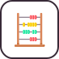

# 🖼️ analysis Gallery

[⬅️ 回到首頁](../../README.md)

| 預覽 | 詳細資訊 |
| :--- | :--- |
|  | **big-o-notation.svg** VectorxVector | 1.48KB 更新: 2026-02-26 |
|  | **cost-model.svg** VectorxVector | 20.77KB 更新: 2026-02-26 |
|  | **order-of-growth.svg** VectorxVector | 20.65KB 更新: 2026-02-26 |
|  | **space-complexity.svg** VectorxVector | 4.17KB 更新: 2026-02-26 |
|  | **time-complexity.svg** VectorxVector | 3.87KB 更新: 2026-02-26 |