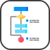

# 🖼️ databases 素材庫

[⬅️ 返回主目錄](../../../../../README.md)

| 預覽 (點擊放大) | 檔案資訊 |
| :--- | :--- |
|  | **acid.svg** Vector (SVG) | 5.95KB |
|  | **armstrongs-axioms.svg** Vector (SVG) | 3.81KB |
|  | **data-integrity.svg** Vector (SVG) | 7.62KB |
|  | **data-modelling.svg** Vector (SVG) | 10.31KB |
|  | **deadlocks.svg** Vector (SVG) | 14.31KB |
|  | **er-diagram.svg** Vector (SVG) | 10.35KB |
|  | **functional-dependencies.svg** Vector (SVG) | 3.95KB |
|  | **indexing.svg** Vector (SVG) | 2.71KB |
|  | **keys.svg** Vector (SVG) | 15.73KB |
|  | **locks.svg** Vector (SVG) | 28.61KB |
|  | **mongodb.svg** Vector (SVG) | 1.96KB |
|  | **mysql.svg** Vector (SVG) | 6.85KB |
|  | **non-relational-databases.svg** Vector (SVG) | 3.43KB |
|  | **normal-forms.svg** Vector (SVG) | 2.78KB |
|  | **normalization.svg** Vector (SVG) | 4.00KB |
|  | **postgresql.svg** Vector (SVG) | 19.08KB |
|  | **precedence-graph.svg** Vector (SVG) | 4.05KB |
|  | **redis.svg** Vector (SVG) | 5.51KB |
|  | **relational-algebra.svg** Vector (SVG) | 13.23KB |
|  | **relational-databases.svg** Vector (SVG) | 11.85KB |
|  | **serializability.svg** Vector (SVG) | 9.77KB |
|  | **sql.svg** Vector (SVG) | 11.44KB |
|  | **transactions.svg** Vector (SVG) | 11.49KB |