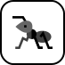
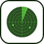

# 🖼️ design-and-ux 素材庫

[⬅️ 返回主目錄](../../README.md)

| 預覽 (點擊放大) | 檔案資訊 |
| :--- | :--- |
|  | **accessibility.svg** Vector (SVG) | 6.41KB |
|  | **alignment.svg** Vector (SVG) | 2.01KB |
|  | **best-practices.svg** Vector (SVG) | 3.97KB |
|  | **color-theory.svg** Vector (SVG) | 3.05KB |
|  | **color-wheel.svg** Vector (SVG) | 5.58KB |
|  | **consistency.svg** Vector (SVG) | 14.57KB |
|  | **contrast.svg** Vector (SVG) | 22.14KB |
|  | **crap.svg** Vector (SVG) | 4.52KB |
|  | **design-systems.svg** Vector (SVG) | 2.88KB |
|  | **error-handling.svg** Vector (SVG) | 3.62KB |
|  | **fluent-design.svg** Vector (SVG) | 1.02KB |
|  | **font-size.svg** Vector (SVG) | 6.30KB |
|  | **hit-targets.svg** Vector (SVG) | 2.80KB |
|  | **line-spacing.svg** Vector (SVG) | 5.00KB |
|  | **loading.svg** Vector (SVG) | 5.44KB |
|  | **material-design.svg** Vector (SVG) | 1.20KB |
|  | **mobile-first.svg** Vector (SVG) | 2.85KB |
|  | **proximity.svg** Vector (SVG) | 21.29KB |
|  | **repetition.svg** Vector (SVG) | 9.48KB |
|  | **spacing.svg** Vector (SVG) | 9.96KB |
|  | **the-golden-ratio.svg** Vector (SVG) | 2.63KB |
|  | **typography.svg** Vector (SVG) | 13.96KB |