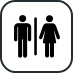

# 🖼️ 素材分類：design-and-ux

> [🏠 主目錄](../../../../README.md) / **design-and-ux**

本目錄共有 `22` 個檔案

| 🎨 預覽 (點擊放大) | 📋 檔案詳細資訊 |
| :--- | :--- |
|  | **📂 檔名:** `accessibility.svg` ✨ **格式:** `Vector (SVG)` ⚖️ **大小:** `6.41KB` 📅 **更新:** `2026-02-27`  🔗 [直接查看原始檔](accessibility.svg) |
|  | **📂 檔名:** `alignment.svg` ✨ **格式:** `Vector (SVG)` ⚖️ **大小:** `2.01KB` 📅 **更新:** `2026-02-27`  🔗 [直接查看原始檔](alignment.svg) |
|  | **📂 檔名:** `best-practices.svg` ✨ **格式:** `Vector (SVG)` ⚖️ **大小:** `3.97KB` 📅 **更新:** `2026-02-27`  🔗 [直接查看原始檔](best-practices.svg) |
|  | **📂 檔名:** `color-theory.svg` ✨ **格式:** `Vector (SVG)` ⚖️ **大小:** `3.05KB` 📅 **更新:** `2026-02-27`  🔗 [直接查看原始檔](color-theory.svg) |
|  | **📂 檔名:** `color-wheel.svg` ✨ **格式:** `Vector (SVG)` ⚖️ **大小:** `5.58KB` 📅 **更新:** `2026-02-27`  🔗 [直接查看原始檔](color-wheel.svg) |
|  | **📂 檔名:** `consistency.svg` ✨ **格式:** `Vector (SVG)` ⚖️ **大小:** `14.57KB` 📅 **更新:** `2026-02-27`  🔗 [直接查看原始檔](consistency.svg) |
|  | **📂 檔名:** `contrast.svg` ✨ **格式:** `Vector (SVG)` ⚖️ **大小:** `22.14KB` 📅 **更新:** `2026-02-27`  🔗 [直接查看原始檔](contrast.svg) |
|  | **📂 檔名:** `crap.svg` ✨ **格式:** `Vector (SVG)` ⚖️ **大小:** `4.52KB` 📅 **更新:** `2026-02-27`  🔗 [直接查看原始檔](crap.svg) |
|  | **📂 檔名:** `design-systems.svg` ✨ **格式:** `Vector (SVG)` ⚖️ **大小:** `2.88KB` 📅 **更新:** `2026-02-27`  🔗 [直接查看原始檔](design-systems.svg) |
|  | **📂 檔名:** `error-handling.svg` ✨ **格式:** `Vector (SVG)` ⚖️ **大小:** `3.62KB` 📅 **更新:** `2026-02-27`  🔗 [直接查看原始檔](error-handling.svg) |
|  | **📂 檔名:** `fluent-design.svg` ✨ **格式:** `Vector (SVG)` ⚖️ **大小:** `1.02KB` 📅 **更新:** `2026-02-27`  🔗 [直接查看原始檔](fluent-design.svg) |
|  | **📂 檔名:** `font-size.svg` ✨ **格式:** `Vector (SVG)` ⚖️ **大小:** `6.30KB` 📅 **更新:** `2026-02-27`  🔗 [直接查看原始檔](font-size.svg) |
|  | **📂 檔名:** `hit-targets.svg` ✨ **格式:** `Vector (SVG)` ⚖️ **大小:** `2.80KB` 📅 **更新:** `2026-02-27`  🔗 [直接查看原始檔](hit-targets.svg) |
|  | **📂 檔名:** `line-spacing.svg` ✨ **格式:** `Vector (SVG)` ⚖️ **大小:** `5.00KB` 📅 **更新:** `2026-02-27`  🔗 [直接查看原始檔](line-spacing.svg) |
|  | **📂 檔名:** `loading.svg` ✨ **格式:** `Vector (SVG)` ⚖️ **大小:** `5.44KB` 📅 **更新:** `2026-02-27`  🔗 [直接查看原始檔](loading.svg) |
|  | **📂 檔名:** `material-design.svg` ✨ **格式:** `Vector (SVG)` ⚖️ **大小:** `1.20KB` 📅 **更新:** `2026-02-27`  🔗 [直接查看原始檔](material-design.svg) |
|  | **📂 檔名:** `mobile-first.svg` ✨ **格式:** `Vector (SVG)` ⚖️ **大小:** `2.85KB` 📅 **更新:** `2026-02-27`  🔗 [直接查看原始檔](mobile-first.svg) |
|  | **📂 檔名:** `proximity.svg` ✨ **格式:** `Vector (SVG)` ⚖️ **大小:** `21.29KB` 📅 **更新:** `2026-02-27`  🔗 [直接查看原始檔](proximity.svg) |
|  | **📂 檔名:** `repetition.svg` ✨ **格式:** `Vector (SVG)` ⚖️ **大小:** `9.48KB` 📅 **更新:** `2026-02-27`  🔗 [直接查看原始檔](repetition.svg) |
|  | **📂 檔名:** `spacing.svg` ✨ **格式:** `Vector (SVG)` ⚖️ **大小:** `9.96KB` 📅 **更新:** `2026-02-27`  🔗 [直接查看原始檔](spacing.svg) |
|  | **📂 檔名:** `the-golden-ratio.svg` ✨ **格式:** `Vector (SVG)` ⚖️ **大小:** `2.63KB` 📅 **更新:** `2026-02-27`  🔗 [直接查看原始檔](the-golden-ratio.svg) |
|  | **📂 檔名:** `typography.svg` ✨ **格式:** `Vector (SVG)` ⚖️ **大小:** `13.96KB` 📅 **更新:** `2026-02-27`  🔗 [直接查看原始檔](typography.svg) |