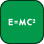

# 🖼️ 素材分類：css

> [🏠 主目錄](../../../../../README.md) / **css**

本目錄共有 `20` 個檔案

| 🎨 預覽 (點擊放大) | 📋 檔案詳細資訊與連結 |
| :--- | :--- |
|  | **📂 檔名:** `animations.svg` ✨ **格式:** `Vector (SVG)` | ⚖️ `2.94KB` 📅 **更新:** `2026-02-27`  🔗 **複製 Markdown 語法:** `` 📥 [檢視原始檔](animations.svg) |
|  | **📂 檔名:** `best-practices.svg` ✨ **格式:** `Vector (SVG)` | ⚖️ `6.16KB` 📅 **更新:** `2026-02-27`  🔗 **複製 Markdown 語法:** `` 📥 [檢視原始檔](best-practices.svg) |
|  | **📂 檔名:** `box-model.svg` ✨ **格式:** `Vector (SVG)` | ⚖️ `2.87KB` 📅 **更新:** `2026-02-27`  🔗 **複製 Markdown 語法:** `` 📥 [檢視原始檔](box-model.svg) |
|  | **📂 檔名:** `calc.svg` ✨ **格式:** `Vector (SVG)` | ⚖️ `3.77KB` 📅 **更新:** `2026-02-27`  🔗 **複製 Markdown 語法:** `` 📥 [檢視原始檔](calc.svg) |
|  | **📂 檔名:** `colors.svg` ✨ **格式:** `Vector (SVG)` | ⚖️ `5.57KB` 📅 **更新:** `2026-02-27`  🔗 **複製 Markdown 語法:** `` 📥 [檢視原始檔](colors.svg) |
|  | **📂 檔名:** `css-variables.svg` ✨ **格式:** `Vector (SVG)` | ⚖️ `8.00KB` 📅 **更新:** `2026-02-27`  🔗 **複製 Markdown 語法:** `` 📥 [檢視原始檔](css-variables.svg) |
|  | **📂 檔名:** `flex.svg` ✨ **格式:** `Vector (SVG)` | ⚖️ `10.85KB` 📅 **更新:** `2026-02-27`  🔗 **複製 Markdown 語法:** `` 📥 [檢視原始檔](flex.svg) |
|  | **📂 檔名:** `grid.svg` ✨ **格式:** `Vector (SVG)` | ⚖️ `5.78KB` 📅 **更新:** `2026-02-27`  🔗 **複製 Markdown 語法:** `` 📥 [檢視原始檔](grid.svg) |
|  | **📂 檔名:** `images.svg` ✨ **格式:** `Vector (SVG)` | ⚖️ `1.23KB` 📅 **更新:** `2026-02-27`  🔗 **複製 Markdown 語法:** `` 📥 [檢視原始檔](images.svg) |
|  | **📂 檔名:** `layout.svg` ✨ **格式:** `Vector (SVG)` | ⚖️ `4.79KB` 📅 **更新:** `2026-02-27`  🔗 **複製 Markdown 語法:** `` 📥 [檢視原始檔](layout.svg) |
|  | **📂 檔名:** `margin-collapsing.svg` ✨ **格式:** `Vector (SVG)` | ⚖️ `4.43KB` 📅 **更新:** `2026-02-27`  🔗 **複製 Markdown 語法:** `` 📥 [檢視原始檔](margin-collapsing.svg) |
|  | **📂 檔名:** `media-queries.svg` ✨ **格式:** `Vector (SVG)` | ⚖️ `4.95KB` 📅 **更新:** `2026-02-27`  🔗 **複製 Markdown 語法:** `` 📥 [檢視原始檔](media-queries.svg) |
|  | **📂 檔名:** `overflow.svg` ✨ **格式:** `Vector (SVG)` | ⚖️ `9.38KB` 📅 **更新:** `2026-02-27`  🔗 **複製 Markdown 語法:** `` 📥 [檢視原始檔](overflow.svg) |
|  | **📂 檔名:** `pseudo-selectors.svg` ✨ **格式:** `Vector (SVG)` | ⚖️ `5.35KB` 📅 **更新:** `2026-02-27`  🔗 **複製 Markdown 語法:** `` 📥 [檢視原始檔](pseudo-selectors.svg) |
|  | **📂 檔名:** `relative-units.svg` ✨ **格式:** `Vector (SVG)` | ⚖️ `6.14KB` 📅 **更新:** `2026-02-27`  🔗 **複製 Markdown 語法:** `` 📥 [檢視原始檔](relative-units.svg) |
|  | **📂 檔名:** `responsive-design.svg` ✨ **格式:** `Vector (SVG)` | ⚖️ `7.79KB` 📅 **更新:** `2026-02-27`  🔗 **複製 Markdown 語法:** `` 📥 [檢視原始檔](responsive-design.svg) |
|  | **📂 檔名:** `selectors.svg` ✨ **格式:** `Vector (SVG)` | ⚖️ `6.63KB` 📅 **更新:** `2026-02-27`  🔗 **複製 Markdown 語法:** `` 📥 [檢視原始檔](selectors.svg) |
|  | **📂 檔名:** `specificity.svg` ✨ **格式:** `Vector (SVG)` | ⚖️ `2.16KB` 📅 **更新:** `2026-02-27`  🔗 **複製 Markdown 語法:** `` 📥 [檢視原始檔](specificity.svg) |
|  | **📂 檔名:** `syntax.svg` ✨ **格式:** `Vector (SVG)` | ⚖️ `4.21KB` 📅 **更新:** `2026-02-27`  🔗 **複製 Markdown 語法:** `` 📥 [檢視原始檔](syntax.svg) |
|  | **📂 檔名:** `transforms.svg` ✨ **格式:** `Vector (SVG)` | ⚖️ `2.11KB` 📅 **更新:** `2026-02-27`  🔗 **複製 Markdown 語法:** `` 📥 [檢視原始檔](transforms.svg) |