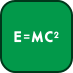

# 🖼️ 素材分類：css

> [🏠 主目錄](../../../../../README.md) / [images](../../../../README.md) / [iCons](../../../README.md) / [WebSkills](../../README.md) / [fundamentals](../README.md) / **css**

本目錄共有 `20` 個檔案

| 🎨 預覽 (點擊放大)  | 📋 檔案詳細資訊與連結 |
| :--- | :--- |
|  | **📂 檔名:** `animations.svg` ✨ **格式:** `Vector (SVG)` ⚖️ **大小:** `2.94KB` 📅 **更新:** `2026-03-03`  🚀 **jsDelivr Markdown:** `` 🔗 **直接連結 (Url):** <code>https://cdn.jsdelivr.net/gh/barry028/materials@main/images/iCons/WebSkills/fundamentals/css/animations.svg</code> 📥 [檢視原始檔](animations.svg) |
|  | **📂 檔名:** `best-practices.svg` ✨ **格式:** `Vector (SVG)` ⚖️ **大小:** `6.16KB` 📅 **更新:** `2026-03-03`  🚀 **jsDelivr Markdown:** `` 🔗 **直接連結 (Url):** <code>https://cdn.jsdelivr.net/gh/barry028/materials@main/images/iCons/WebSkills/fundamentals/css/best-practices.svg</code> 📥 [檢視原始檔](best-practices.svg) |
|  | **📂 檔名:** `box-model.svg` ✨ **格式:** `Vector (SVG)` ⚖️ **大小:** `2.87KB` 📅 **更新:** `2026-03-03`  🚀 **jsDelivr Markdown:** `` 🔗 **直接連結 (Url):** <code>https://cdn.jsdelivr.net/gh/barry028/materials@main/images/iCons/WebSkills/fundamentals/css/box-model.svg</code> 📥 [檢視原始檔](box-model.svg) |
|  | **📂 檔名:** `calc.svg` ✨ **格式:** `Vector (SVG)` ⚖️ **大小:** `3.77KB` 📅 **更新:** `2026-03-03`  🚀 **jsDelivr Markdown:** `` 🔗 **直接連結 (Url):** <code>https://cdn.jsdelivr.net/gh/barry028/materials@main/images/iCons/WebSkills/fundamentals/css/calc.svg</code> 📥 [檢視原始檔](calc.svg) |
|  | **📂 檔名:** `colors.svg` ✨ **格式:** `Vector (SVG)` ⚖️ **大小:** `5.57KB` 📅 **更新:** `2026-03-03`  🚀 **jsDelivr Markdown:** `` 🔗 **直接連結 (Url):** <code>https://cdn.jsdelivr.net/gh/barry028/materials@main/images/iCons/WebSkills/fundamentals/css/colors.svg</code> 📥 [檢視原始檔](colors.svg) |
|  | **📂 檔名:** `css-variables.svg` ✨ **格式:** `Vector (SVG)` ⚖️ **大小:** `8.00KB` 📅 **更新:** `2026-03-03`  🚀 **jsDelivr Markdown:** `` 🔗 **直接連結 (Url):** <code>https://cdn.jsdelivr.net/gh/barry028/materials@main/images/iCons/WebSkills/fundamentals/css/css-variables.svg</code> 📥 [檢視原始檔](css-variables.svg) |
|  | **📂 檔名:** `flex.svg` ✨ **格式:** `Vector (SVG)` ⚖️ **大小:** `10.85KB` 📅 **更新:** `2026-03-03`  🚀 **jsDelivr Markdown:** `` 🔗 **直接連結 (Url):** <code>https://cdn.jsdelivr.net/gh/barry028/materials@main/images/iCons/WebSkills/fundamentals/css/flex.svg</code> 📥 [檢視原始檔](flex.svg) |
|  | **📂 檔名:** `grid.svg` ✨ **格式:** `Vector (SVG)` ⚖️ **大小:** `5.78KB` 📅 **更新:** `2026-03-03`  🚀 **jsDelivr Markdown:** `` 🔗 **直接連結 (Url):** <code>https://cdn.jsdelivr.net/gh/barry028/materials@main/images/iCons/WebSkills/fundamentals/css/grid.svg</code> 📥 [檢視原始檔](grid.svg) |
|  | **📂 檔名:** `images.svg` ✨ **格式:** `Vector (SVG)` ⚖️ **大小:** `1.23KB` 📅 **更新:** `2026-03-03`  🚀 **jsDelivr Markdown:** `` 🔗 **直接連結 (Url):** <code>https://cdn.jsdelivr.net/gh/barry028/materials@main/images/iCons/WebSkills/fundamentals/css/images.svg</code> 📥 [檢視原始檔](images.svg) |
|  | **📂 檔名:** `layout.svg` ✨ **格式:** `Vector (SVG)` ⚖️ **大小:** `4.79KB` 📅 **更新:** `2026-03-03`  🚀 **jsDelivr Markdown:** `` 🔗 **直接連結 (Url):** <code>https://cdn.jsdelivr.net/gh/barry028/materials@main/images/iCons/WebSkills/fundamentals/css/layout.svg</code> 📥 [檢視原始檔](layout.svg) |
|  | **📂 檔名:** `margin-collapsing.svg` ✨ **格式:** `Vector (SVG)` ⚖️ **大小:** `4.43KB` 📅 **更新:** `2026-03-03`  🚀 **jsDelivr Markdown:** `` 🔗 **直接連結 (Url):** <code>https://cdn.jsdelivr.net/gh/barry028/materials@main/images/iCons/WebSkills/fundamentals/css/margin-collapsing.svg</code> 📥 [檢視原始檔](margin-collapsing.svg) |
|  | **📂 檔名:** `media-queries.svg` ✨ **格式:** `Vector (SVG)` ⚖️ **大小:** `4.95KB` 📅 **更新:** `2026-03-03`  🚀 **jsDelivr Markdown:** `` 🔗 **直接連結 (Url):** <code>https://cdn.jsdelivr.net/gh/barry028/materials@main/images/iCons/WebSkills/fundamentals/css/media-queries.svg</code> 📥 [檢視原始檔](media-queries.svg) |
|  | **📂 檔名:** `overflow.svg` ✨ **格式:** `Vector (SVG)` ⚖️ **大小:** `9.38KB` 📅 **更新:** `2026-03-03`  🚀 **jsDelivr Markdown:** `` 🔗 **直接連結 (Url):** <code>https://cdn.jsdelivr.net/gh/barry028/materials@main/images/iCons/WebSkills/fundamentals/css/overflow.svg</code> 📥 [檢視原始檔](overflow.svg) |
|  | **📂 檔名:** `pseudo-selectors.svg` ✨ **格式:** `Vector (SVG)` ⚖️ **大小:** `5.35KB` 📅 **更新:** `2026-03-03`  🚀 **jsDelivr Markdown:** `` 🔗 **直接連結 (Url):** <code>https://cdn.jsdelivr.net/gh/barry028/materials@main/images/iCons/WebSkills/fundamentals/css/pseudo-selectors.svg</code> 📥 [檢視原始檔](pseudo-selectors.svg) |
|  | **📂 檔名:** `relative-units.svg` ✨ **格式:** `Vector (SVG)` ⚖️ **大小:** `6.14KB` 📅 **更新:** `2026-03-03`  🚀 **jsDelivr Markdown:** `` 🔗 **直接連結 (Url):** <code>https://cdn.jsdelivr.net/gh/barry028/materials@main/images/iCons/WebSkills/fundamentals/css/relative-units.svg</code> 📥 [檢視原始檔](relative-units.svg) |
|  | **📂 檔名:** `responsive-design.svg` ✨ **格式:** `Vector (SVG)` ⚖️ **大小:** `7.79KB` 📅 **更新:** `2026-03-03`  🚀 **jsDelivr Markdown:** `` 🔗 **直接連結 (Url):** <code>https://cdn.jsdelivr.net/gh/barry028/materials@main/images/iCons/WebSkills/fundamentals/css/responsive-design.svg</code> 📥 [檢視原始檔](responsive-design.svg) |
|  | **📂 檔名:** `selectors.svg` ✨ **格式:** `Vector (SVG)` ⚖️ **大小:** `6.63KB` 📅 **更新:** `2026-03-03`  🚀 **jsDelivr Markdown:** `` 🔗 **直接連結 (Url):** <code>https://cdn.jsdelivr.net/gh/barry028/materials@main/images/iCons/WebSkills/fundamentals/css/selectors.svg</code> 📥 [檢視原始檔](selectors.svg) |
|  | **📂 檔名:** `specificity.svg` ✨ **格式:** `Vector (SVG)` ⚖️ **大小:** `2.16KB` 📅 **更新:** `2026-03-03`  🚀 **jsDelivr Markdown:** `` 🔗 **直接連結 (Url):** <code>https://cdn.jsdelivr.net/gh/barry028/materials@main/images/iCons/WebSkills/fundamentals/css/specificity.svg</code> 📥 [檢視原始檔](specificity.svg) |
|  | **📂 檔名:** `syntax.svg` ✨ **格式:** `Vector (SVG)` ⚖️ **大小:** `4.21KB` 📅 **更新:** `2026-03-03`  🚀 **jsDelivr Markdown:** `` 🔗 **直接連結 (Url):** <code>https://cdn.jsdelivr.net/gh/barry028/materials@main/images/iCons/WebSkills/fundamentals/css/syntax.svg</code> 📥 [檢視原始檔](syntax.svg) |
|  | **📂 檔名:** `transforms.svg` ✨ **格式:** `Vector (SVG)` ⚖️ **大小:** `2.11KB` 📅 **更新:** `2026-03-03`  🚀 **jsDelivr Markdown:** `` 🔗 **直接連結 (Url):** <code>https://cdn.jsdelivr.net/gh/barry028/materials@main/images/iCons/WebSkills/fundamentals/css/transforms.svg</code> 📥 [檢視原始檔](transforms.svg) |