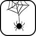

# 🖼️ 素材分類：javascript

> [🏠 主目錄](../../../../../README.md) / [images](../../../../README.md) / [iCons](../../../README.md) / [WebSkills](../../README.md) / [fundamentals](../README.md) / **javascript**

本目錄共有 `21` 個檔案

| 🎨 預覽 (點擊放大)  | 📋 檔案詳細資訊與連結 |
| :--- | :--- |
|  | **📂 檔名:** `async-await.svg` ✨ **格式:** `Vector (SVG)` ⚖️ **大小:** `2.62KB` 📅 **更新:** `2026-02-27`  🚀 **jsDelivr Markdown:** `` 🔗 **直接連結 (Url):** <code>https://cdn.jsdelivr.net/gh/barry028/materials@main/images/iCons/WebSkills/fundamentals/javascript/async-await.svg</code> 📥 [檢視原始檔](async-await.svg) |
|  | **📂 檔名:** `best-practices.svg` ✨ **格式:** `Vector (SVG)` ⚖️ **大小:** `6.17KB` 📅 **更新:** `2026-02-27`  🚀 **jsDelivr Markdown:** `` 🔗 **直接連結 (Url):** <code>https://cdn.jsdelivr.net/gh/barry028/materials@main/images/iCons/WebSkills/fundamentals/javascript/best-practices.svg</code> 📥 [檢視原始檔](best-practices.svg) |
|  | **📂 檔名:** `callbacks.svg` ✨ **格式:** `Vector (SVG)` ⚖️ **大小:** `6.22KB` 📅 **更新:** `2026-02-27`  🚀 **jsDelivr Markdown:** `` 🔗 **直接連結 (Url):** <code>https://cdn.jsdelivr.net/gh/barry028/materials@main/images/iCons/WebSkills/fundamentals/javascript/callbacks.svg</code> 📥 [檢視原始檔](callbacks.svg) |
|  | **📂 檔名:** `canvas.svg` ✨ **格式:** `Vector (SVG)` ⚖️ **大小:** `15.62KB` 📅 **更新:** `2026-02-27`  🚀 **jsDelivr Markdown:** `` 🔗 **直接連結 (Url):** <code>https://cdn.jsdelivr.net/gh/barry028/materials@main/images/iCons/WebSkills/fundamentals/javascript/canvas.svg</code> 📥 [檢視原始檔](canvas.svg) |
|  | **📂 檔名:** `classes.svg` ✨ **格式:** `Vector (SVG)` ⚖️ **大小:** `12.20KB` 📅 **更新:** `2026-02-27`  🚀 **jsDelivr Markdown:** `` 🔗 **直接連結 (Url):** <code>https://cdn.jsdelivr.net/gh/barry028/materials@main/images/iCons/WebSkills/fundamentals/javascript/classes.svg</code> 📥 [檢視原始檔](classes.svg) |
|  | **📂 檔名:** `destructuring.svg` ✨ **格式:** `Vector (SVG)` ⚖️ **大小:** `6.04KB` 📅 **更新:** `2026-02-27`  🚀 **jsDelivr Markdown:** `` 🔗 **直接連結 (Url):** <code>https://cdn.jsdelivr.net/gh/barry028/materials@main/images/iCons/WebSkills/fundamentals/javascript/destructuring.svg</code> 📥 [檢視原始檔](destructuring.svg) |
|  | **📂 檔名:** `documentation.svg` ✨ **格式:** `Vector (SVG)` ⚖️ **大小:** `7.27KB` 📅 **更新:** `2026-02-27`  🚀 **jsDelivr Markdown:** `` 🔗 **直接連結 (Url):** <code>https://cdn.jsdelivr.net/gh/barry028/materials@main/images/iCons/WebSkills/fundamentals/javascript/documentation.svg</code> 📥 [檢視原始檔](documentation.svg) |
|  | **📂 檔名:** `dom-manipulation.svg` ✨ **格式:** `Vector (SVG)` ⚖️ **大小:** `5.38KB` 📅 **更新:** `2026-02-27`  🚀 **jsDelivr Markdown:** `` 🔗 **直接連結 (Url):** <code>https://cdn.jsdelivr.net/gh/barry028/materials@main/images/iCons/WebSkills/fundamentals/javascript/dom-manipulation.svg</code> 📥 [檢視原始檔](dom-manipulation.svg) |
|  | **📂 檔名:** `dom.svg` ✨ **格式:** `Vector (SVG)` ⚖️ **大小:** `1.78KB` 📅 **更新:** `2026-02-27`  🚀 **jsDelivr Markdown:** `` 🔗 **直接連結 (Url):** <code>https://cdn.jsdelivr.net/gh/barry028/materials@main/images/iCons/WebSkills/fundamentals/javascript/dom.svg</code> 📥 [檢視原始檔](dom.svg) |
|  | **📂 檔名:** `events.svg` ✨ **格式:** `Vector (SVG)` ⚖️ **大小:** `8.71KB` 📅 **更新:** `2026-02-27`  🚀 **jsDelivr Markdown:** `` 🔗 **直接連結 (Url):** <code>https://cdn.jsdelivr.net/gh/barry028/materials@main/images/iCons/WebSkills/fundamentals/javascript/events.svg</code> 📥 [檢視原始檔](events.svg) |
|  | **📂 檔名:** `fetch.svg` ✨ **格式:** `Vector (SVG)` ⚖️ **大小:** `4.03KB` 📅 **更新:** `2026-02-27`  🚀 **jsDelivr Markdown:** `` 🔗 **直接連結 (Url):** <code>https://cdn.jsdelivr.net/gh/barry028/materials@main/images/iCons/WebSkills/fundamentals/javascript/fetch.svg</code> 📥 [檢視原始檔](fetch.svg) |
|  | **📂 檔名:** `intl.svg` ✨ **格式:** `Vector (SVG)` ⚖️ **大小:** `3.85KB` 📅 **更新:** `2026-02-27`  🚀 **jsDelivr Markdown:** `` 🔗 **直接連結 (Url):** <code>https://cdn.jsdelivr.net/gh/barry028/materials@main/images/iCons/WebSkills/fundamentals/javascript/intl.svg</code> 📥 [檢視原始檔](intl.svg) |
|  | **📂 檔名:** `modules.svg` ✨ **格式:** `Vector (SVG)` ⚖️ **大小:** `6.15KB` 📅 **更新:** `2026-02-27`  🚀 **jsDelivr Markdown:** `` 🔗 **直接連結 (Url):** <code>https://cdn.jsdelivr.net/gh/barry028/materials@main/images/iCons/WebSkills/fundamentals/javascript/modules.svg</code> 📥 [檢視原始檔](modules.svg) |
|  | **📂 檔名:** `objects.svg` ✨ **格式:** `Vector (SVG)` ⚖️ **大小:** `5.51KB` 📅 **更新:** `2026-02-27`  🚀 **jsDelivr Markdown:** `` 🔗 **直接連結 (Url):** <code>https://cdn.jsdelivr.net/gh/barry028/materials@main/images/iCons/WebSkills/fundamentals/javascript/objects.svg</code> 📥 [檢視原始檔](objects.svg) |
|  | **📂 檔名:** `promises.svg` ✨ **格式:** `Vector (SVG)` ⚖️ **大小:** `8.14KB` 📅 **更新:** `2026-02-27`  🚀 **jsDelivr Markdown:** `` 🔗 **直接連結 (Url):** <code>https://cdn.jsdelivr.net/gh/barry028/materials@main/images/iCons/WebSkills/fundamentals/javascript/promises.svg</code> 📥 [檢視原始檔](promises.svg) |
|  | **📂 檔名:** `prototype.svg` ✨ **格式:** `Vector (SVG)` ⚖️ **大小:** `2.47KB` 📅 **更新:** `2026-02-27`  🚀 **jsDelivr Markdown:** `` 🔗 **直接連結 (Url):** <code>https://cdn.jsdelivr.net/gh/barry028/materials@main/images/iCons/WebSkills/fundamentals/javascript/prototype.svg</code> 📥 [檢視原始檔](prototype.svg) |
|  | **📂 檔名:** `regex.svg` ✨ **格式:** `Vector (SVG)` ⚖️ **大小:** `5.36KB` 📅 **更新:** `2026-02-27`  🚀 **jsDelivr Markdown:** `` 🔗 **直接連結 (Url):** <code>https://cdn.jsdelivr.net/gh/barry028/materials@main/images/iCons/WebSkills/fundamentals/javascript/regex.svg</code> 📥 [檢視原始檔](regex.svg) |
|  | **📂 檔名:** `spread.svg` ✨ **格式:** `Vector (SVG)` ⚖️ **大小:** `5.70KB` 📅 **更新:** `2026-02-27`  🚀 **jsDelivr Markdown:** `` 🔗 **直接連結 (Url):** <code>https://cdn.jsdelivr.net/gh/barry028/materials@main/images/iCons/WebSkills/fundamentals/javascript/spread.svg</code> 📥 [檢視原始檔](spread.svg) |
|  | **📂 檔名:** `syntax.svg` ✨ **格式:** `Vector (SVG)` ⚖️ **大小:** `6.69KB` 📅 **更新:** `2026-02-27`  🚀 **jsDelivr Markdown:** `` 🔗 **直接連結 (Url):** <code>https://cdn.jsdelivr.net/gh/barry028/materials@main/images/iCons/WebSkills/fundamentals/javascript/syntax.svg</code> 📥 [檢視原始檔](syntax.svg) |
|  | **📂 檔名:** `template-literals.svg` ✨ **格式:** `Vector (SVG)` ⚖️ **大小:** `10.69KB` 📅 **更新:** `2026-02-27`  🚀 **jsDelivr Markdown:** `` 🔗 **直接連結 (Url):** <code>https://cdn.jsdelivr.net/gh/barry028/materials@main/images/iCons/WebSkills/fundamentals/javascript/template-literals.svg</code> 📥 [檢視原始檔](template-literals.svg) |
|  | **📂 檔名:** `web-animations.svg` ✨ **格式:** `Vector (SVG)` ⚖️ **大小:** `10.37KB` 📅 **更新:** `2026-02-27`  🚀 **jsDelivr Markdown:** `` 🔗 **直接連結 (Url):** <code>https://cdn.jsdelivr.net/gh/barry028/materials@main/images/iCons/WebSkills/fundamentals/javascript/web-animations.svg</code> 📥 [檢視原始檔](web-animations.svg) |