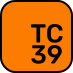

# 🖼️ 素材分類：the-browser

> [🏠 主目錄](../../../../../README.md) / **the-browser**

本目錄共有 `16` 個檔案

| 🎨 預覽 (點擊放大) | 📋 檔案詳細資訊 |
| :--- | :--- |
|  | **📂 檔名:** `blink.svg` ✨ **格式:** `Vector (SVG)` ⚖️ **大小:** `2.10KB` 📅 **更新:** `2026-02-27`  🔗 [直接查看原始檔](blink.svg) |
|  | **📂 檔名:** `breakpoints.svg` ✨ **格式:** `Vector (SVG)` ⚖️ **大小:** `6.40KB` 📅 **更新:** `2026-02-27`  🔗 [直接查看原始檔](breakpoints.svg) |
|  | **📂 檔名:** `browser-engines.svg` ✨ **格式:** `Vector (SVG)` ⚖️ **大小:** `9.11KB` 📅 **更新:** `2026-02-27`  🔗 [直接查看原始檔](browser-engines.svg) |
|  | **📂 檔名:** `console-api.svg` ✨ **格式:** `Vector (SVG)` ⚖️ **大小:** `17.33KB` 📅 **更新:** `2026-02-27`  🔗 [直接查看原始檔](console-api.svg) |
|  | **📂 檔名:** `debugging.svg` ✨ **格式:** `Vector (SVG)` ⚖️ **大小:** `3.24KB` 📅 **更新:** `2026-02-27`  🔗 [直接查看原始檔](debugging.svg) |
|  | **📂 檔名:** `developer-console.svg` ✨ **格式:** `Vector (SVG)` ⚖️ **大小:** `12.51KB` 📅 **更新:** `2026-02-27`  🔗 [直接查看原始檔](developer-console.svg) |
|  | **📂 檔名:** `gecko.svg` ✨ **格式:** `Vector (SVG)` ⚖️ **大小:** `4.47KB` 📅 **更新:** `2026-02-27`  🔗 [直接查看原始檔](gecko.svg) |
|  | **📂 檔名:** `http.svg` ✨ **格式:** `Vector (SVG)` ⚖️ **大小:** `17.94KB` 📅 **更新:** `2026-02-27`  🔗 [直接查看原始檔](http.svg) |
|  | **📂 檔名:** `polyfills.svg` ✨ **格式:** `Vector (SVG)` ⚖️ **大小:** `7.22KB` 📅 **更新:** `2026-02-27`  🔗 [直接查看原始檔](polyfills.svg) |
|  | **📂 檔名:** `specifications.svg` ✨ **格式:** `Vector (SVG)` ⚖️ **大小:** `5.65KB` 📅 **更新:** `2026-02-27`  🔗 [直接查看原始檔](specifications.svg) |
|  | **📂 檔名:** `standardization.svg` ✨ **格式:** `Vector (SVG)` ⚖️ **大小:** `11.99KB` 📅 **更新:** `2026-02-27`  🔗 [直接查看原始檔](standardization.svg) |
|  | **📂 檔名:** `tc39.svg` ✨ **格式:** `Vector (SVG)` ⚖️ **大小:** `6.09KB` 📅 **更新:** `2026-02-27`  🔗 [直接查看原始檔](tc39.svg) |
|  | **📂 檔名:** `the-internet.svg` ✨ **格式:** `Vector (SVG)` ⚖️ **大小:** `2.71KB` 📅 **更新:** `2026-02-27`  🔗 [直接查看原始檔](the-internet.svg) |
|  | **📂 檔名:** `w3c.svg` ✨ **格式:** `Vector (SVG)` ⚖️ **大小:** `4.73KB` 📅 **更新:** `2026-02-27`  🔗 [直接查看原始檔](w3c.svg) |
|  | **📂 檔名:** `webkit.svg` ✨ **格式:** `Vector (SVG)` ⚖️ **大小:** `4.80KB` 📅 **更新:** `2026-02-27`  🔗 [直接查看原始檔](webkit.svg) |
|  | **📂 檔名:** `whatwg.svg` ✨ **格式:** `Vector (SVG)` ⚖️ **大小:** `1.36KB` 📅 **更新:** `2026-02-27`  🔗 [直接查看原始檔](whatwg.svg) |