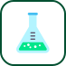

# 🖼️ management 素材庫

[⬅️ 返回主目錄](../../README.md)

| 預覽 (點擊放大) | 檔案資訊 |
| :--- | :--- |
|  | **agile-development.svg** Vector (SVG) | 6.17KB |
|  | **kanban.svg** Vector (SVG) | 3.30KB |
|  | **scrum.svg** Vector (SVG) | 2.73KB |
|  | **test-driven-development.svg** Vector (SVG) | 4.13KB |
|  | **waterfall-development.svg** Vector (SVG) | 5.87KB |