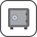

# 🖼️ 素材分類：testing

> [🏠 主目錄](../../../../README.md) / [images](../../../README.md) / [iCons](../../README.md) / [WebSkills](../README.md) / **testing**

本目錄共有 `21` 個檔案

| 🎨 預覽 (點擊放大)  | 📋 檔案詳細資訊與連結 |
| :--- | :--- |
|  | **📂 檔名:** `a-b-testing.svg` ✨ **格式:** `Vector (SVG)` ⚖️ **大小:** `3.85KB` 📅 **更新:** `2026-03-01`  🚀 **jsDelivr Markdown:** `` 🔗 **直接連結 (Url):** <code>https://cdn.jsdelivr.net/gh/barry028/materials@main/images/iCons/WebSkills/testing/a-b-testing.svg</code> 📥 [檢視原始檔](a-b-testing.svg) |
|  | **📂 檔名:** `acceptance-testing.svg` ✨ **格式:** `Vector (SVG)` ⚖️ **大小:** `5.64KB` 📅 **更新:** `2026-03-01`  🚀 **jsDelivr Markdown:** `` 🔗 **直接連結 (Url):** <code>https://cdn.jsdelivr.net/gh/barry028/materials@main/images/iCons/WebSkills/testing/acceptance-testing.svg</code> 📥 [檢視原始檔](acceptance-testing.svg) |
|  | **📂 檔名:** `automated-testing.svg` ✨ **格式:** `Vector (SVG)` ⚖️ **大小:** `8.23KB` 📅 **更新:** `2026-03-01`  🚀 **jsDelivr Markdown:** `` 🔗 **直接連結 (Url):** <code>https://cdn.jsdelivr.net/gh/barry028/materials@main/images/iCons/WebSkills/testing/automated-testing.svg</code> 📥 [檢視原始檔](automated-testing.svg) |
|  | **📂 檔名:** `ava.svg` ✨ **格式:** `Vector (SVG)` ⚖️ **大小:** `3.72KB` 📅 **更新:** `2026-03-01`  🚀 **jsDelivr Markdown:** `` 🔗 **直接連結 (Url):** <code>https://cdn.jsdelivr.net/gh/barry028/materials@main/images/iCons/WebSkills/testing/ava.svg</code> 📥 [檢視原始檔](ava.svg) |
|  | **📂 檔名:** `best-practices.svg` ✨ **格式:** `Vector (SVG)` ⚖️ **大小:** `24.10KB` 📅 **更新:** `2026-03-01`  🚀 **jsDelivr Markdown:** `` 🔗 **直接連結 (Url):** <code>https://cdn.jsdelivr.net/gh/barry028/materials@main/images/iCons/WebSkills/testing/best-practices.svg</code> 📥 [檢視原始檔](best-practices.svg) |
|  | **📂 檔名:** `black-box-testing.svg` ✨ **格式:** `Vector (SVG)` ⚖️ **大小:** `5.37KB` 📅 **更新:** `2026-03-01`  🚀 **jsDelivr Markdown:** `` 🔗 **直接連結 (Url):** <code>https://cdn.jsdelivr.net/gh/barry028/materials@main/images/iCons/WebSkills/testing/black-box-testing.svg</code> 📥 [檢視原始檔](black-box-testing.svg) |
|  | **📂 檔名:** `continuous-integration.svg` ✨ **格式:** `Vector (SVG)` ⚖️ **大小:** `8.24KB` 📅 **更新:** `2026-03-01`  🚀 **jsDelivr Markdown:** `` 🔗 **直接連結 (Url):** <code>https://cdn.jsdelivr.net/gh/barry028/materials@main/images/iCons/WebSkills/testing/continuous-integration.svg</code> 📥 [檢視原始檔](continuous-integration.svg) |
|  | **📂 檔名:** `cypress.svg` ✨ **格式:** `Vector (SVG)` ⚖️ **大小:** `4.81KB` 📅 **更新:** `2026-03-01`  🚀 **jsDelivr Markdown:** `` 🔗 **直接連結 (Url):** <code>https://cdn.jsdelivr.net/gh/barry028/materials@main/images/iCons/WebSkills/testing/cypress.svg</code> 📥 [檢視原始檔](cypress.svg) |
|  | **📂 檔名:** `integration-testing.svg` ✨ **格式:** `Vector (SVG)` ⚖️ **大小:** `6.61KB` 📅 **更新:** `2026-03-01`  🚀 **jsDelivr Markdown:** `` 🔗 **直接連結 (Url):** <code>https://cdn.jsdelivr.net/gh/barry028/materials@main/images/iCons/WebSkills/testing/integration-testing.svg</code> 📥 [檢視原始檔](integration-testing.svg) |
|  | **📂 檔名:** `jasmine.svg` ✨ **格式:** `Vector (SVG)` ⚖️ **大小:** `3.39KB` 📅 **更新:** `2026-03-01`  🚀 **jsDelivr Markdown:** `` 🔗 **直接連結 (Url):** <code>https://cdn.jsdelivr.net/gh/barry028/materials@main/images/iCons/WebSkills/testing/jasmine.svg</code> 📥 [檢視原始檔](jasmine.svg) |
|  | **📂 檔名:** `karma.svg` ✨ **格式:** `Vector (SVG)` ⚖️ **大小:** `2.07KB` 📅 **更新:** `2026-03-01`  🚀 **jsDelivr Markdown:** `` 🔗 **直接連結 (Url):** <code>https://cdn.jsdelivr.net/gh/barry028/materials@main/images/iCons/WebSkills/testing/karma.svg</code> 📥 [檢視原始檔](karma.svg) |
|  | **📂 檔名:** `manual-testing.svg` ✨ **格式:** `Vector (SVG)` ⚖️ **大小:** `5.01KB` 📅 **更新:** `2026-03-01`  🚀 **jsDelivr Markdown:** `` 🔗 **直接連結 (Url):** <code>https://cdn.jsdelivr.net/gh/barry028/materials@main/images/iCons/WebSkills/testing/manual-testing.svg</code> 📥 [檢視原始檔](manual-testing.svg) |
|  | **📂 檔名:** `mocha.svg` ✨ **格式:** `Vector (SVG)` ⚖️ **大小:** `11.35KB` 📅 **更新:** `2026-03-01`  🚀 **jsDelivr Markdown:** `` 🔗 **直接連結 (Url):** <code>https://cdn.jsdelivr.net/gh/barry028/materials@main/images/iCons/WebSkills/testing/mocha.svg</code> 📥 [檢視原始檔](mocha.svg) |
|  | **📂 檔名:** `performance-testing.svg` ✨ **格式:** `Vector (SVG)` ⚖️ **大小:** `7.15KB` 📅 **更新:** `2026-03-01`  🚀 **jsDelivr Markdown:** `` 🔗 **直接連結 (Url):** <code>https://cdn.jsdelivr.net/gh/barry028/materials@main/images/iCons/WebSkills/testing/performance-testing.svg</code> 📥 [檢視原始檔](performance-testing.svg) |
|  | **📂 檔名:** `smoke-testing.svg` ✨ **格式:** `Vector (SVG)` ⚖️ **大小:** `12.18KB` 📅 **更新:** `2026-03-01`  🚀 **jsDelivr Markdown:** `` 🔗 **直接連結 (Url):** <code>https://cdn.jsdelivr.net/gh/barry028/materials@main/images/iCons/WebSkills/testing/smoke-testing.svg</code> 📥 [檢視原始檔](smoke-testing.svg) |
|  | **📂 檔名:** `system-testing.svg` ✨ **格式:** `Vector (SVG)` ⚖️ **大小:** `88.02KB` 📅 **更新:** `2026-03-01`  🚀 **jsDelivr Markdown:** `` 🔗 **直接連結 (Url):** <code>https://cdn.jsdelivr.net/gh/barry028/materials@main/images/iCons/WebSkills/testing/system-testing.svg</code> 📥 [檢視原始檔](system-testing.svg) |
|  | **📂 檔名:** `test-runners.svg` ✨ **格式:** `Vector (SVG)` ⚖️ **大小:** `3.73KB` 📅 **更新:** `2026-03-01`  🚀 **jsDelivr Markdown:** `` 🔗 **直接連結 (Url):** <code>https://cdn.jsdelivr.net/gh/barry028/materials@main/images/iCons/WebSkills/testing/test-runners.svg</code> 📥 [檢視原始檔](test-runners.svg) |
|  | **📂 檔名:** `testing-methodologies.svg` ✨ **格式:** `Vector (SVG)` ⚖️ **大小:** `4.90KB` 📅 **更新:** `2026-03-01`  🚀 **jsDelivr Markdown:** `` 🔗 **直接連結 (Url):** <code>https://cdn.jsdelivr.net/gh/barry028/materials@main/images/iCons/WebSkills/testing/testing-methodologies.svg</code> 📥 [檢視原始檔](testing-methodologies.svg) |
|  | **📂 檔名:** `unit-testing.svg` ✨ **格式:** `Vector (SVG)` ⚖️ **大小:** `5.12KB` 📅 **更新:** `2026-03-01`  🚀 **jsDelivr Markdown:** `` 🔗 **直接連結 (Url):** <code>https://cdn.jsdelivr.net/gh/barry028/materials@main/images/iCons/WebSkills/testing/unit-testing.svg</code> 📥 [檢視原始檔](unit-testing.svg) |
|  | **📂 檔名:** `usability-testing.svg` ✨ **格式:** `Vector (SVG)` ⚖️ **大小:** `6.14KB` 📅 **更新:** `2026-03-01`  🚀 **jsDelivr Markdown:** `` 🔗 **直接連結 (Url):** <code>https://cdn.jsdelivr.net/gh/barry028/materials@main/images/iCons/WebSkills/testing/usability-testing.svg</code> 📥 [檢視原始檔](usability-testing.svg) |
|  | **📂 檔名:** `white-box-testing.svg` ✨ **格式:** `Vector (SVG)` ⚖️ **大小:** `2.14KB` 📅 **更新:** `2026-03-01`  🚀 **jsDelivr Markdown:** `` 🔗 **直接連結 (Url):** <code>https://cdn.jsdelivr.net/gh/barry028/materials@main/images/iCons/WebSkills/testing/white-box-testing.svg</code> 📥 [檢視原始檔](white-box-testing.svg) |