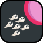
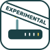
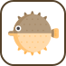
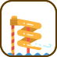
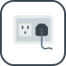

# 🖼️ the-modern-web

[⬅️ 返回主目錄](../../../../README.md)

| 預覽 | 資訊 |
| :--- | :--- |
|  | **beacon.svg** |
|  | **browser-extensions.svg** |
|  | **clipboard.svg** |
|  | **credentials-manager-api.svg** |
|  | **device-orientation-and-motion.svg** |
|  | **fullscreen.svg** |
|  | **gamepad-api.svg** |
|  | **generators.svg** |
|  | **geolocation.svg** |
|  | **houdini.svg** |
|  | **http-2.svg** |
|  | **interaction-media-queries.svg** |
|  | **intersection-observer.svg** |
|  | **media-recorder.svg** |
|  | **media-streams.svg** |
|  | **mutation-observer.svg** |
|  | **native-file-system.svg** |
|  | **network-information-api.svg** |
|  | **observers.svg** |
|  | **payment-request-api.svg** |
|  | **performance-api.svg** |
|  | **performance-observer.svg** |
|  | **picture-in-picture.svg** |
|  | **pointer-lock-api.svg** |
|  | **presentation.svg** |
|  | **project-fugu.svg** |
|  | **proxies.svg** |
|  | **resize-observer.svg** |
|  | **screen-capture.svg** |
|  | **scrollsnapping.svg** |
|  | **shape-detection.svg** |
|  | **share.svg** |
|  | **speech-recognition.svg** |
|  | **speech-synthesis.svg** |
|  | **streams.svg** |
|  | **trusted-web-activities.svg** |
|  | **variable-fonts.svg** |
|  | **web-assembly.svg** |
|  | **web-audio.svg** |
|  | **web-authentication-api.svg** |
|  | **web-bluetooth.svg** |
|  | **web-rtc.svg** |
|  | **web-sockets.svg** |
|  | **web-usb.svg** |
|  | **web-xr.svg** |