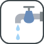

# 🖼️ the-modern-web 素材庫

[⬅️ 返回主目錄](../../../../README.md)

| 預覽 (點擊放大) | 檔案資訊 |
| :--- | :--- |
|  | **beacon.svg** Vector (SVG) | 5.86KB |
|  | **browser-extensions.svg** Vector (SVG) | 5.37KB |
|  | **clipboard.svg** Vector (SVG) | 6.55KB |
|  | **credentials-manager-api.svg** Vector (SVG) | 15.61KB |
|  | **device-orientation-and-motion.svg** Vector (SVG) | 5.80KB |
|  | **fullscreen.svg** Vector (SVG) | 2.03KB |
|  | **gamepad-api.svg** Vector (SVG) | 3.76KB |
|  | **generators.svg** Vector (SVG) | 2.81KB |
|  | **geolocation.svg** Vector (SVG) | 6.71KB |
|  | **houdini.svg** Vector (SVG) | 13.51KB |
|  | **http-2.svg** Vector (SVG) | 6.16KB |
|  | **interaction-media-queries.svg** Vector (SVG) | 3.96KB |
|  | **intersection-observer.svg** Vector (SVG) | 7.95KB |
|  | **media-recorder.svg** Vector (SVG) | 6.55KB |
|  | **media-streams.svg** Vector (SVG) | 3.37KB |
|  | **mutation-observer.svg** Vector (SVG) | 22.37KB |
|  | **native-file-system.svg** Vector (SVG) | 15.41KB |
|  | **network-information-api.svg** Vector (SVG) | 17.91KB |
|  | **observers.svg** Vector (SVG) | 5.09KB |
|  | **payment-request-api.svg** Vector (SVG) | 5.74KB |
|  | **performance-api.svg** Vector (SVG) | 4.78KB |
|  | **performance-observer.svg** Vector (SVG) | 7.50KB |
|  | **picture-in-picture.svg** Vector (SVG) | 2.27KB |
|  | **pointer-lock-api.svg** Vector (SVG) | 2.80KB |
|  | **presentation.svg** Vector (SVG) | 19.59KB |
|  | **project-fugu.svg** Vector (SVG) | 21.64KB |
|  | **proxies.svg** Vector (SVG) | 11.90KB |
|  | **resize-observer.svg** Vector (SVG) | 5.11KB |
|  | **screen-capture.svg** Vector (SVG) | 2.65KB |
|  | **scrollsnapping.svg** Vector (SVG) | 10.00KB |
|  | **shape-detection.svg** Vector (SVG) | 28.32KB |
|  | **share.svg** Vector (SVG) | 7.91KB |
|  | **speech-recognition.svg** Vector (SVG) | 11.48KB |
|  | **speech-synthesis.svg** Vector (SVG) | 2.47KB |
|  | **streams.svg** Vector (SVG) | 10.06KB |
|  | **trusted-web-activities.svg** Vector (SVG) | 4.21KB |
|  | **variable-fonts.svg** Vector (SVG) | 6.12KB |
|  | **web-assembly.svg** Vector (SVG) | 12.28KB |
|  | **web-audio.svg** Vector (SVG) | 14.29KB |
|  | **web-authentication-api.svg** Vector (SVG) | 7.22KB |
|  | **web-bluetooth.svg** Vector (SVG) | 16.84KB |
|  | **web-rtc.svg** Vector (SVG) | 4.08KB |
|  | **web-sockets.svg** Vector (SVG) | 4.83KB |
|  | **web-usb.svg** Vector (SVG) | 16.97KB |
|  | **web-xr.svg** Vector (SVG) | 19.38KB |