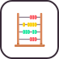
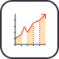

# 🖼️ 素材分類：analysis

> [🏠 主目錄](../../../../../README.md) / [images](../../../../README.md) / [iCons](../../../README.md) / [Webskills](../../README.md) / [Algorithms And Data Structures](../README.md) / **analysis**

本目錄共有 `5` 個檔案

| 🎨 預覽 (點擊放大)  | 📋 檔案詳細資訊與連結 |
| :--- | :--- |
|  | **📂 檔名:** `big-o-notation.svg` ✨ **格式:** `Vector (SVG)` ⚖️ **大小:** `1.48KB` 📅 **更新:** `2026-03-04`  🚀 **jsDelivr Markdown:** `` 🔗 **直接連結 (Url):** <code>https://cdn.jsdelivr.net/gh/barry028/materials@main/images/iCons/Webskills/Algorithms%20And%20Data%20Structures/analysis/big-o-notation.svg</code> 📥 [檢視原始檔](big-o-notation.svg) |
|  | **📂 檔名:** `cost-model.svg` ✨ **格式:** `Vector (SVG)` ⚖️ **大小:** `20.77KB` 📅 **更新:** `2026-03-04`  🚀 **jsDelivr Markdown:** `` 🔗 **直接連結 (Url):** <code>https://cdn.jsdelivr.net/gh/barry028/materials@main/images/iCons/Webskills/Algorithms%20And%20Data%20Structures/analysis/cost-model.svg</code> 📥 [檢視原始檔](cost-model.svg) |
|  | **📂 檔名:** `order-of-growth.svg` ✨ **格式:** `Vector (SVG)` ⚖️ **大小:** `20.65KB` 📅 **更新:** `2026-03-04`  🚀 **jsDelivr Markdown:** `` 🔗 **直接連結 (Url):** <code>https://cdn.jsdelivr.net/gh/barry028/materials@main/images/iCons/Webskills/Algorithms%20And%20Data%20Structures/analysis/order-of-growth.svg</code> 📥 [檢視原始檔](order-of-growth.svg) |
|  | **📂 檔名:** `space-complexity.svg` ✨ **格式:** `Vector (SVG)` ⚖️ **大小:** `4.17KB` 📅 **更新:** `2026-03-04`  🚀 **jsDelivr Markdown:** `` 🔗 **直接連結 (Url):** <code>https://cdn.jsdelivr.net/gh/barry028/materials@main/images/iCons/Webskills/Algorithms%20And%20Data%20Structures/analysis/space-complexity.svg</code> 📥 [檢視原始檔](space-complexity.svg) |
|  | **📂 檔名:** `time-complexity.svg` ✨ **格式:** `Vector (SVG)` ⚖️ **大小:** `3.87KB` 📅 **更新:** `2026-03-04`  🚀 **jsDelivr Markdown:** `` 🔗 **直接連結 (Url):** <code>https://cdn.jsdelivr.net/gh/barry028/materials@main/images/iCons/Webskills/Algorithms%20And%20Data%20Structures/analysis/time-complexity.svg</code> 📥 [檢視原始檔](time-complexity.svg) |