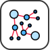

# 🖼️ 素材分類：data-structures

> [🏠 主目錄](../../../../../README.md) / [images](../../../../README.md) / [iCons](../../../README.md) / [Webskills](../../README.md) / [Algorithms And Data Structures](../README.md) / **data-structures**

本目錄共有 `11` 個檔案

| 🎨 預覽 (點擊放大)  | 📋 檔案詳細資訊與連結 |
| :--- | :--- |
|  | **📂 檔名:** `arrays.svg` ✨ **格式:** `Vector (SVG)` ⚖️ **大小:** `5.40KB` 📅 **更新:** `2026-03-04`  🚀 **jsDelivr Markdown:** `` 🔗 **直接連結 (Url):** <code>https://cdn.jsdelivr.net/gh/barry028/materials@main/images/iCons/Webskills/Algorithms%20And%20Data%20Structures/data-structures/arrays.svg</code> 📥 [檢視原始檔](arrays.svg) |
|  | **📂 檔名:** `binary-indexed-tree.svg` ✨ **格式:** `Vector (SVG)` ⚖️ **大小:** `5.27KB` 📅 **更新:** `2026-03-04`  🚀 **jsDelivr Markdown:** `` 🔗 **直接連結 (Url):** <code>https://cdn.jsdelivr.net/gh/barry028/materials@main/images/iCons/Webskills/Algorithms%20And%20Data%20Structures/data-structures/binary-indexed-tree.svg</code> 📥 [檢視原始檔](binary-indexed-tree.svg) |
|  | **📂 檔名:** `graphs.svg` ✨ **格式:** `Vector (SVG)` ⚖️ **大小:** `13.69KB` 📅 **更新:** `2026-03-04`  🚀 **jsDelivr Markdown:** `` 🔗 **直接連結 (Url):** <code>https://cdn.jsdelivr.net/gh/barry028/materials@main/images/iCons/Webskills/Algorithms%20And%20Data%20Structures/data-structures/graphs.svg</code> 📥 [檢視原始檔](graphs.svg) |
|  | **📂 檔名:** `hash-tables.svg` ✨ **格式:** `Vector (SVG)` ⚖️ **大小:** `25.93KB` 📅 **更新:** `2026-03-04`  🚀 **jsDelivr Markdown:** `` 🔗 **直接連結 (Url):** <code>https://cdn.jsdelivr.net/gh/barry028/materials@main/images/iCons/Webskills/Algorithms%20And%20Data%20Structures/data-structures/hash-tables.svg</code> 📥 [檢視原始檔](hash-tables.svg) |
|  | **📂 檔名:** `heap.svg` ✨ **格式:** `Vector (SVG)` ⚖️ **大小:** `1.71KB` 📅 **更新:** `2026-03-04`  🚀 **jsDelivr Markdown:** `` 🔗 **直接連結 (Url):** <code>https://cdn.jsdelivr.net/gh/barry028/materials@main/images/iCons/Webskills/Algorithms%20And%20Data%20Structures/data-structures/heap.svg</code> 📥 [檢視原始檔](heap.svg) |
|  | **📂 檔名:** `k-d-tree.svg` ✨ **格式:** `Vector (SVG)` ⚖️ **大小:** `4.25KB` 📅 **更新:** `2026-03-04`  🚀 **jsDelivr Markdown:** `` 🔗 **直接連結 (Url):** <code>https://cdn.jsdelivr.net/gh/barry028/materials@main/images/iCons/Webskills/Algorithms%20And%20Data%20Structures/data-structures/k-d-tree.svg</code> 📥 [檢視原始檔](k-d-tree.svg) |
|  | **📂 檔名:** `linked-lists.svg` ✨ **格式:** `Vector (SVG)` ⚖️ **大小:** `7.16KB` 📅 **更新:** `2026-03-04`  🚀 **jsDelivr Markdown:** `` 🔗 **直接連結 (Url):** <code>https://cdn.jsdelivr.net/gh/barry028/materials@main/images/iCons/Webskills/Algorithms%20And%20Data%20Structures/data-structures/linked-lists.svg</code> 📥 [檢視原始檔](linked-lists.svg) |
|  | **📂 檔名:** `queues-and-stacks.svg` ✨ **格式:** `Vector (SVG)` ⚖️ **大小:** `11.13KB` 📅 **更新:** `2026-03-04`  🚀 **jsDelivr Markdown:** `` 🔗 **直接連結 (Url):** <code>https://cdn.jsdelivr.net/gh/barry028/materials@main/images/iCons/Webskills/Algorithms%20And%20Data%20Structures/data-structures/queues-and-stacks.svg</code> 📥 [檢視原始檔](queues-and-stacks.svg) |
|  | **📂 檔名:** `red-black-tree.svg` ✨ **格式:** `Vector (SVG)` ⚖️ **大小:** `4.86KB` 📅 **更新:** `2026-03-04`  🚀 **jsDelivr Markdown:** `` 🔗 **直接連結 (Url):** <code>https://cdn.jsdelivr.net/gh/barry028/materials@main/images/iCons/Webskills/Algorithms%20And%20Data%20Structures/data-structures/red-black-tree.svg</code> 📥 [檢視原始檔](red-black-tree.svg) |
|  | **📂 檔名:** `trees.svg` ✨ **格式:** `Vector (SVG)` ⚖️ **大小:** `7.07KB` 📅 **更新:** `2026-03-04`  🚀 **jsDelivr Markdown:** `` 🔗 **直接連結 (Url):** <code>https://cdn.jsdelivr.net/gh/barry028/materials@main/images/iCons/Webskills/Algorithms%20And%20Data%20Structures/data-structures/trees.svg</code> 📥 [檢視原始檔](trees.svg) |
|  | **📂 檔名:** `trie.svg` ✨ **格式:** `Vector (SVG)` ⚖️ **大小:** `6.26KB` 📅 **更新:** `2026-03-04`  🚀 **jsDelivr Markdown:** `` 🔗 **直接連結 (Url):** <code>https://cdn.jsdelivr.net/gh/barry028/materials@main/images/iCons/Webskills/Algorithms%20And%20Data%20Structures/data-structures/trie.svg</code> 📥 [檢視原始檔](trie.svg) |